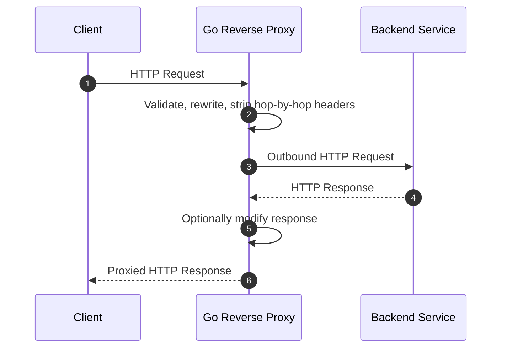
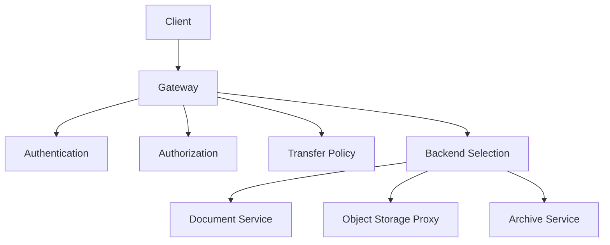
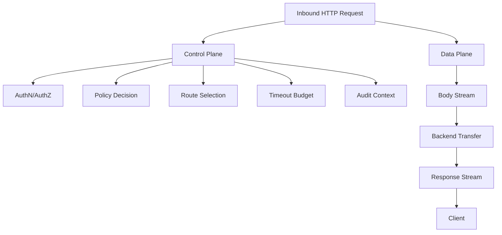
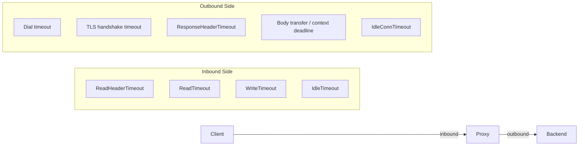
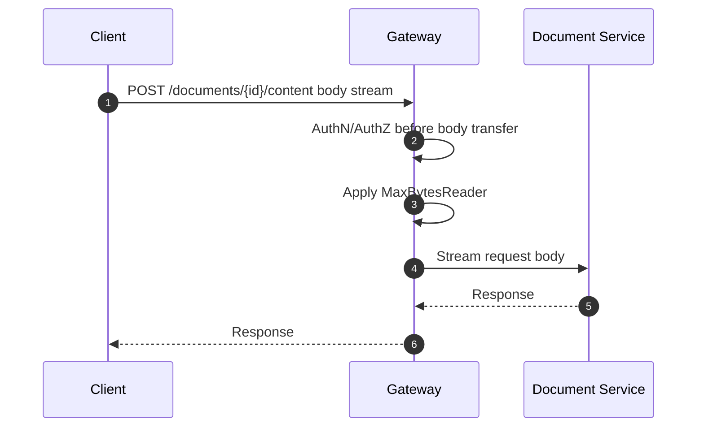
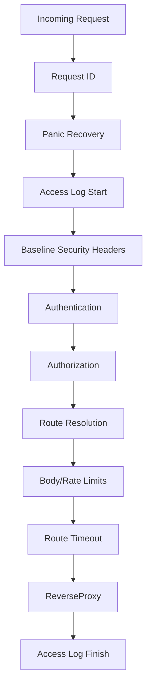

# learn-go-io-buffer-byte-stream-file-network-data-transfer-part-030.md

# Part 030 — Reverse Proxy dan Data Transfer Gateway Patterns dengan `net/http/httputil`

> Seri: **learn-go-io-buffer-byte-stream-file-network-data-transfer**  
> Target versi: **Go 1.26.x**  
> Fokus: reverse proxy, transfer gateway, request/response streaming, header rewriting, hop-by-hop safety, timeout, retry boundary, observability, dan failure model production-grade.

---

## 0. Posisi Part Ini di Series

Sampai Part 029 kita sudah membangun fondasi berikut:

1. `io.Reader` / `io.Writer` sebagai kontrak stream.
2. buffering, scanner, text IO, error semantics.
3. file dan filesystem semantics.
4. serialization, framing, compression, archive.
5. TCP/UDP/Unix socket.
6. HTTP client/server internals.
7. multipart upload/download pipeline.

Part 030 menyatukan banyak fondasi itu dalam satu bentuk yang sering muncul di production: **reverse proxy / data transfer gateway**.

Di Java ecosystem, analoginya bisa muncul sebagai:

- Spring Cloud Gateway.
- Zuul lama.
- Netty-based gateway.
- Servlet filter yang meneruskan request.
- Apache HTTPD / NGINX di depan service.
- API Gateway custom.
- file transfer gateway di depan object storage/internal service.

Di Go, package standar `net/http/httputil` menyediakan `ReverseProxy`, yaitu HTTP handler yang menerima request dari client, membuat outbound request ke backend, lalu menyalin response kembali ke client.

Namun, membuat reverse proxy yang benar bukan hanya:

```go
httputil.NewSingleHostReverseProxy(target)
```

Itu hanya titik awal.

Production proxy harus menjawab pertanyaan yang lebih serius:

- Header mana yang boleh diteruskan?
- Header mana yang harus dihapus?
- Siapa yang boleh menentukan `X-Forwarded-For`?
- Apakah Host header dipreserve atau direwrite?
- Bagaimana timeout inbound dan outbound dibedakan?
- Apakah body upload besar di-stream atau dibuffer?
- Apa yang terjadi jika client disconnect saat backend masih menulis?
- Bagaimana mencegah SSRF saat target dinamis?
- Apakah proxy boleh retry request dengan body?
- Bagaimana mengukur latency backend vs latency client transfer?
- Bagaimana menangani streaming response, SSE, chunked response, dan flush?
- Bagaimana membangun gateway yang defensible secara security dan operasional?

Part ini membahas hal-hal itu.

---

## 1. Referensi Resmi yang Relevan

Referensi utama:

- Go package `net/http/httputil`: <https://pkg.go.dev/net/http/httputil>
- Go package `net/http`: <https://pkg.go.dev/net/http>
- Go 1.26 release notes: <https://go.dev/doc/go1.26>
- Go source `net/http/httputil/reverseproxy.go`: <https://go.dev/src/net/http/httputil/reverseproxy.go>
- RFC 9110 HTTP Semantics, khususnya hop-by-hop headers: <https://www.rfc-editor.org/rfc/rfc9110>

Catatan Go 1.26 yang penting untuk part ini:

- `ReverseProxy.Director` **deprecated** di Go 1.26.
- Pengganti yang direkomendasikan adalah `ReverseProxy.Rewrite`.
- Alasan utamanya adalah `Director` secara fundamental punya masalah security: malicious client dapat menandai header yang ditambahkan oleh `Director` sebagai hop-by-hop sehingga dihapus setelah `Director` berjalan.
- `Rewrite` diperkenalkan sejak Go 1.20 dan menerima `*httputil.ProxyRequest` yang memisahkan inbound request (`In`) dan outbound request (`Out`).
- `ProxyRequest.SetURL` dan `ProxyRequest.SetXForwarded` adalah helper penting untuk rewrite aman.

---

## 2. Mental Model Reverse Proxy

Reverse proxy adalah **server-side intermediary**.

Client tidak bicara langsung ke backend. Client bicara ke proxy. Proxy bicara ke backend. Backend response disalin kembali ke client.



Dari sudut pandang IO, reverse proxy adalah pipeline dua arah:

```text
Inbound request body:
client socket -> net/http server -> proxy request -> http.Transport -> backend socket

Outbound response body:
backend socket -> http.Transport -> proxy response -> net/http server -> client socket
```

Dengan kata lain:


Reverse proxy bukan hanya routing. Ia adalah **streaming data transfer component**.

Karena itu semua konsep dari part sebelumnya berlaku:

| Konsep | Relevansi di reverse proxy |
|---|---|
| `io.Reader` | request body dan response body adalah stream |
| `io.Writer` | response ke client ditulis sebagai stream |
| partial progress | client/backend bisa disconnect setelah sebagian data terkirim |
| deadlines | inbound dan outbound bisa timeout secara berbeda |
| buffering | bisa memperbaiki throughput atau merusak latency streaming |
| backpressure | slow client dapat menahan backend response copy |
| close semantics | body harus ditutup; error saat copy harus diperlakukan sebagai transfer failure |
| header semantics | metadata routing/security hidup di header |
| cancellation | client disconnect harus membatalkan outbound request |

---

## 3. Forward Proxy vs Reverse Proxy vs Gateway

Istilah sering tercampur.

| Istilah | Siapa yang dilayani | Target diketahui oleh siapa | Contoh |
|---|---|---|---|
| Forward proxy | client | client memilih target eksternal | corporate proxy, browser proxy |
| Reverse proxy | backend/server | proxy memilih backend | API gateway, ingress, load balancer |
| Data transfer gateway | domain/application | gateway mengontrol transfer data | upload gateway, archive gateway, file download broker |

Dalam part ini fokusnya adalah **reverse proxy** dan **data transfer gateway**.

Reverse proxy generik meneruskan HTTP request/response.

Data transfer gateway lebih domain-specific. Ia mungkin:

- membatasi ukuran file.
- mengecek MIME/extension.
- menambahkan audit header.
- melakukan authz sebelum forwarding.
- memilih backend berdasarkan tenant/module.
- melakukan checksum.
- menerapkan quota.
- menyimpan metadata transfer.
- menolak transfer jika policy tidak terpenuhi.



---

## 4. Kontrak `httputil.ReverseProxy`

`httputil.ReverseProxy` adalah `http.Handler`.

Secara konseptual:

```go
type ReverseProxy struct {
    Rewrite        func(*httputil.ProxyRequest)
    Transport      http.RoundTripper
    FlushInterval  time.Duration
    ErrorLog       *log.Logger
    BufferPool     httputil.BufferPool
    ModifyResponse func(*http.Response) error
    ErrorHandler   func(http.ResponseWriter, *http.Request, error)
}
```

Field yang paling penting:

| Field | Fungsi |
|---|---|
| `Rewrite` | mengubah outbound request sebelum dikirim ke backend |
| `Transport` | melakukan outbound HTTP request |
| `ModifyResponse` | mengubah response backend sebelum dikirim ke client |
| `ErrorHandler` | menangani error saat backend unreachable atau modify response gagal |
| `BufferPool` | menyediakan buffer untuk copy response body |
| `FlushInterval` | mengontrol flushing response body tertentu |

`ReverseProxy` melakukan pekerjaan besar:

1. menerima inbound request.
2. membuat outbound request.
3. menghapus hop-by-hop header tertentu.
4. menjalankan `Rewrite`.
5. mengirim request lewat `Transport`.
6. menerima response backend.
7. menghapus hop-by-hop response header tertentu.
8. menjalankan `ModifyResponse` bila ada.
9. menulis status/header/body ke client.
10. memanggil `ErrorHandler` bila transfer gagal pada fase tertentu.

Namun, proxy tidak otomatis tahu policy bisnis Anda.

Misalnya:

- target routing.
- authz.
- tenant boundary.
- header allowlist.
- max body size.
- retry policy.
- circuit breaker.
- per-route timeout.
- audit logging.
- data classification.

Semua itu harus Anda desain.

---

## 5. `Rewrite` vs `Director`: Go 1.26 Perspective

### 5.1 Legacy `Director`

Sebelum Go 1.20, contoh reverse proxy sering memakai `Director`.

```go
proxy := &httputil.ReverseProxy{
    Director: func(req *http.Request) {
        req.URL.Scheme = "http"
        req.URL.Host = "backend:8080"
    },
}
```

Di Go 1.26, `Director` deprecated.

Alasan pentingnya bukan kosmetik. Ini security issue di API design.

Masalahnya:

1. `Director` memodifikasi outbound request.
2. Hop-by-hop headers dihapus **setelah** `Director` berjalan.
3. Client jahat dapat mengirim header `Connection` yang menunjuk ke header tertentu.
4. Header yang ditambahkan `Director` bisa ikut dihapus.
5. Akibatnya proxy bisa gagal meneruskan header security/routing yang dianggap penting.

Contoh konseptual:

```text
Client sends:
Connection: X-Internal-Auth

Director adds:
X-Internal-Auth: signed-value

After Director:
Proxy strips hop-by-hop headers listed in Connection.
X-Internal-Auth disappears.
```

Ini buruk karena proxy developer mungkin percaya header tersebut pasti sampai ke backend.

### 5.2 Modern `Rewrite`

Gunakan `Rewrite`.

```go
proxy := &httputil.ReverseProxy{
    Rewrite: func(pr *httputil.ProxyRequest) {
        pr.SetURL(targetURL)
        pr.SetXForwarded()
    },
}
```

`ProxyRequest` punya dua request:

| Field | Arti |
|---|---|
| `In` | request asli dari client; tidak boleh dimodifikasi oleh `Rewrite` |
| `Out` | request outbound ke backend; boleh dimodifikasi |

```go
type ProxyRequest struct {
    In  *http.Request
    Out *http.Request
}
```

Keuntungan `Rewrite`:

- inbound dan outbound request eksplisit terpisah.
- hop-by-hop header sudah dihapus sebelum `Rewrite` dipanggil.
- perubahan di `Rewrite` lebih sulit dihilangkan oleh header manipulatif dari client.
- lebih jelas untuk audit security.

### 5.3 Rule Utama

Untuk kode baru di Go 1.26.x:

```text
Use ReverseProxy.Rewrite.
Do not use ReverseProxy.Director for new code.
```

`NewSingleHostReverseProxy` masih ada, tetapi untuk backward compatibility ia masih memakai `Director`. Untuk behavior yang benar-benar Anda kontrol, buat `ReverseProxy` langsung dengan `Rewrite`.

---

## 6. Minimal Reverse Proxy yang Benar untuk Go 1.26.x

Contoh paling kecil:

```go
package main

import (
    "log"
    "net/http"
    "net/http/httputil"
    "net/url"
    "time"
)

func main() {
    target, err := url.Parse("http://localhost:9000")
    if err != nil {
        log.Fatal(err)
    }

    proxy := &httputil.ReverseProxy{
        Rewrite: func(pr *httputil.ProxyRequest) {
            pr.SetURL(target)
            pr.SetXForwarded()
        },
        Transport: &http.Transport{
            Proxy:                 http.ProxyFromEnvironment,
            MaxIdleConns:          200,
            MaxIdleConnsPerHost:   100,
            IdleConnTimeout:       90 * time.Second,
            ResponseHeaderTimeout: 15 * time.Second,
            ExpectContinueTimeout: 1 * time.Second,
        },
        ErrorHandler: func(w http.ResponseWriter, r *http.Request, err error) {
            http.Error(w, "bad gateway", http.StatusBadGateway)
        },
    }

    srv := &http.Server{
        Addr:              ":8080",
        Handler:           proxy,
        ReadHeaderTimeout: 5 * time.Second,
        ReadTimeout:       60 * time.Second,
        WriteTimeout:      60 * time.Second,
        IdleTimeout:       120 * time.Second,
    }

    log.Fatal(srv.ListenAndServe())
}
```

Ini masih minimal. Belum ada auth, observability, per-route config, body limits, atau structured error.

Tapi sudah menggunakan bentuk modern:

- `Rewrite`, bukan `Director`.
- `SetURL` untuk route target.
- `SetXForwarded` eksplisit.
- custom `Transport`.
- custom `ErrorHandler`.
- server timeout.

---

## 7. Apa yang Dilakukan `SetURL`

`ProxyRequest.SetURL(target)` mengubah outbound request agar diarahkan ke target.

Misal:

```text
target:  http://backend:9000/base
inbound: /api/users?id=1
outbound: http://backend:9000/base/api/users?id=1
```

Secara default, `SetURL` juga mengubah outbound `Host` agar sesuai target host.

Ini berbeda dari `NewSingleHostReverseProxy`, yang demi backward compatibility tidak rewrite Host header.

Jika Anda ingin preserve inbound Host:

```go
Rewrite: func(pr *httputil.ProxyRequest) {
    pr.SetURL(target)
    pr.Out.Host = pr.In.Host
}
```

Namun jangan preserve Host tanpa alasan kuat.

Pertanyaan desain:

| Pilihan | Cocok jika | Risiko |
|---|---|---|
| Rewrite Host ke backend | backend routing berdasarkan host internal | perlu backend tahu host internal |
| Preserve inbound Host | backend butuh public host untuk virtual-host/routing | Host header injection/routing ambiguity |
| Set Host eksplisit dari route config | gateway mengontrol routing penuh | perlu config disiplin |

Praktik aman:

```go
pr.SetURL(target)
pr.Out.Host = target.Host
```

atau biarkan default `SetURL` melakukan itu.

---

## 8. `X-Forwarded-*` dan Trust Boundary

`SetXForwarded` mengatur:

- `X-Forwarded-For`
- `X-Forwarded-Host`
- `X-Forwarded-Proto`

Ini umum dipakai backend untuk mengetahui client asli, original host, dan scheme.

Namun header ini sangat sering menjadi sumber bug security.

### 8.1 Jangan Percaya Header dari Internet

Client bisa mengirim:

```http
X-Forwarded-For: 127.0.0.1
X-Forwarded-Proto: https
X-Forwarded-Host: admin.internal
```

Jika backend percaya mentah-mentah, bisa muncul:

- audit client IP salah.
- rate limit bypass.
- URL generation salah.
- auth callback salah.
- open redirect.
- SSRF-like routing confusion.
- admin-only logic bypass jika ada kode buruk yang memercayai `X-Forwarded-For`.

### 8.2 Pattern: Proxy Menjadi Trust Boundary

Jika proxy ini adalah edge pertama yang menerima request dari internet, policy aman adalah:

```go
Rewrite: func(pr *httputil.ProxyRequest) {
    pr.SetURL(target)

    // Drop forwarded headers from untrusted client.
    pr.Out.Header.Del("Forwarded")
    pr.Out.Header.Del("X-Forwarded-For")
    pr.Out.Header.Del("X-Forwarded-Host")
    pr.Out.Header.Del("X-Forwarded-Proto")

    // Recreate trusted forwarded headers from the actual inbound connection.
    pr.SetXForwarded()
}
```

Dengan `Rewrite`, beberapa forwarded headers sudah dihapus sebelum `Rewrite` dipanggil menurut dokumentasi `httputil`. Namun menulis policy eksplisit seperti di atas tetap berguna sebagai dokumentasi security intent.

### 8.3 Pattern: Internal Chain of Proxies

Jika request datang dari trusted upstream proxy, Anda mungkin ingin append ke chain.

```go
Rewrite: func(pr *httputil.ProxyRequest) {
    pr.SetURL(target)

    // Preserve trusted chain only if inbound source is trusted.
    if isTrustedProxy(pr.In.RemoteAddr) {
        pr.Out.Header["X-Forwarded-For"] = pr.In.Header["X-Forwarded-For"]
    }

    pr.SetXForwarded()
}
```

`isTrustedProxy` tidak boleh hanya string check asal-asalan. Gunakan CIDR allowlist dengan `net/netip`.

---

## 9. Hop-by-Hop Headers

HTTP membedakan header end-to-end dan hop-by-hop.

End-to-end header diteruskan sampai origin server.

Hop-by-hop header hanya berlaku untuk satu koneksi transport dan harus dikonsumsi oleh intermediary.

Contoh hop-by-hop header yang umum:

- `Connection`
- `Proxy-Connection`
- `Keep-Alive`
- `Proxy-Authenticate`
- `Proxy-Authorization`
- `TE`
- `Trailer`
- `Transfer-Encoding`
- `Upgrade`

Reverse proxy harus menghapus hop-by-hop header dari request client dan response backend.

`ReverseProxy` melakukan banyak hal ini otomatis. Namun Anda tetap harus memahami efeknya karena:

1. header custom bisa ditandai hop-by-hop lewat `Connection`.
2. WebSocket/Upgrade butuh perlakuan khusus.
3. `TE: trailers` punya semantics khusus.
4. header security internal jangan dibiarkan dipengaruhi client.

### 9.1 Header Injection via `Connection`

Client dapat mengirim:

```http
Connection: X-Tenant-ID
X-Tenant-ID: evil
```

Header `X-Tenant-ID` dapat diperlakukan hop-by-hop dan dihapus oleh proxy.

Dengan `Rewrite`, Anda menambahkan header setelah pembersihan awal, sehingga lebih aman.

### 9.2 Prinsip Aman

```text
Headers added by gateway policy must be created in Rewrite, not trusted from client input.
```

Contoh:

```go
Rewrite: func(pr *httputil.ProxyRequest) {
    pr.SetURL(target)
    pr.SetXForwarded()

    pr.Out.Header.Set("X-Gateway-Request-ID", requestIDFromContext(pr.In.Context()))
    pr.Out.Header.Set("X-Authenticated-User", userIDFromContext(pr.In.Context()))
    pr.Out.Header.Set("X-Tenant-ID", tenantIDFromContext(pr.In.Context()))
}
```

Jangan pakai inbound value langsung:

```go
// Buruk: client dapat spoof.
pr.Out.Header.Set("X-Tenant-ID", pr.In.Header.Get("X-Tenant-ID"))
```

---

## 10. Reverse Proxy Sebagai Data Plane + Control Plane

Proxy punya dua bidang:



Control plane menjawab:

- request boleh diteruskan atau tidak?
- backend mana yang dipilih?
- header apa yang ditambahkan?
- timeout berapa?
- ukuran body maksimum berapa?
- response boleh diubah atau tidak?
- event audit apa yang dicatat?

Data plane memindahkan byte.

Kesalahan umum adalah mencampur keduanya.

Contoh buruk:

- membaca seluruh body ke memory untuk mengambil metadata yang sebenarnya ada di header.
- melakukan authz setelah body upload besar selesai diterima.
- melakukan logging body penuh untuk audit.
- melakukan retry otomatis untuk POST upload tanpa idempotency key.

Prinsip:

```text
Make control decisions before expensive data movement.
```

---

## 11. Route Selection Patterns

### 11.1 Static Single Backend

Cocok untuk reverse proxy sederhana.

```go
func singleBackendProxy(target *url.URL) *httputil.ReverseProxy {
    return &httputil.ReverseProxy{
        Rewrite: func(pr *httputil.ProxyRequest) {
            pr.SetURL(target)
            pr.SetXForwarded()
        },
    }
}
```

### 11.2 Path-Based Routing

Misal:

- `/documents/*` → document service.
- `/exports/*` → export service.
- `/reports/*` → report service.

```go
type Route struct {
    Prefix string
    Target *url.URL
}

type RouterProxy struct {
    Routes []Route
    Proxy  *httputil.ReverseProxy
}
```

Namun `ReverseProxy.Rewrite` hanya punya satu function. Route decision bisa dilakukan di `Rewrite` berdasarkan `pr.In.URL.Path`.

```go
func newPathProxy(routes []Route) *httputil.ReverseProxy {
    return &httputil.ReverseProxy{
        Rewrite: func(pr *httputil.ProxyRequest) {
            route, ok := matchRoute(routes, pr.In.URL.Path)
            if !ok {
                // Tidak bisa langsung write response dari Rewrite.
                // Lebih baik lakukan route validation di middleware sebelum proxy.
                return
            }
            pr.SetURL(route.Target)
            pr.SetXForwarded()
        },
    }
}
```

Masalah: `Rewrite` bukan tempat ideal untuk reject request dengan status khusus karena ia tidak menerima `ResponseWriter`.

Pattern lebih baik:

```go
type routeKey struct{}

func routeMiddleware(routes []Route, next http.Handler) http.Handler {
    return http.HandlerFunc(func(w http.ResponseWriter, r *http.Request) {
        route, ok := matchRoute(routes, r.URL.Path)
        if !ok {
            http.NotFound(w, r)
            return
        }
        ctx := context.WithValue(r.Context(), routeKey{}, route)
        next.ServeHTTP(w, r.WithContext(ctx))
    })
}

func routeFromContext(ctx context.Context) (Route, bool) {
    route, ok := ctx.Value(routeKey{}).(Route)
    return route, ok
}
```

Lalu:

```go
proxy := &httputil.ReverseProxy{
    Rewrite: func(pr *httputil.ProxyRequest) {
        route, ok := routeFromContext(pr.In.Context())
        if !ok {
            // Should not happen if middleware enforced it.
            return
        }
        pr.SetURL(route.Target)
        pr.SetXForwarded()
    },
}
```

### 11.3 Tenant-Based Routing

Tenant routing jangan langsung percaya path/header client. Tenant harus berasal dari authenticated context atau signed token yang sudah diverifikasi.

```go
Rewrite: func(pr *httputil.ProxyRequest) {
    tenant := tenantFromContext(pr.In.Context())
    target := targetForTenant(tenant)

    pr.SetURL(target)
    pr.SetXForwarded()
    pr.Out.Header.Set("X-Tenant-ID", tenant.ID)
}
```

### 11.4 Dynamic Target Routing dan SSRF Risk

Danger zone:

```go
// Sangat berbahaya jika target berasal dari query/body client.
target, _ := url.Parse(pr.In.URL.Query().Get("url"))
pr.SetURL(target)
```

Ini bisa menjadi SSRF.

Client dapat meminta proxy mengakses:

- `http://169.254.169.254/`
- `http://localhost:8080/admin`
- `http://internal-db.service`
- `http://10.0.0.5/metadata`
- `file://...` jika parser/config salah.

Dynamic routing harus menggunakan allowlist, bukan denylist.

```go
func allowedBackend(name string) (*url.URL, bool) {
    switch name {
    case "documents":
        return mustURL("http://document-service.internal:8080"), true
    case "exports":
        return mustURL("http://export-service.internal:8080"), true
    default:
        return nil, false
    }
}
```

Prinsip:

```text
Client may choose a logical backend key only if that key is constrained by server-side allowlist.
Client must never choose arbitrary scheme/host/port.
```

---

## 12. Request Body Handling

Reverse proxy default behavior adalah streaming request body ke backend melalui `Transport`.

Ini baik untuk upload besar karena tidak perlu membaca seluruh body ke memory.

Namun, ada konsekuensi:

- authz harus selesai sebelum body dikirim.
- jika backend lambat membaca, client upload bisa tertahan.
- jika client lambat mengirim, backend connection bisa terikat lama.
- jika body perlu divalidasi, proxy mungkin harus membaca body, lalu kehilangan streaming advantage.

### 12.1 Batas Ukuran Body

Sebelum proxy:

```go
func maxBodyBytes(limit int64, next http.Handler) http.Handler {
    return http.HandlerFunc(func(w http.ResponseWriter, r *http.Request) {
        r.Body = http.MaxBytesReader(w, r.Body, limit)
        next.ServeHTTP(w, r)
    })
}
```

Untuk upload file, tentukan limit per route:

```text
/documents/upload      50 MiB
/reports/export        no request body
/bulk/import           2 GiB, streaming only
/admin/config          1 MiB
```

### 12.2 Jangan Membaca Body Dua Kali Tanpa Desain

Jika middleware membaca body:

```go
body, err := io.ReadAll(r.Body)
```

maka body stream habis. Untuk mengirim ke backend, harus diset ulang:

```go
r.Body = io.NopCloser(bytes.NewReader(body))
```

Masalahnya:

- memory spike untuk body besar.
- request body jadi replayable hanya karena dibuffer.
- behavior berbeda dari streaming asli.

Jika hanya perlu hash/checksum saat forwarding, gunakan streaming transform seperti `io.TeeReader`, tetapi pada reverse proxy standar perlu hati-hati karena `Transport` yang membaca body.

Pattern yang lebih explicit:

```go
func checksumBodyMiddleware(next http.Handler) http.Handler {
    return http.HandlerFunc(func(w http.ResponseWriter, r *http.Request) {
        h := sha256.New()
        r.Body = &readCloser{
            Reader: io.TeeReader(r.Body, h),
            Closer: r.Body,
        }
        ctx := context.WithValue(r.Context(), checksumKey{}, h)
        next.ServeHTTP(w, r.WithContext(ctx))
    })
}

type readCloser struct {
    io.Reader
    io.Closer
}
```

Namun checksum final baru diketahui setelah body selesai dibaca, yaitu mungkin setelah backend sudah menerima data. Jadi checksum ini lebih cocok untuk audit/observability, bukan pre-validation.

Untuk pre-validation, body harus dibaca dulu atau format harus memungkinkan early metadata/checksum verification.

---

## 13. Response Handling

`ReverseProxy` menerima response dari backend dan menyalinnya ke client.

`ModifyResponse` memungkinkan Anda mengubah response sebelum dikirim.

```go
proxy := &httputil.ReverseProxy{
    Rewrite: func(pr *httputil.ProxyRequest) {
        pr.SetURL(target)
        pr.SetXForwarded()
    },
    ModifyResponse: func(resp *http.Response) error {
        resp.Header.Set("X-Gateway", "go-transfer-gateway")
        return nil
    },
}
```

### 13.1 Kapan `ModifyResponse` Dipanggil

`ModifyResponse` dipanggil jika backend mengembalikan response, termasuk HTTP status code error seperti 404/500.

Jika backend tidak reachable, `ModifyResponse` tidak dipanggil; `ErrorHandler` yang dipakai.

### 13.2 Jangan Modifikasi Body Besar Sembarangan

Untuk mengubah response body:

```go
ModifyResponse: func(resp *http.Response) error {
    b, err := io.ReadAll(resp.Body)
    if err != nil {
        return err
    }
    _ = resp.Body.Close()

    b = bytes.ReplaceAll(b, []byte("backend"), []byte("gateway"))
    resp.Body = io.NopCloser(bytes.NewReader(b))
    resp.ContentLength = int64(len(b))
    resp.Header.Set("Content-Length", strconv.Itoa(len(b)))
    return nil
}
```

Ini hanya cocok untuk response kecil.

Untuk response besar/streaming, body rewrite bisa:

- merusak latency.
- menghapus streaming behavior.
- menaikkan memory.
- membuat `Content-Length` salah.
- merusak compression.
- membuat error transfer terjadi setelah status/header sudah dikirim.

Prinsip:

```text
Modify headers freely.
Modify body only when size is bounded and semantics are explicit.
```

### 13.3 Error Mapping

Jika `ModifyResponse` mengembalikan error, `ErrorHandler` dipanggil.

```go
ModifyResponse: func(resp *http.Response) error {
    if resp.StatusCode == http.StatusUnauthorized {
        return errBackendUnauthorized
    }
    return nil
},
ErrorHandler: func(w http.ResponseWriter, r *http.Request, err error) {
    switch {
    case errors.Is(err, errBackendUnauthorized):
        http.Error(w, "upstream rejected request", http.StatusBadGateway)
    default:
        http.Error(w, "bad gateway", http.StatusBadGateway)
    }
},
```

Hati-hati: jika header/status sudah terkirim ke client, Anda tidak bisa mengubah status response. Error saat body copy sering terjadi setelah response sudah dimulai.

---

## 14. Streaming Response dan Flush

Beberapa response harus di-stream:

- Server-Sent Events.
- log tailing.
- long-running export progress.
- chunked download.
- proxied gRPC-web-like streams.
- large file download.

`ReverseProxy.FlushInterval` memengaruhi flush saat copy response body.

Rules penting:

- zero: tidak ada periodic flush.
- negative: flush langsung setelah setiap write.
- ignored untuk response yang dikenali streaming atau `ContentLength == -1`; untuk response itu writes di-flush segera.

### 14.1 Latency vs Throughput

Immediate flush:

- bagus untuk real-time stream.
- buruk untuk throughput jika chunk kecil banyak.
- bisa menaikkan syscall/write frequency.

Buffered flush:

- bagus untuk throughput.
- bisa menambah latency.
- tidak cocok untuk SSE/progress stream.

```text
High throughput download: prefer natural buffering.
Interactive stream: prefer immediate/periodic flush.
```

### 14.2 Streaming Gateway Pattern

```go
proxy := &httputil.ReverseProxy{
    Rewrite: func(pr *httputil.ProxyRequest) {
        pr.SetURL(target)
        pr.SetXForwarded()
    },
    FlushInterval: -1,
}
```

Jangan jadikan `FlushInterval: -1` default untuk semua route jika mayoritas response adalah file besar. Bisa menurunkan throughput.

Lebih baik per-route proxy config.

---

## 15. BufferPool

`ReverseProxy.BufferPool` memberi buffer untuk `io.CopyBuffer` saat menyalin response body.

Interface:

```go
type BufferPool interface {
    Get() []byte
    Put([]byte)
}
```

Implementasi sederhana:

```go
type fixedBufferPool struct {
    pool sync.Pool
    size int
}

func newFixedBufferPool(size int) *fixedBufferPool {
    return &fixedBufferPool{
        size: size,
        pool: sync.Pool{
            New: func() any {
                b := make([]byte, size)
                return &b
            },
        },
    }
}

func (p *fixedBufferPool) Get() []byte {
    bp := p.pool.Get().(*[]byte)
    return *bp
}

func (p *fixedBufferPool) Put(b []byte) {
    if cap(b) != p.size {
        return
    }
    b = b[:p.size]
    p.pool.Put(&b)
}
```

Gunakan:

```go
proxy := &httputil.ReverseProxy{
    Rewrite: func(pr *httputil.ProxyRequest) {
        pr.SetURL(target)
        pr.SetXForwarded()
    },
    BufferPool: newFixedBufferPool(32 * 1024),
}
```

### 15.1 Apakah BufferPool Selalu Perlu?

Tidak selalu.

`sync.Pool` bisa membantu pada throughput tinggi, tetapi juga bisa:

- menyembunyikan memory retention.
- memperumit reasoning.
- tidak signifikan jika bottleneck network/backend.
- membuat benchmark mikro terlihat bagus tapi production tidak berubah.

Gunakan setelah observability menunjukkan allocation dari proxy copy path signifikan.

---

## 16. Timeout Model untuk Reverse Proxy

Reverse proxy punya timeout di dua sisi:



### 16.1 Inbound `http.Server` Timeouts

| Timeout | Fungsi |
|---|---|
| `ReadHeaderTimeout` | batas membaca request headers; penting melawan slowloris |
| `ReadTimeout` | batas membaca seluruh request, termasuk body |
| `WriteTimeout` | batas menulis response |
| `IdleTimeout` | batas idle keep-alive connection |

Untuk gateway upload besar, `ReadTimeout` perlu hati-hati. Jika terlalu kecil, upload valid gagal. Jika terlalu besar, slow upload bisa mengikat resource.

Anda bisa memakai:

- `ReadHeaderTimeout` ketat.
- body rate limiting / deadline adaptive.
- per-route max body size.
- reverse proxy streaming.

### 16.2 Outbound `http.Transport` Timeouts

| Timeout | Fungsi |
|---|---|
| `DialContext` timeout | batas membuat koneksi TCP |
| `TLSHandshakeTimeout` | batas TLS handshake |
| `ResponseHeaderTimeout` | batas menunggu response header backend |
| `ExpectContinueTimeout` | batas menunggu `100-continue` |
| `IdleConnTimeout` | batas idle pooled connection |

Contoh:

```go
transport := &http.Transport{
    Proxy: http.ProxyFromEnvironment,
    DialContext: (&net.Dialer{
        Timeout:   5 * time.Second,
        KeepAlive: 30 * time.Second,
    }).DialContext,
    MaxIdleConns:          1000,
    MaxIdleConnsPerHost:   100,
    IdleConnTimeout:       90 * time.Second,
    TLSHandshakeTimeout:   5 * time.Second,
    ResponseHeaderTimeout: 30 * time.Second,
    ExpectContinueTimeout: 1 * time.Second,
}
```

### 16.3 End-to-End Timeout Budget

Jangan hanya memberi satu `Client.Timeout` besar di outbound `http.Client` untuk proxy path. `ReverseProxy` menggunakan `Transport` langsung.

Lebih baik:

- inbound server timeouts.
- request context deadline per route.
- transport phase timeouts.
- backend response header timeout.
- streaming body policy.

Middleware timeout:

```go
func withRouteTimeout(timeout time.Duration, next http.Handler) http.Handler {
    return http.HandlerFunc(func(w http.ResponseWriter, r *http.Request) {
        ctx, cancel := context.WithTimeout(r.Context(), timeout)
        defer cancel()
        next.ServeHTTP(w, r.WithContext(ctx))
    })
}
```

Hati-hati untuk streaming download lama. Timeout absolute bisa memutus download besar. Kadang lebih tepat memakai idle timeout atau per-phase timeout daripada total timeout.

---

## 17. Retry Boundary

Reverse proxy tidak boleh retry secara buta.

Kenapa?

Karena request mungkin sudah sampai ke backend sebagian atau sepenuhnya.

| Request | Aman retry otomatis? | Catatan |
|---|---|---|
| GET tanpa side effect | biasanya iya | tetap hati-hati jika backend buruk |
| HEAD | biasanya iya | idem |
| PUT dengan idempotency semantics | mungkin | tergantung resource design |
| DELETE | mungkin | idempotent secara HTTP intent, tapi backend bisa side-effect logging/workflow |
| POST upload | tidak otomatis | perlu idempotency key / resumable protocol |
| multipart upload | tidak otomatis | body stream belum tentu replayable |

### 17.1 Replayability

Request body streaming dari client biasanya tidak replayable.

Agar replayable:

- body harus dibuffer ke memory/disk.
- atau client menyediakan idempotency key.
- atau protocol mendukung resumable chunks.
- atau retry dilakukan oleh client, bukan proxy.

Jika proxy membaca body ke temp file untuk retry, Anda mengubah system trade-off:

- disk pressure.
- temp file cleanup.
- latency sebelum backend menerima data.
- privacy/security risk at rest.
- durability semantics.

### 17.2 Retry di Transport vs Gateway

`http.Transport` sendiri punya beberapa behavior internal terkait connection reuse, tetapi business-level retry harus eksplisit.

Pattern:

```text
Retry only before bytes are sent, or when request is provably replayable and idempotent.
```

Untuk gateway transfer file, sering lebih baik:

- tidak retry upload otomatis.
- return error jelas.
- client melakukan retry dengan resumable upload ID.
- backend deduplicate berdasarkan idempotency key.

---

## 18. Load Balancing Pattern

`ReverseProxy` tidak load balancer penuh secara default, tetapi bisa diarahkan ke target dinamis.

### 18.1 Round Robin Sederhana

```go
type backendPool struct {
    backends []*url.URL
    next     atomic.Uint64
}

func (p *backendPool) Pick() *url.URL {
    n := p.next.Add(1)
    return p.backends[(int(n)-1)%len(p.backends)]
}
```

Gunakan di `Rewrite`:

```go
pool := &backendPool{backends: []*url.URL{
    mustURL("http://backend-a:8080"),
    mustURL("http://backend-b:8080"),
}}

proxy := &httputil.ReverseProxy{
    Rewrite: func(pr *httputil.ProxyRequest) {
        pr.SetURL(pool.Pick())
        pr.SetXForwarded()
    },
}
```

Ini belum cukup production.

Belum ada:

- health check.
- outlier detection.
- circuit breaker.
- least connections.
- retry budget.
- zone awareness.
- sticky session.

### 18.2 Health-Aware Routing

```go
type Backend struct {
    URL     *url.URL
    Healthy atomic.Bool
}

type HealthPool struct {
    backends []*Backend
    next     atomic.Uint64
}

func (p *HealthPool) Pick() (*url.URL, bool) {
    n := len(p.backends)
    if n == 0 {
        return nil, false
    }
    start := int(p.next.Add(1)-1) % n
    for i := 0; i < n; i++ {
        b := p.backends[(start+i)%n]
        if b.Healthy.Load() {
            return b.URL, true
        }
    }
    return nil, false
}
```

Route validation sebaiknya dilakukan sebelum proxy, agar bisa return `503` jika tidak ada backend sehat.

---

## 19. Data Transfer Gateway Patterns

### 19.1 Upload Gateway

Goal:

- authenticate user.
- authorize upload target.
- enforce body size.
- stream body ke backend.
- add audit headers.
- avoid buffering large body.
- propagate cancellation.



Middleware order:

```text
request id
→ panic recovery
→ access log start
→ authn
→ authz
→ route selection
→ body limit
→ timeout budget
→ reverse proxy
→ access log finish
```

### 19.2 Download Gateway

Goal:

- authorize before download.
- forward request to backend/object service.
- stream response to client.
- preserve content headers carefully.
- prevent header injection.
- support range requests if backend supports them.

Headers to handle carefully:

- `Content-Type`
- `Content-Length`
- `Content-Disposition`
- `ETag`
- `Last-Modified`
- `Accept-Ranges`
- `Range`
- `Content-Range`

Do not fabricate range semantics unless you fully implement them.

### 19.3 Transform Gateway

Example: backend returns raw CSV, gateway gzip-compresses if client accepts gzip.

Be careful:

- remove/adjust `Content-Length`.
- set `Content-Encoding`.
- update `Vary: Accept-Encoding`.
- streaming compressor must be closed.
- errors after header commit are hard to report.

Often better to let backend or infrastructure handle compression.

### 19.4 Audit Gateway

Gateway adds trusted audit metadata:

```go
pr.Out.Header.Set("X-Audit-Request-ID", requestID)
pr.Out.Header.Set("X-Audit-User-ID", user.ID)
pr.Out.Header.Set("X-Audit-Tenant-ID", tenant.ID)
pr.Out.Header.Set("X-Audit-Source", "transfer-gateway")
```

But do not log sensitive body contents.

Audit event model:

```json
{
  "request_id": "...",
  "user_id": "...",
  "tenant_id": "...",
  "method": "POST",
  "path": "/documents/123/content",
  "backend": "document-service",
  "status": 201,
  "bytes_in": 10485760,
  "bytes_out": 128,
  "duration_ms": 842,
  "failure_class": null
}
```

---

## 20. Security Model

Reverse proxy is security-sensitive.

### 20.1 Header Spoofing

Never trust inbound:

- `X-Forwarded-*`
- `Forwarded`
- `X-Real-IP`
- `X-User-ID`
- `X-Tenant-ID`
- `X-Internal-*`
- `X-Request-ID` without validation

Generate or validate at gateway.

### 20.2 SSRF

If target can be influenced by user input, use allowlist.

Reject:

- arbitrary URL.
- private IP unless explicitly allowed.
- metadata IP.
- localhost.
- link-local.
- non-http scheme.
- unexpected port.
- DNS rebinding risk.

For high security routing, resolve target server-side from config/service discovery, not from request.

### 20.3 Request Smuggling

HTTP parsing ambiguity can be dangerous when multiple intermediaries disagree.

Practical guardrails:

- keep Go version patched.
- avoid raw TCP HTTP parsing manually.
- do not forward conflicting `Content-Length` / `Transfer-Encoding` manually.
- rely on `net/http` parser.
- test with malformed requests if gateway is internet-facing.
- avoid preserving raw query/body semantics unless necessary.

### 20.4 Query Parameter Ambiguity

Go `ReverseProxy.Rewrite` docs note that unparsable query parameters are removed before `Rewrite`. Copying raw query directly can preserve malformed input but may create security issues if proxy and backend parse queries differently.

Rule:

```text
Normalize query if gateway enforces security decisions on query parameters.
Do not security-check normalized query while forwarding raw ambiguous query to backend.
```

### 20.5 Response Header Sanitization

Backend might return headers inappropriate for public clients:

- internal service name.
- debug headers.
- `Set-Cookie` for internal domain.
- weak CORS headers.
- internal redirect `Location`.

Use `ModifyResponse` for policy:

```go
ModifyResponse: func(resp *http.Response) error {
    resp.Header.Del("X-Internal-Debug")
    resp.Header.Del("Server")
    sanitizeLocation(resp)
    enforceSecurityHeaders(resp)
    return nil
}
```

Be careful modifying `Set-Cookie` and `Location`; incorrect rewriting can break auth or create redirect vulnerabilities.

---

## 21. Observability

A gateway must be observable at data transfer level, not just request count.

### 21.1 Metrics

Core metrics:

| Metric | Type | Labels |
|---|---|---|
| `gateway_requests_total` | counter | route, method, status_class, backend |
| `gateway_request_duration_seconds` | histogram | route, method, backend |
| `gateway_backend_duration_seconds` | histogram | route, backend |
| `gateway_request_body_bytes` | histogram/counter | route |
| `gateway_response_body_bytes` | histogram/counter | route |
| `gateway_inflight_requests` | gauge | route |
| `gateway_backend_errors_total` | counter | route, backend, error_class |
| `gateway_client_disconnects_total` | counter | route |
| `gateway_rewrites_total` | counter | route, backend |

Differentiate:

- backend returned 500.
- backend unreachable.
- client disconnected.
- request body exceeded limit.
- timeout waiting response header.
- timeout copying response body.
- `ModifyResponse` rejected response.

### 21.2 Logs

Structured access log example:

```json
{
  "ts": "2026-06-23T14:00:00Z",
  "level": "INFO",
  "msg": "gateway request completed",
  "request_id": "...",
  "method": "POST",
  "path": "/documents/123/content",
  "route": "document-upload",
  "backend": "document-service",
  "status": 201,
  "duration_ms": 942,
  "request_bytes": 10485760,
  "response_bytes": 128,
  "client_ip": "203.0.113.10"
}
```

Do not log:

- authorization token.
- cookies.
- request/response body containing PII.
- signed URLs.
- internal credentials.

### 21.3 Tracing

For distributed tracing:

- accept incoming trace context if trusted/valid.
- create gateway span.
- inject trace context to backend request.
- annotate backend selected, route, transfer size class.
- do not put sensitive identifiers in span attributes unless allowed.

With standard library only, you can still propagate headers manually, but production systems often use OpenTelemetry.

### 21.4 `httptrace`

For outbound diagnostics, `net/http/httptrace` can capture:

- DNS start/done.
- connect start/done.
- TLS handshake.
- got connection.
- wrote request.
- got first response byte.

For a gateway, this helps separate:

- DNS latency.
- TCP/TLS latency.
- backend processing latency.
- response body transfer latency.

---

## 22. Counting Bytes in Proxy

You may want bytes in/out for metrics.

### 22.1 Counting Request Body

Wrap inbound body before proxy:

```go
type countingReadCloser struct {
    rc io.ReadCloser
    n  atomic.Int64
}

func (c *countingReadCloser) Read(p []byte) (int, error) {
    n, err := c.rc.Read(p)
    if n > 0 {
        c.n.Add(int64(n))
    }
    return n, err
}

func (c *countingReadCloser) Close() error {
    return c.rc.Close()
}

func (c *countingReadCloser) Count() int64 {
    return c.n.Load()
}
```

Middleware:

```go
type requestBytesKey struct{}

func countRequestBody(next http.Handler) http.Handler {
    return http.HandlerFunc(func(w http.ResponseWriter, r *http.Request) {
        if r.Body == nil {
            next.ServeHTTP(w, r)
            return
        }
        cr := &countingReadCloser{rc: r.Body}
        ctx := context.WithValue(r.Context(), requestBytesKey{}, cr)
        next.ServeHTTP(w, r.WithContext(ctx))
    })
}
```

But note: count is final only after body is fully read by backend transport.

### 22.2 Counting Response Body

Wrap `ResponseWriter`:

```go
type countingResponseWriter struct {
    http.ResponseWriter
    status int
    bytes  int64
}

func (w *countingResponseWriter) WriteHeader(status int) {
    if w.status == 0 {
        w.status = status
        w.ResponseWriter.WriteHeader(status)
    }
}

func (w *countingResponseWriter) Write(p []byte) (int, error) {
    if w.status == 0 {
        w.status = http.StatusOK
    }
    n, err := w.ResponseWriter.Write(p)
    w.bytes += int64(n)
    return n, err
}
```

Production wrapper must preserve optional interfaces carefully:

- `http.Flusher`
- `http.Hijacker`
- `http.Pusher` (legacy HTTP/2 server push; largely obsolete)
- `io.ReaderFrom`
- `http.ResponseController` compatibility considerations

Wrapping `ResponseWriter` badly can break streaming.

---

## 23. WebSocket and Upgrade

Reverse proxying WebSocket uses HTTP Upgrade.

Go `ReverseProxy` has support for upgrade handling in modern versions, but you still need to understand differences:

- connection becomes long-lived.
- normal response body copy model changes to bidirectional stream.
- timeouts must not kill valid long sessions too aggressively.
- header policy must preserve required upgrade headers.
- observability must track active upgraded connections.

Headers involved:

- `Connection: Upgrade`
- `Upgrade: websocket`
- `Sec-WebSocket-*`

Because upgrade headers are hop-by-hop, this is one of the places where generic hop-by-hop stripping intersects with protocol upgrade logic.

If building mission-critical WebSocket gateway, test explicitly with real WebSocket clients and slow/abrupt disconnects.

---

## 24. Compression at Proxy Layer

Should gateway compress/decompress?

| Option | Pros | Cons |
|---|---|---|
| Let backend compress | backend controls representation | duplicated logic across services |
| Let infra compress | centralized | may lack app-specific policy |
| Gateway compresses | central policy | body transformation complexity |
| No compression | simpler | bandwidth cost |

If gateway compresses response:

- remove `Content-Length`.
- set `Content-Encoding`.
- update `Vary`.
- avoid double compression.
- close gzip writer.
- consider streaming error semantics.

If gateway decompresses request:

- bound decompressed size.
- avoid decompression bomb.
- define whether backend expects compressed or plain.
- update `Content-Encoding`/`Content-Length`.

For most gateways, header/routing/security proxying is safer than body transformation.

---

## 25. Range Requests and Large Downloads

A file download gateway should understand range requests enough not to break them.

Client may send:

```http
Range: bytes=1000-1999
```

Backend may respond:

```http
206 Partial Content
Content-Range: bytes 1000-1999/5000
```

Gateway options:

1. pass Range through unchanged.
2. strip Range and force full download.
3. implement range itself.

Option 1 is simplest if backend is trusted and supports Range.

But if gateway enforces authorization per byte range or transforms body, you must be careful. Compression and Range interact poorly unless using representation-aware semantics.

Rule:

```text
Do not transform ranged bodies unless you fully understand HTTP representation semantics.
```

---

## 26. Error Handler Design

Default error handling may not match your API contract.

Implement `ErrorHandler`.

```go
type proxyErrorResponse struct {
    Error     string `json:"error"`
    RequestID string `json:"request_id"`
}

func jsonErrorHandler(w http.ResponseWriter, r *http.Request, err error) {
    requestID := requestIDFromContext(r.Context())

    status := http.StatusBadGateway
    errorCode := "BAD_GATEWAY"

    if errors.Is(err, context.DeadlineExceeded) {
        status = http.StatusGatewayTimeout
        errorCode = "GATEWAY_TIMEOUT"
    }

    w.Header().Set("Content-Type", "application/json")
    w.WriteHeader(status)
    _ = json.NewEncoder(w).Encode(proxyErrorResponse{
        Error:     errorCode,
        RequestID: requestID,
    })
}
```

But remember: `ErrorHandler` can only send clean response if response has not already started.

Transfer failure after response status/body started may appear to client as connection reset/truncated response.

For downloads, add integrity mechanism:

- `Content-Length` when known.
- checksum header/trailer if supported.
- application-level manifest.
- client-side verification.

---

## 27. Middleware Architecture

Recommended shape:



Key point:

```text
Auth and route decisions should happen before body streaming to backend.
```

### 27.1 Route Config Model

```go
type RouteConfig struct {
    Name              string
    Prefix            string
    Target            *url.URL
    MaxRequestBytes   int64
    Timeout           time.Duration
    PreserveHost      bool
    FlushInterval     time.Duration
    RequireAuth       bool
    AllowedMethods    map[string]bool
    AddForwarded      bool
}
```

### 27.2 Per-Route Proxy

Simpler than one mega proxy:

```go
func newProxyForRoute(route RouteConfig, transport http.RoundTripper) *httputil.ReverseProxy {
    return &httputil.ReverseProxy{
        Rewrite: func(pr *httputil.ProxyRequest) {
            pr.SetURL(route.Target)
            if route.PreserveHost {
                pr.Out.Host = pr.In.Host
            }
            if route.AddForwarded {
                pr.SetXForwarded()
            }
            pr.Out.Header.Set("X-Gateway-Route", route.Name)
        },
        Transport:     transport,
        FlushInterval: route.FlushInterval,
        ErrorHandler:  jsonErrorHandler,
        BufferPool:    newFixedBufferPool(32 * 1024),
    }
}
```

This avoids too much conditional logic in one `Rewrite`.

---

## 28. Production Example: Route-Aware Transfer Gateway

This example is intentionally compact but structurally production-oriented.

```go
package gateway

import (
    "context"
    "encoding/json"
    "errors"
    "log/slog"
    "net"
    "net/http"
    "net/http/httputil"
    "net/url"
    "strings"
    "sync"
    "time"
)

type routeKey struct{}

type RouteConfig struct {
    Name            string
    Prefix          string
    Target          *url.URL
    MaxRequestBytes int64
    Timeout         time.Duration
    PreserveHost    bool
    FlushInterval   time.Duration
    AllowedMethods  map[string]bool
}

type Gateway struct {
    routes    []RouteConfig
    proxies   map[string]*httputil.ReverseProxy
    logger    *slog.Logger
    transport http.RoundTripper
}

func NewGateway(routes []RouteConfig, logger *slog.Logger) *Gateway {
    tr := &http.Transport{
        Proxy: http.ProxyFromEnvironment,
        DialContext: (&net.Dialer{
            Timeout:   5 * time.Second,
            KeepAlive: 30 * time.Second,
        }).DialContext,
        MaxIdleConns:          1000,
        MaxIdleConnsPerHost:   100,
        IdleConnTimeout:       90 * time.Second,
        TLSHandshakeTimeout:   5 * time.Second,
        ResponseHeaderTimeout: 30 * time.Second,
        ExpectContinueTimeout: 1 * time.Second,
    }

    g := &Gateway{
        routes:    routes,
        proxies:   make(map[string]*httputil.ReverseProxy),
        logger:    logger,
        transport: tr,
    }

    for _, route := range routes {
        r := route
        g.proxies[r.Name] = &httputil.ReverseProxy{
            Rewrite: func(pr *httputil.ProxyRequest) {
                pr.SetURL(r.Target)
                if r.PreserveHost {
                    pr.Out.Host = pr.In.Host
                }
                pr.SetXForwarded()
                pr.Out.Header.Set("X-Gateway-Route", r.Name)
                pr.Out.Header.Set("X-Gateway-Request-ID", requestID(pr.In))
            },
            Transport:     tr,
            FlushInterval: r.FlushInterval,
            BufferPool:    newFixedBufferPool(32 * 1024),
            ModifyResponse: func(resp *http.Response) error {
                resp.Header.Set("X-Gateway", "go-transfer-gateway")
                resp.Header.Del("X-Internal-Debug")
                return nil
            },
            ErrorHandler: func(w http.ResponseWriter, r *http.Request, err error) {
                writeProxyError(w, r, err)
            },
        }
    }

    return g
}

func (g *Gateway) ServeHTTP(w http.ResponseWriter, r *http.Request) {
    start := time.Now()
    crw := &countingResponseWriter{ResponseWriter: w}

    route, ok := g.match(r.URL.Path)
    if !ok {
        http.NotFound(crw, r)
        return
    }

    if len(route.AllowedMethods) > 0 && !route.AllowedMethods[r.Method] {
        http.Error(crw, "method not allowed", http.StatusMethodNotAllowed)
        return
    }

    if route.MaxRequestBytes > 0 && r.Body != nil {
        r.Body = http.MaxBytesReader(crw, r.Body, route.MaxRequestBytes)
    }

    ctx := context.WithValue(r.Context(), routeKey{}, route)
    if route.Timeout > 0 {
        var cancel context.CancelFunc
        ctx, cancel = context.WithTimeout(ctx, route.Timeout)
        defer cancel()
    }

    proxy := g.proxies[route.Name]
    proxy.ServeHTTP(crw, r.WithContext(ctx))

    g.logger.Info("gateway_request_completed",
        "route", route.Name,
        "method", r.Method,
        "path", r.URL.Path,
        "status", crw.statusOrDefault(),
        "response_bytes", crw.bytes,
        "duration_ms", time.Since(start).Milliseconds(),
        "request_id", requestID(r),
    )
}

func (g *Gateway) match(path string) (RouteConfig, bool) {
    var best RouteConfig
    found := false
    bestLen := -1
    for _, route := range g.routes {
        if strings.HasPrefix(path, route.Prefix) && len(route.Prefix) > bestLen {
            best = route
            bestLen = len(route.Prefix)
            found = true
        }
    }
    return best, found
}

func writeProxyError(w http.ResponseWriter, r *http.Request, err error) {
    status := http.StatusBadGateway
    code := "BAD_GATEWAY"

    if errors.Is(err, context.DeadlineExceeded) {
        status = http.StatusGatewayTimeout
        code = "GATEWAY_TIMEOUT"
    }

    w.Header().Set("Content-Type", "application/json")
    w.WriteHeader(status)
    _ = json.NewEncoder(w).Encode(map[string]string{
        "error":      code,
        "request_id": requestID(r),
    })
}

func requestID(r *http.Request) string {
    id := r.Header.Get("X-Request-ID")
    if id == "" {
        return "generated-request-id-placeholder"
    }
    return id
}

type countingResponseWriter struct {
    http.ResponseWriter
    status int
    bytes  int64
}

func (w *countingResponseWriter) WriteHeader(status int) {
    if w.status == 0 {
        w.status = status
        w.ResponseWriter.WriteHeader(status)
    }
}

func (w *countingResponseWriter) Write(p []byte) (int, error) {
    if w.status == 0 {
        w.status = http.StatusOK
    }
    n, err := w.ResponseWriter.Write(p)
    w.bytes += int64(n)
    return n, err
}

func (w *countingResponseWriter) statusOrDefault() int {
    if w.status == 0 {
        return http.StatusOK
    }
    return w.status
}

type fixedBufferPool struct {
    pool sync.Pool
    size int
}

func newFixedBufferPool(size int) *fixedBufferPool {
    return &fixedBufferPool{
        size: size,
        pool: sync.Pool{New: func() any {
            b := make([]byte, size)
            return &b
        }},
    }
}

func (p *fixedBufferPool) Get() []byte {
    return *p.pool.Get().(*[]byte)
}

func (p *fixedBufferPool) Put(b []byte) {
    if cap(b) != p.size {
        return
    }
    b = b[:p.size]
    p.pool.Put(&b)
}
```

Catatan:

- Ini belum production final.
- `requestID` harus benar-benar generate/validate ID.
- `ResponseWriter` wrapper perlu preserve optional interfaces jika dipakai untuk streaming/upgrade serius.
- AuthN/AuthZ belum ditambahkan.
- Metrics belum dimasukkan.
- Route matching bisa diganti radix tree jika route banyak.

Tapi struktur mentalnya sudah benar.

---

## 29. Testing Reverse Proxy

### 29.1 Test dengan `httptest`

```go
func TestReverseProxyAddsGatewayHeader(t *testing.T) {
    backend := httptest.NewServer(http.HandlerFunc(func(w http.ResponseWriter, r *http.Request) {
        if got := r.Header.Get("X-Gateway-Route"); got != "documents" {
            t.Fatalf("missing route header: %q", got)
        }
        w.WriteHeader(http.StatusCreated)
        _, _ = w.Write([]byte("ok"))
    }))
    defer backend.Close()

    target, err := url.Parse(backend.URL)
    if err != nil {
        t.Fatal(err)
    }

    proxy := &httputil.ReverseProxy{
        Rewrite: func(pr *httputil.ProxyRequest) {
            pr.SetURL(target)
            pr.SetXForwarded()
            pr.Out.Header.Set("X-Gateway-Route", "documents")
        },
    }

    frontend := httptest.NewServer(proxy)
    defer frontend.Close()

    resp, err := http.Get(frontend.URL + "/upload")
    if err != nil {
        t.Fatal(err)
    }
    defer resp.Body.Close()

    if resp.StatusCode != http.StatusCreated {
        t.Fatalf("status = %d", resp.StatusCode)
    }
}
```

### 29.2 Test Header Spoofing

```go
func TestProxyDoesNotTrustInboundTenantHeader(t *testing.T) {
    backend := httptest.NewServer(http.HandlerFunc(func(w http.ResponseWriter, r *http.Request) {
        if got := r.Header.Get("X-Tenant-ID"); got != "trusted-tenant" {
            t.Fatalf("tenant header = %q", got)
        }
    }))
    defer backend.Close()

    target := mustURL(backend.URL)
    proxy := &httputil.ReverseProxy{
        Rewrite: func(pr *httputil.ProxyRequest) {
            pr.SetURL(target)
            pr.Out.Header.Set("X-Tenant-ID", "trusted-tenant")
        },
    }

    req := httptest.NewRequest(http.MethodGet, "http://proxy/", nil)
    req.Header.Set("X-Tenant-ID", "evil")

    rr := httptest.NewRecorder()
    proxy.ServeHTTP(rr, req)
}
```

### 29.3 Test Hop-by-Hop Attack

```go
func TestProxyHeaderSurvivesConnectionHeaderAttack(t *testing.T) {
    backend := httptest.NewServer(http.HandlerFunc(func(w http.ResponseWriter, r *http.Request) {
        if got := r.Header.Get("X-Internal-Auth"); got != "trusted" {
            t.Fatalf("X-Internal-Auth = %q", got)
        }
    }))
    defer backend.Close()

    proxy := &httputil.ReverseProxy{
        Rewrite: func(pr *httputil.ProxyRequest) {
            pr.SetURL(mustURL(backend.URL))
            pr.Out.Header.Set("X-Internal-Auth", "trusted")
        },
    }

    req := httptest.NewRequest(http.MethodGet, "http://proxy/", nil)
    req.Header.Set("Connection", "X-Internal-Auth")

    rr := httptest.NewRecorder()
    proxy.ServeHTTP(rr, req)

    if rr.Code >= 500 {
        t.Fatalf("proxy failed: %d", rr.Code)
    }
}
```

This is exactly the kind of security regression Go 1.26 deprecation note warns about for `Director`.

### 29.4 Test Large Body Streaming

Use a reader that fails if read all at once or tracks memory indirectly.

```go
type slowReader struct {
    remaining int64
}

func (r *slowReader) Read(p []byte) (int, error) {
    if r.remaining == 0 {
        return 0, io.EOF
    }
    if len(p) > 1024 {
        p = p[:1024]
    }
    if int64(len(p)) > r.remaining {
        p = p[:r.remaining]
    }
    for i := range p {
        p[i] = 'x'
    }
    r.remaining -= int64(len(p))
    return len(p), nil
}
```

Test backend receives expected bytes without proxy `ReadAll`.

### 29.5 Test Client Disconnect

Harder but important.

Options:

- use real `net.Listener` and close client connection early.
- backend writes slowly.
- verify gateway does not leak goroutines.
- use `runtime.NumGoroutine` cautiously, or better use explicit synchronization.

---

## 30. Benchmarking Proxy

Benchmarks to run:

1. small response, many requests.
2. large response, few requests.
3. streaming response.
4. upload body streaming.
5. many concurrent clients.
6. backend slow response header.
7. client slow read.
8. proxy with/without `BufferPool`.

Benchmark dimensions:

| Dimension | Why |
|---|---|
| throughput bytes/s | data transfer capacity |
| req/s | request overhead |
| p50/p95/p99 latency | user/backend impact |
| allocation/op | copy path overhead |
| goroutines | leak/backpressure |
| file descriptors | connection lifecycle |
| backend connection reuse | transport health |
| error rate | timeout/retry policy |

Use:

- `go test -bench`
- `pprof`
- load tools such as `wrk`, `vegeta`, `hey`, or internal benchmark clients.
- real network when validating kernel/TCP behavior.

Microbenchmark alone is not enough for gateway.

---

## 31. Common Anti-Patterns

### 31.1 Using `Director` in New Code

Bad for Go 1.26.x new code.

Use `Rewrite`.

### 31.2 Blindly Trusting `X-Forwarded-For`

Client can spoof it.

### 31.3 Arbitrary Target URL from User Input

Classic SSRF.

### 31.4 Reading Entire Upload into Memory

Destroys streaming and creates memory DoS.

### 31.5 Logging Bodies

Security and privacy problem.

### 31.6 One Global Timeout for All Routes

Upload, download, JSON API, SSE, and health check need different budgets.

### 31.7 Retrying POST Upload Automatically

Can duplicate side effects.

### 31.8 Modifying Compressed Body Without Updating Headers

Breaks clients.

### 31.9 Bad `ResponseWriter` Wrapper

Can break streaming, flushing, hijacking, or HTTP/2 behavior.

### 31.10 No Shutdown Strategy

Gateway must stop accepting new requests and drain existing transfers during deploy.

---

## 32. Graceful Shutdown

A reverse proxy is a server. It needs shutdown discipline.

```go
srv := &http.Server{
    Addr:              ":8080",
    Handler:           gateway,
    ReadHeaderTimeout: 5 * time.Second,
    IdleTimeout:       120 * time.Second,
}

go func() {
    if err := srv.ListenAndServe(); err != nil && !errors.Is(err, http.ErrServerClosed) {
        logger.Error("server_failed", "err", err)
    }
}()

<-ctx.Done()

shutdownCtx, cancel := context.WithTimeout(context.Background(), 30*time.Second)
defer cancel()

if err := srv.Shutdown(shutdownCtx); err != nil {
    logger.Error("shutdown_failed", "err", err)
}
```

But consider large transfers. A 30-second shutdown may interrupt downloads/uploads.

Production policy options:

- short drain for stateless JSON routes.
- longer drain for file transfer routes.
- stop accepting new uploads first.
- let resumable downloads/uploads recover.
- coordinate with load balancer readiness before shutdown.

---

## 33. Operational Readiness Checklist

### 33.1 Routing

- [ ] Targets are server-side allowlisted.
- [ ] Route matching is deterministic.
- [ ] Unknown route returns clear 404/403.
- [ ] Host header policy is explicit.
- [ ] Backend scheme is explicit (`http`/`https`).

### 33.2 Headers

- [ ] Use `Rewrite`, not `Director`.
- [ ] Do not trust inbound `X-Forwarded-*` from untrusted sources.
- [ ] Gateway-generated identity/tenant headers override client input.
- [ ] Hop-by-hop behavior tested.
- [ ] Sensitive response headers sanitized.

### 33.3 Body

- [ ] Body size limits per route.
- [ ] No unbounded `ReadAll` on upload/download path.
- [ ] Multipart upload uses streaming for large files.
- [ ] Compression/decompression bounded.
- [ ] Request body replay policy explicit.

### 33.4 Timeout

- [ ] Server `ReadHeaderTimeout` configured.
- [ ] Backend `ResponseHeaderTimeout` configured.
- [ ] Dial/TLS timeout configured.
- [ ] Streaming route timeout policy explicit.
- [ ] Shutdown drain policy explicit.

### 33.5 Security

- [ ] SSRF mitigated.
- [ ] Query ambiguity considered.
- [ ] Header spoofing tested.
- [ ] AuthN/AuthZ happens before body transfer.
- [ ] Logs do not contain secrets/body.

### 33.6 Observability

- [ ] Request count/status/duration metrics.
- [ ] Backend latency measured separately.
- [ ] Bytes in/out measured.
- [ ] Client disconnects classified.
- [ ] Backend unreachable vs backend 5xx separated.
- [ ] Trace propagation strategy defined.

### 33.7 Testing

- [ ] `httptest` backend tests.
- [ ] malicious header tests.
- [ ] large body streaming tests.
- [ ] slow backend tests.
- [ ] slow client tests.
- [ ] client disconnect tests.
- [ ] graceful shutdown tests.

---

## 34. Java Engineer Mapping

| Java / JVM concept | Go equivalent / mental model |
|---|---|
| Servlet filter forwarding | `http.Handler` middleware + `ReverseProxy` |
| Spring Cloud Gateway route | route config + `Rewrite` target selection |
| Netty pipeline | `http.Handler` chain + stream body handling |
| `InputStream` request body | `io.ReadCloser` request body |
| `OutputStream` response | `http.ResponseWriter` |
| Apache HttpClient pool | `http.Transport` connection pool |
| Zuul filter | middleware + `Rewrite` + `ModifyResponse` |
| NGINX proxy buffering | Go response copy buffering / `FlushInterval` / transport behavior |
| Servlet async timeout | request context + server/transport timeouts |
| MDC request id | context + structured logging |

Important difference:

```text
Go's standard library gives you lower-level primitives than a full gateway framework.
That is power and responsibility.
```

You get precise control, but must design policy yourself.

---

## 35. Design Exercises

### Exercise 1 — Secure Upload Gateway

Design a Go gateway route:

```text
POST /tenants/{tenantID}/documents/{documentID}/content
```

Requirements:

- user must be authenticated.
- user must have access to tenant.
- max upload size 100 MiB.
- stream body to document service.
- add trusted `X-Tenant-ID`, `X-User-ID`, `X-Request-ID`.
- reject spoofed inbound identity headers.
- no retry.
- timeout: header 5s, body transfer max 10m.
- log bytes uploaded.

Questions:

1. Which middleware must run before proxy?
2. Where do you call `MaxBytesReader`?
3. Which headers do you delete or overwrite?
4. How do you detect client disconnect?
5. What is your error response if backend is unreachable?

### Exercise 2 — Download Gateway with Range Support

Design:

```text
GET /documents/{id}/content
```

Requirements:

- authorize before forwarding.
- pass `Range` to backend.
- stream response.
- do not transform body.
- preserve `ETag`, `Content-Length`, `Content-Range`.
- sanitize internal headers.

Questions:

1. Should gateway support compression?
2. Should `FlushInterval` be immediate?
3. What metrics distinguish backend latency vs client download time?
4. What happens if client disconnects halfway?

### Exercise 3 — Multi-Backend Proxy

Routes:

```text
/api/documents/* -> document-service
/api/reports/*   -> report-service
/api/export/*    -> export-service
```

Requirements:

- each route has different timeout.
- export route streams long responses.
- report route returns JSON only.
- document route supports upload/download.

Design route config, middleware order, and proxy construction.

---

## 36. Key Takeaways

1. `httputil.ReverseProxy` is a stream transfer component, not only routing helper.
2. In Go 1.26.x, new code should use `ReverseProxy.Rewrite`, not deprecated `Director`.
3. `ProxyRequest.In` is inbound immutable context; `ProxyRequest.Out` is outbound mutable request.
4. Header trust boundary is one of the most important parts of gateway design.
5. Do not trust inbound `X-Forwarded-*` unless previous proxy is trusted.
6. Dynamic target routing must be allowlist-based to avoid SSRF.
7. Body streaming is good, but it forces authz/policy decisions before transfer.
8. Retrying proxied requests is dangerous unless request is replayable and idempotent.
9. `ModifyResponse` is useful for headers, but body modification must be bounded and explicit.
10. Observability must distinguish backend failure, gateway failure, and client transfer failure.
11. Reverse proxy production-readiness requires timeout, size, security, shutdown, and test strategy.

---

## 37. Preview Part 031

Part 031 akan membahas **Performance Engineering untuk IO dan Data Transfer**:

- allocation profile pada IO path.
- buffer reuse dan `sync.Pool` trade-off.
- syscall count.
- batching.
- zero-copy limits.
- `sendfile`/kernel assist concepts.
- why `io.Copy` can be faster than manual loops in some cases.
- throughput vs latency.
- slow reader/writer simulation.
- benchmark design untuk file/network transfer.
- production performance debugging checklist.

Status series: **belum selesai**. Ini adalah **Part 030 dari 034**.

<!-- NAVIGATION_FOOTER -->
<div class="page-nav">
<a href="./learn-go-io-buffer-byte-stream-file-network-data-transfer-part-029.md">⬅️ Part 029 — Multipart, MIME, Upload/Download Pipeline, dan Mail-ish Data Transfer</a>
<a href="./index.md">📚 Kategori</a>
<a href="../../index.md">🏠 Home</a>
<a href="./learn-go-io-buffer-byte-stream-file-network-data-transfer-part-031.md">Part 031 — Go IO Performance Engineering: Allocation, Buffer Reuse, Syscall Count, Batching, dan Zero-Copy Limits ➡️</a>
</div>
