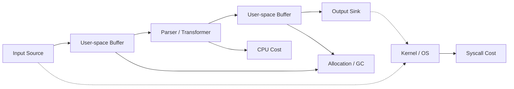
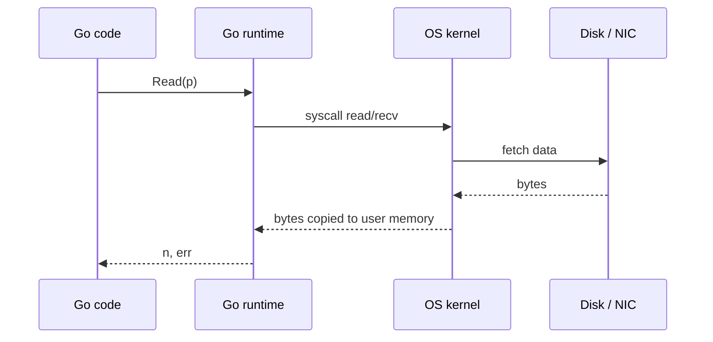
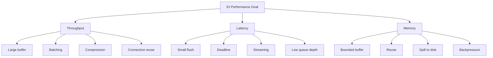
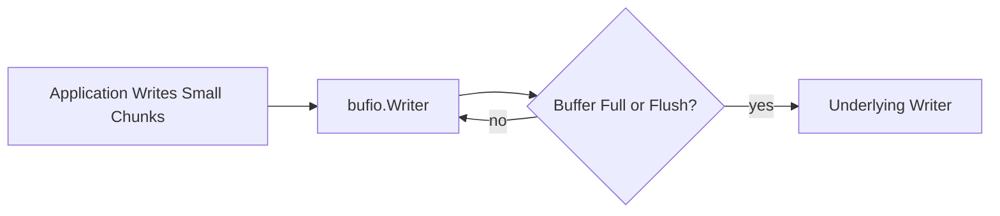
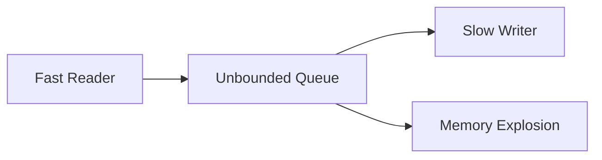
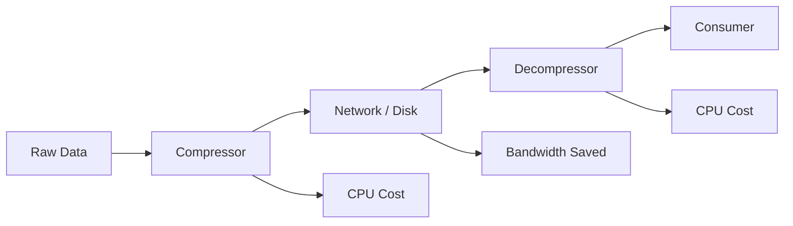
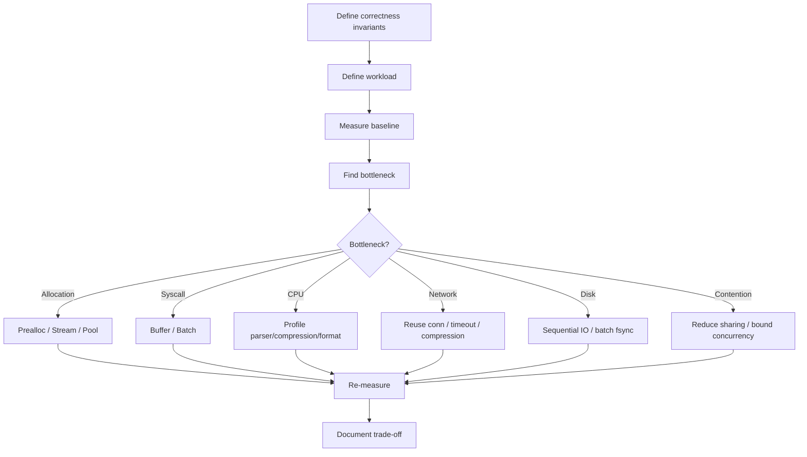

# learn-go-io-buffer-byte-stream-file-network-data-transfer-part-031.md

# Part 031 — Go IO Performance Engineering: Allocation, Buffer Reuse, Syscall Count, Batching, dan Zero-Copy Limits

> Seri: `learn-go-io-buffer-byte-stream-file-network-data-transfer`  
> Bagian: `031 / 034`  
> Target Go: `Go 1.26.x`  
> Fokus: performance engineering untuk sistem IO Go yang benar secara semantic, terukur, dan production-grade.

---

## 0. Posisi Part Ini dalam Series

Kita sudah membangun fondasi dari byte, buffer, file, filesystem, serialization, compression, network, HTTP, multipart, dan reverse proxy. Part ini adalah titik di mana semua fondasi itu dikalibrasi dari sisi **performance engineering**.

Part ini tidak hanya menjawab:

> "Bagaimana membuat IO Go cepat?"

Pertanyaan yang lebih tepat adalah:

> "Bagaimana membuat IO Go cepat tanpa mengorbankan correctness, boundedness, durability, observability, dan failure semantics?"

Dalam sistem production, IO yang "cepat" tetapi salah biasanya lebih mahal daripada IO yang lambat tetapi benar. File korup, upload tidak lengkap dianggap sukses, memory spike, descriptor leak, slow client attack, blocked goroutine, retry non-idempotent, dan proxy yang meng-buffer seluruh payload dapat menjadi incident besar.

Part ini akan membahas:

1. Apa arti "performance" dalam IO.
2. Model biaya IO di Go.
3. Allocation dan copying.
4. Buffer sizing.
5. `io.Copy`, `io.CopyBuffer`, `WriterTo`, dan `ReaderFrom`.
6. `bufio` sebagai latency-throughput trade-off.
7. `sync.Pool` untuk buffer reuse.
8. Syscall count dan batching.
9. Streaming vs load-all.
10. Compression performance.
11. HTTP transfer performance.
12. File transfer performance.
13. Zero-copy: apa yang mungkin, apa yang tidak.
14. Benchmark, profiling, observability.
15. Checklist production-grade.

---

## 1. Mental Model: IO Performance Bukan Satu Angka

Dalam Java engineer mindset, performance sering dibahas melalui throughput, latency, heap allocation, GC pressure, thread blocking, dan kernel/user boundary. Di Go, unsur yang sama tetap ada, tetapi bentuk abstraksinya berbeda.

Go IO performance adalah hasil dari interaksi berikut:



Sumber biaya utama:

| Biaya | Contoh | Efek |
|---|---|---|
| Syscall | `read`, `write`, `send`, `recv`, `fsync` | Latency tinggi dibanding function call biasa |
| Allocation | `make([]byte, n)`, `bytes.Buffer` growth, `io.ReadAll` | GC pressure, heap growth |
| Copying | network → buffer → parser → buffer → socket | CPU + cache pressure |
| Blocking | disk slow, socket slow, client lambat | goroutine stuck, resource held |
| Flush/sync | `Flush`, `fsync`, TLS flush, HTTP flush | latency spike, throughput turun |
| Parsing | JSON, XML, CSV, gzip | CPU-bound setelah IO cukup cepat |
| Compression | gzip level tinggi | CPU vs bandwidth trade-off |
| Contention | shared pool, shared writer, shared metrics | tail latency naik |
| Memory retention | pooled large buffer, slice aliasing | RSS naik, GC tidak turun |
| Protocol round-trip | request-response kecil berulang | latency dominan |

Performance bukan cuma "berapa MB/s". Untuk IO, paling tidak ada 7 angka yang perlu dipikirkan:

1. **Throughput**: bytes/second atau records/second.
2. **Latency**: waktu per request/operation.
3. **Tail latency**: p95/p99/p999.
4. **Allocation rate**: bytes allocated per operation atau per second.
5. **Syscall rate**: read/write calls per second.
6. **Concurrency capacity**: berapa koneksi/file/transfer aktif.
7. **Failure recovery cost**: saat partial write/read, retry, reconnect, resume.

---

## 2. Prinsip Utama: Correctness Dulu, Performance Kemudian

IO optimization yang benar dimulai dengan invariants.

### 2.1 Invariants untuk IO Performance

Sebelum mengoptimasi, jawaban untuk pertanyaan ini harus jelas:

| Pertanyaan | Mengapa penting |
|---|---|
| Apakah input bounded? | Mencegah memory blow-up |
| Apakah output boleh partial? | Menentukan retry/resume |
| Apakah operation idempotent? | Menentukan retry safety |
| Apakah data harus durable? | Menentukan `fsync`/rename |
| Apakah ordering wajib? | Menentukan batching/parallelism |
| Apakah stream boleh di-buffer penuh? | Menentukan `ReadAll` vs streaming |
| Apakah format punya frame boundary? | Menentukan parser dan resume |
| Apakah client bisa lambat? | Menentukan deadline/backpressure |
| Apakah data sensitif? | Menentukan logging/debug policy |
| Apakah format cross-language? | Menentukan encoding dan canonical form |

Optimization tanpa invariants biasanya menghasilkan bug halus.

Contoh salah:

```go
// Buruk untuk untrusted input besar.
body, err := io.ReadAll(r.Body)
if err != nil {
    return err
}
```

Masalahnya bukan `io.ReadAll` selalu buruk. Bahkan Go 1.26 membuat `io.ReadAll` lebih efisien. Masalahnya: tanpa limit, caller tidak punya boundedness invariant.

Versi lebih aman:

```go
const maxBody = 10 << 20 // 10 MiB

limited := io.LimitReader(r.Body, maxBody+1)
body, err := io.ReadAll(limited)
if err != nil {
    return err
}
if len(body) > maxBody {
    return fmt.Errorf("body too large")
}
```

Lebih baik lagi untuk payload besar: jangan load all, gunakan streaming decoder atau pipeline.

---

## 3. Model Biaya: Dari Kernel ke Go dan Balik Lagi

IO sering melintasi boundary mahal:



Setiap `Read`/`Write` kecil dapat menghasilkan syscall kecil. Banyak syscall kecil berarti:

1. Lebih banyak context switch boundary.
2. Lebih banyak per-call overhead.
3. Lebih buruk untuk throughput.
4. Kadang lebih buruk untuk network packetization.

Karena itu buffering dan batching penting.

Tetapi buffering juga punya biaya:

1. Latency naik karena data menunggu buffer penuh.
2. Error flush muncul belakangan.
3. Memory usage naik.
4. Protocol boundary bisa tertunda.
5. Backpressure bisa tertutup sementara.

Jadi aturan praktis:

> Buffer untuk mengurangi syscall dan amortize overhead, tetapi jangan buffer sampai menghilangkan semantics.

---

## 4. Throughput vs Latency vs Memory

Sering ada trade-off segitiga:



Contoh:

| Pilihan | Throughput | Latency | Memory | Catatan |
|---|---:|---:|---:|---|
| `io.ReadAll` kecil | Tinggi | Rendah | Sesuai size | Aman jika bounded |
| `io.ReadAll` besar/untrusted | Bisa tinggi | Bisa rendah | Berbahaya | Risk memory spike |
| Streaming 32 KiB buffer | Stabil | Stabil | Rendah | Default production kuat |
| Streaming 1 MiB buffer | Lebih tinggi untuk beberapa disk | Bisa naik | Lebih tinggi | Perlu benchmark |
| Flush tiap line | Rendah | Rendah | Rendah | Cocok interactive |
| Flush batch | Tinggi | Lebih tinggi | Sedang | Cocok batch export |
| gzip level tinggi | Bandwidth rendah | CPU tinggi | Sedang | Cocok network mahal |
| gzip level cepat | CPU rendah | Ukuran lebih besar | Sedang | Cocok latency-sensitive |

---

## 5. Allocation: Musuh yang Sering Tidak Terlihat

Dalam IO, allocation sering muncul dari:

1. Membuat buffer baru per request.
2. Membaca seluruh payload ke memory.
3. Mengubah `[]byte` ke `string` berulang.
4. Menggunakan `fmt.Sprintf` di hot path.
5. `bytes.Buffer` tumbuh berkali-kali.
6. JSON decode ke `map[string]any`.
7. Menyimpan slice kecil yang mereferensikan backing array besar.
8. Compression writer/reader dibuat terlalu sering tanpa reuse.
9. Multipart parse menumpahkan file tanpa cleanup.

### 5.1 Contoh Allocation Buruk

```go
func copySlow(dst io.Writer, src io.Reader) error {
    for {
        buf := make([]byte, 32*1024) // alokasi tiap loop
        n, err := src.Read(buf)
        if n > 0 {
            if _, werr := dst.Write(buf[:n]); werr != nil {
                return werr
            }
        }
        if err == io.EOF {
            return nil
        }
        if err != nil {
            return err
        }
    }
}
```

Masalah:

- Buffer dibuat berkali-kali.
- Allocation rate tinggi.
- GC pressure naik.
- Tidak ada handling short write penuh.

Versi lebih baik:

```go
func copyWithBuffer(dst io.Writer, src io.Reader) error {
    buf := make([]byte, 32*1024)
    _, err := io.CopyBuffer(dst, src, buf)
    return err
}
```

Lebih idiomatis:

```go
func copyDefault(dst io.Writer, src io.Reader) error {
    _, err := io.Copy(dst, src)
    return err
}
```

`io.Copy` sudah memiliki mekanisme internal dan dapat memakai fast path jika `src` mengimplementasikan `WriterTo` atau `dst` mengimplementasikan `ReaderFrom`.

---

## 6. `io.Copy`: Jangan Reimplement Sebelum Paham Kontraknya

`io.Copy(dst, src)` adalah primitive yang sangat penting.

Mental model:

```mermaid
flowchart TD
    A[io.Copy dst, src] --> B{src implements WriterTo?}
    B -- yes --> C[src.WriteTo(dst)]
    B -- no --> D{dst implements ReaderFrom?}
    D -- yes --> E[dst.ReadFrom(src)]
    D -- no --> F[copyBuffer loop]
```

Implikasi:

1. `io.Copy` bisa lebih cepat daripada manual loop karena fast path.
2. `*os.File`, network connection, dan beberapa wrapper dapat memiliki optimized transfer path.
3. Jika Anda membungkus `Reader`/`Writer`, Anda bisa tidak sengaja menutup fast path.
4. `io.CopyBuffer` berguna saat ingin kontrol buffer, tetapi tetap harus memahami fast path.

### 6.1 Manual Copy yang Benar Itu Tidak Sesederhana Kelihatannya

Naif:

```go
for {
    n, err := src.Read(buf)
    if n > 0 {
        dst.Write(buf[:n])
    }
    if err != nil {
        break
    }
}
```

Masalah:

- Return value `Write` diabaikan.
- Short write tidak ditangani.
- Error write hilang.
- `n > 0 && err != nil` bisa salah diproses.
- Tidak melaporkan bytes copied.
- Tidak menjaga semantic EOF.

Gunakan `io.Copy` kecuali ada alasan kuat.

### 6.2 Kapan Manual Loop Diperlukan?

Manual loop masuk akal jika perlu:

1. Progress callback per chunk.
2. Rate limiting.
3. Context check antar chunk.
4. Hash/checksum per chunk.
5. Transform custom.
6. Adaptive buffer.
7. Metrics detail.
8. Protocol frame boundary.
9. Controlled flush.
10. Fault injection test.

Contoh dengan progress dan context:

```go
func CopyWithProgress(
    ctx context.Context,
    dst io.Writer,
    src io.Reader,
    buf []byte,
    onProgress func(total int64),
) (int64, error) {
    if len(buf) == 0 {
        return 0, fmt.Errorf("empty buffer")
    }

    var total int64

    for {
        select {
        case <-ctx.Done():
            return total, ctx.Err()
        default:
        }

        n, rerr := src.Read(buf)
        if n > 0 {
            written := 0
            for written < n {
                m, werr := dst.Write(buf[written:n])
                if m > 0 {
                    written += m
                    total += int64(m)
                    if onProgress != nil {
                        onProgress(total)
                    }
                }
                if werr != nil {
                    return total, werr
                }
                if m == 0 {
                    return total, io.ErrShortWrite
                }
            }
        }

        if rerr == io.EOF {
            return total, nil
        }
        if rerr != nil {
            return total, rerr
        }
    }
}
```

Catatan penting: manual copy seperti ini bisa mengalahkan fast path `io.Copy`. Jadi pakai hanya saat semantics tambahan memang diperlukan.

---

## 7. Buffer Size: Tidak Ada Angka Suci

Banyak contoh memakai 32 KiB. Itu wajar sebagai default, tetapi bukan angka universal.

Faktor pemilihan buffer:

| Faktor | Implikasi |
|---|---|
| Disk sequential read | Buffer lebih besar bisa membantu sampai titik tertentu |
| Network latency | Buffer besar tidak memperbaiki RTT |
| TLS | Record framing punya batas sendiri |
| Compression | Buffer memengaruhi pipeline, bukan selalu ratio |
| JSON/CSV parsing | Token/record boundary lebih penting dari raw chunk |
| Banyak concurrent connection | Buffer besar per connection bisa berbahaya |
| Memory budget | Total buffer = per-transfer buffer × concurrency |
| Cache locality | Terlalu besar bisa buruk untuk CPU cache |
| Syscall overhead | Terlalu kecil meningkatkan syscall count |

### 7.1 Formula Sederhana untuk Memory Budget

```text
total_buffer_memory =
    active_transfers
  × buffers_per_transfer
  × buffer_size
```

Contoh:

```text
500 active uploads × 2 buffers × 256 KiB = 256 MiB
500 active uploads × 2 buffers × 1 MiB   = 1 GiB
```

Jadi buffer 1 MiB terlihat kecil dalam satu request, tetapi besar dalam concurrency tinggi.

### 7.2 Buffer Size Decision Table

| Use case | Kandidat awal |
|---|---:|
| CLI copy biasa | 32 KiB – 128 KiB |
| File sequential large | 128 KiB – 1 MiB |
| Network proxy high concurrency | 16 KiB – 64 KiB |
| HTTP body streaming | 32 KiB – 128 KiB |
| Compression pipeline | 32 KiB – 256 KiB |
| UDP packet | Sesuai max packet, bukan stream buffer |
| Line protocol | Batas line eksplisit, bukan buffer besar |
| Many tiny writes | `bufio.Writer` 4 KiB – 64 KiB |
| Interactive output | kecil + explicit flush |

Angka ini bukan hukum. Benchmark dengan workload sendiri.

---

## 8. `bufio`: Throughput Tool yang Bisa Mengubah Semantics

`bufio.Reader` dan `bufio.Writer` mengurangi syscall dengan buffering.



### 8.1 Kapan `bufio.Writer` Membantu?

Membantu saat:

1. Banyak write kecil.
2. Line/text protocol output.
3. CSV export.
4. Template rendering ke file/socket.
5. Metadata-heavy output.
6. Logging ke file dengan flush policy jelas.

Tidak selalu membantu saat:

1. Sudah pakai `io.Copy` large stream.
2. Underlying writer sudah buffering.
3. HTTP `ResponseWriter` dengan server buffering tertentu.
4. Latency-sensitive output tanpa flush.
5. Durability-sensitive write tanpa sync discipline.

### 8.2 Flush Error Adalah Bagian dari Write Error

Buruk:

```go
w := bufio.NewWriter(file)
fmt.Fprintln(w, "hello")
return nil
```

Benar:

```go
w := bufio.NewWriter(file)
if _, err := fmt.Fprintln(w, "hello"); err != nil {
    return err
}
if err := w.Flush(); err != nil {
    return err
}
if err := file.Sync(); err != nil {
    return err
}
```

Urutan penting:

```text
write to bufio
  ↓
Flush to underlying writer
  ↓
Sync if durability needed
  ↓
Close and check error
```

`Flush` bukan `fsync`. `Flush` hanya mendorong data dari user-space buffer ke underlying writer.

---

## 9. `sync.Pool`: Berguna, Tapi Bukan Free Lunch

`sync.Pool` cocok untuk temporary object yang dapat dipakai ulang untuk mengurangi allocation pressure. Tetapi object dalam pool bisa dibuang kapan saja oleh runtime. Jangan pakai `sync.Pool` untuk ownership penting.

### 9.1 Pool untuk Buffer

```go
var bufferPool = sync.Pool{
    New: func() any {
        b := make([]byte, 32*1024)
        return &b
    },
}

func getBuffer() *[]byte {
    return bufferPool.Get().(*[]byte)
}

func putBuffer(p *[]byte) {
    b := *p
    if cap(b) != 32*1024 {
        return
    }
    b = b[:cap(b)]
    clear(b) // optional jika data sensitif
    *p = b
    bufferPool.Put(p)
}
```

Pemakaian:

```go
p := getBuffer()
defer putBuffer(p)

buf := (*p)[:32*1024]
_, err := io.CopyBuffer(dst, src, buf)
```

### 9.2 Kesalahan Umum Pooling

| Kesalahan | Dampak |
|---|---|
| Mengembalikan buffer saat masih dipakai goroutine lain | Data race/corruption |
| Menaruh buffer sangat besar ke pool | RSS retention |
| Tidak reset object | Data leak / wrong state |
| Pool untuk long-lived object | Tidak cocok |
| Mengandalkan pool pasti menyimpan object | Salah; pool bisa drop |
| Pool global terlalu banyak contention | Tail latency |
| Pool menyimpan data sensitif tanpa clear | Security issue |

### 9.3 Pool dan Memory Retention

Misalnya:

```go
buf := make([]byte, 0, 64<<20)
pool.Put(&buf)
```

Satu buffer 64 MiB di pool bisa membuat memory terlihat "tidak turun". GC boleh drop pool item, tetapi tidak boleh dianggap sebagai immediate memory control.

Rule:

> Pool only normal-size reusable buffers; discard oversized buffers.

Contoh:

```go
const maxPooledCap = 1 << 20 // 1 MiB

func putBytes(b []byte) {
    if cap(b) > maxPooledCap {
        return
    }
    b = b[:cap(b)]
    clear(b)
    bytePool.Put(b)
}
```

---

## 10. Copy Avoidance vs Copy Elimination

Ada dua level:

1. **Copy avoidance**: mengurangi copy yang tidak perlu di user-space.
2. **Zero-copy**: data berpindah antar kernel/device tanpa copy ke user-space atau tanpa copy tambahan.

Dalam Go application biasa, target realistis biasanya **copy avoidance**, bukan zero-copy absolut.

### 10.1 Copy yang Sering Tidak Disadari

```go
s := string(b) // copy dari []byte ke string
b2 := []byte(s) // copy dari string ke []byte
```

```go
var buf bytes.Buffer
buf.WriteString(fmt.Sprintf("id=%d", id)) // format alloc
```

```go
data, _ := io.ReadAll(r)
json.Unmarshal(data, &v) // full buffer + decode
```

```go
var m map[string]any
json.NewDecoder(r).Decode(&m) // banyak allocation dynamic
```

### 10.2 Copy Avoidance Patterns

| Pattern | Manfaat |
|---|---|
| Streaming decoder | Hindari full payload allocation |
| `io.Copy` | Hindari manual intermediate structure |
| `io.TeeReader` | Hash sambil stream |
| `bytes.Reader` | Re-read in-memory bytes tanpa copy |
| `strings.Reader` | Re-read string tanpa copy |
| `json.Decoder` | Decode dari stream |
| `csv.Reader` reuse record option | Kurangi allocation dengan hati-hati |
| Pre-size `bytes.Buffer` | Kurangi growth copy |
| `strconv.Append*` | Hindari `fmt.Sprintf` di hot path |
| `sync.Pool` | Reuse buffer/object sementara |

---

## 11. Preallocation dan `bytes.Buffer`

`bytes.Buffer` berguna, tetapi growth berulang dapat menyebabkan allocation dan copy.

Buruk:

```go
var b bytes.Buffer
for _, item := range items {
    b.WriteString(item)
}
```

Bukan selalu buruk, tetapi jika size dapat diprediksi, lebih baik:

```go
var b bytes.Buffer
b.Grow(estimatedSize)

for _, item := range items {
    b.WriteString(item)
}
```

Atau untuk format sederhana:

```go
buf := make([]byte, 0, estimatedSize)
buf = append(buf, "id="...)
buf = strconv.AppendInt(buf, id, 10)
buf = append(buf, '\n')
```

### 11.1 `strings.Builder` vs `bytes.Buffer`

| Tool | Cocok untuk |
|---|---|
| `strings.Builder` | Membangun string |
| `bytes.Buffer` | Membangun bytes dan implement `io.Reader`/`io.Writer` |
| `[]byte` + `append` | Hot path binary/text formatting |
| `bufio.Writer` | Banyak write kecil ke sink |

Jangan membangun string besar hanya untuk dikirim sebagai bytes jika bisa langsung tulis bytes ke writer.

---

## 12. `fmt` vs `strconv` di Hot Path

`fmt.Fprintf` sangat berguna dan readable, tetapi reflect/formatting umum punya overhead.

Untuk hot path:

```go
fmt.Fprintf(w, "id=%d size=%d\n", id, size)
```

Bisa diganti:

```go
buf := make([]byte, 0, 64)
buf = append(buf, "id="...)
buf = strconv.AppendInt(buf, id, 10)
buf = append(buf, " size="...)
buf = strconv.AppendInt(buf, size, 10)
buf = append(buf, '\n')
_, err := w.Write(buf)
```

Trade-off:

| Pilihan | Readability | Performance |
|---|---:|---:|
| `fmt.Fprintf` | Tinggi | Sedang |
| `strconv.Append*` | Sedang | Tinggi |
| Manual binary | Rendah/Sedang | Tinggi |
| Generated encoder | Sedang | Tinggi |

Rule:

> Pakai `fmt` di non-hot path. Pakai `strconv`/manual append hanya setelah benchmark menunjukkan formatting dominan.

---

## 13. Syscall Count dan Batching

Setiap syscall punya fixed overhead. Banyak write kecil buruk untuk throughput.

Buruk:

```go
for _, line := range lines {
    file.Write([]byte(line))
    file.Write([]byte("\n"))
}
```

Lebih baik:

```go
w := bufio.NewWriterSize(file, 64*1024)
for _, line := range lines {
    if _, err := w.WriteString(line); err != nil {
        return err
    }
    if err := w.WriteByte('\n'); err != nil {
        return err
    }
}
if err := w.Flush(); err != nil {
    return err
}
```

Untuk network protocol, batching bisa mengurangi packet/syscall, tetapi hati-hati latency.

### 13.1 Nagle, Flush, dan Small Writes

Di TCP, small writes dapat berinteraksi dengan Nagle algorithm, delayed ACK, TLS records, dan buffering di library. Go memberi kontrol seperti `SetNoDelay` pada `TCPConn`, tetapi mengubahnya tanpa pemahaman bisa memperburuk throughput atau latency.

Praktis:

| Use case | Strategi |
|---|---|
| Interactive request-response kecil | deadline + flush jelas + benchmark |
| Bulk transfer | large streaming buffer |
| Log/event batch | buffer + periodic flush |
| RPC banyak message kecil | protocol framing + batching |
| HTTP streaming | explicit flush + backpressure awareness |

---

## 14. Streaming vs `ReadAll`

`io.ReadAll` bukan anti-pattern. Anti-pattern adalah `ReadAll` tanpa boundedness.

### 14.1 Cocok Memakai `ReadAll`

| Cocok | Syarat |
|---|---|
| Config file kecil | size bounded |
| Test fixture | controlled |
| Small API payload | `MaxBytesReader`/`LimitReader` |
| Embedded asset | known |
| In-memory retryable payload | size budget jelas |

### 14.2 Tidak Cocok Memakai `ReadAll`

| Tidak cocok | Alasan |
|---|---|
| Upload file besar | memory spike |
| Proxy body | destroys streaming/backpressure |
| Multipart file | temp/memory blow-up |
| Archive extraction | decompression bomb |
| JSON array besar | full materialization |
| Infinite/long-lived stream | never returns |
| Untrusted body | DoS risk |

### 14.3 Streaming JSON Lines Contoh

```go
func ProcessJSONLines(r io.Reader, maxLine int, handle func(Event) error) error {
    sc := bufio.NewScanner(r)
    sc.Buffer(make([]byte, 0, 64*1024), maxLine)

    for sc.Scan() {
        var ev Event
        if err := json.Unmarshal(sc.Bytes(), &ev); err != nil {
            return fmt.Errorf("decode json line: %w", err)
        }
        if err := handle(ev); err != nil {
            return err
        }
    }

    if err := sc.Err(); err != nil {
        return err
    }
    return nil
}
```

Untuk record sangat besar, scanner mungkin tidak cocok; gunakan `bufio.Reader` dan bounded line reader custom.

---

## 15. Backpressure: Performance yang Tidak Terlihat di Benchmark Lokal

Backpressure berarti producer melambat saat consumer lambat.

Tanpa backpressure:



Dengan backpressure:


Di Go, backpressure alami muncul dari blocking `Write` atau bounded channel. Tetapi Anda bisa merusaknya dengan:

1. `io.ReadAll`.
2. Unbounded goroutine fan-out.
3. Unbounded channel/list.
4. Proxy yang buffer full response.
5. Logging payload besar async tanpa bound.
6. Compression queue tanpa limit.

### 15.1 Bounded Pipeline

```go
type Chunk struct {
    Data []byte
}

func boundedPipeline(ctx context.Context, r io.Reader, w io.Writer) error {
    chunks := make(chan Chunk, 8)
    errc := make(chan error, 2)

    go func() {
        defer close(chunks)

        for {
            buf := make([]byte, 32*1024)
            n, err := r.Read(buf)
            if n > 0 {
                select {
                case chunks <- Chunk{Data: buf[:n]}:
                case <-ctx.Done():
                    errc <- ctx.Err()
                    return
                }
            }
            if err == io.EOF {
                errc <- nil
                return
            }
            if err != nil {
                errc <- err
                return
            }
        }
    }()

    go func() {
        for ch := range chunks {
            if _, err := w.Write(ch.Data); err != nil {
                errc <- err
                return
            }
        }
        errc <- nil
    }()

    var first error
    for i := 0; i < 2; i++ {
        if err := <-errc; err != nil && first == nil {
            first = err
        }
    }
    return first
}
```

Catatan: contoh ini belum optimal karena allocation per chunk. Dalam production, gunakan pool dengan ownership disiplin atau pipeline sequential jika transform tidak butuh concurrency.

---

## 16. Concurrency: Jangan Paralelkan Stream Tanpa Boundary

Stream bersifat ordered. Jika Anda membaca dari satu `io.Reader`, paralelisme tidak otomatis membantu.

Salah asumsi:

> "File 10 GB lambat, baca dengan 10 goroutine dari reader yang sama."

Masalah:

1. `Read` dari stream berbagi cursor.
2. Ordering bisa rusak.
3. Lock contention bisa muncul.
4. Bottleneck bisa disk/network tunggal.
5. Parser record boundary bisa pecah.

Paralelisme masuk akal jika ada random access atau frame boundary independen:

| Sumber | Bisa paralel? | Syarat |
|---|---|---|
| `io.Reader` stream | Biasanya tidak | Butuh framing/chunk extraction |
| `io.ReaderAt` file | Ya | Offset range jelas |
| HTTP range download | Ya | Server support range |
| ZIP entries | Sebagian | Entry independen, metadata diketahui |
| JSON array stream | Sulit | Perlu parser khusus |
| JSONL | Bisa | Per-line boundary |
| CSV | Hati-hati | Quote/newline membuat split sulit |
| UDP packets | Ya | Idempotence dan reordering handled |

### 16.1 Parallel `ReaderAt` Pattern

```go
func ReadRanges(ctx context.Context, f *os.File, size int64, partSize int64) error {
    g, ctx := errgroup.WithContext(ctx)

    for off := int64(0); off < size; off += partSize {
        off := off
        n := min(partSize, size-off)

        g.Go(func() error {
            buf := make([]byte, n)
            _, err := f.ReadAt(buf, off)
            if err != nil && err != io.EOF {
                return err
            }
            // process buf
            return nil
        })
    }

    return g.Wait()
}
```

Caveat:

- Banyak goroutine dengan buffer besar bisa blow up memory.
- Limit concurrency dengan semaphore.
- Output ordering harus dikelola.
- HDD vs SSD vs network FS berbeda.
- Read amplification bisa memperburuk cache.

---

## 17. Compression Performance: CPU vs Bandwidth

Compression adalah trade-off, bukan default kemenangan.



Compression membantu jika:

1. Data compressible.
2. Network/storage bandwidth bottleneck.
3. CPU masih tersedia.
4. Latency dari transfer lebih besar daripada compression cost.
5. Client/server sama-sama support.

Compression merugikan jika:

1. Data sudah compressed: jpg, png, zip, gzip, parquet tertentu.
2. Payload kecil.
3. CPU bottleneck.
4. Tail latency critical.
5. Double compression terjadi.
6. Streaming butuh early bytes tetapi compressor buffer menahan output.

### 17.1 Gzip Level Decision

| Mode | Cocok untuk |
|---|---|
| `gzip.BestSpeed` | latency-sensitive response |
| `gzip.DefaultCompression` | general purpose |
| `gzip.BestCompression` | offline batch/export |
| no compression | already-compressed atau CPU-bound |

### 17.2 Pooling Compression Writer

```go
var gzipPool = sync.Pool{
    New: func() any {
        w, _ := gzip.NewWriterLevel(io.Discard, gzip.BestSpeed)
        return w
    },
}

func WriteGzip(dst io.Writer, src io.Reader) error {
    zw := gzipPool.Get().(*gzip.Writer)
    zw.Reset(dst)

    _, copyErr := io.Copy(zw, src)
    closeErr := zw.Close()

    zw.Reset(io.Discard)
    gzipPool.Put(zw)

    if copyErr != nil {
        return copyErr
    }
    return closeErr
}
```

Hal penting:

- `Close` wajib untuk menulis trailer gzip.
- `Reset` sebelum reuse.
- Jangan pool writer yang masih dipakai.
- Jangan lupa error `Close`.

---

## 18. HTTP Client Performance

### 18.1 Reuse `http.Client`

Buruk:

```go
func Fetch(url string) error {
    client := &http.Client{}
    resp, err := client.Get(url)
    // ...
    _ = resp
    return err
}
```

Lebih baik:

```go
var client = &http.Client{
    Timeout: 30 * time.Second,
    Transport: &http.Transport{
        MaxIdleConns:        100,
        MaxIdleConnsPerHost: 20,
        IdleConnTimeout:     90 * time.Second,
    },
}
```

Kenapa?

- `Transport` memegang connection pool.
- Membuat client/transport per request menghilangkan reuse.
- TLS handshake dan TCP handshake mahal.
- Pool perlu limit agar tidak uncontrolled.

### 18.2 Selalu Close Response Body

```go
resp, err := client.Do(req)
if err != nil {
    return err
}
defer resp.Body.Close()
```

Jika body tidak dibaca/ditutup, koneksi bisa tidak reusable dan resource leak.

Untuk response besar yang tidak ingin dibaca:

```go
defer resp.Body.Close()
```

Untuk reuse koneksi, sering body perlu dibaca sampai EOF. Tetapi jangan drain response tak terbatas dari untrusted server. Batasi drain.

```go
func closeResponseBody(body io.ReadCloser) {
    defer body.Close()
    _, _ = io.CopyN(io.Discard, body, 512<<10)
}
```

Trade-off: drain terbatas dapat membantu reuse tanpa membuka DoS besar.

### 18.3 Streaming Upload

```go
pr, pw := io.Pipe()

req, err := http.NewRequestWithContext(ctx, http.MethodPost, url, pr)
if err != nil {
    return err
}
req.Body = pr

go func() {
    zw := gzip.NewWriter(pw)
    _, copyErr := io.Copy(zw, src)
    closeErr := zw.Close()
    if copyErr != nil {
        _ = pw.CloseWithError(copyErr)
        return
    }
    _ = pw.CloseWithError(closeErr)
}()

resp, err := client.Do(req)
```

Caveat:

- Error propagation harus lewat `CloseWithError`.
- Jika server lambat, writer goroutine akan block: ini backpressure.
- Request retry sulit karena body stream tidak replayable.
- Timeout harus jelas.

---

## 19. HTTP Server Performance

### 19.1 Jangan Buffer Seluruh Request Body

Buruk:

```go
body, err := io.ReadAll(r.Body)
```

Untuk upload besar:

```go
r.Body = http.MaxBytesReader(w, r.Body, maxUpload)

file, err := os.CreateTemp(dir, "upload-*")
if err != nil {
    http.Error(w, "server error", http.StatusInternalServerError)
    return
}
defer file.Close()

if _, err := io.Copy(file, r.Body); err != nil {
    http.Error(w, "upload failed", http.StatusBadRequest)
    return
}
```

### 19.2 Response Streaming

```go
func stream(w http.ResponseWriter, r *http.Request) {
    rc := http.NewResponseController(w)

    w.Header().Set("Content-Type", "text/plain")
    for i := 0; i < 10; i++ {
        if _, err := fmt.Fprintf(w, "event %d\n", i); err != nil {
            return
        }
        if err := rc.Flush(); err != nil {
            return
        }
        time.Sleep(time.Second)
    }
}
```

Flush membantu latency streaming, tetapi:

1. Mengurangi batching.
2. Bisa memperbanyak packet.
3. Dapat membuat slow client menahan handler.
4. Perlu write deadline.

### 19.3 Timeout Model

Server production perlu:

| Timeout | Fungsi |
|---|---|
| `ReadHeaderTimeout` | lindungi dari slowloris header |
| `ReadTimeout` | batasi membaca request |
| `WriteTimeout` | batasi menulis response |
| `IdleTimeout` | koneksi keep-alive idle |
| handler context | cancellation request lifecycle |

Timeout terlalu agresif bisa memutus upload/download besar. Timeout terlalu longgar bisa membuat resource tertahan.

---

## 20. File IO Performance

### 20.1 Sequential Read/Write

Untuk sequential copy file:

```go
src, err := os.Open(srcPath)
if err != nil {
    return err
}
defer src.Close()

dst, err := os.Create(dstPath)
if err != nil {
    return err
}
defer dst.Close()

if _, err := io.Copy(dst, src); err != nil {
    return err
}
```

`io.Copy` bisa memanfaatkan optimized path tergantung platform/type.

### 20.2 Random Access

Untuk banyak range:

```go
section := io.NewSectionReader(file, offset, length)
_, err := io.Copy(dst, section)
```

Atau:

```go
buf := make([]byte, 64*1024)
n, err := file.ReadAt(buf, offset)
```

Keuntungan `ReadAt`:

- Tidak mengubah shared seek offset.
- Cocok untuk parallel range.
- Lebih jelas untuk checkpoint/resume.

### 20.3 `fsync` dan Performance

`fsync` mahal karena memaksa durability boundary.

| Pattern | Performance | Durability |
|---|---:|---:|
| write only | tinggi | rendah |
| write + close | tinggi/sedang | tidak cukup untuk crash guarantee |
| write + sync each record | rendah | tinggi |
| batch + sync | sedang | sedang/tinggi |
| temp-write-sync-rename-dirsync | lebih mahal | production durable replace |

Untuk durable writes, performance optimization harus dilakukan dengan batching atau group commit, bukan menghapus sync tanpa sadar.

---

## 21. Zero-Copy: Batas Realistis di Go

Istilah zero-copy sering disalahgunakan.

### 21.1 Tingkatan Transfer

```text
Level 0: full materialization
  disk/socket -> []byte full -> transform -> []byte full -> sink

Level 1: streaming copy
  fixed buffer reused per chunk

Level 2: optimized io.Copy fast path
  ReaderFrom / WriterTo / possible OS optimized path

Level 3: kernel-assisted transfer
  sendfile/splice/copy_file_range style, platform-dependent

Level 4: application-level zero-copy protocol
  memory-mapped / direct buffer / kernel bypass style
```

Go standard library umumnya membuat Level 1 dan Level 2 mudah. Level 3 terjadi di kasus tertentu melalui implementasi platform. Level 4 bukan model umum Go standard library.

### 21.2 Kenapa Zero-Copy Tidak Selalu Bisa

Zero-copy sulit jika Anda perlu:

1. Parse JSON.
2. Compress/decompress.
3. Encrypt/decrypt di user-space.
4. Calculate checksum di application.
5. Transform data.
6. Inspect/modify headers/body.
7. Apply per-record authorization.
8. Log redacted fields.
9. Split/reframe protocol.
10. Cross-platform guarantee.

Jadi target yang realistis:

> Avoid unnecessary copies; do not promise absolute zero-copy unless path, platform, and semantics are known.

---

## 22. Observability untuk IO Performance

Performance yang tidak terlihat tidak bisa diperbaiki.

### 22.1 Metrics Minimal

| Metric | Type | Makna |
|---|---|---|
| bytes read/written | counter | throughput |
| operations | counter | request/copy count |
| duration | histogram | latency |
| active transfers | gauge | concurrency |
| buffer pool get/put/drop | counter | pool health |
| read/write errors | counter | reliability |
| timeout count | counter | slow dependency/client |
| short write/read | counter | protocol/storage issue |
| retry count | counter | instability |
| drain/discard bytes | counter | wasted bandwidth |
| compression ratio | histogram | compression value |
| flush count | counter | batching effectiveness |
| fsync duration | histogram | durability cost |
| open file descriptors | gauge | leak/resource pressure |

### 22.2 Logging

Jangan log payload. Log metadata:

```text
transfer_id
source_type
destination_type
bytes_expected
bytes_transferred
duration_ms
buffer_size
compression
checksum
retry_count
error_class
deadline_exceeded
client_addr
```

### 22.3 Tracing

Trace boundary:

1. Dial.
2. TLS handshake.
3. Request header received/sent.
4. First byte.
5. Body stream.
6. Flush.
7. Fsync.
8. Close.
9. Retry.
10. Resume.

Untuk HTTP client, `net/http/httptrace` dapat membantu melihat DNS, connect, TLS, request write, dan response first byte events.

---

## 23. Profiling IO Performance

### 23.1 Benchmark Dulu

Jangan mulai dari pprof. Mulai dari benchmark yang merepresentasikan workload.

```go
func BenchmarkCopyBuffer(b *testing.B) {
    payload := bytes.Repeat([]byte("x"), 10<<20)

    b.SetBytes(int64(len(payload)))
    b.ReportAllocs()

    buf := make([]byte, 32*1024)

    for i := 0; i < b.N; i++ {
        src := bytes.NewReader(payload)
        dst := io.Discard

        if _, err := io.CopyBuffer(dst, src, buf); err != nil {
            b.Fatal(err)
        }
    }
}
```

Run:

```bash
go test -bench=. -benchmem
```

### 23.2 CPU Profile

```bash
go test -bench=BenchmarkCopyBuffer -cpuprofile=cpu.out
go tool pprof cpu.out
```

Cari:

- JSON parsing.
- gzip compression.
- `fmt`.
- checksum.
- copying.
- lock contention.
- TLS crypto.
- syscall-heavy functions.

### 23.3 Memory Profile

```bash
go test -bench=BenchmarkX -memprofile=mem.out
go tool pprof -alloc_space mem.out
```

Cari:

- `io.ReadAll`.
- `encoding/json`.
- `bytes.Buffer.grow`.
- `fmt.Sprintf`.
- `make([]byte, ...)`.
- `strings.Split`.
- map/slice growth.
- pooled object retention.

### 23.4 Block Profile

```go
runtime.SetBlockProfileRate(1)
```

Membantu melihat goroutine blocked karena channel, mutex, network write, pipe, atau backpressure.

### 23.5 Trace

```bash
go test -run=TestX -trace trace.out
go tool trace trace.out
```

Trace berguna untuk melihat goroutine scheduling, blocking, network wait, syscall, dan GC interaksi.

---

## 24. Benchmark yang Benar untuk IO

Banyak benchmark IO menipu karena data semua dari memory. Itu boleh untuk mengisolasi CPU/allocation, tetapi tidak mewakili disk/network.

### 24.1 Benchmark Layers

| Layer | Contoh | Tujuan |
|---|---|---|
| In-memory | `bytes.Reader`, `io.Discard` | CPU/allocation |
| Temp file | `os.CreateTemp` | filesystem overhead |
| Loopback TCP | `net.Listen("tcp", "127.0.0.1:0")` | socket overhead |
| TLS loopback | `httptest.NewTLSServer` | TLS overhead |
| HTTP server | `httptest.Server` | HTTP stack |
| Real disk | mounted volume | storage behavior |
| Real network | staging env | RTT/bandwidth/loss |

### 24.2 Hindari Optimizer Trap

Jika benchmark hasilnya tidak dipakai, compiler bisa menghilangkan sebagian pekerjaan. Gunakan sink global atau cek hasil.

```go
var sink int64

func BenchmarkCount(b *testing.B) {
    var total int64
    for i := 0; i < b.N; i++ {
        total += int64(i)
    }
    sink = total
}
```

### 24.3 Warmup dan Variability

IO benchmark sensitif terhadap:

1. OS page cache.
2. Disk cache.
3. CPU frequency.
4. Background process.
5. Network jitter.
6. GC cycle.
7. Container CPU quota.
8. Kubernetes noisy neighbor.
9. TLS session reuse.
10. DNS cache.

Jadi gunakan:

- Multiple runs.
- `benchstat`.
- Fixed payload.
- Realistic concurrency.
- Separate cold/warm cache tests.
- p50/p95/p99 latency, bukan average saja.

---

## 25. Design Pattern: Performance-Safe Transfer Function

Contoh transfer yang lebih production-aware:

```go
type TransferOptions struct {
    MaxBytes   int64
    BufferSize int
    Sync       bool
    Progress   func(n int64)
}

func TransferFile(
    ctx context.Context,
    dst *os.File,
    src io.Reader,
    opt TransferOptions,
) (int64, error) {
    if opt.MaxBytes <= 0 {
        return 0, fmt.Errorf("MaxBytes must be positive")
    }
    if opt.BufferSize <= 0 {
        opt.BufferSize = 32 * 1024
    }

    lr := &io.LimitedReader{
        R: src,
        N: opt.MaxBytes + 1,
    }

    buf := make([]byte, opt.BufferSize)

    var total int64
    for {
        select {
        case <-ctx.Done():
            return total, ctx.Err()
        default:
        }

        n, rerr := lr.Read(buf)
        if n > 0 {
            if lr.N == 0 {
                return total, fmt.Errorf("input too large")
            }

            written := 0
            for written < n {
                m, werr := dst.Write(buf[written:n])
                if m > 0 {
                    written += m
                    total += int64(m)
                    if opt.Progress != nil {
                        opt.Progress(total)
                    }
                }
                if werr != nil {
                    return total, werr
                }
                if m == 0 {
                    return total, io.ErrShortWrite
                }
            }
        }

        if rerr == io.EOF {
            break
        }
        if rerr != nil {
            return total, rerr
        }
    }

    if opt.Sync {
        if err := dst.Sync(); err != nil {
            return total, err
        }
    }

    return total, nil
}
```

Catatan:

- Bounded input.
- Context check.
- Partial write handled.
- Progress callback.
- Optional durability.
- Tidak memakai `ReadAll`.

---

## 26. Design Pattern: Buffer Pool yang Aman

```go
type BufferPool struct {
    size int
    max  int
    pool sync.Pool
}

func NewBufferPool(size, max int) *BufferPool {
    bp := &BufferPool{size: size, max: max}
    bp.pool.New = func() any {
        b := make([]byte, size)
        return &b
    }
    return bp
}

func (p *BufferPool) Get() []byte {
    b := *(p.pool.Get().(*[]byte))
    return b[:p.size]
}

func (p *BufferPool) Put(b []byte) {
    if cap(b) != p.size {
        return
    }
    if p.max > 0 && cap(b) > p.max {
        return
    }
    b = b[:cap(b)]
    clear(b)
    p.pool.Put(&b)
}
```

Lebih realistis:

- Tambahkan metrics get/put/drop.
- Jangan clear jika data tidak sensitif dan performance lebih penting.
- Jangan share buffer lintas goroutine.
- Jangan return buffer sebelum writer selesai.

---

## 27. Case Study: Proxy Lambat Karena Buffering Salah

### 27.1 Gejala

Service reverse proxy upload/download mengalami:

- Memory naik saat file besar.
- p99 latency naik.
- GC pause meningkat.
- Client disconnect tetapi backend masih menerima data.
- Throughput turun saat concurrency naik.

### 27.2 Kode Bermasalah

```go
func proxy(w http.ResponseWriter, r *http.Request) {
    body, _ := io.ReadAll(r.Body)

    req, _ := http.NewRequest("POST", backendURL, bytes.NewReader(body))
    resp, _ := http.DefaultClient.Do(req)

    respBody, _ := io.ReadAll(resp.Body)
    w.Write(respBody)
}
```

Masalah:

1. Full request body buffered.
2. Full response body buffered.
3. No size limit.
4. No context propagation.
5. No body close handling.
6. No streaming/backpressure.
7. Retry impossible to reason.
8. Memory = request + response × concurrency.

### 27.3 Versi Lebih Baik

```go
func proxy(w http.ResponseWriter, r *http.Request) {
    ctx := r.Context()

    r.Body = http.MaxBytesReader(w, r.Body, maxBody)

    req, err := http.NewRequestWithContext(ctx, http.MethodPost, backendURL, r.Body)
    if err != nil {
        http.Error(w, "bad request", http.StatusBadRequest)
        return
    }

    req.Header.Set("Content-Type", r.Header.Get("Content-Type"))

    resp, err := backendClient.Do(req)
    if err != nil {
        http.Error(w, "upstream error", http.StatusBadGateway)
        return
    }
    defer resp.Body.Close()

    copyHeader(w.Header(), resp.Header)
    w.WriteHeader(resp.StatusCode)

    if _, err := io.Copy(w, resp.Body); err != nil {
        // client likely disconnected or upstream failed mid-stream.
        return
    }
}
```

Masih perlu:

- Timeout.
- Header filtering.
- Hop-by-hop header policy.
- Error mapping.
- Metrics.
- Retry only if safe.
- Drain policy.
- Backpressure monitoring.

---

## 28. Case Study: CSV Export Terlalu Banyak Allocation

### 28.1 Buruk

```go
var rows [][]string

for records.Next() {
    rows = append(rows, []string{
        records.ID(),
        records.Name(),
        fmt.Sprintf("%d", records.Amount()),
    })
}

w := csv.NewWriter(resp)
w.WriteAll(rows)
```

Masalah:

- Semua rows disimpan.
- Allocation besar.
- Latency first byte tinggi.
- Request bisa OOM.

### 28.2 Streaming

```go
func exportCSV(w http.ResponseWriter, rows RowIterator) error {
    cw := csv.NewWriter(w)

    if err := cw.Write([]string{"id", "name", "amount"}); err != nil {
        return err
    }

    record := make([]string, 3)

    for rows.Next() {
        record[0] = rows.ID()
        record[1] = rows.Name()
        record[2] = strconv.FormatInt(rows.Amount(), 10)

        if err := cw.Write(record); err != nil {
            return err
        }
    }

    if err := rows.Err(); err != nil {
        return err
    }

    cw.Flush()
    return cw.Error()
}
```

Trade-off:

- Lebih hemat memory.
- First byte lebih cepat jika flush digunakan.
- Jika response sudah partial lalu error, tidak bisa ubah status code.
- Bisa pakai temp file jika harus all-or-nothing.

---

## 29. Anti-Patterns IO Performance

| Anti-pattern | Dampak |
|---|---|
| `io.ReadAll` semua request body | memory DoS |
| Membuat `http.Client` per request | connection reuse hilang |
| Tidak close response body | leak dan pool rusak |
| Buffer 1 MiB per connection tanpa budget | RSS blow-up |
| `bufio.Writer` tanpa `Flush` | data hilang |
| `Flush` tiap byte | throughput hancur |
| Pool buffer besar tanpa cap | memory retention |
| Convert `[]byte`↔`string` berulang | copy/allocation |
| `fmt.Sprintf` di hot path | CPU/allocation |
| Retry streaming body non-replayable | duplicate/corruption |
| Full proxy buffering | backpressure hilang |
| Parallelize stream tanpa framing | corruption |
| Ignore `n` when err != nil | data loss |
| Ignore short write | data loss |
| Ignore close/sync error | false success |
| Compression semua payload | CPU waste |
| Benchmark hanya happy path memory | misleading |
| Optimize sebelum semantic fixed | incident |

---

## 30. Performance Decision Matrix

| Problem | First check | Likely fix |
|---|---|---|
| Memory spike | full buffering? | streaming + limit |
| High allocation | per-request buffer? JSON map? | reuse/prealloc/stream |
| High syscall | many small writes? | `bufio`/batching |
| High p99 | contention/blocking? | profile, limit concurrency |
| Slow upload | client slow? backend slow? | deadline/backpressure metrics |
| Slow download | flush too frequent? compression? | tune flush/compression |
| CPU high | JSON/gzip/fmt/checksum? | profile and optimize hot function |
| Connection churn | client/transport reuse? | shared client/transport |
| FD leak | close missing? | lifecycle audit |
| Data corruption | partial write/read? | handle `n`, checksum |
| Bad GC | allocation rate? retained buffers? | pool/discard oversized |
| Slow fsync | sync per record? storage? | batch/group commit |
| Proxy OOM | full body read? | stream request/response |
| Poor compression value | already compressed? | content-aware compression |

---

## 31. Practical Tuning Workflow

Urutan yang sehat:



Jangan langsung pool semua. Jangan langsung buffer besar. Jangan langsung parallelize.

---

## 32. Production Checklist

Sebelum optimasi dianggap selesai:

### Correctness

- [ ] Input size bounded.
- [ ] Output partial progress handled.
- [ ] `n > 0 && err != nil` handled.
- [ ] Short write handled.
- [ ] EOF vs unexpected EOF clear.
- [ ] Close error checked where relevant.
- [ ] Flush error checked.
- [ ] Sync error checked if durable.
- [ ] Retry idempotency defined.
- [ ] Stream replayability defined.

### Memory

- [ ] No unbounded `ReadAll`.
- [ ] Buffer size × concurrency calculated.
- [ ] Oversized buffers not pooled.
- [ ] Sensitive buffers cleared if needed.
- [ ] Slice aliasing reviewed.
- [ ] Allocation benchmark recorded.

### Throughput

- [ ] Small writes batched.
- [ ] `io.Copy` fast path not accidentally broken.
- [ ] Compression chosen based on data and CPU.
- [ ] HTTP client/transport reused.
- [ ] File writes grouped where possible.
- [ ] Syscall count roughly understood.

### Latency

- [ ] Flush policy explicit.
- [ ] Deadlines/timeouts configured.
- [ ] Slow client behavior understood.
- [ ] p95/p99 measured.
- [ ] Queue/concurrency limit exists.
- [ ] Backpressure preserved.

### Observability

- [ ] bytes read/written metrics.
- [ ] duration histogram.
- [ ] active transfer gauge.
- [ ] timeout/error classification.
- [ ] allocation benchmark.
- [ ] pprof path available.
- [ ] no payload logging.

### Testing

- [ ] Fake reader/writer tests.
- [ ] Short read/write tests.
- [ ] Timeout/cancel tests.
- [ ] Large input tests.
- [ ] Slow consumer tests.
- [ ] Benchmark with `-benchmem`.
- [ ] Fuzz parser if format custom.

---

## 33. Latihan

### Latihan 1 — Copy Benchmark

Buat benchmark untuk membandingkan:

1. `io.Copy`.
2. `io.CopyBuffer` 4 KiB.
3. `io.CopyBuffer` 32 KiB.
4. `io.CopyBuffer` 256 KiB.
5. Manual loop.

Gunakan payload:

- 1 KiB.
- 1 MiB.
- 100 MiB.

Catat:

- ns/op.
- B/op.
- allocs/op.
- MB/s.

### Latihan 2 — Pool Retention

Buat program yang:

1. Mengambil buffer 32 KiB dari pool.
2. Kadang membuat buffer 64 MiB.
3. Mengembalikan semua buffer ke pool.
4. Ukur memory.

Kemudian ubah agar oversized buffer dibuang. Bandingkan.

### Latihan 3 — HTTP Proxy Streaming

Implementasikan proxy sederhana:

1. Request body maksimum 100 MiB.
2. Streaming ke backend.
3. Streaming response ke client.
4. Timeout jelas.
5. Metrics bytes in/out.
6. Tidak `ReadAll`.

Tambahkan test client disconnect.

### Latihan 4 — CSV Export

Buat export 10 juta row:

1. Versi materialized full memory.
2. Versi streaming.
3. Versi streaming + gzip.
4. Versi streaming + gzip level speed.

Bandingkan memory dan waktu first-byte.

### Latihan 5 — Faulty Writer

Buat `io.Writer` yang:

1. Kadang short write.
2. Kadang error setelah partial write.
3. Kadang block.

Pastikan copy function Anda benar.

---

## 34. Ringkasan

IO performance di Go adalah disiplin desain, bukan kumpulan trik.

Hal paling penting:

1. `io.Copy` adalah default kuat karena tahu fast path.
2. `io.CopyBuffer` berguna untuk kontrol buffer dan pooling.
3. `bufio` mengurangi syscall tetapi menambah flush/error semantics.
4. `sync.Pool` mengurangi allocation tetapi dapat menyebabkan retention dan data race jika ownership salah.
5. Buffer size harus dihitung terhadap concurrency.
6. `ReadAll` aman hanya jika input bounded dan memang ingin materialisasi.
7. Streaming menjaga memory dan backpressure.
8. Compression adalah trade-off CPU vs bandwidth.
9. HTTP performance bergantung besar pada connection reuse, body close, timeout, dan streaming.
10. Zero-copy absolut jarang menjadi target realistis aplikasi umum; copy avoidance lebih sering bernilai.
11. Benchmark harus merepresentasikan workload.
12. Profiling harus membedakan CPU, allocation, syscall, blocking, dan network/disk wait.
13. Optimization tanpa correctness akan membuat sistem cepat menghasilkan data salah.

---

## 35. Preview Part 032

Part berikutnya akan membahas:

# Part 032 — Observability: metrics, logs, tracing, pprof, blocked IO, leaked streams, descriptor leaks

Kita akan masuk ke cara mengobservasi sistem IO Go di production:

- metric bytes/latency/error.
- pprof untuk CPU/memory/block/goroutine.
- tracing HTTP client/server.
- detecting blocked IO.
- descriptor leak.
- stuck goroutine karena pipe/channel/socket.
- logging tanpa membocorkan payload.
- dashboard dan alerting untuk transfer service.

---

## Referensi

- Go `io` package documentation: https://pkg.go.dev/io
- Go `bufio` package documentation: https://pkg.go.dev/bufio
- Go `sync` package documentation, including `sync.Pool`: https://pkg.go.dev/sync
- Go `bytes` package documentation: https://pkg.go.dev/bytes
- Go `strconv` package documentation: https://pkg.go.dev/strconv
- Go `net` package documentation: https://pkg.go.dev/net
- Go `net/http` package documentation: https://pkg.go.dev/net/http
- Go `net/http/httptrace` package documentation: https://pkg.go.dev/net/http/httptrace
- Go `compress/gzip` package documentation: https://pkg.go.dev/compress/gzip
- Go 1.26 Release Notes: https://go.dev/doc/go1.26
- Go Release History: https://go.dev/doc/devel/release

<!-- NAVIGATION_FOOTER -->
<div class="page-nav">
<a href="./learn-go-io-buffer-byte-stream-file-network-data-transfer-part-030.md">⬅️ Part 030 — Reverse Proxy dan Data Transfer Gateway Patterns dengan `net/http/httputil`</a>
<a href="./index.md">📚 Kategori</a>
<a href="../../index.md">🏠 Home</a>
<a href="./learn-go-io-buffer-byte-stream-file-network-data-transfer-part-032.md">Part 032 — Observability untuk Go IO: Metrics, Logs, Tracing, pprof, Runtime Metrics, Blocked IO, Stream Leak, Descriptor Leak ➡️</a>
</div>
