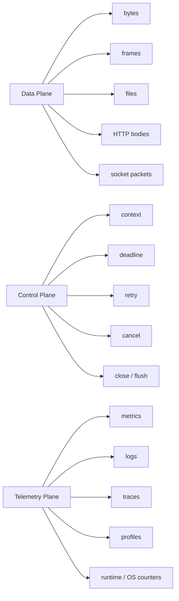
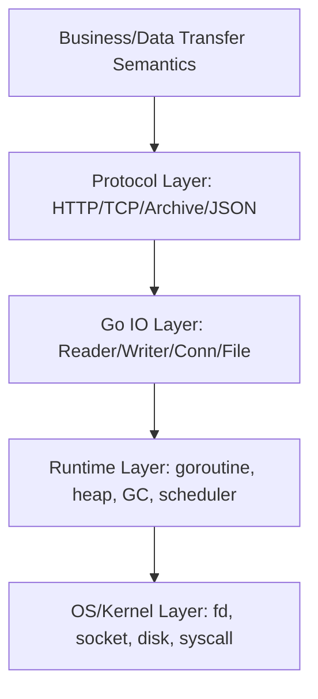
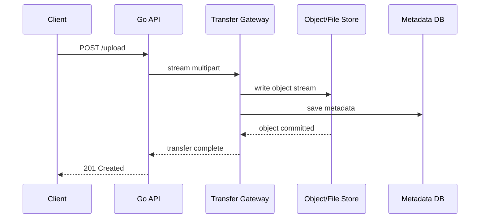
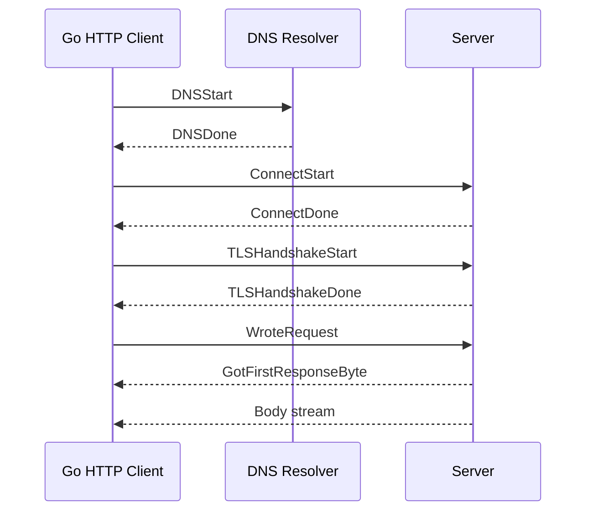
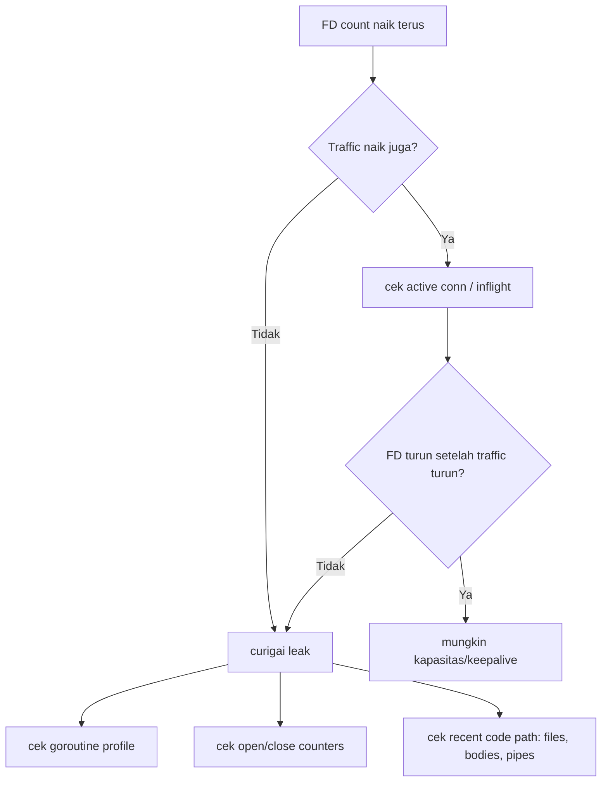
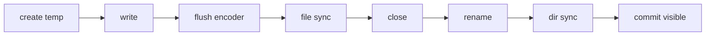
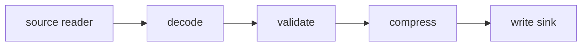
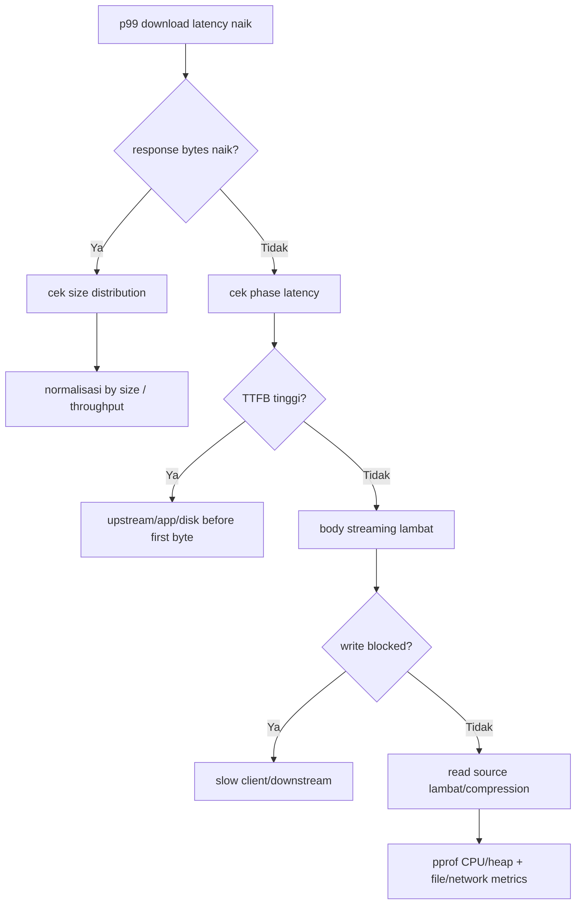
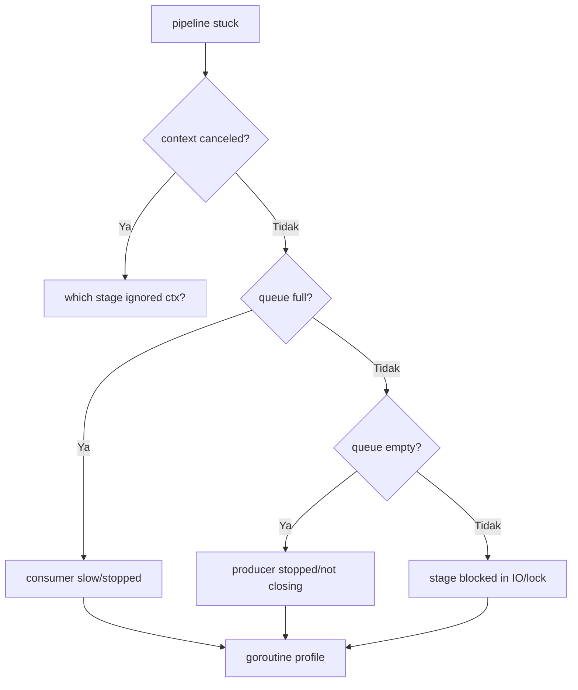

# learn-go-io-buffer-byte-stream-file-network-data-transfer-part-032.md

# Part 032 — Observability untuk Go IO: Metrics, Logs, Tracing, pprof, Runtime Metrics, Blocked IO, Stream Leak, Descriptor Leak

> Target pembaca: Java software engineer yang ingin memahami Go IO pada level production engineering.
>
> Target versi: Go 1.26.x.
>
> Posisi seri: Part 032 dari 034.
>
> Fokus: observability khusus untuk sistem berbasis IO: file, socket, HTTP body, stream pipeline, compression, serialization, archive, reverse proxy, upload/download, dan data transfer service.

---

## 0. Kenapa Part Ini Penting

Pada part sebelumnya kita sudah membahas:

- byte, buffer, stream, reader/writer contract,
- filesystem dan durable write,
- serialization, compression, archive,
- TCP/UDP/Unix socket,
- HTTP client/server,
- multipart upload/download,
- reverse proxy,
- performance engineering.

Namun di production, kemampuan membangun sistem IO belum cukup. Sistem harus bisa **diamati**.

Masalah IO jarang terlihat sebagai satu error yang jelas. Biasanya muncul sebagai gejala:

- upload kadang berhenti di tengah,
- download lambat hanya untuk client tertentu,
- memory naik setelah release,
- goroutine terus bertambah,
- `too many open files`,
- request timeout tetapi backend tampak sehat,
- file hasil export kadang corrupt,
- reverse proxy terlihat idle tetapi koneksi upstream penuh,
- gzip response lebih lambat daripada plain response,
- queue pipeline tidak kosong walau CPU rendah,
- `context deadline exceeded` meningkat tanpa root cause jelas.

Observability untuk IO berarti kita mampu menjawab pertanyaan:

1. **Apa yang sedang ditransfer?**
2. **Berapa banyak byte yang masuk/keluar?**
3. **Di mana waktu habis?**
4. **Resource apa yang menahan sistem?**
5. **Apakah ada partial progress?**
6. **Apakah stream/file/socket ditutup benar?**
7. **Apakah retry aman atau justru membuat duplikasi/corruption?**
8. **Apakah bottleneck berada di network, disk, compression, parsing, buffer, GC, lock, atau client lambat?**

Di Java, Anda mungkin terbiasa dengan kombinasi Micrometer, JMX, async-profiler, Java Flight Recorder, logback/log4j MDC, OpenTelemetry, thread dump, heap dump, Netty metrics, servlet access log, Hikari metrics, dan OS tools.

Di Go, mindsetnya mirip, tetapi tool dan failure surface berbeda:

- goroutine profile menggantikan banyak kasus thread dump,
- `pprof` sangat idiomatik,
- `runtime/metrics` menyediakan runtime metrics stable interface,
- `net/http/httptrace` memberi insight HTTP client phase,
- interface kecil seperti `io.Reader`/`io.Writer` mudah dibungkus untuk instrumentation,
- `context` dan deadline menjadi bagian penting observability,
- leaks sering muncul sebagai **unclosed body/file/pipe/gzip writer**, bukan hanya object retained.

---

## 1. Tujuan Pembelajaran

Setelah part ini, Anda diharapkan mampu:

1. Merancang metric taxonomy untuk service transfer file/HTTP/TCP.
2. Membedakan metric data plane, control plane, dan resource plane.
3. Membuat wrapper `io.Reader`, `io.Writer`, `net.Conn`, dan `http.Response.Body` untuk observability.
4. Menentukan kapan memakai log, metric, trace, pprof, runtime metrics, atau OS counters.
5. Membaca gejala blocked IO dari goroutine profile dan execution trace.
6. Mendeteksi descriptor leak dan stream leak.
7. Membuat runbook investigasi untuk slow upload/download, memory spike, timeout, dan stuck pipeline.
8. Menghindari observability yang justru merusak performance atau membocorkan data sensitif.

---

## 2. Mental Model: IO Observability Bukan Hanya “Log Error”

Sistem IO punya tiga plane:



**Data plane** adalah byte yang benar-benar bergerak.

**Control plane** adalah keputusan yang mengatur aliran byte: deadline, cancellation, limit, close, retry, checkpoint.

**Telemetry plane** adalah observasi terhadap dua plane di atas.

Kesalahan umum: hanya mengamati control plane.

Contoh:

```text
request failed: context deadline exceeded
```

Itu belum cukup. Kita belum tahu:

- apakah byte sudah sempat dikirim?
- berapa byte?
- stuck saat DNS, connect, TLS, write request, wait header, read body, decompression, disk write, atau downstream client?
- apakah timeout datang dari client, server, proxy, load balancer, atau internal context?
- apakah retry aman?
- apakah response body sudah ditutup?

Observability yang baik mengubah error umum menjadi diagnosis struktural:

```text
transfer_id=abc
phase=upstream_read
bytes_in=104857600
bytes_out=104726528
duration_ms=30000
last_progress_ms=28000
error=context_deadline_exceeded
retryable=false
partial_progress=true
client_aborted=false
upstream_addr=10.0.2.17:443
```

---

## 3. IO Failure Tidak Sama dengan CPU Failure

CPU bottleneck sering punya gejala:

- CPU tinggi,
- pprof CPU jelas,
- throughput turun,
- latency naik.

IO bottleneck bisa punya CPU rendah tetapi sistem tetap lambat.

Contoh:

| Gejala | Kemungkinan Akar Masalah |
|---|---|
| CPU rendah, request lambat | blocking network/disk, slow client, upstream timeout |
| Goroutine tinggi | read/write blocked, body leak, stuck pipe, accept loop tidak menutup koneksi |
| Memory tinggi | buffering response/request besar, `ReadAll`, decompression bomb, pool menahan buffer besar |
| FD tinggi | file/socket/response body tidak ditutup |
| Error timeout tinggi | deadline terlalu pendek, client lambat, upstream saturation, pool wait |
| Throughput turun | syscall terlalu banyak, buffer terlalu kecil, compression CPU, downstream backpressure |
| Error sedikit tapi user komplain lambat | p95/p99 buruk, metrics hanya average |

Karena itu IO observability harus mengukur:

- **progress**: byte bergerak atau tidak,
- **phase**: sedang di tahap apa,
- **resource**: FD, goroutine, memory, disk, active conn,
- **latency distribution**: p50, p95, p99, max,
- **saturation**: queue depth, pool wait, active transfers,
- **correctness**: checksum mismatch, short write, unexpected EOF,
- **lifecycle**: open/close/flush/remove temp.

---

## 4. Peta Tool Observability Go

Go menyediakan beberapa tool bawaan yang sangat penting.

| Tool / Package | Fungsi | Relevansi IO |
|---|---|---|
| `log/slog` | structured logging | event transfer, error, phase, metadata aman |
| `runtime/pprof` | profile CPU, heap, goroutine, block, mutex | blocked goroutine, memory spike, CPU compression |
| `net/http/pprof` | expose pprof via HTTP | debugging production/staging secara controlled |
| `runtime/metrics` | runtime metrics stable interface | goroutine, heap, GC, scheduler, memory classes |
| `runtime/trace` | execution trace | latency, scheduling, blocking, syscall, goroutine events |
| `net/http/httptrace` | HTTP client phase tracing | DNS/connect/TLS/request/response timing |
| `expvar` | simple exported variables | internal debug counters, jika dipakai terbatas |
| `testing` benchmarks | CPU/mem profile dari benchmark | IO micro-benchmark dan regression analysis |
| OS tools | `lsof`, `/proc`, `ss`, `iostat`, `strace` | FD leak, socket state, disk latency, syscall |

Catatan:

- `runtime/metrics` bukan pengganti business metrics.
- `pprof` bukan pengganti metrics real-time.
- tracing bukan pengganti logs.
- logs bukan pengganti histograms.
- OS tools tetap dibutuhkan untuk boundary di luar Go runtime.

---

## 5. Observability Layer untuk IO

Kita bisa membagi observability IO menjadi lima layer:



### 5.1 Business/Data Transfer Layer

Contoh metric:

- `transfer_started_total`
- `transfer_completed_total`
- `transfer_failed_total{reason}`
- `transfer_bytes_total{direction}`
- `transfer_duration_seconds`
- `transfer_inflight`
- `transfer_checkpoint_total`
- `transfer_resume_total`
- `transfer_checksum_mismatch_total`

Pertanyaan yang dijawab:

- Apakah user berhasil mendapatkan file?
- Berapa ukuran transfer?
- Transfer gagal di phase apa?
- Apakah resume berhasil?
- Apakah terjadi corruption?

### 5.2 Protocol Layer

Contoh metric:

- `http_request_body_bytes_total`
- `http_response_body_bytes_total`
- `http_client_phase_duration_seconds{phase}`
- `tcp_conn_active`
- `tcp_conn_accepted_total`
- `tcp_conn_closed_total{reason}`
- `protocol_frame_decode_errors_total{reason}`
- `multipart_parts_total`
- `json_decode_errors_total{reason}`
- `archive_entries_total`
- `archive_rejected_entries_total{reason}`

Pertanyaan yang dijawab:

- Apakah masalah ada di parsing?
- Apakah body terlalu besar?
- Apakah client menutup koneksi?
- Apakah frame malformed?

### 5.3 Go IO Layer

Contoh metric:

- `io_read_bytes_total{component}`
- `io_write_bytes_total{component}`
- `io_read_ops_total{component}`
- `io_write_ops_total{component}`
- `io_read_errors_total{error_class}`
- `io_write_errors_total{error_class}`
- `io_short_write_total`
- `io_deadline_exceeded_total`
- `io_last_progress_age_seconds`

Pertanyaan yang dijawab:

- Apakah reader masih menghasilkan byte?
- Apakah writer blocked?
- Apakah error terjadi setelah partial progress?
- Apakah terlalu banyak operasi kecil?

### 5.4 Runtime Layer

Contoh dari runtime:

- goroutine count,
- heap allocation,
- heap objects,
- GC cycles,
- GC pause,
- scheduler latency,
- block/mutex profile.

Pertanyaan yang dijawab:

- Apakah goroutine leak?
- Apakah buffer retention membuat heap tinggi?
- Apakah compression/parser menyebabkan CPU tinggi?
- Apakah goroutine blocked di channel, mutex, syscall, atau IO?

### 5.5 OS/Kernel Layer

Contoh:

- open file descriptors,
- socket states,
- disk queue/latency,
- network retransmit,
- ephemeral port usage,
- process limits,
- filesystem free space,
- temp directory usage.

Pertanyaan yang dijawab:

- Apakah file/socket leak?
- Apakah disk penuh?
- Apakah connection backlog penuh?
- Apakah kernel socket buffer penuh?
- Apakah server kehabisan ephemeral ports?

---

## 6. Metrics: Taxonomy untuk IO Production

### 6.1 Empat Jenis Metric Utama

| Jenis | Contoh | Dipakai Untuk |
|---|---|---|
| Counter | total bytes, total errors | rate, trend, alert error increase |
| Histogram | duration, size, phase latency | p95/p99, SLO |
| Gauge | inflight transfer, open conn, queue depth | saturation, leak |
| UpDown counter | active streams | lifecycle balance |

Untuk IO, histogram sangat penting. Average sering menipu.

Contoh buruk:

```text
average download latency = 1.2s
```

Mungkin p99 adalah 90s.

Contoh lebih baik:

```text
http_download_duration_seconds_bucket
p50=400ms
p95=3.2s
p99=41s
max=120s
```

### 6.2 Minimal Metric Set untuk File Transfer Service

```text
transfer_started_total{direction,type}
transfer_completed_total{direction,type}
transfer_failed_total{direction,type,phase,reason}
transfer_inflight{direction,type}
transfer_bytes_total{direction,type}
transfer_duration_seconds{direction,type}
transfer_size_bytes{direction,type}
transfer_throughput_bytes_per_second{direction,type}
transfer_last_progress_age_seconds{direction,type}
```

### 6.3 Metric Set untuk HTTP Client

```text
http_client_requests_total{method,host,status_class}
http_client_request_duration_seconds{method,host}
http_client_request_body_bytes_total{method,host}
http_client_response_body_bytes_total{method,host}
http_client_errors_total{method,host,phase,reason}
http_client_retries_total{method,host,reason}
http_client_inflight{method,host}
http_client_phase_duration_seconds{phase,host}
```

Phases yang berguna:

- `dns_start_to_done`,
- `connect_start_to_done`,
- `tls_handshake`,
- `wrote_request`,
- `first_response_byte`,
- `body_read`,
- `body_close`.

### 6.4 Metric Set untuk HTTP Server

```text
http_server_requests_total{method,route,status_class}
http_server_request_duration_seconds{method,route}
http_server_request_body_bytes_total{method,route}
http_server_response_body_bytes_total{method,route}
http_server_request_body_limit_exceeded_total{route}
http_server_client_abort_total{route}
http_server_write_timeout_total{route}
http_server_inflight_requests{route}
http_server_streaming_responses{route}
```

### 6.5 Metric Set untuk TCP Server

```text
tcp_accept_total{listener}
tcp_accept_errors_total{listener,reason}
tcp_active_connections{listener}
tcp_connection_duration_seconds{listener}
tcp_connection_read_bytes_total{listener}
tcp_connection_write_bytes_total{listener}
tcp_connection_close_total{listener,reason}
tcp_deadline_exceeded_total{listener,op}
tcp_protocol_decode_errors_total{listener,reason}
```

### 6.6 Metric Set untuk File IO

```text
file_open_total{component,op}
file_open_errors_total{component,reason}
file_read_bytes_total{component}
file_write_bytes_total{component}
file_sync_duration_seconds{component}
file_rename_errors_total{component,reason}
file_temp_created_total{component}
file_temp_removed_total{component}
file_temp_orphan_total{component}
file_descriptor_open_estimate{component}
```

### 6.7 Metric Set untuk Compression

```text
compression_input_bytes_total{algorithm,level}
compression_output_bytes_total{algorithm,level}
compression_duration_seconds{algorithm,level}
compression_ratio{algorithm,level}
decompression_input_bytes_total{algorithm}
decompression_output_bytes_total{algorithm}
decompression_limit_exceeded_total{algorithm}
```

### 6.8 Metric Set untuk Serialization

```text
json_decode_total{schema}
json_decode_errors_total{schema,reason}
json_unknown_fields_total{schema,field}
json_record_size_bytes{schema}
json_decode_duration_seconds{schema}
protocol_frame_decode_errors_total{version,reason}
protocol_checksum_mismatch_total{version}
```

Hati-hati label cardinality. Jangan jadikan `file_name`, `user_id`, `request_id`, `raw_error`, atau `url_full` sebagai label metric.

---

## 7. Label Cardinality: Musuh Diam-Diam Observability

Metric label harus bounded.

Buruk:

```text
transfer_failed_total{file_name="customer_123456789_2026-06-23_export.zip"}
```

Masalah:

- time series meledak,
- storage mahal,
- dashboard lambat,
- alert noisy,
- backend metrics bisa overload.

Lebih baik:

```text
transfer_failed_total{type="customer_export",phase="disk_write",reason="no_space"}
```

Metadata detail seperti filename/request ID taruh di log/trace, bukan label metric.

Cardinality guideline:

| Field | Metric Label? | Log Field? | Trace Attribute? |
|---|---:|---:|---:|
| route template | Ya | Ya | Ya |
| status class | Ya | Ya | Ya |
| phase | Ya | Ya | Ya |
| reason class | Ya | Ya | Ya |
| request ID | Tidak | Ya | Ya |
| user ID | Biasanya tidak | Hati-hati/redacted | Hati-hati |
| filename | Tidak | Sanitized | Hati-hati |
| full URL | Tidak | Sanitized | Sanitized |
| remote IP | Kadang bounded? biasanya tidak | Ya dengan policy | Hati-hati |
| raw error string | Tidak | Ya | Kadang |

---

## 8. Logs: Structured Event, Bukan Cerita Bebas

Log IO harus menjawab:

- transfer apa,
- phase apa,
- berapa byte,
- berapa lama,
- berhasil/gagal,
- siapa caller/correlation,
- error class,
- apakah partial progress,
- apakah resource sudah ditutup.

Go modern menyediakan `log/slog` untuk structured logging.

Contoh event transfer selesai:

```go
logger.InfoContext(ctx, "transfer completed",
    "transfer_id", transferID,
    "direction", "download",
    "phase", "complete",
    "bytes", written,
    "duration_ms", duration.Milliseconds(),
    "checksum", checksumHex,
)
```

Contoh event gagal:

```go
logger.ErrorContext(ctx, "transfer failed",
    "transfer_id", transferID,
    "direction", "upload",
    "phase", "disk_write",
    "bytes_read", bytesRead,
    "bytes_written", bytesWritten,
    "partial_progress", bytesWritten > 0,
    "duration_ms", duration.Milliseconds(),
    "error_class", classifyError(err),
    "error", err,
)
```

### 8.1 Jangan Log Byte Payload Mentah

Untuk IO systems, data sering sensitif:

- uploaded document,
- token,
- JSON body,
- cookie,
- Authorization header,
- file content,
- archive entry path,
- PII.

Log aman:

```text
bytes=1048576
sha256_prefix=ab12cd34
content_type=application/pdf
file_ext=.pdf
```

Log berbahaya:

```text
body={"nric":"...","access_token":"..."}
```

### 8.2 Log Phase Change, Bukan Setiap Chunk

Buruk:

```go
for {
    n, err := r.Read(buf)
    logger.Info("read chunk", "n", n)
}
```

Efek:

- log volume besar,
- latency bertambah,
- log system overload,
- cost meningkat,
- data sensitif mudah bocor.

Lebih baik:

- log start,
- log finish,
- log error,
- log slow progress periodik dengan sampling,
- metric untuk per-chunk count/bytes.

---

## 9. Tracing: Melihat Jalur Request, Bukan Menghitung Semua Byte

Distributed tracing berguna untuk IO yang melintasi boundary:



Trace harus menunjukkan:

- request masuk,
- authorization/validation,
- body read,
- compression/decompression,
- file/object write,
- checksum verification,
- metadata commit,
- response write.

Namun jangan membuat span untuk setiap chunk 32 KiB. Itu akan terlalu mahal.

Gunakan span untuk phase besar:

```text
upload.receive_body
upload.decode_multipart
upload.write_temp_file
upload.compute_checksum
upload.atomic_commit
upload.respond
```

Atribut trace yang berguna:

```text
transfer.id
transfer.direction
transfer.kind
transfer.size_bytes
io.bytes_read
io.bytes_written
io.partial_progress
io.error_class
net.peer.name
http.route
http.response.status_code
file.temp_used
compression.algorithm
archive.entries
```

Hindari:

- raw filename penuh jika sensitif,
- user PII,
- token/header,
- full body,
- full query string.

---

## 10. Profiling dengan pprof

`pprof` adalah salah satu keunggulan praktis Go production debugging.

Package penting:

- `runtime/pprof`: menulis runtime profiling data.
- `net/http/pprof`: mengekspos profile via HTTP endpoint `/debug/pprof/`.

Profile umum:

| Profile | Menjawab |
|---|---|
| CPU | CPU habis di mana? compression? JSON? checksum? copy loop? |
| Heap | Memory dialokasikan/ditahan oleh siapa? buffer? `ReadAll`? JSON? |
| Goroutine | Goroutine stuck di mana? `Read`, `Write`, channel, mutex? |
| Block | Blocking synchronization di mana? channel/cond/select? |
| Mutex | Lock contention di mana? |
| Threadcreate | OS thread dibuat dari mana? |
| Trace | Timeline runtime/goroutine/syscall/network-blocking-ish events |

### 10.1 Mengaktifkan pprof HTTP

Untuk service internal/staging:

```go
package main

import (
    "log"
    "net/http"
    _ "net/http/pprof"
)

func main() {
    go func() {
        // Jangan expose port ini ke public internet.
        log.Println(http.ListenAndServe("127.0.0.1:6060", nil))
    }()

    // main service...
}
```

Akses:

```bash
curl http://127.0.0.1:6060/debug/pprof/goroutine?debug=2
curl http://127.0.0.1:6060/debug/pprof/heap > heap.pb.gz
curl http://127.0.0.1:6060/debug/pprof/profile?seconds=30 > cpu.pb.gz
go tool pprof cpu.pb.gz
```

### 10.2 Security Warning untuk pprof

Jangan expose `/debug/pprof` ke public.

Risiko:

- leak stack trace,
- leak path/source structure,
- DoS karena profile collection,
- debug endpoint dipakai attacker untuk reconnaissance,
- profile bisa mengandung data sensitif secara tidak langsung.

Pattern aman:

- bind ke localhost,
- expose hanya via admin network/VPN,
- gunakan dedicated admin server,
- proteksi authN/authZ,
- rate-limit,
- disable di environment tertentu bila policy mengharuskan,
- jangan mount pprof di public mux yang sama dengan application route.

### 10.3 Dedicated Debug Server

```go
package debugserver

import (
    "context"
    "errors"
    "log/slog"
    "net"
    "net/http"
    "net/http/pprof"
    "time"
)

func Start(ctx context.Context, logger *slog.Logger, addr string) error {
    mux := http.NewServeMux()
    mux.HandleFunc("/debug/pprof/", pprof.Index)
    mux.HandleFunc("/debug/pprof/cmdline", pprof.Cmdline)
    mux.HandleFunc("/debug/pprof/profile", pprof.Profile)
    mux.HandleFunc("/debug/pprof/symbol", pprof.Symbol)
    mux.HandleFunc("/debug/pprof/trace", pprof.Trace)

    srv := &http.Server{
        Addr:              addr,
        Handler:           mux,
        ReadHeaderTimeout: 2 * time.Second,
    }

    ln, err := net.Listen("tcp", addr)
    if err != nil {
        return err
    }

    go func() {
        <-ctx.Done()
        shutdownCtx, cancel := context.WithTimeout(context.Background(), 5*time.Second)
        defer cancel()
        _ = srv.Shutdown(shutdownCtx)
    }()

    logger.Info("debug server started", "addr", addr)
    err = srv.Serve(ln)
    if errors.Is(err, http.ErrServerClosed) {
        return nil
    }
    return err
}
```

---

## 11. Runtime Metrics

`runtime/metrics` menyediakan stable interface untuk membaca metric runtime Go.

Metric runtime berguna untuk IO karena banyak masalah IO muncul sebagai efek runtime:

- goroutine leak,
- heap naik karena buffer,
- GC pressure karena allocation per chunk,
- scheduler delay,
- memory classes,
- cgo/thread behavior pada kasus tertentu.

Contoh membaca sebagian runtime metrics:

```go
package gometrics

import (
    "runtime/metrics"
)

type Snapshot struct {
    Goroutines uint64
    HeapAlloc  uint64
    HeapObjects uint64
}

func ReadSnapshot() Snapshot {
    samples := []metrics.Sample{
        {Name: "/sched/goroutines:goroutines"},
        {Name: "/memory/classes/heap/objects:bytes"},
        {Name: "/gc/heap/objects:objects"},
    }
    metrics.Read(samples)

    var s Snapshot
    for _, sample := range samples {
        switch sample.Name {
        case "/sched/goroutines:goroutines":
            s.Goroutines = sample.Value.Uint64()
        case "/memory/classes/heap/objects:bytes":
            s.HeapAlloc = sample.Value.Uint64()
        case "/gc/heap/objects:objects":
            s.HeapObjects = sample.Value.Uint64()
        }
    }
    return s
}
```

Catatan:

- Jangan hardcode terlalu banyak tanpa memahami stability/availability per Go version.
- Gunakan `metrics.All()` untuk discovery.
- Runtime metrics perlu dikorelasikan dengan business IO metrics.

Contoh korelasi:

```text
transfer_inflight naik
↓
goroutines naik
↓
heap objects naik
↓
response_body_close_total tidak naik
↓
kemungkinan body/stream leak
```

---

## 12. `httptrace`: Mengurai HTTP Client Latency

HTTP client latency sering disalahartikan.

Satu request bisa menghabiskan waktu pada:



`net/http/httptrace` bisa memberi hook fase client.

Contoh sederhana:

```go
package httpobs

import (
    "context"
    "log/slog"
    "net/http"
    "net/http/httptrace"
    "time"
)

type PhaseTimes struct {
    DNSStart, DNSDone       time.Time
    ConnStart, ConnDone     time.Time
    TLSStart, TLSDone       time.Time
    WroteRequest            time.Time
    FirstResponseByte       time.Time
}

func WithHTTPTrace(ctx context.Context, logger *slog.Logger) context.Context {
    times := &PhaseTimes{}

    trace := &httptrace.ClientTrace{
        DNSStart: func(info httptrace.DNSStartInfo) {
            times.DNSStart = time.Now()
            logger.DebugContext(ctx, "http dns start", "host", info.Host)
        },
        DNSDone: func(info httptrace.DNSDoneInfo) {
            times.DNSDone = time.Now()
            logger.DebugContext(ctx, "http dns done", "addrs", len(info.Addrs), "error", info.Err)
        },
        ConnectStart: func(network, addr string) {
            times.ConnStart = time.Now()
            logger.DebugContext(ctx, "http connect start", "network", network, "addr", addr)
        },
        ConnectDone: func(network, addr string, err error) {
            times.ConnDone = time.Now()
            logger.DebugContext(ctx, "http connect done", "network", network, "addr", addr, "error", err)
        },
        TLSHandshakeStart: func() {
            times.TLSStart = time.Now()
        },
        TLSHandshakeDone: func(_ interface{}, err error) {
            times.TLSDone = time.Now()
            logger.DebugContext(ctx, "http tls done", "error", err)
        },
        WroteRequest: func(info httptrace.WroteRequestInfo) {
            times.WroteRequest = time.Now()
            logger.DebugContext(ctx, "http wrote request", "error", info.Err)
        },
        GotFirstResponseByte: func() {
            times.FirstResponseByte = time.Now()
            logger.DebugContext(ctx, "http first response byte")
        },
    }

    // In production, store phase durations into metrics instead of logging every phase at info level.
    return httptrace.WithClientTrace(ctx, trace)
}
```

Di Go versi modern, callback TLS handshake menerima `tls.ConnectionState`; contoh di atas memakai `interface{}` supaya ide mudah dibaca, tetapi kode production harus memakai signature aktual sesuai package docs:

```go
TLSHandshakeDone: func(state tls.ConnectionState, err error) { ... }
```

Gunakan `httptrace` untuk menjawab:

- DNS lambat?
- connect lambat?
- TLS lambat?
- server lambat memberi first byte?
- body read lambat karena server atau client sendiri?

---

## 13. Instrumentasi `io.Reader` dan `io.Writer`

Karena Go IO berbasis interface kecil, instrumentation bisa dibuat sebagai wrapper.

### 13.1 Counting Reader

```go
package iometer

import (
    "io"
    "sync/atomic"
    "time"
)

type CountingReader struct {
    R io.Reader

    bytes atomic.Int64
    reads atomic.Int64
    errs  atomic.Int64

    lastProgress atomic.Int64 // UnixNano
}

func NewCountingReader(r io.Reader) *CountingReader {
    cr := &CountingReader{R: r}
    cr.lastProgress.Store(time.Now().UnixNano())
    return cr
}

func (r *CountingReader) Read(p []byte) (int, error) {
    n, err := r.R.Read(p)
    r.reads.Add(1)
    if n > 0 {
        r.bytes.Add(int64(n))
        r.lastProgress.Store(time.Now().UnixNano())
    }
    if err != nil && err != io.EOF {
        r.errs.Add(1)
    }
    return n, err
}

func (r *CountingReader) Bytes() int64 {
    return r.bytes.Load()
}

func (r *CountingReader) Reads() int64 {
    return r.reads.Load()
}

func (r *CountingReader) LastProgressAge() time.Duration {
    ns := r.lastProgress.Load()
    return time.Since(time.Unix(0, ns))
}
```

### 13.2 Counting Writer

```go
package iometer

import (
    "io"
    "sync/atomic"
    "time"
)

type CountingWriter struct {
    W io.Writer

    bytes atomic.Int64
    writes atomic.Int64
    errs atomic.Int64
    shortWrites atomic.Int64
    lastProgress atomic.Int64
}

func NewCountingWriter(w io.Writer) *CountingWriter {
    cw := &CountingWriter{W: w}
    cw.lastProgress.Store(time.Now().UnixNano())
    return cw
}

func (w *CountingWriter) Write(p []byte) (int, error) {
    n, err := w.W.Write(p)
    w.writes.Add(1)
    if n > 0 {
        w.bytes.Add(int64(n))
        w.lastProgress.Store(time.Now().UnixNano())
    }
    if n != len(p) {
        w.shortWrites.Add(1)
    }
    if err != nil {
        w.errs.Add(1)
    }
    return n, err
}

func (w *CountingWriter) Bytes() int64 { return w.bytes.Load() }
func (w *CountingWriter) Writes() int64 { return w.writes.Load() }
func (w *CountingWriter) ShortWrites() int64 { return w.shortWrites.Load() }
```

Catatan penting:

- Wrapper harus mempertahankan semantics asli.
- Jangan mengubah error.
- Jangan retry diam-diam di wrapper observability.
- Jangan menyimpan `p` karena buffer milik caller.
- Jangan log isi `p`.

---

## 14. Instrumentasi `net.Conn`

`net.Conn` bisa dibungkus untuk menghitung bytes, ops, deadlines, dan close reason.

```go
package netobs

import (
    "net"
    "sync/atomic"
    "time"
)

type MeteredConn struct {
    net.Conn

    readBytes  atomic.Int64
    writeBytes atomic.Int64
    readOps    atomic.Int64
    writeOps   atomic.Int64
    readErrs   atomic.Int64
    writeErrs  atomic.Int64
}

func WrapConn(c net.Conn) *MeteredConn {
    return &MeteredConn{Conn: c}
}

func (c *MeteredConn) Read(p []byte) (int, error) {
    n, err := c.Conn.Read(p)
    c.readOps.Add(1)
    if n > 0 {
        c.readBytes.Add(int64(n))
    }
    if err != nil {
        c.readErrs.Add(1)
    }
    return n, err
}

func (c *MeteredConn) Write(p []byte) (int, error) {
    n, err := c.Conn.Write(p)
    c.writeOps.Add(1)
    if n > 0 {
        c.writeBytes.Add(int64(n))
    }
    if err != nil {
        c.writeErrs.Add(1)
    }
    return n, err
}

func (c *MeteredConn) Snapshot() map[string]int64 {
    return map[string]int64{
        "read_bytes":  c.readBytes.Load(),
        "write_bytes": c.writeBytes.Load(),
        "read_ops":    c.readOps.Load(),
        "write_ops":   c.writeOps.Load(),
        "read_errs":   c.readErrs.Load(),
        "write_errs":  c.writeErrs.Load(),
    }
}

func (c *MeteredConn) SetReadDeadline(t time.Time) error {
    // In production, increment deadline-set metric here if useful.
    return c.Conn.SetReadDeadline(t)
}
```

Gunakan ini dengan hati-hati:

- Untuk hot path sangat tinggi, atomic per chunk bisa mahal.
- Sampling atau per-connection aggregate bisa lebih baik.
- Jangan wrap berlapis-lapis terlalu banyak karena stack dan overhead membesar.

---

## 15. Tracking `Response.Body` Close

Salah satu leak paling umum di HTTP client Go: tidak menutup `resp.Body`.

Dampak:

- connection tidak reusable,
- goroutine internal transport tertahan,
- FD/socket tertahan,
- pool habis,
- latency naik,
- memory/goroutine meningkat.

Wrapper tracking:

```go
package bodyobs

import (
    "io"
    "sync/atomic"
)

type TrackedBody struct {
    Body io.ReadCloser
    closed atomic.Bool
    bytes atomic.Int64
}

func (b *TrackedBody) Read(p []byte) (int, error) {
    n, err := b.Body.Read(p)
    if n > 0 {
        b.bytes.Add(int64(n))
    }
    return n, err
}

func (b *TrackedBody) Close() error {
    b.closed.Store(true)
    return b.Body.Close()
}

func (b *TrackedBody) Closed() bool {
    return b.closed.Load()
}

func (b *TrackedBody) Bytes() int64 {
    return b.bytes.Load()
}
```

Namun untuk production, lebih baik membangun pattern API yang memaksa caller tidak lupa:

```go
func FetchAndProcess(ctx context.Context, client *http.Client, req *http.Request, process func(io.Reader) error) error {
    resp, err := client.Do(req.WithContext(ctx))
    if err != nil {
        return err
    }
    defer resp.Body.Close()

    if resp.StatusCode < 200 || resp.StatusCode >= 300 {
        // Baca error body secara bounded, lalu close.
        _, _ = io.Copy(io.Discard, io.LimitReader(resp.Body, 8<<10))
        return fmt.Errorf("unexpected status: %s", resp.Status)
    }

    return process(resp.Body)
}
```

---

## 16. Mendeteksi Descriptor Leak

Descriptor leak bisa berasal dari:

- `os.File` tidak ditutup,
- `http.Response.Body` tidak ditutup,
- accepted TCP connection tidak ditutup,
- listener lama tidak ditutup saat reload,
- temp file masih terbuka,
- pipe tidak ditutup,
- `multipart.File` tidak ditutup,
- archive/file iterator lupa close.

Gejala:

```text
too many open files
accept4: too many open files
dial tcp: socket: too many open files
open /path: too many open files
```

### 16.1 Linux `/proc/self/fd`

Di Linux, Anda bisa menghitung open FD:

```go
package fdobs

import "os"

func CountOpenFDsLinux() (int, error) {
    entries, err := os.ReadDir("/proc/self/fd")
    if err != nil {
        return 0, err
    }
    return len(entries), nil
}
```

Ini Linux-specific. Untuk portability, gunakan metric OS/exporter di environment Anda.

### 16.2 Balance Counter

Tambahkan lifecycle counter:

```text
file_open_total
file_close_total
conn_accept_total
conn_close_total
response_body_open_total
response_body_close_total
```

Jika `open - close` terus naik tanpa turun, curigai leak.



---

## 17. Mendeteksi Stream Leak

Stream leak adalah kondisi object stream masih hidup atau operasi masih blocked karena lifecycle tidak selesai.

Contoh:

- `gzip.Writer` tidak `Close`, sehingga footer tidak ditulis.
- `bufio.Writer` tidak `Flush`, sehingga data belum keluar.
- `io.PipeWriter` tidak ditutup, sehingga reader menunggu EOF selamanya.
- `http.Response.Body` tidak ditutup.
- `multipart.Form.RemoveAll` tidak dipanggil setelah temp file dibuat.
- upload handler tidak drain/close body pada error tertentu.

### 17.1 Tanda Stream Leak

| Tanda | Kemungkinan |
|---|---|
| goroutine stuck di `io.(*pipe).read` | pipe writer tidak close |
| client menunggu response selesai | gzip writer tidak close / response stream tidak EOF |
| file hasil gzip corrupt | writer tidak close |
| temp directory penuh | multipart temp files tidak cleanup |
| HTTP connection pool habis | response body tidak close |
| goroutine stuck di `net.(*conn).Read` | conn tidak deadline/close |

### 17.2 Close/Flush Checklist

| Object | Action Final |
|---|---|
| `*os.File` | `Close`, kadang `Sync` sebelum close |
| `*bufio.Writer` | `Flush` lalu handle error |
| `*gzip.Writer` | `Close` untuk footer |
| `*base64.Encoding.WithPadding` stream encoder | `Close` |
| `io.PipeWriter` | `Close` atau `CloseWithError` |
| `http.Response.Body` | `Close` |
| `multipart.Form` | `RemoveAll` |
| `zip.Writer` | `Close` |
| `tar.Writer` | `Close` |

Pattern aman:

```go
func closeAndLog(logger *slog.Logger, name string, c io.Closer) {
    if err := c.Close(); err != nil {
        logger.Error("close failed", "resource", name, "error", err)
    }
}
```

Namun hati-hati: untuk write path, close/flush error sering harus dikembalikan ke caller, bukan hanya di-log.

---

## 18. Blocked IO dan Goroutine Profile

Goroutine profile adalah tool utama untuk melihat goroutine stuck.

Ambil:

```bash
curl 'http://127.0.0.1:6060/debug/pprof/goroutine?debug=2' > goroutines.txt
```

Cari pola:

```text
net.(*conn).Read
net.(*conn).Write
internal/poll.runtime_pollWait
io.(*pipe).read
io.(*pipe).write
bufio.(*Reader).ReadString
compress/gzip.(*Reader).Read
encoding/json.(*Decoder).Decode
```

### 18.1 Interpretasi Umum

| Stack Pattern | Arti Umum | Pertanyaan Lanjut |
|---|---|---|
| banyak goroutine di `net.(*conn).Read` | menunggu network/client | deadline ada? active conn wajar? slow client? |
| banyak goroutine di `net.(*conn).Write` | client/downstream lambat | write deadline ada? response besar? |
| banyak goroutine di `io.(*pipe).read` | pipe writer tidak produce/close | producer stuck? error propagation? |
| banyak goroutine di `io.(*pipe).write` | consumer lambat/berhenti | backpressure? consumer error tidak close pipe? |
| banyak goroutine di `bufio.Scanner.Scan` | menunggu token/line | limit? delimiter? malformed input? |
| banyak goroutine di `sync.(*Mutex).Lock` | lock contention | shared metric/log/buffer? |
| banyak goroutine di channel receive | pipeline stage tidak close | close ordering? cancellation? |

### 18.2 Stuck Bukan Selalu Bug

Server TCP normal punya goroutine menunggu `Read`.

Yang perlu dicurigai:

- jumlahnya terus naik,
- tidak turun setelah traffic turun,
- tidak ada deadline,
- conn age terlalu tua,
- bytes tidak bergerak,
- close counter tidak balance,
- goroutine stuck di phase yang seharusnya cepat.

---

## 19. Execution Trace

`runtime/trace` memberi timeline yang lebih detail daripada profile agregat.

Gunakan untuk:

- latency yang hanya muncul sesekali,
- goroutine scheduling issue,
- blocking/channel interactions,
- syscall/GC/scheduler correlation,
- pipeline stage imbalance,
- request stuck yang tidak jelas dari logs.

Go toolchain menyediakan `go tool trace` untuk membaca trace.

Contoh manual capture:

```go
package main

import (
    "os"
    "runtime/trace"
)

func main() {
    f, err := os.Create("trace.out")
    if err != nil {
        panic(err)
    }
    defer f.Close()

    if err := trace.Start(f); err != nil {
        panic(err)
    }
    defer trace.Stop()

    // Run workload here.
}
```

Command:

```bash
go tool trace trace.out
```

Go modern juga memperkenalkan pendekatan flight recording untuk mengambil trace kecil di sekitar event penting. Ini berguna untuk production-like diagnosis karena full trace terus-menerus bisa mahal.

---

## 20. Memory Spike dalam IO

Penyebab umum memory spike:

1. `io.ReadAll` pada input besar/untrusted.
2. `json.Unmarshal` seluruh body besar ke memory.
3. `bytes.Buffer` tumbuh besar lalu disimpan lama.
4. `sync.Pool` menahan buffer besar secara tidak sengaja.
5. `multipart.ParseMultipartForm` spill/retain tidak dibersihkan.
6. decompression bomb.
7. archive extraction tanpa limit.
8. reverse proxy buffering body.
9. logging payload.
10. string conversion `string([]byte)` untuk data besar.

### 20.1 Diagnosis Heap Profile

Ambil heap:

```bash
curl http://127.0.0.1:6060/debug/pprof/heap > heap.pb.gz
go tool pprof heap.pb.gz
```

Di pprof:

```text
top
list functionName
web
```

Perhatikan:

- `bytes.growSlice`,
- `bytes.(*Buffer).grow`,
- `io.ReadAll`,
- `encoding/json`,
- `compress/gzip`,
- `archive/zip`,
- custom `ReadAllBody`,
- log encoder allocation.

### 20.2 Metric Guardrail

Tambahkan:

```text
request_body_rejected_total{reason="too_large"}
readall_usage_total{component}          # optional internal counter
buffer_pool_get_total{size_class}
buffer_pool_put_total{size_class}
buffer_pool_drop_large_total{size_class}
decompressed_bytes_total
compression_expansion_ratio
archive_uncompressed_bytes_total
```

### 20.3 Pool Buffer Besar

Jangan kembalikan buffer terlalu besar ke pool:

```go
const maxPooledBuffer = 256 << 10 // 256 KiB

func putBuffer(pool interface{ Put(any) }, b []byte) {
    if cap(b) > maxPooledBuffer {
        return
    }
    pool.Put(b[:0])
}
```

---

## 21. Observability untuk Durable Write

Durable write punya phase:



Metric/log yang perlu:

```text
durable_write_started_total{component}
durable_write_completed_total{component}
durable_write_failed_total{component,phase,reason}
durable_write_bytes_total{component}
durable_write_phase_duration_seconds{component,phase}
durable_write_temp_orphan_total{component}
durable_write_sync_errors_total{component}
durable_write_rename_errors_total{component}
```

Log error harus menyebut phase:

```text
phase=file_sync error=no_space_left_on_device
phase=rename error=permission_denied
phase=dir_sync error=operation_not_supported
```

Tanpa phase, error durable write sulit dianalisis.

---

## 22. Observability untuk Pipeline

Pipeline memiliki stage.



Metric penting:

```text
pipeline_stage_inflight{stage}
pipeline_stage_items_total{stage}
pipeline_stage_bytes_total{stage}
pipeline_stage_duration_seconds{stage}
pipeline_stage_errors_total{stage,reason}
pipeline_queue_depth{from_stage,to_stage}
pipeline_cancellation_total{stage,reason}
pipeline_backpressure_seconds_total{stage}
```

Jika menggunakan channel bounded:

- ukur queue depth,
- ukur send wait duration,
- ukur receive wait duration,
- log cancellation reason.

Stuck pipeline biasanya akibat:

- producer tidak close channel,
- consumer exit tanpa drain/cancel,
- `io.Pipe` tidak `CloseWithError`,
- context tidak disebarkan,
- error hilang di goroutine.

---

## 23. Observability untuk Reverse Proxy

Reverse proxy harus membedakan:

- downstream client lambat,
- upstream server lambat,
- request body lambat,
- response body lambat,
- route error,
- header rewrite error,
- connection pool saturation,
- retry unsafe.

Metric:

```text
proxy_requests_total{route,upstream,status_class}
proxy_request_duration_seconds{route,upstream}
proxy_upstream_duration_seconds{route,upstream,phase}
proxy_request_bytes_total{route,upstream}
proxy_response_bytes_total{route,upstream}
proxy_downstream_abort_total{route}
proxy_upstream_errors_total{route,upstream,reason}
proxy_rewrites_total{route}
proxy_retries_total{route,reason}
```

Log fields:

```text
request_id
route
upstream
method
status
request_bytes
response_bytes
upstream_duration_ms
downstream_duration_ms
error_class
client_aborted
```

Security:

- jangan log Authorization,
- jangan log Set-Cookie,
- jangan log full URL dengan token,
- log upstream host class, bukan user-controlled host mentah tanpa sanitization.

---

## 24. Observability untuk Compression

Compression bisa menjadi CPU bottleneck atau latency bottleneck.

Metric:

```text
compression_duration_seconds{algorithm,level}
compression_input_bytes_total{algorithm,level}
compression_output_bytes_total{algorithm,level}
compression_ratio{algorithm,level}
compression_errors_total{algorithm,phase,reason}
compression_flush_total{algorithm}
compression_close_errors_total{algorithm}
```

Diagnosis:

| Gejala | Kemungkinan |
|---|---|
| CPU tinggi di `compress/flate` | gzip level terlalu tinggi / data besar |
| latency tinggi untuk small response | compression overhead > benefit |
| client menerima gzip corrupt | writer tidak close / premature connection close |
| memory naik | buffering sebelum compress / large dictionary/data |
| output lebih besar | data sudah compressed/encrypted |

Policy umum:

- jangan compress file yang sudah compressed (`.zip`, `.gz`, `.jpg`, `.png`, `.pdf` kadang already compressed),
- threshold minimum size,
- level default/speed untuk latency-sensitive service,
- bounded decompression,
- record ratio metrics.

---

## 25. Observability untuk JSON/Serialization

JSON failure sering tidak cukup dilihat dari `invalid character` saja.

Metric reason yang lebih useful:

```text
json_decode_errors_total{schema,reason="syntax"}
json_decode_errors_total{schema,reason="unknown_field"}
json_decode_errors_total{schema,reason="type_mismatch"}
json_decode_errors_total{schema,reason="too_large"}
json_decode_errors_total{schema,reason="multiple_values"}
json_decode_errors_total{schema,reason="numeric_precision"}
```

Untuk streaming JSONL:

```text
jsonl_records_total{schema}
jsonl_bad_records_total{schema,reason}
jsonl_skipped_records_total{schema,reason}
jsonl_processing_duration_seconds{schema}
```

Log field:

- `record_index`,
- `byte_offset`, jika tersedia,
- `schema_version`,
- `error_class`,
- bukan raw payload penuh.

---

## 26. Error Classification untuk IO

Raw error string tidak cocok sebagai metric label.

Buat classifier bounded.

```go
package errclass

import (
    "context"
    "errors"
    "io"
    "net"
    "os"
)

func Classify(err error) string {
    if err == nil {
        return "none"
    }
    switch {
    case errors.Is(err, context.Canceled):
        return "context_canceled"
    case errors.Is(err, context.DeadlineExceeded):
        return "context_deadline_exceeded"
    case errors.Is(err, os.ErrDeadlineExceeded):
        return "io_deadline_exceeded"
    case errors.Is(err, io.EOF):
        return "eof"
    case errors.Is(err, io.ErrUnexpectedEOF):
        return "unexpected_eof"
    case errors.Is(err, io.ErrShortWrite):
        return "short_write"
    case errors.Is(err, os.ErrNotExist):
        return "not_exist"
    case errors.Is(err, os.ErrPermission):
        return "permission_denied"
    }

    var nerr net.Error
    if errors.As(err, &nerr) {
        if nerr.Timeout() {
            return "net_timeout"
        }
        return "net_error"
    }

    return "other"
}
```

Catatan:

- Jangan terlalu banyak class sampai cardinality tinggi.
- Jangan pakai `err.Error()` sebagai label.
- Tetap log raw error di structured logs bila aman.

---

## 27. Runbook: Slow Download

Gejala:

```text
p99 download latency naik
CPU normal
error rate rendah
```

Langkah:



Checklist:

1. Lihat histogram duration dan size.
2. Hitung throughput per transfer.
3. Pisahkan TTFB dan body duration.
4. Cek `response_write_duration` atau write deadline errors.
5. Cek goroutine profile untuk `net.(*conn).Write`.
6. Cek compression CPU profile.
7. Cek source read latency: file/object/upstream.
8. Cek client abort rate.
9. Cek reverse proxy/load balancer timeout.

---

## 28. Runbook: Upload Hang

Gejala:

```text
upload request tidak selesai
active request naik
grafik bytes_read berhenti
```

Kemungkinan:

- client lambat,
- missing read deadline,
- multipart boundary tidak selesai,
- server menunggu EOF,
- temp disk penuh,
- consumer pipeline berhenti,
- `io.Pipe` producer/consumer deadlock.

Langkah:

1. Cek `request_body_bytes_total` per active request.
2. Cek `last_progress_age_seconds`.
3. Cek goroutine profile: `net.(*conn).Read`, `mime/multipart`, `io.Pipe`.
4. Cek read timeout/read header timeout server.
5. Cek temp directory usage.
6. Cek pipeline queue depth.
7. Cek error propagation dari consumer ke producer.
8. Cek client abort counter.

Mitigation:

- set body size limit,
- set read timeout/deadline,
- use streaming multipart reader,
- close pipe with error,
- abort on no progress threshold,
- cleanup temp files.

---

## 29. Runbook: `too many open files`

Gejala:

```text
accept tcp: too many open files
open file: too many open files
```

Langkah:

1. Cek current FD count.
2. Cek process limit (`ulimit -n` di Unix/Linux).
3. Cek open/close lifecycle counters.
4. Cek active connection gauge.
5. Cek goroutine profile.
6. Cek code path baru yang membuka file/body/socket.
7. Cek apakah error path melewati `Close`.
8. Cek multipart temp files dan file handles.
9. Cek response body close di HTTP client.

Temporary mitigation:

- restart instance jika leak parah dan sudah ada redundancy,
- reduce traffic/admission,
- shorten idle timeout,
- increase fd limit hanya jika usage valid, bukan leak.

Permanent fix:

- enforce ownership/close,
- add lint/test for response body close pattern,
- wrap resources with lifecycle counter,
- add integration test for repeated transfer.

---

## 30. Runbook: Memory Spike Setelah Release

Langkah:

1. Ambil heap profile sebelum restart bila aman.
2. Cek `alloc_space` vs `inuse_space`.
3. Cek perubahan `ReadAll`, JSON decode, compression, archive, buffer pool.
4. Cek p95 request/response size.
5. Cek decompressed/uncompressed bytes.
6. Cek `sync.Pool` buffer size policy.
7. Cek logs apakah payload logging aktif.
8. Cek goroutine leak yang menahan buffers.
9. Cek multipart temp form cleanup.

Common fixes:

- limit input,
- stream decode,
- avoid full buffering,
- cap pooled buffer,
- reduce compression buffering,
- remove payload logs,
- close/drain bodies,
- cleanup multipart temp files.

---

## 31. Runbook: Pipeline Stuck

Gejala:

```text
pipeline started but never completed
queue depth stuck
no error logged
```

Diagnosis:



Checklist:

- every goroutine sends error to common group,
- every pipe close uses `CloseWithError` on failure,
- every channel has clear owner responsible for close,
- every stage records start/finish/error,
- context is checked at stage boundaries,
- queue depth and wait time are measured.

---

## 32. Testing Observability

Observability code juga harus dites.

### 32.1 Test Counting Reader

```go
func TestCountingReader(t *testing.T) {
    r := NewCountingReader(strings.NewReader("hello"))

    data, err := io.ReadAll(r)
    if err != nil {
        t.Fatal(err)
    }
    if string(data) != "hello" {
        t.Fatalf("unexpected data: %q", data)
    }
    if r.Bytes() != 5 {
        t.Fatalf("bytes = %d, want 5", r.Bytes())
    }
}
```

### 32.2 Fault Injection Reader

```go
type failAfterReader struct {
    data []byte
    max  int
}

func (r *failAfterReader) Read(p []byte) (int, error) {
    if len(r.data) == 0 {
        return 0, io.ErrUnexpectedEOF
    }
    if r.max <= 0 {
        return 0, errors.New("injected failure")
    }
    n := copy(p, r.data)
    if n > r.max {
        n = r.max
    }
    r.data = r.data[n:]
    r.max -= n
    return n, nil
}
```

Test observability harus memverifikasi:

- bytes counter naik meski error setelah partial progress,
- error class benar,
- close counter tetap naik pada error path,
- no goroutine leak setelah test,
- no temp file orphan,
- no unbounded labels.

---

## 33. Observability Anti-Patterns

| Anti-Pattern | Dampak |
|---|---|
| Log payload/body penuh | PII leak, cost, latency |
| Metric label pakai request ID/filename | cardinality explosion |
| pprof public tanpa auth | security incident |
| Trace span per chunk | overhead besar |
| Counter hanya success/error tanpa phase | sulit diagnosis |
| Average latency saja | p99 problem tersembunyi |
| Tidak mengukur bytes | tidak tahu progress |
| Tidak mengukur inflight | tidak tahu saturation/leak |
| Tidak expose runtime/goroutine | leak lambat tidak terlihat |
| Tidak cek close/flush error | data loss diam-diam |
| Tidak instrument temp cleanup | disk penuh tiba-tiba |
| Semua error disamakan `other` | alert tidak actionable |
| Raw error string sebagai metric label | cardinality explosion |
| Profiling selalu aktif berat | overhead dan risk |

---

## 34. Production Dashboard Layout

Untuk IO-heavy service, dashboard minimal:

### 34.1 Overview

- request rate,
- success/error rate,
- latency p50/p95/p99,
- inflight requests/transfers,
- bytes in/out rate,
- throughput per transfer,
- top error phase.

### 34.2 Resource

- goroutines,
- heap bytes,
- GC pause/rate,
- open FD,
- active connections,
- CPU,
- disk usage/temp usage,
- network IO.

### 34.3 Transfer Detail

- transfer duration by size bucket,
- request body bytes,
- response body bytes,
- last progress age,
- retry count,
- checksum failures,
- partial transfer failures.

### 34.4 HTTP/Network

- DNS/connect/TLS/TTFB/body durations,
- connection pool stats if available,
- client abort,
- timeout reason,
- upstream error class.

### 34.5 File/Archive/Compression

- file read/write/sync duration,
- temp file count/bytes,
- archive entries processed/rejected,
- compression ratio,
- compression CPU/latency.

---

## 35. Alerting Principles

Alert harus actionable.

Buruk:

```text
error_count > 0
```

Lebih baik:

```text
transfer_failed_rate{phase="disk_write"} > 1% for 10m
AND transfer_started_total > threshold
```

Alert kandidat:

| Alert | Makna |
|---|---|
| transfer error rate high | user-impacting failure |
| p99 transfer latency high | SLO degradation |
| active transfer stuck/no progress | stuck stream/client/backpressure |
| open FD near limit | leak/capacity risk |
| goroutine count increasing for N minutes | leak/stuck goroutine |
| temp disk usage high | cleanup/spillover issue |
| checksum mismatch > 0 | correctness/corruption risk |
| body limit exceeded spike | abusive/changed client behavior |
| decompression expansion ratio high | decompression bomb risk |
| close/flush error > 0 | possible data loss |

---

## 36. Example: Observable File Copy

```go
package transfer

import (
    "context"
    "fmt"
    "io"
    "log/slog"
    "os"
    "time"
)

type CopyResult struct {
    Bytes    int64
    Duration time.Duration
}

func CopyFile(ctx context.Context, logger *slog.Logger, srcPath, dstPath string) (CopyResult, error) {
    start := time.Now()

    src, err := os.Open(srcPath)
    if err != nil {
        return CopyResult{}, fmt.Errorf("open source: %w", err)
    }
    defer func() {
        if cerr := src.Close(); cerr != nil {
            logger.ErrorContext(ctx, "source close failed", "path", srcPath, "error", cerr)
        }
    }()

    dst, err := os.OpenFile(dstPath, os.O_CREATE|os.O_TRUNC|os.O_WRONLY, 0o600)
    if err != nil {
        return CopyResult{}, fmt.Errorf("open destination: %w", err)
    }

    var closeErr error
    defer func() {
        if cerr := dst.Close(); cerr != nil {
            closeErr = cerr
        }
    }()

    logger.InfoContext(ctx, "file copy started",
        "src", srcPath,
        "dst", dstPath,
    )

    written, err := copyWithContext(ctx, dst, src, make([]byte, 128<<10))
    dur := time.Since(start)

    if err != nil {
        logger.ErrorContext(ctx, "file copy failed",
            "src", srcPath,
            "dst", dstPath,
            "bytes", written,
            "duration_ms", dur.Milliseconds(),
            "error", err,
        )
        return CopyResult{Bytes: written, Duration: dur}, err
    }

    if err := dst.Sync(); err != nil {
        logger.ErrorContext(ctx, "file sync failed",
            "dst", dstPath,
            "bytes", written,
            "duration_ms", dur.Milliseconds(),
            "error", err,
        )
        return CopyResult{Bytes: written, Duration: dur}, fmt.Errorf("sync destination: %w", err)
    }

    if closeErr != nil {
        return CopyResult{Bytes: written, Duration: dur}, fmt.Errorf("close destination: %w", closeErr)
    }

    logger.InfoContext(ctx, "file copy completed",
        "src", srcPath,
        "dst", dstPath,
        "bytes", written,
        "duration_ms", dur.Milliseconds(),
    )

    return CopyResult{Bytes: written, Duration: dur}, nil
}

func copyWithContext(ctx context.Context, dst io.Writer, src io.Reader, buf []byte) (int64, error) {
    var total int64
    for {
        select {
        case <-ctx.Done():
            return total, ctx.Err()
        default:
        }

        n, rerr := src.Read(buf)
        if n > 0 {
            wn, werr := dst.Write(buf[:n])
            total += int64(wn)
            if werr != nil {
                return total, werr
            }
            if wn != n {
                return total, io.ErrShortWrite
            }
        }
        if rerr != nil {
            if rerr == io.EOF {
                return total, nil
            }
            return total, rerr
        }
    }
}
```

Catatan:

- Ini contoh didaktik.
- Untuk production, gunakan temp-write-rename jika butuh atomic commit.
- Jangan log path sensitif tanpa policy.
- Metric instrumentation disisipkan pada start/finish/error/bytes.

---

## 37. Example: Observable HTTP Download

```go
package transfer

import (
    "context"
    "fmt"
    "io"
    "log/slog"
    "net/http"
    "time"
)

func Download(ctx context.Context, logger *slog.Logger, client *http.Client, url string, dst io.Writer, maxBytes int64) error {
    start := time.Now()

    req, err := http.NewRequestWithContext(ctx, http.MethodGet, url, nil)
    if err != nil {
        return err
    }

    logger.InfoContext(ctx, "download started", "url_host_only", req.URL.Host)

    resp, err := client.Do(req)
    if err != nil {
        logger.ErrorContext(ctx, "download request failed",
            "host", req.URL.Host,
            "duration_ms", time.Since(start).Milliseconds(),
            "error", err,
        )
        return err
    }
    defer resp.Body.Close()

    if resp.StatusCode < 200 || resp.StatusCode >= 300 {
        _, _ = io.Copy(io.Discard, io.LimitReader(resp.Body, 8<<10))
        return fmt.Errorf("unexpected status: %s", resp.Status)
    }

    limited := io.LimitReader(resp.Body, maxBytes+1)
    counter := NewCountingReader(limited)

    written, err := io.Copy(dst, counter)
    dur := time.Since(start)

    if written > maxBytes {
        logger.ErrorContext(ctx, "download rejected: too large",
            "host", req.URL.Host,
            "bytes", written,
            "max_bytes", maxBytes,
            "duration_ms", dur.Milliseconds(),
        )
        return fmt.Errorf("download too large")
    }

    if err != nil {
        logger.ErrorContext(ctx, "download failed",
            "host", req.URL.Host,
            "bytes", written,
            "duration_ms", dur.Milliseconds(),
            "error", err,
        )
        return err
    }

    logger.InfoContext(ctx, "download completed",
        "host", req.URL.Host,
        "bytes", written,
        "duration_ms", dur.Milliseconds(),
    )
    return nil
}
```

Catatan:

- `url` penuh tidak di-log.
- body dibatasi.
- body selalu ditutup.
- error path tetap mencatat byte count.
- redirect/SSRF policy harus ditambahkan untuk client yang menerima URL user-controlled.

---

## 38. Observability Review Checklist

Gunakan checklist ini saat code review sistem IO.

### 38.1 Metrics

- [ ] Ada byte counter untuk input/output.
- [ ] Ada duration histogram, bukan hanya average.
- [ ] Ada inflight gauge.
- [ ] Ada error counter dengan phase dan bounded reason.
- [ ] Ada size distribution.
- [ ] Ada timeout/deadline counter.
- [ ] Ada partial progress indicator.
- [ ] Ada temp/spool usage metric jika pakai disk sementara.
- [ ] Ada open/close balance metric untuk resource penting.
- [ ] Label metric tidak high-cardinality.

### 38.2 Logs

- [ ] Log start/finish/error transfer.
- [ ] Log phase error.
- [ ] Log bytes dan duration.
- [ ] Log request/transfer correlation ID.
- [ ] Tidak log payload/body/token.
- [ ] Error wrapping mempertahankan context.
- [ ] Close/flush error tidak hilang.

### 38.3 Tracing

- [ ] Span per phase besar, bukan per chunk.
- [ ] Trace attribute aman dan bounded.
- [ ] HTTP client phase bisa dianalisis jika diperlukan.
- [ ] Context disebarkan ke downstream.

### 38.4 Profiling/Debug

- [ ] pprof tersedia di staging/internal admin.
- [ ] pprof tidak public.
- [ ] Ada runbook ambil CPU/heap/goroutine profile.
- [ ] Runtime metrics diekspor.
- [ ] OS-level FD/socket/disk metrics tersedia.

### 38.5 Lifecycle

- [ ] Semua `ReadCloser` ditutup.
- [ ] Semua writer yang perlu flush/close ditangani.
- [ ] `io.Pipe` menggunakan close/error propagation benar.
- [ ] Temp file cleanup terukur.
- [ ] Multipart `RemoveAll` dipanggil jika menggunakan parsed form.

---

## 39. Latihan

### Latihan 1 — Instrumentasi Reader/Writer

Buat wrapper:

```go
type MeteredReadCloser struct { ... }
type MeteredWriteCloser struct { ... }
```

Syarat:

- menghitung bytes,
- menghitung ops,
- menghitung error,
- menghitung last progress time,
- menjaga semantics `Close`,
- tidak menyimpan payload.

### Latihan 2 — HTTP Download Runbook

Buat program kecil yang:

- download file besar,
- mencatat DNS/connect/TTFB/body duration,
- mencatat bytes,
- membatasi ukuran,
- menutup response body,
- membuat log structured.

### Latihan 3 — Stream Leak Test

Buat test yang gagal bila:

- response body tidak close,
- gzip writer tidak close,
- pipe writer tidak close.

Gunakan timeout test untuk mendeteksi stuck goroutine.

### Latihan 4 — Dashboard Design

Desain dashboard untuk service:

```text
POST /upload
GET /download/{id}
POST /archive/extract
POST /proxy/{target}
```

Tentukan:

- metrics,
- labels,
- logs,
- traces,
- alerts,
- runbook.

---

## 40. Ringkasan Mental Model

Observability IO bukan sekadar memasang logger.

Model yang harus dipegang:

```text
IO = progress over time under resource constraints.
```

Karena itu yang diamati harus mencakup:

```text
bytes
phase
duration
inflight
resource
error class
partial progress
lifecycle close/flush
```

Untuk Go:

```text
Reader/Writer/Conn/File are easy to wrap.
pprof is a first-class diagnostic tool.
runtime/metrics gives runtime-level visibility.
goroutine profile is your thread dump equivalent.
httptrace reveals HTTP client phase latency.
OS metrics are still required for fd/socket/disk truth.
```

Production-grade IO system harus bisa menjawab:

1. Apakah data masih bergerak?
2. Di phase mana ia berhenti?
3. Resource apa yang habis?
4. Apakah failure terjadi setelah partial progress?
5. Apakah retry aman?
6. Apakah stream ditutup?
7. Apakah data durable/correct?
8. Apakah telemetry cukup murah dan aman?

---

## 41. Referensi Resmi

- Go `runtime/pprof`: https://pkg.go.dev/runtime/pprof
- Go `net/http/pprof`: https://pkg.go.dev/net/http/pprof
- Go `runtime/metrics`: https://pkg.go.dev/runtime/metrics
- Go diagnostics guide: https://go.dev/doc/diagnostics
- Go execution traces blog: https://go.dev/blog/execution-traces-2024
- Go Flight Recorder blog: https://go.dev/blog/flight-recorder
- Go `net/http/httptrace`: https://pkg.go.dev/net/http/httptrace
- Go `log/slog`: https://pkg.go.dev/log/slog
- Go `io`: https://pkg.go.dev/io
- Go `net/http`: https://pkg.go.dev/net/http

---

## 42. Status Seri

Part ini adalah **Part 032 dari 034**.

Seri **belum selesai**.

Part berikutnya:

```text
learn-go-io-buffer-byte-stream-file-network-data-transfer-part-033.md
```

Topik berikutnya:

```text
Testing IO Systems: fake readers/writers, fault injection, golden files, fuzzing, race boundaries
```

<!-- NAVIGATION_FOOTER -->
<div class="page-nav">
<a href="./learn-go-io-buffer-byte-stream-file-network-data-transfer-part-031.md">⬅️ Part 031 — Go IO Performance Engineering: Allocation, Buffer Reuse, Syscall Count, Batching, dan Zero-Copy Limits</a>
<a href="./index.md">📚 Kategori</a>
<a href="../../index.md">🏠 Home</a>
<a href="./learn-go-io-buffer-byte-stream-file-network-data-transfer-part-033.md">Part 033 — Testing IO Systems: Fake Readers/Writers, Fault Injection, Golden Files, Fuzzing, Race Boundaries ➡️</a>
</div>
