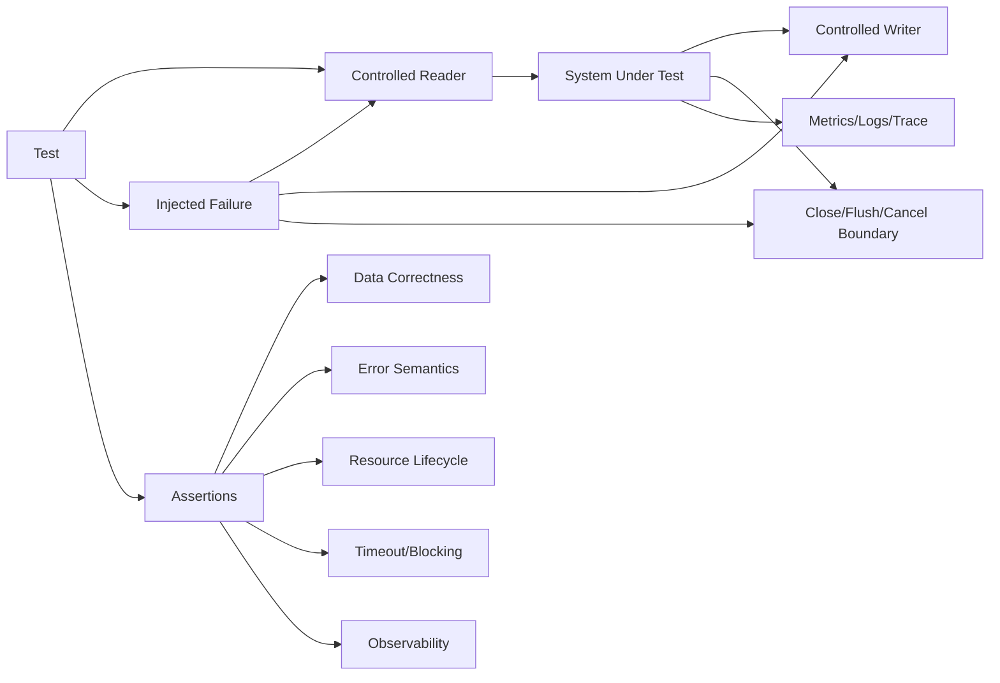
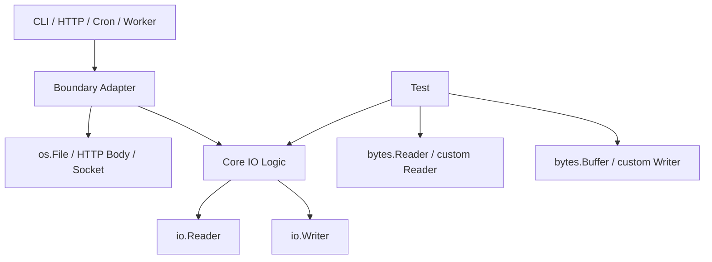
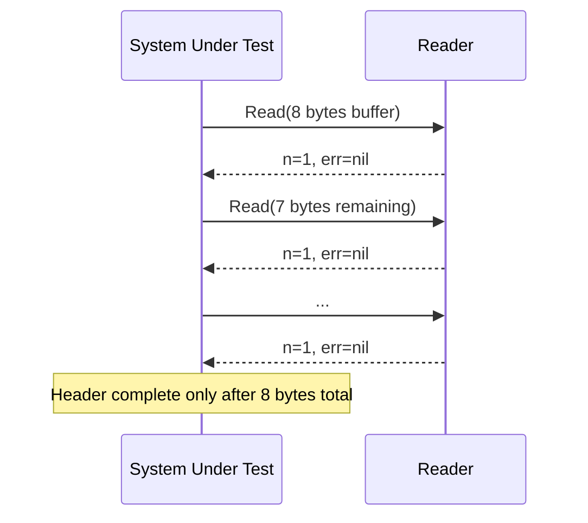
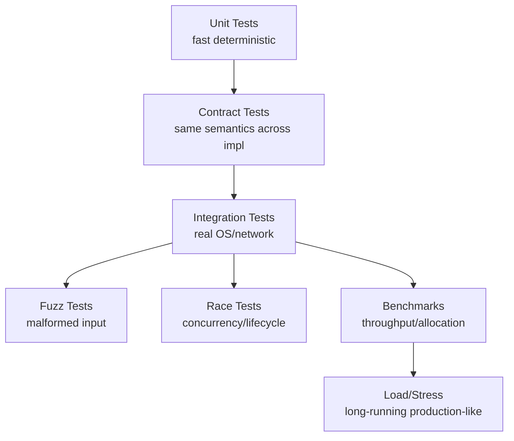

# learn-go-io-buffer-byte-stream-file-network-data-transfer-part-033.md

# Part 033 — Testing IO Systems: Fake Readers/Writers, Fault Injection, Golden Files, Fuzzing, Race Boundaries

> Target pembaca: Java software engineer yang ingin memahami cara menguji sistem IO Go secara production-grade.
>
> Target versi: Go 1.26.x.
>
> Fokus: bukan sekadar `go test`, tetapi bagaimana membuktikan kode IO tahan terhadap partial progress, EOF, short write, timeout, malformed input, resource leak, race, nondeterminism, dan perbedaan filesystem/network behavior.

---

## 0. Posisi Part Ini dalam Series

Kita sudah membangun fondasi dari byte, buffer, stream, file, filesystem, serialization, compression, networking, HTTP, reverse proxy, performance, sampai observability. Sekarang kita masuk ke pertanyaan yang jauh lebih penting daripada “kode ini jalan di happy path?”:

> Bagaimana membuktikan bahwa kode IO tetap benar ketika dunia nyata berperilaku buruk?

Dunia nyata tidak membaca semua byte sekaligus.
Dunia nyata tidak selalu menulis semua byte sekaligus.
Dunia nyata memutus koneksi di tengah frame.
Dunia nyata mengirim body lebih besar dari yang dijanjikan.
Dunia nyata membuat disk penuh.
Dunia nyata membuat `Close` gagal.
Dunia nyata mengembalikan `n > 0` dan `err != nil`.
Dunia nyata membuat `Read` lambat, timeout, atau blocked.
Dunia nyata membuat parser menerima input yang aneh tapi valid secara byte.

Part ini adalah handbook untuk mendesain test IO yang **menyerang asumsi lemah**.

---

## 1. Mental Model: Testing IO Berbeda dari Testing Pure Function

Pure function relatif mudah diuji:

```go
func Add(a, b int) int { return a + b }
```

Input masuk, output keluar, tidak ada waktu, tidak ada partial progress, tidak ada resource external.

IO function berbeda:

```go
func CopyRecord(dst io.Writer, src io.Reader) error
```

Di sini behavior dipengaruhi oleh:

- chunk size yang diberikan `Reader`;
- apakah `Reader` mengembalikan EOF normal atau corrupt EOF;
- apakah `Writer` menerima semua byte atau short write;
- apakah operasi bisa block;
- apakah operasi perlu timeout/cancellation;
- apakah `Close`/`Flush` harus dicek;
- apakah buffer reuse menyebabkan aliasing bug;
- apakah output deterministik;
- apakah resource dilepas setelah error.

Testing IO berarti menguji **kontrak interaksi**, bukan hanya nilai akhir.



### Java mapping

Java engineer biasanya mengenal:

- `InputStream` / `OutputStream`;
- `Reader` / `Writer` untuk character stream;
- `ByteArrayInputStream` / `ByteArrayOutputStream`;
- `Files.createTempDirectory`;
- `MockWebServer`, WireMock, embedded HTTP server;
- JUnit temporary folder;
- property-based test/fuzzing tools.

Go punya model yang lebih kecil tapi lebih composable:

| Java | Go |
|---|---|
| `InputStream` | `io.Reader` |
| `OutputStream` | `io.Writer` |
| `Closeable` | `io.Closer` |
| `ByteArrayInputStream` | `bytes.Reader` / `strings.Reader` |
| `ByteArrayOutputStream` | `bytes.Buffer` |
| Temporary folder rule | `t.TempDir()` |
| Embedded HTTP test server | `httptest.Server` |
| In-memory socket-ish test | `net.Pipe()` |
| Faulty stream wrapper | custom `io.Reader` / `io.Writer`, `testing/iotest` |
| Property/fuzz testing | native Go fuzzing in `testing` |

Perbedaan penting: di Go, interface kecil membuat test double sangat murah dibuat. Anda tidak perlu mock framework untuk mayoritas test IO.

---

## 2. Apa yang Harus Dibuktikan dalam IO Test?

IO test yang baik biasanya membuktikan 8 hal.

| Dimensi | Pertanyaan |
|---|---|
| Correctness | Apakah byte yang keluar sama dengan kontrak format? |
| Boundary | Apakah ukuran 0, 1, exact-limit, over-limit, huge input benar? |
| Partial progress | Apakah kode benar jika read/write terjadi per byte/per chunk kecil? |
| Error semantics | Apakah EOF, unexpected EOF, timeout, short write, close error ditangani benar? |
| Lifecycle | Apakah reader/writer/file/body ditutup? Apakah flush dicek? |
| Determinism | Apakah hasil test stabil tanpa bergantung waktu/order filesystem? |
| Security | Apakah malformed/traversal/oversized input ditolak? |
| Observability | Apakah error path memberi sinyal yang bisa di-debug? |

Testing IO yang hanya melakukan ini:

```go
out, err := os.ReadFile("sample.txt")
```

belum membuktikan banyak. Itu hanya membuktikan happy path di mesin test saat itu.

---

## 3. Struktur Testable IO Code

Kode IO sulit diuji biasanya karena terlalu cepat mengikat diri ke concrete external resource.

### Bentuk yang sulit diuji

```go
func ConvertFile(inPath, outPath string) error {
    b, err := os.ReadFile(inPath)
    if err != nil {
        return err
    }

    out := transform(b)

    return os.WriteFile(outPath, out, 0o644)
}
```

Masalah:

- harus menyentuh filesystem;
- cenderung load-all;
- sulit inject partial read/write;
- sulit test close/flush error;
- sulit test streaming;
- error boundary bercampur dengan path boundary.

### Bentuk yang lebih testable

```go
func Convert(dst io.Writer, src io.Reader) error {
    scanner := bufio.NewScanner(src)
    for scanner.Scan() {
        line := scanner.Text()
        if _, err := io.WriteString(dst, strings.ToUpper(line)+"\n"); err != nil {
            return fmt.Errorf("write converted line: %w", err)
        }
    }
    if err := scanner.Err(); err != nil {
        return fmt.Errorf("read input: %w", err)
    }
    return nil
}

func ConvertFile(inPath, outPath string) error {
    in, err := os.Open(inPath)
    if err != nil {
        return fmt.Errorf("open input: %w", err)
    }
    defer in.Close()

    out, err := os.Create(outPath)
    if err != nil {
        return fmt.Errorf("create output: %w", err)
    }
    defer out.Close()

    if err := Convert(out, in); err != nil {
        return err
    }
    return nil
}
```

Lebih baik lagi bila `out` buffered:

```go
func ConvertFile(inPath, outPath string) error {
    in, err := os.Open(inPath)
    if err != nil {
        return fmt.Errorf("open input: %w", err)
    }
    defer in.Close()

    f, err := os.Create(outPath)
    if err != nil {
        return fmt.Errorf("create output: %w", err)
    }
    defer f.Close()

    bw := bufio.NewWriter(f)
    if err := Convert(bw, in); err != nil {
        return err
    }
    if err := bw.Flush(); err != nil {
        return fmt.Errorf("flush output: %w", err)
    }
    return nil
}
```

Testing unit cukup ke `Convert`, sedangkan `ConvertFile` bisa diuji sebagai integration-ish test dengan `t.TempDir()`.

### Prinsip desain

> Core logic menerima interface. Boundary adapter memakai concrete resource.



---

## 4. Test Double Dasar untuk Reader dan Writer

### 4.1 `strings.Reader`

Cocok untuk input text kecil.

```go
func TestConvert(t *testing.T) {
    input := strings.NewReader("hello\nworld\n")
    var output bytes.Buffer

    err := Convert(&output, input)
    if err != nil {
        t.Fatalf("Convert() error = %v", err)
    }

    got := output.String()
    want := "HELLO\nWORLD\n"
    if got != want {
        t.Fatalf("output mismatch\ngot:  %q\nwant: %q", got, want)
    }
}
```

### 4.2 `bytes.Reader`

Cocok untuk binary input karena tidak melewati string semantic.

```go
src := bytes.NewReader([]byte{0x01, 0x02, 0x03})
```

`bytes.Reader` juga mendukung `Read`, `ReadAt`, `Seek`, `Len`, `Size`, sehingga bagus untuk menguji random-access code.

### 4.3 `bytes.Buffer`

Cocok untuk menangkap output.

```go
var dst bytes.Buffer
_, err := io.Copy(&dst, src)
```

Hati-hati: `bytes.Buffer` jarang mengembalikan short write/error. Jadi ia bagus untuk happy path, tapi buruk untuk membuktikan error path.

---

## 5. Menguji Partial Read

Banyak kode IO terlihat benar bila input diberikan sekali besar, tapi rusak bila `Read` hanya mengembalikan sebagian kecil data.

Bug umum:

```go
func ReadHeader(r io.Reader) ([8]byte, error) {
    var h [8]byte
    n, err := r.Read(h[:])
    if err != nil {
        return h, err
    }
    if n != len(h) {
        return h, fmt.Errorf("short header")
    }
    return h, nil
}
```

Ini salah untuk general `io.Reader`. `Read` boleh mengembalikan kurang dari `len(p)` tanpa error.

Yang benar:

```go
func ReadHeader(r io.Reader) ([8]byte, error) {
    var h [8]byte
    if _, err := io.ReadFull(r, h[:]); err != nil {
        return h, fmt.Errorf("read header: %w", err)
    }
    return h, nil
}
```

### Custom chunked reader

```go
type chunkedReader struct {
    data []byte
    max  int
}

func (r *chunkedReader) Read(p []byte) (int, error) {
    if len(r.data) == 0 {
        return 0, io.EOF
    }
    n := min(len(p), r.max, len(r.data))
    copy(p, r.data[:n])
    r.data = r.data[n:]
    return n, nil
}
```

Test:

```go
func TestReadHeaderHandlesPartialRead(t *testing.T) {
    r := &chunkedReader{
        data: []byte("ABCDEFGHpayload"),
        max:  1,
    }

    got, err := ReadHeader(r)
    if err != nil {
        t.Fatalf("ReadHeader() error = %v", err)
    }

    if string(got[:]) != "ABCDEFGH" {
        t.Fatalf("header = %q", string(got[:]))
    }
}
```

### Mental model



---

## 6. Menguji `n > 0 && err != nil`

Kontrak `io.Reader` memungkinkan return data dan error sekaligus. Contoh classic: reader mengembalikan byte terakhir bersama `io.EOF`.

Kode buruk:

```go
func ReadAllBad(r io.Reader) ([]byte, error) {
    var out []byte
    buf := make([]byte, 1024)
    for {
        n, err := r.Read(buf)
        if err != nil {
            return nil, err
        }
        out = append(out, buf[:n]...)
    }
}
```

Bug: jika `n > 0` dan `err == io.EOF`, data terakhir hilang.

Kode benar harus memproses `n` dulu.

```go
func ReadAllLoop(r io.Reader) ([]byte, error) {
    var out []byte
    buf := make([]byte, 1024)
    for {
        n, err := r.Read(buf)
        if n > 0 {
            out = append(out, buf[:n]...)
        }
        if err != nil {
            if errors.Is(err, io.EOF) {
                return out, nil
            }
            return out, err
        }
    }
}
```

### Test reader untuk data+error

```go
type dataErrReader struct {
    data []byte
    err  error
    done bool
}

func (r *dataErrReader) Read(p []byte) (int, error) {
    if r.done {
        return 0, io.EOF
    }
    r.done = true
    n := copy(p, r.data)
    return n, r.err
}
```

Test:

```go
func TestReadAllLoopProcessesDataBeforeEOF(t *testing.T) {
    r := &dataErrReader{
        data: []byte("last"),
        err:  io.EOF,
    }

    got, err := ReadAllLoop(r)
    if err != nil {
        t.Fatalf("ReadAllLoop() error = %v", err)
    }
    if string(got) != "last" {
        t.Fatalf("got %q", got)
    }
}
```

Package `testing/iotest` juga menyediakan helper seperti `DataErrReader` untuk pola ini.

---

## 7. Menguji Short Write

`io.Writer.Write(p)` harus mengembalikan `n < len(p)` bersama error non-nil. Kode yang mengabaikan `n` bisa menghasilkan data corrupt.

### Writer yang gagal setelah beberapa byte

```go
type failAfterWriter struct {
    max int
    n   int
    buf bytes.Buffer
}

func (w *failAfterWriter) Write(p []byte) (int, error) {
    remaining := w.max - w.n
    if remaining <= 0 {
        return 0, errors.New("injected write failure")
    }

    if len(p) > remaining {
        _, _ = w.buf.Write(p[:remaining])
        w.n += remaining
        return remaining, errors.New("injected partial write failure")
    }

    n, _ := w.buf.Write(p)
    w.n += n
    return n, nil
}
```

Test:

```go
func TestWriteRecordReturnsShortWriteError(t *testing.T) {
    dst := &failAfterWriter{max: 3}

    err := WriteRecord(dst, []byte("abcdef"))
    if err == nil {
        t.Fatal("expected error")
    }

    if got := dst.buf.String(); got != "abc" {
        t.Fatalf("written bytes = %q", got)
    }
}
```

### Jangan menguji writer error hanya dengan `bytes.Buffer`

`bytes.Buffer` hampir selalu sukses. Jika test hanya memakai `bytes.Buffer`, error path writer tidak pernah diuji.

---

## 8. Menguji `Close` dan `Flush`

Bug IO production yang sering terjadi:

- `bufio.Writer.Flush()` tidak dicek;
- `gzip.Writer.Close()` tidak dicek;
- `base64.NewEncoder(...).Close()` tidak dipanggil;
- response body client tidak ditutup;
- file close error hilang;
- multipart writer tidak di-close sehingga final boundary tidak tertulis.

### Close-aware test double

```go
type closeTrackingReader struct {
    *strings.Reader
    closed bool
}

func (r *closeTrackingReader) Close() error {
    r.closed = true
    return nil
}
```

Test:

```go
func TestProcessClosesInput(t *testing.T) {
    rc := &closeTrackingReader{Reader: strings.NewReader("hello")}

    err := ProcessAndClose(rc)
    if err != nil {
        t.Fatalf("ProcessAndClose() error = %v", err)
    }
    if !rc.closed {
        t.Fatal("input was not closed")
    }
}
```

### Close error injection

```go
type closeErrorWriter struct {
    bytes.Buffer
}

func (w *closeErrorWriter) Close() error {
    return errors.New("injected close failure")
}
```

Jika function contract mengharuskan close berhasil, test harus membuktikannya.

```go
func TestCloseErrorIsReturned(t *testing.T) {
    w := &closeErrorWriter{}

    err := WriteAndClose(w, []byte("payload"))
    if err == nil || !strings.Contains(err.Error(), "close") {
        t.Fatalf("expected close error, got %v", err)
    }
}
```

### Flush error injection

`bufio.Writer.Flush` mengembalikan error dari underlying writer. Untuk mengujinya, gunakan writer yang gagal setelah beberapa byte.

```go
func TestBufferedWriteChecksFlushError(t *testing.T) {
    dst := &failAfterWriter{max: 2}

    err := WriteBuffered(dst, []byte("abcdef"))
    if err == nil {
        t.Fatal("expected flush/write error")
    }
}
```

---

## 9. Menggunakan `testing/iotest`

Package `testing/iotest` dibuat khusus untuk menguji reader/writer. Helper yang sering berguna:

| Helper | Kegunaan |
|---|---|
| `OneByteReader` | Memaksa reader hanya mengembalikan 1 byte per read |
| `HalfReader` | Membatasi read menjadi separuh buffer |
| `DataErrReader` | Mengembalikan data final bersama error |
| `TimeoutReader` | Mensimulasikan timeout pada read kedua tanpa data |
| `ErrReader` | Reader yang selalu error |
| `TruncateWriter` | Writer yang discard semua write setelah limit |
| `TestReader` | Menguji apakah reader menghasilkan data yang diharapkan |

Contoh:

```go
func TestParseWorksWithOneByteReader(t *testing.T) {
    src := iotest.OneByteReader(strings.NewReader("name:fajar\n"))

    got, err := ParseRecord(src)
    if err != nil {
        t.Fatalf("ParseRecord() error = %v", err)
    }
    if got.Name != "fajar" {
        t.Fatalf("Name = %q", got.Name)
    }
}
```

Contoh `DataErrReader`:

```go
func TestReadLoopHandlesDataErrReader(t *testing.T) {
    src := iotest.DataErrReader(strings.NewReader("abc"))

    got, err := ReadAllLoop(src)
    if err != nil {
        t.Fatalf("ReadAllLoop() error = %v", err)
    }
    if string(got) != "abc" {
        t.Fatalf("got %q", got)
    }
}
```

### Mengapa ini penting?

Karena banyak bug reader loop hanya muncul saat:

- read size kecil;
- final read membawa data+EOF;
- reader error muncul setelah sebagian data;
- input truncate di tengah record.

---

## 10. Golden File Testing

Golden file adalah file expected output yang disimpan di testdata.

Struktur umum:

```text
mypkg/
  parser.go
  parser_test.go
  testdata/
    valid-order.input
    valid-order.golden.json
    corrupt-header.input
```

Go convention: folder `testdata` diabaikan oleh Go tool sebagai package source biasa.

### Contoh golden test

```go
func TestParseGolden(t *testing.T) {
    inputPath := filepath.Join("testdata", "valid-order.input")
    goldenPath := filepath.Join("testdata", "valid-order.golden.json")

    input, err := os.Open(inputPath)
    if err != nil {
        t.Fatal(err)
    }
    defer input.Close()

    got, err := ParseOrder(input)
    if err != nil {
        t.Fatalf("ParseOrder() error = %v", err)
    }

    gotJSON, err := json.MarshalIndent(got, "", "  ")
    if err != nil {
        t.Fatal(err)
    }
    gotJSON = append(gotJSON, '\n')

    want, err := os.ReadFile(goldenPath)
    if err != nil {
        t.Fatal(err)
    }

    if !bytes.Equal(gotJSON, want) {
        t.Fatalf("golden mismatch\ngot:\n%s\nwant:\n%s", gotJSON, want)
    }
}
```

### Update flag

Untuk banyak golden file, umum membuat flag update:

```go
var update = flag.Bool("update", false, "update golden files")
```

```go
if *update {
    if err := os.WriteFile(goldenPath, gotJSON, 0o644); err != nil {
        t.Fatal(err)
    }
}
```

Run:

```bash
go test ./... -update
```

### Golden file anti-pattern

| Anti-pattern | Dampak |
|---|---|
| Golden output tidak canonical | Test flaky |
| Map serialized tanpa stable order | Output berubah-ubah |
| Timestamp real masuk golden | Test nondeterministic |
| Golden terlalu besar tanpa diff helper | Sulit review |
| Auto-update golden di CI | Regression bisa tersembunyi |

Untuk output JSON, gunakan canonical/stable serialization. Untuk map, sort key jika format Anda sendiri.

---

## 11. Testing Filesystem Code

### 11.1 `t.TempDir()`

Untuk kode yang memang harus menyentuh OS filesystem, gunakan `t.TempDir()`.

```go
func TestWriteConfigFile(t *testing.T) {
    dir := t.TempDir()
    path := filepath.Join(dir, "config.json")

    err := WriteConfig(path, Config{Name: "aceas"})
    if err != nil {
        t.Fatalf("WriteConfig() error = %v", err)
    }

    data, err := os.ReadFile(path)
    if err != nil {
        t.Fatal(err)
    }

    if !bytes.Contains(data, []byte("aceas")) {
        t.Fatalf("config content = %s", data)
    }
}
```

`t.TempDir()` otomatis cleanup saat test selesai.

### 11.2 `testing/fstest.MapFS`

Untuk kode yang menerima `fs.FS`, gunakan `fstest.MapFS`.

```go
func TestLoadTemplatesFromFS(t *testing.T) {
    fsys := fstest.MapFS{
        "templates/email.txt": {
            Data: []byte("Hello {{.Name}}"),
        },
    }

    tpl, err := LoadTemplate(fsys, "templates/email.txt")
    if err != nil {
        t.Fatalf("LoadTemplate() error = %v", err)
    }

    if tpl == nil {
        t.Fatal("template is nil")
    }
}
```

### 11.3 `fstest.TestFS`

Jika Anda membuat implementation `fs.FS`, gunakan `fstest.TestFS` untuk compliance dasar.

```go
func TestMyFSCompliance(t *testing.T) {
    fsys := NewMyFS()

    if err := fstest.TestFS(fsys, "a.txt", "dir/b.txt"); err != nil {
        t.Fatal(err)
    }
}
```

### 11.4 Kapan pakai real FS vs fake FS?

| Tujuan | Gunakan |
|---|---|
| Test pure file loading dari `fs.FS` | `fstest.MapFS` |
| Test path traversal policy | `fstest.MapFS` + malicious names, atau real temp dir untuk symlink |
| Test permission behavior | real FS, OS-specific caveat |
| Test rename/fsync/crash consistency approximation | real FS, integration test |
| Test symlink | real FS |
| Test platform-specific path behavior | real FS dan build tags/OS matrix |

Fake FS bagus untuk deterministic test, tapi tidak bisa menggantikan semua OS behavior.

---

## 12. Testing Path Security

Path bugs sering tidak muncul di happy path. Test harus eksplisit untuk input jahat.

### Test cases

```go
func TestValidateLocalPath(t *testing.T) {
    tests := []struct {
        name string
        path string
        ok   bool
    }{
        {"normal", "tenant/a.txt", true},
        {"dotdot", "../secret", false},
        {"absolute unix", "/etc/passwd", false},
        {"current", "./a.txt", true},
        {"nested dotdot", "a/../../b", false},
        {"empty", "", false},
        {"windows drive", `C:\Windows\system32`, false},
        {"backslash traversal", `..\secret`, false},
    }

    for _, tt := range tests {
        t.Run(tt.name, func(t *testing.T) {
            got := IsSafeRelativePath(tt.path)
            if got != tt.ok {
                t.Fatalf("IsSafeRelativePath(%q) = %v, want %v", tt.path, got, tt.ok)
            }
        })
    }
}
```

### Archive extraction tests

```go
func TestRejectArchiveTraversal(t *testing.T) {
    entries := []string{
        "../evil.txt",
        "/absolute/evil.txt",
        "safe/../../evil.txt",
        `safe\..\evil.txt`,
    }

    for _, name := range entries {
        t.Run(name, func(t *testing.T) {
            err := ValidateArchiveEntry(name)
            if err == nil {
                t.Fatal("expected rejection")
            }
        })
    }
}
```

Ingat: validasi lexical tidak cukup jika symlink ikut dimainkan. Untuk symlink policy, gunakan real temp directory dan test ekstraksi bertahap.

---

## 13. Testing Durable Write Patterns

Durable write sulit diuji secara sempurna tanpa crash injection atau filesystem-level tooling, tetapi banyak invariant tetap bisa diuji.

### Invariant atomic replace function

Misal function:

```go
func WriteFileAtomic(path string, data []byte, perm fs.FileMode) error
```

Invariant yang bisa diuji:

1. Jika sukses, target berisi data baru.
2. Tidak ada temp file tersisa.
3. Permission sesuai policy.
4. Jika write gagal sebelum rename, file lama tetap ada.
5. Jika fsync/rename gagal, error dikembalikan.
6. Directory target tidak bisa path traversal.

### Test success

```go
func TestWriteFileAtomicSuccess(t *testing.T) {
    dir := t.TempDir()
    path := filepath.Join(dir, "state.json")

    if err := os.WriteFile(path, []byte("old"), 0o644); err != nil {
        t.Fatal(err)
    }

    if err := WriteFileAtomic(path, []byte("new"), 0o644); err != nil {
        t.Fatalf("WriteFileAtomic() error = %v", err)
    }

    got, err := os.ReadFile(path)
    if err != nil {
        t.Fatal(err)
    }
    if string(got) != "new" {
        t.Fatalf("content = %q", got)
    }
}
```

### Test failure injection

Agar bisa inject failure, desain function dengan dependency kecil:

```go
type atomicFileOps interface {
    CreateTemp(dir, pattern string) (*os.File, error)
    Rename(oldpath, newpath string) error
    Remove(path string) error
}
```

Namun jangan over-abstract terlalu awal. Gunakan abstraction bila failure path penting dan tidak bisa diuji lewat OS biasa.

---

## 14. Testing Serialization dan Parser

Parser adalah target utama fuzzing dan table-driven tests.

### Table-driven parser tests

```go
func TestParseFrame(t *testing.T) {
    tests := []struct {
        name    string
        input   []byte
        wantErr string
    }{
        {"empty", nil, "header"},
        {"short header", []byte{0x01}, "header"},
        {"bad magic", []byte("BAD!\x00\x00\x00\x00"), "magic"},
        {"oversized", buildHeaderWithLength(MaxFrameSize + 1), "too large"},
        {"valid empty", buildFrame(nil), ""},
    }

    for _, tt := range tests {
        t.Run(tt.name, func(t *testing.T) {
            _, err := ParseFrame(bytes.NewReader(tt.input))
            if tt.wantErr == "" {
                if err != nil {
                    t.Fatalf("ParseFrame() error = %v", err)
                }
                return
            }
            if err == nil || !strings.Contains(err.Error(), tt.wantErr) {
                t.Fatalf("error = %v, want contains %q", err, tt.wantErr)
            }
        })
    }
}
```

### Round-trip test

```go
func TestFrameRoundTrip(t *testing.T) {
    payload := []byte("hello")

    var buf bytes.Buffer
    if err := WriteFrame(&buf, payload); err != nil {
        t.Fatal(err)
    }

    got, err := ReadFrame(&buf)
    if err != nil {
        t.Fatal(err)
    }

    if !bytes.Equal(got, payload) {
        t.Fatalf("payload = %q", got)
    }
}
```

Round-trip test penting, tetapi tidak cukup. Ia bisa lolos walau format tidak interoperable, ambiguous, atau tidak canonical.

### Canonical encoding test

```go
func TestWriteFrameCanonicalBytes(t *testing.T) {
    var buf bytes.Buffer
    err := WriteFrame(&buf, []byte("A"))
    if err != nil {
        t.Fatal(err)
    }

    want := []byte{
        'F', 'R', 'M', '1',
        0x00, 0x00, 0x00, 0x01,
        'A',
    }

    if !bytes.Equal(buf.Bytes(), want) {
        t.Fatalf("encoded bytes = %x, want %x", buf.Bytes(), want)
    }
}
```

---

## 15. Fuzzing IO Parsers

Fuzzing sangat cocok untuk parser, decoder, archive entry validator, protocol frame reader, path sanitizer, dan JSON-ish normalization.

Go fuzzing memakai coverage guidance untuk menjelajahi input dan menemukan failure seperti panic, crash, invariant violation, atau bug security.

### Bentuk fuzz test

```go
func FuzzParseFrame(f *testing.F) {
    f.Add([]byte{})
    f.Add([]byte("FRM1\x00\x00\x00\x00"))
    f.Add(buildFrame([]byte("hello")))

    f.Fuzz(func(t *testing.T, data []byte) {
        payload, err := ReadFrame(bytes.NewReader(data))
        if err != nil {
            return
        }

        if len(payload) > MaxFrameSize {
            t.Fatalf("payload too large: %d", len(payload))
        }
    })
}
```

Run:

```bash
go test ./... -fuzz=FuzzParseFrame -fuzztime=30s
```

### Fuzzing invariant yang lebih kuat

```go
func FuzzFrameRoundTrip(f *testing.F) {
    f.Add([]byte("hello"))
    f.Add([]byte{})

    f.Fuzz(func(t *testing.T, payload []byte) {
        if len(payload) > MaxFrameSize {
            t.Skip()
        }

        var buf bytes.Buffer
        if err := WriteFrame(&buf, payload); err != nil {
            t.Fatalf("WriteFrame() error = %v", err)
        }

        got, err := ReadFrame(&buf)
        if err != nil {
            t.Fatalf("ReadFrame() error = %v", err)
        }

        if !bytes.Equal(got, payload) {
            t.Fatalf("round trip mismatch")
        }
    })
}
```

### Fuzzing path sanitizer

```go
func FuzzSafeJoin(f *testing.F) {
    f.Add("file.txt")
    f.Add("../secret")
    f.Add("a/b/c.txt")
    f.Add(`a\..\secret`)

    root := "/safe/root"

    f.Fuzz(func(t *testing.T, name string) {
        p, err := SafeJoin(root, name)
        if err != nil {
            return
        }
        if !strings.HasPrefix(p, root+string(os.PathSeparator)) && p != root {
            t.Fatalf("escaped root: %q", p)
        }
    })
}
```

### Fuzzing anti-pattern

| Anti-pattern | Dampak |
|---|---|
| Fuzz target melakukan network call | Lambat/flaky |
| Fuzz target menulis ke shared file | Race/flaky/corrupt corpus |
| Tidak membatasi input size | OOM/DoS saat fuzz |
| Panic dianggap acceptable tanpa invariant | Bug bisa tersembunyi |
| Mengabaikan timeout/parser infinite loop | Fuzz menggantung |

Fuzz target harus kecil, deterministic, dan cepat.

---

## 16. Testing Compression dan Archive

Compression/archive memiliki threat model khusus:

- decompression bomb;
- corrupt stream;
- truncated stream;
- path traversal;
- duplicate entries;
- symlink/hardlink;
- permission abuse;
- huge file count;
- malformed metadata.

### Compression round-trip dengan limit

```go
func TestGzipRoundTrip(t *testing.T) {
    payload := bytes.Repeat([]byte("abc"), 1000)

    var compressed bytes.Buffer
    zw := gzip.NewWriter(&compressed)
    if _, err := zw.Write(payload); err != nil {
        t.Fatal(err)
    }
    if err := zw.Close(); err != nil {
        t.Fatal(err)
    }

    zr, err := gzip.NewReader(&compressed)
    if err != nil {
        t.Fatal(err)
    }
    defer zr.Close()

    limited := io.LimitReader(zr, int64(len(payload)+1))
    got, err := io.ReadAll(limited)
    if err != nil {
        t.Fatal(err)
    }

    if !bytes.Equal(got, payload) {
        t.Fatal("round trip mismatch")
    }
}
```

### Truncated gzip

```go
func TestGzipTruncatedFails(t *testing.T) {
    var compressed bytes.Buffer
    zw := gzip.NewWriter(&compressed)
    _, _ = zw.Write([]byte("payload"))
    _ = zw.Close()

    data := compressed.Bytes()
    data = data[:len(data)-2]

    zr, err := gzip.NewReader(bytes.NewReader(data))
    if err != nil {
        return
    }
    defer zr.Close()

    _, err = io.ReadAll(zr)
    if err == nil {
        t.Fatal("expected error for truncated gzip")
    }
}
```

### Archive extraction test

Test extraction harus memastikan file tidak keluar root.

```go
func TestExtractZipRejectsTraversal(t *testing.T) {
    var buf bytes.Buffer
    zw := zip.NewWriter(&buf)

    w, err := zw.Create("../evil.txt")
    if err != nil {
        t.Fatal(err)
    }
    _, _ = w.Write([]byte("evil"))
    if err := zw.Close(); err != nil {
        t.Fatal(err)
    }

    dir := t.TempDir()
    err = ExtractZip(bytes.NewReader(buf.Bytes()), int64(buf.Len()), dir)
    if err == nil {
        t.Fatal("expected traversal rejection")
    }
}
```

---

## 17. Testing HTTP Handlers

### 17.1 `httptest.NewRequest` dan `ResponseRecorder`

```go
func TestUploadHandlerRejectsLargeBody(t *testing.T) {
    body := bytes.NewReader(bytes.Repeat([]byte("x"), MaxUploadSize+1))
    req := httptest.NewRequest(http.MethodPost, "/upload", body)
    rr := httptest.NewRecorder()

    UploadHandler(rr, req)

    res := rr.Result()
    defer res.Body.Close()

    if res.StatusCode != http.StatusRequestEntityTooLarge {
        t.Fatalf("status = %d", res.StatusCode)
    }
}
```

Important: `ResponseRecorder.Code` bisa 0 bila handler tidak memanggil `WriteHeader` atau `Write`. Gunakan `rr.Result()` untuk mendapatkan implicit status behavior.

### 17.2 Testing response body

```go
func TestDownloadHandler(t *testing.T) {
    req := httptest.NewRequest(http.MethodGet, "/download?id=1", nil)
    rr := httptest.NewRecorder()

    DownloadHandler(rr, req)

    res := rr.Result()
    defer res.Body.Close()

    if res.StatusCode != http.StatusOK {
        t.Fatalf("status = %d", res.StatusCode)
    }

    got, err := io.ReadAll(res.Body)
    if err != nil {
        t.Fatal(err)
    }
    if string(got) != "expected payload" {
        t.Fatalf("body = %q", got)
    }
}
```

### 17.3 `httptest.Server` untuk client tests

Untuk menguji HTTP client, jangan mock `http.Client` terlalu dalam. Buat real server lokal.

```go
func TestClientRetriesOnTemporary500(t *testing.T) {
    var calls atomic.Int32

    srv := httptest.NewServer(http.HandlerFunc(func(w http.ResponseWriter, r *http.Request) {
        if calls.Add(1) == 1 {
            http.Error(w, "temporary", http.StatusInternalServerError)
            return
        }
        _, _ = w.Write([]byte(`{"ok":true}`))
    }))
    defer srv.Close()

    c := NewClient(srv.URL)
    err := c.Do(context.Background())
    if err != nil {
        t.Fatalf("Do() error = %v", err)
    }

    if got := calls.Load(); got != 2 {
        t.Fatalf("calls = %d", got)
    }
}
```

### 17.4 Slow server test

```go
func TestClientTimeout(t *testing.T) {
    srv := httptest.NewServer(http.HandlerFunc(func(w http.ResponseWriter, r *http.Request) {
        time.Sleep(200 * time.Millisecond)
        _, _ = w.Write([]byte("late"))
    }))
    defer srv.Close()

    client := &http.Client{Timeout: 50 * time.Millisecond}

    _, err := client.Get(srv.URL)
    if err == nil {
        t.Fatal("expected timeout")
    }
}
```

Gunakan durasi kecil secara hati-hati. Test berbasis waktu bisa flaky. Prefer deterministic synchronization bila mungkin.

---

## 18. Testing HTTP Streaming

Streaming handler harus diuji berbeda dari normal handler. Anda ingin membuktikan bahwa data terkirim bertahap, bukan semua dikumpulkan lalu dikirim akhir.

`httptest.ResponseRecorder` tidak selalu mewakili network streaming behavior. Gunakan `httptest.Server` dan client real.

```go
func TestStreamingHandlerFlushesChunks(t *testing.T) {
    ready := make(chan struct{})

    srv := httptest.NewServer(http.HandlerFunc(func(w http.ResponseWriter, r *http.Request) {
        flusher, ok := w.(http.Flusher)
        if !ok {
            t.Error("ResponseWriter does not implement Flusher")
            return
        }

        _, _ = w.Write([]byte("first\n"))
        flusher.Flush()
        close(ready)

        time.Sleep(100 * time.Millisecond)
        _, _ = w.Write([]byte("second\n"))
    }))
    defer srv.Close()

    res, err := http.Get(srv.URL)
    if err != nil {
        t.Fatal(err)
    }
    defer res.Body.Close()

    <-ready

    br := bufio.NewReader(res.Body)
    line, err := br.ReadString('\n')
    if err != nil {
        t.Fatal(err)
    }

    if line != "first\n" {
        t.Fatalf("first line = %q", line)
    }
}
```

Test seperti ini masih punya unsur waktu. Untuk production test suite, pisahkan:

- unit test untuk handler logic;
- integration test untuk flush/streaming behavior;
- load test untuk throughput/latency.

---

## 19. Testing `net.Conn` dan Protocol Loop

### 19.1 `net.Pipe`

`net.Pipe()` membuat pair in-memory `net.Conn`. Berguna untuk menguji protocol loop tanpa port TCP real.

```go
func TestProtocolServerWithNetPipe(t *testing.T) {
    client, server := net.Pipe()
    defer client.Close()
    defer server.Close()

    done := make(chan error, 1)
    go func() {
        done <- ServeConn(server)
    }()

    _, err := client.Write([]byte("PING\n"))
    if err != nil {
        t.Fatal(err)
    }

    line, err := bufio.NewReader(client).ReadString('\n')
    if err != nil {
        t.Fatal(err)
    }

    if line != "PONG\n" {
        t.Fatalf("response = %q", line)
    }

    _ = client.Close()

    if err := <-done; err != nil && !errors.Is(err, io.EOF) {
        t.Fatalf("ServeConn() error = %v", err)
    }
}
```

### 19.2 Deadline test

```go
func TestServeConnReadDeadline(t *testing.T) {
    client, server := net.Pipe()
    defer client.Close()
    defer server.Close()

    errCh := make(chan error, 1)
    go func() {
        errCh <- ServeConnWithIdleTimeout(server, 20*time.Millisecond)
    }()

    select {
    case err := <-errCh:
        if err == nil {
            t.Fatal("expected timeout/idle error")
        }
    case <-time.After(500 * time.Millisecond):
        t.Fatal("server did not time out")
    }
}
```

### 19.3 Real TCP listener

Untuk behavior TCP OS-level, pakai listener real di localhost.

```go
func TestTCPServerAcceptsConnection(t *testing.T) {
    ln, err := net.Listen("tcp", "127.0.0.1:0")
    if err != nil {
        t.Fatal(err)
    }
    defer ln.Close()

    done := make(chan error, 1)
    go func() {
        conn, err := ln.Accept()
        if err != nil {
            done <- err
            return
        }
        defer conn.Close()
        _, err = io.WriteString(conn, "hello\n")
        done <- err
    }()

    conn, err := net.Dial("tcp", ln.Addr().String())
    if err != nil {
        t.Fatal(err)
    }
    defer conn.Close()

    line, err := bufio.NewReader(conn).ReadString('\n')
    if err != nil {
        t.Fatal(err)
    }
    if line != "hello\n" {
        t.Fatalf("line = %q", line)
    }

    if err := <-done; err != nil {
        t.Fatal(err)
    }
}
```

Gunakan `127.0.0.1:0` agar OS memilih port kosong.

---

## 20. Testing Race Boundaries

IO code sering punya race tidak di byte content, tapi di lifecycle:

- satu goroutine membaca saat goroutine lain menutup;
- shared buffer dipakai ulang sebelum write selesai;
- response body ditutup terlalu cepat;
- map metrics/log state di-update tanpa lock;
- pipeline goroutine leak saat downstream error;
- connection pool memakai conn yang sudah rusak.

Run:

```bash
go test -race ./...
```

### Race test untuk buffer ownership

Kode buruk:

```go
func AsyncWrite(w io.Writer, p []byte) {
    go w.Write(p)
}
```

Caller bisa mutate `p` setelah return. Test race bisa menangkap bila writer membaca kemudian.

Desain benar biasanya copy sebelum async boundary:

```go
func AsyncWrite(w io.Writer, p []byte) {
    cp := append([]byte(nil), p...)
    go w.Write(cp)
}
```

### Goroutine leak test pattern

Tidak ada built-in perfect goroutine leak detector di standard library, tetapi Anda bisa membuat test dengan done channel dan timeout.

```go
func TestPipelineStopsOnSinkError(t *testing.T) {
    src := strings.NewReader(strings.Repeat("x", 1024*1024))
    dst := &failAfterWriter{max: 10}

    done := make(chan error, 1)
    go func() {
        done <- RunPipeline(dst, src)
    }()

    select {
    case err := <-done:
        if err == nil {
            t.Fatal("expected sink error")
        }
    case <-time.After(time.Second):
        t.Fatal("pipeline appears stuck")
    }
}
```

Timeout dalam test adalah last-resort guard, bukan desain utama. Lebih baik pipeline punya context cancellation eksplisit.

---

## 21. Testing Context Cancellation

IO function yang menerima `context.Context` harus diuji:

- context canceled sebelum mulai;
- context canceled saat read;
- context canceled saat write;
- downstream error membatalkan upstream;
- cancel tidak meninggalkan goroutine leak.

### Canceled-before-start

```go
func TestDownloadCanceledBeforeStart(t *testing.T) {
    ctx, cancel := context.WithCancel(context.Background())
    cancel()

    err := Download(ctx, io.Discard, "http://example.invalid/file")
    if err == nil {
        t.Fatal("expected cancellation error")
    }
    if !errors.Is(err, context.Canceled) {
        t.Fatalf("error = %v", err)
    }
}
```

### Cancellation during stream

```go
type blockingReader struct {
    ch <-chan struct{}
}

func (r blockingReader) Read(p []byte) (int, error) {
    <-r.ch
    return 0, io.EOF
}
```

Pure `io.Reader` tidak menerima context. Jadi function harus punya mekanisme lain: close underlying resource, deadline, goroutine orchestration, atau context-aware source.

Ini invariant penting:

> Context tidak secara magis membatalkan `Read` pada sembarang `io.Reader`.

Untuk `net.Conn`, biasanya cancellation diterapkan lewat deadline/close. Untuk HTTP request, context terintegrasi dengan request lifecycle.

---

## 22. Testing Multipart Upload/Download

### Multipart request test

```go
func TestMultipartUpload(t *testing.T) {
    var body bytes.Buffer
    mw := multipart.NewWriter(&body)

    fw, err := mw.CreateFormFile("file", "hello.txt")
    if err != nil {
        t.Fatal(err)
    }
    _, _ = fw.Write([]byte("hello"))

    if err := mw.Close(); err != nil {
        t.Fatal(err)
    }

    req := httptest.NewRequest(http.MethodPost, "/upload", &body)
    req.Header.Set("Content-Type", mw.FormDataContentType())

    rr := httptest.NewRecorder()
    UploadHandler(rr, req)

    res := rr.Result()
    defer res.Body.Close()

    if res.StatusCode != http.StatusCreated {
        t.Fatalf("status = %d", res.StatusCode)
    }
}
```

### Missing `mw.Close()` test

Jika writer tidak di-close, final boundary tidak tertulis. Handler seharusnya menolak body malformed.

```go
func TestMultipartUploadMalformedBoundary(t *testing.T) {
    var body bytes.Buffer
    mw := multipart.NewWriter(&body)

    fw, err := mw.CreateFormFile("file", "hello.txt")
    if err != nil {
        t.Fatal(err)
    }
    _, _ = fw.Write([]byte("hello"))
    // intentionally no mw.Close()

    req := httptest.NewRequest(http.MethodPost, "/upload", &body)
    req.Header.Set("Content-Type", mw.FormDataContentType())

    rr := httptest.NewRecorder()
    UploadHandler(rr, req)

    res := rr.Result()
    defer res.Body.Close()

    if res.StatusCode < 400 {
        t.Fatalf("expected error status, got %d", res.StatusCode)
    }
}
```

---

## 23. Testing Reverse Proxy / Transfer Gateway

Reverse proxy tests harus membuktikan:

- path rewrite benar;
- query preserved/changed sesuai kontrak;
- hop-by-hop headers tidak bocor;
- trusted forwarding headers tidak blindly trusted;
- request body streaming tidak di-read-all;
- upstream error menghasilkan downstream status benar;
- response modification aman;
- timeout/cancel propagates.

### Basic proxy test

```go
func TestProxyRewritesPath(t *testing.T) {
    upstream := httptest.NewServer(http.HandlerFunc(func(w http.ResponseWriter, r *http.Request) {
        if r.URL.Path != "/api/v1/files" {
            t.Errorf("path = %q", r.URL.Path)
        }
        _, _ = w.Write([]byte("ok"))
    }))
    defer upstream.Close()

    proxy := NewReverseProxy(upstream.URL)

    req := httptest.NewRequest(http.MethodGet, "/files", nil)
    rr := httptest.NewRecorder()

    proxy.ServeHTTP(rr, req)

    res := rr.Result()
    defer res.Body.Close()

    if res.StatusCode != http.StatusOK {
        t.Fatalf("status = %d", res.StatusCode)
    }
}
```

### Header policy test

```go
func TestProxyDoesNotTrustClientForwardedFor(t *testing.T) {
    upstream := httptest.NewServer(http.HandlerFunc(func(w http.ResponseWriter, r *http.Request) {
        got := r.Header.Get("X-Forwarded-For")
        if strings.Contains(got, "1.2.3.4") {
            t.Errorf("trusted client supplied X-Forwarded-For: %q", got)
        }
    }))
    defer upstream.Close()

    proxy := NewReverseProxy(upstream.URL)

    req := httptest.NewRequest(http.MethodGet, "/", nil)
    req.Header.Set("X-Forwarded-For", "1.2.3.4")

    rr := httptest.NewRecorder()
    proxy.ServeHTTP(rr, req)
}
```

---

## 24. Testing Observability Signals

Testing logs/metrics/traces tidak perlu berlebihan, tapi untuk error path kritikal, minimal sinyal harus diverifikasi.

### Metrics fake

```go
type metricsSink struct {
    mu       sync.Mutex
    counters map[string]int
}

func (m *metricsSink) Inc(name string) {
    m.mu.Lock()
    defer m.mu.Unlock()
    if m.counters == nil {
        m.counters = make(map[string]int)
    }
    m.counters[name]++
}
```

Test:

```go
func TestUploadOversizeIncrementsMetric(t *testing.T) {
    metrics := &metricsSink{}
    h := NewUploadHandler(metrics)

    req := httptest.NewRequest(http.MethodPost, "/upload", strings.NewReader(strings.Repeat("x", MaxUploadSize+1)))
    rr := httptest.NewRecorder()

    h.ServeHTTP(rr, req)

    if metrics.counters["upload_rejected_oversize"] != 1 {
        t.Fatalf("metric not incremented")
    }
}
```

### Log assertion

Log assertion sebaiknya tidak terlalu brittle. Jangan assert seluruh string panjang jika tidak perlu. Assert fields penting:

- operation;
- resource type;
- error class;
- request/trace id;
- byte count;
- duration bucket.

---

## 25. Testing Performance-sensitive IO

Unit test bukan benchmark. Tetapi performance-sensitive code butuh benchmark dan allocation assertion.

### Benchmark reader/writer

```go
func BenchmarkCopyWithBuffer(b *testing.B) {
    payload := bytes.Repeat([]byte("x"), 1<<20)
    buf := make([]byte, 32*1024)

    b.SetBytes(int64(len(payload)))
    b.ReportAllocs()

    for i := 0; i < b.N; i++ {
        src := bytes.NewReader(payload)
        dst := io.Discard

        if _, err := io.CopyBuffer(dst, src, buf); err != nil {
            b.Fatal(err)
        }
    }
}
```

Run:

```bash
go test -bench=. -benchmem ./...
```

### Allocation guard

```go
func TestEncodeFrameAllocations(t *testing.T) {
    payload := []byte("hello")

    allocs := testing.AllocsPerRun(1000, func() {
        var buf bytes.Buffer
        _ = WriteFrame(&buf, payload)
    })

    if allocs > 2 {
        t.Fatalf("allocs = %v, want <= 2", allocs)
    }
}
```

Gunakan allocation guard secara selektif. Terlalu banyak guard membuat refactoring sulit.

---

## 26. Determinism: Menghilangkan Flaky Test

IO test sering flaky karena:

- bergantung waktu real;
- menggunakan port tetap;
- tidak menunggu server siap;
- mengandalkan urutan `os.ReadDir` tanpa memahami sorting;
- parallel test menulis file sama;
- memakai shared global state;
- timeout terlalu agresif;
- tidak menutup server/body/file;
- test race di hidden goroutine.

### Prinsip determinism

| Risiko | Mitigasi |
|---|---|
| Port conflict | `127.0.0.1:0`, `httptest.Server` |
| Time-based wait | channel synchronization |
| Shared path | `t.TempDir()` per test |
| Shared globals | dependency injection / reset hook |
| Goroutine not stopped | context + done channel |
| Body not closed | defer close dan assert where useful |
| Output order unstable | sort explicitly |

### Jangan pakai `time.Sleep` sebagai synchronization utama

Buruk:

```go
go server.Start()
time.Sleep(100 * time.Millisecond)
```

Lebih baik:

```go
ready := make(chan struct{})
go server.Start(ready)
<-ready
```

---

## 27. Table-driven Testing untuk IO

Table-driven test adalah idiom kuat di Go, tetapi untuk IO test tambahkan dimensi error/failure.

```go
func TestReadRecord(t *testing.T) {
    tests := []struct {
        name    string
        reader  func() io.Reader
        want    Record
        wantErr string
    }{
        {
            name:   "valid",
            reader: func() io.Reader { return strings.NewReader("id=1\n") },
            want:   Record{ID: "1"},
        },
        {
            name:    "partial reads",
            reader:  func() io.Reader { return iotest.OneByteReader(strings.NewReader("id=1\n")) },
            want:    Record{ID: "1"},
            wantErr: "",
        },
        {
            name:    "truncated",
            reader:  func() io.Reader { return strings.NewReader("id=") },
            wantErr: "unexpected eof",
        },
        {
            name:    "reader error",
            reader:  func() io.Reader { return iotest.ErrReader(errors.New("boom")) },
            wantErr: "boom",
        },
    }

    for _, tt := range tests {
        t.Run(tt.name, func(t *testing.T) {
            got, err := ReadRecord(tt.reader())
            if tt.wantErr != "" {
                if err == nil || !strings.Contains(strings.ToLower(err.Error()), tt.wantErr) {
                    t.Fatalf("error = %v, want contains %q", err, tt.wantErr)
                }
                return
            }
            if err != nil {
                t.Fatalf("ReadRecord() error = %v", err)
            }
            if got != tt.want {
                t.Fatalf("got = %#v, want %#v", got, tt.want)
            }
        })
    }
}
```

Note `reader func() io.Reader`, bukan `reader io.Reader`, supaya setiap subtest mendapatkan fresh reader.

---

## 28. Contract Test untuk Interface IO Anda Sendiri

Jika Anda membuat abstraction, misalnya:

```go
type ObjectStore interface {
    Put(ctx context.Context, key string, r io.Reader) error
    Get(ctx context.Context, key string) (io.ReadCloser, error)
    Delete(ctx context.Context, key string) error
}
```

Buat contract test reusable.

```go
func TestObjectStoreContract(t *testing.T, newStore func(t *testing.T) ObjectStore) {
    t.Helper()

    t.Run("put get round trip", func(t *testing.T) {
        store := newStore(t)
        ctx := context.Background()

        err := store.Put(ctx, "a.txt", strings.NewReader("hello"))
        if err != nil {
            t.Fatal(err)
        }

        rc, err := store.Get(ctx, "a.txt")
        if err != nil {
            t.Fatal(err)
        }
        defer rc.Close()

        got, err := io.ReadAll(rc)
        if err != nil {
            t.Fatal(err)
        }
        if string(got) != "hello" {
            t.Fatalf("got %q", got)
        }
    })
}
```

Lalu adapter berbeda bisa menjalankan contract yang sama:

```go
func TestMemoryObjectStore(t *testing.T) {
    TestObjectStoreContract(t, func(t *testing.T) ObjectStore {
        return NewMemoryObjectStore()
    })
}

func TestFileObjectStore(t *testing.T) {
    TestObjectStoreContract(t, func(t *testing.T) ObjectStore {
        return NewFileObjectStore(t.TempDir())
    })
}
```

Ini sangat berguna untuk sistem yang punya multiple backend: memory, filesystem, S3-like, database blob, etc.

---

## 29. Fault Injection Matrix

Gunakan matrix berikut saat mendesain test IO production-grade.

| Boundary | Fault yang perlu diuji |
|---|---|
| Reader | one-byte read, half read, data+EOF, unexpected EOF, injected error, slow/blocking read |
| Writer | short write, fail after N bytes, flush error, close error, slow/blocking write |
| File | not found, permission denied, disk full approximation, temp create fail, rename fail, remove fail |
| FS path | traversal, absolute path, symlink, duplicate name, invalid char, Windows separator |
| Parser | empty, short header, bad magic, bad version, huge length, checksum mismatch, duplicate field |
| JSON | unknown field, missing field, null field, duplicate key, huge number, malformed UTF-8-ish content |
| Compression | truncated compressed stream, corrupt header, huge decompressed size, close not called |
| Archive | traversal entry, symlink, hardlink, duplicate file, huge count, huge metadata |
| TCP | connect fail, idle timeout, partial frame, disconnect mid-frame, slow peer, half-close |
| HTTP | 4xx/5xx, timeout, redirect, malformed content type, oversized body, early close |
| Pipeline | upstream fail, transformer fail, downstream fail, cancel mid-stream, goroutine leak |

---

## 30. Error Assertion: Jangan Terlalu Lemah, Jangan Terlalu Kaku

Buruk:

```go
if err == nil {
    t.Fatal("expected error")
}
```

Ini terlalu lemah. Bisa saja error yang muncul salah.

Buruk juga:

```go
if err.Error() != "read header: unexpected EOF" {
    t.Fatal(...)
}
```

Ini terlalu kaku untuk error wrapping yang bisa berubah.

Lebih baik:

```go
if !errors.Is(err, io.ErrUnexpectedEOF) {
    t.Fatalf("error = %v, want io.ErrUnexpectedEOF", err)
}
```

Untuk domain error:

```go
var ErrFrameTooLarge = errors.New("frame too large")
```

```go
if !errors.Is(err, ErrFrameTooLarge) {
    t.Fatalf("error = %v, want ErrFrameTooLarge", err)
}
```

Atau jika belum punya sentinel:

```go
if err == nil || !strings.Contains(err.Error(), "frame too large") {
    t.Fatalf("error = %v", err)
}
```

Prefer sentinel/typed error untuk decision-making path.

---

## 31. Resource Leak Testing

### 31.1 HTTP response body

Di client tests, biasakan close body.

```go
res, err := client.Do(req)
if err != nil {
    t.Fatal(err)
}
defer res.Body.Close()
```

Jika membuat wrapper client, test bisa memakai custom `ReadCloser` untuk memastikan close.

```go
type trackingBody struct {
    io.Reader
    closed bool
}

func (b *trackingBody) Close() error {
    b.closed = true
    return nil
}
```

### 31.2 File descriptor leak

Standard library tidak punya portable FD leak assertion yang sempurna. Strategy:

- design: always close via `defer` after successful open;
- test close with fake `io.Closer` where possible;
- integration smoke under load;
- observability in production: open FD metrics/process metrics;
- pprof goroutine/file usage where available.

### 31.3 Goroutine leak

Untuk pipeline dan server loop, selalu punya explicit stop path.

```go
ctx, cancel := context.WithCancel(context.Background())
done := make(chan error, 1)

go func() { done <- Run(ctx) }()

cancel()
select {
case err := <-done:
    _ = err
case <-time.After(time.Second):
    t.Fatal("Run did not stop")
}
```

---

## 32. Integration Test vs Unit Test vs Fuzz Test vs Benchmark

| Jenis | Tujuan | Contoh |
|---|---|---|
| Unit test | Logic kecil deterministic | parser, encoder, safe path, retry decision |
| Contract test | Backend berbeda mematuhi interface sama | memory store vs file store |
| Integration test | OS/network behavior real | localhost TCP, temp dir, httptest server |
| Fuzz test | Cari edge case input | frame parser, path sanitizer, archive metadata |
| Race test | Cari data race | shared buffer, concurrent close/write |
| Benchmark | Ukur throughput/allocation | copy pipeline, compression, parser |
| Load/stress test | Behavior jangka panjang | connection pool, upload storm, descriptor leak |

Jangan memaksa semua hal masuk unit test. IO system butuh beberapa lapisan pembuktian.



---

## 33. CI Strategy untuk IO Tests

Tidak semua test harus berjalan setiap commit dengan intensitas sama.

| Stage | Command | Tujuan |
|---|---|---|
| Fast unit | `go test ./...` | correctness dasar |
| Race | `go test -race ./...` | data race/lifecycle bug |
| Fuzz smoke | `go test ./... -run=Fuzz -fuzz=FuzzX -fuzztime=10s` | parser edge smoke |
| Benchmark PR check | selective `go test -bench=... -benchmem` | detect allocation/throughput regression |
| Nightly fuzz | longer fuzz time | cari edge cases lebih dalam |
| Nightly stress | custom load test | leak, slow IO, pool exhaustion |

Untuk fuzzing, biasanya jangan menjalankan semua fuzz target lama di setiap PR. Simpan corpus crash/repro sebagai regression test.

---

## 34. Case Study: Test Plan untuk File Transfer Service

Misal service:

- menerima HTTP multipart upload;
- membatasi ukuran file 500 MiB;
- menyimpan ke temp file;
- menghitung SHA-256 saat streaming;
- rename atomik ke object directory;
- menyediakan download streaming;
- mendukung resume via range;
- reverse proxy di depan;
- observability metrics.

### Unit tests

- path sanitizer menolak traversal;
- metadata parser menolak invalid JSON;
- checksum function deterministic;
- range parser: valid, invalid, suffix, out-of-range;
- storage key validator;
- error classifier.

### IO tests

- upload body one-byte reader;
- upload body truncated multipart;
- writer fail after N bytes;
- temp file create fail;
- rename fail injection;
- close/flush error;
- download returns exact bytes;
- range download returns exact segment;
- oversized body rejected before full read.

### HTTP tests

- `httptest.NewRequest` for handler status;
- `httptest.Server` for streaming behavior;
- client closes response body;
- content type validation;
- backpressure-ish test with slow reader;
- timeout test.

### Fuzz tests

- range header parser;
- metadata JSON parser;
- path/key sanitizer;
- frame parser if custom protocol exists.

### Integration tests

- real temp dir storage;
- concurrent uploads different keys;
- conflict same key policy;
- cleanup temp files after failure;
- graceful shutdown during active upload.

### Observability tests

- metric `upload_started` increments;
- `upload_rejected_oversize` increments;
- `upload_failed_stage=rename` emitted;
- structured log includes request id/key/error class.

---

## 35. Production Checklist: Testing IO Systems

Sebelum merge IO-heavy code, tanya ini:

### Reader behavior

- [ ] Apakah partial read diuji?
- [ ] Apakah `n > 0 && err != nil` diuji?
- [ ] Apakah EOF normal vs unexpected EOF dibedakan?
- [ ] Apakah oversized input dibatasi?
- [ ] Apakah malformed input ditolak?

### Writer behavior

- [ ] Apakah short write diuji?
- [ ] Apakah writer error setelah partial byte diuji?
- [ ] Apakah `Flush` dicek?
- [ ] Apakah `Close` error relevan dicek?
- [ ] Apakah output canonical/deterministic?

### File/filesystem

- [ ] Apakah test memakai `t.TempDir()` untuk real FS?
- [ ] Apakah path traversal diuji?
- [ ] Apakah symlink policy diuji bila relevan?
- [ ] Apakah temp file cleanup diuji?
- [ ] Apakah atomic replace invariant diuji?

### Network/HTTP

- [ ] Apakah timeout/cancellation diuji?
- [ ] Apakah response body ditutup?
- [ ] Apakah streaming behavior diuji dengan server real bila perlu?
- [ ] Apakah retry boundary diuji?
- [ ] Apakah slow peer/large body diuji?

### Pipeline

- [ ] Apakah upstream error menghentikan downstream?
- [ ] Apakah downstream error membatalkan upstream?
- [ ] Apakah goroutine leak dicegah?
- [ ] Apakah backpressure tidak dihilangkan oleh unbounded buffer?
- [ ] Apakah context cancellation propagated?

### Security

- [ ] Apakah decompression/archive bomb dibatasi?
- [ ] Apakah archive traversal diuji?
- [ ] Apakah duplicate/conflicting metadata diuji?
- [ ] Apakah invalid UTF-8/text edge case diuji bila relevan?
- [ ] Apakah SSRF/header trust boundary diuji untuk HTTP/proxy?

### CI

- [ ] Apakah test cepat cukup deterministic?
- [ ] Apakah race test dijalankan minimal di CI penting?
- [ ] Apakah fuzz target ada untuk parser/security boundary?
- [ ] Apakah benchmark ada untuk hot path?
- [ ] Apakah flaky time-based test diminimalkan?

---

## 36. Latihan

### Latihan 1 — Faulty Reader Suite

Buat function:

```go
func ReadExactly(r io.Reader, n int) ([]byte, error)
```

Requirement:

- membaca tepat `n` byte;
- jika input kurang, return error yang membungkus `io.ErrUnexpectedEOF`;
- jika input lebih, biarkan sisanya tidak terbaca;
- tahan terhadap one-byte reader;
- tidak memakai `io.ReadAll`.

Test:

- exact input;
- short input;
- one-byte reader;
- data+EOF reader;
- reader error setelah partial data.

### Latihan 2 — Safe Archive Extractor Test

Buat test untuk extractor yang menolak:

- `../evil.txt`;
- absolute path;
- duplicate entry;
- symlink entry;
- file di atas max size;
- total extracted bytes di atas max total.

### Latihan 3 — Multipart Upload Handler

Buat handler upload yang:

- memakai `MaxBytesReader`;
- memakai `MultipartReader`, bukan `ParseMultipartForm`;
- hanya menerima satu file field `file`;
- menolak filename traversal;
- streaming ke temp file;
- cleanup temp file saat error.

Test:

- valid upload;
- oversized body;
- malformed multipart;
- missing file;
- dangerous filename;
- writer failure injection.

### Latihan 4 — Fuzz Frame Parser

Buat binary frame:

```text
magic: 4 bytes "FRM1"
length: uint32 big endian
payload: length bytes
crc32: 4 bytes big endian
```

Buat:

- `WriteFrame(w io.Writer, payload []byte) error`;
- `ReadFrame(r io.Reader) ([]byte, error)`;
- fuzz test untuk parser;
- round-trip test;
- canonical bytes test;
- max length rejection test.

---

## 37. Ringkasan

Testing IO bukan hanya membandingkan output.

Testing IO adalah usaha sistematis untuk membuktikan bahwa kode tetap benar saat:

- read/write parsial;
- EOF muncul di waktu yang tidak nyaman;
- writer gagal setelah sebagian byte;
- flush/close gagal;
- input malformed;
- body terlalu besar;
- peer lambat;
- connection putus;
- filesystem berbeda;
- path jahat;
- goroutine perlu berhenti;
- context dibatalkan;
- parser diserang fuzz input;
- observability harus menjelaskan failure.

Mental model paling penting:

> IO code yang belum diuji dengan partial progress dan injected failure belum benar-benar diuji.

Go membuat ini relatif mudah karena interface IO kecil. Gunakan `io.Reader`, `io.Writer`, `io.Closer`, `fs.FS`, `httptest`, `net.Pipe`, `testing/iotest`, `fstest`, fuzzing, race detector, dan benchmark sebagai toolbox pembuktian.

---

## 38. Preview Part 034

Part berikutnya adalah penutup/capstone:

```text
learn-go-io-buffer-byte-stream-file-network-data-transfer-part-034.md
```

Topik:

> Capstone handbook: production-grade file transfer + streaming network service design.

Kita akan menggabungkan seluruh seri menjadi rancangan sistem transfer file/streaming service lengkap:

- API contract;
- upload/download/resume;
- filesystem/object storage boundary;
- checksum;
- compression;
- HTTP streaming;
- TCP/internal transfer option;
- backpressure;
- retry/idempotency;
- observability;
- testing strategy;
- failure matrix;
- production runbook;
- design review checklist.

Part 034 adalah bagian terakhir seri ini.

---

## References

- Go `testing/iotest`: https://pkg.go.dev/testing/iotest
- Go `testing/fstest`: https://pkg.go.dev/testing/fstest
- Go `net/http/httptest`: https://pkg.go.dev/net/http/httptest
- Go fuzzing overview: https://go.dev/doc/security/fuzz/
- Go fuzzing tutorial: https://go.dev/doc/tutorial/fuzz
- Go `testing`: https://pkg.go.dev/testing
- Go `io`: https://pkg.go.dev/io
- Go `io/fs`: https://pkg.go.dev/io/fs
- Go `net`: https://pkg.go.dev/net
- Go `net/http`: https://pkg.go.dev/net/http


<!-- NAVIGATION_FOOTER -->
<div class="page-nav">
<a href="./learn-go-io-buffer-byte-stream-file-network-data-transfer-part-032.md">⬅️ Part 032 — Observability untuk Go IO: Metrics, Logs, Tracing, pprof, Runtime Metrics, Blocked IO, Stream Leak, Descriptor Leak</a>
<a href="./index.md">📚 Kategori</a>
<a href="../../index.md">🏠 Home</a>
<a href="./learn-go-io-buffer-byte-stream-file-network-data-transfer-part-034.md">Part 034 — Capstone Handbook: Production-Grade File Transfer + Streaming Network Service Design ➡️</a>
</div>
