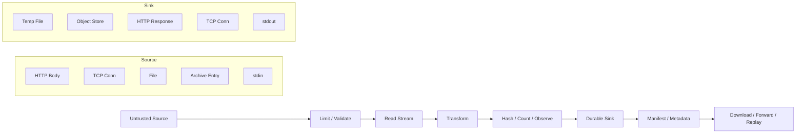
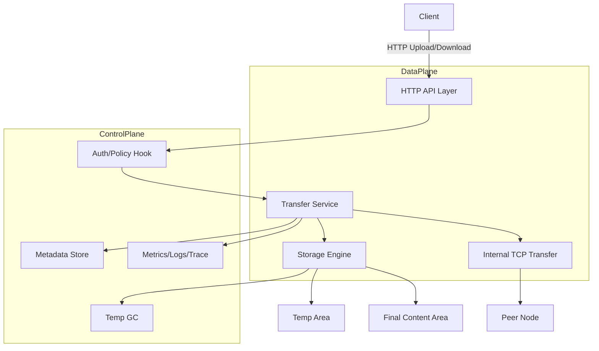
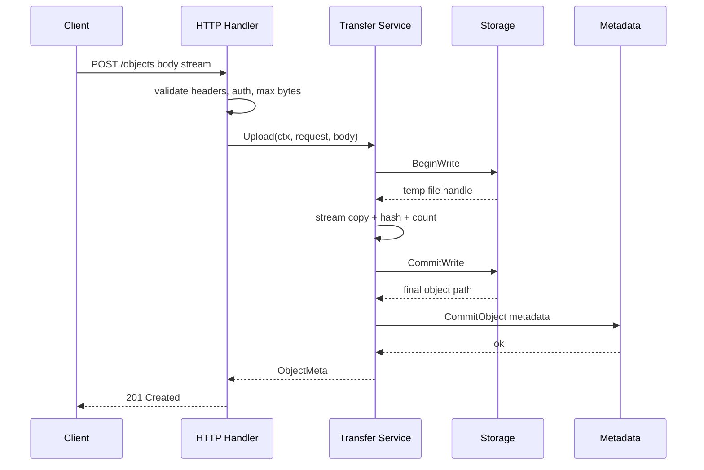
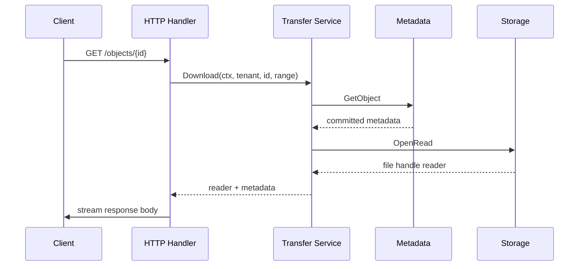
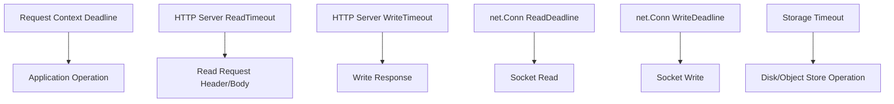
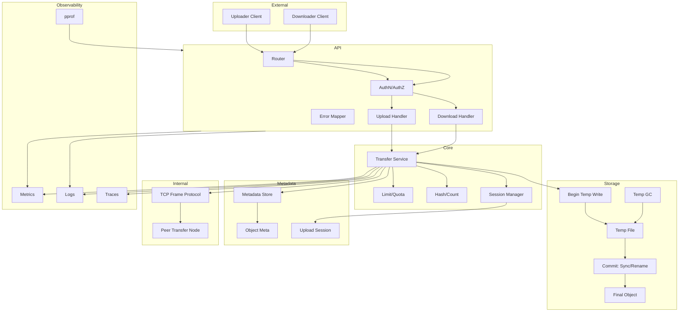
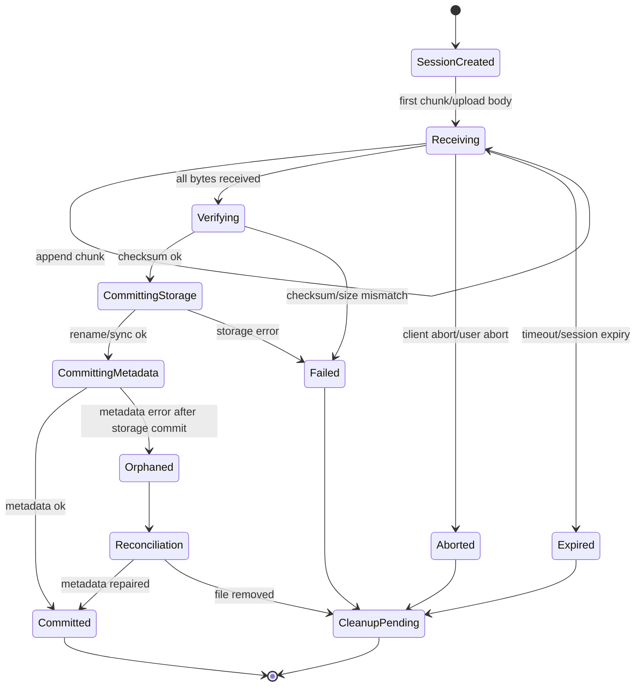

# learn-go-io-buffer-byte-stream-file-network-data-transfer-part-034.md

# Part 034 — Capstone Handbook: Production-Grade File Transfer + Streaming Network Service Design

> Seri: **Go IO, Buffer, Byte & Stream, Serialization, Console IO, File & FileSystem, Compression, Networking, Data Transfer**  
> Target pembaca: **Java software engineer** yang ingin membangun keluwesan engineering level senior/principal untuk sistem IO dan data transfer di Go.  
> Target Go: **Go 1.26.x**  
> Status: **bagian terakhir seri ini**.

---

## 0. Posisi Part Ini di Seluruh Seri

Bagian ini adalah **capstone**. Tujuannya bukan memperkenalkan API baru satu per satu, tetapi menyatukan seluruh konsep dari part sebelumnya menjadi satu desain sistem utuh:

> **Production-grade file transfer + streaming network service** di Go.

Sistem seperti ini terdengar sederhana:

- client upload file,
- server menyimpan file,
- client bisa download,
- ada checksum,
- bisa resume,
- bisa proxy/stream,
- bisa observability.

Tetapi dalam production, sistem data transfer adalah salah satu area paling sering gagal karena kombinasi dari:

- input tidak terpercaya,
- file besar,
- jaringan lambat,
- partial write,
- partial read,
- timeout,
- disk penuh,
- proses crash,
- retry client,
- duplicate request,
- corrupt file,
- temporary file bocor,
- connection leak,
- descriptor leak,
- memory spike,
- archive/compression bomb,
- race antar proses,
- mismatch semantic antara HTTP, filesystem, dan protocol internal.

Di Java, engineer sering membangun ini memakai kombinasi `InputStream`, `OutputStream`, `ReadableByteChannel`, `FileChannel`, Servlet `InputStream`, Spring `MultipartFile`, Netty `ByteBuf`, NIO, dan library lain. Di Go, bentuk mentalnya lebih kecil dan lebih konsisten:

```go
io.Reader
io.Writer
io.Closer
net.Conn
http.Request.Body
http.ResponseWriter
os.File
```

Namun konsistensi ini bukan berarti mudah. Justru karena interface-nya kecil, correctness banyak bergantung pada pemahaman kontrak:

- `Read` boleh mengembalikan `n > 0` dan `err != nil`.
- `Write` bisa partial.
- `Close` bisa mengembalikan error penting.
- `Flush` bukan `fsync`.
- `Rename` bukan selalu durability.
- `context.Context` bukan otomatis membatalkan semua blocking IO kecuali operasi tersebut memang memeriksa context atau koneksi/deadline ditutup.
- `io.Copy` sukses berarti EOF dianggap normal, bukan dilaporkan sebagai error.
- `ReadAll` lebih efisien di Go 1.26, tetapi tetap bukan izin membaca untrusted input tanpa limit.

Part ini akan membangun satu blueprint yang bisa dipakai sebagai rujukan internal engineering handbook.

---

## 1. Recap Seluruh Seri dalam Satu Mental Model

Seluruh seri ini sebenarnya membahas satu hal:

> Bagaimana memindahkan byte dengan benar, bounded, observable, durable, dan secure.

Diagram besar:



Yang berubah antar use case hanyalah **source**, **sink**, dan **policy**. Kontrak dasarnya tetap:

| Concern | Pertanyaan engineering |
|---|---|
| Source | Dari mana byte datang? Apakah trusted? Apakah bounded? |
| Sink | Ke mana byte pergi? Apakah durable? Apakah sink bisa lambat? |
| Boundary | Kapan data dianggap accepted, committed, visible, atau delivered? |
| Failure | Apa yang terjadi saat read/write/flush/close/rename gagal? |
| Replay | Apakah operasi bisa diulang? Dari offset mana? |
| Integrity | Bagaimana mendeteksi corrupt/truncated/duplicated data? |
| Resource | Siapa memiliki buffer/file/connection? Siapa menutup? |
| Backpressure | Saat downstream lambat, upstream diapakan? |
| Observability | Bagaimana membedakan network lambat, disk lambat, parser lambat, client abort? |
| Security | Apa batas input, path, metadata, compression, archive, SSRF, content type? |

---

## 2. Capstone System: Transfer Service

Kita akan mendesain sistem bernama:

```text
transferd
```

`transferd` adalah service Go yang menyediakan:

1. **Upload file via HTTP streaming**.
2. **Download file via HTTP streaming**.
3. **Resume upload** dengan session dan offset.
4. **Integrity verification** dengan SHA-256.
5. **Durable local filesystem storage** dengan temp-write-rename.
6. **Optional compression** untuk jalur tertentu.
7. **Internal TCP protocol** untuk node-to-node replication atau transfer backend.
8. **Observability**: metrics, logs, tracing, pprof-ready.
9. **Testing strategy**: fault injection, golden manifest, fuzzing parser, race tests.
10. **Operational runbook**: disk full, corrupt file, slow clients, descriptor leak, retry storm.

Ini bukan full product seperti S3. Ini adalah blueprint internal service yang cukup realistis untuk:

- document transfer,
- regulatory case attachment transfer,
- audit evidence ingestion,
- batch export/import,
- inter-service file handoff,
- sidecar transfer gateway,
- internal compliance archive staging,
- large report delivery.

---

## 3. Non-Goals

Agar desain tidak melebar terlalu jauh, non-goals capstone ini:

| Non-goal | Alasan |
|---|---|
| Full distributed object storage | Butuh consensus, placement, erasure coding, replication topology. Bukan fokus seri IO. |
| Full S3-compatible API | Banyak surface area API yang tidak relevan dengan mental model IO. |
| Full TLS/PKI handbook | TLS dibahas sebagai boundary, bukan cryptography series. |
| Full authN/authZ | Hanya contract hook dan policy boundary. |
| Full database schema migration | Metadata store dibahas secara konseptual. |
| Full Kubernetes deployment | Ops consideration dibahas, manifest tidak menjadi fokus utama. |
| Full compression format design baru | Kita gunakan standard library. |

---

## 4. Requirements yang Realistis

### 4.1 Functional Requirements

`transferd` harus bisa:

1. Menerima upload file besar tanpa membaca seluruh file ke memory.
2. Membatasi ukuran upload per tenant/request.
3. Menyimpan data ke temporary file terlebih dahulu.
4. Menghitung SHA-256 sambil streaming.
5. Memvalidasi expected checksum bila client mengirim checksum.
6. Commit file secara atomic ke lokasi final.
7. Menyimpan metadata file: ID, size, checksum, content type, tenant, created time.
8. Mengembalikan download via streaming.
9. Mendukung range download atau resume download.
10. Mendukung resumable upload berbasis upload session.
11. Membedakan error client, server, disk, timeout, quota, dan conflict.
12. Membersihkan temporary file yang stale.

### 4.2 Non-Functional Requirements

| Requirement | Target desain |
|---|---|
| Memory bounded | Memory per request tidak proporsional terhadap ukuran file. |
| Disk bounded | Temp dir punya quota, cleanup, dan alert. |
| Durable | File visible hanya setelah commit sukses. |
| Integrity | SHA-256 diverifikasi sebelum metadata final visible. |
| Idempotency | Retry upload tidak membuat duplicate final object sembarangan. |
| Observable | Ada metrics byte, duration, error class, in-flight stream. |
| Backpressure-aware | Downstream lambat menahan upstream, bukan menumpuk memory. |
| Secure path | File ID tidak langsung menjadi path bebas. |
| Timeout-aware | Slowloris/slow client tidak menggantung resource selamanya. |
| Testable | Core logic bisa dites dengan `io.Reader`/`io.Writer` palsu. |

---

## 5. High-Level Architecture



Pembagian paling penting:

| Layer | Tanggung jawab |
|---|---|
| HTTP API layer | Parse request, enforce HTTP-specific limit, map error ke status code. |
| Auth/policy hook | Tenant, quota, authorization, allowed content type. |
| Transfer service | Orkestrasi upload/download, checksum, session, retry semantics. |
| Storage engine | Durable write, path safety, temp/final lifecycle. |
| Metadata store | Object metadata dan session state. |
| Internal TCP transfer | Protocol node-to-node, bukan public API. |
| Observability | Metrics, log, trace, profile, event. |

Kunci desainnya: **jangan campur data plane dengan policy/control plane secara sembarangan**.

Bad design:

```text
HTTP handler langsung buka path dari user, io.Copy ke file final, lalu return 200.
```

Better design:

```text
HTTP handler -> validate -> TransferService.Upload -> Storage.BeginWrite -> stream copy -> verify -> commit -> metadata -> response
```

---

## 6. Core Invariants

Sistem transfer yang benar harus punya invariants eksplisit.

### 6.1 Object Visibility Invariants

```text
I1. Object final tidak boleh visible sebelum content lengkap dan checksum valid.
I2. Object final tidak boleh menunjuk ke temp path.
I3. Metadata final tidak boleh committed sebelum file final durable atau minimal sebelum commit storage dianggap sukses sesuai durability policy.
I4. Download hanya boleh membaca object dengan status committed.
I5. Failed upload harus meninggalkan state failed/aborted yang bisa dibersihkan tanpa merusak committed object.
```

### 6.2 IO Invariants

```text
I6. Tidak ada unbounded read dari untrusted source.
I7. Semua stream yang dibuka harus punya owner dan close path.
I8. Semua buffered writer/compressor harus di-flush/close sebelum checksum/commit final.
I9. Partial write harus dianggap failure kecuali kontrak sink menyatakan retry-safe dan loop sudah menangani sampai semua byte tertulis.
I10. Close error pada writer/file yang relevan tidak boleh diabaikan.
```

### 6.3 Integrity Invariants

```text
I11. Stored size harus sama dengan byte count yang benar-benar ditulis.
I12. Stored checksum harus dihitung dari byte final yang disimpan, bukan dari metadata client semata.
I13. Jika client mengirim expected checksum, mismatch harus membuat object gagal commit.
I14. Resume upload harus memastikan offset, chunk hash, atau session state konsisten.
```

### 6.4 Security Invariants

```text
I15. User-provided filename tidak boleh langsung menjadi filesystem path.
I16. Tenant boundary tidak boleh hanya berupa prefix string tanpa canonical validation.
I17. Content type dari client hanya hint, bukan trust anchor.
I18. Archive extraction harus reject path traversal, symlink surprise, huge expanded size, dan duplicate ambiguity.
I19. Proxy/forwarding tidak boleh menerima arbitrary target URL tanpa allowlist.
```

---

## 7. Data Model

### 7.1 Object Metadata

```go
type ObjectStatus string

const (
    ObjectPending   ObjectStatus = "pending"
    ObjectCommitted ObjectStatus = "committed"
    ObjectFailed    ObjectStatus = "failed"
    ObjectDeleted   ObjectStatus = "deleted"
)

type ObjectMeta struct {
    ID          string
    TenantID    string
    Size        int64
    SHA256Hex   string
    ContentType string
    OriginalName string
    StoragePath string
    Status      ObjectStatus
    CreatedAt   time.Time
    CommittedAt time.Time
    Version     int64
}
```

Poin desain:

- `OriginalName` boleh disimpan untuk display, tetapi **bukan path**.
- `StoragePath` harus internal path relatif yang dibuat server.
- `Status` membedakan object partial vs committed.
- `Version` membantu optimistic concurrency atau audit update.

### 7.2 Upload Session

```go
type UploadSessionStatus string

const (
    SessionOpen      UploadSessionStatus = "open"
    SessionCommitted UploadSessionStatus = "committed"
    SessionAborted   UploadSessionStatus = "aborted"
    SessionExpired   UploadSessionStatus = "expired"
)

type UploadSession struct {
    ID              string
    TenantID        string
    ObjectID        string
    ExpectedSize    int64
    ExpectedSHA256  string
    ReceivedSize    int64
    TempPath        string
    Status          UploadSessionStatus
    CreatedAt       time.Time
    UpdatedAt       time.Time
    ExpiresAt       time.Time
}
```

Resume upload memerlukan session state. Tanpa session, retry upload besar mudah menjadi duplicate atau corrupt.

---

## 8. Package Layout yang Disarankan

```text
transferd/
  cmd/transferd/
    main.go
  internal/
    apihttp/
      server.go
      upload_handler.go
      download_handler.go
      errors.go
    transfer/
      service.go
      upload.go
      download.go
      session.go
      errors.go
    storage/
      local.go
      durable.go
      path.go
      cleanup.go
      errors.go
    metadata/
      store.go
      memory.go
      sql.go
    protocol/
      frame.go
      tcp_server.go
      tcp_client.go
      checksum.go
    observe/
      metrics.go
      logging.go
      trace.go
    limit/
      reader.go
      quota.go
    testutil/
      fault_reader.go
      fault_writer.go
```

Prinsip package:

- `apihttp` tahu HTTP.
- `transfer` tidak tahu detail HTTP.
- `storage` tahu filesystem.
- `metadata` tahu state.
- `protocol` tahu frame TCP internal.
- `observe` tahu metrics/logging/tracing.
- `testutil` hanya untuk test.

---

## 9. Core Interfaces

Interface harus kecil dan semantic.

```go
type Storage interface {
    BeginWrite(ctx context.Context, req BeginWriteRequest) (*WriteHandle, error)
    CommitWrite(ctx context.Context, h *WriteHandle, commit CommitRequest) (*StoredObject, error)
    AbortWrite(ctx context.Context, h *WriteHandle) error
    OpenRead(ctx context.Context, objectID string) (*ReadHandle, error)
    Delete(ctx context.Context, objectID string) error
}

type MetadataStore interface {
    CreateUploadSession(ctx context.Context, s UploadSession) error
    GetUploadSession(ctx context.Context, id string) (UploadSession, error)
    UpdateUploadProgress(ctx context.Context, id string, received int64) error
    CommitObject(ctx context.Context, meta ObjectMeta) error
    GetObject(ctx context.Context, tenantID, objectID string) (ObjectMeta, error)
}
```

Jangan terlalu cepat membuat abstraction generic seperti:

```go
type Repository[T any] interface { ... }
```

Untuk sistem IO, interface yang terlalu generic sering menyembunyikan semantic penting seperti durability, offset, expected size, checksum, dan abort.

---

## 10. Error Taxonomy

Sistem transfer wajib punya taxonomy error. Jika tidak, semua error menjadi `500` atau retry sembarangan.

```go
type ErrorKind string

const (
    ErrBadRequest       ErrorKind = "bad_request"
    ErrUnauthorized     ErrorKind = "unauthorized"
    ErrForbidden        ErrorKind = "forbidden"
    ErrNotFound         ErrorKind = "not_found"
    ErrConflict         ErrorKind = "conflict"
    ErrTooLarge         ErrorKind = "too_large"
    ErrChecksumMismatch ErrorKind = "checksum_mismatch"
    ErrTimeout          ErrorKind = "timeout"
    ErrClientAbort      ErrorKind = "client_abort"
    ErrStorage          ErrorKind = "storage"
    ErrUnavailable      ErrorKind = "unavailable"
    ErrInternal         ErrorKind = "internal"
)

type TransferError struct {
    Kind      ErrorKind
    Operation string
    ObjectID  string
    Cause     error
}

func (e *TransferError) Error() string {
    if e.Cause == nil {
        return string(e.Kind) + ": " + e.Operation
    }
    return string(e.Kind) + ": " + e.Operation + ": " + e.Cause.Error()
}

func (e *TransferError) Unwrap() error { return e.Cause }
```

Mapping HTTP:

| Error kind | HTTP status | Retry? |
|---|---:|---|
| `bad_request` | 400 | no |
| `unauthorized` | 401 | maybe after auth refresh |
| `forbidden` | 403 | no |
| `not_found` | 404 | no/depends |
| `conflict` | 409 | client decision |
| `too_large` | 413 | no unless smaller input |
| `checksum_mismatch` | 422 | no, data issue |
| `timeout` | 408/504 | maybe if idempotent/resumable |
| `client_abort` | 499-style log, often 499 if proxy supports | client decision |
| `storage` | 500/507 | retry only after diagnosis |
| `unavailable` | 503 | yes with backoff |
| `internal` | 500 | maybe, but investigate |

---

## 11. Upload Flow: HTTP Streaming

### 11.1 Sequence



### 11.2 Critical Ordering

Correct ordering:

```text
validate request
  -> begin temp write
  -> stream bytes to temp
  -> close/flush writer
  -> verify size/checksum
  -> sync file if durability policy requires
  -> rename temp to final
  -> sync parent directory if required
  -> commit metadata
  -> return success
```

Wrong ordering:

```text
commit metadata
  -> stream bytes directly to final path
  -> hope nothing fails
```

Bug akibat wrong ordering:

- object terlihat sebelum lengkap,
- download bisa membaca partial file,
- retry bisa overwrite file,
- metadata size/checksum tidak sesuai,
- crash meninggalkan final corrupt.

---

## 12. Upload Implementation Skeleton

### 12.1 Request Type

```go
type UploadRequest struct {
    TenantID        string
    ObjectID        string
    OriginalName    string
    ContentType     string
    ExpectedSize    int64
    ExpectedSHA256  string
    MaxSize         int64
}

type UploadResult struct {
    ObjectID   string
    Size       int64
    SHA256Hex  string
    StoredPath string
}
```

### 12.2 Transfer Service Upload

```go
type Service struct {
    storage Storage
    meta    MetadataStore
    now     func() time.Time
}

func (s *Service) Upload(ctx context.Context, req UploadRequest, src io.Reader) (*UploadResult, error) {
    if req.TenantID == "" || req.ObjectID == "" {
        return nil, &TransferError{Kind: ErrBadRequest, Operation: "upload.validate"}
    }
    if req.MaxSize <= 0 {
        return nil, &TransferError{Kind: ErrBadRequest, Operation: "upload.max_size"}
    }

    limited := &LimitedReaderWithError{
        R: src,
        N: req.MaxSize,
    }

    h, err := s.storage.BeginWrite(ctx, BeginWriteRequest{
        TenantID: req.TenantID,
        ObjectID: req.ObjectID,
    })
    if err != nil {
        return nil, wrapTransfer(ErrStorage, "upload.begin_write", req.ObjectID, err)
    }

    committed := false
    defer func() {
        if !committed {
            _ = s.storage.AbortWrite(context.Background(), h)
        }
    }()

    hasher := sha256.New()
    counting := &CountingWriter{W: io.MultiWriter(h.Writer, hasher)}

    written, err := io.CopyBuffer(counting, limited, make([]byte, 256*1024))
    if err != nil {
        if errors.Is(err, ErrLimitExceeded) {
            return nil, wrapTransfer(ErrTooLarge, "upload.copy", req.ObjectID, err)
        }
        if ctx.Err() != nil {
            return nil, wrapTransfer(ErrTimeout, "upload.copy", req.ObjectID, ctx.Err())
        }
        return nil, wrapTransfer(ErrStorage, "upload.copy", req.ObjectID, err)
    }

    if written != counting.N {
        return nil, wrapTransfer(ErrInternal, "upload.count_mismatch", req.ObjectID, nil)
    }

    if req.ExpectedSize >= 0 && written != req.ExpectedSize {
        return nil, wrapTransfer(ErrBadRequest, "upload.size_mismatch", req.ObjectID, nil)
    }

    actualSHA := hex.EncodeToString(hasher.Sum(nil))
    if req.ExpectedSHA256 != "" && !strings.EqualFold(req.ExpectedSHA256, actualSHA) {
        return nil, wrapTransfer(ErrChecksumMismatch, "upload.checksum", req.ObjectID, nil)
    }

    stored, err := s.storage.CommitWrite(ctx, h, CommitRequest{
        Size:      written,
        SHA256Hex: actualSHA,
    })
    if err != nil {
        return nil, wrapTransfer(ErrStorage, "upload.commit_write", req.ObjectID, err)
    }

    meta := ObjectMeta{
        ID:           req.ObjectID,
        TenantID:     req.TenantID,
        Size:         written,
        SHA256Hex:    actualSHA,
        ContentType:  req.ContentType,
        OriginalName: req.OriginalName,
        StoragePath:  stored.Path,
        Status:       ObjectCommitted,
        CreatedAt:    s.now(),
        CommittedAt:  s.now(),
    }

    if err := s.meta.CommitObject(ctx, meta); err != nil {
        // Important design decision:
        // The file has already been committed to storage, but metadata failed.
        // Options:
        // 1. delete final file best-effort,
        // 2. mark orphan for reconciliation,
        // 3. use transactional metadata-first reservation.
        return nil, wrapTransfer(ErrUnavailable, "upload.commit_metadata", req.ObjectID, err)
    }

    committed = true
    return &UploadResult{
        ObjectID:   req.ObjectID,
        Size:       written,
        SHA256Hex:  actualSHA,
        StoredPath: stored.Path,
    }, nil
}
```

Catatan penting:

1. `io.CopyBuffer` dipakai agar buffer size eksplisit dan bisa distandarkan.
2. `LimitedReaderWithError` lebih baik daripada `io.LimitReader` biasa bila ingin membedakan EOF normal vs limit exceeded.
3. `hasher` menerima byte yang sama dengan writer melalui `io.MultiWriter`.
4. `AbortWrite` dipanggil best-effort jika belum committed.
5. Metadata commit failure setelah storage commit adalah failure mode serius; harus ada reconciliation.

---

## 13. Bounded Reader yang Memberi Error saat Limit Terlampaui

`io.LimitReader` berhenti di N byte dan mengembalikan EOF setelah limit tercapai. Itu berguna, tetapi kadang server perlu tahu bahwa client mengirim lebih dari batas.

```go
var ErrLimitExceeded = errors.New("read limit exceeded")

type LimitedReaderWithError struct {
    R io.Reader
    N int64
}

func (l *LimitedReaderWithError) Read(p []byte) (int, error) {
    if l.N < 0 {
        return 0, ErrLimitExceeded
    }
    if l.N == 0 {
        var one [1]byte
        n, err := l.R.Read(one[:])
        if n > 0 {
            l.N = -1
            return 0, ErrLimitExceeded
        }
        return 0, err
    }
    if int64(len(p)) > l.N {
        p = p[:l.N]
    }
    n, err := l.R.Read(p)
    l.N -= int64(n)
    return n, err
}
```

Trade-off:

- Untuk HTTP request, `http.MaxBytesReader` sering lebih tepat karena integrated dengan server behavior.
- Untuk core service yang hanya menerima `io.Reader`, wrapper seperti ini membuat logic testable di luar HTTP.

---

## 14. Counting Writer

```go
type CountingWriter struct {
    W io.Writer
    N int64
}

func (cw *CountingWriter) Write(p []byte) (int, error) {
    n, err := cw.W.Write(p)
    cw.N += int64(n)
    return n, err
}
```

Jangan mengasumsikan `Write` selalu menerima seluruh `p`. Walaupun banyak writer umum melakukan full write atau return error, kontrak `io.Writer` tetap memperbolehkan partial progress dengan error.

---

## 15. Durable Local Storage

### 15.1 Storage Path Strategy

Jangan gunakan path dari user. Buat path internal berbasis ID.

```text
/data/transferd/
  objects/
    tenant-a/
      ab/
        cd/
          abcdef...object
  tmp/
    tenant-a/
      upload-<session-id>.tmp
```

Sharding path dengan prefix ID mencegah satu directory berisi terlalu banyak file.

```go
func shardPath(objectID string) (string, error) {
    if len(objectID) < 4 || !isSafeObjectID(objectID) {
        return "", fmt.Errorf("invalid object id")
    }
    return filepath.Join(objectID[:2], objectID[2:4], objectID), nil
}
```

### 15.2 Write Handle

```go
type WriteHandle struct {
    TenantID string
    ObjectID string
    TempPath string
    File     *os.File
    Writer   io.Writer
}

type StoredObject struct {
    Path string
}

type BeginWriteRequest struct {
    TenantID string
    ObjectID string
}

type CommitRequest struct {
    Size      int64
    SHA256Hex string
}
```

### 15.3 Local Storage Begin

```go
type LocalStorage struct {
    root string
}

func (s *LocalStorage) BeginWrite(ctx context.Context, req BeginWriteRequest) (*WriteHandle, error) {
    if !isSafeTenantID(req.TenantID) || !isSafeObjectID(req.ObjectID) {
        return nil, fmt.Errorf("invalid tenant or object id")
    }

    tmpDir := filepath.Join(s.root, "tmp", req.TenantID)
    if err := os.MkdirAll(tmpDir, 0o700); err != nil {
        return nil, err
    }

    f, err := os.CreateTemp(tmpDir, "upload-*.tmp")
    if err != nil {
        return nil, err
    }

    return &WriteHandle{
        TenantID: req.TenantID,
        ObjectID: req.ObjectID,
        TempPath: f.Name(),
        File:     f,
        Writer:   f,
    }, nil
}
```

### 15.4 Commit with Durability

```go
func (s *LocalStorage) CommitWrite(ctx context.Context, h *WriteHandle, commit CommitRequest) (*StoredObject, error) {
    if h == nil || h.File == nil {
        return nil, fmt.Errorf("nil write handle")
    }

    if err := h.File.Sync(); err != nil {
        _ = h.File.Close()
        return nil, fmt.Errorf("sync temp file: %w", err)
    }
    if err := h.File.Close(); err != nil {
        return nil, fmt.Errorf("close temp file: %w", err)
    }
    h.File = nil

    rel, err := shardPath(h.ObjectID)
    if err != nil {
        return nil, err
    }

    finalDir := filepath.Join(s.root, "objects", h.TenantID, filepath.Dir(rel))
    if err := os.MkdirAll(finalDir, 0o700); err != nil {
        return nil, err
    }

    finalPath := filepath.Join(s.root, "objects", h.TenantID, rel)

    // Decide overwrite policy explicitly.
    // os.Rename may replace existing file on Unix. If overwrite is forbidden,
    // check with O_EXCL reservation or metadata transaction before commit.
    if err := os.Rename(h.TempPath, finalPath); err != nil {
        return nil, fmt.Errorf("rename temp to final: %w", err)
    }

    if err := syncDir(finalDir); err != nil {
        return nil, fmt.Errorf("sync final dir: %w", err)
    }

    return &StoredObject{Path: finalPath}, nil
}
```

### 15.5 Directory Sync

```go
func syncDir(path string) error {
    d, err := os.Open(path)
    if err != nil {
        return err
    }
    defer d.Close()
    return d.Sync()
}
```

Important nuance:

- `file.Sync()` commits file content/metadata for the file.
- Directory sync helps persist directory entry changes like rename on filesystems/OSes where this matters.
- Exact durability semantics vary by OS/filesystem/storage stack; document your durability policy.

---

## 16. Abort Write

```go
func (s *LocalStorage) AbortWrite(ctx context.Context, h *WriteHandle) error {
    if h == nil {
        return nil
    }
    var errs []error
    if h.File != nil {
        if err := h.File.Close(); err != nil {
            errs = append(errs, err)
        }
        h.File = nil
    }
    if h.TempPath != "" {
        if err := os.Remove(h.TempPath); err != nil && !errors.Is(err, os.ErrNotExist) {
            errs = append(errs, err)
        }
    }
    return errors.Join(errs...)
}
```

Abort harus best-effort tetapi observable. Jika temp cleanup gagal, jangan diam-diam tanpa log/metric.

---

## 17. Download Flow

### 17.1 Sequence



### 17.2 Download Result

```go
type DownloadRequest struct {
    TenantID string
    ObjectID string
    Range    *ByteRange
}

type ByteRange struct {
    Start int64
    End   int64 // inclusive, optional policy
}

type DownloadResult struct {
    Meta   ObjectMeta
    Body   io.ReadCloser
    Size   int64
    Offset int64
}
```

### 17.3 Download Handler

```go
func (h *Handler) DownloadObject(w http.ResponseWriter, r *http.Request) {
    ctx := r.Context()
    tenantID := tenantFromContext(ctx)
    objectID := r.PathValue("id")

    result, err := h.svc.Download(ctx, DownloadRequest{
        TenantID: tenantID,
        ObjectID: objectID,
        Range:    parseRangeHeader(r.Header.Get("Range")),
    })
    if err != nil {
        h.writeError(w, err)
        return
    }
    defer result.Body.Close()

    w.Header().Set("Content-Type", result.Meta.ContentType)
    w.Header().Set("X-Content-SHA256", result.Meta.SHA256Hex)
    w.Header().Set("Content-Length", strconv.FormatInt(result.Size, 10))

    if result.Range != nil {
        w.WriteHeader(http.StatusPartialContent)
    } else {
        w.WriteHeader(http.StatusOK)
    }

    if _, err := io.CopyBuffer(w, result.Body, make([]byte, 256*1024)); err != nil {
        // Cannot change status after response started.
        // Log and metric only.
        h.log.Warn("download stream failed", "object_id", objectID, "err", err)
    }
}
```

Key principle:

> Setelah response body mulai dikirim, error tidak lagi bisa dimap menjadi clean HTTP status. Observability menjadi satu-satunya cara untuk tahu download gagal di tengah jalan.

---

## 18. Range Download

Range download membantu:

- resume download,
- parallel segmented download,
- media/file preview,
- retry after disconnect.

Tetapi harus hati-hati:

```go
func validateRange(size int64, br ByteRange) (start, length int64, err error) {
    if size < 0 {
        return 0, 0, fmt.Errorf("invalid size")
    }
    if br.Start < 0 || br.Start >= size {
        return 0, 0, fmt.Errorf("range not satisfiable")
    }
    end := br.End
    if end == 0 || end >= size {
        end = size - 1
    }
    if end < br.Start {
        return 0, 0, fmt.Errorf("invalid range")
    }
    return br.Start, end - br.Start + 1, nil
}
```

Implementasi storage bisa memakai `io.NewSectionReader` jika punya `*os.File` dan offset.

```go
func openSection(path string, start, length int64) (io.ReadCloser, error) {
    f, err := os.Open(path)
    if err != nil {
        return nil, err
    }
    sr := io.NewSectionReader(f, start, length)
    return struct {
        io.Reader
        io.Closer
    }{Reader: sr, Closer: f}, nil
}
```

---

## 19. Resumable Upload Design

### 19.1 Why Resume Is Hard

Resume upload bukan sekadar append file.

Masalahnya:

- client bisa mengirim offset yang salah,
- client bisa retry chunk yang sama,
- client bisa mengirim chunk berbeda untuk offset sama,
- session bisa expired,
- server bisa crash setelah menulis chunk tetapi sebelum update metadata,
- file temp bisa lebih panjang dari session state,
- checksum final baru diketahui setelah seluruh file selesai.

### 19.2 Protocol Minimal

```text
POST /upload-sessions
  -> create session with expected size/checksum

PATCH /upload-sessions/{id}
  Headers:
    Upload-Offset: <offset>
  Body:
    raw bytes chunk

POST /upload-sessions/{id}/commit
  -> verify size and checksum, commit object

DELETE /upload-sessions/{id}
  -> abort
```

### 19.3 Resume Invariants

```text
R1. Server is source of truth for received offset.
R2. Client must send Upload-Offset equal to server expected offset.
R3. Server must not accept append at arbitrary offset unless using random-access verified chunk map.
R4. Chunk retry must be idempotent or rejected clearly.
R5. Commit requires temp file size == expected size.
R6. Commit requires checksum == expected checksum when provided.
```

### 19.4 Append Chunk Handler Concept

```go
func (s *Service) AppendUploadChunk(ctx context.Context, sessionID string, offset int64, src io.Reader, maxChunk int64) error {
    sess, err := s.meta.GetUploadSession(ctx, sessionID)
    if err != nil {
        return err
    }
    if sess.Status != SessionOpen {
        return wrapTransfer(ErrConflict, "upload_session.not_open", sess.ObjectID, nil)
    }
    if offset != sess.ReceivedSize {
        return wrapTransfer(ErrConflict, "upload_session.offset_mismatch", sess.ObjectID, nil)
    }

    f, err := os.OpenFile(sess.TempPath, os.O_WRONLY|os.O_APPEND, 0)
    if err != nil {
        return wrapTransfer(ErrStorage, "upload_session.open_temp", sess.ObjectID, err)
    }
    defer f.Close()

    limited := &LimitedReaderWithError{R: src, N: maxChunk}
    n, err := io.CopyBuffer(f, limited, make([]byte, 128*1024))
    if err != nil {
        if errors.Is(err, ErrLimitExceeded) {
            return wrapTransfer(ErrTooLarge, "upload_session.chunk_too_large", sess.ObjectID, err)
        }
        return wrapTransfer(ErrStorage, "upload_session.append", sess.ObjectID, err)
    }

    // Durability policy decision:
    // sync each chunk = safer but slower.
    // sync on commit = faster but crash may require reconciliation/truncate.
    if err := f.Sync(); err != nil {
        return wrapTransfer(ErrStorage, "upload_session.sync_chunk", sess.ObjectID, err)
    }

    return s.meta.UpdateUploadProgress(ctx, sessionID, sess.ReceivedSize+n)
}
```

Important issue:

If `f.Sync()` succeeds but metadata update fails, temp file length may exceed metadata offset. On next resume, reconcile:

```text
actual temp file size vs session received size
```

Policy options:

| Situation | Possible policy |
|---|---|
| file size == metadata offset | ok |
| file size > metadata offset | truncate to metadata offset or advance metadata after verifying chunk journal |
| file size < metadata offset | mark session corrupted/failed |

For advanced implementation, maintain per-chunk journal.

---

## 20. Internal TCP Transfer Protocol

HTTP is good for public API. Internal service-to-service transfer may prefer framed TCP protocol for controlled environments.

### 20.1 Frame Format

```text
0                   1                   2                   3
0 1 2 3 4 5 6 7 8 9 0 1 2 3 4 5 6 7 8 9 0 1 2 3 4 5 6 7 8 9 0 1
+---------------+---------------+-------------------------------+
| Magic 0x5452  | Version 0x01  | Type                          |
+---------------+---------------+-------------------------------+
| Flags                         | Header Length                  |
+---------------------------------------------------------------+
| Payload Length                                                |
+---------------------------------------------------------------+
| Header JSON ...                                               |
+---------------------------------------------------------------+
| Payload bytes ...                                             |
+---------------------------------------------------------------+
| CRC32 optional                                                |
+---------------------------------------------------------------+
```

Frame fields:

| Field | Purpose |
|---|---|
| Magic | Reject wrong protocol early. |
| Version | Compatibility. |
| Type | `START`, `DATA`, `COMMIT`, `ERROR`, `PING`. |
| Flags | Compression/checksum/ack flags. |
| Header length | Bounded metadata. |
| Payload length | Bounded payload. |
| Header JSON | Extensible metadata. |
| Payload | Chunk bytes. |
| CRC32 | Frame-level corruption detection. |

### 20.2 Parser Invariant

```text
P1. Read exact fixed header.
P2. Validate magic/version/type before allocating payload.
P3. Enforce max header length.
P4. Enforce max payload length.
P5. Read exactly header bytes.
P6. Decode header with unknown-field policy.
P7. Read exactly payload bytes.
P8. Verify checksum if flag requires it.
```

### 20.3 Frame Reader Skeleton

```go
const (
    frameMagic      uint16 = 0x5452 // "TR"
    frameVersion    byte   = 1
    maxHeaderLength        = 64 * 1024
    maxPayloadLength       = 4 * 1024 * 1024
)

type FrameType uint16

const (
    FrameStart  FrameType = 1
    FrameData   FrameType = 2
    FrameCommit FrameType = 3
    FrameError  FrameType = 4
    FramePing   FrameType = 5
)

type Frame struct {
    Type    FrameType
    Flags   uint16
    Header  []byte
    Payload []byte
}

func ReadFrame(r io.Reader) (*Frame, error) {
    var fixed [16]byte
    if _, err := io.ReadFull(r, fixed[:]); err != nil {
        return nil, err
    }

    magic := binary.BigEndian.Uint16(fixed[0:2])
    if magic != frameMagic {
        return nil, fmt.Errorf("bad magic")
    }
    version := fixed[2]
    if version != frameVersion {
        return nil, fmt.Errorf("unsupported version")
    }

    typ := FrameType(binary.BigEndian.Uint16(fixed[4:6]))
    flags := binary.BigEndian.Uint16(fixed[6:8])
    headerLen := binary.BigEndian.Uint32(fixed[8:12])
    payloadLen := binary.BigEndian.Uint32(fixed[12:16])

    if headerLen > maxHeaderLength {
        return nil, fmt.Errorf("header too large")
    }
    if payloadLen > maxPayloadLength {
        return nil, fmt.Errorf("payload too large")
    }

    header := make([]byte, headerLen)
    if _, err := io.ReadFull(r, header); err != nil {
        return nil, err
    }

    payload := make([]byte, payloadLen)
    if _, err := io.ReadFull(r, payload); err != nil {
        return nil, err
    }

    return &Frame{
        Type:    typ,
        Flags:   flags,
        Header:  header,
        Payload: payload,
    }, nil
}
```

Production improvement:

- avoid allocating huge payload repeatedly,
- stream payload instead of full memory for large chunks,
- pool buffers,
- use state machine,
- set connection deadlines,
- limit in-flight frames,
- add authentication/mTLS.

---

## 21. Internal TCP Server Lifecycle

```go
func ServeTCP(ctx context.Context, ln net.Listener, handler func(context.Context, net.Conn)) error {
    var wg sync.WaitGroup
    defer wg.Wait()

    go func() {
        <-ctx.Done()
        _ = ln.Close()
    }()

    for {
        conn, err := ln.Accept()
        if err != nil {
            if ctx.Err() != nil {
                return ctx.Err()
            }
            var ne net.Error
            if errors.As(err, &ne) && ne.Temporary() {
                time.Sleep(100 * time.Millisecond)
                continue
            }
            return err
        }

        wg.Add(1)
        go func() {
            defer wg.Done()
            defer conn.Close()
            handler(ctx, conn)
        }()
    }
}
```

Production additions:

- admission control semaphore,
- max connection duration,
- read/write deadline per frame,
- authenticated peer identity,
- panic recovery,
- per-connection metrics,
- graceful drain,
- connection-level logging context.

---

## 22. Backpressure Model

Backpressure happens when downstream is slower than upstream.


Good Go streaming code naturally propagates backpressure when it uses direct `io.Copy` chain. Bad code breaks it by buffering unboundedly:

```go
// Bad: unbounded memory risk for large/untrusted input.
b, err := io.ReadAll(r.Body)
```

Better:

```go
// Better: bounded, streaming.
r.Body = http.MaxBytesReader(w, r.Body, maxUploadSize)
_, err := io.CopyBuffer(dst, r.Body, buf)
```

Backpressure failure modes:

| Failure | Cause | Mitigation |
|---|---|---|
| Memory spike | queue/channel buffers unbounded | bounded channel, direct stream |
| Slowloris | client sends body too slowly | read timeout, min rate policy |
| Disk stalls | writer blocks on fs | timeout context, disk metrics, admission control |
| Client download slow | response writer blocks | write timeout, connection close, separate class metric |
| Proxy pile-up | upstream/downstream mismatch | bounded streaming, no full buffering |

---

## 23. Timeout and Cancellation Model

Timeouts exist at multiple layers.



Common mistake:

```go
ctx, cancel := context.WithTimeout(r.Context(), 30*time.Second)
defer cancel()
io.Copy(dst, src) // src/dst may not observe ctx directly
```

Context only helps if:

- the operation accepts context,
- you close the underlying connection/file on cancel,
- you set deadlines,
- your loop checks `ctx.Err()` between chunks.

Context-aware copy pattern:

```go
func CopyWithContext(ctx context.Context, dst io.Writer, src io.Reader, buf []byte) (int64, error) {
    var written int64
    for {
        select {
        case <-ctx.Done():
            return written, ctx.Err()
        default:
        }

        nread, rerr := src.Read(buf)
        if nread > 0 {
            nwritten, werr := dst.Write(buf[:nread])
            written += int64(nwritten)
            if werr != nil {
                return written, werr
            }
            if nwritten != nread {
                return written, io.ErrShortWrite
            }
        }
        if rerr != nil {
            if errors.Is(rerr, io.EOF) {
                return written, nil
            }
            return written, rerr
        }
    }
}
```

Caveat: if `src.Read` blocks indefinitely, the loop cannot check context until `Read` returns. For network connections, set deadlines or close connection on cancel.

---

## 24. Security Design

### 24.1 Upload Security Checklist

| Risk | Control |
|---|---|
| Huge body | `MaxBytesReader`, service-level `LimitedReaderWithError` |
| Slow body | server read timeout, min-rate policy |
| Fake content type | server-side sniffing or allowlist policy |
| Dangerous filename | store original only as metadata; sanitize on download |
| Path traversal | never map user path to filesystem path |
| Duplicate object ID | idempotency key or server-generated object ID |
| Malware | scanning hook before commit/visibility if required |
| Checksum spoofing | compute server-side checksum |
| Metadata injection | structured log escaping, header validation |
| Tenant escape | tenant from auth context, not request body |

### 24.2 Download Security Checklist

| Risk | Control |
|---|---|
| Unauthorized object access | authz check before storage open |
| Header injection filename | safe `Content-Disposition` builder |
| Range abuse | validate range count/size |
| Excessive bandwidth | quota/rate limit |
| Cache leak | correct `Cache-Control`/tenant isolation |

### 24.3 Archive Security Checklist

Even though capstone service is file transfer, many real systems add archive extraction.

Never extract archive entries without checking:

- entry path is local,
- no absolute path,
- no `..` traversal,
- no symlink/hardlink surprise unless explicitly allowed,
- total expanded size bounded,
- file count bounded,
- directory depth bounded,
- duplicate entry policy explicit,
- permissions normalized,
- temp extraction directory used,
- final move atomic after validation.

---

## 25. Observability Blueprint

### 25.1 Metrics

Recommended metrics:

| Metric | Type | Labels |
|---|---|---|
| `transfer_upload_requests_total` | counter | tenant, status, error_kind |
| `transfer_download_requests_total` | counter | tenant, status, error_kind |
| `transfer_upload_bytes_total` | counter | tenant |
| `transfer_download_bytes_total` | counter | tenant |
| `transfer_upload_duration_seconds` | histogram | tenant, status |
| `transfer_download_duration_seconds` | histogram | tenant, status |
| `transfer_storage_write_duration_seconds` | histogram | operation |
| `transfer_storage_sync_duration_seconds` | histogram | operation |
| `transfer_active_uploads` | gauge | tenant |
| `transfer_active_downloads` | gauge | tenant |
| `transfer_temp_files` | gauge | tenant |
| `transfer_temp_bytes` | gauge | tenant |
| `transfer_open_files` | gauge | process |
| `transfer_copy_errors_total` | counter | phase, error_kind |

### 25.2 Structured Logs

Good upload success log:

```json
{
  "level": "info",
  "event": "upload_committed",
  "tenant_id": "tenant-a",
  "object_id": "obj_123",
  "bytes": 104857600,
  "sha256": "...",
  "duration_ms": 2843,
  "storage_sync_ms": 41
}
```

Good failure log:

```json
{
  "level": "warn",
  "event": "upload_failed",
  "tenant_id": "tenant-a",
  "object_id": "obj_123",
  "phase": "copy",
  "error_kind": "client_abort",
  "bytes_received": 7340032,
  "duration_ms": 12004
}
```

Avoid:

- logging raw filename if it may contain sensitive data,
- logging full path if infrastructure layout sensitive,
- logging request body,
- logging checksum as sole trace if checksum considered sensitive in your domain.

### 25.3 Tracing Spans

Suggested spans:

```text
HTTP POST /objects
  transfer.validate
  storage.begin_write
  transfer.copy_stream
  storage.sync_temp
  storage.rename
  storage.sync_dir
  metadata.commit_object
```

For download:

```text
HTTP GET /objects/{id}
  metadata.get_object
  storage.open_read
  transfer.stream_response
```

Span attributes:

- `tenant.id`
- `object.id`
- `transfer.bytes`
- `transfer.checksum.prefix` or avoid full checksum
- `transfer.error_kind`
- `storage.operation`
- `net.peer.ip` if safe and allowed

---

## 26. Runbooks

### 26.1 Upload Latency Spike

Symptoms:

- upload p95/p99 increases,
- active uploads increase,
- byte throughput decreases.

Check:

1. Is disk write latency high?
2. Is `fsync` latency high?
3. Are clients slow sending body?
4. Are upload size distributions changing?
5. Are goroutines blocked in `io.Copy`, `os.File.Write`, or network read?
6. Is GC pressure rising because buffers are too large or unpooled?
7. Is temp directory near full?

Immediate mitigation:

- reduce admission limit,
- reject large uploads temporarily,
- disable expensive sync mode only if durability policy allows,
- move temp dir to healthier volume,
- scale horizontally if bottleneck is CPU/network not disk.

### 26.2 Disk Full

Symptoms:

- upload fails with no space left,
- temp file count grows,
- committed object write fails.

Check:

1. Temp directory size.
2. Final storage size.
3. Stale sessions.
4. Failed cleanup logs.
5. Recent upload retry storm.

Mitigation:

- stop accepting new uploads,
- run temp GC,
- expire old sessions,
- alert tenants if quota exceeded,
- add capacity only after leak/stale root cause confirmed.

### 26.3 Corrupt File Reported by Client

Check:

1. Stored metadata checksum vs file checksum recompute.
2. Download logs for client abort/short transfer.
3. Range response correctness.
4. Proxy transformations/compression.
5. Whether object was committed before checksum validation in older version.
6. Underlying storage/media errors.

Mitigation:

- quarantine object if checksum mismatch server-side,
- block downloads for corrupted object,
- restore from replica/backup,
- add repair event and audit trail.

### 26.4 Descriptor Leak

Symptoms:

- `too many open files`,
- open fd gauge increases,
- pprof goroutine shows stuck handlers.

Check:

1. Missing `defer Body.Close()`.
2. Missing `defer file.Close()`.
3. Response body not closed on HTTP client.
4. Multipart temp files not cleaned.
5. Archive entries opening nested file handles.
6. Error branches returning before close.

Mitigation:

- add close ownership checklist,
- add tests with fake closer counting close,
- monitor open fds,
- fail CI on common static checks where possible.

### 26.5 Retry Storm

Symptoms:

- upload requests spike,
- many duplicate object IDs/session IDs,
- increased conflicts,
- bandwidth saturation.

Check:

1. Client retry policy.
2. Server timeout changes.
3. Proxy/gateway timeout mismatch.
4. Whether 5xx/timeout response body encourages retry.
5. Idempotency key behavior.

Mitigation:

- return `Retry-After`,
- enforce idempotency/session resume,
- rate-limit per tenant,
- increase server timeout only if root cause legitimate slow processing.

---

## 27. Testing Strategy

### 27.1 Unit Tests

Test core service with fake storage/metadata:

- successful upload,
- too large upload,
- checksum mismatch,
- expected size mismatch,
- source read error after partial bytes,
- storage write error,
- commit error,
- metadata commit error,
- abort called on failure,
- abort not called after success.

### 27.2 Fault Reader

```go
type FaultReader struct {
    Data      []byte
    FailAfter int
    Err       error
    offset    int
}

func (r *FaultReader) Read(p []byte) (int, error) {
    if r.FailAfter >= 0 && r.offset >= r.FailAfter {
        return 0, r.Err
    }
    if r.offset >= len(r.Data) {
        return 0, io.EOF
    }
    n := copy(p, r.Data[r.offset:])
    r.offset += n
    if r.FailAfter >= 0 && r.offset >= r.FailAfter {
        return n, r.Err
    }
    return n, nil
}
```

Important: return `n > 0 && err != nil` in tests to ensure code handles partial progress correctly.

### 27.3 Fault Writer

```go
type FaultWriter struct {
    FailAfter int
    Err       error
    Written   int
}

func (w *FaultWriter) Write(p []byte) (int, error) {
    if w.FailAfter >= 0 && w.Written >= w.FailAfter {
        return 0, w.Err
    }
    allowed := len(p)
    if w.FailAfter >= 0 && w.Written+allowed > w.FailAfter {
        allowed = w.FailAfter - w.Written
    }
    w.Written += allowed
    if allowed < len(p) {
        return allowed, w.Err
    }
    return allowed, nil
}
```

### 27.4 Integration Tests

Use:

- `httptest.Server` for HTTP API,
- `t.TempDir()` for local storage,
- `net.Pipe()` for protocol parser,
- real `net.Listener` on `127.0.0.1:0` for full TCP lifecycle,
- `testing/fstest.MapFS` for read-only FS logic,
- golden files for manifest/metadata format.

### 27.5 Fuzz Tests

Fuzz:

- frame parser,
- range header parser,
- object ID/path validation,
- archive path sanitizer,
- JSON metadata decoder,
- content-disposition filename builder.

Fuzz property examples:

```text
Parser must never panic.
Parser must never allocate more than configured max.
Parser must reject invalid magic.
Path sanitizer output must always be local.
Range parser must never produce negative length.
```

### 27.6 Race and Leak Tests

Test:

- concurrent downloads same object,
- upload commit while download pending should not expose partial object,
- abort during upload,
- server shutdown during active upload,
- client disconnect mid-upload,
- response body close paths.

---

## 28. Benchmark Strategy

Benchmarks should answer specific questions, not just produce numbers.

Questions:

1. What is throughput for upload streaming to temp file?
2. What is overhead of SHA-256 hashing?
3. What buffer size gives best throughput for target environment?
4. How much does `fsync` cost?
5. What is p99 latency under concurrent uploads?
6. Does compression help or hurt for expected data type?
7. Does pooling reduce allocation without unsafe reuse?
8. What is memory per active upload?

Benchmark dimensions:

| Dimension | Values |
|---|---|
| file size | 1 KiB, 1 MiB, 100 MiB, 1 GiB |
| buffer size | 32 KiB, 128 KiB, 256 KiB, 1 MiB |
| checksum | off, SHA-256 on |
| durability | no sync, file sync, file+dir sync |
| concurrency | 1, 4, 16, 64 |
| source | memory reader, file reader, HTTP client |
| sink | discard, temp file, final file |

Important: benchmark with representative storage. `/tmp` on tmpfs is not the same as network-attached disk.

---

## 29. Deployment and Runtime Considerations

### 29.1 OS Limits

Check:

- max open files,
- ephemeral port range,
- TCP backlog,
- filesystem inode count,
- disk throughput/IOPS,
- mount options,
- clock sync,
- log rotation.

### 29.2 Container/Kubernetes Considerations

| Concern | Recommendation |
|---|---|
| temp storage | explicit volume, not accidental container layer |
| final storage | persistent volume or external object store |
| graceful shutdown | readiness false before shutdown, drain uploads |
| resource limit | memory request/limit accounts for concurrent buffers |
| liveness | don't kill process during long GC/disk stall too aggressively |
| pprof | expose only internal/debug protected endpoint |
| logs | structured stdout/stderr, no raw body |
| upload timeout | align ingress/proxy/app timeout |

### 29.3 Timeout Alignment

Timeouts must be aligned end-to-end:

```text
client timeout > gateway timeout > app handler timeout > storage timeout? maybe not always
```

Bad alignment:

- gateway times out at 60s,
- app continues writing upload for 10 minutes,
- client retries,
- duplicate temp files accumulate.

Better:

- propagate cancellation,
- close request body/connection on abort,
- track upload session,
- make retry resumable.

---

## 30. Data Transfer Design Review Checklist

Use this checklist in architecture/design review.

### 30.1 Input

- [ ] Is every untrusted input bounded?
- [ ] Is body size limited at HTTP layer and service layer?
- [ ] Is content type treated as hint?
- [ ] Is filename/path sanitized or ignored for storage path?
- [ ] Are malformed headers rejected?
- [ ] Are JSON/multipart/archive parsers configured defensively?

### 30.2 Streaming

- [ ] Does code avoid `ReadAll` for large/untrusted input?
- [ ] Is buffer size intentional?
- [ ] Is backpressure preserved?
- [ ] Are `Flush` and `Close` errors checked where relevant?
- [ ] Are partial read/write cases tested?

### 30.3 Durability

- [ ] Is temp-write-rename used?
- [ ] Is object visible only after commit?
- [ ] Is checksum verified before metadata finalization?
- [ ] Is file sync/dir sync policy explicit?
- [ ] Is metadata/storage commit ordering understood?
- [ ] Is orphan reconciliation designed?

### 30.4 Retry and Idempotency

- [ ] Are retries safe?
- [ ] Is idempotency key/session ID used?
- [ ] Is resume offset server-authoritative?
- [ ] Are duplicate chunks handled?
- [ ] Are conflict responses clear?

### 30.5 Security

- [ ] Are tenant boundaries enforced from auth context?
- [ ] Is SSRF avoided in transfer gateway/proxy?
- [ ] Are hop-by-hop headers handled correctly in proxy?
- [ ] Are dangerous response headers sanitized?
- [ ] Are archives extracted safely if supported?

### 30.6 Observability

- [ ] Are upload/download bytes counted?
- [ ] Are phase durations measured?
- [ ] Are error kinds classified?
- [ ] Are active streams tracked?
- [ ] Are temp files/bytes tracked?
- [ ] Is pprof available in protected environment?

### 30.7 Operations

- [ ] Is temp GC implemented?
- [ ] Is disk full handled gracefully?
- [ ] Is shutdown graceful?
- [ ] Are file descriptors monitored?
- [ ] Are runbooks written?
- [ ] Are SLOs defined?

---

## 31. Common Anti-Patterns

### 31.1 `io.ReadAll` on Request Body

```go
body, err := io.ReadAll(r.Body)
```

Problem:

- unbounded memory,
- slow client keeps memory eventually,
- no backpressure to storage,
- impossible for huge file.

Use streaming.

### 31.2 Direct Final Write

```go
f, _ := os.Create(finalPath)
io.Copy(f, r.Body)
```

Problem:

- partial object visible,
- crash leaves corrupt final file,
- checksum validation too late.

Use temp-write-rename.

### 31.3 Trusting User Filename as Path

```go
path := filepath.Join(root, r.FormValue("filename"))
```

Problem:

- traversal,
- overwrite,
- tenant escape,
- weird platform path semantics.

Use server-generated ID/path.

### 31.4 Ignoring Close Error

```go
io.Copy(f, src)
f.Close()
return nil
```

Problem:

- buffered/OS writeback error can surface on close.

Check close error when writing.

### 31.5 Metadata Commit Before File Commit

Problem:

- readers observe object before durable content.

Use reservation state or final commit after storage commit.

### 31.6 Retry Without Idempotency

Problem:

- duplicate object,
- corrupt append,
- inconsistent metadata.

Use session/idempotency key.

---

## 32. Java Engineer Translation Map

| Java mental model | Go equivalent | Important difference |
|---|---|---|
| `InputStream` | `io.Reader` | Go returns `(n, err)` and `n > 0 && err != nil` matters. |
| `OutputStream` | `io.Writer` | Partial writes must be respected. |
| `Closeable` | `io.Closer` | Close error can matter. |
| `FileChannel` random access | `ReaderAt`/`WriterAt`, `os.File.ReadAt` | Offset IO avoids shared seek offset logical race. |
| `BufferedInputStream` | `bufio.Reader` | Buffer changes read boundary and may read ahead. |
| `BufferedOutputStream` | `bufio.Writer` | `Flush` required; `Flush` not durability. |
| Servlet request body | `http.Request.Body` | Stream; must limit and close appropriately. |
| Servlet response stream | `http.ResponseWriter` | Header commit semantics after first write. |
| Netty `ByteBuf` | `[]byte`/custom buffer | Ownership/aliasing not enforced by type. |
| NIO selector | usually goroutine per conn / netpoll runtime | Higher-level model, still need deadlines/resource caps. |
| `Files.move` atomic replace | `os.Rename` | OS/filesystem-specific semantics; durability needs sync policy. |

---

## 33. Final Reference Architecture Diagram



---

## 34. What “Top 1%” Means for This Topic

Untuk top-level engineering pada IO/data transfer, skill bukan sekadar tahu API. Yang membedakan adalah kemampuan melihat **invariants dan failure surface**.

Engineer biasa bertanya:

> Bagaimana cara upload file di Go?

Engineer kuat bertanya:

> Kapan file dianggap committed? Apa yang terjadi jika client disconnect setelah 70% upload? Apakah checksum dihitung dari byte yang benar-benar disimpan? Apakah metadata bisa menunjuk ke file yang gagal rename? Apakah download bisa membaca partial object? Bagaimana jika `Close` gagal? Bagaimana jika disk penuh setelah `Write` sebagian? Bagaimana jika client retry request yang sama? Apakah error bisa dimonitor per phase?

Engineer top-level akan membuat desain yang punya:

- explicit state machine,
- bounded resource policy,
- durable commit protocol,
- retry/idempotency model,
- security boundary,
- observability taxonomy,
- test harness untuk partial progress,
- runbook untuk failure nyata,
- migration/rollout strategy.

---

## 35. Mini State Machine



Jika sistem Anda tidak punya state machine minimal seperti ini, biasanya error handling akan tersebar dan tidak konsisten.

---

## 36. Capstone Exercise

Bangun versi kecil `transferd` dengan target:

### Phase 1 — Basic Streaming Upload/Download

- `POST /objects/{id}`
- `GET /objects/{id}`
- local storage temp-write-rename
- SHA-256
- max size 100 MiB
- metadata in memory
- tests with `httptest`

### Phase 2 — Failure Handling

- fault reader/writer tests
- checksum mismatch
- client abort simulation
- disk write error simulation
- commit metadata failure simulation
- temp cleanup

### Phase 3 — Resume

- create upload session
- append chunk with offset
- commit session
- offset mismatch test
- stale session cleanup

### Phase 4 — Observability

- counters/histograms/gauges
- structured logs
- pprof endpoint protected by internal bind
- runbook document

### Phase 5 — Internal TCP Transfer

- length-prefixed frame protocol
- start/data/commit frames
- max payload limit
- fuzz parser
- deadline per frame

Acceptance criteria:

```text
- No unbounded ReadAll for untrusted file body.
- All files closed in success and failure path.
- Failed upload leaves no final object visible.
- Checksum mismatch returns deterministic error.
- Download never sees partial upload.
- Range download validates boundaries.
- Slow/faulty reader tests pass.
- Parser fuzz test never panics.
- Temp GC removes expired temp files safely.
```

---

## 37. Final Summary of the Series

Kita telah bergerak dari pondasi kecil sampai sistem besar:

| Part range | Tema |
|---|---|
| 000–003 | Mental model data movement dan kontrak inti `io`. |
| 004–008 | Buffer, text, console, dan error semantics. |
| 009–014 | File, filesystem, path, abstraction, large file, durable write. |
| 015–020 | Binary encoding, serialization, JSON, protocol, compression, archive. |
| 021–026 | Pipeline, networking, TCP/UDP/Unix socket, IPC. |
| 027–030 | HTTP client/server, multipart, reverse proxy/data gateway. |
| 031–033 | Performance, observability, testing. |
| 034 | Capstone production architecture. |

Inti seluruh seri:

```text
Treat IO as controlled data movement.
Never confuse bytes accepted with bytes committed.
Never confuse stream success with durable visibility.
Never trust unbounded input.
Always design ownership, failure, retry, and observability up front.
```

---

## 38. References

Referensi resmi yang menjadi basis seri ini:

- Go 1.26 Release Notes — `https://go.dev/doc/go1.26`
- Go Release History — `https://go.dev/doc/devel/release`
- `io` package — `https://pkg.go.dev/io`
- `bufio` package — `https://pkg.go.dev/bufio`
- `os` package — `https://pkg.go.dev/os`
- `io/fs` package — `https://pkg.go.dev/io/fs`
- `path/filepath` package — `https://pkg.go.dev/path/filepath`
- `encoding/json` package — `https://pkg.go.dev/encoding/json`
- `encoding/binary` package — `https://pkg.go.dev/encoding/binary`
- `compress/gzip` package — `https://pkg.go.dev/compress/gzip`
- `archive/tar` package — `https://pkg.go.dev/archive/tar`
- `archive/zip` package — `https://pkg.go.dev/archive/zip`
- `net` package — `https://pkg.go.dev/net`
- `net/http` package — `https://pkg.go.dev/net/http`
- `net/http/httputil` package — `https://pkg.go.dev/net/http/httputil`
- `testing/iotest` package — `https://pkg.go.dev/testing/iotest`
- `testing/fstest` package — `https://pkg.go.dev/testing/fstest`
- `runtime/pprof` package — `https://pkg.go.dev/runtime/pprof`
- `runtime/metrics` package — `https://pkg.go.dev/runtime/metrics`

---

## 39. Status Akhir

Ini adalah **Part 034 dari 034**.

Dengan demikian, seri:

```text
learn-go-io-buffer-byte-stream-file-network-data-transfer
```

**sudah selesai**.

<!-- NAVIGATION_FOOTER -->
<div class="page-nav">
<a href="./learn-go-io-buffer-byte-stream-file-network-data-transfer-part-033.md">⬅️ Part 033 — Testing IO Systems: Fake Readers/Writers, Fault Injection, Golden Files, Fuzzing, Race Boundaries</a>
<a href="./index.md">📚 Kategori</a>
<a href="../../index.md">🏠 Home</a>
<span></span>
</div>
