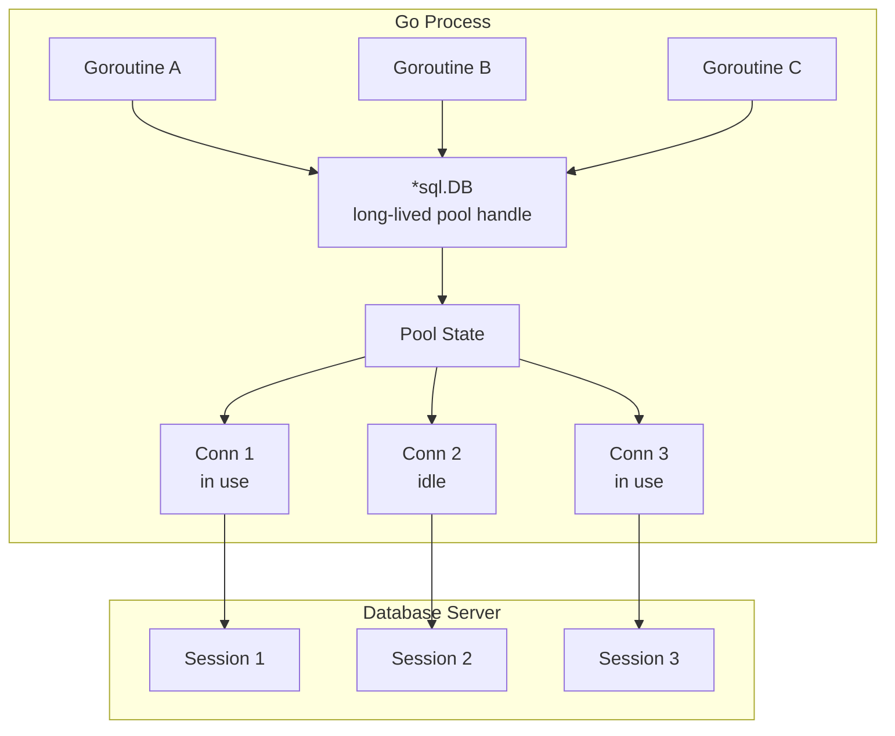
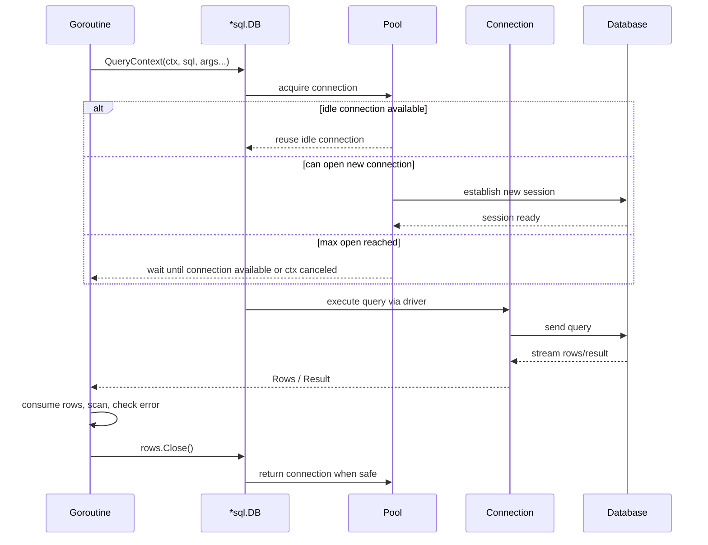
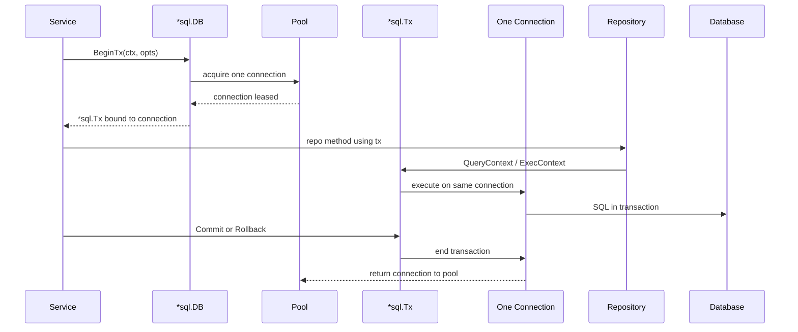
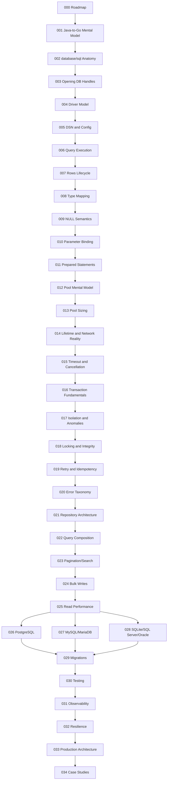
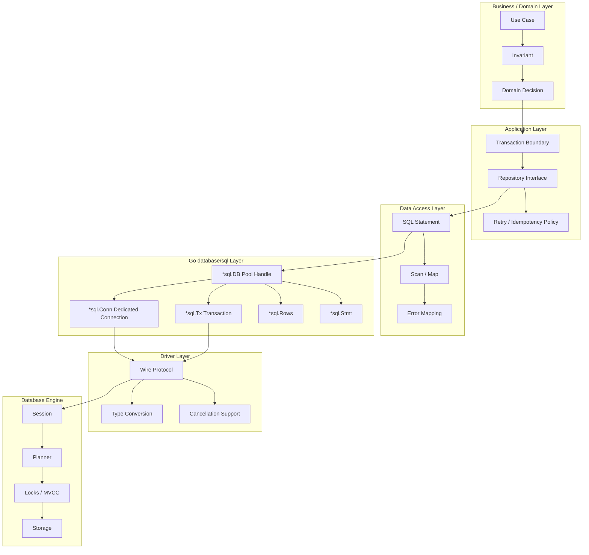
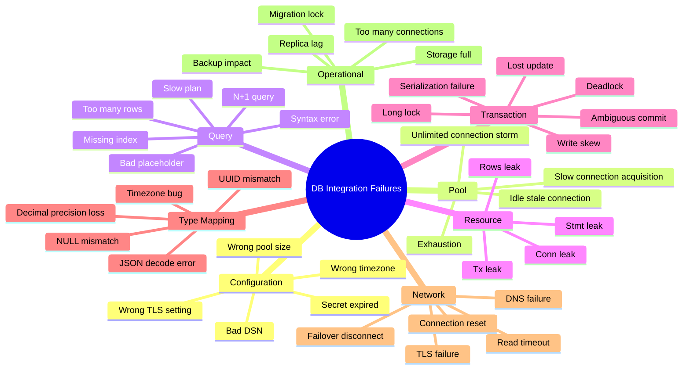
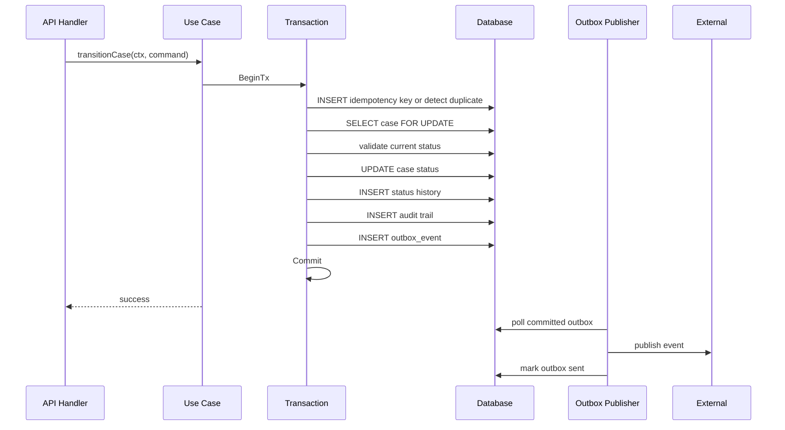
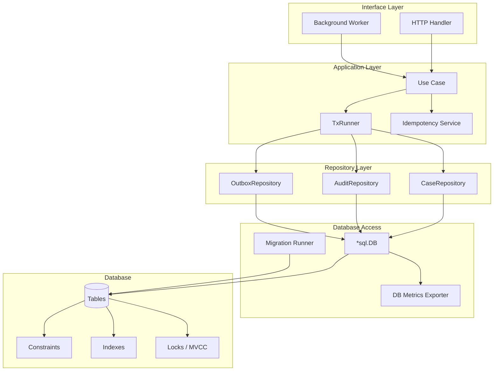

# learn-go-sql-database-integration-part-000.md

# Go SQL Package, Connection Pool, Transaction Management, and Database Integration

## Part 000 — Master Roadmap, Scope, and Mental Model

> Seri: `learn-go-sql-database-integration`  
> Part: `000`  
> Target pembaca: Java software engineer yang ingin menguasai database integration di Go sampai level production engineering  
> Target versi Go: Go 1.26.x  
> Status seri: **belum selesai**. Ini adalah bagian pembuka / roadmap.  
> Fokus utama: `database/sql`, connection pool, transaction management, query lifecycle, correctness, observability, dan production failure model.

---

## 0. Orientasi

Bagian ini bukan sekadar daftar isi. Bagian ini adalah **peta mental** untuk seluruh seri.

Tujuannya adalah membuat fondasi berpikir yang benar sebelum masuk ke API detail seperti `sql.Open`, `QueryContext`, `BeginTx`, `Rows.Scan`, `SetMaxOpenConns`, atau `DB.Stats`.

Banyak developer bisa membuat CRUD dengan Go dalam satu hari. Tetapi kemampuan production-level bukan di situ. Kemampuan yang membedakan engineer kuat adalah kemampuan menjawab pertanyaan seperti:

- Apakah `*sql.DB` itu connection atau pool?
- Apa yang terjadi kalau semua connection sedang dipakai?
- Apakah query timeout juga membatalkan query di database server?
- Apa bedanya timeout saat menunggu connection dari pool vs timeout saat query sedang dieksekusi?
- Apakah transaction menggunakan connection yang sama dari awal sampai commit?
- Kenapa tidak boleh mencampur `tx.QueryContext` dengan `db.QueryContext` saat berada dalam transaksi?
- Bagaimana cara membedakan `not found`, `unique violation`, `deadlock`, `serialization failure`, `timeout`, dan `ambiguous commit`?
- Bagaimana cara menentukan pool size untuk aplikasi dengan 10 replica, masing-masing 50 goroutine aktif, dan database dengan `max_connections = 500`?
- Kapan retry aman dan kapan retry justru membuat double side effect?
- Bagaimana desain repository yang tidak terjebak menjadi mini-JPA palsu?
- Bagaimana membuat database integration yang observable, testable, dan defensible saat incident?

Bagian 000 membangun kerangka berpikir untuk menjawab semua itu.

---

## 1. Referensi Resmi dan Basis Fakta

Materi seri ini menggunakan referensi resmi dan behavior yang terdokumentasi dari Go standard library.

Beberapa fakta dasar yang menjadi landasan:

1. Go 1.26 dirilis pada Februari 2026 dan tetap menjaga compatibility promise Go 1. Hampir semua program Go yang valid sebelumnya diharapkan tetap compile dan berjalan seperti sebelumnya.
2. Per 23 Juni 2026, release history resmi Go mencatat Go 1.26.4 sebagai minor release pada 2 Juni 2026.
3. Package `database/sql` menyediakan interface generik di sekitar SQL atau SQL-like database.
4. `*sql.DB` bukan satu physical connection. Ia adalah database handle yang merepresentasikan pool dari nol atau lebih underlying connection, aman dipakai concurrent oleh banyak goroutine.
5. `sql.Open` atau `sql.OpenDB` dapat hanya memvalidasi argument tanpa langsung membuat network connection. Untuk memastikan koneksi bisa dibuat, gunakan `Ping` atau `PingContext`.
6. `*sql.Tx` terikat ke satu connection sampai `Commit` atau `Rollback` selesai.
7. `SetMaxOpenConns`, `SetMaxIdleConns`, `SetConnMaxIdleTime`, dan `SetConnMaxLifetime` adalah control penting untuk connection pool.
8. `DB.Stats()` menyediakan observability dasar untuk pool: open connections, in-use, idle, wait count, wait duration, dan counter penutupan connection.
9. Context dipakai untuk mengontrol cancellation dan deadline pada operasi database, tetapi efektivitas cancellation bergantung juga pada driver dan database.
10. Dokumentasi Go memperingatkan agar transaction dikelola lewat API `Tx`, bukan manual `BEGIN`/`COMMIT`, dan tidak mencampur direct `DB` call dengan `Tx` call dalam transaksi.

Referensi resmi:

- Go 1.26 Release Notes: <https://go.dev/doc/go1.26>
- Go Release History: <https://go.dev/doc/devel/release>
- Package `database/sql`: <https://pkg.go.dev/database/sql>
- Opening a database handle: <https://go.dev/doc/database/open-handle>
- Managing connections: <https://go.dev/doc/database/manage-connections>
- Canceling in-progress operations: <https://go.dev/doc/database/cancel-operations>
- Executing transactions: <https://go.dev/doc/database/execute-transactions>

---

## 2. Mengapa Seri Ini Penting

Database integration adalah salah satu area paling deceptively simple dalam backend engineering.

CRUD terlihat sederhana:

```go
row := db.QueryRowContext(ctx, `SELECT name FROM users WHERE id = ?`, id)
```

Tetapi di balik satu baris ini ada banyak sistem yang bekerja:

- request deadline
- goroutine scheduling
- pool acquisition
- connection creation atau reuse
- network path
- TLS
- driver protocol
- query parsing
- query planning
- locking
- transaction visibility
- row streaming
- scanning
- memory allocation
- error conversion
- connection return ke pool
- metrics
- tracing
- logging

Pada local development, semua ini hampir tidak terasa. Pada production, semua ini menentukan apakah service tetap stabil atau runtuh saat traffic spike, database lambat, failover terjadi, atau migration menahan lock terlalu lama.

Database integration yang buruk biasanya tidak gagal dengan cara dramatis pada awalnya. Ia membusuk pelan-pelan:

- pool wait naik
- latency p99 naik
- connection count membengkak
- query lambat mengikat connection terlalu lama
- transaksi terlalu panjang
- lock timeout muncul sporadis
- retry memperparah beban
- dashboard tidak cukup menjelaskan sebab
- incident review menjadi spekulasi

Seri ini didesain untuk menghindari itu.

---

## 3. Target Kompetensi Akhir

Setelah menyelesaikan seluruh seri, targetnya bukan hanya “bisa pakai `database/sql`”. Targetnya adalah mampu:

1. Mendesain database integration layer idiomatik Go.
2. Membedakan abstraction milik Go, driver, dan database engine.
3. Menentukan transaction boundary berdasarkan business invariant.
4. Menentukan pool size berdasarkan kapasitas database, replica count, latency, dan concurrency.
5. Mengklasifikasikan error database secara benar.
6. Menulis repository yang eksplisit, testable, dan tidak over-engineered.
7. Mendesain timeout budget dari HTTP/API layer sampai database.
8. Memahami isolation anomaly dan retryable transaction failure.
9. Menghindari resource leak pada `Rows`, `Stmt`, `Conn`, dan `Tx`.
10. Membuat integration test dengan database nyata.
11. Membaca pool metrics dan slow query signal.
12. Mendesain migration yang aman untuk deployment bertahap.
13. Mendesain outbox/idempotency saat database transaction bertemu side effect eksternal.
14. Melakukan architecture review terhadap database access layer.
15. Membuat runbook production incident untuk pool exhaustion, DB failover, deadlock storm, dan slow query incident.

---

## 4. Mental Model Utama

### 4.1 Database Access Bukan Sekadar Function Call

Saat kode Go memanggil database, itu bukan function call biasa. Itu adalah koordinasi lintas boundary:

```mermaid
flowchart LR
    A[HTTP / Worker Request] --> B[context.Context]
    B --> C[Service / Use Case]
    C --> D[Repository / Data Access Boundary]
    D --> E[database/sql]
    E --> F[Connection Pool]
    F --> G[Driver]
    G --> H[Network]
    H --> I[Database Session]
    I --> J[Query Planner / Executor]
    J --> K[Locks / MVCC / Storage]
    K --> L[Rows / Result]
    L --> M[Scan into Go Types]
    M --> N[Domain Decision]
```



Setiap node memiliki failure mode sendiri.

Contoh:

| Node | Failure Mode |
|---|---|
| Context | deadline terlalu pendek, cancellation tidak diteruskan |
| Repository | query salah, resource leak, error mapping buruk |
| Pool | exhausted, unlimited connection storm, idle stale connection |
| Driver | cancellation tidak efektif, type conversion berbeda |
| Network | reset, timeout, DNS issue, TLS issue |
| Database session | session state bocor, transaction terlalu lama |
| Lock/MVCC | deadlock, serialization failure, stale read |
| Scan | NULL mismatch, precision loss, time zone bug |

Production-grade engineer tidak hanya bertanya “query benar atau tidak”, tetapi juga “apa failure domain-nya?”

---

### 4.2 `sql.DB` Adalah Pool Handle, Bukan Connection

Kesalahan mental model paling umum adalah menganggap `db *sql.DB` sebagai satu koneksi database.

Di Go, `*sql.DB` adalah **handle jangka panjang** yang mengelola pool connection. Ia aman dipakai oleh banyak goroutine.

Konsekuensi praktis:

- Biasanya hanya dibuat satu kali per database target.
- Bukan dibuat per request.
- Tidak perlu di-close setelah setiap query.
- Menyimpan idle connection.
- Membuka connection baru saat dibutuhkan.
- Bisa memblokir operasi ketika limit pool tercapai.
- Menyediakan stats untuk observability.

Mental model:



Java comparison:

| Java / Spring World | Go World |
|---|---|
| `DataSource` backed by HikariCP | `*sql.DB` |
| `Connection` | `*sql.Conn`, or implicit leased connection |
| `PreparedStatement` | `*sql.Stmt` |
| `ResultSet` | `*sql.Rows` |
| `@Transactional` | explicit `*sql.Tx` boundary |
| `JdbcTemplate` | small helper functions around `database/sql` |
| JPA EntityManager | usually not equivalent; Go tends to prefer explicit query/data mapping |

Important: `*sql.DB` looks small, but semantically it is closer to Java `DataSource + Pool`, not JDBC `Connection`.

---

### 4.3 Query Meminjam Connection

Untuk non-transaction query, alur sederhananya:



Inilah sebabnya `Rows.Close()` penting. Selama rows belum ditutup atau dikonsumsi sampai selesai, connection bisa tetap tertahan.

---

### 4.4 Transaction Mem-pin Satu Connection

Transaction berbeda dengan query biasa.

Ketika `BeginTx` berhasil, `database/sql` memilih satu connection dari pool dan mengikat transaction ke connection tersebut sampai `Commit` atau `Rollback`.



Implication:

- Transaction yang lama = connection tertahan lama.
- Banyak transaction paralel = pool bisa habis.
- Query di dalam transaction harus menggunakan `tx`, bukan `db`.
- Context transaction harus dipikirkan sejak `BeginTx`.
- External API call di dalam transaction adalah red flag, karena connection dan lock bisa tertahan sambil menunggu sistem lain.

---

## 5. Apa yang Membuat Database Integration di Go Berbeda dari Java

Sebagai Java engineer, biasanya Anda terbiasa dengan stack seperti:

```text
Controller → Service → @Transactional → Repository → JPA/JdbcTemplate → DataSource/HikariCP → Driver → DB
```

Di Go, bentuk idiomatik sering lebih eksplisit:

```text
Handler → Use Case / Service → explicit Tx helper → Repository → database/sql → Driver → DB
```

Perbedaannya bukan sekadar syntax.

### 5.1 Go Tidak Menyembunyikan Transaction Boundary Secara Default

Di Spring, annotation seperti ini lazim:

```java
@Transactional
public OrderResult createOrder(CreateOrderCommand cmd) { ... }
```

Di Go, transaction boundary lebih sering terlihat eksplisit:

```go
err := txRunner.WithTx(ctx, func(ctx context.Context, tx *sql.Tx) error {
    // all DB calls explicitly use tx-bound repository
    return nil
})
```

Kelebihan Go:

- transaction boundary terlihat jelas
- easier to reason under failure
- no proxy magic
- no self-invocation trap seperti Spring proxy
- simpler debugging

Kekurangannya:

- developer harus disiplin
- boilerplate bisa muncul jika tidak dibuat helper
- salah mencampur `db` dan `tx` bisa merusak correctness

Seri ini akan mengajarkan helper pattern yang tetap eksplisit tetapi tidak noisy.

---

### 5.2 Go Tidak Memaksakan ORM

Di banyak Java enterprise system, JPA/Hibernate menjadi default. Di Go, banyak production system memilih hand-written SQL, code generation, atau lightweight query builder.

Alasannya:

- SQL shape lebih terlihat.
- Performance lebih predictable.
- Hidden lazy loading bisa dihindari.
- Transaction lebih eksplisit.
- Domain object tidak harus menjadi persistence object.
- Query review lebih mudah.

Tetapi ini bukan berarti ORM selalu buruk. ORM bisa berguna untuk admin CRUD, internal tools, atau domain yang sederhana. Namun untuk sistem high-scale, compliance-heavy, audit-heavy, atau workflow-heavy, explicit SQL sering lebih defensible.

Seri ini akan membahas ORM secara seimbang, tetapi baseline utama adalah `database/sql` dan architecture boundary yang explicit.

---

### 5.3 Connection Pool di Go Terlihat Lebih Dekat ke Aplikasi

Di Java, HikariCP sering dikonfigurasi di YAML/properties dan dianggap infrastructure concern.

Di Go, pool setting adalah method pada `*sql.DB`:

```go
db.SetMaxOpenConns(50)
db.SetMaxIdleConns(25)
db.SetConnMaxIdleTime(5 * time.Minute)
db.SetConnMaxLifetime(30 * time.Minute)
```

Ini membuat pool tuning terasa lebih dekat ke kode aplikasi. Keuntungannya: behavior jelas. Risikonya: engineer bisa lupa mengatur dan menerima default yang tidak sesuai production.

Default yang harus diperhatikan:

- max open connections default = unlimited
- max idle connections default saat ini = 2
- connection lifetime default = reused forever
- idle lifetime default = not closed due to idle time

Default tersebut bukan selalu salah, tetapi tidak boleh diterima tanpa sadar di production.

---

## 6. Scope Lengkap Seri

Seri ini dibagi menjadi 35 part: `part-000` sampai `part-034`.

### 6.1 Foundation Layer

| Part | File | Fokus |
|---:|---|---|
| 000 | `learn-go-sql-database-integration-part-000.md` | Roadmap, scope, mental model |
| 001 | `learn-go-sql-database-integration-part-001.md` | Database access mental model for Java engineers |
| 002 | `learn-go-sql-database-integration-part-002.md` | Anatomy of `database/sql` |
| 003 | `learn-go-sql-database-integration-part-003.md` | Opening database handles correctly |
| 004 | `learn-go-sql-database-integration-part-004.md` | Driver model and driver selection |
| 005 | `learn-go-sql-database-integration-part-005.md` | DSN, connection strings, configuration hygiene |
| 006 | `learn-go-sql-database-integration-part-006.md` | Query execution model |
| 007 | `learn-go-sql-database-integration-part-007.md` | Rows lifecycle and resource safety |
| 008 | `learn-go-sql-database-integration-part-008.md` | Scanning, type mapping, and data shape control |
| 009 | `learn-go-sql-database-integration-part-009.md` | NULL semantics in Go |
| 010 | `learn-go-sql-database-integration-part-010.md` | Parameter binding and SQL injection boundary |
| 011 | `learn-go-sql-database-integration-part-011.md` | Prepared statements deep dive |

### 6.2 Pool, Timeout, and Execution Control

| Part | File | Fokus |
|---:|---|---|
| 012 | `learn-go-sql-database-integration-part-012.md` | Connection pool mental model |
| 013 | `learn-go-sql-database-integration-part-013.md` | Pool sizing and capacity planning |
| 014 | `learn-go-sql-database-integration-part-014.md` | Connection lifetime, idle lifetime, and network reality |
| 015 | `learn-go-sql-database-integration-part-015.md` | Context, timeout, cancellation, and deadline propagation |

### 6.3 Transaction and Correctness Layer

| Part | File | Fokus |
|---:|---|---|
| 016 | `learn-go-sql-database-integration-part-016.md` | Transaction fundamentals in Go |
| 017 | `learn-go-sql-database-integration-part-017.md` | Transaction isolation and anomaly modelling |
| 018 | `learn-go-sql-database-integration-part-018.md` | Locking, concurrency control, and data integrity |
| 019 | `learn-go-sql-database-integration-part-019.md` | Transaction retry, idempotency, and exactly-once illusions |
| 020 | `learn-go-sql-database-integration-part-020.md` | Error taxonomy for database integration |

### 6.4 Application Architecture Layer

| Part | File | Fokus |
|---:|---|---|
| 021 | `learn-go-sql-database-integration-part-021.md` | Repository boundary and data access architecture |
| 022 | `learn-go-sql-database-integration-part-022.md` | Query composition without losing control |
| 023 | `learn-go-sql-database-integration-part-023.md` | Pagination, sorting, search, and listing APIs |
| 024 | `learn-go-sql-database-integration-part-024.md` | Bulk insert, batch update, and high-throughput write paths |
| 025 | `learn-go-sql-database-integration-part-025.md` | Read path performance and query efficiency |

### 6.5 Database-Specific Layer

| Part | File | Fokus |
|---:|---|---|
| 026 | `learn-go-sql-database-integration-part-026.md` | PostgreSQL integration |
| 027 | `learn-go-sql-database-integration-part-027.md` | MySQL / MariaDB integration |
| 028 | `learn-go-sql-database-integration-part-028.md` | SQLite, SQL Server, and Oracle notes |

### 6.6 Delivery, Testing, Observability, and Resilience Layer

| Part | File | Fokus |
|---:|---|---|
| 029 | `learn-go-sql-database-integration-part-029.md` | Migrations, schema versioning, and deployment coordination |
| 030 | `learn-go-sql-database-integration-part-030.md` | Testing database code |
| 031 | `learn-go-sql-database-integration-part-031.md` | Observability: metrics, logs, traces, profiling |
| 032 | `learn-go-sql-database-integration-part-032.md` | Resilience and failure mode engineering |

### 6.7 Synthesis Layer

| Part | File | Fokus |
|---:|---|---|
| 033 | `learn-go-sql-database-integration-part-033.md` | Production reference architecture |
| 034 | `learn-go-sql-database-integration-part-034.md` | Advanced case studies and engineering review |

---

## 7. Dependency Map



---

## 8. Layered Architecture Mental Model

Seri ini akan memakai layered mental model berikut.



Kunci berpikirnya:

- Domain layer tidak boleh tahu connection pool.
- Repository tidak boleh menyembunyikan business invariant.
- Transaction boundary harus berada di level use case / application service, bukan random di dalam helper kecil.
- Error database harus diterjemahkan menjadi error yang bermakna untuk layer di atasnya.
- Observability harus memotong semua layer, bukan ditempel di akhir.

---

## 9. Core Abstraction Map

### 9.1 `*sql.DB`

`*sql.DB` adalah handle utama.

Gunakan untuk:

- query biasa
- exec biasa
- membuat transaction
- membuat prepared statement global/pool-level
- ping
- pool stats
- pool configuration

Jangan gunakan `*sql.DB` sebagai:

- object per request
- object per goroutine
- single connection mental model
- transaction context
- tempat menyimpan session state yang harus konsisten antar query

### 9.2 `*sql.Conn`

`*sql.Conn` merepresentasikan satu dedicated connection.

Gunakan hanya bila perlu:

- session-level setting
- database-specific session state
- advisory lock scoped to session
- temporary table scoped to session
- raw driver access

Risiko:

- harus ditutup agar kembali ke pool
- bisa menahan connection terlalu lama
- lebih mudah salah daripada memakai `*sql.DB`

### 9.3 `*sql.Tx`

`*sql.Tx` merepresentasikan transaction.

Gunakan untuk:

- atomic multi-statement change
- invariant yang harus konsisten
- read-modify-write
- insert parent-child yang harus sukses bersama
- pessimistic lock
- idempotency insert + business write
- outbox insert + business write

Risiko:

- lupa rollback
- commit error diabaikan
- transaction terlalu panjang
- external call di dalam transaction
- mencampur `db` call dan `tx` call

### 9.4 `*sql.Rows`

`*sql.Rows` adalah hasil multi-row.

Gunakan dengan lifecycle disiplin:

```go
rows, err := db.QueryContext(ctx, query, args...)
if err != nil {
    return err
}
defer rows.Close()

for rows.Next() {
    var item Item
    if err := rows.Scan(&item.ID, &item.Name); err != nil {
        return err
    }
}
if err := rows.Err(); err != nil {
    return err
}
```

Checklist:

- `defer rows.Close()` setelah error check
- iterate `rows.Next()`
- check `rows.Scan()`
- check `rows.Err()` setelah loop
- jangan return sebelum close tanpa defer
- jangan menahan `Rows` melewati boundary yang tidak jelas

### 9.5 `*sql.Row`

`*sql.Row` adalah hasil single-row expectation.

Error-nya muncul saat `Scan`, bukan saat `QueryRowContext` dipanggil.

Pola:

```go
err := db.QueryRowContext(ctx, query, id).Scan(&dst)
switch {
case errors.Is(err, sql.ErrNoRows):
    return ErrNotFound
case err != nil:
    return fmt.Errorf("query user: %w", err)
default:
    return nil
}
```

### 9.6 `*sql.Stmt`

`*sql.Stmt` adalah prepared statement handle.

Gunakan ketika:

- query sama dieksekusi berkali-kali
- driver/database mendapat manfaat dari prepared plan
- ingin menghindari repeated prepare cost

Tetapi jangan otomatis prepare semua query. Prepared statement punya lifecycle, bisa mengonsumsi resource server, dan behavior-nya driver-specific.

---

## 10. The Seven Hard Problems in Go Database Integration

Seri ini akan berulang kali kembali ke tujuh problem utama berikut.

### 10.1 Resource Ownership

Pertanyaan:

- Siapa yang memiliki `Rows`?
- Siapa yang harus menutup `Stmt`?
- Kapan `Tx` harus rollback?
- Kapan `Conn` harus dikembalikan ke pool?

Go tidak punya garbage collector untuk resource eksternal seperti DB session, lock, cursor, dan server-side prepared statement. GC hanya mengelola memory object Go, bukan lifecycle semantik di database server.

### 10.2 Boundary Correctness

Pertanyaan:

- Apakah semua query dalam use case yang sama memakai transaction yang sama?
- Apakah repository bisa dipakai baik dengan `DB` maupun `Tx` tanpa bug?
- Apakah business invariant dipastikan oleh DB constraint, transaction isolation, lock, atau hanya asumsi aplikasi?

### 10.3 Pool Saturation

Pertanyaan:

- Apakah p99 latency naik karena database lambat atau karena menunggu connection dari pool?
- Apakah max open terlalu rendah atau justru terlalu tinggi?
- Apakah total connection semua replica melampaui kapasitas DB?
- Apakah long-running transaction menahan connection?

### 10.4 Timeout and Cancellation

Pertanyaan:

- Timeout mana yang aktif: HTTP, context, driver connect, driver read/write, DB statement timeout, lock timeout?
- Apakah query server benar-benar batal atau hanya client yang berhenti menunggu?
- Apakah timeout membuat state ambiguous?

### 10.5 Error Classification

Pertanyaan:

- Apakah error ini not found, conflict, retryable, permanent, atau unknown?
- Apakah deadlock aman di-retry?
- Apakah commit failure berarti transaksi gagal atau ambiguous?
- Apakah error detail aman di-log?

### 10.6 Data Shape and Type Mapping

Pertanyaan:

- Bagaimana SQL NULL masuk ke Go?
- Apakah decimal kehilangan presisi?
- Apakah timestamp memakai timezone yang benar?
- Apakah `[]byte` aman dipakai setelah scan?
- Apakah JSON column discan ke `[]byte`, `string`, struct, atau custom type?

### 10.7 Operational Evidence

Pertanyaan:

- Saat incident, metric apa yang membuktikan root cause?
- Apakah query latency diukur terpisah dari pool wait?
- Apakah slow query log bisa dikorelasikan dengan request trace?
- Apakah error code database diklasifikasikan?
- Apakah dashboard menampilkan pool saturation?

---

## 11. Database Integration Failure Taxonomy

Kita akan memakai taxonomy berikut sepanjang seri.



Taxonomy ini penting karena solusi tiap kategori berbeda.

Contoh:

- Pool exhaustion tidak selalu diselesaikan dengan menaikkan pool size.
- Deadlock tidak selalu diselesaikan dengan retry membabi buta.
- Slow query tidak selalu diselesaikan dengan cache.
- Timeout tidak selalu berarti database gagal melakukan perubahan.
- `ErrNoRows` bukan error internal server.

---

## 12. Invariant yang Harus Dipegang

### 12.1 Invariant Pool

1. Satu process bisa punya satu atau lebih `*sql.DB`, tetapi satu `*sql.DB` merepresentasikan satu pool untuk satu database target/configuration.
2. `*sql.DB` aman dipakai concurrent.
3. `*sql.DB` sebaiknya long-lived.
4. Membuat `*sql.DB` per request adalah anti-pattern.
5. `MaxOpenConns` adalah concurrency gate ke database.
6. Unlimited max open bisa menyebabkan connection storm.
7. Pool wait adalah signal pressure, bukan sekadar latency biasa.
8. Long-running query dan long-running transaction sama-sama bisa menahan connection.
9. Idle connection mempercepat reuse tetapi bisa stale jika melewati network/database timeout.
10. Connection lifetime harus disesuaikan dengan reality network dan failover behavior.

### 12.2 Invariant Query

1. Gunakan `Context` variant untuk production path: `QueryContext`, `ExecContext`, `QueryRowContext`, `BeginTx`, `PrepareContext`, `PingContext`.
2. Selalu close `Rows`.
3. Selalu check `rows.Err()` setelah iteration.
4. Jangan gunakan `SELECT *` untuk path penting.
5. Parameter binding hanya melindungi value, bukan identifier seperti column name atau order direction.
6. SQL placeholder syntax berbeda antar driver.
7. Query cardinality harus eksplisit: zero/one/many.
8. `QueryRowContext` menunda error sampai `Scan`.
9. `LastInsertId` tidak portable untuk semua database/driver.
10. `RowsAffected` bisa berguna untuk optimistic locking dan invariant check.

### 12.3 Invariant Transaction

1. Transaction adalah boundary correctness, bukan sekadar performance detail.
2. `Tx` terikat ke satu connection.
3. Transaction harus selalu berakhir dengan `Commit` atau `Rollback`.
4. Deferred rollback adalah safety net yang umum.
5. Commit error harus diperlakukan serius.
6. Jangan mencampur `DB` call di dalam transaction flow.
7. Jangan melakukan external network call lambat di dalam transaction kecuali benar-benar sadar risikonya.
8. Isolation level harus dipilih berdasarkan anomaly yang ingin dicegah.
9. Constraint database adalah bagian dari correctness design.
10. Retry harus idempotent dan terukur.

### 12.4 Invariant Observability

1. Pool metrics wajib ada.
2. Query duration harus dibedakan dari pool acquisition wait jika memungkinkan.
3. Error harus diberi label kategori.
4. SQL log harus direduksi/redacted.
5. Jangan log raw secret, DSN lengkap, token, atau PII.
6. Slow query harus bisa dikorelasikan dengan request ID / trace ID.
7. Dashboard harus menjawab: pool penuh atau database lambat?
8. Alert harus berbasis symptom yang actionable.
9. Migration harus observable.
10. Incident review harus berbasis evidence, bukan tebakan.

---

## 13. Roadmap Kompetensi Bertahap

Seri ini dibangun dalam empat level.

### Level 1 — Correct API Usage

Target:

- paham object utama `database/sql`
- bisa membuka DB handle dengan benar
- bisa query/exec dengan context
- bisa scan result
- bisa handle NULL
- bisa menutup resource

Bahaya yang dihindari:

- `Rows` leak
- `ErrNoRows` salah diperlakukan
- `sql.DB` dibuat per request
- query tanpa timeout
- SQL injection dari string concat

### Level 2 — Correctness and Transaction

Target:

- paham transaction lifecycle
- paham isolation anomaly
- paham lock dan constraint
- bisa desain retry untuk deadlock/serialization failure
- bisa desain idempotency
- bisa menghindari ambiguous side effect

Bahaya yang dihindari:

- lost update
- write skew
- double insert
- double event publish
- external call dalam transaksi terlalu lama
- commit error diabaikan

### Level 3 — Performance and Capacity

Target:

- bisa sizing pool
- bisa membaca DB stats
- bisa membedakan pool bottleneck vs DB bottleneck
- bisa desain read path efficient
- bisa melakukan batch write
- bisa menghindari N+1
- bisa membaca impact query shape

Bahaya yang dihindari:

- connection storm
- p99 collapse
- too many connections
- unnecessary caching
- over-fetching rows
- slow query tanpa evidence

### Level 4 — Production Engineering

Target:

- migration aman
- observability lengkap
- failure mode mapping
- runbook incident
- database-specific integration
- architecture review
- production reference architecture

Bahaya yang dihindari:

- migration lock incident
- failover behavior tidak dipahami
- alert noisy
- dashboard tidak actionable
- test terlalu mock-heavy
- database incident tidak bisa dianalisis

---

## 14. Bahasa Desain yang Akan Dipakai

Seri ini akan sering memakai istilah berikut.

### 14.1 Invariant

Invariant adalah kondisi yang harus selalu benar.

Contoh:

- saldo tidak boleh negatif
- satu user hanya boleh punya satu active session tertentu
- case yang sudah closed tidak boleh dimodifikasi
- audit trail harus tercatat untuk perubahan status penting
- idempotency key hanya boleh diproses sekali

Database integration yang baik dimulai dari invariant, bukan dari tabel.

### 14.2 Boundary

Boundary adalah garis pemisah tanggung jawab.

Contoh:

- handler boundary
- service/use case boundary
- transaction boundary
- repository boundary
- database constraint boundary
- external side effect boundary

Bug serius sering terjadi ketika boundary kabur.

### 14.3 Failure Mode

Failure mode adalah cara sistem bisa gagal.

Contoh:

- database lambat
- connection pool penuh
- commit timeout
- unique constraint violation
- deadlock
- replica lag
- migration lock

Engineer kuat tidak hanya menulis happy path, tetapi mendesain response untuk failure mode.

### 14.4 Evidence

Evidence adalah sinyal yang bisa membuktikan kondisi runtime.

Contoh:

- `DBStats.WaitCount`
- `DBStats.WaitDuration`
- query duration histogram
- deadlock count
- SQLSTATE count
- slow query log
- trace span
- connection count database server

Tanpa evidence, tuning berubah menjadi opini.

---

## 15. Java-to-Go Translation Table

| Concern | Java Common Approach | Go Production Approach |
|---|---|---|
| Pool handle | `DataSource`, HikariCP | `*sql.DB` |
| Raw connection | `java.sql.Connection` | `*sql.Conn` when explicitly reserved; usually implicit via `*sql.DB` |
| Transaction | `@Transactional`, `TransactionTemplate` | explicit `BeginTx`, helper wrapper, explicit `*sql.Tx` propagation |
| Query helper | `JdbcTemplate` | small custom helper or codegen; direct `database/sql` common |
| ORM | JPA/Hibernate | optional; many teams prefer SQL/codegen/lightweight mapper |
| Error classification | SQL exception hierarchy / vendor code | driver-specific error + SQLSTATE/code + domain mapping |
| Pool metrics | Hikari metrics | `DB.Stats()` + custom query metrics |
| Migration | Flyway/Liquibase | golang-migrate, goose, atlas, tern, custom pipeline, or DB-native deployment process |
| Context deadline | often timeout config / transaction timeout | `context.Context` through call chain + driver/database timeout |
| Lazy loading | common ORM feature | usually avoided; explicit query shape |
| Entity lifecycle | persistence context | usually explicit struct mapping |
| Connection leak detection | Hikari leak detection | metrics, tests, tracing, code discipline |

---

## 16. What This Series Will Not Do

Agar efisien dan tidak mengulang seri sebelumnya, seri ini tidak akan mengulang detail besar dari:

- syntax dasar Go
- goroutine/channel dasar
- context dasar secara umum
- error wrapping dasar
- cryptography dasar
- IO dasar
- design pattern umum
- memory allocation dasar
- data structure umum

Namun beberapa konsep akan disentuh ulang secara lokal bila langsung mempengaruhi database behavior.

Contoh:

- `context.Context` akan dibahas dari sisi deadline propagation ke query.
- error wrapping akan dibahas dari sisi database error taxonomy.
- concurrency akan dibahas dari sisi transaction anomaly dan pool pressure.
- security akan dibahas dari sisi SQL injection, secret hygiene, TLS, dan redaction.
- memory akan dibahas dari sisi scanning large result set dan materialization cost.

---

## 17. Learning Contract

Setiap part setelah ini akan memakai format utama:

```text
# learn-go-sql-database-integration-part-XXX.md

## 1. Tujuan
## 2. Mental Model
## 3. Konsep Inti
## 4. Go API / Code
## 5. Java Comparison
## 6. Production Notes
## 7. Failure Modes
## 8. Checklist
## 9. Latihan / Scenario
## 10. Ringkasan
```

Untuk part yang membutuhkan kedalaman ekstra, format tambahan:

```text
## Deep Dive
## Internal Behavior
## Trade-off Matrix
## Incident Simulation
## Architecture Review
## Operational Runbook
```

---

## 18. Reference Project yang Akan Dibangun Secara Mental

Agar materi tidak abstrak, kita akan memakai contoh domain berulang: **case management / regulatory workflow**.

Contoh entitas:

- `case_file`
- `case_status_history`
- `case_assignment`
- `case_note`
- `case_document`
- `audit_trail`
- `outbox_event`
- `idempotency_key`

Contoh invariant:

- case tidak boleh pindah dari `CLOSED` kembali ke `UNDER_REVIEW` tanpa reopen action
- satu case hanya boleh punya satu active assignee
- semua status change harus menghasilkan audit trail
- outbound event harus konsisten dengan database state
- duplicate external callback tidak boleh membuat duplicate transition
- listing audit trail harus stabil walaupun ada insert baru

Contoh workload:

- OLTP case update
- audit trail insert heavy
- listing dan search
- background job processing
- bulk import
- migration/backfill
- reporting read path

Mengapa domain ini bagus?

Karena database integration di domain seperti ini bukan cuma CRUD. Ia membutuhkan:

- transaction boundary
- auditability
- idempotency
- isolation reasoning
- pagination correctness
- error classification
- observability
- migration safety

---

## 19. Running Example: Case Transition

Kita akan sering kembali ke scenario berikut.

### Business Rule

Sebuah case bisa berubah status dari `SUBMITTED` ke `UNDER_REVIEW` jika:

1. case masih aktif
2. current status adalah `SUBMITTED`
3. target reviewer valid
4. transition belum pernah diproses untuk idempotency key yang sama
5. audit trail harus tercatat
6. domain event harus dipublish setelah transaksi commit

### Naive Implementation Risk

Pseudo-flow buruk:

```text
1. SELECT case
2. if status ok
3. UPDATE case
4. INSERT audit trail
5. call external event API
6. return success
```

Problem:

- race antara dua reviewer
- external API call bisa sukses tapi transaction gagal
- retry bisa double publish
- audit insert bisa gagal setelah status update jika tidak dalam transaction
- status check bisa stale
- no idempotency
- no lock

### Production-Oriented Flow



Ini bukan hanya pattern. Ini adalah contoh bagaimana transaction, lock, idempotency, audit, dan side effect harus dipikirkan bersama.

---

## 20. Roadmap Detail Tiap Part

### Part 001 — Database Access Mental Model in Go for Java Engineers

Pertanyaan utama:

- Bagaimana memindahkan intuisi JDBC/Hikari/JPA ke Go tanpa membawa kebiasaan buruk?
- Apa padanan yang valid dan apa yang tidak valid?
- Apa konsekuensi explicit transaction di Go?

Output:

- mental model Java-to-Go
- anti-pattern migrasi dari Java
- architectural vocabulary bridge

### Part 002 — Anatomy of `database/sql`

Pertanyaan utama:

- Apa tanggung jawab `database/sql`?
- Apa yang dikerjakan driver?
- Object apa saja yang harus dipahami?

Output:

- object lifecycle map
- API map
- boundary antara standard library dan driver

### Part 003 — Opening Database Handles Correctly

Pertanyaan utama:

- Kapan `sql.Open` benar-benar connect?
- Kapan harus `PingContext`?
- Bagaimana startup readiness yang benar?

Output:

- DB initialization pattern
- config validation
- graceful close

### Part 004 — Driver Model and Driver Selection

Pertanyaan utama:

- Bagaimana memilih driver?
- Apa trade-off pure Go vs CGO?
- Apa beda `database/sql` mode vs native driver API?

Output:

- driver evaluation checklist
- database-specific driver matrix

### Part 005 — DSN, Connection Strings, and Configuration Hygiene

Pertanyaan utama:

- Bagaimana DSN dikonfigurasi tanpa leak secret?
- Bagaimana TLS, timeout, timezone, charset, application name?

Output:

- config struct pattern
- secret hygiene
- environment matrix

### Part 006 — Query Execution Model

Pertanyaan utama:

- Kapan pakai `ExecContext`, `QueryContext`, `QueryRowContext`?
- Bagaimana result cardinality diperlakukan?

Output:

- command/query distinction
- cardinality handling
- result validation

### Part 007 — Rows Lifecycle and Resource Safety

Pertanyaan utama:

- Kenapa `Rows.Close` penting?
- Kapan connection dikembalikan ke pool?
- Bagaimana streaming large result?

Output:

- rows lifecycle checklist
- leak scenarios
- safe scan loop

### Part 008 — Scanning, Type Mapping, and Data Shape Control

Pertanyaan utama:

- Bagaimana SQL type masuk ke Go type?
- Bagaimana menghindari precision/timezone bug?

Output:

- type mapping table
- custom scanner/valuer pattern
- DTO design

### Part 009 — NULL Semantics in Go

Pertanyaan utama:

- Kapan pakai pointer?
- Kapan pakai `sql.Null*`?
- Bagaimana tri-state update?

Output:

- optionality model
- JSON/SQL NULL boundary
- update patch semantics

### Part 010 — Parameter Binding and SQL Injection Boundary

Pertanyaan utama:

- Apa yang dilindungi placeholder?
- Apa yang tidak dilindungi?
- Bagaimana dynamic ordering/filtering aman?

Output:

- safe SQL composition checklist
- whitelist identifier pattern
- IN clause strategy

### Part 011 — Prepared Statements Deep Dive

Pertanyaan utama:

- Kapan prepared statement membantu?
- Kapan malah jadi beban?
- Bagaimana lifecycle prepared statement di pool?

Output:

- prepared statement decision matrix
- server-side resource considerations

### Part 012 — Connection Pool Mental Model

Pertanyaan utama:

- Apa state pool?
- Apa arti open, idle, in-use, wait?
- Apa default yang berbahaya?

Output:

- pool state diagram
- pool config baseline
- pool anti-patterns

### Part 013 — Pool Sizing and Capacity Planning

Pertanyaan utama:

- Bagaimana menentukan `MaxOpenConns`?
- Bagaimana menghitung total connection semua replica?
- Bagaimana membaca wait duration?

Output:

- sizing formula
- Little's Law intuition
- tuning workflow

### Part 014 — Connection Lifetime, Idle Lifetime, and Network Reality

Pertanyaan utama:

- Kenapa connection bisa stale?
- Bagaimana failover mempengaruhi pool?
- Kapan butuh PgBouncer/RDS Proxy?

Output:

- lifetime tuning strategy
- network failure checklist
- proxy/pooler trade-off

### Part 015 — Context, Timeout, Cancellation, and Deadline Propagation

Pertanyaan utama:

- Timeout mana yang harus dipasang?
- Bagaimana membedakan query timeout dan pool wait timeout?
- Apa risiko cancellation yang tidak sampai ke server?

Output:

- deadline budget model
- timeout taxonomy
- cancellation caveats

### Part 016 — Transaction Fundamentals in Go

Pertanyaan utama:

- Bagaimana pola `BeginTx`/`Commit`/`Rollback` yang aman?
- Bagaimana helper transaction yang idiomatik?

Output:

- transaction helper pattern
- rollback/commit handling
- transaction ownership rules

### Part 017 — Transaction Isolation and Anomaly Modelling

Pertanyaan utama:

- Apa dirty read, non-repeatable read, phantom, lost update, write skew?
- Kapan isolation level cukup dan kapan tidak?

Output:

- anomaly catalog
- isolation decision matrix
- DB-specific caveats

### Part 018 — Locking, Concurrency Control, and Data Integrity

Pertanyaan utama:

- Kapan pessimistic lock?
- Kapan optimistic version?
- Bagaimana constraint dipakai sebagai concurrency primitive?

Output:

- lock strategy table
- version column pattern
- constraint-first design

### Part 019 — Transaction Retry, Idempotency, and Exactly-Once Illusions

Pertanyaan utama:

- Error apa yang boleh di-retry?
- Bagaimana mencegah double side effect?
- Kenapa exactly-once sering ilusi?

Output:

- retry decision tree
- idempotency key design
- outbox/inbox pattern

### Part 020 — Error Taxonomy for Database Integration

Pertanyaan utama:

- Bagaimana mapping database error ke domain error?
- Bagaimana preserve cause tanpa leak detail?

Output:

- error classification model
- SQLSTATE/vendor code handling
- logging redaction rules

### Part 021 — Repository Boundary and Data Access Architecture

Pertanyaan utama:

- Repository seperti apa yang idiomatik di Go?
- Bagaimana transaction-aware repository?
- Bagaimana menghindari generic repository anti-pattern?

Output:

- package layout
- repository interface placement
- transaction-aware design

### Part 022 — Query Composition Without Losing Control

Pertanyaan utama:

- Bagaimana compose dynamic SQL aman?
- Kapan pakai query builder?
- Kapan code generation lebih cocok?

Output:

- dynamic filter pattern
- SQL fragment safety
- query generation trade-off

### Part 023 — Pagination, Sorting, Search, and Listing APIs

Pertanyaan utama:

- Offset vs keyset pagination?
- Bagaimana stable ordering?
- Bagaimana count query cost?

Output:

- pagination design
- listing API contract
- audit listing scenario

### Part 024 — Bulk Insert, Batch Update, and High-Throughput Write Paths

Pertanyaan utama:

- Bagaimana batch write tanpa membunuh DB?
- Bagaimana chunk sizing?
- Kapan copy protocol?

Output:

- batch strategy
- throughput/latency trade-off
- write pressure analysis

### Part 025 — Read Path Performance and Query Efficiency

Pertanyaan utama:

- Bagaimana menghindari N+1?
- Bagaimana projection control?
- Kapan cache?

Output:

- read path optimization model
- query plan awareness
- caching boundary

### Part 026 — PostgreSQL Integration

Pertanyaan utama:

- Kapan `pgx` native vs `database/sql`?
- Bagaimana SQLSTATE, JSONB, arrays, UUID, copy, advisory lock?

Output:

- PostgreSQL integration checklist
- pgx trade-offs
- PostgreSQL-specific patterns

### Part 027 — MySQL / MariaDB Integration

Pertanyaan utama:

- Bagaimana DSN MySQL?
- Apa caveat timezone, autocommit, isolation, deadlock?

Output:

- MySQL integration checklist
- InnoDB transaction caveats
- duplicate key/upsert handling

### Part 028 — SQLite, SQL Server, and Oracle Notes

Pertanyaan utama:

- Kapan SQLite tepat?
- Apa caveat SQL Server dan Oracle di Go?
- Bagaimana CLOB/BLOB/session behavior?

Output:

- DB-specific notes
- enterprise caveats
- driver selection concerns

### Part 029 — Migrations, Schema Versioning, and Deployment Coordination

Pertanyaan utama:

- Bagaimana migration aman tanpa downtime?
- Apa expand-contract?
- Kenapa rollback schema sering ilusi?

Output:

- migration lifecycle
- deployment coordination
- lock-aware migration checklist

### Part 030 — Testing Database Code

Pertanyaan utama:

- Kapan mock repository cukup?
- Kapan wajib real DB integration test?
- Bagaimana test transaction anomaly?

Output:

- test pyramid
- container DB tests
- fault injection

### Part 031 — Observability: Metrics, Logs, Traces, and Profiling

Pertanyaan utama:

- Metric apa wajib?
- Bagaimana trace query?
- Bagaimana log SQL dengan aman?

Output:

- dashboard model
- alert model
- instrumentation checklist

### Part 032 — Resilience and Failure Mode Engineering

Pertanyaan utama:

- Bagaimana menghadapi DB down, failover, pool exhaustion, deadlock storm?
- Kapan circuit breaker/load shedding?

Output:

- failure mode runbook
- resilience patterns
- incident response checklist

### Part 033 — Production Reference Architecture

Pertanyaan utama:

- Seperti apa skeleton production service Go + DB?
- Bagaimana config, pool, repository, transaction runner, observability, migration?

Output:

- reference architecture
- code skeleton
- deployment checklist

### Part 034 — Advanced Case Studies and Engineering Review

Pertanyaan utama:

- Bagaimana melakukan architecture review?
- Bagaimana mengevaluasi incident nyata?
- Apa final checklist top-tier engineer?

Output:

- case studies
- engineering review checklist
- final synthesis

---

## 21. Production Readiness Checklist untuk Seluruh Seri

Checklist ini belum harus bisa dijawab sekarang. Ini adalah target akhir.

### 21.1 Initialization

- [ ] DB config tervalidasi.
- [ ] Secret tidak hardcoded.
- [ ] DSN tidak dilog lengkap.
- [ ] `PingContext` dilakukan saat readiness/startup sesuai kebutuhan.
- [ ] Pool setting eksplisit.
- [ ] Graceful shutdown dipahami.

### 21.2 Query

- [ ] Semua production query memakai context.
- [ ] Query cardinality eksplisit.
- [ ] `Rows` selalu ditutup.
- [ ] `rows.Err()` selalu dicek.
- [ ] SQL parameter binding benar.
- [ ] Dynamic identifier memakai whitelist.
- [ ] Scan type sesuai.
- [ ] NULL semantics jelas.

### 21.3 Transaction

- [ ] Transaction boundary berada di use case/application layer.
- [ ] `Rollback` safety net ada.
- [ ] `Commit` error ditangani.
- [ ] Tidak ada `db.QueryContext` di dalam transaction flow.
- [ ] Isolation level dipilih sadar.
- [ ] Lock strategy dipilih sadar.
- [ ] Retry policy idempotent.
- [ ] Side effect eksternal tidak dilakukan sembarangan di dalam transaction.

### 21.4 Pool

- [ ] `MaxOpenConns` ditentukan berdasarkan total replica dan DB capacity.
- [ ] `MaxIdleConns` sesuai workload.
- [ ] `ConnMaxIdleTime` dan `ConnMaxLifetime` sesuai network/failover reality.
- [ ] Pool metrics diekspor.
- [ ] Alert untuk pool wait/saturation tersedia.
- [ ] Long transaction terlihat.

### 21.5 Error

- [ ] `ErrNoRows` dipetakan ke not found.
- [ ] Constraint violation dipetakan ke conflict/domain error.
- [ ] Deadlock/serialization failure dipetakan ke retryable jika aman.
- [ ] Timeout/canceled dipisahkan.
- [ ] Unknown driver error tetap preserve cause.
- [ ] Log aman dari secret/PII.

### 21.6 Testing

- [ ] Unit test untuk domain/use case.
- [ ] Integration test dengan DB nyata untuk repository.
- [ ] Test migration.
- [ ] Test transaction behavior.
- [ ] Test idempotency.
- [ ] Test duplicate/constraint error.
- [ ] Test cancellation/timeout bila relevan.

### 21.7 Observability

- [ ] Query latency metric.
- [ ] Pool stats metric.
- [ ] Error category metric.
- [ ] Slow query log/tracing.
- [ ] Correlation ID.
- [ ] Migration observability.
- [ ] Dashboard menjawab root-cause questions.

### 21.8 Operations

- [ ] Runbook pool exhaustion.
- [ ] Runbook DB failover.
- [ ] Runbook deadlock storm.
- [ ] Runbook slow query incident.
- [ ] Runbook migration lock.
- [ ] Capacity planning document.
- [ ] Deployment/migration coordination process.

---

## 22. Anti-Pattern yang Akan Sering Dibongkar

### 22.1 Membuat `sql.DB` Per Request

Buruk:

```go
func handler(w http.ResponseWriter, r *http.Request) {
    db, _ := sql.Open("postgres", dsn)
    defer db.Close()
    // query...
}
```

Masalah:

- pool baru per request
- connection churn
- no reuse
- high latency
- connection storm
- resource waste

Benar:

```go
type Server struct {
    db *sql.DB
}
```

`db` dibuat saat startup, dikonfigurasi, lalu dishare.

### 22.2 Query Tanpa Context

Buruk:

```go
db.Query("SELECT ...")
```

Lebih baik untuk production path:

```go
db.QueryContext(ctx, "SELECT ...")
```

Context bukan sekadar style. Ia adalah mekanisme deadline/cancellation propagation.

### 22.3 Lupa Menutup Rows

Buruk:

```go
rows, err := db.QueryContext(ctx, query)
if err != nil {
    return err
}
for rows.Next() {
    // scan
}
return nil
```

Lebih baik:

```go
rows, err := db.QueryContext(ctx, query)
if err != nil {
    return err
}
defer rows.Close()

for rows.Next() {
    // scan
}
if err := rows.Err(); err != nil {
    return err
}
return nil
```

### 22.4 Transaction yang Diam-Diam Keluar dari Transaction

Buruk:

```go
func CreateOrder(ctx context.Context, db *sql.DB) error {
    tx, err := db.BeginTx(ctx, nil)
    if err != nil { return err }
    defer tx.Rollback()

    if _, err := tx.ExecContext(ctx, insertOrder); err != nil {
        return err
    }

    // BUG: this runs outside tx
    if _, err := db.ExecContext(ctx, insertAudit); err != nil {
        return err
    }

    return tx.Commit()
}
```

Masalah:

- audit bisa commit walau order rollback
- query melihat state berbeda
- lock/deadlock behavior bisa aneh

### 22.5 Retry Tanpa Idempotency

Buruk:

```go
for i := 0; i < 3; i++ {
    err := createPayment(ctx, req)
    if err == nil { return nil }
}
```

Masalah:

- double charge
- duplicate event
- duplicate state transition

Retry harus dimulai dari pertanyaan: “apakah operasi ini aman diulang?”

---

## 23. Production Scenario Map

Kita akan menguji konsep dengan scenario berikut.

### Scenario A — Pool Exhaustion

Symptoms:

- API p99 naik
- DB CPU tidak terlalu tinggi
- app goroutine banyak menunggu
- `WaitCount` dan `WaitDuration` naik

Possible causes:

- `MaxOpenConns` terlalu rendah
- query lambat menahan connection
- rows leak
- long transaction
- external call di dalam transaction
- database down membuat connection acquisition lambat

Learning target:

- membaca pool stats
- membedakan pool wait vs query slow
- menentukan tindakan benar

### Scenario B — Deadlock Storm

Symptoms:

- error deadlock meningkat
- request tertentu gagal sporadis
- retry membuat load naik

Possible causes:

- update table dalam urutan berbeda
- range lock
- missing index
- long transaction
- hot row

Learning target:

- lock order
- transaction retry
- backoff
- query/index design

### Scenario C — Ambiguous Commit

Symptoms:

- service timeout saat commit
- client tidak tahu operasi berhasil atau gagal
- retry berisiko double write

Possible causes:

- network drop after DB commit
- client deadline terlalu pendek
- DB completed transaction but app did not receive response

Learning target:

- idempotency key
- read-after-timeout reconciliation
- external side effect discipline

### Scenario D — Migration Lock Incident

Symptoms:

- API update lambat
- lock wait meningkat
- migration tampak “jalan” tetapi production request blocked

Possible causes:

- blocking DDL
- table rewrite
- index creation tanpa strategy
- long transaction lama menahan lock

Learning target:

- expand-contract
- lock-aware migration
- deployment coordination

### Scenario E — Listing Pagination Bug

Symptoms:

- row duplicate antar page
- row hilang saat user pindah page
- audit listing tidak stabil

Possible causes:

- offset pagination dengan concurrent insert
- order by tidak deterministic
- tidak ada tie-breaker

Learning target:

- keyset pagination
- stable ordering
- cursor design

---

## 24. High-Level Reference Architecture

Ini preview architecture yang akan dibangun bertahap.



Prinsip architecture:

- Handler tidak langsung menulis SQL.
- Use case menentukan transaction boundary.
- Repository bertanggung jawab atas query dan mapping.
- Constraint database menjadi bagian dari invariant.
- Outbox memisahkan commit database dan publish side effect.
- Metrics dipasang dekat pool/query boundary.

---

## 25. Tooling yang Akan Dibahas

Seri ini bukan seri “tool catalog”, tetapi beberapa tool akan dibahas karena relevan:

### Core

- `database/sql`
- `database/sql/driver`
- `context`
- `errors`
- `time`

### PostgreSQL

- `pgx`
- `pgxpool`
- `pgconn` error handling
- `sqlc` for code generation

### MySQL

- `go-sql-driver/mysql`
- MySQL DSN config
- MySQL error code handling

### Migration

- `golang-migrate/migrate`
- `goose`
- `atlas`
- `tern`
- manual migration pipeline trade-offs

### Testing

- real database integration test
- Testcontainers-style approach
- transaction fixture
- docker-compose/local DB
- fault injection mindset

### Observability

- OpenTelemetry DB spans
- Prometheus metrics
- `DB.Stats()` exporter
- structured logging
- slow query logging

Catatan: pilihan tool bisa berubah mengikuti ekosistem, tetapi mental model-nya stabil.

---

## 26. How to Study This Series

Cara belajar yang disarankan:

1. Jangan lompat langsung ke ORM.
2. Kuasai `database/sql` dulu.
3. Pahami lifecycle object.
4. Pahami pool sebelum tuning performance.
5. Pahami transaction sebelum menulis workflow penting.
6. Pahami error taxonomy sebelum menulis retry.
7. Pahami observability sebelum incident.
8. Baru setelah itu evaluasi tool seperti `sqlc`, query builder, ORM, atau native driver API.

Urutan ini disengaja karena tooling tanpa mental model sering membuat engineer percaya diri tetapi rapuh.

---

## 27. Pre-Assessment Questions

Gunakan pertanyaan ini untuk mengukur posisi awal.

### Basic API

1. Apa bedanya `QueryContext` dan `QueryRowContext`?
2. Kapan `sql.ErrNoRows` muncul?
3. Kenapa `rows.Err()` tetap harus dicek setelah loop?
4. Kapan `Rows.Close()` harus dipanggil?
5. Apa perbedaan `ExecContext` dan `QueryContext`?

### Pool

1. Apa arti `OpenConnections`, `InUse`, dan `Idle`?
2. Apa arti `WaitCount`?
3. Apa risiko default unlimited max open connections?
4. Bagaimana menghitung total max connection untuk 20 pod?
5. Apa efek transaction panjang terhadap pool?

### Transaction

1. Kenapa `Tx` terikat ke satu connection?
2. Apa risiko mencampur `db.ExecContext` dan `tx.ExecContext`?
3. Apa bedanya deadlock dan serialization failure?
4. Apa itu ambiguous commit?
5. Kenapa external HTTP call di dalam transaction berbahaya?

### Correctness

1. Apa itu lost update?
2. Apa itu write skew?
3. Kapan optimistic locking cukup?
4. Kapan perlu `SELECT FOR UPDATE`?
5. Kenapa unique constraint bisa menjadi concurrency primitive?

### Operations

1. Bagaimana membedakan slow DB dengan pool exhaustion?
2. Metric apa yang harus ada di dashboard?
3. Bagaimana mendesain alert pool wait?
4. Apa risiko migration DDL di production?
5. Bagaimana membaca incident “too many connections”?

Jika belum bisa menjawab sebagian besar pertanyaan ini, seri ini akan sangat bernilai.

---

## 28. Common Misconceptions

### Misconception 1 — “Go Tidak Butuh Connection Pool Karena Ringan”

Salah.

Go goroutine memang ringan, tetapi database connection tidak ringan. Connection melibatkan server session, memory, backend process/thread/resource, transaction state, buffer, lock context, dan network socket.

Goroutine bisa ribuan. Database connection tidak boleh sembarangan ribuan.

### Misconception 2 — “Naikkan Pool Size untuk Meningkatkan Throughput”

Tidak selalu.

Pool size terlalu kecil bisa membuat app menunggu connection. Tetapi pool size terlalu besar bisa membanjiri database, meningkatkan context switching, lock contention, CPU pressure, dan latency.

Pool size adalah throttle, bukan magic throughput amplifier.

### Misconception 3 — “Timeout Berarti Query Pasti Tidak Jalan”

Tidak selalu.

Timeout di sisi aplikasi bisa berarti aplikasi berhenti menunggu. Apakah database query benar-benar dibatalkan tergantung driver, protocol, dan database. Bahkan jika query dibatalkan, state transaksi/statement harus dipahami.

### Misconception 4 — “Retry Selalu Membuat Sistem Lebih Reliable”

Tidak.

Retry bisa memperbaiki transient failure, tetapi juga bisa:

- menggandakan side effect
- memperparah overload
- membuat lock contention lebih buruk
- menyembunyikan root cause
- meningkatkan tail latency

Retry harus punya classification, budget, backoff, dan idempotency.

### Misconception 5 — “ORM Membuat Database Code Aman Otomatis”

Tidak.

ORM bisa membantu mapping dan productivity, tetapi tidak otomatis menyelesaikan:

- transaction boundary
- isolation anomaly
- pool sizing
- lock contention
- migration safety
- query plan regression
- pagination correctness
- idempotency
- observability

---

## 29. Decision Framework: Raw SQL, Query Builder, Codegen, or ORM?

Kita akan membahas detailnya nanti, tetapi framework awalnya:

| Approach | Cocok Untuk | Risiko |
|---|---|---|
| Raw SQL + `database/sql` | query penting, performance-sensitive path, full control | boilerplate, manual scan, typo runtime |
| Query builder | dynamic filter/search, composable SQL | abstraction leak, debugging query string |
| Code generation (`sqlc` style) | strong typing dari SQL, explicit query | generator workflow, less dynamic flexibility |
| ORM | CRUD cepat, admin UI, simple domain | hidden query, N+1, transaction magic, performance opacity |
| Native driver API | fitur DB-specific, high performance protocol | lock-in, less portability |

Rule of thumb:

- Untuk belajar: mulai dari `database/sql`.
- Untuk production critical path: pilih explicitness.
- Untuk dynamic search: gunakan builder dengan whitelist ketat.
- Untuk compile-time safety: pertimbangkan codegen.
- Untuk DB-specific performance: pertimbangkan native driver API dengan sadar.

---

## 30. Example Folder Structure Preview

Salah satu struktur yang akan dieksplorasi:

```text
internal/
  config/
    database.go
  db/
    open.go
    stats.go
    migration.go
    tx.go
  caseapp/
    usecase.go
    command.go
    errors.go
  caseapp/repository/
    case_repository.go
    audit_repository.go
    outbox_repository.go
  caseapp/postgres/
    case_repository.go
    audit_repository.go
    outbox_repository.go
  observability/
    dbmetrics.go
    tracing.go
```

Prinsip:

- interface repository dekat use case bila memang dibutuhkan
- implementation repository dekat database technology
- transaction helper berada di database/application infrastructure boundary
- domain error tidak bergantung pada driver error
- SQL bisa disimpan inline, const, file, atau generated tergantung kompleksitas

---

## 31. Minimal Vocabulary Index

| Istilah | Arti Singkat |
|---|---|
| DB handle | Object Go yang mewakili akses ke database/pool |
| Pool | Kumpulan connection yang dikelola dan dipakai ulang |
| Connection | Physical/logical session ke DB server |
| Session | State di sisi DB untuk connection tertentu |
| Transaction | Unit atomic perubahan database |
| Isolation | Aturan visibility antar transaksi concurrent |
| Lock | Mekanisme koordinasi akses data |
| MVCC | Multi-version concurrency control |
| Deadlock | Dua/lebih transaksi saling menunggu lock |
| Serialization failure | DB menolak transaksi karena tidak bisa diserialkan aman |
| Idempotency | Operasi aman diulang tanpa efek ganda |
| Outbox | Tabel event yang ditulis dalam transaksi untuk publish setelah commit |
| Pool wait | Waktu menunggu connection tersedia dari pool |
| Slow query | Query execution lambat di DB/protocol path |
| Ambiguous commit | Client tidak tahu commit berhasil atau gagal akibat failure saat/after commit |
| Constraint | Aturan di DB seperti unique, foreign key, check |
| DSN | Data Source Name / connection string |
| Scanner | Interface untuk membaca DB value ke custom Go type |
| Valuer | Interface untuk mengubah custom Go type menjadi driver value |

---

## 32. Latihan Bagian 000

Sebelum lanjut ke Part 001, jawab secara tertulis.

### Exercise 1 — Mental Model

Tuliskan ulang dengan kata-kata sendiri:

1. Kenapa `*sql.DB` bukan connection?
2. Kenapa transaction memegang connection?
3. Kenapa rows leak bisa menyebabkan pool exhaustion?
4. Kenapa retry tanpa idempotency berbahaya?
5. Kenapa timeout di aplikasi belum tentu sama dengan query batal di server?

### Exercise 2 — Architecture Sketch

Buat diagram sederhana untuk service yang memiliki:

- HTTP handler
- use case
- transaction runner
- repository
- `*sql.DB`
- outbox publisher
- database

Tandai di mana:

- context dibuat
- transaction dimulai
- audit trail ditulis
- event outbox ditulis
- event external dipublish

### Exercise 3 — Pool Planning Thought Experiment

Misalnya:

- database max connection: 500
- reserved admin/maintenance: 50
- service replica: 10
- ada 3 service lain yang juga pakai DB
- tiap request rata-rata memegang connection 40 ms
- target throughput service: 1000 rps

Pertanyaan:

1. Berapa connection budget kasar untuk service ini?
2. Apakah `MaxOpenConns = 100` per replica masuk akal?
3. Metric apa yang ingin Anda lihat sebelum menaikkan pool size?

Tidak perlu menjawab sempurna sekarang. Pertanyaan ini akan kembali di Part 013.

---

## 33. Ringkasan Bagian 000

Bagian ini membangun peta besar:

- `database/sql` adalah abstraction standar Go untuk database SQL-like.
- `*sql.DB` adalah long-lived concurrent-safe pool handle, bukan single connection.
- `sql.Open` bisa belum membuat connection nyata; gunakan `PingContext` jika butuh validasi koneksi.
- Query meminjam connection dari pool.
- `Rows` harus ditutup agar resource kembali dengan benar.
- Transaction mengikat satu connection sampai commit/rollback.
- Pool adalah concurrency control ke database, bukan sekadar optimization.
- Timeout, cancellation, driver behavior, dan database-side execution harus dipahami sebagai satu sistem.
- Correctness bergantung pada transaction boundary, isolation, lock, constraint, idempotency, dan error classification.
- Production readiness membutuhkan observability dan failure modelling sejak awal.

---

## 34. Status Seri

Status setelah part ini:

```text
Part 000 selesai.
Seri belum selesai.
Berikutnya: learn-go-sql-database-integration-part-001.md
Topik: Database Access Mental Model in Go for Java Engineers
```

---

## 35. Checklist Sebelum Lanjut

Pastikan Anda memahami minimal:

- [ ] `*sql.DB` adalah pool handle.
- [ ] `*sql.Tx` memakai satu connection sampai selesai.
- [ ] `Rows.Close()` penting.
- [ ] Context penting untuk timeout/cancellation.
- [ ] Pool size harus direncanakan berdasarkan total replica dan kapasitas database.
- [ ] Transaction boundary harus mengikuti business invariant.
- [ ] Retry tanpa idempotency bisa merusak data.
- [ ] Observability database bukan opsional.

Jika checklist ini sudah masuk akal, lanjut ke Part 001.


<!-- NAVIGATION_FOOTER -->
<div class="page-nav">
<span></span>
<a href="./index.md">📚 Kategori</a>
<a href="../../index.md">🏠 Home</a>
<a href="./learn-go-sql-database-integration-part-001.md">Part 001 — Database Access Mental Model in Go for Java Engineers ➡️</a>
</div>
