# learn-go-sql-database-integration-part-001.md

# Part 001 — Database Access Mental Model in Go for Java Engineers

> Seri: `learn-go-sql-database-integration`  
> Target pembaca: Java software engineer yang ingin menguasai database integration di Go sampai level production / internal engineering handbook.  
> Target Go: Go 1.26.x  
> Fokus part ini: membangun mental model yang benar sebelum masuk ke API detail.

---

## 0. Posisi Part Ini Dalam Seri

Part ini adalah jembatan dari cara berpikir Java/JDBC/Spring/HikariCP menuju cara berpikir Go dengan `database/sql`.

Kalau langsung belajar API seperti `sql.Open`, `QueryContext`, `BeginTx`, `Rows.Scan`, atau `SetMaxOpenConns`, biasanya hasilnya hanya hafal pattern. Masalahnya, bug production database jarang muncul karena engineer tidak tahu nama method. Bug production biasanya muncul karena engineer salah mental model:

- mengira `sql.DB` adalah satu connection;
- mengira `sql.Open` langsung membuat koneksi fisik;
- mengira transaction otomatis mengikuti call stack seperti `@Transactional`;
- lupa bahwa `Rows` yang belum ditutup bisa menahan connection;
- mengira pool besar selalu lebih cepat;
- mencampur operasi `*sql.DB` dan `*sql.Tx` dalam satu business transaction;
- tidak membedakan timeout request, timeout mengambil connection, timeout query, lock timeout, dan statement timeout;
- menyamakan abstraction Go dengan abstraction Java/Spring.

Part ini belum akan membahas semua API secara mendalam. API akan dibahas berurutan di part berikutnya. Part ini membangun kerangka berpikirnya dulu.

---

## 1. Core Thesis

Database integration di Go bukan sekadar “JDBC versi Go”.

Di Java enterprise, khususnya dengan Spring, banyak hal sering disembunyikan di balik framework:

- dependency injection;
- transaction propagation;
- connection acquisition;
- connection release;
- exception translation;
- repository proxy;
- ORM session;
- flush lifecycle;
- lazy loading;
- entity dirty checking;
- declarative transaction boundary.

Di Go, terutama dengan `database/sql`, sebagian besar boundary tersebut dibuat eksplisit.

Go tidak mencoba membuat database access terasa seperti object graph manipulation. Go lebih dekat ke model:

```text
business operation
  -> explicit context
  -> explicit DB/pool handle
  -> explicit query / command
  -> explicit scan
  -> explicit error handling
  -> explicit transaction commit/rollback
  -> explicit resource close
```

Konsekuensinya:

- kode Go bisa lebih sederhana dibaca;
- hidden behavior lebih sedikit;
- failure mode lebih terlihat;
- tetapi tanggung jawab engineer juga lebih besar.

Seorang engineer yang kuat di Go database integration bukan hanya tahu cara menulis CRUD. Ia tahu bagaimana query, connection, transaction, timeout, driver, dan database server saling mempengaruhi.

---

## 2. Mental Model Paling Penting

### 2.1 `database/sql` adalah orchestration layer, bukan database driver

Package `database/sql` menyediakan API standar untuk database SQL-like. Tetapi package ini tidak tahu cara berbicara langsung dengan PostgreSQL, MySQL, SQL Server, SQLite, Oracle, atau database lain.

Yang melakukan komunikasi nyata adalah driver.

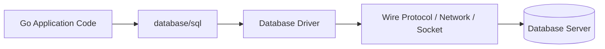

Implikasi:

- `database/sql` memberi contract umum;
- driver memberi perilaku spesifik database;
- placeholder syntax bisa berbeda;
- error type bisa berbeda;
- cancellation support bisa berbeda;
- time zone behavior bisa berbeda;
- bulk insert protocol bisa berbeda;
- prepared statement behavior bisa berbeda.

Jangan pernah berpikir bahwa semua database akan berperilaku sama hanya karena dipanggil lewat `database/sql`.

Abstraction mengurangi coupling API, bukan menghapus perbedaan database.

---

### 2.2 `*sql.DB` adalah pool handle, bukan satu connection

Ini adalah salah satu perbedaan mental paling besar untuk Java engineer.

Nama `sql.DB` agak misleading kalau dibaca sekilas. Ia bukan database server, bukan schema, bukan transaction, dan bukan satu physical connection. Ia adalah handle yang mengelola pool koneksi.

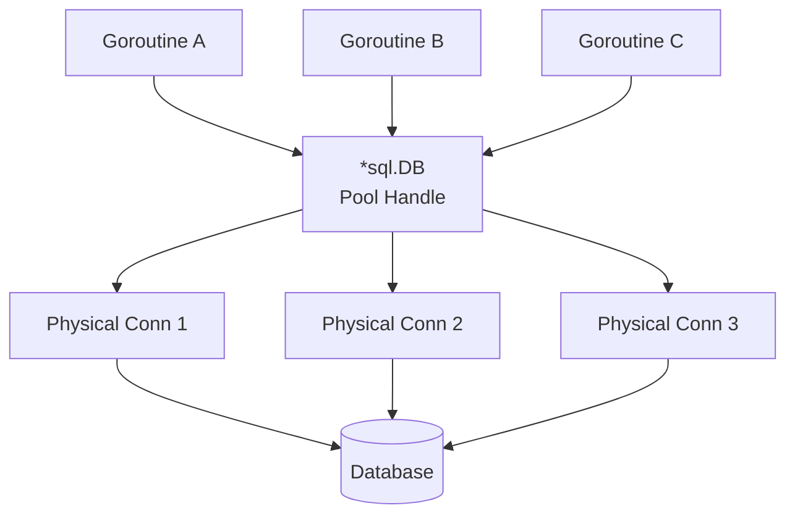

Ketika kode memanggil:

```go
db.QueryContext(ctx, query, args...)
```

maka secara mental yang terjadi adalah:

1. `database/sql` mencari connection idle yang cocok, atau membuka connection baru jika masih boleh;
2. kalau pool sudah penuh, caller menunggu;
3. query dieksekusi pada salah satu connection;
4. resource seperti `Rows` harus ditutup agar connection bisa dilepas kembali;
5. setelah operasi selesai, connection bisa kembali ke pool atau ditutup tergantung lifetime policy.

Jadi `*sql.DB` biasanya dibuat sekali untuk satu database target dan dipakai bersama oleh banyak goroutine.

---

### 2.3 `sql.Open` membuat handle, bukan jaminan koneksi hidup

Di banyak Java setup, membuat `DataSource` juga belum tentu langsung membuka semua connection, tergantung pool. Tetapi karena framework sering melakukan validation saat startup, engineer kadang mengira object creation berarti koneksi sudah valid.

Di Go, `sql.Open` lebih tepat dipahami sebagai:

```text
parse / initialize database handle configuration
```

Bukan:

```text
open TCP connection now and guarantee database reachable
```

Untuk memastikan database bisa dijangkau, gunakan `PingContext` saat startup readiness atau initialization path.

Mental model:

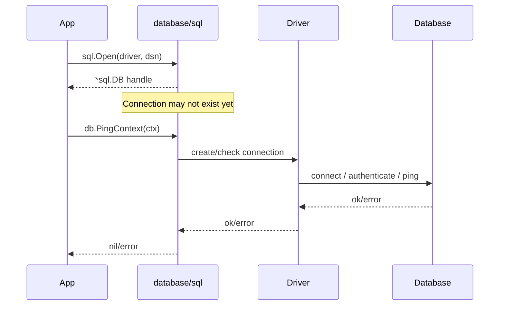

Practical consequence:

- error dari `sql.Open` biasanya adalah error konfigurasi/initialization, bukan selalu error koneksi nyata;
- aplikasi production sebaiknya punya `PingContext` dengan timeout saat readiness check atau startup validation;
- jangan membiarkan service terlihat sehat padahal DB belum reachable.

---

### 2.4 `*sql.Tx` adalah transaction object yang memegang satu connection

Transaction butuh connection affinity. Semua statement dalam transaction harus berjalan pada connection yang sama, karena database transaction adalah state pada session/connection.

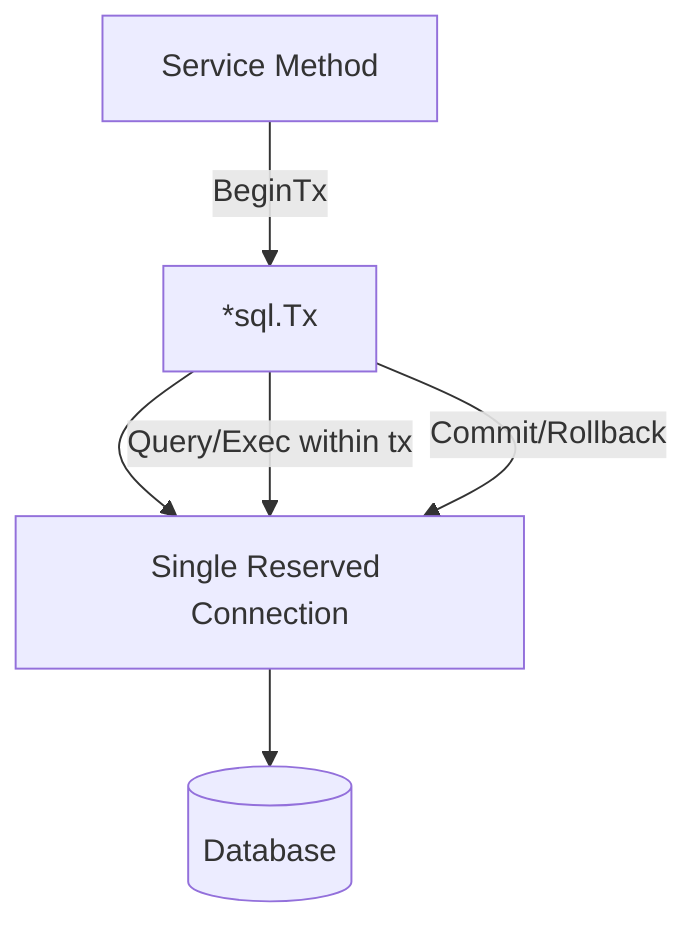

Selama transaction belum `Commit` atau `Rollback`, connection tersebut tidak bebas untuk query lain di pool.

Inilah alasan transaction yang lama berbahaya:

- menahan connection;
- meningkatkan pool pressure;
- memperbesar lock duration;
- memperbesar risiko deadlock;
- memperbesar latency caller lain;
- membuat pool exhaustion lebih mungkin.

Go membuat hal ini eksplisit dengan object `*sql.Tx`. Tidak ada magic propagation seperti `@Transactional`.

---

### 2.5 `Rows` adalah resource, bukan slice

`*sql.Rows` bukan hasil data yang sudah dimuat penuh seperti `List<Entity>`.

Ia lebih tepat dipahami sebagai cursor/result stream yang masih terkait dengan database resource.

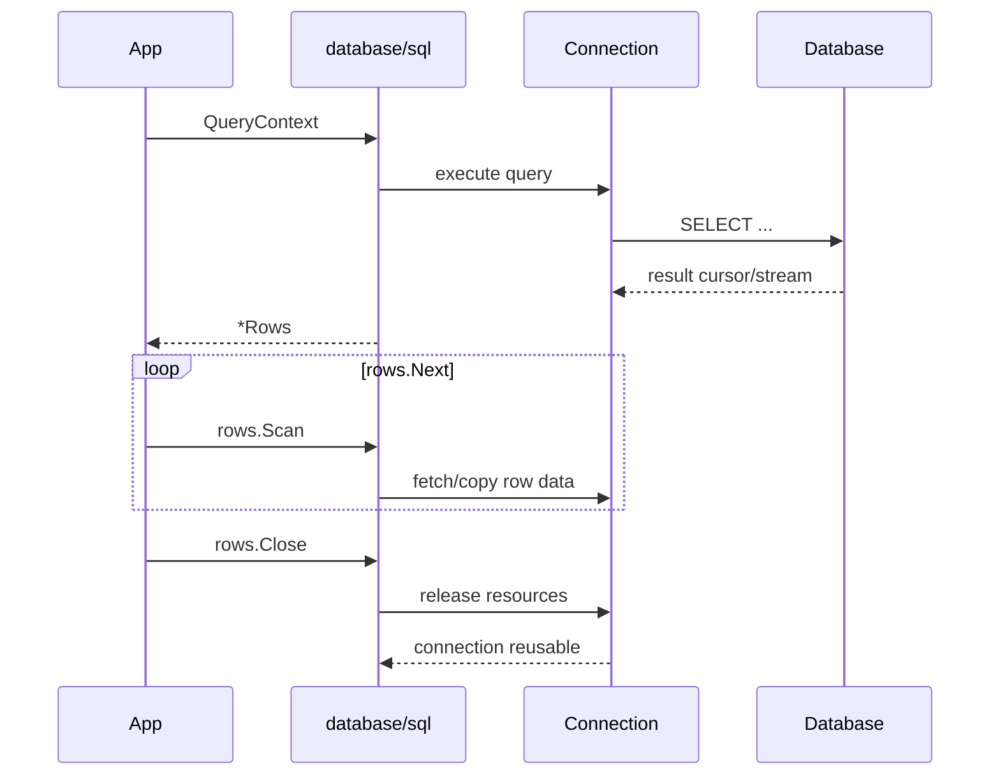

Kalau `Rows` tidak ditutup:

- connection bisa tertahan;
- pool bisa habis;
- request lain menunggu;
- gejalanya bisa terlihat seperti database lambat, padahal leak ada di aplikasi.

Karena itu pattern ini bukan sekadar idiom:

```go
rows, err := db.QueryContext(ctx, query, args...)
if err != nil {
    return nil, err
}
defer rows.Close()

for rows.Next() {
    // scan
}
if err := rows.Err(); err != nil {
    return nil, err
}
```

Itu adalah resource safety boundary.

---

## 3. Java vs Go: Mapping Konsep

Tabel berikut bukan untuk mengatakan satu lebih baik dari yang lain. Tujuannya agar engineer Java tidak membawa asumsi yang salah ke Go.

| Java / Spring / JDBC | Go / `database/sql` | Catatan Mental Model |
|---|---|---|
| `DataSource` | `*sql.DB` | Sama-sama entry point/pool handle, tetapi Go lebih eksplisit. |
| HikariCP pool | built-in pool inside `sql.DB` | Go punya pool built-in; tuning via method di `*sql.DB`. |
| `Connection` | `*sql.Conn` atau internal pooled connection | Biasanya tidak dipegang langsung kecuali butuh dedicated connection. |
| `PreparedStatement` | `*sql.Stmt` | Bisa dibuat dari `DB`, `Tx`, atau `Conn`, dengan lifecycle berbeda. |
| `ResultSet` | `*sql.Rows` | Harus ditutup; scanning eksplisit. |
| `Optional<T>` / nullable wrapper | `sql.Null*`, pointer, custom nullable type | SQL NULL harus dimodelkan eksplisit. |
| `@Transactional` | `db.BeginTx` + `tx.Commit/Rollback` | Tidak ada propagation otomatis di stdlib. |
| `TransactionTemplate` | helper function buatan sendiri | Umum dibuat di aplikasi, bukan bawaan framework. |
| `SQLException` | driver error + `sql.ErrNoRows` + context errors | Error translation perlu dirancang sendiri. |
| `JdbcTemplate` | thin repository/helper layer | Bisa dibuat sendiri, tapi jangan menyembunyikan semantics penting. |
| JPA EntityManager | tidak ada equivalent di stdlib | Go stdlib tidak menyediakan identity map, dirty checking, lazy loading. |
| Hibernate session | tidak ada equivalent di stdlib | Kalau pakai ORM Go, semantics-nya library-specific. |
| checked exception | `error` return value | Error path terlihat di signature. |
| Spring DI | manual wiring / small DI / framework optional | `*sql.DB` biasanya di-inject eksplisit. |

---

## 4. Perbedaan Filosofi: Framework-Centric vs Boundary-Centric

### 4.1 Java enterprise sering framework-centric

Dalam Java/Spring, codebase enterprise umum punya struktur:

```text
Controller
  -> Service
      -> @Transactional boundary
          -> Repository
              -> ORM/JDBC
                  -> DataSource / Pool
```

Banyak behavior terjadi secara declarative:

```java
@Transactional
public void approveCase(UUID caseId) {
    Case c = caseRepository.findById(caseId)
        .orElseThrow();
    c.approve();
    auditRepository.save(...);
}
```

Yang tersembunyi:

- kapan connection diambil;
- kapan transaction dimulai;
- apakah method internal call memicu proxy;
- kapan flush terjadi;
- query apa yang dijalankan;
- apakah lazy relation terpanggil;
- apakah exception tertentu memicu rollback;
- apakah rollback terjadi untuk checked exception;
- apakah repository call kedua masih transaction yang sama.

Ini powerful, tapi juga menciptakan hidden coupling.

---

### 4.2 Go database code sebaiknya boundary-centric

Dalam Go, struktur yang sehat biasanya lebih eksplisit:

```go
func (s *CaseService) ApproveCase(ctx context.Context, caseID CaseID, actor Actor) error {
    return s.txRunner.WithTx(ctx, func(ctx context.Context, tx *sql.Tx) error {
        c, err := s.cases.GetForUpdate(ctx, tx, caseID)
        if err != nil {
            return err
        }

        if err := c.Approve(actor); err != nil {
            return err
        }

        if err := s.cases.Save(ctx, tx, c); err != nil {
            return err
        }

        if err := s.audit.Append(ctx, tx, NewAudit(...)); err != nil {
            return err
        }

        return nil
    })
}
```

Yang terlihat:

- context eksplisit;
- transaction eksplisit;
- repository menerima `tx` atau abstraction yang transaction-aware;
- error eksplisit;
- commit/rollback dikendalikan helper;
- tidak ada invisible ORM flush;
- locking method bisa dinyatakan lewat nama seperti `GetForUpdate`.

Ini lebih verbose dibanding annotation, tetapi jauh lebih defensible saat incident review.

---

## 5. Object Graph vs Row/Query Thinking

### 5.1 Java ORM sering mendorong object graph thinking

Dengan ORM, engineer sering berpikir:

```text
Load entity -> mutate object -> framework persists changes
```

Ini nyaman, tetapi bisa menyembunyikan query shape.

Contoh risiko:

- N+1 query;
- lazy loading di luar transaction;
- accidental full object load;
- cascade yang terlalu luas;
- dirty checking yang mem-flush lebih banyak dari perkiraan;
- transaction lebih lama karena entity graph besar;
- query sulit diprediksi dari kode service.

---

### 5.2 Go mendorong query/result thinking

Dengan `database/sql`, engineer biasanya berpikir:

```text
What SQL is executed?
What columns are selected?
What cardinality is expected?
What transaction boundary is needed?
What locks are acquired?
What error classes can happen?
What resources must be closed?
```

Ini sangat cocok untuk sistem yang butuh auditability dan predictability.

Bukan berarti ORM selalu buruk. Tetapi di Go, memilih ORM harus sadar bahwa kita sedang menukar explicitness dengan convenience.

Untuk sistem regulatory, finance, enforcement workflow, case management, audit trail, dan complex state transition, explicit SQL sering lebih mudah dipertahankan dalam design review karena query dan invariant terlihat.

---

## 6. The Four Planes of Database Integration

Untuk berpikir seperti engineer senior, jangan melihat database integration sebagai satu layer “repository”. Ada minimal empat plane.

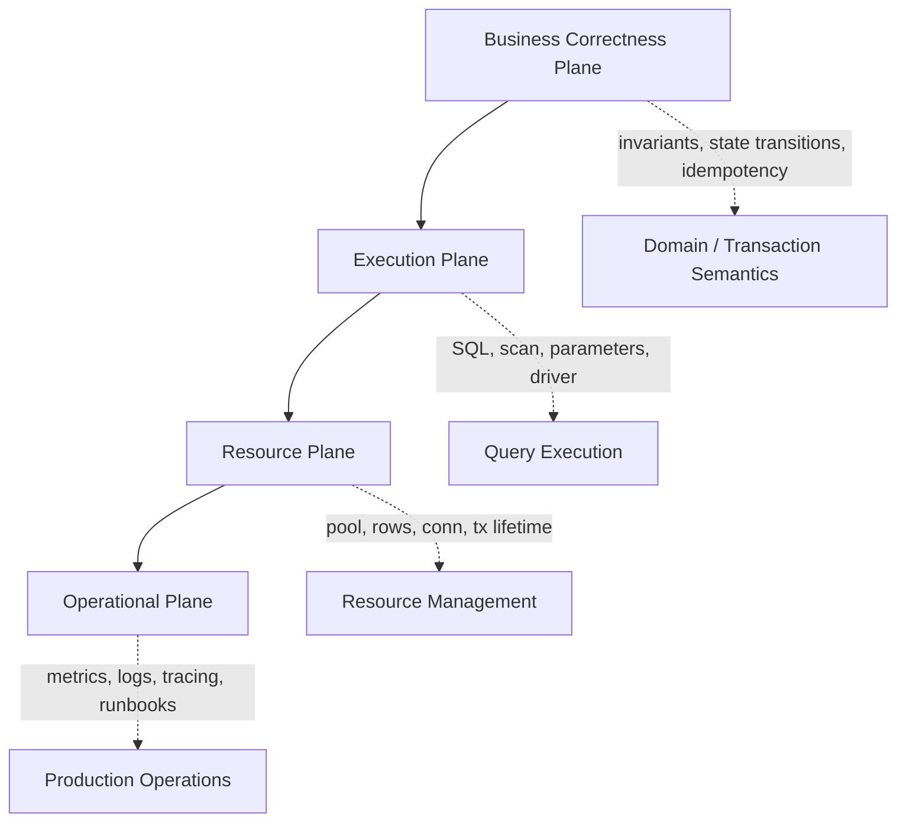

### 6.1 Business correctness plane

Pertanyaan utama:

- Apa invariant bisnis yang harus selalu benar?
- Apakah operasi butuh atomicity?
- Apakah state transition valid?
- Apakah ada double-submit risk?
- Apakah external side effect harus idempotent?
- Apakah audit trail harus committed bersama state change?

Contoh invariant:

```text
A case can be approved only if:
- current state is PENDING_REVIEW;
- reviewer has authority;
- no active appeal blocks approval;
- audit trail is appended atomically;
- notification is scheduled after commit, not before commit.
```

### 6.2 Execution plane

Pertanyaan utama:

- Query apa yang dijalankan?
- Cardinality-nya satu row atau banyak row?
- Parameter binding aman?
- Placeholder sesuai driver?
- Columns yang dipilih minimal?
- Error `ErrNoRows` dimaknai sebagai apa?
- Query perlu prepared statement?

### 6.3 Resource plane

Pertanyaan utama:

- Berapa lama connection dipegang?
- Apakah `Rows` selalu ditutup?
- Apakah transaction terlalu lama?
- Pool size sesuai kapasitas DB?
- Apakah request bisa antre di pool?
- Apakah ada dedicated connection yang lupa ditutup?

### 6.4 Operational plane

Pertanyaan utama:

- Bagaimana tahu pool exhausted?
- Bagaimana tahu query lambat?
- Bagaimana tahu lock wait meningkat?
- Bagaimana tahu retry storm terjadi?
- Apa error class yang muncul?
- Apakah logs membocorkan SQL parameter sensitif?
- Apa runbook saat failover?

Engineer top-tier melihat keempat plane ini sekaligus.

---

## 7. The Database Call Is Not One Operation

Saat kode menulis:

```go
row := db.QueryRowContext(ctx, query, id)
err := row.Scan(&dst)
```

Secara production, itu bukan “satu operasi sederhana”. Ada banyak fase.

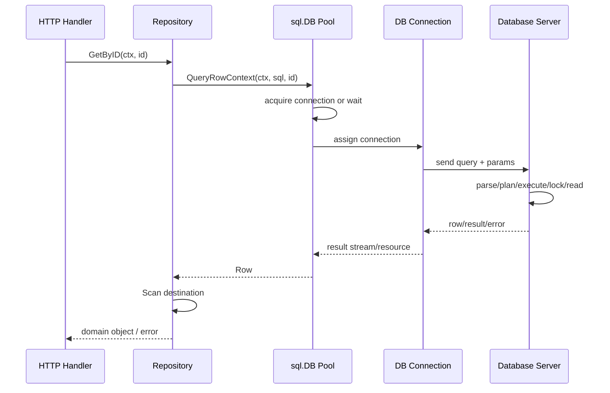

Setiap fase bisa gagal:

| Fase | Contoh failure |
|---|---|
| Membuat request context | deadline terlalu pendek / tidak ada deadline |
| Acquire connection | pool exhausted / context timeout |
| Connect | DNS error / auth failure / TLS failure |
| Send query | network reset / driver error |
| Execute query | syntax error / lock wait / deadlock / timeout |
| Scan | type mismatch / NULL ke non-nullable destination |
| Release resource | rows tidak ditutup / transaction tidak selesai |
| Interpret result | `ErrNoRows` salah dimaknai sebagai 500 |

Maka repository method yang baik tidak hanya “menjalankan query”, tetapi juga menjaga semua boundary di atas.

---

## 8. Lifecycle Objects di `database/sql`

### 8.1 `*sql.DB`

Mental model:

```text
Long-lived, shared, concurrent-safe pool handle.
```

Biasanya:

- dibuat saat startup;
- dikonfigurasi pool-nya;
- di-ping untuk readiness;
- di-inject ke repository/service;
- ditutup saat shutdown.

Jangan membuat `sql.Open` per request.

Anti-pattern:

```go
func handler(w http.ResponseWriter, r *http.Request) {
    db, err := sql.Open("postgres", dsn) // buruk: per request
    if err != nil { ... }
    defer db.Close()
    ...
}
```

Pattern lebih benar:

```go
type App struct {
    DB *sql.DB
}

func main() {
    db, err := openDatabase(...)
    if err != nil {
        log.Fatal(err)
    }
    defer db.Close()

    app := &App{DB: db}
    _ = app
}
```

---

### 8.2 `*sql.Conn`

Mental model:

```text
Dedicated connection reserved from the pool.
```

Biasanya tidak perlu digunakan untuk CRUD biasa.

Gunakan hanya jika harus menjaga state pada connection yang sama di luar transaction API biasa, misalnya:

- session-specific setting;
- advisory lock yang connection-bound;
- database-specific protocol sequence;
- temporary table/session state;
- explicit driver-specific behavior.

Setelah selesai, `Conn.Close()` wajib dipanggil agar connection kembali ke pool.

---

### 8.3 `*sql.Tx`

Mental model:

```text
Transaction handle bound to one connection until Commit or Rollback.
```

Gunakan untuk:

- atomic multi-step update;
- read-modify-write with invariant;
- insert parent + child atomically;
- update state + audit atomically;
- idempotency key + side-effect record;
- outbox insert with domain change.

Jangan gunakan transaction hanya karena “semua service method harus transactional”. Transaction ada cost-nya.

---

### 8.4 `*sql.Rows`

Mental model:

```text
Result cursor/stream resource that must be closed.
```

Gunakan untuk multi-row query.

Checklist:

```go
rows, err := q.QueryContext(ctx, ...)
if err != nil {
    return err
}
defer rows.Close()

for rows.Next() {
    if err := rows.Scan(...); err != nil {
        return err
    }
}
if err := rows.Err(); err != nil {
    return err
}
```

---

### 8.5 `*sql.Row`

Mental model:

```text
Single-row result placeholder; error appears at Scan time.
```

Important detail:

```go
err := db.QueryRowContext(ctx, query, id).Scan(&dst)
```

`QueryRowContext` sendiri tidak langsung mengembalikan error. Error biasanya muncul saat `Scan`.

Ini berbeda dari banyak API Java yang langsung throw saat `queryForObject` dipanggil.

---

### 8.6 `*sql.Stmt`

Mental model:

```text
Prepared SQL statement handle; lifecycle depends on DB/Tx/Conn origin.
```

Prepared statement dari `DB` berbeda maknanya dari prepared statement dalam `Tx`.

- `DB.PrepareContext`: statement usable across pool abstraction;
- `Tx.PrepareContext`: statement tied to transaction;
- `Conn.PrepareContext`: statement tied to dedicated connection.

Part khusus prepared statement akan membahas detail ini karena banyak hidden cost dan driver-specific behavior.

---

## 9. The Three Critical Boundaries

Dalam desain Go database layer, ada tiga boundary yang harus sengaja dibuat.

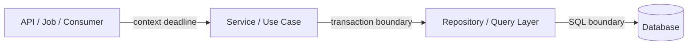

### 9.1 Context boundary

Context menjawab:

```text
How long is this operation allowed to live?
Who can cancel it?
What request/job owns it?
```

Context harus mengalir dari entry point ke repository.

Buruk:

```go
func (r *Repo) Find(id int64) (User, error) {
    return r.find(context.Background(), id)
}
```

Lebih benar:

```go
func (r *Repo) Find(ctx context.Context, id int64) (User, error) {
    return r.find(ctx, id)
}
```

### 9.2 Transaction boundary

Transaction menjawab:

```text
Which operations must commit or rollback together?
```

Boundary ini biasanya berada di service/use-case layer, bukan di setiap repository method secara otomatis.

Alasan:

- service tahu business operation end-to-end;
- repository hanya tahu query tertentu;
- repository tidak selalu tahu apakah query bagian dari transaction lebih besar;
- nested transaction semantics tidak portable antar database.

### 9.3 SQL boundary

SQL boundary menjawab:

```text
What exact data shape and database semantics are needed?
```

Repository harus jelas tentang:

- query shape;
- selected columns;
- expected cardinality;
- lock mode;
- error mapping;
- scan destination;
- domain mapping.

---

## 10. Explicit Transaction Design

### 10.1 Java habit: transaction as annotation

Dalam Spring:

```java
@Transactional
public void submitApplication(...) {
    ...
}
```

Annotation terlihat kecil, tetapi semantics-nya besar:

- begin transaction sebelum method;
- bind connection ke thread;
- propagate transaction ke downstream repository;
- rollback berdasarkan exception policy;
- commit setelah method selesai;
- release connection.

### 10.2 Go habit: transaction as value

Dalam Go:

```go
tx, err := db.BeginTx(ctx, nil)
if err != nil {
    return err
}
defer tx.Rollback()

if err := step1(ctx, tx); err != nil {
    return err
}
if err := step2(ctx, tx); err != nil {
    return err
}

return tx.Commit()
```

Object `tx` adalah bukti eksplisit bahwa operasi berjalan dalam transaction.

### 10.3 Why explicit transaction is powerful

Karena reviewer bisa melihat:

- operasi mana yang masuk transaction;
- operasi mana yang tidak;
- kapan commit terjadi;
- kapan rollback terjadi;
- apakah external side effect dilakukan sebelum/selesai transaction;
- apakah transaction terlalu panjang;
- apakah transaction membawa network call yang tidak perlu.

Dalam sistem yang butuh defensibility, explicitness adalah aset.

---

## 11. Transaction-Aware Repository Design

Problem umum:

```go
func (s *Service) Approve(ctx context.Context, id int64) error {
    tx, err := s.db.BeginTx(ctx, nil)
    if err != nil { return err }
    defer tx.Rollback()

    // BUG: repository pakai s.db, bukan tx
    app, err := s.repo.Get(ctx, id)
    if err != nil { return err }

    app.Approve()

    if err := s.repo.Save(ctx, app); err != nil { return err }

    return tx.Commit()
}
```

Kode ini terlihat transactional, tetapi repository mungkin menggunakan `*sql.DB`, sehingga query berjalan di luar transaction.

Pattern yang lebih aman:

```go
type Queryer interface {
    ExecContext(ctx context.Context, query string, args ...any) (sql.Result, error)
    QueryContext(ctx context.Context, query string, args ...any) (*sql.Rows, error)
    QueryRowContext(ctx context.Context, query string, args ...any) *sql.Row
}
```

`*sql.DB` dan `*sql.Tx` sama-sama punya method tersebut.

Repository bisa menerima `Queryer`:

```go
func (r *CaseRepository) GetForUpdate(ctx context.Context, q Queryer, id CaseID) (Case, error) {
    row := q.QueryRowContext(ctx, `
        SELECT id, status, version
        FROM cases
        WHERE id = $1
        FOR UPDATE
    `, id)

    var c Case
    if err := row.Scan(&c.ID, &c.Status, &c.Version); err != nil {
        return Case{}, err
    }
    return c, nil
}
```

Lalu service menentukan apakah `q` adalah `db` atau `tx`:

```go
err := txRunner.WithTx(ctx, func(ctx context.Context, tx *sql.Tx) error {
    c, err := repo.GetForUpdate(ctx, tx, id)
    if err != nil {
        return err
    }
    return repo.Save(ctx, tx, c)
})
```

Ini adalah contoh explicit polymorphism kecil yang sangat berguna.

---

## 12. Connection Pool Is a Concurrency Control Device

Banyak engineer melihat pool sebagai cache koneksi. Itu benar, tetapi kurang lengkap.

Connection pool adalah concurrency limiter terhadap database.

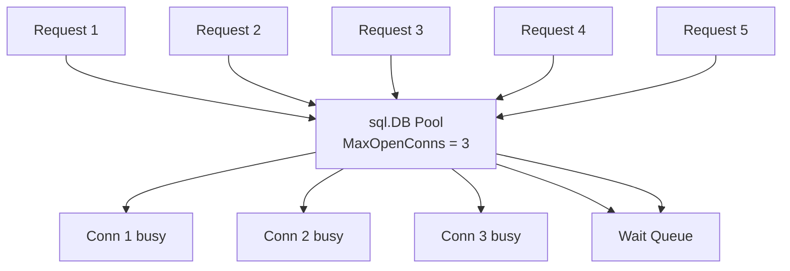

Kalau `SetMaxOpenConns(30)`, artinya aplikasi ini mengizinkan sampai 30 operasi database concurrent dari process tersebut.

Jika ada 10 pod:

```text
30 connections/pod * 10 pods = 300 possible DB connections
```

Kalau database hanya aman melayani 120 concurrent connections, maka pool per pod 30 adalah salah meskipun masing-masing pod terlihat “normal”.

Pool sizing adalah keputusan arsitektur, bukan angka random.

---

## 13. Pool Size Is Not Throughput

Kesalahan umum:

```text
DB lambat -> tambah MaxOpenConns -> pasti lebih cepat
```

Kadang benar, sering salah.

Jika database sedang idle dan aplikasi kekurangan parallelism, menaikkan pool bisa membantu.

Tetapi jika database sudah CPU/IO saturated, menaikkan pool hanya:

- menambah query concurrent;
- menambah lock contention;
- menambah context switching;
- menambah memory usage DB;
- memperpanjang queue;
- memperburuk p99 latency.

Mental model:

```text
Throughput = function of database capacity, query efficiency, lock contention, network latency, and application concurrency.
Pool size only caps concurrency; it does not create capacity.
```

Pool terlalu kecil:

- request menunggu connection;
- `WaitCount` naik;
- `WaitDuration` naik;
- DB mungkin masih punya idle capacity.

Pool terlalu besar:

- DB overload;
- lock wait naik;
- timeout naik;
- deadlock lebih sering;
- failover recovery lebih buruk;
- thundering herd saat reconnect.

---

## 14. Query Cardinality Mental Model

Sebelum menulis kode, tanya:

```text
Query ini expected cardinality-nya apa?
```

| Cardinality | Go API | Semantics |
|---|---|---|
| 0 atau 1 | `QueryRowContext` | Scan bisa menghasilkan `sql.ErrNoRows`. |
| Tepat 1 | `QueryRowContext` + enforce not found as error | Jika no row, domain error. Jika duplicate mungkin tidak terdeteksi tanpa constraint/query. |
| 0 sampai N | `QueryContext` | Harus iterate dan close rows. |
| Command tanpa rows | `ExecContext` | Cocok untuk insert/update/delete tanpa returned rows. |
| Insert/update dengan returned data | `QueryRowContext` / `QueryContext` | Misalnya PostgreSQL `RETURNING`. |

Buruk:

```go
rows, _ := db.QueryContext(ctx, "SELECT ... WHERE id = $1", id)
// lalu ambil satu row manual
```

Lebih tepat:

```go
err := db.QueryRowContext(ctx, "SELECT ... WHERE id = $1", id).Scan(...)
```

Tetapi hati-hati: `QueryRow` mengambil “at most one”. Jika query secara logis harus unique, enforce dengan database constraint.

Application code bukan pengganti unique constraint.

---

## 15. Error Is a Domain Boundary, Not Just Technical Failure

Dalam Java/Spring, sering ada exception translation:

```text
SQLException -> DataAccessException -> DuplicateKeyException, etc.
```

Di Go, kita perlu membuat translation boundary sendiri.

Contoh raw errors:

- `sql.ErrNoRows`;
- `context.DeadlineExceeded`;
- `context.Canceled`;
- driver-specific duplicate key error;
- driver-specific deadlock error;
- driver-specific serialization error;
- connection refused;
- too many connections;
- scan conversion error.

Repository sebaiknya tidak membocorkan semua detail ke service layer tanpa klasifikasi.

Contoh:

```go
var ErrCaseNotFound = errors.New("case not found")
var ErrDuplicateApplicationNo = errors.New("duplicate application number")

type TemporaryDatabaseError struct {
    Op  string
    Err error
}
```

Mapping:

```text
sql.ErrNoRows in GetByID -> domain not found
sql.ErrNoRows in GetRequiredConfig -> system misconfiguration
unique violation in Create -> conflict/domain duplicate
deadline exceeded -> timeout/transient depending context
serialization failure -> retryable transaction failure
```

`ErrNoRows` bukan selalu 404. Maknanya tergantung use case.

---

## 16. NULL Is Not Zero Value

Java developer sering familiar dengan nullable boxed type:

```java
Integer age; // nullable
int count;   // not nullable
```

Go punya zero value:

```go
var age int // 0
```

Tetapi SQL NULL bukan 0, bukan empty string, bukan false.

SQL NULL berarti “unknown / absent / not applicable”, tergantung domain.

Di Go, NULL bisa dimodelkan dengan:

- `sql.NullString`, `sql.NullInt64`, `sql.NullBool`, `sql.NullTime`;
- pointer field seperti `*string`, `*time.Time`;
- custom nullable type;
- domain-specific optional value.

Mental decision:

```text
Is absence meaningful in the domain?
Is zero a valid business value?
Will this be serialized to JSON?
Is this an input patch/update field?
Is this database nullable only for migration/backfill reasons?
```

Kesalahan fatal:

```go
var middleName string
err := row.Scan(&middleName) // fails if DB returns NULL
```

Lebih aman:

```go
var middleName sql.NullString
err := row.Scan(&middleName)
```

Atau gunakan SQL projection:

```sql
SELECT COALESCE(middle_name, '')
FROM users
WHERE id = $1
```

Tetapi `COALESCE` berarti Anda sengaja mengubah semantics NULL menjadi empty string. Itu keputusan domain, bukan sekadar workaround.

---

## 17. Parameter Binding: Value Safety vs SQL Shape Safety

Parameter binding melindungi value, bukan semua bagian SQL.

Aman:

```go
row := db.QueryRowContext(ctx,
    "SELECT id, name FROM users WHERE email = $1",
    email,
)
```

Tidak aman:

```go
query := fmt.Sprintf("SELECT id, name FROM users ORDER BY %s", sortBy)
rows, err := db.QueryContext(ctx, query)
```

`sortBy` bukan value parameter. Ia adalah identifier / SQL fragment.

Untuk dynamic ordering, gunakan whitelist:

```go
var orderBy string
switch input.Sort {
case "created_at":
    orderBy = "created_at"
case "name":
    orderBy = "name"
default:
    return ErrInvalidSort
}

query := "SELECT id, name FROM users ORDER BY " + orderBy
```

Mental model:

| SQL part | Bisa parameter binding? | Strategy aman |
|---|---:|---|
| literal value | Ya | placeholder |
| identifier/table/column | Tidak biasanya | whitelist |
| direction ASC/DESC | Tidak sebagai value | enum/whitelist |
| SQL operator | Tidak sebagai value | controlled mapping |
| LIMIT/OFFSET | Driver-dependent, umumnya bisa value | placeholder jika didukung |
| IN list | Butuh expansion/driver feature | generated placeholders / array binding |

---

## 18. Context Is Not a Bag of Values

Dalam database access, context terutama untuk:

- cancellation;
- timeout/deadline;
- request ownership;
- trace correlation through instrumentation.

Jangan gunakan context sebagai tempat meletakkan `*sql.Tx`, user object besar, atau dependency global.

Buruk:

```go
func GetTx(ctx context.Context) *sql.Tx {
    return ctx.Value("tx").(*sql.Tx)
}
```

Masalah:

- hidden dependency;
- sulit direview;
- panic risk;
- unclear transaction boundary;
- testing lebih kabur;
- mirip magic thread-local yang ingin dihindari.

Lebih baik transaction terlihat di parameter, atau dibungkus abstraction kecil yang jelas.

---

## 19. ThreadLocal vs Context vs Explicit Parameter

Java/Spring transaction sering bergantung pada thread-bound context. Karena request biasanya diproses oleh thread tertentu, framework bisa bind transaction ke thread.

Go tidak punya model request-per-thread. Goroutine murah, bisa berpindah OS thread, dan concurrency lebih eksplisit.

Karena itu jangan membawa mental model ThreadLocal ke Go.

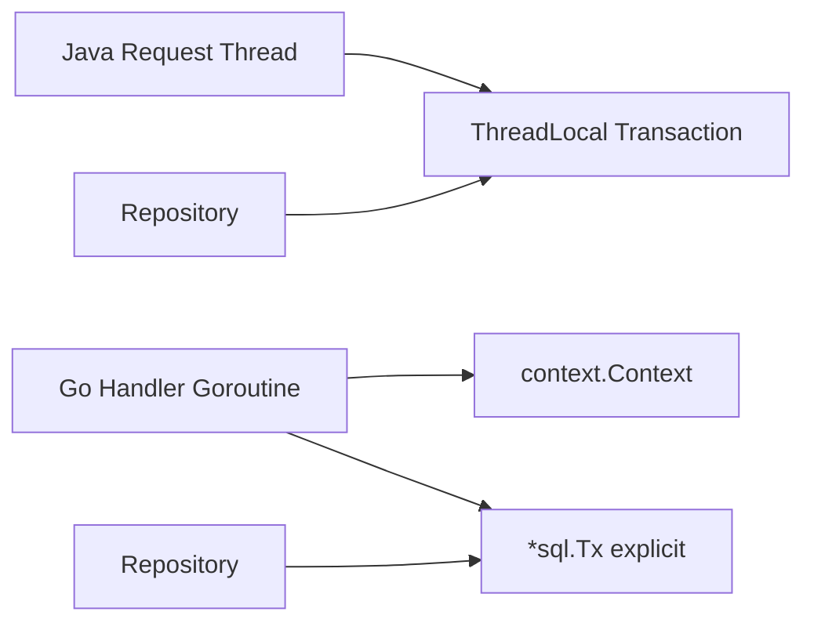

Di Go, transaction propagation paling jelas dilakukan lewat explicit value.

---

## 20. Repository Should Not Hide Database Reality Too Much

Repository yang terlalu generic sering terlihat rapi tetapi lemah secara engineering.

Contoh anti-pattern:

```go
type Repository[T any] interface {
    Save(ctx context.Context, v T) error
    FindByID(ctx context.Context, id any) (T, error)
    Delete(ctx context.Context, id any) error
}
```

Untuk aplikasi CRUD sederhana mungkin cukup. Tetapi untuk sistem serius, method seperti ini menyembunyikan:

- lock mode;
- selected columns;
- projection;
- expected cardinality;
- transaction requirement;
- idempotency behavior;
- domain invariant;
- conflict behavior.

Lebih baik method repository merepresentasikan intent:

```go
GetCaseForReview(ctx, q, caseID)
LockPendingApplication(ctx, q, applicationID)
InsertAuditEntry(ctx, q, entry)
MarkOutboxPending(ctx, q, event)
FindExpiredDrafts(ctx, q, limit)
ClaimNextJobs(ctx, q, workerID, limit)
```

Nama method yang baik membantu reviewer memahami database semantics.

---

## 21. Data Model: Domain Object vs Persistence Row

Java/JPA sering menyatukan entity domain dan persistence mapping.

Di Go, sering lebih sehat membedakan:

```text
Database row shape
  -> scanned struct / db model
      -> domain model / service model
          -> response DTO
```

Contoh:

```go
type caseRow struct {
    ID        string
    Status    string
    Version   int64
    CreatedAt time.Time
    UpdatedAt time.Time
}

type Case struct {
    id      CaseID
    status  CaseStatus
    version int64
}
```

Keuntungan:

- database NULL/enum/string bisa dimapping eksplisit;
- domain invariant bisa dijaga;
- tidak semua column bocor ke domain;
- audit/system columns tidak mendominasi business object;
- perubahan schema tidak selalu mengubah public domain API.

Trade-off:

- ada mapping code;
- lebih verbose;
- butuh discipline.

Untuk sistem besar, verbosity ini sering murah dibanding hidden coupling.

---

## 22. Transaction Boundary Belongs to Use Case

Rule of thumb:

```text
Repository knows how to query.
Service/use-case knows what must be atomic.
```

Contoh business operation:

```text
Submit application:
1. validate draft exists;
2. ensure owner matches actor;
3. transition DRAFT -> SUBMITTED;
4. insert submission history;
5. append audit trail;
6. enqueue notification event.
```

Semua langkah state/audit/outbox mungkin harus atomic.

Jika setiap repository membuat transaction sendiri, operasi ini tidak atomic.

Buruk:

```go
func (r *ApplicationRepo) Submit(ctx context.Context, app Application) error {
    tx, _ := r.db.BeginTx(ctx, nil)
    defer tx.Rollback()
    ...
    return tx.Commit()
}

func (r *AuditRepo) Append(ctx context.Context, audit Audit) error {
    tx, _ := r.db.BeginTx(ctx, nil)
    defer tx.Rollback()
    ...
    return tx.Commit()
}
```

Lebih benar:

```go
func (s *ApplicationService) Submit(ctx context.Context, id ApplicationID, actor Actor) error {
    return s.txRunner.WithTx(ctx, func(ctx context.Context, tx *sql.Tx) error {
        app, err := s.apps.LockDraft(ctx, tx, id)
        if err != nil {
            return err
        }
        if err := app.Submit(actor); err != nil {
            return err
        }
        if err := s.apps.Save(ctx, tx, app); err != nil {
            return err
        }
        if err := s.audit.Append(ctx, tx, AuditForSubmit(app, actor)); err != nil {
            return err
        }
        if err := s.outbox.Insert(ctx, tx, EventApplicationSubmitted(app.ID())); err != nil {
            return err
        }
        return nil
    })
}
```

---

## 23. External Side Effects Do Not Belong Inside DB Transactions

Salah satu bug enterprise paling sering:

```text
Begin transaction
  update database
  call external API
  send email
Commit transaction
```

Masalah:

- external API lambat membuat transaction lama;
- connection tertahan;
- lock tertahan;
- kalau external API berhasil tapi commit gagal, state tidak konsisten;
- kalau commit berhasil tapi external API gagal, butuh retry;
- retry transaction bisa mengulang external side effect.

Pattern lebih aman:

```text
Begin transaction
  update domain state
  insert outbox event
Commit transaction

Background dispatcher
  read outbox
  send external side effect idempotently
  mark dispatched
```

Dalam Go, explicit transaction membuat pattern ini mudah terlihat.

---

## 24. Health Check vs Readiness vs Query Probe

Java/Spring Boot sering menyediakan actuator health indicator. Di Go, kita desain sendiri.

Jangan samakan semua check.

| Check | Tujuan | DB call? | Catatan |
|---|---|---:|---|
| Liveness | Apakah process masih hidup? | Biasanya tidak | Jangan restart service hanya karena DB lambat sementara. |
| Readiness | Apakah siap menerima traffic? | Bisa `PingContext` ringan | Jika DB wajib untuk semua request. |
| Deep health | Diagnostic internal | Bisa query ringan | Jangan terlalu sering/berat. |
| Migration readiness | Schema compatible? | Query metadata/version | Dipakai saat deployment gate. |
| Dependency SLO check | Observability | Aggregated metrics | Bukan endpoint per request. |

Mental model:

```text
Ping proves basic reachability, not business correctness, not query performance, not schema compatibility.
```

---

## 25. SQL Is Part of Application Contract

Dalam banyak organisasi, SQL dianggap implementation detail repository. Untuk sistem besar, ini berbahaya.

SQL menentukan:

- row yang dikunci;
- urutan data;
- pagination stability;
- data visibility;
- join cardinality;
- index usage;
- isolation behavior;
- audit completeness;
- performance envelope.

Maka SQL harus direview seperti production code.

Code review harus bertanya:

```text
Is WHERE clause selective?
Is ORDER BY deterministic?
Does pagination handle concurrent inserts?
Does query match index strategy?
Does update protect expected version/status?
Does delete have tenant/scope guard?
Does query accidentally scan all active cases?
Does this run inside transaction?
Does it need FOR UPDATE?
Can it deadlock with another workflow?
```

---

## 26. Designing for Regulatory / Case Management Systems

Untuk domain seperti enforcement lifecycle, case management, approval workflow, audit trail, dan escalation logic, database integration bukan sekadar persistence.

Database sering menjadi enforcement point untuk:

- uniqueness;
- state transition correctness;
- audit ordering;
- temporal consistency;
- authority scope;
- assignment exclusivity;
- SLA deadline computation;
- idempotent submission;
- duplicate prevention;
- concurrent reviewer actions.

Contoh state transition update yang defensible:

```sql
UPDATE cases
SET status = $1,
    version = version + 1,
    updated_at = now()
WHERE id = $2
  AND status = $3
  AND version = $4
```

Aplikasi tidak hanya melakukan:

```sql
UPDATE cases SET status = 'APPROVED' WHERE id = $1
```

Karena query kedua tidak menjaga invariant transisi.

Di Go, repository method bisa mengekspresikan ini:

```go
func (r *CaseRepository) TransitionStatus(
    ctx context.Context,
    q Queryer,
    id CaseID,
    from CaseStatus,
    to CaseStatus,
    expectedVersion int64,
) error {
    res, err := q.ExecContext(ctx, `
        UPDATE cases
        SET status = $1,
            version = version + 1,
            updated_at = now()
        WHERE id = $2
          AND status = $3
          AND version = $4
    `, to, id, from, expectedVersion)
    if err != nil {
        return err
    }

    n, err := res.RowsAffected()
    if err != nil {
        return err
    }
    if n != 1 {
        return ErrConcurrentModification
    }
    return nil
}
```

Ini bukan hanya persistence. Ini invariant enforcement.

---

## 27. Common Java Habits That Hurt in Go

### 27.1 Creating DB handle too often

Java developer terbiasa framework membuat datasource. Saat menulis Go manual, kadang membuat `sql.Open` di banyak tempat.

Masalah:

- banyak pool terpisah;
- koneksi meledak;
- sulit observability;
- shutdown sulit;
- tuning tidak konsisten.

Rule:

```text
One DB handle per database configuration per process, unless there is a deliberate architectural reason.
```

---

### 27.2 Hiding transaction in context

Karena terbiasa ThreadLocal transaction, engineer mencoba menyimpan `tx` di `context.Context`.

Masalah:

- hidden control flow;
- transaction boundary tidak terlihat;
- repository sulit dites;
- panic karena type assertion;
- accidental use outside transaction.

Rule:

```text
Pass transaction or query executor explicitly.
```

---

### 27.3 Making repository too generic

Java Spring Data style method naming bisa nyaman:

```java
findByStatusAndCreatedAtBefore(...)
```

Di Go, generic repository sering membuat semantics tidak jelas.

Rule:

```text
Prefer intent-specific repository methods for important business operations.
```

---

### 27.4 Treating transaction as harmless wrapper

Transaction bukan decorator gratis.

Transaction:

- memegang connection;
- bisa memegang lock;
- memperpanjang conflict window;
- menambah rollback semantics;
- meningkatkan blast radius saat timeout.

Rule:

```text
Use transaction when atomicity/invariant needs it. Keep it short.
```

---

### 27.5 Ignoring driver-specific behavior

Java engineer kadang berpikir JDBC driver differences ada tapi framework menormalkan banyak hal. Di Go, perbedaan driver tetap tajam.

Contoh:

- PostgreSQL placeholder `$1`, `$2`;
- MySQL placeholder `?`;
- time parsing behavior berbeda;
- error code type berbeda;
- cancellation support berbeda;
- `LastInsertId` tidak universal;
- bulk copy support tidak ada di generic `database/sql` API.

Rule:

```text
Treat database/sql as common control plane, not full portability guarantee.
```

---

## 28. Good Go Database Code Looks Boring

Kode database Go yang production-grade sering terlihat “membosankan”:

- SQL eksplisit;
- context eksplisit;
- error check eksplisit;
- rows close eksplisit;
- transaction eksplisit;
- scan field eksplisit;
- mapping eksplisit;
- retry eksplisit;
- observability eksplisit.

Ini bukan kekurangan. Ini membuat behavior dapat direview.

Contoh repository method yang baik:

```go
func (r *UserRepository) FindByEmail(ctx context.Context, q Queryer, email string) (User, error) {
    row := q.QueryRowContext(ctx, `
        SELECT id, email, display_name, status, created_at
        FROM users
        WHERE email = $1
    `, email)

    var ur userRow
    if err := row.Scan(
        &ur.ID,
        &ur.Email,
        &ur.DisplayName,
        &ur.Status,
        &ur.CreatedAt,
    ); err != nil {
        if errors.Is(err, sql.ErrNoRows) {
            return User{}, ErrUserNotFound
        }
        return User{}, fmt.Errorf("find user by email: %w", err)
    }

    u, err := ur.toDomain()
    if err != nil {
        return User{}, fmt.Errorf("map user row: %w", err)
    }
    return u, nil
}
```

Yang bisa direview:

- SQL-nya jelas;
- selected columns jelas;
- expected cardinality jelas;
- not found mapping jelas;
- scan order jelas;
- domain mapping jelas;
- transaction compatibility jelas via `Queryer`.

---

## 29. A Minimal Production-Oriented Shape

Struktur kecil yang sering cukup untuk service Go:

```text
internal/
  app/
    app.go
  config/
    config.go
  db/
    open.go
    tx.go
    health.go
  user/
    model.go
    repository.go
    service.go
  case/
    model.go
    repository.go
    service.go
```

### 29.1 `db/open.go`

```go
package db

import (
    "context"
    "database/sql"
    "fmt"
    "time"
)

type Config struct {
    Driver          string
    DSN             string
    MaxOpenConns    int
    MaxIdleConns    int
    ConnMaxLifetime time.Duration
    ConnMaxIdleTime time.Duration
    PingTimeout     time.Duration
}

func Open(ctx context.Context, cfg Config) (*sql.DB, error) {
    handle, err := sql.Open(cfg.Driver, cfg.DSN)
    if err != nil {
        return nil, fmt.Errorf("open database handle: %w", err)
    }

    handle.SetMaxOpenConns(cfg.MaxOpenConns)
    handle.SetMaxIdleConns(cfg.MaxIdleConns)
    handle.SetConnMaxLifetime(cfg.ConnMaxLifetime)
    handle.SetConnMaxIdleTime(cfg.ConnMaxIdleTime)

    pingCtx, cancel := context.WithTimeout(ctx, cfg.PingTimeout)
    defer cancel()

    if err := handle.PingContext(pingCtx); err != nil {
        _ = handle.Close()
        return nil, fmt.Errorf("ping database: %w", err)
    }

    return handle, nil
}
```

### 29.2 `db/tx.go`

```go
package db

import (
    "context"
    "database/sql"
    "fmt"
)

type TxRunner struct {
    DB *sql.DB
}

func (r TxRunner) WithTx(
    ctx context.Context,
    opts *sql.TxOptions,
    fn func(ctx context.Context, tx *sql.Tx) error,
) error {
    tx, err := r.DB.BeginTx(ctx, opts)
    if err != nil {
        return fmt.Errorf("begin transaction: %w", err)
    }

    committed := false
    defer func() {
        if !committed {
            _ = tx.Rollback()
        }
    }()

    if err := fn(ctx, tx); err != nil {
        return err
    }

    if err := tx.Commit(); err != nil {
        return fmt.Errorf("commit transaction: %w", err)
    }
    committed = true
    return nil
}
```

Catatan:

- helper ini intentionally simple;
- part transaction nanti akan membahas panic handling, rollback error, ambiguous commit, retry, dan isolation;
- untuk awal mental model, goal-nya adalah membuat boundary terlihat.

### 29.3 Queryer abstraction

```go
package db

import (
    "context"
    "database/sql"
)

type Queryer interface {
    ExecContext(ctx context.Context, query string, args ...any) (sql.Result, error)
    QueryContext(ctx context.Context, query string, args ...any) (*sql.Rows, error)
    QueryRowContext(ctx context.Context, query string, args ...any) *sql.Row
}
```

Dengan ini, repository bisa dipakai baik di luar maupun di dalam transaction.

---

## 30. The Most Important Review Questions

Saat review kode database Go, tanya ini.

### 30.1 Handle and pool

- Apakah `*sql.DB` dibuat sekali, bukan per request?
- Apakah pool config eksplisit?
- Apakah total connection across replicas dihitung?
- Apakah `PingContext` dilakukan dengan timeout?
- Apakah `DB.Close` dipanggil saat shutdown?

### 30.2 Query execution

- Apakah API sesuai cardinality?
- Apakah `Rows` selalu ditutup?
- Apakah `Rows.Err` dicek?
- Apakah `QueryRow` error dicek di `Scan`?
- Apakah selected columns eksplisit?
- Apakah placeholder sesuai database?

### 30.3 Transaction

- Apakah transaction boundary berada di use case yang benar?
- Apakah semua query dalam transaction memakai `tx`, bukan `db`?
- Apakah transaction terlalu lama?
- Apakah ada network call di dalam transaction?
- Apakah commit error ditangani?
- Apakah rollback selalu dipanggil pada error path?

### 30.4 Correctness

- Apakah invariant dijaga oleh DB constraint atau conditional update?
- Apakah optimistic/pessimistic locking sesuai?
- Apakah duplicate request idempotent?
- Apakah external side effect aman?
- Apakah isolation level cukup?

### 30.5 Observability

- Apakah query duration terlihat?
- Apakah pool wait terlihat?
- Apakah error diklasifikasi?
- Apakah SQL/parameter sensitif tidak bocor?
- Apakah slow query bisa ditelusuri ke request/correlation ID?

---

## 31. Mini Case Study: Approval Workflow

### 31.1 Problem

Ada workflow:

```text
PENDING_REVIEW -> APPROVED
```

Rules:

- hanya reviewer yang authorized boleh approve;
- case harus masih `PENDING_REVIEW`;
- audit trail harus tercatat;
- notification harus dikirim setelah commit;
- double-click approve tidak boleh membuat audit duplicate;
- dua reviewer tidak boleh approve case yang sama bersamaan.

### 31.2 Weak implementation

```go
func (s *CaseService) Approve(ctx context.Context, id string, actor Actor) error {
    c, err := s.repo.Find(ctx, id)
    if err != nil {
        return err
    }

    if c.Status != "PENDING_REVIEW" {
        return ErrInvalidState
    }

    c.Status = "APPROVED"

    if err := s.repo.Save(ctx, c); err != nil {
        return err
    }

    if err := s.audit.Append(ctx, NewAudit(...)); err != nil {
        return err
    }

    return s.email.SendApproved(ctx, c.ID)
}
```

Failure modes:

- `Save` berhasil, audit gagal;
- audit berhasil, email gagal;
- dua reviewer membaca status lama bersamaan;
- tidak ada transaction;
- tidak ada lock/version check;
- email dikirim sebelum consistency model jelas;
- duplicate click bisa mengulang side effect.

### 31.3 Better mental model

```text
Transaction:
  lock or conditionally update case
  insert audit
  insert outbox event
Commit

Async:
  dispatcher sends email from outbox
```

### 31.4 Better Go shape

```go
func (s *CaseService) Approve(ctx context.Context, id CaseID, actor Actor) error {
    return s.tx.WithTx(ctx, nil, func(ctx context.Context, tx *sql.Tx) error {
        c, err := s.cases.GetForUpdate(ctx, tx, id)
        if err != nil {
            return err
        }

        if err := c.Approve(actor); err != nil {
            return err
        }

        if err := s.cases.Save(ctx, tx, c); err != nil {
            return err
        }

        if err := s.audit.Append(ctx, tx, AuditCaseApproved(c, actor)); err != nil {
            return err
        }

        if err := s.outbox.Insert(ctx, tx, EventCaseApproved(c.ID())); err != nil {
            return err
        }

        return nil
    })
}
```

### 31.5 Why this is stronger

- transaction boundary explicit;
- lock semantics visible in repository method name;
- audit committed with state;
- external email not inside transaction;
- outbox enables retry;
- reviewer race handled by lock or conditional update;
- code review can reason about invariants.

---

## 32. Mini Case Study: Pool Exhaustion

### 32.1 Symptom

Production API suddenly slow:

```text
p95 latency: 300ms -> 8s
DB CPU: moderate
App CPU: low
Error: context deadline exceeded
```

Naive conclusion:

```text
Database is slow.
```

Potential real cause:

```text
Rows leak or long transaction causes connection starvation.
```

### 32.2 How it happens

```go
func (r *Repo) Search(ctx context.Context, keyword string) ([]User, error) {
    rows, err := r.db.QueryContext(ctx, `SELECT ...`, keyword)
    if err != nil {
        return nil, err
    }
    // BUG: missing defer rows.Close()

    var users []User
    for rows.Next() {
        ...
        if someCondition {
            return users, nil // connection may still be held
        }
    }
    return users, nil
}
```

### 32.3 Production signal

Look at pool stats:

- `OpenConnections` near `MaxOpenConnections`;
- `InUse` high;
- `Idle` low;
- `WaitCount` increasing;
- `WaitDuration` increasing;
- DB server not necessarily saturated.

### 32.4 Corrective action

- close rows;
- check `rows.Err`;
- reduce long transactions;
- add query timeout;
- add pool metrics dashboard;
- code review checklist;
- tests for early return path if practical.

---

## 33. Production-Grade Mindset Checklist

Sebelum lanjut ke API detail, hafalkan checklist mental berikut.

### 33.1 Every DB operation has ownership

```text
Who owns the context?
Who owns the timeout?
Who owns the transaction?
Who owns the rows resource?
Who owns error interpretation?
```

### 33.2 Every transaction has a reason

```text
What invariant needs atomicity?
What rows may be locked?
How long can this transaction live?
What happens if commit fails?
Can this be retried safely?
```

### 33.3 Every query has cardinality

```text
No row?
Exactly one row?
At most one row?
Many rows?
Huge stream?
Command only?
Returned generated values?
```

### 33.4 Every pool has a capacity budget

```text
Max connections per process?
Number of replicas?
Database max connections?
Admin/reserved connections?
Read vs write connections?
Failover behavior?
```

### 33.5 Every error has semantics

```text
Not found?
Conflict?
Retryable?
Timeout?
Canceled by caller?
Bug/schema mismatch?
Database unavailable?
Ambiguous commit?
```

---

## 34. What To Unlearn From Java

Bukan berarti pengalaman Java salah. Banyak konsep Java tetap sangat berguna: connection pool, transaction, isolation, repository, idempotency, schema migration, observability. Yang perlu di-unlearn adalah beberapa asumsi.

| Asumsi lama | Mental model Go yang lebih tepat |
|---|---|
| Framework akan propagate transaction. | Transaction harus terlihat sebagai value atau abstraction eksplisit. |
| Repository method boleh tidak tahu transaction. | Repository harus bisa berjalan dengan executor yang benar: `db` atau `tx`. |
| Pool adalah detail infra. | Pool adalah concurrency control aplikasi. |
| ORM entity adalah domain object. | Domain object dan row shape sering lebih baik dipisah. |
| SQL tersembunyi lebih clean. | SQL eksplisit sering lebih defensible. |
| Timeout cukup di HTTP layer. | Timeout harus sampai DB call dan idealnya selaras dengan DB-side timeout. |
| `not found` selalu technical exception. | `not found` bisa domain state, validation result, atau system corruption tergantung context. |
| Transaction annotation murah. | Transaction memegang resource dan lock; buat sesingkat mungkin. |

---

## 35. What To Keep From Java

Beberapa mental model Java justru sangat penting dan harus dibawa.

| Java experience | Tetap berguna di Go |
|---|---|
| HikariCP tuning | Membantu memahami pool budget dan saturation. |
| JDBC transaction | Membantu memahami connection affinity. |
| SQL exception code | Membantu membuat error taxonomy. |
| JPA pitfalls | Membantu menghargai explicit query shape. |
| Spring service boundary | Membantu menentukan transaction use-case boundary. |
| Flyway/Liquibase migration discipline | Membantu schema rollout. |
| Production incident experience | Membantu failure modelling. |
| SQL indexing knowledge | Tetap krusial; Go tidak menyelamatkan query buruk. |

---

## 36. Learning Path Setelah Part Ini

Setelah part ini, urutan part berikutnya akan terasa lebih natural:

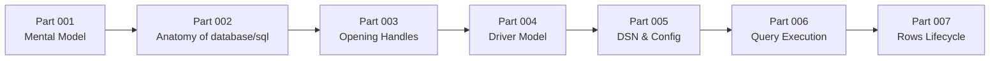

Part berikutnya akan membedah anatomy package `database/sql` secara sistematis:

- object utama;
- interface penting;
- lifecycle;
- concurrent safety;
- driver boundary;
- resource ownership;
- apa yang dijamin dan tidak dijamin oleh stdlib.

---

## 37. Latihan Mental Model

Jawab tanpa coding dulu.

### Scenario 1

Sebuah handler membuat `sql.Open` setiap request dan `defer db.Close()`.

Pertanyaan:

1. Apa yang salah?
2. Apa dampaknya terhadap pool?
3. Kenapa ini mungkin tidak langsung terlihat di local development?
4. Bagaimana struktur yang lebih benar?

Expected reasoning:

- `sql.DB` adalah long-lived pool handle;
- membuat per request berarti membuat pool baru per request;
- connection churn dan resource overhead meningkat;
- di local traffic kecil mungkin tidak terlihat;
- handle dibuat saat startup dan di-inject.

### Scenario 2

Service membuka transaction, tetapi repository tetap memakai `r.db.QueryContext`.

Pertanyaan:

1. Apakah query repository ikut transaction?
2. Apa risiko consistency-nya?
3. Bagaimana desain repository agar transaction-aware?

Expected reasoning:

- Tidak ikut transaction jika memakai `db`, bukan `tx`;
- bisa membaca/menulis di luar transaction;
- gunakan explicit `Queryer` atau pass `*sql.Tx`.

### Scenario 3

API lambat, DB CPU rendah, tetapi pool `WaitCount` naik terus.

Pertanyaan:

1. Apa kemungkinan root cause?
2. Metrics apa yang harus dilihat?
3. Code pattern apa yang dicari?

Expected reasoning:

- connection starvation;
- rows leak;
- transaction lama;
- max open terlalu kecil;
- lihat `OpenConnections`, `InUse`, `Idle`, `WaitCount`, `WaitDuration`;
- cari missing `rows.Close`, early return, long transaction.

### Scenario 4

Repository mengubah status case dengan:

```sql
UPDATE cases SET status = 'APPROVED' WHERE id = $1
```

Pertanyaan:

1. Invariant apa yang tidak dijaga?
2. Bagaimana query yang lebih aman?
3. Perlukah transaction?

Expected reasoning:

- tidak memastikan current status;
- tidak mencegah concurrent update;
- gunakan conditional update status/version atau lock;
- transaction diperlukan jika update harus atomik dengan audit/outbox.

---

## 38. Summary

Mental model utama part ini:

1. `database/sql` adalah orchestration layer; driver tetap menentukan banyak behavior spesifik database.
2. `*sql.DB` adalah long-lived, concurrent-safe pool handle, bukan satu connection.
3. `sql.Open` membuat handle, bukan jaminan koneksi fisik sudah berhasil.
4. `*sql.Tx` adalah transaction handle yang memegang satu connection sampai commit/rollback.
5. `*sql.Rows` adalah resource/cursor-like object yang harus ditutup.
6. Transaction boundary sebaiknya berada di use-case/service layer.
7. Repository harus transaction-aware tanpa menyembunyikan semantics penting.
8. Connection pool adalah concurrency control device, bukan sekadar cache koneksi.
9. Error database harus diterjemahkan ke semantics domain/operational yang jelas.
10. Go database code yang bagus cenderung eksplisit, membosankan, dan mudah direview.

Kalau mental model ini sudah kuat, API detail di part berikutnya akan jauh lebih mudah dipahami karena setiap method akan punya tempat dalam sistem berpikir yang jelas.

---

## 39. References

Referensi utama yang menjadi basis factual part ini:

1. Go Documentation — Accessing relational databases  
   `https://go.dev/doc/database/`

2. Go Documentation — Opening a database handle  
   `https://go.dev/doc/database/open-handle`

3. Go Documentation — Managing connections  
   `https://go.dev/doc/database/manage-connections`

4. Go Documentation — Executing transactions  
   `https://go.dev/doc/database/execute-transactions`

5. Go Documentation — Querying for data  
   `https://go.dev/doc/database/querying`

6. Go Documentation — Using prepared statements  
   `https://go.dev/doc/database/prepared-statements`

7. Package documentation — `database/sql`  
   `https://pkg.go.dev/database/sql`

---

## 40. Status

Part 001 selesai.

Seri belum selesai. Lanjut berikutnya:

```text
learn-go-sql-database-integration-part-002.md
```

Topik:

```text
Anatomy of database/sql
```

<!-- NAVIGATION_FOOTER -->
<div class="page-nav">
<a href="./learn-go-sql-database-integration-part-000.md">⬅️ Go SQL Package, Connection Pool, Transaction Management, and Database Integration</a>
<a href="./index.md">📚 Kategori</a>
<a href="../../index.md">🏠 Home</a>
<a href="./learn-go-sql-database-integration-part-002.md">Part 002 — Anatomy of `database/sql` ➡️</a>
</div>
