# learn-go-sql-database-integration-part-002.md

# Part 002 — Anatomy of `database/sql`

> Seri: `learn-go-sql-database-integration`  
> Target pembaca: Java software engineer yang ingin menguasai integrasi database di Go secara production-grade  
> Target Go: Go 1.26.x  
> Status seri: **belum selesai**  
> Posisi: Part 002 dari 034

---

## 0. Ringkasan Eksekutif

`database/sql` adalah salah satu package paling penting di standard library Go untuk aplikasi backend yang berinteraksi dengan database relasional atau database SQL-like. Namun package ini sering disalahpahami.

Kesalahan paling umum adalah menganggap `*sql.DB` sebagai satu connection, padahal `*sql.DB` adalah **handle ke database yang mengelola pool koneksi**. Kesalahan kedua adalah menganggap `database/sql` sebagai ORM, padahal ia bukan ORM, bukan query builder, bukan migration tool, bukan unit-of-work framework, dan bukan abstraction yang menyembunyikan semua perbedaan database. Ia adalah **contract layer** antara aplikasi Go dan driver database.

Mental model yang tepat:

```text
application code
  -> database/sql API
      -> driver contract
          -> database wire protocol / native client / CGO wrapper
              -> database server
```

Dari sisi aplikasi, kita melihat tipe seperti:

- `*sql.DB`
- `*sql.Conn`
- `*sql.Tx`
- `*sql.Stmt`
- `*sql.Rows`
- `*sql.Row`
- `sql.Result`
- `sql.Scanner`
- `driver.Valuer`

Dari sisi driver, database vendor atau library driver mengimplementasikan kontrak di package `database/sql/driver`, seperti:

- `driver.Driver`
- `driver.Connector`
- `driver.Conn`
- `driver.ExecerContext`
- `driver.QueryerContext`
- `driver.ConnBeginTx`
- `driver.ConnPrepareContext`
- `driver.Rows`
- `driver.Result`

Tujuan part ini adalah membedah anatomi tersebut sampai jelas: siapa memiliki apa, siapa bertanggung jawab atas apa, kapan connection dipinjam dari pool, kapan dikembalikan, kapan error muncul, kapan resource leak terjadi, dan di mana perilaku driver-specific mulai muncul.

---

## 1. Tujuan Pembelajaran

Setelah menyelesaikan part ini, Anda harus bisa:

1. Menjelaskan apa itu `database/sql` dan apa yang bukan tanggung jawabnya.
2. Membedakan `*sql.DB`, `*sql.Conn`, `*sql.Tx`, `*sql.Stmt`, `*sql.Rows`, dan `*sql.Row` secara operasional.
3. Memahami bahwa `*sql.DB` adalah pool-aware handle, bukan physical connection.
4. Memahami bahwa `*sql.Tx` meminjam satu connection sampai commit/rollback.
5. Memahami bahwa `*sql.Rows` dapat menahan connection selama belum selesai atau belum ditutup.
6. Memahami hubungan antara API publik `database/sql` dan driver interface `database/sql/driver`.
7. Memahami mengapa context cancellation, placeholder, type mapping, dan error code tetap driver-specific.
8. Bisa membuat mental model execution path untuk `ExecContext`, `QueryContext`, dan `QueryRowContext`.
9. Bisa mengenali titik-titik resource leak, pool starvation, dan inconsistent transaction boundary.
10. Bisa membaca code database Go dengan lebih tajam: apakah code tersebut aman, leak-free, transaction-aware, dan observable.

---

## 2. Basis Faktual dari Dokumentasi Resmi

Beberapa fakta dasar yang menjadi pondasi part ini:

1. Package `database/sql` menyediakan generic interface untuk SQL atau SQL-like database, dan harus digunakan bersama database driver.
2. Driver yang tidak mendukung context cancellation bisa saja tidak return sampai query selesai.
3. `*sql.DB` aman dipakai secara concurrent oleh banyak goroutine dan mengelola pool koneksi aktif ke database.
4. Ketika `DB.Query` atau `DB.Exec` dipanggil, `database/sql` mengambil connection yang tersedia dari pool atau membuat connection baru bila diperlukan dan diperbolehkan konfigurasi pool.
5. `*sql.Tx` merepresentasikan transaction; operasi di dalam transaction sebaiknya dilakukan melalui method milik `Tx`, bukan dengan mencampur `DB` call non-transactional.
6. `QueryRow` sendiri tidak mengembalikan error langsung; error muncul saat `Scan` dipanggil.
7. Untuk nullable column, `database/sql` menyediakan tipe seperti `sql.NullString` yang memiliki field `Valid` untuk membedakan NULL dari zero value.
8. Package `database/sql/driver` mendefinisikan interface yang diimplementasikan oleh driver; sebagian interface bersifat optional untuk mendukung context, named parameter, custom data type, session reset, validation, dan metadata rows.

Referensi resmi:

- `database/sql`: <https://pkg.go.dev/database/sql>
- `database/sql/driver`: <https://pkg.go.dev/database/sql/driver>
- Go docs — Accessing relational databases: <https://go.dev/doc/database/>
- Go docs — Managing connections: <https://go.dev/doc/database/manage-connections>
- Go docs — Executing transactions: <https://go.dev/doc/database/execute-transactions>
- Go docs — Querying for data: <https://go.dev/doc/database/querying>

---

## 3. `database/sql` dalam Satu Kalimat

`database/sql` adalah **standard abstraction layer** untuk mengeksekusi statement SQL, membaca rows, mengelola transaction, dan mengelola connection pool melalui driver database yang terdaftar.

Kalimat itu padat, tetapi ada beberapa implikasi besar:

- Ia standard library, jadi banyak library Go menganggapnya sebagai lingua franca.
- Ia abstraction, tetapi bukan abstraction penuh atas semua fitur database.
- Ia mengelola pool, sehingga concurrency behavior ada di dalamnya.
- Ia butuh driver; tanpa driver, ia tidak tahu cara bicara ke PostgreSQL, MySQL, SQLite, SQL Server, Oracle, atau database lain.
- Ia tidak mengerti domain Anda.
- Ia tidak mengatur schema migration.
- Ia tidak otomatis mapping table ke struct.
- Ia tidak otomatis membuka/menutup transaction berdasarkan annotation seperti Spring.
- Ia tidak otomatis retry transaction.
- Ia tidak otomatis classify SQLSTATE/vendor errors.

`database/sql` adalah lapisan rendah yang stabil dan eksplisit. Power-nya justru ada di keterbukaan itu.

---

## 4. Mengapa Part Ini Penting

Banyak engineer bisa membuat CRUD dengan Go dalam beberapa jam. Tetapi production-grade database integration bukan sekadar bisa menjalankan query.

Yang sulit adalah memahami:

- Kenapa service tiba-tiba hang padahal CPU rendah.
- Kenapa connection database habis padahal pool diset tinggi.
- Kenapa transaksi menyebabkan deadlock.
- Kenapa query timeout tidak membatalkan query di database.
- Kenapa `rows.Close()` yang lupa bisa menyebabkan pool starvation.
- Kenapa `QueryRow` error-nya baru muncul saat `Scan`.
- Kenapa `sql.DB` harus dibuat sekali, bukan per request.
- Kenapa operasi dalam transaction harus memakai `tx`, bukan `db`.
- Kenapa driver yang berbeda punya behavior berbeda walaupun API Go-nya sama.

Untuk top-level engineering, kita tidak cukup tahu API. Kita harus tahu **lifecycle**.

---

## 5. Peta Besar Arsitektur

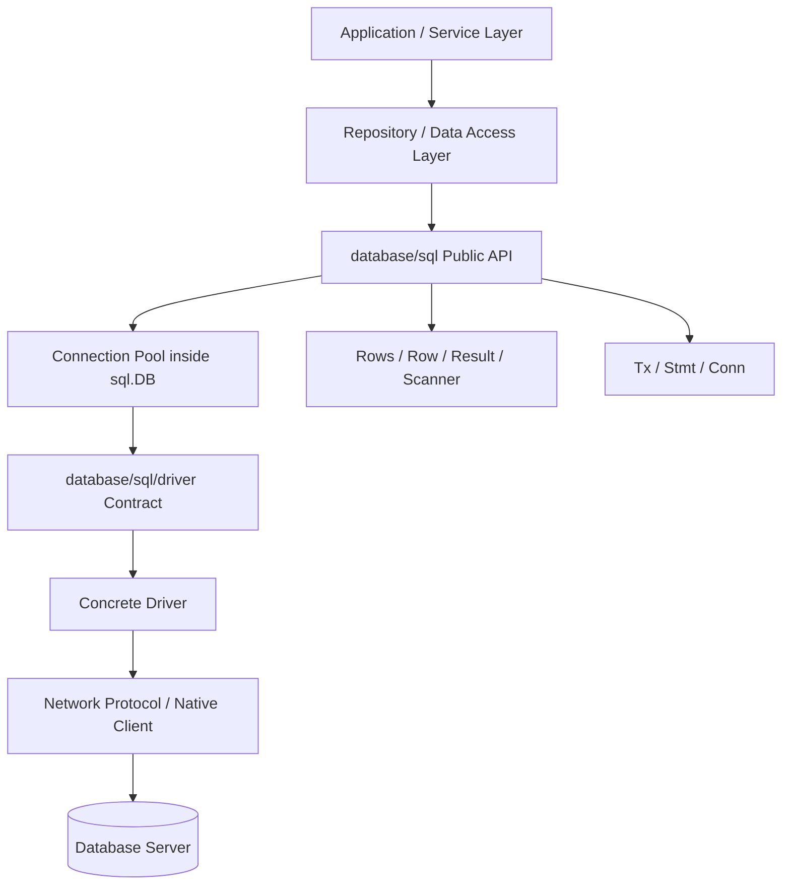

Pemisahan ini penting karena setiap layer punya tanggung jawab berbeda:

| Layer | Tanggung jawab |
|---|---|
| Application/service | Business invariant, orchestration, authorization, idempotency |
| Repository/data access | Query ownership, mapping, persistence boundary |
| `database/sql` | Pooling, generic execution API, transaction handle, row scanning abstraction |
| Driver | Database-specific protocol, placeholder behavior, error representation, type conversion |
| Database server | Query planning, locking, isolation, constraint, storage, replication |

Jika ada bug, jangan langsung menyalahkan “database lambat”. Bisa jadi:

- repository membuka rows tapi tidak menutupnya,
- pool terlalu kecil,
- pool terlalu besar,
- transaction terlalu lama,
- context timeout salah,
- driver tidak mendukung cancellation,
- query plan berubah,
- isolation level salah,
- connection lifetime tidak cocok dengan infrastructure,
- database lock menunggu transaksi lain.

---

## 6. `database/sql` Bukan ORM

Ini harus sangat jelas.

`database/sql` tidak menyediakan:

- entity manager,
- dirty checking,
- lazy loading,
- automatic relation loading,
- table-to-struct mapping otomatis,
- JPQL/HQL equivalent,
- migration engine,
- transaction annotation,
- second-level cache,
- automatic optimistic locking,
- automatic auditing,
- automatic retry,
- automatic schema generation.

Ia menyediakan primitive:

- buka database handle,
- konfigurasi pool,
- jalankan statement,
- baca row,
- scan value,
- mulai transaction,
- commit/rollback,
- prepare statement,
- pin explicit connection bila perlu,
- expose pool stats.

Perbandingan kasar:

| Java ecosystem | Go `database/sql` equivalent |
|---|---|
| `DataSource` + HikariCP | `*sql.DB` |
| `Connection` | `*sql.Conn` atau connection internal dari pool |
| `PreparedStatement` | `*sql.Stmt` |
| `ResultSet` | `*sql.Rows` |
| `TransactionStatus` / `@Transactional` | `*sql.Tx` eksplisit |
| `SQLException` | driver-specific error + `database/sql` sentinel errors |
| JPA EntityManager | Tidak ada di `database/sql` |
| Repository interface | Anda desain sendiri |

Go memberi Anda lebih sedikit framework magic. Konsekuensinya: Anda harus lebih disiplin.

---

## 7. API Surface Utama

Secara praktis, kita bisa kelompokkan API `database/sql` menjadi beberapa cluster:

```text
Opening / lifecycle:
- sql.Open
- sql.OpenDB
- (*DB).Ping
- (*DB).PingContext
- (*DB).Close

Pool configuration:
- (*DB).SetMaxOpenConns
- (*DB).SetMaxIdleConns
- (*DB).SetConnMaxIdleTime
- (*DB).SetConnMaxLifetime
- (*DB).Stats

Execution:
- (*DB).Exec / ExecContext
- (*DB).Query / QueryContext
- (*DB).QueryRow / QueryRowContext

Connection pinning:
- (*DB).Conn
- (*Conn).ExecContext
- (*Conn).QueryContext
- (*Conn).BeginTx
- (*Conn).Close

Transaction:
- (*DB).Begin / BeginTx
- (*Tx).Exec / ExecContext
- (*Tx).Query / QueryContext
- (*Tx).QueryRow / QueryRowContext
- (*Tx).Prepare / PrepareContext
- (*Tx).Commit
- (*Tx).Rollback

Prepared statement:
- (*DB).Prepare / PrepareContext
- (*Tx).Prepare / PrepareContext
- (*Conn).PrepareContext
- (*Stmt).Exec / ExecContext
- (*Stmt).Query / QueryContext
- (*Stmt).QueryRow / QueryRowContext
- (*Stmt).Close

Reading result:
- (*Rows).Next
- (*Rows).Scan
- (*Rows).Err
- (*Rows).Close
- (*Row).Scan

Mapping:
- Scanner
- NullString / NullInt64 / NullBool / NullTime / etc.
- driver.Valuer
```

Kita akan membedah cluster ini satu per satu.

---

## 8. `*sql.DB`: Database Handle dan Connection Pool

### 8.1 Definisi Mental

`*sql.DB` adalah **long-lived, concurrent-safe, pool-owning handle**.

Ia bukan:

- single TCP connection,
- per-request object,
- lightweight disposable connection,
- transaction object,
- tenant/session-specific state holder.

Ia adalah:

- entry point utama ke database,
- pemilik connection pool,
- factory untuk transaction,
- factory untuk prepared statement di level DB,
- source pool stats,
- lifecycle object yang biasanya dibuat saat application startup dan ditutup saat shutdown.

### 8.2 Kesalahan Fatal: Membuat `sql.Open` Per Request

Anti-pattern:

```go
func handler(w http.ResponseWriter, r *http.Request) {
    db, err := sql.Open("postgres", dsn)
    if err != nil {
        http.Error(w, err.Error(), http.StatusInternalServerError)
        return
    }
    defer db.Close()

    // query...
}
```

Masalah:

- membuat pool baru per request,
- tidak memberi kesempatan pool reuse,
- bisa menciptakan connection storm,
- menghilangkan observability pool yang stabil,
- menambah latency,
- memperburuk beban database,
- membuat behavior sulit diprediksi.

Pattern yang benar:

```go
type App struct {
    DB *sql.DB
}

func main() {
    db, err := sql.Open("postgres", dsn)
    if err != nil {
        log.Fatal(err)
    }
    defer db.Close()

    ctx, cancel := context.WithTimeout(context.Background(), 5*time.Second)
    defer cancel()

    if err := db.PingContext(ctx); err != nil {
        log.Fatal(err)
    }

    app := &App{DB: db}
    _ = app
}
```

### 8.3 `sql.Open` Tidak Selalu Connect Langsung

`sql.Open(driverName, dsn)` biasanya hanya:

- memvalidasi driver name,
- membuat handle,
- mungkin memvalidasi DSN tergantung driver,
- menyiapkan pool object.

Ia belum tentu membuka koneksi network ke database.

Karena itu, production app biasanya melakukan:

```go
ctx, cancel := context.WithTimeout(context.Background(), 5*time.Second)
defer cancel()

if err := db.PingContext(ctx); err != nil {
    return fmt.Errorf("database ping: %w", err)
}
```

Dengan ini application startup bisa fail-fast jika database tidak reachable.

### 8.4 Internal Pool State

Secara mental, pool memiliki beberapa state:

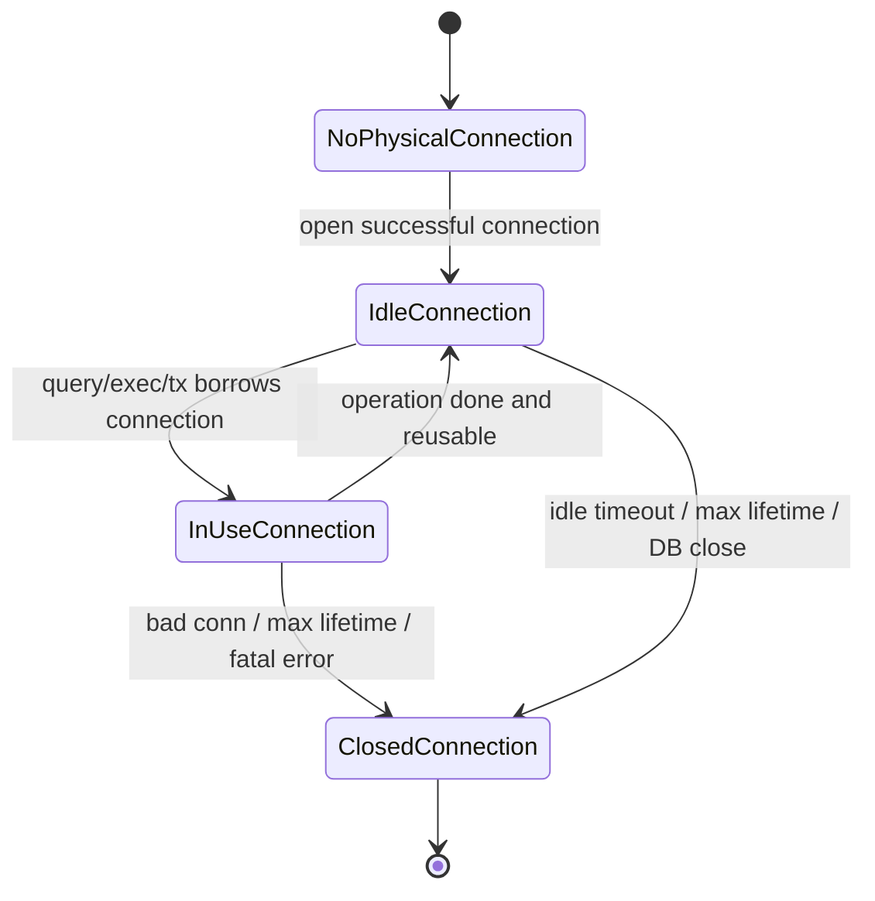

`sql.DB` bisa memiliki banyak physical connection di dalamnya. Setiap call seperti `QueryContext` atau `ExecContext` akan membutuhkan connection selama operasi berlangsung.

### 8.5 Pool Configuration Method

| Method | Fungsi |
|---|---|
| `SetMaxOpenConns(n)` | Batas total open connection, baik idle maupun in-use |
| `SetMaxIdleConns(n)` | Batas idle connection yang dipertahankan |
| `SetConnMaxIdleTime(d)` | Maksimum durasi connection boleh idle sebelum ditutup |
| `SetConnMaxLifetime(d)` | Maksimum umur connection sejak dibuat |
| `Stats()` | Snapshot metrics pool |

Anatomi `DB.Stats()` penting:

| Field | Arti operasional |
|---|---|
| `MaxOpenConnections` | Limit open connection |
| `OpenConnections` | Total connection saat ini |
| `InUse` | Connection sedang dipakai |
| `Idle` | Connection idle |
| `WaitCount` | Total operasi yang harus menunggu connection |
| `WaitDuration` | Total waktu tunggu connection |
| `MaxIdleClosed` | Connection ditutup karena idle limit |
| `MaxIdleTimeClosed` | Connection ditutup karena idle time |
| `MaxLifetimeClosed` | Connection ditutup karena max lifetime |

Jika `WaitCount` dan `WaitDuration` meningkat, bukan berarti database pasti lambat. Bisa jadi pool terlalu kecil, rows bocor, transaction terlalu lama, atau operasi menahan connection lebih lama dari seharusnya.

---

## 9. `*sql.Conn`: Explicit Single Connection Handle

### 9.1 Kapan Memakai `Conn`

Sebagian besar aplikasi tidak perlu memakai `*sql.Conn` secara langsung. Anda memakai `db.QueryContext`, `db.ExecContext`, atau `db.BeginTx`.

`*sql.Conn` berguna ketika Anda butuh connection yang sama untuk beberapa operasi tanpa transaction, misalnya:

- session-level setting,
- temporary table yang scoped ke session,
- advisory lock yang scoped ke connection,
- database-specific protocol behavior,
- operasi yang mensyaratkan physical connection sama,
- debugging driver/session behavior.

Contoh:

```go
conn, err := db.Conn(ctx)
if err != nil {
    return err
}
defer conn.Close()

if _, err := conn.ExecContext(ctx, "SET LOCAL some_setting = value"); err != nil {
    return err
}

rows, err := conn.QueryContext(ctx, "SELECT ...")
```

Catatan: syntax `SET LOCAL` sendiri database-specific. Untuk PostgreSQL, `SET LOCAL` biasanya berlaku dalam transaction. Untuk session-level behavior, detailnya harus disesuaikan database.

### 9.2 `Conn.Close` Tidak Sama dengan Menutup TCP Connection Selalu

`conn.Close()` mengembalikan connection ke pool. Ia tidak selalu menutup physical connection. Nama `Close` di sini berarti: selesai memakai explicit connection handle.

Jika Anda lupa `conn.Close()`, connection bisa tertahan dan tidak bisa dipakai operasi lain.

### 9.3 Bahaya `Conn`

`Conn` memberi kontrol lebih, tetapi juga meningkatkan risiko:

- connection pinning terlalu lama,
- session state bocor ke operasi berikutnya jika driver/session reset tidak benar,
- pool starvation,
- kode menjadi database-specific,
- concurrency misuse.

Gunakan `Conn` hanya bila ada alasan konkret.

---

## 10. `*sql.Tx`: Transaction Handle

### 10.1 Definisi Mental

`*sql.Tx` merepresentasikan satu database transaction. Ketika transaction dimulai, `database/sql` mengambil satu connection dari pool dan transaction tersebut berjalan di atas connection itu sampai `Commit` atau `Rollback`.

Diagram:

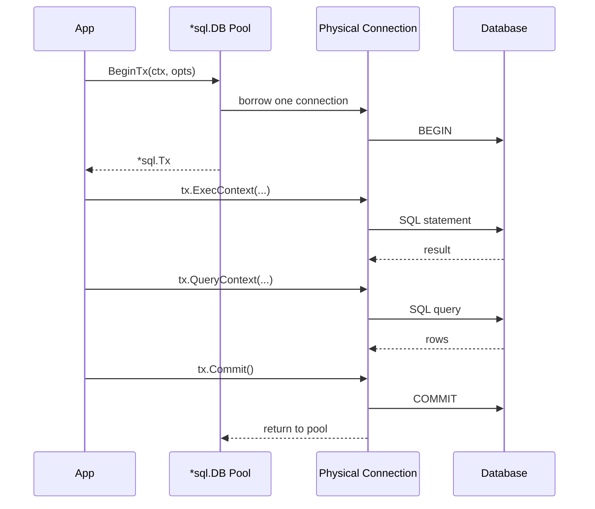

### 10.2 `Tx` Harus Selesai

Setiap transaction harus berakhir dengan salah satu:

- `Commit()`, atau
- `Rollback()`.

Jika tidak, connection tetap tertahan.

Pattern umum:

```go
func createOrder(ctx context.Context, db *sql.DB, input CreateOrderInput) error {
    tx, err := db.BeginTx(ctx, nil)
    if err != nil {
        return fmt.Errorf("begin tx: %w", err)
    }
    defer func() {
        _ = tx.Rollback()
    }()

    if _, err := tx.ExecContext(ctx, `INSERT INTO orders (...) VALUES (...)`); err != nil {
        return fmt.Errorf("insert order: %w", err)
    }

    if _, err := tx.ExecContext(ctx, `UPDATE inventory SET ...`); err != nil {
        return fmt.Errorf("update inventory: %w", err)
    }

    if err := tx.Commit(); err != nil {
        return fmt.Errorf("commit tx: %w", err)
    }

    return nil
}
```

Deferred rollback setelah commit biasanya menjadi no-op atau mengembalikan error yang diabaikan karena transaction sudah selesai. Pattern ini berguna agar semua path error sebelum commit tetap menutup transaction.

### 10.3 Jangan Campur `tx` dan `db`

Anti-pattern:

```go
tx, err := db.BeginTx(ctx, nil)
if err != nil {
    return err
}
defer tx.Rollback()

_, err = tx.ExecContext(ctx, `UPDATE accounts SET balance = balance - 100 WHERE id = ?`, fromID)
if err != nil {
    return err
}

// BUG: ini berjalan di luar transaction.
_, err = db.ExecContext(ctx, `UPDATE accounts SET balance = balance + 100 WHERE id = ?`, toID)
if err != nil {
    return err
}

return tx.Commit()
```

Masalah:

- statement kedua tidak berada di transaction yang sama,
- bisa melihat state berbeda,
- atomicity rusak,
- bisa deadlock atau inconsistency,
- rollback tidak membatalkan statement kedua.

Rule praktis:

> Setelah masuk transaction boundary, semua operasi database yang menjadi bagian unit-of-work harus memakai `tx`, bukan `db`.

---

## 11. `*sql.Stmt`: Prepared Statement Handle

### 11.1 Definisi Mental

`*sql.Stmt` adalah handle untuk SQL statement yang sudah diprepare.

Prepared statement bisa dipakai untuk:

- menghindari parsing statement berulang,
- mengirim SQL template sekali dan parameter berkali-kali,
- meningkatkan safety parameter binding,
- memanfaatkan server-side plan/prepared cache bila driver/database mendukung,
- mengeksekusi statement yang sama secara berulang.

Tetapi prepared statement bukan magic performance switch. Ia bisa membantu atau merugikan tergantung database, driver, query shape, dan lifecycle.

### 11.2 Prepared Statement Bisa Terikat ke Scope Berbeda

Ada tiga scope penting:

```go
stmt, err := db.PrepareContext(ctx, query)   // DB/pool-level statement
stmt, err := tx.PrepareContext(ctx, query)   // transaction-bound statement
stmt, err := conn.PrepareContext(ctx, query) // connection-bound statement
```

Perbedaan mental:

| Scope | Terikat ke | Implikasi |
|---|---|---|
| `DB.PrepareContext` | pool/database handle | bisa dipakai concurrent; internally bisa prepare per connection |
| `Tx.PrepareContext` | satu transaction/connection | valid selama transaction hidup |
| `Conn.PrepareContext` | satu explicit connection | valid selama connection handle hidup |

### 11.3 Statement Harus Ditutup

Jika statement dibuat manual, tutup:

```go
stmt, err := db.PrepareContext(ctx, `SELECT name FROM users WHERE id = ?`)
if err != nil {
    return err
}
defer stmt.Close()
```

Statement leak bisa menyebabkan resource leak di client, driver, atau server, tergantung implementasi.

### 11.4 Jangan Prepare SQL Dinamis High-Cardinality

Anti-pattern:

```go
query := fmt.Sprintf("SELECT * FROM orders ORDER BY %s", userInput)
stmt, err := db.PrepareContext(ctx, query)
```

Masalah:

- injection risk bila user input tidak whitelist,
- statement cardinality tinggi,
- plan cache pollution,
- resource leak bila tidak ditutup,
- sulit observability.

Prepared statement cocok untuk SQL shape stabil, bukan query string yang terus berubah.

---

## 12. `*sql.Rows`: Multi-row Cursor-like Result

### 12.1 Definisi Mental

`*sql.Rows` adalah handle untuk hasil query yang bisa memiliki banyak baris. Ia bukan slice. Ia bukan semua data yang sudah pasti dimaterialisasi di memory. Secara mental, ia seperti cursor/stream yang harus diiterasi dan ditutup.

Pattern benar:

```go
rows, err := db.QueryContext(ctx, `SELECT id, name FROM users WHERE active = ?`, true)
if err != nil {
    return err
}
defer rows.Close()

for rows.Next() {
    var u User
    if err := rows.Scan(&u.ID, &u.Name); err != nil {
        return err
    }
    users = append(users, u)
}

if err := rows.Err(); err != nil {
    return err
}
```

### 12.2 Kenapa `Rows.Close` Penting

Selama rows masih terbuka, connection bisa masih dianggap in-use. Jika Anda lupa menutup rows, pool bisa kehabisan connection.

Resource leak paling umum:

```go
rows, err := db.QueryContext(ctx, query)
if err != nil {
    return err
}

for rows.Next() {
    if somethingBad {
        return errors.New("early return") // BUG: rows tidak ditutup
    }
}
```

Pattern aman:

```go
rows, err := db.QueryContext(ctx, query)
if err != nil {
    return err
}
defer rows.Close()
```

### 12.3 `rows.Err()` Tidak Opsional

Kesalahan bisa terjadi saat iterasi, bukan hanya saat query awal.

Contoh:

- network putus di tengah streaming rows,
- driver gagal decode row ke tipe Go,
- context timeout saat membaca rows,
- cursor server error setelah sebagian rows dikirim.

Karena itu selalu cek:

```go
if err := rows.Err(); err != nil {
    return err
}
```

### 12.4 `Scan` Meng-copy ke Destination

`rows.Scan(&dest1, &dest2)` menyalin column values ke pointer destination. Jumlah destination harus cocok dengan jumlah kolom yang discan.

Rule:

- destination harus pointer,
- tipe harus kompatibel,
- NULL harus ditangani dengan tipe nullable/pointer/custom scanner,
- jangan scan kolom besar sembarangan jika tidak diperlukan,
- hindari `SELECT *` untuk query production yang stabil.

---

## 13. `*sql.Row`: Single-row Result Deferred Error

### 13.1 Definisi Mental

`*sql.Row` adalah wrapper untuk hasil query yang diharapkan maksimal satu row. Berbeda dari `QueryContext`, `QueryRowContext` tidak mengembalikan `(row, error)`. Ia mengembalikan `*Row`, lalu error baru muncul saat `Scan`.

Contoh:

```go
var name string
err := db.QueryRowContext(ctx, `SELECT name FROM users WHERE id = ?`, id).Scan(&name)
if err != nil {
    if errors.Is(err, sql.ErrNoRows) {
        return User{}, ErrUserNotFound
    }
    return User{}, err
}
```

### 13.2 Kenapa Error Deferred ke `Scan`?

Karena API `QueryRow` sengaja dibuat simple: satu expression chain. Implementasi bisa menjalankan query dan menyimpan error sampai `Scan` dipanggil.

Konsekuensi:

```go
row := db.QueryRowContext(ctx, query, args...)
// belum tahu error final
err := row.Scan(&dest)
// error muncul di sini
```

### 13.3 Jika Query Mengembalikan Banyak Row

`QueryRow` mengambil row pertama dan mengabaikan sisanya. Jadi untuk invariant “harus tepat satu row”, Anda tidak boleh hanya mengandalkan `QueryRow` jika query bisa mengembalikan duplikasi akibat bug data/query.

Jika “lebih dari satu row” adalah data integrity violation, gunakan query yang enforce uniqueness atau lakukan check eksplisit.

---

## 14. `sql.Result`: Command Result

`sql.Result` dikembalikan oleh `Exec`/`ExecContext` untuk statement yang tidak mengembalikan rows.

Method:

```go
LastInsertId() (int64, error)
RowsAffected() (int64, error)
```

Tapi portability-nya perlu hati-hati.

### 14.1 `RowsAffected`

`RowsAffected` bisa dipakai untuk:

- memastikan update mengenai row yang diharapkan,
- optimistic locking,
- delete existence check,
- idempotent update.

Contoh optimistic update:

```go
res, err := db.ExecContext(ctx, `
    UPDATE cases
    SET status = ?, version = version + 1
    WHERE id = ? AND version = ?
`, nextStatus, id, expectedVersion)
if err != nil {
    return err
}

affected, err := res.RowsAffected()
if err != nil {
    return err
}
if affected == 0 {
    return ErrConcurrentModification
}
```

### 14.2 `LastInsertId`

`LastInsertId` tidak portable untuk semua database/driver. PostgreSQL umumnya mendorong pattern `RETURNING`:

```go
err := db.QueryRowContext(ctx, `
    INSERT INTO users (name, email)
    VALUES ($1, $2)
    RETURNING id
`, name, email).Scan(&id)
```

Jangan mendesain persistence layer dengan asumsi `LastInsertId` selalu tersedia.

---

## 15. `Scanner` dan `Valuer`: Custom Type Boundary

### 15.1 `Scanner`

`Scanner` adalah interface untuk tipe yang bisa menerima value dari database saat `Scan`.

Bentuk konsep:

```go
type Scanner interface {
    Scan(src any) error
}
```

Digunakan untuk:

- custom nullable type,
- enum domain,
- JSON column,
- encrypted value wrapper,
- decimal custom type,
- database-specific type.

Contoh sederhana enum:

```go
type CaseStatus string

const (
    CaseStatusDraft    CaseStatus = "DRAFT"
    CaseStatusSubmitted CaseStatus = "SUBMITTED"
    CaseStatusApproved CaseStatus = "APPROVED"
)

func (s *CaseStatus) Scan(src any) error {
    switch v := src.(type) {
    case string:
        return s.set(v)
    case []byte:
        return s.set(string(v))
    case nil:
        return errors.New("case status cannot be null")
    default:
        return fmt.Errorf("unsupported CaseStatus source %T", src)
    }
}

func (s *CaseStatus) set(v string) error {
    switch CaseStatus(v) {
    case CaseStatusDraft, CaseStatusSubmitted, CaseStatusApproved:
        *s = CaseStatus(v)
        return nil
    default:
        return fmt.Errorf("invalid case status %q", v)
    }
}
```

### 15.2 `driver.Valuer`

`driver.Valuer` mengubah custom Go type menjadi value yang bisa dikirim ke database.

Konsep:

```go
type Valuer interface {
    Value() (driver.Value, error)
}
```

Contoh:

```go
func (s CaseStatus) Value() (driver.Value, error) {
    switch s {
    case CaseStatusDraft, CaseStatusSubmitted, CaseStatusApproved:
        return string(s), nil
    default:
        return nil, fmt.Errorf("invalid case status %q", s)
    }
}
```

Dengan ini domain type bisa dipakai langsung sebagai parameter query:

```go
_, err := db.ExecContext(ctx, `UPDATE cases SET status = ? WHERE id = ?`, status, id)
```

### 15.3 Scanner/Valuer sebagai Anti-Corruption Layer

Dalam sistem enterprise, `Scanner`/`Valuer` berguna untuk membuat boundary antara database representation dan domain representation.

Contoh:

| Database | Go domain type |
|---|---|
| `VARCHAR(32)` | `CaseStatus` |
| `CHAR(1)` | `YesNoFlag` |
| `NUMBER(1)` | `BoolFlag` |
| `JSONB` | `PolicySnapshot` |
| `DECIMAL(19,4)` | `Money` |
| nullable `TIMESTAMP` | `OptionalTime` |

Namun jangan terlalu agresif membuat custom type untuk semua kolom. Gunakan saat ada invariant nyata.

---

## 16. Nullable Types

`database/sql` menyediakan tipe nullable seperti:

- `sql.NullString`
- `sql.NullInt64`
- `sql.NullInt32`
- `sql.NullInt16`
- `sql.NullByte`
- `sql.NullFloat64`
- `sql.NullBool`
- `sql.NullTime`

Pattern:

```go
var middleName sql.NullString
err := db.QueryRowContext(ctx, `SELECT middle_name FROM users WHERE id = ?`, id).Scan(&middleName)
if err != nil {
    return err
}

if middleName.Valid {
    fmt.Println(middleName.String)
}
```

Mental model:

```text
SQL NULL != Go zero value
```

Jika column `middle_name` NULL, hasilnya bukan empty string. Empty string adalah value. NULL adalah absence of value.

Pilihan modelling:

| Approach | Cocok untuk | Trade-off |
|---|---|---|
| `sql.NullString` | Persistence model jelas | Verbose |
| `*string` | DTO/API optional | Bisa ambigu untuk update semantics |
| custom optional type | Domain invariant kuat | Butuh boilerplate |
| zero value | Column NOT NULL dan default valid | Tidak bisa bedakan NULL |

Part 009 akan membahas NULL secara khusus.

---

## 17. `sql.Named` dan Named Arguments

`sql.Named` memungkinkan argumen bernama:

```go
_, err := db.ExecContext(ctx, `
    UPDATE users SET name = @name WHERE id = @id
`,
    sql.Named("name", name),
    sql.Named("id", id),
)
```

Namun support named parameter tergantung driver/database. Jangan menganggap semua driver mendukung syntax sama.

Production rule:

> Treat placeholder syntax as driver contract, not `database/sql` universal contract.

Contoh placeholder:

| Database/driver family | Umum dipakai |
|---|---|
| MySQL | `?` |
| PostgreSQL | `$1`, `$2` |
| SQLite | `?`, `?NNN`, `:name`, tergantung driver |
| SQL Server | named/ordinal style, driver-specific |
| Oracle | named style, driver-specific |

---

## 18. Public API vs Driver API

Aplikasi Anda biasanya memakai `database/sql`.

Driver mengimplementasikan `database/sql/driver`.

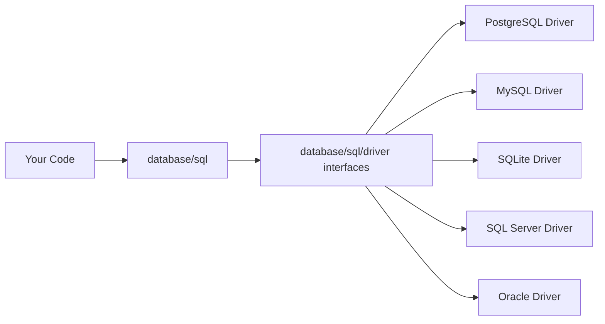

### 18.1 Kenapa Perlu Tahu Driver API?

Sebagai application engineer, Anda tidak harus menulis driver. Tapi Anda perlu tahu driver API untuk memahami:

- kenapa context cancellation bisa berbeda,
- kenapa `Ping` behavior bisa berbeda,
- kenapa type conversion bisa berbeda,
- kenapa error object berbeda,
- kenapa prepared statement behavior berbeda,
- kenapa transaction isolation support berbeda,
- kenapa session reset dan bad connection handling bisa berbeda.

### 18.2 Interface Driver Penting

| Driver interface | Fungsi |
|---|---|
| `driver.Driver` | Membuka connection berdasarkan DSN lama-style |
| `driver.DriverContext` | Membuka connector dengan context-aware design |
| `driver.Connector` | Membuat connection dengan config yang sudah diparse |
| `driver.Conn` | Physical/logical connection ke database |
| `driver.Pinger` | Support ping |
| `driver.ExecerContext` | Execute statement dengan context |
| `driver.QueryerContext` | Query dengan context |
| `driver.ConnBeginTx` | Begin transaction dengan options/context |
| `driver.ConnPrepareContext` | Prepare statement dengan context |
| `driver.SessionResetter` | Reset session sebelum reuse |
| `driver.Validator` | Validasi connection sebelum kembali ke pool |
| `driver.NamedValueChecker` | Custom argument/type handling |
| `driver.Rows` | Row result dari driver |
| `driver.Result` | Execution result dari driver |

Jika driver tidak mengimplementasikan interface context-aware, `database/sql` bisa fallback ke jalur lain, dengan konsekuensi behavior yang berbeda.

---

## 19. Execution Path: `ExecContext`

`ExecContext` digunakan untuk statement yang tidak mengembalikan rows, misalnya:

- `INSERT`
- `UPDATE`
- `DELETE`
- DDL tertentu
- stored procedure tertentu yang tidak return rows

Mental flow:

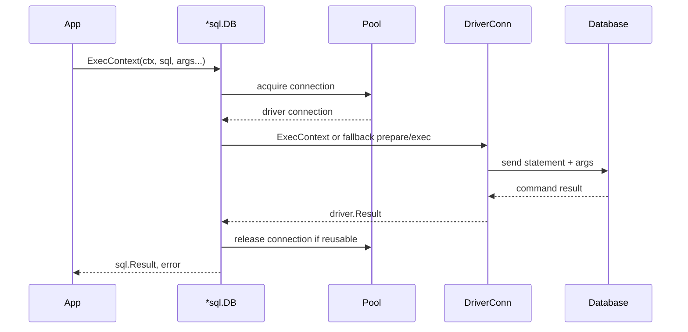

Potential failure points:

| Stage | Failure |
|---|---|
| acquire connection | pool wait timeout, context canceled, database unreachable |
| argument conversion | unsupported type, invalid `Valuer` |
| driver execution | network error, server error, timeout |
| database execution | constraint violation, deadlock, lock timeout |
| result handling | unsupported `RowsAffected`, unsupported `LastInsertId` |
| release | bad connection discarded |

Important: `ExecContext` still needs connection. If pool exhausted, `ExecContext` can block waiting for connection unless context deadline cancels.

---

## 20. Execution Path: `QueryContext`

`QueryContext` digunakan untuk statement yang mengembalikan multiple rows.

Flow:

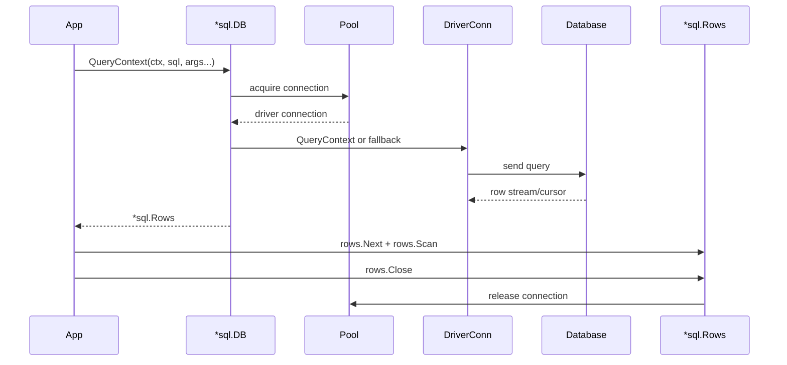

Perhatikan: connection belum tentu langsung kembali saat `QueryContext` return. Ia sering baru kembali setelah rows selesai dibaca atau ditutup.

Jadi, lifecycle `Rows` adalah bagian dari lifecycle connection.

Anti-pattern:

```go
func listUsers(ctx context.Context, db *sql.DB) ([]User, error) {
    rows, err := db.QueryContext(ctx, `SELECT id, name FROM users`)
    if err != nil {
        return nil, err
    }
    // BUG: no defer rows.Close()

    var users []User
    for rows.Next() {
        var u User
        if err := rows.Scan(&u.ID, &u.Name); err != nil {
            return nil, err // connection may leak until GC/finalizer/driver cleanup
        }
        users = append(users, u)
    }
    return users, rows.Err()
}
```

Correct:

```go
func listUsers(ctx context.Context, db *sql.DB) ([]User, error) {
    rows, err := db.QueryContext(ctx, `SELECT id, name FROM users`)
    if err != nil {
        return nil, err
    }
    defer rows.Close()

    users := make([]User, 0)
    for rows.Next() {
        var u User
        if err := rows.Scan(&u.ID, &u.Name); err != nil {
            return nil, err
        }
        users = append(users, u)
    }
    if err := rows.Err(); err != nil {
        return nil, err
    }
    return users, nil
}
```

---

## 21. Execution Path: `QueryRowContext`

`QueryRowContext` adalah convenience method untuk single-row query.

Flow mental:

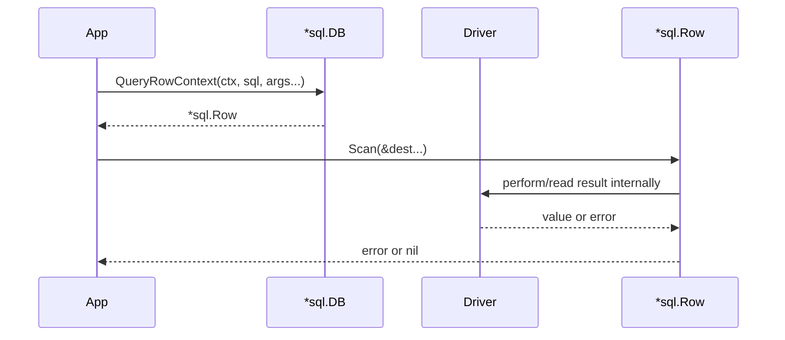

Karakter penting:

- `QueryRowContext` tidak return error langsung.
- `Scan` adalah titik error observation.
- `sql.ErrNoRows` muncul dari `Scan`.
- Jika lebih dari satu row, hanya row pertama yang dipakai.

Pattern not-found mapping:

```go
func findUserByID(ctx context.Context, db *sql.DB, id int64) (User, error) {
    var u User
    err := db.QueryRowContext(ctx, `
        SELECT id, email, name
        FROM users
        WHERE id = ?
    `, id).Scan(&u.ID, &u.Email, &u.Name)
    if err != nil {
        if errors.Is(err, sql.ErrNoRows) {
            return User{}, ErrUserNotFound
        }
        return User{}, fmt.Errorf("find user by id: %w", err)
    }
    return u, nil
}
```

---

## 22. Context-Aware vs Non-Context API

Hampir semua operasi penting punya versi `Context`:

| Non-context | Context-aware |
|---|---|
| `Ping()` | `PingContext(ctx)` |
| `Exec()` | `ExecContext(ctx, ...)` |
| `Query()` | `QueryContext(ctx, ...)` |
| `QueryRow()` | `QueryRowContext(ctx, ...)` |
| `Prepare()` | `PrepareContext(ctx, ...)` |
| `Begin()` | `BeginTx(ctx, opts)` |

Production rule:

> Di server-side application, gunakan versi `Context` hampir selalu.

Alasan:

- request cancellation,
- deadline propagation,
- graceful shutdown,
- bounded waiting on pool acquisition,
- timeout control,
- trace propagation.

Tapi ingat: context support efektif bergantung driver. Jika driver tidak benar-benar bisa membatalkan query di database/server/protocol, app bisa return berbeda dari query server-side yang masih jalan. Karena itu timeout app-side dan database-side harus dirancang bersama.

---

## 23. Ownership dan Lifecycle Matrix

Ini salah satu bagian paling penting.

| Object | Dibuat oleh | Dimiliki oleh | Harus ditutup? | Kapan connection dilepas? |
|---|---|---|---|---|
| `*sql.DB` | `sql.Open` / `sql.OpenDB` | aplikasi | Ya, saat shutdown | N/A, ia pool owner |
| `*sql.Conn` | `db.Conn(ctx)` | caller | Ya, `conn.Close()` | saat `conn.Close()` |
| `*sql.Tx` | `db.BeginTx` / `conn.BeginTx` | caller | Ya, `Commit`/`Rollback` | setelah commit/rollback |
| `*sql.Stmt` | `Prepare` | caller | Ya, `stmt.Close()` | tergantung scope statement |
| `*sql.Rows` | `QueryContext` | caller | Ya, `rows.Close()` | setelah close/EOF |
| `*sql.Row` | `QueryRowContext` | caller | Tidak eksplisit | saat `Scan` selesai |
| `sql.Result` | `ExecContext` | caller | Tidak | connection sudah dilepas saat result returned |

Heuristik review code:

```text
Object with Close/Commit/Rollback must have visible lifecycle.
```

Jika Anda melihat `QueryContext`, cari `rows.Close`.  
Jika Anda melihat `BeginTx`, cari `Commit` dan `Rollback`.  
Jika Anda melihat `db.Conn`, cari `conn.Close`.  
Jika Anda melihat `PrepareContext`, cari `stmt.Close`.

---

## 24. Concurrency Safety

### 24.1 `*sql.DB`

`*sql.DB` aman untuk concurrent use. Ia memang dirancang untuk dishare oleh banyak goroutine.

Contoh aman:

```go
func handler(db *sql.DB) http.HandlerFunc {
    return func(w http.ResponseWriter, r *http.Request) {
        ctx := r.Context()
        _ = ctx
        _ = db // shared safely
    }
}
```

### 24.2 `*sql.Tx`

Walaupun beberapa method mungkin secara teknis bisa dipanggil dari goroutine berbeda, secara desain transaction harus diperlakukan sebagai sequential unit-of-work kecuali Anda benar-benar memahami database/driver behavior. Transaction memakai satu connection. Satu connection database umumnya tidak boleh menjalankan banyak query overlapping secara bebas.

Rule praktis:

> Treat `*sql.Tx` as logically single-threaded unit-of-work.

### 24.3 `*sql.Rows`

Jangan iterasi `Rows` dari banyak goroutine tanpa desain khusus. Treat rows sebagai cursor sequential.

### 24.4 `*sql.Stmt`

Statement yang dibuat dari `DB` umumnya aman dipakai concurrent. Tetapi statement yang terikat transaction/connection harus mengikuti lifecycle transaction/connection.

---

## 25. State Machine: `DB`, `Tx`, `Rows`

### 25.1 `DB` State

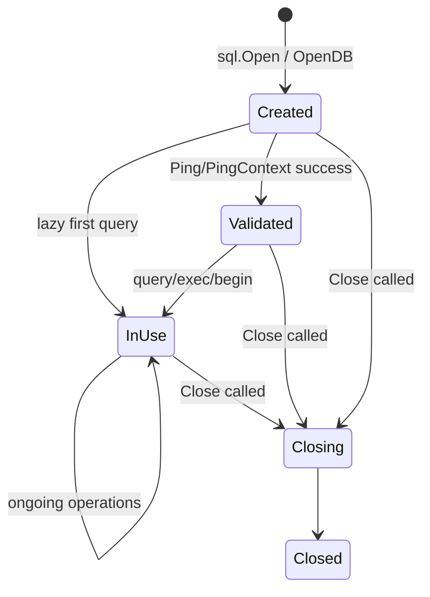

Important:

- `Created` belum menjamin database reachable.
- `Validated` hanya snapshot saat ping; database bisa down setelahnya.
- `Close` biasanya dilakukan saat app shutdown, bukan per operation.

### 25.2 `Tx` State

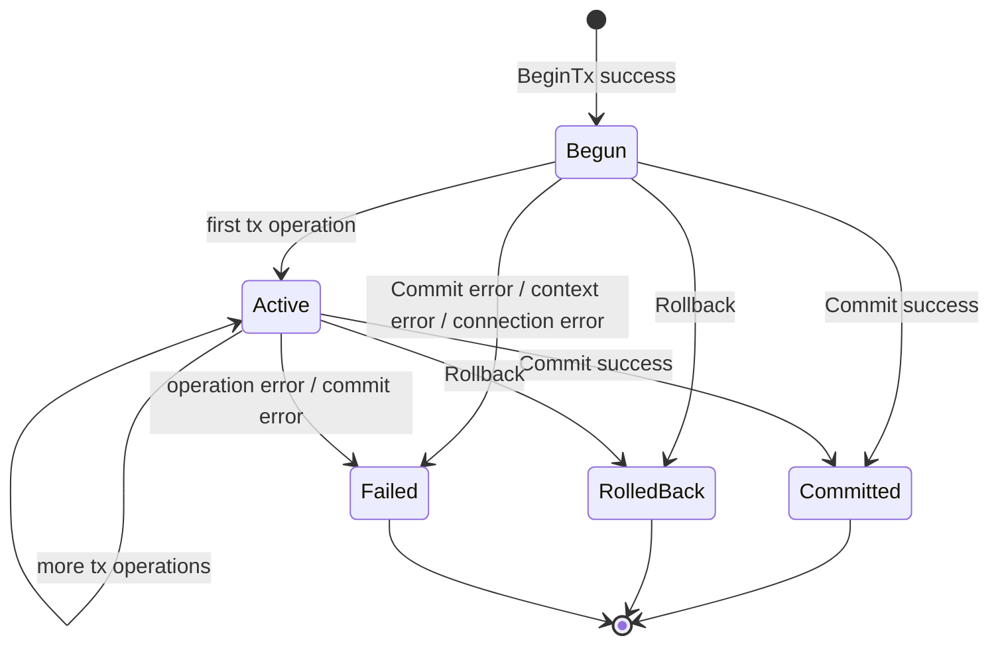

Setelah commit/rollback/failure terminal, `Tx` tidak boleh dipakai lagi.

### 25.3 `Rows` State

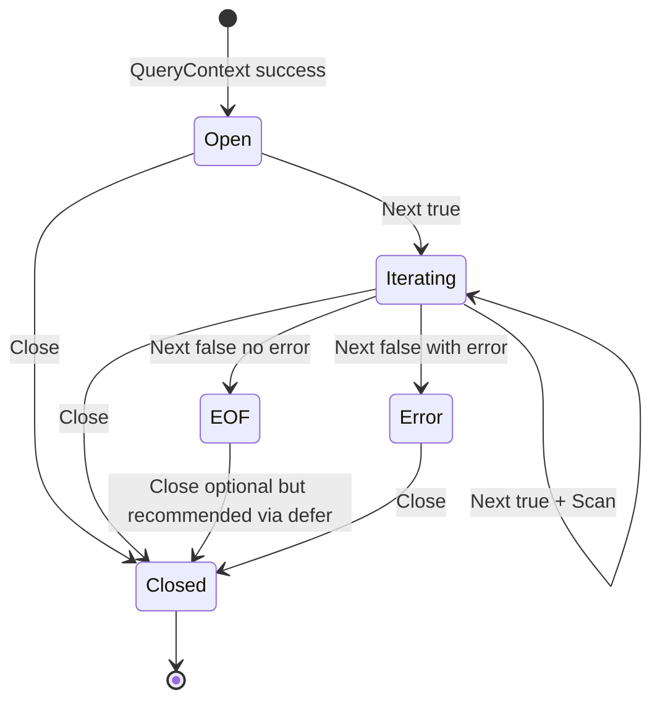

Resource-safe code harus memastikan semua path mencapai `Closed`.

---

## 26. Error Surface

`database/sql` punya beberapa sentinel errors dan behavior khusus.

### 26.1 `sql.ErrNoRows`

Muncul ketika `QueryRow(...).Scan(...)` tidak menemukan row.

Bukan selalu internal error. Dalam banyak domain, ini adalah business condition:

```go
if errors.Is(err, sql.ErrNoRows) {
    return ErrNotFound
}
```

### 26.2 Context Errors

- `context.Canceled`
- `context.DeadlineExceeded`

Bisa muncul saat:

- menunggu connection dari pool,
- menjalankan query,
- membaca rows,
- begin transaction,
- ping.

### 26.3 Driver Errors

Constraint violation, deadlock, SQL syntax error, duplicate key, network failure, dan authentication failure biasanya datang dari driver.

Contoh PostgreSQL dengan pgx/libpq style error biasanya perlu inspect SQLSTATE. MySQL memakai error number. SQL Server dan Oracle punya bentuk berbeda.

`database/sql` tidak menormalisasi semua vendor error menjadi satu taxonomy enterprise-ready. Anda harus membuat mapping sendiri di repository/infrastructure boundary.

---

## 27. Type Conversion Pipeline

Ketika Anda mengirim argumen:

```go
_, err := db.ExecContext(ctx, query, arg1, arg2)
```

Secara konseptual:

```text
Go value
  -> if implements driver.Valuer: call Value()
  -> database/sql / driver conversion
  -> driver-specific encoding
  -> database protocol parameter
```

Ketika Anda membaca row:

```go
err := rows.Scan(&dest)
```

Secara konseptual:

```text
database value
  -> driver value representation
  -> database/sql conversion
  -> if destination implements Scanner: call Scan()
  -> assign to Go destination
```

Diagram:

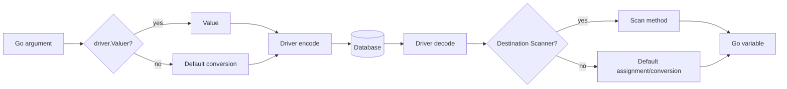

Production concern:

- decimal precision,
- timezone conversion,
- `[]byte` lifetime,
- NULL semantics,
- enum validation,
- JSON decoding cost,
- large object handling,
- database-specific types.

---

## 28. Query Shape dan Cardinality Contract

Salah satu kebiasaan penting: setiap query harus punya expected cardinality.

| Query type | API | Cardinality expectation |
|---|---|---|
| command | `ExecContext` | no rows returned |
| lookup by unique key | `QueryRowContext` | 0 or 1 row |
| existence check | `QueryRowContext` | exactly one scalar boolean/count depending query |
| list/search | `QueryContext` | 0..N rows |
| aggregate | `QueryRowContext` | exactly one row usually |
| insert with returning | `QueryRowContext` | exactly one returned row |

Bad code often starts with unclear cardinality:

```go
rows, err := db.QueryContext(ctx, `SELECT id FROM users WHERE email = ?`, email)
```

If email is unique, why not `QueryRowContext`?  
If duplicates indicate data corruption, should code detect it?  
If multiple rows are valid, what ordering/pagination contract exists?

Cardinality is not just code style; it is correctness.

---

## 29. `database/sql` Does Not Own SQL Semantics

`database/sql` does not define:

- SQL dialect,
- placeholder syntax,
- isolation semantics,
- lock behavior,
- time zone behavior,
- decimal precision behavior,
- JSON operator behavior,
- upsert syntax,
- returning syntax,
- advisory lock behavior,
- bulk copy protocol,
- explain plan,
- optimizer hints,
- deadlock error code.

It only gives a generic execution surface.

That means good Go database engineering requires two layers of knowledge:

```text
Go-side lifecycle knowledge
+
Database-specific semantic knowledge
```

You cannot become excellent by knowing only one side.

---

## 30. Health Check and Readiness Implication

Because `sql.DB` is a pool handle, not guaranteed live connection, health checks must be designed carefully.

Basic readiness:

```go
func readiness(ctx context.Context, db *sql.DB) error {
    ctx, cancel := context.WithTimeout(ctx, 1*time.Second)
    defer cancel()
    return db.PingContext(ctx)
}
```

But this only validates that at least one connection can be established/used at that moment.

Advanced readiness might consider:

- pool wait metrics,
- recent error rate,
- database role primary/replica,
- migration state,
- required schema version,
- critical query success,
- replica lag,
- dependency degradation policy.

Do not put heavy query in frequent health check. Health check can become self-inflicted load.

---

## 31. Observability Implication of Anatomy

Minimal metrics from `DB.Stats()`:

```go
stats := db.Stats()

fmt.Println(stats.OpenConnections)
fmt.Println(stats.InUse)
fmt.Println(stats.Idle)
fmt.Println(stats.WaitCount)
fmt.Println(stats.WaitDuration)
```

But raw stats are not enough. You need derived interpretation:

| Symptom | Possible meaning |
|---|---|
| `InUse` near `MaxOpenConnections` | pool saturated or rows/tx held too long |
| `WaitCount` increasing | callers waiting for connection |
| `WaitDuration` high | pool acquisition latency significant |
| many `MaxLifetimeClosed` | lifetime too low or normal rotation |
| many `MaxIdleClosed` | idle setting too low for bursty workload |
| low DB CPU + high pool wait | app-side connection leak/starvation likely |
| high DB CPU + high query latency | database saturation/query inefficiency likely |

Part 031 will go much deeper, but anatomy already tells us: pool, query, rows, and tx must be observable separately.

---

## 32. Typical Production Failure Modes Mapped to Anatomy

| Failure | Anatomy root |
|---|---|
| Pool exhaustion | `Rows` not closed, `Tx` too long, pool too small, slow DB |
| Deadlock | transaction lock ordering, mixed `db`/`tx`, isolation issue |
| Stale connection | network/LB/DB failover, lifetime too high, driver validation behavior |
| Timeout ineffective | driver lacks cancellation support, DB-side query still running |
| Memory spike | materializing huge result set, scanning LOB/JSON into memory |
| Wrong not-found handling | `sql.ErrNoRows` not mapped correctly |
| Duplicate side effect | retry around ambiguous commit without idempotency |
| Inconsistent read | operation accidentally outside transaction |
| Connection storm | `sql.Open` per request, too many replicas, no pool cap |
| Slow startup | ping/migration/readiness design wrong |

---

## 33. Example: Clean Minimal Data Access Code

This example is intentionally simple but lifecycle-correct.

```go
package userrepo

import (
    "context"
    "database/sql"
    "errors"
    "fmt"
)

var ErrUserNotFound = errors.New("user not found")

type User struct {
    ID    int64
    Email string
    Name  string
}

type Repository struct {
    db *sql.DB
}

func New(db *sql.DB) *Repository {
    return &Repository{db: db}
}

func (r *Repository) FindByID(ctx context.Context, id int64) (User, error) {
    const query = `
        SELECT id, email, name
        FROM users
        WHERE id = ?
    `

    var u User
    err := r.db.QueryRowContext(ctx, query, id).Scan(&u.ID, &u.Email, &u.Name)
    if err != nil {
        if errors.Is(err, sql.ErrNoRows) {
            return User{}, ErrUserNotFound
        }
        return User{}, fmt.Errorf("find user by id %d: %w", id, err)
    }

    return u, nil
}

func (r *Repository) ListActive(ctx context.Context, limit int) ([]User, error) {
    const query = `
        SELECT id, email, name
        FROM users
        WHERE active = ?
        ORDER BY id
        LIMIT ?
    `

    rows, err := r.db.QueryContext(ctx, query, true, limit)
    if err != nil {
        return nil, fmt.Errorf("list active users query: %w", err)
    }
    defer rows.Close()

    users := make([]User, 0, limit)
    for rows.Next() {
        var u User
        if err := rows.Scan(&u.ID, &u.Email, &u.Name); err != nil {
            return nil, fmt.Errorf("list active users scan: %w", err)
        }
        users = append(users, u)
    }

    if err := rows.Err(); err != nil {
        return nil, fmt.Errorf("list active users rows: %w", err)
    }

    return users, nil
}
```

Catatan:

- `*sql.DB` disimpan sebagai dependency long-lived.
- `QueryRowContext` untuk single row.
- `sql.ErrNoRows` dimapping ke domain/repository error.
- `QueryContext` untuk list.
- `rows.Close()` selalu ada.
- `rows.Err()` selalu dicek.
- Query diberi `const` agar shape stabil dan mudah review.
- Error diberi context tanpa membocorkan data sensitif.

---

## 34. Example: Transaction-Aware Code

Masalah umum: repository method perlu bisa dipakai baik di luar maupun di dalam transaction. Cara sederhana adalah mendefinisikan interface minimal yang dimiliki `*sql.DB` dan `*sql.Tx`.

```go
type ExecerQuerier interface {
    ExecContext(ctx context.Context, query string, args ...any) (sql.Result, error)
    QueryContext(ctx context.Context, query string, args ...any) (*sql.Rows, error)
    QueryRowContext(ctx context.Context, query string, args ...any) *sql.Row
}
```

Repository internal bisa menerima `ExecerQuerier`:

```go
type UserQueries struct{}

func (UserQueries) Insert(ctx context.Context, q ExecerQuerier, u User) error {
    _, err := q.ExecContext(ctx, `
        INSERT INTO users (email, name)
        VALUES (?, ?)
    `, u.Email, u.Name)
    if err != nil {
        return fmt.Errorf("insert user: %w", err)
    }
    return nil
}
```

Service transaction:

```go
func CreateUserAndAudit(ctx context.Context, db *sql.DB, u User) error {
    tx, err := db.BeginTx(ctx, nil)
    if err != nil {
        return fmt.Errorf("begin tx: %w", err)
    }
    defer func() { _ = tx.Rollback() }()

    queries := UserQueries{}
    if err := queries.Insert(ctx, tx, u); err != nil {
        return err
    }

    if _, err := tx.ExecContext(ctx, `
        INSERT INTO audit_logs (actor, action)
        VALUES (?, ?)
    `, u.Email, "CREATE_USER"); err != nil {
        return fmt.Errorf("insert audit log: %w", err)
    }

    if err := tx.Commit(); err != nil {
        return fmt.Errorf("commit create user and audit: %w", err)
    }
    return nil
}
```

Dengan pattern ini:

- code query bisa dipakai dengan `db` atau `tx`,
- transaction boundary tetap eksplisit,
- tidak perlu global transaction context magic,
- dependency kecil dan testable.

Namun pattern ini harus dipakai disiplin. Jangan membuat interface terlalu besar dan jangan menyembunyikan transaction lifecycle sampai tidak jelas.

---

## 35. Anti-Pattern Checklist

### 35.1 `sql.Open` di Setiap Request

```go
func handler(...) {
    db, _ := sql.Open(...)
    defer db.Close()
}
```

Dampak: connection storm, tidak ada reuse, pool tidak efektif.

### 35.2 Tidak Menutup Rows

```go
rows, _ := db.QueryContext(ctx, query)
for rows.Next() { ... }
```

Dampak: connection tertahan.

### 35.3 Tidak Mengecek `rows.Err()`

```go
for rows.Next() { ... }
return result, nil
```

Dampak: error saat iterasi hilang.

### 35.4 Mencampur `db` dan `tx`

```go
tx.ExecContext(...)
db.ExecContext(...) // keluar dari tx
```

Dampak: atomicity rusak.

### 35.5 Transaction Terlalu Lama

```go
tx, _ := db.BeginTx(ctx, nil)
callExternalAPI()
tx.Commit()
```

Dampak: lock lama, connection pinning, pool starvation.

### 35.6 Mengabaikan Context

```go
db.Query(query)
```

Dampak: tidak ada deadline/cancellation propagation.

### 35.7 `SELECT *` pada Production Query

```go
SELECT * FROM large_table
```

Dampak: coupling ke schema, over-fetching, scan fragility.

### 35.8 Menyamakan NULL dengan Zero Value

```go
var name string
Scan(&name) // column nullable
```

Dampak: scan error atau semantic loss.

### 35.9 Menggunakan `fmt.Sprintf` untuk Value

```go
query := fmt.Sprintf("SELECT * FROM users WHERE email = '%s'", email)
```

Dampak: SQL injection.

### 35.10 Mengandalkan `LastInsertId` untuk Semua Database

Dampak: portability buruk, terutama untuk database yang mendorong `RETURNING`.

---

## 36. Review Heuristics untuk Code Database Go

Saat melakukan code review, gunakan pertanyaan berikut:

### Lifecycle

1. Apakah `*sql.DB` dibuat sekali dan dishare?
2. Apakah `db.Close()` hanya di shutdown path?
3. Apakah semua `Rows` ditutup?
4. Apakah semua `Rows` dicek `Err()`?
5. Apakah semua `Tx` pasti commit/rollback?
6. Apakah semua `Stmt` yang dibuat manual ditutup?
7. Apakah semua `Conn` yang dipinjam eksplisit dikembalikan?

### Correctness

1. Apakah query API sesuai cardinality?
2. Apakah `ErrNoRows` dimapping benar?
3. Apakah operasi transaction memakai `tx`, bukan `db`?
4. Apakah transaction terlalu luas?
5. Apakah isolation/locking cukup untuk invariant?
6. Apakah retry aman dari double side effect?

### Security

1. Apakah value memakai parameter binding?
2. Apakah identifier dinamis memakai whitelist?
3. Apakah error/log tidak membocorkan secret/PII?
4. Apakah DSN aman dari logging accidental?

### Performance

1. Apakah query over-fetching?
2. Apakah pagination deterministic?
3. Apakah N+1 query muncul?
4. Apakah pool metrics tersedia?
5. Apakah timeout diset?
6. Apakah large result streaming/materialization dipikirkan?

### Operability

1. Apakah ada DB stats metrics?
2. Apakah slow query observable?
3. Apakah error taxonomy jelas?
4. Apakah readiness check masuk akal?
5. Apakah migration state tervalidasi?

---

## 37. Java Engineer Translation Layer

| Concept | Java mental model | Go mental model |
|---|---|---|
| Database handle | `DataSource` | `*sql.DB` |
| Pool | HikariCP internal | built into `*sql.DB` |
| Connection | `java.sql.Connection` | usually hidden; explicit as `*sql.Conn` |
| Transaction | `@Transactional`, `TransactionTemplate` | explicit `*sql.Tx` |
| Result set | `ResultSet` | `*sql.Rows` |
| Single result | `queryForObject` | `QueryRowContext(...).Scan(...)` |
| Prepared statement | `PreparedStatement` | `*sql.Stmt` |
| Nullable value | boxed type/Optional/JPA null | `sql.Null*`, pointer, custom optional |
| SQL exception | `SQLException` with SQLState/vendorCode | driver-specific error plus sentinel errors |
| ORM entity | JPA entity | not provided by `database/sql` |
| Repository | Spring Data/JPA repository | hand-designed interface/struct |

Important difference: in Spring, transaction context can be propagated implicitly through thread-local/proxy. In Go, no such framework-level magic exists in `database/sql`. You pass `*sql.Tx` or an interface that represents query capability.

---

## 38. Enterprise Boundary: What Belongs Where?

A strong architecture avoids both extremes:

- SQL scattered everywhere in handlers,
- over-abstracted generic repository hiding all important database behavior.

Recommended boundary:

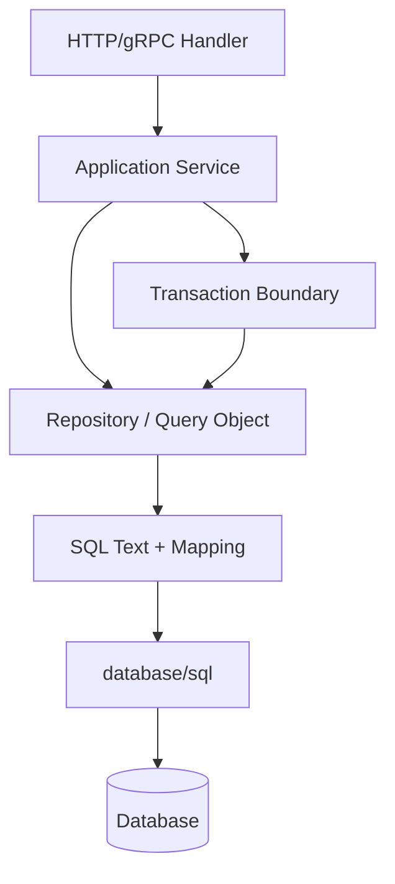

| Concern | Recommended home |
|---|---|
| SQL text | repository/query object |
| row scanning | repository/query object |
| transaction orchestration | service or transaction manager helper |
| business invariant | service/domain layer plus DB constraints |
| database error mapping | repository/infrastructure boundary |
| retry policy | service/infrastructure boundary, not random query method |
| pool config | application bootstrap/config |
| observability | shared database instrumentation layer |

---

## 39. Why `database/sql` Feels Small but Is Deep

The package looks simple because the API surface is small. But the depth comes from lifecycle interactions:

```text
context deadline
  + pool acquisition
  + driver support
  + server execution
  + row streaming
  + scan conversion
  + transaction pinning
  + connection reuse
  + database locks
  + network failure
  + retry behavior
```

A shallow engineer sees:

```go
db.QueryContext(ctx, query, args...)
```

A senior engineer sees:

```text
Will this wait for pool?
How long can it hold connection?
Can it be canceled?
Will driver cancel server query?
How many rows can it stream?
Is rows.Close guaranteed?
Is rows.Err checked?
Are nullable values modelled?
What error taxonomy emerges?
Is this inside transaction?
What locks does the query take?
What index supports it?
What happens during failover?
```

That is the difference between knowing syntax and owning production behavior.

---

## 40. Mini Lab: Observe Pool Starvation from Leaked Rows

This lab is conceptual; adapt with a real driver/database.

### Setup

```go
db.SetMaxOpenConns(1)
db.SetMaxIdleConns(1)
```

### Bad Function

```go
func leakRows(ctx context.Context, db *sql.DB) error {
    rows, err := db.QueryContext(ctx, `SELECT id FROM users`)
    if err != nil {
        return err
    }

    if rows.Next() {
        return nil // BUG: rows.Close not called
    }
    return rows.Err()
}
```

### Next Query

```go
ctx, cancel := context.WithTimeout(context.Background(), 500*time.Millisecond)
defer cancel()

_, err := db.ExecContext(ctx, `UPDATE users SET last_seen_at = CURRENT_TIMESTAMP WHERE id = ?`, 1)
```

With `MaxOpenConns(1)`, the second operation may wait because the only connection is retained by leaked rows.

### Lesson

A single missing `rows.Close()` can look like:

- random timeout,
- database slowness,
- pool exhaustion,
- production hang.

But root cause is lifecycle bug.

---

## 41. Mini Lab: Transaction Pinning

```go
db.SetMaxOpenConns(1)

tx, err := db.BeginTx(ctx, nil)
if err != nil {
    return err
}
defer tx.Rollback()

// While this tx is open, the only connection is pinned.
time.Sleep(10 * time.Second)

// Any other db.QueryContext from another goroutine waits.
```

Lesson:

- transaction is not just logical;
- it has physical pool impact;
- long transaction reduces available concurrency;
- doing network calls while transaction open is dangerous.

---

## 42. Production-Grade Mental Model Summary

The essential anatomy:

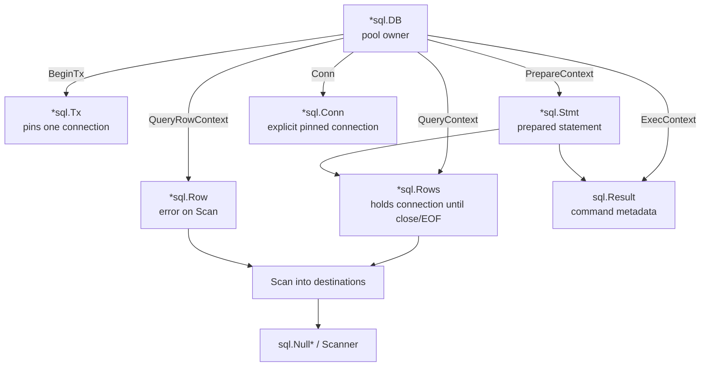

One-line rules:

- `DB` is shared.
- `Conn` is pinned.
- `Tx` is bounded.
- `Rows` is closed.
- `Row` errors on scan.
- `Stmt` has scope.
- `Result` is not fully portable.
- `Scanner` protects mapping.
- `Valuer` protects writing.
- Driver behavior still matters.

---

## 43. Checklist: Anatomy Mastery

Anda sudah memahami part ini jika bisa menjawab tanpa ragu:

1. Mengapa `*sql.DB` bukan connection?
2. Kapan `sql.Open` benar-benar connect ke database?
3. Mengapa `PingContext` sering dilakukan saat startup?
4. Apa perbedaan `DB`, `Conn`, dan `Tx`?
5. Mengapa transaction mempengaruhi pool?
6. Mengapa `Rows` wajib ditutup?
7. Mengapa `rows.Err()` wajib dicek?
8. Mengapa `QueryRow` error-nya muncul di `Scan`?
9. Mengapa `LastInsertId` tidak boleh dianggap portable?
10. Apa perbedaan `Scanner` dan `Valuer`?
11. Apa yang dilakukan driver vs `database/sql`?
12. Mengapa context cancellation tetap driver-specific?
13. Bagaimana pool starvation bisa terjadi walaupun database sehat?
14. Bagaimana mencampur `db` dan `tx` bisa merusak atomicity?
15. Apa lifecycle object yang harus terlihat di code review?

---

## 44. Latihan

### Latihan 1 — Lifecycle Review

Review kode berikut dan temukan bug:

```go
func getEmails(ctx context.Context, db *sql.DB) ([]string, error) {
    rows, err := db.QueryContext(ctx, `SELECT email FROM users`)
    if err != nil {
        return nil, err
    }

    var emails []string
    for rows.Next() {
        var email string
        if err := rows.Scan(&email); err != nil {
            return nil, err
        }
        emails = append(emails, email)
    }
    return emails, nil
}
```

Expected findings:

- `rows.Close()` tidak dipanggil.
- `rows.Err()` tidak dicek.

### Latihan 2 — Transaction Boundary

Apa masalah kode ini?

```go
func approve(ctx context.Context, db *sql.DB, id int64) error {
    tx, err := db.BeginTx(ctx, nil)
    if err != nil {
        return err
    }
    defer tx.Rollback()

    if _, err := tx.ExecContext(ctx, `UPDATE cases SET status = 'APPROVED' WHERE id = ?`, id); err != nil {
        return err
    }

    if _, err := db.ExecContext(ctx, `INSERT INTO audit_logs(case_id, action) VALUES (?, 'APPROVE')`, id); err != nil {
        return err
    }

    return tx.Commit()
}
```

Expected finding:

- audit insert memakai `db`, bukan `tx`, sehingga berada di luar transaction.

### Latihan 3 — Cardinality

Untuk query berikut, API mana yang tepat?

```sql
SELECT id, email FROM users WHERE id = ?
```

Jawaban: `QueryRowContext`, karena expected cardinality 0 atau 1 jika `id` unique.

### Latihan 4 — Pool Diagnosis

Jika metrics menunjukkan:

```text
MaxOpenConnections = 10
OpenConnections = 10
InUse = 10
Idle = 0
WaitCount increasing fast
DB CPU low
```

Kemungkinan root cause:

- rows leak,
- transaction terlalu lama,
- connection dipinjam eksplisit tapi tidak ditutup,
- query menunggu lock,
- pool terlalu kecil untuk workload.

DB CPU rendah membuat “database CPU bottleneck” kurang mungkin, meskipun tidak mustahil.

---

## 45. Ringkasan

`database/sql` adalah package kecil dengan konsekuensi production yang besar. Ia menyediakan abstraction standar untuk SQL execution, pooling, transaction, statement, result, dan scanning. Tetapi ia bukan ORM dan tidak menyembunyikan semua detail database.

Pemahaman utama dari part ini:

- `*sql.DB` adalah pool-owning handle dan aman dishare.
- `*sql.Conn` adalah explicit pinned connection.
- `*sql.Tx` adalah transaction yang memakai satu connection sampai selesai.
- `*sql.Stmt` adalah prepared statement dengan scope tertentu.
- `*sql.Rows` adalah cursor-like result yang harus ditutup dan dicek error iterasinya.
- `*sql.Row` menunda error sampai `Scan`.
- `sql.Result` memberi metadata command tetapi tidak semua method portable.
- `Scanner` dan `Valuer` adalah boundary penting untuk custom type mapping.
- Driver menentukan banyak behavior penting: cancellation, placeholder, type conversion, error representation, and session handling.

Part ini adalah fondasi untuk semua part berikutnya. Jika anatomy ini lemah, pembahasan connection pool, transaction isolation, retry, observability, dan production incident akan mudah disalahpahami.

---

## 46. Materi Berikutnya

Part berikutnya:

```text
learn-go-sql-database-integration-part-003.md
```

Topik:

```text
Opening Database Handles Correctly
```

Fokus:

- `sql.Open`
- `sql.OpenDB`
- `driver.Connector`
- `PingContext`
- startup validation
- fail-fast vs lazy connection
- singleton DB handle
- graceful shutdown
- boot lifecycle
- config validation

---

## 47. Status Seri

Seri belum selesai.

Progress:

```text
[x] part-000 — Master Roadmap and Mental Model
[x] part-001 — Database Access Mental Model in Go for Java Engineers
[x] part-002 — Anatomy of database/sql
[ ] part-003 — Opening Database Handles Correctly
[ ] part-004 — Driver Model and Driver Selection
[ ] part-005 — DSN, Connection Strings, and Configuration Hygiene
[ ] part-006 — Query Execution Model
[ ] part-007 — Rows Lifecycle and Resource Safety
[ ] part-008 — Scanning, Type Mapping, and Data Shape Control
[ ] part-009 — NULL Semantics in Go
[ ] part-010 — Parameter Binding and SQL Injection Boundary
[ ] part-011 — Prepared Statements Deep Dive
[ ] part-012 — Connection Pool Mental Model
[ ] part-013 — Pool Sizing and Capacity Planning
[ ] part-014 — Connection Lifetime, Idle Lifetime, and Network Reality
[ ] part-015 — Context, Timeout, Cancellation, and Deadline Propagation
[ ] part-016 — Transaction Fundamentals in Go
[ ] part-017 — Transaction Isolation and Anomaly Modelling
[ ] part-018 — Locking, Concurrency Control, and Data Integrity
[ ] part-019 — Transaction Retry, Idempotency, and Exactly-Once Illusions
[ ] part-020 — Error Taxonomy for Database Integration
[ ] part-021 — Repository Boundary and Data Access Architecture
[ ] part-022 — Query Composition Without Losing Control
[ ] part-023 — Pagination, Sorting, Search, and Listing APIs
[ ] part-024 — Bulk Insert, Batch Update, and High-Throughput Write Paths
[ ] part-025 — Read Path Performance and Query Efficiency
[ ] part-026 — Database-Specific Integration: PostgreSQL
[ ] part-027 — Database-Specific Integration: MySQL / MariaDB
[ ] part-028 — Database-Specific Integration: SQLite, SQL Server, and Oracle Notes
[ ] part-029 — Migrations, Schema Versioning, and Deployment Coordination
[ ] part-030 — Testing Database Code
[ ] part-031 — Observability: Metrics, Logs, Traces, and Profiling
[ ] part-032 — Resilience and Failure Mode Engineering
[ ] part-033 — Production Reference Architecture
[ ] part-034 — Advanced Case Studies and Engineering Review
```


<!-- NAVIGATION_FOOTER -->
<div class="page-nav">
<a href="./learn-go-sql-database-integration-part-001.md">⬅️ Part 001 — Database Access Mental Model in Go for Java Engineers</a>
<a href="./index.md">📚 Kategori</a>
<a href="../../index.md">🏠 Home</a>
<a href="./learn-go-sql-database-integration-part-003.md">Opening Database Handles Correctly ➡️</a>
</div>
