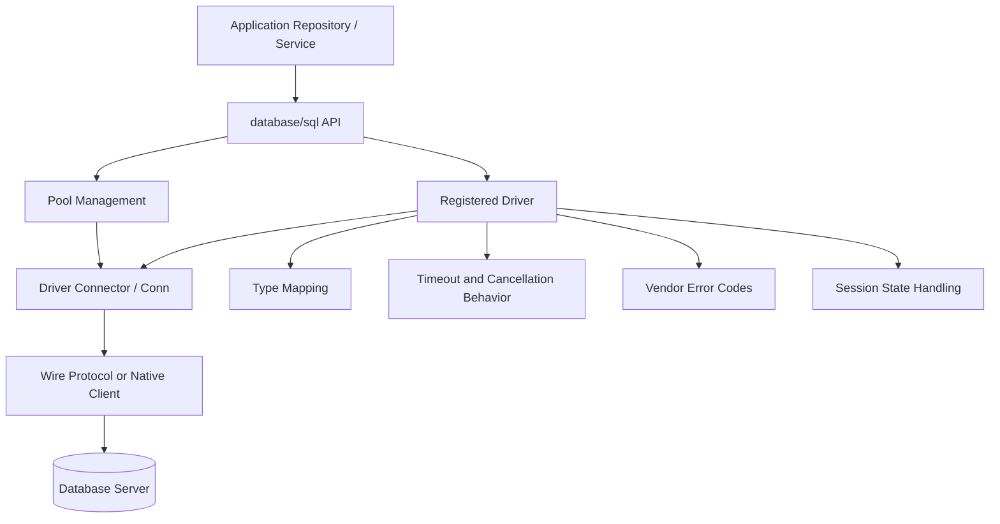
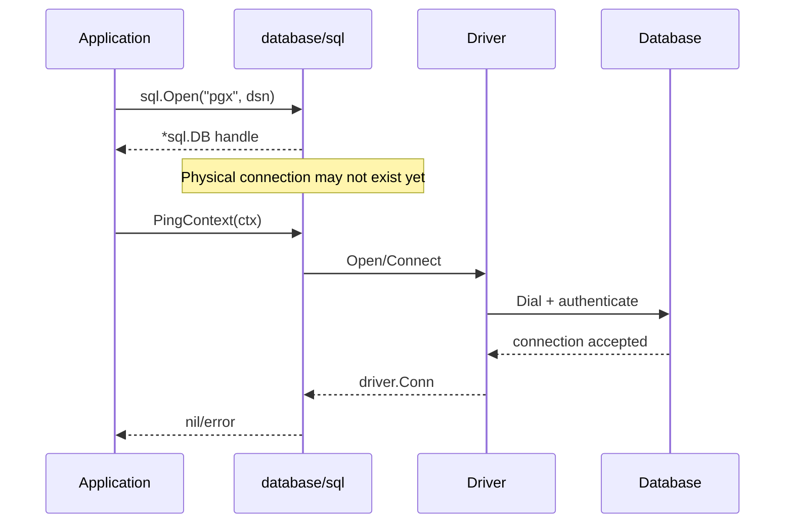
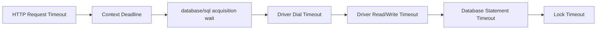
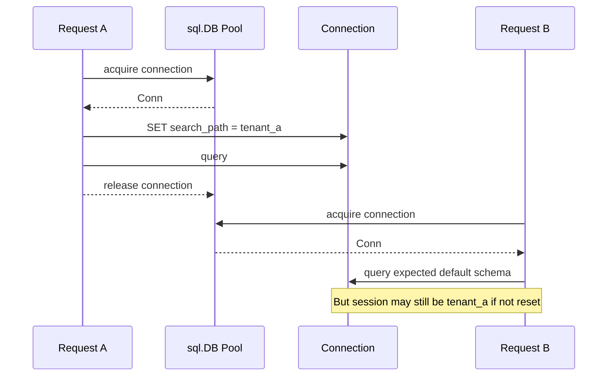
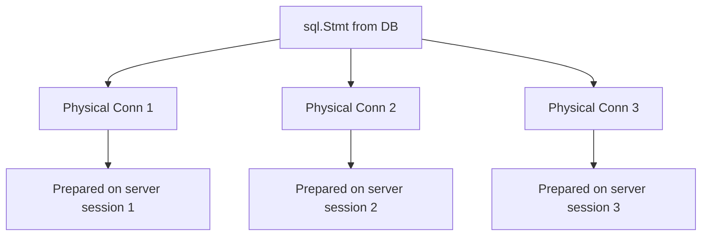
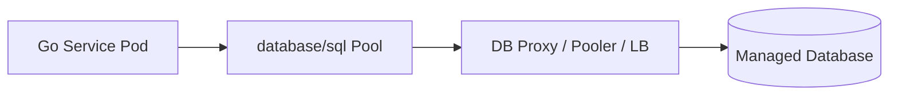
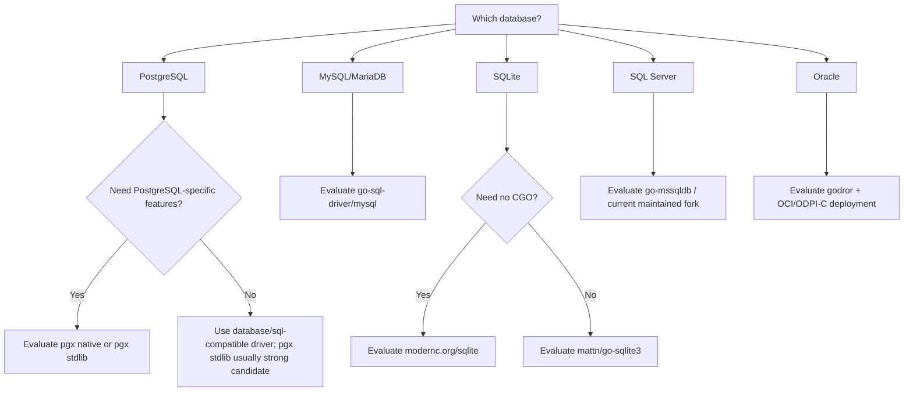

# learn-go-sql-database-integration-part-004.md

# Driver Model and Driver Selection

> Seri: `learn-go-sql-database-integration`  
> Part: `004`  
> Target pembaca: Java software engineer yang ingin memahami database integration di Go sampai level production architecture  
> Target Go: Go 1.26.x  
> Fokus: `database/sql/driver`, pilihan driver, driver-specific behavior, dan decision framework untuk production system

---

## 1. Tujuan

Di part sebelumnya kita sudah membahas cara membuka database handle dengan benar. Sekarang kita masuk ke layer yang sering dianggap “hanya import package”, padahal sebenarnya sangat menentukan perilaku production: **database driver**.

Di Java, banyak engineer terbiasa berpikir:

```text
JDBC API + JDBC Driver + DataSource/HikariCP
```

Di Go, mental model-nya mirip secara konseptual, tetapi detail behavior-nya berbeda:

```text
application code
    ↓
database/sql
    ↓
database/sql/driver contract
    ↓
actual driver implementation
    ↓
wire protocol / native client / CGO binding
    ↓
database server
```

Tujuan part ini:

1. Memahami apa yang sebenarnya dilakukan oleh database driver di Go.
2. Memahami batas tanggung jawab `database/sql` vs driver.
3. Menilai driver bukan hanya dari “bisa connect”, tetapi dari cancellation, timeout, TLS, type mapping, error classification, observability, maintenance, dan operational behavior.
4. Memilih driver secara defensible untuk PostgreSQL, MySQL/MariaDB, SQLite, SQL Server, dan Oracle.
5. Menghindari anti-pattern driver selection yang sering menyebabkan incident production.
6. Membangun checklist selection yang bisa dipakai dalam engineering review.

---

## 2. Ringkasan Singkat

Database driver di Go bukan sekadar adapter tipis. Ia menentukan banyak hal penting:

| Area | Ditentukan oleh `database/sql` | Ditentukan / dipengaruhi driver |
|---|---:|---:|
| Pooling dasar | Ya | Tidak langsung |
| API `QueryContext`, `ExecContext`, `BeginTx` | Ya | Implementasi aktual |
| Dial TCP/socket | Tidak | Ya |
| Wire protocol | Tidak | Ya |
| TLS negotiation | Tidak | Ya |
| Placeholder style | Tidak | Ya / database |
| Context cancellation | API tersedia | Real behavior tergantung driver |
| Error type/code | Tidak | Ya |
| SQLSTATE / vendor code | Tidak | Ya |
| Type mapping | Sebagian | Sangat dipengaruhi driver |
| Prepared statement behavior | API tersedia | Sangat dipengaruhi driver/database |
| Session reset/validation | Contract tersedia | Implementasi driver |
| Bulk protocol | Tidak standar | Driver/database-specific |
| COPY / LOAD DATA / array bind | Tidak standar | Driver-specific |

Invariant utamanya:

> `database/sql` memberi **stable abstraction**, tetapi driver menentukan **real production behavior**.

---

## 3. Mental Model: Driver sebagai Boundary antara Go dan Database Protocol

### 3.1 Apa yang developer lihat

Developer biasanya hanya melihat ini:

```go
import (
    "database/sql"

    _ "github.com/jackc/pgx/v5/stdlib"
)

func OpenDB(dsn string) (*sql.DB, error) {
    db, err := sql.Open("pgx", dsn)
    if err != nil {
        return nil, err
    }
    return db, nil
}
```

Dari sisi aplikasi, terlihat sederhana. Tetapi `_` import itu melakukan driver registration. Setelah itu, `sql.Open("pgx", dsn)` bisa menemukan driver bernama `pgx`.

### 3.2 Apa yang sebenarnya terjadi

Secara konseptual:



Hal yang perlu ditanamkan:

- `database/sql` tidak tahu PostgreSQL protocol secara native.
- `database/sql` tidak tahu MySQL protocol secara native.
- `database/sql` tidak tahu Oracle OCI secara native.
- `database/sql` hanya tahu contract umum: open connection, prepare statement, execute query, scan rows, begin transaction, commit, rollback.
- Driver-lah yang menerjemahkan contract itu ke database-specific behavior.

---

## 4. Package `database/sql/driver`: Apa Isinya?

Package `database/sql/driver` mendefinisikan interface yang harus diimplementasikan oleh driver. Aplikasi sehari-hari **biasanya tidak memakai package ini langsung**. Aplikasi memakai `database/sql`. Driver author memakai `database/sql/driver`.

Pemisahannya:

```text
Application code:
    database/sql

Driver implementation:
    database/sql/driver
```

### 4.1 Interface utama

Secara mental, contract driver terdiri dari beberapa kelompok:

| Kelompok | Contoh interface | Makna |
|---|---|---|
| Driver creation | `Driver`, `DriverContext`, `Connector` | Cara membuat connection |
| Connection | `Conn`, `Pinger`, `SessionResetter`, `Validator` | Lifecycle physical/logical connection |
| Execution | `Execer`, `ExecerContext`, `Queryer`, `QueryerContext` | Eksekusi command/query |
| Statement | `Stmt`, `StmtExecContext`, `StmtQueryContext` | Prepared statement |
| Transaction | `Tx`, `ConnBeginTx` | Begin/commit/rollback |
| Rows | `Rows`, `RowsColumnType...` | Streaming result set |
| Value conversion | `ValueConverter`, `NamedValueChecker` | Parameter dan scanning behavior |

Banyak interface bersifat optional tetapi sangat memengaruhi behavior. Driver modern seharusnya mendukung context-aware interface (`QueryerContext`, `ExecerContext`, `ConnBeginTx`, dan sejenisnya) agar cancellation dan timeout lebih bermakna.

### 4.2 Driver contract bukan cuma `Open`

Driver minimal bisa saja hanya membuka connection dan menjalankan query. Tetapi production driver yang baik perlu jauh lebih dari itu:

- connect dengan timeout yang jelas
- support TLS
- support context cancellation
- expose error code yang bisa diklasifikasi
- handle invalid/broken connection dengan benar
- reset session state sebelum reuse connection
- validate connection sebelum reuse
- handle prepared statement lifecycle
- map database type ke Go type secara predictable
- support timezone secara eksplisit
- document DSN parameter
- stabil terhadap database failover

---

## 5. Import Blank Identifier dan Driver Registration

Di Go, driver biasanya diregister melalui side-effect import:

```go
import (
    "database/sql"

    _ "github.com/jackc/pgx/v5/stdlib"
)
```

Kenapa `_`?

Karena aplikasi tidak memanggil package driver secara langsung. Kita hanya ingin menjalankan `init()` dari package driver agar driver terdaftar ke `database/sql`.

Contoh konseptual di dalam driver:

```go
func init() {
    sql.Register("pgx", &Driver{})
}
```

Setelah registration:

```go
db, err := sql.Open("pgx", dsn)
```

`"pgx"` adalah driver name. Jika driver tidak diregister, `sql.Open` gagal dengan error seperti “unknown driver”.

### 5.1 Anti-pattern: import driver di banyak tempat

Jangan sebar import driver di banyak package aplikasi.

Lebih baik:

```text
/internal/platform/db
    open.go
```

Di sana driver diimport sekali:

```go
package db

import (
    "database/sql"
    "time"

    _ "github.com/jackc/pgx/v5/stdlib"
)

func OpenPostgres(dsn string) (*sql.DB, error) {
    db, err := sql.Open("pgx", dsn)
    if err != nil {
        return nil, err
    }

    db.SetMaxOpenConns(20)
    db.SetMaxIdleConns(20)
    db.SetConnMaxIdleTime(5 * time.Minute)
    db.SetConnMaxLifetime(30 * time.Minute)

    return db, nil
}
```

Keuntungan:

- driver choice terkonsentrasi
- pool tuning terkonsentrasi
- DSN redaction terkonsentrasi
- observability hook mudah ditambahkan
- migration ke driver lain lebih terkendali

---

## 6. `sql.Open` vs Driver Connection Creation

`sql.Open(driverName, dataSourceName)` membuat `*sql.DB` handle. Ia tidak harus langsung membuat koneksi fisik. Koneksi nyata bisa dibuat saat `Ping`, `Query`, `Exec`, atau saat pool butuh connection.

Driver baru benar-benar berperan saat `database/sql` perlu connection.

Sequence konseptual:



Implikasi production:

- `sql.Open` sukses bukan berarti credential benar.
- `sql.Open` sukses bukan berarti host reachable.
- `sql.Open` sukses bukan berarti TLS valid.
- Startup validation harus memakai `PingContext` dengan timeout.

---

## 7. Driver Selection bukan Pilihan Cosmetic

Saat memilih driver, pertanyaan yang benar bukan:

> “Driver mana yang paling populer?”

Pertanyaan yang lebih baik:

> “Driver mana yang behavior-nya paling sesuai dengan correctness, operability, performance, deployment, dan failure mode sistem kita?”

Driver memengaruhi:

1. Apakah query bisa dicancel saat request timeout.
2. Apakah error unique constraint bisa diklasifikasi dengan reliable.
3. Apakah TLS bisa dikonfigurasi sesuai security posture.
4. Apakah timestamp/timezone tidak rusak diam-diam.
5. Apakah connection yang sudah rusak dibuang dari pool.
6. Apakah prepared statement compatible dengan pooler.
7. Apakah bulk insert punya path efisien.
8. Apakah binary protocol tersedia.
9. Apakah deployment butuh CGO/native client.
10. Apakah driver masih maintainable 3–5 tahun ke depan.

---

## 8. Evaluation Dimensions

Gunakan dimensi berikut untuk menilai driver.

### 8.1 Correctness

Checklist:

- Apakah driver mendukung transaction dengan benar?
- Apakah isolation level dipetakan dengan benar?
- Apakah error vendor bisa diakses?
- Apakah type mapping predictable?
- Apakah NULL handling normal?
- Apakah timezone handling jelas?
- Apakah decimal/numeric tidak kehilangan precision?
- Apakah binary/blob/clob didukung dengan baik?
- Apakah cancellation benar-benar menghentikan query di server atau hanya menghentikan wait di client?

### 8.2 Operability

Checklist:

- Apakah DSN terdokumentasi jelas?
- Apakah connect/read/write timeout tersedia?
- Apakah TLS mode tersedia?
- Apakah error connection broken dikenali sebagai bad connection?
- Apakah connection session bisa di-reset saat reuse?
- Apakah driver support context-aware methods?
- Apakah ada mekanisme tracing/logging hook?
- Apakah driver stabil saat failover?
- Apakah compatible dengan pooler/proxy yang dipakai?

### 8.3 Performance

Checklist:

- Pure Go atau CGO/native binding?
- Text protocol atau binary protocol?
- Prepared statement behavior efisien?
- Batch insert support?
- Bulk load protocol support?
- Copy protocol support?
- Array binding support?
- Scan allocation behavior?
- Large result set streaming?
- Large object behavior?
- Compression support jika relevan?

### 8.4 Deployment

Checklist:

- Bisa cross-compile mudah?
- Butuh C compiler?
- Butuh native client library?
- Compatible dengan Alpine/distroless?
- Compatible dengan FIPS/security base image?
- Compatible dengan target OS/architecture?
- Ada supply-chain risk?
- Lisensi sesuai organisasi?

### 8.5 Maintenance

Checklist:

- Kapan release terakhir?
- Apakah issue security ditangani?
- Apakah dokumentasi DSN jelas?
- Apakah test suite aktif?
- Apakah mendukung versi database modern?
- Apakah komunitas aktif?
- Apakah ada breaking change policy?
- Apakah API stabil?

---

## 9. Context Cancellation: API Ada, Behavior Belum Tentu Sama

Go menyediakan API context-aware:

```go
rows, err := db.QueryContext(ctx, query, args...)
_, err := db.ExecContext(ctx, query, args...)
tx, err := db.BeginTx(ctx, opts)
```

Tetapi real behavior bergantung pada driver.

### 9.1 Kemungkinan behavior

Saat context timeout/cancel terjadi:

| Behavior | Makna | Risiko |
|---|---|---|
| Driver mengirim cancel ke server | Query dihentikan di database | Paling baik, tetapi database-specific |
| Driver menutup connection | Query berhenti karena connection diputus | Connection churn naik |
| Driver hanya stop menunggu response | Query mungkin tetap jalan di server | Orphaned query risk |
| Driver tidak support context penuh | App menunggu sampai query selesai | Timeout tidak efektif |

### 9.2 Production rule

Jangan hanya percaya karena API bernama `QueryContext`.

Validasi dengan test:

1. Jalankan query lambat.
2. Berikan context timeout pendek.
3. Lihat apakah client return cepat.
4. Lihat di database apakah query benar-benar berhenti.
5. Lihat apakah connection tetap reusable.
6. Lihat error yang dikembalikan.

Contoh PostgreSQL-style test ide:

```go
ctx, cancel := context.WithTimeout(context.Background(), 100*time.Millisecond)
defer cancel()

start := time.Now()
_, err := db.ExecContext(ctx, `select pg_sleep(10)`)
elapsed := time.Since(start)

if err == nil {
    t.Fatal("expected timeout/cancellation error")
}
if elapsed > 2*time.Second {
    t.Fatalf("query did not cancel quickly enough: %s", elapsed)
}
```

Test di atas tidak cukup sendiri; untuk production review, lihat juga sisi database.

---

## 10. Timeout: Driver DSN vs Context vs Database Setting

Timeout dalam sistem database Go biasanya terdiri dari beberapa lapisan:



Driver sering punya DSN parameter sendiri untuk:

- connect/dial timeout
- read timeout
- write timeout
- TLS mode
- connection attributes

Context deadline biasanya mengontrol operation-level cancellation, tetapi tidak selalu menggantikan driver-level dial/read/write timeout.

### 10.1 Rule of thumb

Gunakan kombinasi:

```text
connect timeout       -> driver/DSN level
read/write timeout    -> driver/DSN level jika tersedia
query timeout         -> context + database statement timeout
lock timeout          -> database setting/session/query level
total request budget  -> context dari boundary terluar
```

### 10.2 Anti-pattern

```go
ctx := context.Background()
rows, err := db.QueryContext(ctx, slowQuery)
```

Ini memakai API context-aware tetapi tanpa deadline. Untuk request path production, ini biasanya kurang defensible.

Lebih baik:

```go
ctx, cancel := context.WithTimeout(parent, 750*time.Millisecond)
defer cancel()

rows, err := db.QueryContext(ctx, query, args...)
```

Tetapi angka timeout harus berasal dari latency budget sistem, bukan asal pilih.

---

## 11. Error Surface: Driver Menentukan Klasifikasi

`database/sql` punya beberapa error standar, misalnya:

- `sql.ErrNoRows`
- context cancellation/deadline errors

Tetapi kebanyakan database error berasal dari driver.

Contoh kategori yang perlu diklasifikasi:

| Kategori | Contoh |
|---|---|
| Unique constraint violation | duplicate email, duplicate idempotency key |
| Foreign key violation | parent not found |
| Check constraint violation | invalid state |
| Deadlock | transaction aborted |
| Serialization failure | retryable transaction |
| Lock timeout | retry / fail fast tergantung use case |
| Statement timeout | query too slow |
| Connection refused | database unavailable |
| Too many connections | capacity issue |
| Read-only transaction/server | failover or replica misuse |
| Ambiguous commit | dangerous retry boundary |

### 11.1 Jangan string matching error message sebagai default

Buruk:

```go
if strings.Contains(err.Error(), "duplicate") {
    return ErrAlreadyExists
}
```

Lebih baik gunakan driver-specific error type/code:

```go
// Pseudocode: exact type depends on selected driver.
var pgErr *pgconn.PgError
if errors.As(err, &pgErr) && pgErr.Code == "23505" {
    return ErrAlreadyExists
}
```

Untuk MySQL-style:

```go
// Pseudocode: exact type depends on selected driver.
var myErr *mysql.MySQLError
if errors.As(err, &myErr) && myErr.Number == 1062 {
    return ErrAlreadyExists
}
```

Driver selection harus mempertimbangkan apakah error type terdokumentasi dan stabil.

---

## 12. Type Mapping: Driver Bisa Mengubah Makna Data

SQL type tidak selalu punya padanan sempurna di Go.

Area rawan:

| SQL Type | Risiko di Go |
|---|---|
| `NUMERIC`, `DECIMAL` | precision loss jika dipaksa ke `float64` |
| `TIMESTAMP` | timezone ambiguity |
| `TIMESTAMP WITH TIME ZONE` | database-specific normalization |
| `UUID` | string vs `[16]byte` vs custom type |
| `JSON` / `JSONB` | `[]byte`, `string`, custom scanner |
| `ARRAY` | driver-specific support |
| `BLOB` / `BYTEA` | allocation besar |
| `CLOB` / large text | streaming vs full materialization |
| `ENUM` | string vs custom type |
| `BIT` / `BOOLEAN` | database-specific bool mapping |

### 12.1 Decimal rule

Untuk money atau regulatory amount:

- Jangan default ke `float64`.
- Gunakan integer minor unit jika domain memungkinkan.
- Atau scan sebagai string/bytes lalu parse ke decimal library/domain type.
- Pastikan rounding policy eksplisit.

### 12.2 Time rule

Untuk timestamp:

- Tetapkan timezone policy di level sistem.
- Pastikan DSN driver tidak diam-diam memakai local timezone container.
- Hindari bergantung pada default timezone database/session.
- Simpan event time dan business effective time dengan semantics berbeda.

---

## 13. Session State dan Connection Reuse

Pool berarti physical connection dipakai ulang. Ini membawa risiko session state.

Session state bisa berupa:

- timezone
- search path/schema
- role
- transaction isolation default
- statement timeout
- lock timeout
- application name
- temporary table
- prepared statement
- session variables
- NLS settings pada Oracle
- SQL mode pada MySQL

Jika satu request mengubah session state dan tidak mengembalikannya, request lain bisa terdampak.



Production rule:

> Treat session mutation as dangerous unless reset is guaranteed.

Prefer:

- set stable session config during connection initialization if driver supports it
- avoid per-request session mutation
- if unavoidable, use dedicated `sql.Conn` and reset explicitly
- use transaction-local settings where database supports it
- test pool reuse behavior

---

## 14. `driver.Pinger`, `SessionResetter`, and `Validator`

Modern driver quality is not only about query execution.

Important optional contracts:

| Contract | Purpose |
|---|---|
| `Pinger` | Allows `db.PingContext` to verify connection health |
| `SessionResetter` | Allows driver to reset session before connection reuse |
| `Validator` | Allows driver to tell pool whether connection is still valid |

If these are poorly implemented, symptoms can include:

- stale broken connections reused
- requests failing after database failover
- session state leaking across requests
- `Ping` giving false confidence
- pool retaining bad connections too long

Sebagai application engineer, kita jarang implement interface ini, tetapi kita harus memahami bahwa driver support terhadap contract ini memengaruhi production behavior.

---

## 15. Prepared Statement Behavior Depends on Driver and Database

`database/sql` menyediakan:

```go
stmt, err := db.PrepareContext(ctx, query)
```

Tetapi statement behavior sangat bergantung pada driver dan database.

Pertanyaan yang harus dijawab:

1. Apakah statement diprepare di server atau hanya client-side?
2. Apakah statement diprepare per physical connection?
3. Apakah statement cache tersedia?
4. Apakah statement valid setelah failover?
5. Apakah compatible dengan external pooler?
6. Apakah high-cardinality dynamic SQL menyebabkan memory leak di server?
7. Apakah prepared statement dipakai otomatis oleh driver?
8. Apakah plan cache bisa menjadi masalah?

### 15.1 DB-level prepared statement dan pool

Karena `sql.DB` adalah pool, prepared statement pada `*sql.DB` secara konseptual harus bisa dipakai pada banyak connection. Implementasi internal dan driver dapat menyiapkan statement pada connection yang dipakai.

Mental model:



Implikasi:

- Prepared statement bukan magic global object di database.
- Banyak connection bisa berarti banyak server-side prepared statements.
- Dynamic SQL yang tidak terkendali bisa membengkakkan resource.

---

## 16. Native Driver API vs `database/sql`

Beberapa driver menyediakan dua mode:

1. Mode `database/sql` compatible.
2. Mode native API.

Contoh penting: PostgreSQL `pgx`.

### 16.1 Kapan memakai `database/sql`

Gunakan `database/sql` jika:

- ingin abstraction standar
- tim ingin API familiar dan portable
- database-specific feature tidak dominan
- ingin repository mudah diganti driver
- ingin integrasi dengan library yang menerima `*sql.DB`
- transaksi dan query biasa cukup

### 16.2 Kapan memakai native API

Pertimbangkan native API jika:

- butuh database-specific feature kuat
- butuh COPY protocol
- butuh LISTEN/NOTIFY
- butuh type mapping PostgreSQL lebih kaya
- butuh performa lebih tinggi
- butuh driver-native pool/trace hook
- database sudah jelas tidak akan diganti

### 16.3 Architectural rule

Jangan campur native API dan `database/sql` sembarangan di banyak layer.

Lebih baik buat boundary eksplisit:

```text
/internal/platform/postgres
    db_sql.go       // database/sql adapter
    pgx_native.go   // native pgx adapter for special paths
```

Atau pisahkan service:

```text
normal CRUD path       -> database/sql
bulk ingestion path    -> native driver COPY
notification listener  -> native driver LISTEN/NOTIFY
```

---

## 17. PostgreSQL Driver Selection

### 17.1 Common options

| Driver | Model | Notes |
|---|---|---|
| `github.com/jackc/pgx/v5` | Native PostgreSQL driver and toolkit; can also act as `database/sql` driver via stdlib adapter | Strong PostgreSQL-specific feature support |
| `github.com/lib/pq` | `database/sql` PostgreSQL driver | Longstanding driver; evaluate maintenance and feature needs before new adoption |

### 17.2 `pgx`

`pgx` is commonly selected for modern PostgreSQL Go projects because it offers:

- pure Go PostgreSQL driver/toolkit
- native API
- `database/sql` adapter via stdlib
- PostgreSQL-specific feature exposure
- COPY support
- LISTEN/NOTIFY support
- richer PostgreSQL type support

Decision rule:

```text
If PostgreSQL is strategic and you need PostgreSQL-specific capabilities,
pgx is usually the first driver to evaluate.
```

Example using `pgx` through `database/sql`:

```go
package db

import (
    "context"
    "database/sql"
    "fmt"
    "time"

    _ "github.com/jackc/pgx/v5/stdlib"
)

type PostgresConfig struct {
    DSN              string
    MaxOpenConns     int
    MaxIdleConns     int
    ConnMaxIdleTime  time.Duration
    ConnMaxLifetime  time.Duration
    StartupPingLimit time.Duration
}

func OpenPostgres(ctx context.Context, cfg PostgresConfig) (*sql.DB, error) {
    db, err := sql.Open("pgx", cfg.DSN)
    if err != nil {
        return nil, fmt.Errorf("open postgres handle: %w", err)
    }

    db.SetMaxOpenConns(cfg.MaxOpenConns)
    db.SetMaxIdleConns(cfg.MaxIdleConns)
    db.SetConnMaxIdleTime(cfg.ConnMaxIdleTime)
    db.SetConnMaxLifetime(cfg.ConnMaxLifetime)

    pingCtx, cancel := context.WithTimeout(ctx, cfg.StartupPingLimit)
    defer cancel()

    if err := db.PingContext(pingCtx); err != nil {
        _ = db.Close()
        return nil, fmt.Errorf("ping postgres: %w", err)
    }

    return db, nil
}
```

### 17.3 PostgreSQL-specific checklist

- Need SQLSTATE classification?
- Need `RETURNING`?
- Need UUID support?
- Need array support?
- Need JSONB scanning?
- Need COPY for bulk load?
- Need LISTEN/NOTIFY?
- Need PgBouncer compatibility?
- Need statement cache tuning?
- Need binary protocol?
- Need native type registration?

### 17.4 PgBouncer / external pooler caution

External poolers can change semantics, especially around:

- server-side prepared statements
- session state
- transaction pooling mode
- temporary tables
- advisory locks
- LISTEN/NOTIFY

If using PgBouncer transaction pooling, validate driver prepared statement behavior and session assumptions carefully.

---

## 18. MySQL / MariaDB Driver Selection

### 18.1 Common option

| Driver | Model | Notes |
|---|---|---|
| `github.com/go-sql-driver/mysql` | Pure Go MySQL driver for `database/sql` | Widely used; DSN supports many MySQL-specific options |

### 18.2 DSN matters more than people expect

MySQL driver behavior is strongly controlled by DSN options, including areas like:

- dial timeout
- read timeout
- write timeout
- TLS config
- parse time behavior
- location/timezone
- collation/charset
- connection attributes

Example:

```go
// Example only. Build DSN using driver config helpers where possible.
dsn := "app:secret@tcp(mysql.internal:3306)/orders" +
    "?parseTime=true" +
    "&timeout=3s" +
    "&readTimeout=2s" +
    "&writeTimeout=2s" +
    "&tls=true"
```

### 18.3 MySQL-specific traps

| Area | Risk |
|---|---|
| `parseTime` | Without correct config, date/time scanning may not produce `time.Time` as expected |
| `loc` / timezone | Container local timezone can surprise you |
| charset/collation | String comparison and encoding behavior may differ |
| autocommit | Transaction boundary assumptions can break |
| isolation | InnoDB default isolation may differ from PostgreSQL expectation |
| duplicate key | Need driver-specific error code classification |
| deadlock | Must classify and retry safely |
| read-only error | Can happen after failover or when hitting replica |
| connection lifetime | Important with managed MySQL/load balancer/proxy setups |

### 18.4 MySQL selection rule

```text
For MySQL/MariaDB with database/sql, start by evaluating go-sql-driver/mysql,
but do not accept default DSN blindly. DSN policy is part of production design.
```

---

## 19. SQLite Driver Selection

SQLite is different from PostgreSQL/MySQL because it is in-process, embedded, and file-backed by default.

### 19.1 Common options

| Driver | Model | Notes |
|---|---|---|
| `github.com/mattn/go-sqlite3` | SQLite driver using CGO | Mature but needs CGO; cross-compilation/deployment impact |
| `modernc.org/sqlite` | CGo-free SQLite driver | Easier cross-compilation; evaluate compatibility/performance for your workload |

### 19.2 SQLite is not “small PostgreSQL”

SQLite is excellent for:

- embedded applications
- local cache
- CLI tools
- tests
- edge deployments
- single-node metadata store
- development workflows

But be careful for:

- high write concurrency
- multi-process write contention
- network filesystem
- large multi-tenant server workload
- operational backup semantics
- migration locking

### 19.3 CGO decision

CGO is not automatically bad. But it affects:

- cross-compilation
- build image complexity
- static binary expectations
- distroless/alpine compatibility
- OS/architecture matrix
- security scanning
- performance characteristics

Decision rule:

```text
If deployment simplicity and cross-compilation are primary, evaluate CGo-free SQLite.
If exact SQLite C library behavior/extension compatibility matters, evaluate CGO driver.
```

---

## 20. SQL Server Driver Selection

Common driver:

| Driver | Model | Notes |
|---|---|---|
| `github.com/denisenkom/go-mssqldb` or Microsoft-maintained fork paths depending on ecosystem state | Pure Go SQL Server driver for `database/sql` | Supports SQL Server style connection parameters; evaluate current maintenance path |

SQL Server-specific questions:

- Do you need Azure SQL authentication?
- Do you need integrated authentication?
- Do you need AlwaysOn listener support?
- Do you need encryption enforced?
- Do you need specific date/time type handling?
- Do you need table-valued parameters?
- Do you need bulk copy?
- Do you need MARS-like behavior? Be very careful with assumptions from .NET/JDBC.

Connection string style can differ from PostgreSQL/MySQL. SQL Server often uses URL style or ADO-style key-value connection strings depending on driver support.

---

## 21. Oracle Driver Selection

Oracle integration in Go often has more deployment complexity than PostgreSQL/MySQL.

Common driver:

| Driver | Model | Notes |
|---|---|---|
| `github.com/godror/godror` | `database/sql` driver for Oracle using ODPI-C/OCI | Requires native/client considerations; CGO commonly involved |

Oracle-specific concerns:

- Oracle Instant Client / native dependency
- CGO requirement
- NLS/session state
- CLOB/BLOB handling
- NUMBER precision
- DATE vs TIMESTAMP semantics
- array binding
- PL/SQL call support
- statement cache
- connection class/session tagging if applicable
- transaction behavior
- RAC/service name/failover behavior

### 21.1 Oracle production rule

For Oracle, driver selection is inseparable from deployment design:

```text
driver choice + Oracle client dependency + container base image + CI build + runtime patching
```

Do not choose Oracle driver in isolation from platform engineering.

---

## 22. Pure Go vs CGO vs Native Client

### 22.1 Pure Go

Pros:

- easier cross-compilation
- simpler container build
- static binary easier
- fewer native runtime dependencies
- easier security scanning
- simpler local development

Cons:

- may lag behind vendor-native feature parity
- may reimplement complex protocol behavior
- performance may differ depending on protocol implementation
- may not support every enterprise auth mechanism

### 22.2 CGO/native client

Pros:

- closer to vendor-supported native behavior
- may support advanced database-specific features
- may reuse mature C client libraries
- required for some ecosystems/features

Cons:

- build complexity
- cross-compilation complexity
- OS package dependency
- base image complexity
- native library patching responsibility
- runtime linking issues
- potential memory/debugging complexity across Go/C boundary

### 22.3 Decision matrix

| Context | Prefer |
|---|---|
| cloud-native microservice, Linux containers, many architectures | Pure Go if feature-complete |
| Oracle enterprise integration needing OCI features | Native/CGO likely unavoidable |
| local embedded DB with easy cross-compile requirement | CGo-free SQLite candidate |
| need exact SQLite extension behavior | CGO SQLite candidate |
| strict base image and supply-chain simplicity | Pure Go favored |
| vendor-certified client behavior required | Native client may be favored |

---

## 23. Placeholder Style Is Driver/Database-Specific

`database/sql` does not normalize placeholder syntax.

Examples:

| Database | Common placeholder style |
|---|---|
| PostgreSQL | `$1`, `$2` |
| MySQL | `?` |
| SQLite | `?`, `?NNN`, named variants depending driver |
| SQL Server | often `@p1` / named-style depending driver |
| Oracle | named bind style often used |

This matters for query portability.

Bad assumption:

```go
// Works in MySQL, not PostgreSQL.
row := db.QueryRowContext(ctx, `select * from users where id = ?`, id)
```

PostgreSQL style:

```go
row := db.QueryRowContext(ctx, `select * from users where id = $1`, id)
```

### 23.1 Architectural implication

If you claim your repository is database-agnostic but SQL strings contain driver-specific placeholders, it is not truly database-agnostic.

That is acceptable if intentional.

Be honest:

```text
This repository is PostgreSQL-specific.
```

is better than pretending:

```text
This repository can support any SQL database.
```

---

## 24. DSN Construction: Prefer Structured Config When Available

String concatenation for DSN is error-prone and can leak secrets.

Bad:

```go
dsn := user + ":" + password + "@tcp(" + host + ":" + port + ")/" + dbname
```

Better if driver provides config builder/parser:

```go
// Pseudocode shape. Exact API depends on selected driver.
cfg := mysql.Config{
    User:                 user,
    Passwd:               password,
    Net:                  "tcp",
    Addr:                 host + ":3306",
    DBName:               dbname,
    ParseTime:            true,
    AllowNativePasswords: true,
    Timeout:              3 * time.Second,
    ReadTimeout:          2 * time.Second,
    WriteTimeout:         2 * time.Second,
}

dsn := cfg.FormatDSN()
```

For PostgreSQL, prefer documented URL/key-value forms or driver config parser if using native API.

### 24.1 Redacted DSN

Never log full DSN with password.

Create redaction helper:

```go
func RedactDSN(dsn string) string {
    // Real implementation should parse according to driver/database format.
    // Do not use naive replacement as final production logic for all DSN forms.
    return "<redacted-dsn>"
}
```

Production standard:

```text
Logs may include driver name, database host alias, db name, app name.
Logs must not include password, token, private key, or full URL with credential.
```

---

## 25. TLS and Authentication

Driver must support your required security posture.

Questions:

1. Can TLS be required, not optional?
2. Can server certificate be verified?
3. Can custom CA be configured?
4. Can mTLS/client certificate be used?
5. Can hostname verification be enforced?
6. Can insecure mode be disabled by policy?
7. Does driver support cloud provider auth token if needed?
8. Does driver support IAM/database auth if needed?
9. Does driver log sensitive auth failure detail?

### 25.1 TLS anti-pattern

Bad production posture:

```text
sslmode=disable
```

or equivalent insecure config, unless there is a documented compensating control and approved exception.

Better posture:

```text
require TLS + verify server identity + managed certificate rotation
```

Exact DSN syntax depends on database/driver.

---

## 26. Cloud Database and Proxy Compatibility

Modern deployments often insert components between app and DB:



Examples:

- RDS Proxy
- PgBouncer
- Cloud SQL connector/proxy
- HAProxy/TCP proxy
- database firewall
- service mesh TCP proxy

Driver behavior must be tested with the actual path.

### 26.1 Things proxies can affect

- connection lifetime
- idle timeout
- prepared statements
- session variables
- transaction pinning
- failover behavior
- TLS termination
- authentication mechanism
- client IP visibility
- server parameter status

Do not test driver only against local Docker DB and assume production proxy path behaves the same.

---

## 27. Driver Compatibility with Pool Settings

Even though pool is managed by `database/sql`, driver behavior still influences pool health.

Important pool settings:

```go
db.SetMaxOpenConns(maxOpen)
db.SetMaxIdleConns(maxIdle)
db.SetConnMaxIdleTime(idleTime)
db.SetConnMaxLifetime(lifetime)
```

Driver-related concerns:

- Does connection setup cost high?
- Does authentication token expire?
- Does server close idle connections?
- Does proxy close idle connections?
- Does database failover break existing sessions?
- Does driver detect broken connection quickly?
- Does driver mark bad connection correctly?

### 27.1 Token-based auth example

If database password is actually short-lived auth token:

- connection lifetime must be shorter than token validity, or
- connector must refresh credentials per connection, or
- external proxy handles auth rotation.

Otherwise, pool may keep old connections working until reconnect, then suddenly fail new connections.

---

## 28. Health Check Semantics Depend on Driver

`db.PingContext(ctx)` verifies the database can be reached through the driver. But the quality of ping depends on driver implementation.

Health checks should distinguish:

| Check | Purpose | Should it use DB? |
|---|---|---|
| Liveness | Is process alive? | Usually no |
| Readiness | Can serve traffic? | Often yes, but carefully |
| Startup validation | Fail fast if DB config invalid | Yes |
| Deep dependency check | Operational diagnostic | Yes, may be expensive |

### 28.1 Bad readiness pattern

```go
func readiness(w http.ResponseWriter, r *http.Request) {
    if err := db.PingContext(r.Context()); err != nil {
        http.Error(w, "db down", 503)
        return
    }
    w.WriteHeader(200)
}
```

This may be too aggressive if called very frequently across many pods.

Better:

- bounded timeout
- possibly cached result
- separate deep health endpoint
- avoid readiness causing DB overload during incident

Example:

```go
type DBHealth struct {
    DB      *sql.DB
    Timeout time.Duration
}

func (h DBHealth) Ready(ctx context.Context) error {
    pingCtx, cancel := context.WithTimeout(ctx, h.Timeout)
    defer cancel()
    return h.DB.PingContext(pingCtx)
}
```

---

## 29. Observability Requirements for Driver Choice

At minimum, database integration should expose:

- pool stats from `db.Stats()`
- query latency
- transaction latency
- error classification
- timeout/cancellation count
- rows returned if safe
- affected rows if useful
- slow query log with redacted query identity
- database host/role label if safe
- driver name/version in startup log

`database/sql` itself exposes pool stats, but driver-specific metrics may need wrapping or native driver hooks.

### 29.1 Query identity instead of raw SQL

Avoid logging full SQL with parameters.

Prefer:

```go
const queryGetUserByID = "user.get_by_id"
```

Log:

```text
query=user.get_by_id duration_ms=12 result=ok rows=1
```

Not:

```text
select * from users where email='actual.person@example.com'
```

### 29.2 Driver name in diagnostic

At startup:

```text
db.driver=pgx
db.database=orders
db.host_alias=orders-primary
db.max_open_conns=20
db.max_idle_conns=20
db.conn_max_lifetime=30m
```

Do not log secret-bearing DSN.

---

## 30. Migration Risk When Changing Driver

Changing driver is not a trivial refactor.

Potential changes:

| Area | What can change |
|---|---|
| Error type | classification code breaks |
| Placeholder syntax | SQL strings may break |
| Time mapping | timestamps shift or scan differently |
| Byte/string mapping | `[]byte` vs `string` behavior differs |
| Decimal mapping | precision path changes |
| NULL behavior | scan behavior differs |
| Prepared statements | server-side/cache behavior changes |
| Cancellation | timeout behavior changes |
| TLS DSN | config changes |
| Bulk path | unsupported or different API |
| Pool interaction | bad connection handling differs |

### 30.1 Driver migration checklist

Before migrating driver:

1. Inventory all DB queries.
2. Inventory all driver-specific imports/types.
3. Inventory error classification.
4. Run integration tests against real DB.
5. Run cancellation tests.
6. Run transaction isolation tests.
7. Run time zone tests.
8. Run numeric precision tests.
9. Run pool exhaustion tests.
10. Run failover/restart tests if possible.
11. Compare production query latency in staging.
12. Verify observability labels.
13. Verify migration tooling compatibility.
14. Roll out gradually.

---

## 31. Decision Framework

### 31.1 Basic decision tree



### 31.2 Scoring matrix

Gunakan scoring 1–5.

| Dimension | Weight | Driver A | Driver B | Notes |
|---|---:|---:|---:|---|
| Correctness/type mapping | 5 |  |  | Time, decimal, NULL, UUID, JSON |
| Context cancellation | 5 |  |  | Verified empirically |
| Error classification | 5 |  |  | Vendor codes accessible |
| TLS/auth support | 5 |  |  | Security requirement |
| Transaction behavior | 5 |  |  | Isolation, retry taxonomy |
| Pool compatibility | 4 |  |  | Bad connection, session reset |
| Performance | 4 |  |  | Benchmark real workload |
| Bulk capability | 3 |  |  | COPY/load/array bind |
| Observability hooks | 3 |  |  | Trace/log integration |
| Deployment simplicity | 4 |  |  | CGO, native libs, base image |
| Maintenance health | 5 |  |  | Releases, issues, docs |
| Ecosystem fit | 3 |  |  | Tooling/team familiarity |

Do not make decision based only on total score. Some dimensions are hard gates.

Hard gate examples:

- no TLS support where TLS is mandatory
- no reliable cancellation for latency-sensitive API
- no error code access for transactional correctness
- native dependency impossible in target platform
- license incompatible

---

## 32. Production Driver Selection Review Template

Gunakan template ini di architecture review.

```markdown
# Database Driver Selection Review

## Database
- Engine:
- Version:
- Managed service / self-hosted:
- Proxy/pooler in path:

## Candidate Driver
- Module path:
- Driver name for sql.Open:
- Version:
- Pure Go / CGO / native client:
- License:

## Functional Requirements
- Query:
- Transaction:
- Isolation level:
- Prepared statement:
- Bulk operation:
- JSON/array/UUID/decimal/time support:

## Operational Requirements
- TLS:
- Authentication:
- Connect timeout:
- Read/write timeout:
- Context cancellation:
- Error classification:
- Failover behavior:
- Pool compatibility:

## Deployment Requirements
- OS/architecture:
- Container base image:
- Cross-compilation:
- Native dependency:
- Vulnerability scanning:

## Tests Performed
- Ping/startup validation:
- Query cancellation:
- Transaction rollback:
- Serialization/deadlock retry:
- Unique/FK/check error mapping:
- Timezone mapping:
- Decimal precision:
- Pool exhaustion:
- DB restart/failover:
- TLS verification:

## Decision
- Selected driver:
- Reason:
- Risks:
- Mitigation:
- Review date:
```

---

## 33. Reference Implementation: Driver-Aware DB Opening

Contoh ini bukan library final, tetapi pola production-grade sederhana.

```go
package db

import (
    "context"
    "database/sql"
    "errors"
    "fmt"
    "time"

    _ "github.com/jackc/pgx/v5/stdlib"
)

type DriverName string

const (
    DriverPostgresPGX DriverName = "pgx"
)

type Config struct {
    Driver             DriverName
    DSN                string
    MaxOpenConns       int
    MaxIdleConns       int
    ConnMaxIdleTime    time.Duration
    ConnMaxLifetime    time.Duration
    StartupPingTimeout time.Duration
}

func (c Config) Validate() error {
    if c.Driver == "" {
        return errors.New("db driver is required")
    }
    if c.DSN == "" {
        return errors.New("db dsn is required")
    }
    if c.MaxOpenConns <= 0 {
        return errors.New("db max open conns must be positive")
    }
    if c.MaxIdleConns < 0 {
        return errors.New("db max idle conns must not be negative")
    }
    if c.MaxIdleConns > c.MaxOpenConns {
        return errors.New("db max idle conns must not exceed max open conns")
    }
    if c.StartupPingTimeout <= 0 {
        return errors.New("db startup ping timeout must be positive")
    }
    return nil
}

func Open(ctx context.Context, cfg Config) (*sql.DB, error) {
    if err := cfg.Validate(); err != nil {
        return nil, fmt.Errorf("validate db config: %w", err)
    }

    db, err := sql.Open(string(cfg.Driver), cfg.DSN)
    if err != nil {
        return nil, fmt.Errorf("open db handle using driver %q: %w", cfg.Driver, err)
    }

    db.SetMaxOpenConns(cfg.MaxOpenConns)
    db.SetMaxIdleConns(cfg.MaxIdleConns)
    db.SetConnMaxIdleTime(cfg.ConnMaxIdleTime)
    db.SetConnMaxLifetime(cfg.ConnMaxLifetime)

    pingCtx, cancel := context.WithTimeout(ctx, cfg.StartupPingTimeout)
    defer cancel()

    if err := db.PingContext(pingCtx); err != nil {
        _ = db.Close()
        return nil, fmt.Errorf("ping db using driver %q: %w", cfg.Driver, err)
    }

    return db, nil
}
```

### 33.1 Kenapa driver name dibuat typed constant?

Untuk menghindari string liar:

```go
sql.Open("postgres", dsn)
sql.Open("pgx", dsn)
sql.Open("postgresql", dsn)
```

Driver name harus sesuai dengan registration driver yang dipakai. Salah string bisa gagal runtime.

---

## 34. Reference Implementation: Error Classification Boundary

Jangan biarkan seluruh aplikasi bergantung pada error type driver. Buat boundary di package persistence/platform.

```go
package dberr

import "errors"

var (
    ErrAlreadyExists      = errors.New("already exists")
    ErrReferenceNotFound  = errors.New("reference not found")
    ErrConflict           = errors.New("conflict")
    ErrRetryableTxFailure = errors.New("retryable transaction failure")
    ErrUnavailable        = errors.New("database unavailable")
)
```

PostgreSQL classifier contoh konseptual:

```go
package postgres

import (
    "context"
    "errors"

    "github.com/jackc/pgconn"

    "example.com/app/internal/platform/dberr"
)

func ClassifyError(err error) error {
    if err == nil {
        return nil
    }

    if errors.Is(err, context.Canceled) || errors.Is(err, context.DeadlineExceeded) {
        return err
    }

    var pgErr *pgconn.PgError
    if errors.As(err, &pgErr) {
        switch pgErr.Code {
        case "23505":
            return errors.Join(dberr.ErrAlreadyExists, err)
        case "23503":
            return errors.Join(dberr.ErrReferenceNotFound, err)
        case "40001", "40P01":
            return errors.Join(dberr.ErrRetryableTxFailure, err)
        }
    }

    return err
}
```

Catatan:

- `pgconn.PgError` path/version harus disesuaikan dengan driver version yang dipakai.
- Jangan membuat domain layer import driver package.
- Mapping harus diuji dengan real database.

---

## 35. Reference Implementation: Driver Capability Document

Simpan keputusan driver sebagai dokumen repo, bukan tribal knowledge.

Contoh:

```markdown
# Database Driver Capability: PostgreSQL

## Selected Driver
- Module: github.com/jackc/pgx/v5
- Mode: database/sql via stdlib for standard repository path
- Native API: allowed only for bulk ingestion and notification listener

## Why
- Supports database/sql compatibility
- Supports PostgreSQL-specific features when needed
- Provides access to PostgreSQL error details
- Pure Go deployment

## Rules
- Repository CRUD path uses *sql.DB / *sql.Tx
- COPY path may use native pgx only in internal/platform/postgres/bulk
- LISTEN/NOTIFY may use native pgx only in internal/platform/postgres/notify
- Domain layer must not import pgx packages
- SQLSTATE mapping must happen in platform layer
- Raw DSN must never be logged

## Required Tests
- cancellation test using pg_sleep
- unique violation classification
- FK violation classification
- serialization retry test
- timestamp timezone roundtrip
- pool exhaustion behavior
```

---

## 36. Anti-Patterns

### 36.1 Selecting driver only by GitHub stars

Popularity helps, but it is not enough. A less popular driver may be better if it supports required auth/TLS/type behavior.

### 36.2 Ignoring cancellation behavior

A service with strict HTTP timeout but driver that does not cancel server-side query can still overload the DB.

### 36.3 Treating all SQL drivers as equivalent

`database/sql` standardizes API, not behavior.

### 36.4 Logging DSN

A DSN often contains credential. Do not log it.

### 36.5 Hiding driver choice inside random repository packages

Driver selection belongs in platform infrastructure boundary.

### 36.6 Assuming local Docker behavior equals production

Production may include TLS, proxy, failover, read replicas, IAM auth, connection lifetime limits, and different timezone/session settings.

### 36.7 Using native API everywhere without boundary

Native API can be powerful, but if it leaks everywhere, future refactoring and testing become harder.

### 36.8 Assuming `Ping` proves everything

`Ping` proves a basic connection path. It does not prove query performance, isolation correctness, permission completeness, migration safety, or failover behavior.

### 36.9 Choosing CGO driver without platform review

CGO can be valid, but must be reviewed with CI/CD, image, runtime, security, and patching constraints.

---

## 37. Failure Modes Caused by Driver Choice

| Failure | Possible driver-related cause | Mitigation |
|---|---|---|
| Request timeout but DB CPU remains high | cancellation not propagated server-side | cancellation test; DB statement timeout |
| Random wrong tenant/schema | session state leak | avoid session mutation; reset; dedicated conn |
| Duplicate key not mapped | error code inaccessible or not classified | driver-specific error classifier |
| Timestamp shifted by hours | timezone DSN/session mismatch | explicit timezone policy and tests |
| Pool full after DB failover | bad connection detection poor or reconnect storm | lifetime tuning, retry backoff, failover tests |
| TLS works locally but fails production | CA/hostname config mismatch | explicit TLS config and staging test |
| Binary build fails in CI | CGO/native dependency missing | platform review; base image support |
| Bulk insert too slow | driver lacks bulk protocol or app uses row-by-row insert | native bulk path or chunked batch |
| Prepared statement errors behind pooler | pooler transaction mode incompatible | disable/tune prepared statements; validate PgBouncer mode |
| Health checks overload DB | readiness pings too frequent | cache health, shorter timeout, separate liveness |

---

## 38. Engineering Review Questions

Saat mereview database driver decision, tanyakan:

1. Apa driver name yang dipakai di `sql.Open`?
2. Di package mana driver diimport?
3. Apakah driver import tersebar?
4. Apakah DSN dibangun secara aman?
5. Apakah DSN pernah dilog?
6. Apakah TLS dikonfigurasi?
7. Apakah connect/read/write timeout ada?
8. Apakah context cancellation diuji?
9. Apakah error unique/FK/deadlock/serialization diklasifikasi?
10. Apakah timezone roundtrip diuji?
11. Apakah decimal precision diuji?
12. Apakah large object behavior diketahui?
13. Apakah prepared statement behavior diketahui?
14. Apakah external proxy/pooler ada?
15. Apakah driver compatible dengan proxy/pooler tersebut?
16. Apakah driver membutuhkan CGO/native dependency?
17. Apakah base image mendukung dependency tersebut?
18. Apakah driver punya release/security maintenance jelas?
19. Apakah migration tool memakai driver yang sama?
20. Apakah native API boleh dipakai? Di boundary mana?

---

## 39. Practical Lab

### Lab 1 — Unknown driver

Tujuan: memahami side-effect import.

1. Buat program dengan:

```go
db, err := sql.Open("pgx", dsn)
```

2. Jangan import driver.
3. Jalankan.
4. Tambahkan:

```go
_ "github.com/jackc/pgx/v5/stdlib"
```

5. Jalankan lagi.

Expected learning:

- driver registration terjadi melalui import side effect
- driver name harus cocok

### Lab 2 — `Open` vs `Ping`

1. Gunakan DSN salah.
2. Panggil `sql.Open`.
3. Perhatikan apakah error langsung muncul.
4. Panggil `PingContext`.
5. Perhatikan error sebenarnya.

Expected learning:

- `Open` membuat handle
- `PingContext` validasi koneksi nyata

### Lab 3 — Cancellation behavior

1. Jalankan slow query.
2. Pakai context timeout pendek.
3. Ukur elapsed time.
4. Cek sisi database apakah query berhenti.
5. Ulangi untuk driver berbeda jika tersedia.

Expected learning:

- API context-aware tidak selalu berarti server-side cancellation sempurna

### Lab 4 — Error classification

1. Buat unique constraint.
2. Insert duplicate row.
3. Inspect error type.
4. Buat classifier.
5. Test dengan `errors.Is` / `errors.As`.

Expected learning:

- database correctness butuh vendor error code

### Lab 5 — Timezone roundtrip

1. Insert timestamp.
2. Read kembali.
3. Bandingkan location dan instant.
4. Ubah DSN timezone/location.
5. Repeat.

Expected learning:

- time mapping adalah driver + database + session policy

---

## 40. Java Engineer Comparison

### 40.1 JDBC driver vs Go driver

| Java | Go |
|---|---|
| JDBC Driver | `database/sql/driver` implementation |
| `DriverManager` | `sql.Register` + `sql.Open` |
| `DataSource` | `*sql.DB` handle/pool, conceptually similar but not identical |
| HikariCP | Built-in `database/sql` pool, less feature-rich than Hikari but standard |
| `Connection` | `*sql.Conn` / physical connection concept hidden by `*sql.DB` |
| `PreparedStatement` | `*sql.Stmt` |
| `SQLException` with SQLState/vendor code | driver-specific error type/code |
| `@Transactional` | explicit `*sql.Tx` boundary |

### 40.2 Mindset shift

Java enterprise stack often gives heavy framework abstraction:

```text
repository method -> ORM/JPA -> JDBC -> pool -> driver
```

Go often makes more of the boundary explicit:

```text
handler/service -> repository -> database/sql -> driver
```

This is not less enterprise-grade. It means correctness must be designed explicitly:

- explicit timeout
- explicit transaction
- explicit error classification
- explicit SQL
- explicit pool sizing
- explicit driver choice
- explicit observability

---

## 41. Production Checklist

Before approving a driver for production:

### Driver identity

- [ ] Module path documented
- [ ] Driver name documented
- [ ] Version pinned
- [ ] License checked
- [ ] Maintenance status checked

### Functional capability

- [ ] Query works
- [ ] Exec works
- [ ] Transaction works
- [ ] Isolation level behavior tested
- [ ] Prepared statement behavior understood
- [ ] Bulk path decided
- [ ] Required database-specific types supported

### Timeout and cancellation

- [ ] Connect timeout configured
- [ ] Read timeout configured if available
- [ ] Write timeout configured if available
- [ ] Context timeout used from app boundary
- [ ] Slow query cancellation tested
- [ ] Database-side statement timeout considered
- [ ] Lock timeout considered

### Error classification

- [ ] Unique violation mapped
- [ ] FK violation mapped
- [ ] Check violation mapped
- [ ] Deadlock mapped
- [ ] Serialization failure mapped
- [ ] Connection failure mapped
- [ ] Timeout mapped
- [ ] Ambiguous commit scenario documented

### Security

- [ ] TLS configured
- [ ] Server verification configured
- [ ] Secret not logged
- [ ] DSN redaction implemented
- [ ] Credential rotation behavior understood

### Deployment

- [ ] Pure Go/CGO/native dependency documented
- [ ] CI build works
- [ ] Container image works
- [ ] Cross-compile requirement satisfied
- [ ] Security scanning accepted

### Operations

- [ ] Pool stats exported
- [ ] Query latency measured
- [ ] Error labels controlled
- [ ] Slow query logging redacted
- [ ] Health check bounded
- [ ] Failover/restart behavior tested

---

## 42. Key Takeaways

1. `database/sql` standardizes API, not all behavior.
2. Driver choice affects correctness, security, operability, performance, and deployment.
3. Context-aware API must be verified empirically for cancellation behavior.
4. Error classification depends heavily on driver-specific error types/codes.
5. Type mapping, especially time and decimal, must be tested with real database.
6. Pure Go vs CGO is an architecture/deployment decision, not taste.
7. Native driver API can be appropriate, but should be isolated behind clear boundaries.
8. External proxies/poolers can change session and prepared statement semantics.
9. Driver decision should be documented and reviewed like any other architecture decision.
10. “It connects” is not enough for production readiness.

---

## 43. Referensi

- Go `database/sql/driver` package documentation: https://pkg.go.dev/database/sql/driver
- Go SQL database drivers wiki: https://go.dev/wiki/SQLDrivers
- Go managing database connections: https://go.dev/doc/database/manage-connections
- pgx PostgreSQL driver/toolkit: https://github.com/jackc/pgx
- pgx v5 package documentation: https://pkg.go.dev/github.com/jackc/pgx/v5
- go-sql-driver/mysql documentation: https://github.com/go-sql-driver/mysql
- modernc.org/sqlite documentation: https://pkg.go.dev/modernc.org/sqlite
- go-mssqldb documentation: https://github.com/denisenkom/go-mssqldb
- godror Oracle driver documentation: https://github.com/godror/godror

---

## 44. Status Seri

Part ini adalah **part 004** dari seri `learn-go-sql-database-integration`.

Status seri: **belum selesai**.

Part berikutnya:

```text
learn-go-sql-database-integration-part-005.md
DSN, Connection Strings, and Configuration Hygiene
```


<!-- NAVIGATION_FOOTER -->
<div class="page-nav">
<a href="./learn-go-sql-database-integration-part-003.md">⬅️ Opening Database Handles Correctly</a>
<a href="./index.md">📚 Kategori</a>
<a href="../../index.md">🏠 Home</a>
<a href="./learn-go-sql-database-integration-part-005.md">DSN, Connection Strings, and Configuration Hygiene ➡️</a>
</div>
