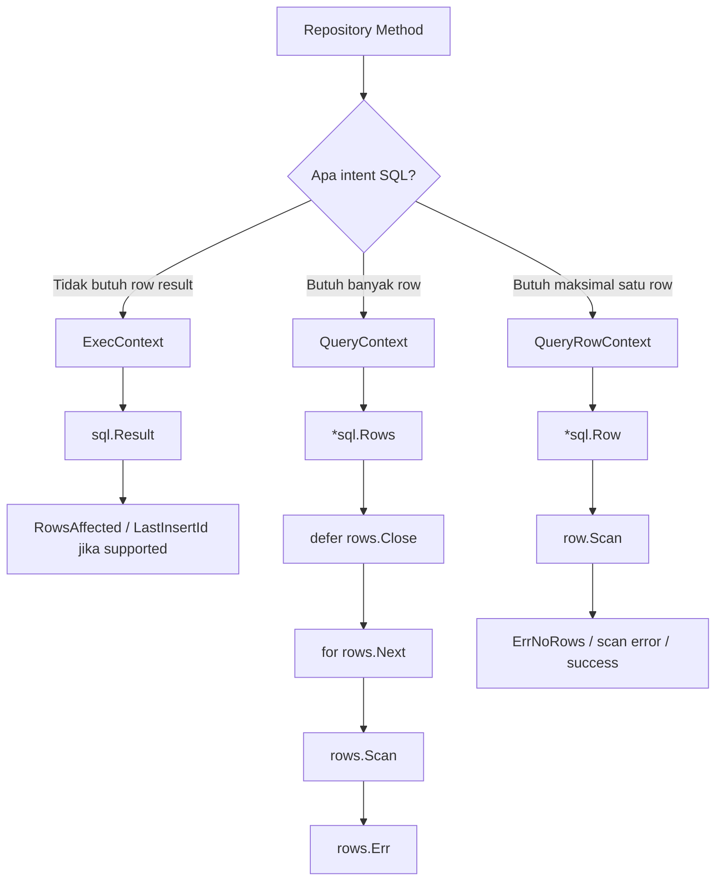
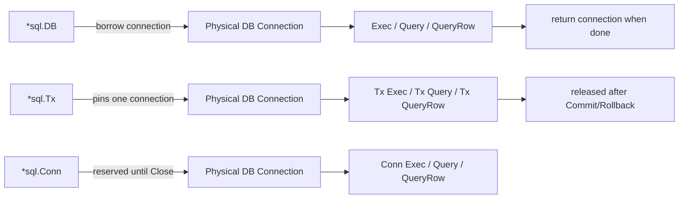
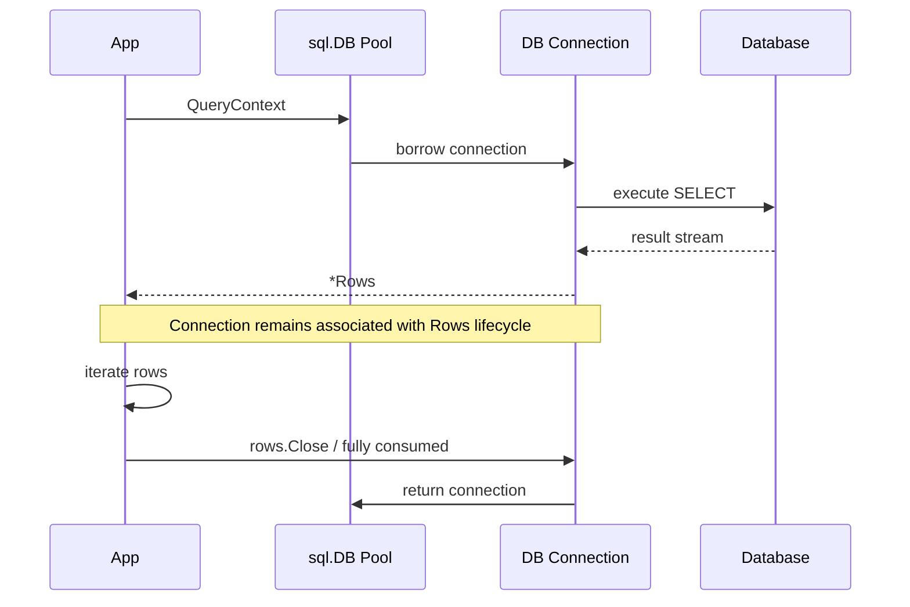
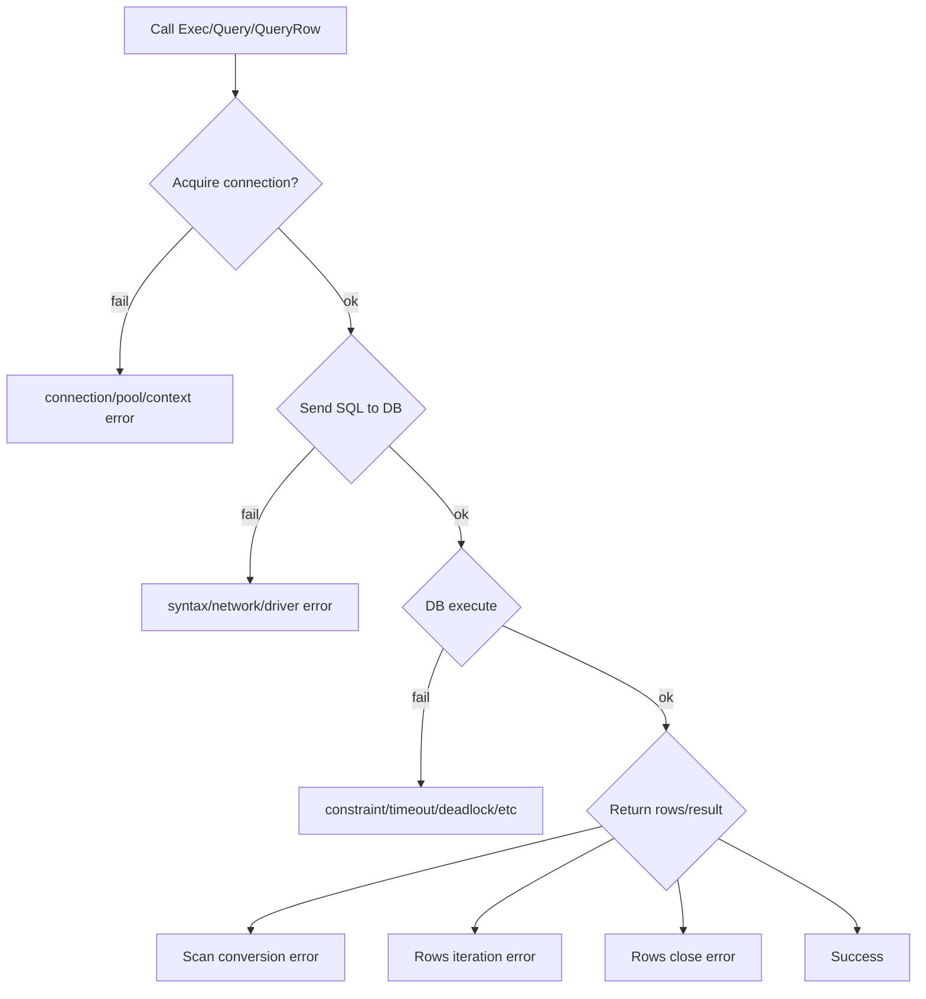
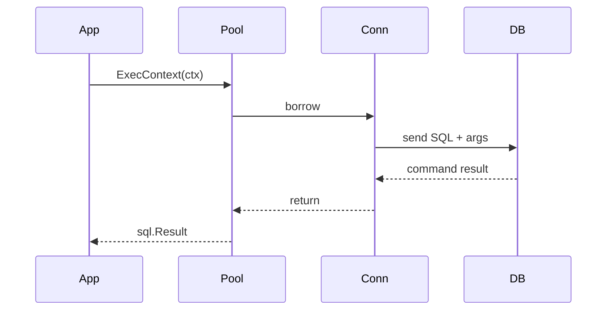
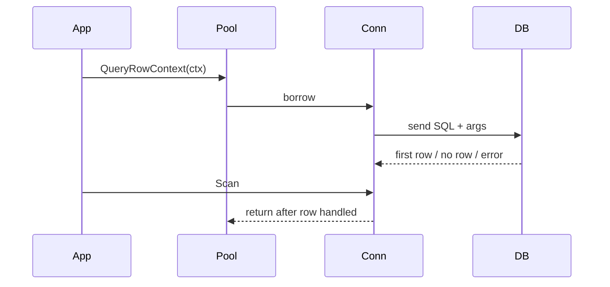
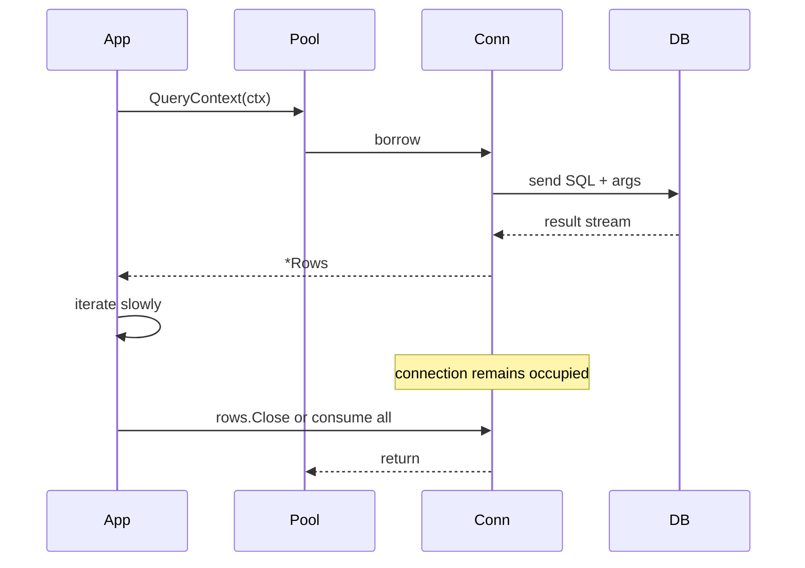
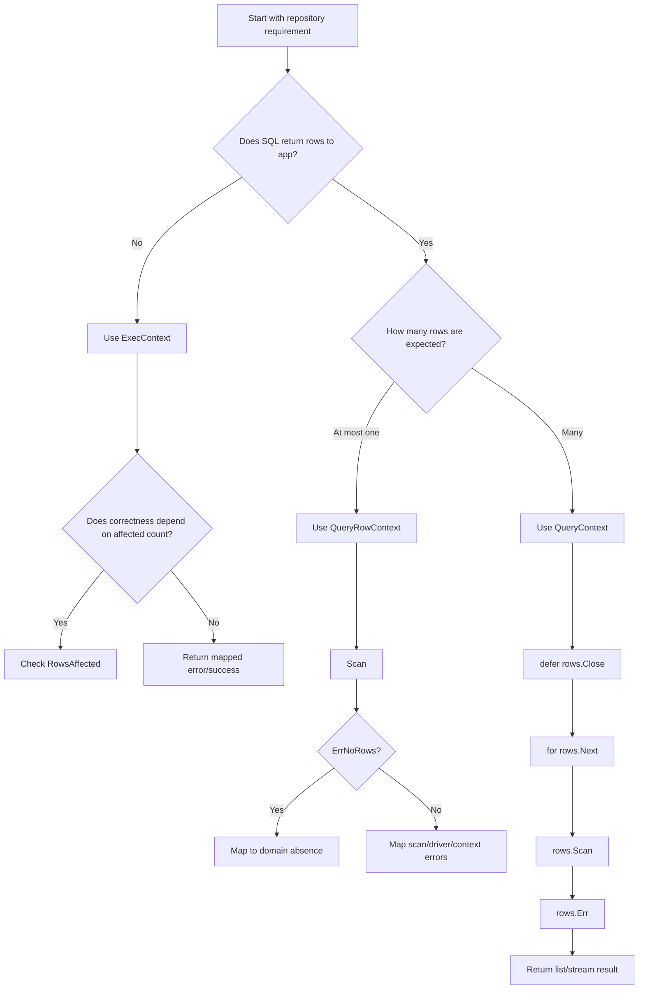
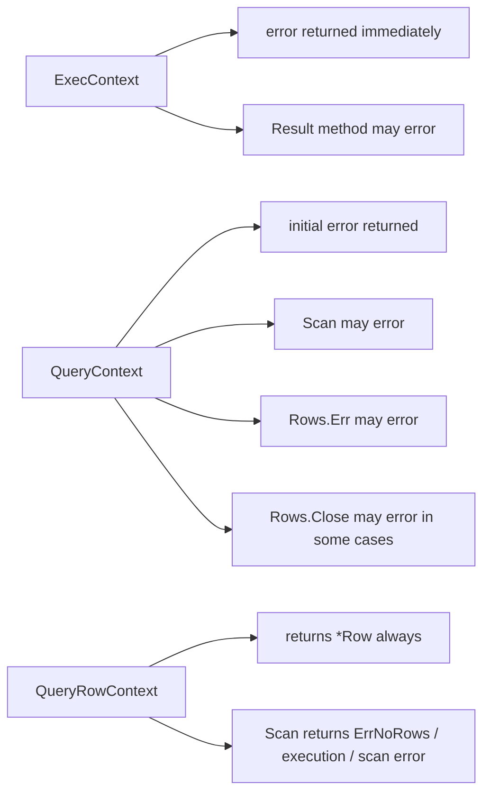

# learn-go-sql-database-integration-part-006.md

# Query Execution Model

> Seri: `learn-go-sql-database-integration`  
> Part: `006`  
> Target pembaca: Java software engineer yang ingin menguasai integrasi database di Go secara production-grade  
> Target Go: Go 1.26.x  
> Fokus: memahami model eksekusi query di `database/sql`: `ExecContext`, `QueryContext`, `QueryRowContext`, `Rows`, `Row`, `Result`, cardinality contract, resource lifecycle, timeout, error handling, dan dampaknya ke correctness + production behavior

---

## 1. Tujuan Pembelajaran

Setelah menyelesaikan bagian ini, kamu harus mampu:

1. Memilih dengan tepat antara `ExecContext`, `QueryContext`, dan `QueryRowContext`.
2. Memahami bahwa pilihan API bukan sekadar style, tetapi menyatakan **contract cardinality** dan **resource lifecycle**.
3. Mengetahui kapan `INSERT`, `UPDATE`, dan `DELETE` harus memakai `ExecContext`, dan kapan justru harus memakai `QueryRowContext` karena ada `RETURNING`/output row.
4. Mengerti perilaku `sql.Row`: error tidak muncul dari `QueryRowContext`, tetapi dari `Scan`.
5. Mengerti lifecycle `sql.Rows`: `Close`, `Next`, `Scan`, `Err`, dan hubungan lifecycle tersebut dengan connection pool.
6. Menghindari leak koneksi akibat `Rows` tidak ditutup atau tidak dikonsumsi dengan benar.
7. Menangani `sql.ErrNoRows` sebagai absence, bukan selalu sebagai system failure.
8. Menggunakan `sql.Result` dengan benar: `RowsAffected` dan `LastInsertId`, termasuk limitation portability antar database.
9. Mendesain repository method berdasarkan result cardinality: exactly one, zero-or-one, zero-or-many, one-or-many, command-only, command-with-returning.
10. Menyusun pola eksekusi query yang aman terhadap timeout, cancellation, scan error, partial iteration, dan pool starvation.
11. Membaca query execution dari sudut pandang production: latency, pool wait, DB CPU, row count, lock wait, retry, dan observability.

---

## 2. Core Mental Model

Query execution di Go harus dipahami sebagai kombinasi dari lima contract:

```text
SQL Intent + Cardinality + Context Budget + Resource Lifecycle + Error Semantics
```

Banyak developer hanya berpikir:

```text
"Saya ingin menjalankan SQL string ini."
```

Production engineer harus berpikir:

```text
"SQL ini command atau query? Menghasilkan berapa row? Jika tidak ada row artinya apa? Jika row lebih dari satu artinya apa? Berapa lama query boleh hidup? Siapa yang menutup cursor? Error mana yang domain-level, mana yang infrastructure-level? Apakah connection akan tertahan selama rows dibaca?"
```

Di `database/sql`, pilihan API mencerminkan intent:

| API | Intent utama | Mengembalikan row? | Resource yang harus ditutup? | Error utama muncul di mana? |
|---|---:|---:|---:|---|
| `ExecContext` | command tanpa result rows | tidak | tidak ada `Rows` | return `error` langsung |
| `QueryContext` | multi-row result | ya, `*Rows` | wajib `rows.Close()` | return `error`, `Scan`, `rows.Err`, kadang `Close` |
| `QueryRowContext` | at most one row | ya, `*Row` | tidak expose `Close` | `row.Scan` |

Mental model visual:



Hal yang sering disalahpahami: `QueryRowContext` bukan shortcut untuk "query cepat". Ia adalah API untuk **cardinality at-most-one**. Jika query kamu bisa menghasilkan banyak baris dan kamu memakai `QueryRowContext`, Go akan mengambil row pertama dan membuang sisanya. Itu bisa menyembunyikan pelanggaran invariant.

---

## 3. API Surface yang Relevan

`database/sql` menyediakan method eksekusi query pada beberapa receiver:

| Receiver | Scope | Contoh method |
|---|---|---|
| `*sql.DB` | memakai pool, memilih connection otomatis | `ExecContext`, `QueryContext`, `QueryRowContext` |
| `*sql.Tx` | memakai satu connection yang sedang dalam transaksi | `ExecContext`, `QueryContext`, `QueryRowContext` |
| `*sql.Conn` | memakai reserved connection tertentu | `ExecContext`, `QueryContext`, `QueryRowContext` |
| `*sql.Stmt` | prepared statement | `ExecContext`, `QueryContext`, `QueryRowContext` |

Secara konseptual:



Receiver matters because it changes **connection ownership**:

- `DB.QueryContext`: borrow connection from pool for the operation/result lifecycle.
- `Tx.QueryContext`: use transaction-pinned connection.
- `Conn.QueryContext`: use explicitly reserved connection.
- `Stmt.QueryContext`: execute a previously prepared statement; statement binding rules depend on how it was prepared.

---

## 4. Query Execution Classification

Sebelum menulis kode, klasifikasikan SQL berdasarkan dua axis:

1. **Side effect**: apakah SQL mengubah data?
2. **Result shape**: apakah SQL mengembalikan row?

| SQL shape | Contoh | API default | Catatan |
|---|---|---|---|
| Command tanpa row | `UPDATE users SET active=false WHERE id=$1` | `ExecContext` | cek `RowsAffected` jika invariant butuh exactly one |
| Insert tanpa returning | `INSERT INTO audit_log (...) VALUES (...)` | `ExecContext` | `LastInsertId` tidak portable |
| Insert dengan returning | `INSERT ... RETURNING id` | `QueryRowContext` | umum di PostgreSQL |
| Select exactly one | `SELECT ... WHERE id=$1` | `QueryRowContext` | `ErrNoRows` harus dimodelkan |
| Select many | `SELECT ... WHERE status=$1 ORDER BY ... LIMIT ...` | `QueryContext` | wajib close rows |
| DML returning many | `UPDATE ... RETURNING id, status` | `QueryContext` | command + rows |
| Existence check | `SELECT EXISTS (...)` | `QueryRowContext` | lebih baik daripada select full row |
| Count | `SELECT COUNT(*) ...` | `QueryRowContext` | bisa mahal, jangan dianggap gratis |

Rule awal:

```text
Tidak return rows  -> ExecContext
Return one row     -> QueryRowContext
Return many rows   -> QueryContext
```

Tetapi rule production-nya lebih tajam:

```text
Pilih API berdasarkan contract cardinality yang kamu ingin enforce dan lifecycle resource yang siap kamu kelola.
```

---

## 5. `ExecContext`: Command tanpa Result Rows

`ExecContext` digunakan untuk SQL yang tidak mengembalikan rows ke aplikasi.

Contoh:

```go
func DeactivateUser(ctx context.Context, db *sql.DB, userID int64) error {
    result, err := db.ExecContext(ctx, `
        UPDATE users
        SET active = false, updated_at = CURRENT_TIMESTAMP
        WHERE id = $1
    `, userID)
    if err != nil {
        return fmt.Errorf("deactivate user %d: %w", userID, err)
    }

    affected, err := result.RowsAffected()
    if err != nil {
        return fmt.Errorf("deactivate user %d: read rows affected: %w", userID, err)
    }
    if affected == 0 {
        return ErrUserNotFound
    }
    if affected != 1 {
        return fmt.Errorf("deactivate user %d: invariant violation: affected %d rows", userID, affected)
    }

    return nil
}
```

### 5.1 Kapan `RowsAffected` Wajib Dicek?

`RowsAffected` bukan sekadar metadata. Ia sering menjadi **correctness guard**.

| Operation | `RowsAffected == 0` | `RowsAffected == 1` | `RowsAffected > 1` |
|---|---|---|---|
| Update by primary key | not found / stale version | success | invariant violation |
| Delete by primary key idempotent | already gone, maybe OK | deleted | invariant violation |
| Update by filter bulk | maybe no matching rows | partial success | expected maybe |
| Optimistic locking update | conflict/stale | success | invariant violation |
| Insert | usually not meaningful | maybe success | depends driver/db |

Contoh optimistic locking:

```go
func UpdateCaseStatus(ctx context.Context, db *sql.DB, id int64, expectedVersion int64, nextStatus string) error {
    result, err := db.ExecContext(ctx, `
        UPDATE cases
        SET status = $1,
            version = version + 1,
            updated_at = CURRENT_TIMESTAMP
        WHERE id = $2
          AND version = $3
    `, nextStatus, id, expectedVersion)
    if err != nil {
        return fmt.Errorf("update case status: %w", err)
    }

    affected, err := result.RowsAffected()
    if err != nil {
        return fmt.Errorf("update case status: rows affected: %w", err)
    }

    switch affected {
    case 1:
        return nil
    case 0:
        return ErrConcurrentModification
    default:
        return fmt.Errorf("update case status: invariant violation: affected %d rows", affected)
    }
}
```

### 5.2 `LastInsertId` Tidak Portable

`sql.Result` punya:

```go
LastInsertId() (int64, error)
RowsAffected() (int64, error)
```

Namun availability-nya bergantung pada driver/database. Di MySQL-style flow, `LastInsertId` sering digunakan. Di PostgreSQL, production style yang umum adalah memakai `RETURNING id` dan `QueryRowContext`.

Pattern portable untuk PostgreSQL:

```go
func CreateUser(ctx context.Context, db *sql.DB, email string) (int64, error) {
    var id int64
    err := db.QueryRowContext(ctx, `
        INSERT INTO users (email, created_at)
        VALUES ($1, CURRENT_TIMESTAMP)
        RETURNING id
    `, email).Scan(&id)
    if err != nil {
        return 0, fmt.Errorf("create user: %w", err)
    }
    return id, nil
}
```

Pattern MySQL-like jika driver mendukung:

```go
func CreateUser(ctx context.Context, db *sql.DB, email string) (int64, error) {
    result, err := db.ExecContext(ctx, `
        INSERT INTO users (email, created_at)
        VALUES (?, CURRENT_TIMESTAMP)
    `, email)
    if err != nil {
        return 0, fmt.Errorf("create user: %w", err)
    }

    id, err := result.LastInsertId()
    if err != nil {
        return 0, fmt.Errorf("create user: last insert id: %w", err)
    }
    return id, nil
}
```

Decision rule:

```text
Jika DB mendukung RETURNING dan kamu butuh generated values, prefer QueryRowContext dengan RETURNING.
Jika hanya butuh affected count, ExecContext cukup.
Jangan desain abstraction yang menganggap LastInsertId selalu tersedia.
```

### 5.3 `ExecContext` Bukan untuk Query yang Mengembalikan Rows

Salah:

```go
_, err := db.ExecContext(ctx, "SELECT id, email FROM users WHERE id = $1", id)
```

Masalah:

- intent salah;
- behavior bergantung driver;
- result rows tidak dikonsumsi;
- observability misleading;
- reviewer sulit membaca contract.

Benar:

```go
err := db.QueryRowContext(ctx, `
    SELECT id, email
    FROM users
    WHERE id = $1
`, id).Scan(&user.ID, &user.Email)
```

---

## 6. `QueryRowContext`: At-Most-One Row

`QueryRowContext` digunakan saat aplikasi mengharapkan maksimal satu row.

Contoh:

```go
func FindUserByID(ctx context.Context, db *sql.DB, id int64) (User, error) {
    var u User
    err := db.QueryRowContext(ctx, `
        SELECT id, email, active, created_at
        FROM users
        WHERE id = $1
    `, id).Scan(&u.ID, &u.Email, &u.Active, &u.CreatedAt)
    if err != nil {
        if errors.Is(err, sql.ErrNoRows) {
            return User{}, ErrUserNotFound
        }
        return User{}, fmt.Errorf("find user by id %d: %w", id, err)
    }
    return u, nil
}
```

### 6.1 Error Deferred ke `Scan`

`QueryRowContext` selalu mengembalikan `*sql.Row`. Error eksekusi, no rows, dan scan error dilaporkan saat `Scan`.

Artinya pattern ini salah:

```go
row := db.QueryRowContext(ctx, "SELECT email FROM users WHERE id=$1", id)
// Tidak ada error yang bisa dicek di sini.
```

Pattern benar:

```go
var email string
err := db.QueryRowContext(ctx, "SELECT email FROM users WHERE id=$1", id).Scan(&email)
if err != nil {
    // handle ErrNoRows, timeout, driver error, scan error, etc.
}
```

### 6.2 `ErrNoRows` Bukan Selalu Error Sistem

`sql.ErrNoRows` berarti query tidak menemukan row. Semantik domain tergantung use case.

| Use case | `ErrNoRows` semestinya menjadi |
|---|---|
| Find user by ID | `ErrUserNotFound` |
| Check optional profile | return `(nil, nil)` atau optional result |
| Load mandatory config | fatal startup/config error |
| Read aggregate root inside command | domain not found |
| Authorization lookup | deny atau not found, tergantung threat model |

Contoh optional result tanpa pointer domain yang membingungkan:

```go
type MaybeUser struct {
    User  User
    Found bool
}

func GetUserByEmail(ctx context.Context, db *sql.DB, email string) (MaybeUser, error) {
    var u User
    err := db.QueryRowContext(ctx, `
        SELECT id, email, active, created_at
        FROM users
        WHERE email = $1
    `, email).Scan(&u.ID, &u.Email, &u.Active, &u.CreatedAt)
    if err != nil {
        if errors.Is(err, sql.ErrNoRows) {
            return MaybeUser{Found: false}, nil
        }
        return MaybeUser{}, fmt.Errorf("get user by email: %w", err)
    }
    return MaybeUser{User: u, Found: true}, nil
}
```

### 6.3 `QueryRowContext` Mengambil Row Pertama dan Membuang Sisanya

Jika query menghasilkan lebih dari satu row, `QueryRowContext` akan scan row pertama dan membuang sisanya.

Ini berbahaya untuk lookup yang seharusnya unique tetapi tidak memiliki unique constraint.

Salah secara defensibility:

```go
err := db.QueryRowContext(ctx, `
    SELECT id, email
    FROM users
    WHERE normalized_email = $1
`, normalizedEmail).Scan(&id, &email)
```

Jika data korup dan ada dua user dengan email sama, kode tetap terlihat sukses.

Lebih defensible:

1. Pasang unique constraint di database.
2. Untuk area transisi/migrasi, gunakan query `LIMIT 2` dan enforce cardinality di app.

```go
func FindUniqueUserByEmail(ctx context.Context, db *sql.DB, normalizedEmail string) (User, error) {
    rows, err := db.QueryContext(ctx, `
        SELECT id, email, active
        FROM users
        WHERE normalized_email = $1
        ORDER BY id
        LIMIT 2
    `, normalizedEmail)
    if err != nil {
        return User{}, fmt.Errorf("find unique user by email: %w", err)
    }
    defer rows.Close()

    var users []User
    for rows.Next() {
        var u User
        if err := rows.Scan(&u.ID, &u.Email, &u.Active); err != nil {
            return User{}, fmt.Errorf("find unique user by email: scan: %w", err)
        }
        users = append(users, u)
    }
    if err := rows.Err(); err != nil {
        return User{}, fmt.Errorf("find unique user by email: iterate: %w", err)
    }

    switch len(users) {
    case 0:
        return User{}, ErrUserNotFound
    case 1:
        return users[0], nil
    default:
        return User{}, ErrDuplicateUserInvariant
    }
}
```

Catatan: ini bukan pengganti unique constraint. Ini defensive application guard saat integrity belum sepenuhnya kuat.

### 6.4 `QueryRowContext` Cocok untuk Scalar Query

Contoh existence:

```go
func UserExists(ctx context.Context, db *sql.DB, id int64) (bool, error) {
    var exists bool
    err := db.QueryRowContext(ctx, `
        SELECT EXISTS (
            SELECT 1
            FROM users
            WHERE id = $1
        )
    `, id).Scan(&exists)
    if err != nil {
        return false, fmt.Errorf("user exists: %w", err)
    }
    return exists, nil
}
```

Contoh count:

```go
func CountOpenCases(ctx context.Context, db *sql.DB, officerID int64) (int64, error) {
    var count int64
    err := db.QueryRowContext(ctx, `
        SELECT COUNT(*)
        FROM cases
        WHERE assigned_officer_id = $1
          AND status = 'OPEN'
    `, officerID).Scan(&count)
    if err != nil {
        return 0, fmt.Errorf("count open cases: %w", err)
    }
    return count, nil
}
```

Tetapi jangan menganggap scalar query selalu murah. `COUNT(*)` dengan filter kompleks bisa mahal dan dapat menjadi bottleneck listing API.

---

## 7. `QueryContext`: Multi-Row Result

`QueryContext` digunakan saat SQL mengembalikan banyak row.

Contoh:

```go
func ListActiveUsers(ctx context.Context, db *sql.DB, limit int) ([]User, error) {
    rows, err := db.QueryContext(ctx, `
        SELECT id, email, active, created_at
        FROM users
        WHERE active = true
        ORDER BY id
        LIMIT $1
    `, limit)
    if err != nil {
        return nil, fmt.Errorf("list active users: %w", err)
    }
    defer rows.Close()

    users := make([]User, 0, limit)
    for rows.Next() {
        var u User
        if err := rows.Scan(&u.ID, &u.Email, &u.Active, &u.CreatedAt); err != nil {
            return nil, fmt.Errorf("list active users: scan: %w", err)
        }
        users = append(users, u)
    }

    if err := rows.Err(); err != nil {
        return nil, fmt.Errorf("list active users: iterate: %w", err)
    }

    return users, nil
}
```

### 7.1 Lifecycle Wajib: Close, Next, Scan, Err

Pattern minimal:

```go
rows, err := db.QueryContext(ctx, query, args...)
if err != nil {
    return err
}
defer rows.Close()

for rows.Next() {
    if err := rows.Scan(...); err != nil {
        return err
    }
}

if err := rows.Err(); err != nil {
    return err
}
```

Kenapa `rows.Err()` wajib?

Karena error bisa terjadi selama iteration, bukan hanya saat query dimulai. Contoh:

- network putus saat streaming result;
- context canceled saat membaca row ke-5000;
- driver decode error;
- server-side cursor error;
- scan atau iteration failure yang baru diketahui setelah `Next` berhenti.

### 7.2 `Rows.Close` dan Connection Pool

Selama `Rows` masih terbuka, connection yang dipakai query bisa tetap tertahan. Jika kamu lupa `Close`, kamu bisa membuat pool starvation.



Leak pattern:

```go
rows, err := db.QueryContext(ctx, query)
if err != nil {
    return err
}
// lupa defer rows.Close()

for rows.Next() {
    // early return di sini membuat rows tidak tertutup
    return nil
}
```

Correct:

```go
rows, err := db.QueryContext(ctx, query)
if err != nil {
    return err
}
defer rows.Close()

for rows.Next() {
    // safe, karena defer tetap berjalan saat return
}
if err := rows.Err(); err != nil {
    return err
}
```

### 7.3 Early Return Saat Menemukan Row

Jika kamu menggunakan `QueryContext` untuk mencari satu row dari multi-row stream dan ingin early return, tetap pastikan `Close`.

```go
func FindFirstOpenCase(ctx context.Context, db *sql.DB, officerID int64) (Case, error) {
    rows, err := db.QueryContext(ctx, `
        SELECT id, status, assigned_officer_id
        FROM cases
        WHERE assigned_officer_id = $1
          AND status = 'OPEN'
        ORDER BY created_at
        LIMIT 1
    `, officerID)
    if err != nil {
        return Case{}, fmt.Errorf("find first open case: %w", err)
    }
    defer rows.Close()

    if rows.Next() {
        var c Case
        if err := rows.Scan(&c.ID, &c.Status, &c.AssignedOfficerID); err != nil {
            return Case{}, fmt.Errorf("find first open case: scan: %w", err)
        }
        return c, nil
    }

    if err := rows.Err(); err != nil {
        return Case{}, fmt.Errorf("find first open case: iterate: %w", err)
    }

    return Case{}, ErrCaseNotFound
}
```

Namun jika memang hanya butuh satu row, `QueryRowContext` lebih jelas.

### 7.4 Materialization vs Streaming

Dua pola umum:

1. Materialize semua row ke slice.
2. Stream row satu-per-satu ke consumer.

Materialization:

```go
func ListCases(ctx context.Context, db *sql.DB, limit int) ([]Case, error) {
    rows, err := db.QueryContext(ctx, query, limit)
    if err != nil {
        return nil, err
    }
    defer rows.Close()

    cases := make([]Case, 0, limit)
    for rows.Next() {
        var c Case
        if err := scanCase(rows, &c); err != nil {
            return nil, err
        }
        cases = append(cases, c)
    }
    if err := rows.Err(); err != nil {
        return nil, err
    }
    return cases, nil
}
```

Streaming callback:

```go
func StreamCases(ctx context.Context, db *sql.DB, handle func(Case) error) error {
    rows, err := db.QueryContext(ctx, `
        SELECT id, status, created_at
        FROM cases
        ORDER BY id
    `)
    if err != nil {
        return fmt.Errorf("stream cases: %w", err)
    }
    defer rows.Close()

    for rows.Next() {
        var c Case
        if err := rows.Scan(&c.ID, &c.Status, &c.CreatedAt); err != nil {
            return fmt.Errorf("stream cases: scan: %w", err)
        }
        if err := handle(c); err != nil {
            return fmt.Errorf("stream cases: handle: %w", err)
        }
    }
    if err := rows.Err(); err != nil {
        return fmt.Errorf("stream cases: iterate: %w", err)
    }
    return nil
}
```

Trade-off:

| Approach | Kelebihan | Risiko |
|---|---|---|
| Materialize | sederhana, connection cepat kembali jika result kecil | memory besar jika result besar |
| Stream callback | memory rendah | connection tertahan selama callback berjalan |
| Stream to channel | natural untuk pipeline | mudah leak goroutine/connection jika consumer stop |
| Pagination | membatasi memory dan connection duration | butuh ordering/index yang benar |

Production rule:

```text
Jangan melakukan slow business logic, network call, email sending, atau external API call di dalam loop rows selama connection masih terbuka.
```

Jika perlu proses berat, baca row secukupnya, tutup rows, lalu proses di luar lifecycle database connection.

---

## 8. Cardinality Contract sebagai Desain API Repository

Jangan mulai dari SQL string. Mulai dari contract method.

### 8.1 Cardinality Types

| Contract | Meaning | Go shape umum |
|---|---|---|
| Exactly one | harus ada tepat satu row | `(T, error)`; no rows = error |
| Zero or one | optional | `(T, bool, error)` atau custom maybe type |
| Zero or many | list bisa kosong | `([]T, error)` |
| One or many | minimal satu | `([]T, error)` + empty = domain error |
| Command only | tidak return data | `error` |
| Command with count | butuh affected count | `(int64, error)` atau check internally |
| Command returning row | create/update return generated state | `(T, error)` |

Contoh repository API:

```go
type UserRepository interface {
    Create(ctx context.Context, in CreateUserInput) (UserID, error)
    GetByID(ctx context.Context, id UserID) (User, error)              // exactly one or not found
    FindByEmail(ctx context.Context, email string) (User, bool, error) // zero or one
    ListActive(ctx context.Context, page PageRequest) ([]User, error)  // zero or many
    Deactivate(ctx context.Context, id UserID) error                   // command, exactly one affected
}
```

### 8.2 Exactly One

```go
func (r *UserRepo) GetByID(ctx context.Context, id int64) (User, error) {
    var u User
    err := r.db.QueryRowContext(ctx, `
        SELECT id, email, active
        FROM users
        WHERE id = $1
    `, id).Scan(&u.ID, &u.Email, &u.Active)
    if err != nil {
        if errors.Is(err, sql.ErrNoRows) {
            return User{}, ErrUserNotFound
        }
        return User{}, fmt.Errorf("user repo get by id: %w", err)
    }
    return u, nil
}
```

### 8.3 Zero or One

```go
func (r *UserRepo) FindByEmail(ctx context.Context, email string) (User, bool, error) {
    var u User
    err := r.db.QueryRowContext(ctx, `
        SELECT id, email, active
        FROM users
        WHERE email = $1
    `, email).Scan(&u.ID, &u.Email, &u.Active)
    if err != nil {
        if errors.Is(err, sql.ErrNoRows) {
            return User{}, false, nil
        }
        return User{}, false, fmt.Errorf("user repo find by email: %w", err)
    }
    return u, true, nil
}
```

### 8.4 Zero or Many

```go
func (r *UserRepo) ListByStatus(ctx context.Context, status string, limit int) ([]User, error) {
    rows, err := r.db.QueryContext(ctx, `
        SELECT id, email, active
        FROM users
        WHERE status = $1
        ORDER BY id
        LIMIT $2
    `, status, limit)
    if err != nil {
        return nil, fmt.Errorf("user repo list by status: %w", err)
    }
    defer rows.Close()

    out := make([]User, 0, limit)
    for rows.Next() {
        var u User
        if err := rows.Scan(&u.ID, &u.Email, &u.Active); err != nil {
            return nil, fmt.Errorf("user repo list by status: scan: %w", err)
        }
        out = append(out, u)
    }
    if err := rows.Err(); err != nil {
        return nil, fmt.Errorf("user repo list by status: iterate: %w", err)
    }
    return out, nil
}
```

### 8.5 Command with Invariant

```go
func (r *UserRepo) Deactivate(ctx context.Context, id int64) error {
    result, err := r.db.ExecContext(ctx, `
        UPDATE users
        SET active = false, updated_at = CURRENT_TIMESTAMP
        WHERE id = $1
    `, id)
    if err != nil {
        return fmt.Errorf("user repo deactivate: %w", err)
    }

    affected, err := result.RowsAffected()
    if err != nil {
        return fmt.Errorf("user repo deactivate: rows affected: %w", err)
    }
    if affected == 0 {
        return ErrUserNotFound
    }
    if affected != 1 {
        return fmt.Errorf("user repo deactivate: invariant violation: affected %d rows", affected)
    }
    return nil
}
```

---

## 9. Context Budget dalam Query Execution

Selalu prefer method `...Context`:

```go
db.ExecContext(ctx, ...)
db.QueryContext(ctx, ...)
db.QueryRowContext(ctx, ...)
```

Jangan memakai `Exec`, `Query`, `QueryRow` di production request path kecuali ada alasan kuat, karena versi tanpa context memakai context background secara internal atau tidak membawa deadline request.

### 9.1 Budget End-to-End

Untuk HTTP request dengan SLA 2 detik, jangan memberi query budget 2 detik penuh jika masih ada parsing, authorization, business logic, serialization, dan response writing.

Contoh:

```go
func (s *Service) GetCaseHandler(w http.ResponseWriter, r *http.Request) {
    ctx := r.Context()

    dbCtx, cancel := context.WithTimeout(ctx, 500*time.Millisecond)
    defer cancel()

    c, err := s.repo.GetCaseByID(dbCtx, caseID)
    if err != nil {
        // map error
        return
    }

    // serialize response using remaining request budget
    _ = c
}
```

Namun jangan asal membuat timeout kecil di semua repo method. Timeout harus berasal dari **operation budget**:

| Operation | Typical budget strategy |
|---|---|
| Online read by ID | pendek |
| Listing dengan filter | sedang, paginated |
| Command update | pendek-menengah, tergantung lock risk |
| Report generation | async/background, bukan request sync |
| Migration/backfill | dedicated job budget |

### 9.2 Cancellation Tidak Sama dengan Database Pasti Berhenti

`context.Context` memberi sinyal cancellation ke `database/sql` dan driver. Tetapi efek aktual bergantung driver dan database. Beberapa driver bisa mengirim cancel request, beberapa hanya berhenti menunggu client-side, beberapa query di server bisa tetap berjalan sampai selesai.

Production implication:

- gunakan app-side context timeout;
- gunakan database-side statement timeout bila tersedia;
- gunakan lock timeout untuk query yang bisa menunggu lock;
- observasi query yang tetap berjalan setelah client timeout;
- jangan menganggap `context deadline exceeded` selalu berarti database tidak melakukan perubahan.

Khusus command write, cancellation bisa menghasilkan **ambiguous result**:

```text
Client timeout terjadi.
Apakah database sudah commit statement auto-commit?
Apakah query dibatalkan sebelum eksekusi?
Apakah row sudah berubah tapi response hilang?
```

Karena itu idempotency dan transaction design penting, akan dibahas lebih dalam di part 019.

---

## 10. Error Semantics

Query execution punya beberapa titik error:



### 10.1 `ExecContext` Error

```go
result, err := db.ExecContext(ctx, sqlText, args...)
if err != nil {
    // Could be context deadline, connection failure, SQL syntax, constraint violation, deadlock, etc.
}
```

Setelah `err == nil`, `Result` method juga bisa error:

```go
affected, err := result.RowsAffected()
if err != nil {
    // driver may not support it or failed to report it
}
```

### 10.2 `QueryContext` Error

```go
rows, err := db.QueryContext(ctx, sqlText, args...)
if err != nil {
    // query failed before rows object became usable
}
defer rows.Close()

for rows.Next() {
    if err := rows.Scan(...); err != nil {
        // conversion / destination / driver scan error
    }
}
if err := rows.Err(); err != nil {
    // iteration error
}
```

### 10.3 `QueryRowContext` Error

```go
err := db.QueryRowContext(ctx, sqlText, args...).Scan(&dst)
if err != nil {
    // ErrNoRows / context / driver / scan / SQL error
}
```

### 10.4 Jangan Collapse Semua Error Menjadi 500

Contoh error mapping:

| Low-level error | Domain/API meaning |
|---|---|
| `sql.ErrNoRows` pada read by id | 404 / not found |
| Unique constraint violation | 409 / duplicate |
| FK violation | 400/409 tergantung command |
| Context deadline | 504/timeout atau internal timeout |
| Context canceled karena client disconnect | biasanya tidak perlu retry response |
| Deadlock/serialization failure | retryable command jika idempotent |
| Scan conversion error | bug/schema drift, 500 + alert |
| Too many connections | dependency saturation, 503/degraded |

Part 020 akan membahas taxonomy error database lebih dalam.

---

## 11. Scan: Boundary antara SQL Row dan Go Value

`Scan` adalah titik data keluar dari driver ke Go variable.

Contoh:

```go
var id int64
var email string
var createdAt time.Time

err := db.QueryRowContext(ctx, `
    SELECT id, email, created_at
    FROM users
    WHERE id = $1
`, userID).Scan(&id, &email, &createdAt)
```

### 11.1 Urutan Kolom Harus Cocok

Jika query:

```sql
SELECT id, email, created_at FROM users
```

Maka scan harus:

```go
Scan(&id, &email, &createdAt)
```

Bukan:

```go
Scan(&email, &id, &createdAt)
```

Untuk production code, hindari `SELECT *` karena:

- urutan kolom bisa berubah;
- kolom tambahan tidak otomatis cocok dengan scan destination;
- membaca data yang tidak diperlukan;
- memperbesar network payload;
- menyembunyikan dependency field;
- menyulitkan review query shape.

### 11.2 Scan Destination Harus Pointer

Salah:

```go
var email string
err := row.Scan(email) // salah: bukan pointer
```

Benar:

```go
err := row.Scan(&email)
```

### 11.3 NULL Harus Dimodelkan

Jika kolom nullable discan ke non-nullable Go type, scan bisa error saat value NULL.

```go
var middleName string
err := row.Scan(&middleName) // error jika DB NULL
```

Gunakan `sql.NullString`, pointer, atau custom nullable type:

```go
var middleName sql.NullString
err := row.Scan(&middleName)
if err != nil {
    return err
}
if middleName.Valid {
    // use middleName.String
}
```

NULL modelling dibahas lengkap di part 009.

### 11.4 Jangan Campur Domain Validation dengan Scan Terlalu Awal

Scan sebaiknya mengubah raw DB value menjadi persistence struct. Domain validation bisa dilakukan setelah data lengkap dibaca.

```go
type userRow struct {
    id        int64
    email     string
    active    bool
    createdAt time.Time
}

func scanUserRow(scanner interface {
    Scan(dest ...any) error
}) (userRow, error) {
    var r userRow
    err := scanner.Scan(&r.id, &r.email, &r.active, &r.createdAt)
    if err != nil {
        return userRow{}, err
    }
    return r, nil
}
```

Dengan helper seperti ini, `QueryRowContext` dan `Rows` bisa berbagi scanning logic.

---

## 12. `Row` vs `Rows`

| Aspect | `*sql.Row` | `*sql.Rows` |
|---|---|---|
| Cardinality | at most one | many |
| Error timing | deferred to `Scan` | `QueryContext`, `Scan`, `Err`, `Close` |
| Close required | tidak expose close | wajib close |
| Iteration | tidak | `Next` loop |
| No row behavior | `Scan` returns `sql.ErrNoRows` | loop tidak masuk; `Err` nil jika normal |
| Multiple rows | first row used, rest discarded | semua bisa dibaca |

Contoh no rows:

```go
// QueryRowContext
err := db.QueryRowContext(ctx, query, args...).Scan(&dst)
if errors.Is(err, sql.ErrNoRows) {
    // no row
}
```

```go
// QueryContext
rows, err := db.QueryContext(ctx, query, args...)
if err != nil { return err }
defer rows.Close()

found := false
for rows.Next() {
    found = true
    // scan
}
if err := rows.Err(); err != nil { return err }
if !found {
    // no rows
}
```

---

## 13. Transaction Context: `DB` vs `Tx` Execution

Saat sedang dalam transaksi, semua operasi yang menjadi bagian transaksi harus memakai `*sql.Tx`, bukan `*sql.DB`.

Salah:

```go
tx, err := db.BeginTx(ctx, nil)
if err != nil { return err }
defer tx.Rollback()

_, err = tx.ExecContext(ctx, "UPDATE accounts SET balance = balance - $1 WHERE id = $2", amount, from)
if err != nil { return err }

// SALAH: ini memakai pool, bukan transaction connection
_, err = db.ExecContext(ctx, "UPDATE accounts SET balance = balance + $1 WHERE id = $2", amount, to)
if err != nil { return err }

return tx.Commit()
```

Benar:

```go
tx, err := db.BeginTx(ctx, nil)
if err != nil { return err }
defer tx.Rollback()

_, err = tx.ExecContext(ctx, "UPDATE accounts SET balance = balance - $1 WHERE id = $2", amount, from)
if err != nil { return err }

_, err = tx.ExecContext(ctx, "UPDATE accounts SET balance = balance + $1 WHERE id = $2", amount, to)
if err != nil { return err }

if err := tx.Commit(); err != nil {
    return err
}
return nil
```

### 13.1 Interface agar Repository Bisa Dipakai dengan `DB` dan `Tx`

Pattern umum:

```go
type DBTX interface {
    ExecContext(ctx context.Context, query string, args ...any) (sql.Result, error)
    QueryContext(ctx context.Context, query string, args ...any) (*sql.Rows, error)
    QueryRowContext(ctx context.Context, query string, args ...any) *sql.Row
}
```

Lalu repository menerima `DBTX`:

```go
type UserQueries struct {
    db DBTX
}

func NewUserQueries(db DBTX) *UserQueries {
    return &UserQueries{db: db}
}
```

Dengan ini:

```go
queries := NewUserQueries(db) // non-transactional
```

atau:

```go
tx, err := db.BeginTx(ctx, nil)
if err != nil { return err }
defer tx.Rollback()

queries := NewUserQueries(tx) // transactional
```

Ini lebih eksplisit daripada mencoba meniru `@Transactional` tanpa control.

---

## 14. Query Execution dan Connection Pool Impact

Setiap query execution berinteraksi dengan pool.

### 14.1 `ExecContext`

Typical lifecycle:



Connection biasanya kembali setelah result diterima.

### 14.2 `QueryRowContext`



Karena `QueryRowContext` tidak expose `Rows`, lifecycle lebih mudah. Namun jika query mengembalikan banyak row, database/driver tetap harus menangani sisanya sesuai behavior internal.

### 14.3 `QueryContext`



Long row iteration bisa menjadi pool bottleneck.

### 14.4 Anti-Pattern: Slow Loop While Holding Connection

Salah:

```go
rows, err := db.QueryContext(ctx, `SELECT id, email FROM users WHERE newsletter=true`)
if err != nil { return err }
defer rows.Close()

for rows.Next() {
    var id int64
    var email string
    if err := rows.Scan(&id, &email); err != nil { return err }

    // SALAH: external network call while DB rows still open
    if err := emailClient.Send(ctx, email, message); err != nil {
        return err
    }
}
return rows.Err()
```

Lebih baik:

```go
rows, err := db.QueryContext(ctx, `SELECT id, email FROM users WHERE newsletter=true LIMIT $1`, batchSize)
if err != nil { return err }

type recipient struct {
    id    int64
    email string
}
recipients := make([]recipient, 0, batchSize)

for rows.Next() {
    var r recipient
    if err := rows.Scan(&r.id, &r.email); err != nil {
        rows.Close()
        return err
    }
    recipients = append(recipients, r)
}
if closeErr := rows.Close(); closeErr != nil {
    return closeErr
}
if err := rows.Err(); err != nil {
    return err
}

for _, r := range recipients {
    if err := emailClient.Send(ctx, r.email, message); err != nil {
        return err
    }
}
return nil
```

Untuk data besar, gunakan batching/pagination, bukan materialisasi semua row.

---

## 15. Placeholder dan Arg Binding Ringkas

Placeholder bergantung driver/database:

| Database/driver style | Placeholder umum |
|---|---|
| PostgreSQL | `$1`, `$2`, ... |
| MySQL | `?` |
| SQLite | `?`, `$1`, named forms tergantung driver |
| SQL Server | named/ordinal style tergantung driver |
| Oracle | named bind style umum |

`database/sql` tidak menormalisasi placeholder menjadi satu format universal.

Jangan:

```go
query := fmt.Sprintf("SELECT id FROM users WHERE email = '%s'", email)
row := db.QueryRowContext(ctx, query)
```

Gunakan parameter:

```go
row := db.QueryRowContext(ctx, `
    SELECT id
    FROM users
    WHERE email = $1
`, email)
```

SQL injection boundary akan dibahas lebih dalam di part 010. Untuk part ini, cukup pegang invariant:

```text
Value harus lewat parameter binding. Identifier seperti column/order/table tidak bisa diamankan dengan placeholder biasa; harus whitelist.
```

---

## 16. Command Returning Rows

Beberapa SQL command mengubah data sekaligus mengembalikan rows.

PostgreSQL contoh:

```go
func ActivateUser(ctx context.Context, db *sql.DB, id int64) (User, error) {
    var u User
    err := db.QueryRowContext(ctx, `
        UPDATE users
        SET active = true,
            updated_at = CURRENT_TIMESTAMP
        WHERE id = $1
        RETURNING id, email, active, updated_at
    `, id).Scan(&u.ID, &u.Email, &u.Active, &u.UpdatedAt)
    if err != nil {
        if errors.Is(err, sql.ErrNoRows) {
            return User{}, ErrUserNotFound
        }
        return User{}, fmt.Errorf("activate user: %w", err)
    }
    return u, nil
}
```

Multi-row returning:

```go
func ExpireOldSessions(ctx context.Context, db *sql.DB, before time.Time) ([]int64, error) {
    rows, err := db.QueryContext(ctx, `
        UPDATE sessions
        SET expired = true,
            updated_at = CURRENT_TIMESTAMP
        WHERE expired = false
          AND last_seen_at < $1
        RETURNING id
    `, before)
    if err != nil {
        return nil, fmt.Errorf("expire old sessions: %w", err)
    }
    defer rows.Close()

    var ids []int64
    for rows.Next() {
        var id int64
        if err := rows.Scan(&id); err != nil {
            return nil, fmt.Errorf("expire old sessions: scan: %w", err)
        }
        ids = append(ids, id)
    }
    if err := rows.Err(); err != nil {
        return nil, fmt.Errorf("expire old sessions: iterate: %w", err)
    }
    return ids, nil
}
```

Decision:

| Need | Use |
|---|---|
| update and only know success count | `ExecContext` + `RowsAffected` |
| update and return new row | `QueryRowContext` + `RETURNING` |
| update many and return ids/details | `QueryContext` + `RETURNING` |

---

## 17. Health Checks, Pings, and Query Execution

`PingContext` memverifikasi connection bisa dibuat/dipakai, tetapi tidak menggantikan query-level testing.

Health check levels:

| Level | Example | Meaning |
|---|---|---|
| process alive | app responds | app not dead |
| DB pool reachable | `db.PingContext` | can connect/authenticate |
| simple query | `SELECT 1` | can execute basic SQL |
| dependency-specific | check migration version | schema expected |
| business readiness | check required reference data | app truly ready |

Jangan jadikan readiness check terlalu mahal. Readiness endpoint yang melakukan query kompleks bisa ikut menjatuhkan DB saat traffic tinggi.

Pattern:

```go
func CheckDB(ctx context.Context, db *sql.DB) error {
    ctx, cancel := context.WithTimeout(ctx, 500*time.Millisecond)
    defer cancel()

    if err := db.PingContext(ctx); err != nil {
        return fmt.Errorf("db ping: %w", err)
    }
    return nil
}
```

Untuk aplikasi yang butuh schema readiness:

```go
func CheckSchemaVersion(ctx context.Context, db *sql.DB, expected string) error {
    var version string
    err := db.QueryRowContext(ctx, `
        SELECT version
        FROM schema_migrations
        ORDER BY applied_at DESC
        LIMIT 1
    `).Scan(&version)
    if err != nil {
        return fmt.Errorf("schema version check: %w", err)
    }
    if version != expected {
        return fmt.Errorf("schema version mismatch: got %s expected %s", version, expected)
    }
    return nil
}
```

---

## 18. Observability untuk Query Execution

Minimal metadata yang perlu diamati:

| Signal | Kenapa penting |
|---|---|
| query duration | latency dan slow query detection |
| rows returned | detect accidental huge result |
| rows affected | correctness and command impact |
| error class | distinguish timeout, no rows, constraint, deadlock |
| pool wait | query lambat karena DB atau menunggu connection? |
| context deadline | budget terlalu kecil atau DB lambat? |
| query name | cardinality rendah untuk metrics/tracing |

Jangan label metrics dengan raw SQL penuh. Itu bisa high-cardinality dan bisa leak sensitive data.

Gunakan query name:

```go
const queryGetUserByID = "user.get_by_id"
```

Wrapper sederhana:

```go
type QueryObserver interface {
    ObserveQuery(ctx context.Context, name string, duration time.Duration, err error)
}

func observe(start time.Time, observer QueryObserver, ctx context.Context, name string, errp *error) {
    if observer != nil {
        observer.ObserveQuery(ctx, name, time.Since(start), *errp)
    }
}

func (r *UserRepo) GetByID(ctx context.Context, id int64) (u User, err error) {
    defer observe(time.Now(), r.observer, ctx, "user.get_by_id", &err)

    err = r.db.QueryRowContext(ctx, `
        SELECT id, email, active
        FROM users
        WHERE id = $1
    `, id).Scan(&u.ID, &u.Email, &u.Active)
    if err != nil {
        if errors.Is(err, sql.ErrNoRows) {
            return User{}, ErrUserNotFound
        }
        return User{}, fmt.Errorf("user get by id: %w", err)
    }
    return u, nil
}
```

Untuk `QueryContext`, observability harus mencakup durasi total sampai rows selesai diproses, bukan hanya durasi mendapatkan `*Rows`.

```go
func (r *UserRepo) ListActive(ctx context.Context, limit int) (out []User, err error) {
    start := time.Now()
    rowsReturned := 0
    defer func() {
        r.observer.ObserveList(ctx, "user.list_active", time.Since(start), rowsReturned, err)
    }()

    rows, err := r.db.QueryContext(ctx, `
        SELECT id, email, active
        FROM users
        WHERE active = true
        ORDER BY id
        LIMIT $1
    `, limit)
    if err != nil {
        return nil, fmt.Errorf("user list active: %w", err)
    }
    defer rows.Close()

    out = make([]User, 0, limit)
    for rows.Next() {
        var u User
        if err := rows.Scan(&u.ID, &u.Email, &u.Active); err != nil {
            return nil, fmt.Errorf("user list active: scan: %w", err)
        }
        rowsReturned++
        out = append(out, u)
    }
    if err := rows.Err(); err != nil {
        return nil, fmt.Errorf("user list active: iterate: %w", err)
    }
    return out, nil
}
```

---

## 19. Java Comparison

Untuk Java engineer, mapping mental model:

| Java/JDBC | Go `database/sql` |
|---|---|
| `PreparedStatement.executeUpdate()` | `ExecContext` |
| `PreparedStatement.executeQuery()` | `QueryContext` |
| `ResultSet.next()` | `rows.Next()` |
| `ResultSet.getString(...)` | `rows.Scan(&x)` |
| `try-with-resources ResultSet` | `defer rows.Close()` |
| `getGeneratedKeys()` | `LastInsertId` atau `RETURNING` + `QueryRowContext` |
| `executeQuery` expected single row | `QueryRowContext` |
| `SQLException` | driver error / context error / scan error / `sql.ErrNoRows` |
| `JdbcTemplate.queryForObject` | `QueryRowContext(...).Scan(...)` |
| `JdbcTemplate.update` | `ExecContext` |

Namun ada perbedaan besar:

1. Go tidak otomatis membungkus semuanya dalam framework lifecycle.
2. Go membuat transaction eksplisit lewat `*sql.Tx`.
3. Go tidak punya checked exception; error harus dimodelkan manual.
4. `Rows` lifecycle harus disiplin seperti `ResultSet.close()`.
5. `sql.DB` sudah pool; jangan membuka handle per query.

Java habit yang perlu ditinggalkan:

```text
"Framework akan close resource untuk saya."
```

Go habit yang harus dibangun:

```text
"Setiap resource lifecycle harus terlihat jelas di function body."
```

---

## 20. Production Patterns

### 20.1 Repository dengan Explicit Query Names

```go
type UserRepo struct {
    db       DBTX
    observer QueryObserver
}

func (r *UserRepo) GetByID(ctx context.Context, id int64) (User, error) {
    const queryName = "user.get_by_id"
    const sqlText = `
        SELECT id, email, active, created_at
        FROM users
        WHERE id = $1
    `

    start := time.Now()
    var err error
    defer func() {
        if r.observer != nil {
            r.observer.ObserveQuery(ctx, queryName, time.Since(start), err)
        }
    }()

    var u User
    err = r.db.QueryRowContext(ctx, sqlText, id).Scan(&u.ID, &u.Email, &u.Active, &u.CreatedAt)
    if err != nil {
        if errors.Is(err, sql.ErrNoRows) {
            return User{}, ErrUserNotFound
        }
        return User{}, fmt.Errorf("%s: %w", queryName, err)
    }
    return u, nil
}
```

### 20.2 Command Helper untuk Exactly-One Affected

```go
func execExactlyOne(ctx context.Context, db DBTX, query string, args ...any) error {
    result, err := db.ExecContext(ctx, query, args...)
    if err != nil {
        return err
    }
    affected, err := result.RowsAffected()
    if err != nil {
        return fmt.Errorf("rows affected: %w", err)
    }
    switch affected {
    case 1:
        return nil
    case 0:
        return ErrNotFound
    default:
        return fmt.Errorf("expected 1 affected row, got %d", affected)
    }
}
```

Use carefully: not every update must affect exactly one row.

### 20.3 Scan Helper Reuse

```go
type rowScanner interface {
    Scan(dest ...any) error
}

func scanUser(s rowScanner) (User, error) {
    var u User
    err := s.Scan(&u.ID, &u.Email, &u.Active, &u.CreatedAt)
    if err != nil {
        return User{}, err
    }
    return u, nil
}
```

Usage with `QueryRowContext`:

```go
u, err := scanUser(db.QueryRowContext(ctx, query, id))
```

Usage with `Rows`:

```go
for rows.Next() {
    u, err := scanUser(rows)
    if err != nil { return nil, err }
    users = append(users, u)
}
```

### 20.4 Bounded List Query

```go
func normalizeLimit(limit int) int {
    switch {
    case limit <= 0:
        return 50
    case limit > 500:
        return 500
    default:
        return limit
    }
}
```

Jangan biarkan API list tanpa limit:

```go
SELECT id, email FROM users ORDER BY id
```

Production-safe:

```go
SELECT id, email
FROM users
WHERE id > $1
ORDER BY id
LIMIT $2
```

---

## 21. Failure Modes

### 21.1 Rows Tidak Ditutup

Gejala:

- `db.Stats().InUse` naik terus;
- request makin lambat;
- pool wait meningkat;
- eventually timeout;
- database connection count penuh.

Root cause:

```go
rows, _ := db.QueryContext(ctx, query)
// no rows.Close
```

Mitigation:

- always `defer rows.Close()` immediately after nil err;
- static review checklist;
- integration test with low `MaxOpenConns`;
- observe pool stats.

### 21.2 `rows.Err()` Diabaikan

Gejala:

- response berisi partial result;
- error streaming/network tidak tercatat;
- data export silently incomplete.

Root cause:

```go
for rows.Next() {
    rows.Scan(...)
}
return result, nil // missing rows.Err
```

Mitigation:

```go
if err := rows.Err(); err != nil {
    return nil, err
}
```

### 21.3 `QueryRowContext` Menyembunyikan Duplicate Data

Gejala:

- lookup by non-unique field return arbitrary first row;
- user melihat data milik record lain;
- regulatory/case assignment salah.

Root cause:

```go
SELECT id FROM users WHERE email=$1
```

tanpa unique constraint, memakai `QueryRowContext`.

Mitigation:

- unique constraint;
- data quality migration;
- `LIMIT 2` duplicate detection for transitional code.

### 21.4 `ExecContext` untuk Insert Butuh ID tapi Mengandalkan `LastInsertId` di DB yang Tidak Mendukung

Gejala:

- works in MySQL local;
- fails in PostgreSQL production;
- generated ID tidak tersedia.

Mitigation:

- DB-specific repository;
- use `RETURNING` where appropriate;
- avoid false generic abstraction.

### 21.5 Context Timeout Setelah Write Sebenarnya Berhasil

Gejala:

- client retry;
- duplicate command;
- row already changed;
- audit double insert.

Root cause:

- ambiguous write after deadline;
- no idempotency key;
- retry blindly.

Mitigation:

- idempotency key;
- unique command ID;
- transaction/outbox;
- read-after-timeout reconciliation.

### 21.6 Slow Consumer Menahan Connection

Gejala:

- query SQL cepat di DB;
- app tetap pool exhausted;
- pprof menunjukkan processing di loop rows;
- connection in-use lama.

Root cause:

```go
for rows.Next() {
    rows.Scan(...)
    slowProcessing()
}
```

Mitigation:

- batch read then process;
- pagination;
- separate DB read from external side effects;
- increase pool only setelah memperbaiki lifecycle.

---

## 22. Anti-Pattern Catalog

| Anti-pattern | Kenapa buruk | Alternatif |
|---|---|---|
| `db.Query` untuk `INSERT` tanpa membaca rows | resource leak / wrong intent | `ExecContext` atau `QueryRowContext RETURNING` |
| `db.Exec` untuk `SELECT` | wrong API, ambiguous behavior | `QueryContext` / `QueryRowContext` |
| lupa `rows.Close()` | pool starvation | `defer rows.Close()` immediately |
| lupa `rows.Err()` | partial failure ignored | check after loop |
| `QueryRowContext` untuk query non-unique | duplicate hidden | unique constraint / `LIMIT 2` guard |
| `SELECT *` | brittle scan, extra data | explicit columns |
| `fmt.Sprintf` SQL value | SQL injection | placeholders |
| context background di repository | no request deadline | accept `ctx` from caller |
| blindly trust `RowsAffected` unsupported | driver portability issue | handle error |
| assume `LastInsertId` works everywhere | DB portability issue | `RETURNING` or DB-specific path |
| process external API inside rows loop | holds DB connection | materialize/batch first |
| ignore scan error | corrupted response | handle immediately |

---

## 23. Code Review Checklist

Untuk setiap query execution, reviewer harus bisa menjawab:

### Intent and Cardinality

- [ ] Apakah SQL ini command, single-row query, atau multi-row query?
- [ ] Apakah API yang dipakai sesuai: `ExecContext`, `QueryRowContext`, atau `QueryContext`?
- [ ] Apakah cardinality domain jelas: exactly one, optional, many?
- [ ] Jika `QueryRowContext`, apakah query benar-benar unique?
- [ ] Jika tidak unique secara DB constraint, apakah ada guard?

### Resource Lifecycle

- [ ] Jika memakai `QueryContext`, apakah `rows.Close()` dipanggil?
- [ ] Apakah `rows.Close()` aman pada early return?
- [ ] Apakah `rows.Err()` dicek setelah loop?
- [ ] Apakah loop rows melakukan work lambat yang menahan connection?

### Error Handling

- [ ] Apakah `sql.ErrNoRows` dimapping sesuai domain?
- [ ] Apakah scan error dibungkus dengan konteks yang cukup?
- [ ] Apakah `RowsAffected` error dicek?
- [ ] Apakah timeout/cancellation tidak diperlakukan sama dengan not found?
- [ ] Apakah constraint/duplicate error akan dimapping di layer yang tepat?

### Result Semantics

- [ ] Jika update by ID, apakah affected rows dicek?
- [ ] Jika optimistic locking, apakah zero affected menjadi conflict?
- [ ] Jika insert butuh generated ID, apakah method portable untuk DB yang dipakai?
- [ ] Apakah `RETURNING` dipakai dengan `QueryRowContext`/`QueryContext`, bukan `ExecContext`?

### Security and Hygiene

- [ ] Apakah values dipassing sebagai args, bukan string concat?
- [ ] Apakah dynamic identifier memakai whitelist?
- [ ] Apakah raw SQL/args tidak bocor ke log dengan sensitive data?
- [ ] Apakah context berasal dari caller?

### Observability

- [ ] Apakah query punya query name/logical operation name?
- [ ] Apakah latency bisa diamati?
- [ ] Apakah rows returned/affected bisa diamati untuk query penting?
- [ ] Apakah error bisa diklasifikasi?

---

## 24. Production Decision Matrix

| Situation | Recommended API | Extra guard |
|---|---|---|
| Insert audit log, no ID needed | `ExecContext` | log affected if needed |
| Insert user and need ID in PostgreSQL | `QueryRowContext` + `RETURNING id` | handle unique violation |
| Insert user and need ID in MySQL | `ExecContext` + `LastInsertId` | handle unsupported/error |
| Update by primary key | `ExecContext` | `RowsAffected == 1` |
| Delete idempotent by ID | `ExecContext` | `0` may be OK depending semantics |
| Read by primary key | `QueryRowContext` | `ErrNoRows` -> not found |
| Read by natural key | `QueryRowContext` only if unique constraint exists | otherwise duplicate guard |
| List page | `QueryContext` | limit, order, close, err |
| Export huge data | `QueryContext` streaming/batching | avoid slow external work in rows loop |
| Update many returning IDs | `QueryContext` | close/err, cap result |
| Existence check | `QueryRowContext` with `EXISTS` | scan bool |
| Count for pagination | `QueryRowContext` | measure cost |

---

## 25. Latihan Mental Model

### Scenario 1 — Update Case Status

Requirement:

```text
Update case status dari OPEN ke REVIEWED berdasarkan case_id.
Jika case tidak ada, return not found.
Jika case sudah bukan OPEN, return invalid transition.
```

Naive SQL:

```sql
UPDATE cases SET status='REVIEWED' WHERE id=$1;
```

Masalah:

- tidak membedakan not found vs invalid transition;
- tidak enforce previous status;
- tidak cek affected row.

Lebih baik:

```sql
UPDATE cases
SET status='REVIEWED', updated_at=CURRENT_TIMESTAMP
WHERE id=$1 AND status='OPEN';
```

Jika affected 1: success. Jika affected 0: perlu query tambahan untuk tahu not found atau invalid transition, atau gunakan `RETURNING`/CTE DB-specific.

PostgreSQL-style:

```go
var newStatus string
err := db.QueryRowContext(ctx, `
    UPDATE cases
    SET status = 'REVIEWED', updated_at = CURRENT_TIMESTAMP
    WHERE id = $1
      AND status = 'OPEN'
    RETURNING status
`, caseID).Scan(&newStatus)
if err != nil {
    if errors.Is(err, sql.ErrNoRows) {
        // Could be not found or invalid transition; decide if you need second query.
    }
    return err
}
```

### Scenario 2 — List Cases for Dashboard

Requirement:

```text
List latest 50 cases assigned to officer.
```

Checklist:

- use `QueryContext`;
- explicit columns;
- deterministic `ORDER BY created_at DESC, id DESC`;
- `LIMIT` bounded;
- close rows;
- check rows err;
- avoid loading heavy CLOB columns;
- observe rows returned and latency.

### Scenario 3 — Find User by Email

Requirement:

```text
Find active user by email.
```

Question:

- Is email unique in DB?
- Is lookup case-insensitive?
- Are inactive users excluded or should inactive return a distinct error?
- Does `ErrNoRows` mean not found or access denied?

The API choice depends on these invariants. Without unique constraint, `QueryRowContext` alone is not defensible.

---

## 26. Mermaid Summary: API Selection Flow



---

## 27. Mermaid Summary: Error Timing



---

## 28. Ringkasan

Query execution di Go bukan hanya memilih fungsi untuk menjalankan SQL. Ia adalah desain contract.

Ingat invariant utama:

1. `ExecContext` untuk SQL yang tidak mengembalikan rows.
2. `QueryRowContext` untuk at-most-one row; error muncul saat `Scan`.
3. `QueryContext` untuk multi-row; `Rows` wajib ditutup dan `rows.Err()` wajib dicek.
4. `RowsAffected` adalah correctness guard untuk update/delete tertentu.
5. `LastInsertId` tidak boleh dianggap portable.
6. `RETURNING` mengubah command menjadi query yang mengembalikan row.
7. `QueryRowContext` bisa menyembunyikan duplicate rows jika query tidak benar-benar unique.
8. `Rows` yang masih terbuka bisa menahan connection dari pool.
9. Context timeout/cancellation harus selalu dibawa dari caller.
10. Observability query harus memakai low-cardinality query name, bukan raw SQL sebagai label.

Jika bagian ini dipahami dengan benar, kamu tidak hanya bisa menulis CRUD di Go, tetapi bisa membaca setiap query sebagai unit production behavior: berapa row, berapa lama, connection tertahan berapa lama, error muncul di mana, dan invariant apa yang sedang dijaga.

---

## 29. Referensi Resmi

- Go `database/sql` package documentation: `https://pkg.go.dev/database/sql`
- Go documentation — Querying for data: `https://go.dev/doc/database/querying`
- Go documentation — Executing SQL statements that don't return data: `https://go.dev/doc/database/change-data`
- Go Wiki — SQLInterface: `https://go.dev/wiki/SQLInterface`

---

## 30. Lanjut ke Part Berikutnya

Part berikutnya:

```text
learn-go-sql-database-integration-part-007.md
```

Topik:

```text
Rows Lifecycle and Resource Safety
```

Bagian berikutnya akan memperdalam `Rows` sebagai resource lifecycle: kapan connection tertahan, kapan `Close` error penting, bagaimana streaming result memengaruhi pool, bagaimana mendesain scan loop yang aman, dan bagaimana mendeteksi leak/partial iteration di production.

<!-- NAVIGATION_FOOTER -->
<div class="page-nav">
<a href="./learn-go-sql-database-integration-part-005.md">⬅️ DSN, Connection Strings, and Configuration Hygiene</a>
<a href="./index.md">📚 Kategori</a>
<a href="../../index.md">🏠 Home</a>
<a href="./learn-go-sql-database-integration-part-007.md">Rows Lifecycle and Resource Safety ➡️</a>
</div>
