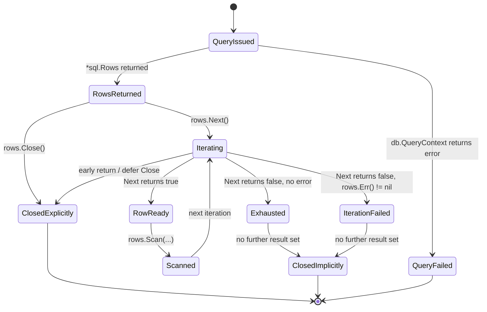
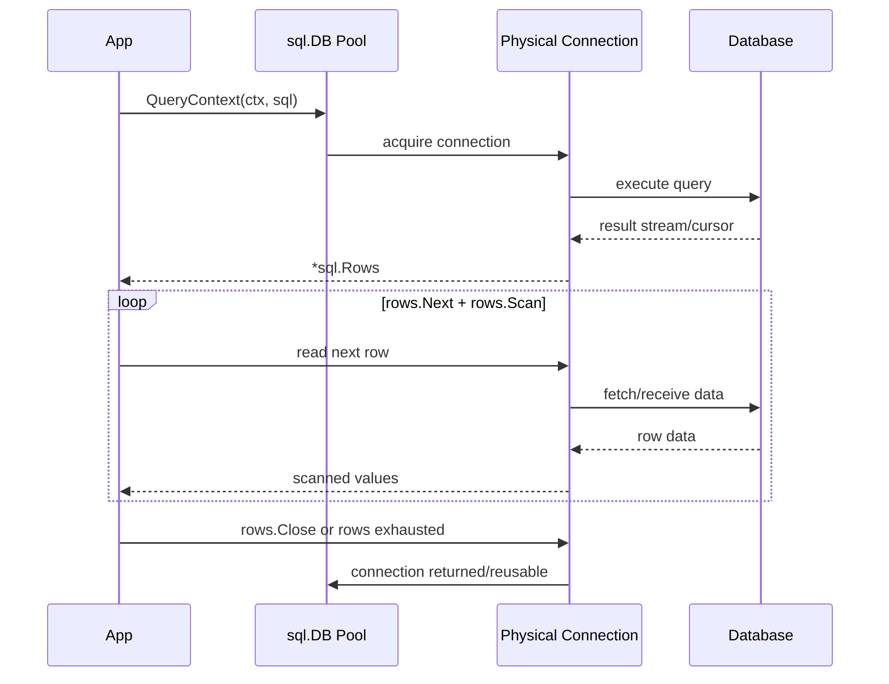
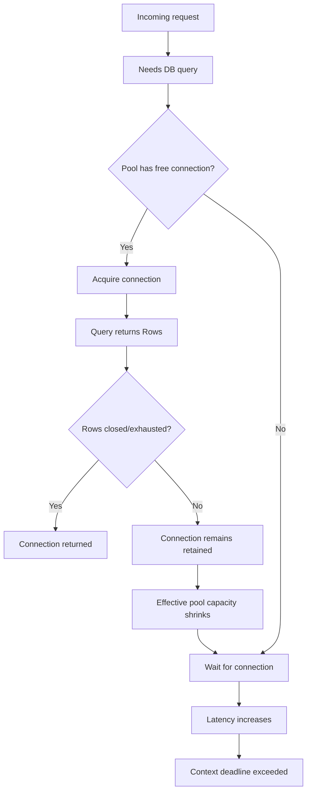
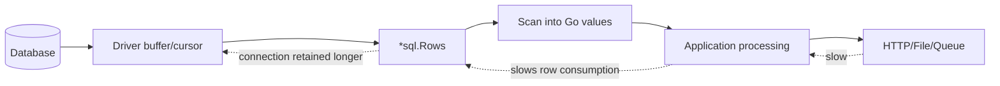
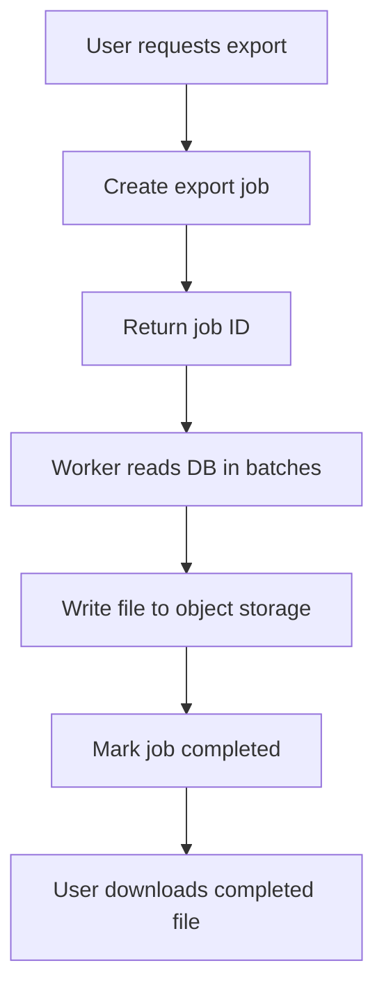
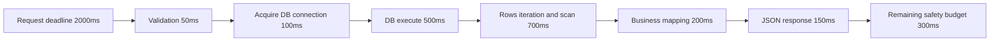
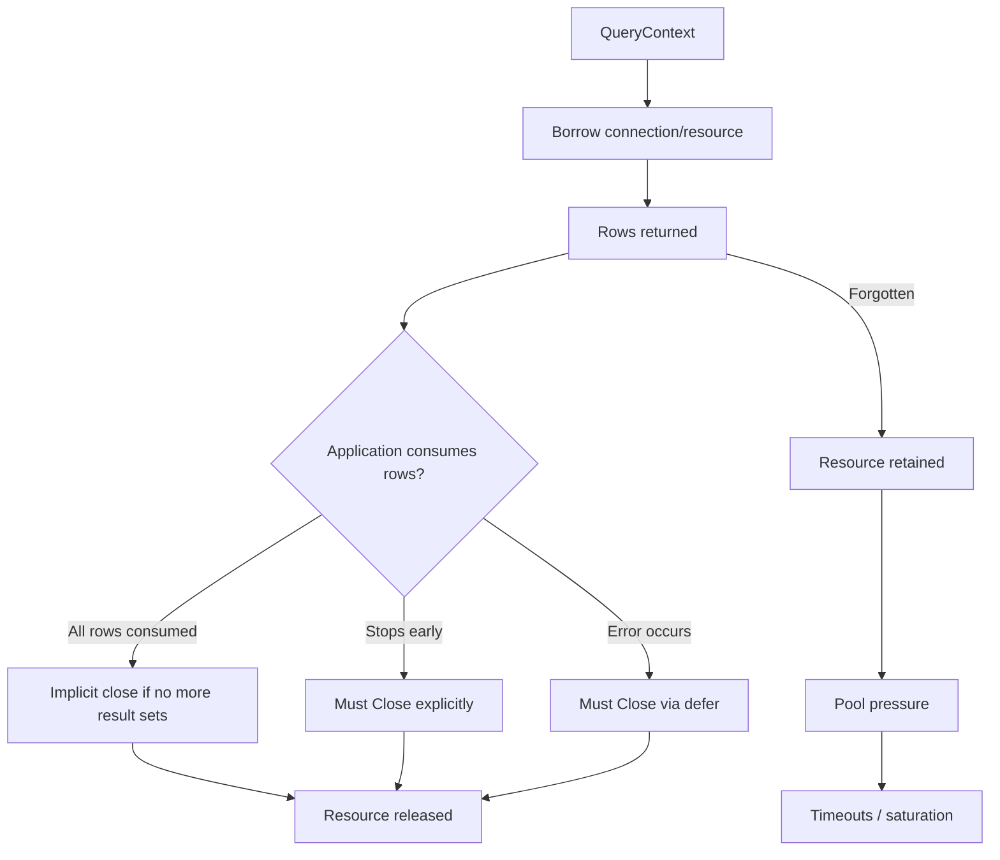

# learn-go-sql-database-integration-part-007.md

# Rows Lifecycle and Resource Safety

> Seri: **Go SQL Package, Connection Pool, Transaction Management, Database Integration**  
> Part: **007**  
> Target pembaca: **Java software engineer yang ingin menguasai database integration di Go pada level production/internal engineering handbook**  
> Target Go: **Go 1.26.x**  
> Fokus: lifecycle `*sql.Rows`, safety, connection retention, iterator correctness, error checking, streaming, backpressure, dan failure modes.

---

## 1. Tujuan

Setelah mempelajari bagian ini, Anda harus mampu:

1. Memahami bahwa `*sql.Rows` bukan sekadar collection hasil query.
2. Menjelaskan mengapa `Rows` adalah **resource-bearing cursor/iterator** yang dapat menahan koneksi database.
3. Menulis pola iterasi `Rows` yang benar, aman, dan konsisten.
4. Membedakan error dari:
   - eksekusi query awal,
   - scanning row,
   - iterasi row,
   - context cancellation,
   - driver/network/database failure.
5. Mendesain repository method yang tidak membocorkan `Rows` ke layer yang salah.
6. Menghindari pool starvation karena `Rows` tidak ditutup atau diproses terlalu lama.
7. Membaca large result set secara sadar terhadap memory, latency, transaction lifetime, dan backpressure.
8. Menentukan kapan harus materialize hasil query dan kapan boleh streaming.
9. Membuat checklist code review untuk semua query multi-row.
10. Membangun mental model setara engineer production: `Rows` adalah **lifecycle object**, bukan array.

---

## 2. Posisi Part Ini dalam Seri

Pada part sebelumnya, kita membahas **Query Execution Model**:

- `ExecContext` untuk statement tanpa result set.
- `QueryContext` untuk banyak row.
- `QueryRowContext` untuk maksimal satu row.
- `sql.ErrNoRows` untuk single-row read.
- `sql.Result` untuk affected rows / insert result.

Part ini memperdalam satu area yang sering terlihat sederhana tetapi sangat sering menjadi sumber bug production:

```go
rows, err := db.QueryContext(ctx, query, args...)
```

Masalahnya bukan hanya "bagaimana membaca rows". Masalah sebenarnya adalah:

- kapan resource dilepas,
- kapan connection kembali ke pool,
- kapan error benar-benar muncul,
- apa yang terjadi jika function return lebih awal,
- apa dampaknya ke transaction,
- apa dampaknya ke pool saturation,
- apa dampaknya ke memory,
- apa dampaknya ke request latency,
- apa dampaknya ke database server.

---

## 3. Mental Model Utama

### 3.1 `Rows` adalah Cursor, Bukan Slice

Di Java, mudah membayangkan hasil query sebagai `ResultSet`. Di Go, `*sql.Rows` juga mirip secara konseptual dengan `ResultSet`, tetapi cara pemakaiannya lebih eksplisit.

`Rows` bukan:

```go
[]User
```

`Rows` lebih tepat dipahami sebagai:

```text
handle ke hasil query yang sedang dibaca secara bertahap
```

Atau:

```text
iterator yang membawa resource database dan driver sampai ia selesai atau ditutup
```

Konsekuensinya:

- `Rows` perlu ditutup.
- `Rows` perlu diiterasi dengan benar.
- `Rows` bisa menahan connection.
- `Rows` bisa menghasilkan error setelah beberapa row berhasil dibaca.
- `Rows` tidak boleh dibiarkan lintas layer tanpa ownership yang jelas.

---

### 3.2 Diagram Lifecycle `Rows`



Hal penting:

1. `QueryContext` bisa berhasil dan mengembalikan `Rows`.
2. Setelah `Rows` dikembalikan, pekerjaan belum selesai.
3. `Next` menggerakkan cursor.
4. `Scan` membaca row saat ini.
5. `Err` harus dicek setelah loop.
6. `Close` harus dipastikan, terutama untuk early return.

---

## 4. Contract Resmi `*sql.Rows`

Secara konseptual, contract `Rows` adalah:

```go
type Rows struct {
    // contains filtered or unexported fields
}
```

Anda tidak mengakses field internal. Anda hanya berinteraksi melalui method:

```go
func (rs *Rows) Close() error
func (rs *Rows) Columns() ([]string, error)
func (rs *Rows) ColumnTypes() ([]*ColumnType, error)
func (rs *Rows) Err() error
func (rs *Rows) Next() bool
func (rs *Rows) NextResultSet() bool
func (rs *Rows) Scan(dest ...any) error
```

Core method untuk kebanyakan code production:

```go
rows.Close()
rows.Next()
rows.Scan(...)
rows.Err()
```

---

## 5. Pola Dasar yang Benar

Ini adalah pola minimum yang harus menjadi muscle memory:

```go
func ListUsers(ctx context.Context, db *sql.DB, status string) ([]User, error) {
    rows, err := db.QueryContext(ctx, `
        SELECT id, email, full_name, status, created_at
        FROM users
        WHERE status = ?
        ORDER BY created_at DESC, id DESC
    `, status)
    if err != nil {
        return nil, fmt.Errorf("query users: %w", err)
    }
    defer rows.Close()

    users := make([]User, 0)
    for rows.Next() {
        var u User
        if err := rows.Scan(
            &u.ID,
            &u.Email,
            &u.FullName,
            &u.Status,
            &u.CreatedAt,
        ); err != nil {
            return nil, fmt.Errorf("scan user row: %w", err)
        }
        users = append(users, u)
    }

    if err := rows.Err(); err != nil {
        return nil, fmt.Errorf("iterate user rows: %w", err)
    }

    return users, nil
}
```

Empat hal wajib:

```go
rows, err := db.QueryContext(...)
if err != nil { ... }
defer rows.Close()
for rows.Next() { rows.Scan(...) }
if err := rows.Err(); err != nil { ... }
```

Kalau salah satu hilang, code perlu dicurigai.

---

## 6. Kenapa `defer rows.Close()` Tetap Penting?

Dokumentasi Go menjelaskan bahwa jika `Rows.Next` dipanggil sampai mengembalikan `false` dan tidak ada result set lanjutan, `Rows` dapat tertutup otomatis. Tetapi ini **tidak cukup** sebagai kebiasaan production.

Alasannya:

1. Function bisa return lebih awal karena `Scan` error.
2. Function bisa return lebih awal karena domain validation error.
3. Function bisa return lebih awal setelah hanya butuh satu row dari query multi-row.
4. Loop bisa dihentikan karena limit application-side.
5. Context bisa cancel saat proses berlangsung.
6. Panic bisa terjadi sebelum loop habis.
7. Refactor bisa mengubah control flow.

Maka rule praktisnya:

```go
rows, err := db.QueryContext(ctx, query, args...)
if err != nil {
    return err
}
defer rows.Close()
```

Bukan karena auto-close tidak ada, tetapi karena **ownership harus eksplisit**.

---

## 7. `Rows` dan Connection Retention

### 7.1 Query Multi-Row Biasanya Memakai Connection Selama Rows Aktif

Saat Anda menjalankan:

```go
rows, err := db.QueryContext(ctx, query, args...)
```

`database/sql` mengambil connection dari pool, menjalankan query melalui driver, lalu mengembalikan `*Rows`.

Selama hasil masih aktif, connection bisa tetap terkait dengan `Rows`.

Bentuk umumnya:



Implikasinya:

- Jika `Rows` lambat dibaca, connection lama tertahan.
- Jika `Rows` tidak ditutup, pool bisa kehilangan capacity efektif.
- Jika banyak request melakukan hal ini, pool bisa penuh.
- Jika pool penuh, request lain menunggu connection.
- Jika request lain menunggu terlalu lama, latency naik atau timeout.

---

### 7.2 Pool Starvation Karena Rows Leak

Misalkan konfigurasi:

```go
db.SetMaxOpenConns(10)
```

Lalu ada 10 request yang menjalankan query multi-row, tetapi lupa `rows.Close()` saat return lebih awal.

Maka semua 10 connection bisa tertahan.

Request ke-11 akan menunggu connection.

Diagram:



Gejalanya di production:

- `DB.Stats().InUse` tinggi terus.
- `DB.Stats().Idle` rendah.
- `DB.Stats().WaitCount` naik.
- `DB.Stats().WaitDuration` naik.
- p95/p99 latency naik.
- database CPU mungkin tidak tinggi, tetapi app tetap timeout.
- log berisi `context deadline exceeded` saat mengambil atau menjalankan query.

Ini sangat tricky karena database bisa terlihat "sehat", tetapi aplikasi kehabisan connection pool.

---

## 8. `Next`, `Scan`, dan `Err`: Tiga Tahap Error yang Berbeda

### 8.1 Error dari `QueryContext`

Terjadi sebelum `Rows` dikembalikan:

```go
rows, err := db.QueryContext(ctx, query, args...)
if err != nil {
    return fmt.Errorf("query active users: %w", err)
}
```

Contoh:

- SQL syntax error yang diketahui saat execute.
- Connection unavailable.
- Authentication failure.
- Context sudah canceled sebelum query berjalan.
- Driver gagal mengirim query.
- Database menolak query.

---

### 8.2 Error dari `Scan`

Terjadi saat membaca kolom row saat ini ke destination Go:

```go
if err := rows.Scan(&u.ID, &u.Email); err != nil {
    return fmt.Errorf("scan active user: %w", err)
}
```

Contoh:

- Jumlah destination tidak sama dengan jumlah column.
- Tipe tidak kompatibel.
- NULL discan ke non-nullable Go primitive.
- Data numeric overflow.
- Time parsing error.
- Custom `Scanner` gagal.

Ini adalah error **per-row**, bukan error query secara keseluruhan.

---

### 8.3 Error dari `rows.Err()`

Terjadi saat iterasi, sering baru terlihat setelah `Next()` mengembalikan `false`:

```go
for rows.Next() {
    // scan rows
}
if err := rows.Err(); err != nil {
    return fmt.Errorf("iterate active users: %w", err)
}
```

Contoh:

- Network connection putus saat stream row.
- Context canceled di tengah pembacaan.
- Database cursor error.
- Driver error saat mengambil batch row berikutnya.
- Server-side timeout setelah sebagian row berhasil dibaca.

**Jangan menganggap loop selesai berarti sukses.**

Loop selesai bisa berarti:

1. semua row habis,
2. atau iterasi berhenti karena error.

Satu-satunya cara membedakannya adalah `rows.Err()`.

---

## 9. Kenapa Error Bisa Muncul Setelah Beberapa Row Berhasil?

Banyak engineer pemula mengira query punya dua kemungkinan:

```text
query gagal total
atau query sukses total
```

Untuk multi-row result, model ini terlalu sederhana.

Database result bisa bersifat streaming/batched:

```text
query accepted → first rows returned → more rows fetched → network error → iteration error
```

Contoh scenario:

1. Query mengembalikan 100.000 row.
2. Aplikasi berhasil membaca 35.000 row.
3. Context deadline habis.
4. `rows.Next()` mengembalikan `false`.
5. `rows.Err()` mengembalikan `context deadline exceeded` atau driver error.

Jika code tidak cek `rows.Err()`, aplikasi bisa menganggap 35.000 row tersebut adalah full result.

Dalam sistem reporting, audit listing, export, reconciliation, atau regulatory data extraction, ini fatal.

---

## 10. Anti-Pattern: Tidak Mengecek `rows.Err()`

### Salah

```go
func ListOrders(ctx context.Context, db *sql.DB) ([]Order, error) {
    rows, err := db.QueryContext(ctx, `SELECT id, status FROM orders`)
    if err != nil {
        return nil, err
    }
    defer rows.Close()

    var orders []Order
    for rows.Next() {
        var o Order
        if err := rows.Scan(&o.ID, &o.Status); err != nil {
            return nil, err
        }
        orders = append(orders, o)
    }

    return orders, nil // BUG: missing rows.Err()
}
```

Masalah:

- Partial result bisa dianggap complete.
- Network/driver/context error bisa hilang.
- Consumer tidak tahu bahwa data incomplete.

### Benar

```go
func ListOrders(ctx context.Context, db *sql.DB) ([]Order, error) {
    rows, err := db.QueryContext(ctx, `SELECT id, status FROM orders`)
    if err != nil {
        return nil, fmt.Errorf("query orders: %w", err)
    }
    defer rows.Close()

    var orders []Order
    for rows.Next() {
        var o Order
        if err := rows.Scan(&o.ID, &o.Status); err != nil {
            return nil, fmt.Errorf("scan order: %w", err)
        }
        orders = append(orders, o)
    }

    if err := rows.Err(); err != nil {
        return nil, fmt.Errorf("iterate orders: %w", err)
    }

    return orders, nil
}
```

---

## 11. Anti-Pattern: Lupa `rows.Close()` Karena Return Lebih Awal

### Salah

```go
func FindFirstActiveUser(ctx context.Context, db *sql.DB) (*User, error) {
    rows, err := db.QueryContext(ctx, `
        SELECT id, email
        FROM users
        WHERE status = 'ACTIVE'
        ORDER BY created_at DESC
    `)
    if err != nil {
        return nil, err
    }

    if rows.Next() {
        var u User
        if err := rows.Scan(&u.ID, &u.Email); err != nil {
            return nil, err
        }
        return &u, nil // BUG: rows not closed
    }

    return nil, sql.ErrNoRows // BUG: rows not closed
}
```

### Benar Minimal

```go
func FindFirstActiveUser(ctx context.Context, db *sql.DB) (*User, error) {
    rows, err := db.QueryContext(ctx, `
        SELECT id, email
        FROM users
        WHERE status = 'ACTIVE'
        ORDER BY created_at DESC
        LIMIT 1
    `)
    if err != nil {
        return nil, fmt.Errorf("query active user: %w", err)
    }
    defer rows.Close()

    if !rows.Next() {
        if err := rows.Err(); err != nil {
            return nil, fmt.Errorf("iterate active user: %w", err)
        }
        return nil, sql.ErrNoRows
    }

    var u User
    if err := rows.Scan(&u.ID, &u.Email); err != nil {
        return nil, fmt.Errorf("scan active user: %w", err)
    }

    return &u, nil
}
```

### Lebih Tepat: Pakai `QueryRowContext`

```go
func FindFirstActiveUser(ctx context.Context, db *sql.DB) (*User, error) {
    var u User
    err := db.QueryRowContext(ctx, `
        SELECT id, email
        FROM users
        WHERE status = 'ACTIVE'
        ORDER BY created_at DESC
        LIMIT 1
    `).Scan(&u.ID, &u.Email)
    if err != nil {
        return nil, fmt.Errorf("query active user: %w", err)
    }
    return &u, nil
}
```

Rule:

> Jika secara business contract Anda hanya butuh satu row, jangan memakai `QueryContext` + `Rows` kecuali ada alasan khusus.

---

## 12. Cardinality Contract: Rows Pattern Harus Sesuai Semantik

### 12.1 Banyak Row

Gunakan:

```go
QueryContext + Rows loop
```

Contoh:

```go
ListUsers(ctx, filter) ([]User, error)
```

---

### 12.2 Nol atau Satu Row

Gunakan:

```go
QueryRowContext + Scan
```

Contoh:

```go
FindUserByID(ctx, id) (*User, error)
```

---

### 12.3 Tepat Satu Row

Gunakan `QueryRowContext`, tetapi map `sql.ErrNoRows` menjadi domain error:

```go
func GetUserByID(ctx context.Context, db *sql.DB, id int64) (User, error) {
    var u User
    err := db.QueryRowContext(ctx, `
        SELECT id, email, status
        FROM users
        WHERE id = ?
    `, id).Scan(&u.ID, &u.Email, &u.Status)
    if err != nil {
        if errors.Is(err, sql.ErrNoRows) {
            return User{}, ErrUserNotFound
        }
        return User{}, fmt.Errorf("get user by id: %w", err)
    }
    return u, nil
}
```

---

### 12.4 Maksimal N Row

Tambahkan limit di SQL, bukan hanya di aplikasi:

```sql
SELECT id, email
FROM users
WHERE status = ?
ORDER BY created_at DESC, id DESC
LIMIT ?
```

Jangan lakukan:

```go
count := 0
for rows.Next() {
    if count >= limit {
        break
    }
}
```

Break application-side bisa tetap membuat database menghasilkan result lebih banyak dari yang dibutuhkan, dan Anda tetap harus close `Rows`.

---

## 13. Materialization vs Streaming

Saat membaca rows, ada dua pendekatan besar.

### 13.1 Materialize ke Slice

```go
func ListUsers(ctx context.Context, db *sql.DB) ([]User, error) {
    rows, err := db.QueryContext(ctx, `SELECT id, email FROM users`)
    if err != nil {
        return nil, err
    }
    defer rows.Close()

    users := make([]User, 0)
    for rows.Next() {
        var u User
        if err := rows.Scan(&u.ID, &u.Email); err != nil {
            return nil, err
        }
        users = append(users, u)
    }
    if err := rows.Err(); err != nil {
        return nil, err
    }
    return users, nil
}
```

Cocok untuk:

- result kecil/menengah,
- API listing dengan limit,
- service layer butuh seluruh result,
- repository contract sederhana.

Risiko:

- memory naik jika result besar,
- GC pressure,
- latency sampai seluruh result selesai,
- accidental unbounded query.

---

### 13.2 Streaming ke Consumer Callback

```go
func StreamUsers(
    ctx context.Context,
    db *sql.DB,
    handle func(User) error,
) error {
    rows, err := db.QueryContext(ctx, `
        SELECT id, email, status
        FROM users
        ORDER BY id
    `)
    if err != nil {
        return fmt.Errorf("query users: %w", err)
    }
    defer rows.Close()

    for rows.Next() {
        var u User
        if err := rows.Scan(&u.ID, &u.Email, &u.Status); err != nil {
            return fmt.Errorf("scan user: %w", err)
        }
        if err := handle(u); err != nil {
            return fmt.Errorf("handle user: %w", err)
        }
    }

    if err := rows.Err(); err != nil {
        return fmt.Errorf("iterate users: %w", err)
    }
    return nil
}
```

Cocok untuk:

- export,
- ETL,
- migration,
- large reporting,
- background processing.

Risiko:

- connection ditahan selama callback berjalan,
- callback lambat memperpanjang durasi cursor,
- callback yang melakukan DB query lain bisa memicu deadlock/pool exhaustion,
- context harus ketat,
- transaction scope harus sangat hati-hati.

---

## 14. Streaming yang Salah: Callback Lambat Menahan Connection

Misalkan:

```go
err := StreamUsers(ctx, db, func(u User) error {
    sendEmail(u.Email) // slow external IO
    return nil
})
```

Ini buruk karena:

- DB connection tertahan selama email dikirim.
- Jika email provider lambat, DB pool ikut terdampak.
- Jika jumlah user besar, satu connection bisa tertahan sangat lama.
- Jika banyak job paralel, pool bisa habis.

Lebih baik:

```go
err := StreamUsers(ctx, db, func(u User) error {
    jobs <- EmailJob{UserID: u.ID, Email: u.Email}
    return nil
})
```

Atau materialize batch kecil:

```text
read 500 rows → close rows/finish query → process external IO → next batch
```

---

## 15. Batch Streaming Pattern

Untuk pekerjaan besar, batch lebih aman daripada satu cursor panjang.

```go
func ProcessUsersInBatches(ctx context.Context, db *sql.DB, batchSize int, handle func([]User) error) error {
    var lastID int64 = 0

    for {
        batch, err := listUserBatch(ctx, db, lastID, batchSize)
        if err != nil {
            return err
        }
        if len(batch) == 0 {
            return nil
        }

        if err := handle(batch); err != nil {
            return err
        }

        lastID = batch[len(batch)-1].ID
    }
}

func listUserBatch(ctx context.Context, db *sql.DB, lastID int64, limit int) ([]User, error) {
    rows, err := db.QueryContext(ctx, `
        SELECT id, email, status
        FROM users
        WHERE id > ?
        ORDER BY id ASC
        LIMIT ?
    `, lastID, limit)
    if err != nil {
        return nil, fmt.Errorf("query user batch: %w", err)
    }
    defer rows.Close()

    users := make([]User, 0, limit)
    for rows.Next() {
        var u User
        if err := rows.Scan(&u.ID, &u.Email, &u.Status); err != nil {
            return nil, fmt.Errorf("scan user batch: %w", err)
        }
        users = append(users, u)
    }
    if err := rows.Err(); err != nil {
        return nil, fmt.Errorf("iterate user batch: %w", err)
    }

    return users, nil
}
```

Keunggulan:

- Connection dilepas setiap batch.
- Memory terkendali.
- Progress bisa disimpan.
- Retry lebih mudah.
- External IO tidak menahan DB cursor.
- Lebih cocok untuk background jobs production.

---

## 16. `defer rows.Close()` di Loop: Hati-Hati

### Salah

```go
for _, customerID := range customerIDs {
    rows, err := db.QueryContext(ctx, `SELECT id FROM orders WHERE customer_id = ?`, customerID)
    if err != nil {
        return err
    }
    defer rows.Close() // BUG: deferred until outer function returns

    for rows.Next() {
        // scan
    }
}
```

Masalah:

- Semua `Rows` baru ditutup saat function selesai.
- Jika loop panjang, banyak connection/resource tertahan.
- Bisa menyebabkan pool starvation.

### Benar: Extract Function

```go
for _, customerID := range customerIDs {
    if err := processCustomerOrders(ctx, db, customerID); err != nil {
        return err
    }
}

func processCustomerOrders(ctx context.Context, db *sql.DB, customerID int64) error {
    rows, err := db.QueryContext(ctx, `SELECT id FROM orders WHERE customer_id = ?`, customerID)
    if err != nil {
        return err
    }
    defer rows.Close()

    for rows.Next() {
        var orderID int64
        if err := rows.Scan(&orderID); err != nil {
            return err
        }
        // process
    }
    return rows.Err()
}
```

### Benar: Explicit Close per Iterasi

```go
for _, customerID := range customerIDs {
    rows, err := db.QueryContext(ctx, `SELECT id FROM orders WHERE customer_id = ?`, customerID)
    if err != nil {
        return err
    }

    err = func() error {
        defer rows.Close()
        for rows.Next() {
            var orderID int64
            if err := rows.Scan(&orderID); err != nil {
                return err
            }
        }
        return rows.Err()
    }()
    if err != nil {
        return err
    }
}
```

Rule:

> `defer rows.Close()` aman dalam function kecil. Dalam loop besar, pastikan scope defer tidak terlalu luas.

---

## 17. Early Break Pattern

Kadang Anda ingin berhenti membaca sebelum semua row habis.

Contoh: mencari row pertama yang memenuhi predicate application-side.

```go
func FindFirstExpensiveOrder(ctx context.Context, db *sql.DB) (*Order, error) {
    rows, err := db.QueryContext(ctx, `
        SELECT id, amount, status
        FROM orders
        ORDER BY created_at DESC
    `)
    if err != nil {
        return nil, err
    }
    defer rows.Close()

    for rows.Next() {
        var o Order
        if err := rows.Scan(&o.ID, &o.Amount, &o.Status); err != nil {
            return nil, err
        }
        if o.Amount > 10_000 {
            return &o, nil // safe because defer closes rows
        }
    }

    if err := rows.Err(); err != nil {
        return nil, err
    }
    return nil, sql.ErrNoRows
}
```

Tetapi pertanyaan arsitekturalnya:

> Mengapa predicate `amount > 10000` tidak didorong ke SQL?

Lebih baik:

```sql
SELECT id, amount, status
FROM orders
WHERE amount > ?
ORDER BY created_at DESC
LIMIT 1
```

Go code harus aman, tetapi query shape juga harus benar.

---

## 18. `Rows.Close()` Error: Perlukah Dicek?

`Rows.Close()` mengembalikan error:

```go
if err := rows.Close(); err != nil {
    return err
}
```

Namun dalam kebanyakan read query, pola umum adalah:

```go
defer rows.Close()
```

Lalu error iterasi dicek dengan:

```go
if err := rows.Err(); err != nil {
    return err
}
```

Kapan `Close` error perlu diperhatikan?

1. Ketika driver/database dapat melaporkan error penting saat close cursor.
2. Ketika stored procedure / multi-result behavior bergantung pada close/finalization.
3. Ketika audit/financial/export job perlu sangat ketat terhadap completeness.
4. Ketika Anda tidak membaca semua rows dan close bisa mengembalikan error dari cleanup.

Pola stricter:

```go
func queryStrict(ctx context.Context, db *sql.DB) (err error) {
    rows, err := db.QueryContext(ctx, `SELECT id FROM users`)
    if err != nil {
        return err
    }
    defer func() {
        closeErr := rows.Close()
        if err == nil && closeErr != nil {
            err = fmt.Errorf("close rows: %w", closeErr)
        }
    }()

    for rows.Next() {
        var id int64
        if scanErr := rows.Scan(&id); scanErr != nil {
            return fmt.Errorf("scan id: %w", scanErr)
        }
    }
    if iterErr := rows.Err(); iterErr != nil {
        return fmt.Errorf("iterate ids: %w", iterErr)
    }
    return nil
}
```

Untuk sebagian besar repository read biasa, `defer rows.Close()` + `rows.Err()` sudah cukup. Untuk workflow audit/export/financial yang strict, pertimbangkan menangkap close error.

---

## 19. `Rows.Columns()` dan Dynamic Scanning

`Columns()` mengembalikan nama kolom result set.

```go
cols, err := rows.Columns()
if err != nil {
    return err
}
```

Gunakan untuk:

- generic export,
- audit dump,
- CSV writer,
- debug tooling,
- migration tool,
- admin query console.

Jangan jadikan dynamic scanning sebagai default untuk business repository.

### Dynamic Scan Example

```go
func QueryMaps(ctx context.Context, db *sql.DB, query string, args ...any) ([]map[string]any, error) {
    rows, err := db.QueryContext(ctx, query, args...)
    if err != nil {
        return nil, fmt.Errorf("query maps: %w", err)
    }
    defer rows.Close()

    cols, err := rows.Columns()
    if err != nil {
        return nil, fmt.Errorf("columns: %w", err)
    }

    result := make([]map[string]any, 0)
    for rows.Next() {
        values := make([]any, len(cols))
        ptrs := make([]any, len(cols))
        for i := range values {
            ptrs[i] = &values[i]
        }

        if err := rows.Scan(ptrs...); err != nil {
            return nil, fmt.Errorf("scan dynamic row: %w", err)
        }

        row := make(map[string]any, len(cols))
        for i, col := range cols {
            row[col] = values[i]
        }
        result = append(result, row)
    }

    if err := rows.Err(); err != nil {
        return nil, fmt.Errorf("iterate dynamic rows: %w", err)
    }
    return result, nil
}
```

Risiko:

- type information lemah,
- memory allocation tinggi,
- `[]byte` handling harus hati-hati,
- SQL contract tidak eksplisit,
- refactor lebih berisiko.

Production rule:

> Gunakan dynamic scanning untuk tooling. Gunakan typed scanning untuk business logic.

---

## 20. `ColumnTypes()` untuk Metadata

`ColumnTypes()` dapat memberi metadata seperti:

- database type name,
- length,
- nullable,
- precision/scale,
- scan type.

Contoh:

```go
cts, err := rows.ColumnTypes()
if err != nil {
    return err
}
for _, ct := range cts {
    nullable, nullableOK := ct.Nullable()
    length, lengthOK := ct.Length()
    precision, scale, decimalOK := ct.DecimalSize()

    fmt.Printf("column=%s dbType=%s nullable=%v/%v length=%v/%v decimal=%v/%v/%v\n",
        ct.Name(),
        ct.DatabaseTypeName(),
        nullable, nullableOK,
        length, lengthOK,
        precision, scale, decimalOK,
    )
}
```

Gunakan untuk:

- schema inspection,
- generic export,
- validation tooling,
- migration verification,
- database documentation generator.

Jangan terlalu bergantung pada metadata untuk runtime business logic karena informasi bisa berbeda antar driver.

---

## 21. `Rows` dalam Transaction

Ketika `Rows` dibuat dari `*sql.Tx`:

```go
rows, err := tx.QueryContext(ctx, `SELECT id FROM accounts WHERE status = ?`, status)
```

Maka `Rows` hidup di dalam transaction yang sama.

Konsekuensi:

1. Transaction memegang satu connection.
2. Rows juga memakai connection itu.
3. Selama rows aktif, operasi lain dalam transaction bisa tergantung pada apakah driver/database mendukung multiple active result set behavior.
4. Transaction tidak boleh di-commit/rollback sebelum rows selesai/ditutup.
5. Rows yang lambat memperpanjang umur transaction.

### Pola Aman

```go
func LoadAndUpdate(ctx context.Context, tx *sql.Tx) error {
    rows, err := tx.QueryContext(ctx, `
        SELECT id
        FROM tasks
        WHERE status = 'PENDING'
        ORDER BY id
        LIMIT 100
        FOR UPDATE
    `)
    if err != nil {
        return fmt.Errorf("query pending tasks: %w", err)
    }
    defer rows.Close()

    ids := make([]int64, 0, 100)
    for rows.Next() {
        var id int64
        if err := rows.Scan(&id); err != nil {
            return fmt.Errorf("scan task id: %w", err)
        }
        ids = append(ids, id)
    }
    if err := rows.Err(); err != nil {
        return fmt.Errorf("iterate task ids: %w", err)
    }

    for _, id := range ids {
        if _, err := tx.ExecContext(ctx, `
            UPDATE tasks
            SET status = 'PROCESSING'
            WHERE id = ?
        `, id); err != nil {
            return fmt.Errorf("update task %d: %w", id, err)
        }
    }

    return nil
}
```

Kenapa collect IDs dulu?

- Rows selesai lebih cepat.
- Lock/cursor state lebih jelas.
- Subsequent updates tidak berjalan sambil cursor masih aktif.
- Mengurangi driver-specific surprise.

---

## 22. Transaction + Streaming: Sering Berbahaya

Contoh buruk:

```go
func ProcessInsideTx(ctx context.Context, tx *sql.Tx) error {
    rows, err := tx.QueryContext(ctx, `SELECT id, payload FROM events WHERE status = 'NEW' FOR UPDATE`)
    if err != nil {
        return err
    }
    defer rows.Close()

    for rows.Next() {
        var e Event
        if err := rows.Scan(&e.ID, &e.Payload); err != nil {
            return err
        }

        if err := callExternalAPI(e.Payload); err != nil {
            return err
        }

        if _, err := tx.ExecContext(ctx, `UPDATE events SET status = 'DONE' WHERE id = ?`, e.ID); err != nil {
            return err
        }
    }
    return rows.Err()
}
```

Masalah:

- Transaction panjang.
- Row locks lama.
- Connection lama tertahan.
- External API dipanggil dalam transaction.
- Risiko deadlock naik.
- Retry sulit.
- Ambiguous side effect jika commit gagal setelah external API sukses.

Lebih baik:

1. Ambil batch kecil dalam transaction.
2. Mark sebagai claimed/processing.
3. Commit cepat.
4. Process external IO di luar transaction.
5. Update final status dengan idempotency.

---

## 23. `Rows` dan Context Cancellation

Pola timeout:

```go
queryCtx, cancel := context.WithTimeout(ctx, 2*time.Second)
defer cancel()

rows, err := db.QueryContext(queryCtx, `SELECT id FROM big_table`)
if err != nil {
    return err
}
defer rows.Close()

for rows.Next() {
    var id int64
    if err := rows.Scan(&id); err != nil {
        return err
    }
}
if err := rows.Err(); err != nil {
    return err
}
```

Hal penting:

- Context bisa cancel sebelum query dimulai.
- Context bisa cancel saat query dieksekusi.
- Context bisa cancel saat rows sedang dibaca.
- Error cancellation mungkin muncul dari `QueryContext`, `Scan`, atau `rows.Err()` tergantung driver/timing.
- Driver support menentukan seberapa cepat operasi benar-benar berhenti.

Production rule:

> Selalu anggap context cancellation dapat terjadi di tengah iterasi rows.

---

## 24. Partial Result dan Domain Correctness

Untuk beberapa endpoint, partial result masih bisa diterima. Untuk lainnya, tidak boleh.

| Use case | Partial result boleh? | Catatan |
|---|---:|---|
| Autocomplete suggestion | Kadang boleh | Bisa degrade gracefully jika diberi label |
| Admin listing biasa | Umumnya tidak | User mengira data lengkap |
| Financial report | Tidak | Harus lengkap atau gagal |
| Audit export | Tidak | Completeness wajib |
| Regulatory case search | Hampir selalu tidak | Salah listing bisa memengaruhi keputusan |
| Background reconciliation | Tidak | Harus retry/checkpoint |
| Dashboard approximate | Kadang boleh | Harus eksplisit approximate/stale |

Karena itu, `rows.Err()` bukan formalitas. Ia adalah bagian dari correctness contract.

---

## 25. Memory Model Saat Membaca Rows

### 25.1 Materialization Tanpa Limit

```go
rows, _ := db.QueryContext(ctx, `SELECT id, payload FROM audit_trail`)
var records []AuditRecord
for rows.Next() {
    var r AuditRecord
    rows.Scan(&r.ID, &r.Payload)
    records = append(records, r)
}
```

Risiko:

- Slice tumbuh besar.
- Payload CLOB/TEXT besar masuk memory.
- GC pressure.
- Request OOM.
- Response terlalu lambat.

### 25.2 Batas di Query

```sql
SELECT id, payload
FROM audit_trail
WHERE module = ?
ORDER BY created_at DESC, id DESC
LIMIT ?
```

### 25.3 Projection Control

Jangan ambil kolom besar kalau tidak perlu:

```sql
-- buruk untuk listing
SELECT * FROM audit_trail

-- lebih baik
SELECT id, activity, module, created_at, actor
FROM audit_trail
```

### 25.4 Page Size Guard

```go
const maxPageSize = 500

func normalizePageSize(n int) int {
    switch {
    case n <= 0:
        return 50
    case n > maxPageSize:
        return maxPageSize
    default:
        return n
    }
}
```

---

## 26. `Rows` dan Backpressure

Backpressure berarti downstream lebih lambat daripada upstream.

Dalam database query:

- Database menghasilkan row.
- Driver menerima row.
- App membaca row.
- App memproses row.
- App menulis response / file / channel / network.

Jika app lambat memproses, `Rows` tetap hidup lebih lama.



Backpressure problem muncul saat:

- streaming CSV ke client lambat,
- client download lambat,
- network lambat,
- file system lambat,
- downstream queue penuh,
- callback melakukan external API.

Mitigasi:

1. Batch query.
2. Buffer bounded.
3. Separate DB read phase and slow output phase.
4. Use timeout.
5. Use pagination/cursor export.
6. Put export job behind async worker.
7. Store export result to object storage instead of streaming DB cursor directly to slow client.

---

## 27. Repository Boundary: Jangan Bocorkan `*sql.Rows` Sembarangan

### Anti-Pattern

```go
func (r *UserRepository) QueryActiveUsers(ctx context.Context) (*sql.Rows, error) {
    return r.db.QueryContext(ctx, `SELECT id, email FROM users WHERE status = 'ACTIVE'`)
}
```

Masalah:

- Caller harus tahu cara close rows.
- Ownership kabur.
- Error handling tersebar.
- Query shape bocor.
- Repository tidak lagi menjaga persistence boundary.
- Layer service bisa lupa `rows.Err()`.

### Lebih Baik: Return Typed Result

```go
func (r *UserRepository) ListActiveUsers(ctx context.Context) ([]User, error) {
    rows, err := r.db.QueryContext(ctx, `
        SELECT id, email
        FROM users
        WHERE status = 'ACTIVE'
        ORDER BY id
    `)
    if err != nil {
        return nil, fmt.Errorf("query active users: %w", err)
    }
    defer rows.Close()

    users := make([]User, 0)
    for rows.Next() {
        var u User
        if err := rows.Scan(&u.ID, &u.Email); err != nil {
            return nil, fmt.Errorf("scan active user: %w", err)
        }
        users = append(users, u)
    }
    if err := rows.Err(); err != nil {
        return nil, fmt.Errorf("iterate active users: %w", err)
    }
    return users, nil
}
```

### Untuk Streaming: Callback Ownership Tetap di Repository

```go
func (r *UserRepository) ForEachActiveUser(ctx context.Context, handle func(User) error) error {
    rows, err := r.db.QueryContext(ctx, `
        SELECT id, email
        FROM users
        WHERE status = 'ACTIVE'
        ORDER BY id
    `)
    if err != nil {
        return fmt.Errorf("query active users: %w", err)
    }
    defer rows.Close()

    for rows.Next() {
        var u User
        if err := rows.Scan(&u.ID, &u.Email); err != nil {
            return fmt.Errorf("scan active user: %w", err)
        }
        if err := handle(u); err != nil {
            return fmt.Errorf("handle active user: %w", err)
        }
    }
    if err := rows.Err(); err != nil {
        return fmt.Errorf("iterate active users: %w", err)
    }
    return nil
}
```

Ownership tetap jelas: repository membuka dan menutup rows.

---

## 28. Kapan Boleh Return Iterator Custom?

Kadang Anda butuh streaming lintas boundary. Jangan return `*sql.Rows` langsung. Buat abstraction yang own lifecycle-nya jelas.

```go
type UserIterator struct {
    rows *sql.Rows
}

func (it *UserIterator) Close() error {
    return it.rows.Close()
}

func (it *UserIterator) Next() bool {
    return it.rows.Next()
}

func (it *UserIterator) Scan() (User, error) {
    var u User
    if err := it.rows.Scan(&u.ID, &u.Email, &u.Status); err != nil {
        return User{}, err
    }
    return u, nil
}

func (it *UserIterator) Err() error {
    return it.rows.Err()
}
```

Tetapi ini tetap harus dipakai dengan hati-hati:

```go
it, err := repo.IterateUsers(ctx)
if err != nil {
    return err
}
defer it.Close()

for it.Next() {
    u, err := it.Scan()
    if err != nil {
        return err
    }
    // use u
}
if err := it.Err(); err != nil {
    return err
}
```

Gunakan hanya ketika:

- result sangat besar,
- streaming benar-benar dibutuhkan,
- caller cukup disiplin,
- ownership terdokumentasi,
- timeout jelas,
- metrics jelas,
- code review ketat.

---

## 29. Mapper Function Pattern

Agar scan logic konsisten, extract mapper.

```go
func scanUser(rows *sql.Rows) (User, error) {
    var u User
    if err := rows.Scan(
        &u.ID,
        &u.Email,
        &u.Status,
        &u.CreatedAt,
    ); err != nil {
        return User{}, err
    }
    return u, nil
}
```

Usage:

```go
for rows.Next() {
    u, err := scanUser(rows)
    if err != nil {
        return nil, fmt.Errorf("scan user: %w", err)
    }
    users = append(users, u)
}
```

Manfaat:

- Scan order terpusat.
- Mengurangi copy-paste.
- Error context konsisten.
- Lebih mudah test jika mapper menerima interface kecil.

Namun mapper harus tetap sejalan dengan SQL projection.

---

## 30. Projection Contract Pattern

Masalah umum:

```sql
SELECT id, email, status FROM users
```

Tetapi scan:

```go
rows.Scan(&u.ID, &u.Status, &u.Email)
```

Ini bisa gagal atau lebih buruk: sukses tetapi field tertukar jika tipe kompatibel.

Solusi: definisikan projection sebagai constant dekat mapper.

```go
const userListColumns = `
    id,
    email,
    status,
    created_at
`

func scanUserListRow(rows *sql.Rows) (UserListItem, error) {
    var u UserListItem
    if err := rows.Scan(
        &u.ID,
        &u.Email,
        &u.Status,
        &u.CreatedAt,
    ); err != nil {
        return UserListItem{}, err
    }
    return u, nil
}
```

Usage:

```go
query := `
    SELECT ` + userListColumns + `
    FROM users
    WHERE status = ?
    ORDER BY created_at DESC, id DESC
    LIMIT ?
`
```

Trade-off:

- String composition harus tetap controlled.
- Jangan gunakan untuk dynamic user input.
- Cocok untuk internal projection reuse.

---

## 31. Preallocation: Optimasi Kecil tapi Berguna

Jika page size diketahui:

```go
users := make([]User, 0, limit)
```

Ini mengurangi realloc slice.

Tetapi jangan melakukan preallocation berdasarkan count besar tanpa batas.

Buruk:

```go
users := make([]User, 0, estimatedMillionRows)
```

Lebih baik batch.

---

## 32. Limit dan Guardrail di Repository

Repository yang mengembalikan list harus punya guardrail.

```go
func (r *UserRepository) ListUsers(ctx context.Context, f UserFilter) ([]User, error) {
    limit := normalizeLimit(f.Limit)

    rows, err := r.db.QueryContext(ctx, `
        SELECT id, email, status
        FROM users
        WHERE status = ?
        ORDER BY created_at DESC, id DESC
        LIMIT ?
    `, f.Status, limit)
    if err != nil {
        return nil, fmt.Errorf("query users: %w", err)
    }
    defer rows.Close()

    users := make([]User, 0, limit)
    for rows.Next() {
        var u User
        if err := rows.Scan(&u.ID, &u.Email, &u.Status); err != nil {
            return nil, fmt.Errorf("scan user: %w", err)
        }
        users = append(users, u)
    }
    if err := rows.Err(); err != nil {
        return nil, fmt.Errorf("iterate users: %w", err)
    }
    return users, nil
}
```

Rule:

> Public listing method tanpa limit default hampir selalu code smell.

---

## 33. Observability untuk Rows Lifecycle

Anda tidak cukup hanya mengukur durasi `QueryContext`. Untuk multi-row query, total duration mencakup:

1. waktu acquire connection,
2. waktu execute query,
3. waktu first row tersedia,
4. waktu scan seluruh rows,
5. waktu processing per row,
6. waktu close/cleanup.

### Basic Timing

```go
func ListUsers(ctx context.Context, db *sql.DB) ([]User, error) {
    start := time.Now()
    rows, err := db.QueryContext(ctx, `SELECT id, email FROM users LIMIT 100`)
    if err != nil {
        recordDBError("users.list", "query", err)
        return nil, err
    }
    defer rows.Close()

    rowCount := 0
    users := make([]User, 0, 100)
    for rows.Next() {
        var u User
        if err := rows.Scan(&u.ID, &u.Email); err != nil {
            recordDBError("users.list", "scan", err)
            return nil, err
        }
        users = append(users, u)
        rowCount++
    }
    if err := rows.Err(); err != nil {
        recordDBError("users.list", "iterate", err)
        return nil, err
    }

    recordDBQuery("users.list", time.Since(start), rowCount)
    return users, nil
}
```

Metrics yang berguna:

- query name / operation name,
- duration,
- row count,
- scan error count,
- iteration error count,
- context cancellation count,
- timeout count,
- pool stats nearby.

Jangan log raw SQL dengan parameter sensitif.

---

## 34. Pool Metrics yang Relevan

`DB.Stats()` memberi sinyal pool-level. Untuk Rows issue, perhatikan:

| Metric | Interpretasi |
|---|---|
| `OpenConnections` | total connection open |
| `InUse` | connection sedang dipakai |
| `Idle` | connection idle |
| `WaitCount` | berapa kali goroutine harus menunggu connection |
| `WaitDuration` | total durasi menunggu connection |
| `MaxIdleClosed` | idle connection ditutup karena limit idle |
| `MaxIdleTimeClosed` | connection ditutup karena idle timeout |
| `MaxLifetimeClosed` | connection ditutup karena lifetime |

Rows leak / slow rows biasanya terlihat sebagai:

```text
InUse tinggi
Idle rendah
WaitCount naik
WaitDuration naik
DB CPU tidak selalu tinggi
```

---

## 35. Health Check Tidak Menemukan Rows Leak

Health check sederhana:

```go
db.PingContext(ctx)
```

Bisa tetap sukses saat aplikasi mengalami pool starvation parsial.

Kenapa?

- Jika masih ada satu connection bebas, ping bisa berhasil.
- Jika ping punya timeout kecil dan kebetulan acquire connection cepat, health terlihat sehat.
- Ping tidak membuktikan semua query lifecycle aman.

Untuk operational readiness, kombinasikan:

- `PingContext`,
- pool stats,
- query latency,
- wait count delta,
- timeout rate,
- request saturation,
- database-side active session view.

---

## 36. Multi-Result Set dengan `NextResultSet`

Sebagian database/driver mendukung query/stored procedure yang menghasilkan multiple result sets.

Pola:

```go
for {
    for rows.Next() {
        // scan current result set
    }
    if err := rows.Err(); err != nil {
        return err
    }
    if !rows.NextResultSet() {
        break
    }
}
```

Tetapi dalam Go production service, multiple result set biasanya lebih kompleks daripada manfaatnya.

Risiko:

- scan contract lebih sulit,
- result set shape berbeda,
- driver-specific behavior,
- error handling lebih rumit,
- observability lebih sulit.

Gunakan jika benar-benar dibutuhkan, misalnya stored procedure legacy atau SQL Server/Oracle integration tertentu.

---

## 37. Large Export Pattern

### Buruk: HTTP Handler Streaming Langsung dari Rows ke Client Lambat

```go
func ExportUsers(w http.ResponseWriter, r *http.Request) {
    rows, err := db.QueryContext(r.Context(), `SELECT id, email FROM users ORDER BY id`)
    if err != nil {
        http.Error(w, "query failed", http.StatusInternalServerError)
        return
    }
    defer rows.Close()

    for rows.Next() {
        var id int64
        var email string
        if err := rows.Scan(&id, &email); err != nil {
            return
        }
        fmt.Fprintf(w, "%d,%s\n", id, email) // client speed controls DB connection lifetime
    }
}
```

Masalah:

- Client lambat menahan DB connection.
- HTTP disconnect bisa muncul di tengah.
- Error setelah response mulai dikirim sulit dikomunikasikan.
- Export besar memakan request lifecycle.

### Lebih Baik: Async Export Job



Keunggulan:

- DB read bisa batch.
- Timeout worker bisa dikontrol.
- Progress bisa disimpan.
- Retry lebih jelas.
- HTTP request tidak menahan DB connection.
- File bisa divalidasi sebelum user download.

---

## 38. Rows dan N+1 Query

Contoh buruk:

```go
rows, err := db.QueryContext(ctx, `SELECT id, email FROM users LIMIT 100`)
if err != nil {
    return err
}
defer rows.Close()

for rows.Next() {
    var u User
    if err := rows.Scan(&u.ID, &u.Email); err != nil {
        return err
    }

    orders, err := listOrdersByUser(ctx, db, u.ID) // query inside rows loop
    if err != nil {
        return err
    }
    u.Orders = orders
}
```

Risiko:

- 1 query menjadi 101 query.
- Rows utama masih aktif saat query lain dijalankan.
- Pool pressure naik.
- Latency memburuk.
- Di transaction, bisa deadlock atau driver limitation.

Solusi:

1. Join jika shape cocok.
2. Query users dulu, close rows, kumpulkan IDs, lalu query orders by IDs.
3. Gunakan batch loading.
4. Denormalized read model jika listing berat.

Pattern:

```go
users, err := listUsers(ctx, db)
if err != nil {
    return err
}

ids := userIDs(users)
ordersByUser, err := listOrdersByUserIDs(ctx, db, ids)
if err != nil {
    return err
}

attachOrders(users, ordersByUser)
```

---

## 39. Scan Destination Lifetime dan Reuse

### Aman

```go
for rows.Next() {
    var u User
    if err := rows.Scan(&u.ID, &u.Email); err != nil {
        return err
    }
    users = append(users, u)
}
```

Setiap iterasi membuat value baru.

### Hati-Hati dengan Pointer ke Variable yang Direuse

```go
var users []*User
var u User
for rows.Next() {
    if err := rows.Scan(&u.ID, &u.Email); err != nil {
        return err
    }
    users = append(users, &u) // BUG: all entries point to same variable
}
```

Semua pointer menunjuk ke variable `u` yang sama.

Benar:

```go
var users []*User
for rows.Next() {
    u := new(User)
    if err := rows.Scan(&u.ID, &u.Email); err != nil {
        return err
    }
    users = append(users, u)
}
```

Atau lebih baik gunakan slice value:

```go
var users []User
for rows.Next() {
    var u User
    if err := rows.Scan(&u.ID, &u.Email); err != nil {
        return err
    }
    users = append(users, u)
}
```

---

## 40. `[]byte`, `RawBytes`, dan Copy Semantics

`Scan` bisa membaca kolom ke `[]byte`. Untuk kebanyakan kasus, scan ke `[]byte` biasa aman karena data dicopy.

Namun `sql.RawBytes` memiliki lifecycle khusus: ia mereferensikan memory yang valid hanya sampai `Next`, `Scan`, atau `Close` berikutnya. Karena itu jangan simpan `RawBytes` jangka panjang tanpa copy.

Pattern aman:

```go
var raw sql.RawBytes
if err := rows.Scan(&raw); err != nil {
    return err
}

payload := append([]byte(nil), raw...) // copy before next iteration
```

Gunakan `RawBytes` hanya jika Anda benar-benar butuh mengontrol allocation dan memahami lifetime-nya.

Untuk business code biasa, hindari `RawBytes`.

---

## 41. Handling NULL saat Rows Scan

Walaupun NULL dibahas detail di part 009, Rows lifecycle sering bertemu error ini.

Salah:

```go
var name string
err := rows.Scan(&name) // error jika column NULL
```

Benar:

```go
var name sql.NullString
err := rows.Scan(&name)
if err != nil {
    return err
}
if name.Valid {
    user.Name = name.String
}
```

Atau jika domain memang optional pointer:

```go
var name sql.NullString
if err := rows.Scan(&name); err != nil {
    return err
}
if name.Valid {
    user.Name = &name.String
}
```

Jangan menganggap scan error sebagai “database rusak”. Bisa jadi model nullability Go tidak sesuai dengan schema.

---

## 42. Error Wrapping yang Operasional

Bad error:

```go
return err
```

Better:

```go
return fmt.Errorf("query users: %w", err)
return fmt.Errorf("scan user row: %w", err)
return fmt.Errorf("iterate user rows: %w", err)
```

Kenapa?

- Operator tahu fase gagal.
- Developer tahu apakah SQL gagal, mapping gagal, atau stream gagal.
- Alert bisa diklasifikasi.
- Debug production lebih cepat.

Pattern:

```go
const op = "UserRepository.ListActive"

rows, err := db.QueryContext(ctx, query, status)
if err != nil {
    return nil, fmt.Errorf("%s query: %w", op, err)
}
defer rows.Close()

for rows.Next() {
    var u User
    if err := rows.Scan(&u.ID, &u.Email); err != nil {
        return nil, fmt.Errorf("%s scan: %w", op, err)
    }
    users = append(users, u)
}
if err := rows.Err(); err != nil {
    return nil, fmt.Errorf("%s iterate: %w", op, err)
}
```

---

## 43. Context Budget dan Rows Processing

Misal HTTP timeout 2 detik.

Jika query membutuhkan:

- 300ms connection wait,
- 700ms database execution,
- 1.5s rows scan,

maka total 2.5s dan request timeout.

Jangan hanya mengukur waktu SQL di database. Waktu rows scan dan application processing juga bagian dari request budget.

Budget model:



Jika rows iteration tidak bounded, deadline tidak meaningful.

---

## 44. Testing Rows Lifecycle

### 44.1 Integration Test untuk Normal Path

```go
func TestUserRepository_ListActiveUsers(t *testing.T) {
    ctx := context.Background()
    db := testDB(t)
    repo := NewUserRepository(db)

    seedUsers(t, db,
        User{Email: "a@example.com", Status: "ACTIVE"},
        User{Email: "b@example.com", Status: "INACTIVE"},
    )

    users, err := repo.ListByStatus(ctx, "ACTIVE", 50)
    if err != nil {
        t.Fatalf("ListByStatus: %v", err)
    }
    if len(users) != 1 {
        t.Fatalf("expected 1 user, got %d", len(users))
    }
}
```

### 44.2 Test untuk Context Timeout

```go
func TestUserRepository_List_ContextCanceled(t *testing.T) {
    ctx, cancel := context.WithCancel(context.Background())
    cancel()

    db := testDB(t)
    repo := NewUserRepository(db)

    _, err := repo.ListByStatus(ctx, "ACTIVE", 50)
    if err == nil {
        t.Fatal("expected error")
    }
}
```

### 44.3 Pool Leak Smoke Test

Prinsip:

1. Set pool kecil.
2. Jalankan method berkali-kali.
3. Pastikan tidak deadlock.
4. Cek `InUse` turun setelah selesai.

```go
func TestUserRepository_List_DoesNotLeakConnections(t *testing.T) {
    db := testDB(t)
    db.SetMaxOpenConns(1)
    db.SetMaxIdleConns(1)

    repo := NewUserRepository(db)
    ctx := context.Background()

    for i := 0; i < 20; i++ {
        _, err := repo.ListByStatus(ctx, "ACTIVE", 10)
        if err != nil {
            t.Fatalf("iteration %d: %v", i, err)
        }
    }

    stats := db.Stats()
    if stats.InUse != 0 {
        t.Fatalf("expected no in-use connections, got %d", stats.InUse)
    }
}
```

Catatan:

- `DB.Stats()` timing bisa dipengaruhi driver/pool state.
- Gunakan sebagai smoke test, bukan satu-satunya bukti.

---

## 45. Failure Mode Catalogue

| Failure mode | Penyebab | Gejala | Mitigasi |
|---|---|---|---|
| Rows leak | lupa `Close` pada early return | pool `InUse` tinggi | `defer rows.Close()` segera setelah nil error |
| Missing `rows.Err()` | tidak cek error iterasi | partial result dianggap sukses | selalu cek setelah loop |
| Slow scanner | mapping berat per row | connection lama tertahan | projection kecil, batch, optimize mapping |
| Unbounded query | tidak ada `LIMIT` | memory naik, latency tinggi | limit/page/batch |
| N+1 inside rows loop | query tambahan per row | pool pressure, latency tinggi | batch query/join |
| External IO inside rows loop | callback lambat | DB connection tertahan | decouple, job queue, batch |
| Long transaction rows | stream dalam tx | lock lama, deadlock | tx singkat, collect IDs, process outside |
| NULL scan error | scan NULL ke primitive | scan error | `sql.Null*` / pointer semantics |
| Column order mismatch | SQL projection berubah | wrong data/error | projection constant, mapper review |
| Context timeout mid-iteration | deadline habis saat streaming | `rows.Err()` error | budget query+scan, smaller batch |
| Large export via HTTP | client lambat | connection held long | async export job |
| Defer in loop | close tertunda sampai function return | many resources retained | extract function / explicit close |

---

## 46. Code Review Checklist

Untuk setiap penggunaan `QueryContext` yang mengembalikan `*sql.Rows`, cek:

### Lifecycle

- [ ] Apakah `err` dari `QueryContext` dicek sebelum memakai `rows`?
- [ ] Apakah `rows.Close()` dipastikan?
- [ ] Apakah `defer rows.Close()` berada pada scope yang benar?
- [ ] Jika di loop, apakah defer tidak menumpuk terlalu lama?
- [ ] Apakah early return tetap menutup rows?

### Iteration

- [ ] Apakah loop memakai `for rows.Next()`?
- [ ] Apakah setiap `Scan` error dicek?
- [ ] Apakah `rows.Err()` dicek setelah loop?
- [ ] Apakah `Scan` destination jumlahnya sama dengan column?
- [ ] Apakah column order sesuai mapper?

### Query Shape

- [ ] Apakah query punya `LIMIT` untuk listing?
- [ ] Apakah projection hanya mengambil kolom yang dibutuhkan?
- [ ] Apakah sorting deterministic?
- [ ] Apakah tidak ada `SELECT *` untuk production listing?
- [ ] Apakah predicate seharusnya di SQL, bukan application-side?

### Resource and Performance

- [ ] Apakah result size bounded?
- [ ] Apakah callback dalam rows loop cepat?
- [ ] Apakah tidak ada external IO dalam rows loop?
- [ ] Apakah tidak ada N+1 query dalam rows loop?
- [ ] Apakah transaction tidak dibuat terlalu panjang karena rows?

### Error and Observability

- [ ] Apakah error dibungkus dengan fase: query/scan/iterate?
- [ ] Apakah context timeout/cancel dipropagasikan?
- [ ] Apakah operation name/log tidak membocorkan sensitive data?
- [ ] Apakah row count/duration penting diukur?
- [ ] Apakah partial result tidak dianggap sukses?

---

## 47. Production Patterns Summary

### Pattern 1: List Small Bounded Result

```go
func (r *Repo) List(ctx context.Context, limit int) ([]Item, error) {
    limit = clamp(limit, 1, 500)

    rows, err := r.db.QueryContext(ctx, `
        SELECT id, name
        FROM items
        ORDER BY id
        LIMIT ?
    `, limit)
    if err != nil {
        return nil, fmt.Errorf("query items: %w", err)
    }
    defer rows.Close()

    items := make([]Item, 0, limit)
    for rows.Next() {
        var item Item
        if err := rows.Scan(&item.ID, &item.Name); err != nil {
            return nil, fmt.Errorf("scan item: %w", err)
        }
        items = append(items, item)
    }
    if err := rows.Err(); err != nil {
        return nil, fmt.Errorf("iterate items: %w", err)
    }
    return items, nil
}
```

---

### Pattern 2: Stream with Fast Callback

```go
func (r *Repo) ForEach(ctx context.Context, handle func(Item) error) error {
    rows, err := r.db.QueryContext(ctx, `
        SELECT id, name
        FROM items
        ORDER BY id
    `)
    if err != nil {
        return fmt.Errorf("query items: %w", err)
    }
    defer rows.Close()

    for rows.Next() {
        var item Item
        if err := rows.Scan(&item.ID, &item.Name); err != nil {
            return fmt.Errorf("scan item: %w", err)
        }
        if err := handle(item); err != nil {
            return fmt.Errorf("handle item: %w", err)
        }
    }
    if err := rows.Err(); err != nil {
        return fmt.Errorf("iterate items: %w", err)
    }
    return nil
}
```

---

### Pattern 3: Batch Processing

```go
func (r *Repo) ProcessAll(ctx context.Context, batchSize int, handle func([]Item) error) error {
    var lastID int64
    for {
        items, err := r.ListAfterID(ctx, lastID, batchSize)
        if err != nil {
            return err
        }
        if len(items) == 0 {
            return nil
        }
        if err := handle(items); err != nil {
            return err
        }
        lastID = items[len(items)-1].ID
    }
}
```

---

## 48. Java Comparison

| Java/JDBC | Go `database/sql` | Production meaning |
|---|---|---|
| `ResultSet` | `*sql.Rows` | Cursor-like resource |
| `resultSet.next()` | `rows.Next()` | Advance row pointer |
| `resultSet.getString(...)` | `rows.Scan(...)` | Copy column values |
| `resultSet.close()` | `rows.Close()` | Release resource |
| try-with-resources | `defer rows.Close()` | Scope-based cleanup |
| SQLException during iteration | `rows.Err()` / scan error | Delayed stream error |
| Hikari pool borrowed connection | `sql.DB` acquired connection | Rows can retain connection |

Java habit:

```java
try (ResultSet rs = stmt.executeQuery()) {
    while (rs.next()) {
        ...
    }
}
```

Go equivalent:

```go
rows, err := db.QueryContext(ctx, query)
if err != nil {
    return err
}
defer rows.Close()

for rows.Next() {
    // scan
}
if err := rows.Err(); err != nil {
    return err
}
```

The equivalent of Java `try-with-resources` in this context is not automatic GC. It is explicit `defer Close`.

---

## 49. Advanced Mental Model: Rows as a Lease

A very useful way to think:

```text
Rows adalah lease terhadap database/pool/driver resources.
```

Saat Anda mendapat `Rows`, Anda meminjam sesuatu.

Anda harus:

1. membacanya sampai selesai, atau
2. mengembalikannya dengan `Close`.

Jika tidak, Anda membuat resource leak.

Diagram:



---

## 50. Latihan

### Latihan 1: Perbaiki Rows Leak

Perbaiki code berikut:

```go
func HasActiveSession(ctx context.Context, db *sql.DB, userID int64) (bool, error) {
    rows, err := db.QueryContext(ctx, `
        SELECT id
        FROM sessions
        WHERE user_id = ? AND revoked_at IS NULL
    `, userID)
    if err != nil {
        return false, err
    }

    if rows.Next() {
        return true, nil
    }
    return false, nil
}
```

Pertanyaan:

1. Apa leak-nya?
2. Apakah sebaiknya memakai `QueryRowContext`?
3. Query apa yang lebih efisien?
4. Di mana `rows.Err()` harus dicek?

---

### Latihan 2: Analisis Pool Starvation

Diberikan kondisi:

```text
MaxOpenConns = 20
InUse = 20
Idle = 0
WaitCount naik cepat
WaitDuration naik cepat
Database CPU = 25%
Slow query log tidak menunjukkan query lambat
```

Pertanyaan:

1. Mengapa database CPU rendah tetapi app timeout?
2. Bagaimana `Rows` leak bisa menyebabkan ini?
3. Metrics/log apa yang perlu ditambahkan?
4. Code pattern apa yang harus dicari di codebase?

---

### Latihan 3: Desain Export Aman

Anda diminta membuat export audit trail 5 juta row.

Pertanyaan:

1. Apakah HTTP handler boleh stream langsung dari `Rows` ke client?
2. Bagaimana desain async job-nya?
3. Apakah harus batch?
4. Bagaimana checkpoint/retry?
5. Apa yang terjadi jika query gagal setelah 2 juta row?

---

### Latihan 4: Transaction + Rows

Analisis code:

```go
func Process(ctx context.Context, tx *sql.Tx) error {
    rows, err := tx.QueryContext(ctx, `SELECT id FROM jobs WHERE status = 'NEW' FOR UPDATE`)
    if err != nil {
        return err
    }
    defer rows.Close()

    for rows.Next() {
        var id int64
        if err := rows.Scan(&id); err != nil {
            return err
        }
        if err := callRemoteService(id); err != nil {
            return err
        }
        if _, err := tx.ExecContext(ctx, `UPDATE jobs SET status = 'DONE' WHERE id = ?`, id); err != nil {
            return err
        }
    }
    return rows.Err()
}
```

Pertanyaan:

1. Apa risiko transaction lifecycle?
2. Apa risiko lock duration?
3. Apa risiko external side effect?
4. Bagaimana refactor yang lebih aman?

---

## 51. Ringkasan

`*sql.Rows` adalah salah satu object paling penting dalam `database/sql` karena ia berada tepat di persimpangan antara:

- query execution,
- driver streaming,
- connection pool,
- memory usage,
- transaction lifecycle,
- context cancellation,
- production observability.

Rule inti:

1. `Rows` bukan slice; ia adalah iterator/resource.
2. Setelah `QueryContext` sukses, segera pastikan `rows.Close()`.
3. Selalu iterasi dengan `rows.Next()`.
4. Selalu cek `Scan` error.
5. Selalu cek `rows.Err()` setelah loop.
6. Jangan return `*sql.Rows` lintas layer kecuali lifecycle abstraction sangat jelas.
7. Jangan melakukan external IO lambat dalam rows loop.
8. Jangan melakukan N+1 query dalam rows loop.
9. Jangan membuat transaction panjang karena rows streaming.
10. Untuk large data, pikirkan batch, checkpoint, dan async processing.

Mental model terakhir:

```text
Rows lives until closed or exhausted.
While Rows lives, some database/driver/pool resources may live with it.
Therefore, Rows lifecycle is production resource management.
```

---

## 52. Koneksi ke Part Berikutnya

Part berikutnya:

```text
learn-go-sql-database-integration-part-008.md
Scanning, Type Mapping, and Data Shape Control
```

Kita akan masuk lebih dalam ke:

- SQL type ke Go type,
- `Scan` conversion,
- `[]byte` dan lifetime,
- `time.Time`,
- decimal precision,
- UUID,
- JSON column,
- array column,
- custom `Scanner`,
- custom `driver.Valuer`,
- data shape contract,
- dan risiko type mismatch antar database driver.

---

## 53. Referensi

- Go `database/sql` package documentation: `Rows`, `Close`, `Next`, `Scan`, `Err`, `ColumnTypes`, `Columns`.
- Go documentation: Querying for data.
- Go documentation: Opening a database handle and freeing resources.
- Go documentation: Canceling in-progress database operations.
- Go documentation: Executing transactions.


<!-- NAVIGATION_FOOTER -->
<div class="page-nav">
<a href="./learn-go-sql-database-integration-part-006.md">⬅️ Query Execution Model</a>
<a href="./index.md">📚 Kategori</a>
<a href="../../index.md">🏠 Home</a>
<a href="./learn-go-sql-database-integration-part-008.md">Scanning, Type Mapping, and Data Shape Control ➡️</a>
</div>
