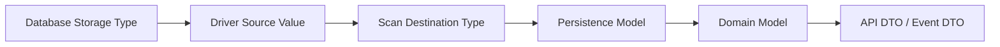
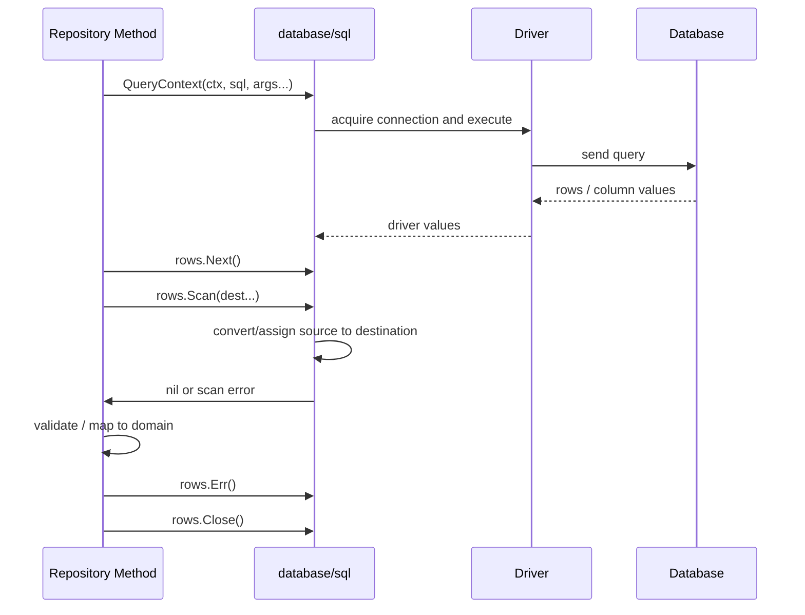
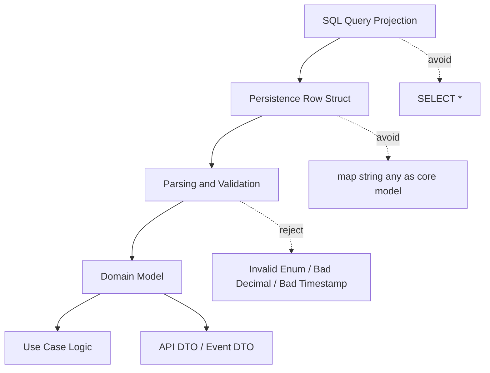

# learn-go-sql-database-integration-part-008.md

# Scanning, Type Mapping, and Data Shape Control

> Seri: `learn-go-sql-database-integration`  
> Part: `008`  
> Topik: `Scanning, Type Mapping, and Data Shape Control`  
> Target pembaca: Java engineer yang ingin menguasai integrasi database di Go secara production-grade  
> Target Go: Go 1.26.x  

---

## 0. Posisi Part Ini Dalam Seri

Pada part sebelumnya kita sudah membahas lifecycle `Rows`: bagaimana `QueryContext` mengembalikan cursor-like object, mengapa `Rows.Close()` wajib, mengapa `rows.Err()` perlu dicek setelah loop, dan bagaimana `Rows` bisa menahan connection pool.

Part ini naik satu level lebih detail: **apa yang sebenarnya terjadi ketika data dari database masuk ke variabel Go**.

Di Java, banyak developer terbiasa dengan:

- `ResultSet#getString`
- `ResultSet#getLong`
- `ResultSet#getTimestamp`
- mapper framework seperti JPA, MyBatis, jOOQ, Spring JDBC RowMapper
- nullable boxed types
- entity hydration otomatis

Di Go, terutama saat memakai `database/sql`, mapping data lebih eksplisit:

```go
rows.Scan(&id, &name, &createdAt)
```

Eksplisit ini terlihat sederhana, tetapi di production banyak bug justru muncul dari detail berikut:

- kolom SQL `NULL` di-scan ke tipe Go non-nullable
- angka decimal uang di-scan ke `float64`
- timestamp kehilangan timezone semantics
- UUID diperlakukan sebagai string bebas tanpa validasi
- JSON column di-scan sebagai `[]byte`, lalu lifecycle-nya salah
- custom enum tidak divalidasi di boundary
- `sql.RawBytes` disimpan setelah `Scan`, padahal memorinya hanya valid sampai operasi berikutnya
- dynamic scanner memakai reflection terlalu banyak dan menjadi hotspot
- tipe domain tercampur dengan tipe persistence
- driver tertentu mengembalikan tipe yang berbeda untuk kolom yang sama

Part ini membangun mental model agar kita tidak hanya “bisa scan row”, tetapi mampu mendesain **data shape boundary** yang aman, eksplisit, dan tahan terhadap perubahan schema.

---

## 1. Tujuan Pembelajaran

Setelah menyelesaikan part ini, Anda harus mampu:

1. Menjelaskan bagaimana `Scan` bekerja pada `database/sql`.
2. Membedakan destination type, source type, driver type, dan domain type.
3. Mendesain mapping SQL → Go tanpa kehilangan semantics.
4. Menangani `NULL`, decimal, timestamp, UUID, JSON, enum, dan binary data secara benar.
5. Membuat custom type yang mengimplementasikan `sql.Scanner` dan `driver.Valuer`.
6. Mengetahui kapan memakai `[]byte`, `sql.RawBytes`, `json.RawMessage`, pointer, atau value object.
7. Menghindari anti-pattern seperti scanning dynamic map untuk semua query, memakai `float64` untuk uang, atau mengabaikan invalid enum.
8. Membuat row mapper yang jelas, testable, dan tidak terlalu magic.
9. Menentukan boundary antara persistence model, domain model, DTO, dan API response.
10. Membuat checklist code review untuk scanning dan type mapping.

---

## 2. Mental Model Utama

Database integration di Go memiliki empat bentuk data yang sering tertukar:



Contoh:

```text
PostgreSQL column:       NUMERIC(19,4)
Driver source value:     []byte / string / driver-specific numeric representation
Scan destination:        string / custom Decimal / []byte
Persistence model:       MoneyAmountRaw
Domain model:            Money
API DTO:                 "123.4500"
```

Kesalahan umum adalah menganggap semua layer ini sama.

Misalnya:

```go
type Invoice struct {
    Amount float64
}
```

Ini tampak simpel, tetapi untuk uang biasanya salah. `float64` memakai binary floating point; nilai decimal seperti `0.1` tidak selalu direpresentasikan persis. Untuk domain uang, lebih aman memakai integer minor unit, string decimal tervalidasi, atau decimal library jika policy proyek mengizinkan.

Mental model yang lebih sehat:

```text
Database value is not automatically domain truth.
Database value must cross a typed boundary.
That boundary must preserve business meaning.
```

Dalam Go, boundary ini biasanya muncul dalam:

- fungsi `scanXxx(rows *sql.Rows)`
- helper `scanInvoice(row scanner)`
- custom `Scanner` type
- repository method
- persistence struct
- explicit conversion ke domain model

---

## 3. `Scan` Dalam `database/sql`

### 3.1 API Dasar

Untuk banyak row:

```go
rows, err := db.QueryContext(ctx, `
    SELECT id, email, created_at
    FROM users
    WHERE status = $1
`, status)
if err != nil {
    return nil, err
}
defer rows.Close()

var users []User
for rows.Next() {
    var u User
    if err := rows.Scan(&u.ID, &u.Email, &u.CreatedAt); err != nil {
        return nil, err
    }
    users = append(users, u)
}
if err := rows.Err(); err != nil {
    return nil, err
}
return users, nil
```

Untuk satu row:

```go
var u User
err := db.QueryRowContext(ctx, `
    SELECT id, email, created_at
    FROM users
    WHERE id = $1
`, id).Scan(&u.ID, &u.Email, &u.CreatedAt)
if err != nil {
    return User{}, err
}
return u, nil
```

### 3.2 `Scan` Adalah Assignment Dengan Konversi Terbatas

`Scan` bukan ORM hydration.

Ia melakukan assignment dari value yang dikembalikan driver ke destination pointer.

Konsekuensinya:

- jumlah destination harus cocok dengan jumlah kolom
- destination harus pointer atau implementasi `Scanner`
- tipe source dari driver harus dapat dikonversi ke destination
- error bisa terjadi karena NULL, tipe tidak cocok, overflow, parse gagal, atau custom scanner menolak value

Contoh error yang sehat:

```text
sql: Scan error on column index 2, name "age": converting NULL to int is unsupported
```

Error seperti ini bukan sekadar error teknis. Ia menunjukkan mismatch contract:

```text
Query says column may be NULL.
Code says destination must always have int value.
```

Yang harus diperbaiki bukan “menelan error”, tetapi menentukan semantics:

- Apakah kolom harus `NOT NULL`?
- Apakah query harus `COALESCE(age, 0)`?
- Apakah Go type harus `sql.NullInt64`?
- Apakah domain memang mengenal “unknown age”?

---

## 4. Source Type, Destination Type, dan Driver Type

### 4.1 Source Type

`database/sql` menerima value dari driver. Driver biasanya mengembalikan subset tipe yang sesuai dengan `driver.Value`, seperti:

- `int64`
- `float64`
- `bool`
- `[]byte`
- `string`
- `time.Time`
- `nil`

Namun detailnya driver-specific.

Contoh:

- MySQL `DATE`/`DATETIME` bisa dikembalikan sebagai `[]byte` kecuali opsi parse time diaktifkan.
- PostgreSQL UUID bisa muncul sebagai string atau bytes tergantung driver/API.
- JSON/JSONB sering muncul sebagai `[]byte`.
- NUMERIC/DECIMAL sering lebih aman diambil sebagai text/bytes daripada float.
- BLOB/BYTEA dikembalikan sebagai bytes.

### 4.2 Destination Type

Destination adalah alamat variabel Go yang diberikan ke `Scan`.

Contoh:

```go
var id int64
var name string
var createdAt time.Time

err := rows.Scan(&id, &name, &createdAt)
```

Destination bisa berupa:

- pointer ke primitive: `*int64`, `*string`, `*bool`, `*float64`
- pointer ke `time.Time`
- pointer ke `[]byte`
- pointer ke `sql.RawBytes`
- pointer ke `sql.NullString`, `sql.NullInt64`, dan sejenisnya
- custom type yang implement `sql.Scanner`
- pointer ke `any` untuk dynamic scanning, meski jarang ideal untuk domain code

### 4.3 Driver Type Tidak Sama Dengan Domain Type

Contoh buruk:

```go
type CaseStatus string

var status CaseStatus
err := row.Scan(&status)
```

Secara teknis ini bisa berhasil jika source string dapat diassign ke string alias. Tetapi apakah value valid?

Database bisa berisi:

```text
"APPROVED"
"REJECTED"
"PENDING"
"APPROVED_BY_LEGACY_SYSTEM"
""
"approve"
```

Jika domain hanya menerima tiga status, maka scanning langsung ke alias string belum cukup. Lebih baik validasi di boundary:

```go
type CaseStatus string

const (
    CaseStatusPending  CaseStatus = "PENDING"
    CaseStatusApproved CaseStatus = "APPROVED"
    CaseStatusRejected CaseStatus = "REJECTED"
)

func ParseCaseStatus(s string) (CaseStatus, error) {
    switch CaseStatus(s) {
    case CaseStatusPending, CaseStatusApproved, CaseStatusRejected:
        return CaseStatus(s), nil
    default:
        return "", fmt.Errorf("invalid case status %q", s)
    }
}
```

Lalu scanner:

```go
type DBCaseStatus struct {
    Value CaseStatus
}

func (s *DBCaseStatus) Scan(src any) error {
    if src == nil {
        return fmt.Errorf("case status cannot be NULL")
    }

    text, err := sourceToString(src)
    if err != nil {
        return fmt.Errorf("scan case status: %w", err)
    }

    status, err := ParseCaseStatus(text)
    if err != nil {
        return err
    }

    s.Value = status
    return nil
}
```

---

## 5. The `Scanner` Interface

### 5.1 Bentuk Interface

`sql.Scanner` adalah interface untuk tipe yang ingin mengontrol cara menerima value dari database.

Secara konseptual:

```go
type Scanner interface {
    Scan(src any) error
}
```

Tipe yang mengimplementasikan `Scan` bisa dipakai sebagai destination:

```go
var status DBCaseStatus
err := row.Scan(&status)
```

### 5.2 Kapan Membuat Custom Scanner

Gunakan custom scanner jika:

- tipe database punya business meaning kuat
- value harus divalidasi saat masuk
- representasi database berbeda dari representasi domain
- ada parsing khusus
- ada format legacy
- ada JSON column yang ingin dibatasi bentuknya
- ada enum yang harus diverifikasi
- ada decimal yang tidak boleh masuk `float64`

Jangan membuat custom scanner hanya untuk semua hal secara generik. Terlalu banyak custom scanner tanpa policy bisa membuat data layer sulit dibaca.

### 5.3 Scanner Harus Strict atau Lenient?

Ada dua style:

#### Strict Scanner

Menolak input yang tidak persis sesuai.

Cocok untuk:

- domain invariant kuat
- status lifecycle
- financial data
- security-sensitive permission
- regulatory state

#### Lenient Scanner

Menerima beberapa bentuk source.

Cocok untuk:

- migrasi legacy
- database driver berbeda antar environment
- gradual rollout
- backward compatibility

Contoh utility lenient:

```go
func sourceToString(src any) (string, error) {
    switch v := src.(type) {
    case string:
        return v, nil
    case []byte:
        return string(v), nil
    default:
        return "", fmt.Errorf("unsupported source type %T", src)
    }
}
```

Tetapi jangan terlalu lenient sampai data rusak dianggap valid.

---

## 6. The `driver.Valuer` Interface

### 6.1 Fungsi `Valuer`

Jika `Scanner` mengontrol DB → Go, maka `driver.Valuer` mengontrol Go → DB.

Secara konseptual:

```go
type Valuer interface {
    Value() (driver.Value, error)
}
```

Tipe yang mengimplementasikan `Value()` bisa dipakai sebagai parameter query:

```go
_, err := db.ExecContext(ctx, `
    INSERT INTO cases (id, status)
    VALUES ($1, $2)
`, id, DBCaseStatus{Value: CaseStatusPending})
```

### 6.2 Scanner dan Valuer Sebaiknya Simetris

Jika suatu tipe bisa dibaca dari DB, sering kali ia juga harus bisa ditulis ke DB.

Contoh:

```go
type DBCaseStatus struct {
    Value CaseStatus
}

func (s DBCaseStatus) Value() (driver.Value, error) {
    switch s.Value {
    case CaseStatusPending, CaseStatusApproved, CaseStatusRejected:
        return string(s.Value), nil
    default:
        return nil, fmt.Errorf("invalid case status %q", s.Value)
    }
}
```

Dengan ini, invalid value tidak bisa diam-diam masuk database lewat parameter binding.

### 6.3 Jangan Jadikan `Value()` Tempat Side Effect

`Value()` harus pure conversion.

Jangan melakukan:

- database call
- network call
- logging berlebihan
- mutation global state
- generate ID diam-diam
- membaca config runtime

`Value()` dapat dipanggil oleh driver dalam jalur eksekusi query. Ia harus deterministic dan murah.

---

## 7. Primitive Type Mapping

Bagian ini membahas mapping tipe umum. Detail pasti tetap bergantung pada driver dan database.

### 7.1 Integer

SQL:

- `SMALLINT`
- `INTEGER`
- `BIGINT`
- serial/identity columns

Go:

- `int64` sebagai default aman untuk banyak DB integer
- `int` jika memang domain local dan range diketahui
- `int32` jika ingin mencerminkan DB type
- unsigned integer perlu hati-hati karena banyak database tidak punya unsigned semantics yang sama

Contoh:

```go
var count int64
err := row.Scan(&count)
```

Untuk ID:

```go
type UserID int64
```

Scanning langsung:

```go
var id int64
if err := row.Scan(&id); err != nil {
    return err
}
userID := UserID(id)
```

Mengapa tidak selalu scan langsung ke `UserID`?

Karena explicit conversion memberi tempat untuk validasi:

```go
func NewUserID(v int64) (UserID, error) {
    if v <= 0 {
        return 0, fmt.Errorf("invalid user id %d", v)
    }
    return UserID(v), nil
}
```

### 7.2 Float

SQL:

- `REAL`
- `FLOAT`
- `DOUBLE PRECISION`

Go:

- `float64`
- `float32` jarang dipakai untuk persistence unless necessary

Cocok untuk:

- sensor data
- approximate measurement
- statistical value
- geospatial-ish calculation intermediate

Tidak cocok untuk:

- uang
- quota billing
- enforcement penalty amount
- decimal legal amount
- precision-sensitive ratio yang harus reproducible

### 7.3 Decimal / Numeric

SQL:

- `DECIMAL(p,s)`
- `NUMERIC(p,s)`

Go standard library tidak menyediakan arbitrary precision decimal khusus database.

Pilihan umum:

1. Simpan sebagai integer minor unit.
2. Scan sebagai string lalu validasi decimal format.
3. Gunakan custom decimal type internal.
4. Gunakan library decimal eksternal jika policy mengizinkan.
5. Untuk read-only display, scan sebagai string.

Contoh money sebagai minor unit:

```go
type Money struct {
    Currency string
    Minor    int64 // cents, sen, etc.
}
```

Jika database menyimpan `amount_minor BIGINT`, mapping menjadi sederhana dan aman:

```go
var amountMinor int64
var currency string
if err := row.Scan(&amountMinor, &currency); err != nil {
    return Money{}, err
}
return NewMoney(currency, amountMinor)
```

Jika database menyimpan `NUMERIC(19,4)`, jangan langsung:

```go
var amount float64 // risky for money
```

Lebih aman:

```go
var amountText string
if err := row.Scan(&amountText); err != nil {
    return err
}
amount, err := ParseDecimalAmount(amountText)
```

### 7.4 Boolean

SQL boolean behavior bervariasi.

- PostgreSQL punya `boolean`
- MySQL sering memakai `TINYINT(1)` sebagai boolean convention
- Oracle versi lama sering memakai `NUMBER(1)` atau `CHAR(1)`

Go destination:

```go
var active bool
```

Jika database tidak punya boolean native yang konsisten, buat explicit converter:

```go
func scanYNBool(src any) (bool, error) {
    s, err := sourceToString(src)
    if err != nil {
        return false, err
    }
    switch s {
    case "Y":
        return true, nil
    case "N":
        return false, nil
    default:
        return false, fmt.Errorf("invalid Y/N bool %q", s)
    }
}
```

### 7.5 String

SQL:

- `VARCHAR`
- `TEXT`
- `CHAR`
- `CLOB`

Go:

```go
var name string
```

Risiko:

- `NULL` tidak bisa masuk string biasa
- trailing spaces pada `CHAR`
- collation/case sensitivity bukan bagian dari Go string
- length constraint tidak otomatis diketahui domain
- string bisa valid secara Go tetapi invalid secara business

Untuk domain penting:

```go
type Email string

func ParseEmail(s string) (Email, error) {
    s = strings.TrimSpace(s)
    if s == "" {
        return "", errors.New("email is empty")
    }
    if !strings.Contains(s, "@") {
        return "", fmt.Errorf("invalid email %q", s)
    }
    return Email(s), nil
}
```

---

## 8. `NULL` Singkat: Kenapa Tidak Bisa Diabaikan

Part 009 akan membahas `NULL` secara khusus dan lebih dalam. Namun part ini tetap perlu menyentuhnya karena scanning tidak bisa dilepaskan dari `NULL`.

### 8.1 SQL NULL Bukan Go Zero Value

SQL `NULL` berarti “tidak ada value” atau “unknown”, tergantung desain schema.

Go zero value berarti value valid default:

```go
""      // empty string
0       // zero number
false   // false
```

Ini bukan hal yang sama.

### 8.2 Pilihan Destination Untuk Nullable Column

| SQL column | Go destination | Catatan |
|---|---|---|
| nullable text | `sql.NullString` | eksplisit Valid flag |
| nullable int | `sql.NullInt64` | jangan scan ke `int64` biasa |
| nullable bool | `sql.NullBool` | bedakan false vs unknown |
| nullable time | `sql.NullTime` | bedakan zero time vs absent time |
| nullable custom | custom Scanner | untuk domain semantics |
| nullable API field | pointer / custom optional | tergantung kontrak JSON |

Contoh:

```go
var middleName sql.NullString
if err := row.Scan(&middleName); err != nil {
    return err
}

if middleName.Valid {
    fmt.Println(middleName.String)
}
```

### 8.3 Jangan Pakai `COALESCE` Tanpa Sadar

```sql
SELECT COALESCE(middle_name, '') FROM users
```

Ini bisa valid untuk display, tetapi berbahaya untuk domain jika empty string dan NULL memiliki arti berbeda.

Rule:

```text
Use COALESCE at query boundary only when the replacement value is semantically true, not merely convenient for scanning.
```

---

## 9. Time and Timestamp Mapping

### 9.1 `time.Time` Bukan Sekadar Tanggal

`time.Time` membawa:

- date
- time
- location
- monotonic clock component untuk value tertentu dari Go runtime

Database timestamp behavior bervariasi:

- PostgreSQL `timestamp without time zone`
- PostgreSQL `timestamp with time zone`
- MySQL `DATETIME`
- MySQL `TIMESTAMP`
- SQL Server `datetime2`
- Oracle `DATE`, `TIMESTAMP`, `TIMESTAMP WITH TIME ZONE`

Kesalahan umum:

```go
var createdAt time.Time
row.Scan(&createdAt)
```

Kode ini belum menjawab:

- Apakah database menyimpan UTC?
- Apakah value adalah local timezone?
- Apakah kolom punya timezone semantics?
- Apakah UI perlu menampilkan timezone user?
- Apakah comparison harus dilakukan di DB atau app?
- Apakah driver mengembalikan `time.Time` atau `[]byte`?

### 9.2 Policy Yang Disarankan

Untuk backend service modern:

```text
Store instants in UTC.
Treat database timestamp as persistence representation.
Convert to user timezone only at presentation boundary.
```

Go code:

```go
var createdAt time.Time
if err := row.Scan(&createdAt); err != nil {
    return err
}
createdAt = createdAt.UTC()
```

Tetapi jangan membabi buta `.UTC()` jika database column adalah local civil time, misalnya jadwal meeting, due date lokal, atau aturan yang bergantung kalender lokal.

### 9.3 Instant vs Civil Time

Bedakan:

| Kebutuhan | Contoh | Tipe konseptual |
|---|---|---|
| kejadian absolut | submitted_at, paid_at | instant |
| tanggal lokal | birth_date, license_expiry_date | local date |
| jam lokal | office_open_time | local time |
| jadwal zona tertentu | hearing_time Asia/Jakarta | zoned date-time |

Go standard library belum punya `LocalDate` khusus seperti Java `LocalDate`. Banyak code memakai `time.Time` dengan convention tertentu.

Untuk tanggal saja, Anda bisa:

- simpan sebagai `DATE` di DB
- scan ke `time.Time`
- normalisasi ke midnight UTC atau location fixed
- bungkus dengan custom type agar tidak disalahgunakan sebagai instant

Contoh:

```go
type LocalDate struct {
    t time.Time
}

func NewLocalDate(t time.Time) LocalDate {
    y, m, d := t.Date()
    return LocalDate{t: time.Date(y, m, d, 0, 0, 0, 0, time.UTC)}
}
```

### 9.4 MySQL `parseTime`

Pada MySQL driver populer, `DATE` dan `DATETIME` bisa dikembalikan sebagai `[]byte` secara default; opsi seperti `parseTime=true` umum dipakai agar bisa scan ke `time.Time`.

Ini contoh nyata bahwa type mapping bukan hanya Go-level code, tetapi juga DSN/driver config.

---

## 10. Byte Slices, RawBytes, and Lifetime

### 10.1 `[]byte`

`[]byte` sering dipakai untuk:

- binary data
- JSON raw bytes
- text representation dari driver
- blob
- bytea

Jika scan ke `[]byte`, `database/sql` umumnya memberi copy yang aman dimiliki caller.

```go
var data []byte
if err := row.Scan(&data); err != nil {
    return err
}
```

Tetapi data besar tetap menimbulkan memory pressure.

### 10.2 `sql.RawBytes`

`sql.RawBytes` adalah escape hatch untuk menghindari copy tertentu. Namun ada lifecycle penting:

```text
RawBytes memory is only valid until the next call to Rows.Next, Rows.Scan, or Rows.Close.
```

Karena itu, jangan menyimpan `sql.RawBytes` langsung ke slice hasil jangka panjang.

Buruk:

```go
var out [][]byte
for rows.Next() {
    var raw sql.RawBytes
    if err := rows.Scan(&raw); err != nil {
        return err
    }
    out = append(out, raw) // BUG: raw memory may be reused
}
```

Benar:

```go
var out [][]byte
for rows.Next() {
    var raw sql.RawBytes
    if err := rows.Scan(&raw); err != nil {
        return err
    }
    copied := append([]byte(nil), raw...)
    out = append(out, copied)
}
```

### 10.3 Kapan Memakai `RawBytes`

Gunakan `RawBytes` hanya jika:

- Anda memahami lifetime-nya
- ingin melakukan parse cepat dalam loop
- tidak menyimpan data setelah iterasi
- ada profiling yang membuktikan copy menjadi bottleneck

Default untuk production code biasa:

```text
Prefer []byte unless you have a measured reason to use RawBytes.
```

---

## 11. JSON Column Mapping

Database modern sering memakai JSON column:

- PostgreSQL `json` / `jsonb`
- MySQL `JSON`
- SQL Server JSON-as-text pattern
- SQLite JSON functions

### 11.1 Scan Sebagai `[]byte` Lalu Unmarshal

```go
type Profile struct {
    DisplayName string   `json:"display_name"`
    Tags        []string `json:"tags"`
}

var raw []byte
if err := row.Scan(&raw); err != nil {
    return err
}

var profile Profile
if err := json.Unmarshal(raw, &profile); err != nil {
    return fmt.Errorf("decode profile json: %w", err)
}
```

### 11.2 Custom Scanner Untuk JSON

```go
type JSONProfile struct {
    Value Profile
}

func (p *JSONProfile) Scan(src any) error {
    if src == nil {
        return fmt.Errorf("profile json cannot be NULL")
    }

    var data []byte
    switch v := src.(type) {
    case []byte:
        data = v
    case string:
        data = []byte(v)
    default:
        return fmt.Errorf("unsupported profile json source %T", src)
    }

    var decoded Profile
    if err := json.Unmarshal(data, &decoded); err != nil {
        return fmt.Errorf("decode profile json: %w", err)
    }

    p.Value = decoded
    return nil
}

func (p JSONProfile) Value() (driver.Value, error) {
    data, err := json.Marshal(p.Value)
    if err != nil {
        return nil, fmt.Errorf("encode profile json: %w", err)
    }
    return string(data), nil
}
```

### 11.3 JSON Column Anti-Pattern

JSON column sering menjadi tempat “schema avoidance”.

Anti-pattern:

```text
We do not know what fields we need, so put everything into JSON.
```

Risiko:

- sulit indexing
- sulit migration
- sulit validation
- sulit reporting
- sulit query planning
- tidak ada foreign key
- tidak ada type constraint kuat
- domain invariant pindah ke aplikasi tanpa enforcement DB

Gunakan JSON column jika:

- field benar-benar semi-structured
- schema internal berubah sering
- tidak semua field butuh query/index
- ada validasi aplikasi yang kuat
- ada observability untuk decode failure

### 11.4 JSON Raw Passthrough

Kadang service hanya meneruskan JSON tanpa memahami semua field.

Gunakan:

```go
type AuditMetadata struct {
    Raw json.RawMessage
}
```

Namun tetap validasi minimal:

```go
if !json.Valid(raw) {
    return fmt.Errorf("invalid metadata json")
}
```

---

## 12. UUID Mapping

UUID sering dipakai untuk ID publik, event ID, idempotency key, correlation ID, dan distributed identifiers.

Pilihan mapping:

| DB representation | Go representation | Catatan |
|---|---|---|
| native UUID | custom UUID type / string | driver-specific |
| `CHAR(36)` | string/custom UUID | mudah dibaca, lebih besar |
| `BINARY(16)` | `[16]byte` / custom UUID | compact, perlu encode/decode |
| text | string | validasi wajib |

### 12.1 Jangan Perlakukan UUID Sebagai String Bebas

Buruk:

```go
type User struct {
    ID string
}
```

Lebih baik:

```go
type UserID struct {
    value string
}

func ParseUserID(s string) (UserID, error) {
    if !isCanonicalUUID(s) {
        return UserID{}, fmt.Errorf("invalid user id %q", s)
    }
    return UserID{value: strings.ToLower(s)}, nil
}
```

Untuk production, biasanya lebih baik memakai UUID parser yang matang jika dependency policy mengizinkan.

### 12.2 Scanner Untuk UUID Text

```go
type DBUserID struct {
    Value UserID
}

func (id *DBUserID) Scan(src any) error {
    if src == nil {
        return fmt.Errorf("user id cannot be NULL")
    }

    s, err := sourceToString(src)
    if err != nil {
        return err
    }

    parsed, err := ParseUserID(s)
    if err != nil {
        return err
    }

    id.Value = parsed
    return nil
}

func (id DBUserID) Value() (driver.Value, error) {
    if id.Value.value == "" {
        return nil, fmt.Errorf("empty user id")
    }
    return id.Value.value, nil
}
```

---

## 13. Enum and State Mapping

Untuk regulatory/case management system, enum/state mapping adalah salah satu area paling penting.

Contoh:

```text
CASE_STATUS:
- DRAFT
- SUBMITTED
- UNDER_REVIEW
- INFO_REQUESTED
- APPROVED
- REJECTED
- WITHDRAWN
```

Database bisa menyimpan sebagai:

- `VARCHAR`
- database enum type
- lookup table FK
- integer code

### 13.1 Prefer Explicit String Constants Untuk Domain Code

```go
type CaseStatus string

const (
    CaseStatusDraft         CaseStatus = "DRAFT"
    CaseStatusSubmitted     CaseStatus = "SUBMITTED"
    CaseStatusUnderReview   CaseStatus = "UNDER_REVIEW"
    CaseStatusInfoRequested CaseStatus = "INFO_REQUESTED"
    CaseStatusApproved      CaseStatus = "APPROVED"
    CaseStatusRejected      CaseStatus = "REJECTED"
    CaseStatusWithdrawn     CaseStatus = "WITHDRAWN"
)
```

### 13.2 Validasi Saat Scan

```go
func ParseCaseStatus(s string) (CaseStatus, error) {
    switch CaseStatus(s) {
    case CaseStatusDraft,
        CaseStatusSubmitted,
        CaseStatusUnderReview,
        CaseStatusInfoRequested,
        CaseStatusApproved,
        CaseStatusRejected,
        CaseStatusWithdrawn:
        return CaseStatus(s), nil
    default:
        return "", fmt.Errorf("unknown case status %q", s)
    }
}
```

Jika invalid status ditemukan, lebih baik repository gagal daripada aplikasi memproses state ilegal.

### 13.3 Lookup Table vs Application Enum

| Approach | Kelebihan | Risiko |
|---|---|---|
| app enum only | cepat, type-safe di app | DB bisa berisi value liar jika constraint lemah |
| DB enum | kuat di DB | migration enum bisa tricky |
| lookup table | fleksibel, referential integrity | join tambahan, lifecycle reference data |
| integer code | compact | readability rendah, mapping risk |

Untuk sistem enforcement/regulatory, sering kali lookup table + app enum/value object lebih defensible.

---

## 14. Array and Collection Mapping

SQL array support sangat database-specific.

PostgreSQL punya array native. MySQL umumnya tidak. Oracle punya collection/object types, tetapi mapping via generic `database/sql` bisa kompleks.

Pilihan umum:

1. Normalize ke child table.
2. Simpan sebagai JSON array.
3. Pakai database native array jika driver mendukung.
4. Simpan delimited string hanya untuk legacy compatibility, bukan desain baru.

### 14.1 Normalize Jika Data Perlu Query

Jika tags perlu dicari:

```sql
case_tags(case_id, tag)
```

Bukan:

```sql
cases.tags = 'urgent,manual,legacy'
```

### 14.2 JSON Array Jika Semi-Structured

```go
var raw []byte
var tags []string
if err := row.Scan(&raw); err != nil {
    return err
}
if err := json.Unmarshal(raw, &tags); err != nil {
    return err
}
```

### 14.3 Native Array Jika DB-Specific Layer Diterima

Jika Anda memilih PostgreSQL-specific capability, dokumentasikan bahwa repository tersebut tidak portable.

Portability bukan selalu tujuan utama. Yang penting keputusan sadar:

```text
This repository is PostgreSQL-specific because it depends on array operators and GIN indexing.
```

---

## 15. Binary and Large Object Mapping

Binary data dapat berupa:

- file content
- attachment
- encrypted payload
- hash
- signature
- compressed data
- serialized protobuf

### 15.1 Jangan Selalu Simpan File Besar di DB

Pertimbangkan:

- object storage untuk file besar
- DB hanya menyimpan metadata dan object key
- transactional consistency via outbox/compensation
- retention policy
- backup/restore impact
- replication lag impact

### 15.2 Scan BLOB Dengan Hati-Hati

```go
var payload []byte
if err := row.Scan(&payload); err != nil {
    return err
}
```

Untuk payload besar, ini mematerialisasi seluruh data di memory.

Pertanyaan design:

- Berapa ukuran maksimum?
- Apakah perlu streaming?
- Apakah DB/driver mendukung streaming LOB?
- Apakah query listing tidak sengaja mengambil BLOB?
- Apakah `SELECT *` akan menarik kolom besar?

### 15.3 Hash dan Signature

Jangan simpan hash sebagai string bebas tanpa format policy.

Contoh:

```go
type SHA256Digest [32]byte
```

Jika database menyimpan hex:

```go
type DBSHA256Digest struct {
    Value SHA256Digest
}

func (d *DBSHA256Digest) Scan(src any) error {
    s, err := sourceToString(src)
    if err != nil {
        return err
    }
    b, err := hex.DecodeString(s)
    if err != nil {
        return fmt.Errorf("decode sha256 hex: %w", err)
    }
    if len(b) != 32 {
        return fmt.Errorf("invalid sha256 length %d", len(b))
    }
    copy(d.Value[:], b)
    return nil
}
```

---

## 16. Data Shape Control

### 16.1 Query Shape Harus Sengaja

Buruk:

```sql
SELECT * FROM users WHERE id = $1
```

Kenapa buruk?

- order kolom bisa berubah
- kolom baru bisa memengaruhi scan jika memakai dynamic mapper
- data sensitif bisa ikut terbaca
- kolom besar bisa ikut tertarik
- query plan bisa berubah
- kontrak repository tidak jelas

Lebih baik:

```sql
SELECT id, email, status, created_at
FROM users
WHERE id = $1
```

### 16.2 Data Shape Bukan Domain Shape

Contoh persistence row:

```go
type userRow struct {
    ID        int64
    Email     string
    Status    string
    CreatedAt time.Time
}
```

Domain:

```go
type User struct {
    id        UserID
    email     Email
    status    UserStatus
    createdAt time.Time
}
```

Mapper:

```go
func (r userRow) toDomain() (User, error) {
    id, err := NewUserID(r.ID)
    if err != nil {
        return User{}, err
    }

    email, err := ParseEmail(r.Email)
    if err != nil {
        return User{}, err
    }

    status, err := ParseUserStatus(r.Status)
    if err != nil {
        return User{}, err
    }

    return User{
        id:        id,
        email:     email,
        status:    status,
        createdAt: r.CreatedAt.UTC(),
    }, nil
}
```

Kenapa tidak langsung scan ke domain?

Bisa, tetapi sering kali domain constructor ingin menjaga invariant. Persistence layer boleh tahu schema DB; domain layer sebaiknya tidak bocor detail `sql.NullString`, driver-specific bytes, atau SQL column weirdness.

### 16.3 Minimal Shape Untuk Use Case

Jangan selalu hydrate full object.

Contoh listing:

```go
type CaseListItem struct {
    ID          CaseID
    ReferenceNo string
    Status      CaseStatus
    SubmittedAt time.Time
}
```

Detail page:

```go
type CaseDetail struct {
    ID          CaseID
    ReferenceNo string
    Status      CaseStatus
    Applicant   Applicant
    Documents   []DocumentSummary
    Timeline    []TimelineEntry
}
```

Untuk list, jangan query semua detail applicant/document jika tidak diperlukan.

```text
Shape query by use case.
Do not shape every query by entity completeness.
```

---

## 17. Static Row Mapper Pattern

Di Go production code, pattern yang sering paling jelas adalah static row mapper.

### 17.1 Scanner Interface Kecil Untuk `Row` dan `Rows`

`*sql.Row` dan `*sql.Rows` sama-sama punya `Scan(dest ...any) error`.

Buat interface kecil:

```go
type scanner interface {
    Scan(dest ...any) error
}
```

Mapper:

```go
func scanUser(s scanner) (User, error) {
    var row userRow
    if err := s.Scan(
        &row.ID,
        &row.Email,
        &row.Status,
        &row.CreatedAt,
    ); err != nil {
        return User{}, err
    }
    return row.toDomain()
}
```

Single row:

```go
func (r *UserRepository) FindByID(ctx context.Context, id UserID) (User, error) {
    row := r.db.QueryRowContext(ctx, `
        SELECT id, email, status, created_at
        FROM users
        WHERE id = $1
    `, id)

    user, err := scanUser(row)
    if err != nil {
        if errors.Is(err, sql.ErrNoRows) {
            return User{}, ErrUserNotFound
        }
        return User{}, fmt.Errorf("find user by id: %w", err)
    }
    return user, nil
}
```

Many rows:

```go
func (r *UserRepository) ListActive(ctx context.Context, limit int) ([]User, error) {
    rows, err := r.db.QueryContext(ctx, `
        SELECT id, email, status, created_at
        FROM users
        WHERE status = $1
        ORDER BY created_at DESC, id DESC
        LIMIT $2
    `, string(UserStatusActive), limit)
    if err != nil {
        return nil, fmt.Errorf("query active users: %w", err)
    }
    defer rows.Close()

    users := make([]User, 0, limit)
    for rows.Next() {
        user, err := scanUser(rows)
        if err != nil {
            return nil, fmt.Errorf("scan active user: %w", err)
        }
        users = append(users, user)
    }
    if err := rows.Err(); err != nil {
        return nil, fmt.Errorf("iterate active users: %w", err)
    }
    return users, nil
}
```

### 17.2 Keunggulan Static Mapper

- jelas kolom mana masuk field mana
- compile-time visible
- mudah code review
- error context bisa ditambahkan
- tidak perlu reflection
- mudah test dengan integration test
- tidak menyembunyikan query shape

### 17.3 Kelemahan Static Mapper

- boilerplate
- rawan salah urutan kolom jika tidak disiplin
- butuh update saat query shape berubah

Mitigasi:

- jaga query dan scan berdekatan
- gunakan linting/code review
- gunakan code generation jika skala besar
- hindari `SELECT *`
- buat naming konsisten

---

## 18. Dynamic Scanning and Reflection

Dynamic scanning kadang diperlukan untuk:

- admin query tool
- generic export
- migration diff
- debugging
- report builder
- unknown schema

Namun untuk domain repository biasa, dynamic scanning sering berlebihan.

### 18.1 Scanning Ke `[]any`

```go
cols, err := rows.Columns()
if err != nil {
    return err
}

values := make([]any, len(cols))
ptrs := make([]any, len(cols))
for i := range values {
    ptrs[i] = &values[i]
}

for rows.Next() {
    if err := rows.Scan(ptrs...); err != nil {
        return err
    }

    record := make(map[string]any, len(cols))
    for i, col := range cols {
        record[col] = normalizeDBValue(values[i])
    }
    // use record
}
```

### 18.2 Normalisasi `[]byte`

Saat scan ke `any`, string-like values bisa muncul sebagai `[]byte`.

```go
func normalizeDBValue(v any) any {
    switch x := v.(type) {
    case []byte:
        return string(x)
    default:
        return x
    }
}
```

Tetapi normalisasi ini bisa salah untuk binary column. Anda perlu metadata kolom atau policy.

### 18.3 Risiko Dynamic Map

```text
map[string]any is not a domain model.
```

Risiko:

- type safety hilang
- domain invariant tidak jelas
- conversion error pindah ke runtime downstream
- JSON output bisa berubah tanpa sadar
- binary/text ambiguity
- timestamp formatting tidak konsisten
- performance overhead

Gunakan dynamic scanning untuk tool/report boundary, bukan core transactional domain flow.

---

## 19. Column Metadata

`Rows` menyediakan metadata seperti:

- `Columns()`
- `ColumnTypes()`

Ini berguna untuk dynamic tool atau debugging.

Contoh:

```go
columnTypes, err := rows.ColumnTypes()
if err != nil {
    return err
}

for _, ct := range columnTypes {
    nullable, nullableOK := ct.Nullable()
    length, lengthOK := ct.Length()
    precision, scale, decimalOK := ct.DecimalSize()

    fmt.Printf("name=%s dbtype=%s nullable=%v/%v length=%v/%v decimal=%v,%v/%v\n",
        ct.Name(),
        ct.DatabaseTypeName(),
        nullable, nullableOK,
        length, lengthOK,
        precision, scale, decimalOK,
    )
}
```

Namun metadata support juga driver-specific. Jangan membangun domain correctness hanya dari metadata runtime kecuali memang target Anda adalah generic database tool.

---

## 20. Error Context Pada Scan

Error `Scan` default sudah menyebut index/name kolom dalam beberapa kasus, tetapi production code tetap perlu context query/use case.

Buruk:

```go
return err
```

Lebih baik:

```go
return fmt.Errorf("scan user list item: %w", err)
```

Untuk mapper:

```go
user, err := scanUser(rows)
if err != nil {
    return nil, fmt.Errorf("scan user row: %w", err)
}
```

Untuk custom scanner:

```go
return fmt.Errorf("scan case status from %T: %w", src, err)
```

Tetapi jangan memasukkan raw data sensitif ke error:

```go
// Risky if value may contain PII
return fmt.Errorf("invalid applicant name %q", s)
```

Untuk PII, lebih baik:

```go
return fmt.Errorf("invalid applicant name format")
```

---

## 21. Performance Considerations

### 21.1 Scanning Adalah Hot Path

Dalam endpoint list besar atau worker batch, scanning bisa menjadi bagian signifikan dari CPU dan allocation.

Sumber overhead:

- conversion string/bytes
- JSON unmarshal
- reflection mapper
- append tanpa preallocation
- scanning kolom yang tidak dipakai
- parsing timestamp/string berulang
- decimal parsing
- custom scanner allocation

### 21.2 Query Projection Mengurangi Scan Cost

Buruk:

```sql
SELECT * FROM audit_trail
```

Baik:

```sql
SELECT id, module_id, activity, created_at
FROM audit_trail
WHERE created_at >= $1
ORDER BY created_at DESC
LIMIT $2
```

Semakin sedikit kolom:

- semakin sedikit network payload
- semakin sedikit driver decoding
- semakin sedikit `Scan` destination
- semakin sedikit memory allocation
- semakin kecil risiko menarik CLOB/BLOB besar

### 21.3 Preallocate Slice Dengan Batas Wajar

```go
items := make([]CaseListItem, 0, limit)
```

Jangan preallocate berdasarkan unbounded count dari user.

### 21.4 Avoid Reflection Mapper in Critical Paths

Reflection mapper bisa nyaman, tetapi untuk critical path sebaiknya diukur.

Rule:

```text
Use reflection mapper for convenience only after you know its cost and failure mode.
```

### 21.5 Parse Once, Not Repeatedly

Jika status dipakai berkali-kali, parse saat scan dan simpan domain type.

Jangan menyimpan string mentah lalu parse di setiap business method.

---

## 22. Security and Data Exposure

Scanning juga punya dimensi security.

### 22.1 Jangan Query Kolom Sensitif Jika Tidak Perlu

Buruk:

```sql
SELECT * FROM users WHERE id = $1
```

Jika tabel berisi:

- password hash
- MFA secret
- reset token
- personal identifier
- encrypted payload

Maka data ikut masuk aplikasi meski tidak dipakai.

### 22.2 Jangan Log Scan Value Mentah

```go
return fmt.Errorf("scan user %+v: %w", row, err)
```

Ini bisa membocorkan PII.

Gunakan metadata non-sensitive:

```go
return fmt.Errorf("scan user row for user_id=%s: %w", id.Redacted(), err)
```

Atau cukup:

```go
return fmt.Errorf("scan user row: %w", err)
```

### 22.3 JSON Column Bisa Membawa PII Tidak Terstruktur

Jika JSON metadata berisi field bebas, redaction menjadi lebih sulit.

Untuk audit/logging, tentukan:

- field mana boleh tampil
- field mana harus hash/redact
- apakah raw JSON boleh keluar ke log
- apakah invalid JSON harus disimpan atau ditolak

---

## 23. Java Comparison

### 23.1 JDBC ResultSet vs Go Scan

Java:

```java
long id = rs.getLong("id");
String email = rs.getString("email");
Timestamp createdAt = rs.getTimestamp("created_at");
```

Go:

```go
var id int64
var email string
var createdAt time.Time
err := rows.Scan(&id, &email, &createdAt)
```

Perbedaan penting:

| Concern | Java JDBC | Go `database/sql` |
|---|---|---|
| akses kolom | by name/index | scan ordered destinations |
| nullable primitive | `wasNull()` / boxed type | `sql.Null*` / pointer / custom scanner |
| mapping object | framework umum | eksplisit/manual/generator |
| transaction | sering framework-managed | explicit `Tx` |
| driver abstraction | JDBC standard kuat | `database/sql` + driver-specific detail |
| checked exception | yes | explicit `error` |

### 23.2 Spring RowMapper vs Go Mapper Function

Java:

```java
class UserRowMapper implements RowMapper<User> {
    public User mapRow(ResultSet rs, int rowNum) throws SQLException {
        return new User(
            rs.getLong("id"),
            rs.getString("email")
        );
    }
}
```

Go:

```go
func scanUser(s scanner) (User, error) {
    var row userRow
    if err := s.Scan(&row.ID, &row.Email); err != nil {
        return User{}, err
    }
    return row.toDomain()
}
```

Go tidak memaksa class/interface besar. Function kecil sering cukup.

### 23.3 JPA Entity vs Go Domain Model

JPA sering mencampur:

- persistence mapping
- lazy loading
- identity map
- dirty checking
- relationship mapping
- transaction context

Go `database/sql` tidak punya itu.

Konsekuensi:

- tidak ada lazy loading tersembunyi
- tidak ada automatic dirty checking
- tidak ada persistence context
- query shape eksplisit
- scan shape eksplisit
- transaction eksplisit

Ini berarti lebih banyak boilerplate, tetapi lebih sedikit hidden behavior.

---

## 24. Production Mapping Strategy

Untuk sistem besar, gunakan strategi berikut.

### 24.1 Pisahkan Tipe Persistence dan Domain Untuk Aggregate Penting

```go
type caseRow struct {
    ID          int64
    ReferenceNo string
    Status      string
    SubmittedAt sql.NullTime
    AssignedTo  sql.NullInt64
}
```

Domain:

```go
type Case struct {
    id          CaseID
    referenceNo ReferenceNo
    status      CaseStatus
    submittedAt *time.Time
    assignedTo  *UserID
}
```

Konversi:

```go
func (r caseRow) toDomain() (Case, error) {
    id, err := NewCaseID(r.ID)
    if err != nil {
        return Case{}, err
    }

    ref, err := ParseReferenceNo(r.ReferenceNo)
    if err != nil {
        return Case{}, err
    }

    status, err := ParseCaseStatus(r.Status)
    if err != nil {
        return Case{}, err
    }

    var submittedAt *time.Time
    if r.SubmittedAt.Valid {
        t := r.SubmittedAt.Time.UTC()
        submittedAt = &t
    }

    var assignedTo *UserID
    if r.AssignedTo.Valid {
        uid, err := NewUserID(r.AssignedTo.Int64)
        if err != nil {
            return Case{}, err
        }
        assignedTo = &uid
    }

    return Case{
        id:          id,
        referenceNo: ref,
        status:      status,
        submittedAt: submittedAt,
        assignedTo:  assignedTo,
    }, nil
}
```

### 24.2 Query-Specific Row Structs

Jangan paksa satu struct untuk semua query.

```go
type caseDetailRow struct { ... }
type caseListRow struct { ... }
type caseExportRow struct { ... }
type caseTransitionRow struct { ... }
```

Ini membuat data shape sesuai use case.

### 24.3 Mapper Dekat Dengan Query

Repository method:

```go
const findCaseByIDSQL = `
    SELECT id, reference_no, status, submitted_at, assigned_to
    FROM cases
    WHERE id = $1
`

func scanCaseDetail(s scanner) (Case, error) { ... }
```

Jaga query dan scanner dalam package yang sama agar mudah review saat schema berubah.

### 24.4 Contract Test Untuk Mapper

Buat integration test yang memastikan query result cocok dengan scanner.

```go
func TestCaseRepository_FindByID(t *testing.T) {
    // setup DB fixture
    // call repository
    // assert domain fields
}
```

Unit test custom scanner juga penting:

```go
func TestDBCaseStatus_ScanRejectsInvalidStatus(t *testing.T) {
    var s DBCaseStatus
    err := s.Scan("BROKEN")
    if err == nil {
        t.Fatal("expected error")
    }
}
```

---

## 25. Failure Modes

### 25.1 Nullable Column Scanned Into Non-Nullable Destination

Symptom:

```text
sql: Scan error on column index N: converting NULL to string is unsupported
```

Root cause:

- schema nullable
- query outer join menghasilkan NULL
- code menganggap value wajib

Fix:

- ubah schema `NOT NULL`
- ubah query `COALESCE` jika semantically valid
- scan ke `sql.Null*`
- ubah domain model menjadi optional

### 25.2 Column Order Mismatch

Query:

```sql
SELECT id, email, status FROM users
```

Scan:

```go
rows.Scan(&u.ID, &u.Status, &u.Email)
```

Ini bisa menghasilkan data tertukar jika tipe compatible.

Mitigasi:

- review query + scan bersama
- query-specific row struct
- integration tests
- code generation
- hindari daftar kolom sangat panjang tanpa grouping

### 25.3 Decimal Precision Loss

Symptom:

- angka uang tidak presisi
- rounding mismatch
- reconciliation gagal

Root cause:

```go
var amount float64
```

Fix:

- integer minor unit
- decimal string parser
- decimal type

### 25.4 Timestamp Timezone Drift

Symptom:

- tanggal tampil beda satu hari
- deadline regulatory salah
- audit event order membingungkan

Root cause:

- timezone database/app tidak jelas
- local date diperlakukan sebagai instant
- driver config berbeda antar environment

Fix:

- policy UTC untuk instant
- custom LocalDate untuk date-only
- DSN timezone eksplisit
- test timezone boundary

### 25.5 RawBytes Reuse Bug

Symptom:

- data hasil loop berubah sendiri
- row sebelumnya tampak tertimpa row berikutnya

Root cause:

- menyimpan `sql.RawBytes` setelah iterasi

Fix:

- copy bytes sebelum disimpan
- gunakan `[]byte` default

### 25.6 Invalid Enum Masuk Domain

Symptom:

- state machine panic
- UI menampilkan unknown state
- transition illegal terjadi

Root cause:

- scan string tanpa validasi
- DB constraint lemah
- migration/backfill memasukkan value baru

Fix:

- custom scanner / parser
- DB constraint / lookup FK
- compatibility handling saat rollout enum baru

### 25.7 JSON Decode Failure Di Tengah Listing

Symptom:

- list endpoint gagal karena satu row JSON rusak

Root cause:

- JSON column tidak divalidasi saat write
- legacy row rusak

Fix pilihan:

- fail fast untuk domain-critical JSON
- quarantine bad rows
- partial response hanya jika kontrak memperbolehkan
- migration repair
- add write-side validation

---

## 26. Mermaid: Scan Pipeline



---

## 27. Mermaid: Data Shape Boundary



---

## 28. Practical Code: Complete Example

### 28.1 Domain Types

```go
package cases

import (
    "errors"
    "fmt"
    "strings"
    "time"
)

type CaseID int64

func NewCaseID(v int64) (CaseID, error) {
    if v <= 0 {
        return 0, fmt.Errorf("invalid case id")
    }
    return CaseID(v), nil
}

type CaseStatus string

const (
    CaseStatusDraft       CaseStatus = "DRAFT"
    CaseStatusSubmitted   CaseStatus = "SUBMITTED"
    CaseStatusUnderReview CaseStatus = "UNDER_REVIEW"
    CaseStatusApproved    CaseStatus = "APPROVED"
    CaseStatusRejected    CaseStatus = "REJECTED"
)

func ParseCaseStatus(s string) (CaseStatus, error) {
    s = strings.TrimSpace(s)
    switch CaseStatus(s) {
    case CaseStatusDraft,
        CaseStatusSubmitted,
        CaseStatusUnderReview,
        CaseStatusApproved,
        CaseStatusRejected:
        return CaseStatus(s), nil
    default:
        return "", errors.New("invalid case status")
    }
}

type Case struct {
    ID          CaseID
    ReferenceNo string
    Status      CaseStatus
    SubmittedAt *time.Time
}
```

### 28.2 Database Scanner Type

```go
package casestore

import (
    "database/sql/driver"
    "fmt"

    "example.com/app/cases"
)

type DBCaseStatus struct {
    Value cases.CaseStatus
}

func (s *DBCaseStatus) Scan(src any) error {
    if src == nil {
        return fmt.Errorf("case status cannot be NULL")
    }

    text, err := sourceToString(src)
    if err != nil {
        return fmt.Errorf("scan case status: %w", err)
    }

    parsed, err := cases.ParseCaseStatus(text)
    if err != nil {
        return err
    }

    s.Value = parsed
    return nil
}

func (s DBCaseStatus) Value() (driver.Value, error) {
    if _, err := cases.ParseCaseStatus(string(s.Value)); err != nil {
        return nil, err
    }
    return string(s.Value), nil
}

func sourceToString(src any) (string, error) {
    switch v := src.(type) {
    case string:
        return v, nil
    case []byte:
        return string(v), nil
    default:
        return "", fmt.Errorf("unsupported source type %T", src)
    }
}
```

### 28.3 Repository Row and Mapper

```go
package casestore

import (
    "database/sql"
    "fmt"
    "time"

    "example.com/app/cases"
)

type scanner interface {
    Scan(dest ...any) error
}

type caseDetailRow struct {
    ID          int64
    ReferenceNo string
    Status      DBCaseStatus
    SubmittedAt sql.NullTime
}

func scanCaseDetail(s scanner) (cases.Case, error) {
    var r caseDetailRow
    if err := s.Scan(
        &r.ID,
        &r.ReferenceNo,
        &r.Status,
        &r.SubmittedAt,
    ); err != nil {
        return cases.Case{}, err
    }

    id, err := cases.NewCaseID(r.ID)
    if err != nil {
        return cases.Case{}, fmt.Errorf("map case id: %w", err)
    }

    var submittedAt *time.Time
    if r.SubmittedAt.Valid {
        t := r.SubmittedAt.Time.UTC()
        submittedAt = &t
    }

    return cases.Case{
        ID:          id,
        ReferenceNo: r.ReferenceNo,
        Status:      r.Status.Value,
        SubmittedAt: submittedAt,
    }, nil
}
```

### 28.4 Repository Method

```go
package casestore

import (
    "context"
    "database/sql"
    "errors"
    "fmt"

    "example.com/app/cases"
)

type Repository struct {
    db *sql.DB
}

func NewRepository(db *sql.DB) *Repository {
    return &Repository{db: db}
}

func (r *Repository) FindByID(ctx context.Context, id cases.CaseID) (cases.Case, error) {
    row := r.db.QueryRowContext(ctx, `
        SELECT id, reference_no, status, submitted_at
        FROM cases
        WHERE id = $1
    `, id)

    c, err := scanCaseDetail(row)
    if err != nil {
        if errors.Is(err, sql.ErrNoRows) {
            return cases.Case{}, cases.ErrCaseNotFound
        }
        return cases.Case{}, fmt.Errorf("find case by id: %w", err)
    }
    return c, nil
}
```

---

## 29. Review Checklist

Gunakan checklist ini saat review database scanning code.

### Query Shape

- [ ] Query tidak memakai `SELECT *`.
- [ ] Kolom yang di-select sesuai kebutuhan use case.
- [ ] Kolom besar seperti CLOB/BLOB/JSON besar tidak ikut tanpa sengaja.
- [ ] Urutan kolom cocok dengan urutan `Scan`.
- [ ] Query punya ordering deterministic jika hasil list/pagination.

### Destination Type

- [ ] Nullable column tidak di-scan ke primitive non-nullable kecuali `COALESCE` memang benar secara domain.
- [ ] Decimal/monetary value tidak di-scan ke `float64` tanpa alasan kuat.
- [ ] Timestamp semantics jelas: instant, local date, local time, atau zoned time.
- [ ] Enum/status divalidasi.
- [ ] UUID/ID string divalidasi.
- [ ] JSON column divalidasi dan decode error ditangani.
- [ ] `RawBytes` tidak disimpan tanpa copy.

### Mapper Design

- [ ] Persistence row tidak bocor ke domain/API jika memiliki detail DB-specific.
- [ ] Domain invariant dijaga saat mapping.
- [ ] Error scan diberi context tanpa membocorkan PII.
- [ ] Mapper mudah dites.
- [ ] Dynamic scanning tidak dipakai untuk core domain flow kecuali ada alasan jelas.

### Performance

- [ ] Tidak ada reflection mapper di hot path tanpa profiling.
- [ ] Slice result dipreallocate dengan batas wajar.
- [ ] JSON/decimal parsing tidak dilakukan berulang di downstream.
- [ ] Query projection minimal.

### Security

- [ ] Kolom sensitif tidak di-query jika tidak perlu.
- [ ] Error/log tidak mencetak raw sensitive value.
- [ ] JSON metadata tidak keluar ke log mentah.
- [ ] Custom scanner tidak memasukkan value sensitif ke error message.

---

## 30. Latihan

### Latihan 1: Nullable Bug

Schema:

```sql
CREATE TABLE users (
    id BIGINT PRIMARY KEY,
    email TEXT NOT NULL,
    middle_name TEXT NULL
);
```

Kode:

```go
var id int64
var email string
var middleName string
err := row.Scan(&id, &email, &middleName)
```

Pertanyaan:

1. Bug apa yang mungkin terjadi?
2. Apa tiga cara memperbaikinya?
3. Mana yang paling benar jika `middle_name` memang optional?

Jawaban yang diharapkan:

- Scan gagal saat `middle_name` NULL.
- Bisa pakai `sql.NullString`, pointer optional, atau `COALESCE` jika empty string benar secara domain.
- Jika optional secara domain, `sql.NullString` di persistence layer lalu convert ke optional domain field.

### Latihan 2: Decimal Money

Schema:

```sql
amount NUMERIC(19,4) NOT NULL
```

Kode:

```go
var amount float64
```

Pertanyaan:

1. Mengapa ini berisiko?
2. Apa alternatif desain?
3. Jika harus tetap memakai `NUMERIC`, bagaimana scanning yang lebih aman?

Jawaban:

- `float64` tidak merepresentasikan decimal secara presisi.
- Gunakan minor unit integer, decimal string, custom decimal, atau library decimal.
- Scan sebagai string/bytes lalu parse dengan validator decimal.

### Latihan 3: Enum Forward Compatibility

Sistem menambahkan status baru `SUSPENDED`. Service lama hanya tahu `ACTIVE` dan `INACTIVE`.

Pertanyaan:

1. Apakah scanner harus reject `SUSPENDED`?
2. Apa dampak ke backward compatibility?
3. Bagaimana rollout aman?

Jawaban:

- Untuk domain invariant ketat, reject bisa benar.
- Tetapi saat rolling deployment, service lama bisa gagal membaca row baru.
- Rollout aman: deploy code yang mengenal status baru sebelum data/status baru diproduksi, atau tambahkan fallback explicit untuk unknown state di read-only path jika kontrak memperbolehkan.

### Latihan 4: RawBytes

Kode:

```go
var values [][]byte
for rows.Next() {
    var b sql.RawBytes
    rows.Scan(&b)
    values = append(values, b)
}
```

Pertanyaan:

1. Apa masalahnya?
2. Bagaimana memperbaiki?

Jawaban:

- `RawBytes` hanya valid sampai scan/next/close berikutnya.
- Copy sebelum append atau scan ke `[]byte`.

---

## 31. Ringkasan

`Scan` adalah titik masuk data database ke dunia Go. Walaupun API-nya sederhana, keputusan di titik ini menentukan correctness, security, performance, dan maintainability.

Prinsip utama:

1. Jangan menganggap database value otomatis sama dengan domain value.
2. Query shape harus eksplisit.
3. Destination type harus mencerminkan nullability dan precision.
4. Decimal dan money butuh perlakuan khusus.
5. Timestamp harus punya timezone/civil-time policy.
6. Enum/status harus divalidasi di boundary.
7. JSON column harus divalidasi dan tidak menjadi tempat kabur dari schema design.
8. `RawBytes` punya lifetime pendek; copy jika ingin disimpan.
9. Static mapper lebih mudah direview untuk core domain flow.
10. Dynamic scanning cocok untuk tool/report, bukan default repository pattern.

Mental model akhir:

```text
Database scan boundary is a correctness boundary.
Every column crossing it must preserve meaning, not just bytes.
```

---

## 32. Referensi Resmi dan Lanjutan

- Go `database/sql` package documentation: https://pkg.go.dev/database/sql
- Go `database/sql/driver` package documentation: https://pkg.go.dev/database/sql/driver
- Go documentation: Querying for data: https://go.dev/doc/database/querying
- Go source: `database/sql` scan and conversion behavior: https://go.dev/src/database/sql/convert.go
- Go source: `sql.RawBytes` documentation/lifetime: https://go.dev/src/database/sql/sql.go
- Go Wiki SQLInterface: https://go.dev/wiki/SQLInterface
- MySQL Go driver documentation for `parseTime` and time behavior: https://pkg.go.dev/github.com/go-sql-driver/mysql

---

## 33. Status Seri

Part ini adalah **part 008** dari seri `learn-go-sql-database-integration`.

Seri **belum selesai**.

Part berikutnya:

```text
learn-go-sql-database-integration-part-009.md
```

Topik berikutnya:

```text
NULL Semantics in Go
```

<!-- NAVIGATION_FOOTER -->
<div class="page-nav">
<a href="./learn-go-sql-database-integration-part-007.md">⬅️ Rows Lifecycle and Resource Safety</a>
<a href="./index.md">📚 Kategori</a>
<a href="../../index.md">🏠 Home</a>
<a href="./learn-go-sql-database-integration-part-009.md">Part 009 — NULL Semantics in Go ➡️</a>
</div>
