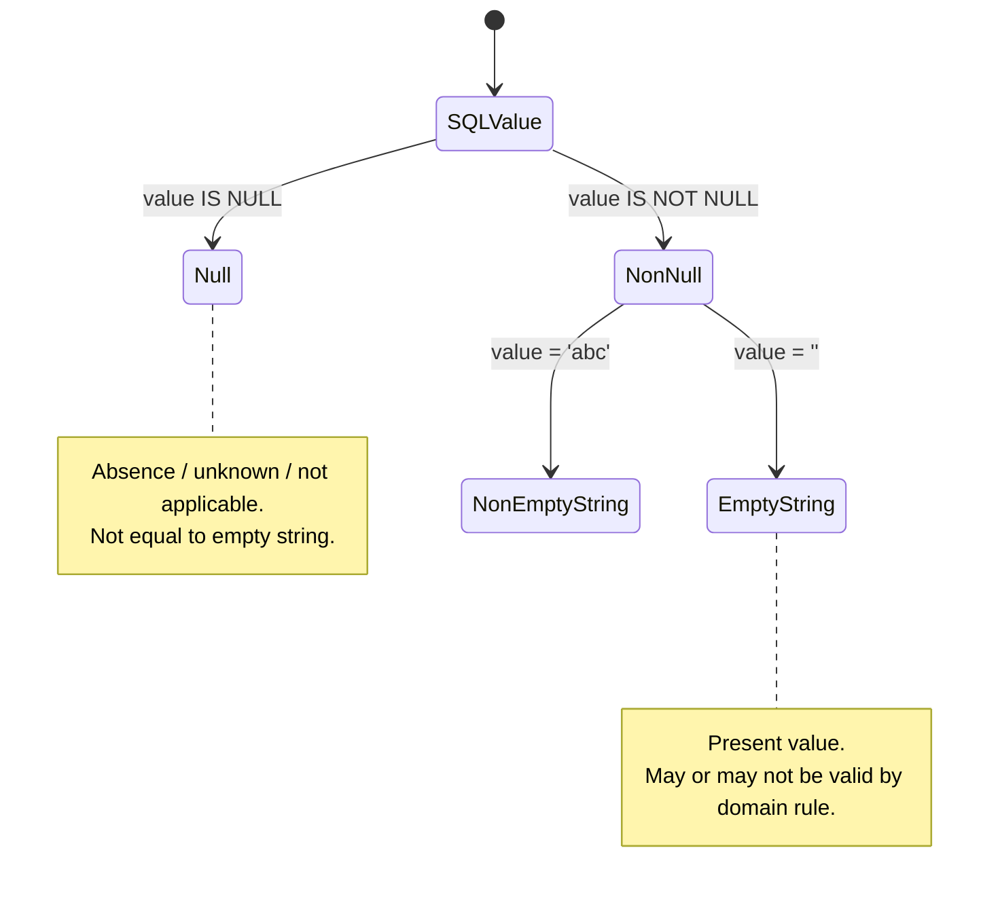
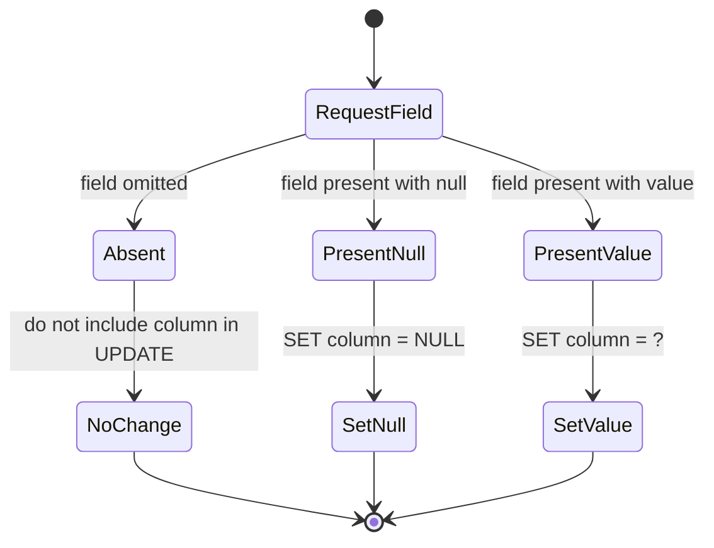
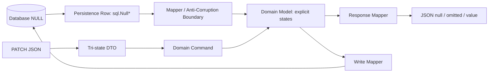
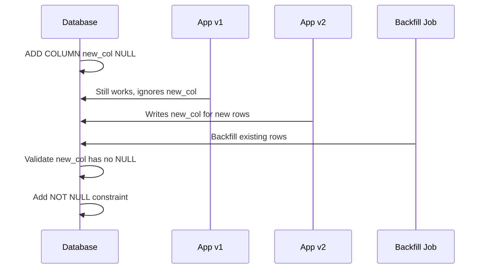

# learn-go-sql-database-integration-part-009.md

# Part 009 — NULL Semantics in Go

> Seri: `learn-go-sql-database-integration`  
> Target pembaca: Java software engineer yang ingin menguasai database integration di Go secara production-grade  
> Target Go: Go 1.26.x  
> Fokus: SQL `NULL`, Go zero value, `sql.Null*`, `sql.Null[T]`, pointer, custom nullable type, JSON boundary, update semantics, domain invariant, dan failure modelling

---

## 1. Tujuan

Di bagian sebelumnya kita membahas scanning, type mapping, dan kontrol bentuk data. Bagian ini memperdalam satu area yang tampak kecil tetapi sangat sering menjadi sumber bug production: **SQL `NULL`**.

Setelah menyelesaikan bagian ini, kamu diharapkan mampu:

1. Membedakan **SQL `NULL`**, **Go zero value**, **field kosong**, **field tidak dikirim**, dan **field eksplisit dihapus**.
2. Memilih representasi nullable yang tepat: `sql.NullString`, `sql.NullTime`, `sql.Null[T]`, pointer, custom type, atau non-null schema.
3. Mendesain model persistence, domain, request DTO, response DTO, dan update command tanpa mencampur semantic layer.
4. Menghindari bug seperti `NULL` menjadi `""`, `0`, `false`, atau `time.Time{}` secara diam-diam.
5. Memodelkan **tri-state update**: tidak berubah, set value, set NULL.
6. Memahami bagaimana `NULL` berinteraksi dengan `WHERE`, `JOIN`, `UNIQUE`, `COUNT`, aggregate, sorting, JSON, dan domain invariant.
7. Membuat scanner/valuer custom untuk nullable domain type.
8. Menulis checklist review untuk nullable column di service production.

---

## 2. Mengapa `NULL` Penting di Production

Banyak engineer memperlakukan `NULL` sebagai detail database. Itu keliru.

`NULL` adalah **semantic signal**. Ia mempengaruhi:

- cara data dibaca;
- cara data ditulis;
- validasi bisnis;
- query filtering;
- indexing;
- unique constraint;
- audit trail;
- JSON response;
- partial update;
- backward-compatible migration;
- report dan analytics;
- integrasi antar sistem;
- regulatory defensibility.

Contoh sederhana:

```sql
CREATE TABLE customers (
    id BIGINT PRIMARY KEY,
    email TEXT NULL
);
```

Pertanyaan yang harus dijawab bukan hanya “bagaimana scan kolom ini di Go?”. Pertanyaan sebenarnya:

- Apakah `email NULL` berarti user belum pernah mengisi email?
- Apakah `email = ''` valid?
- Apakah `email NULL` berarti data belum dimigrasi?
- Apakah `email NULL` berarti data disembunyikan karena privacy?
- Apakah `email NULL` berarti external source tidak menyediakan field?
- Apakah email boleh dihapus oleh user?
- Apakah email wajib ada setelah status tertentu?
- Apakah dua row dengan email `NULL` boleh lebih dari satu?
- Apakah API response harus mengirim `null`, omit field, atau empty string?

Semua jawaban itu adalah keputusan domain, bukan keputusan package `database/sql`.

---

## 3. Mental Model Utama

### 3.1 SQL `NULL` Bukan Go Zero Value

Di Go:

```go
var s string    // ""
var n int64     // 0
var b bool      // false
var t time.Time // 0001-01-01 00:00:00 +0000 UTC
```

Ini adalah **zero value**. Zero value adalah value nyata.

Di SQL:

```sql
NULL
```

`NULL` bukan string kosong, bukan angka nol, bukan `false`, bukan timestamp nol. `NULL` berarti **unknown / absent / not applicable**, tergantung desain schema.

Masalah muncul ketika aplikasi menghapus perbedaan ini.

Buruk:

```go
var email string
err := row.Scan(&email) // akan error jika kolom email bernilai SQL NULL
```

Lebih eksplisit:

```go
var email sql.NullString
err := row.Scan(&email)
if err != nil {
    return err
}

if email.Valid {
    // email.String adalah value nyata
} else {
    // database value adalah NULL
}
```

### 3.2 NULL adalah State Tambahan

Untuk type biasa, kita punya satu dimensi:

```text
string value: "abc" | ""
```

Untuk nullable string, kita punya dua dimensi:

```text
valid? + value

NULL                  => Valid=false, String ignored
non-null empty string => Valid=true,  String=""
non-null abc          => Valid=true,  String="abc"
```

Diagramnya:



### 3.3 Layer Semantics Tidak Boleh Dicampur

Satu field dapat punya representasi berbeda di tiap layer:

| Layer | Representasi | Makna |
|---|---|---|
| Database row | `NULL` / non-NULL | Storage truth |
| Persistence struct | `sql.NullString` / `sql.Null[T]` | Lossless DB mapping |
| Domain model | custom optional type / pointer / required value | Business invariant |
| Request DTO | pointer / tri-state wrapper | Client intent |
| Response DTO | pointer / `omitempty` / explicit null | API contract |
| Audit event | before/after with presence flag | Explainability |

Kesalahan umum adalah memakai satu struct untuk semua layer.

Buruk:

```go
type User struct {
    ID    int64          `json:"id"`
    Email sql.NullString `json:"email"`
}
```

Kenapa buruk?

- `sql.NullString` punya field `String` dan `Valid`; default JSON-nya bukan contract API yang diinginkan.
- API consumer tidak perlu tahu detail `database/sql`.
- Domain logic jadi bergantung pada representation database.
- Partial update jadi ambigu.

Lebih baik:

```go
// Persistence model: dekat dengan database.
type userRow struct {
    ID    int64
    Email sql.NullString
}

// Domain model: dekat dengan invariant bisnis.
type User struct {
    id    UserID
    email OptionalEmail
}

// Response DTO: dekat dengan API contract.
type UserResponse struct {
    ID    int64   `json:"id"`
    Email *string `json:"email,omitempty"`
}
```

---

## 4. Fakta Dasar dari `database/sql`

Package `database/sql` menyediakan beberapa type khusus untuk nullable column:

- `sql.NullString`
- `sql.NullBool`
- `sql.NullByte`
- `sql.NullInt16`
- `sql.NullInt32`
- `sql.NullInt64`
- `sql.NullFloat64`
- `sql.NullTime`
- `sql.Null[T]` sejak Go 1.22

Masing-masing membawa konsep yang sama:

```go
type NullString struct {
    String string
    Valid  bool // true jika String bukan SQL NULL
}
```

Generic nullable type:

```go
type Null[T any] struct {
    V     T
    Valid bool
}
```

Keduanya mengimplementasikan `Scanner` dan `driver.Valuer`, sehingga dapat dipakai untuk membaca dari database dan menulis ke database.

Contoh:

```go
var displayName sql.Null[string]

err := db.QueryRowContext(ctx, `
    SELECT display_name
    FROM users
    WHERE id = ?
`, id).Scan(&displayName)
if err != nil {
    return err
}

if displayName.Valid {
    fmt.Println(displayName.V)
} else {
    fmt.Println("display name is NULL")
}
```

Catatan penting: `T` pada `sql.Null[T]` harus type yang dapat diterima oleh `driver.Value`. Untuk domain type kompleks, kamu tetap perlu custom `Scanner` / `Valuer`.

---

## 5. SQL `NULL` dan Three-Valued Logic

SQL tidak hanya punya `true` dan `false`. Dengan `NULL`, expression dapat menghasilkan:

```text
TRUE
FALSE
UNKNOWN
```

Ini disebut three-valued logic.

Contoh:

```sql
SELECT * FROM users WHERE email = NULL;
```

Query ini salah secara semantic. Perbandingan dengan `NULL` memakai `=` menghasilkan `UNKNOWN`, bukan `TRUE`.

Yang benar:

```sql
SELECT * FROM users WHERE email IS NULL;
```

atau:

```sql
SELECT * FROM users WHERE email IS NOT NULL;
```

### 5.1 Truth Table Sederhana

| Expression | Result |
|---|---:|
| `'a' = 'a'` | TRUE |
| `'a' = 'b'` | FALSE |
| `'a' = NULL` | UNKNOWN |
| `NULL = NULL` | UNKNOWN |
| `NULL IS NULL` | TRUE |
| `NULL IS NOT NULL` | FALSE |

### 5.2 Dampak ke Dynamic Filter

Misalnya kamu membuat search API:

```http
GET /users?email=
```

Pertanyaan:

- Apakah email kosong berarti filter tidak dipakai?
- Apakah mencari email empty string?
- Apakah mencari email NULL?

Ketiganya berbeda.

Buruk:

```go
if req.Email != "" {
    where = append(where, "email = ?")
    args = append(args, req.Email)
}
```

Kode ini tidak bisa mengekspresikan pencarian `email = ''` dan tidak bisa mencari `email IS NULL`.

Lebih eksplisit:

```go
type EmailFilterMode string

const (
    EmailFilterAny       EmailFilterMode = "any"
    EmailFilterEquals    EmailFilterMode = "equals"
    EmailFilterIsNull    EmailFilterMode = "is_null"
    EmailFilterIsNotNull EmailFilterMode = "is_not_null"
)

type UserSearchRequest struct {
    EmailMode  EmailFilterMode
    EmailValue string
}
```

Kemudian:

```go
switch req.EmailMode {
case EmailFilterAny:
    // no predicate
case EmailFilterEquals:
    where = append(where, "email = ?")
    args = append(args, req.EmailValue)
case EmailFilterIsNull:
    where = append(where, "email IS NULL")
case EmailFilterIsNotNull:
    where = append(where, "email IS NOT NULL")
default:
    return nil, fmt.Errorf("invalid email filter mode: %q", req.EmailMode)
}
```

---

## 6. Pilihan Representasi Nullable di Go

Tidak ada satu representasi yang selalu benar. Pilihan tergantung layer dan semantic.

### 6.1 `sql.Null*`

Cocok untuk:

- persistence row struct;
- scanning langsung dari database;
- code yang dekat dengan `database/sql`;
- ketika butuh `Scanner` dan `Valuer` siap pakai;
- ketika kamu ingin membedakan NULL dari zero value.

Contoh:

```go
type userRow struct {
    ID          int64
    Email       sql.NullString
    ActivatedAt sql.NullTime
    LoginCount  sql.NullInt64
}
```

Kelebihan:

- explicit;
- tidak ambigu;
- standar;
- tidak perlu allocation untuk pointer value;
- jelas di code review.

Kekurangan:

- kurang nyaman untuk JSON;
- kurang nyaman untuk domain API;
- field `String`, `Valid` terasa mekanis;
- untuk type custom tetap perlu wrapper.

### 6.2 `sql.Null[T]`

Cocok untuk Go modern saat kamu ingin satu nullable wrapper generic.

Contoh:

```go
type userRow struct {
    ID          int64
    Email       sql.Null[string]
    ActivatedAt sql.Null[time.Time]
    LoginCount  sql.Null[int64]
}
```

Kelebihan:

- generic;
- konsisten;
- mengurangi banyak nama type;
- tetap explicit.

Kekurangan:

- field value bernama `V`, bukan `String`/`Int64`;
- tidak semua team terbiasa;
- type parameter tetap harus compatible dengan `driver.Value`;
- JSON behavior tetap belum otomatis sesuai contract API.

### 6.3 Pointer `*T`

Cocok untuk:

- API DTO;
- response JSON yang ingin `null` atau omit;
- request field yang optional;
- domain model ringan ketika absence memang bagian dari domain.

Contoh:

```go
type UserResponse struct {
    ID    int64   `json:"id"`
    Email *string `json:"email,omitempty"`
}
```

Kelebihan:

- natural untuk JSON;
- `nil` mudah dimengerti;
- cocok untuk optional API field.

Kekurangan:

- bisa menyebabkan allocation;
- pointer aliasing perlu hati-hati;
- untuk update command, pointer hanya memberi dua state: absent/nil atau present value, tergantung JSON decode strategy;
- tidak selalu jelas apakah `nil` berarti “not loaded”, “not applicable”, atau “NULL”.

### 6.4 Custom Optional Type

Cocok untuk domain serius.

Contoh:

```go
type OptionalEmail struct {
    value string
    valid bool
}

func NoEmail() OptionalEmail {
    return OptionalEmail{}
}

func SomeEmail(v string) (OptionalEmail, error) {
    v = strings.TrimSpace(v)
    if v == "" {
        return OptionalEmail{}, fmt.Errorf("email must not be empty")
    }
    if !strings.Contains(v, "@") {
        return OptionalEmail{}, fmt.Errorf("invalid email")
    }
    return OptionalEmail{value: strings.ToLower(v), valid: true}, nil
}

func (e OptionalEmail) Valid() bool { return e.valid }
func (e OptionalEmail) Value() (string, bool) {
    return e.value, e.valid
}
```

Kelebihan:

- domain invariant terkunci;
- tidak semua code bebas membuat invalid optional value;
- cocok untuk regulatory/business state.

Kekurangan:

- perlu mapping dari/ke DB;
- perlu custom JSON jika dipakai di API;
- lebih banyak code.

### 6.5 Non-Nullable Schema

Kadang solusi terbaik adalah **jangan gunakan NULL**.

Contoh:

```sql
CREATE TABLE users (
    id BIGINT PRIMARY KEY,
    email TEXT NOT NULL,
    created_at TIMESTAMP NOT NULL
);
```

Gunakan `NOT NULL` jika:

- field wajib secara domain;
- default value benar-benar bermakna;
- tidak ada state “unknown”;
- invariant harus dijaga di database;
- kamu ingin mengurangi cabang logic di aplikasi.

Namun jangan mengganti `NULL` dengan fake default jika default itu berbohong.

Buruk:

```sql
terminated_at TIMESTAMP NOT NULL DEFAULT '1970-01-01'
```

Kalau user belum terminated, itu bukan `1970-01-01`; itu absence. Kolom ini seharusnya nullable atau dimodelkan dengan state lain.

---

## 7. Decision Matrix

| Kondisi | Rekomendasi |
|---|---|
| Field wajib secara domain | DB `NOT NULL`, Go type biasa |
| Field optional hanya di DB row | `sql.Null*` atau `sql.Null[T]` di persistence struct |
| Field optional di JSON response | `*T` atau custom marshal |
| Field butuh domain invariant | custom optional domain type |
| Field perlu tri-state update | custom patch type, bukan sekadar pointer biasa |
| Field nullable karena migration sementara | `sql.Null*` di persistence, domain mapping dengan fallback/rule eksplisit |
| Field nullable karena external system unknown | nullable domain concept, jangan coalesce diam-diam |
| Field nullable tetapi bisnis menganggap wajib | data quality problem; jangan sembunyikan dengan zero value |

---

## 8. Reading Nullable Columns

### 8.1 Basic Read

```go
type userRow struct {
    ID    int64
    Email sql.NullString
}

func findUserRow(ctx context.Context, db *sql.DB, id int64) (userRow, error) {
    const query = `
        SELECT id, email
        FROM users
        WHERE id = ?
    `

    var row userRow
    err := db.QueryRowContext(ctx, query, id).Scan(&row.ID, &row.Email)
    if err != nil {
        return userRow{}, err
    }
    return row, nil
}
```

### 8.2 Mapping ke Domain

```go
type User struct {
    ID    int64
    Email OptionalEmail
}

func mapUserRow(r userRow) (User, error) {
    var email OptionalEmail

    if r.Email.Valid {
        parsed, err := SomeEmail(r.Email.String)
        if err != nil {
            return User{}, fmt.Errorf("invalid email stored for user %d: %w", r.ID, err)
        }
        email = parsed
    } else {
        email = NoEmail()
    }

    return User{
        ID:    r.ID,
        Email: email,
    }, nil
}
```

Kenapa mapping bisa error?

Karena database bisa berisi data invalid akibat:

- legacy data;
- manual DBA update;
- migration bug;
- historical relaxed validation;
- bug aplikasi versi lama;
- external ingestion.

Production code harus memutuskan apakah invalid stored value:

- dianggap fatal;
- dipetakan ke degraded state;
- disembunyikan;
- dilaporkan sebagai data quality issue;
- ditangani dengan repair job.

Untuk sistem regulatory, biasanya lebih baik **mendeteksi dan mengeskalasi** daripada diam-diam mengganti value.

---

## 9. Writing Nullable Columns

### 9.1 Insert dengan `sql.NullString`

```go
func insertUser(ctx context.Context, db *sql.DB, id int64, email OptionalEmail) error {
    const stmt = `
        INSERT INTO users (id, email)
        VALUES (?, ?)
    `

    dbEmail := sql.NullString{}
    if v, ok := email.Value(); ok {
        dbEmail = sql.NullString{String: v, Valid: true}
    }

    _, err := db.ExecContext(ctx, stmt, id, dbEmail)
    if err != nil {
        return fmt.Errorf("insert user: %w", err)
    }
    return nil
}
```

Jika `Valid=false`, `Value()` dari `sql.NullString` akan menghasilkan SQL `NULL`.

### 9.2 Insert dengan `nil` Parameter

Untuk simple case, kamu bisa menulis:

```go
var emailArg any
if v, ok := email.Value(); ok {
    emailArg = v
} else {
    emailArg = nil
}

_, err := db.ExecContext(ctx, `
    INSERT INTO users (id, email)
    VALUES (?, ?)
`, id, emailArg)
```

Ini valid, tetapi untuk codebase besar `sql.Null*` atau mapper function sering lebih konsisten karena semantic nullable terlihat jelas.

---

## 10. The Dangerous COALESCE Habit

Banyak developer menulis query seperti ini:

```sql
SELECT id, COALESCE(email, '') AS email
FROM users
WHERE id = ?;
```

Lalu scan ke string:

```go
var email string
err := row.Scan(&id, &email)
```

Ini terlihat nyaman, tetapi berbahaya jika dilakukan tanpa sadar.

Masalahnya: kamu kehilangan informasi.

```text
SQL NULL  -> ""
SQL ""    -> ""
```

Dua state berbeda menjadi satu state.

### 10.1 Kapan `COALESCE` Boleh?

`COALESCE` boleh jika memang query tersebut adalah **presentation query**, bukan domain read.

Contoh report UI:

```sql
SELECT
    id,
    COALESCE(display_name, '(not provided)') AS display_name_label
FROM users;
```

Di sini nama alias `display_name_label` menunjukkan bahwa hasilnya adalah label presentasi.

### 10.2 Kapan `COALESCE` Tidak Boleh?

Jangan gunakan `COALESCE` untuk:

- domain read;
- invariant decision;
- audit diff;
- validation;
- authorization;
- workflow transition;
- external integration payload yang perlu membedakan null vs empty.

Buruk:

```sql
SELECT COALESCE(approved_by, '') AS approved_by
FROM approvals
WHERE id = ?;
```

Kalau `approved_by` NULL berarti belum approved, sedangkan empty string mungkin data corrupt. Menggabungkan keduanya merusak invariant.

---

## 11. NULL, JSON, dan API Contract

`sql.NullString` tidak otomatis menghasilkan JSON yang bagus.

Contoh:

```go
type UserResponse struct {
    Email sql.NullString `json:"email"`
}
```

Output default bisa menjadi bentuk object:

```json
{
  "email": {
    "String": "alice@example.com",
    "Valid": true
  }
}
```

Itu biasanya bukan API contract yang diinginkan.

### 11.1 Response dengan Pointer

```go
type UserResponse struct {
    ID    int64   `json:"id"`
    Email *string `json:"email"`
}

func toUserResponse(u User) UserResponse {
    var email *string
    if v, ok := u.Email.Value(); ok {
        email = &v
    }
    return UserResponse{
        ID:    u.ID,
        Email: email,
    }
}
```

Jika `Email=nil`, JSON output:

```json
{
  "id": 123,
  "email": null
}
```

Dengan `omitempty`:

```go
type UserResponse struct {
    ID    int64   `json:"id"`
    Email *string `json:"email,omitempty"`
}
```

Jika `Email=nil`, field bisa dihilangkan:

```json
{
  "id": 123
}
```

Pertanyaannya: API contract-mu ingin `null` atau omit?

### 11.2 `null` vs Omitted Field

| JSON shape | Meaning yang mungkin |
|---|---|
| `{ "email": "a@x.com" }` | email known and set |
| `{ "email": null }` | email known absent / clear email |
| `{}` | email not included / no change / not loaded |

Untuk response read, `null` biasanya berarti value diketahui absent. Untuk patch request, `null` sering berarti clear value. Untuk partial update, omitted biasanya berarti no change.

Jangan campur.

---

## 12. Partial Update dan Tri-State Problem

Ini bagian paling penting untuk aplikasi enterprise.

Misalnya endpoint:

```http
PATCH /users/123
Content-Type: application/json

{
  "email": null
}
```

Apa artinya?

Kemungkinan:

1. Jangan ubah email.
2. Set email menjadi `NULL`.
3. Error karena email tidak boleh null.

Jika request:

```json
{}
```

Apa artinya?

Biasanya: jangan ubah email.

Jika request:

```json
{ "email": "alice@example.com" }
```

Artinya: set email ke value baru.

Kita butuh tiga state:

```text
Absent       => no change
Present null => set NULL / clear
Present value => set value
```

Pointer biasa sering tidak cukup jika decode JSON langsung ke `*string`, karena kita perlu membedakan field absent dan field present null.

### 12.1 Tri-State Type

```go
type PatchField[T any] struct {
    Present bool
    Null    bool
    Value   T
}
```

Custom unmarshal:

```go
func (p *PatchField[T]) UnmarshalJSON(data []byte) error {
    p.Present = true

    if bytes.Equal(data, []byte("null")) {
        p.Null = true
        var zero T
        p.Value = zero
        return nil
    }

    var v T
    if err := json.Unmarshal(data, &v); err != nil {
        return err
    }

    p.Null = false
    p.Value = v
    return nil
}
```

Request DTO:

```go
type UpdateUserRequest struct {
    Email PatchField[string] `json:"email"`
}
```

Apply logic:

```go
func applyUpdate(u User, req UpdateUserRequest) (User, error) {
    if req.Email.Present {
        if req.Email.Null {
            u.Email = NoEmail()
        } else {
            email, err := SomeEmail(req.Email.Value)
            if err != nil {
                return User{}, err
            }
            u.Email = email
        }
    }
    return u, nil
}
```

SQL update builder:

```go
func updateUser(ctx context.Context, db *sql.DB, id int64, req UpdateUserRequest) error {
    sets := make([]string, 0, 1)
    args := make([]any, 0, 2)

    if req.Email.Present {
        sets = append(sets, "email = ?")
        if req.Email.Null {
            args = append(args, nil)
        } else {
            email, err := SomeEmail(req.Email.Value)
            if err != nil {
                return err
            }
            v, _ := email.Value()
            args = append(args, v)
        }
    }

    if len(sets) == 0 {
        return nil
    }

    args = append(args, id)

    query := "UPDATE users SET " + strings.Join(sets, ", ") + " WHERE id = ?"
    _, err := db.ExecContext(ctx, query, args...)
    if err != nil {
        return fmt.Errorf("update user: %w", err)
    }
    return nil
}
```

### 12.2 Mermaid State Model



---

## 13. Custom Nullable Type dengan Scanner dan Valuer

Untuk domain serius, kita sering ingin type yang:

- bisa scan dari database;
- bisa ditulis ke database;
- bisa menjaga invariant;
- bisa punya JSON behavior custom;
- tidak membocorkan `sql.NullString` ke domain.

Contoh `NullEmail` untuk persistence boundary:

```go
type NullEmail struct {
    Email Email
    Valid bool
}

func (n *NullEmail) Scan(value any) error {
    if value == nil {
        n.Email = Email{}
        n.Valid = false
        return nil
    }

    var raw string
    switch v := value.(type) {
    case string:
        raw = v
    case []byte:
        raw = string(v)
    default:
        return fmt.Errorf("scan NullEmail: unsupported source type %T", value)
    }

    email, err := ParseEmail(raw)
    if err != nil {
        return fmt.Errorf("scan NullEmail: invalid email %q: %w", raw, err)
    }

    n.Email = email
    n.Valid = true
    return nil
}

func (n NullEmail) Value() (driver.Value, error) {
    if !n.Valid {
        return nil, nil
    }
    return n.Email.String(), nil
}
```

Domain type:

```go
type Email struct {
    value string
}

func ParseEmail(s string) (Email, error) {
    s = strings.TrimSpace(strings.ToLower(s))
    if s == "" {
        return Email{}, fmt.Errorf("empty email")
    }
    if !strings.Contains(s, "@") {
        return Email{}, fmt.Errorf("missing @")
    }
    return Email{value: s}, nil
}

func (e Email) String() string {
    return e.value
}
```

Usage:

```go
type userRow struct {
    ID    int64
    Email NullEmail
}

var r userRow
err := db.QueryRowContext(ctx, `
    SELECT id, email FROM users WHERE id = ?
`, id).Scan(&r.ID, &r.Email)
```

### 13.1 Kapan Custom Scanner Jangan Dipakai?

Jangan overuse custom scanner untuk semua field.

Gunakan jika:

- type punya invariant;
- type sering dipakai;
- type punya semantic domain kuat;
- kamu ingin satu lokasi validasi read/write;
- kamu butuh adapter DB yang reusable.

Tidak perlu untuk field biasa seperti nullable comment/note yang hanya string bebas.

---

## 14. `NULL` dalam WHERE Clause

### 14.1 Parameter Value NULL

Buruk:

```go
var email any = nil
rows, err := db.QueryContext(ctx, `
    SELECT id FROM users WHERE email = ?
`, email)
```

Ini biasanya tidak menghasilkan row `email IS NULL` karena `email = NULL` bukan `TRUE`.

Benar:

```go
rows, err := db.QueryContext(ctx, `
    SELECT id FROM users WHERE email IS NULL
`)
```

Dynamic:

```go
func emailPredicate(email sql.NullString) (string, []any) {
    if email.Valid {
        return "email = ?", []any{email.String}
    }
    return "email IS NULL", nil
}
```

### 14.2 Null-Safe Equality

Beberapa database punya operator null-safe equality, misalnya:

- PostgreSQL: `IS NOT DISTINCT FROM`
- MySQL: `<=>`

PostgreSQL contoh:

```sql
SELECT *
FROM users
WHERE email IS NOT DISTINCT FROM $1;
```

Jika parameter `$1` adalah NULL, expression dapat match row dengan `email NULL`.

Namun ini database-specific. Untuk `database/sql` portable layer, jangan menganggap semua DB punya operator yang sama.

---

## 15. NULL dan JOIN

`LEFT JOIN` sering menciptakan nullable column meskipun kolom aslinya `NOT NULL`.

Contoh:

```sql
SELECT
    u.id,
    u.email,
    p.id AS profile_id,
    p.display_name
FROM users u
LEFT JOIN profiles p ON p.user_id = u.id
WHERE u.id = ?;
```

Walaupun `profiles.display_name` mungkin `NOT NULL`, hasil join tetap bisa `NULL` jika profile tidak ada.

Go row struct:

```go
type userWithProfileRow struct {
    UserID      int64
    Email       string
    ProfileID   sql.NullInt64
    DisplayName sql.NullString
}
```

Mapping:

```go
func mapUserWithProfile(r userWithProfileRow) UserWithProfile {
    out := UserWithProfile{
        UserID: r.UserID,
        Email:  r.Email,
    }

    if r.ProfileID.Valid {
        out.Profile = &ProfileSummary{
            ID:          r.ProfileID.Int64,
            DisplayName: r.DisplayName.String,
        }
    }

    return out
}
```

### 15.1 Bug Umum pada LEFT JOIN

Buruk:

```go
var displayName string
err := row.Scan(&displayName)
```

Jika left-joined row tidak ada, scan bisa error karena source value NULL tidak bisa masuk ke `string`.

Lebih buruk lagi:

```sql
COALESCE(p.display_name, '') AS display_name
```

Lalu aplikasi tidak bisa membedakan:

- profile tidak ada;
- profile ada tetapi display name empty;
- data corrupt.

Better:

- scan join presence key (`profile_id`) sebagai nullable;
- gunakan presence key untuk menentukan nested object ada/tidak;
- jangan hanya bergantung pada nullable descriptive field.

---

## 16. NULL dan Aggregate

Aggregate memiliki behavior khusus.

### 16.1 `COUNT(*)` vs `COUNT(column)`

```sql
SELECT COUNT(*) FROM users;
```

Menghitung semua row.

```sql
SELECT COUNT(email) FROM users;
```

Menghitung row yang `email IS NOT NULL`.

Jika ada 10 user dan 3 email null:

```text
COUNT(*)     = 10
COUNT(email) = 7
```

### 16.2 `SUM`, `AVG`, `MIN`, `MAX`

Aggregate biasanya mengabaikan NULL input. Tetapi jika tidak ada non-null row, hasil aggregate bisa NULL.

Contoh:

```sql
SELECT AVG(score)
FROM reviews
WHERE product_id = ?;
```

Jika belum ada review, hasil `AVG(score)` bisa NULL. Jangan scan langsung ke `float64` tanpa memikirkan no-data state.

```go
var avg sql.NullFloat64
err := db.QueryRowContext(ctx, query, productID).Scan(&avg)
```

Kemudian:

```go
if !avg.Valid {
    // no score yet
}
```

---

## 17. NULL dan UNIQUE Constraint

Behavior `UNIQUE` dengan `NULL` berbeda antar database, tetapi banyak database memperbolehkan lebih dari satu row dengan nilai `NULL` di kolom unique karena `NULL` tidak dianggap sama dengan `NULL`.

Contoh:

```sql
CREATE UNIQUE INDEX users_email_uq ON users(email);
```

Kemungkinan yang sering terjadi:

```text
email = NULL allowed for many rows
email = 'a@example.com' only one row
```

Jika business rule kamu adalah “hanya satu active row yang boleh punya email tertentu, tetapi email boleh null”, ini cocok.

Jika business rule kamu adalah “hanya satu row boleh punya null”, kamu perlu constraint tambahan, partial index, function index, atau model schema berbeda tergantung database.

### 17.1 PostgreSQL Partial Unique Index Example

```sql
CREATE UNIQUE INDEX users_email_uq
ON users(email)
WHERE email IS NOT NULL;
```

Ini eksplisit: hanya non-null email yang unique.

### 17.2 Design Rule

Jangan hanya menulis `UNIQUE(email)` dan menganggap behavior `NULL` sudah sesuai bisnis. Tuliskan rule sebagai komentar migration atau schema documentation.

---

## 18. NULL dan Sorting

Sorting NULL berbeda antar database dan konfigurasi.

Contoh:

```sql
SELECT id, due_date
FROM tasks
ORDER BY due_date ASC;
```

Apakah `NULL` muncul di awal atau akhir? Tergantung database.

Lebih eksplisit:

```sql
ORDER BY due_date IS NULL, due_date ASC
```

Atau jika database mendukung:

```sql
ORDER BY due_date ASC NULLS LAST
```

Untuk listing API, sorting NULL harus deterministic.

Tambahkan tie-breaker:

```sql
ORDER BY due_date IS NULL, due_date ASC, id ASC
```

---

## 19. NULL dan Pagination

Keyset pagination dengan nullable sort key butuh hati-hati.

Misalnya:

```sql
ORDER BY due_date ASC, id ASC
```

Cursor:

```text
due_date + id
```

Jika `due_date` nullable, cursor harus bisa menyimpan state null. Predicate keyset menjadi lebih rumit.

Lebih aman untuk production listing:

1. Pilih sort key non-null jika memungkinkan.
2. Jika nullable, define `NULLS LAST`/`FIRST` secara eksplisit.
3. Encode cursor dengan presence flag.
4. Tambahkan tie-breaker non-null unique column.

Cursor shape:

```go
type TaskCursor struct {
    DueDateValid bool      `json:"dueDateValid"`
    DueDate      time.Time `json:"dueDate"`
    ID           int64     `json:"id"`
}
```

---

## 20. NULL dan Time

`time.Time{}` sering disalahgunakan sebagai pengganti NULL.

Buruk:

```go
if user.DeletedAt.IsZero() {
    // not deleted
}
```

Ini aman hanya jika `DeletedAt` memang bukan hasil direct scan dari nullable DB ke `time.Time`. Untuk database nullable timestamp, gunakan:

```go
type userRow struct {
    DeletedAt sql.NullTime
}
```

Domain:

```go
type DeletionState struct {
    deletedAt time.Time
    deleted   bool
}
```

Atau:

```go
type User struct {
    DeletedAt *time.Time
}
```

### 20.1 `time.Time{}` Bukan Business Absence

`time.Time{}` adalah value nyata di Go. Jangan jadikan dia magic sentinel untuk SQL NULL kecuali kamu benar-benar mengendalikan semua mapping dan documented.

Untuk audit/regulatory system, sentinel timestamp sangat berbahaya karena bisa terlihat seperti waktu kejadian nyata.

---

## 21. NULL, Boolean, dan State Machine

Nullable boolean sering menjadi smell.

```sql
approved BOOLEAN NULL
```

Kemungkinan meaning:

- `TRUE`: approved
- `FALSE`: rejected
- `NULL`: pending

Lebih baik?

```sql
status TEXT NOT NULL CHECK (status IN ('PENDING', 'APPROVED', 'REJECTED'))
```

Nullable boolean boleh jika memang “unknown” valid, misalnya external answer belum tersedia. Tetapi untuk workflow state, enum/status biasanya lebih defensible.

Buruk:

```go
if approval.Approved.Valid && approval.Approved.Bool {
    // approved
} else {
    // not approved? rejected? pending? unknown?
}
```

Lebih jelas:

```go
type ApprovalStatus string

const (
    ApprovalPending  ApprovalStatus = "PENDING"
    ApprovalApproved ApprovalStatus = "APPROVED"
    ApprovalRejected ApprovalStatus = "REJECTED"
)
```

---

## 22. NULL dan Domain Invariant

Nullable column seharusnya tidak hanya ditentukan berdasarkan “field ini kadang kosong”. Tanyakan invariant.

Contoh regulatory case:

```text
Case status: DRAFT, SUBMITTED, REVIEWING, APPROVED, REJECTED
ApprovedBy nullable
ApprovedAt nullable
RejectionReason nullable
```

Invariant:

| Status | ApprovedBy | ApprovedAt | RejectionReason |
|---|---|---|---|
| DRAFT | NULL | NULL | NULL |
| SUBMITTED | NULL | NULL | NULL |
| REVIEWING | NULL | NULL | NULL |
| APPROVED | NOT NULL | NOT NULL | NULL |
| REJECTED | NULL | NULL | NOT NULL |

Database nullable alone tidak cukup. Aplikasi harus menjaga invariant, dan idealnya database constraint juga membantu.

### 22.1 Application Validation

```go
func validateCaseState(c Case) error {
    switch c.Status {
    case CaseApproved:
        if !c.ApprovedBy.Valid() || !c.ApprovedAt.Valid() {
            return fmt.Errorf("approved case must have approver and approved time")
        }
        if c.RejectionReason.Valid() {
            return fmt.Errorf("approved case must not have rejection reason")
        }
    case CaseRejected:
        if !c.RejectionReason.Valid() {
            return fmt.Errorf("rejected case must have rejection reason")
        }
        if c.ApprovedBy.Valid() || c.ApprovedAt.Valid() {
            return fmt.Errorf("rejected case must not have approval metadata")
        }
    }
    return nil
}
```

### 22.2 Database Check Constraint

Generic SQL shape:

```sql
ALTER TABLE cases ADD CONSTRAINT cases_state_fields_ck CHECK (
    (
        status = 'APPROVED'
        AND approved_by IS NOT NULL
        AND approved_at IS NOT NULL
        AND rejection_reason IS NULL
    )
    OR
    (
        status = 'REJECTED'
        AND approved_by IS NULL
        AND approved_at IS NULL
        AND rejection_reason IS NOT NULL
    )
    OR
    (
        status IN ('DRAFT', 'SUBMITTED', 'REVIEWING')
        AND approved_by IS NULL
        AND approved_at IS NULL
        AND rejection_reason IS NULL
    )
);
```

Ini mungkin perlu disesuaikan per database, tetapi prinsipnya: nullable field harus selaras dengan state.

---

## 23. Persistence Model vs Domain Model

### 23.1 Persistence Row

```go
type caseRow struct {
    ID              int64
    Status          string
    ApprovedBy      sql.NullInt64
    ApprovedAt      sql.NullTime
    RejectionReason sql.NullString
}
```

### 23.2 Domain Model

```go
type Case struct {
    id     CaseID
    status CaseStatus

    approval  ApprovalMetadata
    rejection RejectionMetadata
}

type ApprovalMetadata struct {
    approverID UserID
    approvedAt time.Time
    present    bool
}

type RejectionMetadata struct {
    reason  string
    present bool
}
```

### 23.3 Mapper

```go
func mapCaseRow(r caseRow) (Case, error) {
    status, err := ParseCaseStatus(r.Status)
    if err != nil {
        return Case{}, err
    }

    c := Case{
        id:     CaseID(r.ID),
        status: status,
    }

    if r.ApprovedBy.Valid || r.ApprovedAt.Valid {
        if !r.ApprovedBy.Valid || !r.ApprovedAt.Valid {
            return Case{}, fmt.Errorf("partial approval metadata for case %d", r.ID)
        }
        c.approval = ApprovalMetadata{
            approverID: UserID(r.ApprovedBy.Int64),
            approvedAt: r.ApprovedAt.Time,
            present:    true,
        }
    }

    if r.RejectionReason.Valid {
        c.rejection = RejectionMetadata{
            reason:  r.RejectionReason.String,
            present: true,
        }
    }

    if err := validateCaseState(c); err != nil {
        return Case{}, fmt.Errorf("invalid case state from db: %w", err)
    }

    return c, nil
}
```

Perhatikan bahwa mapping bukan hanya copy field. Mapping adalah boundary untuk memulihkan domain invariant dari storage representation.

---

## 24. Design Pattern: Nullable at the Edges

Prinsip praktis:

```text
Keep nullable representation at the edges.
```

Edges:

- database row;
- external API payload;
- message payload;
- CSV import;
- optional search form;
- patch request.

Core domain sebaiknya punya language yang lebih kaya:

- `NoEmail()` / `SomeEmail()`;
- `PendingApproval` / `Approved` / `Rejected`;
- `Unassigned` / `AssignedTo(UserID)`;
- `NoDueDate` / `DueAt(time.Time)`.

Diagram:



---

## 25. Anti-Patterns

### 25.1 Scan Nullable Column ke Non-Nullable Go Type

Buruk:

```go
var name string
err := row.Scan(&name)
```

Jika `name` bisa NULL, gunakan nullable target.

### 25.2 Coalesce Everything

Buruk:

```sql
SELECT COALESCE(email, '') FROM users;
```

Jika code ini dipakai untuk domain decision, ia menghilangkan informasi.

### 25.3 `sql.NullString` Bocor ke API

Buruk:

```go
type Response struct {
    Email sql.NullString `json:"email"`
}
```

Gunakan response mapper.

### 25.4 Nullable Boolean untuk Workflow

Buruk:

```sql
approved BOOLEAN NULL
```

Lebih baik status eksplisit jika ada lebih dari dua state.

### 25.5 Sentinel Value untuk Absence

Buruk:

```sql
approved_at TIMESTAMP NOT NULL DEFAULT '1970-01-01'
```

Jika absence adalah konsep nyata, modelkan sebagai nullable atau state terpisah.

### 25.6 Pointer Everywhere

Buruk:

```go
type Everything struct {
    Name      *string
    Age       *int
    CreatedAt *time.Time
    Active    *bool
}
```

Pointer everywhere membuat domain lemah. Gunakan pointer hanya jika absence memang bagian dari semantic layer tersebut.

### 25.7 Menganggap `omitempty` Sama dengan `NULL`

`omitempty` adalah JSON encoding behavior, bukan database semantic.

### 25.8 Menggunakan Struct yang Sama untuk DB, Domain, Request, Response

Ini sumber kebocoran semantic.

---

## 26. Java Comparison

Sebagai Java engineer, kamu mungkin familiar dengan:

- JDBC `ResultSet#getString` + `wasNull()`;
- boxed type seperti `Integer`, `Boolean`;
- `Optional<T>`;
- JPA nullable field;
- Bean Validation `@NotNull`;
- Jackson `null` vs missing;
- MapStruct nullable mapping;
- Spring `@Transactional` service update.

Di Go, pendekatannya lebih eksplisit:

| Java | Go |
|---|---|
| `String` nullable by default | `string` tidak bisa `nil` |
| `Integer` can be null | `int` tidak bisa `nil`; pakai `sql.NullInt64`/pointer |
| `Optional<T>` jarang untuk entity field | custom optional type bisa dipakai untuk domain |
| `ResultSet.wasNull()` | `sql.Null*{Valid:false}` |
| JPA hides SQL row mapping | `Scan` eksplisit |
| Jackson distinguishes missing/null with config/custom type | Go perlu custom unmarshal untuk tri-state |
| Bean Validation di annotation | Go validation explicit function |
| `@Column(nullable=false)` | DB `NOT NULL` + Go non-null type |

### 26.1 Java Trap yang Sering Terbawa

Di Java, karena reference type bisa `null`, engineer sering terbiasa field model boleh null. Di Go, ini dipaksa lebih jelas.

Java style:

```java
class User {
    String email; // can be null silently
}
```

Go style yang lebih defensible:

```go
type User struct {
    email OptionalEmail
}
```

Atau jika wajib:

```go
type User struct {
    email Email
}
```

Go membuat absence harus dirancang, bukan terjadi tanpa disadari.

---

## 27. Schema Design Guidelines untuk Nullable Column

Sebelum membuat nullable column, jawab pertanyaan berikut:

1. Apa arti `NULL`?
2. Apakah `NULL` berbeda dari empty string / zero / false?
3. Apakah `NULL` adalah state permanen atau hanya transisi migration?
4. Apakah field akan menjadi wajib di masa depan?
5. Apakah field ini mempengaruhi authorization/workflow/reporting?
6. Apakah field perlu constraint conditional?
7. Apakah API harus expose sebagai `null`, omit, atau derived label?
8. Apakah indexing/sorting/pagination dengan NULL sudah didefinisikan?
9. Apakah `UNIQUE` dengan NULL sesuai business rule?
10. Apakah migration/backfill punya plan?

### 27.1 Prefer `NOT NULL` untuk Invariant Kuat

Jika field wajib, jangan hanya validasi di aplikasi.

```sql
email TEXT NOT NULL
```

### 27.2 Nullable untuk Optional Fact, Bukan Malas Desain

Nullable tepat untuk:

- `deleted_at` pada soft delete;
- `approved_at` sebelum approval;
- `assigned_to` jika case belum assigned;
- `external_reference` jika external system belum sync;
- `middle_name` jika memang optional;
- `last_login_at` jika user belum pernah login.

Nullable buruk untuk:

- `status` workflow utama;
- `created_at`;
- `created_by` pada audited system;
- monetary amount yang wajib;
- primary business key;
- flags yang sebenarnya state machine.

---

## 28. Migration dan NULL

Nullable sering dipakai untuk zero-downtime migration.

### 28.1 Expand-Backfill-Contract

Langkah umum:

1. Add nullable column.
2. Deploy app version yang bisa menulis column baru.
3. Backfill existing rows.
4. Validate no null remains.
5. Add `NOT NULL` constraint.
6. Remove old logic.



### 28.2 Code Implication

Selama transisi, aplikasi harus tahan terhadap NULL.

```go
var newCol sql.NullString
```

Setelah contract selesai dan `NOT NULL` sudah enforced, kamu bisa mengubah mapping:

```go
var newCol string
```

Tapi perubahan ini harus dilakukan setelah data dan constraint benar-benar aman.

---

## 29. Observability untuk NULL/Data Quality

Nullable bug sering muncul sebagai data quality issue, bukan crash langsung.

Metric yang berguna:

- count row dengan unexpected NULL;
- count row dengan partial metadata;
- count failed mapper karena invalid nullable combination;
- count patch request yang clear field;
- count update yang no-op karena field absent;
- count fallback display label dipakai;
- count records skipped karena missing required external value.

Contoh audit log:

```go
logger.WarnContext(ctx, "invalid case metadata from database",
    slog.Int64("case_id", int64(caseID)),
    slog.String("status", row.Status),
    slog.Bool("approved_by_valid", row.ApprovedBy.Valid),
    slog.Bool("approved_at_valid", row.ApprovedAt.Valid),
    slog.Bool("rejection_reason_valid", row.RejectionReason.Valid),
)
```

Jangan log PII value seperti email penuh jika tidak perlu. Log presence/validity cukup.

---

## 30. Testing Nullable Semantics

### 30.1 Test Scan NULL

```go
func TestMapUserRow_EmailNull(t *testing.T) {
    row := userRow{
        ID:    1,
        Email: sql.NullString{},
    }

    u, err := mapUserRow(row)
    if err != nil {
        t.Fatal(err)
    }

    if _, ok := u.Email.Value(); ok {
        t.Fatal("expected no email")
    }
}
```

### 30.2 Test Empty String Bukan NULL

```go
func TestMapUserRow_EmailEmptyStringInvalid(t *testing.T) {
    row := userRow{
        ID:    1,
        Email: sql.NullString{String: "", Valid: true},
    }

    _, err := mapUserRow(row)
    if err == nil {
        t.Fatal("expected invalid email error")
    }
}
```

### 30.3 Test Patch Absent

```go
func TestPatchEmailAbsent(t *testing.T) {
    var req UpdateUserRequest
    err := json.Unmarshal([]byte(`{}`), &req)
    if err != nil {
        t.Fatal(err)
    }

    if req.Email.Present {
        t.Fatal("email should be absent")
    }
}
```

### 30.4 Test Patch Null

```go
func TestPatchEmailNull(t *testing.T) {
    var req UpdateUserRequest
    err := json.Unmarshal([]byte(`{"email":null}`), &req)
    if err != nil {
        t.Fatal(err)
    }

    if !req.Email.Present || !req.Email.Null {
        t.Fatalf("expected present null, got %+v", req.Email)
    }
}
```

### 30.5 Test Patch Value

```go
func TestPatchEmailValue(t *testing.T) {
    var req UpdateUserRequest
    err := json.Unmarshal([]byte(`{"email":"alice@example.com"}`), &req)
    if err != nil {
        t.Fatal(err)
    }

    if !req.Email.Present || req.Email.Null || req.Email.Value != "alice@example.com" {
        t.Fatalf("expected present value, got %+v", req.Email)
    }
}
```

---

## 31. Failure Modes

| Failure | Penyebab | Dampak | Mitigasi |
|---|---|---|---|
| Scan error `converting NULL to string is unsupported` | nullable DB column discan ke `string` | request gagal | scan ke `sql.NullString` atau ubah schema `NOT NULL` |
| NULL silently menjadi empty string | `COALESCE` tanpa sadar | domain state hilang | gunakan nullable scan untuk domain read |
| API membocorkan `{String, Valid}` | pakai `sql.NullString` langsung di JSON | contract jelek/breaking | response mapper |
| Patch tidak bisa clear field | pointer/DTO tidak membedakan absent vs null | user intent hilang | tri-state patch type |
| Workflow invalid | nullable fields tidak konsisten dengan status | regulatory/audit risk | domain validation + DB constraint |
| Sorting tidak stabil | nullable sort key tanpa rule | pagination duplicate/missing | explicit NULL ordering + tie-breaker |
| Unique rule salah | asumsi salah tentang NULL di unique index | duplicate business entity | partial/functional index sesuai DB |
| Aggregate scan gagal | aggregate result NULL discan ke primitive | report error | scan ke `sql.Null*` |
| Nullable bool ambigu | `NULL/FALSE/TRUE` dipakai untuk workflow | logic salah | explicit status enum |
| Migration runtime crash | app baru scan non-null tapi data lama masih null | deploy failure | expand-backfill-contract |

---

## 32. Production Checklist

Gunakan checklist ini saat review nullable field.

### 32.1 Schema Checklist

- [ ] Arti `NULL` terdokumentasi.
- [ ] `NULL` berbeda jelas dari zero/empty/false.
- [ ] Field yang wajib memakai `NOT NULL`.
- [ ] Nullable field punya alasan domain atau migration.
- [ ] Constraint conditional dipertimbangkan.
- [ ] Unique behavior dengan NULL sudah sesuai rule.
- [ ] Sorting NULL didefinisikan untuk listing.
- [ ] Index strategy mempertimbangkan NULL selectivity.
- [ ] Migration path dari nullable ke non-null jelas jika sementara.

### 32.2 Go Persistence Checklist

- [ ] Nullable DB column discan ke nullable Go type.
- [ ] Left join nullable result ditangani eksplisit.
- [ ] Aggregate nullable result ditangani eksplisit.
- [ ] `COALESCE` hanya dipakai untuk presentation/derived query.
- [ ] Mapper tidak diam-diam mengubah NULL ke zero value.
- [ ] Invalid nullable combination menghasilkan error atau data quality signal.

### 32.3 Domain Checklist

- [ ] Domain tidak memakai `sql.Null*` jika tidak perlu.
- [ ] Optional domain concept punya nama eksplisit.
- [ ] Nullable metadata selaras dengan state machine.
- [ ] Invariant divalidasi setelah mapping dari DB.
- [ ] Nullable boolean tidak menyembunyikan enum state.

### 32.4 API Checklist

- [ ] Response contract membedakan `null`, omitted, dan value jika perlu.
- [ ] Patch request mendukung absent/null/value jika field clearable.
- [ ] `omitempty` dipakai sadar, bukan kebetulan.
- [ ] SQL nullable type tidak bocor ke JSON.
- [ ] API docs menjelaskan clear vs no-change.

### 32.5 Operational Checklist

- [ ] Unexpected NULL dimonitor.
- [ ] Data quality errors punya metric/log.
- [ ] Migration punya validation query.
- [ ] Backfill idempotent.
- [ ] Rollout plan mempertimbangkan old/new app compatibility.

---

## 33. Worked Example: User Profile Email

### 33.1 Requirement

- User boleh belum punya email.
- Email jika ada harus valid.
- PATCH `/users/{id}` harus bisa:
  - tidak mengubah email;
  - set email baru;
  - menghapus email menjadi NULL.
- Response harus mengirim `email: null` jika tidak ada email.

### 33.2 Database

```sql
CREATE TABLE users (
    id BIGINT PRIMARY KEY,
    email TEXT NULL,
    created_at TIMESTAMP NOT NULL,
    updated_at TIMESTAMP NOT NULL
);

CREATE UNIQUE INDEX users_email_uq
ON users(email)
WHERE email IS NOT NULL;
```

### 33.3 Domain Type

```go
type Email struct {
    value string
}

func ParseEmail(s string) (Email, error) {
    s = strings.TrimSpace(strings.ToLower(s))
    if s == "" {
        return Email{}, fmt.Errorf("email is empty")
    }
    if !strings.Contains(s, "@") {
        return Email{}, fmt.Errorf("email missing @")
    }
    return Email{value: s}, nil
}

func (e Email) String() string { return e.value }

type OptionalEmail struct {
    value Email
    valid bool
}

func NoEmail() OptionalEmail { return OptionalEmail{} }

func SomeEmail(e Email) OptionalEmail {
    return OptionalEmail{value: e, valid: true}
}

func (o OptionalEmail) Value() (Email, bool) {
    return o.value, o.valid
}
```

### 33.4 Row Model

```go
type userRow struct {
    ID    int64
    Email sql.NullString
}
```

### 33.5 Mapper

```go
func mapUserRow(r userRow) (User, error) {
    var email OptionalEmail
    if r.Email.Valid {
        parsed, err := ParseEmail(r.Email.String)
        if err != nil {
            return User{}, fmt.Errorf("stored invalid email for user %d: %w", r.ID, err)
        }
        email = SomeEmail(parsed)
    } else {
        email = NoEmail()
    }

    return User{
        ID:    r.ID,
        Email: email,
    }, nil
}
```

### 33.6 Response Mapper

```go
type UserResponse struct {
    ID    int64   `json:"id"`
    Email *string `json:"email"`
}

func toUserResponse(u User) UserResponse {
    var emailPtr *string
    if email, ok := u.Email.Value(); ok {
        v := email.String()
        emailPtr = &v
    }

    return UserResponse{
        ID:    u.ID,
        Email: emailPtr,
    }
}
```

### 33.7 Patch DTO

```go
type PatchField[T any] struct {
    Present bool
    Null    bool
    Value   T
}

func (p *PatchField[T]) UnmarshalJSON(data []byte) error {
    p.Present = true

    if bytes.Equal(data, []byte("null")) {
        p.Null = true
        var zero T
        p.Value = zero
        return nil
    }

    var v T
    if err := json.Unmarshal(data, &v); err != nil {
        return err
    }

    p.Null = false
    p.Value = v
    return nil
}

type UpdateUserRequest struct {
    Email PatchField[string] `json:"email"`
}
```

### 33.8 Update SQL

```go
func updateUserEmail(ctx context.Context, db *sql.DB, id int64, req UpdateUserRequest) error {
    if !req.Email.Present {
        return nil
    }

    var arg any
    if req.Email.Null {
        arg = nil
    } else {
        email, err := ParseEmail(req.Email.Value)
        if err != nil {
            return fmt.Errorf("invalid email: %w", err)
        }
        arg = email.String()
    }

    result, err := db.ExecContext(ctx, `
        UPDATE users
        SET email = ?, updated_at = ?
        WHERE id = ?
    `, arg, time.Now().UTC(), id)
    if err != nil {
        return fmt.Errorf("update user email: %w", err)
    }

    affected, err := result.RowsAffected()
    if err == nil && affected == 0 {
        return sql.ErrNoRows
    }

    return nil
}
```

---

## 34. Worked Example: Case Approval Metadata

### 34.1 Requirement

- Case punya status.
- Jika `APPROVED`, `approved_by` dan `approved_at` wajib.
- Jika tidak approved, keduanya harus NULL.
- Jika `REJECTED`, `rejection_reason` wajib.

### 34.2 Row Model

```go
type caseRow struct {
    ID              int64
    Status          string
    ApprovedBy      sql.NullInt64
    ApprovedAt      sql.NullTime
    RejectionReason sql.NullString
}
```

### 34.3 Validation

```go
func validateCaseRow(r caseRow) error {
    switch r.Status {
    case "APPROVED":
        if !r.ApprovedBy.Valid || !r.ApprovedAt.Valid {
            return fmt.Errorf("approved case missing approval metadata")
        }
        if r.RejectionReason.Valid {
            return fmt.Errorf("approved case has rejection reason")
        }
    case "REJECTED":
        if r.ApprovedBy.Valid || r.ApprovedAt.Valid {
            return fmt.Errorf("rejected case has approval metadata")
        }
        if !r.RejectionReason.Valid {
            return fmt.Errorf("rejected case missing rejection reason")
        }
    case "DRAFT", "SUBMITTED", "REVIEWING":
        if r.ApprovedBy.Valid || r.ApprovedAt.Valid || r.RejectionReason.Valid {
            return fmt.Errorf("non-final case has finalization metadata")
        }
    default:
        return fmt.Errorf("unknown case status %q", r.Status)
    }

    return nil
}
```

Ini contoh penting: nullable field bukan hanya mapping concern, tapi bagian dari state machine correctness.

---

## 35. Mini Reference: Common Nullable Types

| SQL kind | Go nullable type | Notes |
|---|---|---|
| text/varchar | `sql.NullString` / `sql.Null[string]` | empty string berbeda dari NULL |
| boolean | `sql.NullBool` / `sql.Null[bool]` | hati-hati nullable bool untuk workflow |
| integer | `sql.NullInt64` / `sql.Null[int64]` | pilih size sesuai kebutuhan |
| float | `sql.NullFloat64` / `sql.Null[float64]` | jangan pakai float untuk money |
| timestamp | `sql.NullTime` / `sql.Null[time.Time]` | absence bukan `time.Time{}` |
| byte | `sql.NullByte` / `sql.Null[byte]` | jarang dipakai |
| decimal | custom scanner / driver-specific type | precision penting |
| uuid | driver-specific / custom scanner | string vs binary representation |
| JSON | `[]byte`, `json.RawMessage`, custom scanner | distinguish SQL NULL vs JSON null |

---

## 36. SQL NULL vs JSON null

Ini sering membingungkan.

Ada dua level null:

1. SQL column value adalah NULL.
2. SQL column value adalah JSON document yang berisi JSON `null`.

Contoh PostgreSQL JSONB:

```sql
payload IS NULL
```

berbeda dari:

```sql
payload = 'null'::jsonb
```

Di Go:

```go
var payload sql.NullString
```

Jika `payload.Valid=false`, SQL column NULL.

Jika `payload.Valid=true` dan `payload.String == "null"`, column berisi JSON literal null.

Untuk sistem integrasi, bedakan dua hal ini secara eksplisit.

---

## 37. Code Review Questions

Saat melihat PR yang menyentuh nullable column, tanyakan:

1. Apakah nullable ini berasal dari database, API, atau domain?
2. Apakah absent vs empty vs zero masih bisa dibedakan?
3. Apakah mapping dari DB ke domain lossless?
4. Apakah response JSON sengaja `null` atau sengaja omitted?
5. Apakah PATCH bisa membedakan no-change dan clear?
6. Apakah `WHERE column = ?` pernah menerima nil?
7. Apakah `LEFT JOIN` result discan ke nullable type?
8. Apakah aggregate result bisa NULL?
9. Apakah `COALESCE` dipakai untuk domain query?
10. Apakah nullable field punya constraint sesuai state?
11. Apakah sorting/pagination nullable sudah deterministic?
12. Apakah migration sementara nullable punya follow-up `NOT NULL`?

---

## 38. Latihan

### Latihan 1 — Diagnose Scan Error

Diberikan query:

```sql
SELECT id, middle_name FROM citizens WHERE id = ?;
```

Kolom `middle_name` nullable.

Kode:

```go
var id int64
var middleName string
err := row.Scan(&id, &middleName)
```

Pertanyaan:

1. Bug apa yang bisa terjadi?
2. Ubah kode agar lossless.
3. Tentukan response JSON sebaiknya `null`, omit, atau `""`.

### Latihan 2 — Patch Semantics

Endpoint:

```http
PATCH /cases/{id}
```

Field `assignedTo` boleh:

- tidak berubah;
- diassign ke user;
- di-unassign menjadi NULL.

Desain:

1. Request DTO.
2. Domain command.
3. SQL update builder.
4. Audit event before/after.

### Latihan 3 — Workflow Invariant

Tabel:

```sql
cases(status, approved_by, approved_at, rejected_by, rejected_at, rejection_reason)
```

Buat invariant untuk status:

- `DRAFT`
- `SUBMITTED`
- `APPROVED`
- `REJECTED`

Tentukan field mana yang nullable dan constraint apa yang diperlukan.

### Latihan 4 — Search Filter

Buat search filter untuk `email` yang bisa mencari:

- semua user;
- email sama dengan value;
- email is null;
- email is not null.

Jangan gunakan `email = ?` dengan argumen nil.

---

## 39. Ringkasan

`NULL` bukan detail kecil. Dalam aplikasi production, `NULL` adalah bagian dari model kebenaran.

Poin utama:

1. SQL `NULL` berbeda dari Go zero value.
2. Gunakan `sql.Null*` atau `sql.Null[T]` untuk persistence mapping yang lossless.
3. Jangan bocorkan `sql.Null*` ke API/domain tanpa alasan kuat.
4. Pointer cocok untuk JSON/API boundary, tetapi tidak otomatis menyelesaikan tri-state update.
5. PATCH membutuhkan representasi absent/null/value jika field bisa di-clear.
6. `COALESCE` bisa berguna untuk presentasi, tetapi berbahaya untuk domain read.
7. `LEFT JOIN`, aggregate, sorting, pagination, dan unique constraint semuanya punya edge case terkait `NULL`.
8. Nullable boolean sering kalah jelas dibanding explicit status.
9. Nullable field harus selaras dengan state machine dan invariant.
10. Migration sering memakai nullable sementara, tetapi harus punya contract plan.

Mental model yang harus dipegang:

```text
NULL is not a missing implementation detail.
NULL is a domain and integration signal.
Preserve it until the layer that is authorized to interpret it.
```

---

## 40. Referensi

- Go `database/sql` package documentation: `sql.NullString`, `sql.NullTime`, `sql.Null[T]`, `Scanner`, `driver.Valuer`.
- Go database querying documentation: handling nullable column values with `Scan` and `sql.Null*`.
- Go Wiki SQLInterface: dealing with NULL, pointer scan option, and custom nullable support via `Scanner`/`Valuer`.

---

## 41. Status Seri

Part ini adalah **Part 009** dari seri `learn-go-sql-database-integration`.

Seri **belum selesai**.

Lanjut ke:

```text
learn-go-sql-database-integration-part-010.md
```

Topik berikutnya:

```text
Parameter Binding and SQL Injection Boundary
```

<!-- NAVIGATION_FOOTER -->
<div class="page-nav">
<a href="./learn-go-sql-database-integration-part-008.md">⬅️ Scanning, Type Mapping, and Data Shape Control</a>
<a href="./index.md">📚 Kategori</a>
<a href="../../index.md">🏠 Home</a>
<a href="./learn-go-sql-database-integration-part-010.md">Parameter Binding and SQL Injection Boundary ➡️</a>
</div>
