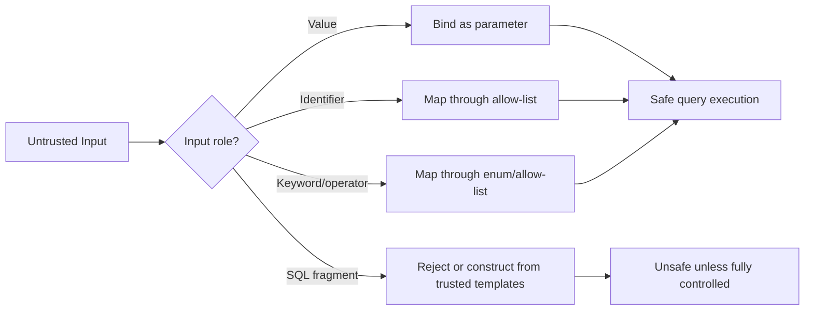
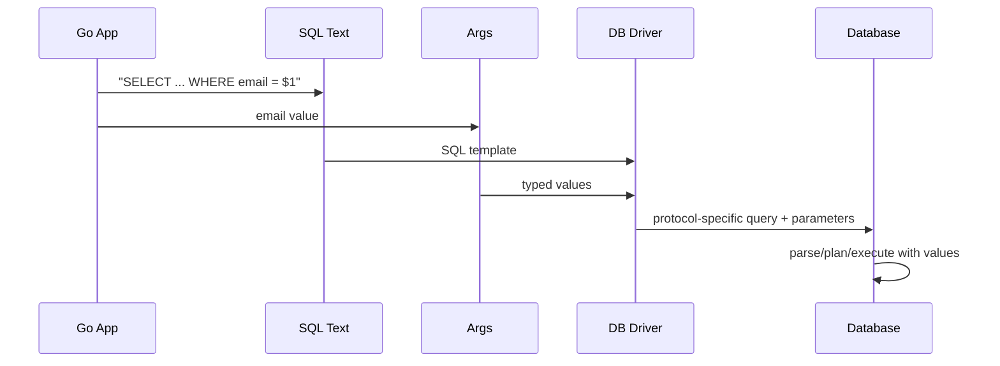
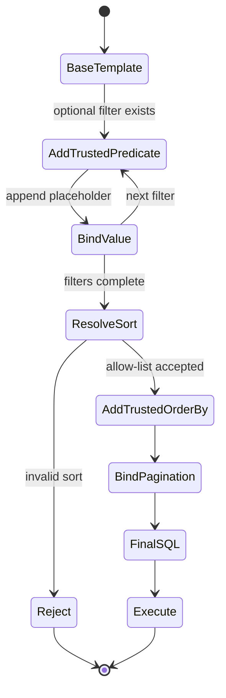
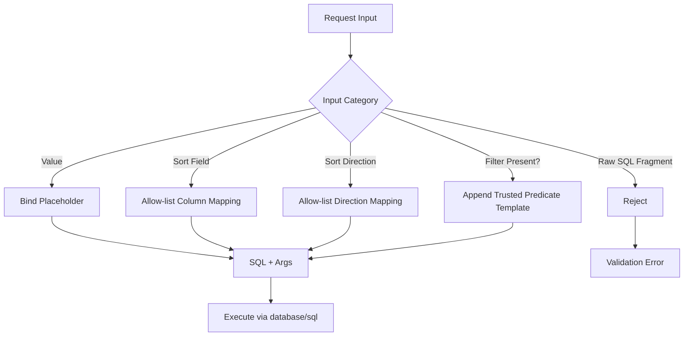

# learn-go-sql-database-integration-part-010.md

# Parameter Binding and SQL Injection Boundary

> Seri: `learn-go-sql-database-integration`  
> Part: `010`  
> Target pembaca: Java software engineer yang ingin menguasai integrasi database Go pada level production/internal engineering handbook  
> Target Go: Go 1.26.x  
> Fokus: parameter binding, SQL injection boundary, dynamic SQL, allow-list identifier, safe query composition, dan review model untuk production code

---

## 0. Executive Summary

Part ini membahas salah satu boundary paling penting dalam database integration: **kapan input dianggap data, kapan input berubah menjadi SQL grammar, dan bagaimana Go `database/sql` menjaga pemisahan tersebut melalui parameter binding**.

Kesalahan umum adalah menganggap SQL injection hanya terjadi ketika ada karakter `'` atau `--`. Itu terlalu dangkal. SQL injection terjadi ketika **nilai yang berasal dari luar trust boundary diberi kesempatan mengubah struktur SQL**.

Dalam Go, pattern yang benar adalah:

```go
row := db.QueryRowContext(ctx,
    `SELECT id, email, status FROM users WHERE email = $1`,
    email,
)
```

Bukan:

```go
query := fmt.Sprintf(
    `SELECT id, email, status FROM users WHERE email = '%s'`,
    email,
)
row := db.QueryRowContext(ctx, query)
```

Perbedaannya bukan kosmetik. Pada versi aman, SQL text dan value dikirim sebagai dua hal berbeda. Pada versi berbahaya, value sudah menjadi bagian dari SQL text sebelum driver/database melihatnya.

Namun parameter binding **tidak bisa** menggantikan semua bagian SQL. Placeholder hanya aman untuk **value expression**, bukan untuk:

- nama table,
- nama column,
- `ORDER BY` identifier,
- sort direction,
- SQL operator,
- keyword,
- fragment `WHERE`,
- fragment `JOIN`,
- fragment `GROUP BY`,
- nama schema,
- nama function,
- raw expression.

Untuk bagian-bagian tersebut, pertahanannya adalah **allow-list mapping**, bukan binding.

Part ini akan membangun mental model yang cukup kuat untuk menulis search/listing/export query yang dinamis tanpa membuka injection surface.

---

## 1. Tujuan Pembelajaran

Setelah menyelesaikan part ini, kamu harus mampu:

1. Menjelaskan SQL injection sebagai pelanggaran boundary antara **SQL code** dan **data value**.
2. Menggunakan `ExecContext`, `QueryContext`, dan `QueryRowContext` dengan parameter binding secara benar.
3. Memahami bahwa placeholder syntax berbeda antar driver/database.
4. Membedakan value parameter, identifier, keyword, operator, dan SQL fragment.
5. Mendesain dynamic filter yang aman.
6. Mendesain dynamic sorting yang aman.
7. Mendesain dynamic pagination yang aman.
8. Mendesain `IN` clause yang aman.
9. Menggunakan `sql.Named` secara tepat dan memahami keterbatasannya.
10. Menghindari false sense of security dari prepared statement, stored procedure, ORM, dan escaping manual.
11. Membuat reusable query builder kecil tanpa kehilangan kontrol SQL.
12. Melakukan review keamanan terhadap data access code.
13. Menghubungkan parameter binding dengan observability, logging, tracing, dan redaction.
14. Menentukan mana query dynamic yang masih acceptable dan mana yang harus direstrukturisasi.

---

## 2. Prasyarat dan Batasan

Part ini mengasumsikan kamu sudah memahami:

- Go function, struct, method, interface.
- `context.Context` secara umum.
- Error handling dasar.
- `database/sql` API dasar dari part sebelumnya.
- `ExecContext`, `QueryContext`, `QueryRowContext`.
- `Rows` lifecycle.
- SQL dasar seperti `SELECT`, `INSERT`, `UPDATE`, `DELETE`, `WHERE`, `ORDER BY`, `LIMIT`, `JOIN`.

Part ini **tidak mengulang**:

- Go syntax dasar.
- SQL relational theory secara penuh.
- Security/crypto umum.
- HTTP input validation umum.
- ORM design umum.

Fokusnya adalah **database/sql parameter binding dan dynamic SQL boundary**.

---

## 3. Mental Model Utama: SQL Adalah Program, Parameter Adalah Data

SQL bukan sekadar string. SQL adalah program deklaratif yang dikirim ke database engine.

Contoh:

```sql
SELECT id, email
FROM users
WHERE email = $1
```

Di sini:

```text
SELECT, FROM, WHERE, =  -> SQL grammar / code
users, id, email        -> identifiers
$1                      -> parameter placeholder
actual email value      -> data
```

Boundary pentingnya:



Rule praktis:

> Input eksternal tidak boleh langsung menjadi SQL text. Input hanya boleh menjadi value parameter, atau memilih salah satu template/identifier yang sudah dipercaya melalui allow-list.

---

## 4. SQL Injection Bukan Masalah Karakter, Tetapi Masalah Grammar Control

Misalnya aplikasi menerima `email`.

Input normal:

```text
alice@example.com
```

Input berbahaya:

```text
alice@example.com' OR '1'='1
```

Kode berbahaya:

```go
query := "SELECT id FROM users WHERE email = '" + email + "'"
row := db.QueryRowContext(ctx, query)
```

Jika `email` adalah input berbahaya, SQL menjadi:

```sql
SELECT id FROM users WHERE email = 'alice@example.com' OR '1'='1'
```

User input tidak lagi berperan sebagai data. Ia mengubah struktur predicate.

Kode aman:

```go
row := db.QueryRowContext(ctx,
    `SELECT id FROM users WHERE email = $1`,
    email,
)
```

Di sini database menerima SQL template dan value secara terpisah. Value tidak boleh menambahkan operator `OR`, komentar, subquery, atau statement baru ke SQL grammar.

---

## 5. Apa yang Dilakukan Parameter Binding

Secara konseptual, parameter binding memisahkan dua channel:



Dalam `database/sql`, kamu menulis:

```go
rows, err := db.QueryContext(ctx,
    `SELECT id, email FROM users WHERE status = $1 AND created_at >= $2`,
    status,
    since,
)
```

Yang penting:

- SQL text tetap statis, atau setidaknya hanya terdiri dari trusted fragments.
- Values dikirim sebagai arguments.
- Driver bertanggung jawab mengirim/mengonversi value sesuai protokol database.
- Placeholder syntax tergantung database/driver.

---

## 6. Placeholder Syntax Tidak Universal

Salah satu perbedaan besar dari Java JDBC adalah placeholder style di Go bisa berbeda tergantung driver.

### 6.1 PostgreSQL

Umumnya memakai numbered placeholder:

```sql
WHERE id = $1 AND status = $2
```

Contoh:

```go
row := db.QueryRowContext(ctx,
    `SELECT id, status FROM cases WHERE id = $1 AND tenant_id = $2`,
    caseID,
    tenantID,
)
```

### 6.2 MySQL / MariaDB

Umumnya memakai `?`:

```sql
WHERE id = ? AND status = ?
```

Contoh:

```go
row := db.QueryRowContext(ctx,
    `SELECT id, status FROM cases WHERE id = ? AND tenant_id = ?`,
    caseID,
    tenantID,
)
```

### 6.3 SQLite

SQLite driver biasanya mendukung `?`, dan beberapa style lain tergantung driver.

```go
row := db.QueryRowContext(ctx,
    `SELECT id, name FROM local_cache WHERE key = ?`,
    key,
)
```

### 6.4 SQL Server

Sering memakai named parameter style seperti `@p1` atau named args tergantung driver.

```go
row := db.QueryRowContext(ctx,
    `SELECT id, status FROM cases WHERE id = @id`,
    sql.Named("id", caseID),
)
```

### 6.5 Oracle

Oracle driver biasanya memakai bind variable style seperti `:1` atau named binds tergantung driver dan mode.

```go
row := db.QueryRowContext(ctx,
    `SELECT id, status FROM cases WHERE id = :1`,
    caseID,
)
```

### 6.6 Rule

Jangan membuat library internal yang mengasumsikan semua database memakai `?`, kecuali aplikasi memang single-database dan driver-nya jelas.

---

## 7. `database/sql` APIs yang Mendukung Binding

Hampir semua operation penting menerima SQL string plus args.

### 7.1 `QueryContext`

Untuk banyak row:

```go
rows, err := db.QueryContext(ctx,
    `SELECT id, email, status FROM users WHERE status = $1 ORDER BY id`,
    status,
)
if err != nil {
    return nil, err
}
defer rows.Close()
```

### 7.2 `QueryRowContext`

Untuk satu row:

```go
var user User
err := db.QueryRowContext(ctx,
    `SELECT id, email, status FROM users WHERE id = $1`,
    id,
).Scan(&user.ID, &user.Email, &user.Status)
```

### 7.3 `ExecContext`

Untuk command:

```go
res, err := db.ExecContext(ctx,
    `UPDATE users SET status = $1, updated_at = $2 WHERE id = $3`,
    status,
    now,
    id,
)
```

### 7.4 Transaction Variants

Pada transaksi, gunakan `tx`, bukan `db`:

```go
_, err := tx.ExecContext(ctx,
    `INSERT INTO case_events(case_id, event_type, created_by) VALUES ($1, $2, $3)`,
    caseID,
    eventType,
    actorID,
)
```

### 7.5 Prepared Statement Variants

```go
stmt, err := db.PrepareContext(ctx,
    `SELECT id, email FROM users WHERE email = $1`,
)
if err != nil {
    return err
}
defer stmt.Close()

row := stmt.QueryRowContext(ctx, email)
```

Prepared statement tetap memakai value binding. Namun prepared statement bukan pengganti allow-list untuk identifier.

---

## 8. Safe vs Unsafe Examples

### 8.1 Unsafe `fmt.Sprintf`

```go
query := fmt.Sprintf(
    `SELECT id, email FROM users WHERE email = '%s'`,
    email,
)
row := db.QueryRowContext(ctx, query)
```

Masalah:

- value masuk ke SQL text,
- quote escaping tidak dijamin,
- attacker bisa mengubah grammar,
- logging query bisa membocorkan input,
- review sulit karena SQL text dibangun runtime.

### 8.2 Unsafe String Concatenation

```go
query := `SELECT id, email FROM users WHERE email = '` + email + `'`
row := db.QueryRowContext(ctx, query)
```

Ini sama buruknya dengan `fmt.Sprintf`.

### 8.3 Unsafe Bahkan Jika Input “Divalidasi Sebelumnya”

```go
if strings.Contains(email, "'") {
    return errors.New("invalid email")
}

query := `SELECT id FROM users WHERE email = '` + email + `'`
```

Ini fragile karena:

- SQL injection tidak hanya `'`,
- encoding/collation/driver behavior bisa berbeda,
- field lain nanti bisa lupa divalidasi,
- validation berubah tetapi query tetap raw concat,
- defense bergantung pada deny-list.

### 8.4 Safe Parameter Binding

```go
row := db.QueryRowContext(ctx,
    `SELECT id, email FROM users WHERE email = $1`,
    email,
)
```

### 8.5 Safe Multi-Parameter

```go
rows, err := db.QueryContext(ctx,
    `SELECT id, title, status
       FROM cases
      WHERE tenant_id = $1
        AND status = $2
        AND created_at >= $3
      ORDER BY created_at DESC, id DESC
      LIMIT $4 OFFSET $5`,
    tenantID,
    status,
    createdSince,
    limit,
    offset,
)
```

Catatan: dukungan bind untuk `LIMIT/OFFSET` bisa database/driver-specific. Secara desain, tetap validasi range `limit` dan `offset` di application layer.

---

## 9. Binding Value Bukan Escaping Manual

Jangan berpikir:

> “Saya escape string dulu, lalu concat ke SQL.”

Pikirkan:

> “Saya tidak pernah membuat input menjadi SQL grammar.”

Escaping manual bermasalah karena:

- aturan escaping berbeda antar database,
- encoding bisa memengaruhi interpretasi,
- mudah lupa di satu field,
- sulit diverifikasi reviewer,
- raw SQL tetap bercampur dengan value,
- tidak melindungi identifier injection,
- sering gagal pada second-order injection.

Parameter binding lebih kuat karena memisahkan channel code dan data.

---

## 10. Boundary: Apa yang Bisa dan Tidak Bisa Di-Bind

### 10.1 Bisa Di-Bind

Biasanya aman sebagai parameter:

- string value,
- numeric value,
- boolean,
- timestamp,
- UUID value,
- JSON document value,
- byte array,
- nullable value,
- enum value sebagai data,
- `LIMIT`/`OFFSET` jika database mendukung,
- values dalam `WHERE`,
- values dalam `INSERT`,
- values dalam `UPDATE SET`,
- values dalam `HAVING`.

Contoh:

```sql
WHERE status = $1
WHERE created_at >= $2
SET updated_by = $3
VALUES ($1, $2, $3)
```

### 10.2 Tidak Bisa Di-Bind

Tidak aman atau tidak valid sebagai parameter:

```sql
SELECT $1 FROM users
FROM $1
ORDER BY $1
WHERE status $1 $2
JOIN $1 ON ...
GROUP BY $1
```

Placeholder tidak menggantikan SQL grammar. Placeholder menggantikan **value expression**.

### 10.3 Identifier Membutuhkan Allow-List

Jika user boleh memilih sort field:

```text
createdAt
updatedAt
caseNo
status
```

Maka mapping harus seperti:

```go
var allowedSortColumns = map[string]string{
    "createdAt": "c.created_at",
    "updatedAt": "c.updated_at",
    "caseNo":    "c.case_no",
    "status":    "c.status",
}
```

Bukan:

```go
query += " ORDER BY " + userSort
```

---

## 11. Identifier Injection

Identifier injection terjadi saat input eksternal mengontrol nama table, column, schema, alias, atau expression.

Contoh berbahaya:

```go
query := `SELECT id, title FROM cases ORDER BY ` + sortBy
rows, err := db.QueryContext(ctx, query)
```

Input:

```text
created_at DESC; DROP TABLE cases; --
```

Bahkan jika database/driver menolak multi-statement, attacker masih mungkin mengubah query behavior:

```text
CASE WHEN status = 'CONFIDENTIAL' THEN 0 ELSE 1 END
```

Atau membuat query mahal:

```text
random()
```

Atau memaksa sort yang tidak terindeks.

### 11.1 Safe Identifier Mapping

```go
type SortField string

const (
    SortCreatedAt SortField = "createdAt"
    SortUpdatedAt SortField = "updatedAt"
    SortCaseNo    SortField = "caseNo"
    SortStatus    SortField = "status"
)

func caseSortColumn(field SortField) (string, bool) {
    switch field {
    case SortCreatedAt:
        return "c.created_at", true
    case SortUpdatedAt:
        return "c.updated_at", true
    case SortCaseNo:
        return "c.case_no", true
    case SortStatus:
        return "c.status", true
    default:
        return "", false
    }
}
```

Usage:

```go
col, ok := caseSortColumn(req.SortBy)
if !ok {
    return nil, ErrInvalidSortField
}

query := `
SELECT c.id, c.case_no, c.status, c.created_at
  FROM cases c
 WHERE c.tenant_id = $1
 ORDER BY ` + col + ` DESC, c.id DESC
 LIMIT $2 OFFSET $3`

rows, err := db.QueryContext(ctx, query, tenantID, limit, offset)
```

Ini aman karena `col` bukan raw input; `col` berasal dari trusted mapping.

---

## 12. Sort Direction Injection

Sort direction juga tidak bisa di-bind sebagai value.

Berbahaya:

```go
query += " ORDER BY c.created_at " + req.Direction
```

Input:

```text
DESC NULLS LAST, (SELECT pg_sleep(10))
```

Safe:

```go
type SortDirection string

const (
    SortAsc  SortDirection = "asc"
    SortDesc SortDirection = "desc"
)

func sortDirectionSQL(direction SortDirection) (string, bool) {
    switch direction {
    case SortAsc:
        return "ASC", true
    case SortDesc, "":
        return "DESC", true
    default:
        return "", false
    }
}
```

Usage:

```go
dir, ok := sortDirectionSQL(req.Direction)
if !ok {
    return nil, ErrInvalidSortDirection
}

query := `
SELECT c.id, c.case_no, c.status
  FROM cases c
 WHERE c.tenant_id = $1
 ORDER BY ` + col + ` ` + dir + `, c.id DESC
 LIMIT $2 OFFSET $3`
```

---

## 13. Dynamic Filter Pattern

Search/listing API sering membutuhkan optional filter:

- status,
- created date range,
- assigned officer,
- keyword,
- module,
- case type,
- tenant,
- ownership scope.

Naive implementation biasanya raw concat.

### 13.1 Bad Dynamic Filter

```go
query := `SELECT id, case_no, status FROM cases WHERE 1=1`

if req.Status != "" {
    query += ` AND status = '` + req.Status + `'`
}

if req.Keyword != "" {
    query += ` AND case_no LIKE '%` + req.Keyword + `%'`
}

rows, err := db.QueryContext(ctx, query)
```

Ini membuka injection pada semua field.

### 13.2 Safe Dynamic Filter with Args

Untuk PostgreSQL placeholder:

```go
type SQLBuilder struct {
    sql  strings.Builder
    args []any
}

func (b *SQLBuilder) Write(s string) {
    b.sql.WriteString(s)
}

func (b *SQLBuilder) Arg(v any) string {
    b.args = append(b.args, v)
    return fmt.Sprintf("$%d", len(b.args))
}

func (b *SQLBuilder) SQL() string {
    return b.sql.String()
}

func (b *SQLBuilder) Args() []any {
    return b.args
}
```

Usage:

```go
var b SQLBuilder

b.Write(`
SELECT c.id, c.case_no, c.status, c.created_at
  FROM cases c
 WHERE c.tenant_id = `)
b.Write(b.Arg(tenantID))

if req.Status != "" {
    b.Write(` AND c.status = `)
    b.Write(b.Arg(req.Status))
}

if !req.CreatedFrom.IsZero() {
    b.Write(` AND c.created_at >= `)
    b.Write(b.Arg(req.CreatedFrom))
}

if !req.CreatedTo.IsZero() {
    b.Write(` AND c.created_at < `)
    b.Write(b.Arg(req.CreatedTo))
}

if req.AssignedOfficerID != "" {
    b.Write(` AND c.assigned_officer_id = `)
    b.Write(b.Arg(req.AssignedOfficerID))
}

b.Write(` ORDER BY c.created_at DESC, c.id DESC LIMIT `)
b.Write(b.Arg(req.Limit))
b.Write(` OFFSET `)
b.Write(b.Arg(req.Offset))

rows, err := db.QueryContext(ctx, b.SQL(), b.Args()...)
```

Di sini query text memang dynamic, tetapi hanya dari trusted fragments. Semua untrusted values masuk ke args.

---

## 14. Placeholder Builder untuk PostgreSQL vs MySQL

Jika aplikasi perlu support beberapa database, placeholder builder harus database-aware.

### 14.1 Interface Placeholder Dialect

```go
type PlaceholderDialect interface {
    Placeholder(n int) string
}

type PostgresPlaceholders struct{}

func (PostgresPlaceholders) Placeholder(n int) string {
    return fmt.Sprintf("$%d", n)
}

type QuestionPlaceholders struct{}

func (QuestionPlaceholders) Placeholder(n int) string {
    return "?"
}
```

### 14.2 Generic Builder

```go
type SQLBuilder struct {
    dialect PlaceholderDialect
    sql     strings.Builder
    args    []any
}

func NewSQLBuilder(dialect PlaceholderDialect) *SQLBuilder {
    return &SQLBuilder{dialect: dialect}
}

func (b *SQLBuilder) Write(s string) {
    b.sql.WriteString(s)
}

func (b *SQLBuilder) Arg(v any) string {
    b.args = append(b.args, v)
    return b.dialect.Placeholder(len(b.args))
}

func (b *SQLBuilder) SQL() string {
    return b.sql.String()
}

func (b *SQLBuilder) Args() []any {
    return b.args
}
```

This keeps SQL construction explicit while avoiding placeholder mistakes.

---

## 15. Safe Search Keyword with `LIKE`

Parameter binding prevents SQL grammar injection, but it does not define your search semantics.

Example:

```go
pattern := "%" + req.Keyword + "%"
rows, err := db.QueryContext(ctx,
    `SELECT id, title FROM cases WHERE title ILIKE $1`,
    pattern,
)
```

This is safe from SQL injection because pattern is a bound value.

But wildcard characters still affect matching semantics:

- `%` means any sequence,
- `_` means one character,
- database-specific escape rules may apply.

If user keyword should be treated literally, escape wildcard characters and use `ESCAPE`.

```go
func escapeLikeLiteral(s string) string {
    s = strings.ReplaceAll(s, `\`, `\\`)
    s = strings.ReplaceAll(s, `%`, `\%`)
    s = strings.ReplaceAll(s, `_`, `\_`)
    return s
}

pattern := "%" + escapeLikeLiteral(req.Keyword) + "%"

rows, err := db.QueryContext(ctx,
    `SELECT id, title
       FROM cases
      WHERE title ILIKE $1 ESCAPE '\'`,
    pattern,
)
```

Important distinction:

- Binding protects SQL grammar.
- Escaping `%`/`_` controls search semantics.

They solve different problems.

---

## 16. Safe `IN` Clause

`IN` clause sering jadi sumber injection karena developer mencoba membuat comma-separated string.

### 16.1 Unsafe

```go
ids := strings.Join(req.IDs, ",")
query := `SELECT id, name FROM users WHERE id IN (` + ids + `)`
rows, err := db.QueryContext(ctx, query)
```

Jika `IDs` berasal dari request, ini berbahaya.

### 16.2 Safe Placeholder Expansion

Untuk PostgreSQL style:

```go
func appendInClausePostgres(b *SQLBuilder, values []string) error {
    if len(values) == 0 {
        return errors.New("empty in values")
    }

    b.Write("(")
    for i, v := range values {
        if i > 0 {
            b.Write(", ")
        }
        b.Write(b.Arg(v))
    }
    b.Write(")")
    return nil
}
```

Usage:

```go
b := NewSQLBuilder(PostgresPlaceholders{})

b.Write(`SELECT id, name FROM users WHERE tenant_id = `)
b.Write(b.Arg(tenantID))

if len(req.UserIDs) > 0 {
    b.Write(` AND id IN `)
    if err := appendInClausePostgres(b, req.UserIDs); err != nil {
        return nil, err
    }
}

rows, err := db.QueryContext(ctx, b.SQL(), b.Args()...)
```

### 16.3 PostgreSQL `ANY`

Dengan driver yang mendukung array binding, PostgreSQL bisa memakai:

```sql
WHERE id = ANY($1)
```

Contoh tergantung driver/type support:

```go
rows, err := db.QueryContext(ctx,
    `SELECT id, name FROM users WHERE id = ANY($1)`,
    userIDs,
)
```

Namun dukungan array binding adalah driver-specific. Jangan asumsikan portable ke MySQL.

### 16.4 Empty List Semantics

Jangan menghasilkan:

```sql
WHERE id IN ()
```

Tentukan semantic:

1. Empty list berarti tidak ada filter?
2. Empty list berarti hasil kosong?
3. Empty list adalah request invalid?

Contoh hasil kosong:

```go
if len(req.UserIDs) == 0 {
    return []User{}, nil
}
```

Atau:

```sql
WHERE false
```

Asalkan dibuat dari trusted fragment, bukan input.

---

## 17. Safe Dynamic `ORDER BY`

Listing API biasanya menerima:

```json
{
  "sortBy": "createdAt",
  "sortDirection": "desc"
}
```

Aman:

```go
type CaseSort struct {
    Column    string
    Direction string
}

func resolveCaseSort(sortBy, direction string) (CaseSort, error) {
    var col string
    switch sortBy {
    case "createdAt", "":
        col = "c.created_at"
    case "updatedAt":
        col = "c.updated_at"
    case "caseNo":
        col = "c.case_no"
    case "status":
        col = "c.status"
    default:
        return CaseSort{}, ErrInvalidSortField
    }

    var dir string
    switch direction {
    case "asc":
        dir = "ASC"
    case "desc", "":
        dir = "DESC"
    default:
        return CaseSort{}, ErrInvalidSortDirection
    }

    return CaseSort{Column: col, Direction: dir}, nil
}
```

Usage:

```go
sort, err := resolveCaseSort(req.SortBy, req.SortDirection)
if err != nil {
    return nil, err
}

query := `
SELECT c.id, c.case_no, c.status, c.created_at
  FROM cases c
 WHERE c.tenant_id = $1
 ORDER BY ` + sort.Column + ` ` + sort.Direction + `, c.id DESC
 LIMIT $2 OFFSET $3`

rows, err := db.QueryContext(ctx, query, tenantID, req.Limit, req.Offset)
```

The concatenated SQL is safe because the concatenated parts are selected from code-owned constants.

---

## 18. Safe Pagination

Pagination inputs are values, but they also control resource consumption.

Validate:

- `limit >= 1`,
- `limit <= maxLimit`,
- `offset >= 0`,
- cursor format valid,
- sort deterministic.

Example:

```go
const (
    DefaultLimit = 50
    MaxLimit     = 200
)

func normalizeLimit(limit int) int {
    if limit <= 0 {
        return DefaultLimit
    }
    if limit > MaxLimit {
        return MaxLimit
    }
    return limit
}

func normalizeOffset(offset int) int {
    if offset < 0 {
        return 0
    }
    return offset
}
```

Usage:

```go
limit := normalizeLimit(req.Limit)
offset := normalizeOffset(req.Offset)

rows, err := db.QueryContext(ctx,
    `SELECT id, case_no, status
       FROM cases
      WHERE tenant_id = $1
      ORDER BY created_at DESC, id DESC
      LIMIT $2 OFFSET $3`,
    tenantID,
    limit,
    offset,
)
```

Even when bound safely, a huge `limit` can still create availability risk.

Security is not only confidentiality/integrity; availability matters too.

---

## 19. Safe Keyset Pagination

Keyset pagination often uses dynamic conditions based on cursor.

Example cursor:

```go
type CaseCursor struct {
    CreatedAt time.Time
    ID        string
}
```

Query:

```go
rows, err := db.QueryContext(ctx,
    `SELECT id, case_no, status, created_at
       FROM cases
      WHERE tenant_id = $1
        AND (created_at, id) < ($2, $3)
      ORDER BY created_at DESC, id DESC
      LIMIT $4`,
    tenantID,
    cursor.CreatedAt,
    cursor.ID,
    limit,
)
```

Safe because cursor values are bound. But cursor itself must be authenticated or validated if exposed to clients.

A production cursor should usually be:

- encoded,
- versioned,
- signed or MAC-protected if tampering matters,
- constrained to the same tenant/security scope,
- bound to the same sort mode.

---

## 20. `sql.Named` and Named Parameters

`database/sql` provides `sql.Named` for named arguments.

Example:

```go
row := db.QueryRowContext(ctx,
    `SELECT id, status FROM cases WHERE case_no = @case_no`,
    sql.Named("case_no", caseNo),
)
```

Important:

- Named parameter syntax is driver-specific.
- Some drivers support names directly.
- Some drivers rewrite or ignore names.
- Named args do not make identifiers bindable.
- Named args are for values, not SQL fragments.

Bad:

```go
row := db.QueryRowContext(ctx,
    `SELECT id FROM @table WHERE id = @id`,
    sql.Named("table", req.Table),
    sql.Named("id", id),
)
```

This misunderstands binding. Table name is SQL grammar/identifier, not value.

---

## 21. Stored Procedures Are Not Automatically Safe

Some teams think:

> “We use stored procedures, so SQL injection is solved.”

This is false.

Stored procedures can be safe if they use proper parameter binding internally. But they can still be vulnerable if they build dynamic SQL from input.

Unsafe stored procedure pattern conceptually:

```sql
EXEC('SELECT * FROM users WHERE name = ''' + @name + '''')
```

Safe stored procedure pattern conceptually:

```sql
SELECT * FROM users WHERE name = @name
```

In Go, calling stored procedure with bound values is fine:

```go
_, err := db.ExecContext(ctx,
    `CALL approve_case($1, $2, $3)`,
    caseID,
    actorID,
    reason,
)
```

But safety still depends on procedure implementation.

---

## 22. Prepared Statement: Security Benefit and Misconceptions

Prepared statement helps because it separates SQL template from parameter values.

But these are not equivalent:

### 22.1 Safe

```go
stmt, err := db.PrepareContext(ctx,
    `SELECT id FROM users WHERE email = $1`,
)
if err != nil {
    return err
}
defer stmt.Close()

row := stmt.QueryRowContext(ctx, email)
```

### 22.2 Unsafe Prepared Statement with Raw Dynamic SQL

```go
query := `SELECT id FROM users WHERE email = '` + email + `'`
stmt, err := db.PrepareContext(ctx, query)
```

Preparing an already-injected SQL string does not make it safe.

Prepared statement is safe only when untrusted values are still passed as parameters, not already interpolated into SQL text.

---

## 23. ORM and Query Builder Are Not Magic Shields

ORM/query builder can reduce injection risk if used correctly, but cannot remove the need for boundary thinking.

Dangerous ORM/query builder features often include methods named like:

- `Raw`,
- `Expr`,
- `Order`,
- `Group`,
- `Having`,
- `Select`,
- `Where` with raw string,
- `Table`,
- `Joins`,
- `Scopes`.

Example risky concept:

```go
// Pseudocode, ORM-specific API omitted intentionally.
db.Order(req.SortBy).Find(&cases)
```

If `req.SortBy` becomes raw SQL, injection is possible.

Safe approach remains:

```go
sort, err := resolveCaseSort(req.SortBy, req.Direction)
if err != nil {
    return err
}

// Use trusted sort.Column and sort.Direction only.
```

Rule:

> ORM can help with value binding, but dynamic identifiers still need allow-list.

---

## 24. Multi-Statement Execution Risk

Some drivers/databases allow multiple statements in one call, often behind DSN flags.

Dangerous pattern:

```go
query := `SELECT id FROM users WHERE email = '` + email + `'`
```

With malicious input:

```text
a@example.com'; DELETE FROM users; --
```

If multi-statement execution is enabled, impact can be catastrophic.

Production guideline:

- Disable multi-statement if not required.
- Do not rely on multi-statement disablement as your main defense.
- Parameterize values anyway.
- Restrict DB user privileges.
- Use least privilege and separate read/write accounts if possible.

---

## 25. Second-Order SQL Injection

Second-order injection occurs when malicious data is stored safely once, then later reused unsafely as SQL text.

Example:

1. User registers display name:

```text
x' OR '1'='1
```

2. Registration uses parameter binding, so storage is safe.
3. Later admin report builds SQL by concatenating display name from DB:

```go
query := `SELECT * FROM audit WHERE actor_name = '` + storedDisplayName + `'`
```

Even though the value came from database, it originally came from user input. Trust boundary does not disappear just because data is stored.

Rule:

> Treat stored user-controlled data as untrusted when constructing SQL.

---

## 26. Least Privilege as Secondary Defense

Parameter binding is primary defense. Least privilege reduces blast radius.

Examples:

- App read endpoint uses DB user without write permission.
- Reporting service cannot modify operational tables.
- Migration user is separate from runtime user.
- Runtime user cannot `DROP TABLE`.
- Sensitive tables require narrower privileges.
- Stored procedure execution is limited.

This does not replace safe query construction. It limits damage when something fails.

---

## 27. Logging, Tracing, and Redaction

SQL observability can accidentally leak sensitive data.

Avoid logging:

```go
logger.Info("query", "sql", queryWithInterpolatedValues)
```

Better:

```go
logger.Info("db query",
    "operation", "case.search",
    "sql_template_hash", hashSQL(query),
    "arg_count", len(args),
    "duration_ms", duration.Milliseconds(),
)
```

For debugging non-production, you may log sanitized metadata, not raw secrets or PII.

### 27.1 Do Not Reconstruct SQL with Values for Logs

A common bad helper:

```go
func interpolateForLog(query string, args []any) string {
    // dangerous and often incorrect
}
```

Problems:

- leaks PII/secrets,
- produces invalid SQL for some types,
- creates false impression of executed SQL,
- may accidentally be reused for execution,
- becomes a security issue itself.

### 27.2 Good Observability Fields

```text
operation: case.search
repository: CaseRepository
query_shape: search_cases_v3
arg_count: 7
rows_returned: 50
duration_ms: 42
db_system: postgresql
pool_wait_ms: 3
error_class: unique_violation | timeout | canceled | none
```

---

## 28. Red Team Examples for Review

When reviewing code, test mentally with payloads.

### 28.1 Value Injection Payload

```text
' OR '1'='1
```

Should be harmless if bound.

### 28.2 Comment Payload

```text
abc' --
```

Should be harmless if bound.

### 28.3 Time-Based Payload

```text
abc'; SELECT pg_sleep(10); --
```

Should be harmless if bound and multi-statement not involved.

### 28.4 Sort Injection Payload

```text
created_at DESC, (SELECT pg_sleep(10))
```

Should be rejected by sort allow-list.

### 28.5 Identifier Payload

```text
users; DROP TABLE users; --
```

Should never be accepted as table name.

### 28.6 LIKE Wildcard Payload

```text
%%%
```

Not SQL injection if bound, but may cause broad/expensive search. Needs semantic validation/rate limiting/index strategy.

---

## 29. Production Pattern: Search Request to Safe SQL

### 29.1 Request Model

```go
type SearchCasesRequest struct {
    TenantID       string
    Status         string
    AssignedTo     string
    Keyword        string
    CreatedFrom    time.Time
    CreatedTo      time.Time
    SortBy         string
    SortDirection  string
    Limit          int
    Offset         int
}
```

### 29.2 Domain Validation

```go
func (r *SearchCasesRequest) Normalize() error {
    if r.TenantID == "" {
        return errors.New("tenant id is required")
    }

    r.Limit = normalizeLimit(r.Limit)
    r.Offset = normalizeOffset(r.Offset)

    if !r.CreatedFrom.IsZero() && !r.CreatedTo.IsZero() && !r.CreatedFrom.Before(r.CreatedTo) {
        return errors.New("createdFrom must be before createdTo")
    }

    return nil
}
```

### 29.3 Sort Resolution

```go
type ResolvedSort struct {
    Column    string
    Direction string
}

func resolveSort(sortBy, direction string) (ResolvedSort, error) {
    column, ok := map[string]string{
        "":          "c.created_at",
        "createdAt": "c.created_at",
        "updatedAt": "c.updated_at",
        "caseNo":    "c.case_no",
        "status":    "c.status",
    }[sortBy]
    if !ok {
        return ResolvedSort{}, errors.New("invalid sort field")
    }

    dir, ok := map[string]string{
        "":     "DESC",
        "desc": "DESC",
        "asc":  "ASC",
    }[direction]
    if !ok {
        return ResolvedSort{}, errors.New("invalid sort direction")
    }

    return ResolvedSort{Column: column, Direction: dir}, nil
}
```

### 29.4 Safe Query Builder

```go
func BuildSearchCasesQuery(req SearchCasesRequest) (string, []any, error) {
    if err := req.Normalize(); err != nil {
        return "", nil, err
    }

    sort, err := resolveSort(req.SortBy, req.SortDirection)
    if err != nil {
        return "", nil, err
    }

    b := NewSQLBuilder(PostgresPlaceholders{})

    b.Write(`
SELECT c.id, c.case_no, c.status, c.assigned_to, c.created_at, c.updated_at
  FROM cases c
 WHERE c.tenant_id = `)
    b.Write(b.Arg(req.TenantID))

    if req.Status != "" {
        b.Write(` AND c.status = `)
        b.Write(b.Arg(req.Status))
    }

    if req.AssignedTo != "" {
        b.Write(` AND c.assigned_to = `)
        b.Write(b.Arg(req.AssignedTo))
    }

    if req.Keyword != "" {
        pattern := "%" + escapeLikeLiteral(req.Keyword) + "%"
        b.Write(` AND (c.case_no ILIKE `)
        b.Write(b.Arg(pattern))
        b.Write(` ESCAPE '\' OR c.title ILIKE `)
        b.Write(b.Arg(pattern))
        b.Write(` ESCAPE '\')`)
    }

    if !req.CreatedFrom.IsZero() {
        b.Write(` AND c.created_at >= `)
        b.Write(b.Arg(req.CreatedFrom))
    }

    if !req.CreatedTo.IsZero() {
        b.Write(` AND c.created_at < `)
        b.Write(b.Arg(req.CreatedTo))
    }

    b.Write(` ORDER BY `)
    b.Write(sort.Column)
    b.Write(` `)
    b.Write(sort.Direction)
    b.Write(`, c.id DESC LIMIT `)
    b.Write(b.Arg(req.Limit))
    b.Write(` OFFSET `)
    b.Write(b.Arg(req.Offset))

    return b.SQL(), b.Args(), nil
}
```

### 29.5 Repository Usage

```go
func (r *CaseRepository) SearchCases(ctx context.Context, req SearchCasesRequest) ([]CaseSummary, error) {
    query, args, err := BuildSearchCasesQuery(req)
    if err != nil {
        return nil, err
    }

    rows, err := r.db.QueryContext(ctx, query, args...)
    if err != nil {
        return nil, err
    }
    defer rows.Close()

    var result []CaseSummary
    for rows.Next() {
        var c CaseSummary
        if err := rows.Scan(
            &c.ID,
            &c.CaseNo,
            &c.Status,
            &c.AssignedTo,
            &c.CreatedAt,
            &c.UpdatedAt,
        ); err != nil {
            return nil, err
        }
        result = append(result, c)
    }

    if err := rows.Err(); err != nil {
        return nil, err
    }

    return result, nil
}
```

This design separates:

- request validation,
- identifier allow-list,
- placeholder numbering,
- value binding,
- row scanning,
- repository execution.

---

## 30. Dynamic SQL Construction State Machine

A safe query builder can be reasoned as a state machine.



Invariant:

> Every transition that consumes untrusted input must either bind it as value or map it through a closed allow-list.

---

## 31. Query Shape and Reviewability

Production database code should make query shape reviewable.

Bad:

```go
query := buildQueryFromRequest(req)
```

If `buildQueryFromRequest` hides everything, reviewer cannot see safety.

Better:

- centralize helper only for placeholder/args,
- keep SQL fragments explicit,
- use small allow-list functions,
- unit test generated SQL shape,
- name query shape.

Example:

```go
const queryShapeSearchCases = "case.search.v3"
```

Observability can log shape, not full SQL with values.

---

## 32. Testing Parameter Safety

### 32.1 Unit Test Generated SQL and Args

```go
func TestBuildSearchCasesQuery_BindsKeyword(t *testing.T) {
    req := SearchCasesRequest{
        TenantID: "tenant-1",
        Keyword:  "x' OR '1'='1",
        Limit:    50,
    }

    query, args, err := BuildSearchCasesQuery(req)
    if err != nil {
        t.Fatal(err)
    }

    if strings.Contains(query, req.Keyword) {
        t.Fatalf("query contains raw keyword: %s", query)
    }

    if len(args) == 0 {
        t.Fatal("expected args")
    }
}
```

### 32.2 Test Sort Rejection

```go
func TestResolveSortRejectsInjection(t *testing.T) {
    _, err := resolveSort("created_at DESC; DROP TABLE cases; --", "desc")
    if err == nil {
        t.Fatal("expected invalid sort field")
    }
}
```

### 32.3 Test Direction Rejection

```go
func TestResolveDirectionRejectsInjection(t *testing.T) {
    _, err := resolveSort("createdAt", "DESC NULLS LAST, pg_sleep(10)")
    if err == nil {
        t.Fatal("expected invalid sort direction")
    }
}
```

### 32.4 Test Empty IN Clause Behavior

```go
func TestEmptyUserIDsReturnsEmptyResult(t *testing.T) {
    req := SearchUsersRequest{UserIDs: nil}
    users, err := repo.SearchUsers(ctx, req)
    if err != nil {
        t.Fatal(err)
    }
    if len(users) != 0 {
        t.Fatalf("expected empty result, got %d", len(users))
    }
}
```

---

## 33. Static Analysis and Code Review Heuristics

Search for these patterns:

```text
fmt.Sprintf("SELECT
fmt.Sprintf(`SELECT
+ req.
+ input
+ sort
+ order
+ table
+ column
strings.Join(...)
Raw(
Exec("...
Query("...
ORDER BY " +
WHERE " +
IN (" +
```

But do not rely only on grep. Some safe code legitimately concatenates trusted constants.

Review question:

> For every piece of dynamic SQL text, where did this fragment come from?

Possible answers:

| Source | Safe? | Notes |
|---|---:|---|
| Hardcoded SQL literal | Usually | Review correctness |
| Constant from internal package | Usually | Ensure not user-controlled |
| Allow-list mapping result | Yes | Preferred for identifiers |
| Bound parameter placeholder | Yes | For values |
| Request field | No | Never directly into SQL |
| DB value originally from user | No | Treat as untrusted for SQL construction |
| Config value | Depends | Validate as trusted deployment config |
| Admin UI input | No | Admin is not code owner |

---

## 34. Java Comparison

### 34.1 JDBC PreparedStatement

Java safe pattern:

```java
PreparedStatement ps = conn.prepareStatement(
    "SELECT id FROM users WHERE email = ?"
);
ps.setString(1, email);
```

Go equivalent:

```go
row := db.QueryRowContext(ctx,
    `SELECT id FROM users WHERE email = $1`,
    email,
)
```

### 34.2 JDBC String Concatenation Problem

Java unsafe:

```java
String sql = "SELECT id FROM users WHERE email = '" + email + "'";
Statement st = conn.createStatement();
```

Go unsafe:

```go
query := `SELECT id FROM users WHERE email = '` + email + `'`
row := db.QueryRowContext(ctx, query)
```

Same class of bug.

### 34.3 Spring Data / JPA Mindset

In Java enterprise stacks, developers often rely on:

- JPA Criteria API,
- Spring Data derived query methods,
- named parameters,
- repository abstractions,
- `@Query` with bind params.

In Go, especially with `database/sql`, you usually own more of the SQL text. That gives control and visibility, but also requires stricter discipline.

Go production code should make this discipline explicit:

- request validation,
- allow-list identifier mapping,
- parameter binding,
- query shape logging,
- repository-level review.

---

## 35. Common Anti-Patterns

### Anti-Pattern 1: `fmt.Sprintf` for Values

```go
query := fmt.Sprintf("SELECT * FROM users WHERE id = %s", id)
```

Fix:

```go
query := `SELECT * FROM users WHERE id = $1`
rows, err := db.QueryContext(ctx, query, id)
```

### Anti-Pattern 2: Raw `ORDER BY` from Request

```go
query += " ORDER BY " + req.SortBy
```

Fix: allow-list mapping.

### Anti-Pattern 3: Raw `IN` String

```go
query += " WHERE id IN (" + strings.Join(ids, ",") + ")"
```

Fix: placeholder expansion or database-supported array binding.

### Anti-Pattern 4: Escaping as Primary Defense

```go
safe := strings.ReplaceAll(input, "'", "''")
query += "'" + safe + "'"
```

Fix: bind parameter.

### Anti-Pattern 5: Trusting Admin Input

```go
query += " ORDER BY " + adminConfiguredSortExpression
```

Admin-configurable does not mean code-owned. Treat as untrusted unless constrained.

### Anti-Pattern 6: Log Interpolation Helper

```go
logger.Debug("SQL", "query", interpolate(query, args))
```

Fix: log query shape and sanitized metadata.

### Anti-Pattern 7: Stored Procedure Blind Trust

```go
_, err := db.ExecContext(ctx, `CALL run_report($1)`, reportFilter)
```

This call is parameterized, but procedure internals may still be unsafe.

### Anti-Pattern 8: Generic Repository Accepting Raw SQL

```go
func (r *Repo) Find(ctx context.Context, where string) ([]T, error)
```

Fix: typed query methods or safe query object.

---

## 36. Failure Modes

| Failure Mode | Cause | Impact | Prevention |
|---|---|---|---|
| Value injection | raw concat value | data leak/modification | parameter binding |
| Identifier injection | raw sort/table/column | query manipulation | allow-list mapping |
| Expensive wildcard search | unbounded LIKE | DB CPU spike | limit, index, search policy |
| Huge limit | unbounded pagination | memory/latency spike | max limit |
| Raw IN list | comma string from request | injection | placeholder expansion |
| Stored second-order injection | stored user data reused as SQL | delayed exploit | bind even stored data |
| Log leakage | interpolated SQL logs | PII/secret exposure | redacted structured logs |
| Placeholder mismatch | wrong dialect | runtime failure | dialect-aware builder/tests |
| Named arg misuse | names assumed portable | driver error | driver-specific tests |
| Multi-statement exploit | multi-statement enabled + raw concat | destructive queries | bind + disable multi-statement + least privilege |

---

## 37. Production Checklist

Before approving database code, verify:

### Value Binding

- [ ] No user/request value is concatenated into SQL.
- [ ] All value predicates use placeholders.
- [ ] Insert/update values use placeholders.
- [ ] Search keyword uses placeholder.
- [ ] Date range values use placeholders.
- [ ] IDs use placeholders.
- [ ] Status/enum values use placeholders unless mapped to SQL grammar intentionally.

### Dynamic Identifier

- [ ] Sort field uses allow-list.
- [ ] Sort direction uses allow-list.
- [ ] Table/schema names are not request-controlled.
- [ ] Column names are not request-controlled.
- [ ] Dynamic report fields use allow-list.
- [ ] Dynamic export columns use allow-list.

### Dynamic Filters

- [ ] Optional predicates append trusted SQL fragments only.
- [ ] Placeholder numbering is correct.
- [ ] Args order matches placeholder order.
- [ ] Empty `IN` clause behavior is defined.
- [ ] `LIKE` semantics are intentional.

### Pagination and Availability

- [ ] Limit has max bound.
- [ ] Offset/cursor is validated.
- [ ] Sort is deterministic.
- [ ] Query shape is index-aware.

### Observability

- [ ] No raw interpolated SQL with sensitive values in logs.
- [ ] Query shape or operation name is logged.
- [ ] Error classification does not leak raw SQL to client.
- [ ] Sensitive args are redacted.

### Testing

- [ ] Injection-like values appear in unit tests.
- [ ] Invalid sort fields are rejected.
- [ ] Invalid sort directions are rejected.
- [ ] Query builder tests verify raw input does not appear in SQL text.
- [ ] Integration tests cover actual driver placeholder behavior.

---

## 38. Code Review Questions

Use these questions during review:

1. Which parts of this SQL are static?
2. Which parts are dynamic?
3. For each dynamic part, is it a value, identifier, keyword, operator, or fragment?
4. If value: is it bound as parameter?
5. If identifier: is it selected from a closed allow-list?
6. If keyword/operator: is it selected from an enum/allow-list?
7. If fragment: why is fragment dynamic at all?
8. Can stored user data reach this SQL text later?
9. Can this query be made too expensive by valid input?
10. Are logs safe if this query fails?
11. Does the test suite include malicious-looking input?
12. Does the driver support the placeholder syntax used?
13. Is this query portable or intentionally database-specific?
14. Are DB privileges limited enough to reduce blast radius?

---

## 39. Design Principle: Closed World for SQL Grammar

A robust production design follows this principle:

> SQL grammar must be a closed world owned by code. Runtime input may only choose from pre-approved grammar alternatives or become bound data.



This is the mental model that scales from simple CRUD to complex regulatory listing screens.

---

## 40. Regulatory Workflow Example

Imagine a case management system with these filters:

- case number,
- applicant name,
- status,
- risk rating,
- assigned officer,
- escalation state,
- submission date,
- agency,
- module,
- sort by SLA due date.

The unsafe version often emerges when developers say:

> “There are too many filters; let’s build SQL dynamically.”

Dynamic SQL is acceptable only if:

- predicate templates are code-owned,
- values are bound,
- fields are allow-listed,
- directions are allow-listed,
- pagination is bounded,
- query shape is observable,
- review tests include injection payloads.

A production regulatory query should preserve these invariants:

```text
tenant scope is mandatory
authorization scope is mandatory
optional filters are additive only
sort field is allow-listed
sort direction is allow-listed
limit is bounded
offset/cursor is validated
all values are bound
no request field enters SQL grammar directly
```

---

## 41. Mini Lab

### Lab 1: Find the Bug

```go
func FindUsers(ctx context.Context, db *sql.DB, status string, sortBy string) ([]User, error) {
    query := `SELECT id, email, status FROM users WHERE status = '` + status + `' ORDER BY ` + sortBy
    rows, err := db.QueryContext(ctx, query)
    if err != nil {
        return nil, err
    }
    defer rows.Close()

    // scan omitted
    return nil, nil
}
```

Bugs:

1. `status` is concatenated into SQL as value.
2. `sortBy` is concatenated into SQL as identifier/expression.
3. No sort allow-list.
4. No deterministic tie-breaker.
5. No pagination.
6. Potential sensitive SQL log risk if query is logged elsewhere.

Safe direction:

```go
func FindUsers(ctx context.Context, db *sql.DB, status string, sortBy string) ([]User, error) {
    col, ok := map[string]string{
        "email":     "u.email",
        "status":    "u.status",
        "createdAt": "u.created_at",
    }[sortBy]
    if !ok {
        return nil, ErrInvalidSortField
    }

    query := `
SELECT u.id, u.email, u.status
  FROM users u
 WHERE u.status = $1
 ORDER BY ` + col + ` ASC, u.id ASC
 LIMIT $2`

    rows, err := db.QueryContext(ctx, query, status, 100)
    if err != nil {
        return nil, err
    }
    defer rows.Close()

    // scan omitted
    return nil, nil
}
```

### Lab 2: Build Safe Filter

Requirement:

- filter by `tenantID` mandatory,
- optional `status`,
- optional `createdFrom`,
- optional `createdTo`,
- optional `keyword`,
- sort by `createdAt`, `updatedAt`, or `caseNo`,
- limit max 200.

Exercise:

1. Define request struct.
2. Validate request.
3. Create sort allow-list.
4. Create SQL builder.
5. Assert raw keyword does not appear in SQL text.
6. Assert malicious sort is rejected.

---

## 42. Summary

Parameter binding is not just syntax. It is the main boundary between SQL code and runtime data.

The core lessons:

1. SQL injection happens when input controls SQL grammar.
2. Use placeholders and args for values.
3. Placeholder syntax is database/driver-specific.
4. Identifiers cannot be bound as values.
5. Dynamic identifiers need allow-list mapping.
6. Dynamic sort direction needs enum/allow-list.
7. `IN` clause needs placeholder expansion or DB-specific array binding.
8. `LIKE` needs binding for safety and wildcard escaping for literal semantics.
9. Prepared statements are safe only if values are still bound.
10. Stored procedures and ORMs are not automatic shields.
11. Logs must not reconstruct full SQL with sensitive values.
12. Production database code should be tested with injection-like payloads.
13. Safe dynamic SQL is possible when SQL grammar remains code-owned.

The practical invariant:

> No untrusted input may enter SQL text unless it first passes through a closed, code-owned allow-list that maps it to trusted SQL grammar. Otherwise, it must be passed as a bound parameter.

---

## 43. References

- Go documentation: Avoiding SQL injection risk — https://go.dev/doc/database/sql-injection
- Go documentation: Querying for data — https://go.dev/doc/database/querying
- Go documentation: Using prepared statements — https://go.dev/doc/database/prepared-statements
- Go package documentation: `database/sql` — https://pkg.go.dev/database/sql
- Go package documentation: `database/sql/driver` — https://pkg.go.dev/database/sql/driver
- OWASP SQL Injection Prevention Cheat Sheet — https://cheatsheetseries.owasp.org/cheatsheets/SQL_Injection_Prevention_Cheat_Sheet.html

---

## 44. Status Seri

Part ini adalah bagian ke-10 dari seri:

```text
learn-go-sql-database-integration
```

Status: **belum selesai**.

Part berikutnya:

```text
learn-go-sql-database-integration-part-011.md
Prepared Statements Deep Dive
```

<!-- NAVIGATION_FOOTER -->
<div class="page-nav">
<a href="./learn-go-sql-database-integration-part-009.md">⬅️ Part 009 — NULL Semantics in Go</a>
<a href="./index.md">📚 Kategori</a>
<a href="../../index.md">🏠 Home</a>
<a href="./learn-go-sql-database-integration-part-011.md">Part 011 — Prepared Statements Deep Dive ➡️</a>
</div>
