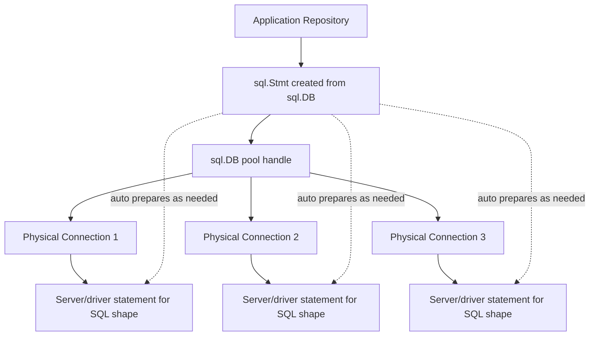
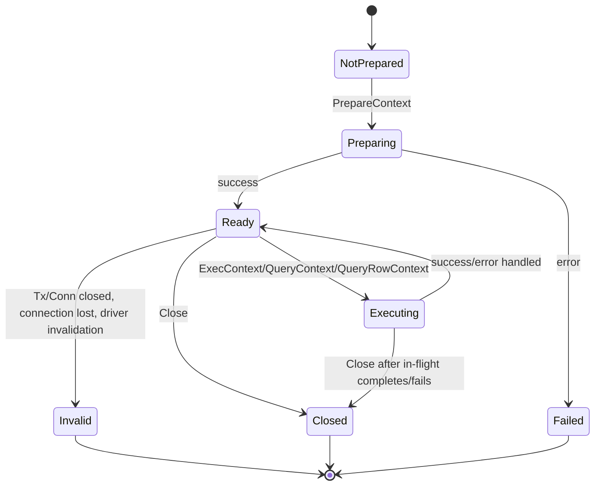
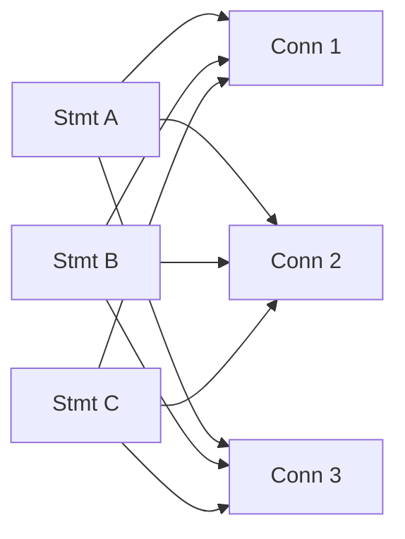

# learn-go-sql-database-integration-part-011.md

# Part 011 — Prepared Statements Deep Dive

> Seri: **learn-go-sql-database-integration**  
> Target pembaca: Java software engineer yang ingin menguasai database integration di Go sampai level production engineering  
> Target Go: **Go 1.26.x**  
> Fokus: `database/sql`, `sql.Stmt`, prepared statement lifecycle, transaction binding, connection pool interaction, driver behavior, performance, security, observability, dan failure mode.

---

## 1. Tujuan

Setelah menyelesaikan bagian ini, kamu diharapkan bisa:

1. Memahami apa itu prepared statement dari sudut pandang **Go**, **driver**, dan **DBMS**.
2. Membedakan `DB.PrepareContext`, `Tx.PrepareContext`, `Tx.StmtContext`, dan `Conn.PrepareContext`.
3. Menjelaskan kenapa `*sql.Stmt` di level Go bukan selalu satu server-side prepared statement saja.
4. Mendesain lifecycle prepared statement yang aman untuk service jangka panjang.
5. Menentukan kapan prepared statement layak dipakai dan kapan cukup memakai `QueryContext`/`ExecContext` dengan parameter biasa.
6. Menghindari anti-pattern seperti dynamic SQL high-cardinality yang diprepare terus-menerus.
7. Memahami interaksi prepared statement dengan connection pool, transaction, database proxy, failover, DDL, plan cache, dan server resource.
8. Membuat checklist review untuk prepared statement di production Go service.

---

## 2. Posisi Materi Ini dalam Seri

Part sebelumnya sudah membahas:

- query execution model,
- `Rows` lifecycle,
- type mapping,
- NULL semantics,
- parameter binding dan SQL injection boundary.

Part ini masuk lebih dalam ke prepared statement karena prepared statement sering disalahpahami sebagai:

- selalu lebih cepat,
- selalu lebih aman,
- selalu cached oleh driver,
- sama seperti Java `PreparedStatement`,
- cukup dibuat per request lalu `defer Close`,
- tidak punya dampak resource di database server.

Semua asumsi itu bisa salah tergantung driver, DBMS, pool, query shape, dan workload.

---

## 3. Definisi Mental Model

Prepared statement adalah SQL yang **dipisahkan dari nilai parameter** dan dapat dipakai ulang dengan argumen berbeda.

Secara konseptual:

```text
SQL shape:
SELECT id, username FROM users WHERE id = ?

Argument set 1:
[100]

Argument set 2:
[200]

Argument set 3:
[300]
```

SQL shape tetap sama. Nilai berubah.

Prepared statement memisahkan:

| Layer | Yang stabil | Yang berubah |
|---|---|---|
| SQL grammar | `SELECT ... WHERE id = ?` | Tidak berubah |
| Bind values | Placeholder position/type | Nilai aktual |
| Execution | Statement identity/plan/input contract | Parameter runtime |

Prepared statement bisa melibatkan beberapa tahap:

1. **Prepare**: SQL dikirim ke DBMS/driver untuk diparse, divalidasi, dan mungkin disimpan.
2. **Bind**: nilai parameter dikirim.
3. **Execute**: statement dijalankan.
4. **Fetch**: hasil dikembalikan untuk query yang menghasilkan rows.
5. **Close/Deallocate**: resource statement dilepas.

Tidak semua driver/DBMS mengeksekusi kelima tahap ini secara eksplisit di wire protocol. Beberapa driver bisa melakukan emulasi, direct execution, client-side interpolation, atau fallback prepare-execute-close. Karena itu prepared statement harus dipahami sebagai **contract dan lifecycle**, bukan sekadar method call.

---

## 4. Official Go API Surface

Package `database/sql` menyediakan beberapa tempat untuk membuat prepared statement:

```go
func (db *sql.DB) PrepareContext(ctx context.Context, query string) (*sql.Stmt, error)
func (tx *sql.Tx) PrepareContext(ctx context.Context, query string) (*sql.Stmt, error)
func (c *sql.Conn) PrepareContext(ctx context.Context, query string) (*sql.Stmt, error)
```

Setelah statement dibuat, ia bisa dieksekusi dengan:

```go
func (s *sql.Stmt) ExecContext(ctx context.Context, args ...any) (sql.Result, error)
func (s *sql.Stmt) QueryContext(ctx context.Context, args ...any) (*sql.Rows, error)
func (s *sql.Stmt) QueryRowContext(ctx context.Context, args ...any) *sql.Row
func (s *sql.Stmt) Close() error
```

Ada juga versi tanpa `Context`, tetapi untuk production code sebaiknya gunakan versi `Context`:

```go
stmt.ExecContext(ctx, args...)
stmt.QueryContext(ctx, args...)
stmt.QueryRowContext(ctx, args...)
```

### Catatan penting

`PrepareContext` memakai context untuk **fase preparation**, bukan otomatis untuk semua execution berikutnya. Timeout execution tetap harus diberikan lewat `ExecContext`, `QueryContext`, atau `QueryRowContext`.

Contoh buruk:

```go
stmt, err := db.PrepareContext(ctx, query)
if err != nil {
    return err
}

// Buruk: execution memakai context.Background secara implisit.
_, err = stmt.Exec(arg1, arg2)
```

Contoh benar:

```go
stmt, err := db.PrepareContext(ctx, query)
if err != nil {
    return err
}

_, err = stmt.ExecContext(ctx, arg1, arg2)
```

---

## 5. Java Comparison: JDBC `PreparedStatement` vs Go `sql.Stmt`

Di Java/JDBC, mental model umum:

```java
try (Connection conn = dataSource.getConnection();
     PreparedStatement ps = conn.prepareStatement("SELECT ... WHERE id = ?")) {
    ps.setLong(1, id);
    try (ResultSet rs = ps.executeQuery()) {
        ...
    }
}
```

JDBC `PreparedStatement` biasanya jelas terikat ke satu `Connection` karena dibuat dari `Connection`.

Di Go, ada tiga model berbeda:

```go
db.PrepareContext(ctx, query)   // logical statement on pool handle
tx.PrepareContext(ctx, query)   // statement inside one transaction/connection
conn.PrepareContext(ctx, query) // statement on one reserved connection
```

Perbedaan paling penting:

| Java/JDBC | Go `database/sql` |
|---|---|
| `PreparedStatement` dibuat dari `Connection` | `Stmt` bisa dibuat dari `DB`, `Tx`, atau `Conn` |
| Biasanya bound ke satu connection | `DB`-level statement bisa auto-prepare di connection berbeda |
| Pool biasanya dari HikariCP/DataSource | Pool ada di `*sql.DB` |
| Transaction sering dikelola Spring | Transaction eksplisit lewat `*sql.Tx` |
| Resource close sering lewat try-with-resources | Resource close manual/defer |
| Statement caching bisa dari driver/pool/framework | Harus dipahami per driver/library |

Mental model Java yang harus diubah:

> Di Go, `*sql.DB` bukan connection. Jadi `db.PrepareContext` bukan “prepare di satu connection tertentu”. Ia membuat logical prepared statement yang dapat dipakai lewat pool.

---

## 6. Diagram: Prepared Statement di Atas Connection Pool



Satu `*sql.Stmt` yang dibuat dari `*sql.DB` dapat berujung pada prepared statement di beberapa physical connections, karena query bisa dieksekusi oleh connection yang berbeda di dalam pool.

Implikasi:

- `Stmt` level Go aman dipakai concurrent.
- Resource server bisa bertambah sesuai jumlah connection yang pernah memakai statement.
- Menutup `Stmt` penting untuk melepas resource.
- Banyak statement unik × banyak connection bisa menjadi masalah.

---

## 7. Tiga Scope Prepared Statement

### 7.1 `DB.PrepareContext`: Statement Berumur Panjang di Atas Pool

```go
stmt, err := db.PrepareContext(ctx, `
    SELECT id, username, email
    FROM users
    WHERE id = ?
`)
if err != nil {
    return err
}
defer stmt.Close()
```

Cocok untuk:

- query shape stabil,
- dipakai berulang,
- service process jangka panjang,
- repository initialization,
- read-by-id,
- frequent update by key,
- command yang sering dieksekusi.

Karakteristik:

- `Stmt` aman dipakai concurrent oleh banyak goroutine.
- Statement tetap usable selama `DB` hidup.
- Saat butuh eksekusi di physical connection baru, `database/sql` dapat prepare statement tersebut di connection itu.
- Harus ditutup saat tidak lagi dipakai.

### 7.2 `Tx.PrepareContext`: Statement Terikat Transaction

```go
tx, err := db.BeginTx(ctx, nil)
if err != nil {
    return err
}
defer tx.Rollback()

stmt, err := tx.PrepareContext(ctx, `
    INSERT INTO audit_log(entity_id, action, actor_id)
    VALUES (?, ?, ?)
`)
if err != nil {
    return err
}

for _, item := range items {
    if _, err := stmt.ExecContext(ctx, item.EntityID, item.Action, item.ActorID); err != nil {
        return err
    }
}

return tx.Commit()
```

Cocok untuk:

- batch operation di dalam transaction,
- loop insert/update yang query shape-nya sama,
- transaction-scoped temporary/session behavior,
- statement yang tidak perlu hidup setelah commit/rollback.

Karakteristik:

- Statement berjalan di transaction yang sama.
- Transaction mem-pin satu physical connection.
- Statement akan tidak usable setelah transaction selesai.
- Statement yang dibuat di transaction ditutup ketika transaction commit/rollback, tetapi tetap baik untuk memahami ownership dan tidak menyimpan pointer `stmt` keluar dari scope transaction.

### 7.3 `Conn.PrepareContext`: Statement Terikat Reserved Connection

```go
conn, err := db.Conn(ctx)
if err != nil {
    return err
}
defer conn.Close()

stmt, err := conn.PrepareContext(ctx, `SELECT current_setting('application_name')`)
if err != nil {
    return err
}
defer stmt.Close()

row := stmt.QueryRowContext(ctx)
```

Cocok untuk kasus langka:

- session-specific behavior,
- temporary table yang terikat connection,
- advisory/session state tertentu,
- debugging low-level connection behavior,
- driver-specific advanced use.

Tidak cocok untuk default repository operation karena reserved connection mengurangi fleksibilitas pool.

---

## 8. Lifecycle State Machine



Hal penting:

- `PrepareContext` bisa gagal karena syntax error, permission, missing table, timeout, connection acquisition failure, atau driver issue.
- `ExecContext`/`QueryContext` bisa gagal walaupun prepare berhasil karena constraint violation, timeout, deadlock, network failure, plan invalidation, atau schema berubah.
- `Close` harus dipanggil untuk statement yang dibuat manual dan berumur panjang.
- Statement yang terikat `Tx` atau `Conn` menjadi unusable ketika owner-nya selesai/ditutup.

---

## 9. Prepared Statement Bukan Sekadar Security

Prepared statement sering diajarkan sebagai cara mencegah SQL injection. Itu benar untuk **value parameter**, tetapi tidak lengkap.

Prepared statement membantu karena value tidak dicampur ke SQL grammar:

```go
row := stmt.QueryRowContext(ctx, userID)
```

Bukan:

```go
query := fmt.Sprintf("SELECT * FROM users WHERE id = %s", userInput)
```

Namun prepared statement **tidak membuat dynamic SQL otomatis aman**.

Contoh tetap berbahaya:

```go
query := "SELECT id, username FROM users ORDER BY " + userInputSort
stmt, err := db.PrepareContext(ctx, query)
```

Kenapa? Karena `ORDER BY` column name adalah bagian dari SQL grammar, bukan value. Placeholder tidak bisa dipakai untuk identifier secara portable.

Solusi:

```go
func userSortColumn(input string) (string, bool) {
    switch input {
    case "username":
        return "username", true
    case "created_at":
        return "created_at", true
    default:
        return "", false
    }
}
```

Prepared statement hanya aman untuk parameter value. Identifier, operator, direction, table name, schema name, dan SQL fragment harus divalidasi dengan allow-list.

---

## 10. Kapan Prepared Statement Layak Dipakai?

Prepared statement layak dipakai ketika:

1. SQL shape stabil.
2. Query dieksekusi berulang.
3. Ada benefit parse/plan reuse atau protocol efficiency.
4. Statement count terkendali.
5. Lifecycle bisa dikelola dengan jelas.
6. Workload cukup tinggi sehingga overhead prepare berulang menjadi signifikan.
7. Driver/DBMS benar-benar mengambil manfaat dari prepared statement.

Contoh bagus:

```sql
SELECT id, username, email FROM users WHERE id = ?
```

```sql
UPDATE cases SET status = ?, updated_at = ? WHERE id = ? AND version = ?
```

```sql
INSERT INTO audit_log(entity_id, action, actor_id, created_at) VALUES (?, ?, ?, ?)
```

```sql
SELECT permission FROM user_permissions WHERE user_id = ? AND resource_id = ?
```

Prepared statement sering tidak perlu ketika:

1. Query hanya dieksekusi sekali.
2. Query sangat dinamis dan shape-nya berubah terus.
3. Query builder menghasilkan SQL unik untuk setiap request.
4. Database/driver sudah melakukan protocol-level optimization untuk parameterized execution.
5. Server prepared statement count menjadi bottleneck.
6. Kamu berada di belakang pooler/proxy dengan mode yang tidak cocok.

Rule praktis:

> Mulai dari `QueryContext`/`ExecContext` dengan parameter. Tambahkan explicit `PrepareContext` hanya untuk query yang terbukti sering dipakai, stabil, dan resource lifecycle-nya jelas.

---

## 11. Direct Parameterized Query vs Explicit Prepared Statement

Kamu tidak harus selalu memanggil `PrepareContext` secara eksplisit untuk mendapatkan parameter binding.

Contoh ini sudah parameterized:

```go
row := db.QueryRowContext(ctx, `
    SELECT id, username, email
    FROM users
    WHERE id = ?
`, userID)
```

Nilai `userID` dikirim sebagai argument, bukan digabung ke string SQL.

Explicit prepared statement:

```go
stmt, err := db.PrepareContext(ctx, `
    SELECT id, username, email
    FROM users
    WHERE id = ?
`)
if err != nil {
    return err
}
defer stmt.Close()

row := stmt.QueryRowContext(ctx, userID)
```

Perbedaan desain:

| Aspek | `db.QueryContext` dengan args | Explicit `stmt.QueryContext` |
|---|---|---|
| Security untuk value | Aman bila pakai args | Aman bila pakai args |
| Lifecycle statement | Driver/DBMS-specific | Kamu mengelola `Stmt` |
| Reuse | Tidak eksplisit | Eksplisit |
| Close | Tidak ada statement object app-level | Wajib `Close` |
| Cocok untuk | Default path | Hot/repeated stable SQL |
| Risiko resource | Lebih kecil di app layer | Bisa leak/menambah server statement |

---

## 12. Code Pattern: Repository dengan Statement Berumur Panjang

Untuk query yang sangat sering dipakai, kamu bisa menyiapkan statement saat repository dibuat.

```go
package userrepo

import (
    "context"
    "database/sql"
    "errors"
    "fmt"
)

type User struct {
    ID       int64
    Username string
    Email    string
}

type Repository struct {
    db *sql.DB

    findByIDStmt *sql.Stmt
    insertStmt   *sql.Stmt
}

func NewRepository(ctx context.Context, db *sql.DB) (*Repository, error) {
    findByIDStmt, err := db.PrepareContext(ctx, `
        SELECT id, username, email
        FROM users
        WHERE id = ?
    `)
    if err != nil {
        return nil, fmt.Errorf("prepare find user by id: %w", err)
    }

    insertStmt, err := db.PrepareContext(ctx, `
        INSERT INTO users(username, email)
        VALUES (?, ?)
    `)
    if err != nil {
        _ = findByIDStmt.Close()
        return nil, fmt.Errorf("prepare insert user: %w", err)
    }

    return &Repository{
        db:           db,
        findByIDStmt: findByIDStmt,
        insertStmt:   insertStmt,
    }, nil
}

func (r *Repository) Close() error {
    var err error

    if r.findByIDStmt != nil {
        if closeErr := r.findByIDStmt.Close(); closeErr != nil {
            err = errors.Join(err, closeErr)
        }
    }

    if r.insertStmt != nil {
        if closeErr := r.insertStmt.Close(); closeErr != nil {
            err = errors.Join(err, closeErr)
        }
    }

    return err
}

func (r *Repository) FindByID(ctx context.Context, id int64) (User, error) {
    var u User

    err := r.findByIDStmt.QueryRowContext(ctx, id).Scan(
        &u.ID,
        &u.Username,
        &u.Email,
    )
    if err != nil {
        if errors.Is(err, sql.ErrNoRows) {
            return User{}, ErrUserNotFound
        }
        return User{}, fmt.Errorf("find user by id: %w", err)
    }

    return u, nil
}

func (r *Repository) Insert(ctx context.Context, username, email string) error {
    _, err := r.insertStmt.ExecContext(ctx, username, email)
    if err != nil {
        return fmt.Errorf("insert user: %w", err)
    }
    return nil
}

var ErrUserNotFound = errors.New("user not found")
```

Catatan desain:

- Statement disiapkan saat repository initialization.
- Kalau preparation kedua gagal, statement pertama ditutup agar tidak leak.
- Repository punya `Close` karena memiliki resource.
- Error diberi operation context.
- `sql.ErrNoRows` dikonversi ke domain-level error.

---

## 13. Code Pattern: Transaction-Scoped Prepared Statement

Untuk batch operation dalam satu transaction:

```go
func InsertAuditLogs(ctx context.Context, db *sql.DB, logs []AuditLog) error {
    tx, err := db.BeginTx(ctx, nil)
    if err != nil {
        return fmt.Errorf("begin tx: %w", err)
    }
    defer tx.Rollback()

    stmt, err := tx.PrepareContext(ctx, `
        INSERT INTO audit_log(entity_id, entity_type, action, actor_id, created_at)
        VALUES (?, ?, ?, ?, ?)
    `)
    if err != nil {
        return fmt.Errorf("prepare audit insert: %w", err)
    }

    for _, log := range logs {
        _, err := stmt.ExecContext(
            ctx,
            log.EntityID,
            log.EntityType,
            log.Action,
            log.ActorID,
            log.CreatedAt,
        )
        if err != nil {
            return fmt.Errorf("insert audit log entity_id=%d action=%s: %w", log.EntityID, log.Action, err)
        }
    }

    if err := tx.Commit(); err != nil {
        return fmt.Errorf("commit audit logs: %w", err)
    }

    return nil
}
```

Kenapa ini masuk akal:

- `INSERT` shape sama.
- Banyak row diproses dalam satu transaction.
- Statement tidak perlu hidup setelah transaction.
- Semua eksekusi memakai connection transaction yang sama.

Namun untuk volume sangat besar, prepared statement loop bukan selalu paling optimal. PostgreSQL `COPY`, MySQL multi-row insert, atau DB-specific bulk protocol bisa lebih cocok. Itu akan dibahas di part bulk write.

---

## 14. Code Pattern: Menggunakan `Tx.StmtContext`

Kadang kamu sudah punya statement global dari `db.PrepareContext`, tetapi ingin menjalankannya dalam transaction.

```go
type Repository struct {
    updateStatusStmt *sql.Stmt
}

func (r *Repository) UpdateCaseStatusTx(
    ctx context.Context,
    tx *sql.Tx,
    caseID int64,
    fromStatus string,
    toStatus string,
) error {
    stmt := tx.StmtContext(ctx, r.updateStatusStmt)

    result, err := stmt.ExecContext(ctx, toStatus, caseID, fromStatus)
    if err != nil {
        return fmt.Errorf("update case status: %w", err)
    }

    affected, err := result.RowsAffected()
    if err != nil {
        return fmt.Errorf("read rows affected: %w", err)
    }

    if affected != 1 {
        return ErrConcurrentStateChange
    }

    return nil
}
```

Mental model:

- `r.updateStatusStmt` adalah DB-level statement.
- `tx.StmtContext` mengadaptasi statement tersebut agar berjalan dalam transaction tertentu.
- Jangan langsung memakai DB-level statement kalau operasi harus menjadi bagian dari transaction.

Anti-pattern:

```go
// Buruk: ini keluar dari transaction walaupun caller punya tx.
r.updateStatusStmt.ExecContext(ctx, toStatus, caseID, fromStatus)
```

Kalau caller sedang memegang transaction, semua operasi yang harus atomic harus memakai `tx` atau statement yang diturunkan ke `tx`.

---

## 15. Prepared Statement dan Connection Pool Multiplication

Bagian ini krusial.

Jika kamu punya:

```text
MaxOpenConns = 50
Prepared statements = 20 DB-level statements
```

Maka potensi server-side prepared statement bisa mendekati:

```text
50 connections × 20 SQL shapes = 1000 server-side prepared statements
```

Tidak selalu persis begitu karena driver/DBMS behavior berbeda. Tetapi sebagai capacity planning heuristic, perkalian ini berguna.



Risiko:

- server memory meningkat,
- statement cache penuh,
- plan cache churn,
- prepare storm saat deploy/restart,
- connection lifetime terlalu pendek menyebabkan reprepare terus,
- statement invalidation karena schema change.

Prepared statement count adalah resource yang perlu dikontrol, bukan sesuatu yang gratis.

---

## 16. Prepared Statement dan `SetConnMaxLifetime`

Misal:

```go
db.SetMaxOpenConns(50)
db.SetConnMaxLifetime(2 * time.Minute)
```

Jika connection cepat dipensiunkan, DB-level statement yang pernah diprepare di connection lama akan hilang bersama connection itu. Connection baru perlu prepare ulang saat statement dipakai.

Terlalu pendek:

- reprepare overhead tinggi,
- server parse/plan load naik,
- latency spike periodik,
- prepare storm saat traffic tinggi.

Terlalu panjang:

- stale connection risk,
- load balancer/NAT idle timeout issue,
- failover recovery bisa lebih lambat,
- session-level state lebih lama hidup.

Prepared statement tuning harus dilihat bersama:

- `SetMaxOpenConns`,
- `SetMaxIdleConns`,
- `SetConnMaxIdleTime`,
- `SetConnMaxLifetime`,
- driver statement cache,
- DB server plan/prepared statement cache,
- proxy/pooler mode.

---

## 17. Prepared Statement dan Context Cancellation

Ada dua phase berbeda:

```go
stmt, err := db.PrepareContext(prepareCtx, query)
_, err = stmt.ExecContext(execCtx, args...)
```

`prepareCtx` mengontrol preparation. `execCtx` mengontrol execution.

Common bug:

```go
ctx, cancel := context.WithTimeout(context.Background(), 3*time.Second)
defer cancel()

stmt, err := db.PrepareContext(ctx, query)
if err != nil {
    return err
}

// Setelah ini orang lupa memakai ctx.
_, err = stmt.Exec(args...) // buruk
```

Kenapa buruk:

- `Stmt.Exec` memakai context internal non-request-scoped.
- Deadline request tidak dihormati.
- Query bisa tetap berjalan setelah caller timeout.

Correct pattern:

```go
_, err = stmt.ExecContext(ctx, args...)
```

Production rule:

> Semua operation DB di request path harus menerima `context.Context` dari caller dan memakai method `...Context` sampai ke bawah.

---

## 18. Prepared Statement dan Plan Cache

Prepared statement bisa mengurangi overhead parsing dan planning, tetapi efeknya DB-specific.

Ada beberapa model umum:

1. **Parse once, plan once, execute many**  
   Cocok untuk query stabil dan plan tidak terlalu tergantung parameter.

2. **Parse once, plan per execution**  
   DB menyimpan statement shape tetapi tetap melakukan planning adaptif.

3. **Generic vs custom plan**  
   DB dapat memilih generic plan setelah beberapa eksekusi atau tetap memakai custom plan per parameter.

4. **Client-side emulation**  
   Driver tampak seperti prepared statement dari API, tetapi server tidak selalu punya named prepared statement permanen.

5. **Prepare-execute-close**  
   Driver bisa melakukan prepare hanya untuk satu eksekusi sebagai fallback protocol.

Implikasi:

- Prepared statement bukan jaminan query lebih cepat.
- Query yang sangat tergantung selective parameter bisa salah plan jika generic plan dipakai.
- DDL/statistics change bisa membuat plan invalid atau perlu reprepare.
- Query dynamic dengan shape berbeda tidak mendapat reuse.

Benchmark harus berdasarkan workload nyata.

---

## 19. DB-Specific Notes

### 19.1 PostgreSQL

Hal yang perlu diperhatikan:

- Placeholder umumnya `$1`, `$2`, dst.
- Driver `pgx` bisa dipakai native atau melalui adapter `database/sql`.
- PostgreSQL punya konsep server-side prepared statement dan plan behavior yang bisa dipengaruhi banyak faktor.
- PgBouncer transaction pooling historically bermasalah dengan session-level prepared statements karena statement hidup di server connection, bukan client logical session.
- `pgx` native memiliki fitur PostgreSQL-specific yang tidak semuanya terekspos lewat `database/sql`.

Contoh PostgreSQL-style placeholder:

```go
stmt, err := db.PrepareContext(ctx, `
    SELECT id, username, email
    FROM users
    WHERE id = $1
`)
```

### 19.2 MySQL / MariaDB

Hal yang perlu diperhatikan:

- Placeholder umumnya `?`.
- MySQL punya server prepared statement resource.
- Server variable seperti `max_prepared_stmt_count` dapat menjadi limit operasional.
- Driver bisa punya opsi yang mempengaruhi interpolation/prepare behavior.
- Multi-row insert sering lebih efisien daripada prepared single-row loop untuk bulk besar.
- `LastInsertId` biasanya relevan di MySQL, tetapi jangan menganggap portable ke semua DB.

### 19.3 SQLite

Hal yang perlu diperhatikan:

- Prepared statement sangat dekat dengan SQLite execution model.
- Embedded DB berarti server resource adalah process/local file resource.
- Concurrency model SQLite berbeda dari client-server DB.
- Statement lifecycle tetap penting karena statement bisa menahan lock atau resource.

### 19.4 SQL Server

Hal yang perlu diperhatikan:

- Parameter style dan named parameters dapat berbeda.
- Plan cache behavior dan parameter sniffing bisa sangat penting.
- Stored procedure dan prepared statement punya trade-off berbeda.

### 19.5 Oracle

Hal yang perlu diperhatikan:

- Oracle sangat sensitif terhadap parse overhead dan cursor management.
- Bind variable sangat penting untuk menghindari hard parse storm.
- Statement/cursor cache behavior driver dan Oracle session harus dipahami.
- LOB handling bisa mempengaruhi statement/resource lifecycle.

---

## 20. Prepared Statement di Balik Proxy / Pooler

Database proxy/pooler dapat mengubah asumsi prepared statement.

Contoh kategori:

| Proxy/pooler mode | Risiko prepared statement |
|---|---|
| Session pooling | Lebih kompatibel karena session relatif stabil |
| Transaction pooling | Prepared statement session-level bisa hilang antar transaction |
| Statement pooling | Sangat terbatas untuk session state |
| Cloud DB proxy | Behavior tergantung implementasi |

Masalah umum:

- statement prepared di backend connection A,
- eksekusi berikutnya diarahkan ke backend connection B,
- backend B tidak mengenal statement tersebut,
- error “prepared statement does not exist” atau fallback reprepare.

Mitigasi:

- pahami mode pooler,
- gunakan driver config yang kompatibel,
- hindari server-side named prepared statements jika pooler tidak mendukung,
- gunakan simple protocol atau statement cache mode sesuai driver,
- tes failover/proxy behavior secara nyata.

---

## 21. Anti-Pattern: Prepare per Request untuk Query Sekali Pakai

Buruk:

```go
func FindUser(ctx context.Context, db *sql.DB, id int64) (User, error) {
    stmt, err := db.PrepareContext(ctx, `
        SELECT id, username, email FROM users WHERE id = ?
    `)
    if err != nil {
        return User{}, err
    }
    defer stmt.Close()

    var u User
    err = stmt.QueryRowContext(ctx, id).Scan(&u.ID, &u.Username, &u.Email)
    return u, err
}
```

Kenapa buruk:

- prepare dan close dilakukan setiap request,
- overhead bisa lebih tinggi daripada direct parameterized query,
- tidak ada reuse nyata,
- server/driver resource churn,
- kode lebih kompleks.

Lebih baik:

```go
func FindUser(ctx context.Context, db *sql.DB, id int64) (User, error) {
    var u User
    err := db.QueryRowContext(ctx, `
        SELECT id, username, email FROM users WHERE id = ?
    `, id).Scan(&u.ID, &u.Username, &u.Email)
    return u, err
}
```

Atau prepare sekali saat repository initialization jika query benar-benar hot.

---

## 22. Anti-Pattern: Prepared Statement untuk Dynamic SQL High Cardinality

Buruk:

```go
query := `SELECT id, title FROM cases WHERE 1=1`

if filter.Status != "" {
    query += ` AND status = ?`
}
if filter.Priority != "" {
    query += ` AND priority = ?`
}
if filter.AssigneeID != nil {
    query += ` AND assignee_id = ?`
}
if filter.Sort != "" {
    query += ` ORDER BY ` + filter.Sort
}

stmt, err := db.PrepareContext(ctx, query)
```

Masalah:

- banyak kombinasi filter menghasilkan banyak SQL shape,
- statement reuse rendah,
- statement cache churn,
- dynamic sort bisa injection kalau tidak allow-list,
- observability query cardinality meledak,
- sulit men-tune plan.

Lebih baik:

- gunakan direct `QueryContext` dengan args untuk dynamic listing,
- whitelist identifier,
- normalized query fingerprint untuk telemetry,
- hanya prepare statement untuk query shape yang stabil.

---

## 23. Anti-Pattern: Statement Global Tidak Ditutup

Buruk:

```go
var findUserStmt *sql.Stmt

func Init(db *sql.DB) error {
    stmt, err := db.Prepare(`SELECT ...`)
    if err != nil {
        return err
    }
    findUserStmt = stmt
    return nil
}
```

Masalah:

- lifecycle tidak jelas,
- test bisa leak antar test case,
- shutdown tidak menutup statement,
- hot reload/reinit bisa duplicate statement,
- ownership tersebar.

Lebih baik:

```go
type Repository struct {
    findUserStmt *sql.Stmt
}

func (r *Repository) Close() error {
    return r.findUserStmt.Close()
}
```

Resource owner harus eksplisit.

---

## 24. Anti-Pattern: Menyimpan Tx Statement Keluar dari Transaction

Buruk:

```go
func prepareTxStmt(ctx context.Context, tx *sql.Tx) (*sql.Stmt, error) {
    return tx.PrepareContext(ctx, `UPDATE cases SET status = ? WHERE id = ?`)
}
```

Lalu statement dipakai setelah commit/rollback.

Masalah:

- statement transaction-bound,
- setelah transaction selesai, statement unusable,
- error muncul jauh dari sumber bug,
- lifecycle ownership rusak.

Rule:

> Statement yang dibuat dari `Tx` tidak boleh keluar dari scope function transaction kecuali lifecycle-nya sangat jelas dan masih berada sebelum commit/rollback.

---

## 25. Failure Mode Catalogue

### 25.1 Prepare gagal karena syntax/schema

Gejala:

- service gagal start,
- repository initialization error,
- query typo terdeteksi lebih awal.

Mitigasi:

- prepare saat startup untuk query critical,
- integration test dengan schema real,
- migration gate sebelum deploy.

### 25.2 Prepare berhasil, execution gagal

Penyebab:

- constraint violation,
- timeout,
- deadlock,
- permission berubah,
- connection reset,
- schema changed,
- plan invalidation.

Mitigasi:

- error taxonomy,
- retry hanya untuk error retryable,
- observability per operation,
- transaction retry boundary.

### 25.3 Statement leak

Penyebab:

- `Close` tidak dipanggil,
- repository re-created terus,
- test setup membuat statement tanpa cleanup,
- dynamic prepare tanpa eviction.

Dampak:

- server memory/cursor leak,
- max prepared statement exceeded,
- degraded performance.

Mitigasi:

- owner `Close`,
- `t.Cleanup`,
- static review,
- server metrics.

### 25.4 Reprepare storm

Penyebab:

- short connection lifetime,
- deploy restart semua pod,
- banyak statement disiapkan lazily saat traffic tinggi,
- DB failover memutus semua connection.

Dampak:

- latency spike,
- DB CPU parse/plan spike,
- connection acquisition delay.

Mitigasi:

- warmup bertahap,
- jitter rollout,
- pool lifetime tuning,
- statement count control.

### 25.5 Prepared statement tidak cocok dengan proxy

Penyebab:

- transaction pooling,
- server connection berubah,
- named statement session state.

Mitigasi:

- test dengan proxy yang sama seperti production,
- disable incompatible server-side prepared statement mode,
- gunakan driver/proxy recommended configuration.

### 25.6 Generic plan buruk

Penyebab:

- parameter distribution sangat skewed,
- prepared statement memakai plan yang tidak optimal untuk sebagian parameter,
- statistics berubah.

Mitigasi:

- query plan analysis,
- avoid prepare untuk query parameter-sensitive tertentu,
- database-specific tuning,
- index/statistics maintenance.

### 25.7 Ambiguous behavior setelah DDL

Penyebab:

- table/column/index berubah,
- prepared statement lama masih hidup,
- schema migration concurrent dengan traffic.

Mitigasi:

- expand-contract migration,
- deployment sequencing,
- reconnect/reprepare strategy,
- test migration under load.

---

## 26. Observability untuk Prepared Statements

Prepared statement observability tidak boleh hanya melihat query duration.

Minimal metrics/log fields:

| Signal | Tujuan |
|---|---|
| prepare duration | melihat startup/warmup cost |
| prepare error count | mendeteksi schema/config/permission issue |
| statement operation name | low-cardinality label |
| execution duration | melihat runtime performance |
| execution error taxonomy | timeout/deadlock/constraint/connection |
| DB pool stats | melihat wait/in-use/open/idle |
| statement count per repository | capacity planning |
| server prepared statement/cursor metrics | DB-side resource |
| reprepare count jika tersedia | mendeteksi churn |

Jangan log SQL mentah dengan parameter sensitif.

Lebih baik:

```text
operation=db.user.find_by_id
query_fingerprint=select_user_by_id_v1
db.system=postgresql
duration_ms=12
rows=1
error_class=none
```

Bukan:

```text
SELECT * FROM users WHERE email = 'secret@example.com'
```

---

## 27. Statement Registry Pattern

Untuk service besar, banyak repository dapat memiliki banyak statement. Kamu bisa membuat pattern ringan agar lifecycle jelas.

```go
type StatementRegistry struct {
    statements []*sql.Stmt
}

func (r *StatementRegistry) Add(stmt *sql.Stmt) *sql.Stmt {
    r.statements = append(r.statements, stmt)
    return stmt
}

func (r *StatementRegistry) Close() error {
    var err error
    for i := len(r.statements) - 1; i >= 0; i-- {
        if closeErr := r.statements[i].Close(); closeErr != nil {
            err = errors.Join(err, closeErr)
        }
    }
    return err
}
```

Repository:

```go
type CaseRepository struct {
    registry StatementRegistry

    findByID       *sql.Stmt
    updateStatus   *sql.Stmt
    insertAuditLog *sql.Stmt
}

func NewCaseRepository(ctx context.Context, db *sql.DB) (*CaseRepository, error) {
    r := &CaseRepository{}

    stmt, err := db.PrepareContext(ctx, `
        SELECT id, status, version
        FROM cases
        WHERE id = ?
    `)
    if err != nil {
        return nil, fmt.Errorf("prepare case find by id: %w", err)
    }
    r.findByID = r.registry.Add(stmt)

    stmt, err = db.PrepareContext(ctx, `
        UPDATE cases
        SET status = ?, version = version + 1
        WHERE id = ? AND version = ?
    `)
    if err != nil {
        _ = r.Close()
        return nil, fmt.Errorf("prepare case update status: %w", err)
    }
    r.updateStatus = r.registry.Add(stmt)

    return r, nil
}

func (r *CaseRepository) Close() error {
    return r.registry.Close()
}
```

Benefit:

- centralized cleanup,
- easy partial failure cleanup,
- lifecycle ownership jelas,
- cocok untuk repository dengan banyak hot statements.

Risiko:

- jangan over-engineer untuk 1–2 statement,
- jangan membuat registry global yang menyembunyikan ownership,
- tetap butuh operation-level observability.

---

## 28. Transaction Manager dan Prepared Statement

Dalam service enterprise, kamu sering butuh function yang menerima transaction context.

Salah satu pattern sederhana:

```go
type Execer interface {
    ExecContext(ctx context.Context, query string, args ...any) (sql.Result, error)
}

type Queryer interface {
    QueryContext(ctx context.Context, query string, args ...any) (*sql.Rows, error)
    QueryRowContext(ctx context.Context, query string, args ...any) *sql.Row
}
```

Namun `*sql.Stmt` punya method yang tidak menerima query string. Jadi kalau repository heavily prepared-statement based, transaction integration harus dipikirkan.

Pilihan:

1. Jangan pakai prepared statement untuk semua method; gunakan raw query methods untuk transaction-aware repository.
2. Simpan DB-level statement, lalu adaptasi dengan `tx.StmtContext` saat berada dalam transaction.
3. Buat repository transaction wrapper yang memiliki tx-specific statements.
4. Prepare statement di dalam transaction untuk batch/hot loop transaction.

Contoh transaction wrapper:

```go
type CaseRepository struct {
    updateStatusStmt *sql.Stmt
}

type CaseTxRepository struct {
    updateStatusStmt *sql.Stmt
}

func (r *CaseRepository) WithTx(ctx context.Context, tx *sql.Tx) *CaseTxRepository {
    return &CaseTxRepository{
        updateStatusStmt: tx.StmtContext(ctx, r.updateStatusStmt),
    }
}
```

Penting:

- Jangan mencampur DB-level operation dan Tx-level operation untuk invariant yang harus atomic.
- Jangan menyimpan tx-derived statement setelah transaction selesai.

---

## 29. Prepared Statement dan Health Check

Apakah health check harus prepare semua statement?

Biasanya tidak.

Health check sebaiknya ringan:

```go
ctx, cancel := context.WithTimeout(parent, 1*time.Second)
defer cancel()

if err := db.PingContext(ctx); err != nil {
    return err
}
```

Statement preparation cocok untuk startup validation, bukan frequent liveness check.

Jenis check:

| Check | Isi | Risiko |
|---|---|---|
| Liveness | process masih hidup | jangan DB-heavy |
| Readiness | bisa serve traffic | boleh `PingContext`/small query |
| Startup validation | config/schema/statement critical | boleh prepare statements |
| Deep diagnostic | operator-triggered | boleh query metadata |

Jangan membuat health endpoint yang setiap detik prepare banyak statement. Itu bisa menjadi self-inflicted load.

---

## 30. Testing Prepared Statements

### 30.1 Integration test dengan DB real

Prepared statement bug sering tidak muncul di mock karena:

- placeholder berbeda,
- type mapping berbeda,
- driver behavior berbeda,
- syntax DB-specific,
- transaction binding tidak diuji,
- schema mismatch tidak terdeteksi.

Gunakan database real/container untuk repository tests.

### 30.2 Test repository initialization

```go
func TestNewRepositoryPreparesStatements(t *testing.T) {
    db := openTestDB(t)
    runMigrations(t, db)

    ctx, cancel := context.WithTimeout(context.Background(), 5*time.Second)
    defer cancel()

    repo, err := NewRepository(ctx, db)
    if err != nil {
        t.Fatalf("NewRepository() error = %v", err)
    }
    t.Cleanup(func() {
        if err := repo.Close(); err != nil {
            t.Fatalf("repo.Close() error = %v", err)
        }
    })
}
```

### 30.3 Test transaction statement after commit tidak dipakai

Lebih baik bukan mengetes internal statement pointer, tapi memastikan repository design tidak expose tx statement keluar.

### 30.4 Test context timeout

Gunakan query slow yang aman di DB test, lalu pastikan `ExecContext`/`QueryContext` memakai context caller.

### 30.5 Test cleanup

Pastikan semua repository `Close` dipanggil di test:

```go
t.Cleanup(func() {
    require.NoError(t, repo.Close())
})
```

---

## 31. Performance Benchmarking Guidance

Benchmark prepared statement harus membedakan:

1. prepare once + execute many,
2. prepare per execution,
3. direct parameterized query,
4. driver-native batch/bulk API,
5. transaction-scoped prepare,
6. same connection vs pool-wide execution,
7. warm pool vs cold pool,
8. with/without proxy,
9. with realistic parameter distribution.

Benchmark buruk:

```go
for i := 0; i < b.N; i++ {
    stmt, _ := db.PrepareContext(ctx, query)
    stmt.ExecContext(ctx, i)
    stmt.Close()
}
```

Itu mengukur prepare churn, bukan benefit prepared statement.

Benchmark lebih masuk akal:

```go
stmt, err := db.PrepareContext(ctx, query)
if err != nil {
    b.Fatal(err)
}
defer stmt.Close()

b.ResetTimer()

for i := 0; i < b.N; i++ {
    if _, err := stmt.ExecContext(ctx, i); err != nil {
        b.Fatal(err)
    }
}
```

Tetapi benchmark database harus hati-hati karena hasil dipengaruhi:

- network latency,
- DB cache,
- disk/WAL,
- concurrent clients,
- lock contention,
- pool wait,
- statement cache state,
- statistics,
- index state,
- query plan.

---

## 32. Production Decision Matrix

| Scenario | Gunakan explicit prepared statement? | Alasan |
|---|---:|---|
| Find by primary key sangat sering | Ya | Shape stabil, reuse tinggi |
| Insert audit log dalam loop transaction | Ya, tx-scoped | Batch dalam satu tx |
| Dynamic search screen dengan banyak kombinasi filter | Biasanya tidak | Shape cardinality tinggi |
| One-off admin query | Tidak | Tidak ada reuse |
| Update optimistic lock frequently used | Ya | Shape stabil dan business-critical |
| Bulk import jutaan row | Mungkin tidak | Bulk protocol lebih cocok |
| Behind transaction-pooling proxy | Hati-hati | Prepared statement compatibility perlu diuji |
| Query parameter-sensitive dengan plan skew | Hati-hati | Generic plan bisa buruk |
| Startup validation query critical | Bisa | Fail-fast schema validation |
| Health check periodik | Tidak | Jangan prepare berulang |

---

## 33. Security Review

Prepared statement membantu mencegah value injection, tetapi security review tetap harus memeriksa:

- apakah value masuk lewat args, bukan string concat,
- apakah dynamic identifier menggunakan allow-list,
- apakah SQL fragment dari user dilarang,
- apakah logs tidak membocorkan parameter sensitif,
- apakah errors tidak membocorkan schema internal ke user,
- apakah statement names/fingerprints low-cardinality,
- apakah secret/DSN tidak masuk telemetry,
- apakah prepared statement dipakai bukan sebagai alasan untuk melepas review dynamic SQL.

Checklist SQL injection tetap:

```text
[ ] Tidak ada fmt.Sprintf untuk memasukkan user value ke SQL.
[ ] Tidak ada string concat dari user input ke WHERE/JOIN/ORDER/LIMIT.
[ ] Dynamic ORDER BY menggunakan allow-list.
[ ] Dynamic direction ASC/DESC menggunakan allow-list.
[ ] LIMIT/OFFSET divalidasi range dan dikirim sebagai arg bila supported.
[ ] Identifier tidak pernah dianggap parameter value.
[ ] LIKE wildcard user input di-escape bila semantik literal search.
[ ] Log memakai query fingerprint, bukan SQL lengkap dengan value sensitif.
```

---

## 34. Operational Runbook: Prepared Statement Incident

### Gejala

- latency naik setelah deploy,
- DB CPU naik karena parse/plan,
- error max prepared statements/cursors,
- prepared statement does not exist,
- statement invalidation setelah migration,
- memory DB naik,
- pool wait naik,
- restart pod memperburuk DB load.

### Investigasi

1. Apakah ada release yang menambah banyak prepared statements?
2. Berapa `MaxOpenConns` per pod dan jumlah pod?
3. Apakah statement dibuat saat startup atau per request?
4. Apakah SQL shape high-cardinality?
5. Apakah ada connection lifetime pendek?
6. Apakah ada proxy/pooler mode transaction pooling?
7. Apakah migration/DDL baru saja berjalan?
8. Apakah driver config berubah?
9. Apakah statement close dipanggil?
10. Apakah server metrics menunjukkan cursor/prepared statement count naik?

### Mitigasi cepat

- rollback release yang menambah dynamic prepare,
- kurangi pod rollout concurrency,
- naikkan statement/cursor limit hanya bila aman dan paham root cause,
- disable explicit prepare untuk dynamic path,
- panjangkan connection lifetime bila reprepare storm,
- restart bertahap untuk membersihkan session resource,
- sesuaikan driver/proxy config.

### Pencegahan

- statement inventory,
- repository close discipline,
- integration test untuk startup prepare,
- benchmark hot path,
- dashboard DB parse/plan/prepared statement resource,
- rollout canary,
- migration under load test.

---

## 35. Engineering Review Checklist

Gunakan checklist ini saat review code yang memakai `PrepareContext`.

### Correctness

```text
[ ] Query shape stabil.
[ ] Placeholder sesuai driver/DBMS.
[ ] Argument order benar.
[ ] Error prepare dibungkus dengan operation context.
[ ] Error execution dibungkus dengan operation context.
[ ] sql.ErrNoRows ditangani di query one-row.
[ ] Tx-bound statement tidak keluar dari transaction scope.
[ ] DB-level statement tidak dipakai untuk operation yang seharusnya transactional.
```

### Lifecycle

```text
[ ] Statement owner jelas.
[ ] Close dipanggil saat owner ditutup.
[ ] Partial initialization failure membersihkan statement yang sudah dibuat.
[ ] Test memakai cleanup.
[ ] Tidak ada prepare per request untuk query sekali pakai.
[ ] Tidak ada dynamic prepare high-cardinality tanpa eviction/control.
```

### Pool and Capacity

```text
[ ] Jumlah statement × MaxOpenConns dipertimbangkan.
[ ] Connection lifetime tidak menyebabkan reprepare storm.
[ ] Startup prepare tidak membuat thundering herd saat deploy.
[ ] Proxy/pooler compatibility dipastikan.
```

### Security

```text
[ ] User value dikirim sebagai args.
[ ] Dynamic identifier memakai allow-list.
[ ] Tidak ada SQL string concat dari untrusted input.
[ ] SQL/args sensitif tidak bocor ke log.
```

### Observability

```text
[ ] Operation name low-cardinality tersedia.
[ ] Prepare error terlihat saat startup.
[ ] Execution duration dan error taxonomy tercatat.
[ ] Pool stats dikorelasikan dengan query latency.
[ ] Server-side prepared statement/cursor metrics dipantau bila relevan.
```

---

## 36. Latihan

### Latihan 1 — Ubah prepare-per-request menjadi direct parameterized query

Cari function yang melakukan:

```go
stmt, err := db.PrepareContext(ctx, query)
defer stmt.Close()
return stmt.QueryRowContext(ctx, arg).Scan(...)
```

Jika query hanya dieksekusi sekali per call dan tidak ada reuse, ubah menjadi:

```go
return db.QueryRowContext(ctx, query, arg).Scan(...)
```

Lalu ukur apakah behavior dan test tetap sama.

### Latihan 2 — Repository statement lifecycle

Buat repository dengan dua statement hot:

- `FindByID`,
- `UpdateStatusWithVersion`.

Pastikan:

- statement diprepare di constructor,
- partial failure cleanup benar,
- repository punya `Close`,
- test memanggil `t.Cleanup(repo.Close)`.

### Latihan 3 — Transaction-scoped batch insert

Implementasikan batch insert audit log dengan `tx.PrepareContext`.

Pastikan:

- transaction rollback pada error,
- commit error ditangani,
- `ExecContext` memakai context caller,
- error menyertakan item context secukupnya tanpa membocorkan data sensitif.

### Latihan 4 — Dynamic listing anti-pattern

Ambil listing API dengan banyak filter dan sort. Tentukan:

- bagian mana yang value parameter,
- bagian mana yang identifier,
- bagian mana yang harus allow-list,
- apakah explicit prepared statement layak atau tidak.

### Latihan 5 — Capacity estimate

Misal:

```text
pods = 12
MaxOpenConns per pod = 30
DB-level prepared statements per pod = 25
```

Hitung worst-case logical server-side statement:

```text
12 × 30 × 25 = 9000
```

Diskusikan apakah DBMS/proxy/server resource sanggup menangani ini.

---

## 37. Ringkasan

Prepared statement di Go adalah tool yang kuat, tetapi bukan default magic optimization.

Mental model terpenting:

1. `*sql.Stmt` adalah prepared statement object di Go.
2. `DB.PrepareContext` membuat logical statement di atas pool.
3. `Tx.PrepareContext` membuat statement yang terikat transaction.
4. `Conn.PrepareContext` membuat statement yang terikat reserved connection.
5. `PrepareContext` context hanya untuk preparation; execution tetap harus memakai `ExecContext`/`QueryContext`/`QueryRowContext`.
6. Statement yang dibuat dari `DB` aman untuk concurrent use dan dapat auto-prepare di connection berbeda.
7. Statement yang dibuat dari `Tx` atau `Conn` terikat satu connection dan mengikuti lifecycle owner.
8. Prepared statement membantu parameter binding, tetapi tidak mengamankan identifier/dynamic SQL.
9. Prepared statement punya resource cost di driver/DBMS/proxy.
10. Jangan prepare per request untuk query sekali pakai.
11. Jangan prepare dynamic SQL high-cardinality tanpa alasan kuat.
12. Selalu punya lifecycle owner dan `Close`.

Invariant produksi:

> Prepared statement hanya layak bila SQL shape stabil, reuse nyata, lifecycle jelas, dan resource multiplication terhadap connection pool sudah dipahami.

---

## 38. Referensi

- Go Documentation — Using prepared statements: https://go.dev/doc/database/prepared-statements
- Go `database/sql` package documentation: https://pkg.go.dev/database/sql
- Go `database/sql/driver` package documentation: https://pkg.go.dev/database/sql/driver
- Go Documentation — Avoiding SQL injection risk: https://go.dev/doc/database/sql-injection
- Go Documentation — Executing transactions: https://go.dev/doc/database/execute-transactions
- pgx package documentation: https://pkg.go.dev/github.com/jackc/pgx/v5
- go-sql-driver/mysql package documentation: https://pkg.go.dev/github.com/go-sql-driver/mysql

---

## 39. Status Seri

Part ini adalah **Part 011** dari seri **learn-go-sql-database-integration**.

Seri **belum selesai**.

Lanjut ke part berikutnya:

```text
learn-go-sql-database-integration-part-012.md
```

Topik berikutnya:

```text
Connection Pool Mental Model
```


<!-- NAVIGATION_FOOTER -->
<div class="page-nav">
<a href="./learn-go-sql-database-integration-part-010.md">⬅️ Parameter Binding and SQL Injection Boundary</a>
<a href="./index.md">📚 Kategori</a>
<a href="../../index.md">🏠 Home</a>
<a href="./learn-go-sql-database-integration-part-012.md">Part 012 — Connection Pool Mental Model ➡️</a>
</div>
