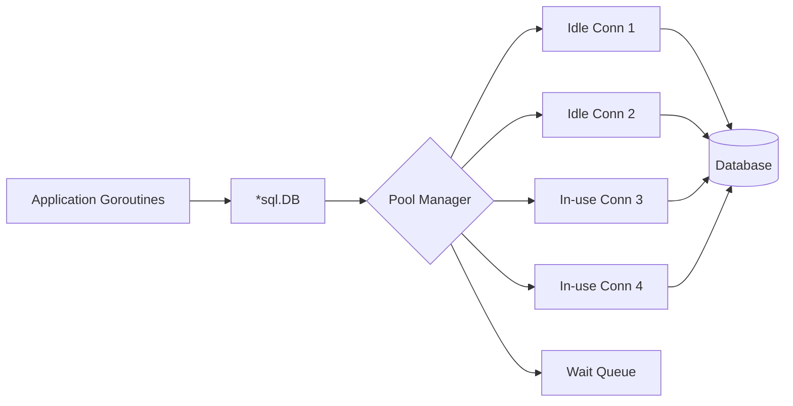
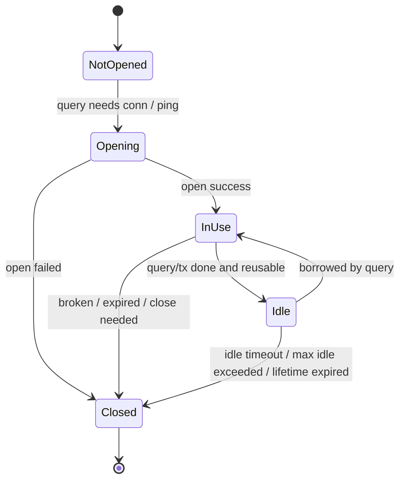
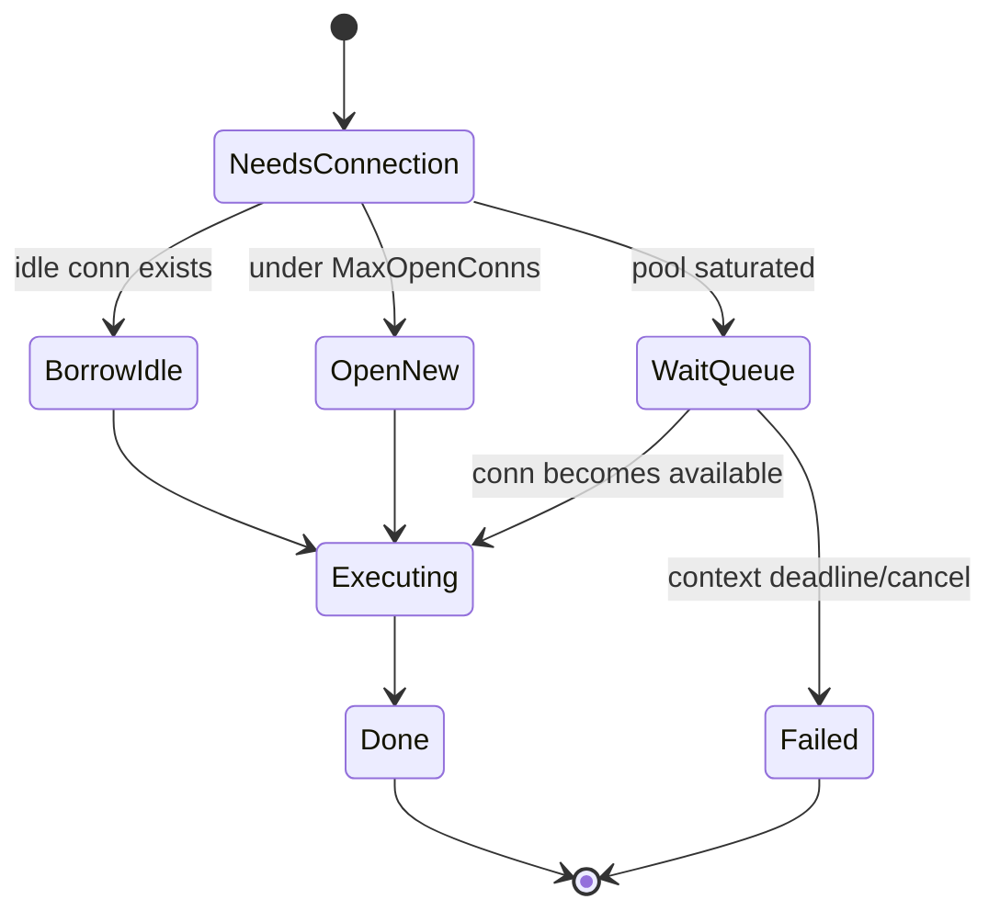
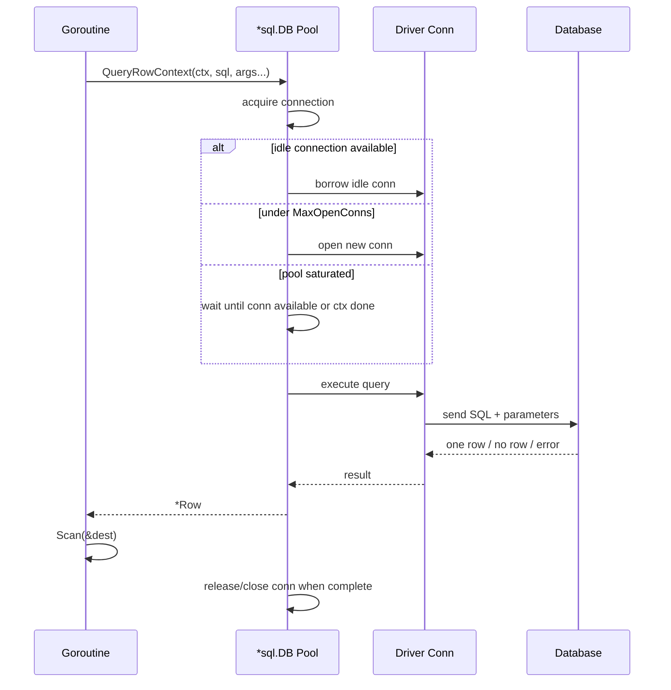
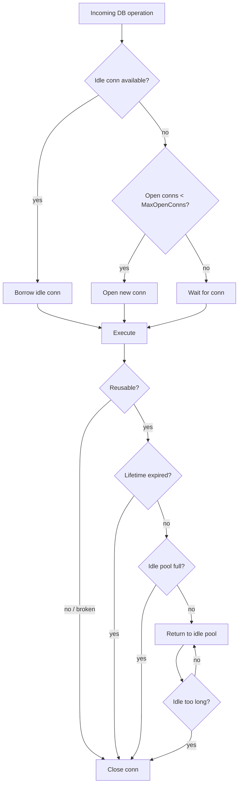
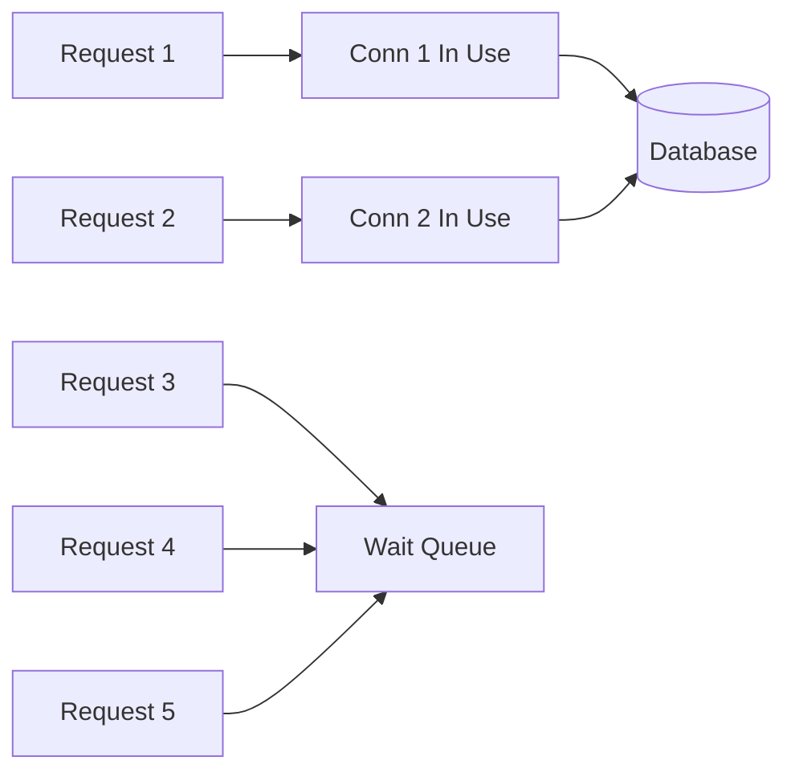
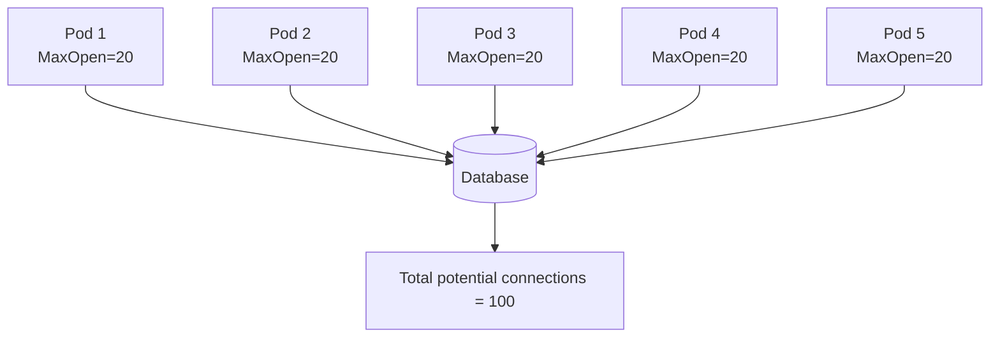
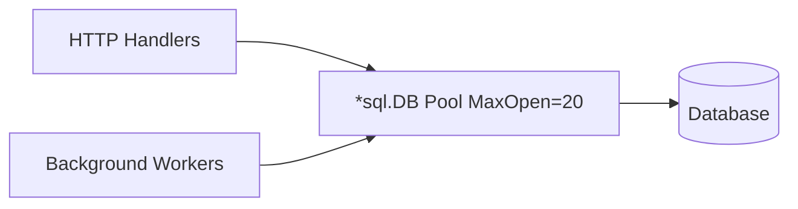
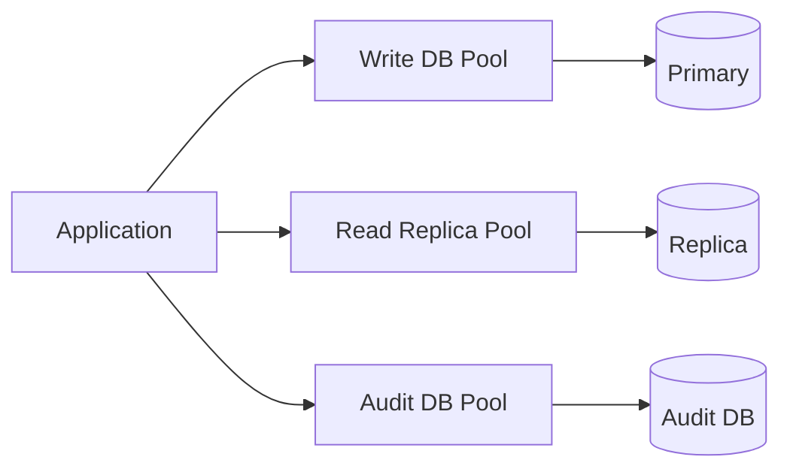
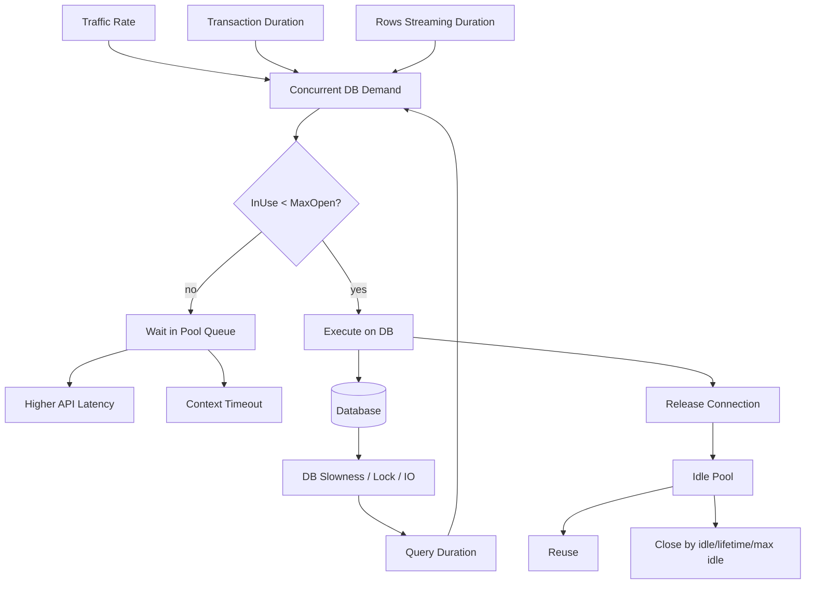

# learn-go-sql-database-integration-part-012.md

# Part 012 — Connection Pool Mental Model

> Seri: `learn-go-sql-database-integration`  
> Bagian: `012 / 034`  
> Topik: `database/sql` connection pool mental model  
> Target pembaca: Java software engineer yang ingin menguasai database integration di Go sampai level production-grade  
> Target Go: Go 1.26.x  

---

## 0. Ringkasan Eksekutif

Di Go, `*sql.DB` **bukan satu koneksi database**. Ia adalah **handle jangka panjang** yang mengelola sekumpulan koneksi fisik ke database. Satu `*sql.DB` biasanya dibuat saat aplikasi start, dikonfigurasi pool-nya, dipakai bersama oleh semua goroutine, lalu ditutup saat aplikasi shutdown.

Kesalahan mental model yang paling sering terjadi:

```text
Salah:  sql.Open(...) menghasilkan satu connection.
Benar:  sql.Open(...) menghasilkan pool handle yang akan membuka connection sesuai kebutuhan.
```

```text
Salah:  MaxOpenConns semakin besar selalu semakin cepat.
Benar:  MaxOpenConns adalah concurrency limit ke database; terlalu besar bisa membunuh DB, terlalu kecil bisa membuat app antre.
```

```text
Salah:  Query selesai saat function return.
Benar:  Query yang menghasilkan Rows belum benar-benar selesai dari sisi pool sampai Rows ditutup atau dikonsumsi sampai selesai.
```

```text
Salah:  Transaction hanya object logical.
Benar:  Transaction mem-pin satu physical connection sampai Commit/Rollback.
```

Tujuan part ini adalah membangun **model operasional** connection pool: bagaimana connection dibuat, dipinjam, dikembalikan, di-idle-kan, ditutup, diantrikan, dan diobservasi. Part berikutnya, **Part 013 — Pool Sizing and Capacity Planning**, akan memakai mental model ini untuk sizing kuantitatif.

---

## 1. Tujuan Pembelajaran

Setelah menyelesaikan part ini, Anda harus mampu:

1. Menjelaskan kenapa `*sql.DB` adalah pool handle, bukan single connection.
2. Menjelaskan state dasar connection: not opened, open idle, open in-use, waiting, closed.
3. Menjelaskan lifecycle query dari request masuk sampai connection dikembalikan ke pool.
4. Menjelaskan efek `SetMaxOpenConns`, `SetMaxIdleConns`, `SetConnMaxIdleTime`, dan `SetConnMaxLifetime`.
5. Membaca `DB.Stats()` dan mengubahnya menjadi sinyal operasional.
6. Membedakan pool starvation, DB saturation, network issue, dan query slowness.
7. Menjelaskan hubungan antara jumlah pod, pool per pod, dan limit koneksi database.
8. Menghindari anti-pattern seperti membuka DB per request, tidak menutup `Rows`, transaction terlalu lama, dan pool unlimited di production.
9. Membuat baseline konfigurasi pool yang aman untuk service Go.
10. Melakukan review desain connection pool dengan cara yang defensible.

---

## 2. Apa yang Tidak Akan Diulang

Agar efisien, part ini tidak mengulang detail dari seri lain:

| Topik | Sudah dibahas di seri lain | Di sini hanya dibahas bila terkait pool |
|---|---:|---|
| Goroutine, scheduler, concurrency dasar | Ya | Hanya efek goroutine terhadap concurrent DB call |
| Context dasar | Ya | Hanya connection acquisition timeout dan query deadline |
| Error wrapping dasar | Ya | Hanya error pool/timeout/connection |
| Network socket dasar | Ya | Hanya stale connection, idle timeout, reconnect |
| Database indexing/query planning | Belum fokus di sini | Hanya dampaknya ke pool occupancy |
| Transaction isolation | Part 017 | Di sini hanya transaction pinning |

---

## 3. Fakta Dasar dari `database/sql`

Beberapa fakta yang harus menjadi fondasi:

1. `*sql.DB` adalah handle database yang aman dipakai secara concurrent oleh banyak goroutine.
2. `*sql.DB` mengelola pool connection secara internal.
3. `sql.Open` biasanya tidak langsung membuka physical connection; koneksi bisa dibuat lazily.
4. Validasi koneksi dilakukan dengan `Ping` atau `PingContext`.
5. Pool dapat dikonfigurasi dengan:
   - `SetMaxOpenConns`
   - `SetMaxIdleConns`
   - `SetConnMaxIdleTime`
   - `SetConnMaxLifetime`
6. `DB.Stats()` menyediakan statistik pool.
7. `*sql.Tx` memakai satu connection sampai transaction selesai.
8. `*sql.Rows` dapat menahan connection sampai rows ditutup atau habis dibaca.

Mental model ini jauh lebih dekat ke `DataSource + pool` di Java daripada `Connection` tunggal.

---

## 4. Analogi untuk Java Engineer

Dalam Java enterprise stack, Anda mungkin terbiasa dengan:

```text
Application code
  -> Spring JdbcTemplate / JPA / MyBatis
  -> DataSource
  -> HikariCP
  -> JDBC Connection
  -> Database
```

Di Go dengan `database/sql`, banyak tanggung jawab pool berada langsung di `*sql.DB`:

```text
Application code
  -> repository/service function
  -> *sql.DB
  -> database/sql internal pool
  -> driver connection
  -> database
```

Mapping kasar:

| Java / Spring | Go `database/sql` | Catatan |
|---|---|---|
| `DataSource` | `*sql.DB` | Sama-sama handle jangka panjang |
| HikariCP pool | internal pool dalam `*sql.DB` | Go tidak butuh dependency pool eksternal untuk basic pooling |
| `Connection` | `*sql.Conn` / internal driver conn | Biasanya tidak dipakai langsung kecuali perlu dedicated connection |
| `PreparedStatement` | `*sql.Stmt` | Behavior tergantung apakah dibuat dari `DB`, `Tx`, atau `Conn` |
| `ResultSet` | `*sql.Rows` | Harus ditutup/dikonsumsi |
| `@Transactional` | explicit `*sql.Tx` | Transaction boundary eksplisit |
| Hikari metrics | `DB.Stats()` | Lebih minimal, tapi cukup untuk pool signal dasar |

Perbedaan paling penting: Go tidak menyembunyikan transaction boundary melalui annotation. Anda harus membawa `*sql.Tx` atau abstraction sendiri. Ini membuat lifecycle connection lebih terlihat, tetapi juga lebih mudah salah bila tidak disiplin.

---

## 5. Model Besar: `sql.DB` sebagai Pool Handle

Bayangkan `*sql.DB` sebagai gatekeeper ke database.



`*sql.DB` bertugas menjawab pertanyaan operasional:

1. Ada idle connection yang bisa dipakai?
2. Kalau tidak ada, boleh buka connection baru?
3. Kalau tidak boleh karena sudah mencapai `MaxOpenConns`, apakah goroutine harus menunggu?
4. Kalau context deadline habis saat menunggu, apakah request gagal?
5. Setelah query selesai, apakah connection dikembalikan ke idle pool atau ditutup?
6. Apakah connection terlalu tua menurut `SetConnMaxLifetime`?
7. Apakah connection terlalu lama idle menurut `SetConnMaxIdleTime`?
8. Apakah jumlah idle connection melebihi `SetMaxIdleConns`?

---

## 6. State Machine Connection Pool

Secara konseptual, connection dalam pool dapat berada dalam state berikut:



Untuk goroutine pemanggil, ada state tambahan:



Yang perlu diperhatikan: antrean pada pool bukan hanya detail internal. Ia langsung mempengaruhi latency aplikasi. Bila query cepat tapi pool penuh, request tetap lambat karena menunggu connection.

---

## 7. Lifecycle Satu Query

Untuk query sederhana:

```go
row := db.QueryRowContext(ctx, `SELECT name FROM users WHERE id = ?`, id)
err := row.Scan(&name)
```

Secara mental, prosesnya kira-kira:



Untuk `QueryContext` yang menghasilkan `*Rows`, connection bisa tertahan lebih lama:

```go
rows, err := db.QueryContext(ctx, `SELECT id, name FROM users`)
if err != nil {
    return err
}
defer rows.Close()

for rows.Next() {
    var u User
    if err := rows.Scan(&u.ID, &u.Name); err != nil {
        return err
    }
}
if err := rows.Err(); err != nil {
    return err
}
```

Connection biasanya tidak bisa kembali ke pool sampai `Rows` ditutup atau semua row selesai dikonsumsi. Maka listing besar, streaming lambat, atau lupa `Close` bisa membuat pool tampak “habis” walaupun database tidak benar-benar overloaded.

---

## 8. Pool Bukan Sekadar Performance Optimization

Banyak engineer melihat pool sebagai cache koneksi. Itu benar, tetapi tidak lengkap.

Pool adalah:

1. **Latency optimization**  
   Reuse connection menghindari biaya TCP/TLS/auth handshake berulang.

2. **Concurrency limiter**  
   `MaxOpenConns` membatasi berapa banyak operasi database aktif dari proses itu.

3. **Backpressure point**  
   Saat database lambat atau pool penuh, goroutine akan antre.

4. **Failure containment mechanism**  
   Pool kecil bisa melindungi DB dari ledakan koneksi, tapi pool terlalu kecil bisa membuat app collapse karena queueing.

5. **Operational signal source**  
   `DB.Stats()` memberi sinyal apakah aplikasi menunggu pool, membuka/menutup koneksi terlalu sering, atau mengalami churn.

6. **Resource lifecycle manager**  
   Pool mengatur kapan connection disimpan idle, ditutup karena idle timeout, atau ditutup karena lifetime.

---

## 9. Konfigurasi Pool Utama

`database/sql` menyediakan empat knob utama:

```go
db.SetMaxOpenConns(maxOpen)
db.SetMaxIdleConns(maxIdle)
db.SetConnMaxIdleTime(maxIdleTime)
db.SetConnMaxLifetime(maxLifetime)
```

Masing-masing knob mengontrol hal berbeda.

---

## 10. `SetMaxOpenConns`

`SetMaxOpenConns(n)` menetapkan maksimum jumlah open connection ke database.

Open connection mencakup:

```text
open = in-use + idle
```

Contoh:

```go
db.SetMaxOpenConns(20)
```

Artinya satu proses aplikasi ini tidak akan memiliki lebih dari 20 open connection ke database melalui `db` handle tersebut.

### 10.1 Kalau `MaxOpenConns` Tidak Diset

Secara default, open connection bisa tidak dibatasi oleh `database/sql` pool. Ini bukan berarti database mampu menerima unlimited connection. Artinya aplikasi tidak punya local safety limit dan bisa mencoba membuka terlalu banyak koneksi saat traffic spike.

Untuk production service, membiarkan `MaxOpenConns` unlimited biasanya bukan keputusan yang defensible.

### 10.2 Kalau `MaxOpenConns` Terlalu Kecil

Dampak:

- request antre di pool;
- latency meningkat walaupun query SQL cepat;
- `DB.Stats().WaitCount` naik;
- `DB.Stats().WaitDuration` naik;
- transaction panjang bisa memblokir query pendek;
- goroutine menumpuk menunggu connection.

Contoh situasi:

```text
MaxOpenConns = 2
Traffic       = 100 concurrent HTTP requests
Each query    = 100 ms
```

Walaupun setiap query hanya 100 ms, hanya 2 query bisa berjalan bersamaan. Sisanya antre.

### 10.3 Kalau `MaxOpenConns` Terlalu Besar

Dampak:

- database menerima terlalu banyak active session;
- CPU DB naik;
- lock contention naik;
- buffer/cache pressure naik;
- query latency memburuk;
- connection storm saat deploy/restart;
- database mencapai `max_connections`;
- service lain ikut terganggu.

Bigger pool can make the database slower.

### 10.4 `MaxOpenConns` sebagai Bulkhead

`MaxOpenConns` harus dianggap sebagai bulkhead:

```text
Service A max 20 conn
Service B max 30 conn
Worker C  max 10 conn
Admin     reserved 5 conn
```

Tanpa pembagian seperti ini, satu service bisa menghabiskan seluruh connection budget database.

---

## 11. `SetMaxIdleConns`

`SetMaxIdleConns(n)` menetapkan maksimum jumlah idle connection yang boleh disimpan dalam pool.

Idle connection adalah connection yang sudah open tetapi sedang tidak dipakai.

Contoh:

```go
db.SetMaxIdleConns(10)
```

Jika query selesai dan connection kembali ke pool, tetapi idle connection sudah melebihi limit, connection dapat ditutup.

### 11.1 Fungsi Idle Connection

Idle connection mengurangi latency karena connection siap dipakai:

```text
No idle conn:
  request -> open TCP -> TLS -> auth -> query

Idle conn available:
  request -> borrow conn -> query
```

### 11.2 Idle Terlalu Kecil

Jika `MaxIdleConns` terlalu kecil:

- connection sering dibuka dan ditutup;
- handshake overhead naik;
- database auth overhead naik;
- latency spike saat burst;
- `MaxIdleClosed` bisa naik;
- connection churn meningkat.

### 11.3 Idle Terlalu Besar

Jika `MaxIdleConns` terlalu besar:

- terlalu banyak idle session tertahan di database;
- memory database terpakai untuk session yang tidak aktif;
- connection slot bisa habis;
- serverless/cloud DB billing/resource pressure bisa naik.

### 11.4 Hubungan dengan `MaxOpenConns`

Secara konsep:

```text
MaxIdleConns <= MaxOpenConns
```

Jika `MaxIdleConns` lebih besar dari `MaxOpenConns`, implementasi akan menyesuaikan agar idle tidak melebihi open limit.

### 11.5 Tidak Ada `MinIdleConns`

Berbeda dengan beberapa pool Java seperti HikariCP, `database/sql` tidak menyediakan `minIdle` sebagai konsep utama yang selalu menjaga minimum idle connection. Pool akan membuka connection sesuai demand dan menyimpan idle sampai batas yang diizinkan.

Konsekuensi:

- cold start bisa butuh waktu untuk membentuk pool;
- `PingContext` hanya memvalidasi koneksi, bukan menghangatkan semua slot pool;
- warm-up perlu dirancang sendiri bila benar-benar dibutuhkan.

---

## 12. `SetConnMaxIdleTime`

`SetConnMaxIdleTime(d)` menetapkan maksimum durasi connection boleh idle sebelum ditutup.

Contoh:

```go
db.SetConnMaxIdleTime(5 * time.Minute)
```

Artinya connection yang tidak dipakai selama sekitar 5 menit dapat ditutup.

### 12.1 Kapan Berguna?

Gunakan idle time limit untuk:

- menutup idle connection saat traffic turun;
- menghindari memegang terlalu banyak session idle;
- menyesuaikan dengan firewall/NAT/load balancer idle timeout;
- mengurangi stale idle connection;
- workload bursty.

### 12.2 Idle Time vs Lifetime

`ConnMaxIdleTime` menghitung durasi connection idle.

`ConnMaxLifetime` menghitung umur total connection sejak dibuat.

```text
Connection A dibuat 10:00
Dipakai 10:00-10:01
Idle 10:01-10:06

ConnMaxIdleTime  = 5m  -> bisa ditutup sekitar 10:06
ConnMaxLifetime  = 30m -> bisa hidup sampai sekitar 10:30 bila tidak ditutup karena alasan lain
```

---

## 13. `SetConnMaxLifetime`

`SetConnMaxLifetime(d)` menetapkan maksimum durasi connection boleh dipakai sebelum dianggap expired dan ditutup.

Contoh:

```go
db.SetConnMaxLifetime(30 * time.Minute)
```

Connection yang melebihi lifetime akan ditutup secara lazy, biasanya ketika hendak dipakai ulang atau dikembalikan ke pool.

### 13.1 Kapan Berguna?

Gunakan max lifetime untuk:

- menghindari connection terlalu lama hidup melewati failover/topology change;
- rotasi session secara berkala;
- menyesuaikan dengan database proxy/load balancer;
- menghindari masalah server-side connection age;
- memastikan aplikasi eventually reconnect.

### 13.2 Lifetime Terlalu Pendek

Jika lifetime terlalu pendek:

- connection churn tinggi;
- handshake overhead naik;
- database auth overhead naik;
- throughput turun;
- latency spike reguler;
- `MaxLifetimeClosed` naik cepat.

### 13.3 Lifetime Terlalu Panjang

Jika lifetime terlalu panjang:

- connection bisa bertahan melewati perubahan network/topology;
- connection stale baru terlihat saat query;
- failover recovery bisa lebih lambat;
- load balancer/database proxy bisa tidak mendistribusikan session seimbang.

### 13.4 Jitter

`database/sql` tidak menyediakan jitter setting eksplisit untuk connection lifetime. Bila semua pod start bersamaan dengan lifetime sama, connection bisa expire berdekatan.

Strategi:

```go
base := 30 * time.Minute
jitter := time.Duration(rand.Int63n(int64(5 * time.Minute)))
db.SetConnMaxLifetime(base + jitter)
```

Namun, lakukan ini saat startup dengan sumber random yang sesuai dan policy yang konsisten.

---

## 14. Empat Knob dalam Satu Gambar



---

## 15. What Actually Holds a Connection?

Connection tidak hanya tertahan saat SQL sedang dieksekusi di database. Dalam praktik, connection bisa tertahan oleh lifecycle object di Go.

| Object / Operation | Apakah menahan connection? | Sampai kapan? |
|---|---:|---|
| `ExecContext` | Ya, sementara | Sampai command selesai |
| `QueryRowContext` | Ya, sementara | Sampai `Scan` menyelesaikan query lifecycle |
| `QueryContext` + `Rows` | Ya | Sampai `Rows.Close` atau semua rows selesai |
| `Tx` | Ya | Sampai `Commit` atau `Rollback` |
| `Stmt` dari `Tx` | Ya, melalui Tx | Sampai Tx selesai/stmt close |
| `Conn` | Ya | Sampai `Conn.Close` |
| Long streaming response | Bisa | Selama rows belum ditutup |
| App logic di tengah transaction | Ya | Selama transaction masih hidup |

Inilah alasan kenapa pool tuning tidak bisa dipisahkan dari query design dan transaction design.

---

## 16. Transaction Pinning

Transaction adalah salah satu penyebab utama pool occupancy tinggi.

```go
tx, err := db.BeginTx(ctx, nil)
if err != nil {
    return err
}
defer tx.Rollback()

// Selama ini berjalan, satu connection dipin oleh tx.

if _, err := tx.ExecContext(ctx, `UPDATE accounts SET balance = balance - ? WHERE id = ?`, amount, fromID); err != nil {
    return err
}

if _, err := tx.ExecContext(ctx, `UPDATE accounts SET balance = balance + ? WHERE id = ?`, amount, toID); err != nil {
    return err
}

return tx.Commit()
```

Selama transaction hidup, connection tidak bisa dipakai query lain.

Anti-pattern:

```go
tx, err := db.BeginTx(ctx, nil)
if err != nil {
    return err
}
defer tx.Rollback()

// Buruk: external call di dalam transaction.
profile, err := externalIdentityService.FetchProfile(ctx, userID)
if err != nil {
    return err
}

_, err = tx.ExecContext(ctx, `UPDATE users SET profile = ? WHERE id = ?`, profile, userID)
if err != nil {
    return err
}

return tx.Commit()
```

Masalah:

- external call lambat;
- connection database terpin tanpa melakukan kerja database;
- pool capacity terbuang;
- lock mungkin juga tertahan;
- retry makin berbahaya;
- timeout lebih sulit diprediksi.

Rule praktis:

```text
Buka transaction selambat mungkin.
Commit/Rollback secepat mungkin.
Jangan menunggu external system di dalam transaction kecuali benar-benar ada desain khusus.
```

---

## 17. Rows Pinning

`Rows` yang belum ditutup dapat menahan connection.

Buruk:

```go
func FindUsers(ctx context.Context, db *sql.DB) ([]User, error) {
    rows, err := db.QueryContext(ctx, `SELECT id, name FROM users`)
    if err != nil {
        return nil, err
    }
    // lupa defer rows.Close()

    var users []User
    for rows.Next() {
        var u User
        if err := rows.Scan(&u.ID, &u.Name); err != nil {
            return nil, err // leak: rows tidak ditutup
        }
        users = append(users, u)
    }
    return users, rows.Err()
}
```

Baik:

```go
func FindUsers(ctx context.Context, db *sql.DB) ([]User, error) {
    rows, err := db.QueryContext(ctx, `SELECT id, name FROM users`)
    if err != nil {
        return nil, err
    }
    defer rows.Close()

    var users []User
    for rows.Next() {
        var u User
        if err := rows.Scan(&u.ID, &u.Name); err != nil {
            return nil, err
        }
        users = append(users, u)
    }
    if err := rows.Err(); err != nil {
        return nil, err
    }
    return users, nil
}
```

Jika query mengembalikan 100 ribu rows dan processing tiap row lambat, connection akan tertahan lama walaupun database sudah mengirim sebagian data.

---

## 18. Dedicated Connection: `*sql.Conn`

`db.Conn(ctx)` memberi dedicated connection dari pool.

Gunakan bila perlu:

- session-level state;
- temporary table yang harus berada pada session sama;
- advisory lock session-scoped;
- driver/database operation yang butuh connection affinity;
- beberapa command yang harus berjalan di physical connection sama tanpa transaction.

Contoh:

```go
conn, err := db.Conn(ctx)
if err != nil {
    return err
}
defer conn.Close()

if _, err := conn.ExecContext(ctx, `SET LOCAL something = something`); err != nil {
    return err
}

// operasi lain di dedicated connection
```

Catatan penting:

```text
Conn.Close mengembalikan connection ke pool, bukan selalu menutup socket fisik.
```

Anti-pattern:

```go
conn, err := db.Conn(ctx)
if err != nil {
    return err
}
// lupa conn.Close()
```

Ini dapat menghabiskan pool lebih cepat daripada lupa `Rows.Close`, karena dedicated connection tidak akan tersedia lagi sampai `Close` dipanggil.

---

## 19. Pool Queueing

Saat semua open connection sedang in-use dan `MaxOpenConns` sudah tercapai, goroutine yang membutuhkan connection akan menunggu.



Dengan `MaxOpenConns=2`, request 3, 4, 5 tidak langsung menyentuh database. Mereka antre di aplikasi.

### 19.1 Antrean Tidak Gratis

Wait queue menahan:

- goroutine;
- request context;
- memory request;
- HTTP connection/client wait;
- upstream timeout budget.

Jika antrean makin panjang, service bisa collapse walaupun database masih “hanya lambat”, bukan mati.

### 19.2 Context Saat Menunggu Connection

Gunakan `ExecContext`, `QueryContext`, `QueryRowContext`, `BeginTx`, dan `Conn(ctx)` dengan context deadline. Jika pool saturated, context dapat membatasi berapa lama caller menunggu connection.

Contoh:

```go
ctx, cancel := context.WithTimeout(parent, 250*time.Millisecond)
defer cancel()

row := db.QueryRowContext(ctx, `SELECT value FROM config WHERE key = ?`, key)
if err := row.Scan(&value); err != nil {
    return err
}
```

Timeout ini mencakup waktu menunggu connection dan waktu eksekusi query dari perspektif caller, walaupun detail cancellation di level driver/database bisa berbeda.

---

## 20. `DB.Stats()`

`DB.Stats()` memberi snapshot statistik pool.

Struktur `sql.DBStats` berisi field penting:

| Field | Arti |
|---|---|
| `MaxOpenConnections` | limit maksimum open connection |
| `OpenConnections` | jumlah connection open saat ini, termasuk in-use dan idle |
| `InUse` | connection sedang dipakai |
| `Idle` | connection idle |
| `WaitCount` | total jumlah wait karena pool limit |
| `WaitDuration` | total durasi wait karena pool limit |
| `MaxIdleClosed` | jumlah connection ditutup karena melebihi max idle |
| `MaxIdleTimeClosed` | jumlah connection ditutup karena idle terlalu lama |
| `MaxLifetimeClosed` | jumlah connection ditutup karena lifetime expired |

Contoh:

```go
stats := db.Stats()
fmt.Printf("open=%d in_use=%d idle=%d wait_count=%d wait_duration=%s\n",
    stats.OpenConnections,
    stats.InUse,
    stats.Idle,
    stats.WaitCount,
    stats.WaitDuration,
)
```

---

## 21. Membaca `DB.Stats()` dengan Benar

### 21.1 `OpenConnections`

```text
OpenConnections = InUse + Idle
```

Jika `OpenConnections` terus dekat `MaxOpenConnections`, pool sering berada dekat limit.

### 21.2 `InUse`

`InUse` tinggi berarti banyak connection sedang dipakai.

Kemungkinan penyebab:

- traffic tinggi;
- query lambat;
- transaction panjang;
- rows streaming lama;
- lock contention;
- database lambat;
- external call di dalam transaction;
- goroutine leak yang memegang `Conn`/`Rows`/`Tx`.

### 21.3 `Idle`

`Idle` tinggi tidak selalu buruk. Idle adalah kapasitas hangat.

Namun idle terlalu tinggi dibanding traffic bisa berarti:

- pool terlalu besar;
- service over-provisioned;
- database session terbuang;
- idle time/lifetime tidak sesuai.

### 21.4 `WaitCount`

`WaitCount` naik berarti ada caller yang pernah menunggu connection karena pool limit.

Ini sinyal penting. Tidak otomatis salah. Pool memang bisa sengaja menjadi backpressure. Tetapi jika `WaitCount` naik bersamaan dengan latency API, Anda harus investigasi.

### 21.5 `WaitDuration`

`WaitDuration` adalah total waktu tunggu. Lebih berguna jika dihitung delta per interval.

Contoh derived metric:

```text
avg_wait_per_event = delta(WaitDuration) / delta(WaitCount)
```

Jika average wait tinggi, pool saturated.

### 21.6 `MaxIdleClosed`

Naik tinggi berarti connection sering ditutup karena idle pool penuh. Bisa normal saat burst turun, tetapi jika terus meningkat pada traffic stabil, mungkin `MaxIdleConns` terlalu kecil.

### 21.7 `MaxIdleTimeClosed`

Naik berarti idle timeout aktif menutup connection. Normal jika memang diinginkan.

### 21.8 `MaxLifetimeClosed`

Naik berarti lifetime policy aktif. Normal jika lifetime diset. Tetapi jika naik terlalu cepat, lifetime mungkin terlalu pendek.

---

## 22. Contoh Observability Code

Minimal collector:

```go
package dbmetrics

import (
    "database/sql"
    "log/slog"
    "time"
)

type StatsLogger struct {
    DB       *sql.DB
    Interval time.Duration
    Log      *slog.Logger
}

func (s *StatsLogger) Run(stop <-chan struct{}) {
    ticker := time.NewTicker(s.Interval)
    defer ticker.Stop()

    for {
        select {
        case <-ticker.C:
            st := s.DB.Stats()
            s.Log.Info("db_pool_stats",
                "max_open", st.MaxOpenConnections,
                "open", st.OpenConnections,
                "in_use", st.InUse,
                "idle", st.Idle,
                "wait_count", st.WaitCount,
                "wait_duration_ms", st.WaitDuration.Milliseconds(),
                "max_idle_closed", st.MaxIdleClosed,
                "max_idle_time_closed", st.MaxIdleTimeClosed,
                "max_lifetime_closed", st.MaxLifetimeClosed,
            )
        case <-stop:
            return
        }
    }
}
```

Dalam production, sebaiknya dikirim sebagai metric, bukan hanya log. Tetapi log snapshot berguna untuk debugging awal.

---

## 23. Derived Metrics yang Lebih Berguna

Raw `DB.Stats()` adalah counter/gauge. Untuk alerting, gunakan derived metrics.

### 23.1 Pool Utilization

```text
pool_utilization = InUse / MaxOpenConnections
```

Jika `MaxOpenConnections == 0` atau unlimited, metric ini tidak meaningful.

### 23.2 Idle Ratio

```text
idle_ratio = Idle / OpenConnections
```

Tinggi saat traffic rendah normal. Rendah terus-menerus bisa berarti pool selalu sibuk.

### 23.3 Wait Rate

```text
wait_rate = delta(WaitCount) per second
```

Jika wait rate > 0 saat latency naik, pool adalah suspect utama.

### 23.4 Average Wait Duration

```text
avg_wait = delta(WaitDuration) / delta(WaitCount)
```

Lebih actionable daripada total wait duration.

### 23.5 Connection Churn

```text
churn = delta(MaxIdleClosed + MaxIdleTimeClosed + MaxLifetimeClosed) per minute
```

Churn tinggi dapat menunjukkan idle/lifetime terlalu agresif atau traffic bursty.

---

## 24. Pool Saturation vs Database Saturation

Jangan langsung menyimpulkan “database lambat” ketika API lambat. Bedakan beberapa kasus.

### 24.1 Pool Saturated, DB Mungkin Tidak Saturated

Gejala:

```text
InUse ~= MaxOpenConnections
WaitCount naik
WaitDuration naik
DB CPU normal
Slow query log tidak banyak
```

Kemungkinan:

- pool terlalu kecil;
- transaction/rows leak;
- query normal tapi concurrency tinggi;
- connection dipegang terlalu lama oleh app logic.

### 24.2 DB Saturated, Pool Ikut Penuh

Gejala:

```text
InUse ~= MaxOpenConnections
WaitCount naik
Query duration naik
DB CPU/IO/lock tinggi
Slow query log banyak
```

Kemungkinan:

- query plan buruk;
- missing index;
- lock contention;
- DB resource kurang;
- terlalu banyak concurrent queries.

Menambah pool pada kondisi ini sering memperburuk keadaan.

### 24.3 Connection Churn

Gejala:

```text
OpenConnections naik turun cepat
MaxLifetimeClosed naik cepat
MaxIdleClosed naik cepat
Latency spike
DB auth/connect rate tinggi
```

Kemungkinan:

- lifetime terlalu pendek;
- idle terlalu kecil;
- traffic bursty;
- deploy/restart storm;
- external proxy menutup koneksi.

### 24.4 Stale Connection / Network Issue

Gejala:

```text
Query error connection reset/broken pipe
Idle tinggi sebelumnya
Error muncul setelah periode idle
```

Kemungkinan:

- network idle timeout;
- firewall/NAT timeout;
- database restart/failover;
- connection lifetime terlalu panjang;
- driver reconnect behavior perlu dipahami.

---

## 25. Relationship dengan Database `max_connections`

`SetMaxOpenConns` per process tidak boleh dilihat sendirian.

Misalnya:

```text
Database max_connections       = 300
Reserved admin/maintenance     = 20
Other services                 = 80
Available for this service     = 200
Number of pods                 = 10
Safe max open per pod          = 20
```

Formula awal:

```text
per_pod_max_open <= floor(available_connection_budget / pod_count)
```

Namun formula ini belum mempertimbangkan:

- rolling deployment overlap;
- horizontal pod autoscaling;
- worker process terpisah;
- migration job;
- admin/debug tools;
- read replica/write primary split;
- connection pooler/proxy;
- database reserved connections;
- peak traffic;
- background scheduled jobs.

Untuk production, gunakan budget konservatif.

---

## 26. Multi-Replica Problem

Di Kubernetes, setiap pod punya pool sendiri.



Jika HPA scale dari 5 ke 20 pod:

```text
20 pod x 20 connections = 400 potential connections
```

Jika database hanya mampu 300, service bisa menyebabkan connection exhaustion walaupun setiap pod terlihat “reasonable”.

Rule:

```text
Pool config is a cluster-level capacity decision, not only an application-level setting.
```

---

## 27. Deployment Surge Problem

Rolling deployment bisa membuat pod lama dan pod baru hidup bersamaan.

```text
Desired replicas: 10
maxSurge: 25%
Temporary pods: 13
MaxOpen per pod: 20
Temporary potential connections: 260
```

Jika Anda menghitung hanya 10 pod, budget meleset.

Pool sizing harus mempertimbangkan:

- `maxSurge`;
- `maxUnavailable`;
- readiness delay;
- startup warm-up;
- graceful shutdown time;
- connection drain;
- migration job saat deploy.

---

## 28. Startup Connection Storm

Jika semua pod baru start bersamaan dan masing-masing langsung melakukan warm-up atau traffic masuk, database bisa menerima lonjakan connection.

Penyebab:

- rolling deployment besar;
- autoscaling mendadak;
- readiness terlalu cepat;
- setiap pod melakukan migration/check berat;
- startup job melakukan banyak query;
- pool unlimited;
- no jitter.

Mitigasi:

1. Set `MaxOpenConns` eksplisit.
2. Gunakan readiness yang benar.
3. Hindari migration berat di setiap pod.
4. Tambahkan startup jitter untuk background job.
5. Gunakan connection lifetime jitter bila perlu.
6. Pertimbangkan DB proxy/pooler bila topology cocok.

---

## 29. Readiness dan Liveness

Health check database harus hati-hati.

### 29.1 Liveness

Liveness sebaiknya tidak terlalu bergantung pada DB. Jika DB down sebentar dan semua pod restart, Anda bisa menciptakan restart storm.

Liveness menjawab:

```text
Apakah proses aplikasi masih hidup dan tidak deadlock fatal?
```

### 29.2 Readiness

Readiness boleh mempertimbangkan DB dependency.

Readiness menjawab:

```text
Apakah pod ini siap menerima traffic?
```

Contoh readiness DB ping:

```go
func DBReady(ctx context.Context, db *sql.DB) error {
    pingCtx, cancel := context.WithTimeout(ctx, 500*time.Millisecond)
    defer cancel()
    return db.PingContext(pingCtx)
}
```

Namun jangan membuat readiness query berat. Jangan melakukan query business kompleks setiap health check.

### 29.3 Pool-aware Readiness

Kadang `PingContext` sukses tetapi pool sudah sangat saturated. Untuk sistem high-load, readiness bisa mempertimbangkan pool pressure.

Contoh konseptual:

```go
func DBPoolPressureOK(db *sql.DB) bool {
    st := db.Stats()
    if st.MaxOpenConnections <= 0 {
        return true
    }
    utilization := float64(st.InUse) / float64(st.MaxOpenConnections)
    return utilization < 0.95
}
```

Hati-hati: jika readiness terlalu agresif, pod bisa keluar-masuk load balancer saat traffic spike dan memperburuk instability.

---

## 30. Baseline Configuration Pattern

Contoh konfigurasi typed:

```go
package dbconfig

import "time"

type PoolConfig struct {
    MaxOpenConns    int
    MaxIdleConns    int
    ConnMaxIdleTime time.Duration
    ConnMaxLifetime time.Duration
}

func (c PoolConfig) Validate() error {
    if c.MaxOpenConns <= 0 {
        return fmt.Errorf("max open conns must be positive in production")
    }
    if c.MaxIdleConns < 0 {
        return fmt.Errorf("max idle conns must not be negative")
    }
    if c.MaxIdleConns > c.MaxOpenConns {
        return fmt.Errorf("max idle conns must be <= max open conns")
    }
    if c.ConnMaxIdleTime < 0 {
        return fmt.Errorf("conn max idle time must not be negative")
    }
    if c.ConnMaxLifetime < 0 {
        return fmt.Errorf("conn max lifetime must not be negative")
    }
    return nil
}
```

Apply:

```go
func ConfigurePool(db *sql.DB, cfg PoolConfig) {
    db.SetMaxOpenConns(cfg.MaxOpenConns)
    db.SetMaxIdleConns(cfg.MaxIdleConns)
    db.SetConnMaxIdleTime(cfg.ConnMaxIdleTime)
    db.SetConnMaxLifetime(cfg.ConnMaxLifetime)
}
```

Full initialization:

```go
func OpenDatabase(ctx context.Context, driverName string, dsn string, pool PoolConfig) (*sql.DB, error) {
    if err := pool.Validate(); err != nil {
        return nil, err
    }

    db, err := sql.Open(driverName, dsn)
    if err != nil {
        return nil, err
    }

    ConfigurePool(db, pool)

    pingCtx, cancel := context.WithTimeout(ctx, 5*time.Second)
    defer cancel()

    if err := db.PingContext(pingCtx); err != nil {
        _ = db.Close()
        return nil, fmt.Errorf("ping database: %w", err)
    }

    return db, nil
}
```

Catatan:

- Jangan hard-code angka tanpa kapasitas DB.
- Jangan copy config dari blog tanpa mengukur workload.
- Jangan membuat pool unlimited di production.
- Jangan menjadikan `PingContext` sebagai satu-satunya health signal.

---

## 31. Example: Small API Service Baseline

Misal:

```text
DB max connections available for service = 80
Pod normal count                         = 4
Deployment surge                         = 1 extra pod
Effective max pods during deploy          = 5
```

Baseline:

```text
MaxOpenConns per pod <= floor(80 / 5) = 16
```

Config awal:

```go
PoolConfig{
    MaxOpenConns:    16,
    MaxIdleConns:    8,
    ConnMaxIdleTime: 5 * time.Minute,
    ConnMaxLifetime: 30 * time.Minute,
}
```

Ini bukan angka universal. Ini starting point. Setelah running, baca:

- API latency;
- query latency;
- DB CPU/IO;
- DB active sessions;
- lock wait;
- `DB.Stats().WaitCount`;
- `DB.Stats().WaitDuration`;
- connection churn.

---

## 32. Example: Background Worker Baseline

Worker sering berbeda dari HTTP API.

Karakteristik:

- workload batch;
- concurrency bisa dikontrol internal;
- query/write bisa lebih berat;
- transaksi bisa lebih panjang;
- retry storm lebih mungkin.

Rule:

```text
worker_concurrency <= MaxOpenConns
```

Jika worker punya 50 goroutine tetapi pool hanya 10, 40 goroutine hanya antre. Kadang ini sengaja, tetapi lebih baik worker concurrency diselaraskan dengan pool dan DB capacity.

Contoh:

```go
type WorkerConfig struct {
    Concurrency int
    Pool        PoolConfig
}

func ValidateWorkerConfig(c WorkerConfig) error {
    if c.Concurrency > c.Pool.MaxOpenConns {
        return fmt.Errorf("worker concurrency should not exceed db max open conns")
    }
    return nil
}
```

---

## 33. Example: API + Worker dalam Satu Process

Jika satu process menjalankan HTTP API dan background worker memakai `*sql.DB` yang sama, mereka berbagi pool.



Risiko:

- worker batch menghabiskan pool;
- API latency naik;
- readiness masih OK tetapi user request timeout;
- batch retry memperparah saturation.

Solusi:

1. Pisahkan process API dan worker.
2. Gunakan pool berbeda jika benar-benar perlu isolation.
3. Batasi worker concurrency.
4. Gunakan priority/backpressure design.
5. Gunakan separate DB user/resource group bila database mendukung.

Contoh dua handle:

```go
apiDB, err := OpenDatabase(ctx, driver, dsn, PoolConfig{
    MaxOpenConns:    16,
    MaxIdleConns:    8,
    ConnMaxIdleTime: 5 * time.Minute,
    ConnMaxLifetime: 30 * time.Minute,
})
if err != nil {
    return err
}

workerDB, err := OpenDatabase(ctx, driver, dsn, PoolConfig{
    MaxOpenConns:    4,
    MaxIdleConns:    2,
    ConnMaxIdleTime: 2 * time.Minute,
    ConnMaxLifetime: 30 * time.Minute,
})
if err != nil {
    return err
}
```

Trade-off: dua pool berarti total connection budget harus dihitung gabungan.

---

## 34. Prepared Statement Interaction dengan Pool

Prepared statement yang dibuat dari `db.PrepareContext` terlihat seperti satu object `*sql.Stmt`, tetapi secara internal statement mungkin harus prepared pada connection berbeda saat dipakai.

Konsekuensi:

- jumlah prepared statement server-side bisa bertambah per connection;
- pool size mempengaruhi jumlah instance prepared statement;
- dynamic SQL high-cardinality + pool besar bisa memperbesar server resource;
- statement dari `Tx` atau `Conn` terikat ke satu connection.

Mental model:

```text
Logical Stmt in app
  -> may map to prepared statement on conn 1
  -> may map to prepared statement on conn 2
  -> may map to prepared statement on conn 3
```

Jangan menaikkan pool tanpa memikirkan prepared statement footprint.

---

## 35. Pool dan Query Shape

Pool occupancy adalah fungsi dari:

```text
occupancy = request rate × time each connection is held
```

Connection hold time mencakup:

- wait/open overhead;
- query execution;
- row transfer;
- scan/materialization;
- application processing while rows open;
- transaction business logic;
- lock wait;
- network latency.

Query yang mengembalikan banyak rows tetapi diproses lambat bisa memakai connection lebih lama daripada query agregasi berat yang cepat selesai.

Contoh buruk:

```go
rows, err := db.QueryContext(ctx, `SELECT id, payload FROM events ORDER BY id`)
if err != nil {
    return err
}
defer rows.Close()

for rows.Next() {
    var ev Event
    if err := rows.Scan(&ev.ID, &ev.Payload); err != nil {
        return err
    }

    // Buruk: network call per row saat rows masih terbuka.
    if err := sendToExternalSystem(ctx, ev); err != nil {
        return err
    }
}
```

Lebih baik:

- ambil batch terbatas;
- materialize batch kecil lalu close rows;
- proses external call setelah connection dilepas;
- gunakan worker queue dengan backpressure.

---

## 36. Pool dan Timeout Budget

Misal API punya SLA 500 ms.

Budget bisa dibagi:

```text
Total request budget       = 500 ms
Auth / validation          = 30 ms
DB connection wait         = 50 ms
DB query execution         = 250 ms
Serialization              = 50 ms
Network margin             = 120 ms
```

Jika Anda hanya set query timeout 500 ms, request bisa habis waktunya hanya untuk menunggu pool.

Praktik baik:

```go
func WithDBTimeout(parent context.Context) (context.Context, context.CancelFunc) {
    return context.WithTimeout(parent, 300*time.Millisecond)
}
```

Namun idealnya, timeout budget disusun berdasarkan operation type:

- read by id;
- listing;
- export;
- write command;
- transaction workflow;
- background batch.

Jangan memakai satu timeout global untuk semua query tanpa memahami cost model.

---

## 37. Pool dan Backpressure

Saat pool penuh, aplikasi punya beberapa pilihan:

1. Menunggu sampai connection tersedia.
2. Gagal cepat karena context deadline.
3. Menolak request sebelum mencoba DB.
4. Menurunkan concurrency upstream.
5. Mengaktifkan degraded mode.

Pool wait default adalah bentuk backpressure pasif. Tetapi untuk sistem kritikal, Anda mungkin perlu backpressure eksplisit:

```go
type DBGate struct {
    sem chan struct{}
}

func NewDBGate(n int) *DBGate {
    return &DBGate{sem: make(chan struct{}, n)}
}

func (g *DBGate) Do(ctx context.Context, fn func() error) error {
    select {
    case g.sem <- struct{}{}:
        defer func() { <-g.sem }()
        return fn()
    case <-ctx.Done():
        return ctx.Err()
    }
}
```

Gunakan dengan hati-hati. Jangan membuat limiter terpisah yang konflik dengan pool tanpa alasan jelas. Limiter berguna untuk:

- membatasi query mahal tertentu;
- memisahkan class of service;
- melindungi DB dari endpoint export/report;
- worker concurrency control.

---

## 38. Pool dan Circuit Breaker

Circuit breaker dapat berguna ketika database dependency mengalami failure berat.

Tetapi jangan gunakan circuit breaker sebagai pengganti pool sizing.

Pool menjawab:

```text
Berapa banyak operasi DB concurrent yang boleh masuk?
```

Circuit breaker menjawab:

```text
Apakah dependency sedang cukup sehat untuk dicoba?
```

Keduanya berbeda.

Contoh failure:

```text
DB down
  -> semua query timeout
  -> goroutine menunggu
  -> pool penuh
  -> retry masuk
  -> makin penuh
```

Mitigasi kombinasi:

- context timeout pendek;
- retry terbatas dengan backoff;
- circuit breaker;
- fail-fast untuk endpoint non-critical;
- readiness yang tidak menyebabkan restart storm;
- alert cepat.

---

## 39. Pool dengan DB Proxy / External Pooler

Beberapa environment memakai proxy/pooler:

- PgBouncer;
- RDS Proxy;
- Cloud SQL connector/proxy;
- managed database proxy;
- sidecar tunnel;
- service mesh TCP proxy.

### 39.1 External Pooler Tidak Menghapus Kebutuhan Local Pool

Aplikasi tetap perlu `SetMaxOpenConns` karena:

- local goroutine concurrency tetap harus dibatasi;
- proxy juga punya limit;
- database tetap punya limit;
- traffic spike tetap harus dikontrol dari aplikasi.

### 39.2 Transaction Pooling Caveat

Beberapa pooler punya mode transaction pooling. Ini bisa mempengaruhi:

- session state;
- prepared statement;
- temp table;
- advisory lock;
- `SET` session variable;
- connection affinity.

Jika memakai pooler, desain connection/session harus diverifikasi dengan mode pooler.

---

## 40. Cloud and Network Reality

Connection pool hidup di dunia nyata:

- TCP connection bisa reset;
- TLS session bisa expire;
- NAT gateway punya idle timeout;
- load balancer bisa menutup idle connection;
- database failover memutus connection;
- DNS berubah;
- proxy rolling restart;
- firewall policy berubah.

Pool tidak membuat network menjadi reliable. Pool hanya mengelola reuse dan lifecycle connection.

Design implication:

1. Query harus punya timeout.
2. Error transient harus diklasifikasi.
3. Retry harus idempotent.
4. Connection lifetime/idle time harus diselaraskan dengan infra.
5. Readiness harus realistis.
6. Alert harus membedakan connection error vs pool wait vs query slowness.

---

## 41. Anti-Pattern Catalogue

### 41.1 Membuka DB per Request

Buruk:

```go
func handler(w http.ResponseWriter, r *http.Request) {
    db, err := sql.Open("postgres", dsn)
    if err != nil {
        http.Error(w, err.Error(), 500)
        return
    }
    defer db.Close()

    // query...
}
```

Masalah:

- pool baru dibuat per request;
- connection reuse hilang;
- overhead tinggi;
- connection storm;
- observability kacau.

Baik:

```go
type Server struct {
    DB *sql.DB
}

func (s *Server) handler(w http.ResponseWriter, r *http.Request) {
    // gunakan s.DB
}
```

---

### 41.2 Pool Unlimited di Production

Buruk:

```go
// Tidak ada SetMaxOpenConns.
```

Masalah:

- setiap traffic spike bisa membuka terlalu banyak koneksi;
- database max_connections bisa habis;
- noisy neighbor antar service;
- sulit capacity planning.

---

### 41.3 `Rows` Tidak Ditutup

Sudah dibahas di Part 007, tetapi sangat relevan dengan pool.

Gejala:

```text
InUse naik
WaitCount naik
DB CPU normal
goroutine dump menunjukkan banyak function berhenti setelah QueryContext
```

---

### 41.4 Transaction Terlalu Panjang

Buruk:

```go
tx, _ := db.BeginTx(ctx, nil)
// query
// call external API
// generate PDF
// send email
// update DB
// commit
```

Masalah:

- connection pinned;
- lock pinned;
- timeout tidak jelas;
- deadlock risk naik;
- pool starvation.

---

### 41.5 Worker Concurrency Tidak Dikaitkan dengan Pool

Buruk:

```go
for i := 0; i < 1000; i++ {
    go worker(db)
}
```

Jika `MaxOpenConns=20`, 980 goroutine akan bersaing/menunggu.

---

### 41.6 Satu Pool untuk Semua Class of Work

Endpoint user-facing, report export, background reindex, dan migration memakai pool sama tanpa limit.

Dampak:

- report bisa membuat login lambat;
- batch bisa menghabiskan pool;
- operasi administratif mengganggu API.

---

### 41.7 Health Check Terlalu Berat

Buruk:

```sql
SELECT COUNT(*) FROM huge_table
```

sebagai readiness setiap beberapa detik.

Dampak:

- health check sendiri menambah load;
- saat DB lambat, health check memperburuk;
- pod flap.

---

### 41.8 Menambah Pool untuk Menyembuhkan Query Lambat

Jika query lambat karena missing index, menambah pool hanya membuat lebih banyak query lambat berjalan bersamaan.

Gejala setelah pool dinaikkan:

- DB CPU naik;
- lock wait naik;
- p99 makin buruk;
- throughput tidak naik signifikan.

---

## 42. Pool Failure Taxonomy

| Failure | Gejala | Root Cause Umum | Mitigasi |
|---|---|---|---|
| Pool starvation | `WaitCount`/`WaitDuration` naik | pool kecil, Tx/Rows lama | tune pool, perbaiki lifecycle |
| DB saturation | query latency + DB CPU/IO tinggi | query berat, pool terlalu besar | optimize query, reduce concurrency |
| Connection storm | open connections spike | deploy/autoscale, unlimited pool | max open, rollout control, jitter |
| Idle churn | `MaxIdleClosed` tinggi | idle limit kecil | adjust max idle |
| Lifetime churn | `MaxLifetimeClosed` tinggi | lifetime pendek | adjust lifetime |
| Stale connection | reset after idle | NAT/LB/DB timeout | idle/lifetime tuning, retry safe |
| Tx pinning | InUse tinggi, locks | long transaction | shorten transaction |
| Rows leak | InUse never drops | missing `Rows.Close` | defer close, tests, review |
| Dedicated Conn leak | pool slots lost | missing `Conn.Close` | defer close |
| Shared pool starvation | API slow during batch | worker/API same pool | isolate pools/processes |

---

## 43. Incident Simulation: Pool Exhaustion

### 43.1 Situation

```text
Service: case-management-api
Pods: 6
MaxOpenConns per pod: 10
Endpoint: GET /cases/export
Query returns: 200k rows
Processing: writes CSV directly while rows open
Traffic: 20 concurrent exports
```

### 43.2 Observed

```text
API p95: 300ms -> 8s
Login endpoint slow
DB CPU: moderate
DB active sessions: 60
DB.Stats per pod:
  InUse: 10
  Idle: 0
  WaitCount increasing
  WaitDuration increasing
```

### 43.3 Incorrect Conclusion

```text
Database is slow. Increase pool to 50.
```

### 43.4 Better Diagnosis

- Export endpoint holds rows open while streaming CSV.
- Each export holds a connection for a long time.
- Pool slots used by export are unavailable for login and normal API.
- DB is not the only bottleneck; application is holding connection too long.

### 43.5 Fix Options

1. Limit concurrent exports separately.
2. Move export to background job.
3. Use pagination/batching.
4. Materialize chunk then close rows before slow output work.
5. Separate export worker pool from API pool.
6. Add endpoint-level rate limit.
7. Add observability: query class labels, pool stats, export duration.

---

## 44. Incident Simulation: Connection Storm During Deployment

### 44.1 Situation

```text
DB max connections: 300
Available for service: 180
Pods normal: 12
MaxOpen per pod: 20
Deployment max surge: 25%
```

Normal potential:

```text
12 x 20 = 240
```

Already above available budget.

During deployment:

```text
15 x 20 = 300
```

### 44.2 Observed

- new pods fail readiness intermittently;
- old pods still serving traffic;
- database logs `too many connections`;
- application logs connection acquisition/open errors;
- retry amplifies issue.

### 44.3 Root Cause

Pool was sized per pod without cluster-level budget and rollout surge.

### 44.4 Fix

- recalculate connection budget;
- reduce per-pod `MaxOpenConns`;
- reduce deployment surge or increase DB capacity;
- reserve admin connections;
- separate background worker;
- add deployment runbook.

---

## 45. Java/HikariCP Comparison in More Detail

| Concern | HikariCP | Go `database/sql` |
|---|---|---|
| Max pool size | `maximumPoolSize` | `SetMaxOpenConns` |
| Min idle | `minimumIdle` | No direct equivalent |
| Idle timeout | `idleTimeout` | `SetConnMaxIdleTime` |
| Max lifetime | `maxLifetime` | `SetConnMaxLifetime` |
| Connection timeout | `connectionTimeout` | context deadline while acquiring/executing |
| Leak detection | `leakDetectionThreshold` | No built-in equivalent; use metrics/tests/profiling |
| Metrics | Hikari metrics | `DB.Stats()` + instrumentation |
| Validation query | optional | `PingContext` / driver behavior |
| Transaction abstraction | often Spring | explicit `Tx` or custom abstraction |
| Pool dependency | external library | standard package |

### 45.1 Important Difference: No Leak Detection Threshold

HikariCP can log if a connection is checked out too long. `database/sql` does not directly provide that feature.

In Go, you must rely on:

- code review;
- `Rows.Close` discipline;
- transaction helper;
- context deadlines;
- `DB.Stats()`;
- tracing spans;
- pprof/goroutine dump;
- custom wrapper if necessary.

### 45.2 Important Difference: Transaction Annotation

Spring can hide transaction boundary behind `@Transactional`. Go usually makes transaction explicit.

This is good for clarity but requires architecture discipline:

```go
type Store interface {
    WithTx(ctx context.Context, fn func(ctx context.Context, tx *sql.Tx) error) error
}
```

A transaction helper can reduce boilerplate while preserving explicit lifecycle.

---

## 46. Minimal Transaction Helper and Pool Safety

Walaupun part transaction detail ada di Part 016, helper ini relevan untuk pool safety.

```go
func WithTx(ctx context.Context, db *sql.DB, opts *sql.TxOptions, fn func(*sql.Tx) error) error {
    tx, err := db.BeginTx(ctx, opts)
    if err != nil {
        return err
    }

    committed := false
    defer func() {
        if !committed {
            _ = tx.Rollback()
        }
    }()

    if err := fn(tx); err != nil {
        return err
    }

    if err := tx.Commit(); err != nil {
        return err
    }
    committed = true
    return nil
}
```

Manfaat pool safety:

- transaction selalu rollback jika callback gagal;
- connection tidak terpin selamanya karena lupa rollback;
- lifecycle terkonsentrasi;
- code review lebih mudah.

Namun helper ini belum menyelesaikan:

- retry;
- isolation;
- ambiguous commit;
- panic handling;
- error taxonomy.

Itu dibahas di part transaction.

---

## 47. Testing Pool Behavior

Pool behavior bisa diuji secara terbatas.

### 47.1 Test Saturation dengan MaxOpenConns Kecil

```go
func TestPoolWaitsWhenSaturated(t *testing.T) {
    db := openTestDB(t)
    db.SetMaxOpenConns(1)
    db.SetMaxIdleConns(1)

    tx, err := db.BeginTx(context.Background(), nil)
    if err != nil {
        t.Fatal(err)
    }
    defer tx.Rollback()

    ctx, cancel := context.WithTimeout(context.Background(), 50*time.Millisecond)
    defer cancel()

    err = db.PingContext(ctx)
    if err == nil {
        t.Fatal("expected ping to fail or timeout while only conn is pinned")
    }
}
```

Catatan: hasil bisa bergantung driver/test DB. Test seperti ini lebih cocok sebagai integration test.

### 47.2 Test Rows Close Discipline

Gunakan code review dan integration test yang menjalankan banyak query dengan `MaxOpenConns` kecil.

```go
db.SetMaxOpenConns(1)
```

Jika function lupa close rows, test berikutnya bisa hang/timeout.

### 47.3 Test Transaction Helper

Pastikan rollback terjadi ketika callback error.

---

## 48. Profiling Pool Issue

Jika production menunjukkan pool wait tinggi:

1. Ambil `DB.Stats()` per interval.
2. Korelasikan dengan API latency.
3. Korelasikan dengan DB active sessions.
4. Cek slow query log.
5. Cek lock wait/deadlock.
6. Cek goroutine dump.
7. Cari goroutine yang stuck di `database/sql` wait atau rows processing.
8. Trace endpoint yang menahan DB span lama.
9. Audit transaction duration.
10. Audit query yang mengembalikan rows besar.

Goroutine dump bisa menunjukkan banyak goroutine menunggu connection pool atau stuck di scan/driver read.

---

## 49. Dashboard Minimal

Dashboard DB pool per service/pod sebaiknya menampilkan:

```text
Pool gauges:
- max_open_connections
- open_connections
- in_use_connections
- idle_connections

Pool counters/rates:
- wait_count rate
- wait_duration delta/rate
- max_idle_closed rate
- max_idle_time_closed rate
- max_lifetime_closed rate

Request/query:
- query duration by operation
- error count by class
- timeout count
- transaction duration
- rows returned distribution

Database side:
- active sessions
- CPU
- IO wait
- lock wait
- slow queries
- max_connections usage
```

Alert contoh:

```text
Pool wait p95 > 50ms for 5 minutes
AND API p95 > SLO
```

Lebih baik daripada alert hanya:

```text
InUse > 90%
```

Karena `InUse > 90%` bisa normal saat traffic tinggi jika wait rendah dan latency OK.

---

## 50. Logging Pool Events

`database/sql` tidak otomatis log setiap acquire/release. Jangan membuat wrapper yang log setiap query di high traffic tanpa sampling.

Yang aman:

- log periodic stats;
- log slow query dengan redacted SQL/operation name;
- log transaction duration jika melewati threshold;
- log pool wait tinggi bila bisa diukur dari span;
- log connection open failure;
- log readiness DB failure.

Hindari:

- log DSN lengkap;
- log password/token;
- log raw SQL dengan PII parameter;
- log setiap query tanpa sampling di production.

---

## 51. Operation Name vs Raw SQL

Untuk observability, gunakan operation name:

```text
case_repository.find_by_id
case_repository.search_listing
audit_repository.insert_event
outbox_repository.claim_batch
```

Bukan hanya raw SQL.

Raw SQL bisa:

- terlalu panjang;
- mengandung schema detail sensitif;
- high cardinality karena dynamic query;
- sulit dikelompokkan;
- bocor data jika parameter disisipkan.

Operation name membuat metric lebih stabil:

```text
db.query.duration{operation="case_repository.search_listing"}
```

---

## 52. Pool Per Database Role

Dalam beberapa sistem, Anda punya lebih dari satu database role:

- primary write DB;
- read replica;
- reporting DB;
- audit DB;
- tenant-specific DB;
- migration/admin DB.

Setiap role sebaiknya punya pool config sendiri.



Jangan memakai angka sama tanpa alasan. Write DB dan read replica punya karakteristik berbeda.

---

## 53. Pool dan Read Replica Lag

Pool ke read replica bisa sehat tetapi data stale.

Pool metric menjawab:

```text
Apakah koneksi tersedia dan query berjalan?
```

Bukan:

```text
Apakah replica up-to-date?
```

Untuk read replica, observability tambahan:

- replication lag;
- last replay timestamp;
- stale read tolerance;
- routing fallback;
- consistency requirement per endpoint.

---

## 54. Pool dan Multi-Tenancy

Jika satu aplikasi melayani banyak tenant dan memakai database/schema berbeda, hati-hati dengan pool explosion.

### 54.1 Pool per Tenant

Jika setiap tenant punya `*sql.DB` sendiri:

```text
100 tenants x MaxOpenConns 10 = 1000 potential connections
```

Ini sering tidak sustainable.

### 54.2 Shared Pool dengan Tenant Column/Schema

Lebih mudah dari sisi connection budget, tetapi isolation berbeda.

### 54.3 Tenant Routing

Jika tenant routing perlu dedicated DB, gunakan:

- lazy pool creation;
- LRU close idle tenant pool;
- strict global connection budget;
- per-tenant concurrency limit;
- observability per tenant;
- administrative offboarding.

---

## 55. Pool dan Database Session State

Beberapa database behavior bergantung pada session state:

- `SET search_path`;
- timezone;
- role;
- temp table;
- session variable;
- advisory lock;
- prepared statement;
- transaction isolation default;
- NLS/session format Oracle.

Dengan pool, physical connection dipakai ulang oleh request berbeda. Jangan meninggalkan session state kotor.

Buruk:

```go
db.ExecContext(ctx, `SET search_path TO tenant_a`)
// query tenant_a
// connection kembali ke pool dengan search_path tenant_a
```

Request berikutnya bisa memakai connection yang sama dan terkena state lama.

Solusi:

- hindari session state mutable;
- gunakan transaction-local setting bila DB mendukung;
- reset state sebelum return;
- gunakan dedicated `Conn` untuk session-specific flow;
- gunakan fully qualified schema/table jika sesuai;
- validasi driver/proxy reset behavior.

---

## 56. Pool and Security Boundary

Connection pool juga punya security implications:

1. DSN credential dipakai oleh semua connection dalam pool.
2. Session role/authorization state bisa leak jika tidak direset.
3. TLS config harus konsisten untuk setiap connection.
4. Secret rotation harus mempertimbangkan existing open connections.
5. Logging pool config tidak boleh membocorkan DSN.
6. Separate DB user bisa dipakai untuk separate pool/role.

Secret rotation challenge:

```text
Existing connections may keep using old credential/session.
New connections use new credential after config/app reload.
```

Strategi:

- rolling restart;
- reduce connection lifetime temporarily;
- dual credential window;
- explicit drain;
- DB-side credential rotation plan.

---

## 57. Graceful Shutdown

Saat aplikasi shutdown:

1. berhenti menerima request baru;
2. tunggu in-flight request selesai dengan deadline;
3. hentikan background worker;
4. commit/rollback transaction yang masih berjalan;
5. tutup `*sql.DB`;
6. exit.

Contoh:

```go
func Shutdown(ctx context.Context, srv *http.Server, db *sql.DB) error {
    if err := srv.Shutdown(ctx); err != nil {
        return err
    }
    return db.Close()
}
```

`db.Close()` mencegah query baru dan menutup idle connection. Query yang sedang berjalan perlu dikontrol dengan context shutdown agar tidak menggantung terlalu lama.

---

## 58. Configuration Review Checklist

Untuk setiap service, jawab:

1. Berapa `MaxOpenConns` per pod?
2. Berapa jumlah pod normal?
3. Berapa jumlah pod saat deployment surge?
4. Berapa jumlah pod saat autoscaling max?
5. Berapa total potential connections?
6. Berapa DB max connections?
7. Berapa reserved connection untuk admin/maintenance?
8. Service lain memakai DB yang sama berapa connection?
9. Apakah API dan worker berbagi pool?
10. Apakah migration job memakai credential/pool terpisah?
11. Apakah read dan write DB dipisah?
12. Apakah `MaxIdleConns` reasonable?
13. Apakah `ConnMaxIdleTime` sesuai network idle timeout?
14. Apakah `ConnMaxLifetime` sesuai failover/proxy requirement?
15. Apakah ada jitter untuk lifetime jika perlu?
16. Apakah pool metrics diekspor?
17. Apakah alert berbasis wait/latency?
18. Apakah transaction duration diukur?
19. Apakah query rows besar dibatasi?
20. Apakah endpoint export/report punya concurrency limit?

---

## 59. Code Review Checklist

Untuk setiap database function:

1. Apakah memakai `Context`?
2. Apakah context punya deadline yang sesuai?
3. Apakah `Rows.Close()` selalu dipanggil?
4. Apakah `rows.Err()` dicek?
5. Apakah `Tx.Rollback()` aman dipanggil via defer?
6. Apakah transaction tidak mengandung external call lambat?
7. Apakah `Conn.Close()` dipanggil untuk dedicated connection?
8. Apakah query bisa mengembalikan rows besar?
9. Apakah processing lambat dilakukan saat rows masih open?
10. Apakah operation name untuk observability tersedia?
11. Apakah error diklasifikasi?
12. Apakah retry bisa memperparah pool saturation?
13. Apakah prepared statement high-cardinality?
14. Apakah SQL dynamic aman?
15. Apakah test dengan `MaxOpenConns` kecil bisa menangkap leak?

---

## 60. Practical Starting Defaults

Tidak ada angka universal. Tetapi untuk service kecil-menengah, pola awal sering seperti:

```go
PoolConfig{
    MaxOpenConns:    10,              // dihitung dari DB budget dan jumlah pod
    MaxIdleConns:    5,               // cukup untuk traffic normal tanpa banyak churn
    ConnMaxIdleTime: 5 * time.Minute, // sesuaikan infra
    ConnMaxLifetime: 30 * time.Minute,// sesuaikan DB/proxy/failover
}
```

Namun, angka ini harus dikoreksi berdasarkan:

- DB capacity;
- pod count;
- query latency;
- transaction duration;
- traffic pattern;
- read/write split;
- external pooler;
- DB max connections;
- SLO.

Part berikutnya akan membahas sizing lebih formal.

---

## 61. Mermaid: End-to-End Pool Pressure Model



Interpretasi:

- Traffic rate menaikkan demand.
- Query/transaction/rows duration memperlama connection hold time.
- Jika demand > pool capacity, request antre.
- Jika DB lambat, query duration naik, yang membuat pool makin penuh.
- Pool saturation dan DB saturation bisa saling memperkuat.

---

## 62. Latihan Mental Model

### Latihan 1

Service punya:

```text
MaxOpenConns = 10
Query p95    = 100 ms
Traffic      = 200 request/s
Setiap request melakukan 1 query
```

Pertanyaan:

1. Apakah 10 connection cukup?
2. Apa metric pertama yang Anda lihat?
3. Jika `WaitCount` naik tetapi DB CPU rendah, apa kemungkinan root cause?

Hint: gunakan Little’s Law di part berikutnya.

### Latihan 2

Endpoint export membuka `Rows`, lalu menulis file ke S3 per row.

Pertanyaan:

1. Apa dampaknya ke pool?
2. Bagaimana refactor-nya?
3. Metric apa yang akan menunjukkan masalah?

### Latihan 3

DB max connection 500. Ada 5 service. Service Anda punya 20 pod dan `MaxOpenConns=30`.

Pertanyaan:

1. Berapa potential connection service Anda?
2. Apa risiko saat deployment surge?
3. Bagaimana membuat budget yang defensible?

### Latihan 4

`MaxLifetimeClosed` naik sangat cepat dan latency p99 spike tiap beberapa menit.

Pertanyaan:

1. Apa kemungkinan penyebab?
2. Apa dampaknya ke DB?
3. Bagaimana tuning awalnya?

---

## 63. Jawaban Singkat Latihan

### Jawaban 1

10 connection mungkin tidak cukup jika concurrency demand melebihi 10. Metric pertama: `InUse`, `WaitCount`, `WaitDuration`, query latency, DB CPU. Jika wait naik tetapi DB CPU rendah, pool mungkin terlalu kecil atau connection tertahan oleh transaction/rows/application processing.

### Jawaban 2

Rows menahan connection selama proses S3. Refactor dengan batching: baca batch kecil, close rows, lalu upload/process di luar rows lifecycle. Tambahkan concurrency limit untuk export. Metric: `InUse` tinggi, `WaitCount` naik, export duration panjang, normal endpoint latency naik.

### Jawaban 3

Potential connection = 20 x 30 = 600, sudah melebihi DB max 500 sebelum service lain dan surge. Buat budget berdasarkan available connection setelah reserved/admin/service lain, jumlah pod max, dan deployment surge.

### Jawaban 4

Lifetime terlalu pendek atau pod start bersamaan sehingga expiration sinkron. Dampaknya connection churn, auth overhead, latency spike. Tuning: panjangkan lifetime, tambahkan jitter, cek proxy/DB timeout, ukur connection creation rate.

---

## 64. Production Invariants

Pegang invariant berikut:

1. `*sql.DB` harus long-lived.
2. `*sql.DB` harus dikonfigurasi eksplisit di production.
3. `MaxOpenConns` adalah batas concurrency ke database per process.
4. Total potential connection adalah `MaxOpenConns x jumlah process/pod`.
5. `Rows`, `Tx`, dan `Conn` dapat menahan pool slot.
6. Pool wait adalah latency walaupun query SQL cepat.
7. Menambah pool bukan solusi universal.
8. Idle connection adalah trade-off antara readiness dan resource cost.
9. Lifetime/idle timeout harus selaras dengan infra.
10. Pool metrics wajib untuk tuning yang defensible.

---

## 65. Kesimpulan

Connection pool di Go bukan fitur kecil di belakang layar. Ia adalah salah satu control point paling penting dalam service yang berbicara dengan database.

`*sql.DB` mengatur kapan connection dibuka, dipakai, diantrikan, disimpan idle, dan ditutup. Setiap keputusan di application layer—query besar, transaction panjang, streaming rows, worker concurrency, deployment surge—akan terlihat sebagai tekanan pada pool.

Mental model terbaik:

```text
Pool capacity = jumlah jalur paralel dari aplikasi ke database.
Connection hold time = berapa lama setiap jalur ditempati.
Pool wait = tanda demand melebihi kapasitas yang tersedia.
```

Part berikutnya akan mengubah mental model ini menjadi sizing dan capacity planning yang lebih kuantitatif.

---

## 66. Referensi Resmi dan Bacaan Lanjutan

1. Go Documentation — Managing database connections  
   <https://go.dev/doc/database/manage-connections>

2. Go Documentation — Opening a database handle  
   <https://go.dev/doc/database/open-handle>

3. Go Package Documentation — `database/sql`  
   <https://pkg.go.dev/database/sql>

4. Go Package Documentation — `database/sql.DBStats`  
   <https://pkg.go.dev/database/sql#DBStats>

5. Go Documentation — Executing SQL statements that don't return data  
   <https://go.dev/doc/database/change-data>

6. Go Documentation — Querying for data  
   <https://go.dev/doc/database/querying>

7. Go Documentation — Executing transactions  
   <https://go.dev/doc/database/execute-transactions>

---

## 67. Status Seri

Part ini adalah bagian ke-12 dari 35 file:

```text
part-000 sampai part-034
```

Status:

```text
Selesai: part-000 sampai part-012
Belum selesai: part-013 sampai part-034
```

Bagian berikutnya:

```text
learn-go-sql-database-integration-part-013.md
Pool Sizing and Capacity Planning
```

<!-- NAVIGATION_FOOTER -->
<div class="page-nav">
<a href="./learn-go-sql-database-integration-part-011.md">⬅️ Part 011 — Prepared Statements Deep Dive</a>
<a href="./index.md">📚 Kategori</a>
<a href="../../index.md">🏠 Home</a>
<a href="./learn-go-sql-database-integration-part-013.md">Pool Sizing and Capacity Planning ➡️</a>
</div>
