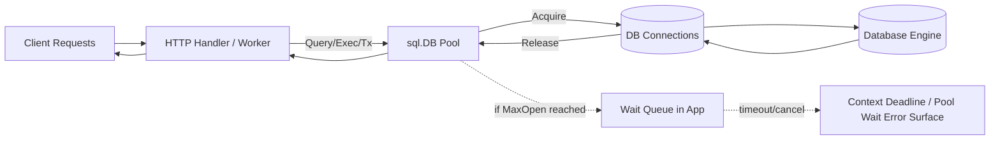
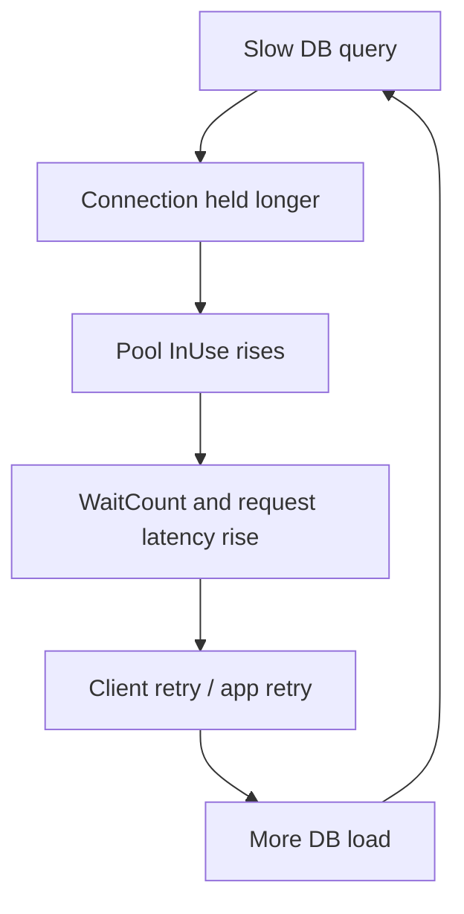
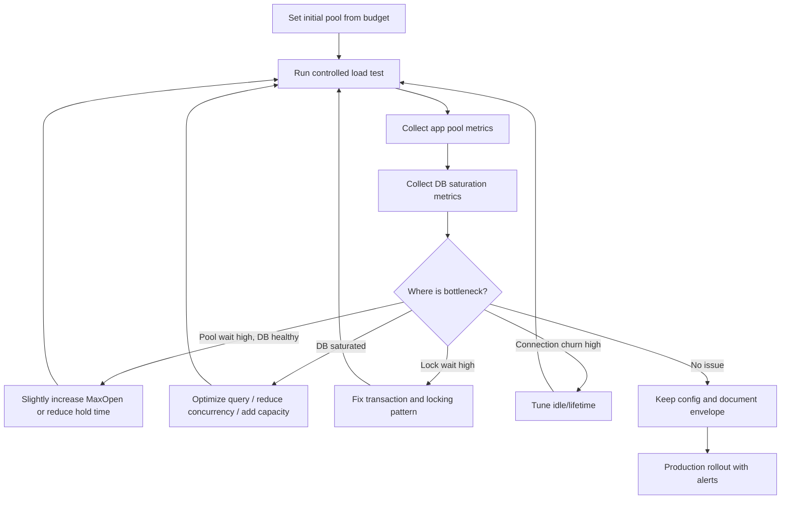
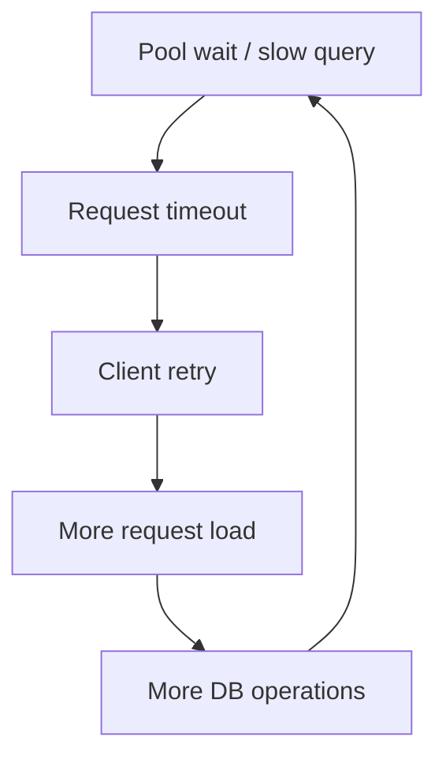
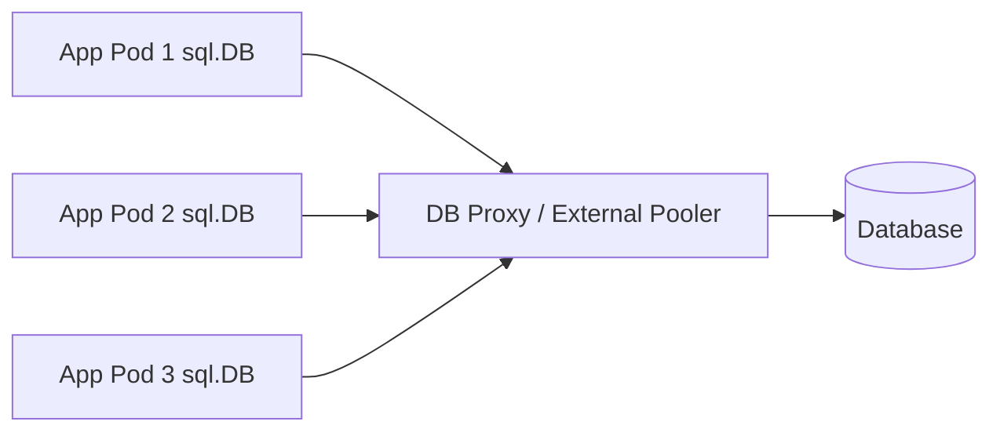

# learn-go-sql-database-integration-part-013.md

# Pool Sizing and Capacity Planning

> Seri: `learn-go-sql-database-integration`  
> Part: `013`  
> Topik: `Connection Pool Sizing, Capacity Planning, Queueing, and Production Tuning`  
> Target pembaca: Java software engineer yang ingin memahami Go database integration sampai level production architecture  
> Target Go: Go 1.26.x  
> Status seri: **belum selesai**  

---

## 0. Posisi Part Ini Dalam Seri

Di part sebelumnya kita sudah membahas mental model connection pool:

- `*sql.DB` adalah **handle + pool**, bukan satu koneksi fisik.
- Query/exec/transaction membutuhkan koneksi dari pool.
- `Rows` yang belum ditutup dapat menahan koneksi.
- `Tx` mem-pin satu koneksi sampai `Commit`/`Rollback`.
- `DB.Stats()` adalah observability primitive untuk melihat pool pressure.

Part ini menjawab pertanyaan berikut:

> Berapa nilai `SetMaxOpenConns`, `SetMaxIdleConns`, `SetConnMaxIdleTime`, dan `SetConnMaxLifetime` yang masuk akal untuk production?

Jawaban yang benar bukan satu angka universal.

Jawaban yang benar adalah **metode berpikir**:

1. database punya kapasitas terbatas;
2. setiap aplikasi replica ikut mengambil bagian dari kapasitas itu;
3. setiap request/job bisa memegang koneksi selama durasi tertentu;
4. transaksi, streaming rows, slow query, dan lock wait memperpanjang hold time;
5. pool yang terlalu kecil membuat request menunggu di aplikasi;
6. pool yang terlalu besar memindahkan masalah ke database;
7. tuning harus berbasis data: latency, throughput, wait duration, in-use, idle, error rate, DB CPU, DB wait event, lock, dan connection count.

Part ini adalah bridge dari API-level `database/sql` menuju **capacity engineering**.

---

## 1. Tujuan Pembelajaran

Setelah menyelesaikan part ini, kamu harus mampu:

1. membedakan **pool sizing** dari **database sizing**;
2. menjelaskan kenapa connection count bukan throughput;
3. menghitung batas aman `MaxOpenConns` per service replica;
4. memperhitungkan HPA, rolling deployment surge, cron job, migration, BI/reporting, dan admin connection;
5. memakai Little’s Law sebagai alat estimasi awal;
6. membaca `DB.Stats()` untuk mendeteksi pool starvation;
7. membedakan pool starvation, DB saturation, lock contention, dan query inefficiency;
8. mendesain pool berbeda untuk API, worker, report, dan migration;
9. membuat tuning loop yang aman dan repeatable;
10. menghindari anti-pattern “naikkan pool size sampai error hilang”.

---

## 2. Fakta Dasar Dari Dokumentasi Go

Beberapa fakta dasar yang harus dipegang:

1. `*sql.DB` mengelola pool koneksi.
2. `SetMaxOpenConns(n)` membatasi jumlah maksimum koneksi terbuka ke database.
3. Jika batas maksimum open connection tercapai, operasi database baru akan menunggu sampai koneksi tersedia.
4. `SetMaxIdleConns(n)` mengatur jumlah maksimum koneksi idle yang dipertahankan.
5. `SetConnMaxIdleTime(d)` menutup koneksi yang idle melebihi durasi tertentu.
6. `SetConnMaxLifetime(d)` menutup koneksi yang sudah hidup melebihi durasi tertentu.
7. `DB.Stats()` menyediakan statistik pool seperti open, in-use, idle, wait count, wait duration, dan counter koneksi yang ditutup karena policy.

Sumber resmi:

- Go docs — Managing connections: <https://go.dev/doc/database/manage-connections>
- Go package docs — `database/sql`: <https://pkg.go.dev/database/sql>

---

## 3. Mental Model Utama

### 3.1 Connection Pool Bukan Performance Booster Sederhana

Connection pool sering disalahpahami seperti ini:

> "Kalau pool lebih besar, aplikasi lebih cepat."

Kadang benar, tapi sering salah.

Pool lebih besar hanya berarti:

> lebih banyak operasi database boleh berjalan bersamaan dari sisi aplikasi.

Tetapi database tetap punya batas:

- CPU;
- memory;
- disk I/O;
- WAL/redo bandwidth;
- lock manager;
- buffer cache;
- network;
- max connection;
- transaction log;
- replication lag;
- query planner/executor capacity;
- per-session memory;
- work memory/sort memory;
- temporary space.

Kalau bottleneck ada di database, menambah pool bisa membuat database lebih lambat.

### 3.2 Pool Adalah Concurrency Gate

`MaxOpenConns` adalah gate:

```text
maximum concurrent DB connections from this process
```

Bukan:

```text
maximum request per second
```

Satu koneksi dapat mengeksekusi banyak query per detik bila query cepat dan sequential.

Sebaliknya, seratus koneksi bisa menghasilkan throughput buruk bila query lambat, lock-heavy, atau database sudah CPU-saturated.

### 3.3 Pool Menentukan Di Mana Antrian Terjadi

Saat demand lebih tinggi dari kapasitas, antrian pasti terjadi.

Pertanyaannya:

> Antrian terjadi di mana?

Kemungkinan:

1. di HTTP server;
2. di goroutine yang menunggu pool;
3. di database connection accept;
4. di database worker/process;
5. di lock wait;
6. di disk I/O;
7. di downstream service;
8. di user browser.

Connection pool yang sehat membuat sebagian pressure **terlihat dan terkontrol** di aplikasi, sebelum menghancurkan database.

---

## 4. Diagram Mental Model



Invariant penting:

- Jika pool penuh, goroutine menunggu.
- Jika context deadline habis saat menunggu, operasi gagal.
- Jika query sudah mendapat koneksi tapi DB lambat, pool tetap penuh lebih lama.
- Jika transaksi panjang, koneksi tidak bisa dipakai request lain.
- Jika rows tidak ditutup, koneksi bisa tertahan.

---

## 5. Perbandingan Dengan Java / HikariCP

Sebagai Java engineer, kamu mungkin terbiasa dengan:

```properties
spring.datasource.hikari.maximumPoolSize=20
spring.datasource.hikari.minimumIdle=10
spring.datasource.hikari.connectionTimeout=30000
spring.datasource.hikari.idleTimeout=600000
spring.datasource.hikari.maxLifetime=1800000
```

Di Go, kamu biasanya akan melihat:

```go
db.SetMaxOpenConns(20)
db.SetMaxIdleConns(10)
db.SetConnMaxIdleTime(5 * time.Minute)
db.SetConnMaxLifetime(30 * time.Minute)
```

Konsepnya mirip, tetapi ada perbedaan style:

| Concern | Java / HikariCP | Go `database/sql` |
|---|---|---|
| Pool object | `DataSource` / Hikari pool | `*sql.DB` |
| Max connection | `maximumPoolSize` | `SetMaxOpenConns` |
| Idle connection | `minimumIdle`, idle behavior | `SetMaxIdleConns`, `SetConnMaxIdleTime` |
| Connection wait timeout | `connectionTimeout` | usually via `Context` deadline |
| Max lifetime | `maxLifetime` | `SetConnMaxLifetime` |
| Transaction style | often declarative `@Transactional` | explicit `BeginTx`, `Commit`, `Rollback` |
| Metrics | Micrometer/JMX/Hikari metrics | `DB.Stats()` + custom export |
| Default mental model | framework-managed | application-owned explicit lifecycle |

Java frameworks often hide transaction and connection acquisition behind AOP/interceptor. Go makes it explicit. That explicitness is good for production if you actually instrument and design it.

---

## 6. Core Sizing Variables

Pool sizing harus dimulai dari variables berikut.

### 6.1 Database-Level Variables

| Variable | Meaning |
|---|---|
| `DB_MAX_CONNECTIONS` | maximum connection allowed by database |
| `RESERVED_ADMIN_CONNECTIONS` | reserved for DBA, migration emergency, monitoring, break-glass access |
| `RESERVED_INFRA_CONNECTIONS` | proxy, replication, maintenance, background infra |
| `RESERVED_OTHER_APPS` | other services using same database |
| `RESERVED_REPORTING` | BI/report/export jobs |
| `SAFE_APP_CONNECTION_BUDGET` | remaining budget for application services |

Formula:

```text
SAFE_APP_CONNECTION_BUDGET =
    DB_MAX_CONNECTIONS
  - RESERVED_ADMIN_CONNECTIONS
  - RESERVED_INFRA_CONNECTIONS
  - RESERVED_OTHER_APPS
  - RESERVED_REPORTING
```

### 6.2 Deployment-Level Variables

| Variable | Meaning |
|---|---|
| `REPLICA_MIN` | minimum replicas |
| `REPLICA_NORMAL` | normal steady-state replicas |
| `REPLICA_MAX` | HPA max replicas |
| `ROLLOUT_SURGE` | extra pods during rolling deployment |
| `CRON_PARALLELISM` | concurrent jobs that can run |
| `WORKER_REPLICAS` | background worker instances |
| `MIGRATION_CONNECTIONS` | migration tool/session connection usage |
| `BLUE_GREEN_FACTOR` | whether old and new versions run simultaneously |

Never size only for normal replica count.

Production harus memperhitungkan:

```text
effective_instances =
    HPA_MAX_REPLICAS
  + ROLLOUT_SURGE
  + PARALLEL_JOB_INSTANCES
  + TEMPORARY_MIGRATION_INSTANCES
```

### 6.3 Workload-Level Variables

| Variable | Meaning |
|---|---|
| `RPS` | request per second |
| `DB_OPS_PER_REQUEST` | average DB operations per request |
| `DB_HOLD_TIME` | how long connection is held |
| `TX_HOLD_TIME` | transaction duration |
| `QUERY_P95` | p95 query latency |
| `QUERY_P99` | p99 query latency |
| `LOCK_WAIT` | time spent waiting locks |
| `ROWS_STREAM_TIME` | time rows cursor remains open |
| `RETRY_FACTOR` | retry amplification under failure |
| `CACHE_HIT_RATIO` | fraction of requests avoiding DB |

Important:

> Pool sizing depends more on connection hold time than on code complexity.

Fast query with high RPS may need fewer connections than slow query with low RPS.

---

## 7. Little’s Law Untuk Estimasi Awal

Little’s Law:

```text
L = λ × W
```

Where:

- `L` = average concurrency in the system
- `λ` = throughput rate
- `W` = average time spent in the system

For DB pool:

```text
required_concurrent_connections ≈ DB_operations_per_second × average_connection_hold_time_seconds
```

Example:

```text
HTTP RPS                       = 500 req/s
DB operations per request       = 2
DB operations per second        = 1000 ops/s
Average connection hold time    = 20 ms = 0.020 s

Estimated concurrent DB usage   = 1000 × 0.020
                                = 20 connections
```

That is average. Production sizing must account for variance:

```text
starting_max_open ≈ average_concurrency × burst_factor
```

Where `burst_factor` may be 1.5x, 2x, or higher depending on traffic burstiness and latency distribution.

But do not blindly multiply. Validate with metrics.

---

## 8. Why Average Is Dangerous

Averages hide tail latency.

Consider two services:

| Metric | Service A | Service B |
|---|---:|---:|
| RPS | 500 | 500 |
| Avg query latency | 20 ms | 20 ms |
| p95 query latency | 30 ms | 200 ms |
| p99 query latency | 40 ms | 1.5 s |
| Lock wait | rare | frequent |
| Pool behavior | stable | periodic exhaustion |

Both have same average, but Service B needs stronger safeguards.

Connection pool pressure is strongly influenced by:

- p95/p99 query latency;
- lock waits;
- transaction duration;
- long result streaming;
- query plan regression;
- retry storms;
- downstream dead time inside transaction;
- CPU throttling on app or DB.

A production pool must be sized and alerted based on tail behavior, not only average.

---

## 9. Pool Sizing From Database Budget

### 9.1 Basic Formula

```text
max_open_per_instance <= floor(SAFE_APP_CONNECTION_BUDGET / EFFECTIVE_INSTANCE_COUNT)
```

Example:

```text
DB_MAX_CONNECTIONS              = 300
Reserved admin                  = 10
Reserved monitoring             = 10
Reserved reporting              = 30
Other services                  = 50

SAFE_APP_CONNECTION_BUDGET      = 300 - 10 - 10 - 30 - 50
                                = 200

HPA max replicas                = 8
Rolling surge                   = 2
Background job instances         = 2

EFFECTIVE_INSTANCE_COUNT        = 8 + 2 + 2
                                = 12

max_open_per_instance           = floor(200 / 12)
                                = 16
```

So `SetMaxOpenConns(16)` is a safer upper bound than “let’s use 50”.

### 9.2 Add Safety Margin

You usually should not consume 100% of the budget.

```text
max_open_per_instance <= floor((SAFE_APP_CONNECTION_BUDGET × safety_factor) / EFFECTIVE_INSTANCE_COUNT)
```

Example with 80% safety factor:

```text
floor((200 × 0.8) / 12) = 13
```

A starting config might be:

```go
db.SetMaxOpenConns(12)
db.SetMaxIdleConns(6)
db.SetConnMaxIdleTime(5 * time.Minute)
db.SetConnMaxLifetime(30 * time.Minute)
```

This is not final. It is a safe initial point.

---

## 10. Pool Sizing From Workload Demand

Database budget gives an upper bound. Workload demand gives a lower bound.

Example:

```text
Target HTTP RPS                 = 300 req/s
DB ops per request avg           = 1.5
DB ops/sec                       = 450 ops/s
Avg connection hold time         = 25 ms
Estimated avg concurrency        = 450 × 0.025
                                  = 11.25
Burst factor                     = 2
Estimated needed pool            = 22.5
```

If this service has 4 replicas:

```text
needed_per_instance ≈ ceil(22.5 / 4) = 6
```

Now compare with DB budget.

If DB budget allows 12 per instance, starting with 6-10 is reasonable.

If DB budget allows only 4 per instance, you have a capacity mismatch. Options:

1. optimize queries;
2. reduce DB ops per request;
3. add caching;
4. split read/write load;
5. increase DB capacity;
6. increase replicas only if per-replica pool is adjusted;
7. use queue/backpressure;
8. move long-running work out of request path;
9. reduce transaction duration;
10. add read replica for suitable read workloads.

---

## 11. A Practical Sizing Algorithm

Use this as first-pass algorithm.

### Step 1 — Identify All DB Consumers

List:

- API service replicas;
- worker replicas;
- scheduled jobs;
- migration jobs;
- admin tools;
- reporting/BI;
- data export;
- batch import;
- monitoring checks;
- external poolers/proxies;
- old version during deployment;
- new version during deployment;
- canary deployment;
- blue/green environment;
- staging jobs accidentally pointing to production;
- emergency scripts.

### Step 2 — Determine Database Connection Budget

```text
safe_budget = db_max_connections - all_reserved_connections
```

Reserve more than you think. Losing admin access during connection exhaustion is a bad operational failure.

### Step 3 — Compute Worst-Case App Instances

```text
effective_instances =
    hpa_max
  + rollout_surge
  + cron_parallelism
  + worker_instances
  + blue_green_overlap
```

### Step 4 — Compute Hard Upper Bound

```text
hard_upper_per_instance = floor(safe_budget / effective_instances)
```

### Step 5 — Estimate Workload Need

```text
db_ops_per_second = rps × db_ops_per_request
average_concurrency = db_ops_per_second × average_hold_time_seconds
needed_cluster_pool = average_concurrency × burst_factor
needed_per_instance = ceil(needed_cluster_pool / normal_replica_count)
```

### Step 6 — Pick Initial `MaxOpenConns`

```text
initial_max_open =
    min(hard_upper_per_instance, max(minimum_viable, needed_per_instance))
```

### Step 7 — Set Idle Lower Than Open

Common starting point:

```text
MaxIdleConns ≈ 25% to 75% of MaxOpenConns
```

But this depends on traffic pattern:

| Pattern | Idle Strategy |
|---|---|
| steady API traffic | moderate idle |
| spiky traffic | higher idle, bounded idle time |
| rare admin job | low idle |
| serverless-ish process | low idle/lifetime |
| high connection setup cost | higher idle |
| database memory constrained | lower idle |

### Step 8 — Set Lifetime and Idle Time

Starting point example:

```go
db.SetConnMaxIdleTime(5 * time.Minute)
db.SetConnMaxLifetime(30 * time.Minute)
```

Tune against:

- DB server idle timeout;
- load balancer idle timeout;
- NAT timeout;
- TLS connection cost;
- database failover behavior;
- proxy behavior;
- session state;
- prepared statement behavior;
- credential rotation;
- network middlebox behavior.

### Step 9 — Load Test and Observe

Observe:

- `OpenConnections`;
- `InUse`;
- `Idle`;
- `WaitCount` delta;
- `WaitDuration` delta;
- request latency;
- query latency;
- DB CPU;
- DB active sessions;
- lock waits;
- deadlocks;
- slow queries;
- connection errors;
- retry rate.

### Step 10 — Tune Iteratively

If pool wait is high and DB is healthy, maybe increase pool.

If pool wait is low but DB CPU/locks are high, increasing pool likely worsens the problem.

If both pool wait and DB saturation are high, reduce demand or optimize workload.

---

## 12. Interpreting `DB.Stats()`

`DB.Stats()` returns pool stats.

Important fields:

| Field | Meaning |
|---|---|
| `MaxOpenConnections` | configured max open connections |
| `OpenConnections` | established connections, in-use + idle |
| `InUse` | connections currently used |
| `Idle` | idle connections |
| `WaitCount` | cumulative number of waits for a connection |
| `WaitDuration` | cumulative duration spent waiting |
| `MaxIdleClosed` | connections closed due to max idle limit |
| `MaxIdleTimeClosed` | connections closed due to idle time |
| `MaxLifetimeClosed` | connections closed due to lifetime |

### 12.1 Example Exporter

```go
package dbmetrics

import (
	"database/sql"
	"time"
)

type Snapshot struct {
	Time               time.Time
	MaxOpen           int
	Open              int
	InUse             int
	Idle              int
	WaitCount         int64
	WaitDuration      time.Duration
	MaxIdleClosed     int64
	MaxIdleTimeClosed int64
	MaxLifetimeClosed int64
}

func Capture(db *sql.DB) Snapshot {
	s := db.Stats()
	return Snapshot{
		Time:               time.Now(),
		MaxOpen:            s.MaxOpenConnections,
		Open:               s.OpenConnections,
		InUse:              s.InUse,
		Idle:               s.Idle,
		WaitCount:          s.WaitCount,
		WaitDuration:       s.WaitDuration,
		MaxIdleClosed:      s.MaxIdleClosed,
		MaxIdleTimeClosed:  s.MaxIdleTimeClosed,
		MaxLifetimeClosed:  s.MaxLifetimeClosed,
	}
}
```

### 12.2 Derived Metrics

Raw cumulative counters are useful, but deltas are more useful.

```go
package dbmetrics

import "time"

type Delta struct {
	Duration          time.Duration
	WaitCountDelta    int64
	WaitDurationDelta time.Duration
	AvgWait           time.Duration
}

func ComputeDelta(prev, curr Snapshot) Delta {
	d := Delta{
		Duration:          curr.Time.Sub(prev.Time),
		WaitCountDelta:    curr.WaitCount - prev.WaitCount,
		WaitDurationDelta: curr.WaitDuration - prev.WaitDuration,
	}

	if d.WaitCountDelta > 0 {
		d.AvgWait = time.Duration(int64(d.WaitDurationDelta) / d.WaitCountDelta)
	}

	return d
}
```

Useful derived signals:

```text
wait_rate = delta(WaitCount) / interval_seconds

avg_wait_when_waiting = delta(WaitDuration) / delta(WaitCount)

pool_utilization = InUse / MaxOpenConnections

idle_ratio = Idle / OpenConnections

saturation_signal =
    InUse close to MaxOpenConnections
    AND wait_rate > 0
    AND avg_wait_when_waiting meaningful
```

### 12.3 Interpretation Matrix

| Observation | Possible Meaning |
|---|---|
| `InUse ≈ MaxOpen`, `WaitCount` rising | pool saturated |
| `InUse low`, `WaitCount` rising | bursty acquisition or short sampling artifact |
| `Idle high`, DB CPU high | DB saturated by fewer heavy queries, not pool shortage |
| `InUse high`, DB CPU low, lock wait high | lock contention |
| `InUse high`, query p99 high | slow queries holding connections |
| `OpenConnections` constantly churns | lifetime/idle too aggressive or network instability |
| `MaxLifetimeClosed` spikes | lifetime too low or synchronized connection recycling |
| `MaxIdleClosed` high | `MaxIdleConns` too low for traffic pattern |
| `WaitDuration` high, DB healthy | consider increasing pool or reducing long holds |
| no wait, high latency | latency likely inside DB execution, lock, network, or app processing |

---

## 13. Pool Wait vs Database Saturation

This distinction is crucial.

### 13.1 Pool Starvation

Pool starvation means:

```text
goroutines want a DB connection but cannot get one quickly
```

Signals:

- `InUse` near `MaxOpenConnections`;
- `WaitCount` rising;
- `WaitDuration` rising;
- request latency includes time before query starts;
- DB may or may not be saturated.

Causes:

- pool too small;
- transaction too long;
- rows leak;
- slow query;
- too many parallel DB operations;
- background jobs sharing API pool;
- deployment surge;
- retry storm.

### 13.2 Database Saturation

Database saturation means:

```text
database cannot process current workload efficiently
```

Signals:

- DB CPU high;
- DB active sessions high;
- lock wait high;
- IO wait high;
- buffer cache pressure;
- slow query log;
- replication lag;
- deadlocks;
- temp file usage;
- increased query latency;
- application pool also may become full because queries hold connections longer.

Causes:

- inefficient query;
- missing index;
- bad plan;
- too many concurrent queries;
- lock contention;
- table bloat;
- hot rows;
- disk bottleneck;
- memory pressure;
- checkpoint/WAL pressure;
- large sort/hash aggregation.

### 13.3 The Dangerous Feedback Loop



If you respond by only increasing `MaxOpenConns`, you may accelerate collapse.

---

## 14. Pool Sizing By Workload Type

### 14.1 Short OLTP API

Characteristics:

- short transactions;
- indexed point lookups;
- small result sets;
- low lock wait;
- strict latency budget;
- high concurrency.

Suggested style:

```go
db.SetMaxOpenConns(8)  // example only
db.SetMaxIdleConns(4)
db.SetConnMaxIdleTime(5 * time.Minute)
db.SetConnMaxLifetime(30 * time.Minute)
```

Goal:

- stable p95/p99;
- low pool wait;
- controlled DB concurrency.

### 14.2 Long Reporting Query

Characteristics:

- slow query;
- large result set;
- scan/aggregate heavy;
- can hold connection for seconds/minutes;
- often low RPS but high resource usage.

Do not let reporting share unlimited pool with API.

Options:

1. separate service;
2. separate DB user;
3. separate `*sql.DB` handle with smaller `MaxOpenConns`;
4. read replica;
5. async export;
6. pagination/keyset;
7. query timeout;
8. statement timeout;
9. materialized view;
10. job queue.

Example:

```go
reportDB.SetMaxOpenConns(2)
reportDB.SetMaxIdleConns(1)
reportDB.SetConnMaxIdleTime(2 * time.Minute)
reportDB.SetConnMaxLifetime(20 * time.Minute)
```

### 14.3 Background Worker

Characteristics:

- batch jobs;
- high write volume;
- retry behavior;
- can starve API if sharing pool;
- often less latency-sensitive.

Suggested:

```go
workerDB.SetMaxOpenConns(4)
workerDB.SetMaxIdleConns(2)
```

Also control worker concurrency:

```go
workerConcurrency <= workerDBMaxOpenConns
```

Do not start 100 workers with pool size 4 unless queueing is intentional and visible.

### 14.4 Migration Tool

Migration should not compete with app traffic unpredictably.

Possible policies:

- run migration before app deployment;
- use separate deployment step;
- set low connection count;
- use DB lock timeout;
- use statement timeout;
- monitor blocking locks;
- avoid long transaction DDL where DB cannot handle it online;
- reserve migration/admin connections.

---

## 15. Transaction Duration and Pool Sizing

Transactions are special because they pin one connection.

Bad pattern:

```go
tx, err := db.BeginTx(ctx, nil)
if err != nil {
	return err
}
defer tx.Rollback()

entity, err := loadSomething(ctx, tx, id)
if err != nil {
	return err
}

external, err := callRemoteAPI(ctx, entity.ExternalID) // bad inside tx
if err != nil {
	return err
}

if err := updateSomething(ctx, tx, external); err != nil {
	return err
}

return tx.Commit()
```

The remote API call holds:

- transaction;
- connection;
- locks maybe;
- database resources;
- pool capacity.

Better:

```go
entity, err := loadSomethingNonTx(ctx, db, id)
if err != nil {
	return err
}

external, err := callRemoteAPI(ctx, entity.ExternalID)
if err != nil {
	return err
}

return withinTx(ctx, db, func(tx *sql.Tx) error {
	return updateSomething(ctx, tx, id, external)
})
```

Even better if external result can be modeled with idempotency/outbox.

### 15.1 Transaction Pool Impact Formula

```text
connections_held_by_transactions =
    transaction_start_rate_per_second × avg_transaction_duration_seconds
```

Example:

```text
Tx rate = 100 tx/s
Avg tx duration = 80 ms

Concurrency = 100 × 0.080 = 8 connections
```

If p99 transaction duration becomes 2 seconds due to lock:

```text
100 × 2 = 200 potential held connections
```

Your pool will cap at `MaxOpenConns`, causing wait. That is good as a safety gate, but the business impact appears as latency/timeouts.

---

## 16. `Rows` Hold Time and Streaming Risk

A query that returns many rows may hold a connection for the whole streaming period.

Bad pattern:

```go
rows, err := db.QueryContext(ctx, query)
if err != nil {
	return err
}
defer rows.Close()

for rows.Next() {
	var item Item
	if err := rows.Scan(&item.ID, &item.Name); err != nil {
		return err
	}

	// Bad: slow processing while connection is held.
	doSlowWork(item)
}

return rows.Err()
```

Better pattern:

```go
rows, err := db.QueryContext(ctx, query)
if err != nil {
	return err
}
defer rows.Close()

items := make([]Item, 0, 256)

for rows.Next() {
	var item Item
	if err := rows.Scan(&item.ID, &item.Name); err != nil {
		return err
	}
	items = append(items, item)
}

if err := rows.Err(); err != nil {
	return err
}

// DB connection can be released before slow work if rows.Close() has run.
// For huge result sets, use batch pagination instead of unbounded materialization.
for _, item := range items {
	doSlowWork(item)
}
```

For huge datasets, use chunked pagination or cursor-style batch with strict limits.

---

## 17. Sizing With Multiple Services

Microservices often share one database.

Example:

| Service | Replicas Max | MaxOpenConns | Total Possible |
|---|---:|---:|---:|
| case-api | 8 | 16 | 128 |
| user-api | 5 | 10 | 50 |
| audit-worker | 3 | 8 | 24 |
| report-api | 2 | 4 | 8 |
| migration job | 1 | 4 | 4 |
| admin tools | - | - | 10 reserved |

Total application possible:

```text
128 + 50 + 24 + 8 + 4 + 10 = 224
```

If DB max is 200, configuration is unsafe even before traffic.

### 17.1 Connection Budget Table Template

Use a table like this in architecture review:

| Consumer | Max instances | Max open per instance | Worst-case total | Notes |
|---|---:|---:|---:|---|
| API service A |  |  |  |  |
| API service B |  |  |  |  |
| Worker service |  |  |  |  |
| Cron jobs |  |  |  |  |
| Migration |  |  |  |  |
| Reporting |  |  |  |  |
| Admin/DBA |  |  |  | reserved |
| Monitoring |  |  |  | reserved |
| Total |  |  |  |  |

If the table total exceeds safe DB capacity, you need architecture change, not wishful tuning.

---

## 18. Kubernetes / Autoscaling Implications

In Kubernetes, connection pool sizing must consider:

- HPA max replicas;
- rolling update `maxSurge`;
- pod startup burst;
- readiness probe behavior;
- liveness probe behavior;
- sidecar/proxy;
- cronjob concurrency;
- job backoff/retry;
- blue-green deployment overlap;
- service mesh connection behavior;
- node restart causing pod rescheduling;
- regional failover.

### 18.1 Rolling Deployment Example

Normal:

```text
replicas = 6
maxOpen = 20
total = 120
```

Rolling update with surge:

```text
maxSurge = 2
temporary replicas = 8
total = 160
```

If multiple services deploy together, surge multiplies.

### 18.2 HPA Example

Normal:

```text
replicas = 4
maxOpen = 20
normal total = 80
```

HPA max:

```text
replicas = 12
maxOpen = 20
worst total = 240
```

If DB budget is 160, this is unsafe.

You must either:

- reduce per-pod `MaxOpenConns`;
- cap HPA lower;
- increase DB capacity;
- introduce separate pools;
- implement backpressure;
- reduce DB demand;
- use read replicas or caching.

---

## 19. Choosing `SetMaxOpenConns`

### 19.1 What It Controls

`SetMaxOpenConns` controls the maximum number of open connections to the database from a `*sql.DB`.

When all are in use:

- new DB operations wait;
- wait contributes to `WaitCount` and `WaitDuration`;
- if context deadline expires, operation fails.

### 19.2 Starting Heuristics

For a typical OLTP service:

```text
MaxOpenConns per instance = 4 to 32
```

But this is only a starting range, not a rule.

Do not copy blindly.

Better approach:

```text
MaxOpenConns = min(DB budget per instance, workload estimated need)
```

### 19.3 Signs `MaxOpenConns` May Be Too Low

- `InUse` frequently equals `MaxOpenConnections`;
- `WaitCount` increases during normal traffic;
- `WaitDuration` contributes meaningful latency;
- DB CPU/IO/locks are not saturated;
- query latency is stable when started;
- increasing pool slightly improves throughput without DB degradation.

### 19.4 Signs `MaxOpenConns` May Be Too High

- DB CPU saturated;
- lock waits increase;
- deadlocks increase;
- query p99 worsens as concurrency increases;
- DB memory pressure;
- too many active sessions;
- replica lag increases;
- connection errors under rollout;
- database rejects connections;
- admin cannot connect during incident.

### 19.5 Important Warning

A high pool can hide problems until a traffic spike.

At low traffic, 100 max connections may look harmless.

During incident, retries and slow queries can occupy all 100 and amplify database collapse.

---

## 20. Choosing `SetMaxIdleConns`

### 20.1 What It Controls

`SetMaxIdleConns` controls how many idle connections the pool can retain.

Idle connections help avoid connection setup latency, TLS handshake, authentication overhead, and cold query startup.

But idle connections still consume database-side resources.

### 20.2 Starting Heuristics

```text
MaxIdleConns = min(MaxOpenConns, expected steady-state concurrency)
```

Examples:

```go
db.SetMaxOpenConns(16)
db.SetMaxIdleConns(8)
```

or for low traffic:

```go
db.SetMaxOpenConns(8)
db.SetMaxIdleConns(2)
```

### 20.3 Too Low Idle

Symptoms:

- frequent connection churn;
- increased latency after idle periods;
- `MaxIdleClosed` rising quickly;
- connection establishment overhead visible;
- TLS/auth overhead visible;
- DB login spikes.

### 20.4 Too High Idle

Symptoms:

- many database sessions idle;
- DB memory consumed by idle sessions;
- too many connections during low traffic;
- failover/restart reconnection storm;
- connection budget wasted.

---

## 21. Choosing `SetConnMaxIdleTime`

### 21.1 What It Controls

`SetConnMaxIdleTime` closes connections that have been idle too long.

Use it to:

- clean up idle sessions;
- avoid stale connections;
- reduce idle DB resource usage;
- handle network middlebox behavior;
- reduce long idle connection risk.

### 21.2 Starting Heuristic

```go
db.SetConnMaxIdleTime(5 * time.Minute)
```

Adjust based on:

- traffic pattern;
- DB idle timeout;
- load balancer idle timeout;
- NAT timeout;
- TLS/auth cost;
- database memory pressure.

### 21.3 Too Short Idle Time

Symptoms:

- connection churn;
- frequent auth/login;
- increased tail latency;
- `MaxIdleTimeClosed` high;
- DB logs show many connect/disconnect events.

### 21.4 Too Long Idle Time

Symptoms:

- stale connection errors after quiet periods;
- idle connection count high;
- DB resource waste;
- long-lived sessions with outdated state.

---

## 22. Choosing `SetConnMaxLifetime`

### 22.1 What It Controls

`SetConnMaxLifetime` closes connections after they have existed longer than a configured duration.

Use it for:

- connection rotation;
- load balancer/proxy compatibility;
- database failover hygiene;
- credential rotation;
- avoiding extremely old sessions;
- avoiding server-side connection lifetime limits.

### 22.2 Starting Heuristic

```go
db.SetConnMaxLifetime(30 * time.Minute)
```

But align with infrastructure.

If DB/proxy kills connections after 60 minutes, set lifetime lower, for example 45-55 minutes.

### 22.3 Jitter Concern

If every pod starts at the same time and every connection has the same lifetime, many connections may recycle at the same time.

Mitigation options:

1. start pods gradually;
2. set lifetime lower than infra timeout;
3. add app-level randomness by configuring slightly different values per pod if needed;
4. rely on workload naturally staggering connection creation;
5. monitor `MaxLifetimeClosed`.

Go’s `database/sql` exposes the lifetime setting but does not make capacity planning decisions for you.

---

## 23. Request Timeout and Pool Wait Budget

Pool wait consumes request time.

Example:

```text
HTTP request deadline = 2 seconds
DB query budget       = 500 ms
Pool wait             = 400 ms
Actual query          = 300 ms
Total DB time         = 700 ms
```

Even if query itself is fine, pool wait can break SLA.

### 23.1 Budget Decomposition

```text
request budget =
    routing/middleware
  + validation
  + pool wait
  + query execution
  + application processing
  + serialization
  + response write
```

### 23.2 Practical Rule

For latency-sensitive API:

```text
pool wait should usually be small relative to request budget
```

Example heuristic:

```text
pool wait p95 <= 5%-10% of request deadline
```

This is not a law. It is a useful warning threshold.

If request deadline is 1 second and pool wait p95 is 300 ms, users experience pool contention, not just database latency.

---

## 24. Context Timeout Strategy

In Go, pool acquisition and query execution are controlled through context-aware methods:

- `ExecContext`
- `QueryContext`
- `QueryRowContext`
- `BeginTx`
- `PrepareContext`

Example:

```go
ctx, cancel := context.WithTimeout(parent, 500*time.Millisecond)
defer cancel()

rows, err := db.QueryContext(ctx, query, args...)
```

If pool is full, the operation may spend time waiting for a connection. That wait consumes the context deadline.

### 24.1 Separate Budgets

For advanced services, you may explicitly separate:

- request deadline;
- DB operation deadline;
- transaction deadline;
- lock wait timeout;
- statement timeout;
- retry total budget.

Example:

```go
func withDBTimeout(parent context.Context) (context.Context, context.CancelFunc) {
	return context.WithTimeout(parent, 300*time.Millisecond)
}
```

### 24.2 Avoid Infinite Wait

Never run production DB operations with no meaningful deadline.

Bad:

```go
rows, err := db.QueryContext(context.Background(), query)
```

Better:

```go
ctx, cancel := context.WithTimeout(parent, 500*time.Millisecond)
defer cancel()

rows, err := db.QueryContext(ctx, query)
```

---

## 25. Load Test Methodology

Pool tuning without load test is guesswork.

### 25.1 What To Test

Test at least:

1. normal traffic;
2. p95 expected traffic;
3. p99/burst traffic;
4. cold start;
5. rolling deployment;
6. HPA scale-up;
7. DB restart/failover;
8. slow query injection;
9. lock contention;
10. background job overlap;
11. retry behavior;
12. report/export overlap.

### 25.2 Metrics To Capture

Application:

- HTTP RPS;
- HTTP p50/p95/p99;
- DB query p50/p95/p99;
- DB errors by category;
- pool `InUse`;
- pool `Idle`;
- pool `OpenConnections`;
- pool `WaitCount` delta;
- pool `WaitDuration` delta;
- goroutine count;
- memory;
- CPU.

Database:

- active sessions;
- total connections;
- CPU;
- memory;
- disk I/O;
- locks;
- wait events;
- slow queries;
- deadlocks;
- row lock wait;
- temp files;
- replication lag.

Deployment:

- replica count;
- pod restart count;
- readiness failures;
- rollout surge;
- job concurrency.

### 25.3 Tuning Loop



---

## 26. Observability Dashboard

A useful database pool dashboard should include:

### 26.1 Pool Panel

- `OpenConnections`
- `InUse`
- `Idle`
- `MaxOpenConnections`
- `InUse / MaxOpenConnections`
- delta `WaitCount`
- delta `WaitDuration`
- average wait duration
- max idle closed rate
- max idle time closed rate
- max lifetime closed rate

### 26.2 Query Panel

- query duration p50/p95/p99;
- query count by operation;
- rows returned;
- affected rows;
- errors by class;
- timeout count;
- cancellation count;
- slow query count.

### 26.3 DB Panel

- DB connections;
- active sessions;
- CPU;
- memory;
- disk I/O;
- lock waits;
- deadlocks;
- slow query log;
- replication lag;
- temp usage.

### 26.4 Deployment Panel

- replicas;
- rollout state;
- HPA state;
- pod restarts;
- job executions;
- error budget burn.

---

## 27. Alerting Strategy

Bad alert:

```text
OpenConnections > 50
```

This may be normal.

Better alerts combine symptoms.

### 27.1 Pool Saturation Alert

```text
InUse / MaxOpenConnections > 0.9
AND delta(WaitCount) > threshold
AND avg_wait > threshold
FOR 5 minutes
```

### 27.2 Connection Leak / Long Hold Alert

```text
InUse high
AND request RPS low
AND query throughput low
FOR 5 minutes
```

Possible causes:

- unclosed rows;
- stuck transaction;
- long-running query;
- blocked locks.

### 27.3 Churn Alert

```text
rate(MaxLifetimeClosed + MaxIdleTimeClosed + MaxIdleClosed) unexpectedly high
```

Possible causes:

- lifetime too short;
- idle setting too low;
- network disconnect;
- DB/proxy restart.

### 27.4 DB Protection Alert

```text
DB connections > safe threshold
OR database rejects connection
OR admin reserved budget at risk
```

This catches cluster-wide risk, not only one process.

---

## 28. Common Anti-Patterns

### 28.1 “Set Pool to DB Max”

Bad:

```go
db.SetMaxOpenConns(300)
```

If 10 replicas do this:

```text
potential connections = 3000
```

Even if DB max is 300, this is unsafe.

### 28.2 Unlimited Default Without Thinking

If `MaxOpenConns` is not set, `database/sql` can open new connections as needed. This may be dangerous in high-concurrency services because the app no longer protects the DB with an explicit upper bound.

### 28.3 One Pool For Everything

Bad:

- API requests;
- report export;
- background workers;
- migration;
- admin jobs;

all share same large pool.

Result:

- long report starves API;
- worker spike starves user traffic;
- migration competes with production workload.

### 28.4 Transaction Around Remote Call

Holding DB transaction while calling:

- HTTP service;
- payment gateway;
- identity provider;
- object storage;
- email service;
- message broker;

is a pool and lock risk.

### 28.5 Ignoring `Rows.Close`

A rows leak is effectively a connection leak until rows are closed or garbage-collected.

### 28.6 Tuning Without DB Metrics

App pool metrics alone can mislead.

You need both:

- application pool metrics;
- database engine metrics.

### 28.7 Treating Staging Numbers As Production Truth

Staging often has:

- less data;
- fewer indexes;
- different cache warmth;
- fewer concurrent users;
- different DB instance size;
- no real reporting load;
- no real lock contention.

Use staging for functional validation and controlled tests, not final production capacity truth.

---

## 29. Code: Centralized Pool Configuration

```go
package dbconfig

import (
	"database/sql"
	"fmt"
	"time"
)

type PoolConfig struct {
	MaxOpenConns    int
	MaxIdleConns    int
	ConnMaxIdleTime time.Duration
	ConnMaxLifetime time.Duration
}

func (c PoolConfig) Validate() error {
	if c.MaxOpenConns <= 0 {
		return fmt.Errorf("MaxOpenConns must be > 0")
	}
	if c.MaxIdleConns < 0 {
		return fmt.Errorf("MaxIdleConns must be >= 0")
	}
	if c.MaxIdleConns > c.MaxOpenConns {
		return fmt.Errorf("MaxIdleConns must be <= MaxOpenConns")
	}
	if c.ConnMaxIdleTime < 0 {
		return fmt.Errorf("ConnMaxIdleTime must be >= 0")
	}
	if c.ConnMaxLifetime < 0 {
		return fmt.Errorf("ConnMaxLifetime must be >= 0")
	}
	return nil
}

func ApplyPoolConfig(db *sql.DB, cfg PoolConfig) error {
	if err := cfg.Validate(); err != nil {
		return err
	}

	db.SetMaxOpenConns(cfg.MaxOpenConns)
	db.SetMaxIdleConns(cfg.MaxIdleConns)
	db.SetConnMaxIdleTime(cfg.ConnMaxIdleTime)
	db.SetConnMaxLifetime(cfg.ConnMaxLifetime)

	return nil
}
```

---

## 30. Code: Startup Logging Without Secret Leakage

```go
package dbconfig

import "log/slog"

func LogPoolConfig(logger *slog.Logger, name string, cfg PoolConfig) {
	logger.Info(
		"database pool configured",
		slog.String("db.name", name),
		slog.Int("db.pool.max_open", cfg.MaxOpenConns),
		slog.Int("db.pool.max_idle", cfg.MaxIdleConns),
		slog.Duration("db.pool.max_idle_time", cfg.ConnMaxIdleTime),
		slog.Duration("db.pool.max_lifetime", cfg.ConnMaxLifetime),
	)
}
```

Do not log DSN with password.

---

## 31. Code: Periodic Pool Metrics Logger

```go
package dbmetrics

import (
	"context"
	"database/sql"
	"log/slog"
	"time"
)

func StartPoolStatsLogger(
	ctx context.Context,
	logger *slog.Logger,
	name string,
	db *sql.DB,
	interval time.Duration,
) {
	ticker := time.NewTicker(interval)

	go func() {
		defer ticker.Stop()

		for {
			select {
			case <-ctx.Done():
				return

			case <-ticker.C:
				s := db.Stats()

				logger.Info(
					"database pool stats",
					slog.String("db.name", name),
					slog.Int("db.pool.max_open", s.MaxOpenConnections),
					slog.Int("db.pool.open", s.OpenConnections),
					slog.Int("db.pool.in_use", s.InUse),
					slog.Int("db.pool.idle", s.Idle),
					slog.Int64("db.pool.wait_count", s.WaitCount),
					slog.Duration("db.pool.wait_duration", s.WaitDuration),
					slog.Int64("db.pool.max_idle_closed", s.MaxIdleClosed),
					slog.Int64("db.pool.max_idle_time_closed", s.MaxIdleTimeClosed),
					slog.Int64("db.pool.max_lifetime_closed", s.MaxLifetimeClosed),
				)
			}
		}
	}()
}
```

In real production, export these as metrics, not just logs.

---

## 32. Code: Pool Configuration From Environment

```go
package dbconfig

import (
	"fmt"
	"os"
	"strconv"
	"time"
)

func LoadPoolConfigFromEnv(prefix string) (PoolConfig, error) {
	maxOpen, err := getEnvInt(prefix+"_MAX_OPEN_CONNS", 10)
	if err != nil {
		return PoolConfig{}, err
	}

	maxIdle, err := getEnvInt(prefix+"_MAX_IDLE_CONNS", 5)
	if err != nil {
		return PoolConfig{}, err
	}

	maxIdleTime, err := getEnvDuration(prefix+"_CONN_MAX_IDLE_TIME", 5*time.Minute)
	if err != nil {
		return PoolConfig{}, err
	}

	maxLifetime, err := getEnvDuration(prefix+"_CONN_MAX_LIFETIME", 30*time.Minute)
	if err != nil {
		return PoolConfig{}, err
	}

	cfg := PoolConfig{
		MaxOpenConns:    maxOpen,
		MaxIdleConns:    maxIdle,
		ConnMaxIdleTime: maxIdleTime,
		ConnMaxLifetime: maxLifetime,
	}

	if err := cfg.Validate(); err != nil {
		return PoolConfig{}, err
	}

	return cfg, nil
}

func getEnvInt(key string, fallback int) (int, error) {
	raw := os.Getenv(key)
	if raw == "" {
		return fallback, nil
	}

	value, err := strconv.Atoi(raw)
	if err != nil {
		return 0, fmt.Errorf("invalid int env %s: %w", key, err)
	}

	return value, nil
}

func getEnvDuration(key string, fallback time.Duration) (time.Duration, error) {
	raw := os.Getenv(key)
	if raw == "" {
		return fallback, nil
	}

	value, err := time.ParseDuration(raw)
	if err != nil {
		return 0, fmt.Errorf("invalid duration env %s: %w", key, err)
	}

	return value, nil
}
```

Example env:

```bash
APP_DB_MAX_OPEN_CONNS=12
APP_DB_MAX_IDLE_CONNS=6
APP_DB_CONN_MAX_IDLE_TIME=5m
APP_DB_CONN_MAX_LIFETIME=30m
```

---

## 33. Separate Pools for Separate Workload Classes

You can create multiple `*sql.DB` handles pointing to the same database, but remember:

> each `*sql.DB` has its own pool.

This can be useful, but it also multiplies connection budgets.

Example:

```go
type Stores struct {
	OLTP    *sql.DB
	Report  *sql.DB
	Worker  *sql.DB
}
```

Configuration:

```go
oltpDB.SetMaxOpenConns(12)
oltpDB.SetMaxIdleConns(6)

reportDB.SetMaxOpenConns(2)
reportDB.SetMaxIdleConns(1)

workerDB.SetMaxOpenConns(4)
workerDB.SetMaxIdleConns(2)
```

Total per process:

```text
12 + 2 + 4 = 18 possible DB connections
```

You must include all handles in the connection budget.

---

## 34. Health Checks and Pool Capacity

Health checks can cause unexpected DB load if badly designed.

Bad readiness check:

```go
func readiness(db *sql.DB) error {
	rows, err := db.Query("SELECT * FROM huge_table")
	// bad
}
```

Better:

```go
func readiness(ctx context.Context, db *sql.DB) error {
	ctx, cancel := context.WithTimeout(ctx, 200*time.Millisecond)
	defer cancel()

	return db.PingContext(ctx)
}
```

But even `PingContext` uses a connection path. If every pod pings every second, health checks can become noise.

Guidelines:

- short timeout;
- low frequency;
- do not run heavy query;
- consider cached readiness state;
- distinguish liveness from readiness;
- during DB outage, avoid synchronized storm;
- do not make liveness restart pod just because DB is temporarily down unless that is intentional.

---

## 35. Pool Sizing and Retry Storm

Retries amplify demand.

Suppose:

```text
normal RPS = 500
retry attempts = 2
failure rate = 20%
```

Effective DB pressure can become:

```text
base traffic + retries
```

If timeout is too low and pool saturated, app may retry while original work still runs in DB.

This creates:



Mitigation:

- bounded retries;
- exponential backoff;
- jitter;
- idempotency;
- classify retryable errors;
- do not retry on pool exhaustion blindly;
- use circuit breaker/load shedding;
- observe retry count;
- enforce total request budget.

---

## 36. Pool Sizing and Lock Contention

If transactions block each other, increasing pool can make things worse.

Example:

```text
10 concurrent transactions update same hot row
```

If pool = 10:

- one succeeds;
- nine wait for lock;
- all hold connections;
- latency rises.

If pool = 100:

- one succeeds;
- ninety-nine wait for lock;
- database lock manager and pool pressure worsen.

Correct fix may be:

- reduce concurrency for that operation;
- use optimistic locking;
- use queue by key;
- use advisory lock;
- redesign hot row;
- shard counter;
- enforce idempotency;
- shorten transaction;
- use `SKIP LOCKED` for work queues;
- change isolation strategy.

---

## 37. Pool Sizing and Read Replicas

Read replicas can help read-heavy workload, but do not blindly route everything.

Consider:

- replica lag;
- read-your-write consistency;
- transaction boundaries;
- stale listing;
- reporting load;
- failover;
- replica connection budget;
- separate pool per replica/read handle.

Example:

```go
primaryDB.SetMaxOpenConns(12)
replicaDB.SetMaxOpenConns(20)
```

But if you have 5 replicas of the service:

```text
primary possible = 60
replica possible = 100
```

Budget both separately.

---

## 38. Pool Sizing and Database Proxy / External Pooler

External poolers/proxies include patterns like:

- PgBouncer;
- RDS Proxy;
- Cloud SQL connectors/proxies;
- vendor-specific connection pooler.

They can help with:

- connection storm;
- auth overhead;
- failover;
- multiplexing;
- centralized connection management.

But they do not magically increase database query capacity.

Application pool still matters.

Common architecture:



Questions to ask:

1. Does proxy multiplex transactions?
2. Does proxy support prepared statements?
3. Does proxy preserve session state?
4. Does proxy support long transactions?
5. Does proxy break advisory locks/session variables?
6. Does proxy change error behavior?
7. Does proxy expose useful metrics?
8. Does proxy limit backend connections?
9. What happens on failover?
10. Does app lifetime setting conflict with proxy lifetime?

---

## 39. Example Capacity Review

### Scenario

A Go API service handles case management workflows.

Known data:

```text
DB max connections               = 500
Reserved DBA/admin               = 20
Reserved monitoring              = 10
Reserved reporting               = 50
Other services                   = 120
Migration emergency              = 10

Safe budget for this service      = 500 - 20 - 10 - 50 - 120 - 10
                                  = 290

HPA max replicas                  = 10
Rolling surge                     = 2
Worker job overlap                = 2

Effective instances               = 14

Hard upper per instance           = floor(290 / 14)
                                  = 20
```

Workload:

```text
Target RPS                        = 400
DB ops/request                    = 2
DB ops/sec                        = 800
Avg hold time                     = 15ms
Avg concurrency                   = 800 * 0.015 = 12
Burst factor                      = 3
Cluster needed                    = 36
Normal replicas                   = 6
Needed per normal replica         = 6
```

Configuration choice:

```go
db.SetMaxOpenConns(12)
db.SetMaxIdleConns(6)
db.SetConnMaxIdleTime(5 * time.Minute)
db.SetConnMaxLifetime(30 * time.Minute)
```

Why not 20?

Because workload estimate says 6 is needed; 12 gives headroom; 20 is upper bound, not target.

### Expected Observation

During normal traffic:

```text
InUse p95 maybe 3-8
Idle maybe 2-6
WaitCount delta near zero
DB CPU healthy
```

During burst:

```text
InUse may approach 12
WaitCount may rise briefly
WaitDuration should stay acceptable
DB should remain stable
```

If wait remains high and DB healthy:

- increase to 14 or 16;
- or optimize hold time.

If DB saturates:

- do not increase pool;
- reduce query cost or concurrency.

---

## 40. Incident Simulation: Pool Exhaustion

### Symptom

- API p99 jumps from 200 ms to 5 s.
- Error rate increases.
- Logs show `context deadline exceeded`.
- `DB.Stats()`:
  - `InUse = MaxOpenConnections`
  - `WaitCount` rising
  - `WaitDuration` rising quickly
- DB CPU moderate.
- DB lock wait high.

### Analysis

The bottleneck is not pure DB CPU. Likely:

- long transaction;
- lock contention;
- rows not closed;
- report job consuming connections;
- worker concurrency spike.

### Investigation Steps

1. Check recent deployments.
2. Check background job start time.
3. Check slow query log.
4. Check DB lock wait.
5. Check pool metrics per service instance.
6. Check whether `Rows.Close` is missing in new code.
7. Check transaction duration histogram.
8. Check retry rate.
9. Check HPA/rollout surge.
10. Check database connection count.

### Immediate Mitigations

Depending on cause:

- pause worker/report job;
- reduce worker concurrency;
- disable retry storm;
- lower API timeout to shed load;
- temporarily increase pool only if DB has capacity;
- kill blocking DB session if safe and approved;
- rollback problematic release;
- apply hotfix for rows leak;
- add query/index fix if root cause known.

### Long-Term Fixes

- separate pools;
- enforce transaction timeout;
- instrument transaction duration;
- add query budget;
- add lock timeout;
- improve indexing;
- redesign hot row;
- add test for rows lifecycle;
- add alert for `WaitDuration`.

---

## 41. Incident Simulation: Too Many Connections

### Symptom

- DB rejects new connections.
- Some pods fail readiness.
- Admin connection difficult.
- Multiple services redeployed at same time.
- HPA scaled up during traffic spike.

### Root Cause Pattern

Each service had safe-looking local config, but cluster-wide budget was not calculated.

Example:

```text
Service A: 12 pods × 30 = 360
Service B: 8 pods × 20 = 160
Worker:    5 pods × 20 = 100
Reports:   3 pods × 10 = 30
Total possible = 650
DB max = 500
```

### Fix

- establish connection budget registry;
- make pool config part of architecture review;
- enforce per-environment config;
- reserve admin connections;
- reduce per-pod max open;
- cap HPA or adjust with HPA;
- stagger deployments;
- monitor cluster-wide DB connections.

---

## 42. Incident Simulation: DB Saturation After Pool Increase

### Timeline

1. API latency rises.
2. Team sees pool wait.
3. Team increases pool from 20 to 80.
4. Pool wait drops temporarily.
5. DB CPU hits 100%.
6. Query p99 worsens.
7. Retry storm starts.
8. Outage expands.

### Lesson

Pool wait was a symptom, not root cause.

The root cause was slow query or DB saturation. Increasing pool increased concurrency into the saturated database.

### Correct Response

- inspect DB wait events;
- identify top queries;
- reduce concurrency;
- fix query/index;
- cap retries;
- degrade non-critical features;
- protect DB with smaller pool if necessary;
- add backpressure.

---

## 43. Production Pool Configuration Template

```go
package main

import (
	"context"
	"database/sql"
	"fmt"
	"log/slog"
	"os"
	"time"

	_ "github.com/jackc/pgx/v5/stdlib"
)

func openDatabase(ctx context.Context, logger *slog.Logger) (*sql.DB, error) {
	dsn := os.Getenv("APP_DATABASE_DSN")
	if dsn == "" {
		return nil, fmt.Errorf("APP_DATABASE_DSN is required")
	}

	db, err := sql.Open("pgx", dsn)
	if err != nil {
		return nil, fmt.Errorf("open database handle: %w", err)
	}

	db.SetMaxOpenConns(12)
	db.SetMaxIdleConns(6)
	db.SetConnMaxIdleTime(5 * time.Minute)
	db.SetConnMaxLifetime(30 * time.Minute)

	pingCtx, cancel := context.WithTimeout(ctx, 5*time.Second)
	defer cancel()

	if err := db.PingContext(pingCtx); err != nil {
		_ = db.Close()
		return nil, fmt.Errorf("ping database: %w", err)
	}

	logger.Info(
		"database connected",
		slog.Int("db.pool.max_open", 12),
		slog.Int("db.pool.max_idle", 6),
		slog.Duration("db.pool.max_idle_time", 5*time.Minute),
		slog.Duration("db.pool.max_lifetime", 30*time.Minute),
	)

	return db, nil
}
```

Note:

- real system should load these values from config;
- do not log DSN;
- use driver-specific DSN validation where available;
- tune per environment.

---

## 44. Review Checklist

### 44.1 Database Budget

- [ ] DB max connection known.
- [ ] Admin/rescue connection reserved.
- [ ] Monitoring connection reserved.
- [ ] Reporting connection reserved.
- [ ] Migration connection reserved.
- [ ] Other services included.
- [ ] HPA max included.
- [ ] Rolling surge included.
- [ ] Cron/job concurrency included.
- [ ] Blue/green overlap included.
- [ ] Total possible connections documented.

### 44.2 Pool Config

- [ ] `SetMaxOpenConns` explicitly set.
- [ ] `SetMaxIdleConns` explicitly set.
- [ ] `SetConnMaxIdleTime` explicitly set when appropriate.
- [ ] `SetConnMaxLifetime` explicitly set when appropriate.
- [ ] Idle <= open.
- [ ] Config differs appropriately per environment.
- [ ] API/worker/report workloads separated if needed.
- [ ] Startup logs sanitized.
- [ ] DSN not logged.

### 44.3 Query/Transaction Behavior

- [ ] Rows are always closed.
- [ ] `rows.Err()` checked.
- [ ] Transactions are short.
- [ ] No remote call inside transaction unless explicitly justified.
- [ ] Long report queries do not starve API.
- [ ] Worker concurrency aligned with pool size.
- [ ] Retry policy bounded.
- [ ] Timeouts configured.
- [ ] Lock/statement timeout considered.

### 44.4 Observability

- [ ] `DB.Stats()` exported.
- [ ] Query latency measured.
- [ ] Error taxonomy captured.
- [ ] Pool wait alert exists.
- [ ] DB saturation metrics available.
- [ ] Lock wait visible.
- [ ] Slow query logs available.
- [ ] Dashboards show deployment replica count.
- [ ] Alert combines symptoms, not raw connection count only.

### 44.5 Load Testing

- [ ] Normal traffic tested.
- [ ] Burst traffic tested.
- [ ] HPA scale tested.
- [ ] Rolling deployment tested.
- [ ] Worker overlap tested.
- [ ] Report/export overlap tested.
- [ ] DB restart/failover tested.
- [ ] Lock contention scenario tested.
- [ ] Retry storm tested.

---

## 45. Design Review Questions

Use these questions in architecture review:

1. What is the DB max connection count?
2. How many connections are reserved for admin and emergency access?
3. What is the maximum number of service replicas during HPA?
4. What happens during rolling deployment surge?
5. How many DB handles does the process create?
6. Does each handle have its own pool?
7. Are API and background jobs sharing the same pool?
8. What is the p95 and p99 query latency?
9. What is the average connection hold time?
10. What is the p99 transaction duration?
11. Are there long-running report/export queries?
12. Are there slow row-streaming operations?
13. Can retries multiply DB demand?
14. Are pool metrics exported?
15. Are DB engine metrics available?
16. What is the alert for pool saturation?
17. What is the alert for DB saturation?
18. What is the fallback if DB is slow?
19. Is there a runbook for connection exhaustion?
20. Has pool sizing been load-tested?

---

## 46. Practical Defaults, With Caveats

For a small internal OLTP service:

```go
db.SetMaxOpenConns(10)
db.SetMaxIdleConns(5)
db.SetConnMaxIdleTime(5 * time.Minute)
db.SetConnMaxLifetime(30 * time.Minute)
```

For a high-throughput API after budget review:

```go
db.SetMaxOpenConns(16)
db.SetMaxIdleConns(8)
db.SetConnMaxIdleTime(5 * time.Minute)
db.SetConnMaxLifetime(30 * time.Minute)
```

For reporting:

```go
db.SetMaxOpenConns(2)
db.SetMaxIdleConns(1)
db.SetConnMaxIdleTime(2 * time.Minute)
db.SetConnMaxLifetime(20 * time.Minute)
```

For worker:

```go
db.SetMaxOpenConns(4)
db.SetMaxIdleConns(2)
db.SetConnMaxIdleTime(5 * time.Minute)
db.SetConnMaxLifetime(30 * time.Minute)
```

These are not universal recommendations. They are starting points for thought. Real values must come from:

- database budget;
- replica count;
- workload demand;
- query latency;
- transaction duration;
- load test;
- production observation.

---

## 47. Efficient Learning Summary

Remember this chain:

```text
RPS does not directly determine pool size.
RPS × DB operations × hold time determines concurrency pressure.
Concurrency pressure must fit inside database connection budget.
Pool wait means app-side queueing.
DB saturation means database-side overload.
Increasing pool helps only if DB has spare capacity.
```

The best engineers do not ask:

```text
What should MaxOpenConns be?
```

They ask:

```text
What concurrency into the database can this system safely sustain under normal, burst, rollout, failover, and degraded conditions?
```

---

## 48. Latihan

### Exercise 1 — Compute Safe Pool Size

Given:

```text
DB max connections = 400
Admin reserve = 20
Monitoring = 10
Reporting = 40
Other services = 130

Service HPA max = 8
Rollout surge = 2
Worker overlap = 2
Safety factor = 80%
```

Compute:

1. safe app budget;
2. effective instances;
3. hard upper per instance;
4. 80% safe upper per instance.

### Exercise 2 — Estimate Workload Need

Given:

```text
RPS = 250
DB ops/request = 3
Avg hold time = 12ms
Burst factor = 2.5
Normal replicas = 5
```

Compute:

1. DB ops/sec;
2. average DB concurrency;
3. burst concurrency;
4. needed per replica.

### Exercise 3 — Diagnose Metrics

Given:

```text
MaxOpen = 20
InUse = 20
Idle = 0
WaitCount rising rapidly
Avg wait = 800ms
DB CPU = 35%
Lock wait high
```

Question:

- Should you increase pool?
- What root cause categories should you investigate?

### Exercise 4 — Separate Workloads

Design pool settings for:

- API service;
- report export;
- background worker;
- migration job;

given one database with limited connection budget.

---

## 49. Jawaban Singkat Latihan

### Exercise 1

```text
safe app budget = 400 - 20 - 10 - 40 - 130 = 200
effective instances = 8 + 2 + 2 = 12
hard upper per instance = floor(200 / 12) = 16
80% safe upper = floor((200 × 0.8) / 12) = 13
```

### Exercise 2

```text
DB ops/sec = 250 × 3 = 750
avg concurrency = 750 × 0.012 = 9
burst concurrency = 9 × 2.5 = 22.5
needed per replica = ceil(22.5 / 5) = 5
```

### Exercise 3

Do not automatically increase pool.

DB CPU is low but lock wait is high. More connections may create more lock wait. Investigate:

- hot row;
- long transaction;
- missing index causing lock amplification;
- transaction doing remote call;
- deadlock/retry storm;
- worker/report job overlap;
- rows leak;
- query plan regression.

### Exercise 4

Expected direction:

- API gets moderate pool and strict timeout;
- report gets very small separate pool;
- worker gets bounded pool aligned with worker concurrency;
- migration gets reserved/controlled connection and operational window.

---

## 50. Ringkasan

Connection pool sizing is capacity planning, not magic configuration.

`MaxOpenConns` should be treated as a **database concurrency budget per process**.

A production-grade Go service needs:

1. explicit pool config;
2. cluster-wide connection budget;
3. HPA/rollout-aware sizing;
4. query and transaction latency data;
5. pool metrics;
6. DB engine metrics;
7. separate workload class handling;
8. bounded retries and timeouts;
9. incident runbook;
10. iterative load-test-based tuning.

If you remember only one sentence:

> Pool size should protect the database while giving the application enough concurrency for its workload; it should not be used to hide slow queries, long transactions, lock contention, or retry storms.

---

## 51. Referensi

- Go documentation — Managing connections: <https://go.dev/doc/database/manage-connections>
- Go package documentation — `database/sql`: <https://pkg.go.dev/database/sql>
- Go documentation — Opening a database handle: <https://go.dev/doc/database/open-handle>
- Go documentation — Executing SQL statements: <https://go.dev/doc/database/change-data>
- Go documentation — Querying for data: <https://go.dev/doc/database/querying>
- Go documentation — Canceling in-progress operations: <https://go.dev/doc/database/cancel-operations>
- Go documentation — Executing transactions: <https://go.dev/doc/database/execute-transactions>


<!-- NAVIGATION_FOOTER -->
<div class="page-nav">
<a href="./learn-go-sql-database-integration-part-012.md">⬅️ Part 012 — Connection Pool Mental Model</a>
<a href="./index.md">📚 Kategori</a>
<a href="../../index.md">🏠 Home</a>
<a href="./learn-go-sql-database-integration-part-014.md">Connection Lifetime, Idle Lifetime, and Network Reality ➡️</a>
</div>
