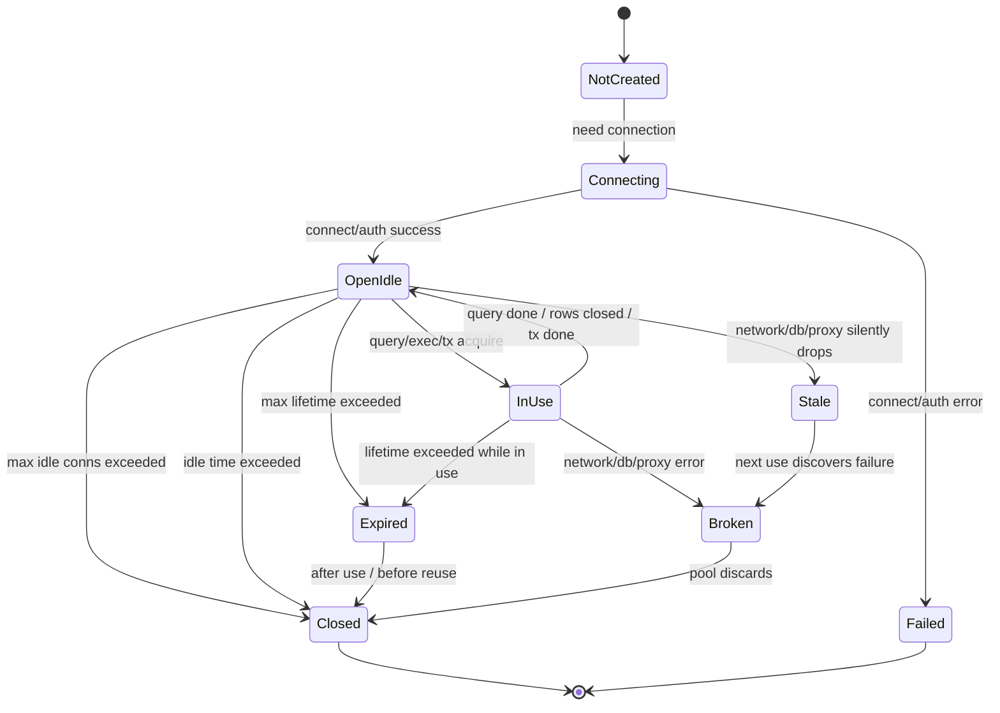
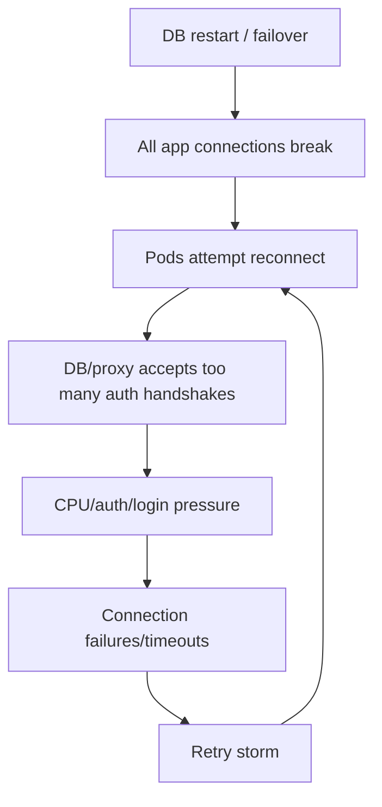
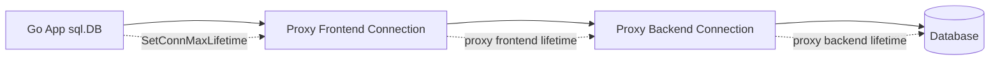
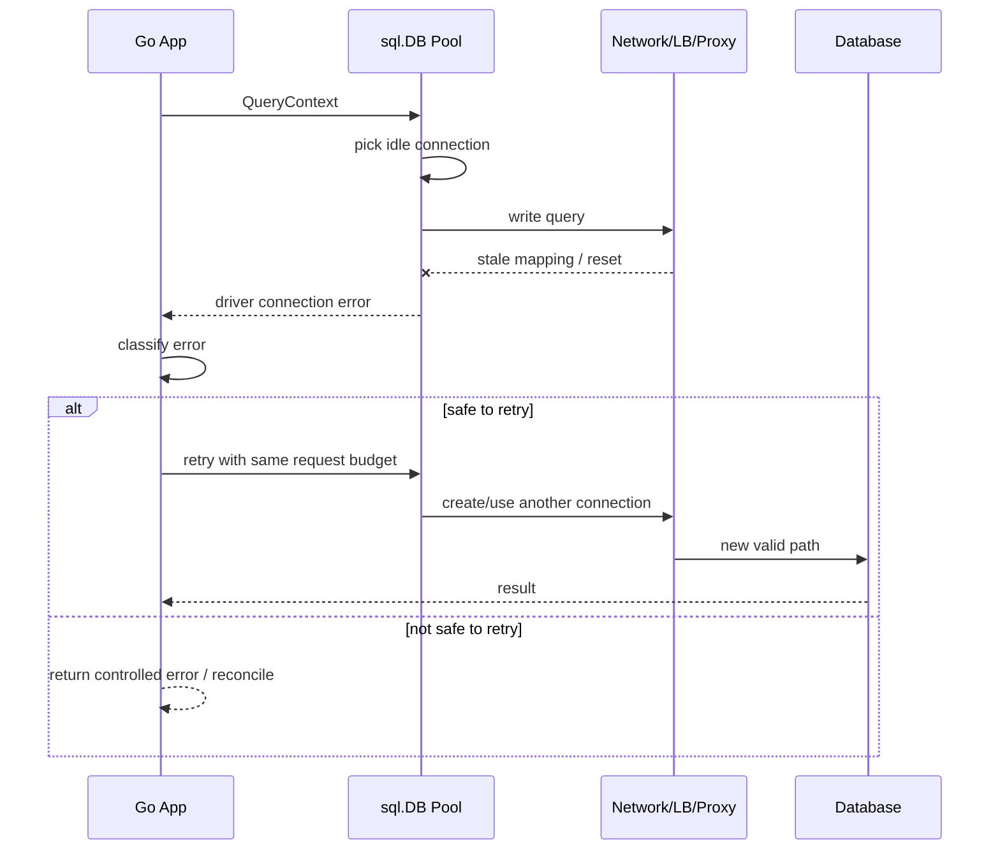

# learn-go-sql-database-integration-part-014.md

# Connection Lifetime, Idle Lifetime, and Network Reality

> Seri: `learn-go-sql-database-integration`  
> Part: `014`  
> Topik: `Connection Lifetime, Idle Lifetime, Stale Connections, Failover, DNS, Proxy, and Network Reality`  
> Target pembaca: Java software engineer yang ingin memahami Go database integration sampai level production architecture  
> Target Go: Go 1.26.x  
> Status seri: **belum selesai**  

---

## 0. Posisi Part Ini Dalam Seri

Sampai part sebelumnya kita sudah membahas:

- `*sql.DB` sebagai pool handle;
- pool state: open, idle, in-use, wait;
- `SetMaxOpenConns`;
- `SetMaxIdleConns`;
- pool sizing dan capacity planning;
- `DB.Stats()` sebagai observability primitive.

Part ini masuk ke lapisan yang sering diabaikan:

> Koneksi database bukan objek abstrak murni. Ia adalah resource fisik/logis yang hidup melewati TCP, TLS, DNS, NAT, load balancer, proxy, database session, authentication, transaction state, prepared statement state, dan server-side timeout.

Di atas kertas, connection pool terlihat sederhana:

```text
App -> sql.DB -> DB connection -> Database
```

Di production, kenyataannya lebih seperti ini:

```text
App process
  -> sql.DB pool
  -> driver
  -> TCP socket
  -> TLS
  -> node network
  -> NAT / firewall / service mesh
  -> load balancer / proxy / pooler
  -> database listener
  -> database backend process/session/thread
  -> transaction/session state
  -> storage/replication/failover system
```

Part ini menjawab:

1. Kenapa koneksi idle bisa mati diam-diam?
2. Kenapa `Ping` sukses bukan jaminan semua query berikutnya sukses?
3. Kenapa koneksi lama perlu direcycle?
4. Kenapa `ConnMaxLifetime` harus mempertimbangkan NAT/LB/proxy/database timeout?
5. Kenapa database failover bisa tetap menghasilkan error walau pool terlihat sehat?
6. Kenapa DNS change tidak otomatis memindahkan existing connections?
7. Kapan external pooler/proxy membantu dan kapan justru menambah kompleksitas?
8. Bagaimana mendesain config lifetime yang aman untuk production?

---

## 1. Tujuan Pembelajaran

Setelah menyelesaikan part ini, kamu harus mampu:

1. menjelaskan perbedaan open, idle, in-use, expired, stale, broken, dan closed connection;
2. memahami efek `SetConnMaxIdleTime` dan `SetConnMaxLifetime`;
3. membedakan app-side connection lifetime vs server-side connection timeout;
4. membuat lifetime policy yang aligned dengan load balancer, NAT, DB proxy, database timeout, credential rotation, dan failover;
5. menjelaskan kenapa DNS failover tidak mengubah koneksi yang sudah terbuka;
6. merancang strategy untuk failover dan reconnect storm;
7. memahami risiko session state, prepared statements, temporary tables, advisory locks, dan transaction state;
8. membaca `DB.Stats()` untuk mendiagnosis churn;
9. membuat runbook untuk stale connection dan failover incident;
10. memilih kapan memakai external DB proxy/pooler.

---

## 2. Fakta Dasar Dari Dokumentasi Go

Beberapa primitive resmi `database/sql` yang relevan:

1. `SetConnMaxIdleTime(d)` mengatur durasi maksimum sebuah connection boleh idle.
2. `SetConnMaxLifetime(d)` mengatur durasi maksimum sebuah connection boleh digunakan kembali.
3. Expired connection bisa ditutup secara lazy sebelum reuse.
4. `SetMaxIdleConns(n)` mengatur jumlah maksimum connection idle.
5. `SetMaxOpenConns(n)` mengatur jumlah maksimum open connection.
6. `DB.Stats()` menyediakan counter seperti `MaxIdleClosed`, `MaxIdleTimeClosed`, dan `MaxLifetimeClosed`.
7. Operasi context-aware seperti `QueryContext`, `ExecContext`, dan `PingContext` dapat memakai `context.Context` untuk timeout/cancellation, tetapi responsiveness tetap dipengaruhi driver/database behavior.

Referensi resmi:

- Go documentation — Managing connections: <https://go.dev/doc/database/manage-connections>
- Go package documentation — `database/sql`: <https://pkg.go.dev/database/sql>
- Go documentation — Canceling in-progress operations: <https://go.dev/doc/database/cancel-operations>
- Go documentation — Opening a database handle: <https://go.dev/doc/database/open-handle>

---

## 3. Mental Model: Connection Sebagai Resource Berumur

Connection bukan hanya “pointer ke database”.

Satu database connection biasanya mencakup:

- TCP socket;
- TLS session;
- authenticated database session;
- server-side backend process/thread/session object;
- user/role;
- current database/schema/search path;
- timezone/session variables;
- transaction state;
- prepared statement state;
- temporary object state;
- advisory lock/session lock;
- server-side memory allocation;
- network path identity;
- proxy/backend mapping.

Jadi saat kamu menyimpan idle connection di pool, kamu sebenarnya mempertahankan:

```text
application-side socket + server-side database session + possible session state
```

Ini berguna karena reconnect mahal.

Tapi ini juga berbahaya karena:

- network path bisa mati;
- server bisa close idle session;
- proxy bisa drop backend;
- DNS target bisa berubah;
- database failover bisa membuat connection lama invalid;
- credential/session policy bisa berubah;
- session state bisa stale;
- prepared statement bisa invalid;
- long idle connections bisa menahan resource.

---

## 4. Diagram Lifecycle Connection



Important nuance:

> Banyak connection failure baru diketahui saat connection dipakai lagi.

Idle socket yang sudah mati bisa terlihat normal dari sisi app sampai next read/write.

---

## 5. Open, Idle, In-Use, Expired, Stale, Broken

### 5.1 Open Connection

Open connection berarti connection object sudah dibuat dan belum ditutup dari sisi pool.

Open terdiri dari:

```text
OpenConnections = InUse + Idle
```

### 5.2 Idle Connection

Idle connection berarti connection sedang tidak dipakai query/transaction, tapi masih dipertahankan pool untuk reuse.

Kelebihan:

- lebih cepat daripada reconnect;
- menghindari auth/TLS overhead;
- mengurangi latency spike.

Kekurangan:

- tetap memakai DB-side session resource;
- bisa jadi stale;
- bisa menahan session state;
- bisa ikut reconnect storm saat database restart.

### 5.3 In-Use Connection

In-use berarti connection sedang dipakai oleh:

- query;
- exec;
- row iteration;
- transaction;
- prepared statement preparation/execution;
- ping;
- reserved `*sql.Conn`.

Connection in-use tidak bisa dipakai request lain.

### 5.4 Expired Connection

Expired berarti connection melewati `ConnMaxLifetime`.

Connection tidak selalu langsung dibunuh di tengah query. Umumnya ia ditutup saat selesai digunakan atau sebelum dipakai kembali.

Tujuan:

- recycle koneksi lama;
- avoid stale long-lived sessions;
- align dengan infra timeout;
- enable load redistribution;
- handle credential/failover hygiene.

### 5.5 Stale Connection

Stale berarti app masih punya connection object/socket, tapi network path atau server-side session tidak lagi valid.

Penyebab:

- firewall/NAT idle timeout;
- load balancer idle timeout;
- DB restarted;
- DB failover;
- proxy recycled backend;
- network partition;
- server closed idle session;
- TLS/session issue;
- TCP half-open condition.

### 5.6 Broken Connection

Broken berarti failure sudah terdeteksi saat dipakai.

Contoh error surface:

- connection reset by peer;
- broken pipe;
- EOF;
- bad connection;
- server closed the connection unexpectedly;
- network timeout;
- context deadline exceeded;
- driver-specific connection error.

---

## 6. `SetConnMaxIdleTime`

### 6.1 Fungsi

`SetConnMaxIdleTime` menentukan berapa lama connection boleh idle sebelum ditutup.

Contoh:

```go
db.SetConnMaxIdleTime(5 * time.Minute)
```

Artinya:

> Jika sebuah connection idle lebih dari 5 menit, pool boleh menutupnya.

### 6.2 Kapan Berguna?

Gunakan untuk:

- mengurangi idle DB sessions;
- menghindari connection terlalu lama idle;
- mengurangi stale connection setelah quiet period;
- menyesuaikan dengan NAT/LB idle timeout;
- membatasi resource low-traffic service;
- membersihkan session state lebih cepat.

### 6.3 Kapan Terlalu Pendek?

Jika terlalu pendek:

- connection churn meningkat;
- latency naik karena sering reconnect;
- DB auth/login meningkat;
- TLS handshake meningkat;
- `MaxIdleTimeClosed` meningkat tajam;
- log DB penuh connect/disconnect;
- startup/cold path lebih mahal.

### 6.4 Kapan Terlalu Panjang?

Jika terlalu panjang:

- banyak idle session bertahan;
- DB memory terpakai untuk session idle;
- stale connection lebih mungkin;
- failover recovery bisa lebih noisy;
- session state bertahan lama;
- credential rotation lebih lambat terasa.

### 6.5 Starting Point

Untuk banyak service OLTP:

```go
db.SetConnMaxIdleTime(5 * time.Minute)
```

Untuk low-traffic admin service:

```go
db.SetConnMaxIdleTime(1 * time.Minute)
```

Untuk high-throughput API dengan expensive connection setup:

```go
db.SetConnMaxIdleTime(10 * time.Minute)
```

Nilai final harus disesuaikan dengan traffic, database, proxy, dan network infrastructure.

---

## 7. `SetConnMaxLifetime`

### 7.1 Fungsi

`SetConnMaxLifetime` menentukan umur maksimum connection sejak dibuat.

Contoh:

```go
db.SetConnMaxLifetime(30 * time.Minute)
```

Artinya:

> Connection yang sudah berumur lebih dari 30 menit tidak akan dipakai terus-menerus selamanya; pool akan menutup/recycle sesuai lifecycle.

### 7.2 Kapan Berguna?

Gunakan untuk:

- recycle long-lived sessions;
- menghindari connection lebih tua dari infra timeout;
- force rediscovery setelah topology change;
- reduce stale server-side state;
- cooperate with load balancer/proxy;
- handle credential/session rotation;
- avoid database-side session lifetime limit;
- improve failover recovery over time.

### 7.3 Kapan Terlalu Pendek?

Jika terlalu pendek:

- connection churn tinggi;
- auth/TLS overhead naik;
- prepared statement cache tidak efektif;
- session warmup sering;
- `MaxLifetimeClosed` naik tajam;
- synchronized reconnect risk;
- latency spikes.

### 7.4 Kapan Terlalu Panjang?

Jika terlalu panjang:

- old sessions bertahan terlalu lama;
- DNS/topology change tidak terasa untuk existing connections;
- stale session risk naik;
- failover cleanup lebih lambat;
- credential rotation kurang cepat;
- uneven load distribution.

### 7.5 Starting Point

Untuk banyak service:

```go
db.SetConnMaxLifetime(30 * time.Minute)
```

Atau:

```go
db.SetConnMaxLifetime(55 * time.Minute)
```

jika infrastruktur punya 60-minute server/proxy timeout.

Rule of thumb:

```text
ConnMaxLifetime should usually be lower than the shortest relevant server/proxy/network hard lifetime.
```

Tapi jangan terlalu rendah sampai churn menjadi masalah.

---

## 8. Idle Time vs Lifetime

Keduanya berbeda.

| Setting | Mengukur dari | Menutup karena | Tujuan |
|---|---|---|---|
| `SetConnMaxIdleTime` | sejak connection idle | idle terlalu lama | cleanup idle/stale low-use connections |
| `SetConnMaxLifetime` | sejak connection dibuat | umur connection terlalu tua | recycle long-lived sessions |

Contoh:

```go
db.SetConnMaxIdleTime(5 * time.Minute)
db.SetConnMaxLifetime(30 * time.Minute)
```

Connection yang aktif terus-menerus bisa tidak pernah idle 5 menit, tapi tetap akan terkena lifetime 30 menit.

Connection yang baru dibuat tetapi idle 5 menit bisa ditutup walaupun lifetime belum 30 menit.

---

## 9. Network Reality

### 9.1 TCP Does Not Mean “Always Alive”

TCP connection bisa menjadi half-open atau stale ketika:

- peer mati tanpa FIN/RST yang diterima;
- NAT mapping hilang;
- firewall drop silent;
- load balancer menghapus idle mapping;
- network partition;
- database restart;
- VM/container/node berpindah;
- proxy failover.

Dari perspektif aplikasi, socket bisa tampak “ada” sampai next write/read.

### 9.2 TLS Adds Another Layer

TLS handshake dan session punya overhead.

Implication:

- terlalu sering reconnect bisa mahal;
- idle reuse mengurangi latency;
- certificate rotation dapat memengaruhi new connections;
- old TLS session mungkin tetap hidup sampai connection recycle;
- mTLS/service mesh bisa menambah behavior.

### 9.3 NAT and Firewall Idle Timeout

Banyak environment memiliki idle timeout pada:

- NAT gateway;
- firewall;
- load balancer;
- service mesh;
- database proxy;
- cloud network appliance.

Jika network device men-drop idle mapping setelah 10 menit, sementara app mempertahankan idle connection 1 jam, next reuse bisa gagal.

Mitigation:

```text
SetConnMaxIdleTime < network idle timeout
```

atau gunakan keepalive/driver/proxy setting yang sesuai.

### 9.4 Load Balancer Idle Timeout

Jika database endpoint melewati LB/proxy:

```text
app idle connection -> LB mapping -> backend DB/proxy
```

LB dapat close idle mapping.

Mitigation:

- align idle time;
- use shorter `ConnMaxIdleTime`;
- observe reset errors after idle periods;
- configure driver TCP keepalive if supported;
- use DB proxy metrics.

---

## 10. DNS Reality

### 10.1 DNS Affects New Connections, Not Existing Sockets

Jika database endpoint berubah IP karena failover:

```text
old open connection -> old IP/backend
new connection -> DNS lookup -> new IP/backend
```

Existing connection tidak otomatis pindah.

### 10.2 Why This Matters

During failover:

- existing in-use connections may fail;
- idle connections may become stale;
- new connections may resolve new primary;
- DNS cache can delay discovery;
- driver may cache addresses;
- OS resolver may cache;
- container runtime or DNS layer may cache;
- database proxy may hide topology change.

### 10.3 Mitigation

- set reasonable connection lifetime;
- close pool on fatal topology switch if application can detect it;
- handle retryable connection errors;
- use context deadlines;
- avoid long transactions;
- use DB proxy when appropriate;
- validate driver behavior;
- test failover.

---

## 11. Database Failover

Failover is one of the hardest realities for connection pools.

### 11.1 What Can Happen

During failover:

- primary becomes unavailable;
- open transactions abort;
- idle connections become invalid;
- in-flight queries fail;
- DNS endpoint changes;
- proxy routes to new primary;
- old primary may become replica;
- session state disappears;
- prepared statements disappear;
- advisory locks disappear;
- temporary tables disappear;
- replication catches up;
- writes may fail during promotion.

### 11.2 Application Behavior

A production-grade app should expect:

- some queries fail;
- some transactions fail;
- some commits may be ambiguous;
- connection errors spike;
- `PingContext` may fail temporarily;
- pool may churn;
- retries may amplify load;
- HPA may scale due to latency/error metrics;
- readiness may flap.

### 11.3 Transaction Ambiguity

The hardest case:

```text
client sends COMMIT
network fails before client receives response
```

Did commit happen?

Maybe.

This is called ambiguous commit.

Mitigation:

- idempotency keys;
- natural unique constraints;
- outbox/inbox;
- state transition invariants;
- reconciliation;
- do not blindly retry non-idempotent transaction;
- design business operation to be safely repeated or detected.

This topic will be explored deeper in transaction retry/idempotency part.

---

## 12. Reconnect Storm

A reconnect storm happens when many app instances lose connections and reconnect simultaneously.

Triggers:

- DB restart;
- DB failover;
- proxy restart;
- network blip;
- rolling restart of app;
- synchronized `ConnMaxLifetime`;
- idle connections all expire at similar time;
- HPA scale-out;
- deployment surge.

### 12.1 Failure Shape



### 12.2 Mitigation

- explicit `MaxOpenConns`;
- reasonable `MaxIdleConns`;
- avoid excessive idle sessions;
- stagger deployments;
- bounded retry with backoff and jitter;
- readiness with backoff;
- avoid liveness restart storm;
- external proxy if appropriate;
- connection lifetime not too synchronized;
- cap worker startup concurrency;
- use circuit breaker/load shedding.

### 12.3 Startup Connection Ramp

Bad startup pattern:

```go
for i := 0; i < 100; i++ {
	go warmupQuery(db)
}
```

Better:

```go
// Let the pool grow naturally, or warm up with strict small concurrency.
```

Pool warmup should be controlled.

---

## 13. Session State Risk

Connection pooling assumes connection reuse is safe.

But session state can violate that assumption.

Examples:

- `SET search_path`;
- `SET timezone`;
- `SET ROLE`;
- temporary tables;
- session variables;
- advisory locks;
- prepared statements;
- isolation level changes;
- lock timeout changes;
- statement timeout changes;
- NLS/session settings in Oracle;
- SQL Server session settings;
- MySQL user variables.

### 13.1 Dangerous Pattern

```go
_, err := db.ExecContext(ctx, "SET search_path TO tenant_a")
if err != nil {
	return err
}

rows, err := db.QueryContext(ctx, "SELECT * FROM orders")
```

Problem:

- `SET` may run on connection A;
- `SELECT` may run on connection B;
- or worse, connection A returns to pool with modified session state.

### 13.2 Safer Patterns

1. Put schema/tenant in SQL explicitly.
2. Use transaction and set local transaction state if DB supports it.
3. Use `*sql.Conn` only when you truly need one reserved connection, and reset state before release.
4. Use driver/database features for connection initialization if available.
5. Avoid session-level mutable state in pooled environments.
6. Use separate DB user/role/schema when appropriate.

### 13.3 Transaction-Local State

For PostgreSQL, patterns like transaction-local settings are safer than session-global settings, but still DB-specific.

Conceptually:

```sql
SET LOCAL statement_timeout = '500ms';
```

inside a transaction is safer than session-global setting because it ends with transaction.

Always validate behavior per DB.

---

## 14. Reserved Connections With `*sql.Conn`

`DB.Conn(ctx)` reserves a single connection from the pool.

Use cases:

- session-specific operations;
- advisory lock that must stay on same session;
- temporary table workflows;
- driver-specific raw operations;
- controlled sequence of operations that must use same connection without transaction.

But it is dangerous if held too long.

Example:

```go
conn, err := db.Conn(ctx)
if err != nil {
	return err
}
defer conn.Close()

if _, err := conn.ExecContext(ctx, "SELECT 1"); err != nil {
	return err
}
```

Important:

- `conn.Close()` returns connection to pool.
- It does not necessarily close physical connection.
- Holding `*sql.Conn` is similar to holding a pool slot.
- Do not store it globally.
- Do not use it for normal repository operations.
- Always reset session state before release if modified.

---

## 15. Prepared Statement State and Lifetime

Prepared statements can exist at different levels:

- client-side statement object;
- connection-bound server prepared statement;
- transaction-bound statement;
- driver-managed cache;
- database plan cache.

Connection lifetime affects prepared statement reuse.

If `ConnMaxLifetime` is too short:

- server prepared statements churn;
- plan cache usefulness drops;
- preparation overhead increases.

If too long:

- old plans/session state may persist;
- failover invalidates prepared statements;
- schema migration may invalidate statements.

Prepared statement behavior is driver-specific.

Guidelines:

1. Do not assume prepared statements are global across connections.
2. Avoid preparing high-cardinality dynamic SQL.
3. Observe prepare/execute errors after failover or migration.
4. Keep lifetime reasonable.
5. Understand proxy compatibility.

---

## 16. External Poolers and Proxies

### 16.1 Why Use Them?

External DB proxy/pooler can help with:

- reducing backend connection count;
- connection reuse across app instances;
- smoothing reconnect storm;
- failover handling;
- authentication offload;
- IAM/token rotation integration;
- centralizing connection limits;
- protecting database.

### 16.2 What They Do Not Solve

They do not solve:

- bad SQL;
- long transactions;
- lock contention;
- missing indexes;
- excessive write amplification;
- bad retry policy;
- unbounded report queries;
- application-level pool exhaustion.

### 16.3 Risk Areas

Ask:

1. Does it support transaction pooling, session pooling, or statement pooling?
2. Does it preserve session state?
3. Does it work with prepared statements?
4. Does it work with temporary tables?
5. Does it support advisory locks?
6. Does it support `LISTEN/NOTIFY`?
7. Does it support connection pinning?
8. Does it change error messages?
9. Does it expose backend and frontend metrics?
10. Does it handle failover or merely pass errors through?
11. Does it support TLS/mTLS?
12. Does it have its own idle/lifetime settings?
13. Does it introduce another single point of failure?

### 16.4 App Pool Still Required

Even with proxy:

```text
App sql.DB pool -> Proxy pool -> Database backend connections
```

You still need app-side `MaxOpenConns` to control concurrency and prevent goroutine explosion.

---

## 17. Lifetime Settings With External Proxy

When using proxy, there are at least three lifetimes:

```text
App connection lifetime
Proxy frontend connection lifetime
Proxy backend database connection lifetime
```

Diagram:



If app lifetime is too long and proxy frontend closes earlier, app sees stale/broken connection.

If app lifetime is too short, proxy sees excessive frontend churn.

If proxy backend lifetime is too long, failover/backend redistribution may be slow.

Config must be reviewed end-to-end.

---

## 18. Cloud Database Reality

Managed databases add more layers:

- managed failover;
- DNS endpoint;
- proxy endpoint;
- maintenance windows;
- connection limits based on instance class;
- idle session cleanup;
- TLS requirement;
- IAM auth token lifetime;
- parameter groups;
- read replica lag;
- backup/snapshot I/O impact;
- storage autoscaling;
- multi-AZ failover;
- network security group/NACL/firewall behavior.

Implication:

> Do not tune Go pool in isolation. Tune against the managed database’s documented behavior and your organization’s operational constraints.

---

## 19. Credential Rotation

Credential rotation interacts with connection lifetime.

If password/token changes:

- existing authenticated sessions may continue until closed, depending on DB;
- new connections may require new credential;
- old pool connections may mask rotation issue temporarily;
- after lifetime expiry, new connections may fail if app config not updated;
- IAM token-based auth may require shorter lifetime.

Guidelines:

1. reload credentials safely;
2. do not log credentials;
3. set connection lifetime compatible with token lifetime;
4. test rotation in staging;
5. monitor new connection failures;
6. avoid all connections expiring at once;
7. consider `db.Close()` and recreate handle for hard rotation, if required.

### 19.1 Rotation Strategy Pattern

```text
1. publish new credential
2. app reloads config
3. new connections use new credential
4. old connections drain via lifetime
5. revoke old credential after safe drain window
```

If immediate revocation is needed:

```text
1. publish new credential
2. app recreates DB pool
3. close old pool after in-flight drain
4. revoke old credential
```

Be careful with in-flight transactions.

---

## 20. TLS Certificate Rotation

TLS certificate rotation can affect:

- new connections;
- server certificate validation;
- client certificate authentication;
- CA bundle;
- service mesh identity;
- proxy frontend/backend cert.

Guidelines:

- deploy CA bundle before server cert switch;
- keep overlap period;
- test new connection creation;
- recycle connections after cert rollout if necessary;
- monitor TLS handshake errors;
- avoid too-long lifetime during security rotations;
- avoid too-short lifetime during high traffic.

---

## 21. Readiness and Liveness During Network Events

### 21.1 Liveness Should Not Restart Too Aggressively

Bad:

```text
DB temporarily unavailable -> liveness fails -> Kubernetes restarts all pods -> reconnect storm
```

Liveness should usually answer:

> Is this process internally alive?

Readiness should answer:

> Should this pod receive traffic right now?

### 21.2 Readiness With Backoff

Readiness can check DB dependency, but must be careful:

- timeout short;
- backoff/cached state;
- avoid hammering DB during outage;
- no heavy query;
- do not use readiness to create thundering herd.

Example:

```go
func dbReady(ctx context.Context, db *sql.DB) error {
	ctx, cancel := context.WithTimeout(ctx, 200*time.Millisecond)
	defer cancel()

	return db.PingContext(ctx)
}
```

But if 100 pods call this every second during outage, it can amplify pressure.

### 21.3 Startup Probe

For slow boot or DB warming, startup probe may prevent premature liveness restarts.

This is Kubernetes-specific operational design, not `database/sql` itself.

---

## 22. Handling Stale Connections in Code

Usually, application code should not manually test every connection before every query.

Let pool/driver detect bad connections and retry at safe boundary if operation is idempotent.

### 22.1 Bad Pattern

```go
if err := db.PingContext(ctx); err != nil {
	return err
}

return doQuery(ctx, db)
```

This does not guarantee query succeeds. Another connection may be used, or DB can fail between ping and query.

### 22.2 Better Pattern

```go
err := doQuery(ctx, db)
if isRetryableConnectionError(err) {
	// Retry only if operation is safe/idempotent and within budget.
	return doQuery(ctx, db)
}
return err
```

But classification is driver-specific.

### 22.3 Important

Retrying `SELECT` is usually safer than retrying `INSERT/UPDATE` with side effects.

For writes, use:

- idempotency key;
- unique constraint;
- transaction retry rules;
- operation status table;
- outbox/inbox;
- reconciliation.

---

## 23. Error Classification

Connection/lifetime failures may surface as:

- context timeout;
- driver bad connection;
- EOF;
- connection reset;
- broken pipe;
- server closed connection;
- connection refused;
- no route to host;
- DNS failure;
- TLS error;
- authentication failure;
- database shutdown;
- read-only transaction after failover;
- stale prepared statement;
- statement timeout;
- lock timeout.

Classify errors into categories:

```text
1. transient connection error
2. transient database failover error
3. timeout/cancellation
4. retryable transaction conflict
5. non-retryable constraint/domain error
6. authentication/configuration error
7. programmer error
8. unknown
```

Do not treat all DB errors as retryable.

---

## 24. Lifetime and Transaction Boundaries

A connection may exceed max lifetime during a transaction.

The pool should not kill it mid-query just because lifetime elapsed. It generally closes expired connection after it is returned or before reuse.

Implication:

- `ConnMaxLifetime` does not limit transaction duration;
- use context deadline and DB-side statement/transaction timeout for that;
- long transactions still hold pool slots;
- lifetime is not a substitute for transaction timeout.

---

## 25. Database-Side Timeout Alignment

There can be multiple timeouts:

| Layer | Example |
|---|---|
| HTTP/request | request context deadline |
| app DB operation | `context.WithTimeout` |
| driver connect | DSN connect timeout |
| driver read/write | DSN read/write timeout |
| DB statement | statement timeout |
| DB lock | lock timeout |
| DB idle session | idle session timeout |
| DB transaction idle | idle-in-transaction timeout |
| proxy frontend | frontend idle timeout |
| proxy backend | backend idle/lifetime |
| network | NAT/LB/firewall idle timeout |

A good system avoids contradictory settings.

Example bad alignment:

```text
NAT idle timeout             = 10 minutes
ConnMaxIdleTime              = 60 minutes
DB server idle timeout        = 30 minutes
```

App may reuse idle connection after NAT already forgot it.

Better:

```text
NAT idle timeout             = 10 minutes
ConnMaxIdleTime              = 5 minutes
DB server idle timeout        = 30 minutes
```

Another example:

```text
IAM auth token lifetime       = 15 minutes
ConnMaxLifetime               = 2 hours
```

Depending on DB/proxy auth behavior, this may or may not be acceptable. Validate explicitly.

---

## 26. Session Reset and Connection Reuse

Some drivers/databases reset session state when returning connection to pool; others may not reset everything.

Do not rely on undocumented reset behavior.

Risk examples:

- one request sets role;
- another request inherits it;
- one request changes timezone;
- another request gets different timestamp semantics;
- one tenant sets schema;
- another tenant reads wrong schema;
- one request creates temp table;
- another sees collision/unexpected state.

Best practice:

1. avoid mutable session state;
2. use explicit SQL qualification;
3. use transaction-local settings;
4. close/recreate connection if state cannot be safely reset;
5. isolate by separate pool/user when necessary;
6. test with concurrent requests.

---

## 27. Connection Lifetime and Multi-Tenant Systems

Multi-tenant systems often tempt engineers to use session state:

```sql
SET app.current_tenant = 'tenant_a';
```

or:

```sql
SET search_path = tenant_a;
```

In pooled connections, this is risky.

Safer options:

- explicit `tenant_id` column and predicate;
- row-level security with transaction-local setting, carefully reset;
- separate schema but explicit schema qualification;
- separate database/user/pool per tenant for high-isolation tenants;
- avoid session global mutation;
- test for tenant bleed.

For regulatory systems, tenant/case boundary leakage is severe. Prefer boring explicitness over clever session mutation.

---

## 28. Connection Lifetime and Time Zone

Time zone can exist in multiple places:

- app process timezone;
- Go `time.Location`;
- DB session timezone;
- column type semantics;
- driver parse behavior;
- DSN timezone parameter;
- user display timezone.

If a connection has session timezone changed and reused, timestamps can be misinterpreted.

Rules:

1. store instants consistently, usually UTC;
2. know DB column type semantics;
3. avoid per-request session timezone changes;
4. convert for display at API/application boundary;
5. set DB session timezone globally through DSN/init if needed and keep it stable;
6. test daylight saving edge cases if relevant.

---

## 29. Connection Lifetime and Role/Security Context

Changing DB role per request is risky in pooled systems.

Bad:

```sql
SET ROLE admin_role;
```

Then connection returns to pool without reset.

Safer:

- use separate pool per role;
- use transaction-local role if DB supports and guarantees reset;
- use explicit authorization in app and DB constraints;
- reset role before returning connection;
- avoid direct role mutation per request unless deeply understood.

Security context leakage is not just a bug; it can be a compliance incident.

---

## 30. Pool Churn

Pool churn means connections are frequently opened and closed.

Causes:

- `ConnMaxLifetime` too short;
- `ConnMaxIdleTime` too short;
- `MaxIdleConns` too low;
- database/proxy closing sessions;
- network instability;
- credential/auth failures;
- connection errors under load;
- failover;
- pod restarts.

Signals:

- `MaxIdleClosed` rising fast;
- `MaxIdleTimeClosed` rising fast;
- `MaxLifetimeClosed` rising fast;
- DB connect/disconnect logs spike;
- auth CPU rises;
- TLS handshake latency rises;
- p99 latency spikes;
- errors after idle period.

### 30.1 Churn Diagnostic Table

| Symptom | Likely Cause |
|---|---|
| high `MaxIdleClosed` | idle pool too small |
| high `MaxIdleTimeClosed` | idle time too short or traffic bursty |
| high `MaxLifetimeClosed` | lifetime too short or all conns same age |
| connection reset after idle | network/proxy/server idle timeout mismatch |
| errors after DB maintenance | stale connections after restart/failover |
| high connect latency | TLS/auth/network/DB listener pressure |
| repeated auth failures | credential rotation/config mismatch |

---

## 31. Code: Lifetime Configuration Type

```go
package dbconfig

import (
	"database/sql"
	"fmt"
	"time"
)

type LifetimeConfig struct {
	MaxIdleConns    int
	ConnMaxIdleTime time.Duration
	ConnMaxLifetime time.Duration
}

func (c LifetimeConfig) Validate(maxOpen int) error {
	if c.MaxIdleConns < 0 {
		return fmt.Errorf("MaxIdleConns must be >= 0")
	}
	if maxOpen > 0 && c.MaxIdleConns > maxOpen {
		return fmt.Errorf("MaxIdleConns must be <= MaxOpenConns")
	}
	if c.ConnMaxIdleTime < 0 {
		return fmt.Errorf("ConnMaxIdleTime must be >= 0")
	}
	if c.ConnMaxLifetime < 0 {
		return fmt.Errorf("ConnMaxLifetime must be >= 0")
	}
	return nil
}

func ApplyLifetimeConfig(db *sql.DB, cfg LifetimeConfig) {
	db.SetMaxIdleConns(cfg.MaxIdleConns)
	db.SetConnMaxIdleTime(cfg.ConnMaxIdleTime)
	db.SetConnMaxLifetime(cfg.ConnMaxLifetime)
}
```

---

## 32. Code: Full Pool Config With Network-Aware Comments

```go
package dbconfig

import (
	"database/sql"
	"fmt"
	"time"
)

type PoolConfig struct {
	MaxOpenConns    int
	MaxIdleConns    int
	ConnMaxIdleTime time.Duration
	ConnMaxLifetime time.Duration
}

func (c PoolConfig) Validate() error {
	if c.MaxOpenConns <= 0 {
		return fmt.Errorf("MaxOpenConns must be > 0")
	}
	if c.MaxIdleConns < 0 {
		return fmt.Errorf("MaxIdleConns must be >= 0")
	}
	if c.MaxIdleConns > c.MaxOpenConns {
		return fmt.Errorf("MaxIdleConns must be <= MaxOpenConns")
	}
	if c.ConnMaxIdleTime < 0 {
		return fmt.Errorf("ConnMaxIdleTime must be >= 0")
	}
	if c.ConnMaxLifetime < 0 {
		return fmt.Errorf("ConnMaxLifetime must be >= 0")
	}
	return nil
}

func ApplyPoolConfig(db *sql.DB, cfg PoolConfig) error {
	if err := cfg.Validate(); err != nil {
		return err
	}

	db.SetMaxOpenConns(cfg.MaxOpenConns)
	db.SetMaxIdleConns(cfg.MaxIdleConns)

	// Should be less than relevant NAT/LB/proxy/server idle timeout
	// when those devices silently drop idle connections.
	db.SetConnMaxIdleTime(cfg.ConnMaxIdleTime)

	// Should be less than relevant hard connection lifetime/token/proxy limit,
	// but not so low that it causes churn.
	db.SetConnMaxLifetime(cfg.ConnMaxLifetime)

	return nil
}
```

---

## 33. Code: Stats Delta For Churn Detection

```go
package dbmetrics

import (
	"database/sql"
	"time"
)

type PoolSnapshot struct {
	At                    time.Time
	Open                  int
	InUse                 int
	Idle                  int
	WaitCount             int64
	WaitDuration          time.Duration
	MaxIdleClosed         int64
	MaxIdleTimeClosed     int64
	MaxLifetimeClosed     int64
}

func Capture(db *sql.DB) PoolSnapshot {
	s := db.Stats()
	return PoolSnapshot{
		At:                    time.Now(),
		Open:                  s.OpenConnections,
		InUse:                 s.InUse,
		Idle:                  s.Idle,
		WaitCount:             s.WaitCount,
		WaitDuration:          s.WaitDuration,
		MaxIdleClosed:         s.MaxIdleClosed,
		MaxIdleTimeClosed:     s.MaxIdleTimeClosed,
		MaxLifetimeClosed:     s.MaxLifetimeClosed,
	}
}

type PoolDelta struct {
	Window                    time.Duration
	WaitCountDelta            int64
	WaitDurationDelta         time.Duration
	MaxIdleClosedDelta         int64
	MaxIdleTimeClosedDelta     int64
	MaxLifetimeClosedDelta     int64
}

func Diff(prev, curr PoolSnapshot) PoolDelta {
	return PoolDelta{
		Window:                    curr.At.Sub(prev.At),
		WaitCountDelta:            curr.WaitCount - prev.WaitCount,
		WaitDurationDelta:         curr.WaitDuration - prev.WaitDuration,
		MaxIdleClosedDelta:         curr.MaxIdleClosed - prev.MaxIdleClosed,
		MaxIdleTimeClosedDelta:     curr.MaxIdleTimeClosed - prev.MaxIdleTimeClosed,
		MaxLifetimeClosedDelta:     curr.MaxLifetimeClosed - prev.MaxLifetimeClosed,
	}
}
```

---

## 34. Code: Safe DB Initialization

```go
package appdb

import (
	"context"
	"database/sql"
	"fmt"
	"log/slog"
	"time"
)

type Config struct {
	DriverName      string
	DSN             string
	MaxOpenConns    int
	MaxIdleConns    int
	ConnMaxIdleTime time.Duration
	ConnMaxLifetime time.Duration
	PingTimeout     time.Duration
}

func Open(ctx context.Context, logger *slog.Logger, cfg Config) (*sql.DB, error) {
	if cfg.DriverName == "" {
		return nil, fmt.Errorf("database driver name is required")
	}
	if cfg.DSN == "" {
		return nil, fmt.Errorf("database DSN is required")
	}
	if cfg.PingTimeout <= 0 {
		cfg.PingTimeout = 5 * time.Second
	}

	db, err := sql.Open(cfg.DriverName, cfg.DSN)
	if err != nil {
		return nil, fmt.Errorf("open database handle: %w", err)
	}

	db.SetMaxOpenConns(cfg.MaxOpenConns)
	db.SetMaxIdleConns(cfg.MaxIdleConns)
	db.SetConnMaxIdleTime(cfg.ConnMaxIdleTime)
	db.SetConnMaxLifetime(cfg.ConnMaxLifetime)

	pingCtx, cancel := context.WithTimeout(ctx, cfg.PingTimeout)
	defer cancel()

	if err := db.PingContext(pingCtx); err != nil {
		_ = db.Close()
		return nil, fmt.Errorf("ping database: %w", err)
	}

	logger.Info(
		"database pool initialized",
		slog.String("db.driver", cfg.DriverName),
		slog.Int("db.pool.max_open", cfg.MaxOpenConns),
		slog.Int("db.pool.max_idle", cfg.MaxIdleConns),
		slog.Duration("db.pool.conn_max_idle_time", cfg.ConnMaxIdleTime),
		slog.Duration("db.pool.conn_max_lifetime", cfg.ConnMaxLifetime),
	)

	return db, nil
}
```

Do not log DSN.

---

## 35. Code: Recreate Pool For Hard Credential Rotation

Sometimes draining old connections through lifetime is enough. Sometimes policy requires recreating the pool.

One possible pattern:

```go
package appdb

import (
	"context"
	"database/sql"
	"fmt"
	"sync"
)

type Holder struct {
	mu sync.RWMutex
	db *sql.DB
}

func NewHolder(db *sql.DB) *Holder {
	return &Holder{db: db}
}

func (h *Holder) DB() *sql.DB {
	h.mu.RLock()
	defer h.mu.RUnlock()
	return h.db
}

func (h *Holder) Replace(ctx context.Context, next *sql.DB) error {
	if next == nil {
		return fmt.Errorf("next db is nil")
	}

	h.mu.Lock()
	old := h.db
	h.db = next
	h.mu.Unlock()

	// Closing old DB prevents new operations on old pool.
	// Existing operations are allowed to finish according to database/sql behavior.
	if old != nil {
		if err := old.Close(); err != nil {
			return fmt.Errorf("close old db: %w", err)
		}
	}

	return nil
}
```

Caution:

- repositories must fetch current DB safely;
- replacing DB mid-transaction needs careful design;
- not all apps need dynamic replacement;
- many systems prefer process restart with rolling deployment.

---

## 36. Driver-Specific Reality

`database/sql` abstracts common behavior, but drivers differ in:

- connection validation;
- keepalive options;
- read/write timeout;
- connect timeout;
- TLS config;
- cancellation protocol;
- error classification;
- session reset behavior;
- prepared statement behavior;
- failover support;
- multi-host DSN support;
- proxy compatibility;
- database-specific type behavior.

Therefore:

> Lifetime tuning is not complete until you read your driver documentation and test your deployment topology.

For example:

- MySQL driver exposes DSN parameters such as connection/read/write timeouts.
- PostgreSQL drivers may support context cancellation, runtime parameters, application name, TLS config, and native pooling behavior depending on driver.
- Oracle drivers may involve OCI/ODPI-C, session pools, and Oracle-specific session state.
- SQLite has very different “connection” semantics because it is embedded/file-backed.

---

## 37. Database-Specific Notes

### 37.1 PostgreSQL

Concerns:

- backend process per connection;
- `statement_timeout`;
- `lock_timeout`;
- `idle_in_transaction_session_timeout`;
- prepared statement lifetime;
- PgBouncer compatibility;
- advisory locks session vs transaction;
- `LISTEN/NOTIFY` requires persistent session;
- failover may produce read-only errors or connection termination;
- DNS/proxy endpoint behavior matters.

Guidelines:

- avoid long idle-in-transaction;
- set statement/lock timeout intentionally;
- understand PgBouncer mode;
- do not use session features with transaction pooling;
- handle SQLSTATE for retry classification.

### 37.2 MySQL / MariaDB

Concerns:

- server `wait_timeout`;
- `interactive_timeout`;
- `max_connections`;
- connection reset;
- autocommit/session variables;
- timezone and `parseTime`;
- read/write timeout DSN;
- connection lifetime recommended by driver docs;
- failover can produce stale connections.

Guidelines:

- align `ConnMaxLifetime` with server/proxy timeout;
- set driver timeout parameters;
- avoid session variables leaking;
- classify duplicate/deadlock/lock wait errors.

### 37.3 SQL Server

Concerns:

- session settings;
- transaction isolation;
- connection reset behavior;
- availability group failover;
- login timeout;
- command timeout;
- MARS if used;
- prepared statements and plan cache.

Guidelines:

- test failover;
- avoid mutable session state;
- observe login errors and transient error numbers.

### 37.4 Oracle

Concerns:

- server sessions and processes;
- session state/NLS settings;
- CLOB/BLOB handling;
- statement cache;
- DRCP/session pooling if used;
- Oracle Net timeout;
- failover/TAF/FAN depending setup;
- session memory.

Guidelines:

- understand driver/OCI behavior;
- avoid leaking session state;
- set pool/lifetime with DBA coordination;
- monitor sessions and wait events.

### 37.5 SQLite

Concerns:

- embedded DB, not network DB;
- file locks;
- connection count has different meaning;
- WAL mode;
- busy timeout;
- CGO vs pure Go driver;
- read/write concurrency limited by SQLite semantics.

Guidelines:

- do not apply network DB pool heuristics blindly;
- often use very small pool;
- test locking behavior.

---

## 38. Production Config Examples

### 38.1 OLTP API Behind Managed DB Endpoint

```go
db.SetMaxOpenConns(12)
db.SetMaxIdleConns(6)
db.SetConnMaxIdleTime(5 * time.Minute)
db.SetConnMaxLifetime(30 * time.Minute)
```

Assumptions:

- short queries;
- steady traffic;
- DB budget supports this;
- network idle timeout > 5 minutes;
- failover tested.

### 38.2 Low-Traffic Admin Service

```go
db.SetMaxOpenConns(4)
db.SetMaxIdleConns(1)
db.SetConnMaxIdleTime(1 * time.Minute)
db.SetConnMaxLifetime(15 * time.Minute)
```

Assumptions:

- low traffic;
- minimize idle DB sessions;
- slight reconnect overhead acceptable.

### 38.3 Report Worker

```go
db.SetMaxOpenConns(2)
db.SetMaxIdleConns(1)
db.SetConnMaxIdleTime(2 * time.Minute)
db.SetConnMaxLifetime(20 * time.Minute)
```

Assumptions:

- long queries;
- protect DB and API traffic;
- report concurrency intentionally capped.

### 38.4 DB Proxy Frontend

```go
db.SetMaxOpenConns(20)
db.SetMaxIdleConns(10)
db.SetConnMaxIdleTime(4 * time.Minute)
db.SetConnMaxLifetime(25 * time.Minute)
```

Assumptions:

- proxy frontend idle timeout > 4 minutes;
- proxy lifetime > 25 minutes;
- DB backend connection budget protected by proxy;
- app pool still caps application concurrency.

These are examples, not universal prescriptions.

---

## 39. Testing Network and Lifetime Behavior

### 39.1 What To Test

1. idle connection after quiet period;
2. database restart;
3. database failover;
4. proxy restart;
5. DNS endpoint change;
6. credential rotation;
7. TLS certificate rotation;
8. connection lifetime expiry under load;
9. idle timeout mismatch;
10. long transaction during failover;
11. prepared statement after schema change;
12. session state leak across requests;
13. app rolling restart;
14. HPA scale-out;
15. worker startup burst.

### 39.2 Test: Idle Reuse

Procedure:

```text
1. start app
2. run query
3. wait longer than network/proxy idle timeout
4. run query again
5. observe error/recovery
```

Expected:

- app may see one connection error;
- driver/pool should discard bad connection;
- retry only if operation safe;
- no prolonged outage.

### 39.3 Test: DB Restart

Procedure:

```text
1. generate steady traffic
2. restart DB or proxy in controlled environment
3. observe in-flight query errors
4. observe pool recovery
5. observe reconnect rate
6. observe readiness behavior
7. observe retry behavior
```

Expected:

- errors spike briefly;
- app does not restart storm;
- DB not overwhelmed by reconnect;
- service recovers.

### 39.4 Test: DNS Failover

Procedure:

```text
1. app connects to endpoint
2. change endpoint target/failover
3. observe existing connection behavior
4. observe new connection behavior
5. measure recovery time
```

Expected:

- existing sockets may fail;
- new connections eventually use new target;
- lifetime/idle settings help recycle old connections.

---

## 40. Observability For Lifetime and Network Issues

### 40.1 App Metrics

Export:

- open connections;
- in-use;
- idle;
- wait count;
- wait duration;
- max idle closed;
- max idle time closed;
- max lifetime closed;
- connection errors by class;
- query timeout;
- connect timeout;
- retry count;
- readiness failure;
- ping failure.

### 40.2 DB Metrics

Monitor:

- total sessions;
- active sessions;
- idle sessions;
- login rate;
- session duration;
- wait events;
- CPU;
- memory;
- network errors;
- killed sessions;
- failover event;
- restart event;
- authentication failures.

### 40.3 Proxy/LB Metrics

Monitor:

- frontend connections;
- backend connections;
- connection reuse;
- rejected connections;
- idle timeout closes;
- failover events;
- DNS/backend health;
- TLS handshake errors;
- auth errors.

### 40.4 Log Patterns

Search for:

- `connection reset by peer`;
- `broken pipe`;
- `EOF`;
- `server closed the connection`;
- `bad connection`;
- `connection refused`;
- `i/o timeout`;
- `no such host`;
- `TLS handshake`;
- `read-only transaction`;
- `terminating connection`;
- `database system is starting up`;
- driver-specific fatal codes.

---

## 41. Alerting

### 41.1 Churn Alert

```text
rate(MaxLifetimeClosed) unexpectedly high
OR rate(MaxIdleTimeClosed) unexpectedly high
OR DB login rate unexpectedly high
```

Interpretation:

- lifetime too low;
- idle time too low;
- network/proxy closing;
- app restart;
- failover;
- credential issue.

### 41.2 Stale Connection Alert

```text
connection reset / EOF / bad connection errors spike after idle periods
```

Interpretation:

- idle timeout mismatch;
- network device silently drops;
- server idle timeout lower than app idle time.

### 41.3 Failover Alert

```text
connection errors spike
AND DB failover/restart event detected
```

Expected to some extent. Alert if recovery exceeds threshold or retry storm appears.

### 41.4 Reconnect Storm Alert

```text
DB login rate high
AND app pod count high/restarting
AND connection errors high
```

Immediate mitigation may require reducing traffic, disabling worker, or scaling carefully.

---

## 42. Runbook: Stale Connections After Idle Period

### Symptom

After low-traffic period, first request fails with connection reset/EOF.

### Likely Cause

Idle connection retained longer than network/proxy/server idle timeout.

### Checks

1. Check `ConnMaxIdleTime`.
2. Check NAT/LB/proxy idle timeout.
3. Check DB server idle timeout.
4. Check driver keepalive options.
5. Check errors after idle windows.
6. Check `MaxIdleTimeClosed`.

### Mitigation

- lower `SetConnMaxIdleTime`;
- enable/tune TCP keepalive if appropriate;
- align proxy/server idle timeout;
- add safe retry for idempotent operations;
- monitor recurrence.

---

## 43. Runbook: Errors During DB Failover

### Symptom

Connection errors, timeouts, read-only errors, failed transactions during failover.

### Expected

Some errors are normal during failover.

### Checks

1. Confirm failover event time.
2. Check app error spike.
3. Check DB endpoint/DNS.
4. Check existing connection recovery.
5. Check retry volume.
6. Check pool `Open/InUse/Wait`.
7. Check DB login rate.
8. Check readiness flapping.
9. Check worker/report jobs.
10. Check ambiguous write operations.

### Mitigation

- pause non-critical workers;
- enable degraded mode if available;
- ensure retry backoff/jitter;
- avoid manual full pod restart unless necessary;
- verify new primary write capability;
- reconcile ambiguous operations;
- review transaction idempotency.

---

## 44. Runbook: Connection Churn

### Symptom

High connect/disconnect rate, p99 latency spikes, DB auth CPU high.

### Checks

1. Check `MaxLifetimeClosed`.
2. Check `MaxIdleTimeClosed`.
3. Check `MaxIdleClosed`.
4. Check app restarts.
5. Check lifetime values.
6. Check idle values.
7. Check proxy closing connections.
8. Check DB server logs.
9. Check credential/TLS errors.
10. Check deployment schedule.

### Mitigation

- increase lifetime if too low;
- increase idle time if too low;
- increase `MaxIdleConns` if too low;
- stagger rollouts;
- reduce startup warmup;
- fix proxy/server mismatch.

---

## 45. Runbook: Session State Leak

### Symptom

Requests behave inconsistently:

- wrong schema;
- wrong timezone;
- wrong role;
- wrong tenant;
- unexpected temp table;
- permissions differ between requests.

### Checks

1. Search code for `SET`.
2. Search code for `USE database/schema`.
3. Search code for temp tables.
4. Search code for `DB.Conn`.
5. Search code for session variables.
6. Check whether state is transaction-local or session-global.
7. Check connection reuse behavior.
8. Check test coverage for cross-tenant/cross-user requests.

### Mitigation

- avoid session-global state;
- explicitly qualify schema/tenant;
- use transaction-local setting;
- reset state before release;
- separate pool by role/tenant when required;
- add regression tests.

---

## 46. Mermaid: End-to-End Failure Path



---

## 47. Engineering Heuristics

### 47.1 For Idle Time

```text
ConnMaxIdleTime < shortest silent idle timeout in network/proxy/server path
```

unless keepalive/proxy behavior guarantees otherwise.

### 47.2 For Lifetime

```text
ConnMaxLifetime < shortest hard connection lifetime / token lifetime / planned recycle window
```

but not so short that churn becomes material.

### 47.3 For Max Idle

```text
MaxIdleConns should support normal steady-state reuse
but not waste DB sessions during quiet periods.
```

### 47.4 For Failover

```text
Assume in-flight operations can fail.
Assume some commits can be ambiguous.
Assume DNS does not move existing sockets.
Assume retries can make things worse.
```

### 47.5 For Session State

```text
Avoid session-global mutable state in pooled applications.
```

---

## 48. Architecture Review Checklist

### 48.1 Network and Proxy

- [ ] Is there NAT/firewall/LB between app and DB?
- [ ] Is there a DB proxy/pooler?
- [ ] What are idle timeouts at each layer?
- [ ] What are hard connection lifetimes?
- [ ] Is TLS/mTLS used?
- [ ] Is TCP keepalive configured or relevant?
- [ ] Does DNS endpoint change during failover?
- [ ] Does driver cache DNS/addresses?
- [ ] Is failover tested?

### 48.2 Pool Lifetime

- [ ] `SetConnMaxIdleTime` explicitly configured.
- [ ] `SetConnMaxLifetime` explicitly configured.
- [ ] Values align with infra.
- [ ] Values do not cause excessive churn.
- [ ] `MaxIdleTimeClosed` monitored.
- [ ] `MaxLifetimeClosed` monitored.
- [ ] DB login/connect rate monitored.
- [ ] Settings differ appropriately for API/worker/report.

### 48.3 Session State

- [ ] No unsafe session-global `SET`.
- [ ] No tenant/schema state leak.
- [ ] No role/security context leak.
- [ ] Temp table usage reviewed.
- [ ] Advisory lock type reviewed.
- [ ] Prepared statement/proxy compatibility reviewed.
- [ ] `*sql.Conn` usage reviewed.
- [ ] Session reset behavior tested.

### 48.4 Failover

- [ ] In-flight query failure expected.
- [ ] Transaction retry policy defined.
- [ ] Ambiguous commit strategy defined.
- [ ] Idempotency key used for writes where needed.
- [ ] Retry has backoff/jitter.
- [ ] Workers can be paused/throttled.
- [ ] Readiness does not cause restart storm.
- [ ] Runbook exists.

### 48.5 Credential/TLS Rotation

- [ ] Credential rotation process known.
- [ ] Token lifetime compatible with connection lifetime.
- [ ] TLS CA/cert rotation tested.
- [ ] New connection errors monitored.
- [ ] Old connections drain strategy defined.
- [ ] Emergency pool recreation strategy defined if needed.

---

## 49. Code Review Checklist

When reviewing Go DB code, ask:

1. Does this code hold a connection longer than necessary?
2. Does it use `Rows` safely?
3. Does it defer `rows.Close()`?
4. Does it call `rows.Err()`?
5. Does it hold transaction during remote call?
6. Does it use `*sql.Conn` unnecessarily?
7. Does it change session state?
8. Does it reset session state?
9. Does it assume `Ping` guarantees next query?
10. Does it retry non-idempotent write blindly?
11. Does it classify driver errors?
12. Does it use context deadline?
13. Does it log DSN/secrets?
14. Does it create multiple DB handles?
15. Are all handles included in connection budget?
16. Are lifetime values set centrally?
17. Are churn metrics exported?

---

## 50. Practical Configuration Decision Table

| Environment | Traffic | Suggested Direction |
|---|---|---|
| local dev | low | small pool, short idle optional |
| CI integration test | bursty | small bounded pool, no long idle |
| staging | production-like test | mirror prod ratios where possible |
| production API | steady OLTP | moderate idle, reasonable lifetime |
| production worker | batch | small bounded pool, strict worker concurrency |
| production reporting | long reads | separate small pool |
| production with proxy | depends | align with proxy frontend/backend timeouts |
| serverless-like | spiky/cold | small idle, careful connect timeout |
| high security token auth | token-limited | lifetime aligned with token rotation |

---

## 51. Common Misconceptions

### Misconception 1

> `Ping` means the database will be reachable for the next request.

Reality:

`Ping` only validates at that moment/path. The next query can use another connection or fail later.

### Misconception 2

> Existing connections follow DNS failover.

Reality:

DNS affects new connections. Existing TCP sockets remain bound to old endpoint.

### Misconception 3

> `ConnMaxLifetime` is a query timeout.

Reality:

It is connection reuse lifetime, not query/transaction duration control.

### Misconception 4

> Idle connections are free.

Reality:

They consume app and DB-side resources and can become stale.

### Misconception 5

> DB proxy means app pool no longer matters.

Reality:

App pool still controls app-side concurrency and wait behavior.

### Misconception 6

> Session state is safe because each request gets a fresh connection.

Reality:

Pooled applications reuse connections. You may inherit state from previous use.

---

## 52. Mini Case Study: Idle Timeout Mismatch

### Context

A Go API has:

```go
db.SetMaxOpenConns(20)
db.SetMaxIdleConns(10)
db.SetConnMaxIdleTime(1 * time.Hour)
db.SetConnMaxLifetime(2 * time.Hour)
```

Network device silently drops idle TCP mapping after 15 minutes.

### Symptom

Every morning or after quiet period:

- first few requests fail;
- logs show connection reset;
- retry succeeds;
- DB seems healthy.

### Diagnosis

App keeps idle connections for 1 hour, but network drops path after 15 minutes.

### Fix

```go
db.SetConnMaxIdleTime(10 * time.Minute)
db.SetConnMaxLifetime(45 * time.Minute)
```

Plus:

- safe retry for idempotent reads;
- monitor stale connection errors;
- verify proxy/NAT timeout.

---

## 53. Mini Case Study: Failover and Ambiguous Commit

### Context

A workflow transition writes:

```text
CASE_STATUS: Draft -> Submitted
AUDIT_TRAIL row
OUTBOX event
```

During `COMMIT`, network fails.

### Problem

App does not know whether commit succeeded.

Bad retry:

```text
Retry whole operation blindly
```

Possible duplicate:

- duplicate audit row;
- duplicate outbox event;
- invalid state transition;
- user sees inconsistent state.

### Better Design

Use:

- idempotency key;
- unique operation ID;
- transition constraint;
- outbox with unique event key;
- reconciliation query after connection recovery.

Example invariant:

```text
case_id + transition_id unique
```

Then retry can detect whether operation already happened.

---

## 54. Mini Case Study: Session Role Leak

### Context

Code does:

```sql
SET ROLE compliance_admin;
```

for one privileged operation.

Then connection returns to pool.

Another normal request reuses same connection.

### Result

Normal request may execute with elevated DB role.

### Severity

This is a security incident.

### Fix

- avoid session role mutation;
- use separate pool/user for admin operation;
- use transaction-local setting if DB guarantees reset;
- reset role before returning;
- add test that normal request after admin request has normal privilege.

---

## 55. Efficient Learning Summary

The core mental model:

```text
Connection lifetime controls how long a physical/logical DB session can live.
Idle lifetime controls how long unused sessions are retained.
Network/proxy/database layers may kill connections independently.
DNS affects new connections, not existing sockets.
Failover breaks assumptions.
Session state can leak across pooled requests.
```

A production-grade Go engineer treats DB connection management as distributed systems engineering, not just library configuration.

---

## 56. Latihan

### Exercise 1 — Idle Timeout Alignment

Given:

```text
NAT idle timeout = 10 minutes
DB server idle timeout = 30 minutes
Proxy frontend idle timeout = 20 minutes
Current ConnMaxIdleTime = 60 minutes
```

Question:

- What is wrong?
- What value would you try first?

### Exercise 2 — Lifetime and Token Rotation

Given:

```text
IAM DB auth token lifetime = 15 minutes
ConnMaxLifetime = 60 minutes
Credential reload every 10 minutes
```

Question:

- What do you need to validate?
- What can go wrong?

### Exercise 3 — Failover

During DB failover:

```text
connection errors spike
readiness fails
Kubernetes restarts pods
DB login rate spikes
```

Question:

- What is the dangerous feedback loop?
- How would you mitigate?

### Exercise 4 — Session State

Code executes:

```sql
SET search_path TO tenant_123;
```

Then uses `db.QueryContext` for business query.

Question:

- Why is this unsafe?
- What are safer alternatives?

---

## 57. Jawaban Singkat Latihan

### Exercise 1

Wrong:

```text
ConnMaxIdleTime is longer than the shortest idle timeout.
```

Try:

```text
ConnMaxIdleTime < 10 minutes
```

For example:

```go
db.SetConnMaxIdleTime(5 * time.Minute)
```

Then observe churn and stale connection errors.

### Exercise 2

Validate:

- whether existing authenticated sessions remain valid after token expiry;
- whether new connections use refreshed token;
- whether driver/pool uses new DSN/config;
- whether old connections must be force closed.

Can go wrong:

- new connections fail after old token expires;
- old connections hide broken rotation until later;
- all connections expire and reconnect with bad token;
- auth storm.

### Exercise 3

Feedback loop:

```text
failover -> readiness failure -> pod restart -> pool recreated -> reconnect storm -> DB/proxy pressure -> more failures
```

Mitigation:

- readiness with backoff;
- do not tie liveness too aggressively to DB;
- bounded retry with jitter;
- pause workers;
- avoid mass pod restart;
- cap connection pool;
- monitor DB login rate.

### Exercise 4

Unsafe because `SET search_path` changes session state on one connection. Later queries may use different connection, or the modified connection may return to pool and affect other requests.

Safer:

- explicit schema qualification;
- tenant_id predicate;
- transaction-local setting if supported;
- separate pool/schema/user for strong isolation;
- reset state before release;
- avoid session global mutation.

---

## 58. Ringkasan

`SetConnMaxIdleTime` and `SetConnMaxLifetime` are not cosmetic options. They are production controls for:

- stale connection avoidance;
- resource cleanup;
- proxy/network compatibility;
- failover recovery;
- credential rotation;
- session state hygiene;
- connection churn control.

Good defaults require understanding the environment.

The strongest rule:

> Connection pool configuration must be aligned with the shortest relevant timeout/lifetime across app, driver, proxy, network, and database.

The second strongest rule:

> Do not use connection lifetime as a substitute for query timeout, transaction timeout, lock timeout, or idempotency design.

---

## 59. Referensi

- Go documentation — Managing connections: <https://go.dev/doc/database/manage-connections>
- Go package documentation — `database/sql`: <https://pkg.go.dev/database/sql>
- Go documentation — Canceling in-progress operations: <https://go.dev/doc/database/cancel-operations>
- Go documentation — Opening a database handle: <https://go.dev/doc/database/open-handle>
- Go documentation — Executing transactions: <https://go.dev/doc/database/execute-transactions>
- Go Wiki — SQL Interface: <https://go.dev/wiki/SQLInterface>


<!-- NAVIGATION_FOOTER -->
<div class="page-nav">
<a href="./learn-go-sql-database-integration-part-013.md">⬅️ Pool Sizing and Capacity Planning</a>
<a href="./index.md">📚 Kategori</a>
<a href="../../index.md">🏠 Home</a>
<a href="./learn-go-sql-database-integration-part-015.md">Context, Timeout, Cancellation, and Deadline Propagation ➡️</a>
</div>
