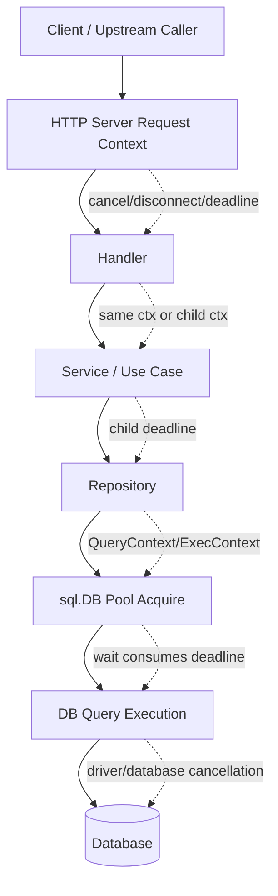
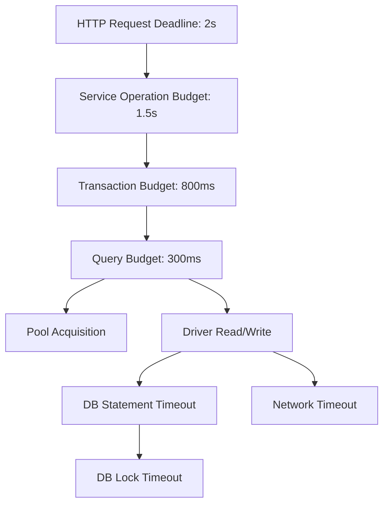

# learn-go-sql-database-integration-part-015.md

# Context, Timeout, Cancellation, and Deadline Propagation

> Seri: `learn-go-sql-database-integration`  
> Part: `015`  
> Topik: `Context, Timeout, Cancellation, Deadline Budget, Driver Cancellation, Query Timeout, Transaction Timeout, and Retry Budget`  
> Target pembaca: Java software engineer yang ingin memahami Go database integration sampai level production architecture  
> Target Go: Go 1.26.x  
> Status seri: **belum selesai**  

---

## 0. Posisi Part Ini Dalam Seri

Pada part sebelumnya kita sudah membahas:

- `*sql.DB` sebagai pool handle;
- connection pool lifecycle;
- sizing dan capacity planning;
- connection lifetime;
- idle lifetime;
- stale connection;
- network reality;
- failover;
- DNS;
- proxy;
- reconnect storm.

Part ini masuk ke lapisan yang lebih dekat dengan request execution:

> Bagaimana request deadline, context cancellation, pool acquisition, query execution, transaction, database-side timeout, driver behavior, dan retry budget berinteraksi?

Banyak engineer memasang timeout seperti ini:

```go
ctx, cancel := context.WithTimeout(context.Background(), 5*time.Second)
defer cancel()

rows, err := db.QueryContext(ctx, query)
```

Itu lebih baik daripada tanpa timeout, tetapi belum cukup untuk production.

Pertanyaan sebenarnya:

1. Timeout 5 detik itu berasal dari mana?
2. Apakah 5 detik termasuk waktu menunggu connection pool?
3. Apakah query benar-benar dibatalkan di database?
4. Apa yang terjadi jika context habis saat transaksi berjalan?
5. Apa bedanya app-side timeout dan database-side statement timeout?
6. Bagaimana timeout harus dipropagasikan dari HTTP request ke repository?
7. Kapan retry boleh dilakukan?
8. Apakah retry punya total deadline?
9. Apakah timeout menimbulkan ambiguous commit?
10. Apa observability yang wajib ada?

Part ini adalah fondasi sebelum kita masuk lebih jauh ke transaction management.

---

## 1. Tujuan Pembelajaran

Setelah menyelesaikan part ini, kamu harus mampu:

1. menjelaskan `context.Context` dalam operasi database Go;
2. membedakan timeout, deadline, cancellation, dan budget;
3. memahami bahwa context mencakup pool acquisition + query execution tergantung operasi;
4. menjelaskan keterbatasan cancellation karena driver/database behavior;
5. membuat request-level deadline propagation dari HTTP handler ke repository;
6. membagi deadline menjadi sub-budget untuk DB, external API, transaction, retry, dan response;
7. membedakan app-side timeout, driver timeout, statement timeout, lock timeout, idle transaction timeout, dan network timeout;
8. mendesain transaksi yang tidak hidup lebih lama dari business operation budget;
9. menghindari background context yang menyebabkan query tanpa batas;
10. membangun observability untuk timeout dan cancellation.

---

## 2. Fakta Dasar Dari Dokumentasi Go

Beberapa fakta penting:

1. Operasi database di `database/sql` menyediakan method context-aware seperti `QueryContext`, `ExecContext`, `QueryRowContext`, `BeginTx`, `PingContext`, dan `PrepareContext`.
2. Dokumentasi Go menyatakan bahwa `Context` dapat digunakan untuk memberi timeout/deadline agar operasi database dapat dibatalkan.
3. Context yang diterima HTTP request dapat digunakan sehingga ketika client disconnect atau request dibatalkan, operasi database terkait juga dapat dibatalkan.
4. Dokumentasi `database/sql` menyebutkan bahwa context pada `BeginTx` digunakan sampai transaksi di-commit atau rollback; jika context dibatalkan, package `sql` akan melakukan rollback terhadap transaksi, dan `Commit` dapat mengembalikan error.
5. Dukungan cancellation tetap dipengaruhi oleh driver dan database. Driver context-aware harus menghormati timeout/cancellation, tetapi behavior real bisa berbeda per driver/DB.

Referensi resmi:

- Go documentation — Canceling in-progress operations: <https://go.dev/doc/database/cancel-operations>
- Go documentation — Querying for data: <https://go.dev/doc/database/querying>
- Go documentation — Executing transactions: <https://go.dev/doc/database/execute-transactions>
- Go package documentation — `database/sql`: <https://pkg.go.dev/database/sql>
- Go package documentation — `database/sql/driver`: <https://pkg.go.dev/database/sql/driver>

---

## 3. Mental Model Utama

### 3.1 Timeout Bukan Sekadar Angka

Timeout adalah keputusan arsitektur:

```text
Berapa lama sistem bersedia menahan resource untuk operasi ini sebelum hasilnya tidak lagi bernilai atau risikonya terlalu tinggi?
```

Timeout bukan hanya:

```text
agar request tidak lama
```

Timeout melindungi:

- user latency;
- goroutine;
- connection pool;
- database connection;
- locks;
- transaction;
- memory;
- retry budget;
- upstream caller;
- downstream dependency;
- system stability.

### 3.2 Context Adalah Propagation Mechanism

`context.Context` bukan “timeout object” saja.

Ia membawa:

- cancellation signal;
- deadline;
- request-scoped values, jika dipakai sangat hati-hati;
- parent-child cancellation tree.

Untuk database, context berguna karena:

```text
HTTP request canceled
  -> context canceled
  -> DB operation should stop/wind down
  -> connection can be released
  -> system avoids useless work
```

### 3.3 Deadline Harus Mengalir Ke Bawah

Request datang dengan budget.

Misalnya:

```text
HTTP request timeout = 2 seconds
```

Di dalam request:

```text
auth check          = 100 ms
validation          = 50 ms
database read       = 400 ms
external service    = 500 ms
database write      = 400 ms
response encode     = 100 ms
buffer              = 450 ms
```

Jika setiap layer membuat timeout 2 detik sendiri, total bisa melebihi request budget.

Correct mental model:

> Child operation budget harus lebih kecil atau sama dengan remaining parent budget.

---

## 4. Diagram Deadline Propagation



Important:

- pool wait consumes context time;
- query execution consumes context time;
- row iteration can still matter;
- transaction context can outlive individual query context rules;
- driver/database cancellation behavior matters.

---

## 5. Terminology

### 5.1 Timeout

A relative duration.

Example:

```go
context.WithTimeout(ctx, 500*time.Millisecond)
```

Meaning:

```text
Cancel after 500ms from now.
```

### 5.2 Deadline

An absolute time.

Example:

```go
context.WithDeadline(ctx, time.Now().Add(500*time.Millisecond))
```

Meaning:

```text
Cancel at this exact time.
```

A timeout creates a deadline.

### 5.3 Cancellation

A signal that the operation should stop.

Cancellation may happen because:

- timeout elapsed;
- parent context canceled;
- client disconnected;
- server shutdown;
- caller explicitly called `cancel`;
- business workflow abandoned.

### 5.4 Budget

A design allocation of time.

Example:

```text
HTTP request budget: 2s
DB budget: 400ms
Lock budget: 100ms
Retry total budget: 600ms
```

Budget is conceptual. Timeout/deadline is implementation.

### 5.5 App-Side Timeout

Timeout enforced by the application context.

Example:

```go
ctx, cancel := context.WithTimeout(ctx, 300*time.Millisecond)
defer cancel()

err := db.QueryRowContext(ctx, query, id).Scan(&out)
```

### 5.6 Driver Timeout

Timeout configured in driver/DSN, such as:

- connect timeout;
- read timeout;
- write timeout;
- handshake timeout.

### 5.7 Database-Side Timeout

Timeout enforced by the database engine:

- statement timeout;
- lock timeout;
- transaction timeout;
- idle-in-transaction timeout;
- resource manager timeout.

### 5.8 Network Timeout

Timeout enforced by network path:

- TCP timeout;
- NAT idle timeout;
- load balancer idle timeout;
- proxy timeout;
- firewall drop;
- service mesh timeout.

---

## 6. Why Context Alone Is Not Enough

Context cancellation is essential, but not always sufficient.

Reasons:

1. driver may not fully support cancellation;
2. DB may continue executing after client stops waiting;
3. cancellation may require an extra protocol message;
4. network partition may prevent cancel signal from reaching DB;
5. database may ignore cancellation until safe point;
6. lock waits may need DB-side lock timeout;
7. statement may continue if driver only stops reading result;
8. transaction state may become aborted/unknown;
9. connection may need to be discarded;
10. write commit result may be ambiguous.

Therefore production systems often combine:

```text
app context timeout
+ driver connect/read/write timeout
+ database statement timeout
+ database lock timeout
+ transaction timeout discipline
+ retry/idempotency policy
+ observability
```

---

## 7. Basic `QueryContext` Pattern

```go
func FindUserName(ctx context.Context, db *sql.DB, userID int64) (string, error) {
	ctx, cancel := context.WithTimeout(ctx, 300*time.Millisecond)
	defer cancel()

	var name string
	err := db.QueryRowContext(
		ctx,
		`SELECT name FROM users WHERE id = $1`,
		userID,
	).Scan(&name)

	if err != nil {
		return "", err
	}

	return name, nil
}
```

This does several things:

- derives child context from caller;
- imposes DB operation budget;
- propagates caller cancellation;
- lets `database/sql` and driver observe cancellation;
- avoids unbounded query wait.

But production code should also:

- classify `sql.ErrNoRows`;
- classify `context.DeadlineExceeded`;
- classify driver timeout;
- record metrics;
- avoid leaking SQL/args in logs;
- avoid hardcoding random timeout without config.

---

## 8. Basic `ExecContext` Pattern

```go
func MarkUserActive(ctx context.Context, db *sql.DB, userID int64) error {
	ctx, cancel := context.WithTimeout(ctx, 500*time.Millisecond)
	defer cancel()

	result, err := db.ExecContext(
		ctx,
		`UPDATE users SET active = TRUE, updated_at = CURRENT_TIMESTAMP WHERE id = $1`,
		userID,
	)
	if err != nil {
		return err
	}

	affected, err := result.RowsAffected()
	if err != nil {
		return err
	}

	if affected == 0 {
		return sql.ErrNoRows
	}

	return nil
}
```

For writes, timeout needs more thought because:

- update may have been applied even if client times out after server processed it;
- context timeout during commit can be ambiguous;
- retry may duplicate side effects unless operation is idempotent.

---

## 9. Pool Acquisition Is Part of the Operation

When using `db.QueryContext(ctx, ...)`, the operation may need to:

1. acquire a connection from pool;
2. maybe open a new connection;
3. execute query;
4. read rows;
5. release connection when rows closed/consumed.

If pool is saturated, context time may be spent waiting before query starts.

### 9.1 Example

```text
DB timeout budget = 500ms
Pool wait = 450ms
Actual query = 100ms
Total = 550ms
```

Result:

```text
context deadline exceeded
```

The database query might never have started, or may have started too late.

Observability must distinguish:

- pool wait;
- query execution;
- row scan time;
- transaction duration;
- database lock wait.

`database/sql` gives pool wait counters through `DB.Stats()`, but query-level attribution often requires custom instrumentation.

---

## 10. Deadline Budgeting

### 10.1 Bad Budgeting

```go
func Handler(w http.ResponseWriter, r *http.Request) {
	ctx := r.Context()

	user, err := loadUser(ctx)      // internally 2s timeout
	order, err := loadOrder(ctx)    // internally 2s timeout
	invoice, err := loadInvoice(ctx) // internally 2s timeout
}
```

If request timeout is 2 seconds, each layer independently using 2 seconds is not budget-aware.

### 10.2 Better Budgeting

```go
func Handler(w http.ResponseWriter, r *http.Request) {
	ctx := r.Context()

	userCtx, cancel := context.WithTimeout(ctx, 250*time.Millisecond)
	user, err := loadUser(userCtx)
	cancel()
	if err != nil {
		// handle
		return
	}

	orderCtx, cancel := context.WithTimeout(ctx, 400*time.Millisecond)
	order, err := loadOrder(orderCtx)
	cancel()
	if err != nil {
		// handle
		return
	}

	invoiceCtx, cancel := context.WithTimeout(ctx, 400*time.Millisecond)
	invoice, err := loadInvoice(invoiceCtx)
	cancel()
	if err != nil {
		// handle
		return
	}

	_ = user
	_ = order
	_ = invoice
}
```

But manual budgeting can become messy.

### 10.3 Remaining Budget Helper

```go
package timebudget

import (
	"context"
	"time"
)

func WithMaxTimeout(parent context.Context, max time.Duration) (context.Context, context.CancelFunc) {
	if deadline, ok := parent.Deadline(); ok {
		remaining := time.Until(deadline)
		if remaining <= 0 {
			ctx, cancel := context.WithCancel(parent)
			cancel()
			return ctx, func() {}
		}
		if remaining < max {
			return context.WithDeadline(parent, deadline)
		}
	}
	return context.WithTimeout(parent, max)
}
```

Usage:

```go
ctx, cancel := timebudget.WithMaxTimeout(parent, 300*time.Millisecond)
defer cancel()

rows, err := db.QueryContext(ctx, query, args...)
```

Meaning:

> Use at most 300ms, but never exceed parent deadline.

---

## 11. Layered Timeout Architecture

A mature service may define timeout policy like this:

```text
HTTP server read header timeout     = 5s
HTTP handler total request budget   = 2s
DB read query budget                = 300ms
DB write query budget               = 500ms
DB transaction budget               = 800ms
External API call budget            = 600ms
Retry total budget                  = 900ms
Background job item budget          = 10s
Report query budget                 = 30s
```

Different operation types deserve different budgets.

Do not use same timeout for:

- login query;
- search listing;
- report export;
- bulk import;
- background reconciliation;
- admin migration;
- workflow transition;
- health check.

---

## 12. Timeout Policy Table

Example policy:

| Operation | Budget | Notes |
|---|---:|---|
| readiness ping | 100-300ms | short, avoid DB hammering |
| simple lookup | 100-500ms | indexed point query |
| listing page | 300ms-1s | depends on filters/indexes |
| write command | 300ms-1s | includes lock risk |
| transaction | 500ms-2s | keep short |
| background item | 2s-30s | bounded per item |
| report page | 5s-30s | separate pool |
| export job | minutes | async, checkpointed |
| migration | controlled window | DB-side locks/timeouts |

The specific numbers must come from SLO, DB performance, and business value.

---

## 13. Context in HTTP Handlers

HTTP request context is canceled when:

- client disconnects;
- request is canceled;
- server closes request;
- handler returns;
- server-specific timeout fires.

Use it as parent:

```go
func (h *Handler) GetUser(w http.ResponseWriter, r *http.Request) {
	ctx := r.Context()

	user, err := h.Service.GetUser(ctx, r.PathValue("id"))
	if err != nil {
		// map error
		return
	}

	_ = user
}
```

Service/repository should accept `ctx context.Context`.

Bad:

```go
func (r *Repo) FindUser(id int64) (User, error) {
	return r.findUser(context.Background(), id)
}
```

This breaks cancellation propagation.

Good:

```go
func (r *Repo) FindUser(ctx context.Context, id int64) (User, error) {
	// use ctx
}
```

---

## 14. Context as First Parameter

Go convention:

```go
func (r *Repo) FindUser(ctx context.Context, id int64) (User, error)
```

Not:

```go
func (r *Repo) FindUser(id int64, ctx context.Context) (User, error)
```

And do not store context in struct:

Bad:

```go
type Repo struct {
	ctx context.Context
	db  *sql.DB
}
```

Good:

```go
type Repo struct {
	db *sql.DB
}

func (r *Repo) Find(ctx context.Context, id int64) (Entity, error) {
	// ...
}
```

Context is request-scoped. Repository is long-lived.

---

## 15. Avoid `context.Background()` in Request Path

Bad:

```go
func (r *Repo) FindUser(ctx context.Context, id int64) (User, error) {
	return r.query(context.Background(), id)
}
```

This ignores caller cancellation.

Bad:

```go
rows, err := r.db.QueryContext(context.TODO(), query)
```

`TODO` is not a production timeout strategy.

Acceptable use of `context.Background()`:

- main startup;
- root context for server lifecycle;
- scheduled job root, immediately wrapped with timeout;
- tests, with explicit timeout if needed;
- CLI root context, with signal cancellation.

---

## 16. Always Call Cancel

When deriving context:

```go
ctx, cancel := context.WithTimeout(parent, timeout)
defer cancel()
```

Why call cancel if timeout will happen anyway?

Because cancel releases resources associated with the derived context sooner.

Bad:

```go
ctx, _ := context.WithTimeout(parent, 500*time.Millisecond)
return db.QueryContext(ctx, query)
```

Good:

```go
ctx, cancel := context.WithTimeout(parent, 500*time.Millisecond)
defer cancel()

return db.QueryContext(ctx, query)
```

In loops, be careful with `defer`:

```go
for _, item := range items {
	ctx, cancel := context.WithTimeout(parent, 200*time.Millisecond)
	err := processOne(ctx, item)
	cancel()
	if err != nil {
		return err
	}
}
```

Do not defer thousands of cancels in a long loop.

---

## 17. Context and Rows Iteration

`QueryContext` cancellation can affect query execution and rows retrieval depending on driver.

But resource safety remains your responsibility:

```go
rows, err := db.QueryContext(ctx, query)
if err != nil {
	return err
}
defer rows.Close()

for rows.Next() {
	var item Item
	if err := rows.Scan(&item.ID, &item.Name); err != nil {
		return err
	}
}

if err := rows.Err(); err != nil {
	return err
}

return nil
```

If context expires during iteration, `rows.Err()` may surface error.

Important:

- always close rows;
- always check rows.Err;
- do not do slow external work while holding rows open;
- for huge result sets, use pagination/batching with per-batch deadline.

---

## 18. Timeout Around Row Processing

Bad:

```go
rows, err := db.QueryContext(ctx, query)
if err != nil {
	return err
}
defer rows.Close()

for rows.Next() {
	var item Item
	if err := rows.Scan(&item.ID); err != nil {
		return err
	}

	// Slow work while connection may still be held.
	callExternalService(ctx, item.ID)
}
```

Better:

```go
rows, err := db.QueryContext(ctx, query)
if err != nil {
	return err
}
defer rows.Close()

items := make([]Item, 0, 256)
for rows.Next() {
	var item Item
	if err := rows.Scan(&item.ID); err != nil {
		return err
	}
	items = append(items, item)
}
if err := rows.Err(); err != nil {
	return err
}

for _, item := range items {
	if err := callExternalService(ctx, item.ID); err != nil {
		return err
	}
}
```

For large data, do batch pagination:

```text
query 500 rows
close rows
process batch
query next 500 rows
```

---

## 19. Transaction Context

`BeginTx(ctx, opts)` is special.

The context passed to `BeginTx` controls transaction lifetime until `Commit` or `Rollback`.

If that context is canceled:

- `database/sql` will roll back transaction;
- `Commit` may return an error.

Example:

```go
func Transfer(ctx context.Context, db *sql.DB, from, to int64, amount int64) error {
	txCtx, cancel := context.WithTimeout(ctx, 800*time.Millisecond)
	defer cancel()

	tx, err := db.BeginTx(txCtx, &sql.TxOptions{
		Isolation: sql.LevelReadCommitted,
	})
	if err != nil {
		return err
	}
	defer tx.Rollback()

	if _, err := tx.ExecContext(txCtx,
		`UPDATE accounts SET balance = balance - $1 WHERE id = $2`,
		amount, from,
	); err != nil {
		return err
	}

	if _, err := tx.ExecContext(txCtx,
		`UPDATE accounts SET balance = balance + $1 WHERE id = $2`,
		amount, to,
	); err != nil {
		return err
	}

	if err := tx.Commit(); err != nil {
		return err
	}

	return nil
}
```

### 19.1 Transaction Context Is Not Just Query Context

This is not equivalent:

```go
tx, err := db.BeginTx(context.Background(), nil)
```

then each query gets a short context.

If transaction parent context has no deadline, the transaction can stay open if code gets stuck between queries.

Better:

```go
txCtx, cancel := context.WithTimeout(ctx, txBudget)
defer cancel()

tx, err := db.BeginTx(txCtx, nil)
```

---

## 20. Query Context Inside Transaction

You can pass contexts to `tx.ExecContext` and `tx.QueryContext`.

But there are two layers:

1. transaction context from `BeginTx`;
2. operation context for each query.

Example:

```go
txCtx, cancelTx := context.WithTimeout(parent, 1*time.Second)
defer cancelTx()

tx, err := db.BeginTx(txCtx, nil)
if err != nil {
	return err
}
defer tx.Rollback()

queryCtx, cancelQuery := context.WithTimeout(txCtx, 200*time.Millisecond)
_, err = tx.ExecContext(queryCtx, query, args...)
cancelQuery()
if err != nil {
	return err
}

return tx.Commit()
```

Rules:

- query context should be child of transaction context;
- transaction context should fit within request context;
- query context cannot safely outlive transaction context;
- if transaction context is canceled, transaction should be considered unusable.

---

## 21. Commit and Ambiguity

`Commit` is dangerous from a timeout perspective.

If client sends `COMMIT` and then context/network fails before receiving response:

```text
Did commit happen?
```

Maybe.

This is ambiguous commit.

### 21.1 Bad Retry Pattern

```go
err := Transfer(ctx, db, from, to, amount)
if err != nil {
	// blindly retry
	err = Transfer(ctx, db, from, to, amount)
}
```

If first commit succeeded but response was lost, retry may double-transfer.

### 21.2 Safer Pattern

Use idempotency:

```text
transfer_id unique
```

Schema idea:

```sql
CREATE TABLE transfers (
    transfer_id TEXT PRIMARY KEY,
    from_account BIGINT NOT NULL,
    to_account BIGINT NOT NULL,
    amount BIGINT NOT NULL,
    status TEXT NOT NULL,
    created_at TIMESTAMP NOT NULL
);
```

Then retry can check whether `transfer_id` already exists.

### 21.3 Commit Timeout Policy

For critical writes:

- design idempotency;
- use unique operation ID;
- record operation state;
- reconcile after ambiguous error;
- avoid blind retry;
- classify errors carefully;
- keep transaction short;
- do not use too aggressive timeout around commit without recovery plan.

---

## 22. Database-Side Statement Timeout

App context timeout tells app/driver to stop waiting/cancel.

Database statement timeout tells DB engine:

```text
Do not execute this statement longer than X.
```

Why both?

Because app cancellation may not always kill DB-side work immediately.

DB-side timeout protects DB resources even if app disappears.

### 22.1 PostgreSQL Concept Example

Inside transaction:

```sql
SET LOCAL statement_timeout = '500ms';
```

This is database-specific. Do not blindly copy across DBs.

### 22.2 When Useful

- protect against runaway query;
- enforce service-level query budget;
- prevent report query from consuming DB indefinitely;
- limit lock wait/statement execution;
- add server-side defense in depth.

### 22.3 Caveat

Setting session-level timeout in pooled connection can leak to next request if not reset.

Prefer transaction-local setting when DB supports it, or configure per role/database/user where appropriate.

---

## 23. Lock Timeout

A query can be slow not because it computes slowly, but because it waits for lock.

Example:

```text
UPDATE case SET status = 'APPROVED' WHERE id = 123
```

may wait because another transaction holds row lock.

App timeout of 1 second cancels from app side.

DB-side lock timeout can fail earlier:

```text
Do not wait for lock more than 100ms.
```

This helps detect contention faster and preserve connection pool.

### 23.1 Why Lock Timeout Is Separate

Statement timeout:

```text
total statement execution time
```

Lock timeout:

```text
time waiting for lock
```

Both are DB-specific.

### 23.2 Production Strategy

For OLTP:

- short lock timeout;
- clear retry policy for serialization/deadlock;
- classify lock timeout separately;
- monitor lock wait;
- reduce transaction duration;
- avoid hot rows;
- use optimistic locking where appropriate.

---

## 24. Driver Connect/Read/Write Timeout

Context around query does not always cover every low-level network stage equally across drivers.

Driver DSN may expose:

- connect timeout;
- read timeout;
- write timeout;
- TLS handshake timeout;
- dialer timeout.

Use driver docs.

Why it matters:

```text
context timeout protects operation from caller side
driver timeout protects network operation at driver/socket side
```

Example conceptual config:

```text
connect_timeout = 5s
read_timeout = 30s
write_timeout = 5s
```

Exact names are driver-specific.

---

## 25. Timeout Layering Diagram



The key is alignment.

Bad:

```text
HTTP deadline = 2s
DB statement timeout = 60s
driver read timeout = 5m
```

If app disappears, DB may still work too long.

Bad:

```text
HTTP deadline = 10s
DB statement timeout = 100ms
```

May fail valid queries unnecessarily.

---

## 26. Deadline Propagation Pattern

Define operation-specific budgets.

```go
package dbtime

import "time"

type Budget struct {
	ReadQuery       time.Duration
	WriteQuery      time.Duration
	Transaction     time.Duration
	HealthCheck     time.Duration
	ReportQuery     time.Duration
	BackgroundItem  time.Duration
}

var DefaultBudget = Budget{
	ReadQuery:      300 * time.Millisecond,
	WriteQuery:     700 * time.Millisecond,
	Transaction:    1 * time.Second,
	HealthCheck:    200 * time.Millisecond,
	ReportQuery:    15 * time.Second,
	BackgroundItem: 10 * time.Second,
}
```

Use budget intentionally:

```go
func (r *UserRepo) FindByID(ctx context.Context, id int64) (User, error) {
	ctx, cancel := context.WithTimeout(ctx, r.budget.ReadQuery)
	defer cancel()

	var u User
	err := r.db.QueryRowContext(ctx, `
		SELECT id, email, name
		FROM users
		WHERE id = $1
	`, id).Scan(&u.ID, &u.Email, &u.Name)

	if err != nil {
		return User{}, err
	}

	return u, nil
}
```

Better with max-parent helper:

```go
ctx, cancel := timebudget.WithMaxTimeout(ctx, r.budget.ReadQuery)
defer cancel()
```

---

## 27. Repository Timeout Ownership

Who should set DB timeout?

Options:

### Option A — Handler sets all timeouts

Pros:

- handler owns request SLO;
- explicit per endpoint.

Cons:

- duplicated logic;
- repository can accidentally run unbounded if caller forgets.

### Option B — Repository sets DB operation timeout

Pros:

- central DB safety;
- consistent.

Cons:

- repository may not know business deadline;
- can conflict with caller budget.

### Option C — Combined

Recommended:

- handler/request has total deadline;
- service/use-case derives operation budgets;
- repository enforces maximum DB operation budget;
- all contexts derive from parent.

Pattern:

```text
HTTP request ctx
  -> service operation ctx
      -> repository read/write ctx with max cap
```

---

## 28. Timeout Config By Operation Class

```go
type QueryClass string

const (
	QueryClassPointRead QueryClass = "point_read"
	QueryClassList      QueryClass = "list"
	QueryClassWrite     QueryClass = "write"
	QueryClassReport    QueryClass = "report"
	QueryClassHealth    QueryClass = "health"
)

type TimeoutPolicy struct {
	PointRead time.Duration
	List      time.Duration
	Write     time.Duration
	Report    time.Duration
	Health    time.Duration
}

func (p TimeoutPolicy) TimeoutFor(class QueryClass) time.Duration {
	switch class {
	case QueryClassPointRead:
		return p.PointRead
	case QueryClassList:
		return p.List
	case QueryClassWrite:
		return p.Write
	case QueryClassReport:
		return p.Report
	case QueryClassHealth:
		return p.Health
	default:
		return p.PointRead
	}
}
```

Avoid one global timeout for all DB operations.

---

## 29. Context Cancellation and Error Mapping

Errors may include:

- `context.Canceled`;
- `context.DeadlineExceeded`;
- driver-specific timeout error;
- DB statement timeout error;
- DB lock timeout error;
- network timeout;
- pool acquisition timeout via context;
- transaction rollback due to context cancellation.

### 29.1 Basic Classification

```go
package dberr

import (
	"context"
	"errors"
)

type Class string

const (
	ClassCanceled        Class = "canceled"
	ClassDeadline       Class = "deadline"
	ClassNoRows         Class = "no_rows"
	ClassConflict       Class = "conflict"
	ClassTimeout        Class = "timeout"
	ClassConnection     Class = "connection"
	ClassConstraint     Class = "constraint"
	ClassUnknown        Class = "unknown"
)

func Classify(err error) Class {
	if err == nil {
		return ""
	}
	if errors.Is(err, context.Canceled) {
		return ClassCanceled
	}
	if errors.Is(err, context.DeadlineExceeded) {
		return ClassDeadline
	}
	// Extend with driver-specific classification.
	return ClassUnknown
}
```

### 29.2 Do Not Collapse Everything Into 500

For APIs:

| Error | Possible HTTP |
|---|---|
| caller canceled | often no response needed / 499 in some stacks |
| deadline exceeded | 504 or domain-specific timeout |
| pool wait timeout | 503/504 depending architecture |
| DB statement timeout | 503/504 |
| lock timeout | 409/503 depending operation |
| unique constraint | 409 |
| no rows | 404 |
| validation/domain invariant | 400/409 |
| connection outage | 503 |

Mapping depends on product semantics.

---

## 30. Observability: Measuring Timeout Correctly

You need labels, but avoid high cardinality.

### 30.1 Metrics

Track:

- DB operation duration;
- DB operation count;
- DB operation errors by class;
- context cancellation count;
- context deadline count;
- statement timeout count;
- lock timeout count;
- connection timeout count;
- pool wait count/duration;
- transaction duration;
- transaction rollback due to context;
- retry count;
- retry success/failure;
- slow query count;
- rows returned.

### 30.2 Labels

Safe labels:

- operation name: `user.find_by_id`;
- operation class: `point_read`, `list`, `write`;
- database role: `primary`, `replica`;
- result: `success`, `error`;
- error class: `deadline`, `canceled`, `constraint`.

Avoid:

- raw SQL as label;
- user ID;
- case ID;
- tenant ID unless bounded;
- dynamic filter;
- error message with variable values.

### 30.3 Tracing

DB span should include:

- operation name;
- query class;
- start/end time;
- timeout budget;
- remaining parent budget;
- rows count if safe;
- error class;
- pool wait if instrumented;
- retry attempt.

Do not include sensitive SQL args.

---

## 31. Instrumented Query Wrapper

A simple wrapper shape:

```go
package dbexec

import (
	"context"
	"database/sql"
	"time"
)

type Metrics interface {
	ObserveDBOperation(name string, class string, duration time.Duration, err error)
}

type Executor struct {
	DB      *sql.DB
	Metrics Metrics
}

func (e Executor) Exec(
	ctx context.Context,
	name string,
	class string,
	timeout time.Duration,
	query string,
	args ...any,
) (sql.Result, error) {
	ctx, cancel := context.WithTimeout(ctx, timeout)
	defer cancel()

	start := time.Now()
	result, err := e.DB.ExecContext(ctx, query, args...)
	duration := time.Since(start)

	if e.Metrics != nil {
		e.Metrics.ObserveDBOperation(name, class, duration, err)
	}

	return result, err
}
```

This is intentionally simple.

Production version might include:

- parent remaining budget cap;
- driver-specific error classification;
- structured logging;
- tracing span;
- retry hooks;
- redacted query fingerprint;
- rows affected metrics.

---

## 32. Query Timeout vs Retry Timeout

Bad:

```go
for i := 0; i < 3; i++ {
	ctx, cancel := context.WithTimeout(context.Background(), 1*time.Second)
	err := doWrite(ctx)
	cancel()
	if err == nil {
		return nil
	}
}
```

This can take 3 seconds even if caller budget was 1 second.

Better:

```go
func RetryWithin(ctx context.Context, attempts int, fn func(context.Context) error) error {
	var last error

	for i := 0; i < attempts; i++ {
		if err := ctx.Err(); err != nil {
			return err
		}

		err := fn(ctx)
		if err == nil {
			return nil
		}

		last = err

		if !isRetryable(err) {
			return err
		}

		// Add backoff with timer bound to ctx.
		timer := time.NewTimer(backoff(i))
		select {
		case <-ctx.Done():
			timer.Stop()
			return ctx.Err()
		case <-timer.C:
		}
	}

	return last
}
```

Retry must live inside total parent budget.

---

## 33. Retry and Context: Safer Pattern

```go
func RetryDBRead[T any](
	ctx context.Context,
	attempts int,
	perAttemptTimeout time.Duration,
	fn func(context.Context) (T, error),
) (T, error) {
	var zero T
	var last error

	for attempt := 0; attempt < attempts; attempt++ {
		if err := ctx.Err(); err != nil {
			return zero, err
		}

		attemptCtx, cancel := context.WithTimeout(ctx, perAttemptTimeout)
		value, err := fn(attemptCtx)
		cancel()

		if err == nil {
			return value, nil
		}

		last = err
		if !isRetryableReadError(err) {
			return zero, err
		}

		timer := time.NewTimer(time.Duration(attempt+1) * 50 * time.Millisecond)
		select {
		case <-ctx.Done():
			timer.Stop()
			return zero, ctx.Err()
		case <-timer.C:
		}
	}

	return zero, last
}

func isRetryableReadError(err error) bool {
	// Extend with driver-specific connection/transient timeout classification.
	return errors.Is(err, context.DeadlineExceeded)
}
```

Warning:

- retrying reads is usually safer than writes;
- retrying writes needs idempotency;
- retrying transaction after serialization/deadlock needs specific logic;
- retrying after ambiguous commit is dangerous.

---

## 34. Context and Background Jobs

Background jobs should also have deadlines.

Bad:

```go
func RunJob(db *sql.DB) error {
	rows, err := db.QueryContext(context.Background(), `SELECT ...`)
	// no deadline
}
```

Better:

```go
func RunJob(ctx context.Context, db *sql.DB) error {
	jobCtx, cancel := context.WithTimeout(ctx, 10*time.Minute)
	defer cancel()

	return processJob(jobCtx, db)
}
```

Per item:

```go
for _, item := range items {
	itemCtx, cancel := context.WithTimeout(jobCtx, 5*time.Second)
	err := processItem(itemCtx, db, item)
	cancel()

	if err != nil {
		// record failure, continue or stop based on policy
	}
}
```

Do not let one stuck item hold the job forever.

---

## 35. Context and Graceful Shutdown

On shutdown:

```text
server stops accepting new requests
in-flight requests get grace period
root context canceled after grace
DB operations should observe cancellation
DB pool closed after workers stop
```

Pattern:

```go
rootCtx, stop := signal.NotifyContext(context.Background(), os.Interrupt, syscall.SIGTERM)
defer stop()

// pass rootCtx to servers/workers
```

When root context cancels:

- workers stop fetching new jobs;
- in-flight DB operations should finish or cancel;
- transactions should rollback if context canceled;
- `db.Close()` during shutdown prevents new operations and waits for existing ones.

Do not call `db.Close()` too early while handlers still need it.

---

## 36. Context Values: Be Careful

`context.Context` can carry values, but do not abuse it.

Acceptable:

- request ID;
- trace/span context;
- auth principal if your architecture uses it carefully;
- logger correlation info.

Avoid:

- passing DB handle through context;
- passing transaction secretly through context unless using a very deliberate transaction manager pattern;
- passing optional parameters;
- passing large objects;
- using context as dependency injection container.

Bad:

```go
ctx = context.WithValue(ctx, "db", db)
```

Good:

```go
type Repo struct {
	db *sql.DB
}

func (r *Repo) Find(ctx context.Context, id int64) (Entity, error) {
	// use ctx for cancellation only
}
```

---

## 37. Context and Transaction Propagation

Some frameworks/libraries put transaction into context to simulate `@Transactional`.

This can work, but it has risks:

- hidden transaction boundary;
- unclear connection ownership;
- nested transaction confusion;
- savepoint behavior not portable;
- repository accidentally uses wrong executor;
- difficult code review;
- background goroutine inherits transaction accidentally;
- transaction held longer than visible.

For this series, recommended default:

```go
type DBTX interface {
	ExecContext(context.Context, string, ...any) (sql.Result, error)
	QueryContext(context.Context, string, ...any) (*sql.Rows, error)
	QueryRowContext(context.Context, string, ...any) *sql.Row
}
```

Then repository accepts executor explicitly:

```go
func (r *Repo) InsertUser(ctx context.Context, q DBTX, user User) error {
	_, err := q.ExecContext(ctx, `
		INSERT INTO users (id, email)
		VALUES ($1, $2)
	`, user.ID, user.Email)
	return err
}
```

Service controls transaction:

```go
tx, err := db.BeginTx(ctx, nil)
if err != nil {
	return err
}
defer tx.Rollback()

if err := repo.InsertUser(ctx, tx, user); err != nil {
	return err
}

return tx.Commit()
```

This is explicit and reviewable.

---

## 38. Context and Goroutines

Do not start goroutine that uses request context after request returns unless intentional.

Bad:

```go
func Handler(w http.ResponseWriter, r *http.Request) {
	ctx := r.Context()

	go func() {
		// request may finish; ctx canceled; DB op may fail unexpectedly
		_ = sendAudit(ctx)
	}()

	w.WriteHeader(http.StatusAccepted)
}
```

Better for async work:

- enqueue job transactionally;
- worker has its own context;
- use outbox pattern;
- define job deadline independently.

If you need goroutine within request:

```go
g, ctx := errgroup.WithContext(r.Context())
```

Then wait before response.

---

## 39. Context and Health Checks

Health checks need short timeout.

```go
func CheckDB(ctx context.Context, db *sql.DB) error {
	ctx, cancel := context.WithTimeout(ctx, 200*time.Millisecond)
	defer cancel()

	return db.PingContext(ctx)
}
```

But:

- ping success does not guarantee business query success;
- ping every second from many pods can add noise;
- during DB outage, health checks can amplify load;
- liveness should not restart app merely because DB is temporarily down unless intended.

Readiness can depend on DB.

Liveness usually should not depend directly on DB.

---

## 40. Context and Prepared Statements

`PrepareContext` context is for preparing the statement, not for all future executions.

Example:

```go
stmt, err := db.PrepareContext(ctx, query)
```

The execution still needs context:

```go
rows, err := stmt.QueryContext(ctx, args...)
```

Do not assume prepare timeout applies to query execution.

Prepared statements inside transactions should use transaction context/budget.

---

## 41. Context and `QueryRowContext`

`QueryRowContext` returns `*Row` immediately. Errors are deferred until `Scan`.

Example:

```go
row := db.QueryRowContext(ctx, query, id)

var name string
if err := row.Scan(&name); err != nil {
	return err
}
```

Timeout/cancellation error may appear at `Scan`.

Therefore instrumentation should time through `Scan`, not only function call return.

Bad metric:

```go
start := time.Now()
row := db.QueryRowContext(ctx, query, id)
observe(time.Since(start)) // too early
err := row.Scan(&value)
```

Better:

```go
start := time.Now()
err := db.QueryRowContext(ctx, query, id).Scan(&value)
observe(time.Since(start), err)
```

---

## 42. Context and `PingContext`

`PingContext` is useful for startup validation and health checks.

But do not overinterpret it.

`PingContext` tells:

```text
Can this DB handle establish/verify a connection right now?
```

It does not guarantee:

- all queries are fast;
- schema exists;
- permissions are correct for every query;
- future connection will work;
- failover will not happen;
- all pool connections are valid;
- transaction will commit.

Use it as one signal.

---

## 43. Context and `Conn`

`db.Conn(ctx)` uses context to acquire a dedicated connection.

Example:

```go
conn, err := db.Conn(ctx)
if err != nil {
	return err
}
defer conn.Close()
```

The context used to acquire connection is not necessarily a lifetime controller for everything you later do with `conn`.

Operations on `conn` should use context too:

```go
_, err = conn.ExecContext(ctx, query)
```

Do not hold reserved connection without deadline.

---

## 44. Context and Pool Deadlock-Like Situations

Go docs warn that limiting open connections makes database usage similar to acquiring a lock/semaphore.

If code needs multiple connections while pool is small, you can create deadlock-like pressure.

Example:

```go
db.SetMaxOpenConns(1)

tx, _ := db.BeginTx(ctx, nil)
// tx holds the only connection

// This DB query outside tx waits for another connection forever/until ctx timeout.
_, err := db.ExecContext(ctx, `UPDATE audit SET ...`)
```

Correct:

- use `tx.ExecContext`;
- increase pool only if design requires;
- avoid nested DB calls outside transaction;
- pass transaction executor explicitly.

Context timeout prevents infinite wait but does not fix design.

---

## 45. Testing Timeout Behavior

### 45.1 Unit Test With Context Timeout

```go
func TestContextAlreadyCanceled(t *testing.T) {
	ctx, cancel := context.WithCancel(context.Background())
	cancel()

	err := repo.DoSomething(ctx)

	if !errors.Is(err, context.Canceled) {
		t.Fatalf("expected context canceled, got %v", err)
	}
}
```

### 45.2 Integration Test Slow Query

Use DB-specific sleep function in integration test environment only.

Concept:

```go
ctx, cancel := context.WithTimeout(context.Background(), 100*time.Millisecond)
defer cancel()

err := db.QueryRowContext(ctx, `SELECT pg_sleep(1)`).Scan(new(any))

if !errors.Is(err, context.DeadlineExceeded) {
	t.Fatalf("expected deadline exceeded, got %v", err)
}
```

This SQL is PostgreSQL-specific. Use equivalent for your DB.

### 45.3 Test Rows Iteration Cancellation

- query many rows;
- cancel context during iteration;
- verify `rows.Err()`;
- verify rows closed;
- verify pool recovers.

### 45.4 Test Transaction Context Cancellation

- begin transaction with short timeout;
- make operation exceed timeout;
- verify commit fails or rollback occurs;
- verify connection returns to pool;
- verify data not partially committed unless expected.

---

## 46. Load Testing Timeout Behavior

Test scenarios:

1. pool saturated;
2. slow query;
3. lock wait;
4. DB restart;
5. network timeout;
6. statement timeout;
7. read replica lag;
8. background worker spike;
9. retry storm;
10. client disconnect.

Collect:

- request latency;
- DB operation duration;
- pool wait;
- timeout error class;
- DB active sessions;
- lock waits;
- query cancellation count if DB exposes it;
- retry count;
- connection churn;
- transaction duration.

---

## 47. Failure Modes

### 47.1 Context Deadline Before Pool Acquire

Symptoms:

- operation fails quickly/after budget;
- DB may show no query;
- pool `WaitCount` rises;
- app latency includes pool wait.

Cause:

- pool saturated;
- long transactions;
- rows leaks;
- too many concurrent jobs;
- MaxOpen too low;
- DB slow causing connections held longer.

### 47.2 Deadline During Query Execution

Symptoms:

- query starts then timeout;
- DB may log canceled statement;
- connection may be discarded/reused depending driver;
- rows.Err may contain context error.

Cause:

- slow query;
- lock wait;
- DB overload;
- network stall.

### 47.3 Deadline During Rows Iteration

Symptoms:

- some rows processed;
- `rows.Next` stops;
- `rows.Err()` has error;
- partial result risk.

Mitigation:

- close rows;
- treat partial result as failed unless explicitly streaming;
- use pagination/checkpointing.

### 47.4 Deadline During Transaction

Symptoms:

- transaction rolled back;
- commit returns error;
- connection may be returned after rollback;
- business operation fails.

Mitigation:

- short transaction budget;
- no remote call inside tx;
- idempotency;
- operation reconciliation.

### 47.5 Deadline During Commit

Symptoms:

- app sees error;
- commit may or may not have succeeded;
- retry dangerous.

Mitigation:

- idempotency key;
- unique operation ID;
- reconciliation query;
- outbox/inbox;
- avoid blind retry.

### 47.6 Cancellation Not Honored Quickly

Symptoms:

- app context canceled but DB active query continues;
- connection remains busy;
- DB resource still used.

Cause:

- driver limitation;
- database cancellation delay;
- network issue;
- query not interruptible;
- server-side operation continues.

Mitigation:

- DB-side statement timeout;
- driver timeout;
- connection discard;
- query optimization;
- resource governor;
- shorter lock timeout.

---

## 48. Anti-Patterns

### 48.1 No Context

```go
rows, err := db.Query(`SELECT ...`)
```

Use context-aware methods in production path.

### 48.2 Background Context in Request Path

```go
db.QueryContext(context.Background(), query)
```

Breaks cancellation propagation.

### 48.3 Same Timeout Everywhere

```go
const DBTimeout = 5 * time.Second
```

Used for health check, login, report, write, export.

Bad because operation classes differ.

### 48.4 Timeout Longer Than Parent

Child operation timeout:

```text
DB timeout = 10s
HTTP timeout = 2s
```

The DB work may continue past useful request budget unless parent context is used correctly.

### 48.5 Retrying With New Background Context

```go
if err != nil {
	ctx := context.Background()
	return retry(ctx)
}
```

This ignores caller cancellation and total budget.

### 48.6 Ignoring `rows.Err`

Timeout during iteration can be missed if you do not check `rows.Err()`.

### 48.7 Remote Call Inside Transaction

Holding transaction and connection while waiting for external service increases timeout and pool risk.

### 48.8 Treating Timeout as Unknown 500 Only

Timeouts should be classified:

- pool timeout;
- query timeout;
- lock timeout;
- transaction timeout;
- external timeout.

Different remediation.

---

## 49. Production Code Pattern: DB Operation Helper

```go
package dbop

import (
	"context"
	"database/sql"
	"time"
)

type OperationClass string

const (
	PointRead OperationClass = "point_read"
	ListRead  OperationClass = "list_read"
	Write     OperationClass = "write"
	Report    OperationClass = "report"
)

type TimeoutPolicy struct {
	PointRead time.Duration
	ListRead  time.Duration
	Write     time.Duration
	Report    time.Duration
}

func (p TimeoutPolicy) For(class OperationClass) time.Duration {
	switch class {
	case PointRead:
		return p.PointRead
	case ListRead:
		return p.ListRead
	case Write:
		return p.Write
	case Report:
		return p.Report
	default:
		return p.PointRead
	}
}

type Metrics interface {
	Observe(name string, class OperationClass, duration time.Duration, err error)
}

type Runner struct {
	DB      *sql.DB
	Policy  TimeoutPolicy
	Metrics Metrics
}

func (r Runner) Exec(
	ctx context.Context,
	name string,
	class OperationClass,
	query string,
	args ...any,
) (sql.Result, error) {
	timeout := r.Policy.For(class)

	ctx, cancel := context.WithTimeout(ctx, timeout)
	defer cancel()

	start := time.Now()
	result, err := r.DB.ExecContext(ctx, query, args...)
	duration := time.Since(start)

	if r.Metrics != nil {
		r.Metrics.Observe(name, class, duration, err)
	}

	return result, err
}
```

---

## 50. Production Code Pattern: Transaction Helper With Timeout

```go
package txutil

import (
	"context"
	"database/sql"
	"fmt"
	"time"
)

func WithinTx(
	ctx context.Context,
	db *sql.DB,
	timeout time.Duration,
	opts *sql.TxOptions,
	fn func(context.Context, *sql.Tx) error,
) error {
	txCtx, cancel := context.WithTimeout(ctx, timeout)
	defer cancel()

	tx, err := db.BeginTx(txCtx, opts)
	if err != nil {
		return fmt.Errorf("begin tx: %w", err)
	}

	defer func() {
		_ = tx.Rollback()
	}()

	if err := fn(txCtx, tx); err != nil {
		return err
	}

	if err := tx.Commit(); err != nil {
		return fmt.Errorf("commit tx: %w", err)
	}

	return nil
}
```

Caveat:

- this simple helper does not solve ambiguous commit;
- add error classification in real code;
- avoid remote calls inside `fn`;
- `fn` must use `tx`, not `db`.

---

## 51. Production Code Pattern: Explicit Executor Interface

```go
package data

import (
	"context"
	"database/sql"
)

type DBTX interface {
	ExecContext(context.Context, string, ...any) (sql.Result, error)
	QueryContext(context.Context, string, ...any) (*sql.Rows, error)
	QueryRowContext(context.Context, string, ...any) *sql.Row
}
```

Repository:

```go
func InsertAudit(ctx context.Context, q DBTX, event AuditEvent) error {
	_, err := q.ExecContext(ctx, `
		INSERT INTO audit_events (id, actor, action, created_at)
		VALUES ($1, $2, $3, $4)
	`, event.ID, event.Actor, event.Action, event.CreatedAt)
	return err
}
```

Service:

```go
err := txutil.WithinTx(ctx, db, 800*time.Millisecond, nil, func(ctx context.Context, tx *sql.Tx) error {
	if err := InsertAudit(ctx, tx, event); err != nil {
		return err
	}
	return UpdateCase(ctx, tx, update)
})
```

This makes transaction boundary visible.

---

## 52. Production Code Pattern: Deadline-Aware Backoff

```go
func SleepWithContext(ctx context.Context, d time.Duration) error {
	timer := time.NewTimer(d)
	defer timer.Stop()

	select {
	case <-ctx.Done():
		return ctx.Err()
	case <-timer.C:
		return nil
	}
}
```

Use for retry:

```go
if err := SleepWithContext(ctx, backoff); err != nil {
	return err
}
```

Never use plain `time.Sleep` in retry loop with context-aware operation.

---

## 53. SLO-Based Timeout Selection

Timeout should derive from SLO.

Example:

```text
Endpoint SLO:
- p95 latency <= 500ms
- p99 latency <= 1s
- availability >= 99.9%
```

Then DB budget cannot be 5 seconds for normal path.

Possible budget:

```text
handler/middleware       20ms
auth/cache               30ms
DB point read            100ms
business logic           50ms
DB write                 200ms
serialization            30ms
buffer                   70ms
total                    500ms
```

Timeouts should be chosen to preserve endpoint SLO.

---

## 54. Timeout For Regulatory Workflow Systems

In regulatory/case-management systems, database operations often represent state transitions.

Example:

```text
Draft -> Submitted -> Under Review -> Approved -> Closed
```

Timeout design must preserve:

- state integrity;
- audit trail;
- idempotency;
- user feedback;
- retry safety;
- SLA tracking;
- legal defensibility.

For state transition writes:

- use transaction budget;
- keep transaction short;
- do not perform email/external call inside transaction;
- use outbox event;
- use idempotency key;
- handle ambiguous commit;
- log operation ID;
- expose reconciliation path.

Timeout is not only performance. It is correctness.

---

## 55. Context and Outbox Pattern

Bad:

```text
begin tx
update case status
send email
insert audit
commit
```

If email is slow, transaction holds DB connection and locks.

Better:

```text
begin tx
update case status
insert audit
insert outbox email event
commit
worker sends email later
```

Context budget:

```text
request transaction budget: short
outbox worker item budget: separate
email provider timeout: separate
retry policy: separate
```

This isolates database transaction from external timeout.

---

## 56. Timeout Configuration Governance

For large systems, document timeout policy.

Example config:

```yaml
database:
  timeout:
    health_check: 200ms
    point_read: 300ms
    list_read: 800ms
    write: 700ms
    transaction: 1200ms
    report_query: 15s
    background_item: 10s
```

Rules:

1. changes require performance review;
2. report/export must not use OLTP timeout/pool;
3. write retry requires idempotency review;
4. timeout increase requires root cause analysis;
5. context-free DB operation rejected in code review.

---

## 57. Alerting Strategy

### 57.1 Deadline Alert

```text
rate(db_errors{class="deadline"}[5m]) > threshold
```

Break down by:

- operation;
- service;
- endpoint;
- database;
- pool.

### 57.2 Pool Wait Alert

```text
pool_utilization > 0.9
AND wait_count_rate > threshold
AND avg_wait > threshold
```

### 57.3 Lock Timeout Alert

```text
lock_timeout_rate > baseline
```

### 57.4 Statement Timeout Alert

```text
statement_timeout_rate > baseline
```

### 57.5 Cancellation Spike

```text
context_canceled_rate spikes
```

May indicate:

- client disconnects;
- upstream timeout too low;
- app too slow;
- network issue;
- deployment issue.

### 57.6 Retry Budget Alert

```text
retry_attempt_rate high
AND deadline_rate high
```

This can predict retry storm.

---

## 58. Runbook: Deadline Exceeded Spike

### Symptom

- `context deadline exceeded` spike;
- HTTP 504 increase;
- DB pool wait maybe rising.

### Checks

1. Which operation names?
2. Is pool wait rising?
3. Is DB query latency rising?
4. Is DB CPU high?
5. Is lock wait high?
6. Are workers/report jobs running?
7. Did deployment happen?
8. Did timeout config change?
9. Did HPA scale?
10. Are retries increasing?
11. Are client cancellations increasing?
12. Did DB failover/restart occur?

### Mitigation Depends on Cause

Pool wait high, DB healthy:

- reduce connection hold time;
- close rows;
- increase pool carefully if DB budget allows;
- throttle workers.

DB saturated:

- reduce concurrency;
- pause non-critical jobs;
- optimize query;
- add index if safe;
- rollback bad release.

Lock wait high:

- identify blocking transaction;
- kill blocker if safe;
- reduce transaction duration;
- fix hot row pattern.

Retry storm:

- reduce retries;
- add backoff/jitter;
- load shed;
- circuit break.

---

## 59. Runbook: Queries Continue After Timeout

### Symptom

App times out, but DB still shows active queries.

### Checks

1. Does driver support cancellation?
2. Does DB support query cancel?
3. Is network partition preventing cancel?
4. Is query in uninterruptible phase?
5. Is statement timeout configured?
6. Is lock timeout configured?
7. Are connections discarded after timeout?
8. Are queries too expensive?

### Mitigation

- configure DB-side statement timeout;
- configure driver timeout;
- optimize query;
- split query;
- reduce result set;
- use async job;
- update driver if needed;
- use database resource governor if available.

---

## 60. Runbook: Transaction Timeout

### Symptom

- transaction commit fails;
- rollback occurs;
- state transition fails;
- users retry.

### Checks

1. Did transaction context expire?
2. Did query inside transaction timeout?
3. Was there remote call inside transaction?
4. Was lock wait high?
5. Did commit response fail?
6. Is operation idempotent?
7. Was outbox/audit inserted?
8. Is state ambiguous?

### Mitigation

- verify final state by operation ID;
- avoid blind retry;
- reconcile audit/outbox;
- shorten transaction;
- move external calls outside transaction;
- add idempotency key;
- add lock timeout.

---

## 61. Code Review Checklist

- [ ] Every production DB operation accepts `context.Context`.
- [ ] No `context.Background()` in request path.
- [ ] No `context.TODO()` in production DB code.
- [ ] Derived context calls `cancel`.
- [ ] Loops call `cancel` per iteration, not deferred unbounded.
- [ ] Query timeout derives from parent context.
- [ ] DB timeout is operation-specific.
- [ ] Query timeout does not exceed request budget.
- [ ] Transaction has explicit budget.
- [ ] Queries inside transaction use transaction context or child.
- [ ] No remote call inside transaction.
- [ ] Commit ambiguity considered for critical writes.
- [ ] Retry uses parent context.
- [ ] Retry has backoff/jitter.
- [ ] Write retry requires idempotency.
- [ ] `Rows.Close` always called.
- [ ] `Rows.Err` always checked.
- [ ] `QueryRowContext` timing includes `Scan`.
- [ ] Health check timeout short.
- [ ] Statement/lock timeout considered.
- [ ] Timeout errors classified.
- [ ] Timeout metrics exported.
- [ ] Raw SQL args not logged.

---

## 62. Architecture Review Checklist

### 62.1 Budgeting

- [ ] Endpoint SLO known.
- [ ] Request timeout known.
- [ ] DB operation budgets defined.
- [ ] Transaction budget defined.
- [ ] External service budgets defined.
- [ ] Retry total budget defined.
- [ ] Background job budget defined.
- [ ] Report/export budget separated.

### 62.2 Runtime

- [ ] HTTP server timeouts configured.
- [ ] DB driver connect timeout configured.
- [ ] DB driver read/write timeout reviewed.
- [ ] DB-side statement timeout reviewed.
- [ ] DB-side lock timeout reviewed.
- [ ] Idle transaction timeout reviewed.
- [ ] Connection lifetime aligned.
- [ ] Pool wait monitored.

### 62.3 Correctness

- [ ] Critical writes idempotent.
- [ ] Ambiguous commit strategy exists.
- [ ] Outbox/inbox used where needed.
- [ ] State transition invariant enforced.
- [ ] Retry taxonomy defined.
- [ ] Timeout maps to user-facing behavior.

### 62.4 Observability

- [ ] DB operation duration by operation name.
- [ ] Error class labels.
- [ ] Context deadline count.
- [ ] Context canceled count.
- [ ] Pool wait metrics.
- [ ] Query timeout metrics.
- [ ] Transaction duration metrics.
- [ ] Retry metrics.
- [ ] DB lock/statement timeout visible.
- [ ] Traces include DB spans.

---

## 63. Common Java Comparison

### 63.1 Java/Spring

In Java/Spring, timeouts may exist in:

- servlet container;
- Spring MVC async request timeout;
- `@Transactional(timeout=...)`;
- JDBC driver socket timeout;
- Hikari connection timeout;
- query timeout;
- JPA query hint;
- database statement timeout;
- Resilience4j timeout;
- Feign/RestTemplate/WebClient timeout.

Many are declarative/framework-managed.

### 63.2 Go

In Go, you explicitly propagate:

```go
ctx context.Context
```

And call:

```go
db.QueryContext(ctx, ...)
db.ExecContext(ctx, ...)
db.BeginTx(ctx, ...)
```

This is simpler mechanically but requires discipline.

The Go style advantage:

- deadlines are visible in function signatures;
- cancellation tree is explicit;
- business operation can control sub-budgets.

The Go style risk:

- easy to accidentally use `context.Background`;
- no framework automatically creates transaction timeout;
- repository may invent arbitrary timeouts;
- retry may ignore parent context;
- driver behavior varies.

---

## 64. Design Principle: Timeout Is a Contract

A timeout is not merely a failure condition.

It is a contract among:

- caller;
- service;
- database;
- driver;
- transaction;
- retry;
- user experience;
- operations.

When you set timeout, define:

1. what resource it protects;
2. what happens when it fires;
3. whether operation may still be running elsewhere;
4. whether retry is allowed;
5. what user sees;
6. what metric/log/tracing records;
7. what runbook handles repeated firing.

---

## 65. Design Principle: Prefer Bounded Work

Timeout is a last line of defense.

Better than timing out slow work is making work bounded:

- indexed query;
- limit rows;
- keyset pagination;
- short transaction;
- small batch size;
- separate report path;
- async export;
- worker concurrency cap;
- lock timeout;
- idempotent retry;
- queue backpressure;
- pool limit.

Timeout should not be your primary performance strategy.

---

## 66. Mini Case Study: Search Endpoint Timeout

### Context

Endpoint:

```text
GET /cases?keyword=x&sort=created_at&page=1
```

Symptoms:

- p99 = 8 seconds;
- DB timeout = 10 seconds;
- users retry;
- pool wait rises.

Bad fix:

```text
Increase DB timeout to 30 seconds.
```

Better analysis:

- query lacks index for filter/sort;
- count query expensive;
- offset pagination scans too much;
- result returns too many columns;
- pool held during slow scan;
- users retry while old query still running.

Better fix:

- keyset pagination;
- index-aware filters;
- projection control;
- separate count strategy;
- DB statement timeout 1s for interactive path;
- report/export path for heavy query;
- user-facing validation for expensive filters.

---

## 67. Mini Case Study: Approval Transaction Timeout

### Context

Workflow:

```text
approve case
insert audit
generate letter
send notification
commit
```

Timeouts occur.

Root cause:

- letter generation and notification happen inside transaction;
- transaction holds row lock and connection;
- other users wait;
- pool saturates.

Fix:

```text
transaction:
  update case status
  insert audit
  insert outbox events
  commit

worker:
  generate letter
  send notification
  mark outbox sent
```

Timeouts:

- transaction: 800ms;
- worker item: 30s;
- notification API: 5s;
- retry: bounded with idempotency.

---

## 68. Mini Case Study: Client Disconnect

### Context

User closes browser during long search.

If DB code uses `r.Context()`:

```text
client disconnect -> request context canceled -> query canceled/released
```

If DB code uses `context.Background()`:

```text
client disconnect -> handler may stop caring -> DB query continues
```

Impact:

- wasted DB work;
- pool slot held;
- p99 latency for other users;
- unnecessary load.

Lesson:

> Caller cancellation is a capacity protection mechanism.

---

## 69. Exercise 1 — Budget Calculation

Given:

```text
HTTP request timeout = 2s
External API call p95 = 600ms
DB read p95 = 150ms
DB write p95 = 250ms
Response encoding = 100ms
Required buffer = 300ms
```

Question:

- What is the remaining budget for service logic and retry?
- Should any single DB operation have 2s timeout?

---

## 70. Exercise 2 — Diagnose Timeout

Metrics:

```text
context deadline exceeded rate high
DB CPU = 30%
Pool InUse = MaxOpen
WaitCount rising
WaitDuration high
Slow query log normal
Lock wait low
```

Question:

- Is DB saturated?
- What do you investigate?

---

## 71. Exercise 3 — Transaction Context

Code:

```go
tx, err := db.BeginTx(context.Background(), nil)
if err != nil {
	return err
}
defer tx.Rollback()

_, err = tx.ExecContext(ctx, query1)
if err != nil {
	return err
}

time.Sleep(10 * time.Second)

_, err = tx.ExecContext(ctx, query2)
if err != nil {
	return err
}

return tx.Commit()
```

Question:

- What is wrong?
- How should it be fixed?

---

## 72. Exercise 4 — Retry

A write operation times out during commit.

Question:

- Is it safe to retry immediately?
- What design makes retry safe?

---

## 73. Jawaban Singkat Latihan

### Exercise 1

Known consumed:

```text
600ms + 150ms + 250ms + 100ms + 300ms = 1400ms
```

Remaining:

```text
2s - 1.4s = 600ms
```

No single DB operation should automatically get 2s because it would consume the entire request budget and break SLO.

### Exercise 2

DB CPU is not saturated. Pool is saturated. Slow query and lock wait look normal. Investigate:

- connection leak;
- unclosed rows;
- long row processing while rows open;
- long transactions;
- worker/report sharing pool;
- pool too small for actual workload;
- HPA/rollout surge;
- remote calls inside transaction.

### Exercise 3

Problems:

- transaction has `context.Background`, so transaction lifetime is unbounded;
- `time.Sleep` holds transaction/connection/locks;
- query contexts may cancel but transaction can remain open;
- commit has no explicit deadline semantics.

Fix:

- derive transaction context from request/job context with timeout;
- remove slow work from transaction;
- use `txCtx` or child contexts;
- keep transaction short.

### Exercise 4

Not necessarily safe. Commit may have succeeded but response was lost.

Safe retry requires:

- idempotency key;
- unique operation ID;
- operation status table;
- natural unique constraint;
- reconciliation query;
- outbox/inbox pattern where needed.

---

## 74. Ringkasan

Context, timeout, and cancellation are not small API details. They are core production controls.

A strong Go database integration layer has:

1. context in every DB-facing function;
2. no background context in request path;
3. operation-specific timeout policy;
4. parent deadline propagation;
5. transaction-level budget;
6. query-level budget;
7. database-side statement/lock timeout where appropriate;
8. driver/network timeout review;
9. safe retry within total budget;
10. idempotency for writes;
11. observability for deadline/cancel/pool/query/transaction;
12. runbooks for timeout spikes.

The most important mental model:

> A DB timeout protects more than latency. It protects connection pool, database resources, transaction integrity, retry behavior, and system stability.

---

## 75. Referensi

- Go documentation — Canceling in-progress operations: <https://go.dev/doc/database/cancel-operations>
- Go documentation — Querying for data: <https://go.dev/doc/database/querying>
- Go documentation — Executing SQL statements: <https://go.dev/doc/database/change-data>
- Go documentation — Executing transactions: <https://go.dev/doc/database/execute-transactions>
- Go package documentation — `database/sql`: <https://pkg.go.dev/database/sql>
- Go package documentation — `database/sql/driver`: <https://pkg.go.dev/database/sql/driver>
- Go documentation — Managing connections: <https://go.dev/doc/database/manage-connections>

<!-- NAVIGATION_FOOTER -->
<div class="page-nav">
<a href="./learn-go-sql-database-integration-part-014.md">⬅️ Connection Lifetime, Idle Lifetime, and Network Reality</a>
<a href="./index.md">📚 Kategori</a>
<a href="../../index.md">🏠 Home</a>
<a href="./learn-go-sql-database-integration-part-016.md">Transaction Fundamentals in Go ➡️</a>
</div>
