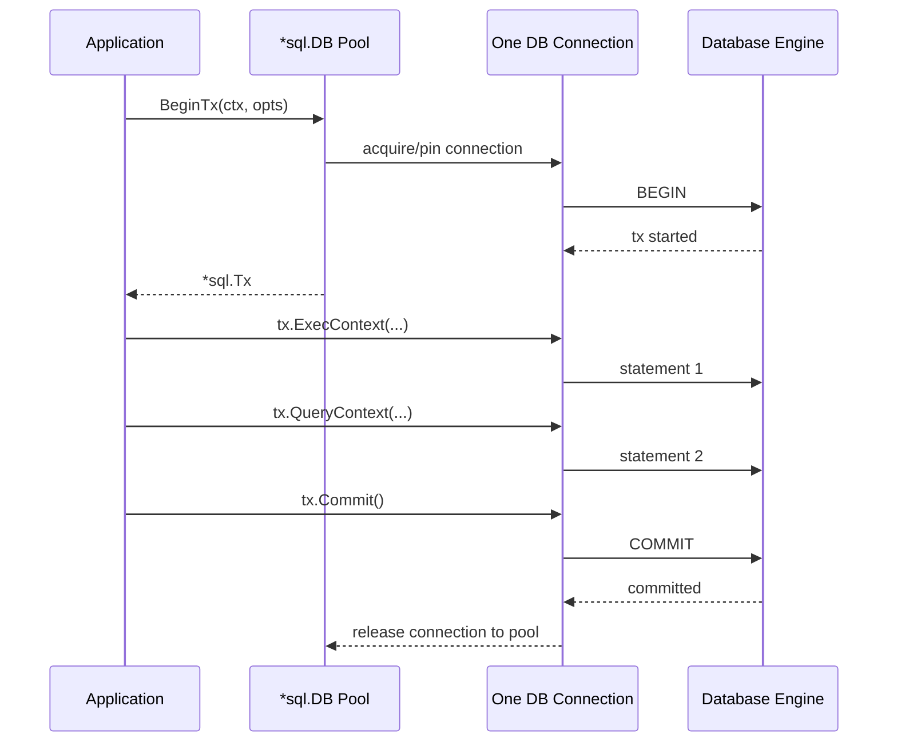
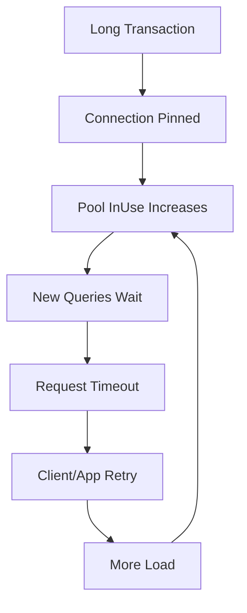

# learn-go-sql-database-integration-part-016.md

# Transaction Fundamentals in Go

> Seri: `learn-go-sql-database-integration`  
> Part: `016`  
> Topik: `Transaction Fundamentals, BeginTx, TxOptions, Commit, Rollback, Connection Pinning, Context, and Transaction Boundary`  
> Target pembaca: Java software engineer yang ingin memahami Go database integration sampai level production architecture  
> Target Go: Go 1.26.x  
> Status seri: **belum selesai**  

---

## 0. Posisi Part Ini Dalam Seri

Pada part sebelumnya kita sudah membahas:

- `database/sql` API surface;
- query execution model;
- rows lifecycle;
- connection pool;
- pool sizing;
- connection lifetime;
- context, timeout, cancellation, dan deadline propagation.

Part ini mulai masuk ke salah satu bagian paling penting dalam database integration:

> Transaction management.

Di Go, transaction management sengaja eksplisit. Tidak ada default `@Transactional` seperti di Spring. Tidak ada AOP yang diam-diam membuka transaction, menyimpan connection di thread-local, lalu commit/rollback otomatis di akhir method.

Di Go, kamu harus tahu:

1. kapan transaksi dimulai;
2. siapa pemilik transaksi;
3. connection mana yang dipakai;
4. kapan rollback wajib dipanggil;
5. kapan commit boleh dipanggil;
6. apa yang terjadi jika context batal;
7. bagaimana repository tahu harus memakai `*sql.DB` atau `*sql.Tx`;
8. bagaimana mencegah sebagian query keluar dari transaksi;
9. bagaimana membuat helper transaksi yang aman tapi tidak menyembunyikan boundary;
10. bagaimana membedakan error sebelum commit, error saat rollback, dan error saat commit.

Part ini masih membahas fundamental. Isolation level, anomaly, locking, retry, idempotency, dan ambiguous commit akan dibahas lebih dalam pada part berikutnya.

---

## 1. Tujuan Pembelajaran

Setelah menyelesaikan part ini, kamu harus mampu:

1. menjelaskan `*sql.Tx` sebagai transaction handle;
2. menjelaskan bahwa transaksi mem-pin satu physical/logical connection dari pool;
3. memakai `DB.BeginTx` dengan `context.Context` dan `*sql.TxOptions`;
4. memahami perbedaan `Begin` dan `BeginTx`;
5. memahami `Commit` dan `Rollback`;
6. menggunakan pola `defer tx.Rollback()` dengan benar;
7. memahami kenapa `Rollback` setelah `Commit` biasanya aman untuk dipanggil tetapi error-nya dapat diabaikan dalam defer;
8. tidak mencampur operasi `db.ExecContext` dengan `tx.ExecContext` di tengah transaksi;
9. membuat repository yang transaction-aware tanpa framework magic;
10. membuat transaction helper yang explicit, panic-safe, dan observability-friendly;
11. memahami efek context cancellation pada transaksi;
12. memahami kapan commit error harus diperlakukan serius;
13. memahami kenapa remote call di dalam transaction adalah anti-pattern serius;
14. membuat checklist code review untuk transaction boundary.

---

## 2. Fakta Dasar Dari Dokumentasi Go

Beberapa fakta dasar yang penting:

1. Transaksi di Go dijalankan dengan `sql.Tx`, yang merepresentasikan transaction.
2. Untuk mendapatkan `*sql.Tx`, gunakan `DB.Begin` atau `DB.BeginTx`.
3. `sql.Tx` memiliki method seperti `ExecContext`, `QueryContext`, `QueryRowContext`, dan `PrepareContext` untuk operasi di dalam transaksi.
4. Transaksi harus diakhiri dengan `Commit` atau `Rollback`.
5. Dokumentasi Go menyarankan memakai API transaction dari package `sql`, bukan mengirim SQL manual seperti `BEGIN` dan `COMMIT` lewat `Exec`.
6. `BeginTx` menerima `context.Context`; context tersebut digunakan sampai transaction di-commit atau rollback.
7. Jika context yang diberikan ke `BeginTx` dibatalkan, package `sql` akan melakukan rollback; `Tx.Commit` akan mengembalikan error bila context tersebut dibatalkan.
8. `TxOptions` dapat menentukan isolation level dan read-only flag; jika driver/database tidak mendukung isolation level tertentu, `BeginTx` dapat mengembalikan error.

Referensi resmi:

- Go documentation — Executing transactions: <https://go.dev/doc/database/execute-transactions>
- Go package documentation — `database/sql`: <https://pkg.go.dev/database/sql>
- Go documentation — Managing connections: <https://go.dev/doc/database/manage-connections>
- Go Wiki — SQL Interface: <https://go.dev/wiki/SQLInterface>
- Go 1.8 release notes, `BeginTx` and `TxOptions`: <https://go.dev/doc/go1.8>

---

## 3. Mental Model: Transaction Sebagai Unit of Work di Satu Connection

Transaction bukan sekadar “beberapa query yang dikelompokkan”.

Dalam `database/sql`, sebuah transaksi berarti:

```text
ambil satu connection dari pool
mulai transaction pada connection itu
jalankan semua statement transaction lewat connection itu
commit atau rollback
kembalikan connection ke pool
```

Diagram:



Kata kunci: **pinning**.

Selama transaksi belum selesai, connection itu tidak tersedia untuk request lain.

---

## 4. Kenapa Transaction Mem-Pin Connection?

Database transaction membutuhkan session/connection yang sama karena database menyimpan transaction state pada session/backend connection.

Transaction state meliputi:

- snapshot;
- locks;
- temporary state;
- isolation context;
- savepoints;
- prepared statements, tergantung DB/driver;
- session-local state;
- uncommitted writes;
- transaction ID;
- error state.

Kalau query pertama transaksi berjalan di connection A dan query kedua di connection B, itu bukan transaksi yang sama.

Karena itu `*sql.Tx` memastikan operasi transaction berjalan di connection yang sama.

---

## 5. Java Comparison: JDBC/Spring vs Go

### 5.1 JDBC Manual

Di Java JDBC manual:

```java
Connection conn = dataSource.getConnection();
try {
    conn.setAutoCommit(false);

    // statements

    conn.commit();
} catch (Exception e) {
    conn.rollback();
    throw e;
} finally {
    conn.close();
}
```

Connection dari pool dipin sampai `commit/rollback + close`.

### 5.2 Spring Declarative

Di Spring:

```java
@Transactional
public void approveCase(...) {
    repository.updateCase(...);
    repository.insertAudit(...);
}
```

Framework kira-kira melakukan:

```text
open/get connection
set transaction boundary
bind connection to current thread
execute method
commit if success
rollback if error
unbind connection
return connection to pool
```

### 5.3 Go

Di Go:

```go
tx, err := db.BeginTx(ctx, nil)
if err != nil {
	return err
}
defer tx.Rollback()

// use tx, not db

if err := tx.Commit(); err != nil {
	return err
}
return nil
```

Go tidak menyembunyikan boundary. Ini membuat code lebih eksplisit, tapi juga membuat kesalahan lebih mudah jika disiplin kurang.

---

## 6. API Utama Transaction di Go

### 6.1 `DB.Begin`

```go
tx, err := db.Begin()
```

Menggunakan context background internal dan default transaction options.

Untuk production code, prefer `BeginTx` karena bisa membawa context dan options.

### 6.2 `DB.BeginTx`

```go
tx, err := db.BeginTx(ctx, &sql.TxOptions{
	Isolation: sql.LevelReadCommitted,
	ReadOnly: false,
})
```

`BeginTx` lebih eksplisit:

- menerima context;
- menerima isolation level;
- menerima read-only flag;
- error jika driver tidak mendukung setting tertentu.

### 6.3 `Tx.Commit`

```go
err := tx.Commit()
```

Mengakhiri transaksi dengan commit.

Jika sukses:

- perubahan transaction menjadi permanen;
- connection dilepas kembali ke pool;
- `tx` tidak boleh dipakai lagi.

### 6.4 `Tx.Rollback`

```go
err := tx.Rollback()
```

Mengakhiri transaksi dengan rollback.

Jika sukses:

- perubahan transaction dibatalkan;
- connection dilepas kembali ke pool;
- `tx` tidak boleh dipakai lagi.

### 6.5 `Tx.ExecContext`

```go
_, err := tx.ExecContext(ctx, query, args...)
```

Menjalankan statement dalam transaction.

### 6.6 `Tx.QueryContext`

```go
rows, err := tx.QueryContext(ctx, query, args...)
```

Menjalankan query multi-row dalam transaction.

### 6.7 `Tx.QueryRowContext`

```go
err := tx.QueryRowContext(ctx, query, args...).Scan(&dest)
```

Menjalankan query single-row dalam transaction.

### 6.8 `Tx.PrepareContext`

```go
stmt, err := tx.PrepareContext(ctx, query)
```

Prepared statement bound ke transaction.

---

## 7. Basic Transaction Pattern

Pola dasar yang benar:

```go
func CreateUser(ctx context.Context, db *sql.DB, user User) error {
	tx, err := db.BeginTx(ctx, nil)
	if err != nil {
		return err
	}
	defer tx.Rollback()

	if _, err := tx.ExecContext(ctx, `
		INSERT INTO users (id, email, name)
		VALUES ($1, $2, $3)
	`, user.ID, user.Email, user.Name); err != nil {
		return err
	}

	if _, err := tx.ExecContext(ctx, `
		INSERT INTO audit_events (id, actor, action)
		VALUES ($1, $2, $3)
	`, user.AuditID, user.Actor, "USER_CREATED"); err != nil {
		return err
	}

	if err := tx.Commit(); err != nil {
		return err
	}

	return nil
}
```

Kenapa `defer tx.Rollback()` tetap dipanggil?

- Jika ada error sebelum commit, rollback dijalankan.
- Jika commit sudah sukses, rollback akan mengembalikan error seperti transaction already done; error dalam defer biasanya diabaikan.
- Ini membuat semua path error sebelum commit aman.

---

## 8. Kenapa `defer tx.Rollback()` Aman?

Pattern:

```go
tx, err := db.BeginTx(ctx, nil)
if err != nil {
	return err
}
defer tx.Rollback()

// operations

if err := tx.Commit(); err != nil {
	return err
}

return nil
```

Jika operasi gagal sebelum commit:

```text
return err -> defer Rollback -> transaction cleaned
```

Jika commit sukses:

```text
Commit -> transaction closed -> defer Rollback -> returns error -> ignored
```

Itu okay untuk cleanup.

Tapi ada nuance:

- Jika rollback gagal sebelum commit, error rollback bisa penting untuk observability.
- Jika commit gagal, kamu tidak boleh menganggap transaksi pasti rollback.
- Jika commit ambiguous, retry buta bisa berbahaya.

Untuk helper production, rollback error perlu minimal dilog.

---

## 9. Improved Pattern With Named Return? Hati-Hati

Ada pola yang memakai named return dan defer untuk commit/rollback otomatis.

Contoh:

```go
func Do(ctx context.Context, db *sql.DB) (err error) {
	tx, err := db.BeginTx(ctx, nil)
	if err != nil {
		return err
	}

	defer func() {
		if err != nil {
			_ = tx.Rollback()
			return
		}
		err = tx.Commit()
	}()

	err = doSomething(ctx, tx)
	return err
}
```

Ini bisa bekerja, tapi punya risiko:

- named return bisa membingungkan;
- panic handling belum ada;
- commit error override semantics harus jelas;
- rollback error hilang;
- code review lebih sulit;
- transaction boundary bisa terlalu implisit.

Untuk codebase besar, helper yang eksplisit biasanya lebih mudah distandardisasi.

---

## 10. Transaction Helper Dasar

```go
package txutil

import (
	"context"
	"database/sql"
	"fmt"
)

func WithinTx(
	ctx context.Context,
	db *sql.DB,
	opts *sql.TxOptions,
	fn func(context.Context, *sql.Tx) error,
) error {
	tx, err := db.BeginTx(ctx, opts)
	if err != nil {
		return fmt.Errorf("begin tx: %w", err)
	}

	defer func() {
		_ = tx.Rollback()
	}()

	if err := fn(ctx, tx); err != nil {
		return err
	}

	if err := tx.Commit(); err != nil {
		return fmt.Errorf("commit tx: %w", err)
	}

	return nil
}
```

Pola ini sederhana dan cukup untuk banyak use case.

Tapi ia belum:

- log rollback error;
- handle panic secara eksplisit;
- classify commit error;
- enforce transaction timeout;
- record metrics;
- prevent remote call inside tx;
- support after-commit hooks;
- support idempotency.

Kita akan tingkatkan pelan-pelan.

---

## 11. Panic-Safe Transaction Helper

Jika `fn` panic, transaction tetap harus rollback.

```go
package txutil

import (
	"context"
	"database/sql"
	"fmt"
)

func WithinTxPanicSafe(
	ctx context.Context,
	db *sql.DB,
	opts *sql.TxOptions,
	fn func(context.Context, *sql.Tx) error,
) (err error) {
	tx, err := db.BeginTx(ctx, opts)
	if err != nil {
		return fmt.Errorf("begin tx: %w", err)
	}

	defer func() {
		if p := recover(); p != nil {
			_ = tx.Rollback()
			panic(p)
		}

		if err != nil {
			_ = tx.Rollback()
			return
		}

		if commitErr := tx.Commit(); commitErr != nil {
			err = fmt.Errorf("commit tx: %w", commitErr)
		}
	}()

	err = fn(ctx, tx)
	return err
}
```

Catatan:

- panic tetap dipropagasikan;
- rollback tetap dipanggil;
- commit hanya dilakukan jika `fn` tidak error dan tidak panic.

---

## 12. Helper Dengan Transaction Timeout

```go
package txutil

import (
	"context"
	"database/sql"
	"fmt"
	"time"
)

func WithinTxTimeout(
	ctx context.Context,
	db *sql.DB,
	timeout time.Duration,
	opts *sql.TxOptions,
	fn func(context.Context, *sql.Tx) error,
) error {
	txCtx, cancel := context.WithTimeout(ctx, timeout)
	defer cancel()

	tx, err := db.BeginTx(txCtx, opts)
	if err != nil {
		return fmt.Errorf("begin tx: %w", err)
	}

	defer func() {
		_ = tx.Rollback()
	}()

	if err := fn(txCtx, tx); err != nil {
		return err
	}

	if err := tx.Commit(); err != nil {
		return fmt.Errorf("commit tx: %w", err)
	}

	return nil
}
```

Kenapa `fn` menerima `txCtx`, bukan `ctx`?

Karena operasi di dalam transaction harus tunduk pada transaction budget.

Namun, query spesifik boleh membuat child timeout yang lebih pendek:

```go
queryCtx, cancel := context.WithTimeout(txCtx, 200*time.Millisecond)
defer cancel()
```

---

## 13. Transaction Helper Dengan Rollback Logging

```go
package txutil

import (
	"context"
	"database/sql"
	"fmt"
	"log/slog"
)

func WithinTxLogged(
	ctx context.Context,
	logger *slog.Logger,
	db *sql.DB,
	opts *sql.TxOptions,
	fn func(context.Context, *sql.Tx) error,
) error {
	tx, err := db.BeginTx(ctx, opts)
	if err != nil {
		return fmt.Errorf("begin tx: %w", err)
	}

	committed := false

	defer func() {
		if committed {
			return
		}
		if rbErr := tx.Rollback(); rbErr != nil && logger != nil {
			logger.WarnContext(ctx, "rollback failed", slog.Any("error", rbErr))
		}
	}()

	if err := fn(ctx, tx); err != nil {
		return err
	}

	if err := tx.Commit(); err != nil {
		return fmt.Errorf("commit tx: %w", err)
	}

	committed = true
	return nil
}
```

Nuance:

- `committed = true` setelah commit sukses.
- Jika commit gagal, defer akan mencoba rollback.
- Namun commit failure bisa ambiguous; rollback setelah commit failure tidak selalu memberi kepastian business state.

---

## 14. Commit Error Tidak Boleh Diremehkan

Banyak developer menganggap commit error seperti error biasa.

Padahal commit error bisa berarti:

1. transaction benar-benar gagal dan rollback;
2. connection putus sebelum commit sampai server;
3. commit sampai server, sukses, tapi response tidak sampai app;
4. database failover saat commit;
5. context deadline saat commit;
6. constraint/deferred constraint gagal saat commit;
7. serialization failure muncul saat commit;
8. deadlock detected saat commit;
9. server error.

Yang paling berbahaya:

```text
ambiguous commit
```

Aplikasi tidak tahu apakah perubahan sudah committed.

Karena itu untuk operasi penting:

- gunakan idempotency key;
- gunakan operation ID;
- gunakan unique constraint;
- gunakan outbox;
- gunakan reconciliation query;
- jangan retry buta.

Detail retry/idempotency akan dibahas di part 019.

---

## 15. Jangan Mencampur `db` dan `tx`

Anti-pattern:

```go
tx, err := db.BeginTx(ctx, nil)
if err != nil {
	return err
}
defer tx.Rollback()

if _, err := tx.ExecContext(ctx, `
	UPDATE cases SET status = 'APPROVED' WHERE id = $1
`, caseID); err != nil {
	return err
}

// BUG: this uses db, not tx.
if _, err := db.ExecContext(ctx, `
	INSERT INTO audit_events (case_id, action) VALUES ($1, 'APPROVED')
`, caseID); err != nil {
	return err
}

return tx.Commit()
```

Masalah:

- update case ada di transaction;
- insert audit berjalan di luar transaction;
- jika commit gagal/rollback, audit bisa tetap masuk;
- jika audit gagal, update bisa rollback, tapi database side-effect sudah bercampur;
- connection lain dipakai;
- invariant rusak.

Correct:

```go
if _, err := tx.ExecContext(ctx, `
	INSERT INTO audit_events (case_id, action) VALUES ($1, 'APPROVED')
`, caseID); err != nil {
	return err
}
```

---

## 16. Repository Transaction-Aware Dengan Interface

Agar repository bisa dipakai dengan `*sql.DB` maupun `*sql.Tx`, buat interface kecil:

```go
package data

import (
	"context"
	"database/sql"
)

type DBTX interface {
	ExecContext(context.Context, string, ...any) (sql.Result, error)
	QueryContext(context.Context, string, ...any) (*sql.Rows, error)
	QueryRowContext(context.Context, string, ...any) *sql.Row
}
```

`*sql.DB` dan `*sql.Tx` sama-sama memenuhi interface ini.

Repository:

```go
type CaseRepository struct{}

func (r CaseRepository) UpdateStatus(
	ctx context.Context,
	q DBTX,
	caseID int64,
	status string,
) error {
	result, err := q.ExecContext(ctx, `
		UPDATE cases
		SET status = $1, updated_at = CURRENT_TIMESTAMP
		WHERE id = $2
	`, status, caseID)
	if err != nil {
		return err
	}

	affected, err := result.RowsAffected()
	if err != nil {
		return err
	}
	if affected == 0 {
		return sql.ErrNoRows
	}

	return nil
}
```

Service:

```go
err := txutil.WithinTxTimeout(ctx, db, 800*time.Millisecond, nil,
	func(ctx context.Context, tx *sql.Tx) error {
		if err := repo.UpdateStatus(ctx, tx, caseID, "APPROVED"); err != nil {
			return err
		}
		if err := auditRepo.Insert(ctx, tx, event); err != nil {
			return err
		}
		return nil
	},
)
```

Keuntungan:

- repository tidak perlu tahu apakah ada transaction;
- service menentukan boundary;
- code review bisa melihat `tx` dipakai;
- tidak perlu magic context transaction.

---

## 17. Alternative: Repository Holds DB, Method Has Tx Variant

Pola lain:

```go
type UserRepo struct {
	db *sql.DB
}

func (r *UserRepo) Insert(ctx context.Context, user User) error {
	return r.insert(ctx, r.db, user)
}

func (r *UserRepo) InsertTx(ctx context.Context, tx *sql.Tx, user User) error {
	return r.insert(ctx, tx, user)
}

func (r *UserRepo) insert(ctx context.Context, q DBTX, user User) error {
	_, err := q.ExecContext(ctx, `
		INSERT INTO users (id, email) VALUES ($1, $2)
	`, user.ID, user.Email)
	return err
}
```

Pros:

- convenient non-transaction method;
- explicit transaction method.

Cons:

- method count doubles;
- easy to call wrong method inside transaction;
- less uniform for large codebase.

---

## 18. Alternative: Unit of Work Object

```go
type UnitOfWork struct {
	tx *sql.Tx

	Cases CaseRepository
	Audit AuditRepository
}

func (u UnitOfWork) Tx() *sql.Tx {
	return u.tx
}
```

Service:

```go
err := uowManager.Within(ctx, func(ctx context.Context, uow UnitOfWork) error {
	if err := uow.Cases.UpdateStatus(ctx, uow.Tx(), caseID, "APPROVED"); err != nil {
		return err
	}
	return uow.Audit.Insert(ctx, uow.Tx(), event)
})
```

Pros:

- transaction boundary grouped;
- useful for large domain modules.

Cons:

- can become framework-like;
- must avoid hiding transaction too much;
- may complicate package dependencies.

---

## 19. Avoid Transaction in Context by Default

Some libraries put `*sql.Tx` inside context:

```go
ctx = context.WithValue(ctx, txKey, tx)
```

Then repository retrieves tx from context.

This mimics Spring thread-local transaction.

Risks:

- hidden transaction boundary;
- hard to know if method uses tx or db;
- nested transaction behavior unclear;
- goroutine propagation dangerous;
- code review harder;
- context becomes dependency injection container;
- accidental use after transaction closed;
- savepoint expectation not portable.

Recommendation:

> Default to explicit `DBTX` parameter or explicit transaction helper. Use transaction-in-context only if your team has strong conventions and tooling.

---

## 20. Transaction Boundary Belongs in Service/Use Case Layer

Repository should usually not decide business transaction boundary.

Bad:

```go
func (r *CaseRepo) Approve(ctx context.Context, caseID int64) error {
	tx, _ := r.db.BeginTx(ctx, nil)
	// updates case + audit
}
```

Why bad?

- repository owns business workflow;
- hard to compose with other repositories;
- nested transaction confusion;
- service cannot group multiple repository calls;
- testability suffers.

Better:

```go
func (s *CaseService) Approve(ctx context.Context, caseID int64) error {
	return txutil.WithinTxTimeout(ctx, s.db, s.txTimeout, nil,
		func(ctx context.Context, tx *sql.Tx) error {
			if err := s.caseRepo.UpdateStatus(ctx, tx, caseID, "APPROVED"); err != nil {
				return err
			}
			if err := s.auditRepo.Insert(ctx, tx, auditEvent); err != nil {
				return err
			}
			if err := s.outboxRepo.Insert(ctx, tx, outboxEvent); err != nil {
				return err
			}
			return nil
		},
	)
}
```

Service/use-case understands invariant.

Repository executes persistence operations.

---

## 21. Transaction Boundary and Domain Invariant

Transaction should protect a business invariant.

Examples:

```text
case status update + audit row
account debit + account credit
order creation + inventory reservation
user creation + profile creation
outbox event + state change
idempotency key + command result
```

Do not start transaction just because “multiple queries exist”.

Start transaction because:

```text
these changes must commit or rollback together
```

If queries are independent, transaction may be unnecessary.

---

## 22. Transaction Duration Is Capacity Cost

A transaction holds a connection.

It may also hold:

- row locks;
- table locks;
- MVCC snapshot;
- undo/redo resources;
- temporary memory;
- replication/WAL pressure;
- vacuum cleanup blockers depending DB;
- transaction ID resources.

Therefore transaction duration matters.

Bad transaction shape:

```text
BEGIN
query
business computation
call external API
query
send email
query
COMMIT
```

Better:

```text
read needed data
call external API outside transaction if needed
BEGIN
validate current state
write changes
insert audit/outbox
COMMIT
async side effects
```

---

## 23. Remote Calls Inside Transaction

Anti-pattern:

```go
return txutil.WithinTxTimeout(ctx, db, 5*time.Second, nil,
	func(ctx context.Context, tx *sql.Tx) error {
		if err := repo.UpdateStatus(ctx, tx, id, "APPROVED"); err != nil {
			return err
		}

		// Bad: remote call while tx open.
		if err := notificationClient.Send(ctx, message); err != nil {
			return err
		}

		return auditRepo.Insert(ctx, tx, event)
	},
)
```

Problems:

- transaction holds DB connection while waiting network;
- locks remain open;
- external call may be slow/unavailable;
- retry semantics become messy;
- notification may be sent even if transaction later rolls back;
- timeout risk increases.

Better:

```text
transaction:
  update status
  insert audit
  insert outbox notification event
commit

worker:
  send notification from outbox
```

---

## 24. Transaction and Outbox

Outbox is a common pattern for atomic database state + eventual side effect.

Inside transaction:

```go
if err := caseRepo.UpdateStatus(ctx, tx, caseID, "APPROVED"); err != nil {
	return err
}

if err := auditRepo.Insert(ctx, tx, auditEvent); err != nil {
	return err
}

if err := outboxRepo.Insert(ctx, tx, OutboxEvent{
	ID:        eventID,
	Type:      "case.approved",
	Payload:   payload,
	CreatedAt: now,
}); err != nil {
	return err
}
```

After commit, separate worker publishes event/email.

Benefit:

- state change and event record commit atomically;
- external side effect not inside transaction;
- retry worker safely with idempotency;
- auditability improves.

---

## 25. Transaction Context Cancellation

When using:

```go
tx, err := db.BeginTx(ctx, nil)
```

the context is used until transaction ends.

If context is canceled before commit/rollback:

- package `sql` will rollback transaction;
- `Commit` returns error.

Example:

```go
ctx, cancel := context.WithTimeout(parent, 500*time.Millisecond)
defer cancel()

tx, err := db.BeginTx(ctx, nil)
if err != nil {
	return err
}
defer tx.Rollback()

// if ctx times out here before Commit:
if err := tx.Commit(); err != nil {
	return err
}
```

Production implication:

- transaction context must be long enough for intended transaction;
- not so long that stuck transaction harms system;
- every query inside transaction should use same tx context or child context;
- if context canceled, treat tx as unusable.

---

## 26. Query-Specific Timeout Inside Transaction

Sometimes transaction budget is 1 second, but each query should have 200ms.

```go
txCtx, cancelTx := context.WithTimeout(ctx, 1*time.Second)
defer cancelTx()

tx, err := db.BeginTx(txCtx, nil)
if err != nil {
	return err
}
defer tx.Rollback()

queryCtx, cancelQuery := context.WithTimeout(txCtx, 200*time.Millisecond)
_, err = tx.ExecContext(queryCtx, query1)
cancelQuery()
if err != nil {
	return err
}

queryCtx, cancelQuery = context.WithTimeout(txCtx, 200*time.Millisecond)
_, err = tx.ExecContext(queryCtx, query2)
cancelQuery()
if err != nil {
	return err
}

return tx.Commit()
```

Rules:

- child query context should derive from transaction context;
- cancel child context promptly;
- do not make child context outlive transaction context;
- if a query times out, transaction may be in failed/aborted state depending database;
- often safest to rollback after query error.

---

## 27. What To Do After Query Error Inside Transaction?

Default rule:

> If any statement inside transaction returns error, rollback and stop.

Example:

```go
if _, err := tx.ExecContext(ctx, query); err != nil {
	return err // deferred rollback
}
```

Why?

Some databases put transaction in aborted state after certain errors.

Even if DB allows continuing, business invariant may no longer be clear.

Advanced cases:

- savepoint;
- partial rollback;
- retry a statement;
- ignore duplicate insert for idempotency;
- handle serialization failure.

Those require explicit design, not accidental continuation.

---

## 28. Savepoints

`database/sql` does not expose a portable savepoint API.

You can execute SQL manually:

```sql
SAVEPOINT sp1;
ROLLBACK TO SAVEPOINT sp1;
RELEASE SAVEPOINT sp1;
```

But:

- syntax/behavior is DB-specific;
- not all drivers/databases behave identically;
- nested transaction abstractions may not be portable;
- transaction state after error differs by DB.

For this fundamental part, default recommendation:

> Avoid savepoints unless you have a specific DB target and strong tests.

Savepoints will be revisited when discussing advanced transaction patterns.

---

## 29. `TxOptions`

`sql.TxOptions`:

```go
type TxOptions struct {
	Isolation IsolationLevel
	ReadOnly  bool
}
```

Example:

```go
tx, err := db.BeginTx(ctx, &sql.TxOptions{
	Isolation: sql.LevelSerializable,
	ReadOnly: false,
})
```

`Isolation` options include constants such as:

- `sql.LevelDefault`
- `sql.LevelReadUncommitted`
- `sql.LevelReadCommitted`
- `sql.LevelWriteCommitted`
- `sql.LevelRepeatableRead`
- `sql.LevelSnapshot`
- `sql.LevelSerializable`
- `sql.LevelLinearizable`

But support is driver/database-specific.

If unsupported, `BeginTx` can return error.

Part 017 will go deep into isolation and anomalies.

For now:

- do not set high isolation blindly;
- know your DB behavior;
- write tests for invariants;
- use constraints/locks where necessary.

---

## 30. Read-Only Transactions

`ReadOnly: true` indicates transaction should be read-only.

```go
tx, err := db.BeginTx(ctx, &sql.TxOptions{
	ReadOnly: true,
})
```

Potential benefits:

- database can enforce no writes;
- some DBs can optimize;
- documents intent;
- useful for consistent multi-query reads.

Caveats:

- support varies;
- read-only does not mean cheap;
- long read-only transaction can still hold snapshot/resources;
- read-only on replica still needs consistency strategy.

---

## 31. Isolation Level Should Protect Invariant

Do not choose isolation level by folklore.

Bad:

```text
Use serializable for everything because safest.
```

Problems:

- higher contention;
- retries needed;
- lower throughput;
- driver/DB behavior differs;
- still may need constraints/locks.

Better:

```text
Define invariant -> identify anomaly risk -> choose constraint/lock/isolation/retry strategy.
```

Example invariant:

```text
Only one active license per user.
```

Protection options:

- unique partial index;
- transaction;
- `SELECT FOR UPDATE`;
- serializable;
- optimistic locking;
- idempotency key.

Isolation is one tool, not the only tool.

---

## 32. Transaction and Connection Pool Starvation

Transaction holds connection.

If pool size is 10 and 10 transactions are waiting on external API or locks, all connections are in use.

Symptoms:

- `InUse == MaxOpenConnections`;
- `WaitCount` rising;
- `WaitDuration` rising;
- new queries time out before reaching DB;
- DB CPU may be low;
- lock wait may be high.

Mermaid:



Fix may be:

- shorten transaction;
- remove remote calls;
- reduce lock wait;
- split workload;
- increase pool only if DB capacity supports;
- throttle worker;
- use outbox.

---

## 33. Transaction and Rows

Inside transaction:

```go
rows, err := tx.QueryContext(ctx, query)
if err != nil {
	return err
}
defer rows.Close()

for rows.Next() {
	// scan
}
if err := rows.Err(); err != nil {
	return err
}
```

Important:

- rows must be closed before commit/rollback;
- some drivers may not allow another statement while rows are open;
- unclosed rows can keep transaction/connection busy;
- slow row processing extends transaction duration.

Bad:

```go
rows, _ := tx.QueryContext(ctx, query)
for rows.Next() {
	callRemoteService()
}
tx.Commit()
```

Better:

- fetch required data;
- close rows;
- do slow work outside transaction if possible;
- or process in bounded batches.

---

## 34. Transaction and Prepared Statements

You can prepare inside transaction:

```go
stmt, err := tx.PrepareContext(ctx, query)
if err != nil {
	return err
}
defer stmt.Close()

_, err = stmt.ExecContext(ctx, args...)
```

Transaction-bound statement:

- tied to transaction connection;
- closed when transaction ends, but close explicitly anyway;
- useful for repeated same statement inside transaction;
- not useful for one-off statement;
- behavior still driver-specific.

For statements prepared on `*sql.DB`, use `tx.StmtContext` to bind to transaction:

```go
txStmt := tx.StmtContext(ctx, globalStmt)
defer txStmt.Close()
```

Use with care; understand statement lifecycle.

---

## 35. Manual `BEGIN`/`COMMIT` Is Dangerous

Bad:

```go
db.ExecContext(ctx, "BEGIN")
db.ExecContext(ctx, "UPDATE ...")
db.ExecContext(ctx, "COMMIT")
```

Why bad?

- each `db.ExecContext` may use different connection;
- pool does not know transaction boundary correctly;
- connection can be returned to pool in transaction state;
- another request may inherit broken state;
- rollback cleanup unreliable;
- docs explicitly recommend using `sql.Tx`.

Correct:

```go
tx, err := db.BeginTx(ctx, nil)
```

Use the API built for transaction management.

---

## 36. Transaction in Tests

### 36.1 Rollback Fixture Pattern

Integration test can wrap each test in transaction and rollback:

```go
func withTestTx(t *testing.T, db *sql.DB, fn func(*sql.Tx)) {
	t.Helper()

	ctx, cancel := context.WithTimeout(context.Background(), 5*time.Second)
	defer cancel()

	tx, err := db.BeginTx(ctx, nil)
	if err != nil {
		t.Fatalf("begin tx: %v", err)
	}
	defer tx.Rollback()

	fn(tx)
}
```

Usage:

```go
func TestCreateUser(t *testing.T) {
	withTestTx(t, db, func(tx *sql.Tx) {
		err := repo.InsertUser(context.Background(), tx, user)
		if err != nil {
			t.Fatal(err)
		}
	})
}
```

Caveats:

- code that requires commit hooks/outbox may not behave same;
- transaction visibility differs across connections;
- migrations cannot always run inside transaction;
- some DBs auto-commit DDL;
- parallel tests need isolation.

### 36.2 Real Commit Test

For outbox/idempotency/constraint behavior, sometimes you need real commit and cleanup.

Use dedicated test schema/database/container.

---

## 37. Transaction Metrics

Track:

- transaction count;
- commit count;
- rollback count;
- begin error count;
- commit error count;
- rollback error count;
- transaction duration;
- transaction timeout count;
- transaction retry count;
- isolation level;
- read-only vs write;
- operation name/use case;
- rollback reason.

Avoid labels with high cardinality:

- case ID;
- user ID;
- raw SQL;
- tenant ID if unbounded.

Good labels:

- operation: `case.approve`;
- tx_mode: `read_write`;
- isolation: `read_committed`;
- outcome: `commit`, `rollback`, `commit_error`;
- error_class.

---

## 38. Instrumented Transaction Helper

```go
package txutil

import (
	"context"
	"database/sql"
	"fmt"
	"time"
)

type Metrics interface {
	ObserveTx(operation string, duration time.Duration, outcome string, err error)
}

func WithinTxObserved(
	ctx context.Context,
	db *sql.DB,
	metrics Metrics,
	operation string,
	opts *sql.TxOptions,
	fn func(context.Context, *sql.Tx) error,
) (err error) {
	start := time.Now()
	outcome := "rollback"

	tx, err := db.BeginTx(ctx, opts)
	if err != nil {
		if metrics != nil {
			metrics.ObserveTx(operation, time.Since(start), "begin_error", err)
		}
		return fmt.Errorf("begin tx: %w", err)
	}

	defer func() {
		if p := recover(); p != nil {
			_ = tx.Rollback()
			if metrics != nil {
				metrics.ObserveTx(operation, time.Since(start), "panic_rollback", fmt.Errorf("panic: %v", p))
			}
			panic(p)
		}

		if err != nil {
			_ = tx.Rollback()
			if metrics != nil {
				metrics.ObserveTx(operation, time.Since(start), outcome, err)
			}
			return
		}

		if commitErr := tx.Commit(); commitErr != nil {
			err = fmt.Errorf("commit tx: %w", commitErr)
			if metrics != nil {
				metrics.ObserveTx(operation, time.Since(start), "commit_error", err)
			}
			return
		}

		outcome = "commit"
		if metrics != nil {
			metrics.ObserveTx(operation, time.Since(start), outcome, nil)
		}
	}()

	err = fn(ctx, tx)
	return err
}
```

This helper makes transaction outcome visible.

---

## 39. Handling Rollback Error

Rollback can fail because:

- connection is broken;
- transaction already closed;
- context/network issue;
- database session died.

If rollback fails after a statement error, application state may be uncertain.

Practical approach:

- return original business/query error;
- log rollback error as warning/error;
- mark connection/transaction uncertainty if needed;
- for critical workflows, reconcile.

Example:

```go
if err := fn(ctx, tx); err != nil {
	if rbErr := tx.Rollback(); rbErr != nil {
		logger.ErrorContext(ctx, "rollback failed",
			slog.Any("original_error", err),
			slog.Any("rollback_error", rbErr),
		)
	}
	return err
}
```

But avoid double rollback with defer unless carefully structured.

---

## 40. Handling Commit Error

Commit error can be the most important error.

Pattern:

```go
if err := tx.Commit(); err != nil {
	return fmt.Errorf("commit case approval transaction: %w", err)
}
```

For critical writes, map commit error to uncertain state:

```go
type CommitUncertainError struct {
	OperationID string
	Cause       error
}

func (e CommitUncertainError) Error() string {
	return "commit result uncertain for operation " + e.OperationID
}

func (e CommitUncertainError) Unwrap() error {
	return e.Cause
}
```

Use only if classification supports uncertainty. Some commit errors are clearly non-committed; others are ambiguous. Driver/DB-specific classification matters.

---

## 41. Transaction Error Taxonomy

Common transaction errors:

| Category | Example |
|---|---|
| begin error | pool timeout, connection error, unsupported isolation |
| statement error | constraint, syntax, timeout, connection, deadlock |
| scan error | type mismatch, context canceled |
| rows iteration error | context deadline, network |
| commit error | serialization, deferred constraint, network ambiguity |
| rollback error | broken connection |
| context cancellation | request canceled, timeout |
| application error | validation/domain invariant |
| panic | programmer bug |

You need classification because response differs.

---

## 42. Transaction and Business Error

Not every rollback is “system failure”.

Example:

```go
return ErrInvalidStateTransition
```

This should rollback but may map to HTTP 409, not 500.

Example:

```go
return ErrInsufficientBalance
```

Rollback expected.

Example:

```go
return sql.ErrNoRows
```

Could map to 404.

Transaction helper should not log every rollback as ERROR. It should distinguish expected business rollback vs unexpected system rollback.

---

## 43. Transaction and Domain State Machine

For case management/regulatory workflow:

```text
Draft -> Submitted -> UnderReview -> Approved -> Closed
```

Transaction should enforce state transition invariant.

Example:

```go
result, err := tx.ExecContext(ctx, `
	UPDATE cases
	SET status = $1, updated_at = CURRENT_TIMESTAMP
	WHERE id = $2
	  AND status = $3
`, "APPROVED", caseID, "UNDER_REVIEW")
if err != nil {
	return err
}

affected, err := result.RowsAffected()
if err != nil {
	return err
}
if affected == 0 {
	return ErrInvalidStateTransition
}
```

This is better than:

```text
SELECT status
if status ok
UPDATE status
```

without locking/version condition.

Part 018 will discuss concurrency control deeper.

---

## 44. Transaction and Audit Trail

Common invariant:

```text
If business state changes, audit row must exist.
If audit row cannot be inserted, business state must not change.
```

Transaction:

```go
if err := caseRepo.UpdateStatus(ctx, tx, caseID, nextStatus); err != nil {
	return err
}

if err := auditRepo.Insert(ctx, tx, AuditEvent{
	ID:        auditID,
	CaseID:    caseID,
	Action:    "STATUS_CHANGED",
	ActorID:   actorID,
	CreatedAt: now,
}); err != nil {
	return err
}
```

If commit succeeds, both exist.

If rollback, both absent.

If commit ambiguous, operation ID helps reconciliation.

---

## 45. Transaction and Idempotency Key

For commands that may be retried:

```text
operation_id / idempotency_key
```

must be inserted in same transaction as business effect.

Pattern:

```go
if err := idempotencyRepo.InsertStarted(ctx, tx, key); err != nil {
	return err
}

if err := businessRepo.Apply(ctx, tx, command); err != nil {
	return err
}

if err := idempotencyRepo.MarkSucceeded(ctx, tx, key, result); err != nil {
	return err
}
```

Unique constraint on key prevents duplicate operation.

Part 019 will go deeper.

---

## 46. Transaction and `RowsAffected`

For state-changing operations, `RowsAffected` is often part of correctness.

Example:

```go
result, err := tx.ExecContext(ctx, `
	DELETE FROM sessions WHERE id = $1 AND user_id = $2
`, sessionID, userID)
if err != nil {
	return err
}

affected, err := result.RowsAffected()
if err != nil {
	return err
}
if affected == 0 {
	return ErrNotFoundOrForbidden
}
```

Caveats:

- behavior can be driver/database-specific;
- some operations may not support accurate rows affected;
- but for many OLTP updates, checking affected rows is essential.

---

## 47. Transaction and `LastInsertId`

Avoid relying on `LastInsertId` portably.

For PostgreSQL, use `RETURNING`:

```go
var id int64
err := tx.QueryRowContext(ctx, `
	INSERT INTO users (email)
	VALUES ($1)
	RETURNING id
`, email).Scan(&id)
```

For MySQL, `LastInsertId` may be common.

Because behavior differs, transaction code should be DB-aware.

---

## 48. Transaction and Deadlocks

Deadlocks can happen even in correct code.

Example:

Transaction A:

```text
lock row 1
lock row 2
```

Transaction B:

```text
lock row 2
lock row 1
```

Database detects deadlock and aborts one transaction.

Fundamental response:

- rollback;
- classify as retryable if operation is idempotent/safe;
- retry whole transaction, not just one statement;
- use consistent lock ordering;
- keep transaction short.

Detailed deadlock/retry discussion in later parts.

---

## 49. Transaction and Serialization Failure

At higher isolation, database may abort transaction due to serialization conflict.

Response:

- rollback;
- retry entire transaction if safe;
- enforce total retry budget;
- ensure idempotency;
- avoid external side effects inside transaction.

Do not retry only the failed statement after transaction is aborted.

---

## 50. Transaction and Read-Modify-Write

Bad:

```go
var balance int64
err := tx.QueryRowContext(ctx, `
	SELECT balance FROM accounts WHERE id = $1
`, accountID).Scan(&balance)

if balance < amount {
	return ErrInsufficientBalance
}

_, err = tx.ExecContext(ctx, `
	UPDATE accounts SET balance = $1 WHERE id = $2
`, balance-amount, accountID)
```

Race risk depends on isolation/locking.

Better patterns:

1. conditional update:

```go
result, err := tx.ExecContext(ctx, `
	UPDATE accounts
	SET balance = balance - $1
	WHERE id = $2
	  AND balance >= $1
`, amount, accountID)
```

2. lock row:

```sql
SELECT balance FROM accounts WHERE id = $1 FOR UPDATE
```

3. optimistic version column.

Part 018 will go deeper.

---

## 51. Transaction and Read-Only Use Cases

Not all transactions write.

Read-only transaction can be useful for:

- consistent multi-query snapshot;
- report section that needs coherent reads;
- authorization + data read consistency;
- avoiding partial read anomalies.

Example:

```go
tx, err := db.BeginTx(ctx, &sql.TxOptions{
	ReadOnly: true,
})
```

But read-only transaction can still:

- hold snapshot;
- block cleanup depending DB;
- hold connection;
- run long;
- consume resources.

Do not wrap every read in transaction without reason.

---

## 52. Transaction and Long Reports

Long report transaction can be harmful.

Bad:

```text
BEGIN read-only
query huge report part 1
query huge report part 2
query huge report part 3
COMMIT after 5 minutes
```

Risks:

- holds connection;
- holds snapshot;
- prevents cleanup depending DB;
- stale data semantics unclear;
- affects OLTP pool.

Better options:

- separate report pool;
- read replica;
- materialized view;
- async report generation;
- chunked export;
- snapshot strategy with explicit design.

---

## 53. Transaction and Goroutines

Do not use `*sql.Tx` concurrently unless you deeply understand driver/database behavior and have a compelling reason.

Bad:

```go
tx, _ := db.BeginTx(ctx, nil)

go repo.InsertA(ctx, tx, a)
go repo.InsertB(ctx, tx, b)

tx.Commit()
```

Problems:

- transaction connection usually processes one operation at a time;
- ordering unclear;
- error aggregation hard;
- commit may happen before goroutine done;
- context cancellation messy;
- data races in app code possible;
- driver may not support concurrent use as expected.

Default rule:

> Keep transaction operations sequential and explicit.

If you need concurrency, do work outside transaction, then commit minimal writes inside transaction.

---

## 54. Transaction and Lock Ordering

When updating multiple rows/entities, use consistent ordering to reduce deadlocks.

Bad:

```text
Request 1 updates account A then B
Request 2 updates account B then A
```

Better:

```go
first, second := orderIDs(a, b)

if err := lockAccount(ctx, tx, first); err != nil {
	return err
}
if err := lockAccount(ctx, tx, second); err != nil {
	return err
}
```

Consistent lock order is a simple but powerful production rule.

---

## 55. Transaction and Constraints

Database constraints are part of transaction correctness:

- primary key;
- unique key;
- foreign key;
- check constraint;
- exclusion constraint;
- not null;
- deferred constraint;
- trigger constraint.

Application code should not replace database constraints.

Correctness strategy:

```text
application validates early for UX
database constraints enforce final truth
transaction handles constraint error
```

If constraint fails at commit time due to deferred constraint, commit error must be handled.

---

## 56. Transaction and Deferred Constraints

Some databases support deferred constraints checked at commit.

That means statement may succeed but `Commit` fails.

Implication:

- commit can return domain/constraint error;
- do not assume all business errors happen before commit;
- error mapping must inspect commit error too;
- transaction helper must not hide commit error.

---

## 57. Transaction and Isolation Defaults

`sql.LevelDefault` means database default isolation.

Database defaults differ:

- PostgreSQL default: commonly read committed;
- MySQL/InnoDB default: commonly repeatable read;
- SQL Server default: commonly read committed, with variants depending settings;
- Oracle behavior differs and does not map exactly to every ANSI term.

Do not assume default isolation is same across databases.

If you write DB-portable code, test anomalies per DB.

---

## 58. Transaction and Multi-Database Operations

`database/sql` transaction is single database connection transaction.

It does not give distributed transaction across:

- two databases;
- database + Kafka;
- database + HTTP API;
- database + object storage;
- two microservices;
- database + email service.

If you need atomicity across systems, use patterns:

- outbox;
- saga;
- idempotency;
- reconciliation;
- compensation;
- workflow engine;
- two-phase commit only if infrastructure and risk justify it.

Go `sql.Tx` is not a distributed transaction manager.

---

## 59. Transaction and Replicas

Do not start transaction on primary then read from replica expecting same uncommitted/just-committed state.

Read replica issues:

- replication lag;
- read-your-write inconsistency;
- failover role changes;
- read-only transaction semantics;
- transaction boundary local to one connection/database node.

If a transaction needs consistent reads/writes, keep it on primary connection.

---

## 60. Transaction and Sharding/Tenant Partition

If data lives on different shards, one `sql.Tx` covers only one shard/connection.

For cross-shard workflows:

- avoid needing atomic cross-shard updates;
- use saga;
- use idempotency;
- use reconciliation;
- design aggregate boundaries;
- route transaction to correct shard;
- include shard key in transaction manager.

---

## 61. Transaction and Observability Logs

Log transaction events carefully:

Good:

```text
operation=case.approve
tx.outcome=commit
duration_ms=123
isolation=read_committed
readonly=false
error_class=none
```

Bad:

```text
sql=UPDATE cases SET ...
args=[case_id, sensitive data]
```

Avoid logging raw args if they include PII/security data.

For debugging, use query fingerprints.

---

## 62. Transaction Boundary Documentation

For critical use cases, document:

```text
Use case: Approve Case

Transaction includes:
- validate current case status using conditional update
- insert audit event
- insert outbox notification

Transaction excludes:
- PDF generation
- email sending
- external API callback

Isolation:
- default read committed
- conditional update protects state transition
- unique operation id protects idempotency

Failure:
- rollback on any statement error
- commit error treated as uncertain until reconciled by operation id
```

This is the level of clarity expected in high-quality engineering systems.

---

## 63. Code: Case Approval Example

```go
package cases

import (
	"context"
	"database/sql"
	"errors"
	"fmt"
	"time"
)

var ErrInvalidStateTransition = errors.New("invalid state transition")

type DBTX interface {
	ExecContext(context.Context, string, ...any) (sql.Result, error)
	QueryRowContext(context.Context, string, ...any) *sql.Row
	QueryContext(context.Context, string, ...any) (*sql.Rows, error)
}

type Service struct {
	db      *sql.DB
	cases   CaseRepository
	audit   AuditRepository
	outbox  OutboxRepository
	timeout time.Duration
}

func (s Service) Approve(ctx context.Context, caseID int64, actorID int64, operationID string) error {
	txCtx, cancel := context.WithTimeout(ctx, s.timeout)
	defer cancel()

	tx, err := s.db.BeginTx(txCtx, &sql.TxOptions{
		Isolation: sql.LevelReadCommitted,
	})
	if err != nil {
		return fmt.Errorf("begin approve transaction: %w", err)
	}
	defer tx.Rollback()

	if err := s.cases.Approve(txCtx, tx, caseID); err != nil {
		return err
	}

	if err := s.audit.Insert(txCtx, tx, AuditEvent{
		OperationID: operationID,
		CaseID:      caseID,
		ActorID:     actorID,
		Action:      "CASE_APPROVED",
	}); err != nil {
		return err
	}

	if err := s.outbox.Insert(txCtx, tx, OutboxEvent{
		OperationID: operationID,
		Type:        "case.approved",
	}); err != nil {
		return err
	}

	if err := tx.Commit(); err != nil {
		return fmt.Errorf("commit approve transaction: %w", err)
	}

	return nil
}

type CaseRepository struct{}

func (r CaseRepository) Approve(ctx context.Context, q DBTX, caseID int64) error {
	result, err := q.ExecContext(ctx, `
		UPDATE cases
		SET status = 'APPROVED',
		    updated_at = CURRENT_TIMESTAMP
		WHERE id = $1
		  AND status = 'UNDER_REVIEW'
	`, caseID)
	if err != nil {
		return err
	}

	affected, err := result.RowsAffected()
	if err != nil {
		return err
	}
	if affected == 0 {
		return ErrInvalidStateTransition
	}

	return nil
}

type AuditRepository struct{}

func (r AuditRepository) Insert(ctx context.Context, q DBTX, e AuditEvent) error {
	_, err := q.ExecContext(ctx, `
		INSERT INTO audit_events (operation_id, case_id, actor_id, action, created_at)
		VALUES ($1, $2, $3, $4, CURRENT_TIMESTAMP)
	`, e.OperationID, e.CaseID, e.ActorID, e.Action)
	return err
}

type OutboxRepository struct{}

func (r OutboxRepository) Insert(ctx context.Context, q DBTX, e OutboxEvent) error {
	_, err := q.ExecContext(ctx, `
		INSERT INTO outbox_events (operation_id, event_type, created_at, status)
		VALUES ($1, $2, CURRENT_TIMESTAMP, 'PENDING')
	`, e.OperationID, e.Type)
	return err
}

type AuditEvent struct {
	OperationID string
	CaseID      int64
	ActorID     int64
	Action      string
}

type OutboxEvent struct {
	OperationID string
	Type        string
}
```

Key points:

- transaction is in service/use case;
- repositories accept `DBTX`;
- no remote call inside transaction;
- state transition uses conditional update;
- audit and outbox commit atomically with state;
- timeout applies to transaction;
- `defer tx.Rollback()` cleans up failure paths.

---

## 64. Code: Generic Transaction Manager Struct

```go
package txutil

import (
	"context"
	"database/sql"
	"fmt"
	"log/slog"
	"time"
)

type Manager struct {
	DB      *sql.DB
	Logger  *slog.Logger
	Timeout time.Duration
}

func (m Manager) Within(
	ctx context.Context,
	operation string,
	opts *sql.TxOptions,
	fn func(context.Context, *sql.Tx) error,
) (err error) {
	txCtx := ctx
	cancel := func() {}

	if m.Timeout > 0 {
		txCtx, cancel = context.WithTimeout(ctx, m.Timeout)
	}
	defer cancel()

	start := time.Now()

	tx, err := m.DB.BeginTx(txCtx, opts)
	if err != nil {
		return fmt.Errorf("begin tx %s: %w", operation, err)
	}

	committed := false

	defer func() {
		duration := time.Since(start)

		if p := recover(); p != nil {
			if rbErr := tx.Rollback(); rbErr != nil && m.Logger != nil {
				m.Logger.ErrorContext(txCtx, "rollback after panic failed",
					slog.String("operation", operation),
					slog.Duration("duration", duration),
					slog.Any("rollback_error", rbErr),
				)
			}
			panic(p)
		}

		if committed {
			if m.Logger != nil {
				m.Logger.InfoContext(txCtx, "transaction committed",
					slog.String("operation", operation),
					slog.Duration("duration", duration),
				)
			}
			return
		}

		if rbErr := tx.Rollback(); rbErr != nil && m.Logger != nil {
			m.Logger.WarnContext(txCtx, "transaction rollback failed",
				slog.String("operation", operation),
				slog.Duration("duration", duration),
				slog.Any("rollback_error", rbErr),
			)
		}
	}()

	if err := fn(txCtx, tx); err != nil {
		return err
	}

	if err := tx.Commit(); err != nil {
		return fmt.Errorf("commit tx %s: %w", operation, err)
	}

	committed = true
	return nil
}
```

This is still intentionally simple. Real implementations often add:

- metrics;
- tracing;
- error classification;
- idempotency integration;
- isolation labels;
- rollback reason;
- operation ID;
- after-commit hooks.

---

## 65. After-Commit Hooks: Be Careful

Sometimes developers want:

```go
tx.AfterCommit(func() {
	sendEmail()
})
```

`database/sql` does not have built-in after-commit hook.

You can implement at service level:

```go
afterCommit := make([]func(), 0)

err := txManager.Within(ctx, "operation", nil, func(ctx context.Context, tx *sql.Tx) error {
	// db writes
	afterCommit = append(afterCommit, func() {
		// side effect
	})
	return nil
})
if err != nil {
	return err
}

for _, fn := range afterCommit {
	fn()
}
```

But this has issues:

- process can crash after commit before hook runs;
- side effect not durable;
- retry is hard;
- no audit trail of pending side effect.

For important side effects, use outbox.

---

## 66. Transaction and Error Wrapping

Wrap errors with operation context:

```go
if err := tx.Commit(); err != nil {
	return fmt.Errorf("commit approve case transaction: %w", err)
}
```

Avoid losing original error:

Bad:

```go
return errors.New("transaction failed")
```

Good:

```go
return fmt.Errorf("update case status: %w", err)
```

This preserves classification via `errors.Is` / `errors.As`.

---

## 67. Transaction and SQLSTATE / Driver Error

Database-specific errors often need special handling:

- unique violation;
- foreign key violation;
- deadlock;
- serialization failure;
- lock timeout;
- statement timeout;
- connection failure;
- read-only transaction.

`database/sql` does not normalize all database errors.

Your data access layer needs driver-specific classifier.

Keep classifier at infrastructure boundary, then map to domain/application errors.

---

## 68. Transaction and Context Error

If transaction fails due to context:

```go
if errors.Is(err, context.DeadlineExceeded) {
	// timeout
}
if errors.Is(err, context.Canceled) {
	// caller canceled
}
```

But driver may wrap or return different error. Check with `errors.Is`, `errors.As`, and driver-specific types.

Also, context cancellation during commit may need special handling because state may be uncertain.

---

## 69. Transaction and Service API Design

Service method should expose business operation, not database terms:

Good:

```go
func (s *CaseService) Approve(ctx context.Context, cmd ApproveCaseCommand) error
```

Bad:

```go
func (s *CaseService) RunInTransaction(ctx context.Context, f func(*sql.Tx) error) error
```

Keep transaction mechanism internal to service/application layer.

Do not leak `*sql.Tx` into HTTP handlers unless building infrastructure code.

---

## 70. Transaction and Package Boundaries

Suggested package structure:

```text
/internal/caseapp
  service.go          // transaction boundary
  commands.go

/internal/casedata
  case_repository.go  // DBTX-based persistence
  audit_repository.go
  outbox_repository.go

/internal/dbtx
  tx_manager.go
  executor.go
  error_classifier.go
```

Rules:

- service orchestrates use case;
- repository executes SQL;
- tx manager provides common lifecycle;
- domain package should not import `database/sql` if you want clean domain.

---

## 71. Transaction and Testing Strategy

Test levels:

### 71.1 Unit Test Service With Fake Repositories

Use fake repository to test orchestration and business errors.

### 71.2 Integration Test Repository With Real DB

Test SQL, constraints, rows affected, scanning.

### 71.3 Integration Test Transaction Boundary

Test that:

- state + audit commit together;
- rollback removes both;
- invalid transition rolls back;
- outbox inserted atomically;
- duplicate operation ID handled;
- context timeout rolls back;
- commit failure behavior, where feasible.

### 71.4 Concurrency Test

Test two approvals at same time:

- only one succeeds;
- audit count correct;
- state correct;
- no duplicate outbox.

---

## 72. Example Test: Rollback on Error

```go
func TestApproveRollbackWhenAuditFails(t *testing.T) {
	ctx, cancel := context.WithTimeout(context.Background(), 5*time.Second)
	defer cancel()

	// arrange case UNDER_REVIEW
	// arrange audit insert to fail, e.g. FK/constraint in test design

	err := service.Approve(ctx, cmd)
	if err == nil {
		t.Fatal("expected error")
	}

	// assert case status still UNDER_REVIEW
	// assert no outbox event
}
```

Test should use real DB for transaction behavior.

---

## 73. Example Test: Invalid Transition

```go
func TestApproveInvalidTransition(t *testing.T) {
	ctx, cancel := context.WithTimeout(context.Background(), 5*time.Second)
	defer cancel()

	// case already CLOSED

	err := service.Approve(ctx, cmd)
	if !errors.Is(err, ErrInvalidStateTransition) {
		t.Fatalf("expected invalid transition, got %v", err)
	}

	// assert no audit/outbox
}
```

---

## 74. Example Test: Context Timeout Rollback

```go
func TestTransactionTimeoutRollsBack(t *testing.T) {
	ctx, cancel := context.WithTimeout(context.Background(), 50*time.Millisecond)
	defer cancel()

	err := txManager.Within(ctx, "slow_operation", nil, func(ctx context.Context, tx *sql.Tx) error {
		_, err := tx.ExecContext(ctx, `INSERT INTO test_table (id) VALUES ($1)`, 1)
		if err != nil {
			return err
		}

		time.Sleep(100 * time.Millisecond)

		_, err = tx.ExecContext(ctx, `INSERT INTO test_table (id) VALUES ($1)`, 2)
		return err
	})

	if err == nil {
		t.Fatal("expected timeout/cancel error")
	}

	// assert rows were not committed
}
```

Exact behavior depends on timing/driver/DB, so integration tests should be robust.

---

## 75. Failure Mode Catalogue

### 75.1 Missing Rollback

Symptom:

- connection leak-like behavior;
- pool exhaustion;
- idle transaction in DB;
- locks held.

Cause:

```go
tx, _ := db.BeginTx(ctx, nil)
return err // no rollback
```

Fix:

```go
defer tx.Rollback()
```

### 75.2 Mixing DB and Tx

Symptom:

- audit exists without business state;
- partial commit;
- inconsistent data.

Cause:

```go
db.ExecContext inside transaction flow
```

Fix:

- pass `DBTX`;
- code review;
- test rollback path.

### 75.3 Long Transaction

Symptom:

- lock wait;
- pool saturation;
- p99 latency;
- deadlocks.

Cause:

- remote call;
- slow row iteration;
- large batch;
- user think time;
- report in transaction.

Fix:

- shorten transaction;
- batch;
- outbox;
- separate report path.

### 75.4 Commit Error Ignored

Symptom:

- app reports success but data not committed;
- or app retries and duplicates.

Cause:

```go
_ = tx.Commit()
return nil
```

Fix:

- handle commit error;
- idempotency/reconciliation.

### 75.5 Contextless Transaction

Symptom:

- transaction survives request cancellation;
- stuck transaction;
- shutdown slow.

Cause:

```go
db.Begin()
```

or:

```go
db.BeginTx(context.Background(), nil)
```

Fix:

```go
db.BeginTx(ctx, opts)
```

### 75.6 Transaction in Repository

Symptom:

- nested transaction confusion;
- unable to compose use cases;
- partial boundaries.

Fix:

- move boundary to service/use case.

### 75.7 Session State Leak

Symptom:

- wrong role/schema/timezone;
- inconsistent behavior.

Cause:

- `SET` inside transaction/session without reset;
- manual `BEGIN`.

Fix:

- use transaction-local settings;
- avoid session state;
- use `sql.Tx`.

---

## 76. Code Review Checklist

### 76.1 Transaction Lifecycle

- [ ] Transaction starts with `BeginTx`, not manual `BEGIN`.
- [ ] Context comes from caller, not `Background`.
- [ ] Transaction has appropriate timeout.
- [ ] `defer tx.Rollback()` or equivalent cleanup exists.
- [ ] `Commit` error is checked.
- [ ] `Rollback` error is logged where useful.
- [ ] `tx` is not used after commit/rollback.
- [ ] `Commit` happens only after all required statements succeed.

### 76.2 Boundary

- [ ] Transaction boundary is in service/use-case layer.
- [ ] Repository does not secretly begin transaction for business workflow.
- [ ] No `db.ExecContext` inside transaction flow.
- [ ] Repositories accept `DBTX` or explicit tx variant.
- [ ] No transaction hidden in context unless team convention exists.
- [ ] No `*sql.Tx` leaks to HTTP handler unnecessarily.

### 76.3 Resource

- [ ] No remote API call inside transaction.
- [ ] No email/message publish inside transaction.
- [ ] No slow CPU work inside transaction.
- [ ] Rows are closed before commit.
- [ ] Rows.Err is checked.
- [ ] Transaction duration is bounded.
- [ ] Worker batch size is bounded.

### 76.4 Correctness

- [ ] Business invariant identified.
- [ ] State transition uses conditional update/version/lock/constraint.
- [ ] RowsAffected checked when needed.
- [ ] Audit/outbox included atomically.
- [ ] Commit error strategy exists.
- [ ] Idempotency key exists for retryable commands.
- [ ] Constraint errors mapped correctly.
- [ ] Isolation level is intentional.

### 76.5 Observability

- [ ] Transaction duration metric exists.
- [ ] Commit/rollback outcome metric exists.
- [ ] Operation name label exists.
- [ ] Error class recorded.
- [ ] Slow transaction logging exists.
- [ ] Pool metrics correlated.
- [ ] DB lock/deadlock metrics visible.

---

## 77. Architecture Review Checklist

- [ ] Which use cases require transaction?
- [ ] What invariant does each transaction protect?
- [ ] What statements are inside transaction?
- [ ] What is explicitly outside transaction?
- [ ] Are external side effects moved to outbox?
- [ ] What is transaction timeout?
- [ ] What isolation level is used?
- [ ] What concurrency anomaly is possible?
- [ ] What constraints enforce correctness?
- [ ] What happens on commit error?
- [ ] What happens on rollback error?
- [ ] Is retry safe?
- [ ] How is idempotency implemented?
- [ ] How is transaction duration monitored?
- [ ] How does transaction affect pool capacity?
- [ ] Is there a runbook for stuck transactions?

---

## 78. Operational Runbook: Stuck Transaction

### Symptoms

- pool `InUse` high;
- lock wait high;
- DB shows idle-in-transaction;
- request p99 high;
- deadlocks increase;
- updates blocked.

### Checks

1. Which service/pod owns transaction?
2. Which SQL statement is blocking?
3. How long has transaction been open?
4. Is it idle-in-transaction?
5. What locks does it hold?
6. Which requests are waiting?
7. Was there recent deployment?
8. Are external calls inside transaction?
9. Are rows left open?
10. Is worker/report running?

### Mitigation

- cancel/kill blocking session if approved;
- pause worker/report;
- rollback deployment;
- lower worker concurrency;
- apply lock timeout;
- hotfix transaction duration bug;
- add monitoring for idle transaction.

---

## 79. Operational Runbook: Commit Error Spike

### Symptoms

- commit error rate increases;
- failover/network event;
- duplicate user retries;
- uncertain state.

### Checks

1. DB failover/restart?
2. Network/proxy errors?
3. Context deadline too short?
4. Deferred constraint failure?
5. Serialization/deadlock?
6. Which operations affected?
7. Do operations have idempotency key?
8. Can final state be reconciled?

### Mitigation

- stop blind retries;
- reconcile by operation ID;
- pause affected workflow if needed;
- enable degraded mode;
- inspect outbox/audit consistency;
- fix timeout/retry policy;
- handle driver-specific error.

---

## 80. Operational Runbook: Pool Exhaustion Caused by Transactions

### Symptoms

- `InUse == MaxOpenConnections`;
- `WaitCount` rising;
- DB CPU low/moderate;
- transaction duration high;
- lock wait high.

### Likely Causes

- long transaction;
- rows open inside transaction;
- external call inside transaction;
- worker batch transaction too large;
- stuck transaction after context misuse;
- missing rollback.

### Mitigation

- identify longest transactions;
- kill blockers if approved;
- reduce worker concurrency;
- pause long-running jobs;
- deploy fix;
- add transaction timeout;
- add lint/review rule.

---

## 81. Anti-Pattern Summary

| Anti-pattern | Consequence |
|---|---|
| manual `BEGIN` via `db.Exec` | transaction may use wrong connection |
| missing rollback | connection/lock leak |
| ignoring commit error | false success or duplicate retry |
| using `db` inside tx flow | partial consistency |
| transaction in repository | poor composition |
| remote call inside tx | long locks/pool pressure |
| transaction with background context | ignores request cancellation |
| no timeout | stuck resource |
| savepoint abstraction without DB tests | portability bugs |
| hidden tx in context | hard-to-review behavior |
| long report transaction | pool/snapshot pressure |
| concurrent goroutines on tx | unclear ordering/error behavior |

---

## 82. Efficient Learning Summary

The essential transaction model in Go:

```text
*sql.DB = pool handle
BeginTx = acquire one connection + start transaction
*sql.Tx = transaction-bound executor
tx.Exec/Query = inside transaction
db.Exec/Query = outside transaction
Commit/Rollback = end transaction + release connection
```

The essential engineering rule:

> A transaction should be short, explicit, observable, and tied to a business invariant.

The essential safety rule:

> Every transaction path must end in commit or rollback.

The essential architecture rule:

> Put transaction boundary in the service/use-case layer, not hidden inside low-level repository magic.

The essential production rule:

> Never hold transaction open while waiting for remote systems or user/external latency.

---

## 83. Latihan

### Exercise 1 — Identify Bug

```go
func Approve(ctx context.Context, db *sql.DB, id int64) error {
	tx, err := db.BeginTx(ctx, nil)
	if err != nil {
		return err
	}

	_, err = tx.ExecContext(ctx, `UPDATE cases SET status='APPROVED' WHERE id=$1`, id)
	if err != nil {
		return err
	}

	_, err = db.ExecContext(ctx, `INSERT INTO audit(case_id, action) VALUES($1, 'APPROVED')`, id)
	if err != nil {
		return err
	}

	return tx.Commit()
}
```

Questions:

1. What bugs exist?
2. How to fix?

### Exercise 2 — Transaction Boundary

Use case:

```text
User submits application.
System must:
- update application status
- insert audit trail
- enqueue notification
- call external document generation service
```

Question:

- Which steps belong inside transaction?
- Which steps should be outside?

### Exercise 3 — Commit Error

A transaction updates payment status and commit returns network error.

Question:

- Is it safe to retry immediately?
- What data model makes it safe?

### Exercise 4 — Repository Design

You have three repositories:

- `CaseRepository`
- `AuditRepository`
- `OutboxRepository`

Question:

- How should their methods be shaped so service can use one transaction?

---

## 84. Jawaban Singkat Latihan

### Exercise 1

Bugs:

1. missing `defer tx.Rollback()`;
2. audit insert uses `db`, not `tx`;
3. if update succeeds and audit fails, tx not rolled back;
4. if commit fails, state may be uncertain;
5. no rows affected check.

Fix:

- add `defer tx.Rollback()`;
- use `tx.ExecContext` for audit;
- check affected rows;
- handle commit error;
- consider idempotency/operation ID.

### Exercise 2

Inside transaction:

- update application status;
- insert audit trail;
- insert outbox notification/document generation event.

Outside transaction:

- call external document generation service;
- send notification.

External work should be processed by worker from outbox.

### Exercise 3

Not automatically safe. Commit may have succeeded but response was lost.

Safe retry needs:

- idempotency key;
- unique payment operation ID;
- operation status table;
- unique constraint;
- reconciliation query;
- outbox event with unique key.

### Exercise 4

Use small executor interface:

```go
type DBTX interface {
	ExecContext(context.Context, string, ...any) (sql.Result, error)
	QueryContext(context.Context, string, ...any) (*sql.Rows, error)
	QueryRowContext(context.Context, string, ...any) *sql.Row
}
```

Repository methods accept `q DBTX`, so service can pass either `*sql.DB` or `*sql.Tx`.

---

## 85. Ringkasan

Transaction fundamentals in Go are simple at API level but deep at production level.

Core API:

```go
tx, err := db.BeginTx(ctx, opts)
defer tx.Rollback()

// use tx only

err = tx.Commit()
```

Core correctness:

- transaction protects invariant;
- all related writes must use `tx`;
- rollback on every failure path;
- commit error matters;
- remote side effects stay outside transaction;
- outbox/idempotency handle distributed effects.

Core performance:

- transaction pins connection;
- long transaction creates pool pressure;
- locks increase tail latency;
- rows must be closed;
- timeout must be explicit.

Core architecture:

- service owns transaction boundary;
- repository accepts transaction-capable executor;
- observability records duration/outcome/error class;
- code review enforces no hidden transaction mistakes.

---

## 86. Referensi

- Go documentation — Executing transactions: <https://go.dev/doc/database/execute-transactions>
- Go package documentation — `database/sql`: <https://pkg.go.dev/database/sql>
- Go documentation — Managing connections: <https://go.dev/doc/database/manage-connections>
- Go documentation — Canceling in-progress operations: <https://go.dev/doc/database/cancel-operations>
- Go Wiki — SQL Interface: <https://go.dev/wiki/SQLInterface>
- Go 1.8 Release Notes — `BeginTx`, `TxOptions`, isolation and read-only transactions: <https://go.dev/doc/go1.8>

<!-- NAVIGATION_FOOTER -->
<div class="page-nav">
<a href="./learn-go-sql-database-integration-part-015.md">⬅️ Context, Timeout, Cancellation, and Deadline Propagation</a>
<a href="./index.md">📚 Kategori</a>
<a href="../../index.md">🏠 Home</a>
<a href="./learn-go-sql-database-integration-part-017.md">Transaction Isolation and Anomaly Modelling ➡️</a>
</div>
