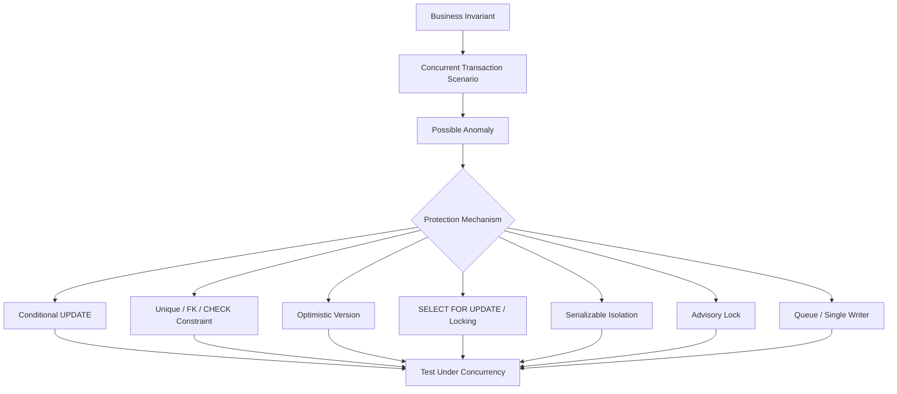
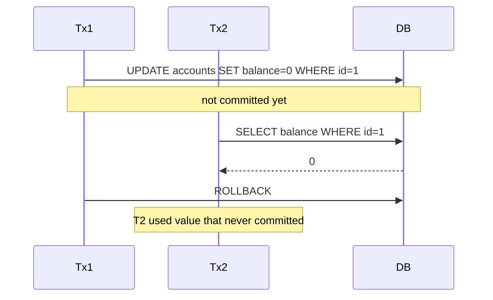
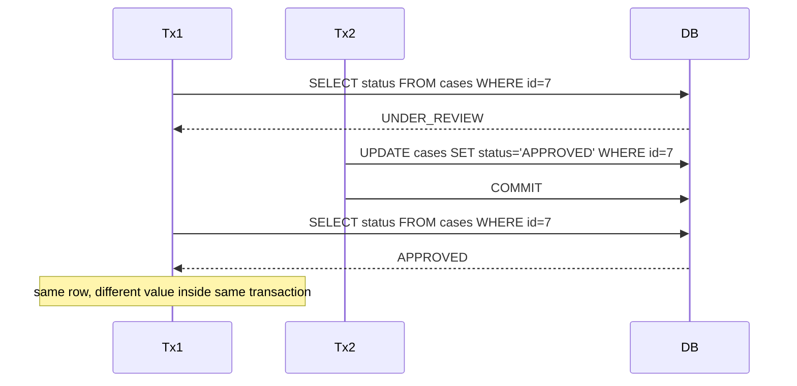
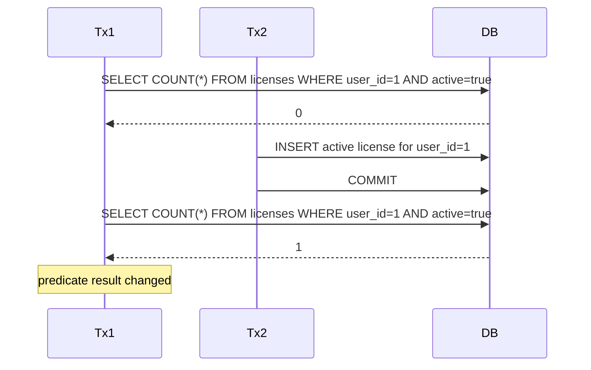
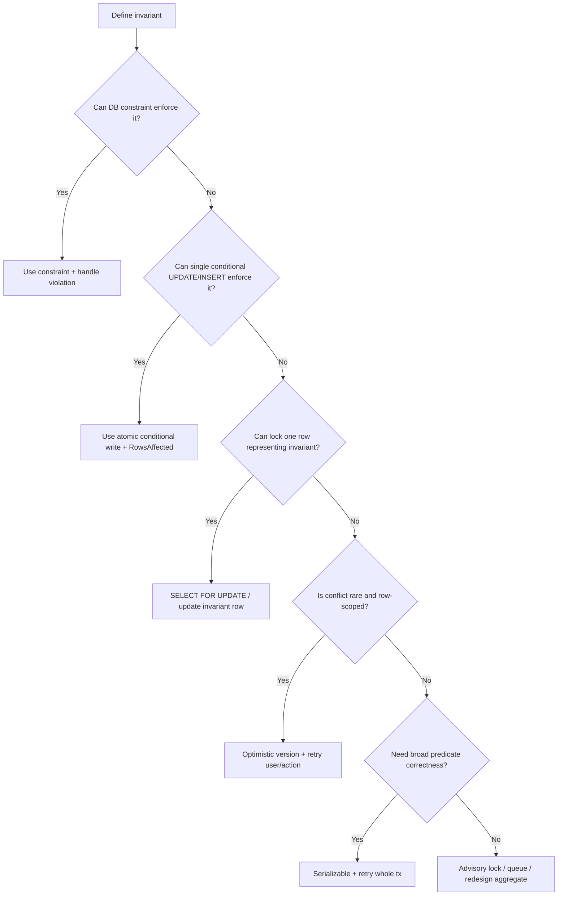

# learn-go-sql-database-integration-part-017.md

# Transaction Isolation and Anomaly Modelling

> Seri: `learn-go-sql-database-integration`  
> Part: `017`  
> Topik: `Transaction Isolation, Consistency Anomalies, Snapshot Semantics, Invariant Modelling, and Go TxOptions`  
> Target pembaca: Java software engineer yang ingin memahami Go database integration sampai level production architecture  
> Target Go: Go 1.26.x  
> Status seri: **belum selesai**  

---

## 0. Posisi Part Ini Dalam Seri

Pada part sebelumnya kita membahas fundamental transaksi di Go:

- `DB.BeginTx`;
- `sql.TxOptions`;
- `Commit`;
- `Rollback`;
- transaction boundary;
- connection pinning;
- `defer tx.Rollback`;
- transaction-aware repository;
- context cancellation;
- transaction timeout;
- commit ambiguity;
- outbox/idempotency entry point.

Part ini membahas pertanyaan yang lebih sulit:

> Jika dua atau lebih transaksi berjalan bersamaan, apakah hasil akhirnya tetap benar?

Banyak developer berpikir:

```text
Sudah pakai transaction berarti aman.
```

Itu salah.

Transaction memberi atomicity, tetapi isolation menentukan bagaimana transaksi saling melihat dan mempengaruhi satu sama lain.

Atomicity menjawab:

```text
Apakah perubahan dalam satu transaksi commit semua atau rollback semua?
```

Isolation menjawab:

```text
Saat banyak transaksi berjalan bersamaan, apakah hasilnya sama seperti transaksi dijalankan satu per satu?
```

Part ini membahas:

- isolation level;
- dirty read;
- non-repeatable read;
- phantom read;
- lost update;
- write skew;
- read skew;
- snapshot isolation;
- serializable isolation;
- optimistic/pessimistic thinking;
- Go `sql.IsolationLevel`;
- PostgreSQL/MySQL/SQL Server/Oracle notes;
- cara memilih isolation berdasarkan invariant bisnis;
- kenapa constraint dan conditional update sering lebih kuat daripada “naikkan isolation level”;
- bagaimana menulis test anomaly.

Part ini sengaja tidak hanya memberi definisi textbook. Fokusnya adalah **modelling correctness**.

---

## 1. Tujuan Pembelajaran

Setelah menyelesaikan part ini, kamu harus mampu:

1. membedakan atomicity, consistency, isolation, durability;
2. menjelaskan isolation sebagai concurrency contract;
3. memahami isolation level yang disediakan Go lewat `sql.TxOptions`;
4. memahami bahwa mapping isolation level ke behavior nyata bersifat database-specific;
5. menjelaskan dirty read, non-repeatable read, phantom read, lost update, write skew, read skew, dan read-only anomaly;
6. memahami perbedaan locking-based isolation, MVCC, snapshot isolation, dan serializable;
7. memodelkan business invariant sebelum memilih isolation level;
8. memilih antara conditional update, unique constraint, optimistic version, row lock, advisory lock, dan serializable transaction;
9. memahami kapan `ReadCommitted` cukup dan kapan berbahaya;
10. memahami kapan `RepeatableRead`/snapshot membantu tetapi masih bisa gagal;
11. memahami kenapa `Serializable` membutuhkan retry;
12. menulis transaction test untuk membuktikan invariant;
13. mendesain error handling untuk serialization/deadlock/retry;
14. menjelaskan perbedaan Go API vs database-specific semantics.

---

## 2. Fakta Dasar Dari Sumber Resmi

Beberapa fakta dasar:

1. Go menyediakan `sql.TxOptions` dengan field `Isolation sql.IsolationLevel` dan `ReadOnly bool`.
2. Go mendefinisikan beberapa isolation constants, termasuk `LevelDefault`, `LevelReadUncommitted`, `LevelReadCommitted`, `LevelWriteCommitted`, `LevelRepeatableRead`, `LevelSnapshot`, `LevelSerializable`, dan `LevelLinearizable`.
3. Jika driver/database tidak mendukung isolation level tertentu, `BeginTx` dapat mengembalikan error.
4. PostgreSQL mendokumentasikan isolation level dan menjelaskan bahwa `Read Committed` adalah default; `Repeatable Read` melihat data yang committed sebelum transaksi dimulai; `Serializable` memberi jaminan terkuat dengan kemungkinan serialization failure.
5. MySQL/InnoDB menyediakan empat isolation level standar: `READ UNCOMMITTED`, `READ COMMITTED`, `REPEATABLE READ`, dan `SERIALIZABLE`.
6. SQL Server menyediakan `SET TRANSACTION ISOLATION LEVEL` untuk mengontrol locking dan row versioning behavior statement dalam connection.
7. Behavior isolation nyata berbeda antar database karena implementasi locking, MVCC, snapshot, gap lock, predicate lock, row versioning, dan engine-specific rules.

Referensi utama:

- Go `database/sql` docs: <https://pkg.go.dev/database/sql>
- Go transaction docs: <https://go.dev/doc/database/execute-transactions>
- PostgreSQL transaction isolation: <https://www.postgresql.org/docs/current/transaction-iso.html>
- MySQL InnoDB transaction isolation: <https://dev.mysql.com/doc/refman/8.1/en/innodb-transaction-isolation-levels.html>
- MySQL `SET TRANSACTION`: <https://dev.mysql.com/doc/en/set-transaction.html>
- SQL Server isolation level docs: <https://learn.microsoft.com/en-us/sql/t-sql/statements/set-transaction-isolation-level-transact-sql>
- Berenson et al., "A Critique of ANSI SQL Isolation Levels": <https://arxiv.org/abs/cs/0701157>
- PostgreSQL Serializable Snapshot Isolation paper: <https://arxiv.org/abs/1208.4179>

---

## 3. Mental Model Utama

### 3.1 Transaction Bukan Magic Correctness

Transaction memberi struktur:

```text
BEGIN
  statement
  statement
COMMIT / ROLLBACK
```

Tetapi correctness di bawah concurrency bergantung pada:

- isolation level;
- lock yang diambil;
- row yang dibaca;
- predicate/range yang dibaca;
- constraint;
- index;
- conditional update;
- database implementation;
- retry policy;
- application invariant.

Jika kamu tidak tahu invariant yang harus dilindungi, kamu tidak bisa memilih isolation dengan benar.

### 3.2 Isolation Adalah “Apa Yang Boleh Terlihat”

Isolation menentukan:

```text
Transaksi ini boleh melihat perubahan transaksi lain kapan?
Transaksi lain boleh mempengaruhi keputusan transaksi ini bagaimana?
Apakah hasil akhirnya bisa dijelaskan sebagai urutan serial?
```

### 3.3 Correctness Harus Didefinisikan Sebagai Invariant

Contoh invariant:

```text
Saldo rekening tidak boleh negatif.
Hanya satu active license per user.
Hanya satu reviewer boleh claim case tertentu.
Case CLOSED tidak boleh berubah kembali ke UNDER_REVIEW.
Quota approved amount tidak boleh melebihi limit.
Audit row wajib ada untuk setiap state transition.
Doctor on-call minimal harus ada satu.
Inventory tidak boleh negatif.
```

Isolation level dipilih untuk melindungi invariant seperti itu.

---

## 4. Diagram: Dari Invariant ke Mechanism



Key idea:

> Isolation level is one mechanism. It is not the whole correctness strategy.

---

## 5. ACID Cepat, Tanpa Mengulang Terlalu Banyak

### 5.1 Atomicity

Semua perubahan dalam transaksi commit bersama atau rollback bersama.

Contoh:

```text
update case status + insert audit
```

harus atomic.

### 5.2 Consistency

Database berpindah dari satu valid state ke valid state lain.

Consistency bukan hanya tugas DB. Ia berasal dari:

- constraints;
- application logic;
- transaction boundaries;
- isolation;
- invariants.

### 5.3 Isolation

Concurrent transactions tidak saling mengganggu di luar level yang diizinkan.

### 5.4 Durability

Setelah commit sukses, perubahan bertahan walau crash sesuai guarantee DB.

Part ini fokus ke isolation.

---

## 6. Isolation Level di Go

Go mendefinisikan:

```go
type TxOptions struct {
	Isolation IsolationLevel
	ReadOnly  bool
}
```

Contoh:

```go
tx, err := db.BeginTx(ctx, &sql.TxOptions{
	Isolation: sql.LevelSerializable,
	ReadOnly: false,
})
```

Isolation constants:

```go
sql.LevelDefault
sql.LevelReadUncommitted
sql.LevelReadCommitted
sql.LevelWriteCommitted
sql.LevelRepeatableRead
sql.LevelSnapshot
sql.LevelSerializable
sql.LevelLinearizable
```

Important:

> Go exposes names. Database decides what it can actually support and how it behaves.

If unsupported:

```go
tx, err := db.BeginTx(ctx, &sql.TxOptions{
	Isolation: sql.LevelLinearizable,
})
if err != nil {
	// driver/database may reject
}
```

Do not assume every DB supports every Go constant.

---

## 7. Isolation Names Are Not Portable Semantics

`ReadCommitted` in one database is not always identical to `ReadCommitted` in another database.

Differences can include:

- locking read vs MVCC read;
- statement snapshot vs transaction snapshot;
- gap lock behavior;
- predicate lock behavior;
- lost update detection;
- serialization failure detection;
- read-only snapshot behavior;
- default isolation;
- autocommit semantics;
- consistency of repeated reads;
- behavior of `SELECT FOR UPDATE`;
- behavior of unique constraints under concurrency.

Therefore:

```text
Go code can request isolation.
Correctness must be tested against actual database.
```

---

## 8. Isolation Level Table: Conceptual View

| Isolation | Dirty Read | Non-repeatable Read | Phantom | Write Skew | Typical Cost |
|---|---|---|---|---|---|
| Read Uncommitted | possible | possible | possible | possible | lowest |
| Read Committed | prevented | possible | possible | possible | low |
| Repeatable Read | prevented | often prevented | DB-specific | often possible under snapshot | medium |
| Snapshot | prevented | prevented within snapshot | snapshot-dependent | possible | medium |
| Serializable | prevented | prevented | prevented | prevented | highest / retry needed |

Caveat:

> This table is conceptual. Real database behavior can be stronger or weaker in specific ways.

---

## 9. Important Anomalies

We need a vocabulary for failure.

### 9.1 Dirty Read

Transaction reads uncommitted data from another transaction.

Example:

```text
T1 updates balance to 0 but has not committed.
T2 reads balance = 0.
T1 rolls back.
T2 made decision based on data that never existed.
```

Most production databases avoid dirty read in default settings.

### 9.2 Non-Repeatable Read

Transaction reads same row twice and sees different committed values.

Example:

```text
T1 reads case status = UNDER_REVIEW.
T2 commits status = APPROVED.
T1 reads same case again and sees APPROVED.
```

In Read Committed, this can happen.

### 9.3 Phantom Read

Transaction repeats a predicate query and sees new rows matching predicate.

Example:

```text
T1 reads count of active licenses for user = 0.
T2 inserts active license for same user and commits.
T1 repeats query and sees count = 1.
```

### 9.4 Lost Update

Two transactions read same value, compute new value, and one overwrites the other.

Example:

```text
balance = 100

T1 reads 100, adds 10 -> writes 110
T2 reads 100, adds 20 -> writes 120

Final balance = 120, but expected 130
```

### 9.5 Write Skew

Two transactions read overlapping set of data, update different rows, and together violate invariant.

Classic example:

```text
At least one doctor must be on call.
Doctor A and Doctor B are both on call.

T1 sees B is on call, sets A off call.
T2 sees A is on call, sets B off call.

Both commit.
No doctor is on call.
```

Each transaction updates different row, so row-level conflict may not occur.

### 9.6 Read Skew

Transaction reads inconsistent snapshot across multiple reads.

Example:

```text
T1 reads account A before transfer.
T2 transfers money A -> B and commits.
T1 reads account B after transfer.
T1 sees inconsistent total.
```

### 9.7 Predicate Anomaly

Transaction checks a condition over a set/range, another transaction inserts/updates row that changes condition, both commit.

Example:

```text
Only 10 active permits allowed per zone.
T1 counts 9, inserts one.
T2 counts 9, inserts one.
Final count = 11.
```

This is often phantom/write skew territory.

---

## 10. Dirty Read Example

Dirty read is usually easiest to understand but less common in sane production defaults.



Protection:

- do not use Read Uncommitted for business-critical operations;
- use at least Read Committed;
- rely on DB default if it prevents dirty read, but verify.

---

## 11. Non-Repeatable Read Example



Is this bad?

Depends.

For simple request:

```text
read latest committed each statement
```

can be fine.

For multi-step decision requiring stable view, it may be wrong.

Protection:

- Repeatable Read / snapshot;
- row lock;
- optimistic version check;
- conditional update;
- service design avoiding repeated stale decisions.

---

## 12. Phantom Read Example



If T1’s logic was:

```text
if count == 0 then insert active license
```

phantom can break uniqueness unless protected.

Better:

```text
unique constraint on active license per user
```

where possible.

---

## 13. Lost Update Example

Bad code:

```go
func AddPoints(ctx context.Context, db *sql.DB, userID int64, delta int64) error {
	tx, err := db.BeginTx(ctx, nil)
	if err != nil {
		return err
	}
	defer tx.Rollback()

	var points int64
	if err := tx.QueryRowContext(ctx, `
		SELECT points FROM users WHERE id = $1
	`, userID).Scan(&points); err != nil {
		return err
	}

	points += delta

	if _, err := tx.ExecContext(ctx, `
		UPDATE users SET points = $1 WHERE id = $2
	`, points, userID); err != nil {
		return err
	}

	return tx.Commit()
}
```

Two concurrent calls can lose one update.

Better:

```go
_, err := tx.ExecContext(ctx, `
	UPDATE users
	SET points = points + $1
	WHERE id = $2
`, delta, userID)
```

Atomic update avoids read-modify-write race.

Alternative:

- `SELECT ... FOR UPDATE`;
- version column;
- serializable transaction with retry.

---

## 14. Write Skew Example

Table:

```sql
doctors(id, name, on_call)
```

Invariant:

```text
At least one doctor must be on call.
```

Bad logic:

```text
BEGIN
SELECT COUNT(*) FROM doctors WHERE on_call = true
if count > 1:
    UPDATE doctors SET on_call = false WHERE id = my_id
COMMIT
```

Concurrent schedule:

```text
T1 sees count = 2; turns doctor A off.
T2 sees count = 2; turns doctor B off.
Both commit.
Final count = 0.
```

Each transaction updated a different row, so simple row update conflict does not catch it.

Protection options:

1. serializable isolation with retry;
2. lock a shared invariant row;
3. advisory lock on invariant key;
4. materialized counter row locked on update;
5. constraint if expressible;
6. queue/single-writer for that invariant.

---

## 15. Read Skew Example

Table:

```text
accounts(id, balance)
```

Invariant:

```text
total balance across two accounts should be stable during report
```

Schedule:

```text
T1 reads account A = 100
T2 transfers 50 from A to B and commits
T1 reads account B = 150
```

T1 may compute impossible total depending timing.

Protection:

- consistent snapshot/read-only transaction;
- repeatable read/snapshot;
- report against replica/snapshot;
- materialized view;
- single query if possible.

---

## 16. Invariant-First Modelling

Before choosing isolation, write the invariant.

Bad question:

```text
Should I use serializable?
```

Better question:

```text
What bad concurrent schedule can violate my business rule?
```

Then choose mechanism.

### 16.1 Template

```text
Invariant:
  <what must always be true>

Transactions:
  T1 = <operation A>
  T2 = <operation B>

Read set:
  <rows/predicates read>

Write set:
  <rows/predicates written>

Possible anomaly:
  <lost update/write skew/phantom/etc>

Protection:
  <constraint/conditional update/lock/isolation/retry>

Test:
  <how to reproduce concurrency>
```

---

## 17. Example: Case Status Transition

Invariant:

```text
Case can move UNDER_REVIEW -> APPROVED only once.
Closed case cannot be approved.
Every approval must create audit row and outbox event.
```

Bad code:

```go
var status string
err := tx.QueryRowContext(ctx, `
	SELECT status FROM cases WHERE id = $1
`, caseID).Scan(&status)
if err != nil {
	return err
}

if status != "UNDER_REVIEW" {
	return ErrInvalidStateTransition
}

_, err = tx.ExecContext(ctx, `
	UPDATE cases SET status = 'APPROVED' WHERE id = $1
`, caseID)
```

Two concurrent approvals may both pass pre-check.

Better:

```go
result, err := tx.ExecContext(ctx, `
	UPDATE cases
	SET status = 'APPROVED',
	    updated_at = CURRENT_TIMESTAMP
	WHERE id = $1
	  AND status = 'UNDER_REVIEW'
`, caseID)
if err != nil {
	return err
}

affected, err := result.RowsAffected()
if err != nil {
	return err
}
if affected == 0 {
	return ErrInvalidStateTransition
}
```

Protection mechanism:

```text
conditional update
```

This often works well even under Read Committed because the update itself encodes the invariant transition.

---

## 18. Example: Single Active License

Invariant:

```text
A user may have at most one active license.
```

Bad approach:

```text
SELECT COUNT(*) WHERE user_id=? AND active=true
if count == 0:
    INSERT license active=true
```

Race:

```text
T1 count=0
T2 count=0
T1 insert
T2 insert
```

Best protection:

```text
unique constraint
```

Depending DB:

```sql
-- PostgreSQL example
CREATE UNIQUE INDEX uq_active_license_per_user
ON licenses(user_id)
WHERE active = true;
```

For DBs without partial unique index, alternatives:

- generated column + unique constraint;
- separate active_license table keyed by user_id;
- status-specific design;
- transaction with lock on user row;
- advisory lock;
- serializable.

Key lesson:

> Database constraint is stronger than application pre-check.

---

## 19. Example: Quota Limit

Invariant:

```text
Total approved amount for a period must not exceed quota.
```

Naive:

```text
SELECT SUM(amount) WHERE period=?
if sum + new_amount <= quota:
    INSERT approval
```

Concurrent inserts can exceed quota.

Protection options:

### Option A — Lock quota row

```text
SELECT * FROM quota WHERE period=? FOR UPDATE
SELECT SUM(...)
INSERT approval
UPDATE quota used_amount = used_amount + ?
COMMIT
```

Better: store used amount in quota row and update conditionally.

### Option B — Conditional counter update

```sql
UPDATE quota
SET used_amount = used_amount + $1
WHERE period = $2
  AND used_amount + $1 <= limit_amount;
```

Then insert approval if update affected 1 row.

### Option C — Serializable + retry

Let database detect anomaly, retry on serialization failure.

### Option D — Single writer queue

If quota is hot and contention high, serialize commands by quota key.

---

## 20. Example: Claim Work Item

Invariant:

```text
Only one worker may claim a pending job.
```

Bad:

```text
SELECT id FROM jobs WHERE status='PENDING' LIMIT 1
UPDATE jobs SET status='PROCESSING' WHERE id=?
```

Race possible.

Better patterns:

### Conditional update

```sql
UPDATE jobs
SET status = 'PROCESSING', claimed_by = $1
WHERE id = $2
  AND status = 'PENDING';
```

Check affected rows.

### Select for update skip locked

DB-specific:

```sql
SELECT id
FROM jobs
WHERE status = 'PENDING'
ORDER BY created_at
FOR UPDATE SKIP LOCKED
LIMIT 1;
```

Then update in same transaction.

`SKIP LOCKED` is DB-specific; test it.

---

## 21. Example: Inventory Deduction

Invariant:

```text
stock must not go below zero
```

Bad:

```text
read stock
if stock >= qty:
    update stock = stock - qty
```

Better:

```sql
UPDATE inventory
SET stock = stock - $1
WHERE sku = $2
  AND stock >= $1;
```

If affected rows = 0, insufficient stock.

This is a powerful pattern:

```text
state transition + condition in one statement
```

It reduces reliance on high isolation.

---

## 22. Example: Optimistic Version

Table:

```sql
cases(
    id BIGINT PRIMARY KEY,
    status TEXT NOT NULL,
    version BIGINT NOT NULL
)
```

Read:

```sql
SELECT status, version FROM cases WHERE id = $1;
```

Update:

```sql
UPDATE cases
SET status = $1,
    version = version + 1
WHERE id = $2
  AND version = $3;
```

If affected rows = 0:

```text
someone modified the row
```

Go:

```go
result, err := tx.ExecContext(ctx, `
	UPDATE cases
	SET status = $1,
	    version = version + 1
	WHERE id = $2
	  AND version = $3
`, nextStatus, caseID, expectedVersion)
if err != nil {
	return err
}

affected, err := result.RowsAffected()
if err != nil {
	return err
}
if affected == 0 {
	return ErrConcurrentModification
}
```

Optimistic version is useful when conflicts are rare.

---

## 23. Example: Pessimistic Row Lock

DB-specific SQL such as:

```sql
SELECT status
FROM cases
WHERE id = $1
FOR UPDATE;
```

Meaning conceptually:

```text
Lock this row for update until transaction ends.
```

Use when:

- conflict likely;
- you must inspect current value before deciding;
- conditional update is not enough;
- sequence of writes depends on locked row.

Caveats:

- increases lock wait;
- deadlock risk;
- transaction must be short;
- not portable syntax/behavior;
- may interact with indexes/range locks.

---

## 24. Isolation Levels in More Detail

### 24.1 Read Uncommitted

Allows dirty reads in theory.

In practice, some MVCC databases may treat it as Read Committed.

Use cases:

- rarely appropriate for business logic;
- maybe approximate analytics where wrong/inconsistent data acceptable.

Avoid for:

- money;
- workflow state;
- permissions;
- audit;
- quota;
- identity;
- compliance.

### 24.2 Read Committed

Each statement sees data committed before that statement begins.

Common default.

Pros:

- good concurrency;
- avoids dirty read;
- simple enough;
- works well with conditional writes and constraints.

Cons:

- repeated reads can see different values;
- phantom possible;
- write skew possible;
- application pre-checks can race.

Best with:

- constraints;
- conditional update;
- row locks where needed;
- optimistic version;
- idempotency.

### 24.3 Repeatable Read

Transaction sees stable snapshot for reads, depending DB.

Pros:

- repeated reads stable;
- reduces read skew;
- useful for consistent multi-query read.

Cons:

- write skew can still be possible under snapshot-style repeatable read;
- phantom behavior DB-specific;
- conflicts may appear at update/commit;
- long transactions can create MVCC pressure.

### 24.4 Snapshot Isolation

Transaction reads from a snapshot of committed data.

Pros:

- stable reads;
- avoids many read anomalies;
- good read concurrency.

Cons:

- write skew possible;
- not equivalent to serializable;
- conflict detection often write-write, not predicate invariant.

### 24.5 Serializable

Transactions behave as if executed one-at-a-time in some serial order.

Pros:

- strongest general isolation;
- protects broad classes of anomalies;
- useful when invariant is hard to lock/constraint manually.

Cons:

- may abort transactions with serialization failure;
- requires retry whole transaction;
- can reduce throughput;
- behavior and performance DB-specific;
- long transactions increase failure risk.

---

## 25. `Read Committed` Is Not “Bad”

Read Committed is often excellent when combined with correct write patterns.

Example:

```sql
UPDATE inventory
SET stock = stock - $1
WHERE sku = $2
  AND stock >= $1;
```

This can protect stock invariant without serializable.

Example:

```sql
UPDATE cases
SET status = 'APPROVED'
WHERE id = $1
  AND status = 'UNDER_REVIEW';
```

This can protect status transition.

Example:

```sql
INSERT INTO idempotency_keys(key, status)
VALUES($1, 'STARTED');
```

with unique key protects duplicate command.

Key lesson:

> Use database constraints and atomic conditional writes before reaching for high isolation.

---

## 26. `Repeatable Read` Is Not Always Serializable

In snapshot-style systems, repeatable read/snapshot can still allow write skew.

Example:

```text
Invariant over multiple rows.
Each tx reads same snapshot.
Each tx updates different row.
No write-write conflict.
Both commit.
Invariant broken.
```

Therefore:

```text
stable snapshot != serializable correctness
```

Protection:

- serializable;
- explicit lock on invariant row;
- unique/check constraint;
- advisory lock;
- single writer;
- materialized aggregate row.

---

## 27. Serializable Requires Retry

Serializable isolation often rejects dangerous concurrent schedules by aborting one transaction.

Your app must be ready:

```text
BEGIN SERIALIZABLE
...
COMMIT -> serialization failure
ROLLBACK
retry whole transaction
```

Bad:

```go
err := runSerializableTx(ctx)
if err != nil {
	return err // user sees random failure under normal contention
}
```

Better:

```go
err := retrySerializable(ctx, 3, func(ctx context.Context) error {
	return runSerializableTx(ctx)
})
```

Retry rules:

- retry entire transaction;
- use same idempotency/operation key;
- backoff with jitter;
- total deadline;
- no external side effects inside transaction;
- classify serialization error driver-specifically.

---

## 28. Go `TxOptions` Usage Pattern

```go
func withinSerializable(
	ctx context.Context,
	db *sql.DB,
	fn func(context.Context, *sql.Tx) error,
) error {
	tx, err := db.BeginTx(ctx, &sql.TxOptions{
		Isolation: sql.LevelSerializable,
		ReadOnly:  false,
	})
	if err != nil {
		return err
	}
	defer tx.Rollback()

	if err := fn(ctx, tx); err != nil {
		return err
	}

	return tx.Commit()
}
```

But real code needs retry:

```go
func RetrySerializable(
	ctx context.Context,
	db *sql.DB,
	maxAttempts int,
	fn func(context.Context, *sql.Tx) error,
) error {
	var last error

	for attempt := 1; attempt <= maxAttempts; attempt++ {
		if err := ctx.Err(); err != nil {
			return err
		}

		err := withinSerializable(ctx, db, fn)
		if err == nil {
			return nil
		}

		last = err

		if !isSerializationFailure(err) {
			return err
		}

		if attempt == maxAttempts {
			break
		}

		if err := sleepWithContext(ctx, backoff(attempt)); err != nil {
			return err
		}
	}

	return last
}
```

Driver-specific classifier is required.

---

## 29. Driver-Specific Error Classification

`database/sql` does not standardize SQLSTATE/error code.

You need classifiers:

```go
func isSerializationFailure(err error) bool {
	// PostgreSQL: SQLSTATE 40001
	// MySQL: deadlock/serialization-like errors use MySQL-specific codes
	// SQL Server: transient errors have numbers
	// Oracle: ORA-specific codes
	return false
}
```

Do not implement by matching human-readable error strings if driver exposes structured code.

Bad:

```go
strings.Contains(err.Error(), "could not serialize")
```

Better:

```go
var pgErr *pgconn.PgError
if errors.As(err, &pgErr) && pgErr.Code == "40001" {
	return true
}
```

The exact type depends on driver.

---

## 30. Isolation and Retry Matrix

| Error | Retry? | Conditions |
|---|---|---|
| serialization failure | yes | retry whole transaction, bounded |
| deadlock victim | yes | retry whole transaction, bounded |
| lock timeout | maybe | if operation safe and useful |
| statement timeout | maybe | if root cause transient; avoid retry storm |
| unique violation | usually no | may represent idempotency duplicate |
| FK violation | usually no | data/application error |
| context canceled | no | caller no longer wants result |
| context deadline | maybe no | retry only if parent budget remains and safe |
| connection failure before write | maybe | if operation safe |
| commit ambiguous | not blindly | reconcile/idempotency required |

---

## 31. PostgreSQL Isolation Notes

PostgreSQL behavior highlights:

- Default isolation is Read Committed.
- Read Committed query sees data committed before the query began.
- Repeatable Read sees data committed before transaction began and provides stronger behavior than SQL minimum.
- Serializable provides strongest isolation and may abort transactions with serialization failure.
- PostgreSQL's Serializable uses Serializable Snapshot Isolation (SSI).
- `READ UNCOMMITTED` is treated like Read Committed in PostgreSQL.
- `SELECT FOR UPDATE` and related locking clauses are available.
- SQLSTATE `40001` indicates serialization failure.
- Deadlock detected is SQLSTATE `40P01`.

Implications for Go:

- `sql.LevelReadCommitted` often maps to PostgreSQL Read Committed.
- `sql.LevelSerializable` can produce retryable errors.
- Long serializable transactions increase abort risk.
- Read-only serializable transactions have special optimizations in PostgreSQL, but still require understanding.
- Use driver-specific error extraction for SQLSTATE.

---

## 32. MySQL/InnoDB Isolation Notes

MySQL/InnoDB supports:

- READ UNCOMMITTED;
- READ COMMITTED;
- REPEATABLE READ;
- SERIALIZABLE.

Important practical notes:

- InnoDB default is commonly REPEATABLE READ.
- InnoDB uses MVCC for consistent reads.
- Locking reads like `SELECT ... FOR UPDATE` behave differently from plain consistent reads.
- Gap locks and next-key locks matter under some isolation levels.
- Deadlocks are normal under concurrency and must be handled.
- Lock wait timeout and deadlock errors have MySQL-specific codes.
- `SERIALIZABLE` can convert plain SELECTs into locking reads depending behavior.

Implications for Go:

- Do not assume MySQL Repeatable Read equals PostgreSQL Repeatable Read exactly.
- Test phantoms/write skew under your exact schema/indexes.
- Index choice can affect locking/gap behavior.
- Use MySQL driver error codes for classification.
- Keep transactions short to reduce deadlocks.

---

## 33. SQL Server Isolation Notes

SQL Server isolation is strongly shaped by locking and row versioning settings.

Isolation levels include:

- READ UNCOMMITTED;
- READ COMMITTED;
- REPEATABLE READ;
- SNAPSHOT;
- SERIALIZABLE.

Important settings:

- `READ_COMMITTED_SNAPSHOT`;
- `ALLOW_SNAPSHOT_ISOLATION`.

SQL Server docs describe `SET TRANSACTION ISOLATION LEVEL` as controlling locking and row versioning behavior of statements issued by a connection.

Implications:

- Same isolation name can behave differently depending database options.
- Snapshot isolation must be enabled.
- Read committed may use locking or row versioning depending settings.
- Deadlock victim errors should be retried if safe.
- Transaction isolation is connection/session scoped when set manually; with pooling, avoid leaking session state.

Use `BeginTx` when possible rather than manual `SET`, but verify driver mapping.

---

## 34. Oracle Isolation Notes

Oracle does not map perfectly to all ANSI isolation names.

Typical practical points:

- Oracle provides statement-level read consistency.
- Read Committed is common default.
- Serializable exists but behaves through Oracle's consistency model.
- `SELECT FOR UPDATE` is common for pessimistic locking.
- ORA errors such as serialization conflicts/deadlocks require Oracle-specific classification.
- Session state/NLS/settings matter in pooled apps.

Implications:

- Do not assume Go isolation constants map one-to-one.
- Test with actual Oracle driver and DB version.
- Coordinate with DBA for isolation, locking, and session behavior.
- Be careful with long transactions and undo retention.

---

## 35. Isolation Level Selection Heuristic

Start with this decision tree:



This is not rigid, but useful.

---

## 36. Mechanism Comparison

| Mechanism | Best For | Weakness |
|---|---|---|
| unique constraint | uniqueness invariant | not all invariants expressible |
| check constraint | row-local invariant | not cross-row aggregate |
| FK constraint | referential integrity | not workflow rule |
| conditional update | state transition, stock, quota row | needs careful affected-row handling |
| optimistic version | rare conflict row updates | retry/user conflict handling |
| row lock | inspect then update same row | lock wait/deadlock |
| range/predicate lock | predicate correctness | DB-specific/costly |
| serializable | broad invariant correctness | retry/performance |
| advisory lock | app-defined critical section | DB-specific; must release via tx/session |
| single writer queue | hot key/invariant | latency/complexity |
| materialized counter row | aggregate invariant | hot row risk |

---

## 37. Go Pattern: Conditional Update

```go
func ApproveCase(ctx context.Context, tx *sql.Tx, caseID int64) error {
	result, err := tx.ExecContext(ctx, `
		UPDATE cases
		SET status = 'APPROVED',
		    updated_at = CURRENT_TIMESTAMP
		WHERE id = $1
		  AND status = 'UNDER_REVIEW'
	`, caseID)
	if err != nil {
		return err
	}

	affected, err := result.RowsAffected()
	if err != nil {
		return err
	}

	if affected == 0 {
		return ErrInvalidStateTransition
	}

	return nil
}
```

This protects against concurrent transition without needing serializable isolation in many cases.

---

## 38. Go Pattern: Optimistic Version

```go
func UpdateCaseTitle(
	ctx context.Context,
	tx *sql.Tx,
	caseID int64,
	expectedVersion int64,
	newTitle string,
) error {
	result, err := tx.ExecContext(ctx, `
		UPDATE cases
		SET title = $1,
		    version = version + 1,
		    updated_at = CURRENT_TIMESTAMP
		WHERE id = $2
		  AND version = $3
	`, newTitle, caseID, expectedVersion)
	if err != nil {
		return err
	}

	affected, err := result.RowsAffected()
	if err != nil {
		return err
	}

	if affected == 0 {
		return ErrConcurrentModification
	}

	return nil
}
```

Good for:

- edit forms;
- admin update;
- moderate contention;
- user-visible conflict resolution.

---

## 39. Go Pattern: Quota Conditional Counter

```go
func ReserveQuota(
	ctx context.Context,
	tx *sql.Tx,
	period string,
	amount int64,
) error {
	result, err := tx.ExecContext(ctx, `
		UPDATE quota
		SET used_amount = used_amount + $1
		WHERE period = $2
		  AND used_amount + $1 <= limit_amount
	`, amount, period)
	if err != nil {
		return err
	}

	affected, err := result.RowsAffected()
	if err != nil {
		return err
	}
	if affected == 0 {
		return ErrQuotaExceeded
	}

	return nil
}
```

This transforms aggregate check into atomic row update.

---

## 40. Go Pattern: Transaction With Isolation

```go
func RunWithIsolation(
	ctx context.Context,
	db *sql.DB,
	level sql.IsolationLevel,
	readOnly bool,
	fn func(context.Context, *sql.Tx) error,
) error {
	tx, err := db.BeginTx(ctx, &sql.TxOptions{
		Isolation: level,
		ReadOnly:  readOnly,
	})
	if err != nil {
		return err
	}
	defer tx.Rollback()

	if err := fn(ctx, tx); err != nil {
		return err
	}

	return tx.Commit()
}
```

Use:

```go
err := RunWithIsolation(ctx, db, sql.LevelSerializable, false, func(ctx context.Context, tx *sql.Tx) error {
	// transaction body
	return nil
})
```

But for serializable, add retry.

---

## 41. Go Pattern: Serializable Retry Skeleton

```go
func RunSerializableWithRetry(
	ctx context.Context,
	db *sql.DB,
	maxAttempts int,
	fn func(context.Context, *sql.Tx) error,
) error {
	var lastErr error

	for attempt := 1; attempt <= maxAttempts; attempt++ {
		if err := ctx.Err(); err != nil {
			return err
		}

		err := RunWithIsolation(ctx, db, sql.LevelSerializable, false, fn)
		if err == nil {
			return nil
		}

		lastErr = err

		if !IsRetryableSerialization(err) {
			return err
		}

		if attempt == maxAttempts {
			break
		}

		if err := SleepWithContext(ctx, Backoff(attempt)); err != nil {
			return err
		}
	}

	return lastErr
}

func IsRetryableSerialization(err error) bool {
	// Must be implemented per driver/database.
	return false
}

func Backoff(attempt int) time.Duration {
	return time.Duration(attempt*attempt) * 25 * time.Millisecond
}

func SleepWithContext(ctx context.Context, d time.Duration) error {
	timer := time.NewTimer(d)
	defer timer.Stop()

	select {
	case <-ctx.Done():
		return ctx.Err()
	case <-timer.C:
		return nil
	}
}
```

---

## 42. Important: Retry Whole Transaction

Bad:

```go
if err := tx.ExecContext(ctx, query); isSerializationFailure(err) {
	// retry just this statement
	tx.ExecContext(ctx, query)
}
```

If transaction has serialization failure, transaction is often aborted/invalid.

Correct:

```text
rollback current transaction
start new transaction
rerun whole transaction logic
```

Because the reads that informed decisions must be repeated.

---

## 43. External Side Effects Break Retry

If transaction body does:

```go
sendEmail()
```

then serializable retry may send duplicate emails.

That is why transaction body should be pure DB work, and side effects should go through outbox.

Serializable retry-friendly transaction:

```text
read/validate DB
write DB state
insert outbox
commit
```

Worker later handles side effect idempotently.

---

## 44. Read-Only Transactions

Read-only transaction can be used for consistent multi-query reads.

```go
tx, err := db.BeginTx(ctx, &sql.TxOptions{
	Isolation: sql.LevelRepeatableRead,
	ReadOnly:  true,
})
```

Use cases:

- summary page requiring coherent values;
- report snapshot;
- authorization + data read consistency;
- comparing multiple tables.

Caveats:

- long read-only transaction can still hold resources/snapshot;
- on replicas, staleness still matters;
- isolation support differs;
- serializable read-only may still fail or need special handling depending DB.

---

## 45. Single Query Often Beats Transaction

If consistency can be achieved with one SQL statement, prefer that.

Bad:

```text
BEGIN
SELECT ...
SELECT ...
COMMIT
```

Maybe better:

```sql
SELECT ...
FROM ...
JOIN ...
WHERE ...
```

A single statement often gets a statement-level consistent view in MVCC databases and reduces transaction duration.

But not always:

- complex query may be slower;
- locking semantics may differ;
- readability may suffer;
- query planner may struggle.

Trade-off must be evaluated.

---

## 46. Isolation and Indexes

Indexes affect isolation/locking behavior.

Examples:

- range locks depend on index access path in some DBs;
- missing index can lock/scan more rows;
- `SELECT FOR UPDATE WHERE status='PENDING'` without index may lock too much;
- gap lock behavior in InnoDB depends on indexes;
- uniqueness constraint requires index;
- predicate performance influences lock duration.

Correctness and performance are linked.

A missing index can turn a small critical section into a broad lock/scan.

---

## 47. Isolation and Foreign Keys

Foreign keys can create locks and blocking behavior.

Example:

- deleting parent row while child insert occurs;
- updating referenced key;
- inserting child checks parent;
- cascading delete/update.

Under concurrency, FK constraints can cause lock waits.

Do not treat constraints as free. They enforce correctness but need indexing and observability.

Guidelines:

- index foreign key columns where needed;
- understand cascade behavior;
- keep transactions short;
- test delete/update concurrency;
- monitor lock wait.

---

## 48. Isolation and Unique Constraints

Unique constraint is one of the strongest concurrency tools.

Example:

```sql
CREATE UNIQUE INDEX uq_idempotency_key ON idempotency_keys(key);
```

Concurrent insert:

```text
T1 inserts key
T2 inserts same key
one succeeds, one fails/waits then fails
```

Application handles duplicate as idempotency hit or conflict.

Unique constraints are often better than:

```text
SELECT first, then INSERT
```

because DB enforces final truth.

---

## 49. Isolation and Check Constraints

Check constraints enforce row-local invariant.

Example:

```sql
ALTER TABLE accounts
ADD CONSTRAINT chk_balance_non_negative
CHECK (balance >= 0);
```

This protects against bugs but may not express all business logic.

Combine with conditional update:

```sql
UPDATE accounts
SET balance = balance - $1
WHERE id = $2
  AND balance >= $1;
```

Check constraint is final guard.

---

## 50. Isolation and Materialized Aggregate Row

For aggregate invariant:

```text
total used quota <= limit
```

Instead of summing many rows every time, maintain a row:

```text
quota(period, limit_amount, used_amount)
```

Then:

```sql
UPDATE quota
SET used_amount = used_amount + $1
WHERE period = $2
  AND used_amount + $1 <= limit_amount;
```

This makes invariant row-local and atomic.

Trade-off:

- hot row contention;
- simpler correctness;
- easier observability;
- maybe need sharding by period/tenant.

---

## 51. Isolation and Advisory Locks

Advisory locks are application-defined locks in the database.

Use cases:

- lock by tenant ID;
- lock by case ID;
- lock by quota period;
- avoid distributed lock service;
- serialize rare critical operation.

Caveats:

- DB-specific;
- session-level vs transaction-level semantics differ;
- must avoid leaks;
- can reduce throughput;
- must define key carefully;
- can deadlock if multiple locks acquired inconsistently.

Prefer transaction-scoped advisory lock where available.

---

## 52. Isolation and Application Mutex

Do not use in-process mutex to protect database invariant across multiple app instances.

Bad:

```go
var mu sync.Mutex

mu.Lock()
defer mu.Unlock()

// check DB and update DB
```

This only protects one process.

In Kubernetes/multi-instance:

```text
pod A has mutex A
pod B has mutex B
```

Invariant still broken.

Use database constraint/lock/transaction or distributed coordination.

---

## 53. Isolation and Distributed Systems

A single database transaction cannot protect invariant across:

- another database;
- cache;
- Kafka;
- object storage;
- email provider;
- external API;
- another microservice;
- search index.

Use:

- outbox;
- inbox;
- saga;
- idempotency;
- reconciliation;
- compensation;
- exactly-once skepticism.

Isolation applies inside one transactional resource.

---

## 54. Isolation and Cache

Cache can break transaction semantics.

Example:

```text
T1 updates DB
T1 commits
cache invalidation fails
T2 reads stale cache
```

Or:

```text
T1 reads cache inside transaction
cache contains value not consistent with transaction snapshot
```

Guidelines:

- do not rely on cache for invariant checks;
- enforce invariants in DB;
- update/invalidate cache after commit;
- use outbox for cache/event propagation if needed;
- accept cache staleness explicitly.

---

## 55. Isolation and Read Replicas

Read replicas introduce staleness.

Scenario:

```text
write to primary
read from replica immediately
replica lag -> old value
```

Transaction isolation on primary does not solve replica lag.

Rules:

- read-your-write paths should read primary;
- invariant checks must happen on primary;
- replica reads are for stale-tolerant queries;
- report/listing must define freshness;
- failover changes role; validate routing.

---

## 56. Isolation and Autocommit

Many databases run each statement in its own implicit transaction when not inside explicit transaction.

Example:

```go
db.ExecContext(ctx, `UPDATE ...`)
```

is usually autocommit.

For single atomic statement, autocommit is often enough.

Example:

```sql
UPDATE inventory
SET stock = stock - ?
WHERE sku = ?
  AND stock >= ?
```

No explicit transaction needed if that is the only operation.

But if you need:

```text
update inventory + insert order + insert audit
```

use explicit transaction.

---

## 57. Isolation and Long Transactions

Long transactions are dangerous because they:

- hold locks longer;
- hold snapshot longer;
- increase conflict window;
- increase deadlock chance;
- increase serialization failure chance;
- pin connection;
- increase MVCC/undo pressure;
- delay cleanup/vacuum depending DB;
- make failover/retry more painful.

Rule:

```text
Do all slow work outside transaction.
Keep transaction as short as possible.
```

---

## 58. Isolation and User Think Time

Never hold transaction open across user interaction.

Bad:

```text
BEGIN
show form to user
wait 5 minutes
user submits
COMMIT
```

Instead:

- read data;
- send version/token to user;
- on submit, use optimistic version/conditional update;
- reject conflict if stale.

---

## 59. Isolation and Batch Jobs

Batch jobs can create long transactions.

Bad:

```text
BEGIN
update 1 million rows
COMMIT
```

Risks:

- lock pressure;
- log/WAL pressure;
- rollback expensive;
- replication lag;
- table bloat;
- timeout.

Better:

- chunked transactions;
- checkpoint progress;
- idempotent batches;
- limit lock timeout;
- low-priority schedule;
- separate pool;
- observe impact.

---

## 60. Isolation and Reporting

Reports often need consistent view, but not necessarily transaction over OLTP pool.

Options:

- single snapshot query;
- read-only repeatable read transaction;
- read replica;
- materialized view;
- data warehouse;
- async report generation;
- export table snapshot.

Ask:

```text
Does report need exact transactionally consistent data or just business-acceptable freshness?
```

Do not damage OLTP latency for a report that can tolerate staleness.

---

## 61. Isolation and Regulatory/Audit Systems

In regulatory systems, correctness is not just technical.

You need:

- defensible state transitions;
- audit trail consistency;
- repeatable explanation;
- no hidden lost updates;
- user action traceability;
- idempotency for repeated submissions;
- authorization checks tied to transaction state;
- no stale approval decisions;
- no duplicate enforcement actions;
- no missing audit row.

Recommended patterns:

- conditional update for state transition;
- operation ID;
- audit insert in same transaction;
- outbox in same transaction;
- version column for human edits;
- unique constraint for idempotency;
- explicit transaction boundary;
- concurrency tests for critical transitions.

---

## 62. Example: Regulatory Case Assignment

Invariant:

```text
A case can be actively assigned to only one officer at a time.
```

Schema option:

```text
case_assignments(case_id, officer_id, status)
```

Protection:

```sql
CREATE UNIQUE INDEX uq_active_assignment
ON case_assignments(case_id)
WHERE status = 'ACTIVE';
```

Concurrent assignment:

- one insert succeeds;
- the other fails with unique violation.

Alternative:

```sql
UPDATE cases
SET assigned_officer_id = $1
WHERE id = $2
  AND assigned_officer_id IS NULL;
```

Check affected rows.

Choice depends on history/audit model.

---

## 63. Example: Appeal Submission Once

Invariant:

```text
Only one active appeal per enforcement case.
```

Use unique constraint or conditional insert.

Potential schema:

```sql
appeals(
  id,
  case_id,
  status
)
```

Partial unique:

```sql
CREATE UNIQUE INDEX uq_active_appeal_per_case
ON appeals(case_id)
WHERE status IN ('SUBMITTED', 'UNDER_REVIEW');
```

If DB does not support partial unique, model active appeal as separate table:

```text
active_case_appeals(case_id primary key, appeal_id)
```

Then insert into active table inside transaction.

---

## 64. Example: Approval Quorum

Invariant:

```text
A decision requires at least 2 approvals and no unresolved objection.
```

Possible anomaly:

- T1 sees 2 approvals, no objection, marks APPROVED.
- T2 inserts objection concurrently.
- Both commit; approved decision with unresolved objection.

Protection options:

1. lock decision aggregate row;
2. update decision status with conditional `NOT EXISTS` in same statement;
3. serializable transaction;
4. materialized counters for approvals/objections;
5. single workflow command queue by case ID.

This is predicate/aggregate invariant. Simple row version may not be enough unless all updates go through aggregate row.

---

## 65. Testing Isolation Anomalies

You cannot prove concurrency correctness only with unit tests.

Need integration tests with real DB.

Test shape:

1. create controlled data;
2. open two separate connections/transactions;
3. coordinate interleaving with channels/barriers;
4. execute steps in specific order;
5. commit/rollback;
6. assert final invariant.

Important:

- must use separate connections;
- cannot use one transaction fixture wrapping whole test if testing concurrency;
- avoid nondeterministic sleep-only tests;
- use barriers;
- run with actual isolation level.

---

## 66. Test Helper: Two Connections

```go
func mustConn(t *testing.T, ctx context.Context, db *sql.DB) *sql.Conn {
	t.Helper()

	conn, err := db.Conn(ctx)
	if err != nil {
		t.Fatalf("conn: %v", err)
	}

	t.Cleanup(func() {
		_ = conn.Close()
	})

	return conn
}
```

Use `*sql.Conn` to force separate physical/logical connections.

---

## 67. Test Helper: Barrier

```go
type Barrier struct {
	ch chan struct{}
}

func NewBarrier() *Barrier {
	return &Barrier{ch: make(chan struct{})}
}

func (b *Barrier) Release() {
	close(b.ch)
}

func (b *Barrier) Wait() {
	<-b.ch
}
```

For more complex cases, use two barriers.

---

## 68. Example Test: Lost Update Reproduction

Conceptual test:

```go
func TestLostUpdate(t *testing.T) {
	ctx := context.Background()

	conn1 := mustConn(t, ctx, db)
	conn2 := mustConn(t, ctx, db)

	// setup points = 100

	t1Read := make(chan struct{})
	t2Done := make(chan struct{})

	go func() {
		tx, _ := conn1.BeginTx(ctx, &sql.TxOptions{Isolation: sql.LevelReadCommitted})
		defer tx.Rollback()

		var points int64
		_ = tx.QueryRowContext(ctx, `SELECT points FROM users WHERE id=$1`, 1).Scan(&points)

		close(t1Read)
		<-t2Done

		_, _ = tx.ExecContext(ctx, `UPDATE users SET points=$1 WHERE id=$2`, points+10, 1)
		_ = tx.Commit()
	}()

	<-t1Read

	tx2, _ := conn2.BeginTx(ctx, &sql.TxOptions{Isolation: sql.LevelReadCommitted})
	var points int64
	_ = tx2.QueryRowContext(ctx, `SELECT points FROM users WHERE id=$1`, 1).Scan(&points)
	_, _ = tx2.ExecContext(ctx, `UPDATE users SET points=$1 WHERE id=$2`, points+20, 1)
	_ = tx2.Commit()
	close(t2Done)

	// assert final maybe 110 or 120 instead of 130 depending interleaving/DB behavior
}
```

This is illustrative. Real test must handle errors, timeouts, and DB-specific behavior.

---

## 69. Better Test: Atomic Update Prevents Lost Update

Test concurrent:

```sql
UPDATE users SET points = points + $1 WHERE id = $2
```

Run many goroutines.

Expected final:

```text
initial + sum(deltas)
```

This test validates mechanism.

---

## 70. Example Test: Concurrent Case Approval

Run two goroutines:

```text
both attempt APPROVE same UNDER_REVIEW case
```

Expected:

- one succeeds;
- one gets `ErrInvalidStateTransition` or conflict;
- exactly one audit row;
- exactly one outbox event;
- final status APPROVED.

This is more business-relevant than testing isolation definitions.

---

## 71. Example Test: Write Skew

Use doctors/on_call example.

Under snapshot-like isolation, write skew may happen depending DB/isolation.

Test both:

- under default isolation;
- under serializable;
- with invariant row lock;
- with advisory lock.

Expected:

- default may allow anomaly;
- serializable should abort one transaction;
- invariant lock should serialize.

This teaches team the actual DB behavior.

---

## 72. Observability for Isolation Problems

Isolation bugs often appear as data anomalies, not errors.

Metrics/logs to track:

- concurrent modification conflicts;
- rows affected = 0 due to version/state condition;
- unique violation as idempotency hit/conflict;
- deadlock count;
- serialization failure count;
- lock timeout count;
- retry count;
- transaction duration;
- invalid state transition count;
- duplicate submission attempts;
- audit/business state mismatch count;
- reconciliation findings.

Do not just observe query latency. Observe correctness signals.

---

## 73. Error Mapping for Isolation/Concurrency

| Condition | Domain Meaning |
|---|---|
| affected rows 0 on conditional transition | invalid/stale state |
| version mismatch | concurrent modification |
| unique idempotency key violation | duplicate request / replay |
| unique business key violation | conflict |
| serialization failure | retryable concurrency conflict |
| deadlock victim | retryable concurrency conflict |
| lock timeout | contention / maybe retry |
| context deadline | timeout / uncertain if during commit |
| commit ambiguous | reconciliation needed |

Application should surface appropriate response:

- 409 Conflict;
- 409 Stale Version;
- 202 Accepted if async reconciliation;
- 503/504 for infrastructure timeout;
- 500 only for unexpected server fault.

---

## 74. Serializable Retry and User Experience

If transaction retries internally and succeeds quickly, user never sees conflict.

If retries exhausted:

- return conflict or retry-later message;
- show “record was updated by another user”;
- for commands, use idempotency key to let user safely retry;
- for background jobs, reschedule with backoff.

Do not expose raw “serialization failure” to end user.

---

## 75. Isolation and API Contract

For update APIs, include concurrency token.

Example response:

```json
{
  "id": 123,
  "status": "UNDER_REVIEW",
  "version": 7
}
```

Update request:

```json
{
  "nextStatus": "APPROVED",
  "expectedVersion": 7
}
```

DB:

```sql
UPDATE cases
SET status = $1,
    version = version + 1
WHERE id = $2
  AND version = $3;
```

If affected rows 0:

```text
409 Conflict
```

This makes concurrency visible at API layer.

---

## 76. Isolation and Idempotency API Contract

For commands that client may retry:

Header:

```text
Idempotency-Key: 01J...
```

DB:

```sql
INSERT INTO idempotency_keys(key, operation, status)
VALUES($1, $2, 'STARTED');
```

Unique key prevents duplicate command execution.

Within same transaction:

- insert idempotency key;
- apply business change;
- store result/outbox;
- mark completed.

On duplicate key:

- return stored result if completed;
- return in-progress/409/202 depending policy.

This protects against network retry and commit ambiguity.

---

## 77. Isolation and Authorization Checks

Authorization can race too.

Bad:

```text
SELECT role from user_permissions
if role allows:
    UPDATE case
```

Meanwhile permission revoked.

If revocation must be immediately respected, you need stronger design:

- check permission inside same transaction;
- lock relevant permission row;
- use version/epoch;
- encode authorization into conditional update;
- accept eventual revocation delay explicitly;
- audit decision basis.

Regulatory systems must define this policy.

---

## 78. Isolation and Soft Delete

Soft delete can create anomalies.

Example:

```text
unique email among active users
```

If soft delete uses `deleted_at`, uniqueness must account for active rows.

Protection:

- partial unique index where supported;
- generated active key;
- separate active table;
- transaction lock;
- careful restore behavior.

Application pre-check:

```text
SELECT count where email=? and deleted_at is null
```

is not enough under concurrency.

---

## 79. Isolation and Temporal Validity

Invariant:

```text
No overlapping active appointment intervals for same resource.
```

This is range/predicate invariant.

Protection options:

- exclusion constraint if DB supports;
- serializable;
- lock resource row;
- materialized schedule bucket;
- advisory lock by resource ID;
- single writer per resource.

Simple unique constraint may not express range overlap.

---

## 80. Isolation and Money

Money operations require special care.

Patterns:

- append-only ledger;
- unique transaction ID;
- idempotency key;
- no blind balance overwrite;
- conditional debit;
- invariant constraints;
- reconciliation;
- serializable/locking where needed.

Prefer:

```text
ledger entries + derived balance
```

or:

```sql
UPDATE account
SET balance = balance - ?
WHERE id = ?
  AND balance >= ?
```

Never:

```text
read balance in app
compute
write balance
```

without concurrency protection.

---

## 81. Isolation and Audit Trail Correctness

Audit must reflect committed business change.

Bad:

```text
insert audit outside transaction
update business inside transaction
```

or:

```text
send audit event to broker before commit
```

Correct:

```text
business change + audit row + outbox event in same transaction
```

If transaction rolls back, no audit/outbox.

If commit succeeds, audit/outbox exists.

If external audit sink needed, publish from outbox.

---

## 82. Isolation and Outbox Correctness

Outbox table itself needs concurrency rules.

Fields:

```text
id
event_type
aggregate_id
operation_id
payload
status
created_at
claimed_by
claimed_at
```

Worker claim should be safe:

- `FOR UPDATE SKIP LOCKED`;
- conditional update from PENDING to PROCESSING;
- unique operation/event key;
- retry/backoff;
- idempotent publisher.

Outbox avoids external side effect inside transaction, but outbox processing also needs concurrency control.

---

## 83. Isolation and Saga

If workflow spans services:

```text
Service A DB
Service B DB
Service C external system
```

Do not pretend one SQL isolation level solves it.

Use saga:

- local transaction per service;
- outbox event;
- idempotent consumer;
- compensation step;
- workflow state machine;
- reconciliation.

Isolation is local. Business consistency is global workflow design.

---

## 84. Practical Decision Examples

### 84.1 Case Status Update

Use:

- conditional update;
- rows affected check;
- audit/outbox in same tx;
- default isolation often enough.

### 84.2 User Profile Edit

Use:

- optimistic version;
- conflict response.

### 84.3 Quota Reservation

Use:

- quota row conditional update;
- maybe row lock if complex;
- maybe serializable if predicate complex.

### 84.4 Doctor On-Call Invariant

Use:

- serializable + retry;
- or lock invariant row;
- or maintain schedule aggregate row.

### 84.5 Job Queue Claim

Use:

- `FOR UPDATE SKIP LOCKED` if supported;
- or conditional update claim.

### 84.6 Duplicate Submission

Use:

- idempotency key unique constraint.

### 84.7 Active Assignment

Use:

- unique active assignment constraint;
- or conditional update on case row.

### 84.8 Report Snapshot

Use:

- read-only repeatable/snapshot transaction;
- or materialized snapshot/read replica.

---

## 85. Code: Isolation Config

```go
type TxPolicy struct {
	Isolation sql.IsolationLevel
	ReadOnly  bool
	Timeout   time.Duration
}

var TxPolicies = map[string]TxPolicy{
	"case.approve": {
		Isolation: sql.LevelReadCommitted,
		ReadOnly:  false,
		Timeout:   800 * time.Millisecond,
	},
	"quota.reserve": {
		Isolation: sql.LevelReadCommitted,
		ReadOnly:  false,
		Timeout:   1 * time.Second,
	},
	"report.snapshot": {
		Isolation: sql.LevelRepeatableRead,
		ReadOnly:  true,
		Timeout:   10 * time.Second,
	},
	"complex.invariant": {
		Isolation: sql.LevelSerializable,
		ReadOnly:  false,
		Timeout:   2 * time.Second,
	},
}
```

Do not hardcode isolation randomly across codebase.

---

## 86. Code: Policy-Based Transaction Manager

```go
type TxManager struct {
	DB       *sql.DB
	Policy   map[string]TxPolicy
}

func (m TxManager) Within(
	ctx context.Context,
	operation string,
	fn func(context.Context, *sql.Tx) error,
) error {
	policy, ok := m.Policy[operation]
	if !ok {
		return fmt.Errorf("missing tx policy for operation %s", operation)
	}

	txCtx, cancel := context.WithTimeout(ctx, policy.Timeout)
	defer cancel()

	tx, err := m.DB.BeginTx(txCtx, &sql.TxOptions{
		Isolation: policy.Isolation,
		ReadOnly:  policy.ReadOnly,
	})
	if err != nil {
		return fmt.Errorf("begin tx %s: %w", operation, err)
	}
	defer tx.Rollback()

	if err := fn(txCtx, tx); err != nil {
		return err
	}

	if err := tx.Commit(); err != nil {
		return fmt.Errorf("commit tx %s: %w", operation, err)
	}

	return nil
}
```

Production version should add:

- metrics;
- retry for specific operations;
- driver error classification;
- panic safety;
- rollback logging;
- tracing.

---

## 87. Code: Serializable Policy With Retry

```go
func (m TxManager) WithinSerializableRetry(
	ctx context.Context,
	operation string,
	maxAttempts int,
	fn func(context.Context, *sql.Tx) error,
) error {
	var last error

	for attempt := 1; attempt <= maxAttempts; attempt++ {
		if err := ctx.Err(); err != nil {
			return err
		}

		err := m.Within(ctx, operation, fn)
		if err == nil {
			return nil
		}

		last = err

		if !IsRetryableConcurrencyError(err) {
			return err
		}

		if attempt == maxAttempts {
			return err
		}

		if err := SleepWithContext(ctx, Backoff(attempt)); err != nil {
			return err
		}
	}

	return last
}
```

Only use this if transaction body is retry-safe.

---

## 88. Testing Matrix

For each critical use case, create table:

| Use Case | Invariant | Mechanism | Concurrent Test |
|---|---|---|---|
| approve case | only under_review can approve | conditional update | two approvals race |
| assign officer | one active assignment | unique active constraint | two assignments race |
| reserve quota | used <= limit | conditional quota update | many reservations |
| submit appeal | one active appeal | unique constraint | duplicate submit race |
| edit profile | no lost edit | version column | stale version update |
| claim job | one worker per job | skip locked/conditional update | many workers |
| publish outbox | one publish per event | claim status/idempotency | many workers |

This is how isolation knowledge becomes engineering practice.

---

## 89. Observability Dashboard

Panels:

1. transaction duration by operation;
2. commit/rollback count;
3. serialization failure count;
4. deadlock count;
5. lock timeout count;
6. concurrent modification count;
7. unique violation count by category;
8. invalid transition count;
9. idempotency duplicate count;
10. retry attempts/success/failure;
11. pool wait during transactions;
12. DB lock wait;
13. top blocking queries;
14. outbox claim conflicts;
15. reconciliation anomalies.

Isolation bugs are often invisible until data is wrong. Build correctness telemetry.

---

## 90. Alerting

### 90.1 Serialization Failure Spike

```text
serialization_failure_rate > baseline
```

May mean:

- contention increased;
- new workload;
- long transaction;
- missing index;
- serializable transaction too broad.

### 90.2 Deadlock Spike

```text
deadlock_count > threshold
```

Investigate:

- lock ordering;
- new code path;
- batch job;
- missing index;
- transaction duration.

### 90.3 Conflict Spike

```text
concurrent_modification_conflict > baseline
```

Could be legitimate user concurrency or UI issue.

### 90.4 Invalid State Transition Spike

Could indicate:

- duplicate clicks;
- stale UI;
- retry behavior;
- race condition;
- workflow bug;
- malicious/invalid clients.

### 90.5 Audit Mismatch

```text
business state changes without audit count > 0
```

This should be severe.

---

## 91. Runbook: Duplicate Business Record

Symptom:

```text
Two active licenses for one user.
```

Checks:

1. Is there unique constraint?
2. Was constraint disabled/missing?
3. Did logic use SELECT then INSERT?
4. Which transactions inserted rows?
5. What isolation level?
6. Was there retry after timeout?
7. Was idempotency missing?
8. Was soft-delete uniqueness wrong?

Mitigation:

- stop affected command if severe;
- deduplicate data with business approval;
- add unique constraint/index;
- fix code to handle constraint violation;
- add concurrency test;
- add monitoring.

---

## 92. Runbook: Lost Update

Symptom:

```text
User edit overwritten.
Counter wrong.
Balance/points missing update.
```

Checks:

1. Is code read-modify-write?
2. Is atomic update possible?
3. Is version column used?
4. Are rows affected checked?
5. Are concurrent edits allowed?
6. Is API returning version/ETag?
7. Did batch job overwrite fields?

Mitigation:

- add version column;
- use field-specific update;
- use atomic increment/decrement;
- conflict response;
- add test.

---

## 93. Runbook: Deadlock Storm

Checks:

1. top deadlocked statements;
2. lock order;
3. transaction duration;
4. missing indexes;
5. batch jobs;
6. foreign key locks;
7. concurrent workers;
8. retry behavior;
9. DB wait graph.

Mitigation:

- consistent lock ordering;
- shorten transaction;
- add indexes;
- reduce worker concurrency;
- retry with backoff;
- split batch;
- avoid hot row.

---

## 94. Runbook: Serialization Failures

Checks:

1. which operation?
2. expected under serializable?
3. retry success rate?
4. transaction duration?
5. read set too broad?
6. missing index causing broad predicate?
7. contention by hot key?
8. long read-only transactions?

Mitigation:

- add retry if missing;
- reduce transaction scope;
- add indexes;
- lock aggregate row;
- use conditional update;
- use lower isolation with stronger constraints if appropriate;
- queue hot key.

---

## 95. Common Anti-Patterns

| Anti-pattern | Problem |
|---|---|
| “transaction = safe” | ignores isolation anomalies |
| SELECT then INSERT without constraint | duplicate under concurrency |
| read-modify-write overwrite | lost update |
| repeatable read assumed serializable | write skew risk |
| serializable without retry | random failures under contention |
| retry with external side effects | duplicate side effects |
| app mutex for DB invariant | fails across pods |
| no rows affected check | silent stale update |
| no unique constraint for idempotency | duplicate command |
| long transaction | locks/conflicts/pool pressure |
| manual session isolation `SET` with pool | state leak risk |
| testing only single-thread | misses anomalies |
| relying on cache for invariant | stale/incorrect decision |

---

## 96. Code Review Checklist

### 96.1 Invariant

- [ ] Business invariant is stated.
- [ ] Read set and write set are understood.
- [ ] Potential anomaly identified.
- [ ] Mechanism chosen intentionally.
- [ ] DB constraint used where possible.
- [ ] Application pre-check is not sole protection.
- [ ] RowsAffected checked for conditional writes.
- [ ] Version checked for optimistic update.

### 96.2 Isolation

- [ ] `TxOptions.Isolation` intentionally chosen.
- [ ] Database supports requested isolation.
- [ ] Behavior tested on actual DB.
- [ ] Serializable transactions have retry.
- [ ] Retry has backoff/jitter and total deadline.
- [ ] Retry body has no external side effects.
- [ ] Read-only transaction justified.
- [ ] Long transactions avoided.

### 96.3 Locking/Constraints

- [ ] Unique constraints enforce uniqueness.
- [ ] Check constraints enforce row invariants.
- [ ] FK/index impact reviewed.
- [ ] `SELECT FOR UPDATE` use justified.
- [ ] Lock order consistent.
- [ ] Advisory lock semantics understood.
- [ ] Hot rows identified.

### 96.4 Observability

- [ ] Serialization failures measured.
- [ ] Deadlocks measured.
- [ ] Lock timeouts measured.
- [ ] Conflict responses measured.
- [ ] Invalid transitions measured.
- [ ] Idempotency duplicates measured.
- [ ] Transaction duration measured.
- [ ] Correctness reconciliation exists.

---

## 97. Architecture Review Checklist

Ask these for every critical command:

1. What invariant must hold?
2. Which table/rows represent that invariant?
3. Can a database constraint enforce it?
4. Can a single conditional write enforce it?
5. Is this a row invariant or predicate/aggregate invariant?
6. What happens if two users execute this command at once?
7. What happens if the client retries after timeout?
8. What happens if commit response is lost?
9. Which isolation level is used?
10. Does the DB actually support that isolation?
11. Is retry required?
12. Is retry safe?
13. Are external side effects outside transaction?
14. Are audit/outbox rows in same transaction?
15. Are conflict errors mapped to domain response?
16. Is there a concurrency integration test?
17. Is there monitoring for anomaly signals?

---

## 98. Mini Case Study: Approval Race

Problem:

```text
Two supervisors click Approve at almost same time.
```

Bad design:

```text
SELECT status
if status == UNDER_REVIEW:
  UPDATE status APPROVED
  INSERT audit
```

Possible:

- two approvals;
- duplicate audit;
- duplicate notifications.

Better:

```sql
UPDATE cases
SET status='APPROVED'
WHERE id=$1
  AND status='UNDER_REVIEW';
```

Then:

- if affected 1, insert audit/outbox;
- if affected 0, return conflict/invalid state.

Add:

- idempotency key if same supervisor retry;
- unique audit operation ID;
- outbox unique event key.

Isolation:

- Read Committed often sufficient with conditional update;
- test on target DB.

---

## 99. Mini Case Study: Quota Race

Problem:

```text
Two applications consume remaining quota concurrently.
```

Bad:

```text
SELECT SUM(approved_amount)
if enough:
  INSERT approval
```

Better:

```text
quota row stores used_amount
conditional update reserves quota
insert approval
commit
```

If quota update affected 0:

```text
quota exceeded
```

This turns aggregate invariant into row-local atomic update.

---

## 100. Mini Case Study: Reviewer Assignment

Problem:

```text
Only one active reviewer per case.
```

Options:

1. `cases.assigned_reviewer_id` conditional update from null;
2. assignment history table + unique active assignment;
3. lock case row before insert assignment;
4. advisory lock by case ID.

Best depends on audit/history requirement.

If history required, use assignment table with unique active constraint where possible.

---

## 101. Mini Case Study: Write Skew in Workflow Rule

Rule:

```text
A case can be closed only if no unresolved tasks exist.
```

Bad:

```text
T1 checks no unresolved tasks, closes case.
T2 inserts unresolved task concurrently.
Both commit.
```

Protection options:

- close case with condition `NOT EXISTS` in update statement plus proper isolation/index;
- lock case row and require task insert also locks/checks case row;
- use case aggregate version updated by task changes;
- serializable transaction;
- enforce with trigger/constraint if feasible.

Key: both operations must coordinate through same invariant mechanism.

---

## 102. Efficient Learning Summary

Isolation is not memorizing a table.

Isolation engineering is:

```text
1. identify invariant
2. model concurrent transactions
3. name possible anomaly
4. choose protection mechanism
5. implement with DB-supported primitives
6. classify errors
7. retry safely if needed
8. test under concurrency
9. observe correctness signals
```

A top engineer does not ask only:

```text
What isolation level should I use?
```

They ask:

```text
What invariant can break under concurrency, and what is the cheapest reliable mechanism to prevent or detect it?
```

---

## 103. Latihan

### Exercise 1 — Lost Update

Table:

```text
users(id, points)
```

Two requests add points concurrently.

Question:

- Why is SELECT then UPDATE unsafe?
- Write safer SQL.

### Exercise 2 — Single Active Appeal

Table:

```text
appeals(id, case_id, status)
```

Invariant:

```text
Only one appeal with status SUBMITTED or UNDER_REVIEW per case.
```

Question:

- What mechanism would you choose?
- What if DB has no partial unique index?

### Exercise 3 — Quota

Invariant:

```text
used_amount <= limit_amount
```

Question:

- Why is `SELECT SUM()` then insert unsafe?
- How to redesign table/transaction?

### Exercise 4 — Serializable Retry

A serializable transaction sends email inside transaction body and then fails with serialization error.

Question:

- Why is retry unsafe?
- What design should be used?

### Exercise 5 — Case Close Rule

Invariant:

```text
Case can close only if no unresolved tasks exist.
```

Two concurrent operations:

- close case;
- insert unresolved task.

Question:

- What anomaly can occur?
- Name two possible protections.

---

## 104. Jawaban Singkat Latihan

### Exercise 1

Unsafe because both transactions can read same old value and overwrite each other.

Safer:

```sql
UPDATE users
SET points = points + $1
WHERE id = $2;
```

### Exercise 2

Use unique constraint/index over active appeal condition.

If no partial unique index:

- active appeal table keyed by case_id;
- generated column + unique;
- lock case row before insert;
- serializable with retry;
- redesign status model.

### Exercise 3

`SELECT SUM()` can be stale under concurrency. Two transactions may both see enough quota.

Redesign:

```text
quota(period, limit_amount, used_amount)
```

Then:

```sql
UPDATE quota
SET used_amount = used_amount + $1
WHERE period = $2
  AND used_amount + $1 <= limit_amount;
```

Check affected rows, then insert approval in same transaction.

### Exercise 4

Retry unsafe because email may already have been sent before transaction failed/retried.

Use outbox:

```text
transaction inserts outbox email event
commit
worker sends email idempotently
```

### Exercise 5

Anomaly: phantom/write skew/predicate race.

Protections:

- serializable transaction with retry;
- lock case aggregate row and require task insert to coordinate;
- conditional close update with `NOT EXISTS` and proper DB behavior;
- maintain unresolved_task_count on case row with conditional update;
- advisory lock by case ID.

---

## 105. Ringkasan

Transaction isolation is the difference between:

```text
code that works in a demo
```

and:

```text
code that remains correct under real concurrent production traffic
```

Key lessons:

1. Transaction alone does not guarantee correctness.
2. Isolation level names are not perfectly portable.
3. Go exposes isolation through `sql.TxOptions`, but database behavior decides semantics.
4. Read Committed is often fine with constraints and conditional updates.
5. Repeatable Read/Snapshot gives stable reads but may allow write skew.
6. Serializable is strongest but requires retry.
7. Constraints, conditional updates, version columns, and locks are often better targeted tools than globally raising isolation.
8. Business invariant must drive mechanism choice.
9. Integration tests must reproduce concurrency.
10. Observability must include correctness/conflict signals, not just latency.

If you remember one sentence:

> Model the invariant first; choose isolation and locking second; test the concurrent schedule third.

---

## 106. Referensi

- Go package documentation — `database/sql`: <https://pkg.go.dev/database/sql>
- Go documentation — Executing transactions: <https://go.dev/doc/database/execute-transactions>
- Go documentation — Managing connections: <https://go.dev/doc/database/manage-connections>
- PostgreSQL documentation — Transaction Isolation: <https://www.postgresql.org/docs/current/transaction-iso.html>
- MySQL documentation — InnoDB Transaction Isolation Levels: <https://dev.mysql.com/doc/refman/8.1/en/innodb-transaction-isolation-levels.html>
- MySQL documentation — SET TRANSACTION Statement: <https://dev.mysql.com/doc/en/set-transaction.html>
- Microsoft SQL Server documentation — SET TRANSACTION ISOLATION LEVEL: <https://learn.microsoft.com/en-us/sql/t-sql/statements/set-transaction-isolation-level-transact-sql>
- Berenson et al. — A Critique of ANSI SQL Isolation Levels: <https://arxiv.org/abs/cs/0701157>
- Ports and Grittner — Serializable Snapshot Isolation in PostgreSQL: <https://arxiv.org/abs/1208.4179>

<!-- NAVIGATION_FOOTER -->
<div class="page-nav">
<a href="./learn-go-sql-database-integration-part-016.md">⬅️ Transaction Fundamentals in Go</a>
<a href="./index.md">📚 Kategori</a>
<a href="../../index.md">🏠 Home</a>
<a href="./learn-go-sql-database-integration-part-018.md">Locking, Concurrency Control, and Data Integrity ➡️</a>
</div>
