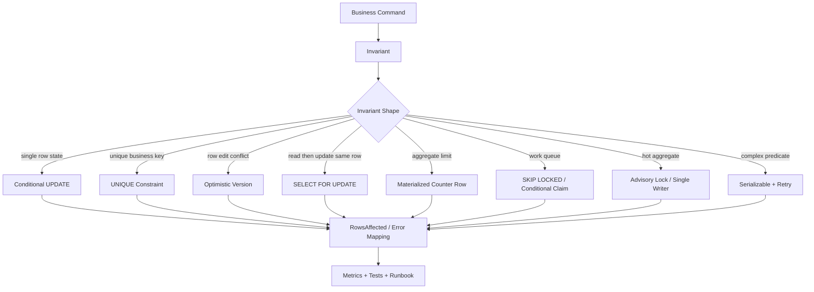
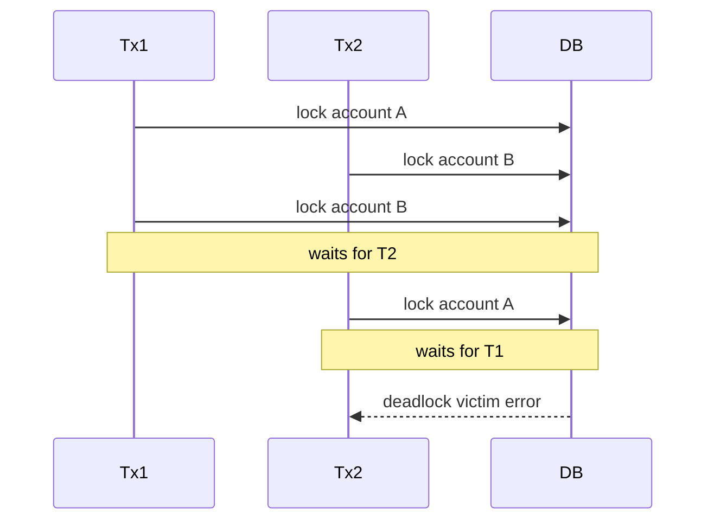
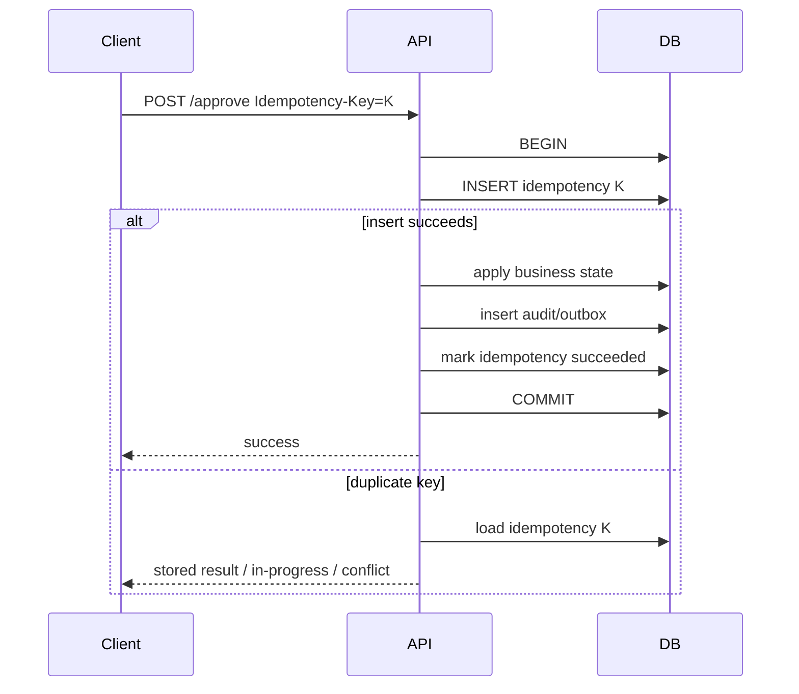

# learn-go-sql-database-integration-part-018.md

# Locking, Concurrency Control, and Data Integrity

> Seri: `learn-go-sql-database-integration`  
> Part: `018`  
> Topik: `Locking, Concurrency Control, Data Integrity, Deadlock, Lock Timeout, Optimistic/Pessimistic Control, and Production Invariants`  
> Target pembaca: Java software engineer yang ingin memahami Go database integration sampai level production architecture  
> Target Go: Go 1.26.x  
> Status seri: **belum selesai**

---

## 0. Posisi Part Ini Dalam Seri

Pada part sebelumnya kita membahas **transaction isolation dan anomaly modelling**:

- dirty read;
- non-repeatable read;
- phantom read;
- lost update;
- write skew;
- snapshot isolation;
- serializable;
- invariant-first modelling;
- `sql.TxOptions`;
- conditional update;
- unique constraint;
- optimistic version;
- retry serializable.

Part ini turun dari level teori anomaly ke level mekanisme operasional:

> Bagaimana kita benar-benar mengendalikan concurrency di database agar invariant bisnis tetap benar, tanpa membuat database mati karena lock contention?

Kita akan membahas:

- optimistic concurrency control;
- pessimistic locking;
- conditional update;
- unique constraint sebagai concurrency primitive;
- `SELECT ... FOR UPDATE`;
- `FOR UPDATE SKIP LOCKED`;
- lock timeout;
- deadlock;
- advisory lock;
- hot row;
- queue claim;
- idempotency table;
- state transition protection;
- lock ordering;
- data integrity di database;
- Go implementation pattern;
- observability dan runbook.

Part ini penting karena banyak bug production bukan karena SQL salah secara syntax, tetapi karena:

```text
SQL benar saat single user,
tetapi salah saat 2, 10, 100, atau 1000 transaksi berjalan bersamaan.
```

---

## 1. Tujuan Pembelajaran

Setelah menyelesaikan part ini, kamu harus mampu:

1. menjelaskan perbedaan optimistic dan pessimistic concurrency control;
2. menggunakan conditional write sebagai mekanisme utama menjaga invariant;
3. memakai `RowsAffected` untuk mendeteksi stale state/concurrent modification;
4. memakai unique constraint sebagai concurrency primitive;
5. memahami kapan perlu `SELECT ... FOR UPDATE`;
6. memahami risiko lock wait, deadlock, hot row, dan lock escalation;
7. memakai `SKIP LOCKED` untuk queue worker dengan hati-hati;
8. memahami advisory lock dan risikonya;
9. memahami lock timeout vs statement timeout vs context timeout;
10. menulis retry policy untuk deadlock/serialization/lock timeout secara aman;
11. mendesain idempotency key table untuk duplicate command;
12. mendesain state transition yang aman untuk workflow/regulatory systems;
13. membaca metric lock dan transaction untuk incident diagnosis;
14. membuat checklist code review untuk data integrity di bawah concurrency.

---

## 2. Fakta Dasar Dari Sumber Resmi

Beberapa fakta yang menjadi landasan:

1. Dokumentasi Go menyatakan transaksi dimulai dengan `DB.Begin` atau `DB.BeginTx`, menghasilkan `sql.Tx`; operasi dalam transaksi dilakukan lewat method `Tx`, lalu transaksi diakhiri dengan `Commit` atau `Rollback`.
2. PostgreSQL mendokumentasikan explicit locking dan menyebut `SELECT ... FOR UPDATE`, `FOR NO KEY UPDATE`, `FOR SHARE`, dan `FOR KEY SHARE` sebagai locking clause yang mengambil row-level lock tertentu.
3. PostgreSQL row-level lock dilepas pada akhir transaksi atau saat savepoint rollback yang sesuai.
4. PostgreSQL advisory lock menyediakan mekanisme lock aplikasi yang dapat memiliki scope session atau transaction, dan tidak terkait dengan satu row tertentu.
5. MySQL/InnoDB mendokumentasikan locking reads seperti `SELECT ... FOR SHARE` dan `SELECT ... FOR UPDATE` untuk memberi proteksi tambahan ketika data yang dibaca akan di-update/insert dalam transaksi yang sama.
6. MySQL/InnoDB mendokumentasikan record lock, gap lock, next-key lock, insert intention lock, dan auto-increment lock sebagai bagian dari locking model.
7. SQL Server documentation menjelaskan locking dan row versioning sebagai mekanisme Database Engine untuk menjaga integrity transaksi dan membantu aplikasi mengontrol transaksi secara efisien.

Referensi:

- Go — Executing transactions: <https://go.dev/doc/database/execute-transactions>
- Go — `database/sql`: <https://pkg.go.dev/database/sql>
- PostgreSQL — Explicit Locking: <https://www.postgresql.org/docs/current/explicit-locking.html>
- PostgreSQL — Advisory Locks: <https://www.postgresql.org/docs/current/explicit-locking.html#ADVISORY-LOCKS>
- MySQL — InnoDB Locking Reads: <https://dev.mysql.com/doc/en/innodb-locking-reads.html>
- MySQL — InnoDB Locking: <https://dev.mysql.com/doc/refman/8.2/en/innodb-locking.html>
- SQL Server — Transaction Locking and Row Versioning Guide: <https://learn.microsoft.com/en-us/sql/relational-databases/sql-server-transaction-locking-and-row-versioning-guide>

---

## 3. Mental Model Utama

### 3.1 Lock Bukan Tujuan

Lock bukan tujuan. Tujuan sebenarnya adalah:

```text
menjaga invariant tetap benar saat operasi berjalan concurrent
```

Lock hanyalah salah satu alat.

Alat lain:

- unique constraint;
- foreign key;
- check constraint;
- exclusion constraint;
- conditional update;
- optimistic version;
- idempotency key;
- queue serialization;
- advisory lock;
- serializable isolation;
- single-writer design;
- materialized aggregate row;
- event-sourced ledger.

Top engineer tidak bertanya:

```text
Harus pakai lock apa?
```

Tetapi bertanya:

```text
Invariant apa yang harus tetap benar, dan mekanisme termurah apa yang bisa menjaganya?
```

### 3.2 Lock Mengubah Concurrency Menjadi Waiting

Ketika dua transaksi ingin mengubah resource yang sama, database bisa:

1. membiarkan keduanya dan berisiko anomaly;
2. mendeteksi conflict dan membatalkan salah satu;
3. membuat salah satu menunggu;
4. menolak cepat dengan lock timeout/NOWAIT;
5. melewati row yang terkunci dengan SKIP LOCKED;
6. memaksa retry melalui serializable/deadlock detection.

Lock berarti:

```text
daripada salah, tunggu
```

Tetapi jika terlalu banyak waiting:

```text
latency naik
pool penuh
deadlock meningkat
retry storm
database collapse
```

### 3.3 Data Integrity Harus Pindah Ke Database Sebanyak Mungkin

Application pre-check itu berguna untuk UX, tetapi bukan final truth.

Bad:

```text
SELECT count
if count == 0:
    INSERT
```

Good:

```text
UNIQUE constraint
INSERT
handle duplicate
```

Bad:

```text
SELECT stock
if stock >= qty:
    UPDATE stock = stock - qty
```

Good:

```text
UPDATE stock = stock - qty
WHERE stock >= qty
check rows affected
```

Database adalah satu-satunya tempat yang melihat semua concurrent writes secara konsisten.

---

## 4. Diagram: Concurrency Control Mechanism



---

## 5. Two Families: Optimistic vs Pessimistic

### 5.1 Optimistic Concurrency Control

Assumption:

```text
Conflict jarang. Jalankan dulu. Deteksi conflict saat write/commit.
```

Common mechanisms:

- version column;
- conditional update;
- compare-and-swap;
- unique constraint;
- serializable retry;
- idempotency key;
- `RowsAffected == 0`.

Pros:

- high concurrency;
- less waiting;
- good for user edits;
- good when conflicts rare.

Cons:

- caller must handle conflict;
- retry may be needed;
- user may need reload;
- complex aggregate invariants may need more.

### 5.2 Pessimistic Concurrency Control

Assumption:

```text
Conflict mungkin terjadi. Lock dulu sebelum memutuskan.
```

Common mechanisms:

- `SELECT ... FOR UPDATE`;
- update row to acquire lock;
- explicit table lock;
- advisory lock;
- queue/single writer;
- lock aggregate row.

Pros:

- easier reasoning for critical section;
- useful when conflict likely;
- protects read-modify-write;
- can serialize hot workflow.

Cons:

- waiting;
- deadlock;
- throughput lower;
- transaction must be short;
- lock leak/stuck transaction risk;
- database-specific behavior.

---

## 6. Mechanism Decision Table

| Problem | Preferred Mechanism | Notes |
|---|---|---|
| one state transition | conditional update | `WHERE current_state = ?` |
| avoid duplicate request | idempotency unique key | same transaction as effect |
| single active record | unique constraint | partial/generated/separate table |
| edit stale form | version column | return 409 conflict |
| decrement stock | conditional update | `stock >= qty` |
| aggregate quota | counter row conditional update | avoid `SELECT SUM` race |
| claim job | `SKIP LOCKED` or conditional claim | separate worker pool |
| hot workflow per case | lock case row/advisory lock | short transaction |
| complex predicate invariant | serializable + retry | no external side effect |
| cross-service invariant | saga/outbox/reconciliation | DB lock not enough |

---

## 7. Conditional Update: First-Class Primitive

Conditional update is often the simplest robust solution.

Pattern:

```sql
UPDATE entity
SET state = $new
WHERE id = $id
  AND state = $expected;
```

Then check affected rows.

Go:

```go
result, err := tx.ExecContext(ctx, `
	UPDATE cases
	SET status = 'APPROVED',
	    updated_at = CURRENT_TIMESTAMP
	WHERE id = $1
	  AND status = 'UNDER_REVIEW'
`, caseID)
if err != nil {
	return err
}

affected, err := result.RowsAffected()
if err != nil {
	return err
}
if affected == 0 {
	return ErrInvalidStateTransition
}
```

Why this is strong:

- check and update happen in one statement;
- no stale decision gap between select and update;
- concurrent transaction cannot both update same row from same expected state;
- no explicit lock statement needed;
- efficient if indexed by primary key.

Use this heavily for workflow systems.

---

## 8. Conditional Insert

For idempotency or “create if not exists”, use database constraint.

Example:

```sql
INSERT INTO idempotency_keys (key, operation, status, created_at)
VALUES ($1, $2, 'STARTED', CURRENT_TIMESTAMP);
```

If duplicate key:

```text
same operation already exists
```

Do not do:

```sql
SELECT COUNT(*) FROM idempotency_keys WHERE key = $1;
-- if 0 then INSERT
```

That is race-prone.

Database uniqueness is the concurrency primitive.

---

## 9. Conditional Delete

Example:

```go
result, err := tx.ExecContext(ctx, `
	DELETE FROM sessions
	WHERE id = $1
	  AND user_id = $2
`, sessionID, userID)
if err != nil {
	return err
}

affected, err := result.RowsAffected()
if err != nil {
	return err
}
if affected == 0 {
	return ErrNotFoundOrForbidden
}
```

This avoids pre-check race:

```text
SELECT owner
if owner == current user
DELETE
```

Between select and delete, ownership/session state may change.

---

## 10. RowsAffected as Correctness Signal

`RowsAffected` is not only metadata.

It often means:

```text
Did my expected state still hold at write time?
```

Examples:

| SQL | `RowsAffected == 0` Meaning |
|---|---|
| `UPDATE ... WHERE status='PENDING'` | already processed / invalid transition |
| `UPDATE ... WHERE version=?` | concurrent modification |
| `UPDATE inventory ... WHERE stock >= ?` | insufficient stock |
| `DELETE ... WHERE owner_id=?` | not found or not authorized |
| `UPDATE job ... WHERE status='PENDING'` | already claimed |
| `UPDATE quota ... WHERE used + ? <= limit` | quota exceeded |

Always decide whether `RowsAffected == 0` is:

- not found;
- conflict;
- stale version;
- invalid state;
- insufficient resource;
- forbidden;
- duplicate;
- expected no-op.

Do not ignore it blindly.

---

## 11. Unique Constraint as Lock-Free Coordination

Unique constraint serializes conflicting inserts at database level.

Example:

```sql
CREATE TABLE idempotency_keys (
    key TEXT PRIMARY KEY,
    operation TEXT NOT NULL,
    status TEXT NOT NULL,
    created_at TIMESTAMP NOT NULL
);
```

Concurrent:

```text
T1 insert key K -> success
T2 insert key K -> duplicate/unique violation
```

This is better than app mutex because it works across:

- processes;
- pods;
- languages;
- deployments;
- retries;
- batch jobs.

### 11.1 Unique Business Constraint

Examples:

```text
one active appeal per case
one active assignment per case
one primary email per user
one open cart per user
one active license per user
one idempotency key per operation
one outbox event per operation
```

Implement with:

- unique index;
- partial unique index where available;
- generated column + unique index;
- separate active table;
- trigger/constraint if necessary.

---

## 12. Check Constraint as Integrity Guard

Example:

```sql
ALTER TABLE accounts
ADD CONSTRAINT chk_balance_non_negative
CHECK (balance >= 0);
```

This protects against bugs that bypass application code.

But check constraints are usually row-local.

They do not directly express:

```text
SUM(child.amount) <= parent.limit
```

unless using triggers/materialized counters/design alternatives.

Use check constraint as final safety net, not only application validation.

---

## 13. Foreign Key as Integrity Guard

Foreign key prevents orphan records.

Example:

```sql
audit_events.case_id REFERENCES cases(id)
```

But foreign keys also participate in locking.

Concurrent parent delete and child insert can block each other.

Guidelines:

- index FK columns when needed;
- understand cascade behavior;
- keep parent/child update transactions short;
- monitor lock wait;
- do not disable FK for convenience unless there is strong operational plan.

---

## 14. Optimistic Version Column

Use version column to detect lost updates.

Schema:

```sql
cases (
    id BIGINT PRIMARY KEY,
    title TEXT NOT NULL,
    status TEXT NOT NULL,
    version BIGINT NOT NULL
)
```

Read:

```sql
SELECT id, title, status, version
FROM cases
WHERE id = $1;
```

Update:

```go
result, err := tx.ExecContext(ctx, `
	UPDATE cases
	SET title = $1,
	    version = version + 1,
	    updated_at = CURRENT_TIMESTAMP
	WHERE id = $2
	  AND version = $3
`, newTitle, caseID, expectedVersion)
if err != nil {
	return err
}

affected, err := result.RowsAffected()
if err != nil {
	return err
}
if affected == 0 {
	return ErrConcurrentModification
}
```

Use for:

- edit forms;
- user profile;
- case notes;
- admin-maintained master data;
- documents metadata;
- configuration records.

Not ideal for:

- high-frequency counters;
- aggregate quota;
- hot queue claim;
- append-only ledger.

---

## 15. Pessimistic Row Lock

Pessimistic row lock is used when you want to lock row before decision.

Common SQL:

```sql
SELECT status
FROM cases
WHERE id = $1
FOR UPDATE;
```

Conceptually:

```text
I intend to update this row. Other conflicting updaters must wait.
```

Go:

```go
var status string
if err := tx.QueryRowContext(ctx, `
	SELECT status
	FROM cases
	WHERE id = $1
	FOR UPDATE
`, caseID).Scan(&status); err != nil {
	return err
}

if status != "UNDER_REVIEW" {
	return ErrInvalidStateTransition
}

_, err := tx.ExecContext(ctx, `
	UPDATE cases
	SET status = 'APPROVED'
	WHERE id = $1
`, caseID)
if err != nil {
	return err
}
```

But if conditional update is enough, prefer conditional update because it is shorter and often less lock-explicit.

---

## 16. When `SELECT FOR UPDATE` Is Appropriate

Use it when:

1. you need to inspect current row before multiple writes;
2. decision depends on current values not easily encoded in one update;
3. multiple rows must be locked in controlled order;
4. you need to prevent concurrent change while computing;
5. claim/update must happen after reading complex row state;
6. you must coordinate child operations through parent row;
7. conflict is expected and waiting is acceptable.

Avoid it when:

1. simple conditional update is enough;
2. transaction includes external calls;
3. result set is large;
4. predicate is unindexed;
5. lock order is inconsistent;
6. you do not have timeout/runbook;
7. report/read-only path does not need writer blocking.

---

## 17. Lock Scope Depends on Query and Index

Locking query can lock more than you expect.

Example:

```sql
SELECT *
FROM jobs
WHERE status = 'PENDING'
FOR UPDATE;
```

If no suitable index on `status`, database may scan/lock more broadly depending engine.

Guidelines:

- lock by primary key when possible;
- use selective indexed predicates;
- limit result set;
- define order deterministically;
- inspect query plan;
- test under concurrency;
- monitor lock wait.

Locking is not just SQL syntax; it is execution plan + engine behavior.

---

## 18. Lock Duration

Row locks are usually held until transaction ends.

Therefore:

```text
lock duration = transaction duration
```

Not:

```text
duration of SELECT FOR UPDATE statement
```

Bad:

```text
BEGIN
SELECT ... FOR UPDATE
call external API
update row
COMMIT
```

The row is locked during external API call.

Good:

```text
call external API if safe outside tx
BEGIN
SELECT/UPDATE locked row
write final state
COMMIT
```

Or use outbox.

---

## 19. Lock Timeout

Lock timeout means:

```text
How long am I willing to wait for a lock?
```

This is different from query timeout.

Why useful?

- fail fast under contention;
- avoid tying up pool;
- convert waiting into controlled conflict/retry;
- avoid cascading latency.

DB-specific examples:

- PostgreSQL has `lock_timeout`;
- MySQL has lock wait timeout settings;
- SQL Server has lock timeout settings;
- Oracle has wait/nowait patterns.

In Go, you can also enforce context deadline:

```go
queryCtx, cancel := context.WithTimeout(txCtx, 200*time.Millisecond)
defer cancel()

_, err := tx.ExecContext(queryCtx, query, args...)
```

But database-side lock timeout is still valuable because it lets DB stop waiting internally even if cancellation path is imperfect.

---

## 20. NOWAIT

Some databases support `NOWAIT` locking.

Concept:

```text
Try to lock. If locked by someone else, fail immediately.
```

Use cases:

- user action where conflict should be shown immediately;
- admin operation;
- avoid queueing behind long transaction;
- leader/claim pattern.

Example concept:

```sql
SELECT *
FROM cases
WHERE id = $1
FOR UPDATE NOWAIT;
```

Database-specific syntax/behavior varies.

Application maps lock-not-available to:

```text
409 conflict
```

or:

```text
423 locked
```

depending API style.

---

## 21. SKIP LOCKED

`SKIP LOCKED` means:

```text
Skip rows currently locked by other transactions.
```

Useful for queue workers.

Concept:

```sql
SELECT id
FROM jobs
WHERE status = 'PENDING'
ORDER BY created_at
FOR UPDATE SKIP LOCKED
LIMIT 10;
```

Then update selected rows to `PROCESSING`.

Benefits:

- workers do not block each other;
- high throughput job claiming;
- natural parallelization.

Risks:

- starvation of locked/old rows;
- unfair ordering;
- DB-specific behavior;
- query plan/index matters;
- must handle worker crash and job timeout;
- not suitable for all business workflows.

---

## 22. Queue Claim Pattern With SKIP LOCKED

Inside transaction:

```go
rows, err := tx.QueryContext(ctx, `
	SELECT id
	FROM outbox_events
	WHERE status = 'PENDING'
	  AND next_attempt_at <= CURRENT_TIMESTAMP
	ORDER BY created_at
	FOR UPDATE SKIP LOCKED
	LIMIT $1
`, limit)
if err != nil {
	return nil, err
}
defer rows.Close()

var ids []int64
for rows.Next() {
	var id int64
	if err := rows.Scan(&id); err != nil {
		return nil, err
	}
	ids = append(ids, id)
}
if err := rows.Err(); err != nil {
	return nil, err
}

for _, id := range ids {
	_, err := tx.ExecContext(ctx, `
		UPDATE outbox_events
		SET status = 'PROCESSING',
		    claimed_by = $1,
		    claimed_at = CURRENT_TIMESTAMP
		WHERE id = $2
	`, workerID, id)
	if err != nil {
		return nil, err
	}
}
```

Then commit.

After commit, process events outside transaction.

Important:

- do not publish while transaction is open;
- claim short, process outside;
- use visibility timeout/retry for stuck PROCESSING jobs.

---

## 23. Queue Claim Pattern With Conditional Update

Alternative without `SKIP LOCKED`:

```sql
UPDATE jobs
SET status = 'PROCESSING',
    claimed_by = $1,
    claimed_at = CURRENT_TIMESTAMP
WHERE id = (
    SELECT id
    FROM jobs
    WHERE status = 'PENDING'
    ORDER BY created_at
    LIMIT 1
)
AND status = 'PENDING';
```

This is DB-specific in syntax and concurrency behavior.

Another simple pattern:

1. select candidate IDs without lock;
2. try conditional update by ID and status;
3. only rows affected = 1 are claimed.

This can be easier to make portable but may have more failed attempts.

---

## 24. Worker Crash and Visibility Timeout

If worker claims job and crashes:

```text
status = PROCESSING forever
```

Need recovery.

Schema:

```text
status
claimed_by
claimed_at
attempt_count
next_attempt_at
last_error
```

Reclaim query:

```sql
UPDATE jobs
SET status = 'PENDING',
    claimed_by = NULL,
    claimed_at = NULL,
    next_attempt_at = CURRENT_TIMESTAMP
WHERE status = 'PROCESSING'
  AND claimed_at < CURRENT_TIMESTAMP - interval '5 minutes';
```

DB-specific interval syntax varies.

Concurrency rule:

- reclaim itself must be bounded;
- worker processing must be idempotent;
- external side effect must tolerate duplicate attempt.

---

## 25. Advisory Locks

Advisory lock is a DB-provided lock using an application-defined key.

Example conceptual keys:

```text
tenant_id
case_id
quota_period
report_name
migration_name
```

Use cases:

- serialize operation per aggregate when no natural row exists;
- protect cross-row invariant;
- prevent duplicate background job;
- coarse-grained workflow lock;
- leader election-like simple coordination.

Caveats:

- DB-specific;
- session-level locks can leak if connection held;
- transaction-level locks safer if available;
- key design must avoid collisions;
- deadlocks possible if acquiring multiple advisory locks;
- not visible through normal row constraints;
- not a replacement for database constraints.

### 25.1 Transaction-Scoped Advisory Lock

Prefer transaction-scoped advisory lock when supported:

```text
BEGIN
acquire advisory lock for case_id
perform writes
COMMIT releases lock
```

If transaction rolls back, lock releases.

### 25.2 Session-Scoped Advisory Lock

Session lock persists until explicitly released or session ends.

In pooled apps this is risky:

```text
connection returns to pool while holding session lock
```

Avoid unless you deeply understand driver/pool/session behavior.

---

## 26. Application Mutex Is Not Enough

Bad:

```go
var mu sync.Mutex

func Approve(ctx context.Context, id int64) error {
	mu.Lock()
	defer mu.Unlock()

	// DB check and update
}
```

Works only inside one process.

In production:

```text
pod A has mutex A
pod B has mutex B
pod C has mutex C
```

Concurrent operations still happen.

Use database constraint/lock/advisory lock/queue if invariant lives in database.

---

## 27. Distributed Lock Is Usually Not First Choice

Tools like Redis locks/ZooKeeper/etcd can coordinate distributed systems, but for database invariants they are often second choice.

Why?

- lock and data are in different systems;
- failure modes multiply;
- lock may expire while transaction still running;
- clock/network issues;
- harder to prove;
- DB constraint still needed.

If data invariant is in SQL database, prefer DB-native concurrency control.

Use external distributed lock when:

- resource is not in DB;
- cross-system coordination is required;
- you understand fencing tokens;
- failure model is documented.

---

## 28. Fencing Token

If external lock is used, use fencing token.

Concept:

```text
each lock acquisition gets monotonically increasing token
resource accepts only highest/newer token
```

Without fencing, expired lock holder may still write after new holder acquired lock.

For SQL row, version column can act as fencing.

But this is advanced distributed systems territory. Prefer DB locks for DB data.

---

## 29. Deadlock

Deadlock occurs when transactions wait on each other in a cycle.

Example:

```text
T1 locks row A, wants row B
T2 locks row B, wants row A
```

Diagram:



Database detects deadlock and aborts one transaction.

Application must:

- rollback;
- classify deadlock;
- retry whole transaction if safe;
- fix lock ordering to reduce recurrence.

---

## 30. Lock Ordering

Most practical deadlock prevention:

```text
Always acquire locks in same order.
```

Bad:

```text
transfer A -> B locks A then B
transfer B -> A locks B then A
```

Good:

```go
first, second := orderIDs(a, b)

if err := lockAccount(ctx, tx, first); err != nil {
	return err
}
if err := lockAccount(ctx, tx, second); err != nil {
	return err
}
```

Then perform transfer based on original direction.

---

## 31. Hot Row

Hot row is a row many transactions update.

Examples:

- global counter;
- quota row;
- tenant summary row;
- sequence-like custom table;
- single config row;
- account balance;
- workflow aggregate row;
- "last number" table.

Symptoms:

- lock wait high;
- transaction p99 high;
- deadlock/timeout;
- CPU may be low;
- pool fills because transactions wait.

Mitigations:

- shard counter;
- append-only ledger;
- batch aggregation;
- reduce update frequency;
- queue by key;
- optimistic retry with backoff;
- move aggregate computation async;
- use database sequence where appropriate;
- use materialized counter only where contention acceptable.

---

## 32. Lock Escalation

Some databases can escalate many fine-grained locks to coarser locks.

SQL Server has documented lock escalation behavior.

General risk:

```text
large update/delete -> many row locks -> page/table lock or broad blocking
```

Mitigations:

- batch large changes;
- index predicates;
- avoid full-table updates in OLTP window;
- monitor locks;
- use migration windows;
- keep transactions short;
- understand DB-specific lock escalation.

PostgreSQL and MySQL have different locking models; do not generalize blindly.

---

## 33. Gap Lock and Predicate Lock

Some invariants are about absence/range:

```text
no appointment overlaps this time range
no active license exists
no task exists unresolved
count must be below limit
```

Locking existing rows may not lock future rows.

Databases handle this differently:

- gap locks;
- next-key locks;
- predicate locks;
- serializable SSI;
- exclusion constraints;
- range locks.

If invariant is about a predicate/range, row lock may be insufficient.

Use:

- unique/exclusion constraint;
- serializable;
- lock parent/aggregate row;
- materialized counter;
- advisory lock by predicate key;
- single writer queue.

---

## 34. Data Integrity Layers

Use multiple layers:

```text
API validation
domain validation
transaction logic
database constraints
concurrency control
observability/reconciliation
```

But final authority should be database constraint/transaction where possible.

Example:

```text
User submits appeal
```

Layers:

1. API validates payload shape.
2. Service checks business preconditions for friendly error.
3. Transaction does conditional insert/update.
4. Unique constraint prevents duplicate active appeal.
5. Audit/outbox inserted atomically.
6. Metrics track duplicate/conflict.
7. Reconciliation checks state/audit mismatch.

---

## 35. Idempotency Key Table

Idempotency protects against duplicate command execution due to retry.

Schema concept:

```sql
CREATE TABLE idempotency_keys (
    key TEXT PRIMARY KEY,
    operation TEXT NOT NULL,
    request_hash TEXT NOT NULL,
    status TEXT NOT NULL,
    response_code INTEGER,
    response_body TEXT,
    created_at TIMESTAMP NOT NULL,
    updated_at TIMESTAMP NOT NULL
);
```

Flow:

```text
BEGIN
INSERT idempotency key STARTED
apply business change
store result / mark SUCCEEDED
COMMIT
```

If duplicate key:

- if same request hash and succeeded, return stored result;
- if same request hash and processing, return 409/202;
- if different request hash, return misuse/conflict.

The idempotency insert and business effect must be in same transaction.

---

## 36. Idempotency Flow Diagram



---

## 37. State Machine Integrity

For workflow systems, encode transitions.

Bad:

```sql
UPDATE cases SET status = $new WHERE id = $id;
```

Better:

```sql
UPDATE cases
SET status = $new
WHERE id = $id
  AND status = $expected;
```

Better with version:

```sql
UPDATE cases
SET status = $new,
    version = version + 1
WHERE id = $id
  AND status = $expected
  AND version = $expected_version;
```

Better with audit/outbox in same transaction.

---

## 38. State Transition Table

You can model allowed transitions explicitly.

Table:

```text
case_status_transitions(from_status, to_status, action)
```

Then service checks allowed transition and applies conditional update.

But concurrency still needs conditional update:

```sql
UPDATE cases
SET status = $to
WHERE id = $id
  AND status = $from;
```

Do not rely only on pre-read of transition table.

---

## 39. Claiming Ownership

Example:

```text
Only one officer can claim a case.
```

Option A: case row conditional update

```sql
UPDATE cases
SET claimed_by = $officer,
    claimed_at = CURRENT_TIMESTAMP
WHERE id = $case_id
  AND claimed_by IS NULL;
```

Option B: assignment table unique active assignment

```text
case_assignments(case_id, officer_id, status)
unique active case_id
```

Option C: lock case row then insert history.

Choose based on audit/history requirements.

---

## 40. Append-Only Ledger

For money/points/audit-sensitive counters, append-only ledger can be safer than mutable balance alone.

Pattern:

```text
ledger_entries(
  id,
  account_id,
  operation_id unique,
  delta,
  created_at
)
```

Balance can be:

- computed;
- cached with transactional update;
- reconciled.

Benefits:

- auditability;
- idempotency;
- recovery;
- no silent lost overwrite.

Still need concurrency control for available balance/reservation.

---

## 41. Reservation Pattern

For inventory/quota/money:

```text
available -> reserved -> consumed/released
```

Transaction:

1. conditional decrement available/increment reserved;
2. insert reservation row with unique operation ID;
3. commit.

Later:

- consume reservation;
- release reservation;
- expire reservation.

This is more robust than immediate external side effect.

---

## 42. Outbox Claim and Publish Integrity

Outbox writer transaction:

```text
business change + outbox pending event
```

Outbox worker claim transaction:

```text
claim pending events
commit
```

Publish outside transaction.

Then mark sent:

```text
UPDATE outbox
SET status='SENT'
WHERE id=$id
  AND status='PROCESSING'
  AND claimed_by=$worker
```

External publisher must be idempotent or event key must dedupe downstream.

---

## 43. Inbox Pattern

For message consumers:

```text
inbox_messages(message_id primary key, status, received_at)
```

Flow:

```text
BEGIN
INSERT message_id
apply business effect
mark processed
COMMIT
```

Duplicate message insert fails; consumer returns success/no-op.

This is concurrency control for message delivery duplicates.

---

## 44. Locking and Authorization

Authorization can be stale.

Example:

```text
read permission
then update case
permission revoked concurrently
```

Policy decision needed:

- strict: check permission inside same transaction and coordinate with permission changes;
- eventual: permission revocation applies to future requests only;
- versioned authorization: permission epoch checked;
- row-level security: DB enforces predicate;
- audit decision basis.

For high-stakes workflows, document policy.

---

## 45. Locking and Soft Delete

Soft delete complicates uniqueness.

Invariant:

```text
email unique among non-deleted users
```

Application pre-check is insufficient.

Use:

- partial unique index where supported;
- generated active key;
- separate active table;
- restore conflict handling;
- transaction for restore/delete.

Soft delete must be included in uniqueness design.

---

## 46. Locking and Time Ranges

Invariant:

```text
no overlapping active assignment period for same officer
```

Naive pre-check can race.

Options:

- exclusion constraint where DB supports;
- lock officer aggregate row;
- serializable transaction;
- advisory lock by officer ID;
- materialized time bucket;
- single writer per resource.

Range invariants are harder than row invariants.

---

## 47. Locking and Multi-Tenant Systems

For tenant-scoped invariants:

```text
one active config per tenant
quota per tenant per month
case sequence per tenant
```

Use tenant key in constraints/locks:

```text
unique(tenant_id, key)
advisory_lock(hash(tenant_id, resource))
quota row primary key (tenant_id, period)
```

Avoid global hot locks when tenant-scoped lock is enough.

---

## 48. Lock Granularity

Lock granularity choices:

| Granularity | Example | Trade-off |
|---|---|---|
| row | one case row | high concurrency |
| aggregate row | quota row | simpler invariant, possible hot row |
| tenant | tenant advisory lock | coarse, lower concurrency |
| table | explicit table lock | simple, disruptive |
| queue partition | worker shard | scalable, more design |
| global | migration lock | safe but blocks broad operations |

Use the narrowest lock that protects invariant.

---

## 49. Table Locks

Explicit table lock is rarely needed in OLTP application code.

Use cases:

- migration;
- maintenance;
- bulk load with controlled window;
- rare global invariant;
- administrative operation.

Risks:

- blocks many operations;
- creates incident if forgotten;
- engine-specific behavior;
- requires runbook/timeout.

Prefer row/constraint/conditional design for normal app flows.

---

## 50. Lock Timeout vs Context Timeout vs Statement Timeout

| Timeout | Enforced By | Purpose |
|---|---|---|
| context timeout | Go app/driver | caller budget / cancellation |
| driver read/write timeout | driver/network | socket/network bound |
| statement timeout | database | max statement execution |
| lock timeout | database | max lock wait |
| transaction timeout | app/DB policy | max transaction duration |
| idle-in-transaction timeout | database | cleanup stuck idle transaction |

Use layered defense.

Example:

```text
request deadline: 2s
transaction budget: 800ms
statement timeout: 500ms
lock timeout: 100ms
```

Exact configuration is DB-specific.

---

## 51. Go Context Is Not Lock Timeout

This:

```go
ctx, cancel := context.WithTimeout(ctx, 200*time.Millisecond)
defer cancel()

_, err := tx.ExecContext(ctx, query)
```

may cancel operation from app side.

But database-side lock wait may need database configuration to fail quickly and cleanly.

Best production design often uses both:

- app context timeout;
- DB lock timeout;
- DB statement timeout;
- error classification.

---

## 52. Retrying Lock/Deadlock Errors

Retryable categories often include:

- deadlock victim;
- serialization failure;
- transient lock timeout;
- transient connection error before side effect.

But retry requires:

1. operation is idempotent or transaction body has no external side effects;
2. retry whole transaction;
3. total deadline remains;
4. backoff and jitter;
5. max attempts;
6. classify error correctly;
7. metrics.

Never retry blindly.

---

## 53. Retry Skeleton

```go
func RetryTx(
	ctx context.Context,
	maxAttempts int,
	run func(context.Context) error,
	isRetryable func(error) bool,
	backoff func(int) time.Duration,
) error {
	var last error

	for attempt := 1; attempt <= maxAttempts; attempt++ {
		if err := ctx.Err(); err != nil {
			return err
		}

		err := run(ctx)
		if err == nil {
			return nil
		}

		last = err

		if !isRetryable(err) || attempt == maxAttempts {
			return err
		}

		timer := time.NewTimer(backoff(attempt))
		select {
		case <-ctx.Done():
			timer.Stop()
			return ctx.Err()
		case <-timer.C:
		}
	}

	return last
}
```

Retry target:

```go
err := RetryTx(ctx, 3, func(ctx context.Context) error {
	return txManager.Within(ctx, "case.approve", nil, func(ctx context.Context, tx *sql.Tx) error {
		// DB-only transaction body
		return nil
	})
}, IsRetryableConcurrencyError, Backoff)
```

---

## 54. Retry Must Not Include External Side Effects

Bad:

```go
RetryTx(ctx, 3, func(ctx context.Context) error {
	return txManager.Within(ctx, "approve", nil, func(ctx context.Context, tx *sql.Tx) error {
		updateCase(ctx, tx)
		sendEmail(ctx) // bad
		return insertAudit(ctx, tx)
	})
}, retryable, backoff)
```

If transaction retries, email may be sent multiple times.

Correct:

```text
transaction inserts outbox event
worker sends email idempotently
```

---

## 55. Error Classification Boundary

Every production DB integration needs driver-specific classifiers.

Categories:

```text
unique violation
foreign key violation
check violation
deadlock
serialization failure
lock timeout
statement timeout
connection failure
context deadline
context canceled
```

Example shape:

```go
type DBErrorClass string

const (
	DBErrUniqueViolation       DBErrorClass = "unique_violation"
	DBErrForeignKeyViolation   DBErrorClass = "foreign_key_violation"
	DBErrDeadlock              DBErrorClass = "deadlock"
	DBErrSerializationFailure  DBErrorClass = "serialization_failure"
	DBErrLockTimeout           DBErrorClass = "lock_timeout"
	DBErrStatementTimeout      DBErrorClass = "statement_timeout"
	DBErrConnection            DBErrorClass = "connection"
	DBErrDeadline              DBErrorClass = "deadline"
	DBErrCanceled              DBErrorClass = "canceled"
	DBErrUnknown               DBErrorClass = "unknown"
)
```

Implementation depends on driver/database.

Do not parse strings if structured error codes are available.

---

## 56. Data Integrity Error Mapping

| DB Error | App Meaning |
|---|---|
| unique idempotency key | duplicate request |
| unique business key | conflict |
| FK violation | invalid reference / stale data |
| check violation | invariant violation / bug |
| rows affected 0 | stale state / not found / conflict |
| deadlock | retryable concurrency conflict |
| serialization failure | retryable concurrency conflict |
| lock timeout | busy/conflict/retry-later |
| statement timeout | slow query/load issue |
| connection error | infrastructure issue |
| commit ambiguous | reconcile |

Map to domain errors early.

---

## 57. Pessimistic Locking Code Pattern

```go
func Transfer(
	ctx context.Context,
	tx *sql.Tx,
	fromID int64,
	toID int64,
	amount int64,
) error {
	first, second := orderIDs(fromID, toID)

	if err := lockAccount(ctx, tx, first); err != nil {
		return err
	}
	if err := lockAccount(ctx, tx, second); err != nil {
		return err
	}

	var balance int64
	if err := tx.QueryRowContext(ctx, `
		SELECT balance
		FROM accounts
		WHERE id = $1
	`, fromID).Scan(&balance); err != nil {
		return err
	}

	if balance < amount {
		return ErrInsufficientBalance
	}

	if _, err := tx.ExecContext(ctx, `
		UPDATE accounts
		SET balance = balance - $1
		WHERE id = $2
	`, amount, fromID); err != nil {
		return err
	}

	if _, err := tx.ExecContext(ctx, `
		UPDATE accounts
		SET balance = balance + $1
		WHERE id = $2
	`, amount, toID); err != nil {
		return err
	}

	return nil
}

func lockAccount(ctx context.Context, tx *sql.Tx, id int64) error {
	var dummy int64
	return tx.QueryRowContext(ctx, `
		SELECT id
		FROM accounts
		WHERE id = $1
		FOR UPDATE
	`, id).Scan(&dummy)
}

func orderIDs(a, b int64) (int64, int64) {
	if a < b {
		return a, b
	}
	return b, a
}
```

Important:

- consistent lock order;
- short transaction;
- no external calls;
- classify deadlock/timeout;
- maybe use conditional debit instead.

---

## 58. Optimistic Transfer Alternative

For simple debit:

```sql
UPDATE accounts
SET balance = balance - $amount
WHERE id = $from
  AND balance >= $amount;
```

Then credit:

```sql
UPDATE accounts
SET balance = balance + $amount
WHERE id = $to;
```

Both in one transaction.

This avoids pre-locking read, but you still need atomic transaction for debit+credit.

For financial-grade systems, ledger design is often better.

---

## 59. Ledger Transfer Pattern

Inside transaction:

1. insert transfer operation with unique operation ID;
2. conditional update/reserve balance or insert ledger entries;
3. insert audit/outbox;
4. commit.

Append-only ledger:

```sql
INSERT INTO ledger_entries(operation_id, account_id, delta)
VALUES
($op, $from, -$amount),
($op, $to, $amount);
```

Unique operation ID prevents duplicate.

Balance can be derived or transactionally maintained.

---

## 60. Go DBTX Pattern Revisited

Repositories should accept transaction-capable executor:

```go
type DBTX interface {
	ExecContext(context.Context, string, ...any) (sql.Result, error)
	QueryContext(context.Context, string, ...any) (*sql.Rows, error)
	QueryRowContext(context.Context, string, ...any) *sql.Row
}
```

This allows:

```go
repo.Update(ctx, db, ...)
repo.Update(ctx, tx, ...)
```

Data integrity workflows usually need service/use-case layer to pass `tx` to multiple repositories.

---

## 61. Integrity-Oriented Repository Method

```go
func (r CaseRepo) Transition(
	ctx context.Context,
	q DBTX,
	caseID int64,
	from Status,
	to Status,
) error {
	result, err := q.ExecContext(ctx, `
		UPDATE cases
		SET status = $1,
		    version = version + 1,
		    updated_at = CURRENT_TIMESTAMP
		WHERE id = $2
		  AND status = $3
	`, to, caseID, from)
	if err != nil {
		return err
	}

	affected, err := result.RowsAffected()
	if err != nil {
		return err
	}
	if affected == 0 {
		return ErrInvalidStateTransition
	}

	return nil
}
```

Repository encodes persistence-level concurrency guard.

Service decides command flow.

---

## 62. Integrity-Oriented Service Method

```go
func (s CaseService) Approve(ctx context.Context, cmd ApproveCommand) error {
	return s.tx.Within(ctx, "case.approve", nil, func(ctx context.Context, tx *sql.Tx) error {
		if err := s.cases.Transition(ctx, tx, cmd.CaseID, StatusUnderReview, StatusApproved); err != nil {
			return err
		}

		if err := s.audit.Insert(ctx, tx, AuditEvent{
			OperationID: cmd.OperationID,
			CaseID:      cmd.CaseID,
			ActorID:     cmd.ActorID,
			Action:      "APPROVE",
		}); err != nil {
			return err
		}

		if err := s.outbox.Insert(ctx, tx, OutboxEvent{
			OperationID: cmd.OperationID,
			Type:        "case.approved",
			AggregateID: cmd.CaseID,
		}); err != nil {
			return err
		}

		return nil
	})
}
```

Properties:

- state transition guarded;
- audit atomic;
- outbox atomic;
- no external side effect;
- transaction boundary visible.

---

## 63. Handling Unique Violation

Example:

```go
err := repo.InsertIdempotencyKey(ctx, tx, key)
if err != nil {
	if classifier.IsUniqueViolation(err) {
		return ErrDuplicateRequest
	}
	return err
}
```

But for idempotency, duplicate may need fetching existing result:

```go
if classifier.IsUniqueViolation(err) {
	existing, loadErr := repo.FindIdempotency(ctx, tx, key)
	if loadErr != nil {
		return loadErr
	}
	return existing.ToResult()
}
```

Need careful design for in-progress duplicate.

---

## 64. Claiming Outbox Events Safely

A safe claim method returns claimed IDs.

```go
func (r OutboxRepo) ClaimPending(
	ctx context.Context,
	tx *sql.Tx,
	workerID string,
	limit int,
) ([]int64, error) {
	rows, err := tx.QueryContext(ctx, `
		SELECT id
		FROM outbox_events
		WHERE status = 'PENDING'
		  AND next_attempt_at <= CURRENT_TIMESTAMP
		ORDER BY created_at
		FOR UPDATE SKIP LOCKED
		LIMIT $1
	`, limit)
	if err != nil {
		return nil, err
	}
	defer rows.Close()

	var ids []int64
	for rows.Next() {
		var id int64
		if err := rows.Scan(&id); err != nil {
			return nil, err
		}
		ids = append(ids, id)
	}
	if err := rows.Err(); err != nil {
		return nil, err
	}

	for _, id := range ids {
		result, err := tx.ExecContext(ctx, `
			UPDATE outbox_events
			SET status = 'PROCESSING',
			    claimed_by = $1,
			    claimed_at = CURRENT_TIMESTAMP
			WHERE id = $2
			  AND status = 'PENDING'
		`, workerID, id)
		if err != nil {
			return nil, err
		}

		affected, err := result.RowsAffected()
		if err != nil {
			return nil, err
		}
		if affected != 1 {
			return nil, ErrClaimRace
		}
	}

	return ids, nil
}
```

Note:

- SQL syntax is PostgreSQL-like.
- MySQL/SQL Server syntax differs.
- Claim transaction should be short.
- Publishing happens after commit.

---

## 65. Preventing Starvation in SKIP LOCKED Queues

`SKIP LOCKED` can skip old locked rows repeatedly.

Mitigations:

- visibility timeout/reclaim;
- `attempt_count`;
- `next_attempt_at`;
- dead-letter queue;
- monitor oldest pending age;
- periodically inspect stuck processing jobs;
- avoid very long processing claims;
- claim small batches;
- process outside transaction;
- use stable ordering with index.

Metrics:

```text
oldest_pending_age
oldest_processing_age
claim_rate
publish_success_rate
publish_failure_rate
reclaim_count
dead_letter_count
```

---

## 66. Locking and Index Design

Concurrency control SQL must be index-aware.

Examples:

```sql
UPDATE jobs
SET status='PROCESSING'
WHERE status='PENDING'
ORDER BY created_at
LIMIT 1;
```

Needs index:

```text
(status, created_at)
```

Case transition:

```sql
UPDATE cases
SET status=?
WHERE id=?
  AND status=?;
```

Primary key on `id` is usually enough; status condition evaluated on one row.

Quota:

```sql
UPDATE quota
SET used_amount=used_amount+?
WHERE tenant_id=?
  AND period=?
  AND used_amount + ? <= limit_amount;
```

Needs key:

```text
(tenant_id, period)
```

Assignment:

```text
unique active assignment
```

Needs unique index/constraint.

Bad indexes lead to:

- wider scans;
- longer locks;
- more deadlocks;
- poor p99;
- pool pressure.

---

## 67. Locking and Batch Size

Large transaction:

```text
UPDATE 1,000,000 rows in one tx
```

Risks:

- long locks;
- huge rollback;
- replication lag;
- log pressure;
- blocking OLTP;
- timeout.

Better:

- chunk by primary key;
- commit per batch;
- idempotent progress table;
- off-peak schedule;
- lock timeout;
- monitoring;
- pause/resume.

Example batch:

```text
UPDATE table
SET processed=true
WHERE id > last_id
ORDER BY id
LIMIT 1000
```

DB-specific syntax varies.

---

## 68. Locking and Migration

Schema migration can lock.

Examples:

- adding column with default;
- building index;
- altering type;
- adding foreign key;
- validating constraint;
- dropping column/table;
- backfill update.

Production migration strategy:

- expand/contract;
- online index where available;
- small backfill batches;
- lock timeout;
- statement timeout;
- observe blockers;
- rollback plan;
- scheduled window;
- app compatibility.

Migrations are data integrity operations too.

---

## 69. Observability: What To Measure

### 69.1 Application Metrics

- transaction duration;
- transaction outcome;
- commit errors;
- rollback errors;
- deadlock count;
- serialization failure count;
- lock timeout count;
- rows affected 0 conflict count;
- unique violation count by category;
- idempotency duplicate count;
- retry attempts;
- retry success/failure;
- outbox claim count;
- oldest pending outbox age;
- worker reclaim count.

### 69.2 Pool Metrics

- `InUse`;
- `Idle`;
- `OpenConnections`;
- `WaitCount`;
- `WaitDuration`;
- transaction duration vs pool wait.

### 69.3 Database Metrics

- lock wait;
- blocking sessions;
- deadlocks;
- active transactions;
- idle-in-transaction;
- row lock wait;
- table lock wait;
- slow queries;
- top blocking SQL;
- hot tables/indexes;
- transaction age;
- replication lag.

### 69.4 Correctness Metrics

- audit mismatch;
- duplicate active record;
- negative balance/stock;
- invalid state transition count;
- reconciliation failures;
- stuck jobs;
- duplicate outbox publish.

---

## 70. Structured Logging for Concurrency

Good log fields:

```text
operation=case.approve
operation_id=...
aggregate_type=case
aggregate_id_hash=...
tx.outcome=rollback
error_class=lock_timeout
attempt=2
duration_ms=...
```

Avoid:

- raw PII;
- raw SQL args;
- unbounded IDs as metrics labels;
- full payload in logs.

Use operation ID for traceability.

---

## 71. Tracing

Trace spans:

```text
case.approve
  db.tx begin
  db.update case transition
  db.insert audit
  db.insert outbox
  db.tx commit
```

Attributes:

- operation name;
- transaction isolation;
- retry attempt;
- error class;
- rows affected;
- timeout budget;
- pool wait if available;
- lock wait if DB exposes.

Do not attach sensitive SQL parameters.

---

## 72. Alerting

### 72.1 Deadlock Spike

```text
deadlock_rate > baseline
```

Investigate:

- new deployment;
- lock ordering;
- batch job;
- missing index;
- longer transaction.

### 72.2 Lock Timeout Spike

```text
lock_timeout_rate > baseline
```

Investigate:

- blockers;
- hot row;
- worker/report overlap;
- transaction duration;
- pool saturation.

### 72.3 Conflict Spike

```text
rows_affected_zero_conflict_rate > baseline
```

Could mean:

- real user contention;
- stale UI;
- duplicate request;
- retry storm;
- workflow bug.

### 72.4 Idempotency Duplicate Spike

```text
idempotency_duplicate_rate > baseline
```

Could mean:

- client retry;
- timeout;
- user double submit;
- network issue;
- frontend bug.

### 72.5 Audit Mismatch

```text
business_state_without_audit > 0
```

This should be critical.

---

## 73. Runbook: Deadlock Storm

### Symptoms

- deadlock errors spike;
- retries increase;
- p99 latency rises;
- DB lock wait high;
- specific operation affected.

### Checks

1. Which SQL statements are deadlocking?
2. What changed recently?
3. Are locks acquired in inconsistent order?
4. Are transactions longer?
5. Any new batch/migration?
6. Missing index causing broad locks?
7. FK cascade involved?
8. Worker concurrency increased?
9. Retry storm amplifying?
10. Are deadlocks expected and retry succeeds?

### Mitigation

- reduce worker concurrency;
- pause batch job;
- rollback deployment if needed;
- add lock ordering;
- add/adjust index;
- reduce transaction scope;
- add retry with backoff;
- split large transaction;
- use conditional update instead of pre-lock where possible.

---

## 74. Runbook: Hot Row Contention

### Symptoms

- one row/table dominates lock wait;
- CPU not necessarily high;
- transaction p99 high;
- pool full due to waiting transactions.

### Checks

1. Which row/key is hot?
2. Is it global counter/quota/tenant summary?
3. Can key be sharded?
4. Can updates be batched?
5. Can invariant be relaxed?
6. Can single-writer queue be used?
7. Is lock held during external work?
8. Is index adequate?

### Mitigation

- shard counter;
- append-only ledger;
- async aggregation;
- queue by key;
- shorter transaction;
- backoff retry;
- reduce concurrency;
- separate hot workflow pool.

---

## 75. Runbook: Stuck Queue Jobs

### Symptoms

- outbox pending age grows;
- processing jobs stuck;
- workers idle but backlog exists;
- locked rows skipped repeatedly.

### Checks

1. Are jobs stuck PROCESSING?
2. Worker crashed?
3. Visibility timeout configured?
4. Reclaim job works?
5. SKIP LOCKED starving rows?
6. Long transaction holding locks?
7. Index on status/next_attempt/created_at?
8. Dead-letter policy?

### Mitigation

- reclaim expired processing jobs;
- restart worker safely;
- reduce batch size;
- fix stuck publisher;
- add dead-letter threshold;
- add oldest pending alert.

---

## 76. Runbook: Duplicate Active Record

### Symptoms

- two active assignments/licenses/appeals;
- users see inconsistent active entity;
- audit may show race.

### Checks

1. Is there unique constraint?
2. Was duplicate created before constraint?
3. Is soft-delete predicate correct?
4. Did code use pre-check?
5. Did migration skip constraint?
6. Are multiple services writing table?
7. Was constraint disabled?
8. Was retry duplicate?

### Mitigation

- stop write path if severe;
- deduplicate with business approval;
- add unique constraint after cleanup;
- fix code to handle unique violation;
- add concurrency test;
- add reconciliation metric.

---

## 77. Runbook: Invalid State Transition

### Symptoms

- closed case becomes under review;
- approved case approved twice;
- audit sequence impossible.

### Checks

1. Does update condition include current state?
2. Is state transition table enforced?
3. Are multiple APIs writing same state?
4. Is version checked?
5. Are retries idempotent?
6. Are admin scripts bypassing service?
7. Is audit inserted atomically?

### Mitigation

- add conditional update;
- add version;
- restrict write path;
- add DB constraint/check where possible;
- add audit reconciliation;
- fix scripts/migrations.

---

## 78. Testing Concurrency Control

### 78.1 Test With Real Database

Do not mock database for locking semantics.

Mock cannot simulate:

- row locks;
- deadlock;
- unique violation timing;
- `SKIP LOCKED`;
- isolation behavior;
- lock timeout;
- serialization failure;
- FK locks.

Use integration tests with real DB/container.

### 78.2 Test Shape

1. setup data;
2. start two or more transactions/connections;
3. coordinate interleaving;
4. execute conflicting operations;
5. commit/rollback;
6. assert final invariant;
7. assert expected errors.

---

## 79. Test: Conditional Update Race

```go
func TestApproveCaseOnlyOneWins(t *testing.T) {
	ctx, cancel := context.WithTimeout(context.Background(), 5*time.Second)
	defer cancel()

	// arrange case UNDER_REVIEW

	const workers = 2
	errs := make(chan error, workers)

	for i := 0; i < workers; i++ {
		go func() {
			errs <- service.Approve(ctx, ApproveCommand{
				CaseID:      123,
				ActorID:     456,
				OperationID: newOperationID(),
			})
		}()
	}

	var success int
	var conflict int
	for i := 0; i < workers; i++ {
		err := <-errs
		switch {
		case err == nil:
			success++
		case errors.Is(err, ErrInvalidStateTransition):
			conflict++
		default:
			t.Fatalf("unexpected error: %v", err)
		}
	}

	if success != 1 || conflict != 1 {
		t.Fatalf("expected 1 success and 1 conflict, got success=%d conflict=%d", success, conflict)
	}

	// assert one audit row and one outbox event
}
```

This validates business invariant, not just SQL syntax.

---

## 80. Test: Optimistic Version Conflict

```go
func TestVersionConflict(t *testing.T) {
	ctx := context.Background()

	// arrange case version=1

	err1 := repo.UpdateTitle(ctx, db, caseID, 1, "title A")
	if err1 != nil {
		t.Fatal(err1)
	}

	err2 := repo.UpdateTitle(ctx, db, caseID, 1, "title B")
	if !errors.Is(err2, ErrConcurrentModification) {
		t.Fatalf("expected conflict, got %v", err2)
	}
}
```

---

## 81. Test: Unique Constraint Duplicate

```go
func TestIdempotencyDuplicate(t *testing.T) {
	ctx := context.Background()

	err := repo.InsertIdempotencyKey(ctx, db, "key-1", "approve")
	if err != nil {
		t.Fatal(err)
	}

	err = repo.InsertIdempotencyKey(ctx, db, "key-1", "approve")
	if !classifier.IsUniqueViolation(err) {
		t.Fatalf("expected unique violation, got %v", err)
	}
}
```

In real service, duplicate may map to stored response.

---

## 82. Test: Queue Claim No Duplicate

Run many workers concurrently claiming jobs.

Assert:

- every job claimed at most once;
- claimed count equals min(jobs, workers*batch);
- no duplicate processing;
- stuck jobs reclaimable.

This test is critical for outbox/inbox.

---

## 83. Test: Deadlock Retry

You can intentionally create deadlock with two transactions locking rows in opposite order.

Use only in controlled integration test.

Assert:

- one transaction gets deadlock error;
- retry wrapper retries;
- final state correct;
- retry count metric increments.

DB-specific error classification required.

---

## 84. Locking Code Smells

1. `SELECT` then `UPDATE` without version/lock/condition.
2. `INSERT` after pre-check without unique constraint.
3. `UPDATE` without checking affected rows.
4. `SELECT FOR UPDATE` over large unbounded result.
5. Transaction contains HTTP call.
6. Transaction contains message publish.
7. Missing index on locking predicate.
8. Global app mutex for DB invariant.
9. Retry loop with `context.Background`.
10. Retry transaction with external side effects.
11. Ignoring deadlock/serialization classification.
12. Long batch transaction.
13. Session advisory lock in pooled connection.
14. Manual `LOCK TABLE` in request path.
15. Constraint missing because “service checks it”.

---

## 85. Code Review Checklist

### 85.1 Invariant

- [ ] Business invariant is written down.
- [ ] Race scenario considered.
- [ ] Mechanism chosen intentionally.
- [ ] Database constraint used where possible.
- [ ] Application pre-check not sole guard.

### 85.2 Writes

- [ ] Conditional update includes expected state/version/resource condition.
- [ ] `RowsAffected` checked.
- [ ] Unique violation handled.
- [ ] FK/check violation handled.
- [ ] Idempotency key used for retryable command.
- [ ] Audit/outbox inserted in same transaction.

### 85.3 Locks

- [ ] `SELECT FOR UPDATE` scope is small and indexed.
- [ ] Lock order consistent.
- [ ] Lock timeout considered.
- [ ] Transaction is short.
- [ ] No external calls inside lock/transaction.
- [ ] Advisory lock is transaction-scoped if possible.
- [ ] Session locks are avoided or safely released.

### 85.4 Retry

- [ ] Deadlock/serialization retry defined.
- [ ] Retry whole transaction.
- [ ] Retry has max attempts.
- [ ] Retry has backoff/jitter.
- [ ] Retry respects parent context.
- [ ] Retry body has no external side effects.
- [ ] Commit ambiguity considered.

### 85.5 Queue/Worker

- [ ] Claim is atomic.
- [ ] Processing outside transaction.
- [ ] Visibility timeout/reclaim exists.
- [ ] Dead-letter policy exists.
- [ ] Oldest pending age monitored.
- [ ] Worker concurrency bounded.

### 85.6 Observability

- [ ] Lock wait visible.
- [ ] Deadlock metric exists.
- [ ] Lock timeout metric exists.
- [ ] Conflict metric exists.
- [ ] Idempotency duplicate metric exists.
- [ ] Transaction duration metric exists.
- [ ] Audit mismatch detection exists.

---

## 86. Architecture Review Checklist

For each critical command:

1. What data invariant must never break?
2. Is invariant row-local, aggregate, predicate, or cross-system?
3. Can a database constraint enforce it?
4. Can a conditional update enforce it?
5. Is optimistic version enough?
6. Is row locking needed?
7. Is advisory lock justified?
8. Is serializable isolation needed?
9. Does retry body avoid external side effects?
10. What happens on duplicate request?
11. What happens on deadlock?
12. What happens on lock timeout?
13. What happens on commit ambiguity?
14. How is conflict shown to user?
15. What metric proves mechanism is working?
16. What test reproduces concurrency?
17. What runbook handles lock incident?

---

## 87. Production Patterns Summary

### 87.1 State Transition

```sql
UPDATE cases
SET status = $to
WHERE id = $id
  AND status = $from;
```

### 87.2 Optimistic Edit

```sql
UPDATE entity
SET ..., version = version + 1
WHERE id = $id
  AND version = $expected;
```

### 87.3 Idempotency

```sql
INSERT INTO idempotency_keys(key, ...)
VALUES (...)
```

with unique key.

### 87.4 Stock/Quota

```sql
UPDATE inventory
SET stock = stock - $qty
WHERE sku = $sku
  AND stock >= $qty;
```

### 87.5 Aggregate Quota

```sql
UPDATE quota
SET used_amount = used_amount + $amount
WHERE key = $key
  AND used_amount + $amount <= limit_amount;
```

### 87.6 Queue Claim

```sql
SELECT id
FROM jobs
WHERE status = 'PENDING'
FOR UPDATE SKIP LOCKED
LIMIT n;
```

or conditional claim.

### 87.7 Lock Row Before Complex Decision

```sql
SELECT *
FROM aggregate
WHERE id = $id
FOR UPDATE;
```

### 87.8 Serializable Complex Predicate

```go
BeginTx(ctx, &sql.TxOptions{Isolation: sql.LevelSerializable})
```

with retry.

---

## 88. Efficient Learning Summary

Concurrency control is not about memorizing lock syntax.

It is about this chain:

```text
Invariant
-> possible race
-> mechanism
-> SQL/Go implementation
-> error classification
-> retry/conflict response
-> metric
-> test
-> runbook
```

The best default hierarchy:

1. database constraint if possible;
2. atomic conditional write if possible;
3. optimistic version for user edits;
4. pessimistic row lock for short critical section;
5. advisory lock or aggregate row for coarse invariant;
6. serializable + retry for complex predicate;
7. queue/single writer for hot contention;
8. saga/outbox for cross-system consistency.

---

## 89. Latihan

### Exercise 1 — Case Approval

Invariant:

```text
Case can be approved only from UNDER_REVIEW and only once.
```

Question:

- Write safe SQL.
- What should `RowsAffected == 0` mean?

### Exercise 2 — Active Assignment

Invariant:

```text
Only one active officer assignment per case.
```

Question:

- Give two possible schema/mechanism designs.

### Exercise 3 — Job Queue

Multiple workers claim pending jobs.

Question:

- Why is `SELECT id WHERE status='PENDING' LIMIT 1` then `UPDATE` unsafe?
- Give safer alternatives.

### Exercise 4 — Deadlock

Two transfers lock accounts in opposite order.

Question:

- How to reduce deadlock?
- If deadlock still occurs, how should app respond?

### Exercise 5 — Idempotency

Client retries approval command after timeout.

Question:

- What table/mechanism prevents double approval?
- Where should idempotency insert happen?

### Exercise 6 — Advisory Lock

You use session-level advisory lock in a pooled app.

Question:

- What can go wrong?
- What is safer?

---

## 90. Jawaban Singkat Latihan

### Exercise 1

SQL:

```sql
UPDATE cases
SET status = 'APPROVED',
    updated_at = CURRENT_TIMESTAMP
WHERE id = $1
  AND status = 'UNDER_REVIEW';
```

`RowsAffected == 0` means:

- case not found;
- or already not under review;
- map to invalid state/conflict depending API.

### Exercise 2

Designs:

1. `cases.assigned_officer_id` conditional update from null.
2. `case_assignments` history table with unique active assignment constraint.
3. Lock case row before insert assignment.
4. Advisory lock by case ID plus DB constraint if possible.

### Exercise 3

Unsafe because multiple workers can select same pending job.

Safer:

- `SELECT ... FOR UPDATE SKIP LOCKED` inside transaction;
- conditional update `WHERE status='PENDING'`;
- unique claim token;
- queue partition/single writer.

### Exercise 4

Reduce deadlock by locking accounts in deterministic order.

If deadlock occurs:

- rollback;
- classify deadlock;
- retry whole transaction if safe;
- use backoff/jitter;
- monitor deadlock rate.

### Exercise 5

Use idempotency key table with unique key.

Insert idempotency key in same transaction as business state update, audit, and outbox.

### Exercise 6

Session-level advisory lock can remain held when connection returns to pool, blocking unrelated requests.

Safer:

- transaction-level advisory lock;
- row lock;
- conditional update;
- constraint;
- ensure explicit release and no pool leakage if session lock unavoidable.

---

## 91. Ringkasan

Locking and concurrency control are where database integration becomes real engineering.

Key lessons:

1. Locking is a tool to preserve invariant, not a goal.
2. Conditional updates are often the simplest strong mechanism.
3. Unique constraints are concurrency primitives.
4. `RowsAffected` is a correctness signal.
5. `SELECT FOR UPDATE` is useful but must be short, indexed, and bounded.
6. `SKIP LOCKED` is powerful for queues but needs reclaim/starvation handling.
7. Advisory locks are useful but DB-specific and risky if session-scoped.
8. Deadlocks are normal in concurrent systems; classify and retry safely.
9. External side effects must not live inside retryable transactions.
10. Observability must include lock/conflict/correctness metrics.
11. Real concurrency behavior must be tested against the actual database.

If you remember only one sentence:

> Put the invariant in the database write path, then make conflicts explicit, observable, and safe to retry or report.

---

## 92. Referensi

- Go documentation — Executing transactions: <https://go.dev/doc/database/execute-transactions>
- Go package documentation — `database/sql`: <https://pkg.go.dev/database/sql>
- PostgreSQL documentation — Explicit Locking: <https://www.postgresql.org/docs/current/explicit-locking.html>
- PostgreSQL documentation — Advisory Locks: <https://www.postgresql.org/docs/current/explicit-locking.html#ADVISORY-LOCKS>
- MySQL documentation — InnoDB Locking Reads: <https://dev.mysql.com/doc/en/innodb-locking-reads.html>
- MySQL documentation — InnoDB Locking: <https://dev.mysql.com/doc/refman/8.2/en/innodb-locking.html>
- SQL Server documentation — Transaction Locking and Row Versioning Guide: <https://learn.microsoft.com/en-us/sql/relational-databases/sql-server-transaction-locking-and-row-versioning-guide>

<!-- NAVIGATION_FOOTER -->
<div class="page-nav">
<a href="./learn-go-sql-database-integration-part-017.md">⬅️ Transaction Isolation and Anomaly Modelling</a>
<a href="./index.md">📚 Kategori</a>
<a href="../../index.md">🏠 Home</a>
<a href="./learn-go-sql-database-integration-part-019.md">Transaction Retry, Idempotency, and Exactly-Once Illusions ➡️</a>
</div>
