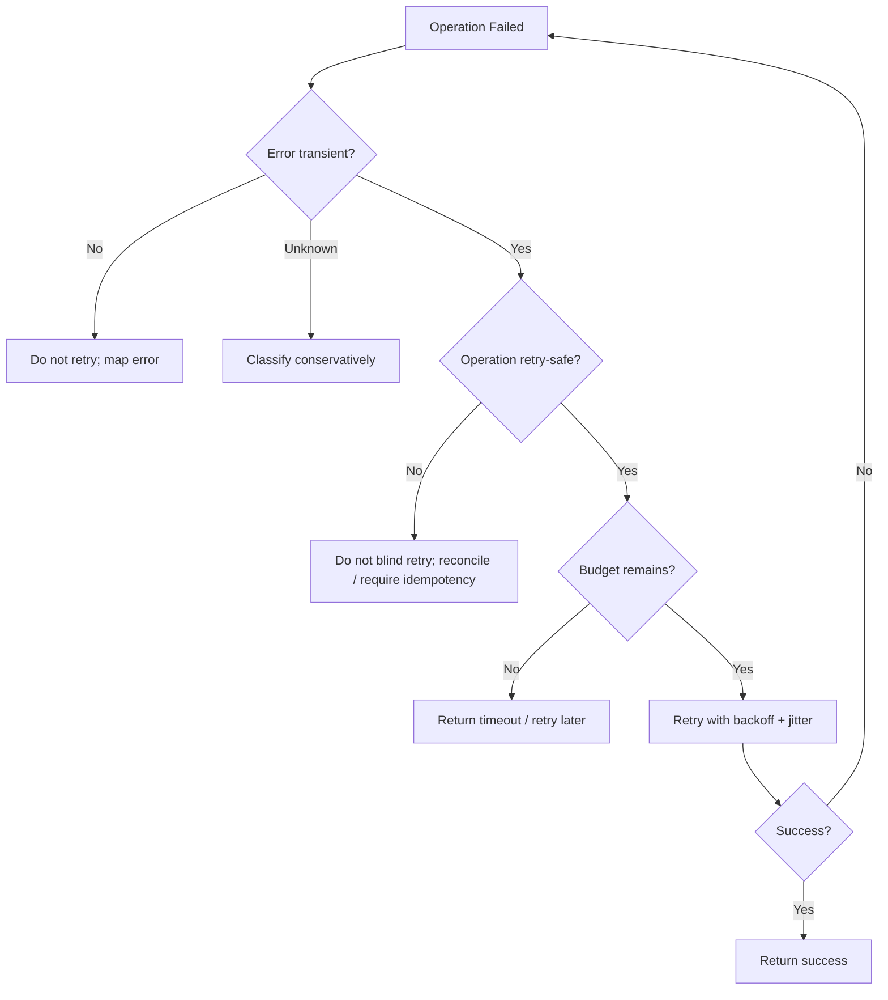
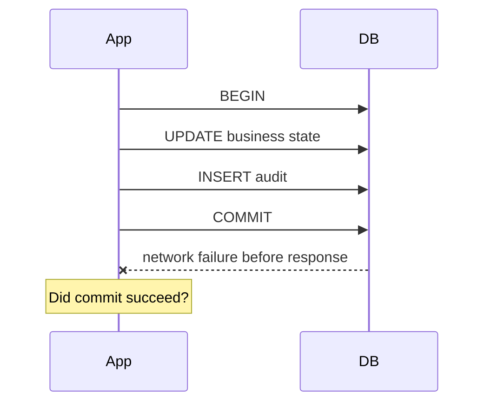
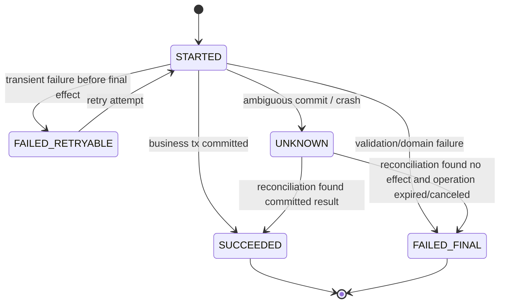
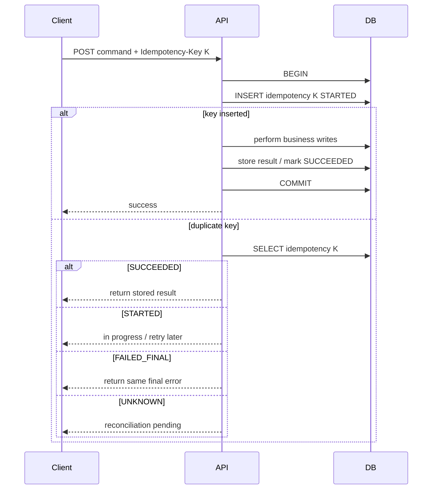
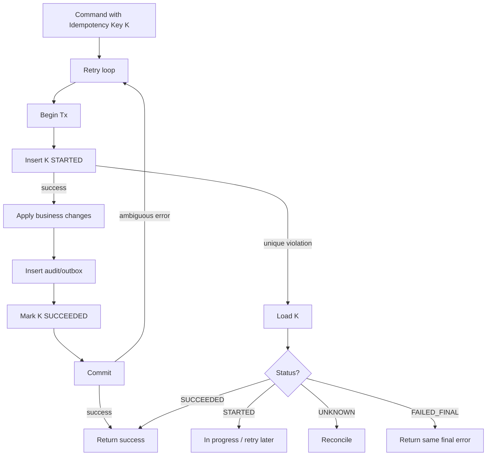
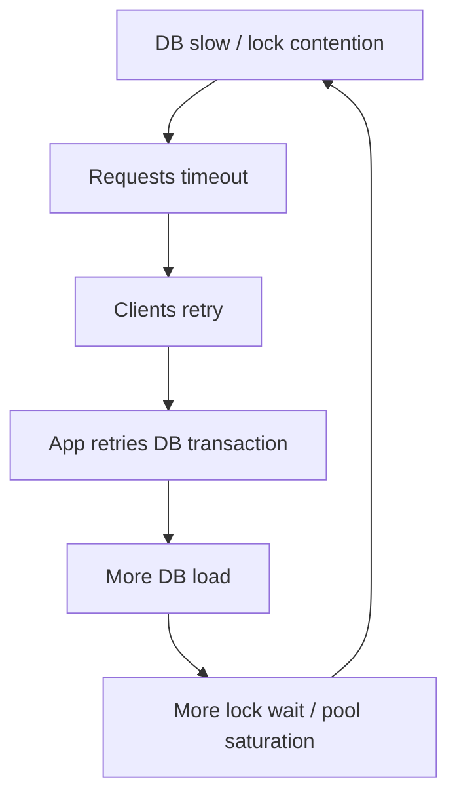

# learn-go-sql-database-integration-part-019.md

# Transaction Retry, Idempotency, and Exactly-Once Illusions

> Seri: `learn-go-sql-database-integration`  
> Part: `019`  
> Topik: `Transaction Retry, Idempotency, Ambiguous Commit, Outbox, Inbox, Duplicate Suppression, and Exactly-Once Illusions`  
> Target pembaca: Java software engineer yang ingin memahami Go database integration sampai level production architecture  
> Target Go: Go 1.26.x  
> Status seri: **belum selesai**

---

## 0. Posisi Part Ini Dalam Seri

Pada part sebelumnya kita sudah membahas:

- transaction fundamentals;
- isolation anomaly;
- optimistic concurrency;
- pessimistic locking;
- conditional update;
- unique constraint;
- row lock;
- advisory lock;
- deadlock;
- lock timeout;
- queue claim;
- data integrity.

Part ini membahas topik yang sering paling berbahaya di production:

> Kapan sebuah operasi boleh di-retry, dan bagaimana memastikan retry tidak menggandakan side effect?

Banyak sistem rusak bukan karena tidak ada retry, tetapi karena retry dilakukan tanpa desain idempotency.

Contoh kegagalan nyata:

```text
user klik submit dua kali
client timeout lalu retry
load balancer retry
mobile app retry setelah network loss
worker crash lalu job diulang
database commit sukses tapi response hilang
event broker mengirim message dua kali
email terkirim dua kali
payment didebit dua kali
approval dilakukan dua kali
audit/outbox ganda
```

Part ini akan mengajarkan mental model:

```text
Retry is not an error-handling feature.
Retry is a distributed-systems correctness feature.
```

---

## 1. Tujuan Pembelajaran

Setelah menyelesaikan part ini, kamu harus mampu:

1. membedakan retryable error dan retry-safe operation;
2. memahami kenapa retry write operation berbahaya;
3. menjelaskan ambiguous commit;
4. mendesain idempotency key untuk command API;
5. memakai unique constraint sebagai duplicate suppression;
6. menyimpan idempotency result secara transactionally correct;
7. membedakan request id, operation id, idempotency key, message id, dan correlation id;
8. memakai outbox pattern untuk atomic DB state + event publication;
9. memakai inbox pattern untuk idempotent message consumption;
10. memahami kenapa exactly-once adalah ilusi lintas network/system boundary;
11. mendesain retry loop yang bounded, context-aware, dan backoff-aware;
12. mengklasifikasi error database seperti serialization failure, deadlock, lock timeout, unique violation, dan connection error;
13. membuat reconciliation process untuk ambiguous/uncertain state;
14. membangun observability untuk retry, duplicate, idempotency, outbox, dan inbox.

---

## 2. Fakta Dasar Dari Sumber Resmi

Beberapa fakta teknis yang menjadi landasan:

1. Go `database/sql` menjalankan transaksi melalui `sql.Tx`; transaksi didapat dari `DB.Begin`/`DB.BeginTx` dan diakhiri dengan `Commit` atau `Rollback`.
2. Dokumentasi `database/sql` menjelaskan bahwa jika context yang diberikan ke `BeginTx` dibatalkan, package `sql` akan melakukan rollback dan `Tx.Commit` akan mengembalikan error.
3. PostgreSQL mendokumentasikan serialization failure dan menyatakan aplikasi yang memakai serializable transaction harus siap melakukan retry transaction karena serialization failure.
4. PostgreSQL mendokumentasikan SQLSTATE `40001` untuk serialization failure dan juga menyebut deadlock failure SQLSTATE `40P01` sebagai error yang sering masuk akal untuk di-retry.
5. MySQL/InnoDB mendokumentasikan deadlock sebagai kondisi yang bisa terjadi bahkan pada transaction yang hanya insert/delete satu row, dan dokumentasi MySQL menyarankan aplikasi harus selalu siap re-issue transaction bila rollback karena deadlock.
6. Idempotency bukan fitur bawaan `database/sql`; ia adalah desain aplikasi + schema + transaction boundary.

Referensi:

- Go — Executing transactions: <https://go.dev/doc/database/execute-transactions>
- Go — `database/sql`: <https://pkg.go.dev/database/sql>
- PostgreSQL — Serialization Failure Handling: <https://www.postgresql.org/docs/current/mvcc-serialization-failure-handling.html>
- PostgreSQL — Error Codes: <https://www.postgresql.org/docs/current/errcodes-appendix.html>
- MySQL — Deadlocks in InnoDB: <https://dev.mysql.com/doc/en/innodb-deadlocks.html>
- MySQL — How to Minimize and Handle Deadlocks: <https://dev.mysql.com/doc/refman/en/innodb-deadlocks-handling.html>

---

## 3. Mental Model Utama

### 3.1 Retryable Error Tidak Sama Dengan Retry-Safe Operation

Salah satu kesalahan paling umum:

```text
Error ini transient, berarti boleh retry.
```

Belum tentu.

Retry decision membutuhkan dua pertanyaan:

```text
1. Apakah error-nya mungkin transient?
2. Apakah operasi aman diulang?
```

Contoh:

| Error | Operation | Retry Aman? |
|---|---|---|
| connection timeout before SELECT | read user | biasanya ya |
| serialization failure | pure DB transaction | ya, retry whole tx |
| deadlock | pure DB transaction | ya, retry whole tx |
| timeout after sending email | send notification | belum tentu |
| network error during payment commit | debit account | tidak tanpa idempotency |
| commit response lost | approve case | tidak tanpa operation ID/reconciliation |

Retryable error hanya berarti:

```text
mungkin berhasil jika dicoba lagi
```

Retry-safe operation berarti:

```text
mencoba lagi tidak menggandakan efek atau merusak invariant
```

### 3.2 Idempotency Adalah Properti Operasi, Bukan Endpoint Name

Idempotency berarti:

```text
Menjalankan operasi yang sama lebih dari sekali menghasilkan efek akhir yang sama seperti menjalankannya sekali.
```

Contoh idempotent:

```text
PUT /profile/name = "Fajar"
```

Contoh non-idempotent:

```text
POST /payments debit 100
POST /cases approve
POST /notifications send email
POST /orders create
```

Tetapi non-idempotent operation bisa dibuat idempotent dengan **operation identity**.

Example:

```text
Approve case with operation_id = K
```

Jika `K` sudah pernah sukses, retry mengembalikan hasil yang sama, bukan approve ulang.

### 3.3 Exactly-Once Di Boundary Terdistribusi Biasanya Ilusi

Di dalam satu database transaction, kamu bisa mendapat atomic commit.

Tetapi begitu melewati boundary:

```text
database + message broker
database + email provider
database + payment gateway
database + another service
database + object storage
database + search index
```

maka “exactly once” sulit atau tidak realistis tanpa protokol khusus dan tetap memiliki edge cases.

Practical production stance:

```text
At-least-once delivery + idempotent consumer + reconciliation.
```

atau:

```text
Atomic DB state + durable outbox + idempotent publisher/consumer.
```

---

## 4. Diagram: Retry Decision



---

## 5. Failure Timing Matters

Retry safety depends on **where** failure happened.

### 5.1 Failure Before Operation Reaches DB

Example:

```text
DNS failure
connection refused
pool timeout before query sent
context canceled before acquire
```

Usually safe to retry if operation itself is idempotent or not yet started.

But app may not always know for sure whether DB received request.

### 5.2 Failure During Query Execution

Example:

```text
statement timeout
lock timeout
serialization failure
deadlock
connection reset during query
```

May or may not have changed data.

Depends on DB/driver/transaction state.

### 5.3 Failure After DB Applied Change But Before Client Receives Response

Example:

```text
UPDATE succeeded, network broke before response
```

If operation is autocommit, change may have committed.

Retry can duplicate unless guarded.

### 5.4 Failure During Commit

Most dangerous.

```text
COMMIT sent
network failure before response
```

Did commit happen?

Maybe.

This is **ambiguous commit**.

---

## 6. Ambiguous Commit

Ambiguous commit is when application cannot determine whether transaction committed.

Timeline:



Possibilities:

1. commit reached DB and succeeded;
2. commit reached DB and failed;
3. commit never reached DB;
4. DB committed but response lost;
5. DB failed over during commit;
6. driver returned context/network error without definitive commit outcome.

Without idempotency/reconciliation, application cannot safely retry.

---

## 7. Ambiguous Commit Example: Case Approval

Operation:

```text
approve case
insert audit
insert outbox event
commit
```

Commit returns network error.

If retry blindly:

- case may already be approved;
- audit may duplicate;
- outbox may duplicate;
- notification may duplicate;
- business user may see inconsistent message.

Safer design:

- operation ID unique;
- transition conditional;
- audit uses operation ID unique;
- outbox uses operation ID unique;
- idempotency result stored;
- retry checks operation ID state.

---

## 8. Operation Identity Vocabulary

Do not mix these concepts.

| Term | Purpose |
|---|---|
| request ID | trace/log one HTTP request attempt |
| correlation ID | link calls across systems |
| operation ID | stable identity of business operation |
| idempotency key | client/server key to dedupe retries |
| message ID | identity of delivered message |
| event ID | identity of emitted domain/integration event |
| transaction ID | DB/internal transaction identity |
| aggregate ID | business entity identity |
| command ID | identity of command in command-processing system |

For retry safety, the critical one is usually:

```text
operation_id / idempotency_key
```

It must stay the same across retries of the same logical operation.

---

## 9. Idempotency Key Design

### 9.1 Basic Rule

For unsafe commands, require an idempotency key:

```text
POST /cases/{id}/approve
Idempotency-Key: 01JXYZ...
```

Same logical retry uses same key.

Different operation uses different key.

### 9.2 Key Scope

Define uniqueness scope:

```text
global key
per user + key
per tenant + key
per operation type + key
per aggregate + key
```

Example:

```sql
UNIQUE (tenant_id, actor_id, idempotency_key)
```

or:

```sql
UNIQUE (operation_id)
```

### 9.3 Request Hash

Store request hash to detect key reuse with different payload.

```text
same key + same payload = replay
same key + different payload = client error/conflict
```

### 9.4 Expiry

Idempotency keys may need TTL/retention policy.

But be careful:

- expire too soon -> duplicate risk after delayed retry;
- keep forever -> storage growth;
- legal/audit requirements may require long retention;
- financial/regulatory systems often need durable operation identity.

---

## 10. Idempotency Table Schema

Generic schema:

```sql
CREATE TABLE idempotency_records (
    idempotency_key TEXT NOT NULL,
    scope TEXT NOT NULL,
    operation_type TEXT NOT NULL,
    request_hash TEXT NOT NULL,
    status TEXT NOT NULL,
    response_code INTEGER,
    response_body TEXT,
    error_code TEXT,
    created_at TIMESTAMP NOT NULL,
    updated_at TIMESTAMP NOT NULL,
    completed_at TIMESTAMP,

    PRIMARY KEY (scope, idempotency_key)
);
```

Possible statuses:

```text
STARTED
SUCCEEDED
FAILED_RETRYABLE
FAILED_FINAL
UNKNOWN
```

For many high-integrity systems, store business result reference rather than full response body.

Example:

```text
result_entity_type
result_entity_id
operation_id
```

---

## 11. Idempotency State Machine



The hardest state is `UNKNOWN`.

Ignoring `UNKNOWN` is how duplicates happen.

---

## 12. Basic Idempotency Flow



---

## 13. Transactional Idempotency: Same Transaction or Bust

Bad:

```text
INSERT idempotency key
COMMIT
BEGIN business operation
COMMIT
```

If crash between key and business operation:

```text
key exists but operation never happened
```

Maybe recoverable, but more complex.

Better:

```text
BEGIN
insert idempotency key STARTED
apply business operation
mark idempotency SUCCEEDED/result
COMMIT
```

This makes key and effect atomic.

But there is nuance:

- duplicate request while first transaction in progress may block or get unique violation depending isolation/DB;
- if process crashes before commit, DB rolls back both key and business effect;
- if commit ambiguous, key/effect may be committed, and retry can read it.

---

## 14. Idempotency Insert Pattern

```go
func InsertIdempotencyStarted(
	ctx context.Context,
	q DBTX,
	scope string,
	key string,
	operationType string,
	requestHash string,
) error {
	_, err := q.ExecContext(ctx, `
		INSERT INTO idempotency_records (
			scope,
			idempotency_key,
			operation_type,
			request_hash,
			status,
			created_at,
			updated_at
		)
		VALUES ($1, $2, $3, $4, 'STARTED', CURRENT_TIMESTAMP, CURRENT_TIMESTAMP)
	`, scope, key, operationType, requestHash)

	return err
}
```

If unique violation:

```go
return ErrDuplicateIdempotencyKey
```

Then caller loads existing record.

---

## 15. Idempotency Completion Pattern

```go
func MarkIdempotencySucceeded(
	ctx context.Context,
	q DBTX,
	scope string,
	key string,
	responseCode int,
	resultRef string,
) error {
	result, err := q.ExecContext(ctx, `
		UPDATE idempotency_records
		SET status = 'SUCCEEDED',
		    response_code = $1,
		    response_body = $2,
		    completed_at = CURRENT_TIMESTAMP,
		    updated_at = CURRENT_TIMESTAMP
		WHERE scope = $3
		  AND idempotency_key = $4
		  AND status = 'STARTED'
	`, responseCode, resultRef, scope, key)
	if err != nil {
		return err
	}

	affected, err := result.RowsAffected()
	if err != nil {
		return err
	}
	if affected != 1 {
		return ErrInvalidIdempotencyState
	}

	return nil
}
```

`RowsAffected` protects state machine transition.

---

## 16. Full Idempotent Command Transaction

```go
func (s Service) ApproveCase(ctx context.Context, cmd ApproveCommand) error {
	scope := fmt.Sprintf("tenant:%s:actor:%s", cmd.TenantID, cmd.ActorID)
	requestHash := hashApproveCommand(cmd)

	return s.tx.Within(ctx, "case.approve", nil, func(ctx context.Context, tx *sql.Tx) error {
		err := s.idem.InsertStarted(ctx, tx, scope, cmd.IdempotencyKey, "case.approve", requestHash)
		if err != nil {
			if s.dbErrors.IsUniqueViolation(err) {
				existing, loadErr := s.idem.Find(ctx, tx, scope, cmd.IdempotencyKey)
				if loadErr != nil {
					return loadErr
				}
				return s.handleExistingIdempotency(existing, requestHash)
			}
			return err
		}

		if err := s.cases.Approve(ctx, tx, cmd.CaseID); err != nil {
			return err
		}

		if err := s.audit.Insert(ctx, tx, AuditEvent{
			OperationID:    cmd.IdempotencyKey,
			CaseID:         cmd.CaseID,
			ActorID:        cmd.ActorID,
			Action:         "CASE_APPROVED",
		}); err != nil {
			return err
		}

		if err := s.outbox.Insert(ctx, tx, OutboxEvent{
			EventID:      cmd.IdempotencyKey,
			EventType:    "case.approved",
			AggregateID:  cmd.CaseID,
		}); err != nil {
			return err
		}

		if err := s.idem.MarkSucceeded(ctx, tx, scope, cmd.IdempotencyKey, 200, "case.approved"); err != nil {
			return err
		}

		return nil
	})
}
```

Important:

- idempotency record;
- business update;
- audit;
- outbox;
- result marker;

all in one transaction.

---

## 17. Existing Idempotency Handling

Pseudo-code:

```go
func (s Service) handleExistingIdempotency(
	record IdempotencyRecord,
	requestHash string,
) error {
	if record.RequestHash != requestHash {
		return ErrIdempotencyKeyReuseWithDifferentPayload
	}

	switch record.Status {
	case "SUCCEEDED":
		return ErrAlreadyCompletedReturnStoredResult

	case "STARTED":
		return ErrOperationInProgress

	case "FAILED_FINAL":
		return ErrPreviouslyFailedFinal

	case "UNKNOWN":
		return ErrOperationStateUnknown

	default:
		return ErrInvalidIdempotencyState
	}
}
```

In real APIs, you may return stored response rather than error.

---

## 18. Idempotency Key Reuse With Different Payload

This is a serious client bug or abuse.

Example:

```text
Idempotency-Key: K
amount=100

retry:
Idempotency-Key: K
amount=200
```

Server must not treat it as same operation.

Store request hash:

```text
hash(method + path + normalized body + business actor/scope)
```

If mismatch:

```text
409 Conflict or 422 idempotency key reused
```

Do not execute second operation.

---

## 19. In-Progress Duplicate

What if duplicate request arrives while first is still processing?

Options:

1. return `409 Conflict` / `425 Too Early` / `202 Accepted`;
2. block and wait for first to finish, within short timeout;
3. return current operation status URL;
4. load result if first completed during wait;
5. use DB lock on idempotency row.

Do not run the operation twice.

### 19.1 Wait Pattern

```text
duplicate request finds STARTED
wait/poll for short time
if SUCCEEDED -> return result
if still STARTED -> return 202/409 retry later
```

Be careful not to tie up web workers for too long.

---

## 20. Failed Operations and Idempotency

Should failed validation/domain errors be cached?

Usually yes for deterministic final errors.

Example:

```text
approve CLOSED case -> invalid state
```

If same key retries same payload, return same final failure.

But if failure is transient:

```text
deadlock
connection timeout
lock timeout
```

do not mark final failure unless you know operation had no effect.

Statuses help:

- `FAILED_FINAL`
- `FAILED_RETRYABLE`
- `UNKNOWN`

---

## 21. Retryable Errors

Common retryable candidates:

| Error | Retry? | Notes |
|---|---|---|
| serialization failure | yes | retry whole transaction |
| deadlock victim | yes | retry whole transaction |
| lock timeout | maybe | if safe and useful |
| connection refused before tx | maybe | if operation not started |
| connection reset during read query | maybe | read usually safer |
| unique violation idempotency | not retry; load existing | duplicate |
| unique business violation | no | conflict |
| FK/check violation | no | invalid data/state |
| context canceled | no | caller canceled |
| context deadline | maybe | but budget likely exhausted |
| commit network error | not blind retry | ambiguous |

---

## 22. Retryable Transaction Error Classifier

```go
type ErrorClassifier interface {
	IsSerializationFailure(error) bool
	IsDeadlock(error) bool
	IsLockTimeout(error) bool
	IsConnectionError(error) bool
	IsUniqueViolation(error) bool
}

func IsRetryableTxError(classifier ErrorClassifier, err error) bool {
	if err == nil {
		return false
	}
	if classifier.IsSerializationFailure(err) {
		return true
	}
	if classifier.IsDeadlock(err) {
		return true
	}
	if classifier.IsLockTimeout(err) {
		return true
	}
	return false
}
```

Driver-specific implementation belongs in infrastructure layer.

Do not parse human-readable messages if structured code is available.

---

## 23. PostgreSQL Retry Codes

Common PostgreSQL SQLSTATEs:

| SQLSTATE | Meaning | Retry? |
|---|---|---|
| `40001` | serialization_failure | yes, whole tx |
| `40P01` | deadlock_detected | usually yes, whole tx |
| `23505` | unique_violation | no, but maybe idempotency duplicate |
| `23503` | foreign_key_violation | no |
| `23514` | check_violation | no |
| `55P03` | lock_not_available | maybe |
| `57014` | query_canceled | depends |
| `08006` etc | connection failure | depends |

Classification depends on driver exposing SQLSTATE.

---

## 24. MySQL Retry Codes Concept

MySQL/InnoDB deadlock and lock wait errors are represented by MySQL-specific error numbers.

Common categories:

- deadlock found;
- lock wait timeout exceeded;
- duplicate entry;
- foreign key constraint failure;
- connection errors.

Application must use driver error type to inspect numeric code.

MySQL docs explicitly warn deadlocks can happen and applications should be prepared to re-issue transactions when rollback happens due to deadlock.

---

## 25. SQL Server / Oracle Retry Concept

SQL Server and Oracle have their own error numbers/codes.

For production:

- implement per-driver classifier;
- keep classifier tested;
- map to common internal error classes;
- do not let SQL Server/Oracle-specific codes leak into domain layer;
- document which classes are retryable.

---

## 26. Retry Loop Requirements

A retry loop must have:

1. max attempts;
2. total context deadline;
3. per-attempt timeout if needed;
4. backoff;
5. jitter;
6. retryable error classifier;
7. idempotency/side-effect safety;
8. metrics;
9. logging with attempt number;
10. no retry on context canceled;
11. no retry after final business error.

---

## 27. Backoff and Jitter

Bad:

```go
time.Sleep(100 * time.Millisecond)
```

in all clients at same time.

This creates synchronized retry wave.

Better:

```text
exponential backoff + jitter
```

Example simple jitter:

```go
func BackoffWithJitter(attempt int, base time.Duration, max time.Duration) time.Duration {
	if attempt < 1 {
		attempt = 1
	}

	d := base * time.Duration(1<<(attempt-1))
	if d > max {
		d = max
	}

	jitter := time.Duration(rand.Int63n(int64(d / 2)))
	return d/2 + jitter
}
```

Use a proper rand source in real code and avoid global contention if needed.

---

## 28. Context-Aware Sleep

```go
func SleepWithContext(ctx context.Context, d time.Duration) error {
	timer := time.NewTimer(d)
	defer timer.Stop()

	select {
	case <-ctx.Done():
		return ctx.Err()
	case <-timer.C:
		return nil
	}
}
```

Never ignore parent cancellation during backoff.

---

## 29. Generic Retry Function

```go
func Retry(
	ctx context.Context,
	maxAttempts int,
	shouldRetry func(error) bool,
	backoff func(int) time.Duration,
	fn func(context.Context, int) error,
) error {
	var last error

	for attempt := 1; attempt <= maxAttempts; attempt++ {
		if err := ctx.Err(); err != nil {
			return err
		}

		err := fn(ctx, attempt)
		if err == nil {
			return nil
		}

		last = err

		if !shouldRetry(err) {
			return err
		}

		if attempt == maxAttempts {
			break
		}

		if err := SleepWithContext(ctx, backoff(attempt)); err != nil {
			return err
		}
	}

	return last
}
```

This is generic. Transaction-specific wrapper must guarantee transaction body can be safely rerun.

---

## 30. Retry Whole Transaction

For serialization/deadlock:

```text
rollback transaction
start a new transaction
repeat all reads and writes
commit
```

Do not retry only the failed statement.

Why?

Because earlier reads may have informed decisions and are no longer valid.

---

## 31. Transaction Retry Wrapper

```go
func RetryTransaction(
	ctx context.Context,
	maxAttempts int,
	txFn func(context.Context) error,
	classifier ErrorClassifier,
) error {
	return Retry(
		ctx,
		maxAttempts,
		func(err error) bool {
			return IsRetryableTxError(classifier, err)
		},
		func(attempt int) time.Duration {
			return BackoffWithJitter(attempt, 25*time.Millisecond, 500*time.Millisecond)
		},
		func(ctx context.Context, attempt int) error {
			return txFn(ctx)
		},
	)
}
```

Usage:

```go
err := RetryTransaction(ctx, 3, func(ctx context.Context) error {
	return txManager.Within(ctx, "quota.reserve", nil, func(ctx context.Context, tx *sql.Tx) error {
		return reserveQuotaAndInsertApproval(ctx, tx, cmd)
	})
}, classifier)
```

---

## 32. Retry-Safe Transaction Body

A retry-safe transaction body:

- only does DB reads/writes;
- uses deterministic command input;
- does not send email;
- does not publish message directly;
- does not call payment provider directly;
- does not call external HTTP service directly;
- uses operation ID/idempotency;
- writes outbox event if side effect needed;
- can be executed multiple times without duplicate final effect.

Unsafe:

```go
func(ctx context.Context, tx *sql.Tx) error {
	updateDB(ctx, tx)
	sendEmail(ctx)      // unsafe
	publishKafka(ctx)   // unsafe
	return nil
}
```

Safe:

```go
func(ctx context.Context, tx *sql.Tx) error {
	updateDB(ctx, tx)
	insertOutbox(ctx, tx)
	return nil
}
```

---

## 33. Commit Ambiguity and Retry Wrapper

A retry wrapper cannot magically solve ambiguous commit.

If `tx.Commit()` returns connection error, the transaction may or may not have committed.

For operations with idempotency key:

```text
retry starts new transaction
attempts insert same idempotency key
if unique exists -> load prior result
```

This converts ambiguity into deterministic outcome.

Without idempotency key:

```text
retry may duplicate
```

Therefore:

> For important writes, idempotency is not optional.

---

## 34. Idempotency + Retry Flow



---

## 35. Outbox Pattern

Problem:

```text
Need to update DB and publish event/email/message.
```

Bad:

```text
BEGIN
update DB
COMMIT
publish event
```

If publish fails, DB changed but no event.

Bad:

```text
publish event
BEGIN
update DB
COMMIT
```

If DB fails, event lies.

Outbox:

```text
BEGIN
update DB
insert outbox event
COMMIT

worker reads outbox and publishes
```

This makes DB state and intent-to-publish atomic.

---

## 36. Outbox Table Schema

```sql
CREATE TABLE outbox_events (
    id TEXT PRIMARY KEY,
    aggregate_type TEXT NOT NULL,
    aggregate_id TEXT NOT NULL,
    event_type TEXT NOT NULL,
    payload TEXT NOT NULL,
    status TEXT NOT NULL,
    attempt_count INTEGER NOT NULL,
    next_attempt_at TIMESTAMP NOT NULL,
    created_at TIMESTAMP NOT NULL,
    updated_at TIMESTAMP NOT NULL,
    claimed_by TEXT,
    claimed_at TIMESTAMP,
    published_at TIMESTAMP
);
```

Recommended uniqueness:

```text
event id unique
operation id unique where relevant
aggregate + version unique if event corresponds to aggregate version
```

---

## 37. Outbox Write In Same Transaction

```go
func InsertOutboxEvent(ctx context.Context, q DBTX, e OutboxEvent) error {
	_, err := q.ExecContext(ctx, `
		INSERT INTO outbox_events (
			id,
			aggregate_type,
			aggregate_id,
			event_type,
			payload,
			status,
			attempt_count,
			next_attempt_at,
			created_at,
			updated_at
		)
		VALUES ($1, $2, $3, $4, $5, 'PENDING', 0, CURRENT_TIMESTAMP, CURRENT_TIMESTAMP, CURRENT_TIMESTAMP)
	`, e.ID, e.AggregateType, e.AggregateID, e.EventType, e.Payload)
	return err
}
```

Call inside business transaction.

---

## 38. Outbox Worker Flow

```text
1. claim pending events
2. commit claim
3. publish outside transaction
4. mark sent or failed
5. retry failed with backoff
6. dead-letter after max attempts
```

Why publish outside transaction?

Because publishing can be slow/unavailable. Holding DB transaction while publishing creates locks/pool pressure and still does not guarantee broker commit atomically with DB commit unless using special distributed transaction.

---

## 39. Outbox Claim

Use DB-specific safe claim.

Concept:

```sql
SELECT id
FROM outbox_events
WHERE status = 'PENDING'
  AND next_attempt_at <= CURRENT_TIMESTAMP
ORDER BY created_at
FOR UPDATE SKIP LOCKED
LIMIT $1;
```

Then update to `PROCESSING`.

Alternative:

- conditional update claim;
- database-specific `UPDATE ... RETURNING`;
- queue partitioning.

---

## 40. Outbox Publish Idempotency

Publisher may send event and fail before marking SENT.

Then retry sends event again.

Therefore downstream consumer must be idempotent.

Event must have stable ID:

```text
event_id
operation_id
aggregate_id + aggregate_version
```

Consumer stores processed message ID.

---

## 41. Inbox Pattern

Inbox deduplicates incoming messages.

Schema:

```sql
CREATE TABLE inbox_messages (
    message_id TEXT PRIMARY KEY,
    source TEXT NOT NULL,
    status TEXT NOT NULL,
    received_at TIMESTAMP NOT NULL,
    processed_at TIMESTAMP,
    error TEXT
);
```

Consumer transaction:

```text
BEGIN
INSERT message_id
apply business effect
mark processed
COMMIT
```

If duplicate message:

```text
INSERT message_id fails -> already processed/in-progress
```

Do not process twice.

---

## 42. Inbox Consumer Pattern

```go
func (c Consumer) Handle(ctx context.Context, msg Message) error {
	return c.tx.Within(ctx, "message.consume", nil, func(ctx context.Context, tx *sql.Tx) error {
		err := c.inbox.InsertStarted(ctx, tx, msg.ID, msg.Source)
		if err != nil {
			if c.classifier.IsUniqueViolation(err) {
				return nil // duplicate already handled or in progress depending policy
			}
			return err
		}

		if err := c.applyBusinessEffect(ctx, tx, msg); err != nil {
			return err
		}

		return c.inbox.MarkProcessed(ctx, tx, msg.ID)
	})
}
```

This gives idempotent message processing under at-least-once delivery.

---

## 43. Exactly-Once Illusion

Message brokers may advertise exactly-once semantics in specific boundaries, but application-level exactly-once across:

```text
HTTP client
API service
SQL database
message broker
consumer service
external email/payment provider
```

still requires idempotency and reconciliation.

Practical view:

```text
The network can duplicate.
The client can retry.
The server can crash.
The database can commit while response is lost.
The broker can redeliver.
The consumer can process then fail before ack.
The external provider can perform side effect then timeout.
```

Therefore design for:

```text
at least once + idempotent effect
```

and sometimes:

```text
at most once for non-critical notification
```

but never assume magic exactly-once.

---

## 44. At-Least-Once, At-Most-Once, Effectively-Once

### 44.1 At-Least-Once

Operation/message may happen more than once.

Need idempotency.

### 44.2 At-Most-Once

Operation/message happens zero or one time.

May lose work.

Useful for non-critical events.

### 44.3 Effectively-Once

Through idempotency/deduplication/reconciliation, final business effect happens once even if attempts happen multiple times.

This is usually what production systems want.

---

## 45. Reconciliation

Reconciliation is process to resolve uncertain or mismatched state.

Examples:

- idempotency record `UNKNOWN`;
- payment provider charged but DB timeout;
- outbox event stuck;
- audit missing;
- duplicate event;
- message processed but ack failed;
- commit ambiguous;
- external API accepted but response lost.

Reconciliation needs stable identifiers:

- operation ID;
- external reference ID;
- event ID;
- aggregate ID;
- idempotency key;
- provider transaction ID.

Without stable identifiers, reconciliation becomes manual guesswork.

---

## 46. Reconciliation Table

For critical operations:

```sql
CREATE TABLE operation_log (
    operation_id TEXT PRIMARY KEY,
    operation_type TEXT NOT NULL,
    aggregate_type TEXT NOT NULL,
    aggregate_id TEXT NOT NULL,
    status TEXT NOT NULL,
    request_hash TEXT NOT NULL,
    created_at TIMESTAMP NOT NULL,
    updated_at TIMESTAMP NOT NULL,
    completed_at TIMESTAMP,
    last_error TEXT
);
```

This can be combined with idempotency table or kept separate.

Use cases:

- auditability;
- replay;
- reconciliation;
- user support;
- operational dashboard.

---

## 47. Handling UNKNOWN State

If commit is ambiguous:

```text
do not blindly mark failed
do not blindly retry without idempotency
```

Instead:

1. query by operation ID;
2. query business aggregate state;
3. query audit/outbox;
4. check external provider by idempotency/reference key;
5. decide final state;
6. mark operation as succeeded/failed/retryable;
7. alert if cannot reconcile.

For case approval:

```text
SELECT case status
SELECT audit by operation_id
SELECT outbox by operation_id
SELECT idempotency by key
```

If all exist:

```text
operation succeeded
```

If none exist and no external side effect:

```text
safe to retry
```

If partial:

```text
manual or automated repair
```

---

## 48. Idempotency With External Providers

Many external providers support idempotency keys or request IDs.

Use them.

Pattern:

```text
internal operation_id = external idempotency key
```

Store external reference:

```text
provider_request_id
provider_transaction_id
provider_status
```

If timeout:

- query provider by idempotency/reference key;
- do not issue a new unrelated request;
- reconcile.

If provider lacks idempotency support, build stronger compensation/reconciliation.

---

## 49. Payment-Like Operation Pattern

Safe-ish pattern:

1. create internal operation with idempotency key;
2. reserve funds or mark pending in DB;
3. call payment provider with same idempotency key;
4. provider response stored;
5. finalize DB state;
6. reconcile provider if timeout.

But if provider call is inside DB transaction, it may hold locks too long.

Better patterns depend on domain:

- authorization/reservation model;
- saga;
- pending state;
- outbox command to payment worker;
- provider idempotency;
- reconciliation job.

There is no universal “one transaction solves payment”.

---

## 50. Email/Notification Pattern

Email is usually not part of core transaction.

Do:

```text
business transaction inserts outbox notification
worker sends email
worker marks sent
```

Email may be delivered twice even if provider says accepted and response lost.

Mitigate:

- deterministic message ID;
- provider idempotency if available;
- dedupe table;
- tolerate duplicate notification if low severity;
- user-visible notification log with unique operation ID.

---

## 51. Retry Budgets

Retry without budget can create outages.

A retry budget defines:

```text
how many retries
over what duration
under what error classes
for which operations
```

Example:

| Operation | Attempts | Backoff | Total Budget |
|---|---:|---:|---:|
| point read | 2 | 25-50ms | 300ms |
| serializable tx | 3 | 25-250ms | 1s |
| deadlock tx | 3 | 50-500ms | 2s |
| outbox publish | many | exponential | hours with DLQ |
| external payment | provider-specific | cautious | reconciliation |

Do not apply same retry policy to all operations.

---

## 52. Retry Storm

Retry storm happens when failures cause retries that increase load and cause more failures.

Diagram:



Mitigation:

- bounded attempts;
- backoff/jitter;
- circuit breaker;
- load shedding;
- queueing;
- idempotency;
- do not retry on overload-like errors blindly;
- reduce worker concurrency;
- protect DB with pool limits.

---

## 53. Retry and HTTP Status Codes

Possible mapping:

| Condition | HTTP |
|---|---|
| idempotency key replay succeeded | same as original |
| in-progress duplicate | 202 / 409 / 425 |
| key reused with different payload | 409 / 422 |
| concurrent modification | 409 |
| serialization retries exhausted | 409 / 503 depending semantics |
| lock timeout | 409 / 423 / 503 |
| infrastructure DB down | 503 |
| upstream timeout | 504 |
| client canceled | often no response / platform-specific |
| final validation failure | 400 / 422 |
| not found | 404 |

Choose consistently.

---

## 54. Idempotency Response Storage

Options:

### Option A — Store full response body

Pros:

- exact replay;
- simple for API.

Cons:

- storage/PII concerns;
- schema evolution;
- sensitive data retention;
- large payload.

### Option B — Store result reference

Pros:

- smaller;
- less sensitive;
- reconstruct response from current DB.

Cons:

- response may differ if data changed;
- needs deterministic response reconstruction.

### Option C — Store operation status only

Pros:

- simple.

Cons:

- duplicate request may not get same response;
- client may need polling.

Choose by API/product needs.

---

## 55. Request Hash Canonicalization

Request hash must be stable.

Consider:

- JSON field order;
- whitespace;
- default values;
- numeric formatting;
- semantically equivalent payload;
- API version;
- actor/scope;
- path/method;
- tenant.

Simple approach:

```text
hash(method + canonical path + canonical JSON body + actor + tenant + operation type)
```

Be careful with PII/security in logs. Store hash, not raw sensitive payload, unless required and protected.

---

## 56. Idempotency Key Generation

Client-generated key is useful because client can retry same logical operation.

Server-generated operation ID is useful when command is created server-side.

Rules:

- high entropy;
- unique within scope;
- stable across retry;
- not guessable if exposed;
- not overloaded as auth;
- included in logs/traces;
- stored transactionally.

Examples:

- UUIDv7/ULID-like;
- random 128-bit;
- domain operation ID.

---

## 57. Expiring Idempotency Records

Retention depends on domain.

Low-risk API:

```text
24 hours
```

Payment/regulatory workflow:

```text
months/years or tied to audit retention
```

If expiring:

- do not allow old duplicate to create harmful effect;
- consider business natural key;
- archive rather than delete if audit needed;
- define retry window in API contract.

---

## 58. Outbox Retry Policy

Outbox retry differs from request retry.

Request retry budget is short.

Outbox retry budget can be long.

Example:

```text
attempt 1 immediately
attempt 2 after 30s
attempt 3 after 2m
attempt 4 after 10m
attempt 5 after 1h
dead-letter after 10 attempts or 24h
```

Outbox worker must record:

- attempt count;
- last error;
- next attempt;
- claimed by;
- claimed at;
- published at;
- dead-letter reason.

---

## 59. Dead Letter Queue / Parking Lot

If an outbox event repeatedly fails:

```text
status = DEAD_LETTER
```

Do not retry forever silently.

Dead-letter requires:

- alert;
- dashboard;
- manual replay tool;
- payload inspection with access control;
- reason;
- operation ID;
- aggregate ID;
- last error;
- replay count.

---

## 60. Inbox Retry Policy

Consumer processing may fail.

If failure before DB commit:

- message can be retried by broker;
- inbox insert may roll back;
- safe.

If failure after DB commit before ack:

- broker redelivers;
- inbox duplicate prevents reprocessing.

If failure after side effect outside DB:

- need idempotent side effect or outbox from consumer.

Consumer should either:

```text
process business state inside DB transaction and ack after commit
```

or use inbox/outbox chain.

---

## 61. Chained Outbox/Inbox

Service A:

```text
DB transaction: business state + outbox event
worker publishes event
```

Service B:

```text
consumer receives event
DB transaction: inbox message + business effect + outbox event
ack message
```

This creates reliable at-least-once chain with idempotent processing.

---

## 62. Saga and Compensation

For multi-step workflows:

```text
reserve quota
generate document
send notification
update external registry
```

Cannot be one SQL transaction.

Use saga:

- each step local transaction;
- record saga state;
- emit command/event via outbox;
- compensate if later step fails;
- idempotency per step;
- reconciliation.

Saga is not “rollback distributed transaction”. It is explicit workflow with compensating actions.

---

## 63. Retry Classification by Operation Type

| Operation Type | Retry Strategy |
|---|---|
| pure read | retry small number if transient |
| idempotent write with key | retry if transient; load existing on duplicate |
| non-idempotent write | do not retry automatically |
| serializable transaction | retry whole tx |
| deadlock victim | retry whole tx |
| outbox publish | retry async with backoff |
| inbox consume | ack only after commit; duplicate no-op |
| external payment | provider idempotency + reconciliation |
| email | outbox + tolerate/dedupe duplicate |
| report generation | checkpoint/restart |
| migration | no blind retry; operator-controlled |

---

## 64. Go Code: Command Handler Shape

```go
type ApproveCommand struct {
	TenantID        string
	ActorID         string
	CaseID          int64
	IdempotencyKey  string
	RequestHash     string
}

func (s Service) HandleApprove(ctx context.Context, cmd ApproveCommand) (ApproveResult, error) {
	if cmd.IdempotencyKey == "" {
		return ApproveResult{}, ErrMissingIdempotencyKey
	}

	var result ApproveResult

	err := RetryTransaction(ctx, 3, func(ctx context.Context) error {
		var err error
		result, err = s.approveOnce(ctx, cmd)
		return err
	}, s.classifier)

	if err != nil {
		return ApproveResult{}, err
	}

	return result, nil
}
```

`approveOnce` performs one transaction attempt with idempotency.

---

## 65. Go Code: One Transaction Attempt

```go
func (s Service) approveOnce(ctx context.Context, cmd ApproveCommand) (ApproveResult, error) {
	var result ApproveResult

	err := s.tx.Within(ctx, "case.approve", nil, func(ctx context.Context, tx *sql.Tx) error {
		scope := cmd.TenantID + ":" + cmd.ActorID

		err := s.idem.InsertStarted(ctx, tx, scope, cmd.IdempotencyKey, "case.approve", cmd.RequestHash)
		if err != nil {
			if s.classifier.IsUniqueViolation(err) {
				existing, loadErr := s.idem.Find(ctx, tx, scope, cmd.IdempotencyKey)
				if loadErr != nil {
					return loadErr
				}

				res, handleErr := s.handleExisting(ctx, tx, existing, cmd.RequestHash)
				if handleErr != nil {
					return handleErr
				}

				result = res
				return nil
			}
			return err
		}

		if err := s.cases.Approve(ctx, tx, cmd.CaseID); err != nil {
			if markErr := s.idem.MarkFailedFinal(ctx, tx, scope, cmd.IdempotencyKey, mapDomainError(err)); markErr != nil {
				return markErr
			}
			return err
		}

		eventID := cmd.IdempotencyKey

		if err := s.audit.Insert(ctx, tx, AuditEvent{
			OperationID: cmd.IdempotencyKey,
			CaseID:      cmd.CaseID,
			ActorID:     cmd.ActorID,
			Action:      "APPROVE",
		}); err != nil {
			return err
		}

		if err := s.outbox.Insert(ctx, tx, OutboxEvent{
			ID:            eventID,
			AggregateType: "case",
			AggregateID:   fmt.Sprint(cmd.CaseID),
			EventType:     "case.approved",
			Payload:       "{}",
		}); err != nil {
			return err
		}

		result = ApproveResult{
			CaseID: cmd.CaseID,
			Status: "APPROVED",
		}

		return s.idem.MarkSucceeded(ctx, tx, scope, cmd.IdempotencyKey, 200, result.Reference())
	})

	if err != nil {
		return ApproveResult{}, err
	}

	return result, nil
}
```

This is a conceptual template. Real code should carefully decide whether to mark domain errors as final and how to handle transaction rollback.

---

## 66. Important Nuance: Marking Failure Inside Same Transaction

If domain operation fails and you return error, transaction rolls back, including idempotency failure mark.

If you want to persist `FAILED_FINAL`, you may need a transaction that records the final failure separately or design the transaction to commit final failure state without applying business effect.

Two possible patterns:

### Pattern A — Only cache success

- insert idempotency in business transaction;
- if domain validation fails, rollback;
- duplicate retries re-evaluate and fail again.

Simple, but final failures not cached.

### Pattern B — Cache final failure

- create idempotency record;
- validate;
- if final failure, commit idempotency FAILED_FINAL without business effect.

More complex.

### Pattern C — Validate before transaction

- deterministic validation before idempotency tx;
- cache failure separately if required.

Choose intentionally.

---

## 67. Idempotency Pattern A: Success-Only

Flow:

```text
BEGIN
insert idempotency
apply business effect
mark success
COMMIT
```

If validation fails:

```text
ROLLBACK
```

Retry repeats validation.

Pros:

- simple;
- avoids storing many failed attempts.

Cons:

- repeated invalid requests keep doing work;
- response may not be exactly same if state changes.

---

## 68. Idempotency Pattern B: Cache Final Failure

Flow:

```text
BEGIN
insert idempotency
determine final failure
mark FAILED_FINAL
COMMIT
```

No business effect.

Pros:

- exact replay of failure;
- useful for payment/API contracts.

Cons:

- more state;
- must distinguish final vs retryable failure;
- stale failure may become confusing if business state changes.

---

## 69. Idempotency Pattern C: Operation Log

Separate operation lifecycle from business effect.

```text
operation_log row exists before/around processing
business tx references operation_id
operation status updated through lifecycle
```

Useful for long-running workflows.

Requires:

- recovery worker;
- state machine;
- reconciliation;
- careful transitions.

---

## 70. Commit Ambiguity With Idempotency

If commit returns unknown:

1. retry starts;
2. insert idempotency key again;
3. if original committed, unique violation occurs;
4. load existing result;
5. return success/stored result.

If original did not commit:

1. key absent;
2. retry inserts key and executes operation.

Thus idempotency converts unknown into deterministic retry.

---

## 71. Commit Ambiguity Without Idempotency

If no idempotency key:

```text
retry cannot know if operation already happened
```

Only options:

- query by natural business state;
- maybe infer from audit;
- maybe manual reconciliation;
- maybe unsafe duplicate;
- maybe refuse and tell user to check status.

This is unacceptable for high-stakes commands.

---

## 72. Natural Idempotency

Sometimes business natural key can provide idempotency.

Examples:

```text
create user with unique email
create invoice with invoice_number
submit appeal for case with one active appeal
approve transition from UNDER_REVIEW only
```

But natural idempotency may not be enough to replay exact response.

Use explicit operation ID for better traceability.

---

## 73. Idempotency and Conditional Transition

For case approve:

- conditional update prevents double approval;
- idempotency key distinguishes retry by same actor/request from different competing operation.

Two requests:

```text
same idempotency key -> replay
different idempotency key same case -> conflict/invalid transition
```

This is important.

Without idempotency, second click may look like business conflict, not replay.

---

## 74. Idempotency and Audit

Audit rows should include operation ID.

```text
audit_events(operation_id unique, ...)
```

Why?

- prevent duplicate audit for same operation;
- reconcile ambiguous commit;
- trace user action;
- correlate outbox/event/log;
- support replay detection.

If an operation can legitimately create multiple audit rows, include sequence:

```text
unique(operation_id, audit_step)
```

---

## 75. Idempotency and Outbox

Outbox event should have stable event ID.

Options:

```text
event_id = operation_id
```

or:

```text
event_id = aggregate_id + aggregate_version + event_type
```

Unique event ID ensures duplicate transaction/retry does not create duplicate event.

But if retry transaction attempts to insert same outbox event and unique violation occurs, classify correctly:

- same operation replay -> okay/load existing;
- different operation conflict -> error.

---

## 76. Idempotency and API Clients

API contract should state:

- which methods require idempotency key;
- key format;
- key scope;
- retention period;
- behavior for duplicate in progress;
- behavior for duplicate success;
- behavior for same key different payload;
- whether response replay is exact;
- whether clients should retry on 5xx/timeout;
- whether clients may generate key or server provides one.

For mobile/web clients, generate key before first attempt and reuse it for retry.

---

## 77. Idempotency and Security

Idempotency key must not become an authorization token.

Rules:

- still authenticate/authorize every request;
- scope key to tenant/actor/client;
- prevent one user from probing another user’s key;
- do not leak response across users;
- rate limit duplicate requests;
- store hash if keys sensitive;
- avoid predictable keys if exposed.

---

## 78. Idempotency and PII

If storing request/response:

- consider PII;
- consider retention;
- encryption at rest;
- access control;
- redaction;
- audit;
- deletion policy;
- legal/compliance requirements.

Sometimes store result reference instead of response body.

---

## 79. Retry and Context Budget

All retries must fit inside parent context.

Bad:

```go
for i := 0; i < 3; i++ {
	ctx, cancel := context.WithTimeout(context.Background(), time.Second)
	// ...
	cancel()
}
```

This ignores caller deadline.

Good:

```go
attemptCtx, cancel := context.WithTimeout(parentCtx, perAttempt)
```

and backoff also respects `parentCtx`.

---

## 80. Retry and Pool Pressure

Retries create more DB operations.

If pool is saturated, retry can worsen it.

Rules:

- do not retry immediately on pool exhaustion;
- add jitter;
- limit attempts;
- consider load shedding;
- monitor retry count;
- reduce worker concurrency under contention;
- distinguish DB overload from transient conflict.

---

## 81. Retry and Lock Contention

If operation fails due to lock timeout, retry may succeed.

But if lock contention is systemic:

```text
retry increases queue
```

Better:

- shorter transaction;
- fix lock ordering;
- reduce concurrency;
- queue by key;
- return conflict/retry-later;
- use `NOWAIT` for user-facing conflict.

---

## 82. Retry and Deadlock

Deadlock victim retry is common.

But frequent deadlock is a design smell.

Retry handles occurrence; it does not remove root cause.

Root causes:

- inconsistent lock order;
- large transaction;
- missing index;
- FK cascade;
- batch job;
- hot row;
- worker concurrency.

Add retry and fix root cause.

---

## 83. Retry and Serialization Failure

Serialization failure is expected under serializable isolation.

Application should:

- retry whole transaction;
- keep transaction small;
- ensure deterministic transaction body;
- avoid external calls;
- observe retry rate;
- cap attempts;
- use backoff.

High serialization failure rate may mean:

- too much contention;
- transaction too broad;
- missing indexes;
- better targeted lock/constraint would be cheaper.

---

## 84. Retry and Unique Violation

Unique violation is usually not retryable.

But it may mean:

- duplicate idempotency key;
- duplicate natural key;
- competing request created resource;
- operation already succeeded.

Handle by domain.

Example:

```text
unique idempotency key -> load existing result
unique email -> 409 email already used
unique active appeal -> active appeal already exists
```

---

## 85. Retry and Read Queries

Reads are usually safer to retry than writes, but not always harmless.

Risks:

- expensive query retry doubles load;
- stale reads from replica;
- report generation duplicate;
- side effects hidden in read path;
- DB under overload.

Use small attempts and budget.

---

## 86. Retry and Background Jobs

Background jobs can retry longer than HTTP request, but must be idempotent.

Job table should include:

- job ID;
- operation ID;
- status;
- attempt count;
- next attempt;
- last error;
- lock/claim info;
- idempotency key for external side effect.

Worker crash should not duplicate final effect.

---

## 87. Retry and Migrations

Do not blindly retry migrations.

Migrations can be partially applied depending tool/DB/DDL transaction support.

Need:

- migration history table;
- idempotent DDL where possible;
- lock timeout;
- operator control;
- expand/contract;
- backup/rollback plan;
- validation.

---

## 88. Retry and Generated IDs

If client retries create operation without idempotency:

```text
first attempt creates ID=1 but response lost
retry creates ID=2
```

Now duplicate.

If client provides operation ID/idempotency key:

```text
retry returns ID=1
```

Design create endpoints carefully.

---

## 89. Create Resource API Patterns

### Pattern A — Client-supplied resource ID

```text
PUT /resources/{id}
```

Naturally idempotent if same representation.

### Pattern B — POST with Idempotency-Key

```text
POST /resources
Idempotency-Key: K
```

Server creates resource once and stores result.

### Pattern C — POST returns operation resource

```text
POST /operations
GET /operations/{operation_id}
```

Useful for async/long-running workflows.

---

## 90. Idempotency for Workflow Commands

For workflow systems:

```text
submit application
approve case
reject case
assign officer
send notice
close case
```

Treat each as command with operation ID.

Store:

- operation ID;
- actor;
- aggregate ID;
- command type;
- request hash;
- result status;
- audit correlation;
- outbox event ID.

This makes retries, audit, and reconciliation aligned.

---

## 91. Regulatory/Defensibility Perspective

For regulatory/case-management systems, duplicate or missing side effect is not just technical.

It can affect:

- legal timeline;
- notice delivery;
- enforcement state;
- appeal rights;
- auditability;
- SLA;
- officer accountability;
- evidence chain.

Therefore:

- every state transition needs operation identity;
- audit and state commit atomically;
- notifications go through outbox;
- retry behavior is documented;
- reconciliation jobs exist;
- manual override is audited.

---

## 92. Observability: Retry Metrics

Metrics:

- retry attempts by operation;
- retry success count;
- retry exhausted count;
- retry reason;
- serialization failure count;
- deadlock count;
- lock timeout count;
- transient connection count;
- commit ambiguous count;
- idempotency duplicate count;
- idempotency in-progress count;
- idempotency key reuse mismatch count;
- outbox pending count;
- outbox oldest age;
- inbox duplicate count;
- dead-letter count.

Labels:

- operation type;
- service;
- DB role;
- error class;
- attempt number bucket.

Avoid high-cardinality idempotency key labels.

---

## 93. Observability: Logs

Good log:

```text
operation=case.approve
operation_id=01J...
attempt=2
error_class=deadlock
retry=true
tx_outcome=rollback
duration_ms=120
```

Bad log:

```text
idempotency_key raw in metrics label
full request body with PII
SQL args containing sensitive data
```

For logs, operation ID may be acceptable if not sensitive and access-controlled. Metrics should avoid high cardinality.

---

## 94. Observability: Traces

Trace retry attempts:

```text
case.approve
  attempt 1
    db.tx
    error deadlock
  backoff 80ms
  attempt 2
    db.tx
    commit success
```

Trace outbox:

```text
outbox.claim
outbox.publish
outbox.mark_sent
```

Trace inbox:

```text
message.consume
inbox.insert
business.apply
inbox.mark_processed
ack
```

---

## 95. Alerting

### 95.1 Retry Exhaustion

```text
retry_exhausted_rate > threshold
```

Indicates users/jobs are failing despite retry.

### 95.2 Deadlock/Serialization Spike

```text
deadlock_rate or serialization_failure_rate > baseline
```

May indicate new contention.

### 95.3 Idempotency Mismatch

```text
idempotency_key_reuse_payload_mismatch > 0
```

Potential client bug or abuse.

### 95.4 Outbox Oldest Pending Age

```text
oldest_pending_outbox_age > SLA
```

Means events/notifications delayed.

### 95.5 Dead Letter Events

```text
dead_letter_count > 0
```

Needs operational review.

### 95.6 Unknown Operation State

```text
operation_unknown_count > 0
```

Requires reconciliation.

---

## 96. Runbook: Duplicate Submission

Symptoms:

- same command executed twice;
- duplicate audit/event/resource;
- user double-clicked or client retried.

Checks:

1. Was idempotency key required?
2. Did duplicate requests use same key?
3. Is key scoped correctly?
4. Is request hash checked?
5. Is unique constraint present?
6. Was business effect in same tx as idempotency?
7. Was response lost causing retry?
8. Did frontend generate new key per retry?

Mitigation:

- deduplicate data;
- fix client key reuse;
- add unique constraint;
- enforce idempotency key;
- add operation ID to audit/outbox;
- add test.

---

## 97. Runbook: Ambiguous Commit

Symptoms:

- commit returned network/context error;
- user retry may duplicate;
- operation state unclear.

Checks:

1. Is there operation ID?
2. Is idempotency record present?
3. Is business state changed?
4. Is audit row present?
5. Is outbox event present?
6. Did external provider receive request?
7. Is provider reference stored?
8. Are partial writes possible?

Mitigation:

- reconcile by operation ID;
- mark operation SUCCEEDED/FAILED/UNKNOWN;
- avoid blind retry;
- if no idempotency, use business state/audit to infer;
- manual review if high-stakes.

---

## 98. Runbook: Retry Storm

Symptoms:

- retry attempts spike;
- DB load increases;
- pool wait increases;
- timeout rate increases.

Checks:

1. Which errors trigger retry?
2. Are retries immediate?
3. Is jitter present?
4. Are clients also retrying?
5. Are workers retrying aggressively?
6. Is DB overloaded?
7. Is lock contention root cause?
8. Are retry budgets too high?

Mitigation:

- reduce attempts;
- add/increase backoff;
- add jitter;
- pause workers;
- circuit break;
- shed load;
- fix root cause;
- protect DB with pool/concurrency limits.

---

## 99. Runbook: Outbox Backlog

Symptoms:

- outbox pending grows;
- events delayed;
- notifications not sent.

Checks:

1. Worker running?
2. Claim query works?
3. External provider down?
4. Dead-letter count?
5. Old processing rows stuck?
6. Reclaim process works?
7. Index on status/next_attempt?
8. Publish idempotency issue?
9. Payload poison message?

Mitigation:

- fix worker/provider;
- increase worker concurrency carefully;
- reclaim stale processing;
- move poison events to DLQ;
- replay after fix;
- add rate limits.

---

## 100. Runbook: Inbox Duplicate Processing

Symptoms:

- message applied twice;
- downstream duplicate state;
- duplicate notification/payment.

Checks:

1. Is inbox table present?
2. Is message_id unique?
3. Is insert and business effect in same tx?
4. Is ack after commit?
5. Does consumer return success on duplicate?
6. Is message ID stable from producer?
7. Is producer generating new ID on retry?

Mitigation:

- add inbox unique constraint;
- fix producer event ID;
- make consumer idempotent;
- repair duplicates;
- add test.

---

## 101. Testing Retry and Idempotency

### 101.1 Test Duplicate Same Key

```text
call command with key K
call command again with key K same payload
expect same result / no duplicate audit/outbox
```

### 101.2 Test Same Key Different Payload

```text
call command with key K payload A
call command with key K payload B
expect conflict
```

### 101.3 Test Concurrent Same Key

```text
two goroutines same key
expect one executes, one replays/in-progress
```

### 101.4 Test Concurrent Different Keys Same Aggregate

```text
two approvals same case, different keys
expect one success, one conflict
```

### 101.5 Test Deadlock Retry

```text
force deadlock
expect retry succeeds or exhausted with proper metric
```

### 101.6 Test Ambiguous Commit Simulation

Harder, but can simulate at service level by injecting commit error after DB writes in test double or using fault injection.

Assert retry checks idempotency state.

### 101.7 Test Outbox Duplicate Publish

```text
publish succeeds but mark sent fails
worker retries
consumer dedup prevents duplicate effect
```

---

## 102. Fault Injection

Useful injected failures:

- before begin;
- after begin;
- after idempotency insert;
- after business update;
- after audit insert;
- after outbox insert;
- before commit;
- during commit;
- after commit before response;
- after publish before mark sent;
- after consumer commit before ack.

Each position tests different guarantee.

---

## 103. Test Matrix

| Scenario | Expected |
|---|---|
| duplicate same key after success | returns stored result |
| duplicate same key in progress | in-progress response/no duplicate |
| same key different payload | conflict |
| no key for unsafe command | reject |
| deadlock once then success | one retry |
| serialization failure exhausted | controlled error |
| commit ambiguous with committed tx | retry loads success |
| commit ambiguous with no commit | retry executes once |
| outbox publish retry | no duplicate consumer effect |
| inbox duplicate | no-op |

---

## 104. Code Review Checklist

### 104.1 Retry

- [ ] Retryable errors are classified structurally.
- [ ] Retry-safe operation is proven.
- [ ] Retry has max attempts.
- [ ] Retry has backoff and jitter.
- [ ] Retry respects parent context.
- [ ] Retry does not include external side effects.
- [ ] Retry whole transaction, not one statement.
- [ ] Retry metrics exist.
- [ ] Retry exhaustion behavior defined.

### 104.2 Idempotency

- [ ] Unsafe command requires idempotency key.
- [ ] Key scope is defined.
- [ ] Request hash is stored.
- [ ] Same key different payload rejected.
- [ ] Key and business effect are transactionally linked.
- [ ] Unique constraint exists.
- [ ] Existing result handling defined.
- [ ] In-progress duplicate handling defined.
- [ ] Retention policy defined.
- [ ] PII/security reviewed.

### 104.3 Commit Ambiguity

- [ ] Critical writes have operation ID.
- [ ] Commit error not ignored.
- [ ] Reconciliation path exists.
- [ ] Audit/outbox include operation ID.
- [ ] Blind retry prohibited without idempotency.

### 104.4 Outbox/Inbox

- [ ] Outbox insert in same business transaction.
- [ ] Publish outside transaction.
- [ ] Outbox event ID stable.
- [ ] Worker claim is safe.
- [ ] Visibility timeout/reclaim exists.
- [ ] DLQ/dead-letter exists.
- [ ] Consumer inbox dedupe exists.
- [ ] Consumer ack after commit.
- [ ] External side effects idempotent or reconciled.

---

## 105. Architecture Review Checklist

For each command/API/job/message:

1. Can the caller retry?
2. Can infrastructure retry?
3. Can client double-submit?
4. What is operation identity?
5. Is operation idempotent?
6. What DB constraint enforces idempotency?
7. What happens if commit is ambiguous?
8. Are audit/outbox rows atomic with state?
9. Are external side effects outside transaction?
10. Does downstream dedupe event/message?
11. What errors are retryable?
12. What errors are final?
13. What is retry budget?
14. What is reconciliation process?
15. What is user-visible response for in-progress duplicate?
16. How long are idempotency records retained?
17. What dashboards/alerts exist?

---

## 106. Common Anti-Patterns

| Anti-pattern | Consequence |
|---|---|
| retry all errors | duplicate/overload |
| retry writes without idempotency | double side effects |
| external call inside retryable tx | duplicate external effect |
| publish event before DB commit | event lies |
| publish event after DB commit without outbox | event can be lost |
| idempotency key not unique | duplicate possible |
| idempotency key not scoped | security leak |
| no request hash | same key different payload corrupts semantics |
| storing STARTED then business tx separately | stuck false in-progress |
| ignoring commit error | false success/unknown |
| treating unique violation as generic 500 | bad UX/incorrect retry |
| outbox without consumer idempotency | duplicate downstream effect |
| ack message before DB commit | message loss |
| process message without inbox | duplicate processing |
| infinite retries | retry storm |
| no DLQ | poison message blocks system |

---

## 107. Mini Case Study: Double Approval

### Problem

Two network retries for same approve request.

Without idempotency:

```text
attempt 1 commits but response lost
attempt 2 sees already approved -> returns conflict
user thinks approval failed/conflicted
audit unclear
```

With idempotency:

```text
attempt 1 commits operation K
attempt 2 with K loads result and returns success
```

Different operation key:

```text
attempt by another actor with different key gets invalid transition/conflict
```

This distinction matters.

---

## 108. Mini Case Study: Lost Event

Bad:

```text
update DB commit
publish event fails
```

Result:

```text
state changed but no downstream notification
```

Outbox fix:

```text
update DB + insert outbox in same commit
worker retries event until sent/dead-letter
```

---

## 109. Mini Case Study: Duplicate Message Consumption

Broker redelivers after consumer commits DB but crashes before ack.

Without inbox:

```text
business effect applied twice
```

With inbox:

```text
duplicate message_id unique violation -> no-op
```

---

## 110. Mini Case Study: Payment Timeout

Payment request sent to provider; provider charges; network timeout before response.

Bad retry:

```text
send new payment request
```

Potential double charge.

Better:

```text
use provider idempotency key = operation_id
on timeout query provider by key
reconcile internal operation
```

---

## 111. Mini Case Study: Deadlock Retry With External Email

Transaction:

```text
update approval
send email
insert audit
commit
```

Deadlock occurs after email.

Retry sends email again.

Fix:

```text
transaction:
  update approval
  insert audit
  insert outbox email event
commit

worker:
  send email idempotently
```

---

## 112. Efficient Learning Summary

Retry correctness depends on this chain:

```text
error classification
+ operation identity
+ idempotency constraint
+ transaction boundary
+ side-effect boundary
+ retry budget
+ reconciliation
```

Without all pieces, retry can turn a transient failure into a permanent data integrity bug.

Best default rules:

1. Retry reads cautiously.
2. Retry serialization/deadlock by rerunning the whole transaction.
3. Do not retry non-idempotent writes automatically.
4. Require idempotency key for unsafe commands.
5. Put idempotency record, business state, audit, and outbox in the same transaction.
6. Publish external side effects from outbox, not inside transaction.
7. Consume messages with inbox/dedup.
8. Treat commit errors as potentially ambiguous.
9. Build reconciliation for unknown states.
10. Observe retry/duplicate/outbox/inbox metrics.

---

## 113. Latihan

### Exercise 1 — Retry Safety

An API call `POST /cases/123/approve` times out after the server may have committed.

Question:

- Is immediate retry safe?
- What must exist to make it safe?

### Exercise 2 — Idempotency Scope

A user submits:

```text
Idempotency-Key: abc
tenant = T1
actor = U1
```

Another user submits same key.

Question:

- Why must key be scoped?
- What scope would you choose?

### Exercise 3 — Same Key Different Payload

First request:

```json
{"amount": 100}
```

Retry with same key:

```json
{"amount": 200}
```

Question:

- What should server do?
- What must be stored to detect this?

### Exercise 4 — Outbox

Service must update case status and publish `case.approved`.

Question:

- Why is publishing after commit unsafe?
- How does outbox fix it?

### Exercise 5 — Inbox

Consumer receives same message twice.

Question:

- What table/constraint prevents duplicate processing?
- Where should ack happen?

### Exercise 6 — Deadlock Retry

A transaction fails with deadlock.

Question:

- Should you retry?
- What conditions must hold?

---

## 114. Jawaban Singkat Latihan

### Exercise 1

Immediate blind retry is not safe because commit may already have succeeded.

Safe retry requires:

- idempotency key / operation ID;
- unique constraint;
- operation result stored or reconstructable;
- audit/outbox tied to same operation ID;
- retry checks existing operation.

### Exercise 2

Key must be scoped to prevent one user from reading/replaying another user’s operation.

Possible scope:

```text
tenant_id + actor_id + idempotency_key
```

or:

```text
tenant_id + client_id + idempotency_key
```

depending API contract.

### Exercise 3

Server should reject as idempotency key reuse with different payload, usually 409/422.

Store canonical request hash.

### Exercise 4

Publishing after commit is unsafe because process can crash or publisher can fail after DB state changed.

Outbox stores event in same transaction as state change. Worker publishes later with retry.

### Exercise 5

Use inbox table with unique `message_id`.

Ack after database transaction commits. Duplicate delivery then becomes no-op.

### Exercise 6

Deadlock is often retryable, but retry must:

- rerun whole transaction;
- have max attempts/backoff/jitter;
- respect context;
- avoid external side effects in transaction;
- use idempotency if write command can be repeated;
- record metrics.

---

## 115. Ringkasan

Retry is one of the most dangerous features in backend systems.

Done well, retry makes systems resilient.

Done poorly, retry creates:

- duplicate payment;
- duplicate approval;
- duplicate email;
- missing event;
- inconsistent audit;
- retry storm;
- data corruption.

Core principle:

> Never add retry to a write path until you can explain why repeating the operation is safe.

For Go database systems, the safe foundation is:

```text
context-aware bounded retry
+ database transaction
+ idempotency key
+ unique constraints
+ operation ID
+ outbox for external side effects
+ inbox for message consumption
+ reconciliation for unknown state
```

If you remember one sentence:

> Exactly-once is not something you assume; it is something you approximate with idempotency, atomic local transactions, deduplication, and reconciliation.

---

## 116. Referensi

- Go documentation — Executing transactions: <https://go.dev/doc/database/execute-transactions>
- Go package documentation — `database/sql`: <https://pkg.go.dev/database/sql>
- PostgreSQL documentation — Serialization Failure Handling: <https://www.postgresql.org/docs/current/mvcc-serialization-failure-handling.html>
- PostgreSQL documentation — Error Codes Appendix: <https://www.postgresql.org/docs/current/errcodes-appendix.html>
- MySQL documentation — Deadlocks in InnoDB: <https://dev.mysql.com/doc/en/innodb-deadlocks.html>
- MySQL documentation — How to Minimize and Handle Deadlocks: <https://dev.mysql.com/doc/refman/en/innodb-deadlocks-handling.html>

<!-- NAVIGATION_FOOTER -->
<div class="page-nav">
<a href="./learn-go-sql-database-integration-part-018.md">⬅️ Locking, Concurrency Control, and Data Integrity</a>
<a href="./index.md">📚 Kategori</a>
<a href="../../index.md">🏠 Home</a>
<a href="./learn-go-sql-database-integration-part-020.md">Error Taxonomy for Database Integration ➡️</a>
</div>
