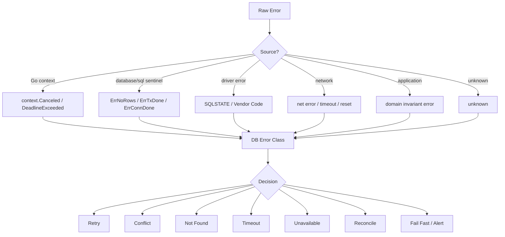
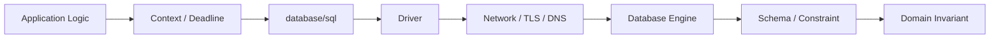
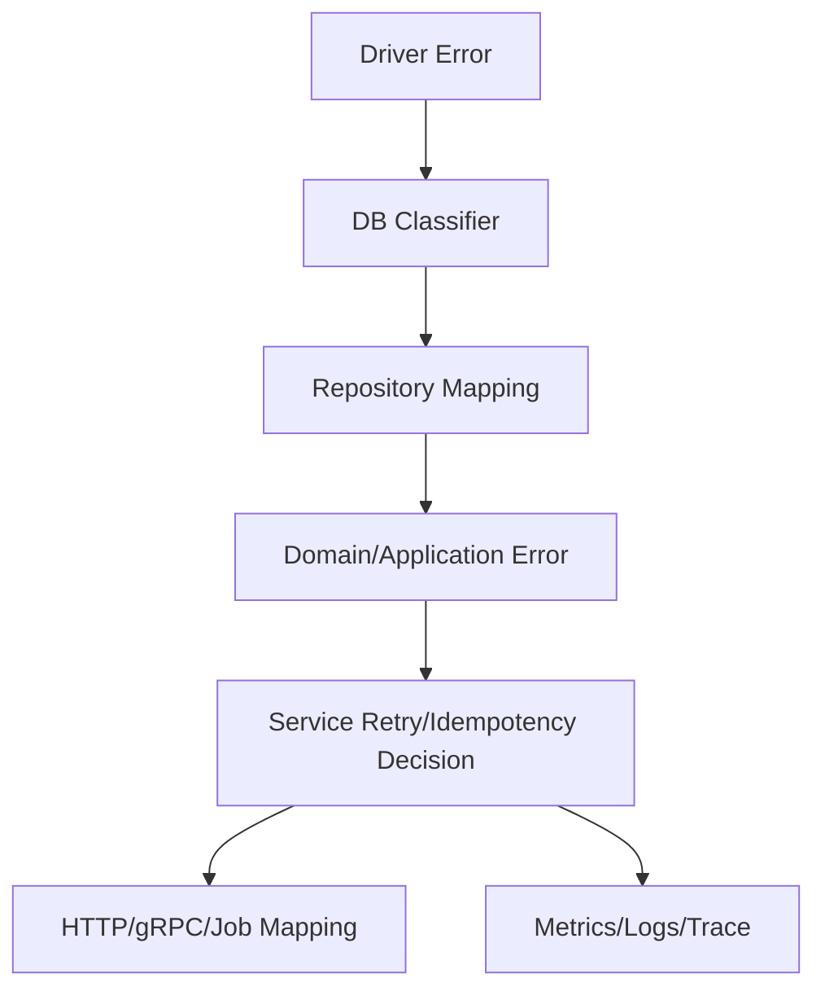

# learn-go-sql-database-integration-part-020.md

# Error Taxonomy for Database Integration

> Seri: `learn-go-sql-database-integration`  
> Part: `020`  
> Topik: `Database Error Taxonomy, Error Classification, SQLSTATE/Vendor Codes, Retryability, Domain Mapping, Observability, and Production Decisioning`  
> Target pembaca: Java software engineer yang ingin memahami Go database integration sampai level production architecture  
> Target Go: Go 1.26.x  
> Status seri: **belum selesai**

---

## 0. Posisi Part Ini Dalam Seri

Pada part sebelumnya kita membahas:

- transaction retry;
- idempotency;
- ambiguous commit;
- outbox;
- inbox;
- exactly-once illusion;
- duplicate suppression;
- reconciliation.

Part ini membahas fondasi yang membuat semua keputusan itu bisa dilakukan secara konsisten:

> Error taxonomy.

Di production, error database tidak boleh hanya diperlakukan sebagai:

```go
if err != nil {
	return err
}
```

atau lebih buruk:

```go
return errors.New("database error")
```

Karena error database bisa berarti banyak hal:

- data tidak ditemukan;
- duplicate key;
- foreign key violation;
- check constraint violation;
- invalid state transition;
- stale version;
- context canceled;
- context deadline exceeded;
- pool wait timeout;
- connection refused;
- connection reset;
- deadlock;
- serialization failure;
- lock timeout;
- statement timeout;
- read-only transaction;
- failover;
- ambiguous commit;
- driver bug/config error;
- syntax error;
- permission denied;
- migration drift;
- database overloaded.

Setiap kategori butuh aksi berbeda:

| Error | Aksi |
|---|---|
| not found | 404/domain not found |
| duplicate business key | 409 conflict |
| duplicate idempotency key | load stored result |
| serialization failure | retry whole tx |
| deadlock | retry whole tx |
| context canceled | stop work |
| deadline exceeded | timeout response / maybe retry outside |
| connection outage | 503/degraded |
| commit ambiguous | reconcile |
| syntax/migration error | fail fast / deploy rollback |
| permission denied | security/config incident |

Part ini adalah jembatan antara low-level DB driver dan high-level application behavior.

---

## 1. Tujuan Pembelajaran

Setelah menyelesaikan part ini, kamu harus mampu:

1. membuat taxonomy error database yang berguna untuk production;
2. membedakan source error: Go context, `database/sql`, driver, database engine, network, application invariant;
3. memahami `sql.ErrNoRows`, `sql.ErrTxDone`, `context.Canceled`, dan `context.DeadlineExceeded`;
4. memahami kenapa error code database harus diklasifikasi secara driver-specific;
5. mengenali kategori constraint violation, deadlock, serialization failure, lock timeout, statement timeout, connection failure, permission error, syntax error, migration drift;
6. memetakan error database menjadi domain error;
7. memetakan domain/application error menjadi HTTP/gRPC/job result;
8. menentukan retryability dengan aman;
9. membedakan retryable error vs retry-safe operation;
10. membedakan final error, transient error, ambiguous error, dan programmer/config error;
11. merancang error classifier abstraction di Go;
12. menjaga error wrapping agar `errors.Is` dan `errors.As` tetap bekerja;
13. membuat observability label error yang low-cardinality;
14. membuat runbook berdasarkan error class.

---

## 2. Fakta Dasar Dari Sumber Resmi

Beberapa fakta penting:

1. Go `database/sql` mendefinisikan error sentinel seperti `sql.ErrNoRows` yang dikembalikan oleh `Row.Scan` ketika `QueryRow` tidak menghasilkan row.
2. Go `database/sql` mendefinisikan `sql.ErrTxDone` yang dikembalikan oleh operasi pada transaction yang sudah committed atau rolled back.
3. Go `context` mendefinisikan `context.Canceled` dan `context.DeadlineExceeded`.
4. `database/sql` adalah abstraction layer; database-specific error seperti SQLSTATE, MySQL error number, SQL Server error number, atau Oracle ORA code berasal dari driver/database, bukan dinormalisasi sepenuhnya oleh `database/sql`.
5. PostgreSQL mendokumentasikan SQLSTATE class/code, termasuk `23505` unique violation, `23503` foreign key violation, `40001` serialization failure, dan `40P01` deadlock detected.
6. MySQL mendokumentasikan server error reference dengan numeric error code, termasuk duplicate entry, foreign key constraint failures, deadlock, dan lock wait timeout.
7. SQL Server dan Oracle memiliki error code/number sendiri yang harus diklasifikasi melalui driver masing-masing.

Referensi:

- Go `database/sql`: <https://pkg.go.dev/database/sql>
- Go `context`: <https://pkg.go.dev/context>
- Go errors package: <https://pkg.go.dev/errors>
- PostgreSQL Error Codes: <https://www.postgresql.org/docs/current/errcodes-appendix.html>
- MySQL Server Error Reference: <https://dev.mysql.com/doc/mysql-errors/8.0/en/server-error-reference.html>
- Microsoft SQL Server Database Engine Errors: <https://learn.microsoft.com/en-us/sql/relational-databases/errors-events/database-engine-events-and-errors>
- Oracle Database Error Messages: <https://docs.oracle.com/en/database/oracle/oracle-database/>

---

## 3. Mental Model Utama

### 3.1 Error Adalah Decision Input

Error bukan hanya teks untuk log.

Error adalah input untuk keputusan:

```text
Should we retry?
Should we rollback?
Should we return 404?
Should we return 409?
Should we return 503?
Should we mark operation unknown?
Should we trigger reconciliation?
Should we alert?
Should we rollback deployment?
Should we page DBA?
```

Jika error tidak diklasifikasi, aplikasi akan membuat keputusan salah.

### 3.2 Error Harus Dipisah Dari Pesan

Bad:

```go
if strings.Contains(err.Error(), "duplicate") {
	return ErrConflict
}
```

Masalah:

- pesan bisa berubah;
- bahasa/format beda;
- driver beda;
- constraint name bisa muncul/hilang;
- false positive;
- susah dites.

Better:

```go
var pgErr *pgconn.PgError
if errors.As(err, &pgErr) && pgErr.Code == "23505" {
	return ErrConflict
}
```

Exact type tergantung driver.

### 3.3 Error Taxonomy Harus Actionable

Taxonomy yang baik bukan:

```text
database error
```

Taxonomy yang baik:

```text
unique_violation
foreign_key_violation
serialization_failure
deadlock
lock_timeout
statement_timeout
connection_failure
deadline
canceled
not_found
tx_done
syntax_or_schema_error
permission_denied
commit_ambiguous
unknown
```

Setiap class punya aksi default.

---

## 4. Diagram: Error Classification Pipeline



---

## 5. Error Source Layers

A database operation can fail at multiple layers.



Layer examples:

| Layer | Example |
|---|---|
| application | invalid state transition |
| context | deadline exceeded |
| database/sql | `sql.ErrNoRows` |
| driver | SQLSTATE/vendor code |
| network | connection reset |
| database engine | deadlock, serialization |
| schema | unique/FK/check violation |
| domain | insufficient balance |

A robust error boundary maps all into a controlled set of application classes.

---

## 6. Core Error Categories

A useful taxonomy:

```go
type Class string

const (
	ClassNone                  Class = ""
	ClassNotFound              Class = "not_found"
	ClassCanceled              Class = "canceled"
	ClassDeadline              Class = "deadline"
	ClassUniqueViolation       Class = "unique_violation"
	ClassForeignKeyViolation   Class = "foreign_key_violation"
	ClassCheckViolation        Class = "check_violation"
	ClassNotNullViolation      Class = "not_null_violation"
	ClassConstraintViolation   Class = "constraint_violation"
	ClassSerializationFailure  Class = "serialization_failure"
	ClassDeadlock              Class = "deadlock"
	ClassLockTimeout           Class = "lock_timeout"
	ClassStatementTimeout      Class = "statement_timeout"
	ClassConnection            Class = "connection"
	ClassTooManyConnections    Class = "too_many_connections"
	ClassReadOnly              Class = "read_only"
	ClassPermissionDenied      Class = "permission_denied"
	ClassSyntaxOrSchema        Class = "syntax_or_schema"
	ClassTxDone                Class = "tx_done"
	ClassCommitAmbiguous       Class = "commit_ambiguous"
	ClassInvalidState          Class = "invalid_state"
	ClassConcurrentConflict    Class = "concurrent_conflict"
	ClassUnknown               Class = "unknown"
)
```

This is not universal. Adapt to system needs.

---

## 7. Error Class Dimensions

One class is not enough. Useful dimensions:

| Dimension | Values |
|---|---|
| source | context, sql, driver, network, db, domain |
| persistence | transient, permanent, ambiguous |
| retryable | yes, no, maybe |
| retry safety required | idempotency, whole tx, no side effects |
| user mapping | 404, 409, 503, 504, 500 |
| severity | debug, info, warn, error, critical |
| operation state | no effect, effect committed, effect unknown |
| observability label | low-cardinality class |
| runbook | app, DBA, infra, developer |

Example:

```text
deadlock
source=db
persistence=transient
retryable=yes
retry_scope=whole_transaction
user_mapping=hidden if retry succeeds, else 409/503
severity=warn if occasional, alert if spike
```

---

## 8. Sentinel Errors in `database/sql`

### 8.1 `sql.ErrNoRows`

Occurs when:

```go
err := db.QueryRowContext(ctx, query, args...).Scan(&dest)
```

and query returns no rows.

Usage:

```go
if errors.Is(err, sql.ErrNoRows) {
	return ErrUserNotFound
}
```

Important:

- `QueryRowContext` itself returns `*Row`;
- error appears on `Scan`;
- `ErrNoRows` is not infrastructure failure;
- often maps to domain not found;
- sometimes maps to authorization-safe not found.

### 8.2 `sql.ErrTxDone`

Returned when operation is performed on transaction that is already committed or rolled back.

Causes:

- using tx after commit;
- double commit;
- rollback then use;
- context canceled and tx rolled back;
- code path bug.

Usually programmer/lifecycle error, not user error.

### 8.3 `sql.ErrConnDone`

Returned when operation is performed on connection already returned/closed.

Usually lifecycle misuse.

---

## 9. Context Errors

### 9.1 `context.Canceled`

Means caller canceled context.

Possible causes:

- HTTP client disconnected;
- parent operation canceled;
- server shutting down;
- explicit cancel.

Default action:

- stop work;
- do not retry;
- often not an error-level log for request path;
- cleanup resources;
- rollback transaction.

### 9.2 `context.DeadlineExceeded`

Means deadline expired.

Possible causes:

- pool wait too long;
- query slow;
- lock wait;
- DB overloaded;
- network stalled;
- timeout too aggressive;
- bad query plan.

Default action:

- do not blindly retry inside same expired context;
- classify as timeout;
- inspect pool/DB metrics;
- for idempotent operations, caller may retry with same key;
- for writes, commit ambiguity must be considered if during commit.

### 9.3 Context Error Can Wrap Driver Error

Use:

```go
errors.Is(err, context.DeadlineExceeded)
```

not direct equality.

---

## 10. Driver/Database Errors

Database-specific errors include structured fields.

Examples:

- PostgreSQL SQLSTATE;
- MySQL numeric error code;
- SQL Server error number/state/class;
- Oracle ORA code;
- SQLite extended result code.

`database/sql` does not normalize them all.

Therefore implement per-driver classifier.

---

## 11. PostgreSQL SQLSTATE Mapping

Common PostgreSQL codes:

| SQLSTATE | Class | Meaning |
|---|---|---|
| `02000` | no_data | no data |
| `23505` | unique_violation | duplicate key |
| `23503` | foreign_key_violation | FK violation |
| `23502` | not_null_violation | not null |
| `23514` | check_violation | check constraint |
| `23P01` | exclusion_violation | exclusion constraint |
| `40001` | serialization_failure | retry whole tx |
| `40P01` | deadlock_detected | retry whole tx |
| `55P03` | lock_not_available | lock timeout/nowait |
| `57014` | query_canceled | statement timeout/cancel |
| `08000` class | connection_exception | connection |
| `28P01` | invalid_password | auth/config |
| `42501` | insufficient_privilege | permission |
| `42P01` | undefined_table | schema drift |
| `42703` | undefined_column | schema drift |
| `42601` | syntax_error | query bug |

Exact handling depends on operation.

---

## 12. MySQL Error Mapping

Common MySQL categories:

| MySQL Category | Class | Meaning |
|---|---|---|
| duplicate entry | unique_violation | duplicate key |
| cannot add/update child row | foreign_key_violation | FK violation |
| row is referenced | foreign_key_violation | FK delete/update issue |
| deadlock found | deadlock | retry tx |
| lock wait timeout exceeded | lock_timeout | maybe retry |
| too many connections | too_many_connections | capacity/outage |
| server has gone away | connection | connection/server |
| lost connection | connection | network/server |
| access denied | permission/auth | config/security |
| unknown table/column | syntax_or_schema | migration/query bug |

Use driver-specific error number, not string matching.

---

## 13. SQL Server Error Mapping

SQL Server uses error numbers.

Common categories to classify:

- primary/unique constraint violation;
- foreign key violation;
- deadlock victim;
- lock request timeout;
- login failed;
- permission denied;
- invalid object name;
- invalid column name;
- database unavailable;
- connection broken;
- timeout expired.

Use driver type to inspect number/class/state.

Also account for SQL Server row versioning settings and transient error numbers if using cloud SQL offerings.

---

## 14. Oracle Error Mapping

Oracle errors use ORA codes.

Common categories:

- unique constraint violation;
- integrity constraint violation;
- deadlock detected;
- resource busy / NOWAIT;
- serialization/cannot serialize access;
- connection lost;
- listener unavailable;
- insufficient privileges;
- table/view does not exist;
- invalid identifier.

Use driver/Oracle error structures where available.

Avoid string-only classification if code is exposed.

---

## 15. SQLite Error Mapping

SQLite uses result codes and extended result codes.

Common categories:

- constraint violation;
- unique constraint;
- busy/locked;
- database locked;
- read-only;
- corrupt;
- misuse;
- IO error.

SQLite concurrency semantics differ from client/server DB. Error taxonomy still helps, but retry/lock strategy differs.

---

## 16. Constraint Violation Taxonomy

Constraint violations are not all the same.

| Constraint | Meaning |
|---|---|
| unique | duplicate business/idempotency key |
| foreign key | referenced row missing or parent operation conflict |
| check | row invariant violated |
| not null | application/schema bug or invalid input |
| exclusion | range/predicate conflict |
| primary key | duplicate identity/idempotency |
| deferred constraint | may appear at commit |

Mapping depends on constraint name.

Example:

```text
uq_idempotency_key -> replay existing operation
uq_user_email -> 409 email exists
uq_active_assignment -> case already assigned
chk_balance_non_negative -> bug or insufficient balance protection failed
```

Constraint name is often needed to map accurately.

---

## 17. Constraint Name Mapping

Instead of mapping every unique violation to same error, map by constraint.

Example:

```go
type ConstraintMapper struct {
	unique map[string]error
}

func (m ConstraintMapper) MapUnique(constraint string) error {
	if err, ok := m.unique[constraint]; ok {
		return err
	}
	return ErrUniqueViolation
}
```

Configuration:

```go
mapper := ConstraintMapper{
	unique: map[string]error{
		"uq_users_email":             ErrEmailAlreadyUsed,
		"uq_idempotency_scope_key":   ErrDuplicateIdempotencyKey,
		"uq_active_assignment_case":  ErrCaseAlreadyAssigned,
		"uq_outbox_event_id":         ErrDuplicateOutboxEvent,
	},
}
```

For PostgreSQL, constraint name may be available in driver error.

For other DBs, availability differs.

---

## 18. `RowsAffected == 0` as Error

No database error may occur, but business operation failed.

Example:

```go
result, err := tx.ExecContext(ctx, `
	UPDATE cases
	SET status = 'APPROVED'
	WHERE id = $1
	  AND status = 'UNDER_REVIEW'
`, caseID)
if err != nil {
	return err
}

affected, err := result.RowsAffected()
if err != nil {
	return err
}

if affected == 0 {
	return ErrInvalidStateTransition
}
```

`RowsAffected == 0` can mean:

- not found;
- stale state;
- concurrent modification;
- insufficient stock;
- quota exceeded;
- already processed;
- not authorized;
- no-op.

It is an application/domain classification, not driver error.

---

## 19. Error Classification Flow

Recommended classification order:

1. nil;
2. domain sentinel errors;
3. context errors;
4. `database/sql` sentinel errors;
5. driver-specific structured errors;
6. network errors;
7. fallback unknown.

Why domain first?

Because domain layer may wrap lower error into domain meaning.

But if domain error wraps driver error, classification may need both dimensions.

Example:

```go
ErrDuplicateRequest wraps unique violation
```

User mapping should use domain error.

Observability may record both:

```text
domain_class=duplicate_request
db_class=unique_violation
```

---

## 20. Error Wrapping in Go

Use `%w`:

```go
return fmt.Errorf("insert user: %w", err)
```

Then caller can:

```go
errors.Is(err, sql.ErrNoRows)
errors.Is(err, context.DeadlineExceeded)
errors.As(err, &pgErr)
```

Bad:

```go
return fmt.Errorf("insert user: %v", err)
```

This loses wrapping.

Bad:

```go
return errors.New(err.Error())
```

This destroys type/code.

---

## 21. Domain Error Design

Define domain/application sentinels:

```go
var (
	ErrNotFound                 = errors.New("not found")
	ErrConflict                 = errors.New("conflict")
	ErrDuplicateRequest         = errors.New("duplicate request")
	ErrInvalidStateTransition   = errors.New("invalid state transition")
	ErrConcurrentModification   = errors.New("concurrent modification")
	ErrQuotaExceeded            = errors.New("quota exceeded")
	ErrInsufficientStock        = errors.New("insufficient stock")
	ErrOperationInProgress      = errors.New("operation in progress")
	ErrOperationUnknown         = errors.New("operation state unknown")
)
```

Then wrap:

```go
return fmt.Errorf("%w: case %d cannot transition from %s to %s",
	ErrInvalidStateTransition,
	caseID,
	from,
	to,
)
```

Use `errors.Is`.

---

## 22. Typed Errors for Metadata

When metadata matters:

```go
type ConstraintError struct {
	Class      Class
	Constraint string
	Cause      error
}

func (e ConstraintError) Error() string {
	return string(e.Class) + ": " + e.Constraint
}

func (e ConstraintError) Unwrap() error {
	return e.Cause
}
```

For commit ambiguity:

```go
type CommitAmbiguousError struct {
	OperationID string
	Cause       error
}

func (e CommitAmbiguousError) Error() string {
	return "commit ambiguous for operation " + e.OperationID
}

func (e CommitAmbiguousError) Unwrap() error {
	return e.Cause
}
```

Typed errors help reconciliation.

---

## 23. Internal Error Classification Struct

```go
type DBError struct {
	Class       Class
	Retryable   bool
	Ambiguous   bool
	Constraint  string
	Operation   string
	Cause       error
}

func (e *DBError) Error() string {
	if e.Operation == "" {
		return string(e.Class)
	}
	return e.Operation + ": " + string(e.Class)
}

func (e *DBError) Unwrap() error {
	return e.Cause
}
```

Use this at infrastructure boundary if useful.

Do not expose raw DB internals to domain/user unless needed.

---

## 24. Classifier Interface

```go
type Classifier interface {
	Classify(error) Classification
}

type Classification struct {
	Class      Class
	Retryable bool
	Ambiguous bool
	Temporary bool
	Constraint string
}
```

Implementation:

```go
type CompositeClassifier struct {
	Driver DriverClassifier
}

func (c CompositeClassifier) Classify(err error) Classification {
	if err == nil {
		return Classification{Class: ClassNone}
	}

	if errors.Is(err, context.Canceled) {
		return Classification{Class: ClassCanceled}
	}
	if errors.Is(err, context.DeadlineExceeded) {
		return Classification{Class: ClassDeadline, Temporary: true}
	}
	if errors.Is(err, sql.ErrNoRows) {
		return Classification{Class: ClassNotFound}
	}
	if errors.Is(err, sql.ErrTxDone) {
		return Classification{Class: ClassTxDone}
	}

	if c.Driver != nil {
		if cls, ok := c.Driver.ClassifyDriver(err); ok {
			return cls
		}
	}

	return Classification{Class: ClassUnknown}
}
```

Driver classifier is injected per DB/driver.

---

## 25. Driver Classifier Interface

```go
type DriverClassifier interface {
	ClassifyDriver(error) (Classification, bool)
}
```

Example pseudo PostgreSQL classifier:

```go
type PostgresClassifier struct{}

func (PostgresClassifier) ClassifyDriver(err error) (Classification, bool) {
	// Pseudo-code: actual type depends on driver.
	var pgErr interface {
		SQLState() string
	}
	if !errors.As(err, &pgErr) {
		return Classification{}, false
	}

	switch pgErr.SQLState() {
	case "23505":
		return Classification{Class: ClassUniqueViolation, Constraint: constraintName(err)}, true
	case "23503":
		return Classification{Class: ClassForeignKeyViolation, Constraint: constraintName(err)}, true
	case "23514":
		return Classification{Class: ClassCheckViolation, Constraint: constraintName(err)}, true
	case "40001":
		return Classification{Class: ClassSerializationFailure, Retryable: true, Temporary: true}, true
	case "40P01":
		return Classification{Class: ClassDeadlock, Retryable: true, Temporary: true}, true
	case "55P03":
		return Classification{Class: ClassLockTimeout, Retryable: true, Temporary: true}, true
	case "57014":
		return Classification{Class: ClassStatementTimeout, Temporary: true}, true
	}

	return Classification{Class: ClassUnknown}, true
}
```

This is conceptual; use actual driver types.

---

## 26. Mapping DB Error to Domain Error

Example:

```go
func MapUserInsertError(class Classification) error {
	if class.Class == ClassUniqueViolation {
		switch class.Constraint {
		case "uq_users_email":
			return ErrEmailAlreadyUsed
		case "uq_users_username":
			return ErrUsernameAlreadyUsed
		}
		return ErrConflict
	}

	if class.Class == ClassForeignKeyViolation {
		return ErrInvalidReference
	}

	return nil
}
```

Repository/service can do:

```go
if err != nil {
	class := classifier.Classify(err)
	if mapped := MapUserInsertError(class); mapped != nil {
		return fmt.Errorf("%w: %w", mapped, err)
	}
	return err
}
```

But be careful not to expose raw cause to user response.

---

## 27. Mapping Domain Error to HTTP

Example:

```go
func HTTPStatus(err error) int {
	switch {
	case errors.Is(err, ErrNotFound):
		return http.StatusNotFound
	case errors.Is(err, ErrInvalidStateTransition):
		return http.StatusConflict
	case errors.Is(err, ErrConcurrentModification):
		return http.StatusConflict
	case errors.Is(err, ErrDuplicateRequest):
		return http.StatusConflict
	case errors.Is(err, ErrOperationInProgress):
		return http.StatusAccepted
	case errors.Is(err, context.Canceled):
		return 499 // not standard in net/http; often logged only
	case errors.Is(err, context.DeadlineExceeded):
		return http.StatusGatewayTimeout
	default:
		return http.StatusInternalServerError
	}
}
```

For standard libraries, `499` is not defined; some platforms use it for client closed request. Decide per stack.

---

## 28. Mapping Domain Error to gRPC

Typical mapping:

| Domain/Error | gRPC Code |
|---|---|
| not found | NotFound |
| invalid argument | InvalidArgument |
| failed precondition | FailedPrecondition |
| conflict/concurrent modification | Aborted or AlreadyExists |
| duplicate create | AlreadyExists |
| timeout | DeadlineExceeded |
| canceled | Canceled |
| unavailable DB | Unavailable |
| permission | PermissionDenied |
| auth | Unauthenticated |
| unknown commit state | Unknown / Aborted + details |

Choose consistently.

---

## 29. Retry Decision Matrix

| Class | Retry? | Retry Scope |
|---|---|---|
| not_found | no | none |
| unique_violation | no | maybe load existing if idempotency |
| foreign_key_violation | no | fix input/state |
| check_violation | no | bug/domain |
| serialization_failure | yes | whole transaction |
| deadlock | yes | whole transaction |
| lock_timeout | maybe | whole transaction or return busy |
| statement_timeout | maybe | depends root cause |
| deadline | maybe outside | only if parent budget/new attempt safe |
| canceled | no | caller canceled |
| connection | maybe | if operation safe/unknown handled |
| too_many_connections | usually no immediate retry | backoff/degrade |
| permission_denied | no | config/security |
| syntax_or_schema | no | deploy/migration bug |
| tx_done | no | code bug |
| commit_ambiguous | not blind | reconcile/idempotency |
| unknown | conservative | do not retry unsafe writes |

---

## 30. Commit Error Classification

Commit error is special.

Possible classes:

- serialization failure;
- deadlock;
- deferred constraint violation;
- context canceled/deadline;
- connection error;
- failover;
- unknown.

Some are clearly non-committed, some ambiguous.

Rule:

```text
If app cannot prove transaction did not commit, treat important write as ambiguous.
```

For idempotent operation:

- retry with same operation ID;
- load existing result if committed.

For non-idempotent operation:

- reconcile before retry;
- return uncertain status if necessary.

---

## 31. Ambiguous Error Type

```go
type AmbiguousOperationError struct {
	OperationID string
	Stage       string
	Cause       error
}

func (e AmbiguousOperationError) Error() string {
	return "ambiguous operation " + e.OperationID + " at " + e.Stage
}

func (e AmbiguousOperationError) Unwrap() error {
	return e.Cause
}
```

Use when:

- commit response lost;
- external provider side effect unknown;
- publish succeeded but mark sent failed;
- consumer committed but ack failed.

This tells caller/reconciler not to blindly retry.

---

## 32. Query Error vs Scan Error vs Rows Error

Errors can appear at different places.

### 32.1 Query Error

```go
rows, err := db.QueryContext(ctx, query)
if err != nil {
	return err
}
```

Could be:

- syntax;
- connection;
- permission;
- timeout before rows;
- bad parameter.

### 32.2 Scan Error

```go
if err := rows.Scan(&dest); err != nil {
	return err
}
```

Could be:

- type mismatch;
- NULL into non-null destination;
- conversion error;
- driver data issue.

### 32.3 Rows Error

```go
if err := rows.Err(); err != nil {
	return err
}
```

Could be:

- context canceled during iteration;
- network error mid-stream;
- driver error;
- server-side cursor error.

Do not skip `rows.Err()`.

---

## 33. Scan Error Taxonomy

Scan errors often indicate:

- schema drift;
- wrong destination type;
- unexpected NULL;
- precision loss;
- invalid time format;
- driver type mismatch;
- data corruption;
- programmer bug.

Example:

```text
converting NULL to string is unsupported
```

This is not transient. Do not retry.

Fix:

- use `sql.NullString`;
- fix schema/query;
- handle nullable field.

---

## 34. `sql.ErrNoRows` Is Not Always 404

Examples:

| Query | Meaning of No Rows |
|---|---|
| find user by ID | 404 not found |
| find session by token | unauthorized |
| find permission row | forbidden |
| conditional idempotency lookup | first attempt |
| select current state for transition | invalid state/not found |
| load optional config | default value |
| lock job row | no work |

Map by use case.

Do not mechanically map all `ErrNoRows` to HTTP 404.

---

## 35. No Rows vs RowsAffected 0

`sql.ErrNoRows`:

```text
SELECT expected one row but got none
```

`RowsAffected == 0`:

```text
UPDATE/DELETE matched no rows or no rows changed
```

Both require domain interpretation.

Example:

```text
UPDATE case WHERE id=? AND status='UNDER_REVIEW'
RowsAffected=0
```

Could mean:

- case not found;
- case already approved;
- case closed;
- stale UI;
- unauthorized if predicate includes owner/tenant.

Sometimes intentionally return generic not found to avoid information leak.

---

## 36. Authorization-Safe Error Mapping

For security, do not reveal whether resource exists if user lacks access.

Query:

```sql
SELECT *
FROM cases
WHERE id = $1
  AND tenant_id = $2
  AND user_can_access = true;
```

No rows could mean:

- not found;
- forbidden.

Response may be:

```text
404 Not Found
```

to avoid enumeration.

Internally classify as:

```text
not_found_or_forbidden
```

depending security policy.

---

## 37. Constraint Error and User Message

Do not expose raw constraint names to users.

Bad response:

```json
{"error": "duplicate key value violates unique constraint uq_users_email"}
```

Better:

```json
{"error": "email_already_used"}
```

Log internal:

```text
db_class=unique_violation constraint=uq_users_email
```

User response should be stable and safe.

---

## 38. Transient vs Permanent

### 38.1 Transient

May succeed later:

- deadlock;
- serialization failure;
- temporary connection issue;
- failover;
- lock timeout;
- too many connections;
- temporary overload.

### 38.2 Permanent

Will not succeed without changing input/code/state:

- syntax error;
- missing table/column;
- permission denied;
- invalid FK;
- unique business conflict;
- check violation;
- invalid state transition.

### 38.3 Ambiguous

Effect may have happened:

- commit response lost;
- external side effect timeout;
- publish succeeded but ack/mark failed;
- network error after write.

Ambiguous requires reconciliation/idempotency.

---

## 39. Retryable vs Temporary

An error can be temporary but not safe to retry.

Example:

```text
connection error after payment provider call
```

Temporary network error, but retry can double charge.

Classify:

```text
temporary=true
retryable=false unless idempotent
ambiguous=true
```

This is why error classification must be combined with operation semantics.

---

## 40. Operation Semantics

Define:

```go
type OperationSemantics struct {
	Name              string
	Idempotent        bool
	HasOperationID    bool
	ExternalSideEffect bool
	RetryWholeTxSafe  bool
}
```

Retry decision:

```go
func CanRetry(class Classification, op OperationSemantics) bool {
	if !class.Retryable {
		return false
	}
	if class.Ambiguous && !op.HasOperationID {
		return false
	}
	if op.ExternalSideEffect && !op.Idempotent {
		return false
	}
	return op.RetryWholeTxSafe || op.Idempotent
}
```

Do not decide retry from error alone.

---

## 41. Error Handling at Repository Boundary

Repository should map low-level DB errors to persistence/domain-specific errors.

Example:

```go
func (r UserRepo) Insert(ctx context.Context, q DBTX, user User) error {
	_, err := q.ExecContext(ctx, `
		INSERT INTO users (id, email)
		VALUES ($1, $2)
	`, user.ID, user.Email)
	if err == nil {
		return nil
	}

	class := r.classifier.Classify(err)
	if class.Class == ClassUniqueViolation && class.Constraint == "uq_users_email" {
		return fmt.Errorf("%w: %w", ErrEmailAlreadyUsed, err)
	}

	return fmt.Errorf("insert user: %w", err)
}
```

But repository should not decide HTTP status.

---

## 42. Error Handling at Service Boundary

Service maps repository/domain errors to business outcome.

Example:

```go
func (s UserService) Register(ctx context.Context, cmd RegisterCommand) error {
	err := s.repo.Insert(ctx, s.db, user)
	if err != nil {
		if errors.Is(err, ErrEmailAlreadyUsed) {
			return ErrRegistrationConflict
		}
		return err
	}
	return nil
}
```

Service may add idempotency/retry behavior.

---

## 43. Error Handling at Transport Boundary

HTTP/gRPC handler maps application error to protocol response.

Keep protocol mapping at edge.

```go
func writeError(w http.ResponseWriter, err error) {
	status := HTTPStatus(err)
	body := ErrorResponse{
		Code:    PublicErrorCode(err),
		Message: PublicMessage(err),
	}
	writeJSON(w, status, body)
}
```

Do not leak DB codes.

---

## 44. Public Error Codes

Use stable public codes:

```text
not_found
conflict
duplicate_request
invalid_state
concurrent_modification
quota_exceeded
operation_in_progress
timeout
service_unavailable
internal_error
```

Internal DB class can be logged/traced separately:

```text
db.error_class=unique_violation
db.constraint=uq_active_assignment
```

---

## 45. Observability Error Labels

Good metric labels:

```text
operation=case.approve
db_error_class=deadlock
domain_error_class=concurrent_conflict
retryable=true
attempt=2
```

Bad labels:

```text
error_message="duplicate key value violates unique constraint..."
sql="SELECT ..."
case_id="123456"
idempotency_key="..."
```

Avoid high-cardinality and sensitive labels.

---

## 46. Logging Strategy

Log based on class/severity.

### 46.1 Expected Domain Conflict

```text
level=info
error_class=invalid_state
operation=case.approve
```

### 46.2 Retryable Deadlock

```text
level=warn if retry exhausted
level=debug/info if retry succeeded and low rate
```

### 46.3 Schema/Syntax Error

```text
level=error
alert/deploy rollback
```

### 46.4 Permission/Auth Error

```text
level=error/security
```

### 46.5 Context Canceled

Often debug/info, not error, if client canceled.

### 46.6 Unknown

Warn/error with enough context and trace ID.

---

## 47. Tracing Error Attributes

Trace span attributes:

```text
db.system=postgresql
db.operation=case.approve.transition
db.error_class=deadlock
db.retryable=true
db.retry_attempt=1
db.constraint=uq_active_assignment
```

Do not add:

- raw SQL args with PII;
- full payload;
- high-cardinality IDs unless policy allows.

---

## 48. Error Taxonomy and SLO

Different error classes affect SLO differently.

Example:

| Error | Counts Against Availability? |
|---|---|
| invalid state transition | no, user/business conflict |
| not found | usually no |
| duplicate idempotency replay | no |
| context canceled by client | no |
| deadline due to service slowness | yes |
| DB unavailable | yes |
| deadlock retried and succeeded | maybe no user impact |
| deadlock retries exhausted | yes or conflict depending semantics |
| schema drift | yes, deploy incident |
| permission misconfig | yes/security incident |

Define SLO rules.

---

## 49. Alerting by Error Class

### 49.1 Infrastructure

```text
connection_error_rate > threshold
too_many_connections > 0
db_unavailable > 0
```

### 49.2 Performance/Contention

```text
deadline_rate > baseline
lock_timeout_rate > baseline
deadlock_rate > baseline
serialization_failure_rate > baseline
```

### 49.3 Correctness

```text
commit_ambiguous > 0
audit_mismatch > 0
idempotency_unknown > 0
```

### 49.4 Deploy/Migration

```text
undefined_table/column
syntax_error
permission_denied after deployment
```

---

## 50. Runbook: Unique Violation Spike

Symptoms:

- unique violation rate increases.

Questions:

1. Which constraint?
2. Is it idempotency duplicate or business conflict?
3. Did client start retrying?
4. Did frontend double-submit?
5. Did new code remove idempotency key?
6. Did data migration create duplicates?
7. Is unique constraint newly added?
8. Are error mappings correct?

Actions:

- if idempotency duplicates, inspect timeout/retry/client behavior;
- if business conflict, maybe expected;
- if unexpected duplicate, check race/missing conditional logic;
- if user-facing, return 409 not 500.

---

## 51. Runbook: Foreign Key Violation

Symptoms:

- FK violation on insert/update/delete.

Questions:

1. Parent missing?
2. Delete race?
3. Migration order wrong?
4. Test data invalid?
5. Multi-service ownership issue?
6. Soft delete not modeled?
7. Cascade behavior changed?
8. Transaction ordering wrong?

Actions:

- map invalid reference to domain error if user input;
- fix transaction ordering if app bug;
- rollback deployment if schema drift;
- add integration test.

---

## 52. Runbook: Deadlock Spike

Questions:

1. Which operation?
2. Which SQL statements?
3. Which tables/indexes?
4. New deployment?
5. Lock order inconsistent?
6. Batch/migration running?
7. Missing index?
8. Retry succeeds or exhausted?
9. Worker concurrency increased?

Actions:

- retry whole tx with backoff if safe;
- reduce concurrency;
- fix lock order;
- shorten transactions;
- add index;
- pause batch.

---

## 53. Runbook: Serialization Failure Spike

Questions:

1. Which serializable transaction?
2. Is retry configured?
3. Retry success rate?
4. Transaction duration?
5. Read set too broad?
6. Hot aggregate?
7. Missing index?
8. Better constraint/conditional write possible?

Actions:

- add/adjust retry;
- reduce transaction scope;
- use targeted lock/constraint;
- lower contention;
- alert only if user impact/retry exhausted.

---

## 54. Runbook: Lock Timeout

Questions:

1. What lock is being waited on?
2. Who is blocker?
3. How long is blocker transaction?
4. Is it idle-in-transaction?
5. Any external call inside transaction?
6. Missing index?
7. Batch job?
8. Hot row?

Actions:

- kill blocker if approved;
- reduce worker concurrency;
- fix long transaction;
- add index;
- adjust lock timeout;
- return conflict/retry-later if expected.

---

## 55. Runbook: Statement Timeout

Questions:

1. Which query?
2. Plan changed?
3. Data volume changed?
4. Missing/stale statistics?
5. New filter/sort?
6. Lock wait included?
7. DB CPU/IO high?
8. Timeout too low?

Actions:

- optimize query/index;
- split report path;
- increase timeout only with justification;
- add pagination;
- inspect plan;
- protect OLTP path.

---

## 56. Runbook: Connection Error

Questions:

1. DB down/failover?
2. DNS issue?
3. network/LB/proxy?
4. too many connections?
5. credential rotation?
6. TLS/cert?
7. pod/node issue?
8. connection lifetime mismatch?

Actions:

- check DB/proxy health;
- reduce reconnect storm;
- pause workers;
- use backoff;
- validate credentials;
- inspect pool metrics;
- do not retry writes blindly.

---

## 57. Runbook: Schema/Syntax Error

Symptoms:

- undefined table/column;
- syntax error;
- type mismatch;
- permission after deployment.

Likely causes:

- app deployed before migration;
- migration failed;
- feature flag mismatch;
- wrong DB version;
- wrong schema/search path;
- query bug;
- generated SQL bug.

Actions:

- stop/rollback deployment;
- apply migration if safe;
- disable feature;
- verify schema version;
- add migration gate;
- add integration test.

Do not retry.

---

## 58. Runbook: Permission Denied

Causes:

- wrong DB user;
- missing grant;
- rotated credential;
- wrong schema;
- least privilege misconfigured;
- migration created object without grants;
- read replica user mismatch.

Actions:

- treat as config/security incident;
- do not retry aggressively;
- verify grants;
- rollback or apply grant fix;
- audit access.

---

## 59. Runbook: Commit Ambiguous

Questions:

1. Was operation ID present?
2. Did idempotency row commit?
3. Did business row change?
4. Did audit row exist?
5. Did outbox event exist?
6. Did external provider receive request?
7. Can final state be reconstructed?

Actions:

- reconcile;
- mark operation succeeded/failed/unknown;
- do not blind retry;
- alert if unknown remains;
- add idempotency if missing.

---

## 60. Testing Error Classification

Unit test classifier with actual error types if possible.

For PostgreSQL with driver type:

```go
func TestPostgresClassifierUnique(t *testing.T) {
	err := makePgError("23505", "uq_users_email")

	class := classifier.Classify(err)

	if class.Class != ClassUniqueViolation {
		t.Fatalf("class=%s", class.Class)
	}
	if class.Constraint != "uq_users_email" {
		t.Fatalf("constraint=%s", class.Constraint)
	}
}
```

If driver error cannot be constructed easily, integration tests can trigger real errors.

---

## 61. Integration Tests for Error Mapping

Test cases:

1. duplicate unique key;
2. foreign key violation;
3. check violation;
4. not null violation;
5. no rows;
6. rows affected zero;
7. deadlock;
8. lock timeout;
9. statement timeout;
10. context deadline;
11. transaction done;
12. schema mismatch if safe in test DB.

Assert mapping:

```text
raw error -> db class -> domain error -> protocol response
```

---

## 62. Testing `ErrNoRows`

```go
func TestFindUserNotFound(t *testing.T) {
	_, err := repo.FindByID(ctx, db, 999999)
	if !errors.Is(err, ErrUserNotFound) {
		t.Fatalf("expected user not found, got %v", err)
	}
}
```

Repository internally maps `sql.ErrNoRows`.

---

## 63. Testing Unique Constraint

```go
func TestDuplicateEmail(t *testing.T) {
	err := repo.Insert(ctx, db, User{ID: 1, Email: "a@example.com"})
	if err != nil {
		t.Fatal(err)
	}

	err = repo.Insert(ctx, db, User{ID: 2, Email: "a@example.com"})
	if !errors.Is(err, ErrEmailAlreadyUsed) {
		t.Fatalf("expected email used, got %v", err)
	}
}
```

This validates classifier + constraint mapping.

---

## 64. Testing RowsAffected Conflict

```go
func TestInvalidTransition(t *testing.T) {
	// case already CLOSED

	err := repo.Transition(ctx, db, caseID, "UNDER_REVIEW", "APPROVED")
	if !errors.Is(err, ErrInvalidStateTransition) {
		t.Fatalf("expected invalid transition, got %v", err)
	}
}
```

No database error occurs; domain error comes from affected rows.

---

## 65. Testing Deadlock Classification

Deadlock tests are DB-specific and more complex.

Shape:

1. create two rows;
2. tx1 locks row A;
3. tx2 locks row B;
4. tx1 tries row B;
5. tx2 tries row A;
6. one gets deadlock error;
7. classifier maps to `deadlock`.

Use timeouts to avoid hanging test.

---

## 66. Testing Context Deadline

```go
func TestQueryDeadline(t *testing.T) {
	ctx, cancel := context.WithTimeout(context.Background(), 10*time.Millisecond)
	defer cancel()

	err := repo.RunSlowQuery(ctx, db)

	if !errors.Is(err, context.DeadlineExceeded) {
		t.Fatalf("expected deadline, got %v", err)
	}
}
```

SQL slow function is DB-specific. Keep in integration tests only.

---

## 67. Error Taxonomy in Package Layout

Suggested package layout:

```text
/internal/dberr
  class.go
  classifier.go
  postgres.go
  mysql.go
  sqlserver.go
  oracle.go
  mapper.go

/internal/domainerr
  errors.go

/internal/httpapi
  error_response.go
```

Rules:

- driver-specific code stays infrastructure-level;
- domain should not import driver packages;
- transport should not inspect SQLSTATE directly;
- service maps domain behavior, not raw DB error.

---

## 68. Example `dberr` Package

```go
package dberr

type Class string

const (
	NotFound             Class = "not_found"
	Canceled             Class = "canceled"
	Deadline             Class = "deadline"
	UniqueViolation      Class = "unique_violation"
	ForeignKeyViolation  Class = "foreign_key_violation"
	CheckViolation       Class = "check_violation"
	SerializationFailure Class = "serialization_failure"
	Deadlock             Class = "deadlock"
	LockTimeout          Class = "lock_timeout"
	StatementTimeout     Class = "statement_timeout"
	Connection           Class = "connection"
	PermissionDenied     Class = "permission_denied"
	SyntaxOrSchema       Class = "syntax_or_schema"
	Unknown              Class = "unknown"
)

type Classification struct {
	Class      Class
	Retryable bool
	Temporary bool
	Ambiguous bool
	Constraint string
}
```

---

## 69. Example Composite Classifier

```go
package dberr

import (
	"context"
	"database/sql"
	"errors"
)

type DriverClassifier interface {
	Classify(error) (Classification, bool)
}

type Classifier struct {
	Driver DriverClassifier
}

func (c Classifier) Classify(err error) Classification {
	if err == nil {
		return Classification{}
	}

	if errors.Is(err, context.Canceled) {
		return Classification{Class: Canceled}
	}
	if errors.Is(err, context.DeadlineExceeded) {
		return Classification{Class: Deadline, Temporary: true}
	}
	if errors.Is(err, sql.ErrNoRows) {
		return Classification{Class: NotFound}
	}
	if errors.Is(err, sql.ErrTxDone) {
		return Classification{Class: Unknown}
	}

	if c.Driver != nil {
		if class, ok := c.Driver.Classify(err); ok {
			return class
		}
	}

	return Classification{Class: Unknown}
}
```

---

## 70. Domain Mapper Example

```go
func MapConstraint(class dberr.Classification) error {
	if class.Class != dberr.UniqueViolation {
		return nil
	}

	switch class.Constraint {
	case "uq_idempotency_scope_key":
		return ErrDuplicateRequest
	case "uq_users_email":
		return ErrEmailAlreadyUsed
	case "uq_active_assignment_case":
		return ErrCaseAlreadyAssigned
	default:
		return ErrConflict
	}
}
```

---

## 71. Repository Example

```go
func (r UserRepo) Create(ctx context.Context, q DBTX, user User) error {
	_, err := q.ExecContext(ctx, `
		INSERT INTO users (id, email, name)
		VALUES ($1, $2, $3)
	`, user.ID, user.Email, user.Name)
	if err == nil {
		return nil
	}

	class := r.classifier.Classify(err)

	if mapped := MapConstraint(class); mapped != nil {
		return fmt.Errorf("%w: %w", mapped, err)
	}

	return fmt.Errorf("create user: %w", err)
}
```

---

## 72. Service Retry Example

```go
func (s Service) ReserveQuota(ctx context.Context, cmd ReserveQuotaCommand) error {
	return Retry(
		ctx,
		3,
		func(err error) bool {
			class := s.classifier.Classify(err)
			return class.Class == dberr.Deadlock ||
				class.Class == dberr.SerializationFailure ||
				class.Class == dberr.LockTimeout
		},
		func(attempt int) time.Duration {
			return BackoffWithJitter(attempt, 25*time.Millisecond, 300*time.Millisecond)
		},
		func(ctx context.Context, attempt int) error {
			return s.tx.Within(ctx, "quota.reserve", nil, func(ctx context.Context, tx *sql.Tx) error {
				return s.reserveQuotaOnce(ctx, tx, cmd)
			})
		},
	)
}
```

Only safe if `reserveQuotaOnce` has no external side effects and is idempotent/transaction-safe.

---

## 73. Public Error Response Example

```go
type ErrorResponse struct {
	Code      string `json:"code"`
	Message   string `json:"message"`
	RequestID string `json:"requestId,omitempty"`
}

func PublicError(err error) (int, ErrorResponse) {
	switch {
	case errors.Is(err, ErrEmailAlreadyUsed):
		return 409, ErrorResponse{Code: "email_already_used", Message: "Email is already used."}
	case errors.Is(err, ErrInvalidStateTransition):
		return 409, ErrorResponse{Code: "invalid_state_transition", Message: "The requested state transition is not allowed."}
	case errors.Is(err, ErrNotFound):
		return 404, ErrorResponse{Code: "not_found", Message: "Resource not found."}
	case errors.Is(err, context.DeadlineExceeded):
		return 504, ErrorResponse{Code: "timeout", Message: "The operation timed out."}
	default:
		return 500, ErrorResponse{Code: "internal_error", Message: "Internal server error."}
	}
}
```

Keep messages product-appropriate.

---

## 74. Error Classification and Security

Be careful with:

- permission denied;
- not found vs forbidden;
- duplicate unique key revealing existing email/user;
- idempotency key scope;
- raw SQL error leaking schema;
- constraint name leaking internal model.

Example:

```text
Registration can say email already used.
Login should not reveal whether email exists.
Case access may return 404 instead of 403.
```

Error mapping must consider security context.

---

## 75. Error Classification and Multi-Tenant Systems

Always include tenant scope in queries and constraints.

Error mapping must avoid cross-tenant leakage.

Example:

```text
unique email per tenant
```

Constraint:

```text
UNIQUE (tenant_id, email)
```

If duplicate:

- same tenant -> email conflict;
- different tenant should not conflict.

Idempotency:

```text
UNIQUE (tenant_id, actor_id, idempotency_key)
```

not global unless intended.

---

## 76. Error Classification and Read Replicas

Replica errors can include:

- read-only violation if write sent to replica;
- replication lag causing not found/stale state;
- connection failover;
- replica unavailable;
- canceled query due to recovery conflict, depending DB.

Classify:

```text
read_replica_stale
read_only
replica_unavailable
```

if your architecture needs it.

Do not treat all not found on replica as final if read-after-write consistency required.

---

## 77. Error Classification and Migrations

Migration/schema errors are usually programmer/deployment errors:

- undefined table;
- undefined column;
- type mismatch;
- permission denied after migration;
- constraint missing;
- constraint violation during backfill.

Do not retry.

Actions:

- fail readiness if schema incompatible;
- stop rollout;
- apply migration;
- rollback app;
- feature flag off;
- run drift detection.

---

## 78. Error Classification and Connection Pool

`database/sql` pool exhaustion often surfaces as context deadline exceeded while acquiring connection.

You need metrics to distinguish:

```text
deadline due to pool wait
```

from:

```text
deadline due to query execution
```

Use:

- `DB.Stats().WaitCount`;
- `DB.Stats().WaitDuration`;
- query timing;
- trace spans around acquire if instrumented;
- pool utilization.

Error class may be `deadline`, but root cause is `pool_saturation`.

This is why error class and metrics must be correlated.

---

## 79. Error Classification and Health Checks

Health check failure classification:

- connection refused -> DB unavailable;
- deadline -> DB slow/network;
- auth failure -> config/secret;
- permission -> config;
- too many connections -> capacity;
- context canceled due shutdown -> normal.

Health checks should not log every transient as error during shutdown.

---

## 80. Error Classification and Jobs

Background job errors need job outcome mapping:

| Error | Job Action |
|---|---|
| unique idempotency duplicate | mark duplicate/no-op |
| deadlock/serialization | retry soon |
| lock timeout | retry with backoff |
| connection unavailable | retry later |
| validation final | mark failed final |
| poison payload | dead-letter |
| context canceled shutdown | release/retry later |
| ambiguous external side effect | reconcile |

Jobs should not use same error mapping as HTTP.

---

## 81. Error Classification and Outbox

Outbox publish errors:

| Error | Action |
|---|---|
| provider timeout | retry |
| provider 5xx | retry |
| provider 4xx invalid payload | dead-letter/final fail |
| auth failure | alert/config |
| rate limit | backoff |
| duplicate accepted | mark sent if idempotent |
| unknown after send | query/reconcile if provider supports |

Outbox DB errors:

- claim deadlock -> retry claim;
- mark sent unique/state conflict -> inspect;
- connection -> retry later;
- poison event -> dead-letter.

---

## 82. Error Classification and Inbox

Inbox duplicate insert:

```text
message already processed/in progress
```

Usually not an error; return success/no-op to broker.

Business error while consuming:

- retryable transient -> do not ack / retry later;
- final invalid payload -> dead-letter;
- duplicate business key -> maybe idempotent success;
- constraint bug -> alert.

---

## 83. Error Classification and Audit

Audit insert failure inside business transaction should rollback business change.

If audit unique violation by operation ID:

- same operation replay may be okay;
- different operation collision is serious.

Audit mismatch detected later:

- critical correctness issue;
- reconcile;
- investigate transaction boundary.

---

## 84. Error Classification and Monitoring Cardinality

Never label metrics with raw error message.

Bad:

```text
db_errors_total{error="duplicate key value violates unique constraint \"uq_users_email\""}
```

Good:

```text
db_errors_total{class="unique_violation", constraint_group="user_email"}
```

Even constraint name can be too cardinal if dynamic/generated. Use allowlisted mapping.

---

## 85. Constraint Grouping

Map physical constraint names to stable groups:

```go
var constraintGroups = map[string]string{
	"uq_users_email":            "user_email",
	"uq_idempotency_scope_key":  "idempotency_key",
	"uq_active_assignment_case": "active_assignment",
}
```

Metric label:

```text
constraint_group="active_assignment"
```

Unknown constraints:

```text
constraint_group="unknown"
```

---

## 86. Error Classification and Logs Retention

Logs containing DB errors may include:

- table names;
- constraint names;
- values in error detail;
- SQL snippets;
- PII depending DB/driver.

Set logging policy:

- sanitize error details;
- avoid SQL args;
- restrict access;
- redact payload;
- use trace ID for debugging;
- store full error only in secure internal logs if necessary.

---

## 87. Error Handling Anti-Patterns

| Anti-pattern | Consequence |
|---|---|
| `return err` everywhere | no decision boundary |
| wrap with `%v` | loses cause |
| parse error string | brittle |
| map all DB errors to 500 | bad UX/retry |
| retry all errors | duplicate/overload |
| ignore commit error | false success |
| ignore rows affected | silent conflict |
| ignore rows.Err | hidden mid-stream failure |
| log raw SQL args | data leak |
| expose constraint name | information leak |
| driver error in domain layer | coupling |
| no error metrics by class | poor operations |
| no classifier tests | regressions |
| no unknown alert | hidden new failure mode |

---

## 88. Production Error Boundary Pattern

Recommended layered pattern:

```text
driver/database error
  -> infrastructure classifier
  -> repository maps known constraints/no rows
  -> service maps business outcome/retry/idempotency
  -> transport maps to protocol response
  -> observability records safe class
```

Mermaid:



---

## 89. Example End-to-End: Duplicate Email

1. DB returns unique violation.
2. Classifier maps:
   ```text
   class=unique_violation constraint=uq_users_email
   ```
3. Repository maps:
   ```text
   ErrEmailAlreadyUsed
   ```
4. Service maps:
   ```text
   registration conflict
   ```
5. HTTP maps:
   ```text
   409 email_already_used
   ```
6. Metrics:
   ```text
   user_registration_errors{class="email_already_used"}
   db_errors{class="unique_violation", constraint_group="user_email"}
   ```

No retry.

---

## 90. Example End-to-End: Deadlock

1. DB returns deadlock.
2. Classifier maps:
   ```text
   class=deadlock retryable=true
   ```
3. Service retry wrapper retries whole transaction.
4. If retry succeeds:
   - user sees success;
   - metric records retry.
5. If retries exhausted:
   - service returns conflict/retry-later/unavailable depending operation;
   - alert if spike.

No external side effects inside retried transaction.

---

## 91. Example End-to-End: Ambiguous Commit

1. `Commit` returns connection error.
2. Classifier maps:
   ```text
   class=connection
   ```
3. Transaction manager sees stage=`commit` and operation has ID.
4. Wraps as:
   ```text
   CommitAmbiguousError{OperationID: K}
   ```
5. Service retries with same idempotency key or reconciles.
6. If operation found committed:
   - return stored success.
7. If not found:
   - safe retry if no side effect.
8. If partial:
   - mark unknown/reconcile.

---

## 92. Example End-to-End: Query Canceled

1. Query returns context deadline.
2. Classifier maps:
   ```text
   class=deadline temporary=true
   ```
3. Metrics show:
   - pool wait high? or query p99 high?
4. If request path:
   - return timeout.
5. If worker:
   - retry later if idempotent and budget allows.
6. Runbook:
   - inspect pool/DB/lock/query.

---

## 93. Example End-to-End: Schema Drift

1. DB returns undefined column.
2. Classifier maps:
   ```text
   class=syntax_or_schema
   ```
3. No retry.
4. Error-level log and alert.
5. Deployment/migration runbook.
6. Handler returns 500/internal.
7. Rollback/fix migration.

---

## 94. Checklist: Building a Classifier

- [ ] Identify database/driver types.
- [ ] List important vendor codes.
- [ ] Map SQLSTATE/error numbers to internal class.
- [ ] Extract constraint name where available.
- [ ] Classify context errors.
- [ ] Classify `database/sql` sentinel errors.
- [ ] Classify network errors if possible.
- [ ] Preserve cause with wrapping.
- [ ] Unit test classifier.
- [ ] Integration test real constraint/deadlock/timeout.
- [ ] Add unknown class metric.
- [ ] Review retry decision separately from class.

---

## 95. Checklist: Repository Error Mapping

- [ ] `sql.ErrNoRows` mapped per use case.
- [ ] `RowsAffected == 0` mapped per use case.
- [ ] Unique constraints mapped by constraint name.
- [ ] FK/check/not-null mapped appropriately.
- [ ] Driver-specific raw error not leaked upward unnecessarily.
- [ ] Error wrapping preserves cause.
- [ ] Domain errors are stable.
- [ ] Tests cover mapping.

---

## 96. Checklist: Service Error Decision

- [ ] Retry only for safe operations.
- [ ] Retry whole transaction.
- [ ] Idempotency required for unsafe writes.
- [ ] Commit ambiguity handled.
- [ ] Context canceled not retried.
- [ ] Deadline handled with budget.
- [ ] Domain conflicts not treated as infrastructure failure.
- [ ] External side effects not inside retryable tx.
- [ ] Reconciliation path exists for unknown.

---

## 97. Checklist: Transport Error Response

- [ ] Stable public error code.
- [ ] Safe user message.
- [ ] No SQL/constraint raw details.
- [ ] Correct HTTP/gRPC status.
- [ ] Request/correlation ID included.
- [ ] Security not leaking existence.
- [ ] Timeout/unavailable distinction clear.
- [ ] Internal error logged with class.

---

## 98. Exercise 1 — Classify

Given error:

```text
sql.ErrNoRows from SELECT user by id
```

What class and response?

### Answer

Class:

```text
not_found
```

Usually response:

```text
404
```

unless security policy maps to generic not found/forbidden.

---

## 99. Exercise 2 — Classify

Given:

```text
unique violation on uq_idempotency_scope_key
```

What action?

### Answer

Do not return generic conflict immediately. Load existing idempotency record and return stored result/in-progress/conflict depending status and request hash.

---

## 100. Exercise 3 — Classify

Given:

```text
deadlock during pure DB transaction with no external side effects
```

What action?

### Answer

Rollback and retry whole transaction with bounded backoff/jitter if parent context budget remains. Record retry metric.

---

## 101. Exercise 4 — Classify

Given:

```text
context deadline exceeded during COMMIT of approve case
```

What action?

### Answer

Treat as potentially ambiguous if commit may have reached DB. Use operation ID/idempotency to reconcile or retry safely. Do not blindly retry without idempotency.

---

## 102. Exercise 5 — Classify

Given:

```text
undefined column after deploy
```

What action?

### Answer

Class:

```text
syntax_or_schema
```

No retry. Treat as deployment/migration bug. Rollback/fix migration/disable feature. Alert.

---

## 103. Exercise 6 — Classify

Given:

```text
RowsAffected == 0 for UPDATE inventory SET stock = stock - ? WHERE sku=? AND stock >= ?
```

What meaning?

### Answer

Likely insufficient stock or SKU not found, depending prior domain design. Map to domain error, not infrastructure error.

---

## 104. Ringkasan

Database error handling is not about catching exceptions. It is about making correct production decisions.

A strong database integration layer:

1. preserves raw causes with wrapping;
2. classifies context, `database/sql`, driver, network, and domain errors;
3. maps constraint names to domain errors;
4. treats `RowsAffected == 0` as a correctness signal;
5. distinguishes transient, permanent, and ambiguous errors;
6. separates retryable error from retry-safe operation;
7. handles commit ambiguity with idempotency/reconciliation;
8. exposes stable public errors;
9. records low-cardinality metrics;
10. has runbooks by error class.

If you remember one sentence:

> Do not ask “what is the error message?”; ask “what decision must the system make from this error?”

---

## 105. Referensi

- Go package documentation — `database/sql`: <https://pkg.go.dev/database/sql>
- Go package documentation — `context`: <https://pkg.go.dev/context>
- Go package documentation — `errors`: <https://pkg.go.dev/errors>
- Go documentation — Executing transactions: <https://go.dev/doc/database/execute-transactions>
- PostgreSQL documentation — Error Codes: <https://www.postgresql.org/docs/current/errcodes-appendix.html>
- PostgreSQL documentation — Serialization Failure Handling: <https://www.postgresql.org/docs/current/mvcc-serialization-failure-handling.html>
- MySQL documentation — Server Error Message Reference: <https://dev.mysql.com/doc/mysql-errors/8.0/en/server-error-reference.html>
- MySQL documentation — Deadlocks in InnoDB: <https://dev.mysql.com/doc/en/innodb-deadlocks.html>
- MySQL documentation — How to Minimize and Handle Deadlocks: <https://dev.mysql.com/doc/refman/en/innodb-deadlocks-handling.html>
- Microsoft SQL Server documentation — Database Engine Events and Errors: <https://learn.microsoft.com/en-us/sql/relational-databases/errors-events/database-engine-events-and-errors>
- Microsoft SQL Server documentation — Transaction Locking and Row Versioning Guide: <https://learn.microsoft.com/en-us/sql/relational-databases/sql-server-transaction-locking-and-row-versioning-guide>
- Oracle Database documentation — Error Messages: <https://docs.oracle.com/en/database/oracle/oracle-database/>

<!-- NAVIGATION_FOOTER -->
<div class="page-nav">
<a href="./learn-go-sql-database-integration-part-019.md">⬅️ Transaction Retry, Idempotency, and Exactly-Once Illusions</a>
<a href="./index.md">📚 Kategori</a>
<a href="../../index.md">🏠 Home</a>
<a href="./learn-go-sql-database-integration-part-021.md">Repository Boundary and Data Access Architecture ➡️</a>
</div>
