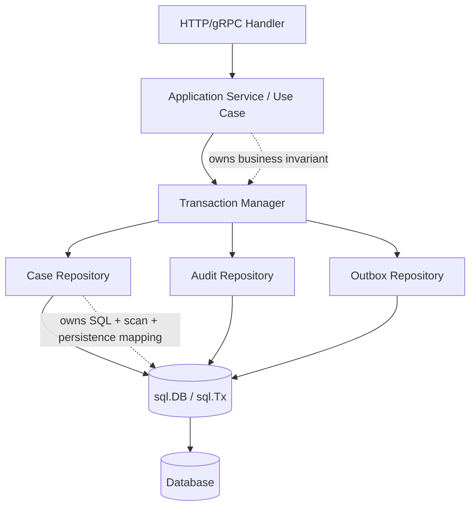

# learn-go-sql-database-integration-part-021.md

# Repository Boundary and Data Access Architecture

> Seri: `learn-go-sql-database-integration`  
> Part: `021`  
> Topik: `Repository Boundary, Data Access Architecture, Transaction Ownership, Query Shape, Error Mapping, and Maintainable SQL Integration`  
> Target pembaca: Java software engineer yang ingin memahami Go database integration sampai level production architecture  
> Target Go: Go 1.26.x  
> Status seri: **belum selesai**

---

## 0. Posisi Part Ini Dalam Seri

Sampai part sebelumnya kita sudah membahas banyak mekanisme low-level dan production-level:

- `database/sql`;
- `*sql.DB`;
- `*sql.Tx`;
- connection pool;
- rows lifecycle;
- scan/type mapping;
- null;
- parameter binding;
- prepared statement;
- pool sizing;
- timeout/cancellation;
- transaction;
- isolation;
- locking;
- retry/idempotency;
- error taxonomy.

Part ini menjawab pertanyaan arsitektur:

> Bagaimana menyusun data access layer di Go supaya SQL tetap eksplisit, transaction boundary tetap benar, error mapping konsisten, dan domain/service tidak bocor detail driver/database?

Banyak codebase Go gagal bukan karena tidak tahu `QueryContext`, tetapi karena boundary-nya kacau:

```text
handler langsung query DB
repository membuka transaction sendiri
service tidak tahu query mana ikut transaction
repository return driver error mentah
domain object tercampur nullable/sql.NullString
query tersebar string literal di banyak tempat
error unique violation jadi 500
repository memanggil external service
transaction disimpan di context tanpa aturan
```

Part ini membahas desain boundary yang lebih sehat.

---

## 1. Tujuan Pembelajaran

Setelah menyelesaikan part ini, kamu harus mampu:

1. menjelaskan tujuan repository dalam Go tanpa meniru Java secara buta;
2. membedakan repository, DAO, query service, unit of work, dan transaction manager;
3. menentukan siapa yang boleh membuka transaction;
4. membuat repository yang bisa berjalan dengan `*sql.DB` maupun `*sql.Tx`;
5. memakai `DBTX` interface secara tepat;
6. memisahkan service/use-case boundary dari persistence boundary;
7. menghindari transaction yang tersembunyi di repository;
8. membuat error mapping di repository boundary;
9. menjaga domain model tidak tercemar detail `database/sql`;
10. menentukan kapan repository mengembalikan domain object, data model, DTO, projection, atau row struct;
11. menyusun package layout yang scalable;
12. membuat query method yang eksplisit, testable, dan observable;
13. menghindari over-abstraction seperti generic repository yang tidak cocok dengan SQL;
14. mendesain read/write repository dan query object;
15. membuat checklist code review untuk data access architecture.

---

## 2. Fakta Dasar Dari Dokumentasi Go

Beberapa fakta API yang menjadi fondasi arsitektur:

1. Package `database/sql` menyediakan interface generik untuk SQL atau SQL-like database, dan digunakan bersama driver database.
2. `*sql.DB` adalah database handle yang bisa digunakan untuk operasi individual maupun transaction.
3. Operasi data yang mengembalikan rows menggunakan `Query`/`QueryContext`, menghasilkan `Row` atau `Rows`, lalu data disalin ke variable dengan `Scan`.
4. Operasi yang tidak mengembalikan data menggunakan `Exec`/`ExecContext`, misalnya `INSERT`, `UPDATE`, dan `DELETE`.
5. Transaksi direpresentasikan oleh `sql.Tx`; untuk mendapatkannya gunakan `DB.Begin` atau `DB.BeginTx`; operasi dalam transaksi dilakukan melalui method milik `Tx`, lalu transaksi diakhiri dengan `Commit` atau `Rollback`.
6. Dokumentasi Go menyarankan memakai transaction support dari package `sql`, bukan menjalankan SQL manual `BEGIN`/`COMMIT` lewat `Exec`.

Referensi:

- Go package documentation — `database/sql`: <https://pkg.go.dev/database/sql>
- Go documentation — Opening a database handle: <https://go.dev/doc/database/open-handle>
- Go documentation — Querying for data: <https://go.dev/doc/database/querying>
- Go documentation — Executing SQL statements: <https://go.dev/doc/database/change-data>
- Go documentation — Executing transactions: <https://go.dev/doc/database/execute-transactions>
- Go documentation — Managing connections: <https://go.dev/doc/database/manage-connections>

---

## 3. Mental Model Utama

### 3.1 Data Access Boundary Bukan Sekadar “Tempat Menaruh SQL”

Repository boundary punya beberapa tanggung jawab:

```text
1. Menyembunyikan detail query/scan dari service.
2. Menjaga SQL tetap eksplisit dan dekat dengan data shape.
3. Menerjemahkan database result ke model yang dipakai application.
4. Menerjemahkan database error ke domain/application error.
5. Mendukung transaction composition.
6. Menjaga lifecycle resource: rows close, rows err, context.
7. Menyediakan observability boundary.
8. Menghindari bocornya driver-specific detail ke domain.
```

Repository yang baik bukan repository yang “tidak ada SQL”. Justru dalam banyak Go codebase production, repository yang baik membuat SQL **jelas, terkendali, dan mudah direview**.

### 3.2 Service/Use-Case Memiliki Business Transaction Boundary

Service/use-case tahu invariant bisnis:

```text
approve case = update case + insert audit + insert outbox
```

Repository hanya tahu persistence operation:

```text
update case status
insert audit row
insert outbox row
```

Karena itu transaction boundary biasanya milik service/use-case.

Bad:

```text
CaseRepository.Approve membuka transaction sendiri
AuditRepository.Insert membuka transaction sendiri
OutboxRepository.Insert membuka transaction sendiri
```

Good:

```text
CaseService.Approve membuka transaction
  CaseRepository.Transition memakai tx
  AuditRepository.Insert memakai tx
  OutboxRepository.Insert memakai tx
Commit
```

### 3.3 Repository Harus Transaction-Aware, Bukan Transaction-Hiding

Repository harus bisa dipakai:

- di luar transaction untuk operasi sederhana;
- di dalam transaction untuk use case kompleks.

Caranya:

```go
type DBTX interface {
	ExecContext(context.Context, string, ...any) (sql.Result, error)
	QueryContext(context.Context, string, ...any) (*sql.Rows, error)
	QueryRowContext(context.Context, string, ...any) *sql.Row
}
```

`*sql.DB` dan `*sql.Tx` sama-sama memenuhi interface ini.

---

## 4. Diagram Arsitektur



Boundary:

- handler: protocol;
- service: use case, transaction, business decision;
- repository: SQL, scan, persistence error mapping;
- transaction manager: lifecycle;
- database/sql: execution/pool;
- driver/database: actual persistence.

---

## 5. Repository vs DAO vs Query Service

### 5.1 DAO

DAO biasanya lebih table-oriented:

```text
UserDAO.Insert
UserDAO.Update
UserDAO.FindByID
```

DAO cocok untuk simple CRUD but often anemic.

### 5.2 Repository

Repository biasanya aggregate/use-case oriented:

```text
CaseRepository.Transition
CaseRepository.FindForReview
AssignmentRepository.Claim
```

Repository menyembunyikan persistence details untuk aggregate/domain concern.

### 5.3 Query Service

Query service/read model biasanya projection-oriented:

```text
CaseListingQuery.Search
DashboardQuery.LoadMetrics
ReportQuery.ExportRows
```

Ia tidak harus mengembalikan domain aggregate; bisa mengembalikan DTO/projection.

### 5.4 Unit of Work

Unit of Work mengelola transaction boundary dan kumpulan repository dalam satu transaction.

Di Go, sering cukup dengan explicit `txManager.Within`.

### 5.5 Recommendation

Untuk Go SQL production:

- gunakan repository untuk write/use-case persistence;
- gunakan query service untuk read/projection/listing/report;
- gunakan explicit transaction manager;
- jangan membuat generic CRUD repository berlebihan;
- jangan menyembunyikan transaction di context tanpa aturan kuat.

---

## 6. Java/Spring Comparison

Java/Spring umum:

```java
@Transactional
public void approveCase(...) {
    caseRepository.updateStatus(...);
    auditRepository.insert(...);
}
```

Framework:

- membuka transaction;
- bind connection ke thread;
- repository otomatis ikut transaction;
- exception mapping mungkin melalui `DataAccessException`;
- connection lifecycle tersembunyi.

Go:

```go
err := txManager.Within(ctx, "case.approve", nil, func(ctx context.Context, tx *sql.Tx) error {
	if err := caseRepo.Transition(ctx, tx, ...); err != nil {
		return err
	}
	if err := auditRepo.Insert(ctx, tx, ...); err != nil {
		return err
	}
	return outboxRepo.Insert(ctx, tx, ...)
})
```

Go lebih eksplisit.

Keuntungan:

- transaction boundary terlihat;
- tidak bergantung thread-local;
- mudah direview;
- context propagation jelas;
- error wrapping manual tapi presisi.

Kerugian:

- lebih verbose;
- butuh disiplin;
- tanpa convention, codebase cepat kacau.

---

## 7. Package Layout Yang Direkomendasikan

Contoh:

```text
/internal/app/caseapp
  service.go
  command.go
  errors.go

/internal/domain/case
  model.go
  status.go
  rules.go

/internal/data/casedata
  repository.go
  queries.go
  mapper.go

/internal/data/auditdata
  repository.go

/internal/data/outboxdata
  repository.go

/internal/platform/db
  open.go
  txmanager.go
  classifier.go
  metrics.go

/internal/transport/httpapi
  handlers.go
  errors.go
```

Prinsip:

- domain tidak import `database/sql`;
- service boleh import repository interface dan transaction manager;
- data package import `database/sql`;
- platform DB package berisi infrastructure;
- transport mapping ada di edge.

---

## 8. Minimal Interface Design

Jangan mulai dengan interface untuk semua hal.

Di Go, interface biasanya didefinisikan di sisi consumer.

Example service needs:

```go
type CaseStore interface {
	Transition(ctx context.Context, q data.DBTX, caseID int64, from Status, to Status) error
	FindForUpdate(ctx context.Context, q data.DBTX, caseID int64) (CaseRecord, error)
}

type AuditStore interface {
	Insert(ctx context.Context, q data.DBTX, event AuditEvent) error
}

type OutboxStore interface {
	Insert(ctx context.Context, q data.DBTX, event OutboxEvent) error
}
```

But many codebases simply use concrete repositories.

Avoid interface explosion if not needed.

---

## 9. `DBTX` Interface

Canonical pattern:

```go
package data

import (
	"context"
	"database/sql"
)

type DBTX interface {
	ExecContext(context.Context, string, ...any) (sql.Result, error)
	QueryContext(context.Context, string, ...any) (*sql.Rows, error)
	QueryRowContext(context.Context, string, ...any) *sql.Row
}
```

`*sql.DB` implements it.

`*sql.Tx` implements it.

This lets repository be transaction-agnostic.

---

## 10. DBTX With Prepare?

Sometimes add:

```go
PrepareContext(context.Context, string) (*sql.Stmt, error)
```

But avoid unless needed.

Most repository methods can use `ExecContext`, `QueryContext`, `QueryRowContext`.

Prepared statements are a separate design topic. Adding too many methods makes interface less flexible.

---

## 11. DBTX With Named Exec?

If using helper library, maybe interface differs.

Example:

```go
type ExecerQuerier interface {
	ExecContext(context.Context, string, ...any) (sql.Result, error)
	QueryContext(context.Context, string, ...any) (*sql.Rows, error)
	QueryRowContext(context.Context, string, ...any) *sql.Row
}
```

Keep it minimal.

---

## 12. Repository Method Shape

Recommended shape:

```go
func (r CaseRepository) Transition(
	ctx context.Context,
	q data.DBTX,
	caseID int64,
	from Status,
	to Status,
) error
```

Why pass `q` per method?

Pros:

- service can pass `db` or `tx`;
- transaction boundary explicit at call site;
- no hidden state in repository;
- repository can be singleton/stateless;
- tests can pass fake/real executor.

Alternative:

```go
type CaseRepository struct {
	db *sql.DB
}
```

and separate Tx variants. That can work, but DBTX parameter is more composable.

---

## 13. Repository Holding `*sql.DB`

Pattern:

```go
type UserRepository struct {
	db *sql.DB
}

func (r UserRepository) FindByID(ctx context.Context, id int64) (User, error) {
	return r.findByID(ctx, r.db, id)
}

func (r UserRepository) FindByIDTx(ctx context.Context, tx *sql.Tx, id int64) (User, error) {
	return r.findByID(ctx, tx, id)
}
```

Pros:

- convenient for simple calls.

Cons:

- duplicates methods;
- easy to call non-tx method inside transaction by mistake;
- service boundary less uniform.

Use if team prefers explicit Tx suffix, but enforce review rules.

---

## 14. Recommended Default for This Series

Use:

```go
repository method accepts DBTX
service decides db/tx
```

Example:

```go
repo.FindByID(ctx, db, id)
repo.FindByID(ctx, tx, id)
```

This keeps transaction participation visible.

---

## 15. Transaction Manager

```go
type TxManager struct {
	DB      *sql.DB
	Timeout time.Duration
}

func (m TxManager) Within(
	ctx context.Context,
	operation string,
	opts *sql.TxOptions,
	fn func(context.Context, *sql.Tx) error,
) error {
	txCtx, cancel := context.WithTimeout(ctx, m.Timeout)
	defer cancel()

	tx, err := m.DB.BeginTx(txCtx, opts)
	if err != nil {
		return fmt.Errorf("begin tx %s: %w", operation, err)
	}
	defer tx.Rollback()

	if err := fn(txCtx, tx); err != nil {
		return err
	}

	if err := tx.Commit(); err != nil {
		return fmt.Errorf("commit tx %s: %w", operation, err)
	}

	return nil
}
```

Production version should add:

- metrics;
- tracing;
- panic safety;
- rollback logging;
- error classification;
- ambiguous commit handling;
- retry policy where appropriate.

---

## 16. Transaction Boundary Example

```go
func (s CaseService) Approve(ctx context.Context, cmd ApproveCaseCommand) error {
	return s.tx.Within(ctx, "case.approve", nil, func(ctx context.Context, tx *sql.Tx) error {
		if err := s.cases.Transition(ctx, tx, cmd.CaseID, StatusUnderReview, StatusApproved); err != nil {
			return err
		}

		if err := s.audit.Insert(ctx, tx, AuditEvent{
			OperationID: cmd.OperationID,
			CaseID:      cmd.CaseID,
			ActorID:     cmd.ActorID,
			Action:      "CASE_APPROVED",
		}); err != nil {
			return err
		}

		if err := s.outbox.Insert(ctx, tx, OutboxEvent{
			ID:            cmd.OperationID,
			AggregateType: "case",
			AggregateID:   fmt.Sprint(cmd.CaseID),
			EventType:     "case.approved",
		}); err != nil {
			return err
		}

		return nil
	})
}
```

Notice:

- repository does not open transaction;
- all writes use `tx`;
- no external service call inside transaction;
- audit/outbox atomic with state.

---

## 17. Repository Transition Method

```go
func (r CaseRepository) Transition(
	ctx context.Context,
	q data.DBTX,
	caseID int64,
	from Status,
	to Status,
) error {
	result, err := q.ExecContext(ctx, `
		UPDATE cases
		SET status = $1,
		    version = version + 1,
		    updated_at = CURRENT_TIMESTAMP
		WHERE id = $2
		  AND status = $3
	`, to, caseID, from)
	if err != nil {
		return r.mapError("transition case", err)
	}

	affected, err := result.RowsAffected()
	if err != nil {
		return fmt.Errorf("transition case rows affected: %w", err)
	}

	if affected == 0 {
		return ErrInvalidStateTransition
	}

	return nil
}
```

This method encodes concurrency correctness.

---

## 18. Repository Query Method

```go
func (r CaseRepository) FindByID(
	ctx context.Context,
	q data.DBTX,
	caseID int64,
) (CaseRecord, error) {
	var rec CaseRecord

	err := q.QueryRowContext(ctx, `
		SELECT id, status, version, created_at, updated_at
		FROM cases
		WHERE id = $1
	`, caseID).Scan(
		&rec.ID,
		&rec.Status,
		&rec.Version,
		&rec.CreatedAt,
		&rec.UpdatedAt,
	)
	if err != nil {
		if errors.Is(err, sql.ErrNoRows) {
			return CaseRecord{}, ErrCaseNotFound
		}
		return CaseRecord{}, r.mapError("find case by id", err)
	}

	return rec, nil
}
```

`QueryRowContext` error appears on `Scan`.

---

## 19. Repository List Method

```go
func (r CaseRepository) ListByStatus(
	ctx context.Context,
	q data.DBTX,
	status Status,
	limit int,
) ([]CaseListItem, error) {
	rows, err := q.QueryContext(ctx, `
		SELECT id, reference_no, status, updated_at
		FROM cases
		WHERE status = $1
		ORDER BY updated_at DESC, id DESC
		LIMIT $2
	`, status, limit)
	if err != nil {
		return nil, r.mapError("list cases by status", err)
	}
	defer rows.Close()

	items := make([]CaseListItem, 0, limit)

	for rows.Next() {
		var item CaseListItem
		if err := rows.Scan(
			&item.ID,
			&item.ReferenceNo,
			&item.Status,
			&item.UpdatedAt,
		); err != nil {
			return nil, fmt.Errorf("scan case list item: %w", err)
		}
		items = append(items, item)
	}

	if err := rows.Err(); err != nil {
		return nil, r.mapError("iterate case list", err)
	}

	return items, nil
}
```

Key rules:

- close rows;
- check rows.Err;
- preallocate bounded slice;
- do not perform slow external work while rows open.

---

## 20. Domain Model vs Persistence Model

Do not force one struct to serve all purposes.

### 20.1 Domain Model

```go
type Case struct {
	ID      CaseID
	Status Status
	Version Version
}
```

Domain model should represent business invariants.

### 20.2 Persistence Record

```go
type CaseRecord struct {
	ID        int64
	Status    string
	Version   int64
	CreatedAt time.Time
	UpdatedAt time.Time
}
```

Persistence record mirrors database.

### 20.3 API DTO

```go
type CaseResponse struct {
	ID     string `json:"id"`
	Status string `json:"status"`
}
```

Do not blindly use database row struct as JSON response.

---

## 21. Nullable Fields at Boundary

`sql.NullString` is persistence concern.

Repository can map:

```go
var closedReason sql.NullString
err := row.Scan(&closedReason)

if closedReason.Valid {
	rec.ClosedReason = &closedReason.String
}
```

Domain may use:

```go
type OptionalString struct { ... }
```

or pointer depending design.

Avoid leaking `sql.NullString` into domain unless project deliberately accepts persistence coupling.

---

## 22. Mapper Functions

```go
func scanCaseRecord(row scanner) (CaseRecord, error) {
	var rec CaseRecord
	var closedReason sql.NullString

	if err := row.Scan(
		&rec.ID,
		&rec.Status,
		&rec.Version,
		&closedReason,
		&rec.CreatedAt,
		&rec.UpdatedAt,
	); err != nil {
		return CaseRecord{}, err
	}

	if closedReason.Valid {
		rec.ClosedReason = &closedReason.String
	}

	return rec, nil
}

type scanner interface {
	Scan(dest ...any) error
}
```

This works for `*sql.Row` and custom row scanner patterns.

---

## 23. Avoid Fat Generic Repository

Anti-pattern:

```go
type Repository[T any] interface {
	Save(ctx context.Context, entity T) error
	FindByID(ctx context.Context, id any) (T, error)
	Delete(ctx context.Context, id any) error
}
```

This looks elegant but often fails for real SQL:

- complex joins;
- projections;
- partial updates;
- conditional updates;
- concurrency control;
- idempotency;
- audit/outbox;
- DB-specific queries;
- different list filters;
- aggregate boundaries.

SQL is not just CRUD over objects.

Prefer explicit methods.

---

## 24. Repository Methods Should Express Intent

Bad:

```go
repo.Update(ctx, case)
```

Better:

```go
repo.Transition(ctx, q, caseID, from, to)
repo.AssignOfficer(ctx, q, caseID, officerID)
repo.UpdateTitleIfVersion(ctx, q, caseID, title, expectedVersion)
repo.MarkClosed(ctx, q, caseID, reason)
```

Intent-specific methods encode invariants.

---

## 25. SQL Placement

Options:

### Inline SQL

```go
const findCaseByIDSQL = `
	SELECT ...
`
```

Pros:

- close to code;
- easy to review;
- no external file tooling.

### Embedded SQL Files

Use `go:embed`.

Pros:

- SQL syntax highlighting;
- large queries manageable;
- DBA review easier.

Cons:

- mapping file to method;
- parameter style still code-specific;
- overkill for small queries.

### Generated SQL

Tools can generate Go code from SQL.

Pros:

- type safety;
- less scan boilerplate.

Cons:

- tool dependency;
- generated code complexity;
- SQL still needs design review.

For this series, keep SQL explicit and reviewable.

---

## 26. Query Constants

```go
const transitionCaseSQL = `
	UPDATE cases
	SET status = $1,
	    version = version + 1,
	    updated_at = CURRENT_TIMESTAMP
	WHERE id = $2
	  AND status = $3
`
```

Benefits:

- name query;
- reuse in tests if needed;
- easier logging fingerprint;
- avoid giant inline method.

But avoid global mega file with hundreds of unrelated SQL constants.

Keep query near repository.

---

## 27. Query Name for Observability

Every repository operation should have stable name:

```text
case.transition
case.find_by_id
case.list_by_status
audit.insert
outbox.claim_pending
```

Use it in:

- logs;
- metrics;
- traces;
- error wrapping;
- runbooks.

Example:

```go
return r.exec(ctx, q, "case.transition", transitionCaseSQL, to, caseID, from)
```

---

## 28. Instrumentation Wrapper

```go
type Metrics interface {
	ObserveDB(ctx context.Context, operation string, duration time.Duration, err error)
}

type InstrumentedExecutor struct {
	Q       data.DBTX
	Metrics Metrics
}

func (e InstrumentedExecutor) ExecContext(
	ctx context.Context,
	query string,
	args ...any,
) (sql.Result, error) {
	start := time.Now()
	result, err := e.Q.ExecContext(ctx, query, args...)
	if e.Metrics != nil {
		e.Metrics.ObserveDB(ctx, "unknown", time.Since(start), err)
	}
	return result, err
}
```

But operation name is missing.

Better create repository helper:

```go
func (r BaseRepository) exec(
	ctx context.Context,
	q data.DBTX,
	operation string,
	query string,
	args ...any,
) (sql.Result, error) {
	start := time.Now()
	result, err := q.ExecContext(ctx, query, args...)
	r.metrics.ObserveDB(ctx, operation, time.Since(start), err)
	return result, err
}
```

---

## 29. Base Repository: Use Carefully

```go
type BaseRepository struct {
	classifier dberr.Classifier
	metrics    DBMetrics
	logger     *slog.Logger
}

func (r BaseRepository) mapError(operation string, err error) error {
	if err == nil {
		return nil
	}
	class := r.classifier.Classify(err)
	if r.metrics != nil {
		r.metrics.CountError(operation, class.Class)
	}
	return fmt.Errorf("%s: %w", operation, err)
}
```

Avoid inheritance mindset. In Go, embed or compose only if it genuinely reduces repetition.

---

## 30. Error Mapping in Repository

```go
func (r CaseRepository) mapError(operation string, err error) error {
	if err == nil {
		return nil
	}

	class := r.classifier.Classify(err)

	if class.Class == dberr.UniqueViolation {
		switch class.Constraint {
		case "uq_case_reference_no":
			return fmt.Errorf("%w: %w", ErrDuplicateCaseReference, err)
		}
	}

	if class.Class == dberr.ForeignKeyViolation {
		return fmt.Errorf("%w: %w", ErrInvalidReference, err)
	}

	return fmt.Errorf("%s: %w", operation, err)
}
```

Repository maps database semantics to persistence/domain errors.

Transport mapping happens elsewhere.

---

## 31. Service Should Not Inspect SQLSTATE

Bad:

```go
if pgErr.Code == "23505" {
	return http.StatusConflict
}
```

Why bad?

- service depends on PostgreSQL;
- hard to switch driver;
- logic scattered;
- transport status leaks into service.

Good:

```go
if errors.Is(err, ErrEmailAlreadyUsed) {
	return ErrRegistrationConflict
}
```

Infrastructure maps SQLSTATE to domain/application error.

---

## 32. Transaction-Aware Read/Write Example

Service may call read before transaction, then write inside transaction.

Example:

```go
caseInfo, err := s.cases.FindByID(ctx, s.db, cmd.CaseID)
if err != nil {
	return err
}

externalData, err := s.external.Load(ctx, caseInfo.ExternalRef)
if err != nil {
	return err
}

return s.tx.Within(ctx, "case.update_external", nil, func(ctx context.Context, tx *sql.Tx) error {
	return s.cases.UpdateExternalData(ctx, tx, cmd.CaseID, caseInfo.Version, externalData)
})
```

Do slow external call outside transaction.

Use version/conditional update to detect stale data.

---

## 33. Avoid Repository Calling External Service

Bad:

```go
func (r CaseRepository) Approve(ctx context.Context, id int64) error {
	// update DB
	r.email.Send(...)
}
```

Repository should not call:

- HTTP services;
- email provider;
- message broker directly;
- file storage;
- business workflow orchestrators.

Use outbox/service layer.

Repository persists data.

---

## 34. Read Model / Query Service

Complex listing/report often does not fit domain repository.

Example:

```go
type CaseListingQuery struct {
	db *sql.DB
}

func (q CaseListingQuery) Search(ctx context.Context, filter CaseFilter, page Page) (PageResult[CaseListItem], error) {
	// build controlled SQL
}
```

This is acceptable.

Read model can return DTO/projection:

```go
type CaseListItem struct {
	ID          int64
	ReferenceNo string
	Status      string
	OfficerName string
	UpdatedAt   time.Time
}
```

Do not force full domain aggregate for listing.

---

## 35. Command Repository vs Query Repository

CQRS-lite:

```text
CaseCommandRepository
  Transition
  AssignOfficer
  UpdateVersioned

CaseQueryRepository
  FindByID
  Search
  LoadDashboard
```

This is useful when reads and writes differ significantly.

Do not overdo it for small modules.

---

## 36. Projection-Specific Structs

For list:

```go
type CaseListItem struct {
	ID          int64
	ReferenceNo string
	Status      Status
	UpdatedAt   time.Time
}
```

For detail:

```go
type CaseDetail struct {
	ID          int64
	ReferenceNo string
	Status      Status
	Applicant   ApplicantSummary
	Documents   []DocumentSummary
}
```

For write:

```go
type CaseRecord struct {
	ID      int64
	Status  Status
	Version int64
}
```

Different queries have different shapes.

Avoid mega struct with 80 nullable fields for every query.

---

## 37. Query Composition Boundary

Dynamic filters are common.

Repository/query service must ensure:

- values are parameterized;
- identifiers are allowlisted;
- sort fields are allowlisted;
- pagination bounded;
- no SQL injection;
- query plan reasonable;
- count query controlled.

Example:

```go
type CaseSearchFilter struct {
	Status *Status
	OfficerID *int64
	Keyword string
}

type Sort struct {
	Field string
	Direction string
}
```

Do not pass raw `ORDER BY` from API to SQL.

Part 022 and 023 will go deeper.

---

## 38. Repository Method Granularity

Too fine:

```go
GetStatus
SetStatus
InsertAudit
SetUpdatedAt
```

May create chatty service and weak invariants.

Too coarse:

```go
ApproveCaseAndSendEmailAndUpdateEverything
```

Mixes responsibilities.

Good:

```go
TransitionCaseStatus
InsertAudit
InsertOutbox
FindCaseForDecision
```

Service composes these under transaction.

---

## 39. Aggregate-Oriented Repository

If using DDD-like aggregates, repository can load/save aggregate.

But SQL systems often benefit from explicit commands.

Example aggregate save:

```go
repo.Save(ctx, tx, aggregate)
```

Risk:

- hidden diff logic;
- lost update;
- large update;
- weak transaction semantics;
- unclear SQL.

For high-integrity workflows, explicit SQL methods are often more transparent.

---

## 40. Avoid ORM Mindset When Using `database/sql`

`database/sql` is not ORM.

Do not try to recreate:

- lazy loading;
- entity manager;
- dirty checking;
- transparent transaction context;
- generic cascade persistence;
- magic relation loading.

Instead embrace:

- explicit SQL;
- explicit transaction;
- explicit mapping;
- explicit error classification;
- explicit boundaries.

---

## 41. Data Access Architecture Layers

Recommended responsibilities:

| Layer | Responsibility |
|---|---|
| handler | protocol parsing, auth principal extraction, response mapping |
| service/use-case | business workflow, transaction boundary, idempotency, authorization decision |
| repository/query | SQL, scan, persistence error mapping |
| tx manager | transaction lifecycle, timeout, metrics |
| classifier | driver/database error classification |
| domain | rules, types, invariant functions |
| outbox/inbox | durable integration pattern |

Keep these boundaries simple.

---

## 42. Authorization Boundary

Where should authorization happen?

Often service/use-case:

```go
if !policy.CanApprove(actor, caseInfo) {
	return ErrForbidden
}
```

But DB query should also enforce tenant/access predicates where needed:

```sql
WHERE id = $1
  AND tenant_id = $2
```

For strict systems, authorization and state update can be combined:

```sql
UPDATE cases
SET status='APPROVED'
WHERE id=$1
  AND tenant_id=$2
  AND status='UNDER_REVIEW'
  AND assigned_officer_id=$3
```

Repository can expose method that includes required security predicates.

---

## 43. Tenant Boundary

In multi-tenant apps:

- every query must include tenant scope;
- constraints should include tenant ID;
- idempotency key scoped by tenant;
- repository should require tenant parameter or tenant-aware type;
- avoid optional tenant filter.

Bad:

```go
FindCaseByID(ctx, id)
```

Better:

```go
FindCaseByID(ctx, tenantID, id)
```

Or use strongly typed aggregate ID that includes tenant.

---

## 44. Strong Types for IDs

Avoid mixing IDs:

```go
type CaseID int64
type UserID int64
type TenantID string
```

Repository:

```go
func (r CaseRepository) FindByID(ctx context.Context, q DBTX, tenantID TenantID, caseID CaseID) (CaseRecord, error)
```

This reduces accidental parameter swaps.

SQL args still need underlying values.

---

## 45. Domain Types vs DB Values

Example:

```go
type Status string

const (
	StatusDraft       Status = "DRAFT"
	StatusUnderReview Status = "UNDER_REVIEW"
	StatusApproved   Status = "APPROVED"
)
```

Scan into string then validate:

```go
var raw string
if err := row.Scan(&raw); err != nil {
	return rec, err
}

status, err := ParseStatus(raw)
if err != nil {
	return rec, fmt.Errorf("invalid status in database: %w", err)
}
```

Do not trust DB blindly if enum not constrained.

Better also enforce DB check constraint.

---

## 46. Scanner/Valuer for Domain Types

You may implement `sql.Scanner` and `driver.Valuer` for domain types.

Pros:

- centralized conversion;
- less repetitive scan code.

Cons:

- domain imports database packages;
- persistence concerns leak into domain;
- harder if domain should be pure.

Compromise:

- implement in data package wrapper;
- keep domain pure if desired.

---

## 47. Repository Constructor

```go
type CaseRepository struct {
	classifier dberr.Classifier
	metrics    DBMetrics
}

func NewCaseRepository(classifier dberr.Classifier, metrics DBMetrics) CaseRepository {
	return CaseRepository{
		classifier: classifier,
		metrics:    metrics,
	}
}
```

Repository does not necessarily need `*sql.DB` if every method accepts DBTX.

If repository holds DB for convenience, still allow transaction variants.

---

## 48. Service Constructor

```go
type CaseService struct {
	db      *sql.DB
	tx      TxManager
	cases   CaseRepository
	audit   AuditRepository
	outbox  OutboxRepository
}

func NewCaseService(
	db *sql.DB,
	tx TxManager,
	cases CaseRepository,
	audit AuditRepository,
	outbox OutboxRepository,
) CaseService {
	return CaseService{
		db: db,
		tx: tx,
		cases: cases,
		audit: audit,
		outbox: outbox,
	}
}
```

Service has `db` for non-transaction reads or passes to tx manager.

---

## 49. Dependency Direction

Good:

```text
transport -> service -> repository interface/concrete -> database/sql
domain independent
```

Avoid:

```text
domain -> database/sql
domain -> pgx/mysql driver
handler -> sql.Tx
repository -> HTTP client
```

Keep business logic testable without actual DB where possible, but test SQL with real DB separately.

---

## 50. Testing Strategy Overview

Different tests for different layers:

| Layer | Test Type |
|---|---|
| domain rules | unit tests |
| service orchestration | unit with fakes + integration for tx |
| repository SQL | integration with real DB |
| transaction boundary | integration |
| error mapping | unit + integration |
| concurrency invariant | integration |
| query performance | benchmark/load test |
| migration compatibility | migration test |

Do not mock what only DB can prove:

- isolation;
- locks;
- constraints;
- scan types;
- SQL syntax;
- query plan.

---

## 51. Repository Integration Test

```go
func TestCaseRepositoryTransition(t *testing.T) {
	ctx, cancel := context.WithTimeout(context.Background(), 5*time.Second)
	defer cancel()

	db := testDB(t)

	repo := NewCaseRepository(classifier, nil)

	caseID := insertCase(t, db, "UNDER_REVIEW")

	err := repo.Transition(ctx, db, caseID, StatusUnderReview, StatusApproved)
	if err != nil {
		t.Fatal(err)
	}

	got := loadCaseStatus(t, db, caseID)
	if got != StatusApproved {
		t.Fatalf("status=%s", got)
	}
}
```

Use real DB.

---

## 52. Transaction Integration Test

```go
func TestApproveRollbackWhenOutboxFails(t *testing.T) {
	ctx := context.Background()

	// arrange outbox failure, e.g. duplicate event ID

	err := service.Approve(ctx, cmd)
	if err == nil {
		t.Fatal("expected error")
	}

	// assert case status unchanged
	// assert no audit row
	// assert no partial outbox
}
```

This proves transaction composition.

---

## 53. Error Mapping Test

```go
func TestDuplicateIdempotencyMapsToDomain(t *testing.T) {
	ctx := context.Background()

	err := idemRepo.InsertStarted(ctx, db, "scope", "key", "op", "hash")
	if err != nil {
		t.Fatal(err)
	}

	err = idemRepo.InsertStarted(ctx, db, "scope", "key", "op", "hash")
	if !errors.Is(err, ErrDuplicateIdempotencyKey) {
		t.Fatalf("expected duplicate idempotency key, got %v", err)
	}
}
```

---

## 54. Fakes for Service Tests

For service unit tests, use fake repository.

```go
type FakeCaseRepo struct {
	TransitionFunc func(context.Context, data.DBTX, int64, Status, Status) error
}

func (f FakeCaseRepo) Transition(ctx context.Context, q data.DBTX, id int64, from Status, to Status) error {
	return f.TransitionFunc(ctx, q, id, from, to)
}
```

But note:

- fake cannot prove SQL;
- fake cannot prove locks;
- fake cannot prove transaction rollback;
- use integration tests too.

---

## 55. Mocking `database/sql` Directly

Mocking `database/sql` can be brittle.

It can help verify:

- SQL string;
- args;
- scan behavior in simple cases.

But it cannot prove:

- constraint behavior;
- transaction isolation;
- lock behavior;
- query plan;
- DB-specific types.

Prefer real DB integration tests for repository.

---

## 56. Repository and Migrations

Repository SQL and migration schema must evolve together.

Practices:

- migration test runs before repository tests;
- schema version compatibility checked at startup if needed;
- expand/contract migrations;
- repository supports old+new schema during rollout when required;
- avoid deploying app requiring column before migration available.

Error taxonomy should catch schema drift, but prevention is better.

---

## 57. Versioned Queries During Migration

Expand/contract example:

1. add nullable new column;
2. deploy app writing both old and new;
3. backfill;
4. deploy app reading new;
5. enforce not null/constraint;
6. remove old.

Repository may temporarily include dual write/read.

Document with comments and removal task.

---

## 58. Repository and Feature Flags

If query depends on feature flag:

- keep both paths tested;
- avoid dynamic SQL chaos;
- ensure migration supports both;
- observe error by path;
- remove old path after rollout.

Feature flags in persistence layer require discipline.

---

## 59. Repository and Read Replicas

If using read replicas:

```go
type DBRouter struct {
	Primary *sql.DB
	Replica *sql.DB
}
```

Repository/query method can accept DBTX, but service chooses primary/replica.

Rules:

- writes go primary;
- read-your-write goes primary;
- stale-tolerant listing may use replica;
- transaction uses one DB;
- do not mix primary tx with replica read expecting consistency.

Architecture:

```go
caseDetail, err := query.Find(ctx, router.Primary, id) // if just wrote
```

or:

```go
items, err := query.Search(ctx, router.Replica, filter)
```

---

## 60. Repository and Sharding

If sharded:

- service/router determines shard by key;
- repository receives DBTX for chosen shard;
- transaction cannot cross shards;
- cross-shard workflow uses saga/reconciliation;
- ID must contain shard/tenant info if needed.

Do not hide shard routing randomly inside repository unless repository is specifically shard-aware.

---

## 61. Repository and Multiple Databases

If service uses multiple databases:

```text
user DB
case DB
audit DB
```

One `sql.Tx` cannot span them.

Repository boundary must not pretend atomicity across DBs.

Use:

- local transaction per DB;
- outbox/saga;
- idempotency;
- reconciliation.

---

## 62. Repository and Caching

Where to put cache?

Options:

- service-level cache for use-case result;
- query-service cache for read projections;
- repository cache for simple reference data.

Rules:

- never use cache as source of truth for invariant checks;
- write path must enforce DB constraints;
- invalidate/update after commit;
- consider outbox event for cache invalidation;
- keep cache errors separate from DB errors.

---

## 63. Repository and Authorization Filtering

For list/search, authorization often affects query.

Example:

```sql
SELECT ...
FROM cases c
JOIN case_permissions p ON p.case_id = c.id
WHERE p.user_id = $1
```

Repository/query service may encode authorization join.

Service should still decide policy.

Avoid fetching broad data then filtering sensitive records in app if DB can filter.

---

## 64. Repository and Pagination

Listing repository must enforce:

- max limit;
- deterministic order;
- allowlisted sort;
- keyset pagination for large tables;
- total count strategy;
- index-aware filters.

This will be detailed in part 023.

But boundary matters: pagination is data access concern, not handler string concatenation.

---

## 65. Repository and Dynamic SQL

Dynamic SQL belongs in controlled builder/helper.

Bad:

```go
query := "SELECT * FROM cases WHERE " + userInput
```

Good:

```go
builder.Where("status = ?", status)
```

or manual allowlisted fragments:

```go
if filter.Status != nil {
	clauses = append(clauses, "status = $1")
	args = append(args, *filter.Status)
}
```

Part 022 will go deeper.

---

## 66. Repository and Bulk Operations

Bulk operations often need separate repository methods:

```go
InsertBatch
UpdateStatuses
ClaimBatch
ArchiveBefore
```

Do not loop one row at a time blindly if throughput matters.

But also do not create giant unbounded transaction.

Part 024 will cover high-throughput write paths.

---

## 67. Repository and Observability

Every repository method should expose:

- operation name;
- duration;
- error class;
- rows affected/count where useful;
- result size where useful;
- retry attempt if applicable;
- query class: read/write/list/report.

Example metric:

```text
db_operation_duration_seconds{
  operation="case.transition",
  class="write",
  result="success"
}
```

Avoid raw SQL as metric label.

---

## 68. Repository and Logging

Log at service boundary for business operation.

Repository can log only:

- unexpected errors;
- slow queries;
- classification;
- debug with safe metadata.

Avoid logging every successful query unless debug sampling.

Structured log:

```text
operation=case.transition
duration_ms=23
db_error_class=none
rows_affected=1
```

---

## 69. Repository and Tracing

Each repository method can create span:

```text
db.case.transition
db.audit.insert
db.outbox.insert
```

Attributes:

- operation name;
- DB system;
- statement type;
- rows affected;
- error class.

Avoid sensitive args.

---

## 70. Repository and Slow Query Budget

Repository should know operation class:

```text
point_read
list
write
report
batch
health
```

Each class has timeout budget.

Example:

```go
ctx, cancel := timebudget.WithMaxTimeout(ctx, r.timeouts.PointRead)
defer cancel()
```

But avoid repository overriding caller deadline incorrectly.

Use child timeout capped by parent.

---

## 71. Context Policy

All repository methods:

```go
func (r Repo) Method(ctx context.Context, q DBTX, ...) (...)
```

Rules:

- context first parameter;
- do not store context in repository struct;
- do not use `context.Background()` in repository;
- derive shorter child context only if method owns operation budget;
- always cancel derived context;
- respect caller cancellation.

---

## 72. Repository Should Not Panic on DB Error

Do not:

```go
if err != nil {
	panic(err)
}
```

Except in test helper/setup.

Production repository returns error.

Panic only for truly impossible programmer bug? Even then prefer error in data access.

---

## 73. Repository Should Not Exit Process

Do not call:

```go
log.Fatal
os.Exit
```

inside repository.

Return error to caller.

Startup DB open/ping can fail and main decides fatal.

---

## 74. Repository and SQL Injection Boundary

Repository/query builder owns SQL injection boundary:

- values parameterized;
- identifiers allowlisted;
- sort/pagination validated;
- IN clauses expanded safely;
- LIKE escaped as needed.

Handler should not pass raw SQL fragments.

---

## 75. Repository and Prepared Statements

Prepared statements can be managed:

- per repository at startup;
- per transaction;
- via driver/DB statement cache;
- not at all for one-off queries.

But repository architecture should not require manual prepare for every query prematurely.

Part 011 covered prepared statement mechanics.

---

## 76. Repository and Generated Code

Tools like SQL code generators can produce repository-like code.

Architecture rules still apply:

- service owns transaction;
- generated methods should accept DBTX/querier;
- errors still need mapping;
- domain mapping still needed;
- transaction boundary still explicit;
- generated query does not solve business invariant by itself.

---

## 77. Repository and ORM

If using ORM instead of raw `database/sql`, many boundary rules still apply:

- service owns transaction;
- error taxonomy required;
- idempotency required;
- outbox required;
- explicit preloading/query shape;
- avoid lazy loading surprises;
- avoid hidden transaction side effects;
- observe queries;
- test with real DB.

This series focuses on `database/sql`, but architecture principles generalize.

---

## 78. Anti-Pattern: Active Record

Active Record style:

```go
caseEntity.Approve()
caseEntity.Save()
```

Can be convenient but often hides:

- transaction boundary;
- query count;
- concurrency control;
- error mapping;
- persistence side effects.

For high-integrity systems, explicit service + repository is usually clearer.

---

## 79. Anti-Pattern: Repository Opens Transaction Internally

Bad:

```go
func (r CaseRepository) Approve(ctx context.Context, caseID int64) error {
	tx, _ := r.db.BeginTx(ctx, nil)
	defer tx.Rollback()

	// update case
	// insert audit?
	return tx.Commit()
}
```

Why bad:

- cannot compose with other repositories;
- nested transaction confusion;
- audit/outbox may be outside;
- service cannot define invariant;
- hard to retry whole use case;
- hidden connection pinning.

Exception:

- repository method represents a complete standalone persistence operation and is clearly named, but service-level transaction is still often better.

---

## 80. Anti-Pattern: Passing `*sql.Tx` Everywhere From Handler

Bad:

```go
func Handler(w http.ResponseWriter, r *http.Request) {
	tx, _ := db.BeginTx(r.Context(), nil)
	service.Do(r.Context(), tx, ...)
}
```

Handler should not know transaction details.

Transaction belongs in application service/use-case or infrastructure middleware explicitly designed for it.

---

## 81. Anti-Pattern: Transaction in Context Without Discipline

```go
ctx = context.WithValue(ctx, txKey, tx)
```

Risks:

- hidden dependency;
- hard code review;
- goroutine leakage;
- nested transaction confusion;
- tx used after closed;
- context as DI container.

Use only if team builds a very deliberate transaction framework with strong conventions.

Default: pass DBTX explicitly.

---

## 82. Anti-Pattern: One Mega Repository

```go
type Repository struct {
	// 300 methods for every table
}
```

Problems:

- no module ownership;
- hard to test;
- merge conflicts;
- unclear boundaries;
- bad cohesion.

Prefer module/aggregate-specific repositories:

```text
CaseRepository
AuditRepository
OutboxRepository
UserRepository
ReportQuery
```

---

## 83. Anti-Pattern: Query Logic in Handler

Bad:

```go
func Handler(w http.ResponseWriter, r *http.Request) {
	rows, _ := db.QueryContext(r.Context(), "SELECT ...")
}
```

Problems:

- transport and persistence coupled;
- error mapping inconsistent;
- no reuse;
- no transaction boundary;
- harder tests;
- SQL injection risk.

Handler should call service/query service.

---

## 84. Anti-Pattern: Domain Imports `database/sql`

Bad:

```go
package domain

import "database/sql"

type User struct {
	Nickname sql.NullString
}
```

This couples domain to persistence.

Acceptable in small CRUD apps? Maybe.

For serious systems, map at boundary.

---

## 85. Anti-Pattern: Swallowing Error Details

Bad:

```go
if err != nil {
	return ErrDatabase
}
```

Loses:

- cause;
- retryability;
- SQLSTATE;
- context canceled;
- not found;
- constraint;
- observability.

Better:

```go
return fmt.Errorf("%w: insert audit: %w", ErrAuditInsertFailed, err)
```

But avoid over-wrapping with too many noisy layers.

---

## 86. Anti-Pattern: Over-Clean Architecture

Too many layers can be as bad as too few.

Bad signs:

- 6 files to trace one query;
- generic interfaces everywhere;
- no one knows transaction owner;
- SQL hidden behind vague methods;
- domain purity prevents practical error handling;
- simple query needs excessive boilerplate.

Goal:

```text
clear boundary, not ceremony.
```

---

## 87. Practical Pattern: Small Explicit Stack

For many Go services:

```text
handler -> service -> repository -> database/sql
```

With:

- tx manager;
- error classifier;
- outbox/inbox;
- integration tests.

This is enough.

Do not add complex architecture until problem demands it.

---

## 88. Example Complete Mini-Architecture

### 88.1 Data Interface

```go
package data

import (
	"context"
	"database/sql"
)

type DBTX interface {
	ExecContext(context.Context, string, ...any) (sql.Result, error)
	QueryContext(context.Context, string, ...any) (*sql.Rows, error)
	QueryRowContext(context.Context, string, ...any) *sql.Row
}
```

### 88.2 Case Repository

```go
type CaseRepository struct {
	classifier dberr.Classifier
}

func (r CaseRepository) Transition(ctx context.Context, q data.DBTX, caseID int64, from, to Status) error {
	result, err := q.ExecContext(ctx, `
		UPDATE cases
		SET status = $1,
		    updated_at = CURRENT_TIMESTAMP,
		    version = version + 1
		WHERE id = $2
		  AND status = $3
	`, to, caseID, from)
	if err != nil {
		return r.mapError("case.transition", err)
	}

	affected, err := result.RowsAffected()
	if err != nil {
		return fmt.Errorf("case.transition rows affected: %w", err)
	}
	if affected == 0 {
		return ErrInvalidStateTransition
	}
	return nil
}
```

### 88.3 Service

```go
type CaseService struct {
	tx     TxManager
	cases  CaseRepository
	audit  AuditRepository
	outbox OutboxRepository
}

func (s CaseService) Approve(ctx context.Context, cmd ApproveCommand) error {
	return s.tx.Within(ctx, "case.approve", nil, func(ctx context.Context, tx *sql.Tx) error {
		if err := s.cases.Transition(ctx, tx, cmd.CaseID, StatusUnderReview, StatusApproved); err != nil {
			return err
		}
		if err := s.audit.Insert(ctx, tx, cmd.AuditEvent()); err != nil {
			return err
		}
		return s.outbox.Insert(ctx, tx, cmd.OutboxEvent())
	})
}
```

### 88.4 Handler

```go
func (h Handler) ApproveCase(w http.ResponseWriter, r *http.Request) {
	ctx := r.Context()

	cmd, err := h.parseApproveCommand(r)
	if err != nil {
		h.writeError(w, err)
		return
	}

	if err := h.service.Approve(ctx, cmd); err != nil {
		h.writeError(w, err)
		return
	}

	w.WriteHeader(http.StatusNoContent)
}
```

Transport never sees SQL.

---

## 89. Review Checklist: Repository Method

For each repository method:

- [ ] Accepts `context.Context`.
- [ ] Accepts `DBTX` or has clear DB/Tx variant.
- [ ] Uses parameterized SQL.
- [ ] Does not concatenate user values.
- [ ] Closes rows.
- [ ] Checks `rows.Err()`.
- [ ] Checks `RowsAffected` when correctness depends on it.
- [ ] Maps `sql.ErrNoRows` per use case.
- [ ] Maps known constraint errors.
- [ ] Wraps error with `%w`.
- [ ] Does not call external services.
- [ ] Does not open hidden transaction unless method owns complete operation by design.
- [ ] Has stable operation name for observability.
- [ ] Has integration test.

---

## 90. Review Checklist: Service Transaction

For each service/use-case transaction:

- [ ] Transaction boundary visible.
- [ ] All related repository calls use same `tx`.
- [ ] No `db` call accidentally inside tx flow.
- [ ] No remote call inside transaction.
- [ ] Audit/outbox included atomically where needed.
- [ ] Idempotency handled for unsafe command.
- [ ] Timeout budget defined.
- [ ] Retry policy defined if needed.
- [ ] Commit error considered.
- [ ] Domain errors mapped correctly.
- [ ] Tests prove rollback path.

---

## 91. Review Checklist: Package Architecture

- [ ] Domain does not import driver package.
- [ ] Transport does not inspect SQLSTATE.
- [ ] Repository does not return public HTTP errors.
- [ ] Service owns business transaction.
- [ ] Error classifier centralized.
- [ ] Query services separated for complex reads.
- [ ] Outbox/inbox repositories separate.
- [ ] No mega repository.
- [ ] No generic CRUD abstraction hiding SQL.
- [ ] Integration tests use real DB.

---

## 92. Runbook: Partial Write Bug

Symptom:

```text
case status changed but no audit/outbox
```

Likely causes:

- audit insert outside transaction;
- repository opened its own transaction;
- service used `db` instead of `tx`;
- outbox failure ignored;
- commit error ignored;
- manual script bypassed app.

Investigation:

1. inspect service transaction boundary;
2. inspect repository signatures;
3. search for `db.ExecContext` in use case;
4. check audit/outbox operation ID;
5. inspect commit errors;
6. check deployment diff.

Fix:

- pass `DBTX`;
- enforce service transaction;
- add integration rollback test;
- add audit mismatch reconciliation.

---

## 93. Runbook: Error Mapping Regression

Symptom:

```text
duplicate email returns 500
```

Likely causes:

- constraint renamed;
- classifier not updated;
- driver changed;
- error wrapping lost cause;
- repository bypassed mapper;
- migration changed constraint.

Fix:

- update constraint mapping;
- add integration test;
- preserve error wrapping;
- add unknown constraint metric.

---

## 94. Runbook: Transaction Not Applied

Symptom:

```text
service expected rollback, but one table committed
```

Likely causes:

- one repository used `*sql.DB` instead of `*sql.Tx`;
- repository opened internal transaction;
- external system side effect happened outside outbox;
- test fake hid issue.

Fix:

- standardize DBTX signature;
- code review grep;
- integration transaction test;
- outbox pattern.

---

## 95. Runbook: Slow Repository Method

Checks:

1. operation name;
2. query plan;
3. missing index;
4. rows returned;
5. scan cost;
6. rows not closed;
7. dynamic filter;
8. lock wait;
9. pool wait;
10. report query in OLTP repo.

Fix:

- add index;
- change pagination;
- separate report query;
- reduce projection;
- add timeout;
- optimize scan;
- avoid N+1.

---

## 96. N+1 Query Problem

Example:

```go
cases := repo.ListCases(ctx, db)
for _, c := range cases {
	docs := repo.ListDocuments(ctx, db, c.ID)
}
```

Problems:

- many round trips;
- pool pressure;
- inconsistent reads;
- latency.

Better:

- join/projection;
- batch load by IDs;
- separate query service;
- document count/materialized summary.

Repository boundary should make N+1 visible.

---

## 97. Batch Load Pattern

```go
func (r DocumentRepository) CountByCaseIDs(
	ctx context.Context,
	q data.DBTX,
	caseIDs []int64,
) (map[int64]int, error) {
	// Build safe IN clause or use DB-specific array binding.
	return nil, nil
}
```

Part 022/024 will cover safe dynamic IN/bulk details.

---

## 98. Repository and Consistency of Read Models

If read model needs coherent multi-query snapshot:

- use read-only transaction;
- or single query;
- or materialized view;
- or accept eventual consistency.

Query service should document consistency.

Example:

```go
func (q DashboardQuery) Load(ctx context.Context, db *sql.DB, tenant TenantID) (Dashboard, error) {
	// acceptable eventually consistent? documented here
}
```

---

## 99. Repository and Documentation

For critical repository methods, document invariant.

```go
// Transition changes case status from expected `from` to `to`.
// It returns ErrInvalidStateTransition if the case is not currently in `from`.
// The conditional UPDATE is the concurrency control mechanism.
// Caller must include audit/outbox in the same transaction if this is a business command.
func (r CaseRepository) Transition(...)
```

This helps code review and onboarding.

---

## 100. Repository and SQL Comments

SQL comments can help DB observability if safe.

Example:

```sql
/* app=aceas operation=case.transition */
UPDATE cases ...
```

Caution:

- avoid user input in comments;
- some DB/proxy logging includes comments;
- comments may affect plan cache depending DB;
- use stable operation names.

Application-level tracing may be enough.

---

## 101. Repository and Code Generation Alternative

If using SQL generator, generated code may look like:

```go
queries.UpdateCaseStatus(ctx, db, params)
```

Still design:

- generated querier interface must accept tx;
- service owns transaction;
- errors mapped;
- domain types mapped;
- query names observed;
- tests still needed.

Generated code reduces boilerplate but not architecture thinking.

---

## 102. Repository and Performance

Repository method design affects performance:

- selecting unused columns wastes IO/network/scan;
- returning huge slices consumes memory;
- N+1 round trips hurt latency;
- unbounded list can DOS DB;
- transaction too broad hurts pool;
- query service for reporting should not share OLTP assumptions.

Performance is part of boundary design.

---

## 103. Repository and Memory

Large result sets:

- stream carefully;
- or paginate;
- or process batches;
- or write to file/object storage;
- do not load millions into slice;
- close rows promptly;
- separate report/export from request path.

Repository should expose batch APIs when needed.

---

## 104. Repository Streaming Pattern

```go
func (r ReportRepository) StreamRows(
	ctx context.Context,
	q data.DBTX,
	filter ReportFilter,
	handle func(ReportRow) error,
) error {
	rows, err := q.QueryContext(ctx, reportSQL, filter.Args()...)
	if err != nil {
		return err
	}
	defer rows.Close()

	for rows.Next() {
		var row ReportRow
		if err := rows.Scan(&row.A, &row.B); err != nil {
			return err
		}
		if err := handle(row); err != nil {
			return err
		}
	}

	return rows.Err()
}
```

Caution:

- handler runs while rows/connection open;
- handler must be fast;
- for slow processing, batch and close rows first;
- avoid external call per row while cursor open.

---

## 105. Repository and Write Model Validation

Validate at multiple layers:

- API validation: shape;
- domain validation: rule;
- repository SQL: conditional update/constraint;
- DB constraint: final guard.

Repository should not be the only validator, but must enforce persistence invariants.

Example:

```sql
CHECK (amount > 0)
```

and app validation.

---

## 106. Repository and Time

Do not let app and DB disagree accidentally.

Choices:

- use DB server time: `CURRENT_TIMESTAMP`;
- use app time: pass `now`;
- use clock abstraction in service;
- store UTC.

For audit consistency, often use app-provided `now` from service clock or DB time consistently.

Repository should not call `time.Now()` randomly unless that is convention.

---

## 107. Repository and Generated IDs

Options:

- DB-generated ID;
- app-generated ID;
- ULID/UUID;
- sequence;
- composite business key.

Repository design changes:

- `INSERT ... RETURNING id`;
- `LastInsertId` for DBs that support it;
- app passes ID;
- idempotency key maps to created ID.

Be DB-specific consciously.

---

## 108. Repository and `RETURNING`

PostgreSQL supports `RETURNING`.

Example:

```go
var id int64
err := q.QueryRowContext(ctx, `
	INSERT INTO cases (reference_no, status)
	VALUES ($1, $2)
	RETURNING id
`, ref, status).Scan(&id)
```

MySQL may use `LastInsertId`.

Design repository per target DB rather than pretending all DBs behave identically.

---

## 109. Repository and DB Portability

Full portability across PostgreSQL/MySQL/Oracle/SQL Server is expensive.

Decide:

```text
Are we optimizing for one DB deeply,
or supporting multiple DBs?
```

If one DB:

- use its strengths;
- keep DB-specific code isolated;
- document assumptions.

If multiple DBs:

- create dialect layer;
- avoid DB-specific SQL in common code;
- more tests;
- more complexity.

Do not claim portability without testing.

---

## 110. Repository and Dialect Layer

Possible structure:

```go
type Dialect interface {
	Placeholder(n int) string
	LimitOffset(limit, offset int) string
	NowExpression() string
	ReturningID(column string) string
}
```

But avoid building a half-baked ORM.

Use only if truly needed.

---

## 111. Repository and SQL Injection in Identifiers

Even if values are parameterized, identifiers cannot be bound as ordinary parameters.

Bad:

```go
query := "ORDER BY " + sortField
```

Good:

```go
sortColumn, ok := allowedSorts[sortField]
if !ok {
	return ErrInvalidSort
}
query := "ORDER BY " + sortColumn
```

Repository/query service owns this allowlist.

---

## 112. Repository and Count Queries

Listings often need count.

Options:

- exact count query;
- approximate count;
- has-next-page;
- separate async count;
- no count for large search;
- materialized count.

Repository/query service should expose semantics:

```go
type PageResult[T any] struct {
	Items []T
	NextCursor *string
	TotalCount *int64 // nil if not computed
}
```

Part 023 will go deeper.

---

## 113. Repository and Error Context

Wrap with operation, not sensitive args.

Good:

```go
return fmt.Errorf("case.transition: %w", err)
```

Maybe include safe metadata in structured log, not error string.

Avoid:

```go
return fmt.Errorf("case.transition case_id=%d actor=%s: %w", caseID, actorEmail, err)
```

PII/log cardinality concerns.

---

## 114. Repository and Reusable Scanners

For repeated mapping:

```go
func scanCaseListItem(rows interface{ Scan(...any) error }) (CaseListItem, error) {
	var item CaseListItem
	err := rows.Scan(&item.ID, &item.ReferenceNo, &item.Status, &item.UpdatedAt)
	return item, err
}
```

But do not over-abstract scan until repetition is real.

---

## 115. Repository and Column Order

`Scan` depends on column order.

Keep SELECT explicit:

Bad:

```sql
SELECT *
```

Good:

```sql
SELECT id, reference_no, status, updated_at
```

`SELECT *` breaks when schema changes and wastes data.

---

## 116. Repository and Column Aliases

For joins:

```sql
SELECT
    c.id AS case_id,
    c.status AS case_status,
    o.id AS officer_id,
    o.name AS officer_name
FROM cases c
JOIN officers o ON ...
```

Clear aliases help scan mapping and debugging.

---

## 117. Repository and `NULL` Semantics

Query design should make nullability explicit.

Options:

- scan nullable;
- COALESCE if domain wants default;
- separate optional relation;
- left join with nullable fields.

Do not hide unknown/missing values accidentally.

---

## 118. Repository and Left Join Projection

```go
type CaseWithOfficer struct {
	CaseID int64
	Status Status
	OfficerID *int64
	OfficerName *string
}
```

Scan:

```go
var officerID sql.NullInt64
var officerName sql.NullString
```

Map to pointers/options.

---

## 119. Repository and Transactions for Reads

Not every read needs transaction.

Use read transaction when:

- multiple queries need consistent snapshot;
- read-only serializable/repeatable semantics required;
- authorization + read must be consistent;
- report snapshot needed.

Avoid wrapping every read by default.

---

## 120. Repository and Eventual Consistency

If query reads projection updated by outbox/async worker, document staleness.

Example:

```go
// SearchCases reads from denormalized case_search table.
// It is eventually consistent with case writes.
func (q CaseSearchQuery) Search(...)
```

API should reflect possible delay if user expects immediate result.

---

## 121. Repository and Data Ownership

In microservices, repository should write only owned tables.

Reading foreign-owned replicated/projection tables may be okay.

Do not have one service directly update another service’s owned schema unless architecture explicitly allows shared DB.

Repository boundaries should reflect ownership.

---

## 122. Repository and Multi-Module Monolith

In modular monolith:

- each module owns repository;
- shared transaction may span modules if same DB and same process;
- be careful with module boundaries;
- outbox still useful for async module integration;
- avoid circular repository dependencies.

Service orchestrator can compose module repositories.

---

## 123. Repository and Stored Procedures

If using stored procedures:

Repository method calls procedure:

```go
_, err := q.ExecContext(ctx, `CALL approve_case($1, $2)`, caseID, actorID)
```

Pros:

- DB-centralized logic;
- fewer round trips;
- strong DB-side control.

Cons:

- harder versioning/testing;
- business logic split;
- portability lower;
- error mapping still needed;
- observability harder.

Use deliberately.

---

## 124. Repository and Views

Views can simplify read queries.

Pros:

- reusable projection;
- hide join complexity;
- DBA optimization.

Cons:

- migration coupling;
- permission complexity;
- hidden performance cost;
- writes not always possible.

Repository should still own query semantics.

---

## 125. Repository and Materialized Views

Useful for dashboards/reports.

Repository/query service should expose freshness:

```text
last_refreshed_at
```

Do not pretend materialized view is always current.

---

## 126. Repository and Audit

Audit repository should be append-only.

Avoid update/delete audit except controlled retention/legal process.

Audit insert should be in same transaction as business change.

Audit query may be separate read model.

---

## 127. Repository and Outbox

Outbox repository methods:

```go
Insert(ctx, q, event)
ClaimPending(ctx, tx, workerID, limit)
MarkSent(ctx, q, eventID)
MarkFailed(ctx, q, eventID, nextAttempt, err)
ReclaimExpired(ctx, q, cutoff)
```

Outbox claim needs transaction semantics and concurrency tests.

---

## 128. Repository and Inbox

Inbox repository methods:

```go
InsertStarted(ctx, q, messageID, source)
MarkProcessed(ctx, q, messageID)
MarkFailed(ctx, q, messageID, err)
Find(ctx, q, messageID)
```

Consumer service owns transaction with business effect.

---

## 129. Repository and Idempotency

Idempotency repository:

```go
InsertStarted
Find
MarkSucceeded
MarkFailedFinal
MarkUnknown
```

It must be used in same transaction as business operation or through well-defined operation lifecycle.

---

## 130. Repository and Reconciliation

Reconciliation queries are first-class data access.

Example:

```go
FindOperationsUnknownOlderThan
FindOutboxStuckProcessing
FindBusinessStateWithoutAudit
FindDuplicateActiveAssignments
```

Do not treat reconciliation as ad-hoc SQL only.

For production, build controlled admin/reconciliation repositories.

---

## 131. Repository and Admin Scripts

Ad-hoc scripts can bypass invariants.

If admin script writes DB:

- reuse repository/service if possible;
- or encode same constraints;
- use transaction;
- audit;
- dry-run;
- limit;
- backup;
- approval.

Data access architecture should support operational tooling safely.

---

## 132. Repository and CLI Tools

CLI command can use same service/repository stack.

```text
cmd/admin-close-case -> service.CloseCase -> repositories
```

Avoid writing separate SQL in CLI that bypasses app invariants.

---

## 133. Repository and Code Ownership

For large systems:

- each module owns its repository;
- schema changes reviewed by module owner;
- query performance owned by team;
- error mappings updated with constraints;
- runbooks linked to operation names.

Repository is operational code, not boilerplate.

---

## 134. Documentation Template for Repository Method

```text
Method: CaseRepository.Transition

Purpose:
  Change case status from expected state to next state.

Invariant:
  State transition is valid only if current status equals expected from status.

Concurrency control:
  Conditional UPDATE with status predicate.
  RowsAffected == 0 maps to ErrInvalidStateTransition.

Transaction:
  Caller should include audit/outbox in same transaction for business commands.

Errors:
  ErrInvalidStateTransition
  DB classified errors

Observability:
  operation=case.transition
```

Use for critical methods.

---

## 135. Architecture Decision: Concrete vs Interface Repository

### Concrete

```go
type CaseService struct {
	cases CaseRepository
}
```

Pros:

- simple;
- less boilerplate;
- easy navigation.

### Interface

```go
type CaseStore interface { ... }
```

Pros:

- easier fakes;
- decouple package;
- plugin implementation.

Cons:

- interface churn;
- mock-driven design;
- indirection.

Go idiom:

> Define interface where it is consumed, only when needed.

---

## 136. Architecture Decision: Repository Per Table vs Per Aggregate

Per table:

```text
CaseTable
AuditTable
OutboxTable
```

Per aggregate:

```text
CaseRepository
```

Recommendation:

- persistence operations can be table-specific internally;
- public repository should align with aggregate/use-case intent;
- audit/outbox separate cross-cutting repositories.

---

## 137. Architecture Decision: One Service Transaction Across Repositories

Use when:

- invariant spans multiple tables;
- audit/outbox needed;
- idempotency required.

Avoid when:

- operations independent;
- long external workflow;
- cross-database boundary.

---

## 138. Architecture Decision: Returning Domain vs Record

Return domain when:

- service needs business behavior;
- invariants modeled in domain;
- object is small/coherent.

Return record/projection when:

- listing/report;
- persistence-specific fields;
- no domain behavior needed;
- avoiding heavy mapping.

Do not be dogmatic.

---

## 139. Architecture Decision: SQL Builder vs Manual SQL

Manual SQL:

- best for static queries;
- easy review.

Builder:

- useful for dynamic filters;
- must enforce parameterization and allowlists.

Generated:

- useful for large SQL-heavy codebases;
- still needs architecture boundary.

---

## 140. Architecture Decision: Repository Timeouts

Options:

1. service sets all timeouts;
2. repository caps operation timeout;
3. tx manager sets transaction timeout.

Recommended:

- service/request defines parent budget;
- tx manager defines transaction budget;
- repository may apply operation-class cap if standardized;
- never exceed parent deadline.

---

## 141. Production Readiness Checklist

- [ ] `*sql.DB` created once per datasource.
- [ ] Repositories do not create DB handles.
- [ ] Repository methods accept context.
- [ ] Transaction manager centralized.
- [ ] Repository supports `*sql.DB` and `*sql.Tx`.
- [ ] Service owns transaction boundary.
- [ ] Error classifier exists.
- [ ] Constraint mapping exists.
- [ ] Domain errors stable.
- [ ] Transport error mapping safe.
- [ ] Outbox/inbox/idempotency repositories exist if needed.
- [ ] Integration tests use real DB.
- [ ] Concurrency tests cover critical invariants.
- [ ] Metrics/traces use operation names.
- [ ] SQL injection boundary controlled.
- [ ] Dynamic queries allowlisted.
- [ ] Migrations tested with repositories.

---

## 142. Common Anti-Patterns Summary

| Anti-pattern | Consequence |
|---|---|
| handler queries DB directly | mixed protocol/persistence |
| repository opens hidden transaction | bad composition |
| service inspects SQLSTATE | driver coupling |
| domain uses `sql.NullString` | persistence leakage |
| generic CRUD repository | weak invariants |
| no DBTX | accidental non-transaction call |
| no rows.Err | missed streaming errors |
| no RowsAffected check | silent conflict |
| SQL in random strings | unreviewable |
| raw ORDER BY from API | injection |
| external call in repository | boundary violation |
| mock-only repository tests | false confidence |
| mega repository | poor cohesion |
| no operation names | poor observability |

---

## 143. Efficient Learning Summary

A good Go database architecture is explicit:

```text
Handler parses protocol.
Service owns use case and transaction.
Repository owns SQL and scan.
Transaction manager owns lifecycle.
Classifier owns DB error taxonomy.
Outbox/inbox own integration reliability.
Domain owns business rules.
```

The best repository boundary is not the one with the most abstraction. It is the one where:

- transaction participation is visible;
- SQL is reviewable;
- invariants are encoded in write paths;
- errors are mapped intentionally;
- tests use real DB where DB behavior matters;
- observability has stable operation names;
- domain is not polluted by driver details.

If you remember one sentence:

> In Go, repository architecture should make database behavior explicit, not hide it behind magic.

---

## 144. Latihan

### Exercise 1 — Transaction Ownership

Use case:

```text
approve case = update case + insert audit + insert outbox
```

Question:

- Which layer should open transaction?
- Why not repository?

### Exercise 2 — DBTX

Write a minimal interface that lets repository use either `*sql.DB` or `*sql.Tx`.

### Exercise 3 — Error Mapping

Repository insert user gets unique violation on `uq_users_email`.

Question:

- Where should this be mapped to `ErrEmailAlreadyUsed`?
- Should HTTP handler inspect SQLSTATE?

### Exercise 4 — Domain Pollution

A domain model contains:

```go
Nickname sql.NullString
```

Question:

- What is the downside?
- What alternative?

### Exercise 5 — Query Service

A dashboard query joins 8 tables and returns projection.

Question:

- Should it return full domain aggregate?
- What pattern is better?

### Exercise 6 — Anti-Pattern

Repository method sends email after insert.

Question:

- Why is this bad?
- What pattern should be used?

---

## 145. Jawaban Singkat Latihan

### Exercise 1

Service/use-case should open transaction because it owns the business invariant. Repository should not hide transaction because approval needs multiple repositories to commit/rollback atomically.

### Exercise 2

```go
type DBTX interface {
	ExecContext(context.Context, string, ...any) (sql.Result, error)
	QueryContext(context.Context, string, ...any) (*sql.Rows, error)
	QueryRowContext(context.Context, string, ...any) *sql.Row
}
```

### Exercise 3

Map in repository/data boundary using error classifier and constraint name. HTTP handler should not inspect SQLSTATE; it should map stable domain/application error to response.

### Exercise 4

Downside: domain depends on persistence package and database null semantics. Alternative: map `sql.NullString` in repository to pointer, option type, or domain-specific nullable value.

### Exercise 5

No. Use query service/read projection DTO. Listing/dashboard/report queries do not need full aggregate unless business behavior needs it.

### Exercise 6

Repository sending email mixes persistence with external side effect and breaks transaction/retry safety. Use outbox: insert email event in same DB transaction, then worker sends email.

---

## 146. Ringkasan

Repository boundary in Go should be boring, explicit, and production-oriented.

Core rules:

1. Keep `database/sql` details in data layer.
2. Pass `context.Context` everywhere.
3. Use `DBTX` so repository can participate in transactions.
4. Let service/use-case own transaction boundary.
5. Keep SQL explicit and parameterized.
6. Map DB errors to domain/application errors at boundary.
7. Do not leak driver-specific errors to handler/domain.
8. Do not call external services from repository.
9. Test repository with real database.
10. Use operation names for metrics/traces/runbooks.

This architecture is not about ceremony. It is about preventing partial writes, hidden transactions, incorrect retries, inconsistent error handling, and unreviewable SQL.

---

## 147. Referensi

- Go package documentation — `database/sql`: <https://pkg.go.dev/database/sql>
- Go documentation — Opening a database handle: <https://go.dev/doc/database/open-handle>
- Go documentation — Querying for data: <https://go.dev/doc/database/querying>
- Go documentation — Executing SQL statements that don't return data: <https://go.dev/doc/database/change-data>
- Go documentation — Executing transactions: <https://go.dev/doc/database/execute-transactions>
- Go documentation — Managing connections: <https://go.dev/doc/database/manage-connections>

<!-- NAVIGATION_FOOTER -->
<div class="page-nav">
<a href="./learn-go-sql-database-integration-part-020.md">⬅️ Error Taxonomy for Database Integration</a>
<a href="./index.md">📚 Kategori</a>
<a href="../../index.md">🏠 Home</a>
<a href="./learn-go-sql-database-integration-part-022.md">Query Composition Without Losing Control ➡️</a>
</div>
