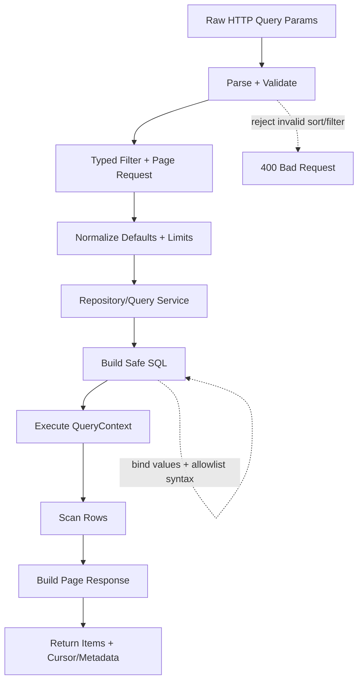
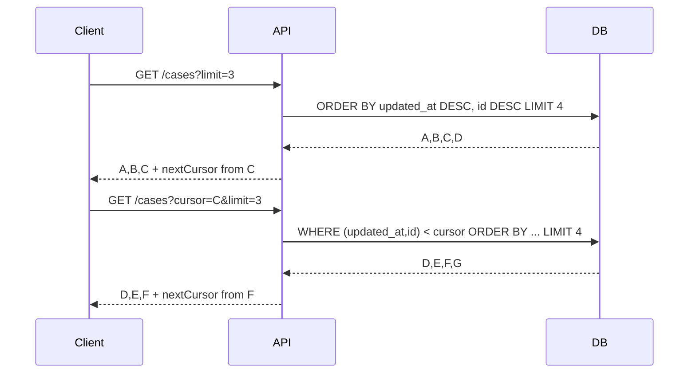

# learn-go-sql-database-integration-part-023.md

# Pagination, Sorting, Search, and Listing APIs

> Seri: `learn-go-sql-database-integration`  
> Part: `023`  
> Topik: `Pagination, Sorting, Search, Listing API Design, Offset Pagination, Keyset/Cursor Pagination, Count Strategy, Index-Aware Filtering, and Consistency Semantics`  
> Target pembaca: Java software engineer yang ingin memahami Go database integration sampai level production architecture  
> Target Go: Go 1.26.x  
> Status seri: **belum selesai**

---

## 0. Posisi Part Ini Dalam Seri

Pada part sebelumnya kita membahas **query composition tanpa kehilangan kontrol**:

- dynamic `WHERE`;
- safe placeholder generation;
- dynamic `ORDER BY`;
- allowlist column/operator/direction;
- safe `IN` clause;
- `LIKE` escaping;
- dynamic update;
- tenant/security predicates;
- query builder kecil;
- security/performance review.

Part ini fokus ke salah satu area paling sering disepelekan tetapi sangat menentukan kualitas backend:

> Listing API.

Contoh listing API:

```text
GET /cases?status=UNDER_REVIEW&sort=updatedAt&dir=desc&limit=50
GET /users?keyword=fajar&page=3
GET /audit-events?from=2026-01-01&to=2026-02-01
GET /outbox-events?status=PENDING&cursor=...
GET /reports/cases?groupBy=status
```

Listing terlihat sederhana, tetapi di production ia menyentuh banyak aspek:

- SQL injection boundary;
- dynamic filter;
- sorting;
- stable ordering;
- offset pagination;
- keyset/cursor pagination;
- total count;
- search keyword;
- index design;
- tenant isolation;
- authorization;
- soft delete;
- consistency;
- stale result;
- duplicate/missing rows between pages;
- memory pressure;
- query latency;
- API contract;
- observability;
- UX trade-off.

Banyak sistem bisa berjalan baik saat data 10 ribu rows, lalu runtuh saat data 10 juta rows karena listing API tidak dirancang.

---

## 1. Tujuan Pembelajaran

Setelah menyelesaikan part ini, kamu harus mampu:

1. mendesain listing API yang aman, stabil, dan scalable;
2. membedakan offset pagination dan keyset/cursor pagination;
3. memahami kenapa `ORDER BY` harus deterministic;
4. memahami kenapa large offset bisa mahal;
5. membuat API contract untuk filter, sort, limit, cursor, dan total count;
6. mendesain keyset pagination dengan cursor opaque;
7. membuat cursor encoding/decoding yang aman;
8. membangun listing repository/query service di Go;
9. menangani search keyword secara aman;
10. membedakan exact count, approximate count, dan has-next-page;
11. menentukan consistency semantics: snapshot, read committed, eventually consistent, replica-stale;
12. mendesain index yang mendukung filter/sort;
13. menghindari SQL injection pada sorting dan search;
14. menghindari N+1 listing detail;
15. membuat observability dan runbook untuk slow listing;
16. membuat checklist code review untuk listing API.

---

## 2. Fakta Dasar Dari Dokumentasi

Beberapa fakta yang menjadi landasan:

1. Dalam Go, query yang mengembalikan data dijalankan dengan method seperti `Query`/`QueryContext`, menghasilkan `Rows`, lalu setiap row dibaca dengan `Scan`; dokumentasi Go menekankan `Rows.Close` dan `Rows.Err` saat iterasi rows.
2. Dokumentasi Go menyarankan mencegah SQL injection dengan memberikan nilai parameter sebagai argumen fungsi `database/sql`, bukan memformat nilai langsung ke string SQL.
3. Placeholder parameter berbeda antar DBMS/driver; PostgreSQL-style sering memakai `$1`, sedangkan banyak contoh generik memakai `?`.
4. Dokumentasi PostgreSQL untuk `LIMIT/OFFSET` menekankan bahwa saat memakai `LIMIT`, query perlu `ORDER BY` yang menghasilkan urutan unik/predictable; tanpa itu subset row tidak predictable.
5. Dokumentasi PostgreSQL juga menyebut row yang dilewati oleh `OFFSET` tetap harus dihitung/dikomputasi di server, sehingga large offset bisa tidak efisien.
6. Dokumentasi MySQL menyatakan `LIMIT` membatasi jumlah row yang dikembalikan dan prepared statements dapat memakai placeholder untuk `LIMIT`.

Referensi:

- Go — Querying for data: <https://go.dev/doc/database/querying>
- Go — Avoiding SQL injection risk: <https://go.dev/doc/database/sql-injection>
- Go — `database/sql`: <https://pkg.go.dev/database/sql>
- PostgreSQL — `LIMIT` and `OFFSET`: <https://www.postgresql.org/docs/current/queries-limit.html>
- PostgreSQL — `SELECT`: <https://www.postgresql.org/docs/current/sql-select.html>
- MySQL — `SELECT` Statement: <https://dev.mysql.com/doc/refman/9.7/en/select.html>
- OWASP — SQL Injection Prevention Cheat Sheet: <https://cheatsheetseries.owasp.org/cheatsheets/SQL_Injection_Prevention_Cheat_Sheet.html>

---

## 3. Mental Model Utama

### 3.1 Listing API Bukan “SELECT * LIMIT 50”

Naive listing:

```sql
SELECT *
FROM cases
LIMIT 50;
```

Masalah:

- urutan tidak deterministic;
- tidak ada tenant/security predicate;
- tidak ada bounded projection;
- `SELECT *` rapuh;
- pagination berikutnya tidak jelas;
- tidak ada index strategy;
- bisa berubah antar request;
- tidak ada contract total count;
- bisa leak data;
- tidak scalable.

Listing API production harus menjawab:

```text
Siapa yang boleh melihat data?
Filter apa yang valid?
Sort apa yang valid?
Urutan apakah deterministic?
Apakah user butuh total count?
Apakah pagination stabil saat data berubah?
Berapa batas maksimal limit?
Index apa yang mendukung query?
Apakah result read dari primary atau replica?
Apakah result harus konsisten snapshot?
```

### 3.2 Pagination Adalah Contract, Bukan Detail UI

Pagination menentukan:

- apa yang dianggap next page;
- apakah page bisa berubah saat data di-insert/update;
- apakah user bisa lompat ke page 1000;
- apakah count akurat;
- apakah result bisa duplicate/missing;
- apakah API scalable.

Pagination harus didesain di API contract, bukan ditambal di SQL terakhir.

### 3.3 Sorting Adalah Bagian Dari Correctness

Tanpa deterministic sorting, pagination tidak bisa dipercaya.

Bad:

```sql
ORDER BY updated_at DESC
```

Jika banyak row punya `updated_at` sama, DB boleh mengurutkan row yang tie secara berbeda.

Better:

```sql
ORDER BY updated_at DESC, id DESC
```

`id` menjadi tie-breaker.

---

## 4. Diagram: Listing API Pipeline



---

## 5. API Contract: Basic Listing Request

Example:

```http
GET /cases?status=UNDER_REVIEW&keyword=ABC&sort=updatedAt&dir=desc&limit=50&cursor=...
```

Typed representation:

```go
type CaseListRequest struct {
	Status *Status
	Keyword string
	Sort SortRequest
	Page PageRequest
}
```

Better than passing raw `url.Values` into repository.

---

## 6. API Contract: Response Shape

Offset style:

```json
{
  "items": [],
  "page": {
    "limit": 50,
    "offset": 100,
    "totalCount": 12345
  }
}
```

Cursor style:

```json
{
  "items": [],
  "page": {
    "limit": 50,
    "nextCursor": "eyJ1cGRhdGVkQXQiOiIyMDI2LTA2LTI0VDEwOjAwOjAwWiIsImlkIjoxMjN9",
    "hasNext": true
  }
}
```

Do not mix vague fields:

```json
{"next": true}
```

without explaining how to fetch next.

---

## 7. Offset Pagination

SQL:

```sql
SELECT id, reference_no, status, updated_at
FROM cases
WHERE tenant_id = $1
ORDER BY updated_at DESC, id DESC
LIMIT $2 OFFSET $3;
```

Pros:

- simple;
- supports page number;
- easy UI;
- easy mental model;
- works for small/medium result sets.

Cons:

- large offset can be slow;
- unstable under concurrent inserts/updates/deletes;
- duplicates/missing rows between pages possible;
- count query often expensive;
- page N access encourages expensive random page jumps.

Use offset when:

- result set small;
- admin UI with modest data;
- page number UX required;
- performance acceptable;
- data changes not too frequent;
- exact count needed and affordable.

---

## 8. Offset Pagination Instability

Scenario:

```text
Page 1:
  rows A, B, C

Before user requests page 2:
  new row X inserted before A

Page 2 OFFSET 3:
  DB skips X, A, B
  returns C, D, E
```

User sees C twice or misses a row depending changes.

Offset pagination is based on position, and positions change.

If data is highly dynamic, prefer cursor/keyset.

---

## 9. Large Offset Cost

`OFFSET 100000 LIMIT 50` conceptually means:

```text
find/sort enough rows
skip first 100000
return next 50
```

Even with indexes, the database often must walk many entries before returning the page.

This is why large offset can be slow.

Mitigations:

- cap max offset;
- use keyset pagination;
- use cursor;
- restrict filters;
- use materialized/search index;
- async export for deep data.

---

## 10. Offset Pagination Code

```go
type OffsetPageRequest struct {
	Limit  int
	Offset int
}

func NormalizeOffsetPage(p OffsetPageRequest) OffsetPageRequest {
	if p.Limit <= 0 {
		p.Limit = 50
	}
	if p.Limit > 200 {
		p.Limit = 200
	}
	if p.Offset < 0 {
		p.Offset = 0
	}
	if p.Offset > 10_000 {
		p.Offset = 10_000
	}
	return p
}
```

Repository binds values:

```go
limitPH := w.Arg(page.Limit)
offsetPH := w.Arg(page.Offset)

query := base + w.SQL() + `
	ORDER BY c.updated_at DESC, c.id DESC
	LIMIT ` + limitPH + ` OFFSET ` + offsetPH
```

If DB does not support binding limit/offset, only inline validated integers.

---

## 11. Page Number API

User-facing page:

```text
?page=3&pageSize=50
```

Convert:

```go
offset := (page - 1) * pageSize
```

Validation:

```go
if page < 1 { page = 1 }
if pageSize > max { pageSize = max }
```

But avoid supporting arbitrary page 100000 if dataset huge.

Page number is a UX feature, not always a scalable API feature.

---

## 12. Keyset Pagination

Keyset pagination uses the last item from previous page as anchor.

First page:

```sql
SELECT id, reference_no, status, updated_at
FROM cases
WHERE tenant_id = $1
ORDER BY updated_at DESC, id DESC
LIMIT $2;
```

Next page:

```sql
SELECT id, reference_no, status, updated_at
FROM cases
WHERE tenant_id = $1
  AND (updated_at, id) < ($2, $3)
ORDER BY updated_at DESC, id DESC
LIMIT $4;
```

Meaning:

```text
give me rows after last seen (updated_at, id)
```

Pros:

- efficient for deep pagination;
- stable against inserts before current cursor;
- no large offset skip;
- good for infinite scroll/feed;
- works well with matching index.

Cons:

- cannot jump to arbitrary page number easily;
- cursor tied to sort order/filter;
- more complex API;
- sort fields must be designed carefully;
- mutable sort fields can still cause movement.

---

## 13. Keyset Pagination Diagram



Fetch `limit+1` to determine `hasNext`.

---

## 14. Deterministic Sort Key

A keyset cursor needs unique ordering.

Bad key:

```text
updated_at only
```

Many rows can share same timestamp.

Good key:

```text
updated_at + id
```

For ascending:

```sql
ORDER BY updated_at ASC, id ASC
```

Cursor predicate:

```sql
(updated_at, id) > ($cursorUpdatedAt, $cursorID)
```

For descending:

```sql
ORDER BY updated_at DESC, id DESC
```

Cursor predicate:

```sql
(updated_at, id) < ($cursorUpdatedAt, $cursorID)
```

---

## 15. Keyset With Nullable Sort Column

Nullable sort columns complicate cursor.

Options:

1. disallow nullable sort fields for keyset;
2. normalize with `COALESCE`;
3. add `NULLS LAST/FIRST` and encode null in cursor;
4. use non-null derived column;
5. sort by stable non-null fields only.

Recommendation:

> For keyset pagination, start with non-null sortable fields like `created_at`, `updated_at`, and `id`.

---

## 16. Keyset With Mutable Sort Column

If sorting by `updated_at`, rows can move when updated.

Scenario:

- user reads page 1;
- row from page 3 gets updated and moves to page 1;
- user may miss/see duplicates depending timing.

If strict stable browsing is required:

- use snapshot/export table;
- use `created_at` if append-only;
- use search snapshot ID;
- use transaction snapshot for short browsing, not practical over long user sessions;
- accept eventual movement and document semantics.

---

## 17. Cursor Must Be Opaque

Do not expose:

```text
?updatedAt=2026-06-24T10:00:00Z&id=123
```

unless internal API.

Prefer:

```text
?cursor=base64url(payload)
```

Payload may contain:

```json
{
  "sort": "updatedAt",
  "dir": "desc",
  "updatedAt": "2026-06-24T10:00:00Z",
  "id": 123
}
```

Opaque cursor lets you change internals later.

---

## 18. Cursor Struct

```go
type CaseCursor struct {
	Sort      string    `json:"sort"`
	Direction string   `json:"direction"`
	UpdatedAt time.Time `json:"updatedAt"`
	ID        int64     `json:"id"`
}
```

Encode:

```go
func EncodeCursor(c CaseCursor) (string, error) {
	b, err := json.Marshal(c)
	if err != nil {
		return "", err
	}
	return base64.RawURLEncoding.EncodeToString(b), nil
}
```

Decode:

```go
func DecodeCursor(s string) (CaseCursor, error) {
	b, err := base64.RawURLEncoding.DecodeString(s)
	if err != nil {
		return CaseCursor{}, ErrInvalidCursor
	}

	var c CaseCursor
	if err := json.Unmarshal(b, &c); err != nil {
		return CaseCursor{}, ErrInvalidCursor
	}

	return c, nil
}
```

For public APIs, consider signing cursor to prevent tampering.

---

## 19. Signed Cursor

Unsigned cursor can be modified by client.

If cursor includes only values and filters are still validated, tampering may be low-risk but can cause weird traversal.

For stronger contract, sign cursor:

```text
base64(payload).base64(hmac(payload, secret))
```

Pseudo-code:

```go
func Sign(payload []byte, secret []byte) []byte {
	mac := hmac.New(sha256.New, secret)
	mac.Write(payload)
	return mac.Sum(nil)
}
```

On decode, verify HMAC.

Never put secrets/PII in cursor if it goes to client.

---

## 20. Cursor Must Match Current Query

If user changes filter/sort but reuses cursor, results are invalid.

Options:

1. include filter hash in cursor;
2. reject cursor if request filter differs;
3. ignore request filters and use cursor-contained filter;
4. make cursor fully represent next query.

Common pattern:

```json
{
  "sort": "updatedAt",
  "direction": "desc",
  "filterHash": "abc123",
  "updatedAt": "...",
  "id": 123
}
```

On next request:

```text
hash(current filter) must equal cursor.filterHash
```

---

## 21. Keyset Query Builder

```go
func addKeysetPredicate(w *WhereBuilder, cursor *CaseCursor) error {
	if cursor == nil {
		return nil
	}

	if cursor.Sort != "updatedAt" || cursor.Direction != "desc" {
		return ErrInvalidCursor
	}

	updatedAtPH := w.Arg(cursor.UpdatedAt)
	idPH := w.Arg(cursor.ID)

	w.AddRaw("(c.updated_at, c.id) < (" + updatedAtPH + ", " + idPH + ")")
	return nil
}
```

PostgreSQL supports row value comparison. Other DBs vary.

Portable form:

```sql
(c.updated_at < $1 OR (c.updated_at = $1 AND c.id < $2))
```

This is clearer and portable.

---

## 22. Portable Keyset Predicate

Descending:

```go
func addUpdatedAtDescCursor(w *WhereBuilder, c CaseCursor) {
	updatedAtPH1 := w.Arg(c.UpdatedAt)
	updatedAtPH2 := w.Arg(c.UpdatedAt)
	idPH := w.Arg(c.ID)

	w.AddRaw("(c.updated_at < " + updatedAtPH1 +
		" OR (c.updated_at = " + updatedAtPH2 +
		" AND c.id < " + idPH + "))")
}
```

This uses `updated_at` arg twice. Some builders can reuse placeholders, but duplicating args is simple and portable.

Ascending:

```sql
(c.updated_at > $1 OR (c.updated_at = $2 AND c.id > $3))
```

---

## 23. Fetch Limit Plus One

To know `hasNext`, fetch `limit+1`.

```go
queryLimit := page.Limit + 1
```

After scan:

```go
hasNext := len(items) > page.Limit
if hasNext {
	items = items[:page.Limit]
	last := items[len(items)-1]
	nextCursor = cursorFromItem(last)
}
```

Do not run `COUNT(*)` just to know if next page exists.

---

## 24. Cursor Page Response

```go
type CursorPage[T any] struct {
	Items      []T
	NextCursor *string
	HasNext    bool
	Limit      int
}
```

If no items:

```go
HasNext=false
NextCursor=nil
```

If exactly limit+1 fetched:

```text
return first limit items
cursor from last returned item
```

---

## 25. Keyset Search Example

```go
func (q CaseQuery) SearchCursor(
	ctx context.Context,
	db *sql.DB,
	tenant TenantID,
	filter CaseSearchFilter,
	page CursorPageRequest,
) (CursorPage[CaseListItem], error) {
	page = NormalizeCursorPage(page)

	w := NewWhereBuilder(Dollar)
	w.AddValue("c.tenant_id = %s", tenant)
	w.AddRaw("c.deleted_at IS NULL")

	if filter.Status != nil {
		w.AddValue("c.status = %s", *filter.Status)
	}

	if keyword := strings.TrimSpace(filter.Keyword); keyword != "" {
		pattern := "%" + EscapeLike(keyword) + "%"
		w.AddValue(`c.reference_no LIKE %s ESCAPE '\'`, pattern)
	}

	if page.Cursor != nil {
		if err := addCursorPredicate(w, *page.Cursor); err != nil {
			return CursorPage[CaseListItem]{}, err
		}
	}

	limitPH := w.Arg(page.Limit + 1)

	query := `
		SELECT c.id, c.reference_no, c.status, c.updated_at
		FROM cases c
	` + w.SQL() + `
		ORDER BY c.updated_at DESC, c.id DESC
		LIMIT ` + limitPH

	rows, err := db.QueryContext(ctx, query, w.Args()...)
	if err != nil {
		return CursorPage[CaseListItem]{}, q.mapError("case.search_cursor", err)
	}
	defer rows.Close()

	items := make([]CaseListItem, 0, page.Limit+1)

	for rows.Next() {
		var item CaseListItem
		if err := rows.Scan(&item.ID, &item.ReferenceNo, &item.Status, &item.UpdatedAt); err != nil {
			return CursorPage[CaseListItem]{}, fmt.Errorf("case.search_cursor scan: %w", err)
		}
		items = append(items, item)
	}

	if err := rows.Err(); err != nil {
		return CursorPage[CaseListItem]{}, q.mapError("case.search_cursor iterate", err)
	}

	hasNext := len(items) > page.Limit
	if hasNext {
		items = items[:page.Limit]
	}

	var next *string
	if hasNext && len(items) > 0 {
		c := CaseCursor{
			Sort:      "updatedAt",
			Direction: "desc",
			UpdatedAt: items[len(items)-1].UpdatedAt,
			ID:        items[len(items)-1].ID,
		}
		encoded, err := EncodeCursor(c)
		if err != nil {
			return CursorPage[CaseListItem]{}, err
		}
		next = &encoded
	}

	return CursorPage[CaseListItem]{
		Items:      items,
		NextCursor: next,
		HasNext:    hasNext,
		Limit:      page.Limit,
	}, nil
}
```

This is a clear production-style skeleton.

---

## 26. Cursor Page Request

```go
type CursorPageRequest struct {
	Limit int
	Cursor *CaseCursor
}

func NormalizeCursorPage(p CursorPageRequest) CursorPageRequest {
	if p.Limit <= 0 {
		p.Limit = 50
	}
	if p.Limit > 200 {
		p.Limit = 200
	}
	return p
}
```

Reject cursor decode errors at handler/service boundary.

---

## 27. Offset vs Keyset Decision Table

| Requirement | Offset | Keyset/Cursor |
|---|---|---|
| simple implementation | excellent | moderate |
| jump to page N | good | poor |
| infinite scroll | okay | excellent |
| large/deep pagination | poor | excellent |
| stable under inserts before page | poor | better |
| exact total count | natural but costly | separate |
| arbitrary sort | easier | harder |
| mutable sort fields | both can have issues | needs care |
| UX page numbers | good | not natural |
| feed/timeline | poor/okay | excellent |
| high-volume OLTP | often poor | better |

---

## 28. Hybrid Strategy

A common practical design:

- offset pagination for small admin screens;
- keyset/cursor for high-volume feeds/listing;
- export endpoint for full dataset;
- report async for expensive queries;
- exact count optional;
- total count disabled for deep search.

Example:

```text
/cases?offset=0&limit=50
```

for admin small search.

```text
/audit-events?cursor=...&limit=100
```

for audit stream.

---

## 29. Total Count Strategy

Users often ask for:

```text
Showing 1-50 of 123,456
```

But exact count can be expensive.

Strategies:

1. exact count;
2. no count, only `hasNext`;
3. approximate count;
4. count up to threshold;
5. cached/materialized count;
6. async count;
7. separate `/count` endpoint;
8. show “many results” after threshold.

---

## 30. Exact Count

SQL:

```sql
SELECT COUNT(*)
FROM cases c
WHERE ...
```

Pros:

- precise;
- familiar UX.

Cons:

- expensive on large filtered joins;
- may run separate query with different snapshot;
- doubles DB work;
- can dominate latency.

Use when:

- result set small/medium;
- indexes support it;
- UX needs it;
- cost measured acceptable.

---

## 31. Has-Next Strategy

Fetch `limit+1`.

```text
if rows > limit, hasNext = true
```

Pros:

- cheap;
- works well with cursor;
- avoids count.

Cons:

- no total count;
- UI cannot show page number total.

Use for:

- infinite scroll;
- activity feeds;
- audit logs;
- event streams;
- large datasets.

---

## 32. Count Up To Threshold

Instead of exact huge count:

```text
count up to 10000
```

If exceeds:

```json
{
  "totalCount": null,
  "totalCountRelation": "gte",
  "totalCountLowerBound": 10000
}
```

This is product/API design, not just SQL.

Some search systems expose similar semantics.

---

## 33. Approximate Count

Use approximate DB statistics/materialized counters.

Pros:

- cheap;
- good for dashboards.

Cons:

- not exact;
- can confuse users if not labeled.

Expose as:

```json
{
  "estimatedTotalCount": 120000
}
```

not exact `totalCount`.

---

## 34. Count Consistency

If list query and count query are separate under Read Committed:

```text
count = 100
list returns 49 because data changed
```

If consistency matters:

- run both in read-only transaction with appropriate isolation;
- or accept mismatch;
- or avoid exact count;
- or generate snapshot/report.

For many UIs, slight mismatch is acceptable.

Document semantics.

---

## 35. Search Keyword Semantics

Search can mean different things:

| Type | Example |
|---|---|
| exact | reference_no = "ABC123" |
| prefix | reference_no starts with "ABC" |
| contains | name contains "abc" |
| full-text | terms/stemming/ranking |
| fuzzy | typo tolerant |
| multi-field | reference/name/email |
| advanced | boolean filters |

Do not implement all as `%keyword%` blindly.

---

## 36. LIKE Search

Safe value binding:

```go
pattern := "%" + EscapeLike(keyword) + "%"
w.AddValue(`c.reference_no LIKE %s ESCAPE '\'`, pattern)
```

Problems:

- leading wildcard often prevents normal index usage;
- case sensitivity differs by DB/collation;
- escaping differs;
- large tables suffer.

Use for small/moderate data or with proper index support.

---

## 37. Prefix Search

```go
pattern := EscapeLike(keyword) + "%"
w.AddValue(`c.reference_no LIKE %s ESCAPE '\'`, pattern)
```

Prefix search is often more index-friendly than contains search.

Use for:

- reference number;
- code;
- ID-like string;
- email prefix.

---

## 38. Case-Insensitive Search

Options:

- normalize to lowercase column and query;
- use DB collation;
- use PostgreSQL `ILIKE`;
- use functional index;
- use search index.

Portable pattern:

```sql
LOWER(name) LIKE LOWER($1)
```

But this may need functional index.

PostgreSQL-specific:

```sql
name ILIKE $1
```

Be explicit about DB target.

---

## 39. Full-Text Search

When keyword search becomes important:

- use PostgreSQL full-text;
- MySQL full-text;
- external OpenSearch/Elasticsearch;
- materialized search table;
- trigram index for contains search.

Listing API should not accidentally become a slow search engine.

---

## 40. Search Result Ordering

For search, sort could be:

- relevance;
- updated date;
- created date;
- reference number.

If relevance is computed, keyset pagination gets harder because cursor needs relevance score + tie-breaker.

Example order:

```text
ORDER BY rank DESC, updated_at DESC, id DESC
```

Cursor includes:

```text
rank, updated_at, id
```

Floating rank can be tricky.

For complex search, use dedicated search engine or snapshot.

---

## 41. Filter Design

Good filters are typed and limited.

Example:

```go
type CaseSearchFilter struct {
	Status     *Status
	Statuses   []Status
	OfficerID  *OfficerID
	CreatedFrom *time.Time
	CreatedTo   *time.Time
	Keyword    string
}
```

Avoid arbitrary generic filters unless you have strict schema.

---

## 42. Filter Normalization

Normalize before repository:

- trim keyword;
- parse enum;
- parse date;
- convert timezone;
- validate range;
- clamp max date window;
- deduplicate status list;
- sort IDs if needed;
- enforce tenant/actor from auth, not request.

---

## 43. Date Range Semantics

Use half-open range:

```text
from inclusive
to exclusive
```

SQL:

```sql
created_at >= $from
AND created_at < $to
```

Avoid:

```sql
created_at <= '2026-06-24 23:59:59'
```

because precision/timezone issues.

---

## 44. Maximum Date Window

Reports/listing can be abused.

For expensive queries:

```text
max range = 90 days
```

or require async export.

Validate:

```go
if filter.To.Sub(filter.From) > 90*24*time.Hour {
	return ErrDateRangeTooLarge
}
```

---

## 45. Status List Semantics

If both `status` and `statuses` exist, choose one API style.

Recommended:

```text
?status=SUBMITTED&status=APPROVED
```

Parse into `[]Status`.

Deduplicate.

Empty status list:

- invalid if parameter present but empty;
- or no filter if absent.

Be precise.

---

## 46. Sorting API Contract

Common styles:

```text
?sort=updatedAt&dir=desc
```

or:

```text
?sort=-updatedAt
```

or:

```text
?sort=updatedAt:desc
```

Choose one.

Internally:

```go
type SortRequest struct {
	Field string
	Direction Direction
}
```

Sort field maps to SQL allowlist.

---

## 47. Multiple Sorts

Example:

```text
?sort=status,-updatedAt
```

Risk:

- complex allowlist;
- harder keyset cursor;
- index explosion;
- unstable order if no tie-breaker.

Start with limited sorts.

If supporting multiple sorts, append unique tie-breaker.

---

## 48. Default Sort

Always define default sort.

Example:

```text
updatedAt desc, id desc
```

Default sort should:

- be deterministic;
- align with common UX;
- have supporting index;
- work with cursor.

---

## 49. Sort Field Must Match Index Strategy

If API allows sorting by 10 fields, you cannot index all combinations easily.

Design allowed sort fields based on product and DB reality.

For high-volume listing, support fewer sorts.

Example:

```text
updatedAt desc
createdAt desc
referenceNo asc
```

not arbitrary.

---

## 50. Index Design for Listing

Example query:

```sql
WHERE tenant_id = $1
  AND status = $2
  AND deleted_at IS NULL
ORDER BY updated_at DESC, id DESC
LIMIT 51
```

Possible index:

```text
(tenant_id, status, updated_at DESC, id DESC)
```

If soft delete:

```text
partial index where deleted_at is null
```

if DB supports it, or include deleted flag.

Index design is DB-specific.

---

## 51. Covering Projection

If listing returns:

```text
id, reference_no, status, updated_at
```

an index may cover some/all fields depending DB.

But do not over-index blindly.

Balance:

- read speed;
- write cost;
- storage;
- maintenance;
- query frequency.

---

## 52. Listing Projection

Avoid `SELECT *`.

Good:

```sql
SELECT c.id, c.reference_no, c.status, c.updated_at
```

Projection should match API/list item.

Benefits:

- less network;
- less scan cost;
- less accidental PII exposure;
- stable scan;
- easier index review.

---

## 53. Avoid N+1 In Listings

Bad:

```go
items := ListCases()
for each item:
    item.Documents = ListDocuments(caseID)
```

Better:

- join projection;
- batch load;
- aggregate counts;
- materialized summary;
- separate detail endpoint.

For list screen, often show counts/summary not full relations.

---

## 54. Batch Load for Listing

If list needs document count:

```sql
SELECT case_id, COUNT(*)
FROM documents
WHERE case_id IN (...)
GROUP BY case_id
```

Use safe `IN` or DB-specific array binding.

Then merge in memory.

For page size 50, this is often fine.

---

## 55. Join Multiplication

Joining one-to-many relation can duplicate case rows.

Example:

```sql
SELECT c.id, d.id
FROM cases c
JOIN documents d ON d.case_id = c.id
LIMIT 50
```

This limits joined rows, not cases.

Solutions:

- first page case IDs, then batch load documents;
- aggregate documents;
- use window/subquery carefully;
- avoid one-to-many join in main pagination query.

---

## 56. Two-Step Listing Pattern

1. Fetch page of IDs using filter/sort:

```sql
SELECT c.id
FROM cases c
WHERE ...
ORDER BY c.updated_at DESC, c.id DESC
LIMIT 51
```

2. Fetch details for IDs:

```sql
SELECT ...
FROM cases c
WHERE c.id IN (...)
```

3. Preserve ordering in app or SQL.

Pros:

- avoids join multiplication;
- keeps pagination clean.

Cons:

- two queries;
- consistency between queries can differ under Read Committed;
- may need transaction for snapshot if important.

---

## 57. Preserve Order After Batch Load

If second query uses `IN`, DB may return arbitrary order.

Options:

- reorder in Go according to ID order;
- use DB-specific ordering expression;
- join against values table with ordinal.

Go reorder:

```go
order := map[int64]int{}
for i, id := range ids {
	order[id] = i
}

sort.Slice(items, func(i, j int) bool {
	return order[items[i].ID] < order[items[j].ID]
})
```

For page size 50, this is simple.

---

## 58. Consistency Semantics

Listing API should define acceptable consistency:

| Semantics | Meaning |
|---|---|
| latest committed per statement | common Read Committed |
| snapshot per request | list + count/details consistent |
| cursor continuation | next page after last seen |
| eventually consistent | projection/search may lag |
| replica-stale | read may lag primary |
| export snapshot | stable large dataset snapshot |

Not every listing needs strong consistency.

---

## 59. Snapshot Read for List + Count

If list and count must be consistent:

```go
tx, err := db.BeginTx(ctx, &sql.TxOptions{
	ReadOnly: true,
	// Isolation may be RepeatableRead/Snapshot/Serializable depending DB.
})
```

Then run count and list in same transaction.

Caveats:

- transaction holds connection;
- long list/report can stress DB;
- isolation behavior DB-specific;
- not good for long user pagination across multiple HTTP requests.

---

## 60. Cursor Across Requests Is Not DB Snapshot

Cursor pagination across multiple HTTP requests does not keep DB transaction open.

It is not a snapshot.

It means:

```text
continue after this last seen sort key according to current DB state
```

New/updated/deleted rows can still affect result.

For true stable export:

- create export snapshot;
- materialize result IDs;
- store search session;
- use report job.

---

## 61. Read Replica Semantics

If listing reads from replica:

- result may be stale;
- read-after-write may fail;
- cursor from primary vs replica can mismatch;
- lag can affect UX.

For screens after write, read primary or use read-your-write strategy.

For general search/listing, replica may be acceptable.

Document and observe replica lag.

---

## 62. Soft Delete Semantics

If table uses soft delete:

```sql
deleted_at IS NULL
```

should be included by default.

Deleted row between page requests:

- offset may shift;
- cursor simply skips it;
- count changes.

Admin endpoints including deleted should be separate.

---

## 63. Authorization Semantics

Authorization can change between pages.

Example:

- user loses access after page 1;
- page 2 should reflect current permission.

Usually listing enforces permission per request.

Do not encode access result in cursor unless policy allows.

---

## 64. Cursor Security

Cursor should not:

- grant access;
- replace authorization;
- contain secrets;
- expose sensitive internal IDs if not acceptable;
- allow tampering to bypass filter.

Always re-apply:

- tenant;
- authorization;
- soft delete;
- current filters.

Cursor is position, not permission.

---

## 65. Cursor Payload Minimalism

Include only what is needed:

```json
{
  "v": 1,
  "sort": "updatedAt",
  "dir": "desc",
  "updatedAt": "2026-06-24T10:00:00Z",
  "id": 123,
  "filterHash": "..."
}
```

Version `v` helps future format changes.

---

## 66. Cursor Expiration

You may include expiry:

```json
{
  "exp": 1790000000
}
```

Use if:

- filters depend on temporary snapshot;
- cursor signing key rotates;
- result set semantics expire;
- security policy requires.

For simple keyset cursor, expiry optional.

---

## 67. Cursor Error Handling

Invalid cursor:

```text
400 Bad Request
```

Expired cursor:

```text
400 cursor_expired
```

Filter mismatch:

```text
400 cursor_filter_mismatch
```

Do not return 500 for bad cursor.

---

## 68. Listing API Error Codes

Possible public codes:

| Condition | HTTP | Code |
|---|---:|---|
| invalid status | 400 | invalid_filter |
| invalid sort field | 400 | invalid_sort |
| invalid cursor | 400 | invalid_cursor |
| cursor expired | 400 | cursor_expired |
| limit too large | 400 or clamp | invalid_limit |
| date range too large | 400 | date_range_too_large |
| unauthorized | 403/404 | forbidden/not_found |
| timeout | 504 | timeout |
| DB unavailable | 503 | service_unavailable |

Clamping limit is often better than error, but document it.

---

## 69. Search API Abuse Protection

Listing/search endpoints are often abused accidentally or maliciously.

Protections:

- max limit;
- max offset;
- max date range;
- minimum keyword length;
- rate limit;
- timeout;
- index-aware filters;
- deny unbounded export;
- async export;
- require tenant;
- cap `IN` list size;
- cap sort fields;
- reject leading wildcard for huge tables if needed.

---

## 70. Timeout Budget

Different budgets:

| Operation | Typical Budget |
|---|---:|
| point lookup | short |
| small list | short/medium |
| search | medium |
| report | long/async |
| export | async |

Repository/query service can use operation-specific timeout while respecting parent context.

```go
ctx, cancel := context.WithTimeout(ctx, 500*time.Millisecond)
defer cancel()
```

Do not exceed upstream request deadline.

---

## 71. Listing Response Size

Bound by:

- limit;
- projection size;
- JSON size;
- nested arrays;
- compression;
- memory.

Even `limit=200` can be huge if each item has big fields.

Do not include large text/blob fields in list response.

Use detail endpoint.

---

## 72. Memory Behavior in Go

Listing code often builds slice.

```go
items := make([]CaseListItem, 0, limit)
```

Good.

Avoid:

- unbounded append;
- scanning huge rows;
- reading all data for export into memory;
- nested N+1.

For exports, stream or batch.

---

## 73. Rows Lifecycle Reminder

Go listing must:

```go
rows, err := db.QueryContext(...)
if err != nil { return err }
defer rows.Close()

for rows.Next() {
    // Scan
}
if err := rows.Err(); err != nil { return err }
```

This matters for pool health and correctness.

---

## 74. Listing Query Service Pattern

```go
type CaseQueryService struct {
	db         *sql.DB
	classifier dberr.Classifier
}

func (q CaseQueryService) Search(ctx context.Context, tenant TenantID, filter CaseSearchFilter, page CursorPageRequest) (CursorPage[CaseListItem], error) {
	return q.searchCursor(ctx, q.db, tenant, filter, page)
}
```

Read-oriented query service can hold `db`.

For transaction snapshot, accept `DBTX`.

---

## 75. Repository vs Query Service for Listing

Use repository when listing is aggregate-local and simple:

```go
CaseRepository.ListForOfficer
```

Use query service when:

- joins many tables;
- returns projection/DTO;
- complex filter/sort;
- report/dashboard;
- read model;
- uses replica/search index.

Both are valid.

---

## 76. Complete Example Types

```go
type TenantID string
type Status string

const (
	StatusSubmitted   Status = "SUBMITTED"
	StatusUnderReview Status = "UNDER_REVIEW"
	StatusApproved   Status = "APPROVED"
)

type CaseSearchFilter struct {
	Statuses []Status
	OfficerID *int64
	CreatedFrom *time.Time
	CreatedTo *time.Time
	Keyword string
}

type CaseListItem struct {
	ID          int64
	ReferenceNo string
	Status      Status
	UpdatedAt   time.Time
}

type Direction string

const (
	Asc  Direction = "asc"
	Desc Direction = "desc"
)

type SortRequest struct {
	Field string
	Direction Direction
}
```

---

## 77. Sort Allowlist Example

```go
var caseSortColumns = map[string]string{
	"updatedAt":   "c.updated_at",
	"createdAt":   "c.created_at",
	"referenceNo": "c.reference_no",
}

func caseSortColumn(field string) (string, error) {
	if field == "" {
		return "c.updated_at", nil
	}

	col, ok := caseSortColumns[field]
	if !ok {
		return "", ErrInvalidSort
	}
	return col, nil
}

func sortDirection(d Direction) (string, error) {
	switch d {
	case "", Desc:
		return "DESC", nil
	case Asc:
		return "ASC", nil
	default:
		return "", ErrInvalidSort
	}
}
```

---

## 78. Page Normalization Example

```go
type CursorPageRequest struct {
	Limit int
	Cursor string
	Sort SortRequest
}

func NormalizeCursorPageRequest(p CursorPageRequest) CursorPageRequest {
	if p.Limit <= 0 {
		p.Limit = 50
	}
	if p.Limit > 200 {
		p.Limit = 200
	}
	if p.Sort.Field == "" {
		p.Sort.Field = "updatedAt"
	}
	if p.Sort.Direction == "" {
		p.Sort.Direction = Desc
	}
	return p
}
```

---

## 79. Search Builder Example

```go
func buildCaseFilterSQL(tenant TenantID, filter CaseSearchFilter) (*WhereBuilder, error) {
	w := NewWhereBuilder(Dollar)

	w.AddValue("c.tenant_id = %s", tenant)
	w.AddRaw("c.deleted_at IS NULL")

	if len(filter.Statuses) > 0 {
		if len(filter.Statuses) > 20 {
			return nil, ErrTooManyStatuses
		}
		if err := AddIn(w, "c.status", filter.Statuses); err != nil {
			return nil, err
		}
	}

	if filter.OfficerID != nil {
		w.AddValue("c.officer_id = %s", *filter.OfficerID)
	}

	if filter.CreatedFrom != nil {
		w.AddValue("c.created_at >= %s", *filter.CreatedFrom)
	}

	if filter.CreatedTo != nil {
		w.AddValue("c.created_at < %s", *filter.CreatedTo)
	}

	if keyword := strings.TrimSpace(filter.Keyword); keyword != "" {
		if len([]rune(keyword)) < 3 {
			return nil, ErrKeywordTooShort
		}
		if len([]rune(keyword)) > 100 {
			return nil, ErrKeywordTooLong
		}
		pattern := "%" + EscapeLike(keyword) + "%"
		w.AddValue(`c.reference_no LIKE %s ESCAPE '\'`, pattern)
	}

	return w, nil
}
```

---

## 80. AddIn Generic Example

```go
func AddIn[T any](w *WhereBuilder, column string, values []T) error {
	if len(values) == 0 {
		w.AddRaw("1 = 0")
		return nil
	}
	if len(values) > 1000 {
		return ErrTooManyValues
	}

	parts := make([]string, 0, len(values))
	for _, v := range values {
		parts = append(parts, w.Arg(v))
	}

	w.AddRaw(column + " IN (" + strings.Join(parts, ", ") + ")")
	return nil
}
```

`column` must be trusted.

---

## 81. EscapeLike Example

```go
func EscapeLike(s string) string {
	var b strings.Builder
	b.Grow(len(s))

	for _, r := range s {
		switch r {
		case '%', '_', '\\':
			b.WriteRune('\\')
			b.WriteRune(r)
		default:
			b.WriteRune(r)
		}
	}

	return b.String()
}
```

Use with:

```sql
LIKE $1 ESCAPE '\'
```

DB-specific behavior should be tested.

---

## 82. Building Cursor Predicate by Sort

If only one sort:

```go
func addCursorPredicate(w *WhereBuilder, c CaseCursor) error {
	if c.Sort != "updatedAt" || c.Direction != "desc" {
		return ErrInvalidCursor
	}

	p1 := w.Arg(c.UpdatedAt)
	p2 := w.Arg(c.UpdatedAt)
	p3 := w.Arg(c.ID)

	w.AddRaw("(c.updated_at < " + p1 + " OR (c.updated_at = " + p2 + " AND c.id < " + p3 + "))")
	return nil
}
```

If multiple sort fields, cursor predicate must match each sort.

Do not support arbitrary dynamic sort + cursor unless you implement all combinations carefully.

---

## 83. Generic Keyset Predicate Complexity

For sort `(a desc, b desc, id desc)`:

```sql
a < $a
OR (a = $a AND b < $b)
OR (a = $a AND b = $b AND id < $id)
```

For mixed direction, operators differ.

This complexity is why many APIs limit cursor sorting to one or two designed sort modes.

---

## 84. Search With Offset Example

Offset still useful for admin screens.

```go
func (q CaseQueryService) SearchOffset(
	ctx context.Context,
	tenant TenantID,
	filter CaseSearchFilter,
	page OffsetPageRequest,
) (OffsetPage[CaseListItem], error) {
	page = NormalizeOffsetPage(page)

	w, err := buildCaseFilterSQL(tenant, filter)
	if err != nil {
		return OffsetPage[CaseListItem]{}, err
	}

	sortCol := "c.updated_at"
	sortDir := "DESC"

	limitPH := w.Arg(page.Limit)
	offsetPH := w.Arg(page.Offset)

	query := `
		SELECT c.id, c.reference_no, c.status, c.updated_at
		FROM cases c
	` + w.SQL() + `
		ORDER BY ` + sortCol + ` ` + sortDir + `, c.id DESC
		LIMIT ` + limitPH + ` OFFSET ` + offsetPH

	items, err := q.scanCaseList(ctx, query, w.Args())
	if err != nil {
		return OffsetPage[CaseListItem]{}, err
	}

	return OffsetPage[CaseListItem]{
		Items: items,
		Limit: page.Limit,
		Offset: page.Offset,
	}, nil
}
```

Count optional.

---

## 85. Scan Helper

```go
func (q CaseQueryService) scanCaseList(ctx context.Context, query string, args []any) ([]CaseListItem, error) {
	rows, err := q.db.QueryContext(ctx, query, args...)
	if err != nil {
		return nil, q.mapError("case.list", err)
	}
	defer rows.Close()

	items := make([]CaseListItem, 0)

	for rows.Next() {
		var item CaseListItem
		if err := rows.Scan(&item.ID, &item.ReferenceNo, &item.Status, &item.UpdatedAt); err != nil {
			return nil, fmt.Errorf("case.list scan: %w", err)
		}
		items = append(items, item)
	}

	if err := rows.Err(); err != nil {
		return nil, q.mapError("case.list iterate", err)
	}

	return items, nil
}
```

For known limit, pass capacity to avoid realloc.

---

## 86. Avoid Raw Count by Default

If product does not truly need exact count, avoid default count.

Instead:

```json
{
  "items": [...],
  "hasNext": true,
  "nextCursor": "..."
}
```

This is scalable for many systems.

If UI demands “page 1 of N”, negotiate with product about cost.

---

## 87. Listing API and Product UX

Engineering should discuss trade-offs:

| UX Need | Engineering Cost |
|---|---|
| page number | offset/count cost |
| exact total | count cost |
| arbitrary sorting | index explosion |
| contains search | index/search engine need |
| export all | async/export path |
| immediate read-after-write | primary read |
| stable report | snapshot/materialization |

Do not accept UX requirements without explaining cost.

---

## 88. Export Is Not Listing

If user needs all rows:

```text
download CSV of 2 million records
```

Do not implement as:

```text
limit=2000000
```

Use export job:

- create export request;
- run background job;
- stream/batch from DB;
- write file/object storage;
- notify user;
- expire file;
- audit access.

Listing API remains bounded.

---

## 89. Reporting Is Not Listing

Reports often need:

- aggregation;
- group by;
- historical snapshot;
- long date range;
- joins;
- data warehouse.

Do not overload operational listing endpoint for reporting.

Use:

- separate report query service;
- replica/warehouse;
- materialized view;
- async job;
- stricter limits.

---

## 90. Audit Log Listing

Audit logs are append-mostly.

Good candidate for keyset pagination:

```sql
WHERE tenant_id = $1
ORDER BY created_at DESC, id DESC
LIMIT $2
```

Cursor:

```text
created_at + id
```

Do not allow arbitrary expensive filters on audit log without indexes.

---

## 91. Outbox Listing

Operational listing for outbox:

Filters:

- status;
- next_attempt_at;
- event_type;
- created range;
- aggregate id.

Sort:

- created_at;
- next_attempt_at.

Use keyset for large backlog.

Be careful not to include huge payload in list response.

---

## 92. Admin Listing

Admin listing often asks for everything.

Still enforce:

- max limit;
- tenant/role;
- safe filters;
- deterministic sort;
- audit access;
- rate limiting;
- separate export for large data.

Admin does not mean unbounded.

---

## 93. Listing Consistency After Mutation

After user creates/updates item, should it appear on first page?

Options:

- read primary;
- redirect to detail page;
- include created item in response;
- optimistic UI;
- poll after delay;
- use cursor semantics.

If listing reads replica, document lag.

---

## 94. Sorting by Status

Status sort may not match business order.

Alphabetical:

```text
APPROVED, DRAFT, REJECTED, UNDER_REVIEW
```

Business order:

```text
DRAFT, SUBMITTED, UNDER_REVIEW, APPROVED, REJECTED
```

Implement with CASE expression or status_order column.

But CASE sort is DB-specific and may hurt index use.

Alternative:

- store status_order;
- sort in app only for small data;
- avoid status sort for large listing.

---

## 95. Sorting by Derived Field

Example:

```text
applicant full name
document count
latest activity
```

Derived sort may require:

- join;
- subquery;
- materialized column;
- denormalized read model;
- index.

Do not add derived sort casually.

---

## 96. Search and Collation

String sorting/search depends on collation:

- case sensitivity;
- accent sensitivity;
- locale;
- Unicode normalization.

If product needs locale-aware sort, DB collation/index design matters.

For predictable backend listing, define semantics.

---

## 97. Timezone in Listing

Store timestamps in UTC.

API can return ISO-8601.

Date filters from user timezone should be normalized before DB query.

Example:

```text
user date 2026-06-24 Asia/Jakarta
from = 2026-06-23T17:00:00Z
to   = 2026-06-24T17:00:00Z
```

Do this before repository.

---

## 98. Listing and Privacy

List endpoints often expose too much.

Projection should exclude:

- internal notes;
- PII not needed;
- security flags;
- tokens;
- raw payloads;
- large metadata.

Use detail endpoint with authorization for sensitive data.

---

## 99. Listing and Field-Level Authorization

If fields differ by role:

Options:

- separate projection per role;
- service masks fields after query;
- SQL CASE based on role;
- separate endpoints.

Avoid returning sensitive field then relying on frontend to hide.

---

## 100. Observability Metrics

Metrics:

```text
listing_requests_total{operation, result}
listing_duration_seconds{operation}
listing_rows_returned{operation}
listing_limit{operation}
listing_has_next{operation}
listing_error_total{operation, class}
listing_count_duration_seconds{operation}
listing_query_timeout_total{operation}
```

For DB:

```text
db_query_duration_seconds{operation="case.search"}
```

Avoid labeling by keyword/status/user.

---

## 101. Logs

Log slow listing with safe metadata:

```text
operation=case.search
duration_ms=850
limit=50
offset=5000
has_keyword=true
filter_count=3
sort=updatedAt_desc
db_error_class=none
```

Avoid raw keyword if sensitive.

---

## 102. Tracing

Trace spans:

```text
case.search.parse
case.search.build_sql
db.case.search
case.search.scan
case.search.encode_cursor
```

Attributes:

- limit;
- pagination type;
- sort;
- has count;
- returned rows;
- error class.

No raw SQL args with PII.

---

## 103. Alerts

Possible alerts:

- listing timeout rate > threshold;
- slow p95/p99 for critical listing;
- count query dominates latency;
- max offset usage high;
- keyword search slow;
- replica lag causing stale UX;
- DB CPU/IO spike from listing;
- rows returned near max too often;
- invalid sort/filter attempts spike.

---

## 104. Runbook: Slow Listing

Questions:

1. Which operation?
2. Offset or cursor?
3. Limit?
4. Sort field?
5. Filters?
6. Count query included?
7. Query plan?
8. Index used?
9. Rows scanned vs returned?
10. Large offset?
11. Leading wildcard search?
12. Join multiplication?
13. Replica lag?
14. Recent data growth?
15. Recent deployment changed query?

Actions:

- add/change index;
- switch to keyset;
- cap offset;
- remove exact count;
- optimize projection;
- split report/export;
- add search index;
- reduce allowed filters;
- fix query builder.

---

## 105. Runbook: Duplicate/Missing Rows Between Pages

Likely causes:

- offset pagination under concurrent writes;
- non-deterministic ordering;
- sort key not unique;
- mutable sort field;
- replica inconsistency;
- cursor mismatch with filter/sort.

Fix:

- add tie-breaker to order;
- use cursor/keyset;
- include filter hash in cursor;
- define consistency semantics;
- use stable snapshot/export for strict browsing.

---

## 106. Runbook: SQL Injection Attempt

Symptoms:

- invalid sort/filter attempts;
- WAF events;
- SQL syntax errors with suspicious input.

Checks:

1. Are values bound?
2. Are identifiers allowlisted?
3. Are raw fragments code-owned?
4. Is sort direction allowlisted?
5. Are error messages leaking SQL?
6. Are logs storing malicious payload?

Actions:

- reject invalid input with 400;
- patch unsafe concatenation;
- add tests;
- review query builder API;
- rotate secrets only if compromise suspected.

---

## 107. Testing Matrix

| Test | Purpose |
|---|---|
| default listing | defaults correct |
| max limit clamp | abuse protection |
| invalid sort | rejects injection |
| invalid direction | rejects injection |
| keyword `%` | escaped as literal |
| empty filter | required predicates still present |
| tenant isolation | no cross-tenant rows |
| status filter | correct rows |
| date range | half-open correctness |
| offset page | deterministic order |
| cursor first page | returns cursor |
| cursor next page | no overlap |
| filter mismatch cursor | rejected |
| count optional | no count when not requested |
| large offset cap | rejected/clamped |
| rows.Err path | handled |

---

## 108. Unit Test: Sort Allowlist

```go
func TestCaseSortColumnRejectsInjection(t *testing.T) {
	_, err := caseSortColumn("updatedAt; DROP TABLE cases")
	if !errors.Is(err, ErrInvalidSort) {
		t.Fatalf("expected invalid sort, got %v", err)
	}
}
```

---

## 109. Unit Test: Cursor Round Trip

```go
func TestCursorRoundTrip(t *testing.T) {
	in := CaseCursor{
		Sort:      "updatedAt",
		Direction: "desc",
		UpdatedAt: time.Date(2026, 6, 24, 10, 0, 0, 0, time.UTC),
		ID:        123,
	}

	s, err := EncodeCursor(in)
	if err != nil {
		t.Fatal(err)
	}

	out, err := DecodeCursor(s)
	if err != nil {
		t.Fatal(err)
	}

	if !out.UpdatedAt.Equal(in.UpdatedAt) || out.ID != in.ID {
		t.Fatalf("cursor mismatch: %#v", out)
	}
}
```

---

## 110. Integration Test: Cursor No Overlap

```go
func TestCursorPaginationNoOverlap(t *testing.T) {
	ctx := context.Background()

	// insert 10 cases with deterministic updated_at/id

	page1, err := query.SearchCursor(ctx, tenant, CaseSearchFilter{}, CursorPageRequest{Limit: 5})
	if err != nil {
		t.Fatal(err)
	}
	if page1.NextCursor == nil {
		t.Fatal("expected next cursor")
	}

	page2, err := query.SearchCursor(ctx, tenant, CaseSearchFilter{}, CursorPageRequest{
		Limit: 5,
		Cursor: *page1.NextCursor,
	})
	if err != nil {
		t.Fatal(err)
	}

	seen := map[int64]bool{}
	for _, item := range page1.Items {
		seen[item.ID] = true
	}
	for _, item := range page2.Items {
		if seen[item.ID] {
			t.Fatalf("duplicate id across pages: %d", item.ID)
		}
	}
}
```

Actual signature may decode cursor at handler/service boundary.

---

## 111. Integration Test: Tenant Isolation

```go
func TestSearchDoesNotLeakTenant(t *testing.T) {
	ctx := context.Background()

	insertCase(t, tenantA)
	insertCase(t, tenantB)

	page, err := query.SearchCursor(ctx, tenantA, CaseSearchFilter{}, CursorPageRequest{Limit: 50})
	if err != nil {
		t.Fatal(err)
	}

	for _, item := range page.Items {
		if item.TenantID != tenantA {
			t.Fatalf("leaked tenant row: %v", item)
		}
	}
}
```

You may not include TenantID in public item, but test can query internal projection.

---

## 112. Integration Test: Keyword Escaping

```go
func TestKeywordSearchEscapesWildcard(t *testing.T) {
	ctx := context.Background()

	insertCaseRef(t, tenant, "ABC%DEF")
	insertCaseRef(t, tenant, "ABCXDEF")

	filter := CaseSearchFilter{Keyword: "ABC%DEF"}

	page, err := query.SearchCursor(ctx, tenant, filter, CursorPageRequest{Limit: 10})
	if err != nil {
		t.Fatal(err)
	}

	// Expect literal match behavior according to API semantics.
}
```

Define whether keyword search treats `%` literally or as wildcard. Usually literally.

---

## 113. Load Test Listing

Test:

- default listing;
- common filters;
- search keyword;
- deep offset if supported;
- cursor deep traversal;
- count query;
- high concurrency;
- tenant distribution;
- with realistic data volume.

Measure:

- p50/p95/p99;
- rows scanned;
- CPU/IO;
- DB locks;
- memory;
- pool wait.

---

## 114. Listing Code Smells

1. `SELECT *`.
2. No `ORDER BY`.
3. `ORDER BY` without tie-breaker.
4. Raw user sort concatenation.
5. Unbounded `LIMIT`.
6. Large unbounded `OFFSET`.
7. Always exact count.
8. Keyword `%...%` on huge table without index.
9. Missing tenant predicate.
10. Soft-deleted rows included accidentally.
11. N+1 for each row.
12. Joining one-to-many before pagination.
13. Cursor not tied to sort/filter.
14. Cursor exposes sensitive data.
15. Count and list inconsistent but API claims exact.
16. Listing endpoint used for export.
17. Report query in OLTP path.
18. No rows.Err check.
19. Scanning huge text/blob fields in list.
20. No index review.

---

## 115. Code Review Checklist

### 115.1 API Contract

- [ ] Filter fields are documented.
- [ ] Sort fields are documented.
- [ ] Default sort defined.
- [ ] Limit default/max defined.
- [ ] Pagination type chosen intentionally.
- [ ] Total count semantics defined.
- [ ] Cursor format opaque/versioned.
- [ ] Invalid cursor/filter/sort behavior defined.

### 115.2 Security

- [ ] Tenant predicate required.
- [ ] Authorization applied.
- [ ] Soft delete predicate applied.
- [ ] Values bound.
- [ ] Sort allowlisted.
- [ ] Direction allowlisted.
- [ ] LIKE escaped.
- [ ] Limit/offset clamped.
- [ ] Cursor not trusted for auth.
- [ ] Sensitive fields excluded.

### 115.3 Correctness

- [ ] Deterministic order with tie-breaker.
- [ ] Cursor predicate matches order.
- [ ] Empty result handled.
- [ ] `hasNext` computed correctly.
- [ ] Cursor filter mismatch rejected.
- [ ] Date range half-open.
- [ ] Empty IN semantics defined.
- [ ] Rows closed and rows.Err checked.

### 115.4 Performance

- [ ] Index supports common filter/sort.
- [ ] Projection minimal.
- [ ] Count cost reviewed.
- [ ] Large offset capped or keyset used.
- [ ] N+1 avoided.
- [ ] One-to-many join pagination avoided.
- [ ] Search strategy appropriate.
- [ ] Timeout budget set.
- [ ] Export/report separated if needed.

### 115.5 Observability

- [ ] Operation name stable.
- [ ] Duration metric.
- [ ] Rows returned metric.
- [ ] Error class metric.
- [ ] Slow query logging safe.
- [ ] Count query measured separately.
- [ ] Cursor/offset type visible.
- [ ] No high-cardinality labels.

---

## 116. Architecture Checklist

- [ ] Listing lives in query service/repository, not handler.
- [ ] Raw HTTP params parsed before repository.
- [ ] Domain enums parsed/validated.
- [ ] Repository receives typed filter.
- [ ] Query builder is local per request.
- [ ] DB-specific SQL is isolated/documented.
- [ ] Read replica semantics documented if used.
- [ ] Integration tests use real DB.
- [ ] Migration/index changes reviewed with query.

---

## 117. Mini Case Study: Case Listing

Requirements:

```text
List cases visible to officer.
Filter by status and keyword.
Sort by updatedAt desc.
High volume.
No exact total required.
```

Design:

- cursor pagination;
- tenant and officer visibility required;
- status allowlist;
- keyword min length;
- sort fixed `updated_at desc, id desc`;
- limit max 100;
- fetch limit+1;
- index `(tenant_id, officer_id, status, updated_at desc, id desc)` or equivalent based on actual query;
- no count;
- no one-to-many join;
- detail endpoint for full data.

---

## 118. Mini Case Study: Admin User List

Requirements:

```text
Admin can search users.
Page number UI required.
Total count displayed.
Data volume moderate.
```

Design:

- offset pagination acceptable;
- exact count if measured okay;
- max offset cap;
- default sort `created_at desc, id desc`;
- email/name prefix search, not contains if large;
- role/tenant filters;
- index review;
- export separate.

---

## 119. Mini Case Study: Audit Log

Requirements:

```text
Append-heavy audit log.
Users scroll newest to older.
No arbitrary page number.
```

Design:

- keyset pagination;
- order `created_at desc, id desc`;
- cursor includes created_at/id;
- date range max;
- filter by actor/action optional;
- no total count;
- payload omitted in list;
- detail endpoint for full audit event.

---

## 120. Mini Case Study: Report Search

Requirements:

```text
Search all cases over 5 years with many filters and CSV export.
```

Design:

- not normal listing endpoint;
- async report/export;
- report DB/read replica/warehouse;
- snapshot/export job;
- user receives file;
- progress/status endpoint;
- strict audit and access control.

---

## 121. Efficient Learning Summary

A production listing API is a careful contract between:

```text
user experience
database performance
security
consistency
query design
pagination semantics
```

Best default rules:

1. Always use deterministic `ORDER BY`.
2. Add unique tie-breaker.
3. Use keyset/cursor for high-volume/deep pagination.
4. Use offset only where page-number UX and data size justify it.
5. Do not run exact count by default.
6. Use `limit+1` for `hasNext`.
7. Validate/clamp limit and offset.
8. Keep tenant/security predicates required.
9. Allowlist sort fields/directions.
10. Bind values, never concatenate user values.
11. Escape `LIKE` wildcards when searching literal input.
12. Avoid `SELECT *`.
13. Avoid N+1 and one-to-many join pagination.
14. Align API filters/sorts with indexes.
15. Observe rows returned, latency, timeout, and count cost.

If you remember one sentence:

> Pagination is not just `LIMIT`; it is a correctness, security, performance, and UX contract.

---

## 122. Latihan

### Exercise 1 — Offset Instability

A query uses:

```sql
ORDER BY updated_at DESC
LIMIT 50 OFFSET 50
```

Question:

- What two correctness problems can happen?
- How to improve?

### Exercise 2 — Keyset Cursor

Design cursor for:

```sql
ORDER BY created_at DESC, id DESC
```

Question:

- What fields must cursor contain?
- What predicate is used for next page?

### Exercise 3 — Count Strategy

Product asks for exact total count on a large filtered search.

Question:

- What questions should you ask before implementing?
- What alternatives can you propose?

### Exercise 4 — Search Keyword

User searches for:

```text
A_B%
```

Question:

- What can go wrong with `LIKE`?
- How to handle it?

### Exercise 5 — Tenant Safety

Listing method accepts `filter.TenantID` as optional.

Question:

- Why is this dangerous?
- What should method signature use?

### Exercise 6 — Join Pagination

You join cases to documents and apply `LIMIT 50`.

Question:

- Why can this return fewer than 50 cases?
- What pattern is safer?

---

## 123. Jawaban Singkat Latihan

### Exercise 1

Problems:

1. `updated_at` alone may not be unique, so row order can be unstable.
2. Offset can duplicate/miss rows when data changes and can be slow for large offsets.

Improve:

```sql
ORDER BY updated_at DESC, id DESC
```

and consider keyset pagination:

```sql
WHERE (updated_at < $cursorUpdatedAt OR (updated_at = $cursorUpdatedAt AND id < $cursorID))
```

### Exercise 2

Cursor contains:

```text
created_at
id
sort metadata/version/filter hash if needed
```

Next predicate for descending:

```sql
created_at < $1 OR (created_at = $2 AND id < $3)
```

### Exercise 3

Ask:

- data size;
- filter selectivity;
- latency budget;
- index support;
- whether approximate/hasNext is acceptable;
- whether count must be consistent with list.

Alternatives:

- `hasNext`;
- approximate count;
- count up to threshold;
- async count;
- report/export path.

### Exercise 4

`_` and `%` are wildcards in LIKE. If user intended literal search, query may match too much.

Escape `%`, `_`, and escape char, then bind as parameter with `ESCAPE`.

### Exercise 5

Optional tenant filter can leak cross-tenant data if missing.

Use required parameter:

```go
Search(ctx, tenantID, filter, page)
```

Repository always adds tenant predicate.

### Exercise 6

One case can have many documents, so `LIMIT 50` limits joined rows, not distinct cases.

Safer:

1. fetch page of case IDs first;
2. batch load document summaries/counts;
3. merge in Go.

---

## 124. Ringkasan

Pagination, sorting, search, and listing APIs are where database design meets product reality.

Core principles:

- deterministic order is mandatory;
- offset is simple but not always scalable;
- keyset/cursor is better for high-volume traversal;
- count is a product feature with DB cost;
- search semantics must be explicit;
- dynamic sort/filter must be allowlisted;
- tenant/security predicates must be required;
- listing projection must be intentionally small;
- index design must match allowed query shapes;
- observability must show slow listings before they become incidents.

A high-quality Go data access layer treats listing as a first-class design problem, not a last-minute SQL string.

---

## 125. Referensi

- Go documentation — Querying for data: <https://go.dev/doc/database/querying>
- Go documentation — Avoiding SQL injection risk: <https://go.dev/doc/database/sql-injection>
- Go package documentation — `database/sql`: <https://pkg.go.dev/database/sql>
- PostgreSQL documentation — `LIMIT` and `OFFSET`: <https://www.postgresql.org/docs/current/queries-limit.html>
- PostgreSQL documentation — `SELECT`: <https://www.postgresql.org/docs/current/sql-select.html>
- MySQL documentation — `SELECT` Statement: <https://dev.mysql.com/doc/refman/9.7/en/select.html>
- OWASP Cheat Sheet Series — SQL Injection Prevention Cheat Sheet: <https://cheatsheetseries.owasp.org/cheatsheets/SQL_Injection_Prevention_Cheat_Sheet.html>


<!-- NAVIGATION_FOOTER -->
<div class="page-nav">
<a href="./learn-go-sql-database-integration-part-022.md">⬅️ Query Composition Without Losing Control</a>
<a href="./index.md">📚 Kategori</a>
<a href="../../index.md">🏠 Home</a>
<a href="./learn-go-sql-database-integration-part-024.md">Bulk Insert, Batch Update, and High-Throughput Write Paths ➡️</a>
</div>
