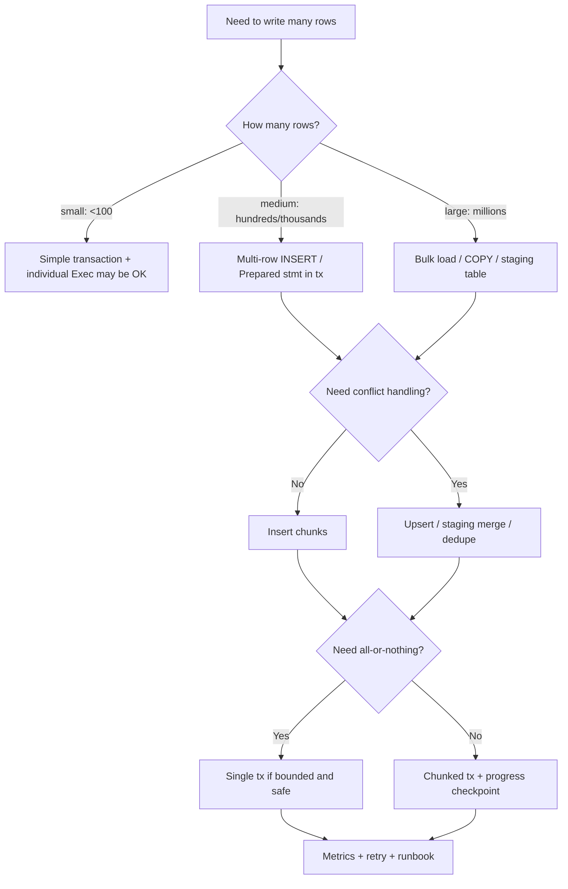
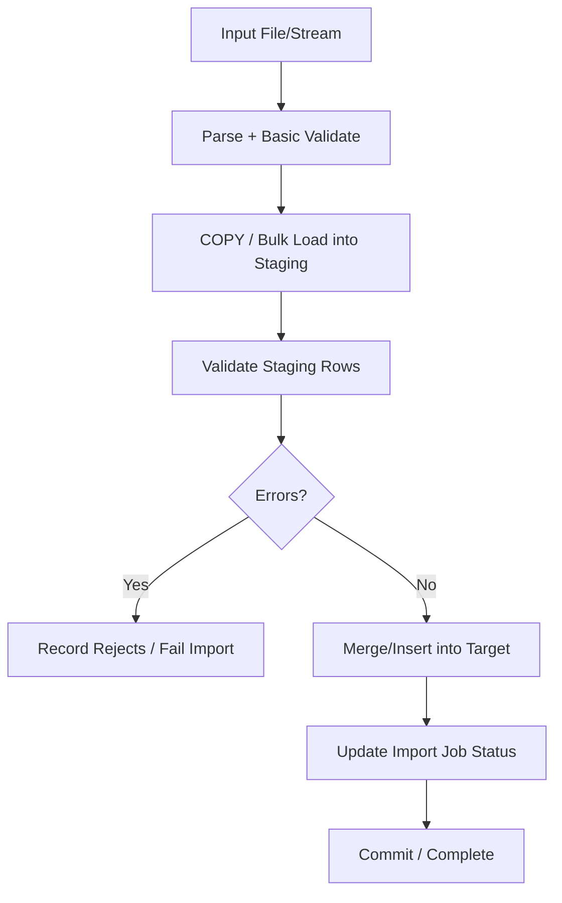
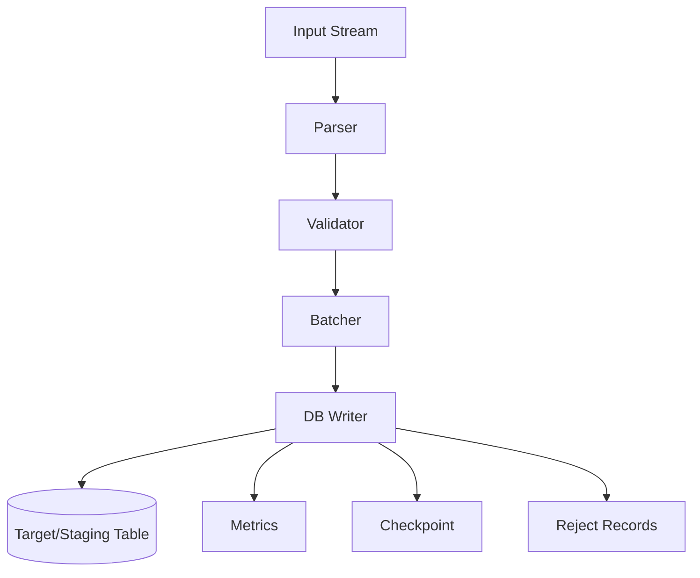

# learn-go-sql-database-integration-part-024.md

# Bulk Insert, Batch Update, and High-Throughput Write Paths

> Seri: `learn-go-sql-database-integration`  
> Part: `024`  
> Topik: `Bulk Insert, Batch Update, COPY/Load Path, Transaction Chunking, Upsert, Retry, Idempotency, Pool Pressure, Lock/WAL/Binlog Impact, and High-Throughput Write Architecture`  
> Target pembaca: Java software engineer yang ingin memahami Go database integration sampai level production architecture  
> Target Go: Go 1.26.x  
> Status seri: **belum selesai**

---

## 0. Posisi Part Ini Dalam Seri

Pada part sebelumnya kita membahas:

- query composition;
- listing API;
- sorting;
- pagination;
- search;
- dynamic filter;
- cursor/keyset;
- index-aware query design.

Part ini beralih ke jalur sebaliknya:

> Bagaimana menulis banyak data ke database dengan benar, cepat, aman, dan tetap observable?

Write path high-throughput muncul dalam banyak sistem:

- import CSV;
- sync data external system;
- event ingestion;
- audit trail;
- bulk status update;
- outbox/inbox processing;
- batch job;
- migration/backfill;
- nightly reconciliation;
- ETL;
- report snapshot;
- deduplication;
- queue claim/update;
- bulk notification generation;
- data archival.

Naive implementation biasanya seperti ini:

```go
for _, row := range rows {
	_, err := db.ExecContext(ctx, `
		INSERT INTO target (a, b, c)
		VALUES ($1, $2, $3)
	`, row.A, row.B, row.C)
	if err != nil {
		return err
	}
}
```

Untuk 10 rows, tidak masalah.

Untuk 100 ribu atau 10 juta rows, ini bisa menjadi masalah besar:

- terlalu banyak round trip;
- connection pool sibuk;
- transaction terlalu panjang;
- WAL/binlog besar;
- lock duration panjang;
- retry sulit;
- partial success tidak jelas;
- deadlock/lock timeout;
- constraint violation di tengah batch;
- memory meledak;
- observability tidak cukup;
- database mengganggu workload OLTP.

Part ini membahas high-throughput write sebagai desain sistem, bukan sekadar “pakai loop atau batch”.

---

## 1. Tujuan Pembelajaran

Setelah menyelesaikan part ini, kamu harus mampu:

1. membedakan row-by-row write, multi-row insert, prepared statement batch, driver-native bulk load, dan staging-table merge;
2. memilih strategi bulk write berdasarkan volume, latency, correctness, idempotency, dan DB target;
3. membuat multi-row insert aman dengan placeholder dinamis;
4. membatasi batch size berdasarkan parameter count, packet size, lock duration, dan transaction budget;
5. memakai transaction chunking untuk menghindari transaksi raksasa;
6. memahami trade-off atomic all-or-nothing vs chunked partial progress;
7. mendesain idempotency untuk bulk jobs;
8. memakai upsert/`ON CONFLICT`/duplicate handling secara sadar;
9. menangani constraint violation dalam batch;
10. menghindari retry yang menggandakan data;
11. memahami efek write besar terhadap WAL/binlog/redo/undo, indexes, triggers, replication lag, dan autovacuum/purge;
12. mendesain backpressure dan worker concurrency;
13. membangun observability untuk rows/sec, batch duration, error class, retry, lag, dan DB impact;
14. membuat runbook untuk bulk job yang lambat, stuck, atau merusak latency OLTP;
15. menulis checklist production untuk high-throughput write path.

---

## 2. Fakta Dasar Dari Dokumentasi

Beberapa fakta yang menjadi landasan:

1. Dalam Go `database/sql`, operasi yang tidak mengembalikan row biasa dijalankan dengan `Exec`/`ExecContext`; hasilnya adalah `sql.Result` yang dapat dipakai untuk mengambil `LastInsertId` atau `RowsAffected` jika driver/database mendukungnya.
2. Placeholder parameter berbeda antar DBMS/driver; dokumentasi Go memberi contoh bahwa PostgreSQL driver seperti `pq` memakai `$1`, bukan `?`.
3. PostgreSQL `COPY FROM` menyalin data dari file/program/stdin ke table dan menambahkan data ke table target; ini adalah jalur bulk-load yang berbeda dari multi-row `INSERT`.
4. PostgreSQL `INSERT ... ON CONFLICT` dapat menentukan aksi alternatif selain error saat terjadi unique/exclusion constraint conflict, misalnya `DO NOTHING` atau `DO UPDATE`.
5. MySQL `INSERT` dengan syntax `VALUES` dapat memasukkan beberapa row dalam satu statement dengan beberapa list value.
6. Bulk write behavior sangat database-specific: placeholder limit, packet size, COPY/load support, upsert syntax, locking, replication log, trigger, dan constraint behavior berbeda antar database.

Referensi:

- Go — Executing SQL statements that don't return data: <https://go.dev/doc/database/change-data>
- Go — `database/sql`: <https://pkg.go.dev/database/sql>
- PostgreSQL — `COPY`: <https://www.postgresql.org/docs/current/sql-copy.html>
- PostgreSQL — `INSERT`: <https://www.postgresql.org/docs/current/sql-insert.html>
- MySQL — `INSERT` Statement: <https://dev.mysql.com/doc/refman/8.4/en/insert.html>
- MySQL — `LOAD DATA` Statement: <https://dev.mysql.com/doc/refman/8.4/en/load-data.html>

---

## 3. Mental Model Utama

### 3.1 Throughput Write Adalah Trade-Off

Tidak ada strategi “selalu terbaik”.

Kamu memilih berdasarkan:

```text
volume
latency requirement
atomicity requirement
conflict rate
schema constraints
index cost
trigger cost
replication impact
retry strategy
observability
DB-specific capabilities
```

### 3.2 High Throughput = Fewer Round Trips + Bounded Transactions + Safe Idempotency

Tiga prinsip utama:

```text
1. Kurangi round trip.
2. Batasi ukuran transaction.
3. Pastikan retry tidak menggandakan efek.
```

Kalau hanya fokus ke #1, kamu bisa membuat transaksi raksasa yang menghancurkan DB.

Kalau hanya fokus ke #2, kamu bisa membuat partial progress tanpa recovery.

Kalau lupa #3, retry akan membuat duplicate data.

### 3.3 Bulk Write Bukan Hanya Insert

Bulk write mencakup:

- insert banyak row;
- update banyak row;
- delete/archive banyak row;
- upsert banyak row;
- merge dari staging table;
- claim batch jobs;
- mark outbox sent;
- backfill computed column;
- reindex/recompute materialized projection.

Masing-masing punya failure mode berbeda.

---

## 4. Diagram: Write Path Strategy



---

## 5. Strategy Overview

| Strategy | Best For | Weakness |
|---|---|---|
| row-by-row autocommit | tiny writes, simple admin | many round trips, slow |
| row-by-row inside transaction | small/medium, simple logic | still many statements |
| prepared statement inside transaction | repeated same SQL, moderate batch | round trips remain |
| multi-row INSERT | medium bulk insert | parameter/packet limits |
| `INSERT ... ON CONFLICT` / upsert | idempotent insert/update | DB-specific syntax |
| driver-native bulk/COPY | very large load | DB-specific, mapping complexity |
| staging table + merge | large import + validation/dedupe | more schema/process |
| chunked batch update | backfill/archive | partial progress complexity |
| queue/single writer | hot key/invariant | latency/architecture overhead |

---

## 6. Baseline: Row-by-Row Autocommit

```go
for _, item := range items {
	_, err := db.ExecContext(ctx, `
		INSERT INTO audit_events (id, case_id, action)
		VALUES ($1, $2, $3)
	`, item.ID, item.CaseID, item.Action)
	if err != nil {
		return err
	}
}
```

Each `ExecContext` is typically its own statement/transaction if not inside explicit transaction.

Problems:

- many network round trips;
- many commits;
- high overhead;
- partial progress by default;
- slow for large data.

Acceptable for:

- very small data;
- admin tool;
- rare operations;
- when simplicity matters more than throughput.

---

## 7. Row-by-Row Inside One Transaction

```go
tx, err := db.BeginTx(ctx, nil)
if err != nil {
	return err
}
defer tx.Rollback()

for _, item := range items {
	_, err := tx.ExecContext(ctx, `
		INSERT INTO audit_events (id, case_id, action)
		VALUES ($1, $2, $3)
	`, item.ID, item.CaseID, item.Action)
	if err != nil {
		return err
	}
}

return tx.Commit()
```

Pros:

- one transaction;
- all-or-nothing;
- fewer commits.

Cons:

- still many statement round trips;
- transaction can become long;
- lock/WAL/undo pressure;
- rollback cost grows;
- failure at row N loses all previous rows in transaction.

Good for small/medium batch where all-or-nothing is required.

---

## 8. Prepared Statement Inside Transaction

```go
tx, err := db.BeginTx(ctx, nil)
if err != nil {
	return err
}
defer tx.Rollback()

stmt, err := tx.PrepareContext(ctx, `
	INSERT INTO audit_events (id, case_id, action)
	VALUES ($1, $2, $3)
`)
if err != nil {
	return err
}
defer stmt.Close()

for _, item := range items {
	if _, err := stmt.ExecContext(ctx, item.ID, item.CaseID, item.Action); err != nil {
		return err
	}
}

return tx.Commit()
```

Pros:

- statement parsed/prepared once for transaction connection;
- cleaner repeated same SQL;
- may reduce server parse overhead;
- all-or-nothing.

Cons:

- still many executions/round trips;
- transaction length still grows;
- performance gain depends on driver/DB.

Use when:

- repeated same statement;
- moderate batch;
- not enough volume to justify multi-row/COPY;
- driver/server prepared behavior is understood.

---

## 9. Multi-Row INSERT

SQL:

```sql
INSERT INTO audit_events (id, case_id, action)
VALUES
  ($1, $2, $3),
  ($4, $5, $6),
  ($7, $8, $9);
```

Pros:

- fewer round trips;
- fewer statements;
- good throughput for medium batch;
- still ordinary SQL;
- works with transaction chunking.

Cons:

- dynamic SQL/placeholder generation;
- parameter count limit;
- packet/query size limit;
- one row error can fail entire statement;
- `LastInsertId` semantics tricky;
- DB-specific RETURNING support.

---

## 10. Multi-Row INSERT Builder

```go
func InsertAuditEvents(ctx context.Context, q DBTX, events []AuditEvent) error {
	if len(events) == 0 {
		return nil
	}

	var ph Placeholder
	var sb strings.Builder
	args := make([]any, 0, len(events)*3)

	sb.WriteString(`
		INSERT INTO audit_events (id, case_id, action)
		VALUES
	`)

	for i, e := range events {
		if i > 0 {
			sb.WriteString(",")
		}

		sb.WriteString("(")
		sb.WriteString(ph.Next())
		sb.WriteString(", ")
		sb.WriteString(ph.Next())
		sb.WriteString(", ")
		sb.WriteString(ph.Next())
		sb.WriteString(")")

		args = append(args, e.ID, e.CaseID, e.Action)
	}

	_, err := q.ExecContext(ctx, sb.String(), args...)
	return err
}
```

This is PostgreSQL-style placeholder.

For MySQL-style `?`, placeholder generator differs.

---

## 11. Placeholder and Arg Discipline

Important rule:

```text
Create placeholders and append args in the same loop.
```

Bad:

```go
// create SQL first
// append args later
```

This causes mismatch bugs.

Good:

```go
sb.WriteString(ph.Next())
args = append(args, value)
```

---

## 12. Chunking Multi-Row Insert

Do not insert 100k rows in one giant statement.

```go
func Chunked[T any](items []T, size int, fn func([]T) error) error {
	for start := 0; start < len(items); start += size {
		end := start + size
		if end > len(items) {
			end = len(items)
		}

		if err := fn(items[start:end]); err != nil {
			return err
		}
	}
	return nil
}
```

Usage:

```go
err := Chunked(events, 500, func(batch []AuditEvent) error {
	return InsertAuditEvents(ctx, tx, batch)
})
```

Batch size must be tuned.

---

## 13. Batch Size Factors

Batch size depends on:

- number of columns;
- maximum parameter count;
- maximum packet/query size;
- row payload size;
- transaction timeout;
- lock duration;
- WAL/binlog/redo pressure;
- index maintenance;
- trigger cost;
- memory;
- network latency;
- DB CPU/IO;
- replication lag;
- error recovery granularity.

There is no universal best size.

Start with conservative:

```text
100 - 1000 rows per statement
```

then benchmark against real DB/schema.

---

## 14. Parameter Count Limit

If one row has 20 columns and DB/driver has parameter limit N:

```text
max rows per statement <= N / 20
```

Even if formal limit is high, huge statements can still be bad.

Implement limit by both:

```text
max rows
max estimated bytes
```

---

## 15. Estimated Statement Size

For wide rows, row count is insufficient.

Track approximate payload bytes:

```go
func estimateEventBytes(e AuditEvent) int {
	return len(e.ID) + len(e.Action) + 32
}
```

Chunk by rows and bytes:

```text
maxRows = 500
maxBytes = 1MB
```

This avoids huge SQL packets.

---

## 16. Chunk by Rows and Bytes

```go
func ChunkByRowsAndBytes[T any](
	items []T,
	maxRows int,
	maxBytes int,
	estimate func(T) int,
	fn func([]T) error,
) error {
	start := 0
	for start < len(items) {
		size := 0
		end := start

		for end < len(items) && end-start < maxRows {
			next := estimate(items[end])
			if end > start && size+next > maxBytes {
				break
			}
			size += next
			end++
		}

		if err := fn(items[start:end]); err != nil {
			return err
		}

		start = end
	}
	return nil
}
```

---

## 17. Transaction Strategy: Single Tx vs Chunked Tx

### Single Transaction

```text
BEGIN
insert 100 chunks
COMMIT
```

Pros:

- all-or-nothing;
- easy reasoning;
- no partial progress.

Cons:

- long transaction;
- rollback expensive;
- locks held longer;
- WAL/undo pressure;
- replication lag;
- pool connection pinned;
- high risk if batch huge.

### Chunked Transactions

```text
BEGIN chunk 1 COMMIT
BEGIN chunk 2 COMMIT
...
```

Pros:

- bounded lock duration;
- easier progress;
- smaller rollback;
- less long-running transaction pressure.

Cons:

- partial success;
- needs checkpoint/idempotency;
- harder error handling;
- restart logic needed;
- result not all-or-nothing.

---

## 18. Atomicity Requirement

Ask:

```text
Must the entire batch be atomic?
```

Examples:

- import one logical file may need all-or-nothing if small;
- audit event ingestion may accept partial progress with idempotency;
- backfill should be chunked and resumable;
- payment ledger import may need strict reconciliation;
- migration may need controlled chunks.

Atomicity is product/data requirement, not technical preference only.

---

## 19. Resumable Batch Job

For large jobs, design checkpoint:

```text
job_id
source_file
status
last_processed_offset
last_processed_id
processed_count
failed_count
started_at
updated_at
completed_at
```

Chunk flow:

```text
load next chunk after checkpoint
process chunk transactionally
update checkpoint in same transaction
commit
```

If crash:

```text
resume from checkpoint
```

Requires idempotency/deduplication to handle uncertainty.

---

## 20. Idempotent Bulk Insert

Use stable key per row.

Example:

```text
source_system
source_record_id
```

Constraint:

```sql
UNIQUE (source_system, source_record_id)
```

Then duplicate import can be:

- ignored;
- updated;
- treated as conflict.

Without stable key, retry can duplicate.

---

## 21. `ON CONFLICT DO NOTHING`

PostgreSQL example:

```sql
INSERT INTO imported_users (source_system, source_id, email)
VALUES
  ($1, $2, $3),
  ($4, $5, $6)
ON CONFLICT (source_system, source_id) DO NOTHING;
```

Use when:

- duplicate row means already imported;
- ignoring duplicate is correct;
- you measure inserted vs skipped if needed.

Caution:

- silent skip can hide data mismatch;
- request hash/checksum may be needed;
- skipped row may have stale value.

---

## 22. `ON CONFLICT DO UPDATE`

PostgreSQL example:

```sql
INSERT INTO imported_users (source_system, source_id, email, name, updated_at)
VALUES
  ($1, $2, $3, $4, CURRENT_TIMESTAMP)
ON CONFLICT (source_system, source_id)
DO UPDATE SET
  email = EXCLUDED.email,
  name = EXCLUDED.name,
  updated_at = CURRENT_TIMESTAMP;
```

Use when source is authoritative.

Caution:

- can cause many updates and index churn;
- update triggers fire;
- row locks;
- conflict hot spots;
- lost local modifications if source not authoritative;
- need `WHERE` clause to avoid no-op updates if DB supports.

---

## 23. Upsert Is Business Semantics

`upsert` is not just technical convenience.

It means:

```text
if exists, overwrite/update
```

Ask:

- Is source authoritative?
- Which fields can be overwritten?
- What if local user changed field?
- Should update only if source version newer?
- Should conflict be logged?
- Should stale source be ignored?
- Is delete/deactivation handled?

Upsert can silently destroy data if semantics are unclear.

---

## 24. Upsert With Version

Example:

```sql
INSERT INTO external_profiles (source_id, version, name)
VALUES ($1, $2, $3)
ON CONFLICT (source_id)
DO UPDATE SET
  version = EXCLUDED.version,
  name = EXCLUDED.name
WHERE external_profiles.version < EXCLUDED.version;
```

This prevents old source data overwriting newer data.

Check rows affected to detect skipped stale update.

---

## 25. MySQL Multi-Row Insert

MySQL supports:

```sql
INSERT INTO tbl_name (a,b,c)
VALUES
  (1,2,3),
  (4,5,6),
  (7,8,9);
```

With placeholders:

```sql
INSERT INTO users (email, name)
VALUES (?, ?), (?, ?), (?, ?);
```

MySQL upsert uses syntax such as:

```sql
INSERT ... ON DUPLICATE KEY UPDATE ...
```

Semantics differ from PostgreSQL `ON CONFLICT`.

Do not write one upsert abstraction without testing each DB.

---

## 26. PostgreSQL COPY

PostgreSQL `COPY FROM` is a bulk load command.

Conceptually:

```text
stream data to database in COPY format
database loads rows efficiently
```

Pros:

- very high throughput;
- fewer protocol overheads;
- good for large imports.

Cons:

- driver-specific API needed;
- error handling can be less row-friendly;
- constraints still apply;
- triggers may fire depending table;
- staging table often safer;
- not portable.

With `database/sql`, COPY support depends on driver. For example, PostgreSQL drivers often provide driver-specific APIs or helpers.

---

## 27. COPY to Staging Table

Recommended for large imports:

```text
COPY data into staging table
validate/dedupe
merge into target
record errors
drop/truncate staging
```

Why staging?

- isolate raw data;
- validate before target;
- handle bad rows;
- dedupe;
- transform types;
- compare with existing data;
- measure import;
- restart/reconcile.

---

## 28. Staging Table Flow



For huge imports, each step may be chunked.

---

## 29. Staging Table Schema

```sql
CREATE TABLE import_users_staging (
    job_id TEXT NOT NULL,
    row_no BIGINT NOT NULL,
    source_id TEXT,
    email TEXT,
    name TEXT,
    raw_payload TEXT,
    error_code TEXT,
    error_message TEXT,
    PRIMARY KEY (job_id, row_no)
);
```

Target merge uses `job_id`.

Add indexes on staging columns needed for validation/merge.

---

## 30. Merge From Staging

PostgreSQL-style example:

```sql
INSERT INTO users (source_id, email, name)
SELECT s.source_id, s.email, s.name
FROM import_users_staging s
WHERE s.job_id = $1
  AND s.error_code IS NULL
ON CONFLICT (source_id)
DO UPDATE SET
  email = EXCLUDED.email,
  name = EXCLUDED.name;
```

This turns many client-side row operations into set-based SQL.

---

## 31. Set-Based Update

Instead of looping:

```go
for _, id := range ids {
	db.ExecContext(ctx, `UPDATE cases SET status=$1 WHERE id=$2`, status, id)
}
```

Use set-based update when semantics allow:

```sql
UPDATE cases
SET status = $1,
    updated_at = CURRENT_TIMESTAMP
WHERE id IN ($2, $3, $4)
  AND status = $5;
```

Check `RowsAffected`.

For huge ID list, use staging table.

---

## 32. Batch Update With CASE

Different value per row:

```sql
UPDATE users
SET name = CASE id
    WHEN $1 THEN $2
    WHEN $3 THEN $4
END
WHERE id IN ($1, $3);
```

This becomes cumbersome and parameter-heavy.

Better for larger batches:

- staging table with new values;
- update target from staging;
- DB-specific merge.

PostgreSQL-style:

```sql
UPDATE users u
SET name = s.name
FROM user_update_staging s
WHERE u.id = s.id
  AND s.job_id = $1;
```

DB-specific syntax differs.

---

## 33. Batch Delete / Archive

Bad:

```sql
DELETE FROM audit_events WHERE created_at < $1;
```

on huge table in one transaction.

Better:

- delete in chunks;
- archive first;
- partition drop if table partitioned;
- use retention window;
- monitor replication/log impact.

Chunk example:

```sql
DELETE FROM audit_events
WHERE id IN (
    SELECT id
    FROM audit_events
    WHERE created_at < $1
    ORDER BY id
    LIMIT $2
);
```

Syntax and locking behavior DB-specific.

---

## 34. Chunked Backfill

Backfill pattern:

```text
while true:
  BEGIN
  update next N rows where backfilled=false
  record progress
  COMMIT
  sleep small
```

SQL:

```sql
UPDATE users
SET normalized_email = lower(email)
WHERE normalized_email IS NULL
  AND id > $lastID
ORDER BY id
LIMIT $batchSize;
```

Not all DBs support `ORDER BY LIMIT` in `UPDATE`.

Portable approach:

1. select IDs;
2. update IDs;
3. commit.

---

## 35. Select IDs Then Update

```go
ids, err := repo.FindBackfillIDs(ctx, db, lastID, batchSize)
if err != nil {
	return err
}
if len(ids) == 0 {
	return nil
}

err = txManager.Within(ctx, "user.backfill_email", nil, func(ctx context.Context, tx *sql.Tx) error {
	if err := repo.BackfillEmailsByIDs(ctx, tx, ids); err != nil {
		return err
	}
	return repo.UpdateCheckpoint(ctx, tx, jobID, ids[len(ids)-1])
})
```

Caveat:

- rows may change between select and update;
- update should include predicate again if needed;
- checkpoint semantics must be robust.

---

## 36. Bulk Write and Constraints

Constraints are good but affect batch behavior.

If one row violates constraint in multi-row insert, entire statement may fail.

Strategies:

1. validate before insert;
2. insert row-by-row with error capture for small data;
3. load into staging, mark invalid rows, merge valid rows;
4. use `ON CONFLICT` for duplicates;
5. fail entire file on first invalid row;
6. produce reject report.

Choose based on product requirement.

---

## 37. Error Isolation Granularity

If batch has 1000 rows and row 777 invalid:

Options:

- fail whole batch;
- skip invalid row and continue;
- record reject and continue;
- split batch to isolate bad row;
- staging validation.

For imports, staging/reject table is often best.

For financial/regulatory data, fail-fast may be safer.

---

## 38. Binary Search Bad Row

If multi-row insert fails and you need isolate bad row:

```text
try batch
if fail and len(batch)>1:
  split half
  try each half
if fail and len=1:
  record bad row
```

This is useful but expensive.

Better:

- validate before DB;
- staging table with constraints relaxed;
- DB validation queries.

---

## 39. Bulk Write Retry

Retry rules:

- retry whole transaction for deadlock/serialization;
- retry chunk, not entire job, if chunked;
- idempotency required;
- use operation/job ID;
- avoid external side effects inside chunk transaction;
- record progress only after commit;
- handle ambiguous commit.

If chunk commit ambiguous:

- use idempotent row keys;
- verify chunk applied;
- retry safely.

---

## 40. Chunk Idempotency

Each chunk should have stable identity:

```text
job_id
chunk_no
source row range
checksum
```

Option:

```sql
CREATE TABLE import_chunks (
    job_id TEXT NOT NULL,
    chunk_no BIGINT NOT NULL,
    checksum TEXT NOT NULL,
    status TEXT NOT NULL,
    processed_count BIGINT NOT NULL,
    PRIMARY KEY (job_id, chunk_no)
);
```

Before processing chunk:

```text
insert chunk STARTED
process rows
mark SUCCEEDED
commit
```

Duplicate chunk retry can load status.

---

## 41. Row Idempotency

Better than chunk idempotency alone:

```text
unique source row key
```

Example:

```sql
UNIQUE (job_id, row_no)
```

or:

```sql
UNIQUE (source_system, source_record_id)
```

This prevents duplicate effects if chunk status is ambiguous.

---

## 42. Bulk Insert With Idempotency Key

Event ingestion example:

```sql
CREATE TABLE events (
    event_id TEXT PRIMARY KEY,
    aggregate_id TEXT NOT NULL,
    payload TEXT NOT NULL,
    created_at TIMESTAMP NOT NULL
);
```

Multi-row insert with conflict ignore:

```sql
INSERT INTO events (event_id, aggregate_id, payload, created_at)
VALUES ...
ON CONFLICT (event_id) DO NOTHING;
```

This makes at-least-once ingestion safe.

---

## 43. Counting Inserted vs Skipped

For `ON CONFLICT DO NOTHING`, `RowsAffected` may tell inserted count depending driver/DB.

But if you need detailed skipped IDs:

- query existing before insert;
- use staging table;
- use `RETURNING` where supported;
- record per-row result.

PostgreSQL can use `RETURNING` on insert/upsert, but database/driver support differs.

---

## 44. `RETURNING` for Inserted IDs

PostgreSQL example:

```sql
INSERT INTO users (email, name)
VALUES ($1, $2), ($3, $4)
RETURNING id, email;
```

In Go, use `QueryContext`, not `ExecContext`, because rows are returned.

```go
rows, err := db.QueryContext(ctx, query, args...)
```

Then scan returned rows.

---

## 45. `LastInsertId` Caveat

`sql.Result.LastInsertId` is not uniformly supported across databases/drivers.

For PostgreSQL, common pattern is `INSERT ... RETURNING id`.

For MySQL, `LastInsertId` is commonly used for auto-increment, but multi-row insert semantics require care.

Do not write portable code assuming `LastInsertId` always works.

---

## 46. Batch Insert Returning IDs

If you need map input rows to generated IDs:

Options:

1. app-generate IDs before insert;
2. use `RETURNING` with natural key/order;
3. insert into staging with row_no, then merge returning;
4. query after insert by unique key;
5. avoid generated ID dependency.

For bulk systems, app-generated IDs often simplify idempotency and mapping.

---

## 47. App-Generated IDs

Pros:

- no need `RETURNING`;
- idempotency easier;
- can reference IDs before insert;
- bulk insert simpler;
- outbox/audit can use same IDs in one transaction.

Cons:

- ID size/storage;
- ordering considerations;
- collision if bad generator;
- DB sequence no longer source.

Use strong random/ordered IDs depending system needs.

---

## 48. Batch Insert With Parent/Child Rows

If inserting parent and child rows:

Option A: app-generate parent IDs.

```text
generate parent IDs
bulk insert parents
bulk insert children referencing parent IDs
commit
```

Option B: DB-generated IDs + RETURNING.

```text
insert parents returning IDs
map input -> ID
insert children
```

For high throughput, app-generated IDs can reduce complexity.

---

## 49. Bulk Write and Triggers

Triggers can make bulk write slow or have side effects.

Questions:

- Do triggers fire per row?
- Do triggers write audit?
- Are triggers idempotent?
- Do triggers call external functionality?
- Do triggers update aggregate rows?
- Are triggers disabled in bulk load?
- Is disabling safe?

Coordinate with DBA/schema owner.

---

## 50. Bulk Write and Indexes

Each insert/update maintains indexes.

More indexes = slower writes.

For huge load:

- load into staging;
- create indexes after load if new table;
- drop/recreate non-critical indexes only in controlled maintenance;
- avoid writing unused indexed columns;
- understand write amplification.

For OLTP target, do not drop indexes casually.

---

## 51. Bulk Write and Foreign Keys

FK checks cost and can lock.

For imports:

- validate parent existence in staging;
- insert parents before children;
- index FK columns;
- avoid huge cascading deletes;
- understand deferred constraints if DB supports.

Do not disable FK unless controlled and validated.

---

## 52. Bulk Write and WAL/Binlog/Redo

Large writes generate transaction logs:

- PostgreSQL WAL;
- MySQL binlog/redo/undo;
- Oracle redo/undo;
- SQL Server transaction log.

Effects:

- disk IO spike;
- replication lag;
- backup/archival pressure;
- longer crash recovery;
- storage growth;
- downstream CDC lag.

Monitor during bulk jobs.

---

## 53. Bulk Write and Replication Lag

Bulk writes can lag replicas.

Consequences:

- read-after-write fails on replica;
- reporting stale;
- CDC consumers delayed;
- failover risk;
- storage pressure.

Mitigations:

- throttle batch;
- schedule off-peak;
- monitor replica lag;
- pause/resume;
- reduce transaction size;
- use primary reads for critical paths after bulk.

---

## 54. Bulk Write and Locks

Large updates/deletes can lock many rows.

Risks:

- user requests block;
- deadlocks;
- lock timeout;
- pool saturation;
- table/page lock depending DB;
- FK lock interactions.

Mitigations:

- chunk;
- order by primary key;
- small transaction;
- lock timeout;
- skip locked where appropriate;
- reduce worker concurrency;
- index predicates.

---

## 55. Bulk Write and Hot Rows

If every row updates same aggregate counter:

```text
UPDATE import_job SET processed_count = processed_count + 1
```

per row, that job row becomes hot.

Better:

- update counter per chunk;
- store chunk stats;
- aggregate asynchronously;
- use append-only progress events.

---

## 56. Bulk Write and Pool Pressure

A bulk job can monopolize pool connections.

Rules:

- use separate pool or separate DB handle with smaller max conns for workers;
- limit worker concurrency;
- use context deadlines;
- avoid long idle transaction;
- observe pool `InUse`, `WaitCount`, `WaitDuration`.

Example:

```text
OLTP pool: max 40
bulk worker pool: max 2
```

Maybe same DB but separate `*sql.DB` handles with different pool config.

---

## 57. Separate Pool for Batch Jobs

```go
oltpDB := openDB(oltpCfg)
oltpDB.SetMaxOpenConns(40)

batchDB := openDB(batchCfg)
batchDB.SetMaxOpenConns(2)
batchDB.SetMaxIdleConns(2)
```

Caution:

- total DB connections = sum of pools across app instances;
- configure globally;
- observe DB max connections.

Separate pools prevent batch from starving request path.

---

## 58. Backpressure

Bulk worker should adapt:

- max concurrent jobs;
- max chunks per second;
- sleep between chunks;
- pause if DB lag high;
- pause if OLTP p99 high;
- pause if replication lag high;
- pause if lock timeout/deadlock spike.

Backpressure turns batch job into good citizen.

---

## 59. Worker Concurrency

More workers are not always faster.

Too many workers cause:

- lock contention;
- index contention;
- WAL saturation;
- CPU/IO saturation;
- deadlocks;
- retries;
- pool starvation.

Tune empirically.

Start low:

```text
1-2 workers per service/DB
```

increase with metrics.

---

## 60. Transaction Timeout for Bulk

Bulk chunks need timeout.

```go
chunkCtx, cancel := context.WithTimeout(ctx, 5*time.Second)
defer cancel()
```

But set based on chunk size.

If chunks regularly time out:

- reduce chunk size;
- optimize query/index;
- increase timeout only if DB impact acceptable;
- inspect lock waits.

---

## 61. Statement Timeout / Lock Timeout

For bulk update/delete:

- statement timeout prevents runaway query;
- lock timeout prevents waiting behind user transaction too long.

DB-specific configuration can be set per transaction/session.

In Go, do not rely only on context cancellation for DB-side lock management.

---

## 62. High-Throughput Insert Architecture



Pipeline stages:

- parse;
- validate;
- batch;
- write;
- checkpoint;
- reject/diagnose;
- metrics.

Do not mix all in one giant loop without boundaries.

---

## 63. Streaming Input

For large files, do not read all into memory.

Use streaming parser:

```go
scanner := bufio.NewScanner(r)
// or csv.Reader
```

But note `bufio.Scanner` has token size limit; for CSV, use `encoding/csv.Reader`.

Batch rows as they stream.

---

## 64. CSV Import Skeleton

```go
func ImportCSV(ctx context.Context, r io.Reader, writer BatchWriter) error {
	csvr := csv.NewReader(r)

	var batch []ImportRow
	rowNo := int64(0)

	for {
		record, err := csvr.Read()
		if errors.Is(err, io.EOF) {
			break
		}
		if err != nil {
			return fmt.Errorf("read csv row %d: %w", rowNo+1, err)
		}

		rowNo++

		row, err := parseImportRow(rowNo, record)
		if err != nil {
			// record reject or fail depending policy
			return err
		}

		batch = append(batch, row)
		if len(batch) >= writer.BatchSize() {
			if err := writer.WriteBatch(ctx, batch); err != nil {
				return err
			}
			batch = batch[:0]
		}
	}

	if len(batch) > 0 {
		if err := writer.WriteBatch(ctx, batch); err != nil {
			return err
		}
	}

	return nil
}
```

For production, add reject handling, checkpoint, metrics, and cancellation.

---

## 65. Batch Writer Interface

```go
type BatchWriter interface {
	BatchSize() int
	WriteBatch(context.Context, []ImportRow) error
}
```

Implementation may use:

- multi-row insert;
- COPY;
- staging table;
- upsert.

Service pipeline does not need to know exact DB strategy.

---

## 66. Multi-Row Insert Writer

```go
type UserInsertWriter struct {
	DB *sql.DB
	Batch int
}

func (w UserInsertWriter) BatchSize() int {
	return w.Batch
}

func (w UserInsertWriter) WriteBatch(ctx context.Context, rows []ImportRow) error {
	return withTx(ctx, w.DB, func(ctx context.Context, tx *sql.Tx) error {
		return InsertUsers(ctx, tx, rows)
	})
}
```

If retry needed, wrap `WriteBatch` with retry and idempotency.

---

## 67. Batch Result

Bulk operations should return structured result.

```go
type BatchResult struct {
	Attempted int
	Inserted  int
	Updated   int
	Skipped   int
	Rejected  int
}
```

Not all DB operations can provide all counts cheaply.

For precise per-row counts, use staging/result table.

---

## 68. Reject Records

For import:

```go
type RejectRecord struct {
	JobID string
	RowNo int64
	Code string
	Message string
	Raw string
}
```

Reject reasons:

- parse error;
- invalid enum;
- missing required field;
- duplicate in file;
- duplicate in DB;
- FK missing;
- stale version;
- constraint violation.

Record rejects for user/admin to fix.

---

## 69. File-Level vs Row-Level Validation

File-level validation:

- header correct;
- required columns;
- max rows;
- encoding;
- checksum;
- tenant;
- duplicate source IDs.

Row-level validation:

- field types;
- enum;
- required;
- length;
- date range.

DB-level validation:

- FK;
- unique;
- check;
- business cross-row.

Use staging for DB-level cross-row validation.

---

## 70. Duplicate Within Same File

Staging helps find duplicates:

```sql
SELECT source_id, COUNT(*)
FROM import_users_staging
WHERE job_id = $1
GROUP BY source_id
HAVING COUNT(*) > 1;
```

Then mark rejects before target merge.

If using direct multi-row insert, duplicate within same statement may cause conflict behavior that is harder to explain.

---

## 71. Bulk Upsert From Staging With Rejects

Flow:

1. load staging;
2. mark invalid rows:
   ```sql
   UPDATE staging SET error_code='DUPLICATE_IN_FILE' ...
   ```
3. merge valid rows;
4. record result counts;
5. mark job complete or failed.

This gives better user feedback.

---

## 72. Batch Update With Optimistic Version

For multiple user edits:

```sql
UPDATE items
SET value = s.value,
    version = version + 1
FROM item_update_staging s
WHERE items.id = s.id
  AND items.version = s.expected_version
  AND s.job_id = $1;
```

Then rows not updated are conflicts.

Store conflicts:

```sql
UPDATE staging
SET error_code='VERSION_CONFLICT'
WHERE ...
```

This is safer than blindly updating all rows.

---

## 73. Bulk State Transition

Example:

```text
approve selected cases
```

SQL:

```sql
UPDATE cases
SET status = 'APPROVED',
    updated_at = CURRENT_TIMESTAMP
WHERE id IN (...)
  AND status = 'UNDER_REVIEW';
```

Rows affected may be less than requested.

Need policy:

- fail if any not updated;
- update valid and report invalid;
- prevalidate;
- use staging with per-row status result.

For regulatory workflows, per-row audit/outbox may be required.

---

## 74. Bulk State Transition With Audit

If updating 100 cases, need audit 100 rows.

Approach:

1. stage IDs;
2. update target rows with `RETURNING id` if DB supports;
3. insert audit rows from returned/staging;
4. insert outbox rows;
5. commit.

PostgreSQL-style:

```sql
WITH updated AS (
    UPDATE cases
    SET status = 'APPROVED'
    WHERE id IN (...)
      AND status = 'UNDER_REVIEW'
    RETURNING id
)
INSERT INTO audit_events(case_id, action)
SELECT id, 'APPROVE'
FROM updated;
```

DB-specific.

Without CTE/RETURNING, use staging and join.

---

## 75. Bulk Audit and Outbox

Bulk update must maintain same invariants as single update:

```text
business state + audit + outbox atomically
```

If not feasible in one SQL statement, use transaction:

```text
BEGIN
stage target IDs
update target
insert audit from changed rows
insert outbox from changed rows
commit
```

Avoid:

```text
bulk update now
background later guesses audit
```

unless explicitly designed and reconciled.

---

## 76. Batch Delete With Audit

For destructive operations:

- record audit before/with delete;
- maybe soft delete instead;
- archive first;
- use transaction per chunk;
- require approval/dry-run.

Example:

```text
archive old audit logs to object storage
verify checksum
delete chunk
record archive manifest
```

---

## 77. Dry Run

Bulk operations should support dry-run when possible.

Dry run reports:

- candidate rows;
- invalid rows;
- estimated changes;
- conflicts;
- warnings.

Implementation:

- run validation queries;
- do not mutate target;
- maybe load staging then discard;
- avoid pretending dry-run guarantees future success under concurrency.

---

## 78. Progress Reporting

Track:

```text
job status
total rows
processed rows
inserted
updated
skipped
rejected
current chunk
started_at
last_heartbeat_at
eta estimate
```

Update progress per chunk, not per row.

Avoid hot progress row updates too frequently.

---

## 79. Cancellation and Pause

Bulk job should support:

- cancel requested;
- pause requested;
- graceful stop after current chunk;
- resume from checkpoint.

Do not kill mid-transaction unless necessary.

Design:

```text
check cancellation between chunks
```

Within chunk, context cancellation rolls back transaction.

---

## 80. Partial Failure Semantics

Document:

- if chunk fails, are previous chunks committed?
- can job resume?
- are duplicates safe?
- are rejects stored?
- is final status `FAILED_PARTIAL`?
- can operator rollback?
- does system need compensating action?

Users/operators need clarity.

---

## 81. Rollback Strategy

For chunked jobs, database rollback only covers current chunk.

To rollback previous chunks:

- use compensating update/delete;
- store before-image;
- import into new version and switch pointer;
- soft delete/revert by job_id;
- restore backup;
- manual remediation.

Design rollback before running high-risk bulk update.

---

## 82. Job ID on Written Rows

For traceability, add:

```text
created_by_job_id
updated_by_job_id
```

or audit rows with job ID.

This helps:

- rollback;
- reconciliation;
- support;
- metrics;
- compliance.

Do not add to every table blindly, but for imports/backfills it is useful.

---

## 83. Bulk Write and Isolation

Default Read Committed with conditional writes is often fine.

Use higher isolation when:

- complex aggregate invariant;
- predicate correctness;
- serializable merge;
- preventing write skew.

But high isolation on large batch increases conflicts/aborts.

Prefer:

- constraints;
- staging validation;
- conditional updates;
- chunking;
- idempotency.

---

## 84. Bulk Write and Deadlock

Batch updates can deadlock if different workers update rows in different order.

Mitigation:

- process rows ordered by primary key;
- partition work by key range;
- avoid overlapping workers;
- lock/order consistently;
- smaller chunks;
- retry deadlock safely.

---

## 85. Partitioning Work

For large table:

```text
worker 1: id 1..1M
worker 2: id 1M..2M
```

or:

```text
hash partition by tenant_id
```

Avoid multiple workers fighting same rows.

Use deterministic partitioning.

---

## 86. `SKIP LOCKED` for Batch Workers

Workers can claim rows:

```sql
SELECT id
FROM jobs
WHERE status = 'PENDING'
ORDER BY id
FOR UPDATE SKIP LOCKED
LIMIT 100;
```

Then update status.

Use for queue-like work.

Caution:

- DB-specific;
- starvation;
- stuck processing rows;
- reclaim needed;
- not for every bulk update.

---

## 87. Bulk Write and CDC

If database changes feed Debezium/Kafka/CDC:

Bulk writes create event flood.

Consider:

- downstream capacity;
- outbox volume;
- CDC lag;
- consumer idempotency;
- pause/resume;
- event compaction;
- batch event vs per-row event.

Do not surprise downstream systems.

---

## 88. Bulk Write and Outbox Explosion

Updating 1M rows and inserting 1M outbox events may overwhelm event pipeline.

Options:

- per-row event if required;
- aggregate event if consumers can handle;
- report job completed event;
- downstream batch processing;
- rate-limited outbox worker;
- backpressure.

Event semantics are product/integration contract.

---

## 89. Bulk Write and Audit Volume

Regulatory systems may require per-row audit.

Plan:

- audit table partitioning;
- indexes;
- storage;
- archival;
- query performance;
- compression if DB supports;
- asynchronous export.

Do not omit audit to improve speed unless policy allows.

---

## 90. Observability Metrics

Bulk job metrics:

```text
bulk_job_started_total{job_type}
bulk_job_completed_total{job_type,status}
bulk_job_duration_seconds{job_type}
bulk_rows_processed_total{job_type}
bulk_rows_inserted_total{job_type}
bulk_rows_updated_total{job_type}
bulk_rows_skipped_total{job_type}
bulk_rows_rejected_total{job_type}
bulk_batch_duration_seconds{job_type}
bulk_batch_size_rows{job_type}
bulk_retry_total{job_type,error_class}
bulk_error_total{job_type,error_class}
```

DB impact metrics:

```text
db_pool_in_use
db_pool_wait_count
db_query_duration
deadlocks
lock_timeouts
replication_lag
wal/binlog volume
```

---

## 91. Structured Logs

Per job start:

```text
job_id=...
job_type=user_import
source=...
total_rows=...
```

Per chunk:

```text
job_id=...
chunk_no=42
attempt=1
rows=500
inserted=480
skipped=20
duration_ms=230
```

On error:

```text
error_class=unique_violation
constraint_group=user_source_id
retryable=false
```

Avoid logging raw PII rows.

---

## 92. Tracing

Trace at chunk level, not per row.

```text
bulk.user_import
  parse.chunk
  db.copy_staging
  db.validate_staging
  db.merge_target
  db.update_checkpoint
```

Attributes:

- job type;
- chunk size;
- rows inserted/updated/rejected;
- retry attempt;
- DB error class.

Do not create millions of spans for millions of rows.

---

## 93. Alerts

Alert on:

- job failure;
- stuck job heartbeat;
- retry exhaustion;
- reject rate above threshold;
- replication lag high;
- OLTP latency degraded during job;
- lock timeout/deadlock spike;
- outbox backlog after bulk job;
- disk/log growth high.

Bulk jobs are operational events.

---

## 94. Runbook: Bulk Insert Slow

Questions:

1. Which strategy: row-by-row, multi-row, COPY, staging?
2. Batch size?
3. Transaction size?
4. Indexes/triggers/FKs?
5. Network round trips?
6. DB CPU/IO?
7. WAL/binlog pressure?
8. Replication lag?
9. Lock waits?
10. Pool contention?
11. Constraint errors/retries?
12. Payload size?

Actions:

- switch row-by-row to multi-row/COPY;
- adjust batch size;
- use staging;
- reduce indexes on staging;
- throttle;
- separate pool;
- schedule off-peak;
- optimize constraints/indexes.

---

## 95. Runbook: Bulk Job Hurts OLTP

Symptoms:

- user API p99 up;
- pool wait high;
- DB CPU/IO high;
- lock timeout spike;
- replication lag.

Actions:

- pause bulk job;
- reduce workers;
- reduce batch size;
- move to batch pool;
- add sleep between chunks;
- run off-peak;
- optimize query/index;
- split by partition;
- move to replica/warehouse if read/report.

---

## 96. Runbook: Duplicate Rows After Retry

Questions:

1. Is there stable row key?
2. Is unique constraint present?
3. Is `ON CONFLICT` used correctly?
4. Was chunk commit ambiguous?
5. Did retry use same job/chunk ID?
6. Did source generate new IDs each retry?
7. Is idempotency scoped correctly?

Actions:

- dedupe with business rules;
- add unique constraint;
- use source IDs/operation IDs;
- fix retry;
- add chunk/row idempotency;
- add tests.

---

## 97. Runbook: Constraint Violation In Batch

Questions:

1. Which constraint?
2. Which row(s)?
3. Is data invalid or schema too strict?
4. Should whole job fail or reject rows?
5. Did staging validation miss it?
6. Is constraint name mapped?
7. Is error message safe for user?

Actions:

- isolate bad rows;
- improve validation;
- stage and mark rejects;
- return reject report;
- fix source data;
- update mapping.

---

## 98. Runbook: Replication Lag After Bulk

Actions:

- throttle/stop job;
- monitor lag catch-up;
- route critical reads to primary;
- reduce transaction size;
- schedule off-peak;
- coordinate with DBA;
- review WAL/binlog volume;
- consider disabling non-critical downstream temporarily only with policy.

---

## 99. Runbook: Stuck Import Job

Questions:

1. Last heartbeat?
2. Current chunk?
3. Transaction open?
4. Lock wait?
5. Worker crashed?
6. Retry loop stuck?
7. External storage unavailable?
8. Reject report huge?
9. Checkpoint committed?

Actions:

- inspect job row;
- inspect DB session/locks;
- mark job canceled/retryable if safe;
- resume from checkpoint;
- reconcile applied rows by job ID/source key;
- fix worker.

---

## 100. Testing Strategy

Test layers:

| Test | Purpose |
|---|---|
| unit builder | SQL/args correct |
| integration insert | real DB syntax/constraints |
| integration upsert | conflict semantics |
| batch size test | parameter count/chunking |
| retry test | deadlock/serialization retry |
| idempotency test | retry no duplicates |
| reject test | invalid rows handled |
| performance benchmark | rows/sec |
| load test | DB impact |
| failure injection | crash/ambiguous chunk |

---

## 101. Unit Test Multi-Row SQL

```go
func TestBuildAuditInsert(t *testing.T) {
	query, args := BuildAuditInsert([]AuditEvent{
		{ID: "e1", CaseID: 1, Action: "A"},
		{ID: "e2", CaseID: 2, Action: "B"},
	})

	want := "VALUES ($1, $2, $3),($4, $5, $6)"
	if !strings.Contains(normalizeSQL(query), normalizeSQL(want)) {
		t.Fatalf("query=%s", query)
	}

	if len(args) != 6 {
		t.Fatalf("args=%d", len(args))
	}
}
```

Normalize whitespace in tests.

---

## 102. Integration Test Idempotent Insert

```go
func TestInsertEventsIdempotent(t *testing.T) {
	ctx := context.Background()

	events := []Event{
		{ID: "e1", Payload: "{}"},
		{ID: "e2", Payload: "{}"},
	}

	if err := repo.InsertEvents(ctx, db, events); err != nil {
		t.Fatal(err)
	}

	if err := repo.InsertEvents(ctx, db, events); err != nil {
		t.Fatal(err)
	}

	count := countEvents(t, db)
	if count != 2 {
		t.Fatalf("count=%d", count)
	}
}
```

Requires unique ID + conflict ignore semantics.

---

## 103. Integration Test Chunk Rollback

```go
func TestBatchChunkRollback(t *testing.T) {
	ctx := context.Background()

	batch := []Row{
		validRow(),
		invalidRowViolatingConstraint(),
	}

	err := txManager.Within(ctx, "test.batch", nil, func(ctx context.Context, tx *sql.Tx) error {
		return repo.InsertRows(ctx, tx, batch)
	})
	if err == nil {
		t.Fatal("expected error")
	}

	assertNoRowsInsertedFromBatch(t, db)
}
```

---

## 104. Integration Test Resume

Simulate:

1. process chunk 1 success;
2. crash before chunk 2;
3. restart job;
4. verify chunk 1 not duplicated;
5. chunk 2 processed.

Requires checkpoint/idempotency.

---

## 105. Performance Benchmark

Benchmark real DB, not only Go code.

Measure:

- rows/sec;
- batch duration;
- CPU;
- DB IO;
- WAL/binlog;
- replication lag;
- pool wait.

Compare:

- row-by-row;
- row-by-row tx;
- prepared tx;
- multi-row insert;
- COPY/staging.

Use realistic schema with indexes/constraints/triggers.

---

## 106. Backfill Safety Checklist

- [ ] Run in chunks.
- [ ] Checkpoint progress.
- [ ] Idempotent update.
- [ ] Bounded transaction time.
- [ ] Lock timeout configured.
- [ ] Worker concurrency limited.
- [ ] OLTP impact monitored.
- [ ] Rollback/compensation plan.
- [ ] Dry run tested.
- [ ] Can pause/resume.
- [ ] Metrics and logs ready.

---

## 107. Bulk Insert Checklist

- [ ] Stable unique key for idempotency.
- [ ] Batch size bounded.
- [ ] Parameter count considered.
- [ ] Payload size considered.
- [ ] Transaction strategy chosen.
- [ ] Constraint behavior defined.
- [ ] Duplicate behavior defined.
- [ ] Error/reject policy defined.
- [ ] Retry policy safe.
- [ ] Observability added.
- [ ] Integration tested with real DB.

---

## 108. Batch Update Checklist

- [ ] Predicate indexed.
- [ ] Rows affected checked.
- [ ] State/version condition included if needed.
- [ ] Audit/outbox handled.
- [ ] Chunked if large.
- [ ] Lock ordering considered.
- [ ] Deadlock retry safe.
- [ ] No unbounded update.
- [ ] Dry run available for risky jobs.
- [ ] Rollback plan exists.

---

## 109. Staging Import Checklist

- [ ] Job ID generated.
- [ ] Staging table keyed by job/row.
- [ ] Raw data retained as policy allows.
- [ ] Validation queries defined.
- [ ] Reject records produced.
- [ ] Merge semantics defined.
- [ ] Target constraints still protect.
- [ ] Cleanup/retention defined.
- [ ] Resume/retry defined.
- [ ] Operator dashboard available.

---

## 110. Anti-Patterns

| Anti-pattern | Problem |
|---|---|
| row-by-row autocommit for huge data | too slow, too many commits |
| one giant transaction | locks/log/rollback risk |
| no idempotency key | duplicate on retry |
| retry chunk blindly | duplicate/partial corruption |
| ignoring RowsAffected | silent skips |
| `ON CONFLICT DO NOTHING` everywhere | hides data mismatch |
| bulk update without WHERE | catastrophic |
| no batch size limit | packet/parameter/timeout failure |
| external call inside transaction | long lock + duplicate side effects |
| update progress per row | hot row |
| no reject report | impossible support |
| no backpressure | OLTP degradation |
| no integration test | SQL/constraint surprises |
| no runbook | incident chaos |

---

## 111. Mini Case Study: CSV User Import

Requirements:

```text
Import 500k users from external system.
source_id unique.
Reject invalid email.
Update existing users if source version newer.
Provide reject report.
Do not hurt OLTP.
```

Design:

- async import job;
- stream CSV;
- bulk load into staging;
- validate staging;
- mark rejects;
- merge valid rows with version check;
- chunk if needed;
- update job progress per chunk;
- batch pool max 2 conns;
- monitor replication lag;
- source_id unique constraint;
- reject report downloadable.

---

## 112. Mini Case Study: Audit Event Ingestion

Requirements:

```text
Ingest many audit events.
Each event has event_id.
Duplicates should be ignored.
Order not critical for insertion.
```

Design:

- multi-row insert chunks;
- unique event_id;
- `ON CONFLICT DO NOTHING` or DB equivalent;
- batch size 500-1000 after benchmark;
- no exact per-row result unless needed;
- metrics inserted/skipped;
- retry chunk safe due event_id.

---

## 113. Mini Case Study: Bulk Case Approval

Requirements:

```text
Admin approves selected 200 cases.
Only UNDER_REVIEW cases can approve.
Each approved case needs audit/outbox.
If any selected case invalid, fail all.
```

Design:

- transaction;
- stage selected IDs;
- validate all are UNDER_REVIEW and accessible;
- update with conditional predicate;
- ensure affected count equals requested count;
- insert audit/outbox for updated IDs;
- commit.
- If count mismatch, rollback and return conflict list.

For larger approvals, consider async job with per-row result.

---

## 114. Mini Case Study: Backfill Normalized Email

Requirements:

```text
Backfill normalized_email for 20M users.
Can run online.
Must not hurt OLTP.
```

Design:

- chunk by primary key;
- update only rows where normalized_email is null;
- batch size tuned;
- separate batch pool;
- sleep between chunks;
- checkpoint last ID;
- monitor p99/lag;
- can pause/resume;
- no one giant transaction.

---

## 115. Efficient Learning Summary

High-throughput write path is not one trick.

It is a system design combining:

```text
batching
transaction strategy
idempotency
constraints
error handling
retry
observability
backpressure
DB-specific capabilities
operational runbook
```

Best default rules:

1. Do not write huge data row-by-row autocommit.
2. Use transaction for related writes.
3. Use multi-row insert for medium batches.
4. Use COPY/load/staging for large imports.
5. Chunk large jobs.
6. Make chunks and rows idempotent.
7. Define duplicate/upsert semantics explicitly.
8. Avoid one giant transaction unless all-or-nothing and bounded.
9. Keep audit/outbox semantics intact.
10. Protect OLTP with separate pool/concurrency/backpressure.
11. Monitor DB impact, not only app success.
12. Test with real DB and realistic schema.

If you remember one sentence:

> Bulk write performance is easy to increase; safe bulk write correctness is what requires engineering discipline.

---

## 116. Latihan

### Exercise 1 — Row-by-Row

You need to insert 100k audit events.

Question:

- Why is row-by-row autocommit bad?
- What alternatives would you consider?

### Exercise 2 — Batch Size

A table insert has 12 columns.

Question:

- What factors determine max rows per multi-row insert?
- Why not always use 10k rows per statement?

### Exercise 3 — Idempotent Import

External rows have `source_system` and `source_id`.

Question:

- What constraint should you add?
- How does it help retry?

### Exercise 4 — Upsert Semantics

You use `ON CONFLICT DO UPDATE`.

Question:

- What business question must be answered before upsert?
- What can go wrong?

### Exercise 5 — Chunked Backfill

You backfill 10M rows.

Question:

- Why chunk?
- What progress/checkpoint do you store?

### Exercise 6 — Bulk Update With Audit

You bulk update case status.

Question:

- Why is updating cases alone insufficient?
- How do audit/outbox fit?

---

## 117. Jawaban Singkat Latihan

### Exercise 1

Row-by-row autocommit causes many round trips and commits, making it slow and heavy on DB.

Alternatives:

- row-by-row inside transaction for small/medium;
- prepared statement inside transaction;
- multi-row insert chunks;
- COPY/load path;
- staging table.

### Exercise 2

Factors:

- parameter count;
- packet/query size;
- row payload size;
- transaction timeout;
- lock/WAL/binlog pressure;
- memory;
- DB CPU/IO;
- error recovery.

10k rows may exceed limits, create huge statements, cause long locks, and make retries/rollback expensive.

### Exercise 3

Constraint:

```sql
UNIQUE (source_system, source_id)
```

It lets retry detect already imported rows and prevents duplicate effects.

### Exercise 4

Question:

```text
Is the incoming source authoritative, and which fields may overwrite existing data?
```

Wrong upsert can overwrite local changes, apply stale data, fire triggers unnecessarily, or hide data conflicts.

### Exercise 5

Chunking bounds transaction time, locks, rollback cost, and DB impact.

Store:

- job ID;
- last processed ID/offset;
- chunk number;
- processed counts;
- status;
- checksum if needed.

### Exercise 6

Bulk status update is a business state change. It needs audit and possibly outbox event for downstream systems.

Use transaction:

```text
update cases + insert audit + insert outbox
```

or staging/CTE pattern so all remain consistent.

---

## 118. Ringkasan

Bulk insert, batch update, and high-throughput writes are where database systems meet operational reality.

Core principles:

- choose write strategy by volume and correctness;
- batch to reduce round trips;
- chunk to bound risk;
- use idempotency to make retry safe;
- use staging for large/dirty imports;
- make upsert semantics explicit;
- protect audit/outbox invariants;
- monitor DB impact;
- throttle to protect OLTP;
- test against real DB.

A top engineer does not only ask:

```text
How do I insert faster?
```

They ask:

```text
How do I insert faster without breaking data integrity, retry safety, observability, and production stability?
```

---

## 119. Referensi

- Go documentation — Executing SQL statements that don't return data: <https://go.dev/doc/database/change-data>
- Go package documentation — `database/sql`: <https://pkg.go.dev/database/sql>
- PostgreSQL documentation — `COPY`: <https://www.postgresql.org/docs/current/sql-copy.html>
- PostgreSQL documentation — `INSERT`: <https://www.postgresql.org/docs/current/sql-insert.html>
- MySQL documentation — `INSERT` Statement: <https://dev.mysql.com/doc/refman/8.4/en/insert.html>
- MySQL documentation — `LOAD DATA` Statement: <https://dev.mysql.com/doc/refman/8.4/en/load-data.html>


<!-- NAVIGATION_FOOTER -->
<div class="page-nav">
<a href="./learn-go-sql-database-integration-part-023.md">⬅️ Pagination, Sorting, Search, and Listing APIs</a>
<a href="./index.md">📚 Kategori</a>
<a href="../../index.md">🏠 Home</a>
<a href="./learn-go-sql-database-integration-part-025.md">Read Path Performance and Query Efficiency ➡️</a>
</div>
