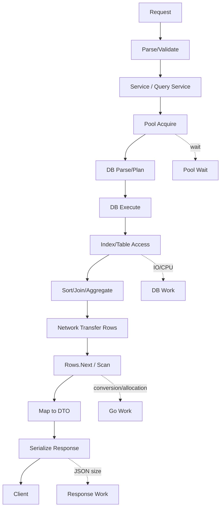
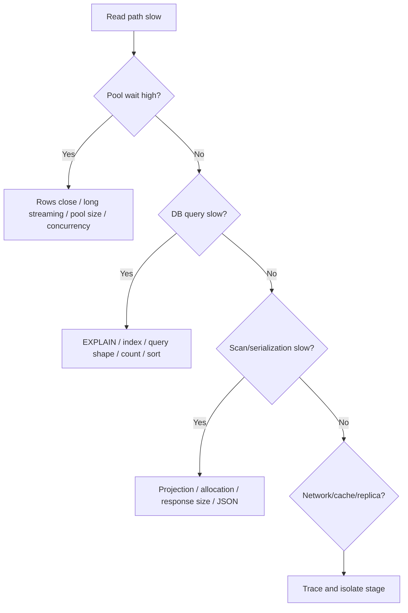

# learn-go-sql-database-integration-part-025.md

# Read Path Performance and Query Efficiency

> Seri: `learn-go-sql-database-integration`  
> Part: `025`  
> Topik: `Read Path Performance, Query Efficiency, Index-Aware Reads, Scan Cost, N+1, Pagination Cost, Count Cost, Streaming, Caching Boundary, Pool Impact, and Observability`  
> Target pembaca: Java software engineer yang ingin memahami Go database integration sampai level production architecture  
> Target Go: Go 1.26.x  
> Status seri: **belum selesai**

---

## 0. Posisi Part Ini Dalam Seri

Pada part sebelumnya kita membahas:

- query composition;
- safe dynamic SQL;
- pagination;
- sorting;
- search;
- listing API;
- cursor/keyset;
- bulk insert;
- batch update;
- high-throughput write paths.

Part ini fokus ke jalur yang paling sering dipanggil dalam aplikasi backend:

> Read path.

Read path terlihat mudah:

```go
rows, err := db.QueryContext(ctx, query, args...)
```

Tetapi performa read di production tidak hanya ditentukan oleh SQL text. Ia ditentukan oleh rantai lengkap:

```text
HTTP/gRPC request
-> service validation
-> repository/query service
-> pool acquire
-> DB parse/plan/execute
-> index/table access
-> network transfer
-> rows iteration
-> Scan conversion
-> allocation
-> mapping
-> JSON/gRPC serialization
-> response size
```

Read path yang buruk sering menyebabkan:

- API lambat;
- pool penuh;
- DB CPU tinggi;
- IO spike;
- memory allocation tinggi;
- GC pressure;
- N+1 query;
- timeout;
- lock wait;
- replica lag;
- cache stampede;
- user-facing p95/p99 buruk;
- report/listing mengganggu OLTP.

Part ini mengajarkan bagaimana membaca data dengan efisien, bukan hanya “query berhasil”.

---

## 1. Tujuan Pembelajaran

Setelah menyelesaikan part ini, kamu harus mampu:

1. menjelaskan read path end-to-end dari handler sampai scan dan serialization;
2. memahami bahwa query latency bukan hanya waktu database;
3. membedakan query shape, result shape, scan shape, dan API shape;
4. membuat projection yang kecil dan tepat;
5. menghindari `SELECT *`;
6. memahami efek index, predicate, sort, join, cardinality, dan statistics;
7. membaca mental model `EXPLAIN`/query plan secara praktis;
8. menghindari N+1 query;
9. memilih join, batch load, denormalized read model, atau cache;
10. memahami count query cost;
11. memahami offset vs cursor dari sisi performa;
12. memahami streaming vs materialization;
13. mengoptimalkan scan dan allocation di Go;
14. memahami impact read path terhadap connection pool;
15. mendesain timeout dan cancellation untuk read operation;
16. membedakan OLTP read, search read, report read, and export read;
17. membuat caching boundary yang aman tanpa merusak correctness;
18. membangun metrics/log/tracing untuk read path;
19. membuat runbook untuk slow query dan read-path incident;
20. membuat checklist code review untuk query efficiency.

---

## 2. Fakta Dasar Dari Dokumentasi

Beberapa fakta yang menjadi landasan:

1. Go `database/sql` menjalankan query yang mengembalikan data dengan `Query`/`QueryContext`; method tersebut mengembalikan `Row` atau `Rows`, dan data disalin ke variable memakai `Scan`.
2. Dokumentasi Go untuk querying memperlihatkan pola `defer rows.Close()`, iterasi `rows.Next()`, `rows.Scan(...)`, dan pengecekan `rows.Err()` setelah iterasi.
3. `QueryRowContext` selalu mengembalikan `*Row` non-nil; error ditunda sampai `Scan`, dan jika tidak ada row maka `Scan` mengembalikan `sql.ErrNoRows`.
4. Dokumentasi Go tentang SQL injection menyarankan memberikan nilai SQL parameter sebagai argumen function `database/sql`, bukan memformat nilai langsung ke string SQL.
5. PostgreSQL menjelaskan bahwa query planner memilih rencana eksekusi untuk setiap query, dan `EXPLAIN` digunakan untuk melihat query plan yang dipilih.
6. PostgreSQL `EXPLAIN ANALYZE` menjalankan statement dan menampilkan runtime aktual; karena statement benar-benar dieksekusi, penggunaan untuk statement yang mengubah data perlu hati-hati.
7. PostgreSQL dokumentasi `LIMIT/OFFSET` menyebut row yang dilewati oleh `OFFSET` tetap harus dihitung di server, sehingga large offset bisa tidak efisien.
8. `database/sql` menyediakan `DB.Stats()` untuk melihat statistik pool seperti open/in-use/idle connections serta wait count/duration.

Referensi:

- Go — Querying for data: <https://go.dev/doc/database/querying>
- Go — Avoiding SQL injection risk: <https://go.dev/doc/database/sql-injection>
- Go package documentation — `database/sql`: <https://pkg.go.dev/database/sql>
- PostgreSQL — Using EXPLAIN: <https://www.postgresql.org/docs/current/using-explain.html>
- PostgreSQL — EXPLAIN: <https://www.postgresql.org/docs/current/sql-explain.html>
- PostgreSQL — LIMIT and OFFSET: <https://www.postgresql.org/docs/current/queries-limit.html>

---

## 3. Mental Model Utama

### 3.1 Read Performance Itu Bukan Hanya Index

Banyak developer berpikir:

```text
Query lambat? Tambah index.
```

Index memang penting, tetapi read performance juga dipengaruhi oleh:

- jumlah row yang dibaca;
- jumlah column yang dipilih;
- ukuran row;
- predicate selectivity;
- join cardinality;
- sort/hash/aggregate cost;
- network transfer;
- driver conversion;
- scan destination;
- allocation;
- JSON serialization;
- connection pool wait;
- context timeout;
- lock wait;
- cache behavior;
- concurrent workload.

Index adalah satu bagian dari sistem.

### 3.2 Performa Read = Work Avoidance

Query cepat biasanya karena database dan aplikasi melakukan **lebih sedikit pekerjaan**:

```text
lebih sedikit row discan
lebih sedikit column dikirim
lebih sedikit join
lebih sedikit sort
lebih sedikit allocation
lebih sedikit round trip
lebih sedikit duplicate query
lebih sedikit count
lebih sedikit conversion
```

Optimization paling kuat bukan “membuat kerja cepat”, tetapi “menghindari kerja tidak perlu”.

### 3.3 Result Shape Harus Sesuai Use Case

List screen tidak perlu semua field detail.

Bad:

```sql
SELECT *
FROM cases
```

Good:

```sql
SELECT id, reference_no, status, updated_at
FROM cases
```

Read model harus menjawab:

```text
Data apa yang benar-benar dibutuhkan oleh caller?
```

---

## 4. Diagram: Read Path End-to-End



Slow read bisa terjadi di titik mana saja.

---

## 5. Taxonomy Read Operations

Tidak semua read sama.

| Read Type | Example | Optimization Focus |
|---|---|---|
| point lookup | find by ID | primary key/index, small projection |
| existence check | `SELECT 1` | avoid full row |
| listing | search page | filter/sort/index/pagination |
| detail view | case detail | join/batch/projection |
| authorization check | can user access? | fast predicate/index/cache |
| aggregate/dashboard | counts/sums | precompute/materialize |
| report | large multi-table query | replica/warehouse/async |
| export | millions rows | streaming/batch |
| queue claim read | pending jobs | lock/index/skip locked |
| health check | ping/simple query | low overhead |

Each type needs different design.

---

## 6. Point Lookup

Use primary key or unique key.

```go
func (r UserRepo) FindByID(ctx context.Context, q DBTX, id int64) (UserRecord, error) {
	var rec UserRecord

	err := q.QueryRowContext(ctx, `
		SELECT id, email, name, status, version
		FROM users
		WHERE id = $1
	`, id).Scan(&rec.ID, &rec.Email, &rec.Name, &rec.Status, &rec.Version)

	if err != nil {
		if errors.Is(err, sql.ErrNoRows) {
			return UserRecord{}, ErrUserNotFound
		}
		return UserRecord{}, fmt.Errorf("user.find_by_id: %w", err)
	}

	return rec, nil
}
```

Performance notes:

- select only required columns;
- primary key lookup should be fast;
- avoid joining many tables for simple existence;
- map `ErrNoRows` intentionally.

---

## 7. Existence Check

Bad:

```sql
SELECT *
FROM users
WHERE email = $1;
```

just to know if exists.

Better:

```sql
SELECT 1
FROM users
WHERE email = $1
LIMIT 1;
```

Go:

```go
func (r UserRepo) ExistsByEmail(ctx context.Context, q DBTX, email string) (bool, error) {
	var one int

	err := q.QueryRowContext(ctx, `
		SELECT 1
		FROM users
		WHERE email = $1
		LIMIT 1
	`, email).Scan(&one)

	if errors.Is(err, sql.ErrNoRows) {
		return false, nil
	}
	if err != nil {
		return false, fmt.Errorf("user.exists_by_email: %w", err)
	}

	return true, nil
}
```

But for uniqueness under concurrency, existence check is not sufficient. Use unique constraint on write.

---

## 8. Count Check vs Existence Check

Bad:

```sql
SELECT COUNT(*)
FROM users
WHERE email = $1;
```

for existence.

`COUNT(*)` may count all matching rows. If you only need existence, `SELECT 1 ... LIMIT 1` can stop early.

Use count only when you need count.

---

## 9. Projection Discipline

Every query should choose explicit columns.

Bad:

```sql
SELECT *
FROM cases
WHERE id = $1;
```

Problems:

- fetches unnecessary columns;
- breaks when columns added/removed/order changes;
- exposes sensitive data accidentally;
- increases network/scan/serialization cost;
- makes index-only/covering optimization harder;
- hides intent.

Good:

```sql
SELECT id, reference_no, status, updated_at
FROM cases
WHERE id = $1;
```

Projection is a performance and security boundary.

---

## 10. API Shape vs Query Shape

API response:

```json
{
  "id": "123",
  "referenceNo": "CASE-2026-001",
  "status": "UNDER_REVIEW"
}
```

Query shape:

```sql
SELECT id, reference_no, status
FROM cases
WHERE id = $1;
```

Do not query columns that are not returned or needed for authorization/domain logic.

But do include columns needed for:

- authorization;
- version/ETag;
- cursor;
- audit decision;
- mapping.

---

## 11. Avoid Large Columns in List

Avoid selecting:

- large `TEXT`;
- `CLOB`;
- `BLOB`;
- JSON payload;
- serialized changes;
- full description;
- attachment bytes.

For list:

```sql
SELECT id, title, summary, updated_at
```

For detail:

```sql
SELECT id, title, description, full_payload
```

Separate list and detail endpoints.

---

## 12. LOB/JSON Read Cost

Large columns increase:

- disk IO;
- buffer/cache pressure;
- network transfer;
- memory allocation;
- scan time;
- GC pressure;
- JSON serialization time.

Even if DB uses TOAST/LOB storage, selecting the large column can trigger extra work.

Do not include large columns unless needed.

---

## 13. Scan Cost in Go

`Scan` copies/converts DB values into Go variables.

Costs come from:

- type conversion;
- allocation for string/[]byte;
- nullable wrappers;
- time parsing;
- JSON unmarshalling after scan;
- scanning large rows;
- scanning into `interface{}` dynamically;
- reflection in helper libraries;
- per-row object allocation.

For most apps, DB time dominates. But at high QPS or large result sets, scan cost matters.

---

## 14. Scanning Into Struct Manually

Manual scanning is verbose but explicit and fast enough.

```go
for rows.Next() {
	var item CaseListItem
	if err := rows.Scan(
		&item.ID,
		&item.ReferenceNo,
		&item.Status,
		&item.UpdatedAt,
	); err != nil {
		return nil, fmt.Errorf("scan case list item: %w", err)
	}
	items = append(items, item)
}
```

Benefits:

- no reflection;
- column order clear;
- type mapping explicit;
- easy to audit.

---

## 15. Avoid Dynamic Scan Unless Needed

Dynamic scan:

```go
cols, _ := rows.Columns()
values := make([]any, len(cols))
```

Useful for:

- admin tools;
- generic export;
- unknown schema.

But for application hot paths:

- slower;
- less type-safe;
- more allocation;
- harder to map errors.

Use static scan for hot paths.

---

## 16. Slice Preallocation

For bounded list:

```go
items := make([]CaseListItem, 0, limit)
```

For keyset using `limit+1`:

```go
items := make([]CaseListItem, 0, limit+1)
```

Avoid repeated reallocation.

But do not preallocate millions for unbounded export.

---

## 17. Streaming vs Materialization

### Materialization

```go
items := []Item{}
for rows.Next() {
    items = append(items, item)
}
return items
```

Good for bounded list.

### Streaming

```go
for rows.Next() {
    scan row
    write/process row
}
```

Good for export/large processing.

Caution:

- streaming keeps connection open;
- slow consumer holds DB connection;
- external writes/network while rows open can hurt pool;
- cancellation must be respected.

---

## 18. Streaming Export Pattern

```go
func (r ReportRepo) StreamExport(
	ctx context.Context,
	q DBTX,
	filter ExportFilter,
	handle func(ExportRow) error,
) error {
	rows, err := q.QueryContext(ctx, exportSQL, filter.Args()...)
	if err != nil {
		return err
	}
	defer rows.Close()

	for rows.Next() {
		var row ExportRow
		if err := rows.Scan(&row.A, &row.B, &row.C); err != nil {
			return err
		}
		if err := handle(row); err != nil {
			return err
		}
	}

	return rows.Err()
}
```

If `handle` writes to slow network/client, DB connection remains held. For large exports, consider:

- server-side cursor if driver supports;
- batch paging;
- writing to object storage asynchronously;
- bounded buffer;
- separate reporting pool.

---

## 19. Batching Read Processing

Instead of streaming one row to slow handler:

```go
batch := make([]Row, 0, 1000)

for rows.Next() {
    // scan into batch
    if len(batch) == cap(batch) {
        process(batch)
        batch = batch[:0]
    }
}
```

But rows remain open during processing.

Alternative:

- fetch batch page;
- close rows;
- process batch;
- fetch next batch.

This releases connection between batches.

---

## 20. Keyset Batch Processing

For background processing:

```text
SELECT id, ...
WHERE id > last_id
ORDER BY id
LIMIT 1000
```

After processing:

```text
last_id = last row ID
```

Pros:

- bounded memory;
- no large offset;
- resumable;
- releases connection per batch.

Caveat:

- rows inserted with smaller ID later may be missed depending ID strategy;
- updates can change eligibility;
- use created_at/id or job-specific snapshot if needed.

---

## 21. N+1 Query Problem

Bad:

```go
cases := ListCases(ctx)
for _, c := range cases {
	docs := ListDocumentsByCase(ctx, c.ID)
	c.DocumentCount = len(docs)
}
```

If list has 50 cases, total queries:

```text
1 + 50
```

At scale:

- many round trips;
- pool pressure;
- inconsistent reads;
- higher p99;
- DB CPU overhead.

---

## 22. N+1 Fix: Join Projection

If relation is one-to-one or many-to-one:

```sql
SELECT c.id, c.reference_no, o.name
FROM cases c
JOIN officers o ON o.id = c.officer_id
WHERE c.tenant_id = $1
ORDER BY c.updated_at DESC, c.id DESC
LIMIT $2;
```

Good when join cardinality does not multiply rows too much.

---

## 23. N+1 Fix: Batch Load

If one-to-many:

1. fetch page of cases;
2. collect case IDs;
3. fetch counts/docs for those IDs;
4. merge in memory.

```sql
SELECT case_id, COUNT(*)
FROM documents
WHERE case_id IN (...)
GROUP BY case_id;
```

This turns N+1 into 2 queries.

---

## 24. N+1 Fix: Precomputed Summary

If count is frequently needed:

```text
cases.document_count
```

maintained transactionally or asynchronously.

Pros:

- fast list.

Cons:

- write complexity;
- consistency semantics;
- reconciliation needed.

Use when read frequency justifies complexity.

---

## 25. Join Multiplication

Bad pagination with one-to-many join:

```sql
SELECT c.id, d.id
FROM cases c
JOIN documents d ON d.case_id = c.id
ORDER BY c.updated_at DESC
LIMIT 50;
```

If one case has 20 docs, you may get only a few distinct cases.

Fix:

- paginate cases first;
- batch load documents/counts;
- aggregate documents;
- use subquery/window carefully.

---

## 26. Count Query Cost

`COUNT(*)` on large filtered join can be expensive.

Bad assumption:

```text
Count is cheap because it returns one row.
```

DB still may scan many rows.

Alternatives:

- `limit+1` for hasNext;
- approximate count;
- materialized count;
- count cache;
- count only when requested;
- cap count;
- async count;
- search engine count.

---

## 27. Count Consistency

List and count may be inconsistent if run as separate statements under Read Committed.

Example:

```text
count = 100
list returns 49
```

because data changed between queries.

Options:

- accept;
- use read-only transaction with stronger isolation;
- avoid exact count;
- use materialized snapshot;
- show approximate count.

---

## 28. Pagination Performance Reminder

Offset:

```sql
LIMIT 50 OFFSET 100000
```

can be costly because skipped rows still require work.

Keyset:

```sql
WHERE (updated_at < $1 OR (updated_at = $2 AND id < $3))
ORDER BY updated_at DESC, id DESC
LIMIT 50
```

can use index more efficiently for deep traversal.

Use keyset for high-volume scrolling/audit logs/events.

---

## 29. Index Mental Model

An index helps when query predicate/sort aligns with index order.

Query:

```sql
WHERE tenant_id = $1
  AND status = $2
ORDER BY updated_at DESC, id DESC
LIMIT 50
```

Potential index:

```text
(tenant_id, status, updated_at DESC, id DESC)
```

But exact design is DB-specific and data-distribution-specific.

Index trade-offs:

- faster reads;
- slower writes;
- more storage;
- maintenance overhead;
- planner may not use it if selectivity poor.

---

## 30. Composite Index Ordering

Rule of thumb:

```text
equality predicates first,
then range/sort columns,
then tie-breaker
```

Example:

```text
tenant_id = ?
status = ?
updated_at range/order
id tie-breaker
```

Index:

```text
(tenant_id, status, updated_at, id)
```

But:

- DB can scan index backward for desc in many cases;
- mixed sort directions are DB-specific;
- partial indexes can help;
- statistics matter.

Always verify with plan.

---

## 31. Selectivity

A predicate is selective if it filters many rows.

Example:

```text
tenant_id = specific tenant -> maybe selective
status = ACTIVE -> maybe not selective if most rows active
created_at range last day -> selective depending data
```

Low-selectivity index may not help much.

Planner may choose sequential scan if it estimates many rows match.

---

## 32. Covering / Index-Only Reads

If query needs only columns in index, DB may avoid table lookup depending DB and visibility rules.

Example listing:

```sql
SELECT id, status, updated_at
FROM cases
WHERE tenant_id = $1
ORDER BY updated_at DESC, id DESC
LIMIT 50;
```

Index containing:

```text
tenant_id, updated_at, id, status
```

may help.

Do not overuse covering indexes; they increase write/storage cost.

---

## 33. Partial Index

If most queries exclude soft-deleted rows:

```sql
WHERE deleted_at IS NULL
```

A partial index can be effective in DBs that support it.

Concept:

```text
index only active rows
```

Benefits:

- smaller index;
- faster common query;
- less write overhead for excluded rows.

Portability varies by database.

---

## 34. Functional / Expression Index

If query uses:

```sql
LOWER(email) = LOWER($1)
```

normal index on `email` may not help.

Need functional/expression index where supported:

```text
index on lower(email)
```

Alternative:

- store normalized_email column;
- maintain on write.

For portability and clarity, normalized column often works well.

---

## 35. Query Plan Basics

A plan answers:

```text
How will DB execute this query?
```

Common operations:

- sequential/table scan;
- index scan;
- bitmap index scan;
- nested loop join;
- hash join;
- merge join;
- sort;
- aggregate;
- materialize;
- limit;
- filter.

Optimization begins by understanding plan.

---

## 36. EXPLAIN vs EXPLAIN ANALYZE

Conceptually:

- `EXPLAIN`: show estimated plan.
- `EXPLAIN ANALYZE`: execute query and show actual runtime/rows.

Caution:

- `EXPLAIN ANALYZE` executes query.
- For writes, it changes data unless wrapped/rolled back carefully.
- Production usage must be controlled.

For slow SELECT, `EXPLAIN ANALYZE` is extremely useful in safe environment.

---

## 37. What to Look For in Plan

Checklist:

- expected index used?
- rows estimated vs actual rows?
- sequential scan on huge table?
- sort spilling?
- join order reasonable?
- nested loop over large input?
- filter applied late?
- rows removed by filter huge?
- limit applied early or late?
- count scanning huge rows?
- function on column prevents index?
- implicit cast prevents index?
- stale statistics?

---

## 38. Cardinality Estimate

Planner relies on statistics to estimate rows.

If estimate wrong:

- wrong join strategy;
- wrong index choice;
- bad sort/aggregate plan;
- slow query.

Causes:

- stale statistics;
- skewed data;
- correlated columns;
- parameterized query;
- missing extended stats (DB-specific);
- rapidly changing table.

DBA/query tuning includes statistics maintenance.

---

## 39. Query Shape Matters More Than Micro-Optimizing Go

If DB scans 10 million rows, optimizing Go scan allocation will not save you.

Optimization priority:

1. correct query semantics;
2. right predicate;
3. right index;
4. right pagination/count;
5. smaller projection;
6. fewer round trips;
7. scan/allocation optimization;
8. serialization optimization.

Do not micro-optimize before plan is sane.

---

## 40. Avoid Functions on Indexed Columns in Predicate

Potentially bad:

```sql
WHERE LOWER(email) = LOWER($1)
```

unless functional index exists.

Better:

```sql
WHERE normalized_email = $1
```

with normalized value stored.

Potentially bad:

```sql
WHERE DATE(created_at) = $1
```

Better:

```sql
WHERE created_at >= $from
  AND created_at < $to
```

This preserves range index usage.

---

## 41. Avoid Implicit Type Casts

If column is integer and you pass string, DB may cast.

Bad:

```sql
WHERE id = '123'
```

or driver sends wrong type.

Use correct Go types:

```go
var id int64
```

and bind `id`.

Type mismatch can prevent index usage in some DBs or cause runtime errors.

---

## 42. Avoid Leading Wildcard Search on Huge Tables

```sql
WHERE name LIKE '%abc%'
```

Often cannot use ordinary B-tree index effectively.

Options:

- prefix search `abc%`;
- full-text index;
- trigram index if DB supports;
- search engine;
- materialized search column;
- min keyword length;
- async search.

---

## 43. Avoid OR That Kills Index Use

Query:

```sql
WHERE status = $1 OR officer_id = $2
```

may be harder to optimize.

Alternatives:

- split into `UNION ALL` if semantically safe;
- use separate endpoints;
- use bitmap index support if DB handles well;
- analyze plan.

Do not automatically rewrite; measure.

---

## 44. Avoid Huge `IN` List

Huge `IN (...)` can cause:

- large SQL text;
- many parameters;
- parse overhead;
- poor plan;
- memory cost.

Alternatives:

- staging table;
- temporary table;
- array binding if DB/driver supports;
- join to values table;
- batch by chunks.

---

## 45. Avoid Unbounded Sort

Sorting large result without index:

```sql
ORDER BY created_at DESC
```

on millions rows can be expensive.

Index can support order.

If filtering is broad and sort not indexed, DB may sort large data.

Use:

- index matching filter/order;
- narrower filters;
- keyset pagination;
- materialized view;
- async report.

---

## 46. Round Trips Matter

N queries over network cost more than one or two well-designed queries.

But one giant query can be worse if it joins too much.

Balance:

- point lookup: one query;
- list + counts: maybe two queries;
- one-to-many detail: batch load;
- report: maybe specialized query;
- avoid N+1.

---

## 47. Connection Pool Impact of Reads

Read query holds connection from start until rows are closed.

If you:

- scan slowly;
- process each row slowly;
- call external service while rows open;
- stream to slow client;
- forget rows.Close;

you hold pool connection longer.

Pool symptoms:

- `InUse` high;
- `WaitCount` increasing;
- `WaitDuration` high;
- p99 latency high;
- DB may be idle but app waits for pool.

---

## 48. Fast Scan, Slow Processing

Bad:

```go
for rows.Next() {
    scan
    callExternalAPI()
}
```

Connection remains open while external API runs.

Better:

- load bounded rows into memory, close rows, then external calls;
- process in batches;
- separate async workflow;
- avoid external calls in read path.

---

## 49. Always Close Rows

```go
rows, err := db.QueryContext(ctx, query, args...)
if err != nil {
	return err
}
defer rows.Close()
```

If returning early:

```go
return err
```

defer closes rows.

But in loops of queries, defer inside loop may close too late.

Bad:

```go
for _, x := range xs {
	rows, _ := db.QueryContext(...)
	defer rows.Close()
}
```

Close explicitly per iteration or refactor.

---

## 50. Always Check Rows Err

```go
for rows.Next() {
	// scan
}

if err := rows.Err(); err != nil {
	return err
}
```

Errors can happen during iteration:

- context canceled;
- network error;
- server cursor error;
- driver error.

Skipping `rows.Err()` can silently return partial data.

---

## 51. QueryRow for At-Most-One

Use `QueryRowContext` for expected one row.

But be aware:

```go
QueryRowContext always returns non-nil Row.
Error appears at Scan.
```

Also:

```text
If query returns multiple rows, Row.Scan scans first and discards rest.
```

So query should enforce uniqueness/limit as appropriate.

---

## 52. Query for Multiple Rows

Use `QueryContext` for lists.

Do not use `QueryContext` when no rows are expected; use `ExecContext`.

For query returning `RETURNING`, use `QueryContext`/`QueryRowContext`.

---

## 53. Avoid Querying Same Data Repeatedly

Within one request:

```go
user := LoadUser(id)
...
user2 := LoadUser(id)
```

Maybe cache in request scope.

But do not let request-scope cache hide authorization/state changes incorrectly.

For immutable/reference data, caching can help.

---

## 54. Caching Boundary

Cache is useful for reads, but dangerous for invariants.

Cache good candidates:

- reference/master data;
- feature flags with TTL;
- permissions with documented staleness;
- expensive read projections;
- external API result;
- computed dashboards;
- static configs.

Cache bad candidates:

- stock/saldo invariant;
- idempotency decision without DB;
- lock/state transition correctness;
- authorization requiring immediate revocation unless designed.

Database remains source of truth for write correctness.

---

## 55. Cache Aside Pattern

Read:

```text
try cache
if miss:
  query DB
  store cache
return
```

Problems:

- stale data;
- stampede;
- invalidation;
- negative caching;
- partial failures.

Use for read paths where staleness is acceptable.

---

## 56. Cache Stampede

Many requests miss same key simultaneously, all query DB.

Mitigation:

- singleflight;
- request coalescing;
- stale-while-revalidate;
- jittered TTL;
- prewarm;
- rate limit.

Go has `singleflight` in `golang.org/x/sync/singleflight` (external module), or implement simple local coalescing.

---

## 57. Negative Caching

Cache not-found result:

```text
user 123 not found
```

Useful against repeated misses.

Caution:

- if user created soon after, cache stale;
- use short TTL;
- scope by tenant/authorization;
- avoid caching sensitive existence in shared cache.

---

## 58. Cache Invalidation

Options:

- TTL only;
- write-through;
- delete cache after DB commit;
- outbox event invalidates cache;
- versioned cache key;
- stale-while-revalidate.

Do not invalidate before transaction commit.

If transaction rolls back, cache may be wrong.

---

## 59. Read-Your-Write

If user updates data then immediately reads:

- read primary;
- bypass cache;
- update cache after commit;
- use versioned response;
- avoid stale replica.

Define behavior.

---

## 60. Replica Reads

Replica reads reduce primary load but introduce lag.

Use for:

- stale-tolerant listing;
- reports;
- dashboards;
- public read mostly data.

Avoid for:

- read-after-write;
- invariant checks;
- authorization decisions requiring latest state;
- idempotency lookup after commit ambiguity unless replica lag considered.

---

## 61. Query Timeout

Set timeout based on operation type.

```go
ctx, cancel := context.WithTimeout(ctx, 300*time.Millisecond)
defer cancel()

rows, err := db.QueryContext(ctx, query, args...)
```

But do not blindly create new context from `context.Background`.

Use parent context.

```go
ctx, cancel := context.WithTimeout(parent, minDuration(parentDeadline, budget))
```

---

## 62. Timeout Classes

Example budgets:

| Read Type | Budget |
|---|---:|
| point lookup | 50-200ms |
| small list | 100-500ms |
| search | 300ms-2s |
| report | async |
| export | async/batch |
| health check | very short |

Exact budgets depend on system/SLO.

---

## 63. Statement Timeout

DB-side statement timeout can protect DB if app cancellation does not propagate instantly.

Use DB-specific setting.

Strategy:

- app context deadline;
- DB statement timeout slightly lower or aligned;
- operation-class budget;
- observe timeout classes.

Do not let reports run indefinitely on OLTP DB.

---

## 64. Lock Wait in Reads

Reads can block depending DB/isolation/lock modes.

Examples:

- `SELECT FOR UPDATE`;
- read under locking isolation;
- schema locks;
- DDL;
- vacuum/maintenance interactions;
- SQL Server locking read committed if row versioning off.

If read latency spikes, inspect lock wait, not only query plan.

---

## 65. Read Query Under Transaction

A transaction pins one connection.

If you do multiple reads in a transaction:

- connection held longer;
- snapshot/locks may be held;
- pool pressure;
- DB cleanup pressure depending DB.

Use transaction for consistent multi-query read only when needed.

---

## 66. Read-Only Transaction

For consistent snapshot:

```go
tx, err := db.BeginTx(ctx, &sql.TxOptions{
	ReadOnly: true,
	// Isolation: sql.LevelRepeatableRead, // if needed and supported
})
```

Use for:

- detail page from multiple queries requiring consistency;
- report snapshot;
- authorization + data consistency.

Avoid long user browsing transaction.

---

## 67. Detail Page Strategy

Detail view may need:

- case;
- applicant;
- documents;
- audit summary;
- permissions;
- comments.

Options:

1. one large join query;
2. multiple simple queries in read-only tx;
3. batch load relations;
4. precomputed detail projection;
5. async read model.

Choose based on cardinality and consistency.

One huge join can duplicate data heavily.

---

## 68. One Big Query vs Multiple Queries

One big query pros:

- fewer round trips;
- DB can optimize join;
- consistent statement snapshot.

Cons:

- complex scan;
- row multiplication;
- harder pagination;
- more data transfer;
- harder maintainability.

Multiple queries pros:

- simpler;
- avoid duplication;
- can batch;
- easier mapping.

Cons:

- more round trips;
- consistency between statements;
- N+1 risk.

Use transaction if consistency needed.

---

## 69. JSON Aggregation in DB

Some DBs can aggregate child rows into JSON.

Pros:

- one query;
- less app-side merging;
- useful for API shape.

Cons:

- DB CPU;
- DB-specific;
- large payload;
- hard type mapping;
- less flexible;
- may hide row explosion.

Use deliberately, not as default.

---

## 70. Denormalized Read Model

For heavy read path:

```text
case_listing_view table
case_search table
dashboard_summary table
```

Updated by:

- transactionally in write path;
- outbox consumer;
- scheduled refresh;
- materialized view.

Pros:

- fast reads;
- simple queries;
- decoupled from complex joins.

Cons:

- eventual consistency;
- extra storage;
- update complexity;
- reconciliation needed.

---

## 71. Materialized View

Good for:

- dashboard;
- report summary;
- expensive joins/aggregates.

Questions:

- refresh frequency;
- blocking vs concurrent refresh;
- stale data acceptable?
- index on materialized view?
- refresh cost?
- failure handling?

Not suitable for every OLTP list.

---

## 72. Read Path and Serialization

After DB scan, response serialization can dominate.

Problems:

- huge JSON response;
- many allocations;
- large strings;
- nested arrays;
- time formatting;
- reflection overhead.

Mitigations:

- smaller projection;
- limit page size;
- avoid huge nested data;
- compression if appropriate;
- efficient JSON library only after measuring;
- stream response for export.

---

## 73. Response Compression

Compression reduces network but costs CPU.

Good for:

- large text JSON;
- slow networks.

Not useful for:

- tiny responses;
- already compressed binary;
- CPU-bound service.

Measure.

---

## 74. Time Formatting

Formatting many timestamps can allocate/cost CPU.

For large exports:

- avoid unnecessary formatting;
- use efficient encoding;
- consider CSV writer;
- batch response;
- keep page bounded.

Do not optimize prematurely; profile first.

---

## 75. Profiling Go Read Path

Use:

- pprof CPU;
- pprof heap;
- execution trace if needed;
- allocation profile;
- database metrics.

Questions:

- time in DB wait or CPU?
- time in scan?
- time in JSON encode?
- allocations per row?
- GC pressure?
- pool wait?
- lock wait?

Do not guess.

---

## 76. Metrics: Read Operation

Metrics:

```text
db_query_duration_seconds{operation,result}
db_query_rows_returned{operation}
db_query_error_total{operation,class}
db_pool_wait_duration_seconds
db_pool_wait_total
api_response_bytes{route}
api_duration_seconds{route}
```

Avoid high-cardinality labels:

- raw SQL;
- user ID;
- keyword;
- full error string.

---

## 77. Metrics: Rows Returned

Rows returned is important.

A query returning 10k rows in an API expected to return 50 is a bug.

Track:

```text
rows_returned histogram
```

By operation.

Alert/inspect if near max too often.

---

## 78. Metrics: Scan Duration

Separate DB query duration from scan/processing if possible:

```text
query_start -> rows obtained
scan_start -> scan complete
serialize_start -> response complete
```

In `database/sql`, query execution and row fetching can overlap depending driver. Still useful to measure:

- time to first row;
- total iteration time;
- response serialization.

---

## 79. Trace Read Path

Span example:

```text
case.search
  parse_filter
  db.case.search
  scan_rows
  encode_response
```

Attributes:

- operation;
- limit;
- rows returned;
- pagination type;
- has keyword;
- error class;
- pool wait if available.

Do not attach sensitive args.

---

## 80. Slow Query Logging

Log when duration exceeds threshold.

Fields:

```text
operation=case.search
duration_ms=850
rows=50
limit=50
has_keyword=true
sort=updatedAt_desc
db_error_class=none
```

Avoid raw keyword/PII.

For internal secure logs, query fingerprint may be okay.

---

## 81. Query Fingerprint

Fingerprint removes values:

```sql
SELECT id FROM cases WHERE tenant_id = ? AND status = ? ORDER BY updated_at DESC LIMIT ?
```

Useful for grouping slow queries.

Do not label metrics with full dynamic query.

---

## 82. DBStats for Read Incidents

`db.Stats()` exposes pool stats such as:

- max open connections;
- open connections;
- in use;
- idle;
- wait count;
- wait duration;
- max idle closed;
- max lifetime closed.

Use to determine:

```text
Is read slow because DB query is slow,
or because app waits for pool?
```

---

## 83. Read Path Failure Modes

| Symptom | Possible Cause |
|---|---|
| high API p99 | query slow, pool wait, serialization |
| DB CPU high | scans/sorts/joins/count |
| DB IO high | table scans, large projection |
| pool wait high | rows not closed, long streaming, too few conns |
| timeout | query plan, lock wait, DB overload |
| memory high | large result, JSON encode, allocations |
| duplicate rows in pages | unstable sorting/offset |
| stale data | replica/cache |
| lock wait | transaction/DDL/select for update |
| count slow | large filtered count |

---

## 84. Runbook: Slow Point Lookup

Questions:

1. Is query by primary/unique key?
2. Is index missing?
3. Is type mismatch causing cast?
4. Is row very large?
5. Is it joining unnecessary tables?
6. Is pool wait high?
7. Is DB CPU/IO high?
8. Is lock wait involved?
9. Is network latency high?

Actions:

- fix index/type;
- reduce projection;
- split detail fields;
- inspect DB plan;
- check pool stats.

---

## 85. Runbook: Slow Listing

Questions:

1. Which filters/sort?
2. Offset or cursor?
3. Exact count?
4. Missing tenant predicate?
5. Missing index?
6. Large offset?
7. Leading wildcard search?
8. Join multiplication?
9. N+1?
10. Rows returned?
11. Projection too wide?

Actions:

- add/change index;
- switch to keyset;
- remove exact count;
- cap limit/offset;
- batch load relations;
- denormalize read model;
- search index.

---

## 86. Runbook: Pool Saturation During Reads

Questions:

1. Are rows closed?
2. Are exports streaming through OLTP pool?
3. Are slow clients holding rows?
4. Are transactions long?
5. Is N+1 causing many concurrent queries?
6. Is max open too low or DB too slow?
7. Are goroutines leaking rows?
8. Is read replica down causing fallback?

Actions:

- fix rows.Close;
- batch/close before processing;
- separate export/report pool;
- limit concurrency;
- tune pool after DB analysis;
- add timeout.

---

## 87. Runbook: Count Query Incident

Symptoms:

- listing slow;
- count query dominates;
- DB scan high.

Actions:

- disable count temporarily;
- use `hasNext`;
- add index;
- cache/materialize count;
- count only on first page;
- count asynchronously;
- limit filters.

---

## 88. Runbook: Cache Stampede

Symptoms:

- cache miss spike;
- DB read spike;
- same key queried repeatedly;
- downstream latency high.

Actions:

- add singleflight/request coalescing;
- jitter TTL;
- stale-while-revalidate;
- prewarm hot keys;
- rate limit;
- increase cache TTL if correctness allows;
- protect DB with concurrency limit.

---

## 89. Runbook: Stale Read

Symptoms:

- user updates data but list/detail shows old value.

Possible causes:

- read from replica;
- stale cache;
- async read model;
- transaction isolation/snapshot;
- browser/client cache.

Actions:

- route read-after-write to primary;
- invalidate cache after commit;
- include version/updated_at;
- document eventual consistency;
- fix projection update lag.

---

## 90. Testing Read Performance

Test types:

| Test | Purpose |
|---|---|
| repository integration | SQL syntax/scan |
| filter/sort integration | result correctness |
| pagination integration | no overlap/stable order |
| query plan test | ensure index usage where possible |
| load test | p95/p99 under concurrency |
| benchmark scan | Go allocation/scan cost |
| failure test | context timeout/rows.Err |
| cache test | stale/invalidations |

---

## 91. Integration Test: Rows Err

Hard to force generically, but ensure code path checks it by review/lint.

For custom fake rows, unit test can simulate iteration error if repository abstracts scanner.

But real `database/sql.Rows` is best tested indirectly.

---

## 92. Integration Test: Projection

Test that list endpoint does not fetch huge fields? Hard via SQL.

Instead:

- code review;
- query constants;
- metrics response size;
- database plan/IO;
- static checks for `SELECT *`.

---

## 93. Static Check: Ban SELECT Star

A simple CI script can grep:

```text
SELECT *
```

Caveat:

- false positives;
- formatting;
- generated SQL.

But useful cultural guard.

Better: SQL linting tool if available.

---

## 94. Load Test Dataset Size

Performance tests need realistic data volume.

A query fast on 1k rows may fail on 10M rows.

Prepare:

- realistic tenant distribution;
- status distribution;
- timestamps;
- deleted rows;
- skew/hot tenants;
- realistic text length;
- indexes.

Skew matters.

---

## 95. Benchmark Go Scan

For very hot paths, benchmark scan/mapping.

```go
func BenchmarkScanCaseList(b *testing.B) {
	// Use real DB or controlled rows abstraction.
}
```

But do not overfit microbenchmark without DB plan.

---

## 96. Read Optimization Decision Tree



---

## 97. Optimization Priority

Use this order:

1. correct API contract;
2. required filters/security;
3. deterministic pagination;
4. small projection;
5. remove N+1;
6. index for common filters/sorts;
7. avoid expensive count;
8. use keyset for deep pagination;
9. separate reports/exports;
10. cache only if semantics allow;
11. tune pool/concurrency;
12. optimize scan/serialization if measured.

---

## 98. Common Anti-Patterns

| Anti-pattern | Problem |
|---|---|
| `SELECT *` | waste/security/brittle |
| unbounded list | memory/DB load |
| no deterministic order | pagination bugs |
| large offset | slow |
| always exact count | slow listing |
| N+1 queries | round trip/pool pressure |
| one-to-many join then limit | wrong pagination |
| scan huge JSON/LOB in list | IO/memory/GC |
| no rows.Close | connection leak |
| no rows.Err | partial result hidden |
| external call while rows open | pool starvation |
| cache invariant checks | correctness bug |
| read-after-write from replica | stale UX |
| adding index blindly | write/storage cost |
| optimizing Go before query plan | wrong focus |

---

## 99. Code Review Checklist

### Query Shape

- [ ] No `SELECT *`.
- [ ] Projection matches API/use case.
- [ ] Required tenant/security predicate.
- [ ] Soft delete predicate if needed.
- [ ] Parameter binding used.
- [ ] Sort allowlisted.
- [ ] Deterministic order.
- [ ] Limit bounded.
- [ ] Count optional/justified.
- [ ] No large LOB/JSON in list.

### Performance

- [ ] Index supports predicate/sort.
- [ ] Large offset avoided/capped.
- [ ] N+1 avoided.
- [ ] Join cardinality understood.
- [ ] Count cost reviewed.
- [ ] Search strategy appropriate.
- [ ] Query plan checked for critical reads.
- [ ] Result size bounded.

### Go Resource Lifecycle

- [ ] `rows.Close`.
- [ ] `rows.Err`.
- [ ] Context passed.
- [ ] Timeout budget appropriate.
- [ ] Slice preallocated for bounded list.
- [ ] No slow external work while rows open.
- [ ] Errors wrapped/classified.

### Consistency

- [ ] Read from primary/replica chosen intentionally.
- [ ] Cache staleness acceptable.
- [ ] Count/list consistency semantics defined.
- [ ] Transaction used only when needed.
- [ ] Cursor semantics documented.

### Observability

- [ ] Operation name stable.
- [ ] Duration metric.
- [ ] Rows returned metric.
- [ ] Error class metric.
- [ ] Slow query log safe.
- [ ] Trace stages if critical.

---

## 100. Architecture Checklist

- [ ] Separate OLTP read from report/export.
- [ ] Query service for complex projections.
- [ ] Repository for aggregate reads/writes.
- [ ] Read model considered for heavy listing.
- [ ] Cache boundary documented.
- [ ] Replica read policy documented.
- [ ] Search engine/materialized view considered if needed.
- [ ] Load tests include realistic data.
- [ ] Runbook exists for slow reads.

---

## 101. Mini Case Study: Case Search Slow

Symptom:

```text
GET /cases?keyword=a takes 8 seconds.
```

Findings:

- query uses `LIKE '%a%'`;
- no minimum keyword length;
- table has 20M rows;
- exact count runs every request;
- list selects full description CLOB;
- offset can go to 100k.

Fix:

- min keyword length 3;
- remove full description from list;
- use keyset;
- remove exact count/default to hasNext;
- add/search index or external search;
- cap offset or disable deep offset;
- metrics for keyword search.

---

## 102. Mini Case Study: Pool Exhaustion

Symptom:

```text
DB CPU moderate, but API times out waiting for DB.
```

Findings:

- export endpoint streams CSV directly from query rows;
- slow client holds rows/connection for minutes;
- pool max open 20;
- 20 exports block all request reads.

Fix:

- move export to async job;
- separate export pool;
- batch fetch and write to object storage;
- limit concurrent exports;
- timeout/cancel;
- monitor pool wait.

---

## 103. Mini Case Study: N+1 Detail

Symptom:

```text
case list p95 high after adding document counts.
```

Bad implementation:

```text
1 query list cases
50 queries count documents
```

Fix:

```sql
SELECT case_id, COUNT(*)
FROM documents
WHERE case_id IN (...)
GROUP BY case_id;
```

or maintain `document_count`.

---

## 104. Mini Case Study: Replica Stale Read

Symptom:

```text
User updates case, refreshes list, old status shown.
```

Cause:

- write primary;
- list reads replica with 5s lag.

Options:

- after write, route user's next read to primary;
- return updated entity in write response;
- show eventual consistency;
- use session stickiness/read-your-write token;
- monitor replica lag.

---

## 105. Efficient Learning Summary

Read path performance is about reducing unnecessary work across the full chain:

```text
DB rows read
DB columns read
sort/join/count work
network bytes
scan conversion
allocation
serialization
pool hold time
cache misses
```

Best default rules:

1. Use explicit projection.
2. Avoid `SELECT *`.
3. Bind values; allowlist syntax.
4. Use deterministic pagination.
5. Prefer keyset for deep/high-volume traversal.
6. Avoid exact count unless justified.
7. Design indexes for real filters/sorts.
8. Avoid N+1.
9. Keep rows open for the shortest time possible.
10. Check `rows.Err`.
11. Separate report/export from OLTP read path.
12. Cache only where staleness is acceptable.
13. Measure DB time, pool wait, scan time, and response size.
14. Use query plans for serious tuning.

If you remember one sentence:

> A fast read path is the one that asks the database for exactly the data it needs, in an order the database can produce efficiently, and then releases the connection quickly.

---

## 106. Latihan

### Exercise 1 — SELECT Star

A list endpoint uses:

```sql
SELECT *
FROM cases
WHERE tenant_id = $1
LIMIT 50;
```

Question:

- Name at least four problems.
- Rewrite projection.

### Exercise 2 — N+1

A page returns 50 users and calls `CountOrders(userID)` per user.

Question:

- What is the problem?
- How to fix with batch query?

### Exercise 3 — Slow Count

A search endpoint runs exact count on every request.

Question:

- Why can this be expensive?
- What alternatives exist?

### Exercise 4 — Pool Saturation

Rows are streamed to a slow HTTP client.

Question:

- Why can this exhaust pool?
- What architecture is safer?

### Exercise 5 — Index Design

Query:

```sql
WHERE tenant_id = $1
  AND status = $2
ORDER BY updated_at DESC, id DESC
LIMIT 50;
```

Question:

- What index shape would you consider?
- What must you verify?

### Exercise 6 — Stale Replica

After update, user reads old value.

Question:

- What might cause it?
- What options exist?

---

## 107. Jawaban Singkat Latihan

### Exercise 1

Problems:

- returns unnecessary columns;
- may include large/sensitive columns;
- brittle scan when schema changes;
- more network/memory/GC;
- no deterministic order;
- may not use covering index.

Rewrite:

```sql
SELECT id, reference_no, status, updated_at
FROM cases
WHERE tenant_id = $1
ORDER BY updated_at DESC, id DESC
LIMIT 50;
```

### Exercise 2

Problem: N+1 queries cause many round trips and pool pressure.

Fix:

```sql
SELECT user_id, COUNT(*)
FROM orders
WHERE user_id IN (...)
GROUP BY user_id;
```

Then merge counts into users in memory.

### Exercise 3

`COUNT(*)` may scan many rows/joins even though it returns one row.

Alternatives:

- `limit+1` for `hasNext`;
- approximate count;
- cached/materialized count;
- count only when requested;
- async count;
- count threshold.

### Exercise 4

Rows remain open while streaming, holding DB connection. Slow clients can occupy all pool connections.

Safer:

- async export;
- separate export pool;
- batch fetch then close rows;
- write to object storage;
- limit concurrent exports.

### Exercise 5

Consider:

```text
(tenant_id, status, updated_at, id)
```

possibly with DESC ordering/partial index depending DB.

Verify with actual query plan and realistic data distribution.

### Exercise 6

Cause may be replica lag or stale cache.

Options:

- read primary after write;
- invalidate/update cache after commit;
- return updated entity in write response;
- document eventual consistency;
- monitor replica lag.

---

## 108. Ringkasan

Read path performance is a full-stack database integration topic.

It includes:

- query shape;
- index design;
- projection;
- pagination;
- scan lifecycle;
- pool usage;
- serialization;
- cache/replica semantics;
- observability;
- operational runbooks.

A top engineer does not only ask:

```text
How do I make this SELECT faster?
```

They ask:

```text
Why is this read doing so much work, and what part of the read path is actually slow?
```

---

## 109. Referensi

- Go documentation — Querying for data: <https://go.dev/doc/database/querying>
- Go documentation — Avoiding SQL injection risk: <https://go.dev/doc/database/sql-injection>
- Go package documentation — `database/sql`: <https://pkg.go.dev/database/sql>
- PostgreSQL documentation — Using EXPLAIN: <https://www.postgresql.org/docs/current/using-explain.html>
- PostgreSQL documentation — EXPLAIN: <https://www.postgresql.org/docs/current/sql-explain.html>
- PostgreSQL documentation — LIMIT and OFFSET: <https://www.postgresql.org/docs/current/queries-limit.html>

<!-- NAVIGATION_FOOTER -->
<div class="page-nav">
<a href="./learn-go-sql-database-integration-part-024.md">⬅️ Bulk Insert, Batch Update, and High-Throughput Write Paths</a>
<a href="./index.md">📚 Kategori</a>
<a href="../../index.md">🏠 Home</a>
<a href="./learn-go-sql-database-integration-part-026.md">Specific Integration: PostgreSQL ➡️</a>
</div>
