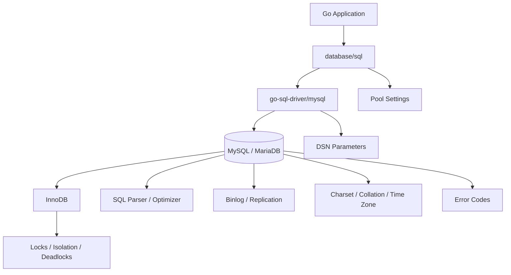

# learn-go-sql-database-integration-part-027.md

# Database-Specific Integration: MySQL / MariaDB

> Seri: `learn-go-sql-database-integration`  
> Part: `027`  
> Topik: `MySQL/MariaDB Integration in Go, go-sql-driver/mysql, DSN, Pooling, Time Handling, LastInsertId, ON DUPLICATE KEY UPDATE, InnoDB Isolation, Locks, Deadlocks, Error Codes, Replication, and Production Operations`  
> Target pembaca: Java software engineer yang ingin memahami Go database integration sampai level production architecture  
> Target Go: Go 1.26.x  
> Status seri: **belum selesai**

---

## 0. Posisi Part Ini Dalam Seri

Pada part sebelumnya kita membahas PostgreSQL-specific integration:

- `pgx` vs `database/sql`;
- PostgreSQL DSN;
- TLS;
- `$1` placeholders;
- `RETURNING`;
- `ON CONFLICT`;
- JSONB;
- UUID;
- SQLSTATE;
- transaction isolation;
- `SKIP LOCKED`;
- advisory locks;
- `COPY`;
- `LISTEN/NOTIFY`;
- EXPLAIN;
- MVCC/vacuum;
- PostgreSQL operational runbooks.

Part ini membahas database-specific integration untuk **MySQL dan MariaDB**.

Walaupun MySQL/MariaDB sama-sama SQL database dan sering dipakai melalui Go `database/sql`, behavior-nya berbeda dari PostgreSQL:

- placeholder umumnya `?`;
- DSN punya parameter seperti `parseTime`, `loc`, `timeout`, `readTimeout`, `writeTimeout`, `multiStatements`, `interpolateParams`;
- `LastInsertId` umum digunakan untuk auto-increment;
- `RETURNING` tidak bisa diasumsikan seperti PostgreSQL;
- upsert memakai `INSERT ... ON DUPLICATE KEY UPDATE`;
- default InnoDB isolation umumnya `REPEATABLE READ`;
- locking memakai record lock, gap lock, next-key lock, insert intention lock;
- deadlock/lock wait error memakai MySQL numeric error code;
- replication/read replica behavior berbeda;
- charset/collation sangat penting;
- timezone handling bisa menjadi sumber bug;
- `AUTO_INCREMENT` tidak berarti gapless;
- `RowsAffected` bisa memiliki semantics yang mengejutkan pada upsert;
- MySQL dan MariaDB punya perbedaan fitur/syntax walaupun kompatibel di banyak area.

Jika kamu menulis Go application dengan MySQL/MariaDB, kamu harus memahami driver, DSN, InnoDB, error code, dan operational trade-off-nya.

---

## 1. Tujuan Pembelajaran

Setelah menyelesaikan part ini, kamu harus mampu:

1. memilih dan mengkonfigurasi driver MySQL/MariaDB di Go;
2. memahami DSN `go-sql-driver/mysql` secara production-oriented;
3. menjelaskan parameter penting seperti `parseTime`, `loc`, `timeout`, `readTimeout`, `writeTimeout`, `charset`, `collation`, `tls`, dan `multiStatements`;
4. memahami placeholder `?` dan implikasinya pada dynamic SQL;
5. memakai `LastInsertId` dan memahami keterbatasannya;
6. memakai `RowsAffected` dengan hati-hati, terutama pada upsert;
7. memakai `INSERT ... ON DUPLICATE KEY UPDATE` dengan semantik bisnis yang benar;
8. memahami InnoDB isolation level, terutama default `REPEATABLE READ`;
9. memahami record lock, gap lock, next-key lock, deadlock, dan lock wait timeout;
10. mengklasifikasi MySQL/MariaDB error code untuk unique violation, deadlock, lock timeout, FK, syntax/schema, dan connection errors;
11. mendesain transaction retry yang aman untuk InnoDB;
12. menangani timestamp/timezone dengan benar;
13. memahami charset/collation dan case-sensitivity;
14. membuat bulk write path dengan multi-row insert, `LOAD DATA`, atau staging;
15. memahami read replica lag dan read-after-write issue;
16. membuat observability/runbook untuk MySQL/MariaDB-backed Go service;
17. menghindari anti-pattern umum MySQL/MariaDB integration di Go.

---

## 2. Fakta Dasar Dari Sumber Resmi

Beberapa fakta penting:

1. `github.com/go-sql-driver/mysql` adalah MySQL driver untuk Go `database/sql`.
2. Dokumentasi driver menyatakan pool koneksi dikelola oleh Go `database/sql`; driver menyediakan DSN parameters seperti `timeout`, `readTimeout`, dan `writeTimeout` untuk koneksi individual.
3. Dokumentasi Go `database/sql` menjelaskan method seperti `QueryContext`, `ExecContext`, `BeginTx`, `Rows`, `Row`, dan `Result`.
4. Dokumentasi MySQL InnoDB menyatakan InnoDB mendukung empat isolation level SQL: `READ UNCOMMITTED`, `READ COMMITTED`, `REPEATABLE READ`, dan `SERIALIZABLE`; default InnoDB adalah `REPEATABLE READ`.
5. Dokumentasi MySQL menjelaskan `INSERT ... ON DUPLICATE KEY UPDATE` sebagai mekanisme update jika insert menyebabkan duplicate pada `UNIQUE` atau `PRIMARY KEY`.
6. Dokumentasi MySQL menjelaskan InnoDB deadlock detection: InnoDB dapat mendeteksi deadlock dan me-rollback salah satu transaction untuk memutus deadlock.
7. Dokumentasi MySQL menyarankan aplikasi harus siap mengulang transaction jika rollback terjadi karena deadlock.
8. MariaDB juga mendukung `INSERT ... ON DUPLICATE KEY UPDATE`, dengan dokumentasi tersendiri dan beberapa detail yang bisa berbeda dari MySQL.

Referensi utama:

- Go `database/sql`: <https://pkg.go.dev/database/sql>
- Go — Querying for data: <https://go.dev/doc/database/querying>
- Go — Executing SQL statements: <https://go.dev/doc/database/change-data>
- Go — Executing transactions: <https://go.dev/doc/database/execute-transactions>
- go-sql-driver/mysql: <https://github.com/go-sql-driver/mysql>
- MySQL — InnoDB Transaction Isolation Levels: <https://dev.mysql.com/doc/refman/8.4/en/innodb-transaction-isolation-levels.html>
- MySQL — InnoDB Locking: <https://dev.mysql.com/doc/refman/8.4/en/innodb-locking.html>
- MySQL — InnoDB Locking Reads: <https://dev.mysql.com/doc/en/innodb-locking-reads.html>
- MySQL — Deadlocks in InnoDB: <https://dev.mysql.com/doc/en/innodb-deadlocks.html>
- MySQL — Deadlock Detection: <https://dev.mysql.com/doc/refman/8.4/en/innodb-deadlock-detection.html>
- MySQL — INSERT Statement: <https://dev.mysql.com/doc/refman/8.4/en/insert.html>
- MySQL — INSERT ... ON DUPLICATE KEY UPDATE: <https://dev.mysql.com/doc/refman/8.4/en/insert-on-duplicate.html>
- MySQL — LOAD DATA: <https://dev.mysql.com/doc/refman/8.4/en/load-data.html>
- MariaDB — INSERT ON DUPLICATE KEY UPDATE: <https://mariadb.com/docs/server/reference/sql-statements/data-manipulation/inserting-loading-data/insert-on-duplicate-key-update>

---

## 3. Mental Model Utama

### 3.1 MySQL/MariaDB Integration Bukan “PostgreSQL Dengan Placeholder Berbeda”

Perbedaan nyata:

| Area | PostgreSQL | MySQL/MariaDB |
|---|---|---|
| placeholder umum | `$1`, `$2` | `?` |
| generated ID | `RETURNING` umum | `LastInsertId` umum |
| upsert | `ON CONFLICT` | `ON DUPLICATE KEY UPDATE` |
| default isolation | Read Committed biasanya | InnoDB Repeatable Read biasanya |
| lock model | MVCC + row locks/predicate behavior | InnoDB record/gap/next-key locks |
| error identification | SQLSTATE sangat umum | numeric driver error code + SQLSTATE |
| bulk load | `COPY` | `LOAD DATA` |
| JSON type | JSONB powerful | JSON functions/type differ |
| session state | search_path etc. | sql_mode, time_zone, charset, transaction isolation |
| replication | streaming/logical etc. | binlog/replica semantics |

Kalau kamu memindahkan pola PostgreSQL mentah ke MySQL, bisa muncul bug.

### 3.2 DSN Adalah Bagian Dari Correctness

Untuk MySQL Go driver, DSN bukan sekadar host/user/password.

Parameter DSN bisa memengaruhi:

- parsing `TIME`, `DATE`, `DATETIME`, `TIMESTAMP`;
- timezone;
- timeout;
- TLS;
- charset/collation;
- multi-statement behavior;
- connection attributes;
- prepared statement interpolation;
- allowed local infile behavior.

Salah DSN bisa membuat aplikasi:

- salah timezone;
- scan time gagal;
- query menggantung lama;
- vulnerable multi-statement injection;
- tidak terenkripsi;
- salah charset;
- kebingungan saat retry.

### 3.3 InnoDB Locking Harus Dipahami Untuk Write Path

MySQL/MariaDB production biasanya memakai InnoDB.

InnoDB locking tidak hanya “row lock”.

Ada:

- record lock;
- gap lock;
- next-key lock;
- insert intention lock;
- auto-increment lock;
- locking reads;
- deadlock detection;
- lock wait timeout.

Query shape dan index sangat memengaruhi lock behavior.

---

## 4. Diagram: Go + MySQL/MariaDB Integration



---

## 5. Driver Choice

Most common driver:

```text
github.com/go-sql-driver/mysql
```

It integrates with Go `database/sql`.

Import:

```go
import (
	"database/sql"

	_ "github.com/go-sql-driver/mysql"
)
```

Open:

```go
db, err := sql.Open("mysql", dsn)
```

Use `database/sql` APIs:

- `QueryContext`;
- `QueryRowContext`;
- `ExecContext`;
- `BeginTx`;
- `PrepareContext`.

There are other drivers/toolkits, but `go-sql-driver/mysql` is widely used and fits this series.

---

## 6. Opening MySQL Handle

```go
func OpenMySQL(ctx context.Context, dsn string) (*sql.DB, error) {
	db, err := sql.Open("mysql", dsn)
	if err != nil {
		return nil, err
	}

	db.SetMaxOpenConns(40)
	db.SetMaxIdleConns(20)
	db.SetConnMaxIdleTime(5 * time.Minute)
	db.SetConnMaxLifetime(30 * time.Minute)

	pingCtx, cancel := context.WithTimeout(ctx, 5*time.Second)
	defer cancel()

	if err := db.PingContext(pingCtx); err != nil {
		_ = db.Close()
		return nil, err
	}

	return db, nil
}
```

Notes:

- `sql.Open` does not necessarily establish connection immediately.
- `PingContext` validates connectivity.
- Pool is managed by `database/sql`.
- DSN and pool config must be validated.

---

## 7. DSN Format

Common format:

```text
user:password@tcp(host:3306)/dbname?parseTime=true&loc=UTC&timeout=5s&readTimeout=5s&writeTimeout=5s
```

Example:

```go
dsn := "app:secret@tcp(mysql.internal:3306)/appdb?parseTime=true&loc=UTC&charset=utf8mb4&collation=utf8mb4_0900_ai_ci&timeout=5s&readTimeout=5s&writeTimeout=5s"
```

For MariaDB, same driver is often used, but test features and syntax against your MariaDB version.

Do not log full DSN with password.

---

## 8. DSN Builder

Prefer building DSN from structured config.

```go
type MySQLConfig struct {
	User         string
	Password     string
	Host         string
	Port         int
	Database     string
	ParseTime    bool
	Location     string
	Charset      string
	Collation    string
	Timeout      time.Duration
	ReadTimeout  time.Duration
	WriteTimeout time.Duration
	TLSConfig    string
}

func (c MySQLConfig) DSN() string {
	values := url.Values{}

	if c.ParseTime {
		values.Set("parseTime", "true")
	}
	if c.Location != "" {
		values.Set("loc", c.Location)
	}
	if c.Charset != "" {
		values.Set("charset", c.Charset)
	}
	if c.Collation != "" {
		values.Set("collation", c.Collation)
	}
	if c.Timeout > 0 {
		values.Set("timeout", c.Timeout.String())
	}
	if c.ReadTimeout > 0 {
		values.Set("readTimeout", c.ReadTimeout.String())
	}
	if c.WriteTimeout > 0 {
		values.Set("writeTimeout", c.WriteTimeout.String())
	}
	if c.TLSConfig != "" {
		values.Set("tls", c.TLSConfig)
	}

	return fmt.Sprintf(
		"%s:%s@tcp(%s:%d)/%s?%s",
		c.User,
		c.Password,
		c.Host,
		c.Port,
		c.Database,
		values.Encode(),
	)
}
```

For password with special characters, use driver config builder if available or ensure proper escaping. Do not hand-roll insecure escaping casually.

---

## 9. Redacted DSN Logging

```go
func (c MySQLConfig) SafeLogFields() map[string]any {
	return map[string]any{
		"host":      c.Host,
		"port":      c.Port,
		"database":  c.Database,
		"user":      c.User,
		"parseTime": c.ParseTime,
		"loc":       c.Location,
		"charset":   c.Charset,
		"collation": c.Collation,
		"tls":       c.TLSConfig,
	}
}
```

Never log:

- password;
- full DSN;
- secret token;
- TLS private key path if sensitive.

---

## 10. Important DSN Parameters

### 10.1 `parseTime=true`

Without `parseTime=true`, MySQL date/time columns may scan as `[]byte`/`string` rather than `time.Time`.

For Go services, often set:

```text
parseTime=true
```

Then scan `DATE`, `DATETIME`, `TIMESTAMP` into `time.Time`.

### 10.2 `loc=UTC`

Controls location used for time parsing.

Recommended baseline:

```text
loc=UTC
```

But understand server/session timezone and column types.

### 10.3 `timeout`

Connection timeout.

### 10.4 `readTimeout` / `writeTimeout`

Socket read/write timeout per connection.

These complement context deadlines.

### 10.5 `charset=utf8mb4`

Use `utf8mb4` for full Unicode, including emoji. Old `utf8` in MySQL historically is not full UTF-8.

### 10.6 `collation`

Defines comparison/sort behavior.

Choose deliberately.

### 10.7 `tls`

Controls TLS config.

Use TLS in production according to security policy.

### 10.8 `multiStatements`

Be very careful. Enabling multiple statements can increase SQL injection blast radius.

Default should generally be disabled unless a strong reason exists.

### 10.9 `interpolateParams`

Can reduce prepared statement round trips by interpolating parameters client-side, but it changes behavior and must be reviewed carefully.

Do not enable casually.

---

## 11. TLS

Production recommendations:

- use TLS to DB unless explicitly protected by equivalent secure channel;
- verify server certificate/identity where possible;
- manage CA certs;
- rotate certs safely;
- test failover/rotation.

DSN may reference TLS config name.

Driver-specific TLS registration may be needed for custom CA.

---

## 12. Charset and Collation

MySQL/MariaDB string behavior depends heavily on charset/collation.

Important questions:

- Is data full Unicode?
- Is comparison case-insensitive?
- Is accent-insensitive?
- Is sort locale correct?
- Are unique indexes case-insensitive?
- Does app normalize email/usernames?

Example:

```text
utf8mb4_0900_ai_ci
```

means:

- utf8mb4;
- UCA 9.0.0;
- accent-insensitive;
- case-insensitive.

Exact available collations differ by MySQL/MariaDB version.

Do not assume string uniqueness semantics without checking collation.

---

## 13. Case-Insensitive Unique Email

If collation is case-insensitive, unique index on email may treat:

```text
Fajar@example.com
fajar@example.com
```

as duplicate.

This might be desired.

But if collation is case-sensitive, you may need:

- normalized email column;
- generated column;
- functional index where supported;
- application normalization.

Always define business semantics.

---

## 14. Time Handling

MySQL has:

- `DATE`;
- `TIME`;
- `DATETIME`;
- `TIMESTAMP`;
- fractional seconds support depending type definition;
- session time zone behavior especially for `TIMESTAMP`.

Practical rules:

1. use UTC policy;
2. set `parseTime=true`;
3. set `loc=UTC` unless you have strong reason;
4. set DB/session timezone explicitly if needed;
5. store instants consistently;
6. avoid mixing local UI date with DB timestamp without normalization;
7. test DST/timezone boundary.

---

## 15. `DATETIME` vs `TIMESTAMP`

General mental model:

- `DATETIME` stores date-time value without timezone conversion semantics.
- `TIMESTAMP` is time-zone-aware in MySQL behavior and can be converted between session time zone and UTC internally.

For application event timestamps, decide convention:

```text
DATETIME(6) UTC
```

or:

```text
TIMESTAMP(6) with session time_zone='+00:00'
```

Both can work if consistently applied.

Do not rely on defaults without understanding.

---

## 16. Session Time Zone

You can configure session time zone:

```sql
SET time_zone = '+00:00';
```

But session state in pooled connections can leak if changed per request.

Prefer:

- fixed connection/session config;
- stable DSN settings;
- explicit UTC times from app;
- avoid per-request session timezone.

If setting session variables after connect, ensure driver/pool reset behavior or use a connection init hook if available.

---

## 17. Placeholders: `?`

MySQL driver placeholder style:

```sql
SELECT id, email
FROM users
WHERE tenant_id = ?
  AND status = ?;
```

Go:

```go
rows, err := db.QueryContext(ctx, query, tenantID, status)
```

Dynamic SQL is simpler than PostgreSQL numbering because every placeholder is `?`.

But arg order still matters.

---

## 18. Dynamic Query With `?`

```go
clauses := []string{"tenant_id = ?"}
args := []any{tenantID}

if status != "" {
	clauses = append(clauses, "status = ?")
	args = append(args, status)
}

query := `
	SELECT id, email, status
	FROM users
	WHERE ` + strings.Join(clauses, " AND ") + `
	ORDER BY created_at DESC, id DESC
	LIMIT ?
`
args = append(args, limit)

rows, err := db.QueryContext(ctx, query, args...)
```

Values are bound.

Identifiers/order fields must still be allowlisted.

---

## 19. `LIMIT ?` Placeholders

MySQL prepared statements support placeholder markers in many positions including `LIMIT`.

Still test driver/version behavior.

If you inline limit, only inline server-validated/clamped integer.

Do not inline raw user query parameter.

---

## 20. LastInsertId

MySQL auto-increment IDs are commonly retrieved with:

```go
result, err := db.ExecContext(ctx, `
	INSERT INTO users (email, name)
	VALUES (?, ?)
`, email, name)
if err != nil {
	return err
}

id, err := result.LastInsertId()
if err != nil {
	return err
}
```

This is a common MySQL pattern.

Caution:

- multi-row insert returns first generated auto-increment ID semantics depending DB;
- triggers/other behavior can complicate assumptions;
- `LastInsertId` is connection/session related but exposed via result;
- do not use for gapless business number.

---

## 21. Auto-Increment Is Not Gapless

Auto-increment values can have gaps due to:

- rollback;
- failed insert;
- duplicate key;
- concurrency;
- allocation/cache behavior;
- server restart/settings.

Do not use auto-increment for legal gapless numbering.

For gapless numbering, you need special serialized design, audit, and business acceptance of voided numbers if applicable.

---

## 22. RowsAffected

For normal update:

```go
result, err := db.ExecContext(ctx, `
	UPDATE cases
	SET status = ?
	WHERE id = ?
	  AND status = ?
`, to, id, from)
```

`RowsAffected` can signal:

- updated;
- invalid state;
- not found;
- conflict.

For MySQL upsert, affected rows semantics can be subtle:

- insert may count differently from update;
- no-op update may count differently depending client flags/driver settings;
- `CLIENT_FOUND_ROWS`/driver settings can affect changed vs matched rows.

Do not build critical business logic on ambiguous affected-row count without testing your exact driver/server settings.

---

## 23. `INSERT ... ON DUPLICATE KEY UPDATE`

MySQL/MariaDB upsert:

```sql
INSERT INTO users (email, name)
VALUES (?, ?)
ON DUPLICATE KEY UPDATE
    name = VALUES(name);
```

This means:

```text
if insert conflicts with primary/unique key,
update existing row
```

Use carefully.

If table has multiple unique keys, conflict target is not explicit like PostgreSQL `ON CONFLICT (column)`.

This can surprise you.

---

## 24. Upsert Semantics Are Business Semantics

Before using upsert, ask:

1. Which unique key conflict should trigger update?
2. What if another unique key conflicts?
3. Is incoming source authoritative?
4. Which columns can be overwritten?
5. What if existing local data is newer?
6. Should stale source be ignored?
7. Should no-op update be avoided?
8. Should audit/outbox event be emitted?
9. How do you count inserted vs updated?
10. How do you handle MariaDB/MySQL syntax differences?

`ON DUPLICATE KEY UPDATE` is powerful but can silently hide conflicts.

---

## 25. Upsert With Version

Example:

```sql
INSERT INTO external_profiles (source_id, source_version, email, name)
VALUES (?, ?, ?, ?)
ON DUPLICATE KEY UPDATE
    email = IF(source_version < VALUES(source_version), VALUES(email), email),
    name = IF(source_version < VALUES(source_version), VALUES(name), name),
    source_version = GREATEST(source_version, VALUES(source_version));
```

This is MySQL-style and must be tested.

MariaDB supports `VALUES(col)` in `ON DUPLICATE KEY UPDATE`, but details/version compatibility can differ.

For complex logic, staging table + explicit update can be clearer.

---

## 26. Idempotency With Duplicate Key

Idempotency insert:

```sql
INSERT INTO idempotency_records (
    scope,
    idempotency_key,
    operation_type,
    request_hash,
    status,
    created_at
)
VALUES (?, ?, ?, ?, 'STARTED', UTC_TIMESTAMP(6));
```

If duplicate key error:

```text
load existing idempotency record
```

Alternative:

```sql
INSERT IGNORE ...
```

Caution:

- `INSERT IGNORE` can suppress more than duplicate errors depending SQL mode/warnings.
- It may hide data problems.
- Prefer explicit error classification or upsert semantics you fully understand.

---

## 27. `INSERT IGNORE`

`INSERT IGNORE` converts some errors to warnings and continues.

This can be useful for ingestion but dangerous.

Risks:

- hides invalid data;
- hides truncation depending SQL mode;
- hides duplicate conflict;
- fewer errors reach app;
- warning handling required.

Recommendation:

> Avoid `INSERT IGNORE` for critical business writes. Use explicit duplicate handling and strict SQL mode.

For bulk dirty import, use staging/reject strategy.

---

## 28. SQL Mode

MySQL/MariaDB `sql_mode` affects behavior:

- strictness;
- invalid dates;
- truncation;
- zero dates;
- group-by behavior;
- quotes/escaping behavior.

Production should use strict modes.

Do not rely on permissive behavior.

Application should not silently accept truncated/invalid data.

Validate `sql_mode` in environment.

---

## 29. Zero Dates

MySQL historically allowed zero dates like:

```text
0000-00-00
```

These can break time parsing in Go.

Strict SQL mode and schema constraints should prevent invalid dates.

If existing legacy schema contains zero dates, you need special handling/migration.

---

## 30. InnoDB Transaction Isolation

InnoDB supports:

- `READ UNCOMMITTED`;
- `READ COMMITTED`;
- `REPEATABLE READ`;
- `SERIALIZABLE`.

Default InnoDB isolation is `REPEATABLE READ`.

In Go:

```go
tx, err := db.BeginTx(ctx, &sql.TxOptions{
	Isolation: sql.LevelRepeatableRead,
})
```

Driver/database may map Go isolation levels to MySQL statements.

Test actual behavior.

---

## 31. Repeatable Read Default

In MySQL InnoDB, `REPEATABLE READ` is default.

It provides stable consistent reads within a transaction, but locking reads and writes have their own behavior.

Do not assume it behaves exactly like PostgreSQL Repeatable Read.

Important:

- consistent non-locking reads use snapshot;
- locking reads use locks;
- gap/next-key locks can appear;
- phantom prevention behavior differs by isolation and query.

---

## 32. Read Committed

Some systems choose `READ COMMITTED` to reduce gap locks and contention.

Trade-offs:

- repeated reads can see new committed data;
- fewer locking surprises in some workloads;
- different replication/binlog considerations historically;
- still need conditional writes/constraints.

Do not change isolation globally without testing concurrency behavior.

---

## 33. Locking Reads

MySQL InnoDB supports locking reads like:

```sql
SELECT ...
FROM cases
WHERE id = ?
FOR UPDATE;
```

and:

```sql
SELECT ...
FOR SHARE;
```

Use when you intend to update or need to prevent concurrent changes.

Caution:

- query must use proper index;
- range predicates can lock gaps;
- lock duration until transaction end;
- avoid external calls while holding locks.

---

## 34. Record Lock, Gap Lock, Next-Key Lock

Mental model:

- record lock: lock index record;
- gap lock: lock gap between index records;
- next-key lock: record lock + gap before it;
- insert intention lock: used for concurrent inserts into gaps;
- auto-increment lock: around auto-increment allocation depending settings.

Why it matters:

```sql
SELECT * FROM orders
WHERE customer_id = ?
  AND created_at BETWEEN ? AND ?
FOR UPDATE;
```

may lock a range, not just existing rows.

Missing/poor index can make locking much broader.

---

## 35. Indexes Affect Locks

InnoDB locks index records.

If predicate is unindexed or non-selective, database may scan/lock more than expected.

Rules:

- lock by primary key when possible;
- make locking predicates indexed;
- keep transactions short;
- test with concurrent workloads;
- inspect execution plan;
- monitor lock waits/deadlocks.

---

## 36. Conditional Update Still Powerful

Often better than explicit `SELECT FOR UPDATE`.

```sql
UPDATE inventory
SET stock = stock - ?
WHERE sku = ?
  AND stock >= ?;
```

Then check `RowsAffected`.

This avoids separate read decision window and can be efficient with index on `sku`.

---

## 37. Lock Wait Timeout

InnoDB lock wait timeout controls how long transaction waits for a row lock before error.

App should classify lock wait timeout as possible retry/conflict depending operation.

Do not simply increase lock wait timeout when you see errors.

Long wait means:

- user latency;
- pool occupied;
- potential cascade.

Fix root cause:

- shorter transaction;
- proper indexes;
- less concurrency;
- deterministic lock order;
- better batching.

---

## 38. Deadlocks

InnoDB can detect deadlocks and rollback one transaction.

App must:

- classify deadlock error;
- rollback;
- retry whole transaction if safe;
- add backoff/jitter;
- avoid external side effect inside retryable transaction;
- fix lock ordering/root cause if spike.

Deadlocks are normal in concurrent systems but frequent deadlocks are a design smell.

---

## 39. Deadlock Error Codes

Common MySQL driver error numbers:

| Code | Meaning |
|---:|---|
| 1062 | duplicate entry |
| 1213 | deadlock found |
| 1205 | lock wait timeout exceeded |
| 1451 | cannot delete/update parent row: FK constraint |
| 1452 | cannot add/update child row: FK constraint |
| 1045 | access denied |
| 1049 | unknown database |
| 1146 | table does not exist |
| 1054 | unknown column |
| 1064 | SQL syntax error |
| 2006 | server has gone away |
| 2013 | lost connection during query |

Exact constants can be provided by driver packages or own mapping.

---

## 40. Error Classification With go-sql-driver/mysql

Conceptual code:

```go
func ClassifyMySQL(err error) Classification {
	var myErr *mysql.MySQLError
	if !errors.As(err, &myErr) {
		return Classification{Class: ClassUnknown}
	}

	switch myErr.Number {
	case 1062:
		return Classification{Class: ClassUniqueViolation}
	case 1451, 1452:
		return Classification{Class: ClassForeignKeyViolation}
	case 1213:
		return Classification{Class: ClassDeadlock, Retryable: true}
	case 1205:
		return Classification{Class: ClassLockTimeout, Retryable: true}
	case 1045:
		return Classification{Class: ClassPermissionDenied}
	case 1049, 1146, 1054, 1064:
		return Classification{Class: ClassSyntaxOrSchema}
	case 2006, 2013:
		return Classification{Class: ClassConnection, Retryable: true}
	default:
		return Classification{Class: ClassUnknown}
	}
}
```

Actual package import:

```go
import "github.com/go-sql-driver/mysql"
```

Keep this in infrastructure layer.

---

## 41. Duplicate Key Constraint Mapping

MySQL duplicate entry error message often includes key name.

But structured constraint name may not be as clean as PostgreSQL.

Options:

- parse key name cautiously if reliable enough for your driver/version;
- map duplicate by operation context;
- design repository method so any duplicate maps to expected domain error;
- use separate unique constraints and tests.

Example:

```go
func (r UserRepo) Create(ctx context.Context, q DBTX, user User) error {
	_, err := q.ExecContext(ctx, `
		INSERT INTO users (email, name)
		VALUES (?, ?)
	`, user.Email, user.Name)
	if err == nil {
		return nil
	}

	class := r.classifier.Classify(err)
	if class.Class == ClassUniqueViolation {
		return fmt.Errorf("%w: %w", ErrEmailAlreadyUsed, err)
	}

	return err
}
```

If insert can violate multiple unique keys, mapping by context may be insufficient.

---

## 42. Foreign Key Errors

Common FK errors:

- cannot add/update child row;
- cannot delete/update parent row.

Map based on operation:

```text
insert order with unknown user -> invalid reference
delete parent with children -> conflict
```

Do not expose raw FK message.

---

## 43. Syntax/Schema Errors

Errors like:

- table does not exist;
- unknown column;
- syntax error.

Usually mean:

- migration missing;
- deployment mismatch;
- wrong database/schema;
- generated SQL bug.

Do not retry.

Trigger deployment/migration runbook.

---

## 44. Connection Errors

Examples:

- server has gone away;
- lost connection during query;
- connection refused;
- too many connections.

Retry decision depends on operation safety.

For writes, a connection error during/after commit may be ambiguous.

Use idempotency/reconciliation.

---

## 45. Commit Ambiguity

If `Commit` returns connection error:

```text
Did commit succeed?
Unknown.
```

For critical writes:

- use operation ID/idempotency key;
- unique constraints;
- audit/outbox;
- reconcile by operation ID;
- do not blindly retry non-idempotent write.

MySQL does not remove distributed systems ambiguity.

---

## 46. Transaction Retry

Retry candidates:

- deadlock 1213;
- lock wait timeout 1205 maybe;
- transient connection before statement/transaction;
- serialization-related errors if using serializable.

Retry conditions:

- whole transaction;
- no external side effects;
- idempotent command;
- bounded attempts;
- backoff/jitter;
- parent context budget;
- metrics.

---

## 47. Lock Ordering

For transfers/bulk updates, lock rows in deterministic order.

Example:

```go
first, second := orderIDs(fromID, toID)

if err := lockAccount(ctx, tx, first); err != nil {
	return err
}
if err := lockAccount(ctx, tx, second); err != nil {
	return err
}
```

SQL:

```sql
SELECT id FROM accounts WHERE id = ? FOR UPDATE;
```

This reduces deadlocks.

---

## 48. `SELECT ... FOR UPDATE SKIP LOCKED`

Modern MySQL supports `SKIP LOCKED` in locking reads.

Use for job queues/outbox workers.

Example:

```sql
SELECT id
FROM outbox_events
WHERE status = 'PENDING'
  AND next_attempt_at <= UTC_TIMESTAMP(6)
ORDER BY created_at
LIMIT ?
FOR UPDATE SKIP LOCKED;
```

Syntax positioning can vary by version; test exact syntax.

Use with:

- short transaction;
- status update;
- visibility timeout/reclaim;
- partial index equivalent if available? MySQL lacks PostgreSQL partial index; use composite indexes.

Index:

```text
(status, next_attempt_at, created_at, id)
```

---

## 49. MySQL Lacks PostgreSQL Partial Index

MySQL does not support partial indexes like PostgreSQL `WHERE status='PENDING'` in the same way.

Alternatives:

- composite index starting with status:
  ```text
  (status, next_attempt_at, created_at, id)
  ```
- generated column and index;
- separate table for pending jobs;
- partitioning;
- archive old rows.

Design indexes for MySQL capabilities.

---

## 50. Generated Columns

MySQL supports generated columns.

Use cases:

- normalized email;
- extracted JSON field;
- active flag key;
- computed date bucket.

Example concept:

```sql
email_norm VARCHAR(255) GENERATED ALWAYS AS (lower(email)) STORED
```

Then index `email_norm`.

Check exact syntax/version for MySQL/MariaDB.

---

## 51. JSON

MySQL has JSON type/functions; MariaDB behavior differs.

Use cases:

- outbox payload;
- audit metadata;
- external raw response.

Caution:

- JSON is not free-form excuse;
- indexing JSON requires generated columns/functional indexes depending version;
- large JSON in hot list queries hurts performance;
- scan as `[]byte`/`json.RawMessage`.

Go:

```go
var raw json.RawMessage
err := row.Scan(&raw)
```

Insert:

```go
payload, _ := json.Marshal(v)
_, err := db.ExecContext(ctx, `
	INSERT INTO outbox_events (id, payload)
	VALUES (?, CAST(? AS JSON))
`, id, payload)
```

Exact cast support differs; test. Often passing JSON string/bytes to JSON column works with driver/server.

---

## 52. Boolean

MySQL `BOOLEAN` is typically alias for tiny integer.

In Go, scan into `bool` usually works with driver conversion, but test schema.

For clarity:

```sql
active BOOLEAN NOT NULL
```

or:

```sql
active TINYINT(1) NOT NULL
```

Avoid ambiguous values outside 0/1.

---

## 53. Decimal / Money

Use `DECIMAL(p,s)` or integer minor units.

Do not use `FLOAT`/`DOUBLE` for money.

In Go:

- use integer cents if possible;
- or decimal library;
- or scan decimal as string.

Example:

```sql
amount_cents BIGINT NOT NULL
```

is often simplest.

---

## 54. UUID / Binary IDs

MySQL has no PostgreSQL-style native UUID type in older/common designs.

Options:

- `CHAR(36)`;
- `BINARY(16)`;
- application-generated string IDs;
- ULID-like string;
- BIGINT auto-increment.

Trade-offs:

- `CHAR(36)` easy but larger;
- `BINARY(16)` compact but conversion needed;
- time-ordered IDs improve index locality;
- random UUID primary keys can fragment B-tree.

Choose intentionally.

---

## 55. Auto-Increment and Insert Hot Spots

Auto-increment primary keys are sequential, good for B-tree locality.

But:

- gapless not guaranteed;
- high insert concurrency can involve auto-increment lock behavior;
- sharding/multi-primary replication may need strategy.

For distributed systems, app-generated IDs may be preferred.

---

## 56. Multi-Row Insert

MySQL supports:

```sql
INSERT INTO audit_events (id, case_id, action)
VALUES (?, ?, ?), (?, ?, ?), (?, ?, ?);
```

Go builder:

```go
func InsertAuditEvents(ctx context.Context, q DBTX, events []AuditEvent) error {
	if len(events) == 0 {
		return nil
	}

	var sb strings.Builder
	args := make([]any, 0, len(events)*3)

	sb.WriteString(`
		INSERT INTO audit_events (id, case_id, action)
		VALUES
	`)

	for i, e := range events {
		if i > 0 {
			sb.WriteString(",")
		}
		sb.WriteString("(?, ?, ?)")
		args = append(args, e.ID, e.CaseID, e.Action)
	}

	_, err := q.ExecContext(ctx, sb.String(), args...)
	return err
}
```

Batch size still needs limits.

---

## 57. Max Packet / Statement Size

MySQL has packet size limits and practical statement-size limits.

Large multi-row insert can fail or stress DB.

Batch by:

- rows;
- estimated bytes;
- columns;
- transaction budget;
- lock/log impact.

Start with conservative batch size and benchmark.

---

## 58. `LOAD DATA`

MySQL `LOAD DATA` loads data from file into table.

Use for high-volume imports.

Considerations:

- server-side vs local file;
- driver DSN config may control local infile;
- security risk if local infile enabled broadly;
- staging table recommended;
- validation/reject handling needed;
- DB privileges.

For production imports:

```text
load into staging
validate
merge/upsert
record rejects
```

---

## 59. Local Infile Security

Enabling local infile can be dangerous if abused.

Rules:

- keep disabled unless needed;
- allowlist files/reader if driver supports;
- use controlled import service;
- do not let user choose arbitrary server/client path;
- audit import jobs.

---

## 60. Staging Table Import

Staging flow:

```text
parse file
load staging
validate staging
mark rejects
merge into target
update import job
```

MySQL/MariaDB can use staging table and `INSERT ... SELECT ... ON DUPLICATE KEY UPDATE`.

Example:

```sql
INSERT INTO users (source_id, email, name)
SELECT source_id, email, name
FROM user_import_staging
WHERE job_id = ?
  AND error_code IS NULL
ON DUPLICATE KEY UPDATE
  email = VALUES(email),
  name = VALUES(name);
```

Test syntax differences between MySQL/MariaDB versions.

---

## 61. `VALUES(col)` in Upsert

MySQL historically used `VALUES(col)` in `ON DUPLICATE KEY UPDATE`.

Recent MySQL versions have evolved recommendations/syntax around aliases in some contexts.

MariaDB documents `VALUES()` for `ON DUPLICATE KEY UPDATE`.

Because MySQL and MariaDB diverge, test exact syntax on target version.

If you support both, keep dialect-specific SQL.

---

## 62. MySQL vs MariaDB Differences

MySQL and MariaDB are not identical.

Differences can affect:

- JSON type/functions;
- generated columns;
- `RETURNING` support;
- optimizer behavior;
- CTE behavior;
- `VALUES()` upsert syntax;
- system variables;
- error codes/messages;
- replication features;
- TLS/driver compatibility;
- data dictionary/metadata.

Do not assume “works on MySQL” means “works on MariaDB”.

Run integration tests against both if supporting both.

---

## 63. Read Replicas

MySQL replication can be asynchronous.

If app writes primary then reads replica immediately:

```text
read may not see write
```

Strategies:

- read primary after write;
- sticky primary for session;
- wait for replication position if infrastructure supports;
- tolerate eventual consistency;
- show pending UI;
- use cache invalidation carefully.

Repository/service must choose DB handle:

```go
primaryDB
replicaDB
```

---

## 64. Read/Write Splitting

```go
type MySQLRouter struct {
	Primary *sql.DB
	Replica *sql.DB
}

func (r MySQLRouter) ForRead(strong bool) *sql.DB {
	if strong || r.Replica == nil {
		return r.Primary
	}
	return r.Replica
}
```

Use primary for:

- read-after-write;
- transaction;
- strong consistency;
- auth-critical current state;
- idempotency state.

Use replica for:

- stale-tolerant listing;
- dashboards;
- reports.

---

## 65. Replica Lag Observability

Track:

- replication lag seconds;
- replica SQL thread state;
- read errors;
- stale read incidents;
- user complaints after writes.

If lag high:

- route reads to primary;
- degrade search/report;
- pause bulk jobs;
- investigate binlog volume.

---

## 66. Binlog and Bulk Writes

Large writes generate binlog volume.

Impact:

- replica lag;
- disk usage;
- CDC lag;
- backup/archive pressure.

Bulk job should monitor lag and throttle.

---

## 67. CDC / Debezium Considerations

If using MySQL binlog CDC:

- bulk update produces many events;
- schema change affects connectors;
- transaction size affects connector memory/latency;
- outbox table CDC may lag;
- update no-op may still emit events depending settings;
- idempotent consumers required.

Coordinate bulk operations with downstream consumers.

---

## 68. `EXPLAIN`

Use:

```sql
EXPLAIN SELECT ...
```

or newer formats depending MySQL/MariaDB version.

Look at:

- access type;
- possible keys;
- key used;
- rows estimated;
- filtered;
- extra: Using where, Using index, Using filesort, Using temporary.

For hot queries:

- inspect actual runtime if server supports `EXPLAIN ANALYZE`;
- compare estimates vs real;
- update statistics if needed;
- adjust index/query.

---

## 69. Filesort Is Not Always Bad

MySQL `Using filesort` means MySQL uses sort algorithm not directly index order.

It is not necessarily disk file sort, but it can be expensive.

For listing APIs, prefer index-supported order when possible.

---

## 70. Covering Index

A covering index includes all columns needed by query, allowing `Using index`.

Example query:

```sql
SELECT id, reference_no, status, updated_at
FROM cases
WHERE tenant_id = ?
  AND status = ?
ORDER BY updated_at DESC, id DESC
LIMIT ?;
```

Index:

```text
(tenant_id, status, updated_at, id, reference_no)
```

Trade-off:

- faster reads;
- larger index;
- slower writes;
- storage cost.

Do not create giant covering indexes blindly.

---

## 71. Prefix Index

MySQL supports prefix indexes on strings:

```sql
CREATE INDEX idx_email_prefix ON users(email(20));
```

Useful for long text/varchar.

Caution:

- uniqueness with prefix can be tricky;
- selectivity matters;
- collation affects comparison.

---

## 72. Full-Text Search

MySQL/MariaDB support full-text indexes.

Use for:

- natural language search;
- keyword search;
- better than `%keyword%` on huge tables.

Caution:

- behavior differs by engine/version;
- stopwords/min token length;
- relevance order;
- language support;
- transaction/update cost.

For advanced search, external search engine may be better.

---

## 73. Pagination

Offset:

```sql
ORDER BY updated_at DESC, id DESC
LIMIT ? OFFSET ?;
```

Keyset:

```sql
WHERE tenant_id = ?
  AND (
      updated_at < ?
      OR (updated_at = ? AND id < ?)
  )
ORDER BY updated_at DESC, id DESC
LIMIT ?;
```

Index:

```text
(tenant_id, updated_at, id)
```

In MySQL 8+, descending indexes exist, but optimizer/version behavior should be tested.

Even without explicit DESC index, MySQL can scan indexes in reverse in many cases.

Test with `EXPLAIN`.

---

## 74. Count Query

`COUNT(*)` can be expensive on large filtered InnoDB tables.

Do not run exact count by default for every listing.

Use:

- `limit+1` for hasNext;
- approximate/materialized count;
- separate count endpoint;
- cache;
- async report.

---

## 75. Exists Query

Use:

```sql
SELECT EXISTS (
    SELECT 1
    FROM users
    WHERE email = ?
);
```

instead of full count if only need boolean.

Go:

```go
var exists bool
err := db.QueryRowContext(ctx, query, email).Scan(&exists)
```

---

## 76. JSON Listing Anti-Pattern

Do not list huge JSON payloads:

```sql
SELECT *
FROM outbox_events
```

Better:

```sql
SELECT id, event_type, status, created_at
FROM outbox_events
```

Detail endpoint loads payload by ID.

---

## 77. Prepared Statements

`database/sql` prepared statement mechanics apply.

MySQL driver behavior:

- `PrepareContext` creates statement;
- statement resources exist per connection/server;
- close statements;
- too many prepared statements can hit server limits;
- dynamic SQL high-cardinality is bad for prepared statement cache/usage.

Use prepared statements when repeated same SQL and benchmark.

Do not prepare per request unnecessarily.

---

## 78. `interpolateParams`

Driver option `interpolateParams` can interpolate parameters into query client-side before sending.

Potential benefits:

- reduce prepared statement round trip for some patterns.

Cautions:

- security/charset restrictions documented by driver;
- changes how queries are sent;
- not same as server prepared statement;
- do not enable without reading driver docs and testing.

Default conservative approach:

```text
leave disabled unless measured and reviewed.
```

---

## 79. Multi-Statements

`multiStatements=true` allows multiple statements in one query string.

Risks:

- SQL injection impact increases;
- parameter binding limitations may apply;
- result handling complex;
- not needed for most app code.

Recommendation:

```text
keep disabled by default.
```

Use explicit transaction and separate Exec calls.

---

## 80. Session Variables

MySQL session variables/settings include:

- time_zone;
- sql_mode;
- transaction isolation;
- character_set;
- collation;
- optimizer switches;
- lock wait timeout.

Because `database/sql` reuses connections, session changes can leak.

Prefer:

- stable connection configuration;
- transaction-local/explicit reset if possible;
- avoid per-request session mutation;
- use separate connection if session state required.

---

## 81. Setting Lock Wait Timeout Per Transaction

MySQL lock wait timeout variable can be set at session level.

If you set it:

```sql
SET innodb_lock_wait_timeout = 5;
```

it affects session/connection.

In pooled app, reset after use or use a dedicated connection/session carefully.

Alternative:

- app context timeout;
- query design;
- NOWAIT/SKIP LOCKED where available;
- short transactions.

---

## 82. Timeouts Layering

Use:

- context timeout;
- driver `timeout`;
- driver `readTimeout`;
- driver `writeTimeout`;
- server-side limits if applicable;
- lock wait timeout carefully.

Example request:

```text
HTTP deadline: 2s
DB operation child context: 500ms
driver readTimeout: 5s
driver writeTimeout: 5s
connect timeout: 3s
```

Driver socket timeout should not be shorter than all legitimate queries unless intended.

---

## 83. Connection Pool Sizing

Total connections:

```text
pods * maxOpenConns per pool
```

MySQL `max_connections` is finite.

Reserve for:

- admin/DBA;
- migrations;
- monitoring;
- workers;
- replicas/proxies;
- failover headroom.

Use separate pool for batch if needed.

---

## 84. MySQL Thread/Connection Cost

MySQL uses server resources per connection/thread.

Too many app connections can hurt performance.

Use pool sizing based on:

- DB CPU/IO capacity;
- query latency;
- transaction length;
- max_connections;
- number of app instances;
- replica/primary topology.

Do not set `MaxOpenConns` arbitrarily high.

---

## 85. Connection Lifetime

Set connection max lifetime below infrastructure idle/lifetime limits if needed.

Reasons:

- load balancer/proxy idle timeout;
- server wait_timeout;
- credential rotation;
- network/NAT;
- failover.

But too short lifetime causes churn/reconnect storm.

Balance.

---

## 86. MySQL Server `wait_timeout`

MySQL closes idle connections after timeout.

If app pool keeps idle connections longer, it may get stale/broken connections.

Mitigations:

- set `ConnMaxLifetime` / `ConnMaxIdleTime`;
- driver handles bad connections where possible;
- health check;
- avoid huge idle pool.

---

## 87. Read Path Performance

Key rules:

- avoid `SELECT *`;
- use proper indexes;
- avoid large offset;
- avoid leading wildcard on huge table;
- avoid N+1;
- inspect `EXPLAIN`;
- understand collation impact;
- avoid functions on indexed columns unless generated/function index supports;
- project only needed columns.

---

## 88. Write Path Performance

Key rules:

- batch inserts;
- use transaction;
- avoid one giant transaction;
- use multi-row insert or `LOAD DATA`;
- design indexes carefully;
- avoid unnecessary no-op updates;
- watch binlog/replication lag;
- chunk large updates/deletes;
- use idempotency keys.

---

## 89. Migration Considerations

MySQL/MariaDB DDL behavior and locking vary by version/engine.

Migration risks:

- table copy/rebuild;
- metadata lock;
- long blocking DDL;
- online DDL support differences;
- index creation impact;
- adding not null/default;
- changing collation/charset;
- adding FK;
- large table alter.

Use:

- expand/contract;
- online schema change tools if needed;
- off-peak windows;
- metadata lock monitoring;
- rollback plan.

---

## 90. Metadata Locks

DDL waits for metadata locks and can block operations.

A long-running transaction can block DDL; DDL waiting can block subsequent queries.

Runbook:

- inspect processlist/performance_schema;
- find long transactions;
- avoid DDL during peak;
- set lock wait timeouts for migrations;
- use online schema migration tools.

---

## 91. Foreign Keys and Cascades

FK constraints are valuable but can lock and slow bulk operations.

Use:

- proper indexes on FK columns;
- careful cascade design;
- chunk deletes;
- avoid deleting parent with many children in one giant transaction;
- test deadlocks.

Do not disable FK lightly.

---

## 92. Partitioning

MySQL partitioning can help for:

- time-based audit/event tables;
- archival/drop old partitions;
- very large tables.

Trade-offs:

- query must include partition key for pruning;
- unique key limitations/requirements;
- operational complexity;
- version differences.

Use only with clear lifecycle/performance need.

---

## 93. Outbox Table MySQL Design

Schema sketch:

```sql
CREATE TABLE outbox_events (
    id CHAR(36) NOT NULL PRIMARY KEY,
    event_type VARCHAR(100) NOT NULL,
    aggregate_type VARCHAR(100) NOT NULL,
    aggregate_id VARCHAR(100) NOT NULL,
    payload JSON NOT NULL,
    status VARCHAR(30) NOT NULL,
    attempt_count INT NOT NULL DEFAULT 0,
    next_attempt_at DATETIME(6) NOT NULL,
    claimed_by VARCHAR(100) NULL,
    claimed_at DATETIME(6) NULL,
    created_at DATETIME(6) NOT NULL,
    updated_at DATETIME(6) NOT NULL,
    published_at DATETIME(6) NULL,
    INDEX idx_outbox_claim (status, next_attempt_at, created_at, id)
) ENGINE=InnoDB DEFAULT CHARSET=utf8mb4;
```

Use `DATETIME(6)` UTC convention or `TIMESTAMP(6)` with clear session timezone policy.

---

## 94. Claim Outbox MySQL

Transaction:

```sql
SELECT id
FROM outbox_events
WHERE status = 'PENDING'
  AND next_attempt_at <= UTC_TIMESTAMP(6)
ORDER BY created_at, id
LIMIT ?
FOR UPDATE SKIP LOCKED;
```

Then:

```sql
UPDATE outbox_events
SET status = 'PROCESSING',
    claimed_by = ?,
    claimed_at = UTC_TIMESTAMP(6),
    updated_at = UTC_TIMESTAMP(6)
WHERE id = ?
  AND status = 'PENDING';
```

Commit, then publish outside transaction.

Test exact syntax/order for MySQL/MariaDB target version.

---

## 95. Idempotency Table MySQL Design

```sql
CREATE TABLE idempotency_records (
    scope VARCHAR(200) NOT NULL,
    idempotency_key VARCHAR(200) NOT NULL,
    operation_type VARCHAR(100) NOT NULL,
    request_hash CHAR(64) NOT NULL,
    status VARCHAR(30) NOT NULL,
    response_code INT NULL,
    result_ref VARCHAR(500) NULL,
    created_at DATETIME(6) NOT NULL,
    updated_at DATETIME(6) NOT NULL,
    completed_at DATETIME(6) NULL,
    PRIMARY KEY (scope, idempotency_key),
    INDEX idx_idempotency_created (created_at)
) ENGINE=InnoDB DEFAULT CHARSET=utf8mb4;
```

Use primary/unique key for duplicate detection.

---

## 96. Insert Idempotency MySQL

```go
func (r IdempotencyRepo) InsertStarted(
	ctx context.Context,
	q DBTX,
	scope string,
	key string,
	op string,
	hash string,
) error {
	_, err := q.ExecContext(ctx, `
		INSERT INTO idempotency_records (
			scope,
			idempotency_key,
			operation_type,
			request_hash,
			status,
			created_at,
			updated_at
		)
		VALUES (?, ?, ?, ?, 'STARTED', UTC_TIMESTAMP(6), UTC_TIMESTAMP(6))
	`, scope, key, op, hash)

	if err != nil {
		if r.classifier.Classify(err).Class == ClassUniqueViolation {
			return ErrDuplicateIdempotencyKey
		}
		return fmt.Errorf("idempotency.insert_started: %w", err)
	}

	return nil
}
```

Duplicate handler loads existing row.

---

## 97. Audit Table MySQL Design

```sql
CREATE TABLE audit_events (
    id CHAR(36) NOT NULL PRIMARY KEY,
    tenant_id VARCHAR(100) NOT NULL,
    aggregate_type VARCHAR(100) NOT NULL,
    aggregate_id VARCHAR(100) NOT NULL,
    actor_id VARCHAR(100) NULL,
    action VARCHAR(100) NOT NULL,
    metadata JSON NOT NULL,
    created_at DATETIME(6) NOT NULL,
    INDEX idx_audit_tenant_created (tenant_id, created_at, id)
) ENGINE=InnoDB DEFAULT CHARSET=utf8mb4;
```

For huge audit logs:

- partition by date;
- archive;
- avoid large JSON in list response;
- keyset pagination.

---

## 98. Case Transition MySQL

```go
func (r CaseRepo) Approve(ctx context.Context, q DBTX, caseID int64) error {
	result, err := q.ExecContext(ctx, `
		UPDATE cases
		SET status = 'APPROVED',
		    version = version + 1,
		    updated_at = UTC_TIMESTAMP(6)
		WHERE id = ?
		  AND status = 'UNDER_REVIEW'
	`, caseID)
	if err != nil {
		return fmt.Errorf("case.approve: %w", err)
	}

	affected, err := result.RowsAffected()
	if err != nil {
		return fmt.Errorf("case.approve rows: %w", err)
	}
	if affected == 0 {
		return ErrInvalidStateTransition
	}

	return nil
}
```

MySQL does not need `RETURNING` for this if only success/failure needed.

If you need new version, query after update in same transaction or design differently.

---

## 99. Insert User and LastInsertId

```go
func (r UserRepo) Create(ctx context.Context, q DBTX, user NewUser) (int64, error) {
	result, err := q.ExecContext(ctx, `
		INSERT INTO users (email, name, created_at)
		VALUES (?, ?, UTC_TIMESTAMP(6))
	`, user.Email, user.Name)
	if err != nil {
		class := r.classifier.Classify(err)
		if class.Class == ClassUniqueViolation {
			return 0, ErrEmailAlreadyUsed
		}
		return 0, fmt.Errorf("user.create: %w", err)
	}

	id, err := result.LastInsertId()
	if err != nil {
		return 0, fmt.Errorf("user.create last_insert_id: %w", err)
	}

	return id, nil
}
```

---

## 100. Keyset Pagination MySQL

```sql
SELECT id, reference_no, status, updated_at
FROM cases
WHERE tenant_id = ?
  AND deleted_at IS NULL
  AND (
      updated_at < ?
      OR (updated_at = ? AND id < ?)
  )
ORDER BY updated_at DESC, id DESC
LIMIT ?;
```

Index:

```text
(tenant_id, updated_at, id)
```

If status filter common:

```text
(tenant_id, status, updated_at, id)
```

Test with `EXPLAIN`.

---

## 101. Search With LIKE

```go
pattern := "%" + EscapeLike(keyword) + "%"

rows, err := db.QueryContext(ctx, `
	SELECT id, name
	FROM users
	WHERE tenant_id = ?
	  AND name LIKE ? ESCAPE '\\'
	ORDER BY updated_at DESC, id DESC
	LIMIT ?
`, tenantID, pattern, limit)
```

Leading wildcard can be slow.

For large search:

- prefix search;
- full-text index;
- external search engine;
- generated normalized column;
- minimum keyword length.

---

## 102. Escape LIKE

```go
func EscapeLike(s string) string {
	var b strings.Builder
	b.Grow(len(s))

	for _, r := range s {
		switch r {
		case '%', '_', '\\':
			b.WriteRune('\\')
			b.WriteRune(r)
		default:
			b.WriteRune(r)
		}
	}

	return b.String()
}
```

Test against target MySQL/MariaDB version and SQL mode.

---

## 103. JSON Insert

```go
payload, err := json.Marshal(event.Payload)
if err != nil {
	return err
}

_, err = db.ExecContext(ctx, `
	INSERT INTO outbox_events (id, payload, created_at)
	VALUES (?, ?, UTC_TIMESTAMP(6))
`, event.ID, payload)
```

If column is JSON, server validates JSON.

Handle invalid JSON before DB if possible.

---

## 104. Transaction Manager

```go
func (m TxManager) Within(
	ctx context.Context,
	operation string,
	opts *sql.TxOptions,
	fn func(context.Context, *sql.Tx) error,
) error {
	tx, err := m.DB.BeginTx(ctx, opts)
	if err != nil {
		return fmt.Errorf("begin tx %s: %w", operation, err)
	}
	defer tx.Rollback()

	if err := fn(ctx, tx); err != nil {
		return err
	}

	if err := tx.Commit(); err != nil {
		return fmt.Errorf("commit tx %s: %w", operation, err)
	}

	return nil
}
```

For MySQL, consider:

- isolation level;
- lock wait handling;
- commit ambiguity;
- deadlock retry.

---

## 105. Retry Transaction Wrapper

```go
func IsRetryableMySQLTx(class Classification) bool {
	switch class.Class {
	case ClassDeadlock, ClassLockTimeout:
		return true
	default:
		return false
	}
}
```

Usage:

```go
err := Retry(ctx, 3, func(err error) bool {
	return IsRetryableMySQLTx(classifier.Classify(err))
}, backoff, func(ctx context.Context, attempt int) error {
	return txManager.Within(ctx, "case.approve", nil, func(ctx context.Context, tx *sql.Tx) error {
		return approveOnce(ctx, tx, cmd)
	})
})
```

Only safe if `approveOnce` is retry-safe/idempotent and has no external side effects.

---

## 106. MySQL/MariaDB and SQL Standard Differences

Be careful with:

- `RETURNING` availability/syntax;
- CTE support/version;
- window functions/version;
- JSON functions;
- generated columns;
- expression indexes;
- partial indexes absent/different;
- locking syntax;
- `LIMIT` in subqueries/updates;
- default SQL mode;
- identifier quoting with backticks;
- `BOOLEAN` alias behavior.

Always test SQL against target engine/version.

---

## 107. MariaDB Compatibility Notes

MariaDB diverged from MySQL over time.

If supporting MariaDB:

- run integration tests on MariaDB;
- verify JSON behavior;
- verify `ON DUPLICATE KEY UPDATE`;
- verify `VALUES()` syntax;
- verify `RETURNING` if used;
- verify locking syntax;
- verify error codes/messages;
- verify collation availability;
- verify online DDL behavior.

Do not rely only on MySQL docs.

---

## 108. Observability: Application Metrics

Metrics:

```text
db_operation_duration_seconds{db="mysql", operation}
db_errors_total{db="mysql", class}
db_tx_duration_seconds{operation}
db_tx_retries_total{class}
db_deadlocks_total
db_lock_timeouts_total
db_rows_affected{operation}
db_pool_in_use
db_pool_wait_count
```

For MySQL-specific:

```text
mysql_error_number
```

Do not use raw error message as metric label.

---

## 109. Observability: Server Side

Useful sources:

- `SHOW PROCESSLIST`;
- Performance Schema;
- Information Schema;
- InnoDB status;
- slow query log;
- `EXPLAIN`;
- replication status;
- DB metrics from cloud provider.

For deadlocks:

```sql
SHOW ENGINE INNODB STATUS;
```

can show latest detected deadlock.

In production, DB observability may come from managed DB metrics.

---

## 110. Slow Query Log

Enable/configure slow query log according to environment.

Use to find:

- slow listing;
- missing index;
- large scans;
- lock waits;
- inefficient reports;
- N+1 patterns.

Correlate with app operation names if possible.

MySQL does not automatically know your repository operation unless you add comments or correlate timing.

---

## 111. SQL Comments for Operation Name

You may add stable comments:

```sql
/* app=aceas operation=case.search */
SELECT ...
```

Caution:

- no user input in comments;
- can affect query digest depending tooling/version;
- do not expose sensitive data;
- test with proxy/monitoring.

Application tracing is often enough.

---

## 112. Runbook: Deadlock Spike

Symptoms:

- MySQL error 1213 increases;
- retries increase;
- p99 latency rises.

Check:

1. Which operation?
2. Which tables?
3. Which indexes?
4. Lock order?
5. Batch job?
6. Missing index?
7. FK cascade?
8. New deployment?
9. Worker concurrency?
10. InnoDB deadlock report?

Mitigate:

- retry whole tx if safe;
- reduce concurrency;
- fix lock order;
- add index;
- shorten tx;
- chunk batch;
- pause bulk job.

---

## 113. Runbook: Lock Wait Timeout

Symptoms:

- error 1205;
- transactions waiting;
- pool in use high.

Check:

1. blocker transaction;
2. long-running transaction;
3. missing index;
4. range lock/gap lock;
5. batch/migration;
6. external call inside tx;
7. isolation level;
8. worker concurrency.

Mitigate:

- kill blocker if approved;
- reduce concurrency;
- shorten tx;
- add index;
- change query shape;
- use retry/backoff or return busy.

---

## 114. Runbook: Too Many Connections

Symptoms:

- connection errors;
- `max_connections` reached;
- app pool wait/connection failures.

Check:

1. pods * maxOpenConns;
2. separate pools;
3. leaks/long tx;
4. connection lifetime churn;
5. batch workers;
6. DB max_connections;
7. proxy settings.

Mitigate:

- lower pool sizes;
- pause workers;
- add backpressure;
- close idle leaks;
- use proxy/pooler if appropriate;
- scale DB only after understanding.

---

## 115. Runbook: Replica Lag

Symptoms:

- stale reads;
- outbox/CDC delay;
- dashboards stale;
- read-after-write misses.

Check:

1. bulk job running?
2. long transaction?
3. binlog volume?
4. replica IO/SQL thread?
5. slow query on replica?
6. schema change?

Mitigate:

- route critical reads to primary;
- pause/throttle bulk;
- reduce transaction size;
- optimize replica;
- inform users if eventual.

---

## 116. Runbook: Schema Drift

Errors:

- unknown table;
- unknown column;
- syntax error;
- wrong collation/charset;
- missing index/constraint.

Actions:

- stop rollout;
- verify migrations;
- check target DB version;
- rollback app or apply migration;
- add migration compatibility tests.

Do not retry.

---

## 117. Runbook: Timezone Bug

Symptoms:

- timestamps shifted;
- date filter off by one day;
- audit order strange;
- user sees wrong local date.

Check:

1. DSN `parseTime`;
2. DSN `loc`;
3. DB session `time_zone`;
4. column type `DATETIME` vs `TIMESTAMP`;
5. app timezone normalization;
6. JSON serialization;
7. server timezone;
8. legacy zero dates.

Fix:

- standardize UTC;
- set `parseTime=true`;
- set `loc=UTC`;
- normalize user date range before query;
- migrate bad data if needed.

---

## 118. Runbook: Duplicate Key Unexpected

Symptoms:

- error 1062 from operation not expecting duplicate.

Check:

1. which unique index?
2. collation/case-insensitive duplicate?
3. duplicate request/retry?
4. missing idempotency?
5. concurrent insert race?
6. migration added unique?
7. upsert should be used?
8. source data duplicate?

Mitigate:

- map to domain conflict;
- add idempotency;
- dedupe data;
- fix client retry;
- add tests;
- review collation.

---

## 119. Testing MySQL/MariaDB Integration

Use real DB for integration tests.

Test:

- DSN `parseTime`;
- placeholder `?`;
- `LastInsertId`;
- duplicate key error classification;
- FK error classification;
- deadlock classification;
- lock wait timeout;
- `ON DUPLICATE KEY UPDATE`;
- JSON scan/insert;
- time zone behavior;
- collation behavior;
- transaction rollback;
- read replica behavior if possible.

Mocks cannot prove InnoDB behavior.

---

## 120. Test Duplicate Key

```go
func TestDuplicateEmail(t *testing.T) {
	ctx := context.Background()

	_, err := db.ExecContext(ctx, `
		INSERT INTO users (email) VALUES (?)
	`, "a@example.com")
	if err != nil {
		t.Fatal(err)
	}

	_, err = db.ExecContext(ctx, `
		INSERT INTO users (email) VALUES (?)
	`, "a@example.com")
	if err == nil {
		t.Fatal("expected duplicate")
	}

	class := classifier.Classify(err)
	if class.Class != ClassUniqueViolation {
		t.Fatalf("class=%s err=%v", class.Class, err)
	}
}
```

---

## 121. Test LastInsertId

```go
func TestLastInsertID(t *testing.T) {
	ctx := context.Background()

	result, err := db.ExecContext(ctx, `
		INSERT INTO users (email, name)
		VALUES (?, ?)
	`, "a@example.com", "A")
	if err != nil {
		t.Fatal(err)
	}

	id, err := result.LastInsertId()
	if err != nil {
		t.Fatal(err)
	}

	if id <= 0 {
		t.Fatalf("invalid id %d", id)
	}
}
```

---

## 122. Test parseTime

```go
func TestParseTime(t *testing.T) {
	ctx := context.Background()

	var createdAt time.Time
	err := db.QueryRowContext(ctx, `
		SELECT UTC_TIMESTAMP(6)
	`).Scan(&createdAt)
	if err != nil {
		t.Fatal(err)
	}

	if createdAt.IsZero() {
		t.Fatal("zero time")
	}
}
```

Run this with DSN `parseTime=true`.

---

## 123. Test Transaction Rollback

```go
func TestRollback(t *testing.T) {
	ctx := context.Background()

	err := txManager.Within(ctx, "test.rollback", nil, func(ctx context.Context, tx *sql.Tx) error {
		_, err := tx.ExecContext(ctx, `
			INSERT INTO audit_events (id, action)
			VALUES (?, ?)
		`, "e1", "TEST")
		if err != nil {
			return err
		}
		return errors.New("force rollback")
	})
	if err == nil {
		t.Fatal("expected error")
	}

	var exists bool
	err = db.QueryRowContext(ctx, `
		SELECT EXISTS(SELECT 1 FROM audit_events WHERE id = ?)
	`, "e1").Scan(&exists)
	if err != nil {
		t.Fatal(err)
	}
	if exists {
		t.Fatal("row should be rolled back")
	}
}
```

---

## 124. Test Deadlock Classification

Shape:

1. create two rows;
2. tx1 updates row A;
3. tx2 updates row B;
4. tx1 tries row B;
5. tx2 tries row A;
6. one transaction gets error 1213;
7. classifier maps deadlock.

Use goroutine barriers and timeouts.

---

## 125. Test Lock Wait Timeout

To test lock wait timeout:

1. tx1 locks row and sleeps;
2. tx2 sets low lock wait timeout or uses context;
3. tx2 attempts update;
4. expect lock timeout/classification.

Be careful not to make flaky tests.

---

## 126. Test Collation Semantics

If email uniqueness is case-insensitive:

```go
insert "Fajar@example.com"
insert "fajar@example.com"
expect duplicate
```

If not, expect both.

This test documents business semantics.

---

## 127. Production Checklist

### 127.1 Connection/DSN

- [ ] DSN built from structured config.
- [ ] Password redacted.
- [ ] `parseTime=true` if scanning time.
- [ ] `loc=UTC` or explicit policy.
- [ ] `charset=utf8mb4`.
- [ ] collation intentionally chosen.
- [ ] TLS configured for production.
- [ ] `timeout`, `readTimeout`, `writeTimeout` set.
- [ ] `multiStatements` disabled unless justified.
- [ ] pool size budgeted across pods.

### 127.2 SQL

- [ ] `?` placeholders used correctly.
- [ ] values bound, identifiers allowlisted.
- [ ] `LastInsertId` used only where supported/appropriate.
- [ ] `RowsAffected` semantics tested.
- [ ] `ON DUPLICATE KEY UPDATE` semantics reviewed.
- [ ] no `INSERT IGNORE` for critical writes.
- [ ] no `SELECT *` in hot paths.
- [ ] indexes reviewed with `EXPLAIN`.

### 127.3 Transactions

- [ ] isolation level intentional.
- [ ] deadlock retry safe.
- [ ] lock wait timeout handled.
- [ ] lock ordering considered.
- [ ] no external calls inside transaction.
- [ ] commit ambiguity handled for critical writes.

### 127.4 Types

- [ ] time columns and timezone policy clear.
- [ ] money avoids float.
- [ ] JSON usage intentional.
- [ ] UUID/ID strategy chosen.
- [ ] boolean semantics tested.
- [ ] collation uniqueness tested.

### 127.5 Operations

- [ ] error classifier for MySQL codes.
- [ ] slow query monitoring.
- [ ] processlist/performance schema access.
- [ ] deadlock runbook.
- [ ] replica lag monitoring.
- [ ] migration metadata lock strategy.
- [ ] bulk job backpressure.

---

## 128. MySQL/MariaDB Anti-Patterns

| Anti-pattern | Problem |
|---|---|
| missing `parseTime=true` | time scan bugs |
| ambiguous timezone | shifted timestamps |
| `charset=utf8` old assumption | incomplete Unicode |
| raw DSN logging | secret leak |
| enabling `multiStatements` casually | injection blast radius |
| relying on auto-increment as gapless | business numbering bug |
| `INSERT IGNORE` for critical data | hidden data loss |
| upsert without business semantics | silent overwrite |
| ignoring collation | duplicate/case bugs |
| no deadlock retry | random user failures |
| retry without idempotency | duplicate side effects |
| locking range without index | broad locks/deadlocks |
| huge delete/update in one tx | locks/binlog/lag |
| reading replica after write | stale reads |
| no error code classifier | wrong mapping |
| no real DB tests | false confidence |

---

## 129. Mini Case Study: User Registration

Requirement:

```text
Register user by email.
Email unique case-insensitive.
Return generated ID.
```

Design:

- `email_norm` generated/normalized or case-insensitive collation;
- unique index;
- insert with `ExecContext`;
- `LastInsertId`;
- duplicate key maps to `ErrEmailAlreadyUsed`;
- no pre-check as final guard.

Go:

```go
result, err := db.ExecContext(ctx, `
	INSERT INTO users (email, name, created_at)
	VALUES (?, ?, UTC_TIMESTAMP(6))
`, email, name)
```

On duplicate 1062:

```text
409 email_already_used
```

---

## 130. Mini Case Study: Idempotent Command

Requirement:

```text
Approve case safely under retry.
```

Design:

```text
BEGIN
INSERT idempotency key
UPDATE case WHERE status='UNDER_REVIEW'
INSERT audit
INSERT outbox
COMMIT
```

If duplicate idempotency key:

```text
load existing record
```

If commit ambiguous:

```text
retry with same key/reconcile
```

MySQL-specific:

- duplicate key error 1062;
- `UTC_TIMESTAMP(6)`;
- conditional update + `RowsAffected`;
- outbox JSON.

---

## 131. Mini Case Study: Outbox Worker

Requirement:

```text
Multiple workers publish pending events.
```

Design:

- composite index `(status, next_attempt_at, created_at, id)`;
- transaction claim with `FOR UPDATE SKIP LOCKED`;
- update status to PROCESSING;
- commit;
- publish outside tx;
- mark SENT/FAILED;
- reclaim stale processing;
- deadlock/lock wait retry.

---

## 132. Mini Case Study: Large Backfill

Requirement:

```text
Backfill normalized email for 20M users online.
```

Design:

- chunk by primary key;
- update only rows needing change;
- small transaction;
- checkpoint;
- batch pool limited;
- monitor replica lag/binlog;
- sleep/backpressure;
- no one giant transaction;
- `EXPLAIN` update select path.

---

## 133. Mini Case Study: CSV Import

Requirement:

```text
Import 2M records, reject invalid, upsert existing.
```

Design:

- upload file;
- async import job;
- load into staging with `LOAD DATA` or batched insert;
- validate staging;
- mark rejects;
- merge target with `ON DUPLICATE KEY UPDATE`;
- update job status;
- monitor binlog/replica lag;
- provide reject report.

---

## 134. Efficient Learning Summary

MySQL/MariaDB production integration in Go requires attention to:

```text
database/sql
+ go-sql-driver/mysql DSN
+ InnoDB isolation/locking
+ MySQL numeric error codes
+ time/charset/collation
+ generated ID semantics
+ upsert semantics
+ replication/binlog
+ operational runbooks
```

Best default rules:

1. Use structured DSN config.
2. Set `parseTime=true` and define UTC policy.
3. Use `utf8mb4`.
4. Keep `multiStatements` disabled.
5. Use `?` placeholders and bind all values.
6. Allowlist identifiers/sort fields.
7. Use `LastInsertId` for auto-increment only where appropriate.
8. Treat `ON DUPLICATE KEY UPDATE` as business semantics.
9. Avoid `INSERT IGNORE` for critical writes.
10. Classify MySQL error numbers.
11. Retry deadlocks only with safe whole-transaction retry.
12. Understand default InnoDB `REPEATABLE READ`.
13. Index locking predicates.
14. Monitor lock wait, deadlock, slow queries, pool, and replica lag.
15. Test against actual MySQL/MariaDB versions you support.

If you remember one sentence:

> MySQL integration bugs often come not from SQL syntax, but from hidden semantics: DSN time parsing, collation, upsert behavior, InnoDB locks, and retry ambiguity.

---

## 135. Latihan

### Exercise 1 — DSN

You scan `DATETIME` into `time.Time` and get scan errors.

Question:

- Which DSN parameter is likely missing?
- What timezone policy should you define?

### Exercise 2 — Generated ID

You insert one user with auto-increment ID.

Question:

- How do you get generated ID in Go?
- Why is this different from PostgreSQL pattern?

### Exercise 3 — Upsert

You use `ON DUPLICATE KEY UPDATE` on a table with two unique keys.

Question:

- Why can this be dangerous?
- What must be clarified?

### Exercise 4 — Deadlock

InnoDB returns deadlock error.

Question:

- Should you retry?
- What conditions must hold?

### Exercise 5 — Collation

Unique email index allows or rejects case variants depending environment.

Question:

- What should you test?
- What schema strategy can make semantics explicit?

### Exercise 6 — Read Replica

After writing, app reads from replica and does not see row.

Question:

- Why?
- What strategies can fix it?

---

## 136. Jawaban Singkat Latihan

### Exercise 1

Likely missing:

```text
parseTime=true
```

Define UTC policy, commonly `loc=UTC`, UTC app timestamps, and consistent `DATETIME(6)` or `TIMESTAMP(6)` usage.

### Exercise 2

Use:

```go
result.LastInsertId()
```

MySQL commonly supports this for auto-increment. PostgreSQL usually uses `INSERT ... RETURNING id`.

### Exercise 3

`ON DUPLICATE KEY UPDATE` does not explicitly target one conflict constraint like PostgreSQL. With multiple unique keys, an unexpected unique conflict can trigger update.

Clarify which key should be idempotency/business key and what fields may be overwritten.

### Exercise 4

Deadlock can be retried by rerunning the whole transaction if:

- operation is idempotent/retry-safe;
- no external side effects inside tx;
- max attempts/backoff exist;
- parent context budget remains.

### Exercise 5

Test whether:

```text
Fajar@example.com
fajar@example.com
```

conflict under your collation.

Explicit strategy:

- normalized email column;
- generated lower column;
- chosen case-insensitive collation;
- unique index on normalized value.

### Exercise 6

Replication is often asynchronous, so replica may lag primary.

Strategies:

- read primary after write;
- sticky primary session;
- wait for replication position if available;
- tolerate eventual consistency;
- show pending UI.

---

## 137. Ringkasan

MySQL/MariaDB are mature, powerful databases, but Go integration must respect their specific behavior.

Core lessons:

- DSN matters.
- Timezone and `parseTime` matter.
- Collation defines equality.
- `LastInsertId` is normal but not gapless.
- `ON DUPLICATE KEY UPDATE` is not the same as PostgreSQL `ON CONFLICT`.
- InnoDB default isolation and lock model affect correctness and performance.
- Deadlocks and lock wait timeouts must be classified and handled.
- Read replicas are eventually consistent.
- Bulk writes affect binlog and replication lag.
- Real integration tests are mandatory.

A top-tier Go engineer treats MySQL/MariaDB not as a generic SQL endpoint, but as a concrete database engine with specific semantics and operational behavior.

---

## 138. Referensi

- Go package documentation — `database/sql`: <https://pkg.go.dev/database/sql>
- Go documentation — Querying for data: <https://go.dev/doc/database/querying>
- Go documentation — Executing SQL statements: <https://go.dev/doc/database/change-data>
- Go documentation — Executing transactions: <https://go.dev/doc/database/execute-transactions>
- go-sql-driver/mysql: <https://github.com/go-sql-driver/mysql>
- MySQL documentation — InnoDB Transaction Isolation Levels: <https://dev.mysql.com/doc/refman/8.4/en/innodb-transaction-isolation-levels.html>
- MySQL documentation — InnoDB Locking: <https://dev.mysql.com/doc/refman/8.4/en/innodb-locking.html>
- MySQL documentation — InnoDB Locking Reads: <https://dev.mysql.com/doc/en/innodb-locking-reads.html>
- MySQL documentation — Deadlocks in InnoDB: <https://dev.mysql.com/doc/en/innodb-deadlocks.html>
- MySQL documentation — InnoDB Deadlock Detection: <https://dev.mysql.com/doc/refman/8.4/en/innodb-deadlock-detection.html>
- MySQL documentation — INSERT Statement: <https://dev.mysql.com/doc/refman/8.4/en/insert.html>
- MySQL documentation — INSERT ... ON DUPLICATE KEY UPDATE: <https://dev.mysql.com/doc/refman/8.4/en/insert-on-duplicate.html>
- MySQL documentation — LOAD DATA Statement: <https://dev.mysql.com/doc/refman/8.4/en/load-data.html>
- MariaDB documentation — INSERT ON DUPLICATE KEY UPDATE: <https://mariadb.com/docs/server/reference/sql-statements/data-manipulation/inserting-loading-data/insert-on-duplicate-key-update>

<!-- NAVIGATION_FOOTER -->
<div class="page-nav">
<a href="./learn-go-sql-database-integration-part-026.md">⬅️ Specific Integration: PostgreSQL</a>
<a href="./index.md">📚 Kategori</a>
<a href="../../index.md">🏠 Home</a>
<a href="./learn-go-sql-database-integration-part-028.md">Specific Integration: SQLite, SQL Server, and Oracle Notes ➡️</a>
</div>
