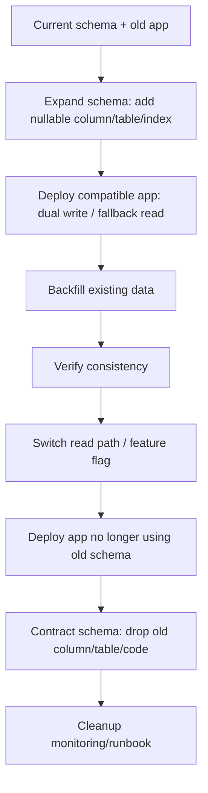

# learn-go-sql-database-integration-part-029.md

# Migrations, Schema Versioning, and Deployment Coordination

> Seri: `learn-go-sql-database-integration`  
> Part: `029`  
> Topik: `Database Migrations, Schema Versioning, Expand/Contract, Zero-Downtime Deployment, Backfill, Rollback, Migration Locking, Compatibility Windows, and Production Coordination`  
> Target pembaca: Java software engineer yang ingin memahami Go database integration sampai level production architecture  
> Target Go: Go 1.26.x  
> Status seri: **belum selesai**

---

## 0. Posisi Part Ini Dalam Seri

Pada part sebelumnya kita membahas database-specific integration:

- PostgreSQL;
- MySQL/MariaDB;
- SQLite;
- SQL Server;
- Oracle.

Sekarang kita masuk ke salah satu topik paling penting dalam database-backed service:

> Bagaimana mengubah schema database tanpa merusak production?

Banyak engineer menganggap migration hanya:

```text
buat file 001_create_table.sql
jalanin migration tool
done
```

Tetapi production migration jauh lebih kompleks.

Schema change bisa menyebabkan:

- downtime;
- lock table;
- query timeout;
- deployment rollback gagal;
- app versi lama crash;
- app versi baru crash;
- duplicate data;
- missing column;
- data corruption;
- slow query karena index belum ada;
- constraint violation;
- backfill terlalu berat;
- replication lag;
- migration stuck;
- partially applied migration;
- app dan DB schema tidak compatible;
- rolling deployment tidak aman.

Part ini membahas migration sebagai **coordination problem** antara:

```text
application code
database schema
data backfill
deployment order
runtime compatibility
rollback strategy
observability
DB-specific DDL behavior
team process
```

---

## 1. Tujuan Pembelajaran

Setelah menyelesaikan part ini, kamu harus mampu:

1. memahami migration sebagai perubahan stateful system, bukan sekadar file SQL;
2. membedakan schema migration, data migration, backfill, seed, reference data, dan operational script;
3. memahami schema versioning dan migration history table;
4. mendesain migration yang aman untuk rolling deployment;
5. memakai expand/contract pattern;
6. membedakan backward-compatible dan breaking migration;
7. merancang multi-step migration untuk add column, rename column, change type, add constraint, add index, split table, merge table, dan data backfill;
8. memahami risiko rollback pada schema/data;
9. membuat migration idempotent dan observable;
10. menghindari long lock dan DDL blocking;
11. memahami PostgreSQL `CREATE INDEX CONCURRENTLY` dan `NOT VALID` constraints;
12. memahami MySQL/MariaDB online DDL algorithm/lock caveats;
13. memahami SQLite ALTER TABLE limitation;
14. memahami SQL Server/Oracle migration coordination secara umum;
15. mendesain migration pipeline dalam CI/CD;
16. membuat production runbook untuk stuck migration, failed migration, partial migration, slow backfill, dan schema drift;
17. membuat checklist review migration untuk engineer senior.

---

## 2. Fakta Dasar Dari Dokumentasi Resmi

Beberapa fakta penting:

1. Go `database/sql` menyediakan `ExecContext` untuk statement yang tidak mengembalikan data dan `QueryContext` untuk statement yang mengembalikan data; migration runner biasanya mengeksekusi DDL/DML melalui connection database biasa.
2. Go `database/sql` menyediakan `sql.Tx` melalui `DB.Begin`/`DB.BeginTx`; tetapi tidak semua DDL database boleh atau aman dijalankan dalam transaction yang sama, dan behavior DDL sangat database-specific.
3. PostgreSQL mendokumentasikan `CREATE INDEX CONCURRENTLY`, yang membangun index tanpa mengunci write normal seperti `CREATE INDEX` biasa, tetapi punya batasan dan proses multi-step.
4. PostgreSQL mendukung menambahkan beberapa constraint sebagai `NOT VALID`, lalu melakukan `VALIDATE CONSTRAINT` kemudian; ini berguna untuk mengurangi dampak validasi terhadap concurrent workload.
5. MySQL InnoDB online DDL mendukung operasi dengan algorithm seperti `INSTANT`, `INPLACE`, dan `COPY`, serta `LOCK` clause; kemampuan dan dampaknya bergantung jenis operasi dan versi.
6. SQLite `ALTER TABLE` secara resmi hanya mendukung subset operasi seperti rename table, rename column, add column, dan drop column; perubahan lain sering butuh table rebuild pattern.
7. Karena DDL behavior berbeda antar DB, migration strategy harus database-specific, bukan hanya ORM/tool-specific.

Referensi utama:

- Go `database/sql`: <https://pkg.go.dev/database/sql>
- Go — Executing transactions: <https://go.dev/doc/database/execute-transactions>
- Go — Querying for data / Exec reference: <https://go.dev/doc/database/querying>
- PostgreSQL — `CREATE INDEX`: <https://www.postgresql.org/docs/current/sql-createindex.html>
- PostgreSQL — `ALTER TABLE`: <https://www.postgresql.org/docs/current/sql-altertable.html>
- MySQL — InnoDB Online DDL: <https://dev.mysql.com/doc/refman/8.4/en/innodb-online-ddl.html>
- MySQL — ALTER TABLE: <https://dev.mysql.com/doc/refman/8.4/en/alter-table.html>
- SQLite — ALTER TABLE: <https://www.sqlite.org/lang_altertable.html>

---

## 3. Mental Model Utama

### 3.1 Migration Mengubah Kontrak Antara App dan Database

Application code bergantung pada schema:

```text
table exists
column exists
column type compatible
constraint exists
index exists for performance
nullable/non-null semantics
default value
foreign key
unique key
view/procedure
trigger
```

Saat schema berubah, kontrak berubah.

Jika app dan DB tidak berubah secara atomic, kamu perlu compatibility window.

Production deployment sering rolling:

```text
pod A masih versi lama
pod B sudah versi baru
pod C sedang restart
worker masih versi lama
migration sudah jalan
```

Maka migration aman harus kompatibel dengan **dua versi app sekaligus** dalam periode tertentu.

### 3.2 Migration Bukan Hanya “Up” dan “Down”

Migration real punya fase:

```text
prepare
expand schema
deploy compatible code
backfill data
switch reads/writes
contract old schema
cleanup
```

Rollback juga tidak selalu “down migration”.

Contoh:

```text
DROP COLUMN old_name
```

tidak bisa di-rollback tanpa data backup.

Karena itu rollback production sering berupa:

```text
rollback app code
keep expanded schema
disable feature flag
run compensating migration later
```

bukan selalu `down.sql`.

### 3.3 Schema Change Aman Biasanya Multi-Step

Breaking direct migration:

```sql
ALTER TABLE users RENAME COLUMN name TO full_name;
```

Akan membuat app lama yang membaca `name` crash.

Aman:

```text
1. add full_name nullable
2. deploy app writing both name and full_name
3. backfill full_name
4. deploy app reading full_name with fallback
5. deploy app only using full_name
6. drop name after all old versions gone
```

Ini adalah expand/contract.

---

## 4. Diagram: Expand/Contract Migration



Core rule:

> Expand first, migrate behavior second, contract last.

---

## 5. Types of Database Change

| Change Type | Example | Risk |
|---|---|---|
| additive schema | add nullable column | usually safe |
| destructive schema | drop column/table | high |
| rename | rename column/table | high if direct |
| type change | varchar to bigint | high |
| constraint add | unique/not null/FK/check | can lock/fail |
| index add | add index on large table | can lock/IO spike |
| data backfill | populate new column | can overload DB |
| seed/reference data | insert status codes | correctness/version risk |
| stored procedure/view | replace view/proc | dependency risk |
| trigger change | audit/side effect | hidden behavior risk |
| partition change | create/drop partition | operational risk |
| permission/grant | new role access | security/runtime risk |

---

## 6. Migration Taxonomy

### 6.1 Schema Migration

Changes database structure:

```sql
CREATE TABLE
ALTER TABLE
CREATE INDEX
DROP COLUMN
```

### 6.2 Data Migration

Changes existing data:

```sql
UPDATE users SET email_norm = lower(email);
```

### 6.3 Backfill

Gradual data population for new schema:

```text
fill new column for existing rows in chunks
```

### 6.4 Seed Data

Reference/config data:

```sql
INSERT INTO countries(code, name) VALUES ...
```

### 6.5 Operational Script

One-off repair:

```text
fix broken rows for incident
```

Should be tracked/audited, even if not part of normal migration chain.

---

## 7. Migration History Table

Migration tools usually maintain a schema history table:

```text
schema_migrations
flyway_schema_history
databasechangelog
```

Typical fields:

```text
version
description
checksum
applied_at
applied_by
duration
success
```

This answers:

- which migrations ran?
- in what order?
- did one fail?
- is checksum changed?
- is environment drifted?
- can app start?

Do not edit applied migration files casually.

---

## 8. Immutable Migration Files

Once a migration has run in shared environment:

```text
do not edit it
```

Instead create new migration.

Why?

- checksum mismatch;
- environment drift;
- impossible audit;
- dev/stage/prod not same;
- rollback/debug confusion.

Exception:

- local-only before merge;
- migration never applied anywhere important;
- explicit repair procedure.

---

## 9. Version Naming

Common naming:

```text
V001__create_users.sql
V002__add_user_email_norm.sql
V003__backfill_user_email_norm.sql
```

or timestamp:

```text
20260624103000_add_user_email_norm.sql
```

Timestamp avoids merge conflicts better in parallel teams.

For large systems, include:

- module prefix;
- ticket ID;
- description.

Example:

```text
20260624103000_user_add_email_norm.sql
```

---

## 10. Migration Ordering

Migrations must run deterministically.

Avoid:

- two branches both create `V023`;
- hidden manual changes;
- environment-specific migration order;
- app startup race running migration from multiple pods.

Use CI validation.

---

## 11. Who Runs Migrations?

Options:

### 11.1 App Runs Migrations on Startup

Pros:

- simple;
- local dev easy;
- schema auto-updates.

Cons:

- multiple pods race;
- startup slower;
- long migration blocks deploy;
- app permission too broad;
- rollback hard;
- operational control low.

Good for small apps, dev, embedded systems.

### 11.2 CI/CD Migration Step

Pros:

- controlled;
- visible;
- can require approval;
- separate DB credential;
- better for production.

Cons:

- deployment orchestration needed;
- compatibility planning required.

Recommended for serious production.

### 11.3 DBA/Manual Approved

Pros:

- strong governance;
- suited enterprise DBs.

Cons:

- slower;
- risk manual drift;
- app team dependency.

Common for Oracle/SQL Server enterprise.

### 11.4 Hybrid

- migration scripts versioned in app repo;
- CI/CD applies;
- DBA approves high-risk DDL;
- app only validates schema version.

---

## 12. Migration Lock

Migration tools usually use some locking mechanism to prevent concurrent migration runners.

This is critical if:

- app startup runs migrations;
- multiple CI jobs;
- multiple instances;
- worker and API deploy separately.

Lock implementations vary:

- migration history table lock;
- advisory lock;
- DB-specific lock;
- table lock.

If building own migration runner, do not ignore concurrency.

---

## 13. Application Startup Schema Validation

App can check minimum schema version at startup:

```text
required_schema_version >= X
```

If DB too old:

```text
fail readiness/startup
```

But be careful during rolling deployment:

- new app requiring schema version X must deploy only after expand migration X is applied;
- old app must tolerate expanded schema.

Schema validation should enforce compatibility, not force unsafe deployment order.

---

## 14. Migration and Rolling Deployment

Rolling deployment means:

```text
old app and new app run simultaneously
```

Safe migration must satisfy:

| Phase | Old App | New App |
|---|---|---|
| before expand | works | not deployed |
| after expand | still works | can start |
| during dual-write | works | works |
| during backfill | works | works |
| after switch | maybe old still works if rollback needed |
| after contract | old app no longer works |

Do not contract until old app cannot be rolled back or is fully gone.

---

## 15. Backward Compatibility

Schema change is backward-compatible if old app can still run.

Examples usually backward-compatible:

- add nullable column;
- add table;
- add index;
- add view not used by old app;
- add optional FK if not blocking old writes;
- add column with safe default if no table rewrite/lock issue.

Breaking:

- drop column used by old app;
- rename column used by old app;
- make nullable column NOT NULL before old app writes it;
- change type incompatibly;
- remove enum value;
- tighten constraint before code/data ready;
- change stored procedure signature used by old app.

---

## 16. Forward Compatibility

Forward compatibility asks:

```text
Can old schema tolerate new app behavior?
```

During rollback, new app may have written data shape old app cannot understand.

Examples:

- new enum value inserted; old app cannot parse it;
- new status transition old app does not know;
- JSON payload version changed;
- new rows in reference table trigger old code bug;
- column contains values violating old assumptions.

Migration planning must include data compatibility, not only columns.

---

## 17. Expand/Contract Pattern

The safest default.

### Phase 1: Expand

Add new schema without breaking old code.

```sql
ALTER TABLE users ADD COLUMN full_name TEXT NULL;
```

### Phase 2: Dual Write

New app writes both old and new.

```text
name and full_name
```

### Phase 3: Backfill

Populate existing rows.

```sql
UPDATE users SET full_name = name WHERE full_name IS NULL;
```

in chunks.

### Phase 4: Switch Read

New app reads new column, maybe fallback to old.

### Phase 5: Verify

Check consistency.

### Phase 6: Contract

Drop old column only after safe window.

```sql
ALTER TABLE users DROP COLUMN name;
```

---

## 18. Compatibility Window

Do not contract immediately after deploy.

Wait until:

- all old pods terminated;
- workers updated;
- cron jobs updated;
- admin scripts updated;
- BI/report queries updated;
- stored procedures updated;
- rollback window passed;
- data consistency verified;
- monitoring green.

Then contract.

---

## 19. Feature Flags and Migration

Feature flags help decouple schema deploy from behavior change.

Example:

1. deploy schema expanded;
2. deploy code with feature flag off;
3. backfill;
4. enable flag for small traffic;
5. monitor;
6. ramp up;
7. later contract.

Feature flags are not substitute for schema compatibility, but they reduce risk.

---

## 20. Add Nullable Column

Usually safe:

```sql
ALTER TABLE users ADD COLUMN nickname TEXT NULL;
```

But still consider:

- table lock behavior per DB;
- default value effect;
- ORM/query `SELECT *` scan breakage;
- migration time;
- replication;
- app code.

If app uses explicit column list, safer.

---

## 21. Add Column With Default

Risk depends on DB/version.

Bad for large table in some DB/version:

```sql
ALTER TABLE users ADD COLUMN active BOOLEAN NOT NULL DEFAULT true;
```

Could rewrite table or take lock depending database/version.

Safer expand/contract:

```sql
ALTER TABLE users ADD COLUMN active BOOLEAN NULL;
```

Deploy app writing `active`.

Backfill chunks.

Then:

```sql
ALTER TABLE users ALTER COLUMN active SET NOT NULL;
```

or DB-specific equivalent.

Finally add default if needed.

---

## 22. Add NOT NULL Column Safely

Pattern:

```text
1. add column nullable
2. deploy app writing column
3. backfill old rows
4. verify no NULL
5. add NOT NULL constraint
```

Verification:

```sql
SELECT COUNT(*)
FROM users
WHERE new_col IS NULL;
```

Use approximate/limited checks for huge table if needed, but final validation must be reliable.

---

## 23. Rename Column Safely

Direct rename is breaking.

Unsafe:

```sql
ALTER TABLE users RENAME COLUMN name TO full_name;
```

Safe:

```text
1. add full_name nullable
2. app dual-writes name and full_name
3. backfill full_name = name
4. app reads full_name with fallback name
5. app reads only full_name
6. drop name later
```

Optional database trigger can keep columns in sync temporarily, but triggers add hidden behavior.

Prefer app dual-write unless DB trigger is deliberate.

---

## 24. Rename Table Safely

Direct table rename breaks old app.

Safe options:

- create new table;
- dual-write;
- backfill;
- switch reads;
- create compatibility view if feasible;
- contract old table later.

Compatibility view:

```sql
CREATE VIEW old_table AS SELECT ... FROM new_table;
```

But writes through view may not work or may require triggers/instead-of rules depending DB.

Use carefully.

---

## 25. Change Column Type Safely

Example:

```text
user_id VARCHAR -> BIGINT
```

Unsafe direct alter can:

- lock/rewrite table;
- fail on invalid data;
- break app;
- change semantics.

Safe pattern:

```text
1. add user_id_bigint nullable
2. app dual-writes both
3. backfill convertible rows
4. reject/fix invalid rows
5. app reads bigint
6. enforce NOT NULL/FK
7. drop old string column
```

Keep both columns until rollback window ends.

---

## 26. Add Unique Constraint Safely

Problem:

- existing duplicates may exist;
- adding unique index may lock/scan large table;
- concurrent writes can create duplicates during backfill.

Pattern:

```text
1. detect duplicates
2. fix/dedupe
3. deploy code preventing new duplicates
4. add unique index/constraint with online/concurrent method if available
5. handle duplicate violation in app
```

For PostgreSQL:

```sql
CREATE UNIQUE INDEX CONCURRENTLY ...
```

then optionally attach constraint depending need.

For MySQL:

- online DDL capability depends operation/version;
- use `ALGORITHM`/`LOCK` where appropriate;
- test on staging with production-like size.

---

## 27. Add Foreign Key Safely

Risk:

- existing orphan rows;
- validation scan;
- locks;
- slow cascade;
- missing indexes.

Pattern:

```text
1. add indexes on FK columns
2. find/fix orphan rows
3. deploy code maintaining FK
4. add FK with reduced lock strategy if DB supports
5. validate
```

PostgreSQL supports `NOT VALID` for FK/check constraints:

```sql
ALTER TABLE orders
ADD CONSTRAINT fk_orders_user
FOREIGN KEY (user_id) REFERENCES users(id)
NOT VALID;

ALTER TABLE orders
VALIDATE CONSTRAINT fk_orders_user;
```

This reduces initial impact but validation still must be planned.

---

## 28. Add Check Constraint Safely

Pattern:

```text
1. deploy app validation
2. fix existing bad data
3. add constraint not valid if DB supports
4. validate
5. monitor violations
```

PostgreSQL:

```sql
ALTER TABLE accounts
ADD CONSTRAINT chk_balance_non_negative
CHECK (balance >= 0)
NOT VALID;

ALTER TABLE accounts
VALIDATE CONSTRAINT chk_balance_non_negative;
```

MySQL/MariaDB support and enforcement vary by version; test target DB.

SQLite supports CHECK but ALTER limitations may require rebuild.

---

## 29. Add Index Safely

Adding index on large table can:

- consume IO/CPU;
- block writes depending DB/method;
- create replication lag;
- fill disk;
- change query plans;
- fail midway;
- take hours.

Plan:

- verify index needed with query plan;
- choose online/concurrent method;
- estimate size;
- run off-peak if needed;
- monitor IO/lag/locks;
- do not wrap non-transactional concurrent index in migration transaction if DB forbids it;
- have cleanup plan for invalid/failed index.

---

## 30. PostgreSQL `CREATE INDEX CONCURRENTLY`

PostgreSQL `CREATE INDEX CONCURRENTLY` reduces blocking of normal writes compared to ordinary `CREATE INDEX`.

Example:

```sql
CREATE INDEX CONCURRENTLY idx_cases_tenant_status_updated
ON cases (tenant_id, status, updated_at DESC, id DESC);
```

Caveats:

- cannot run inside a transaction block;
- takes longer than normal index build;
- does multiple scans;
- can leave invalid index if fails;
- still consumes IO/CPU;
- migration tool must support non-transactional migration file.

Use for large production tables.

---

## 31. PostgreSQL `DROP INDEX CONCURRENTLY`

Similarly, dropping large/unneeded index can use:

```sql
DROP INDEX CONCURRENTLY idx_name;
```

Caveats:

- cannot run inside transaction block;
- check dependencies;
- ensure query plans no longer need it;
- monitor after drop.

---

## 32. PostgreSQL `NOT VALID` Constraint

PostgreSQL `NOT VALID` lets you add FK/check constraints without validating existing rows immediately.

Pattern:

```sql
ALTER TABLE child
ADD CONSTRAINT fk_child_parent
FOREIGN KEY (parent_id) REFERENCES parent(id)
NOT VALID;
```

Then later:

```sql
ALTER TABLE child
VALIDATE CONSTRAINT fk_child_parent;
```

Important:

- new rows are checked after constraint is added;
- existing rows are validated later;
- validation still scans and needs planning;
- only certain constraint types support this.

---

## 33. MySQL Online DDL

MySQL InnoDB supports online DDL operations with algorithms such as:

```text
INSTANT
INPLACE
COPY
```

and lock clauses.

Conceptually:

- `INSTANT`: metadata-only for supported operations;
- `INPLACE`: avoids table copy for many operations but may still do work;
- `COPY`: creates/copies table, expensive/blocking.

Example:

```sql
ALTER TABLE users
ADD COLUMN nickname varchar(100),
ALGORITHM=INSTANT;
```

But support depends on operation and MySQL version.

Always test exact DDL on production-like schema/version.

---

## 34. MySQL Metadata Locks

Even online DDL requires metadata locks.

A long-running transaction can block DDL.

DDL waiting for metadata lock can then block subsequent queries.

Runbook must include:

- inspect processlist/performance_schema;
- find blockers;
- set migration lock wait timeout;
- avoid DDL during peak;
- use online schema change tools if needed.

---

## 35. SQLite ALTER TABLE Limits

SQLite `ALTER TABLE` supports limited operations such as:

- rename table;
- rename column;
- add column;
- drop column.

Other changes often require rebuild pattern:

```text
1. create new table with desired schema
2. copy data
3. drop old table
4. rename new table
5. recreate indexes/triggers/FKs
```

This is risky. Backup and test on real data.

---

## 36. SQL Server Migration Notes

SQL Server DDL concerns:

- locks and blocking;
- online index operations depending edition/version;
- metadata locks;
- default constraints with generated names;
- schema-bound views;
- stored procedure dependencies;
- computed columns;
- columnstore indexes;
- Query Store plan changes;
- transactional DDL support varies by operation;
- Azure SQL behavior/limits.

Best practice:

- coordinate with DBA for large DDL;
- use explicit constraint names;
- review execution plan after index/schema changes;
- monitor blocking/deadlock;
- avoid `NOLOCK` as migration band-aid.

---

## 37. Oracle Migration Notes

Oracle DDL concerns:

- implicit commits around DDL;
- locks;
- edition-based redefinition in advanced setups;
- online redefinition;
- invalid objects;
- synonyms;
- sequences;
- grants;
- PL/SQL packages;
- materialized views;
- LOB segment changes;
- partition operations;
- DBA governance.

Many Oracle migrations are DBA-reviewed.

Go app should not assume app-owned migration runner can freely alter enterprise Oracle schema.

---

## 38. Migration Tools

Common tools in ecosystem:

- Flyway;
- Liquibase;
- golang-migrate;
- Goose;
- Atlas;
- custom internal tools.

Tool choice matters less than discipline.

Evaluate:

- transaction per migration support;
- non-transactional migration support;
- checksum;
- repeatable migrations;
- locking;
- multi-DB support;
- rollback strategy;
- CI integration;
- dry run;
- schema diff;
- credentials separation;
- observability/logging.

Do not let tool hide database-specific risk.

---

## 39. Versioned vs Repeatable Migrations

### Versioned

Run once, ordered.

```text
V20260624103000__add_user_email_norm.sql
```

Good for schema evolution.

### Repeatable

Re-run when checksum changes.

Common for:

- views;
- functions;
- stored procedures;
- triggers.

Risk:

- changing view/procedure can break old app during rolling deploy;
- dependencies must be coordinated.

---

## 40. Transactional Migrations

Some DBs support many DDL statements inside transaction. Some do not. Some specific operations forbid transaction block.

Examples:

- PostgreSQL many DDLs transactional, but `CREATE INDEX CONCURRENTLY` cannot run inside transaction block.
- MySQL DDL often causes implicit commit/atomic DDL semantics vary.
- Oracle DDL generally commits implicitly.
- SQLite supports transactional DDL in many cases, but rebuild pattern must be carefully handled.

Migration tool must match DB behavior.

Do not blindly wrap every migration in one transaction.

---

## 41. Migration File Granularity

Avoid giant migration with many unrelated changes.

Better:

```text
001_add_column
002_add_index_concurrently
003_backfill
004_add_constraint
```

Benefits:

- easier review;
- easier recovery;
- clear phase;
- isolated failure;
- better observability.

But do not over-fragment so much that dependency/order becomes confusing.

---

## 42. Schema Drift

Schema drift means actual DB schema differs from expected migration history.

Causes:

- manual DB changes;
- failed migration repaired manually;
- edited migration after apply;
- environment skipped migration;
- branch divergence;
- test data setup drift;
- tool bug.

Detect with:

- migration checksum;
- schema dump diff;
- startup compatibility check;
- CI verification;
- periodic drift report.

---

## 43. Migration in CI

CI should:

1. start fresh DB;
2. apply all migrations from scratch;
3. run repository integration tests;
4. optionally dump schema;
5. run linter/static checks;
6. test rollback/expand-contract if applicable;
7. test old app/new schema compatibility for risky migrations.

For large systems, also test migration on copy of production-like schema/data.

---

## 44. Migration Linting

Migration linter should flag:

- `DROP COLUMN`;
- `DROP TABLE`;
- `ALTER COLUMN TYPE`;
- `ADD NOT NULL` without backfill plan;
- `ADD COLUMN NOT NULL DEFAULT` on large table;
- `CREATE INDEX` non-concurrent on large PostgreSQL table;
- unbounded `UPDATE`;
- unbounded `DELETE`;
- missing WHERE;
- rename column/table;
- long transaction;
- missing constraint name;
- raw destructive DDL;
- non-idempotent seed data;
- DB-specific unsafe operation.

Linting does not replace review.

---

## 45. Migration Review Template

For every non-trivial migration:

```text
What changes?
Is it backward-compatible?
Is it forward-compatible?
What app version depends on it?
What is deploy order?
What is rollback plan?
Does it lock large table?
Does it scan large table?
Does it rewrite table?
Does it affect replication?
Is there a backfill?
Is backfill chunked?
How is progress tracked?
How is success verified?
How is failure handled?
What metrics/logs/runbook exist?
```

---

## 46. Data Backfill

Backfill is often the riskiest part.

Bad:

```sql
UPDATE users SET email_norm = lower(email);
```

on 100M rows.

Problems:

- huge transaction;
- locks;
- WAL/binlog/redo;
- replication lag;
- timeout;
- rollback impossible/expensive;
- table bloat;
- user latency.

Better:

- chunk;
- checkpoint;
- throttle;
- observe;
- pause/resume;
- idempotent updates;
- separate worker pool;
- off-peak scheduling.

---

## 47. Chunked Backfill Pattern

Pseudo-flow:

```text
while true:
  ids = select next N rows needing backfill
  if no ids: done
  begin tx
  update rows by ids where still needing backfill
  update progress
  commit
  sleep/throttle
```

Go skeleton:

```go
for {
	ids, err := repo.FindBackfillIDs(ctx, db, checkpoint, batchSize)
	if err != nil {
		return err
	}
	if len(ids) == 0 {
		break
	}

	err = txManager.Within(ctx, "backfill.email_norm", nil, func(ctx context.Context, tx *sql.Tx) error {
		if err := repo.BackfillEmailNorm(ctx, tx, ids); err != nil {
			return err
		}
		return repo.UpdateBackfillCheckpoint(ctx, tx, jobID, ids[len(ids)-1])
	})
	if err != nil {
		return err
	}

	time.Sleep(throttle)
}
```

Backfill must be idempotent.

---

## 48. Backfill Predicate

Use predicate that makes rerun safe:

```sql
UPDATE users
SET email_norm = lower(email)
WHERE id IN (...)
  AND email_norm IS NULL;
```

If run twice, second run does nothing.

This is idempotent.

---

## 49. Backfill Checkpoint Pitfall

Checkpoint by increasing ID works if:

- ID monotonic;
- target rows do not appear with lower ID after checkpoint;
- backfill condition stable.

If new rows are inserted with lower ID? Usually not with auto-increment, but possible with imported IDs.

Alternative:

- query by `WHERE email_norm IS NULL ORDER BY id LIMIT N`;
- no explicit last ID;
- repeat until none.

But watch repeated scanning of already processed rows; index helps:

```text
index on (email_norm, id) or partial index where email_norm is null
```

DB-specific.

---

## 50. Backfill Job Table

```sql
CREATE TABLE data_migration_jobs (
    job_id TEXT PRIMARY KEY,
    migration_name TEXT NOT NULL,
    status TEXT NOT NULL,
    last_processed_id BIGINT,
    processed_count BIGINT NOT NULL DEFAULT 0,
    failed_count BIGINT NOT NULL DEFAULT 0,
    started_at TIMESTAMP NOT NULL,
    updated_at TIMESTAMP NOT NULL,
    completed_at TIMESTAMP NULL
);
```

For multi-tenant:

```text
tenant_id
```

For chunk tracking:

```text
data_migration_chunks
```

---

## 51. Backfill Verification

After backfill:

```sql
SELECT COUNT(*)
FROM users
WHERE email_norm IS NULL;
```

For huge tables, count can be expensive. But final verification is important.

Strategies:

- count during off-peak;
- sample + indexed predicate;
- maintain progress counts;
- use partial index to find remaining rows;
- validate by chunks;
- run consistency query with limit first:
  ```sql
  SELECT id FROM users WHERE email_norm IS NULL LIMIT 10;
  ```

---

## 52. Dual Write

When new and old columns coexist:

```go
_, err := db.ExecContext(ctx, `
	UPDATE users
	SET name = ?,
	    full_name = ?
	WHERE id = ?
`, name, name, id)
```

Need ensure:

- create path writes both;
- update path writes both;
- bulk import writes both;
- admin scripts write both;
- tests cover both;
- old app still writes old column only? Then fallback/backfill might be needed.

Dual write must cover all write paths.

---

## 53. Fallback Read

During transition:

```go
displayName := rec.FullName
if displayName == "" {
	displayName = rec.Name
}
```

But beware:

- empty string vs NULL semantics;
- Oracle empty string is NULL;
- value may legitimately be empty;
- use nullable field to distinguish.

SQL fallback:

```sql
COALESCE(full_name, name)
```

This can hide incomplete backfill, so also monitor.

---

## 54. Read Switch

Eventually code reads only new column:

```sql
SELECT full_name FROM users
```

Before switch:

- backfill complete;
- dual-write active;
- monitoring shows consistency;
- old app rollback still considered.

After switch:

- old column still exists for rollback window.

---

## 55. Contract

Contract removes old schema:

```sql
ALTER TABLE users DROP COLUMN name;
```

Only after:

- old app gone;
- old workers gone;
- old jobs done;
- old scripts updated;
- BI/report queries updated;
- rollback no longer needs old column;
- data backup available;
- monitoring green.

Contract is usually separate deploy cycle.

---

## 56. Rollback Strategy

### 56.1 App Rollback

Most common:

```text
rollback app version
keep expanded schema
```

This requires old app tolerates expanded schema.

### 56.2 Schema Rollback

Possible for additive changes:

```sql
DROP COLUMN new_col;
```

But only if not used and safe.

### 56.3 Data Rollback

Hard.

If data transformed destructively, rollback may require:

- backup restore;
- before-image table;
- audit log;
- compensating script;
- manual repair.

### 56.4 Feature Flag Off

Often safest immediate mitigation.

---

## 57. Down Migrations

Down migrations are useful for local dev, but dangerous in production.

Examples:

```sql
DROP TABLE new_table;
DROP COLUMN new_col;
```

If data already written, down migration loses data.

Production rollback should be a runbook, not blindly `migrate down`.

---

## 58. Destructive Migration Rule

Any migration that drops/overwrites data must answer:

```text
Where is backup?
How do we restore?
Has contract window passed?
Who approved?
What systems still read it?
What legal/audit impact?
```

Destructive migration should be rare and deliberate.

---

## 59. Seed and Reference Data

Reference data examples:

- status list;
- country list;
- permission codes;
- feature config;
- system user;
- role mapping.

Seed migration must be:

- idempotent;
- environment-aware without hidden drift;
- compatible with app versions;
- auditable.

Avoid:

```sql
INSERT INTO roles VALUES ('ADMIN');
```

if rerun can fail.

Use upsert/merge carefully.

---

## 60. Reference Data Versioning

If app code expects certain reference data:

- migrate data before app uses it;
- old app tolerates new values;
- new enum/status does not break old code;
- rollback plan for new values.

Example:

```text
new status ESCALATED
```

Old app may not parse it.

Use feature flag and compatibility.

---

## 61. Enum Changes

Enum-like systems:

- PostgreSQL enum type;
- MySQL enum;
- text + check;
- lookup table;
- app enum.

Adding enum value can break old app if it scans into closed type and rejects unknown.

Safe pattern:

1. deploy app that tolerates unknown/new enum;
2. add enum value/schema;
3. enable feature writing new value;
4. later remove compatibility if appropriate.

---

## 62. Migration and API Compatibility

DB migration may affect API:

- new required field;
- changed response field;
- changed status;
- changed sort order;
- new nullability;
- changed constraints.

Coordinate:

- API versioning;
- frontend deployment;
- mobile clients;
- consumers;
- background jobs;
- integration partners.

Schema change is not isolated.

---

## 63. Stored Procedure / View Migration

For systems using views/procedures:

- changing signature breaks callers;
- replacing view can change permissions;
- dependent objects may become invalid;
- old app may call old procedure;
- rollback must restore old definition.

Safe pattern:

- add new procedure version;
- deploy app using new version;
- keep old version during rollback window;
- drop old version later.

Example:

```text
search_cases_v1
search_cases_v2
```

---

## 64. Permissions and Grants

Migration may add:

- table;
- sequence;
- view;
- procedure;
- function;
- schema.

App role needs grants.

Common failure:

```text
migration creates table but app role lacks SELECT/INSERT
```

Checklist:

- object owner;
- grants;
- default privileges;
- sequence permissions;
- execute on procedure/function;
- read/write separation roles.

---

## 65. Multi-Service Database

If multiple services share DB/schema, migration risk multiplies.

Questions:

- who owns table?
- which services read/write?
- are there reporting jobs?
- are there CDC consumers?
- are there triggers/stored procedures?
- are there manual scripts?
- is schema contract documented?

Best practice:

```text
one service owns writes to a table
```

If shared, governance is required.

---

## 66. CDC and Migrations

If using Debezium/Kafka Connect/CDC:

Schema migration can affect:

- connector schema;
- downstream consumers;
- outbox serialization;
- column renames/drops;
- enum changes;
- snapshot/backfill volume;
- transaction log volume.

Coordinate migration with downstream.

Safe rename may require:

- add new column;
- dual write;
- consumers read both;
- switch;
- drop later.

Same expand/contract applies to event schemas.

---

## 67. Migration and Outbox

If table change affects outbox event payload:

- event schema versioning required;
- consumers must handle both versions;
- producer can dual-publish? Usually avoid if possible;
- use version field in event payload;
- contract old payload after consumers upgraded.

DB schema migration and event schema migration often happen together.

---

## 68. Migration and Cache

Schema/data changes may invalidate caches.

Examples:

- new normalized field;
- changed permission rules;
- deleted reference data;
- changed lookup table;
- backfilled computed values.

Plan cache invalidation:

- versioned cache key;
- flush after migration;
- outbox event;
- TTL;
- compatibility fallback.

---

## 69. Migration and Search Index

If DB schema feeds OpenSearch/Elasticsearch:

- new column may require mapping update;
- backfill may need reindex;
- old documents lack field;
- consumers must handle missing field;
- index alias switch may be needed.

Do not forget non-DB read models.

---

## 70. Migration and Read Replicas

DDL/data backfill can cause replica lag.

Risks:

- app reading replica sees old schema? Usually DDL replicates, but lag can matter.
- app new code queries new column on replica before DDL applied.
- backfill creates lag.
- read-after-write broken.

Deployment order with replicas:

- ensure schema applied/replicated before new app uses it;
- route reads to primary during migration if needed;
- monitor lag;
- throttle backfill.

---

## 71. Migration and Blue/Green Deployment

Blue/green can still have old and new app hitting same DB.

DB migration must be compatible with both blue and green until cutover complete and rollback window ends.

If green writes data old blue cannot read, rollback to blue fails.

Feature flags and expand/contract still needed.

---

## 72. Migration and Canary Deployment

Canary deploy means small subset new app.

Schema migration must happen before canary if new app needs schema.

But old app remains majority, so migration must be backward-compatible.

Canary can validate:

- new column writes;
- dual-write consistency;
- new query performance;
- error rate.

Do not canary a breaking schema change.

---

## 73. Migration and Multi-Region

Multi-region adds:

- replication lag;
- independent deploy timing;
- schema version per region;
- failover compatibility;
- old region/new region mismatch;
- data residency;
- conflict resolution.

Safe multi-region migration often needs longer compatibility windows.

Do not contract until all regions upgraded and rollback plan adjusted.

---

## 74. Migration and Tenancy

Multi-tenant schemas:

- shared table with tenant_id;
- schema per tenant;
- database per tenant.

Migration implications:

### Shared Table

One migration affects all tenants.

### Schema Per Tenant

Need run migration per schema/tenant. Track per-tenant version.

### Database Per Tenant

Need orchestrate many DBs. Partial migration state is normal.

Need dashboard:

```text
tenant_id -> schema_version -> migration_status
```

---

## 75. Large Tenant Migration

For schema/database per tenant:

- migrate in batches;
- canary tenants;
- pause/resume;
- retry failed tenant;
- per-tenant lock;
- per-tenant backup if high risk;
- compatibility across mixed versions.

App may need support multiple tenant schema versions temporarily.

---

## 76. Online Data Backfill With App Writes

During backfill, app may continue writing.

Need ensure:

- new writes populate new column;
- backfill does not overwrite newer values;
- update predicate safe;
- dual-write active before backfill;
- reconciliation catches mismatches.

Example:

```sql
UPDATE users
SET email_norm = lower(email)
WHERE id = ?
  AND email_norm IS NULL;
```

This does not overwrite values written by new app.

---

## 77. Consistency Verification Queries

Dual-write consistency:

```sql
SELECT id
FROM users
WHERE email_norm IS DISTINCT FROM lower(email)
LIMIT 100;
```

DB-specific null-safe comparison differs.

MySQL:

```sql
NOT (email_norm <=> lower(email))
```

PostgreSQL:

```sql
email_norm IS DISTINCT FROM lower(email)
```

Use DB-specific query.

---

## 78. Migration Observability

Metrics:

```text
migration_started_total{name}
migration_completed_total{name,status}
migration_duration_seconds{name}
migration_step_duration_seconds{name,step}
migration_rows_processed_total{name}
migration_rows_failed_total{name}
migration_backfill_lag{name}
migration_lock_wait_seconds{name}
migration_error_total{name,error_class}
schema_version{database}
```

Logs:

```text
migration=add_email_norm
step=backfill
chunk=42
rows=500
duration_ms=120
last_id=123456
```

---

## 79. Migration Dashboard

Useful fields:

- current schema version;
- pending migrations;
- running migration;
- last migration duration;
- failed migration;
- backfill progress;
- rows remaining;
- DB lock wait;
- replica lag;
- application version compatibility;
- canary status.

For enterprise systems, migration status is operational data.

---

## 80. Migration Runbook: Failed Migration

Questions:

1. Which migration?
2. Did it fail before or after partial changes?
3. Is migration transactionally rolled back?
4. Did it leave invalid index/object?
5. Is app still running?
6. Is old app compatible?
7. Is data partially changed?
8. Can migration be retried?
9. Need manual repair?
10. Is rollback app enough?

Actions:

- stop further deploy;
- inspect migration history;
- inspect DB objects;
- preserve logs;
- decide repair vs rollback;
- create new repair migration if needed;
- do not edit applied migration without process.

---

## 81. Migration Runbook: Stuck DDL

Symptoms:

- migration running long;
- app queries blocked;
- lock waits;
- deployment stuck.

Questions:

1. What statement?
2. Which table?
3. Which lock?
4. Who blocks?
5. Is it safe to cancel?
6. Will cancel rollback long work?
7. Does it leave invalid object?
8. Is replica lag growing?

Actions:

- inspect DB locks/processes;
- pause app rollout;
- kill blocker or migration only with approval;
- rollback app if needed;
- reschedule with online method;
- add timeout/lock timeout for future.

---

## 82. Migration Runbook: Backfill Hurts Production

Symptoms:

- p99 latency up;
- DB CPU/IO high;
- pool wait high;
- replication lag;
- lock timeout;
- deadlocks.

Actions:

- pause backfill;
- reduce batch size;
- reduce worker concurrency;
- add sleep/throttle;
- use separate pool;
- schedule off-peak;
- add index for backfill predicate;
- route reads to primary/replica appropriately;
- resume gradually.

---

## 83. Migration Runbook: App New Version Fails With Missing Column

Causes:

- migration not applied;
- replica lag;
- wrong DB;
- migration failed;
- app deployed before expand migration;
- feature flag enabled early.

Actions:

- disable feature flag;
- rollback app if needed;
- apply migration;
- check schema version;
- check read replica schema;
- fix CI/CD ordering.

---

## 84. Migration Runbook: Old App Fails After Contract

Cause:

```text
contract migration ran while old app/worker still active or rollback occurred.
```

Actions:

- stop old app;
- rollback contract if possible;
- restore column/table from backup if needed;
- redeploy compatible app;
- improve deployment gate;
- extend compatibility window.

---

## 85. Migration Runbook: Duplicate Constraint Add Fails

Causes:

- existing duplicates;
- concurrent duplicates during migration;
- wrong uniqueness scope;
- collation/case sensitivity;
- tenant missing in unique key.

Actions:

- identify duplicates;
- decide dedupe rule;
- deploy app preventing new duplicates;
- clean data;
- rerun constraint/index;
- add monitoring for duplicate attempts.

---

## 86. Migration Runbook: Schema Drift

Actions:

1. compare migration history;
2. compare actual schema;
3. identify manual changes;
4. freeze deploy;
5. create repair migration;
6. align environments;
7. add drift detection;
8. document incident.

Do not manually “just fix prod” without recording it.

---

## 87. Go Migration Runner Skeleton

A simple migration runner concept:

```go
type Migration struct {
	Version string
	Name    string
	SQL     string
}

type Runner struct {
	DB *sql.DB
}

func (r Runner) Apply(ctx context.Context, migrations []Migration) error {
	for _, m := range migrations {
		applied, err := r.isApplied(ctx, m.Version)
		if err != nil {
			return err
		}
		if applied {
			continue
		}

		if err := r.applyOne(ctx, m); err != nil {
			return err
		}
	}
	return nil
}
```

Production runner needs:

- locking;
- checksums;
- transactional/non-transactional support;
- logging;
- rollback/repair;
- timeout;
- DB-specific handling;
- observability.

Do not write custom runner unless you need to.

---

## 88. Migration Table Skeleton

```sql
CREATE TABLE schema_migrations (
    version VARCHAR(200) PRIMARY KEY,
    name VARCHAR(500) NOT NULL,
    checksum VARCHAR(100) NOT NULL,
    applied_at TIMESTAMP NOT NULL,
    duration_ms BIGINT NOT NULL,
    success BOOLEAN NOT NULL
);
```

But many mature tools already implement this.

---

## 89. Transactional Apply Skeleton

```go
func (r Runner) applyOneTransactional(ctx context.Context, m Migration) error {
	tx, err := r.DB.BeginTx(ctx, nil)
	if err != nil {
		return err
	}
	defer tx.Rollback()

	if _, err := tx.ExecContext(ctx, m.SQL); err != nil {
		return fmt.Errorf("apply migration %s: %w", m.Version, err)
	}

	if _, err := tx.ExecContext(ctx, `
		INSERT INTO schema_migrations (version, name, checksum, applied_at, duration_ms, success)
		VALUES (?, ?, ?, CURRENT_TIMESTAMP, ?, ?)
	`, m.Version, m.Name, m.Checksum, m.DurationMS, true); err != nil {
		return err
	}

	return tx.Commit()
}
```

This is concept only and uses `?` placeholders. Real implementation must be dialect-aware.

---

## 90. Non-Transactional Migration

Some migrations cannot be inside transaction:

- PostgreSQL `CREATE INDEX CONCURRENTLY`;
- PostgreSQL `DROP INDEX CONCURRENTLY`;
- certain MySQL/Oracle DDL due implicit commit;
- long online operations.

Migration tool must support marking migration as non-transactional.

Example metadata:

```text
-- +migrate NoTransaction
```

Tool-specific.

---

## 91. App Code and Migration Coupling

When app uses new column:

```go
SELECT id, email_norm FROM users
```

It requires migration applied.

Deployment pipeline:

```text
1. apply expand migration
2. deploy app that can use old/new
3. enable feature
```

Do not merge code requiring schema before migration in same deploy if pipeline cannot order safely.

---

## 92. Branching and Migration Conflicts

Two teams add migrations concurrently.

Problems:

- version conflict;
- dependency conflict;
- order-dependent schema;
- both alter same table;
- one assumes other's column.

Solutions:

- timestamp versions;
- CI migration rebase check;
- ownership review;
- schema design review;
- avoid long-lived branches;
- integration environment applying all migrations.

---

## 93. Hotfix Migration

Incident may require hotfix.

Rules:

- create normal versioned migration;
- do not edit old migration;
- apply through same pipeline if possible;
- if manual emergency change, record repair migration immediately;
- communicate schema version to team.

---

## 94. Migration Permissions

App runtime user should often not have DDL permission.

Separate roles:

```text
app_user: SELECT/INSERT/UPDATE/DELETE/EXECUTE limited
migration_user: DDL privileges
read_user: SELECT only
```

Benefits:

- least privilege;
- app compromise less damaging;
- migration audited.

Downside:

- deployment complexity.

For production, prefer separate migration credential.

---

## 95. Migration Secrets

Migration pipeline needs DB credentials.

Secure:

- secrets manager;
- short-lived credentials if possible;
- audit access;
- no credentials in migration logs;
- restrict network path;
- separate environment credentials.

---

## 96. Migration and Locks Timeout

For risky DDL, set lock timeout when DB supports it.

Purpose:

```text
fail fast instead of blocking production forever
```

PostgreSQL example concept:

```sql
SET lock_timeout = '5s';
ALTER TABLE ...
```

MySQL/SQL Server/Oracle have different mechanisms.

But if migration fails due timeout, pipeline must stop safely.

---

## 97. Migration and Statement Timeout

Set statement timeout carefully.

For long index build/backfill, too short timeout causes failure.

For potentially blocking DDL, lock timeout may be better than statement timeout.

Separate:

```text
lock acquisition timeout
statement execution timeout
```

---

## 98. Migration and Replication

After migration on primary:

- schema/data changes replicate;
- replicas may lag;
- new app reading replica may fail if replica old;
- large backfill may create lag;
- CDC consumers may lag.

Deployment gate:

```text
wait until replicas caught up
```

where necessary.

---

## 99. Migration and Index Rollout

Adding index safely:

1. create index online/concurrently;
2. wait/verify valid;
3. analyze/update stats if needed;
4. deploy query using index or observe planner;
5. remove old index later.

Do not drop old index immediately if rollback may need it.

---

## 100. Migration and Query Plan Regression

Schema changes affect plans.

Examples:

- new index changes optimizer choice;
- changed column stats;
- backfilled skewed data;
- dropped index hurts old query;
- changed type prevents index usage;
- new nullable column changes filter selectivity.

After migration:

- run key query plans;
- monitor p95/p99;
- compare query fingerprints;
- be ready to revert/add index.

---

## 101. Data Type Migration Example: String to Integer

Plan:

```text
1. add new_col_int nullable
2. deploy app writing both
3. backfill valid convertible rows
4. record reject invalid rows
5. update reads to prefer int
6. enforce not null/check/FK
7. stop writing old col
8. drop old col later
```

Do not direct cast in place on huge table unless proven safe.

---

## 102. Table Split Example

Original:

```text
users(id, email, profile_json)
```

New:

```text
users(id, email)
user_profiles(user_id, ...)
```

Plan:

1. create `user_profiles`;
2. app dual-writes old `profile_json` and new table;
3. backfill new table from old JSON;
4. app reads new table with fallback old JSON;
5. app reads new only;
6. stop writing old;
7. drop old profile_json later.

---

## 103. Table Merge Example

Merging tables is harder.

Need:

- conflict resolution;
- duplicated IDs;
- FK updates;
- views/compatibility;
- dual-write;
- backfill;
- verify counts;
- rollback.

Often use new table + migration pipeline rather than direct destructive merge.

---

## 104. Soft Delete Migration

Adding soft delete:

1. add `deleted_at nullable`;
2. update queries to filter `deleted_at IS NULL`;
3. add index supporting active rows;
4. update delete path to set `deleted_at`;
5. backfill if needed;
6. contract old hard-delete assumptions.

Beware:

- unique constraints may need active-only uniqueness;
- old app may still hard-delete;
- reporting may need include deleted.

---

## 105. Unique Constraint With Soft Delete

Requirement:

```text
email unique among active users only
```

PostgreSQL partial unique index:

```sql
CREATE UNIQUE INDEX CONCURRENTLY uq_active_email
ON users(email_norm)
WHERE deleted_at IS NULL;
```

MySQL alternative:

- generated active key column;
- composite unique with delete marker;
- application logic + constraint design.

Database-specific.

---

## 106. Migration With Default Application Values

If app has default value and DB has default value, they must agree.

Example:

```text
status default DRAFT
```

Where define?

- DB default protects direct inserts;
- app default improves clarity;
- tests ensure same.

During migration, old app may omit new column; DB default can preserve compatibility if safe.

---

## 107. Add Column Read Before Write

If new app reads new column but old app doesn't write it:

- use DB default;
- app fallback;
- backfill;
- dual write;
- or do not switch read until all writes updated.

Otherwise new app sees NULL/unexpected.

---

## 108. Migration and Null Semantics

Changing nullable -> not nullable:

```text
requires data proof
```

Changing not nullable -> nullable:

```text
old app may not expect null if reading later
```

Nullability is application contract.

Use domain model update and repository scan update together.

---

## 109. Migration and Constraint Names

Always name constraints.

Bad:

```sql
UNIQUE (email)
```

DB generates name.

Good:

```sql
CONSTRAINT uq_users_email UNIQUE (email)
```

Why?

- error mapping;
- migration alter/drop;
- observability;
- runbook;
- cross-env consistency.

For indexes too:

```sql
CREATE INDEX idx_users_email ON users(email);
```

---

## 110. Migration and Comments

Database comments can document intent.

PostgreSQL:

```sql
COMMENT ON COLUMN users.email_norm IS 'Lowercase normalized email for uniqueness and lookup';
```

Use where helpful.

But source repo migration and schema docs remain primary.

---

## 111. Migration and Testing Old/New Compatibility

For risky expand/contract:

Test matrix:

| App Version | Schema Version | Should Work? |
|---|---|---|
| old | old | yes |
| old | expanded | yes |
| new compatible | expanded | yes |
| new switched | expanded+backfilled | yes |
| old | contracted | no, only after rollback window |
| new | contracted | yes |

CI can run selected compatibility tests.

---

## 112. Migration and Integration Tests

Repository integration tests should run after applying migrations from scratch.

Also test:

- constraints;
- indexes if query performance critical;
- enum/check values;
- nullable scanning;
- FK behavior;
- rollback path;
- duplicate error mapping;
- old data fixtures.

---

## 113. Migration and Production-Like Testing

Before large migration:

- restore anonymized production snapshot;
- run migration;
- measure duration;
- measure locks;
- measure disk/log growth;
- measure query latency;
- measure replication lag;
- validate data.

Staging with tiny data is insufficient.

---

## 114. Migration and Dry Run

Dry run can mean:

- parse migration;
- run on disposable clone;
- estimate rows affected;
- run validation queries;
- `EXPLAIN` DDL? DB-specific limited;
- count bad data;
- compute index size estimate.

Do not overpromise dry run; concurrency in production can differ.

---

## 115. Operational Approval

High-risk migrations should have:

- owner;
- reviewer;
- DBA approval if needed;
- scheduled window;
- rollback plan;
- communication;
- metrics dashboard;
- stop conditions;
- on-call assigned.

Examples high risk:

- large table DDL;
- data rewrite;
- dropping column/table;
- adding unique constraint;
- changing type;
- huge backfill;
- partition changes;
- Oracle/SQL Server enterprise shared schema.

---

## 116. Stop Conditions

Before running migration, define stop conditions:

```text
DB CPU > 80% for 5 min
replication lag > 60s
API p99 > threshold
lock waits spike
deadlocks spike
error rate > threshold
migration chunk failure > N
disk/log usage > threshold
```

Backfill worker should be pausable.

---

## 117. Migration Ownership

Every migration should have:

- code owner;
- DB reviewer;
- rollback owner;
- runbook link;
- associated application change;
- ticket/incident reference.

Migration is production change.

---

## 118. Migration Documentation Template

```text
Title:
Migration ID:
Owner:
Related app PR:
DB:
Tables affected:
Estimated rows:
Backward compatible?:
Forward compatible?:
Deploy order:
Backfill?:
Lock risk:
Replication risk:
Rollback plan:
Validation queries:
Monitoring:
Runbook:
```

Use this for non-trivial migrations.

---

## 119. Example: Add `email_norm`

Goal:

```text
Add case-insensitive lookup/unique email.
```

### Migration 1: Expand

```sql
ALTER TABLE users ADD COLUMN email_norm TEXT NULL;
```

### App 1

Write both:

```go
emailNorm := strings.ToLower(email)
```

### Backfill

Chunk:

```sql
UPDATE users
SET email_norm = lower(email)
WHERE id IN (...)
  AND email_norm IS NULL;
```

### Verify

```sql
SELECT COUNT(*) FROM users WHERE email_norm IS NULL;
```

### Add Unique

DB-specific online unique index.

### App 2

Read/use email_norm.

### Contract

Maybe keep email for display; not always dropped.

---

## 120. Example: Rename `name` to `full_name`

Direct rename unsafe.

Safe:

1. add `full_name`;
2. dual write;
3. backfill;
4. read `COALESCE(full_name, name)`;
5. switch to `full_name`;
6. drop `name`.

This may take multiple releases.

---

## 121. Example: Add Required FK

Goal:

```text
orders.user_id must reference users.id
```

Plan:

1. ensure `orders.user_id` indexed;
2. find orphans:
   ```sql
   SELECT o.user_id
   FROM orders o
   LEFT JOIN users u ON u.id = o.user_id
   WHERE u.id IS NULL
   LIMIT 100;
   ```
3. fix orphans;
4. deploy app preventing new orphans;
5. add FK with DB-specific low-impact strategy;
6. validate;
7. monitor FK violations.

---

## 122. Example: Add Outbox Table

Usually additive and safe:

```sql
CREATE TABLE outbox_events (...);
CREATE INDEX ...
```

Then deploy code writing outbox.

But consider:

- app role grants;
- outbox worker deploy order;
- old app not writing outbox;
- downstream consumers;
- event schema version;
- backfill existing events if needed.

---

## 123. Example: Split Large Audit Table

Goal:

```text
partition audit table by month
```

Plan:

- create partitioned new table;
- dual-write or route new writes;
- backfill old data partition by partition;
- verify counts/checksums;
- switch reads;
- archive/drop old table after window.

High risk; requires DB-specific strategy.

---

## 124. Example: Remove Column

Before drop:

1. search codebase;
2. search BI/report queries;
3. search stored procedures/views;
4. observe DB query usage if possible;
5. deploy app no longer reading/writing;
6. wait rollback window;
7. backup;
8. drop column.

Never drop just because current branch no longer uses it.

---

## 125. Migration Review Checklist

### Compatibility

- [ ] Backward-compatible with old app?
- [ ] Forward-compatible with rollback?
- [ ] Old workers/scripts considered?
- [ ] Read replicas considered?
- [ ] Consumers/CDC considered?

### Safety

- [ ] No unbounded large update/delete?
- [ ] DDL lock behavior understood?
- [ ] Online/concurrent option used where needed?
- [ ] Table rewrite risk understood?
- [ ] Transaction behavior understood?
- [ ] Timeout/lock timeout considered?

### Data

- [ ] Existing data valid?
- [ ] Backfill needed?
- [ ] Backfill chunked?
- [ ] Idempotent?
- [ ] Verification query exists?
- [ ] Reject/repair plan exists?

### Rollback

- [ ] App rollback works?
- [ ] Feature flag disable works?
- [ ] Schema rollback possible?
- [ ] Data restore plan exists?
- [ ] Contract delayed?

### Operations

- [ ] Metrics/logging?
- [ ] Runbook?
- [ ] Owner/on-call?
- [ ] Production-like test?
- [ ] DB approval?

---

## 126. Migration Anti-Patterns

| Anti-pattern | Consequence |
|---|---|
| direct rename column | old app crash |
| direct drop column | rollback impossible/data loss |
| add NOT NULL column on huge table | lock/rewrite/failure |
| giant backfill transaction | DB overload/lag/rollback pain |
| no migration history | drift/confusion |
| edit applied migration | checksum drift |
| app startup runs heavy migration | deploy outage |
| no lock timeout | migration blocks production |
| no compatibility window | rollback fails |
| no real data test | production surprise |
| no idempotent backfill | duplicate/corruption on retry |
| no constraint names | poor error mapping |
| `SELECT *` in app | add column scan bugs |
| seed data non-idempotent | rerun failure |
| migration user = app user with DDL | privilege risk |
| no runbook | incident chaos |

---

## 127. Tool-Agnostic Production Pipeline

Recommended flow:

```text
1. PR includes migration + app code + migration plan
2. CI applies migrations to fresh DB
3. CI runs integration tests
4. migration linter/reviewer checks risk
5. deploy expand migration
6. wait for migration/replica success
7. deploy compatible app
8. enable feature flag/canary
9. run backfill if needed
10. verify
11. deploy switched app
12. after rollback window, run contract migration
```

Not every change needs all phases, but every change should be classified.

---

## 128. Efficient Learning Summary

Migration is where software engineering meets stateful reality.

A top engineer does not ask only:

```text
What SQL changes schema?
```

They ask:

```text
Can old and new app run at the same time?
Can rollback still work?
Will this lock a large table?
Will this scan/rewrite data?
How do we backfill safely?
How do we verify correctness?
How do we stop if production suffers?
How do we avoid schema drift?
```

Core principles:

1. Expand first.
2. Deploy compatible code.
3. Backfill safely.
4. Verify.
5. Switch behavior.
6. Contract last.
7. Avoid destructive changes during rollback window.
8. Treat DDL as database-specific.
9. Test migrations on real DB.
10. Observe and runbook every risky migration.

If you remember one sentence:

> Database migration is not a file; it is a coordinated state transition across schema, code, data, and operations.

---

## 129. Latihan

### Exercise 1 — Add Required Column

You need to add `users.email_norm NOT NULL`.

Question:

- Why is direct `ADD COLUMN email_norm TEXT NOT NULL` unsafe?
- What expand/contract plan would you use?

### Exercise 2 — Rename Column

You want to rename `name` to `full_name`.

Question:

- Why can direct rename break rolling deployment?
- What multi-step plan is safer?

### Exercise 3 — Add Unique Constraint

You need unique `(tenant_id, email_norm)` on 50M users.

Question:

- What checks do you run before adding it?
- What DB-specific risks exist?

### Exercise 4 — Backfill

You need to backfill 100M rows.

Question:

- Why not one `UPDATE`?
- What does chunked backfill need?

### Exercise 5 — Rollback

A migration added a new nullable column and deployed new app. New app fails.

Question:

- What is usually safest rollback?
- Do you need to rollback schema?

### Exercise 6 — Contract

When is it safe to drop old column?

Question:

- What must be true before contract migration?

---

## 130. Jawaban Singkat Latihan

### Exercise 1

Direct add `NOT NULL` can fail for existing rows and may lock/rewrite large table depending DB.

Safe:

1. add nullable `email_norm`;
2. deploy app writing it;
3. backfill chunks;
4. verify no null;
5. add not-null constraint;
6. add unique/index if needed.

### Exercise 2

Old app still reads/writes `name`. Direct rename makes old app fail.

Safe:

1. add `full_name`;
2. dual write;
3. backfill;
4. read new with fallback;
5. switch read;
6. after rollback window, drop old `name`.

### Exercise 3

Checks:

- duplicates exist?
- email normalization correct?
- tenant scope correct?
- collation/case semantics?
- app prevents new duplicates?
- index size/build time?
- lock/replication impact?

DB-specific risks:

- PostgreSQL needs `CREATE UNIQUE INDEX CONCURRENTLY` for large table;
- MySQL online DDL behavior depends operation/version;
- SQL Server/Oracle need DBA review/online index strategy.

### Exercise 4

One huge `UPDATE` can lock, overload DB, create huge WAL/binlog/undo, lag replicas, timeout, and be painful to rollback.

Chunked backfill needs:

- idempotent predicate;
- batch size;
- checkpoint;
- throttle;
- metrics;
- pause/resume;
- verification.

### Exercise 5

Usually safest:

```text
rollback app code / disable feature flag
keep expanded schema
```

Nullable additive schema usually does not need rollback.

### Exercise 6

Before dropping old column:

- no old app/worker/script uses it;
- rollback window passed;
- data migrated/verified;
- BI/report/CDC consumers updated;
- backup exists;
- contract approved.

---

## 131. Ringkasan

Schema migration is one of the most important engineering disciplines for database-backed systems.

Key lessons:

- Migration changes the contract between code and DB.
- Rolling deployment requires old and new code compatibility.
- Expand/contract is the safest default.
- Backfill must be chunked, idempotent, observable, and pausable.
- Rollback is usually app rollback, not destructive schema rollback.
- DDL lock/rewrite behavior is database-specific.
- PostgreSQL, MySQL, SQLite, SQL Server, and Oracle each require different migration tactics.
- Migration tools help, but cannot replace engineering judgment.
- Test on real DB and production-like data.
- Every high-risk migration needs a runbook.

The best engineers treat migrations as production systems, not as SQL chores.

---

## 132. Referensi

- Go package documentation — `database/sql`: <https://pkg.go.dev/database/sql>
- Go documentation — Executing transactions: <https://go.dev/doc/database/execute-transactions>
- Go documentation — Querying for data / Exec reference: <https://go.dev/doc/database/querying>
- PostgreSQL documentation — `CREATE INDEX`: <https://www.postgresql.org/docs/current/sql-createindex.html>
- PostgreSQL documentation — `ALTER TABLE`: <https://www.postgresql.org/docs/current/sql-altertable.html>
- MySQL documentation — InnoDB Online DDL: <https://dev.mysql.com/doc/refman/8.4/en/innodb-online-ddl.html>
- MySQL documentation — `ALTER TABLE`: <https://dev.mysql.com/doc/refman/8.4/en/alter-table.html>
- SQLite documentation — `ALTER TABLE`: <https://www.sqlite.org/lang_altertable.html>

<!-- NAVIGATION_FOOTER -->
<div class="page-nav">
<a href="./learn-go-sql-database-integration-part-028.md">⬅️ Specific Integration: SQLite, SQL Server, and Oracle Notes</a>
<a href="./index.md">📚 Kategori</a>
<a href="../../index.md">🏠 Home</a>
<a href="./learn-go-sql-database-integration-part-030.md">Testing Database Code ➡️</a>
</div>
