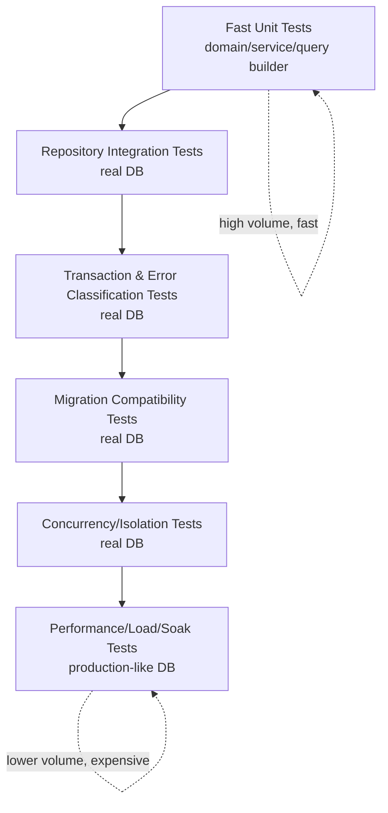

# learn-go-sql-database-integration-part-030.md

# Testing Database Code

> Seri: `learn-go-sql-database-integration`  
> Part: `030`  
> Topik: `Testing Database Code in Go: Unit Tests, Integration Tests, Real DB, Testcontainers, Migration Tests, Transaction Tests, Concurrency Tests, Error Classification Tests, Fixtures, Cleanup, and CI Strategy`  
> Target pembaca: Java software engineer yang ingin memahami Go database integration sampai level production architecture  
> Target Go: Go 1.26.x  
> Status seri: **belum selesai**

---

## 0. Posisi Part Ini Dalam Seri

Pada part sebelumnya kita membahas:

- repository boundary;
- query composition;
- pagination/listing;
- bulk write;
- read path performance;
- PostgreSQL integration;
- MySQL/MariaDB integration;
- SQLite/SQL Server/Oracle notes;
- migration/schema versioning/deployment coordination.

Sekarang kita masuk ke topik yang menentukan apakah semua pemahaman sebelumnya benar-benar aman:

> Bagaimana mengetes database code?

Banyak bug database tidak bisa ditemukan dengan unit test biasa:

- SQL syntax salah;
- placeholder salah;
- scan type mismatch;
- `NULL` tidak ditangani;
- constraint tidak sesuai;
- migration tidak jalan;
- transaction tidak rollback;
- repository tidak ikut `tx`;
- isolation anomaly;
- deadlock retry salah;
- `RowsAffected` tidak dicek;
- duplicate error tidak dimap;
- timezone salah;
- collation berbeda;
- index hilang;
- query lambat;
- `SELECT *` tiba-tiba rusak;
- schema drift;
- test pakai SQLite padahal production PostgreSQL/MySQL;
- mock database memberi confidence palsu.

Testing database code harus dipahami sebagai kombinasi beberapa level:

```text
unit test
integration test
migration test
repository test
transaction test
concurrency test
error classification test
performance/load test
contract/compatibility test
operational drill
```

Tidak semua harus selalu berat, tetapi kamu harus tahu **apa yang dibuktikan** dan **apa yang tidak dibuktikan** oleh tiap jenis test.

---

## 1. Tujuan Pembelajaran

Setelah menyelesaikan part ini, kamu harus mampu:

1. membedakan unit test, integration test, component test, migration test, concurrency test, dan load test;
2. memahami kapan memakai mock/fake dan kapan wajib real database;
3. memahami keterbatasan `go-sqlmock`/mock `database/sql`;
4. membuat repository integration test dengan real DB;
5. membuat test database lifecycle: create, migrate, seed, cleanup;
6. memakai transaction rollback atau truncate/schema-per-test untuk isolation;
7. memahami fixture strategy dan test data builder;
8. mengetes `sql.ErrNoRows`, duplicate key, FK violation, deadlock, serialization failure, lock timeout, dan context timeout;
9. mengetes transaction rollback dan commit behavior;
10. mengetes concurrency/locking/isolation dengan goroutine barriers;
11. mengetes migration dari fresh schema dan dari old schema;
12. mengetes expand/contract compatibility;
13. mengetes query composition, pagination, search, and bulk write;
14. menjalankan tests di CI dengan Docker/Testcontainers atau service container;
15. menghindari flaky tests;
16. membuat checklist production-quality database testing.

---

## 2. Fakta Dasar Dari Dokumentasi Resmi

Beberapa fakta penting:

1. Package `testing` di Go menyediakan support untuk automated testing dan digunakan bersama command `go test`.
2. File test Go menggunakan suffix `_test.go`, dan test function memakai bentuk seperti `func TestXxx(t *testing.T)`.
3. Package `database/sql` menyediakan `QueryContext`, `ExecContext`, `QueryRowContext`, `BeginTx`, `Rows`, `Row`, `Result`, dan `Tx`, yang merupakan API utama yang akan diuji dalam database integration tests.
4. Dokumentasi Go menjelaskan bahwa query yang mengembalikan data memakai `Query`/`QueryContext`, menghasilkan `Rows` atau `Row`, lalu data dibaca dengan `Scan`; untuk statement tanpa rows, gunakan `Exec`/`ExecContext`.
5. Dokumentasi Go transaction menyatakan `DB.Begin`/`DB.BeginTx` mengembalikan `sql.Tx`, operasi transaction dilakukan melalui `Tx`, lalu diakhiri dengan `Commit` atau `Rollback`.
6. Testcontainers for Go menyediakan cara untuk membuat dependency berbasis container untuk automated integration/smoke tests; modul PostgreSQL dan MySQL menyediakan entrypoint `Run(...)`, sedangkan fungsi `RunContainer(...)` di modul tersebut sudah diberi status deprecated pada dokumentasi modul terkait.
7. `go-sqlmock` adalah mock library yang mengimplementasikan `sql/driver` untuk mensimulasikan behavior SQL driver tanpa koneksi database nyata.

Referensi utama:

- Go `testing`: <https://pkg.go.dev/testing>
- Go tutorial — Add a test: <https://go.dev/doc/tutorial/add-a-test>
- Go `database/sql`: <https://pkg.go.dev/database/sql>
- Go — Querying for data: <https://go.dev/doc/database/querying>
- Go — Executing transactions: <https://go.dev/doc/database/execute-transactions>
- Testcontainers for Go: <https://golang.testcontainers.org/>
- Testcontainers for Go PostgreSQL module: <https://golang.testcontainers.org/modules/postgres/>
- Testcontainers for Go MySQL module: <https://golang.testcontainers.org/modules/mysql/>
- go-sqlmock: <https://pkg.go.dev/github.com/DATA-DOG/go-sqlmock>

---

## 3. Mental Model Utama

### 3.1 Test Harus Menjawab “Apa Yang Dibuktikan?”

Contoh:

```go
func TestUserServiceRegister(t *testing.T) {
	// fake repo
}
```

Test ini mungkin membuktikan:

- service memanggil repo;
- duplicate email dimap ke error;
- command validation jalan.

Tetapi tidak membuktikan:

- SQL insert benar;
- unique index ada;
- duplicate key error benar;
- transaction rollback benar;
- time scan benar;
- migration membuat table;
- DB collation sesuai;
- concurrency race benar.

Itu bukan salah unit test. Masalahnya terjadi jika kamu menganggap unit test sudah membuktikan database behavior.

### 3.2 Database Behavior Harus Diuji Dengan Database Nyata

Untuk membuktikan:

- syntax SQL;
- placeholder style;
- type mapping;
- `NULL`;
- scan;
- constraints;
- triggers;
- isolation;
- locks;
- deadlocks;
- error code;
- query plan;
- migration;
- index;
- collation;
- timezone;

kamu perlu real database yang sama atau semirip mungkin dengan production.

### 3.3 Mock Berguna, Tapi Bukan Pengganti Integration Test

Mock database berguna untuk:

- service unit test;
- repository wrapper behavior kecil;
- simulate rare error;
- verify transaction manager calls in narrow case;
- fast feedback.

Mock tidak cukup untuk:

- SQL correctness;
- schema correctness;
- DB-specific behavior;
- performance;
- migration compatibility;
- lock/isolation.

Gunakan mock dengan sadar.

---

## 4. Diagram: Database Test Pyramid



Bukan berarti jumlahnya sama. Unit test tetap paling banyak. Tetapi database integration tests wajib ada untuk critical paths.

---

## 5. Test Types

| Test Type | Tujuan | Pakai DB Nyata? |
|---|---|---|
| domain unit test | business rules pure | tidak |
| service unit test | orchestration, validation, mapping | biasanya tidak |
| query builder unit test | generated SQL/args shape | tidak |
| repository integration test | SQL, scan, constraints | ya |
| migration test | schema evolves correctly | ya |
| transaction test | commit/rollback/atomicity | ya |
| error classifier test | DB error mapping | ya |
| concurrency/isolation test | locks/anomalies/retry | ya |
| performance benchmark | latency/throughput | ya |
| load test | pool/DB capacity | ya |
| operational drill | runbook/failure recovery | ya/staging |

---

## 6. What Unit Tests Are Good For

Unit tests are excellent for:

- pure domain rules;
- enum parsing;
- validation;
- command normalization;
- query builder string/args generation;
- pagination cursor encode/decode;
- error mapping from domain to HTTP/gRPC;
- service orchestration with fake repositories;
- retry policy decision function;
- classifier logic if given synthetic driver error object;
- test data builders.

Example:

```go
func TestParseStatusRejectsUnknown(t *testing.T) {
	_, err := ParseStatus("DELETED_BY_ALIEN")
	if !errors.Is(err, ErrInvalidStatus) {
		t.Fatalf("expected invalid status, got %v", err)
	}
}
```

Fast and deterministic.

---

## 7. What Unit Tests Cannot Prove

Unit tests cannot prove:

- SQL statement valid in target DB;
- migration created correct table;
- column type scans into Go type;
- unique constraint exists;
- FK behavior correct;
- check constraint correct;
- `RowsAffected` actual semantics;
- `LastInsertId` driver support;
- PostgreSQL SQLSTATE extraction;
- MySQL error number extraction;
- lock timeout behavior;
- deadlock retry;
- isolation level behavior;
- performance/index usage.

Do not ask a unit test to prove what only the database can prove.

---

## 8. Query Builder Unit Test

Dynamic SQL builder can be tested without DB.

```go
func TestBuildCaseSearchSQL(t *testing.T) {
	filter := CaseSearchFilter{
		Status: ptr(StatusUnderReview),
	}
	page := PageRequest{
		Limit: 50,
		SortField: "updatedAt",
		SortDirection: "desc",
	}

	query, args, err := BuildCaseSearchSQL("tenant-1", filter, page)
	if err != nil {
		t.Fatal(err)
	}

	got := normalizeSQL(query)
	assertContains(t, got, "tenant_id = $1")
	assertContains(t, got, "status = $2")
	assertContains(t, got, "ORDER BY c.updated_at DESC, c.id DESC")

	if diff := cmpArgs(args, []any{"tenant-1", StatusUnderReview, 50}); diff != "" {
		t.Fatal(diff)
	}
}
```

This proves builder logic, not DB syntax fully.

Still run integration test.

---

## 9. Cursor Unit Test

```go
func TestCursorRoundTrip(t *testing.T) {
	in := CaseCursor{
		Version:   1,
		Sort:      "updatedAt",
		Direction: "desc",
		UpdatedAt: time.Date(2026, 6, 24, 10, 0, 0, 0, time.UTC),
		ID:        123,
	}

	encoded, err := EncodeCursor(in)
	if err != nil {
		t.Fatal(err)
	}

	out, err := DecodeCursor(encoded)
	if err != nil {
		t.Fatal(err)
	}

	if !out.UpdatedAt.Equal(in.UpdatedAt) || out.ID != in.ID {
		t.Fatalf("cursor mismatch: %#v", out)
	}
}
```

No DB needed.

---

## 10. Service Unit Test With Fake Repository

```go
type FakeCaseRepo struct {
	TransitionCalled bool
	TransitionErr    error
}

func (f *FakeCaseRepo) Transition(ctx context.Context, q DBTX, id int64, from Status, to Status) error {
	f.TransitionCalled = true
	return f.TransitionErr
}
```

Test:

```go
func TestApproveInvalidState(t *testing.T) {
	cases := &FakeCaseRepo{TransitionErr: ErrInvalidStateTransition}
	service := CaseService{cases: cases, tx: fakeTxManager{}}

	err := service.Approve(context.Background(), ApproveCommand{CaseID: 1})
	if !errors.Is(err, ErrInvalidStateTransition) {
		t.Fatalf("err=%v", err)
	}
}
```

This proves service mapping/orchestration, not database behavior.

---

## 11. Fake Transaction Manager

For service unit tests, fake transaction manager can run function directly.

```go
type fakeTxManager struct{}

func (fakeTxManager) Within(
	ctx context.Context,
	operation string,
	opts *sql.TxOptions,
	fn func(context.Context, DBTX) error,
) error {
	return fn(ctx, fakeDBTX{})
}
```

But this cannot prove real rollback/commit.

Use integration test for transaction atomicity.

---

## 12. `go-sqlmock`: When Useful

`go-sqlmock` can help when:

- you need fast test around code using `database/sql`;
- you want to simulate a specific driver error;
- you want to assert transaction begin/commit/rollback call order;
- you are testing timeout/error branch difficult to trigger;
- repository is small and you need quick coverage.

Example use case:

```text
Ensure transaction manager rolls back when function returns error.
```

But be cautious: SQL string expectation can make tests brittle.

---

## 13. `go-sqlmock`: What It Does Not Prove

`go-sqlmock` does not prove:

- target DB accepts SQL;
- placeholder style valid;
- real driver scans type;
- `LastInsertId` supported;
- constraint exists;
- trigger fires;
- isolation/lock behavior;
- query plan;
- migration correctness;
- collation/timezone.

`go-sqlmock` simulates driver behavior. It is not database.

---

## 14. Mock Test Anti-Pattern

Bad:

```go
mock.ExpectExec("INSERT INTO users").
	WithArgs("a@example.com").
	WillReturnResult(sqlmock.NewResult(1, 1))
```

Then claiming:

```text
user insert works
```

Actually proven:

```text
code issued a string matching expectation and mock returned success
```

Not proven:

```text
SQL works in PostgreSQL/MySQL
```

Use mock tests for narrow behavior, not database correctness.

---

## 15. Repository Integration Test

Repository integration test uses real DB.

It proves:

- SQL syntax;
- migration schema;
- placeholder style;
- scan/type mapping;
- constraints;
- transaction behavior if tested;
- error classification.

Example:

```go
func TestUserRepositoryCreateAndFind(t *testing.T) {
	ctx := context.Background()
	db := testDB(t)

	repo := NewUserRepository(classifier)

	id, err := repo.Create(ctx, db, NewUser{
		Email: "a@example.com",
		Name:  "A",
	})
	if err != nil {
		t.Fatal(err)
	}

	got, err := repo.FindByID(ctx, db, id)
	if err != nil {
		t.Fatal(err)
	}

	if got.Email != "a@example.com" {
		t.Fatalf("email=%s", got.Email)
	}
}
```

---

## 16. Test Database Options

Options:

| Option | Pros | Cons |
|---|---|---|
| local dev DB | simple | environment drift |
| Docker Compose | realistic, shared setup | slower, external dependency |
| Testcontainers | isolated per test/package, CI-friendly | Docker needed, startup time |
| CI service container | good CI integration | less local isolation |
| in-memory SQLite | fast | not same DB unless prod SQLite |
| managed test DB | production-like | cost, isolation complexity |
| ephemeral schema per test | fast after DB starts | cleanup/schema management |
| transaction rollback per test | fast | not works for all tests |

Recommended for serious service:

```text
Real target DB in Docker/Testcontainers for repository/migration tests.
```

---

## 17. Testcontainers for Go

Testcontainers for Go can start throwaway dependencies from tests.

Conceptual benefits:

- real PostgreSQL/MySQL/etc.;
- isolated container;
- works in CI with Docker;
- can apply migrations;
- can destroy after test;
- less local setup.

PostgreSQL module docs expose `Run(ctx, img, opts...)`.

Example shape:

```go
container, err := postgres.Run(ctx,
	"postgres:16-alpine",
	postgres.WithDatabase("testdb"),
	postgres.WithUsername("test"),
	postgres.WithPassword("test"),
)
```

Then get connection string and open `database/sql`.

Exact API evolves; check current module docs for your version.

---

## 18. Testcontainers PostgreSQL Setup Sketch

```go
func startPostgres(t *testing.T) string {
	t.Helper()

	ctx := context.Background()

	pg, err := postgres.Run(ctx,
		"postgres:16-alpine",
		postgres.WithDatabase("app_test"),
		postgres.WithUsername("app"),
		postgres.WithPassword("secret"),
	)
	if err != nil {
		t.Fatal(err)
	}

	t.Cleanup(func() {
		_ = testcontainers.TerminateContainer(pg)
	})

	dsn, err := pg.ConnectionString(ctx, "sslmode=disable")
	if err != nil {
		t.Fatal(err)
	}

	return dsn
}
```

This is a sketch. Use exact Testcontainers for Go version docs.

---

## 19. Docker Compose Alternative

For local/CI:

```yaml
services:
  postgres:
    image: postgres:16
    environment:
      POSTGRES_USER: app
      POSTGRES_PASSWORD: secret
      POSTGRES_DB: app_test
    ports:
      - "5432:5432"
```

Test config reads:

```text
TEST_DATABASE_URL
```

Pros:

- simple;
- language-agnostic;
- easy to debug.

Cons:

- shared state if not isolated;
- port conflicts;
- cleanup needed;
- parallel tests harder.

---

## 20. In-Memory SQLite Caveat

Using SQLite in-memory to test PostgreSQL/MySQL code is usually wrong.

It will not catch:

- PostgreSQL `$1` placeholder;
- MySQL `?` semantics differences;
- isolation/lock behavior;
- JSONB;
- `ON CONFLICT` differences;
- `RETURNING`;
- SQL Server `OUTPUT`;
- Oracle empty string NULL;
- collation differences.

Use SQLite for tests only if:

- production uses SQLite;
- or you are testing DB-independent logic explicitly;
- or test is intentionally limited.

---

## 21. Test Database Lifecycle

A robust integration test flow:

```text
1. start/create database
2. apply migrations
3. seed minimal reference data
4. run tests
5. cleanup
6. stop/drop database
```

Key decisions:

- one DB per package?
- one DB per test?
- one schema per test?
- transaction rollback per test?
- truncate tables between tests?
- parallel tests allowed?

---

## 22. Applying Migrations in Tests

Never create schema manually in test if production uses migrations.

Bad:

```go
db.Exec("CREATE TABLE users ...") // copied manually
```

Good:

```go
ApplyMigrations(t, db)
```

This proves migrations.

If test schema differs from production schema, test confidence is weak.

---

## 23. Migration Test From Scratch

```go
func TestMigrationsApplyFromScratch(t *testing.T) {
	ctx := context.Background()
	db := freshDB(t)

	if err := migrations.Apply(ctx, db); err != nil {
		t.Fatal(err)
	}
}
```

This catches:

- syntax error;
- ordering problem;
- missing extension/table;
- non-transactional migration tool issue;
- DB-specific syntax issue.

Run in CI.

---

## 24. Migration Test With Repository

```go
func TestRepositoriesAgainstMigratedSchema(t *testing.T) {
	ctx := context.Background()
	db := freshMigratedDB(t)

	userRepo := NewUserRepository(classifier)
	_, err := userRepo.Create(ctx, db, NewUser{Email: "a@example.com"})
	if err != nil {
		t.Fatal(err)
	}
}
```

This proves repository and migrations align.

---

## 25. Migration Compatibility Test

For expand/contract:

```text
old app + expanded schema should work
new app + expanded schema should work
```

Test idea:

1. apply migrations up to old version;
2. run old repository tests;
3. apply expand migration;
4. run old repository tests again;
5. run new repository tests.

This is especially valuable for large teams.

---

## 26. Migration Backfill Test

Given old data:

```go
insertOldUser(t, db, "A@example.com", nilEmailNorm)
```

Run backfill:

```go
err := BackfillEmailNorm(ctx, db, batchSize)
```

Assert:

```text
email_norm = lower(email)
```

Run backfill again.

Assert idempotent:

```text
no duplicate, no error, same result
```

---

## 27. Test Isolation Strategies

### 27.1 Transaction Rollback Per Test

```go
tx, err := db.BeginTx(ctx, nil)
t.Cleanup(func() { _ = tx.Rollback() })

// use tx in repositories
```

Pros:

- fast;
- cleanup automatic.

Cons:

- cannot test commit behavior;
- cannot test multiple independent connections easily;
- DDL may not rollback in all DBs;
- code must accept `DBTX`;
- transaction-level locks can affect tests;
- cannot test things requiring commit visibility.

### 27.2 Truncate Tables

After each test:

```sql
TRUNCATE TABLE users, orders RESTART IDENTITY CASCADE;
```

DB-specific.

Pros:

- tests real commit;
- works with multiple connections.

Cons:

- slower;
- order/FK issues;
- parallel tests harder.

### 27.3 Schema Per Test

Create unique schema/database per test.

Pros:

- strong isolation;
- parallel-friendly.

Cons:

- slower;
- migration per schema/database cost.

### 27.4 Container Per Test

Strongest isolation, slowest.

Use for critical suites, not every small test.

---

## 28. Recommended Default Isolation

For repository tests:

```text
one container/database per package
apply migrations once
cleanup tables per test or transaction rollback depending test
```

For transaction/concurrency tests:

```text
use committed data and multiple connections
cleanup by truncate
```

For migration tests:

```text
fresh database
```

For performance tests:

```text
separate environment/data volume
```

---

## 29. `t.Cleanup`

Use `t.Cleanup` to close resources.

```go
func testDB(t *testing.T) *sql.DB {
	t.Helper()

	db, err := sql.Open("pgx", dsn)
	if err != nil {
		t.Fatal(err)
	}

	t.Cleanup(func() {
		_ = db.Close()
	})

	return db
}
```

For containers:

```go
t.Cleanup(func() {
	_ = container.Terminate(ctx)
})
```

Do not leak connections/containers.

---

## 30. Parallel Tests

`t.Parallel()` with DB tests needs care.

Problems:

- shared tables conflict;
- unique values collide;
- cleanup deletes other test data;
- transaction locks;
- sequence assumptions;
- deadlocks.

Make parallel-safe by:

- unique tenant/test ID per test;
- schema per test;
- transaction rollback per test;
- no global cleanup while tests run;
- no shared mutable reference data unless read-only.

If not safe, do not use `t.Parallel()` for DB integration tests.

---

## 31. Unique Test Namespace

```go
func NewTestTenant(t *testing.T) string {
	t.Helper()
	return "test-" + strings.ReplaceAll(t.Name(), "/", "-") + "-" + uuid.NewString()
}
```

Use tenant/test ID in all rows.

Cleanup:

```sql
DELETE FROM table WHERE tenant_id = ?
```

This helps parallel tests.

---

## 32. Test Data Builders

Avoid huge fixture files for every test.

Builder:

```go
type UserBuilder struct {
	Email string
	Name  string
}

func NewUserBuilder() UserBuilder {
	return UserBuilder{
		Email: uniqueEmail(),
		Name:  "Test User",
	}
}

func (b UserBuilder) WithEmail(email string) UserBuilder {
	b.Email = email
	return b
}
```

Insert helper:

```go
func InsertUser(t *testing.T, ctx context.Context, db DBTX, b UserBuilder) int64 {
	t.Helper()
	// insert and return id
}
```

Builders keep tests readable.

---

## 33. Fixtures

Fixtures are useful for:

- complex reference data;
- known old schema data for migration tests;
- realistic report dataset;
- compatibility tests;
- SQL golden tests.

Risks:

- too large;
- hard to understand;
- brittle;
- shared mutable state;
- outdated.

Prefer minimal fixture per test.

---

## 34. Golden Data

For complex query/report, expected result can be golden JSON.

Use carefully:

- normalize ordering;
- avoid timestamp instability;
- make fixtures small;
- regenerate intentionally;
- review diff.

Golden tests can hide business understanding if too opaque.

---

## 35. Clock Control

Database code often uses time.

Options:

- DB time: `now()`, `UTC_TIMESTAMP`, `SYSUTCDATETIME`;
- app clock: pass `now` into repository;
- test clock in service layer.

For deterministic tests, app-provided `now` is easier.

Example:

```go
now := time.Date(2026, 6, 24, 10, 0, 0, 0, time.UTC)
repo.Insert(ctx, db, event, now)
```

If using DB time, assert range:

```go
before := time.Now().Add(-time.Second)
after := time.Now().Add(time.Second)
```

---

## 36. Testing `sql.ErrNoRows`

```go
func TestFindUserNotFound(t *testing.T) {
	ctx := context.Background()
	db := testDB(t)
	repo := NewUserRepository(classifier)

	_, err := repo.FindByID(ctx, db, 999999)
	if !errors.Is(err, ErrUserNotFound) {
		t.Fatalf("expected not found, got %v", err)
	}
}
```

This proves repository maps `sql.ErrNoRows`.

---

## 37. Testing Nullable Fields

Insert row with null:

```sql
INSERT INTO users (nickname) VALUES (NULL)
```

Test mapping:

```go
got, err := repo.Find(...)
if got.Nickname != nil {
	t.Fatalf("nickname should be nil")
}
```

Insert row with empty string if DB distinguishes it:

```text
PostgreSQL/MySQL/SQLite: empty string distinct from NULL
Oracle: empty string treated as NULL
```

Test target DB semantics.

---

## 38. Testing Type Mapping

Test:

- integer;
- decimal/numeric;
- timestamp;
- date;
- bool;
- JSON;
- UUID;
- binary;
- enum/status;
- arrays if used;
- LOB if used.

Example decimal:

```go
amount, err := repo.LoadAmount(ctx, db, id)
if amount.String() != "123.45" {
	t.Fatalf("amount=%s", amount)
}
```

Do not rely on untested driver conversion for critical types.

---

## 39. Testing JSON Mapping

```go
payload := map[string]any{"type": "case.approved"}

id := InsertOutbox(t, db, payload)

got, err := repo.FindOutbox(ctx, db, id)
if err != nil {
	t.Fatal(err)
}

if got.Payload.Type != "case.approved" {
	t.Fatalf("payload=%#v", got.Payload)
}
```

Also test invalid JSON if DB/app can encounter it.

---

## 40. Testing Timezone

Test round trip with explicit UTC.

```go
in := time.Date(2026, 6, 24, 10, 30, 0, 123456000, time.UTC)

id := InsertEventAt(t, db, in)
got := LoadEventAt(t, db, id)

if !got.Equal(in) {
	t.Fatalf("got=%s want=%s", got, in)
}
```

Also test date filter around local timezone boundaries if app supports user dates.

---

## 41. Testing Collation/Case Semantics

Email uniqueness:

```go
_, err := repo.Create(ctx, db, NewUser{Email: "Fajar@example.com"})
if err != nil {
	t.Fatal(err)
}

_, err = repo.Create(ctx, db, NewUser{Email: "fajar@example.com"})
```

Expected depends on business rule.

Test documents the schema collation/normalization behavior.

---

## 42. Testing Constraints

Test constraints directly through repository or SQL.

Unique:

```go
if !errors.Is(err, ErrEmailAlreadyUsed) {
	t.Fatalf("expected duplicate email, got %v", err)
}
```

Foreign key:

```go
err := repo.CreateOrder(ctx, db, CreateOrder{UserID: nonexistent})
if !errors.Is(err, ErrInvalidUserReference) {
	t.Fatalf("expected invalid reference, got %v", err)
}
```

Check constraint:

```go
err := repo.CreateAccount(ctx, db, Account{Balance: -1})
```

Repository should map DB error.

---

## 43. Testing Error Classifier

Use real DB to produce errors.

For PostgreSQL unique:

```text
SQLSTATE 23505
```

For MySQL duplicate:

```text
error number 1062
```

For SQLite unique:

```text
SQLITE_CONSTRAINT_UNIQUE
```

Do not rely only on synthetic error objects.

Synthetic classifier unit tests can supplement but real DB proves extraction.

---

## 44. Testing RowsAffected

Conditional update:

```go
err := repo.Transition(ctx, db, caseID, StatusDraft, StatusApproved)
if err != nil {
	t.Fatal(err)
}

err = repo.Transition(ctx, db, caseID, StatusDraft, StatusApproved)
if !errors.Is(err, ErrInvalidStateTransition) {
	t.Fatalf("expected invalid transition, got %v", err)
}
```

This proves `RowsAffected == 0` mapping.

---

## 45. Testing `LastInsertId`

For MySQL/SQLite:

```go
id, err := repo.Create(ctx, db, user)
if err != nil {
	t.Fatal(err)
}
if id <= 0 {
	t.Fatalf("id=%d", id)
}
```

For PostgreSQL, test `RETURNING`.

Do not make cross-DB assumption.

---

## 46. Testing Transaction Rollback

Use real transaction.

```go
func TestApproveRollbackWhenOutboxFails(t *testing.T) {
	ctx := context.Background()
	db := testDB(t)

	caseID := InsertCase(t, db, StatusUnderReview)

	service := NewCaseService(db, repos...)
	service.outbox = failingOutboxRepo{} // or create duplicate outbox ID

	err := service.Approve(ctx, ApproveCommand{CaseID: caseID})
	if err == nil {
		t.Fatal("expected error")
	}

	status := LoadCaseStatus(t, db, caseID)
	if status != StatusUnderReview {
		t.Fatalf("status=%s", status)
	}

	if CountAudit(t, db, caseID) != 0 {
		t.Fatal("audit should rollback")
	}
}
```

This proves atomicity if failure occurs before commit.

---

## 47. Testing Commit

Also test success path:

```go
err := service.Approve(ctx, cmd)
if err != nil {
	t.Fatal(err)
}

assertCaseApproved(t, db, caseID)
assertAuditExists(t, db, caseID)
assertOutboxExists(t, db, caseID)
```

Both rollback and commit matter.

---

## 48. Testing Repository Uses Tx

Bug:

```go
repo.InsertAudit(ctx, db, audit) // accidentally db, not tx
```

Transaction rollback test catches this because audit remains committed.

Design integration test to fail if any write escapes transaction.

---

## 49. Testing Transaction Helper

Test:

- commit on nil error;
- rollback on function error;
- rollback on panic if supported;
- commit error wrapping if can simulate;
- begin error classification.

Mock may be useful for rare begin/commit errors, but real DB for rollback/commit semantics.

---

## 50. Testing Context Timeout

Slow query test is DB-specific.

Generic pattern:

```go
ctx, cancel := context.WithTimeout(context.Background(), 10*time.Millisecond)
defer cancel()

err := repo.RunSlowQuery(ctx, db)
if !errors.Is(err, context.DeadlineExceeded) && !isDBCancel(err) {
	t.Fatalf("expected timeout/cancel, got %v", err)
}
```

Caution:

- tests can be flaky;
- DB cancellation behavior differs;
- use generous timeout and deterministic sleep if DB supports.

PostgreSQL:

```sql
SELECT pg_sleep(1)
```

MySQL:

```sql
SELECT SLEEP(1)
```

SQL Server:

```sql
WAITFOR DELAY '00:00:01'
```

SQLite: harder, use locks/busy or custom function if available.

---

## 51. Testing Lock Timeout

Need two connections/transactions.

Pattern:

1. tx1 locks row;
2. tx2 tries update with short timeout;
3. assert lock timeout/busy.

Do not run both operations on same connection.

Use `*sql.Conn` if you need reserved connections.

```go
conn1, _ := db.Conn(ctx)
defer conn1.Close()

conn2, _ := db.Conn(ctx)
defer conn2.Close()
```

---

## 52. Testing Deadlock

Deadlock test shape:

```text
tx1 locks row A
tx2 locks row B
tx1 tries row B
tx2 tries row A
one fails with deadlock
```

Use goroutine barriers.

Pseudo:

```go
barrier1 := make(chan struct{})
barrier2 := make(chan struct{})
```

Deadlock tests can be flaky if not carefully synchronized.

Run under integration test tag if needed.

---

## 53. Testing Serialization Failure

For PostgreSQL Serializable:

1. start two serializable transactions;
2. both read same predicate/row;
3. both write conflicting outcome;
4. commit one;
5. other gets serialization failure.

Test retry wrapper:

```go
err := retryTx(ctx, func(ctx context.Context, tx *sql.Tx) error {
	// transaction body
})
```

Assert final invariant.

---

## 54. Testing `SKIP LOCKED` Worker Claim

Pattern:

1. insert N pending jobs;
2. tx1 claims one job and holds lock;
3. tx2 claims with `SKIP LOCKED`;
4. assert tx2 does not return locked job;
5. commit/rollback cleanup.

This proves queue claim behavior.

DB-specific:

- PostgreSQL;
- MySQL 8+;
- SQL Server uses `READPAST`/lock hints;
- Oracle supports `SKIP LOCKED`.

---

## 55. Testing Idempotency

```go
func TestApproveIdempotency(t *testing.T) {
	ctx := context.Background()
	db := testDB(t)

	cmd := ApproveCommand{
		OperationID: "op-123",
		CaseID: InsertCase(t, db, StatusUnderReview),
	}

	err := service.Approve(ctx, cmd)
	if err != nil {
		t.Fatal(err)
	}

	err = service.Approve(ctx, cmd)
	if err != nil {
		t.Fatal(err)
	}

	assertSingleAudit(t, db, cmd.OperationID)
	assertSingleOutbox(t, db, cmd.OperationID)
}
```

This proves retry duplicate does not duplicate effects.

---

## 56. Testing Outbox Pattern

Test:

- business row updated;
- outbox row inserted in same transaction;
- rollback removes both;
- worker claims pending;
- worker marks sent;
- failed publish marks failed/retry;
- stale processing reclaimed.

Outbox is database integration, not only messaging.

---

## 57. Testing Inbox Consumer

Test:

- first message processes;
- duplicate message ignored/returns stored result;
- failure rolls back business effect;
- message marked processed only after business commit;
- poison message handling.

Use unique message ID.

---

## 58. Testing Bulk Insert

Test:

- empty batch no-op;
- one row;
- multiple rows;
- batch chunking;
- duplicate/idempotency;
- constraint violation;
- partial failure policy;
- rows inserted count;
- retry does not duplicate.

Integration test with real DB catches placeholder count/order bugs.

---

## 59. Testing Batch Update

Test:

- all rows updated;
- no rows;
- partial rows invalid state;
- `RowsAffected` mismatch;
- audit/outbox rows;
- rollback on failure;
- chunking.

For state transition, assert invalid rows are handled per policy.

---

## 60. Testing Pagination

Test:

- default sort;
- deterministic tie-breaker;
- first page;
- next page cursor;
- no overlap;
- no missing rows in stable dataset;
- invalid cursor;
- filter mismatch cursor;
- limit clamp;
- empty result;
- keyword escaping.

For keyset, insert rows with same timestamp to prove ID tie-breaker.

---

## 61. Testing Search LIKE Escaping

Insert:

```text
ABC%DEF
ABCXDEF
ABC_DEF
```

Search literal `%` or `_`.

Assert semantics.

This catches wildcard escape bugs.

---

## 62. Testing Query Plan

Unit/integration tests usually should not assert exact query plan because plans can vary.

But for critical queries, performance test can run `EXPLAIN` and check broad properties:

- uses expected index;
- no full table scan for common query;
- estimated rows reasonable.

Caution:

- plan assertions can be brittle;
- production stats differ;
- use in performance/DB-specific test suite.

---

## 63. Testing Migration Add Constraint

Before adding unique constraint migration, test old bad data.

Migration should fail on duplicate data if no cleanup.

Better migration test:

1. start schema before constraint;
2. insert duplicates;
3. run duplicate detection/cleanup migration;
4. run unique constraint migration;
5. assert duplicate insert fails.

This proves migration path handles existing data.

---

## 64. Testing Expand/Contract

Example rename:

```text
name -> full_name
```

Test phases:

1. old schema + old code;
2. expanded schema + old code;
3. expanded schema + new dual-write code;
4. after backfill + new read code;
5. contracted schema + new code.

At least test critical compatibility.

---

## 65. Testing Seed Data

Seed data test:

```go
func TestRolesSeeded(t *testing.T) {
	db := freshMigratedDB(t)

	var count int
	err := db.QueryRowContext(ctx, `
		SELECT COUNT(*) FROM roles WHERE code IN ('ADMIN', 'USER')
	`).Scan(&count)
	if err != nil {
		t.Fatal(err)
	}
	if count != 2 {
		t.Fatalf("count=%d", count)
	}
}
```

Also test seed is idempotent if repeatable.

---

## 66. Testing Permission/Grant

In production, app user may have limited permissions.

Tests often run as admin, hiding grant issues.

Consider integration test with app role:

- can select/insert/update expected tables;
- cannot DDL;
- can use sequence;
- can execute procedure;
- can read view;
- cannot access forbidden tables.

This is especially important for Oracle/SQL Server/PostgreSQL.

---

## 67. Testing Multiple Database Versions

If you support:

```text
PostgreSQL 14 and 16
MySQL 8 and MariaDB 10/11
SQL Server 2019 and Azure SQL
```

run matrix tests or at least compatibility tests.

Do not claim support without tests.

---

## 68. Testing Driver-Specific DSN

Test config validation.

```go
func TestMySQLConfigRequiresParseTime(t *testing.T) {
	cfg := MySQLConfig{ParseTime: false}
	if err := cfg.Validate(); !errors.Is(err, ErrParseTimeRequired) {
		t.Fatalf("err=%v", err)
	}
}
```

Also integration test actual time scanning.

---

## 69. Testing Connection Pool Behavior

You can test pool configuration via `db.Stats()` in limited ways.

Example:

```go
stats := db.Stats()
if stats.MaxOpenConnections != expected {
	t.Fatalf("max open=%d", stats.MaxOpenConnections)
}
```

For pool exhaustion behavior, use controlled tests:

- set `MaxOpenConns(1)`;
- open transaction holding connection;
- attempt second query with timeout;
- expect context deadline.

This proves app handles pool wait timeout.

---

## 70. Testing Rows Close Leak

Hard to test directly, but you can create a test:

1. set `MaxOpenConns(1)`;
2. run query and intentionally do not close rows in buggy code;
3. next query times out.

Better: code review and linting, but integration test for critical streaming code can catch leaks.

Repository pattern should always:

```go
defer rows.Close()
rows.Err()
```

---

## 71. Testing Large Result Streaming

For streaming/export:

- insert enough rows;
- handler callback counts rows;
- ensure memory bounded if possible;
- simulate callback error;
- assert rows closed;
- assert context cancellation stops.

Example:

```go
err := repo.Stream(ctx, db, filter, func(row Row) error {
	if row.ID == target {
		return errStop
	}
	return nil
})
if !errors.Is(err, errStop) { ... }
```

---

## 72. Testing Cancellation During Rows Iteration

This can be DB/driver-specific.

Pattern:

- query many/slow rows;
- cancel context after first row;
- ensure function returns cancellation or rows.Err;
- ensure connection usable afterward.

Use carefully to avoid flaky tests.

---

## 73. Test Tags

Database integration tests may be slower.

Use build tags:

```go
//go:build integration
```

Then run:

```bash
go test -tags=integration ./...
```

But ensure CI runs them.

Do not let integration tests rot.

---

## 74. Short Mode

Go tests support short mode via `testing.Short()`.

```go
func TestSlowIntegration(t *testing.T) {
	if testing.Short() {
		t.Skip("skipping integration test in short mode")
	}
}
```

Use for very slow tests, not all database tests.

Critical integration tests should still run in CI.

---

## 75. CI Strategy

Recommended CI stages:

```text
1. unit tests
2. repository integration tests with real DB
3. migration tests
4. concurrency/error classification tests
5. optional performance smoke
6. nightly load/performance suite
```

Keep PR feedback fast:

- run essential integration tests;
- run heavy performance nightly.

---

## 76. CI With Service Containers

GitHub Actions-style concept:

```yaml
services:
  postgres:
    image: postgres:16
    env:
      POSTGRES_USER: app
      POSTGRES_PASSWORD: secret
      POSTGRES_DB: app_test
```

Run migrations before tests.

Pros:

- stable;
- straightforward.

Cons:

- less isolated per test;
- parallel jobs require unique DBs/ports.

---

## 77. CI With Testcontainers

Pros:

- test controls lifecycle;
- can start different versions;
- easier local parity;
- less CI YAML.

Cons:

- Docker availability;
- startup overhead;
- network quirks;
- image pull time.

Cache images where possible.

---

## 78. Flaky Database Tests

Common causes:

- real time sleeps;
- race without barrier;
- relying on row order without order by;
- shared data between tests;
- random ports/services not ready;
- too short timeouts;
- assuming query plan;
- parallel cleanup;
- external network;
- test depends on previous test;
- lock/deadlock test not deterministic.

Fix:

- explicit ordering;
- deterministic data;
- readiness checks;
- generous deadlines;
- barriers/channels;
- unique namespace;
- isolated DB/schema;
- no hidden global state.

---

## 79. Avoid `time.Sleep` as Synchronization

Bad:

```go
time.Sleep(100 * time.Millisecond)
```

Better:

- channel barrier;
- polling with timeout;
- DB condition wait;
- context deadline;
- wait until container ready.

Sleep creates flaky tests.

---

## 80. Barrier Example for Concurrency Test

```go
type Barrier struct {
	ch chan struct{}
}

func NewBarrier() Barrier {
	return Barrier{ch: make(chan struct{})}
}

func (b Barrier) Wait() {
	<-b.ch
}

func (b Barrier) Release() {
	close(b.ch)
}
```

Use to coordinate two transactions.

---

## 81. Polling Helper

```go
func Eventually(t *testing.T, timeout time.Duration, fn func() bool) {
	t.Helper()

	deadline := time.Now().Add(timeout)
	for time.Now().Before(deadline) {
		if fn() {
			return
		}
		time.Sleep(10 * time.Millisecond)
	}
	t.Fatal("condition not met")
}
```

Use for async outbox/worker tests.

---

## 82. Test Data Cleanup

Prefer deterministic cleanup.

PostgreSQL:

```sql
TRUNCATE table1, table2 RESTART IDENTITY CASCADE;
```

MySQL:

```sql
DELETE FROM child;
DELETE FROM parent;
ALTER TABLE users AUTO_INCREMENT = 1;
```

SQLite:

```sql
DELETE FROM table;
```

SQL Server/Oracle syntax differs.

Cleanup must respect FK order or use DB-specific truncate cascade.

---

## 83. Avoid Test Interdependence

Bad:

```text
TestCreateUser creates user
TestFindUser assumes that user exists
```

Each test should create its own data.

Order of Go tests is not your contract.

---

## 84. Minimal Test Data

A test should insert only what it needs.

Bad:

```text
load 5000-row global fixture for every test
```

Good:

```text
insert tenant, user, one case
```

For report tests, bigger fixture may be justified.

---

## 85. Testing Stored Procedures / Views

If repository calls stored procedure/view:

- apply procedure/view migration;
- test signature;
- test result scan;
- test permissions;
- test error mapping;
- test old/new version compatibility if changed.

For Oracle/SQL Server this is critical.

---

## 86. Testing Triggers

If DB triggers implement audit/defaults/invariants:

- insert/update row;
- assert trigger effect;
- test rollback;
- test bulk path trigger behavior;
- test error mapping.

But be careful: hidden trigger logic makes app tests harder. Document it.

---

## 87. Testing Advisory Locks

PostgreSQL/Oracle/etc. advisory lock tests:

1. tx1 acquires lock;
2. tx2 tries nowait or timeout;
3. assert busy;
4. tx1 releases via rollback/commit;
5. tx2 can acquire.

Use separate connections.

---

## 88. Testing Read Replica Logic

Hard in local tests unless replica setup exists.

Unit test router decision:

```go
if strong { primary } else { replica }
```

Integration/staging test:

- write primary;
- read replica eventual;
- simulate lag if possible;
- ensure read-after-write path uses primary.

At least test routing logic and document consistency.

---

## 89. Testing Migration Lock

If migration runner custom:

- start two runners concurrently;
- assert one applies migration;
- other waits/skips/fails safely;
- migration history has one row.

This prevents startup migration races.

---

## 90. Testing Schema Version Check

App startup should fail if schema too old.

Test:

```go
db := migratedTo(t, versionBeforeRequired)
err := CheckSchemaVersion(ctx, db, RequiredVersion)
if !errors.Is(err, ErrSchemaTooOld) {
	t.Fatalf("err=%v", err)
}
```

Also test expanded schema accepted by old app if expected.

---

## 91. Testing SQL Injection Boundary

For query composition/listing:

- malicious sort field;
- malicious sort direction;
- malicious table/field filter;
- keyword with quote;
- keyword with `%`/`_`;
- huge limit;
- negative offset;
- invalid cursor.

Expected:

- rejected as validation error;
- or treated as data;
- never changes SQL structure.

Unit + integration tests.

---

## 92. Testing Bulk Import Rejects

Import test:

- valid row;
- invalid enum;
- duplicate in file;
- duplicate in DB;
- FK missing;
- too-long field.

Assert:

- valid inserted/updated;
- invalid rows in reject table;
- job status correct;
- rerun idempotent.

---

## 93. Testing Operational Scripts

Admin/backfill scripts should be tested too.

If script is important enough to run in production, it deserves:

- dry-run test;
- integration test;
- rollback/compensation test if possible;
- idempotency test.

Do not keep production SQL scripts untested in random folders.

---

## 94. Benchmarking Repository Code

Go benchmark:

```go
func BenchmarkFindUserByID(b *testing.B) {
	ctx := context.Background()
	db := benchmarkDB(b)
	repo := NewUserRepository(classifier)

	id := InsertUser(b, db)

	b.ResetTimer()
	for i := 0; i < b.N; i++ {
		_, err := repo.FindByID(ctx, db, id)
		if err != nil {
			b.Fatal(err)
		}
	}
}
```

But repository benchmark with real DB measures DB too. That is usually what you want for integration performance.

Control environment.

---

## 95. Load Testing

Load test should simulate:

- concurrent requests;
- realistic data volume;
- pool settings;
- transaction length;
- hot rows;
- pagination;
- write contention;
- retry behavior.

Measure:

- app p50/p95/p99;
- DB CPU/IO;
- pool wait;
- locks;
- deadlocks;
- timeouts;
- rows/sec;
- replica lag.

This is separate from unit/integration tests.

---

## 96. Test Observability

For critical code, test metrics/logging lightly.

Example:

- repository records operation name;
- error classifier increments class;
- retry metric increments.

Avoid over-testing exact log text.

But verify:

- no raw password/DSN;
- no PII in logs;
- high-cardinality labels absent.

---

## 97. Testing Security

Database security tests can include:

- app role lacks DDL;
- app role cannot read forbidden table;
- tenant isolation;
- row-level security if used;
- SQL injection inputs;
- secret redaction;
- audit rows written.

Tenant isolation test is especially important.

---

## 98. Tenant Isolation Test

```go
func TestSearchDoesNotLeakTenant(t *testing.T) {
	ctx := context.Background()
	db := testDB(t)

	tenantA := NewTenant(t)
	tenantB := NewTenant(t)

	InsertCase(t, db, tenantA)
	InsertCase(t, db, tenantB)

	page, err := query.Search(ctx, db, tenantA, CaseSearchFilter{}, PageRequest{Limit: 50})
	if err != nil {
		t.Fatal(err)
	}

	for _, item := range page.Items {
		if item.TenantID != tenantA {
			t.Fatalf("leaked tenant: %s", item.TenantID)
		}
	}
}
```

Do not rely only on code review for tenant predicates.

---

## 99. Testing Authorization Predicate

If listing depends on permission join:

- user A can see case;
- user B cannot;
- admin can;
- revoked permission no longer sees;
- cursor cannot bypass permission;
- direct ID lookup also enforces permission if required.

Test both list and detail.

---

## 100. Testing Idempotency Under Concurrency

Two goroutines call same command with same idempotency key concurrently.

Expected:

- one applies;
- other gets same result or conflict-in-progress;
- no duplicate audit/outbox;
- final state correct.

Use real DB unique constraint.

---

## 101. Testing Hot Row Contention

For high-risk operations:

- many goroutines update same row/account/inventory;
- assert final invariant;
- assert no negative stock;
- count conflicts/retries.

Example inventory:

```text
stock starts 10
20 concurrent purchases of 1
exactly 10 succeed
stock ends 0
```

This proves conditional update/invariant.

---

## 102. Inventory Concurrency Test

```go
func TestPurchaseConcurrentStock(t *testing.T) {
	ctx := context.Background()
	db := testDB(t)

	itemID := InsertInventory(t, db, 10)

	var wg sync.WaitGroup
	success := atomic.Int64{}

	for i := 0; i < 20; i++ {
		wg.Add(1)
		go func() {
			defer wg.Done()
			err := repo.DecrementStock(ctx, db, itemID, 1)
			if err == nil {
				success.Add(1)
			}
		}()
	}

	wg.Wait()

	if success.Load() != 10 {
		t.Fatalf("success=%d", success.Load())
	}

	stock := LoadStock(t, db, itemID)
	if stock != 0 {
		t.Fatalf("stock=%d", stock)
	}
}
```

This is valuable because it tests correctness under concurrency.

---

## 103. Testing Deadlock Retry Wrapper

Create an operation that can deadlock or use fake classifier to test retry decision.

Best:

- unit test retry policy with fake errors;
- integration test at least one real deadlock classification;
- load test for frequency.

Do not make every PR depend on flaky deadlock generation if it is unstable.

---

## 104. Testing Commit Ambiguity

Hard to simulate.

Strategies:

- unit test idempotency/reconciliation logic;
- integration test operation ID uniqueness;
- chaos/staging test connection drop near commit if feasible;
- design so ambiguity can be resolved by lookup.

Test:

```text
same operation ID can be retried after unknown result without duplicate effect
```

---

## 105. Test Environment Configuration

Use separate config:

```text
APP_ENV=test
DATABASE_URL=...
MIGRATIONS_PATH=...
DB_MAX_OPEN_CONNS=...
```

Do not point tests at production.

Add safety guard:

```go
if strings.Contains(dsn, "prod") {
	t.Fatal("refusing to run tests against prod")
}
```

Not foolproof but helpful.

---

## 106. Test Database Naming

Use names like:

```text
app_test
app_integration_test
```

For temporary DB:

```text
app_test_<uuid>
```

Ensure cleanup.

---

## 107. Seeding Reference Data

Seed via migrations if reference data is part of schema contract.

For test-only data, use helpers.

Do not mix test-only seed into production migrations.

---

## 108. Handling Slow Integration Tests

Speed improvements:

- reuse container per package;
- apply migrations once;
- use transaction rollback per test where safe;
- reduce fixture size;
- parallelize by schema/database;
- split heavy tests into nightly;
- cache Docker images.

Do not remove real DB tests just because they are slower. Optimize them.

---

## 109. Test Suite Organization

Example:

```text
/internal/domain/...              unit tests
/internal/app/...                 service unit tests
/internal/data/...                repository integration tests
/internal/platform/db/...         classifier/tx tests
/internal/migrations/...          migration tests
/test/integration/...             cross-module integration
/test/performance/...             benchmarks/load smoke
```

Use build tags for heavy categories.

---

## 110. Naming Tests

Good names:

```go
TestUserRepositoryCreate_DuplicateEmailReturnsDomainError
TestCaseServiceApprove_RollsBackAuditWhenOutboxFails
TestCaseQuerySearch_CursorHasNoOverlap
TestMigrations_ApplyFromScratch
TestIdempotency_ConcurrentSameKeySingleEffect
```

Names should explain behavior.

---

## 111. Assertions

Prefer clear assertions.

```go
if !errors.Is(err, ErrEmailAlreadyUsed) {
	t.Fatalf("expected ErrEmailAlreadyUsed, got %v", err)
}
```

Avoid over-generic:

```go
if err != nil { t.Fatal(err) }
```

when expecting specific error.

---

## 112. Comparing Rows

For lists, order matters only if query order specified.

If order specified, assert order.

If not, sort before comparing or use map.

But for pagination/listing, order is part of contract, so assert exact order.

---

## 113. Testing With `context.Context`

All repository tests should pass context.

Use timeout:

```go
ctx, cancel := context.WithTimeout(context.Background(), 10*time.Second)
defer cancel()
```

Avoid tests hanging forever.

For slow container setup, separate setup timeout.

---

## 114. Context Timeout in CI

CI can be slower.

Use realistic timeout:

- unit: short;
- integration: 10-30 seconds per test where needed;
- container startup: 60-120 seconds;
- lock/deadlock tests: carefully bounded.

Too short = flaky. Too long = slow failure.

---

## 115. Test Logging

Use `t.Logf` for useful debug:

```go
t.Logf("dsn=%s", redactedDSN)
```

Never log secrets.

For failed SQL, logging operation name is better than raw query with sensitive args.

---

## 116. Test Coverage Is Not Enough

High coverage with mocks can still miss database bugs.

Measure:

- repository integration coverage for critical queries;
- migration tests;
- error mapping tests;
- concurrency tests for invariants.

Coverage percentage is not the goal; risk coverage is.

---

## 117. Risk-Based Test Prioritization

Prioritize real DB tests for:

- money/ledger;
- inventory/stock;
- idempotency;
- outbox/inbox;
- authorization/tenant;
- state transitions;
- migration;
- bulk import;
- audit;
- user registration unique constraints;
- queue claim;
- pagination;
- reporting query.

Simple read-only lookup may need fewer tests, but still at least one integration test.

---

## 118. Testing Database Code Review Checklist

### Unit Layer

- [ ] Domain rules tested.
- [ ] Validation tested.
- [ ] Query builder tested.
- [ ] Cursor encode/decode tested.
- [ ] Service orchestration tested with fakes.

### Repository Layer

- [ ] Real DB integration test.
- [ ] Insert/read/update/delete tested.
- [ ] Not found mapping tested.
- [ ] Unique/FK/check violation tested.
- [ ] Nullable/type mapping tested.
- [ ] RowsAffected/RETURNING tested.
- [ ] Rows.Close/Rows.Err pattern reviewed.

### Transaction Layer

- [ ] Commit success tested.
- [ ] Rollback on error tested.
- [ ] No write escapes tx.
- [ ] Retryable errors classified.
- [ ] Idempotency tested.

### Migration Layer

- [ ] Apply from scratch.
- [ ] Repository works after migrations.
- [ ] Backfill idempotent.
- [ ] Expand/contract compatibility tested if risky.
- [ ] Schema drift avoided.

### Concurrency Layer

- [ ] Critical invariants tested under concurrency.
- [ ] Lock/deadlock behavior tested where relevant.
- [ ] Queue claim tested.
- [ ] Hot row behavior understood.

### CI/Operations

- [ ] Tests run in CI.
- [ ] Real DB version matches production sufficiently.
- [ ] Secrets protected.
- [ ] Tests not flaky.
- [ ] Heavy tests scheduled.

---

## 119. Database Test Anti-Patterns

| Anti-pattern | Problem |
|---|---|
| only mocking DB | SQL/schema bugs missed |
| testing PostgreSQL code on SQLite | false confidence |
| manual test schema differs from migrations | drift |
| no cleanup isolation | flaky tests |
| tests depend on order | nondeterministic |
| no constraint tests | domain errors unproven |
| no transaction rollback test | partial write bug missed |
| no concurrency test for inventory/ledger | race/anomaly missed |
| no migration test | deploy failure |
| no timezone/collation test | production data bugs |
| giant fixtures everywhere | slow/opaque tests |
| arbitrary sleeps | flaky tests |
| no context timeout | hanging CI |
| no CI integration tests | tests rot |
| asserting exact SQL in every mock | brittle without proving DB |
| using production DB for tests | catastrophic risk |

---

## 120. Example: Complete Repository Test Skeleton

```go
func TestUserRepository(t *testing.T) {
	ctx, cancel := context.WithTimeout(context.Background(), 30*time.Second)
	defer cancel()

	db := testMigratedDB(t)
	repo := NewUserRepository(NewClassifier())

	t.Run("create and find", func(t *testing.T) {
		cleanupTables(t, db)

		id, err := repo.Create(ctx, db, NewUser{
			Email: uniqueEmail(),
			Name:  "Alice",
		})
		if err != nil {
			t.Fatal(err)
		}

		got, err := repo.FindByID(ctx, db, id)
		if err != nil {
			t.Fatal(err)
		}

		if got.Name != "Alice" {
			t.Fatalf("name=%s", got.Name)
		}
	})

	t.Run("duplicate email", func(t *testing.T) {
		cleanupTables(t, db)

		email := uniqueEmail()

		_, err := repo.Create(ctx, db, NewUser{Email: email, Name: "A"})
		if err != nil {
			t.Fatal(err)
		}

		_, err = repo.Create(ctx, db, NewUser{Email: email, Name: "B"})
		if !errors.Is(err, ErrEmailAlreadyUsed) {
			t.Fatalf("expected duplicate, got %v", err)
		}
	})
}
```

---

## 121. Example: Transaction Atomicity Test

```go
func TestApproveCaseAtomicity(t *testing.T) {
	ctx := context.Background()
	db := testMigratedDB(t)

	caseID := InsertCase(t, db, StatusUnderReview)

	service := NewCaseService(db, repos...)
	service.outbox = OutboxRepoThatFails{}

	err := service.Approve(ctx, ApproveCommand{
		CaseID:      caseID,
		OperationID: "op-" + uuid.NewString(),
	})
	if err == nil {
		t.Fatal("expected failure")
	}

	if status := LoadCaseStatus(t, db, caseID); status != StatusUnderReview {
		t.Fatalf("status=%s", status)
	}

	if n := CountAuditByCase(t, db, caseID); n != 0 {
		t.Fatalf("audit count=%d", n)
	}
}
```

This catches repository accidentally using `db` instead of `tx`.

---

## 122. Example: Migration Apply From Scratch

```go
func TestMigrationsApplyFromScratch(t *testing.T) {
	ctx := context.Background()
	db := freshDatabase(t)

	if err := ApplyMigrations(ctx, db); err != nil {
		t.Fatal(err)
	}

	assertTableExists(t, db, "users")
	assertTableExists(t, db, "outbox_events")
}
```

---

## 123. Example: Duplicate Error Real DB

```go
func TestDuplicateEmailErrorMapping(t *testing.T) {
	ctx := context.Background()
	db := testMigratedDB(t)
	repo := NewUserRepository(classifier)

	email := uniqueEmail()

	_, err := repo.Create(ctx, db, NewUser{Email: email})
	if err != nil {
		t.Fatal(err)
	}

	_, err = repo.Create(ctx, db, NewUser{Email: email})
	if !errors.Is(err, ErrEmailAlreadyUsed) {
		t.Fatalf("expected ErrEmailAlreadyUsed, got %v", err)
	}
}
```

---

## 124. Example: Query Builder Injection Test

```go
func TestSearchRejectsInvalidSort(t *testing.T) {
	_, _, err := BuildCaseSearchSQL("tenant-1", CaseSearchFilter{}, PageRequest{
		SortField: "updated_at; DROP TABLE cases",
		Limit:     50,
	})
	if !errors.Is(err, ErrInvalidSort) {
		t.Fatalf("expected invalid sort, got %v", err)
	}
}
```

---

## 125. Example: Integration Injection Test

```go
func TestKeywordSearchTreatsInjectionAsData(t *testing.T) {
	ctx := context.Background()
	db := testMigratedDB(t)
	query := NewCaseQuery(db)

	InsertCaseRef(t, db, "tenant-1", "ABC' OR 1=1 --")
	InsertCaseRef(t, db, "tenant-1", "NORMAL")

	page, err := query.Search(ctx, "tenant-1", CaseSearchFilter{
		Keyword: "ABC' OR 1=1 --",
	}, PageRequest{Limit: 50})
	if err != nil {
		t.Fatal(err)
	}

	if len(page.Items) != 1 {
		t.Fatalf("items=%d", len(page.Items))
	}
}
```

This proves parameter binding and escaping path.

---

## 126. Example: Concurrency Invariant Test

```go
func TestOnlyOneActiveAssignment(t *testing.T) {
	ctx := context.Background()
	db := testMigratedDB(t)

	caseID := InsertCase(t, db, StatusUnderReview)

	var wg sync.WaitGroup
	success := atomic.Int64{}

	for i := 0; i < 10; i++ {
		wg.Add(1)
		go func(i int) {
			defer wg.Done()

			err := assignmentRepo.Assign(ctx, db, caseID, OfficerID(i))
			if err == nil {
				success.Add(1)
			}
		}(i)
	}

	wg.Wait()

	if success.Load() != 1 {
		t.Fatalf("success=%d", success.Load())
	}

	count := CountActiveAssignments(t, db, caseID)
	if count != 1 {
		t.Fatalf("active assignments=%d", count)
	}
}
```

This proves DB constraint/concurrency behavior.

---

## 127. Example: Lock Test With Two Connections

```go
func TestUpdateBusyWhenRowLocked(t *testing.T) {
	ctx := context.Background()
	db := testMigratedDB(t)

	id := InsertCase(t, db, StatusUnderReview)

	conn1, err := db.Conn(ctx)
	if err != nil {
		t.Fatal(err)
	}
	defer conn1.Close()

	conn2, err := db.Conn(ctx)
	if err != nil {
		t.Fatal(err)
	}
	defer conn2.Close()

	tx1, err := conn1.BeginTx(ctx, nil)
	if err != nil {
		t.Fatal(err)
	}
	defer tx1.Rollback()

	if _, err := tx1.ExecContext(ctx, `UPDATE cases SET status = status WHERE id = ?`, id); err != nil {
		t.Fatal(err)
	}

	shortCtx, cancel := context.WithTimeout(ctx, 100*time.Millisecond)
	defer cancel()

	_, err = conn2.ExecContext(shortCtx, `UPDATE cases SET status = status WHERE id = ?`, id)
	if err == nil {
		t.Fatal("expected lock/context error")
	}
}
```

SQL placeholder is DB-specific. Adjust for PostgreSQL `$1`.

---

## 128. Database-Specific Test Suites

Organize per DB:

```text
go test -tags=postgres ./...
go test -tags=mysql ./...
go test -tags=sqlite ./...
```

Or runtime config:

```text
TEST_DB=postgres
```

If SQL differs per DB, keep tests dialect-aware.

---

## 129. Testing Against Production-Like Data Volume

Some bugs only appear at scale:

- slow count;
- missing index;
- lock escalation;
- planner wrong estimate;
- disk spill sort;
- backfill too slow;
- replication lag;
- pool saturation.

Have a staging/performance suite with production-like row counts and distributions.

Not every PR, but before major release/migration.

---

## 130. Testing Explain Plans In Performance Suite

For critical query:

```sql
EXPLAIN ...
```

Store broad expectation:

- uses index X;
- no full scan for common filter;
- no filesort/temp in MySQL if unacceptable;
- no sequential scan in PostgreSQL for tenant lookup.

Do not overfit exact plan text unless controlled.

---

## 131. Testing Runbooks

Operational drills:

- migration fails halfway;
- DB unavailable;
- replica lag high;
- deadlock spike;
- lock wait;
- outbox stuck;
- backfill paused/resumed;
- duplicate idempotency key;
- schema drift.

Run in staging.

A runbook not tested is a hypothesis.

---

## 132. Efficient Learning Summary

Testing database code is about matching the proof to the risk.

Use unit tests for pure logic and orchestration.

Use real database integration tests for:

- SQL;
- scan;
- constraints;
- transaction;
- error mapping;
- migration;
- locking;
- isolation;
- performance.

Use mocks sparingly and intentionally.

Best default rules:

1. Run migrations in tests.
2. Test repositories against real target DB.
3. Test domain/service logic separately with fakes.
4. Test transaction rollback/commit.
5. Test duplicate/FK/check error mapping.
6. Test idempotency and concurrency for critical commands.
7. Test pagination/search with malicious and edge inputs.
8. Test migration apply from scratch.
9. Test backfill idempotency.
10. Use Testcontainers/Docker/CI services for real DB.
11. Avoid SQLite substitute unless production uses SQLite.
12. Avoid flaky sleeps; use barriers/timeouts.
13. Keep test data isolated.
14. Run critical integration tests in CI.
15. Run heavy load/performance tests separately.

If you remember one sentence:

> Mock tests tell you what your code asked the database to do; integration tests tell you what the database actually did.

---

## 133. Latihan

### Exercise 1 — Mock vs Real DB

A repository test uses `go-sqlmock` and passes.

Question:

- What does it prove?
- What does it not prove?

### Exercise 2 — Transaction Rollback

A service updates case status, inserts audit, then fails outbox insert.

Question:

- What should integration test assert?

### Exercise 3 — Duplicate Email

You need `ErrEmailAlreadyUsed`.

Question:

- Why should you test with real DB?
- What should be asserted?

### Exercise 4 — Migration

CI applies migrations from scratch.

Question:

- What category of bugs does this catch?
- What else should be tested for expand/contract?

### Exercise 5 — Pagination

Keyset pagination uses `updated_at DESC`.

Question:

- What edge case should test include?
- What tie-breaker is needed?

### Exercise 6 — Concurrency

Inventory stock starts at 10. 20 goroutines buy 1 item.

Question:

- What invariant should test assert?

---

## 134. Jawaban Singkat Latihan

### Exercise 1

It proves code issued expected calls to a mock SQL driver and handled mocked results/errors.

It does not prove SQL syntax, schema, constraints, scan types, isolation, locks, driver behavior, or query plan.

### Exercise 2

Assert:

- service returns error;
- case status remains unchanged;
- audit row not inserted;
- outbox row not inserted;
- no write escaped transaction.

### Exercise 3

Real DB proves unique constraint exists and driver error extraction works.

Assert duplicate insert returns `ErrEmailAlreadyUsed`, not raw DB error or generic 500-class error.

### Exercise 4

It catches syntax/order/missing dependency/schema migration bugs.

For expand/contract, test old app compatibility with expanded schema and new app behavior after backfill/switch.

### Exercise 5

Rows with same `updated_at`.

Tie-breaker:

```sql
ORDER BY updated_at DESC, id DESC
```

Cursor must include both `updated_at` and `id`.

### Exercise 6

Assert:

- exactly 10 purchases succeed;
- stock never goes negative;
- final stock is 0;
- failed purchases return expected domain error.

---

## 135. Ringkasan

Database testing in Go requires layered discipline.

The practical model:

```text
domain logic -> unit tests
service orchestration -> fake repository tests
query builder -> SQL/args unit tests
repository -> real DB integration tests
migration -> real DB migration tests
transaction -> real DB rollback/commit tests
concurrency invariants -> real DB concurrent tests
performance -> production-like DB/load tests
```

The most dangerous mistake is treating mock database tests as proof of database correctness.

A top-tier Go engineer builds fast unit tests **and** a focused real-database integration suite that proves the system’s critical persistence behavior.

---

## 136. Referensi

- Go package documentation — `testing`: <https://pkg.go.dev/testing>
- Go tutorial — Add a test: <https://go.dev/doc/tutorial/add-a-test>
- Go package documentation — `database/sql`: <https://pkg.go.dev/database/sql>
- Go documentation — Querying for data: <https://go.dev/doc/database/querying>
- Go documentation — Executing transactions: <https://go.dev/doc/database/execute-transactions>
- Testcontainers for Go: <https://golang.testcontainers.org/>
- Testcontainers for Go PostgreSQL module: <https://golang.testcontainers.org/modules/postgres/>
- Testcontainers for Go MySQL module: <https://golang.testcontainers.org/modules/mysql/>
- go-sqlmock package documentation: <https://pkg.go.dev/github.com/DATA-DOG/go-sqlmock>


<!-- NAVIGATION_FOOTER -->
<div class="page-nav">
<a href="./learn-go-sql-database-integration-part-029.md">⬅️ Migrations, Schema Versioning, and Deployment Coordination</a>
<a href="./index.md">📚 Kategori</a>
<a href="../../index.md">🏠 Home</a>
<a href="./learn-go-sql-database-integration-part-031.md">Metrics, Logs, Traces, and Profiling ➡️</a>
</div>
