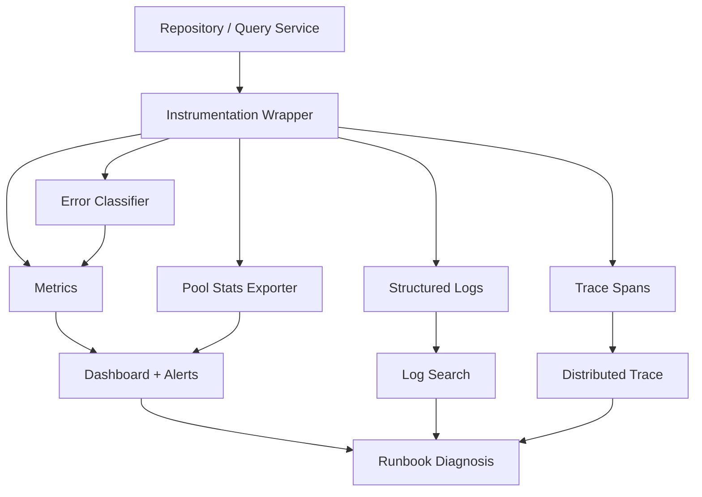
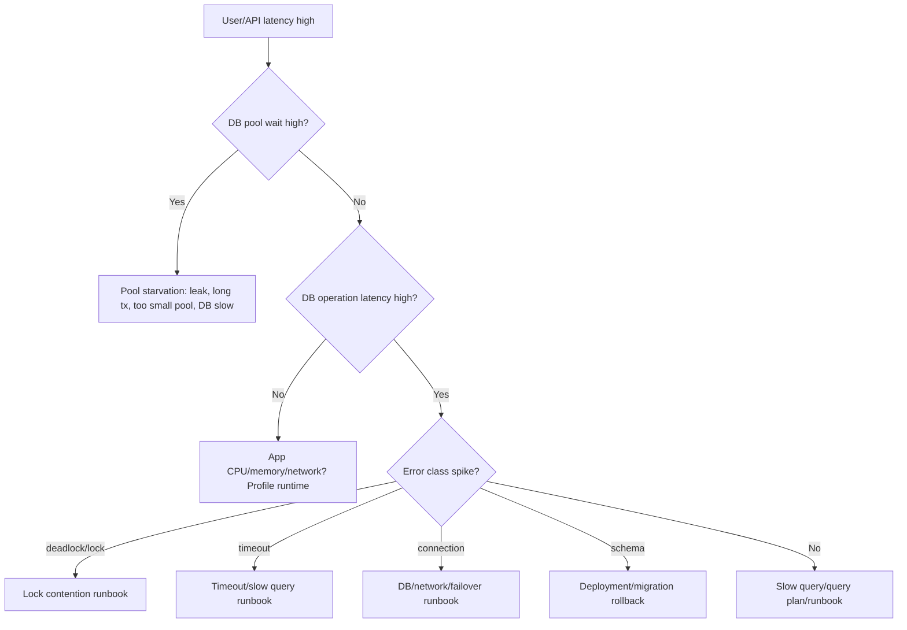

# learn-go-sql-database-integration-part-031.md

# Observability: Metrics, Logs, Traces, and Profiling

> Seri: `learn-go-sql-database-integration`  
> Part: `031`  
> Topik: `Database Observability in Go: Metrics, Logs, Traces, Profiling, Pool Stats, Query Attribution, Slow Query Diagnosis, Error Classes, Dashboards, Alerts, and Runbooks`  
> Target pembaca: Java software engineer yang ingin memahami Go database integration sampai level production architecture  
> Target Go: Go 1.26.x  
> Status seri: **belum selesai**

---

## 0. Posisi Part Ini Dalam Seri

Pada part sebelumnya kita membahas **testing database code**:

- unit test;
- integration test;
- real DB tests;
- migration tests;
- transaction tests;
- concurrency tests;
- error classifier tests;
- Testcontainers;
- fixture strategy;
- CI strategy.

Sekarang kita masuk ke tahap production:

> Setelah code berjalan di production, bagaimana kamu tahu apa yang sebenarnya terjadi?

Database integration problem jarang bisa diselesaikan hanya dengan stack trace.

Contoh incident:

```text
API tiba-tiba lambat.
Database CPU normal.
Connection pool penuh.
Query yang lambat bukan query yang paling sering.
Rows tidak di-close di satu path.
Retry membuat DB makin penuh.
Lock wait meningkat karena backfill.
Replica lag membuat user tidak melihat data baru.
Count query mendominasi latency.
Deadlock naik setelah deploy bulk update.
```

Tanpa observability, kamu hanya menebak.

Part ini membahas observability khusus untuk database integration di Go:

- metrics;
- logs;
- traces;
- profiling;
- pool stats;
- query operation naming;
- error classification;
- dashboard;
- alert;
- runbook;
- incident diagnosis.

---

## 1. Tujuan Pembelajaran

Setelah menyelesaikan part ini, kamu harus mampu:

1. menjelaskan tiga pilar observability: metrics, logs, traces, plus profiling sebagai alat tambahan;
2. menginstrumentasi operasi database dengan operation name stabil;
3. mengekspos `database/sql.DBStats` sebagai metrics;
4. memahami metric pool seperti `OpenConnections`, `InUse`, `Idle`, `WaitCount`, `WaitDuration`, `MaxIdleClosed`, `MaxLifetimeClosed`;
5. mendesain metric untuk query duration, transaction duration, rows returned/affected, error class, retry, timeout, and lock/deadlock;
6. membuat structured logs untuk DB operation tanpa membocorkan PII/secrets;
7. memakai `log/slog` untuk logging key-value;
8. memahami trace span untuk database operation;
9. memahami OpenTelemetry dan instrumentasi `database/sql`;
10. menghindari high-cardinality labels di metrics/traces/logs;
11. memakai runtime profiling/pprof/runtime metrics untuk membedakan DB bottleneck vs Go app bottleneck;
12. membuat dashboard untuk service + database;
13. membuat alert yang actionable;
14. membuat runbook untuk slow query, pool starvation, DB timeout, lock wait, deadlock, replica lag, migration/backfill impact, dan connection leak;
15. membangun budaya observability yang bisa dipakai saat incident.

---

## 2. Fakta Dasar Dari Dokumentasi Resmi

Beberapa fakta penting:

1. `database/sql` menyediakan `DB.Stats()` yang mengembalikan `DBStats`; field-nya mencakup jumlah connection open/in use/idle, counter wait, durasi wait, dan counter connection closed karena idle/lifetime.
2. `log/slog` adalah package structured logging di standard library Go; log record memiliki message, severity level, dan attributes berbentuk key-value.
3. `runtime/metrics` menyediakan interface stabil untuk membaca implementation-defined metrics dari Go runtime.
4. OpenTelemetry mendefinisikan instrumentation sebagai proses menambahkan observability code ke aplikasi; OpenTelemetry Go menyediakan API/SDK untuk telemetry.
5. `otelsql` adalah instrumentation library untuk Go `database/sql` yang menghasilkan traces dan metrics saat aplikasi berinteraksi dengan database.

Referensi utama:

- Go `database/sql`: <https://pkg.go.dev/database/sql>
- Go `log/slog`: <https://pkg.go.dev/log/slog>
- Go blog — Structured Logging with slog: <https://go.dev/blog/slog>
- Go `runtime/metrics`: <https://pkg.go.dev/runtime/metrics>
- OpenTelemetry Go instrumentation docs: <https://opentelemetry.io/docs/languages/go/instrumentation/>
- OpenTelemetry blog — Getting started with otelsql: <https://opentelemetry.io/blog/2024/getting-started-with-otelsql/>
- `otelsql`: <https://github.com/XSAM/otelsql>

---

## 3. Mental Model Utama

### 3.1 Observability Menjawab “Mengapa Sistem Berperilaku Begitu?”

Monitoring tradisional sering menjawab:

```text
Apakah sistem hidup?
```

Observability harus membantu menjawab:

```text
Kenapa request lambat?
Apakah lambat karena pool wait, DB lock, network, query plan, scan besar, atau retry?
Query operation mana?
Tenant/workload mana?
Sejak deploy mana?
Apakah error retryable?
Apakah DB atau app bottleneck?
```

### 3.2 Database Latency Bukan Satu Angka

Total DB operation latency bisa terdiri dari:

```text
time waiting for pool connection
+ time sending query
+ time waiting lock
+ time executing query
+ time streaming rows
+ time scanning rows into Go
+ time app processing rows
+ time closing rows
```

Jika kamu hanya mengukur total request latency, kamu tidak tahu bagian mana yang bermasalah.

### 3.3 Operation Name Lebih Penting Daripada Raw SQL

Metric label seperti ini berbahaya:

```text
query="SELECT * FROM users WHERE id = 123"
```

Masalah:

- high cardinality;
- PII leak;
- expensive metrics backend;
- sulit agregasi;
- raw SQL bisa besar.

Gunakan stable operation name:

```text
operation="user.find_by_id"
operation="case.search"
operation="outbox.claim"
operation="audit.insert_batch"
```

Raw SQL boleh muncul di trace/log internal dengan redaction dan sampling, tetapi jangan sebagai high-cardinality metric label.

---

## 4. Diagram: Database Observability Pipeline



---

## 5. Metrics, Logs, Traces, Profiling

### 5.1 Metrics

Best for:

- trends;
- alerting;
- SLO;
- p95/p99;
- rate;
- counters;
- pool saturation;
- error rate.

Example:

```text
db_operation_duration_seconds{operation="case.search"}
db_errors_total{operation="case.search", class="timeout"}
db_pool_in_use{pool="oltp"}
```

### 5.2 Logs

Best for:

- event details;
- debugging one operation;
- structured context;
- error message;
- request ID;
- user/tenant if safe;
- SQL operation metadata.

Example:

```json
{
  "level": "ERROR",
  "msg": "database operation failed",
  "operation": "case.search",
  "error_class": "lock_timeout",
  "duration_ms": 850,
  "request_id": "..."
}
```

### 5.3 Traces

Best for:

- request path across services;
- time breakdown;
- nested spans;
- DB call relation to HTTP/request/job;
- cross-service correlation.

Example:

```text
HTTP GET /cases
  auth.check
  case.search
    db.query case.search
  json.encode
```

### 5.4 Profiling

Best for:

- CPU hotspots;
- goroutine leak;
- blocking;
- heap/memory;
- mutex contention;
- GC pressure;
- scan/allocation overhead;
- connection pool waits visible as goroutine blocking.

---

## 6. What To Measure

Minimum database integration metrics:

| Metric | Why |
|---|---|
| operation duration | slow query/API diagnosis |
| operation count | traffic/rate |
| operation errors by class | actionable error trend |
| transaction duration | long tx/lock risk |
| transaction retries | contention/retry storm |
| rows returned | accidental huge read |
| rows affected | write semantics |
| pool open/in-use/idle | pool health |
| pool wait count/duration | pool starvation |
| context timeout count | deadline problems |
| DB timeout/cancel count | server-side timeout |
| deadlock count | concurrency design issue |
| lock timeout count | lock contention |
| serialization retry count | isolation contention |
| query scan/iteration error | rows.Err path |
| bulk job rows/sec | throughput |
| outbox backlog/age | async delivery health |
| migration/backfill progress | operational safety |

---

## 7. `database/sql.DBStats`

`db.Stats()` returns a snapshot.

Important fields:

```go
stats := db.Stats()

stats.MaxOpenConnections
stats.OpenConnections
stats.InUse
stats.Idle
stats.WaitCount
stats.WaitDuration
stats.MaxIdleClosed
stats.MaxIdleTimeClosed
stats.MaxLifetimeClosed
```

Mental model:

| Field | Meaning |
|---|---|
| `MaxOpenConnections` | configured max open connections |
| `OpenConnections` | current established + idle/in-use connections |
| `InUse` | currently checked-out connections |
| `Idle` | idle connections in pool |
| `WaitCount` | total waits for a connection |
| `WaitDuration` | total time spent waiting |
| `MaxIdleClosed` | closed due max idle count |
| `MaxIdleTimeClosed` | closed due idle time |
| `MaxLifetimeClosed` | closed due lifetime |

---

## 8. Derived Pool Metrics

Raw counters are useful, but derived metrics are often better.

### 8.1 Pool Utilization

```text
pool_utilization = InUse / MaxOpenConnections
```

If near 1.0 often, pool saturated.

### 8.2 Wait Rate

```text
rate(WaitCount)
```

If wait rate > 0 frequently, requests wait for pool.

### 8.3 Average Wait Duration

Over interval:

```text
delta(WaitDuration) / delta(WaitCount)
```

If rising, pool starvation.

### 8.4 Connection Churn

```text
rate(MaxLifetimeClosed + MaxIdleTimeClosed + MaxIdleClosed)
```

High churn may indicate too-short lifetime, network/proxy issues, or config mismatch.

---

## 9. Exporting DBStats

Pseudo exporter:

```go
type DBStatsExporter struct {
	DB   *sql.DB
	Pool string
}

func (e DBStatsExporter) Snapshot() DBPoolStats {
	s := e.DB.Stats()

	return DBPoolStats{
		Pool:               e.Pool,
		MaxOpenConnections: s.MaxOpenConnections,
		OpenConnections:    s.OpenConnections,
		InUse:              s.InUse,
		Idle:               s.Idle,
		WaitCount:          s.WaitCount,
		WaitDuration:       s.WaitDuration,
		MaxIdleClosed:      s.MaxIdleClosed,
		MaxIdleTimeClosed:  s.MaxIdleTimeClosed,
		MaxLifetimeClosed:  s.MaxLifetimeClosed,
	}
}
```

In real app, export via Prometheus/OpenTelemetry metrics library.

---

## 10. Pool Metrics Labels

Good labels:

```text
pool="oltp"
db_system="postgresql"
db_name="aceas"
service="case-api"
```

Avoid labels:

```text
user_id
tenant_id if high-cardinality
raw_dsn
query
sql
request_id
```

Metrics labels must be low-cardinality.

---

## 11. Operation-Level Metrics

Design:

```text
db_operation_duration_seconds{operation, db_system, pool, result}
db_operation_total{operation, db_system, result}
db_operation_errors_total{operation, db_system, error_class}
db_rows_returned_total{operation}
db_rows_affected_total{operation}
```

`operation` examples:

```text
user.create
user.find_by_email
case.search
case.approve
outbox.claim
outbox.mark_sent
audit.insert_batch
migration.backfill_email_norm
```

Keep list controlled.

---

## 12. Instrumentation Wrapper

Repository can use helper:

```go
type DBObserver interface {
	Observe(ctx context.Context, rec DBObservation)
}

type DBObservation struct {
	Operation    string
	DBSystem     string
	Pool         string
	Duration     time.Duration
	RowsReturned int64
	RowsAffected int64
	Error        error
	ErrorClass   string
	RetryAttempt int
}
```

Wrapper:

```go
func ObserveDB[T any](
	ctx context.Context,
	observer DBObserver,
	operation string,
	fn func(context.Context) (T, DBObservation, error),
) (T, error) {
	start := time.Now()

	result, obs, err := fn(ctx)
	obs.Operation = operation
	obs.Duration = time.Since(start)
	obs.Error = err

	observer.Observe(ctx, obs)

	return result, err
}
```

In practice, keep API simple.

---

## 13. Simple Timing Helper

```go
func ObserveOperation(
	ctx context.Context,
	operation string,
	classifier Classifier,
	record func(DBObservation),
	fn func(context.Context) error,
) error {
	start := time.Now()

	err := fn(ctx)

	obs := DBObservation{
		Operation: operation,
		Duration:  time.Since(start),
		Error:     err,
	}

	if err != nil {
		obs.ErrorClass = classifier.Classify(err).Class
	}

	record(obs)

	return err
}
```

Use in repository:

```go
err := ObserveOperation(ctx, "user.create", classifier, metrics.RecordDB, func(ctx context.Context) error {
	_, err := q.ExecContext(ctx, insertUserSQL, user.Email, user.Name)
	return err
})
```

---

## 14. Measuring Rows Returned

For `QueryContext`:

```go
rowsReturned := int64(0)

for rows.Next() {
	rowsReturned++
	// scan
}
```

Record after loop.

```go
obs.RowsReturned = rowsReturned
```

This helps detect:

- unexpected large result;
- missing limit;
- cardinality explosion;
- N+1 batch size issue.

---

## 15. Measuring Rows Affected

For `ExecContext`:

```go
result, err := q.ExecContext(ctx, query, args...)
if err != nil {
	return err
}

affected, err := result.RowsAffected()
if err == nil {
	obs.RowsAffected = affected
}
```

Not all drivers support it consistently for every statement.

Do not fail core operation just because metrics cannot get rows affected unless business logic depends on it.

---

## 16. Error Class Metrics

Use classifier from part 020.

Classes:

```text
not_found
unique_violation
foreign_key_violation
check_violation
deadlock
serialization_failure
lock_timeout
statement_timeout
context_deadline
context_canceled
connection
syntax_or_schema
permission
scan
unknown
```

Metric:

```text
db_operation_errors_total{operation="case.approve", class="deadlock"}
```

This makes alerts actionable.

---

## 17. Retriability Metrics

Retry metrics:

```text
db_tx_retries_total{operation, class}
db_tx_retry_exhausted_total{operation, class}
db_tx_retry_attempts{operation}
db_tx_retry_delay_seconds{operation}
```

Why?

- retry may hide user errors but load DB;
- retry storm can worsen outage;
- high deadlock retry means design issue;
- serialization retry can be normal at low rate but bad at high rate.

---

## 18. Timeout Metrics

Separate:

| Metric/Class | Meaning |
|---|---|
| `context_deadline` | app/request deadline exceeded |
| `context_canceled` | caller canceled |
| `statement_timeout` | DB canceled statement |
| `lock_timeout` | DB waited too long for lock |
| `pool_wait_timeout` | context expired waiting for connection |
| `socket_timeout` | driver/network read/write timeout |

If all are merged as “timeout”, diagnosis suffers.

---

## 19. Pool Wait vs Query Slow

Symptoms both:

```text
request DB call slow
```

Different causes:

### Pool Wait

- `DBStats.WaitCount` increasing;
- `InUse == MaxOpenConnections`;
- DB may be idle;
- goroutines waiting for connection;
- caused by leak/long tx/too small pool.

### Query Slow

- pool not saturated;
- DB query duration high;
- slow query logs/traces show execution;
- DB CPU/IO/locks high.

You need both pool metrics and operation spans.

---

## 20. Transaction Metrics

Metrics:

```text
db_tx_duration_seconds{operation,result}
db_tx_total{operation,result}
db_tx_errors_total{operation,error_class}
db_tx_retries_total{operation,error_class}
db_tx_commit_errors_total{operation,error_class}
db_tx_rollback_errors_total{operation,error_class}
```

Long transaction duration is dangerous because it can hold locks, pins connection, and affects MVCC/undo.

Track p95/p99 transaction duration.

---

## 21. Transaction Span

Trace structure:

```text
case.approve
  db.tx.begin
  db.query idempotency.insert_started
  db.query case.transition
  db.query audit.insert
  db.query outbox.insert
  db.tx.commit
```

This shows exactly which DB step is slow/failing.

---

## 22. Structured Logging With `slog`

`slog` example:

```go
logger.InfoContext(ctx, "database operation completed",
	slog.String("operation", "case.search"),
	slog.String("db_system", "postgresql"),
	slog.Duration("duration", duration),
	slog.Int64("rows_returned", rowsReturned),
)
```

Error:

```go
logger.ErrorContext(ctx, "database operation failed",
	slog.String("operation", "case.approve"),
	slog.String("error_class", class.Class),
	slog.Duration("duration", duration),
	slog.String("error", err.Error()),
)
```

Avoid logging raw SQL args with PII.

---

## 23. Logging Fields

Recommended fields:

| Field | Example |
|---|---|
| `operation` | `case.search` |
| `db_system` | `postgresql` |
| `pool` | `oltp` |
| `duration_ms` | `123` |
| `rows_returned` | `50` |
| `rows_affected` | `1` |
| `error_class` | `deadlock` |
| `retry_attempt` | `2` |
| `request_id` | safe request id |
| `trace_id` | trace correlation |
| `tenant_hash` | if needed, hashed |
| `query_shape` | safe fingerprint |

Avoid:

- raw password/DSN;
- raw query parameters;
- full SQL with sensitive values;
- full request body;
- full JSON payload with PII;
- user email/name unless policy allows;
- high-cardinality values in metrics.

---

## 24. Redaction Rules

Create policy:

```text
Never log secrets.
Never log full DSN.
Never log raw bind args by default.
Never log PII unless explicitly approved.
Prefer hashed identifiers for support correlation.
```

Example:

```go
func HashForLog(s string) string {
	sum := sha256.Sum256([]byte(s))
	return hex.EncodeToString(sum[:8])
}
```

Use:

```go
slog.String("tenant_hash", HashForLog(tenantID))
```

Hashing is not anonymization if input space is small, but it reduces accidental exposure.

---

## 25. Query Fingerprint

Safe query fingerprint:

```text
SELECT id, email FROM users WHERE id = ?;
```

or operation name:

```text
user.find_by_id
```

Avoid fingerprint labels if generated/high-cardinality.

For logs/traces, fingerprint can help.

For metrics, operation name is better.

---

## 26. SQL Comments for Attribution

Some teams add SQL comments:

```sql
/* operation=case.search */
SELECT ...
```

Benefits:

- visible in DB slow query logs / pg_stat_statements-like tooling;
- helps DBA identify source.

Cautions:

- never include user input;
- keep stable/low-cardinality;
- can affect query digest depending DB/tool;
- comments can leak service names if logs shared;
- ensure driver/proxy preserves/handles comments.

Use carefully.

---

## 27. Trace Basics

Trace span fields for DB:

```text
span name: db.query case.search
attributes:
  db.system=postgresql
  db.operation=SELECT
  db.namespace=appdb
  db.collection.name=cases
  app.db.operation=case.search
  rows.returned=50
  error.class=none
```

Avoid raw SQL statement by default unless redacted/sampled.

OpenTelemetry semantic conventions evolve, so use current instrumentation library conventions.

---

## 28. OpenTelemetry in Go

OpenTelemetry Go provides APIs/SDK for traces/metrics.

Typical app setup:

```text
resource attributes: service.name, service.version, deployment.environment
tracer provider
meter provider
exporter: OTLP / collector
propagation
shutdown flush
```

Database instrumentation can be:

- manual spans around repository methods;
- driver instrumentation like `otelsql`;
- both, carefully avoid duplicate/noisy spans.

---

## 29. `otelsql`

`otelsql` instruments Go `database/sql`.

It can generate traces/metrics for database interactions.

Value:

- automatic coverage;
- less manual boilerplate;
- DB spans tied to context;
- can capture query operation.

Cautions:

- configure labels/attributes carefully;
- avoid raw SQL/args leakage;
- avoid duplicate metrics if also manually instrumented;
- understand driver wrapping;
- test overhead;
- ensure operation names remain meaningful.

---

## 30. Manual Tracing Around Repository

Manual span:

```go
ctx, span := tracer.Start(ctx, "db.case.search")
defer span.End()

span.SetAttributes(
	attribute.String("app.db.operation", "case.search"),
	attribute.String("db.system", "postgresql"),
	attribute.Int("page.limit", page.Limit),
)

items, err := repo.search(ctx, db, filter, page)
if err != nil {
	span.RecordError(err)
	span.SetAttributes(attribute.String("error.class", classifier.Classify(err).Class))
}
```

Manual spans can represent business operation better than raw driver spans.

---

## 31. Span Granularity

Avoid:

```text
one span per row
```

for large result sets.

Good:

```text
one span per DB operation
one span per transaction
one span per batch/chunk
```

For bulk import:

```text
import.job
  parse.chunk
  db.copy_staging chunk=42
  db.validate_staging chunk=42
  db.merge_target chunk=42
```

---

## 32. Trace Sampling

High traffic services cannot trace every request at full detail.

Use:

- head sampling;
- tail sampling;
- error-biased sampling;
- slow-request sampling;
- canary increased sampling;
- incident temporary sampling.

Always keep metrics complete enough for alerting.

---

## 33. Correlation IDs

Every request/job should have correlation:

- request ID;
- trace ID;
- operation ID;
- job ID;
- tenant hash if safe.

Log:

```go
logger.InfoContext(ctx, "outbox claim completed",
	slog.String("operation", "outbox.claim"),
	slog.String("job_id", jobID),
	slog.Int("rows", len(ids)),
)
```

Trace includes same.

---

## 34. Profiling: Why It Matters for DB Code

Database incident may not be DB server issue.

Go app might be slow because:

- scanning huge rows allocates too much;
- JSON unmarshal heavy;
- decimal parsing expensive;
- log formatting expensive;
- rows buffered in memory;
- goroutines blocked on pool;
- GC pressure from result materialization;
- mutex contention in cache;
- connection leak.

Use profiling to distinguish.

---

## 35. pprof Profiles

Useful profiles:

| Profile | Use |
|---|---|
| CPU | expensive scan/JSON/serialization |
| heap | memory from materializing rows |
| goroutine | blocked goroutines/pool waits |
| block | blocking operations |
| mutex | lock contention |
| trace | scheduler/timing view |

Enable pprof carefully in production:

- protected endpoint;
- internal network;
- auth;
- limited duration;
- no public exposure.

---

## 36. Runtime Metrics

`runtime/metrics` exposes Go runtime metrics via stable interface.

Useful areas:

- goroutine count;
- heap allocation;
- GC cycles/pause;
- CPU classes;
- scheduler;
- cgo calls;
- memory classes.

In DB integration context:

- goroutine count spikes can indicate blocked pool waits;
- heap spikes can indicate huge result materialization;
- GC spikes can indicate scan/JSON allocation;
- cgo calls matter for SQLite/Oracle drivers using CGO.

---

## 37. Memory and Rows

Anti-pattern:

```go
rows, _ := db.QueryContext(ctx, hugeQuery)
var all []BigRow
for rows.Next() {
    all = append(all, scanBigRow(rows))
}
```

Observability signs:

- heap increases;
- GC increases;
- request duration increases;
- rows_returned high;
- response size high.

Fix:

- limit;
- streaming;
- pagination;
- projection;
- batch processing;
- avoid large LOB/JSON in list.

---

## 38. Goroutine Profile and Pool Starvation

If many goroutines blocked in `database/sql`, likely:

- pool too small;
- connections leaked;
- long transactions;
- rows not closed;
- DB slow;
- too much concurrency.

Correlate:

- goroutine profile;
- `db.Stats().InUse`;
- `WaitCount/WaitDuration`;
- operation spans;
- DB server activity.

---

## 39. Observability For Connection Leaks

Symptoms:

```text
InUse approaches MaxOpenConnections
Idle low
WaitCount increasing
request timeout
DB CPU not necessarily high
```

Causes:

- `rows.Close()` missing;
- `rows.Err()` path not reached? Close still matters;
- transaction not committed/rolled back;
- long streaming response;
- hanging query;
- connection reserved with `db.Conn` not closed.

Add:

- code review checklist;
- integration tests with `MaxOpenConns(1)`;
- pool wait alert;
- goroutine profile runbook.

---

## 40. Observability For Slow Query

Metrics:

```text
db_operation_duration_seconds p95/p99 high
```

Trace shows specific operation.

Logs show:

```text
operation=case.search
rows_returned=50
has_keyword=true
sort=updatedAt_desc
limit=50
duration_ms=1800
```

DB tools show:

- query plan;
- lock wait;
- IO wait;
- CPU;
- missing index;
- stale stats;
- large offset;
- count query.

Runbook depends on classification.

---

## 41. Observability For Lock Wait

Signs:

- DB operation duration high;
- DB CPU maybe low;
- lock timeout errors;
- deadlocks;
- traces stuck in update/select for update;
- DB lock views show blockers.

Metrics:

```text
db_errors_total{class="lock_timeout"}
db_errors_total{class="deadlock"}
db_tx_duration_seconds
```

Logs should include operation, not raw data.

---

## 42. Observability For Retry Storm

Signs:

- retry counter increases;
- DB QPS increases without user traffic increase;
- p99 worse;
- deadlock/serialization/timeout classes increase;
- downstream DB overloaded.

Metrics:

```text
db_tx_retries_total
db_tx_retry_exhausted_total
retry_attempt histogram
```

Alert on retry exhaustion and retry rate.

Retry should be visible. Invisible retry hides failures until outage.

---

## 43. Observability For Replica Lag

Metrics:

```text
db_replica_lag_seconds
read_after_write_miss_total
replica_read_errors_total
```

Logs:

```text
read_consistency=eventual
db_role=replica
```

Runbook:

- route strong reads to primary;
- pause bulk jobs;
- monitor catch-up;
- alert if lag above UX threshold.

---

## 44. Observability For Outbox

Key metrics:

```text
outbox_pending_total
outbox_oldest_pending_age_seconds
outbox_processing_total
outbox_publish_errors_total{class}
outbox_claim_duration_seconds
outbox_mark_sent_duration_seconds
outbox_retry_scheduled_total
```

Oldest pending age is more useful than count alone.

If count low but oldest age high, some message stuck.

---

## 45. Observability For Inbox

Metrics:

```text
inbox_messages_received_total
inbox_duplicates_total
inbox_processing_duration_seconds
inbox_processing_errors_total
inbox_oldest_started_age_seconds
```

Duplicate rate spike may indicate upstream retry or consumer ack issue.

---

## 46. Observability For Bulk Jobs

Metrics:

```text
bulk_job_duration_seconds{job_type,status}
bulk_rows_processed_total{job_type}
bulk_rows_per_second{job_type}
bulk_rejects_total{job_type,reason}
bulk_chunk_duration_seconds{job_type}
bulk_retry_total{job_type,class}
bulk_checkpoint_lag{job_type}
```

Logs per chunk:

```text
job_id
chunk_no
rows
duration
inserted
updated
skipped
rejected
last_id
```

Avoid per-row logs for millions of rows.

---

## 47. Observability For Migrations/Backfills

Metrics:

```text
migration_duration_seconds{name}
migration_status{name}
migration_backfill_rows_processed_total{name}
migration_backfill_rows_remaining{name}
migration_backfill_chunk_duration_seconds{name}
migration_error_total{name,class}
```

Logs:

```text
migration=add_email_norm
phase=backfill
chunk=42
rows=500
duration_ms=130
last_id=100500
```

Alerts:

- migration failed;
- backfill stuck;
- replication lag high during migration;
- API p99 degraded during migration.

---

## 48. Dashboard: Database Client Overview

Panel groups:

1. request rate and latency;
2. DB operation latency by operation;
3. DB errors by class;
4. transaction duration/retries;
5. pool stats;
6. rows returned/affected;
7. outbox/inbox;
8. runtime heap/goroutine/GC;
9. DB server CPU/IO/locks/replica lag;
10. deploy/migration annotations.

Dashboard should answer:

```text
Is the problem app, pool, DB, lock, query, or downstream?
```

---

## 49. Dashboard: Pool Panel

Panels:

- `InUse`;
- `Idle`;
- `OpenConnections`;
- `MaxOpenConnections`;
- pool utilization;
- `WaitCount` rate;
- average wait duration;
- connection closed by lifetime/idle;
- p95 DB operation duration;
- request timeout rate.

Interpretation:

- high InUse + high wait = pool saturated;
- high wait + low DB CPU = leak/long tx/pool too small;
- high connection churn = lifetime/network config issue.

---

## 50. Dashboard: Error Class Panel

Stacked error classes:

```text
unique_violation
foreign_key_violation
deadlock
serialization_failure
lock_timeout
statement_timeout
context_deadline
connection
syntax_or_schema
scan
unknown
```

Actionability:

- unique violation spike may be client duplicate/idempotency;
- deadlock spike means concurrency design;
- syntax/schema means deploy/migration issue;
- connection means infra/DB/network;
- scan means code/schema mismatch.

---

## 51. Dashboard: Operation Latency

Top operations by:

- p95;
- p99;
- count;
- total time;
- error rate;
- rows returned.

A rare but very slow operation can dominate DB load.

A frequent small query can dominate total time.

Both matter.

---

## 52. Dashboard: Transaction Panel

Panels:

- tx duration p95/p99;
- tx count;
- tx rollback count;
- tx commit error count;
- tx retry count;
- tx retry exhausted;
- longest running operation;
- lock/deadlock errors.

Long transactions often cause lock and MVCC/undo pressure.

---

## 53. Dashboard: Go Runtime Panel

Panels:

- goroutines;
- heap allocated;
- heap objects;
- GC pause;
- allocation rate;
- CPU;
- cgo calls if relevant;
- block/mutex profile sampling if enabled.

Correlate runtime spikes with DB rows returned and scan paths.

---

## 54. Alert Design Principles

Alert should be:

- actionable;
- low-noise;
- tied to user impact or imminent risk;
- include runbook;
- include likely diagnosis data;
- not based on single transient spike unless critical.

Bad alert:

```text
DB query took > 1s once
```

Better:

```text
case.search p95 > 1s for 10 min and request rate > threshold
```

or:

```text
pool wait p95 > 100ms for 5 min
```

---

## 55. Recommended Alerts

### 55.1 Pool Starvation

```text
pool utilization > 0.9
AND wait rate > 0
FOR 5m
```

### 55.2 DB Operation Latency

```text
p95 db_operation_duration_seconds{operation=critical} > SLO
FOR 10m
```

### 55.3 Error Rate

```text
db_operation_errors_total rate by class > threshold
```

### 55.4 Deadlock Spike

```text
deadlock errors > baseline
```

### 55.5 Retry Exhausted

```text
retry_exhausted_total > 0
```

### 55.6 Outbox Stuck

```text
oldest_pending_age > threshold
```

### 55.7 Migration Failed

```text
migration_status == failed
```

### 55.8 Replica Lag

```text
replica_lag_seconds > threshold
```

---

## 56. SLO for Database Operations

Example SLO:

```text
99% of user.find_by_id under 50ms
99% of case.search under 500ms
99% of case.approve under 800ms
outbox oldest pending age < 60s
```

DB operation SLO should support user-facing SLO.

Not every DB operation needs same latency budget.

---

## 57. High Cardinality Trap

Bad metrics labels:

```text
db_operation_duration_seconds{query="SELECT ... id=123"}
db_errors_total{user_id="..."}
db_latency{tenant_id="..."} // if many tenants
db_latency{request_id="..."}
```

High-cardinality labels can destroy metrics backend.

Use logs/traces for high-cardinality details.

Metrics labels should be bounded.

---

## 58. Tenant Observability

Sometimes tenant-specific visibility is needed.

Options:

- sample logs with tenant hash;
- top-N tenant analysis outside metrics;
- trace attributes sampled;
- separate metrics only for small controlled tenant group;
- billing/usage pipeline separate from operational metrics.

Do not label all metrics by raw tenant ID in large multi-tenant systems.

---

## 59. Query Classification

Classify operations by workload:

```text
oltp_read
oltp_write
transactional_command
report
bulk
migration
outbox
inbox
healthcheck
```

Metric label:

```text
workload="oltp_write"
```

Low cardinality and useful.

---

## 60. Health Checks Observability

Do not hide health check DB calls.

Operation:

```text
db.health.ping
```

Metrics:

- ping duration;
- ping error class.

But health checks should not dominate metrics.

Use separate operation and possibly filter in dashboards.

---

## 61. Logging Slow Operations

Log only above threshold:

```go
if duration > slowThreshold {
	logger.WarnContext(ctx, "slow database operation",
		slog.String("operation", operation),
		slog.Duration("duration", duration),
		slog.Int64("rows_returned", rows),
		slog.String("error_class", errorClass),
	)
}
```

Threshold can be operation-specific.

Avoid logging every query in high-traffic production.

---

## 62. Operation-Specific Slow Threshold

Example:

| Operation | Slow Threshold |
|---|---:|
| `user.find_by_id` | 50ms |
| `case.search` | 500ms |
| `report.generate` | 5s |
| `outbox.claim` | 200ms |
| `migration.backfill_chunk` | 2s |

One global threshold is often too blunt.

---

## 63. Safe SQL Logging

If you log SQL, prefer:

```text
query_name=case.search
query_fingerprint=SELECT ... WHERE tenant_id=? AND status=?
```

Avoid:

```text
args=[email, name, payload, token]
```

If debugging needs args:

- enable temporary secure debug in lower env;
- redact sensitive fields;
- sample;
- access-controlled logs;
- expiration.

---

## 64. Audit vs Observability Logs

Do not confuse:

### Observability logs

- debugging system behavior;
- may be sampled;
- operational retention;
- no legal guarantee.

### Audit logs

- business/security record;
- immutable or append-only;
- compliance;
- exact actor/action/resource/time;
- retained by policy.

Database operation logs are not audit logs.

Audit should be modeled explicitly.

---

## 65. Profiling Slow Scan

Symptoms:

- DB execution fast;
- app span slow after rows start;
- CPU high;
- heap allocation high.

Possible causes:

- JSON unmarshal per row;
- decimal parsing;
- reflection mapper;
- large string allocation;
- `SELECT *`;
- scanning unused columns;
- building huge slice;
- per-row log/span.

Use CPU/heap profiles.

Fix:

- projection;
- manual scan;
- streaming;
- reduce per-row work;
- batch processing;
- avoid reflection in hot path.

---

## 66. Profiling GC Pressure

Signals:

- heap grows during listing/export;
- GC CPU high;
- latency spikes with large result;
- rows_returned high.

Fix:

- limit/pagination;
- stream;
- reuse buffers carefully;
- reduce allocations;
- avoid scanning large JSON/LOB;
- preallocate slice capacity when limit known;
- avoid `map[string]any` in hot scan.

---

## 67. Profiling Goroutine Leak

Signals:

- goroutines steadily increasing;
- many goroutines blocked on DB;
- request contexts not canceled;
- worker loop stuck.

Use goroutine profile.

Fix:

- close rows;
- rollback/commit tx;
- close reserved connections;
- respect context;
- stop workers gracefully;
- limit concurrency.

---

## 68. Profiling CGO Drivers

SQLite CGO and Oracle `godror` involve CGO.

Observe:

- cgo call count;
- blocked threads;
- scheduler behavior;
- deployment runtime libs.

Not all cgo usage is bad, but it changes operational profile.

---

## 69. Instrumenting Repository Methods

Example structure:

```go
type UserRepository struct {
	observer DBObserver
	classifier Classifier
	logger *slog.Logger
}

func (r UserRepository) FindByID(ctx context.Context, q DBTX, id int64) (User, error) {
	const op = "user.find_by_id"
	start := time.Now()

	var user User
	err := q.QueryRowContext(ctx, `
		SELECT id, email, name
		FROM users
		WHERE id = $1
	`, id).Scan(&user.ID, &user.Email, &user.Name)

	duration := time.Since(start)

	class := ""
	if err != nil {
		class = r.classifier.Classify(err).Class
	}

	r.observer.Observe(ctx, DBObservation{
		Operation: op,
		Duration: duration,
		Error: err,
		ErrorClass: class,
	})

	if err != nil {
		if errors.Is(err, sql.ErrNoRows) {
			return User{}, ErrUserNotFound
		}
		return User{}, fmt.Errorf("%s: %w", op, err)
	}

	return user, nil
}
```

This is explicit but can be repetitive. You can factor common helpers.

---

## 70. Avoid Observability Boilerplate Explosion

Patterns:

- helper function around query;
- generated repository wrapper;
- middleware-like DB wrapper;
- otelsql auto instrumentation;
- service-level spans + operation metrics;
- decorator repository.

Be careful not to hide error handling/rows lifecycle.

Observability should improve clarity, not make DB code magical.

---

## 71. Decorator Pattern

```go
type CaseRepository interface {
	FindByID(ctx context.Context, q DBTX, id int64) (Case, error)
}

type ObservedCaseRepository struct {
	next CaseRepository
	obs  DBObserver
}

func (r ObservedCaseRepository) FindByID(ctx context.Context, q DBTX, id int64) (Case, error) {
	start := time.Now()
	c, err := r.next.FindByID(ctx, q, id)

	r.obs.Observe(ctx, DBObservation{
		Operation: "case.find_by_id",
		Duration: time.Since(start),
		Error:    err,
	})

	return c, err
}
```

This observes repository call, not raw SQL internals.

Good for domain operation metrics.

---

## 72. Driver Wrapper vs Repository Instrumentation

### Driver-level instrumentation

Pros:

- automatic;
- covers all DB calls;
- can see raw statement/fingerprint;
- less code.

Cons:

- operation names may be generic;
- hard to map to business operation;
- raw SQL risk;
- can duplicate spans.

### Repository-level instrumentation

Pros:

- semantic operation names;
- can record rows/business context;
- easier error mapping.

Cons:

- manual;
- can miss ad-hoc DB calls.

Best:

```text
driver-level baseline + repository-level semantic operation
```

with care to avoid noise.

---

## 73. Observability and Error Wrapping

Wrap errors with operation:

```go
return fmt.Errorf("case.search query: %w", err)
```

But classifier must still see original driver error through `errors.As`.

Good:

```go
fmt.Errorf("case.search query: %w", err)
```

Bad:

```go
fmt.Errorf("case.search query: %v", err)
```

because `%v` loses wrapping.

---

## 74. Logging Wrapped Errors

Log:

```go
slog.String("error", err.Error())
slog.String("error_class", class)
```

Do not parse log text for metrics. Classify in code.

---

## 75. Observability and Context

Every DB operation should use context:

```go
QueryContext
ExecContext
BeginTx
PrepareContext
```

Context carries:

- cancellation;
- deadline;
- trace context;
- request values like request ID if your logging system uses it.

Avoid `context.Background()` inside repository except for process-level jobs with explicit parent context.

---

## 76. Context Deadline Attributes

Record remaining budget if useful:

```go
if deadline, ok := ctx.Deadline(); ok {
	remaining := time.Until(deadline)
	span.SetAttributes(attribute.Int64("ctx.deadline_remaining_ms", remaining.Milliseconds()))
}
```

Avoid high-cardinality exact timestamps in metrics.

Useful in traces/logs for timeout diagnosis.

---

## 77. Observability and Retry

When retrying, log/trace each retry attempt at debug/warn depending severity.

Fields:

```text
operation
attempt
max_attempts
error_class
delay_ms
```

Do not log huge stack every attempt unless needed.

Metric every attempt.

Trace event:

```text
retry attempt 2 after deadlock
```

---

## 78. Observability and Circuit Breakers / Backpressure

If app has backpressure:

Metrics:

```text
db_backpressure_active
db_requests_rejected_total{reason}
bulk_job_paused_total{reason}
```

Logs:

```text
bulk job paused due replica lag
```

This helps operators know throttling is intentional.

---

## 79. Observability and Prepared Statements

Metrics/logs:

- prepared statement creation errors;
- statement close errors if relevant;
- cache churn if driver exposes it;
- DB server prepared statement limit errors.

High-cardinality dynamic SQL can create many prepared statements.

Observe if using manual prepare.

---

## 80. Observability and Migrations

For migration runner:

- log each migration start/end;
- duration;
- success/failure;
- checksum/version;
- transactional/non-transactional;
- lock wait;
- rows affected if data migration.

Do not let migration fail silently.

Migration should create deployment annotation on dashboard.

---

## 81. Observability and Health Checks

Health check result should be clear:

```text
db_ping_success
db_ping_duration
db_ping_error_class
```

But health check should not be too expensive.

Do not make readiness run a complex query that stresses DB every second.

---

## 82. Observability and Readiness vs Liveness

Liveness:

```text
Is process alive?
```

Should not usually depend heavily on DB, or app may restart-loop during DB outage.

Readiness:

```text
Can app serve traffic?
```

May depend on DB connectivity.

Metrics/logs should distinguish liveness/readiness failures.

---

## 83. Observability For Jobs

Background jobs need same observability as HTTP requests.

Fields:

- job type;
- job ID;
- chunk;
- operation;
- rows;
- duration;
- error class;
- retry.

Trace root can be job execution span.

---

## 84. Observability For Scheduled Tasks

Scheduled task logs should include schedule context:

```text
task=nightly_reconciliation
scheduled_at
started_at
duration
rows_processed
```

Avoid only logging “started” and “done”.

---

## 85. Observability For Data Quality

Database integration observability should include data quality counters:

- rejected import rows;
- duplicate idempotency keys;
- invalid state transitions;
- FK violations;
- check violations;
- null unexpected;
- scan errors.

These can indicate upstream/client bugs.

---

## 86. Observability For Scan Errors

Scan errors often mean:

- schema changed;
- type mismatch;
- unexpected NULL;
- driver mapping issue;
- query projection mismatch.

Metric:

```text
db_errors_total{class="scan"}
```

Log:

```text
operation
column maybe if safe
error
schema_version
```

Do not retry scan errors.

---

## 87. Observability For `sql.ErrNoRows`

Not found is often normal.

Do not log error-level for every not found.

Metric separately if meaningful:

```text
db_not_found_total{operation}
```

For user lookup by ID, not found might be normal. For idempotency record after duplicate insert, missing existing record is suspicious.

Severity depends on operation.

---

## 88. Observability For Constraint Violations

Unique violation may be:

- expected user conflict;
- idempotency duplicate;
- client retry;
- bug;
- attack;
- data migration issue.

Use operation context.

Example:

```text
operation=user.create class=unique_violation -> maybe 409 normal
operation=ledger.insert_entry class=unique_violation -> idempotency duplicate maybe normal
operation=migration.backfill class=unique_violation -> migration issue
```

Do not treat all constraint violations equally.

---

## 89. Observability For SQL Syntax/Schema Errors

Class:

```text
syntax_or_schema
```

This should be high-severity.

Likely causes:

- bad deploy;
- migration missing;
- wrong DB version;
- feature flag enabled early;
- query builder bug.

Alert immediately for production if nonzero.

---

## 90. Observability For Permission Errors

Permission errors:

- missing grant;
- wrong role;
- secret rotation;
- migration created object without grant;
- RLS policy issue.

Class:

```text
permission
```

Alert quickly after deploy/migration.

---

## 91. Observability For Connection Errors

Connection error classes:

- refused;
- reset;
- timeout;
- auth failed;
- TLS/cert;
- DNS;
- too many connections;
- server restart/failover.

Metric by broad class.

Log details safe enough for ops, but no password/DSN.

---

## 92. DB Server Metrics To Correlate

Application metrics are half the story.

Correlate with DB metrics:

| Area | Examples |
|---|---|
| CPU | DB CPU, load |
| IO | read/write IOPS, latency |
| locks | lock waits, deadlocks |
| connections | active sessions |
| replication | lag, apply delay |
| storage | disk full, WAL/binlog/redo |
| query | slow query, top queries |
| cache | buffer hit ratio |
| maintenance | vacuum/autovacuum, stats, purge |
| network | connection errors/latency |

Managed DB cloud metrics are often essential.

---

## 93. Dashboard Annotations

Add annotations for:

- deploy;
- migration;
- feature flag enable;
- backfill start/stop;
- DB failover;
- index creation;
- config change;
- incident mitigation.

Many incidents correlate with change.

---

## 94. Incident Diagnosis Flow



---

## 95. Runbook: Pool Starvation

Symptoms:

- `InUse == MaxOpenConnections`;
- `WaitCount` rate increasing;
- `WaitDuration` increasing;
- request context deadline errors;
- DB server not necessarily overloaded.

Check:

1. recent deploy?
2. rows not closed?
3. tx not committed/rolled back?
4. long transactions?
5. slow query causing connection hold?
6. streaming responses?
7. worker concurrency spike?
8. pool max too low?
9. DB max connections too low?
10. connection leak via `db.Conn`?

Actions:

- inspect goroutine profile;
- inspect traces for long DB spans;
- reduce worker concurrency;
- fix leak;
- add timeouts;
- tune pool only after root cause;
- consider separate batch pool.

---

## 96. Runbook: Slow Query

Symptoms:

- specific operation p95/p99 high;
- DB operation spans slow;
- rows returned maybe high.

Check:

1. operation name;
2. SQL/query shape;
3. explain plan;
4. index usage;
5. rows scanned vs returned;
6. large offset/count?
7. search leading wildcard?
8. lock wait?
9. stale stats?
10. data growth?
11. recent migration/index drop?
12. DB CPU/IO?

Actions:

- add/revise index;
- rewrite query;
- reduce projection;
- switch pagination;
- remove/async count;
- analyze/update stats;
- split report from OLTP;
- throttle callers.

---

## 97. Runbook: Deadlock Spike

Symptoms:

- deadlock error class increases;
- retry count increases;
- p99 latency increases.

Check:

1. operations involved;
2. lock order;
3. recent deploy;
4. batch job/migration;
5. index changes;
6. hot rows;
7. transaction duration;
8. DB deadlock logs.

Actions:

- ensure safe retry;
- reduce concurrency;
- enforce deterministic lock order;
- shorten transaction;
- add indexes;
- pause batch;
- redesign hot row update.

---

## 98. Runbook: Lock Timeout

Symptoms:

- lock timeout class;
- long transaction;
- blockers in DB.

Check:

1. blocker query;
2. blocker transaction age;
3. idle in transaction;
4. migration/backfill;
5. missing index causing broad lock;
6. user workflow holds tx too long.

Actions:

- kill blocker only if approved;
- reduce tx scope;
- add lock timeout;
- return busy/try later;
- fix index/query;
- pause backfill.

---

## 99. Runbook: Statement/Context Timeout

Distinguish:

### Context deadline

Caller budget expired.

Check upstream deadline, pool wait, app processing.

### Statement timeout

DB canceled query.

Check query plan/locks/DB resource.

Actions:

- inspect trace: was time spent waiting for pool or executing?
- adjust budget only after root cause.
- avoid simply increasing timeout.

---

## 100. Runbook: Schema Error After Deploy

Symptoms:

- `syntax_or_schema` errors;
- undefined column/table;
- scan errors;
- permission errors.

Check:

1. migration applied?
2. app deployed before migration?
3. read replica lag?
4. wrong database?
5. migration failed?
6. feature flag early?
7. contract migration too early?

Actions:

- disable feature flag;
- rollback app;
- apply repair migration;
- route reads primary if replica lag;
- stop rollout;
- add compatibility test.

---

## 101. Runbook: Outbox Backlog

Symptoms:

- pending count high;
- oldest pending age high;
- publish error high.

Check:

1. DB claim slow?
2. worker down?
3. message broker down?
4. poison messages?
5. lock contention?
6. retry schedule too aggressive?
7. outbox index?
8. recent bulk write created event flood?

Actions:

- inspect worker logs/traces;
- pause bad producer;
- fix broker;
- increase workers carefully;
- add/rebuild index;
- handle poison messages;
- throttle event flood.

---

## 102. Runbook: Replica Lag

Symptoms:

- stale reads;
- replica lag metric high;
- user cannot see recent write.

Check:

1. bulk job/backfill?
2. long transaction?
3. DB IO saturation?
4. replication thread error?
5. schema migration?
6. large transaction/binlog/WAL?

Actions:

- route strong reads to primary;
- pause/throttle bulk;
- wait for catch-up;
- reduce transaction size;
- investigate replica health;
- communicate eventual consistency.

---

## 103. Runbook: High Scan Error

Symptoms:

- scan error class rises.

Check:

1. migration changed column type/nullability?
2. query `SELECT *` changed column order/count?
3. nullable field scanned into non-null Go type?
4. driver version changed?
5. bad data inserted?
6. time parsing DSN?
7. Oracle empty string/NULL issue?

Actions:

- rollback/feature flag;
- fix scan target;
- update nullable mapping;
- repair data;
- add integration test.

---

## 104. Log Level Policy

Suggested:

| Event | Level |
|---|---|
| normal DB operation | no log or debug |
| slow operation | warn |
| expected not found | debug/no log |
| duplicate user input conflict | info/debug |
| retryable deadlock recovered | warn/debug depending rate |
| retry exhausted | error |
| schema/syntax error | error |
| connection outage | error |
| migration start/end | info |
| migration failure | error |
| backfill chunk | info/debug sampled |
| security/permission error | error |

Avoid logging expected high-volume conflicts at error level.

---

## 105. Sampling Logs

For high-volume slow-ish operations, sample:

```text
log 1% of successful operations
log all errors
log all operations slower than threshold
```

Sampling reduces cost.

But metrics should still count all operations.

---

## 106. Structured Error Context

Define error record:

```go
type DBErrorLogContext struct {
	Operation  string
	Class      string
	Retryable  bool
	Ambiguous  bool
	Constraint string
	QueryName  string
}
```

Log safe fields.

Do not log full driver detail to user, but logs can include safe driver code/class.

---

## 107. User-Facing Error vs Internal Observability

User response:

```json
{
  "code": "email_already_used",
  "message": "Email is already used."
}
```

Internal log:

```text
operation=user.create
error_class=unique_violation
constraint=uq_users_email_norm
```

Do not expose table/constraint names if not appropriate.

---

## 108. Metrics for Error Mapping Quality

Track unknown errors:

```text
db_operation_errors_total{class="unknown"}
```

Unknown should be low.

If unknown rises:

- classifier missing driver code;
- new failure mode;
- driver version changed;
- wrapped error lost.

Add classifier test.

---

## 109. Observability in Tests

Tests can assert instrumentation lightly:

```go
observer := &FakeObserver{}
repo := NewRepo(observer)

_, _ = repo.FindByID(ctx, db, 123)

if observer.Last.Operation != "user.find_by_id" {
	t.Fatal("missing operation")
}
```

Do not over-test exact metric backend.

But ensure critical paths call observer.

---

## 110. Fake Observer for Tests

```go
type FakeObserver struct {
	Records []DBObservation
}

func (f *FakeObserver) Observe(ctx context.Context, rec DBObservation) {
	f.Records = append(f.Records, rec)
}
```

Use to test:

- operation name set;
- rows returned counted;
- error class recorded.

---

## 111. Observability and Performance Overhead

Instrumentation has overhead.

Watch:

- per-row logging/spans;
- high cardinality;
- expensive JSON log formatting;
- synchronous log writes;
- capturing stack traces for expected errors;
- tracing every query at high QPS;
- storing raw SQL/args.

Measure overhead under load.

---

## 112. Observability Budget

Treat observability as system feature with budget:

- metrics cardinality budget;
- log volume budget;
- trace sampling budget;
- pprof access policy;
- retention policy;
- sensitive data policy.

Observability that causes outage is bad observability.

---

## 113. Minimal Instrumentation Set

If starting from zero, implement:

1. DB operation duration/count/error class by operation.
2. `DB.Stats()` pool metrics.
3. Structured logs for errors and slow operations.
4. Trace spans for request -> repository -> DB.
5. Runtime metrics/goroutine/heap dashboard.
6. Outbox/backfill/migration metrics if used.
7. Runbooks linked from alerts.

This already gives huge diagnostic power.

---

## 114. Production Dashboard Checklist

- [ ] API request latency/error/rate.
- [ ] DB operation latency by operation.
- [ ] DB error class count.
- [ ] Transaction duration/retry.
- [ ] Pool `InUse`, `Idle`, `Open`, utilization.
- [ ] Pool wait rate/duration.
- [ ] Rows returned/affected.
- [ ] Go goroutines/heap/GC.
- [ ] DB server CPU/IO/connections/locks.
- [ ] Slow query/top query view.
- [ ] Outbox/inbox backlog.
- [ ] Migration/backfill status.
- [ ] Replica lag if replicas.
- [ ] Deploy/migration annotations.

---

## 115. Alert Checklist

- [ ] Alert has owner.
- [ ] Alert has runbook.
- [ ] Alert is actionable.
- [ ] Threshold based on SLO/baseline.
- [ ] Includes operation/error class labels.
- [ ] Avoids high-cardinality labels.
- [ ] Avoids one-off noise.
- [ ] Detects both symptoms and critical causes.
- [ ] Tested in staging/drill.
- [ ] Has dashboard link.

---

## 116. Repository Observability Checklist

- [ ] Every repository/query service method has stable operation name.
- [ ] Query/exec duration measured.
- [ ] Error classified.
- [ ] Rows returned/affected measured where relevant.
- [ ] Not found severity handled properly.
- [ ] Slow operation logging.
- [ ] No PII/secrets in logs.
- [ ] Context propagated.
- [ ] Trace span or driver instrumentation.
- [ ] Wrapped errors use `%w`.

---

## 117. Transaction Observability Checklist

- [ ] Begin/commit/rollback failures observable.
- [ ] Transaction duration measured.
- [ ] Retry attempts measured/logged.
- [ ] Error class measured.
- [ ] Commit ambiguity flagged.
- [ ] Long transaction alert.
- [ ] Operation name tied to service command.
- [ ] No external side effects inside retryable tx.

---

## 118. Pool Observability Checklist

- [ ] `DB.Stats()` exported per pool.
- [ ] Pool label distinguishes `oltp`, `batch`, `report`, etc.
- [ ] WaitCount/WaitDuration alert.
- [ ] Utilization alert.
- [ ] Churn monitored.
- [ ] Pool settings visible in config logs.
- [ ] Total connection budget documented.
- [ ] Separate pools monitored independently.

---

## 119. Slow Query Log Checklist

- [ ] Operation name.
- [ ] Duration.
- [ ] Rows returned/affected.
- [ ] Error class.
- [ ] Query fingerprint or safe query name.
- [ ] Filter shape but not raw values.
- [ ] Limit/page size.
- [ ] Retry attempt.
- [ ] Trace/request ID.
- [ ] No PII/secrets/raw args.

---

## 120. Anti-Patterns

| Anti-pattern | Problem |
|---|---|
| metrics label with raw SQL | cardinality explosion/PII |
| no operation names | cannot diagnose |
| logging all args | PII/secrets leak |
| no pool metrics | blind to starvation |
| only DB server metrics | blind to app pool/leaks |
| only app metrics | blind to locks/plans |
| all errors as `db_error` | no actionability |
| retry invisible | retry storm hidden |
| tracing every row | huge overhead |
| no pprof access | cannot diagnose CPU/heap/goroutine |
| no deployment annotations | hard correlation |
| alert without runbook | noisy panic |
| logging expected not found as error | alert fatigue |
| no outbox oldest age | stuck messages hidden |
| no migration metrics | risky operations invisible |

---

## 121. Mini Case Study: Pool Starvation Incident

Symptoms:

```text
API p99 high
DB CPU normal
db_pool_in_use = max
WaitCount rising
```

Investigation:

- traces show many `case.export` operations open for 60s;
- goroutine profile shows streaming response holding rows;
- pool shared by OLTP and export.

Fix:

- separate export/report pool;
- limit concurrent exports;
- stream with bounded connection usage or pre-materialize;
- add pool wait alert;
- add operation-specific timeout.

Lesson:

```text
DB wasn't slow. Connections were held too long.
```

---

## 122. Mini Case Study: Deadlock After Bulk Update

Symptoms:

```text
deadlock class spikes after deploy
case.approve retries increase
bulk backfill running
```

Investigation:

- bulk job updates cases in arbitrary ID order;
- user transaction updates related tables in different order;
- missing index broadens locks.

Fix:

- pause bulk;
- update rows ordered by primary key;
- smaller chunks;
- add index;
- retry with backoff;
- schedule off-peak;
- add deadlock dashboard panel.

Lesson:

```text
Deadlock metric connected application deploy, bulk job, and DB lock behavior.
```

---

## 123. Mini Case Study: Slow Listing

Symptoms:

```text
case.search p95 jumps from 120ms to 2s
rows_returned = 50
DB CPU high
```

Investigation:

- logs show `offset=50000`;
- PostgreSQL/MySQL explain shows large scan/sort;
- exact count query dominates.

Fix:

- cap offset;
- switch to keyset;
- remove exact count by default;
- add index;
- add separate report/export path.

Lesson:

```text
Rows returned can be small while rows scanned are huge.
```

---

## 124. Mini Case Study: Schema Error After Migration

Symptoms:

```text
syntax_or_schema errors spike
undefined column
only replica reads affected
```

Investigation:

- app deployed after primary migration;
- read replica lagged schema apply;
- new code reads new column from replica.

Fix:

- route reads to primary during schema rollout;
- wait for replica catch-up gate;
- add schema version compatibility check per read pool;
- deploy expand migration earlier.

Lesson:

```text
DB schema version can differ between primary and replica during lag.
```

---

## 125. Mini Case Study: Scan Error From Nullable Column

Symptoms:

```text
scan error class after adding nullable column
```

Cause:

```go
var nickname string
rows.Scan(&nickname)
```

but DB returns NULL.

Fix:

```go
var nickname sql.NullString
```

or pointer/custom nullable.

Add integration test for NULL.

Lesson:

```text
Scan errors are observability signals of schema/code contract mismatch.
```

---

## 126. Efficient Learning Summary

Database observability is not “add logs”.

It is a designed feedback system that connects:

```text
repository operation
database pool
transaction behavior
error taxonomy
query latency
runtime behavior
database server state
deployment/migration events
```

Best default rules:

1. Every DB operation has stable operation name.
2. Export `DB.Stats()` per pool.
3. Measure duration, count, rows, errors by class.
4. Separate timeout types.
5. Log slow/error operations with structured fields.
6. Do not log raw secrets/PII/args.
7. Use traces for request-to-DB causality.
8. Use runtime profiling for app-side bottlenecks.
9. Observe retries, outbox, backfill, and migrations.
10. Build dashboards that answer diagnosis questions.
11. Alerts must have runbooks.
12. Use DB server metrics together with app metrics.

If you remember one sentence:

> Database observability should tell you whether the bottleneck is the pool, the query, the transaction, the database engine, the network, the app runtime, or your deployment.

---

## 127. Latihan

### Exercise 1 — Pool Starvation

API latency rises, DB CPU is low, `InUse == MaxOpenConnections`, and `WaitCount` increases.

Question:

- What is likely happening?
- What profiles/metrics/logs do you inspect?

### Exercise 2 — Slow Query

`case.search` p95 rises, but rows returned is still 50.

Question:

- Why can this happen?
- What data do you need?

### Exercise 3 — Error Classes

Deadlock, unique violation, scan error, and schema error all appear as `db_error`.

Question:

- Why is this bad?
- What should you do?

### Exercise 4 — Logging

You want to log SQL args for debugging.

Question:

- What is the risk?
- What safer alternatives exist?

### Exercise 5 — Tracing

A request calls three repositories.

Question:

- How can traces help?
- What span attributes should be safe?

### Exercise 6 — Outbox

Outbox pending count is low, but oldest pending age is high.

Question:

- What does this indicate?
- Why is oldest age important?

---

## 128. Jawaban Singkat Latihan

### Exercise 1

Likely pool starvation: connection leak, long transaction/query, rows not closed, too much concurrency, or pool too small.

Inspect:

- `DB.Stats`;
- goroutine profile;
- traces for long DB spans;
- slow DB operation logs;
- long transactions;
- worker concurrency.

### Exercise 2

Rows returned can be small while rows scanned/sorted/skipped are huge, e.g. large offset, missing index, expensive count, lock wait, stale stats.

Need:

- query operation logs;
- filter/sort/page shape;
- explain plan;
- DB CPU/IO/lock metrics;
- count query duration;
- rows scanned if available.

### Exercise 3

Generic `db_error` is not actionable. Deadlock might be retryable; unique violation maps to conflict; scan error is code/schema bug; schema error is deployment/migration issue.

Implement error classifier and metric labels by low-cardinality error class.

### Exercise 4

Risks:

- PII/secrets leak;
- compliance issue;
- log volume;
- high cardinality.

Alternatives:

- operation name;
- safe query fingerprint;
- redacted args;
- hashed identifiers;
- temporary secure debug in lower env;
- traces with sampling and policy.

### Exercise 5

Traces show which repository/DB span consumed time and how it relates to request/service spans.

Safe attributes:

- operation name;
- db system;
- table/collection name if allowed;
- rows returned;
- error class;
- limit/page size;
- retry attempt.

Avoid raw args/PII.

### Exercise 6

It indicates a small number of messages may be stuck/poisoned or repeatedly failing.

Oldest age captures stuckness; count alone can look fine while one old message violates delivery SLO.

---

## 129. Ringkasan

Observability turns database integration from guesswork into engineering.

A production-grade Go database layer should expose:

- what operation ran;
- how long it took;
- whether it waited for pool;
- how many rows it read/wrote;
- what error class occurred;
- whether retry happened;
- which transaction was long;
- whether outbox/backfill/migration is healthy;
- whether the Go runtime is under memory/goroutine pressure;
- whether the DB server shows locks, lag, IO, or plan issues.

Without this, even excellent code becomes hard to operate.

With it, incidents become diagnosable, optimizations become measurable, and database changes become safer.

---

## 130. Referensi

- Go package documentation — `database/sql`: <https://pkg.go.dev/database/sql>
- Go package documentation — `log/slog`: <https://pkg.go.dev/log/slog>
- Go blog — Structured Logging with slog: <https://go.dev/blog/slog>
- Go package documentation — `runtime/metrics`: <https://pkg.go.dev/runtime/metrics>
- OpenTelemetry documentation — Go instrumentation: <https://opentelemetry.io/docs/languages/go/instrumentation/>
- OpenTelemetry blog — Getting started with otelsql: <https://opentelemetry.io/blog/2024/getting-started-with-otelsql/>
- `otelsql` repository: <https://github.com/XSAM/otelsql>


<!-- NAVIGATION_FOOTER -->
<div class="page-nav">
<a href="./learn-go-sql-database-integration-part-030.md">⬅️ Testing Database Code</a>
<a href="./index.md">📚 Kategori</a>
<a href="../../index.md">🏠 Home</a>
<a href="./learn-go-sql-database-integration-part-032.md">Resilience and Failure Mode Engineering ➡️</a>
</div>
