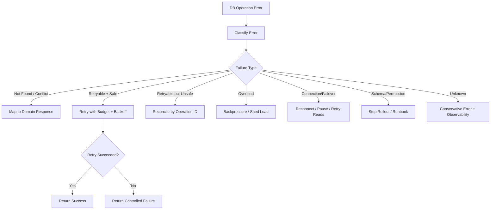

# learn-go-sql-database-integration-part-032.md

# Resilience and Failure Mode Engineering

> Seri: `learn-go-sql-database-integration`  
> Part: `032`  
> Topik: `Database Resilience, Failure Mode Engineering, Timeout Budgeting, Retry Safety, Idempotency, Failover, Pool Starvation, Backpressure, Circuit Breakers, Degraded Mode, and Production Runbooks`  
> Target pembaca: Java software engineer yang ingin memahami Go database integration sampai level production architecture  
> Target Go: Go 1.26.x  
> Status seri: **belum selesai**

---

## 0. Posisi Part Ini Dalam Seri

Pada part sebelumnya kita membahas observability:

- metrics;
- logs;
- traces;
- profiling;
- pool stats;
- slow query diagnosis;
- retry metrics;
- outbox/migration dashboards;
- runbook incident.

Observability membantu kita melihat masalah.

Part ini membahas:

> Bagaimana mendesain sistem agar tetap aman saat masalah database benar-benar terjadi?

Database-backed service tidak boleh diasumsikan selalu normal.

Production failure bisa berupa:

- database down;
- failover;
- DNS berubah;
- connection reset;
- TLS/certificate error;
- pool penuh;
- query lambat;
- lock wait;
- deadlock;
- statement timeout;
- context canceled;
- commit ambiguity;
- replica lag;
- migration lock;
- disk full;
- connection leak;
- retry storm;
- thundering herd;
- slow dependency chain;
- outbox backlog;
- partial batch success;
- schema drift;
- data corruption;
- overloaded DB karena laporan/export;
- cache stampede;
- downstream broker down lalu outbox menumpuk.

Resilience bukan berarti “tidak pernah gagal”.

Resilience berarti:

```text
sistem bisa membatasi dampak,
menghindari data corruption,
memberi respons yang benar,
pulih dengan aman,
dan menyediakan bukti observability untuk operator.
```

---

## 1. Tujuan Pembelajaran

Setelah menyelesaikan part ini, kamu harus mampu:

1. membuat failure-mode catalog untuk database-backed Go service;
2. membedakan transient, persistent, partial, ambiguous, overload, data, dan deployment failures;
3. merancang timeout budget dari HTTP request sampai DB statement;
4. membedakan context timeout, statement timeout, lock timeout, socket timeout, dan pool wait timeout;
5. membuat retry yang aman dengan idempotency dan retry budget;
6. memahami commit ambiguity dan cara merancang recovery;
7. mencegah retry storm dan thundering herd;
8. memakai backpressure, concurrency limit, load shedding, and circuit breaker secara tepat;
9. menangani DB failover dan connection re-establishment;
10. merancang degraded mode dan fallback tanpa merusak data;
11. membedakan read path resilience dan write path resilience;
12. memahami read replica lag, stale read, dan read-after-write strategy;
13. merancang bulk job yang pausable/resumable;
14. membuat runbook untuk pool starvation, failover, slow DB, deadlock spike, retry storm, outbox backlog, and migration failure;
15. menyusun checklist resilience untuk database integration.

---

## 2. Fakta Dasar Dari Dokumentasi Resmi

Beberapa fakta penting:

1. Dokumentasi Go menjelaskan bahwa `context.Context` dapat digunakan untuk membatalkan operasi database yang sedang berjalan, misalnya ketika client disconnect atau operasi berjalan lebih lama dari yang diinginkan.
2. Dokumentasi Go `database/sql` menyediakan `QueryContext`, `ExecContext`, `BeginTx`, dan `PingContext`, sehingga cancellation/deadline bisa dipropagasikan ke operasi DB.
3. Dokumentasi Go transaction menjelaskan bahwa `sql.Tx` merepresentasikan transaction dan harus diakhiri dengan `Commit` atau `Rollback`; operasi dalam transaction dilakukan melalui `Tx`.
4. `database/sql.DBStats` menyediakan data seperti jumlah connection open/in-use/idle serta wait count/duration, yang penting untuk mendeteksi pool starvation.
5. Dokumentasi Amazon RDS Multi-AZ failover menyatakan bahwa setelah failover, DNS record berubah ke standby dan aplikasi perlu re-establish existing connections.
6. Dokumentasi Amazon RDS Proxy menyebut RDS Proxy dapat membuat aplikasi lebih resilient terhadap database failures dengan automatically connecting to standby DB instance while preserving application connections.

Referensi utama:

- Go — Canceling in-progress operations: <https://go.dev/doc/database/cancel-operations>
- Go — Accessing relational databases: <https://go.dev/doc/database/>
- Go — Executing transactions: <https://go.dev/doc/database/execute-transactions>
- Go `database/sql`: <https://pkg.go.dev/database/sql>
- AWS RDS — Failing over a Multi-AZ DB instance: <https://docs.aws.amazon.com/AmazonRDS/latest/UserGuide/Concepts.MultiAZ.Failover.html>
- AWS RDS Proxy: <https://docs.aws.amazon.com/AmazonRDS/latest/UserGuide/rds-proxy.html>

---

## 3. Mental Model Utama

### 3.1 Resilience Dimulai Dari Failure Mode, Bukan Library

Banyak engineer langsung bertanya:

```text
Pakai retry library apa?
Pakai circuit breaker apa?
Pakai pool berapa?
```

Pertanyaan pertama seharusnya:

```text
Failure apa yang sedang kita mitigasi?
Apakah retry aman?
Apakah operasi idempotent?
Apakah failure sebelum atau sesudah commit?
Apakah data bisa double-write?
Apakah user boleh melihat stale data?
Apakah kita perlu fail fast atau wait?
Apakah fallback aman?
```

Tanpa failure-mode analysis, resilience pattern bisa menjadi bug.

### 3.2 Tidak Semua Error Boleh Di-Retry

Retry aman hanya jika:

```text
operation is idempotent
or operation has idempotency key
or operation definitely did not execute
or transaction was rolled back
or retry body is whole-transaction retry and side-effect free
```

Retry berbahaya jika:

- write non-idempotent;
- commit result ambiguous;
- external side effect sudah terjadi;
- duplicate insert tidak dilindungi unique key;
- transaction body mengirim email/payment;
- retry memperparah overload.

### 3.3 Failure Bisa “Unknown”

Distributed systems sering punya state:

```text
success
failure
unknown
```

Contoh:

```text
client sends COMMIT
network drops
client gets error
DB may have committed or not
```

Ini disebut commit ambiguity.

Production resilience harus punya cara reconcile:

- operation ID;
- idempotency key;
- unique constraint;
- status table;
- audit/outbox;
- read-after-error check;
- compensating workflow.

---

## 4. Diagram: Failure Handling Pipeline



---

## 5. Failure Mode Taxonomy

| Category | Examples | Main Strategy |
|---|---|---|
| client cancellation | user closed request | stop work, don't log as error if expected |
| timeout | context/statement/lock/socket/pool | classify, budget, tune root cause |
| pool starvation | all connections in use | close rows, shorten tx, limit concurrency |
| connection failure | reset/refused/TLS/DNS/failover | reconnect, backoff, idempotency |
| DB overload | CPU/IO high, slow queries | backpressure, reduce load, optimize |
| lock contention | lock timeout, deadlock | retry safe tx, lock order, indexes |
| transaction ambiguity | commit unknown | idempotency/reconcile |
| replica lag | stale reads | read primary, session consistency |
| migration/schema drift | missing column/table | stop rollout, repair migration |
| data conflict | unique/FK/check | map to domain, fix data/upstream |
| partial batch failure | chunk succeeds/fails | checkpoints, idempotency, reject reports |
| downstream failure | broker/email/payment down | outbox, retry worker, degrade |
| operator failure | manual DB change | drift detection, repair migration |
| infrastructure | disk full, network partition | fail fast, alert, runbook |

---

## 6. Timeouts: Layered Budget

A robust system has timeout budget at each layer.

Example HTTP request budget:

```text
Total request deadline: 2s
  auth/cache: 100ms
  DB pool wait: 50ms
  DB query: 400ms
  business logic: 100ms
  downstream call: 500ms
  response encode: 50ms
  buffer: remainder
```

If DB query has no child timeout, it can consume entire request budget.

If DB timeout longer than HTTP deadline, work may continue after client no longer cares unless context cancellation works.

---

## 7. Timeout Types

| Timeout | Where | Meaning |
|---|---|---|
| context deadline | Go caller | parent operation budget expired |
| context canceled | Go caller/client | caller no longer wants result |
| pool wait timeout | `database/sql` waiting for conn | no connection acquired before context done |
| statement timeout | DB server | query execution exceeded DB limit |
| lock timeout | DB server | waited too long for lock |
| socket read/write timeout | driver/network | network operation timed out |
| connect timeout | driver/network | cannot establish connection fast enough |
| transaction timeout | app convention | transaction body exceeded budget |
| job timeout | worker | job/chunk exceeded allowed time |

Do not collapse all into “timeout”.

---

## 8. Context Propagation

Always pass context:

```go
db.QueryContext(ctx, ...)
db.ExecContext(ctx, ...)
db.BeginTx(ctx, ...)
db.PingContext(ctx)
```

Bad:

```go
db.Query("SELECT ...")
```

Bad inside repository:

```go
ctx := context.Background()
```

Repository should respect caller context.

If background job needs its own root context, create it at job boundary, not inside low-level DB function.

---

## 9. Child Timeout Helper

```go
func WithBudget(ctx context.Context, max time.Duration) (context.Context, context.CancelFunc) {
	if deadline, ok := ctx.Deadline(); ok {
		remaining := time.Until(deadline)
		if remaining <= max {
			return context.WithCancel(ctx)
		}
	}
	return context.WithTimeout(ctx, max)
}
```

Use carefully. If parent has shorter deadline, don't extend it.

Simpler:

```go
ctx, cancel := context.WithTimeout(ctx, 500*time.Millisecond)
defer cancel()
```

`context.WithTimeout` will still respect parent cancellation.

---

## 10. Timeout Policy By Operation

| Operation | Typical Policy |
|---|---|
| point read | short |
| list/search | medium |
| user command transaction | medium |
| outbox claim | short |
| health check | very short |
| report/export | async/long but chunked |
| migration/backfill chunk | bounded chunk timeout |
| startup ping | short |
| shutdown drain | bounded |

Do not use one global DB timeout for all operations.

---

## 11. Fail Fast vs Wait

For user-facing OLTP:

```text
fail fast is often better than waiting forever.
```

For background jobs:

```text
wait/retry may be okay if bounded.
```

For migration:

```text
lock timeout fail-fast may be safer than blocking production.
```

For payment/ledger:

```text
unknown result needs reconcile, not blind fail.
```

Choose per operation.

---

## 12. Retry Basics

Retry loop requires:

- retryable classifier;
- idempotency/retry safety;
- max attempts;
- backoff;
- jitter;
- total budget;
- observability;
- stop on context done;
- no external side effects inside retryable unit.

Pseudo:

```go
func Retry(ctx context.Context, max int, shouldRetry func(error) bool, fn func(context.Context, int) error) error {
	var last error

	for attempt := 1; attempt <= max; attempt++ {
		if err := ctx.Err(); err != nil {
			return err
		}

		err := fn(ctx, attempt)
		if err == nil {
			return nil
		}

		last = err

		if attempt == max || !shouldRetry(err) {
			return err
		}

		delay := BackoffWithJitter(attempt)
		timer := time.NewTimer(delay)
		select {
		case <-ctx.Done():
			timer.Stop()
			return ctx.Err()
		case <-timer.C:
		}
	}

	return last
}
```

---

## 13. Backoff With Jitter

Without jitter, many instances retry simultaneously.

Bad:

```text
retry exactly after 100ms
```

Better:

```text
exponential backoff + jitter
```

Example:

```go
func BackoffWithJitter(attempt int) time.Duration {
	base := 50 * time.Millisecond
	max := 2 * time.Second

	d := base * (1 << (attempt - 1))
	if d > max {
		d = max
	}

	jitter := time.Duration(rand.Int63n(int64(d / 2)))
	return d/2 + jitter
}
```

Use safe random source per your environment; for simple jitter, math/rand with proper seeding may be enough.

---

## 14. Retry Budget

Retry budget limits system-wide retry load.

Example:

```text
at most 10% extra DB operations due to retries
```

or per request:

```text
max 3 attempts
max total retry time 500ms
```

Why?

- retry can amplify outage;
- DB under overload gets more load;
- user latency increases;
- thundering herd.

Observe retries.

---

## 15. Retrying Whole Transaction

For deadlock/serialization:

```text
retry whole transaction, not the failed statement only
```

Because transaction state may be invalid/rolled back.

Pattern:

```go
err := Retry(ctx, 3, isRetryableTxErr, func(ctx context.Context, attempt int) error {
	return txManager.Within(ctx, "case.approve", opts, func(ctx context.Context, tx *sql.Tx) error {
		return doApprove(ctx, tx, cmd)
	})
})
```

Transaction body must be safe to rerun.

---

## 16. Do Not Put External Side Effects Inside Retryable Tx

Bad:

```go
txManager.Within(ctx, "approve", nil, func(ctx context.Context, tx *sql.Tx) error {
	updateCase(tx)
	sendEmail() // external side effect
	insertAudit(tx)
	return nil
})
```

If transaction retries, email may send twice.

Use outbox:

```text
DB transaction writes outbox event
separate worker sends email after commit
idempotent send if possible
```

---

## 17. Commit Ambiguity

Scenario:

```text
client sends COMMIT
DB commits
network drops before response
client sees error
```

or:

```text
client sends COMMIT
network drops
DB does not commit
client sees error
```

Client cannot know.

If operation is non-idempotent and has no operation ID, retry may duplicate or corrupt.

Mitigation:

- operation ID;
- idempotency table;
- unique business key;
- audit record;
- status transition with version;
- outbox event ID;
- reconciliation query.

---

## 18. Commit Ambiguity Pattern

Command:

```text
Approve case with operation_id = op-123
```

Transaction:

```text
INSERT idempotency(op-123, STARTED)
UPDATE case
INSERT audit(operation_id=op-123)
INSERT outbox(event_id=op-123:case-approved)
UPDATE idempotency(op-123, SUCCEEDED)
COMMIT
```

If commit error unknown:

```text
read idempotency op-123
if SUCCEEDED -> return/reconstruct success
if missing -> safe retry
if STARTED stale -> reconcile/repair
```

---

## 19. Idempotency Table States

```text
STARTED
SUCCEEDED
FAILED_RETRYABLE
FAILED_FINAL
UNKNOWN_RECONCILE
```

Fields:

```text
operation_id
request_hash
status
result_ref
response_code
created_at
updated_at
completed_at
```

Do not cache transient failure as final unless policy says so.

---

## 20. Retry Safety Decision Table

| Operation | Retry Safe? | Requirement |
|---|---|---|
| SELECT point read | generally yes | timeout budget |
| SELECT listing | yes | same query, tolerate staleness |
| INSERT with unique operation ID | yes | unique key/upsert |
| INSERT auto ID no unique key | no | could duplicate |
| UPDATE conditional state | sometimes | idempotent condition/version |
| transaction with outbox only | yes if operation ID | retry whole tx |
| transaction sending email inside | no | move to outbox |
| payment capture | only with provider idempotency key | external idempotency |
| bulk chunk | yes if row/chunk idempotent | checkpoint |
| DDL migration | usually no blind retry | inspect state |

---

## 21. Backpressure

Backpressure means reducing input load when downstream cannot keep up.

Examples:

- limit concurrent DB commands;
- pause bulk jobs;
- reject low-priority requests;
- queue requests with timeout;
- slow producer;
- route traffic away;
- stop retrying aggressively;
- degrade optional features.

Backpressure prevents collapse.

Without it:

```text
DB slow -> requests pile up -> goroutines pile up -> pool waits -> timeouts -> retries -> DB slower
```

---

## 22. Concurrency Limit

A service can limit expensive DB operations.

```go
type Limiter struct {
	sem chan struct{}
}

func NewLimiter(n int) Limiter {
	return Limiter{sem: make(chan struct{}, n)}
}

func (l Limiter) Do(ctx context.Context, fn func() error) error {
	select {
	case l.sem <- struct{}{}:
		defer func() { <-l.sem }()
		return fn()
	case <-ctx.Done():
		return ctx.Err()
	}
}
```

Use for:

- reports;
- exports;
- search;
- bulk jobs;
- expensive transactions.

Do not limit every cheap query unnecessarily.

---

## 23. Separate Pools

Use separate `*sql.DB` handles for workload isolation:

```text
oltp pool: max 40
report pool: max 4
batch pool: max 2
```

This prevents report/backfill from starving user OLTP.

Total connections still count against DB.

Monitor separately.

---

## 24. Load Shedding

When overloaded, fail low-priority work fast.

Examples:

- reject export request with 429/503;
- pause backfill;
- disable expensive count;
- return cached/stale dashboard;
- skip optional personalization query;
- defer non-critical audit enrichment;
- stop accepting bulk imports.

Load shedding is better than global outage.

---

## 25. Circuit Breaker

Circuit breaker tracks failures and temporarily stops calls to failing dependency.

States:

```text
closed -> normal
open -> fail fast
half-open -> test recovery
```

Use carefully with database.

Good candidates:

- optional read model;
- report DB;
- search DB;
- replica;
- external dependency used by DB workflow.

Be careful opening circuit for primary DB write path: failing fast may be okay, but recovery must be reliable.

Circuit breaker should not replace connection pool/timeout.

---

## 26. Circuit Breaker Pitfalls

Pitfalls:

- all instances half-open at same time -> herd;
- circuit opens due app bug/schema error, retry won't fix;
- breaker hides critical outage without alert;
- no per-operation distinction;
- breaker state not observable;
- cache fallback returns unsafe stale data.

If using breaker:

- expose metrics;
- use jittered half-open probes;
- classify errors;
- combine with backoff;
- document fallback semantics.

---

## 27. Degraded Mode

Degraded mode means service continues with reduced functionality.

Examples:

- listing without exact count;
- show cached profile;
- disable export;
- queue write for later? Only if safe.
- read-only mode;
- hide analytics panel;
- return “try later” for non-critical write;
- use stale replica for dashboard.

Danger:

- degrading writes can corrupt business flow if not designed.

Do not silently accept write if DB transaction did not commit.

---

## 28. Read-Only Mode

During DB primary issue, you may enter read-only mode.

Allowed:

- GET cached/stale data;
- GET replica data;
- status page;
- limited searches.

Rejected:

- commands requiring durable write;
- payments;
- state transitions;
- idempotency changes.

Return:

```text
503 service_unavailable
Retry-After
```

or domain-specific maintenance response.

---

## 29. Fallback Cache

Cache fallback can help read path.

Safe for:

- reference data;
- product catalog;
- public content;
- user-independent config.

Risky for:

- permissions;
- balances;
- case status;
- idempotency;
- auth decisions;
- write-after-read invariants.

If using stale cache, label semantics:

```text
data may be stale up to N seconds
```

---

## 30. Cache Stampede

DB slow or cache expired can cause many requests to recompute same value.

Mitigate:

- singleflight/in-flight dedup;
- TTL jitter;
- stale-while-revalidate;
- rate limit;
- prewarm;
- negative cache carefully.

Go `singleflight` pattern:

```text
only one goroutine fetches key from DB, others wait
```

Use for read path, not writes.

---

## 31. Bulkhead Pattern

Bulkhead isolates failures.

Examples:

- separate DB pools;
- separate worker queues;
- separate goroutine pools;
- separate replicas for reports;
- separate service for exports;
- priority queues;
- resource quotas per tenant.

Without bulkhead:

```text
one heavy report kills checkout API
```

---

## 32. Per-Tenant Protection

Multi-tenant systems need noisy-neighbor protection.

Strategies:

- per-tenant rate limit;
- per-tenant concurrency limit for expensive queries;
- query cost guard;
- max date range;
- max export size;
- quota for bulk jobs;
- tenant-level circuit/degrade.

Avoid metrics label cardinality explosion by raw tenant ID, but enforce at runtime.

---

## 33. DB Failover

During failover:

- existing connections may break;
- in-flight transactions fail or become ambiguous;
- DNS endpoint may change;
- pool may contain stale connections;
- reconnect storm possible;
- replica/primary roles change;
- read/write endpoints may shift.

App behavior:

- short connect/read timeouts;
- retry connection with backoff;
- idempotent writes;
- `PingContext` readiness;
- pool lifetime not too long;
- do not cache resolved DB IP forever;
- observe connection errors.

Managed services may provide proxies/endpoints, but apps still need resilience.

---

## 34. DNS and Failover

RDS-style failover changes DNS target.

Implications:

- new connections should resolve new target;
- existing connections must be re-established;
- app/driver/OS DNS caching matters;
- connection pool stale conns may fail.

In Go, avoid custom DNS caching unless understood.

Use DB endpoint hostname, not resolved IP.

Set connection lifetime appropriately, but failover still needs reconnect.

---

## 35. RDS Proxy / DB Proxy

A DB proxy can help:

- pooling across many app instances;
- faster failover handling;
- connection storm reduction;
- credential rotation.

But it has trade-offs:

- transaction/session state behavior;
- prepared statement compatibility;
- added hop/latency;
- proxy limits/cost;
- failure mode changes;
- not replacement for idempotency.

Do not assume proxy solves all DB resilience.

---

## 36. Reconnect Storm

After DB restarts/failover, all app instances may reconnect simultaneously.

Mitigations:

- exponential backoff with jitter;
- readiness gates;
- pool max connection limits;
- startup jitter;
- RDS Proxy/connection pooler;
- worker pause;
- circuit breaker half-open probes;
- Kubernetes rolling restart control.

Without jitter, recovery can overload DB.

---

## 37. Startup Behavior

At startup:

```go
PingContext with timeout
```

If DB unavailable:

- should app exit?
- should app start but not ready?
- depends on service role.

For API requiring DB:

```text
start process, readiness false until DB reachable
```

For worker:

```text
start and retry with backoff, or exit for orchestrator restart
```

Avoid tight crash loop hammering DB.

---

## 38. Readiness vs Liveness

Liveness:

```text
process not deadlocked
```

Readiness:

```text
can serve traffic
```

DB outage should usually make readiness fail for DB-dependent service, but not necessarily liveness fail.

Otherwise orchestrator restarts all pods, causing reconnect storm.

---

## 39. Graceful Shutdown

On shutdown:

- stop accepting new requests;
- cancel background jobs;
- stop claiming new outbox messages;
- finish/rollback current transactions within deadline;
- close DB after work stops;
- commit only if safe and deadline remains;
- do not leave long transactions.

Go pattern:

```text
server.Shutdown(ctx)
workers.Stop(ctx)
db.Close()
```

---

## 40. Context Cancellation During Shutdown

When parent shutdown context cancels:

- queries should stop;
- transaction should rollback if not complete;
- workers should checkpoint between chunks;
- outbox should not claim new work;
- in-flight publish must handle idempotency.

Do not ignore context in repository.

---

## 41. Pool Starvation Resilience

Mitigations:

- close rows;
- always rollback/commit;
- set max open conns;
- separate pools;
- limit concurrency;
- timeouts;
- avoid long transactions;
- avoid streaming while holding DB connection if possible;
- use pagination;
- observe pool waits;
- fail fast under pool wait for low-priority ops.

---

## 42. Rows Leak Prevention

Code rule:

```go
rows, err := db.QueryContext(ctx, query, args...)
if err != nil { return err }
defer rows.Close()

for rows.Next() { ... }

if err := rows.Err(); err != nil { return err }
```

Testing trick:

- set `MaxOpenConns(1)`;
- run repository repeatedly;
- ensure no hang.

---

## 43. Transaction Leak Prevention

Always:

```go
tx, err := db.BeginTx(ctx, opts)
if err != nil { return err }
defer tx.Rollback()

// ...
return tx.Commit()
```

`Rollback` after successful commit returns error but can be ignored in defer.

For helper:

- rollback on error/panic;
- commit once;
- observe commit/rollback errors.

---

## 44. Slow Query Resilience

Mitigations:

- query timeout;
- pagination limit;
- max offset;
- keyset pagination;
- remove exact count;
- projection discipline;
- index review;
- async reports;
- cache reference data;
- load shed expensive queries;
- separate report replica/pool.

Do not let one slow report consume OLTP pool.

---

## 45. Lock Contention Resilience

Mitigations:

- keep transaction short;
- lock rows in deterministic order;
- use conditional update;
- use proper indexes;
- avoid user/external IO inside tx;
- use lock timeout;
- retry deadlock safely;
- reduce worker concurrency;
- chunk bulk updates;
- avoid hot aggregate rows.

---

## 46. Deadlock Resilience

Deadlocks can happen even with good design.

App should:

- classify deadlock;
- rollback;
- retry whole transaction if safe;
- cap attempts;
- observe rate;
- fix root cause if spike.

Deadlock spike is not solved by infinite retry.

---

## 47. Serialization Failure Resilience

Serializable transactions may fail to preserve correctness.

App should:

- retry whole transaction;
- keep transaction short;
- avoid external side effects;
- use bounded attempts;
- reduce contention if frequent;
- consider constraints/locks if cheaper.

---

## 48. Connection Failure Resilience

Connection failure before statement:

```text
safe to retry read or idempotent write
```

During statement:

```text
unknown if statement executed
```

During commit:

```text
commit ambiguity
```

Resilience requires classifying phase if possible.

If phase unknown for write, reconcile by operation ID.

---

## 49. Health Check Failure

If DB ping fails:

- mark readiness false;
- alert if sustained;
- avoid liveness restart storm;
- workers pause/backoff;
- keep process alive for recovery if orchestrator model supports it.

Health check should use short timeout.

---

## 50. Replica Lag Resilience

Strategies:

| Requirement | Strategy |
|---|---|
| read after own write | read primary |
| stale OK | read replica |
| session consistency | sticky primary after write |
| report | replica/warehouse |
| lag high | route critical reads primary |
| failover | detect role change / endpoint |

Never use replica for idempotency/transaction-critical reads unless consistency acceptable.

---

## 51. Read-Your-Write Strategy

After write:

```text
for N seconds, route user's reads to primary
```

or:

```text
response includes committed new state
```

or:

```text
client goes to detail endpoint served from primary
```

Avoid immediate replica read if lag possible.

---

## 52. Fallback Reads

If primary unavailable:

- public/reference data can come from cache;
- user-critical data may return unavailable;
- stale data must be labeled or acceptable;
- permissions/auth should not use stale unsafe data.

For security decisions, prefer fail closed.

---

## 53. Write Path Resilience

For writes:

- validate before DB;
- use transaction;
- use constraints;
- use idempotency key;
- outbox for external side effects;
- retry only safe classes;
- handle commit ambiguity;
- return controlled errors;
- never silently drop write.

---

## 54. Read Path Resilience

For reads:

- context timeout;
- cache safe data;
- replica for stale-tolerant workload;
- pagination limit;
- query cost guard;
- circuit optional read models;
- partial response if product allows;
- fallback to “temporarily unavailable” for critical reads.

Reads are easier to retry than writes, but can overload DB if retried aggressively.

---

## 55. Outbox Resilience

Outbox decouples DB transaction from external side effect.

Transaction:

```text
update business state
insert outbox event
commit
```

Worker:

```text
claim event
publish
mark sent/failed
retry with backoff
```

Benefits:

- external broker outage does not rollback business transaction unless required;
- retry publish independently;
- preserve event durability.

Need:

- idempotent consumers;
- event ID;
- poison handling;
- backlog monitoring.

---

## 56. Inbox Resilience

Inbox protects consumers from duplicate messages.

Pattern:

```text
insert message_id into inbox
if duplicate -> skip/load result
process business tx
mark processed
```

Need:

- unique message ID;
- retry safe;
- status for stuck STARTED;
- poison handling.

---

## 57. Poison Message Handling

If one message always fails:

- do not block all messages forever;
- retry with cap/backoff;
- move to dead-letter/reject state;
- alert;
- provide operator repair/replay.

Poison messages are resilience concern.

---

## 58. Bulk Job Resilience

Bulk jobs must be:

- chunked;
- idempotent;
- checkpointed;
- pausable;
- resumable;
- observable;
- throttled;
- isolated pool;
- able to record rejects;
- able to resume after crash/failover.

Do not run one giant transaction for hours.

---

## 59. Backfill Resilience

Backfill should:

- update only rows needing change;
- run small chunks;
- store progress;
- sleep/throttle;
- stop on DB pressure;
- resume safely;
- not overwrite newer app writes;
- verify completion.

---

## 60. Migration Resilience

Migration safety:

- expand/contract;
- lock timeout;
- non-transactional migration awareness;
- online/concurrent DDL where needed;
- migration history;
- stop rollout on failure;
- repair migration, not edit old migration;
- backfill separate from deploy if heavy;
- runbook.

Schema errors are usually non-retryable and require operator action.

---

## 61. Data Corruption Resilience

Prevent:

- constraints;
- idempotency;
- transaction boundaries;
- tests;
- migration review;
- checksums/reconciliation;
- audit logs;
- least privilege.

Detect:

- data quality metrics;
- consistency checks;
- reconciliation jobs;
- anomaly alerts.

Recover:

- backup restore;
- compensating migration;
- replay events;
- manual repair;
- audit trail.

Resilience includes data correctness, not only uptime.

---

## 62. Backup and Restore

Application resilience depends on backup restore working.

Ask:

- backup frequency?
- restore time objective?
- point-in-time recovery?
- who can restore?
- restore tested?
- encryption?
- backups include schema + data?
- SQLite WAL files?
- cross-region?
- restore to staging tested?

A backup never tested is not a recovery plan.

---

## 63. Reconciliation Jobs

Reconciliation checks expected invariants after failures.

Examples:

- idempotency succeeded but outbox missing;
- outbox sent but business state not updated;
- payment provider captured but local payment pending;
- imported row count mismatch;
- ledger sum mismatch;
- audit missing for state transition.

Design reconciliation for critical workflows.

---

## 64. Compensation

If you cannot rollback physically, compensate.

Examples:

- reverse ledger entry;
- cancel shipment;
- void invoice;
- create correction record;
- mark import row rejected;
- disable corrupted entity.

Compensation is domain-specific.

Do not delete audit history to “fix” state.

---

## 65. Error Response Strategy

Map failures to controlled responses.

| Failure | HTTP idea | Notes |
|---|---:|---|
| validation | 400 | before DB |
| unique conflict | 409 | user/action conflict |
| not found | 404 | if resource absent |
| lock busy | 409/423/503 | depends semantics |
| timeout | 504/503 | retry guidance |
| DB unavailable | 503 | Retry-After maybe |
| schema/config | 500 | alert, not client fault |
| idempotency in progress | 409/202 | depends API |
| rate limited/backpressure | 429 | Retry-After |
| read-only mode write | 503/423 | clear message |

Avoid leaking raw DB errors.

---

## 66. Retry-After

For overload/unavailable:

```http
Retry-After: 5
```

Use when clients can retry.

Do not tell clients to retry for non-retryable validation/conflict errors.

For idempotent writes, clients should retry with same idempotency key.

---

## 67. Client Retry Contract

If API clients retry, define:

- which methods safe;
- idempotency key required for POST;
- retryable status codes;
- backoff expectations;
- max retry;
- idempotency key TTL;
- duplicate response semantics.

Otherwise clients may amplify outage.

---

## 68. Idempotency Key Scope

Scope key by:

```text
tenant/user/client + operation type
```

Avoid global accidental collision.

Store request hash to reject same key with different payload.

```text
same key + same payload -> return same result
same key + different payload -> 409 idempotency_key_reused
```

---

## 69. Thundering Herd

Herd happens when many clients/instances do same recovery simultaneously:

- cache expiry;
- DB failover recovery;
- scheduled job at midnight;
- retry after fixed delay;
- deployment startup;
- migration lock release.

Mitigate:

- jitter;
- stagger schedules;
- singleflight;
- rate limit;
- concurrency limit;
- warmup;
- random startup delay for workers.

---

## 70. Scheduled Job Jitter

Bad:

```text
all pods run job every minute at second 0
```

Better:

```text
leader election
or partitioned workers
or jittered schedule
```

For DB-heavy jobs, avoid synchronized spikes.

---

## 71. Leader Election vs DB Locks

For singleton jobs:

Options:

- Kubernetes Lease;
- DB advisory lock;
- job scheduler;
- queue partition;
- external coordinator.

DB advisory lock is simple but DB-dependent and can become another DB load/availability coupling.

Use transaction/session-scoped lock carefully.

---

## 72. Graceful Worker Pause

Bulk/outbox workers should support pause:

```text
if system pressure high:
  stop claiming new work
  finish current item/chunk
  checkpoint
  sleep
```

Pressure signals:

- DB pool wait high;
- replica lag high;
- error rate high;
- CPU/IO high;
- circuit open;
- operator flag.

---

## 73. Resilience Configuration

Configs:

```text
DB max open conns
DB max idle conns
connection lifetime
operation timeouts
transaction timeout
retry max attempts
retry backoff
worker concurrency
bulk batch size
pool wait budget
circuit thresholds
read replica routing
feature degrade flags
```

Config should be:

- validated;
- logged safely at startup;
- documented;
- adjustable per environment;
- not infinite by default.

---

## 74. Sensible Defaults

Example OLTP:

```text
point read timeout: 100-300ms
small list timeout: 300-800ms
command tx timeout: 500ms-2s
health ping timeout: 500ms-1s
max retry: 2-3 for deadlock/serialization
retry jitter: yes
report/export: async
bulk worker conns: small
```

Actual values depend on SLO, DB latency, and workload.

Measure and tune.

---

## 75. Resilience Testing

Test failure modes:

- DB unavailable at startup;
- DB down during request;
- connection reset;
- context timeout;
- pool exhaustion;
- duplicate key;
- deadlock/serialization;
- lock timeout;
- commit ambiguity simulation if possible;
- replica lag behavior;
- outbox broker down;
- migration failure;
- backfill pause/resume.

Some are unit/integration; some are staging chaos drills.

---

## 76. Fault Injection

Methods:

- fake repository errors for service logic;
- test DB locks for lock timeout;
- kill DB container during integration test;
- network proxy/toxiproxy;
- context deadline;
- pause DB container;
- fail broker for outbox;
- inject classifier errors;
- simulate retry exhaustion.

Use safely.

---

## 77. Chaos Drill: DB Restart

Staging drill:

1. run normal traffic/load;
2. restart DB or failover;
3. observe connection errors;
4. verify readiness behavior;
5. verify retries/backoff;
6. verify no data corruption;
7. verify recovery time;
8. verify alerts/runbook.

Do not start with production chaos.

---

## 78. Chaos Drill: Pool Exhaustion

Set low pool or run long transactions.

Expected:

- pool wait metrics alert;
- request timeouts controlled;
- no goroutine explosion;
- workers throttle/pause;
- after release, system recovers.

---

## 79. Chaos Drill: Broker Down With Outbox

Expected:

- business writes still commit if outbox insert succeeds;
- outbox pending age rises;
- publish failures observed;
- worker retries with backoff;
- poison/dead-letter policy works;
- when broker recovers, backlog drains safely.

---

## 80. Resilience and Observability Coupling

Every resilience mechanism needs metrics:

| Mechanism | Metric |
|---|---|
| retry | attempts/exhausted |
| circuit breaker | state/transitions |
| backpressure | rejected/paused |
| rate limit | limited count |
| queue | backlog/oldest age |
| cache fallback | stale served count |
| read-only mode | write rejected count |
| failover | connection errors/reconnect |
| idempotency | duplicate/in-progress/conflict |
| reconciliation | mismatches found/fixed |

Invisible resilience is dangerous.

---

## 81. Resilience and Security

Fail securely.

Examples:

- if permission DB read fails, deny rather than allow;
- if auth session lookup fails, reject;
- if idempotency store down, do not accept non-idempotent duplicate-prone write unless policy allows;
- if audit write fails and audit is mandatory, fail transaction;
- if encryption/TLS validation fails, do not downgrade silently.

Availability must not destroy security/integrity.

---

## 82. Resilience and Compliance

For regulated systems:

- audit failure may require command failure;
- data loss unacceptable;
- stale data may be illegal;
- manual correction must be audited;
- backup/restore RTO/RPO defined;
- migration approvals required.

Design resilience to policy, not just uptime.

---

## 83. Resilience and Cost

Resilience has cost:

- extra tables;
- outbox workers;
- idempotency storage;
- retries;
- observability;
- replicas;
- proxy;
- backups;
- testing;
- operational complexity.

Use risk-based design.

Not every internal admin endpoint needs full payment-grade resilience.

---

## 84. Runbook: DB Failover

Symptoms:

- connection reset;
- server gone;
- DNS endpoint shift;
- errors spike;
- readiness false;
- DB failover event from cloud.

Actions:

1. confirm failover event.
2. stop/pause batch workers if needed.
3. watch app reconnect/backoff.
4. monitor pool/connection errors.
5. check idempotency for writes during window.
6. verify primary role restored.
7. verify replicas lag/catch-up.
8. verify outbox backlog.
9. communicate user impact.
10. after recovery, reconcile ambiguous operations.

Do not restart all pods blindly unless necessary.

---

## 85. Runbook: Retry Storm

Symptoms:

- retry attempts spike;
- DB QPS increases while success decreases;
- error class same repeated;
- p99 worsens.

Actions:

1. identify operation and error class.
2. reduce retry max or open circuit.
3. shed low-priority load.
4. pause batch jobs.
5. increase backoff/jitter.
6. fix root DB issue.
7. verify retry rate falls.

Retry storm is outage amplifier.

---

## 86. Runbook: Commit Ambiguity

Symptoms:

- commit returned connection error/timeout;
- user command result unknown.

Actions:

1. do not blindly retry without idempotency.
2. look up operation/idempotency key.
3. check business row state.
4. check audit/outbox by operation ID.
5. if committed, return/reconstruct success.
6. if not committed, retry safely.
7. if inconsistent, mark for reconciliation/manual repair.
8. record incident.

---

## 87. Runbook: Pool Starvation

Actions:

1. inspect pool metrics.
2. inspect goroutine profile.
3. identify operations holding connections longest.
4. check rows/tx/conn leaks.
5. pause batch/report workers.
6. reduce concurrency.
7. increase pool only if DB can handle it.
8. deploy fix for leaks/long tx.
9. add regression test.

---

## 88. Runbook: DB Overload

Symptoms:

- DB CPU/IO high;
- slow queries;
- timeouts;
- locks maybe;
- replica lag.

Actions:

1. find top operations.
2. pause non-critical jobs.
3. disable exact counts/exports.
4. shed low-priority traffic.
5. scale read replicas only for read issue.
6. optimize query/index.
7. reduce retry.
8. coordinate with DBA/cloud.
9. follow postmortem with capacity plan.

---

## 89. Runbook: Deadlock Spike

Actions:

1. confirm class and operation.
2. ensure safe retry not exhausted.
3. inspect deadlock logs.
4. identify lock order.
5. reduce concurrency.
6. pause bulk job.
7. add/update index.
8. shorten transaction.
9. change update order.
10. add test/load simulation.

---

## 90. Runbook: Replica Lag

Actions:

1. confirm lag and affected reads.
2. route strong reads to primary.
3. pause/throttle bulk jobs.
4. reduce transaction size.
5. check replication health.
6. notify users if stale dashboard.
7. wait for catch-up.
8. review write volume causing lag.

---

## 91. Runbook: Migration Failure

Actions:

1. stop rollout.
2. inspect migration history.
3. identify partial objects/data.
4. check if transaction rolled back.
5. repair with new migration.
6. keep app on compatible version.
7. if data changed, verify/reconcile.
8. do not edit applied migration silently.

---

## 92. Runbook: Disk Full / Log Full

Symptoms:

- write failures;
- DB unavailable;
- WAL/binlog/redo growth;
- backup/archive issue;
- bulk job running.

Actions:

1. stop heavy writes/bulk jobs.
2. free/expand storage per DBA/cloud process.
3. check log archival/replication.
4. identify runaway transaction/query.
5. verify DB recovery.
6. reconcile failed writes.
7. add storage/log alerts.

---

## 93. Runbook: Data Corruption / Invariant Violation

Actions:

1. freeze affected writes if needed.
2. preserve evidence/logs.
3. identify scope.
4. stop bad deploy/job.
5. use audit/operation IDs to reconstruct.
6. run consistency checks.
7. apply repair migration/compensation.
8. notify stakeholders if required.
9. add constraints/tests to prevent recurrence.

---

## 94. Design Checklist: Resilient DB Operation

For each critical operation:

- [ ] operation name defined;
- [ ] timeout budget defined;
- [ ] transaction boundary clear;
- [ ] retry policy defined;
- [ ] idempotency key if write;
- [ ] unique constraints support idempotency;
- [ ] external side effects via outbox;
- [ ] error classes mapped;
- [ ] commit ambiguity plan;
- [ ] observability metrics/logs/traces;
- [ ] fallback/degraded behavior defined;
- [ ] test for key failure modes.

---

## 95. Design Checklist: Resilient Service

- [ ] pool sizes budgeted;
- [ ] separate pools for batch/report if needed;
- [ ] workers have concurrency limits;
- [ ] backpressure/load shedding;
- [ ] readiness/liveness correct;
- [ ] graceful shutdown;
- [ ] retry budget;
- [ ] circuit breaker if useful;
- [ ] outbox/inbox for messaging;
- [ ] migration/backfill pause/resume;
- [ ] replica consistency strategy;
- [ ] backup/restore understood;
- [ ] runbooks linked to alerts.

---

## 96. Anti-Patterns

| Anti-pattern | Consequence |
|---|---|
| infinite retry | outage amplification |
| retry non-idempotent write | duplicates/corruption |
| external call inside retryable tx | duplicate side effects |
| no context timeout | stuck goroutines/connections |
| one global huge timeout | poor SLO/fail late |
| no pool metrics | blind starvation |
| increase pool during slow DB | worse overload |
| health check causes restart storm | cascading outage |
| liveness depends hard on DB | restart loop |
| no jitter | thundering herd |
| cache fallback for permissions | security bug |
| write accepted without durable commit | data loss |
| ignoring commit ambiguity | duplicate/missing operations |
| batch jobs no pause | production degradation |
| migration no runbook | extended outage |
| no backup restore drill | false confidence |

---

## 97. Mini Case Study: User Double-Clicks Submit

Scenario:

```text
User clicks Approve twice.
Network retries too.
```

Bad design:

- auto ID insert audit;
- update status without idempotency;
- outbox sends duplicate events.

Resilient design:

- client sends idempotency key;
- idempotency table unique key;
- conditional state update;
- audit/outbox include operation ID;
- duplicate request returns same result or current state;
- retry safe.

---

## 98. Mini Case Study: DB Failover During Payment

Scenario:

```text
Transaction commits local payment row.
Commit response lost.
API sees error.
Client retries.
```

Resilient design:

- operation ID/payment request ID unique;
- payment transaction writes idempotency record;
- if retry, load existing payment by operation ID;
- external provider call uses provider idempotency key;
- outbox coordinates external call;
- reconciliation checks provider/local mismatch.

---

## 99. Mini Case Study: Reporting Kills OLTP

Scenario:

```text
Admin export runs huge SELECT.
All API requests slow.
```

Resilient design:

- exports async;
- report pool max 2;
- OLTP pool separate;
- max date range;
- query timeout;
- offload to replica/warehouse;
- backpressure;
- export job metrics;
- optional queue priority.

---

## 100. Mini Case Study: Replica Lag After Bulk Import

Scenario:

```text
Bulk import writes millions rows.
Replica lag 15 minutes.
Users read stale listings.
```

Resilient design:

- bulk throttle based on replica lag;
- route read-after-write to primary;
- show import status;
- schedule off-peak;
- chunk transactions;
- monitor lag alerts;
- pause/resume job.

---

## 101. Mini Case Study: Backfill Lock Timeout

Scenario:

```text
Backfill updates rows user transactions also update.
Lock timeout spike.
```

Resilient design:

- smaller chunks;
- update by primary key order;
- lock timeout;
- skip/retry chunk;
- sleep between chunks;
- pause if OLTP p99 high;
- index predicate;
- resume checkpoint.

---

## 102. Efficient Learning Summary

Resilience is not one feature.

It is a set of design choices:

```text
timeouts
classification
idempotency
retry budget
backpressure
bulkheads
outbox/inbox
graceful shutdown
failover handling
observability
runbooks
testing
```

Best default rules:

1. Always use context-aware DB APIs.
2. Classify errors before deciding action.
3. Retry only safe operations.
4. Use idempotency keys for critical writes.
5. Treat commit error as potentially ambiguous.
6. Use outbox for external side effects.
7. Keep transactions short.
8. Apply backpressure before DB collapses.
9. Separate OLTP and batch/report resources.
10. Use jitter for retries/reconnect.
11. Do not rely on replicas for read-after-write unless designed.
12. Make bulk jobs pausable/resumable.
13. Observe every resilience mechanism.
14. Test failure modes.
15. Write runbooks before incident.

If you remember one sentence:

> Resilient database integration is not about hiding failures; it is about making every failure bounded, observable, retry-safe, and recoverable.

---

## 103. Latihan

### Exercise 1 — Retry Safety

A write operation inserts a row with auto-generated ID and no unique operation key. It times out.

Question:

- Is it safe to retry?
- What design would make it safe?

### Exercise 2 — Commit Ambiguity

`tx.Commit()` returns a connection reset error.

Question:

- What are the possible outcomes?
- What should the app do?

### Exercise 3 — Pool Starvation

`InUse == MaxOpenConnections`, `WaitCount` rises, DB CPU low.

Question:

- What failure mode is likely?
- What should you inspect?

### Exercise 4 — Failover

During RDS failover, existing DB connections fail.

Question:

- What should the app be prepared to do?
- Why is jitter important?

### Exercise 5 — Replica Lag

User writes data, then listing from replica does not show it.

Question:

- Why can this happen?
- What strategies solve it?

### Exercise 6 — Outbox

Broker is down but DB is up.

Question:

- What should happen to business transaction?
- What metrics should rise?

---

## 104. Jawaban Singkat Latihan

### Exercise 1

Not safe. The first insert may have succeeded, and retry may create duplicate row.

Make it safe with:

- operation/idempotency key;
- unique constraint;
- app-generated stable ID;
- idempotency table;
- reconciliation query.

### Exercise 2

Possible:

- commit succeeded;
- commit failed/rolled back;
- unknown.

App should reconcile using operation ID/idempotency/business state, not blindly retry non-idempotent work.

### Exercise 3

Likely pool starvation due to connection leak, long transaction/query, rows not closed, or too much concurrency.

Inspect:

- goroutine profile;
- DB spans;
- long transactions;
- rows lifecycle;
- pool stats;
- worker concurrency.

### Exercise 4

App should re-establish connections, use backoff/jitter, handle in-flight errors, retry safe reads/writes, and reconcile ambiguous writes.

Jitter prevents all instances reconnecting/retrying simultaneously and overloading recovering DB.

### Exercise 5

Replica replication is often asynchronous; replica can lag behind primary.

Strategies:

- read primary after write;
- sticky primary session;
- wait for replication catch-up if supported;
- return committed state in write response;
- tolerate eventual consistency if product allows.

### Exercise 6

If business transaction writes outbox row in DB and commits, it can still succeed; outbox worker fails publishing and retries later.

Metrics:

- outbox pending count;
- oldest pending age;
- publish failures;
- retry scheduled count.

---

## 105. Ringkasan

Database failure is normal in production.

A strong Go engineer designs database integration so that:

- failures are classified;
- timeouts are bounded;
- retries are safe;
- writes are idempotent;
- external side effects are decoupled;
- backpressure prevents collapse;
- failover is recoverable;
- replica lag is understood;
- bulk jobs are controlled;
- migrations do not surprise production;
- every incident has observability and runbook.

Resilience is not “try again until it works”.

Resilience is engineering the system so that even when it fails, it fails safely.

---

## 106. Referensi

- Go documentation — Canceling in-progress operations: <https://go.dev/doc/database/cancel-operations>
- Go documentation — Accessing relational databases: <https://go.dev/doc/database/>
- Go documentation — Executing transactions: <https://go.dev/doc/database/execute-transactions>
- Go package documentation — `database/sql`: <https://pkg.go.dev/database/sql>
- AWS RDS documentation — Failing over a Multi-AZ DB instance: <https://docs.aws.amazon.com/AmazonRDS/latest/UserGuide/Concepts.MultiAZ.Failover.html>
- AWS RDS documentation — Amazon RDS Proxy: <https://docs.aws.amazon.com/AmazonRDS/latest/UserGuide/rds-proxy.html>

<!-- NAVIGATION_FOOTER -->
<div class="page-nav">
<a href="./learn-go-sql-database-integration-part-031.md">⬅️ Metrics, Logs, Traces, and Profiling</a>
<a href="./index.md">📚 Kategori</a>
<a href="../../index.md">🏠 Home</a>
<a href="./learn-go-sql-database-integration-part-033.md">Production Reference Architecture ➡️</a>
</div>
