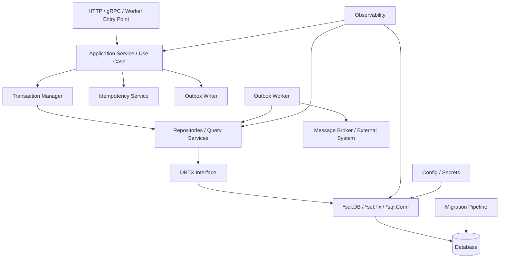
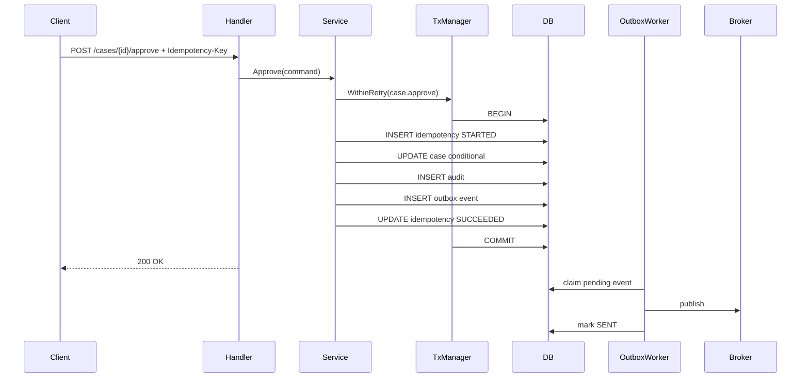
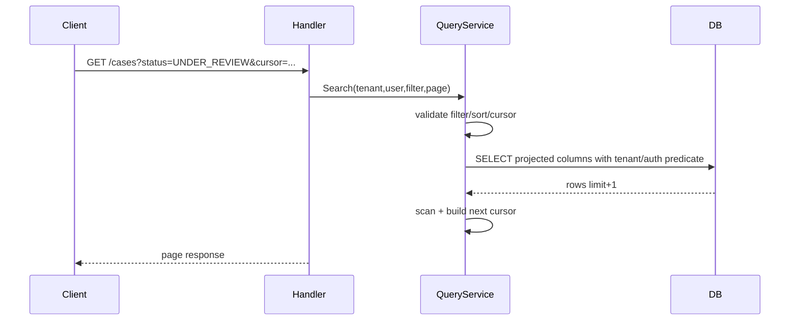
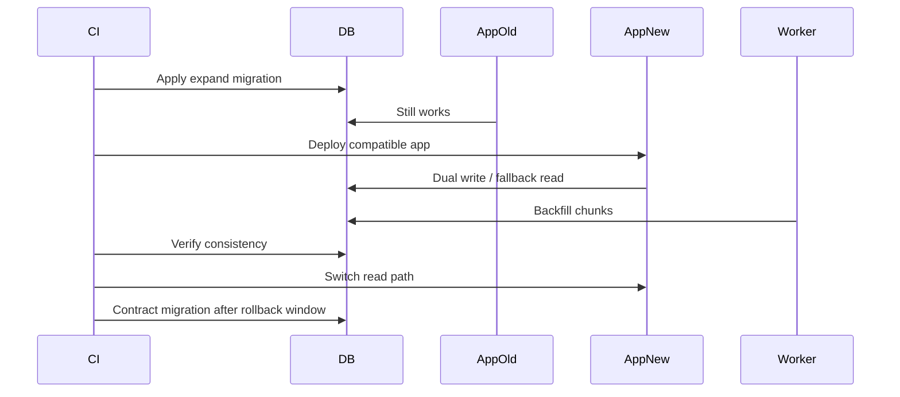

# learn-go-sql-database-integration-part-033.md

# Production Reference Architecture

> Seri: `learn-go-sql-database-integration`  
> Part: `033`  
> Topik: `Production Reference Architecture for Go Database Integration: Package Layout, Config, Pooling, Repository, Transaction Boundary, Idempotency, Outbox/Inbox, Migrations, Testing, Observability, Resilience, Deployment, and Runbooks`  
> Target pembaca: Java software engineer yang ingin memahami Go database integration sampai level production architecture  
> Target Go: Go 1.26.x  
> Status seri: **belum selesai**

---

## 0. Posisi Part Ini Dalam Seri

Kita sudah membahas hampir seluruh building block:

- `database/sql`;
- opening DB handles;
- driver model;
- DSN/config hygiene;
- query execution;
- rows lifecycle;
- scan/type mapping;
- null semantics;
- SQL injection boundary;
- prepared statements;
- connection pool;
- pool sizing;
- connection lifetime;
- context/timeout/cancellation;
- transaction;
- isolation;
- locking/concurrency;
- retry/idempotency;
- error taxonomy;
- repository architecture;
- query composition;
- pagination/search/listing;
- bulk write;
- read path performance;
- database-specific PostgreSQL/MySQL/SQLite/SQL Server/Oracle;
- migrations;
- testing;
- observability;
- resilience.

Part ini menyatukan semuanya menjadi **production reference architecture**.

Tujuannya bukan membuat framework baru.

Tujuannya adalah memberikan blueprint:

```text
Bagaimana seharusnya Go service production-grade mengakses database?
```

Blueprint ini bisa kamu adaptasi untuk:

- monolith modular;
- microservice;
- worker service;
- API backend;
- event-driven service;
- batch/import service;
- enterprise integration service;
- PostgreSQL/MySQL/Oracle/SQL Server-backed service.

---

## 1. Tujuan Pembelajaran

Setelah menyelesaikan part ini, kamu harus mampu:

1. merancang package layout Go untuk database-backed service;
2. memisahkan domain, application/use-case, repository, DB platform, migration, and observability boundary;
3. membuat configuration model yang aman dan bisa divalidasi;
4. membuka dan mengkonfigurasi `*sql.DB` untuk beberapa pool/workload;
5. membuat `DBTX` abstraction minimal tanpa over-engineering;
6. membuat transaction manager yang aman, observable, and retry-aware;
7. membuat repository yang explicit, type-safe, and production-friendly;
8. membuat query service/listing path yang index-aware and authorization-aware;
9. menerapkan error classifier and domain error mapping;
10. menerapkan timeout budget, retry, idempotency, outbox, and inbox;
11. mendesain migration/deployment pipeline;
12. mendesain testing strategy yang membuktikan database behavior;
13. mendesain observability dashboard/alerts/runbooks;
14. membuat reference architecture untuk HTTP API + worker + DB;
15. memahami checklist yang perlu dipenuhi sebelum service dianggap production-ready.

---

## 2. Fakta Dasar Dari Dokumentasi Resmi

Beberapa fakta utama yang menjadi fondasi:

1. `database/sql` menyediakan API generic untuk SQL database, termasuk `QueryContext`, `ExecContext`, `BeginTx`, `PingContext`, `DBStats`, dan pooling control.
2. Dokumentasi Go menjelaskan bahwa `SetMaxOpenConns` membatasi jumlah open connection; jika limit tercapai, operasi database baru akan menunggu sampai operasi lain selesai.
3. Dokumentasi Go menjelaskan bahwa `context.Context` dapat dipakai untuk membatalkan operasi database yang sedang berjalan, misalnya saat client connection closed atau operasi melebihi batas waktu.
4. Dokumentasi Go transaction menyarankan penggunaan API `sql.Tx` dari `DB.Begin`/`DB.BeginTx`; setelah `Commit`, semua operasi transaction gagal dengan `ErrTxDone`.
5. OpenTelemetry mendefinisikan instrumentation sebagai proses menambahkan observability code ke aplikasi; `otelsql` menyediakan instrumentation untuk Go `database/sql` yang menghasilkan traces/metrics ketika aplikasi berinteraksi dengan database.
6. Tool migration seperti `golang-migrate/migrate` menyediakan CLI/library untuk membaca migration dari source dan menerapkannya ke database secara berurutan.

Referensi utama:

- Go `database/sql`: <https://pkg.go.dev/database/sql>
- Go — Managing connections: <https://go.dev/doc/database/manage-connections>
- Go — Canceling in-progress operations: <https://go.dev/doc/database/cancel-operations>
- Go — Executing transactions: <https://go.dev/doc/database/execute-transactions>
- OpenTelemetry Go instrumentation: <https://opentelemetry.io/docs/languages/go/instrumentation/>
- `otelsql`: <https://github.com/XSAM/otelsql>
- `golang-migrate/migrate`: <https://github.com/golang-migrate/migrate>

---

## 3. Big Picture Architecture

Production database integration sebaiknya tidak tersebar random di handler.

Target architecture:



Core principle:

> Handler tidak tahu SQL. Domain tidak tahu SQL. Transaction boundary ada di application service. Repository menerima `DBTX`. Infrastructure mengatur pool, driver, observability, migration, and resilience.

---

## 4. Recommended Package Layout

Contoh layout:

```text
cmd/
  api/
    main.go
  worker/
    main.go
  migrate/
    main.go

internal/
  app/
    case_service.go
    user_service.go
    idempotency_service.go
    outbox_service.go

  domain/
    case.go
    user.go
    errors.go
    status.go
    value_objects.go

  data/
    dbtx.go
    case_repository.go
    case_query.go
    user_repository.go
    idempotency_repository.go
    outbox_repository.go
    audit_repository.go

  platform/
    db/
      config.go
      open.go
      tx_manager.go
      classifier.go
      retry.go
      observer.go
      stats.go

    postgres/
      classifier.go
      dsn.go
      copy.go

    mysql/
      classifier.go
      dsn.go

    migrations/
      runner.go

    observability/
      metrics.go
      tracing.go
      logging.go

    http/
      handlers.go
      middleware.go
      error_mapping.go

    worker/
      outbox_worker.go
      backfill_worker.go

migrations/
  20260624100000_create_cases.sql
  20260624101000_create_outbox.sql

test/
  integration/
  fixtures/
```

Bisa disederhanakan untuk small service, tetapi boundary-nya tetap penting.

---

## 5. Package Responsibility

| Package | Responsibility |
|---|---|
| `domain` | pure business model/rules, no SQL |
| `app` | use-case orchestration, transactions, idempotency, outbox |
| `data` | SQL repositories/query services |
| `platform/db` | open DB, pool config, tx manager, classifier, retry |
| `platform/postgres` | PostgreSQL-specific behavior |
| `platform/mysql` | MySQL-specific behavior |
| `platform/observability` | metrics/logs/traces |
| `platform/http` | transport mapping |
| `platform/worker` | async/background workers |
| `migrations` | versioned schema changes |

Avoid:

```text
handler imports database/sql and runs SQL directly
domain imports database/sql
repository starts hidden transaction
random package opens its own DB pool
```

---

## 6. Dependency Direction

Good dependency direction:

```text
cmd -> platform wiring -> app -> domain
                         -> data interfaces/implementations
                         -> platform db
```

Domain should not depend on database.

Application service can depend on repository interfaces.

Data package can implement those interfaces using SQL.

Example:

```text
app.CaseService uses app.CaseRepository interface
data.CaseRepository implements it
```

This helps testing and keeps SQL out of domain.

---

## 7. Minimal `DBTX`

Define minimal interface for both `*sql.DB` and `*sql.Tx`.

```go
package data

import (
	"context"
	"database/sql"
)

type DBTX interface {
	ExecContext(ctx context.Context, query string, args ...any) (sql.Result, error)
	QueryContext(ctx context.Context, query string, args ...any) (*sql.Rows, error)
	QueryRowContext(ctx context.Context, query string, args ...any) *sql.Row
}
```

This is enough for most repository methods.

Do not include every `*sql.DB` method unless needed.

---

## 8. Why `DBTX` Matters

Repository can be called with:

```go
repo.Create(ctx, db, user)
```

or inside transaction:

```go
repo.Create(ctx, tx, user)
```

This enables:

- service-owned transaction boundary;
- unit of work;
- rollback tests;
- no hidden transaction inside repository;
- no accidental writes outside tx.

---

## 9. Repository Interface Placement

Two common options:

### Option A: Interface in `app`

```go
package app

type CaseRepository interface {
	Approve(ctx context.Context, q data.DBTX, caseID CaseID) error
}
```

Implementation in `data`.

Good for dependency inversion.

### Option B: Concrete repository used directly

```go
type CaseService struct {
	cases data.CaseRepository
}
```

Good for simple service.

Use interface only where it helps testing/substitution.

Avoid interface explosion.

---

## 10. Repository Method Design

Good repository method:

```go
func (r CaseRepository) Approve(
	ctx context.Context,
	q DBTX,
	caseID CaseID,
	now time.Time,
) (CaseVersion, error)
```

Characteristics:

- receives context;
- receives `DBTX`;
- explicit arguments;
- returns domain-friendly result;
- maps DB errors to data/app errors;
- does not start hidden transaction;
- does not call external service;
- does not log secrets;
- operation name clear.

---

## 11. Query Service

Separate command repository from query/listing if useful.

```go
type CaseQuery struct {
	classifier Classifier
	observer   DBObserver
}

func (q CaseQuery) Search(
	ctx context.Context,
	db DBTX,
	tenantID TenantID,
	filter CaseSearchFilter,
	page PageRequest,
) (Page[CaseListItem], error)
```

Query service handles:

- listing;
- pagination;
- filtering;
- search;
- authorization predicates;
- projection;
- read model.

Do not force everything into “repository” if query is read-model specific.

---

## 12. Domain vs Persistence Model

Domain object:

```go
type Case struct {
	ID        CaseID
	Status    CaseStatus
	Version   int64
	Assignee *UserID
}
```

Persistence row:

```go
type caseRow struct {
	ID        int64
	Status    string
	Version   int64
	Assignee sql.NullInt64
}
```

Mapper:

```go
func mapCaseRow(row caseRow) (domain.Case, error)
```

This keeps database null/type details out of domain.

---

## 13. Config Model

```go
type DBConfig struct {
	Driver          string
	DSN             string
	MaxOpenConns    int
	MaxIdleConns    int
	ConnMaxIdleTime time.Duration
	ConnMaxLifetime time.Duration
	PingTimeout     time.Duration
	QueryTimeout    time.Duration
	TxTimeout       time.Duration
	PoolName        string
	DBSystem        string
}
```

Validation:

```go
func (c DBConfig) Validate() error {
	if c.Driver == "" {
		return errors.New("db driver required")
	}
	if c.DSN == "" {
		return errors.New("db dsn required")
	}
	if c.MaxOpenConns <= 0 {
		return errors.New("max open conns must be positive")
	}
	if c.MaxIdleConns < 0 || c.MaxIdleConns > c.MaxOpenConns {
		return errors.New("invalid max idle conns")
	}
	if c.PingTimeout <= 0 {
		return errors.New("ping timeout must be positive")
	}
	return nil
}
```

---

## 14. Safe Config Logging

At startup log safe fields:

```go
logger.Info("database config loaded",
	slog.String("driver", cfg.Driver),
	slog.String("pool", cfg.PoolName),
	slog.Int("max_open_conns", cfg.MaxOpenConns),
	slog.Int("max_idle_conns", cfg.MaxIdleConns),
	slog.Duration("conn_max_idle_time", cfg.ConnMaxIdleTime),
	slog.Duration("conn_max_lifetime", cfg.ConnMaxLifetime),
)
```

Do not log full DSN/password.

---

## 15. Opening Database

```go
func OpenDB(ctx context.Context, cfg DBConfig, logger *slog.Logger) (*sql.DB, error) {
	if err := cfg.Validate(); err != nil {
		return nil, fmt.Errorf("validate db config: %w", err)
	}

	db, err := sql.Open(cfg.Driver, cfg.DSN)
	if err != nil {
		return nil, fmt.Errorf("open db: %w", err)
	}

	db.SetMaxOpenConns(cfg.MaxOpenConns)
	db.SetMaxIdleConns(cfg.MaxIdleConns)
	db.SetConnMaxIdleTime(cfg.ConnMaxIdleTime)
	db.SetConnMaxLifetime(cfg.ConnMaxLifetime)

	pingCtx, cancel := context.WithTimeout(ctx, cfg.PingTimeout)
	defer cancel()

	if err := db.PingContext(pingCtx); err != nil {
		_ = db.Close()
		return nil, fmt.Errorf("ping db: %w", err)
	}

	logger.Info("database connected",
		slog.String("pool", cfg.PoolName),
		slog.String("driver", cfg.Driver),
	)

	return db, nil
}
```

Use `PingContext` to validate connectivity.

---

## 16. Multiple Pools

Separate workloads:

```go
type Databases struct {
	OLTP   *sql.DB
	Report *sql.DB
	Batch  *sql.DB
}
```

Example config:

```text
oltp max_open=40
report max_open=4
batch max_open=2
```

Benefits:

- report cannot starve OLTP;
- backfill cannot consume all connections;
- pool metrics clearer.

Costs:

- total connections increase;
- config complexity;
- need connection budget.

---

## 17. Connection Budget

Formula:

```text
total_connections =
  pods * (oltp_max + report_max + batch_max)
  + migration_connections
  + admin_connections
  + monitoring_connections
  + headroom
```

Never size pool per instance without considering total pods.

Kubernetes HPA and rolling surge matter.

---

## 18. Transaction Manager

```go
type TxManager struct {
	DB         *sql.DB
	Observer   DBObserver
	Classifier Classifier
	Logger     *slog.Logger
}

func (m TxManager) Within(
	ctx context.Context,
	operation string,
	opts *sql.TxOptions,
	fn func(context.Context, *sql.Tx) error,
) error {
	start := time.Now()

	tx, err := m.DB.BeginTx(ctx, opts)
	if err != nil {
		m.observeTx(ctx, operation, "begin_error", time.Since(start), err)
		return fmt.Errorf("begin tx %s: %w", operation, err)
	}

	committed := false
	defer func() {
		if !committed {
			if rbErr := tx.Rollback(); rbErr != nil && !errors.Is(rbErr, sql.ErrTxDone) {
				m.Logger.WarnContext(ctx, "transaction rollback failed",
					slog.String("operation", operation),
					slog.String("error", rbErr.Error()),
				)
			}
		}
	}()

	if err := fn(ctx, tx); err != nil {
		m.observeTx(ctx, operation, "rollback", time.Since(start), err)
		return err
	}

	if err := tx.Commit(); err != nil {
		m.observeTx(ctx, operation, "commit_error", time.Since(start), err)
		return fmt.Errorf("commit tx %s: %w", operation, err)
	}

	committed = true
	m.observeTx(ctx, operation, "commit", time.Since(start), nil)
	return nil
}
```

---

## 19. Transaction Manager With Retry

```go
func (m TxManager) WithinRetry(
	ctx context.Context,
	operation string,
	opts *sql.TxOptions,
	policy RetryPolicy,
	fn func(context.Context, *sql.Tx) error,
) error {
	return Retry(ctx, policy, func(ctx context.Context, attempt int) error {
		err := m.Within(ctx, operation, opts, fn)
		if err != nil {
			class := m.Classifier.Classify(err)
			m.Observer.Observe(ctx, DBObservation{
				Operation:    operation,
				Error:        err,
				ErrorClass:   class.Class,
				RetryAttempt: attempt,
			})
		}
		return err
	})
}
```

Retry only for safe transaction bodies.

---

## 20. Retry Policy

```go
type RetryPolicy struct {
	MaxAttempts int
	BaseDelay   time.Duration
	MaxDelay    time.Duration
	ShouldRetry func(error) bool
}
```

Default for transaction deadlock/serialization:

```text
max attempts: 3
backoff: exponential+jitter
total bounded by parent context
```

Do not retry all DB errors.

---

## 21. Error Classifier Interface

```go
type ErrorClass string

const (
	ClassUnknown              ErrorClass = "unknown"
	ClassNotFound             ErrorClass = "not_found"
	ClassUniqueViolation      ErrorClass = "unique_violation"
	ClassForeignKeyViolation  ErrorClass = "foreign_key_violation"
	ClassCheckViolation       ErrorClass = "check_violation"
	ClassDeadlock             ErrorClass = "deadlock"
	ClassSerializationFailure ErrorClass = "serialization_failure"
	ClassLockTimeout          ErrorClass = "lock_timeout"
	ClassStatementTimeout     ErrorClass = "statement_timeout"
	ClassContextDeadline      ErrorClass = "context_deadline"
	ClassContextCanceled      ErrorClass = "context_canceled"
	ClassConnection           ErrorClass = "connection"
	ClassSyntaxOrSchema       ErrorClass = "syntax_or_schema"
	ClassPermission           ErrorClass = "permission"
	ClassScan                 ErrorClass = "scan"
)

type Classification struct {
	Class      ErrorClass
	Retryable  bool
	Constraint string
	Ambiguous  bool
}

type Classifier interface {
	Classify(error) Classification
}
```

Implement per database.

---

## 22. Domain Error Mapping

Data layer maps DB to domain/app errors.

Example:

```go
func mapCreateUserError(class Classification, err error) error {
	switch class.Class {
	case ClassUniqueViolation:
		return fmt.Errorf("%w: %w", ErrEmailAlreadyUsed, err)
	case ClassForeignKeyViolation:
		return fmt.Errorf("%w: %w", ErrInvalidReference, err)
	case ClassContextDeadline:
		return fmt.Errorf("%w: %w", ErrDatabaseTimeout, err)
	default:
		return fmt.Errorf("user.create: %w", err)
	}
}
```

Transport maps domain errors to HTTP/gRPC.

Do not expose raw DB error.

---

## 23. Repository Example: Create User

```go
type UserRepository struct {
	Classifier Classifier
	Observer   DBObserver
}

func (r UserRepository) Create(
	ctx context.Context,
	q DBTX,
	user NewUser,
	now time.Time,
) (UserID, error) {
	const op = "user.create"
	start := time.Now()

	var id int64
	err := q.QueryRowContext(ctx, `
		INSERT INTO users (email, name, created_at)
		VALUES ($1, $2, $3)
		RETURNING id
	`, user.Email, user.Name, now).Scan(&id)

	r.observe(ctx, op, start, 0, 0, err)

	if err != nil {
		class := r.Classifier.Classify(err)
		if class.Class == ClassUniqueViolation {
			return 0, ErrEmailAlreadyUsed
		}
		return 0, fmt.Errorf("%s: %w", op, err)
	}

	return UserID(id), nil
}
```

PostgreSQL style. MySQL version would use `ExecContext` + `LastInsertId`.

---

## 24. Repository Example: Conditional State Transition

```go
func (r CaseRepository) Approve(
	ctx context.Context,
	q DBTX,
	caseID CaseID,
	now time.Time,
) (CaseVersion, error) {
	const op = "case.approve"
	start := time.Now()

	var version int64
	err := q.QueryRowContext(ctx, `
		UPDATE cases
		SET status = 'APPROVED',
		    version = version + 1,
		    updated_at = $2
		WHERE id = $1
		  AND status = 'UNDER_REVIEW'
		RETURNING version
	`, caseID, now).Scan(&version)

	r.observe(ctx, op, start, 0, 0, err)

	if err != nil {
		if errors.Is(err, sql.ErrNoRows) {
			return 0, ErrInvalidStateTransition
		}
		return 0, fmt.Errorf("%s: %w", op, err)
	}

	return CaseVersion(version), nil
}
```

For DB without `RETURNING`, use `ExecContext` + `RowsAffected`, then maybe query new version.

---

## 25. Query Service Example: Listing

```go
func (q CaseQuery) Search(
	ctx context.Context,
	db DBTX,
	tenantID TenantID,
	filter CaseSearchFilter,
	page PageRequest,
	sort SortRequest,
) (Page[CaseListItem], error) {
	const op = "case.search"

	sqlText, args, err := BuildCaseSearchSQL(tenantID, filter, page, sort)
	if err != nil {
		return Page[CaseListItem]{}, err
	}

	start := time.Now()
	rows, err := db.QueryContext(ctx, sqlText, args...)
	if err != nil {
		q.observe(ctx, op, start, 0, err)
		return Page[CaseListItem]{}, fmt.Errorf("%s query: %w", op, err)
	}
	defer rows.Close()

	items := make([]CaseListItem, 0, page.Limit+1)
	for rows.Next() {
		var item CaseListItem
		if err := rows.Scan(&item.ID, &item.ReferenceNo, &item.Status, &item.UpdatedAt); err != nil {
			q.observe(ctx, op, start, int64(len(items)), err)
			return Page[CaseListItem]{}, fmt.Errorf("%s scan: %w", op, err)
		}
		items = append(items, item)
	}

	if err := rows.Err(); err != nil {
		q.observe(ctx, op, start, int64(len(items)), err)
		return Page[CaseListItem]{}, fmt.Errorf("%s rows: %w", op, err)
	}

	q.observe(ctx, op, start, int64(len(items)), nil)

	return BuildPage(items, page.Limit), nil
}
```

---

## 26. Query Builder Rules

Production query builder must enforce:

- value binding;
- allowlisted identifiers;
- allowlisted sort fields;
- limit clamp;
- deterministic order;
- tenant/security predicate;
- no raw user SQL fragments;
- explicit projection;
- no accidental `SELECT *`;
- DB dialect placeholder strategy.

---

## 27. Pagination Policy

Default:

```text
limit default: 50
limit max: 100 or 200
sort deterministic
keyset preferred for large lists
offset capped if supported
```

Cursor should include:

- sort field values;
- tie-breaker ID;
- filter/sort version if needed;
- signature if exposed publicly.

---

## 28. Timeout Budget Architecture

Define operation budgets:

```go
type TimeoutConfig struct {
	PointRead       time.Duration
	ListRead        time.Duration
	CommandTx       time.Duration
	OutboxClaim     time.Duration
	HealthCheck     time.Duration
	BulkChunk       time.Duration
	MigrationStep   time.Duration
}
```

Use in service:

```go
ctx, cancel := context.WithTimeout(ctx, cfg.CommandTx)
defer cancel()
```

Do not use one infinite timeout.

---

## 29. Application Service Example

```go
type CaseService struct {
	Tx          TxManager
	Cases       CaseRepository
	Audit       AuditRepository
	Outbox      OutboxRepository
	Idempotency IdempotencyRepository
	Clock       Clock
}

func (s CaseService) Approve(ctx context.Context, cmd ApproveCaseCommand) error {
	now := s.Clock.Now()

	return s.Tx.WithinRetry(ctx, "case.approve", nil, DefaultTxRetryPolicy, func(ctx context.Context, tx *sql.Tx) error {
		inserted, err := s.Idempotency.InsertStarted(ctx, tx, cmd.OperationID, cmd.RequestHash, now)
		if err != nil {
			return err
		}
		if !inserted {
			return s.Idempotency.ResolveExisting(ctx, tx, cmd.OperationID, cmd.RequestHash)
		}

		version, err := s.Cases.Approve(ctx, tx, cmd.CaseID, now)
		if err != nil {
			return err
		}

		if err := s.Audit.Insert(ctx, tx, AuditEvent{
			ID:          NewID(),
			OperationID: cmd.OperationID,
			Action:      "CASE_APPROVED",
			CreatedAt:   now,
		}); err != nil {
			return err
		}

		if err := s.Outbox.Insert(ctx, tx, OutboxEvent{
			ID:          EventIDFor(cmd.OperationID, "case.approved"),
			EventType:   "case.approved",
			AggregateID: cmd.CaseID.String(),
			OccurredAt:  now,
		}); err != nil {
			return err
		}

		return s.Idempotency.MarkSucceeded(ctx, tx, cmd.OperationID, version.String(), now)
	})
}
```

Key points:

- service owns transaction;
- idempotency is inside transaction;
- business state + audit + outbox are atomic;
- external side effect is not inside transaction;
- retry whole transaction only.

---

## 30. Idempotency Architecture

Table:

```sql
CREATE TABLE idempotency_records (
    scope TEXT NOT NULL,
    idempotency_key TEXT NOT NULL,
    operation_type TEXT NOT NULL,
    request_hash TEXT NOT NULL,
    status TEXT NOT NULL,
    result_ref TEXT NULL,
    response_code INTEGER NULL,
    created_at TIMESTAMP NOT NULL,
    updated_at TIMESTAMP NOT NULL,
    completed_at TIMESTAMP NULL,
    PRIMARY KEY (scope, idempotency_key)
);
```

Rules:

- same key + same hash returns same result or in-progress;
- same key + different hash returns conflict;
- TTL/retention policy;
- operation ID used in audit/outbox;
- commit ambiguity can be reconciled.

---

## 31. Outbox Architecture

Outbox table:

```sql
CREATE TABLE outbox_events (
    id TEXT PRIMARY KEY,
    event_type TEXT NOT NULL,
    aggregate_type TEXT NOT NULL,
    aggregate_id TEXT NOT NULL,
    payload_json TEXT NOT NULL,
    status TEXT NOT NULL,
    attempt_count INTEGER NOT NULL DEFAULT 0,
    next_attempt_at TIMESTAMP NOT NULL,
    claimed_by TEXT NULL,
    claimed_at TIMESTAMP NULL,
    created_at TIMESTAMP NOT NULL,
    updated_at TIMESTAMP NOT NULL,
    published_at TIMESTAMP NULL
);
```

Claim worker:

```text
BEGIN
claim N pending rows with row lock / SKIP LOCKED equivalent
mark PROCESSING
COMMIT

publish outside tx

BEGIN
mark SENT or FAILED with next retry
COMMIT
```

Outbox metrics:

- pending count;
- oldest pending age;
- publish failures;
- retry count;
- claim duration.

---

## 32. Inbox Architecture

Inbox table:

```sql
CREATE TABLE inbox_messages (
    message_id TEXT PRIMARY KEY,
    source TEXT NOT NULL,
    status TEXT NOT NULL,
    request_hash TEXT NULL,
    received_at TIMESTAMP NOT NULL,
    processed_at TIMESTAMP NULL,
    last_error TEXT NULL
);
```

Consumer flow:

```text
BEGIN
INSERT inbox message STARTED
if duplicate -> skip/load status
apply business change
mark inbox PROCESSED
COMMIT
```

This protects from duplicate message delivery.

---

## 33. Migration Architecture

Recommended production flow:

```text
PR includes migration + app compatibility plan
CI applies migrations from scratch
CI runs repository tests
staging applies migration on production-like data if risky
production migration step runs with migration credentials
deploy compatible app
run backfill if needed
verify
contract later
```

Do not run heavy production migrations from every app pod startup.

---

## 34. Migration Tooling

Options:

- `golang-migrate/migrate`;
- Flyway;
- Liquibase;
- Goose;
- Atlas;
- internal tool.

Requirement checklist:

- migration history table;
- checksum;
- deterministic ordering;
- locking;
- transactional and non-transactional migration support;
- CI integration;
- logs/metrics;
- DB-specific handling;
- rollback/repair process.

---

## 35. Testing Architecture

Test layers:

```text
domain unit tests
service unit tests with fake repos
query builder unit tests
repository integration tests with real DB
migration tests from scratch
transaction atomicity tests
error classifier tests with real DB
concurrency tests for critical invariants
performance/load tests for hot paths
```

In CI:

```text
go test ./...
go test -tags=integration ./...
```

Use Testcontainers/Docker/service containers for real DB.

---

## 36. Observability Architecture

Instrumentation points:

```text
HTTP middleware
application service
transaction manager
repository/query service
database/sql driver instrumentation
outbox worker
migration/backfill worker
runtime metrics
DBStats exporter
```

Core metrics:

- request latency;
- DB operation latency;
- DB error classes;
- pool stats;
- tx duration/retries;
- rows returned/affected;
- outbox/inbox;
- migration/backfill;
- runtime goroutine/heap/GC.

---

## 37. DB Observer Interface

```go
type DBObserver interface {
	Observe(ctx context.Context, obs DBObservation)
}

type DBObservation struct {
	Operation    string
	DBSystem     string
	Pool         string
	Duration     time.Duration
	RowsReturned int64
	RowsAffected int64
	Error        error
	ErrorClass   ErrorClass
	RetryAttempt int
}
```

Implementation can write:

- Prometheus metrics;
- OpenTelemetry metrics;
- structured logs;
- trace attributes/events.

---

## 38. Structured Logging Policy

Use `slog`.

Log:

- operation;
- error class;
- duration;
- rows;
- retry attempt;
- trace ID/request ID;
- job ID;
- safe tenant hash if needed.

Do not log:

- full DSN/password;
- raw bind args;
- PII;
- tokens;
- full JSON payload;
- unbounded SQL text.

---

## 39. Tracing Policy

Trace:

- HTTP request;
- service use case;
- transaction;
- DB operation;
- outbox publish.

Attributes:

- operation name;
- DB system;
- rows returned/affected;
- error class;
- retry attempt;
- pool name.

Avoid:

- raw SQL args;
- high-cardinality labels;
- one span per row.

---

## 40. Resilience Architecture

Built-in resilience mechanisms:

- context timeouts;
- pool limits;
- separate pools;
- retry with classifier;
- idempotency keys;
- outbox/inbox;
- backpressure;
- worker concurrency limits;
- graceful shutdown;
- readiness/liveness separation;
- migration runbooks;
- backup/reconciliation.

No single mechanism is enough.

---

## 41. HTTP Error Mapping

Transport mapping:

| Domain/App Error | HTTP |
|---|---:|
| validation | 400 |
| not found | 404 |
| conflict | 409 |
| idempotency in progress | 409/202 |
| rate limited | 429 |
| DB timeout | 503/504 |
| DB unavailable | 503 |
| permission/auth | 403/401 |
| internal schema bug | 500 |

Response should not expose DB details.

---

## 42. Graceful Shutdown Architecture

Shutdown order:

```text
1. stop accepting new HTTP requests
2. readiness false
3. stop claiming new worker jobs
4. wait for in-flight requests/jobs with deadline
5. rollback/finish DB transactions
6. close DB pools
7. flush telemetry/logs
```

Do not close DB while handlers still running.

---

## 43. Readiness/Liveness

Liveness:

```text
process alive
```

Readiness:

```text
process can serve traffic
```

DB-dependent API readiness should include short `PingContext` or cached DB health.

Avoid liveness depending on DB hard failure, or orchestrator may restart-loop during DB outage.

---

## 44. Worker Architecture

Workers:

- outbox publisher;
- inbox consumer;
- backfill job;
- scheduled reconciliation;
- import job.

Rules:

- use separate pool if heavy;
- concurrency limited;
- context-aware;
- pausable;
- observable;
- idempotent;
- checkpointed for bulk jobs;
- graceful shutdown.

---

## 45. Reconciliation Architecture

Critical workflows should have reconciliation.

Examples:

- idempotency succeeded but outbox missing;
- payment provider captured but local state pending;
- outbox event stuck processing;
- imported count mismatch;
- ledger imbalance;
- audit missing.

Reconciliation job should:

- detect;
- report;
- repair automatically where safe;
- create manual task where not safe;
- be audited.

---

## 46. Reference Configuration Example

```yaml
database:
  oltp:
    driver: pgx
    dsn_secret: /app/prod/db/oltp_dsn
    db_system: postgresql
    pool_name: oltp
    max_open_conns: 40
    max_idle_conns: 20
    conn_max_idle_time: 5m
    conn_max_lifetime: 30m
    ping_timeout: 2s

  batch:
    driver: pgx
    dsn_secret: /app/prod/db/oltp_dsn
    db_system: postgresql
    pool_name: batch
    max_open_conns: 2
    max_idle_conns: 2
    conn_max_idle_time: 5m
    conn_max_lifetime: 30m
    ping_timeout: 2s

timeouts:
  point_read: 200ms
  list_read: 800ms
  command_tx: 2s
  outbox_claim: 500ms
  health_check: 500ms
  bulk_chunk: 5s

retry:
  tx_max_attempts: 3
  base_delay: 50ms
  max_delay: 1s

workers:
  outbox_concurrency: 4
  bulk_concurrency: 1
```

---

## 47. Main Wiring Example

```go
func main() {
	ctx := context.Background()

	cfg := LoadConfig()
	logger := NewLogger(cfg)
	metrics := NewMetrics(cfg)
	tracer := NewTracer(cfg)

	oltpDB, err := platformdb.OpenDB(ctx, cfg.Database.OLTP, logger)
	if err != nil {
		logger.Error("open oltp db failed", slog.String("error", err.Error()))
		os.Exit(1)
	}
	defer oltpDB.Close()

	batchDB, err := platformdb.OpenDB(ctx, cfg.Database.Batch, logger)
	if err != nil {
		logger.Error("open batch db failed", slog.String("error", err.Error()))
		os.Exit(1)
	}
	defer batchDB.Close()

	classifier := postgres.NewClassifier()
	observer := observability.NewDBObserver(metrics, tracer, logger)

	txManager := platformdb.TxManager{
		DB:         oltpDB,
		Observer:   observer,
		Classifier: classifier,
		Logger:     logger,
	}

	caseRepo := data.NewCaseRepository(classifier, observer)
	outboxRepo := data.NewOutboxRepository(classifier, observer)
	auditRepo := data.NewAuditRepository(classifier, observer)
	idemRepo := data.NewIdempotencyRepository(classifier, observer)

	caseService := app.CaseService{
		Tx:          txManager,
		Cases:       caseRepo,
		Audit:       auditRepo,
		Outbox:      outboxRepo,
		Idempotency: idemRepo,
		Clock:       systemClock{},
	}

	server := http.NewServer(caseService, logger, metrics)
	server.Run(ctx)
}
```

Actual production code needs signal handling, graceful shutdown, config error handling, and telemetry flush.

---

## 48. SQL File Organization

Keep complex SQL readable.

Options:

### Inline SQL

Good for small queries.

```go
const findUserSQL = `
SELECT id, email, name
FROM users
WHERE id = $1
`
```

### Embedded SQL Files

```text
internal/data/sql/case_search.sql
```

Use `//go:embed`.

Good for large query.

### Generated SQL

Use carefully.

Avoid hiding SQL so much that review becomes impossible.

---

## 49. SQL Review Checklist

- [ ] explicit column list;
- [ ] values parameterized;
- [ ] identifiers allowlisted;
- [ ] tenant/security predicate included;
- [ ] deterministic order;
- [ ] limit enforced;
- [ ] index considered;
- [ ] null semantics clear;
- [ ] rows lifecycle correct;
- [ ] error mapping clear;
- [ ] operation name assigned;
- [ ] integration test exists.

---

## 50. Database-Specific Dialect Boundary

If service supports one DB:

```text
Use that DB's features intentionally.
```

If service supports multiple DBs:

```go
type Dialect interface {
	Placeholder(n int) string
	NowExpression() string
	LimitOffset(limitPH, offsetPH string) string
}
```

But multi-DB support is expensive. Do not build portability unless required.

---

## 51. Security Architecture

Database security baseline:

- least privilege app DB user;
- separate migration DB user;
- no DDL permission for runtime app if possible;
- TLS to DB;
- secrets from secret manager;
- DSN redaction;
- audit critical actions;
- SQL injection prevention;
- tenant predicates;
- optional RLS with careful design;
- backup encryption;
- log PII policy.

---

## 52. Tenant Isolation

Every query must include tenant/security predicate where required.

Patterns:

- tenant ID in repository methods;
- typed `TenantID`;
- mandatory query builder predicate;
- integration test proving no cross-tenant leak;
- DB constraints include tenant scope;
- unique keys scoped by tenant;
- authorization service at app layer.

Do not rely on UI filtering.

---

## 53. Authorization and Repository

Bad:

```go
repo.FindCaseByID(ctx, db, caseID)
```

then handler checks permission later.

Better for sensitive data:

```go
repo.FindCaseByIDForUser(ctx, db, tenantID, userID, caseID)
```

or service checks permission before detail load if no sensitive data leaked.

Listing/detail must both enforce access.

---

## 54. Audit Architecture

For critical commands:

```text
business state change + audit row + outbox event in same transaction
```

Audit record:

- operation ID;
- actor;
- tenant;
- resource;
- action;
- before/after where appropriate;
- timestamp;
- request metadata;
- correlation ID.

Do not use observability logs as audit.

---

## 55. Time Architecture

Policy:

- app internal time uses UTC;
- database timestamps stored as UTC or DB-native instant type;
- user date ranges converted at boundary;
- app clock injectable for tests;
- DB defaults used intentionally;
- precision chosen (`TIMESTAMP(6)` etc.).

Avoid mixing local timezone implicitly.

---

## 56. ID Strategy

Options:

- DB-generated auto-increment/identity/sequence;
- app-generated UUID/ULID;
- natural/business key;
- operation ID.

For critical idempotent workflows:

- operation ID unique;
- event ID stable;
- idempotency key stable.

App-generated IDs simplify outbox and bulk parent/child insert.

---

## 57. Reference Data Architecture

Reference data options:

- migration-seeded table;
- config file;
- enum in app;
- admin-managed table.

Rules:

- version it;
- old app compatibility;
- no new enum/status written until old app can handle;
- migration seed idempotent;
- tests verify required data.

---

## 58. CI/CD Reference Pipeline

```text
1. lint/format
2. unit tests
3. migration apply from scratch
4. repository integration tests
5. migration compatibility tests if needed
6. build image
7. deploy expand migration
8. deploy app canary
9. monitor
10. enable feature flag
11. run backfill
12. verify
13. deploy full
14. contract migration later
```

For small changes, fewer stages. For high-risk DB changes, all stages.

---

## 59. Production Release Checklist

Before release:

- [ ] migration reviewed;
- [ ] backward/forward compatibility checked;
- [ ] repository integration tests pass;
- [ ] query plans reviewed for hot paths;
- [ ] pool connection budget checked;
- [ ] timeouts configured;
- [ ] retry/idempotency for writes;
- [ ] outbox/inbox healthy;
- [ ] observability dashboard ready;
- [ ] alert/runbook exists;
- [ ] rollback plan documented;
- [ ] feature flag if risky;
- [ ] DBA approval if needed.

---

## 60. Runtime Dashboard Checklist

Dashboard should show:

- request latency/error/rate;
- DB operation latency by operation;
- DB error class;
- pool in-use/idle/open/wait;
- transaction duration/retry;
- outbox pending/oldest;
- worker status;
- migration/backfill status;
- Go runtime goroutines/heap/GC;
- DB server CPU/IO/locks/replica lag;
- deploy/migration annotations.

---

## 61. Runbook Index

Every production DB-backed service should have runbooks for:

- DB unavailable/failover;
- pool starvation;
- slow query;
- deadlock spike;
- lock timeout;
- retry storm;
- schema/migration error;
- outbox backlog;
- replica lag;
- backfill overload;
- disk/log full;
- data inconsistency;
- connection leak;
- high scan errors.

---

## 62. Example Runbook Card: Pool Starvation

```text
Alert:
  db_pool_wait_duration p95 > 100ms for 5m

Check:
  DBStats InUse/Idle/Open
  goroutine profile
  top DB operation duration
  long transactions
  outbox/batch workers
  recent deploy

Mitigate:
  pause batch/report workers
  reduce concurrency
  restart only if leak known and safe
  increase pool only if DB capacity allows
  rollback bad deploy if needed

Permanent fix:
  close rows
  shorten transactions
  separate pools
  add tests with MaxOpenConns=1
```

---

## 63. Example Runbook Card: Schema Error

```text
Alert:
  db_errors_total{class="syntax_or_schema"} > 0

Check:
  migration status
  app version
  DB schema version
  read replica lag
  feature flag
  recent contract migration

Mitigate:
  disable feature flag
  stop rollout
  rollback app if compatible
  apply repair migration if needed
  route reads primary if replica lag

Permanent fix:
  add migration compatibility test
  enforce deployment ordering
```

---

## 64. Production Readiness Scorecard

| Area | Minimum |
|---|---|
| DB config | validated, redacted, pool tuned |
| repository | context-aware, tested, explicit SQL |
| transaction | service-owned, rollback-safe |
| error handling | classifier + domain mapping |
| idempotency | critical writes protected |
| outbox/inbox | external effects durable |
| migrations | versioned, tested, rollout plan |
| testing | real DB integration in CI |
| observability | metrics/logs/traces/pool stats |
| resilience | timeout/retry/backpressure/runbooks |
| security | least privilege/secrets/TLS/tenant |
| operations | dashboards/alerts/backup/restore |

---

## 65. Architecture Smells

| Smell | Risk |
|---|---|
| handler directly runs SQL | no boundary/testing/transaction discipline |
| repository starts hidden tx | impossible unit of work |
| `context.Background()` in repository | cancellation broken |
| no pool config | production instability |
| one giant DB pool for all workloads | starvation |
| no error classifier | wrong retries/responses |
| no idempotency for writes | duplicate/corruption |
| external call inside tx | long locks/duplicate effects |
| no outbox | lost/duplicate events |
| migrations run by every pod | startup race/outage |
| only mocks for DB tests | false confidence |
| no pool metrics | blind starvation |
| raw DSN/log args | secret/PII leak |
| `SELECT *` everywhere | scan/perf/schema bugs |
| direct destructive migrations | rollback/data loss |

---

## 66. Minimal Production Template

If building a new service, minimum starting point:

```text
- database config struct + validation
- OpenDB with PingContext and pool settings
- DBTX interface
- TxManager with defer rollback
- classifier for chosen DB
- repository integration tests
- migration tool and migrations folder
- operation names and DB metrics
- structured logging redaction
- timeout config
- idempotency table for critical commands
- outbox table for external events
- pool stats dashboard
- runbook for DB down/pool starvation
```

This is the baseline.

---

## 67. Advanced Production Template

For high-criticality service:

```text
- separate OLTP/report/batch pools
- OpenTelemetry traces with DB spans
- retry budget and circuit/backpressure
- idempotency response cache
- outbox/inbox with poison handling
- reconciliation jobs
- migration compatibility tests
- load tests with production-like data
- read replica routing strategy
- tenant-level rate/concurrency limits
- schema drift detection
- backup/restore drill
- chaos drills for DB failover
- per-operation SLO
```

---

## 68. Example End-to-End Flow: Command



---

## 69. Example End-to-End Flow: Query



---

## 70. Example End-to-End Flow: Migration



---

## 71. Review Questions For Senior Engineers

Before approving DB integration design, ask:

1. Where is transaction boundary?
2. What happens if commit result is unknown?
3. Are retries safe?
4. What is the idempotency key?
5. Are external side effects inside DB transaction?
6. How are DB errors classified?
7. What is timeout budget?
8. What happens if pool is full?
9. How are rows closed?
10. What happens during DB failover?
11. What happens if read replica lags?
12. How is migration rolled out?
13. Can old and new app versions coexist?
14. Are repository tests using real DB?
15. Are query plans/indexes reviewed?
16. What metrics prove health?
17. What alert fires?
18. What is the runbook?
19. Are secrets/PII protected?
20. How do we restore/reconcile data?

---

## 72. Efficient Learning Summary

A production-grade Go database architecture is not defined by one library.

It is the combination of:

```text
clean package boundaries
explicit SQL
minimal DBTX abstraction
service-owned transactions
database-specific error classification
timeouts and context propagation
safe retry and idempotency
outbox/inbox for side effects
migration discipline
real database tests
metrics/logs/traces/profiling
pool and workload isolation
runbooks and operational ownership
```

If you remember one sentence:

> Production database integration is the discipline of making data access explicit, bounded, observable, testable, recoverable, and safe under concurrent failure.

---

## 73. Latihan

### Exercise 1 — Package Boundary

A handler directly calls `db.ExecContext` to approve case.

Question:

- What architecture problems does this create?
- Where should the SQL and transaction boundary move?

### Exercise 2 — Transaction Boundary

Repository method internally starts transaction.

Question:

- Why can this be problematic?
- What pattern is better?

### Exercise 3 — Idempotency

A command can be retried by client.

Question:

- What tables/constraints do you need?
- How does it help commit ambiguity?

### Exercise 4 — Outbox

Service updates DB then publishes Kafka event directly before commit.

Question:

- What can go wrong?
- What architecture should replace it?

### Exercise 5 — Migration

You need to rename column in production.

Question:

- Why is direct rename unsafe?
- What expand/contract flow should be used?

### Exercise 6 — Observability

API is slow, but DB CPU is low.

Question:

- Which app-level DB metrics help diagnose?
- What failure mode might this indicate?

---

## 74. Jawaban Singkat Latihan

### Exercise 1

Problems:

- handler mixes transport and persistence;
- hard to test;
- no consistent transaction boundary;
- SQL duplicated;
- error mapping leaks;
- observability inconsistent.

Move SQL to repository/query service. Transaction boundary belongs in application service/use-case.

### Exercise 2

Hidden transaction prevents composing multiple repository operations atomically. It can cause partial commits when service needs one unit of work.

Better: service starts transaction via TxManager and passes `*sql.Tx` as `DBTX` into repositories.

### Exercise 3

Need:

- idempotency table with unique `(scope, idempotency_key)`;
- request hash;
- operation status/result;
- unique operation/event IDs.

If commit result unknown, retry/load by operation ID to know whether operation already committed.

### Exercise 4

Event may publish even if DB rollback occurs, or DB commits but publish fails. This creates inconsistency.

Use transactional outbox: write business state and outbox event in same DB transaction; worker publishes after commit.

### Exercise 5

Direct rename breaks old app during rolling deployment.

Use:

1. add new column;
2. dual write;
3. backfill;
4. read new with fallback;
5. switch reads;
6. contract old column after rollback window.

### Exercise 6

Metrics:

- pool `InUse`;
- `WaitCount`;
- `WaitDuration`;
- operation duration;
- transaction duration;
- rows returned;
- goroutine profile.

Likely pool starvation, connection leak, long transaction, rows not closed, or report/batch consuming pool.

---

## 75. Ringkasan

Part ini menyatukan seluruh seri menjadi arsitektur referensi.

Blueprint utamanya:

- **domain** bersih dari SQL;
- **application service** mengatur transaction/idempotency/outbox;
- **repository/query service** mengandung SQL eksplisit;
- **platform DB** mengatur pool/config/classifier/tx/retry;
- **migration pipeline** mengubah schema secara kompatibel;
- **testing** memakai real DB untuk membuktikan behavior;
- **observability** memberi metrics/logs/traces/profiling;
- **resilience** memastikan failure bounded and recoverable.

Dengan arsitektur seperti ini, kamu tidak hanya “bisa query database dari Go”, tetapi bisa membangun sistem database-backed yang layak production, bisa dioperasikan, bisa diperbaiki saat incident, dan bisa berevolusi tanpa merusak data.

---

## 76. Referensi

- Go package documentation — `database/sql`: <https://pkg.go.dev/database/sql>
- Go documentation — Managing connections: <https://go.dev/doc/database/manage-connections>
- Go documentation — Canceling in-progress operations: <https://go.dev/doc/database/cancel-operations>
- Go documentation — Executing transactions: <https://go.dev/doc/database/execute-transactions>
- OpenTelemetry documentation — Go instrumentation: <https://opentelemetry.io/docs/languages/go/instrumentation/>
- `otelsql` repository: <https://github.com/XSAM/otelsql>
- `golang-migrate/migrate`: <https://github.com/golang-migrate/migrate>


<!-- NAVIGATION_FOOTER -->
<div class="page-nav">
<a href="./learn-go-sql-database-integration-part-032.md">⬅️ Resilience and Failure Mode Engineering</a>
<a href="./index.md">📚 Kategori</a>
<a href="../../index.md">🏠 Home</a>
<a href="./learn-go-sql-database-integration-part-034.md">Advanced Case Studies and Engineering Review ➡️</a>
</div>
