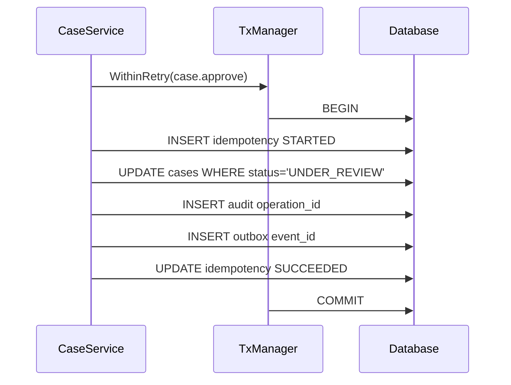
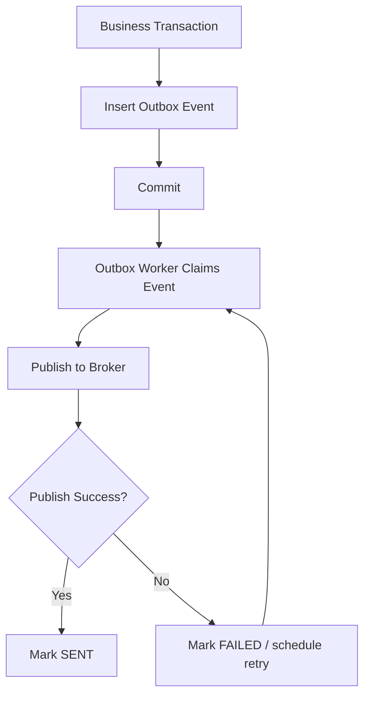
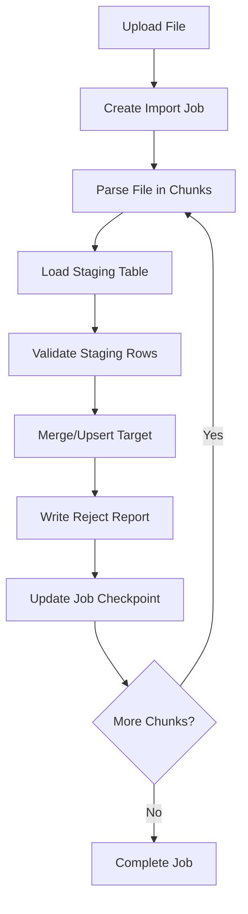
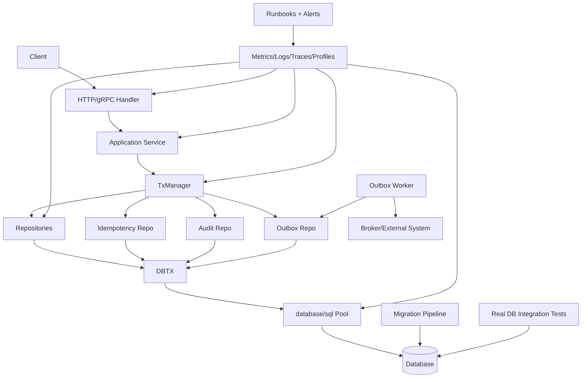

# learn-go-sql-database-integration-part-034.md

# Advanced Case Studies and Engineering Review

> Seri: `learn-go-sql-database-integration`  
> Part: `034`  
> Topik: `Advanced Case Studies, End-to-End Database Architecture Review, Incident Review, Production Readiness Review, Design Review Questions, and Senior Engineering Checklist`  
> Target pembaca: Java software engineer yang ingin memahami Go database integration sampai level production architecture  
> Target Go: Go 1.26.x  
> Status seri: **bagian terakhir / selesai**

---

## 0. Posisi Part Ini Dalam Seri

Ini adalah bagian terakhir dari seri:

```text
learn-go-sql-database-integration
```

Kita sudah membangun semua fondasi:

1. mental model database access di Go;
2. `database/sql`;
3. driver;
4. DSN/config;
5. query execution;
6. rows lifecycle;
7. scan/type mapping;
8. NULL;
9. SQL injection boundary;
10. prepared statements;
11. connection pool;
12. pool sizing;
13. connection lifetime;
14. context/timeout/cancellation;
15. transaction;
16. isolation;
17. locking/concurrency;
18. retry/idempotency;
19. error taxonomy;
20. repository architecture;
21. query composition;
22. pagination/search/listing;
23. bulk write;
24. read path performance;
25. PostgreSQL;
26. MySQL/MariaDB;
27. SQLite/SQL Server/Oracle notes;
28. migrations;
29. testing;
30. observability;
31. resilience;
32. production reference architecture.

Part ini adalah **capstone**.

Tujuannya:

> Menguji apakah kamu bisa berpikir seperti senior/staff/principal engineer saat merancang, mereview, mengoperasikan, dan memperbaiki database-backed Go service.

Kita akan membahas beberapa studi kasus besar:

1. case approval workflow;
2. user registration with idempotency;
3. outbox/inbox event delivery;
4. high-throughput CSV import;
5. search/listing API performance;
6. schema migration rename column;
7. pool starvation incident;
8. deadlock spike incident;
9. commit ambiguity during failover;
10. multi-tenant authorization leak prevention;
11. production readiness review;
12. senior engineering review checklist.

---

## 1. Cara Membaca Part Ini

Part ini tidak hanya memberikan jawaban.

Part ini melatih pola pikir:

```text
Requirement
-> Risk
-> Data invariant
-> Database design
-> Go architecture
-> Transaction boundary
-> Error handling
-> Retry/idempotency
-> Observability
-> Testing
-> Migration
-> Operational runbook
-> Review questions
```

Itulah cara engineer senior membahas database integration.

Bukan sekadar:

```text
tulis SQL
panggil Exec
selesai
```

---

## 2. Prinsip Final Seri

Jika seluruh seri harus dipadatkan, prinsipnya adalah:

1. **Data correctness lebih penting daripada code elegance.**
2. **Transaction boundary harus eksplisit.**
3. **Database error harus diklasifikasi, bukan dijadikan string.**
4. **Retry tanpa idempotency adalah bahaya.**
5. **Connection pool adalah resource control, bukan detail internal.**
6. **Rows lifecycle adalah correctness issue.**
7. **Migration adalah deployment coordination problem.**
8. **Observability harus menjawab pertanyaan incident.**
9. **Resilience berarti failure yang bounded dan recoverable.**
10. **Production DB code harus diuji dengan database nyata.**

---

## 3. Fakta Dasar Yang Menjadi Fondasi

Beberapa hal dari dokumentasi resmi yang terus dipakai sepanjang seri:

1. `database/sql` menyediakan abstraction untuk operasi SQL, termasuk query, exec, transaction, pool, dan stats.
2. `QueryContext`, `ExecContext`, `BeginTx`, dan `PingContext` memungkinkan operasi DB menghormati `context.Context`.
3. `sql.Tx` merepresentasikan transaction; operasi dilakukan melalui `Tx`, lalu diakhiri dengan `Commit` atau `Rollback`.
4. `SetMaxOpenConns` membatasi jumlah open connection; jika limit tercapai, operasi database baru akan menunggu sampai connection tersedia.
5. `DB.Stats()` menyediakan data pool seperti open/in-use/idle connections, wait count, dan wait duration.
6. Observability modern bisa dibangun dengan metrics, logs, traces, dan profiling; OpenTelemetry menyediakan API/SDK untuk instrumentasi Go.

Referensi utama ada di akhir file.

---

# Case Study 1 — Case Approval Workflow

---

## 4. Requirement

Sistem punya workflow:

```text
Case status:
DRAFT -> SUBMITTED -> UNDER_REVIEW -> APPROVED / REJECTED
```

Requirement untuk approve:

1. hanya case `UNDER_REVIEW` yang bisa di-approve;
2. harus atomic:
   - update case;
   - insert audit;
   - insert outbox event;
   - update idempotency result;
3. client bisa retry request;
4. event harus eventually published;
5. tidak boleh double-approve;
6. tidak boleh double-send event;
7. harus aman saat deadlock/timeout/failover;
8. harus observable.

---

## 5. Data Invariant

Invariant:

```text
A case can transition to APPROVED only once from UNDER_REVIEW.
Every successful approval has exactly one audit event.
Every successful approval has exactly one outbox event.
Same operation_id must not produce duplicate business effect.
```

Database harus membantu enforce invariant.

---

## 6. Schema Sketch

```sql
CREATE TABLE cases (
    id BIGINT PRIMARY KEY,
    tenant_id TEXT NOT NULL,
    status TEXT NOT NULL,
    version BIGINT NOT NULL DEFAULT 0,
    approved_at TIMESTAMP NULL,
    updated_at TIMESTAMP NOT NULL
);

CREATE TABLE idempotency_records (
    scope TEXT NOT NULL,
    idempotency_key TEXT NOT NULL,
    request_hash TEXT NOT NULL,
    operation_type TEXT NOT NULL,
    status TEXT NOT NULL,
    result_ref TEXT NULL,
    created_at TIMESTAMP NOT NULL,
    updated_at TIMESTAMP NOT NULL,
    completed_at TIMESTAMP NULL,
    PRIMARY KEY (scope, idempotency_key)
);

CREATE TABLE audit_events (
    id TEXT PRIMARY KEY,
    tenant_id TEXT NOT NULL,
    operation_id TEXT NOT NULL,
    aggregate_type TEXT NOT NULL,
    aggregate_id TEXT NOT NULL,
    action TEXT NOT NULL,
    created_at TIMESTAMP NOT NULL,
    UNIQUE (operation_id, action)
);

CREATE TABLE outbox_events (
    id TEXT PRIMARY KEY,
    event_type TEXT NOT NULL,
    aggregate_type TEXT NOT NULL,
    aggregate_id TEXT NOT NULL,
    payload_json TEXT NOT NULL,
    status TEXT NOT NULL,
    attempt_count INT NOT NULL DEFAULT 0,
    next_attempt_at TIMESTAMP NOT NULL,
    created_at TIMESTAMP NOT NULL,
    updated_at TIMESTAMP NOT NULL
);
```

---

## 7. Transaction Flow



---

## 8. Go Service Shape

```go
func (s CaseService) Approve(ctx context.Context, cmd ApproveCommand) error {
	now := s.Clock.Now()

	return s.Tx.WithinRetry(ctx, "case.approve", nil, s.RetryPolicy, func(ctx context.Context, tx *sql.Tx) error {
		inserted, err := s.Idempotency.InsertStarted(ctx, tx, IdempotencyStart{
			Scope:       cmd.TenantID.String(),
			Key:         cmd.IdempotencyKey,
			RequestHash: cmd.RequestHash,
			Operation:   "case.approve",
			Now:         now,
		})
		if err != nil {
			return err
		}

		if !inserted {
			return s.Idempotency.ResolveExisting(ctx, tx, cmd.TenantID, cmd.IdempotencyKey, cmd.RequestHash)
		}

		version, err := s.Cases.Approve(ctx, tx, cmd.TenantID, cmd.CaseID, now)
		if err != nil {
			return err
		}

		if err := s.Audit.Insert(ctx, tx, AuditEvent{
			ID:          NewID(),
			TenantID:    cmd.TenantID,
			OperationID: cmd.IdempotencyKey,
			Action:      "CASE_APPROVED",
			AggregateID: cmd.CaseID.String(),
			CreatedAt:   now,
		}); err != nil {
			return err
		}

		if err := s.Outbox.Insert(ctx, tx, OutboxEvent{
			ID:            StableEventID(cmd.IdempotencyKey, "case.approved"),
			EventType:     "case.approved",
			AggregateType: "case",
			AggregateID:   cmd.CaseID.String(),
			Payload:       CaseApprovedPayload{CaseID: cmd.CaseID, Version: version},
			CreatedAt:     now,
		}); err != nil {
			return err
		}

		return s.Idempotency.MarkSucceeded(ctx, tx, cmd.TenantID, cmd.IdempotencyKey, version.String(), now)
	})
}
```

---

## 9. Approval Repository

PostgreSQL-style:

```go
func (r CaseRepository) Approve(
	ctx context.Context,
	q DBTX,
	tenantID TenantID,
	caseID CaseID,
	now time.Time,
) (int64, error) {
	var version int64

	err := q.QueryRowContext(ctx, `
		UPDATE cases
		SET status = 'APPROVED',
		    version = version + 1,
		    approved_at = $3,
		    updated_at = $3
		WHERE tenant_id = $1
		  AND id = $2
		  AND status = 'UNDER_REVIEW'
		RETURNING version
	`, tenantID, caseID, now).Scan(&version)

	if err != nil {
		if errors.Is(err, sql.ErrNoRows) {
			return 0, ErrInvalidStateTransition
		}
		return 0, fmt.Errorf("case.approve: %w", err)
	}

	return version, nil
}
```

MySQL-style:

```sql
UPDATE cases
SET status = 'APPROVED',
    version = version + 1,
    approved_at = UTC_TIMESTAMP(6),
    updated_at = UTC_TIMESTAMP(6)
WHERE tenant_id = ?
  AND id = ?
  AND status = 'UNDER_REVIEW'
```

Then check `RowsAffected`.

---

## 10. Error Handling Review

| Error | Mapping |
|---|---|
| no row updated | invalid state transition / not found depending lookup |
| duplicate idempotency | load existing operation |
| duplicate audit/outbox event | idempotency conflict or retry result |
| deadlock | retry whole transaction |
| serialization failure | retry whole transaction |
| lock timeout | retry or return busy depending policy |
| context deadline | return timeout |
| schema error | deployment incident |
| commit ambiguity | reconcile by idempotency key |

---

## 11. Tests Required

1. approve success creates case update + audit + outbox + idempotency success;
2. approve invalid state returns domain error and writes nothing;
3. duplicate idempotency key returns same result;
4. same idempotency key with different hash returns conflict;
5. outbox insert failure rolls back case update;
6. audit duplicate rolls back;
7. transaction retry on deadlock simulation;
8. concurrency: 10 approvals, only one succeeds;
9. tenant isolation: tenant A cannot approve tenant B case;
10. migration test: all tables/constraints exist.

---

## 12. Observability Required

Metrics:

```text
db_tx_duration_seconds{operation="case.approve"}
db_tx_retries_total{operation="case.approve", class}
db_operation_errors_total{operation="case.approve", class}
idempotency_duplicate_total{operation="case.approve"}
outbox_insert_total{event_type="case.approved"}
```

Logs:

```text
operation=case.approve
case_id_hash
tenant_hash
idempotency_key_hash
error_class
duration
retry_attempt
```

Traces:

```text
case.approve
  tx.begin
  idempotency.insert_started
  case.approve.update
  audit.insert
  outbox.insert
  idempotency.mark_succeeded
  tx.commit
```

---

## 13. Senior Review Questions

- Is approval idempotent?
- What happens if `Commit` returns connection reset?
- What happens if event publish fails?
- Can two concurrent approvals both succeed?
- Is tenant predicate inside update?
- Is external call inside transaction?
- Is retry whole transaction or one statement?
- Does duplicate idempotency key validate request hash?
- Does outbox event ID remain stable?
- Are errors classified structurally?
- Are audit and outbox in same transaction?
- Do tests use real DB constraints?

---

# Case Study 2 — User Registration

---

## 14. Requirement

User registration:

1. email unique per tenant;
2. email comparison case-insensitive;
3. client may retry;
4. generated user ID needed;
5. must not create duplicates;
6. welcome email sent eventually;
7. user can see result after retry.

---

## 15. Design

Schema:

```sql
CREATE TABLE users (
    id BIGINT PRIMARY KEY,
    tenant_id TEXT NOT NULL,
    email TEXT NOT NULL,
    email_norm TEXT NOT NULL,
    name TEXT NOT NULL,
    created_at TIMESTAMP NOT NULL,
    UNIQUE (tenant_id, email_norm)
);
```

For PostgreSQL, `email_norm` can be generated column/expression index depending choice.  
For MySQL, generated column/collation strategy may be used.  
For Oracle, remember empty string/NULL semantics.

Flow:

```text
BEGIN
insert idempotency
insert user
insert outbox welcome email
mark idempotency success
COMMIT
```

---

## 16. Why Pre-Check Is Not Enough

Bad:

```go
exists := repo.EmailExists(...)
if exists { return ErrEmailUsed }
repo.InsertUser(...)
```

Race:

```text
request A checks false
request B checks false
A inserts
B inserts or fails duplicate
```

The unique constraint is the final guard.

You may pre-check for UX, but must handle duplicate error.

---

## 17. Review Questions

- Where is email normalized?
- Is normalization identical in app and DB?
- Is collation behavior tested?
- Does unique key include tenant?
- Is duplicate error mapped to `ErrEmailAlreadyUsed`?
- Is welcome email in outbox, not sent inline?
- Does client retry use idempotency key?
- Does app-generated ID help avoid commit ambiguity?
- Is registration safe under concurrency?
- Is password/PII excluded from logs?

---

# Case Study 3 — Outbox / Inbox Event Delivery

---

## 18. Requirement

System publishes `case.approved` event to broker.

Guarantees desired:

1. if case approval commits, event should eventually be published;
2. event may be delivered more than once;
3. consumers must be idempotent;
4. broker outage should not corrupt DB transaction;
5. event backlog must be observable.

---

## 19. Outbox Flow



---

## 20. Claim Query Review

PostgreSQL:

```sql
SELECT id
FROM outbox_events
WHERE status = 'PENDING'
  AND next_attempt_at <= now()
ORDER BY created_at, id
FOR UPDATE SKIP LOCKED
LIMIT $1
```

MySQL:

```sql
SELECT id
FROM outbox_events
WHERE status = 'PENDING'
  AND next_attempt_at <= UTC_TIMESTAMP(6)
ORDER BY created_at, id
LIMIT ?
FOR UPDATE SKIP LOCKED
```

SQL Server may use locking hints like `UPDLOCK`, `READPAST`.  
Oracle supports `FOR UPDATE SKIP LOCKED` in many versions.

Always test exact dialect.

---

## 21. Outbox Failure Modes

| Failure | Mitigation |
|---|---|
| worker crashes after claim | visibility timeout/reclaim |
| publish succeeds, mark sent fails | idempotent broker/consumer; retry may duplicate |
| broker down | retry with backoff, backlog alert |
| poison event | retry cap + dead-letter |
| query slow | index on status/next_attempt/created |
| worker too many | concurrency limit |
| duplicate event ID | stable event ID and unique key |
| old event stuck | oldest pending age alert |

---

## 22. Inbox Consumer Review

Consumer should:

```text
BEGIN
insert message_id into inbox
if duplicate -> skip/load result
apply business change
mark inbox processed
COMMIT
```

Review questions:

- Is `message_id` unique?
- What if same message arrives concurrently?
- What if processing fails after business update but before marking processed?
- What if consumer crashes?
- Is poison message handled?
- Are duplicate counts observable?

---

# Case Study 4 — High-Throughput CSV Import

---

## 23. Requirement

Import 5 million records:

- validate rows;
- reject invalid rows with reason;
- insert new users;
- update existing users if source version newer;
- avoid blocking OLTP;
- resumable after crash;
- observable progress.

---

## 24. Architecture



---

## 25. Staging Table

```sql
CREATE TABLE user_import_staging (
    job_id TEXT NOT NULL,
    row_no BIGINT NOT NULL,
    source_id TEXT,
    source_version BIGINT,
    email TEXT,
    name TEXT,
    error_code TEXT NULL,
    error_message TEXT NULL,
    PRIMARY KEY (job_id, row_no)
);
```

Target merge is DB-specific:

- PostgreSQL: `INSERT ... SELECT ... ON CONFLICT`;
- MySQL: `INSERT ... SELECT ... ON DUPLICATE KEY UPDATE`;
- SQL Server/Oracle: staging + controlled merge/update/insert;
- SQLite: batched transaction.

---

## 26. Resilience

Import job must be:

- chunked;
- checkpointed;
- idempotent;
- pausable;
- resumable;
- throttled;
- separate pool;
- observable;
- reject-aware.

No one giant transaction.

---

## 27. Review Questions

- What is chunk size?
- How is checkpoint stored?
- Can chunk rerun safely?
- Are rejects stored?
- Does import use OLTP pool?
- Does it create replica lag?
- Is merge condition version-aware?
- Are unique constraints final guard?
- What happens on crash halfway?
- Is there cancel/pause?
- Is progress visible?
- Are invalid rows auditable?

---

# Case Study 5 — Search / Listing API

---

## 28. Requirement

List cases:

- tenant-scoped;
- user authorization;
- optional status/date/keyword filters;
- sorted by `updated_at desc`;
- pagination;
- no data leak;
- low latency under large data.

---

## 29. Query Design

```sql
SELECT c.id, c.reference_no, c.status, c.updated_at
FROM cases c
JOIN case_permissions p
  ON p.case_id = c.id
 AND p.user_id = $2
WHERE c.tenant_id = $1
  AND c.deleted_at IS NULL
  AND ($3::text IS NULL OR c.status = $3)
  AND (
      c.updated_at < $4
      OR (c.updated_at = $5 AND c.id < $6)
  )
ORDER BY c.updated_at DESC, c.id DESC
LIMIT $7
```

This is illustrative; actual dynamic SQL may omit absent filters instead of using nullable predicates for plan quality.

---

## 30. Risks

- missing tenant predicate;
- permission predicate only in handler;
- large offset;
- no deterministic tie-breaker;
- keyword search leading wildcard;
- exact count expensive;
- index mismatch;
- `SELECT *`;
- N+1 loading details;
- cursor tampering;
- sort injection;
- pagination duplicate/missing rows.

---

## 31. Review Questions

- Is tenant predicate in SQL?
- Is permission enforced in list and detail?
- Is sort allowlisted?
- Is cursor signed/versioned?
- Is order deterministic?
- Is index aligned with filter/order?
- Is exact count required?
- Is max limit enforced?
- Are malicious keyword/sort inputs tested?
- Does query expose PII unnecessarily?
- Does integration test prove no cross-tenant leak?

---

# Case Study 6 — Rename Column Migration

---

## 32. Requirement

Rename:

```text
users.name -> users.full_name
```

Production uses rolling deploy.

---

## 33. Unsafe Direct Migration

```sql
ALTER TABLE users RENAME COLUMN name TO full_name;
```

Why unsafe?

- old app still reads `name`;
- old app still writes `name`;
- rollback app fails;
- jobs/scripts may break;
- read replicas may lag;
- BI queries may break.

---

## 34. Safe Plan

```text
Release 1:
  add full_name nullable

Release 2:
  app dual-writes name + full_name
  reads COALESCE(full_name, name)

Backfill:
  populate full_name where null

Release 3:
  app reads/writes full_name only
  still optionally writes name for rollback window

After rollback window:
  drop name
```

---

## 35. Review Questions

- Has old app compatibility been tested?
- Are all write paths dual-writing?
- Is backfill idempotent?
- Are NULL/empty semantics handled?
- Is BI/report updated?
- Is contract delayed?
- Is rollback plan app-only?
- Are migrations separated?
- Is backfill observable?

---

# Case Study 7 — Pool Starvation Incident

---

## 36. Incident

Symptoms:

```text
API p99 latency high.
DB CPU low.
DB connections equal MaxOpenConns.
WaitCount and WaitDuration rising.
Goroutine count high.
```

---

## 37. Investigation

Possible root causes:

- rows not closed;
- transaction not committed/rolled back;
- report query holds connection for streaming;
- outbox worker concurrency too high;
- DB query slow and holding connections;
- pool too small for legitimate load;
- batch job sharing OLTP pool.

---

## 38. Diagnosis Steps

1. Check `DB.Stats`.
2. Check traces by operation.
3. Check goroutine profile.
4. Check long transactions.
5. Check recent deploy.
6. Check worker concurrency.
7. Check report/export.
8. Check DB server activity.

---

## 39. Mitigation

Immediate:

- pause batch/report workers;
- reduce traffic or shed expensive endpoint;
- restart only if leak confirmed and safe;
- lower worker concurrency;
- rollback bad deploy if clear.

Permanent:

- fix rows/tx leak;
- add integration test with `MaxOpenConns(1)`;
- separate pools;
- add pool wait alerts;
- enforce timeouts;
- limit streaming/export.

---

## 40. Review Questions

- Are all `Rows` closed?
- Are all transactions finalized?
- Are streaming endpoints holding DB connection?
- Are batch/report workloads isolated?
- Is pool sized across pods?
- Are pool wait metrics alerting?
- Is there pprof access?

---

# Case Study 8 — Deadlock Spike

---

## 41. Incident

After deploy, deadlock errors spike.

Context:

- new batch job updates many case rows;
- user transactions also update cases;
- batch updates in arbitrary order;
- missing index causes broad scan/lock.

---

## 42. Mitigation

Immediate:

- pause batch job;
- rely on bounded transaction retry for user commands;
- reduce concurrency;
- inspect deadlock logs;
- identify query/order.

Permanent:

- update in primary-key order;
- smaller chunks;
- add missing index;
- shorten transaction;
- deterministic lock order;
- integration/load test;
- deadlock dashboard.

---

## 43. Review Questions

- Are locks acquired in deterministic order?
- Does batch use index?
- Are transactions too large?
- Is retry whole transaction?
- Is retry safe/idempotent?
- Are deadlock metrics visible?
- Did migration/backfill introduce lock pattern?

---

# Case Study 9 — Commit Ambiguity During Failover

---

## 44. Incident

During database failover:

```text
tx.Commit returns connection reset.
Client receives 503.
Client retries.
```

Question:

```text
Did the original transaction commit?
```

Unknown.

---

## 45. Correct Design

If operation had idempotency key:

```text
retry with same key
service loads idempotency record
if succeeded -> return success
if missing -> retry transaction
if started stale -> reconcile
```

If no idempotency key:

```text
manual reconciliation required
risk duplicate/missing state
```

---

## 46. Review Questions

- Which commands have idempotency keys?
- Is request hash stored?
- Are audit/outbox records keyed by operation ID?
- Can success response be reconstructed?
- Does client retry with same key?
- Does runbook cover ambiguous commit?
- Are reconciliation jobs available?

---

# Case Study 10 — Multi-Tenant Data Leak Prevention

---

## 47. Requirement

Every case belongs to tenant. User must never see another tenant's case.

---

## 48. Dangerous Pattern

```go
caseDetail, err := repo.FindByID(ctx, db, caseID)
if err != nil { ... }

if caseDetail.TenantID != user.TenantID {
	return ErrForbidden
}
```

If repository loads sensitive details before authorization, data may leak through logs, metrics, cache, bugs, or timing.

Better:

```go
repo.FindByIDForTenantAndUser(ctx, db, tenantID, userID, caseID)
```

or at least tenant predicate in SQL.

---

## 49. Required Tests

- tenant A cannot list tenant B case;
- tenant A cannot detail tenant B case;
- cursor from tenant B cannot be used in tenant A;
- sort/filter cannot bypass tenant predicate;
- worker/admin paths enforce scope;
- unique constraints include tenant where needed.

---

## 50. Review Questions

- Is tenant predicate mandatory in query builder?
- Is authorization in SQL for list/detail?
- Are repository methods scoped by tenant?
- Are tenant IDs in constraints/indexes?
- Are logs avoiding raw tenant/user PII?
- Are tests proving no cross-tenant leak?
- Is RLS used? If yes, is session state safe with pooling?

---

# Case Study 11 — Reporting and OLTP Isolation

---

## 51. Requirement

Admin wants export of 2 years of audit logs.

Risk:

- huge scan;
- DB IO spike;
- OLTP pool starvation;
- memory explosion;
- timeout;
- replica lag;
- user-facing API degraded.

---

## 52. Design

- async export job;
- separate report pool;
- maximum date range;
- streaming to file/object storage;
- keyset/chunked scan;
- no `SELECT *`;
- exclude large JSON unless needed;
- progress metrics;
- cancel/pause support;
- run on replica/warehouse if possible;
- rate limit per tenant/user.

---

## 53. Review Questions

- Does export use OLTP pool?
- Is it async?
- Is date range capped?
- Is result streamed?
- Is memory bounded?
- Is query indexed?
- Can job pause/resume?
- Is replica lag monitored?
- Is user notified when ready?
- Is access audited?

---

# Case Study 12 — Production Readiness Review

---

## 54. Review Area 1: Data Correctness

Checklist:

- [ ] invariants enforced by database constraints where possible;
- [ ] transaction boundary explicit;
- [ ] no external side effect inside transaction;
- [ ] idempotency for retryable writes;
- [ ] outbox for event/external publish;
- [ ] error mapping preserves domain meaning;
- [ ] commit ambiguity plan;
- [ ] concurrency tests for critical invariants;
- [ ] migration compatibility plan.

---

## 55. Review Area 2: SQL and Repository

Checklist:

- [ ] explicit SQL reviewed;
- [ ] no raw user input in SQL grammar;
- [ ] identifiers/sorts allowlisted;
- [ ] tenant/security predicates included;
- [ ] explicit column lists;
- [ ] no `SELECT *` in production hot paths;
- [ ] rows closed and `rows.Err` checked;
- [ ] nullable/type mapping explicit;
- [ ] repository accepts `DBTX`;
- [ ] no hidden transaction unless method owns complete unit of work.

---

## 56. Review Area 3: Transactions and Concurrency

Checklist:

- [ ] transaction kept short;
- [ ] no network/user wait inside transaction;
- [ ] isolation level intentional;
- [ ] lock ordering considered;
- [ ] deadlock/serialization retry safe;
- [ ] lock timeout strategy;
- [ ] `RowsAffected`/`ErrNoRows` checked;
- [ ] hot row/aggregate contention considered;
- [ ] advisory lock documented if used.

---

## 57. Review Area 4: Pool and Capacity

Checklist:

- [ ] pool size budget across pods;
- [ ] DB max connections reserved;
- [ ] separate pool for batch/report if needed;
- [ ] connection lifetime/idle time set;
- [ ] pool wait metrics;
- [ ] HPA/rolling surge considered;
- [ ] DB proxy/pooler compatibility considered;
- [ ] load test validates pool settings.

---

## 58. Review Area 5: Timeout and Resilience

Checklist:

- [ ] context propagated to DB calls;
- [ ] operation-specific timeout budget;
- [ ] retry policy by error class;
- [ ] retry budget/jitter;
- [ ] idempotency on writes;
- [ ] backpressure/load shedding;
- [ ] graceful shutdown;
- [ ] readiness/liveness designed;
- [ ] failover behavior tested;
- [ ] runbooks exist.

---

## 59. Review Area 6: Migrations

Checklist:

- [ ] migrations versioned and immutable;
- [ ] migration applies from scratch in CI;
- [ ] backward compatibility checked;
- [ ] forward/rollback compatibility checked;
- [ ] expand/contract for breaking changes;
- [ ] backfill chunked/idempotent;
- [ ] DB-specific online DDL considered;
- [ ] migration lock/timeout strategy;
- [ ] contract delayed until rollback window passed;
- [ ] schema drift detection.

---

## 60. Review Area 7: Testing

Checklist:

- [ ] unit tests for domain/service;
- [ ] query builder tests;
- [ ] repository integration tests with real DB;
- [ ] migration tests;
- [ ] transaction rollback/commit tests;
- [ ] duplicate/FK/check error tests;
- [ ] concurrency tests for invariants;
- [ ] pagination/search injection tests;
- [ ] timeout/failure tests;
- [ ] CI runs critical integration tests.

---

## 61. Review Area 8: Observability

Checklist:

- [ ] operation names stable;
- [ ] DB operation duration metrics;
- [ ] error class metrics;
- [ ] pool stats exported;
- [ ] transaction duration/retry metrics;
- [ ] outbox/backfill/migration metrics;
- [ ] slow query logs safe;
- [ ] traces link request to DB;
- [ ] pprof/runtime metrics available;
- [ ] dashboards and alerts with runbooks.

---

## 62. Review Area 9: Security and Compliance

Checklist:

- [ ] least-privilege DB role;
- [ ] separate migration role;
- [ ] TLS/secure connection;
- [ ] secrets not logged;
- [ ] PII not logged;
- [ ] SQL injection boundary tested;
- [ ] tenant isolation tested;
- [ ] audit logs for critical actions;
- [ ] backup/restore policy;
- [ ] data retention/deletion policy.

---

# Final Engineering Review Framework

---

## 63. The 20 Questions

When reviewing any database-backed Go feature, ask:

1. What data invariant is being protected?
2. Is invariant enforced in app, DB, or both?
3. What is the transaction boundary?
4. What happens if operation retries?
5. Is operation idempotent?
6. What happens if commit result is unknown?
7. What DB errors are expected?
8. How are errors classified?
9. What is user-facing error mapping?
10. What context timeout applies?
11. Can this query starve the pool?
12. What indexes support it?
13. Does it leak tenant/user data?
14. Can old and new schema versions coexist?
15. How is it tested with real DB?
16. What metrics/logs/traces identify this operation?
17. What alert fires if it fails?
18. What is the runbook?
19. How does rollback work?
20. What happens under concurrent load?

If a design cannot answer these, it is not production-ready.

---

## 64. Senior vs Junior Thinking

Junior thinking:

```text
How do I make this query work?
```

Mid-level thinking:

```text
How do I structure repository and transaction?
```

Senior thinking:

```text
What invariant must hold under concurrency, retry, failure, deployment, and migration?
```

Staff/principal thinking:

```text
How does this design evolve safely across teams, services, incidents, scale, and years of production operation?
```

---

## 65. Common “Looks Good” But Dangerous Designs

### 65.1 “We Catch Error and Retry”

Question:

```text
Retry what? Is it safe? Is operation idempotent? Is commit ambiguous?
```

### 65.2 “We Check Before Insert”

Question:

```text
What about race? Is there unique constraint?
```

### 65.3 “We Publish Event After DB Update”

Question:

```text
What if publish succeeds but DB rollback? What if DB commits but publish fails?
```

### 65.4 “We Use Transaction”

Question:

```text
Does every repository call use the tx? Any external call inside? How long?
```

### 65.5 “We Use Migration Tool”

Question:

```text
Is migration backward-compatible? Does it lock table? What about rollback?
```

### 65.6 “We Have Logs”

Question:

```text
Can logs answer operation, error class, duration, trace, tenant-safe context?
```

### 65.7 “We Tested It”

Question:

```text
With real DB? With migration? With concurrency? With failure?
```

---

## 66. Final Architecture Diagram



---

## 67. Final Production Checklist

### Code

- [ ] repository accepts context and `DBTX`;
- [ ] no SQL in handler;
- [ ] no hidden transactions for multi-step use case;
- [ ] rows closed;
- [ ] errors wrapped with `%w`;
- [ ] nullable/type mapping explicit;
- [ ] SQL injection boundary enforced.

### Data

- [ ] constraints protect invariants;
- [ ] unique keys support idempotency;
- [ ] FK/check constraints where appropriate;
- [ ] audit/outbox in same transaction;
- [ ] tenant scope included.

### Runtime

- [ ] pool configured;
- [ ] timeout budget;
- [ ] retry policy;
- [ ] idempotency;
- [ ] outbox/inbox;
- [ ] backpressure;
- [ ] graceful shutdown.

### Delivery

- [ ] migrations tested;
- [ ] expand/contract for breaking changes;
- [ ] deployment ordering;
- [ ] rollback plan;
- [ ] feature flags if needed.

### Operations

- [ ] metrics;
- [ ] logs;
- [ ] traces;
- [ ] pprof/runtime;
- [ ] dashboards;
- [ ] alerts;
- [ ] runbooks;
- [ ] backup/restore;
- [ ] incident review process.

---

## 68. Final Anti-Pattern Index

| Anti-Pattern | Why Dangerous |
|---|---|
| SQL in handler | no boundary, hard to test |
| transaction inside each repository | no unit of work |
| retry all errors | duplicate/corruption/outage |
| no idempotency | unsafe client retry |
| external side effect in tx | duplicate effects/long locks |
| no outbox | lost events |
| no error classifier | wrong response/retry |
| no real DB tests | false confidence |
| app starts heavy migration | rollout outage |
| direct destructive migration | rollback/data loss |
| one pool for all workload | starvation |
| no pool metrics | blind incident |
| `SELECT *` | performance/schema bugs |
| raw SQL args in logs | PII/secret leak |
| no tenant predicate in SQL | data leak |
| unbounded export/list | DB overload |
| one huge backfill transaction | lock/lag/rollback pain |
| no runbook | slow incident response |

---

## 69. What “Top 1% Understanding” Means Here

Top 1% is not memorizing every SQL syntax.

It is the ability to reason about:

- correctness under concurrency;
- failure before/during/after commit;
- transaction scope;
- database-specific semantics;
- migration compatibility;
- operational diagnosis;
- resource isolation;
- data integrity;
- incident recovery;
- long-term maintainability.

In practice, it means you can join a design review and ask the few questions that prevent a future production incident.

---

## 70. Recommended Next Learning After This Series

After completing this series, recommended advanced next topics:

1. **Go Distributed Systems Patterns**
   - outbox/inbox, saga, workflow, retries, idempotency, consistency.

2. **Go Messaging and Streaming**
   - Kafka, RabbitMQ, NATS, ordering, consumer groups, exactly-once illusion.

3. **Go Advanced Observability**
   - OpenTelemetry, metrics design, pprof, tracing at scale.

4. **Go Database Performance Lab**
   - benchmark real queries, explain plans, index design, load test.

5. **Database Internals for Application Engineers**
   - B-tree, MVCC, WAL/binlog/redo, locks, buffer cache, query planner.

6. **Production Migration Engineering**
   - large table migration, online DDL, backfill orchestration, schema governance.

7. **Multi-Tenant Data Architecture**
   - tenant isolation, RLS, sharding, partitioning, noisy neighbor control.

8. **Data Reliability and Reconciliation**
   - audit, ledger, invariant checking, repair workflows, backup/restore drills.

---

## 71. Final Summary

This series began with a simple question:

```text
How do we use SQL databases from Go?
```

The real answer is much deeper:

```text
Use database/sql correctly.
Understand driver/database semantics.
Design transaction boundaries.
Protect data invariants.
Handle errors structurally.
Make retries idempotent.
Control connection pools.
Write safe migrations.
Test with real databases.
Observe everything.
Prepare for failure.
```

Database integration is not just persistence.

It is the point where:

- business correctness;
- infrastructure;
- concurrency;
- distributed systems;
- security;
- testing;
- observability;
- operations;

all meet.

A Go engineer who understands this deeply is not just writing CRUD.  
They are designing durable, evolvable, production-grade systems.

---

## 72. Status Seri

Seri:

```text
learn-go-sql-database-integration
```

Status:

```text
SELESAI
```

Part terakhir:

```text
learn-go-sql-database-integration-part-034.md
Advanced Case Studies and Engineering Review
```

---

## 73. Referensi

- Go package documentation — `database/sql`: <https://pkg.go.dev/database/sql>
- Go documentation — Managing connections: <https://go.dev/doc/database/manage-connections>
- Go documentation — Canceling in-progress operations: <https://go.dev/doc/database/cancel-operations>
- Go documentation — Executing transactions: <https://go.dev/doc/database/execute-transactions>
- Go documentation — Querying for data: <https://go.dev/doc/database/querying>
- OpenTelemetry documentation — Go instrumentation: <https://opentelemetry.io/docs/languages/go/instrumentation/>
- `golang-migrate/migrate`: <https://github.com/golang-migrate/migrate>


<!-- NAVIGATION_FOOTER -->
<div class="page-nav">
<a href="./learn-go-sql-database-integration-part-033.md">⬅️ Production Reference Architecture</a>
<a href="./index.md">📚 Kategori</a>
<a href="../../index.md">🏠 Home</a>
<span></span>
</div>
