# learn-go-security-cryptography-integrity-part-000.md

# Go Security, Cryptography, Integrity — Part 000

## Series Orientation, Security Mental Model, Scope, Threat Landscape, and Learning Map

> Seri: `learn-go-security-cryptography-integrity`  
> Part: `000` dari `034`  
> Status: **awal seri — belum selesai**  
> Target Go: **Go 1.26.x**  
> Baseline terbaru saat materi ini disusun: **Go 1.26.4**, dirilis 2026-06-02  
> Target pembaca: **Java software engineer** yang ingin memahami security Go pada level engineering handbook internal, bukan sekadar menghafal API.

---

## 0. Apa yang Akan Dibangun oleh Seri Ini?

Seri ini bertujuan membangun pemahaman security Go dari empat lapisan besar:

1. **Security reasoning**  
   Cara berpikir tentang asset, boundary, trust, attacker capability, invariant, dan failure mode.

2. **Cryptographic correctness**  
   Cara memilih dan memakai primitive crypto dengan benar: random, hash, MAC, AEAD, signature, key agreement, password hashing, key management, TLS, X.509, FIPS, dan crypto agility.

3. **Secure application boundary**  
   Cara membuat Go service yang aman terhadap injection, SSRF, path traversal, broken authorization, token misuse, parser ambiguity, request smuggling, denial of service, secret leakage, dan unsafe operational behavior.

4. **Integrity and operational assurance**  
   Cara membuat sistem yang bisa dipercaya secara operasional: audit trail, tamper evidence, vulnerability management, supply-chain security, build reproducibility, release gate, incident response, dan production readiness.

Security di seri ini tidak diperlakukan sebagai “fitur tambahan”, melainkan sebagai **sifat sistem**. Artinya, sistem disebut aman bukan karena memiliki middleware auth, bukan karena traffic memakai HTTPS, bukan karena memakai AES, dan bukan karena lolos scanner. Sistem disebut aman jika **security invariants** tetap berlaku ketika input jahat, user salah, dependency berubah, sertifikat expired, token bocor, log dikonsumsi pihak lain, traffic overload, dan operator melakukan kesalahan realistis.

---

## 1. Baseline Versi dan Sumber Resmi

Materi ini ditulis untuk Go **1.26.x**. Berdasarkan release history resmi Go, Go 1.26.0 dirilis pada 2026-02-10, dan Go 1.26.4 dirilis pada 2026-06-02 dengan security fixes untuk `crypto/x509`, `mime`, dan `net/textproto`, serta bug fixes untuk compiler, runtime, `go fix`, dan `crypto/fips140`.

Sumber resmi utama yang menjadi baseline seri ini:

- Go Release History: https://go.dev/doc/devel/release
- Go 1.26 Release Notes: https://go.dev/doc/go1.26
- Go Security landing page: https://go.dev/doc/security/
- Go Security Best Practices: https://go.dev/doc/security/best-practices
- Go Vulnerability Management: https://go.dev/doc/security/vuln/
- Go Vulnerability Database: https://go.dev/doc/security/vuln/database
- Go Fuzzing: https://go.dev/doc/security/fuzz/
- Go FIPS 140-3 Compliance: https://go.dev/doc/security/fips140
- Go Modules Reference: https://go.dev/ref/mod
- OWASP API Security Top 10 2023: https://owasp.org/API-Security/editions/2023/en/0x11-t10/
- NIST SP 800-218 SSDF v1.1: https://csrc.nist.gov/pubs/sp/800/218/final

Catatan penting: karena Go security, TLS defaults, vulnerability database, package behavior, dan release status dapat berubah, bagian yang menyebut versi/fitur terkini harus selalu diverifikasi ulang saat digunakan untuk keputusan produksi.

---

## 2. Posisi Part 000 dalam Seri

Part 000 bukan bagian untuk menghafal API crypto. Ini adalah **peta mental** yang akan dipakai sepanjang 34 part berikutnya.

Tujuan part ini:

1. Menentukan scope seri agar tidak tumpang tindih dengan seri Go lain yang sudah selesai.
2. Menjelaskan cara berpikir security sebagai invariant dan boundary.
3. Membuat taxonomy area security di Go.
4. Menjelaskan perbedaan mindset Java security engineer dan Go security engineer.
5. Memberikan peta belajar dari design review sampai production readiness.
6. Menyiapkan template berpikir untuk part berikutnya.

Part ini penting karena security mudah sekali salah arah. Banyak engineer masuk dari pertanyaan seperti:

- “Bagaimana cara encrypt string?”
- “Bagaimana cara generate JWT?”
- “Bagaimana cara validasi password?”
- “Bagaimana cara set TLS config?”
- “Bagaimana cara secure API?”

Pertanyaan itu valid, tetapi terlalu sempit. Security failure biasanya tidak terjadi karena satu fungsi crypto salah saja. Failure sering terjadi karena **boundary tidak jelas**, **state tidak dipikirkan**, **trust terlalu luas**, **identity disamakan dengan authorization**, **integrity disamakan dengan encryption**, **log bocor**, **retry membuka replay**, **token tidak punya audience**, **parser menerima bentuk input ganda**, atau **dependency yang rentan tetap reachable di runtime**.

---

## 3. Apa yang Tidak Akan Diulang dari Seri Sebelumnya

Seri ini mengasumsikan Anda sudah memahami materi Go sebelumnya:

- `learn-go`
- `learn-go-data-model`
- `learn-go-reliability-error-handling`
- `learn-go-concurrency-parallelism`
- `learn-go-composition-oop-functional-reflection-codegen-modules`
- `learn-go-memory-system`
- `learn-go-data-structure-algorithm`
- `learn-go-design-patterns-common-patterns-anti-patterns`
- `learn-go-io-buffer-byte-stream-file-network-data-transfer`

Karena itu, seri ini **tidak akan mengulang**:

- sintaks dasar Go;
- goroutine/channel dari nol;
- context cancellation dari nol;
- error wrapping dari nol;
- interface/composition dari nol;
- byte slice, buffer, stream, file IO dari nol;
- HTTP basic dari nol;
- data structure umum dari nol;
- design pattern umum dari nol.

Tetapi seri ini akan memakai ulang hal-hal tersebut saat memiliki konsekuensi security. Contoh:

| Materi lama | Dipakai di seri ini untuk |
|---|---|
| `context.Context` | request timeout, cancellation, DoS control, auth propagation boundary |
| goroutine | goroutine leak sebagai availability vulnerability |
| byte slice | secret lifetime, token exposure, copy semantics, zeroing caveat |
| IO streaming | upload limit, decompression bomb, parser resource exhaustion |
| error handling | information disclosure, audit correctness, incident diagnosability |
| interface | policy abstraction, crypto provider isolation, dependency inversion untuk testability |
| data structure | replay cache, rate limiter, Merkle tree, tamper-evident logs |
| design pattern | capability pattern, policy object, middleware ordering, guardrail architecture |

Security seri ini bukan “materi tambahan” di atas seri sebelumnya; ini adalah cara melihat semua fondasi itu dari perspektif adversarial.

---

## 4. Mental Model Utama: Security adalah Invariant di Bawah Tekanan

Dalam engineering biasa, kita sering bertanya:

> “Apakah code ini menghasilkan output yang benar untuk input yang valid?”

Dalam security engineering, pertanyaannya berubah:

> “Apakah sistem tetap mempertahankan invariant kritis ketika input, caller, dependency, network, clock, config, operator, dan environment tidak bisa dipercaya sepenuhnya?”

### 4.1 Correctness vs Security

Correctness melihat happy path dan expected behavior.

Security melihat:

- hostile input;
- malformed input;
- ambiguous input;
- replayed input;
- delayed input;
- duplicated input;
- overlarge input;
- partial input;
- concurrent input;
- intentionally expensive input;
- stale token;
- forged token;
- leaked token;
- wrong audience token;
- wrong issuer token;
- compromised dependency;
- exposed logs;
- stale certificate;
- downgrade attempt;
- operational mistake.

Contoh sederhana:

```go
func GetInvoice(userID string, invoiceID string) (*Invoice, error) {
    return repo.FindInvoice(invoiceID)
}
```

Secara correctness, function ini mungkin bekerja. Jika `invoiceID` valid, invoice ditemukan.

Secara security, function ini cacat karena invariant berikut tidak dijaga:

> Caller hanya boleh membaca invoice yang memang berada dalam scope authorization-nya.

Versi yang lebih aman secara konsep:

```go
func GetInvoice(ctx context.Context, actor Actor, invoiceID InvoiceID) (*Invoice, error) {
    invoice, err := repo.FindInvoice(ctx, invoiceID)
    if err != nil {
        return nil, err
    }

    if !policy.CanReadInvoice(actor, invoice) {
        audit.RecordDenied(ctx, actor, "invoice.read", invoiceID)
        return nil, ErrForbidden
    }

    audit.RecordAllowed(ctx, actor, "invoice.read", invoiceID)
    return invoice, nil
}
```

Perbedaannya bukan hanya adanya `if`. Perbedaannya adalah **model**:

- ada actor;
- ada resource;
- ada action;
- ada policy;
- ada audit;
- ada invariant authorization;
- akses data tidak dianggap aman hanya karena ID valid.

### 4.2 Security Invariant

Security invariant adalah pernyataan yang harus selalu benar.

Contoh:

1. **Confidentiality invariant**  
   Data rahasia tidak boleh terbaca oleh actor yang tidak berwenang.

2. **Integrity invariant**  
   Data tidak boleh berubah tanpa authorization dan tanpa jejak audit yang valid.

3. **Authenticity invariant**  
   Sistem harus bisa membedakan data asli dari data palsu.

4. **Freshness invariant**  
   Request lama tidak boleh bisa dipakai ulang untuk efek baru jika domain membutuhkan anti-replay.

5. **Availability invariant**  
   Satu caller tidak boleh bisa menghabiskan resource secara tidak proporsional.

6. **Non-bypass invariant**  
   Semua akses resource harus melewati policy decision point yang sama atau ekuivalen.

7. **Least privilege invariant**  
   Capability yang diberikan kepada komponen harus sekecil yang dibutuhkan.

8. **Auditability invariant**  
   Keputusan penting harus bisa direkonstruksi dari event yang lengkap, immutable-enough, dan korelasinya jelas.

Security design dimulai dari invariant, bukan dari package.

---

## 5. Diagram Besar: Security sebagai Layered System

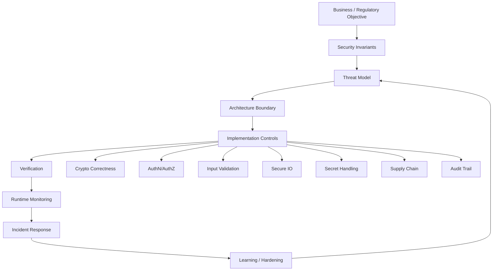

Diagram ini sengaja menempatkan crypto sebagai salah satu control, bukan pusat segalanya. Dalam sistem nyata, crypto yang benar tidak menyelamatkan authorization yang salah. TLS yang kuat tidak menyelamatkan object-level access control yang hilang. Hash yang kuat tidak menyelamatkan canonicalization yang ambigu. JWT yang valid tidak menyelamatkan audience check yang diabaikan.

---

## 6. Security Vocabulary yang Harus Dikuasai

Bagian ini membangun kosakata dasar. Kita akan menggunakan istilah-istilah ini terus-menerus.

### 6.1 Asset

Asset adalah sesuatu yang perlu dilindungi.

Contoh asset di Go service:

- user credential;
- password hash;
- session token;
- refresh token;
- private key;
- API key;
- signing key;
- encryption key;
- certificate private key;
- PII;
- document upload;
- audit log;
- regulatory case record;
- authorization decision;
- business workflow state;
- internal endpoint;
- metadata endpoint;
- build artifact;
- source repository;
- deployment credential;
- vulnerability scan result.

Asset tidak selalu berupa data. Asset juga bisa berupa **integritas proses**. Misalnya, dalam regulatory system, approval workflow adalah asset. Jika attacker tidak mencuri data tetapi bisa melewati review step, itu tetap security failure.

### 6.2 Actor

Actor adalah entitas yang berinteraksi dengan sistem.

Contoh:

- anonymous internet user;
- authenticated public user;
- internal officer;
- admin;
- service account;
- scheduler;
- batch job;
- downstream system;
- upstream identity provider;
- CI/CD runner;
- database admin;
- compromised dependency;
- malicious insider;
- automated scanner;
- botnet;
- operator yang melakukan mistake.

Dalam design review, jangan hanya menulis “user”. Pisahkan actor berdasarkan privilege, source, authentication strength, dan trust level.

### 6.3 Trust Boundary

Trust boundary adalah titik ketika data atau control berpindah dari domain trust satu ke domain trust lain.

Contoh trust boundary:

- browser ke backend;
- public API gateway ke internal service;
- service A ke service B;
- Go service ke database;
- Go service ke KMS;
- CI runner ke package registry;
- application ke filesystem;
- application ke environment variable;
- application ke third-party API;
- app container ke cloud metadata service;
- Go code ke C library melalui cgo;
- process ke shell command melalui `os/exec`.

Banyak vulnerability muncul karena engineer memperlakukan data setelah boundary seolah-olah masih berada di trust domain yang sama.

### 6.4 Attack Surface

Attack surface adalah semua titik yang bisa dipengaruhi attacker.

Di Go service, attack surface dapat berupa:

- HTTP path;
- query string;
- header;
- cookie;
- request body;
- multipart upload;
- JSON/XML/YAML/protobuf payload;
- websocket message;
- gRPC metadata;
- file path;
- archive content;
- redirect URL;
- callback URL;
- webhook payload;
- JWT claims;
- JWK/JWKS endpoint;
- environment variable;
- CLI argument;
- config file;
- log ingestion pipeline;
- dependency graph;
- container image;
- build script;
- generated code;
- template string;
- database query input;
- message queue payload.

Security review harus bertanya: “Apa saja input yang attacker bisa pengaruhi, langsung atau tidak langsung?”

### 6.5 Control

Control adalah mekanisme yang menjaga invariant.

Contoh control:

- TLS;
- mTLS;
- HMAC;
- AEAD;
- signature verification;
- JWT validation;
- authorization policy;
- schema validation;
- request size limit;
- timeout;
- rate limiting;
- CSRF token;
- origin check;
- audit logging;
- secret rotation;
- SAST;
- fuzzing;
- govulncheck;
- dependency pinning;
- deployment approval;
- runtime alert;
- incident playbook.

Control yang baik memiliki tiga sifat:

1. **Tepat terhadap threat**  
   Control benar-benar mengurangi risiko yang dimaksud.

2. **Sulit di-bypass**  
   Tidak hanya dipasang di satu route atau satu caller.

3. **Terukur / bisa diverifikasi**  
   Bisa diuji, dipantau, atau diaudit.

### 6.6 Residual Risk

Residual risk adalah risiko yang masih tersisa setelah control diterapkan.

Contoh:

- TLS melindungi traffic, tetapi tidak melindungi data setelah masuk log.
- JWT signature melindungi token dari pemalsuan, tetapi tidak otomatis mencegah token replay.
- Rate limit mengurangi brute force, tetapi tidak otomatis menghentikan low-and-slow attack.
- HMAC membuktikan payload tidak berubah, tetapi tidak membuktikan payload masih fresh jika tidak ada timestamp/nonce.
- Encryption at rest mengurangi risiko disk theft, tetapi tidak melindungi dari aplikasi yang sudah terkompromi dan memiliki akses key.

Top engineer tidak hanya menambahkan control; mereka memahami residual risk dan menentukan apakah risk tersebut diterima, dipindahkan, dikurangi lagi, atau perlu redesign.

---

## 7. Mental Model CIA++ untuk Go

Security sering dijelaskan dengan CIA triad:

- Confidentiality
- Integrity
- Availability

Untuk engineering nyata, kita perlu memperluasnya.

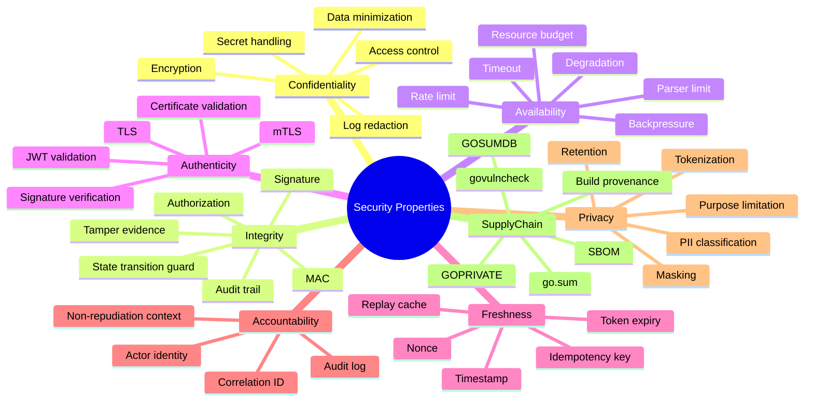

Seri ini akan berulang kali bertanya: property apa yang sedang dijaga?

Jika jawabannya “encryption”, itu belum cukup. Encryption adalah mekanisme. Property yang dijaga mungkin confidentiality. Tetapi integrity, authenticity, freshness, dan authorization bisa tetap gagal.

---

## 8. Java Engineer ke Go Security Engineer: Perubahan Mindset

Sebagai Java engineer, Anda mungkin terbiasa dengan ekosistem yang framework-heavy: Spring Security, Servlet Filter Chain, JCA/JCE, Jakarta Validation, dependency injection, annotation-driven configuration, dan container-managed behavior.

Go berbeda. Go cenderung lebih eksplisit, lebih tipis, lebih dekat ke standard library, dan lebih mudah membuat service dengan sedikit framework. Ini menguntungkan untuk simplicity, tetapi security guardrail tidak selalu otomatis.

| Area | Java mental model umum | Go mental model yang dibutuhkan |
|---|---|---|
| Security framework | Banyak hal dipasang lewat framework/filter/interceptor | Banyak boundary harus eksplisit di handler/middleware/service layer |
| Crypto API | JCA/JCE provider abstraction | Standard library package yang lebih langsung: `crypto/*`, `crypto/tls`, `crypto/x509` |
| Error | Exception propagation | Explicit error return; risiko information disclosure harus didesain |
| HTTP runtime | Servlet container dengan default tertentu | `net/http` sangat fleksibel; timeout/limit harus dipasang sadar |
| Dependency | Maven/Gradle transitive graph | Go modules, `go.sum`, checksum DB, `GOPROXY`, `GOSUMDB`, `GOPRIVATE` |
| Validation | Bean Validation / annotations | Biasanya explicit validation atau package pihak ketiga |
| Auth middleware | Spring Security chain | Middleware order perlu dirancang sendiri |
| Context propagation | Thread-local sering dipakai di Java stack | `context.Context` explicit; jangan disalahgunakan untuk data domain |
| Secret handling | Keystore, Vault integrations, env, config server | File/env/KMS/Vault/SSM harus didesain; no magic container |
| Runtime introspection | Rich JVM tooling | Go punya pprof/trace/race/fuzz/govulncheck; modelnya berbeda |
| Object model | Inheritance/proxy/AOP lazim | Composition/interface; guardrail harus dibuat di boundary yang tepat |

### 8.1 Kesalahan Transisi yang Sering Terjadi

1. Menganggap `net/http` default selalu production-safe.  
   Padahal timeout, limit, middleware order, dan handler behavior harus dipikirkan.

2. Menganggap JWT valid berarti authorized.  
   JWT valid hanya berarti token lolos validasi cryptographic dan claims dasar. Authorization tetap domain-specific.

3. Menganggap encryption menyelesaikan integrity.  
   Tidak selalu. Mode encryption yang salah bisa tidak authenticated. Gunakan AEAD jika perlu confidentiality + integrity pada payload.

4. Menganggap hash sama dengan password hashing.  
   SHA-256 bukan password hashing scheme. Password butuh memory/cost-hard KDF seperti bcrypt/scrypt/Argon2id/PBKDF2 tergantung requirement.

5. Menganggap `go test` cukup.  
   Security perlu fuzzing, race testing untuk relevant code, dependency scanning, review, threat modeling, dan runtime controls.

6. Menganggap private network sama dengan trusted network.  
   Dalam zero-trust architecture, internal traffic tetap perlu identity, authorization, dan observability.

7. Menganggap log selalu aman.  
   Log sering menjadi exfiltration path: token, PII, header, cookie, SQL parameter, request body, and stack trace.

---

## 9. Go Security Surface: Apa Saja yang Harus Kita Waspadai?

Go bukan hanya bahasa. Dalam production, Go adalah rangkaian surface:

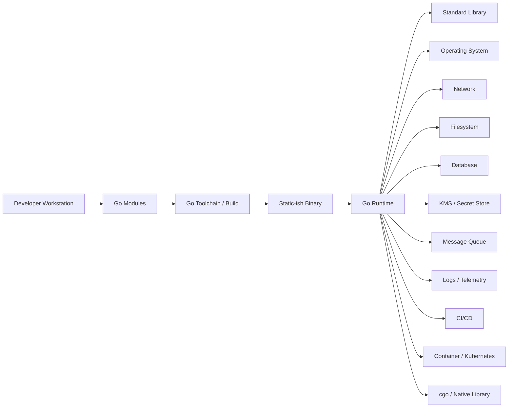

Security surface penting:

### 9.1 Language and Runtime Surface

- memory safety model;
- bounds check;
- garbage collection;
- pointer semantics;
- `unsafe` escape hatch;
- cgo boundary;
- panic behavior;
- goroutine scheduling;
- race conditions;
- runtime profiling endpoints;
- heap address randomization in Go 1.26 on 64-bit platforms.

Go 1.26 menambahkan heap base address randomization pada platform 64-bit sebagai security enhancement agar prediksi alamat memori lebih sulit, terutama relevant saat memakai cgo. Namun ini bukan pengganti memory safety, bukan pengganti sandboxing, dan bukan alasan untuk memakai `unsafe` sembarangan.

### 9.2 Standard Library Surface

Package yang sering security-sensitive:

- `crypto/rand`
- `crypto/subtle`
- `crypto/hmac`
- `crypto/sha256`, `crypto/sha512`, `crypto/sha3`
- `crypto/aes`
- `crypto/cipher`
- `crypto/ed25519`
- `crypto/ecdsa`
- `crypto/rsa`
- `crypto/ecdh`
- `crypto/tls`
- `crypto/x509`
- `encoding/json`
- `encoding/xml`
- `net/http`
- `net/url`
- `net/netip`
- `mime/multipart`
- `archive/zip`
- `archive/tar`
- `os`
- `os/exec`
- `path/filepath`
- `html/template`
- `text/template`

Release history Go menunjukkan bahwa security fixes sering menyentuh package seperti `crypto/x509`, `crypto/tls`, `net/http`, `archive/tar`, `html/template`, `net/url`, `mime`, dan `net/textproto`. Ini memberi pelajaran penting: package standard library kuat, tetapi tetap harus dipatch dan dipakai dengan model yang benar.

### 9.3 Module and Supply Chain Surface

Go modules membawa benefit besar, tetapi dependency graph tetap attack surface.

Security concern:

- dependency confusion;
- malicious maintainer;
- compromised module version;
- transitive dependency vulnerability;
- private module leakage ke public proxy;
- checksum database bypass yang salah;
- replace directive yang lupa dibersihkan;
- vendored code yang stale;
- generated code yang tidak direview;
- build flags yang tidak konsisten;
- CI runner credential leakage.

### 9.4 Network Service Surface

Go sering dipakai untuk microservices. Surface-nya:

- HTTP endpoint;
- gRPC service;
- webhook receiver;
- background worker;
- scheduler;
- admin endpoint;
- metrics endpoint;
- pprof endpoint;
- health check;
- readiness/liveness endpoint;
- outbound HTTP client;
- DNS resolution;
- proxy behavior;
- TLS config;
- mTLS trust store;
- service discovery;
- metadata endpoint.

Security bug sering muncul dari endpoint yang dianggap “internal only”. Internal endpoint tetap perlu threat model.

### 9.5 Data and Integrity Surface

Dalam regulatory/case-management system, data integrity sering lebih penting daripada confidentiality saja.

Surface:

- workflow state transition;
- approval/rejection decision;
- audit trail;
- document upload;
- correspondence;
- generated PDF;
- evidence attachment;
- case assignment;
- escalation rule;
- SLA clock;
- role mapping;
- notification;
- event sync;
- reporting view.

Jika attacker bisa mengubah state tanpa authorization, menghapus jejak, atau membuat audit trail tidak bisa dipercaya, itu high severity walaupun tidak ada data “dicuri”.

---

## 10. Security sebagai Data-Flow Problem

Banyak vulnerability lebih mudah dilihat sebagai data-flow daripada sebagai bug lokal.

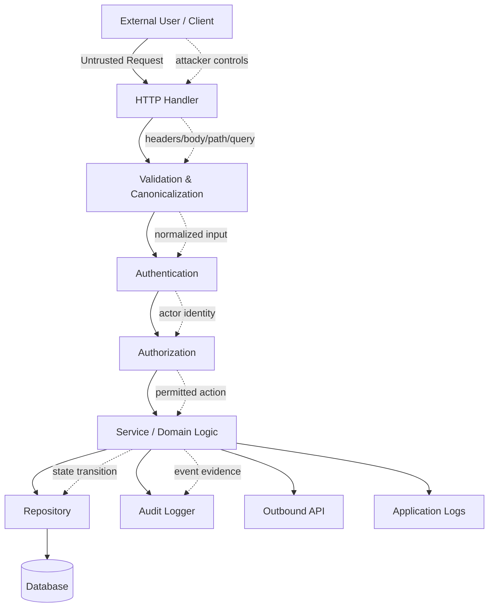

Pertanyaan security untuk diagram ini:

1. Input mana yang untrusted?
2. Di mana input divalidasi?
3. Apakah validasi dilakukan sebelum canonicalization atau sesudah?
4. Apakah authentication hanya membuktikan identity, atau juga session freshness?
5. Di mana authorization dilakukan?
6. Apakah authorization dilakukan berdasarkan object aktual, atau hanya parameter ID?
7. Apakah audit log merekam decision, actor, resource, action, result, dan correlation ID?
8. Apakah log menerima data mentah yang mungkin mengandung token/PII?
9. Apakah outbound API bisa dipengaruhi input user sehingga menjadi SSRF?
10. Apakah repository query aman dari injection?
11. Apakah error dari bawah bocor ke response?
12. Apakah request bisa menghabiskan memory/goroutine/connection?

---

## 11. Security Design Starts Before Code

Security yang matang dimulai dari design review, bukan dari scanner setelah code selesai.

### 11.1 Urutan Berpikir yang Benar

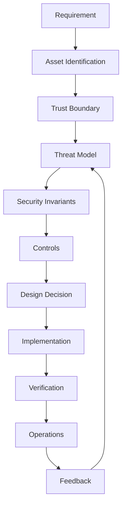

Kesalahan umum adalah langsung lompat dari requirement ke implementation:

> “Butuh secure API” → “Pasang JWT middleware”.

Seharusnya:

> “Butuh secure API” → asset apa? actor siapa? object apa? action apa? boundary mana? token dari issuer mana? audience apa? replay risk ada? authorization per object di mana? audit apa? failure response bagaimana? scanner apa? operational alert apa?

### 11.2 Template Pertanyaan Design Review

Gunakan checklist ini sebelum menulis code security-sensitive:

#### A. Scope and Asset

- Data apa yang dilindungi?
- Workflow apa yang harus dijaga integritasnya?
- Apakah ada PII, secret, credential, token, key, document, atau evidence?
- Apakah ada state transition yang berdampak legal/regulatory/business?
- Apa dampak jika data bocor?
- Apa dampak jika data berubah tanpa izin?
- Apa dampak jika data hilang?
- Apa dampak jika service down?

#### B. Actor and Permission

- Siapa actor yang sah?
- Bagaimana actor diautentikasi?
- Apakah identity berasal dari trusted issuer?
- Apakah ada impersonation/delegation?
- Apakah permission ditentukan dari role, relationship, ownership, case assignment, atau policy rule?
- Apakah permission berubah berdasarkan state workflow?
- Apakah admin benar-benar boleh semua action?
- Apakah service account punya least privilege?

#### C. Boundary

- Input apa yang berasal dari luar trust boundary?
- Apakah internal service dianggap trusted? Mengapa?
- Apakah ada file upload?
- Apakah ada URL yang dipakai untuk outbound request?
- Apakah ada parser yang menerima format kompleks?
- Apakah ada queue/event dari sistem lain?
- Apakah ada callback/webhook?

#### D. Crypto

- Property apa yang dibutuhkan: confidentiality, integrity, authenticity, freshness?
- Apakah encryption benar-benar diperlukan, atau MAC/signature lebih tepat?
- Di mana key dibuat?
- Di mana key disimpan?
- Siapa yang bisa membaca key?
- Bagaimana rotation dilakukan?
- Bagaimana revocation dilakukan?
- Apakah nonce/IV unik?
- Apakah random source CSPRNG?
- Apakah comparison constant-time diperlukan?
- Apakah format payload memiliki versioning untuk crypto agility?

#### E. Abuse and Failure

- Bagaimana attacker bisa melakukan replay?
- Bagaimana attacker bisa memperbesar resource usage?
- Bagaimana attacker bisa melewati authorization?
- Bagaimana attacker bisa memalsukan event?
- Bagaimana attacker bisa membuat log misleading?
- Bagaimana attacker bisa membuat parser menerima dua interpretasi berbeda?
- Bagaimana attacker bisa membuat dependency vulnerable menjadi reachable?

#### F. Verification

- Unit test apa yang membuktikan authorization?
- Fuzz target apa yang perlu dibuat?
- Apakah ada golden test untuk canonicalization?
- Apakah ada negative test untuk malformed input?
- Apakah ada `govulncheck` di CI?
- Apakah ada secret scanning?
- Apakah ada SAST/linters relevant?
- Apakah binary scanning diperlukan?
- Apakah audit event diverifikasi?

#### G. Operation

- Metric apa yang menunjukkan attack sedang terjadi?
- Alert apa yang perlu ada?
- Log apa yang aman disimpan?
- Berapa retention?
- Bagaimana incident response?
- Bagaimana key compromise ditangani?
- Bagaimana token compromise ditangani?
- Bagaimana dependency CVE ditangani?

---

## 12. Threat Modeling Ringkas untuk Go Engineer

Threat modeling bukan aktivitas akademis yang harus berat. Untuk Go service, kita bisa mulai dengan versi praktis.

### 12.1 Model 5 Pertanyaan

1. **Apa yang sedang kita bangun?**
2. **Apa yang bisa salah secara security?**
3. **Apa yang sudah kita lakukan untuk mencegahnya?**
4. **Bagaimana kita tahu control itu bekerja?**
5. **Apa yang tersisa dan siapa yang menerima risk itu?**

### 12.2 STRIDE sebagai Taxonomy

STRIDE berguna untuk menemukan threat:

| STRIDE | Makna | Contoh di Go service |
|---|---|---|
| Spoofing | Pura-pura menjadi actor lain | forged JWT, wrong issuer accepted, mTLS cert tidak dicek SAN-nya |
| Tampering | Mengubah data/control | payload berubah tanpa MAC, audit log bisa diedit, workflow state bypass |
| Repudiation | Menyangkal tindakan | audit event tidak mencatat actor/resource/result |
| Information Disclosure | Bocor informasi | token di log, verbose error, PII di metrics label |
| Denial of Service | Menghabiskan resource | request body besar, slowloris, decompression bomb, goroutine leak |
| Elevation of Privilege | Naik privilege | BOLA/IDOR, admin route tanpa guard, service account terlalu luas |

### 12.3 Diagram Threat Model Minimal

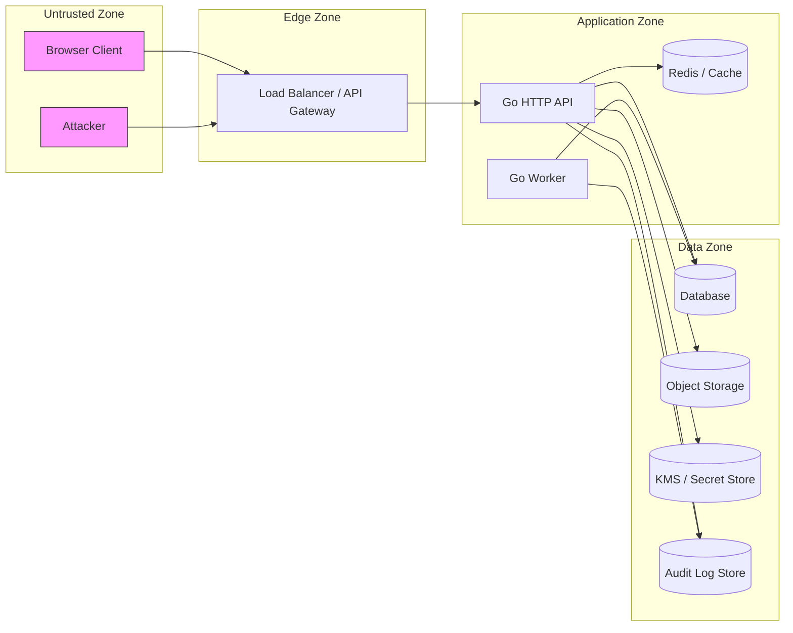

Hal penting dari diagram ini bukan gambar itu sendiri, tetapi garis boundary:

- Internet → Edge
- Edge → App
- App → Data
- App → Secret Store
- App → Audit Store

Setiap panah punya pertanyaan:

- authentication apa?
- authorization apa?
- encryption apa?
- integrity apa?
- timeout apa?
- retry policy apa?
- logging apa?
- failure behavior apa?

---

## 13. Security Control Mapping untuk Go

Security control harus dipilih berdasarkan property yang dijaga.

| Property | Control umum | Go package/tool yang relevan | Catatan |
|---|---|---|---|
| Confidentiality in transit | TLS | `crypto/tls`, `net/http` | Safe config, certificate validation, server/client timeout |
| Service identity | mTLS | `crypto/tls`, `crypto/x509` | Jangan hanya verify chain; cek identity/SAN/policy |
| Payload integrity | HMAC/MAC | `crypto/hmac`, `crypto/sha256`, `crypto/subtle` | Butuh canonicalization dan constant-time compare |
| Payload authenticity | Signature | `crypto/ed25519`, `crypto/ecdsa`, `crypto/rsa` | Perhatikan algorithm choice, key rotation, format |
| Confidentiality + integrity | AEAD | `crypto/cipher`, `crypto/aes`, ChaCha20-Poly1305 package | Nonce discipline sangat kritis |
| Random token | CSPRNG | `crypto/rand` | Jangan pakai `math/rand` untuk security token |
| Password storage | KDF/password hash | `golang.org/x/crypto/bcrypt`, `scrypt`, `argon2` | Parameter harus disesuaikan threat/cost |
| Timing-safe check | Constant-time | `crypto/subtle`, `hmac.Equal` | Relevan untuk secret comparison |
| Vulnerability scan | Reachability analysis | `govulncheck` | Go tooling menekan noise dengan call graph/source/binary analysis |
| Parser robustness | Fuzzing | `go test -fuzz` | Sangat penting untuk parser/canonicalization/security boundary |
| Supply-chain authenticity | Module checksum | `go.sum`, `GOSUMDB`, `GOPROXY` | Private module perlu `GOPRIVATE`/`GONOSUMDB` tepat |
| FIPS mode | Go cryptographic module | `GODEBUG=fips140=...`, Go toolchain | Relevan hanya jika ada compliance requirement |
| DoS control | Timeout/limit | `net/http`, `context`, custom limiter | Harus di server, client, parser, queue, worker |
| Auditability | Structured event | logging package + schema | Hindari sensitive data dan log injection |

---

## 14. Crypto: Apa yang Sering Disalahpahami

Kita belum masuk detail crypto di part ini, tetapi perlu menanamkan anti-misconception sejak awal.

### 14.1 Encryption Tidak Sama dengan Integrity

Encryption menjawab:

> “Bisakah pihak tidak berwenang membaca data ini?”

Integrity menjawab:

> “Bisakah kita mendeteksi data ini berubah?”

Authenticity menjawab:

> “Bisakah kita membuktikan data ini berasal dari pihak yang benar?”

Freshness menjawab:

> “Bisakah kita membuktikan data ini bukan replay lama?”

Dalam banyak kasus, Anda membutuhkan lebih dari satu property.

Contoh token reset password:

- harus random;
- harus sulit ditebak;
- harus punya expiry;
- harus single-use;
- harus terikat user/purpose;
- harus tidak bocor di log;
- harus invalidated setelah password berubah;
- mungkin tidak perlu dienkripsi jika token opaque dan hanya hash token yang disimpan server-side.

### 14.2 Hash Tidak Sama dengan MAC

Hash biasa seperti SHA-256 tidak memiliki secret. Siapa pun bisa menghitung hash.

MAC seperti HMAC memakai secret key. HMAC bisa membuktikan bahwa pihak yang membuat tag mengetahui key.

Jika Anda menulis:

```text
signature = sha256(payload)
```

itu bukan signature dan bukan authentication. Attacker yang bisa mengubah payload bisa menghitung SHA-256 baru.

### 14.3 Signature Tidak Sama dengan Encryption

Signature memberi authenticity/integrity dari private key holder. Signature tidak menyembunyikan isi payload.

Encryption menyembunyikan isi payload. Encryption tidak otomatis membuktikan siapa pengirim, kecuali protokolnya dirancang untuk itu.

### 14.4 JWT Bukan Session Magic

JWT adalah format token. Security-nya bergantung pada:

- algorithm allowed;
- signature validation;
- issuer validation;
- audience validation;
- expiry validation;
- not-before validation;
- key rotation;
- JWKS caching;
- replay model;
- token storage;
- revocation strategy;
- binding ke session/device jika diperlukan;
- authorization model di resource server.

### 14.5 TLS Bukan Authorization

TLS melindungi channel. mTLS bisa mengautentikasi peer. Tetapi authorization tetap perlu domain policy.

Contoh:

- service A punya cert valid;
- service A boleh memanggil service B;
- tetapi belum tentu boleh melakukan semua action di B;
- action tetap harus diperiksa berdasarkan identity, scope, resource, tenant, state, dan policy.

---

## 15. Integrity Lebih Luas dari Cryptography

Dalam sistem regulatori, integrity bukan hanya “data tidak berubah”. Integrity mencakup:

- state transition sah;
- actor sah;
- waktu keputusan jelas;
- alasan keputusan tercatat;
- dokumen evidence tidak berubah diam-diam;
- audit event konsisten;
- approval tidak bisa dibypass;
- generated correspondence sesuai data sumber;
- report tidak silently mismatch;
- event sync tidak duplikatif atau hilang;
- retry tidak menggandakan efek;
- migration tidak mengubah meaning data;
- backfill tidak merusak auditability.

### 15.1 Contoh Integrity Invariant pada Case Management

Misal ada state:

```text
Draft -> Submitted -> Screening -> Review -> Approved/Rejected -> Closed
```

Security invariant:

1. Applicant hanya boleh submit application miliknya.
2. Officer hanya boleh review case yang assigned atau dalam jurisdiction-nya.
3. State tidak boleh lompat dari `Submitted` langsung ke `Approved` tanpa review event.
4. Rejection harus memiliki reason code dan correspondence event.
5. Semua state transition harus mencatat actor, role, timestamp, source IP/session/service identity, previous state, next state, decision reason, dan correlation ID.
6. Audit event tidak boleh bisa diedit oleh normal application path.
7. Report harus bisa direkonsiliasi dengan audit event.

Diagram:

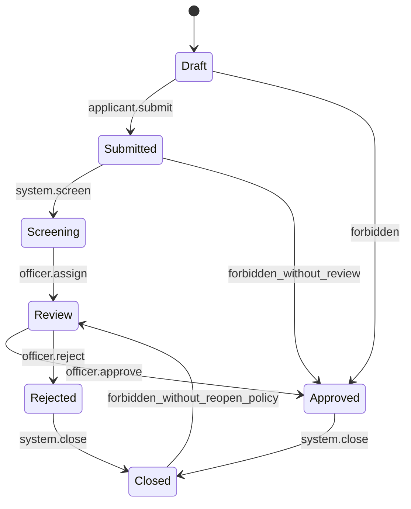

Jika code hanya mengecek role `OFFICER`, integrity tetap bisa gagal jika officer bisa approve case yang bukan scope-nya, atau jika state transition guard tidak ada.

---

## 16. Secure Go Service: Reference Mental Architecture

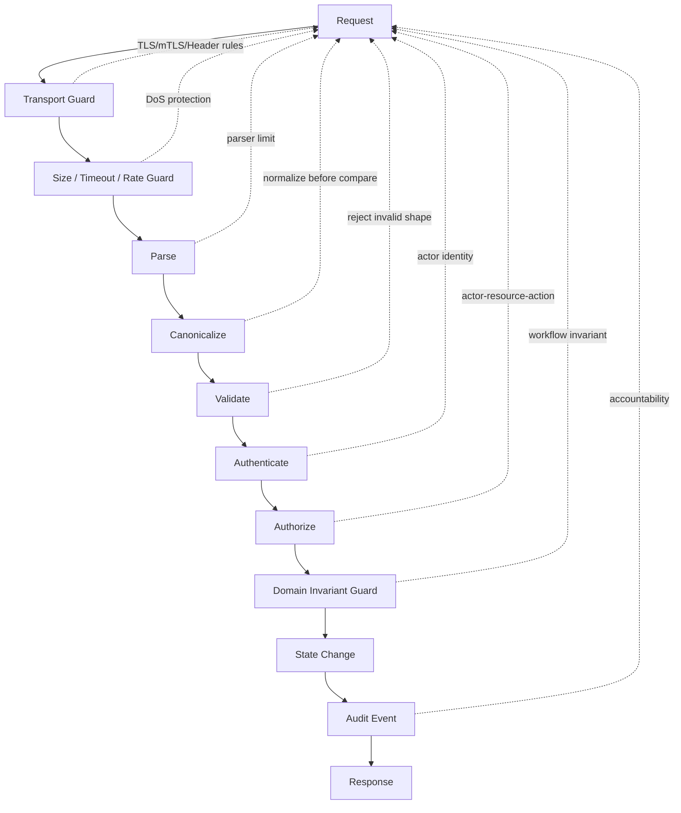

### 16.1 Layer 1: Transport Guard

Pertanyaan:

- Apakah endpoint wajib HTTPS?
- Apakah TLS termination di edge atau service?
- Apakah service-to-service butuh mTLS?
- Apakah client certificate identity dicek?
- Apakah header dari proxy dipercaya secara aman?
- Apakah `X-Forwarded-For` hanya dipercaya dari known proxy?

### 16.2 Layer 2: Size / Timeout / Rate Guard

Pertanyaan:

- Berapa maksimal header?
- Berapa maksimal body?
- Berapa maksimal multipart size?
- Berapa read timeout?
- Berapa write timeout?
- Berapa idle timeout?
- Berapa maksimal concurrent request per caller?
- Apakah slowloris bisa menahan koneksi?

### 16.3 Layer 3: Parse

Pertanyaan:

- Parser apa yang digunakan?
- Apakah parser menerima duplicate fields?
- Apakah parser menerima unknown fields?
- Apakah parser menerima number overflow?
- Apakah parser punya depth limit?
- Apakah parser bisa menghasilkan banyak memory allocation?

### 16.4 Layer 4: Canonicalize

Pertanyaan:

- Apakah path sudah normalized?
- Apakah URL sudah parsed secara aman?
- Apakah Unicode normalization dibutuhkan?
- Apakah email/domain case sensitivity dipahami?
- Apakah signature/MAC dihitung di bentuk canonical yang sama di semua pihak?

### 16.5 Layer 5: Validate

Pertanyaan:

- Apakah field required dicek?
- Apakah range dicek?
- Apakah enum dicek?
- Apakah format dicek?
- Apakah cross-field constraint dicek?
- Apakah business rule dicek di domain layer, bukan hanya DTO?

### 16.6 Layer 6: Authenticate

Pertanyaan:

- Actor berasal dari mana?
- Token format apa?
- Issuer apa?
- Audience apa?
- Expiry apa?
- Key rotation bagaimana?
- Apakah session masih valid?
- Apakah MFA/passkey level dibutuhkan untuk action tertentu?

### 16.7 Layer 7: Authorize

Pertanyaan:

- Action apa?
- Resource apa?
- Actor apa?
- Relationship apa?
- State resource apa?
- Tenant/agency/jurisdiction apa?
- Policy decision dicatat atau tidak?

### 16.8 Layer 8: Domain Invariant Guard

Pertanyaan:

- State transition valid?
- Idempotency benar?
- Retry aman?
- Duplicate event aman?
- Time window valid?
- SLA rule valid?
- Approval step lengkap?

### 16.9 Layer 9: State Change

Pertanyaan:

- Transaction boundary benar?
- Audit event atomic dengan state change?
- Outbox diperlukan?
- Race condition bisa mengubah outcome?
- Optimistic locking diperlukan?

### 16.10 Layer 10: Audit Event

Pertanyaan:

- Actor dicatat?
- Action dicatat?
- Resource dicatat?
- Result dicatat?
- Reason dicatat?
- Correlation ID dicatat?
- Sensitive data diredact?
- Event immutable-enough?

---

## 17. Secure Defaults di Go: Eksplisit Bukan Otomatis

Go memberikan standard library yang kuat, tetapi banyak security posture tetap harus dipasang oleh engineer.

### 17.1 Contoh Default yang Perlu Dipikirkan

#### HTTP server

`http.ListenAndServe` mudah dipakai, tetapi production security perlu `http.Server` eksplisit dengan timeout dan limit yang sesuai domain.

Konsep:

```go
srv := &http.Server{
    Addr:              ":8443",
    Handler:           secureMux,
    ReadHeaderTimeout: 5 * time.Second,
    ReadTimeout:       15 * time.Second,
    WriteTimeout:      30 * time.Second,
    IdleTimeout:       60 * time.Second,
    MaxHeaderBytes:    1 << 20,
}
```

Ini bukan angka universal. Nilai timeout harus disesuaikan dengan:

- endpoint type;
- upload behavior;
- network profile;
- client type;
- proxy timeout;
- downstream latency;
- availability requirement.

#### HTTP client

`http.DefaultClient` tanpa timeout bisa menjadi source hang/leak jika dipakai sembarangan.

Konsep:

```go
client := &http.Client{
    Timeout: 10 * time.Second,
}
```

Untuk production, perlu juga mempertimbangkan transport-level timeout, connection pooling, TLS config, proxy, DNS behavior, retry, circuit breaker, dan SSRF guard.

#### JSON decoder

`encoding/json` bisa decode dengan mudah, tetapi security-sensitive API mungkin perlu:

- limit body size;
- reject unknown fields;
- validate duplicate semantics;
- validate numeric range;
- enforce content type;
- avoid decoding huge arbitrary data into memory;
- avoid using map bebas untuk privileged fields.

Konsep:

```go
dec := json.NewDecoder(io.LimitReader(r.Body, maxBodyBytes))
dec.DisallowUnknownFields()
```

Ini belum cukup, tetapi merupakan bagian dari posture.

#### Logging

Log harus structured, tetapi tidak boleh memuat secret.

Risk:

- `Authorization` header bocor;
- cookie bocor;
- password bocor;
- reset token bocor;
- one-time token bocor;
- PII bocor;
- file content bocor;
- database query parameter bocor;
- stack trace bocor ke user;
- log injection via newline/control characters.

---

## 18. Go Security Tooling yang Akan Dipakai

### 18.1 `govulncheck`

Go vulnerability management resmi menyediakan `govulncheck`, yang menganalisis codebase dan hanya menampilkan vulnerability yang benar-benar dapat memengaruhi aplikasi berdasarkan function yang dipanggil secara transitif. Ini membuat hasil lebih low-noise dibanding scanner yang hanya melihat dependency version.

Baseline command:

```bash
go install golang.org/x/vuln/cmd/govulncheck@latest
govulncheck ./...
```

Untuk CI:

```bash
govulncheck -json ./... > govulncheck.json
```

Hal yang harus dipahami:

- scanner bukan bukti aman;
- scanner hanya menemukan known vulnerabilities;
- scanner tidak menemukan authorization bug domain-specific;
- scanner tidak menggantikan threat modeling;
- hasil scanner bisa berubah ketika vulnerability database update;
- reachability analysis mengurangi noise, tetapi bukan oracle sempurna.

### 18.2 Go Vulnerability Database

Go Vulnerability Database memakai OSV schema dan menjadi sumber untuk `govulncheck`. Database ini mencakup vulnerability di standard library, toolchain, dan Go modules.

Konsekuensi praktis:

- patch Go toolchain penting, bukan hanya dependency;
- standard library juga bisa punya security fixes;
- binary yang dibangun dengan Go version lama mungkin tetap membawa vulnerability;
- release management harus mencatat versi Go yang digunakan untuk build.

### 18.3 Fuzzing

Go fuzzing memakai coverage guidance untuk mengeksplorasi input dan menemukan failure yang mungkin tidak terpikir manusia. Sumber resmi Go menyebut fuzzing berguna untuk menemukan bug security dan edge case.

Baseline command:

```bash
go test ./...
go test -fuzz=Fuzz -fuzztime=30s ./...
```

Fuzz target yang cocok untuk seri ini:

- parser URL/path;
- canonicalization;
- JSON/XML custom validation;
- token parser;
- signature envelope parser;
- archive extraction path validation;
- policy expression parser;
- webhook payload verification;
- file type sniffing;
- query filter parser.

### 18.4 Race Detector

Race detector bukan security scanner, tetapi data race pada security-sensitive state bisa menjadi vulnerability.

Contoh risk:

- auth cache inconsistent;
- key rotation state race;
- replay cache race;
- rate limiter race;
- session revocation race;
- policy reload race;
- audit writer race;
- nonce counter race.

Command:

```bash
go test -race ./...
```

### 18.5 `go test`, Benchmark, and Negative Tests

Security test bukan hanya happy path.

Minimal pattern:

- valid input accepted;
- invalid input rejected;
- unauthorized actor rejected;
- wrong resource rejected;
- wrong tenant rejected;
- expired token rejected;
- wrong audience rejected;
- wrong issuer rejected;
- tampered payload rejected;
- replay rejected;
- overlarge payload rejected;
- malformed payload rejected;
- ambiguous path rejected;
- unknown fields rejected jika policy mengharuskan;
- audit event emitted on allow/deny.

### 18.6 Static Analysis and Linters

Go built-in tooling:

```bash
go vet ./...
```

Tambahan di organisasi:

- secret scanning;
- SAST;
- dependency license check;
- container image scanning;
- SBOM generation;
- IaC scanning;
- policy-as-code gate.

Seri ini tidak akan bergantung pada satu vendor scanner tertentu. Fokusnya adalah control model yang bisa diterapkan dengan berbagai tooling.

---

## 19. Supply Chain: Go Module Security sebagai Security Boundary

Go modules membawa beberapa mekanisme integrity, seperti `go.sum` dan checksum database. Namun private modules perlu konfigurasi yang benar agar path private tidak bocor ke public proxy/checksum database.

### 19.1 Baseline Environment yang Perlu Dipahami

Command:

```bash
go env GOPROXY
go env GOSUMDB
go env GOPRIVATE
go env GONOSUMDB
go env GONOPROXY
```

Pertanyaan:

- Apakah organisasi memakai private module?
- Apakah private module path pernah dikirim ke public proxy?
- Apakah `GOPRIVATE` diset?
- Apakah checksum verification tetap aktif untuk public modules?
- Apakah `replace` directive aman?
- Apakah dependency update direview?
- Apakah generated code direview?
- Apakah CI memakai Go version yang sama dengan production build?

### 19.2 Supply Chain Invariant

Contoh invariant:

1. Build production hanya boleh memakai dependency dari source yang terverifikasi.
2. Private module path tidak boleh bocor ke public proxy.
3. Semua dependency public harus diverifikasi checksum kecuali ada exception tertulis.
4. `replace` local path tidak boleh masuk release branch.
5. Dependency vulnerability reachable harus triaged sebelum release.
6. Binary harus bisa ditelusuri ke commit, Go version, dependency graph, dan build pipeline.

---

## 20. FIPS 140-3: Kapan Relevan, Kapan Tidak

Go 1.24+ memperkenalkan kemampuan native untuk mode yang memfasilitasi FIPS 140-3 compliance melalui Go Cryptographic Module. Ini relevan untuk organisasi yang punya requirement government/regulatory tertentu.

Tetapi FIPS sering disalahpahami.

### 20.1 FIPS Bukan Berarti Semua Sistem Aman

FIPS module membantu memenuhi requirement tertentu untuk cryptographic module dan approved algorithms. FIPS tidak otomatis menjamin:

- authorization benar;
- key management benar;
- TLS config benar;
- audit trail benar;
- supply chain aman;
- secret tidak bocor;
- app bebas injection;
- operator tidak salah konfigurasi;
- compliance klaim organisasi valid.

### 20.2 Pertanyaan FIPS Decision Tree

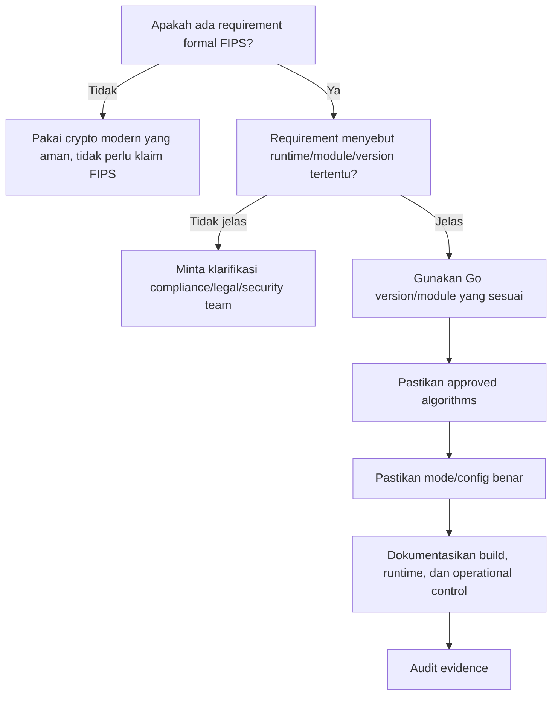

Kita akan membahas FIPS secara lebih dalam di part terkait key management/crypto operations dan capstone.

---

## 21. OWASP API Security Top 10 sebagai Boundary Reminder

OWASP API Security Top 10 2023 menempatkan **Broken Object Level Authorization (BOLA)** sebagai risiko pertama. Ini sangat relevan untuk Go microservices karena banyak API sederhana mengambil object ID dari path/query/body lalu memanggil repository.

Contoh vulnerability:

```http
GET /api/cases/CASE-1001
Authorization: Bearer token-user-A
```

Attacker mengganti:

```http
GET /api/cases/CASE-1002
Authorization: Bearer token-user-A
```

Jika backend hanya mengecek token valid tetapi tidak mengecek apakah user A boleh membaca `CASE-1002`, maka terjadi BOLA/IDOR.

### 21.1 Authorization Harus Object-aware

Buruk:

```go
if actor.IsAuthenticated() {
    return repo.FindCase(caseID)
}
```

Lebih benar secara model:

```go
caseRecord, err := repo.FindCase(ctx, caseID)
if err != nil {
    return nil, err
}

if !policy.CanReadCase(actor, caseRecord) {
    audit.Deny(ctx, actor, "case.read", caseID)
    return nil, ErrForbidden
}

return caseRecord, nil
```

### 21.2 API Security bukan Hanya Input Validation

API security mencakup:

- object-level authorization;
- authentication;
- object property authorization;
- resource consumption;
- function-level authorization;
- unrestricted access to sensitive business flows;
- SSRF;
- security misconfiguration;
- inventory management;
- unsafe consumption of APIs.

Go service yang sederhana tetap bisa terkena semua ini.

---

## 22. NIST SSDF sebagai Secure SDLC Frame

NIST SP 800-218 SSDF v1.1 adalah framework secure software development yang memberi struktur praktik untuk mengurangi software vulnerability. Untuk seri ini, SSDF dipakai sebagai inspirasi lifecycle, bukan sebagai checklist compliance formal.

Secara praktis, seri ini akan mengikat security Go ke empat aktivitas besar:

1. **Prepare the Organization**  
   Standar, role, tooling, policy, training, baseline security requirement.

2. **Protect the Software**  
   Source code, build artifact, dependency, secret, signing, provenance.

3. **Produce Well-Secured Software**  
   Secure design, coding, review, testing, fuzzing, scanning, hardening.

4. **Respond to Vulnerabilities**  
   Monitoring vulnerability, triage, patch, incident response, postmortem.

Untuk Go, ini berarti:

- Go version pinning;
- `govulncheck` gate;
- fuzzing untuk parser/security boundary;
- secret scanning;
- dependency review;
- secure coding guideline;
- threat model template;
- release checklist;
- incident playbook;
- patch SLA;
- build provenance.

---

## 23. Taxonomy Materi Seri

Seri ini akan bergerak dari fondasi ke production.

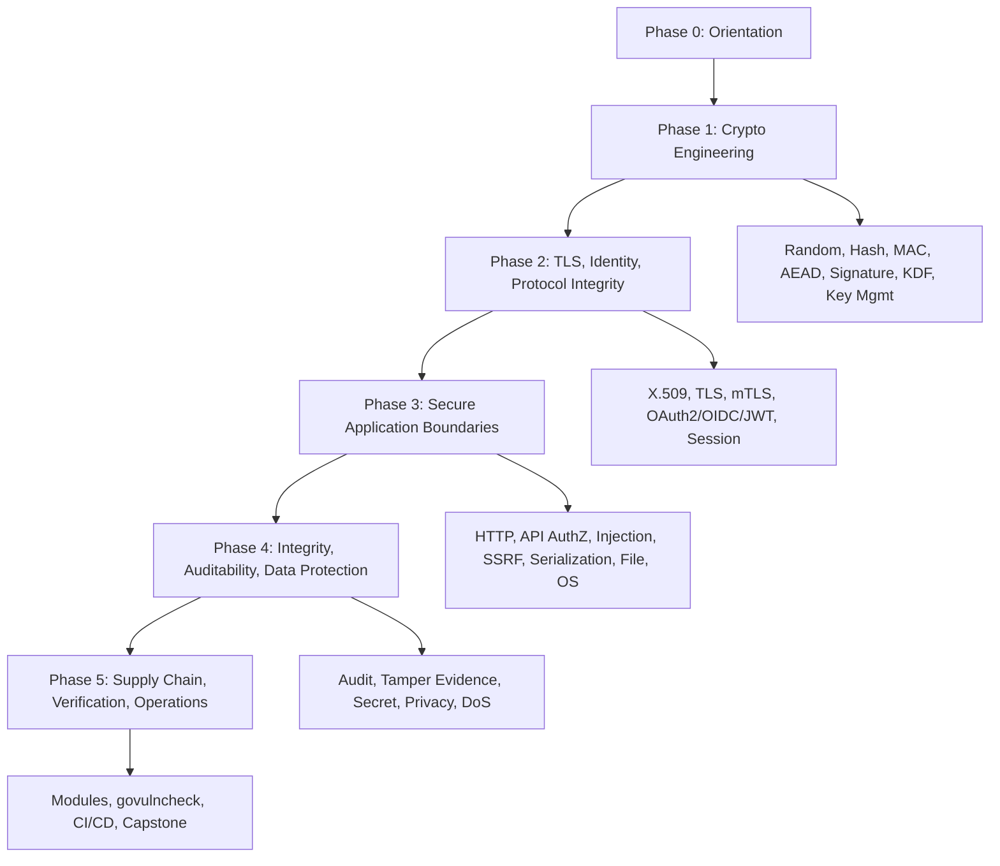

### 23.1 Phase 0 — Orientation

- Part 000: peta besar.
- Part 001: security mental model mendalam.
- Part 002: Go security surface.
- Part 003: threat modeling untuk Go services.

### 23.2 Phase 1 — Crypto Engineering Foundation

- randomness;
- entropy;
- nonce;
- hash;
- MAC;
- AEAD;
- public key;
- signature;
- key agreement;
- password security;
- key management.

### 23.3 Phase 2 — Certificates, TLS, Identity, Protocol Integrity

- X.509;
- PKI;
- TLS;
- mTLS;
- OAuth2/OIDC/JWT;
- session;
- MFA/passkey concepts.

### 23.4 Phase 3 — Secure Go Application Boundaries

- secure `net/http`;
- API authorization;
- validation/canonicalization;
- injection;
- SSRF;
- serialization;
- file/archive/filesystem;
- process/OS/cgo/unsafe boundary.

### 23.5 Phase 4 — Integrity, Auditability, Data Protection

- data integrity architecture;
- audit logging;
- secrets management;
- privacy/PII;
- availability security.

### 23.6 Phase 5 — Supply Chain, Verification, Operations

- Go modules and checksum;
- vulnerability management;
- capstone internal handbook.

---

## 24. Production Security Bar: Apa Definisi “Cukup Baik”?

Security tidak pernah absolut. Tetapi production system harus punya bar yang jelas.

### 24.1 Minimum Bar untuk Go Service

Sebuah Go service yang security-sensitive minimal harus punya:

1. **Threat model singkat** untuk endpoint/flow kritis.
2. **Explicit trust boundary**.
3. **HTTP server timeout** dan request limit.
4. **Authentication** yang memvalidasi issuer/audience/expiry/key.
5. **Authorization** berbasis actor-resource-action, bukan sekadar role global.
6. **Input validation** setelah canonicalization.
7. **Sensitive logging policy**.
8. **Audit event** untuk action penting.
9. **Secret management** yang tidak hardcoded.
10. **TLS/mTLS policy** sesuai boundary.
11. **`govulncheck`** di CI.
12. **Dependency review**.
13. **Fuzzing** untuk parser/security boundary.
14. **Negative tests** untuk authz dan malformed input.
15. **Operational metrics/alerts** untuk attack signals.
16. **Patch process** untuk Go runtime/toolchain/dependency.

### 24.2 Higher Bar untuk Regulated / High-Integrity System

Tambahan:

1. Tamper-evident audit log.
2. Key rotation runbook.
3. Token compromise playbook.
4. Explicit data classification.
5. Field-level encryption/tokenization untuk data tertentu.
6. Strong separation of duties.
7. Admin action dual control untuk action high-risk.
8. Evidence-preserving incident response.
9. Build provenance/SBOM.
10. Release risk acceptance process.
11. Automated policy checks di CI/CD.
12. Disaster recovery tested.
13. Restore integrity verification.
14. Migration integrity reconciliation.

---

## 25. Example: Mengubah Requirement Menjadi Security Model

Requirement mentah:

> “Buat endpoint untuk upload dokumen pendukung case.”

### 25.1 Cara Engineer Biasa Melihat

- Buat route `POST /cases/{id}/documents`.
- Parse multipart.
- Simpan file.
- Insert DB row.
- Return success.

### 25.2 Cara Security Engineer Melihat

#### Asset

- dokumen;
- metadata dokumen;
- case record;
- audit event;
- storage object key;
- malware scanning result;
- uploader identity.

#### Actor

- applicant;
- officer;
- system integration;
- admin;
- attacker unauthenticated;
- authenticated attacker with different case.

#### Boundary

- browser → API;
- API → object storage;
- API → DB;
- API → malware scanner;
- API → audit store.

#### Threat

- upload ke case orang lain;
- path traversal via filename;
- oversized file DoS;
- zip bomb;
- MIME spoofing;
- executable upload;
- malware upload;
- metadata injection;
- PII leak in logs;
- duplicate upload replay;
- storage key prediction;
- audit missing;
- inconsistent DB/storage state;
- unauthorized download later.

#### Security Invariants

1. Actor hanya boleh upload ke case yang authorized.
2. File size tidak boleh melewati limit.
3. File type harus allowed sesuai business rule.
4. Filename user tidak boleh menjadi storage path trusted.
5. Object key harus server-generated.
6. Upload harus menghasilkan audit event.
7. Document row tidak boleh visible sebagai “clean” sebelum scanning selesai jika scanning required.
8. Download harus melakukan authorization ulang.
9. Error response tidak boleh membocorkan storage path/internal scanner detail.
10. Upload failure tidak boleh meninggalkan orphan object tanpa cleanup/reconciliation.

#### Controls

- auth middleware;
- object-level authorization;
- multipart body limit;
- content sniffing + extension policy;
- random object key;
- malware scanning workflow;
- DB transaction + outbox/reconciliation;
- audit log;
- structured error;
- storage bucket policy;
- download authorization;
- rate limit.

### 25.3 Diagram Flow

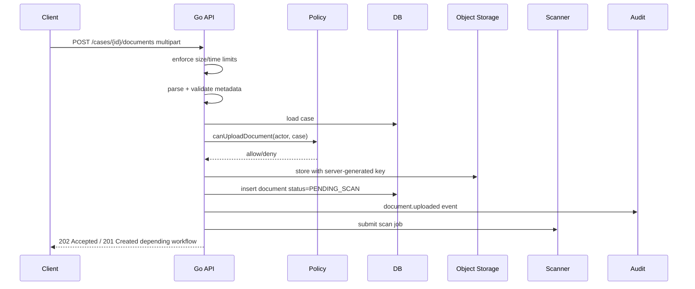

Security maturity terlihat dari kemampuan mengubah requirement biasa menjadi model seperti ini.

---

## 26. Example: Token Verification bukan Sekadar Decode JWT

Requirement mentah:

> “Endpoint harus menerima JWT.”

### 26.1 Pertanyaan yang Benar

- Siapa issuer?
- Audience apa?
- Algorithm apa yang allowed?
- Apakah token access token atau ID token?
- Apakah token boleh dipakai oleh service ini?
- Bagaimana key ditemukan?
- Bagaimana JWKS cache invalidation?
- Apakah `kid` trusted?
- Apakah token expired?
- Apakah `nbf` dicek?
- Apakah clock skew ada batas?
- Apakah scope/role dari token cukup?
- Apakah resource-level authorization tetap dicek?
- Apakah token bisa direplay?
- Apakah token disimpan di cookie/local storage/header?
- Apakah token pernah masuk log?

### 26.2 Security Invariant

> Endpoint hanya menerima token yang dikeluarkan issuer tepercaya, ditujukan untuk API ini, belum expired, menggunakan algorithm yang diizinkan, signature valid terhadap key tepercaya, dan tetap harus melewati domain authorization untuk resource yang diakses.

### 26.3 Anti-pattern

- decode JWT tanpa verify signature;
- menerima `alg=none`;
- menerima algorithm dari token tanpa allowlist;
- tidak cek issuer;
- tidak cek audience;
- memakai ID token sebagai access token tanpa design;
- cache JWKS selamanya;
- tidak handle key rotation;
- menaruh token di log;
- menganggap role di token cukup untuk semua object.

---

## 27. Example: Integrity untuk Event Sync

Requirement:

> “Service A mengirim event ke Service B.”

### 27.1 Failure Mode

- event palsu;
- event berubah di transit;
- event replay;
- event out of order;
- duplicate event;
- missing event;
- stale event mengubah state baru;
- event diterima dari service yang tidak authorized;
- event valid tetapi schema version tidak kompatibel;
- retry menggandakan efek;
- audit tidak bisa membedakan original dan retry.

### 27.2 Controls

- mTLS service identity;
- message signature/HMAC jika transport boundary tidak cukup;
- event ID;
- timestamp;
- replay cache;
- idempotency key;
- sequence/version;
- schema versioning;
- state transition guard;
- outbox/inbox pattern;
- audit correlation;
- dead-letter handling;
- reconciliation job.

### 27.3 Invariant

> Event hanya boleh mengubah state jika berasal dari producer yang authorized, belum pernah diproses, masih fresh, sesuai schema version, melewati state transition guard, dan menghasilkan audit trail yang bisa direkonsiliasi.

---

## 28. Security Testing Matrix

| Test Type | Tujuan | Contoh Go usage |
|---|---|---|
| Unit test | Prove local rule | policy tests, validator tests |
| Table-driven negative test | Banyak abuse case | expired token, wrong tenant, overlarge input |
| Integration test | Boundary behavior | API with DB/cache/object storage |
| Fuzz test | Parser/canonicalization robustness | `go test -fuzz=Fuzz` |
| Race test | Shared security state safety | replay cache, key reload, policy cache |
| Static analysis | Coding issue | `go vet`, SAST |
| Vulnerability scan | Known vulnerable dependency | `govulncheck` |
| Secret scan | Prevent credential commit | pre-commit/CI secret scanning |
| Dynamic test | Runtime behavior | DAST/API testing |
| Chaos/security game day | Operational readiness | key compromise drill, dependency CVE drill |
| Audit test | Evidence correctness | verify audit event for allow/deny/state change |

### 28.1 Negative Test Example Thinking

Untuk endpoint `GET /cases/{caseID}`:

- no token → 401;
- malformed token → 401;
- expired token → 401;
- wrong issuer → 401;
- wrong audience → 401;
- valid token but no permission → 403;
- valid token but other case → 403 atau 404 sesuai policy;
- case not found → 404;
- invalid ID format → 400;
- path traversal-like ID → 400;
- overlong ID → 400;
- DB timeout → 503/504 internal mapping;
- audit event exists for deny if policy requires;
- response does not leak internal reason.

---

## 29. Error Handling Security: Prinsip Awal

Karena Anda sudah mempelajari error handling, di sini kita hanya framing security-nya.

### 29.1 Dua Audience Error

Error punya dua audience:

1. **External caller**  
   Butuh response aman, stabil, tidak bocor detail internal.

2. **Operator/developer**  
   Butuh detail cukup untuk diagnosis, correlation ID, stack/context, tanpa secret/PII berlebihan.

### 29.2 Pattern

External:

```json
{
  "error": "forbidden",
  "message": "You are not allowed to perform this action.",
  "correlation_id": "01J..."
}
```

Internal log:

```json
{
  "level": "warn",
  "event": "authorization.denied",
  "actor_id": "u-123",
  "resource_type": "case",
  "resource_id": "case-456",
  "action": "case.read",
  "reason_code": "not_assigned",
  "correlation_id": "01J..."
}
```

Jangan mengembalikan:

- raw SQL error;
- stack trace;
- internal hostname;
- bucket path;
- key ID sensitive;
- token parse detail terlalu spesifik;
- policy internal expression;
- existence information jika policy ingin menyembunyikan object existence.

---

## 30. Logging dan Audit: Jangan Dicampur Sembarangan

Logging dan audit berbeda.

| Aspek | Application Log | Audit Log |
|---|---|---|
| Tujuan | Debug/operational visibility | Accountability/evidence |
| Audience | Engineer/operator | Security/compliance/auditor/domain owner |
| Retention | Bisa pendek | Biasanya lebih panjang |
| Mutability | Bisa rotate/delete | Harus immutable-enough/tamper-evident sesuai risk |
| Isi | Technical context | Actor-action-resource-result-reason |
| Sensitive data | Harus minim | Tetap minim, tapi evidence cukup |
| Query | Troubleshooting | Investigation/legal/regulatory |

Audit event buruk:

```json
{
  "message": "User updated data"
}
```

Audit event lebih baik:

```json
{
  "event_type": "case.status.changed",
  "actor_id": "officer-123",
  "actor_type": "internal_officer",
  "action": "case.approve",
  "resource_type": "case",
  "resource_id": "CASE-2026-001",
  "previous_state": "Review",
  "next_state": "Approved",
  "decision_reason_code": "requirements_met",
  "result": "allowed",
  "correlation_id": "01J...",
  "occurred_at": "2026-06-24T10:15:30Z"
}
```

Audit log security concern:

- log injection;
- missing actor;
- missing resource;
- missing result;
- missing denied event;
- sensitive data overcollection;
- mutable storage;
- no retention policy;
- no correlation;
- no clock synchronization;
- no schema version;
- no reconciliation.

---

## 31. Secret Handling: Prinsip Awal

Secret adalah data yang jika bocor dapat memberi akses, membuka data, atau memalsukan identity/integrity.

Contoh secret:

- password;
- API key;
- OAuth client secret;
- refresh token;
- signing private key;
- encryption key;
- database password;
- session secret;
- HMAC key;
- webhook secret;
- TLS private key;
- KMS data key plaintext;
- recovery code;
- one-time token.

### 31.1 Secret Invariant

1. Secret tidak hardcoded.
2. Secret tidak dicetak ke log.
3. Secret tidak dikirim ke client yang tidak perlu.
4. Secret tidak disimpan plaintext jika tidak perlu.
5. Secret punya owner dan rotation policy.
6. Secret punya blast radius terbatas.
7. Secret access diaudit.
8. Secret bisa dicabut/dirotasi saat compromise.

### 31.2 Environment Variable Caveat

Environment variable sering dipakai untuk secret. Itu umum, tetapi bukan tanpa risiko:

- bisa terbaca oleh process inspection tertentu;
- bisa masuk crash dump;
- bisa bocor di debug endpoint;
- bisa tersalin ke logs/config dump;
- lifecycle rotation tidak otomatis;
- semua code dalam process bisa membaca.

Pilihan lain:

- mounted secret file;
- secret manager;
- KMS decrypt at startup;
- short-lived credential;
- workload identity;
- sidecar/agent;
- dynamic secret lease.

Tidak ada pilihan universal. Pilihan tergantung threat model dan platform.

---

## 32. Availability sebagai Security Property

Availability bukan sekadar SRE concern. DoS adalah security issue.

Go service rentan terhadap resource exhaustion jika tidak dipasang guard:

- unlimited request body;
- unlimited multipart memory;
- no read timeout;
- no client timeout;
- goroutine per request yang tidak bounded;
- unbounded channel;
- unbounded queue;
- regexp mahal;
- decompression bomb;
- JSON/XML nested input;
- image/PDF parser mahal;
- DB query tanpa limit;
- cache stampede;
- retry storm;
- circuit breaker tidak ada;
- pprof terbuka publik;
- metrics label cardinality explosion.

### 32.1 Availability Invariant

> Satu actor atau input tidak boleh bisa mengonsumsi resource secara tidak proporsional hingga menurunkan service untuk actor lain.

### 32.2 Control

- request body limit;
- header limit;
- read/write/idle timeout;
- per-route timeout;
- context cancellation;
- rate limit;
- concurrency limit;
- worker pool bounded;
- queue length limit;
- circuit breaker;
- backpressure;
- bulkhead;
- cache protection;
- parser depth limit;
- decompression ratio limit;
- observability.

---

## 33. Secure Coding Principles yang Akan Dipakai Terus

### 33.1 Deny by Default

Jika tidak jelas boleh, maka tolak.

Authorization policy sebaiknya default deny.

### 33.2 Explicit Trust

Jangan percaya input hanya karena datang dari internal network, header tertentu, atau service yang “biasanya aman”.

### 33.3 Validate After Canonicalize

Input yang sama bisa punya banyak representasi.

Contoh:

- path encoding;
- URL escaping;
- Unicode normalization;
- case folding;
- trailing dot domain;
- IPv4-mapped IPv6;
- symlink path;
- archive path.

Jika validasi dilakukan sebelum canonicalization, attacker mungkin melewati filter.

### 33.4 Separate Authentication and Authorization

Authentication menjawab “siapa kamu?”

Authorization menjawab “apa yang boleh kamu lakukan terhadap resource ini dalam state ini?”

### 33.5 Minimize Secret Exposure

Semakin sedikit komponen yang melihat secret, semakin kecil blast radius.

### 33.6 Prefer Misuse-Resistant Abstractions

Jika tim sering salah memakai primitive, buat wrapper/domain abstraction.

Contoh:

- `TokenGenerator` yang selalu pakai `crypto/rand`;
- `Signer` yang menyertakan key ID dan algorithm allowlist;
- `Verifier` yang melakukan canonicalization;
- `Policy` yang butuh actor-resource-action;
- `AuditRecorder` yang enforce field wajib.

### 33.7 Make Unsafe Paths Loud

Jika harus memakai `unsafe`, cgo, shell command, custom crypto, atau insecure mode untuk testing, buat jelas dan sulit masuk production.

Contoh:

- build tag khusus;
- config validation fail-fast;
- log warning saat startup;
- CI check;
- separate package internal;
- explicit naming seperti `InsecureSkipVerifyForTestOnly`.

### 33.8 Prefer Small Security Boundaries

Jangan membuat satu helper global yang melakukan banyak hal opaque. Security boundary harus bisa direview.

### 33.9 Audit Deny, Not Only Allow

Dalam banyak sistem, denied action penting untuk deteksi abuse.

### 33.10 Patch is a Security Feature

Go toolchain dan standard library perlu dipatch. Release history menunjukkan security fixes bisa berada di runtime, compiler, go command, dan standard library. Build ulang binary dengan Go version baru bisa menjadi bagian dari vulnerability remediation.

---

## 34. Checklist Setup Awal untuk Seri Ini

Sebelum masuk part berikutnya, siapkan baseline lokal.

### 34.1 Cek Go Version

```bash
go version
```

Target:

```text
go version go1.26.x ...
```

### 34.2 Cek Go Environment Security-Relevant

```bash
go env GOPROXY GOSUMDB GOPRIVATE GONOSUMDB GONOPROXY
```

Catat outputnya. Kita akan pakai di supply-chain part.

### 34.3 Install `govulncheck`

```bash
go install golang.org/x/vuln/cmd/govulncheck@latest
govulncheck -version
```

### 34.4 Baseline Test Commands

```bash
go test ./...
go test -race ./...
govulncheck ./...
```

### 34.5 Fuzzing Smoke Test

Jika repo punya fuzz target:

```bash
go test -fuzz=Fuzz -fuzztime=30s ./...
```

Jika belum, nanti kita buat target fuzz untuk parser/canonicalization di part terkait.

### 34.6 Create Security Notes Folder

Saran struktur:

```text
security/
  threat-models/
    README.md
  decisions/
    ADR-0001-security-baseline.md
  checklists/
    api-security-review.md
    crypto-review.md
    release-security-gate.md
  runbooks/
    key-rotation.md
    token-compromise.md
    dependency-vulnerability.md
  testdata/
    fuzz-corpus/
```

---

## 35. Template `ADR` untuk Security Decision

Gunakan ADR untuk keputusan security yang berdampak jangka panjang.

```markdown
# ADR-XXXX: <Decision Title>

## Status

Proposed / Accepted / Deprecated / Superseded

## Context

Apa requirement dan threat yang memicu keputusan ini?

## Assets

Asset apa yang dilindungi?

## Security Properties Required

- Confidentiality:
- Integrity:
- Authenticity:
- Freshness:
- Availability:
- Auditability:

## Options Considered

1. Option A
2. Option B
3. Option C

## Decision

Keputusan yang dipilih.

## Rationale

Mengapa pilihan ini paling masuk akal?

## Consequences

Trade-off, cost, operational burden, residual risk.

## Verification

Bagaimana membuktikan keputusan ini bekerja?

## Rollback / Migration

Bagaimana jika keputusan perlu diganti?

## References

Sumber, standards, docs, issue, ticket.
```

---

## 36. Template Security Review untuk Pull Request

```markdown
# Security Review Checklist

## Scope

- [ ] PR mengubah endpoint/API boundary
- [ ] PR mengubah authentication/session/token
- [ ] PR mengubah authorization/policy
- [ ] PR mengubah crypto/key/secret
- [ ] PR mengubah file upload/download
- [ ] PR mengubah parser/serialization
- [ ] PR mengubah outbound HTTP call
- [ ] PR mengubah audit log
- [ ] PR mengubah dependency/build/deployment

## Input Handling

- [ ] Semua input untrusted diidentifikasi
- [ ] Size limit diterapkan
- [ ] Canonicalization dilakukan sebelum validation jika relevan
- [ ] Unknown/ambiguous fields ditangani sesuai policy
- [ ] Malformed input punya negative test

## Authentication

- [ ] Issuer dicek
- [ ] Audience dicek
- [ ] Expiry dicek
- [ ] Algorithm allowlist diterapkan
- [ ] Key rotation/JWKS cache dipertimbangkan

## Authorization

- [ ] Actor-resource-action jelas
- [ ] Object-level authorization ada
- [ ] Function-level authorization ada
- [ ] State-based authorization dipertimbangkan
- [ ] Deny path diuji

## Crypto

- [ ] Primitive sesuai property
- [ ] Random memakai CSPRNG
- [ ] Nonce/IV unik jika diperlukan
- [ ] Constant-time comparison jika membandingkan secret/tag
- [ ] Key storage/rotation dipertimbangkan
- [ ] Format punya versioning jika perlu crypto agility

## Logging/Audit

- [ ] Secret/PII tidak masuk log
- [ ] Audit event untuk action penting
- [ ] Denied action dicatat jika policy mengharuskan
- [ ] Correlation ID tersedia

## Availability

- [ ] Timeout ada
- [ ] Rate/concurrency/resource limit ada jika relevan
- [ ] Retry tidak membuat storm/replay
- [ ] Queue/channel bounded jika relevan

## Supply Chain

- [ ] Dependency baru direview
- [ ] `govulncheck` clean atau risk accepted
- [ ] Generated code jelas sumbernya

## Tests

- [ ] Unit test
- [ ] Negative test
- [ ] Fuzz test jika parser/security boundary
- [ ] Race test jika shared security state
- [ ] Integration test jika boundary berubah
```

---

## 37. Cara Membaca Seri Ini agar Efektif

Untuk mencapai level top engineer, jangan membaca seri ini seperti dokumentasi API. Gunakan pola berikut.

### 37.1 Untuk Setiap Part, Jawab 5 Hal

1. **Property apa yang dijaga?**
2. **Threat apa yang dilawan?**
3. **Primitive/control apa yang dipakai?**
4. **Failure mode apa yang masih tersisa?**
5. **Bagaimana membuktikan implementasi benar?**

### 37.2 Buat Catatan “Do Not Do”

Security banyak belajar dari larangan.

Contoh:

- Jangan pakai `math/rand` untuk token.
- Jangan decode JWT tanpa verify signature.
- Jangan percaya `kid` untuk mengambil key dari URL arbitrary.
- Jangan pakai CBC tanpa authentication.
- Jangan log Authorization header.
- Jangan pakai `InsecureSkipVerify` di production.
- Jangan membangun path file dari filename user.
- Jangan melakukan authorization hanya di frontend.
- Jangan menganggap internal endpoint aman tanpa auth.
- Jangan expose pprof publik.

### 37.3 Selalu Buat Abuse Case

Untuk setiap feature, tulis minimal 5 abuse case.

Contoh feature: “reset password”.

Abuse case:

- attacker brute force token;
- attacker reuse token;
- attacker pakai token setelah password berubah;
- attacker menyebabkan email enumeration;
- attacker spam reset email;
- token bocor di referer/log;
- token tidak terikat purpose;
- token tidak expired;
- account takeover melalui weak recovery.

---

## 38. Peta Kompetensi Akhir

Setelah menyelesaikan seri ini, Anda seharusnya bisa melakukan hal berikut.

### 38.1 Design Competence

- Membuat threat model Go service.
- Menentukan trust boundary.
- Menentukan security invariant.
- Memilih control sesuai threat.
- Menjelaskan residual risk.
- Membuat ADR security.
- Menentukan release gate.

### 38.2 Crypto Competence

- Memilih random/hash/MAC/signature/AEAD/KDF dengan benar.
- Menjelaskan nonce discipline.
- Menjelaskan key separation.
- Mendesain key rotation.
- Menghindari custom crypto protocol.
- Memahami TLS/mTLS/X.509 pitfalls.
- Memahami FIPS scope secara realistis.

### 38.3 Application Security Competence

- Mendesain secure HTTP server/client.
- Menghindari BOLA/IDOR.
- Mendesain session/token lifecycle.
- Menangani CSRF/cookie correctly.
- Menghindari injection.
- Menghindari SSRF.
- Mengamankan file upload/archive extraction.
- Mengamankan serialization boundary.
- Mengendalikan DoS/resource exhaustion.

### 38.4 Integrity and Compliance Competence

- Mendesain audit trail defensible.
- Mendesain tamper evidence.
- Menentukan data classification.
- Menentukan secret lifecycle.
- Menentukan retention/redaction.
- Menangani incident evidence.

### 38.5 Operational Security Competence

- Menjalankan `govulncheck` secara benar.
- Memahami Go Vulnerability Database.
- Menentukan dependency patch priority.
- Mengamankan Go module config.
- Membuat fuzz targets.
- Membuat CI security gates.
- Menyiapkan runbook key/token/dependency compromise.

---

## 39. Common Anti-Patterns yang Akan Kita Bongkar di Seri Ini

1. `rand.Int()` untuk reset token.
2. `sha256(password)` untuk password storage.
3. `jwt.Parse` tanpa claims validation lengkap.
4. Menerima semua JWT algorithm.
5. Tidak mengecek `aud`.
6. Tidak mengecek `iss`.
7. Menganggap role global cukup untuk object access.
8. Authorization hanya di frontend.
9. `http.Get(urlFromUser)` tanpa SSRF guard.
10. `http.Client{}` tanpa timeout.
11. `http.ListenAndServe` tanpa timeout production.
12. `io.ReadAll(r.Body)` tanpa limit.
13. `json.Unmarshal` langsung ke map untuk privileged action.
14. Tidak reject unknown fields saat API contract ketat.
15. Menyimpan private key di repo.
16. Logging full request body.
17. Logging Authorization header.
18. `tls.Config{InsecureSkipVerify: true}` di production.
19. Custom AES-CBC tanpa HMAC.
20. Nonce reuse pada AEAD.
21. Membandingkan secret dengan `==` saat timing relevan.
22. Archive extraction tanpa path validation.
23. Filename user menjadi path storage.
24. pprof endpoint terbuka.
25. Metrics label dengan user-controlled high cardinality.
26. Retry tanpa idempotency.
27. Audit hanya untuk success, bukan deny.
28. Secret rotation tanpa backward compatibility.
29. `GOPRIVATE` tidak diset untuk private modules.
30. Dependency vulnerability dianggap selesai hanya karena scanner clean.

---

## 40. Mini Exercise Part 000

Pilih satu endpoint dari sistem nyata atau imajiner, misalnya:

```http
POST /cases/{caseID}/approve
```

Jawab:

1. Asset apa yang dilindungi?
2. Actor siapa saja?
3. Trust boundary mana saja?
4. Security invariant apa?
5. Threat STRIDE apa yang mungkin?
6. Control apa yang diperlukan?
7. Negative test apa yang wajib?
8. Audit event apa yang harus muncul?
9. Residual risk apa?
10. Apa yang harus dipantau di production?

Contoh ringkas:

```markdown
Endpoint: POST /cases/{caseID}/approve

Assets:
- case state
- approval decision
- audit trail
- correspondence

Actors:
- assigned officer
- supervisor
- unauthorized officer
- compromised account
- service account

Invariants:
- only authorized officer/supervisor can approve
- case must be in Review state
- approval requires completed checklist
- every decision emits audit event
- duplicate request must not create duplicate approval event

Threats:
- BOLA by changing caseID
- replay approval request
- forged token
- stale role cache
- missing audit event
- race condition double approval

Controls:
- JWT validation
- object-level authorization
- state transition guard
- optimistic locking
- idempotency key
- audit event in same transaction/outbox
- negative tests
```

---

## 41. Ringkasan Part 000

Hal terpenting dari part ini:

1. Security bukan kumpulan package, tetapi cara menjaga invariant di bawah kondisi adversarial.
2. Crypto adalah bagian penting, tetapi bukan pengganti authorization, auditability, dan operational controls.
3. Go memberi standard library dan tooling kuat, tetapi secure defaults harus dirancang eksplisit.
4. Sebagai Java engineer, Anda perlu berpindah dari framework-heavy assumption ke explicit boundary design.
5. Security Go mencakup runtime, stdlib, modules, build, network, data, secrets, audit, dan operations.
6. `govulncheck`, Go Vulnerability Database, fuzzing, module checksum, dan FIPS support adalah bagian penting dari modern Go security practice.
7. Integrity dalam regulatory/workflow system mencakup state transition, audit trail, actor authorization, evidence, dan replay/idempotency, bukan hanya hash/encryption.
8. Setiap part berikutnya akan mengikuti pola: property → threat → primitive/control → Go implementation → failure mode → verification → production checklist.

---

## 42. Apa Selanjutnya?

Part berikutnya:

```text
learn-go-security-cryptography-integrity-part-001.md
```

Judul:

```text
Security Mental Model in Go: Asset, Trust Boundary, Attack Surface, Invariant, Abuse Case, Misuse Case, and Secure Design Reasoning
```

Fokus part berikutnya:

- security mental model lebih dalam;
- difference antara bug, vulnerability, exploitability, dan impact;
- attacker capability modeling;
- abuse case vs misuse case;
- trust transition;
- policy decision point/enforcement point;
- security invariant derivation;
- cara membaca requirement menjadi security model;
- contoh lengkap untuk Go HTTP API dan workflow system.

Seri belum selesai. Ini baru **part 000 dari 034**.

---

## 43. Appendix: Source Notes

Sumber resmi yang digunakan untuk orientasi part ini:

1. Go Release History — `go1.26.4` dirilis 2026-06-02 dengan security fixes untuk `crypto/x509`, `mime`, dan `net/textproto`:  
   https://go.dev/doc/devel/release

2. Go 1.26 Release Notes — heap base address randomization pada platform 64-bit sebagai security enhancement, terutama relevant dengan cgo:  
   https://go.dev/doc/go1.26

3. Go Security — landing page security resources:  
   https://go.dev/doc/security/

4. Go Security Best Practices — scanning source/binary dengan `govulncheck`:  
   https://go.dev/doc/security/best-practices

5. Go Vulnerability Management — `govulncheck` melakukan analysis untuk surface vulnerability yang benar-benar affect berdasarkan transitive function calls:  
   https://go.dev/doc/security/vuln/

6. Go Vulnerability Database — database memakai OSV schema dan digunakan oleh `govulncheck`:  
   https://go.dev/doc/security/vuln/database

7. Go Fuzzing — coverage-guided fuzzing untuk menemukan edge cases, security exploits, dan vulnerabilities:  
   https://go.dev/doc/security/fuzz/

8. Go FIPS 140-3 Compliance — Go 1.24+ mendukung mode yang memfasilitasi FIPS 140-3 compliance melalui Go Cryptographic Module:  
   https://go.dev/doc/security/fips140

9. OWASP API Security Top 10 2023 — API1 Broken Object Level Authorization:  
   https://owasp.org/API-Security/editions/2023/en/0x11-t10/

10. NIST SP 800-218 SSDF v1.1 — Secure Software Development Framework:  
    https://csrc.nist.gov/pubs/sp/800/218/final


<!-- NAVIGATION_FOOTER -->
<div class="page-nav">
<span></span>
<a href="./index.md">📚 Kategori</a>
<a href="../../index.md">🏠 Home</a>
<a href="./learn-go-security-cryptography-integrity-part-001.md">Part 001 — Security Mental Model di Go: Asset, Trust Boundary, Attack Surface, Abuse Case, Misuse Case, dan Security Invariant ➡️</a>
</div>
