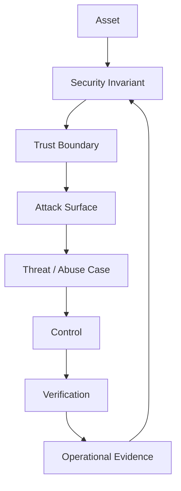
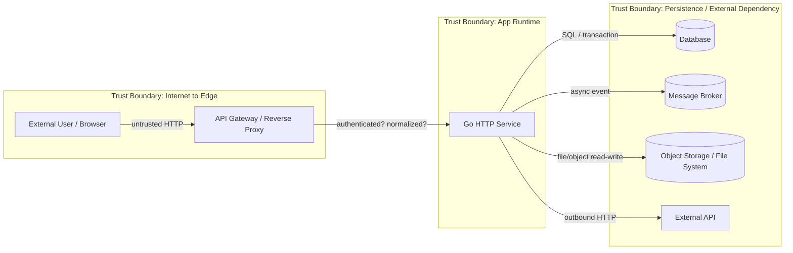
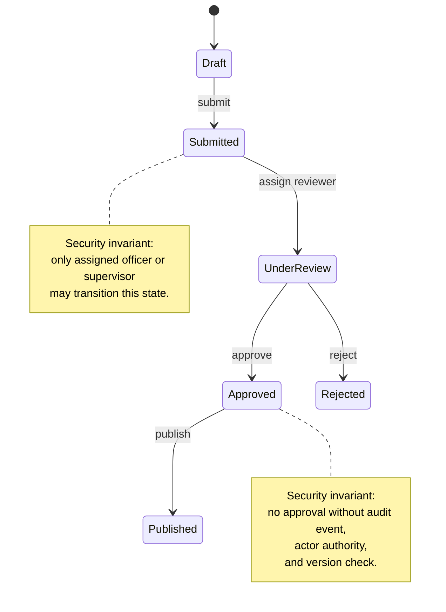
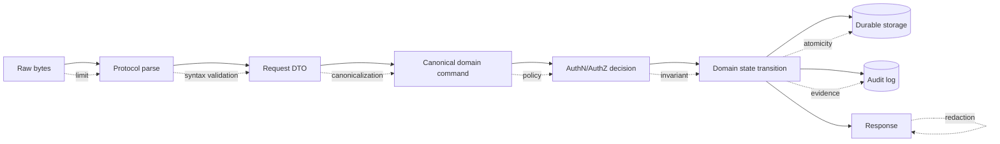
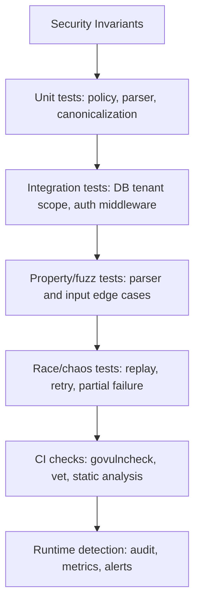
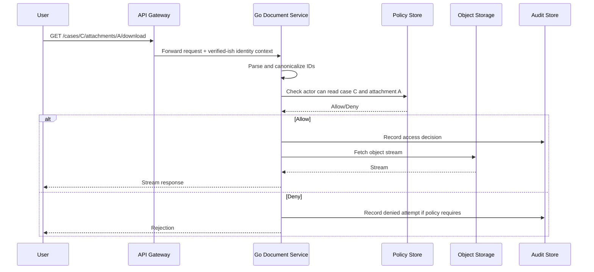

# learn-go-security-cryptography-integrity-part-001.md

# Part 001 — Security Mental Model di Go: Asset, Trust Boundary, Attack Surface, Abuse Case, Misuse Case, dan Security Invariant

> Seri: `learn-go-security-cryptography-integrity`  
> Target: Go 1.26.x  
> Audiens: Java software engineer yang ingin naik ke level security-conscious Go engineer / tech lead  
> Status seri: **belum selesai** — ini adalah part 001 dari 034.

---

## 0. Tujuan Part Ini

Part ini membangun fondasi mental yang akan dipakai di seluruh seri.

Kita belum akan masuk terlalu dalam ke `crypto/rand`, AES-GCM, mTLS, JWT, SSRF, supply chain, atau FIPS. Itu akan punya part masing-masing. Bagian ini menjawab pertanyaan yang lebih fundamental:

> “Bagaimana cara berpikir seperti engineer yang membangun sistem Go yang benar-benar aman, bukan hanya program Go yang berhasil jalan?”

Setelah part ini, kamu harus bisa:

1. Membedakan **functional correctness** dan **security correctness**.
2. Mengidentifikasi **asset**, **trust boundary**, **attack surface**, **actor**, **attacker capability**, dan **security invariant**.
3. Membaca desain Go service dari sudut pandang attacker.
4. Mengubah requirement bisnis menjadi security invariants yang bisa diuji.
5. Membedakan **use case**, **abuse case**, dan **misuse case**.
6. Menentukan di mana validasi, autentikasi, otorisasi, logging, limit, timeout, encryption, dan integrity check harus ditempatkan.
7. Memahami kenapa security di Go bukan hanya soal package `crypto/*`, tetapi juga `net/http`, `os`, `io`, `context`, `encoding/*`, module system, runtime, deployment, dan operasi.

---

## 1. Referensi Resmi dan Baseline

Materi ini menggunakan baseline Go 1.26.x. Per release history resmi Go, Go 1.26.4 dirilis 2026-06-02 dan menyertakan security fixes untuk `crypto/x509`, `mime`, dan `net/textproto`, serta bug fixes untuk compiler, runtime, `go fix`, dan `crypto/fips140`.

Referensi penting:

- Go Security documentation: <https://go.dev/doc/security/>
- Go Security Best Practices: <https://go.dev/doc/security/best-practices>
- Go Vulnerability Management: <https://go.dev/doc/security/vuln/>
- Go Fuzzing: <https://go.dev/doc/security/fuzz/>
- Go 1.26 Release Notes: <https://go.dev/doc/go1.26>
- Go Release History: <https://go.dev/doc/devel/release>
- OWASP Threat Modeling Cheat Sheet: <https://cheatsheetseries.owasp.org/cheatsheets/Threat_Modeling_Cheat_Sheet.html>
- NIST SP 800-218 SSDF: <https://csrc.nist.gov/pubs/sp/800/218/final>

Catatan penting: security facts berubah cepat. Untuk production, selalu cek release notes, vulnerability database, dependency advisory, dan environment runtime yang benar-benar dipakai.

---

## 2. Masalah Utama: Code Bisa Benar Tapi Tetap Tidak Aman

Sebagai Java engineer, kamu sudah terbiasa berpikir tentang:

- correctness,
- API contract,
- exception handling,
- transaction boundary,
- concurrency,
- pooling,
- object lifecycle,
- modularity,
- observability,
- performance.

Di security, semua itu tetap penting, tetapi ada satu perubahan besar:

> Security tidak menilai program dari skenario normal. Security menilai program dari skenario musuh.

Program bisa benar secara bisnis:

```text
User upload file -> server simpan file -> user bisa download lagi.
```

Tetapi tidak aman jika:

```text
User upload ../../../../etc/passwd
User upload zip bomb
User upload file dengan MIME palsu
User upload file yang membuat antivirus timeout
User upload file raksasa lewat koneksi lambat
User upload file yang namanya mengandung CRLF dan merusak log
User upload file yang dapat dieksekusi oleh static server
User upload file lalu menebak path user lain
```

Functional requirement biasanya bertanya:

> “Apa yang sistem harus lakukan untuk user yang valid?”

Security requirement bertanya:

> “Apa yang sistem tidak boleh izinkan, bahkan ketika input, urutan event, dependency, network, user, admin, clock, config, dan environment berperilaku buruk?”

---

## 3. Correctness vs Security Correctness

### 3.1 Functional correctness

Functional correctness berarti sistem memenuhi requirement normal.

Contoh:

```go
func Transfer(from, to AccountID, amount Money) error {
    if amount <= 0 {
        return ErrInvalidAmount
    }
    debit(from, amount)
    credit(to, amount)
    return nil
}
```

Secara fungsi, ini terlihat masuk akal: debit lalu credit.

### 3.2 Security correctness

Security correctness bertanya hal yang lebih keras:

- Siapa yang boleh melakukan transfer?
- Apakah caller boleh mengakses account `from`?
- Apakah account `to` valid?
- Apakah amount sudah dinormalisasi?
- Apakah currency sama?
- Apakah ada replay?
- Apakah request idempotent?
- Apakah debit-credit atomic?
- Apakah audit log tidak bisa dipalsukan?
- Apakah error message membocorkan account existence?
- Apakah race condition memungkinkan double spend?
- Apakah ada limit harian?
- Apakah request dibuat dari session yang masih valid?
- Apakah token memiliki audience dan issuer yang benar?
- Apakah transfer bisa dipanggil langsung oleh internal service tanpa policy check?

Versi yang lebih security-conscious mungkin punya bentuk mental seperti ini:

```go
type TransferCommand struct {
    RequestID   string
    Actor       Actor
    From        AccountID
    To          AccountID
    Amount      Money
    SubmittedAt time.Time
}

type TransferPolicy interface {
    AuthorizeTransfer(ctx context.Context, cmd TransferCommand) error
}

type TransferLedger interface {
    AppendTransfer(ctx context.Context, cmd TransferCommand) (TransferReceipt, error)
}

func Transfer(
    ctx context.Context,
    policy TransferPolicy,
    ledger TransferLedger,
    cmd TransferCommand,
) (TransferReceipt, error) {
    if err := validateTransferCommand(cmd); err != nil {
        return TransferReceipt{}, ErrRejected
    }

    if err := policy.AuthorizeTransfer(ctx, cmd); err != nil {
        // Jangan membocorkan detail policy internal ke caller eksternal.
        return TransferReceipt{}, ErrRejected
    }

    // Ledger append harus atomic, idempotent by RequestID, dan audit-safe.
    receipt, err := ledger.AppendTransfer(ctx, cmd)
    if err != nil {
        return TransferReceipt{}, ErrUnavailable
    }

    return receipt, nil
}
```

Point-nya bukan template code di atas. Point-nya adalah perubahan mental:

> Security code bukan hanya “melakukan aksi”. Security code menjaga invariant sebelum, selama, dan setelah aksi.

---

## 4. Lima Pertanyaan Pertama Security Design

Untuk setiap fitur Go service, mulai dari lima pertanyaan ini:

1. **Apa asset yang dilindungi?**
2. **Siapa actor yang berinteraksi?**
3. **Di mana trust boundary berpindah?**
4. **Apa yang bisa salah jika actor jahat, dependency rusak, atau environment berubah?**
5. **Invariant apa yang tidak boleh dilanggar?**

OWASP Threat Modeling Cheat Sheet merangkum threat modeling sebagai proses terstruktur untuk memahami sistem dari perspektif security, mengidentifikasi threat, dan menentukan response/mitigation. Cheat sheet tersebut juga menekankan empat pertanyaan inti: apa yang sedang dikerjakan, apa yang bisa salah, apa yang akan dilakukan, dan apakah mitigasi sudah cukup.

Dalam seri ini, kita akan memakai bentuk praktis berikut:

```text
Asset -> Boundary -> Capability -> Threat -> Invariant -> Control -> Evidence
```

Artinya:

```text
Apa yang bernilai?
Di mana nilai itu bisa disentuh?
Siapa yang bisa menyentuhnya?
Bagaimana dia bisa disalahgunakan?
Aturan apa yang tidak boleh dilanggar?
Kontrol apa yang menjaga aturan itu?
Bukti apa yang menunjukkan kontrol itu bekerja?
```

---

## 5. Core Mental Model



Security bukan daftar library. Security adalah loop:

1. Asset dipahami.
2. Invariant dirumuskan.
3. Boundary dipetakan.
4. Attack surface diinventarisasi.
5. Threat disimulasikan.
6. Control didesain.
7. Control diverifikasi.
8. Evidence dikumpulkan saat runtime.

Kalau salah satu hilang, sistem menjadi lemah:

| Hilang | Akibat |
|---|---|
| Asset tidak jelas | Kontrol security jadi random dan mahal |
| Invariant tidak jelas | Test hanya menguji happy path |
| Boundary tidak jelas | Validasi dan authz ditempatkan di layer yang salah |
| Attack surface tidak dipetakan | Endpoint/debug/internal API lupa diamankan |
| Threat tidak disimulasikan | Design tampak bersih tapi mudah disalahgunakan |
| Control tidak diverifikasi | Security menjadi asumsi |
| Evidence tidak ada | Incident tidak bisa direkonstruksi |

---

## 6. Asset: Apa yang Sebenarnya Dilindungi?

Security dimulai dari asset, bukan dari teknologi.

Asset adalah sesuatu yang punya nilai sehingga perlu dilindungi dari kehilangan confidentiality, integrity, availability, authenticity, privacy, atau accountability.

### 6.1 Asset bukan hanya data

Banyak engineer berpikir asset = database row atau file. Itu terlalu sempit.

Dalam Go service modern, asset bisa berupa:

| Asset | Contoh | Risiko utama |
|---|---|---|
| Identitas | user id, tenant id, service identity | impersonation, confused deputy |
| Otoritas | role, permission, entitlement, policy decision | privilege escalation |
| Secret | password hash, API key, private key, session secret | credential theft |
| Token | access token, refresh token, CSRF token, invite token | replay, token substitution |
| Data bisnis | case, transaction, document, payment, audit data | tampering, unauthorized disclosure |
| Integrity chain | audit log, signature, hash chain, event order | repudiation, hidden modification |
| Availability | worker pool, DB connection, memory, CPU, queue | DoS, resource exhaustion |
| Configuration | feature flag, TLS config, allowed origins, JWKS URL | insecure behavior by config drift |
| Code/dependency | module version, container image, CI artifact | supply-chain compromise |
| Time | expiration, TTL, token `nbf`, audit timestamp | replay, bypass, dispute |
| Topology | internal service URL, metadata endpoint, private subnet | SSRF, lateral movement |

### 6.2 Asset classification praktis

Gunakan pertanyaan ini:

```text
Kalau asset ini bocor, apa dampaknya?
Kalau asset ini berubah tanpa izin, apa dampaknya?
Kalau asset ini hilang atau tidak tersedia, apa dampaknya?
Kalau asset ini bisa dipalsukan, apa dampaknya?
Kalau perubahan asset ini tidak bisa dibuktikan, apa dampaknya?
```

Contoh untuk sistem regulatory case management:

| Asset | Confidentiality | Integrity | Availability | Accountability |
|---|---:|---:|---:|---:|
| Case record | High | Critical | High | Critical |
| Enforcement decision | Medium | Critical | Medium | Critical |
| Audit trail | Medium | Critical | High | Critical |
| Attachment evidence | High | Critical | Medium | Critical |
| User role mapping | Medium | Critical | High | High |
| System config | Medium | High | High | Medium |

Pola penting:

> Dalam sistem regulatori, integrity dan accountability sering lebih kritis daripada confidentiality.

Bukan berarti confidentiality tidak penting. Tetapi keputusan enforcement yang berubah diam-diam, audit trail yang bisa dimodifikasi, atau permission yang salah bisa lebih merusak defensibility sistem.

---

## 7. Security Property: CIA Tidak Cukup

Model klasik security adalah CIA:

- Confidentiality
- Integrity
- Availability

Tetapi untuk engineering sistem modern, kita butuh properti lebih luas.

| Property | Pertanyaan desain |
|---|---|
| Confidentiality | Siapa yang boleh melihat data? |
| Integrity | Siapa yang boleh mengubah data? Apakah perubahan bisa dideteksi? |
| Availability | Apakah sistem tetap melayani meski ada input/traffic buruk? |
| Authenticity | Apakah actor/data benar-benar berasal dari sumber yang diklaim? |
| Authorization | Apakah actor boleh melakukan aksi spesifik pada object spesifik? |
| Non-repudiation / Accountability | Apakah aksi bisa dibuktikan dan ditelusuri? |
| Freshness | Apakah request/token/message masih valid secara waktu dan belum replay? |
| Isolation | Apakah tenant/user/module tidak bisa menembus batas lain? |
| Least privilege | Apakah komponen hanya punya akses minimum? |
| Fail-safe behavior | Ketika dependency error, apakah sistem gagal dalam mode aman? |
| Observability | Apakah security event terlihat tanpa membocorkan secret? |
| Recoverability | Apakah sistem bisa pulih setelah compromise? |

Di Go, property-property ini tersebar di banyak layer:

| Property | Go/API terkait |
|---|---|
| Confidentiality | `crypto/tls`, encryption libraries, secret management, redaction |
| Integrity | `crypto/hmac`, signatures, hash chains, database constraints |
| Availability | `net/http` timeout, `context`, rate limit, worker pool, parser limits |
| Authenticity | TLS cert, JWT verification, mTLS, signed webhook |
| Authorization | policy layer, object-level checks, middleware, domain guard |
| Freshness | nonce, timestamp, replay cache, token expiry |
| Isolation | package boundary, process boundary, network policy, tenant scoping |
| Evidence | structured audit log, immutable storage, correlation id |

---

## 8. Trust Boundary: Garis yang Paling Sering Hilang di Desain

Trust boundary adalah titik di mana data, control, identity, atau authority berpindah dari satu domain trust ke domain trust lain.

Contoh:

```text
Browser -> API Gateway
API Gateway -> Go service
Go service -> DB
Go service -> external API
Go service -> file system
Go service -> message broker
Admin user -> admin endpoint
CI pipeline -> production artifact
```

Trust boundary bukan hanya network boundary. Boundary bisa berupa:

| Boundary | Contoh |
|---|---|
| Network | Internet ke internal service |
| Identity | anonymous ke authenticated user |
| Authorization | authenticated user ke privileged action |
| Tenant | tenant A ke tenant B |
| Process | Go process ke shell command |
| Language/runtime | Go ke C via cgo |
| Parser | raw bytes ke structured object |
| Storage | application memory ke DB/file/S3 |
| Time | before expiry ke after expiry |
| Build | source code ke binary artifact |
| Operational | dev config ke production config |

### 8.1 Diagram trust boundary sederhana



Di setiap panah, tanyakan:

```text
Apa input formatnya?
Siapa sumbernya?
Apa identity-nya?
Apa authority-nya?
Apa size limit-nya?
Apa timeout-nya?
Apa canonical representation-nya?
Apa yang terjadi kalau dependency gagal?
Apa yang dicatat untuk audit?
```

### 8.2 Rule praktis

> Setiap crossing boundary harus punya normalization, validation, authorization, limit, timeout, logging, dan failure semantics yang jelas.

Bukan semuanya harus berada di satu fungsi. Tetapi harus ada tempat yang jelas.

---

## 9. Attack Surface: Semua Tempat yang Bisa Disentuh Attacker

Attack surface adalah semua titik di mana attacker bisa mempengaruhi sistem.

Dalam Go service, attack surface biasanya lebih luas dari daftar endpoint public.

### 9.1 Attack surface umum di Go

| Surface | Contoh risiko |
|---|---|
| HTTP handler | injection, request smuggling, slowloris, auth bypass |
| JSON/XML parser | parser bomb, unknown field, canonicalization bug |
| File upload | zip slip, MIME confusion, decompression bomb |
| Path/URL processing | traversal, open redirect, SSRF |
| SQL access | injection, missing tenant filter, transaction race |
| Message broker consumer | forged message, replay, poison message, queue DoS |
| Background job | unbounded concurrency, stale credentials, privilege confusion |
| Admin endpoint | weak authz, debug data leak, dangerous operation |
| Metrics/debug endpoint | pprof leak, env/config exposure, topology leak |
| Template rendering | XSS, template injection, escaping confusion |
| CLI flags/env vars | insecure default, secret leakage, config injection |
| `os/exec` | command injection, environment leak, path hijack |
| cgo/unsafe | memory corruption, ABI assumptions, secret exposure |
| Dependencies | vulnerable module, malicious update, checksum bypass |
| Build pipeline | compromised artifact, secret exfiltration, dependency confusion |
| Logs/traces | PII leak, token leak, log forging |

### 9.2 Attack surface bukan hanya inbound

Banyak serangan modern terjadi melalui outbound flow:

```text
Attacker supplies URL -> server fetches URL -> SSRF to internal network
Attacker supplies webhook target -> server signs request to malicious target
Attacker supplies image -> server decoder consumes CPU/memory
Attacker supplies archive -> server extracts file outside target dir
Attacker supplies callback URL -> server leaks token through redirect
```

Go engineer harus melihat outbound call sebagai attack surface, bukan hanya dependency call.

---

## 10. Actor, Principal, Subject, dan Capability

Security design sering kacau karena istilah “user” terlalu umum.

Bedakan:

| Istilah | Arti |
|---|---|
| Actor | Entitas yang melakukan aksi: user, service, admin, job, attacker |
| Principal | Identitas yang diakui sistem setelah authentication |
| Subject | Principal dalam konteks authorization decision |
| Resource | Object yang diakses: case, document, account, key, config |
| Action | Operasi: read, create, approve, revoke, export, delete |
| Capability | Apa yang secara teknis bisa dilakukan actor, terlepas dari policy |
| Permission | Apa yang secara policy boleh dilakukan |

Security bug sering muncul ketika sistem menyamakan capability dengan permission.

Contoh:

```text
Handler punya akses DB secara teknis.
Maka handler bisa query semua case.
Tetapi user hanya boleh melihat case miliknya.
```

Jika tenant filter atau object-level authorization lupa, technical capability bocor menjadi unauthorized permission.

### 10.1 Capability analysis

Untuk setiap actor, isi tabel ini:

| Actor | Can reach | Can control | Can observe | Can repeat | Can amplify |
|---|---|---|---|---|---|
| Anonymous internet user | public endpoint | headers, body, URL, timing | status, error, latency | yes | yes |
| Authenticated normal user | user APIs | own input, object IDs | own data, error | yes | moderate |
| Privileged admin | admin APIs | broad state | many logs/data | yes | high |
| Internal service | service APIs | signed messages | responses | yes | high |
| Queue producer | message payload | event data | maybe no response | yes | high |
| CI job | artifact/config | build input | logs | yes | critical |

Pertanyaan kunci:

> Apa kemampuan teknis yang actor miliki meskipun policy mengatakan tidak boleh?

Itulah area kontrol.

---

## 11. Abuse Case vs Misuse Case

### 11.1 Use case

Use case menjelaskan penggunaan normal.

```text
User mengunduh dokumen miliknya.
```

### 11.2 Misuse case

Misuse case adalah penggunaan salah, bisa tidak sengaja atau karena integrasi buruk.

```text
Client mengirim JSON dengan field kosong.
Client mengirim amount dalam format locale berbeda.
Client mengirim request dua kali karena retry.
Internal service lupa menyertakan correlation id.
```

### 11.3 Abuse case

Abuse case adalah penyalahgunaan dengan intensi adversarial.

```text
User mengganti documentId untuk membaca dokumen user lain.
User mengirim body 5GB perlahan selama 30 menit.
User mengirim archive yang menulis file ke luar direktori ekstraksi.
User mengirim URL http://169.254.169.254/latest/meta-data/.
User membuat ribuan token refresh untuk menghabiskan storage.
```

### 11.4 Kenapa perbedaan ini penting?

Karena kontrolnya berbeda.

| Case | Fokus kontrol |
|---|---|
| Use case | happy path, business rule |
| Misuse case | validation, defaults, compatibility, idempotency |
| Abuse case | authz, rate limit, sandbox, canonicalization, detection, evidence |

Contoh:

```text
Use case:
- User upload CSV valid.

Misuse case:
- User upload CSV dengan encoding salah.
- User upload CSV dengan kolom kurang.

Abuse case:
- User upload CSV yang memicu formula injection.
- User upload file raksasa untuk menghabiskan disk.
- User upload data dengan newline untuk memalsukan log.
```

---

## 12. Security Invariant: Inti dari Secure Design

Security invariant adalah aturan yang **harus selalu benar**, bahkan ketika sistem menghadapi input buruk, attacker, retry, race, partial failure, clock skew, dependency failure, atau deployment drift.

Functional requirement:

```text
User dapat melihat detail case.
```

Security invariant:

```text
Untuk setiap request baca case, actor hanya boleh menerima case jika actor memiliki entitlement aktif terhadap case tersebut pada saat request diproses.
```

Functional requirement:

```text
System menyimpan audit log saat user approve case.
```

Security invariant:

```text
Tidak boleh ada state transition approval yang committed tanpa audit event immutable dengan actor, old state, new state, timestamp, request id, dan policy decision id.
```

Functional requirement:

```text
Service menerima webhook.
```

Security invariant:

```text
Webhook tidak boleh diproses sebelum signature, timestamp freshness, replay key, body digest, dan expected source identity tervalidasi.
```

### 12.1 Struktur invariant yang baik

Invariant yang baik biasanya punya format:

```text
For every [operation/event/state transition], [security condition] must hold before/after [commit/side effect], regardless of [failure/adversarial condition].
```

Dalam bahasa Indonesia:

```text
Untuk setiap [operasi/event/transisi state], [kondisi security] harus benar sebelum/sesudah [commit/side effect], meskipun [failure/adversarial condition] terjadi.
```

Contoh:

```text
Untuk setiap download dokumen, actor harus memiliki permission READ_DOCUMENT atas dokumen tersebut setelah tenant dan document owner dinormalisasi, sebelum content stream dikirim satu byte pun.
```

```text
Untuk setiap token refresh, refresh token lama harus tidak bisa dipakai ulang setelah token baru diterbitkan, termasuk ketika request dikirim paralel.
```

```text
Untuk setiap event yang masuk dari message broker, consumer harus memperlakukan payload sebagai untrusted sampai signature atau producer identity tervalidasi.
```

### 12.2 Invariant harus bisa diuji

Invariant yang tidak bisa diuji akan menjadi slogan.

Buruk:

```text
Sistem harus aman.
```

Lebih baik:

```text
Endpoint GET /cases/{id} tidak pernah mengembalikan case dari tenant berbeda, bahkan jika caller mengirim id valid milik tenant lain.
```

Lebih baik lagi:

```text
Test harus mencoba kombinasi actor tenant A + case tenant B dan mengharapkan response indistinguishable rejection tanpa membocorkan keberadaan case.
```

---

## 13. From Requirement to Invariant

Mari ubah requirement biasa menjadi security design.

### 13.1 Contoh: document download

Requirement:

```text
Officer dapat mengunduh attachment case.
```

Pertanyaan security:

```text
Attachment milik siapa?
Officer dari agency apa?
Case sedang dalam state apa?
Apakah officer punya assignment atau role global?
Apakah link download bisa dibagikan?
Apakah response harus cacheable?
Apakah file name bisa dipercaya?
Apakah MIME type bisa dipercaya?
Apakah audit harus dibuat sebelum atau setelah streaming?
Apakah partial download dihitung sebagai access?
```

Invariant:

```text
Tidak ada byte attachment yang boleh dikirim sebelum actor, tenant, case entitlement, attachment binding, dan file safety metadata tervalidasi.
```

Controls:

```text
- Authenticate request.
- Resolve actor identity from trusted token/session.
- Normalize path/id.
- Load attachment metadata by id and tenant.
- Authorize actor against case and attachment.
- Set non-cacheable headers untuk sensitive document.
- Sanitize Content-Disposition filename.
- Enforce range/download policy.
- Audit access attempt and outcome.
```

Possible tests:

```text
- Actor tenant A downloads attachment tenant B -> rejected.
- Actor with case read but no attachment permission -> rejected.
- Attachment id exists but not bound to case id -> rejected.
- Filename contains CRLF -> sanitized/rejected.
- Request starts stream before authz -> impossible by structure.
```

### 13.2 Contoh: state transition

Requirement:

```text
Supervisor dapat approve investigation outcome.
```

Invariant:

```text
Approval state transition hanya boleh committed jika actor memiliki active approval authority, case masih pada expected state, no stale version conflict, dan audit event tersimpan atomically dengan transition.
```

Controls:

```text
- Object-level authorization.
- Optimistic locking/state version.
- Transaction boundary.
- Domain state machine.
- Audit write in same transaction or durable outbox with strict invariant.
- Idempotency key for retry.
```

Threats:

```text
- User replay approve request.
- User approve stale case after reassignment.
- Internal service bypasses UI-level check.
- Race between reject and approve.
- Audit write fails but state commit succeeds.
```

---

## 14. Security as State Machine Protection

Untuk sistem kompleks, terutama case management/regulatory lifecycle, security sering berarti menjaga transisi state.



Jika security hanya ditempatkan di UI, maka internal API, batch job, atau direct service call bisa bypass.

Prinsip:

> Security invariant untuk state transition harus hidup di domain/service boundary yang sama dengan transition, bukan hanya di frontend atau gateway.

Dalam Go, ini berarti handler HTTP hanya adapter. Policy check dan invariant harus berada di application/domain service.

Buruk:

```text
Vue hides Approve button.
Go handler directly updates status.
```

Lebih baik:

```text
Vue may hide Approve button for UX.
Go handler calls domain service.
Domain service enforces transition policy.
Repository commits transition and audit atomically.
```

---

## 15. Go-Specific Security Mental Model

Go punya karakteristik yang memengaruhi security design.

### 15.1 Go memberi banyak safety, tapi bukan security otomatis

Go membantu dengan:

- memory safety untuk kode Go biasa,
- garbage collection,
- strong typing,
- simple module system,
- standard library yang luas,
- built-in testing,
- fuzzing sejak Go 1.18,
- race detector,
- `go vet`,
- `govulncheck`,
- crypto library resmi,
- TLS stack,
- HTTP stack.

Tetapi Go tidak otomatis mencegah:

- broken authorization,
- SSRF,
- SQL injection jika query dibangun manual,
- insecure TLS config,
- token verification yang salah,
- secret leakage ke log,
- zip slip,
- unbounded request body,
- goroutine/resource exhaustion,
- business logic abuse,
- weak key management,
- supply-chain mistakes,
- tenant isolation bugs,
- unsafe/cgo memory issues.

### 15.2 Go encourages explicitness

Go cenderung eksplisit:

```go
if err != nil {
    return err
}
```

Security benefit-nya:

- error path terlihat,
- boundary mudah dilacak,
- dependency injection bisa sederhana,
- control flow tidak tersembunyi di annotation/magic framework.

Security risk-nya:

- banyak keputusan harus dibuat manual,
- tidak ada framework security besar yang otomatis seperti Spring Security,
- middleware order bisa salah,
- context value bisa disalahgunakan,
- handler bisa langsung bypass policy service.

Sebagai Java engineer, jangan mencari “Spring Security equivalent” sebagai jawaban utama. Di Go, sering kali secure architecture dibangun dengan komposisi kecil:

```text
router -> middleware -> handler -> application service -> policy -> repository
```

Bukan:

```text
annotation magic -> framework interceptors -> implicit security context
```

### 15.3 Security consequence of simplicity

Go code yang sederhana bisa sangat aman jika boundary jelas.

Go code yang sederhana juga bisa sangat berbahaya jika terlalu percaya input.

Contoh buruk:

```go
func getCase(w http.ResponseWriter, r *http.Request) {
    id := r.PathValue("id")
    row := db.QueryRow("select * from cases where id = ?", id)
    writeJSON(w, row)
}
```

Masalah:

```text
- Tidak ada actor.
- Tidak ada tenant.
- Tidak ada authorization.
- Tidak ada error envelope aman.
- Tidak ada audit.
- Tidak ada timeout/context policy.
- Tidak jelas apakah id canonical.
```

Versi mental yang lebih baik:

```go
func (h *CaseHandler) GetCase(w http.ResponseWriter, r *http.Request) {
    ctx := r.Context()

    actor, ok := security.ActorFromContext(ctx)
    if !ok {
        h.reject(w, ErrUnauthenticated)
        return
    }

    caseID, err := parseCaseID(r.PathValue("id"))
    if err != nil {
        h.reject(w, ErrNotFoundLike)
        return
    }

    result, err := h.cases.GetCase(ctx, actor, caseID)
    if err != nil {
        h.reject(w, err)
        return
    }

    h.writeCase(w, result)
}
```

Dan invariant sebenarnya berada di `h.cases.GetCase`, bukan di handler saja.

---

## 16. Java-to-Go Security Mindset Shift

### 16.1 Dari framework-centric ke boundary-centric

Di Java enterprise, security sering dipasang melalui:

- servlet filter,
- Spring Security filter chain,
- annotation `@PreAuthorize`,
- AOP,
- interceptors,
- Jakarta Security,
- container-managed security.

Di Go, banyak project memakai:

- `net/http` middleware,
- router ringan,
- explicit policy service,
- explicit dependency injection,
- explicit context propagation,
- explicit TLS config,
- explicit parser limits.

Mental shift:

| Java enterprise mindset | Go security mindset |
|---|---|
| Framework mengatur banyak hal | Engineer harus mendesain boundary eksplisit |
| Annotation menyembunyikan policy | Policy sering berupa function/service biasa |
| Exception bubbling | Error result explicit dan harus disanitasi |
| Container security | Process/container/cloud boundary harus dipahami |
| Heavy DI/security context | Context harus dipakai hati-hati dan tidak menjadi global bag |
| ORM-level guard | Query/repository harus menjaga tenant/object scope |

### 16.2 Dari class hierarchy ke capability interface

Go lebih natural memakai interface kecil:

```go
type CasePolicy interface {
    CanReadCase(ctx context.Context, actor Actor, caseID CaseID) error
    CanTransitionCase(ctx context.Context, actor Actor, caseID CaseID, action CaseAction) error
}
```

Security benefit:

- policy bisa diuji terpisah,
- dependency bisa dibatasi,
- handler tidak perlu tahu detail role matrix,
- service tidak bergantung pada framework global.

Security risk:

- jika interface terlalu besar, sulit diverifikasi,
- jika policy optional, caller bisa bypass,
- jika repository public terlalu powerful, service lain bisa query data tanpa policy.

Prinsip:

> Desain interface berdasarkan capability minimum yang diperlukan, bukan berdasarkan tabel/database yang tersedia.

---

## 17. Boundary Placement: Di Mana Kontrol Security Harus Hidup?

Kontrol security punya lokasi berbeda.

| Control | Lokasi utama | Catatan |
|---|---|---|
| Authentication | edge/middleware | Validasi token/session sedini mungkin |
| Request size limit | edge + handler | Jangan tunggu parser membaca semua body |
| Input syntax validation | adapter/handler | Bentuk input menjadi tipe domain yang valid |
| Business authorization | application/domain service | Harus dekat dengan aksi/state transition |
| Tenant isolation | policy + repository | Defense in depth: policy dan query scope |
| Audit | application/domain boundary | Dekat dengan aksi yang diaudit |
| Rate limit | edge + actor/resource level | IP-only rate limit tidak cukup |
| Timeout | server + context + dependency | Harus end-to-end |
| Cryptographic verification | sebelum parse/side effect | Webhook/signature/body digest |
| Output encoding | response/template boundary | Tergantung sink: HTML/JSON/header/log |
| Secret redaction | logging/telemetry boundary | Jangan mengandalkan caller ingat |

### 17.1 Control yang hanya di frontend bukan control security

Frontend boleh membantu UX, tetapi bukan boundary trust.

```text
Button hidden != action forbidden
Field disabled != value trusted
Route guard frontend != authorization
Client-side validation != server-side validation
```

### 17.2 Gateway-only authz sering tidak cukup

API Gateway bisa melakukan coarse-grained auth:

```text
Token valid?
Scope ada?
Route boleh diakses?
```

Tetapi object-level authorization biasanya butuh domain data:

```text
Apakah actor ini assigned ke case ini?
Apakah document ini milik agency actor?
Apakah action ini valid untuk current state?
Apakah role actor berlaku saat request, bukan saat token diterbitkan?
```

Itu harus ada di service/domain layer.

---

## 18. Secure Data Flow: Dari Byte ke Decision

Setiap request melewati transformasi:

```text
raw bytes -> protocol parse -> request object -> domain command -> policy decision -> state transition -> durable storage -> response/audit
```



Security bug biasanya terjadi saat salah satu transformasi dianggap “sudah aman”.

Contoh:

| Transformasi | Bug umum |
|---|---|
| raw bytes -> parse | body terlalu besar, parser bomb, slow client |
| parse -> DTO | unknown field diterima, type confusion, default value berbahaya |
| DTO -> command | canonicalization salah, path/URL ambiguity |
| command -> policy | actor/resource/action tidak lengkap |
| policy -> transition | TOCTOU/race, stale version |
| transition -> storage | partial commit, audit hilang |
| storage -> response | overexposure, secret leak |

---

## 19. Fail-Safe Design

Security-critical system harus menjawab:

> Kalau ada error, apakah sistem gagal dalam mode aman atau mode terbuka?

### 19.1 Fail-open vs fail-closed

Fail-open:

```text
Policy service error -> allow request
```

Fail-closed:

```text
Policy service error -> reject request
```

Tidak semua sistem bisa selalu fail-closed tanpa dampak availability. Tetapi untuk authorization, cryptographic verification, token validation, dan integrity check, default harus fail-safe.

Contoh Go anti-pattern:

```go
allowed, err := policy.CanRead(ctx, actor, docID)
if err != nil {
    log.Printf("policy error: %v", err)
}
if allowed {
    serveDoc(w, docID)
}
```

Bug: tergantung default `allowed`, error path bisa ambigu.

Lebih baik:

```go
allowed, err := policy.CanRead(ctx, actor, docID)
if err != nil {
    return ErrAuthorizationUnavailable
}
if !allowed {
    return ErrRejected
}
return serveDoc(w, docID)
```

Lebih baik lagi: policy method mengembalikan error jika tidak boleh, sehingga tidak ada boolean default yang ambigu.

```go
if err := policy.RequireCanRead(ctx, actor, docID); err != nil {
    return ErrRejected
}
```

### 19.2 Failure taxonomy

| Failure | Secure default |
|---|---|
| Token verification error | Reject |
| JWKS fetch error | Use valid cached key if safe; otherwise reject |
| Policy DB unavailable | Reject privileged action |
| Audit log write fails | For critical state transition, do not commit or use durable outbox invariant |
| Rate limiter unavailable | Bias depends on risk; privileged/high-cost actions should reject/degrade |
| Logging unavailable | Continue only if not critical evidence path |
| External enrichment API fails | Do not trust missing enrichment as approval |
| Config missing | Refuse startup for critical config |
| TLS cert invalid | Refuse connection |

---

## 20. Security Invariant vs Control vs Evidence

Jangan mencampur invariant, control, dan evidence.

| Level | Contoh |
|---|---|
| Invariant | User tidak boleh membaca document tenant lain |
| Control | Object-level authorization check di domain service dan tenant-scoped query |
| Evidence | Test cross-tenant, audit denied access, log policy decision id |

Banyak desain hanya menyebut control:

```text
We use JWT.
```

Itu belum menjawab invariant.

Pertanyaan yang benar:

```text
JWT menjaga invariant apa?
Apakah JWT cukup untuk invariant itu?
Apa yang terjadi jika role berubah sebelum token expired?
Apakah token audience benar?
Apakah object-level policy tetap dicek?
Apakah denial dicatat?
```

### 20.1 Example: “we use HTTPS”

Control:

```text
TLS/HTTPS
```

Invariant yang mungkin:

```text
Data in transit tidak boleh dibaca/dimodifikasi oleh network attacker.
```

Evidence:

```text
- TLS min version.
- Cert chain valid.
- No insecure skip verify.
- HSTS at edge if web app.
- mTLS for service-to-service if required.
- Config test.
```

Control tanpa invariant sering menghasilkan false confidence.

---

## 21. Security Boundary in Code Structure

Struktur package bisa membantu atau menghancurkan security.

### 21.1 Anti-pattern: repository terlalu powerful

```go
type CaseRepository interface {
    FindByID(ctx context.Context, id string) (Case, error)
    FindAll(ctx context.Context) ([]Case, error)
    UpdateStatus(ctx context.Context, id string, status string) error
}
```

Masalah:

- tidak ada tenant,
- tidak ada actor,
- tidak ada policy,
- `UpdateStatus` bebas transisi apa pun,
- service lain mudah bypass state machine.

### 21.2 Lebih aman: repository scoped dan domain service menjaga transition

```go
type CaseStore interface {
    GetForTenant(ctx context.Context, tenant TenantID, id CaseID) (Case, error)
    AppendTransition(ctx context.Context, tx CaseTransition) error
}

type CaseService struct {
    store  CaseStore
    policy CasePolicy
    audit  AuditSink
}

func (s *CaseService) Approve(ctx context.Context, actor Actor, id CaseID, version Version) error {
    c, err := s.store.GetForTenant(ctx, actor.TenantID, id)
    if err != nil {
        return ErrNotFoundLike
    }

    if err := s.policy.RequireApprove(ctx, actor, c); err != nil {
        return ErrRejected
    }

    tx, err := c.Approve(actor, version)
    if err != nil {
        return ErrRejected
    }

    return s.store.AppendTransition(ctx, tx)
}
```

Prinsip:

```text
Repository should not become a privilege escalation API.
```

### 21.3 Internal package sebagai boundary

Go punya mekanisme `internal/` package. Package di luar parent tidak bisa import package internal tersebut. Ini bukan security runtime boundary, tetapi membantu menjaga API surface.

Contoh:

```text
/service
  /caseapp
    service.go
    policy.go
  /internal/casestore
    oracle.go
  /internal/auditstore
    audit.go
```

Dengan ini, package lain tidak mudah memanggil low-level store yang bypass service policy.

---

## 22. Boundary in Runtime: Context, Middleware, Handler

### 22.1 Context bukan security oracle

`context.Context` berguna untuk deadline, cancellation, dan request-scoped values. Tetapi jangan mengubah context menjadi global mutable security bag.

Risky:

```go
actor := ctx.Value("user").(User)
```

Masalah:

- string key collision,
- panic jika type salah,
- tidak jelas siapa yang mengisi,
- bisa menjadi implicit dependency.

Lebih baik:

```go
type actorContextKey struct{}

func WithActor(ctx context.Context, actor Actor) context.Context {
    return context.WithValue(ctx, actorContextKey{}, actor)
}

func ActorFromContext(ctx context.Context) (Actor, bool) {
    actor, ok := ctx.Value(actorContextKey{}).(Actor)
    return actor, ok
}
```

Tetapi untuk domain service, sering lebih baik actor dikirim eksplisit:

```go
func (s *CaseService) GetCase(ctx context.Context, actor Actor, id CaseID) (CaseView, error)
```

Karena actor adalah bagian dari security decision, bukan sekadar metadata.

### 22.2 Middleware order matters

Urutan middleware bisa menciptakan bug.

Contoh urutan buruk:

```text
logging -> body parse -> auth -> rate limit -> handler
```

Risiko:

- body besar diparse sebelum auth/rate limit,
- log mungkin mencatat body sensitif,
- attacker bisa menghabiskan resource tanpa identitas.

Urutan lebih baik secara umum:

```text
request id -> panic recovery -> connection/request limits -> coarse rate limit -> auth -> actor rate limit -> body size limit -> parse -> handler -> response audit
```

Tidak selalu persis begitu, tetapi prinsipnya:

> Kontrol murah dan global harus terjadi sebelum operasi mahal dan stateful.

---

## 23. Time as a Security Boundary

Security sering bergantung pada waktu:

- token expiration,
- refresh token rotation,
- session idle timeout,
- signed URL expiry,
- webhook timestamp tolerance,
- replay cache TTL,
- audit timestamp,
- certificate validity,
- key rotation.

Waktu adalah boundary karena sesuatu yang valid sekarang bisa tidak valid beberapa detik lagi.

### 23.1 Common time bugs

| Bug | Dampak |
|---|---|
| Menggunakan local clock berbeda antar node | token valid/invalid tidak konsisten |
| Tidak memeriksa `nbf`/`exp`/leeway | replay atau false rejection |
| TTL cache lebih lama dari permission validity | revoked access tetap aktif |
| Refresh token parallel race | token lama bisa dipakai ulang |
| Audit timestamp dari client | evidence bisa dimanipulasi |
| Signed URL terlalu panjang expiry | link leakage jadi breach besar |

### 23.2 Design rule

```text
Client time is input, not evidence.
Server time is local evidence.
Authoritative time-sensitive decision should account for bounded clock skew.
```

Dalam Go, gunakan dependency clock untuk test:

```go
type Clock interface {
    Now() time.Time
}
```

Ini memudahkan test invariant:

```text
token expired -> rejected
within skew -> accepted/rejected sesuai policy
replay after TTL -> rejected/handled sesuai risk
```

---

## 24. Canonicalization: Data Harus Punya Bentuk Resmi

Canonicalization adalah proses mengubah input menjadi bentuk standar sebelum dibandingkan, disimpan, ditandatangani, atau diberi policy.

Bug security sering lahir dari dua layer yang memahami input secara berbeda.

Contoh:

```text
/api/files/%2e%2e/%2e%2e/secret
/api/files/..%2f..%2fsecret
/api/files/a/../b
/api/files/%252e%252e%252fsecret
```

Satu layer melihat aman, layer lain melihat traversal.

### 24.1 Canonicalization before authorization

Jika resource id bisa punya banyak representasi, policy harus berjalan pada bentuk canonical.

Buruk:

```text
Authorize path string mentah -> later filesystem normalize -> beda resource
```

Baik:

```text
Parse -> normalize -> validate canonical resource -> authorize -> access
```

### 24.2 Canonicalization before signing

Untuk signature/MAC:

```text
sign(raw-ish JSON)  -> risk karena field order/spacing/normalization
sign(canonical form) -> lebih stabil
```

Kita akan bahas detail di part HMAC/signature, tetapi mental model-nya dimulai di sini:

> Jangan sign sesuatu yang belum punya representasi canonical yang disepakati verifier dan signer.

---

## 25. Input is Hostile Until Proven Otherwise

Dalam Go, input bisa berasal dari:

- HTTP request,
- header,
- cookie,
- query parameter,
- URL path,
- JSON body,
- XML body,
- multipart file,
- message broker,
- database row lama,
- cache,
- environment variable,
- config file,
- CLI flag,
- external API response,
- webhook,
- DNS,
- file system,
- object storage,
- token claim,
- log replay,
- backup restore.

Jangan hanya menganggap input dari internet sebagai untrusted. Banyak bug besar berasal dari internal trust yang terlalu luas.

### 25.1 Internal data can become hostile

Data dari DB bisa hostile jika:

- DB pernah menerima input lama sebelum validasi diperketat,
- migration memasukkan data buruk,
- admin tool bisa menulis data,
- compromised service menulis payload,
- external integration menyimpan data yang nanti dirender,
- cache poisoning terjadi.

Prinsip:

```text
Validate at boundary.
Encode at sink.
Authorize at decision point.
Audit at side effect.
```

---

## 26. Sink-Based Thinking

Security bukan hanya soal input. Output destination menentukan risiko.

Satu string yang sama punya aturan berbeda tergantung sink:

| Sink | Risiko | Kontrol |
|---|---|---|
| HTML body | XSS | HTML escaping/template safe API |
| HTML attribute | attribute injection | context-aware escaping |
| JavaScript | script injection | avoid inline data / JS escaping |
| SQL | SQL injection | parameterized query |
| Shell | command injection | avoid shell, pass args array |
| HTTP header | response splitting | reject CRLF |
| Log | log forging/PII leak | structured logging, redaction |
| File path | traversal | canonicalize, safe join, allowlist |
| URL redirect | open redirect | allowlist destination |
| JSON | data overexposure | response DTO, field-level policy |
| Metric label | cardinality explosion | label allowlist/limit |

Mental model:

> Validasi input tidak menggantikan escaping/encoding pada sink.

---

## 27. Attacker Economics

Security design bukan hanya “bisa diserang atau tidak”. Tanyakan biaya attacker dan biaya defender.

| Pertanyaan | Contoh |
|---|---|
| Apakah serangan bisa diotomasi? | brute force, credential stuffing |
| Apakah serangan murah untuk attacker? | request kecil memicu kerja besar |
| Apakah dampak per request besar? | export, approval, delete |
| Apakah attacker mendapat feedback jelas? | error membedakan valid/invalid account |
| Apakah rate limit per IP bisa dilewati? | botnet/proxy |
| Apakah kontrol membuat defender juga mahal? | logging sink penuh, alert fatigue |

Contoh asymmetric risk:

```text
Attacker mengirim 1 KB zip.
Server mengekstrak menjadi 10 GB.
```

Atau:

```text
Attacker mengirim satu regex input.
Server CPU spike.
```

Atau:

```text
Attacker mengirim satu request ke endpoint export.
Server menjalankan query besar dan membuat file besar.
```

Security-conscious Go engineer melihat rasio:

```text
attacker cost : defender cost
```

Jika attacker cost rendah dan defender cost tinggi, perlu limit, quota, async guard, circuit breaker, atau preflight authorization.

---

## 28. Security Test Pyramid

Testing security tidak cukup dengan unit test happy path.



Go official docs recommend fuzzing for unexpected inputs; Go fuzzing uses coverage guidance and is useful for finding edge cases that humans miss, including security-relevant bugs. Go security best-practices also call out fuzzing, race detector, `go vet`, and dependency review as part of security discipline.

### 28.1 Tests mapped to invariant

| Invariant | Test style |
|---|---|
| Cross-tenant read impossible | integration test with tenant A actor + tenant B resource |
| Expired token rejected | unit/integration auth test with fake clock |
| Parser does not panic | fuzz test |
| Request body bounded | integration test with large body |
| Audit event required for transition | transaction/integration test |
| Refresh token cannot replay | concurrency test |
| Dependency vulnerability detected | `govulncheck` CI gate |
| Race-sensitive policy stable | `go test -race` on exercised path |

Go race detector finds races at runtime in executed code paths; it will not find paths your tests do not execute. Jadi jangan menganggap `-race` sebagai proof total.

---

## 29. Known Vulnerability vs Design Vulnerability

Ada dua kelas besar security issue:

### 29.1 Known vulnerability

Contoh:

```text
Dependency version X punya CVE.
Standard library version lama punya security fix.
```

Go menyediakan Go Vulnerability Database dan `govulncheck`; dokumentasi Go menjelaskan bahwa `govulncheck` menganalisis codebase dan menampilkan vulnerability yang benar-benar memengaruhi project berdasarkan fungsi vulnerable yang terpanggil secara transitif.

### 29.2 Design vulnerability

Contoh:

```text
User bisa membaca case tenant lain karena object-level authz tidak ada.
Refresh token bisa replay.
Audit log bisa dimodifikasi.
Admin endpoint hanya disembunyikan lewat UI.
```

Tool dependency scanning tidak akan menemukan ini.

Mental model:

```text
govulncheck helps with known vulnerable code paths.
Threat modeling helps with your own insecure design.
Fuzzing helps with unexpected input behavior.
Race detector helps with runtime data races.
Audit/monitoring helps detect behavior after deploy.
```

---

## 30. The “Security Primitive” Trap

Security primitive adalah building block seperti:

- hash,
- HMAC,
- AES-GCM,
- Ed25519,
- ECDH,
- TLS,
- JWT,
- nonce,
- salt,
- KDF.

Trap-nya:

> Menggunakan primitive yang kuat dalam protokol/desain yang salah tetap tidak aman.

Contoh:

| Primitive benar | Desain salah |
|---|---|
| SHA-256 | Dipakai untuk password hashing tanpa salt/KDF |
| AES-GCM | Nonce reuse |
| JWT RS256 | Tidak memeriksa audience/issuer/expiry |
| HMAC | Membandingkan MAC dengan `==` dan bocor timing |
| TLS | `InsecureSkipVerify: true` |
| Ed25519 | Menandatangani payload non-canonical |
| Random token | Disimpan plaintext tanpa rotation/revocation strategy |

Security engineering adalah integrasi primitive ke protocol, lifecycle, dan operational controls.

---

## 31. Threat Modeling Mini-Method untuk Go Feature

Gunakan method ringan ini untuk setiap feature baru.

### Step 1 — Describe feature in one sentence

```text
Officer can download an attachment for a case.
```

### Step 2 — Identify assets

```text
- Attachment content
- Case metadata
- Actor identity
- Permission decision
- Audit evidence
```

### Step 3 — Draw boundary

```text
Browser -> Gateway -> Go service -> object storage -> audit DB
```

### Step 4 — List attacker capabilities

```text
- Change URL path id
- Change query parameter
- Replay request
- Use valid token from different tenant
- Try large range requests
- Try malicious filename through old data
```

### Step 5 — State invariants

```text
- No byte leaves before object-level authorization.
- Cross-tenant object id must not reveal existence.
- Access attempt must be audit-recorded.
- Filename must not inject header/log.
```

### Step 6 — Choose controls

```text
- actor from verified token
- tenant-scoped lookup
- object-level policy
- response header sanitizer
- stream after policy only
- audit event
```

### Step 7 — Evidence

```text
- cross-tenant integration test
- filename CRLF test
- denied access audit test
- large/range request test
```

---

## 32. Security Design Review Template

Gunakan template ini sebelum coding feature Go security-relevant.

```markdown
# Security Design Review — <Feature Name>

## 1. Feature summary
- What does this feature do?
- Who uses it?
- What business process does it affect?

## 2. Assets
| Asset | Confidentiality | Integrity | Availability | Accountability | Notes |
|---|---:|---:|---:|---:|---|

## 3. Actors and capabilities
| Actor | Authenticated? | Can reach | Can control | Can observe | Risk |
|---|---|---|---|---|---|

## 4. Trust boundaries
- External to edge:
- Edge to Go service:
- Go service to DB:
- Go service to external dependency:
- Go service to logs/audit:

## 5. Entry points and attack surface
- HTTP endpoints:
- Message consumers:
- Background jobs:
- File/object operations:
- Admin/debug endpoints:
- Config/env inputs:

## 6. Security invariants
1. For every ..., ... must always hold.
2. For every ..., ... must always hold.
3. For every ..., ... must always hold.

## 7. Abuse cases
| Abuse case | Impact | Existing control | Gap | Test/evidence |
|---|---|---|---|---|

## 8. Misuse cases
| Misuse case | Expected behavior | Test |
|---|---|---|

## 9. Controls
- Authentication:
- Authorization:
- Input validation:
- Canonicalization:
- Rate limit/quota:
- Timeout/resource bound:
- Cryptographic verification:
- Audit:
- Logging/redaction:
- Failure behavior:

## 10. Verification plan
- Unit tests:
- Integration tests:
- Fuzz tests:
- Race tests:
- CI checks:
- Runtime metrics/alerts:

## 11. Residual risks
| Risk | Reason accepted | Owner | Review date |
|---|---|---|---|
```

---

## 33. Security Checklist for Go Pull Requests

Gunakan checklist ini sebagai reviewer.

### 33.1 Boundary checklist

```text
[ ] Apakah endpoint/message/job baru menambah attack surface?
[ ] Apakah input berasal dari trust boundary baru?
[ ] Apakah request body/header/path/query punya limit?
[ ] Apakah parsing terjadi setelah limit murah?
[ ] Apakah canonicalization dilakukan sebelum authorization/signature comparison?
[ ] Apakah output ke sink sudah encoded sesuai sink?
```

### 33.2 Authorization checklist

```text
[ ] Apakah actor eksplisit?
[ ] Apakah resource eksplisit?
[ ] Apakah action eksplisit?
[ ] Apakah tenant/agency scope eksplisit?
[ ] Apakah object-level authorization ada di service/domain layer?
[ ] Apakah repository/query tidak bisa bypass tenant policy?
[ ] Apakah UI/gateway bukan satu-satunya enforcement?
```

### 33.3 Integrity checklist

```text
[ ] Apakah state transition dijaga state machine?
[ ] Apakah transition atomic dengan audit/outbox?
[ ] Apakah retry/idempotency aman?
[ ] Apakah replay dipertimbangkan?
[ ] Apakah stale version/race dipertimbangkan?
[ ] Apakah data yang ditandatangani/MAC sudah canonical?
```

### 33.4 Secret checklist

```text
[ ] Apakah secret tidak masuk log/error/trace?
[ ] Apakah secret tidak dikirim ke client?
[ ] Apakah token disimpan dengan lifecycle yang jelas?
[ ] Apakah config secret dibedakan dari config non-secret?
[ ] Apakah rotation/revocation dipertimbangkan?
```

### 33.5 Availability checklist

```text
[ ] Apakah operasi mahal punya timeout?
[ ] Apakah goroutine/channel/worker bounded?
[ ] Apakah parser bisa terkena input bomb?
[ ] Apakah DB query bisa dieksploitasi menjadi full scan/export besar?
[ ] Apakah rate limit berdasarkan actor/resource, bukan hanya IP?
[ ] Apakah partial failure tidak membuat retry storm?
```

### 33.6 Tooling checklist

```text
[ ] go test ./...
[ ] go test -race ./... untuk package relevan
[ ] go vet ./...
[ ] govulncheck ./...
[ ] fuzz target untuk parser/canonicalization/security-sensitive input
[ ] dependency update reviewed, bukan auto-trusted
```

---

## 34. Example: Threat Model Mini untuk Go Document API

### 34.1 Feature

```text
GET /cases/{caseID}/attachments/{attachmentID}/download
```

### 34.2 Asset

| Asset | Risk |
|---|---|
| Attachment content | unauthorized disclosure |
| Case relation | existence leak |
| Actor identity | impersonation |
| File metadata | header/log injection |
| Audit event | repudiation |
| Storage URL | internal topology leak |

### 34.3 Trust boundary diagram



### 34.4 Abuse cases

| Abuse case | Expected defense |
|---|---|
| Actor tenant A requests tenant B attachment | tenant-scoped lookup + object authz |
| Valid caseID with mismatched attachmentID | verify binding case-attachment |
| CRLF in stored filename | sanitize/reject before `Content-Disposition` |
| Huge range/many range requests | range policy/rate limit |
| Token expired mid-request | authorize before stream; long stream policy defined |
| Object storage returns unexpected metadata | do not trust as authorization source |
| Audit store down | decide fail-closed or durable local/outbox, based on criticality |

### 34.5 Invariants

```text
I1. No attachment byte is sent until actor, tenant, case, attachment binding, and read permission are verified.
I2. Cross-tenant attachment probes must not reveal whether the attachment exists.
I3. Every allowed download creates an audit event with actor, resource, decision, request id, and timestamp.
I4. Stored filename must never create additional HTTP headers or log lines.
```

### 34.6 Tests

```text
T1. Tenant A actor + Tenant B attachment -> rejection.
T2. Case C + attachment from different case -> rejection.
T3. Filename "a\r\nSet-Cookie: x=y" -> sanitized/rejected.
T4. Object storage error -> no partial misleading success.
T5. Audit failure behavior follows documented policy.
```

---

## 35. Example: Threat Model Mini untuk Webhook Receiver

### 35.1 Feature

```text
POST /webhooks/payment-provider
```

### 35.2 Common wrong design

```go
func webhook(w http.ResponseWriter, r *http.Request) {
    var event PaymentEvent
    json.NewDecoder(r.Body).Decode(&event)
    process(event)
    w.WriteHeader(http.StatusOK)
}
```

Masalah:

```text
- Body tidak dibatasi.
- Signature tidak dicek.
- Timestamp freshness tidak dicek.
- Replay tidak dicek.
- JSON diparse sebelum autentikasi message.
- Unknown event type mungkin diterima.
- Idempotency tidak jelas.
- Error behavior bisa memicu retry storm.
```

### 35.3 Better mental model

```text
raw body limited -> compute digest/signature -> verify source/timestamp -> replay check -> parse strict event -> idempotent process -> audit outcome
```

### 35.4 Invariants

```text
I1. No webhook event is processed unless message authenticity is verified.
I2. No webhook event older than accepted freshness window is processed unless manually replayed through trusted admin path.
I3. The same provider event id cannot cause duplicate irreversible side effects.
I4. Unknown event type is rejected or quarantined, not silently processed.
```

---

## 36. Common Weak Assumptions

### 36.1 “Internal network is trusted”

Tidak cukup. Internal network bisa ditembus oleh:

- SSRF,
- compromised pod,
- leaked service token,
- misconfigured security group,
- vulnerable internal admin UI,
- dependency RCE,
- CI compromise.

Better assumption:

```text
Internal network is lower exposure, not trusted by default.
```

### 36.2 “JWT valid means user boleh melakukan action”

JWT valid hanya membuktikan token diterbitkan oleh issuer yang dipercaya dan belum expired, jika verifikasi benar.

JWT tidak otomatis membuktikan:

- user masih aktif,
- role masih berlaku,
- actor boleh mengakses object tertentu,
- token audience cocok untuk service ini,
- tenant claim tidak stale,
- refresh/session belum dicabut.

### 36.3 “We use prepared statements, so API is secure”

Prepared statement membantu SQL injection. Itu tidak menyelesaikan:

- broken authorization,
- tenant isolation,
- overexposure,
- transaction race,
- mass assignment,
- audit gap,
- DoS query mahal.

### 36.4 “Go is memory safe, so service is safe”

Go memory safety mengurangi kelas bug tertentu, tetapi bukan pengganti security design.

Masih ada:

- `unsafe`,
- cgo,
- data races,
- DoS memory/CPU,
- parser vulnerabilities,
- authz bugs,
- cryptographic misuse,
- secret leakage,
- supply-chain risk.

### 36.5 “Admin can do everything”

Admin tetap perlu batas:

- separation of duties,
- dual control untuk action kritikal,
- audit immutable,
- break-glass flow,
- least privilege,
- scoped admin,
- approval workflow,
- session hardening.

Dalam sistem regulatori, “admin can do everything” bisa merusak defensibility.

---

## 37. Security Decision Records

Untuk keputusan security penting, buat Security Decision Record.

Template:

```markdown
# SDR-0001 — <Decision Title>

## Context
What security-sensitive problem are we solving?

## Assets
What are we protecting?

## Threats
What can go wrong?

## Decision
What do we choose?

## Alternatives considered
What did we reject and why?

## Security invariants
What must remain true?

## Operational requirements
Rotation, monitoring, incident response, recovery.

## Verification
Tests, scans, reviews, runtime evidence.

## Residual risk
What remains and who accepts it?
```

Contoh keputusan yang layak SDR:

- JWT vs opaque token.
- mTLS trust domain.
- audit log immutability design.
- KMS key rotation model.
- refresh token rotation behavior.
- FIPS mode usage.
- file upload scanning model.
- tenant isolation strategy.
- webhook signature verification strategy.

---

## 38. Secure Defaults in Go Service Template

Part ini belum masuk implementasi lengkap, tetapi sejak awal kita perlu gambaran secure defaults.

Minimal Go service template harus punya keputusan eksplisit untuk:

```text
- HTTP server timeouts.
- Max request body size.
- Panic recovery without secret leakage.
- Request ID/correlation ID.
- Structured logging with redaction.
- Authentication middleware.
- Actor extraction typed API.
- Object-level authorization policy location.
- Error envelope safe for external caller.
- Health endpoint separated from debug endpoint.
- pprof disabled or protected in production.
- Dependency scanner in CI.
- Race detector in relevant tests.
- Fuzz tests for parser-like code.
- Config validation at startup.
- Secret source separated from normal config.
- TLS config consciously chosen.
```

Banyak breach bukan karena tidak ada crypto, tetapi karena default terlalu permisif.

---

## 39. Mapping ke NIST SSDF

NIST SP 800-218 SSDF memberikan praktik secure software development tingkat tinggi untuk mengurangi vulnerability, mengurangi dampak exploit, dan menangani root cause agar vulnerability tidak berulang. Untuk seri ini, mapping praktisnya:

| SSDF spirit | Praktik dalam seri Go ini |
|---|---|
| Prepare organization | security checklist, secure defaults, coding standard |
| Protect software | supply-chain, module integrity, secrets, CI/CD hardening |
| Produce well-secured software | threat modeling, secure design, fuzzing, race test, code review |
| Respond to vulnerabilities | govulncheck, patch triage, incident playbook, security releases |

Kita tidak akan membahas SSDF sebagai compliance checklist kering. Kita akan menerjemahkannya menjadi engineering habit.

---

## 40. Practical Drill

Gunakan drill ini untuk melatih mental model.

### Drill A — Endpoint baru

Ambil endpoint:

```text
POST /cases/{id}/assign
```

Jawab:

```text
1. Asset apa yang berubah?
2. Actor siapa yang boleh assign?
3. Apakah assignee boleh lintas agency?
4. Apakah state case memengaruhi assignment?
5. Apakah assignment harus audit?
6. Apakah retry request boleh membuat duplicate notification?
7. Apakah stale assignment version harus ditolak?
8. Apa response jika case id tidak ada vs tidak boleh diakses?
9. Apa test cross-tenant?
10. Apa invariant utama?
```

### Drill B — File upload

Ambil feature:

```text
User upload evidence document.
```

Jawab:

```text
1. Apa max size?
2. Apa allowed MIME/type?
3. Siapa menentukan MIME: client, server sniffing, scanner?
4. Apakah file langsung bisa di-download?
5. Apakah nama file masuk header/log?
6. Apakah file disimpan sebelum authorization final?
7. Apakah scan async bisa menciptakan TOCTOU?
8. Apa yang terjadi jika scanner down?
9. Apakah file bisa zip/archive?
10. Apa invariant sebelum file visible?
```

### Drill C — Internal message

Ambil event:

```text
CaseApproved event from message broker.
```

Jawab:

```text
1. Siapa producer yang dipercaya?
2. Apakah message perlu signature?
3. Apakah event id idempotent?
4. Apakah consumer memvalidasi transition?
5. Apakah poison message bisa memblokir queue?
6. Apakah retry bisa double side effect?
7. Apakah event lama bisa replay?
8. Apakah schema evolution aman?
9. Apakah audit mencatat source event id?
10. Apa invariant utama?
```

---

## 41. Ringkasan Mental Model

Security di Go bukan “pakai package crypto lalu selesai”. Security adalah cara menjaga invariant di semua boundary.

Formula yang akan kita pakai sepanjang seri:

```text
Asset -> Trust Boundary -> Attacker Capability -> Abuse Case -> Security Invariant -> Control -> Verification -> Evidence
```

Kalau kamu hanya mengingat satu hal dari part ini, ingat ini:

> Secure Go service adalah service yang secara eksplisit menjaga security invariant-nya di boundary yang tepat, tetap fail-safe saat error, dan punya evidence bahwa kontrolnya bekerja.

---

## 42. Apa yang Tidak Dibahas Detail di Part Ini

Agar tidak tumpang tindih dengan part berikutnya, bagian ini belum membahas detail:

- implementasi `crypto/rand`, nonce, salt,
- hash/MAC/signature/encryption,
- TLS/mTLS config,
- JWT/OIDC verification,
- password hashing,
- SSRF implementation defense,
- file upload safe extraction,
- `govulncheck` CI detail,
- FIPS mode detail,
- secure audit chain implementation.

Semua itu akan masuk part khusus.

---

## 43. Preview Part Berikutnya

Part berikutnya:

```text
learn-go-security-cryptography-integrity-part-002.md
```

Topik:

```text
Go Security Surface: runtime, compiler, standard library, module system, OS boundary, cgo, unsafe, network services, and deployment boundary.
```

Kita akan membedah permukaan security Go dari bawah ke atas:

```text
source code -> compiler -> binary -> runtime -> memory -> OS -> container -> network -> dependency -> cloud/platform
```

Tujuannya agar kamu paham di mana Go membantu, di mana Go tidak membantu, dan di mana kamu harus membuat guardrail sendiri.

---

## 44. Status Seri

Seri **belum selesai**.

Progress:

```text
[done] part-000 — daftar isi dan orientasi seri
[done] part-001 — security mental model di Go
[next] part-002 — Go security surface
[remaining] part-003 sampai part-034
```

<!-- NAVIGATION_FOOTER -->
<div class="page-nav">
<a href="./learn-go-security-cryptography-integrity-part-000.md">⬅️ Go Security, Cryptography, Integrity — Part 000</a>
<a href="./index.md">📚 Kategori</a>
<a href="../../index.md">🏠 Home</a>
<a href="./learn-go-security-cryptography-integrity-part-002.md">Part 002 — Go Security Surface: Runtime, Compiler, Standard Library, Module System, OS Boundary, `unsafe`, `cgo`, Network Services, and Deployment Boundary ➡️</a>
</div>
