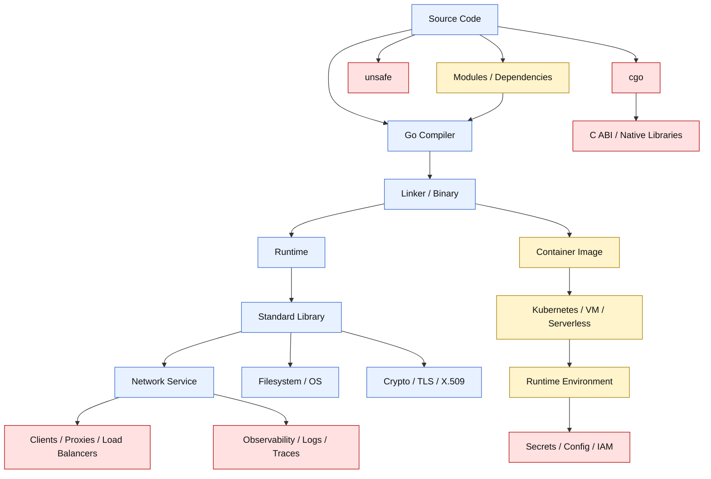
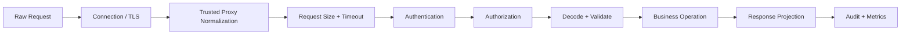
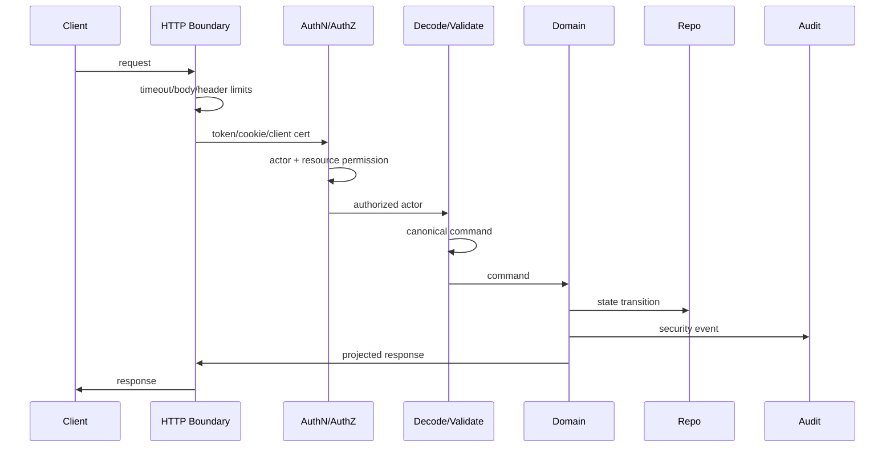

# learn-go-security-cryptography-integrity-part-002.md

# Part 002 — Go Security Surface: Runtime, Compiler, Standard Library, Module System, OS Boundary, `unsafe`, `cgo`, Network Services, and Deployment Boundary

> Seri: `learn-go-security-cryptography-integrity`  
> Part: `002 / 034`  
> Target pembaca: Java software engineer yang ingin memahami Go security sampai level engineering handbook internal.  
> Baseline versi: Go 1.26.x.  
> Status seri: **belum selesai**.

---

## 0. Tujuan Bagian Ini

Pada part sebelumnya, kita membangun mental model bahwa security bukan fitur tambahan, tetapi properti sistem yang muncul dari **boundary**, **invariant**, **control**, dan **failure behavior**.

Bagian ini menjawab pertanyaan:

> “Di Go, permukaan security sebenarnya ada di mana saja?”

Banyak engineer mengira security Go hanya berarti:

- pakai `crypto/tls`,
- jangan SQL injection,
- jangan leak secret,
- jalankan `govulncheck`,
- jangan pakai `unsafe`.

Itu benar, tetapi terlalu sempit.

Dalam Go, security surface tersebar di beberapa lapisan:

1. runtime,
2. compiler,
3. linker dan binary,
4. standard library,
5. module/dependency system,
6. OS boundary,
7. `unsafe`,
8. `cgo`,
9. network service boundary,
10. container/deployment boundary,
11. observability/debug surface,
12. CI/CD and supply-chain boundary.

Part ini bertujuan membuat peta mental lengkap supaya saat nanti kita membahas crypto, TLS, JWT, session, SSRF, audit trail, supply chain, FIPS, dan secure deployment, kita tidak melihatnya sebagai potongan-potongan terpisah.

---

## 1. Premis Utama: Go Memberi Safety, Bukan Security Otomatis

Go memberi banyak safety property:

- memory managed runtime,
- garbage collector,
- bounds check untuk slice/array,
- type safety,
- no pointer arithmetic secara default,
- standard library yang kuat,
- simple dependency model,
- race detector,
- fuzzing built into `go test`,
- `govulncheck`,
- module checksum database,
- reproducible-ish build metadata,
- static binary deployment yang relatif sederhana.

Tetapi safety ini **bukan security guarantee absolut**.

Security tetap bisa gagal karena:

- logic authorization salah,
- trust boundary salah taruh,
- parsing ambiguity,
- `unsafe` mematikan type/memory safety,
- `cgo` membawa memory-unsafe C surface,
- dependency compromised,
- build pipeline tidak terkontrol,
- token/cookie/session salah konfigurasi,
- timeout tidak diset,
- request body tidak dibatasi,
- certificate validation dilemahkan,
- secret masuk log,
- debug endpoint terekspos,
- deployment terlalu privileged,
- container image terlalu besar,
- binary membawa build metadata yang sensitif,
- observability pipeline menyimpan PII.

### 1.1 Go Security Surface Dalam Satu Kalimat

> Go security surface adalah seluruh tempat di mana data, control flow, identity, privilege, memory, dependency, network, dan operational metadata berpindah dari satu trust level ke trust level lain.

---

## 2. Big Picture Diagram



Diagram ini menunjukkan bahwa security Go bukan hanya ada pada kode handler HTTP. Bahkan sebelum program berjalan, banyak keputusan security sudah terjadi:

- compiler flags,
- dependency resolution,
- module verification,
- build metadata,
- binary packaging,
- container base image,
- environment variable,
- secret injection,
- runtime privileges,
- network exposure.

---

## 3. Layer 1 — Source Code Surface

Source code adalah surface pertama karena semua security invariant dimulai dari sini.

Contoh security-relevant source code:

```go
func Transfer(ctx context.Context, actor User, from AccountID, to AccountID, amount Money) error {
    if !actor.CanTransferFrom(from) {
        return ErrForbidden
    }

    if amount.Sign() <= 0 {
        return ErrInvalidAmount
    }

    return tx.Do(ctx, func(ctx context.Context) error {
        if err := ledger.Debit(ctx, from, amount); err != nil {
            return err
        }
        return ledger.Credit(ctx, to, amount)
    })
}
```

Kode ini terlihat sederhana, tetapi surface-nya banyak:

| Surface | Pertanyaan security |
|---|---|
| `ctx` | Apakah cancellation/timeout dipropagasikan? |
| `actor` | Apakah identitas sudah authenticated? |
| `CanTransferFrom` | Apakah authorization berdasar resource, bukan role global saja? |
| `amount` | Apakah validasi canonical? Currency? Precision? Overflow? |
| `tx.Do` | Apakah atomic? Apakah partial failure bisa merusak integrity? |
| `ledger` | Apakah idempotent? Apakah replay aman? |
| error | Apakah error leak detail internal? |

### 3.1 Kode yang Benar Belum Tentu Aman

Kode bisa “correct” menurut unit test, tetapi insecure menurut threat model.

Contoh:

```go
func GetCase(w http.ResponseWriter, r *http.Request) {
    caseID := r.PathValue("caseID")
    c, err := repo.FindCase(r.Context(), caseID)
    if err != nil {
        http.Error(w, "not found", http.StatusNotFound)
        return
    }
    json.NewEncoder(w).Encode(c)
}
```

Secara fungsional:

- request masuk,
- case ditemukan,
- JSON dikembalikan.

Secara security:

- siapa actor-nya?
- apakah actor boleh melihat case itu?
- apakah case dari tenant yang sama?
- apakah field sensitif difilter?
- apakah response dapat di-cache oleh proxy?
- apakah `caseID` canonical?
- apakah error behavior membocorkan keberadaan record?

Versi yang lebih security-aware:

```go
func GetCase(w http.ResponseWriter, r *http.Request) {
    ctx := r.Context()

    actor, ok := auth.ActorFromContext(ctx)
    if !ok {
        writeUnauthorized(w)
        return
    }

    caseID, err := parseCaseID(r.PathValue("caseID"))
    if err != nil {
        writeBadRequest(w)
        return
    }

    c, err := repo.FindCaseForActor(ctx, actor, caseID)
    if err != nil {
        // Deliberately avoid exposing whether the case exists but is forbidden.
        writeNotFound(w)
        return
    }

    view := presenter.CaseViewForActor(actor, c)
    writeJSONNoStore(w, http.StatusOK, view)
}
```

Security improvement-nya bukan magic. Ia datang dari:

- actor binding,
- canonical ID parsing,
- resource-level authorization,
- error normalization,
- response projection,
- cache control.

---

## 4. Layer 2 — Compiler Surface

Compiler adalah bagian security surface karena compiler menentukan:

- apa yang menjadi binary,
- optimisasi apa yang terjadi,
- bounds check elimination,
- escape analysis,
- stack vs heap allocation,
- inlining,
- build tags,
- experiment flags,
- race instrumentation,
- sanitizer instrumentation,
- architecture-specific behavior.

### 4.1 Compiler Tidak Sama dengan Policy Engine

Compiler Go membantu safety, tetapi tidak tahu niat security kita.

Compiler tidak tahu bahwa:

- field `User.IsAdmin` tidak boleh ditentukan dari JSON input,
- `tenantID` harus match dengan token claim,
- `redirect_uri` harus allowlisted,
- `aud` JWT harus diverifikasi,
- `X-Forwarded-For` tidak boleh dipercaya dari internet langsung,
- `request.Body` harus dibatasi,
- error tertentu tidak boleh keluar ke client.

Jadi, compiler adalah safety net, bukan security architect.

### 4.2 Build Tags Sebagai Security Surface

Go build tags bisa mengubah kode yang dikompilasi.

Contoh:

```go
//go:build dev

package config

const EnableDebugAuthBypass = true
```

```go
//go:build !dev

package config

const EnableDebugAuthBypass = false
```

Jika pipeline production salah build dengan tag `dev`, security boundary bisa runtuh.

Rule internal:

> Build tags yang memengaruhi authentication, authorization, TLS verification, logging redaction, crypto mode, atau debug endpoint harus diperlakukan sebagai **security-critical build input**.

Checklist:

- Apakah production build tags dikunci di CI?
- Apakah build command terekam dalam provenance?
- Apakah image label menyimpan `go version`, commit, dan build flags?
- Apakah dev-only files punya guard test?
- Apakah `go list -json` atau build metadata diverifikasi saat release?

### 4.3 Compiler Flags yang Security-Relevant

Beberapa flag/setting yang perlu diketahui:

```bash
go test -race ./...
go test -fuzz=Fuzz ./...
go test -run=Test -count=1 ./...
go vet ./...
go build -trimpath ./cmd/service
go version -m ./service
```

| Tool/flag | Security relevance |
|---|---|
| `-race` | Menemukan data race yang bisa menjadi authorization/session/cache bug |
| fuzzing | Menemukan parser edge case, panic, denial-of-service behavior |
| `go vet` | Menangkap pola kode mencurigakan, walau bukan security scanner penuh |
| `-trimpath` | Mengurangi leakage path lokal di binary/debug info |
| `go version -m` | Melihat build metadata dan dependency versions di binary |
| build tags | Bisa menyalakan/mematikan security behavior |
| `GOEXPERIMENT` | Bisa mengubah runtime/compiler behavior |

### 4.4 Go 1.26 Runtime/Compiler Context

Go 1.26 membawa beberapa perubahan yang security-relevant:

- heap base address randomization di platform 64-bit,
- faster cgo calls,
- experimental goroutine leak profile,
- compiler dapat menaruh backing store slice di stack dalam lebih banyak situasi,
- security fixes di beberapa patch release 1.26.x.

Heap base address randomization penting karena membuat address prediction lebih sulit, terutama saat ada interaksi dengan `cgo`. Tetapi ini bukan alasan untuk merasa aman memakai C/unsafe sembarangan. Ia mitigation, bukan permission.

Experimental goroutine leak profile juga relevan secara security karena goroutine leak bisa menjadi availability bug dan DoS amplifier.

---

## 5. Layer 3 — Linker and Binary Surface

Go sering menghasilkan single binary. Ini menyederhanakan deployment, tetapi juga membuat binary menjadi artefak security utama.

Binary membawa:

- compiled code,
- dependency metadata,
- build information,
- symbol/debug data tergantung flags,
- embedded files jika pakai `embed`,
- string literals,
- error messages,
- default configuration,
- possibly secrets jika build process salah.

### 5.1 Jangan Pernah Embed Secret ke Binary

Bad:

```go
const jwtSigningKey = "prod-super-secret-key"
```

Lebih halus tetapi tetap buruk:

```go
//go:embed secrets/prod.pem
var prodPrivateKeyPEM []byte
```

Kenapa buruk?

- Binary bisa di-copy dari container image.
- Binary bisa diambil dari crash dump.
- Binary bisa diperiksa dengan `strings`.
- Secret rotation butuh rebuild/redeploy.
- Secret masuk artifact store.
- Secret bisa terbawa ke environment non-prod.

Rule:

> Binary boleh membawa public defaults, schema, templates, dan public assets. Binary tidak boleh membawa secret production.

### 5.2 `go version -m` Sebagai Binary Inspection

Go binary dapat menyimpan build info yang berguna untuk audit.

Contoh command:

```bash
go version -m ./service
```

Gunakan untuk:

- mengecek versi Go,
- dependency module versions,
- build settings,
- VCS revision jika tersedia,
- dirty flag,
- build tags.

Security use case:

- incident response,
- vulnerability triage,
- provenance validation,
- verifying deployed binary matches expected commit.

### 5.3 Binary Metadata vs Information Disclosure

Build metadata membantu traceability, tetapi bisa juga mengungkap:

- path internal,
- module path private,
- dependency names,
- VCS info,
- build flags.

`-trimpath` membantu menghilangkan path sistem lokal dari executable.

Trade-off:

| Goal | Decision |
|---|---|
| Reproducibility/privacy | Use `-trimpath` |
| Incident traceability | Keep controlled VCS/build metadata |
| Avoid secret leakage | Never put secret in code/embed/ldflags |
| Debuggability | Store symbols separately if needed |

### 5.4 `ldflags -X` Risk

Go memungkinkan injection variable saat link:

```bash
go build -ldflags "-X main.version=1.2.3"
```

Ini berguna untuk versioning, tetapi berbahaya jika dipakai untuk secret:

```bash
go build -ldflags "-X main.apiKey=$PROD_API_KEY"
```

Itu tetap masuk binary.

Rule:

> `-ldflags -X` hanya untuk non-secret metadata: version, commit, build time, environment label. Jangan untuk API key, private key, password, token, pepper, atau signing secret.

---

## 6. Layer 4 — Runtime Surface

Go runtime mengatur:

- goroutine scheduling,
- stack growth,
- garbage collection,
- panic/recover,
- map implementation,
- timers,
- network poller,
- finalizer,
- cgo coordination,
- memory allocation,
- pprof hooks,
- runtime/debug knobs.

Runtime bukan hanya performance concern. Ia juga security surface.

### 6.1 Panic Boundary

Panic di Go adalah runtime failure path. Dalam service, panic bisa menjadi:

- availability issue,
- information disclosure jika stack trace keluar,
- request-level failure,
- process-level crash,
- partial state mutation jika transaksi tidak aman.

Bad:

```go
func handler(w http.ResponseWriter, r *http.Request) {
    id := r.URL.Query().Get("id")
    item := cache[id]
    fmt.Fprintln(w, item.Value) // panic if item nil
}
```

Panic recovery middleware perlu:

- menangkap panic per request,
- log internal dengan correlation ID,
- tidak mengirim stack trace ke client,
- memastikan response generic,
- tidak menyembunyikan systemic failure dari alerting.

Contoh minimal:

```go
func Recover(next http.Handler, log Logger) http.Handler {
    return http.HandlerFunc(func(w http.ResponseWriter, r *http.Request) {
        defer func() {
            if rec := recover(); rec != nil {
                requestID := RequestIDFromContext(r.Context())
                log.Error("panic recovered", "request_id", requestID, "panic", rec)
                http.Error(w, "internal error", http.StatusInternalServerError)
            }
        }()
        next.ServeHTTP(w, r)
    })
}
```

Tapi recovery bukan excuse untuk panic-driven code. Security invariant tetap harus dijaga sebelum side effect.

### 6.2 Goroutine Leak as Security Surface

Goroutine leak bukan hanya resource bug. Ia bisa menjadi DoS bug.

Pattern berbahaya:

```go
func queryAll(ctx context.Context, ids []string) ([]Result, error) {
    ch := make(chan Result)

    for _, id := range ids {
        go func(id string) {
            r := slowLookup(ctx, id)
            ch <- r
        }(id)
    }

    var out []Result
    for range ids {
        r := <-ch
        if r.Err != nil {
            return nil, r.Err // goroutine lain bisa blocked saat send
        }
        out = append(out, r)
    }
    return out, nil
}
```

Security consequence:

- attacker kirim input yang menyebabkan early error,
- goroutine tertinggal blocked,
- memory bertambah,
- scheduler pressure naik,
- service degrade,
- akhirnya DoS.

Perbaikan mental model:

- bounded concurrency,
- context cancellation,
- buffered channel sesuai worker count atau result count,
- drain or cancel,
- `errgroup` dengan limit jika dependency external diperbolehkan,
- timeout per operation.

Versi standard-library style:

```go
func queryAll(ctx context.Context, ids []string, maxWorkers int) ([]Result, error) {
    ctx, cancel := context.WithCancel(ctx)
    defer cancel()

    jobs := make(chan string)
    results := make(chan Result, len(ids))

    var wg sync.WaitGroup
    for range maxWorkers {
        wg.Add(1)
        go func() {
            defer wg.Done()
            for id := range jobs {
                select {
                case <-ctx.Done():
                    return
                default:
                }

                r := slowLookup(ctx, id)

                select {
                case results <- r:
                case <-ctx.Done():
                    return
                }
            }
        }()
    }

    go func() {
        defer close(jobs)
        for _, id := range ids {
            select {
            case jobs <- id:
            case <-ctx.Done():
                return
            }
        }
    }()

    go func() {
        wg.Wait()
        close(results)
    }()

    out := make([]Result, 0, len(ids))
    for r := range results {
        if r.Err != nil {
            cancel()
            return nil, r.Err
        }
        out = append(out, r)
    }
    return out, ctx.Err()
}
```

### 6.3 GC and Secret Lifetime

Go GC membuat memory management lebih aman dibanding manual memory management. Tetapi untuk secret, GC punya konsekuensi:

- secret dalam `[]byte` bisa hidup lebih lama dari yang kita kira,
- copy bisa terjadi saat append, string conversion, logging, JSON encoding,
- string immutable sulit di-zero,
- secret bisa muncul di heap dump/core dump/log,
- compiler optimization bisa menghapus zeroing jika tidak hati-hati.

Rule praktis:

- gunakan `[]byte` untuk secret yang perlu dihapus,
- hindari `string` untuk secret bila lifecycle perlu dikontrol,
- jangan log secret,
- batasi lifetime variable,
- jangan masukkan secret ke error,
- jangan gunakan `fmt.Sprintf` untuk membentuk secret message,
- gunakan KMS/HSM untuk private key jika compliance membutuhkan.

Zeroing helper:

```go
func zero(b []byte) {
    for i := range b {
        b[i] = 0
    }
    runtime.KeepAlive(b)
}
```

Catatan penting: zeroing di Go adalah best effort, bukan bukti formal bahwa semua copy secret sudah hilang. Untuk threat model tinggi, gunakan design yang meminimalkan material secret berada di process memory.

### 6.4 Finalizer Bukan Security Control

Go punya finalizer via `runtime.SetFinalizer`, tetapi finalizer tidak deterministic. Jangan gunakan finalizer sebagai mekanisme utama untuk:

- menutup key handle security critical,
- revoke session,
- menghapus file secret,
- zeroing secret,
- audit finalization,
- release lock compliance-critical.

Rule:

> Security cleanup harus explicit, deterministic, dan testable. Finalizer hanya fallback observability, bukan security guarantee.

---

## 7. Layer 5 — Standard Library Surface

Go standard library sangat kuat, tetapi bukan “secure by intent” untuk semua use case. Banyak package bersifat general-purpose. Security tergantung cara pakai.

### 7.1 Security-Critical Standard Library Packages

| Package | Surface |
|---|---|
| `net/http` | HTTP server/client, timeout, header, body, redirect, proxy, TLS binding |
| `crypto/tls` | TLS config, certificate, cipher, client auth, ALPN, FIPS behavior |
| `crypto/x509` | certificate parsing/verification, roots, SAN, EKU, chain building |
| `crypto/rand` | secure randomness |
| `crypto/subtle` | constant-time comparison |
| `crypto/hmac` | keyed integrity |
| `crypto/aes`, `cipher` | symmetric crypto; misuse risk if not AEAD |
| `crypto/ed25519`, `ecdsa`, `rsa` | signatures and public key crypto |
| `encoding/json` | parsing ambiguity, unknown fields, number precision, mass assignment |
| `encoding/xml` | XML parsing, entity/size risk, schema assumptions |
| `html/template` | contextual auto-escaping; misuse with `template.HTML` |
| `text/template` | no HTML escaping; dangerous for untrusted templates |
| `archive/tar`, `archive/zip` | path traversal, symlink extraction, decompression risk |
| `os`, `io/fs`, `path/filepath` | path traversal, symlink race, permissions |
| `os/exec` | command execution boundary |
| `net`, `net/netip` | IP validation, SSRF defense, network classification |
| `url` | URL parsing, normalization, redirect validation |
| `mime/multipart` | upload boundary and memory/disk limits |
| `log/slog` | structured logging, redaction discipline |
| `runtime/pprof`, `net/http/pprof` | debug information exposure |
| `expvar` | runtime metrics exposure |

### 7.2 `net/http`: Safe Defaults Are Not Complete Defaults

A common insecure server:

```go
http.ListenAndServe(":8080", mux)
```

Problem:

- no read timeout,
- no header timeout,
- no write timeout,
- no idle timeout,
- no max header size customization,
- no TLS,
- hard to shut down cleanly,
- easy slowloris target.

Better baseline:

```go
srv := &http.Server{
    Addr:              ":8080",
    Handler:           mux,
    ReadHeaderTimeout: 5 * time.Second,
    ReadTimeout:       15 * time.Second,
    WriteTimeout:      30 * time.Second,
    IdleTimeout:       60 * time.Second,
    MaxHeaderBytes:    1 << 20,
}

if err := srv.ListenAndServe(); err != nil && !errors.Is(err, http.ErrServerClosed) {
    log.Error("server failed", "err", err)
}
```

Security point:

> HTTP server without explicit timeout is usually an availability vulnerability waiting for traffic shape to expose it.

### 7.3 HTTP Body Limit

Bad:

```go
body, err := io.ReadAll(r.Body)
```

Attacker can send huge body.

Better:

```go
const maxBody = 1 << 20 // 1 MiB
r.Body = http.MaxBytesReader(w, r.Body, maxBody)
defer r.Body.Close()

body, err := io.ReadAll(r.Body)
if err != nil {
    http.Error(w, "request too large", http.StatusRequestEntityTooLarge)
    return
}
```

### 7.4 HTTP Client Surface

A common insecure client:

```go
resp, err := http.Get(url)
```

Problem:

- default client has no request timeout,
- redirect behavior may surprise,
- proxy env variables may affect routing,
- TLS config not explicit,
- SSRF risk if URL is user-controlled,
- response body size may be unbounded.

Better:

```go
client := &http.Client{
    Timeout: 10 * time.Second,
    CheckRedirect: func(req *http.Request, via []*http.Request) error {
        if len(via) >= 3 {
            return errors.New("too many redirects")
        }
        return validateOutboundURL(req.URL)
    },
    Transport: &http.Transport{
        Proxy:                 http.ProxyFromEnvironment,
        TLSHandshakeTimeout:   5 * time.Second,
        ResponseHeaderTimeout: 10 * time.Second,
        ExpectContinueTimeout: 1 * time.Second,
        IdleConnTimeout:       60 * time.Second,
        MaxIdleConns:          100,
        MaxIdleConnsPerHost:   10,
    },
}
```

For SSRF-sensitive systems, `ProxyFromEnvironment` may itself be a policy decision. Do not use it blindly in high-control outbound callers.

### 7.5 `crypto/tls`

`crypto/tls` implements TLS 1.2 and TLS 1.3. The security issue is usually not “Go TLS is weak”, but “application weakened TLS config”.

Bad:

```go
tr := &http.Transport{
    TLSClientConfig: &tls.Config{
        InsecureSkipVerify: true,
    },
}
```

`InsecureSkipVerify` disables certificate verification. It is sometimes used during local development and accidentally shipped.

Safer pattern:

```go
roots, err := x509.SystemCertPool()
if err != nil {
    return err
}

client := &http.Client{
    Timeout: 10 * time.Second,
    Transport: &http.Transport{
        TLSClientConfig: &tls.Config{
            MinVersion: tls.VersionTLS12,
            RootCAs:    roots,
        },
    },
}
```

For internal services, prefer mTLS with explicit trust roots rather than disabling verification.

### 7.6 `crypto/x509`

`crypto/x509` can parse/generate certificates and verify chains. The tricky part is not parsing; it is policy:

- trusted root set,
- SAN matching,
- EKU requirements,
- expiry behavior,
- intermediate constraints,
- private CA rotation,
- system roots vs custom roots,
- mTLS client identity mapping.

Do not assume a valid certificate chain automatically means the caller is authorized. It only proves possession of a private key corresponding to a certificate chaining to a trust anchor under certain verification options.

### 7.7 `encoding/json` as Security Surface

JSON is not just data mapping. It is trust boundary crossing.

Risk examples:

#### Unknown fields silently ignored

```go
type CreateUserRequest struct {
    Email string `json:"email"`
}
```

Input:

```json
{
  "email": "a@example.com",
  "role": "admin"
}
```

By default, unknown field `role` is ignored. That may be fine. But in strict APIs, it can hide client mistakes or attack attempts.

Strict decoder:

```go
func decodeStrictJSON(r io.Reader, dst any, max int64) error {
    lr := io.LimitReader(r, max)
    dec := json.NewDecoder(lr)
    dec.DisallowUnknownFields()
    dec.UseNumber()

    if err := dec.Decode(dst); err != nil {
        return err
    }

    if dec.Decode(&struct{}{}) != io.EOF {
        return errors.New("multiple JSON values")
    }
    return nil
}
```

#### Mass assignment

Bad:

```go
type User struct {
    Email   string `json:"email"`
    IsAdmin bool   `json:"is_admin"`
}

json.NewDecoder(r.Body).Decode(&user)
```

Safer:

```go
type CreateUserRequest struct {
    Email string `json:"email"`
}
```

Never decode external input directly into persistence/domain object if the object has privileged fields.

### 7.8 `html/template` vs `text/template`

`html/template` provides contextual escaping for HTML output. `text/template` does not.

Bad for HTML:

```go
tmpl := template.Must(texttemplate.New("page").Parse(`<div>{{.Name}}</div>`))
```

Better:

```go
tmpl := template.Must(template.New("page").Parse(`<div>{{.Name}}</div>`))
```

But even `html/template` can be made unsafe if you mark untrusted input as trusted:

```go
template.HTML(userControlledInput) // dangerous
```

Rule:

> Types like `template.HTML`, `template.JS`, and `template.URL` are trust assertions. Treat them like privilege escalation APIs.

### 7.9 Archive Packages

`archive/zip` and `archive/tar` are common sources of path traversal and extraction bugs.

Dangerous:

```go
path := filepath.Join(dest, file.Name)
writeFile(path, content)
```

If `file.Name` is `../../etc/passwd`, `filepath.Join` alone is not enough.

Safer extraction must:

- clean path,
- reject absolute path,
- reject `..`,
- resolve symlink policy,
- enforce destination prefix,
- limit total extracted size,
- limit file count,
- reject special device files if not expected,
- set safe permissions.

We will cover this deeply in part 025.

---

## 8. Layer 6 — Module and Dependency Surface

Go module system is a major supply-chain boundary.

### 8.1 What Can Go Module System Protect?

Go module system helps with:

- version pinning via `go.mod`,
- integrity via `go.sum`,
- module download verification via checksum database,
- module proxy isolation,
- minimal version selection behavior,
- reproducibility improvement,
- vulnerability visibility via `govulncheck` and pkg.go.dev.

It does **not** automatically protect against:

- malicious code in a dependency version you intentionally import,
- compromised maintainer publishing a bad release,
- build scripts or generated code abuse,
- typosquatting if you import the wrong path,
- private module leakage if `GOPRIVATE` is wrong,
- unsafe/cgo inside dependency,
- transitive dependency logic vulnerabilities,
- runtime behavior hidden behind init functions.

### 8.2 `go.mod` and `go.sum` Mental Model

`go.mod` expresses module requirements.

`go.sum` stores cryptographic hashes of module content and `go.mod` files used by the build graph.

But `go.sum` is not a vulnerability scanner. It proves “this is the same code content as before,” not “this code is safe.”

### 8.3 Checksum Database

The public checksum database gives transparency and tamper evidence for public modules. The Go command can authenticate records via signed tree hashes and inclusion/consistency proofs.

Security meaning:

- helps detect module tampering,
- helps repeatable downloads,
- makes it harder for proxy/origin to serve inconsistent content silently.

But for private modules, you must configure privacy correctly.

### 8.4 `GOPRIVATE`, `GONOSUMDB`, `GONOPROXY`

If your private module path is not configured, the go command may try public infrastructure.

Example:

```bash
go env -w GOPRIVATE=git.example.com/company/*
go env -w GONOSUMDB=git.example.com/company/*
go env -w GONOPROXY=git.example.com/company/*
```

For enterprise:

- centralize settings in CI image,
- avoid developers manually setting inconsistent env,
- document private module path pattern,
- test that private paths are not requested externally,
- use internal proxy when possible.

### 8.5 Dependency Review Checklist

Before adding a dependency:

| Question | Why it matters |
|---|---|
| Is it needed? | Every dependency is new attack surface |
| Is it maintained? | Stale packages accumulate CVEs and compatibility risk |
| Does it use `unsafe`? | May bypass memory safety |
| Does it use `cgo`? | Pulls native toolchain/library risk |
| Does it run code in `init()`? | Hidden side effects at import time |
| Does it parse untrusted input? | Parser bugs become your bugs |
| Does it handle crypto? | Crypto dependency needs high trust |
| Does it touch network/filesystem/env? | Side effects and exfiltration risk |
| Is license acceptable? | Legal/compliance surface |
| Does `govulncheck` report reachable vulns? | Prioritized vulnerability risk |

### 8.6 `init()` as Hidden Execution Surface

Go packages can run code at initialization.

```go
func init() {
    http.DefaultTransport.(*http.Transport).TLSClientConfig = &tls.Config{
        InsecureSkipVerify: true,
    }
}
```

This is extreme, but illustrates the point: imported code can mutate global state.

Review dependencies for:

- unexpected `init`,
- global HTTP client mutation,
- env reads,
- default logger mutation,
- metrics endpoint registration,
- crypto provider modification,
- process-wide signal handling.

### 8.7 Vendoring

Vendoring can help isolation, but it changes responsibility.

If you vendor:

- you freeze dependency content locally,
- you must update manually,
- vulnerability scanning must include vendor tree or module metadata,
- review diffs when refreshing vendor.

Vendoring is not automatically more secure; it is more controlled if managed well.

---

## 9. Layer 7 — OS Boundary

Go programs run inside an OS context. Security depends heavily on process privileges and OS interaction.

### 9.1 Environment Variables

Environment variables are convenient, but not ideal for all secrets.

Risks:

- inherited by child processes,
- visible in some process inspection contexts depending OS/config,
- captured in crash diagnostics,
- logged accidentally,
- hard to rotate live,
- often overused as secret store.

Use environment variables for:

- non-secret config,
- pointers to secret locations,
- feature flags that are not security critical.

Be careful with:

- DB passwords,
- signing keys,
- private keys,
- OAuth client secrets,
- long-lived API keys.

Better options:

- mounted secret files with strict permissions,
- KMS decrypt on boot,
- short-lived credentials,
- workload identity,
- sidecar/agent with lease,
- HSM/KMS signing operations.

### 9.2 Filesystem Permissions

Security-relevant files:

- TLS private keys,
- config files,
- token cache,
- temporary upload files,
- Unix domain sockets,
- log files,
- pid files,
- generated reports,
- exported audit data.

Checklist:

- Are permissions least privilege?
- Is owner correct?
- Are temp files created safely?
- Is path canonicalized?
- Are symlinks allowed?
- Is directory writable by attacker?
- Is file opened with safe flags?
- Is data fsync requirement understood?

### 9.3 Temporary Files

Bad:

```go
path := "/tmp/upload-" + userID
os.WriteFile(path, data, 0644)
```

Problems:

- predictable filename,
- symlink race,
- permission too broad,
- userID path injection,
- collision.

Better:

```go
f, err := os.CreateTemp("", "upload-*.bin")
if err != nil {
    return err
}
defer os.Remove(f.Name())
defer f.Close()

if _, err := io.Copy(f, limitedReader); err != nil {
    return err
}
```

### 9.4 Command Execution

`os/exec` is a high-risk boundary.

Bad:

```go
cmd := exec.Command("sh", "-c", "convert " + input + " " + output)
```

Better:

```go
cmd := exec.CommandContext(ctx, "convert", "--", inputPath, outputPath)
cmd.Env = minimalEnv()
cmd.Dir = workDir
cmd.Stdout = stdout
cmd.Stderr = stderr
```

Rules:

- avoid shell unless absolutely necessary,
- pass args as separate arguments,
- use `CommandContext` with timeout,
- set working directory,
- set minimal environment,
- validate executable path,
- bound stdout/stderr,
- avoid passing secrets in args because process args may be visible,
- consider sandboxing for untrusted file processing.

### 9.5 Signals and Shutdown

Improper shutdown can corrupt integrity:

- partially written audit log,
- in-flight transaction interrupted,
- queue message acknowledged before durable processing,
- lock not released,
- temp secret file left behind.

Go service should handle:

- SIGTERM,
- context cancellation,
- graceful HTTP shutdown,
- queue drain,
- timeout cap,
- idempotent resume.

Security point:

> Graceful shutdown is not only reliability. It is integrity control.

---

## 10. Layer 8 — `unsafe` Surface

Package `unsafe` contains operations that bypass Go type safety. Packages importing `unsafe` may be non-portable and are not protected by Go 1 compatibility guidelines.

That sentence should be treated as a security warning.

### 10.1 What `unsafe` Breaks

`unsafe` can break:

- type safety,
- memory safety,
- pointer lifetime assumptions,
- immutability assumptions,
- alignment assumptions,
- portability,
- future compatibility,
- GC visibility expectations,
- escape analysis assumptions.

### 10.2 Common `unsafe` Motivations

Engineers use `unsafe` for:

- zero-copy string/[]byte conversion,
- memory-mapped data structures,
- serialization speed,
- syscalls/native interop,
- manual layout,
- performance hacks,
- avoiding allocation.

Not all `unsafe` is forbidden. But all `unsafe` must be justified.

### 10.3 Example: Unsafe String to Bytes

Dangerous:

```go
func bytesFromString(s string) []byte {
    return unsafe.Slice(unsafe.StringData(s), len(s))
}
```

Problem:

- Go strings are immutable.
- Mutating returned bytes violates invariant.
- Underlying memory may be read-only or shared.
- Future compiler/runtime behavior may break assumptions.

Safer:

```go
b := []byte(s)
```

Allocation is often acceptable compared to security ambiguity.

### 10.4 `unsafe` Review Contract

Every use of `unsafe` should have a comment answering:

1. What invariant is being bypassed?
2. Why is safe Go insufficient?
3. What memory lifetime is assumed?
4. What alignment is required?
5. What mutation is forbidden?
6. What Go versions/architectures are tested?
7. What fuzz/race/stress tests cover this?
8. What benchmark proves the risk is worth it?
9. What fallback exists?
10. Who owns review?

Template:

```go
// SAFETY:
// - This conversion is read-only; the returned slice must never be mutated.
// - The source buffer is owned by mmapRegion and remains alive until Close.
// - Alignment is guaranteed by file format version 3 header validation.
// - Covered by FuzzDecodeRecord and TestMmapLifetime.
// - Do not reuse this helper for general []byte/string conversion.
func unsafeRecordView(...) ... {
    ...
}
```

### 10.5 Policy

For high-integrity services:

- no `unsafe` in business logic packages,
- isolate in small internal package,
- require explicit owner,
- require fuzz tests,
- require architecture matrix,
- forbid `unsafe` for crypto shortcuts unless reviewed by cryptography expert,
- forbid unsafe mutation of strings,
- forbid unsafe parsing of untrusted input unless heavily fuzzed and bounded.

---

## 11. Layer 9 — `cgo` Surface

`cgo` allows Go to call C code. It is powerful and dangerous.

When you use `cgo`, you import:

- C memory safety risks,
- native dependency supply chain,
- ABI compatibility risk,
- linker complexity,
- platform-specific behavior,
- pointer passing rules,
- C allocator lifecycle,
- signal/threading interactions,
- sanitizer/tooling complexity,
- container image dependency risk.

### 11.1 Why `cgo` Is a Security Boundary

Pure Go code mostly avoids classic C memory corruption classes.

With `cgo`, those classes can return:

- buffer overflow,
- use-after-free,
- double free,
- integer overflow in native library,
- null pointer dereference,
- format string bugs,
- native parser vulnerabilities,
- undefined behavior.

Go 1.26 heap base address randomization makes address prediction harder when using `cgo`, but it does not make C safe.

### 11.2 Pointer Passing Rules

Cgo has strict pointer passing rules because Go GC needs to know Go pointer locations.

Core idea:

- Go pointer to Go memory cannot be freely retained by C.
- C may keep a Go pointer only while memory is pinned.
- Certain Go values such as string/slice/channel/map/function include pointers and cannot be retained arbitrarily by C.
- Runtime checks exist, but `unsafe` and C can bypass correctness.

Security meaning:

- pointer misuse can become unpredictable memory corruption,
- memory corruption can become security vulnerability,
- C code has no Go type/lifetime enforcement.

### 11.3 C Allocations Must Be Freed

Example:

```go
cs := C.CString("hello")
defer C.free(unsafe.Pointer(cs))
C.myprint(cs)
```

Missing `C.free` is a leak. With attacker-controlled requests, leaks can become DoS.

### 11.4 `cgo` Dependency Review

Before using `cgo`, ask:

| Question | Security reason |
|---|---|
| Is there a pure-Go implementation? | Avoid native memory risk |
| Is native library maintained? | CVE/patch lifecycle |
| How is native library shipped? | OS package, static link, container layer |
| Who patches it? | Ownership clarity |
| Is input attacker-controlled? | Parser risk |
| Does C hold Go pointers? | GC/lifetime risk |
| Does library use global state? | Concurrency/security coupling |
| Does it read env/config? | Hidden behavior |
| Can it call back into Go? | Reentrancy risk |
| Are sanitizers run? | Native memory bug detection |

### 11.5 `CGO_ENABLED=0` Is Not Always “More Secure”

Disabling cgo can reduce native attack surface. But it can also change behavior:

- DNS resolver behavior,
- user/group lookup behavior,
- certificate/root behavior depending OS and build,
- SQLite/native dependencies unavailable,
- FIPS/native crypto strategy changes depending architecture.

Decision should be explicit:

```text
Service: public API gateway
CGO_ENABLED: 0
Reason: avoid native dependency; pure Go net/http/TLS; no OS-specific native requirement
Owner: platform security
Test: integration DNS/TLS/cert-root behavior in target base image
```

For each service, document `CGO_ENABLED` as a deployment/security decision.

---

## 12. Layer 10 — Network Service Surface

Go is often used for network services. Network boundary is the most visible security surface.

### 12.1 Inbound Surface

Inbound attack vectors:

- slowloris,
- huge headers,
- huge body,
- malformed path,
- path traversal,
- header spoofing,
- HTTP request smuggling through proxy mismatch,
- TLS downgrade/misconfig,
- route confusion,
- auth bypass by middleware order,
- panic via malformed payload,
- JSON/XML parser bombs,
- file upload attacks,
- brute force login,
- token replay,
- multi-tenant object access.

### 12.2 Middleware Order Is Security-Critical

Bad order:

```text
logging -> business handler -> auth -> rate limit
```

Better baseline:

```text
request id
-> panic recovery
-> server deadline/context
-> remote address normalization
-> request size/header limits
-> TLS/proxy trust validation
-> authentication
-> authorization
-> rate/quota policy
-> input decode/validation
-> business handler
-> response security headers
-> audit log
```

Diagram:



### 12.3 Proxy Headers

Headers like these are dangerous if trusted blindly:

- `X-Forwarded-For`,
- `X-Forwarded-Host`,
- `X-Forwarded-Proto`,
- `Forwarded`,
- `X-Real-IP`.

Rule:

> Only trust proxy headers if the immediate peer is a trusted proxy/load balancer, and normalize them once at the edge.

Never let arbitrary internet clients define their own client IP or scheme.

### 12.4 Outbound Surface

Outbound calls can leak or compromise:

- SSRF into metadata service,
- internal service exposure,
- token leakage to redirect target,
- DNS rebinding,
- proxy environment hijack,
- oversized response DoS,
- infinite redirects,
- unbounded retry storm,
- TLS verification bypass,
- mTLS private key exposure.

Outbound caller checklist:

- validate scheme,
- validate host allowlist,
- resolve and classify IP,
- reject private/link-local/loopback unless explicitly allowed,
- disable or constrain redirects,
- set timeout,
- limit response body,
- propagate cancellation,
- avoid forwarding sensitive headers across trust boundary,
- log destination safely.

---

## 13. Layer 11 — Crypto Surface

Crypto is a major part of this series, but here we only map the surface.

### 13.1 Crypto APIs Are Sharp Tools

Security bugs happen when developers confuse:

| Need | Correct primitive family | Common mistake |
|---|---|---|
| Password storage | Argon2id/bcrypt/scrypt/PBKDF2 | SHA256(password) |
| Message integrity | HMAC/MAC/signature | Plain hash |
| Confidentiality + integrity | AEAD | AES-CBC without MAC |
| Identity proof | Signature/certificate | Encrypting with private key wording confusion |
| Token randomness | CSPRNG | `math/rand` |
| Constant-time check | `crypto/subtle` or API verify | `==` for secret MAC |
| Key derivation | HKDF/PBKDF/KDF | Reusing one key for all purposes |

### 13.2 Crypto Surface in Go Codebase

Search for:

```bash
grep -R "crypto/" -n .
grep -R "math/rand" -n .
grep -R "InsecureSkipVerify" -n .
grep -R "md5\|sha1" -n .
grep -R "pem.Decode" -n .
grep -R "x509" -n .
grep -R "jwt" -n .
grep -R "Password" -n .
```

But grep is not enough. Crypto misuse often hides in business names:

- `GenerateToken`,
- `SignPayload`,
- `VerifyWebhook`,
- `EncryptValue`,
- `HashPassword`,
- `CreateSession`,
- `ValidateCallback`,
- `BuildRedirectURL`.

### 13.3 Crypto Review Principle

> Crypto code should be boring, standard, minimal, and centrally owned.

Avoid:

- custom encryption format without versioning,
- homegrown key derivation,
- raw block cipher modes,
- homemade JWT parser,
- signature verification before canonicalization,
- accepting `alg: none`,
- using one key for encryption, MAC, JWT, cookie, webhook, and database field encryption.

---

## 14. Layer 12 — Observability and Debug Surface

Observability can become exfiltration.

### 14.1 Logs

Logs may contain:

- access tokens,
- refresh tokens,
- session IDs,
- cookies,
- authorization headers,
- PII,
- database IDs,
- internal URLs,
- stack traces,
- SQL queries with parameters,
- request bodies,
- certificate material,
- private error messages.

Structured logging does not automatically solve this. It makes data easier to query, including sensitive data.

Rule:

> Redaction must happen before data enters log/event/trace pipeline.

### 14.2 `pprof` and `expvar`

Debug endpoints can expose:

- stack traces,
- goroutine states,
- heap profiles,
- command line args,
- environment-like metadata,
- performance characteristics,
- internal package/function names.

Do not expose `/debug/pprof` or `/debug/vars` to the public internet.

Better patterns:

- bind debug server to localhost/private network,
- require mTLS/admin auth,
- expose only through secure port-forward,
- separate debug listener from public listener,
- disable in high-risk environments if not needed,
- audit access.

Example:

```go
go func() {
    debugMux := http.NewServeMux()
    debugMux.HandleFunc("/healthz", healthz)
    // Register pprof only if explicitly enabled.

    srv := &http.Server{
        Addr:              "127.0.0.1:6060",
        Handler:           debugMux,
        ReadHeaderTimeout: 2 * time.Second,
    }
    _ = srv.ListenAndServe()
}()
```

### 14.3 Tracing

Trace attributes can leak:

- URL query tokens,
- user email,
- national ID,
- case title,
- document name,
- raw payload,
- SQL parameters.

Adopt attribute classification:

| Class | Example | Export? |
|---|---|---|
| Public | route template, status code | yes |
| Internal | service name, region | yes with care |
| Confidential | user ID, tenant ID | controlled |
| Restricted | token, password, private key, PII | no |

---

## 15. Layer 13 — Deployment Boundary

A secure Go binary can be deployed insecurely.

### 15.1 Container Image Surface

Container image contains:

- Go binary,
- OS packages,
- CA certificates,
- shell/tools,
- config files,
- user/group definitions,
- timezone data,
- libc if dynamically linked,
- native libs if cgo,
- possibly leftover build artifacts.

Security decisions:

- distroless/scratch vs full distro,
- non-root user,
- read-only filesystem,
- drop Linux capabilities,
- seccomp/AppArmor/SELinux,
- pinned base image digest,
- image scanning,
- SBOM,
- provenance/signing,
- no package manager in runtime image if not needed.

### 15.2 Multi-Stage Dockerfile Baseline

Example:

```Dockerfile
FROM golang:1.26 AS build
WORKDIR /src
COPY go.mod go.sum ./
RUN go mod download
COPY . .
RUN CGO_ENABLED=0 GOOS=linux GOARCH=amd64 \
    go build -trimpath -o /out/service ./cmd/service

FROM gcr.io/distroless/static-debian12:nonroot
COPY --from=build /out/service /service
USER nonroot:nonroot
ENTRYPOINT ["/service"]
```

This is not universally correct. If you need cgo, timezone data, CA roots, shell for diagnostics, or FIPS mode, adapt deliberately.

### 15.3 Kubernetes Surface

Kubernetes deployment security-relevant fields:

- service account,
- RBAC,
- secrets/configmaps,
- env vars,
- volume mounts,
- container security context,
- pod security context,
- network policies,
- ingress annotations,
- readiness/liveness probes,
- resource requests/limits,
- image pull policy,
- image digest pinning,
- sidecars,
- service mesh mTLS,
- debug ephemeral containers.

Example hardened intent:

```yaml
securityContext:
  runAsNonRoot: true
  allowPrivilegeEscalation: false
  readOnlyRootFilesystem: true
  capabilities:
    drop: ["ALL"]
```

But do not cargo-cult. Some apps need writable temp dirs. Then explicitly mount an `emptyDir` at the required path with size limits.

### 15.4 IAM / Workload Identity

Cloud IAM is often more important than in-process secret handling.

Bad:

- one service account shared by many services,
- broad permissions,
- long-lived static keys,
- secrets mounted into every pod,
- no audit of credential use.

Better:

- workload identity,
- least privilege IAM role per service,
- short-lived credentials,
- no static cloud keys in env,
- explicit KMS key policy,
- separate read/write roles,
- audit logs enabled.

---

## 16. Layer 14 — CI/CD and Supply Chain Boundary

CI/CD is the place where source becomes artifact.

Attackers love CI/CD because compromising build can compromise production without touching source code.

### 16.1 CI Inputs

Security-critical CI inputs:

- source commit,
- pull request from fork,
- build script,
- GitHub Actions/workflow YAML,
- secrets available to job,
- dependency proxy,
- module cache,
- Dockerfile,
- base image,
- build args,
- test fixtures,
- generated code,
- codegen tool versions,
- release signing key,
- registry credential.

### 16.2 CI Controls

Recommended gates:

```text
format -> vet -> unit test -> race test selected -> fuzz smoke -> govulncheck -> dependency review -> SAST -> container scan -> SBOM -> provenance -> signing -> deploy policy
```

For Go specifically:

```bash
go test ./...
go test -race ./...
go vet ./...
govulncheck ./...
go test -fuzz=Fuzz -fuzztime=30s ./...
go mod verify
go list -m all
```

### 16.3 `govulncheck` Mental Model

`govulncheck` is valuable because it attempts to report vulnerabilities that affect code based on reachable vulnerable functions, not only dependency presence.

But it is not a complete security proof:

- it covers known vulnerabilities,
- it depends on vulnerability database coverage,
- it does not catch your custom auth bug,
- it does not replace code review,
- it may not understand all dynamic/plugin behavior,
- it does not prove safe deployment config.

Use it as a low-noise known-vulnerability gate, not as the whole security program.

### 16.4 Artifact Signing and Provenance

For serious environments, you want to know:

- what source commit produced this binary?
- what Go version?
- what dependencies?
- what build flags?
- what builder identity?
- was the source reviewed?
- was the artifact signed?
- is the deployed digest approved?

This becomes especially important for regulated systems.

---

## 17. Security Surface Map by Trust Transition

A better way to think than “package by package” is trust transition.

| Transition | Example | Main risk |
|---|---|---|
| Internet → HTTP server | public API | DoS, injection, auth bypass |
| HTTP → JSON struct | request decode | mass assignment, unknown fields |
| JSON → domain command | validation | invalid state, authorization bypass |
| actor → resource | authorization | IDOR/BOLA |
| service → database | SQL | injection, tenant leak |
| service → external URL | HTTP client | SSRF, token leak |
| service → filesystem | upload/export | traversal, symlink race |
| service → shell | `os/exec` | command injection |
| Go → C | `cgo` | memory corruption |
| safe Go → unsafe | `unsafe.Pointer` | type/memory violation |
| source → dependency | module import | supply-chain compromise |
| source → binary | build | injected flags/secrets |
| binary → container | image | base CVE, secret layer |
| container → cluster | deploy | excessive IAM/RBAC |
| service → logs | observability | PII/secret leakage |

---

## 18. Go vs Java: Security Surface Differences

Sebagai Java engineer, beberapa pergeseran mental model penting.

### 18.1 Runtime Packaging

Java biasanya:

- JVM sebagai runtime terpisah,
- dependency JAR/classpath,
- framework-heavy,
- reflection-heavy,
- app server atau fat jar,
- runtime config lewat system properties/env.

Go biasanya:

- single compiled binary,
- static-ish linking,
- minimal framework,
- explicit dependency import,
- reflection ada tapi tidak dominan,
- runtime embedded dalam binary.

Security consequence:

| Java habit | Go adjustment |
|---|---|
| Scan container/JVM/JAR separately | Inspect Go binary build info and module graph |
| Framework handles security filters | Middleware order often yours to design |
| Reflection/classpath magic | Less magic, but `init` and global state still matter |
| JVM flags huge surface | Go flags smaller, but build tags/experiments matter |
| Dependency injection central | Go dependency wiring often manual, so boundary clarity matters |
| Servlet container timeouts | Go `http.Server` timeout must be explicit |

### 18.2 Framework Expectations

In Java Spring, many security controls are framework patterns:

- filter chain,
- validation annotations,
- CSRF config,
- method security,
- object mapping configuration,
- dependency injection.

In Go, you often build smaller pieces yourself:

- middleware order,
- decoder strictness,
- error envelope,
- auth context,
- route-level authorization,
- timeout policy,
- body limit.

This gives control, but also responsibility.

### 18.3 Less Reflection Does Not Mean Less Attack Surface

Go has less runtime reflection-heavy framework behavior, but attack surface remains:

- raw HTTP handling,
- custom middleware,
- custom token parsing,
- custom config loading,
- direct OS/filesystem calls,
- code generation,
- `unsafe`,
- `cgo`,
- init functions,
- dependency global state.

---

## 19. Engineering Handbook: Security Surface Inventory Template

Setiap Go service sebaiknya punya file seperti:

```text
SECURITY-SURFACE.md
```

Template:

```markdown
# Security Surface Inventory

## Service

- Name:
- Owner:
- Runtime Go version:
- Deployment target:
- Public/private:
- Data classification:

## Inbound Interfaces

| Interface | AuthN | AuthZ | Rate limit | Body limit | Timeout | Notes |
|---|---|---|---|---|---|---|

## Outbound Interfaces

| Destination | Protocol | Auth | Allowlist | Timeout | Secret used | Notes |
|---|---|---|---|---|---|---|

## Data Stores

| Store | Data class | Encryption | Access policy | Backup | Retention |
|---|---|---|---|---|---|

## Crypto Use

| Use case | Primitive/library | Key source | Rotation | Owner |
|---|---|---|---|---|

## Secrets

| Secret | Source | Lifetime | Rotation | Blast radius |
|---|---|---|---|---|

## Risky Go Features

| Feature | Used? | Location | Justification | Review owner |
|---|---|---|---|---|
| unsafe | | | | |
| cgo | | | | |
| os/exec | | | | |
| pprof | | | | |
| embed | | | | |

## Dependencies

- Module policy:
- Private module config:
- govulncheck gate:
- Dependency review owner:

## Deployment

- Container base:
- Non-root:
- Read-only filesystem:
- Capabilities:
- Network policy:
- Service account/IAM:

## Observability

- Logs classification:
- Trace redaction:
- Metrics exposure:
- Debug endpoints:

## Security Invariants

1.
2.
3.

## Known Residual Risks

| Risk | Reason accepted | Compensating control | Expiry/review date |
|---|---|---|---|
```

This inventory prevents security review from becoming vague.

---

## 20. Minimal Secure Go Service Skeleton

This is not a full framework. It is a security-oriented skeleton.

```go
package main

import (
    "context"
    "errors"
    "log/slog"
    "net/http"
    "os"
    "os/signal"
    "syscall"
    "time"
)

func main() {
    log := slog.New(slog.NewJSONHandler(os.Stdout, &slog.HandlerOptions{
        Level: slog.LevelInfo,
    }))

    mux := http.NewServeMux()
    mux.Handle("GET /healthz", http.HandlerFunc(func(w http.ResponseWriter, r *http.Request) {
        w.WriteHeader(http.StatusOK)
        _, _ = w.Write([]byte("ok"))
    }))

    handler := withRequestID(
        withRecover(
            withSecurityHeaders(
                withAuth(mux, log),
            ),
            log,
        ),
    )

    srv := &http.Server{
        Addr:              ":8080",
        Handler:           handler,
        ReadHeaderTimeout: 5 * time.Second,
        ReadTimeout:       15 * time.Second,
        WriteTimeout:      30 * time.Second,
        IdleTimeout:       60 * time.Second,
        MaxHeaderBytes:    1 << 20,
    }

    errCh := make(chan error, 1)
    go func() {
        log.Info("server starting", "addr", srv.Addr)
        errCh <- srv.ListenAndServe()
    }()

    sigCh := make(chan os.Signal, 1)
    signal.Notify(sigCh, syscall.SIGINT, syscall.SIGTERM)

    select {
    case sig := <-sigCh:
        log.Info("shutdown signal received", "signal", sig.String())
    case err := <-errCh:
        if !errors.Is(err, http.ErrServerClosed) {
            log.Error("server failed", "err", err)
            os.Exit(1)
        }
    }

    ctx, cancel := context.WithTimeout(context.Background(), 20*time.Second)
    defer cancel()

    if err := srv.Shutdown(ctx); err != nil {
        log.Error("graceful shutdown failed", "err", err)
        os.Exit(1)
    }

    log.Info("server stopped")
}
```

Important: skeleton ini belum menyelesaikan auth, body limit, CSRF, rate limit, audit, TLS, validation, atau outbound policy. Ia hanya menunjukkan bahwa security mulai dari server lifecycle.

---

## 21. Anti-Patterns yang Harus Ditandai Merah

### 21.1 `InsecureSkipVerify: true`

Allowed only in controlled tests, never production.

### 21.2 `http.ListenAndServe` without server config

Usually missing timeout policy.

### 21.3 Unbounded `io.ReadAll`

Can become memory DoS.

### 21.4 Decoding into domain/entity model

Mass assignment risk.

### 21.5 Trusting `X-Forwarded-For` directly

Client can spoof unless normalized by trusted proxy.

### 21.6 Shell command with string concat

Command injection risk.

### 21.7 `unsafe` without safety comment/test

Unreviewable memory/type risk.

### 21.8 `cgo` without native patch ownership

Supply chain and memory risk.

### 21.9 Debug endpoints on public listener

Information disclosure.

### 21.10 Secrets in env/log/binary

Common operational leakage.

### 21.11 `math/rand` for tokens

Predictable randomness.

### 21.12 Ignoring `govulncheck`

Known reachable vulnerabilities can persist.

---

## 22. Security Surface Review Checklist

Use this checklist during service design review.

### 22.1 Source and Architecture

- [ ] Are assets identified?
- [ ] Are trust boundaries drawn?
- [ ] Are security invariants written?
- [ ] Are abuse cases listed?
- [ ] Are authN/authZ separated?
- [ ] Is resource-level authorization enforced?
- [ ] Are errors normalized?
- [ ] Are sensitive fields projected/redacted?

### 22.2 Runtime and HTTP

- [ ] `http.Server` has timeouts.
- [ ] Request body size is bounded.
- [ ] Header size is bounded.
- [ ] Panic recovery exists and does not leak stack trace.
- [ ] Context cancellation is propagated.
- [ ] Goroutine fan-out is bounded.
- [ ] Shutdown is graceful and integrity-safe.

### 22.3 Crypto and TLS

- [ ] No `InsecureSkipVerify` in production.
- [ ] TLS min version is explicit where needed.
- [ ] Cert roots are intentional.
- [ ] mTLS identity mapping is explicit.
- [ ] Random tokens use `crypto/rand`.
- [ ] MAC/signature comparison is safe.
- [ ] Passwords use password KDF, not fast hash.
- [ ] Keys have owner, source, rotation plan.

### 22.4 Dependency and Build

- [ ] `govulncheck` passes or findings are triaged.
- [ ] `go mod verify` passes.
- [ ] Private modules configured with `GOPRIVATE`.
- [ ] Build tags are controlled.
- [ ] `-trimpath` considered.
- [ ] No secrets in binary/ldflags/embed.
- [ ] Artifact has provenance.

### 22.5 Dangerous Features

- [ ] `unsafe` usage isolated and documented.
- [ ] `cgo` usage justified and owned.
- [ ] `os/exec` avoids shell and has timeout.
- [ ] Archive extraction is safe.
- [ ] File paths are canonicalized.
- [ ] Debug endpoints protected.

### 22.6 Deployment

- [ ] Container runs non-root.
- [ ] Capabilities dropped.
- [ ] Filesystem read-only where possible.
- [ ] Secrets injected safely.
- [ ] IAM/RBAC least privilege.
- [ ] Network policy defined.
- [ ] Logs/traces redact restricted data.

---

## 23. How to Audit an Existing Go Service Quickly

When inheriting a Go service, do this first.

### 23.1 Static Search

```bash
grep -R "InsecureSkipVerify" -n .
grep -R "http.ListenAndServe" -n .
grep -R "io.ReadAll" -n .
grep -R "math/rand" -n .
grep -R "unsafe" -n .
grep -R "import \"C\"" -n .
grep -R "exec.Command" -n .
grep -R "template.HTML\|template.JS\|template.URL" -n .
grep -R "pprof" -n .
grep -R "//go:embed" -n .
grep -R "Authorization" -n .
grep -R "Set-Cookie\|Cookie" -n .
```

### 23.2 Go Tooling

```bash
go version
go env
go list -m all
go mod verify
go vet ./...
go test ./...
go test -race ./...
govulncheck ./...
```

### 23.3 Runtime/Deployment Inspection

```bash
go version -m ./service
strings ./service | grep -i "secret\|password\|token\|BEGIN PRIVATE KEY"
```

For container:

```bash
docker history image:tag
docker inspect image:tag
```

For Kubernetes:

```bash
kubectl get deploy service -o yaml
kubectl auth can-i --list --as system:serviceaccount:namespace:service
```

### 23.4 Questions to Ask

1. What data is most sensitive?
2. What endpoints are public?
3. What endpoints change state?
4. Where is authorization enforced?
5. What outbound calls accept user-controlled input?
6. Where are secrets loaded?
7. What code uses crypto?
8. What code parses files/archives/XML/JSON?
9. What debug endpoints exist?
10. What happens during partial failure?

---

## 24. Design Principle: Put Security at Boundary, Not Deep Inside Random Functions

Bad architecture:

```text
handler -> service -> repo -> maybe auth here -> maybe validation there -> maybe redaction somewhere
```

Better:

```text
transport boundary
  -> authenticate
  -> authorize intent/resource
  -> canonicalize input
  -> validate command
  -> execute domain operation
  -> project response
  -> audit outcome
```

Diagram:



This structure reduces hidden security checks.

---

## 25. Surface Ownership Model

Security fails when every surface is “everyone’s responsibility” and therefore no one owns it.

Assign ownership:

| Surface | Owner example |
|---|---|
| HTTP server baseline | platform team |
| Auth middleware | identity/security team |
| Authorization policy | domain team + security reviewer |
| Crypto utilities | security/platform team |
| TLS/mTLS config | platform/security team |
| Dependency policy | platform + AppSec |
| Container baseline | platform team |
| K8s RBAC/IAM | platform/cloud team |
| Audit schema | domain + compliance team |
| Redaction policy | data governance + engineering |
| `unsafe`/`cgo` | senior owner + security signoff |

For small teams, one person may wear multiple hats, but ownership must still be explicit.

---

## 26. Common Failure Mode: Security by Package Name

A frequent mistake:

> “We use `crypto/tls`, so TLS is secure.”

Better:

> “We use `crypto/tls` with certificate verification enabled, minimum version policy, expected trust roots, correct server name, no debug bypass, and test coverage that fails if verification is disabled.”

Another mistake:

> “We use JWT, so auth is secure.”

Better:

> “We validate issuer, audience, expiration, not-before, signature algorithm, key ID, JWKS rotation, clock skew, token type, replay-sensitive operations, and map claims to resource authorization explicitly.”

Another mistake:

> “We use Go, so memory safe.”

Better:

> “Most code is safe Go; `unsafe` and `cgo` are isolated, reviewed, fuzzed, and minimized.”

---

## 27. Practical Security Baseline for New Go Services

Minimum baseline:

1. Use supported Go version.
2. Pin dependencies in `go.mod`/`go.sum`.
3. Run `go test`, `go vet`, `govulncheck` in CI.
4. Use explicit `http.Server` timeouts.
5. Bound request body size.
6. Strictly decode external JSON where appropriate.
7. Separate DTO from domain model.
8. Centralize authentication extraction.
9. Enforce resource-level authorization.
10. Use `crypto/rand` for tokens.
11. Never disable TLS verification in production.
12. No secrets in code, binary, logs, or image layers.
13. Protect debug endpoints.
14. Run container as non-root.
15. Least-privilege service account/IAM.
16. Redact logs/traces.
17. Document `unsafe`, `cgo`, and `os/exec` usage.
18. Write `SECURITY-SURFACE.md`.

---

## 28. What This Part Enables for Later Parts

This part creates the map. Later parts zoom into each high-risk region.

| Later part | Depends on this concept |
|---|---|
| Part 004–012 crypto | crypto surface, key lifecycle, random/MAC/encryption distinction |
| Part 013–015 TLS/mTLS/PKI | TLS, x509, trust root, service identity boundary |
| Part 016–018 identity/session | HTTP boundary, token/session trust transition |
| Part 019–026 application boundary | net/http, parsing, OS, filesystem, exec, SSRF, unsafe/cgo |
| Part 027–031 integrity/data protection | audit/log/PII/availability runtime surface |
| Part 032–034 supply chain/capstone | modules, build, CI/CD, deployment, provenance |

---

## 29. Exercises

### Exercise 1 — Security Surface Inventory

Pick one existing Go service. Create `SECURITY-SURFACE.md` using the template above.

Minimum sections:

- inbound endpoints,
- outbound dependencies,
- secrets,
- crypto use,
- debug endpoints,
- deployment privileges,
- dependencies using `unsafe`/`cgo`.

### Exercise 2 — Find Dangerous Defaults

Search the codebase for:

- `http.ListenAndServe`,
- `InsecureSkipVerify`,
- `io.ReadAll`,
- `math/rand`,
- `unsafe`,
- `import "C"`,
- `exec.Command`,
- `pprof`,
- `template.HTML`.

For each finding, classify:

```text
Finding:
Location:
Risk:
Is it exploitable from untrusted input?
Existing control:
Recommended change:
Owner:
```

### Exercise 3 — Boundary Diagram

Draw a Mermaid diagram for one endpoint:

```text
Client -> LB -> Go service -> Auth middleware -> Handler -> DB -> Audit log
```

Then mark:

- trust boundary,
- authentication point,
- authorization point,
- validation point,
- side effect point,
- audit point.

### Exercise 4 — Build Metadata Inspection

Build a small service:

```bash
go build -trimpath -o service ./cmd/service
go version -m ./service
```

Answer:

- What Go version is embedded?
- What modules are embedded?
- Is VCS revision present?
- Are any internal paths visible?

---

## 30. Summary

Security surface di Go tersebar dari source code sampai deployment.

Go membantu dengan:

- type safety,
- GC,
- bounds checks,
- standard library,
- race detector,
- fuzzing,
- vulnerability tooling,
- module checksum database,
- simpler binary deployment.

Tetapi Go tidak otomatis mencegah:

- broken authorization,
- SSRF,
- insecure TLS config,
- secret leakage,
- unsafe/cgo memory bugs,
- parser ambiguity,
- dependency compromise,
- bad deployment privileges,
- debug endpoint exposure,
- audit integrity failure.

Mental model terpenting:

> Secure Go engineering adalah disiplin mengendalikan semua trust transition: from input to command, command to state change, state to audit, source to binary, binary to runtime, runtime to network, and service to dependency.

---

## 31. References

Official Go references:

- Go 1.26 Release Notes — https://go.dev/doc/go1.26
- Go Release History — https://go.dev/doc/devel/release
- Go Security — https://go.dev/doc/security/
- Security Best Practices for Go Developers — https://go.dev/doc/security/best-practices
- Go Vulnerability Management — https://go.dev/doc/security/vuln/
- Go Vulnerability Database — https://go.dev/doc/security/vuln/database
- Govulncheck tutorial — https://go.dev/doc/tutorial/govulncheck
- Go Fuzzing Security Documentation — https://go.dev/doc/security/fuzz/
- Go Modules Reference — https://go.dev/ref/mod
- FIPS 140-3 Compliance — https://go.dev/doc/security/fips140
- `crypto/tls` package — https://pkg.go.dev/crypto/tls
- `crypto/x509` package — https://pkg.go.dev/crypto/x509
- `net/http` package — https://pkg.go.dev/net/http
- `unsafe` package — https://pkg.go.dev/unsafe
- `cmd/cgo` documentation — https://pkg.go.dev/cmd/cgo

External security references:

- OWASP API Security Top 10 2023 — https://owasp.org/API-Security/editions/2023/en/0x11-t10/
- NIST Secure Software Development Framework, SP 800-218 — https://csrc.nist.gov/publications/detail/sp/800-218/final
- NIST Digital Identity Guidelines, SP 800-63 series — https://pages.nist.gov/800-63-4/

---

## 32. Posisi Seri

```text
[done] part-000 — Series orientation, scope, baseline, learning map
[done] part-001 — Security mental model in Go
[done] part-002 — Go security surface
[next] part-003 — Threat modeling for Go services
[remaining] part-004 sampai part-034
```

Seri **belum selesai**. Masih ada part 003 sampai part 034.

<!-- NAVIGATION_FOOTER -->
<div class="page-nav">
<a href="./learn-go-security-cryptography-integrity-part-001.md">⬅️ Part 001 — Security Mental Model di Go: Asset, Trust Boundary, Attack Surface, Abuse Case, Misuse Case, dan Security Invariant</a>
<a href="./index.md">📚 Kategori</a>
<a href="../../index.md">🏠 Home</a>
<a href="./learn-go-security-cryptography-integrity-part-003.md">0. Apa yang Dibahas di Part Ini ➡️</a>
</div>
