# learn-go-security-cryptography-integrity-part-003.md

> **Series:** `learn-go-security-cryptography-integrity`  
> **Part:** `003 / 034`  
> **Title:** Threat Modeling for Go Services — STRIDE, Data-Flow Diagram, Trust Transition, Attacker Capability, Security Invariant, and Design Review Checklist  
> **Target Go Version:** Go `1.26.x`  
> **Audience:** Java software engineer / tech lead moving into advanced Go security engineering  
> **Depth Target:** Internal engineering handbook level  
> **Status:** Seri belum selesai. Ini adalah bagian 003 dari 034.

---

## 0. Apa yang Dibahas di Part Ini

Bagian ini membahas **threat modeling** untuk service Go.

Part sebelumnya sudah membangun:

1. `part-000` — orientasi seri dan peta belajar.
2. `part-001` — mental model security: asset, trust boundary, attack surface, invariant.
3. `part-002` — Go security surface: runtime, compiler, stdlib, module system, OS boundary, unsafe, cgo, network, deployment.

Sekarang kita masuk ke pertanyaan inti:

> Bagaimana cara melihat desain Go service sebelum coding, lalu menemukan risiko security secara sistematis, bukan berdasarkan intuisi, template checklist, atau “feeling senior engineer”?

Threat modeling adalah proses untuk menjawab:

1. **Apa yang sedang kita bangun?**
2. **Apa yang bisa salah?**
3. **Apa mitigasi yang akan kita pasang?**
4. **Apakah mitigasinya cukup, bisa diuji, dan bisa dioperasikan?**

OWASP Threat Modeling Cheat Sheet menekankan bahwa threat modeling membutuhkan pemahaman terhadap **data flow**, **trust boundary**, dan karakteristik sistem yang sedang dievaluasi. NIST SSDF juga menempatkan secure design, review, dan verifikasi sebagai bagian dari secure software development lifecycle. Dalam konteks Go, proses ini harus turun sampai ke level konkret: `net/http`, TLS, serialization, module dependency, goroutine/resource boundary, log/audit, secret handling, deployment, dan supply chain.

---

## 1. Target Pembelajaran

Setelah menyelesaikan bagian ini, kamu harus bisa:

1. Membuat **threat model Go service** dari nol.
2. Membaca architecture diagram sebagai **security graph**, bukan hanya dependency graph.
3. Menggambar **DFD / data-flow diagram** dengan trust boundary yang eksplisit.
4. Menggunakan **STRIDE** sebagai alat threat elicitation, bukan sebagai ritual checklist kosong.
5. Menentukan **attacker capability** secara realistis.
6. Menulis **security invariant** yang bisa diuji.
7. Membedakan **threat**, **vulnerability**, **control**, **assumption**, **residual risk**, dan **acceptance decision**.
8. Membuat **design review checklist** yang cocok untuk Go services.
9. Menghubungkan threat model ke implementation tasks, test cases, CI/CD gates, observability, dan incident response.
10. Mengetahui kapan threat model harus diperbarui.

---

## 2. Mental Model Dasar: Threat Model Bukan Dokumen, Tapi Mesin Berpikir

Banyak tim memperlakukan threat modeling sebagai dokumen formal. Itu tidak salah, tetapi tidak cukup.

Threat model yang baik bukan hanya artefak. Ia adalah **cara berpikir**.

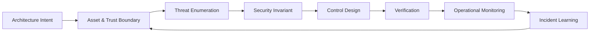

Siklusnya:

1. Desain sistem.
2. Tentukan apa yang penting.
3. Tentukan siapa yang bisa menyerang.
4. Tentukan dari mana serangan bisa masuk.
5. Tentukan apa yang tidak boleh terjadi.
6. Tentukan kontrol.
7. Buktikan kontrol bekerja.
8. Operasikan dan belajar dari real incident.

Threat model bukan:

- daftar OWASP Top 10 yang ditempel di akhir dokumen,
- hasil scanner,
- penetration test report,
- sekadar architecture diagram,
- sekadar checklist compliance,
- sekadar security approval.

Threat model adalah:

- eksplisitasi asumsi,
- pembongkaran trust boundary,
- pencarian failure mode,
- pemetaan attacker capability ke sistem nyata,
- keputusan engineering tentang risiko,
- jembatan antara architecture, implementation, testing, dan operation.

---

## 3. Kenapa Threat Modeling Penting untuk Go

Go sering dipakai untuk:

- API backend,
- microservices,
- infrastructure services,
- CLI tools,
- agents,
- proxies,
- gateways,
- data pipelines,
- Kubernetes controllers,
- security tooling,
- identity/token services,
- internal platform services.

Karakter Go yang membuat threat modeling penting:

| Karakter Go | Dampak Security |
|---|---|
| Standard library kuat | Banyak boundary penting ada langsung di stdlib: `net/http`, `crypto/tls`, `crypto/x509`, `encoding/json`, `archive/tar`, `os/exec` |
| Binary statis mudah dideploy | Supply-chain dan build provenance menjadi penting |
| Goroutine murah | Mudah membuat resource exhaustion bila boundary tidak dikontrol |
| Error eksplisit | Bagus untuk fail-closed, tetapi mudah bocor info jika error dipropagasi mentah |
| Slice/byte oriented | Bagus untuk crypto/IO, tetapi raw bytes mudah salah canonicalization |
| `unsafe` tersedia | Bisa melanggar memory safety dan security invariant |
| `cgo` tersedia | Membuka boundary ke C ABI, native libs, memory corruption, build/deploy complexity |
| Deployment cloud-native | Trust boundary tidak berhenti di code; ada container, service account, IAM, KMS, network policy |
| Module ecosystem | Supply-chain security menjadi bagian dari threat model |
| Observability lazim | Log/trace/metrics dapat menjadi data leakage surface |

Threat modeling untuk Go harus mencakup **code-level mechanics** dan **system-level deployment reality**.

---

## 4. Threat Model dalam Bahasa Engineering

Sebelum masuk STRIDE, kita harus rapikan vocabulary.

### 4.1 Asset

**Asset** adalah sesuatu yang harus dilindungi.

Contoh asset dalam Go service:

| Asset | Contoh |
|---|---|
| Credential | password hash, refresh token, API key, private key |
| Identity | user ID, subject claim, service identity, client certificate |
| Authorization decision | role, permission, policy result, ownership mapping |
| Business data | case data, application record, payment data, regulatory record |
| Integrity state | audit trail, status transition, approval chain, signature |
| Availability | HTTP handler, worker pool, DB pool, queue consumer |
| Confidentiality boundary | PII, classified document, internal-only API response |
| Cryptographic material | KMS data key, JWT signing key, TLS private key |
| Operational signal | logs, traces, metrics, panic dump, pprof endpoint |
| Build artifact | binary, container image, module cache, release provenance |

Kesalahan umum:

> Menganggap asset hanya database.

Dalam sistem Go modern, asset bisa berada di:

- request body,
- header,
- cookie,
- JWT claim,
- cache,
- queue message,
- log,
- metric label,
- trace span,
- temporary file,
- memory buffer,
- module dependency,
- CI secret,
- container image layer.

---

### 4.2 Actor

**Actor** adalah entitas yang berinteraksi dengan sistem.

Actor bisa legitimate atau malicious.

| Actor | Contoh |
|---|---|
| Anonymous internet user | user belum login |
| Authenticated user | user login valid |
| Low-privileged user | user role terbatas |
| Admin | high privilege human actor |
| Internal service | service-to-service client |
| Batch worker | asynchronous actor |
| CI/CD pipeline | build/deploy actor |
| Operator/SRE | production access actor |
| Vendor/integration partner | external machine actor |
| Attacker | actor dengan niat menyalahgunakan sistem |
| Compromised dependency | package yang berubah menjadi malicious |
| Compromised runtime environment | pod/container/node/cloud credential bocor |

Jangan hanya tulis “user” dan “admin”. Itu terlalu kasar. Security failure sering terjadi karena actor terlalu disederhanakan.

Contoh yang lebih baik:

```text
Actor:
- Public anonymous caller.
- Authenticated citizen user.
- Authenticated corporate representative.
- Internal staff with case officer role.
- Internal staff with supervisor role.
- Backend batch worker using service account.
- External identity provider callback.
- API gateway health checker.
- CI/CD deploy job.
- SRE with break-glass access.
```

---

### 4.3 Trust Boundary

**Trust boundary** adalah titik ketika data, identity, privilege, atau execution control berpindah dari satu trust level ke trust level lain.

Contoh trust boundary:

| Boundary | Pertanyaan Security |
|---|---|
| Internet → API Gateway | Apakah request size, TLS, rate limit, WAF, auth enforced? |
| Gateway → Go Service | Apakah identity header trusted? Dari siapa? Bisa spoof? |
| Go Service → DB | Apakah query parameterized? Apakah DB credential scoped? |
| Go Service → Redis | Apakah cache menyimpan PII/token? TTL? tenant isolation? |
| Go Service → Queue | Apakah message authenticated? replay? poison message? |
| Go Service → KMS | Apakah IAM role scoped? key usage audited? |
| Pod → Node | Apakah container escape relevant? privileged? hostPath? |
| CI → Artifact Registry | Apakah build provenance dan signing ada? |
| Config → Runtime | Apakah config bisa mengubah security behavior? |
| Log Pipeline | Apakah secret/PII keluar dari boundary aplikasi? |

Trust boundary bukan hanya network boundary.

Boundary juga bisa berupa:

- privilege boundary,
- tenant boundary,
- module boundary,
- parser boundary,
- goroutine/channel boundary,
- process boundary,
- filesystem boundary,
- crypto key boundary,
- operational boundary,
- human approval boundary.

---

### 4.4 Entry Point

**Entry point** adalah jalan masuk ke sistem.

Contoh entry point Go service:

- HTTP endpoint,
- gRPC method,
- WebSocket endpoint,
- queue consumer,
- cron job,
- CLI flag,
- config file,
- environment variable,
- webhook callback,
- file upload,
- object storage notification,
- Kubernetes admission request,
- admin/debug endpoint,
- pprof endpoint,
- health/readiness endpoint,
- metrics endpoint,
- migration script,
- CI pipeline trigger.

Entry point harus dianalisis dengan pertanyaan:

1. Siapa yang bisa memanggil?
2. Dari mana dipanggil?
3. Apa format input?
4. Apa batas ukuran input?
5. Apa rate-nya?
6. Apakah input authenticated?
7. Apakah input authorized?
8. Apakah input canonicalized?
9. Apa efek sampingnya?
10. Apa resource yang bisa dikonsumsi?
11. Apa output yang dihasilkan?
12. Apakah output bocor data?
13. Apakah entry point bisa dipakai untuk pivot ke sistem lain?

---

### 4.5 Data Flow

**Data flow** adalah perpindahan data antar process, store, actor, dan boundary.

Data flow penting karena banyak bug security bukan berasal dari satu function, tetapi dari perjalanan data.

Contoh:

```text
JWT claim -> request context -> service layer -> repository filter -> SQL query
```

Risikonya:

- claim diterima tanpa validasi issuer/audience,
- context value bisa diganti middleware lain,
- service layer menganggap user ID sudah valid,
- repository lupa filter tenant,
- SQL query mengembalikan data tenant lain.

Data flow harus selalu dibaca bersama **trust transition**.

---

### 4.6 Security Invariant

**Security invariant** adalah pernyataan yang harus selalu benar untuk sistem tetap aman.

Contoh invariant buruk:

```text
The system must be secure.
```

Tidak bisa diuji.

Contoh invariant baik:

```text
A user must never read, update, approve, or export a case unless the authorization service confirms that the user's subject, role, agency, and assignment are valid for that case at the time of access.
```

Lebih baik lagi jika dibuat executable:

```text
For every API endpoint that returns case data:
- subject must be authenticated,
- subject agency must match case agency unless cross-agency permission exists,
- permission must be checked against action + resource + case state,
- repository query must include tenant/agency constraint,
- audit log must include actor, case ID, action, decision, and denial reason class.
```

Security invariant adalah jantung threat model. Tanpa invariant, threat model menjadi daftar ancaman tanpa definisi aman.

---

### 4.7 Threat

**Threat** adalah kejadian buruk yang mungkin dilakukan attacker terhadap asset melalui attack surface tertentu.

Format yang baik:

```text
Actor with capability X can abuse entry point Y to violate invariant Z, causing impact I.
```

Contoh:

```text
An authenticated low-privileged user can modify the caseId path parameter on GET /cases/{caseId} to access another agency's case if authorization is checked only at route level and repository queries do not enforce agency scoping.
```

Bandingkan dengan format buruk:

```text
IDOR vulnerability.
```

Format buruk terlalu singkat. Ia tidak menjelaskan actor, path, invariant, dan impact.

---

### 4.8 Vulnerability

**Vulnerability** adalah kelemahan spesifik yang membuat threat bisa terjadi.

Threat:

```text
Attacker can read another user's document.
```

Vulnerability:

```text
Download endpoint validates only authentication, not ownership or document access policy.
```

Threat adalah “apa yang bisa salah”. Vulnerability adalah “mengapa bisa salah”.

---

### 4.9 Control

**Control** adalah mitigasi.

Control bisa:

| Jenis Control | Contoh |
|---|---|
| Preventive | authz check, input validation, mTLS, allowlist |
| Detective | audit log, anomaly detection, alert |
| Corrective | token revocation, rollback, key rotation |
| Compensating | manual approval, monitoring, rate limiting |
| Deterrent | legal warning, access banner |
| Recovery | backup restore, incident runbook |

Security engineer yang matang tidak hanya bertanya:

> Ada control?

Tapi:

> Control ini berada di boundary yang benar? Bisa diuji? Bisa diobservasi? Apa failure mode-nya? Kalau control gagal, apa blast radius-nya?

---

### 4.10 Assumption

**Assumption** adalah hal yang dianggap benar tetapi belum tentu dijamin oleh sistem.

Contoh assumption:

```text
API Gateway always strips inbound X-User-ID header before injecting trusted identity headers.
```

Assumption harus diberi status:

- verified,
- unverified,
- owner,
- evidence,
- expiration,
- test mechanism.

Assumption yang tidak diverifikasi adalah risiko tersembunyi.

---

### 4.11 Residual Risk

**Residual risk** adalah risiko yang tersisa setelah kontrol dipasang.

Contoh:

```text
Even with per-user rate limit, a distributed botnet may still cause elevated DB read load. Residual risk accepted because endpoint is cached, DB pool is bounded, alerting exists, and business impact is tolerable for 15 minutes while WAF rule is escalated.
```

Residual risk harus punya owner. Kalau tidak, artinya risiko dipindahkan ke masa depan.

---

## 5. Empat Pertanyaan Inti Threat Modeling

Model yang paling praktis:

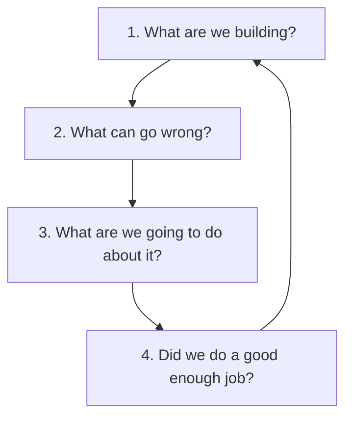

Dalam bahasa Indonesia:

1. **Kita sedang membangun apa?**
2. **Apa yang bisa salah?**
3. **Apa yang akan kita lakukan?**
4. **Bagaimana membuktikan bahwa itu cukup?**

Untuk Go service, setiap pertanyaan harus dipecah.

---

### 5.1 Kita Sedang Membangun Apa?

Minimal jawab:

```text
Service name:
Business capability:
Critical assets:
Actors:
Entry points:
Data stores:
External dependencies:
Deployment environment:
Privilege level:
Security-sensitive operations:
```

Contoh:

```text
Service name:
Case Management API

Business capability:
Expose case read/update/approval operations for internal officers and supervisors.

Critical assets:
- Case records
- Officer assignment
- Approval state
- Audit log
- Document metadata
- JWT claims
- DB credential
- Signing key used for internal event integrity

Actors:
- Internal officer
- Supervisor
- Admin
- Batch worker
- API gateway
- Audit consumer

Entry points:
- REST API
- Queue consumer
- Admin health endpoint
- Metrics endpoint
```

---

### 5.2 Apa yang Bisa Salah?

Gunakan beberapa lensa:

1. STRIDE.
2. Abuse case.
3. Misuse case.
4. Data flow tampering.
5. Authorization bypass.
6. Parser ambiguity.
7. Resource exhaustion.
8. Secrets leakage.
9. Supply-chain compromise.
10. Operational misuse.
11. Deployment misconfiguration.
12. Incident response failure.

---

### 5.3 Apa yang Akan Kita Lakukan?

Setiap threat harus menghasilkan:

- reject,
- mitigate,
- transfer,
- accept,
- defer with owner/date,
- remove feature,
- redesign boundary.

Security matang bukan berarti semua threat dihilangkan. Security matang berarti semua threat penting punya keputusan sadar.

---

### 5.4 Bagaimana Membuktikan Cukup?

Bukti bisa berupa:

- unit test,
- integration test,
- fuzz test,
- property-based test,
- static analysis,
- `go test -race`,
- `govulncheck`,
- SAST,
- dependency review,
- manual code review,
- penetration test,
- architecture review,
- config review,
- runtime alert,
- audit query,
- incident drill,
- chaos/security test,
- production telemetry.

Kalau control tidak punya cara pembuktian, control itu lebih dekat ke harapan daripada engineering.

---

## 6. STRIDE sebagai Alat Threat Elicitation

STRIDE adalah taxonomy klasik:

| STRIDE | Meaning | Security Property yang Dilanggar |
|---|---|---|
| S | Spoofing | Authenticity |
| T | Tampering | Integrity |
| R | Repudiation | Non-repudiation / accountability |
| I | Information Disclosure | Confidentiality |
| D | Denial of Service | Availability |
| E | Elevation of Privilege | Authorization / privilege boundary |

STRIDE bagus untuk memaksa engineer berpikir melewati bug umum. Namun STRIDE bukan tujuan. STRIDE hanya alat.

---

### 6.1 S — Spoofing

Spoofing terjadi ketika attacker berpura-pura menjadi actor lain.

Contoh dalam Go service:

| Area | Threat |
|---|---|
| HTTP header | Caller mengirim `X-User-ID` palsu dan service mempercayainya |
| JWT | Service menerima token dari issuer salah |
| mTLS | Service tidak memverifikasi client certificate SAN/SPIFFE ID |
| Webhook | Endpoint callback tidak memverifikasi signature |
| Queue | Consumer menerima message tanpa producer authentication |
| Internal API | Network internal dianggap trusted tanpa service identity |
| Session | Cookie tanpa integrity protection dapat dipalsukan |
| CLI/admin | Operator command tidak punya strong identity |

Go-specific questions:

1. Apakah identity berasal dari request user atau dari trusted middleware?
2. Apakah `Authorization` header diverifikasi oleh service sendiri atau gateway?
3. Jika gateway yang verify, bagaimana service memastikan request memang dari gateway?
4. Apakah `X-Forwarded-*` trusted? Dari hop mana?
5. Apakah JWT `iss`, `aud`, `exp`, `nbf`, `kid`, dan algorithm divalidasi?
6. Apakah JWKS cache punya refresh dan key rotation logic?
7. Apakah mTLS client identity digunakan untuk authz atau hanya encryption?
8. Apakah webhook signature menggunakan HMAC/signature yang diverifikasi constant-time?

Bad invariant:

```text
Requests from internal network are trusted.
```

Better invariant:

```text
The service must accept caller identity only from a verified authentication component, and must reject direct requests that bypass the trusted gateway or service identity boundary.
```

Example threat:

```text
A caller can spoof an internal user by sending X-User-ID directly to the Go service if the service is reachable from the pod network and does not verify that the request came through the gateway.
```

Control candidates:

- strip inbound identity headers at gateway,
- inject signed identity context,
- mTLS between gateway and service,
- network policy restricting direct access,
- service-level token verification,
- defense-in-depth audit logging,
- deny if trusted identity headers exist without gateway-authenticated marker.

---

### 6.2 T — Tampering

Tampering adalah perubahan data tanpa izin.

Contoh:

| Area | Threat |
|---|---|
| Request body | User mengubah field yang seharusnya server-controlled |
| Path parameter | User mengganti `caseId` untuk akses object lain |
| Cache | Cache key tidak mencakup tenant/role |
| Queue | Message diubah atau replayed |
| Audit log | Actor mengubah atau menghapus audit record |
| File upload | Archive mengandung path traversal |
| Config | Runtime config mengubah security enforcement |
| Build artifact | Binary/container image diganti |
| Token | JWT unsigned/algorithm confusion/malformed token accepted |
| DB | Direct update bypasses domain invariant |

Go-specific questions:

1. Apakah decoding JSON menerima unknown field?
2. Apakah user-controlled field dipisahkan dari server-controlled field?
3. Apakah `omitempty` atau zero value membuat authorization state ambigu?
4. Apakah repository query enforce tenant/ownership?
5. Apakah cache key memasukkan subject/tenant/permission dimension?
6. Apakah event/message punya integrity protection?
7. Apakah audit log append-only atau bisa diupdate?
8. Apakah file extraction mencegah path traversal dan symlink abuse?
9. Apakah config source trusted dan changes audited?

Security invariant:

```text
Client input must never directly set server-owned security state such as ownerId, role, approvalStatus, tenantId, agencyId, isAdmin, createdBy, approvedBy, or audit metadata.
```

Control candidates:

- separate DTO for input vs domain model,
- reject unknown fields for security-sensitive APIs,
- server-side assignment of owner/tenant/actor fields,
- HMAC/signature for high-integrity async messages,
- append-only audit model,
- immutable event store,
- content digest validation,
- optimistic concurrency control,
- DB constraint,
- repository-scoped tenant filters,
- policy check before state transition.

---

### 6.3 R — Repudiation

Repudiation terjadi ketika actor bisa menyangkal aksi penting karena sistem tidak punya bukti cukup.

Contoh:

| Area | Threat |
|---|---|
| Approval | Supervisor menyangkal pernah approve |
| Data change | Officer menyangkal update field |
| Admin action | Operator menyangkal rotate key/delete config |
| Token issuance | Sistem tidak bisa membuktikan token dibuat untuk subject tertentu |
| Failed authz | Denial tidak tercatat, sehingga abuse pattern hilang |
| Queue processing | Worker tidak mencatat message ID/correlation ID |
| Break-glass access | Emergency access tidak punya audit trail |

Go-specific questions:

1. Apakah semua state-changing API punya audit log?
2. Apakah audit log punya actor, action, resource, decision, timestamp, correlation ID?
3. Apakah log menyimpan cukup context tanpa membocorkan PII/secret?
4. Apakah audit log ditulis transactionally dengan business action?
5. Apakah async processing mempertahankan correlation ID?
6. Apakah service clock reliable? Apakah timestamp source konsisten?
7. Apakah error path juga diaudit?
8. Apakah log bisa diubah/delete oleh service account yang sama?

Security invariant:

```text
Every security-sensitive state transition must produce a tamper-evident audit event containing actor identity, action, resource identity, previous state hash or version, new state hash or version, decision source, and correlation ID.
```

Control candidates:

- structured audit schema,
- append-only storage,
- write-once sink,
- audit event signing/MAC,
- correlation ID propagation,
- separation of duties for audit store,
- transactional outbox,
- immutable log retention,
- alert on audit write failure for critical actions,
- deny critical action if audit write cannot be guaranteed.

---

### 6.4 I — Information Disclosure

Information disclosure adalah bocornya data ke actor yang tidak berhak.

Contoh:

| Area | Threat |
|---|---|
| API response | Endpoint mengembalikan field internal |
| Error message | Error DB/stack trace keluar ke caller |
| Log | Token/password/PII masuk log |
| Metric label | User ID/email/case ID masuk metric high-cardinality |
| Trace | Header authorization masuk span attribute |
| Cache | Tenant A mendapat response Tenant B |
| File download | Object storage URL terlalu luas |
| Panic dump | Memory dump mengandung secrets |
| Debug endpoint | `/debug/pprof` expose production internals |
| JSON serialization | Struct field exported otomatis masuk response |

Go-specific questions:

1. Apakah response DTO dipisahkan dari DB/domain struct?
2. Apakah error internal dipetakan ke public error envelope?
3. Apakah logger punya redaction layer?
4. Apakah panic recovery bocor stack trace ke HTTP response?
5. Apakah metrics/traces scrub sensitive fields?
6. Apakah cache key mencakup authorization context?
7. Apakah object download punya signed URL scope pendek?
8. Apakah `pprof`, `expvar`, metrics endpoint protected?
9. Apakah secret masuk environment variable dan terekam dump?

Security invariant:

```text
No secret, token, password, private key, authorization credential, or raw PII may be emitted to application logs, traces, metrics, panic responses, or client-visible errors.
```

Control candidates:

- response DTO,
- field allowlist,
- redaction wrapper,
- structured error mapping,
- no raw `%+v` for sensitive objects,
- protected debug endpoint,
- sensitive header denylist,
- cache scoping,
- object access policy,
- log sampling with scrubber,
- secret scanner in CI,
- panic recovery that returns generic error.

---

### 6.5 D — Denial of Service

DoS adalah gangguan availability.

Go-specific DoS sering muncul dari:

| Area | Threat |
|---|---|
| HTTP server | no timeout → slowloris |
| Body parsing | unbounded body read |
| JSON/XML | deeply nested payload |
| Multipart | huge file/field count |
| Goroutine | unbounded goroutine spawn |
| Channel | blocked producer/consumer leak |
| DB pool | attacker exhausts connections |
| Regex | catastrophic backtracking less likely in Go RE2, but still CPU/input-size risk |
| Compression | zip/gzip bomb |
| Queue | poison message retry storm |
| Cache | key cardinality attack |
| Log | high-volume log amplification |
| Crypto | expensive operation flood |
| Password hashing | login endpoint CPU exhaustion |
| Webhook | retry amplification |

Go-specific questions:

1. Apakah `http.Server` timeout dikonfigurasi?
2. Apakah request body dibatasi?
3. Apakah parser punya size/depth limits?
4. Apakah setiap goroutine punya cancellation path?
5. Apakah worker pool bounded?
6. Apakah DB pool bounded dan timeout?
7. Apakah login/password hash endpoint rate-limited?
8. Apakah upload/compression dibatasi sebelum decode penuh?
9. Apakah retry punya backoff, jitter, max attempt, dan dead-letter?
10. Apakah metrics/logging bisa menjadi amplifier?

Security invariant:

```text
No single unauthenticated or low-privileged caller may cause unbounded CPU, memory, goroutine, file descriptor, DB connection, queue backlog, or log volume growth.
```

Control candidates:

- server timeouts,
- request body limit,
- parser limit,
- concurrency semaphore,
- worker pool,
- context deadline,
- DB query timeout,
- rate limiting,
- per-tenant quota,
- circuit breaker,
- backpressure,
- dead-letter queue,
- bounded retries,
- graceful degradation,
- admission control.

---

### 6.6 E — Elevation of Privilege

Elevation of privilege terjadi ketika actor mendapat privilege lebih tinggi dari yang seharusnya.

Contoh:

| Area | Threat |
|---|---|
| Role check | Endpoint hanya cek `isAuthenticated`, bukan permission |
| Object ownership | User mengganti ID object |
| State transition | User approve entity yang tidak eligible |
| Admin endpoint | Hidden endpoint tidak protected |
| Service account | Pod IAM terlalu luas |
| CI/CD | Build job punya deploy privilege terlalu luas |
| Deserialization | Input bisa mengubah internal role field |
| Feature flag | Flag membuka admin path |
| cgo/unsafe | Memory corruption bypass invariant |
| Kubernetes | Service account bisa list secrets |

Go-specific questions:

1. Apakah authorization action/resource/state-specific?
2. Apakah repository enforce ownership/tenant boundary?
3. Apakah state transition memanggil policy engine?
4. Apakah admin endpoint protected oleh separate policy?
5. Apakah middleware order menjamin auth sebelum business handler?
6. Apakah service account cloud permissions least privilege?
7. Apakah dependency dapat menjalankan init-time side effect?
8. Apakah `unsafe`/`cgo` dipakai di auth/security-critical path?
9. Apakah background worker memproses action dengan privilege terlalu luas?

Security invariant:

```text
Privilege must be granted only by explicit policy evaluation over actor, action, resource, tenant, state, and context; possession of a valid session or internal network access is never sufficient.
```

Control candidates:

- centralized policy interface,
- action/resource/state-based authorization,
- deny-by-default route registration,
- repository guard,
- tenant-scoped DB query,
- service account least privilege,
- separate admin plane,
- policy test matrix,
- middleware composition test,
- negative authorization tests,
- runtime audit for privilege grants.

---

## 7. STRIDE Mapping ke Go Service Surface

| Surface | Spoofing | Tampering | Repudiation | Info Disclosure | DoS | EoP |
|---|---|---|---|---|---|---|
| `net/http` | forged headers | body/path tamper | missing audit | verbose error | slowloris | route bypass |
| TLS/mTLS | wrong cert identity | cert config change | no handshake audit | weak config | handshake flood | trust wrong CA |
| JWT/OIDC | fake token | claim tamper | missing token issuance logs | claim leak | JWKS fetch flood | alg/key confusion |
| JSON/XML | fake actor field | unknown fields | missing input audit | overbroad response | parser bomb | mass assignment |
| DB | DB user spoof via shared account | unauthorized update | no change log | overbroad select | connection exhaustion | SQL injection |
| Redis/cache | shared key collision | stale/poisoned cache | no cache audit | cross-tenant cache | cardinality flood | cached privileged response |
| Queue | fake producer | message tamper | no processing trace | payload leak | retry storm | worker overprivilege |
| File upload | fake MIME | path traversal | no upload audit | file leak | zip bomb | overwrite config |
| Logs/traces | fake correlation | log injection | incomplete audit | secret leakage | log amplification | tamper with evidence |
| Deployment | fake image | mutable tag | no deploy audit | env secret leak | bad autoscaling | overbroad IAM |
| Supply chain | fake module | dependency compromise | no provenance | private module leak | build outage | malicious init |

---

## 8. Data-Flow Diagram untuk Go Service

DFD threat modeling bukan harus artistik. Yang penting:

1. process,
2. data store,
3. external actor,
4. data flow,
5. trust boundary.

### 8.1 DFD Level 0

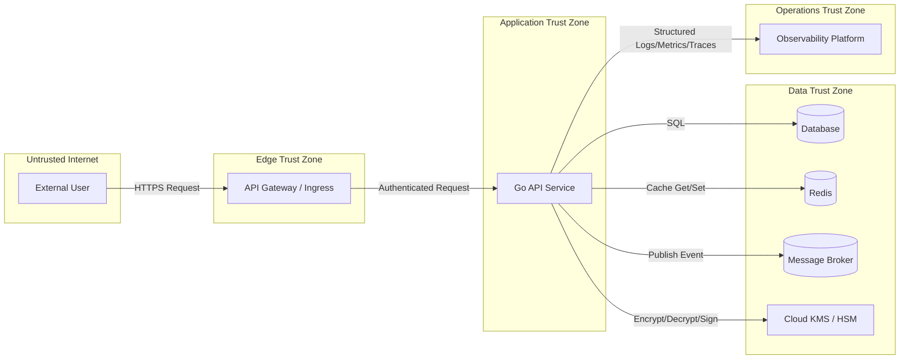

DFD ini terlihat sederhana, tetapi threat model muncul dari pertanyaan:

- Apa yang dipercaya Gateway?
- Apa yang dipercaya Go Service dari Gateway?
- Apakah Go Service bisa diakses langsung?
- Apakah Redis menyimpan data sensitive?
- Apakah event queue punya message integrity?
- Apakah Observability menerima secret/PII?
- Apakah KMS call dibatasi key/action?
- Apakah DB credential service terlalu luas?
- Apakah trust zone sesuai dengan network/IAM nyata?

---

### 8.2 DFD Level 1 — Request Lifecycle

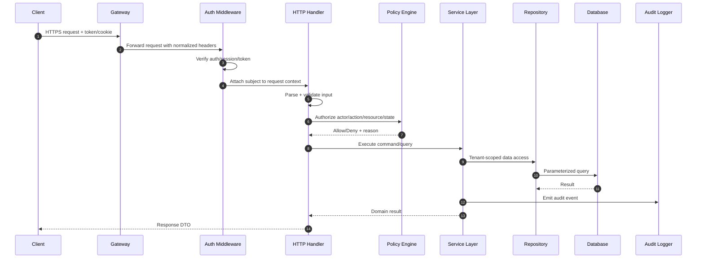

Threat model setiap langkah:

| Step | Boundary | Threat |
|---|---|---|
| Client → Gateway | Internet edge | spoofed token, request smuggling, DoS |
| Gateway → Auth Middleware | trusted edge to app | spoofed identity headers, missing mTLS |
| Auth Middleware → Handler | auth context | context tampering, nil subject bug |
| Handler parse | parser boundary | mass assignment, oversized body |
| Handler → Policy | authz boundary | wrong action/resource, stale state |
| Service → Repository | data access boundary | missing tenant filter |
| Repository → DB | storage boundary | injection, overbroad DB credential |
| Service → Audit | evidence boundary | audit bypass, inconsistent transaction |
| Handler → Client | response boundary | field leakage, error leakage |

---

## 9. Trust Transition: Tempat Bug Security Sering Lahir

Security bug sering tidak muncul di satu function, tetapi di transisi trust.

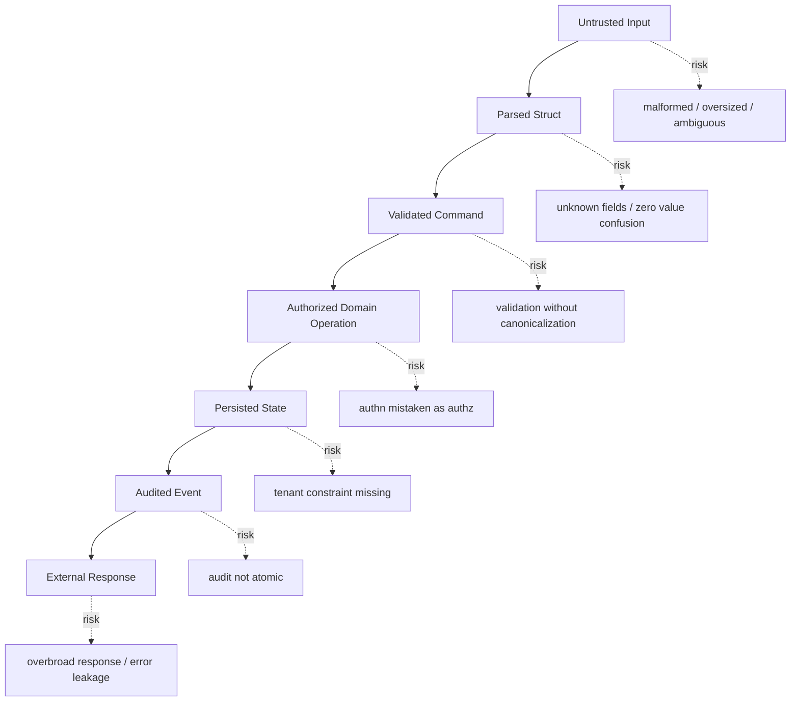

Untuk setiap transisi, tanyakan:

1. Apa trust level sebelum?
2. Apa trust level sesudah?
3. Apa invariant yang harus benar?
4. Apa yang memvalidasi invariant?
5. Apa yang terjadi jika validator gagal?
6. Apakah failure mode fail-open atau fail-closed?
7. Apakah ada audit?
8. Apakah ada test negatif?

Contoh:

```text
Boundary:
Parsed JSON DTO -> Domain Command

Risk:
Client can set server-owned fields.

Invariant:
Only server may set ownerId, tenantId, approvalState, createdBy, updatedBy.

Control:
Use separate input DTO and domain command constructor. Reject unknown fields. Ignore or reject server-owned input fields.

Verification:
Unit tests with malicious fields. Integration test asserting submitted ownerId is ignored/rejected.
```

---

## 10. Attacker Capability Model

Threat model yang bagus tidak berkata “hacker bisa melakukan apa saja”. Itu tidak berguna.

Kita perlu mendefinisikan capability.

### 10.1 Capability Level

| Level | Capability | Contoh |
|---|---|---|
| C0 | Passive observer | melihat public traffic metadata |
| C1 | Anonymous caller | bisa memanggil public endpoint |
| C2 | Authenticated low-privilege user | punya akun valid |
| C3 | Same-tenant privileged user | punya role tinggi di tenant sendiri |
| C4 | Cross-tenant attacker | punya akun di tenant A, menyerang tenant B |
| C5 | Network-adjacent internal actor | bisa akses internal network tertentu |
| C6 | Compromised service | satu service/pod sudah compromise |
| C7 | Compromised dependency/build | dependency atau pipeline compromise |
| C8 | Insider/operator misuse | akses operasional sah tapi disalahgunakan |
| C9 | Cloud account compromise partial | IAM role tertentu bocor |
| C10 | Full environment compromise | node/account/root compromise |

Tidak semua sistem harus tahan C10. Tetapi threat model harus tahu batasnya.

---

### 10.2 Capability Bukan Hanya “Siapa”, Tapi “Apa Bisa Dilakukan”

Capability matrix:

| Capability | Bisa? | Catatan |
|---|---:|---|
| Send arbitrary HTTP request | Ya | anonymous |
| Create valid user account | Ya | self-registration |
| Obtain low-privilege JWT | Ya | normal login |
| Modify path/query/body | Ya | client-controlled |
| Control request headers | Ya | kecuali stripped gateway |
| Access internal pod network | Tidak | assumed blocked by network policy |
| Read logs | Tidak | ops-only |
| Publish queue message | Mungkin | jika internal service compromised |
| Modify DB directly | Tidak | only DB admin |
| Read CI secrets | Tidak | but supply-chain threat separately |
| Replace container image | Tidak | release signing required |
| Compromise cloud IAM role | Mungkin | separate risk scenario |

Threat harus cocok dengan capability. Jangan over-model dan jangan under-model.

---

## 11. Threat Modeling Step-by-Step untuk Go Service

### Step 1 — Tentukan Scope

Scope menjawab:

```text
Apa yang masuk analisis?
Apa yang sengaja tidak masuk?
Versi architecture mana?
Environment mana?
```

Contoh:

```text
In scope:
- Case Management Go API service
- REST endpoints under /api/v1/cases
- JWT auth middleware
- authorization policy integration
- PostgreSQL access
- Redis cache
- audit event publishing
- Kubernetes deployment config

Out of scope:
- Identity provider internal implementation
- API Gateway internals
- Browser frontend except request behavior
- Data warehouse downstream consumers
```

Scope harus jelas karena tanpa scope threat model tidak selesai-selesai.

---

### Step 2 — Tentukan Security Objective

Contoh objective:

```text
The service must prevent unauthorized access to case records across agencies and must maintain tamper-evident audit evidence for all state-changing operations.
```

Objective harus lebih konkret dari “secure API”.

---

### Step 3 — Inventory Asset

Gunakan tabel:

| Asset | Location | Owner | Sensitivity | Integrity Need | Availability Need |
|---|---|---|---|---|---|
| Case record | DB | Case domain team | High | High | High |
| JWT subject | Request context | Identity team | Medium | High | High |
| Audit event | DB/queue | Compliance team | High | Very high | High |
| DB credential | K8s secret | Platform team | Critical | High | High |
| Redis cache | Redis | App team | Medium/High | Medium | Medium |
| Document metadata | DB/object store | Document team | High | High | Medium |

---

### Step 4 — Identifikasi Actor

Gunakan granular actors.

```text
A1 Anonymous internet caller
A2 Authenticated citizen user
A3 Authenticated internal officer
A4 Supervisor
A5 Admin
A6 Batch worker service account
A7 Gateway
A8 Identity provider
A9 CI/CD deploy job
A10 SRE break-glass user
A11 Compromised internal service
A12 Malicious dependency
```

---

### Step 5 — Identifikasi Entry Point

| Entry Point | Protocol | Actor | Auth Required | Input Type | Security Critical? |
|---|---|---|---|---|---|
| `POST /cases` | HTTPS | officer | yes | JSON | yes |
| `GET /cases/{id}` | HTTPS | officer/supervisor | yes | path/query | yes |
| `POST /cases/{id}/approve` | HTTPS | supervisor | yes | JSON | yes |
| `POST /webhooks/idp` | HTTPS | IdP | signature | JSON | yes |
| Queue consumer `case.updated` | AMQP/Kafka | internal | service auth | message | yes |
| `/metrics` | HTTP | scraper | network/IAM | text | medium |
| `/debug/pprof` | HTTP | ops | restricted | none | high |
| migration CLI | command | operator/CI | env/IAM | args/config | high |

---

### Step 6 — Gambar DFD

Gunakan minimal:

- external entity,
- process,
- data store,
- data flow,
- trust boundary.

Mermaid bisa cukup untuk part awal. Dalam organisasi besar, bisa dipindahkan ke diagram tool.

---

### Step 7 — Tandai Trust Boundary

Trust boundary harus diberi label, bukan cuma kotak.

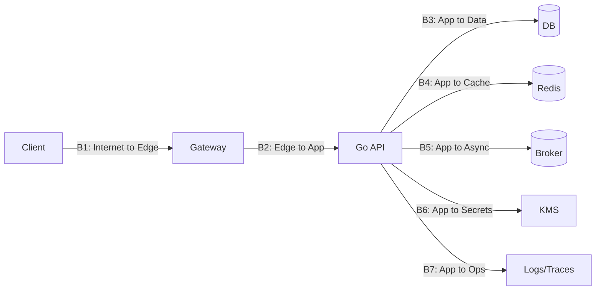

Boundary table:

| Boundary | From | To | Trust Change | Main Risk |
|---|---|---|---|---|
| B1 | Internet | Gateway | untrusted → edge controlled | spoofing, DoS |
| B2 | Gateway | Go API | edge controlled → app | identity header spoofing |
| B3 | Go API | DB | app → data store | injection, overprivilege |
| B4 | Go API | Redis | app → cache | cross-tenant leakage |
| B5 | Go API | Broker | app → async | replay/tamper |
| B6 | Go API | KMS | app → key boundary | misuse/overbroad key access |
| B7 | Go API | Observability | app → ops | secret/PII leak |

---

### Step 8 — Enumerasi Threat dengan STRIDE per Boundary

Contoh untuk B2:

| STRIDE | Threat | Control | Verification |
|---|---|---|---|
| Spoofing | Direct caller sends fake `X-User-ID` | network policy + mTLS + strip headers | integration test direct path rejected |
| Tampering | Caller modifies identity context headers | signed internal auth context | negative test invalid signature |
| Repudiation | Gateway-forwarded requests lack correlation | mandatory request ID | log query test |
| Info Disclosure | Gateway forwards sensitive headers to app logs | header redaction | log scanner |
| DoS | Gateway permits oversized body to app | body limit at gateway + service | load test |
| EoP | Internal route bypasses auth middleware | route registration test | middleware coverage test |

---

### Step 9 — Tulis Security Invariant

Contoh invariant:

```text
INV-AUTHZ-001:
Every access to a case record must be authorized using actor subject, actor agency, action, case ID, case agency, case state, and assignment relationship. The repository must enforce tenant/agency scoping even if service-layer authorization is accidentally bypassed.
```

Contoh invariant lain:

```text
INV-AUDIT-001:
Every successful state transition and every denied high-risk operation must produce a structured audit event with actor, action, resource, decision, reason class, timestamp, and correlation ID.
```

Invariant harus diberi ID agar bisa dilacak ke test dan code.

---

### Step 10 — Tentukan Control dan Owner

| Threat ID | Control | Type | Owner | Due | Evidence |
|---|---|---|---|---|---|
| T-B2-S-001 | mTLS gateway→service | preventive | platform | before UAT | TLS config + test |
| T-B2-S-002 | reject direct identity headers | preventive | app | before UAT | integration test |
| T-B3-T-001 | parameterized queries | preventive | app | done | code review |
| T-B3-E-001 | tenant-scoped repository | preventive | app | before UAT | unit + integration test |
| T-B7-I-001 | log redaction | preventive/detective | app/platform | before UAT | log sample scan |

---

### Step 11 — Buat Verification Plan

Threat model harus turun menjadi test plan.

| Invariant | Verification |
|---|---|
| Authenticated != authorized | negative tests for valid token wrong resource |
| Tenant isolation | cross-tenant fixture integration test |
| No unknown field mass assignment | malicious JSON test |
| No secret in logs | log capture test and CI secret scan |
| Bounded request body | integration test with huge body |
| Timeout works | slow client test |
| Audit event exists | transaction test |
| Queue replay rejected | duplicate message test |
| JWKS rotation works | rotated key integration test |
| `govulncheck` clean or accepted | CI gate |
| Fuzz parser boundary | `go test -fuzz` corpus |

Go security best practices officially recommend using tools such as fuzzing, race detection, and vulnerability checking. Threat modeling should identify where these tools are meaningful, not run them blindly everywhere.

---

### Step 12 — Record Residual Risk

Template:

```text
Residual Risk ID:
Related Threat:
Residual Scenario:
Existing Controls:
Why Risk Remains:
Impact:
Likelihood:
Detection:
Owner:
Acceptance Decision:
Review Date:
```

Contoh:

```text
Residual Risk ID:
RR-DOS-LOGIN-001

Related Threat:
Password hashing endpoint can be abused for CPU exhaustion.

Existing Controls:
- Per-IP rate limit
- Per-account rate limit
- Bounded worker pool
- Login delay after repeated failures
- Alert on CPU saturation

Why Risk Remains:
Distributed botnet can bypass per-IP limits.

Impact:
Degraded login availability.

Likelihood:
Medium.

Detection:
Auth failure rate, CPU, login latency, rate-limit counters.

Owner:
Identity platform lead.

Acceptance:
Accepted for phase 1. Revisit if public launch traffic exceeds threshold.
```

---

## 12. Security Invariant Design Pattern

Security invariant harus memenuhi:

1. **Specific** — menyebut actor/action/resource/context.
2. **Boundary-aware** — tahu di mana diperiksa.
3. **Fail-closed** — default deny.
4. **Testable** — bisa dibuat test negatif.
5. **Observable** — bisa dilihat saat runtime.
6. **Owned** — ada owner.
7. **Traceable** — bisa dikaitkan ke threat/control/test.

Template:

```text
INV-<DOMAIN>-<NNN>

Statement:
<what must always be true>

Applies to:
<entry points / commands / data flows>

Boundary:
<where trust changes>

Enforced by:
<code/config/platform control>

Failure behavior:
<deny / abort / quarantine / alert>

Verification:
<unit/integration/fuzz/static/runtime>

Telemetry:
<log/metric/audit event>

Owner:
<team/role>
```

Contoh lengkap:

```text
INV-CASE-AUTHZ-001

Statement:
A subject must never read, update, approve, export, or delete a case unless policy evaluation allows the specific action against that specific case state, agency, assignment, and subject role.

Applies to:
- GET /cases/{id}
- PATCH /cases/{id}
- POST /cases/{id}/approve
- POST /cases/{id}/export
- queue command case.approve.requested

Boundary:
Authenticated request context -> domain operation.

Enforced by:
- Auth middleware attaches verified subject.
- Policy engine evaluates actor/action/resource/state.
- Repository applies agency/tenant filter.
- State machine validates transition.

Failure behavior:
Deny with public 403 envelope. Emit denied authorization audit event with reason class, not sensitive policy internals.

Verification:
- Cross-agency negative integration tests.
- Role/action matrix tests.
- Repository query tests.
- Mutation tests for missing policy call.
- Audit existence tests.

Telemetry:
- authz_denied_total{action,reason_class}
- structured audit event CASE_AUTHZ_DENIED

Owner:
Case platform team.
```

---

## 13. Threat Modeling untuk Authorization: Bagian Paling Sering Diremehkan

Dalam banyak backend, bug paling mahal bukan crypto salah, tapi authorization salah.

### 13.1 AuthN != AuthZ

Authentication menjawab:

```text
Who are you?
```

Authorization menjawab:

```text
Are you allowed to do this action on this resource in this state under this context?
```

Threat model harus selalu memisahkan keduanya.

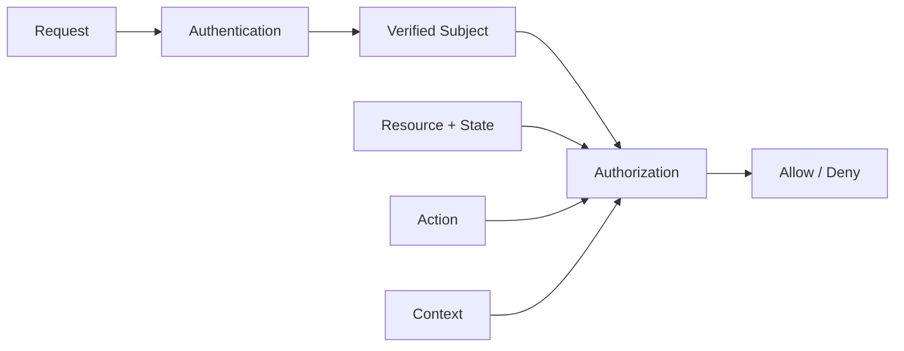

Anti-pattern:

```text
if user != nil {
    allow()
}
```

Better:

```text
decision := policy.Authorize(ctx, actor, action, resource, state, requestContext)
if !decision.Allowed {
    deny()
}
```

Part ini belum membahas implementation policy engine secara dalam. Itu akan muncul di part API/auth/session. Di sini fokusnya adalah threat model.

---

### 13.2 Authorization Dimensions

| Dimension | Contoh |
|---|---|
| Subject | user ID, service ID |
| Role | officer, supervisor, admin |
| Permission | case.read, case.approve |
| Resource | case ID, document ID |
| Resource owner | tenant, agency, department |
| State | draft, submitted, approved, revoked |
| Relationship | assigned officer, supervisor chain |
| Context | time, channel, IP, device, mTLS identity |
| Risk | unusual location, high-value action |
| Delegation | acting on behalf of another actor |
| Break-glass | emergency access |

Threat model authorization harus memaksa semua dimension terlihat.

---

### 13.3 Authorization Threats

| Threat | Example |
|---|---|
| BOLA/IDOR | user changes `caseId` |
| BFLA | user calls admin operation |
| State bypass | approve already revoked case |
| Relationship bypass | officer accesses unassigned case |
| Tenant bypass | agency A reads agency B |
| Delegation bypass | actor uses stale delegation |
| Cache bypass | cached allow reused after permission revoked |
| TOCTOU | policy checked before resource state changes |
| Async bypass | queue worker trusts command without policy context |
| Batch bypass | export job ignores row-level constraints |

---

### 13.4 Authorization Invariant Example

```text
INV-AUTHZ-TOCTOU-001:
For state-changing operations, authorization must be evaluated against the latest committed resource state inside the same consistency boundary used for the state transition, or the transition must fail if the resource version changes.
```

Why?

Because this is unsafe:

```text
1. Read case state = SUBMITTED.
2. Authorize approve.
3. Another transaction revokes case.
4. First transaction approves stale case.
```

Controls:

- transaction isolation,
- optimistic locking,
- state machine guard,
- version check,
- policy inside transaction,
- idempotency key,
- retry with reauthorization.

---

## 14. Threat Modeling untuk Go HTTP Service

Minimal HTTP threat model:

### 14.1 HTTP Boundary Checklist

| Area | Question |
|---|---|
| TLS | Is TLS terminated at gateway, service, or both? |
| Direct access | Can caller bypass gateway? |
| Header trust | Which headers are trusted? Who sets them? |
| Request size | Are body/header/multipart sizes bounded? |
| Timeout | Are read/write/header/idle timeouts set? |
| Auth middleware | Is every protected route covered? |
| Route order | Can wildcard route bypass middleware? |
| Error response | Are internal errors hidden? |
| Panic recovery | Does panic return generic response? |
| Method enforcement | Are unsafe methods restricted? |
| CORS | Is browser trust explicit? |
| CSRF | Are cookie-auth endpoints protected? |
| Rate limit | Where is it enforced? |
| Logging | Are headers/body redacted? |
| Debug endpoints | Are pprof/metrics protected? |

### 14.2 Example Threat Table

| Threat ID | STRIDE | Threat |
|---|---|---|
| HTTP-S-001 | Spoofing | Caller forges `X-Forwarded-User` if app trusts it without gateway verification |
| HTTP-T-001 | Tampering | Client sets `tenantId` in JSON body |
| HTTP-R-001 | Repudiation | State-changing request lacks audit event |
| HTTP-I-001 | Info Disclosure | Handler returns raw DB error |
| HTTP-D-001 | DoS | Missing `ReadHeaderTimeout` enables slowloris |
| HTTP-E-001 | EoP | Admin route registered outside auth middleware group |

### 14.3 Go HTTP Security Invariant

```text
INV-HTTP-BOUNDARY-001:
Every HTTP request crossing from the edge into the Go service must have bounded headers, bounded body, bounded processing time, explicit authentication state, explicit authorization decision for protected resources, sanitized logs, and generic client-visible error responses.
```

---

## 15. Threat Modeling untuk Async / Queue Consumer

Async systems often bypass API controls.

### 15.1 Async Flow

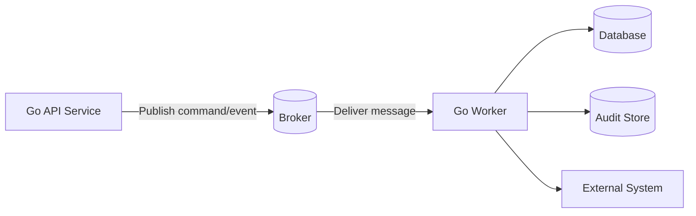

Threats:

| STRIDE | Async Threat |
|---|---|
| Spoofing | fake producer publishes command |
| Tampering | message payload modified |
| Repudiation | no trace from original actor to worker action |
| Info Disclosure | message contains raw PII/token |
| DoS | poison message causes retry storm |
| EoP | worker executes privileged action without original authz context |

### 15.2 Async Security Invariant

```text
INV-ASYNC-001:
A queue consumer must not execute a security-sensitive command unless the message source is authenticated, the message schema is valid, replay protections are satisfied, and the command is authorized either at production time with immutable decision context or at consumption time against current state.
```

Important design question:

> Authorization at publish time, consume time, or both?

| Model | Pros | Cons |
|---|---|---|
| Authorize at publish | captures original actor intent | stale permission/state possible |
| Authorize at consume | fresh state | worker needs policy context |
| Both | strongest | more complexity |
| Neither | simple | usually unsafe |

For regulatory/case-management systems, high-risk state transitions usually need **both**:

1. API validates actor can request action.
2. Worker validates command is still valid against current state before applying.

---

## 16. Threat Modeling untuk Cache

Cache adalah common source of cross-tenant leakage.

### 16.1 Cache Key Risk

Bad:

```text
case:{caseId}
```

If `caseId` is globally unique and response identical for all authorized actors, maybe acceptable. But often response depends on actor role, agency, field masking, permission, or state.

Better:

```text
case_view:{tenantId}:{actorClass}:{caseId}:{viewVersion}
```

But too much dimension can cause cardinality attack. Threat model must balance confidentiality and availability.

### 16.2 Cache Threats

| Threat | Example |
|---|---|
| Cross-tenant leak | key lacks tenant |
| Cross-role leak | admin view cached then served to normal user |
| Stale permission | access revoked but cached allow/result still served |
| Cache poisoning | attacker controls cacheable key/body |
| Cardinality DoS | attacker generates many unique keys |
| Secret persistence | token/PII stored without TTL |
| Inconsistent invalidation | old state reused after critical change |

### 16.3 Cache Invariant

```text
INV-CACHE-001:
A cached response must never be reused across different authorization contexts unless the response is proven independent of actor, tenant, role, permission, state, and data masking policy.
```

---

## 17. Threat Modeling untuk Secrets

Secrets are not just values. Secrets are capabilities.

### 17.1 Secret Inventory

| Secret | Location | Used By | Scope | Rotation | Blast Radius |
|---|---|---|---|---|---|
| DB password | K8s secret | API | database user | 90 days | DB read/write |
| JWT signing key | KMS/HSM | identity service | token signing | key versioned | all tokens |
| OAuth client secret | secret manager | API | IdP integration | 180 days | auth flow |
| Webhook HMAC key | secret manager | API | webhook verify | partner-specific | webhook spoof |
| TLS private key | cert manager | ingress/service | TLS | cert lifetime | service identity |
| Redis password | secret manager | API | cache | 90 days | cache read/write |

### 17.2 Secret Threats

| STRIDE | Secret Threat |
|---|---|
| Spoofing | attacker uses leaked API key |
| Tampering | config points to attacker-controlled key |
| Repudiation | secret use not audited |
| Info Disclosure | secret logged/panic dumped |
| DoS | rotation breaks service |
| EoP | secret grants broader privilege than needed |

### 17.3 Secret Invariant

```text
INV-SECRETS-001:
Secrets must be stored outside source code and container images, loaded through approved secret delivery mechanisms, scoped to minimum required privilege, never logged or exposed via telemetry, rotated without downtime, and audited when used for high-risk operations.
```

---

## 18. Threat Modeling untuk Logs, Metrics, Traces, and Audit

Observability adalah security control sekaligus leakage surface.

### 18.1 Jangan Campur Semua Log

Bedakan:

| Type | Purpose | Risk |
|---|---|---|
| Application log | debugging/runtime behavior | PII/secret leakage |
| Security log | auth/authz/security events | incomplete evidence |
| Audit log | legal/regulatory evidence | tampering/repudiation |
| Metrics | trend/alerting | sensitive label leakage |
| Trace | request path diagnosis | header/body leakage |
| Panic dump | crash diagnosis | memory secret leakage |

### 18.2 Audit Event Minimal

Untuk state-changing high-risk action:

```json
{
  "eventType": "CASE_STATE_CHANGED",
  "actorSubject": "user-123",
  "actorType": "INTERNAL_OFFICER",
  "action": "CASE_APPROVE",
  "resourceType": "CASE",
  "resourceId": "case-456",
  "previousState": "SUBMITTED",
  "newState": "APPROVED",
  "decision": "ALLOW",
  "decisionSource": "case-policy-v3",
  "correlationId": "req-abc",
  "timestamp": "2026-06-24T10:00:00Z",
  "reasonClass": "POLICY_ALLOWED"
}
```

Do not blindly log:

- raw request body,
- password,
- token,
- Authorization header,
- cookie,
- private key,
- full PII,
- raw document text,
- payment data,
- internal stack trace to user.

### 18.3 Audit Invariant

```text
INV-AUDIT-002:
Audit evidence for high-risk operations must be complete enough to reconstruct who did what to which resource, when, through which trusted boundary, based on which decision, and with what resulting state.
```

---

## 19. Threat Modeling untuk Supply Chain Go

Supply-chain threat modeling akan dibahas detail di part 032, tetapi harus sudah muncul di design review.

### 19.1 Supply Chain Data Flow

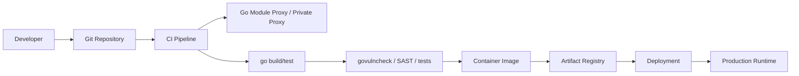

Threats:

| Area | Threat |
|---|---|
| Source repo | unauthorized commit |
| Dependency | compromised module |
| Module config | private module path leaked |
| CI | secret exfiltration |
| Build | unpinned toolchain/base image |
| Artifact | image tag overwritten |
| Deploy | wrong image/environment |
| Runtime | overprivileged service account |

### 19.2 Supply Chain Invariant

```text
INV-SUPPLY-001:
Production Go binaries must be built from reviewed source, using verified dependencies, reproducible or traceable build steps, vulnerability-checked code paths, signed or otherwise provenance-tracked artifacts, and least-privileged deployment credentials.
```

Go official vulnerability management uses the Go vulnerability database and `govulncheck` to reduce noise by identifying vulnerabilities in called code paths, not just imported packages. Threat model should decide where `govulncheck` is mandatory and what “accepted risk” means if a finding cannot be patched immediately.

---

## 20. Threat Modeling untuk Go Runtime and Resource Boundaries

Go runtime gives useful abstractions, but security design must bound resources.

### 20.1 Resource Inventory

| Resource | Security Risk |
|---|---|
| Goroutine | unbounded goroutine spawn |
| Heap | memory exhaustion |
| Stack | deep recursion / parser nesting |
| File descriptor | connection leak |
| DB connection | pool exhaustion |
| Channel | deadlock/backpressure failure |
| Timer | timer leak |
| Context | missing cancellation |
| CPU | hash/password/crypto flood |
| Disk | upload/log/tmp file growth |

### 20.2 Resource Invariant

```text
INV-RESOURCE-001:
Every externally-triggered unit of work must have bounded lifetime, bounded memory growth, bounded concurrency, bounded downstream calls, and cancellation behavior tied to request, job, or operational deadline.
```

This invariant is security-relevant because availability is a security property.

---

## 21. Threat Modeling untuk `unsafe` and `cgo`

Go's memory safety is a major security advantage, but `unsafe` and `cgo` can weaken it.

### 21.1 Questions Before Allowing `unsafe`

1. Why is `unsafe` necessary?
2. Is it in security-critical path?
3. What invariant does it break?
4. Is there a safer stdlib or pure-Go alternative?
5. Is the unsafe usage isolated?
6. Is there fuzz testing around boundary?
7. Is there race testing?
8. Is pointer lifetime valid?
9. Does it expose secrets?
10. Who owns future review?

### 21.2 Questions Before Allowing `cgo`

1. Which native library?
2. Who maintains it?
3. How is it patched?
4. What is its CVE history?
5. How is it built in CI?
6. What platforms?
7. Does it process untrusted input?
8. Does it handle secrets?
9. Can it crash the process?
10. Can it violate memory safety?
11. Can it affect FIPS/compliance posture?
12. Is sandboxing possible?

### 21.3 Invariant

```text
INV-NATIVE-001:
Native or unsafe code must not process untrusted input or sensitive secrets unless isolated, fuzzed, patched, reviewed, and protected by explicit ownership and rollback strategy.
```

Go 1.26 includes heap base address randomization for 64-bit platforms, especially relevant when using cgo, but this is defense-in-depth, not permission to accept unsafe native boundaries casually.

---

## 22. Threat Model Document Template

Gunakan template ini untuk setiap Go service besar.

```markdown
# Threat Model: <Service Name>

## 1. Metadata

- Service:
- Version:
- Date:
- Owner:
- Reviewers:
- Environment:
- Related architecture docs:
- Related ADRs:
- Related tickets:

## 2. Scope

### In Scope

### Out of Scope

## 3. Security Objectives

## 4. Assets

| Asset | Location | Sensitivity | Integrity Need | Availability Need | Owner |
|---|---|---|---|---|---|

## 5. Actors and Capabilities

| Actor | Capability | Trust Level | Notes |
|---|---|---|---|

## 6. Entry Points

| Entry Point | Protocol | Actor | Auth | Input | Criticality |
|---|---|---|---|---|---|

## 7. Data Stores

| Store | Data | Sensitivity | Access Control | Backup | Retention |
|---|---|---|---|---|---|

## 8. External Dependencies

| Dependency | Trust Assumption | Failure Mode | Security Impact |
|---|---|---|---|

## 9. Data Flow Diagram

```mermaid
flowchart LR
```

## 10. Trust Boundaries

| Boundary | From | To | Trust Transition | Main Risks |
|---|---|---|---|---|

## 11. Security Invariants

| ID | Statement | Enforced By | Verified By |
|---|---|---|---|

## 12. Threats

| ID | Boundary | STRIDE | Threat | Impact | Likelihood | Risk |
|---|---|---|---|---|---|---|

## 13. Controls

| Threat ID | Control | Type | Owner | Evidence |
|---|---|---|---|---|

## 14. Verification Plan

| Invariant/Threat | Test/Check | Required in CI? | Owner |
|---|---|---|---|

## 15. Residual Risks

| ID | Risk | Reason Accepted | Owner | Review Date |
|---|---|---|---|---|

## 16. Open Questions

## 17. Approval

- Engineering:
- Security:
- Product/Business:
- Operations:
```

---

## 23. Risk Rating: Jangan Terjebak Angka Palsu

Risk scoring sering menjadi ritual. Gunakan scoring secukupnya.

### 23.1 Simple Risk Matrix

| Impact \ Likelihood | Low | Medium | High |
|---|---|---|---|
| Low | Low | Low | Medium |
| Medium | Low | Medium | High |
| High | Medium | High | Critical |

Impact dimensions:

- confidentiality,
- integrity,
- availability,
- regulatory,
- financial,
- operational,
- reputational,
- safety,
- customer harm.

Likelihood dimensions:

- attacker access,
- exploit complexity,
- exposure,
- existing controls,
- detectability,
- historical incidents,
- dependency on timing/race,
- required privilege.

### 23.2 Better Than Raw Score

Instead of arguing whether risk is “7.2” or “8.1”, ask:

1. Can an anonymous user exploit it?
2. Can a normal authenticated user exploit it?
3. Does it cross tenant boundary?
4. Does it affect integrity of regulatory record?
5. Does it leak secrets or PII?
6. Does it persist?
7. Is exploitation automatable?
8. Is detection likely?
9. Is rollback possible?
10. Is there legal/compliance impact?

---

## 24. Threat Modeling Meeting Format

For real teams, keep sessions structured.

### 24.1 60-Minute Session

```text
0-5 min:
Confirm scope and architecture version.

5-15 min:
Walk data flow and trust boundaries.

15-35 min:
Enumerate top threats using STRIDE per boundary.

35-45 min:
Define security invariants.

45-55 min:
Assign controls/tests/owners.

55-60 min:
Record residual risk and open questions.
```

### 24.2 Participants

Minimum:

- feature/domain engineer,
- tech lead,
- security champion/security engineer,
- platform/devops representative,
- QA/test representative,
- product/business owner for risk acceptance.

For high-risk systems add:

- data/privacy representative,
- compliance/legal,
- SRE/on-call,
- identity/platform owner,
- database owner.

### 24.3 Anti-Pattern Meeting

Bad signs:

- no architecture diagram,
- no data flow,
- only checklist,
- no owner,
- no follow-up task,
- all risks marked low,
- “internal network is trusted” repeated,
- “we use HTTPS” used as universal answer,
- no negative tests,
- no audit discussion,
- no production operational discussion.

---

## 25. Threat Modeling as Code Review Input

Threat model harus mempengaruhi code review.

### 25.1 Pull Request Security Review Questions

For each PR touching boundary/security-sensitive code:

1. Does this change add a new entry point?
2. Does it change an existing trust boundary?
3. Does it parse a new input format?
4. Does it add a new dependency?
5. Does it change authorization decision?
6. Does it add a new data store/cache key?
7. Does it log new fields?
8. Does it call external service?
9. Does it add goroutine/worker/retry behavior?
10. Does it touch crypto/token/session/secret?
11. Does it change deployment/IAM/config?
12. Does it affect audit evidence?
13. Does it need threat model update?

### 25.2 PR Label Rule

Example policy:

```text
If a PR changes any of:
- auth/authz/session/token
- crypto/TLS/key handling
- request parsing
- file upload/extraction
- SQL/query construction
- cache key policy
- audit logging
- external callback/webhook
- dependency/module config
- deployment/IAM/network policy

Then:
- security-review label required
- threat model delta section required
- negative tests required
```

---

## 26. Threat Model Delta for PRs

Full threat model is not needed for every PR. Use a delta.

Template:

```markdown
## Threat Model Delta

### Does this PR add/change entry points?
- [ ] No
- [ ] Yes: ...

### Does this PR change trust boundaries?
- [ ] No
- [ ] Yes: ...

### Does this PR change authorization?
- [ ] No
- [ ] Yes: ...

### Does this PR handle secrets/tokens/PII?
- [ ] No
- [ ] Yes: ...

### New/Changed Threats

| Threat | Control | Test |
|---|---|---|

### Residual Risk

### Reviewer Notes
```

---

## 27. Example: Threat Model Mini Case Study

### 27.1 System

Go service:

```text
Document Download Service
```

Capability:

```text
Authenticated users download documents attached to cases.
```

Architecture:

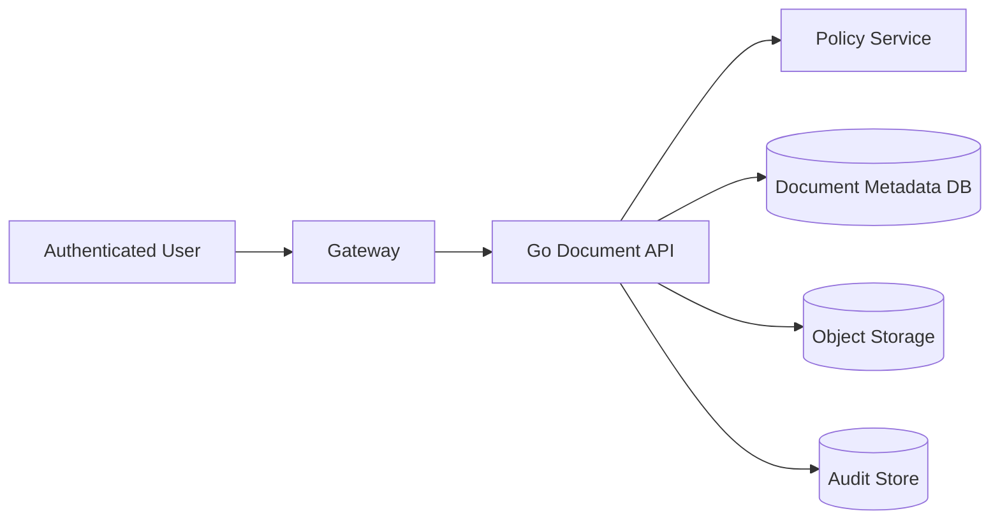

### 27.2 Assets

| Asset | Sensitivity |
|---|---|
| Document content | High |
| Document metadata | High |
| Case relationship | High |
| Signed download URL | High |
| Audit event | High integrity |

### 27.3 Entry Point

```text
GET /documents/{documentId}/download
```

### 27.4 Threats

| STRIDE | Threat |
|---|---|
| Spoofing | forged identity header if direct service access |
| Tampering | modify documentId to another user's document |
| Repudiation | no audit for download |
| Info Disclosure | signed URL valid too long or too broad |
| DoS | repeated large downloads |
| EoP | user with case read but no document permission downloads restricted attachment |

### 27.5 Invariants

```text
INV-DOC-001:
A document may be downloaded only if the authenticated subject is authorized for the related case, document classification, action=download, and current document state.

INV-DOC-002:
Signed object storage URLs must be scoped to exactly one object, one action, and short expiry.

INV-DOC-003:
Every successful document download request must create an audit event with subject, document ID, case ID, decision, and correlation ID.
```

### 27.6 Controls

| Threat | Control |
|---|---|
| IDOR | authorization using document→case relationship |
| URL leakage | short-lived signed URL |
| audit gap | audit event before/after URL issuance |
| direct access | network policy + gateway identity verification |
| DoS | rate limit + size-aware quota |
| classification bypass | policy includes document classification |

### 27.7 Verification

| Test | Purpose |
|---|---|
| valid user own document | positive |
| valid user other tenant document | negative |
| valid case access but restricted document | negative |
| expired signed URL | negative |
| audit event exists | evidence |
| direct request with fake header | negative |
| repeated download rate limit | availability |

---

## 28. Example: Threat Model for State Transition

### 28.1 System

```text
POST /cases/{id}/approve
```

### 28.2 State Machine

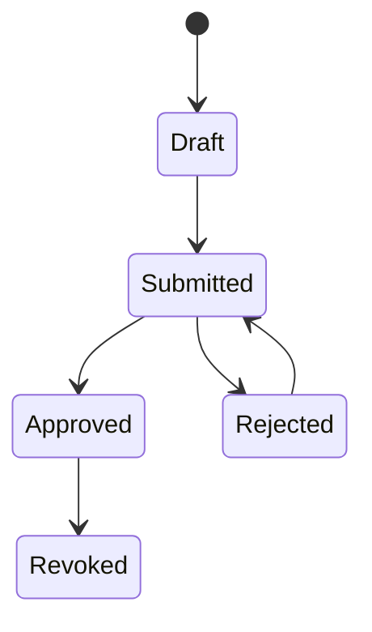

### 28.3 Threats

| Threat | Description |
|---|---|
| Role bypass | officer approves without supervisor role |
| State bypass | approve draft/revoked case |
| Assignment bypass | supervisor approves case outside agency |
| Replay | same approve request repeated after state changed |
| TOCTOU | state changes after authz check |
| Audit bypass | approval succeeds but audit fails |
| Tampering | client sets `approvedBy` |
| Repudiation | insufficient evidence of approval actor |
| Info leak | denial reason reveals internal assignment data |

### 28.4 Invariant

```text
INV-CASE-APPROVE-001:
A case can transition from SUBMITTED to APPROVED only when the actor is an authenticated supervisor authorized for the case agency and assignment context, the current committed state is SUBMITTED, the transition is performed once with version check, and the audit event is persisted atomically or through a reliable transactional outbox.
```

### 28.5 Controls

- Policy check with actor/action/resource/state.
- DB optimistic version check.
- State transition table.
- Server-assigned `approvedBy`.
- Idempotency key or version-based duplicate handling.
- Transactional audit/outbox.
- Negative tests for role/state/agency mismatch.
- Audit test.
- Denial response generic.

---

## 29. Common Threat Modeling Mistakes

### Mistake 1 — Modeling Components, Not Boundaries

Bad:

```text
We threat-modeled the API, DB, Redis.
```

Better:

```text
We threat-modeled transitions:
Internet→Gateway, Gateway→API, API→DB, API→Redis, API→Queue, API→Logs.
```

Security bug lives in transition.

---

### Mistake 2 — Treating Authenticated User as Trusted

Authenticated does not mean trusted.

Authenticated attacker is one of the most important actors.

---

### Mistake 3 — No Negative Tests

If threat model produces only documentation, it will decay.

Every high-risk invariant needs negative tests.

---

### Mistake 4 — “Internal Only” as Mitigation

Internal is not a full mitigation.

Better:

```text
Internal endpoint requires service identity, network restriction, authz, audit, and rate limit.
```

---

### Mistake 5 — Ignoring Observability

Logs and traces frequently leak secrets.

Threat model must treat observability as an output boundary.

---

### Mistake 6 — Ignoring Async Workers

Workers often run with high privilege and weak input validation.

Threat model them like public APIs if messages can be influenced indirectly by users.

---

### Mistake 7 — Treating Crypto as Magic

Using AES/JWT/TLS does not automatically solve security.

You must threat-model:

- key lifecycle,
- identity binding,
- nonce,
- algorithm constraints,
- replay,
- rotation,
- failure behavior,
- audit,
- operational recovery.

---

### Mistake 8 — No Residual Risk Owner

Unowned residual risk is hidden technical debt.

---

### Mistake 9 — Threat Modeling Too Late

Threat modeling after implementation often becomes blame or paperwork.

Do it at design time, then update as architecture changes.

---

## 30. How to Integrate with SDLC

### 30.1 When to Threat Model

| Trigger | Full or Delta? |
|---|---|
| New service | full |
| New public endpoint | delta/full depending criticality |
| New auth/authz behavior | full/delta |
| New crypto/key material | full |
| New data store | delta |
| New queue/event flow | delta |
| New file upload/parser | full/delta |
| New external integration | delta |
| New admin/debug endpoint | delta |
| Major dependency addition | delta |
| Deployment/IAM change | delta |
| Incident occurred | update |
| Vulnerability found | update |
| Regulatory/compliance change | update |

### 30.2 SDLC Placement

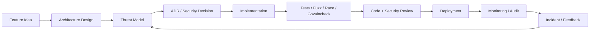

---

## 31. Verification Matrix for Go

| Threat Category | Go Verification |
|---|---|
| Parser ambiguity | fuzz tests |
| Race-sensitive security | `go test -race` |
| Dependency vulnerabilities | `govulncheck` |
| Authorization matrix | table-driven tests |
| HTTP timeout/body limit | integration/load tests |
| Secret leakage | log capture + secret scanning |
| Panic information leak | handler tests |
| SQL injection | repository tests/code review |
| Cache isolation | cross-tenant tests |
| Queue replay | duplicate message tests |
| Audit completeness | transaction/integration tests |
| TLS/mTLS config | config tests + integration |
| Unsafe/cgo boundary | fuzz + review + isolation |
| Supply chain | module review + checksum + provenance |

---

## 32. Threat Modeling and NIST CSF / SSDF Mapping

This series is engineering-first, not compliance-first. But compliance mapping helps.

### 32.1 NIST CSF 2.0

NIST CSF 2.0 organizes cybersecurity outcomes around:

- Govern,
- Identify,
- Protect,
- Detect,
- Respond,
- Recover.

Threat modeling mainly supports:

| CSF Function | Threat Modeling Contribution |
|---|---|
| Govern | risk ownership, acceptance, policy |
| Identify | assets, systems, dependencies, risks |
| Protect | controls and secure design |
| Detect | logging, telemetry, alerting |
| Respond | incident scenario and runbook trigger |
| Recover | backup/rollback/key rotation planning |

### 32.2 NIST SSDF

SSDF groups secure software practices into:

- Prepare the Organization,
- Protect the Software,
- Produce Well-Secured Software,
- Respond to Vulnerabilities.

Threat modeling supports especially:

- secure design,
- review,
- risk-based development,
- vulnerability prevention,
- verification,
- response planning.

---

## 33. Threat Modeling and OWASP ASVS / API Security

OWASP ASVS can be used as a verification requirement catalog. OWASP API Security Top 10 can be used as a risk lens.

Threat model should not copy OWASP mechanically. Instead:

```text
Threat model identifies risk -> ASVS/API Security provides control/test requirement.
```

Example:

| Threat | OWASP Lens |
|---|---|
| case ID manipulation | BOLA / object-level authorization |
| admin endpoint exposed | broken function-level authorization |
| excessive response fields | excessive data exposure |
| no rate limit | unrestricted resource consumption |
| mass assignment | unsafe consumption of client data |
| bad JWT validation | broken authentication |
| untrusted webhook | SSRF / spoofing / integrity |

---

## 34. Practical Go Threat Model Checklist

Use this for every medium/high-risk Go service.

### 34.1 Architecture

- [ ] Scope is explicit.
- [ ] DFD exists.
- [ ] Trust boundaries are labeled.
- [ ] Actors are granular.
- [ ] External dependencies are listed.
- [ ] Data stores are listed.
- [ ] Operational endpoints are included.
- [ ] Async flows are included.
- [ ] Deployment/IAM boundary is included.
- [ ] Supply-chain boundary is included.

### 34.2 Identity and Access

- [ ] Authentication source is clear.
- [ ] Trusted identity headers cannot be spoofed.
- [ ] Service-to-service identity is explicit.
- [ ] Authorization is action/resource/state/context-based.
- [ ] Tenant/agency boundary is enforced.
- [ ] Admin/break-glass path is separate.
- [ ] Async workers do not bypass authorization.
- [ ] Negative authz tests exist.

### 34.3 Input and Parser

- [ ] Request body size bounded.
- [ ] Header size bounded.
- [ ] Multipart upload bounded.
- [ ] Unknown fields considered.
- [ ] Canonicalization rules defined.
- [ ] File/archive extraction safe.
- [ ] External callbacks signed/verified.
- [ ] Parser fuzz targets identified.

### 34.4 Data Protection

- [ ] Response DTOs are allowlisted.
- [ ] Secrets not logged.
- [ ] PII logging policy defined.
- [ ] Cache keys include necessary auth context.
- [ ] Encryption/key management decision documented.
- [ ] Signed URL/token expiry scoped.
- [ ] Data retention considered.

### 34.5 Availability

- [ ] HTTP server timeouts set.
- [ ] Context deadlines/cancellation defined.
- [ ] Worker pools bounded.
- [ ] DB pool bounded.
- [ ] Retry/backoff bounded.
- [ ] Rate limits/quotas defined.
- [ ] Upload/decompression limits defined.
- [ ] Observability/log amplification considered.

### 34.6 Integrity and Audit

- [ ] State transitions have invariants.
- [ ] Audit events defined.
- [ ] Audit write failure behavior defined.
- [ ] Correlation ID propagated.
- [ ] Tamper-evidence considered for high-risk records.
- [ ] Replay/idempotency considered.
- [ ] TOCTOU considered.

### 34.7 Go-Specific

- [ ] `govulncheck` required in CI.
- [ ] `go test -race` used where relevant.
- [ ] Fuzz tests for parser/security boundary.
- [ ] Dependencies reviewed.
- [ ] `unsafe` usage justified and isolated.
- [ ] `cgo` usage reviewed.
- [ ] `pprof`/debug endpoints protected.
- [ ] Build/release artifact traceable.
- [ ] Module private settings configured.
- [ ] Go version and patch cadence defined.

---

## 35. Threat Model Quality Rubric

| Level | Description |
|---|---|
| Level 0 | No threat model |
| Level 1 | Checklist exists but no DFD/invariants |
| Level 2 | DFD and STRIDE threats documented |
| Level 3 | Threats mapped to controls and tests |
| Level 4 | Invariants are traceable to code/tests/CI/runtime telemetry |
| Level 5 | Threat model updated continuously from incidents, PRs, and architecture changes |

For top-tier engineering, target at least Level 4 for critical services.

---

## 36. Internal Engineering Standard: Threat Model Definition of Done

A threat model is done when:

1. Scope is explicit.
2. Architecture/DFD is current.
3. Trust boundaries are labeled.
4. Actors and attacker capabilities are realistic.
5. Critical assets are identified.
6. Entry points are complete.
7. STRIDE or equivalent threat enumeration is performed per boundary.
8. Security invariants are written.
9. Controls are mapped to threats.
10. Tests/verifications are mapped to invariants.
11. Residual risks have owners.
12. Operational monitoring/audit is considered.
13. Open questions are tracked.
14. Required design changes are ticketed.
15. Reviewers agree risk is acceptable for the release phase.

---

## 37. Minimal Threat Model Example Artifact

```markdown
# Threat Model: Case Approval API

## Scope

In scope:
- POST /cases/{id}/approve
- auth middleware
- policy check
- DB state transition
- audit event

Out of scope:
- IdP internals
- frontend UI

## Security Objective

Only authorized supervisors may approve submitted cases, and every approval must be auditable.

## Actors

| Actor | Capability |
|---|---|
| Authenticated officer | can view assigned cases |
| Supervisor | can approve eligible cases |
| Cross-agency user | valid account, wrong agency |
| Gateway | forwards authenticated request |
| Compromised internal service | may reach internal API network |

## Assets

| Asset | Sensitivity |
|---|---|
| Case state | high integrity |
| Approval actor | high integrity |
| Audit event | high integrity |
| JWT subject | medium confidentiality, high integrity |

## Trust Boundary

B1: Internet → Gateway  
B2: Gateway → Go API  
B3: Go API → DB  
B4: Go API → Audit Store

## Invariants

INV-CASE-APPROVE-001:
Only authorized supervisors for the case agency may approve a case in SUBMITTED state.

INV-CASE-AUDIT-001:
Every successful approval must produce audit evidence.

## Threats

| ID | STRIDE | Threat | Control | Verification |
|---|---|---|---|---|
| T1 | Spoofing | fake identity header | mTLS + header stripping | direct request test |
| T2 | Tampering | client sets approvedBy | server-owned field | malicious JSON test |
| T3 | Repudiation | missing audit | transactional outbox | audit integration test |
| T4 | Info Disclosure | denial leaks case existence | generic 403/404 policy | response test |
| T5 | DoS | repeated approve attempts | rate limit + idempotency | load/duplicate test |
| T6 | EoP | officer approves | policy matrix | negative authz test |

## Residual Risk

RR1:
Distributed authenticated abuse may cause elevated DB load. Accepted with rate limit, alert, and DB pool cap.
```

---

## 38. Study Guide

Untuk benar-benar menguasai part ini:

### Exercise 1

Ambil satu service Go yang kamu kenal. Tulis:

- 5 assets,
- 5 actors,
- 5 entry points,
- 5 trust boundaries,
- 10 threats.

### Exercise 2

Ambil satu endpoint state-changing. Tulis invariant:

```text
actor + action + resource + state + context
```

Lalu buat 5 negative test.

### Exercise 3

Ambil satu async worker. Jawab:

1. Siapa producer?
2. Bagaimana producer authenticated?
3. Apakah message bisa replay?
4. Apakah worker authorize lagi?
5. Apa audit event-nya?
6. Apa poison message behavior?

### Exercise 4

Ambil satu cache. Jawab:

1. Apakah response berbeda per actor/role/tenant?
2. Apa cache key?
3. Apa TTL?
4. Apa invalidation?
5. Apa cross-tenant negative test?

### Exercise 5

Ambil satu dependency baru. Jawab:

1. Kenapa dependency perlu?
2. Apakah memproses untrusted input?
3. Apakah punya CVE history?
4. Apakah ada pure stdlib alternative?
5. Apakah masuk critical path?
6. Apa ownership patching?

---

## 39. Part Summary

Threat modeling untuk Go service bukan paperwork. Ia adalah mekanisme desain untuk menjaga agar:

- boundary terlihat,
- asumsi tidak tersembunyi,
- attacker capability realistis,
- invariant eksplisit,
- control punya tempat,
- test membuktikan security,
- residual risk punya owner.

Pola pikir terpenting:

```text
Secure system = architecture with explicit trust boundaries + enforced security invariants + verified controls + observable failure modes.
```

STRIDE membantu menemukan ancaman, tetapi kualitas threat model ditentukan oleh:

1. ketepatan DFD,
2. ketepatan trust boundary,
3. realisme attacker capability,
4. kekuatan invariant,
5. keterlacakan ke control dan test,
6. keberanian mencatat residual risk.

---

## 40. Referensi

Referensi utama untuk bagian ini:

1. Go Security — https://go.dev/doc/security/
2. Security Best Practices for Go Developers — https://go.dev/doc/security/best-practices
3. Go Vulnerability Management — https://go.dev/doc/security/vuln/
4. Govulncheck Blog — https://go.dev/blog/govulncheck
5. Go Fuzzing — https://go.dev/doc/security/fuzz/
6. Go 1.26 Release Notes — https://go.dev/doc/go1.26
7. OWASP Threat Modeling Cheat Sheet — https://cheatsheetseries.owasp.org/cheatsheets/Threat_Modeling_Cheat_Sheet.html
8. OWASP Threat Modeling Process — https://owasp.org/www-community/Threat_Modeling_Process
9. OWASP ASVS — https://owasp.org/www-project-application-security-verification-standard/
10. OWASP API Security Top 10 2023 — https://owasp.org/API-Security/editions/2023/en/0x11-t10/
11. NIST SP 800-218 SSDF — https://csrc.nist.gov/pubs/sp/800/218/final
12. NIST Cybersecurity Framework 2.0 — https://www.nist.gov/cyberframework
13. MITRE ATT&CK Enterprise Tactics — https://attack.mitre.org/tactics/

---

## 41. Transisi ke Part Berikutnya

Part berikutnya:

```text
learn-go-security-cryptography-integrity-part-004.md
```

Judul:

```text
Cryptography Engineering Principles:
Confidentiality, Integrity, Authenticity, Non-Repudiation, Freshness, Forward Secrecy, Replay Resistance, and Misuse Resistance
```

Di part 004 kita mulai masuk ke fondasi crypto engineering. Fokusnya bukan langsung “cara pakai AES/RSA”, tetapi:

- apa problem yang crypto selesaikan,
- apa problem yang crypto tidak selesaikan,
- kenapa primitive yang benar bisa tetap menghasilkan sistem yang tidak aman,
- bagaimana memilih primitive berdasarkan threat model,
- bagaimana memahami confidentiality, integrity, authenticity, freshness, replay resistance, dan key separation.

---

**Status seri:** belum selesai.  
**Progress:** `part-000`, `part-001`, `part-002`, dan `part-003` selesai.  
**Sisa:** `part-004` sampai `part-034`.


<!-- NAVIGATION_FOOTER -->
<div class="page-nav">
<a href="./learn-go-security-cryptography-integrity-part-002.md">⬅️ Part 002 — Go Security Surface: Runtime, Compiler, Standard Library, Module System, OS Boundary, `unsafe`, `cgo`, Network Services, and Deployment Boundary</a>
<a href="./index.md">📚 Kategori</a>
<a href="../../index.md">🏠 Home</a>
<a href="./learn-go-security-cryptography-integrity-part-004.md">Part 004 — Cryptography Engineering Principles in Go ➡️</a>
</div>
