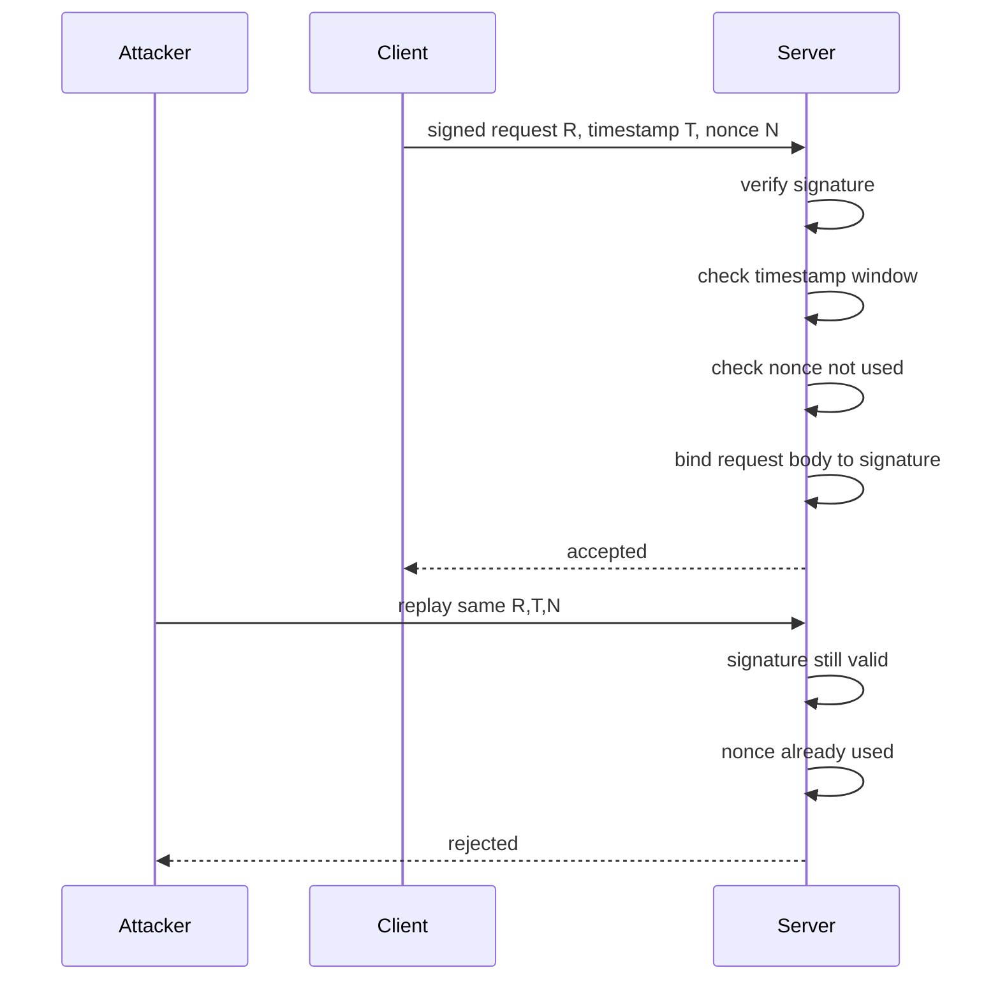
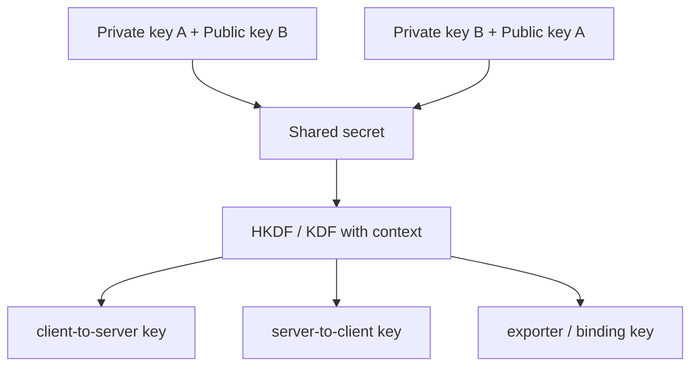
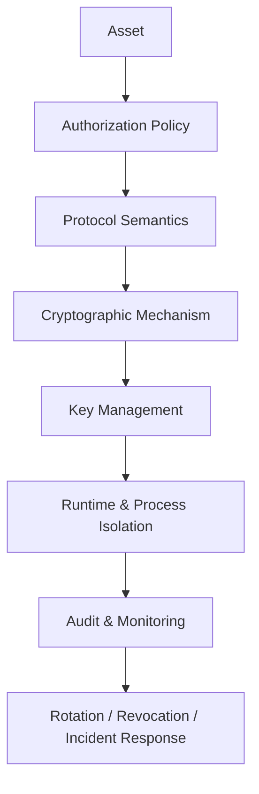
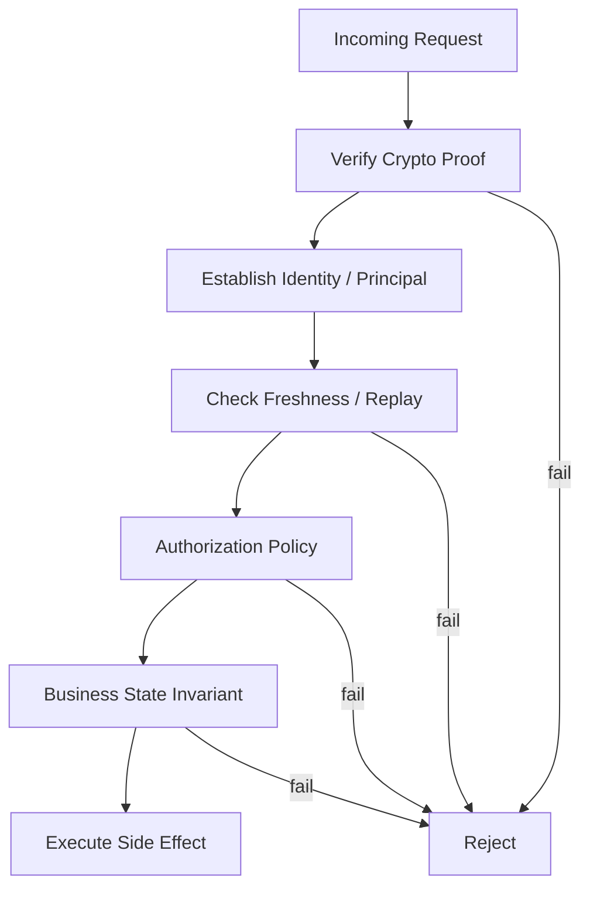
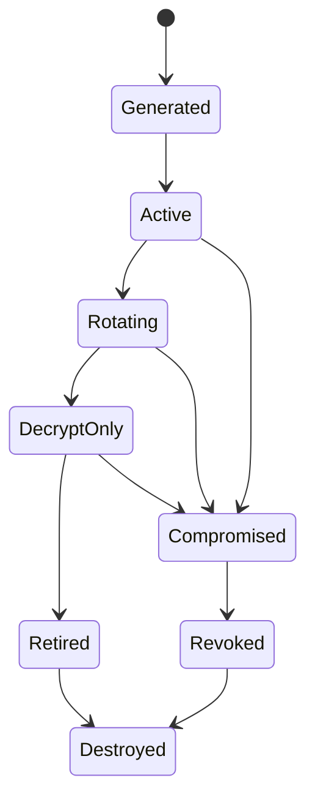
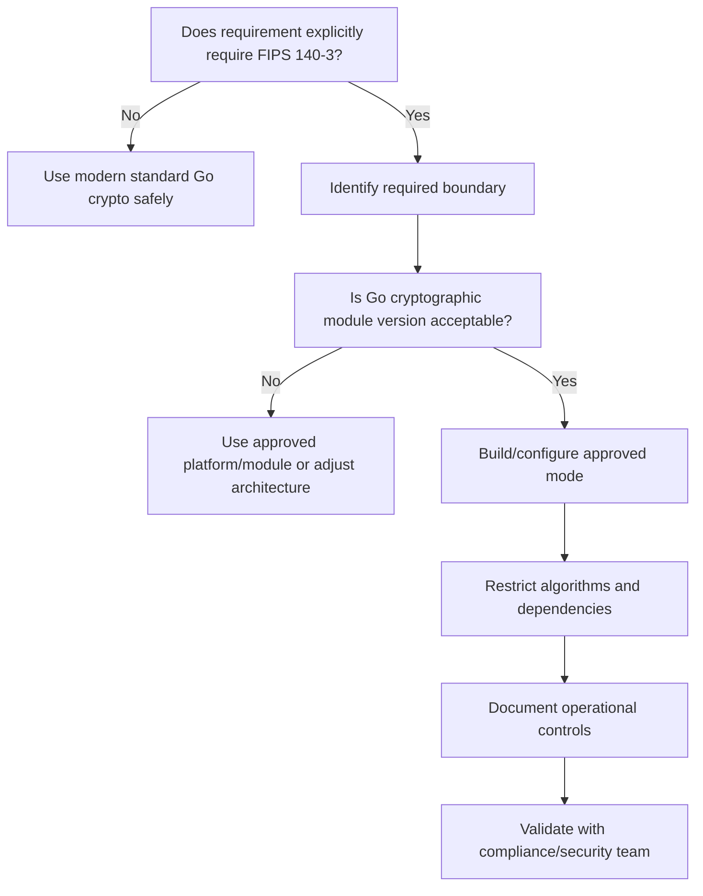
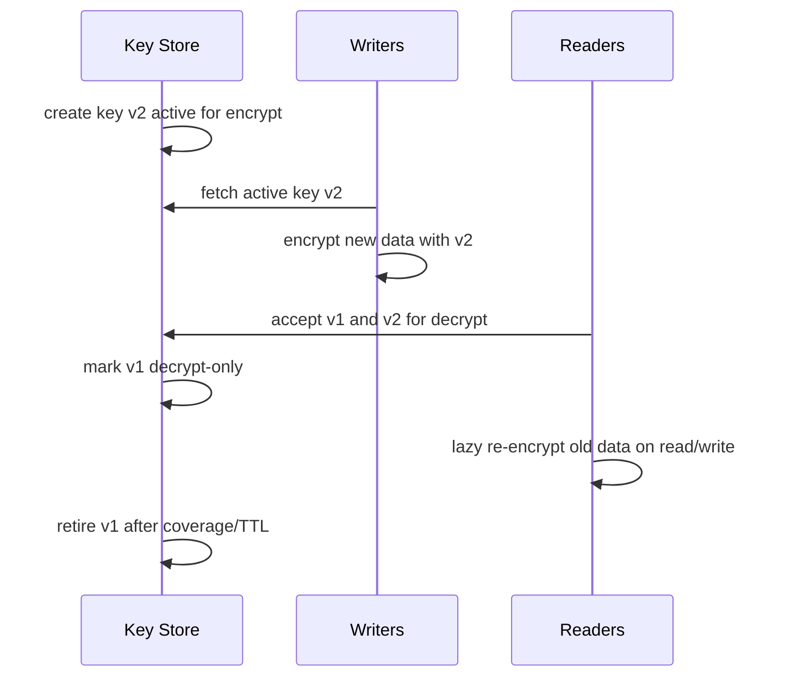

# learn-go-security-cryptography-integrity-part-004.md

# Part 004 — Cryptography Engineering Principles in Go

> Seri: `learn-go-security-cryptography-integrity`  
> Target: Go 1.26.x  
> Target pembaca: Java software engineer yang ingin berpindah dari “bisa memakai library crypto” menjadi “mampu mendesain, mereview, mengoperasikan, dan mempertanggungjawabkan penggunaan cryptography di production system”.  
> Status seri: **belum selesai** — ini adalah **part 004 dari 034**.

---

## 0. Posisi Part Ini Dalam Seri

Sebelumnya:

- `part-000` membangun peta seri, scope, dan learning contract.
- `part-001` membangun mental model security: asset, trust boundary, attack surface, abuse case, misuse case, invariant.
- `part-002` memetakan Go security surface: runtime, compiler, standard library, modules, OS boundary, `unsafe`, `cgo`, network, deployment.
- `part-003` membahas threat modeling untuk Go services.

Sekarang kita masuk ke **cryptography engineering principles**.

Part ini bukan daftar algoritma. Part ini adalah fondasi mental untuk menjawab pertanyaan seperti:

- “Apakah data ini perlu di-hash, di-MAC, di-sign, atau di-encrypt?”
- “Apakah `AES-GCM` cukup, atau perlu signature juga?”
- “Apa bedanya integrity dengan authenticity?”
- “Kenapa nonce reuse bisa menghancurkan confidentiality dan integrity?”
- “Kenapa `hash(secret + message)` bukan HMAC?”
- “Kenapa JWT valid secara signature tapi tetap bisa salah secara security?”
- “Kenapa crypto yang benar secara unit test bisa tetap insecure di production?”
- “Bagaimana membuat crypto design yang defensible saat audit, incident review, dan compliance review?”

> Core idea: cryptography bukan dekorasi keamanan. Cryptography adalah mekanisme untuk menjaga **security invariant** di bawah asumsi ancaman tertentu.

---

## 1. Learning Objectives

Setelah menyelesaikan part ini, kamu diharapkan mampu:

1. Membedakan primitive crypto berdasarkan **security service** yang disediakan.
2. Menjelaskan confidentiality, integrity, authenticity, non-repudiation, freshness, forward secrecy, replay resistance, dan misuse resistance secara engineering, bukan definisi hafalan.
3. Mendesain envelope format sederhana yang versioned, auditable, dan future-proof.
4. Menghindari crypto misuse umum di Go: random salah, nonce reuse, raw CBC/CTR, hash sebagai MAC, timing compare, algorithm confusion, canonicalization bug, key reuse.
5. Memahami perbedaan mindset Java crypto dan Go crypto.
6. Membaca package crypto Go sebagai kontrak security, bukan hanya API reference.
7. Menulis checklist review untuk crypto design sebelum masuk implementasi.

---

## 2. Crypto Engineering: Bukan “Encrypt Everything”

Banyak engineer memulai crypto dari pertanyaan yang salah:

> “Bagaimana cara encrypt data ini?”

Pertanyaan yang lebih benar:

> “Invariant apa yang harus tetap benar walaupun attacker bisa melihat, mengubah, menunda, menghapus, menggandakan, atau mengirim ulang data?”

Contoh:

| Problem | Pertanyaan dangkal | Pertanyaan engineering |
|---|---|---|
| API webhook | “Pakai SHA-256?” | “Bagaimana receiver tahu payload benar-benar dari sender dan tidak dimodifikasi?” |
| Stored document | “Encrypt pakai AES?” | “Siapa yang boleh membaca, siapa yang bisa mengubah, bagaimana mendeteksi tamper, bagaimana rotate key?” |
| JWT | “Signature valid?” | “Issuer, audience, algorithm, expiry, key ID, revocation, dan authorization binding valid?” |
| Password | “Hash password?” | “Apakah hash lambat, salted, parameterized, migratable, dan tahan credential stuffing?” |
| Service call | “Pakai HTTPS?” | “Apakah peer identity diverifikasi, apakah hostname/SAN benar, apakah mTLS identity dipetakan ke authorization?” |
| Audit log | “Simpan log saja?” | “Bagaimana membuktikan log tidak diubah tanpa terdeteksi?” |

Crypto tidak otomatis membuat sistem aman. Crypto hanya membuat properti tertentu menjadi mahal untuk dilanggar **jika**:

1. primitive dipilih benar,
2. mode dipakai benar,
3. key dikelola benar,
4. input dikanonikal dengan benar,
5. protocol menjaga freshness dan replay,
6. error handling tidak membuka side-channel,
7. deployment tidak membocorkan secret,
8. asumsi threat model benar.

---

## 3. Mental Model Utama: Security Service vs Primitive

Cryptographic primitive adalah alat. Security service adalah properti yang ingin dijaga.

```mermaid
flowchart LR
    Problem[Security Problem] --> Property[Required Security Property]
    Property --> Primitive[Crypto Primitive]
    Primitive --> Protocol[Protocol / Envelope]
    Protocol --> KeyMgmt[Key Management]
    KeyMgmt --> Ops[Operational Controls]
    Ops --> Assurance[Audit / Test / Monitoring / Rotation]

    style Problem fill:#f8f8f8,stroke:#555
    style Property fill:#f8f8f8,stroke:#555
    style Primitive fill:#f8f8f8,stroke:#555
    style Protocol fill:#f8f8f8,stroke:#555
    style KeyMgmt fill:#f8f8f8,stroke:#555
    style Ops fill:#f8f8f8,stroke:#555
    style Assurance fill:#f8f8f8,stroke:#555
```



Jangan mulai dari primitive. Mulai dari property.

---

## 4. Security Services: Definisi Engineering

### 4.1 Confidentiality

**Confidentiality** berarti attacker tidak dapat membaca plaintext walaupun bisa mengakses ciphertext.

Contoh:

- data field terenkripsi di database,
- backup terenkripsi,
- transport TLS,
- token opaque yang tidak bisa dibaca client,
- secrets at rest.

Confidentiality **tidak sama** dengan integrity.

Encryption tanpa authentication bisa membuat data tidak terbaca, tetapi masih bisa dimodifikasi secara berbahaya. Ini akar banyak bug klasik: sistem mendekripsi ciphertext yang telah dimanipulasi dan menghasilkan perilaku yang bocor.

#### Wrong mental model

> “Kalau sudah encrypted, aman.”

#### Better mental model

> “Encryption menyembunyikan isi. Sistem masih perlu mendeteksi apakah data diubah, dipotong, diganti, atau direplay.”

#### Go implication

Untuk data application-level modern, default mental model harus:

- gunakan **AEAD** seperti AES-GCM atau ChaCha20-Poly1305,
- bukan raw AES-CBC,
- bukan raw AES-CTR,
- bukan “encrypt lalu hash” tanpa key,
- bukan “encrypt lalu HMAC” kecuali benar-benar memahami ordering, key separation, format, dan failure mode.

---

### 4.2 Integrity

**Integrity** berarti attacker tidak dapat mengubah data tanpa terdeteksi.

Integrity bisa dicapai dengan beberapa primitive:

| Mechanism | Mendeteksi error accidental? | Mendeteksi attacker? | Butuh secret key? | Memberikan origin/authenticity? |
|---|---:|---:|---:|---:|
| Checksum / CRC | Ya | Tidak | Tidak | Tidak |
| Cryptographic hash | Ya | Terbatas | Tidak | Tidak |
| HMAC / MAC | Ya | Ya | Ya | Ya, untuk pihak yang punya shared key |
| Digital signature | Ya | Ya | Private key signing | Ya, public-verifiable |
| AEAD tag | Ya | Ya | Ya | Ya, untuk pihak yang punya AEAD key |

#### Key distinction

- Hash memberi **tamper evidence hanya jika reference digest dilindungi**.
- HMAC memberi tamper evidence terhadap attacker yang tidak punya key.
- Signature memberi tamper evidence dan origin proof yang bisa diverifikasi banyak pihak.

Contoh buruk:

```text
store payload + sha256(payload)
```

Jika attacker bisa mengubah payload dan digest sekaligus, integrity hilang.

Contoh lebih baik:

```text
store payload + hmac(key, payload)
```

Atau untuk public verification:

```text
store payload + signature(privateKey, canonical(payload))
```

---

### 4.3 Authenticity

**Authenticity** berarti receiver bisa yakin bahwa data berasal dari entity yang benar.

Authenticity bukan hanya “data tidak berubah”.

Contoh:

- webhook payload memang dikirim oleh payment provider,
- service A memang memanggil service B,
- token memang diterbitkan oleh issuer yang dipercaya,
- config bundle memang berasal dari release system,
- audit event memang dicatat oleh subsystem yang sah.

Primitive umum:

| Scenario | Primitive umum |
|---|---|
| Dua pihak berbagi secret | HMAC |
| Banyak receiver perlu verify tanpa bisa sign | Digital signature |
| Transport peer identity | TLS / mTLS certificate validation |
| Message encryption dengan authentication | AEAD |

Authenticity selalu butuh **identity binding**.

Signature valid tidak berarti issuer benar jika public key yang dipakai salah. TLS valid tidak berarti service benar jika hostname/SAN atau trust root salah. HMAC valid tidak berarti request authorized jika key dipakai terlalu luas.

---

### 4.4 Non-repudiation

**Non-repudiation** berarti signer sulit menyangkal bahwa ia menandatangani pesan tertentu.

Biasanya dicapai dengan digital signature, bukan HMAC.

Kenapa HMAC tidak cukup?

Karena HMAC memakai shared secret. Jika Alice dan Bob sama-sama tahu key, Bob bisa membuat MAC sendiri lalu mengklaim Alice yang membuatnya. Itu cukup untuk pairwise authenticity, tapi tidak cukup untuk bukti terhadap pihak ketiga.

Non-repudiation membutuhkan:

1. private key hanya dikuasai signer,
2. key lifecycle terdokumentasi,
3. timestamp/freshness jelas,
4. message canonicalization stabil,
5. signing intent jelas,
6. audit trail kuat,
7. certificate/key identity dapat dipertanggungjawabkan.

Untuk sistem regulatori, non-repudiation jarang hanya soal algoritma. Biasanya melibatkan:

- user identity assurance,
- role/authority saat signing,
- timestamping,
- audit trail,
- document version,
- approval workflow,
- evidence preservation.

---

### 4.5 Freshness

**Freshness** berarti pesan atau bukti masih relevan untuk waktu/konteks saat ini.

Tanpa freshness, attacker bisa melakukan replay.

Contoh:

```text
POST /transfer
amount=1000000
mac=valid
```

Jika MAC valid tetapi request lama bisa dikirim ulang, attacker mungkin tidak perlu memecahkan crypto. Ia hanya perlu mengulang pesan lama.

Freshness bisa menggunakan:

- timestamp,
- nonce,
- sequence number,
- monotonically increasing version,
- challenge-response,
- short-lived token,
- replay cache,
- idempotency key,
- server-side session state.

Freshness selalu membutuhkan aturan verifikasi.

```text
valid signature + expired timestamp = reject
valid MAC + reused nonce = reject
valid token + wrong audience = reject
valid request + duplicate idempotency key with different body = reject
```

---

### 4.6 Forward Secrecy

**Forward secrecy** berarti kompromi long-term key di masa depan tidak membuka traffic/session masa lalu.

Contoh:

- TLS 1.3 menggunakan ephemeral key exchange sehingga private key server tidak cukup untuk mendekripsi traffic lama yang sudah direkam.
- Jika kamu melakukan envelope encryption dengan data key per object dan data key plaintext tidak disimpan, compromise master key lifecycle menjadi lebih terbatas tergantung desain wrapping dan rotation.

Forward secrecy bukan property otomatis dari “pakai public-key crypto”.

Jika semua data dienkripsi langsung dengan satu static key, compromise key hari ini bisa membuka semua data historis yang masih bisa diakses.

---

### 4.7 Replay Resistance

Replay resistance berarti attacker tidak bisa mengambil pesan valid lalu mengirim ulang untuk mendapatkan efek yang tidak sah.

Replay resistance berbeda dari authenticity.

Pesan replay bisa:

- authentic,
- untampered,
- correctly signed,
- tetapi tetap tidak boleh diterima.

Contoh replay-sensitive operation:

- payment,
- password reset,
- approval,
- login challenge,
- session refresh,
- privilege escalation,
- webhook fulfillment,
- idempotent-looking operation yang sebenarnya memiliki side effect.

Replay defense biasanya layer protocol/application, bukan primitive tunggal.



---

### 4.8 Misuse Resistance

**Misuse resistance** berarti design tetap aman atau gagal aman ketika developer melakukan kesalahan yang realistis.

Contoh misuse:

- lupa generate nonce unik,
- salah ordering encrypt/MAC,
- lupa cek `err`,
- membandingkan HMAC pakai `==`,
- lupa validasi audience JWT,
- menerima `alg=none`,
- menggunakan key yang sama untuk encryption dan signing,
- tidak memasukkan metadata ke authenticated data,
- membuka plaintext sebelum tag diverifikasi,
- memakai random yang predictable,
- membuat canonical string berbeda antara signer dan verifier.

Misuse-resistant design mengurangi ruang kesalahan:

- expose fungsi high-level, bukan primitive mentah,
- buat type yang memisahkan key purpose,
- wajibkan version/algorithm/keyID di envelope,
- gunakan AEAD helper yang mengatur nonce sendiri bila cocok,
- selalu return generic error untuk authentication failure,
- jangan expose decrypted bytes sebelum verification selesai,
- gunakan test vector,
- fuzz canonicalization,
- lint untuk forbidden package/pattern.

---

## 5. Mapping Security Service ke Go Package

Go standard library menyediakan banyak primitive cryptographic. Namun package bukan berarti protocol lengkap.

| Security need | Go package umum | Catatan engineering |
|---|---|---|
| Secure randomness | `crypto/rand` | Gunakan untuk key, nonce random, token. Jangan gunakan `math/rand` untuk security. |
| Hash | `crypto/sha256`, `crypto/sha512`, `crypto/sha3` | Hash bukan MAC. Digest harus dilindungi jika dipakai untuk integrity melawan attacker. |
| HMAC | `crypto/hmac` | Gunakan `hmac.Equal`, bukan `bytes.Equal`/`==`. |
| Constant-time helper | `crypto/subtle` | Perlu hati-hati. Length mismatch tetap bisa bocor length. |
| AES | `crypto/aes` | AES hanya block cipher. Butuh mode. Prefer AEAD. |
| AEAD modes | `crypto/cipher` | `cipher.AEAD` dengan GCM/ChaCha20-Poly1305. Nonce discipline kritikal. |
| RSA | `crypto/rsa` | Gunakan OAEP untuk encryption, PSS untuk signature jika RSA masih diperlukan. |
| ECDSA | `crypto/ecdsa` | Signature verification perlu canonical message dan key validation. |
| Ed25519 | `crypto/ed25519` | Modern signature; API lebih sederhana. |
| ECDH | `crypto/ecdh` | Untuk key agreement; harus diikuti KDF/key separation. |
| X.509 | `crypto/x509` | Certificate parsing/verifying; perlu trust roots, SAN, EKU, expiry. |
| TLS | `crypto/tls` | Protocol layer; jangan disable verification. |
| Password KDF | `golang.org/x/crypto/bcrypt`, `scrypt`, `argon2` | Password hashing berbeda dari fast hash. |

Important distinction:

```text
crypto/aes     = block cipher primitive
crypto/cipher  = mode abstraction
crypto/tls     = complete-ish transport protocol implementation
crypto/x509    = certificate parsing/validation support
```

---

## 6. Java-to-Go Cryptography Mindset Shift

Sebagai Java engineer, kamu mungkin terbiasa dengan JCA/JCE:

```java
Cipher.getInstance("AES/GCM/NoPadding")
Mac.getInstance("HmacSHA256")
Signature.getInstance("Ed25519")
SecureRandom.getInstanceStrong()
```

Di Java, banyak crypto diakses lewat provider abstraction. Di Go, kamu biasanya langsung memakai package konkret:

```go
crypto/rand
crypto/hmac
crypto/sha256
crypto/aes
crypto/cipher
crypto/ed25519
crypto/tls
crypto/x509
```

### 6.1 Provider abstraction vs explicit package

| Area | Java | Go |
|---|---|---|
| Crypto provider | JCA/JCE provider model | Standard library packages, sometimes `x/crypto` |
| Algorithm selection | String-based transformation | Constructor/function-based API |
| Misconfiguration risk | Salah string/mode/padding/provider | Salah package/mode/nonce/key handling |
| Error model | Exceptions | Explicit `err` return |
| Random | `SecureRandom` | `crypto/rand.Reader` |
| Byte representation | `byte[]`, `ByteBuffer` | `[]byte`, `io.Reader`, `io.Writer` |
| Runtime secret handling | GC-managed arrays | GC-managed slices; zeroing still non-trivial |
| TLS | JSSE | `crypto/tls` |

Go membuat banyak hal lebih eksplisit. Itu bagus untuk clarity, tetapi juga berarti kamu perlu membuat abstraction sendiri di application layer supaya developer lain tidak salah pakai primitive.

### 6.2 Go API cenderung kecil, tapi tanggung jawab protocol tetap besar

Contoh `cipher.AEAD`:

```go
Seal(dst, nonce, plaintext, additionalData []byte) []byte
Open(dst, nonce, ciphertext, additionalData []byte) ([]byte, error)
```

API kecil, tetapi tanggung jawab engineering besar:

- key berasal dari mana?
- nonce unik atau random?
- key ID disimpan di mana?
- algorithm version disimpan di mana?
- additional data berisi metadata apa?
- error decrypt dipetakan ke response apa?
- ciphertext format bagaimana?
- berapa batas message per key?
- bagaimana key rotation?
- bagaimana migration?

---

## 7. Cryptographic Invariant

Kita akan sering memakai istilah **cryptographic invariant**.

Invariant adalah kondisi yang harus selalu benar di semua path, bukan hanya happy path.

Contoh invariant:

```text
Plaintext must never be released unless the AEAD tag verifies under the expected key and AAD.
```

```text
A token is accepted only if issuer, audience, expiry, not-before, algorithm, key ID, and business authorization binding are valid.
```

```text
A webhook side effect is executed at most once for a given provider event ID and canonical payload hash.
```

```text
A signing key used for approval documents must never be used for token signing.
```

```text
A nonce must never repeat under the same AEAD key.
```

Crypto design review harus mencari invariant, bukan hanya mencari algoritma.

---

## 8. Primitive Taxonomy

### 8.1 Hash Function

Hash function memetakan input arbitrarily long menjadi digest fixed-size.

Security property umum:

- preimage resistance,
- second-preimage resistance,
- collision resistance.

Contoh Go:

```go
sum := sha256.Sum256(data)
```

Hash cocok untuk:

- content addressing,
- deduplication dengan caveat,
- checksum stronger-than-CRC,
- signing pre-hash untuk data besar dengan protocol yang benar,
- integrity jika digest disimpan di tempat yang trusted atau ditandatangani.

Hash tidak cocok untuk:

- password storage langsung,
- message authentication tanpa key,
- encryption,
- access token generation,
- authorization proof.

#### Anti-pattern: hash as MAC

```go
// BAD: do not use this as message authentication.
sum := sha256.Sum256(append(secret, message...))
```

Masalah:

- construction bisa rentan terhadap design-level misuse,
- tidak memiliki security proof seperti HMAC,
- raw concatenation rentan ambiguity jika field tidak dikanonikal,
- developer sering salah ordering, separator, atau encoding.

Gunakan HMAC.

---

### 8.2 MAC / HMAC

MAC membuktikan bahwa message dibuat oleh pihak yang punya shared secret dan tidak berubah.

Contoh Go:

```go
func SignHMACSHA256(key, msg []byte) []byte {
    mac := hmac.New(sha256.New, key)
    mac.Write(msg)
    return mac.Sum(nil)
}

func VerifyHMACSHA256(key, msg, tag []byte) bool {
    expected := SignHMACSHA256(key, msg)
    return hmac.Equal(expected, tag)
}
```

HMAC cocok untuk:

- webhook authentication,
- internal message authentication,
- signed cookie dengan shared secret,
- tamper-evident payload antar dua pihak yang sama-sama punya key.

HMAC tidak cocok untuk:

- non-repudiation,
- public verification,
- multi-tenant system jika key terlalu luas,
- third-party proof.

#### HMAC design checklist

- Apakah key minimal 128-bit entropy? Prefer 256-bit random.
- Apakah key dipisah per environment?
- Apakah key dipisah per tenant/provider jika perlu blast-radius kecil?
- Apakah message dikanonikal sebelum MAC?
- Apakah metadata security-critical masuk MAC?
- Apakah tag dibandingkan dengan `hmac.Equal`?
- Apakah request punya timestamp/nonce untuk replay resistance?
- Apakah error verification tidak membocorkan “which part failed”?

---

### 8.3 Symmetric Encryption

Symmetric encryption memakai key yang sama untuk encrypt dan decrypt.

Primitive mentah seperti AES bukan protocol. AES adalah block cipher. Untuk data application-level, biasanya gunakan AEAD.

```text
AES block cipher + GCM mode = AEAD construction
```

AEAD memberikan:

- confidentiality untuk plaintext,
- integrity/authenticity untuk ciphertext,
- integrity/authenticity untuk Additional Authenticated Data / AAD.

AAD tidak dienkripsi, tetapi diautentikasi.

Contoh AAD:

- tenant ID,
- object ID,
- schema version,
- key ID,
- content type,
- creation context,
- record primary key,
- purpose string.

Kenapa AAD penting?

Karena ciphertext sering dipindahkan, dicopy, atau di-attach ke konteks yang salah. AAD mencegah ciphertext valid dipakai di konteks lain.

Contoh invariant:

```text
A ciphertext for tenant A and record X must not decrypt successfully under tenant B or record Y.
```

Solusi:

```text
AAD = "tenant=" + tenantID + "\nrecord=" + recordID + "\nschema=v3"
```

Tetapi AAD harus dikanonikal stabil.

---

### 8.4 AEAD

AEAD adalah default modern untuk encrypting application data.

Go interface:

```go
type AEAD interface {
    NonceSize() int
    Overhead() int
    Seal(dst, nonce, plaintext, additionalData []byte) []byte
    Open(dst, nonce, ciphertext, additionalData []byte) ([]byte, error)
}
```

Key point:

- `Seal` menghasilkan ciphertext + tag.
- `Open` hanya mengembalikan plaintext jika authentication valid.
- nonce harus sesuai aturan algorithm.
- AAD saat decrypt harus sama persis dengan AAD saat encrypt.

#### Nonce discipline

Untuk AES-GCM biasa, nonce harus unik per key. Reuse nonce dengan key yang sama bisa catastrophic.

```text
same key + same nonce + different plaintext = severe compromise
```

#### Safer wrapper pattern

Untuk application code, jangan biarkan setiap call site memilih nonce sendiri jika tidak perlu. Buat wrapper yang:

- generate nonce dengan `crypto/rand`,
- menyimpan nonce di envelope,
- menyimpan version dan key ID,
- memaksa AAD masuk sebagai parameter eksplisit,
- return generic error saat decrypt gagal.

---

### 8.5 Digital Signature

Signature memakai private key untuk sign dan public key untuk verify.

Properti:

- integrity,
- authenticity,
- public verification,
- possible non-repudiation jika lifecycle key dan identity assurance kuat.

Contoh use case:

- signed release artifact,
- signed audit bundle,
- signed document approval,
- JWT asymmetric signing,
- inter-organization messages,
- config bundle verification.

Signature tidak menyembunyikan data.

Jika perlu confidentiality + public verifiability, kamu mungkin butuh kombinasi:

```text
sign then encrypt
encrypt then sign
AEAD + signature envelope
```

Pilihan tergantung protocol semantics.

#### Signing checklist

- Apa exact bytes yang ditandatangani?
- Apakah canonicalization stabil lintas bahasa dan versi?
- Apakah signature mencakup version/algorithm/purpose/context?
- Apakah public key discovery aman?
- Apakah key ID trustworthy?
- Apakah expiry/freshness ada?
- Apakah signer identity dipetakan ke authorization?
- Apakah signature valid tapi business state invalid tetap ditolak?

---

### 8.6 Key Agreement

Key agreement memungkinkan dua pihak membuat shared secret melalui public exchange.

Contoh: ECDH / X25519.

Tetapi hasil ECDH biasanya bukan langsung dipakai sebagai encryption key. Harus masuk KDF untuk:

- extract entropy,
- bind transcript/context,
- derive separate keys,
- prevent cross-protocol reuse.

Mental model:



Key agreement sendiri tidak memberi authentication kecuali dikombinasikan dengan certificate/signature/PSK atau protocol lain.

---

### 8.7 KDF: Key Derivation Function

KDF mengubah secret material menjadi key yang sesuai purpose.

KDF berbeda dari password hashing.

| Use case | Tool concept |
|---|---|
| Derive keys from high-entropy shared secret | HKDF-like KDF |
| Store password | Argon2id/bcrypt/scrypt/PBKDF2 with parameters |
| Derive per-purpose keys | KDF with domain separation |
| Derive per-record encryption key | KDF with master key + record context, or envelope encryption |

Key separation sangat penting.

Jangan gunakan satu key untuk semua ini:

```text
same key for AES-GCM encryption
same key for HMAC webhook
same key for JWT signing
same key for cookie signing
same key for database field encryption
```

Lebih baik:

```text
root key / KMS data key
  -> derive app:v1:encrypt:user-profile
  -> derive app:v1:mac:webhook:provider-x
  -> derive app:v1:sign:approval-doc
```

---

## 9. Cryptographic Design as Layered Defense

Crypto jarang berdiri sendiri.



Contoh: encrypted database field.

Crypto saja menjawab:

- attacker dengan DB dump tidak bisa membaca field.

Tetapi sistem lengkap juga harus menjawab:

- siapa boleh decrypt?
- service mana punya key?
- bagaimana key disimpan?
- bagaimana key dirotate?
- bagaimana audit decrypt?
- bagaimana backup lama?
- bagaimana search/index?
- bagaimana incident response saat key bocor?
- apakah plaintext masuk log?
- apakah plaintext masuk tracing?
- apakah plaintext muncul di panic dump?

---

## 10. Principle 1 — Do Not Invent Your Own Primitive

Ini aturan klasik, tapi sering disalahpahami.

“Jangan buat crypto sendiri” bukan berarti tidak boleh membuat wrapper, envelope, atau policy. Justru kamu **harus** membuat application-level wrapper supaya primitive tidak dipakai sembarangan.

Yang tidak boleh:

- membuat mode encryption sendiri,
- membuat hash-MAC sendiri,
- membuat signature scheme sendiri,
- membuat random generator sendiri,
- membuat token format tanpa threat model,
- membuat TLS-like handshake sendiri,
- mengganti AEAD tag dengan checksum,
- menggabungkan primitive tanpa security proof.

Yang boleh dan perlu:

- membuat `EncryptField()` wrapper yang memakai AEAD dengan envelope aman,
- membuat `VerifyWebhook()` yang canonicalization-nya jelas,
- membuat `TokenVerifier` yang memaksa issuer/audience/algorithm,
- membuat `KeyResolver` yang membatasi key purpose,
- membuat `Signer` interface yang backed by KMS/HSM,
- membuat `CryptoPolicy` yang melarang algorithm lama.

```go
// Good direction: application-level wrapper.
type FieldEncryptor interface {
    Encrypt(ctx context.Context, field FieldContext, plaintext []byte) (Envelope, error)
    Decrypt(ctx context.Context, field FieldContext, envelope Envelope) ([]byte, error)
}

// Bad direction: exposing low-level primitives to all callers.
func EncryptWithAES(key, iv, plaintext []byte) []byte
```

---

## 11. Principle 2 — Prefer Misuse-Resistant High-Level Construction

Semakin rendah level API yang dipakai oleh business code, semakin besar peluang misuse.

Bad shape:

```go
func Encrypt(key []byte, nonce []byte, plaintext []byte) ([]byte, error)
```

Masalah:

- caller bisa reuse nonce,
- caller bisa salah ukuran nonce,
- caller bisa pakai key salah purpose,
- caller bisa lupa menyimpan nonce,
- caller bisa tidak mengikat metadata.

Better shape:

```go
type EncryptRequest struct {
    TenantID   string
    RecordID   string
    Purpose    string
    Plaintext  []byte
}

type EncryptResponse struct {
    Envelope []byte
}

func (s *CryptoService) EncryptField(ctx context.Context, req EncryptRequest) (EncryptResponse, error)
```

Wrapper mengontrol:

- key selection,
- nonce generation,
- AAD construction,
- envelope serialization,
- versioning,
- metric/audit,
- error normalization.

---

## 12. Principle 3 — Authenticate Context, Not Just Bytes

Kesalahan umum: hanya mengamankan payload, tidak mengamankan konteks.

Contoh:

```text
ciphertext = AEAD_Encrypt(key, plaintext, aad=nil)
```

Ciphertext valid bisa saja dicopy ke record lain jika key sama dan tidak ada contextual binding.

Better:

```text
AAD = canonical({
  "purpose": "user-profile-email",
  "tenant_id": tenantID,
  "record_id": userID,
  "schema": "v1"
})
```

Then:

```text
AEAD_Encrypt(key, plaintext, AAD)
```

Sekarang ciphertext untuk user A tidak bisa didecrypt sebagai user B karena AAD berbeda.

### AAD decision rule

Masukkan ke AAD semua metadata yang:

1. tidak perlu dirahasiakan,
2. tetapi jika berubah akan mengubah meaning/security dari plaintext.

Contoh metadata AAD:

| Metadata | Kenapa diautentikasi? |
|---|---|
| tenant ID | mencegah cross-tenant ciphertext swap |
| record ID | mencegah ciphertext dipindah ke row lain |
| purpose | mencegah cross-use antar field/token |
| schema version | mencegah parser ambiguity |
| key ID | mencegah confusion saat resolver |
| algorithm version | mencegah downgrade/confusion |

---

## 13. Principle 4 — Key Separation

Satu key untuk banyak purpose memperbesar blast radius dan membuka cross-protocol risk.

Bad:

```text
APP_SECRET = used for JWT signing, cookie MAC, webhook MAC, DB encryption
```

Better:

```text
JWT_SIGNING_KEY_V3
COOKIE_MAC_KEY_V2
WEBHOOK_PROVIDER_X_HMAC_KEY_V5
DB_FIELD_ENCRYPTION_KEK_V4
AUDIT_LOG_CHAIN_HMAC_KEY_V1
```

Best untuk skala besar:

```text
KMS/HSM root or KEK
  -> per-purpose data keys
  -> per-tenant/per-provider/per-domain separation when needed
```

Key separation harus terlihat di type system dan config.

```go
type HMACKey []byte
type AEADKey []byte
type JWTSigningKey []byte

// Even if all are []byte underneath, type separation prevents accidental mixing.
```

Go type system bisa membantu membuat misuse lebih sulit.

---

## 14. Principle 5 — Nonce and IV Are Not Decoration

Nonce/IV sering dianggap “random tambahan”. Salah.

Nonce/IV adalah bagian dari security contract.

Tergantung algorithm/mode:

- harus unik,
- harus unpredictable,
- boleh public,
- tidak boleh reuse under same key,
- panjangnya harus tepat,
- kadang harus sequence/monotonic.

Untuk AEAD GCM:

- nonce biasanya 96-bit,
- nonce tidak perlu secret,
- nonce harus unik per key,
- random nonce boleh jika message count per key dibatasi,
- counter nonce boleh jika state durable dan tidak rollback.

### Random nonce vs counter nonce

| Approach | Kelebihan | Risiko |
|---|---|---|
| Random nonce | Simpler, no persistent counter | Collision risk jika message sangat banyak per key |
| Counter nonce | Collision avoidable | State rollback/restore/concurrency bug bisa reuse |
| Deterministic synthetic IV / misuse-resistant AEAD | Tahan beberapa misuse | Tidak selalu tersedia di standard library; perlu library/protocol matang |

Untuk kebanyakan application field encryption, random 96-bit nonce dengan rotation dan message limit sering cukup. Untuk high-volume stream/event encryption, perlu design lebih hati-hati.

---

## 15. Principle 6 — Canonicalization Before MAC/Signature

MAC/signature hanya mengamankan bytes yang diberikan.

Jika dua pihak berbeda dalam cara mengubah object menjadi bytes, security runtuh.

Masalah umum:

- JSON map order,
- whitespace,
- Unicode normalization,
- URL encoding,
- path normalization,
- header casing,
- duplicate headers,
- duplicate JSON fields,
- numeric formatting,
- timezone formatting,
- floating point representation,
- optional field defaulting,
- protobuf unknown fields,
- XML namespace/canonicalization.

### Bad example

```text
sign(json.Marshal(map[string]any{...}))
```

Jika producer dan verifier berbeda runtime/language/library, bytes mungkin berbeda.

### Better approach

1. Tentukan canonical format.
2. Tentukan field order.
3. Tentukan encoding.
4. Tentukan treatment untuk unknown/duplicate fields.
5. Tentukan timezone/numeric/string normalization.
6. Buat test vector lintas bahasa jika multi-language.
7. Fuzz parser/canonicalizer.

### Canonical string pattern

```text
METHOD\n
PATH\n
QUERY_CANONICAL\n
CONTENT_SHA256_HEX\n
TIMESTAMP\n
NONCE\n
```

Setiap baris harus didefinisikan ketat:

- newline `\n`, bukan platform-dependent,
- path normalized atau raw path?
- query sorted by key/value?
- percent-encoding uppercase/lowercase?
- body hash dari raw bytes atau parsed JSON?
- timestamp format RFC3339Nano atau unix seconds?

---

## 16. Principle 7 — Fail Closed, But Observe Safely

Crypto failure harus gagal tertutup.

Contoh failure:

- random generator error,
- key resolver miss,
- unknown key ID,
- unsupported algorithm,
- tag mismatch,
- signature mismatch,
- expired token,
- wrong audience,
- revoked key,
- malformed envelope,
- replay detected.

Default behavior:

```text
reject
```

Tetapi observability tetap perlu:

- metric counter,
- generic audit event,
- correlation ID,
- reason category internal,
- no secret/plaintext/tag leak.

### User-facing error

```json
{
  "error": "invalid_request"
}
```

### Internal structured log

```json
{
  "event": "crypto_verification_failed",
  "category": "aead_tag_mismatch",
  "key_id": "kid_2026_05",
  "envelope_version": 3,
  "correlation_id": "...",
  "tenant_id_hash": "..."
}
```

Do not log:

- plaintext,
- secret key,
- raw token,
- raw HMAC tag if unnecessary,
- private key,
- decrypted payload,
- password hash in broad logs,
- full authorization header.

---

## 17. Principle 8 — Constant-Time Where It Matters

Timing side-channel terjadi ketika waktu eksekusi berbeda berdasarkan secret atau secret-derived value.

Contoh:

- comparing HMAC byte-by-byte and returning early,
- comparing token secret with `==`,
- branching on secret bits,
- table lookup indexed by secret,
- returning different error before/after expensive check.

Go menyediakan `crypto/subtle` dan `hmac.Equal`.

Untuk HMAC, gunakan:

```go
if !hmac.Equal(expected, provided) {
    return ErrInvalidMAC
}
```

Bukan:

```go
if string(expected) != string(provided) { // BAD
    return ErrInvalidMAC
}
```

Catatan penting:

- Constant-time compare tidak menyelesaikan semua side-channel.
- Length mismatch bisa tetap terlihat.
- Network jitter kadang menutupi timing kecil, tetapi jangan jadikan alasan.
- Business path yang berbeda besar tetap bisa bocor.
- Logging/error response yang berbeda bisa menjadi oracle.

---

## 18. Principle 9 — Version Everything

Crypto system tanpa versioning sulit dirotate dan dimigrasikan.

Minimum envelope metadata:

```text
version
algorithm
key_id
nonce
ciphertext
tag or ciphertext+tag
created_at optional
purpose optional or in AAD
```

Lebih baik lagi:

```json
{
  "v": 3,
  "alg": "AES-256-GCM",
  "kid": "db-field-2026-06",
  "nonce": "base64url...",
  "aad_schema": "field-aad-v2",
  "ct": "base64url..."
}
```

Namun jangan percaya metadata hanya karena ada di envelope. Metadata harus:

- divalidasi against allowlist,
- sebagian dimasukkan ke AAD/signature,
- tidak boleh membuat verifier menerima algorithm berbahaya,
- tidak boleh membiarkan attacker memilih key unauthorized.

### Algorithm agility vs algorithm confusion

Crypto agility baik jika controlled.

Bad:

```text
alg field from token determines verification method freely
```

Better:

```text
expected algorithm configured by issuer/key/purpose
incoming alg must match configured expectation
```

---

## 19. Principle 10 — Bind Crypto to Authorization

Crypto proof bukan authorization.

Contoh:

- JWT signature valid, tetapi user tidak punya permission.
- mTLS cert valid, tetapi service tidak boleh call endpoint ini.
- Document signature valid, tetapi signer bukan approver untuk case ini.
- HMAC webhook valid, tetapi event duplicate sudah processed.

Crypto menjawab:

```text
who could have produced this cryptographic proof?
```

Authorization menjawab:

```text
is this actor allowed to perform this action on this resource now?
```

Keduanya harus ada.



---

## 20. Principle 11 — Crypto Boundary Must Be Small

Semakin banyak code yang menyentuh plaintext/key, semakin besar attack surface.

Good architecture:

- crypto service/wrapper kecil,
- typed request/response,
- key resolver terisolasi,
- plaintext lifetime pendek,
- caller tidak menerima key,
- audit decryption event,
- test vector dikumpulkan di package crypto internal.

Bad architecture:

- key disimpan di global variable yang dipakai banyak package,
- helper crypto menerima raw key di semua call site,
- plaintext disimpan di struct panjang umur,
- debug log berisi raw request,
- error menyertakan decrypted fragment,
- test key dipakai di staging/production.

### Go package pattern

```text
/internal/security/crypto
    envelope.go
    aead.go
    hmac.go
    key_resolver.go
    errors.go
    testvectors/

/internal/security/tokens
/internal/security/webhook
/internal/security/auditlog
```

Keep low-level primitive inside internal package.

---

## 21. Principle 12 — Key Management Is Part of Cryptography

Crypto dengan key management buruk sama dengan tidak aman.

Key lifecycle:



Pertanyaan wajib:

- siapa generate key?
- entropy source apa?
- key disimpan di mana?
- siapa bisa membaca key?
- key digunakan untuk purpose apa?
- key aktif sejak kapan?
- key expire kapan?
- key rotation strategy?
- data lama re-encrypt atau decrypt-only?
- bagaimana revoke saat compromise?
- backup key bagaimana?
- audit access key bagaimana?
- apakah key ada di env var, config file, secret manager, KMS, HSM?
- apakah key muncul di crash dump/log/metric?

### Key state semantics

| State | Encrypt/sign new data? | Decrypt/verify old data? | Notes |
|---|---:|---:|---|
| Active | Ya | Ya | Current key |
| DecryptOnly / VerifyOnly | Tidak | Ya | Rotation phase |
| Retired | Tidak | Terbatas | Butuh exception/control |
| Revoked | Tidak | Biasanya tidak | Compromise suspected |
| Destroyed | Tidak | Tidak | Data may be unrecoverable |

---

## 22. Principle 13 — Treat Randomness as Infrastructure Dependency

Randomness failure bisa menghancurkan crypto.

Go menyediakan `crypto/rand.Reader` sebagai CSPRNG global yang aman untuk concurrent use. Namun application tetap harus memperlakukan random error sebagai fatal untuk operasi crypto.

### Token generation example

```go
package security

import (
    "crypto/rand"
    "encoding/base64"
    "fmt"
)

func NewRandomToken(numBytes int) (string, error) {
    if numBytes < 16 {
        return "", fmt.Errorf("token entropy too small")
    }

    b := make([]byte, numBytes)
    if _, err := rand.Read(b); err != nil {
        return "", fmt.Errorf("generate secure random token: %w", err)
    }

    return base64.RawURLEncoding.EncodeToString(b), nil
}
```

Design notes:

- 16 bytes = 128-bit entropy minimum untuk banyak token.
- 32 bytes = 256-bit entropy, common default.
- Base64url avoids URL escaping.
- Jangan pakai timestamp + random kecil.
- Jangan pakai UUIDv4 untuk semua crypto use case tanpa memahami entropy/format constraints.
- Jangan pakai `math/rand` untuk secret/token.

---

## 23. Principle 14 — Separate Data Protection From Data Meaning

Encryption tidak mengubah authorization semantics.

Contoh:

```text
encrypted_role = AEAD(role="admin")
```

Jika service blindly decrypt lalu percaya role tanpa memvalidasi issuer/context/state, attacker mungkin bisa replay ciphertext lama.

Better:

- role/permission dihitung server-side dari source of truth,
- token claims short-lived,
- claims bind ke issuer/audience/session/client,
- privilege change invalidates sessions,
- ciphertext bind ke subject/session/purpose via AAD.

Data protection menjawab:

```text
Can attacker read or tamper with bytes?
```

Data meaning menjawab:

```text
Should this meaning be accepted in the current business state?
```

---

## 24. Principle 15 — Crypto Must Be Testable With Vectors and Negative Cases

Unit test crypto bukan hanya round-trip.

Bad test:

```go
ct := Encrypt(key, pt)
got := Decrypt(key, ct)
assert.Equal(pt, got)
```

Ini tidak menangkap:

- missing authentication,
- AAD ignored,
- nonce not stored,
- wrong key accepted,
- algorithm downgrade,
- corrupted ciphertext accepted,
- tag not checked,
- replay accepted,
- canonicalization mismatch.

Better tests:

| Test | Expected |
|---|---|
| decrypt with wrong key | reject |
| decrypt with wrong AAD | reject |
| flip one bit in ciphertext | reject |
| flip one bit in tag | reject |
| missing version | reject |
| unknown version | reject unless migration allowed |
| unsupported algorithm | reject |
| wrong key purpose | reject |
| old key decrypt-only encrypt attempt | reject |
| duplicate nonce where tracked | reject |
| replay same signed request | reject |
| canonicalization with reordered JSON | deterministic or reject |

### Fuzz targets

Good fuzz candidates:

- envelope parser,
- canonicalization,
- token parser,
- signature verifier input,
- archive/path normalizer,
- key ID resolver parsing,
- base64/base64url decoder,
- ASN.1/cert wrapper if custom logic exists.

---

## 25. A Defensible AEAD Envelope Design

### 25.1 Envelope fields

```go
type Envelope struct {
    Version int    `json:"v"`
    Alg     string `json:"alg"`
    KeyID   string `json:"kid"`
    Nonce   string `json:"nonce"` // base64url
    CT      string `json:"ct"`    // base64url ciphertext+tag
}
```

### 25.2 AAD fields

```go
type FieldAAD struct {
    Purpose string
    Tenant  string
    Record  string
    Field   string
    Schema  string
}
```

### 25.3 Design invariant

```text
Envelope decrypts only if:
  - version is supported,
  - algorithm matches policy for key ID,
  - key ID resolves to an active/decrypt-capable key for purpose,
  - nonce length is correct,
  - ciphertext authentication tag verifies,
  - AAD matches current expected context exactly.
```

### 25.4 Safe Go skeleton

```go
package fieldcrypto

import (
    "crypto/aes"
    "crypto/cipher"
    "crypto/rand"
    "encoding/base64"
    "encoding/json"
    "errors"
    "fmt"
)

var ErrInvalidCiphertext = errors.New("invalid ciphertext")

type Key struct {
    ID      string
    Bytes   []byte
    Purpose string
    Alg     string
}

type KeyResolver interface {
    ActiveEncryptionKey(purpose string) (Key, error)
    DecryptionKey(keyID string, purpose string) (Key, error)
}

type Envelope struct {
    Version int    `json:"v"`
    Alg     string `json:"alg"`
    KeyID   string `json:"kid"`
    Nonce   string `json:"nonce"`
    CT      string `json:"ct"`
}

type FieldAAD struct {
    Purpose string `json:"purpose"`
    Tenant  string `json:"tenant"`
    Record  string `json:"record"`
    Field   string `json:"field"`
    Schema  string `json:"schema"`
}

type Service struct {
    keys KeyResolver
}

func New(keys KeyResolver) *Service {
    return &Service{keys: keys}
}

func (s *Service) Encrypt(aad FieldAAD, plaintext []byte) ([]byte, error) {
    if len(plaintext) == 0 {
        return nil, fmt.Errorf("plaintext is empty")
    }
    if err := validateAAD(aad); err != nil {
        return nil, err
    }

    key, err := s.keys.ActiveEncryptionKey(aad.Purpose)
    if err != nil {
        return nil, fmt.Errorf("resolve encryption key: %w", err)
    }
    if key.Alg != "AES-256-GCM" || len(key.Bytes) != 32 {
        return nil, fmt.Errorf("invalid key policy")
    }

    block, err := aes.NewCipher(key.Bytes)
    if err != nil {
        return nil, fmt.Errorf("create AES cipher: %w", err)
    }

    aead, err := cipher.NewGCM(block)
    if err != nil {
        return nil, fmt.Errorf("create GCM: %w", err)
    }

    nonce := make([]byte, aead.NonceSize())
    if _, err := rand.Read(nonce); err != nil {
        return nil, fmt.Errorf("generate nonce: %w", err)
    }

    aadBytes, err := canonicalAAD(aad)
    if err != nil {
        return nil, err
    }

    ct := aead.Seal(nil, nonce, plaintext, aadBytes)

    env := Envelope{
        Version: 1,
        Alg:     key.Alg,
        KeyID:   key.ID,
        Nonce:   base64.RawURLEncoding.EncodeToString(nonce),
        CT:      base64.RawURLEncoding.EncodeToString(ct),
    }

    out, err := json.Marshal(env)
    if err != nil {
        return nil, fmt.Errorf("marshal envelope: %w", err)
    }
    return out, nil
}

func (s *Service) Decrypt(aad FieldAAD, encoded []byte) ([]byte, error) {
    if err := validateAAD(aad); err != nil {
        return nil, err
    }

    var env Envelope
    if err := json.Unmarshal(encoded, &env); err != nil {
        return nil, ErrInvalidCiphertext
    }
    if env.Version != 1 || env.Alg != "AES-256-GCM" || env.KeyID == "" {
        return nil, ErrInvalidCiphertext
    }

    key, err := s.keys.DecryptionKey(env.KeyID, aad.Purpose)
    if err != nil {
        return nil, ErrInvalidCiphertext
    }
    if key.Alg != env.Alg || len(key.Bytes) != 32 {
        return nil, ErrInvalidCiphertext
    }

    nonce, err := base64.RawURLEncoding.DecodeString(env.Nonce)
    if err != nil {
        return nil, ErrInvalidCiphertext
    }
    ct, err := base64.RawURLEncoding.DecodeString(env.CT)
    if err != nil {
        return nil, ErrInvalidCiphertext
    }

    block, err := aes.NewCipher(key.Bytes)
    if err != nil {
        return nil, ErrInvalidCiphertext
    }
    aead, err := cipher.NewGCM(block)
    if err != nil {
        return nil, ErrInvalidCiphertext
    }
    if len(nonce) != aead.NonceSize() {
        return nil, ErrInvalidCiphertext
    }

    aadBytes, err := canonicalAAD(aad)
    if err != nil {
        return nil, ErrInvalidCiphertext
    }

    pt, err := aead.Open(nil, nonce, ct, aadBytes)
    if err != nil {
        return nil, ErrInvalidCiphertext
    }
    return pt, nil
}

func validateAAD(a FieldAAD) error {
    if a.Purpose == "" || a.Tenant == "" || a.Record == "" || a.Field == "" || a.Schema == "" {
        return fmt.Errorf("invalid AAD context")
    }
    return nil
}

func canonicalAAD(a FieldAAD) ([]byte, error) {
    // For single-language internal usage, a fixed struct JSON can be acceptable.
    // For cross-language signatures/MACs, define a stricter canonicalization scheme
    // and publish test vectors.
    return json.Marshal(struct {
        Purpose string `json:"purpose"`
        Tenant  string `json:"tenant"`
        Record  string `json:"record"`
        Field   string `json:"field"`
        Schema  string `json:"schema"`
    }{
        Purpose: a.Purpose,
        Tenant:  a.Tenant,
        Record:  a.Record,
        Field:   a.Field,
        Schema:  a.Schema,
    })
}
```

### 25.5 Review notes

This skeleton is not a universal crypto framework. It demonstrates shape:

- key selection hidden behind resolver,
- nonce generated internally,
- envelope versioned,
- AAD mandatory,
- decrypt errors normalized,
- algorithm constrained by policy,
- key purpose checked.

Production improvements:

- avoid logging plaintext,
- zero sensitive buffers where meaningful,
- add metrics/audit,
- add KMS/HSM-backed key resolver,
- add key status model,
- add test vectors,
- add fuzzing for envelope parser,
- define canonical AAD more strictly if cross-language,
- enforce maximum ciphertext/envelope size,
- support migration versions deliberately,
- protect against nil/empty key states,
- avoid returning wrapped internal errors to external callers.

---

## 26. HMAC Webhook Verification Pattern

Webhook security often fails due to replay and canonicalization.

### 26.1 Invariant

```text
A webhook event is processed only if:
  - provider identity is known,
  - signature/MAC verifies over exact signed bytes,
  - timestamp is within allowed skew,
  - event ID has not been processed before,
  - event semantic state transition is valid.
```

### 26.2 Example shape

```go
func VerifyWebhook(
    key []byte,
    rawBody []byte,
    timestamp string,
    providedMAC []byte,
    maxSkew time.Duration,
    now time.Time,
) error {
    ts, err := time.Parse(time.RFC3339, timestamp)
    if err != nil {
        return ErrInvalidWebhook
    }
    if now.Sub(ts) > maxSkew || ts.Sub(now) > maxSkew {
        return ErrInvalidWebhook
    }

    signed := canonicalWebhookBytes(timestamp, rawBody)

    mac := hmac.New(sha256.New, key)
    mac.Write(signed)
    expected := mac.Sum(nil)

    if !hmac.Equal(expected, providedMAC) {
        return ErrInvalidWebhook
    }
    return nil
}
```

### 26.3 Important details

- Verify raw body bytes, not re-marshaled JSON, unless provider explicitly signs canonical JSON.
- Timestamp must be signed, not only sent beside signature.
- Event ID should be deduplicated after MAC verification.
- Idempotency should bind event ID to payload hash.
- Do not reveal whether timestamp or MAC failed.
- Per-provider key separation.
- Rotate webhook secrets with overlap window.

---

## 27. Signature-Based Document Approval Pattern

Regulatory systems often require document/evidence integrity.

### 27.1 Problem

A user approves a document. Later, the system must prove:

- which document version was approved,
- who approved it,
- what role/authority they had,
- when approval occurred,
- what exact content was approved,
- whether document changed afterward,
- whether approval was revoked/superseded.

### 27.2 Signature alone is insufficient

Bad:

```text
signature = Sign(userPrivateKey, PDF bytes)
```

Missing:

- case ID,
- document ID,
- document version,
- approval intent,
- signer identity assurance,
- role at time of signing,
- timestamp,
- policy version,
- workflow state,
- certificate/key status.

Better signing payload:

```json
{
  "purpose": "regulatory-document-approval",
  "case_id": "CASE-123",
  "document_id": "DOC-456",
  "document_version": 7,
  "content_sha256": "...",
  "signer_subject": "...",
  "signer_role": "approver",
  "workflow_state": "pending-final-approval",
  "policy_version": "approval-policy-2026-01",
  "signed_at": "2026-06-24T10:30:00Z"
}
```

Then canonicalize and sign.

### 27.3 Approval invariant

```text
An approval signature is valid only for the exact document version, case, signer, role, workflow state, and policy version included in the canonical signing payload.
```

---

## 28. Replay Resistance Design Patterns

### 28.1 Timestamp window

Simple and common.

```text
accept if now - timestamp <= 5 minutes
```

Risks:

- clock skew,
- replay within window,
- timestamp not signed,
- delayed queues.

### 28.2 Nonce cache

Store used nonce/event IDs for a TTL.

```text
key = providerID + nonce
SETNX key true EX 5m
```

Risks:

- cache outage,
- memory pressure,
- distributed consistency,
- attacker floods nonce cache.

### 28.3 Sequence number

Requires per-sender state.

```text
accept if seq > last_seq
```

Risks:

- out-of-order messages,
- concurrency,
- failover/rollback.

### 28.4 Idempotency key

Good for side-effect operations.

```text
idempotency_key -> hash(canonical request body) -> result
```

Reject if same idempotency key appears with different body.

### 28.5 Challenge-response

Good for login or one-time proof.

```text
server challenge -> client signs challenge -> server verifies and consumes challenge
```

---

## 29. Common Crypto Misuse in Go

### 29.1 `math/rand` for token

Bad:

```go
r := rand.New(rand.NewSource(time.Now().UnixNano()))
token := fmt.Sprintf("%d", r.Int63())
```

Use `crypto/rand`.

### 29.2 Comparing HMAC with string equality

Bad:

```go
if hex.EncodeToString(expected) != provided { ... }
```

Use constant-time comparison after decoding to bytes.

### 29.3 Using SHA-256 as password hash

Bad:

```go
sha256.Sum256([]byte(password))
```

Use password hashing/KDF designed for passwords: Argon2id, bcrypt, scrypt, PBKDF2 depending compliance and operational constraints.

### 29.4 Raw AES-CBC without authentication

Bad:

```text
AES-CBC(key, iv, plaintext)
```

Prefer AEAD.

### 29.5 Nonce reuse in GCM

Bad:

```go
nonce := make([]byte, 12) // all zero
ct := gcm.Seal(nil, nonce, pt, aad)
```

Generate unique nonce or use safe wrapper.

### 29.6 JWT algorithm confusion

Bad mental model:

```text
accept whatever alg header says
```

Better:

```text
issuer config determines accepted alg and key set;
token header must match expected policy.
```

### 29.7 Signing non-canonical JSON

Bad:

```text
signature over pretty JSON from one service,
verification over compact JSON from another service
```

Define canonicalization.

### 29.8 Key reuse across purpose

Bad:

```text
same secret used for cookies, JWT, webhook, encryption
```

Separate keys.

### 29.9 Trusting `kid` blindly

Bad:

```text
kid = attacker-controlled path/URL/key selector
```

Better:

- lookup only from allowlisted key store,
- bind key ID to issuer/purpose/algorithm,
- never fetch arbitrary URL from token header.

### 29.10 Logging secrets or tokens

Bad:

```go
log.Printf("auth header: %s", r.Header.Get("Authorization"))
```

Use redaction.

---

## 30. Crypto Decision Matrix

| Requirement | Primitive/Pattern | Avoid |
|---|---|---|
| Store password | Argon2id/bcrypt/scrypt/PBKDF2 | SHA-256(password), encrypted password only |
| Verify webhook sender | HMAC over canonical bytes + timestamp + replay cache | Plain SHA-256, unsigned timestamp |
| Encrypt DB field | AEAD + envelope + AAD + key rotation | Raw AES, no AAD, no version |
| Publicly verify artifact | Digital signature | HMAC if public verification needed |
| Transport security | TLS with certificate validation | Disabling verification, custom TCP encryption |
| Service identity | mTLS/SPIFFE-like identity + authz | IP allowlist only |
| Tamper-evident audit log | Hash chain / HMAC chain / signature checkpoints | Plain append logs only |
| Prevent replay | Timestamp + nonce/idempotency/state | Signature/MAC only |
| Derive multiple keys | KDF with domain separation | Same key for all purposes |
| Secure random token | `crypto/rand` 128+ bits | `math/rand`, timestamp, predictable UUID scheme |

---

## 31. Engineering Checklist Before Using Crypto

Before writing crypto code, answer:

### 31.1 Asset

- What asset is protected?
- Is it data, identity, permission, evidence, session, key, or operation?
- What is the impact if read?
- What is the impact if modified?
- What is the impact if replayed?
- What is the impact if deleted?

### 31.2 Threat actor

- Can attacker read database?
- Can attacker modify database?
- Can attacker observe network?
- Can attacker modify network?
- Can attacker call API as normal user?
- Can attacker access logs?
- Can attacker compromise one service?
- Can attacker compromise one tenant key?
- Can attacker replay old messages?

### 31.3 Required property

- Confidentiality?
- Integrity?
- Authenticity?
- Non-repudiation?
- Freshness?
- Forward secrecy?
- Replay resistance?
- Auditability?
- Availability under attack?

### 31.4 Primitive choice

- Why this primitive?
- Is it standard and recommended?
- Is it in Go standard library or reputable package?
- Is it FIPS-approved if required?
- Is it still acceptable in 2026?
- What are message/key/nonce limits?

### 31.5 Key management

- Who owns key?
- Where is key stored?
- How is key rotated?
- How is key revoked?
- What is key purpose?
- What is blast radius?
- What happens to old data?
- How is access audited?

### 31.6 Protocol/envelope

- Is version stored?
- Is algorithm stored and policy-checked?
- Is key ID stored?
- Is nonce stored?
- Is AAD defined?
- Is canonicalization defined?
- Are errors normalized?
- Are negative cases tested?

### 31.7 Operation

- What is logged?
- What is redacted?
- What metrics exist?
- What alert indicates attack/misuse?
- What is incident response if key leaks?
- Can we rotate without downtime?
- Can we identify affected data?

---

## 32. Security Review Template: Crypto Design

Use this template in design docs and PRs.

```markdown
## Crypto Design Review

### Asset
- Protected asset:
- Data classification:
- Business impact if confidentiality fails:
- Business impact if integrity fails:
- Business impact if replay succeeds:

### Threat Model
- Attacker can read:
- Attacker can modify:
- Attacker can replay:
- Attacker cannot:
- Trust boundary crossed:

### Required Security Properties
- [ ] Confidentiality
- [ ] Integrity
- [ ] Authenticity
- [ ] Non-repudiation
- [ ] Freshness
- [ ] Replay resistance
- [ ] Forward secrecy
- [ ] Auditability

### Primitive / Protocol
- Primitive:
- Mode:
- Library/package:
- Why this choice:
- Known limits:
- Forbidden alternatives:

### Key Management
- Key source:
- Key purpose:
- Key scope:
- Key ID format:
- Rotation plan:
- Revocation plan:
- Access control:

### Envelope / Encoding
- Version field:
- Algorithm field:
- Key ID field:
- Nonce/IV field:
- AAD fields:
- Canonicalization rules:
- Max size:

### Verification Rules
- Reject unknown version:
- Reject unsupported algorithm:
- Reject wrong key purpose:
- Reject wrong AAD:
- Reject expired timestamp:
- Reject replay:
- Normalize external errors:

### Tests
- Round-trip:
- Wrong key:
- Wrong AAD:
- Corrupted ciphertext/tag:
- Unknown version:
- Unsupported alg:
- Replay:
- Fuzz parser/canonicalizer:
- Cross-language test vectors:

### Observability
- Metrics:
- Audit events:
- Redaction:
- Alert conditions:

### Residual Risk
- Accepted risk:
- Follow-up:
- Owner:
```

---

## 33. Go-Specific Engineering Guidelines

### 33.1 Prefer internal packages

Expose business-safe functions, hide primitive-level functions.

```text
/internal/security/crypto
```

Avoid:

```text
/pkg/cryptohelper
```

unless it is truly a stable public API.

### 33.2 Use typed keys

```go
type Purpose string

const (
    PurposeDBField Purpose = "db-field"
    PurposeWebhook Purpose = "webhook"
)

type KeyID string

type AEADKey struct {
    ID      KeyID
    Purpose Purpose
    Bytes   []byte
}
```

### 33.3 Ban unsafe conversions for crypto bytes unless justified

Bad pattern:

```go
b := unsafe.Slice(unsafe.StringData(s), len(s))
```

Reasons:

- string immutable semantics,
- lifetime confusion,
- secret retention,
- accidental logging,
- unsafe bypasses compiler safety.

### 33.4 Avoid long-lived plaintext in structs

Bad:

```go
type User struct {
    EmailPlaintext string
    SSNPlaintext   string
}
```

Prefer decrypt close to use, avoid broad propagation.

### 33.5 Do not store secrets in `context.Context`

Context is for cancellation, deadlines, request-scoped metadata. Putting secrets there increases accidental propagation/logging risk.

### 33.6 Error wrapping policy

Internal errors can be wrapped inside internal boundary, but external API should not reveal crypto failure details.

```go
return nil, ErrInvalidCiphertext
```

not:

```go
return nil, fmt.Errorf("GCM tag mismatch for kid %s: %w", kid, err)
```

### 33.7 Avoid package global mutable crypto state

Bad:

```go
var globalKey []byte
```

Prefer explicit dependency injection with immutable key resolver.

---

## 34. Compliance and FIPS Reality Check

FIPS does not mean “the whole application is secure”.

FIPS 140-3 concerns validated cryptographic modules and their approved mode of operation. It does not automatically validate:

- your protocol design,
- your key lifecycle,
- your authorization logic,
- your logging/redaction,
- your replay resistance,
- your canonicalization,
- your incident response,
- your full application.

For Go 1.26.x, FIPS-related support exists in the Go cryptographic module story, but engineering teams must still:

- build with the correct Go version and settings,
- understand platform support,
- restrict algorithms/modes appropriately,
- document operating mode,
- test deployment configuration,
- avoid non-approved third-party crypto where compliance requires approved modules,
- avoid overclaiming compliance.

Decision tree:



---

## 35. Cryptography and Distributed Systems

Distributed systems make crypto harder because:

- clocks differ,
- messages retry,
- queues reorder,
- services scale horizontally,
- caches are eventually consistent,
- key rotation overlaps,
- deployment rollback can reintroduce old behavior,
- logs replicate,
- backups preserve old ciphertext,
- traffic crosses many trust boundaries.

### 35.1 Rotation in distributed systems

Safe key rotation often needs stages:



Important:

- readers must know old keys before writers switch,
- writers should use only active key,
- old key may remain decrypt-only,
- cache invalidation must be planned,
- rollback must not create nonce/key reuse,
- metrics must show encryption key distribution.

### 35.2 Replay in distributed systems

Replay cache must be shared or partitioned correctly.

Bad:

```text
Each pod has local memory replay cache.
```

If load balancer sends replay to another pod, it passes.

Better:

```text
central SETNX store, or deterministic partitioning by sender/event ID.
```

But central store outage must be fail-closed for sensitive operations.

---

## 36. Production-Grade Crypto Observability

Metrics should answer:

- how many decrypt failures?
- how many MAC/signature failures?
- how many unknown key IDs?
- how many old key decrypts?
- how many encryption operations by key version?
- how many replay rejections?
- how many expired tokens?
- how many malformed envelopes?
- how many KMS errors?
- latency of KMS/sign/decrypt operations?

Example metric names:

```text
crypto_encrypt_total{purpose,kid,alg}
crypto_decrypt_total{purpose,kid,alg,result}
crypto_verify_total{purpose,issuer,result,reason_category}
crypto_key_resolve_total{purpose,result}
crypto_replay_reject_total{source}
crypto_envelope_parse_fail_total{version,result}
```

Do not put raw tenant/user/key/token in labels. Use low-cardinality labels.

---

## 37. Incident Response Thinking

Crypto design must include compromise response.

### 37.1 If HMAC webhook secret leaks

Questions:

- Which provider/tenant affected?
- Can attacker forge events?
- Are replay controls enough?
- How quickly can secret rotate?
- Is old secret still accepted?
- How to detect forged events?
- Are side effects reversible?

### 37.2 If DB encryption key leaks

Questions:

- Which fields/data encrypted under key?
- Does attacker also have DB dump?
- Was AAD used to prevent swapping?
- Can data be re-encrypted?
- Are backups affected?
- Should key be revoked or decrypt-only?
- How to notify/regulator?

### 37.3 If JWT signing key leaks

Questions:

- Can attacker mint tokens?
- Which issuers/audiences affected?
- How to revoke key from JWKS?
- What is max token lifetime?
- Are refresh tokens affected?
- Can sessions be invalidated?
- Are downstream services caching JWKS too long?

---

## 38. Mini Case Study: “Encrypt PII in Database”

### 38.1 Requirement

A service stores user National ID and email. Database admins and DB snapshot readers should not read plaintext. Application still needs exact retrieval by user ID, not search by encrypted value.

### 38.2 Naive design

```text
ciphertext = AES-GCM(key, plaintext, aad=nil)
store ciphertext
```

Problems:

- no key ID,
- no version,
- no AAD binding,
- unclear rotation,
- unclear audit,
- key maybe in env var,
- plaintext may leak to logs,
- same key for all tenants,
- no incident mapping.

### 38.3 Better design

```text
Envelope:
  v=1
  alg=AES-256-GCM
  kid=pii-field-2026-06
  nonce=random96
  ct=ciphertext+tag

AAD:
  purpose=pii-field
  tenant_id=<tenant>
  table=users
  record_id=<userID>
  field=national_id
  schema=v1
```

Key management:

- key from KMS/HSM or secret manager with strict IAM,
- key purpose `pii-field`,
- active/decrypt-only states,
- rotation every defined interval or event-driven,
- old key decrypt-only until re-encryption completed,
- key access audited.

Operational controls:

- decrypt only in service method that needs it,
- no plaintext in logs/traces,
- audit decrypt with reason category,
- metrics by key version,
- integration tests for wrong AAD,
- incident runbook.

### 38.4 Residual risks

- Compromised application runtime can still see plaintext.
- Service logs may leak if redaction fails.
- KMS policy misconfiguration can expose keys.
- Backup of old ciphertext remains under old keys.
- Admin with app-level access may retrieve plaintext legitimately.

Crypto reduces DB-level exposure, not full application compromise.

---

## 39. Mini Case Study: “Signed Internal Command”

### 39.1 Requirement

Service A sends command to Service B through queue. Queue is not fully trusted for integrity. Service B must know command came from Service A and was not modified or replayed.

### 39.2 Design

Fields:

```text
command_id
issuer_service
audience_service
issued_at
expires_at
sequence_or_nonce
command_type
resource_id
payload_hash
payload
signature
```

Signing bytes:

```text
canonical(command metadata + payload hash)
```

Verification:

1. Parse envelope with size limit.
2. Resolve issuer public key from allowlisted key store.
3. Check algorithm expected for issuer.
4. Verify signature.
5. Check audience is this service.
6. Check expiry.
7. Check replay cache for command ID/nonce.
8. Check command authorization.
9. Execute idempotently.

### 39.3 Why not just TLS?

TLS protects transport connection. If message sits in queue, is retried, copied, or inspected by intermediate systems, message-level integrity may still be required.

---

## 40. Anti-Checklist: Warning Signs in Crypto PRs

Red flags:

- `math/rand` in security path.
- `md5` or `sha1` for security property.
- `aes.NewCipher` with custom mode code.
- CBC/CTR without MAC.
- `==` for token/HMAC comparison.
- raw key passed across many packages.
- no key ID in ciphertext/token.
- no version in envelope.
- `InsecureSkipVerify: true`.
- accepts JWT algorithm from token header without allowlist.
- no audience/issuer validation.
- timestamp not signed.
- no replay defense.
- JSON re-marshal before verifying webhook signature.
- logs Authorization header.
- decrypt errors returned directly to client.
- key stored in source code.
- test only covers encrypt/decrypt round-trip.
- no rotation story.
- no incident story.

---

## 41. Practical Mental Models to Keep

### 41.1 Crypto protects bytes; systems interpret meaning

A valid signature means bytes were signed. It does not mean the action is allowed.

### 41.2 Identity proof is not authorization

mTLS/JWT/signature establishes identity. Policy decides permission.

### 41.3 Integrity without freshness permits replay

MAC/signature valid does not imply message is new.

### 41.4 Encryption without authentication is dangerous

Prefer AEAD.

### 41.5 Key management is not optional

A crypto design without key lifecycle is incomplete.

### 41.6 Canonicalization is part of the protocol

If bytes differ, verification differs.

### 41.7 Migration is a first-class requirement

Every crypto choice eventually needs rotation, replacement, or deprecation.

---

## 42. What to Memorize vs What to Reason About

### Memorize

- Never use `math/rand` for security.
- Prefer AEAD for encryption.
- Use HMAC, not raw hash with secret.
- Use `hmac.Equal` / constant-time compare for MACs/tokens.
- Nonce must not repeat under same AEAD key.
- Signature is not encryption.
- Hash is not authentication.
- Valid token is not automatically authorized.
- Include version/key ID/algorithm policy in envelope.
- Define canonicalization.
- Plan key rotation.

### Reason about every time

- What is the attacker allowed to do?
- What property must hold?
- What context must be authenticated?
- What replay/freshness rule is needed?
- What is the key scope/blast radius?
- What is the failure behavior?
- How will this rotate?
- How will this be audited?
- How will this fail in distributed systems?

---

## 43. Exercises

### Exercise 1 — Pick the right primitive

For each case, decide hash, HMAC, AEAD, signature, TLS, mTLS, or password KDF:

1. Store user password.
2. Verify webhook from payment provider.
3. Encrypt PII field in database.
4. Prove release artifact came from CI.
5. Secure service-to-service HTTP transport.
6. Detect audit log tampering by DB admin.
7. Generate password reset token.
8. Prevent duplicate payment capture.

Expected direction:

1. Password KDF.
2. HMAC + timestamp + replay cache.
3. AEAD + AAD + envelope + key management.
4. Digital signature.
5. TLS/mTLS depending identity requirement.
6. HMAC chain/signature checkpoints/Merkle-like design.
7. `crypto/rand` token + server-side expiry/storage.
8. Idempotency key + state machine + replay/dedup.

### Exercise 2 — Find missing invariant

Design:

```text
Service stores encrypted role in browser cookie.
Cookie value = AES-GCM(key, role)
```

Find missing controls:

- Is user ID/session ID in AAD?
- Is expiry authenticated?
- Is cookie bound to issuer/purpose?
- Is role server-authoritative?
- Is replay after role downgrade possible?
- Is key rotation supported?
- Is cookie `Secure`, `HttpOnly`, `SameSite`?
- Is authorization checked server-side?

### Exercise 3 — Review an envelope

Envelope:

```json
{
  "alg": "AES-GCM",
  "ciphertext": "..."
}
```

What is missing?

- version,
- key ID,
- nonce,
- algorithm policy detail,
- tag if not included,
- AAD schema,
- size limits,
- encoding rules,
- key purpose,
- rotation state.

---

## 44. Part 004 Summary

Cryptography engineering is about mapping threat model to invariant to primitive to protocol to operation.

The strongest recurring lessons:

1. Start from required property, not algorithm.
2. Prefer standard, high-level, misuse-resistant constructions.
3. Use AEAD for encryption unless there is a very specific reason not to.
4. Use HMAC for shared-secret message authentication.
5. Use digital signatures for public verification/non-repudiation-like properties.
6. Use secure randomness from `crypto/rand`.
7. Treat nonce uniqueness as a hard invariant.
8. Authenticate context through AAD or canonical signed/MACed bytes.
9. Separate keys by purpose and lifecycle.
10. Version envelopes and design for rotation from day one.
11. Freshness/replay resistance is a protocol/application concern.
12. Crypto proof must still be bound to authorization and business state.
13. Negative tests, fuzzing, and incident playbooks are part of crypto engineering.

---

## 45. References

Primary references used for this part:

- Go 1.26 Release Notes — `https://go.dev/doc/go1.26`
- Go Release History — `https://go.dev/doc/devel/release`
- Go Security Best Practices — `https://go.dev/doc/security/best-practices`
- Go Vulnerability Management — `https://go.dev/doc/security/vuln/`
- Go FIPS 140-3 Compliance — `https://go.dev/doc/security/fips140`
- Go `crypto` package — `https://pkg.go.dev/crypto`
- Go `crypto/rand` — `https://pkg.go.dev/crypto/rand`
- Go `crypto/cipher` — `https://pkg.go.dev/crypto/cipher`
- Go `crypto/hmac` — `https://pkg.go.dev/crypto/hmac`
- Go `crypto/subtle` — `https://pkg.go.dev/crypto/subtle`
- Go `crypto/ecdh` — `https://pkg.go.dev/crypto/ecdh`
- NIST SP 800-57 Part 1 Rev. 5 — Recommendation for Key Management
- FIPS 140-3 — Security Requirements for Cryptographic Modules
- OWASP Cryptographic Storage Cheat Sheet — `https://cheatsheetseries.owasp.org/`
- OWASP Authentication Cheat Sheet — `https://cheatsheetseries.owasp.org/`
- OWASP API Security Top 10 2023 — `https://owasp.org/API-Security/editions/2023/en/0x11-t10/`

---

## 46. Next Part

Berikutnya:

```text
learn-go-security-cryptography-integrity-part-005.md
```

Topik:

```text
Randomness, entropy, nonce, IV, salt, token generation, crypto/rand, failure model, and why math/rand is not a security primitive.
```

Part berikutnya akan masuk jauh ke randomness: OS entropy source, CSPRNG, token entropy calculation, nonce strategy, collision probability, secure token format, UUID caveat, concurrency, testing random-dependent code, dan failure behavior di Go.

---

## 47. Status Seri

```text
[done] part-000 — Series orientation and learning map
[done] part-001 — Security mental model in Go
[done] part-002 — Go security surface
[done] part-003 — Threat modeling for Go services
[done] part-004 — Cryptography engineering principles
[next] part-005 — Randomness, entropy, nonce, IV, salt, token generation
[remaining] part-006 sampai part-034
```

Seri **belum selesai**.


<!-- NAVIGATION_FOOTER -->
<div class="page-nav">
<a href="./learn-go-security-cryptography-integrity-part-003.md">⬅️ 0. Apa yang Dibahas di Part Ini</a>
<a href="./index.md">📚 Kategori</a>
<a href="../../index.md">🏠 Home</a>
<a href="./learn-go-security-cryptography-integrity-part-005.md">Part 005 — Randomness, Entropy, Nonce, IV, Salt, Token Generation, and Failure Model in Go ➡️</a>
</div>
