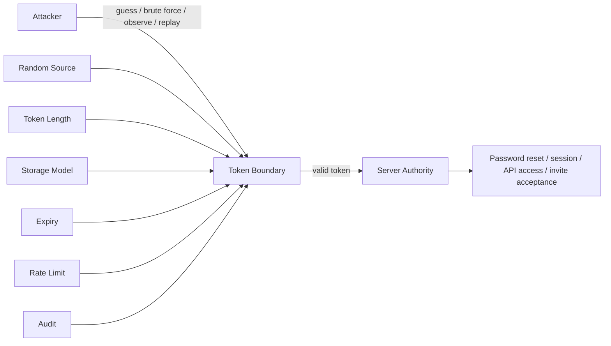
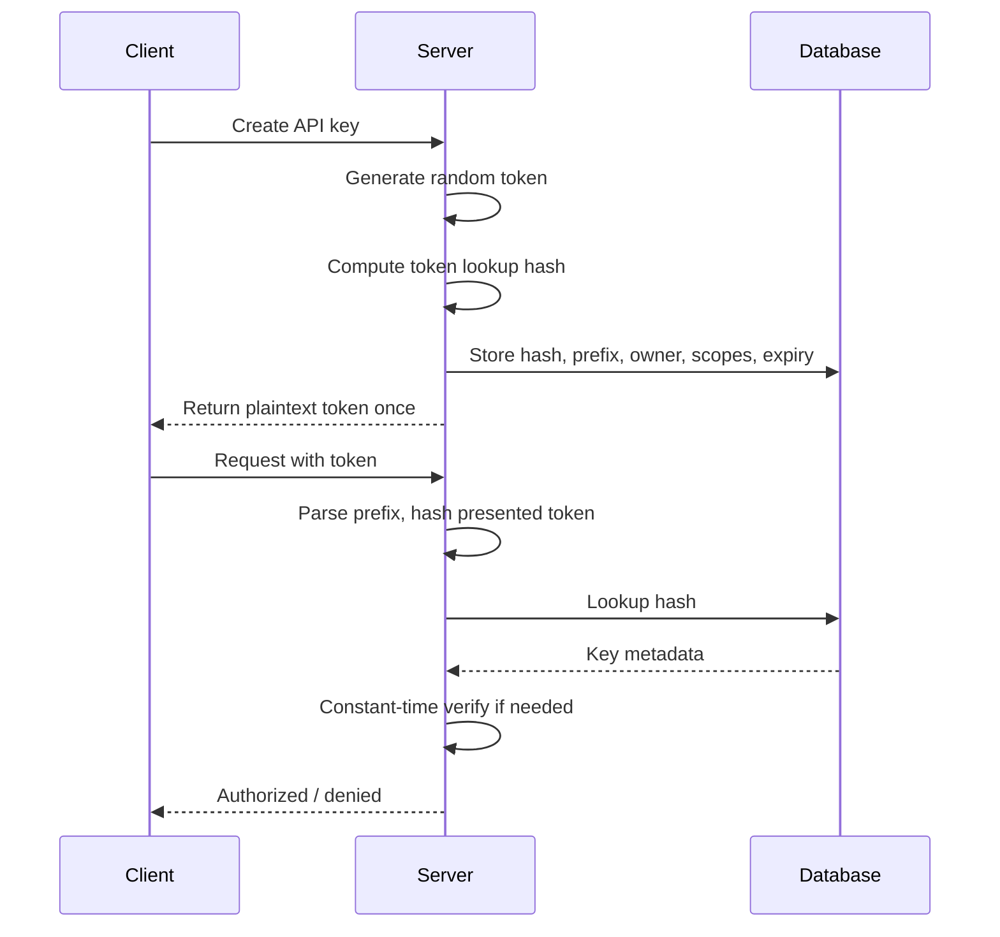
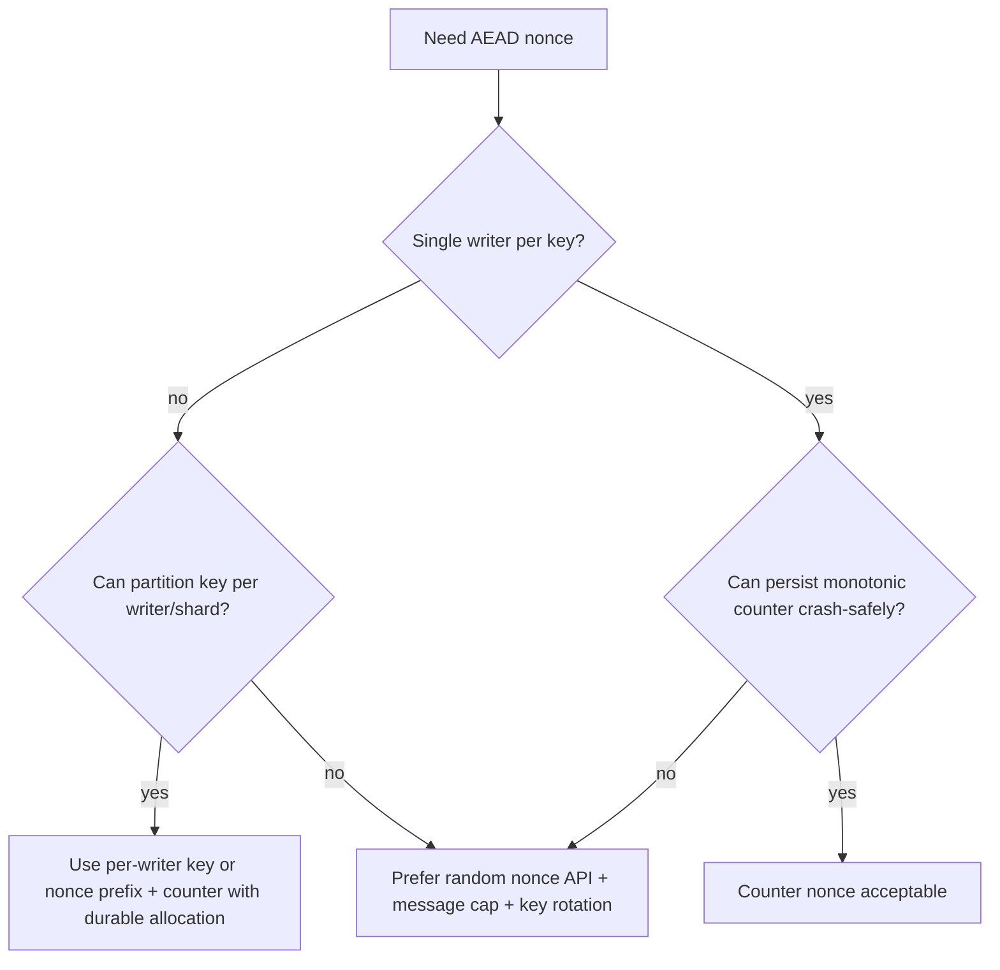
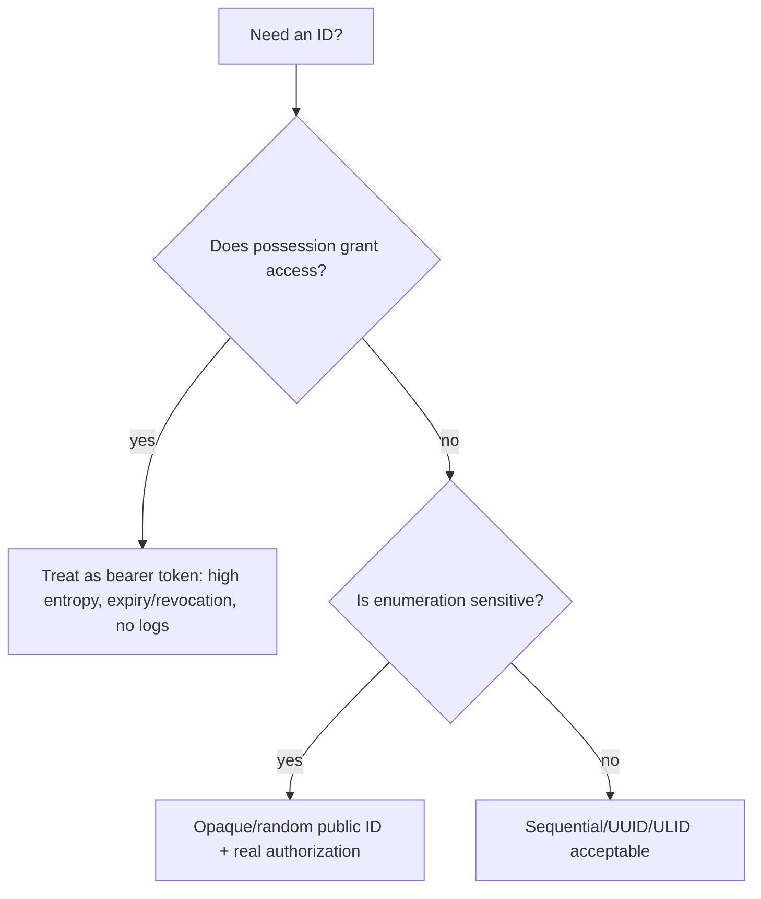
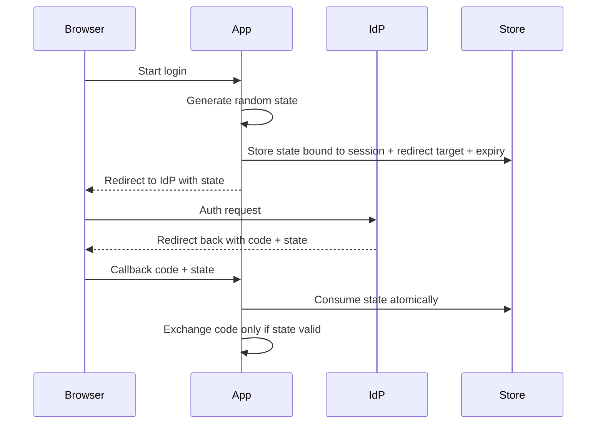
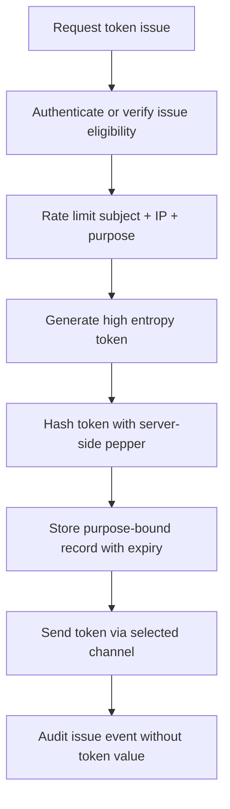
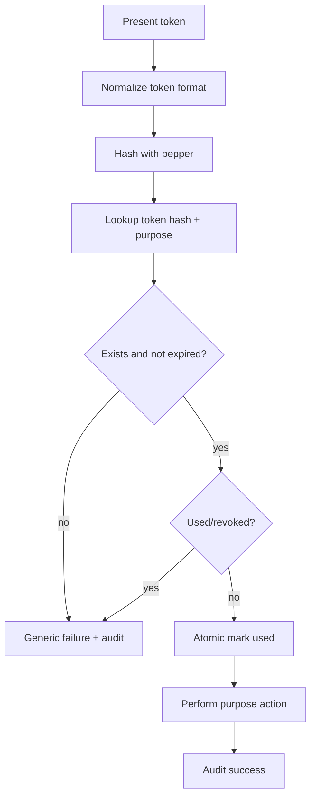

# learn-go-security-cryptography-integrity-part-005.md

# Part 005 — Randomness, Entropy, Nonce, IV, Salt, Token Generation, and Failure Model in Go

> Seri: `learn-go-security-cryptography-integrity`  
> Target: Go 1.26.x  
> Perspektif pembaca: Java software engineer yang ingin menguasai security engineering Go pada level internal engineering handbook  
> Status seri: **belum selesai** — ini adalah part 005 dari 034

---

## 0. Tujuan Part Ini

Di part sebelumnya kita membahas prinsip cryptography engineering: confidentiality, integrity, authenticity, freshness, replay resistance, forward secrecy, misuse resistance, dan key separation.

Part ini masuk ke salah satu fondasi yang sering diremehkan tetapi fatal: **randomness**.

Banyak sistem crypto tidak jebol karena AES, ChaCha20, Ed25519, atau HMAC-nya lemah. Sistem jebol karena:

- token terlalu pendek,
- token dibuat dari PRNG yang predictable,
- nonce AEAD reuse,
- IV disamakan dengan salt,
- salt dibuat global bukan per-record,
- random source dimock di production,
- testing memaksa deterministic randomness lalu bocor ke runtime,
- key generation memakai entropy rendah,
- password reset token disimpan plaintext,
- session ID mudah ditebak,
- uniqueness dianggap sama dengan unpredictability,
- collision probability tidak dihitung,
- retry encryption menghasilkan nonce sama,
- randomness dipakai untuk distributed uniqueness padahal perlu database invariant,
- crypto code menerima `io.Reader` random dari caller tanpa guardrail.

Tujuan part ini bukan sekadar “gunakan `crypto/rand`”. Tujuan sebenarnya adalah membangun mental model berikut:

> Randomness adalah **security dependency**.  
> Nonce adalah **protocol invariant**.  
> Salt adalah **domain separation for password/key derivation**.  
> Token adalah **bearer authority**.  
> IV adalah **mode-specific input**, bukan istilah generik untuk “random bytes”.

Setelah menyelesaikan part ini, Anda harus mampu:

1. Membedakan randomness, entropy, pseudorandomness, uniqueness, unpredictability, nonce, IV, salt, token, secret, key, dan identifier.
2. Menentukan kapan memakai `crypto/rand.Read`, `crypto/rand.Text`, `crypto/rand.Int`, dan kapan tidak.
3. Menghindari penggunaan `math/rand` atau `math/rand/v2` untuk security-sensitive work.
4. Mendesain token reset password, API key, session ID, invite code, CSRF token, nonce AEAD, salt password hashing, dan random ID dengan invariant yang benar.
5. Menghitung collision probability secara kasar memakai birthday bound.
6. Mendesain failure model: apa yang harus terjadi jika random source gagal, jika token collision terjadi, jika nonce counter bentrok, jika random mocking bocor ke production.
7. Membangun wrapper Go yang aman dan sempit agar developer lain tidak salah pakai primitive.
8. Mereview PR yang menyentuh randomness dengan checklist yang konkret.

---

## 1. Baseline Resmi Go 1.26.x yang Relevan

Beberapa fakta baseline yang harus dipakai sepanjang seri ini:

1. `crypto/rand` adalah package Go untuk cryptographically secure random number generation. Dokumentasi package menyatakan bahwa package ini mengimplementasikan cryptographically secure random number generator.
2. `crypto/rand.Reader` adalah global shared CSPRNG instance dan aman untuk concurrent use.
3. Di berbagai platform, `Reader` menggunakan API OS seperti `getrandom(2)`, `arc4random_buf(3)`, `ProcessPrng`, Web Crypto API, atau `random_get`; dalam mode FIPS 140-3 output melewati SP 800-90A Rev. 1 DRBG.
4. Sejak Go 1.24, `crypto/rand.Read` dijamin mengisi buffer sepenuhnya dan tidak mengembalikan error; jika default reader gagal pada platform yang seharusnya tidak gagal, program crash secara irrecoverable.
5. Sejak Go 1.24, `crypto/rand.Text()` tersedia untuk membuat string token/password/secret text dengan minimal 128 bit randomness.
6. Go 1.26 memperketat beberapa API crypto: sejumlah parameter random di key generation/signing/prime generation sekarang diabaikan dan Go memakai secure source of cryptographically random bytes. Untuk deterministic testing, Go memperkenalkan `testing/cryptotest.SetGlobalRandom`, dan `GODEBUG=cryptocustomrand=1` hanya transisi sementara.
7. `math/rand` dan `math/rand/v2` bukan untuk security-sensitive work walaupun Go modern memakai sumber random yang lebih baik untuk mengurangi kerusakan jika developer keliru.
8. `crypto/cipher.NewGCMWithRandomNonce` tersedia sejak Go 1.24. Ia membuat random 96-bit nonce, menaruh nonce di depan ciphertext, dan dokumentasi menyatakan satu key tidak boleh dipakai untuk lebih dari `2^32` message agar risiko random nonce collision tetap negligible.

Referensi utama:

- Go `crypto/rand` docs: <https://pkg.go.dev/crypto/rand>
- Go `math/rand/v2` docs: <https://pkg.go.dev/math/rand/v2>
- Go 1.24 release notes: <https://go.dev/doc/go1.24>
- Go 1.26 release notes: <https://go.dev/doc/go1.26>
- Go `crypto/cipher` docs: <https://pkg.go.dev/crypto/cipher>
- Go FIPS 140-3 docs: <https://go.dev/doc/security/fips140>
- Go blog `math/rand/v2`: <https://go.dev/blog/randv2>
- Go blog secure randomness in Go 1.22: <https://go.dev/blog/chacha8rand>
- NIST SP 800-90A Rev. 1: <https://csrc.nist.gov/pubs/sp/800/90/a/r1/final>
- NIST SP 800-38D GCM/GMAC: <https://csrc.nist.gov/pubs/sp/800/38/d/final>

---

## 2. Mengapa Randomness Adalah Security Boundary

Randomness sering terlihat seperti utilitas kecil:

```go
b := make([]byte, 32)
rand.Read(b)
```

Tetapi secara security, random bytes sering menentukan:

- siapa yang bisa login,
- siapa yang bisa reset password,
- apakah ciphertext bisa dibuka,
- apakah signature key aman,
- apakah session bisa ditebak,
- apakah request bisa di-replay,
- apakah OAuth state bisa dipalsukan,
- apakah distributed ID collision bisa mengekspos data orang lain,
- apakah audit log bisa ditautkan tanpa bocor identitas,
- apakah proof-of-possession benar-benar fresh.

Dalam banyak sistem, **token random adalah authority**. Siapa pun yang memegang token dianggap sah. Token reset password, session cookie, API key, invite link, magic login link, OAuth state, CSRF token, device code, recovery code—semuanya memiliki property berikut:

> Tidak ada tanda tangan di token bearer yang perlu diverifikasi oleh user. Server percaya token karena token cocok dengan state server atau karena token mengandung signature/MAC yang valid. Jika token bisa ditebak, authority bisa dicuri.

Karena itu, randomness harus diperlakukan sebagai boundary:



Jika boundary ini lemah, authorization layer di belakangnya bisa menjadi tidak relevan.

---

## 3. Vocabulary: Jangan Campur Aduk Istilah

Security review sering gagal karena istilah random, nonce, salt, IV, token, ID, dan key dipakai bergantian. Di crypto engineering, istilah ini tidak interchangeable.

### 3.1 Randomness

Randomness adalah property output yang tidak bisa diprediksi oleh attacker. Dalam engineering, kita biasanya memakai **CSPRNG**: cryptographically secure pseudorandom number generator.

Yang penting bukan “terlihat acak”, tetapi:

- attacker tidak bisa menebak output berikutnya,
- attacker tidak bisa merekonstruksi state internal dari output yang terlihat,
- output punya entropy cukup untuk security target,
- seed/entropy source tidak lemah,
- generator aman untuk context penggunaannya.

### 3.2 Entropy

Entropy adalah ukuran ketidakpastian. Secara kasar, token dengan 128 bit entropy berarti attacker harus menebak dari ruang kemungkinan sekitar `2^128`.

Jangan menyamakan:

- panjang string,
- jumlah karakter,
- encoding size,
- entropy.

Contoh:

- 32 hex chars = 16 bytes = 128 bit raw randomness.
- 32 base64url chars kira-kira 192 bit kapasitas encoding, tetapi entropy aktual tergantung berapa byte random yang di-encode.
- 6 digit numeric code = `10^6` kemungkinan, sekitar 19.9 bit; itu sangat kecil jika tidak diberi rate limit dan expiry pendek.

### 3.3 Pseudorandomness

Pseudorandomness adalah output deterministik dari generator yang diberi seed. Untuk crypto, generator harus CSPRNG. Untuk simulasi, load balancing non-security, randomized test, atau shuffling non-sensitive, `math/rand/v2` boleh dipakai.

Tetapi untuk token, key, nonce random, password reset, CSRF, session ID, OAuth state, API key: gunakan `crypto/rand`.

### 3.4 Uniqueness

Uniqueness berarti nilai tidak berulang. Uniqueness tidak selalu berarti nilai sulit ditebak.

Contoh unique tetapi predictable:

```text
1, 2, 3, 4, 5
202606240001
user-100001
```

Ini baik untuk database primary key internal, tetapi buruk untuk token reset password.

### 3.5 Unpredictability

Unpredictability berarti attacker tidak bisa menebak nilai. Token bearer membutuhkan unpredictability.

Contoh unpredictable tetapi tidak dijamin unique:

```text
128-bit random token
```

Secara probabilistik collision sangat kecil, tetapi bukan impossible. Untuk data model penting, tetap enforce uniqueness di storage.

### 3.6 Nonce

Nonce berarti “number used once”. Dalam crypto, nonce harus memenuhi rule mode/protocol tertentu.

Nonce tidak selalu harus secret. Untuk AEAD seperti AES-GCM, nonce biasanya boleh public, tetapi **tidak boleh reuse untuk key yang sama**.

### 3.7 IV

IV berarti initialization vector. Maknanya tergantung mode cipher.

- CBC IV harus unpredictable dan unique untuk key yang sama.
- CTR/GCM nonce/IV harus unique untuk key yang sama.
- Dalam AEAD modern, API biasanya menyebut `nonce` bukan IV.

Jangan membuat generic helper bernama `GenerateIV()` untuk semua crypto. Itu mendorong misuse.

### 3.8 Salt

Salt adalah nilai per-record yang digunakan dalam password hashing atau KDF untuk mencegah precomputation dan membuat password yang sama menghasilkan derived key/hash berbeda.

Salt biasanya:

- tidak secret,
- harus unique atau random cukup besar,
- disimpan bersama hash,
- tidak menggantikan pepper,
- tidak menggantikan key.

### 3.9 Token

Token adalah nilai yang membawa authority atau reference ke authority.

Token bisa:

- opaque random token,
- signed token,
- MACed token,
- encrypted token,
- structured token seperti JWT.

Part ini fokus pada random token; JWT/OIDC akan dibahas di part lain.

### 3.10 Key

Key adalah secret cryptographic material. Key harus diperlakukan lebih ketat daripada token biasa:

- generation harus CSPRNG,
- storage harus terlindungi,
- rotation harus ada,
- akses harus minimal,
- logging harus dilarang,
- lifetime harus dikontrol,
- zeroization caveat harus dipahami.

---

## 4. Taxonomy: Kapan Butuh Apa?

| Use Case | Butuh Unique? | Butuh Unpredictable? | Butuh Secret? | Primitive yang benar |
|---|---:|---:|---:|---|
| Database primary key internal | Ya | Tidak selalu | Tidak | sequence, UUID, ULID, DB constraint |
| Public object ID anti-enumeration | Ya | Biasanya ya | Tidak selalu | random ID atau opaque ID |
| Session ID | Ya secara praktis | Ya | Ya, bearer secret | `crypto/rand`, >=128 bit |
| Password reset token | Ya secara praktis | Ya | Ya, bearer secret | `crypto/rand.Text()` atau >=128 bit random |
| API key | Ya secara praktis | Ya | Ya | >=128–256 bit random, prefix + hash storage |
| CSRF token | Ya per session/request | Ya | Secret to browser/session | random token/MACed token |
| OAuth state | Ya per auth flow | Ya | Secret/reference | random, bound to session, expiry |
| PKCE verifier | Ya per auth flow | Ya | Secret client-side | high entropy verifier |
| AES-GCM nonce | Ya per key | Tidak harus secret | Tidak | counter or random nonce with limits |
| CBC IV | Ya | Ya | Tidak | random unpredictable IV |
| Password salt | Ya per password hash | Random preferred | Tidak | per-record random salt |
| Pepper | Tidak necessarily | Ya | Ya | secret in KMS/Vault/env secret |
| HMAC key | Tidak | Ya | Ya | 256-bit random key |
| Ed25519 private seed | Ya | Ya | Ya | crypto key generation API |
| Invite code human-entered | Ya | Ya jika bearer | Semi-secret | short code + rate limit + expiry |
| OTP numeric | Ya per challenge | Some unpredictability | Short-lived | CSPRNG + strict rate limit |

Mental shortcut:

> Identifier menjawab “yang mana?”  
> Token menjawab “apakah pembawa token ini boleh?”  
> Nonce menjawab “apakah operasi crypto ini belum pernah memakai input yang sama untuk key ini?”  
> Salt menjawab “apakah derivasi ini terpisah dari derivasi lain?”  
> Key menjawab “siapa yang punya kemampuan crypto?”

---

## 5. Go Randomness: `crypto/rand` vs `math/rand/v2`

### 5.1 `crypto/rand`

Untuk security-sensitive randomness, gunakan:

```go
import "crypto/rand"
```

API penting:

```go
rand.Read(b []byte) (n int, err error)
rand.Text() string
rand.Int(rand io.Reader, max *big.Int) (*big.Int, error)
rand.Prime(r io.Reader, bits int) (*big.Int, error)
```

Di Go 1.26, pola paling sederhana untuk random bytes:

```go
package securityrandom

import "crypto/rand"

func Bytes(n int) []byte {
	if n <= 0 {
		panic("securityrandom: byte length must be positive")
	}
	b := make([]byte, n)
	// Since Go 1.24, crypto/rand.Read fills the buffer entirely and never
	// returns an error when using the default secure reader.
	rand.Read(b)
	return b
}
```

Catatan desain:

- Untuk library lintas versi Go lama, mungkin Anda tetap ingin menulis wrapper dengan error handling.
- Untuk project yang memang baseline Go 1.26.x, `rand.Read` bisa dianggap infallible dengan default Reader.
- Jangan menerima random `io.Reader` dari caller untuk production crypto unless API itu benar-benar test-only atau expert-only.

### 5.2 `crypto/rand.Text()`

Untuk token text sederhana, Go 1.24+ menyediakan:

```go
func NewSecretText() string {
	return rand.Text()
}
```

Karakteristik:

- base32 RFC 4648,
- minimal 128 bit randomness,
- cocok untuk secret string/token/password text,
- panjang bisa berubah di masa depan untuk menjaga security property.

Konsekuensi desain:

- Jangan validasi panjang fixed secara keras jika memakai `rand.Text()` dan menyimpan outputnya.
- Jangan memotong output `rand.Text()` menjadi lebih pendek.
- Jika butuh format fixed, encode sendiri dari byte random dengan ukuran eksplisit.

### 5.3 `crypto/rand.Int`

Gunakan `rand.Int` untuk random integer uniform di range tertentu.

```go
package securityrandom

import (
	"crypto/rand"
	"math/big"
)

func IntN(n int64) int64 {
	if n <= 0 {
		panic("securityrandom: n must be positive")
	}
	v, err := rand.Int(rand.Reader, big.NewInt(n))
	if err != nil {
		// With default rand.Reader on Go 1.26 this is not expected.
		panic("securityrandom: crypto random failed: " + err.Error())
	}
	return v.Int64()
}
```

Mengapa tidak pakai modulo?

```go
// BAD: modulo bias if max does not divide 256 evenly.
x := randomByte % 10
```

Modulo bias membuat beberapa output lebih mungkin daripada output lain. Untuk OTP pendek, bias mungkin bukan kelemahan utama dibanding brute force, tetapi habit ini buruk. Gunakan rejection sampling via `crypto/rand.Int`.

### 5.4 `math/rand/v2`

`math/rand/v2` cocok untuk:

- simulation,
- randomized algorithm non-security,
- test data,
- benchmark data,
- sampling non-sensitive,
- shuffle non-security,
- randomized backoff jitter yang tidak menjadi security boundary.

Tidak cocok untuk:

- session ID,
- password reset,
- API key,
- encryption key,
- nonce security-sensitive,
- OAuth state,
- CSRF token,
- invite code bearer,
- signed URL secret,
- captcha secret,
- recovery code,
- database ID jika anti-enumeration adalah requirement.

Anti-pattern:

```go
// BAD: predictable for security-sensitive token.
package token

import (
	"fmt"
	"math/rand/v2"
)

func ResetToken() string {
	return fmt.Sprintf("%016x", rand.Uint64())
}
```

Even jika Go modern memperbaiki default seeding, dokumentasinya tetap jelas: `math/rand/v2` tidak untuk security-sensitive work.

---

## 6. Java-to-Go Mindset Shift

Sebagai Java engineer, Anda mungkin familiar dengan:

```java
SecureRandom secureRandom = new SecureRandom();
byte[] token = new byte[32];
secureRandom.nextBytes(token);
```

Dan mungkin juga familiar dengan kesalahan:

```java
Random random = new Random(); // bukan untuk token
```

Mapping mental ke Go:

| Java | Go | Catatan |
|---|---|---|
| `java.security.SecureRandom` | `crypto/rand` | Untuk security-sensitive random |
| `java.util.Random` | `math/rand` / `math/rand/v2` | Bukan untuk security |
| `ThreadLocalRandom` | `math/rand/v2` atau custom PRNG | Bukan untuk security |
| `UUID.randomUUID()` | Tidak ada di stdlib Go | Gunakan package vetted atau custom CSPRNG jika butuh UUIDv4 |
| `SecureRandom.getInstanceStrong()` | Tidak ada exact equivalent umum | Go memilih OS CSPRNG/default crypto source |
| Injectable `SecureRandom` for tests | Go 1.26: sebagian crypto API mengabaikan random parameter; test pakai `testing/cryptotest.SetGlobalRandom` untuk deterministic crypto testing |

Perbedaan penting:

1. Banyak package crypto Go memakai API sederhana berbasis byte slice dan interface.
2. Secara historis beberapa API menerima `io.Reader` random parameter; Go 1.26 mengurangi risiko misuse dengan mengabaikan parameter random di beberapa key generation/signing path.
3. Go mendorong penggunaan standard library crypto yang makin opinionated, bukan membuat provider/security manager seperti di Java lama.
4. Karena Go binary statically linked dan deployment sering containerized, random source failure lebih berkaitan dengan OS/kernel/container boundary daripada JVM provider config.

---

## 7. Randomness Threat Model

Sebelum menulis helper, tanyakan attacker bisa apa.

### 7.1 Attacker Capability

Attacker mungkin bisa:

- melihat banyak token valid,
- meminta banyak token untuk akunnya sendiri,
- mencoba brute force token orang lain,
- mengukur timing respons token valid vs invalid,
- membaca log aplikasi,
- mengakses analytics/telemetry,
- melihat URL referer,
- menebak pola timestamp,
- memaksa service restart,
- memicu collision race,
- menyebabkan retry operation,
- mengeksploitasi staging token di production,
- memanfaatkan deterministic test random yang bocor,
- mengeksploitasi nonce reuse akibat rollback database/counter.

### 7.2 Security Goals

Untuk tiap random value, definisikan security goals:

```text
Value: password_reset_token
- unpredictable: yes
- unique: practically yes, DB unique enforced
- secret at rest: store hash only
- secret in transit: HTTPS only
- loggable: no
- expiry: 15 minutes
- attempts: rate-limited
- one-time use: yes
- bound to: user_id + purpose + issued_at + token_hash
- revocation: invalidate all previous tokens on password change
- audit: issue/use/fail without token value
```

Jika Anda tidak bisa mengisi tabel seperti ini, desain token belum matang.

---

## 8. Entropy Budget: Berapa Bit yang Cukup?

### 8.1 Rule of Thumb

| Value | Minimal umum | Lebih defensible | Catatan |
|---|---:|---:|---|
| Session ID | 128 bit | 192–256 bit | Bearer secret, long-lived relatif |
| Password reset token | 128 bit | 192–256 bit | Store hash only |
| API key | 128 bit | 256 bit | Long-lived, high authority |
| CSRF token | 128 bit | 128–256 bit | Bound to session |
| OAuth state | 128 bit | 128–256 bit | Short-lived |
| PKCE verifier | Spec-dependent high entropy | 256 bit raw recommended | Format constraint berlaku |
| Invite link bearer | 128 bit | 192 bit | If publicly shareable, treat as secret |
| Human OTP | 20 bit for 6 digits | 26.6 bit for 8 digits | Harus pakai rate limit/expiry |
| AES-256 key | 256 bit | 256 bit | Jangan base on password directly |
| HMAC key | 256 bit | 256 bit | Sesuaikan hash/security target |
| GCM random nonce | 96 bit | 96 bit | Per-key message cap matters |
| Salt password hash | 128 bit | 128 bit | Tidak secret |

### 8.2 Bit, Byte, Encoding

```text
1 byte = 8 bit
16 bytes = 128 bit
24 bytes = 192 bit
32 bytes = 256 bit
```

Hex encoding:

```text
16 random bytes -> 32 hex chars -> 128 bit entropy
32 random bytes -> 64 hex chars -> 256 bit entropy
```

Base64url encoding:

```text
16 random bytes -> about 22 chars without padding -> 128 bit entropy
32 random bytes -> about 43 chars without padding -> 256 bit entropy
```

Base32 encoding:

```text
128 bit -> around 26 base32 chars without considering padding style
```

Kesalahan umum:

```go
// BAD: 32 characters is not automatically 256-bit entropy.
// Entropy depends on how those characters are generated.
token := randomAlphaNumString(32)
```

Jika alphabet 62 char dan setiap char dipilih uniform independent:

```text
entropy per char = log2(62) ≈ 5.95 bit
32 chars ≈ 190 bit
```

Tetapi jika generatornya predictable, entropy efektif bisa jauh lebih rendah.

---

## 9. Birthday Bound: Collision Tidak Sama dengan Guessing

Untuk random token N-bit, brute force guessing dan collision probability berbeda.

### 9.1 Guessing Probability

Jika token punya `N` bit entropy dan attacker mencoba `q` tebakan:

```text
P(success) ≈ q / 2^N
```

Untuk 128 bit dan satu triliun tebakan:

```text
q = 10^12 ≈ 2^40
P ≈ 2^40 / 2^128 = 2^-88
```

Sangat kecil.

### 9.2 Collision Probability

Jika sistem membuat `n` random value dari ruang `2^N`, collision probability kira-kira:

```text
P(collision) ≈ n² / 2^(N+1)
```

Contoh:

- 96-bit random nonce,
- `n = 2^32` encryptions,

```text
P ≈ 2^64 / 2^97 = 2^-33
```

Itu kecil, tetapi untuk GCM nonce collision konsekuensinya fatal, sehingga Go docs memberi cap `2^32` messages per key untuk `NewGCMWithRandomNonce`.

### 9.3 Security Consequence Matters

Collision untuk public trace ID mungkin hanya observability bug.

Collision untuk password reset token bisa menyebabkan account takeover jika storage tidak enforce uniqueness.

Collision untuk AES-GCM nonce under same key bisa menghancurkan confidentiality/integrity.

Karena itu, collision policy harus disesuaikan dengan consequence.

---

## 10. Generating Random Bytes Safely

### 10.1 Minimal Helper

```go
package securebytes

import "crypto/rand"

func MustRandomBytes(n int) []byte {
	if n <= 0 {
		panic("securebytes: length must be positive")
	}
	b := make([]byte, n)
	rand.Read(b)
	return b
}
```

Ini baik untuk application code internal.

### 10.2 Library-Friendly Helper

Jika Anda membuat reusable library yang ingin kompatibel lintas Go version atau ingin eksplisit error semantics:

```go
package securebytes

import (
	"crypto/rand"
	"fmt"
	"io"
)

func RandomBytes(n int) ([]byte, error) {
	if n <= 0 {
		return nil, fmt.Errorf("securebytes: length must be positive")
	}
	b := make([]byte, n)
	if _, err := io.ReadFull(rand.Reader, b); err != nil {
		return nil, fmt.Errorf("securebytes: random source failed: %w", err)
	}
	return b, nil
}
```

Catatan:

- `io.ReadFull` masih berguna jika Anda tidak ingin mengandalkan `rand.Read` behavior Go 1.24+ atau jika reader bisa diganti dalam test.
- Untuk production app Go 1.26, wrapper `MustRandomBytes` dengan `rand.Read` bisa diterima.

### 10.3 Avoid Caller-Supplied Random Reader

Anti-pattern:

```go
// Risky for production API: caller can pass math/rand-backed reader or zero reader.
func NewAPIKey(r io.Reader) (string, error) {
	b := make([]byte, 32)
	if _, err := io.ReadFull(r, b); err != nil {
		return "", err
	}
	return base64.RawURLEncoding.EncodeToString(b), nil
}
```

Lebih aman:

```go
func NewAPIKey() string {
	b := make([]byte, 32)
	rand.Read(b)
	return base64.RawURLEncoding.EncodeToString(b)
}
```

Untuk test deterministik, test behavior format/length dengan property, bukan nilai exact.

---

## 11. Token Generation Patterns

### 11.1 Opaque Token dengan `rand.Text()`

```go
package token

import "crypto/rand"

func NewOpaqueToken() string {
	return rand.Text()
}
```

Kapan cukup:

- internal secret token,
- password reset token,
- invite link token,
- email verification token,
- CSRF state reference,
- short-lived bearer secret.

Kapan tidak cukup:

- Anda butuh prefix/version/kid,
- Anda butuh fixed entropy lebih tinggi,
- Anda butuh URL-safe base64url format spesifik,
- Anda butuh token display dengan grouping,
- Anda butuh checksum human input,
- Anda butuh structured token dengan MAC/signature.

### 11.2 Fixed 256-bit URL-safe Token

```go
package token

import (
	"crypto/rand"
	"encoding/base64"
)

func NewURLToken256() string {
	b := make([]byte, 32) // 256-bit entropy
	rand.Read(b)
	return base64.RawURLEncoding.EncodeToString(b)
}
```

Properties:

- URL-safe,
- no padding,
- fixed entropy,
- fixed encoded length for fixed byte length,
- suitable for API key secret part, reset tokens, high authority links.

### 11.3 Token dengan Prefix

API key sering diberi prefix untuk UX, routing, dan observability tanpa mengekspos secret.

```text
ak_live_8JY0KqR...secret...
ak_test_Sf92pQ...secret...
```

Manfaat prefix:

- tahu environment,
- tahu key type,
- cepat detect accidental use wrong env,
- bisa logging prefix non-secret secara terbatas,
- bisa route ke verifier versi tertentu.

Risiko:

- prefix jangan mengandung tenant ID sensitif,
- prefix jangan menggantikan lookup hash,
- prefix jangan membuat token terlalu panjang tanpa reason,
- jangan log full token.

Implementation:

```go
package apikey

import (
	"crypto/rand"
	"encoding/base64"
	"fmt"
)

type Environment string

const (
	EnvLive Environment = "live"
	EnvTest Environment = "test"
)

func NewSecret(env Environment) (string, error) {
	switch env {
	case EnvLive, EnvTest:
	default:
		return "", fmt.Errorf("apikey: unsupported environment %q", env)
	}

	b := make([]byte, 32)
	rand.Read(b)
	secret := base64.RawURLEncoding.EncodeToString(b)
	return fmt.Sprintf("ak_%s_%s", env, secret), nil
}
```

### 11.4 Token Storage: Jangan Simpan Plaintext

Untuk bearer token long-lived, simpan hash/MAC token, bukan token plaintext.



Simplified code:

```go
package tokenstore

import (
	"crypto/hmac"
	"crypto/sha256"
)

// LookupHash computes a keyed lookup hash for a token.
// Use a server-side secret key from KMS/Vault/config secret.
func LookupHash(pepperKey []byte, token string) []byte {
	mac := hmac.New(sha256.New, pepperKey)
	mac.Write([]byte("api-key-lookup:v1\x00"))
	mac.Write([]byte(token))
	return mac.Sum(nil)
}
```

Why HMAC instead of plain SHA-256?

- Plain SHA-256 of high entropy token is often acceptable if tokens are truly random and long.
- HMAC with server-side pepper gives defense-in-depth if token entropy is accidentally lower or token corpus leaks.
- HMAC also provides domain separation and prevents an offline attacker from testing guessed low-entropy tokens without the pepper.

### 11.5 One-Time Token Use

Password reset token should be one-time use:

```text
on issue:
  create token
  store token_hash, user_id, purpose, expires_at, used_at null

on consume:
  begin transaction
  find token_hash where purpose and expires_at > now and used_at is null
  if not found: fail same generic message
  mark used_at = now
  reset password / verify email
  commit
```

Race invariant:

> Two concurrent consume attempts must not both succeed.

SQL model:

```sql
UPDATE password_reset_tokens
SET used_at = CURRENT_TIMESTAMP
WHERE token_hash = ?
  AND used_at IS NULL
  AND expires_at > CURRENT_TIMESTAMP;
```

Then require affected rows = 1.

---

## 12. Human-Friendly Codes: OTP, Recovery Code, Invite Code

Human-entered codes are constrained by usability. That reduces entropy. Therefore they must be protected by **rate limit, expiry, attempt counter, lockout, and binding**.

### 12.1 Numeric OTP

6 digits:

```text
1,000,000 possibilities ≈ 19.93 bits
```

8 digits:

```text
100,000,000 possibilities ≈ 26.58 bits
```

A 6-digit OTP is not safe as a standalone bearer secret without server-side controls.

### 12.2 Generate Numeric Code Uniformly

```go
package otp

import (
	"crypto/rand"
	"fmt"
	"math/big"
)

func New6Digit() string {
	n, err := rand.Int(rand.Reader, big.NewInt(1_000_000))
	if err != nil {
		panic("otp: crypto random failed: " + err.Error())
	}
	return fmt.Sprintf("%06d", n.Int64())
}
```

Do not:

```go
// BAD: modulo bias and wrong package if using math/rand.
code := fmt.Sprintf("%06d", rand.Uint64()%1_000_000)
```

### 12.3 Controls for OTP

Minimum production controls:

- short expiry: 3–10 minutes depending channel,
- attempt limit per challenge: e.g. 5 attempts,
- rate limit per account,
- rate limit per IP/device,
- resend throttle,
- bind code to purpose,
- bind code to recipient/channel,
- invalidate old codes after new code issued,
- generic error message,
- audit failed attempts without logging code,
- transaction/atomic consume.

Threats:

- SMS/email interception,
- SIM swap,
- inbox compromise,
- brute force,
- code reuse,
- race on consume,
- user enumeration via OTP issue/verify response.

---

## 13. Nonce and IV: Mode-Specific Discipline

### 13.1 Nonce Is Not “Just Random”

A nonce has a rule. The rule depends on primitive.

For AES-GCM/ChaCha20-Poly1305 AEAD:

> Nonce must never repeat for the same key.

It usually does not need to be secret.

For CBC:

> IV must be unpredictable and unique for the same key.

For password hashing:

> Salt must be per-record and unique/random enough, but not secret.

For protocol challenge:

> Nonce should be fresh and bound to context to prevent replay.

### 13.2 AES-GCM Nonce Reuse Is Catastrophic

Under same key, GCM nonce reuse can reveal relationships between plaintexts and can compromise authentication guarantees. This is why nonce uniqueness is a hard invariant.

Bad design:

```go
// BAD: fixed nonce under one key.
nonce := make([]byte, gcm.NonceSize())
ciphertext := gcm.Seal(nil, nonce, plaintext, aad)
```

Bad design:

```go
// BAD: timestamp can collide under concurrency/retry and may be predictable.
nonce := []byte(fmt.Sprintf("%012d", time.Now().Unix()))
```

Bad design:

```go
// BAD: random nonce but no limit/accounting for high-volume same key usage.
nonce := make([]byte, 12)
rand.Read(nonce)
```

### 13.3 Random Nonce AEAD in Go 1.24+

For AES-GCM, Go has `cipher.NewGCMWithRandomNonce`:

```go
package sealedbox

import (
	"crypto/aes"
	"crypto/cipher"
)

func NewRandomNonceGCM(key []byte) (cipher.AEAD, error) {
	block, err := aes.NewCipher(key)
	if err != nil {
		return nil, err
	}
	return cipher.NewGCMWithRandomNonce(block)
}
```

Properties from Go docs:

- generates random 96-bit nonce,
- prepends nonce to ciphertext in `Seal`,
- extracts nonce in `Open`,
- `NonceSize()` is zero,
- overhead includes nonce + tag,
- same key must not be used for more than `2^32` messages.

This API is more misuse-resistant than manually generating/storing nonce, but it still needs operational policy:

- message count cap per key,
- key rotation before cap,
- per-tenant or per-object key separation if volume high,
- metrics for encryption count,
- test that `NonceSize()==0` path is handled correctly.

### 13.4 Counter Nonce

Counter nonce avoids random collision if implemented correctly.

But distributed counter nonce is hard.

Good conditions for counter nonce:

- single writer per key,
- persistent monotonic counter,
- no rollback,
- no concurrent duplicate allocation,
- crash-safe reservation,
- key rotation on counter exhaustion,
- domain separation per node/shard if distributed.

Bad conditions:

- multiple pods encrypting with same key and local counter,
- counter stored in memory only,
- database restore can roll back counter,
- retry reuses reserved nonce,
- counter reset on deployment.

Diagram:



### 13.5 Nonce Partitioning

A robust distributed design can split nonce:

```text
96-bit nonce = 32-bit node/shard prefix + 64-bit monotonic counter
```

But only if:

- prefix is unique per key,
- prefix assignment is durable,
- node identity cannot duplicate after autoscaling,
- counter is persistent,
- counter never rolls back,
- no key is reused after prefix/counter reset.

This is easy to get wrong in Kubernetes autoscaling if pod ordinal, hostname, or IP is treated as durable identity.

---

## 14. Salt: Password Hashing and KDF Separation

### 14.1 Salt Is Not a Secret

Salt prevents two users with same password from having same hash and prevents efficient precomputed/rainbow table attacks across many records.

Salt is stored alongside password hash.

Example conceptual record:

```json
{
  "user_id": "u_123",
  "algorithm": "argon2id",
  "params": {
    "memory_kib": 65536,
    "iterations": 3,
    "parallelism": 4
  },
  "salt": "base64url(...)",
  "hash": "base64url(...)"
}
```

### 14.2 Salt Requirements

A defensible salt:

- generated per password hash,
- random 128-bit is common,
- not reused globally,
- not derived from user ID/email,
- stored with hash,
- not encrypted as if secret,
- included in password hash PHC string when using Argon2/bcrypt-style encoding.

### 14.3 Bad Salt Patterns

```go
// BAD: global salt. Same password still correlates across users.
const salt = "company-v1"
```

```go
// BAD: predictable, can leak user identity, not random.
salt := sha256.Sum256([]byte(user.Email))
```

```go
// BAD: salt generated once at process startup and reused.
var salt = securebytes.MustRandomBytes(16)
```

### 14.4 Salt vs Pepper

| Property | Salt | Pepper |
|---|---|---|
| Secret? | No | Yes |
| Scope | Per record | Application/system-wide or per tenant |
| Stored where? | DB with hash | KMS/Vault/secret manager |
| Purpose | Prevent precomputation/correlation | Defense-in-depth if DB leaks |
| Rotation | Not normally rotated | Needs planned rotation strategy |

Pepper can help, but pepper creates operational burden. Do not add pepper casually without lifecycle design.

---

## 15. Random IDs: Security vs Data Modeling

Random IDs are attractive:

```text
obj_9V6a0Rk...
```

But decide what you need:

### 15.1 Internal Primary Key

If ID is only internal DB key:

- sequence/integer can be fine,
- UUID can be fine,
- uniqueness is main property,
- predictability may not matter if API authorization is correct.

### 15.2 Public ID

If ID appears in URL/API:

- predictable ID can enable enumeration,
- enumeration must still be blocked by authorization,
- random public IDs reduce exposure but do not replace authz.

### 15.3 Bearer Capability URL

If possession of URL grants access:

- ID is now a token,
- must be unpredictable,
- must be high entropy,
- should expire or be revocable,
- should be audited,
- should not leak via referer/logs.

Decision:



---

## 16. UUID, ULID, KSUID, and Random Tokens

Go standard library does not include a UUID package as of Go 1.26. You may use vetted external packages, but do not confuse UUID with secret token.

### 16.1 UUIDv4

UUIDv4 has 122 random bits after version/variant bits. It is generally fine for uniqueness and sometimes acceptable for public unpredictable IDs, but for high-value bearer tokens use at least 128 bit and preferably 192–256 bit raw entropy.

### 16.2 ULID

ULID contains timestamp + randomness. It is sortable, but timestamp leaks creation time and reduces the random portion compared to a full random token. Good for IDs, not for bearer secrets.

### 16.3 KSUID

Similar category: sortable/distributed ID, not a substitute for high-entropy secret.

### 16.4 Rule

> ID libraries solve data modeling.  
> Token generation solves authority secrecy.

Do not use sortable IDs for reset tokens or API keys.

---

## 17. Randomness in Authentication and Authorization Flows

### 17.1 OAuth State

OAuth `state` protects against CSRF and response mix-up when bound to user session and auth flow.

State should be:

- random high entropy,
- bound to browser session,
- short-lived,
- one-time use,
- stored server-side or MACed,
- not contain sensitive plaintext,
- verified before code exchange side effects.

Pseudo flow:



### 17.2 CSRF Token

CSRF token can be:

- synchronizer token stored server-side,
- double submit cookie with MAC,
- per-session token,
- per-request token for high-risk actions.

Randomness alone is not enough; it must be bound to session/origin model.

### 17.3 PKCE Verifier

PKCE verifier must be high entropy and generated per authorization flow. Do not derive it from user ID/session ID/timestamp.

### 17.4 Device Codes and Magic Links

Magic links are bearer tokens delivered over email. Treat email as weaker channel than authenticated session:

- short expiry,
- one-time use,
- bind to initiating device/session if possible,
- show confirmation screen,
- prevent link scanner auto-consumption,
- log issue/consume events,
- rate limit issuance.

---

## 18. Randomness in Cryptographic Key Generation

### 18.1 Prefer Key Generation APIs

For asymmetric keys, do not generate raw random bytes and assemble structures manually.

Use:

- `ed25519.GenerateKey(nil)` or API-specific generation,
- `ecdsa.GenerateKey(curve, rand.Reader)` historically, but Go 1.26 ignores random parameter and uses secure source,
- `rsa.GenerateKey(rand.Reader, bits)` historically, but Go 1.26 ignores random parameter and uses secure source,
- `ecdh.X25519().GenerateKey(rand.Reader)` historically, but Go 1.26 ignores random parameter and uses secure source.

Why this matters:

- key generation has constraints,
- raw random bytes may not be valid private key,
- distribution bias can break security,
- API handles validation.

### 18.2 Symmetric Keys

For AES-256:

```go
func NewAES256Key() []byte {
	key := make([]byte, 32)
	rand.Read(key)
	return key
}
```

For HMAC-SHA-256:

```go
func NewHMACSHA256Key() []byte {
	key := make([]byte, 32)
	rand.Read(key)
	return key
}
```

Operational notes:

- store in KMS/Vault/secret manager,
- do not log,
- do not put in metrics labels,
- do not keep in long-lived heap unnecessarily,
- rotate with version/kid,
- avoid deriving multiple purposes from same raw key without KDF/domain separation.

### 18.3 Randomness and FIPS

In FIPS 140-3 mode, Go public crypto API packages such as `crypto/rand` transparently use the Go Cryptographic Module for approved algorithms. For regulated environments, the important engineering issue is not only “use FIPS mode”, but also:

- build configuration,
- runtime enforcement,
- module version,
- algorithm selection,
- operational boundary,
- documentation of claim,
- validation status,
- avoiding non-approved crypto paths.

FIPS specifics are not fully covered here; dedicated compliance discussion appears later in the series.

---

## 19. Randomness Failure Model

### 19.1 What Can Fail?

Modern OS CSPRNG is designed to be reliable, but engineering still needs failure model.

Potential failures:

- legacy kernel random source issue,
- container runtime/OS misconfiguration,
- VM snapshot entropy issue in very old systems,
- custom `rand.Reader` override in tests or legacy code,
- deterministic test hook leaking to production,
- FIPS enforcement rejecting non-approved operation,
- code path accidentally using `math/rand`,
- panic/crash due to irrecoverable random failure,
- token collision despite low probability,
- nonce reuse due to storage/counter failure,
- duplicate key after restore/snapshot in custom RNG system,
- broken third-party UUID/random package,
- fallback to timestamp if random fails.

### 19.2 Never Fallback to Weak Randomness

Anti-pattern:

```go
// BAD: fallback destroys security exactly when dependency fails.
func Token() string {
	b := make([]byte, 32)
	if _, err := rand.Read(b); err != nil {
		return fmt.Sprintf("%d", time.Now().UnixNano())
	}
	return base64.RawURLEncoding.EncodeToString(b)
}
```

Correct posture:

> If secure randomness is required and unavailable, fail closed.

For Go 1.26 default `crypto/rand.Read`, failure is modeled as irrecoverable crash rather than returning weak output.

### 19.3 Collision Failure Model

For token generation:

- enforce unique constraint on token hash,
- on collision, retry limited times,
- alert if collision occurs because it should be astronomically rare,
- investigate random source / bug.

Example:

```go
func CreateTokenWithUniqueHash(ctx context.Context, store Store, pepper []byte) (string, error) {
	const maxAttempts = 3
	for attempt := 0; attempt < maxAttempts; attempt++ {
		tok := NewURLToken256()
		hash := LookupHash(pepper, tok)

		created, err := store.TryInsertTokenHash(ctx, hash)
		if err != nil {
			return "", err
		}
		if created {
			return tok, nil
		}
	}
	return "", fmt.Errorf("token: repeated token hash collision")
}
```

A collision should be treated as security signal, not normal business path.

### 19.4 Nonce Reuse Failure Model

If you discover AEAD nonce reuse under same key:

1. Stop using affected key immediately.
2. Rotate key.
3. Identify all ciphertexts encrypted under possibly reused nonces.
4. Assume confidentiality/integrity of affected ciphertexts may be compromised.
5. Re-encrypt from trusted plaintext source if possible.
6. Review counter/random nonce generation path.
7. Add invariant tests and metrics.
8. Document incident.

### 19.5 Randomness Observability

Do not log random values. But log metadata:

- token type,
- token prefix/key ID,
- actor/user ID,
- purpose,
- issue/consume/fail event,
- expiry,
- client app/device fingerprint where appropriate,
- collision event without token value,
- nonce allocation error without nonce value if nonce considered sensitive by design.

---

## 20. Designing a Small Security Random Package

Large systems should not let every service implement token generation differently. Create a small package with narrow semantics.

### 20.1 Package Goals

`internal/security/random` should provide:

- `Bytes128`, `Bytes192`, `Bytes256`,
- `Token128`, `Token256`,
- `URLToken256`,
- `NumericCode(digits)`,
- `Salt128`,
- maybe `NewAES256Key`,
- no generic `RandomString(length)` if it encourages weak entropy assumptions,
- no `math/rand` dependency,
- no caller-provided reader in production API.

### 20.2 Example Implementation

```go
package secrand

import (
	"crypto/rand"
	"encoding/base64"
	"fmt"
	"math"
	"math/big"
)

func Bytes(n int) []byte {
	if n <= 0 {
		panic("secrand: n must be positive")
	}
	b := make([]byte, n)
	rand.Read(b)
	return b
}

func Bytes128() []byte { return Bytes(16) }
func Bytes192() []byte { return Bytes(24) }
func Bytes256() []byte { return Bytes(32) }

func URLToken128() string {
	return base64.RawURLEncoding.EncodeToString(Bytes128())
}

func URLToken256() string {
	return base64.RawURLEncoding.EncodeToString(Bytes256())
}

func TextToken() string {
	return rand.Text()
}

func Salt128() []byte {
	return Bytes128()
}

func AES256Key() []byte {
	return Bytes256()
}

func NumericCode(digits int) string {
	if digits < 6 || digits > 10 {
		panic("secrand: digits must be between 6 and 10")
	}
	max := int64(math.Pow10(digits))
	n, err := rand.Int(rand.Reader, big.NewInt(max))
	if err != nil {
		panic("secrand: crypto random failed: " + err.Error())
	}
	return fmt.Sprintf("%0*d", digits, n.Int64())
}
```

### 20.3 API Design Notes

Avoid:

```go
func RandomString(length int) string
```

Why? Because developer may call `RandomString(8)` for password reset token. The API hides entropy.

Prefer:

```go
func URLToken256() string
func TextToken() string
func NumericCode(digits int) string // explicitly low entropy + controls required
```

Naming should encode intended security property.

---

## 21. Secure Token Service Design

### 21.1 Domain Model

```go
type TokenPurpose string

const (
	PurposePasswordReset TokenPurpose = "password_reset"
	PurposeEmailVerify   TokenPurpose = "email_verify"
	PurposeInviteAccept  TokenPurpose = "invite_accept"
)

type TokenRecord struct {
	ID          string
	Purpose     TokenPurpose
	SubjectID   string
	TokenHash   []byte
	IssuedAt    time.Time
	ExpiresAt   time.Time
	UsedAt      *time.Time
	RevokedAt   *time.Time
	IssuedIP    string
	UserAgent   string
}
```

### 21.2 Security Invariants

- plaintext token is returned only once,
- database stores hash only,
- token is purpose-bound,
- token is subject-bound,
- token expires,
- consume is atomic,
- consume sets `used_at`,
- reused token fails,
- invalid token error is generic,
- logs never include plaintext token,
- token issue is rate-limited,
- token verification is rate-limited,
- password change revokes previous reset tokens,
- security event is emitted for issue/consume/fail.

### 21.3 Issue Flow



### 21.4 Consume Flow



### 21.5 Consume Race

If two requests consume same token concurrently, only one may win.

Do not:

```go
record := findToken(hash)
if record.UsedAt == nil {
    resetPassword()
    markUsed(record)
}
```

This is time-of-check/time-of-use race.

Use atomic update or transaction row lock.

---

## 22. Randomness and Logging/Telemetry

### 22.1 Never Log Secrets

Do not log:

- API keys,
- bearer tokens,
- session IDs,
- reset tokens,
- CSRF tokens,
- OAuth state,
- PKCE verifier,
- encryption keys,
- HMAC keys,
- nonce if protocol treats it sensitive in context,
- salt? Usually salt can be stored, but do not log unnecessarily.

### 22.2 Redaction Strategy

Represent tokens using safe fingerprint:

```go
func FingerprintForLog(token string) string {
	sum := sha256.Sum256([]byte(token))
	return base64.RawURLEncoding.EncodeToString(sum[:8])
}
```

Caveat:

- Plain hash fingerprint of low-entropy token can be brute forced.
- For high-entropy token, short fingerprint can be okay for correlation.
- Better: HMAC fingerprint with logging pepper.

```go
func HMACFingerprint(key []byte, token string) string {
	mac := hmac.New(sha256.New, key)
	mac.Write([]byte("log-fingerprint:v1\x00"))
	mac.Write([]byte(token))
	sum := mac.Sum(nil)
	return base64.RawURLEncoding.EncodeToString(sum[:8])
}
```

### 22.3 Metrics

Do not put token values in metric labels.

Allowed labels:

```text
token_purpose=password_reset
outcome=issued|consumed|expired|invalid|rate_limited
env=prod|staging
```

Not allowed:

```text
token=abc123
api_key=ak_live_...
session_id=...
```

---

## 23. Testing Randomness Code

### 23.1 Do Not Test Exact Random Values

Bad:

```go
func TestToken(t *testing.T) {
	got := NewURLToken256()
	if got != "expected" { // impossible unless mocked badly
		t.Fatal(got)
	}
}
```

Good:

```go
func TestURLToken256Shape(t *testing.T) {
	got := NewURLToken256()
	if got == "" {
		t.Fatal("empty token")
	}
	if _, err := base64.RawURLEncoding.DecodeString(got); err != nil {
		t.Fatalf("token is not base64url: %v", err)
	}
}
```

### 23.2 Test Uniqueness Sanity, Not Statistical Randomness

```go
func TestURLToken256NoDuplicateInSmallSample(t *testing.T) {
	seen := make(map[string]struct{})
	for i := 0; i < 10_000; i++ {
		tok := NewURLToken256()
		if _, ok := seen[tok]; ok {
			t.Fatalf("duplicate token at iteration %d", i)
		}
		seen[tok] = struct{}{}
	}
}
```

This is not a proof of randomness. It catches catastrophic bugs like returning constant value.

### 23.3 Test Error Path Without Polluting Production API

Instead of exposing random reader in production API, isolate lower-level internal function:

```go
func randomBytesFrom(r io.Reader, n int) ([]byte, error) {
	if n <= 0 {
		return nil, fmt.Errorf("length must be positive")
	}
	b := make([]byte, n)
	if _, err := io.ReadFull(r, b); err != nil {
		return nil, err
	}
	return b, nil
}

func RandomBytes(n int) []byte {
	b, err := randomBytesFrom(rand.Reader, n)
	if err != nil {
		panic(err)
	}
	return b
}
```

Test `randomBytesFrom`, expose `RandomBytes`.

### 23.4 Go 1.26 Crypto Testing Note

Go 1.26 introduces `testing/cryptotest.SetGlobalRandom` for deterministic testing of crypto APIs that now ignore caller random parameters. Use it only in tests. Never design production code around global deterministic random.

---

## 24. Code Review Checklist: Randomness

Use this checklist for every PR touching token, nonce, salt, IV, key, ID, or auth flow.

### 24.1 Source

- [ ] Is security-sensitive randomness generated via `crypto/rand`, not `math/rand`?
- [ ] Does the code avoid timestamp, PID, hostname, counter-only, or UUID timestamp as secret?
- [ ] Does the code avoid caller-supplied random reader in production API?
- [ ] Does test-only deterministic randomness stay in `_test.go` or test package?
- [ ] Does code avoid fallback to weak randomness?

### 24.2 Entropy

- [ ] Is entropy budget explicit in bytes/bits?
- [ ] Is token length sufficient for authority/lifetime?
- [ ] Is human-entered code protected by rate limit and expiry?
- [ ] Does encoding preserve entropy without truncation?
- [ ] Is collision probability acceptable for expected volume?

### 24.3 Nonce/IV

- [ ] Is nonce rule mode-specific and documented?
- [ ] For AEAD, is nonce unique per key?
- [ ] Is nonce reuse impossible under concurrency/retry/crash/restore?
- [ ] If random nonce, is there a message cap/key rotation plan?
- [ ] If counter nonce, is counter durable and partitioned safely?
- [ ] Are nonce and AAD stored/transmitted correctly for decrypt?

### 24.4 Salt/KDF

- [ ] Is salt per-record?
- [ ] Is salt generated randomly or with a robust unique scheme?
- [ ] Is salt stored with hash and not treated as secret?
- [ ] Is pepper, if used, stored outside DB and rotatable?
- [ ] Are KDF parameters versioned?

### 24.5 Token Storage

- [ ] Are bearer tokens stored as hash/HMAC, not plaintext?
- [ ] Is lookup hash purpose/domain separated?
- [ ] Is token one-time use where required?
- [ ] Is consume operation atomic?
- [ ] Are old tokens revoked on sensitive state changes?

### 24.6 Logging/Telemetry

- [ ] Are tokens/keys/session IDs excluded from logs?
- [ ] Are metrics labels free of secrets?
- [ ] Are fingerprints HMACed or safe given entropy?
- [ ] Are issue/consume/failure events audited without secret values?

### 24.7 Abuse Controls

- [ ] Is brute force rate-limited?
- [ ] Is enumeration prevented via generic responses?
- [ ] Is expiry appropriate?
- [ ] Are retries safe?
- [ ] Are collisions treated as anomalous?

---

## 25. Common Anti-Patterns and Fixes

### 25.1 `math/rand` Token

Bad:

```go
func Token() string {
	return fmt.Sprintf("%d", rand.Int64())
}
```

Fix:

```go
func Token() string {
	return rand.Text()
}
```

### 25.2 Timestamp Token

Bad:

```go
token := strconv.FormatInt(time.Now().UnixNano(), 36)
```

Fix:

```go
token := NewURLToken256()
```

### 25.3 Short Token Because “It Looks Long”

Bad:

```go
// 8 hex chars = 32 bits only.
token := hex.EncodeToString(Bytes(4))
```

Fix:

```go
// 32 random bytes = 256 bits.
token := base64.RawURLEncoding.EncodeToString(Bytes(32))
```

### 25.4 Reusing Salt as Key

Bad:

```go
salt := Bytes(16)
key := salt // nonsense: salt is not a key
```

Fix:

```go
salt := Bytes(16)
// Use password KDF or random key generation depending use case.
key := Bytes(32)
```

### 25.5 GCM Fixed Nonce

Bad:

```go
nonce := make([]byte, 12)
ct := gcm.Seal(nil, nonce, pt, aad)
```

Fix:

```go
aead, err := cipher.NewGCMWithRandomNonce(block)
if err != nil { return err }
ct := aead.Seal(nil, nil, pt, aad) // nonce managed by AEAD
```

Or manual nonce with strict unique allocation:

```go
nonce := allocateUniqueNonceForKey(keyID)
ct := gcm.Seal(nil, nonce, pt, aad)
```

### 25.6 Logging Reset Link

Bad:

```go
log.Info("sent reset link", "url", resetURL)
```

Fix:

```go
log.Info("sent reset link", "user_id", userID, "purpose", "password_reset", "expires_at", expiresAt)
```

### 25.7 Token Stored Plaintext

Bad:

```sql
CREATE TABLE api_keys (
  id text primary key,
  token text not null
);
```

Fix:

```sql
CREATE TABLE api_keys (
  id text primary key,
  token_hash bytea not null unique,
  prefix text not null,
  owner_id text not null,
  scopes jsonb not null,
  created_at timestamptz not null,
  expires_at timestamptz,
  revoked_at timestamptz
);
```

---

## 26. Production Patterns by Use Case

### 26.1 Password Reset Token

Recommended:

- 256-bit URL-safe random token,
- HMAC lookup hash stored in DB,
- expiry 15–30 minutes,
- one-time use,
- atomic consume,
- rate limit issue by account/IP,
- rate limit verify by IP/token prefix if possible,
- generic response for email existence,
- revoke all reset tokens after password change,
- audit issue/consume/fail,
- never log link.

### 26.2 Email Verification Token

Recommended:

- 128–256-bit random token,
- expiry hours/days depending product,
- one-time use or idempotent consume,
- bound to email address and user ID,
- invalidate when email changes,
- no token logs.

### 26.3 API Key

Recommended:

- prefix + 256-bit secret,
- show plaintext once,
- store HMAC hash,
- display only prefix/fingerprint,
- support last used timestamp,
- support scopes,
- support expiry,
- support rotation,
- support revocation,
- require high privilege to create,
- audit create/use/revoke.

### 26.4 Session ID

Recommended:

- 128–256-bit random,
- stored server-side or signed/encrypted cookie with strong key management,
- `Secure`, `HttpOnly`, `SameSite`,
- rotate on login/privilege change,
- idle and absolute timeout,
- server-side revocation for high-risk systems.

### 26.5 CSRF Token

Recommended:

- random per session or per request,
- bound to session,
- verify constant-ish behavior/generic errors,
- not in logs,
- combine with SameSite where appropriate,
- understand SPA/API architecture.

### 26.6 Invite Link

Recommended:

- treat as bearer token if clicking accepts invite,
- 128–256-bit random,
- expiry,
- revocation,
- one-time use,
- bind to email if possible,
- do not leak to third-party resources via referer.

### 26.7 File Download Signed URL

Recommended:

- random token or signed structured token,
- bound to object ID, actor, expiry, method,
- short expiry,
- audit,
- avoid logging full URL,
- beware browser referer.

---

## 27. Randomness and Distributed Systems

### 27.1 Multiple Pods Generating Tokens

For high-entropy random tokens, multiple pods can safely generate independently if:

- all use OS CSPRNG,
- token hash has unique DB constraint,
- collisions are retried/alerted,
- no custom deterministic seed per pod.

### 27.2 Multiple Pods Allocating Nonces

For AEAD nonce under same key, multiple pods are dangerous if using local counters.

Options:

1. Use random nonce AEAD with message cap and key rotation.
2. Use per-pod/per-shard distinct keys.
3. Use centralized durable nonce allocator.
4. Use deterministic encryption mode designed for misuse resistance if appropriate, but not by composing primitives yourself.

### 27.3 VM/Container Snapshot

If a process uses custom PRNG state and VM snapshot restores it, outputs can repeat. `crypto/rand` using OS CSPRNG avoids most app-level state cloning issues, but old systems and embedded environments deserve review.

For custom random pools: avoid them.

---

## 28. Fuzzing and Randomness

Fuzzing uses randomness-like exploration, but fuzz random is not security randomness.

Do not:

```go
// BAD: using fuzz input as crypto key in a test that accidentally documents pattern.
key := data[:32]
```

Unless the test is explicitly about parser/decrypt behavior with arbitrary keys.

Fuzz target for token parser:

```go
func FuzzParseAPIKey(f *testing.F) {
	f.Add("ak_live_abc")
	f.Fuzz(func(t *testing.T, s string) {
		_, _ = ParseAPIKey(s)
	})
}
```

Fuzz should check:

- parser does not panic,
- weird encodings rejected,
- length limits enforced,
- logs not emitted with secret? Harder to fuzz, but can test separately.

---

## 29. Static Analysis and Policy

Add simple guardrails.

### 29.1 Ban `math/rand` in Security Packages

In code review/lint policy:

```text
internal/security/** must not import math/rand or math/rand/v2.
auth/** must not import math/rand or math/rand/v2.
token/** must not import math/rand or math/rand/v2.
```

### 29.2 Grep Rules

Search patterns:

```bash
grep -R "math/rand" -n .
grep -R "UnixNano" -n ./internal ./cmd
grep -R "rand.Seed" -n .
grep -R "NewGCMWithNonceSize" -n .
grep -R "make(\[\]byte, 12)" -n .
grep -R "reset.*token" -n .
grep -R "api.*key" -n .
```

These are not proofs, but useful review signals.

### 29.3 CI Policy

- `go test ./...`
- `go test -race ./...` for relevant packages,
- `govulncheck ./...`,
- custom import ban for security packages,
- secret scanning,
- log redaction tests,
- fuzz targets for token parsers and encoded inputs.

---

## 30. Design Review Template: Randomness

Use this template in design docs.

```markdown
## Randomness / Token / Nonce Design

### Value
- Name:
- Purpose:
- Bearer authority? yes/no
- Secret? yes/no
- Publicly visible? yes/no

### Required properties
- Unique? yes/no, scope:
- Unpredictable? yes/no
- One-time use? yes/no
- Expiry:
- Bound to:
- Revocable? yes/no

### Generation
- Source: crypto/rand / KMS / other
- Entropy bits:
- Encoding:
- Prefix/version:
- Collision handling:

### Storage
- Plaintext stored? no/yes with reason
- Hash/HMAC algorithm:
- Pepper/key location:
- Unique constraint:

### Use / Verification
- Constant-time compare needed? yes/no
- Atomic consume? yes/no
- Rate limit:
- Generic failure response? yes/no

### Logging / Telemetry
- Token logged? must be no
- Fingerprint strategy:
- Metrics labels:

### Failure Model
- Random source failure:
- Collision:
- Replay:
- Expired token:
- Compromised DB:
- Compromised application secret:

### Tests
- Format tests:
- Collision sanity tests:
- Race tests:
- Parser fuzzing:
- Log redaction tests:
```

---

## 31. Mini Case Study: Password Reset Token

### 31.1 Bad Version

```go
func IssueReset(email string) string {
	token := fmt.Sprintf("%d-%d", time.Now().Unix(), rand.Int())
	db.Exec("insert into resets(email, token) values (?, ?)", email, token)
	log.Printf("reset token for %s: %s", email, token)
	return "https://example.com/reset?token=" + token
}
```

Problems:

- `rand.Int()` likely `math/rand`, not crypto,
- timestamp leaks and reduces search,
- plaintext stored,
- token logged,
- no expiry,
- no one-time use,
- no rate limit,
- no generic response,
- no atomic consume,
- no purpose binding,
- no audit model.

### 31.2 Better Version

```go
func IssuePasswordReset(ctx context.Context, user User, pepper []byte, store ResetStore, mailer Mailer) error {
	if err := store.RateLimitIssue(ctx, user.ID); err != nil {
		return err
	}

	token := NewURLToken256()
	hash := LookupHash(pepper, token)
	expiresAt := time.Now().Add(15 * time.Minute)

	if err := store.InsertResetToken(ctx, ResetTokenRecord{
		UserID:    user.ID,
		TokenHash: hash,
		Purpose:   "password_reset",
		ExpiresAt: expiresAt,
	}); err != nil {
		return err
	}

	link := "https://example.com/reset?token=" + url.QueryEscape(token)
	return mailer.SendPasswordReset(ctx, user.Email, link, expiresAt)
}
```

Consume:

```go
func ConsumePasswordReset(ctx context.Context, token string, newPassword []byte, pepper []byte, store ResetStore) error {
	hash := LookupHash(pepper, token)

	// Must be atomic in storage.
	userID, err := store.ConsumeValidResetToken(ctx, hash, time.Now())
	if err != nil {
		// Return generic error to caller.
		return ErrInvalidOrExpiredToken
	}

	passwordHash, err := HashPassword(newPassword)
	if err != nil {
		return err
	}

	return store.UpdatePasswordAndRevokeResetTokens(ctx, userID, passwordHash)
}
```

This is still simplified, but the important invariant is visible.

---

## 32. Mini Case Study: AES-GCM Encryption Helper

### 32.1 Bad Helper

```go
func Encrypt(key, plaintext []byte) ([]byte, error) {
	block, err := aes.NewCipher(key)
	if err != nil { return nil, err }
	gcm, err := cipher.NewGCM(block)
	if err != nil { return nil, err }
	nonce := make([]byte, gcm.NonceSize()) // all zero
	return gcm.Seal(nil, nonce, plaintext, nil), nil
}
```

Fatal problem: fixed zero nonce.

### 32.2 Better Go 1.24+ Random Nonce Helper

```go
func Encrypt(key, plaintext, aad []byte) ([]byte, error) {
	block, err := aes.NewCipher(key)
	if err != nil {
		return nil, err
	}
	aead, err := cipher.NewGCMWithRandomNonce(block)
	if err != nil {
		return nil, err
	}
	return aead.Seal(nil, nil, plaintext, aad), nil
}

func Decrypt(key, ciphertext, aad []byte) ([]byte, error) {
	block, err := aes.NewCipher(key)
	if err != nil {
		return nil, err
	}
	aead, err := cipher.NewGCMWithRandomNonce(block)
	if err != nil {
		return nil, err
	}
	return aead.Open(nil, nil, ciphertext, aad)
}
```

But add policy:

```text
- Key has version/kid.
- Key is rotated before 2^32 encryptions.
- Encryption count metric exists per key id.
- AAD includes purpose/version/context.
- Key is not shared across unrelated domains.
```

### 32.3 AAD Example

```go
func AAD(purpose, keyID string) []byte {
	return []byte("sealedbox:v1\x00purpose=" + purpose + "\x00kid=" + keyID)
}
```

AAD does not need to be secret. It binds ciphertext to context.

---

## 33. Exercises

### Exercise 1 — Token Classification

Classify these values as ID, token, nonce, IV, salt, key, or code:

1. `reset_password?token=...`
2. `X-CSRF-Token`
3. AES-GCM 12-byte input
4. Argon2id per-user random value
5. API key secret part
6. Order ID shown in URL
7. 6-digit SMS code
8. HMAC secret
9. OAuth state
10. Trace ID

For each, answer:

- must it be unique?
- must it be unpredictable?
- must it be secret?
- can it be logged?
- what is the failure impact?

### Exercise 2 — Collision Estimate

You generate 1 billion 128-bit random tokens. Estimate collision probability using birthday bound.

```text
n = 10^9 ≈ 2^30
N = 128
P ≈ 2^60 / 2^129 = 2^-69
```

Interpret the risk.

### Exercise 3 — Review This Code

```go
func InviteCode() string {
	return fmt.Sprintf("%08d", time.Now().UnixNano()%100000000)
}
```

Find issues and redesign for:

1. human-entered invite code,
2. bearer invite link.

### Exercise 4 — Design a Nonce Strategy

You have 100 pods encrypting events with AES-GCM. Each pod can encrypt 10,000 events/sec. You currently use one shared key and local counter nonce.

Answer:

- why is this dangerous?
- what are three safer designs?
- what metrics must exist?
- what happens during pod restart?
- what happens during database restore?

---

## 34. Summary Mental Model

Remember these invariants:

1. **Security random uses `crypto/rand`, not `math/rand`.**
2. **Entropy is measured in bits, not string length.**
3. **Unique is not unpredictable.**
4. **Unpredictable is not guaranteed unique; enforce uniqueness if data model needs it.**
5. **Nonce rule is primitive-specific; for AEAD, never reuse nonce with same key.**
6. **Salt is not secret; key is secret; token is bearer authority.**
7. **Human-friendly code has low entropy; compensate with rate limit/expiry/attempt limit.**
8. **Never fallback to weak randomness. Fail closed.**
9. **Do not log tokens, keys, session IDs, reset links, or OAuth state.**
10. **Randomness API should encode intent: `URLToken256`, not `RandomString(8)`.**
11. **Testing should verify shape/invariants, not deterministic random output.**
12. **Random values need lifecycle: issue, store, consume, expire, revoke, audit.**

---

## 35. What Comes Next

Next part:

```text
learn-go-security-cryptography-integrity-part-006.md
```

Topic:

```text
Hashing, digest, checksum, collision resistance, preimage resistance,
SHA-2/SHA-3, BLAKE2, and the difference between hash for integrity,
password storage, routing, deduplication, and security verification.
```

Part 006 will build on this part by explaining why:

- checksum is not cryptographic integrity,
- SHA-256 is not password hashing,
- plain hash is not authentication,
- HMAC is different from hash,
- hash collision is not the same as preimage attack,
- canonicalization matters before hashing/signing,
- hash choice affects audit trail and tamper evidence.

---

## Appendix A — Quick Reference

### Safe Defaults

| Need | Recommended default |
|---|---|
| Random bytes | `crypto/rand.Read` |
| Text token | `crypto/rand.Text()` |
| URL token high authority | 32 random bytes + base64url no padding |
| Password reset token | 256-bit random, hash at rest, expiry, one-time |
| API key | prefix + 256-bit random secret, HMAC hash at rest |
| Salt | 16 random bytes per password hash |
| AES-256 key | 32 random bytes |
| HMAC-SHA-256 key | 32 random bytes |
| Numeric OTP | `crypto/rand.Int`, 6–8 digits + strict controls |
| AES-GCM random nonce | `cipher.NewGCMWithRandomNonce` + per-key message cap |

### Do Not Use for Security

```go
math/rand
math/rand/v2
time.Now().UnixNano()
os.Getpid()
hostname
incrementing counter as secret
UUID/ULID as bearer token without analysis
hash(userID + timestamp)
```

### Minimal Production Token

```go
func NewURLToken256() string {
	b := make([]byte, 32)
	rand.Read(b)
	return base64.RawURLEncoding.EncodeToString(b)
}
```

### Minimal Salt

```go
func NewSalt128() []byte {
	b := make([]byte, 16)
	rand.Read(b)
	return b
}
```

### Minimal AES-256 Key

```go
func NewAES256Key() []byte {
	b := make([]byte, 32)
	rand.Read(b)
	return b
}
```

---

## Appendix B — Review Questions

Before approving any randomness-related PR, ask:

1. What is this random value called, and is the name precise?
2. Is it an ID, token, nonce, IV, salt, key, or human code?
3. What attacker capability does it resist?
4. How many bits of entropy does it have?
5. Is uniqueness required or only unpredictability?
6. What happens on collision?
7. What happens on retry?
8. What happens across multiple pods?
9. What happens after process restart?
10. What happens after DB restore?
11. Is it stored plaintext?
12. Is it logged anywhere?
13. Is it included in URL and therefore possibly leaked via referer?
14. Is it one-time use?
15. Is it rate-limited?
16. Is it purpose-bound?
17. Is it actor-bound/session-bound?
18. Is it expired/revocable?
19. Does test code alter production randomness?
20. Is the API narrow enough to prevent misuse?

---

## Appendix C — Part 005 Completion Marker

You have completed this part if you can confidently explain:

- why `math/rand/v2` is still not for security,
- why token length in characters is not entropy,
- why 6-digit OTP requires rate limiting,
- why nonce reuse in GCM is catastrophic,
- why salt is public but pepper is secret,
- why token should usually be hashed at rest,
- why random source failure should fail closed,
- why distributed nonce counters are hard,
- why `rand.Text()` is convenient but should not be truncated,
- why API names should encode security intent.

<!-- NAVIGATION_FOOTER -->
<div class="page-nav">
<a href="./learn-go-security-cryptography-integrity-part-004.md">⬅️ Part 004 — Cryptography Engineering Principles in Go</a>
<a href="./index.md">📚 Kategori</a>
<a href="../../index.md">🏠 Home</a>
<a href="./learn-go-security-cryptography-integrity-part-006.md">Part 006 — Hashing, Digest, Checksum, Collision Resistance, Preimage Resistance, SHA-2/SHA-3, BLAKE2, and Correct Integrity Use in Go ➡️</a>
</div>
