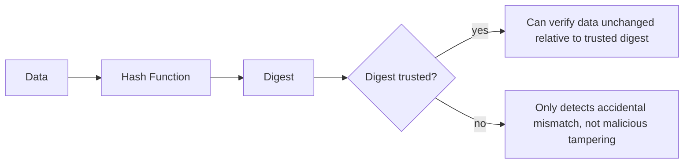
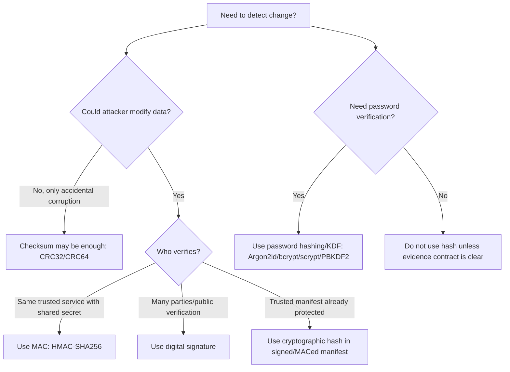
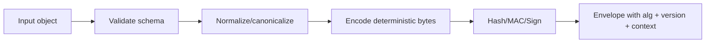
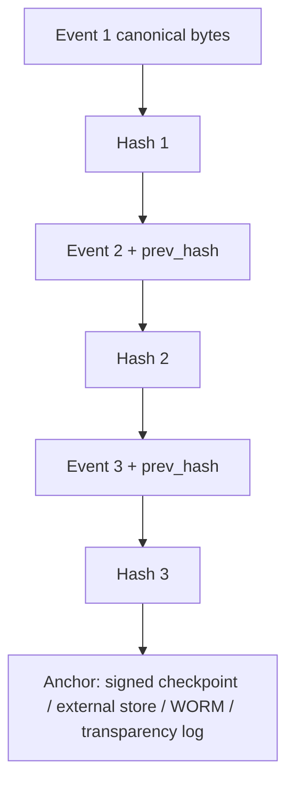
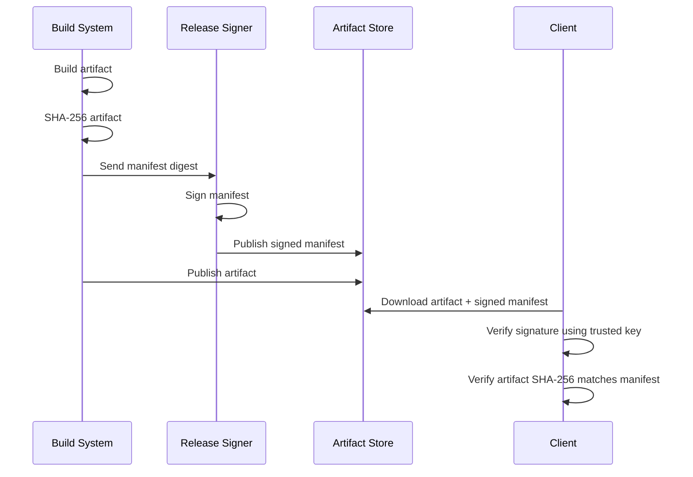

# learn-go-security-cryptography-integrity-part-006.md

# Part 006 — Hashing, Digest, Checksum, Collision Resistance, Preimage Resistance, SHA-2/SHA-3, BLAKE2, and Correct Integrity Use in Go

> Seri: `learn-go-security-cryptography-integrity`  
> Part: `006 / 034`  
> Status seri: **belum selesai**  
> Target Go: **Go 1.26.x**  
> Audiens utama: Java software engineer yang ingin menguasai Go security engineering sampai level internal engineering handbook.

---

## 0. Posisi Part Ini dalam Seri

Pada part sebelumnya kita membahas randomness, entropy, nonce, IV, salt, dan token generation. Part ini bergerak ke primitive lain yang sering terlihat sederhana tetapi sangat sering disalahgunakan: **hashing**.

Hashing sering dianggap mudah karena API-nya terlihat seperti ini:

```go
sum := sha256.Sum256(data)
```

Namun dalam sistem nyata, pertanyaan yang menentukan aman/tidaknya desain bukan “bagaimana memanggil SHA-256”, melainkan:

- Apa yang sedang dibuktikan oleh digest itu?
- Siapa yang dapat mengubah data?
- Digest disimpan di mana?
- Digest dikirim bersama data atau lewat channel terpisah?
- Apakah attacker bisa memilih input?
- Apakah attacker bisa melakukan replay?
- Apakah attacker bisa mengganti algorithm field?
- Apakah digest dibandingkan sebagai secret atau non-secret?
- Apakah digest dipakai untuk password?
- Apakah digest dipakai sebagai proof of authenticity padahal tidak ada key?
- Apakah data sudah dikanonikal-kan sebelum di-hash?
- Apakah output digest dipotong/truncated?
- Apakah digest dipakai sebagai identifier, routing key, cache key, dedup key, audit proof, atau security proof?

Part ini membangun mental model agar hashing dipahami sebagai **contract of evidence**, bukan sekadar transformasi byte menjadi string hex.

---

## 1. Learning Objectives

Setelah menyelesaikan part ini, kamu harus mampu:

1. Membedakan **checksum**, **non-cryptographic hash**, **cryptographic hash**, **MAC**, **digital signature**, **password hash/KDF**, dan **content-addressed identifier**.
2. Menjelaskan properti cryptographic hash: **preimage resistance**, **second-preimage resistance**, dan **collision resistance**.
3. Menentukan kapan SHA-256/SHA-512/SHA-3/BLAKE2 cocok dan kapan tidak.
4. Menjelaskan kenapa MD5 dan SHA-1 tidak boleh dipakai untuk secure applications.
5. Menghindari kesalahan umum seperti plain hash untuk password, plain hash untuk authentication, naive `SHA256(secret || message)`, dan signing/hashing data tanpa canonicalization.
6. Mendesain format digest envelope yang aman untuk evolusi algorithm.
7. Membuat hash streaming untuk file besar tanpa loading seluruh file ke memory.
8. Mendesain integrity check untuk storage, API, webhook, artifact download, audit log, dan content-addressed storage.
9. Mengetahui kapan digest boleh dibandingkan dengan `==` dan kapan harus memakai comparison yang aman untuk secret-derived value.
10. Membuat review checklist untuk hashing usage di Go service.

---

## 2. Mental Model: Hash Bukan Bukti Keaslian

Hash adalah fungsi deterministik:

```text
input bytes -> fixed-size digest
```

Jika input sama, digest sama. Jika input berubah, digest idealnya berubah secara tidak dapat diprediksi.

Namun hash **tidak memiliki secret**.

Artinya:

- siapa pun bisa menghitung hash;
- siapa pun bisa mengganti data dan menghitung hash baru;
- hash hanya membuktikan “data ini cocok dengan digest ini”; 
- hash tidak membuktikan “data ini berasal dari pihak yang dipercaya”.

### 2.1 Kesalahan paling umum

```text
Server mengirim file + SHA256(file)
Attacker mengubah file + menghitung ulang SHA256(file baru)
Client menerima file + hash baru
Client berkata: valid
```

Ini bukan integrity terhadap attacker. Ini hanya accidental corruption detection, kecuali digest-nya diperoleh dari channel yang trusted atau ditandatangani/MAC.

### 2.2 Hash sebagai evidence contract

Digest baru berguna jika ada **trust anchor**:



Trust anchor dapat berupa:

- digest di manifest yang ditandatangani;
- digest dikirim via TLS dari trusted origin;
- digest disimpan dalam database yang akses tulisnya terkendali;
- digest diberi HMAC;
- digest masuk ke append-only log;
- digest disimpan di transparency log;
- digest dikaitkan dengan signature;
- digest berasal dari metadata artifact yang diverifikasi supply-chain-nya.

Tanpa trust anchor, digest hanya “catatan bentuk data”, bukan keamanan.

---

## 3. Taxonomy: Jangan Menyebut Semua “Hash”

Banyak bug desain terjadi karena semua hal disebut “hash”. Dalam review, pecah menjadi taxonomy berikut.

| Kategori | Secret? | Tujuan | Contoh | Aman untuk attacker? |
|---|---:|---|---|---|
| Checksum | Tidak | Deteksi error accidental | CRC32, CRC64 | Tidak |
| Non-cryptographic hash | Tidak | Hash table, sharding, routing, dedup internal | xxhash, murmur, maphash | Tidak |
| Cryptographic hash | Tidak | Fingerprint, tamper-evidence dengan trusted digest | SHA-256, SHA-512, SHA-3, BLAKE2 | Terbatas |
| MAC | Ya, symmetric key | Authenticity + integrity | HMAC-SHA256, keyed BLAKE2 | Ya, jika key aman |
| Digital signature | Private key | Authenticity + integrity + public verification | Ed25519, ECDSA, RSA-PSS | Ya, jika key/validation benar |
| Password hash/KDF | Salt, cost, kadang pepper | Password verification tahan brute force | Argon2id, bcrypt, scrypt, PBKDF2 | Ya, jika parameter benar |
| KDF | Secret/input key material | Key derivation/separation | HKDF | Ya, jika input/label benar |

Rule:

> Jika ada attacker aktif, plain hash hampir tidak pernah cukup untuk membuktikan authenticity.

---

## 4. Properties of Cryptographic Hash Functions

Cryptographic hash modern diharapkan memiliki tiga properti inti.

### 4.1 Preimage resistance

Diberikan digest `h`, attacker sulit menemukan input `m` sehingga:

```text
Hash(m) = h
```

Ini penting saat digest mengekspos fingerprint dari data sensitif. Jika input space kecil, preimage resistance algoritma tidak menyelamatkan desain.

Contoh buruk:

```text
SHA256("yes")
SHA256("no")
SHA256("male")
SHA256("female")
SHA256("ACTIVE")
SHA256("SUSPENDED")
SHA256(6 digit postal code)
```

Walaupun SHA-256 kuat, attacker bisa brute force input space kecil.

Security bukan hanya algoritma; security juga ukuran ruang kemungkinan input.

### 4.2 Second-preimage resistance

Diberikan input tertentu `m1`, attacker sulit menemukan input lain `m2` sehingga:

```text
m1 != m2
Hash(m1) = Hash(m2)
```

Ini penting untuk file integrity, audit record, dan signed document: attacker tidak boleh bisa mengganti dokumen valid dengan dokumen lain yang digest-nya sama.

### 4.3 Collision resistance

Attacker sulit menemukan pasangan input apa pun:

```text
m1 != m2
Hash(m1) = Hash(m2)
```

Collision resistance lebih kuat daripada second-preimage dalam model attacker yang bisa memilih dua input. Ini penting untuk certificate, signature prehash, content-addressed storage, dedup global, dan any system where attacker can submit chosen content.

### 4.4 Birthday bound

Untuk digest `n` bit, collision search kira-kira butuh `2^(n/2)` work, bukan `2^n`.

| Digest length | Approx collision security |
|---:|---:|
| 128-bit | ~64-bit |
| 160-bit | ~80-bit |
| 224-bit | ~112-bit |
| 256-bit | ~128-bit |
| 384-bit | ~192-bit |
| 512-bit | ~256-bit |

Inilah mengapa memotong digest perlu sangat hati-hati.

---

## 5. Go Hashing Package Map

### 5.1 Standard interfaces

Go memakai interface umum:

```go
type Hash interface {
    io.Writer
    Sum(b []byte) []byte
    Reset()
    Size() int
    BlockSize() int
}
```

Modelnya streaming:

```text
write chunk 1 -> write chunk 2 -> write chunk N -> Sum
```

Ini penting untuk file besar, request body, archive, log stream, dan artifact verification.

### 5.2 Standard crypto packages

| Package | Use | Notes |
|---|---|---|
| `crypto/sha256` | SHA-224/SHA-256 | SHA-256 adalah default pilihan aman untuk banyak fingerprint/integrity use case. Package ini mengimplementasikan SHA-224 dan SHA-256 sesuai FIPS 180-4. |
| `crypto/sha512` | SHA-384/SHA-512/SHA-512/224/SHA-512/256 | Sering cepat di 64-bit CPU; output lebih besar. |
| `crypto/sha3` | SHA3-224/256/384/512 + SHAKE | SHA-3 dan SHAKE sesuai FIPS 202. |
| `crypto/hmac` | HMAC | Untuk integrity + authenticity dengan shared secret. |
| `crypto/md5` | Legacy only | Go doc: MD5 cryptographically broken dan tidak boleh untuk secure applications. |
| `crypto/sha1` | Legacy only | Go doc: SHA-1 cryptographically broken dan tidak boleh untuk secure applications. |

### 5.3 Non-crypto/checksum packages

| Package | Use | Warning |
|---|---|---|
| `hash/crc32` | Accidental corruption detection | Bukan security. CRC32 mudah dimanipulasi attacker. |
| `hash/crc64` | Accidental corruption detection | Bukan security. |
| `hash/fnv` | Hashing non-security | Bukan security. |
| `hash/maphash` | Hashing map/string internal-ish use | Bukan stable external fingerprint dan bukan security. |

`hash/crc32` di Go secara eksplisit mengimplementasikan CRC-32 checksum. Checksum bagus untuk mendeteksi noise/error accidental, tetapi tidak boleh dianggap tamper-proof.

### 5.4 BLAKE2 in Go

BLAKE2 tidak berada di standard library utama sebagai `crypto/blake2b`, tetapi tersedia di `golang.org/x/crypto/blake2b` dan `golang.org/x/crypto/blake2s`.

BLAKE2b di `x/crypto` mengimplementasikan BLAKE2b sesuai RFC 7693, dioptimalkan untuk platform 64-bit, dan menghasilkan digest 1 sampai 64 byte. BLAKE2 juga memiliki mode keyed yang secara fungsi dapat digunakan seperti MAC, tetapi untuk organisasi yang tidak punya alasan kuat memilih BLAKE2 keyed mode, HMAC-SHA256 sering lebih mudah direview lintas tim.

---

## 6. SHA-2, SHA-3, BLAKE2: Kapan Memilih Apa?

### 6.1 Default engineering choice

Untuk kebanyakan sistem Go backend:

```text
Default fingerprint/integrity digest: SHA-256
Default MAC: HMAC-SHA256
Default password hashing: bukan SHA-256; pakai Argon2id/bcrypt/scrypt/PBKDF2 sesuai requirement
Default checksum accidental corruption: CRC32C/CRC64 jika security tidak relevan
Default signature prehash: ikuti signature scheme/protocol, jangan improvisasi
```

### 6.2 SHA-256

Cocok untuk:

- artifact fingerprint;
- file integrity dengan trusted manifest;
- content-addressed identifier;
- dedup key bila collision risk acceptable dengan handling benar;
- audit record digest;
- HMAC-SHA256;
- tree hash/Merkle node hash;
- stable cache key jika security and cross-language determinism dibutuhkan.

Tidak cocok untuk:

- password hashing;
- authentication tanpa key;
- encryption;
- randomness generation;
- hiding small-domain values;
- proving message origin.

### 6.3 SHA-512 / SHA-384 / SHA-512/256

Cocok untuk:

- environment 64-bit yang ingin throughput tinggi;
- digest lebih panjang;
- algorithms/protocols yang mensyaratkan SHA-384/SHA-512;
- signature suite tertentu;
- compatibility dengan policy tertentu.

Catatan:

- SHA-512 output 512 bit, tetapi collision security kira-kira 256 bit.
- Output lebih besar berarti storage/index/transmission overhead lebih besar.
- SHA-512/256 memberi 256-bit output dengan internal SHA-512 style; jangan anggap sama dengan SHA-256.

### 6.4 SHA-3 / SHAKE

Cocok untuk:

- requirement eksplisit terhadap SHA-3/FIPS 202;
- protocol yang sudah memilih SHA-3;
- XOF use case dengan SHAKE;
- domain yang ingin primitive berbeda dari Merkle-Damgård SHA-2 family.

Hati-hati:

- SHA-3 bukan “SHA-2 yang lebih baru jadi selalu lebih baik”.
- Pilihan harus berbasis protocol, compliance, performance, dan library maturity.
- SHAKE adalah extendable-output function; panjang output adalah bagian dari security contract.

### 6.5 BLAKE2

Cocok untuk:

- high-performance fingerprinting dengan cryptographic hash;
- content addressing internal;
- keyed hash use case bila organisasi sudah punya standard BLAKE2;
- platform 64-bit untuk BLAKE2b.

Hati-hati:

- Untuk compliance federal/FIPS tertentu, SHA-2/SHA-3 mungkin lebih mudah dipertanggungjawabkan.
- Karena berada di `x/crypto`, dependency management dan vulnerability scanning tetap harus benar.
- Keyed BLAKE2 harus distandarkan sebagai explicit policy, bukan kebetulan karena API mendukung key.

### 6.6 MD5 dan SHA-1

Go documentation untuk `crypto/md5` dan `crypto/sha1` menyatakan keduanya cryptographically broken dan tidak boleh dipakai untuk secure applications.

MD5/SHA-1 masih kadang muncul untuk:

- legacy protocol compatibility;
- non-security checksum legacy;
- old ETag conventions;
- old database fingerprint;
- old artifact naming.

Policy yang baik:

```text
MD5/SHA-1 boleh muncul hanya jika:
1. Ada legacy compatibility reason tertulis.
2. Tidak dipakai untuk authenticity, collision-resistant integrity, password, signature, certificate, token, atau trust decision.
3. Ada migration plan.
4. Code diberi komentar eksplisit.
5. Security review menyetujui.
```

---

## 7. Hash vs Checksum vs MAC vs Signature

### 7.1 Decision tree



### 7.2 Common use cases

| Use case | Correct primitive | Why |
|---|---|---|
| Detect disk/network accidental corruption | CRC32C/CRC64 or SHA-256 | Checksum enough if no attacker; SHA-256 if also fingerprinting |
| Verify downloaded artifact | SHA-256 from trusted/signed source | Digest must be trusted separately |
| Authenticate webhook | HMAC-SHA256 or signature | Plain SHA-256 can be recomputed by attacker |
| Store password | Argon2id/bcrypt/scrypt/PBKDF2 | SHA-256 too fast |
| Route event to shard | Non-crypto hash or stable crypto hash | Depends on adversarial input and stability need |
| Deduplicate user-uploaded files | SHA-256 plus collision handling | Do not assume impossible; verify if needed |
| Build audit tamper evidence | Hash chain with HMAC/signature/trusted anchoring | Plain hash chain inside mutable DB is weak |
| Hide PII by hashing | Usually wrong | Small-domain brute force; use tokenization/HMAC/encryption depending goal |
| Sign JSON payload | Canonicalize then sign/MAC | Regular serialization ambiguity can break verification/security |

---

## 8. Plain Hash Does Not Hide Small Domains

A digest is not encryption.

Bad example:

```go
// Bad idea if postal code is treated as hidden PII.
sum := sha256.Sum256([]byte(postalCode))
```

Six-digit postal code has at most 1,000,000 possibilities. Attacker can compute all hashes quickly.

Better options depend on goal:

| Goal | Better design |
|---|---|
| Need reversible value | Encrypt with proper key management |
| Need joinable pseudonym inside one system | HMAC with secret pepper/key |
| Need non-linkable value | Tokenization service or randomized encryption/token mapping |
| Need analytics grouping | Bucket/generalize/minimize data |
| Need irreversible password verifier | Password hashing algorithm, not SHA-256 |

Hashing small domains often creates a false sense of privacy.

---

## 9. Length Extension: Why `SHA256(secret || msg)` Is Not HMAC

Many hash functions in SHA-2 family follow Merkle-Damgård construction. A naive prefix MAC like:

```text
SHA256(secret || message)
```

can be vulnerable to length-extension attacks in relevant contexts.

Do not build MAC manually.

Use:

```go
mac := hmac.New(sha256.New, key)
mac.Write(message)
tag := mac.Sum(nil)
```

And verify with:

```go
if !hmac.Equal(expected, actual) {
    return errInvalidMAC
}
```

HMAC exists exactly to avoid this class of mistake and to provide a reviewed keyed-hash construction.

---

## 10. Canonicalization: Hash Bytes, Not Meaning

Hash functions operate on bytes, not abstract meaning.

These may be semantically equivalent but hash differently:

```json
{"a":1,"b":2}
```

```json
{
  "b": 2,
  "a": 1
}
```

Likewise:

- Unicode composed vs decomposed forms;
- path `/a/b/../c` vs `/a/c`;
- URL encoded `%2f` vs `/`;
- header whitespace variants;
- JSON number `1`, `1.0`, `1e0`;
- map order in non-canonical encoders;
- XML namespace/attribute ordering;
- protobuf deterministic vs non-deterministic serialization;
- line endings `\n` vs `\r\n`.

Security invariant:

> If a digest/signature/MAC represents semantic meaning, define canonical bytes first.

### 10.1 Canonicalization pipeline



### 10.2 Dangerous pattern

```go
// Dangerous as a general signing format if canonical rules are not specified.
b, _ := json.Marshal(payload)
sig := Sign(privateKey, sha256.Sum256(b))
```

This can be acceptable only when:

- all producers/consumers use the same canonical encoding contract;
- unknown fields behavior is defined;
- number/string/Unicode behavior is defined;
- schema evolution is controlled;
- tests cover cross-language canonical bytes;
- algorithm/version/context are bound into what is signed.

---

## 11. Algorithm Agility Without Algorithm Confusion

You need evolution, but evolution creates downgrade risk.

Bad envelope:

```json
{
  "alg": "sha256",
  "digest": "..."
}
```

Why bad?

- verifier may trust attacker-controlled `alg`;
- old weak algorithm may remain accepted;
- digest may not bind to object type/context;
- no versioning;
- no canonicalization reference;
- no key ID if MAC/signature is involved;
- no policy boundary.

Better envelope:

```json
{
  "version": 1,
  "purpose": "artifact-integrity",
  "canonicalization": "artifact-manifest-v1",
  "digest_alg": "sha256",
  "digest_hex": "...",
  "size_bytes": 1048576,
  "created_at": "2026-06-24T00:00:00Z"
}
```

Even better when attacker exists:

```json
{
  "version": 1,
  "purpose": "artifact-integrity",
  "canonicalization": "artifact-manifest-v1",
  "digest_alg": "sha256",
  "digest_hex": "...",
  "size_bytes": 1048576,
  "signature_alg": "ed25519",
  "key_id": "release-key-2026-01",
  "signature": "..."
}
```

Policy rule:

```text
The verifier must not accept arbitrary algorithm from input.
It must select from an allowlist based on purpose/version/policy.
```

---

## 12. Go Implementation Pattern: Streaming SHA-256 File Digest

### 12.1 Correct streaming digest

```go
package integrity

import (
    "crypto/sha256"
    "encoding/hex"
    "fmt"
    "io"
    "os"
)

func SHA256FileHex(path string) (string, error) {
    f, err := os.Open(path)
    if err != nil {
        return "", fmt.Errorf("open file for sha256 digest: %w", err)
    }
    defer f.Close()

    h := sha256.New()
    if _, err := io.Copy(h, f); err != nil {
        return "", fmt.Errorf("hash file content: %w", err)
    }

    return hex.EncodeToString(h.Sum(nil)), nil
}
```

Why this pattern is good:

- handles large files;
- avoids reading entire file into memory;
- uses standard `hash.Hash` interface;
- returns hex string for stable external representation;
- preserves error context.

### 12.2 With size limit

Hashing unbounded input can become DoS.

```go
package integrity

import (
    "crypto/sha256"
    "encoding/hex"
    "errors"
    "fmt"
    "io"
)

var ErrTooLarge = errors.New("input too large")

func SHA256ReaderHexLimited(r io.Reader, maxBytes int64) (string, int64, error) {
    if maxBytes <= 0 {
        return "", 0, fmt.Errorf("invalid maxBytes: %d", maxBytes)
    }

    h := sha256.New()
    lr := &io.LimitedReader{R: r, N: maxBytes + 1}

    n, err := io.Copy(h, lr)
    if err != nil {
        return "", n, fmt.Errorf("hash reader: %w", err)
    }
    if n > maxBytes {
        return "", n, ErrTooLarge
    }

    return hex.EncodeToString(h.Sum(nil)), n, nil
}
```

Security reasoning:

- Hashing is CPU work proportional to input size.
- If attacker controls input, you need limits.
- The digest function itself may be safe, but the service can still be unavailable.

---

## 13. Verifying Expected SHA-256

### 13.1 Non-secret digest comparison

For public artifact digests, `==` after decoding/normalizing can be acceptable because the digest is not secret.

```go
package integrity

import (
    "crypto/sha256"
    "encoding/hex"
    "errors"
    "fmt"
    "io"
    "strings"
)

var ErrDigestMismatch = errors.New("digest mismatch")

func VerifySHA256Hex(r io.Reader, expectedHex string, maxBytes int64) error {
    expectedHex = strings.ToLower(strings.TrimSpace(expectedHex))

    expected, err := hex.DecodeString(expectedHex)
    if err != nil {
        return fmt.Errorf("decode expected sha256 hex: %w", err)
    }
    if len(expected) != sha256.Size {
        return fmt.Errorf("invalid sha256 length: got %d bytes", len(expected))
    }

    h := sha256.New()
    lr := &io.LimitedReader{R: r, N: maxBytes + 1}
    n, err := io.Copy(h, lr)
    if err != nil {
        return fmt.Errorf("hash content: %w", err)
    }
    if n > maxBytes {
        return ErrTooLarge
    }

    actual := h.Sum(nil)
    if string(actual) != string(expected) {
        return ErrDigestMismatch
    }
    return nil
}
```

But for MAC tags or secret-derived digest, prefer `hmac.Equal` or `subtle.ConstantTimeCompare` with length handling.

### 13.2 Secret-derived tag comparison

```go
package integrity

import "crypto/hmac"

func EqualTag(expected, actual []byte) bool {
    return hmac.Equal(expected, actual)
}
```

Rule:

```text
Public digest: normal compare usually acceptable.
Secret-derived tag/MAC/password verifier: constant-time compare.
```

---

## 14. Digest Encoding: Raw Bytes, Hex, Base64

Digest is bytes. External systems need encoding.

| Encoding | Pros | Cons | Good for |
|---|---|---|---|
| Raw bytes | Compact | Not text-safe | Internal binary protocols |
| Hex | Human-friendly, common for hashes | 2x size | Logs, manifests, CLI, artifact fingerprint |
| Base64 | Compact text | Variants/padding ambiguity | JSON/API if specified carefully |
| Base64url | URL-safe | Padding policy must be defined | URL/token contexts |

Engineering rule:

> Specify encoding as part of the contract, not as incidental implementation detail.

Bad:

```text
digest: string
```

Better:

```text
sha256_hex: lowercase hex, exactly 64 chars
```

or:

```text
sha256_b64url_nopad: base64url without padding, exactly 43 chars for 32 bytes
```

---

## 15. Truncating Digest

Truncation is not automatically wrong, but must be designed.

Example:

```text
SHA-256 full: 256-bit output, ~128-bit collision security
SHA-256 truncated to 128-bit: ~64-bit collision security
SHA-256 truncated to 96-bit: ~48-bit collision security
```

Use truncation only when:

- identifier length matters;
- collision impact is understood;
- collision handling exists;
- attacker model is considered;
- domain size is limited;
- birthday bound is acceptable;
- full digest is stored somewhere if needed.

### 15.1 Bad truncation use

```text
Use first 8 hex chars of SHA-256 as unique user document ID.
```

8 hex chars = 32 bits. Collision risk becomes operationally realistic at scale.

### 15.2 Safer short ID policy

If you need short display IDs:

```text
Do not use display ID as security identity.
Keep full canonical ID internally.
Treat short ID only as lookup hint.
Resolve collision explicitly.
```

---

## 16. Hash for Deduplication

Dedup often uses content hash.

```text
file content -> SHA-256 -> storage key
```

This is common, but security review must ask:

1. Can attacker upload chosen content?
2. Does dedup reveal whether another user already uploaded a file?
3. Is there cross-tenant information leakage?
4. What happens on digest collision?
5. Is content access authorized by digest alone?
6. Is digest used as bearer token?

### 16.1 Dangerous content-addressed access

Bad:

```text
GET /files/{sha256}
```

If knowing digest grants access, digest becomes a bearer secret. But file hashes are often guessable for public/common files.

Better:

```text
GET /tenants/{tenantID}/files/{fileID}
Authorization checks tenant + object permission
Digest is metadata/integrity, not access credential
```

### 16.2 Dedup collision handling

Even with SHA-256, production design should avoid “impossible therefore no handling”.

For critical systems:

- store size with digest;
- store content type/metadata;
- optionally verify byte equality before dedup merge;
- isolate tenant-level dedup if privacy matters;
- never grant access solely because digest matches.

---

## 17. Hash for Routing and Sharding

Hashing is often used for routing:

```text
customerID -> hash -> shard
```

This is not necessarily cryptographic. The choice depends on attacker model.

### 17.1 Non-adversarial routing

For internal IDs, non-crypto hash may be enough.

Goals:

- stable distribution;
- speed;
- minimal allocation;
- reproducibility across versions if needed.

### 17.2 Adversarial routing

If attacker can choose keys, they may create hot shards.

Mitigations:

- keyed hash/MAC for bucket selection;
- rate limit per actor;
- monitor shard skew;
- use tenant isolation;
- avoid exposing raw partition algorithm;
- have rebalance strategy.

### 17.3 Do not use `hash/maphash` as external stable hash

`hash/maphash` is useful for hash-table-like use, but not for stable external identifiers. It is intentionally not a cross-run/cross-version storage contract. For persistent sharding, use an explicitly specified algorithm.

---

## 18. Hash for Cache Keys

Hashing cache keys is common:

```text
canonical request -> SHA-256 -> cache key
```

Security questions:

1. Is cache key canonicalized?
2. Are authorization dimensions included?
3. Is tenant/user/role included?
4. Are headers included correctly?
5. Are Vary-like semantics defined?
6. Can attacker poison cache?
7. Is digest collision handled?
8. Is sensitive data leaked in logs via raw key?

Bad:

```text
cacheKey = SHA256(method + path + body)
```

If response differs by user role but role is not in key, you can leak data across users.

Better:

```text
cacheKey = SHA256(
  version || method || canonicalPath || canonicalQuery ||
  tenantID || subjectClass || authzScope || requestBodyDigest
)
```

Do not blindly include raw access token in cache key; include stable authorization class/scope after validation.

---

## 19. Hashing Passwords: Why SHA-256 Is Wrong

Password hashing has a different threat model.

Attacker model:

```text
Attacker obtains password verifier database.
Attacker can run offline guesses at high speed.
```

SHA-256 is designed to be fast. That is exactly what you do not want for password verification.

Use password hashing/KDF with cost:

- Argon2id;
- bcrypt;
- scrypt;
- PBKDF2 when required by compliance/platform constraints.

Password storage needs:

- unique random salt per password;
- configurable cost;
- algorithm/version marker;
- migration strategy;
- pepper/key only if operationally justified;
- rate limiting;
- breach screening;
- MFA/account recovery strategy.

Detailed password security is in Part 011. For this part, the invariant is simple:

> Never store `SHA256(password)` as password verifier.

---

## 20. Hashing PII: Privacy Trap

Hashing PII is often sold as anonymization. Usually it is not.

Examples of weak input spaces:

- email addresses from known domain list;
- phone numbers;
- national IDs with structure/check digits;
- postal codes;
- date of birth;
- gender/status enum;
- common names;
- small set of license numbers;
- case IDs with predictable sequence.

If you hash these values with plain SHA-256, attacker can dictionary attack.

Better patterns:

| Need | Pattern |
|---|---|
| Join same PII internally without revealing raw value | HMAC with secret key |
| Recover original value | Encryption/tokenization |
| Analytics only | Aggregation/minimization |
| Cross-party matching | Private set intersection or carefully governed HMAC/tokenization |
| Public anonymized release | Usually requires formal privacy review, not plain hashing |

Even HMAC is pseudonymization, not full anonymization, because the system can still link values.

---

## 21. Hash Chains and Audit Integrity

Hash chain:

```text
record_hash_i = SHA256(record_i || record_hash_{i-1})
```

This detects modification if the latest trusted head is anchored somewhere attacker cannot rewrite.

Without anchoring, attacker can rewrite the entire chain.

### 21.1 Audit hash chain model



### 21.2 Better audit integrity design

For serious audit trails:

- canonicalize event bytes;
- include sequence number;
- include previous hash;
- include actor/system identity;
- include source service;
- include schema version;
- include timestamp from controlled clock source;
- include key ID if MAC/signature used;
- periodically anchor checkpoint externally;
- protect deletion separately;
- monitor gaps and reordering;
- separate operational logs from audit logs.

Detailed audit design is in Part 028. Here the point is:

> Hash chain is not magic. It is tamper-evident only if the head/checkpoints are protected.

---

## 22. Merkle Tree Mental Model

Merkle tree hashes many items into one root.

```mermaid
flowchart BT
    L1[Leaf H(A)] --> N1[H(L1||L2)]
    L2[Leaf H(B)] --> N1
    L3[Leaf H(C)] --> N2[H(L3||L4)]
    L4[Leaf H(D)] --> N2
    N1 --> R[Root H(N1||N2)]
    N2 --> R
```

Use cases:

- large file chunk verification;
- append-only logs;
- transparency logs;
- content-addressed trees;
- efficient inclusion proof;
- distributed storage integrity.

Design requirements:

- domain separation for leaf vs internal node;
- deterministic ordering;
- duplicate/odd leaf rule;
- tree version;
- hash algorithm policy;
- inclusion proof format;
- root anchoring.

Bad Merkle design:

```text
node = SHA256(left || right)
leaf = SHA256(data)
```

Potential ambiguity if not domain-separated.

Better:

```text
leaf = SHA256(0x00 || length(data) || data)
node = SHA256(0x01 || left_hash || right_hash)
```

The exact encoding should be specified and tested.

---

## 23. Domain Separation

Domain separation prevents the same hash function output from being confused across contexts.

Bad:

```text
SHA256(userID)
SHA256(documentID)
SHA256(cacheKey)
SHA256(auditRecord)
```

If these values share format/space, confusion can occur.

Better:

```text
SHA256("myapp:user:v1:" || userID)
SHA256("myapp:document:v1:" || documentID)
SHA256("myapp:cache:v1:" || canonicalRequest)
SHA256("myapp:audit-leaf:v1:" || canonicalAuditRecord)
```

In Go:

```go
func DomainHashSHA256(domain string, payload []byte) [32]byte {
    h := sha256.New()
    h.Write([]byte(domain))
    h.Write([]byte{0}) // separator; better: length-prefix in strict protocols
    h.Write(payload)
    var out [32]byte
    copy(out[:], h.Sum(nil))
    return out
}
```

For strict protocol design, use length-prefix framing rather than ad-hoc separators.

---

## 24. Length-Prefix Framing

Ambiguous concatenation is dangerous.

Bad:

```text
Hash(a || b)
```

Because:

```text
("ab", "c") -> "abc"
("a", "bc") -> "abc"
```

Better:

```text
Hash(len(a) || a || len(b) || b)
```

Simple Go framing pattern:

```go
package integrity

import (
    "crypto/sha256"
    "encoding/binary"
    "fmt"
    "hash"
)

func writeBytes(h hash.Hash, b []byte) error {
    if len(b) > int(^uint32(0)) {
        return fmt.Errorf("field too large: %d", len(b))
    }
    var lenBuf [4]byte
    binary.BigEndian.PutUint32(lenBuf[:], uint32(len(b)))
    if _, err := h.Write(lenBuf[:]); err != nil {
        return err
    }
    if _, err := h.Write(b); err != nil {
        return err
    }
    return nil
}

func HashTwoFields(domain string, a, b []byte) ([32]byte, error) {
    h := sha256.New()
    if err := writeBytes(h, []byte(domain)); err != nil {
        return [32]byte{}, err
    }
    if err := writeBytes(h, a); err != nil {
        return [32]byte{}, err
    }
    if err := writeBytes(h, b); err != nil {
        return [32]byte{}, err
    }

    var out [32]byte
    copy(out[:], h.Sum(nil))
    return out, nil
}
```

Note: `hash.Hash.Write` generally returns nil error for standard hashes, but using the interface cleanly keeps patterns consistent.

---

## 25. Secure Download Verification Pattern

### 25.1 Weak pattern

```text
Download binary from same compromised location as checksum.
Verify checksum.
Install binary.
```

If the location is compromised, checksum can be compromised too.

### 25.2 Stronger pattern



Hash verifies bytes relative to manifest. Signature verifies manifest relative to key.

---

## 26. TOCTOU: Verify Then Use

Hash verification can be invalidated by time-of-check/time-of-use bugs.

Bad:

```go
if VerifyFile(path, expected) == nil {
    ExecuteFile(path)
}
```

Between verify and execute, file could change, especially in shared directories.

Better patterns:

- open file once;
- verify via file descriptor;
- rewind and use same descriptor if possible;
- copy to controlled immutable location;
- set permissions;
- avoid world-writable paths;
- verify after final write and before rename;
- use atomic rename from staging to final.

Example simplified staging model:

```text
Download to private temp file
fsync/close
Open temp file read-only
Verify digest
Rename atomically into content-addressed path
Use by content-addressed immutable path
```

Filesystem race details are covered deeper in Part 025.

---

## 27. Hashing HTTP Request Bodies

For API integrity, avoid ad-hoc body hashing unless the full protocol is specified.

Questions:

- Is transfer encoding normalized?
- Are headers included?
- Is method/path/query included?
- Is timestamp included?
- Is nonce included?
- Is host included?
- Is body decoded or raw bytes?
- Is compression before or after signing?
- Are duplicate headers canonicalized?
- Are query params sorted and encoded?
- Is replay prevented?

A webhook signature usually signs a structured string:

```text
version.timestamp.method.path.body_digest
```

or signs raw body plus timestamp depending on provider.

Do not invent silently. Write a spec.

---

## 28. Hash and Logs

Logging digest can be useful:

```text
artifact_sha256=...
request_body_sha256=...
audit_record_hash=...
```

But risks:

- digest of small-domain PII can be brute forced;
- digest can become correlation handle across datasets;
- digest can reveal same document was used by multiple users;
- digest can be used as lookup key if API allows content-addressed access;
- logs may preserve sensitive derived identifiers forever.

Policy:

```text
Do not log hashes of sensitive values unless privacy/security review says they are acceptable.
Prefer HMAC with log-specific key if correlation is needed without external brute force.
Rotate and protect that key.
```

---

## 29. Testing Hash Code

### 29.1 Known-answer tests

Use known vectors for algorithms and your canonicalization.

```go
package integrity_test

import (
    "crypto/sha256"
    "encoding/hex"
    "testing"
)

func TestSHA256ABC(t *testing.T) {
    got := sha256.Sum256([]byte("abc"))
    gotHex := hex.EncodeToString(got[:])

    const want = "ba7816bf8f01cfea414140de5dae2223b00361a396177a9cb410ff61f20015ad"
    if gotHex != want {
        t.Fatalf("sha256 abc mismatch: got %s want %s", gotHex, want)
    }
}
```

### 29.2 Cross-language canonicalization tests

For signed/MACed data, test canonical bytes, not just final digest.

```text
Input object -> canonical bytes -> hex fixture -> digest fixture -> signature/MAC fixture
```

### 29.3 Fuzzing canonicalization

Fuzzing can catch parser ambiguity:

- two different encodings map to same semantics but different digest;
- invalid Unicode accepted in one layer;
- path normalization mismatch;
- JSON unknown fields handling inconsistent;
- duplicate keys treated differently;
- query parameter ordering issues.

Example fuzz target idea:

```go
func FuzzCanonicalRequestStable(f *testing.F) {
    f.Add("GET", "/a", "x=1&y=2")
    f.Fuzz(func(t *testing.T, method, path, rawQuery string) {
        b1, err1 := CanonicalRequest(method, path, rawQuery)
        b2, err2 := CanonicalRequest(method, path, rawQuery)
        if (err1 == nil) != (err2 == nil) {
            t.Fatalf("inconsistent errors")
        }
        if err1 == nil && !bytes.Equal(b1, b2) {
            t.Fatalf("canonicalization not deterministic")
        }
    })
}
```

---

## 30. Performance Considerations

Hashing can be expensive at scale but usually not the first bottleneck compared to network/disk. Still, production systems need guardrails.

Consider:

- streaming rather than buffering;
- request body size limit;
- per-route CPU budget;
- backpressure;
- context cancellation around IO path;
- chunked hashing for resumable uploads;
- avoiding repeated hashing of same bytes;
- storing digest metadata;
- choosing SHA-256/SHA-512/BLAKE2 based on benchmark and policy;
- avoiding unnecessary hex encode/decode in hot path.

### 30.1 Allocation pattern

Prefer `[32]byte` for internal SHA-256 where possible:

```go
sum := sha256.Sum256(data) // [32]byte
```

For streaming:

```go
h := sha256.New()
h.Write(chunk)
out := h.Sum(nil) // []byte
```

If storing many digests internally, `[32]byte` avoids slice aliasing mistakes and can be map key:

```go
type SHA256Digest [32]byte

m := map[SHA256Digest]Metadata{}
```

### 30.2 Hex encoding in hot path

Hex string is convenient but doubles size and allocates. Use bytes internally, encode at boundary.

---

## 31. Review Smells

During code review, these should trigger security review:

```go
md5.Sum(...)
sha1.Sum(...)
sha256.Sum256([]byte(password))
sha256.Sum256([]byte(secret + message))
sha256.Sum256([]byte(email))
if expectedSignature == actualSignature { ... }
if hashFromRequest == computedHash { trustRequest() }
fmt.Sprintf("%x", sha256.Sum256(...))[:8]
json.Marshal(payload); Sign(...)
crc32.ChecksumIEEE(userControlledSecurityData)
```

Also search for strings:

```text
md5
sha1
checksum
digest
signature
hash
sha256
sha512
crc32
fingerprint
etag
integrity
verify
canonical
```

The presence of these words is not wrong. They are review anchors.

---

## 32. Secure Hash Usage Checklist

### 32.1 Purpose checklist

- [ ] Is this checksum, cryptographic hash, MAC, signature, KDF, or password hash?
- [ ] Is there an attacker who can modify data?
- [ ] Is authenticity required or only accidental corruption detection?
- [ ] Where is the trust anchor?
- [ ] Is digest public or secret-derived?
- [ ] Is replay relevant?
- [ ] Is canonicalization defined?
- [ ] Is algorithm allowlisted by policy?
- [ ] Is output length/truncation justified?
- [ ] Is digest used as an access credential? If yes, redesign.

### 32.2 Algorithm checklist

- [ ] MD5/SHA-1 absent from secure path.
- [ ] SHA-256/SHA-512/SHA-3/BLAKE2 selected for explicit reason.
- [ ] Compliance/FIPS requirement checked.
- [ ] BLAKE2 from `x/crypto` scanned and pinned via modules.
- [ ] Passwords do not use fast hash.
- [ ] MAC uses HMAC or approved keyed construction.
- [ ] Signature follows scheme/protocol rules.

### 32.3 Implementation checklist

- [ ] Large inputs are streamed.
- [ ] Attacker-controlled inputs have size limit.
- [ ] Encoding is specified: hex/base64/raw.
- [ ] Digest length validated.
- [ ] Constant-time compare used for secret-derived tags.
- [ ] Errors do not leak sensitive data.
- [ ] Logs do not expose sensitive derived identifiers.
- [ ] Tests include known-answer vectors.
- [ ] Tests include canonical bytes fixtures.
- [ ] Fuzzing considered for parsers/canonicalization.

### 32.4 Operational checklist

- [ ] Digest format has version.
- [ ] Algorithm migration path exists.
- [ ] Weak algorithms have deprecation plan.
- [ ] Metrics detect mismatch rate spikes.
- [ ] Alerting distinguishes corruption vs suspected tampering.
- [ ] Incident playbook explains what hash mismatch means.
- [ ] Audit/integrity roots are anchored outside mutable attacker-controlled storage.

---

## 33. Java-to-Go Mindset Shift

As Java engineer, kamu mungkin terbiasa dengan:

```java
MessageDigest.getInstance("SHA-256")
```

Go cenderung lebih explicit via package import:

```go
sha256.Sum256(data)
```

Perbedaan praktis:

| Java world | Go world |
|---|---|
| Algorithm by string/provider | Algorithm by imported package/function |
| JCA provider abstraction | Standard packages and `x/crypto` packages |
| Exceptions | explicit `error` |
| `byte[]` mutable | `[]byte` mutable, `[32]byte` value useful for digest |
| Often object-heavy | Small functions + interfaces |
| Provider/config may change behavior | Compile-time imports make algorithm usage easier to grep |
| `MessageDigest` reusable object | `hash.Hash` streaming object |

Go’s explicit imports make code search powerful. You can quickly audit `crypto/md5`, `crypto/sha1`, `hash/crc32`, `sha256.Sum256`, `hmac.New`, etc.

But Go’s simplicity can also make misuse look harmless. A one-line SHA-256 can encode a serious security bug if the purpose is wrong.

---

## 34. Practical Design Patterns

### 34.1 Typed digest

```go
package integrity

import (
    "crypto/sha256"
    "encoding/hex"
    "fmt"
)

type SHA256Digest [sha256.Size]byte

func NewSHA256Digest(data []byte) SHA256Digest {
    return SHA256Digest(sha256.Sum256(data))
}

func ParseSHA256Hex(s string) (SHA256Digest, error) {
    b, err := hex.DecodeString(s)
    if err != nil {
        return SHA256Digest{}, fmt.Errorf("decode sha256 hex: %w", err)
    }
    if len(b) != sha256.Size {
        return SHA256Digest{}, fmt.Errorf("invalid sha256 length: %d", len(b))
    }
    var d SHA256Digest
    copy(d[:], b)
    return d, nil
}

func (d SHA256Digest) Hex() string {
    return hex.EncodeToString(d[:])
}
```

Why typed digest helps:

- prevents mixing SHA-256 with arbitrary bytes;
- map key friendly;
- explicit length;
- easier review;
- fewer accidental string encoding bugs.

### 34.2 Purpose-bound digest

```go
type ArtifactDigest struct {
    Algorithm string       `json:"algorithm"`
    Value     SHA256Digest `json:"-"`
    SizeBytes int64        `json:"size_bytes"`
}
```

Even better: avoid letting arbitrary `Algorithm` control verification. Use versioned policy object.

```go
type ArtifactIntegrityPolicy struct{}

func (ArtifactIntegrityPolicy) Algorithm() string { return "sha256" }
```

### 34.3 Hashing as boundary operation

Do hashing at boundary where bytes are final:

- after canonicalization;
- after compression decision;
- after encryption decision if digest covers ciphertext;
- before encryption if digest covers plaintext, but know leakage implications;
- after upload complete and before commit;
- before signing manifest;
- after final serialization.

---

## 35. Common Architecture Decisions

### 35.1 Should digest cover plaintext or ciphertext?

Depends on use case.

| Digest covers | Pros | Cons |
|---|---|---|
| Plaintext | Verifies semantic content independent of encryption | May leak equality of plaintext if exposed |
| Ciphertext | Verifies stored/transmitted bytes | Changes when re-encrypted; less semantic |
| Both | Strong diagnostics | More metadata and privacy risk |

If using AEAD, ciphertext already has integrity under key. External digest may still be useful for dedup, storage corruption, or artifact identity, but do not confuse layers.

### 35.2 Should digest be stored in DB?

Good for:

- dedup;
- integrity check;
- idempotency;
- audit;
- change detection;
- optimistic conflict detection.

Risks:

- stale digest after mutation;
- digest computed over non-canonical representation;
- digest used as authorization token;
- digest of sensitive value leaks linkability;
- collision not handled;
- DB compromise lets attacker update both data and digest.

### 35.3 Should digest be returned to client?

Return digest when:

- client needs verification;
- digest is not privacy-sensitive;
- digest does not grant access;
- digest is bound to version/algorithm.

Do not return digest when:

- it enables guessing small-domain values;
- it leaks cross-tenant equality;
- it becomes object locator without auth;
- it exposes internal canonicalization details that increase attack surface.

---

## 36. Failure Mode Table

| Failure | Example | Consequence | Mitigation |
|---|---|---|---|
| Plain hash used for authenticity | `SHA256(body)` header | Attacker recomputes | HMAC/signature |
| Password hashed with SHA-256 | `SHA256(password)` | Fast offline cracking | Argon2id/bcrypt/scrypt/PBKDF2 |
| Small-domain PII hashed | `SHA256(postalCode)` | Dictionary recovery | HMAC/encryption/minimization |
| MD5/SHA-1 used in trust decision | `md5.Sum(file)` | Collision risk | SHA-256+ |
| Digest from same compromised source | artifact + checksum together | False verification | Signed manifest/trusted channel |
| Algorithm confusion | input says `alg=md5` | Downgrade | Policy allowlist |
| Ambiguous concatenation | `Hash(a||b)` | Input confusion | Length-prefix/domain separation |
| Non-canonical JSON signing | `json.Marshal` ad hoc | Cross-service mismatch/bypass | Canonicalization spec |
| Truncated digest too short | first 8 hex chars | Collision | Sufficient length/collision handling |
| Hash as bearer token | `/files/{sha}` | Unauthorized access | Separate authz object ID |
| Unbounded hashing | huge body | CPU/IO DoS | Size limit/backpressure |
| Mutable file after verify | verify then execute path | TOCTOU | Same descriptor/atomic staging |
| Audit chain unanchored | DB row hash chain only | Attacker rewrites chain | External/signed anchor |

---

## 37. Minimal Internal Policy Recommendation

For a serious Go backend organization, a reasonable starting policy:

```text
1. Use SHA-256 for general cryptographic fingerprints unless a protocol/compliance rule says otherwise.
2. Use HMAC-SHA256 for symmetric authenticity/integrity.
3. Use Ed25519 or approved signature scheme for public verification; do not invent signing formats.
4. Use Argon2id/bcrypt/scrypt/PBKDF2 for password verification; never plain SHA-256.
5. Do not use MD5/SHA-1 in secure paths.
6. Do not use CRC/FNV/maphash for security.
7. All signed/MACed/hashed semantic objects must define canonicalization.
8. All digest envelopes must include version, purpose, algorithm, and encoding.
9. Digest must not be used as access credential.
10. Truncation requires explicit design approval.
11. Hash mismatch must have operational classification: corruption, tampering, version mismatch, or bug.
```

---

## 38. Exercises

### Exercise 1 — Classify usages

For each, classify as checksum, crypto hash, MAC, signature, password hash, or wrong primitive:

1. `SHA256(password)` stored in DB.
2. `CRC32(file)` for detecting disk transfer error in internal batch job.
3. `HMAC-SHA256(timestamp + body)` for webhook verification.
4. `SHA256(email)` used as anonymous analytics ID.
5. `SHA256(file)` stored in signed release manifest.
6. `SHA256(userID) % 32` for tenant shard chosen from attacker-controlled user ID.
7. `SHA256(record || prevHash)` for audit log stored in same mutable DB with no external checkpoint.

### Exercise 2 — Design digest envelope

Create a digest envelope for uploaded documents with:

- version;
- purpose;
- algorithm;
- encoding;
- size;
- canonicalization/version;
- optional tenant boundary;
- created timestamp;
- validation rules.

Then define which fields are trusted and which are attacker-provided.

### Exercise 3 — Review a broken webhook design

Broken design:

```text
X-Body-Hash: SHA256(body)
```

Server verifies hash and accepts request.

Explain:

- what attacker can do;
- what primitive is missing;
- how replay should be prevented;
- what canonical bytes should be signed/MACed;
- how key rotation should be represented.

### Exercise 4 — Merkle tree domain separation

Design leaf/internal node hashing for a Merkle tree. Include:

- leaf prefix;
- node prefix;
- length-prefixing;
- odd leaf behavior;
- tree version;
- root envelope.

---

## 39. Part 006 Summary

Core points:

1. Hashing maps bytes to digest. It does not prove origin.
2. Plain hash needs a trusted digest source to provide integrity against attacker.
3. Checksum is for accidental corruption, not security.
4. MAC/signature is required for authenticity.
5. Passwords need slow password hashing/KDF, not SHA-256.
6. Small-domain PII is not protected by plain hash.
7. MD5 and SHA-1 are broken for secure applications.
8. SHA-256 is a strong default for many fingerprint/integrity use cases.
9. SHA-3 and BLAKE2 are useful but should be selected for explicit reasons.
10. Canonicalization, domain separation, length-prefixing, versioning, and trust anchoring matter as much as algorithm choice.
11. Hashing can create privacy, DoS, cache poisoning, dedup leakage, and TOCTOU risks if system design is weak.

---

## 40. References

Primary sources used for this part:

1. Go `crypto/sha256` package documentation — `https://pkg.go.dev/crypto/sha256`
2. Go `crypto/sha3` package documentation — `https://pkg.go.dev/crypto/sha3`
3. Go `crypto/hmac` package documentation — `https://pkg.go.dev/crypto/hmac`
4. Go `crypto/md5` package documentation — `https://pkg.go.dev/crypto/md5`
5. Go `crypto/sha1` package documentation — `https://pkg.go.dev/crypto/sha1`
6. Go `hash/crc32` package documentation — `https://pkg.go.dev/hash/crc32`
7. Go `golang.org/x/crypto/blake2b` package documentation — `https://pkg.go.dev/golang.org/x/crypto/blake2b`
8. NIST FIPS 180-4 Secure Hash Standard — `https://csrc.nist.gov/pubs/fips/180-4/upd1/final`
9. NIST FIPS 202 SHA-3 Standard — `https://csrc.nist.gov/pubs/fips/202/final`
10. RFC 7693: The BLAKE2 Cryptographic Hash and Message Authentication Code — `https://datatracker.ietf.org/doc/html/rfc7693`
11. Go 1.26 Release Notes — `https://go.dev/doc/go1.26`

---

## 41. Next Part

Next:

```text
learn-go-security-cryptography-integrity-part-007.md
```

Topic:

```text
MAC, HMAC, keyed hash, message authentication, canonicalization before signing/MAC, and constant-time verification using crypto/subtle.
```

Seri masih berlanjut. Part ini adalah **006 dari 034**.


<!-- NAVIGATION_FOOTER -->
<div class="page-nav">
<a href="./learn-go-security-cryptography-integrity-part-005.md">⬅️ Part 005 — Randomness, Entropy, Nonce, IV, Salt, Token Generation, and Failure Model in Go</a>
<a href="./index.md">📚 Kategori</a>
<a href="../../index.md">🏠 Home</a>
<a href="./learn-go-security-cryptography-integrity-part-007.md">Part 007 — MAC, HMAC, Keyed Hash, Canonicalization, and Constant-Time Verification in Go ➡️</a>
</div>
