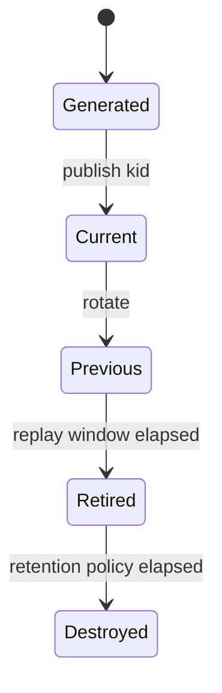
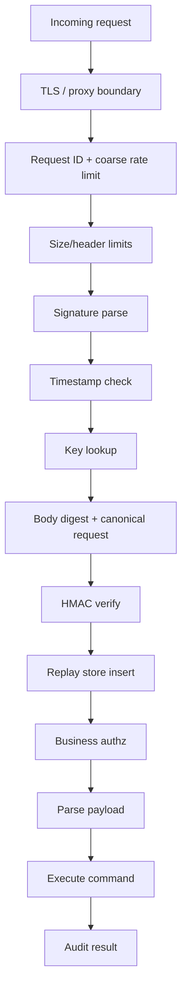
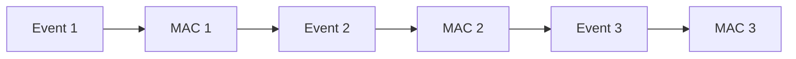
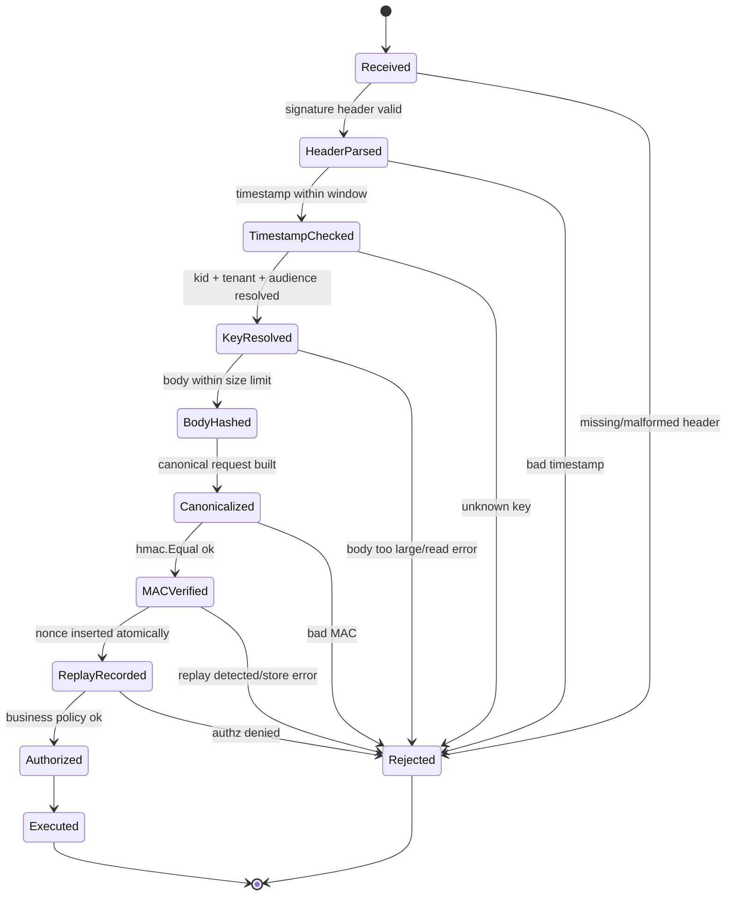
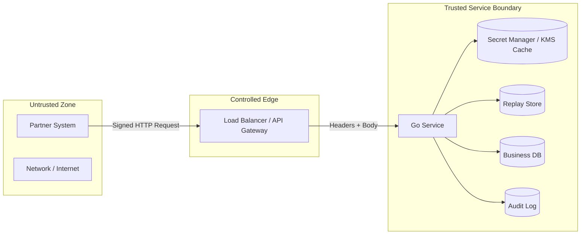

# learn-go-security-cryptography-integrity-part-007.md

# Part 007 — MAC, HMAC, Keyed Hash, Canonicalization, and Constant-Time Verification in Go

> Seri: `learn-go-security-cryptography-integrity`  
> Target: Go 1.26.x  
> Audiens: Java software engineer yang ingin naik ke level senior/principal/top 1% dalam security engineering Go  
> Posisi seri: Part 007 dari 034  
> Status seri: **belum selesai**

---

## 0. Ringkasan Eksekutif

Bagian ini membahas **Message Authentication Code** atau **MAC**, terutama **HMAC**, dalam konteks Go services modern.

Di part sebelumnya, kita membedakan checksum, cryptographic hash, MAC, signature, encryption, dan password hashing. Sekarang kita fokus pada satu konsep yang sering terlihat sederhana tetapi sangat sering salah diterapkan:

> Bagaimana sebuah service bisa membuktikan bahwa pesan yang diterima benar-benar dibuat oleh pihak yang memegang shared secret, dan bahwa isi pesan tidak dimodifikasi setelah dibuat?

Jawaban paling umum untuk sistem internal, webhook, service-to-service callback, object metadata, request signing sederhana, dan tamper-evident envelope adalah **MAC**.

Namun MAC hanya aman jika seluruh desain di sekitarnya benar:

1. bytes yang diverifikasi harus **persis sama** dengan bytes yang ditandatangani;
2. key harus cukup kuat, disimpan aman, dan dipisahkan per purpose;
3. signature/tag harus dibandingkan dengan cara yang tidak bocor timing-sensitive information;
4. replay harus dicegah dengan timestamp, nonce, idempotency key, sequence, atau state;
5. format pesan harus versioned, canonical, dan tidak ambigu;
6. error response, log, dan observability tidak boleh membocorkan oracle bagi attacker;
7. rotasi key dan multi-tenant boundary harus didesain sejak awal.

Di Go, package utama yang dipakai adalah:

- `crypto/hmac`
- `crypto/sha256` atau `crypto/sha512`
- `crypto/subtle`
- `encoding/base64`
- `encoding/hex`
- `hash`
- `time`
- `net/http`

`crypto/hmac` mengimplementasikan HMAC sebagai Keyed-Hash Message Authentication Code. Dokumentasi Go menyebut HMAC sebagai cryptographic hash yang memakai key untuk sign message, lalu receiver memverifikasi dengan menghitung ulang hash memakai key yang sama. Package tersebut juga menyediakan `hmac.Equal` untuk membandingkan MAC tanpa leaking timing information. Lihat dokumentasi resmi: <https://pkg.go.dev/crypto/hmac>.

`crypto/subtle.ConstantTimeCompare` membandingkan dua byte slice dengan waktu yang bergantung pada panjang slice, bukan isi slice, tetapi akan return segera jika panjangnya berbeda. Lihat dokumentasi resmi: <https://pkg.go.dev/crypto/subtle>.

---

## 1. Posisi MAC dalam Peta Cryptography

### 1.1 Apa Itu MAC?

**Message Authentication Code** adalah tag pendek yang dihitung dari:

```text
MAC = f(secret_key, message_bytes)
```

Pihak yang memegang secret key yang sama bisa menghitung ulang MAC dan memeriksa apakah tag yang diterima cocok.

MAC memberi dua properti utama:

| Properti | Makna |
|---|---|
| Integrity | Pesan tidak berubah sejak MAC dibuat. |
| Authenticity | Pesan dibuat oleh pihak yang tahu shared secret. |

Tetapi MAC **tidak** memberi:

| Bukan Properti MAC | Kenapa |
|---|---|
| Confidentiality | Message tetap terlihat. MAC tidak mengenkripsi. |
| Non-repudiation | Karena key dibagi oleh lebih dari satu pihak. Semua holder key bisa membuat tag. |
| Replay protection otomatis | Tag valid bisa dikirim ulang kecuali protokol punya timestamp/nonce/sequence. |
| Authorization otomatis | MAC membuktikan possession of key, bukan apakah caller boleh melakukan action tertentu. |

Mental model-nya:

```text
Hash      : "Apakah bytes ini punya fingerprint tertentu?"
MAC       : "Apakah bytes ini dibuat/dijaga oleh pihak yang tahu shared secret?"
Signature : "Apakah bytes ini ditandatangani private key tertentu, bisa diverifikasi publik?"
Encryption: "Apakah bytes ini bisa dirahasiakan?"
AEAD      : "Apakah bytes ini dirahasiakan sekaligus diautentikasi?"
```

### 1.2 MAC vs Hash vs Signature vs AEAD

| Mechanism | Key? | Verifier Butuh Secret? | Integrity | Authenticity | Confidentiality | Non-repudiation | Umum Dipakai Untuk |
|---|---:|---:|---:|---:|---:|---:|---|
| Checksum | Tidak | Tidak | Accidental only | Tidak | Tidak | Tidak | Detect corruption non-adversarial |
| Hash | Tidak | Tidak | Weak against active attacker | Tidak | Tidak | Tidak | Fingerprint, dedup, content addressing |
| HMAC/MAC | Ya, shared secret | Ya | Ya | Ya | Tidak | Tidak | Webhook, internal request signing, tamper-evident metadata |
| Digital signature | Ya, private/public | Tidak, public key cukup | Ya | Ya | Tidak | Ya, secara kriptografis | Public verification, documents, signed tokens, release signing |
| AEAD | Ya, shared secret | Ya | Ya | Ya | Ya | Tidak | Encrypted API payload, secure storage, session envelope |

### 1.3 Kenapa MAC Penting untuk Go Services?

Dalam sistem backend modern, MAC sering muncul pada:

1. **Webhook verification**  
   Payment provider, identity provider, messaging provider, dan partner system mengirim callback yang harus diverifikasi.

2. **Internal service request signing**  
   Service A memanggil Service B dengan request signature untuk mencegah spoofing dari dalam network.

3. **Tamper-evident tokens**  
   Misalnya signed opaque blob, bukan JWT public signature.

4. **Audit trail integrity**  
   Setiap audit event diberi MAC chain agar modifikasi terdeteksi.

5. **Object metadata integrity**  
   Metadata file, export manifest, archival record, dan batch transfer diberi MAC.

6. **Replay-resistant command envelope**  
   Command di queue atau event bus diberi timestamp, nonce, dan MAC.

7. **CSRF/session-like token**  
   Token yang tidak perlu disimpan server-side kadang dibuat dengan MAC, walau desain session token harus sangat hati-hati.

---

## 2. Prinsip Paling Penting: MAC Mengikat Bytes, Bukan Makna

### 2.1 HMAC Tidak Memahami JSON, HTTP, atau Business Intent

HMAC hanya melihat byte sequence.

```text
HMAC(key, []byte("{\"amount\":100}"))
```

berbeda dari:

```text
HMAC(key, []byte("{ \"amount\" : 100 }"))
```

Padahal secara JSON object, keduanya bisa bermakna sama.

Ini sumber bug besar:

> Developer mengira ia menandatangani “data”, padahal sebenarnya ia menandatangani representasi byte tertentu dari data.

Implikasinya:

1. Kalau sender sign raw request body, receiver harus verify raw body yang sama, bukan hasil re-marshal JSON.
2. Kalau sender sign canonical JSON, canonicalization harus didefinisikan persis.
3. Kalau sender sign HTTP request line, semua normalisasi path/query/header harus stabil.
4. Kalau ada proxy yang mengubah path, query, host, compression, atau header, signature bisa invalid atau lebih buruk: diverifikasi atas canonical form yang berbeda dari yang dieksekusi.

### 2.2 Correctness Invariant

Security invariant untuk MAC:

```text
A verifier MUST accept a message only if the MAC was computed over exactly the bytes and security context that the application will trust and execute.
```

Bukan hanya body.

Untuk request API, “security context” bisa mencakup:

- HTTP method;
- scheme/authority jika relevan;
- path canonical;
- canonical query;
- selected headers;
- content type;
- body digest;
- timestamp;
- nonce;
- tenant ID;
- key ID;
- algorithm version;
- audience/service name;
- environment;
- purpose/domain.

Jika salah satu elemen ini tidak ikut dimasukkan, attacker mungkin bisa memindahkan signature dari satu konteks ke konteks lain.

Contoh:

```text
MAC hanya body:
  {"amount":1000000,"to":"A"}

Tidak mengikat:
  method = POST
  path   = /transfers
  tenant = tenant-prod
  actor  = partner-123
```

Jika body yang sama bisa dipakai di endpoint lain, MAC tidak cukup.

---

## 3. HMAC Mental Model

### 3.1 Kenapa Tidak Cukup `SHA256(secret + message)`?

Jangan membuat keyed hash sendiri seperti:

```go
sha256.Sum256(append(secret, message...)) // buruk sebagai MAC design
```

Masalahnya:

1. raw hash construction bisa rentan terhadap class of mistake seperti length extension untuk hash tertentu jika formatnya salah;
2. tidak ada standard security proof seperti HMAC;
3. mudah salah saat key panjang, block size, padding, dan domain separation;
4. reviewer sulit membuktikan correctness;
5. tooling dan audit lebih mudah menerima HMAC standard daripada custom construction.

HMAC dibuat untuk menyelesaikan masalah “message authentication using cryptographic hash functions” dengan konstruksi standar. RFC 2104 menjelaskan HMAC sebagai mekanisme message authentication memakai cryptographic hash function dan shared secret key: <https://datatracker.ietf.org/doc/html/rfc2104>.

### 3.2 Intuisi HMAC

HMAC secara konseptual melakukan dua lapis hashing dengan key-derived pads:

```text
HMAC(K, M) = H((K' xor opad) || H((K' xor ipad) || M))
```

Anda tidak perlu mengimplementasikan rumus ini sendiri. Gunakan `crypto/hmac`.

Yang perlu dipahami:

- key dicampur dengan message melalui konstruksi standar;
- output adalah tag fixed length sesuai hash yang dipakai;
- receiver recompute tag dengan key yang sama;
- verification dilakukan dengan constant-time comparison.

### 3.3 Pilihan Hash untuk HMAC

Rekomendasi default:

```text
HMAC-SHA-256
```

Alternatif:

```text
HMAC-SHA-512/256
HMAC-SHA-512
HMAC-SHA-384
```

Hindari untuk desain baru:

```text
HMAC-MD5
HMAC-SHA1
```

Walau HMAC dengan hash lama tidak identik risikonya dengan raw collision attack pada hash biasa, untuk sistem modern tidak ada alasan bagus memakai MD5/SHA-1 untuk desain baru. Pakai SHA-256 minimal.

### 3.4 Tag Length

HMAC-SHA-256 menghasilkan 32 byte tag.

Umumnya:

- simpan tag penuh 32 byte;
- encode sebagai base64url atau hex;
- hindari truncation kecuali mengikuti protokol matang;
- jika harus truncate, minimum realistis biasanya 128 bit untuk high-value system, tetapi lebih sederhana: jangan truncate.

Perbandingan encoding:

| Encoding | Ukuran HMAC-SHA-256 | Catatan |
|---|---:|---|
| Raw bytes | 32 bytes | Terbaik secara internal |
| Hex | 64 chars | Mudah debug, lebih panjang |
| Base64 std | 44 chars dengan padding | Bisa bermasalah di URL/header jika tidak hati-hati |
| Base64url raw | 43 chars tanpa padding | Bagus untuk HTTP header/token |

---

## 4. Go Standard Library: API yang Perlu Dikuasai

### 4.1 Basic HMAC-SHA-256

```go
package macx

import (
    "crypto/hmac"
    "crypto/sha256"
)

func HMACSHA256(key, message []byte) []byte {
    mac := hmac.New(sha256.New, key)
    _, _ = mac.Write(message)
    return mac.Sum(nil)
}
```

Catatan:

- `hmac.New` menerima fungsi hash constructor dan key.
- `mac.Write` dari `hash.Hash` tidak mengembalikan error yang bermakna; signature-nya tetap mengembalikan `(int, error)` karena interface umum.
- `mac.Sum(nil)` menghasilkan tag baru.
- Jangan reuse `hash.Hash` instance lintas goroutine.
- Jangan simpan key dalam string jika bisa dihindari; gunakan `[]byte` dari secret manager.

### 4.2 Verification dengan `hmac.Equal`

```go
func VerifyHMACSHA256(key, message, providedTag []byte) bool {
    expected := HMACSHA256(key, message)
    return hmac.Equal(expected, providedTag)
}
```

`hmac.Equal` membandingkan MAC tanpa leaking timing information menurut dokumentasi package `crypto/hmac`.

Jangan gunakan:

```go
bytes.Equal(expected, providedTag) // buruk untuk secret-dependent comparison
```

atau:

```go
string(expected) == string(providedTag) // buruk dan alokasi tidak perlu
```

### 4.3 `crypto/subtle.ConstantTimeCompare`

`hmac.Equal` biasanya cukup untuk HMAC.

`crypto/subtle` berguna saat Anda membandingkan token, digest, atau secret byte lain secara manual:

```go
import "crypto/subtle"

func ConstantTimeEqual32(a, b []byte) bool {
    if len(a) != 32 || len(b) != 32 {
        return false
    }
    return subtle.ConstantTimeCompare(a, b) == 1
}
```

Perhatikan nuance penting:

- `ConstantTimeCompare` return segera jika panjang berbeda.
- Karena itu, untuk tag fixed-length, decode dulu dan validasi panjang expected.
- Jangan membiarkan format decoding menghasilkan panjang variabel lalu membandingkannya sembarangan.

### 4.4 Decode Signature Secara Ketat

Contoh base64url raw:

```go
package macx

import (
    "encoding/base64"
    "errors"
)

var ErrInvalidMACEncoding = errors.New("invalid mac encoding")

func DecodeBase64URLTag(s string, expectedLen int) ([]byte, error) {
    tag, err := base64.RawURLEncoding.DecodeString(s)
    if err != nil {
        return nil, ErrInvalidMACEncoding
    }
    if len(tag) != expectedLen {
        return nil, ErrInvalidMACEncoding
    }
    return tag, nil
}
```

Security rationale:

- format error jangan terlalu detail untuk external caller;
- expected length fixed;
- jangan accept multiple encodings jika tidak perlu;
- jangan normalize terlalu banyak karena bisa menciptakan ambiguity.

---

## 5. Canonicalization: Bagian yang Paling Sering Membuat MAC Gagal

### 5.1 Definisi

**Canonicalization** adalah proses mengubah input semantik menjadi byte representation yang stabil dan tidak ambigu.

Contoh canonical request string:

```text
v1
POST
/payments/charges
amount=1000&currency=IDR
content-type:application/json
x-request-timestamp:2026-06-24T12:01:02Z
x-request-nonce:7f8e...
sha256-body:...base64url...
```

HMAC dihitung atas canonical string tersebut.

### 5.2 Dua Strategi Besar

Ada dua pendekatan umum:

#### Strategy A — Sign Raw Bytes

Sender MAC raw HTTP body.

```text
HMAC(key, raw_body_bytes)
```

Kelebihan:

- sederhana;
- tidak perlu canonical JSON;
- cocok untuk webhook provider.

Kekurangan:

- tidak mengikat method/path/query/header;
- proxy/body transform bisa merusak verification;
- raw body hanya bisa dibaca sekali di Go jika tidak dibuffer/diganti;
- tidak cukup untuk request signing yang butuh bind context.

#### Strategy B — Sign Canonical Request

Sender MAC canonical representation dari request context.

```text
HMAC(key, canonical_request_bytes)
```

Kelebihan:

- bisa mengikat method, path, query, body digest, timestamp, nonce, tenant;
- cocok untuk internal API dan partner API;
- bisa lebih extensible.

Kekurangan:

- canonicalization harus sangat presisi;
- raw HTTP dan framework/proxy normalization harus dipahami;
- perubahan kecil bisa breaking.

### 5.3 Anti-Pattern: Sign JSON Setelah Unmarshal/Marshal

Buruk:

```go
var payload map[string]any
_ = json.Unmarshal(rawBody, &payload)
canonical, _ := json.Marshal(payload)
tag := HMACSHA256(key, canonical)
```

Masalah:

- map key ordering memang deterministic pada `encoding/json` untuk map keys tertentu, tetapi desain tidak boleh bergantung pada reserialization sebagai canonical protocol tanpa spesifikasi eksplisit;
- angka JSON bisa berubah representasi;
- whitespace hilang;
- duplicate keys dalam JSON punya ambiguity;
- receiver bisa mengeksekusi object yang berbeda dari yang ditandatangani jika parser behavior berbeda.

Lebih aman:

- untuk webhook: verify raw body yang diterima;
- untuk canonical request: definisikan canonicalization sendiri, bukan “whatever json.Marshal outputs today”;
- untuk cross-language system: pakai canonical JSON standard yang disepakati atau format binary/schema yang deterministic.

### 5.4 Ambiguous Concatenation

Buruk:

```go
msg := userID + action + amount
```

Karena:

```text
userID="ab", action="c", amount="12"
```

bisa menghasilkan string sama dengan:

```text
userID="a", action="bc", amount="12"
```

Lebih baik gunakan delimiter yang tidak ambigu atau length-prefixing.

```go
func WriteLenPrefixed(dst *bytes.Buffer, field []byte) {
    var lenBuf [8]byte
    binary.BigEndian.PutUint64(lenBuf[:], uint64(len(field)))
    dst.Write(lenBuf[:])
    dst.Write(field)
}
```

Atau format line-based dengan escaping dan grammar jelas.

### 5.5 Canonical HTTP Request Minimal

Untuk request signing internal, minimal field yang biasanya perlu diikat:

```text
version
method
canonical_path
canonical_query
content_type
body_sha256
timestamp
nonce
tenant_id
audience
```

Contoh canonical string:

```text
v1
POST
/v1/payments/charges
amount=1000&currency=IDR
application/json
47DEQpj8HBSa-_TImW-5JCeuQeRkm5NMpJWZG3hSuFU
2026-06-24T12:01:02Z
01J1X9H8KZ2E7EVFJ42E0HV9K8
tenant-123
payment-service
```

Tambahkan field sesuai kebutuhan, tetapi jangan sembarang memasukkan header yang mudah diubah proxy kecuali Anda paham chain-nya.

---

## 6. Desain Header Signature yang Baik

### 6.1 Contoh Header

```http
X-Request-Signature: v1;kid=partner-2026-01;ts=2026-06-24T12:01:02Z;nonce=01J1X9H8KZ2E7EVFJ42E0HV9K8;mac=AbCd...
```

Atau pisahkan header:

```http
X-Signature-Version: v1
X-Key-Id: partner-2026-01
X-Timestamp: 2026-06-24T12:01:02Z
X-Nonce: 01J1X9H8KZ2E7EVFJ42E0HV9K8
X-Signature: AbCd...
```

Trade-off:

| Format | Kelebihan | Risiko |
|---|---|---|
| Single structured header | atomic, mudah copy/log redacted | parsing grammar harus ketat |
| Multiple headers | sederhana dibaca | duplicate header ambiguity, proxy behavior |

### 6.2 Field Wajib

| Field | Fungsi |
|---|---|
| `version` | Crypto/protocol agility. |
| `kid` | Key lookup dan rotation. |
| `ts` | Replay window. |
| `nonce` | Replay uniqueness. |
| `mac` | Authentication tag. |

Field tambahan yang sering penting:

| Field | Fungsi |
|---|---|
| `alg` | Kadang dipakai, tetapi hati-hati algorithm confusion. Lebih aman version implies algorithm. |
| `tenant` | Multi-tenant isolation. |
| `aud` | Mencegah signature dipakai ke service lain. |
| `body-sha256` | Menghindari sign body besar langsung di canonical string. |
| `content-type` | Mengikat parser expectation. |

### 6.3 Hindari Algorithm Confusion

Jangan membuat sistem yang mempercayai `alg` dari attacker secara bebas.

Buruk:

```text
X-Signature-Alg: none
X-Signature: ...
```

atau:

```text
alg=sha1
```

lalu verifier mengikuti begitu saja.

Lebih aman:

```text
version v1 => HMAC-SHA-256, tag len 32, base64url
version v2 => HMAC-SHA-512/256, tag len 32, base64url
```

Algorithm dipilih oleh server berdasarkan protocol version yang diizinkan, bukan oleh attacker.

---

## 7. Replay Resistance

### 7.1 HMAC Sendiri Tidak Mencegah Replay

Jika attacker mendapatkan request valid:

```http
POST /transfer
X-Timestamp: 2026-06-24T12:01:02Z
X-Nonce: abc
X-Signature: valid

{"amount":1000000}
```

attacker bisa mengirim ulang request yang sama jika:

- timestamp masih diterima;
- nonce tidak disimpan;
- operation tidak idempotent;
- server tidak memeriksa duplicate command.

HMAC membuktikan request pernah dibuat oleh pemegang key. HMAC tidak membuktikan request baru.

### 7.2 Replay Defense Pattern

Gunakan kombinasi:

```text
timestamp + nonce + replay store
```

Verifier logic:

1. parse timestamp;
2. reject jika terlalu lama atau terlalu jauh di masa depan;
3. parse nonce;
4. verify MAC;
5. atomically insert `(kid, nonce)` dengan TTL replay window;
6. jika sudah ada, reject replay;
7. eksekusi request.

Kenapa insert setelah MAC verification?

- agar attacker tidak bisa memenuhi replay store dengan random invalid signature;
- tetapi tetap perlu rate limit sebelum verify untuk DoS.

### 7.3 Replay Store Interface

```go
package replay

import (
    "context"
    "time"
)

type Store interface {
    // Remember returns true if the nonce was newly stored.
    // It returns false if the nonce already exists.
    Remember(ctx context.Context, scope string, nonce string, ttl time.Duration) (bool, error)
}
```

`scope` sebaiknya mencakup:

```text
version + kid + tenant + audience
```

Bukan nonce global tunggal, karena collision antar tenant/key bisa membuat false rejection.

### 7.4 Clock Skew

Contoh policy:

```text
accepted window: now - 5 minutes <= ts <= now + 1 minute
nonce TTL: 6 minutes
```

Kenapa future skew lebih kecil?

- sistem distributed bisa beda clock sedikit;
- tetapi future timestamp besar memperpanjang replay window.

### 7.5 Idempotency dan Business Replay

Replay protection di layer MAC tidak selalu cukup.

Contoh pembayaran:

```text
same nonce berbeda dari same business command id
```

Request valid dengan nonce baru bisa tetap merupakan duplicate transfer jika client mengirim ulang command secara sah.

Untuk operation non-idempotent, gunakan:

- idempotency key;
- command ID;
- unique business transaction ID;
- state transition guard;
- exactly-once illusion via transactional deduplication.

Security invariant:

```text
MAC replay protection prevents byte-level replay.
Business idempotency prevents semantic duplicate execution.
```

---

## 8. Key Management untuk HMAC

### 8.1 Key Harus Random, Bukan Password Manusia

HMAC key harus high entropy.

Baik:

```text
32 bytes random dari crypto/rand
```

Buruk:

```text
"secret"
"company-name-2026"
"partner123"
password admin
```

Jika input berasal dari password manusia, jangan langsung dipakai sebagai HMAC key. Gunakan KDF yang sesuai konteks. Untuk service secret, lebih baik generate random key dari secret manager/KMS.

### 8.2 Key Length

Untuk HMAC-SHA-256:

```text
minimum practical: 32 random bytes
```

Lebih panjang tidak otomatis lebih baik jika melebihi block size; HMAC akan memproses key sesuai konstruksi internal. Default aman: 32 bytes random untuk HMAC-SHA-256.

### 8.3 Domain Separation

Jangan pakai key yang sama untuk semua purpose.

Buruk:

```text
one shared secret used for:
- webhook validation
- session token signing
- audit MAC
- file export MAC
- internal request signing
```

Lebih baik:

```text
root secret / KMS key
  -> derived key for webhook:v1:partner-123
  -> derived key for audit:v1:tenant-abc
  -> derived key for internal-api:v1:service-A-to-service-B
```

Jika memakai KDF/HKDF, gunakan context info yang jelas:

```text
app=payment
purpose=webhook-auth
version=v1
partner=partner-123
env=prod
```

### 8.4 Multi-Tenant Key Boundary

Untuk multi-tenant system, desain ideal:

```text
per tenant + per purpose + per version key
```

Contoh:

```text
tenant-123/webhook/v1/current
tenant-123/webhook/v1/previous
tenant-456/webhook/v1/current
```

Dengan boundary ini, compromise satu tenant tidak otomatis compromise semua tenant.

### 8.5 Key ID dan Rotation

Request harus membawa `kid`.

Verifier:

1. parse `kid`;
2. lookup active/previous key untuk tenant/purpose;
3. verify signature;
4. reject unknown `kid`;
5. log `kid`, bukan key.

Rotation model:

```text
T0: old key current
T1: new key current, old key previous accepted
T2: old key retired after max message lifetime + replay TTL + operational buffer
```

Mermaid:



### 8.6 Jangan Brute Force Semua Key Tanpa Batas

Anti-pattern:

```go
for _, key := range allKeysInDatabase {
    if Verify(key, msg, tag) { return true }
}
```

Masalah:

- DoS mahal;
- attacker bisa membuat oracle atas key inventory;
- multi-tenant isolation rusak;
- operational debugging sulit.

Lebih baik:

```text
(kid, tenant, purpose, version) -> small candidate key set
```

Biasanya hanya:

```text
current key + previous key
```

atau langsung exact `kid`.

---

## 9. Constant-Time Verification: Realistis, Bukan Magis

### 9.1 Apa yang Ingin Dicegah?

Naive compare bisa berhenti di byte pertama yang beda.

```text
expected: abcdef...
provided: xbcdef... -> cepat gagal
provided: abxdef... -> sedikit lebih lama
provided: abcdef... -> paling lama
```

Dalam beberapa kondisi, attacker bisa memakai timing difference untuk menebak tag byte demi byte.

Untuk HMAC, gunakan `hmac.Equal`.

### 9.2 Constant-Time Tidak Menyelesaikan Semua Leakage

Constant-time comparison tidak menyembunyikan:

- apakah `kid` ada atau tidak;
- apakah timestamp invalid;
- apakah nonce replay;
- apakah body terlalu besar;
- response code berbeda;
- error message berbeda;
- log/metric side channel;
- network-level latency noise;
- database lookup timing;
- key resolver timing.

Jadi verification design harus holistic.

### 9.3 Error Normalization

External response:

```http
401 Unauthorized
{"error":"invalid signature"}
```

Gunakan error umum untuk:

- invalid encoding;
- unknown key id;
- expired timestamp;
- bad MAC;
- replay detected.

Internal log boleh lebih detail, tetapi jangan log secrets atau full MAC jika tidak perlu.

Contoh structured log aman:

```json
{
  "event":"signature_verification_failed",
  "reason":"timestamp_expired",
  "kid":"partner-2026-01",
  "tenant":"tenant-123",
  "request_id":"...",
  "remote_ip_class":"public",
  "skew_ms":372000
}
```

Jangan log:

```text
secret key
raw authorization header
full signed body berisi PII
full signature untuk high-sensitivity system
```

### 9.4 Length Leak

`ConstantTimeCompare` return segera jika panjang berbeda.

Untuk fixed-length HMAC tag, ini acceptable jika:

- tag length bukan secret;
- Anda validasi format dan panjang lebih dulu;
- response disamakan.

Contoh:

```go
func VerifyFixedTag(expected, provided []byte) bool {
    if len(expected) != 32 || len(provided) != 32 {
        return false
    }
    return hmac.Equal(expected, provided)
}
```

### 9.5 Jangan Membuat Manual “Constant Time” Sendiri

Buruk:

```go
func equal(a, b []byte) bool {
    if len(a) != len(b) { return false }
    var diff byte
    for i := range a {
        diff |= a[i] ^ b[i]
    }
    return diff == 0
}
```

Meskipun terlihat benar, lebih baik gunakan standard library. Compiler optimization, subtlety arsitektur, dan review burden membuat custom implementation tidak layak kecuali Anda berada di level cryptographic library engineering.

---

## 10. Implementasi Safe HMAC Envelope di Go

Bagian ini memberi pola implementasi yang cukup realistis untuk service, tetapi tetap ringkas. Ini bukan framework final.

### 10.1 Tipe Domain

```go
package signedreq

import (
    "context"
    "crypto/hmac"
    "crypto/sha256"
    "encoding/base64"
    "errors"
    "fmt"
    "hash"
    "io"
    "net/http"
    "net/url"
    "sort"
    "strings"
    "time"
)

type KeyID string
type TenantID string
type Audience string

type SecretKey []byte

type Key struct {
    ID       KeyID
    Tenant   TenantID
    Audience Audience
    Secret   SecretKey
}

type KeyResolver interface {
    Resolve(ctx context.Context, kid KeyID, tenant TenantID, aud Audience) (Key, error)
}

type ReplayStore interface {
    Remember(ctx context.Context, scope string, nonce string, ttl time.Duration) (bool, error)
}

type Verifier struct {
    Keys        KeyResolver
    Replay      ReplayStore
    Now         func() time.Time
    MaxSkewPast time.Duration
    MaxSkewFuture time.Duration
    MaxBodyBytes int64
}
```

### 10.2 Error Model

```go
var (
    ErrUnauthorized = errors.New("unauthorized")

    errBadHeader       = errors.New("bad signature header")
    errBadTimestamp    = errors.New("bad timestamp")
    errTimestampSkew   = errors.New("timestamp outside allowed window")
    errUnknownKey      = errors.New("unknown key")
    errBadMAC          = errors.New("bad mac")
    errReplay          = errors.New("replay detected")
    errBodyTooLarge    = errors.New("body too large")
    errUnsupportedVers = errors.New("unsupported signature version")
)
```

External handler should map all verification failures to `ErrUnauthorized` or generic 401/403, while internal logs may store `reason`.

### 10.3 Signature Header Struct

```go
type SignatureHeader struct {
    Version string
    KeyID   KeyID
    TS      time.Time
    Nonce   string
    MAC     []byte
}
```

### 10.4 Parse Header Ketat

Contoh header:

```text
v1;kid=partner-2026-01;ts=2026-06-24T12:01:02Z;nonce=01J1X9H8KZ2E7EVFJ42E0HV9K8;mac=...
```

```go
func ParseSignatureHeader(raw string) (SignatureHeader, error) {
    if raw == "" {
        return SignatureHeader{}, errBadHeader
    }

    parts := strings.Split(raw, ";")
    if len(parts) != 5 {
        return SignatureHeader{}, errBadHeader
    }

    h := SignatureHeader{Version: parts[0]}
    if h.Version != "v1" {
        return SignatureHeader{}, errUnsupportedVers
    }

    seen := map[string]bool{}
    for _, p := range parts[1:] {
        k, v, ok := strings.Cut(p, "=")
        if !ok || k == "" || v == "" || seen[k] {
            return SignatureHeader{}, errBadHeader
        }
        seen[k] = true

        switch k {
        case "kid":
            h.KeyID = KeyID(v)
        case "ts":
            ts, err := time.Parse(time.RFC3339, v)
            if err != nil {
                return SignatureHeader{}, errBadTimestamp
            }
            h.TS = ts
        case "nonce":
            if len(v) < 16 || len(v) > 128 {
                return SignatureHeader{}, errBadHeader
            }
            h.Nonce = v
        case "mac":
            tag, err := base64.RawURLEncoding.DecodeString(v)
            if err != nil || len(tag) != sha256.Size {
                return SignatureHeader{}, errBadHeader
            }
            h.MAC = tag
        default:
            return SignatureHeader{}, errBadHeader
        }
    }

    if h.KeyID == "" || h.TS.IsZero() || h.Nonce == "" || len(h.MAC) != sha256.Size {
        return SignatureHeader{}, errBadHeader
    }
    return h, nil
}
```

Security notes:

- reject duplicate fields;
- reject unknown fields for v1;
- fixed MAC length;
- version decides algorithm;
- use RFC3339 timestamp;
- nonce length bounded;
- no permissive parsing.

### 10.5 Canonical Query

```go
func CanonicalQuery(values url.Values) string {
    // url.Values.Encode sorts keys and encodes values in key-sorted order.
    // For a public protocol, document this exact behavior and test it.
    return values.Encode()
}
```

For cross-language protocols, do not merely say “same as Go `url.Values.Encode`” unless all clients use Go. Write a protocol spec.

### 10.6 Body Digest

```go
func BodySHA256(r io.Reader, maxBytes int64) ([]byte, []byte, error) {
    limited := io.LimitReader(r, maxBytes+1)
    body, err := io.ReadAll(limited)
    if err != nil {
        return nil, nil, err
    }
    if int64(len(body)) > maxBytes {
        return nil, nil, errBodyTooLarge
    }
    sum := sha256.Sum256(body)
    return body, sum[:], nil
}
```

Untuk production, hindari buffering besar jika body bisa streaming. Salah satu pattern adalah client mengirim `body-sha256` header dan server menghitung streaming sambil membatasi ukuran. Namun handler tetap perlu raw body untuk downstream jika akan diproses.

### 10.7 Canonical Request Builder

```go
func CanonicalRequest(
    version string,
    method string,
    path string,
    query string,
    contentType string,
    bodySHA256 []byte,
    ts time.Time,
    nonce string,
    tenant TenantID,
    aud Audience,
) []byte {
    var b strings.Builder
    b.WriteString(version)
    b.WriteByte('\n')
    b.WriteString(strings.ToUpper(method))
    b.WriteByte('\n')
    b.WriteString(path)
    b.WriteByte('\n')
    b.WriteString(query)
    b.WriteByte('\n')
    b.WriteString(strings.ToLower(strings.TrimSpace(contentType)))
    b.WriteByte('\n')
    b.WriteString(base64.RawURLEncoding.EncodeToString(bodySHA256))
    b.WriteByte('\n')
    b.WriteString(ts.UTC().Format(time.RFC3339))
    b.WriteByte('\n')
    b.WriteString(nonce)
    b.WriteByte('\n')
    b.WriteString(string(tenant))
    b.WriteByte('\n')
    b.WriteString(string(aud))
    b.WriteByte('\n')
    return []byte(b.String())
}
```

Caveat:

- line-based format harus memastikan field tidak bisa berisi newline, atau field harus escaped/length-prefixed;
- untuk path/query, pahami normalisasi router/proxy;
- jangan sign path berbeda dari path yang dipakai authorization.

### 10.8 HMAC Function dengan Injectable Hash Constructor

```go
func ComputeHMAC(newHash func() hash.Hash, key SecretKey, message []byte) []byte {
    mac := hmac.New(newHash, []byte(key))
    _, _ = mac.Write(message)
    return mac.Sum(nil)
}
```

Untuk v1:

```go
func ComputeV1(key SecretKey, message []byte) []byte {
    return ComputeHMAC(sha256.New, key, message)
}
```

### 10.9 Verifier Flow

```go
func (v *Verifier) VerifyHTTP(
    ctx context.Context,
    r *http.Request,
    tenant TenantID,
    aud Audience,
) ([]byte, error) {
    if v.Now == nil {
        v.Now = time.Now
    }
    if v.MaxBodyBytes <= 0 {
        v.MaxBodyBytes = 1 << 20 // 1 MiB default example, tune per endpoint.
    }
    if v.MaxSkewPast <= 0 {
        v.MaxSkewPast = 5 * time.Minute
    }
    if v.MaxSkewFuture <= 0 {
        v.MaxSkewFuture = 1 * time.Minute
    }

    sig, err := ParseSignatureHeader(r.Header.Get("X-Request-Signature"))
    if err != nil {
        return nil, ErrUnauthorized
    }

    now := v.Now().UTC()
    ts := sig.TS.UTC()
    if ts.Before(now.Add(-v.MaxSkewPast)) || ts.After(now.Add(v.MaxSkewFuture)) {
        return nil, ErrUnauthorized
    }

    key, err := v.Keys.Resolve(ctx, sig.KeyID, tenant, aud)
    if err != nil {
        return nil, ErrUnauthorized
    }

    body, bodyHash, err := BodySHA256(r.Body, v.MaxBodyBytes)
    if err != nil {
        return nil, ErrUnauthorized
    }

    canonical := CanonicalRequest(
        sig.Version,
        r.Method,
        r.URL.EscapedPath(),
        CanonicalQuery(r.URL.Query()),
        r.Header.Get("Content-Type"),
        bodyHash,
        ts,
        sig.Nonce,
        tenant,
        aud,
    )

    expected := ComputeV1(key.Secret, canonical)
    if !hmac.Equal(expected, sig.MAC) {
        return nil, ErrUnauthorized
    }

    if v.Replay != nil {
        scope := fmt.Sprintf("%s:%s:%s:%s", sig.Version, tenant, aud, sig.KeyID)
        ok, err := v.Replay.Remember(ctx, scope, sig.Nonce, v.MaxSkewPast+v.MaxSkewFuture)
        if err != nil || !ok {
            return nil, ErrUnauthorized
        }
    }

    return body, nil
}
```

Important caveats:

- This is instructional pattern, not copy-paste production framework.
- In production, `Verifier` default mutation is not ideal; prefer constructor.
- Body buffering must be endpoint-specific.
- Need observability with safe reason codes.
- Replay store must be atomic.
- Path/query canonicalization must match router/proxy behavior.

---

## 11. Handler Integration

### 11.1 Middleware Boundary

Signature verification harus terjadi sebelum:

- parsing business JSON;
- executing side effects;
- writing audit success event;
- calling downstream service;
- starting expensive work.

Tetapi sesudah:

- coarse request size protection;
- TLS termination;
- basic routing;
- rate limit/IP allowlist jika ada;
- request ID assignment.

Mermaid:



### 11.2 Example Handler

```go
func SignedEndpoint(verifier *signedreq.Verifier) http.HandlerFunc {
    return func(w http.ResponseWriter, r *http.Request) {
        ctx := r.Context()

        tenant := signedreq.TenantID(r.Header.Get("X-Tenant-ID"))
        if tenant == "" {
            http.Error(w, "unauthorized", http.StatusUnauthorized)
            return
        }

        body, err := verifier.VerifyHTTP(ctx, r, tenant, signedreq.Audience("payment-api"))
        if err != nil {
            http.Error(w, "unauthorized", http.StatusUnauthorized)
            return
        }

        // Now parse body. Do not parse before verification for signed endpoints
        // unless your protocol explicitly signs parsed canonical form.
        _ = body

        w.WriteHeader(http.StatusNoContent)
    }
}
```

### 11.3 Body Reuse in Go HTTP

`r.Body` can be read once. If downstream needs it, restore it:

```go
r.Body = io.NopCloser(bytes.NewReader(body))
```

But be careful:

- restoring large body means memory pressure;
- use max body size;
- consider streaming design for large uploads;
- never read unbounded body for signature verification.

---

## 12. Webhook Verification Pattern

Webhook biasanya mengikuti model:

```text
MAC(secret, timestamp + "." + raw_body)
```

atau:

```text
MAC(secret, canonical headers + body digest)
```

### 12.1 Minimal Safe Webhook Verifier

```go
func VerifyWebhook(secret []byte, timestamp string, rawBody []byte, provided string) bool {
    msg := []byte(timestamp + ".")
    msg = append(msg, rawBody...)

    mac := hmac.New(sha256.New, secret)
    _, _ = mac.Write(msg)
    expected := mac.Sum(nil)

    tag, err := base64.RawURLEncoding.DecodeString(provided)
    if err != nil || len(tag) != sha256.Size {
        return false
    }
    return hmac.Equal(expected, tag)
}
```

### 12.2 Timestamp Harus Diverifikasi

```go
func VerifyTimestamp(ts time.Time, now time.Time, maxPast, maxFuture time.Duration) bool {
    ts = ts.UTC()
    now = now.UTC()
    return !ts.Before(now.Add(-maxPast)) && !ts.After(now.Add(maxFuture))
}
```

### 12.3 Provider-Specific Protocol

Jika provider memiliki dokumentasi signature sendiri, ikuti persis.

Jangan “improve” protocol secara sepihak, karena sender dan receiver harus menghitung bytes yang sama.

Yang boleh dilakukan receiver:

- strict parsing;
- max body size;
- replay protection tambahan jika provider menyediakan event ID;
- idempotency berdasarkan event ID;
- safe logging;
- reject old timestamp;
- reject duplicate event.

---

## 13. MAC untuk Audit Trail Integrity

### 13.1 Single Event MAC

```text
mac_i = HMAC(audit_key, canonical_event_i)
```

Ini mendeteksi modifikasi event individual jika attacker tidak punya key.

Tetapi attacker yang bisa delete entire row mungkin bisa menghapus event tanpa terdeteksi jika tidak ada chain/sequence.

### 13.2 Chained MAC

```text
mac_i = HMAC(audit_key, mac_{i-1} || canonical_event_i)
```

Dengan chain, deletion/reordering/modification bisa terdeteksi jika verifier punya expected head/tail.

Mermaid:



### 13.3 Security Questions untuk Audit MAC

1. Siapa yang memegang audit key?
2. Apakah app server yang bisa menulis audit juga bisa mengubah historical audit?
3. Apakah DB admin bisa menghapus row tanpa terdeteksi?
4. Apakah chain head disimpan di storage terpisah?
5. Apakah event canonicalization stabil antar versi?
6. Bagaimana rotasi audit key dilakukan tanpa merusak verifikasi historical chain?
7. Apakah redaction/retention memutus chain?
8. Apakah partial archival memindahkan chain proof?

Audit integrity tidak cukup dengan `HMAC(event)`. Harus ada storage, role, retention, dan verification process.

---

## 14. MAC untuk Queue/Event Message

### 14.1 Risiko Event Bus

Pada Kafka/RabbitMQ/SQS-like systems, attacker atau bug internal bisa:

- publish event palsu;
- modify payload sebelum consumer;
- replay old message;
- move message antar topic/queue;
- change header metadata;
- strip tenant context;
- create poison message.

### 14.2 Signed Event Envelope

```json
{
  "version": "v1",
  "kid": "orders-signing-2026-01",
  "tenant": "tenant-123",
  "topic": "orders.created",
  "event_id": "01J1X...",
  "occurred_at": "2026-06-24T12:01:02Z",
  "payload_sha256": "...",
  "payload": { ... },
  "mac": "..."
}
```

Canonical bytes should bind:

```text
version
tenant
topic
event_id
occurred_at
payload_sha256
audience/consumer group if relevant
```

### 14.3 Replay/Idempotency untuk Event

Consumer harus dedup by:

```text
producer identity + event_id
```

MAC hanya membuktikan authenticity. Idempotency tetap perlu.

---

## 15. MAC and Authorization: Jangan Dicampur

MAC answers:

```text
Did a holder of this key produce this message?
```

Authorization answers:

```text
Is this actor allowed to perform this action on this resource now?
```

Contoh flawed logic:

```go
if validMAC {
    approveTransfer()
}
```

Lebih benar:

```go
if !validMAC {
    reject()
}
actor := identityFromKey(kid)
if !policy.CanTransfer(actor, account, amount) {
    reject()
}
execute()
```

Key identity harus dipetakan ke capability terbatas.

Contoh:

```text
partner-123-webhook-key:
  allowed audience: payment-webhook-receiver
  allowed event types: payment.succeeded, payment.failed
  not allowed: refund.create, user.update
```

---

## 16. MAC and Encryption

### 16.1 MAC Does Not Hide Data

Jika payload berisi PII:

```json
{"nik":"...","name":"..."}
```

HMAC hanya mendeteksi modifikasi. Data tetap terlihat.

Gunakan encryption/AEAD jika butuh confidentiality.

### 16.2 Encrypt-then-MAC vs AEAD

Dalam desain modern, pakai AEAD seperti:

- AES-GCM;
- ChaCha20-Poly1305.

Jangan merancang manual encryption + HMAC kecuali mengikuti protocol matang.

Jika harus memahami konsep:

| Pattern | Status |
|---|---|
| Encrypt-and-MAC | Berbahaya jika salah binding. |
| MAC-then-Encrypt | Historis, banyak pitfall. |
| Encrypt-then-MAC | Lebih aman sebagai construction manual. |
| AEAD | Default modern yang direkomendasikan. |

Bagian AEAD dibahas lebih dalam di Part 008.

---

## 17. Common Pitfalls di Go

### 17.1 Memakai `sha256(secret + message)`

Gunakan HMAC.

### 17.2 Memakai `bytes.Equal` untuk Tag

Gunakan `hmac.Equal`.

### 17.3 Verify Setelah Parse Business Object

Untuk webhook raw-body signature, verify raw body dulu.

### 17.4 Tidak Mengikat Method/Path

MAC body saja bisa dipakai ulang di endpoint lain.

### 17.5 Tidak Ada Timestamp/Nonce

Valid signature bisa direplay.

### 17.6 Timestamp Ada, Tetapi Tidak Dicek

Header timestamp tanpa validation hanya dekorasi.

### 17.7 Nonce Dicek Tidak Atomik

Buruk:

```text
exists(nonce) -> false
insert(nonce)
```

Race bisa menerima dua replay bersamaan.

Perlu atomic insert-if-absent.

### 17.8 Key Sama untuk Semua Tenant

Compromise satu integration compromise semua.

### 17.9 Unknown `kid` Error Terlalu Detail

Attacker bisa enumerate key ID.

### 17.10 Log Signature Header Mentah

Bisa membocorkan metadata sensitif dan membantu replay/debug attacker.

### 17.11 Accept Banyak Encoding

Misalnya menerima hex, base64, padded base64, lowercase/uppercase, URL escaped, dan whitespace arbitrary. Makin permissive, makin banyak ambiguity.

### 17.12 Memakai String untuk Secret dan Payload Besar

String immutable dan bisa tersisa di heap lebih lama. Untuk secret, gunakan `[]byte` sebisa mungkin. Meski Go tidak memberi guarantee zeroization sempurna, `[]byte` lebih mudah dikontrol daripada string.

---

## 18. Testing Strategy

### 18.1 Known Answer Test

Test bahwa HMAC output stabil untuk input tertentu.

```go
func TestHMACKnownAnswer(t *testing.T) {
    key := []byte("test-key")
    msg := []byte("hello")

    got := HMACSHA256(key, msg)
    gotHex := hex.EncodeToString(got)

    const wantHex = "TODO-fill-from-known-good-value"
    if gotHex != wantHex {
        t.Fatalf("hmac mismatch: got %s want %s", gotHex, wantHex)
    }
}
```

Untuk library/protocol serius, gunakan RFC test vectors jika tersedia.

### 18.2 Negative Tests

Setiap field harus diuji:

| Mutation | Expected |
|---|---|
| body changed | reject |
| method changed | reject |
| path changed | reject |
| query reordered but canonical equivalent | accept only if canonical spec says equivalent |
| timestamp expired | reject |
| timestamp too far future | reject |
| nonce reused | reject |
| wrong tenant | reject |
| wrong audience | reject |
| unknown kid | reject |
| malformed base64 | reject |
| wrong tag length | reject |
| duplicate header field | reject |

### 18.3 Fuzzing Parser

Signature header parser layak difuzz.

```go
func FuzzParseSignatureHeader(f *testing.F) {
    f.Add("v1;kid=k;ts=2026-06-24T12:01:02Z;nonce=abcdefghijklmnop;mac=AAAAAAAAAAAAAAAAAAAAAAAAAAAAAAAAAAAAAAAAAAA")

    f.Fuzz(func(t *testing.T, s string) {
        _, _ = ParseSignatureHeader(s)
    })
}
```

Goal:

- no panic;
- no excessive allocation;
- no unbounded parse;
- reject malformed input consistently.

### 18.4 Property Test untuk Canonicalization

Properties:

```text
same canonical input => same MAC
different body => different MAC with overwhelming probability
different tenant => different canonical bytes
different audience => different canonical bytes
canonical builder never emits ambiguous field boundary
```

### 18.5 Replay Store Concurrency Test

```go
func TestReplayStoreAtomic(t *testing.T) {
    // Run N goroutines attempting Remember(scope, sameNonce).
    // Exactly one should return true.
}
```

Security bug replay sering muncul dari race, bukan dari HMAC.

---

## 19. Observability dan Incident Response

### 19.1 Metrics

Expose metrics seperti:

```text
signature_verification_total{result="ok",version="v1"}
signature_verification_total{result="failed",reason="bad_mac"}
signature_verification_total{result="failed",reason="expired"}
signature_verification_total{result="failed",reason="replay"}
signature_key_lookup_total{result="unknown_kid"}
signature_replay_store_latency_ms
signature_body_bytes
```

Hati-hati cardinality:

- jangan label by raw `kid` jika ribuan;
- jangan label by nonce;
- jangan label by user ID high-cardinality.

### 19.2 Logs

Good log fields:

```text
request_id
service
tenant
kid
version
failure_reason
remote_ip_class
clock_skew_ms
body_size_bucket
```

Bad log fields:

```text
secret
raw mac
raw Authorization
full PII body
nonce as high-volume index if unnecessary
```

### 19.3 Alerting

Alert jika:

- bad MAC spike;
- unknown kid spike;
- replay spike;
- timestamp skew spike;
- signature verification latency spike;
- replay store unavailable;
- key resolver unavailable;
- sudden old key usage after retirement.

### 19.4 Failure Mode Decision

Jika replay store down, apakah service fail open atau fail closed?

Untuk high-integrity endpoint:

```text
fail closed
```

Untuk low-risk telemetry endpoint mungkin:

```text
degrade with queue / retry / limited accept
```

Tetapi keputusan harus eksplisit dalam threat model.

---

## 20. Performance Considerations

### 20.1 HMAC Biasanya Bukan Bottleneck

Untuk payload kecil/medium, bottleneck biasanya:

- network;
- JSON parsing;
- database;
- key lookup;
- replay store;
- logging;
- body buffering.

Jangan mengorbankan correctness demi micro-optimization.

### 20.2 Streaming HMAC

`hash.Hash` supports streaming writes.

```go
mac := hmac.New(sha256.New, key)
_, _ = io.Copy(mac, limitedReader)
tag := mac.Sum(nil)
```

Tetapi untuk canonical HTTP request, sering lebih baik HMAC canonical metadata + body digest, bukan raw streaming body langsung, agar context terikat.

### 20.3 Avoid Unbounded Memory

Buruk:

```go
body, _ := io.ReadAll(r.Body) // tanpa limit
```

Baik:

```go
r.Body = http.MaxBytesReader(w, r.Body, maxBytes)
```

atau `io.LimitReader` di layer non-handler.

### 20.4 Key Cache

Secret lookup ke KMS/DB per request bisa mahal.

Pattern:

- cache key material in-memory dengan TTL pendek;
- invalidate saat rotation;
- protect memory dump/log;
- scope cache per tenant/purpose;
- metrics hit/miss;
- never cache unknown-kid too long if rotation just happened.

---

## 21. Secure Design Review Checklist

Gunakan checklist ini saat review PR/design yang memakai HMAC/MAC.

### 21.1 Protocol Design

- [ ] Apakah MAC benar-benar mechanism yang tepat, bukan signature atau AEAD?
- [ ] Apakah MAC dipakai untuk integrity/authenticity, bukan confidentiality?
- [ ] Apakah replay protection ada?
- [ ] Apakah versioning ada?
- [ ] Apakah algorithm dipilih oleh server/protocol version, bukan attacker?
- [ ] Apakah canonicalization terdokumentasi?
- [ ] Apakah field yang dieksekusi oleh business logic ikut di-MAC?
- [ ] Apakah method/path/query/header/body binding cukup?
- [ ] Apakah tenant/audience/purpose ikut di-MAC?

### 21.2 Key Management

- [ ] Key dibuat dari CSPRNG?
- [ ] Key minimal 32 random bytes untuk HMAC-SHA-256?
- [ ] Key tidak hardcoded?
- [ ] Key tidak berasal langsung dari password manusia?
- [ ] Ada `kid`?
- [ ] Ada rotation plan?
- [ ] Ada separation per purpose/tenant/environment?
- [ ] Old key punya retirement window jelas?
- [ ] Secret tidak dilog?

### 21.3 Verification

- [ ] Decode tag secara strict?
- [ ] Validasi panjang tag fixed?
- [ ] Pakai `hmac.Equal`?
- [ ] Error external dinormalisasi?
- [ ] Unknown `kid`, bad MAC, expired timestamp tidak memberi oracle berlebihan?
- [ ] Replay store insert atomic?
- [ ] Body size dibatasi?
- [ ] Handler tidak parse/execute sebelum verify?

### 21.4 Operational

- [ ] Metrics tersedia?
- [ ] Failure reason log aman?
- [ ] Alert untuk replay/bad MAC spike?
- [ ] Key lookup failure behavior jelas?
- [ ] Replay store failure behavior jelas?
- [ ] Clock skew monitored?
- [ ] Runbook key compromise tersedia?

### 21.5 Testing

- [ ] Known-answer tests?
- [ ] Negative mutation tests?
- [ ] Parser fuzzing?
- [ ] Replay concurrency test?
- [ ] Cross-language compatibility test jika partner bukan Go?
- [ ] Rotation test current/previous/retired?

---

## 22. Design Template: HMAC-Protected Endpoint

Gunakan template ini untuk design doc.

```markdown
# HMAC-Protected Endpoint Design

## Endpoint
- Method:
- Path:
- Audience:
- Tenant boundary:
- Operation risk:

## Threat Model
- Attacker can observe request? yes/no
- Attacker can replay request? yes/no
- Attacker can modify body? yes/no
- Attacker can call endpoint directly? yes/no
- Internal network trusted? yes/no
- Proxy may rewrite path/query/header? yes/no

## Protocol Version
- Version:
- Algorithm:
- Tag encoding:
- Tag length:

## Canonical Request
Fields in order:
1.
2.
3.

Canonicalization rules:
- method:
- path:
- query:
- headers:
- body:
- timestamp:

## Key Management
- Key owner:
- Key generation:
- Key length:
- Key storage:
- Key ID format:
- Rotation interval:
- Previous key acceptance window:

## Replay Protection
- Timestamp skew:
- Nonce format:
- Replay store:
- TTL:
- Atomicity guarantee:
- Business idempotency key:

## Failure Behavior
- Bad MAC:
- Unknown kid:
- Expired timestamp:
- Replay:
- Replay store unavailable:
- Key resolver unavailable:

## Observability
- Metrics:
- Logs:
- Alerts:
- Dashboard:

## Test Plan
- Positive:
- Negative:
- Fuzz:
- Load:
- Rotation:
- Cross-language:
```

---

## 23. Java Engineer Notes: Mapping ke Java Mental Model

Jika Anda datang dari Java, analogi umum:

| Java | Go |
|---|---|
| `javax.crypto.Mac` | `crypto/hmac` + hash package |
| `MessageDigest.isEqual` | `hmac.Equal` / `crypto/subtle` |
| `SecretKeySpec` | `[]byte` key, biasanya dari secret manager |
| Servlet filter | `net/http` middleware |
| Jackson canonicalization issue | `encoding/json` canonicalization issue |
| Spring `OncePerRequestFilter` | Go middleware chain dengan `http.Handler` |
| `InputStream` read-once | `r.Body` read-once |

Perbedaan penting:

1. Go cenderung explicit dan minimal; tidak ada framework security besar by default.
2. Anda bertanggung jawab menaruh verification boundary di middleware/handler sendiri.
3. `[]byte` lebih natural daripada `String` untuk secret/tag/body.
4. Standard library crypto Go cukup kuat, tetapi tidak mencegah protocol misuse.
5. Tidak ada annotation magic untuk auth; policy harus explicit.

---

## 24. Mermaid: Complete Verification State Machine



---

## 25. Mermaid: Trust Boundary Diagram



Security insight:

- TLS protects transport.
- HMAC protects message authenticity at application layer.
- Replay store protects freshness.
- Business DB/idempotency protects semantic duplicate execution.
- Audit log records accepted/rejected events without leaking secret.

---

## 26. Runbook: Suspected HMAC Key Compromise

Jika HMAC key dicurigai bocor:

1. Identify affected `kid`, tenant, purpose, environment.
2. Stop accepting compromised key if risk critical.
3. Generate new random key.
4. Publish new `kid` to legitimate sender.
5. Reduce or remove previous-key overlap window.
6. Search logs for abnormal usage:
   - bad MAC spike;
   - replay spike;
   - unusual IP/source;
   - unusual timestamp skew;
   - old key usage after rotation;
   - unexpected endpoint/action.
7. Reprocess audit events for affected interval.
8. Invalidate cached decisions generated from compromised messages if needed.
9. Update detection rules.
10. Write post-incident action items.

Important:

```text
MAC key compromise means attacker can forge valid MACs for that key's scope.
```

Jika key dipakai lintas purpose/tenant, blast radius menjadi besar. Inilah alasan key separation penting.

---

## 27. Apa yang Harus Anda Kuasai Setelah Part Ini

Setelah part ini, Anda harus bisa menjawab dan mendesain:

1. Kapan memakai HMAC, kapan signature, kapan AEAD.
2. Kenapa HMAC bukan encryption.
3. Kenapa HMAC tidak memberi non-repudiation.
4. Kenapa HMAC tidak mencegah replay tanpa timestamp/nonce/state.
5. Kenapa canonicalization adalah pusat correctness.
6. Kenapa `sha256(secret + message)` bukan pengganti HMAC.
7. Kenapa `hmac.Equal` penting.
8. Kenapa body saja sering tidak cukup untuk di-MAC.
9. Bagaimana mendesain header signature yang versioned dan rotatable.
10. Bagaimana membuat replay store boundary.
11. Bagaimana menulis checklist review untuk HMAC endpoint.
12. Bagaimana memikirkan key lifecycle dan blast radius.

---

## 28. Latihan Praktis

### Exercise 1 — Design Webhook Verifier

Buat design doc untuk endpoint:

```text
POST /v1/payment/webhook
```

Requirement:

- provider mengirim raw JSON body;
- provider memberi `X-Timestamp`, `X-Event-ID`, `X-Signature`;
- signature = HMAC-SHA-256(secret, timestamp + "." + rawBody);
- reject jika timestamp lebih dari 5 menit;
- event ID harus idempotent;
- body maksimum 1 MiB.

Jawab:

1. Field apa yang diverifikasi?
2. Replay prevention di mana?
3. Apa yang dilog?
4. Apa failure mode jika idempotency store down?
5. Bagaimana rotation key dilakukan?

### Exercise 2 — Find the Bug

Kode:

```go
func Verify(secret string, body []byte, sig string) bool {
    sum := sha256.Sum256(append([]byte(secret), body...))
    return hex.EncodeToString(sum[:]) == sig
}
```

Identifikasi minimal 6 masalah.

Expected themes:

- custom keyed hash;
- string secret;
- non-constant-time comparison;
- no timestamp;
- no nonce/replay;
- no key ID;
- no version;
- no strict signature decode;
- no context binding;
- potential allocation/secret lifetime;
- no body size protection.

### Exercise 3 — Canonical Request Compatibility

Anda punya Go service dan Java client. Buat canonicalization spec yang tidak bergantung pada behavior internal Go atau Java.

Harus menjawab:

- path normalization;
- query sorting;
- percent encoding;
- content-type normalization;
- body digest;
- timestamp format;
- newline/escaping;
- field ordering;
- duplicate query key behavior.

---

## 29. Referensi Resmi dan Lanjutan

1. Go `crypto/hmac` package  
   <https://pkg.go.dev/crypto/hmac>

2. Go `crypto/subtle` package  
   <https://pkg.go.dev/crypto/subtle>

3. Go `crypto/sha256` package  
   <https://pkg.go.dev/crypto/sha256>

4. RFC 2104 — HMAC: Keyed-Hashing for Message Authentication  
   <https://datatracker.ietf.org/doc/html/rfc2104>

5. FIPS PUB 198-1 — The Keyed-Hash Message Authentication Code  
   <https://csrc.nist.gov/pubs/fips/198-1/final>

6. OWASP REST Security Cheat Sheet  
   <https://cheatsheetseries.owasp.org/cheatsheets/REST_Security_Cheat_Sheet.html>

7. OWASP API Security Top 10 2023  
   <https://owasp.org/API-Security/editions/2023/en/0x11-t10/>

8. Go Security Best Practices  
   <https://go.dev/doc/security/best-practices>

---

## 30. Hubungan dengan Part Berikutnya

Part ini fokus pada authenticity/integrity dengan shared secret.

Part berikutnya:

```text
learn-go-security-cryptography-integrity-part-008.md
```

akan membahas:

```text
Symmetric encryption: AES, ChaCha20, block cipher mode, why raw CBC/CTR are dangerous, AEAD, GCM, ChaCha20-Poly1305, and nonce discipline.
```

Jembatan konsep:

| Part 007 | Part 008 |
|---|---|
| MAC memberi integrity/authenticity | AEAD memberi confidentiality + integrity/authenticity |
| HMAC butuh canonical message | AEAD butuh plaintext, nonce, AAD yang benar |
| Replay tidak otomatis selesai | Replay tetap tidak otomatis selesai |
| Key separation penting | Key + nonce discipline lebih kritikal |
| Constant-time verification penting | Authentication tag verification built into AEAD open |

---

## 31. Penutup

MAC/HMAC terlihat seperti topik kecil, tetapi dalam production system ia adalah salah satu building block paling banyak dipakai untuk menjaga integrity dan authenticity.

Kegagalan HMAC jarang karena SHA-256 “rusak”. Kegagalan biasanya karena:

- bytes yang diverifikasi tidak sama dengan bytes yang dieksekusi;
- canonicalization ambigu;
- replay tidak dicegah;
- key reuse lintas purpose;
- error/log menjadi oracle;
- tag dibandingkan secara naive;
- rotasi key tidak dirancang;
- authorization dicampur dengan authentication;
- body dibaca tanpa limit;
- parser menerima terlalu banyak variasi.

Mental model yang harus dibawa:

```text
HMAC is simple only after the protocol around it is precise.
```

Jika protocol tidak presisi, HMAC hanya memberi rasa aman palsu.

---

# Progress Seri

```text
[done] part-000 — Series orientation, scope, and learning map
[done] part-001 — Security mental model in Go
[done] part-002 — Go security surface
[done] part-003 — Threat modeling for Go services
[done] part-004 — Cryptography engineering principles
[done] part-005 — Randomness, entropy, nonce, IV, salt, token generation
[done] part-006 — Hashing, digest, checksum, collision/preimage resistance
[done] part-007 — MAC, HMAC, keyed hash, canonicalization, constant-time verification
[next] part-008 — Symmetric encryption, AES, ChaCha20, AEAD, GCM, nonce discipline
[remaining] part-009 sampai part-034
```

Seri belum selesai.

<!-- NAVIGATION_FOOTER -->
<div class="page-nav">
<a href="./learn-go-security-cryptography-integrity-part-006.md">⬅️ Part 006 — Hashing, Digest, Checksum, Collision Resistance, Preimage Resistance, SHA-2/SHA-3, BLAKE2, and Correct Integrity Use in Go</a>
<a href="./index.md">📚 Kategori</a>
<a href="../../index.md">🏠 Home</a>
<a href="./learn-go-security-cryptography-integrity-part-008.md">Go Security, Cryptography, Integrity — Part 008 ➡️</a>
</div>
