# learn-go-security-cryptography-integrity-part-008.md

# Go Security, Cryptography, Integrity — Part 008

## Symmetric Encryption in Go: AES, ChaCha20, Block Modes, AEAD, GCM, Nonce Discipline, Envelope Design, and Migration from Unsafe Modes

> Seri: `learn-go-security-cryptography-integrity`  
> Bagian: `008` dari `034`  
> Target pembaca: Java software engineer yang ingin membangun intuisi security-grade untuk Go services  
> Target Go: Go 1.26.x  
> Status seri: **belum selesai**

---

## 0. Tujuan Bagian Ini

Di bagian sebelumnya kita membahas MAC/HMAC dan message authenticity. Bagian ini masuk ke symmetric encryption.

Namun fokusnya bukan sekadar:

```go
ciphertext := encrypt(key, plaintext)
plaintext := decrypt(key, ciphertext)
```

Fokus sebenarnya adalah bagaimana merancang **encryption boundary** yang tetap aman ketika sistemnya nyata:

- service berjalan di banyak pod;
- message masuk dari HTTP, queue, batch, object storage;
- key dirotasi;
- payload berubah schema;
- ada tenant/agency berbeda;
- ada audit trail;
- ada retry, reprocessing, dan replay;
- ada backward compatibility;
- ada incident response;
- ada compliance/security review;
- ada performance pressure;
- ada developer lain yang nanti memakai API yang kamu buat.

Symmetric encryption terlihat sederhana karena hanya memakai satu key, tetapi justru mudah disalahgunakan. Banyak bug fatal bukan berasal dari AES yang lemah, melainkan dari:

- nonce reuse;
- IV reuse;
- encryption tanpa authentication;
- decryption sebelum integrity check;
- AAD kosong padahal context harus diikat;
- key yang sama dipakai untuk tujuan berbeda;
- format ciphertext yang tidak versioned;
- error message yang membocorkan oracle;
- logging plaintext/ciphertext/token secara tidak sengaja;
- menggunakan CBC/CTR/CFB/OFB mentah tanpa MAC yang benar;
- menganggap “encrypted” otomatis berarti “tidak bisa dimodifikasi”.

Bagian ini membangun mental model agar kamu bisa melihat encryption sebagai **protocol + lifecycle + invariant**, bukan hanya algorithm call.

---

## 1. Baseline Sumber Resmi dan Posisi Go 1.26.x

Beberapa fakta dasar yang akan kita pakai:

1. Package `crypto/aes` mengimplementasikan AES sebagaimana didefinisikan dalam FIPS 197. Dokumentasi Go menjelaskan bahwa operasi AES tidak selalu constant-time kecuali pada sistem dengan hardware support seperti AES-NI pada amd64 atau Message-Security-Assist pada s390x. Jika `aes.NewCipher` dipakai bersama `cipher.NewGCM` di sistem yang memiliki hardware support, GHASH pada GCM juga constant-time.

2. Interface `cipher.AEAD` di Go menyediakan `Seal` dan `Open` untuk authenticated encryption with associated data. Dokumentasi `cipher.AEAD.Seal` menegaskan bahwa nonce harus unik untuk semua waktu untuk key tertentu. Dokumentasi `Open` juga menegaskan bahwa nonce dan additional data harus sama dengan yang dipakai saat `Seal`.

3. Go 1.24 menambahkan `cipher.NewGCMWithRandomNonce`. API ini membuat AEAD GCM dengan random 96-bit nonce yang diprefix ke ciphertext oleh `Seal` dan diekstrak oleh `Open`. Dalam mode ini `NonceSize()` bernilai 0 dan `Overhead()` bernilai 28 byte, yaitu 12 byte nonce + 16 byte tag. Dokumentasi Go juga menyatakan bahwa satu key tidak boleh dipakai untuk mengenkripsi lebih dari `2^32` message saat memakai random nonce ini.

4. Package `golang.org/x/crypto/chacha20poly1305` menyediakan ChaCha20-Poly1305 dan XChaCha20-Poly1305 AEAD. Dokumentasinya menyebut standard nonce ChaCha20-Poly1305 adalah 12 byte dan terlalu pendek untuk aman digenerate random jika key yang sama dipakai lebih dari `2^32` kali. XChaCha20-Poly1305 memakai nonce 24 byte dan direkomendasikan ketika nonce uniqueness tidak mudah dijamin atau ketika nonce digenerate random.

5. NIST SP 800-38D mendefinisikan GCM dan GMAC sebagai mode authenticated encryption with associated data untuk block cipher 128-bit seperti AES. NIST juga sudah memutuskan untuk merevisi SP 800-38D, termasuk menghapus dukungan untuk tag kurang dari 96 bit.

6. Go 1.26+ memiliki mekanisme native untuk FIPS 140-3 mode. Untuk aplikasi yang tidak punya kebutuhan FIPS, dokumentasi Go menyatakan mode ini dapat diabaikan dan sebaiknya tidak diaktifkan. Untuk aplikasi yang butuh FIPS, `GOFIPS140` dan package `crypto/fips140` menjadi bagian dari deployment/compliance story.

Referensi utama ada di akhir file.

---

## 2. Mental Model: Encryption Bukan Integrity, Kecuali Mode-nya Mengikat Integrity

Kesalahan paling umum: menganggap encryption berarti attacker tidak bisa mengubah data.

Padahal ada tiga pertanyaan berbeda:

| Pertanyaan | Properti | Primitive |
|---|---|---|
| Apakah attacker bisa membaca isi? | Confidentiality | Encryption |
| Apakah attacker bisa mengubah isi tanpa ketahuan? | Integrity | MAC / AEAD tag / signature |
| Apakah penerima tahu siapa yang membuat message? | Authenticity | MAC shared key / signature public key |
| Apakah ciphertext terikat ke context? | Context binding | AAD / domain separation |
| Apakah ciphertext lama bisa dipakai ulang? | Freshness / replay resistance | timestamp, nonce store, sequence, state |

AES sendiri hanya block cipher. AES bukan “secure message format”. AES perlu mode. Mode tertentu hanya memberikan confidentiality. Mode lain memberikan authenticated encryption.

Contoh:

| Mode / Construction | Confidentiality | Integrity | Catatan |
|---|---:|---:|---|
| AES-ECB | Lemah | Tidak | Pola plaintext bocor; jangan dipakai |
| AES-CBC saja | Ya, jika IV benar | Tidak | Butuh MAC yang benar; raw CBC berisiko padding oracle |
| AES-CTR saja | Ya, jika nonce/counter unik | Tidak | Bit-flipping attack; butuh MAC |
| AES-CFB/OFB | Ya, jika IV/keystream benar | Tidak | Legacy/deprecated untuk banyak use case baru |
| AES-GCM | Ya | Ya | AEAD; nonce uniqueness wajib |
| ChaCha20-Poly1305 | Ya | Ya | AEAD; bagus di platform tanpa AES acceleration |
| XChaCha20-Poly1305 | Ya | Ya | AEAD dengan nonce 24 byte; bagus untuk random nonce besar |

Aturan engineering modern:

> Untuk data application-level baru, default-kan ke AEAD. Jangan gunakan block mode mentah kecuali untuk compatibility legacy yang didesain dan direview secara khusus.

---

## 3. AEAD: Abstraksi yang Harus Kamu Jadikan Default

AEAD adalah **Authenticated Encryption with Associated Data**.

AEAD melindungi:

1. plaintext menjadi ciphertext;
2. ciphertext tidak bisa dimodifikasi tanpa invalid tag;
3. additional authenticated data ikut diverifikasi tetapi tidak dienkripsi.

Diagram mental model:

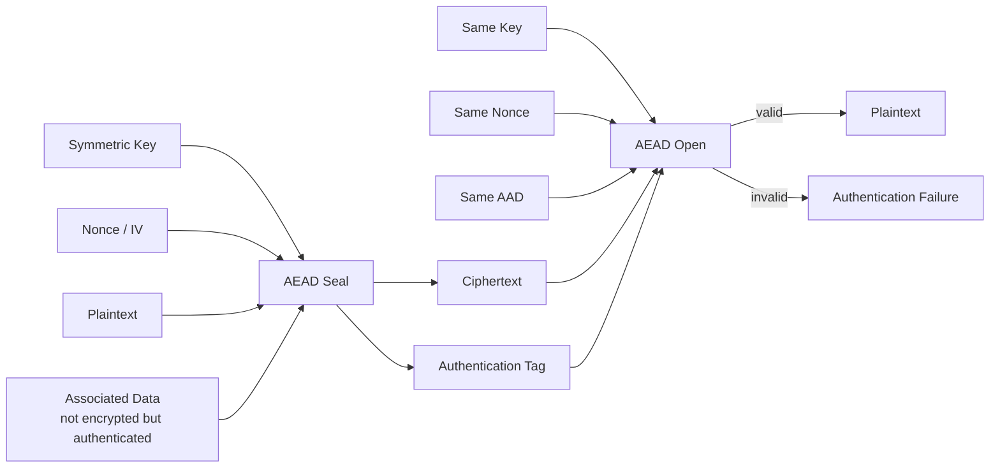

AAD adalah bagian yang sering diremehkan.

AAD berguna untuk mengikat ciphertext ke context yang tidak perlu dirahasiakan, misalnya:

- algorithm identifier;
- version;
- key id;
- tenant id;
- agency id;
- module name;
- record id;
- purpose;
- schema version;
- created-at timestamp;
- content type;
- compression flag;
- source system;
- destination system;
- sequence number.

Tanpa AAD, ciphertext bisa saja valid secara crypto tetapi salah secara domain.

Contoh masalah:

- ciphertext milik tenant A bisa dicopy ke row tenant B;
- encrypted role `viewer` untuk user X bisa dipasang ke user Y;
- encrypted payload versi lama bisa dipakai di parser versi baru;
- encrypted token untuk module `survey` bisa dipakai di module `case`;
- ciphertext dari environment staging bisa diterima production;
- ciphertext dari event type `PaymentApproved` bisa dipakai sebagai `RefundApproved` jika format sama.

AEAD hanya tahu byte. Domain binding adalah tanggung jawab desain kamu.

---

## 4. Security Invariant untuk Symmetric Encryption

Sebelum menulis kode, tulis invariant.

Contoh invariant yang sehat:

1. **Nonce uniqueness**  
   Untuk setiap key AEAD, nonce tidak boleh digunakan ulang.

2. **Context binding**  
   Ciphertext hanya valid untuk `(purpose, tenant, schema version, record id, algorithm, key id)` yang sama.

3. **No unauthenticated plaintext**  
   Aplikasi tidak boleh memakai plaintext sebelum authentication tag valid.

4. **No fallback decrypt silently**  
   Decryption tidak boleh mencoba banyak format/key/mode secara diam-diam tanpa policy dan audit.

5. **Key separation**  
   Key untuk encryption tidak boleh dipakai untuk HMAC, signing, password hashing, token generation, atau tenant lain.

6. **Versioned envelope**  
   Semua ciphertext persistent harus punya version/algorithm/kid metadata.

7. **Decryption failure is generic**  
   Error keluar tidak membedakan “bad tag”, “bad padding”, “bad key”, “bad tenant”, “bad version” secara detail ke caller tidak terpercaya.

8. **Plaintext lifetime minimized**  
   Plaintext tidak boleh dilog, disimpan di metric label, masuk panic, masuk trace attribute, atau tertinggal di debug endpoint.

9. **Rotation-ready**  
   Sistem harus bisa membaca ciphertext lama dan menulis ciphertext baru tanpa downtime.

10. **Quota per key**  
   Sistem harus punya batas jumlah encryption per key terutama untuk random nonce GCM.

---

## 5. Symmetric Encryption vs Asymmetric Encryption

Symmetric encryption memakai key yang sama untuk encrypt dan decrypt.

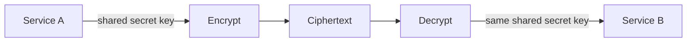

Kelebihan symmetric encryption:

- cepat;
- cocok untuk data besar;
- cocok untuk field-level encryption;
- cocok untuk object/file encryption;
- cocok untuk service internal ketika key managed oleh KMS/Vault;
- cocok sebagai data encryption key dalam envelope encryption.

Kelemahan:

- key distribution sulit;
- siapa pun yang bisa decrypt juga biasanya bisa encrypt/MAC;
- kompromi satu shared key bisa berdampak luas;
- tidak memberikan non-repudiation;
- identity pengirim harus ditangani oleh boundary lain seperti mTLS, IAM, atau MAC per peer.

Asymmetric encryption biasanya tidak dipakai langsung untuk mengenkripsi payload besar. Dalam desain modern, asymmetric/KMS sering dipakai untuk membungkus key, sementara payload dienkripsi dengan symmetric key.

---

## 6. Block Cipher: AES Bukan Format Pesan

AES adalah block cipher dengan block size 16 byte. AES menerima block plaintext fixed-size dan key, lalu menghasilkan block ciphertext fixed-size.

AES key size umum:

| AES Variant | Key Size | Catatan |
|---|---:|---|
| AES-128 | 16 byte | Masih kuat untuk banyak kebutuhan |
| AES-192 | 24 byte | Jarang dipakai di aplikasi umum |
| AES-256 | 32 byte | Umum untuk compliance atau long-term data |

Namun plaintext aplikasi jarang tepat 16 byte. Karena itu dibutuhkan mode.

Block cipher mode adalah cara mengubah block cipher menjadi mekanisme untuk data lebih panjang.

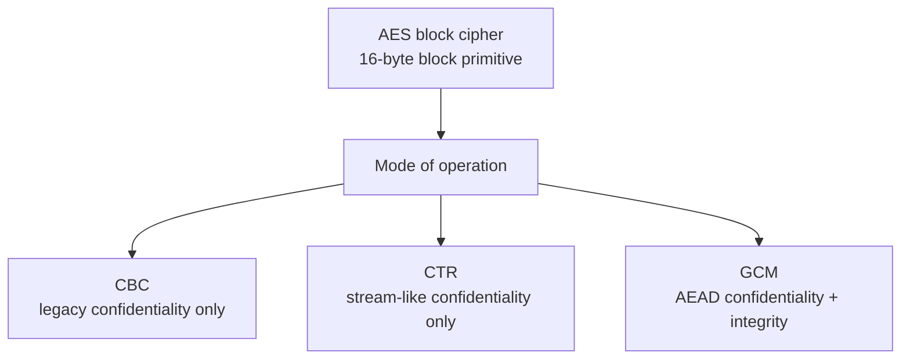

Masalahnya, mode-mode lama punya footgun besar. CBC perlu padding. Padding bisa menjadi oracle. CTR berubah menjadi stream cipher dan sangat sensitif terhadap nonce/counter reuse. CFB/OFB historis tetapi bukan default modern.

Jadi sebagai engineer aplikasi:

> Jangan expose AES block cipher langsung ke product code. Expose high-level AEAD envelope API.

---

## 7. AEAD Algorithm Pilihan di Go

### 7.1 AES-GCM

AES-GCM adalah default yang sangat umum untuk Go services.

Cocok ketika:

- environment punya hardware AES acceleration;
- butuh FIPS-friendly path;
- format harus kompatibel dengan sistem enterprise;
- data bukan streaming tak terbatas;
- nonce uniqueness bisa dijamin atau pakai `NewGCMWithRandomNonce` dengan quota per key.

Catatan penting:

- Standard nonce GCM adalah 12 byte / 96 bit.
- Nonce harus unik per key.
- Authentication tag default 16 byte.
- Jangan truncate tag kecuali compatibility requirement yang jelas.
- Jangan pakai `NewGCMWithNonceSize` untuk desain baru kecuali perlu compatibility.
- Jangan pakai `NewGCMWithTagSize` untuk desain baru kecuali perlu compatibility.
- Go `NewGCMWithRandomNonce` mempermudah envelope karena nonce diprefix otomatis ke ciphertext, tetapi jumlah encryption per key tetap harus dibatasi.

### 7.2 ChaCha20-Poly1305

ChaCha20-Poly1305 adalah AEAD yang bagus, terutama ketika:

- hardware AES acceleration tidak tersedia;
- performance AES-GCM tidak stabil di platform tertentu;
- service berjalan di banyak architecture;
- mobile/edge/embedded lebih dominan;
- ingin AEAD modern berbasis stream cipher + Poly1305 MAC.

Standard ChaCha20-Poly1305 memakai nonce 12 byte. Sama seperti GCM, nonce uniqueness tetap wajib.

### 7.3 XChaCha20-Poly1305

XChaCha20-Poly1305 memakai nonce 24 byte.

Cocok ketika:

- distributed system sulit menjamin deterministic nonce unik;
- banyak instance/pod melakukan encryption secara independen;
- ingin random nonce dengan collision risk jauh lebih rendah;
- tidak butuh FIPS AES-GCM path;
- menggunakan dependency `golang.org/x/crypto/chacha20poly1305` dapat diterima.

Untuk product engineering, XChaCha20-Poly1305 sering lebih forgiving terhadap random nonce generation daripada AES-GCM 96-bit, tetapi tetap bukan alasan untuk mengabaikan key rotation dan envelope metadata.

---

## 8. Nonce, IV, Counter: Istilah yang Sering Membingungkan

Istilah berbeda tergantung mode:

| Istilah | Arti umum | Harus rahasia? | Harus unik? | Harus random? |
|---|---|---:|---:|---:|
| Key | Secret untuk encrypt/decrypt | Ya | N/A | Ya / derived securely |
| Nonce | Number used once | Tidak | Ya per key | Bisa random atau deterministic |
| IV | Initialization vector | Biasanya tidak | Tergantung mode | Tergantung mode |
| Salt | Input unik untuk KDF/hash | Tidak | Sebaiknya unik | Biasanya random |
| Counter | Nilai meningkat | Tidak | Ya per key/stream | Tidak harus random |

Untuk AEAD modern:

- nonce tidak harus rahasia;
- nonce boleh disimpan bersama ciphertext;
- nonce harus unik untuk key yang sama;
- reuse nonce di AEAD seperti GCM/ChaCha20-Poly1305 dapat menghancurkan security.

### 8.1 Random Nonce

Random nonce mudah karena tidak perlu state counter global.

Risiko:

- collision probability;
- key dipakai terlalu lama;
- banyak service instance memperbesar volume;
- testing yang memakai deterministic fake random tanpa sadar masuk production;
- VM/container snapshot bisa mengulang RNG state pada sistem tertentu, walaupun modern OS CSPRNG umumnya didesain menghindari ini.

### 8.2 Deterministic Counter Nonce

Counter nonce bisa sangat aman jika benar.

Kebutuhan:

- counter persistent;
- atomic;
- tidak rollback;
- tidak reuse setelah crash;
- scoped per key;
- scoped per writer/shard;
- ada overflow check;
- tidak reset saat deploy;
- tidak duplikat antar region/pod.

### 8.3 Hybrid Nonce

Untuk distributed system, sering dibuat struktur:

```text
nonce = node_id || counter
```

Misalnya 96-bit GCM nonce:

```text
32-bit writer_id || 64-bit counter
```

Atau:

```text
16-bit region || 16-bit shard || 64-bit counter
```

Tetapi desain ini butuh registry writer id dan invariant operasional. Jika dua pod memakai writer id yang sama, invariant hancur.

---

## 9. Catastrophic Failure: Apa yang Terjadi Jika Nonce Reuse?

Nonce reuse bukan bug kecil.

Untuk stream-like construction, jika dua plaintext dienkripsi dengan key dan nonce yang sama:

```text
C1 = P1 XOR keystream
C2 = P2 XOR keystream

C1 XOR C2 = P1 XOR P2
```

Attacker bisa mendapatkan relasi antara dua plaintext. Jika salah satu plaintext diketahui atau bisa ditebak, plaintext lain bisa bocor.

Untuk AES-GCM, nonce reuse juga bisa merusak authentication dan membuka jalan forgery dalam kondisi tertentu.

Mental model:

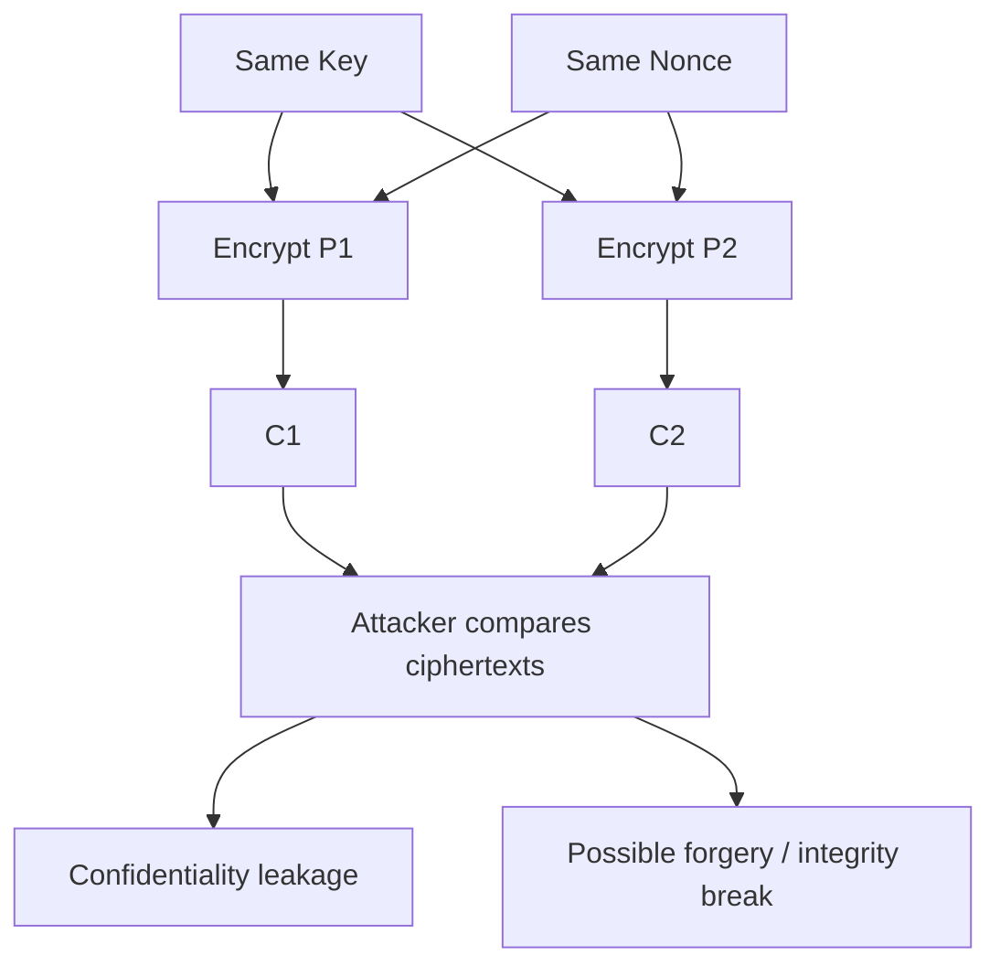

Jadi requirement-nya bukan “nonce sebaiknya unik”. Requirement-nya:

> Nonce reuse under the same key is a security incident.

---

## 10. Associated Data: Mengikat Ciphertext ke Domain

AAD tidak dirahasiakan, tetapi diverifikasi.

Misalnya kamu menyimpan encrypted value di database:

```text
users.secret_answer_encrypted
```

Kalau AAD kosong, attacker internal yang punya write access ke DB bisa mencoba copy ciphertext antar row. Jika format plaintext sama, aplikasi mungkin menerima plaintext valid di context yang salah.

AAD yang lebih kuat:

```text
app=aceas
component=profile-service
purpose=user-secret-answer
tenant=CEA
user_id=12345
column=secret_answer
schema=v2
alg=AES-256-GCM
kid=kms-prod-2026-06
```

AAD harus canonical. Jangan buat AAD dari map yang order-nya tidak stabil.

Contoh binary-ish simple format:

```text
len(purpose) || purpose || len(tenant) || tenant || len(record_id) || record_id || len(schema) || schema
```

Atau JSON canonical manual dengan urutan field eksplisit.

AAD anti-pattern:

```go
additionalData := []byte(fmt.Sprintf("%v", map[string]string{
    "tenant": tenant,
    "record": recordID,
}))
```

Masalah:

- map order bisa tidak stabil;
- formatting bukan protocol;
- tidak ada length-prefix;
- field ambiguity bisa muncul;
- tidak cocok untuk long-term storage.

AAD yang lebih sehat:

```go
func aadForUserField(tenantID, userID, field string, schema uint16) []byte {
	var b []byte
	b = appendField(b, "purpose", "user-field-encryption")
	b = appendField(b, "tenant", tenantID)
	b = appendField(b, "user", userID)
	b = appendField(b, "field", field)
	b = appendUint16Field(b, "schema", schema)
	return b
}
```

Kita akan buat contoh lebih lengkap nanti.

---

## 11. Envelope Encryption: Format Ciphertext yang Production-Ready

Untuk data persistent, ciphertext tidak boleh hanya raw bytes hasil `Seal`.

Butuh envelope.

Envelope minimal:

```text
version | algorithm | key_id | nonce | ciphertext | tag
```

Untuk `NewGCMWithRandomNonce`, nonce sudah diprefix ke ciphertext. Tetapi untuk storage jangka panjang, metadata tetap perlu ada.

Contoh envelope:

```json
{
  "v": 1,
  "alg": "AES-256-GCM",
  "kid": "kms-prod-data-2026-06",
  "aad": "implicit:v1:user-field",
  "ct": "base64url(nonce || ciphertext || tag)"
}
```

Atau binary envelope:

```text
magic[4]       = "GSE1"
version[1]     = 0x01
alg[1]         = 0x01  // AES-256-GCM-RN
kid_len[1]
kid[kid_len]
ct_len[4]
ct[ct_len]     = nonce || ciphertext || tag
```

### 11.1 Kenapa Envelope Penting?

Karena sistem akan berubah.

Tanpa envelope, kamu akan menyesal ketika:

- key rotation dimulai;
- ganti AES-GCM ke XChaCha;
- menambah tenant separation;
- menambah compression flag;
- perlu migrate tag size;
- perlu membedakan ciphertext lama vs baru;
- perlu audit incident;
- perlu decrypt data lama 5 tahun kemudian;
- perlu partial re-encrypt.

### 11.2 Metadata yang Perlu Diikat ke AAD

Metadata seperti `alg`, `version`, `kid`, `purpose`, `tenant`, `schema` sering perlu masuk AAD agar attacker tidak bisa mengganti metadata untuk memaksa interpretasi berbeda.

Pattern:

```text
AAD = canonical(metadata_except_ciphertext) || canonical(domain_context)
```

Jika metadata tidak ikut AAD, attacker bisa melakukan metadata substitution.

---

## 12. Go AEAD API: Detail yang Harus Dipahami

Interface:

```go
type AEAD interface {
    NonceSize() int
    Overhead() int
    Seal(dst, nonce, plaintext, additionalData []byte) []byte
    Open(dst, nonce, ciphertext, additionalData []byte) ([]byte, error)
}
```

Hal penting:

1. `Seal` append ke `dst`; bukan selalu allocate fresh.
2. `Open` append ke `dst`; bukan selalu allocate fresh.
3. `Open` boleh menimpa isi `dst` sampai capacity walaupun gagal.
4. `nonce` harus panjangnya sesuai `NonceSize()`, kecuali AEAD khusus seperti `NewGCMWithRandomNonce` yang `NonceSize() == 0`.
5. `additionalData` harus sama persis saat decrypt.
6. Error dari `Open` berarti authentication failed atau input invalid; jangan proses plaintext.
7. Jangan expose detail error ke caller tidak terpercaya.

### 12.1 Implication untuk Secure Wrapper

Wrapper harus:

- menyembunyikan `Seal/Open` raw dari mayoritas codebase;
- enforce versioned envelope;
- enforce AAD builder;
- enforce allowed algorithm;
- load key via keyring/provider;
- tidak menerima arbitrary nonce dari caller kecuali mode advanced;
- centralize logging policy;
- centralize metrics;
- centralize key rotation.

---

## 13. Recommended Default untuk Go Services

Untuk aplikasi baru di Go 1.26.x:

### Default 1 — AES-GCM dengan `cipher.NewGCMWithRandomNonce`

Gunakan ini ketika:

- kamu memakai Go 1.24+;
- AES-GCM acceptable;
- kamu ingin menghindari manual nonce handling;
- jumlah encryption per key dapat dikontrol jauh di bawah `2^32`;
- key rotation tersedia;
- environment umumnya punya AES acceleration;
- dependency minimal standard library penting.

Kelebihan:

- standard library;
- nonce otomatis;
- nonce diprefix otomatis;
- lebih sulit salah daripada manual nonce;
- cocok untuk field-level encryption dan small/medium message.

Batasan:

- tetap harus membatasi message per key;
- ciphertext overhead 28 byte;
- `NonceSize() == 0`, jadi wrapper harus sadar API behavior ini;
- tidak cocok untuk streaming besar tanpa framing.

### Default 2 — XChaCha20-Poly1305

Gunakan ini ketika:

- random nonce besar lebih diinginkan;
- distributed writer sangat banyak;
- dependency `x/crypto` acceptable;
- FIPS path bukan requirement;
- kamu ingin nonce 24 byte yang aman untuk random generation pada volume besar.

Kelebihan:

- nonce 24 byte;
- bagus untuk distributed systems;
- performance baik tanpa AES hardware.

Batasan:

- bukan standard library utama;
- FIPS/compliance story berbeda;
- compatibility enterprise kadang lebih mudah dengan AES-GCM.

### Default yang Sebaiknya Dihindari untuk Desain Baru

| Pilihan | Kenapa dihindari |
|---|---|
| AES-CBC raw | No integrity; padding oracle risk |
| AES-CTR raw | No integrity; bit-flipping; nonce reuse fatal |
| AES-ECB | Pattern leakage; tidak semestinya dipakai |
| CFB/OFB | Legacy/deprecated untuk banyak use case baru |
| Custom AES + HMAC tanpa review | Banyak ordering/canonicalization/tag-check pitfalls |
| Passphrase langsung jadi AES key | Butuh KDF seperti Argon2id/scrypt/PBKDF2 sesuai use case |
| Static hardcoded key | Secret management failure |

---

## 14. Safe Envelope Example: AES-GCM Random Nonce

Contoh ini bukan crypto framework lengkap, tetapi menunjukkan bentuk wrapper yang lebih aman daripada menyebar `cipher.NewGCM` ke seluruh codebase.

Tujuan:

- key 32 byte untuk AES-256;
- `NewGCMWithRandomNonce` agar nonce diprefix otomatis;
- envelope JSON untuk readability;
- metadata masuk AAD;
- generic error untuk caller;
- key lookup via `kid`;
- tidak menerima nonce dari caller.

```go
package securebox

import (
	"crypto/aes"
	"crypto/cipher"
	"encoding/base64"
	"encoding/json"
	"errors"
	"fmt"
)

const (
	EnvelopeVersion = 1
	AlgorithmAES256GCMRandomNonce = "AES-256-GCM-RN"
)

var (
	ErrInvalidCiphertext = errors.New("invalid ciphertext")
	ErrKeyNotFound       = errors.New("key not found")
)

type Keyring interface {
	CurrentKey(purpose string) (kid string, key []byte, err error)
	KeyByID(kid string) ([]byte, error)
}

type Envelope struct {
	Version int    `json:"v"`
	Alg     string `json:"alg"`
	KID     string `json:"kid"`
	Purpose string `json:"purpose"`
	CT      string `json:"ct"`
}

type Box struct {
	keys Keyring
}

func New(keys Keyring) *Box {
	return &Box{keys: keys}
}

func (b *Box) Encrypt(purpose string, domainAAD []byte, plaintext []byte) ([]byte, error) {
	kid, key, err := b.keys.CurrentKey(purpose)
	if err != nil {
		return nil, fmt.Errorf("load current key: %w", err)
	}
	if len(key) != 32 {
		return nil, fmt.Errorf("invalid AES-256 key length")
	}

	aead, err := newAES256GCMRandomNonce(key)
	if err != nil {
		return nil, err
	}

	env := Envelope{
		Version: EnvelopeVersion,
		Alg:     AlgorithmAES256GCMRandomNonce,
		KID:     kid,
		Purpose: purpose,
	}

	aad := buildAAD(env, domainAAD)

	// For NewGCMWithRandomNonce, nonce must be nil/empty because NonceSize() == 0.
	sealed := aead.Seal(nil, nil, plaintext, aad)
	env.CT = base64.RawURLEncoding.EncodeToString(sealed)

	out, err := json.Marshal(env)
	if err != nil {
		return nil, fmt.Errorf("marshal envelope: %w", err)
	}
	return out, nil
}

func (b *Box) Decrypt(domainAAD []byte, envelopeBytes []byte) ([]byte, error) {
	var env Envelope
	if err := json.Unmarshal(envelopeBytes, &env); err != nil {
		return nil, ErrInvalidCiphertext
	}
	if env.Version != EnvelopeVersion || env.Alg != AlgorithmAES256GCMRandomNonce || env.KID == "" || env.Purpose == "" {
		return nil, ErrInvalidCiphertext
	}

	key, err := b.keys.KeyByID(env.KID)
	if err != nil {
		// Do not leak whether KID exists to untrusted caller.
		return nil, ErrInvalidCiphertext
	}
	if len(key) != 32 {
		return nil, ErrInvalidCiphertext
	}

	sealed, err := base64.RawURLEncoding.DecodeString(env.CT)
	if err != nil {
		return nil, ErrInvalidCiphertext
	}

	aead, err := newAES256GCMRandomNonce(key)
	if err != nil {
		return nil, ErrInvalidCiphertext
	}

	aad := buildAAD(env, domainAAD)
	plaintext, err := aead.Open(nil, nil, sealed, aad)
	if err != nil {
		return nil, ErrInvalidCiphertext
	}
	return plaintext, nil
}

func newAES256GCMRandomNonce(key []byte) (cipher.AEAD, error) {
	block, err := aes.NewCipher(key)
	if err != nil {
		return nil, fmt.Errorf("new AES cipher: %w", err)
	}
	aead, err := cipher.NewGCMWithRandomNonce(block)
	if err != nil {
		return nil, fmt.Errorf("new AES-GCM random nonce: %w", err)
	}
	return aead, nil
}

func buildAAD(env Envelope, domainAAD []byte) []byte {
	// Deliberately stable and length-prefixed enough for this example.
	// In production, use a canonical binary encoding helper consistently.
	var aad []byte
	aad = appendField(aad, "v", fmt.Sprintf("%d", env.Version))
	aad = appendField(aad, "alg", env.Alg)
	aad = appendField(aad, "kid", env.KID)
	aad = appendField(aad, "purpose", env.Purpose)
	aad = appendField(aad, "domain", string(domainAAD))
	return aad
}

func appendField(dst []byte, name, value string) []byte {
	dst = append(dst, byte(len(name)))
	dst = append(dst, name...)
	dst = append(dst, byte(len(value)>>8), byte(len(value)))
	dst = append(dst, value...)
	return dst
}
```

### 14.1 Catatan Review untuk Kode di Atas

Yang sudah baik:

- caller tidak mengatur nonce;
- metadata punya version, algorithm, kid, purpose;
- metadata diikat ke AAD;
- decrypt error generic;
- key lookup via KID;
- key length dicek;
- format bisa dirotasi.

Yang masih perlu ditambah di production:

- batas ukuran plaintext/ciphertext;
- canonical AAD builder yang tidak memakai `string(domainAAD)` jika binary arbitrary;
- metrics tanpa sensitive labels;
- structured audit event;
- key cache dengan TTL;
- memory handling untuk secret;
- envelope binary jika performance/storage penting;
- fuzz tests untuk envelope parser;
- golden test vectors;
- rotation tooling;
- envelope migration script;
- protection dari extremely large JSON/base64 input;
- separation antara internal error dan public error;
- integration dengan KMS/Vault/SSM/Secrets Manager.

---

## 15. Manual Nonce AES-GCM: Kapan dan Bagaimana

Manual nonce masih berguna ketika:

- kamu punya protocol existing;
- kamu ingin deterministic counter nonce;
- kamu perlu interoperability;
- kamu ingin memisahkan nonce field di envelope;
- kamu ingin enforce writer-id + counter structure.

Contoh deterministic nonce 96-bit:

```text
nonce = writer_id[4] || counter[8]
```

Go helper:

```go
package nonce

import (
	"encoding/binary"
	"errors"
)

var ErrCounterOverflow = errors.New("nonce counter overflow")

type GCMNonceGenerator struct {
	writerID uint32
	counter  uint64
}

func NewGCMNonceGenerator(writerID uint32, start uint64) *GCMNonceGenerator {
	return &GCMNonceGenerator{writerID: writerID, counter: start}
}

func (g *GCMNonceGenerator) Next() ([12]byte, error) {
	if g.counter == ^uint64(0) {
		return [12]byte{}, ErrCounterOverflow
	}
	g.counter++
	var n [12]byte
	binary.BigEndian.PutUint32(n[0:4], g.writerID)
	binary.BigEndian.PutUint64(n[4:12], g.counter)
	return n, nil
}
```

Tetapi ini belum cukup. Production perlu:

- persistent counter;
- crash recovery;
- writer ID registry;
- monotonic allocation;
- block reservation untuk performance;
- never reuse reserved range setelah crash;
- key-scoped counter;
- observability untuk counter exhaustion;
- test untuk duplicate writer ID;
- deployment policy agar pod baru tidak reuse writer ID lama.

### 15.1 Counter Reservation Pattern

Daripada write counter ke DB setiap encryption, writer bisa reserve range:

```text
reserve counter [1000000, 1009999]
```

Jika pod crash pada counter 1000100, range 1000101..1009999 harus dianggap burned, bukan reused.

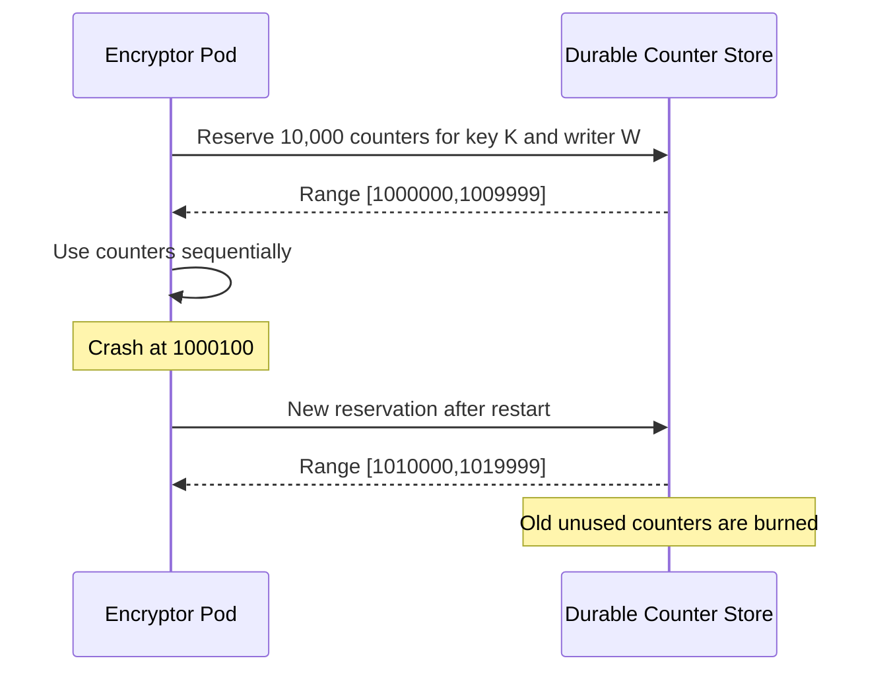

Ini mirip distributed ID generation: correctness lebih penting daripada efisiensi kecil.

---

## 16. AES-CBC, AES-CTR, CFB, OFB: Kenapa Bukan Default

### 16.1 AES-CBC Raw

CBC butuh IV unpredictable/random dan padding. Decryption harus memvalidasi padding. Jika error padding dan error MAC berbeda, muncul padding oracle.

Anti-pattern:

```go
// Anti-pattern: AES-CBC encryption without authentication.
mode := cipher.NewCBCEncrypter(block, iv)
mode.CryptBlocks(ciphertext, paddedPlaintext)
```

Masalah:

- ciphertext bisa dimodifikasi;
- padding oracle;
- no AAD;
- perlu MAC terpisah;
- ordering MAC/encrypt harus benar;
- error handling rawan bocor.

Jika terpaksa legacy, gunakan Encrypt-then-MAC:

```text
ciphertext = CBC_Encrypt(key_enc, iv, padded_plaintext)
tag = HMAC(key_mac, version || alg || kid || iv || ciphertext || aad)
```

Saat decrypt:

1. parse envelope;
2. verify HMAC constant-time;
3. baru decrypt CBC;
4. validate padding generic;
5. return generic error untuk semua failure.

Jangan decrypt dulu baru verify MAC.

### 16.2 AES-CTR Raw

CTR mengubah block cipher menjadi stream cipher. Sangat cepat dan paralel, tetapi tidak punya integrity.

Jika attacker flip bit di ciphertext, bit plaintext ikut berubah predictable.

```text
C = P XOR keystream
C' = C XOR delta
P' = P XOR delta
```

CTR hanya boleh dipakai dalam construction yang menambahkan authentication yang benar, atau lebih baik gunakan AEAD.

### 16.3 CFB/OFB

Dalam dokumentasi Go modern, CFB functions ditandai deprecated. Secara engineering, mode-mode ini biasanya legacy compatibility, bukan pilihan desain baru.

---

## 17. Compression + Encryption: Urutan dan Risiko

Urutan umum:

```text
compress plaintext -> encrypt compressed bytes
```

Kenapa bukan encrypt dulu lalu compress? Ciphertext harus terlihat random; compression setelah encryption tidak berguna.

Tetapi compression sebelum encryption bisa membuka side-channel ketika attacker bisa mempengaruhi sebagian plaintext dan mengamati ciphertext length. Ini keluarga masalah seperti CRIME/BREACH pada konteks web.

Risk model:

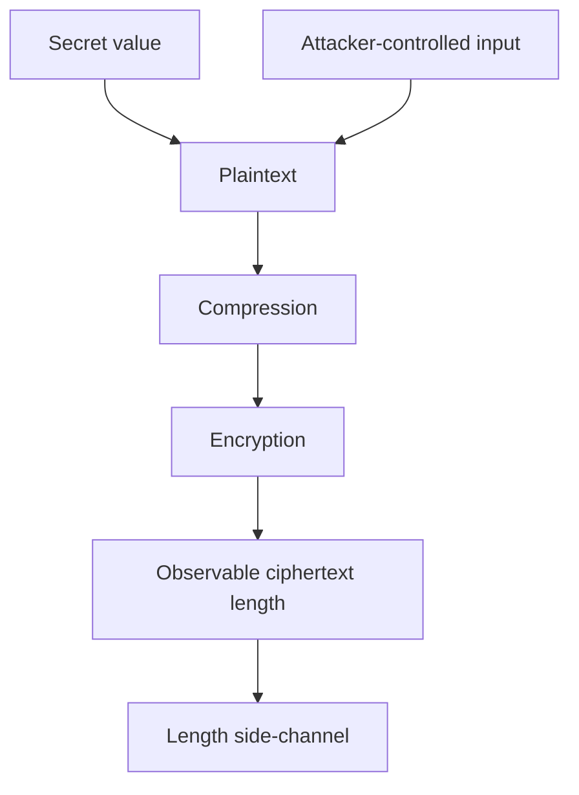

Aturan praktis:

- Jangan compress secret bersama attacker-controlled input jika ciphertext length observable.
- Untuk token/cookie/session, hindari compression.
- Untuk file/object besar internal, compression boleh jika input tidak attacker-mixed atau length leakage acceptable.
- Compression flag harus masuk AAD.
- Decompression harus punya output size limit untuk mencegah decompression bomb.

---

## 18. Streaming Encryption: AEAD Tidak Otomatis Streaming

`cipher.AEAD.Seal` bekerja pada satu message. Untuk file besar atau stream, jangan hanya membaca seluruh file ke memory tanpa limit.

Pendekatan:

1. chunk data;
2. setiap chunk dienkripsi dengan nonce unik;
3. chunk index masuk AAD;
4. final chunk ditandai;
5. metadata file masuk AAD;
6. urutan chunk diverifikasi;
7. truncation dideteksi.

Contoh frame:

```text
file_header:
  magic
  version
  alg
  kid
  file_id
  chunk_size

chunk_i:
  index
  final_flag
  nonce
  ciphertext
  tag
```

AAD per chunk:

```text
magic || version || alg || kid || file_id || chunk_size || chunk_index || final_flag
```

Kenapa chunk index harus masuk AAD?

Agar attacker tidak bisa reorder chunk tanpa ketahuan.

Kenapa final flag harus masuk AAD?

Agar attacker tidak bisa truncate stream dan membuat penerima menganggap file selesai normal.

Diagram:

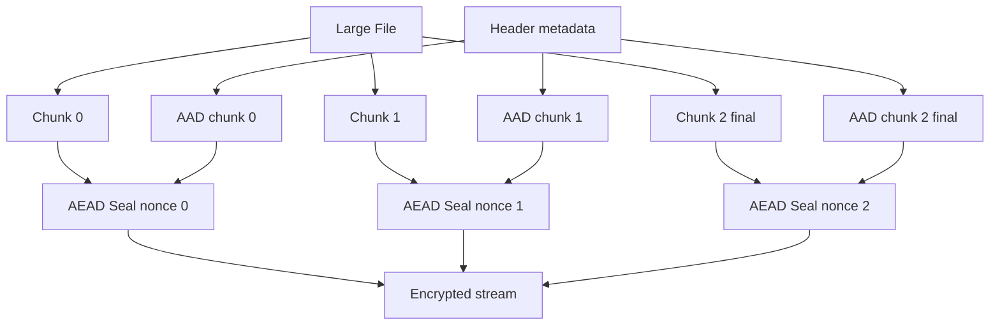

Jangan merancang streaming encryption sendiri untuk sistem high-risk tanpa review cryptography. Tetapi sebagai software architect, kamu harus tahu invariant-nya agar bisa memilih library/protocol yang benar.

---

## 19. Field-Level Encryption di Database

Field-level encryption sering dipakai untuk PII atau sensitive attributes.

Contoh:

```text
users
- id
- tenant_id
- email
- nric_encrypted
- phone_encrypted
- secret_answer_encrypted
```

### 19.1 Invariant

- ciphertext terikat ke tenant;
- ciphertext terikat ke row id;
- ciphertext terikat ke column name;
- ciphertext terikat ke schema version;
- KID disimpan;
- key separation per purpose/tenant/classification;
- migration path tersedia;
- searchable requirements tidak diselesaikan dengan insecure deterministic encryption kecuali desain khusus.

AAD contoh:

```text
purpose=field-encryption
schema=2
table=users
column=nric
record_id=12345
tenant=CEA
```

### 19.2 Query/Search Problem

Jika data dienkripsi dengan random nonce AEAD, ciphertext berbeda setiap kali untuk plaintext sama. Ini bagus untuk security, tetapi tidak bisa query equality langsung.

Pilihan:

| Requirement | Opsi | Risiko |
|---|---|---|
| Display only | Randomized AEAD | Aman relatif |
| Equality search | Blind index HMAC | Bisa bocor frequency/equality |
| Prefix search | Hindari jika bisa | Sulit aman |
| Range search | Biasanya perlu desain khusus | High leakage |
| Analytics | Tokenization / secure pipeline | Kompleks |

Blind index:

```text
index = HMAC(index_key, canonical(normalized_value))
```

Catatan:

- index key harus beda dari encryption key;
- normalization harus jelas;
- equality leakage tetap ada;
- low-entropy values seperti gender/status/yes-no mudah ditebak;
- untuk NRIC/phone/email, threat model harus serius.

### 19.3 Deterministic Encryption Trap

Deterministic encryption membuat plaintext sama menghasilkan ciphertext sama. Ini mempermudah query equality, tetapi membocorkan equality pattern. Untuk data low-cardinality, ini parah.

Jangan memilih deterministic encryption hanya karena “query jadi mudah”. Itu keputusan domain/security, bukan convenience.

---

## 20. Token Encryption vs Token Signing

Tidak semua token harus dienkripsi.

Pertanyaan pertama:

> Apakah payload token perlu dirahasiakan dari client?

Jika tidak perlu rahasia, sering lebih baik signed token, bukan encrypted token.

| Token Type | Cocok Jika | Primitive |
|---|---|---|
| Signed token | Client boleh melihat payload, tidak boleh mengubah | HMAC/JWS/signature |
| Encrypted token | Payload rahasia dari client | AEAD/JWE-like envelope |
| Opaque token | Server-side lookup acceptable | Random token + DB/cache |

Encrypted token anti-pattern:

- menyimpan terlalu banyak state di client;
- tidak punya revocation;
- tidak punya audience binding;
- tidak punya expiration AAD/claim check;
- error decrypt detail bocor;
- key rotation tidak dirancang;
- token replay tidak ditangani.

Untuk session/security-sensitive workflows, opaque token sering lebih mudah dikontrol daripada encrypted self-contained token.

---

## 21. Key Management untuk Symmetric Encryption

Encryption strength tidak lebih kuat dari key management-nya.

### 21.1 Key Class

| Key Type | Fungsi | Contoh |
|---|---|---|
| KEK | Key encryption key | KMS key untuk wrap DEK |
| DEK | Data encryption key | AES key untuk encrypt data |
| MAC key | HMAC key | Blind index, webhook |
| Token key | Signing/encryption token | Session/JWT internal |
| Tenant key | Tenant-scoped data key | Per agency/customer |

Jangan mencampur fungsi.

### 21.2 Envelope Encryption dengan KMS

Pattern umum:

1. generate DEK random;
2. encrypt data dengan DEK memakai AEAD;
3. wrap/encrypt DEK dengan KMS KEK;
4. simpan encrypted DEK bersama ciphertext envelope;
5. saat decrypt, unwrap DEK via KMS lalu decrypt data.

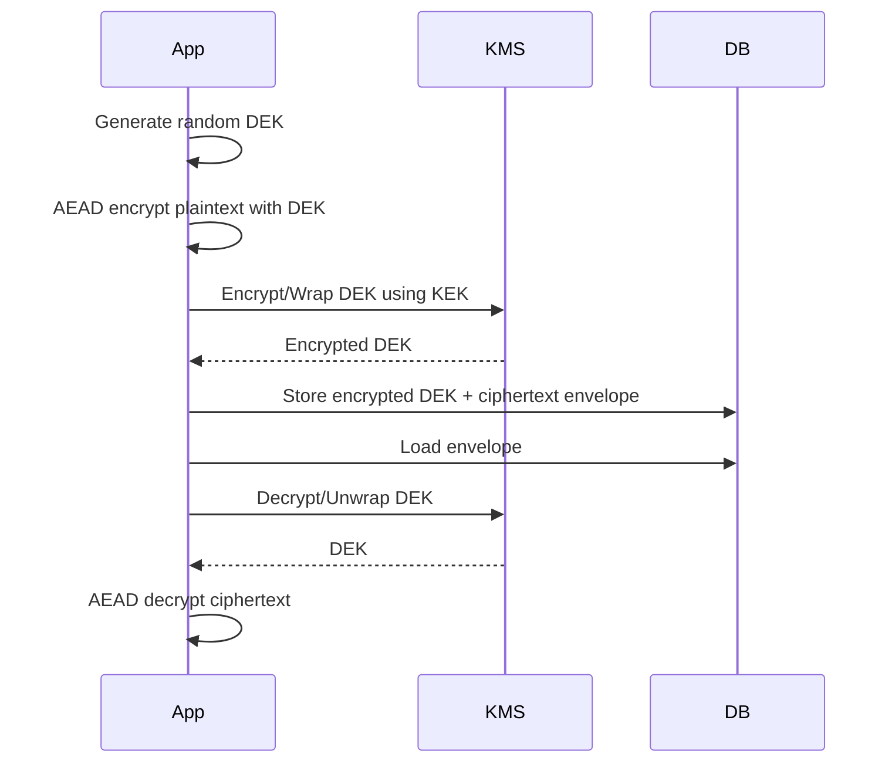

Kelebihan:

- data besar tidak dikirim ke KMS;
- KEK rotation lebih mudah;
- DEK bisa per object/record;
- blast radius lebih kecil;
- audit KMS decrypt bisa dipakai sebagai control.

### 21.3 Key Rotation Strategy

Ada dua rotation berbeda:

1. rotate KEK;
2. rotate DEK.

KEK rotation bisa dilakukan dengan rewrap encrypted DEK tanpa decrypt semua data.

DEK rotation biasanya butuh decrypt + re-encrypt data.

Design pilihan:

| Strategy | Cara | Pro | Kontra |
|---|---|---|---|
| Read-old write-new | Decrypt old, saat update tulis new key | Low disruption | Data lama bertahan lama |
| Background re-encrypt | Batch migrate semua record | Coverage jelas | Operasional kompleks |
| Lazy re-encrypt | Saat read, tulis ulang dengan key baru | Natural migration | Perlu write path saat read |
| Dual-write temporary | Tulis dua format | Migration aman | Storage/complexity naik |
| Rewrap only | Rewrap DEK dengan KEK baru | Cepat | Tidak mengganti DEK |

### 21.4 Key Retirement

Jangan hapus key lama sampai semua ciphertext yang memakai key itu tidak perlu didecrypt.

Perlu inventory:

- KID;
- algorithm;
- purpose;
- tenant;
- created_at;
- disabled_at;
- destroyed_at;
- ciphertext count;
- oldest/newest ciphertext;
- last decrypt timestamp;
- owner.

---

## 22. Error Handling: Hindari Decryption Oracle

Decryption oracle muncul ketika attacker bisa membedakan jenis failure.

Contoh buruk:

```json
{"error":"invalid padding"}
{"error":"invalid tag"}
{"error":"unknown key id"}
{"error":"wrong tenant"}
{"error":"json parse success but decrypt failed"}
```

Untuk caller tidak terpercaya, gunakan generic error:

```json
{"error":"invalid ciphertext"}
```

Internal logging boleh lebih kaya, tetapi hati-hati:

- jangan log plaintext;
- jangan log key;
- jangan log raw token/ciphertext jika bisa menjadi replay material;
- jangan menjadikan `kid`, `tenant`, `record_id` sebagai high-cardinality metric label sembarangan;
- jangan log stack trace dengan buffer sensitive.

Pattern error:

```go
var ErrInvalidCiphertext = errors.New("invalid ciphertext")

func publicErr(err error) error {
	if err == nil {
		return nil
	}
	return ErrInvalidCiphertext
}
```

Internal metrics:

```text
decrypt_failure_total{component="profile", alg="AES-256-GCM-RN", reason_class="auth_failed"}
```

Bukan:

```text
decrypt_failure_total{kid="kms-prod-user-2026-06", record_id="123456789"}
```

---

## 23. Observability untuk Encryption Boundary

Security observability harus menjawab:

- apakah decrypt failure meningkat?;
- apakah KID lama masih dipakai?;
- apakah key rotation berjalan?;
- apakah ada service memakai deprecated algorithm?;
- apakah encryption volume mendekati quota per key?;
- apakah KMS latency/error rate naik?;
- apakah ciphertext parser menerima format unknown?;
- apakah payload terlalu besar?;
- apakah ada repeated nonce detector untuk manual nonce mode?;
- apakah ada tenant mismatch attempt?;
- apakah ada high decrypt failure dari source tertentu?

Metric contoh:

```text
encrypt_total{purpose, alg, key_generation}
decrypt_total{purpose, alg, key_generation}
decrypt_failure_total{purpose, alg, reason_class}
key_lookup_failure_total{purpose, reason_class}
legacy_decrypt_total{purpose, legacy_alg}
reencrypt_total{purpose, from_generation, to_generation}
aead_message_count_estimate{purpose, key_generation}
```

Jangan menaruh PII, record id, token, ciphertext, atau key id lengkap sebagai label jika cardinality/metadata leakage berisiko. Gunakan generation alias atau hashed internal ID jika perlu.

Audit event contoh:

```json
{
  "event_type": "crypto.decrypt.failed",
  "component": "profile-service",
  "purpose": "user-field-encryption",
  "alg": "AES-256-GCM-RN",
  "key_generation": "2026-06",
  "reason_class": "auth_failed",
  "actor_type": "service",
  "request_id": "...",
  "timestamp": "2026-06-24T04:00:00Z"
}
```

---

## 24. Performance Model

Encryption performance dipengaruhi:

- algorithm;
- CPU instruction support;
- payload size;
- allocation pattern;
- base64/JSON overhead;
- KMS/key lookup latency;
- key cache;
- batching;
- compression;
- streaming frame size;
- GC pressure dari plaintext/ciphertext allocations;
- contention di key provider.

### 24.1 AES-GCM Hardware Acceleration

Pada amd64 dengan AES-NI, AES-GCM biasanya sangat cepat. Tanpa hardware acceleration, ChaCha20-Poly1305 bisa lebih kompetitif.

Tapi jangan memilih algorithm hanya dari microbenchmark. Pertimbangkan:

- compliance;
- interoperability;
- nonce model;
- implementation maturity;
- operational invariant;
- dependency policy.

### 24.2 Allocation Pattern

`Seal` append ke `dst`. Untuk mengurangi allocation:

```go
out := make([]byte, 0, len(plaintext)+aead.Overhead())
out = aead.Seal(out, nonce, plaintext, aad)
```

Tetapi jangan membuat optimization yang membuat buffer overlap salah. Ikuti contract `cipher.AEAD`.

### 24.3 KMS Cost

Jika setiap decrypt memanggil KMS, latency bisa dominan. Gunakan envelope encryption dan key caching sesuai policy.

Namun cache DEK terlalu lama meningkatkan exposure.

Trade-off:

| Cache | Pro | Risk |
|---|---|---|
| No cache | Strong control/audit | Latency/cost tinggi |
| Short TTL | Balance | More complex |
| Long TTL | Fast | Key exposure window besar |
| Per-request unwrap | Simple semantics | KMS bottleneck |
| Batch unwrap | Efficient | Blast radius larger |

---

## 25. Memory Handling untuk Plaintext dan Key

Go adalah garbage-collected language. Kamu tidak punya kontrol penuh seperti manual memory secure erase.

Hal yang bisa dilakukan:

- jangan simpan secret lebih lama dari perlu;
- jangan convert secret `[]byte` ke `string` jika tidak perlu, karena string immutable dan sulit dihapus;
- jangan log buffer;
- jangan taruh secret di error;
- zero best-effort untuk buffer key/plaintext yang kamu own;
- pahami compiler/runtime bisa membuat copy;
- untuk high-assurance secrets, gunakan specialized secret management/HSM/KMS dan minimalkan exposure di application memory.

Best-effort zeroing:

```go
func zero(b []byte) {
	for i := range b {
		b[i] = 0
	}
}
```

Tetapi jangan overclaim. Ini bukan guarantee bahwa semua copy hilang dari memory.

---

## 26. Secure API Design: Jangan Berikan Footgun ke Caller

Buruk:

```go
func Encrypt(key, nonce, plaintext []byte) ([]byte, error)
func Decrypt(key, nonce, ciphertext []byte) ([]byte, error)
```

Kenapa buruk?

- caller bisa reuse nonce;
- caller bisa pakai key salah;
- tidak ada AAD;
- tidak ada version;
- tidak ada KID;
- tidak ada purpose;
- tidak ada rotation path;
- tidak ada metrics/audit.

Lebih baik:

```go
type EncryptRequest struct {
    Purpose   string
    DomainAAD []byte
    Plaintext []byte
}

type DecryptRequest struct {
    DomainAAD []byte
    Envelope  []byte
}

type Service interface {
    Encrypt(ctx context.Context, req EncryptRequest) ([]byte, error)
    Decrypt(ctx context.Context, req DecryptRequest) ([]byte, error)
}
```

Caller tidak melihat key, nonce, algorithm. Itu policy internal.

### 26.1 Capability-Based Crypto Service

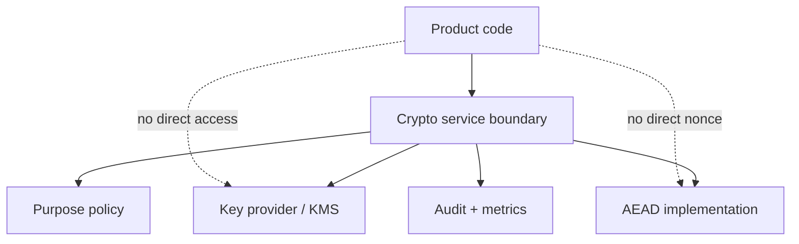

Product code hanya punya capability tertentu:

- encrypt `profile.pii.v1`;
- decrypt `profile.pii.v1`;
- tidak otomatis bisa decrypt `payment.card.v1`;
- tidak bisa memilih arbitrary algorithm;
- tidak bisa memilih key id sembarang.

---

## 27. Misuse Cases yang Harus Dicari Saat Review

### 27.1 Hardcoded Key

```go
var key = []byte("12345678901234567890123456789012")
```

Masalah:

- masuk git;
- masuk binary;
- sulit rotate;
- semua environment bisa sama;
- compromise source = compromise data.

### 27.2 Password sebagai Key Langsung

```go
key := []byte(password)
block, _ := aes.NewCipher(key)
```

Masalah:

- password entropy rendah;
- length tidak sesuai;
- tidak ada salt;
- brute-force mudah;
- tidak ada KDF cost.

Gunakan KDF sesuai use case. Untuk password storage, jangan encrypt password; gunakan password hashing. Untuk passphrase-based encryption, gunakan KDF seperti Argon2id/scrypt/PBKDF2 dengan parameter yang direview.

### 27.3 Encrypt tanpa Authenticate

```go
stream := cipher.NewCTR(block, iv)
stream.XORKeyStream(ciphertext, plaintext)
```

Tidak ada integrity. Attacker bisa flip bit.

### 27.4 Random Nonce tetapi Key Dipakai Terlalu Lama

```go
nonce := make([]byte, 12)
rand.Read(nonce)
```

Random 96-bit nonce bukan license untuk infinite encryption. Perlu batas per key.

### 27.5 AAD Kosong untuk Domain Object

```go
sealed := aead.Seal(nil, nonce, plaintext, nil)
```

Boleh untuk file standalone tertentu, tetapi sering salah untuk multi-tenant/multi-purpose systems.

### 27.6 Decrypt Fallback Tanpa Audit

```go
for _, key := range allKeys {
    if pt, err := decrypt(key, ct); err == nil {
        return pt, nil
    }
}
```

Masalah:

- oracle surface;
- downgrade risk;
- expensive;
- no policy;
- no audit;
- impossible to reason.

Gunakan KID dan explicit legacy policy.

### 27.7 Reusing Key Across Purpose

```text
same 32-byte key for:
- encrypt PII
- HMAC webhook
- sign reset token
- blind index
```

Ini melanggar key separation. Jika satu usage bocor, yang lain terdampak.

### 27.8 Logging Ciphertext sebagai “Aman”

Ciphertext bisa tetap sensitive:

- bisa dipakai replay;
- mengandung metadata/KID/tenant;
- bisa menjadi target offline analysis;
- jika key bocor nanti, log lama bisa didecrypt;
- bisa memuat encrypted personal data sehingga masih regulated.

---

## 28. Migration dari Legacy CBC/CTR ke AEAD

Banyak sistem enterprise punya ciphertext lama.

Tujuan migration:

- bisa baca lama;
- semua write baru pakai AEAD;
- data lama dimigrasi bertahap;
- ada audit;
- tidak membuat silent downgrade;
- tidak membuka oracle.

### 28.1 Envelope Versioning untuk Legacy

```json
{
  "v": 0,
  "alg": "AES-256-CBC-HMAC-SHA256",
  "kid": "legacy-2021",
  "iv": "...",
  "ct": "...",
  "tag": "..."
}
```

Versi baru:

```json
{
  "v": 1,
  "alg": "AES-256-GCM-RN",
  "kid": "data-2026-06",
  "ct": "..."
}
```

### 28.2 Read-Repair Migration

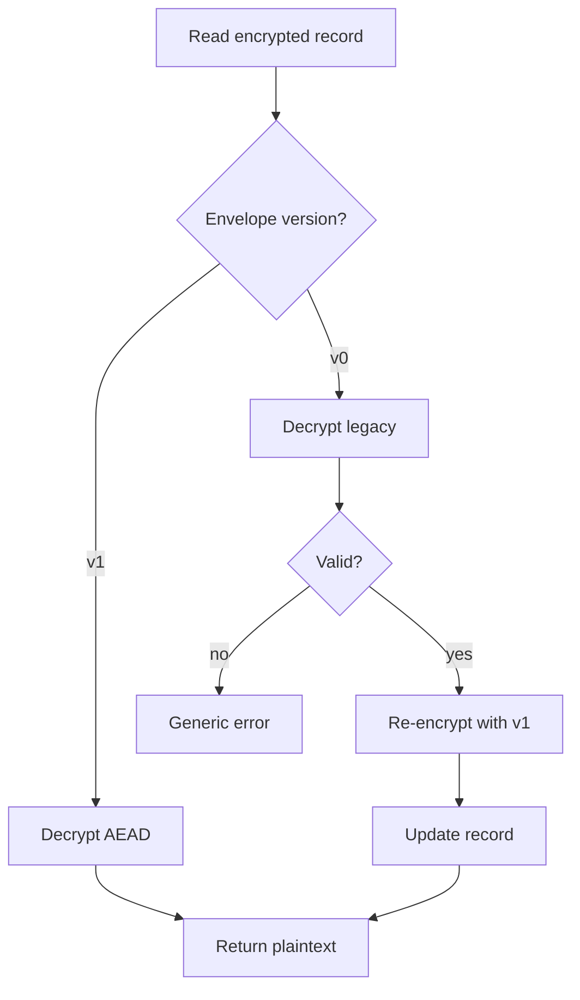

Controls:

- legacy decrypt path only for known legacy KID;
- no raw fallback;
- metric `legacy_decrypt_total`;
- migration deadline;
- alert if legacy decrypt still happens after deadline;
- background job for bulk migration;
- rollback plan.

### 28.3 Encrypt-then-MAC for Legacy CBC

Jika legacy CBC tidak punya MAC, kamu punya masalah serius. Migration harus dianggap risk remediation. Jangan “menambal” dengan MAC baru atas ciphertext lama jika attacker sudah bisa memodifikasi ciphertext sebelumnya tanpa deteksi historis. Kamu bisa menambahkan MAC saat record dibaca dan diverifikasi oleh business logic, tetapi historical integrity tetap tidak bisa dibuktikan sepenuhnya.

---

## 29. Multi-Tenant Encryption

Multi-tenant encryption bukan hanya “tenant_id di database”.

Pertanyaan desain:

- apakah key per tenant?;
- apakah KMS policy per tenant?;
- apakah AAD mengikat tenant?;
- apakah service boleh decrypt semua tenant?;
- apakah audit memuat tenant?;
- apakah key rotation per tenant bisa dilakukan?;
- apakah tenant deletion mencakup crypto erasure?;
- apakah backup masih bisa didecrypt setelah tenant deletion?;
- apakah dev/staging/prod key terpisah?;
- apakah support engineer punya path decrypt?

### 29.1 Key Granularity

| Granularity | Pro | Kontra |
|---|---|---|
| Global key | Simple | Blast radius besar |
| Per service purpose | Balance | Masih cross-tenant exposure |
| Per tenant | Strong isolation | Operational complexity |
| Per tenant + purpose | Stronger | More keys, policy complexity |
| Per record DEK | Small blast radius | KMS/envelope complexity |

Untuk sistem regulatori atau agency-based platform, per tenant/purpose sering lebih defensible daripada global key.

### 29.2 Crypto Erasure

Crypto erasure berarti menghancurkan key sehingga ciphertext tidak dapat didecrypt.

Namun hati-hati:

- backup mungkin menyimpan key lama;
- logs mungkin menyimpan plaintext;
- cache mungkin menyimpan plaintext;
- derived index mungkin masih mengungkap data;
- replicated KMS key mungkin belum destroyed;
- legal retention mungkin melarang deletion.

Crypto erasure adalah bagian dari data lifecycle, bukan magic delete.

---

## 30. Integrity of Encryption Policy

Encryption policy harus immutable enough.

Contoh policy:

```yaml
purposes:
  profile.pii.v1:
    algorithm: AES-256-GCM-RN
    key_scope: tenant
    aad_fields:
      - environment
      - service
      - tenant_id
      - table
      - column
      - record_id
      - schema_version
    max_plaintext_bytes: 65536
    allow_decrypt: true
    allow_encrypt: true
    rotate_after_days: 90
```

Policy harus:

- reviewed;
- tested;
- versioned;
- deployed consistently;
- not mutable by untrusted runtime config;
- audited when changed.

Jangan biarkan caller mengirim:

```json
{"alg":"none"}
```

Atau:

```json
{"alg":"AES-CBC", "kid":"old-weak-key"}
```

Algorithm agility harus controlled, bukan attacker-controlled.

---

## 31. Testing Strategy

### 31.1 Unit Test

Test:

- encrypt then decrypt returns same plaintext;
- wrong AAD fails;
- wrong purpose fails;
- wrong tenant fails;
- corrupted ciphertext fails;
- corrupted envelope fails;
- unknown KID fails generically;
- wrong algorithm fails;
- empty plaintext works;
- large plaintext within limit works;
- over limit rejected;
- ciphertext does not contain plaintext;
- repeated encryption of same plaintext produces different ciphertext for randomized AEAD;
- legacy migration path works only for allowed legacy envelopes.

### 31.2 Golden Test Vectors

Untuk long-term compatibility, simpan test vector:

```json
{
  "name": "profile pii v1 example",
  "purpose": "profile.pii.v1",
  "domain_aad": "...",
  "plaintext_hex": "...",
  "envelope": "..."
}
```

Karena `NewGCMWithRandomNonce` random, test vector perlu deterministic key dan deterministic sealed bytes jika kamu memakai manual nonce mode. Untuk random nonce mode, golden test biasanya fokus pada decrypt known envelope, bukan encrypt exact output.

### 31.3 Fuzz Test

Fuzz parser envelope dan decrypt boundary:

- random bytes;
- huge JSON;
- invalid base64;
- missing fields;
- wrong types;
- duplicate JSON fields jika parser behavior relevan;
- long KID;
- unknown version;
- corrupted ciphertext;
- truncated tag;
- mutated AAD.

Fuzz goal:

- no panic;
- no plaintext on invalid input;
- generic error;
- bounded memory/time.

### 31.4 Property Test

Property:

- decrypt(encrypt(p, aad), aad) = p;
- decrypt(encrypt(p, aad1), aad2) fails if aad1 != aad2;
- encrypt(p, aad) != encrypt(p, aad) for randomized AEAD with overwhelming probability;
- flipping any bit in ciphertext fails;
- flipping metadata bound to AAD fails;
- old key decrypt works only if KID points to old key.

---

## 32. Threat Model untuk Encryption Boundary

### 32.1 Assets

- plaintext sensitive data;
- encryption keys;
- KMS credentials;
- ciphertext envelope;
- AAD context;
- key policy;
- key rotation logs;
- decrypt audit logs;
- blind index keys;
- backup containing ciphertext/key material.

### 32.2 Actors

- external attacker;
- authenticated user;
- malicious tenant;
- compromised service account;
- insider with DB write access;
- insider with log access;
- CI/CD compromise;
- cloud metadata credential attacker;
- support operator;
- backup reader;
- future attacker after key leak.

### 32.3 STRIDE Mapping

| STRIDE | Encryption Boundary Risk | Control |
|---|---|---|
| Spoofing | service claims wrong tenant/purpose | mTLS/IAM + AAD tenant binding |
| Tampering | ciphertext copied/modified | AEAD tag + AAD |
| Repudiation | decrypt/encrypt not auditable | structured audit event |
| Information disclosure | plaintext/log/key leak | secret handling + no logs + KMS |
| Denial of service | huge ciphertext/base64/decompress | size limits + timeouts |
| Elevation of privilege | caller decrypts purpose not allowed | capability/policy enforcement |

### 32.4 Abuse Cases

- attacker copies encrypted admin flag from one user to another;
- attacker changes envelope `kid` to force fallback;
- attacker sends huge base64 ciphertext to exhaust memory;
- attacker corrupts ciphertext repeatedly to learn timing/error differences;
- compromised pod encrypts arbitrary payload with production key;
- developer logs plaintext for debugging;
- staging key accidentally reused in prod;
- DB admin with write access replays old ciphertext;
- old disabled key remains decryptable forever;
- background migration silently drops AAD field.

---

## 33. Review Checklist

### 33.1 Algorithm

- [ ] Apakah memakai AEAD untuk desain baru?
- [ ] Apakah AES-GCM atau ChaCha20-Poly1305/XChaCha dipilih dengan alasan jelas?
- [ ] Apakah CBC/CTR/CFB/OFB hanya untuk legacy compatibility?
- [ ] Apakah tag tidak dipotong tanpa requirement kuat?
- [ ] Apakah FIPS requirement dievaluasi jika environment membutuhkannya?

### 33.2 Nonce

- [ ] Apakah nonce unik per key?
- [ ] Apakah caller tidak bisa supply nonce sembarang?
- [ ] Jika random 96-bit nonce, apakah ada quota encryption per key?
- [ ] Jika counter nonce, apakah counter persistent/atomic/no rollback?
- [ ] Apakah crash recovery tidak menyebabkan reuse?
- [ ] Apakah key rotation terjadi sebelum volume terlalu tinggi?

### 33.3 AAD

- [ ] Apakah AAD digunakan untuk domain binding?
- [ ] Apakah AAD canonical dan stable?
- [ ] Apakah metadata envelope penting masuk AAD?
- [ ] Apakah tenant/purpose/schema/record/field masuk AAD jika relevan?
- [ ] Apakah perubahan AAD punya migration plan?

### 33.4 Envelope

- [ ] Apakah ciphertext persistent punya version?
- [ ] Apakah ada algorithm id?
- [ ] Apakah ada KID/key generation?
- [ ] Apakah format backward compatible?
- [ ] Apakah parser punya size limit?
- [ ] Apakah unknown version ditolak dengan aman?

### 33.5 Key Management

- [ ] Apakah key berasal dari KMS/Vault/secret manager?
- [ ] Apakah key tidak hardcoded?
- [ ] Apakah key separation diterapkan?
- [ ] Apakah rotation/read-old-write-new tersedia?
- [ ] Apakah key retirement policy jelas?
- [ ] Apakah blast radius per key dipahami?

### 33.6 Error and Observability

- [ ] Apakah decrypt failure generic untuk caller?
- [ ] Apakah internal reason class cukup untuk operasi?
- [ ] Apakah plaintext/key tidak dilog?
- [ ] Apakah metric tidak punya sensitive/high-cardinality labels?
- [ ] Apakah decrypt failure spikes alertable?
- [ ] Apakah legacy decrypt masih dimonitor?

### 33.7 Testing

- [ ] Roundtrip test ada?
- [ ] Wrong AAD fails?
- [ ] Metadata tampering fails?
- [ ] Bit flip fails?
- [ ] Unknown KID generic failure?
- [ ] Fuzz parser ada?
- [ ] Golden decrypt vectors ada?
- [ ] Migration test ada?

---

## 34. Java-to-Go Translation Notes

Sebagai Java engineer, beberapa perbedaan mental model penting:

### 34.1 JCA/JCE vs Go Packages

Java sering memakai API seperti:

```java
Cipher.getInstance("AES/GCM/NoPadding")
```

String algorithm/provider bisa runtime-dependent. Go lebih package/function-oriented:

```go
block, err := aes.NewCipher(key)
aead, err := cipher.NewGCM(block)
```

Implikasi:

- Go lebih eksplisit dan kecil surface-nya;
- provider abstraction tidak sama seperti Java;
- FIPS story di Go memakai mekanisme toolchain/runtime tertentu;
- tidak ada checked exception, error harus dipropagate jelas;
- slicing/append behavior penting untuk memory/allocation/security.

### 34.2 `byte[]` vs `[]byte`

Di Java, `byte[]` mutable tetapi object-managed. Di Go, `[]byte` adalah slice header menunjuk backing array. Passing slice bisa berbagi backing array.

Security implication:

- hati-hati aliasing;
- jangan assume copy;
- `append` bisa reuse capacity;
- `Open`/`Seal` punya overlap rules;
- zeroing best-effort harus memperhatikan semua references.

### 34.3 Exceptions vs Error Values

Java crypto code sering punya exception type berbeda. Di Go, kamu harus sengaja menyatukan public error.

Jangan expose:

- unknown key;
- invalid tag;
- malformed envelope;
- wrong tenant;
- legacy padding failure.

Ke caller eksternal cukup:

```text
invalid ciphertext
```

Internal reason class lewat metrics/logs yang aman.

---

## 35. Practical Design Recipe

Ketika diminta “tolong encrypt field X”, jangan langsung coding.

Ikuti recipe:

### Step 1 — Klasifikasi Data

- Apa datanya?
- PII/credential/token/legal/financial?
- Perlu confidentiality saja atau juga tamper evidence?
- Siapa yang boleh decrypt?
- Berapa lama disimpan?
- Apakah masuk backup?

### Step 2 — Tentukan Purpose

Contoh:

```text
profile.user.nric.v1
case.attachment.metadata.v1
survey.response.free_text.v1
integration.partner.secret_payload.v1
```

Purpose harus stabil dan masuk policy.

### Step 3 — Pilih Key Scope

- global service key?;
- per tenant?;
- per purpose?;
- per tenant+purpose?;
- per object DEK wrapped by KMS?

### Step 4 — Pilih AEAD

Default:

- AES-256-GCM-RN untuk standard library/FIPS-friendly path;
- XChaCha20-Poly1305 untuk random nonce besar dan non-FIPS distributed use case.

### Step 5 — Desain AAD

Masukkan:

- environment;
- service;
- purpose;
- tenant;
- table/collection;
- column/field;
- record id;
- schema version;
- envelope version;
- algorithm;
- KID.

### Step 6 — Desain Envelope

Minimal:

- version;
- algorithm;
- kid;
- ciphertext bytes;
- optional encrypted DEK;
- optional compression flag;
- optional created_at jika diperlukan dan diikat.

### Step 7 — Tentukan Limits

- max plaintext bytes;
- max envelope bytes;
- max KID length;
- max AAD length;
- max decrypt attempts;
- max encryption per key;
- key rotation interval.

### Step 8 — Observability

- encrypt/decrypt count;
- decrypt failures;
- key generation usage;
- legacy usage;
- rotation progress;
- KMS latency/error.

### Step 9 — Test and Fuzz

- roundtrip;
- wrong AAD;
- tamper;
- parser fuzz;
- golden vector;
- migration.

### Step 10 — Document the Invariant

Contoh:

```text
Invariant: A ciphertext produced for profile.user.nric.v1 is valid only for the same environment,
service, tenant_id, table, column, user_id, schema_version, envelope_version, algorithm, and KID.
Any mismatch must fail before plaintext is returned.
```

---

## 36. Full Example: Field Encryption Policy Sketch

```go
type Purpose string

const PurposeProfileNRIC Purpose = "profile.user.nric.v1"

type DomainContext struct {
	Environment string
	Service     string
	TenantID    string
	Table       string
	Column      string
	RecordID    string
	Schema      uint16
}

func (c DomainContext) Validate() error {
	if c.Environment == "" || c.Service == "" || c.TenantID == "" ||
		c.Table == "" || c.Column == "" || c.RecordID == "" || c.Schema == 0 {
		return errors.New("invalid domain context")
	}
	return nil
}

func BuildDomainAAD(p Purpose, c DomainContext) ([]byte, error) {
	if p == "" {
		return nil, errors.New("missing purpose")
	}
	if err := c.Validate(); err != nil {
		return nil, err
	}
	var aad []byte
	aad = appendField(aad, "purpose", string(p))
	aad = appendField(aad, "env", c.Environment)
	aad = appendField(aad, "svc", c.Service)
	aad = appendField(aad, "tenant", c.TenantID)
	aad = appendField(aad, "table", c.Table)
	aad = appendField(aad, "column", c.Column)
	aad = appendField(aad, "record", c.RecordID)
	aad = appendField(aad, "schema", strconv.Itoa(int(c.Schema)))
	return aad, nil
}
```

Policy object:

```go
type PurposePolicy struct {
	Purpose           Purpose
	Algorithm         string
	KeyScope          string
	MaxPlaintextBytes int
	AllowEncrypt      bool
	AllowDecrypt      bool
}

var Policies = map[Purpose]PurposePolicy{
	PurposeProfileNRIC: {
		Purpose:           PurposeProfileNRIC,
		Algorithm:         AlgorithmAES256GCMRandomNonce,
		KeyScope:          "tenant+purpose",
		MaxPlaintextBytes: 4096,
		AllowEncrypt:      true,
		AllowDecrypt:      true,
	},
}
```

This shape makes illegal use harder.

---

## 37. Incident Response: Nonce Reuse or Key Exposure

### 37.1 Suspected Nonce Reuse

Treat as security incident.

Immediate actions:

1. stop encryption with affected key;
2. identify key id/generation;
3. identify nonce generation mode;
4. estimate affected ciphertext range;
5. rotate key;
6. disable encrypt with old key;
7. keep decrypt only if necessary and risk-approved;
8. re-encrypt affected data;
9. audit whether plaintext could be inferred;
10. review whether authentication forgery possible;
11. add detector/tests to prevent recurrence.

### 37.2 Key Exposure

Immediate actions:

1. revoke/disable exposed key for encryption;
2. assess decrypt exposure window;
3. rotate key;
4. re-encrypt data;
5. invalidate tokens if token key affected;
6. inspect logs/backups/artifacts;
7. check CI/CD and secret manager audit;
8. determine notification obligations;
9. update key handling controls.

### 37.3 Legacy Mode Oracle

If padding oracle or decrypt oracle suspected:

1. disable detailed error;
2. rate limit decrypt endpoint;
3. verify MAC-before-decrypt for legacy;
4. prioritize migration to AEAD;
5. inspect logs for probing;
6. add fuzz/security tests.

---

## 38. FIPS 140-3 Considerations in Go 1.26

FIPS is not “AES-GCM = compliant”. Compliance involves validated modules, approved mode, build/runtime configuration, operating environment, policy, and documentation.

Go 1.26+ includes native mechanisms that facilitate FIPS 140-3 compliance. But documentation Go explicitly warns that simply using a FIPS validated module may not satisfy all regulatory requirements.

Practical decision tree:

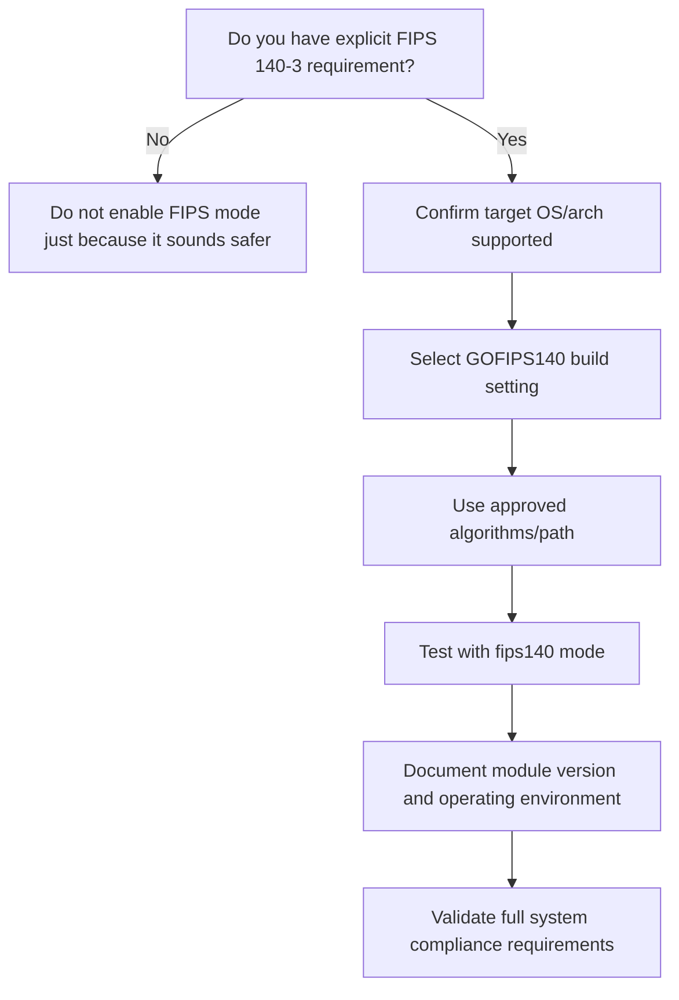

Guidance:

- Jangan mengaktifkan FIPS mode tanpa requirement; bisa membatasi algorithm dan mengubah behavior.
- Jika FIPS diperlukan, dokumentasikan Go version, module version, build flags, runtime config, OS/arch, KMS/HSM boundary, dan algorithm list.
- Periksa apakah dependency non-standard crypto berada di luar FIPS boundary.
- Jangan klaim compliance hanya karena memakai AES.

---

## 39. Mermaid Summary: Secure Encryption Lifecycle

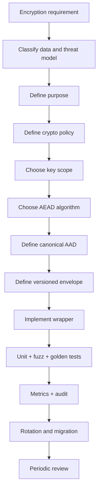

---

## 40. Summary: Apa yang Harus Menempel di Kepala

1. AES bukan message encryption scheme; AES butuh mode.
2. Untuk desain baru, gunakan AEAD.
3. AES-GCM dan ChaCha20-Poly1305 memberikan confidentiality + integrity, tetapi nonce uniqueness tetap wajib.
4. `NewGCMWithRandomNonce` mengurangi footgun manual nonce, tetapi key tetap tidak boleh dipakai melebihi batas message yang aman.
5. XChaCha20-Poly1305 berguna ketika random nonce besar lebih aman secara operasional.
6. AAD adalah cara mengikat ciphertext ke domain context.
7. Persistent ciphertext butuh envelope: version, alg, kid, ciphertext, dan metadata.
8. Jangan expose raw key/nonce/algorithm ke product code.
9. Jangan gunakan CBC/CTR raw untuk desain baru.
10. Key management, rotation, observability, dan incident response adalah bagian dari encryption design.
11. Decryption failure harus generic untuk caller tidak terpercaya.
12. Field-level encryption memecahkan confidentiality, bukan otomatis query/search/privacy problem.
13. Compression + encryption punya side-channel risk jika secret dicampur attacker-controlled input.
14. Streaming encryption butuh framing dan AAD per chunk.
15. FIPS adalah system compliance story, bukan sekadar memilih AES.

---

## 41. Latihan Desain

### Latihan 1 — Encrypted PII Field

Desain field encryption untuk `user.nric`:

- tenant-aware;
- key rotation 90 hari;
- read-old-write-new;
- search by exact NRIC harus didukung;
- audit decrypt failure;
- no plaintext logs.

Pertanyaan:

1. Apa AEAD yang dipilih?
2. Apa AAD fields?
3. Apa envelope format?
4. Apakah butuh blind index?
5. Apa leakage blind index?
6. Apa key separation?
7. Apa migration plan?

### Latihan 2 — Partner Payload Encryption

Partner mengirim payload encrypted ke service kamu.

Pertanyaan:

1. Apakah symmetric shared key cukup atau perlu public-key envelope?
2. Bagaimana key rotation dilakukan?
3. Bagaimana replay dicegah?
4. Apa AAD yang harus disepakati?
5. Bagaimana error response dibuat agar tidak jadi oracle?
6. Bagaimana test vector dipertukarkan?

### Latihan 3 — Legacy CBC Migration

Kamu menemukan data lama memakai AES-CBC tanpa MAC.

Pertanyaan:

1. Apa risiko historisnya?
2. Apakah bisa membuktikan data belum dimodifikasi?
3. Bagaimana migrasi ke AEAD?
4. Apakah read-repair cukup?
5. Apa audit/alert yang dibutuhkan?

---

## 42. Referensi

1. Go `crypto/cipher` package documentation — AEAD, GCM, `NewGCMWithRandomNonce`, nonce uniqueness, tag size, and deprecated stream modes:  
   <https://pkg.go.dev/crypto/cipher>

2. Go `crypto/aes` package documentation — AES implementation, FIPS 197, constant-time hardware support notes:  
   <https://pkg.go.dev/crypto/aes>

3. Go `golang.org/x/crypto/chacha20poly1305` documentation — ChaCha20-Poly1305, XChaCha20-Poly1305, nonce sizes, random nonce guidance:  
   <https://pkg.go.dev/golang.org/x/crypto/chacha20poly1305>

4. NIST SP 800-38D — Recommendation for Block Cipher Modes of Operation: Galois/Counter Mode (GCM) and GMAC:  
   <https://nvlpubs.nist.gov/nistpubs/legacy/sp/nistspecialpublication800-38d.pdf>

5. NIST CSRC announcement on revising SP 800-38D:  
   <https://csrc.nist.gov/News/2024/nist-to-revise-sp-80038d-gcm-and-gmac-modes>

6. Go FIPS 140-3 Compliance documentation:  
   <https://go.dev/doc/security/fips140>

7. Go `crypto/rand` package documentation:  
   <https://pkg.go.dev/crypto/rand>

8. RFC 8439 — ChaCha20 and Poly1305 for IETF Protocols:  
   <https://www.rfc-editor.org/rfc/rfc8439>

---

## 43. Posisi dalam Seri

```text
[done] part-000 — Series orientation
[done] part-001 — Security mental model in Go
[done] part-002 — Go security surface
[done] part-003 — Threat modeling for Go services
[done] part-004 — Cryptography engineering principles
[done] part-005 — Randomness, entropy, nonce, IV, salt, token generation
[done] part-006 — Hashing, digest, checksum, collision/preimage resistance
[done] part-007 — MAC, HMAC, keyed hash, canonicalization, constant-time verification
[done] part-008 — Symmetric encryption, AES, ChaCha20, AEAD, GCM, nonce discipline
[next] part-009 — Public-key cryptography: RSA, ECDSA, Ed25519, signing vs encryption, padding, signature malleability, deterministic signatures, and migration strategy
```

Seri **belum selesai**. Masih ada `part-009` sampai `part-034`.


<!-- NAVIGATION_FOOTER -->
<div class="page-nav">
<a href="./learn-go-security-cryptography-integrity-part-007.md">⬅️ Part 007 — MAC, HMAC, Keyed Hash, Canonicalization, and Constant-Time Verification in Go</a>
<a href="./index.md">📚 Kategori</a>
<a href="../../index.md">🏠 Home</a>
<a href="./learn-go-security-cryptography-integrity-part-009.md">Part 009 — Public-Key Cryptography in Go: RSA, ECDSA, Ed25519, Signing vs Encryption, Padding, Malleability, Key Formats, and Migration Strategy ➡️</a>
</div>
