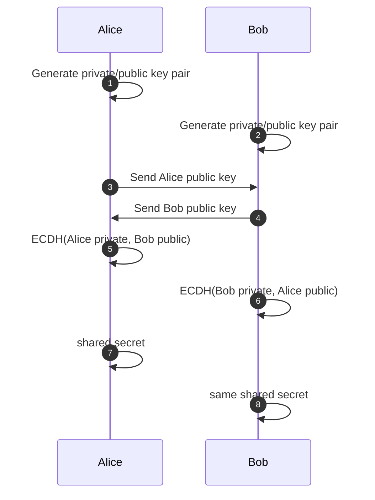
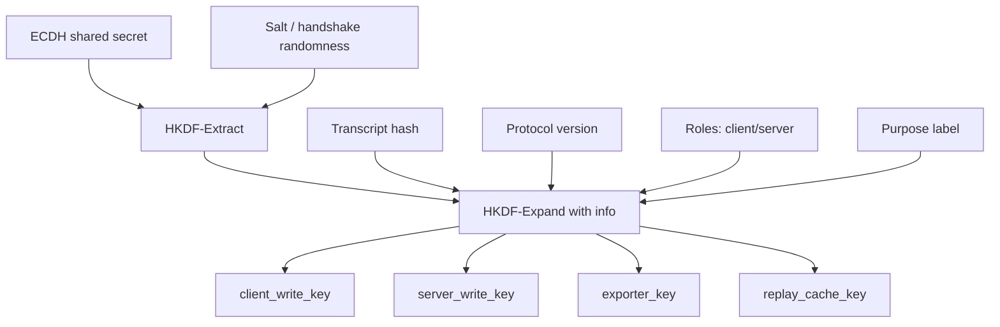
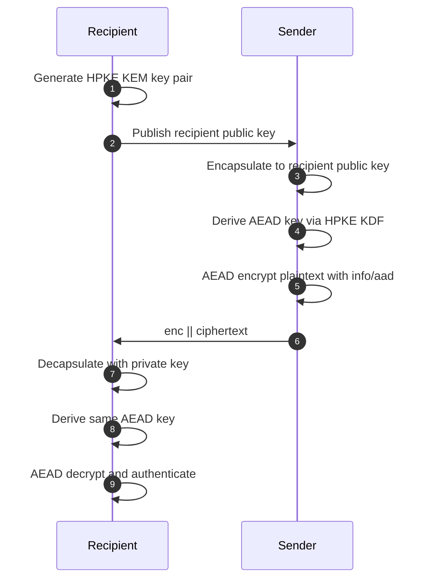
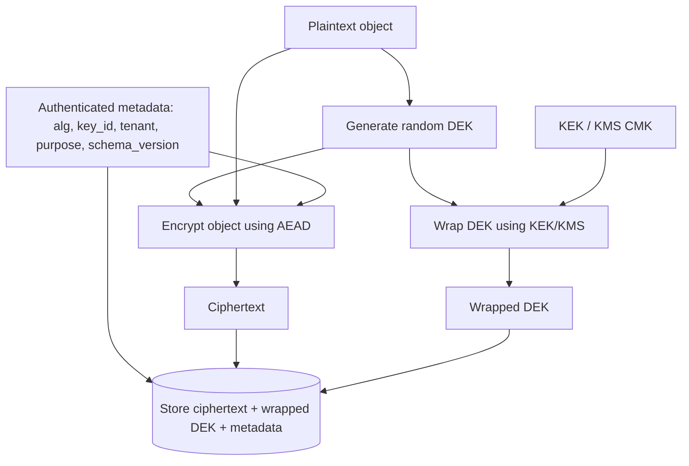
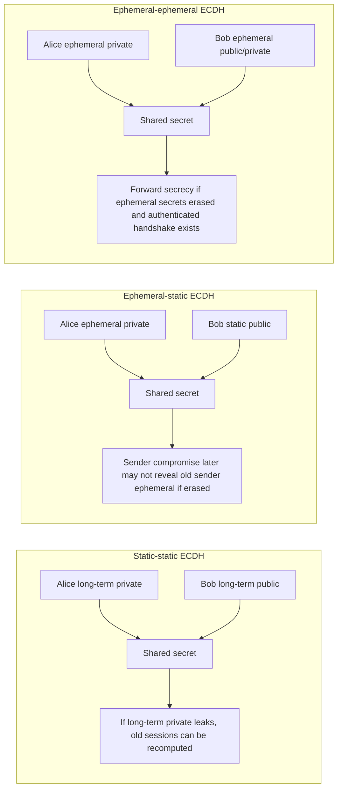
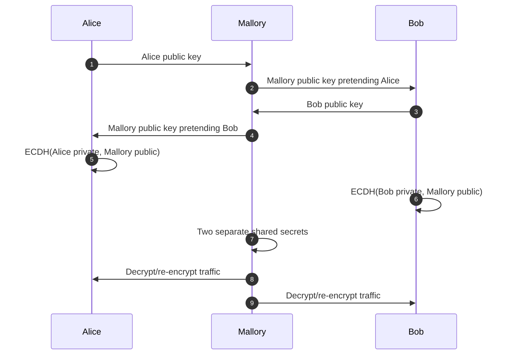
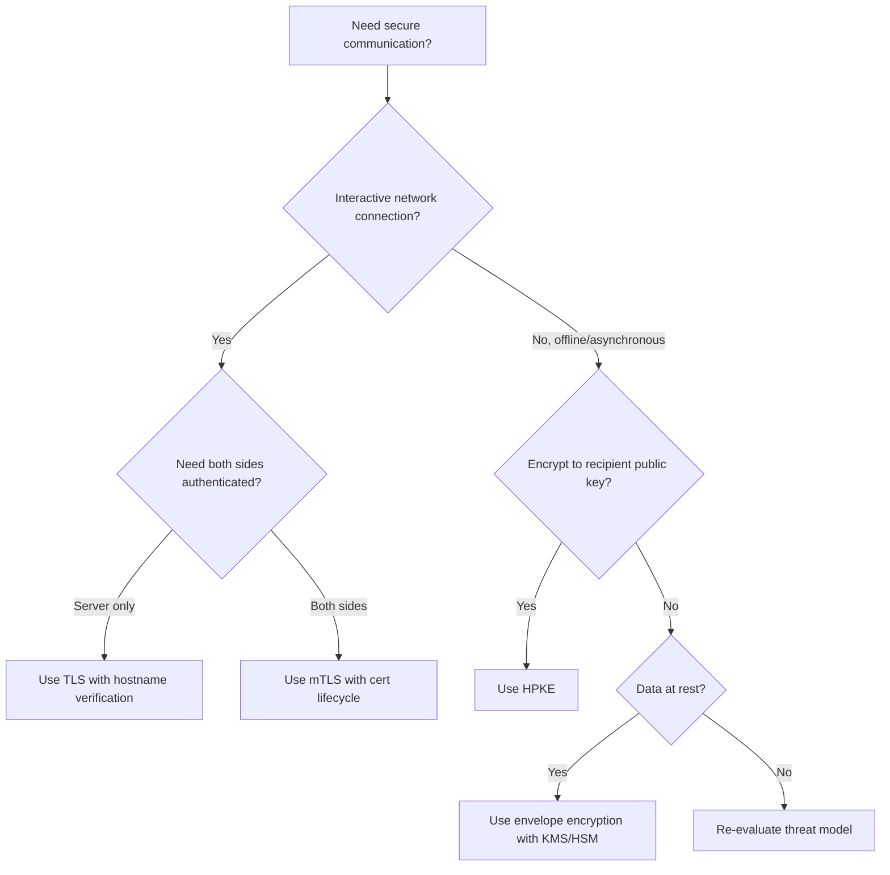
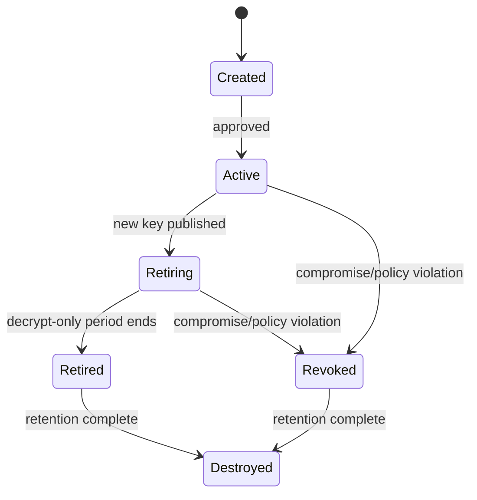
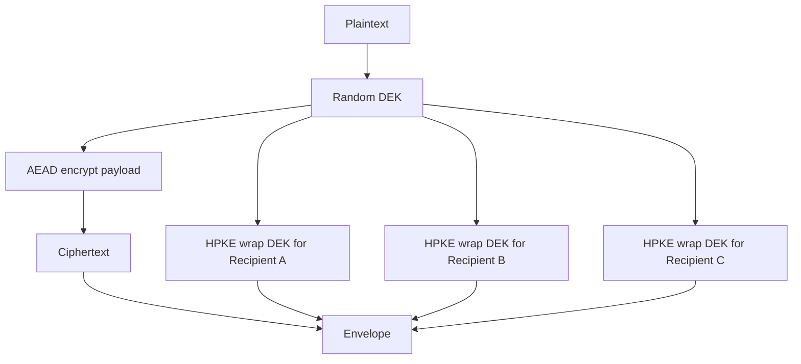
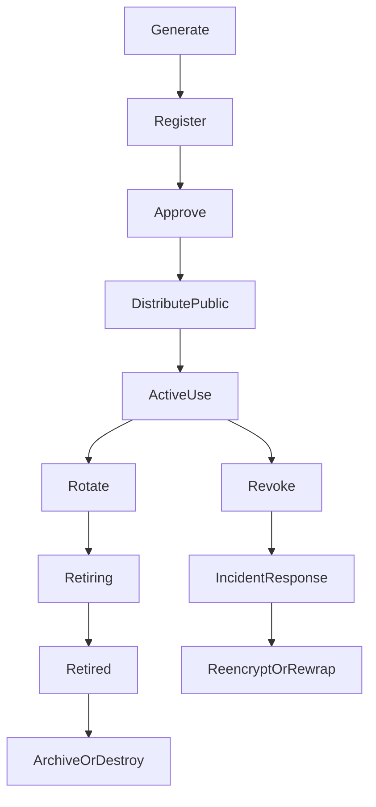

# learn-go-security-cryptography-integrity-part-010.md

# Part 010 — Key Agreement, ECDH, Hybrid Encryption, Envelope Encryption, KEM Mental Model, Forward Secrecy, Session Key Derivation, and Key Separation in Go

> Seri: `learn-go-security-cryptography-integrity`  
> Bagian: `010 / 034`  
> Status seri: **belum selesai**  
> Target Go: **Go 1.26.x**  
> Target pembaca: Java software engineer yang ingin membangun intuisi security Go setara internal engineering handbook.

---

## 0. Posisi Part Ini di Dalam Seri

Pada part sebelumnya kita sudah membahas:

- prinsip cryptography engineering;
- randomness, entropy, nonce, IV, salt, dan token generation;
- hashing dan integrity digest;
- MAC/HMAC dan canonicalization;
- symmetric encryption, AEAD, envelope encryption;
- public-key cryptography: RSA, ECDSA, Ed25519, signing, padding, key format, dan migration strategy.

Sekarang kita masuk ke bagian yang menghubungkan public-key cryptography dan symmetric cryptography: **key agreement dan key establishment**.

Di level mental model, pertanyaannya bukan lagi:

```text
Bagaimana cara mengenkripsi data?
```

melainkan:

```text
Bagaimana dua pihak yang belum punya shared secret bisa membuat shared secret,
tanpa mengirim secret itu lewat jaringan,
lalu menurunkannya menjadi key berbeda untuk fungsi berbeda,
dengan identitas, freshness, replay resistance, dan compromise containment yang jelas?
```

Ini inti dari:

- TLS handshake;
- mTLS service-to-service;
- secure messaging;
- device provisioning;
- encrypted file sharing;
- envelope encryption;
- key wrapping;
- secure webhook reply channel;
- application-level encrypted event;
- post-quantum hybrid encryption;
- session key derivation;
- forward secrecy.

Di Java, kamu mungkin pernah melihat `KeyAgreement`, `X25519`, `ECDH`, `SecretKeySpec`, `HKDF`, `Cipher`, `KeyStore`, atau KMS SDK. Di Go, kamu akan banyak bertemu:

- `crypto/ecdh`;
- `crypto/hkdf`;
- `crypto/hpke`;
- `crypto/tls`;
- `crypto/mlkem`;
- `crypto/rand`;
- `crypto/cipher`;
- `crypto/subtle`;
- provider seperti AWS KMS, GCP KMS, Vault, atau HSM.

Bagian ini tidak akan mendorong kamu membuat protokol kriptografi custom. Justru sebaliknya: kamu akan belajar **kapan harus memakai primitive**, **kapan harus memakai HPKE/TLS/KMS**, dan **kapan harus menolak desain yang terlihat pintar tapi tidak defensible**.

---

## 1. Tujuan Pembelajaran

Setelah menyelesaikan part ini, kamu seharusnya mampu:

1. Membedakan dengan jelas:
   - key agreement;
   - key transport;
   - key encapsulation mechanism;
   - envelope encryption;
   - hybrid encryption;
   - TLS session key derivation;
   - application-level data key derivation.

2. Menjelaskan kenapa ECDH sendiri **belum cukup** untuk membuat secure channel.

3. Mendesain derivasi key dengan HKDF:
   - `salt`;
   - `info`;
   - domain separation;
   - transcript binding;
   - role binding;
   - purpose binding;
   - version binding.

4. Menjelaskan forward secrecy:
   - apa yang dijamin;
   - apa yang tidak dijamin;
   - kapan hilang;
   - bagaimana static ECDH berbeda dari ephemeral ECDH.

5. Memakai `crypto/ecdh` secara aman untuk key agreement low-level saat benar-benar dibutuhkan.

6. Memahami kenapa Go 1.26 `crypto/hpke` adalah pilihan lebih tinggi-level untuk public-key encryption modern.

7. Mendesain envelope encryption untuk data-at-rest:
   - data encryption key;
   - key encryption key;
   - key wrapping;
   - key version;
   - metadata authentication;
   - rotation;
   - auditability.

8. Menghindari kesalahan umum:
   - memakai raw ECDH output langsung sebagai AES key;
   - tidak mengikat identity ke shared secret;
   - tidak mengikat transcript/protocol version ke derived keys;
   - memakai static-static ECDH dan mengira sudah forward secure;
   - mencampur satu key untuk encryption, MAC, token, dan audit;
   - membuat nonce/key derivation sendiri tanpa domain separation;
   - menyamakan envelope encryption dengan forward secrecy;
   - menaruh `kid`/algorithm agility sebagai input attacker-controlled tanpa allowlist.

---

## 2. Vocabulary yang Harus Tegas

Security engineering sering gagal bukan karena engineer tidak bisa coding, tetapi karena istilahnya tercampur.

| Istilah | Makna | Contoh | Risiko jika disalahpahami |
|---|---|---|---|
| Key agreement | Dua pihak menghasilkan shared secret dari private key sendiri dan public key lawan | ECDH/X25519 | Mengira shared secret otomatis authenticated |
| Key transport | Satu pihak membuat secret lalu mengirimnya secara terenkripsi ke pihak lain | RSA-OAEP legacy pattern | Payload/key transport salah padding atau oracle |
| KEM | Public-key mechanism untuk menghasilkan shared secret + encapsulated key | HPKE KEM, ML-KEM | Salah mengira KEM sama dengan encryption payload |
| DEM | Data Encapsulation Mechanism: symmetric encryption payload | AES-GCM, ChaCha20-Poly1305 | Tidak memakai AEAD atau nonce reuse |
| Hybrid encryption | KEM/key agreement untuk key, symmetric encryption untuk data | HPKE, envelope-like design | Salah mengenkripsi payload besar pakai RSA/ECDH raw |
| Envelope encryption | Data dienkripsi dengan DEK, DEK dibungkus KEK/KMS | KMS `Encrypt` wrapping DEK | Salah mengira otomatis forward secure |
| KDF | Key derivation function | HKDF | Raw shared secret dipakai langsung |
| Key separation | Satu root secret menghasilkan key berbeda untuk tujuan berbeda | enc key, mac key, nonce key | Cross-protocol/cross-purpose leakage |
| Forward secrecy | Kompromi long-term key tidak membuka session lama | TLS 1.3 ephemeral ECDHE | Static ECDH dianggap forward secure |
| Transcript binding | Derived key terikat ke handshake/context yang dinegosiasikan | TLS transcript hash | MITM/downgrade/context confusion |

### 2.1 Key Agreement Bukan Encryption

ECDH tidak mengenkripsi data. ECDH menghasilkan material bersama.

```text
Alice private key + Bob public key  -> shared secret
Bob private key   + Alice public key -> shared secret yang sama
```

Setelah itu masih perlu:

1. validasi public key;
2. autentikasi pihak lawan;
3. KDF;
4. key separation;
5. AEAD;
6. nonce management;
7. replay protection;
8. version/protocol binding;
9. error handling yang tidak menjadi oracle;
10. operational key lifecycle.

### 2.2 KEM Bukan Payload Encryption

KEM menghasilkan:

```text
encapsulated key + shared secret
```

Payload tetap dienkripsi dengan symmetric AEAD.

```text
KEM public key -> shared secret + encapsulated key
shared secret  -> KDF -> AEAD key
AEAD key       -> encrypt payload
```

HPKE mengemas pola ini dengan standar RFC 9180:

```text
HPKE = KEM + KDF + AEAD
```

### 2.3 Envelope Encryption Bukan Forward Secrecy

Envelope encryption biasa dipakai untuk data-at-rest.

```text
plaintext -> DEK -> ciphertext
DEK -> KEK/KMS -> wrapped DEK
```

Jika long-term KEK/KMS key bocor dan attacker punya wrapped DEK lama, data lama bisa dibuka. Jadi envelope encryption bukan forward secrecy, kecuali ada desain tambahan seperti per-session ephemeral secret yang tidak dipersisten dan tidak bisa direkonstruksi.

### 2.4 TLS Sudah Menyelesaikan Banyak Hal

Jika masalahmu adalah komunikasi network client-server, jawaban default biasanya:

```text
Gunakan TLS/mTLS dengan konfigurasi benar, bukan protokol ECDH custom.
```

TLS modern menyelesaikan banyak hal sekaligus:

- cipher suite negotiation;
- ephemeral key exchange;
- transcript binding;
- certificate validation;
- handshake authentication;
- downgrade protection;
- replay-related considerations;
- record encryption;
- key derivation;
- alert semantics;
- interoperability;
- battle-tested implementation.

Application-level key agreement baru masuk akal jika kamu punya kebutuhan khusus seperti:

- encrypt-to-public-key untuk pesan asynchronous;
- end-to-end encryption di atas transport yang tidak sepenuhnya dipercaya;
- offline recipient;
- file encryption untuk banyak recipient;
- device provisioning;
- object-level encryption sebelum masuk storage/broker;
- protocol tertentu yang memang distandardisasi.

---

## 3. Diagram Mental Model

### 3.1 ECDH Raw Flow



Diagram ini belum secure channel. Belum ada authentication, transcript binding, AEAD, replay defense, atau downgrade defense.

### 3.2 Secure-ish Application Key Schedule



Intinya: shared secret bukan langsung menjadi AES key. Ia masuk ke KDF, lalu key diturunkan berdasarkan konteks yang jelas.

### 3.3 HPKE One-shot Flow



### 3.4 Envelope Encryption Data-at-rest



### 3.5 Static vs Ephemeral Key Agreement



---

## 4. Key Establishment: Model yang Benar

### 4.1 Masalah yang Diselesaikan

Key establishment menjawab:

> Bagaimana pihak-pihak mendapatkan key material yang sama atau kompatibel, agar bisa melakukan operasi cryptographic selanjutnya?

Ada beberapa bentuk:

| Model | Siapa membuat secret? | Cocok untuk | Contoh |
|---|---:|---|---|
| Pre-shared key | Secret sudah ada sebelumnya | Internal systems, constrained device | PSK TLS, HMAC webhook |
| Key agreement | Kedua pihak berkontribusi | Interactive protocol | ECDH/TLS |
| Key transport | Satu pihak membuat, pihak lain menerima | Legacy public-key encryption | RSA-OAEP wrapping session key |
| KEM | Sender encapsulates shared secret to recipient public key | Modern public-key encryption | HPKE, ML-KEM |
| KMS data key | KMS membuat/wrap data key | Data-at-rest | AWS KMS GenerateDataKey-like pattern |

### 4.2 Security Properties yang Harus Ditentukan

Jangan mulai dari algoritma. Mulai dari property.

| Property | Pertanyaan desain |
|---|---|
| Confidentiality | Siapa yang boleh tahu secret/session key? |
| Authenticity | Bagaimana tahu public key itu milik pihak yang benar? |
| Integrity | Bagaimana tahu metadata/handshake tidak dimodifikasi? |
| Freshness | Bagaimana tahu message/session bukan replay lama? |
| Forward secrecy | Jika long-term key bocor besok, apakah traffic kemarin aman? |
| Key compromise impersonation resistance | Jika private key A bocor, apakah attacker bisa impersonate B ke A? |
| Unknown key-share resistance | Apakah dua pihak setuju tentang identitas lawan? |
| Downgrade resistance | Apakah attacker bisa memaksa versi/algoritma lebih lemah? |
| Key separation | Apakah key untuk fungsi berbeda benar-benar berbeda? |
| Context binding | Apakah key terikat ke tenant, purpose, protocol, dan transcript? |
| Replay resistance | Apakah ciphertext/token lama bisa dipakai ulang? |

### 4.3 Invariant Utama

Untuk top 1% engineering, tulis invariant sebelum kode.

Contoh invariant:

```text
Invariant KA-001:
Raw ECDH shared secret must never be used directly as an encryption key.
It must be passed through HKDF with protocol-specific salt and info.
```

```text
Invariant KA-002:
Derived keys must be purpose-separated: encryption, MAC, exporter, replay,
and audit keys must use different HKDF info labels.
```

```text
Invariant KA-003:
Application-level key agreement must bind both parties' authenticated identities,
protocol version, algorithm suite, and transcript hash into the KDF info.
```

```text
Invariant KA-004:
A service must not accept algorithm identifiers from untrusted input unless they
map to a strict allowlist configured by the service owner.
```

```text
Invariant KA-005:
Forward secrecy is not claimed unless ephemeral private keys are generated per
session, erased as soon as possible, and not persisted or logged.
```

---

## 5. ECDH in Go: What It Gives and What It Does Not Give

Go menyediakan `crypto/ecdh` untuk Elliptic Curve Diffie-Hellman di atas NIST curves dan Curve25519. Di Go 1.26.x, package ini mencakup `P256`, `P384`, `P521`, dan `X25519`. Untuk desain baru, X25519 sering lebih sederhana karena format public key fixed-length dan desainnya mengurangi banyak footgun klasik curve arithmetic.

### 5.1 ECDH Raw Example: Low-level, Not a Protocol

Contoh ini menunjukkan mekanisme saja. Ini bukan secure protocol lengkap.

```go
package keyagree

import (
	"crypto/ecdh"
	"crypto/hkdf"
	"crypto/rand"
	"crypto/sha256"
	"fmt"
)

func DeriveSharedKeyExample() ([]byte, []byte, error) {
	curve := ecdh.X25519()

	alicePriv, err := curve.GenerateKey(rand.Reader) // Go 1.26 ignores caller random and uses secure randomness.
	if err != nil {
		return nil, nil, fmt.Errorf("generate alice key: %w", err)
	}

	bobPriv, err := curve.GenerateKey(rand.Reader)
	if err != nil {
		return nil, nil, fmt.Errorf("generate bob key: %w", err)
	}

	aliceSecret, err := alicePriv.ECDH(bobPriv.PublicKey())
	if err != nil {
		return nil, nil, fmt.Errorf("alice ecdh: %w", err)
	}

	bobSecret, err := bobPriv.ECDH(alicePriv.PublicKey())
	if err != nil {
		return nil, nil, fmt.Errorf("bob ecdh: %w", err)
	}

	// Do not use aliceSecret/bobSecret directly as AEAD keys.
	// They are input keying material, not final application keys.
	_ = bobSecret

	salt := []byte("example-demo-salt-not-for-production")
	info := "learn-go-security/v1/x25519/aead-key"

	key, err := hkdf.Key(sha256.New, aliceSecret, salt, info, 32)
	if err != nil {
		return nil, nil, fmt.Errorf("hkdf derive: %w", err)
	}

	return alicePriv.PublicKey().Bytes(), key, nil
}
```

Security caveats:

1. Tidak ada authentication.
2. Tidak ada transcript binding.
3. Salt hardcoded hanya demo.
4. Tidak ada replay protection.
5. Tidak ada role separation.
6. Tidak ada lifecycle/erasure guarantee.
7. Tidak ada downgrade/algorithm negotiation defense.

### 5.2 Kenapa Shared Secret Harus Masuk HKDF?

ECDH shared secret bukan output random uniform yang langsung ideal untuk semua algoritma. KDF memberi:

- extraction dari input keying material;
- expansion ke ukuran key yang dibutuhkan;
- domain separation;
- context binding;
- key separation;
- agility untuk menghasilkan banyak subkey.

HKDF punya dua tahap konseptual:

```text
PRK = HKDF-Extract(salt, input_keying_material)
OKM = HKDF-Expand(PRK, info, length)
```

Di Go 1.26, `crypto/hkdf` menyediakan `Extract`, `Expand`, dan `Key`. Untuk banyak kasus sederhana, `Key` cukup karena menggabungkan extract + expand.

### 5.3 HKDF `salt` vs `info`

Keduanya sering tertukar.

| Parameter | Secret? | Fungsi | Contoh |
|---|---:|---|---|
| `secret` | Ya | Input keying material | ECDH output, master secret |
| `salt` | Tidak harus secret | Randomization/extraction context | handshake random, deployment salt |
| `info` | Tidak harus secret | Domain/purpose/context label | `app/v1/client-write-key` |
| `keyLength` | Tidak | Panjang output | 32 byte untuk AES-256 |

`info` harus spesifik. Jangan pakai string generik seperti:

```text
key
secret
encryption
```

Lebih baik:

```text
aceas-secure-event/v1/tenant-bound-message/aead-key/client-to-server
aceas-audit-chain/v2/hmac-key/module=case-management
aceas-file-envelope/v1/dek-wrap/metadata-auth
```

### 5.4 Derive Banyak Key dengan Label Berbeda

```go
package keyschedule

import (
	"crypto/hkdf"
	"crypto/sha256"
	"fmt"
)

type SessionKeys struct {
	ClientWriteKey []byte
	ServerWriteKey []byte
	ExporterKey    []byte
	ReplayKey      []byte
}

func DeriveSessionKeys(sharedSecret, salt []byte, transcriptHash [32]byte) (SessionKeys, error) {
	base := "learn-go-secure-channel/v1"

	derive := func(label string, n int) ([]byte, error) {
		info := fmt.Sprintf("%s/%s/transcript=%x", base, label, transcriptHash[:])
		return hkdf.Key(sha256.New, sharedSecret, salt, info, n)
	}

	clientWrite, err := derive("client-write-key", 32)
	if err != nil {
		return SessionKeys{}, err
	}

	serverWrite, err := derive("server-write-key", 32)
	if err != nil {
		return SessionKeys{}, err
	}

	exporter, err := derive("exporter-key", 32)
	if err != nil {
		return SessionKeys{}, err
	}

	replay, err := derive("replay-cache-key", 32)
	if err != nil {
		return SessionKeys{}, err
	}

	return SessionKeys{
		ClientWriteKey: clientWrite,
		ServerWriteKey: serverWrite,
		ExporterKey:    exporter,
		ReplayKey:      replay,
	}, nil
}
```

Catatan:

- contoh ini menunjukkan pattern, bukan protocol lengkap;
- transcript hash tidak boleh hanya hash request body; ia harus merepresentasikan negotiation/handshake context;
- untuk network channel, gunakan TLS kecuali ada alasan kuat.

---

## 6. Authentication: Lubang Besar di Raw ECDH

ECDH memberikan shared secret dengan siapa pun yang public key-nya kamu pakai. Jika attacker bisa mengganti public key di tengah, kamu punya shared secret dengan attacker.

### 6.1 MITM pada Unauthenticated ECDH



Tanpa authentication, ECDH hanya melindungi dari passive eavesdropper, bukan active attacker.

### 6.2 Cara Mengikat Authentication

Ada beberapa model:

| Model | Cara identity dibuktikan | Cocok untuk |
|---|---|---|
| TLS certificate | X.509 chain + hostname/service identity | Public/intranet HTTP/gRPC |
| mTLS | Kedua pihak punya certificate | Service-to-service |
| Signature over transcript | Long-term signing key menandatangani ephemeral key + transcript | Custom protocol, device protocol |
| Pre-shared public key pinning | Public key recipient sudah didistribusikan out-of-band | Secure messaging/offline recipient |
| KMS/HSM-backed key | Private key tidak keluar dari trusted service | Enterprise key lifecycle |
| HPKE public key registry | Recipient public key didaftarkan dan diaudit | Encrypt-to-recipient message |

### 6.3 Contoh Transcript yang Harus Ditandatangani

Jangan sign hanya ephemeral public key.

Buruk:

```text
sign(ephemeral_public_key)
```

Lebih baik:

```text
sign(canonical(
  protocol_name,
  protocol_version,
  algorithm_suite,
  sender_identity,
  recipient_identity,
  sender_ephemeral_public_key,
  recipient_ephemeral_public_key,
  nonce_or_challenge,
  timestamp_or_session_id,
  feature_flags,
  policy_id
))
```

Kenapa? Karena attacker bisa melakukan context substitution:

- key dipakai untuk protocol lain;
- role client/server dibalik;
- algorithm downgrade;
- tenant berpindah;
- identity salah diasosiasikan;
- signature valid tapi untuk konteks berbeda.

### 6.4 Unknown Key-Share Attack Intuition

Unknown key-share terjadi saat dua pihak berbagi key yang sama, tetapi salah satu pihak salah paham dengan siapa ia berbagi key.

Contoh:

```text
Alice berpikir shared key dengan Mallory.
Bob berpikir shared key dengan Alice.
```

Ini bisa terjadi jika KDF/transcript tidak mengikat identity kedua pihak.

Invariant:

```text
Derived session keys must bind both local and remote authenticated identities,
not only public key bytes.
```

---

## 7. Forward Secrecy

Forward secrecy berarti:

> Jika long-term private key bocor di masa depan, session lama tetap tidak bisa didekripsi dari transcript yang pernah direkam attacker.

### 7.1 Apa yang Dibutuhkan?

Forward secrecy membutuhkan:

1. ephemeral key per session;
2. ephemeral private key tidak dipersisten;
3. ephemeral private key tidak masuk log/core dump/trace;
4. key schedule tidak bisa direkonstruksi hanya dari long-term key;
5. authentication handshake tetap mengikat ephemeral key;
6. session keys dihapus atau tidak lagi reachable setelah session selesai.

### 7.2 Static ECDH Tidak Forward Secure

Jika kamu punya desain:

```text
shared = ECDH(server_static_private, client_static_public)
```

Lalu server static private key bocor, attacker bisa menghitung ulang shared secret lama dari public keys yang terekam.

### 7.3 Ephemeral ECDH Bisa Forward Secure

Jika kamu punya desain:

```text
server_ephemeral_private per session
client_ephemeral_private per session
shared = ECDH(server_ephemeral_private, client_ephemeral_public)
```

Lalu ephemeral private key benar-benar hilang setelah handshake, long-term key bocor nanti tidak cukup untuk membuka session lama.

Tetapi authentication tetap dibutuhkan. Biasanya long-term key dipakai untuk sign transcript, bukan langsung menjadi ECDH shared secret.

### 7.4 Runtime Secret dan Realitas Go

Go 1.26 memperkenalkan experimental `runtime/secret` melalui `GOEXPERIMENT=runtimesecret`, yang ditujukan untuk membantu penghapusan temporaries yang memanipulasi informasi secret dan membantu forward secrecy di level implementasi. Karena experimental, jangan menjadikannya satu-satunya kontrol. Anggap sebagai defense-in-depth, bukan pengganti desain key lifecycle.

Realitas Go:

- byte slice secret bisa tersalin oleh operasi append/copy;
- compiler/runtime bisa memindahkan data;
- GC tidak memberi guarantee wipe semua copy;
- logging/metrics/tracing jauh lebih sering menjadi sumber leakage;
- core dump dan panic dump perlu dikontrol;
- zeroing manual bisa membantu, tetapi jangan overclaim.

Praktik defensible:

```go
func wipe(b []byte) {
	for i := range b {
		b[i] = 0
	}
}
```

Tetapi catat:

```text
Wipe only affects that slice backing array, not all possible copies.
```

---

## 8. HPKE in Go 1.26: Public-Key Encryption Modern

Go 1.26 menambahkan `crypto/hpke`, implementasi Hybrid Public Key Encryption sesuai RFC 9180, termasuk dukungan post-quantum hybrid KEMs.

HPKE adalah jawaban modern untuk:

```text
Bagaimana cara mengenkripsi pesan ke public key recipient?
```

Bukan dengan:

- RSA encrypt payload besar;
- raw ECDH + homemade KDF + homemade AEAD framing;
- ECDSA/Ed25519 untuk encryption;
- custom “hybrid encryption” tanpa standar.

Tetapi dengan:

```text
HPKE = KEM + KDF + AEAD
```

### 8.1 HPKE Ciphersuite Components

| Component | Fungsi | Go example |
|---|---|---|
| KEM | Establish shared secret to recipient public key | `hpke.DHKEM(ecdh.X25519())`, `hpke.MLKEM768X25519()` |
| KDF | Derive encryption/exporter secrets | `hpke.HKDFSHA256()` |
| AEAD | Encrypt payload | `hpke.AES256GCM()`, `hpke.ChaCha20Poly1305()` |

Go `crypto/hpke` menyediakan one-shot API `Seal`/`Open` dan stateful sender/recipient API `NewSender`/`NewRecipient`.

### 8.2 One-shot HPKE Example

```go
package hpkeexample

import (
	"crypto/hpke"
	"fmt"
)

func EncryptToRecipient() ([]byte, []byte, error) {
	kem := hpke.MLKEM768X25519()
	kdf := hpke.HKDFSHA256()
	aead := hpke.AES256GCM()

	recipientPrivate, err := kem.GenerateKey()
	if err != nil {
		return nil, nil, fmt.Errorf("generate recipient key: %w", err)
	}

	publicBytes := recipientPrivate.PublicKey().Bytes()
	publicKey, err := kem.NewPublicKey(publicBytes)
	if err != nil {
		return nil, nil, fmt.Errorf("parse recipient public key: %w", err)
	}

	info := []byte("learn-go-security/hpke-demo/v1/recipient-message")
	plaintext := []byte("secret message")

	ciphertext, err := hpke.Seal(publicKey, kdf, aead, info, plaintext)
	if err != nil {
		return nil, nil, fmt.Errorf("hpke seal: %w", err)
	}

	opened, err := hpke.Open(recipientPrivate, kdf, aead, info, ciphertext)
	if err != nil {
		return nil, nil, fmt.Errorf("hpke open: %w", err)
	}

	if string(opened) != string(plaintext) {
		return nil, nil, fmt.Errorf("unexpected plaintext")
	}

	return publicBytes, ciphertext, nil
}
```

Catatan penting:

- `info` harus sama di sender dan recipient;
- public key recipient harus authenticated/distributed dengan benar;
- one-shot API cocok untuk pesan tunggal;
- untuk banyak pesan dalam satu context, pahami stateful sender/recipient sequencing;
- ciphertext biasanya perlu envelope metadata: suite, key ID, recipient ID, schema version, creation time.

### 8.3 HPKE `info` dan `aad`

HPKE punya dua konsep yang sering terlihat mirip:

| Field | Binding ke | Dipakai kapan |
|---|---|---|
| `info` | HPKE context/key schedule | Identitas protocol, suite, recipient context |
| `aad` | AEAD authentication per message | Metadata per message yang tidak dienkripsi tapi harus authenticated |

Contoh:

```text
info = "aceas-secure-notification/v1/hpke/mlkem768x25519/hkdfsha256/aes256gcm"

aad = canonical({
  tenant_id,
  recipient_id,
  message_id,
  created_at,
  content_type,
  schema_version,
  key_id
})
```

Jika metadata dipakai untuk routing/authorization/decryption policy, bind sebagai AAD.

### 8.4 Stateful HPKE: Ordering Matters

Stateful HPKE sender/recipient menggunakan counter internal. Sender `Seal` dan recipient `Open` harus dipanggil dengan urutan yang sesuai.

Ini cocok untuk stream/sequence yang reliable, tetapi bisa berbahaya jika:

- message bisa reorder;
- message bisa hilang;
- message bisa diproses paralel;
- consumer queue bisa retry out-of-order;
- multiple goroutine memakai context yang sama tanpa disiplin.

Untuk queue/event systems, one-shot HPKE per message sering lebih mudah diaudit, walaupun lebih mahal.

### 8.5 HPKE Bukan Identity System

HPKE mengenkripsi ke public key. Ia tidak otomatis membuktikan:

- siapa pemilik public key;
- apakah public key masih valid;
- apakah public key dicabut;
- apakah public key milik tenant yang benar;
- apakah sender authorized mengirim ke recipient;
- apakah recipient public key berasal dari registry yang trusted.

Kamu tetap butuh:

- key registry;
- key provenance;
- key version;
- key rotation;
- key revocation;
- access control;
- audit trail;
- metadata binding.

---

## 9. KEM Mental Model dan Post-Quantum Hybrid

### 9.1 Apa Itu KEM?

KEM menyediakan dua operasi:

```text
Encapsulate(public_key) -> encapsulated_key, shared_secret
Decapsulate(private_key, encapsulated_key) -> shared_secret
```

Sender tidak memilih shared secret secara manual. KEM membuat shared secret dan material yang bisa dikirim ke recipient agar recipient menghasilkan secret yang sama.

### 9.2 Classical KEM vs Post-Quantum KEM

| Jenis | Contoh | Ancaman utama |
|---|---|---|
| Classical elliptic-curve | DHKEM(X25519), ECDH P-256 | Quantum computer besar dapat mengancam discrete log |
| Post-quantum KEM | ML-KEM | Ancaman implementasi baru, standard maturity, interop |
| Hybrid KEM | MLKEM768-X25519 | Menggabungkan classical + PQ untuk transisi |

Go 1.26 `crypto/hpke` menyediakan KEM seperti `DHKEM`, `MLKEM768`, `MLKEM768P256`, `MLKEM768X25519`, `MLKEM1024`, dan `MLKEM1024P384`.

### 9.3 Kenapa Hybrid?

Hybrid KEM bertujuan agar security tidak bergantung hanya pada satu asumsi:

```text
shared_secret = combine(classical_secret, pq_secret)
```

Jika salah satu keluarga primitive kelak melemah, harapannya kombinasi masih mempertahankan security dari primitive lain, tergantung konstruksi yang benar.

Tetapi hybrid bukan magic:

- payload membesar;
- CPU meningkat;
- compatibility lebih sulit;
- key registry harus tahu suite;
- monitoring harus paham failure mode;
- regulatory/compliance harus menilai suite yang dipakai;
- library/provider support harus konsisten.

### 9.4 Decision Guideline

| Use case | Default recommendation |
|---|---|
| HTTP/gRPC service-to-service | TLS 1.3 / mTLS, bukan HPKE custom |
| Offline encrypt-to-recipient message | HPKE one-shot |
| File encrypted to many recipients | HPKE to wrap per-file DEK per recipient |
| Data-at-rest in enterprise backend | Envelope encryption with KMS/HSM |
| Browser to server | TLS + application auth; WebCrypto only untuk E2E use case khusus |
| Internal event bus with sensitive payload | Envelope encryption atau HPKE per recipient/group, plus metadata AAD |
| Long-lived archive against harvest-now-decrypt-later concern | Pertimbangkan hybrid/PQ strategy, retention-aware key management |

---

## 10. Envelope Encryption: Data-at-Rest Engineering

Envelope encryption memisahkan:

- data encryption key atau DEK;
- key encryption key atau KEK;
- encrypted data;
- wrapped DEK;
- metadata.

### 10.1 Kenapa Tidak Pakai Satu Master Key untuk Semua Data?

Karena blast radius.

Buruk:

```text
master_key -> encrypt all records forever
```

Lebih baik:

```text
per-object DEK -> encrypt object
KEK/KMS key -> wrap DEK
metadata -> authenticated AAD
```

Manfaat:

- tiap object punya key berbeda;
- KEK bisa rotate tanpa re-encrypt payload besar;
- decrypt bisa diaudit via KMS;
- compromise DEK hanya mempengaruhi satu object/batch;
- metadata bisa mengikat tenant/purpose/version.

### 10.2 Envelope Format

Contoh envelope:

```json
{
  "version": 1,
  "alg": "AES-256-GCM",
  "wrap_alg": "KMS-AES256-GCM-WRAP",
  "key_id": "kms://prod/regulatory/field-encryption/v7",
  "tenant_id": "agency-a",
  "purpose": "case-document-body",
  "created_at": "2026-06-24T00:00:00Z",
  "nonce": "base64url...",
  "wrapped_dek": "base64url...",
  "ciphertext": "base64url...",
  "tag": "included-in-ciphertext-or-separated"
}
```

Metadata yang menentukan policy harus diautentikasi sebagai AAD.

### 10.3 Go Envelope Pattern

```go
package envelope

import (
	"crypto/aes"
	"crypto/cipher"
	"crypto/rand"
	"encoding/json"
	"fmt"
)

type Metadata struct {
	Version  int    `json:"version"`
	Alg      string `json:"alg"`
	KeyID    string `json:"key_id"`
	TenantID string `json:"tenant_id"`
	Purpose  string `json:"purpose"`
}

type Envelope struct {
	Metadata   Metadata `json:"metadata"`
	Nonce      []byte   `json:"nonce"`
	WrappedDEK []byte   `json:"wrapped_dek"`
	Ciphertext []byte   `json:"ciphertext"`
}

type KeyWrapper interface {
	Wrap(plaintextDEK []byte, aad []byte) (wrapped []byte, keyID string, err error)
	Unwrap(wrapped []byte, aad []byte, keyID string) (plaintextDEK []byte, err error)
}

func EncryptObject(wrapper KeyWrapper, meta Metadata, plaintext []byte) (*Envelope, error) {
	if meta.Version == 0 || meta.Alg != "AES-256-GCM" || meta.TenantID == "" || meta.Purpose == "" {
		return nil, fmt.Errorf("invalid encryption metadata")
	}

	dek := make([]byte, 32)
	if _, err := rand.Read(dek); err != nil {
		return nil, fmt.Errorf("generate dek: %w", err)
	}
	defer wipe(dek)

	aad, err := canonicalAAD(meta)
	if err != nil {
		return nil, err
	}

	wrapped, keyID, err := wrapper.Wrap(dek, aad)
	if err != nil {
		return nil, fmt.Errorf("wrap dek: %w", err)
	}
	meta.KeyID = keyID

	// Recompute AAD after keyID assignment because keyID is policy metadata.
	aad, err = canonicalAAD(meta)
	if err != nil {
		return nil, err
	}

	block, err := aes.NewCipher(dek)
	if err != nil {
		return nil, fmt.Errorf("aes: %w", err)
	}

	aead, err := cipher.NewGCM(block)
	if err != nil {
		return nil, fmt.Errorf("gcm: %w", err)
	}

	nonce := make([]byte, aead.NonceSize())
	if _, err := rand.Read(nonce); err != nil {
		return nil, fmt.Errorf("generate nonce: %w", err)
	}

	ciphertext := aead.Seal(nil, nonce, plaintext, aad)

	return &Envelope{
		Metadata:   meta,
		Nonce:      nonce,
		WrappedDEK: wrapped,
		Ciphertext: ciphertext,
	}, nil
}

func DecryptObject(wrapper KeyWrapper, env *Envelope) ([]byte, error) {
	if env == nil {
		return nil, fmt.Errorf("nil envelope")
	}
	if env.Metadata.Alg != "AES-256-GCM" {
		return nil, fmt.Errorf("unsupported alg")
	}

	aad, err := canonicalAAD(env.Metadata)
	if err != nil {
		return nil, err
	}

	dek, err := wrapper.Unwrap(env.WrappedDEK, aad, env.Metadata.KeyID)
	if err != nil {
		return nil, fmt.Errorf("unwrap dek: %w", err)
	}
	defer wipe(dek)

	block, err := aes.NewCipher(dek)
	if err != nil {
		return nil, fmt.Errorf("aes: %w", err)
	}

	aead, err := cipher.NewGCM(block)
	if err != nil {
		return nil, fmt.Errorf("gcm: %w", err)
	}

	if len(env.Nonce) != aead.NonceSize() {
		return nil, fmt.Errorf("invalid nonce")
	}

	plaintext, err := aead.Open(nil, env.Nonce, env.Ciphertext, aad)
	if err != nil {
		return nil, fmt.Errorf("decrypt failed")
	}

	return plaintext, nil
}

func canonicalAAD(meta Metadata) ([]byte, error) {
	// For production, define a stable canonical format. JSON can be acceptable if
	// you fully control struct fields and encoding, but protocol specs often need
	// stricter canonicalization rules.
	return json.Marshal(struct {
		Version  int    `json:"version"`
		Alg      string `json:"alg"`
		KeyID    string `json:"key_id"`
		TenantID string `json:"tenant_id"`
		Purpose  string `json:"purpose"`
	}{
		Version:  meta.Version,
		Alg:      meta.Alg,
		KeyID:    meta.KeyID,
		TenantID: meta.TenantID,
		Purpose:  meta.Purpose,
	})
}

func wipe(b []byte) {
	for i := range b {
		b[i] = 0
	}
}
```

### 10.4 Subtle Bug: Metadata Setelah Wrap

Pada contoh di atas ada detail penting: jika `keyID` baru diketahui setelah `Wrap`, maka AAD yang dipakai untuk wrap dan AAD untuk data encryption bisa tidak sama jika tidak hati-hati.

Pilihan desain yang lebih bersih:

1. pilih `keyID` sebelum wrap;
2. masukkan `keyID` ke metadata;
3. canonicalize AAD;
4. wrap DEK dengan AAD;
5. encrypt payload dengan AAD yang sama.

Jika KMS memilih key version otomatis, simpan returned version dan desain wrapper agar AAD final jelas.

### 10.5 Rotation Strategy

Ada dua jenis rotation:

| Rotation | Apa yang berubah | Biaya |
|---|---|---|
| Rewrap | DEK tetap, wrapped DEK diwrap ulang dengan KEK baru | Murah |
| Re-encrypt | Generate DEK baru dan encrypt plaintext ulang | Mahal |

Rewrap cocok saat:

- KEK/KMS key rotate;
- DEK masih dianggap aman;
- ciphertext payload besar;
- retention panjang.

Re-encrypt perlu saat:

- DEK diduga bocor;
- algorithm AEAD lama tidak aman;
- nonce reuse terjadi;
- metadata binding salah;
- tenant/purpose boundary salah;
- compliance membutuhkan crypto migration lengkap.

---

## 11. Key Separation

Key separation berarti satu root/input secret tidak dipakai langsung untuk banyak tujuan.

Buruk:

```text
same_key -> AES-GCM
same_key -> HMAC webhook
same_key -> audit chain
same_key -> token signing
same_key -> cache hash
```

Lebih baik:

```text
root_secret -> HKDF(info="aead") -> encryption key
root_secret -> HKDF(info="hmac-webhook") -> webhook MAC key
root_secret -> HKDF(info="audit-chain") -> audit MAC key
root_secret -> HKDF(info="token-binding") -> token key
```

### 11.1 Mengapa Key Separation Penting?

Karena cross-protocol attacks.

Jika key yang sama dipakai di banyak primitive/protocol, attacker bisa mencari tempat yang paling lemah untuk mendapat oracle.

Contoh:

- satu endpoint memberi HMAC oracle;
- endpoint lain memakai key sama untuk token;
- format canonicalization berbeda;
- attacker memakai output valid dari satu context sebagai input context lain.

### 11.2 Label Design

Label harus memuat:

- organization/app name;
- protocol name;
- version;
- environment jika relevan;
- tenant boundary jika relevan;
- purpose;
- role/direction;
- algorithm suite;
- transcript hash jika session;
- policy ID jika key derivation terkait policy.

Contoh:

```text
aceas-secmsg/v1/prod/tenant=cea/purpose=case-event/role=sender/aead-key/suite=hpke-mlkem768x25519-aes256gcm
```

Hindari label generik:

```text
key1
key2
encryption
mac
prod
```

### 11.3 Key Direction Separation

Untuk channel dua arah:

```text
client_write_key != server_write_key
```

Jangan pakai key yang sama untuk dua arah. Jika tidak, reflection attack bisa muncul: pesan yang dikirim client valid juga sebagai pesan server.

---

## 12. Session Key Derivation

Session key derivation biasanya terdiri dari:

1. key agreement/KEM menghasilkan shared secret;
2. handshake randomness/transcript menghasilkan salt/context;
3. HKDF menurunkan master secret;
4. HKDF menurunkan traffic keys;
5. traffic keys dipakai AEAD;
6. key update/rekey jika session panjang.

### 12.1 Simplified Key Schedule

```text
ecdh_secret = ECDH(ephemeral_private, peer_ephemeral_public)
transcript_hash = SHA256(canonical_handshake_messages)

handshake_secret = HKDF-Extract(salt=handshake_randoms, secret=ecdh_secret)
client_key = HKDF-Expand(handshake_secret, "client app traffic" + transcript_hash, 32)
server_key = HKDF-Expand(handshake_secret, "server app traffic" + transcript_hash, 32)
```

Ini hanya mental model. TLS 1.3 key schedule lebih kompleks dan sudah distandardisasi.

### 12.2 Jangan Membuat TLS Sendiri

Jika kamu mulai menulis:

```text
handshake message
server cert
client random
server random
ECDH ephemeral
signature transcript
key schedule
record layer
alert
rekey
resumption
```

kamu sedang membuat TLS. Jangan.

Gunakan `crypto/tls`.

### 12.3 TLS Exported Keying Material

Kadang aplikasi perlu key material yang terikat ke TLS session, misalnya channel binding. Go `crypto/tls` menyediakan `ConnectionState.ExportKeyingMaterial`. Tetapi ini harus dipakai hati-hati:

- hanya setelah handshake valid;
- beri label/context spesifik;
- jangan pakai untuk menggantikan application auth;
- pastikan TLS version/EMS constraint terpenuhi;
- jangan mengaktifkan unsafe legacy behavior.

---

## 13. TLS, mTLS, and Application Key Agreement

### 13.1 Decision Tree



### 13.2 TLS/mTLS Solves Transport, Not All App Security

TLS gives channel security. It does not automatically solve:

- object-level authorization;
- tenant boundary;
- business workflow integrity;
- replay of application commands;
- audit trail tamper evidence;
- data-at-rest encryption;
- end-to-end encryption through internal intermediaries;
- compromised authenticated client behavior.

So you still need application security.

### 13.3 Application-level Encryption over TLS

Sometimes you still encrypt payload inside TLS:

- broker/storage should not see payload;
- multiple internal hops terminate TLS;
- regulatory requirement for object-level protection;
- payload must stay encrypted after persistence;
- end recipient decrypts offline.

But avoid “double encryption” without clear threat model. It adds complexity:

- key management;
- debugging;
- observability redaction;
- retry semantics;
- schema migration;
- incident response;
- crypto agility.

---

## 14. Replay, Freshness, and Context Binding

Key agreement does not automatically prevent replay. Encryption does not automatically prevent replay. AEAD authenticates ciphertext, but an old valid ciphertext can still be valid unless the protocol rejects it.

### 14.1 Replay Defense Options

| Mechanism | Cocok untuk | Trade-off |
|---|---|---|
| Timestamp window | HTTP webhook/API | Clock sync, window race |
| Nonce cache | Commands/events | Storage/memory cost |
| Monotonic sequence | Ordered stream | Requires ordering |
| Message ID idempotency key | Business command | Needs persistent dedup |
| Session-bound counter | Stateful channel | Reorder handling difficult |
| Challenge-response | Login/provisioning | Interactive only |

### 14.2 Freshness in KDF

Untuk session:

```text
salt = client_random || server_random
info = protocol_version || suite || transcript_hash || roles
```

Untuk message:

```text
aad = tenant || message_id || created_at || schema_version || recipient_id
```

Untuk envelope data-at-rest:

```text
aad = tenant || object_id || purpose || key_id || alg || schema_version
```

### 14.3 Anti-pattern: Timestamp Saja

Timestamp tanpa nonce/message ID masih bisa replay dalam window.

```text
valid 5-minute timestamp window
attacker replays same ciphertext 20 times in 5 minutes
```

Jika operation non-idempotent, ini incident.

---

## 15. Algorithm Agility vs Algorithm Confusion

Algorithm agility dibutuhkan untuk migration. Tetapi jika salah desain, agility menjadi algorithm confusion.

### 15.1 Buruk

```json
{
  "alg": "whatever-attacker-sends",
  "ciphertext": "..."
}
```

Lalu code:

```go
switch env.Alg {
case "AES-256-GCM":
	// ok
case "AES-128-CBC":
	// legacy fallback
case "none":
	// testing helper accidentally shipped
}
```

### 15.2 Baik

- Algorithm suite berasal dari konfigurasi/policy server;
- envelope hanya membawa suite ID untuk lookup;
- suite ID harus allowlisted;
- legacy decrypt path gated dan dimonitor;
- no silent downgrade;
- migration plan punya deadline;
- test menolak `alg=none`, unknown suite, deprecated suite.

```go
var allowedSuites = map[string]struct{}{
	"v1.hpke.mlkem768x25519.hkdfsha256.aes256gcm": {},
	"v1.envelope.aes256gcm.kms-wrap":          {},
}

func requireSuite(s string) error {
	if _, ok := allowedSuites[s]; !ok {
		return fmt.Errorf("unsupported cryptographic suite")
	}
	return nil
}
```

### 15.3 Crypto Agility Invariant

```text
A cryptographic envelope may contain an algorithm/suite identifier,
but the verifier/decryptor must interpret it through an explicit local allowlist
and policy, never as attacker-selected executable behavior.
```

---

## 16. Public Key Distribution and Trust Registry

Key agreement/public-key encryption always depends on public key authenticity.

### 16.1 Public Key Registry Fields

Minimum fields:

```text
key_id
owner_type
owner_id
tenant_id
public_key_bytes
algorithm_suite
created_at
not_before
not_after
status
provenance
rotation_group
revoked_at
revocation_reason
created_by
approved_by
fingerprint
```

### 16.2 Key Status



### 16.3 Encryption vs Decryption Window

For public-key encryption:

| Status | Encrypt new data? | Decrypt old data? |
|---|---:|---:|
| Active | Yes | Yes |
| Retiring | No or limited | Yes |
| Retired | No | Yes until retention ends |
| Revoked | No | Case-by-case, audited |
| Destroyed | No | No |

Revocation is tricky: if you delete private key immediately, old data might be unrecoverable. If you keep it, compromise blast radius remains. This is policy, not only code.

---

## 17. Multi-recipient Encryption

Use case: satu file/pesan perlu dibuka oleh banyak recipient.

Jangan encrypt payload berkali-kali penuh.

Pattern:

1. generate random DEK;
2. encrypt payload once with DEK;
3. wrap/encapsulate DEK separately for each recipient;
4. store recipient header list.



Header example:

```json
{
  "version": 1,
  "payload_alg": "AES-256-GCM",
  "recipients": [
    {
      "recipient_id": "user-a",
      "key_id": "hpke-key-a-v3",
      "suite": "HPKE-MLKEM768X25519-HKDFSHA256-AES256GCM",
      "encapsulated_key": "...",
      "encrypted_dek": "..."
    },
    {
      "recipient_id": "service-b",
      "key_id": "hpke-key-b-v8",
      "suite": "HPKE-MLKEM768X25519-HKDFSHA256-AES256GCM",
      "encapsulated_key": "...",
      "encrypted_dek": "..."
    }
  ],
  "payload_nonce": "...",
  "payload_ciphertext": "..."
}
```

AAD must bind recipient headers or at least a canonical digest of recipient headers. Otherwise recipient list tampering can cause confusing behavior.

---

## 18. Key Agreement and Distributed Systems

### 18.1 Service Mesh vs Application Key Agreement

If service mesh already provides mTLS, do you still need app key agreement?

Only if threat model includes:

- mesh sidecar compromise;
- intermediate service should not see data;
- broker/storage sees ciphertext only;
- object must remain encrypted beyond transport;
- tenant-specific cryptographic segregation;
- client-side encryption requirement.

Otherwise, app-level key agreement may be complexity without benefit.

### 18.2 Queue/Event Boundary

Queues break channel assumptions:

- message can be delayed;
- message can be reordered;
- message can be duplicated;
- consumer can retry;
- different consumers can process same event;
- producer and consumer are not online simultaneously.

Therefore, for event encryption:

- prefer per-message envelope/HPKE;
- include `message_id` in AAD;
- include `tenant_id`, `topic`, `schema_version`, `producer_id`;
- use idempotency/replay cache;
- do not use stateful sequence-based decrypt unless queue ordering is guaranteed.

### 18.3 Cache Boundary

Never cache raw ECDH shared secrets unless you have a strong reason. If caching derived keys:

- TTL must be short;
- cache key must include protocol version/suite/peer identity;
- memory must be treated as sensitive;
- avoid debug endpoints dumping values;
- consider per-tenant blast radius;
- invalidation on key revocation must work.

### 18.4 Horizontal Scaling

If multiple instances decrypt messages:

- private keys may need to be available to all instances or backed by KMS/HSM;
- replay cache needs distributed consistency if replay matters;
- key registry must be strongly consistent enough for revocation semantics;
- rotation rollout must handle old and new keys;
- metrics must identify suite/key version without leaking data.

---

## 19. Key Lifecycle and Operational Controls

### 19.1 Key Lifecycle



### 19.2 Required Audit Events

At minimum:

| Event | Why |
|---|---|
| key generated | provenance and accountability |
| key imported | supply-chain and custody risk |
| key activated | start of encryption authority |
| public key published | trust registry change |
| key used to decrypt/unwrap | sensitive operation audit |
| key rotated | migration tracking |
| key revoked | incident/compliance |
| decrypt failed due to revoked key | attack or stale data signal |
| algorithm suite rejected | downgrade/confusion signal |

### 19.3 Metrics Without Leakage

Good metrics:

```text
crypto_hpke_seal_total{suite,key_version,result}
crypto_hpke_open_total{suite,key_version,result}
crypto_envelope_decrypt_total{alg,key_version,result}
crypto_key_registry_lookup_total{result,status}
crypto_replay_rejected_total{operation}
crypto_decrypt_latency_ms{operation,key_provider}
```

Bad metrics/logs:

```text
shared_secret=...
private_key=...
dek=...
plaintext=...
wrapped_dek=... // often sensitive enough to avoid broad exposure
ciphertext_full=... // may be regulated data even if encrypted
```

---

## 20. Error Handling and Oracles

Crypto error handling can create oracles.

### 20.1 Decrypt Oracle

If different errors reveal different stages:

```text
unknown key id
valid key id but bad wrapped dek
valid wrapped dek but bad ciphertext tag
valid plaintext but invalid schema
```

an attacker may learn system structure.

External response should often be generic:

```text
invalid encrypted message
```

Internal audit can include structured reason with care:

```text
reason=unsupported_suite | unknown_key | unwrap_failed | decrypt_failed | aad_mismatch
```

### 20.2 Timing Oracle

Avoid code paths where attacker can infer:

- key ID existence;
- recipient existence;
- valid vs invalid metadata;
- partial MAC/tag success;
- padding validity;
- revoked vs never existed.

Not all systems need perfect indistinguishability, but you should explicitly decide.

### 20.3 Retry Behavior

Crypto failures are usually not transient.

Retrying bad ciphertext 100 times:

- burns CPU;
- hits KMS/HSM quota;
- pollutes logs;
- creates DoS vector.

Pattern:

| Error | Retry? |
|---|---:|
| KMS timeout | Maybe with bounded retry |
| KMS throttling | Backoff/circuit breaker |
| Invalid tag | No |
| Unsupported suite | No |
| Unknown key id | Usually no |
| Key temporarily unavailable | Maybe |
| Revoked key | No, escalate |

---

## 21. Testing Strategy

### 21.1 Test Classes

| Test | Purpose |
|---|---|
| Round-trip | Encrypt/decrypt happy path |
| Negative auth | Metadata tamper fails |
| Wrong key | Decrypt with wrong key fails |
| Wrong AAD | Decrypt with wrong AAD fails |
| Replay | Duplicate message rejected if replay defense required |
| Rotation | Old key decrypts old data, new key encrypts new data |
| Revocation | Revoked key cannot encrypt new data |
| Cross-tenant | Tenant A key cannot decrypt Tenant B data |
| Unknown suite | Rejected |
| Legacy suite | Only accepted if policy allows |
| Fuzz envelope parser | No panic, no bypass |
| Concurrency | No shared state race in key cache/context |

### 21.2 Example Negative Tests

```go
func TestEnvelopeRejectsMetadataTampering(t *testing.T) {
	// Arrange encrypt object for tenant-a.
	// Act change tenant_id to tenant-b before decrypt.
	// Assert decrypt fails because AAD changed.
}

func TestDerivedKeysAreDifferentByPurpose(t *testing.T) {
	// Derive aead-key and mac-key from same root.
	// Assert bytes are not equal.
}

func TestRejectUnknownSuite(t *testing.T) {
	// Pass suite not in allowlist.
	// Assert decrypt path rejects before crypto operation.
}
```

### 21.3 Fuzz Targets

Good fuzz targets:

- envelope decoder;
- canonical metadata parser;
- key ID parser;
- HPKE ciphertext envelope parser;
- recipient header parser;
- suite string parser;
- timestamp/nonce parser;
- migration decoder for legacy formats.

Fuzz invariant:

```text
No input may panic, bypass suite allowlist, produce plaintext without successful
authentication, or allocate unbounded memory.
```

---

## 22. Java-to-Go Mapping

| Java concept | Go equivalent / note |
|---|---|
| `KeyAgreement` ECDH | `crypto/ecdh` |
| `SecretKeySpec` | Usually raw `[]byte` key passed to `aes.NewCipher` or AEAD construction |
| HKDF via Bouncy Castle/Tink | `crypto/hkdf` in Go 1.26.x |
| RSA hybrid encryption | Prefer HPKE for new encrypt-to-public-key designs |
| `Cipher` with transformation string | Go uses explicit packages/types; fewer magic strings |
| JCE provider | Go stdlib/provider model differs; HSM via interfaces/KMS SDK |
| Java KeyStore | No direct universal equivalent; use PEM/DER, OS store, KMS/HSM, Vault |
| TLS via JSSE | `crypto/tls` and `net/http` TLS config |
| Bouncy Castle HPKE/PQ | Go 1.26 `crypto/hpke` + `crypto/mlkem` support |
| Tink envelope encryption | Similar pattern can be implemented or use provider SDK; keep envelope metadata explicit |

Important mindset shift:

```text
Java often hides algorithms behind provider strings.
Go often exposes explicit package-level primitives.
This improves readability but demands stronger design discipline.
```

---

## 23. Review Checklist

### 23.1 Key Agreement Checklist

- [ ] Is custom key agreement actually necessary, or should this be TLS/mTLS?
- [ ] Are public keys authenticated?
- [ ] Are both identities bound into transcript/KDF?
- [ ] Are protocol version and algorithm suite bound?
- [ ] Are ephemeral keys used if forward secrecy is claimed?
- [ ] Are raw shared secrets passed through HKDF?
- [ ] Are separate keys derived for each purpose and direction?
- [ ] Is replay/freshness handled?
- [ ] Is downgrade prevented?
- [ ] Are errors non-oracular externally?
- [ ] Are private keys/secrets excluded from logs, metrics, traces, dumps?
- [ ] Is key rotation defined?
- [ ] Is revocation behavior defined?

### 23.2 HPKE Checklist

- [ ] Is recipient public key from trusted registry?
- [ ] Is `info` protocol-specific and versioned?
- [ ] Is AAD used for routing/policy metadata?
- [ ] Is suite allowlisted locally?
- [ ] Is key ID included and authenticated?
- [ ] Is one-shot vs stateful API chosen intentionally?
- [ ] If stateful, is ordering guaranteed?
- [ ] Are post-quantum/hybrid choices documented?
- [ ] Are old public keys retired safely?
- [ ] Are decrypt failures audited but not leaked externally?

### 23.3 Envelope Encryption Checklist

- [ ] Is DEK random and per object/batch?
- [ ] Is payload encrypted with AEAD?
- [ ] Is metadata authenticated as AAD?
- [ ] Is DEK wrapped with KMS/HSM/KEK?
- [ ] Is `key_id` part of metadata and policy?
- [ ] Is rewrap vs re-encrypt strategy clear?
- [ ] Are tenant/purpose boundaries enforced cryptographically and logically?
- [ ] Are wrapped DEKs protected from broad log exposure?
- [ ] Is decrypt path rate-limited or protected from KMS DoS?
- [ ] Is legacy decrypt isolated and monitored?

---

## 24. Common Anti-patterns

### 24.1 Raw ECDH as AES Key

```go
shared, _ := priv.ECDH(peerPub)
block, _ := aes.NewCipher(shared[:32])
```

Problem:

- no KDF;
- no context;
- no key separation;
- no transcript binding;
- curve output assumptions leak into app protocol.

### 24.2 Signing the Wrong Thing

```text
sign(public_key)
```

Better:

```text
sign(protocol || version || suite || identities || ephemeral keys || transcript hash)
```

### 24.3 Static ECDH for “Sessions”

```text
server static key + client static key -> same shared secret for months
```

Problem:

- no forward secrecy;
- replay/key reuse risk;
- difficult revocation;
- compromise exposes historical traffic.

### 24.4 Runtime Algorithm Choice from Envelope

```text
attacker controls alg -> code chooses decrypt behavior
```

Problem:

- downgrade;
- algorithm confusion;
- legacy bypass;
- test-only mode exposure.

### 24.5 One Key, Many Purposes

```text
same secret for encryption and MAC and token signing
```

Problem:

- cross-protocol attacks;
- oracle reuse;
- hard rotation;
- bad auditability.

### 24.6 Envelope Metadata Not Authenticated

```text
ciphertext authentic, metadata mutable
```

Problem:

- tenant swap;
- purpose swap;
- key ID swap;
- schema confusion;
- confused deputy.

### 24.7 Claiming Forward Secrecy for Data-at-rest Envelope

Envelope encryption protects data-at-rest with wrapped DEKs. It does not automatically provide forward secrecy because keys/wrapped keys are intentionally stored for future decryption.

---

## 25. Production Design Template

Gunakan template ini untuk design review.

```markdown
# Cryptographic Key Establishment Design Review

## 1. Use Case
- What is being protected?
- In transit, at rest, asynchronous message, file, device, or session?
- Why TLS/mTLS/KMS alone is or is not sufficient?

## 2. Assets
- Plaintext:
- Long-term private keys:
- Ephemeral private keys:
- Shared secrets:
- DEKs:
- KEKs:
- Wrapped keys:
- Metadata:

## 3. Parties and Identities
- Sender/client:
- Recipient/server:
- Key owner:
- Tenant boundary:
- Trust anchor:
- Public key registry:

## 4. Cryptographic Suite
- Key agreement/KEM:
- KDF:
- AEAD:
- Signature/authentication:
- Hash:
- Version:
- FIPS/PQ considerations:

## 5. Context Binding
- Protocol name:
- Version:
- Roles/direction:
- Identities:
- Transcript hash:
- Tenant:
- Purpose:
- Message ID:
- Timestamp/nonce:

## 6. Key Schedule
- Input secret:
- Salt:
- Info labels:
- Derived keys:
- Key lengths:
- Rotation:

## 7. Freshness and Replay
- Replay cache:
- Timestamp window:
- Sequence/counter:
- Idempotency:

## 8. Storage
- What is persisted?
- What is never persisted?
- What is logged?
- What is exported to metrics/traces?

## 9. Failure Model
- Unknown key:
- Revoked key:
- Bad ciphertext:
- Bad metadata:
- KMS timeout:
- Algorithm rejected:

## 10. Tests
- Round trip:
- Tamper metadata:
- Wrong key:
- Replay:
- Rotation:
- Fuzz:
- Cross-tenant:

## 11. Operational Runbook
- Key compromise:
- Rewrap:
- Re-encrypt:
- Disable suite:
- Audit query:
- Customer/regulator explanation:
```

---

## 26. Capstone Example: Secure Event Payload for Regulatory Case System

Bayangkan sistem regulatory case management mengirim event sensitif lewat broker internal. Broker boleh route message, tetapi tidak boleh membaca payload.

### 26.1 Requirements

- payload hanya bisa dibuka oleh target service;
- broker tidak bisa membaca payload;
- event metadata untuk routing tetap visible;
- metadata routing tidak boleh bisa dimodifikasi diam-diam;
- duplicate event harus bisa dideteksi;
- key recipient bisa rotate;
- decrypt operation harus audited;
- TLS tetap dipakai untuk transport;
- application-level encryption dipakai untuk object-level confidentiality.

### 26.2 Envelope

```json
{
  "version": 1,
  "suite": "HPKE-MLKEM768X25519-HKDFSHA256-AES256GCM",
  "sender_service": "case-service",
  "recipient_service": "compliance-service",
  "tenant_id": "cea",
  "topic": "case.status.changed",
  "message_id": "01J...",
  "created_at": "2026-06-24T04:00:00Z",
  "recipient_key_id": "compliance-service/hpke/v12",
  "aad_digest": "sha256:...",
  "ciphertext": "base64url(enc || ct)"
}
```

### 26.3 AAD

```text
canonical({
  version,
  suite,
  sender_service,
  recipient_service,
  tenant_id,
  topic,
  message_id,
  created_at,
  recipient_key_id
})
```

### 26.4 Security Invariants

```text
Invariant EVT-001:
A consumer must reject encrypted events whose recipient_service does not match
its configured service identity.
```

```text
Invariant EVT-002:
The HPKE recipient key must be looked up by recipient_key_id and must belong to
the same tenant/trust domain as the event metadata.
```

```text
Invariant EVT-003:
The event message_id must be checked against an idempotency/replay store before
executing non-idempotent business effects.
```

```text
Invariant EVT-004:
Routing metadata must be authenticated as AAD. A broker may read it, but must not
be able to alter it without decrypt failure.
```

```text
Invariant EVT-005:
Decrypt failure must not expose whether key_id, tenant_id, or recipient_service
was the first invalid field to untrusted callers.
```

---

## 27. What to Remember

1. ECDH is key agreement, not encryption.
2. KEM encapsulates a shared secret; AEAD encrypts payload.
3. HPKE is the modern standard shape for encrypt-to-public-key.
4. TLS/mTLS should be default for interactive network channels.
5. Envelope encryption is for data-at-rest/object-level protection, not automatic forward secrecy.
6. Raw shared secret must go through KDF.
7. HKDF `info` is your domain separation and context binding workhorse.
8. Key separation is non-negotiable.
9. Authentication of public keys is as important as the math.
10. Forward secrecy requires ephemeral secrets and lifecycle discipline.
11. Metadata that affects policy must be authenticated.
12. Algorithm agility must be controlled by local allowlist, not attacker input.
13. Replay prevention is an application/protocol property, not automatic crypto magic.
14. Operational key lifecycle often determines real security more than primitive choice.

---

## 28. Referensi

- Go `crypto/ecdh` package documentation: https://pkg.go.dev/crypto/ecdh
- Go `crypto/hkdf` package documentation: https://pkg.go.dev/crypto/hkdf
- Go `crypto/hpke` package documentation: https://pkg.go.dev/crypto/hpke
- Go `crypto/tls` package documentation: https://pkg.go.dev/crypto/tls
- Go 1.26 Release Notes: https://go.dev/doc/go1.26
- RFC 5869 — HKDF: https://www.rfc-editor.org/rfc/rfc5869
- RFC 8446 — TLS 1.3: https://www.rfc-editor.org/rfc/rfc8446
- RFC 9180 — HPKE: https://www.rfc-editor.org/rfc/rfc9180
- NIST SP 800-56A Rev. 3 — Pair-Wise Key-Establishment Schemes Using Discrete Logarithm Cryptography: https://csrc.nist.gov/pubs/sp/800/56/a/r3/final
- NIST SP 800-57 Part 1 Rev. 5 — Key Management: https://csrc.nist.gov/pubs/sp/800/57/pt1/r5/final

---

## 29. Bridge ke Part Berikutnya

Part ini membahas key agreement, ECDH, KEM, HPKE, envelope encryption, forward secrecy, key derivation, dan key separation.

Part berikutnya:

```text
learn-go-security-cryptography-integrity-part-011.md
```

akan membahas:

```text
Password security: bcrypt, scrypt, Argon2id, PBKDF2, pepper, migration,
breached-password screening, account lockout, throttling, and NIST SP 800-63B-4 baseline.
```

Password security terlihat sederhana, tetapi sebenarnya berbeda dari encryption/key agreement. Password bukan high-entropy key. Ia adalah human-memorable secret yang harus diperlakukan sebagai input lemah, rentan credential stuffing, phishing, offline cracking, reuse, dan lifecycle failure.

---

```text
Status seri: belum selesai.
Part selesai: 000 sampai 010.
Next: part-011.
```


<!-- NAVIGATION_FOOTER -->
<div class="page-nav">
<a href="./learn-go-security-cryptography-integrity-part-009.md">⬅️ Part 009 — Public-Key Cryptography in Go: RSA, ECDSA, Ed25519, Signing vs Encryption, Padding, Malleability, Key Formats, and Migration Strategy</a>
<a href="./index.md">📚 Kategori</a>
<a href="../../index.md">🏠 Home</a>
<a href="./learn-go-security-cryptography-integrity-part-011.md">Part 011 — Password Security in Go: bcrypt, scrypt, Argon2id, PBKDF2, Pepper, Migration, Breach Defense, Lockout, Throttling, and NIST SP 800-63B-4 Baseline ➡️</a>
</div>
