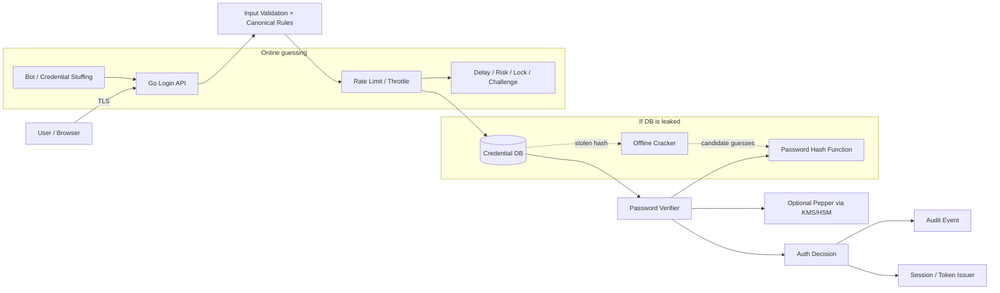
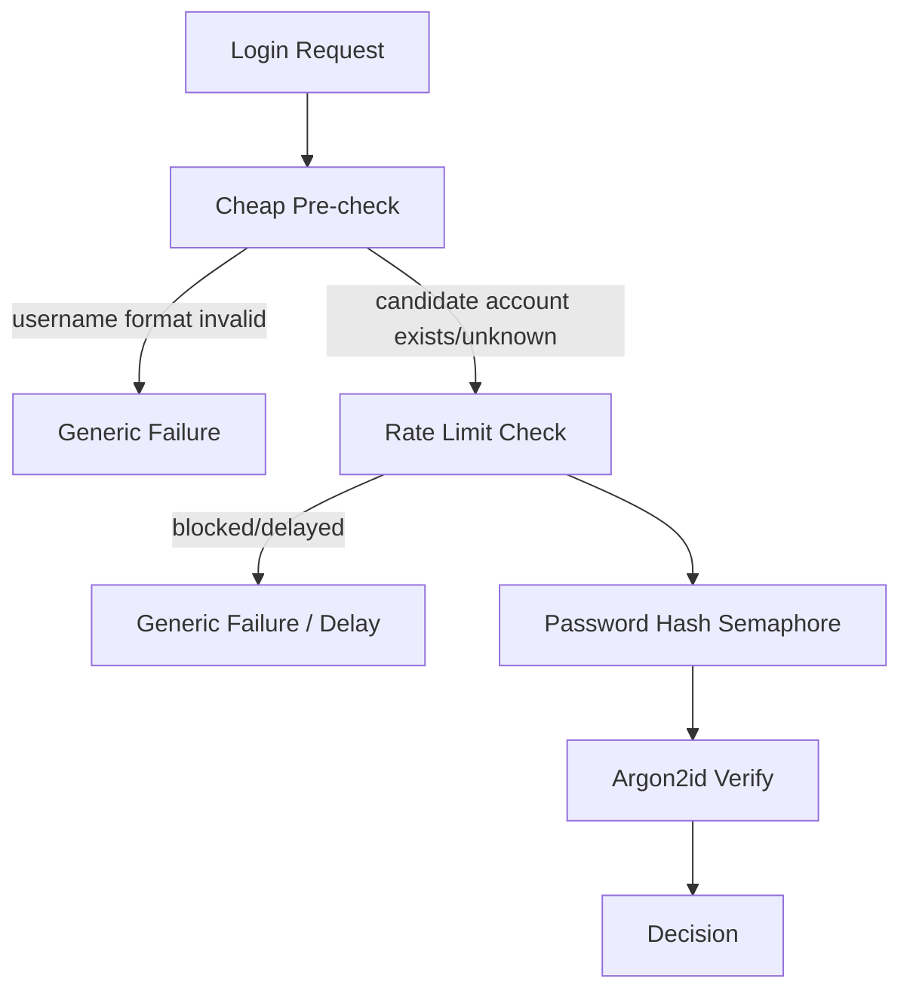
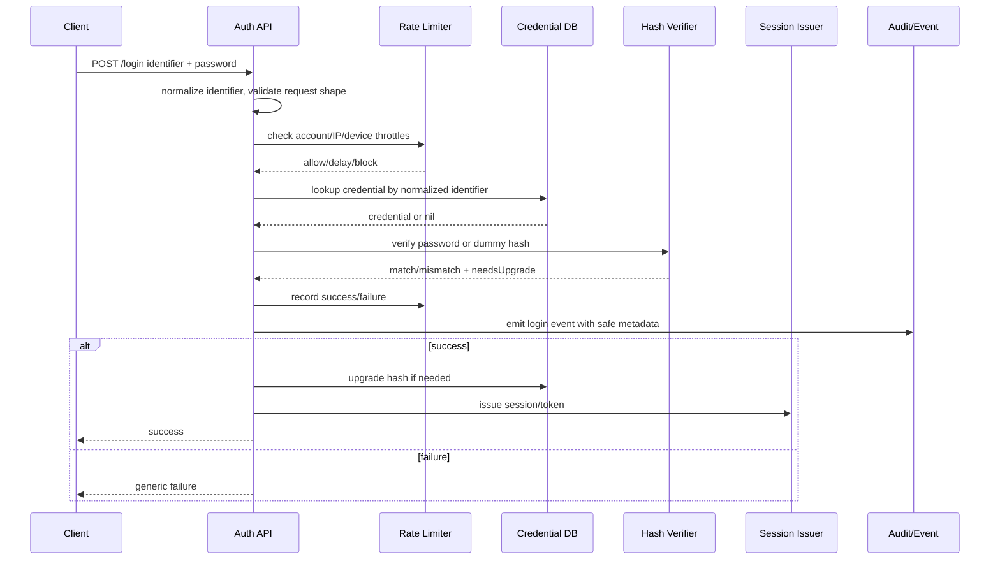
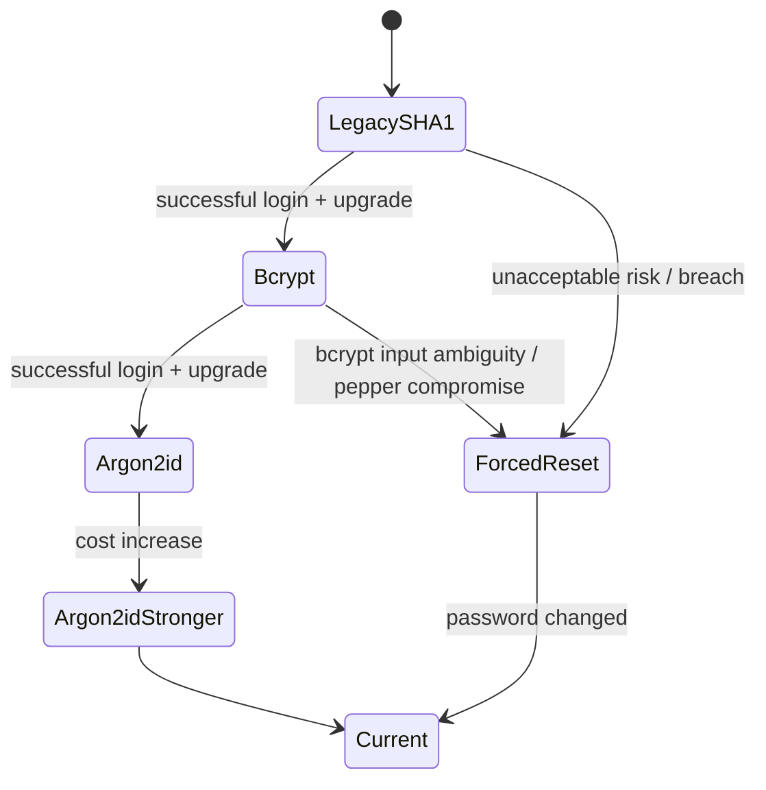
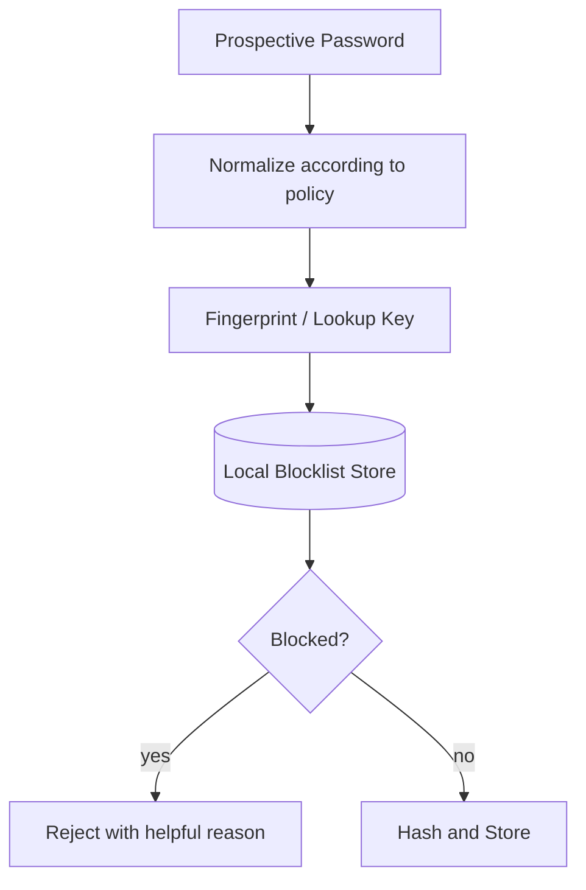
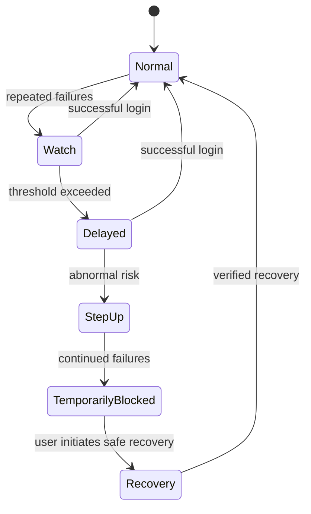
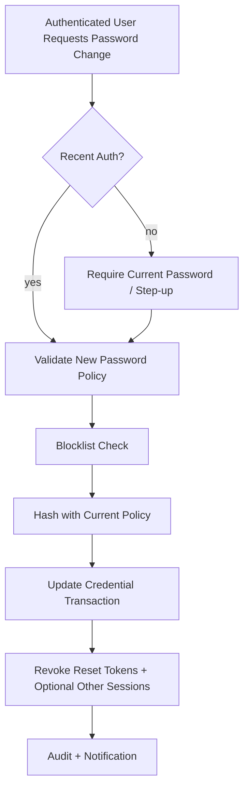

# learn-go-security-cryptography-integrity-part-011.md

# Part 011 — Password Security in Go: bcrypt, scrypt, Argon2id, PBKDF2, Pepper, Migration, Breach Defense, Lockout, Throttling, and NIST SP 800-63B-4 Baseline

> Seri: `learn-go-security-cryptography-integrity`  
> Bagian: `011 / 034`  
> Target pembaca: Java software engineer yang sedang memperdalam Go security sampai level internal engineering handbook  
> Target Go: Go 1.26.x  
> Fokus: password security sebagai **authentication subsystem**, bukan sekadar fungsi hashing

---

## 0. Posisi Materi Ini di Seri

Di part sebelumnya kita sudah membahas:

- hash vs checksum vs digest;
- MAC/HMAC dan constant-time verification;
- symmetric encryption dan AEAD;
- public-key cryptography;
- key agreement, ECDH, HPKE, envelope encryption, forward secrecy, dan key separation.

Sekarang kita masuk ke domain yang sering terlihat sederhana tetapi paling sering salah secara sistemik: **password security**.

Kesalahan umum engineer adalah menganggap password storage sebagai masalah:

```text
password -> hash -> compare
```

Padahal desain yang benar adalah:

```text
human-chosen weak secret
    + online guessing defense
    + offline cracking defense
    + breach corpus defense
    + throttling
    + credential stuffing detection
    + password manager support
    + secure reset/recovery
    + migration path
    + incident playbook
    + audit and privacy discipline
```

Password security bukan hanya cryptography. Ia adalah pertemuan antara:

1. cryptographic password hashing;
2. UX;
3. fraud detection;
4. identity lifecycle;
5. rate limiting;
6. operational security;
7. incident response;
8. regulatory defensibility.

---

## 1. Learning Objectives

Setelah bagian ini, kamu harus mampu:

1. Menjelaskan kenapa password **tidak boleh** disimpan dengan SHA-256/SHA-512 biasa.
2. Membedakan **hash**, **password hash**, **KDF**, **salt**, **pepper**, **work factor**, **memory-hardness**, dan **rate limit**.
3. Mendesain password verifier Go yang memiliki:
   - algorithm agility;
   - per-user salt;
   - encoded parameters;
   - verify-and-upgrade flow;
   - optional pepper;
   - online throttling;
   - breach password screening;
   - secure reset/recovery boundary.
4. Memilih antara Argon2id, scrypt, bcrypt, dan PBKDF2 secara defensible.
5. Memahami batasan `golang.org/x/crypto/bcrypt`, terutama limit 72 bytes.
6. Menghindari denial-of-service akibat password hashing yang terlalu mahal.
7. Menulis wrapper Go yang tidak mencampur error detail ke user-facing response.
8. Mendesain migration path dari legacy hash tanpa memaksa reset massal kecuali diperlukan.
9. Menyusun review checklist untuk authentication/password code.

---

## 2. Mental Model: Password Bukan Secret Acak

Password dipilih manusia. Artinya:

- tidak uniformly random;
- sering dipakai ulang;
- sering mengikuti pola bahasa, nama, tanggal, keyboard pattern;
- sering bocor di layanan lain;
- bisa ditebak secara online;
- bisa di-crack offline bila database hash bocor;
- bisa dicuri lewat phishing;
- bisa direkam malware;
- bisa disalahgunakan lewat credential stuffing.

Jadi password harus diperlakukan sebagai **low-entropy human secret**.

### 2.1 Password Hashing Bukan Hashing Biasa

Cryptographic hash biasa seperti SHA-256 didesain cepat. Untuk integrity file, commit ID, digest, atau fingerprint, kecepatan itu bagus.

Untuk password, kecepatan adalah masalah.

Jika database password hash bocor, attacker bisa melakukan offline guessing:

```text
for guess in candidate_passwords:
    if SHA256(guess) == stolen_hash:
        password_found
```

Karena SHA-256 sangat cepat di CPU/GPU/ASIC, attacker bisa mencoba jumlah kandidat sangat besar.

Password hashing harus membuat setiap tebakan mahal.

```text
for guess in candidate_passwords:
    if Argon2id(guess, salt, memory=64MiB, time=3) == stolen_hash:
        password_found
```

Perbedaannya bukan hanya algoritma. Perbedaannya adalah **cost model**.

---

## 3. Threat Model Password System

Sebelum memilih algoritma, definisikan attacker.

### 3.1 Online Attacker

Online attacker mencoba login lewat endpoint aplikasi:

```text
POST /login
username=alice
password=guess
```

Batasan attacker:

- terkena rate limit;
- terkena account throttle;
- terkena IP/device throttling;
- bisa diblokir WAF/bot defense;
- menghasilkan audit event;
- hanya bisa mencoba sejumlah kecil tebakan per waktu.

Defense utama:

- rate limiting;
- progressive delay;
- bot detection;
- anomaly detection;
- MFA/step-up;
- breach password screening saat pembuatan/perubahan password;
- password manager support.

### 3.2 Offline Attacker

Offline attacker memiliki database hash:

```text
users(id, email, password_hash)
```

Batasan attacker:

- tidak terkena rate limit aplikasi;
- bisa mencoba tebakan sebanyak mungkin di hardware sendiri;
- bisa memakai GPU cluster;
- bisa menggabungkan breach corpus, dictionary, mangling rules, dan social context.

Defense utama:

- password hashing lambat/adaptif;
- memory-hard KDF;
- per-password salt;
- pepper/keyed extra step yang disimpan di luar database;
- parameter migration;
- forced reset bila hash/pepper/key ikut kompromi.

### 3.3 Credential Stuffing Attacker

Attacker tidak menebak password dari nol. Ia memakai pasangan username/password dari breach lain.

Defense utama:

- blocklist compromised passwords saat signup/change;
- login anomaly detection;
- MFA;
- device/session risk scoring;
- notification setelah login mencurigakan;
- password reuse education;
- allow password managers.

### 3.4 Phishing Attacker

Password tidak phishing-resistant. Pengguna bisa mengetik password di situs palsu.

Defense utama:

- MFA phishing-resistant seperti passkeys/WebAuthn;
- OIDC provider yang benar;
- domain hygiene;
- browser password manager autofill binding ke origin;
- transaction binding untuk operation sensitif;
- monitoring login dari lokasi/device baru.

### 3.5 Insider/DBA Attacker

Attacker internal bisa punya akses DB dump, log, backup, analytics replica, atau support tooling.

Defense utama:

- password hash tidak pernah muncul di log;
- hash table access limited;
- pepper di KMS/HSM, bukan DB;
- separation of duties;
- audit access to credential material;
- production break-glass policy.

---

## 4. Diagram Sistem Password yang Defensible



Security invariant inti:

> Bocornya database credential tidak boleh langsung memberikan password plaintext, tidak boleh memungkinkan login langsung, dan harus membuat offline guessing cukup mahal sampai incident response punya waktu efektif.

---

## 5. NIST SP 800-63B-4 Baseline untuk Password

NIST SP 800-63B-4 adalah baseline penting untuk digital authentication modern.

Beberapa poin yang relevan untuk desain Go service:

| Area | Baseline engineering |
|---|---|
| Minimum length | Password single-factor minimum 15 karakter; bila dipakai sebagai bagian MFA, minimum 8 karakter. |
| Maximum length | Harus mendukung panjang yang cukup; minimal rekomendasi dukung setidaknya 64 karakter. |
| Composition rules | Jangan memaksa aturan seperti wajib huruf besar, angka, simbol. |
| Periodic rotation | Jangan paksa periodic password change tanpa indikasi kompromi. |
| Blocklist | Password baru/perubahan password harus dicek terhadap blocklist password umum, expected, atau compromised. |
| Unicode | Jika menerima Unicode, pertimbangkan NFC normalization sebelum hashing. |
| Rate limit | Harus ada rate limiting untuk failed authentication attempts. |
| Password manager | Harus mendukung password manager/autofill dan sebaiknya mendukung paste. |
| Storage | Password harus disimpan dengan salted password hashing scheme yang tahan offline attack. |
| Work factor | Cost factor harus setinggi yang praktis tanpa merusak performa verifier dan harus dinaikkan seiring waktu. |
| Metadata | Hash harus menyimpan algoritma dan cost factor agar bisa migrasi. |
| Extra keyed step | NIST merekomendasikan tambahan keyed hashing/encryption dengan secret key yang disimpan terpisah dari database password. |

### 5.1 Kenapa NIST Tidak Lagi Suka Composition Rules

Aturan seperti:

```text
minimal 8 karakter
harus ada uppercase
harus ada lowercase
harus ada angka
harus ada simbol
harus diganti tiap 90 hari
```

sering menghasilkan password seperti:

```text
Password1!
Summer2026!
CompanyName@123
```

Ini terlihat kompleks di form validator, tetapi mudah ditebak oleh attacker.

Mental model yang lebih baik:

```text
long password/passphrase + blocklist + rate limit + password manager + MFA
```

### 5.2 Password UX Adalah Security Control

Password field yang melarang paste justru melemahkan security karena menghambat password manager.

Password manager membantu:

- membuat password panjang dan unik;
- mengurangi password reuse;
- menurunkan risiko phishing melalui origin-bound autofill;
- mengurangi cognitive load user.

Jadi jangan mendesain UI password seperti ini:

```text
- disable paste
- max length 16
- reject spaces
- reject Unicode tanpa alasan
- force rotation every 30 days
- show error "password must contain uppercase, lowercase, digit, symbol"
```

Desain yang lebih baik:

```text
- allow long password up to at least 64 chars or more
- allow spaces
- allow paste
- allow password managers
- block known compromised/common/contextual passwords
- provide clear rejection reason
- require change only on evidence of compromise
```

---

## 6. Terminology yang Harus Tepat

### 6.1 Password Hash

Password hash adalah output dari password hashing scheme seperti Argon2id, bcrypt, scrypt, atau PBKDF2.

Ia biasanya menyimpan:

- algorithm;
- version;
- parameters;
- salt;
- derived hash.

Contoh encoded Argon2id string:

```text
$argon2id$v=19$m=65536,t=3,p=1$<salt_b64>$<hash_b64>
```

Contoh bcrypt string:

```text
$2a$12$<22-char-salt><31-char-hash>
```

### 6.2 Salt

Salt adalah random value unik per password.

Tujuan salt:

- mencegah dua user dengan password sama punya hash sama;
- mencegah reuse precomputed rainbow table;
- membuat attacker harus crack tiap hash secara individual.

Salt **bukan secret**. Salt disimpan bersama hash.

Salt harus random dan cukup besar. Dalam praktik modern, gunakan 16 bytes atau lebih.

### 6.3 Pepper

Pepper adalah secret global atau scoped secret yang tidak disimpan di database credential.

Tujuan pepper:

- jika DB credential bocor tetapi pepper tetap aman, offline cracking menjadi jauh lebih sulit;
- menambah separation of compromise.

Pepper harus disimpan di luar DB:

- KMS;
- HSM;
- Vault;
- secret manager dengan audit;
- trusted execution boundary.

Pepper bukan pengganti password hashing. Pepper adalah defense-in-depth.

### 6.4 Work Factor

Work factor adalah parameter yang menentukan biaya per tebakan.

Contoh:

- bcrypt cost;
- Argon2id memory/time/parallelism;
- scrypt N/r/p;
- PBKDF2 iteration count.

Work factor harus dikalibrasi terhadap hardware production.

### 6.5 Memory-Hardness

Memory-hard algorithm membuat cracking mahal bukan hanya karena CPU time, tetapi juga karena kebutuhan memory per guess.

Argon2id dan scrypt memory-hard.

bcrypt lebih CPU-hard dan memiliki memory kecil.

PBKDF2 tidak memory-hard.

---

## 7. Algoritma Password Hashing: Decision Matrix

| Algorithm | Status praktis | Kekuatan | Kelemahan | Kapan dipakai |
|---|---|---|---|---|
| Argon2id | Rekomendasi modern umum | Memory-hard, PHC winner, parameter fleksibel | Butuh tuning dan concurrency control | Default pilihan untuk sistem baru jika tidak ada FIPS constraint |
| scrypt | Masih kuat | Memory-hard, tersedia di x/crypto | Parameter lebih mudah salah, kurang umum daripada Argon2id di beberapa org | Alternatif bila Argon2id tidak tersedia/diterima |
| bcrypt | Legacy-safe dan luas | Battle-tested, encoded format simpel | Max input 72 bytes, tidak memory-hard modern | Sistem legacy, compatibility, incremental migration |
| PBKDF2-HMAC-SHA-256 | FIPS-friendly | Banyak environment compliance menerima | Tidak memory-hard, butuh iterasi tinggi | Bila FIPS 140/compliance mewajibkan primitive approved |
| SHA-256/SHA-512 plain | Salah untuk password | Cepat | Terlalu cepat untuk offline cracking | Jangan dipakai |
| AES encrypt password | Salah untuk verifier | Reversible | Jika key bocor semua password plaintext pulih | Jangan dipakai untuk password login |

---

## 8. Argon2id di Go

Package Go:

```go
import "golang.org/x/crypto/argon2"
```

Argon2id diakses lewat:

```go
argon2.IDKey(password, salt, time, memory, threads, keyLen)
```

Parameter:

| Parameter | Makna |
|---|---|
| `password` | password bytes setelah policy/normalization |
| `salt` | random per password |
| `time` | jumlah pass/iteration |
| `memory` | memory dalam KiB |
| `threads` | parallelism degree |
| `keyLen` | panjang output hash |

Contoh parameter awal yang sering masuk akal untuk interactive login:

```text
memory = 64 MiB  -> 64 * 1024 KiB
time   = 3
threads = 1
keyLen = 32 bytes
salt   = 16 bytes atau 32 bytes
```

Tetapi ini bukan angka universal. Harus benchmark di hardware production.

### 8.1 Kenapa `threads=1` Sering Dipilih di Server

Argon2 mendukung parallelism. Namun di web server, parallelism internal bisa memperburuk resource contention jika ada banyak login concurrent.

Contoh:

```text
100 concurrent login * Argon2 threads=4 = 400 worker threads worth of pressure
```

Di Go service, lebih sering lebih mudah dikontrol dengan:

```text
Argon2 threads=1
+ global semaphore for password verification concurrency
+ request timeout
+ adaptive throttling
```

### 8.2 Safe Argon2id Encoded Format

Jangan hanya simpan raw hash bytes.

Simpan self-describing envelope:

```text
$argon2id$v=19$m=65536,t=3,p=1$<salt_b64_rawurl>$<hash_b64_rawurl>
```

Keuntungan:

- bisa verify hash lama;
- bisa tahu parameter lama;
- bisa upgrade setelah login sukses;
- bisa support migration lintas versi;
- bisa audit konfigurasi.

### 8.3 Argon2id Go Implementation Pattern

```go
package passwordhash

import (
    "crypto/rand"
    "crypto/subtle"
    "encoding/base64"
    "errors"
    "fmt"
    "strconv"
    "strings"

    "golang.org/x/crypto/argon2"
)

const (
    argon2Version = argon2.Version
)

var (
    ErrInvalidHash       = errors.New("invalid password hash")
    ErrIncompatibleHash  = errors.New("incompatible password hash")
    ErrPasswordMismatch  = errors.New("password mismatch")
)

type Argon2idParams struct {
    MemoryKiB uint32
    Time      uint32
    Threads   uint8
    SaltLen   uint32
    KeyLen    uint32
}

var DefaultArgon2idParams = Argon2idParams{
    MemoryKiB: 64 * 1024,
    Time:      3,
    Threads:   1,
    SaltLen:   16,
    KeyLen:    32,
}

func HashArgon2id(password []byte, p Argon2idParams) (string, error) {
    if p.MemoryKiB == 0 || p.Time == 0 || p.Threads == 0 || p.SaltLen < 16 || p.KeyLen < 16 {
        return "", errors.New("unsafe argon2id parameters")
    }

    salt := make([]byte, p.SaltLen)
    if _, err := rand.Read(salt); err != nil {
        return "", fmt.Errorf("generate salt: %w", err)
    }

    key := argon2.IDKey(password, salt, p.Time, p.MemoryKiB, p.Threads, p.KeyLen)

    b64 := base64.RawStdEncoding
    encoded := fmt.Sprintf(
        "$argon2id$v=%d$m=%d,t=%d,p=%d$%s$%s",
        argon2Version,
        p.MemoryKiB,
        p.Time,
        p.Threads,
        b64.EncodeToString(salt),
        b64.EncodeToString(key),
    )

    return encoded, nil
}

func VerifyArgon2id(encoded string, password []byte) error {
    p, salt, expected, err := parseArgon2id(encoded)
    if err != nil {
        return err
    }

    actual := argon2.IDKey(password, salt, p.Time, p.MemoryKiB, p.Threads, uint32(len(expected)))

    if subtle.ConstantTimeCompare(actual, expected) != 1 {
        return ErrPasswordMismatch
    }
    return nil
}

type parsedArgon2id struct {
    MemoryKiB uint32
    Time      uint32
    Threads   uint8
}

func parseArgon2id(encoded string) (parsedArgon2id, []byte, []byte, error) {
    // Expected:
    // $argon2id$v=19$m=65536,t=3,p=1$<salt>$<hash>
    return parseArgon2idFull(encoded)
}
```

Wrapper di atas mendelegasikan parsing ke fungsi terpisah supaya parsing bisa diuji dan di-fuzz secara eksplisit. Di bawah ini versi parser yang lebih lengkap.

```go
func parseArgon2idFull(encoded string) (parsedArgon2id, []byte, []byte, error) {
    parts := strings.Split(encoded, "$")
    if len(parts) != 6 || parts[0] != "" {
        return parsedArgon2id{}, nil, nil, ErrInvalidHash
    }
    if parts[1] != "argon2id" {
        return parsedArgon2id{}, nil, nil, ErrIncompatibleHash
    }
    if parts[2] != fmt.Sprintf("v=%d", argon2Version) {
        return parsedArgon2id{}, nil, nil, ErrIncompatibleHash
    }

    params := strings.Split(parts[3], ",")
    if len(params) != 3 {
        return parsedArgon2id{}, nil, nil, ErrInvalidHash
    }

    var out parsedArgon2id
    for _, param := range params {
        kv := strings.SplitN(param, "=", 2)
        if len(kv) != 2 {
            return parsedArgon2id{}, nil, nil, ErrInvalidHash
        }
        switch kv[0] {
        case "m":
            v, err := strconv.ParseUint(kv[1], 10, 32)
            if err != nil || v == 0 {
                return parsedArgon2id{}, nil, nil, ErrInvalidHash
            }
            out.MemoryKiB = uint32(v)
        case "t":
            v, err := strconv.ParseUint(kv[1], 10, 32)
            if err != nil || v == 0 {
                return parsedArgon2id{}, nil, nil, ErrInvalidHash
            }
            out.Time = uint32(v)
        case "p":
            v, err := strconv.ParseUint(kv[1], 10, 8)
            if err != nil || v == 0 {
                return parsedArgon2id{}, nil, nil, ErrInvalidHash
            }
            out.Threads = uint8(v)
        default:
            return parsedArgon2id{}, nil, nil, ErrInvalidHash
        }
    }

    b64 := base64.RawStdEncoding
    salt, err := b64.DecodeString(parts[4])
    if err != nil || len(salt) < 16 {
        return parsedArgon2id{}, nil, nil, ErrInvalidHash
    }
    hash, err := b64.DecodeString(parts[5])
    if err != nil || len(hash) < 16 {
        return parsedArgon2id{}, nil, nil, ErrInvalidHash
    }

    return out, salt, hash, nil
}
```

### 8.4 Production Caveat: Argon2id Bisa Menjadi DoS Vector

Argon2id mahal. Itu bagus untuk offline attack, tetapi bisa buruk untuk availability.

Jika endpoint login menerima 1000 request per detik dan setiap verify memakai 64 MiB, pressure memory bisa ekstrem.

Desain aman:



Gunakan semaphore untuk membatasi jumlah password hash concurrent.

```go
package auth

import (
    "context"
    "errors"
)

type HashGate struct {
    sem chan struct{}
}

func NewHashGate(maxConcurrent int) *HashGate {
    if maxConcurrent <= 0 {
        maxConcurrent = 1
    }
    return &HashGate{sem: make(chan struct{}, maxConcurrent)}
}

func (g *HashGate) WithPermit(ctx context.Context, fn func() error) error {
    select {
    case g.sem <- struct{}{}:
        defer func() { <-g.sem }()
        return fn()
    case <-ctx.Done():
        return errors.New("password verification unavailable")
    }
}
```

Security invariant:

> Password hashing cost must be high enough to slow offline attackers, but bounded enough not to let online attackers exhaust memory/CPU.

---

## 9. bcrypt di Go

Package:

```go
import "golang.org/x/crypto/bcrypt"
```

API utama:

```go
hash, err := bcrypt.GenerateFromPassword(password, cost)
err := bcrypt.CompareHashAndPassword(hash, password)
cost, err := bcrypt.Cost(hash)
```

### 9.1 Kelebihan bcrypt

- Mature dan battle-tested.
- Encoded hash sudah menyimpan cost dan salt.
- Banyak sistem legacy kompatibel.
- API Go sederhana.

### 9.2 Kelemahan bcrypt

Bcrypt hanya memproses password sampai **72 bytes**. Package Go juga menyatakan `GenerateFromPassword` tidak menerima password lebih dari 72 bytes.

Ini bukan 72 karakter. Ini 72 bytes.

Unicode bisa membuat karakter lebih dari 1 byte.

Contoh:

```text
"é" bisa lebih dari 1 byte tergantung encoding
emoji bisa 4 bytes dalam UTF-8
```

Jika sistem ingin mendukung password panjang, bcrypt punya problem.

### 9.3 Bcrypt Wrapper Minimal

```go
package passwordhash

import (
    "errors"

    "golang.org/x/crypto/bcrypt"
)

var ErrPasswordTooLongForBcrypt = errors.New("password too long for bcrypt")

const BcryptMaxPasswordBytes = 72

func HashBcrypt(password []byte, cost int) ([]byte, error) {
    if len(password) > BcryptMaxPasswordBytes {
        return nil, ErrPasswordTooLongForBcrypt
    }
    return bcrypt.GenerateFromPassword(password, cost)
}

func VerifyBcrypt(encoded []byte, password []byte) error {
    if len(password) > BcryptMaxPasswordBytes {
        // Do not reveal this distinction to the user-facing login response.
        return bcrypt.ErrMismatchedHashAndPassword
    }
    return bcrypt.CompareHashAndPassword(encoded, password)
}

func BcryptNeedsUpgrade(encoded []byte, targetCost int) bool {
    cost, err := bcrypt.Cost(encoded)
    if err != nil {
        return true
    }
    return cost < targetCost
}
```

### 9.4 Should You Prehash Before bcrypt?

Common workaround:

```text
bcrypt(SHA-256(password))
```

Ini menghindari 72-byte limit tetapi mengubah password processing semantics.

Risiko:

- bisa merusak interoperability;
- perlu domain separation;
- raw SHA-256 output mengandung null bytes jika diperlakukan sebagai string di sistem lain;
- bisa menyebabkan migration ambiguity;
- bila prehash tidak disalt, semua user dengan password sama masuk ke bcrypt dengan input sama, meskipun bcrypt tetap punya salt;
- perlu explicit version marker.

Jika harus prehash untuk legacy bcrypt, gunakan design eksplisit:

```text
$bcrypt-sha256$v=1$cost=12$...
```

Dan gunakan domain-separated prehash:

```text
prehash = SHA-256("app-password-bcrypt-prehash-v1" || 0x00 || UTF8(password))
```

Namun untuk sistem baru, lebih bersih gunakan Argon2id dan hindari bcrypt limit.

---

## 10. scrypt di Go

Package:

```go
import "golang.org/x/crypto/scrypt"
```

API:

```go
key, err := scrypt.Key(password, salt, N, r, p, keyLen)
```

Parameter umum:

| Parameter | Makna |
|---|---|
| `N` | CPU/memory cost, harus power of two |
| `r` | block size |
| `p` | parallelization |
| `keyLen` | output length |

OWASP baseline modern sering merekomendasikan minimal:

```text
N = 2^17
r = 8
p = 1
```

scrypt kuat, tetapi parameter lebih raw dan lebih mudah salah dibanding Argon2id untuk banyak tim.

### 10.1 scrypt Encoded Format

Gunakan self-describing format:

```text
$scrypt$ln=17,r=8,p=1$<salt>$<hash>
```

`ln=17` berarti `N = 1 << 17`.

### 10.2 Kapan scrypt Masuk Akal

- Platform/org belum approve Argon2id tetapi menerima scrypt.
- Sudah ada legacy scrypt user base.
- Tim memahami tuning memory/CPU-nya.

Untuk greenfield Go service, Argon2id biasanya lebih umum dipilih.

---

## 11. PBKDF2-HMAC-SHA-256 di Go

Package:

```go
import "golang.org/x/crypto/pbkdf2"
```

Biasanya dipakai dengan:

```go
import "crypto/sha256"

key := pbkdf2.Key(password, salt, iterations, keyLen, sha256.New)
```

PBKDF2 tidak memory-hard. Ia hanya CPU-hard. Namun PBKDF2-HMAC-SHA-256 sering menjadi pilihan ketika ada FIPS/compliance constraint.

### 11.1 PBKDF2 Decision

Gunakan PBKDF2 bila:

- organisasi mewajibkan FIPS-approved algorithm;
- stack compliance tidak menerima Argon2id/scrypt/bcrypt;
- penggunaan ada di cryptographic module boundary yang tervalidasi.

Jangan memilih PBKDF2 hanya karena familiar dari Java.

### 11.2 PBKDF2 Work Factor

OWASP Password Storage Cheat Sheet merekomendasikan PBKDF2-HMAC-SHA-256 dengan work factor 600,000 atau lebih jika FIPS-140 compliance diperlukan.

Tetap benchmark.

```text
Goal: verify latency acceptable under p95 login load
Constraint: attacker offline cost high
Control: rate limit online attempts
```

---

## 12. Pepper Design

Pepper menambah secret yang tidak ada di DB credential.

Ada beberapa pattern.

### 12.1 Post-hash HMAC Pepper

```text
stored_hash = Argon2id(password, salt, params)
peppered = HMAC-SHA-256(pepper_key, stored_hash)
store: algorithm, params, salt, stored_hash, peppered? or peppered-only depending design
```

Lebih umum:

```text
password_hash = Argon2id(password, salt, params)
stored_verifier = HMAC-SHA-256(pepper_key, password_hash)
```

Tetapi hati-hati: untuk verify, kamu butuh recompute Argon2id, lalu HMAC.

### 12.2 Pre-hash Pepper

```text
Argon2id(HMAC(pepper, password), salt, params)
```

Ini mengikat password ke pepper sebelum expensive KDF.

Kelemahan: kalau pepper hilang/rotated, semua password tidak bisa diverify tanpa plaintext password.

### 12.3 Pepper Rotation Problem

Pepper rotation sulit karena kamu tidak punya plaintext password.

Strategi:

| Strategy | Kelebihan | Risiko |
|---|---|---|
| Rotate on successful login | Tidak memaksa reset semua user | User jarang login tetap pakai pepper lama |
| Support multiple pepper versions | Smooth migration | Verification path lebih kompleks |
| Force reset | Clean | UX/ops impact besar |
| Rewrap stored derived hash | Bisa bila pepper hanya melindungi derived hash, bukan input password | Desain harus hati-hati agar tidak melemahkan offline defense |

### 12.4 Pepper dengan `kid`

Simpan metadata pepper version:

```text
$argon2id-peppered$v=1$kid=pepper-2026-06$m=65536,t=3,p=1$<salt>$<verifier>
```

`kid` bukan secret. Ia menunjuk key di KMS/HSM.

### 12.5 KMS/HSM Latency Caveat

Jangan memanggil KMS remote per login jika latency tinggi atau rate limit ketat, kecuali desainnya memang mampu.

Opsi:

- load pepper at boot from secret manager;
- use in-memory protected config dengan rotation reload;
- use local HSM agent;
- cache KMS data key with TTL;
- audit access.

Jangan simpan pepper di database yang sama dengan password hash.

---

## 13. Password Verification Flow yang Benar

Naive flow:

```text
1. SELECT user by email
2. if not found return "email not found"
3. compare password
4. if wrong return "wrong password"
5. login
```

Masalah:

- username enumeration;
- timing difference user exists vs not exists;
- no rate limiting;
- no generic error;
- no audit;
- no hash upgrade;
- no risk signal.

Better flow:



### 13.1 Dummy Hash for Unknown Users

Unknown user path should not be trivially faster.

Pattern:

```go
var dummyHash = "$argon2id$v=19$m=65536,t=3,p=1$...$..."
```

If user not found, verify against dummy hash anyway.

Caveat:

- This reduces timing oracle, not eliminates all side channels.
- Rate limit should still apply to identifier/IP/device.
- Do not make dummy hash weaker than real hash.

### 13.2 Generic User-Facing Error

User-facing:

```text
Invalid username or password.
```

Internal audit:

```json
{
  "event": "login_failed",
  "reason_class": "password_mismatch",
  "account_exists": true,
  "risk_score": 42,
  "ip_hash": "...",
  "user_agent_hash": "..."
}
```

Do not expose:

```text
email exists but password is wrong
account locked because too many password attempts on alice@example.com
hash version unsupported
bcrypt password too long
```

---

## 14. Verify-and-Upgrade Pattern

Password hashes need migration.

Reasons:

- cost factor increased;
- algorithm changed bcrypt -> Argon2id;
- pepper version changed;
- encoding format changed;
- old hash considered weak.

Flow:

```text
login attempt
    -> verify using stored hash algorithm
    -> if success and stored hash is weaker than current policy
        -> rehash plaintext password using current policy
        -> update credential row transactionally
```

### 14.1 Migration State Machine



### 14.2 Go Interface for Algorithm Agility

```go
package passwordhash

import "context"

type Verifier interface {
    Algorithm() string
    Hash(ctx context.Context, password []byte) (encoded string, err error)
    Verify(ctx context.Context, encoded string, password []byte) (result VerifyResult, err error)
}

type VerifyResult struct {
    Match        bool
    NeedsUpgrade bool
    Algorithm    string
    Params       map[string]string
}
```

Then create registry:

```go
type Registry struct {
    current Verifier
    byPrefix map[string]Verifier
}

func (r *Registry) Verify(ctx context.Context, encoded string, password []byte) (VerifyResult, error) {
    v := r.selectVerifier(encoded)
    if v == nil {
        return VerifyResult{Match: false}, ErrIncompatibleHash
    }
    return v.Verify(ctx, encoded, password)
}
```

Engineering invariant:

> New password hashes must use current policy, but old password hashes must remain verifiable long enough to migrate safely unless they are too dangerous to accept.

---

## 15. Breached Password Screening

Password hashing protects after your DB leaks. Breached password screening prevents users from choosing already-known weak/compromised passwords.

### 15.1 What to Block

Blocklist should include:

- common passwords;
- breached passwords;
- service name;
- username/email local-part;
- organization name;
- trivial derivatives;
- contextual values like app name, agency name, year.

Do not block arbitrary substrings too aggressively. NIST says compare entire password against blocklist, not every substring/word inside it.

Why? Overly aggressive rules create bad UX and push users toward predictable modifications.

### 15.2 k-Anonymity Breach Check Pattern

A common pattern:

```text
SHA1(password) = ABCDE12345...
client/server sends prefix ABCDE to breach API
API returns suffixes for all hashes with prefix ABCDE
local compare full hash
```

This avoids sending plaintext password to third party.

Caveats:

- SHA-1 here is used as lookup fingerprint, not password storage.
- Do not log password or full hash.
- Prefer local offline corpus for high-security/regulatory system.
- Treat third-party API call as privacy-sensitive.

### 15.3 Local Blocklist Architecture



For large corpus:

- sorted hash file with binary search;
- Bloom filter + exact backing store;
- key-value store;
- prefix index;
- offline update pipeline.

Do not put plaintext passwords in application logs or metrics.

---

## 16. Rate Limiting, Lockout, and Throttling

Password hashing does not stop online guessing. Online guessing needs throttling.

### 16.1 Controls Needed

Use layered throttles:

| Layer | Purpose |
|---|---|
| account identifier | stop targeted guessing against one account |
| source IP / CIDR | stop one origin flooding |
| device fingerprint / cookie | slow automated retry from same client |
| global login capacity | protect service from DoS |
| password hash semaphore | bound CPU/memory |
| risk engine | trigger step-up/challenge |

### 16.2 Avoid Account Lockout DoS

If you hard-lock account after 5 failures, attacker can lock victims out.

Prefer progressive throttling:

```text
1-3 failures: normal
4-6 failures: small delay
7-10 failures: larger delay + audit
>10 failures: step-up, CAPTCHA/bot challenge, temporary throttle
```

For high-risk systems, account lock may still be required, but design recovery carefully.

### 16.3 Simple Progressive Delay Model

```go
func DelayForFailures(failures int) time.Duration {
    switch {
    case failures <= 3:
        return 0
    case failures <= 5:
        return 2 * time.Second
    case failures <= 8:
        return 10 * time.Second
    case failures <= 12:
        return 30 * time.Second
    default:
        return time.Minute
    }
}
```

In production:

- store counters in Redis or strongly consistent store depending risk;
- use TTL windows;
- avoid unbounded cardinality metrics;
- hash identifiers in telemetry;
- distinguish user-facing message from internal reason.

### 16.4 Token Bucket Is Not Enough

A simple per-IP token bucket fails against distributed attacks.

You need combined keys:

```text
rl:login:account:<normalized-identifier-hash>
rl:login:ip:<ip-prefix>
rl:login:device:<device-id>
rl:login:global
```

Decision combines them:

```text
block if any hard deny
else delay = max(account_delay, ip_delay, device_delay)
else allow
```

### 16.5 Rate Limit State Diagram



---

## 17. Password Reset and Account Recovery

Password reset often becomes weaker than login.

If attacker can reset password via email-only flow, then login password strength is irrelevant once email is compromised.

### 17.1 Reset Token Requirements

Reset token must be:

- generated with `crypto/rand`;
- high entropy, at least 128 bits;
- single-use;
- short-lived;
- stored hashed at rest;
- bound to account and purpose;
- invalidated after use;
- invalidated after password change;
- not logged;
- delivered over appropriate channel.

Example token generation:

```go
func NewResetToken() (raw string, digest []byte, err error) {
    b := make([]byte, 32) // 256-bit token
    if _, err := rand.Read(b); err != nil {
        return "", nil, err
    }
    raw = base64.RawURLEncoding.EncodeToString(b)

    sum := sha256.Sum256([]byte("password-reset-v1\x00" + raw))
    return raw, sum[:], nil
}
```

Caveat: `sum[:]` returns slice referencing local array. In real code, copy it:

```go
digest = make([]byte, sha256.Size)
copy(digest, sum[:])
```

### 17.2 Store Reset Token Hash, Not Raw Token

```text
password_reset_tokens(
    id,
    user_id,
    token_digest,
    purpose,
    created_at,
    expires_at,
    used_at,
    request_ip_hash,
    user_agent_hash
)
```

If DB leaks, raw reset links should not become usable.

### 17.3 Recovery Codes

Recovery codes are lookup secrets.

Design:

- random generated;
- one-time use;
- display once;
- stored hashed;
- downloadable/printable;
- regenerated invalidates old set;
- use triggers notification;
- rate limited.

Do not store recovery codes plaintext.

---

## 18. Unicode and Password Normalization

Password normalization is tricky.

### 18.1 Why It Matters

Two visually identical strings can have different byte representations.

Example conceptually:

```text
é as single composed code point
vs
e + combining accent
```

If you hash raw bytes without policy, user may fail login depending keyboard/device normalization.

NIST recommends NFC normalization if Unicode passwords are accepted.

### 18.2 Go Normalization

Use:

```go
import "golang.org/x/text/unicode/norm"

func NormalizePasswordForHashing(s string) string {
    return norm.NFC.String(s)
}
```

Caveats:

- Decide policy before launch.
- Do not silently change policy without migration plan.
- Count length in characters/code points if policy says characters, but bcrypt limit is bytes.
- Do not trim whitespace unless policy explicitly says so; spaces can be valid password characters.

### 18.3 Do Not Over-normalize

Avoid:

- lowercasing password;
- removing spaces;
- stripping punctuation;
- case-insensitive password matching;
- substring matching against blocklist beyond policy.

Password is a secret. Treat exactness carefully.

---

## 19. Password Hash Storage Schema

A defensible schema:

```sql
CREATE TABLE account_credentials (
    account_id              UUID PRIMARY KEY,
    password_verifier        TEXT NOT NULL,
    password_algorithm       TEXT NOT NULL,
    password_policy_version  INTEGER NOT NULL,
    pepper_key_id            TEXT NULL,
    password_changed_at      TIMESTAMPTZ NOT NULL,
    password_reset_required  BOOLEAN NOT NULL DEFAULT FALSE,
    failed_count             INTEGER NOT NULL DEFAULT 0,
    last_failed_at           TIMESTAMPTZ NULL,
    locked_until             TIMESTAMPTZ NULL,
    created_at               TIMESTAMPTZ NOT NULL,
    updated_at               TIMESTAMPTZ NOT NULL
);
```

But avoid duplicating sensitive parameters inconsistently. If verifier string already contains algorithm and params, metadata columns are for querying/audit/migration, not source of cryptographic truth.

### 19.1 Audit Events

Audit event examples:

```text
password_changed
password_reset_requested
password_reset_completed
password_hash_upgraded
password_login_failed
password_login_succeeded
account_throttled
account_locked
recovery_code_used
```

Do not log:

- plaintext password;
- raw reset token;
- full password hash;
- full recovery code;
- pepper;
- KMS decrypted value.

---

## 20. Secure Login Handler Architecture in Go

### 20.1 Application-Level Flow

```go
type LoginService struct {
    users      UserRepository
    passwords  PasswordService
    limiter    LoginLimiter
    sessions   SessionIssuer
    audit      AuditSink
    hashGate   *HashGate
}

type LoginRequest struct {
    Identifier string
    Password   string
    IP         string
    UserAgent  string
}

type LoginResult struct {
    SessionToken string
}

func (s *LoginService) Login(ctx context.Context, req LoginRequest) (LoginResult, error) {
    identifier := NormalizeIdentifier(req.Identifier)

    decision, err := s.limiter.Check(ctx, LoginLimitInput{
        Identifier: identifier,
        IP:         req.IP,
        UserAgent:  req.UserAgent,
    })
    if err != nil {
        return LoginResult{}, ErrLoginUnavailable
    }
    if !decision.Allow {
        s.audit.Emit(ctx, "login_throttled", SafeLoginAudit(req, identifier))
        return LoginResult{}, ErrInvalidCredentialsGeneric
    }

    user, cred, found, err := s.users.FindCredentialByIdentifier(ctx, identifier)
    if err != nil {
        return LoginResult{}, ErrLoginUnavailable
    }

    encoded := DummyPasswordVerifier
    if found {
        encoded = cred.PasswordVerifier
    }

    var verify VerifyResult
    err = s.hashGate.WithPermit(ctx, func() error {
        var err error
        verify, err = s.passwords.Verify(ctx, encoded, []byte(req.Password))
        return err
    })
    if err != nil {
        s.audit.Emit(ctx, "login_verification_error", SafeLoginAudit(req, identifier))
        return LoginResult{}, ErrInvalidCredentialsGeneric
    }

    if !found || !verify.Match {
        _ = s.limiter.RecordFailure(ctx, identifier, req.IP, req.UserAgent)
        s.audit.Emit(ctx, "login_failed", SafeLoginAudit(req, identifier))
        return LoginResult{}, ErrInvalidCredentialsGeneric
    }

    _ = s.limiter.RecordSuccess(ctx, identifier, req.IP, req.UserAgent)

    if verify.NeedsUpgrade {
        // Best effort, but should be observable.
        if err := s.passwords.Upgrade(ctx, user.ID, []byte(req.Password)); err != nil {
            s.audit.Emit(ctx, "password_hash_upgrade_failed", SafeLoginAudit(req, identifier))
        } else {
            s.audit.Emit(ctx, "password_hash_upgraded", SafeLoginAudit(req, identifier))
        }
    }

    token, err := s.sessions.Issue(ctx, user.ID)
    if err != nil {
        return LoginResult{}, ErrLoginUnavailable
    }

    s.audit.Emit(ctx, "login_succeeded", SafeLoginAudit(req, identifier))
    return LoginResult{SessionToken: token}, nil
}
```

### 20.2 Important Notes

- `req.Password` as string stays in memory until GC; Go cannot guarantee immediate zeroization for strings.
- Prefer reading password as `[]byte` internally where possible, but web frameworks often give strings.
- Do not overpromise secret zeroization in Go heap-managed code.
- Do not include password in structured logs.
- Do not include request body in error logs for login endpoint.

---

## 21. Go Memory Caveats for Passwords

Go is memory-safe, but not secret-lifetime deterministic.

### 21.1 Strings Are Immutable

If password arrives as string:

```go
password := req.FormValue("password")
```

You cannot zero it.

Converting to `[]byte` copies it:

```go
b := []byte(password)
```

Now two copies may exist.

### 21.2 Best Practical Approach

For typical web services:

- avoid logging;
- avoid storing password beyond request scope;
- avoid putting password in context values;
- avoid tracing request body;
- avoid panic dumps with request body;
- use TLS;
- keep heap dumps restricted;
- restrict debug endpoints;
- do not promise perfect zeroization.

For very high-security systems:

- consider specialized input handling;
- avoid strings where possible;
- isolate credential verification service;
- use process/container hardening;
- disable heap dumps or restrict them;
- tightly control pprof/debug endpoints.

---

## 22. Testing Password Security Code

### 22.1 Unit Tests

Test:

- hash then verify succeeds;
- wrong password fails;
- malformed hash fails safely;
- unsupported algorithm fails safely;
- old parameters trigger `NeedsUpgrade`;
- current parameters do not trigger upgrade;
- long bcrypt password behavior;
- Unicode normalization policy;
- salt uniqueness;
- parser rejects weird format.

Example:

```go
func TestArgon2idHashVerify(t *testing.T) {
    p := Argon2idParams{
        MemoryKiB: 8 * 1024, // lower for test only
        Time:      1,
        Threads:   1,
        SaltLen:   16,
        KeyLen:    32,
    }

    encoded, err := HashArgon2id([]byte("correct horse battery staple"), p)
    if err != nil {
        t.Fatal(err)
    }

    if err := VerifyArgon2id(encoded, []byte("correct horse battery staple")); err != nil {
        t.Fatalf("verify: %v", err)
    }

    if err := VerifyArgon2id(encoded, []byte("wrong")); !errors.Is(err, ErrPasswordMismatch) {
        t.Fatalf("expected mismatch, got %v", err)
    }
}
```

### 22.2 Fuzz Parser

Password hash parser is security-sensitive.

```go
func FuzzParseArgon2id(f *testing.F) {
    f.Add("$argon2id$v=19$m=65536,t=3,p=1$c2FsdHNhbHQxMjM0NTY$YWJjZGVmZ2hpamtsbW5vcA")
    f.Add("")
    f.Add("$bcrypt$whatever")
    f.Add("$argon2id$v=19$m=0,t=0,p=0$$")

    f.Fuzz(func(t *testing.T, s string) {
        _, _, _, _ = parseArgon2idFull(s)
    })
}
```

Test goal:

- no panic;
- no unbounded allocation;
- no absurd parameters accepted;
- no ambiguous parser behavior.

### 22.3 Benchmark Hash Cost

```go
func BenchmarkArgon2idVerify(b *testing.B) {
    p := DefaultArgon2idParams
    encoded, err := HashArgon2id([]byte("benchmark-password"), p)
    if err != nil {
        b.Fatal(err)
    }

    b.ResetTimer()
    for i := 0; i < b.N; i++ {
        if err := VerifyArgon2id(encoded, []byte("benchmark-password")); err != nil {
            b.Fatal(err)
        }
    }
}
```

Run:

```bash
go test ./... -bench=BenchmarkArgon2idVerify -benchmem
```

Do not use test-only reduced parameters in production.

---

## 23. Operational Calibration

### 23.1 Choose Target Latency

Common approach:

```text
interactive login password verify target: ~100ms-500ms depending service and hardware
```

But do not blindly pick. Measure:

- p50/p95/p99 login latency;
- CPU utilization;
- memory pressure;
- concurrent login spike;
- autoscaling behavior;
- Redis/rate limiter latency;
- KMS/pepper latency;
- DB lookup latency.

### 23.2 Capacity Formula

Approximation:

```text
max_hashes_per_second = max_concurrent_hashes / avg_hash_seconds
```

If:

```text
max_concurrent_hashes = 32
avg_hash_seconds = 0.25
```

Then:

```text
capacity ≈ 128 password verifies/sec per service cluster slice
```

But memory matters:

```text
32 concurrent * 64 MiB = 2048 MiB just for Argon2 memory
```

So max concurrency must consider memory headroom.

### 23.3 Production Metrics

Useful metrics:

```text
auth_login_attempt_total{result="success|failure|throttled"}
auth_password_verify_duration_seconds
auth_password_hash_upgrade_total{from="bcrypt",to="argon2id"}
auth_password_hash_algorithm_count{algorithm="argon2id"}
auth_login_throttle_total{reason="account|ip|device|global"}
auth_reset_requested_total
auth_reset_completed_total
auth_breached_password_rejected_total
```

Avoid labels with raw user IDs, email, IP, token, password, hash, or high-cardinality raw values.

---

## 24. Secure Error Taxonomy

Internal error categories:

| Internal reason | User-facing response | Audit? |
|---|---|---|
| user not found | invalid credentials | yes, safe metadata |
| password mismatch | invalid credentials | yes |
| account throttled | invalid credentials or delayed response | yes |
| malformed stored hash | login unavailable / invalid credentials | security alert |
| unsupported algorithm | login unavailable / reset required | security alert |
| KMS pepper unavailable | login unavailable | operational alert |
| DB unavailable | login unavailable | operational alert |
| password on blocklist | choose a different password + reason | yes |

Do not let attackers distinguish user existence or internal hash state.

---

## 25. Common Anti-Patterns

### 25.1 Plain SHA-256

```go
sum := sha256.Sum256([]byte(password))
```

Wrong for password storage.

### 25.2 Global Salt

```go
hash := SHA256(globalSalt + password)
```

Wrong. Salt must be unique per password. Global salt is effectively weak pepper but not enough.

### 25.3 Encrypting Passwords

```text
AES_Encrypt(password, key)
```

Wrong for login verifier because reversible. If key leaks, all passwords recover.

### 25.4 Logging Password on Failure

```go
log.Printf("login failed: user=%s password=%s", email, password)
```

Critical incident.

### 25.5 Disabling Paste

Bad UX, bad security. It discourages password manager use.

### 25.6 Returning Different Errors

```text
email not found
wrong password
account exists but locked
```

Can enable enumeration.

### 25.7 No Hash Upgrade Plan

A password hash without algorithm/version/params is technical debt with security consequences.

### 25.8 Expensive Hash Without Gate

Argon2id without concurrency control can become DoS vector.

---

## 26. Java-to-Go Migration Notes

Sebagai Java engineer, beberapa mapping mental:

| Java ecosystem | Go ecosystem |
|---|---|
| Spring Security `PasswordEncoder` | Custom interface/registry around `x/crypto` |
| BCryptPasswordEncoder | `golang.org/x/crypto/bcrypt` |
| Argon2PasswordEncoder | `golang.org/x/crypto/argon2` plus custom envelope parser |
| DelegatingPasswordEncoder | verifier registry by prefix/algorithm |
| PBKDF2WithHmacSHA256 | `golang.org/x/crypto/pbkdf2` with `crypto/sha256` |
| JCA provider/FIPS provider | Go FIPS mode/module considerations differ; verify actual compliance boundary |
| Servlet filters | Go middleware, explicit handler composition |
| Bean validation | Explicit validation functions/libraries |

Important distinction: Go standard library does not provide a Spring-like password encoder abstraction. You need to design one deliberately.

---

## 27. Reference Architecture: Password Module

Recommended package boundary:

```text
/internal/auth/password/
    policy.go          // password policy, length, normalization
    blocklist.go       // compromised/common password screening
    verifier.go        // interface + registry
    argon2id.go        // Argon2id implementation
    bcrypt.go          // legacy bcrypt implementation
    pbkdf2.go          // optional compliance implementation
    pepper.go          // pepper provider abstraction
    throttle.go        // authentication throttle interfaces
    reset.go           // reset token utilities
    audit.go           // event model
```

Do not scatter password hashing across handlers.

---

## 28. Secure Password Policy Example

```go
type PasswordPolicy struct {
    MinSingleFactorRunes int
    MinMfaRunes          int
    MaxRunes             int
    NormalizeUnicodeNFC  bool
    BlocklistEnabled     bool
}

var DefaultPasswordPolicy = PasswordPolicy{
    MinSingleFactorRunes: 15,
    MinMfaRunes:          8,
    MaxRunes:             1024, // internal app limit; UI may advertise lower support like 64+
    NormalizeUnicodeNFC:  true,
    BlocklistEnabled:     true,
}
```

Why `MaxRunes` at all?

- To prevent memory abuse.
- To bound request size.
- To avoid pathological Unicode/input processing.

But do not set max length to 16/32. Support long passphrases.

---

## 29. Password Change Flow

Password change while logged in should require:

- current password or recent strong authentication;
- rate limit;
- blocklist check;
- new password policy check;
- revoke other sessions optionally;
- notify user;
- audit event.

Flow:



---

## 30. Password Reset Flow

Password reset is riskier because user may not be authenticated.

Controls:

- generic response for reset request;
- rate limit by account and IP;
- short-lived token;
- hashed token storage;
- token single-use;
- no account enumeration;
- notify user;
- require MFA recovery if high-risk;
- revoke active sessions after reset;
- audit.

Generic response:

```text
If an account exists for that address, instructions have been sent.
```

---

## 31. Incident Response: Credential Database Leak

If password hash table leaks, response depends on what leaked.

| Compromise | Impact | Action |
|---|---|---|
| DB hash only, strong Argon2id, pepper safe | Offline cracking difficult | Notify as required, monitor, force reset based on risk |
| DB hash only, weak SHA-1/MD5 | High risk | Force reset, revoke sessions, incident disclosure |
| DB hash + pepper | High risk | Force reset, rotate pepper, revoke sessions |
| Raw password logs | Critical | Full incident response, forced reset, investigate blast radius |
| Reset tokens raw | Account takeover risk | Revoke tokens, notify, investigate |
| KMS key access logs suspicious | Potential pepper compromise | Rotate pepper, consider forced reset |

### 31.1 Do Not Lie to Yourself

If password hash is weak, “hashed” does not mean safe.

If attacker has SHA-256 unsalted hashes, many user passwords can be recovered quickly.

---

## 32. Review Checklist

### 32.1 Design Review

- [ ] Passwords are never stored plaintext or encrypted reversibly.
- [ ] Passwords are hashed with Argon2id/scrypt/bcrypt/PBKDF2 according to policy.
- [ ] Algorithm, version, salt, and parameters are stored in self-describing format.
- [ ] Salt is unique per password and generated with CSPRNG.
- [ ] Work factor was benchmarked on production-like hardware.
- [ ] Hash verification has concurrency/memory gate.
- [ ] Login endpoint has account/IP/device/global throttling.
- [ ] User-facing login error is generic.
- [ ] Blocklist check exists on signup/change/reset.
- [ ] Password manager/autofill/paste is allowed.
- [ ] Unicode policy is explicit.
- [ ] Reset tokens are high entropy, single-use, short-lived, and stored hashed.
- [ ] Recovery codes are stored hashed and one-time use.
- [ ] Audit events exist without sensitive secret material.
- [ ] Hash migration strategy exists.
- [ ] Pepper, if used, is outside the credential DB.
- [ ] Pepper rotation strategy exists.
- [ ] Incident response path exists for DB leak, pepper leak, raw password log leak.

### 32.2 Code Review

- [ ] No `sha256(password)` or `sha512(password)` for password storage.
- [ ] No `math/rand` for salts/tokens.
- [ ] No password in logs/traces/errors.
- [ ] No request body capture for login/reset endpoint.
- [ ] No different user-facing error for unknown user vs wrong password.
- [ ] Bcrypt max 72-byte limit handled if bcrypt is used.
- [ ] Parser rejects malformed hash safely.
- [ ] Parser caps accepted parameters to prevent allocation bombs.
- [ ] Compare uses constant-time comparison where needed.
- [ ] Tests include malformed encoded hash and wrong password.
- [ ] Benchmarks exist for selected cost.
- [ ] Fuzz exists for parser.

---

## 33. Practical Policy Recommendation for New Go Services

For a typical non-FIPS greenfield Go service:

```text
Algorithm: Argon2id
Salt: 16 or 32 bytes from crypto/rand
Hash length: 32 bytes
Initial params: memory=64MiB, time=3, threads=1
Encoding: self-describing PHC-like string
Rate limit: account + IP + device + global
Hash concurrency: bounded semaphore
Blocklist: local or privacy-preserving compromised password check
Password length: min 15 for single-factor, min 8 if MFA password, allow >=64
Composition rules: none beyond blocklist and length
Password manager: allow paste/autofill
Pepper: use if operationally mature; store outside DB
Migration: verify-and-upgrade on successful login
```

For FIPS-constrained environment:

```text
Algorithm: PBKDF2-HMAC-SHA-256 inside approved/validated crypto boundary
Iterations: benchmarked, OWASP baseline 600,000+
Salt: random per password
Pepper/keyed extra step: consider with KMS/HSM
Document: compliance boundary and what is actually validated
```

For legacy bcrypt:

```text
Cost: >=10, benchmark and increase over time
Input: enforce/handle 72-byte limit
Migration: upgrade to Argon2id on successful login when policy allows
Encoding: keep bcrypt native encoded string + wrapper metadata if needed
```

---

## 34. Exercises

### Exercise 1 — Design a Password Verifier Registry

Buat interface Go yang bisa verify:

```text
$argon2id$...
$bcrypt$...
$pbkdf2-sha256$...
```

Requirement:

- no panic on malformed string;
- unsupported algorithm returns safe error;
- verify result includes `NeedsUpgrade`;
- parser fuzzed.

### Exercise 2 — Build a Login Throttle

Buat Redis-backed throttling design dengan keys:

```text
account
ip prefix
device
global
```

Output:

```go
type LimitDecision struct {
    Allow bool
    Delay time.Duration
    Reason string // internal only
}
```

### Exercise 3 — Password Reset Token

Implementasikan reset token:

- raw token 256-bit;
- base64url encoded;
- stored as SHA-256 digest with domain separation;
- expires in 15 minutes;
- single-use;
- generic request response.

### Exercise 4 — Migration Plan

Buat migration dari:

```text
legacy_sha256(password)
```

to:

```text
argon2id(password)
```

Define:

- login upgrade;
- forced reset threshold;
- audit event;
- migration metric;
- incident exception.

---

## 35. Summary

Password security di Go bukan masalah memilih satu function hashing. Ini adalah desain sistem.

Mental model yang harus dibawa:

```text
Password = low-entropy human secret
Password hash = offline attack cost amplifier
Salt = per-password uniqueness
Pepper = separate compromise boundary
Rate limit = online guessing control
Blocklist = prevent known-bad choices
Migration = long-term crypto agility
Recovery = often the weakest path
Audit = defensibility without leaking secrets
```

Keputusan yang paling defensible untuk greenfield Go service biasanya:

- Argon2id;
- self-describing encoded hash;
- per-user random salt;
- bounded hash concurrency;
- online throttling;
- password blocklist;
- verify-and-upgrade migration;
- optional pepper with mature key management;
- password manager friendly UX;
- no periodic forced rotation without compromise evidence.

---

## 36. What Comes Next

Part berikutnya:

```text
learn-go-security-cryptography-integrity-part-012.md
```

Topik:

```text
Key Management: key lifecycle, generation, storage, wrapping, rotation, revocation, backup, HSM/KMS, split knowledge, crypto agility, and NIST SP 800-57 concepts.
```

Password hashing membuat password tidak langsung bocor saat database bocor. Tetapi banyak sistem tetap gagal karena key management buruk: encryption key di repo, pepper di DB, KMS policy terlalu luas, rotation tidak pernah diuji, atau backup menyimpan secret lama tanpa kontrol. Karena itu setelah password security, kita naik ke key lifecycle.

---

## 37. References

- NIST SP 800-63B-4 — Digital Identity Guidelines: Authentication and Authenticator Management, final July 2025: https://pages.nist.gov/800-63-4/sp800-63b.html
- NIST CSRC SP 800-63B-4 publication page: https://csrc.nist.gov/pubs/sp/800/63/b/4/final
- OWASP Password Storage Cheat Sheet: https://cheatsheetseries.owasp.org/cheatsheets/Password_Storage_Cheat_Sheet.html
- Go `golang.org/x/crypto/argon2`: https://pkg.go.dev/golang.org/x/crypto/argon2
- Go `golang.org/x/crypto/bcrypt`: https://pkg.go.dev/golang.org/x/crypto/bcrypt
- Go `golang.org/x/crypto/scrypt`: https://pkg.go.dev/golang.org/x/crypto/scrypt
- Go `golang.org/x/crypto/pbkdf2`: https://pkg.go.dev/golang.org/x/crypto/pbkdf2
- Go `crypto/rand`: https://pkg.go.dev/crypto/rand
- Go `crypto/subtle`: https://pkg.go.dev/crypto/subtle
- RFC 9106 — Argon2 Memory-Hard Function for Password Hashing and Proof-of-Work Applications: https://www.rfc-editor.org/rfc/rfc9106.html
- RFC 8018 — PKCS #5: Password-Based Cryptography Specification Version 2.1: https://www.rfc-editor.org/rfc/rfc8018.html

---

## 38. Status Seri

```text
[done] part-000
[done] part-001
[done] part-002
[done] part-003
[done] part-004
[done] part-005
[done] part-006
[done] part-007
[done] part-008
[done] part-009
[done] part-010
[done] part-011
[next] part-012
[remaining] part-013 sampai part-034
```

Seri belum selesai.

<!-- NAVIGATION_FOOTER -->
<div class="page-nav">
<a href="./learn-go-security-cryptography-integrity-part-010.md">⬅️ Part 010 — Key Agreement, ECDH, Hybrid Encryption, Envelope Encryption, KEM Mental Model, Forward Secrecy, Session Key Derivation, and Key Separation in Go</a>
<a href="./index.md">📚 Kategori</a>
<a href="../../index.md">🏠 Home</a>
<a href="./learn-go-security-cryptography-integrity-part-012.md">Part 012 — Key Management in Go: Lifecycle, Generation, Storage, Wrapping, Rotation, Revocation, Backup, HSM/KMS, Split Knowledge, Crypto Agility, and NIST SP 800-57 Concepts ➡️</a>
</div>
