# learn-go-security-cryptography-integrity-part-012.md

# Part 012 — Key Management in Go: Lifecycle, Generation, Storage, Wrapping, Rotation, Revocation, Backup, HSM/KMS, Split Knowledge, Crypto Agility, and NIST SP 800-57 Concepts

> Series: `learn-go-security-cryptography-integrity`  
> Part: `012 / 034`  
> Audience: Java software engineer moving deeply into Go security engineering  
> Go baseline: Go `1.26.x`  
> Theme: **cryptography fails less often because AES is broken, and more often because keys are generated, stored, rotated, logged, reused, revoked, or governed incorrectly.**

---

## 0. Why This Part Exists

Sampai part sebelumnya, kita sudah membahas beberapa crypto primitive:

- randomness,
- hash,
- HMAC,
- AEAD,
- public-key cryptography,
- ECDH / HPKE / envelope encryption mental model,
- password hashing.

Namun di production system, crypto primitive hanyalah sebagian kecil dari masalah.

Pertanyaan yang lebih besar adalah:

- siapa yang boleh membuat key?
- key disimpan di mana?
- key boleh dipakai untuk purpose apa?
- bagaimana membedakan key lama dan key baru?
- apa yang terjadi kalau key bocor?
- apakah backup masih bisa didekripsi setelah rotation?
- siapa yang boleh melakukan decrypt?
- bagaimana audit decrypt dilakukan?
- bagaimana aplikasi Go menghindari key reuse?
- kapan harus memakai KMS/HSM/Vault?
- apakah FIPS mode berarti seluruh sistem compliant?
- bagaimana migrasi algorithm tanpa merusak data lama?

Itulah domain **key management**.

Kalau crypto primitive adalah “matematika”, key management adalah **sistem hidup** yang mengatur bagaimana rahasia kriptografi dibuat, dipakai, dibatasi, diputar, dicabut, diarsipkan, dihancurkan, diaudit, dan dipulihkan.

---

## 1. Learning Goals

Setelah menyelesaikan part ini, kamu seharusnya mampu:

1. Membedakan **key**, **secret**, **token**, **credential**, **password**, **certificate**, **data key**, **key-encryption key**, dan **master/root key**.
2. Mendesain key lifecycle untuk Go service dari generation sampai destruction.
3. Memilih storage strategy: local file, environment variable, secret manager, KMS, HSM, Vault, database envelope, atau memory-only key.
4. Mendesain envelope encryption dengan versioned key metadata.
5. Mendesain rotation tanpa downtime dan tanpa kehilangan kemampuan decrypt data lama.
6. Membedakan **rotation**, **revocation**, **disable**, **deletion**, **archive**, dan **re-encryption**.
7. Memahami trade-off KMS, HSM, Vault, cloud-managed key, application-managed key, dan database-managed encryption.
8. Mengintegrasikan key management dengan Go code secara aman melalui interface boundary, metadata envelope, AAD, context, audit, dan dependency injection.
9. Menghindari kesalahan umum seperti hardcoded key, key reuse, key tanpa purpose, key tanpa `kid`, key tanpa cryptoperiod, dan key yang ikut masuk log/metric/trace.
10. Menyiapkan review checklist untuk internal engineering handbook.

---

## 2. Key Management Is Not Just “Where Do I Store the Key?”

Pertanyaan “key disimpan di mana?” terlalu sempit.

Pertanyaan yang benar:

> Untuk data/action ini, siapa yang boleh memakai key apa, untuk purpose apa, dalam kondisi apa, selama periode apa, dengan audit apa, dan bagaimana sistem tetap aman saat key perlu diganti atau bocor?

Key management adalah gabungan dari:

| Dimension | Pertanyaan |
|---|---|
| Cryptographic | key size, algorithm, mode, randomness, purpose separation |
| Architectural | service boundary, trust boundary, dependency boundary |
| Operational | provisioning, rotation, rollback, backup, incident response |
| Governance | ownership, approval, policy, audit, segregation of duties |
| Compliance | FIPS, retention, cryptoperiod, access review, evidence |
| Software engineering | API design, metadata, tests, migration, observability |

Kesalahan fatal biasanya terjadi ketika engineer memperlakukan key sebagai string konfigurasi biasa.

```go
// Security smell: key treated like ordinary config.
var encryptionKey = os.Getenv("ENCRYPTION_KEY")
```

Kode di atas belum tentu selalu salah untuk dev/local lab, tetapi sebagai production pattern ia miskin konteks:

- tidak ada key ID,
- tidak ada version,
- tidak ada purpose,
- tidak ada algorithm metadata,
- tidak ada rotation model,
- tidak ada access audit,
- tidak ada revocation semantics,
- tidak ada boundary untuk KMS/HSM,
- tidak ada protection terhadap accidental logging,
- tidak ada cryptoperiod.

---

## 3. Terms You Must Be Precise About

### 3.1 Key vs Secret vs Credential vs Token

| Term | Meaning | Example | Security property |
|---|---|---|---|
| Cryptographic key | Secret/non-secret material used by crypto algorithm | AES key, HMAC key, Ed25519 private key | Must match algorithm and purpose |
| Secret | Any value that must not be disclosed | API key, DB password, pepper, private key | Confidentiality |
| Credential | Secret or proof used to authenticate | username/password, client secret, cert private key | Authentication |
| Token | Bearer/proof artifact used for access | OAuth access token, session token | Authorization/session semantics |
| Password | Human-chosen secret | login password | Must be hashed with password KDF |
| Salt | Non-secret per-record random value | password salt | Uniqueness; not confidentiality |
| Pepper | Secret global/tenant value added around password hashing | HSM-held pepper | Confidentiality; rotation hard |
| Certificate | Public identity binding signed by CA | X.509 cert | Usually public; private key is secret |
| Data key / DEK | Key used to encrypt data | AES-256-GCM key per object | Should be narrow scope |
| KEK / wrapping key | Key used to encrypt another key | KMS key wrapping DEK | High-value, tightly controlled |
| Root/master key | Top of trust hierarchy | HSM root key, KMS key material | Extremely high blast radius |

A token is not necessarily a cryptographic key. A certificate is not secret. A password is not an encryption key. A salt is not a secret. A pepper is a secret. A JWT signing private key is not the same thing as a JWT bearer token.

Confusing these terms causes wrong controls.

---

## 4. NIST SP 800-57 Mental Model

NIST SP 800-57 Part 1 Revision 5 provides general key-management guidance and best practices for cryptographic keying material. It frames key management as lifecycle governance, not just algorithm selection.

Important concepts to internalize:

1. **Keying material has lifecycle states.**
2. **Keys have intended usage and cryptoperiod.**
3. **Keys should have metadata.**
4. **Keys should be protected according to their function and strength.**
5. **Key compromise should have a defined response.**
6. **Algorithm/key-strength choices must support the desired protection lifetime.**

A top-tier engineer reads NIST not as bureaucracy, but as a vocabulary for making crypto systems reviewable.

### 4.1 Key Lifecycle State Machine

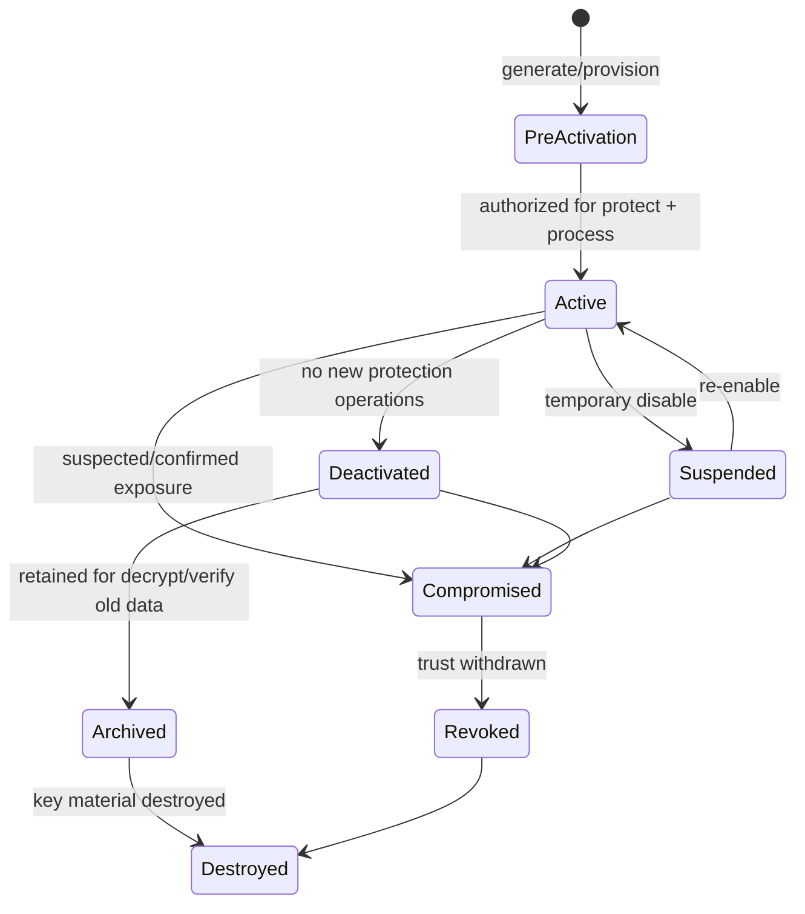

Do not collapse all states into “active/inactive”.

The difference matters:

| State | Can encrypt/sign new data? | Can decrypt/verify old data? | Meaning |
|---|---:|---:|---|
| Pre-activation | No | Usually no | Generated but not used yet |
| Active | Yes | Yes | Current allowed key |
| Suspended | No | Maybe | Temporarily blocked |
| Deactivated | No | Yes | Old key retained for existing data |
| Archived | No | Yes, under controlled process | Long-term access only |
| Compromised | No | Dangerous | Key may be attacker-known |
| Revoked | No | Verification may need special policy | Trust withdrawn |
| Destroyed | No | No | Key material gone |

### 4.2 Cryptoperiod

A **cryptoperiod** is the time span during which a key is authorized for a specific use.

It is not merely “rotate every 90 days because policy says so”.

Cryptoperiod depends on:

- algorithm strength,
- key size,
- volume of data protected,
- attacker capability,
- operational exposure,
- regulatory requirement,
- ability to detect compromise,
- blast radius,
- cost of rotation,
- ability to reprocess old data.

Example:

| Key | Possible cryptoperiod | Reasoning |
|---|---:|---|
| OAuth access token signing key | weeks/months | tokens expire quickly; rotation tied to JWKS TTL |
| HMAC webhook key | months | partner coordination needed |
| Data encryption key per object | one object/lifetime | narrow blast radius |
| KMS wrapping key | annual or policy-driven | managed rotation preserves old key versions |
| Password pepper | long but incident-sensitive | rotation requires password rehash strategy |
| TLS private key | cert validity period or shorter | exposure has impersonation risk |

---

## 5. Key Hierarchy

A mature system rarely uses one key for everything.

It uses a hierarchy.

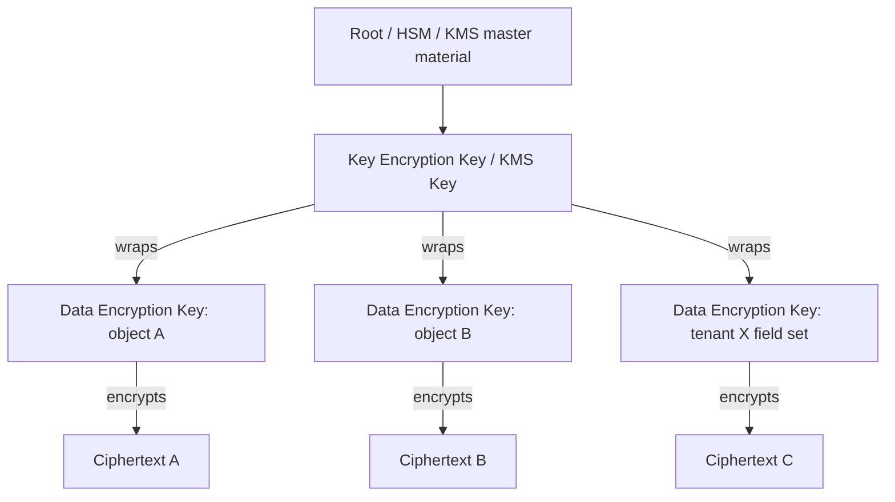

The hierarchy separates:

- high-value master/wrapping key,
- lower-scope data keys,
- encrypted payloads,
- metadata needed for decrypt.

This is the foundation of envelope encryption.

---

## 6. Why One Global AES Key Is Usually a Bad Design

Naive design:

```text
one service
one environment variable
one AES key
all rows encrypted with that key
```

Problems:

1. Compromise one key, decrypt everything.
2. Rotation means touching everything at once.
3. No key version, so old ciphertext cannot be reasoned about.
4. No per-tenant or per-domain blast-radius isolation.
5. Hard to audit which key protected which data.
6. Hard to revoke one tenant/domain.
7. Hard to separate environments.
8. Easy to accidentally reuse key for HMAC, AES, and token generation.

Better design:

```text
KMS key / wrapping key
  -> encrypted data key per object / tenant / record group
      -> AEAD ciphertext with AAD binding context
```

Or for smaller services:

```text
versioned application key ring
  -> active key encrypts new data
  -> old keys decrypt old data
  -> metadata stores kid + alg + purpose + version
```

---

## 7. Key Metadata Is Not Optional

Every protected artifact should carry enough metadata to select and validate the correct key and algorithm.

### 7.1 Minimal Metadata

For encrypted data:

```json
{
  "v": 1,
  "alg": "AES-256-GCM",
  "kid": "customer-pii-2026-06",
  "purpose": "field-encryption/customer-pii",
  "created_at": "2026-06-24T10:20:30Z",
  "aad": {
    "tenant_id": "tenant-123",
    "table": "customer",
    "column": "national_id"
  },
  "encrypted_dek": "base64...",
  "ciphertext": "base64..."
}
```

For signed data:

```json
{
  "v": 1,
  "alg": "Ed25519",
  "kid": "events-signing-2026-q2",
  "purpose": "event-signature/order-created",
  "signed_at": "2026-06-24T10:20:30Z",
  "payload": "base64 canonical bytes",
  "signature": "base64..."
}
```

### 7.2 Why Metadata Matters

| Metadata | Why it matters |
|---|---|
| `v` | envelope migration |
| `alg` | algorithm agility and confusion prevention |
| `kid` | key selection during decrypt/verify |
| `purpose` | prevents cross-protocol key reuse |
| `created_at` | cryptoperiod and incident analysis |
| `tenant_id` | blast-radius and AAD binding |
| `encrypted_dek` | envelope encryption |
| `aad` | binds ciphertext to context |

Do not rely on “the service knows which key to use”. Services change. Data outlives code.

---

## 8. Purpose Separation

One key must not be used for unrelated purposes.

Bad:

```text
KEY=base64(...)

Use KEY for:
- AES-GCM field encryption
- HMAC webhook verification
- JWT HS256 signing
- password pepper
- CSRF token derivation
```

This creates cross-protocol risk.

Good:

```text
customer-pii-encryption-key-v3
partner-webhook-hmac-key-v7
jwt-access-token-signing-key-v12
password-pepper-v2
csrf-token-hkdf-root-v5
```

### 8.1 Key Purpose as an Invariant

```go
type KeyPurpose string

const (
    PurposeFieldEncryption KeyPurpose = "field-encryption/customer-pii"
    PurposeWebhookMAC      KeyPurpose = "mac/partner-webhook"
    PurposeJWTSigning      KeyPurpose = "signature/jwt-access-token"
)
```

A good key provider should reject using a key for the wrong purpose.

```go
type KeyDescriptor struct {
    ID        string
    Version   int
    Algorithm string
    Purpose   KeyPurpose
}
```

This is not ceremony. It is how you prevent accidental misuse as the codebase grows.

---

## 9. Storage Options and Trade-offs

There is no single perfect key storage. There is only risk trade-off.

| Storage | Good for | Problems |
|---|---|---|
| Hardcoded in source | Never production | leaks through repo, build artifact, review, logs |
| Plain config file | local lab only | file permission, backup, image leakage |
| Environment variable | simple deployment | process dump, debug endpoint, accidental log, inherited child process |
| Kubernetes Secret | common baseline | base64 is not encryption; etcd/RBAC risk |
| Mounted secret file | better process hygiene than env | file permission, node compromise |
| Cloud Secret Manager | app credentials, API secrets | app still receives plaintext secret |
| KMS | envelope encryption, key policy, audit | latency, IAM complexity, quota, vendor dependency |
| HSM | high-assurance private key operations | cost, operational complexity, integration friction |
| Vault | dynamic secrets, leases, policy | operating Vault securely is its own system |
| DB encrypted DEK | envelope data metadata | DB access may expose encrypted key blob |
| OS keyring | desktop/agent workloads | less common in containers/server fleets |

### 9.1 Environment Variables Are Not a Security Boundary

Environment variables are convenient, but they are not strong secret containment.

Risks:

- accidentally printed in logs,
- exposed by debug endpoints,
- inherited by child processes,
- captured by crash diagnostics,
- visible through process inspection depending on OS/container policy,
- copied into CI/CD logs,
- stored in deployment history.

For production Go services, prefer:

- short-lived credentials,
- mounted secret files with strict permissions,
- workload identity,
- KMS/HSM operation boundary,
- secret manager retrieval with audit,
- no long-lived static root secrets in app config.

---

## 10. KMS, HSM, and Vault Mental Model

### 10.1 KMS

A Key Management Service usually provides:

- centralized key policy,
- key generation,
- encrypt/decrypt/wrap/unwrap/sign/verify operations,
- audit logs,
- access control via IAM/policy,
- automatic/on-demand rotation depending on key type,
- hardware-backed or service-managed key protection depending on provider.

AWS KMS, for example, supports symmetric and asymmetric cryptographic operations, and private key material does not leave AWS KMS unencrypted. It also supports key rotation models where newer key material becomes active for new protection operations while older key material remains available for decrypting previously protected data.

### 10.2 HSM

An HSM is stronger in terms of key material isolation.

It is appropriate when:

- private keys must never leave certified hardware,
- signing operation must be strongly governed,
- compliance requires hardware boundary,
- high-value root keys exist,
- dual control / split knowledge is required.

But HSMs introduce:

- latency,
- integration complexity,
- capacity planning,
- vendor-specific APIs,
- operational ceremony,
- disaster recovery complexity.

### 10.3 Vault

Vault-like systems help with:

- dynamic secrets,
- leases,
- centralized policy,
- secret rotation,
- secret revocation,
- audit,
- transit encryption.

But running Vault securely requires:

- unseal strategy,
- storage backend hardening,
- policy design,
- audit log protection,
- HA design,
- root token governance,
- backup and restore testing.

Do not adopt Vault just to avoid thinking about key management. Vault makes key management explicit; it does not make it disappear.

---

## 11. Envelope Encryption

Envelope encryption is the standard pattern for encrypting data at scale.

### 11.1 Basic Flow

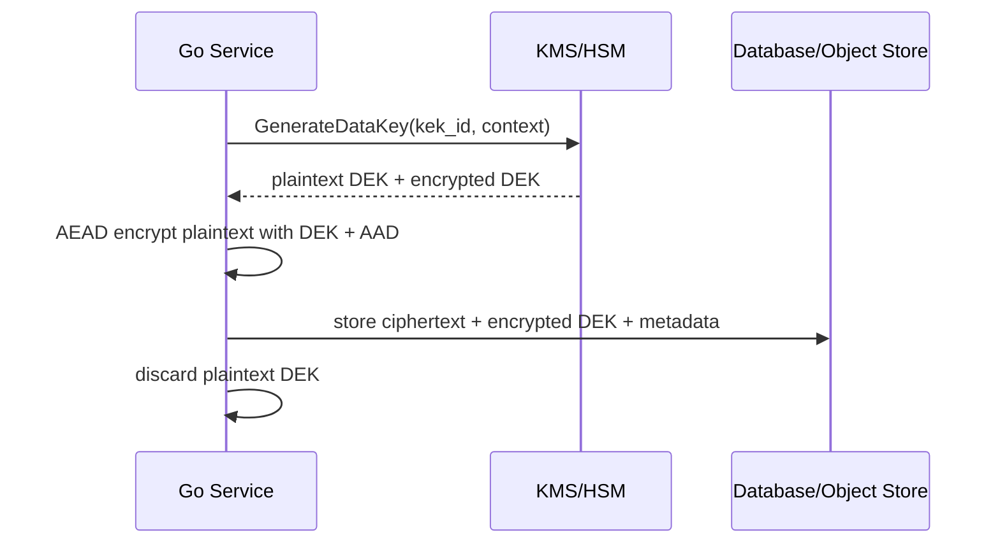

Decrypt:

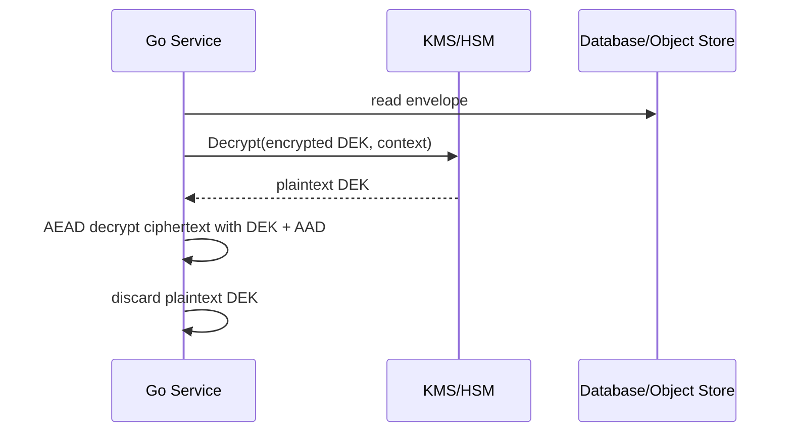

### 11.2 What Envelope Encryption Solves

| Problem | How envelope encryption helps |
|---|---|
| Large data volume | KMS does not encrypt all data directly |
| Blast radius | DEK can be scoped per object/tenant/domain |
| Rotation | Rewrap DEK or write new DEK without changing entire architecture |
| Audit | KMS decrypt calls are auditable |
| Access control | IAM/policy controls unwrap operation |
| Performance | AEAD happens locally; KMS only wraps/unwraps keys |

### 11.3 What Envelope Encryption Does Not Solve

It does not automatically solve:

- application compromise,
- plaintext exposure after decrypt,
- overbroad KMS permissions,
- logging decrypted data,
- bad AAD,
- missing authorization before decrypt,
- poor tenant boundary,
- compromised runtime memory,
- malicious insider with decrypt permission.

Key management is necessary but not sufficient.

---

## 12. Envelope Encryption Metadata Design

A production envelope should contain:

```go
type EncryptionEnvelope struct {
    Version      int               `json:"v"`
    Algorithm    string            `json:"alg"`
    KeyID        string            `json:"kid"`
    Purpose      string            `json:"purpose"`
    CreatedAtUTC string            `json:"created_at"`
    AAD          map[string]string `json:"aad"`

    // Present for envelope encryption.
    EncryptedDEK string `json:"encrypted_dek,omitempty"`

    // Ciphertext may include nonce depending on AEAD construction.
    Ciphertext string `json:"ciphertext"`
}
```

Design rules:

1. `kid` must identify the wrapping key or application key version.
2. `alg` must be validated against allowlist.
3. `purpose` must match expected operation.
4. AAD must be deterministic and reconstructed exactly.
5. Tenant/domain identifiers should be included in AAD when they are part of the security boundary.
6. Data should not be decryptable under the wrong tenant/context.
7. Unknown envelope versions should fail closed.
8. Decryption should be audited by key ID, purpose, caller, resource, and result.

---

## 13. Go Implementation Boundary

Do not scatter crypto calls everywhere.

Bad architecture:

```text
handler -> database -> random AES code here
worker  -> random AES code there
cron    -> different AES code elsewhere
```

Better:

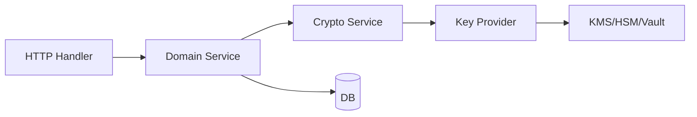

### 13.1 Interface Boundary

```go
package security

import "context"

type Purpose string

const (
    PurposeCustomerPII Purpose = "field-encryption/customer-pii"
)

type KeyDescriptor struct {
    ID        string
    Version   int
    Algorithm string
    Purpose   Purpose
}

type DataKey struct {
    Descriptor   KeyDescriptor
    Plaintext    []byte
    EncryptedKey []byte
}

type KeyProvider interface {
    GenerateDataKey(ctx context.Context, purpose Purpose, aad map[string]string) (DataKey, error)
    DecryptDataKey(ctx context.Context, descriptor KeyDescriptor, encryptedKey []byte, aad map[string]string) ([]byte, error)
}
```

Important design choices:

- `context.Context` carries request cancellation and audit correlation.
- `Purpose` is explicit.
- `aad` is passed to KMS if provider supports encryption context.
- `KeyDescriptor` is stored with envelope.
- plaintext DEK is short-lived.

---

## 14. Safe Local AEAD Wrapper for Application-Managed Keys

For non-KMS cases, you still need versioned keys.

This wrapper uses Go `cipher.NewGCMWithRandomNonce`, available in modern Go, so nonce generation is handled by the AEAD implementation and the nonce is prepended to ciphertext.

```go
package localcrypto

import (
    "crypto/aes"
    "crypto/cipher"
    "encoding/base64"
    "errors"
    "fmt"
)

type Purpose string

const PurposeCustomerPII Purpose = "field-encryption/customer-pii"

type Key struct {
    ID      string
    Purpose Purpose
    Raw     []byte // 32 bytes for AES-256
}

type KeyRing struct {
    activeID string
    keys     map[string]Key
}

type Envelope struct {
    Version   int    `json:"v"`
    Algorithm string `json:"alg"`
    KeyID     string `json:"kid"`
    Purpose   string `json:"purpose"`
    AADHash   string `json:"aad_hash,omitempty"`
    Data      string `json:"data"`
}

func (r *KeyRing) Encrypt(plaintext []byte, purpose Purpose, aad []byte) (Envelope, error) {
    key, ok := r.keys[r.activeID]
    if !ok {
        return Envelope{}, errors.New("active key not found")
    }
    if key.Purpose != purpose {
        return Envelope{}, fmt.Errorf("active key purpose mismatch: got %q want %q", key.Purpose, purpose)
    }
    if len(key.Raw) != 32 {
        return Envelope{}, errors.New("invalid AES-256 key length")
    }

    block, err := aes.NewCipher(key.Raw)
    if err != nil {
        return Envelope{}, fmt.Errorf("create AES cipher: %w", err)
    }

    aead, err := cipher.NewGCMWithRandomNonce(block)
    if err != nil {
        return Envelope{}, fmt.Errorf("create GCM AEAD: %w", err)
    }

    ciphertext := aead.Seal(nil, nil, plaintext, aad)

    return Envelope{
        Version:   1,
        Algorithm: "AES-256-GCM-RANDOM-NONCE",
        KeyID:     key.ID,
        Purpose:   string(purpose),
        Data:      base64.RawURLEncoding.EncodeToString(ciphertext),
    }, nil
}

func (r *KeyRing) Decrypt(env Envelope, expectedPurpose Purpose, aad []byte) ([]byte, error) {
    if env.Version != 1 {
        return nil, errors.New("unsupported envelope version")
    }
    if env.Algorithm != "AES-256-GCM-RANDOM-NONCE" {
        return nil, errors.New("unsupported algorithm")
    }
    if env.Purpose != string(expectedPurpose) {
        return nil, errors.New("purpose mismatch")
    }

    key, ok := r.keys[env.KeyID]
    if !ok {
        return nil, errors.New("key not found")
    }
    if key.Purpose != expectedPurpose {
        return nil, errors.New("key purpose mismatch")
    }
    if len(key.Raw) != 32 {
        return nil, errors.New("invalid AES-256 key length")
    }

    ciphertext, err := base64.RawURLEncoding.DecodeString(env.Data)
    if err != nil {
        return nil, errors.New("invalid ciphertext encoding")
    }

    block, err := aes.NewCipher(key.Raw)
    if err != nil {
        return nil, fmt.Errorf("create AES cipher: %w", err)
    }

    aead, err := cipher.NewGCMWithRandomNonce(block)
    if err != nil {
        return nil, fmt.Errorf("create GCM AEAD: %w", err)
    }

    plaintext, err := aead.Open(nil, nil, ciphertext, aad)
    if err != nil {
        return nil, errors.New("decrypt failed")
    }

    return plaintext, nil
}
```

Notes:

1. Do not return raw crypto errors to API callers.
2. Do not log plaintext, key bytes, ciphertext, or DEK.
3. `kid` is required for rotation.
4. `purpose` is checked on encrypt and decrypt.
5. `aad` must be reconstructed deterministically.
6. This pattern is still less ideal than KMS/HSM for high-value production data.

---

## 15. KMS Envelope Encryption Interface in Go

A cloud-agnostic boundary can look like this:

```go
package envelope

import "context"

type GenerateDataKeyInput struct {
    Purpose string
    AAD     map[string]string
}

type GenerateDataKeyOutput struct {
    KeyID        string
    KeyVersion   string
    Algorithm    string
    PlaintextDEK []byte
    EncryptedDEK []byte
}

type DecryptDataKeyInput struct {
    KeyID        string
    KeyVersion   string
    Algorithm    string
    EncryptedDEK []byte
    AAD          map[string]string
}

type KMS interface {
    GenerateDataKey(ctx context.Context, in GenerateDataKeyInput) (GenerateDataKeyOutput, error)
    DecryptDataKey(ctx context.Context, in DecryptDataKeyInput) ([]byte, error)
}
```

Then encryption service:

```go
func EncryptWithKMS(
    ctx context.Context,
    kms KMS,
    plaintext []byte,
    purpose string,
    aad map[string]string,
) (EncryptionEnvelope, error) {
    dk, err := kms.GenerateDataKey(ctx, GenerateDataKeyInput{
        Purpose: purpose,
        AAD:     aad,
    })
    if err != nil {
        return EncryptionEnvelope{}, fmt.Errorf("generate data key: %w", err)
    }
    defer zeroBytes(dk.PlaintextDEK)

    ciphertext, err := encryptAESGCMRandomNonce(dk.PlaintextDEK, plaintext, canonicalAAD(aad))
    if err != nil {
        return EncryptionEnvelope{}, fmt.Errorf("encrypt payload: %w", err)
    }

    return EncryptionEnvelope{
        Version:      1,
        Algorithm:    "AES-256-GCM-RANDOM-NONCE",
        KeyID:        dk.KeyID,
        Purpose:      purpose,
        CreatedAtUTC: time.Now().UTC().Format(time.RFC3339Nano),
        AAD:          aad,
        EncryptedDEK: base64.RawURLEncoding.EncodeToString(dk.EncryptedDEK),
        Ciphertext:   base64.RawURLEncoding.EncodeToString(ciphertext),
    }, nil
}
```

`zeroBytes` is best-effort in Go:

```go
func zeroBytes(b []byte) {
    for i := range b {
        b[i] = 0
    }
}
```

Important caveat: Go is garbage-collected. Best-effort zeroing does not guarantee that no copy of the secret exists elsewhere due to compiler/runtime behavior, prior copies, serialization, logging, stack movement, or library internals. Still, zeroing short-lived buffers can reduce exposure and is better than doing nothing for high-value transient material.

---

## 16. AAD Must Bind the Security Context

AAD should bind ciphertext to the context in which it is valid.

Example for customer PII:

```go
func CustomerPIIAAD(tenantID, customerID, fieldName string) []byte {
    return []byte("v1" + "\x00" +
        "tenant=" + tenantID + "\x00" +
        "customer=" + customerID + "\x00" +
        "field=" + fieldName)
}
```

Better for production: canonical binary or canonical JSON with strict ordering.

AAD examples:

| Data | Good AAD |
|---|---|
| tenant-scoped PII | tenant ID, table/entity, field name, record ID |
| document file | tenant ID, document ID, version, classification |
| audit log event | event ID, sequence number, actor ID, timestamp |
| inter-service payload | sender service, receiver service, message type, schema version |
| backup segment | backup job ID, segment ID, environment, created time |

AAD protects against moving ciphertext from one context to another.

Without AAD:

```text
ciphertext for tenant A / customer 123 / field national_id
can be copied into tenant B / customer 999 / field national_id
and may decrypt successfully
```

With AAD:

```text
same ciphertext fails to decrypt under wrong tenant/customer/field context
```

---

## 17. Rotation: The Most Misunderstood Word in Key Management

Rotation can mean several different operations.

| Operation | Meaning |
|---|---|
| Generate new key version | New key material exists |
| Promote active key | New encryption/signing uses new key |
| Retain old key | Old data/tokens remain decryptable/verifiable |
| Rewrap | Re-encrypt DEK under new KEK, data ciphertext unchanged |
| Re-encrypt | Decrypt data and encrypt payload again with new DEK/key |
| Disable old key | Stop old key from decrypt/sign/verify depending on policy |
| Delete old key | Destroy key material; old data may become unrecoverable |

### 17.1 Rotation Flow for Encryption Keys

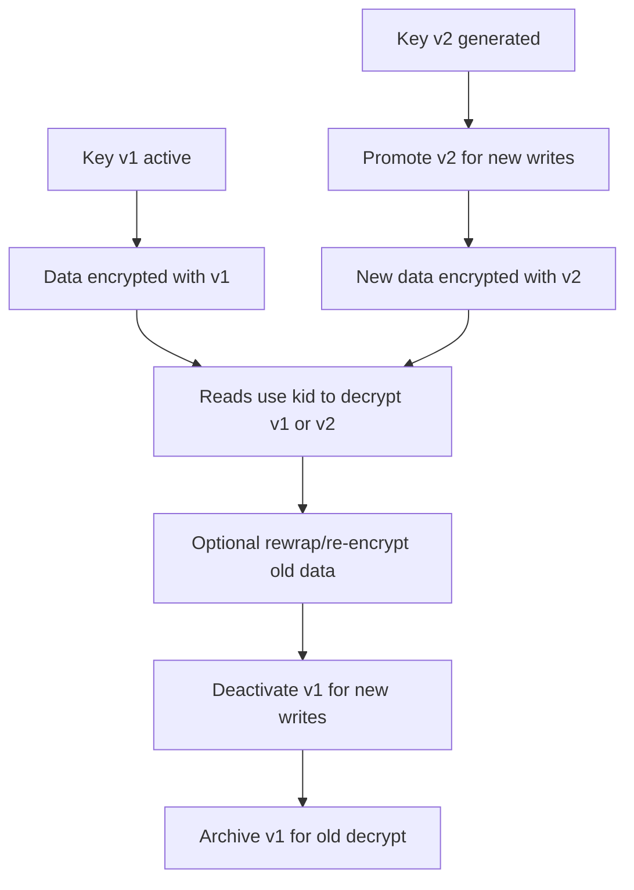

### 17.2 Rotation Flow for Signing Keys

Signing keys are different from encryption keys.

For JWT/JWS-style signing:

1. Generate new signing key.
2. Publish new public key in JWKS.
3. Wait for caches to observe it.
4. Start signing new tokens with new `kid`.
5. Keep old public key available until all old tokens expire.
6. Stop accepting old key after token max lifetime + clock skew + cache TTL.
7. Remove old public key.
8. Destroy/archive old private key depending on policy.

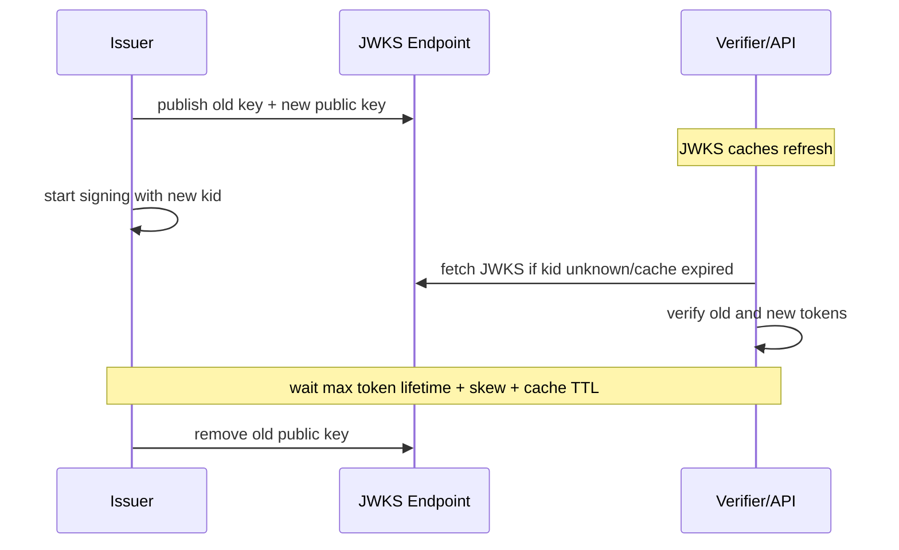

Do not rotate signing keys by immediately deleting old public keys unless every token signed by the old key is already expired.

---

## 18. Rotation Strategy by Key Type

| Key type | Rotation strategy |
|---|---|
| AEAD app key | key ring with active key and old decrypt-only keys |
| DEK per object | generate new DEK for new object; old DEK remains wrapped |
| KMS KEK | use provider rotation; old key material decrypts old encrypted DEKs |
| JWT signing key | publish new public key before signing; retain old public key until expiry |
| HMAC webhook key | dual-verify old/new during partner migration |
| TLS private key | issue new cert/key; deploy with overlap; monitor expiry |
| Password pepper | version pepper; rehash on successful login; forced reset if compromise |
| API client secret | issue new secret; allow overlap; revoke old after adoption |

---

## 19. Revocation Is Not Rotation

Rotation is normal lifecycle hygiene.

Revocation is trust withdrawal.

Examples:

| Scenario | Action |
|---|---|
| scheduled key age reached | rotate |
| employee changed team | access review / revoke permission |
| key appeared in GitHub | revoke/disable/rotate/incident response |
| JWT private key compromised | revoke key, stop accepting tokens, invalidate sessions |
| TLS private key compromised | revoke certificate, replace keypair |
| KMS decrypt permission abused | revoke IAM, investigate decrypt logs, re-encrypt if needed |
| password pepper compromised | force password reset or rehash under new pepper if possible |

### 19.1 Compromise Response Flow

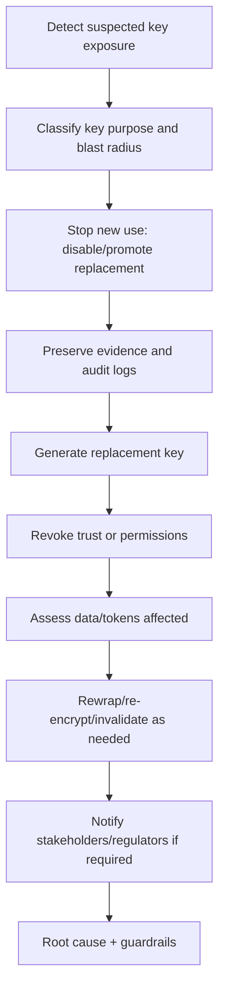

Key compromise response must be pre-designed. Do not invent it during the incident.

---

## 20. Backup, Restore, and Disaster Recovery

Key management and backup must be designed together.

A backup without keys may be unrecoverable.

A backup with keys stored beside the data may be attacker-friendly.

### 20.1 Backup Design Questions

For every encrypted dataset:

1. What key decrypts the backup?
2. Is the key backed up separately?
3. Who can restore the key?
4. Is restore tested?
5. Does key rotation break old backup restore?
6. Are old keys archived for retention period?
7. Are deleted keys truly unrecoverable?
8. Does backup include encrypted DEKs and metadata?
9. Does backup include KMS key IDs/aliases needed for restore?
10. Can a backup from production be restored in staging without violating key policy?

### 20.2 Environment Boundary

Never design this:

```text
same key for DEV, UAT, PROD
```

Better:

```text
prod/customer-pii/kek
uat/customer-pii/kek
dev/customer-pii/kek
```

And ideally:

```text
account/project/environment/tenant/domain/purpose/version
```

### 20.3 Restore Drill

A restore drill must verify:

- data backup exists,
- encrypted DEKs exist,
- KMS/HSM key exists,
- IAM/policy permits restore actor,
- envelope version still supported,
- old algorithms still supported in decrypt-only mode,
- audit trail captures restore decrypt operations,
- restored data remains isolated from non-production systems.

---

## 21. Split Knowledge and Dual Control

For high-value keys, no single person should be able to reconstruct or operate root material alone.

Concepts:

| Concept | Meaning |
|---|---|
| Split knowledge | no individual knows the full secret |
| Dual control | two or more authorized parties required for sensitive operation |
| M-of-N quorum | any M out of N shares/approvers can authorize/recover |
| Break-glass | emergency access with strong audit and after-the-fact review |
| Separation of duties | developers cannot also unilaterally decrypt production secrets |

Typical use cases:

- HSM initialization,
- Vault unseal,
- root key recovery,
- production KMS key deletion,
- certificate authority root operations,
- emergency decrypt of archived regulatory records.

For most application DEKs, split knowledge is too heavy. For root keys, it may be required.

---

## 22. Access Control for Keys

Key policy should express operation-level permissions.

Not all access is equal.

| Permission | Risk |
|---|---|
| `Encrypt` | can protect new data, usually lower risk |
| `Decrypt` | can reveal data, high risk |
| `GenerateDataKey` | can produce plaintext DEK, high risk |
| `Sign` | can create trusted artifacts, high risk |
| `Verify` | usually public/low risk |
| `Rotate` | changes lifecycle, medium/high risk |
| `ScheduleDeletion` | can cause data loss, very high risk |
| `DescribeKey` | metadata exposure, low/medium risk |
| `PutKeyPolicy` | privilege escalation, very high risk |

Principle:

> Give services only the key operation they need, not generic key admin rights.

A Go API server that encrypts new records may need `GenerateDataKey` or `Encrypt`, but a read-only reporting service may need `Decrypt` only for specific data domains. A public verifier needs only public keys.

---

## 23. Key IDs, Aliases, and Versions

A common production mistake is storing only an alias.

Example:

```json
{"kid":"alias/customer-pii"}
```

Problem: aliases move. They are useful for selecting active key, but not always sufficient to identify historical key material.

Better envelope may store:

```json
{
  "kek_alias": "alias/prod/customer-pii",
  "kek_id": "arn:...:key/1234-...",
  "kek_version": "2026-06",
  "encrypted_dek": "..."
}
```

In some KMS systems, key version details are abstracted and the ciphertext blob carries enough information for KMS to use old key material. In application-managed key rings, you must store version explicitly.

Rule:

- alias is for **new writes**,
- concrete key ID/version is for **old reads**.

---

## 24. Crypto Agility

Crypto agility is the ability to change algorithms, key sizes, formats, and providers without rewriting the whole application or losing old data.

It requires:

1. versioned envelope,
2. algorithm metadata,
3. key ID metadata,
4. decrypt-old / encrypt-new policy,
5. migration job design,
6. test vectors for each version,
7. explicit allowed algorithms,
8. rejection of unknown algorithms,
9. observability by algorithm/key version,
10. deprecation plan.

### 24.1 Algorithm Agility Without Algorithm Confusion

Bad:

```go
switch env.Algorithm {
case "AES-GCM":
    // decrypt
case "RSA":
    // decrypt
case env.AlgorithmFromUser:
    // dynamic dangerous behavior
}
```

Good:

```go
var allowedDecryptAlgorithms = map[string]struct{}{
    "AES-256-GCM-RANDOM-NONCE": {},
}

func validateAlgorithm(alg string) error {
    if _, ok := allowedDecryptAlgorithms[alg]; !ok {
        return errors.New("unsupported algorithm")
    }
    return nil
}
```

Algorithm metadata is for controlled migration, not attacker-selected behavior.

---

## 25. Go-Specific Key Handling Concerns

### 25.1 `[]byte` Is Mutable and Easy to Copy

Keys in Go are usually `[]byte`.

That means:

- they can be copied accidentally,
- they can be logged accidentally,
- they can be retained by closures,
- they can escape to heap,
- they can be included in error structs,
- they can remain in memory until GC,
- they can be captured by dumps/profiles.

Avoid:

```go
log.Printf("key=%x", key)
return fmt.Errorf("invalid key %x", key)
```

Use explicit redaction types.

```go
type SecretBytes []byte

func (SecretBytes) String() string { return "<redacted>" }
func (SecretBytes) GoString() string { return "<redacted>" }
```

But be careful: converting to `SecretBytes` does not erase existing copies.

### 25.2 Do Not Store Keys in Long-Lived Global Variables Unless Intentional

Bad:

```go
var globalKey []byte
```

Better:

- inject key provider,
- cache only wrapped/metadata where possible,
- cache plaintext key only with TTL if justified,
- protect caches with clear ownership,
- expose narrow interface,
- audit accesses.

### 25.3 Avoid cgo Unless You Need It

Using cgo for crypto integration can change the memory and attack model:

- C memory is outside Go GC,
- memory safety bugs become possible,
- OpenSSL/BoringSSL versioning matters,
- FIPS boundary may be different,
- cross-compilation/deployment complexity increases.

Go 1.24+ has native FIPS 140-3 support path for Go cryptographic packages, reducing the old need to call external FIPS libraries for many cases.

### 25.4 Do Not Invent Your Own Key Derivation Protocol

Use standard KDFs:

- HKDF for deriving keys from high-entropy shared secrets,
- PBKDF2/scrypt/Argon2id for passwords depending on context,
- KMS/HSM generate/wrap APIs where possible.

Do not do:

```go
key := sha256.Sum256([]byte(secret + tenantID))
```

This lacks clear salt/info separation, metadata, reviewability, and often domain separation.

---

## 26. Key Derivation and Key Separation

Sometimes you have one high-entropy root secret and need multiple subkeys.

Use HKDF-style derivation with explicit `info` labels.

```text
root key
  -> HKDF info="v1/aes/customer-pii"      -> AES key
  -> HKDF info="v1/hmac/webhook/partner" -> HMAC key
  -> HKDF info="v1/csrf/session"         -> CSRF key
```

Rules:

1. Use high-entropy input key material.
2. Use unique `info` per purpose.
3. Include version in `info`.
4. Do not derive encryption and MAC keys using ambiguous labels.
5. Do not use HKDF as password hashing.
6. Store derivation metadata if old data must be decrypted.

---

## 27. Secrets That Are Not Crypto Keys

Application security often mixes key management and secret management.

Examples:

- database password,
- OAuth client secret,
- API token,
- SMTP password,
- webhook shared secret,
- S3 access key,
- Redis password,
- signing private key,
- password pepper.

They need different controls.

| Secret | Rotation style | Special concern |
|---|---|---|
| DB password | dual credential / connection drain | connection pool reload |
| OAuth client secret | client metadata update | provider coordination |
| API token | issue new, overlap, revoke old | bearer misuse |
| Webhook secret | dual signature validation | partner migration |
| Private signing key | publish public key first | verifier cache |
| Password pepper | versioned rehash | compromise response hard |
| KMS IAM credential | workload identity preferred | avoid static access keys |

Do not force all secrets into one rotation mechanism.

---

## 28. Hot Reload and Key Rollout

Many incidents happen during key rollout.

### 28.1 Bad Rollout

```text
1. deploy new key to half services
2. remove old key
3. old ciphertext/token still exists
4. half fleet cannot decrypt/verify
5. outage
```

### 28.2 Safer Rollout

```text
1. deploy code that supports key ring old+new
2. deploy new key as inactive/standby
3. verify all fleet has new key
4. promote new key for writes/signing
5. retain old key for reads/verification
6. wait until old artifacts expire or migrate them
7. deactivate old key for new writes
8. archive/destroy according to retention policy
```

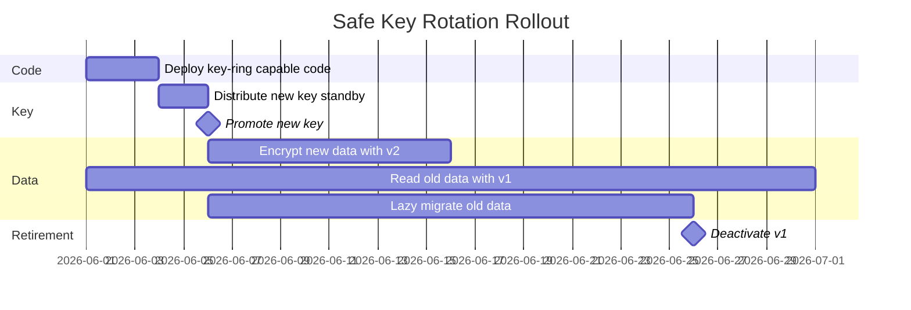

---

## 29. Observability Without Secret Leakage

Key management needs observability, but observability can leak secrets.

Safe fields:

- key ID,
- key purpose,
- key version,
- algorithm,
- operation type,
- outcome,
- latency bucket,
- caller service,
- request correlation ID,
- tenant/resource ID if allowed by privacy policy,
- error category.

Unsafe fields:

- raw key bytes,
- plaintext DEK,
- decrypted data,
- token value,
- password,
- pepper,
- full ciphertext if sensitive to traffic analysis,
- full envelope if it contains encrypted DEK and metadata not intended for logs,
- authorization headers.

### 29.1 Example Structured Log

```json
{
  "event": "kms_decrypt",
  "result": "success",
  "kid": "prod/customer-pii/kek",
  "purpose": "field-encryption/customer-pii",
  "caller": "case-service",
  "tenant_hash": "t:7f...",
  "latency_ms": 18,
  "correlation_id": "req-abc"
}
```

### 29.2 Metrics

Useful metrics:

- `key_operation_total{op,purpose,result}`,
- `key_operation_latency_ms{op,purpose}`,
- `decrypt_failure_total{reason}`,
- `unknown_kid_total`,
- `unsupported_envelope_version_total`,
- `old_key_decrypt_total{kid}`,
- `kms_throttle_total`,
- `kms_access_denied_total`,
- `key_rotation_age_days{purpose}`.

Alerts:

- sudden spike in decrypt operations,
- decrypt from unusual service,
- unknown `kid`,
- old key still used after expected migration window,
- KMS access denied after deployment,
- KMS latency causing request timeouts,
- key near deletion with remaining encrypted data.

---

## 30. Testing Key Management

### 30.1 Unit Tests

Test:

- encrypt/decrypt roundtrip,
- wrong AAD fails,
- wrong purpose fails,
- wrong key ID fails,
- unknown algorithm fails,
- malformed envelope fails,
- old key decrypts old data,
- new key encrypts new data,
- disabled key cannot encrypt,
- deactivated key can decrypt if policy allows,
- compromised key behavior follows policy.

### 30.2 Test Vectors

Keep test vectors for every envelope version:

```text
testdata/envelope-v1-aes-gcm-random-nonce.json
testdata/envelope-v2-xchacha20poly1305.json
testdata/jws-ed25519-v1.json
```

Test vectors prevent accidental incompatible changes.

### 30.3 Integration Tests

For KMS:

- key policy denies unauthorized service,
- encryption context/AAD mismatch fails,
- old encrypted DEK decrypts after rotation,
- scheduled deletion is blocked by policy/guardrail,
- throttling behavior is handled,
- circuit breaker does not leak plaintext,
- timeout/cancellation works.

### 30.4 Chaos / Game Day

Simulate:

- KMS unavailable,
- KMS slow,
- key disabled,
- key permission revoked,
- old key deleted accidentally,
- unknown `kid` appears,
- rotated key not deployed to one service,
- backup restore with old key,
- compromised signing key.

---

## 31. Common Failure Modes

### 31.1 Hardcoded Key

```go
var key = []byte("01234567890123456789012345678901")
```

Failure:

- source leak,
- build artifact leak,
- no rotation,
- no ownership,
- no audit.

### 31.2 Key Reuse Across Purpose

```text
same key for HMAC and AES-GCM
```

Failure:

- cross-protocol coupling,
- migration risk,
- compromise blast radius.

### 31.3 No Key ID

```json
{"ciphertext":"..."}
```

Failure:

- cannot rotate safely,
- cannot debug decrypt failure,
- cannot know affected data.

### 31.4 Immediate Old Key Deletion

Failure:

- old backups unrecoverable,
- old tokens unverifiable,
- old ciphertext undecryptable,
- production outage.

### 31.5 Overbroad Decrypt Permission

Failure:

- any compromised service can decrypt all domains,
- audit is noisy,
- incident blast radius huge.

### 31.6 Logging Secret Material

Failure:

- logs become secret stores,
- retention multiplies exposure,
- SIEM/search/index backups spread secret.

### 31.7 Key Rotation Without Data Migration Plan

Failure:

- old data remains under old key forever,
- compliance evidence weak,
- old key cannot be retired.

### 31.8 Encryption Without Authorization

Failure:

- service with decrypt key becomes confused deputy,
- attacker asks service to decrypt data they cannot access.

Always authorize before decrypting sensitive data.

---

## 32. Authorization Before Decrypt

A critical architecture invariant:

> Possessing decrypt capability does not mean every caller is authorized to see every plaintext.

Flow:

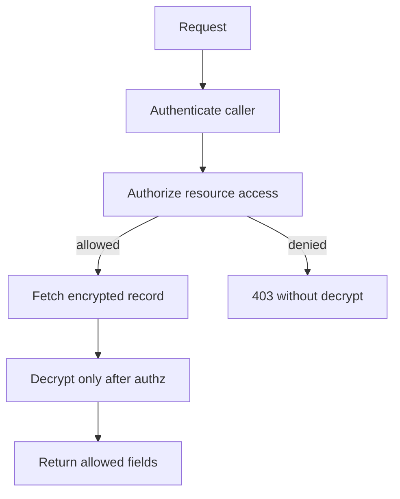

Bad:

```go
record := db.Get(id)
plaintext := decrypt(record.Secret)
if !canAccess(user, record) {
    return forbidden
}
```

Better:

```go
recordMeta := db.GetMetadata(id)
if !canAccess(user, recordMeta) {
    return forbidden
}
record := db.GetEncrypted(id)
plaintext := decrypt(record.Secret)
```

This reduces unnecessary decrypt and audit exposure.

---

## 33. FIPS 140-3 and Go

Go has native FIPS 140-3 support paths starting in Go 1.24, with Go 1.26 documenting `crypto/fips140` changes and `GOFIPS140` selection of the Go Cryptographic Module.

Important distinction:

> FIPS mode/module support does not automatically make the entire application compliant.

FIPS concerns the cryptographic module and approved algorithms/modes under specific conditions. Your system still needs:

- correct key management,
- approved algorithms where required,
- secure configuration,
- access control,
- audit evidence,
- operational procedures,
- boundary documentation,
- deployment reproducibility,
- incident response,
- policy compliance.

### 33.1 Practical FIPS Decision Tree

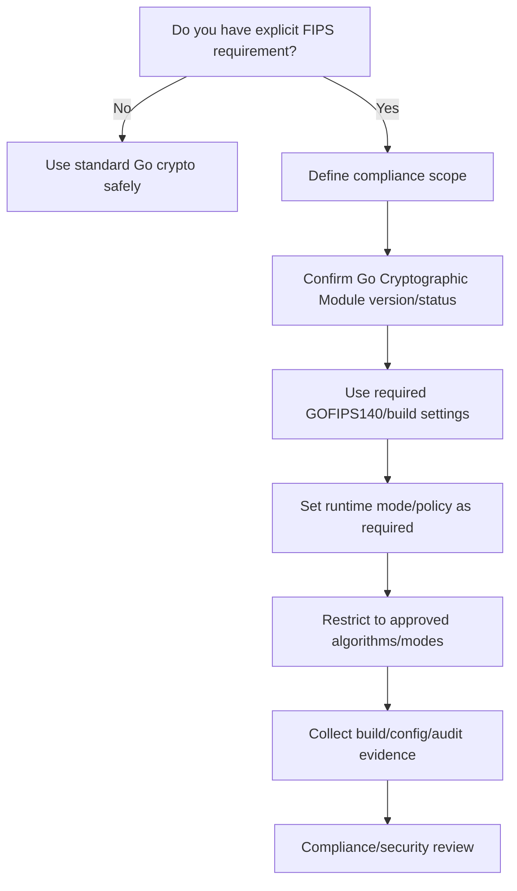

Do not claim “FIPS compliant” because you imported `crypto/aes`.

### 33.2 FIPS and Provider Choice

| Approach | Notes |
|---|---|
| Native Go FIPS module | simpler Go-native path for supported algorithms |
| Cloud KMS/HSM FIPS-backed | useful if key operations remain in provider boundary |
| External OpenSSL via cgo | more complexity; module boundary must be understood |
| Application crypto without validated module | may be secure but not FIPS-compliant for regulated requirement |

---

## 34. Cloud KMS Practical Design

### 34.1 Key Naming Convention

Use structured names.

```text
/prod/aceas/customer-pii/field-encryption/kek/v1
/prod/aceas/audit-log/mac/kek/v1
/prod/aceas/jwt/access-token/signing/v3
/uat/aceas/customer-pii/field-encryption/kek/v1
/dev/aceas/customer-pii/field-encryption/kek/v1
```

Include:

- environment,
- system,
- domain,
- purpose,
- key role,
- version.

### 34.2 IAM / Policy Shape

For a service that only encrypts new PII but does not read it:

```text
Allow GenerateDataKey for key /prod/customer-pii
Deny Decrypt
Deny ScheduleKeyDeletion
Deny PutKeyPolicy
```

For a service that reads PII:

```text
Allow Decrypt for key /prod/customer-pii
Condition tenant/domain if provider supports context condition
Deny key administration
```

For deployment pipeline:

```text
Allow alias update / config rollout
Deny Decrypt
Deny plaintext data access
```

Separate runtime data access from key administration.

---

## 35. Multi-Tenant Key Strategy

There are several models.

### 35.1 Shared Key Across Tenants

```text
one KMS key for all tenants
```

Pros:

- simple,
- low operational cost,
- easier quota management.

Cons:

- large blast radius,
- weaker tenant isolation,
- harder tenant-specific deletion/export.

### 35.2 Key Per Tenant

```text
KMS key per tenant
```

Pros:

- strong blast-radius isolation,
- tenant-specific revocation,
- clearer audit,
- supports customer-managed key model.

Cons:

- operational cost,
- quota complexity,
- policy sprawl,
- rotation orchestration.

### 35.3 Shared KEK, Per-Tenant DEK

```text
one/few KMS keys
per-tenant DEK wrapped by KMS
```

Pros:

- balanced model,
- narrower blast radius than one key,
- less KMS object sprawl.

Cons:

- app must manage DEK metadata,
- tenant DEK compromise handling needed.

### 35.4 Decision Matrix

| Requirement | Suggested model |
|---|---|
| small internal app | shared KEK with strong AAD may be enough |
| regulated tenant isolation | per-tenant key or per-tenant DEK |
| customer-managed keys | key per customer/tenant |
| high-volume object encryption | envelope encryption with per-object DEK |
| delete tenant cryptographically | per-tenant DEK/KEK destruction model |

---

## 36. Cryptographic Erasure

Cryptographic erasure means making data unrecoverable by destroying the key required to decrypt it.

This can be faster than overwriting all data.

But it works only if:

- data is strongly encrypted,
- key is not backed up elsewhere,
- key hierarchy is understood,
- all copies of key are destroyed,
- old snapshots/backups do not contain the key,
- no plaintext copies exist,
- no secondary indexes/logs contain plaintext,
- envelope metadata does not allow alternate decrypt path.

Do not claim cryptographic deletion unless the key lifecycle and backup lifecycle support it.

---

## 37. Key Management for Audit Logs

Audit logs often need integrity more than confidentiality.

Possible design:

- append-only log,
- HMAC chain or signature chain,
- key version per time period,
- secure timestamping,
- write-once storage,
- verifier independent from writer,
- key rotation per period,
- old verification keys archived.

```mermaid
flowchart LR
    E1[Event 1]
    H1[MAC1 = HMAC(k, E1)]
    E2[Event 2 + MAC1]
    H2[MAC2 = HMAC(k, E2)]
    E3[Event 3 + MAC2]
    H3[MAC3 = HMAC(k, E3)]

    E1 --> H1 --> E2 --> H2 --> E3 --> H3
```

For audit integrity:

- signing key compromise may allow forged future logs,
- old log verification depends on retaining verification keys,
- HMAC requires verifier to know secret, while signatures allow public verification,
- key rotation boundaries must be recorded.

---

## 38. Key Management for JWT/OIDC

JWT signing key management is frequently broken.

Rules:

1. Use asymmetric signing for multi-service verification where possible.
2. Use `kid` in header, but do not trust arbitrary algorithm from token.
3. Maintain allowlist of accepted algorithms.
4. Publish JWKS with cache-control aligned to rotation plan.
5. Introduce new public key before signing with it.
6. Keep old public key until all old tokens expire.
7. Do not reuse TLS private key as JWT signing key.
8. Do not use one signing key across environments.
9. Keep private signing key in KMS/HSM if high assurance is needed.
10. Invalidate tokens if private key compromise is suspected.

---

## 39. Key Management for Webhooks

Webhook HMAC keys require partner coordination.

Rotation model:

1. Generate new secret.
2. Send secret through secure channel or partner portal.
3. Sender signs with both old and new or announces switch time.
4. Receiver verifies both during overlap.
5. Monitor which key ID succeeds.
6. Remove old key after partner confirms and replay window expires.

Envelope:

```text
X-Signature-Kid: partner-a-2026-06
X-Signature-Timestamp: 2026-06-24T10:20:30Z
X-Signature-Nonce: ...
X-Signature: base64(hmac_sha256(...))
```

Do not rotate webhook keys without a dual-verify period unless downtime is acceptable.

---

## 40. Key Management for Password Pepper

Pepper is difficult.

If pepper is compromised, attacker can combine it with stolen password hashes to attack offline.

If pepper is rotated, old password hashes may not verify unless metadata or fallback exists.

Possible model:

```text
password_hash_record:
  alg: argon2id
  params: ...
  salt: ...
  pepper_id: pepper-v2
  hash: ...
```

Verification:

1. Select pepper by `pepper_id`.
2. Verify password.
3. If valid and pepper is old, rehash with active pepper.
4. If pepper compromised, force reset if safe rehash is impossible.

Pepper should usually live in KMS/HSM/secret manager, not in code or database beside password hashes.

---

## 41. Performance and Availability

KMS introduces latency and quota.

Design choices:

| Choice | Trade-off |
|---|---|
| KMS every decrypt | strong audit, high latency/cost |
| cache plaintext DEK | faster, higher memory exposure |
| cache decrypted records | fastest, high plaintext exposure |
| batch decrypt | efficient, complex authorization |
| async rewrap | avoids request latency, migration lag |

### 41.1 Caching Plaintext DEKs

If you cache DEKs:

- use short TTL,
- scope by key ID + tenant + purpose,
- cap cache size,
- avoid logging,
- clear on rotation/disable signal,
- protect against unbounded memory growth,
- audit cache hits separately if required,
- understand that app compromise exposes cached DEKs.

### 41.2 KMS Outage Strategy

For write path:

- fail closed for sensitive encryption,
- queue request only if plaintext not persisted insecurely,
- degrade non-sensitive functionality,
- expose clear operational signal.

For read path:

- fail closed,
- do not return encrypted blob as plaintext,
- avoid retry storms,
- circuit break KMS calls,
- preserve authorization checks.

---

## 42. Secure Deletion and Go Memory Caveat

Destroying keys in Go memory is not perfectly controllable.

Reasons:

- GC may move/copy values,
- compiler may optimize,
- libraries may copy buffers,
- strings are immutable and cannot be wiped,
- logs/traces/dumps may already contain data,
- OS swap/core dumps may capture memory.

Practical mitigations:

- keep plaintext keys short-lived,
- use `[]byte`, not `string`, for secret material when possible,
- avoid unnecessary copies,
- zero buffers best-effort,
- avoid dumping process memory in production,
- disable/secure core dumps,
- use KMS/HSM operation boundary for high-value keys,
- avoid exposing pprof/debug endpoints publicly,
- avoid cgo secret handling unless well-controlled.

---

## 43. Production Readiness Checklist

### 43.1 Key Design

- [ ] Every key has a purpose.
- [ ] Every key has an owner.
- [ ] Every key has algorithm metadata.
- [ ] Every key has creation time.
- [ ] Every key has cryptoperiod.
- [ ] Every key has rotation policy.
- [ ] Every key has compromise response.
- [ ] Every key has environment separation.
- [ ] Every key has access policy.
- [ ] Every key has audit requirement.

### 43.2 Envelope Design

- [ ] Envelope has version.
- [ ] Envelope has algorithm.
- [ ] Envelope has key ID/version.
- [ ] Envelope has purpose.
- [ ] Envelope has AAD/security context.
- [ ] Unknown versions fail closed.
- [ ] Unsupported algorithms fail closed.
- [ ] Old keys can decrypt old data where intended.
- [ ] New writes use active key only.
- [ ] Migration plan exists.

### 43.3 Storage and Access

- [ ] No hardcoded production keys.
- [ ] No production keys in repo, image, or CI logs.
- [ ] Secrets are not printed by config dump.
- [ ] Runtime service has least-privilege key operations.
- [ ] Key admins are separated from app runtime.
- [ ] Decrypt permission is tightly scoped.
- [ ] Key deletion requires approval/guardrail.
- [ ] Break-glass is audited.

### 43.4 Rotation and Revocation

- [ ] Rotation supports overlap.
- [ ] Signing keys publish public key before use.
- [ ] Old signing public keys retained until token expiry.
- [ ] Encryption keys decrypt old data after rotation.
- [ ] Old key usage metrics exist.
- [ ] Revocation plan differs from normal rotation.
- [ ] Compromise runbook exists.
- [ ] Backup restore tested after rotation.

### 43.5 Go Code

- [ ] Crypto calls centralized behind service/interface.
- [ ] `context.Context` passed to KMS operations.
- [ ] Key purpose checked in code.
- [ ] Key ID stored with ciphertext/signature.
- [ ] AAD deterministic and tested.
- [ ] Errors do not reveal secret details.
- [ ] Logs redact key/ciphertext/token/plaintext.
- [ ] Tests cover wrong key/wrong AAD/wrong purpose.
- [ ] Fuzz tests cover envelope parser.
- [ ] Race tests cover key ring reload.

---

## 44. Design Review Template

Use this for PRD/design review.

```markdown
# Key Management Review

## 1. Data / Operation Protected
- Data/action:
- Confidentiality required: yes/no
- Integrity required: yes/no
- Authenticity required: yes/no
- Non-repudiation required: yes/no
- Retention period:
- Regulatory concern:

## 2. Key Inventory
| Key | Purpose | Algorithm | Owner | Environment | Cryptoperiod | Storage |
|---|---|---|---|---|---:|---|

## 3. Trust Boundary
- Which service can encrypt?
- Which service can decrypt?
- Which service can sign?
- Which service can verify?
- Which humans can administer keys?
- Which humans can access plaintext?

## 4. Envelope / Metadata
- Envelope version:
- Algorithm metadata:
- Key ID/version:
- AAD fields:
- Backward compatibility:

## 5. Rotation
- Active key selection:
- Old key retention:
- Migration strategy:
- Rollback strategy:
- Metrics:

## 6. Revocation / Compromise
- Detection source:
- Immediate containment:
- Data affected:
- Token/session impact:
- Re-encryption/rewrap plan:
- Notification requirement:

## 7. Backup / Restore
- Are keys backed up separately?
- Can old backups be restored after rotation?
- Restore drill date:
- Environment isolation:

## 8. Implementation Controls
- Go package/interface:
- KMS/HSM provider:
- Error handling:
- Logging redaction:
- Tests:
- Fuzzing:

## 9. Decision
- Accepted risks:
- Required changes:
- Approval:
```

---

## 45. Java-to-Go Mindset Shift

As a Java engineer, you may be used to:

- JCE providers,
- `KeyStore`,
- `SecretKeySpec`,
- `KeyGenerator`,
- `Cipher.getInstance(...)`,
- provider-specific FIPS modules,
- Spring abstractions,
- Java keystore files,
- JVM-level TLS configuration.

In Go, the mental model is different:

| Java-ish habit | Go security engineering equivalent |
|---|---|
| Provider configuration | Prefer standard library crypto; explicit package APIs |
| JKS/PKCS12 keystore | PEM/DER parsing + OS/KMS/secret manager boundary |
| `Cipher.getInstance("...")` strings | Typed package constructors and explicit modes |
| Framework-managed security | Smaller explicit components and interfaces |
| Runtime-heavy abstraction | Compile-time packages + simple dependency injection |
| Global config beans | Narrow interfaces with purpose-specific methods |
| App server TLS knobs | `crypto/tls.Config` in your service/proxy boundary |

Go gives less framework ceremony, but that means you must design the boundary yourself.

---

## 46. Capstone Mental Model

A secure key-management design can be summarized as:

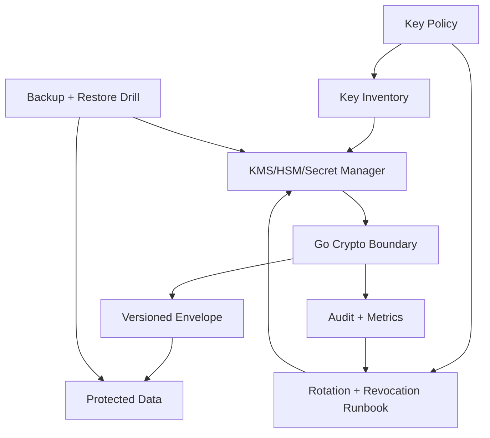

The invariant:

> Data should be protected by keys with explicit purpose, limited blast radius, lifecycle metadata, controlled access, auditable operations, rotation path, and compromise response.

---

## 47. Mini Exercises

### Exercise 1 — Classify Secrets

For your current service, classify:

- DB credentials,
- JWT signing key,
- OAuth client secret,
- webhook HMAC key,
- TLS private key,
- password pepper,
- field encryption key,
- Redis password,
- S3 credentials.

For each, write:

```text
purpose:
storage:
owner:
rotation strategy:
revocation strategy:
blast radius:
audit source:
```

### Exercise 2 — Design Envelope Metadata

Design envelope for:

```text
tenant-scoped regulatory case document attachment
```

Include:

- `kid`,
- `alg`,
- `purpose`,
- `tenant_id`,
- `case_id`,
- `document_id`,
- `version`,
- `encrypted_dek`,
- `created_at`.

Decide what goes into AAD.

### Exercise 3 — Rotation Plan

Given:

```text
field encryption key v1 has been active for 18 months.
10 million records are encrypted.
service must stay online.
```

Design:

- key v2 deployment,
- active write switch,
- lazy migration,
- old key usage metrics,
- retirement condition,
- rollback plan.

### Exercise 4 — Incident Response

Scenario:

```text
HMAC webhook secret for Partner A appeared in CI log.
```

Write a runbook:

- containment,
- partner communication,
- dual key rollout,
- replay risk assessment,
- log cleanup limitation,
- monitoring,
- postmortem guardrail.

---

## 48. What To Remember

1. Key management is a lifecycle and governance problem, not just a storage problem.
2. Every key needs purpose, owner, algorithm, cryptoperiod, access policy, rotation path, and compromise response.
3. Envelope encryption is usually the right pattern for data encryption at scale.
4. Store metadata with ciphertext: version, algorithm, key ID, purpose, and AAD context.
5. Rotation does not necessarily mean immediate re-encryption of all data.
6. Revocation is different from rotation.
7. Decrypt permission is high-risk and must be least privilege.
8. Authorization should happen before decrypting sensitive data.
9. Go makes crypto APIs explicit, but you must build the lifecycle boundary yourself.
10. FIPS support helps with module compliance, but does not make the whole application compliant by itself.

---

## 49. References

Primary references used for this part:

1. Go Security documentation — https://go.dev/doc/security/
2. Go FIPS 140-3 Compliance — https://go.dev/doc/security/fips140
3. Go 1.26 Release Notes — https://go.dev/doc/go1.26
4. Go `crypto/fips140` source documentation — https://go.dev/src/crypto/fips140/fips140.go
5. Go `crypto/rand` package — https://pkg.go.dev/crypto/rand
6. Go `crypto/cipher` package — https://pkg.go.dev/crypto/cipher
7. NIST SP 800-57 Part 1 Revision 5, Recommendation for Key Management — https://csrc.nist.gov/pubs/sp/800/57/pt1/r5/final
8. AWS KMS Cryptography Essentials — https://docs.aws.amazon.com/kms/latest/developerguide/kms-cryptography.html
9. AWS KMS Key Rotation — https://docs.aws.amazon.com/kms/latest/developerguide/rotate-keys.html
10. AWS KMS Key Concepts — https://docs.aws.amazon.com/kms/latest/developerguide/concepts.html
11. OWASP Cryptographic Storage Cheat Sheet — https://cheatsheetseries.owasp.org/cheatsheets/Cryptographic_Storage_Cheat_Sheet.html
12. OWASP Secrets Management Cheat Sheet — https://cheatsheetseries.owasp.org/cheatsheets/Secrets_Management_Cheat_Sheet.html

---

## 50. Next Part

Next:

```text
learn-go-security-cryptography-integrity-part-013.md
```

Topic:

```text
X.509, PKI, certificate path validation, trust anchor, SAN, EKU, expiry, revocation, self-signed cert, private CA, and Go crypto/x509 pitfalls
```

This next part will move from general key lifecycle into certificate-based trust systems.

<!-- NAVIGATION_FOOTER -->
<div class="page-nav">
<a href="./learn-go-security-cryptography-integrity-part-011.md">⬅️ Part 011 — Password Security in Go: bcrypt, scrypt, Argon2id, PBKDF2, Pepper, Migration, Breach Defense, Lockout, Throttling, and NIST SP 800-63B-4 Baseline</a>
<a href="./index.md">📚 Kategori</a>
<a href="../../index.md">🏠 Home</a>
<a href="./learn-go-security-cryptography-integrity-part-013.md">Part 013 — X.509 and PKI in Go: Certificate Path Validation, Trust Anchors, SAN, EKU, Expiry, Revocation, Self-Signed Certs, Private CA, and `crypto/x509` Pitfalls ➡️</a>
</div>
