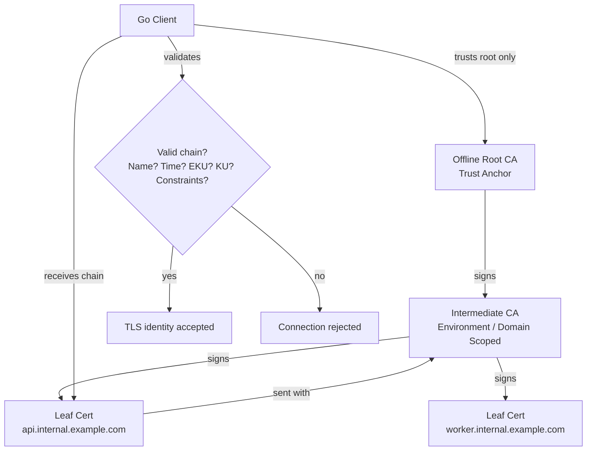
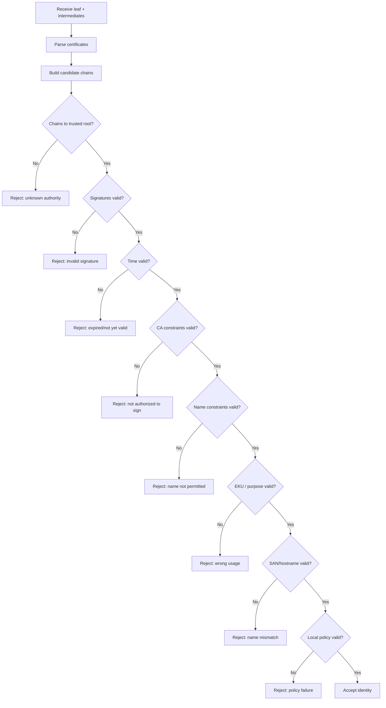
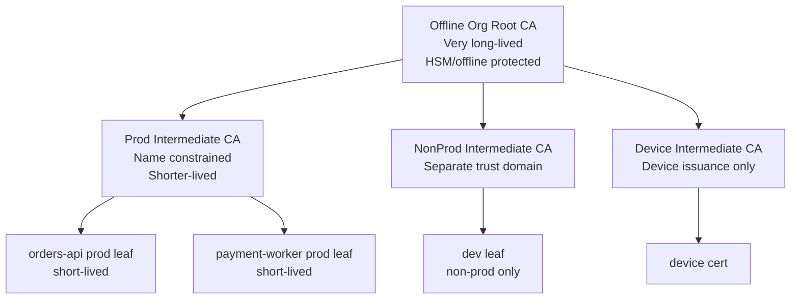
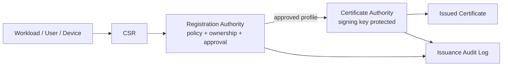
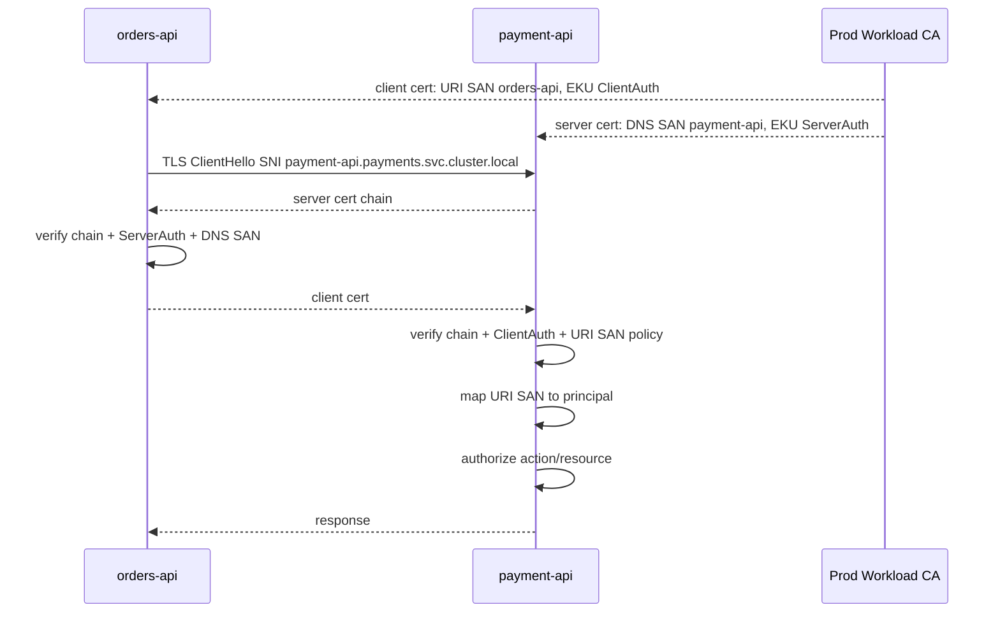
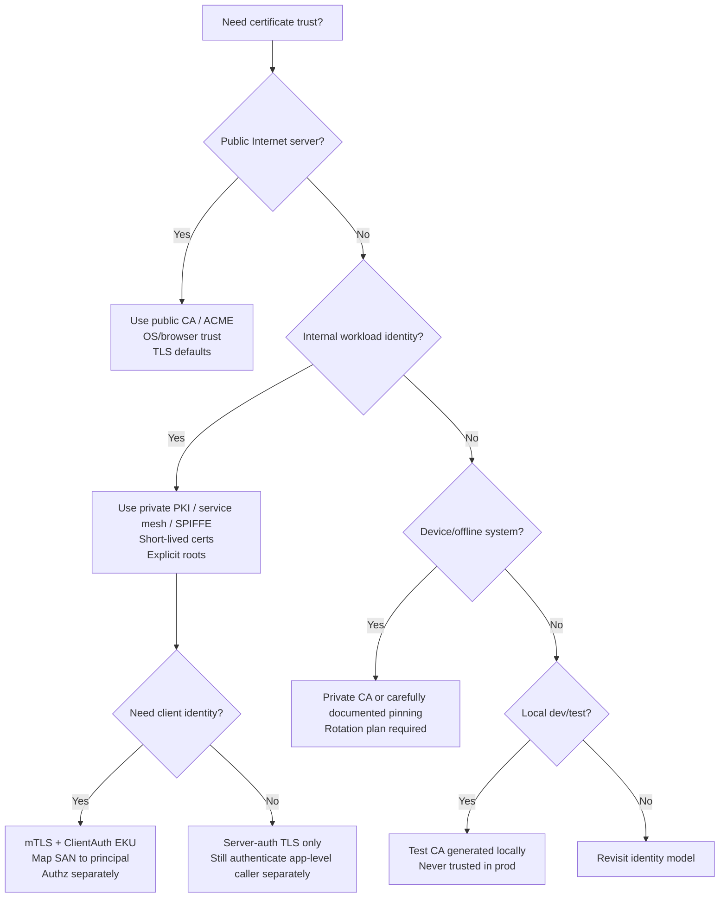

# learn-go-security-cryptography-integrity-part-013.md

# Part 013 — X.509 and PKI in Go: Certificate Path Validation, Trust Anchors, SAN, EKU, Expiry, Revocation, Self-Signed Certs, Private CA, and `crypto/x509` Pitfalls

> Series: `learn-go-security-cryptography-integrity`  
> Part: `013 / 034`  
> Audience: Java software engineer moving deeply into Go security engineering  
> Go baseline: Go `1.26.x`  
> Theme: **An X.509 certificate is not “the identity”. It is a signed claim about a public key, constrained by policy, time, name, usage, issuer, and local trust configuration.**

---

## 0. Why This Part Exists

X.509 and PKI are often treated as boring infrastructure details:

- “just install the certificate”,
- “just add it to trust store”,
- “just set `RootCAs`”,
- “just use self-signed in dev”,
- “just disable verification temporarily”,
- “just trust the internal CA”,
- “just use mTLS”.

That casualness is dangerous.

A large number of production security failures happen not because TLS itself is broken, but because certificate validation is misunderstood:

- trusting a leaf certificate as if it were a CA,
- using Common Name instead of SAN,
- accepting any certificate due to `InsecureSkipVerify`,
- mixing public Web PKI and private service PKI,
- failing to check EKU for client vs server identity,
- pinning the wrong thing,
- forgetting certificate rotation,
- issuing certificates with too much authority,
- loading a test root CA into a production trust store,
- relying on revocation without designing how revocation is actually checked,
- treating certificate possession as full authorization.

This part builds a deep mental model for **X.509 and PKI in Go**. It is not only about `crypto/x509` APIs. It is about making certificate-based trust defensible.

Go's `crypto/x509` package implements a subset of X.509 focused on the Internet PKI and public TLS certificate ecosystem. It can parse/generate certificates, CSRs, CRLs, encoded keys, and includes a chain-building verifier. On macOS and Windows, verification uses platform APIs while Go aims for consistent rules across operating systems.

---

## 1. Learning Goals

After this part, you should be able to:

1. Explain the difference between a **private key**, **public key**, **certificate**, **CSR**, **trust anchor**, **root CA**, **intermediate CA**, and **leaf certificate**.
2. Explain why a certificate is a **signed constrained claim**, not magic identity.
3. Understand how certificate path validation works: signature chain, validity time, Basic Constraints, Key Usage, EKU, SAN, name constraints, and trust anchor selection.
4. Use Go's `crypto/x509` safely for:
   - parsing certificates,
   - building `CertPool`,
   - verifying chains,
   - verifying hostnames,
   - loading private roots,
   - generating development/test certificates.
5. Know why modern hostname validation requires SAN and why legacy Common Name is ignored.
6. Understand EKU and KeyUsage mistakes that break server auth, client auth, and CA separation.
7. Design private CA hierarchy for Go services without accidentally creating universal trust.
8. Understand why revocation is an operational design problem, not a flag you flip in `x509.Verify`.
9. Know the safe patterns and unsafe anti-patterns around `InsecureSkipVerify`, pinning, self-signed certs, and test certificates.
10. Build a review checklist for certificate-based identity in production Go services.

---

## 2. Core Mental Model

The shortest useful definition:

> A certificate binds a public key to a subject/name/usage under an issuer's signature, subject to validity period, extensions, policy, and local trust anchors.

In other words:

```text
Certificate = PublicKey + Claims + Constraints + IssuerSignature
```

But this is only useful when a verifier asks:

```text
Do I locally trust a chain from this leaf certificate to a trusted root,
for this exact purpose,
for this exact name,
at this exact time,
under these constraints?
```

That is why certificate validation is contextual.

The same leaf certificate may be:

- valid for `api.internal.example.com`,
- invalid for `db.internal.example.com`,
- valid for server auth,
- invalid for client auth,
- valid yesterday,
- expired today,
- trusted by one service because it trusts `Internal Root CA`,
- untrusted by another service because it uses only the public OS trust store,
- acceptable for TLS transport,
- insufficient for application authorization.

A certificate is not a global identity. It is a claim evaluated by a relying party.

---

## 3. The PKI Object Model

### 3.1 Private key

A private key is the secret material used to prove possession of the corresponding public key.

Examples:

- RSA private key,
- ECDSA private key,
- Ed25519 private key.

The private key must be protected. A certificate does **not** contain the private key. If a private key leaks, anyone can impersonate that certificate holder until revocation/rotation/expiry mitigates it.

### 3.2 Public key

A public key can be shared. It is used by others to verify signatures or perform key agreement, depending on algorithm and protocol.

But a naked public key says nothing about:

- who owns it,
- what name it represents,
- who vouched for it,
- whether it may be used for TLS server auth,
- whether it has expired,
- whether it belongs to a CA or a leaf.

That is why public keys are wrapped in certificates.

### 3.3 Certificate

A certificate is a signed statement over a public key and metadata.

Important certificate fields/extensions include:

| Field / Extension | Purpose |
|---|---|
| Subject | Human-readable subject DN. Not sufficient for hostname verification. |
| Issuer | Entity that signed the certificate. |
| SerialNumber | Unique identifier per issuing CA. Needed for revocation and audit. |
| NotBefore / NotAfter | Validity window. |
| SubjectPublicKeyInfo | Public key and algorithm. |
| SignatureAlgorithm | Algorithm used by issuer to sign certificate. |
| SAN | Names/IPs/URIs/email addresses this certificate is valid for. |
| Basic Constraints | Whether certificate is a CA; optional path length constraint. |
| Key Usage | Low-level permitted key operations. |
| Extended Key Usage | Higher-level purpose such as server auth/client auth/code signing. |
| Subject Key Identifier | Identifier for this certificate's public key. |
| Authority Key Identifier | Identifier linking to issuer's key. |
| Name Constraints | Restricts namespaces a CA may issue for. |
| CRL Distribution Points | Where revocation lists may be found. |
| OCSP Server / AIA | Online status / issuer access metadata. |
| Certificate Policies | Policy OIDs for relying-party policy decisions. |

### 3.4 CSR

A Certificate Signing Request is a request to a CA asking: “please issue a certificate for this public key and these requested names/usages.”

A CSR is not authorization. A CA must validate it against policy.

CSR validation should check:

- requester identity,
- requested SANs,
- requested EKUs,
- key type/size,
- proof of private key possession,
- approval workflow,
- issuance policy,
- audit trail.

### 3.5 Root CA

A root CA is a trust anchor. It is trusted directly by local configuration, OS trust store, browser trust store, application trust store, or service mesh configuration.

Root CA security is extremely high impact because if the root private key is compromised, an attacker can issue certificates for anything in its trusted scope.

### 3.6 Intermediate CA

An intermediate CA is signed by a root or another intermediate. It signs leaf certificates or lower intermediates.

Intermediates are used to reduce blast radius:

- root stays offline,
- intermediate handles operational issuance,
- different environments/domains get different intermediates,
- path length and name constraints can limit authority.

### 3.7 Leaf certificate

A leaf/end-entity certificate is used by actual workloads:

- HTTPS server,
- mTLS client,
- database server,
- message broker,
- service account,
- device,
- workload identity.

A leaf certificate should **not** be able to sign other certificates.

---

## 4. Mermaid: PKI Chain as Delegated Authority



Key idea:

> The client does not “trust the server certificate” directly. It trusts a root, then verifies whether the server certificate chains correctly to that root and satisfies the intended purpose.

---

## 5. Java-to-Go Mindset Shift

As a Java engineer, you may be familiar with:

- `KeyStore`,
- `TrustStore`,
- `TrustManager`,
- `KeyManager`,
- JKS / PKCS#12,
- `X509TrustManager`,
- JSSE,
- JVM-wide system properties,
- application-server TLS configuration.

In Go, the model is usually more explicit and code-level:

| Java / JVM Mental Model | Go Mental Model |
|---|---|
| Trust store often configured via JVM/system/application server | `*x509.CertPool` passed into `tls.Config.RootCAs` or `ClientCAs` |
| `KeyStore` may contain private key + cert chain | Go often loads PEM key pair with `tls.LoadX509KeyPair` |
| `TrustManager` performs validation | `crypto/tls` + `crypto/x509` perform default validation; custom callbacks possible |
| JVM config can be global | Go config is usually per client/server object |
| Container cert problems often hidden by JVM base image | Go containers may need OS CA bundle or explicit `SetFallbackRoots`/`RootCAs` |
| Hostname verification can be toggled in some libraries | Go's default TLS client validates chain and hostname unless disabled |

The main Go advantage is explicitness. The main Go risk is also explicitness: you can easily wire trust incorrectly if you do not understand the fields.

---

## 6. Certificate Verification: What Actually Happens

A relying party normally performs these checks:

1. **Parse** presented certificates.
2. **Build one or more candidate chains** from leaf to trusted root.
3. **Verify each signature** along the chain.
4. **Check validity time** for every certificate.
5. **Check CA authority**:
   - issuer cert must be allowed to sign certs,
   - Basic Constraints CA must be true for CA certificates,
   - KeyUsageCertSign should be present for CA signing usage.
6. **Check path length constraints**.
7. **Check name constraints** if present.
8. **Check intended usage**:
   - server auth,
   - client auth,
   - code signing,
   - email protection,
   - etc.
9. **Check hostname or identity name**:
   - DNS SAN,
   - IP SAN,
   - URI SAN depending on identity model.
10. **Check local policy**:
    - allowed roots,
    - allowed issuers,
    - environment restrictions,
    - certificate policies,
    - mTLS role mapping,
    - custom constraints.
11. **Optionally check revocation**, if the system has designed a revocation mechanism.

A simplified chain validation flow:



---

## 7. Go `crypto/x509`: What It Is and Is Not

The package `crypto/x509` provides:

- certificate parsing,
- certificate generation,
- CSR parsing/generation,
- CRL parsing/generation,
- encoded key parsing,
- certificate pool management,
- hostname verification,
- chain verification.

But it does not automatically solve:

- your business authorization,
- certificate issuance governance,
- CA private-key protection,
- revocation distribution,
- service identity mapping,
- workload-to-role mapping,
- secret storage,
- certificate rotation orchestration,
- detection of every possible profile/policy issue in your private PKI.

The boundary is important:

```text
crypto/x509 tells you: "This certificate chain can be valid for this cryptographic/name/purpose context."

Your application must decide: "Does this authenticated identity have permission to perform this action?"
```

Do not confuse authentication with authorization.

---

## 8. `x509.Certificate.Verify` and `VerifyOptions`

The core manual verification API is:

```go
func (c *x509.Certificate) Verify(opts x509.VerifyOptions) (chains [][]*x509.Certificate, err error)
```

Important options:

| Option | Meaning | Security Note |
|---|---|---|
| `DNSName` | Hostname checked against leaf SAN using `VerifyHostname` / platform verifier | Empty means no hostname check in manual `Verify` |
| `Intermediates` | Pool of untrusted intermediate certificates used for chain building | Do not place intermediates in roots unless intentionally trusted as anchors |
| `Roots` | Trusted root pool. If nil, system roots/platform verifier are used | Explicit private root pool is safer for internal PKI |
| `CurrentTime` | Time used for validity checks. Zero means now | Do not set arbitrary historical time except controlled validation use cases |
| `KeyUsages` | Acceptable EKUs. Empty means `ExtKeyUsageServerAuth` | For client cert validation, set `ExtKeyUsageClientAuth` |
| `MaxConstraintComparisions` | Limit for name-constraint checks | Defense against pathological cert CPU abuse |
| `CertificatePolicies` | Acceptable policy OIDs | Requires policy design; not a substitute for app authz |

A common mistake:

```go
chains, err := cert.Verify(x509.VerifyOptions{
    Roots: roots,
})
```

This checks chain validity and, by default, server-auth EKU, but does **not** check the hostname unless `DNSName` is set.

For server certificate verification outside `crypto/tls`, use:

```go
chains, err := cert.Verify(x509.VerifyOptions{
    DNSName:       "api.internal.example.com",
    Roots:         roots,
    Intermediates: intermediates,
    KeyUsages:     []x509.ExtKeyUsage{x509.ExtKeyUsageServerAuth},
})
```

For client certificate verification:

```go
chains, err := cert.Verify(x509.VerifyOptions{
    Roots:         clientCARoots,
    Intermediates: intermediates,
    KeyUsages:     []x509.ExtKeyUsage{x509.ExtKeyUsageClientAuth},
})
```

But for mTLS in `crypto/tls`, you normally let TLS perform certificate verification via `tls.Config` rather than calling `Verify` manually.

---

## 9. Hostname Verification: SAN, Not Common Name

Modern TLS identity verification uses Subject Alternative Name.

Go's `Certificate.VerifyHostname` checks:

- IP addresses against `IPAddresses` SAN,
- DNS names against `DNSNames` SAN,
- wildcard only as complete left-most label, such as `*.example.com`,
- legacy Common Name is ignored.

This matters because many older internal certificates still put the hostname only in Common Name:

```text
Subject CN = api.internal.example.com
SAN       = <missing>
```

That is not sufficient for modern hostname verification.

Correct server certificate:

```text
Subject CN = api.internal.example.com         # optional / human-readable
SAN DNS   = api.internal.example.com         # required for DNS name validation
EKU       = ServerAuth
KU        = DigitalSignature                 # plus KeyEncipherment for legacy RSA TLS cases
```

Correct IP certificate:

```text
SAN IP = 10.10.20.30
```

Not:

```text
SAN DNS = 10.10.20.30
```

IP addresses must be IP SANs, not DNS SAN strings.

---

## 10. SAN Design for Internal Go Services

SAN is not just a technical field. It defines what names the certificate is valid for.

Examples:

| Workload | Suggested SAN Type | Example |
|---|---|---|
| Public HTTPS server | DNS SAN | `api.example.com` |
| Internal Kubernetes service | DNS SAN or URI SAN | `orders.default.svc.cluster.local` |
| SPIFFE workload identity | URI SAN | `spiffe://prod.example/ns/payments/sa/orders` |
| Fixed appliance/device | DNS or URI SAN | `device-123.region.example` |
| IP-only endpoint | IP SAN | `10.0.1.25` |
| Human user cert | Usually not DNS SAN | depends on enterprise PKI policy |

For service identity, DNS names are easy but can be weak if DNS ownership is not tightly governed.

URI SANs can model workload identity better:

```text
spiffe://trust-domain/ns/namespace/sa/service-account
```

But URI SANs require your verifier to explicitly check them. TLS's default server hostname check is DNS/IP-oriented.

---

## 11. Key Usage vs Extended Key Usage

Two similar-looking concepts often cause confusion.

### 11.1 Key Usage

Key Usage describes low-level cryptographic operations allowed for the key.

Examples in Go:

```go
x509.KeyUsageDigitalSignature
x509.KeyUsageKeyEncipherment
x509.KeyUsageCertSign
x509.KeyUsageCRLSign
```

Typical mapping:

| Certificate Type | Key Usage |
|---|---|
| Root CA | `CertSign`, `CRLSign` |
| Intermediate CA | `CertSign`, `CRLSign` |
| TLS server leaf | `DigitalSignature`; sometimes `KeyEncipherment` for legacy RSA key exchange |
| TLS client leaf | `DigitalSignature` |

### 11.2 Extended Key Usage

Extended Key Usage describes application-level purpose.

Examples in Go:

```go
x509.ExtKeyUsageServerAuth
x509.ExtKeyUsageClientAuth
x509.ExtKeyUsageCodeSigning
x509.ExtKeyUsageEmailProtection
```

Typical mapping:

| Use Case | EKU |
|---|---|
| HTTPS server | `ServerAuth` |
| mTLS client | `ClientAuth` |
| Internal service as both server and client | Often both `ServerAuth` and `ClientAuth`, but review blast radius |
| Code signing | `CodeSigning` |

### 11.3 Common EKU mistakes

Bad:

```go
ExtKeyUsage: []x509.ExtKeyUsage{x509.ExtKeyUsageAny}
```

This can make the certificate too broadly acceptable.

Bad:

```go
KeyUsages: nil // when verifying client cert manually
```

An empty `VerifyOptions.KeyUsages` means server auth by default, not “client auth”.

Correct for client cert verification:

```go
KeyUsages: []x509.ExtKeyUsage{x509.ExtKeyUsageClientAuth}
```

Correct for server cert verification:

```go
KeyUsages: []x509.ExtKeyUsage{x509.ExtKeyUsageServerAuth}
```

---

## 12. Basic Constraints and CA Separation

Basic Constraints tells whether a certificate is allowed to act as a CA.

A CA certificate should have:

```go
IsCA:                  true,
BasicConstraintsValid: true,
KeyUsage:              x509.KeyUsageCertSign | x509.KeyUsageCRLSign,
```

A leaf certificate should have:

```go
IsCA:                  false,
BasicConstraintsValid: true,
KeyUsage:              x509.KeyUsageDigitalSignature,
```

A critical mistake is issuing leaf certificates that can sign other certificates.

Bad leaf:

```go
IsCA:     true,
KeyUsage: x509.KeyUsageCertSign | x509.KeyUsageDigitalSignature,
```

This creates a privilege escalation path: compromise of one service private key can become a mini-CA compromise.

---

## 13. Trust Anchors and `CertPool`

A trust anchor is a certificate the verifier directly trusts.

In Go, trust anchors are represented by `*x509.CertPool`.

### 13.1 System roots

```go
roots, err := x509.SystemCertPool()
if err != nil {
    return fmt.Errorf("load system roots: %w", err)
}
```

Use system roots for public Internet TLS, unless you have a controlled reason not to.

### 13.2 Custom private roots

For internal PKI, build a dedicated root pool:

```go
func LoadCertPoolFromPEM(pemBytes []byte) (*x509.CertPool, error) {
    pool := x509.NewCertPool()
    if ok := pool.AppendCertsFromPEM(pemBytes); !ok {
        return nil, errors.New("no certificates parsed from PEM")
    }
    return pool, nil
}
```

Then use it explicitly:

```go
client := &http.Client{
    Transport: &http.Transport{
        TLSClientConfig: &tls.Config{
            RootCAs:    internalRoots,
            MinVersion: tls.VersionTLS12,
        },
    },
}
```

### 13.3 Do not put leaf certs into root pool unless pinning intentionally

This is a common anti-pattern:

```go
roots := x509.NewCertPool()
roots.AppendCertsFromPEM(serverLeafPEM)
```

That means the leaf becomes a trust anchor. If you do this accidentally, you are no longer validating normal PKI delegation. You are doing a form of pinning/trust-on-first-config.

Sometimes this is acceptable for a very narrow embedded/device trust model, but it must be deliberate, documented, and rotation-aware.

---

## 14. `SystemCertPool`, `SetFallbackRoots`, and Containers

Minimal containers often do not include CA bundles. Then HTTPS clients may fail with unknown authority.

Bad response:

```go
tls.Config{InsecureSkipVerify: true}
```

Good responses:

1. Install CA certificates in the image.
2. Mount a CA bundle.
3. Use explicit `RootCAs` for private PKI.
4. Use `x509.SetFallbackRoots` when system roots/platform verifier are unavailable.

Example fallback root initialization:

```go
func ConfigureFallbackRoots(pemBundle []byte) error {
    pool := x509.NewCertPool()
    if ok := pool.AppendCertsFromPEM(pemBundle); !ok {
        return errors.New("no fallback roots parsed")
    }

    // Must be called once. Calling multiple times panics.
    x509.SetFallbackRoots(pool)
    return nil
}
```

Use fallback roots carefully:

- call once at process startup,
- never with untrusted data,
- do not use as a dynamic hot-reload mechanism,
- be aware of platform behavior differences,
- prefer explicit `RootCAs` when the trust scope is application-specific.

---

## 15. Public Web PKI vs Private PKI

Public Web PKI answers:

> Is this server valid for `api.example.com` under a public CA trusted by the platform/browser?

Private PKI answers:

> Is this internal workload/device/user valid under my organization/service mesh/cluster/domain trust policy?

Do not blur the two.

| Aspect | Public Web PKI | Private PKI |
|---|---|---|
| Trust roots | OS/browser trust stores | Organization-controlled roots |
| Naming | Public DNS names | Internal DNS, SPIFFE URI, device IDs, service IDs |
| Issuance | Public CA validation process | Internal CA/RA/workload identity system |
| Revocation | Browser/platform ecosystem, OCSP/CRL behavior varies | Must design yourself |
| Governance | CA/B Forum + public audits | Internal policy + audit |
| Typical Go config | `RootCAs: nil` | explicit `RootCAs`, `ClientCAs`, `VerifyConnection` policy |

For internal systems, the safest default is:

```text
Do not use public OS roots to validate internal workload identity unless that is explicitly intended.
```

Otherwise any publicly trusted CA that can issue for a name may satisfy transport trust.

---

## 16. Self-Signed Certificates

A self-signed certificate is signed by its own private key.

There are two very different cases:

### 16.1 Self-signed root CA

This is normal:

```text
Root CA certificate is self-signed and installed as a trust anchor.
```

### 16.2 Self-signed leaf certificate

This is risky:

```text
A service presents a self-signed leaf certificate directly.
```

It may be acceptable in:

- local development,
- ephemeral test environments,
- embedded systems with pinned trust,
- offline tooling,
- controlled one-to-one trust.

It is usually not acceptable as a general service identity architecture.

Better pattern:

```text
Private Root CA -> Intermediate CA -> Short-lived leaf cert
```

Even for internal systems.

---

## 17. Private CA Design for Go Services

A defensible private CA hierarchy:



Key design decisions:

| Decision | Recommended Direction |
|---|---|
| Root CA online? | Usually no. Keep offline or heavily protected. |
| One CA for all environments? | Avoid. Separate prod/non-prod. |
| Long-lived leaf certificates? | Avoid. Prefer short-lived certs with automated rotation. |
| Same cert for server and client? | Sometimes practical, but review role separation. |
| Wildcard internal certs? | Avoid for service identity. Use specific SANs. |
| Test root in prod trust store? | Never. |
| CA private key in app container? | Never. |
| Issuance without approval/policy? | Avoid. Build RA/policy checks. |

---

## 18. Generating Certificates in Go: Development and Test Use

Go can generate X.509 certificates via `x509.CreateCertificate`.

For production CA operations, prefer a dedicated CA system:

- cloud private CA,
- Vault PKI,
- SPIRE/SPIFFE,
- cert-manager + controlled issuer,
- enterprise CA,
- HSM/KMS-backed CA,
- audited issuance workflow.

But generating certs in Go is useful for:

- unit tests,
- integration tests,
- local labs,
- ephemeral test CA,
- understanding fields.

### 18.1 Generate a local test root CA

```go
package testpki

import (
    "crypto/ecdsa"
    "crypto/elliptic"
    "crypto/rand"
    "crypto/x509"
    "crypto/x509/pkix"
    "encoding/pem"
    "math/big"
    "time"
)

type PEMPair struct {
    CertPEM []byte
    KeyPEM  []byte
    Cert    *x509.Certificate
    Key     *ecdsa.PrivateKey
}

func NewTestRootCA(now time.Time) (*PEMPair, error) {
    key, err := ecdsa.GenerateKey(elliptic.P256(), rand.Reader)
    if err != nil {
        return nil, err
    }

    serial, err := rand.Int(rand.Reader, new(big.Int).Lsh(big.NewInt(1), 128))
    if err != nil {
        return nil, err
    }

    tmpl := &x509.Certificate{
        SerialNumber: serial,
        Subject: pkix.Name{
            CommonName:   "Example Test Root CA",
            Organization: []string{"Example Test"},
        },
        NotBefore:             now.Add(-time.Minute),
        NotAfter:              now.Add(24 * time.Hour),
        KeyUsage:              x509.KeyUsageCertSign | x509.KeyUsageCRLSign,
        BasicConstraintsValid: true,
        IsCA:                  true,
        MaxPathLen:            1,
        MaxPathLenZero:        false,
        SubjectKeyId:          []byte{1, 2, 3, 4, 5},
    }

    der, err := x509.CreateCertificate(rand.Reader, tmpl, tmpl, &key.PublicKey, key)
    if err != nil {
        return nil, err
    }

    cert, err := x509.ParseCertificate(der)
    if err != nil {
        return nil, err
    }

    keyDER, err := x509.MarshalECPrivateKey(key)
    if err != nil {
        return nil, err
    }

    return &PEMPair{
        CertPEM: pem.EncodeToMemory(&pem.Block{Type: "CERTIFICATE", Bytes: der}),
        KeyPEM:  pem.EncodeToMemory(&pem.Block{Type: "EC PRIVATE KEY", Bytes: keyDER}),
        Cert:    cert,
        Key:     key,
    }, nil
}
```

### 18.2 Generate a server leaf certificate

```go
func NewTestServerCert(now time.Time, ca *PEMPair, dnsNames []string) (*PEMPair, error) {
    key, err := ecdsa.GenerateKey(elliptic.P256(), rand.Reader)
    if err != nil {
        return nil, err
    }

    serial, err := rand.Int(rand.Reader, new(big.Int).Lsh(big.NewInt(1), 128))
    if err != nil {
        return nil, err
    }

    tmpl := &x509.Certificate{
        SerialNumber: serial,
        Subject: pkix.Name{
            CommonName: "test server leaf",
        },
        DNSNames:              dnsNames,
        NotBefore:             now.Add(-time.Minute),
        NotAfter:              now.Add(2 * time.Hour),
        KeyUsage:              x509.KeyUsageDigitalSignature,
        ExtKeyUsage:           []x509.ExtKeyUsage{x509.ExtKeyUsageServerAuth},
        BasicConstraintsValid: true,
        IsCA:                  false,
    }

    der, err := x509.CreateCertificate(rand.Reader, tmpl, ca.Cert, &key.PublicKey, ca.Key)
    if err != nil {
        return nil, err
    }

    cert, err := x509.ParseCertificate(der)
    if err != nil {
        return nil, err
    }

    keyDER, err := x509.MarshalECPrivateKey(key)
    if err != nil {
        return nil, err
    }

    return &PEMPair{
        CertPEM: pem.EncodeToMemory(&pem.Block{Type: "CERTIFICATE", Bytes: der}),
        KeyPEM:  pem.EncodeToMemory(&pem.Block{Type: "EC PRIVATE KEY", Bytes: keyDER}),
        Cert:    cert,
        Key:     key,
    }, nil
}
```

This certificate is valid for names in `dnsNames`, not for whatever Common Name says.

---

## 19. Verifying a Leaf Certificate Manually

Manual verification is useful for:

- tests,
- certificate linting,
- custom protocols,
- validating uploaded certificates,
- validating offline certificate bundles,
- CA issuance policy checks.

Example:

```go
func VerifyServerLeaf(leaf *x509.Certificate, rootPEM []byte, host string) error {
    roots := x509.NewCertPool()
    if ok := roots.AppendCertsFromPEM(rootPEM); !ok {
        return errors.New("failed to parse root PEM")
    }

    _, err := leaf.Verify(x509.VerifyOptions{
        DNSName:   host,
        Roots:     roots,
        KeyUsages: []x509.ExtKeyUsage{x509.ExtKeyUsageServerAuth},
    })
    if err != nil {
        return fmt.Errorf("verify server leaf: %w", err)
    }

    return nil
}
```

Common mistake:

```go
_, err := leaf.Verify(x509.VerifyOptions{Roots: roots})
```

This does not check the hostname.

---

## 20. Verifying a Chain With Intermediates

A server typically presents:

```text
leaf certificate + intermediate certificates
```

It usually does **not** send the root. The verifier already has trusted roots.

Manual chain example:

```go
func VerifyServerChain(leaf *x509.Certificate, intermediateCerts []*x509.Certificate, roots *x509.CertPool, host string) error {
    intermediates := x509.NewCertPool()
    for _, ic := range intermediateCerts {
        intermediates.AddCert(ic)
    }

    chains, err := leaf.Verify(x509.VerifyOptions{
        DNSName:       host,
        Roots:         roots,
        Intermediates: intermediates,
        KeyUsages:     []x509.ExtKeyUsage{x509.ExtKeyUsageServerAuth},
    })
    if err != nil {
        return fmt.Errorf("verify chain: %w", err)
    }

    if len(chains) == 0 {
        return errors.New("no verified chains returned")
    }

    return nil
}
```

Do not put intermediates into `Roots` unless you intentionally want them to be trust anchors.

---

## 21. TLS Client Configuration With Private CA

For a Go HTTP client calling an internal HTTPS service:

```go
func NewInternalHTTPClient(rootPEM []byte) (*http.Client, error) {
    roots := x509.NewCertPool()
    if ok := roots.AppendCertsFromPEM(rootPEM); !ok {
        return nil, errors.New("no root cert parsed")
    }

    tr := &http.Transport{
        TLSClientConfig: &tls.Config{
            MinVersion: tls.VersionTLS12,
            RootCAs:    roots,
        },
    }

    return &http.Client{
        Timeout:   10 * time.Second,
        Transport: tr,
    }, nil
}
```

When making request to:

```text
https://orders-api.internal.example.com
```

Go's TLS client checks:

- chain to `RootCAs`,
- validity time,
- server auth EKU,
- hostname `orders-api.internal.example.com` against SAN.

If you connect by IP but cert only has DNS SAN, validation fails. That is correct.

---

## 22. TLS Server Configuration With Certificate Chain

Server certificate PEM should usually include:

```text
leaf cert
intermediate cert(s)
```

Not the root.

```go
func NewTLSServer(addr string, certFile string, keyFile string, handler http.Handler) (*http.Server, error) {
    cert, err := tls.LoadX509KeyPair(certFile, keyFile)
    if err != nil {
        return nil, fmt.Errorf("load key pair: %w", err)
    }

    return &http.Server{
        Addr:    addr,
        Handler: handler,
        TLSConfig: &tls.Config{
            MinVersion:   tls.VersionTLS12,
            Certificates: []tls.Certificate{cert},
        },
        ReadHeaderTimeout: 5 * time.Second,
    }, nil
}
```

If certificate rotation is required, avoid static `Certificates` only. Use `GetCertificate` with a safe reload mechanism or delegate to ingress/service mesh.

---

## 23. mTLS: Client Certificate Verification

For a server that requires client certificates:

```go
func NewMTLSServer(addr string, serverCert tls.Certificate, clientCAPEM []byte, handler http.Handler) (*http.Server, error) {
    clientCAs := x509.NewCertPool()
    if ok := clientCAs.AppendCertsFromPEM(clientCAPEM); !ok {
        return nil, errors.New("no client CA parsed")
    }

    return &http.Server{
        Addr:    addr,
        Handler: handler,
        TLSConfig: &tls.Config{
            MinVersion:   tls.VersionTLS12,
            Certificates: []tls.Certificate{serverCert},
            ClientCAs:    clientCAs,
            ClientAuth:   tls.RequireAndVerifyClientCert,
        },
        ReadHeaderTimeout: 5 * time.Second,
    }, nil
}
```

This verifies that the client certificate chains to `ClientCAs` and is acceptable for client auth.

But mTLS authentication is not authorization.

You still need to map the certificate identity to application permissions:

```go
func AuthzFromClientCert(r *http.Request) (*Principal, error) {
    if r.TLS == nil || len(r.TLS.PeerCertificates) == 0 {
        return nil, errors.New("missing client certificate")
    }

    leaf := r.TLS.PeerCertificates[0]

    // Example only. Prefer a stable identity model such as URI SAN / SPIFFE.
    for _, uri := range leaf.URIs {
        if uri.Scheme == "spiffe" {
            return PrincipalFromSPIFFE(uri.String())
        }
    }

    return nil, errors.New("no accepted workload identity in client certificate")
}
```

Do not grant admin access just because the client cert chains to a trusted CA.

---

## 24. mTLS Identity Mapping Pitfalls

Bad policy:

```text
Any cert signed by Internal Root CA is admin.
```

Better policy:

```text
Only URI SAN spiffe://prod.example/ns/payments/sa/reconciliation
may call POST /settlements/reconcile.
```

Even better:

```text
mTLS authenticates workload identity.
Authorization engine evaluates action/resource/policy.
Audit logs record cert fingerprint, SAN identity, issuer, serial, and verified chain root.
```

Recommended mapping fields:

| Field | Stability | Note |
|---|---:|---|
| URI SAN | High | Good for workload identity if policy-controlled |
| DNS SAN | Medium | Good for server names, weaker for roles |
| Subject CN | Low | Legacy; do not rely on for hostname identity |
| Serial number | Medium | Useful for audit/revocation, not role identity alone |
| Certificate fingerprint | Medium | Useful for pinning/audit, bad for frequent rotation if used as primary identity |
| Issuer | Medium | Helps scope trust domain, not enough alone |

---

## 25. `InsecureSkipVerify`: What It Actually Means

`tls.Config.InsecureSkipVerify` disables default server certificate chain and hostname verification.

This means a machine-in-the-middle can present any certificate and be accepted, unless you implement correct custom verification.

Bad:

```go
TLSClientConfig: &tls.Config{
    InsecureSkipVerify: true,
}
```

Better:

```go
TLSClientConfig: &tls.Config{
    RootCAs: roots,
}
```

Advanced custom verification pattern:

```go
TLSClientConfig: &tls.Config{
    InsecureSkipVerify: true, // disables default verification we are replacing
    VerifyConnection: func(cs tls.ConnectionState) error {
        if len(cs.PeerCertificates) == 0 {
            return errors.New("missing peer certificate")
        }

        intermediates := x509.NewCertPool()
        for _, cert := range cs.PeerCertificates[1:] {
            intermediates.AddCert(cert)
        }

        _, err := cs.PeerCertificates[0].Verify(x509.VerifyOptions{
            DNSName:       cs.ServerName,
            Roots:         roots,
            Intermediates: intermediates,
            KeyUsages:     []x509.ExtKeyUsage{x509.ExtKeyUsageServerAuth},
        })
        if err != nil {
            return fmt.Errorf("custom certificate verification failed: %w", err)
        }

        // Additional local policy can go here:
        // - expected URI SAN
        // - issuer allowlist
        // - cert policy OID
        // - public key pin
        return nil
    },
}
```

This pattern is advanced. Most services should not need it.

Rule:

> If `InsecureSkipVerify` appears in production code, it must be treated as a security-sensitive design exception requiring review.

---

## 26. Certificate Pinning

Pinning means accepting only specific certificate/public key/trust anchor material, rather than any valid chain under a configured trust store.

Types:

| Pin Type | Meaning | Rotation Risk |
|---|---|---:|
| Leaf certificate fingerprint | Exact cert must match | Very high |
| Leaf public key / SPKI pin | Same key may survive cert renewal | High |
| Intermediate CA pin | Only that issuer allowed | Medium |
| Private root CA pin | Trust only this root | Lower, but root compromise high impact |
| Policy/URI SAN pin | Identity must match expected value | Lower if automated correctly |

Pinning can reduce some CA compromise risks, but it often causes outages during rotation.

A safer internal strategy is usually:

```text
private root/intermediate trust + short-lived certificates + strict SAN/EKU + automated rotation + explicit authorization
```

Use pinning only when you have:

- a documented threat model,
- a rotation plan,
- backup pins,
- telemetry for upcoming expiry,
- operational runbook.

---

## 27. Revocation Reality

Revocation answers:

> This certificate was issued, but should no longer be trusted before its natural expiry.

Reasons:

- private key compromise,
- wrong SAN issued,
- service decommissioned,
- employee/device offboarding,
- CA misissuance,
- policy violation.

Mechanisms:

| Mechanism | Description | Reality |
|---|---|---|
| CRL | Certificate Revocation List | Can be large; needs fetching/caching |
| OCSP | Online status check | Availability/privacy/caching issues |
| OCSP stapling | Server staples status | Mostly TLS server ecosystem feature |
| Short-lived certs | Reduce need for revocation | Requires automated renewal |
| Trust anchor removal | Remove root/intermediate trust | Broad blast radius |
| Application denylist | Deny serial/fingerprint/identity | Useful for private PKI |

Go's `crypto/x509` can parse and create CRLs, but ordinary certificate verification does not automatically give you a complete revocation architecture for your application.

For private PKI, often the most practical design is:

```text
short-lived leaf certificates + fast rotation + workload identity policy + emergency denylist + root/intermediate compromise runbook
```

For high-assurance systems, add explicit revocation checking:

- CRL fetcher/verifier,
- OCSP validation,
- signed denylist,
- CA event feed,
- service mesh identity revocation,
- certificate transparency or issuance log review.

---

## 28. Expiry and Rotation

Certificates expire. That is not an exception; it is core to PKI.

Operational controls:

- expose cert expiry metrics,
- alert before expiry,
- rotate automatically,
- test renewal before production,
- ensure clients trust both old and new intermediates during migration,
- avoid leaf certs with multi-year lifetimes,
- rehearse intermediate/root rollover.

Go expiry inspection:

```go
func CertExpiryInfo(cert *x509.Certificate, now time.Time) time.Duration {
    return cert.NotAfter.Sub(now)
}
```

HTTP server with certificate reload sketch:

```go
type CertReloader struct {
    mu   sync.RWMutex
    cert *tls.Certificate
}

func (r *CertReloader) GetCertificate(*tls.ClientHelloInfo) (*tls.Certificate, error) {
    r.mu.RLock()
    defer r.mu.RUnlock()
    if r.cert == nil {
        return nil, errors.New("certificate not loaded")
    }
    return r.cert, nil
}

func (r *CertReloader) Update(cert tls.Certificate) {
    r.mu.Lock()
    defer r.mu.Unlock()
    r.cert = &cert
}
```

Important:

- Do not mutate a `tls.Certificate` while it may be used concurrently.
- Use atomic swap or lock-protected immutable value.
- Ensure cert and key match before replacing.
- Include intermediates in the chain.
- Emit telemetry after reload.

---

## 29. Certificate Observability

At production maturity, certificate state must be observable.

Expose metrics such as:

```text
certificate_not_after_timestamp_seconds{service="orders-api",usage="server"}
certificate_days_until_expiry{service="orders-api",usage="server"}
certificate_reload_total{service="orders-api",result="success"}
certificate_reload_total{service="orders-api",result="failure"}
mtls_client_cert_rejected_total{reason="unknown_authority"}
mtls_client_cert_rejected_total{reason="wrong_eku"}
mtls_client_cert_rejected_total{reason="name_policy"}
```

Log fields for mTLS auth decision:

```json
{
  "event": "mtls_client_authenticated",
  "subject": "CN=payment-worker",
  "uri_san": "spiffe://prod.example/ns/payments/sa/payment-worker",
  "issuer": "CN=Prod Workload Intermediate CA",
  "serial": "4fb2...",
  "not_after": "2026-06-25T10:00:00Z",
  "chain_root_fingerprint": "sha256:...",
  "request_id": "..."
}
```

Do not log:

- private keys,
- PEM key material,
- full client cert if it contains sensitive subject data,
- access tokens from headers,
- raw secrets used to fetch certificates.

---

## 30. Certificate Parsing and Untrusted Input

Certificates are complex ASN.1 structures. Treat certificate bytes as untrusted input.

Defensive practices:

- limit input size,
- parse only when necessary,
- reject multiple certs when only one is expected,
- reject unknown critical extensions unless explicitly supported,
- do not build business logic from unvalidated subject strings,
- use structured fields (`DNSNames`, `URIs`, `IPAddresses`) rather than parsing `Subject.String()`.

Bad:

```go
if strings.Contains(cert.Subject.String(), "admin") {
    allowAdmin()
}
```

Better:

```go
principal, err := ExtractApprovedWorkloadIdentity(cert)
if err != nil {
    return deny(err)
}
return authz.Check(principal, action, resource)
```

---

## 31. Extracting URI SAN Safely

Example SPIFFE-like extraction:

```go
func ExtractSingleURISAN(cert *x509.Certificate, allowedTrustDomain string) (string, error) {
    var matches []string

    for _, u := range cert.URIs {
        if u == nil {
            continue
        }
        if u.Scheme != "spiffe" {
            continue
        }
        if u.Host != allowedTrustDomain {
            continue
        }
        matches = append(matches, u.String())
    }

    switch len(matches) {
    case 0:
        return "", errors.New("no allowed URI SAN")
    case 1:
        return matches[0], nil
    default:
        return "", errors.New("multiple allowed URI SANs; ambiguous identity")
    }
}
```

Security policy choices:

- require exactly one accepted identity,
- reject ambiguous certificates,
- validate trust domain,
- validate namespace/service-account pattern,
- do not accept arbitrary URI schemes.

---

## 32. Certificate Issuance Policy

A CA should not sign whatever CSR asks for.

Issuance policy should define:

| Policy Area | Example Rule |
|---|---|
| Key algorithm | ECDSA P-256 / Ed25519 / RSA 3072+ depending on ecosystem/FIPS |
| Leaf lifetime | e.g. 24h, 7d, 30d depending on automation |
| SAN ownership | requester may only request owned service names |
| EKU | server cert gets ServerAuth only; client cert gets ClientAuth only unless approved |
| Wildcard | forbidden or tightly controlled |
| IP SAN | forbidden unless static infrastructure policy allows it |
| Environment | prod CA cannot issue non-prod names and vice versa |
| Approval | high-risk certs require dual control |
| Audit | every issuance has requester, approver, CSR hash, cert serial, policy version |
| Revocation | revocation trigger and publication timeline defined |

A CA is an authorization system.

If issuance is weak, cryptographic verification only proves that weak issuance happened.

---

## 33. CA and RA Boundary

CA means Certificate Authority: signs certificates.

RA means Registration Authority: validates whether the certificate should be issued.

In mature systems, do not let the signer directly accept arbitrary requests.



The CA should receive a constrained issuance request, not raw user intent.

---

## 34. Name Constraints

Name Constraints restrict what names a CA may issue.

Example:

```text
Prod Intermediate CA may issue only DNS names under .prod.internal.example.com
```

This reduces blast radius if an intermediate is compromised.

In Go certificate templates, relevant fields include:

```go
PermittedDNSDomains:         []string{"prod.internal.example.com"},
PermittedDNSDomainsCritical: true,
```

Caution:

- name constraints are complex,
- ecosystem support historically varies,
- use tests against your clients,
- do not rely solely on constraints instead of protecting CA keys,
- consider platform verifier differences.

---

## 35. Certificate Policies

Certificate Policies are OIDs that express policy under which a certificate was issued.

Examples:

```text
1.3.6.1.4.1.<enterprise>.1.1 = prod workload server cert
1.3.6.1.4.1.<enterprise>.1.2 = prod workload client cert
1.3.6.1.4.1.<enterprise>.2.1 = device manufacturing cert
```

Go 1.26 includes OID-related improvements, including OID conversion helpers and String methods for KeyUsage/EKU.

Policy OIDs can be useful, but only if your organization actually governs them. Do not add random OIDs with no policy document.

---

## 36. Private Key Handling for Certificates

Certificate security collapses if private keys are mishandled.

Rules:

1. Never commit private keys.
2. Never bake production keys into container images.
3. Avoid passing keys via environment variables.
4. Prefer file-mounted secrets, KMS/HSM-backed signers, cert-manager, SPIRE, or secret manager integrations.
5. Restrict file permissions.
6. Rotate keys with certificates when practical.
7. Emit audit events for key/cert reloads, not key material.
8. Use different keys for different purposes.

For Go servers:

```go
cert, err := tls.LoadX509KeyPair("server-chain.pem", "server-key.pem")
if err != nil {
    return fmt.Errorf("load server certificate: %w", err)
}
```

Make sure:

- `server-chain.pem` includes leaf + intermediates,
- private key matches leaf public key,
- file permissions are restrictive,
- secret delivery path is audited,
- rotation is tested.

---

## 37. Algorithm Choices in Certificates

Common choices:

| Algorithm | Use | Notes |
|---|---|---|
| RSA 2048 | Legacy compatibility | Still common, but larger/slower; RSA 3072 often preferred for longer margin |
| ECDSA P-256 | Modern TLS | Good performance, broad support |
| Ed25519 | Simple modern signatures | Great API properties, but check ecosystem/FIPS requirements |
| SHA-1 signatures | Legacy | Avoid for certificates; Go limits support in cert verification contexts |
| MD5 signatures | Broken | Do not use |

For internal Go-only systems, Ed25519 can be attractive, but compliance and interoperability may require ECDSA/RSA.

For FIPS-sensitive environments, algorithm choice must align with the validated module and organizational policy.

---

## 38. `crypto/x509` and Platform Verifiers

Go's verification behavior may involve platform APIs on macOS and Windows. This matters because:

- root stores are platform-managed,
- policy behavior may differ in edge cases,
- fallback roots can force pure Go verification,
- container Linux behavior depends on CA bundle availability.

For high-assurance private PKI, test on the same OS/container base image used in production.

Do not assume:

```text
Works on my macOS dev machine == works in distroless Linux container.
```

---

## 39. Testing Certificate Validation

You should have tests for negative cases, not only happy path.

Test matrix:

| Test | Expected Result |
|---|---|
| valid server cert with correct SAN | accept |
| cert signed by unknown CA | reject |
| expired cert | reject |
| not-yet-valid cert | reject |
| server cert used for client auth | reject when verifying client auth |
| client cert used for server auth | reject when verifying server auth |
| cert without SAN | reject for hostname validation |
| DNS SAN mismatch | reject |
| IP used but only DNS SAN present | reject |
| leaf has `IsCA=true` unexpectedly | reject by local lint policy |
| weak signature algorithm | reject by policy |
| wrong trust domain URI SAN | reject |
| multiple URI identities | reject if policy requires exactly one |
| non-prod cert in prod trust | reject |
| intermediate missing from chain | reject unless client can fetch/build chain another way |

Example test pattern:

```go
func TestServerCertRequiresSAN(t *testing.T) {
    now := time.Now()
    ca, err := NewTestRootCA(now)
    if err != nil {
        t.Fatal(err)
    }

    leaf, err := NewTestServerCert(now, ca, nil) // no DNS SAN
    if err != nil {
        t.Fatal(err)
    }

    err = VerifyServerLeaf(leaf.Cert, ca.CertPEM, "api.internal.example.com")
    if err == nil {
        t.Fatal("expected hostname verification failure for certificate without SAN")
    }
}
```

---

## 40. Certificate Linting for Internal CA

Before issuing a certificate, lint the template/CSR.

Example policy object:

```go
type CertProfile string

const (
    ProfileServer CertProfile = "server"
    ProfileClient CertProfile = "client"
)

type IssuancePolicy struct {
    Profile           CertProfile
    AllowedDNSDomains []string
    MaxLifetime       time.Duration
    AllowWildcard     bool
}
```

Policy validation sketch:

```go
func ValidateServerTemplate(tmpl *x509.Certificate, policy IssuancePolicy, now time.Time) error {
    if tmpl.IsCA {
        return errors.New("server leaf must not be CA")
    }
    if tmpl.NotAfter.Sub(tmpl.NotBefore) > policy.MaxLifetime {
        return errors.New("certificate lifetime exceeds policy")
    }
    if len(tmpl.DNSNames) == 0 && len(tmpl.IPAddresses) == 0 && len(tmpl.URIs) == 0 {
        return errors.New("leaf certificate must have SAN")
    }
    if !containsEKU(tmpl.ExtKeyUsage, x509.ExtKeyUsageServerAuth) {
        return errors.New("server certificate must include ServerAuth EKU")
    }
    if containsEKU(tmpl.ExtKeyUsage, x509.ExtKeyUsageAny) {
        return errors.New("ExtKeyUsageAny not allowed")
    }
    for _, name := range tmpl.DNSNames {
        if strings.HasPrefix(name, "*.") && !policy.AllowWildcard {
            return fmt.Errorf("wildcard DNS SAN not allowed: %s", name)
        }
        if !dnsAllowed(name, policy.AllowedDNSDomains) {
            return fmt.Errorf("DNS SAN outside allowed domains: %s", name)
        }
    }
    return nil
}

func containsEKU(usages []x509.ExtKeyUsage, target x509.ExtKeyUsage) bool {
    for _, u := range usages {
        if u == target {
            return true
        }
    }
    return false
}
```

This linting belongs in the issuance system, not only in clients.

---

## 41. Error Handling: Do Not Leak Too Much, Do Not Hide Too Much

Certificate errors are useful for operators, but can leak internals to attackers.

Bad external error:

```json
{
  "error": "x509: certificate signed by unknown authority: issuer CN=Prod Root CA serial=..."
}
```

Better external error:

```json
{
  "error": "client certificate rejected"
}
```

Internal structured log:

```json
{
  "event": "client_cert_rejected",
  "reason": "unknown_authority",
  "issuer": "CN=Unknown CA",
  "serial_hash": "sha256:...",
  "request_id": "..."
}
```

Separate:

- external response: minimal,
- internal logs: actionable,
- security audit: structured and immutable enough for investigation.

---

## 42. Incident Scenarios

### 42.1 Leaf private key compromise

Actions:

1. Identify affected cert serials/fingerprints.
2. Revoke or denylist affected certs.
3. Rotate key pair and certificate.
4. Check logs for suspicious use.
5. Reduce validity period if rotation was slow.
6. Review secret delivery and filesystem permissions.

### 42.2 Intermediate CA compromise

Actions:

1. Stop issuance immediately.
2. Remove intermediate from accepted chains if possible.
3. Issue new intermediate under root.
4. Reissue affected leaf certs.
5. Update trust bundles if needed.
6. Publish revocation status/denylist.
7. Investigate issuance logs.
8. Consider root rollover if root exposure cannot be excluded.

### 42.3 Root CA compromise

Actions:

1. Treat as major incident.
2. Establish new root trust out of band.
3. Rebuild intermediates and leaf certificates.
4. Remove old root from trust stores.
5. Coordinate phased rollout to avoid outage.
6. Perform forensic investigation.
7. Review HSM/offline controls.

### 42.4 Wrong certificate issued

Example: prod CA issued `*.internal.example.com` to wrong service.

Actions:

1. Revoke/denylist certificate.
2. Fix issuance policy.
3. Search issuance logs for similar mistakes.
4. Add automated lint rule.
5. Add regression test.

---

## 43. Common Anti-Patterns

### 43.1 “Temporary” `InsecureSkipVerify`

Usually becomes permanent.

Replace with:

- correct root CA bundle,
- correct SAN,
- correct DNS name,
- fixed container CA installation,
- custom `VerifyConnection` only when truly required.

### 43.2 Trusting all internal CA certs for all purposes

Bad:

```text
Any cert under Org Root can access any internal API.
```

Better:

```text
Specific trust domains + EKU + SAN identity + authz policy.
```

### 43.3 CN-based identity

Bad:

```go
identity := cert.Subject.CommonName
```

Better:

```go
identity := validatedURISAN(cert)
```

or DNS SAN depending on use case.

### 43.4 Long-lived leaf certificates

Bad:

```text
service certificate valid for 5 years
```

Better:

```text
short-lived certificate + automated renewal + expiry alerting
```

### 43.5 One certificate for too many services

Bad:

```text
shared wildcard cert installed everywhere
```

Better:

```text
per-service cert with least-privilege SAN and EKU
```

### 43.6 Test CA trusted in production

This is catastrophic.

Prevent with:

- separate CA hierarchy,
- environment-specific root bundles,
- CI checks,
- config validation,
- visible trust bundle inventory.

---

## 44. Production Checklist

### Certificate profile

- [ ] Leaf certificate has SAN.
- [ ] DNS names are specific, not broad wildcards.
- [ ] IP SAN used only where justified.
- [ ] URI SAN used for workload identity if applicable.
- [ ] Common Name is not used as identity source.
- [ ] Leaf `IsCA=false`.
- [ ] CA `IsCA=true` with proper Basic Constraints.
- [ ] CA has `KeyUsageCertSign`.
- [ ] Server leaf has `ExtKeyUsageServerAuth`.
- [ ] Client leaf has `ExtKeyUsageClientAuth`.
- [ ] `ExtKeyUsageAny` is avoided.
- [ ] Validity period matches policy.
- [ ] Signature algorithm matches policy.
- [ ] Serial number uniqueness is guaranteed per CA.

### Trust configuration

- [ ] Public Web PKI and private PKI are separated.
- [ ] Non-prod root is not trusted in prod.
- [ ] Root CA bundle is explicit for internal services.
- [ ] Intermediates are not accidentally used as roots.
- [ ] Leaf cert is not accidentally used as root.
- [ ] Container image has correct CA bundle or explicit roots.
- [ ] Fallback roots are initialized only once and only with trusted data.

### TLS configuration

- [ ] `InsecureSkipVerify` absent or formally reviewed.
- [ ] Server certificate chain includes leaf + intermediates.
- [ ] Certificate reload is safe and tested.
- [ ] Expiry metrics exist.
- [ ] Renewal failure alerts exist.
- [ ] mTLS client CA pool is correct.
- [ ] mTLS identity is mapped from SAN, not CN.
- [ ] Authorization is separate from authentication.

### Revocation and incident response

- [ ] Leaf compromise runbook exists.
- [ ] Intermediate compromise runbook exists.
- [ ] Root compromise runbook exists.
- [ ] Emergency denylist mechanism exists if revocation is required.
- [ ] Short-lived certificates are used where possible.
- [ ] Issuance logs are searchable by serial, SAN, requester, policy, and issuer.

---

## 45. Design Review Questions

Ask these before approving a certificate-based design:

1. What identity does the certificate represent?
2. Is that identity encoded in SAN, URI SAN, DNS SAN, or something else?
3. Who can issue that certificate?
4. What root/intermediate signs it?
5. Which relying parties trust that root/intermediate?
6. Is trust environment-scoped?
7. Does the certificate have correct EKU?
8. Does the certificate have least-privilege SANs?
9. How long is it valid?
10. How is it rotated?
11. What happens if rotation fails?
12. What happens if the leaf private key leaks?
13. What happens if the intermediate CA leaks?
14. How is revocation/denylisting handled?
15. Is authorization separate from mTLS authentication?
16. Is certificate identity logged safely?
17. Are tests covering negative validation cases?
18. Are public and private trust stores separated?
19. Does container runtime have the correct CA bundle?
20. Is `InsecureSkipVerify` absent?

---

## 46. Mini Case Study: Internal API With Private CA

Scenario:

```text
orders-api calls payment-api over HTTPS inside production Kubernetes.
```

Bad design:

```text
payment-api uses self-signed cert.
orders-api sets InsecureSkipVerify=true.
Authorization relies on source IP.
Cert expires manually every 2 years.
No metrics.
```

Better design:

```text
Prod Root CA offline.
Prod Workload Intermediate issues short-lived service certs.
payment-api server cert:
  DNS SAN: payment-api.payments.svc.cluster.local
  URI SAN: spiffe://prod.example/ns/payments/sa/payment-api
  EKU: ServerAuth
orders-api client trusts Prod Workload Root/Intermediate only.
orders-api verifies DNS name for TLS server identity.
payment-api requires client certificate.
orders-api client cert:
  URI SAN: spiffe://prod.example/ns/orders/sa/orders-api
  EKU: ClientAuth
payment-api maps URI SAN to principal.
Authorization policy allows only selected endpoints/actions.
Cert rotation automated.
Expiry metrics alert at 7d/3d/1d.
Emergency denylist supports serial/identity revocation.
```

Mermaid:



---

## 47. What Go Will Do For You vs What You Must Do

| Concern | Go Helps? | You Must Still Design |
|---|---:|---|
| Parse X.509 certificate | Yes | Input limits and acceptance policy |
| Verify chain | Yes | Correct roots/intermediates/options |
| Verify hostname | Yes | Correct SAN issuance and request name |
| Verify EKU | Yes | Correct `KeyUsages` for manual verification |
| Load system roots | Yes | Container/base image trust bundle |
| Load key pair | Yes | Secret storage and rotation |
| mTLS handshake | Yes | Identity-to-principal mapping and authorization |
| Revocation | Partially parse CRLs | Revocation architecture and operational runbook |
| CA issuance | Can create certs | Governance, RA policy, HSM/KMS, audit |
| Prevent all policy mistakes | No | Linting, tests, review, monitoring |

---

## 48. Practical Decision Tree



---

## 49. Summary Mental Models

### 49.1 Certificate as claim

```text
A cert says: this public key is associated with these names/usages/time constraints, signed by this issuer.
```

### 49.2 Trust anchor as local policy

```text
A root is trusted because your system configuration says so, not because the certificate itself is inherently trustworthy.
```

### 49.3 Chain validation as constrained delegation

```text
Root delegates to intermediate; intermediate delegates to leaf; every delegation must be valid for the purpose and name.
```

### 49.4 SAN as service identity

```text
Hostname verification uses SAN, not legacy Common Name.
```

### 49.5 EKU as purpose boundary

```text
Server certs and client certs are not automatically interchangeable.
```

### 49.6 mTLS as authentication, not authorization

```text
A valid client certificate tells you who connected. It does not decide what they may do.
```

### 49.7 Revocation as system design

```text
Revocation only works if clients actually receive, check, cache, and enforce revocation information.
```

---

## 50. Recommended Exercises

1. Generate a local root CA and server cert with Go.
2. Verify that hostname validation fails when SAN is missing.
3. Verify that DNS SAN does not match IP address connections.
4. Create a client cert with only `ServerAuth` and confirm it fails client-auth verification.
5. Create a server cert with only `ClientAuth` and confirm it fails server-auth verification.
6. Build a Go HTTP server using mTLS.
7. Extract URI SAN and map it to a principal.
8. Add a denylist by serial number for mTLS clients.
9. Add certificate expiry metrics.
10. Write a certificate lint function for internal CA issuance.

---

## 51. References

Primary references used for this part:

1. Go `crypto/x509` package documentation: https://pkg.go.dev/crypto/x509
2. Go `crypto/tls` package documentation: https://pkg.go.dev/crypto/tls
3. Go 1.26 release notes: https://go.dev/doc/go1.26
4. RFC 5280 — Internet X.509 Public Key Infrastructure Certificate and Certificate Revocation List Profile: https://datatracker.ietf.org/doc/html/rfc5280
5. RFC 6125 — Service Identity in TLS: https://datatracker.ietf.org/doc/html/rfc6125
6. CA/Browser Forum Baseline Requirements: https://cabforum.org/working-groups/server/baseline-requirements/
7. SPIFFE ID / SPIFFE specification: https://github.com/spiffe/spiffe/blob/main/standards/SPIFFE-ID.md
8. OWASP Transport Layer Security Cheat Sheet: https://cheatsheetseries.owasp.org/cheatsheets/Transport_Layer_Security_Cheat_Sheet.html

---

## 52. What Comes Next

Next part:

```text
learn-go-security-cryptography-integrity-part-014.md
```

Topic:

```text
TLS in Go: crypto/tls, TLS 1.2/1.3, cipher suites, curves, ALPN, session resumption, certificate reload, safe defaults, and hardening
```

In this part, we focused on X.509 and PKI. In the next part, we move into the TLS protocol and Go's `crypto/tls` behavior: how certificates are used during handshake, how Go chooses protocol versions/cipher suites, how to configure clients/servers safely, and how to avoid weakening TLS while trying to customize it.

---

## 53. Part Completion Status

This is:

```text
[done] part-013 / 034
```

The series is not complete yet.

Remaining:

```text
part-014 through part-034
```


<!-- NAVIGATION_FOOTER -->
<div class="page-nav">
<a href="./learn-go-security-cryptography-integrity-part-012.md">⬅️ Part 012 — Key Management in Go: Lifecycle, Generation, Storage, Wrapping, Rotation, Revocation, Backup, HSM/KMS, Split Knowledge, Crypto Agility, and NIST SP 800-57 Concepts</a>
<a href="./index.md">📚 Kategori</a>
<a href="../../index.md">🏠 Home</a>
<a href="./learn-go-security-cryptography-integrity-part-014.md">Part 014 — TLS in Go: `crypto/tls`, TLS 1.2/1.3, Cipher Suites, Curves, ALPN, Session Resumption, Certificate Reload, Safe Defaults, and Hardening ➡️</a>
</div>
