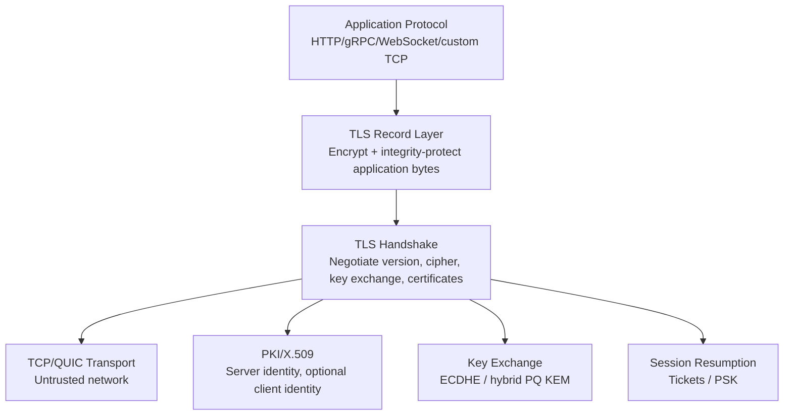
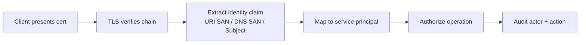
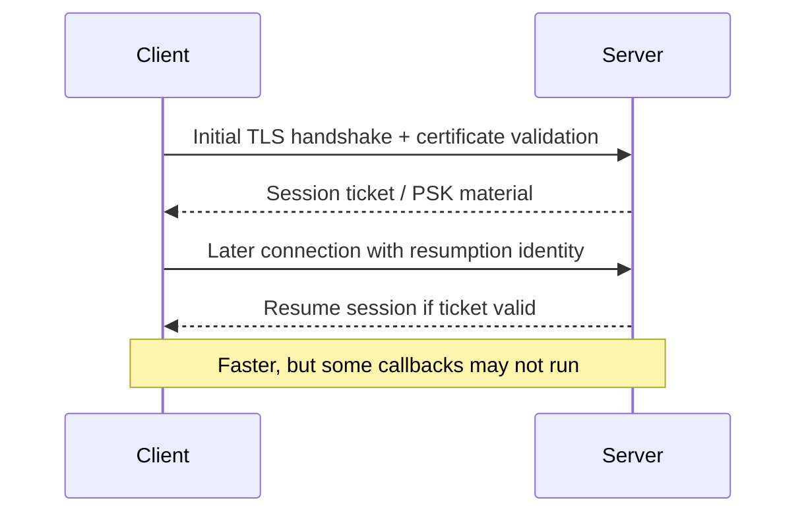
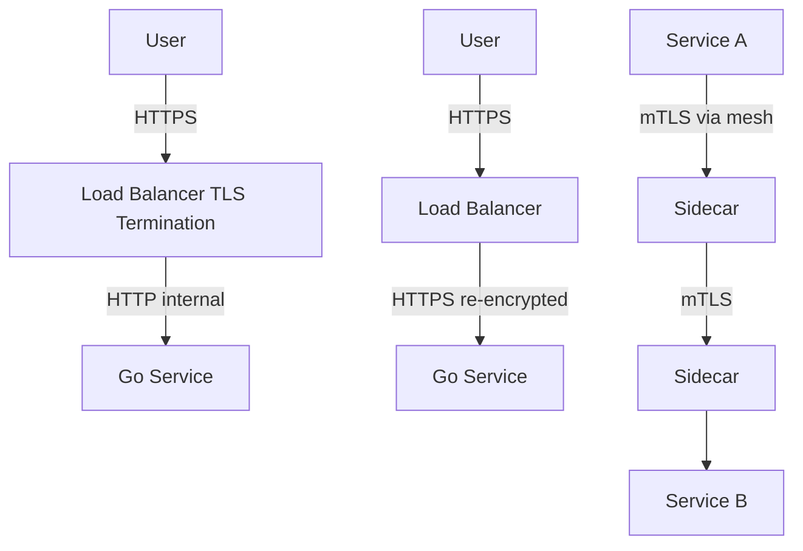
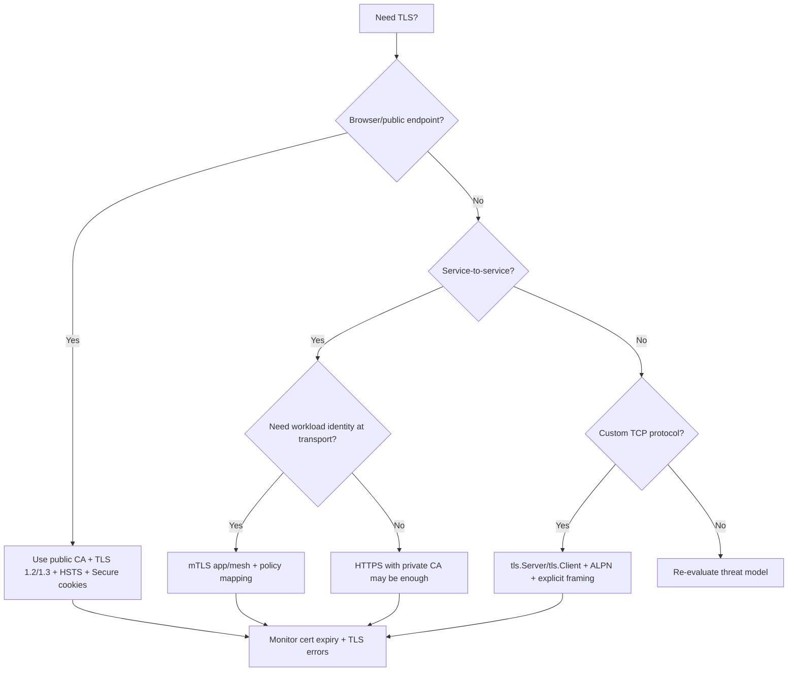
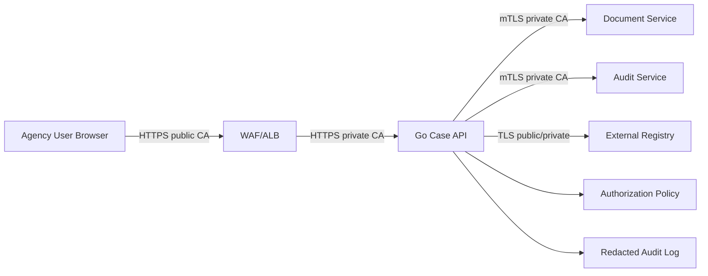

# learn-go-security-cryptography-integrity-part-014.md

# Part 014 — TLS in Go: `crypto/tls`, TLS 1.2/1.3, Cipher Suites, Curves, ALPN, Session Resumption, Certificate Reload, Safe Defaults, and Hardening

> Seri: `learn-go-security-cryptography-integrity`  
> Bagian: `014 / 034`  
> Target pembaca: Java software engineer yang ingin menguasai security engineering di Go sampai level internal engineering handbook  
> Target Go: Go `1.26.x`  
> Status seri: **belum selesai**  
> Prasyarat: part 000–013, terutama X.509/PKI, key management, symmetric crypto, public-key crypto, dan threat modeling.

---

## 0. Tujuan Bagian Ini

Bagian ini membahas TLS di Go sebagai **security boundary**, bukan sekadar `ListenAndServeTLS`.

Setelah menyelesaikan bagian ini, kamu harus mampu:

1. Memahami TLS sebagai kombinasi:
   - authentication,
   - confidential transport,
   - integrity protection,
   - key agreement,
   - session negotiation,
   - application protocol binding.
2. Menjelaskan perbedaan desain TLS 1.2 dan TLS 1.3 secara praktis.
3. Menggunakan `crypto/tls` dengan aman tanpa over-configuration.
4. Menentukan kapan cukup memakai default Go dan kapan perlu override.
5. Membuat server TLS Go dengan timeout, certificate reload, ALPN, dan safe defaults.
6. Membuat client TLS Go yang benar untuk public CA, private CA, dan pinned/private trust domain.
7. Mendesain mTLS untuk service-to-service identity.
8. Memahami session resumption, ticket rotation, dan callback verification trap.
9. Menghindari anti-pattern seperti `InsecureSkipVerify`, custom cipher list usang, static ticket key, dan leaf cert pinning sembrono.
10. Membuat checklist review TLS untuk production Go services.

---

## 1. Core Premise: TLS Bukan “Encrypt Socket”

Premis lemah yang sering muncul:

> “Pakai HTTPS berarti aman.”

Lebih tepat:

> TLS memberi channel yang bisa aman **jika** identitas peer diverifikasi, certificate chain benar, versi/protocol tidak downgrade, key exchange aman, session resumption tidak melewati policy penting, dan aplikasi tidak membocorkan data di layer lain.

TLS tidak otomatis menyelesaikan:

| Masalah | Apakah TLS menyelesaikan? | Catatan |
|---|---:|---|
| Confidentiality on the wire | Ya | Jika tidak MITM dan certificate validation benar |
| Integrity on the wire | Ya | Record dilindungi MAC/AEAD |
| Server authentication | Ya | Jika chain + hostname valid |
| Client authentication | Tidak otomatis | Butuh mTLS atau application auth |
| Authorization | Tidak | TLS identity perlu dipetakan ke policy |
| Request replay di application layer | Tidak sepenuhnya | Perlu idempotency key, nonce, timestamp, business rule |
| Data at rest | Tidak | Butuh encryption/storage controls |
| Secret leakage di log | Tidak | Aplikasi tetap bisa log token/password |
| SSRF | Tidak | TLS tidak mencegah aplikasi memanggil target internal berbahaya |
| Broken access control | Tidak | Authorization tetap tugas aplikasi |

TLS adalah **transport security primitive**, bukan seluruh security architecture.

---

## 2. Mental Model TLS

TLS membangun channel aman melalui tiga lapisan konseptual:



Sederhananya:

1. Client mengirim `ClientHello`.
2. Server memilih parameter yang kompatibel.
3. Peer melakukan key exchange.
4. Server membuktikan identity lewat certificate.
5. Optional: client juga membuktikan identity lewat certificate.
6. Keduanya menurunkan traffic keys.
7. Application data dikirim lewat TLS record yang dilindungi.

Yang harus dijaga:

- Client harus tahu **server mana** yang sedang dia hubungi.
- Server certificate harus valid untuk **nama host** yang diminta.
- Trust anchor harus benar.
- Negotiation tidak boleh turun ke versi/algorithm lemah.
- Resumption tidak boleh melewati verification/policy yang wajib.
- Session secrets tidak boleh bocor.

---

## 3. TLS Security Properties

TLS yang benar memberi empat property utama:

### 3.1 Confidentiality

Attacker di jaringan tidak bisa membaca plaintext.

Contoh protected data:

- HTTP header,
- cookie,
- Authorization Bearer token,
- JSON body,
- gRPC payload,
- internal API request,
- service-to-service event payload.

Namun beberapa metadata tetap bisa terlihat, tergantung versi/protocol/config:

- destination IP,
- port,
- timing,
- payload size approximation,
- SNI pada TLS tradisional,
- DNS query jika tidak dilindungi DoH/DoT,
- certificate public information.

### 3.2 Integrity

Attacker tidak bisa mengubah application data tanpa terdeteksi.

Jika ada bit berubah, record verification gagal dan connection abort.

### 3.3 Authentication

Default HTTPS memberi **server authentication**.

Client authentication hanya ada jika:

- mTLS dipakai,
- atau application layer memakai password/token/session/OIDC/JWT/API key.

### 3.4 Forward Secrecy

Dengan ephemeral key exchange, compromise private key certificate di masa depan tidak otomatis membuka traffic lama yang direkam.

Ini alasan ECDHE penting dan kenapa legacy RSA key exchange tidak ideal.

---

## 4. TLS 1.2 vs TLS 1.3: Perbedaan Praktis untuk Engineer

TLS 1.3 bukan sekadar “TLS 1.2 yang lebih baru”. TLS 1.3 menghapus banyak historical complexity.

| Area | TLS 1.2 | TLS 1.3 |
|---|---|---|
| Cipher suite semantics | Mencakup key exchange, authentication, encryption, MAC | Lebih sederhana; cipher suite hanya AEAD + hash |
| Legacy algorithms | Masih bisa ada CBC, RSA key exchange, 3DES tergantung stack/config | Dihapus dari core design |
| Handshake | Lebih banyak round trip | Lebih cepat |
| Forward secrecy | Bergantung cipher suite | Default design |
| Resumption | Session ID / ticket | PSK-style resumption |
| Configuration burden | Lebih tinggi | Lebih rendah |
| Downgrade risk | Lebih banyak legacy surface | Lebih kecil, tapi tetap perlu policy |

Engineering conclusion:

> Untuk layanan modern, default-kan TLS 1.3 dan izinkan TLS 1.2 hanya untuk compatibility yang jelas. Jangan dukung TLS 1.0/1.1 di endpoint utama.

---

## 5. Go `crypto/tls`: Filosofi Penting

Go mengambil pendekatan:

> Keep TLS configuration small, safe, and updateable by Go releases.

Artinya, jangan terlalu cepat menulis konfigurasi cipher/curve sendiri hanya karena terbiasa dari Java/OpenSSL/Nginx.

Di banyak kasus, konfigurasi terbaik adalah:

```go
&tls.Config{
    MinVersion: tls.VersionTLS12,
}
```

atau bahkan tidak mengatur cipher sama sekali.

Kenapa?

1. Go memilih default cipher suite aman.
2. TLS 1.3 cipher suite tidak configurable karena semuanya dianggap aman dalam desain Go.
3. Ordering cipher suite di Go diputuskan oleh runtime berdasarkan security dan hardware capability.
4. Default Go berubah mengikuti security release.
5. Custom config yang terlalu spesifik bisa membekukan keputusan usang.

### 5.1 Go 1.26 Baseline

Untuk Go 1.26.x:

- Default minimum TLS version saat ini TLS 1.2.
- Maximum default adalah versi tertinggi yang didukung, saat ini TLS 1.3.
- TLS 1.3 cipher suites tidak configurable.
- `CipherSuites` hanya berlaku untuk TLS 1.0–1.2.
- `PreferServerCipherSuites` adalah legacy field dan diabaikan.
- Go 1.24+ default curve preferences menyertakan `X25519MLKEM768` hybrid post-quantum key exchange, kecuali dinonaktifkan lewat explicit `CurvePreferences`.
- Go 1.26 release notes menyebut beberapa `GODEBUG` compatibility toggles lama akan dihapus pada Go 1.27, termasuk behavior terkait RSA key exchange, TLS 1.0 server default, 3DES, dan export keying material safety.

---

## 6. Go TLS Config Field yang Paling Security-Relevant

`tls.Config` besar. Tidak semua field perlu disentuh.

Fokus pada field berikut.

### 6.1 `MinVersion`

```go
MinVersion: tls.VersionTLS12
```

Gunakan TLS 1.2 minimum untuk endpoint modern.

Untuk service internal yang semua client modern:

```go
MinVersion: tls.VersionTLS13
```

Trade-off:

| Minimum | Kapan dipakai |
|---|---|
| TLS 1.3 | Internal service modern, controlled clients, high security baseline |
| TLS 1.2 | Public API/website dengan compatibility wajar |
| TLS 1.0/1.1 | Jangan untuk endpoint utama; isolasi jika ada legacy hard requirement |

### 6.2 `MaxVersion`

Biasanya jangan set.

Biarkan Go memakai versi tertinggi yang didukung.

Anti-pattern:

```go
MaxVersion: tls.VersionTLS12 // buruk jika tidak ada alasan kuat
```

Ini memblokir TLS 1.3 dan future improvements.

### 6.3 `CipherSuites`

Biasanya jangan set.

`CipherSuites` hanya untuk TLS 1.0–1.2. TLS 1.3 cipher suites tidak configurable.

Gunakan hanya jika:

- compliance policy mewajibkan allowlist eksplisit,
- legacy endpoint perlu isolasi,
- interoperability test menunjukkan issue nyata,
- security team punya baseline yang dikelola aktif.

Jangan copy-paste cipher list dari blog lama.

### 6.4 `CurvePreferences`

Biasanya jangan set.

Jika kamu set manual, kamu mungkin tanpa sadar menonaktifkan default baru Go seperti hybrid post-quantum key exchange.

Contoh override yang harus dipahami konsekuensinya:

```go
CurvePreferences: []tls.CurveID{tls.X25519, tls.CurveP256}
```

Ini bisa berguna untuk strict interoperability, tapi dapat menurunkan agility.

### 6.5 `Certificates`, `GetCertificate`, `GetConfigForClient`

Untuk server:

- `Certificates` untuk static certificate chain.
- `GetCertificate` untuk dynamic certificate selection/reload.
- `GetConfigForClient` untuk per-SNI/per-client config.

Penting:

- Certificate yang sudah dikembalikan callback tidak boleh dimodifikasi.
- Jangan reload file certificate setiap handshake.
- Pakai atomic pointer/cache.

### 6.6 `RootCAs`

Untuk client: trust anchors untuk memverifikasi server certificate.

Jika nil:

- Go memakai host/system root CA set.

Untuk private CA:

- buat `x509.CertPool`, append root private CA, assign ke `RootCAs`.

### 6.7 `ServerName`

Client memakai `ServerName` untuk:

1. hostname verification,
2. SNI.

Jangan kosong kecuali kamu benar-benar tahu konsekuensinya.

Jika connect ke IP tapi certificate untuk DNS name:

```go
TLSClientConfig: &tls.Config{
    ServerName: "api.internal.example.com",
}
```

### 6.8 `InsecureSkipVerify`

Ini field paling sering disalahgunakan.

```go
InsecureSkipVerify: true
```

Artinya client menerima certificate apa pun dan hostname apa pun. Ini membuat TLS rentan MITM kecuali kamu melakukan custom verification dengan benar.

Untuk production biasa: **jangan**.

Jika butuh private CA, gunakan `RootCAs`, bukan `InsecureSkipVerify`.

Jika butuh custom verification, gunakan `VerifyConnection` dengan desain hati-hati.

### 6.9 `ClientAuth` dan `ClientCAs`

Untuk mTLS server:

```go
ClientAuth: tls.RequireAndVerifyClientCert,
ClientCAs:  clientCAPool,
```

Makna umum:

| `ClientAuth` | Makna |
|---|---|
| `NoClientCert` | Default; server tidak minta client cert |
| `RequestClientCert` | Minta tapi tidak wajib/verifikasi normal tidak cukup untuk authz |
| `RequireAnyClientCert` | Wajib ada cert tapi tidak diverifikasi CA; berbahaya jika dipakai sembarangan |
| `VerifyClientCertIfGiven` | Jika diberikan, verifikasi |
| `RequireAndVerifyClientCert` | Wajib dan verifikasi terhadap `ClientCAs` |

Untuk identity-based internal service, biasanya mulai dari `RequireAndVerifyClientCert`, lalu map subject/SAN/SPIFFE URI ke policy.

### 6.10 `VerifyPeerCertificate` vs `VerifyConnection`

Ini salah satu area paling berbahaya.

`VerifyPeerCertificate`:

- dipanggil setelah normal cert verification,
- tetapi **tidak dipanggil pada resumed connections**.

`VerifyConnection`:

- dipanggil setelah normal verification,
- berjalan untuk semua connection, termasuk resumption.

Conclusion:

> Jika callback membawa policy security yang wajib berlaku pada setiap connection, gunakan `VerifyConnection`, bukan hanya `VerifyPeerCertificate`.

### 6.11 `NextProtos`

Untuk ALPN.

Contoh:

```go
NextProtos: []string{"h2", "http/1.1"}
```

ALPN mengikat TLS handshake dengan application protocol yang dipilih.

Risiko salah config:

- HTTP/2 tidak aktif padahal diharapkan.
- Custom protocol salah dinegosiasikan.
- Client/server fallback ke protocol tak terduga.

### 6.12 `SessionTicketsDisabled`, `SetSessionTicketKeys`, `WrapSession`, `UnwrapSession`

Session resumption mempercepat handshake, tapi membawa state/security risk.

Default Go:

- jika server `SessionTicketKey` zero, Go mengisi random sebelum handshake pertama,
- key otomatis dirotasi harian dan dibuang setelah tujuh hari,
- untuk custom rotation/sync multi-server, gunakan `SetSessionTicketKeys` atau custom wrapper.

Jangan hard-code static ticket key.

### 6.13 `KeyLogWriter`

Untuk debugging TLS dengan Wireshark.

Ini membocorkan TLS master secrets.

Aturan:

- hanya aktif di local/dev debugging,
- jangan di production,
- jangan log ke file yang ikut dikirim ke observability pipeline,
- treat output as secret.

---

## 7. Minimal Secure HTTPS Server di Go

Contoh baseline untuk service modern:

```go
package main

import (
    "context"
    "crypto/tls"
    "errors"
    "log/slog"
    "net/http"
    "os"
    "time"
)

func main() {
    logger := slog.New(slog.NewJSONHandler(os.Stdout, nil))

    mux := http.NewServeMux()
    mux.HandleFunc("/health", func(w http.ResponseWriter, r *http.Request) {
        w.WriteHeader(http.StatusOK)
        _, _ = w.Write([]byte("ok\n"))
    })

    srv := &http.Server{
        Addr:              ":8443",
        Handler:           mux,
        ReadHeaderTimeout: 5 * time.Second,
        ReadTimeout:       30 * time.Second,
        WriteTimeout:      30 * time.Second,
        IdleTimeout:       120 * time.Second,
        TLSConfig: &tls.Config{
            MinVersion: tls.VersionTLS12,
            NextProtos: []string{"h2", "http/1.1"},
        },
    }

    go func() {
        logger.Info("https_server_starting", "addr", srv.Addr)
        err := srv.ListenAndServeTLS("server.crt", "server.key")
        if err != nil && !errors.Is(err, http.ErrServerClosed) {
            logger.Error("https_server_failed", "error", err)
            os.Exit(1)
        }
    }()

    // Example only. Real service should listen to SIGTERM/SIGINT.
    <-context.Background().Done()
}
```

Security properties:

- TLS minimum 1.2.
- TLS 1.3 allowed by default.
- No manual cipher list.
- ALPN advertises HTTP/2 and HTTP/1.1.
- HTTP server timeouts mitigate slowloris-style attacks.

Production additions:

- graceful shutdown signal handling,
- certificate reload,
- access log with redaction,
- request size limit,
- reverse proxy header trust policy,
- HSTS if public browser endpoint,
- metrics for TLS version/cipher/cert expiry.

---

## 8. Why Timeouts Are TLS-Relevant

TLS handshake consumes CPU and memory.

A server that accepts TLS but has weak timeout policy can be exposed to:

- slow handshake,
- slowloris,
- connection exhaustion,
- file descriptor exhaustion,
- goroutine accumulation,
- LB health-check amplification.

TLS config alone is not enough. `http.Server` should set:

```go
ReadHeaderTimeout: 5 * time.Second,
ReadTimeout:       30 * time.Second,
WriteTimeout:      30 * time.Second,
IdleTimeout:       120 * time.Second,
```

Tune by endpoint type:

| Endpoint | Timeout profile |
|---|---|
| JSON API | Short read/write timeout |
| File upload | Larger body timeout + size cap + streaming validation |
| SSE/WebSocket | Different lifecycle; don't blindly use short write timeout |
| Internal gRPC | Keepalive + LB-aware idle timeout |
| Public login | Strict timeout + rate limit |

---

## 9. Safe TLS Client for Public CA

Use standard validation.

```go
package outbound

import (
    "crypto/tls"
    "net"
    "net/http"
    "time"
)

func NewPublicHTTPSClient() *http.Client {
    transport := &http.Transport{
        TLSClientConfig: &tls.Config{
            MinVersion: tls.VersionTLS12,
        },
        DialContext: (&net.Dialer{
            Timeout:   5 * time.Second,
            KeepAlive: 30 * time.Second,
        }).DialContext,
        TLSHandshakeTimeout:   5 * time.Second,
        ResponseHeaderTimeout: 10 * time.Second,
        ExpectContinueTimeout: 1 * time.Second,
        IdleConnTimeout:       90 * time.Second,
        MaxIdleConns:          100,
        MaxIdleConnsPerHost:   10,
    }

    return &http.Client{
        Transport: transport,
        Timeout:   30 * time.Second,
    }
}
```

Do not set:

```go
InsecureSkipVerify: true
```

Do not set `RootCAs` unless you need custom/private trust.

---

## 10. Safe TLS Client for Private CA

Correct private CA design:

```go
package outbound

import (
    "crypto/tls"
    "crypto/x509"
    "fmt"
    "net/http"
    "os"
)

func NewPrivateCAClient(rootCAPath string, expectedServerName string) (*http.Client, error) {
    pemBytes, err := os.ReadFile(rootCAPath)
    if err != nil {
        return nil, fmt.Errorf("read root ca: %w", err)
    }

    roots := x509.NewCertPool()
    if ok := roots.AppendCertsFromPEM(pemBytes); !ok {
        return nil, fmt.Errorf("no certificates found in root ca pem")
    }

    return &http.Client{
        Transport: &http.Transport{
            TLSClientConfig: &tls.Config{
                MinVersion: tls.VersionTLS12,
                RootCAs:    roots,
                ServerName: expectedServerName,
            },
        },
    }, nil
}
```

Key points:

- `RootCAs` says which CA is trusted.
- `ServerName` says which identity you expect.
- Do not use `InsecureSkipVerify` for private CA.
- Do not trust leaf cert directly unless you have strong operational reason.

---

## 11. Wrong Private CA Pattern

Bad:

```go
TLSClientConfig: &tls.Config{
    InsecureSkipVerify: true,
}
```

This means:

- any certificate accepted,
- any hostname accepted,
- private CA not actually enforced,
- MITM can succeed if network path controlled.

Worse:

```go
TLSClientConfig: &tls.Config{
    InsecureSkipVerify: true,
    VerifyPeerCertificate: func(rawCerts [][]byte, verifiedChains [][]*x509.Certificate) error {
        return nil
    },
}
```

This pretends to customize security while disabling it.

If you must override verification, define exact invariants:

- what root is trusted,
- what SAN is required,
- what EKU is required,
- what expiry is acceptable,
- what policy OID is required,
- whether resumption still enforces it.

Usually `RootCAs + ServerName` is enough.

---

## 12. Certificate Reload Pattern

Production services need certificate rotation without full process restart.

Naive bad pattern:

```go
GetCertificate: func(*tls.ClientHelloInfo) (*tls.Certificate, error) {
    cert, err := tls.LoadX509KeyPair("server.crt", "server.key")
    return &cert, err
}
```

Problems:

- disk read per handshake,
- high latency,
- attacker can amplify IO,
- partial file update race,
- no validation before swap,
- error behavior unclear.

Better pattern: load once, validate, atomically swap.

```go
package tlscert

import (
    "crypto/tls"
    "fmt"
    "sync/atomic"
)

type Reloader struct {
    current atomic.Pointer[tls.Certificate]
}

func NewReloader(certFile, keyFile string) (*Reloader, error) {
    r := &Reloader{}
    if err := r.Reload(certFile, keyFile); err != nil {
        return nil, err
    }
    return r, nil
}

func (r *Reloader) Reload(certFile, keyFile string) error {
    cert, err := tls.LoadX509KeyPair(certFile, keyFile)
    if err != nil {
        return fmt.Errorf("load key pair: %w", err)
    }

    // In Go 1.26 onward, LoadX509KeyPair behavior around Leaf population is
    // aligned with newer defaults. Still, production code may validate Leaf,
    // SAN, expiry, and key usage explicitly here if policy requires it.
    r.current.Store(&cert)
    return nil
}

func (r *Reloader) GetCertificate(*tls.ClientHelloInfo) (*tls.Certificate, error) {
    cert := r.current.Load()
    if cert == nil {
        return nil, fmt.Errorf("no tls certificate loaded")
    }
    return cert, nil
}
```

Use:

```go
reloader, err := tlscert.NewReloader("server.crt", "server.key")
if err != nil {
    return err
}

srv := &http.Server{
    Addr: ":8443",
    TLSConfig: &tls.Config{
        MinVersion:     tls.VersionTLS12,
        GetCertificate: reloader.GetCertificate,
        NextProtos:     []string{"h2", "http/1.1"},
    },
}
```

Reload trigger options:

| Trigger | Notes |
|---|---|
| SIGHUP | Common on Linux, simple |
| file watcher | Beware partial writes and symlink race |
| periodic reload | Simple, tolerant of cert-manager/Kubernetes secret update |
| admin API | Protect strongly |
| sidecar hot reload | Useful in service mesh/private PKI |

Important invariant:

> Never swap a new certificate into active config until it has been parsed and validated.

---

## 13. Multi-Certificate and SNI Selection

If serving multiple hostnames:

```go
TLSConfig: &tls.Config{
    MinVersion: tls.VersionTLS12,
    Certificates: []tls.Certificate{
        certForAPI,
        certForAdmin,
    },
}
```

Go can select the first compatible certificate chain automatically.

Avoid deprecated `NameToCertificate` unless maintaining legacy code.

For advanced SNI routing:

```go
GetCertificate: func(hello *tls.ClientHelloInfo) (*tls.Certificate, error) {
    switch hello.ServerName {
    case "api.example.com":
        return apiCert.Load(), nil
    case "admin.example.com":
        return adminCert.Load(), nil
    default:
        return defaultCert.Load(), nil
    }
}
```

Security concern:

- Do not use arbitrary `ServerName` from client as filesystem path.
- Normalize and exact-match.
- Avoid wildcard logic that accidentally serves internal cert externally.
- Log unknown SNI carefully; SNI can contain attacker-controlled strings.

---

## 14. ALPN: Binding TLS to Application Protocol

ALPN lets peers negotiate application protocol inside TLS handshake.

Common values:

| ALPN | Meaning |
|---|---|
| `h2` | HTTP/2 |
| `http/1.1` | HTTP/1.1 |
| custom | Internal protocols, e.g. `my-service-v1` |

Example server:

```go
TLSConfig: &tls.Config{
    MinVersion: tls.VersionTLS12,
    NextProtos: []string{"h2", "http/1.1"},
}
```

Example custom protocol:

```go
TLSConfig: &tls.Config{
    MinVersion: tls.VersionTLS13,
    NextProtos: []string{"com.example.payment.v1"},
}
```

After handshake:

```go
state := tlsConn.ConnectionState()
if state.NegotiatedProtocol != "com.example.payment.v1" {
    _ = tlsConn.Close()
    return fmt.Errorf("unexpected negotiated protocol %q", state.NegotiatedProtocol)
}
```

Why this matters:

- Prevents protocol confusion.
- Helps avoid sending one protocol’s bytes to another protocol handler.
- Important for custom TCP protocols and service mesh boundaries.

---

## 15. mTLS in Go: Transport Identity, Not Authorization by Itself

mTLS gives server a verified client certificate.

But certificate verification is not the same as authorization.



Bad mental model:

> “Cert valid = allowed.”

Better:

> “Cert valid = identity authenticated. Authorization still requires policy.”

---

## 16. Basic mTLS Server

```go
package mtls

import (
    "crypto/tls"
    "crypto/x509"
    "fmt"
    "net/http"
    "os"
)

func NewMTLSServer(addr, serverCert, serverKey, clientCA string, handler http.Handler) (*http.Server, error) {
    caPEM, err := os.ReadFile(clientCA)
    if err != nil {
        return nil, fmt.Errorf("read client ca: %w", err)
    }

    clientCAPool := x509.NewCertPool()
    if ok := clientCAPool.AppendCertsFromPEM(caPEM); !ok {
        return nil, fmt.Errorf("no client ca certificates found")
    }

    return &http.Server{
        Addr:    addr,
        Handler: handler,
        TLSConfig: &tls.Config{
            MinVersion: tls.VersionTLS12,
            ClientAuth: tls.RequireAndVerifyClientCert,
            ClientCAs:  clientCAPool,
            NextProtos: []string{"h2", "http/1.1"},
        },
    }, nil
}
```

This authenticates client certificate chain.

Still needed:

- identity extraction,
- authorization,
- audit,
- certificate lifecycle,
- revocation/rotation policy,
- client cert expiry monitoring.

---

## 17. mTLS Identity Mapping with `VerifyConnection`

Example: require URI SAN prefix.

```go
package mtls

import (
    "crypto/tls"
    "fmt"
    "strings"
)

func RequireServiceIdentityPrefix(prefix string) func(tls.ConnectionState) error {
    return func(cs tls.ConnectionState) error {
        if len(cs.PeerCertificates) == 0 {
            return fmt.Errorf("missing client certificate")
        }

        leaf := cs.PeerCertificates[0]
        for _, uri := range leaf.URIs {
            if strings.HasPrefix(uri.String(), prefix) {
                return nil
            }
        }

        return fmt.Errorf("client certificate missing required URI SAN prefix")
    }
}
```

Server config:

```go
TLSConfig: &tls.Config{
    MinVersion:       tls.VersionTLS12,
    ClientAuth:       tls.RequireAndVerifyClientCert,
    ClientCAs:        clientCAPool,
    VerifyConnection: RequireServiceIdentityPrefix("spiffe://prod.example.com/ns/payments/"),
}
```

Why `VerifyConnection`?

Because it runs for resumed connections too.

If you put mandatory identity policy only in `VerifyPeerCertificate`, resumed connections may bypass that callback.

---

## 18. mTLS Client

```go
package mtls

import (
    "crypto/tls"
    "crypto/x509"
    "fmt"
    "net/http"
    "os"
)

func NewMTLSClient(clientCert, clientKey, serverCA, serverName string) (*http.Client, error) {
    cert, err := tls.LoadX509KeyPair(clientCert, clientKey)
    if err != nil {
        return nil, fmt.Errorf("load client cert: %w", err)
    }

    caPEM, err := os.ReadFile(serverCA)
    if err != nil {
        return nil, fmt.Errorf("read server ca: %w", err)
    }

    roots := x509.NewCertPool()
    if ok := roots.AppendCertsFromPEM(caPEM); !ok {
        return nil, fmt.Errorf("no server ca certificates found")
    }

    return &http.Client{
        Transport: &http.Transport{
            TLSClientConfig: &tls.Config{
                MinVersion:   tls.VersionTLS12,
                Certificates: []tls.Certificate{cert},
                RootCAs:      roots,
                ServerName:   serverName,
            },
        },
    }, nil
}
```

Operational requirement:

- client cert rotation,
- server CA rotation,
- expiry alert,
- emergency revocation path,
- reload without restart if needed.

---

## 19. `VerifyPeerCertificate` Trap

Consider:

```go
TLSConfig: &tls.Config{
    ClientAuth: tls.RequireAndVerifyClientCert,
    VerifyPeerCertificate: func(rawCerts [][]byte, chains [][]*x509.Certificate) error {
        // mandatory business policy
        return nil
    },
}
```

This looks reasonable, but has a subtle issue:

- `VerifyPeerCertificate` is not invoked on resumed connections.

If the policy must be enforced on every connection, use:

```go
VerifyConnection: func(cs tls.ConnectionState) error {
    // mandatory policy here
    return nil
}
```

Or disable session tickets:

```go
SessionTicketsDisabled: true
```

But disabling tickets has performance cost.

Better default:

> Put mandatory connection-level policy in `VerifyConnection`.

---

## 20. Session Resumption: Performance vs Policy

Session resumption reduces handshake cost.

But it changes verification flow.



Security questions:

1. Are tickets encrypted and authenticated?
2. How are ticket keys rotated?
3. Are tickets shared across server replicas?
4. Does resumption bypass updated authorization policy?
5. Should revoked client cert still be accepted via existing session?
6. Should session lifetime be shorter for privileged/admin endpoints?
7. Is ticket state bound to tenant/environment/protocol?

### 20.1 Go Defaults

If not customized, Go manages ticket keys automatically for normal cases.

Avoid:

```go
SessionTicketKey: [32]byte{1, 2, 3} // static forever: bad
```

For multi-replica deployments behind a load balancer:

- either accept that resumption may not work across replicas,
- or synchronize ticket keys securely,
- or use custom `WrapSession`/`UnwrapSession` with a KMS-managed key lifecycle.

### 20.2 When to Disable Session Tickets

Consider disabling for:

- highly privileged admin endpoint,
- short-lived client certificate policy,
- strict revocation requirement,
- sensitive custom verification that cannot be safely enforced during resumption,
- emergency incident containment.

```go
SessionTicketsDisabled: true
```

Trade-off: more CPU/latency per connection.

---

## 21. TLS Version and Cipher Policy

Recommended baseline:

```go
&tls.Config{
    MinVersion: tls.VersionTLS12,
}
```

For internal greenfield:

```go
&tls.Config{
    MinVersion: tls.VersionTLS13,
}
```

Avoid legacy support unless isolated.

### 21.1 Do Not Overfit Cipher Suite Lists

Bad:

```go
CipherSuites: []uint16{
    tls.TLS_RSA_WITH_AES_128_CBC_SHA,
}
```

Problems:

- no forward secrecy if RSA key exchange,
- CBC legacy risk,
- blocks modern AEAD choices,
- freezes outdated security assumptions.

Better:

```go
MinVersion: tls.VersionTLS12
```

Let Go choose safe defaults unless there is a managed compliance reason.

### 21.2 Compliance Allowlist Example

If your org requires explicit TLS 1.2 cipher suite allowlist, prefer AEAD + ECDHE:

```go
CipherSuites: []uint16{
    tls.TLS_ECDHE_ECDSA_WITH_AES_128_GCM_SHA256,
    tls.TLS_ECDHE_RSA_WITH_AES_128_GCM_SHA256,
    tls.TLS_ECDHE_ECDSA_WITH_AES_256_GCM_SHA384,
    tls.TLS_ECDHE_RSA_WITH_AES_256_GCM_SHA384,
    tls.TLS_ECDHE_ECDSA_WITH_CHACHA20_POLY1305_SHA256,
    tls.TLS_ECDHE_RSA_WITH_CHACHA20_POLY1305_SHA256,
},
```

But treat this as policy-owned config. Review regularly.

Note:

- This does not control TLS 1.3 cipher suites.
- Ordering is ignored by modern Go.
- `PreferServerCipherSuites` is ignored.

---

## 22. TLS 1.3 Cipher Suites in Go

TLS 1.3 cipher suites are not configurable in Go.

This is intentional.

Why?

- TLS 1.3 removed many problematic algorithms.
- TLS 1.3 cipher suites are all considered secure within Go’s supported set.
- Exposing knobs increases stale/misconfigured deployments.

Engineering implication:

> Don’t fight Go’s TLS 1.3 defaults unless you are doing very specific protocol/library work.

---

## 23. Post-Quantum Hybrid Key Exchange in Go

Go 1.24+ default TLS curve preferences include `X25519MLKEM768`, a hybrid post-quantum key exchange.

Meaning:

- TLS handshake can negotiate a hybrid mechanism combining classical X25519 with ML-KEM-768.
- This helps address harvest-now-decrypt-later concerns for key exchange.
- Authentication certificates are still classical unless PKI/cert ecosystem changes.

Important nuance:

> Hybrid post-quantum key exchange protects session key establishment. It does not automatically make certificate signatures post-quantum.

Do not manually set `CurvePreferences` unless you understand whether you are disabling this default.

---

## 24. HSTS and Browser-Facing Go Services

TLS alone does not stop a user from first visiting `http://example.com` unless browser policy knows to use HTTPS.

For browser-facing applications, add HSTS:

```go
func securityHeaders(next http.Handler) http.Handler {
    return http.HandlerFunc(func(w http.ResponseWriter, r *http.Request) {
        w.Header().Set("Strict-Transport-Security", "max-age=31536000; includeSubDomains")
        next.ServeHTTP(w, r)
    })
}
```

Be careful with `preload`:

```text
Strict-Transport-Security: max-age=31536000; includeSubDomains; preload
```

Only use preload when:

- all subdomains support HTTPS,
- you understand removal process is slow,
- DNS/domain ownership is stable,
- staging/internal domains are not accidentally included.

---

## 25. Secure Cookies Depend on TLS

For browser apps:

```go
http.SetCookie(w, &http.Cookie{
    Name:     "session",
    Value:    token,
    Path:     "/",
    Secure:   true,
    HttpOnly: true,
    SameSite: http.SameSiteLaxMode,
})
```

TLS protects cookie in transit, but cookie flags enforce browser behavior:

| Flag | Purpose |
|---|---|
| `Secure` | only send over HTTPS |
| `HttpOnly` | JavaScript cannot read cookie |
| `SameSite` | CSRF mitigation support |
| scoped `Path`/`Domain` | limit cookie reach |

TLS without `Secure` cookies can still leak if mixed HTTP exists.

---

## 26. Reverse Proxy and TLS Termination

Many Go services run behind:

- AWS ALB,
- Nginx,
- Envoy,
- Traefik,
- API Gateway,
- service mesh sidecar.

Possible topologies:



Security questions:

1. Where exactly does TLS terminate?
2. Is traffic from proxy to service encrypted?
3. Who is allowed to set `X-Forwarded-Proto`?
4. Does the app trust forwarded headers only from trusted proxy IPs?
5. Is mTLS handled by app or sidecar?
6. Does certificate identity reach app as trusted metadata?
7. Is there a gap between LB and pod/node?

### 26.1 Forwarded Header Risk

Bad:

```go
if r.Header.Get("X-Forwarded-Proto") == "https" {
    // treat as secure
}
```

If public clients can set this header, they can spoof scheme.

Correct approach:

- strip forwarded headers at edge,
- set them at trusted proxy,
- app only trusts them if request comes from trusted proxy network,
- or do not rely on them for security-critical decisions.

---

## 27. Certificate Expiry Monitoring

TLS outages often come from expired certificates, not cryptographic breakage.

Monitor:

- leaf certificate expiry,
- intermediate expiry,
- root expiry if private PKI,
- client certificate expiry for mTLS,
- CA bundle rotation,
- OCSP/CRL dependency if used,
- cert-manager/ACME renewal failure.

Example runtime metric extraction:

```go
func TLSInfoFromRequest(r *http.Request) map[string]any {
    if r.TLS == nil {
        return map[string]any{"tls": false}
    }

    info := map[string]any{
        "tls":                  true,
        "version":              tlsVersionName(r.TLS.Version),
        "cipher_suite":         tls.CipherSuiteName(r.TLS.CipherSuite),
        "negotiated_protocol":  r.TLS.NegotiatedProtocol,
        "peer_cert_count":      len(r.TLS.PeerCertificates),
        "server_name":          r.TLS.ServerName,
    }

    if len(r.TLS.PeerCertificates) > 0 {
        leaf := r.TLS.PeerCertificates[0]
        info["peer_cert_not_after"] = leaf.NotAfter.UTC().Format(time.RFC3339)
        info["peer_cert_subject"] = leaf.Subject.String()
    }

    return info
}

func tlsVersionName(v uint16) string {
    switch v {
    case tls.VersionTLS10:
        return "TLS1.0"
    case tls.VersionTLS11:
        return "TLS1.1"
    case tls.VersionTLS12:
        return "TLS1.2"
    case tls.VersionTLS13:
        return "TLS1.3"
    default:
        return "unknown"
    }
}
```

Do not log:

- private keys,
- session tickets,
- key log material,
- raw Authorization headers,
- full client certificate if it contains sensitive subject data.

---

## 28. Key Logging for Debugging

`KeyLogWriter` allows tools like Wireshark to decrypt TLS traffic.

Example for local debugging only:

```go
keyLogFile, err := os.OpenFile("/tmp/tls.keys", os.O_CREATE|os.O_WRONLY|os.O_APPEND, 0600)
if err != nil {
    return err
}

tlsConfig := &tls.Config{
    MinVersion:   tls.VersionTLS12,
    KeyLogWriter: keyLogFile,
}
```

Production rule:

> Any file produced by `KeyLogWriter` is equivalent to plaintext access for captured traffic.

Controls:

- compile-time/dev-only guard,
- environment allowlist,
- never enable in prod,
- no centralized log shipping,
- secure deletion after debugging,
- incident if leaked.

---

## 29. ECH: Encrypted Client Hello

Traditional TLS leaks SNI in ClientHello. ECH is designed to encrypt more of ClientHello metadata.

Go `crypto/tls` exposes ECH-related fields. Important practical constraints:

- ECH requires TLS 1.3.
- Client-side behavior depends on `EncryptedClientHelloConfigList`.
- If ECH config is set, handshake succeeds only if ECH is negotiated; rejection returns ECH-specific error.
- Server-side support has evolving API/operational requirements.

Engineering guidance:

- Do not enable ECH casually without end-to-end testing.
- Understand DNS/HTTPS RR/SVCB deployment model if using public web ECH.
- Treat ECH as metadata protection, not replacement for certificate validation.

---

## 30. TLS and gRPC

Go gRPC typically uses TLS credentials from `google.golang.org/grpc/credentials`.

Conceptual config maps back to `tls.Config`:

```go
creds := credentials.NewTLS(&tls.Config{
    MinVersion: tls.VersionTLS12,
    RootCAs:    roots,
    ServerName: "orders.internal.example.com",
})

conn, err := grpc.NewClient(
    target,
    grpc.WithTransportCredentials(creds),
)
```

For gRPC server mTLS:

```go
creds := credentials.NewTLS(&tls.Config{
    MinVersion: tls.VersionTLS12,
    ClientAuth: tls.RequireAndVerifyClientCert,
    ClientCAs:  clientCAPool,
})

srv := grpc.NewServer(grpc.Creds(creds))
```

Security reminder:

- mTLS authenticates transport peer.
- Per-RPC authorization still belongs in interceptor/policy layer.
- Use `peer.FromContext` to inspect auth info, but map identity explicitly.

---

## 31. TLS and Kubernetes

Common deployment patterns:

### 31.1 TLS Terminated at Ingress

```text
Client HTTPS -> Ingress Controller -> HTTP Pod
```

Pros:

- central cert management,
- simpler pod config,
- easier ACME integration.

Cons:

- pod traffic inside cluster may be plaintext,
- app cannot see TLS peer certificate unless proxied as trusted metadata,
- forwarded header trust becomes important.

### 31.2 TLS Re-Encrypted to Pod

```text
Client HTTPS -> Ingress -> HTTPS Pod
```

Pros:

- encryption continues to workload,
- app controls TLS policy.

Cons:

- more cert distribution complexity,
- more expiry risk,
- more CPU per pod.

### 31.3 Service Mesh mTLS

```text
App -> sidecar -> mTLS -> sidecar -> App
```

Pros:

- identity and encryption standardized,
- cert rotation delegated,
- policy centralized.

Cons:

- app may not directly see transport identity,
- debugging complexity,
- sidecar/control-plane dependency,
- policy drift between mesh and app.

Decision rule:

> If TLS is terminated outside the app, define which identity and scheme metadata the app trusts, and from whom.

---

## 32. TLS Error Handling

Do not leak excessive certificate validation internals to untrusted clients.

Bad public response:

```json
{
  "error": "x509: certificate signed by unknown authority: expected root serial ..."
}
```

Better public response:

```json
{
  "error": "upstream_tls_verification_failed"
}
```

Internal log:

```json
{
  "event": "outbound_tls_failure",
  "upstream": "billing-api",
  "server_name": "billing.internal.example.com",
  "error_class": "unknown_authority",
  "correlation_id": "..."
}
```

Do not log raw cert chain blindly if subject/SAN may contain sensitive data.

---

## 33. TLS Observability

Metrics worth collecting:

| Metric | Why |
|---|---|
| TLS handshake errors by class | Detect cert expiry, CA mismatch, bad clients |
| negotiated TLS version | Detect legacy clients |
| negotiated cipher suite | Detect policy drift |
| mTLS auth failures | Detect unauthorized clients or expired certs |
| cert expiry days | Prevent outages |
| unknown SNI count | Detect scanning/misrouting |
| session resumption hit rate | Performance/security tuning |
| ALPN negotiated protocol | Detect HTTP/2 downgrade/misconfig |

Example labels should be bounded:

Good:

```text
tls_version="TLS1.3"
cipher_suite="TLS_AES_128_GCM_SHA256"
error_class="unknown_authority"
```

Bad:

```text
server_name="attacker-controlled-unbounded-string.example..."
certificate_subject="unbounded"
```

---

## 34. TLS Testing Strategy

### 34.1 Unit Tests

Test config invariants:

```go
func TestTLSConfigBaseline(t *testing.T) {
    cfg := NewServerTLSConfig()

    if cfg.MinVersion < tls.VersionTLS12 {
        t.Fatalf("MinVersion too low: %x", cfg.MinVersion)
    }
    if cfg.InsecureSkipVerify {
        t.Fatalf("server config must not set InsecureSkipVerify")
    }
}
```

### 34.2 Integration Tests

Use `httptest.NewUnstartedServer`:

```go
func TestHTTPSNegotiatesTLS12OrHigher(t *testing.T) {
    handler := http.HandlerFunc(func(w http.ResponseWriter, r *http.Request) {
        if r.TLS == nil {
            t.Fatalf("request was not TLS")
        }
        if r.TLS.Version < tls.VersionTLS12 {
            t.Fatalf("tls version too low")
        }
        w.WriteHeader(http.StatusNoContent)
    })

    srv := httptest.NewUnstartedServer(handler)
    srv.TLS = &tls.Config{MinVersion: tls.VersionTLS12}
    srv.StartTLS()
    defer srv.Close()

    resp, err := srv.Client().Get(srv.URL)
    if err != nil {
        t.Fatal(err)
    }
    _ = resp.Body.Close()
}
```

### 34.3 Negative Tests

Test that bad certs fail:

- wrong hostname,
- unknown root,
- expired cert,
- missing client cert,
- client cert signed by wrong CA,
- wrong EKU,
- missing URI SAN,
- resumption still enforces `VerifyConnection`.

### 34.4 External Scans

For public endpoints:

- TLS scanner in CI/staging,
- check TLS 1.0/1.1 disabled,
- check weak cipher disabled,
- check chain completeness,
- check HSTS,
- check certificate expiry,
- check ALPN.

Be careful with unauthenticated external scanners against internal systems.

---

## 35. Certificate Validation Test Matrix

| Case | Expected result |
|---|---|
| Valid public CA + correct hostname | Success |
| Valid public CA + wrong hostname | Fail |
| Self-signed cert not in RootCAs | Fail |
| Private CA in RootCAs + correct SAN | Success |
| Private CA in RootCAs + Common Name only | Fail for hostname verification |
| Expired certificate | Fail |
| Server cert with only ClientAuth EKU | Fail for server auth |
| Client cert missing and `RequireAndVerifyClientCert` | Fail |
| Client cert from wrong CA | Fail |
| Client cert valid but unauthorized SAN | TLS success if chain valid, app/policy fail |

---

## 36. Common Anti-Patterns

### 36.1 `InsecureSkipVerify: true` in Production

Most common TLS footgun.

Better:

- public CA: leave default roots,
- private CA: set `RootCAs`,
- custom policy: use `VerifyConnection`.

### 36.2 Copy-Pasted Cipher Suite List

Risk:

- stale,
- disables modern defaults,
- misses hardware-aware ordering,
- keeps broken suites,
- causes future incompatibility.

### 36.3 Setting `MaxVersion`

Bad unless required.

It blocks future TLS versions.

### 36.4 Static Session Ticket Key

Bad:

```go
SessionTicketKey: [32]byte{...}
```

Risk:

- compromise affects many sessions,
- no rotation,
- hard to revoke.

### 36.5 Policy in `VerifyPeerCertificate` Only

Risk:

- skipped on resumed connections.

Use `VerifyConnection`.

### 36.6 Accepting Any Client Cert in mTLS

Bad:

```go
ClientAuth: tls.RequireAnyClientCert
```

Unless combined with correct custom verification, this authenticates nothing meaningful.

### 36.7 Treating Certificate Subject as Stable User Identity

Certificate subject strings can be messy.

Prefer:

- URI SAN for service identity,
- DNS SAN for service DNS identity,
- explicit mapping table,
- stable principal IDs.

### 36.8 Logging TLS Secrets

- `KeyLogWriter`,
- private key,
- session ticket keys,
- full request headers.

All are sensitive.

### 36.9 Using TLS to Hide Broken Authorization

mTLS says “this service is who it claims to be”.

It does not say:

- this actor may access tenant X,
- this user may approve case Y,
- this client may call admin endpoint,
- this event is business-valid.

---

## 37. Java-to-Go TLS Mindset Shift

As Java engineer, you may be used to:

- JSSE,
- keystore/truststore,
- `SSLContext`,
- `TrustManager`,
- `KeyManager`,
- container-level TLS,
- application server TLS config,
- OpenSSL/Nginx-style cipher strings.

Go differs:

| Java mental model | Go mental model |
|---|---|
| Keystore/truststore files | PEM + `x509.CertPool` + `tls.Certificate` |
| `SSLContext` | `tls.Config` |
| `TrustManager` | `RootCAs`, `ClientCAs`, `VerifyConnection` |
| `KeyManager` | `Certificates`, `GetCertificate`, `GetClientCertificate` |
| Container controls TLS | App often directly owns `http.Server.TLSConfig` |
| Cipher string common | Usually avoid manual cipher list |
| mTLS principal via container | Extract from `r.TLS.PeerCertificates` or gRPC peer |
| JVM/system properties | explicit config in Go struct |

Key adjustment:

> Go makes TLS config explicit and close to application code. This is powerful, but it means application engineers must own security invariants normally hidden in Java containers or ingress layers.

---

## 38. Production TLS Architecture Decision Tree



---

## 39. Secure TLS Config Factory

Create explicit factories to avoid drift.

```go
package tlsconfig

import (
    "crypto/tls"
    "crypto/x509"
)

type ServerOptions struct {
    Certificates []tls.Certificate
    ClientCAs    *x509.CertPool
    RequireMTLS  bool
    InternalOnly bool
}

func NewServerConfig(opts ServerOptions) *tls.Config {
    minVersion := uint16(tls.VersionTLS12)
    if opts.InternalOnly {
        minVersion = tls.VersionTLS13
    }

    cfg := &tls.Config{
        MinVersion:   minVersion,
        Certificates: opts.Certificates,
        NextProtos:   []string{"h2", "http/1.1"},
    }

    if opts.RequireMTLS {
        cfg.ClientAuth = tls.RequireAndVerifyClientCert
        cfg.ClientCAs = opts.ClientCAs
    }

    return cfg
}
```

Avoid scattered inline configs:

```go
// Bad: every service invents its own TLS config.
TLSConfig: &tls.Config{...}
```

Better:

```go
TLSConfig: tlsconfig.NewServerConfig(opts)
```

Add tests for factory invariants.

---

## 40. Example: Regulatory Case Management Service Boundary

Imagine a Go service handling enforcement case documents.

Threats:

- case data exfiltration over network,
- rogue internal service calling admin APIs,
- expired cert causing outage,
- wrong tenant/case access despite mTLS,
- LB terminates TLS but app trusts spoofed headers,
- session resumption bypasses updated certificate policy,
- logs expose client cert subject containing personal data.

TLS design:



Controls:

- browser endpoint: public cert, HSTS, secure cookies,
- ALB to Go: re-encrypted TLS or trusted private network with explicit risk acceptance,
- Go to internal services: mTLS,
- client cert SAN maps to service principal,
- authorization still checks role/case/tenant/action,
- cert expiry metrics,
- TLS version/cipher metrics,
- no `InsecureSkipVerify`,
- no raw cert dump in audit logs.

---

## 41. Security Review Checklist

### 41.1 Server TLS

- [ ] Is TLS terminated in app, proxy, mesh, or LB?
- [ ] Is the termination point documented?
- [ ] Is traffic after termination protected or explicitly accepted as plaintext risk?
- [ ] Is `MinVersion >= TLS 1.2`?
- [ ] Is TLS 1.3 allowed?
- [ ] Is `MaxVersion` unset unless justified?
- [ ] Are cipher suites left to Go defaults unless policy-owned?
- [ ] Is `PreferServerCipherSuites` not relied upon?
- [ ] Are weak legacy clients isolated?
- [ ] Are HTTP server timeouts configured?
- [ ] Is HSTS enabled for browser-facing HTTPS?
- [ ] Are secure cookies used?

### 41.2 Certificate Management

- [ ] Is certificate chain complete?
- [ ] Does certificate contain SAN, not only Common Name?
- [ ] Is EKU correct?
- [ ] Are private keys protected?
- [ ] Is expiry monitored?
- [ ] Is reload strategy safe?
- [ ] Is rollback possible?
- [ ] Is CA rotation planned?

### 41.3 Client TLS

- [ ] Is `InsecureSkipVerify` false?
- [ ] If private CA, is `RootCAs` configured?
- [ ] Is `ServerName` correct?
- [ ] Are outbound timeouts configured?
- [ ] Are TLS errors classified without leaking secrets?
- [ ] Is SSRF prevention handled separately?

### 41.4 mTLS

- [ ] Is `RequireAndVerifyClientCert` used when client cert is mandatory?
- [ ] Is `ClientCAs` correct?
- [ ] Is identity extracted from SAN/URI/DNS, not fragile subject string?
- [ ] Is authenticated identity mapped to authorization policy?
- [ ] Is `VerifyConnection` used for mandatory custom policy?
- [ ] Is resumption behavior understood?
- [ ] Are client cert expiry and rotation monitored?

### 41.5 Resumption and Tickets

- [ ] Are default ticket keys acceptable?
- [ ] If multi-replica, are ticket keys synchronized securely or intentionally not synchronized?
- [ ] Are custom tickets encrypted/authenticated?
- [ ] Is ticket key rotation defined?
- [ ] Does resumption bypass any required policy?
- [ ] Is revocation requirement compatible with resumption lifetime?

### 41.6 Observability

- [ ] TLS version metric exists.
- [ ] Cipher suite metric exists.
- [ ] Cert expiry metric exists.
- [ ] mTLS failure metric exists.
- [ ] Unknown SNI metric exists.
- [ ] Key log material is never shipped.
- [ ] TLS error logs are redacted.

---

## 42. Incident Runbook: TLS Failure

### 42.1 Symptom: `x509: certificate signed by unknown authority`

Possible causes:

- missing private CA in client `RootCAs`,
- wrong CA bundle deployed,
- intermediate missing,
- service rotated to new CA,
- environment mismatch,
- corporate proxy interception.

Actions:

1. Confirm expected trust domain.
2. Inspect served chain.
3. Confirm client CA bundle.
4. Check deployment version.
5. Avoid emergency `InsecureSkipVerify` patch.
6. Roll forward CA bundle or rollback cert.

### 42.2 Symptom: `certificate is valid for X, not Y`

Possible causes:

- wrong `ServerName`,
- wrong endpoint DNS,
- reused cert for wrong service,
- missing SAN,
- connecting by IP to DNS-only cert.

Actions:

1. Fix DNS/service URL or cert SAN.
2. Use `ServerName` only when connecting to IP but expecting DNS identity.
3. Do not disable hostname verification.

### 42.3 Symptom: Clients fail after cert rotation

Possible causes:

- missing intermediate,
- new CA not trusted,
- wrong key pair,
- cert not loaded by app,
- stale secret mount,
- clock skew.

Actions:

1. Compare old/new chain.
2. Validate key matches cert.
3. Check NotBefore/NotAfter.
4. Check pod secret version.
5. Trigger safe reload/restart.
6. Verify using staging scanner.

### 42.4 Symptom: mTLS clients suddenly unauthorized

Possible causes:

- client cert expired,
- identity SAN changed,
- CA rotation incomplete,
- authorization mapping stale,
- session resumption behavior inconsistent,
- mesh sidecar cert renewal issue.

Actions:

1. Inspect peer cert SAN/EKU/issuer.
2. Check mapping table/policy.
3. Check client CA bundle.
4. Check ticket/resumption config.
5. Check cert-manager/SPIRE/mesh health.

---

## 43. Design Principles to Remember

1. Prefer Go TLS defaults unless you have a concrete, reviewed reason.
2. Set minimum TLS version; avoid setting maximum version.
3. Do not manually configure TLS 1.3 ciphers; Go does not expose that knob.
4. Private CA requires `RootCAs`, not `InsecureSkipVerify`.
5. mTLS authenticates peer; authorization remains separate.
6. Use `VerifyConnection` for mandatory custom policy.
7. Treat session tickets as cryptographic state with lifecycle.
8. Hot reload certificates by atomic swap, not per-handshake file reads.
9. Monitor certificate expiry before it becomes an outage.
10. Never ship key log material.
11. Know where TLS terminates in your architecture.
12. Do not let proxy headers become implicit security truth.
13. Use HSTS and secure cookies for browser-facing apps.
14. Isolate legacy TLS compatibility; do not weaken the primary endpoint.
15. Keep Go runtime patched; TLS security improves through Go releases.

---

## 44. Part 014 Summary

TLS di Go harus dipahami sebagai **negotiated secure transport boundary**.

Go `crypto/tls` sudah menyediakan defaults yang kuat dan terus berubah mengikuti security release. Tugas engineer bukan memamerkan cipher-suite list panjang, melainkan menjaga invariant:

- peer identity diverifikasi,
- trust anchor benar,
- minimum protocol aman,
- TLS 1.3 tidak diblokir,
- private CA tidak diselesaikan dengan `InsecureSkipVerify`,
- mTLS identity dipetakan ke authorization,
- resumption tidak melewati policy,
- cert/key lifecycle terkelola,
- observability menangkap expiry/failure sebelum outage,
- proxy/mesh/LB boundary tidak ambigu.

Pada level engineering handbook, TLS bukan konfigurasi satu baris. TLS adalah bagian dari trust architecture.

---

## 45. Latihan

### Latihan 1 — Audit Config

Cari semua `tls.Config` di repository Go kamu.

Klasifikasikan:

| Config | Server/Client | Public/private CA | mTLS? | `InsecureSkipVerify`? | `MinVersion` | Custom callback? |
|---|---|---|---|---|---|---|

Tandai config yang:

- tidak punya `MinVersion`,
- mengatur `MaxVersion`,
- memakai `InsecureSkipVerify`,
- memakai `VerifyPeerCertificate`,
- punya custom `CipherSuites`,
- punya static `SessionTicketKey`.

### Latihan 2 — Private CA Client

Buat client yang:

1. memakai private root CA,
2. memverifikasi `ServerName`,
3. timeout lengkap,
4. tidak memakai `InsecureSkipVerify`,
5. punya test wrong hostname harus fail.

### Latihan 3 — mTLS Identity

Buat server mTLS yang:

1. require client cert,
2. trust private client CA,
3. require URI SAN prefix `spiffe://dev.example.com/ns/payments/`,
4. menggunakan `VerifyConnection`,
5. menolak valid cert dari namespace lain,
6. mencatat audit event tanpa dump raw certificate.

### Latihan 4 — Certificate Reload

Implementasikan periodic certificate reload:

- reload setiap 5 menit,
- parse before swap,
- expose metric `tls_certificate_not_after_seconds`,
- log reload success/failure,
- jangan drop current cert jika reload gagal.

### Latihan 5 — Architecture Review

Ambil satu service production.

Jawab:

1. Di mana TLS terminate?
2. Apakah traffic dari LB ke pod encrypted?
3. Apakah app percaya `X-Forwarded-Proto`?
4. Siapa yang bisa set forwarded headers?
5. Apakah HSTS aktif?
6. Apakah mTLS dipakai antar service?
7. Bagaimana cert expiry dipantau?
8. Apa emergency procedure jika CA salah deploy?

---

## 46. Referensi

- Go `crypto/tls` package documentation: https://pkg.go.dev/crypto/tls
- Go 1.26 Release Notes: https://go.dev/doc/go1.26
- Go blog: Automatic cipher suite ordering in `crypto/tls`: https://go.dev/blog/tls-cipher-suites
- RFC 8446 — The Transport Layer Security Protocol Version 1.3: https://datatracker.ietf.org/doc/html/rfc8446
- OWASP Transport Layer Security Cheat Sheet: https://cheatsheetseries.owasp.org/cheatsheets/Transport_Layer_Security_Cheat_Sheet.html
- RFC 5280 — Internet X.509 Public Key Infrastructure Certificate and CRL Profile: https://datatracker.ietf.org/doc/html/rfc5280

---

## 47. Posisi dalam Seri

```text
[done] part-000 — Series orientation
[done] part-001 — Security mental model in Go
[done] part-002 — Go security surface
[done] part-003 — Threat modeling for Go services
[done] part-004 — Cryptography engineering principles
[done] part-005 — Randomness, entropy, nonce, IV, salt, token generation
[done] part-006 — Hashing, digest, checksum, collision/preimage resistance
[done] part-007 — MAC, HMAC, canonicalization, constant-time verification
[done] part-008 — Symmetric encryption, AEAD, GCM, ChaCha20
[done] part-009 — Public-key cryptography, RSA, ECDSA, Ed25519
[done] part-010 — Key agreement, ECDH, HPKE, envelope encryption
[done] part-011 — Password security
[done] part-012 — Key management
[done] part-013 — X.509 and PKI in Go
[done] part-014 — TLS in Go
[next] part-015 — mTLS for service-to-service: client cert identity, SPIFFE/SPIRE mental model, cert rotation, trust domain, zero trust service identity
[remaining] part-016 sampai part-034
```

<!-- NAVIGATION_FOOTER -->
<div class="page-nav">
<a href="./learn-go-security-cryptography-integrity-part-013.md">⬅️ Part 013 — X.509 and PKI in Go: Certificate Path Validation, Trust Anchors, SAN, EKU, Expiry, Revocation, Self-Signed Certs, Private CA, and `crypto/x509` Pitfalls</a>
<a href="./index.md">📚 Kategori</a>
<a href="../../index.md">🏠 Home</a>
<a href="./learn-go-security-cryptography-integrity-part-015.md">Part 015 — mTLS for Service-to-Service: Client Certificate Identity, SPIFFE/SPIRE Mental Model, Certificate Rotation, Trust Domain, and Zero-Trust Service Identity ➡️</a>
</div>
