# learn-go-security-cryptography-integrity-part-015.md

# Part 015 — mTLS for Service-to-Service: Client Certificate Identity, SPIFFE/SPIRE Mental Model, Certificate Rotation, Trust Domain, and Zero-Trust Service Identity

> Seri: `learn-go-security-cryptography-integrity`  
> Bagian: `015 / 034`  
> Target pembaca: Java software engineer yang ingin menguasai security engineering di Go sampai level internal engineering handbook  
> Target Go: Go `1.26.x`  
> Status seri: **belum selesai**  
> Prasyarat: part 000–014, terutama threat modeling, key management, X.509/PKI, dan TLS di Go.

---

## 0. Tujuan Bagian Ini

Bagian ini membahas **mutual TLS / mTLS** untuk service-to-service communication di Go.

Kalau TLS biasa biasanya menjawab:

> “Client yakin sedang bicara dengan server yang benar.”

mTLS menjawab:

> “Server juga yakin siapa client-nya, dan kedua sisi bisa mengikat channel transport ke identitas cryptographic yang bisa diverifikasi.”

Setelah menyelesaikan bagian ini, kamu harus mampu:

1. Memahami perbedaan TLS server authentication, client certificate authentication, dan full service identity architecture.
2. Mendesain mTLS di Go tanpa jatuh ke anti-pattern `InsecureSkipVerify`, `RequireAnyClientCert`, atau certificate pinning yang rapuh.
3. Membedakan **certificate authentication** dari **authorization**.
4. Memetakan certificate identity ke service identity yang stabil.
5. Memahami SPIFFE/SPIRE sebagai model workload identity modern.
6. Mendesain trust domain, CA hierarchy, certificate rotation, revocation, dan migration window.
7. Menggunakan `crypto/tls` untuk server dan client mTLS.
8. Memahami perbedaan identity dari SAN DNS, SAN URI, SPIFFE ID, Subject DN, dan Common Name.
9. Menghindari jebakan saat mTLS berada di balik reverse proxy, ingress, service mesh, atau load balancer.
10. Membuat checklist production readiness untuk mTLS Go services.

---

## 1. Core Premise: mTLS Bukan Sekadar “TLS Dua Arah”

Premis lemah:

> “Kalau sudah mTLS, semua service internal aman.”

Premis yang benar:

> mTLS hanya membuktikan bahwa peer memiliki private key yang cocok dengan certificate yang chain-nya dipercaya. Security sebenarnya bergantung pada identitas apa yang ada di certificate, siapa yang boleh menerbitkannya, bagaimana certificate dipetakan ke policy, bagaimana key disimpan, bagaimana rotation dilakukan, dan bagaimana authorization diterapkan setelah handshake.

mTLS menyediakan **cryptographic peer authentication** di transport layer.

mTLS tidak otomatis menyediakan:

| Masalah | Apakah mTLS menyelesaikan? | Penjelasan |
|---|---:|---|
| Confidentiality in transit | Ya | Sama seperti TLS biasa |
| Server identity | Ya | Jika server cert diverifikasi benar |
| Client identity | Ya | Jika client cert diverifikasi benar |
| Authorization | Tidak otomatis | Perlu policy: identity A boleh memanggil endpoint B? |
| Business permission | Tidak | Tetap harus dicek di aplikasi/domain layer |
| Token replay di application layer | Tidak sepenuhnya | Request idempotency/freshness tetap perlu |
| Compromised service | Tidak | Service dengan cert valid tetap bisa abuse privilege |
| Lateral movement | Mengurangi, bukan menghilangkan | Tergantung segmentation dan policy granularity |
| Data exfiltration via allowed path | Tidak | Butuh egress control, audit, DLP, rate/volume anomaly |
| Supply-chain compromise | Tidak | Binary berbahaya tetap bisa memakai identity service |

mTLS adalah **identity-bearing transport primitive**, bukan pengganti authorization architecture.

---

## 2. Mental Model mTLS

mTLS adalah TLS handshake yang meminta kedua sisi membuktikan identitasnya.

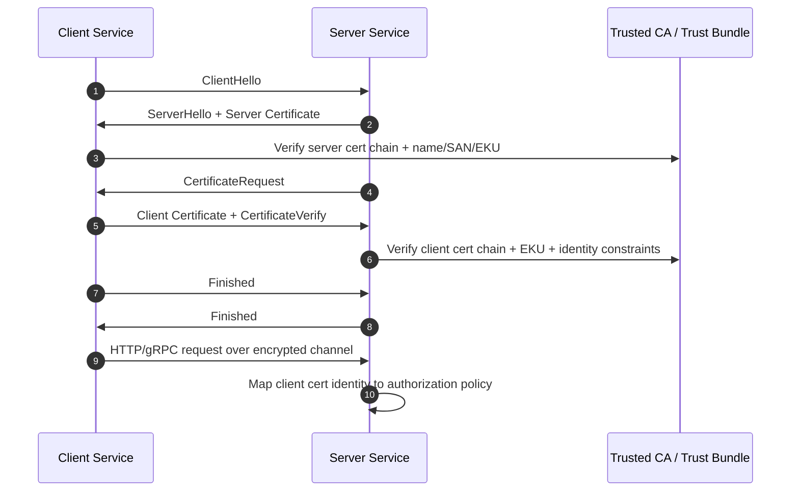

Ada dua tahap yang harus dipisahkan secara mental:

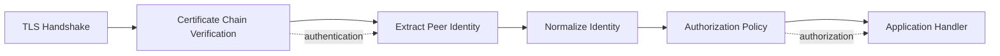

Kesalahan umum adalah menganggap tahap `B` cukup. Padahal tahap `B` hanya menjawab:

> “Certificate ini valid menurut CA yang saya percaya.”

Belum menjawab:

> “Service ini boleh memanggil endpoint ini untuk tenant ini dengan scope ini pada waktu ini.”

---

## 3. Vocabulary Penting

| Istilah | Arti |
|---|---|
| TLS | Protocol untuk channel confidentiality, integrity, dan server authentication |
| mTLS | TLS dengan client certificate authentication juga |
| Client certificate | Certificate yang dipresentasikan client ke server saat handshake |
| Server certificate | Certificate yang dipresentasikan server ke client |
| Trust anchor | Root CA yang dipercaya verifier |
| Trust bundle | Kumpulan CA roots/intermediates yang dipercaya untuk domain tertentu |
| Workload | Unit runtime yang menjalankan service: pod, VM process, container, job, function |
| Workload identity | Identitas cryptographic service/workload, bukan user manusia |
| SPIFFE ID | URI identity seperti `spiffe://prod.example.com/ns/payments/sa/invoice-api` |
| SVID | SPIFFE Verifiable Identity Document; bisa X.509-SVID atau JWT-SVID |
| Trust domain | Boundary administratif untuk penerbitan dan verifikasi identity |
| Attestation | Proses membuktikan bahwa workload layak menerima identity tertentu |
| Rotation | Pergantian certificate/key sebelum expiry atau saat compromise |
| Revocation | Membatalkan credential sebelum expiry |
| Authorization binding | Mapping dari identity ke policy akses |

---

## 4. Java-to-Go Mindset Shift

Sebagai Java engineer, kamu mungkin terbiasa dengan:

- keystore/truststore (`JKS`, `PKCS12`),
- `javax.net.ssl.SSLContext`,
- framework-level TLS configuration,
- app server / gateway yang melakukan TLS termination,
- Spring Security di layer aplikasi.

Di Go, banyak service langsung memegang boundary transport sendiri:

- `http.Server` langsung menerima TLS,
- `tls.Config` langsung menjadi security contract,
- certificate parsing memakai `crypto/x509`,
- custom verification dilakukan dengan callback `VerifyConnection` atau `VerifyPeerCertificate`,
- deployment sering container-native, bukan app-server-native.

Perubahan mental model:

| Java-ish habit | Go security habit |
|---|---|
| Truststore adalah konfigurasi platform | `x509.CertPool` adalah bagian eksplisit dari boundary service |
| TLS sering diatur app server/proxy | TLS bisa menjadi bagian dari binary/service code |
| Framework menyembunyikan banyak detail | `tls.Config` membuat pilihan security terlihat langsung |
| Identity sering `Subject DN` atau CN | Identity modern lebih baik SAN URI/DNS, SPIFFE ID, atau explicit claim |
| Reload cert sering external | Go service harus punya reload strategy jika terminate TLS sendiri |
| Authorization di Spring filter | Go perlu explicit middleware/handler boundary |

Go memberi kontrol tinggi. Kontrol tinggi berarti kesalahan konfigurasi juga lebih mudah menjadi vulnerability.

---

## 5. Authentication vs Authorization: Jangan Dicampur

### 5.1 Authentication di mTLS

Authentication menjawab:

> Peer membuktikan possession private key untuk certificate yang chain-nya dipercaya.

Di Go server, ini biasanya dikonfigurasi lewat:

```go
ClientAuth: tls.RequireAndVerifyClientCert,
ClientCAs:  clientCAPool,
```

### 5.2 Authorization setelah mTLS

Authorization menjawab:

> Identitas peer yang sudah terautentikasi boleh melakukan apa?

Contoh policy:

```text
spiffe://prod.example.com/ns/payment/sa/payment-api
  boleh POST /internal/v1/ledger/entries
  hanya untuk tenant region=sg
  tidak boleh GET /admin/v1/users
```

Dalam handler Go, kamu tetap perlu policy check:

```go
func RequireService(identity string, allowed map[string]bool, next http.Handler) http.Handler {
    return http.HandlerFunc(func(w http.ResponseWriter, r *http.Request) {
        peer := PeerIdentityFromContext(r.Context())
        if peer == "" || !allowed[peer] {
            http.Error(w, "forbidden", http.StatusForbidden)
            return
        }
        next.ServeHTTP(w, r)
    })
}
```

mTLS tanpa authorization sering berubah menjadi:

> “Semua service internal yang punya cert boleh melakukan apa saja.”

Itu bukan zero trust. Itu perimeter trust versi baru.

---

## 6. Identity Placement dalam Certificate

Certificate adalah signed document dengan banyak field. Tidak semua field cocok menjadi service identity.

| Field | Apakah cocok untuk service identity? | Catatan |
|---|---:|---|
| Common Name / CN | Tidak dianjurkan | Legacy. Go hostname verification mengabaikan CN untuk hostname validation |
| Subject DN | Lemah untuk authorization modern | Format kompleks, raw string comparison rapuh |
| SAN DNS | Cocok untuk DNS service identity | Misal `payment-api.prod.svc.cluster.local` |
| SAN IP | Terbatas | IP berubah, buruk untuk dynamic workload |
| SAN URI | Sangat cocok | Cocok untuk SPIFFE ID atau URI identity lain |
| EKU | Constraint penggunaan cert | `ClientAuth` vs `ServerAuth` harus benar |
| KeyUsage | Constraint cryptographic operation | DigitalSignature, KeyEncipherment, dll |
| Serial Number | Tidak cocok sebagai business identity | Cocok untuk audit/revocation reference |
| Issuer | Bagian trust chain | Bisa dipakai untuk trust-domain validation, bukan identity tunggal |
| Fingerprint | Jangan jadikan identity utama | Membuat rotation sulit |

### Rule of thumb

Untuk service identity modern:

1. Pakai **SAN URI** jika memakai SPIFFE atau identity URI.
2. Pakai **SAN DNS** jika identity memang berbasis DNS service name.
3. Jangan pakai CN sebagai identity utama.
4. Jangan pakai certificate fingerprint sebagai policy identity kecuali untuk emergency pinning yang sangat terbatas.
5. Jangan memetakan seluruh CA ke seluruh permission.

---

## 7. Trust Domain

Trust domain adalah boundary administratif tempat identity diterbitkan, diverifikasi, dan dikelola.

Contoh:

```text
spiffe://prod.example.com/ns/payments/sa/payment-api
spiffe://prod.example.com/ns/case/sa/case-api
spiffe://uat.example.com/ns/payments/sa/payment-api
spiffe://dev.example.com/ns/payments/sa/payment-api
```

`prod.example.com`, `uat.example.com`, dan `dev.example.com` sebaiknya diperlakukan sebagai trust domain berbeda.

Mengapa penting?

Karena bug fatal sering terjadi saat trust domain tidak dipisah:

```text
DEV CA trusted by PROD service
  => workload DEV bisa present cert valid ke PROD
  => lateral movement antar environment
```

### Trust domain invariant

```text
A production service MUST NOT trust client workload identities issued by development or test CAs.
```

### Diagram trust domain

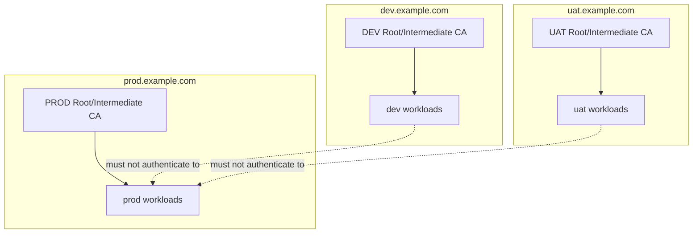

Jika memang ada cross-domain communication, harus eksplisit:

- trust bundle federation,
- policy allowlist,
- separate endpoint,
- audit classification,
- least privilege,
- fail-closed behavior.

---

## 8. SPIFFE/SPIRE Mental Model

SPIFFE adalah specification untuk workload identity. SPIRE adalah reference implementation yang menerbitkan identity berdasarkan attestation.

SPIFFE memperkenalkan:

- **SPIFFE ID**: stable workload identity berbentuk URI.
- **SVID**: document yang membuktikan SPIFFE ID, bisa X.509 certificate atau JWT.
- **Trust domain**: authority boundary.
- **Workload API**: local API tempat workload mengambil SVID dan trust bundle.

Contoh SPIFFE ID:

```text
spiffe://prod.example.com/ns/payments/sa/payment-api
```

Artinya:

```text
trust domain : prod.example.com
namespace    : payments
service acct : payment-api
```

SPIFFE ID bukan harus mengikuti struktur Kubernetes, tetapi di Kubernetes sering dimodelkan dari namespace/service-account.

### 8.1 SPIFFE Flow

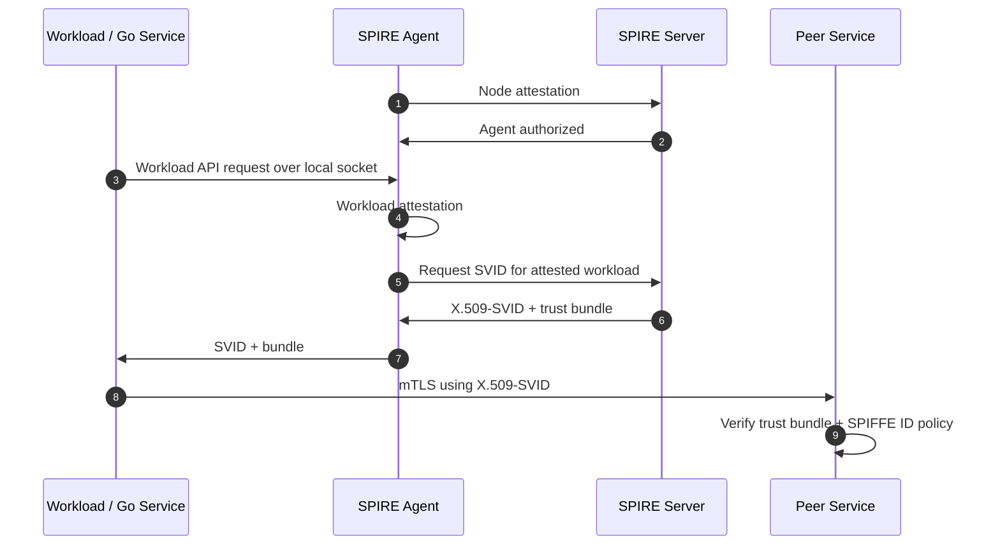

### 8.2 Why SPIFFE matters

Tanpa SPIFFE, service identity sering menjadi campuran:

- DNS name,
- Kubernetes service account,
- certificate subject,
- deployment name,
- namespace,
- IAM role,
- environment variable,
- sidecar metadata,
- manual config.

SPIFFE mencoba memberi satu bahasa identity yang portable:

```text
workload identity = stable URI + cryptographic proof + trust domain
```

### 8.3 Apa yang SPIFFE tidak selesaikan

SPIFFE tidak otomatis menyelesaikan:

- business authorization,
- endpoint-level permission,
- data-level permission,
- request replay,
- compromised workload behavior,
- tenant isolation,
- secrets leakage,
- malicious code dengan identity valid.

SPIFFE memperkuat authentication dan identity portability. Authorization tetap perlu policy.

---

## 9. mTLS Topology Patterns

### 9.1 Application-terminated mTLS

Go service langsung terminate TLS dan memverifikasi client certificate.

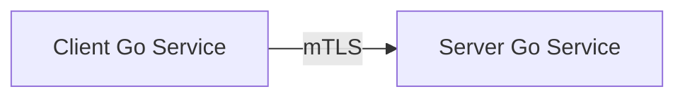

Kelebihan:

- aplikasi melihat certificate peer langsung,
- authorization bisa dekat dengan business handler,
- tidak bergantung penuh pada proxy header,
- cocok untuk internal platform sederhana.

Kekurangan:

- setiap service perlu TLS config/reload yang benar,
- certificate distribution lebih rumit,
- observability TLS tersebar di banyak service,
- language/runtime heterogeneity butuh standar bersama.

### 9.2 Proxy-terminated mTLS

Sidecar/gateway terminate mTLS, aplikasi menerima HTTP biasa atau local TLS.

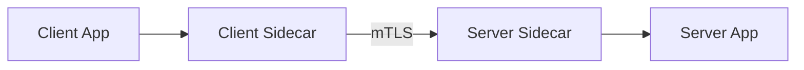

Kelebihan:

- centralized policy,
- automatic cert rotation,
- konsisten lintas bahasa,
- cocok untuk service mesh.

Kekurangan:

- aplikasi bisa kehilangan cryptographic peer context,
- identity biasanya diteruskan via header/metadata,
- header spoofing harus dicegah,
- debugging lebih kompleks,
- boundary antara sidecar dan app harus aman.

### 9.3 Edge mTLS + internal token

mTLS hanya di edge/gateway, lalu internal memakai token.

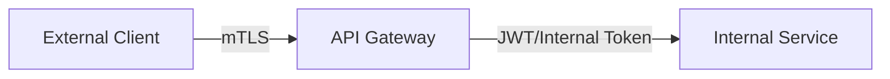

Cocok untuk B2B/API client authentication, tetapi tidak memberi service-to-service mTLS internal kecuali ditambah lagi.

### 9.4 Mesh mTLS + application authorization

Transport security dilakukan mesh, authorization business tetap aplikasi.

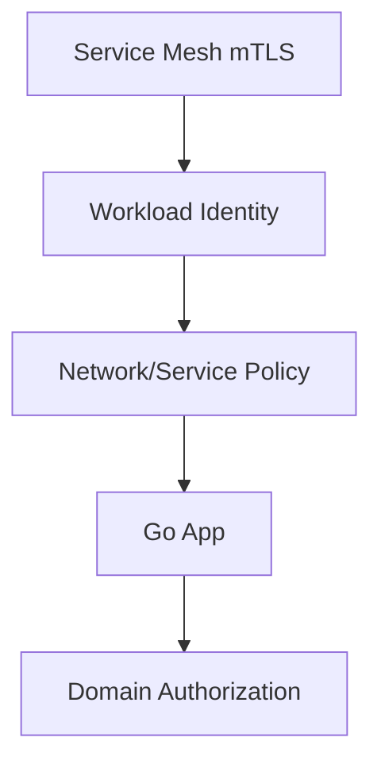

Ini biasanya desain paling realistis untuk organisasi besar: platform menangani transport identity, aplikasi tetap menjaga domain permission.

---

## 10. Go Server mTLS: Baseline Aman

### 10.1 Load CA pool

```go
package mtls

import (
    "crypto/tls"
    "crypto/x509"
    "fmt"
    "os"
)

func loadCertPool(path string) (*x509.CertPool, error) {
    pemBytes, err := os.ReadFile(path)
    if err != nil {
        return nil, fmt.Errorf("read ca bundle: %w", err)
    }

    pool := x509.NewCertPool()
    if ok := pool.AppendCertsFromPEM(pemBytes); !ok {
        return nil, fmt.Errorf("ca bundle contains no valid PEM certificates")
    }
    return pool, nil
}
```

### 10.2 Basic server config

```go
func ServerTLSConfig(serverCert tls.Certificate, clientCAs *x509.CertPool) *tls.Config {
    return &tls.Config{
        MinVersion: tls.VersionTLS12,

        Certificates: []tls.Certificate{serverCert},

        ClientAuth: tls.RequireAndVerifyClientCert,
        ClientCAs:  clientCAs,

        // Let Go choose modern cipher suites/curves unless there is a
        // specific compatibility/compliance reason to override.
    }
}
```

Notes:

1. `RequireAndVerifyClientCert` adalah default aman untuk strict mTLS server.
2. `RequireAnyClientCert` hanya meminta client cert tanpa memverifikasi chain. Itu hampir selalu salah untuk production.
3. `RequestClientCert` hanya meminta tetapi tidak mewajibkan cert.
4. `VerifyClientCertIfGiven` berguna untuk optional mTLS, tetapi sering mempersulit security invariant.

### 10.3 Server dengan timeout

```go
func NewMTLSServer(addr string, handler http.Handler, tlsConfig *tls.Config) *http.Server {
    return &http.Server{
        Addr:              addr,
        Handler:           handler,
        TLSConfig:         tlsConfig,
        ReadHeaderTimeout: 5 * time.Second,
        ReadTimeout:       30 * time.Second,
        WriteTimeout:      30 * time.Second,
        IdleTimeout:       120 * time.Second,
        MaxHeaderBytes:    1 << 20,
    }
}
```

Security point: mTLS handshake tidak menggantikan HTTP resource hardening. Kamu tetap perlu timeout, request limit, body limit, dan cancellation handling.

---

## 11. Go Client mTLS: Baseline Aman

```go
func ClientTLSConfig(clientCert tls.Certificate, rootCAs *x509.CertPool, serverName string) *tls.Config {
    return &tls.Config{
        MinVersion:   tls.VersionTLS12,
        Certificates: []tls.Certificate{clientCert},
        RootCAs:      rootCAs,
        ServerName:   serverName,
    }
}
```

`ServerName` penting karena dipakai untuk hostname verification server certificate. Jangan kosong kecuali kamu benar-benar memakai mekanisme verification lain yang aman.

Client HTTP:

```go
func NewMTLSHTTPClient(tlsConfig *tls.Config) *http.Client {
    transport := &http.Transport{
        TLSClientConfig: tlsConfig,

        Proxy: http.ProxyFromEnvironment,

        MaxIdleConns:        100,
        MaxIdleConnsPerHost: 10,
        IdleConnTimeout:     90 * time.Second,

        TLSHandshakeTimeout:   10 * time.Second,
        ResponseHeaderTimeout: 30 * time.Second,
        ExpectContinueTimeout: 1 * time.Second,
    }

    return &http.Client{
        Transport: transport,
        Timeout:   60 * time.Second,
    }
}
```

Security point: client mTLS tetap perlu timeout. Tanpa timeout, mTLS client bisa menjadi titik DoS internal.

---

## 12. Extract Peer Identity di Server Go

Setelah handshake selesai, server bisa membaca verified peer certificate dari request TLS state.

```go
func PeerCertificate(r *http.Request) (*x509.Certificate, bool) {
    if r.TLS == nil || len(r.TLS.PeerCertificates) == 0 {
        return nil, false
    }
    return r.TLS.PeerCertificates[0], true
}
```

Untuk identity dari SAN URI:

```go
func PeerURIIdentities(cert *x509.Certificate) []string {
    ids := make([]string, 0, len(cert.URIs))
    for _, uri := range cert.URIs {
        if uri != nil {
            ids = append(ids, uri.String())
        }
    }
    return ids
}
```

Untuk SPIFFE ID validation minimal:

```go
func SingleSPIFFEID(cert *x509.Certificate, expectedTrustDomain string) (string, error) {
    var ids []string
    for _, uri := range cert.URIs {
        if uri == nil || uri.Scheme != "spiffe" {
            continue
        }
        if uri.Host != expectedTrustDomain {
            continue
        }
        ids = append(ids, uri.String())
    }

    if len(ids) != 1 {
        return "", fmt.Errorf("expected exactly one SPIFFE URI in trust domain %q, got %d", expectedTrustDomain, len(ids))
    }
    return ids[0], nil
}
```

Important invariant:

```text
A server MUST NOT accept multiple ambiguous workload identities in one client certificate.
```

Jika certificate punya beberapa SAN URI yang cocok, policy engine bisa salah memilih identity.

---

## 13. Binding Peer Identity ke Request Context

Pattern bagus: extract identity sekali di middleware setelah TLS verification, lalu pass via context.

```go
type peerIdentityKey struct{}

type PeerIdentity struct {
    ID           string
    TrustDomain  string
    SerialNumber string
    NotAfter     time.Time
}

func WithPeerIdentity(ctx context.Context, id PeerIdentity) context.Context {
    return context.WithValue(ctx, peerIdentityKey{}, id)
}

func GetPeerIdentity(ctx context.Context) (PeerIdentity, bool) {
    v, ok := ctx.Value(peerIdentityKey{}).(PeerIdentity)
    return v, ok
}
```

Middleware:

```go
func PeerIdentityMiddleware(expectedTrustDomain string, next http.Handler) http.Handler {
    return http.HandlerFunc(func(w http.ResponseWriter, r *http.Request) {
        cert, ok := PeerCertificate(r)
        if !ok {
            http.Error(w, "client certificate required", http.StatusUnauthorized)
            return
        }

        spiffeID, err := SingleSPIFFEID(cert, expectedTrustDomain)
        if err != nil {
            http.Error(w, "invalid client identity", http.StatusForbidden)
            return
        }

        peer := PeerIdentity{
            ID:           spiffeID,
            TrustDomain:  expectedTrustDomain,
            SerialNumber: cert.SerialNumber.String(),
            NotAfter:     cert.NotAfter,
        }

        next.ServeHTTP(w, r.WithContext(WithPeerIdentity(r.Context(), peer)))
    })
}
```

Do not:

- store full certificate PEM in context,
- log raw certificate by default,
- trust user-provided identity headers,
- parse CN as identity fallback,
- let handler choose between multiple identity sources.

---

## 14. Authorization Policy Pattern

### 14.1 Static allowlist for small systems

```go
type Authorizer struct {
    allowed map[string]map[string]bool // identity -> action -> allowed
}

func (a *Authorizer) Allow(identity, action string) bool {
    actions := a.allowed[identity]
    return actions != nil && actions[action]
}
```

Example:

```go
authz := &Authorizer{allowed: map[string]map[string]bool{
    "spiffe://prod.example.com/ns/payment/sa/payment-api": {
        "ledger.entries.create": true,
    },
}}
```

### 14.2 Route-level middleware

```go
func RequireAction(action string, authz *Authorizer, next http.Handler) http.Handler {
    return http.HandlerFunc(func(w http.ResponseWriter, r *http.Request) {
        peer, ok := GetPeerIdentity(r.Context())
        if !ok {
            http.Error(w, "unauthenticated peer", http.StatusUnauthorized)
            return
        }
        if !authz.Allow(peer.ID, action) {
            http.Error(w, "forbidden", http.StatusForbidden)
            return
        }
        next.ServeHTTP(w, r)
    })
}
```

### 14.3 Policy should be action-based, not endpoint-string-only

Poor:

```text
payment-api may call /api/v1/ledger
```

Better:

```text
payment-api may create ledger entries for payment settlement flow
```

Why?

Endpoint paths change. Business actions survive refactoring.

---

## 15. mTLS and User Identity: Jangan Dicampur

mTLS service identity dan user identity berbeda.

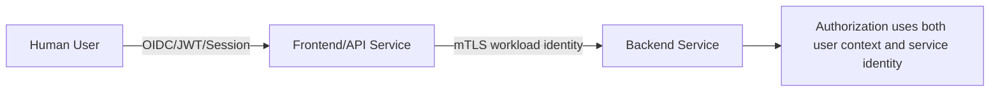

A backend request bisa membawa dua identity:

| Identity | Contoh | Digunakan untuk |
|---|---|---|
| Workload identity | `spiffe://prod.example.com/ns/api/sa/frontend` | Service-to-service authentication |
| User identity | `sub=12345`, `roles=case_officer` | Business authorization |
| Delegation context | `on_behalf_of=sub=12345` | Audit dan constrained delegation |

Dangerous design:

```text
If service A is mTLS-authenticated, then trust any user header it sends.
```

Lebih aman:

1. Service A harus terotorisasi sebagai caller.
2. User token/session harus diverifikasi atau ditransformasikan menjadi internal token yang ditandatangani.
3. Backend harus tahu apakah request adalah system action atau user-delegated action.
4. Audit harus mencatat keduanya.

---

## 16. Optional mTLS: Hampir Selalu Kompleks

Optional mTLS berarti endpoint bisa menerima client dengan cert dan tanpa cert.

Di Go, ini bisa terlihat seperti:

```go
ClientAuth: tls.VerifyClientCertIfGiven,
```

Risikonya:

- handler lupa membedakan request authenticated vs unauthenticated,
- authorization bypass karena fallback path,
- identity ambiguity,
- test coverage sulit,
- observability membingungkan.

Jika perlu optional mTLS, pisahkan endpoint:

```text
/public/*       => no client cert, app auth required
/internal/*     => strict mTLS required
/partner/*      => partner mTLS + partner policy
```

Atau pisahkan listener/port/ingress.

Security invariant:

```text
A handler that requires workload identity MUST NOT be reachable through a TLS configuration that permits missing or unverified client certificates.
```

---

## 17. `VerifyPeerCertificate` vs `VerifyConnection`

Go menyediakan callback untuk custom verification.

### 17.1 `VerifyPeerCertificate`

Dipanggil setelah normal certificate verification, kecuali normal verification dinonaktifkan atau tidak berjalan tergantung konfigurasi. Callback ini menerima raw certs dan verified chains.

Risiko:

- developer mengaktifkan `InsecureSkipVerify` lalu mencoba mengganti seluruh verification manual,
- hostname/EKU/chain verification terlewat,
- session resumption semantics membingungkan,
- raw certificate parsing salah.

### 17.2 `VerifyConnection`

Lebih baik untuk policy tambahan setelah normal verification karena menerima `tls.ConnectionState`.

Pattern:

```go
func ServerTLSConfigWithPeerPolicy(serverCert tls.Certificate, clientCAs *x509.CertPool, trustDomain string) *tls.Config {
    return &tls.Config{
        MinVersion:   tls.VersionTLS12,
        Certificates: []tls.Certificate{serverCert},
        ClientAuth:   tls.RequireAndVerifyClientCert,
        ClientCAs:    clientCAs,
        VerifyConnection: func(cs tls.ConnectionState) error {
            if len(cs.PeerCertificates) == 0 {
                return fmt.Errorf("missing client certificate")
            }
            cert := cs.PeerCertificates[0]
            _, err := SingleSPIFFEID(cert, trustDomain)
            if err != nil {
                return fmt.Errorf("invalid SPIFFE identity: %w", err)
            }
            return nil
        },
    }
}
```

Important:

- Jangan pakai callback untuk melemahkan verification.
- Pakai callback untuk **menambah** constraint.
- Fail closed.
- Test certificate dengan SAN/EKU/trust-domain salah.

---

## 18. Certificate Rotation

mTLS production gagal bukan hanya karena verification salah, tetapi karena rotation tidak dirancang.

### 18.1 Rotation phases

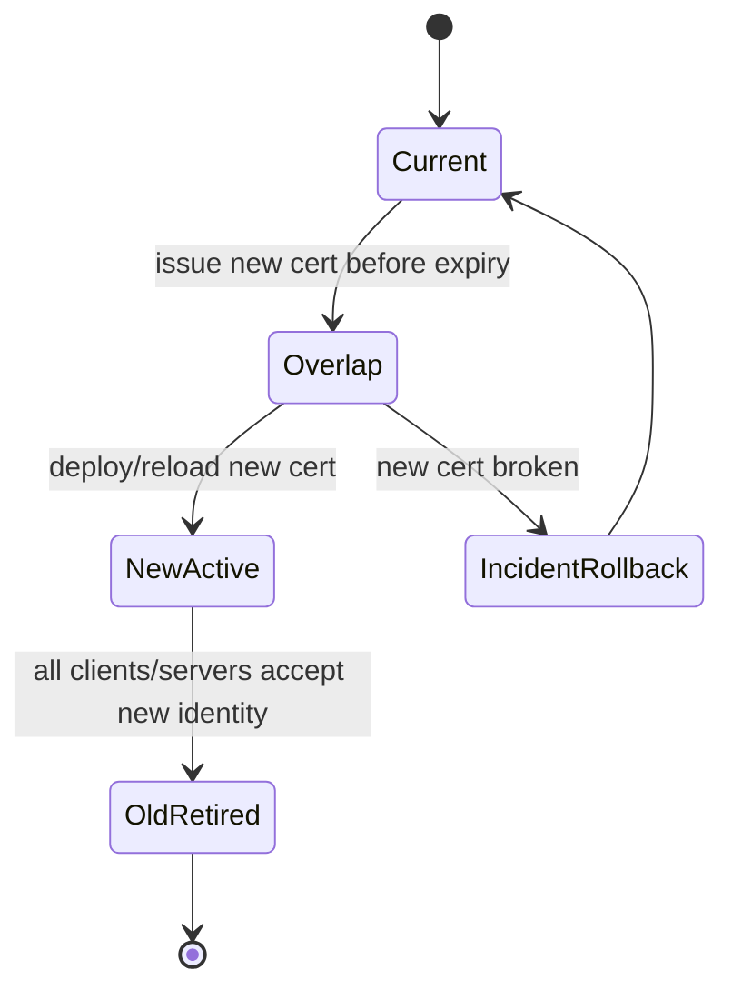

### 18.2 Rotation invariants

```text
New certificate MUST be deployed before old certificate expires.
Verifier trust bundle MUST include issuer chain for both old and new certificates during overlap.
Private key compromise MUST trigger emergency rotation, not normal rotation.
Certificate reload MUST not require full service outage unless explicitly accepted.
```

### 18.3 Avoid fingerprint pinning

If policy says:

```text
allow certificate fingerprint abc123
```

rotation becomes policy change. This is fragile.

Better:

```text
allow SPIFFE ID spiffe://prod.example.com/ns/payment/sa/payment-api
issued by prod trust bundle
with ClientAuth EKU
```

Identity remains stable while key/cert rotates.

### 18.4 Server certificate reload in Go

A common pattern is `GetCertificate` reading from an atomic value.

```go
type CertificateReloader struct {
    cert atomic.Value // stores *tls.Certificate
}

func NewCertificateReloader(initial tls.Certificate) *CertificateReloader {
    r := &CertificateReloader{}
    r.cert.Store(&initial)
    return r
}

func (r *CertificateReloader) GetCertificate(*tls.ClientHelloInfo) (*tls.Certificate, error) {
    cert, ok := r.cert.Load().(*tls.Certificate)
    if !ok || cert == nil {
        return nil, fmt.Errorf("server certificate not loaded")
    }
    return cert, nil
}

func (r *CertificateReloader) Reload(certFile, keyFile string) error {
    cert, err := tls.LoadX509KeyPair(certFile, keyFile)
    if err != nil {
        return fmt.Errorf("load key pair: %w", err)
    }
    r.cert.Store(&cert)
    return nil
}
```

TLS config:

```go
reloader := NewCertificateReloader(initialCert)

cfg := &tls.Config{
    MinVersion:     tls.VersionTLS12,
    GetCertificate: reloader.GetCertificate,
    ClientAuth:     tls.RequireAndVerifyClientCert,
    ClientCAs:      clientCAs,
}
```

### 18.5 Client certificate reload

For client certs, use `GetClientCertificate`.

```go
type ClientCertificateReloader struct {
    cert atomic.Value // stores *tls.Certificate
}

func (r *ClientCertificateReloader) GetClientCertificate(*tls.CertificateRequestInfo) (*tls.Certificate, error) {
    cert, ok := r.cert.Load().(*tls.Certificate)
    if !ok || cert == nil {
        return nil, fmt.Errorf("client certificate not loaded")
    }
    return cert, nil
}
```

Client config:

```go
cfg := &tls.Config{
    MinVersion:            tls.VersionTLS12,
    RootCAs:               rootCAs,
    ServerName:            "ledger-api.prod.svc.example.com",
    GetClientCertificate:  clientReloader.GetClientCertificate,
}
```

Important: existing keep-alive connections may continue using old TLS session. Rotation strategy must consider connection lifetime.

---

## 19. Trust Bundle Reload

Rotating certs often requires rotating trust bundle too.

Bad:

```text
Root CA file updated on disk, but Go process still uses old CertPool forever.
```

`x509.CertPool` is not automatically reloaded from disk. If your service loads it at startup, changes on disk do nothing until reload/restart.

Pattern:

```go
type TrustBundle struct {
    pool atomic.Value // stores *x509.CertPool
}

func (t *TrustBundle) Current() *x509.CertPool {
    pool, _ := t.pool.Load().(*x509.CertPool)
    return pool
}

func (t *TrustBundle) Reload(path string) error {
    pool, err := loadCertPool(path)
    if err != nil {
        return err
    }
    t.pool.Store(pool)
    return nil
}
```

But `tls.Config.ClientCAs` is read by TLS handshake. To dynamically pick CA pool, use `GetConfigForClient` for server-side advanced config.

```go
func DynamicServerTLSConfig(certReloader *CertificateReloader, bundle *TrustBundle) *tls.Config {
    base := &tls.Config{
        MinVersion:     tls.VersionTLS12,
        GetCertificate: certReloader.GetCertificate,
        ClientAuth:     tls.RequireAndVerifyClientCert,
    }

    base.GetConfigForClient = func(*tls.ClientHelloInfo) (*tls.Config, error) {
        cfg := base.Clone()
        cfg.ClientCAs = bundle.Current()
        return cfg, nil
    }

    return base
}
```

Caution: cloning config per handshake has cost. In high-throughput systems, use prebuilt configs and swap atomically.

---

## 20. Revocation Reality

Certificate revocation is harder than many teams assume.

Options:

| Mechanism | Strength | Problem |
|---|---|---|
| Short-lived certs | Practical and common | Requires reliable renewal |
| CRL | Traditional | Distribution/cache latency |
| OCSP | Common public web | Availability/privacy/cache complexity |
| mTLS policy denylist | Fast app/platform control | Must be consistently enforced |
| CA compromise rotation | Strong but disruptive | Requires trust bundle migration |
| SPIRE re-attestation | Modern workload approach | Requires platform maturity |

For internal mTLS, many systems prefer:

```text
short-lived certificate + automated rotation + policy denylist + fast trust bundle update
```

rather than relying only on CRL/OCSP.

### Revocation invariant

```text
Compromised workload identity MUST be denyable before its certificate naturally expires.
```

If cert lifetime is 24h and there is no denylist/policy revocation, compromise window is at least 24h.

---

## 21. Service Mesh and Header Propagation Risk

If mTLS is terminated by sidecar/proxy, the app may receive identity via header:

```http
x-forwarded-client-cert: ...
x-spiffe-id: spiffe://prod.example.com/ns/payment/sa/payment-api
```

Risk:

```text
External or internal caller sends fake x-spiffe-id header directly to app.
```

Mitigations:

1. App must only accept identity header from trusted local proxy path.
2. Direct network access to app port must be blocked.
3. Proxy must strip inbound identity headers before adding trusted ones.
4. App should know whether identity came from TLS state or trusted proxy context.
5. Prefer local Unix socket or loopback-only app port when possible.

Diagram:

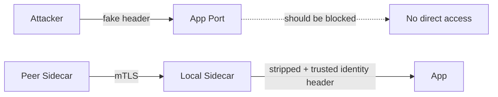

Security invariant:

```text
A service MUST NOT trust caller identity headers unless they are injected by a trusted local proxy over a protected local channel and all external caller-supplied identity headers are stripped.
```

---

## 22. mTLS with gRPC

gRPC in Go uses HTTP/2 over TLS.

Server credentials example:

```go
creds := credentials.NewTLS(&tls.Config{
    MinVersion:   tls.VersionTLS12,
    Certificates: []tls.Certificate{serverCert},
    ClientAuth:   tls.RequireAndVerifyClientCert,
    ClientCAs:    clientCAs,
})

server := grpc.NewServer(grpc.Creds(creds))
```

Client:

```go
creds := credentials.NewTLS(&tls.Config{
    MinVersion:   tls.VersionTLS12,
    RootCAs:      rootCAs,
    ServerName:   "ledger-api.prod.svc.example.com",
    Certificates: []tls.Certificate{clientCert},
})

conn, err := grpc.DialContext(ctx, target, grpc.WithTransportCredentials(creds))
```

Authorization should be implemented using interceptor:

```go
func UnaryAuthzInterceptor(authz *Authorizer) grpc.UnaryServerInterceptor {
    return func(ctx context.Context, req any, info *grpc.UnaryServerInfo, handler grpc.UnaryHandler) (any, error) {
        p, ok := peer.FromContext(ctx)
        if !ok {
            return nil, status.Error(codes.Unauthenticated, "missing peer")
        }

        tlsInfo, ok := p.AuthInfo.(credentials.TLSInfo)
        if !ok || len(tlsInfo.State.PeerCertificates) == 0 {
            return nil, status.Error(codes.Unauthenticated, "missing client certificate")
        }

        cert := tlsInfo.State.PeerCertificates[0]
        spiffeID, err := SingleSPIFFEID(cert, "prod.example.com")
        if err != nil {
            return nil, status.Error(codes.PermissionDenied, "invalid peer identity")
        }

        if !authz.Allow(spiffeID, info.FullMethod) {
            return nil, status.Error(codes.PermissionDenied, "forbidden")
        }

        return handler(ctx, req)
    }
}
```

Do not rely only on network-level allowlist for sensitive gRPC methods. Use method-level policy.

---

## 23. mTLS with Kubernetes

Kubernetes adds several identity and certificate distribution choices.

### 23.1 Common patterns

| Pattern | Description | Risk |
|---|---|---|
| Kubernetes Secret with TLS cert/key | Simple static cert distribution | Rotation/reload manual unless automated |
| cert-manager | Automated cert issuance/renewal | Need trust-domain/policy design |
| SPIRE agent | Workload attestation + SVID | Requires platform setup |
| Service mesh | Sidecar-managed mTLS | App identity propagation must be controlled |
| Projected volumes | Runtime injection of secret/config/token/cert-like material | App must handle update semantics |

### 23.2 Secret volume update caveat

Mounted Kubernetes Secrets can update on disk, but Go process must reload the file. TLS config loaded at startup will not magically update.

### 23.3 Pod identity is not automatically workload identity

Kubernetes has service accounts, namespaces, labels, pod names, and service names. These are useful attestation inputs, but not cryptographic proof by themselves unless bound into a verifiable credential.

Poor policy:

```text
If header says namespace=payment, allow.
```

Better:

```text
If client presents X.509-SVID spiffe://prod.example.com/ns/payment/sa/payment-api, issued by prod trust bundle, then allow action ledger.entries.create.
```

---

## 24. Trust Boundary Placement

Where should mTLS terminate?

Decision matrix:

| Choice | Use when | Avoid when |
|---|---|---|
| App terminates mTLS | Small/mid systems, app needs peer cert directly, no mesh | Large polyglot estate without common library |
| Sidecar terminates mTLS | Platform standardization, service mesh, many languages | App must independently verify peer cert for legal/audit reason |
| Gateway terminates mTLS | Partner/client authentication, central ingress | Internal service-to-service identity is also required |
| Library-based mTLS | Strong app control, shared Go framework | Teams may fork/copy config inconsistently |

Core question:

```text
Who is the policy enforcement point?
```

If enforcement is in proxy, app must not assume direct TLS state. If enforcement is in app, proxy must not remove the signal the app needs.

---

## 25. Zero Trust Service Identity

NIST SP 800-207 defines zero trust as an architecture that assumes no implicit trust based only on network location. In service-to-service design, this translates to:

```text
Do not trust a caller only because it is inside the VPC, cluster, subnet, namespace, or private network.
```

mTLS supports zero trust by giving each workload a verifiable identity.

But zero trust needs more:

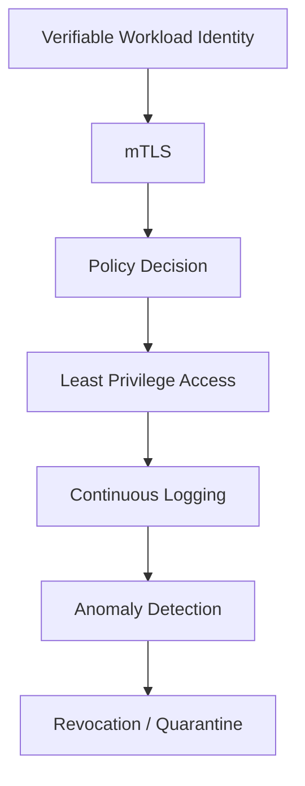

Zero trust service-to-service invariants:

1. Every sensitive service call is authenticated.
2. Authentication is cryptographic, not just network-based.
3. Authorization is evaluated close to the resource.
4. Policy is least privilege.
5. Identity is short-lived and rotated.
6. Deny/revoke path exists.
7. Audit can answer who called what, when, from where, and under which identity.

---

## 26. Common Anti-Patterns

### 26.1 `InsecureSkipVerify: true`

```go
&tls.Config{InsecureSkipVerify: true}
```

This disables normal server certificate verification. It is almost always a critical flaw.

Acceptable only in tightly controlled test code or when replacing verification fully and correctly via `VerifyConnection` with explicit chain/name validation. In production app code, assume this is a bug until proven otherwise.

### 26.2 `RequireAnyClientCert`

```go
ClientAuth: tls.RequireAnyClientCert
```

This requires a client cert but does not verify it against trusted CA. An attacker can present any self-signed certificate.

### 26.3 CN-based identity

```go
identity := cert.Subject.CommonName
```

Common Name is legacy and ambiguous. Prefer SAN URI/DNS.

### 26.4 Trusting all internal CAs

```text
ClientCAs = corporate-root-bundle-with-many-unrelated-CAs
```

This can allow unrelated internal certs to authenticate to sensitive service.

Prefer service trust bundle scoped to the intended trust domain.

### 26.5 Certificate fingerprint as long-term identity

Breaks rotation and leads to outage-prone security.

### 26.6 Long-lived workload certs

A 1-year service certificate means a stolen key is useful for too long unless revocation is reliable.

### 26.7 No authorization after handshake

```text
if TLS client cert valid => allow all internal APIs
```

This is perimeter trust wearing mTLS clothes.

### 26.8 Missing EKU validation

Client certs should be valid for client authentication. Server certs should be valid for server authentication.

### 26.9 Direct app port reachable behind sidecar

If app trusts proxy-injected identity headers, direct access to app port can become full bypass.

### 26.10 Logging too much certificate data

Avoid logging full subject, SAN list, PEM, or internal topology unless needed. Log normalized identity, serial, issuer fingerprint/key ID, and verification outcome.

---

## 27. Failure Modes and Incident Thinking

### 27.1 Expired cert outage

Symptoms:

- sudden spike TLS handshake failures,
- `certificate has expired or is not yet valid`,
- one service cannot call another,
- retry storm amplifies outage.

Controls:

- expiry metrics,
- alert before 30/14/7/3/1 days,
- automated renewal,
- reload test,
- failover cert path.

### 27.2 Wrong trust bundle

Symptoms:

- cert valid in one environment but rejected in another,
- only some pods fail,
- deployment order causes partial outage.

Controls:

- trust bundle versioning,
- overlap window,
- canary verification,
- environment CA separation,
- config checksum metrics.

### 27.3 Compromised workload key

Actions:

1. Identify affected identity and serial.
2. Disable/deny policy for identity if possible.
3. Rotate key/cert.
4. Reduce certificate lifetime if too long.
5. Audit calls made by identity during compromise window.
6. Check lateral movement paths.
7. Reissue trust bundle if CA/key compromised.

### 27.4 CA compromise

This is severe. Workload certificate rotation is insufficient if issuer is compromised.

Actions:

- introduce new CA,
- update trust bundles with overlap carefully,
- reissue all workload certs,
- revoke/remove old CA,
- check unauthorized cert issuance,
- review CA access and signing logs.

---

## 28. Observability for mTLS

Do not log secrets or full certs. Log structured facts.

Recommended fields:

```json
{
  "event": "mtls_peer_authenticated",
  "peer_identity": "spiffe://prod.example.com/ns/payment/sa/payment-api",
  "trust_domain": "prod.example.com",
  "cert_serial": "1234567890",
  "cert_not_after": "2026-06-25T10:00:00Z",
  "tls_version": "tls13",
  "cipher_suite": "TLS_AES_128_GCM_SHA256",
  "server_name": "ledger-api.prod.svc.example.com",
  "authz_action": "ledger.entries.create",
  "authz_result": "allow"
}
```

Metrics:

| Metric | Meaning |
|---|---|
| `mtls_handshake_total{result}` | Success/failure count |
| `mtls_authz_total{action,result}` | Authorization decisions |
| `mtls_cert_expiry_seconds{identity}` | Seconds until cert expiry |
| `mtls_trust_bundle_version` | Current trust bundle version |
| `mtls_unknown_identity_total` | Cert valid but identity not mapped |
| `mtls_wrong_trust_domain_total` | Cross-domain attempt |
| `mtls_missing_client_cert_total` | Requests without client cert |
| `mtls_reload_total{component,result}` | Cert/bundle reload outcome |

Alert examples:

```text
cert_expiry_seconds < 72h for production identity
wrong_trust_domain_total > 0
unknown_identity_total spike
handshake_failure_total spike after deployment
reload_failure_total > 0
```

---

## 29. Testing Strategy

### 29.1 Unit tests

Test extraction and policy logic:

- no peer cert,
- no SAN URI,
- multiple SAN URIs,
- wrong trust domain,
- valid SPIFFE ID,
- unknown but valid identity,
- expired cert if custom verify used,
- wrong EKU,
- wrong issuer.

### 29.2 Integration tests

Use local CA and generated certs.

Scenarios:

| Scenario | Expected |
|---|---|
| valid client cert | 200/allowed if policy allows |
| valid cert but unauthorized identity | 403 |
| cert signed by wrong CA | TLS handshake fail |
| missing client cert | TLS handshake fail or 401 depending config |
| expired client cert | TLS handshake fail |
| wrong EKU | TLS handshake fail |
| wrong server name | client fails |
| rotated cert with same identity | success |
| old trust bundle after CA rotation | controlled failure/canary catch |

### 29.3 Fuzz tests

Fuzz identity parser, not TLS itself.

```go
func FuzzSingleSPIFFEID(f *testing.F) {
    f.Add("spiffe://prod.example.com/ns/payment/sa/payment-api")
    f.Add("http://prod.example.com/not-spiffe")
    f.Add("spiffe://dev.example.com/ns/payment/sa/payment-api")

    f.Fuzz(func(t *testing.T, raw string) {
        u, err := url.Parse(raw)
        if err != nil {
            return
        }
        cert := &x509.Certificate{URIs: []*url.URL{u}}
        _, _ = SingleSPIFFEID(cert, "prod.example.com")
    })
}
```

Goal: parser must not panic, must reject ambiguous/malformed identities, and must not accidentally accept wrong trust domain.

---

## 30. Production Readiness Checklist

### 30.1 TLS configuration

- [ ] Server uses `tls.RequireAndVerifyClientCert` for strict internal mTLS.
- [ ] Client verifies server certificate and name.
- [ ] `InsecureSkipVerify` is not used in production.
- [ ] `RequireAnyClientCert` is not used for production authentication.
- [ ] TLS minimum version is explicit if organizational baseline requires it.
- [ ] Defaults are not weakened with legacy cipher suites.
- [ ] HTTP server/client timeouts are configured.

### 30.2 Identity

- [ ] Identity comes from SAN URI or SAN DNS, not CN.
- [ ] Exactly one canonical workload identity is accepted.
- [ ] Trust domain is validated.
- [ ] Environment CAs are separated.
- [ ] DEV/UAT CA is not trusted by PROD services.
- [ ] Identity is stable across certificate rotation.

### 30.3 Authorization

- [ ] Certificate authentication is followed by explicit authorization.
- [ ] Authorization is action/resource based.
- [ ] Unknown valid identity fails closed.
- [ ] Cross-domain identity requires explicit policy.
- [ ] System identity and user identity are not conflated.
- [ ] Audit records both workload and user/delegation context where applicable.

### 30.4 Rotation and revocation

- [ ] Certificates are short-lived enough for compromise assumptions.
- [ ] Automated renewal exists.
- [ ] Application reloads certs/trust bundles without unsafe manual steps.
- [ ] Expiry metrics and alerts exist.
- [ ] Emergency deny/revoke path exists.
- [ ] CA rotation plan is documented and tested.

### 30.5 Platform boundary

- [ ] If mesh/proxy terminates mTLS, direct app port is not reachable.
- [ ] Identity headers are stripped and re-injected by trusted proxy only.
- [ ] App knows whether identity source is TLS state or trusted proxy metadata.
- [ ] Network policies support, not replace, cryptographic identity.

### 30.6 Operations

- [ ] Handshake failures are observable.
- [ ] Unknown identity attempts are observable.
- [ ] Wrong trust domain attempts are observable.
- [ ] Trust bundle version is observable.
- [ ] Cert serial and expiry are logged safely.
- [ ] Incident runbook exists for expired cert, key compromise, and CA compromise.

---

## 31. Design Review Template

Use this before implementing mTLS between services.

```markdown
# mTLS Design Review

## 1. Services

- Caller service:
- Callee service:
- Protocol: HTTP / gRPC / custom TCP
- Environment: DEV / UAT / PROD
- Criticality:

## 2. Trust Boundary

- Where does TLS terminate?
- Does application see peer certificate directly?
- Is there a sidecar/gateway/proxy?
- Is direct app port reachable?

## 3. Identity

- Identity format: SAN URI / SAN DNS / SPIFFE ID / other
- Example caller identity:
- Example callee identity:
- Trust domain:
- Issuer CA:
- EKU required:

## 4. Authentication

- Server cert verification:
- Client cert verification:
- CA bundle source:
- How is trust bundle updated?

## 5. Authorization

- What actions may caller perform?
- Where is policy enforced?
- What happens for unknown but valid cert?
- What happens for wrong trust domain?

## 6. Rotation

- Certificate lifetime:
- Renewal mechanism:
- Reload mechanism:
- Overlap window:
- Expiry alert:

## 7. Revocation / Incident

- How to block compromised identity?
- How to rotate compromised key?
- How to rotate CA?
- Audit query for past calls:

## 8. Testing

- Valid cert test:
- Missing cert test:
- Wrong CA test:
- Wrong EKU test:
- Wrong trust domain test:
- Rotation test:

## 9. Decision

- Approved / rejected / conditional
- Conditions:
```

---

## 32. Capstone: Secure Internal Go Service with mTLS

### 32.1 Desired invariant

```text
Only workload identity spiffe://prod.example.com/ns/payment/sa/payment-api may call ledger.entries.create on ledger-api over mTLS in production.
```

### 32.2 Security design

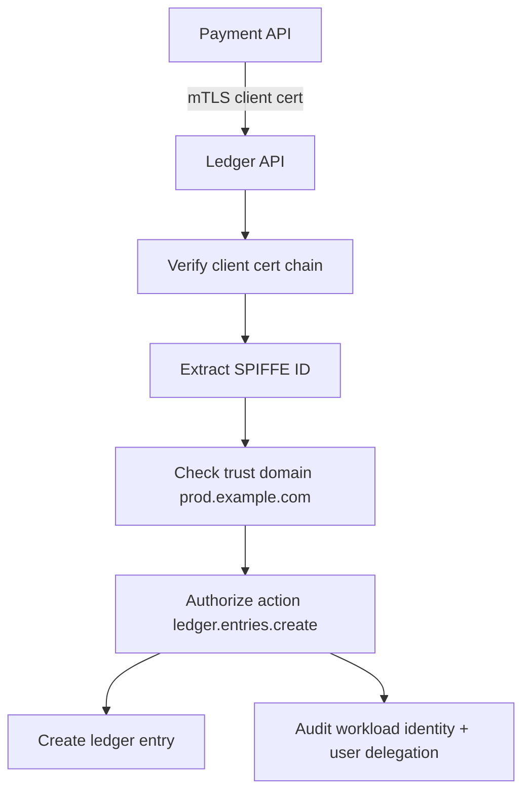

### 32.3 Minimal route structure

```go
mux := http.NewServeMux()

createLedgerEntry := http.HandlerFunc(func(w http.ResponseWriter, r *http.Request) {
    peer, _ := GetPeerIdentity(r.Context())

    // Business handler still validates request body, idempotency key,
    // tenant boundary, and domain-specific authorization.
    _ = peer

    w.WriteHeader(http.StatusCreated)
})

handler := PeerIdentityMiddleware(
    "prod.example.com",
    RequireAction("ledger.entries.create", authz, createLedgerEntry),
)

mux.Handle("POST /internal/v1/ledger/entries", handler)
```

### 32.4 Important limitation

This is not enough by itself. The handler must still enforce:

- request schema validation,
- idempotency/replay safety,
- tenant isolation,
- business authorization,
- audit logging,
- rate/resource limit,
- error handling that does not leak internals.

mTLS proves **which workload called**. It does not prove **the request is semantically safe**.

---

## 33. Summary Mental Model

mTLS should be understood as:

```text
cryptographic workload authentication + encrypted transport + input to authorization policy
```

Not as:

```text
internal network is safe now
```

The strongest production model usually has:

1. short-lived workload certificates,
2. automated issuance/rotation,
3. explicit trust domain,
4. identity in SAN URI/SPIFFE ID,
5. strict chain/EKU validation,
6. app or proxy authorization policy,
7. separation of workload identity and user identity,
8. safe cert/trust bundle reload,
9. observability and revocation path,
10. tested failure modes.

---

## 34. References

- Go `crypto/tls` package documentation: https://pkg.go.dev/crypto/tls
- Go `crypto/x509` package documentation: https://pkg.go.dev/crypto/x509
- SPIFFE Concepts: https://spiffe.io/docs/latest/spiffe-about/spiffe-concepts/
- SPIRE Concepts: https://spiffe.io/docs/latest/spire-about/spire-concepts/
- SPIFFE project overview: https://spiffe.io/
- NIST SP 800-207 Zero Trust Architecture: https://csrc.nist.gov/pubs/sp/800/207/final
- Kubernetes Secrets documentation: https://kubernetes.io/docs/concepts/configuration/secret/
- Kubernetes Projected Volumes documentation: https://kubernetes.io/docs/concepts/storage/projected-volumes/
- Kubernetes Certificate Signing Requests documentation: https://kubernetes.io/docs/reference/access-authn-authz/certificate-signing-requests/

---

## 35. Lanjut ke Part Berikutnya

Part berikutnya:

```text
learn-go-security-cryptography-integrity-part-016.md
```

Topik:

```text
OAuth2, OIDC, JWT, JWS, JWE, opaque token, introspection, token binding, audience, issuer, key rotation, JWKS caching, and replay prevention.
```

Status seri:

```text
[done] part-000
[done] part-001
[done] part-002
[done] part-003
[done] part-004
[done] part-005
[done] part-006
[done] part-007
[done] part-008
[done] part-009
[done] part-010
[done] part-011
[done] part-012
[done] part-013
[done] part-014
[done] part-015
[next] part-016
[remaining] part-017 sampai part-034
```

<!-- NAVIGATION_FOOTER -->
<div class="page-nav">
<a href="./learn-go-security-cryptography-integrity-part-014.md">⬅️ Part 014 — TLS in Go: `crypto/tls`, TLS 1.2/1.3, Cipher Suites, Curves, ALPN, Session Resumption, Certificate Reload, Safe Defaults, and Hardening</a>
<a href="./index.md">📚 Kategori</a>
<a href="../../index.md">🏠 Home</a>
<a href="./learn-go-security-cryptography-integrity-part-016.md">Part 016 — OAuth2, OIDC, JWT, JWS, JWE, Opaque Token, Introspection, JWKS Caching, and Replay Prevention in Go ➡️</a>
</div>
